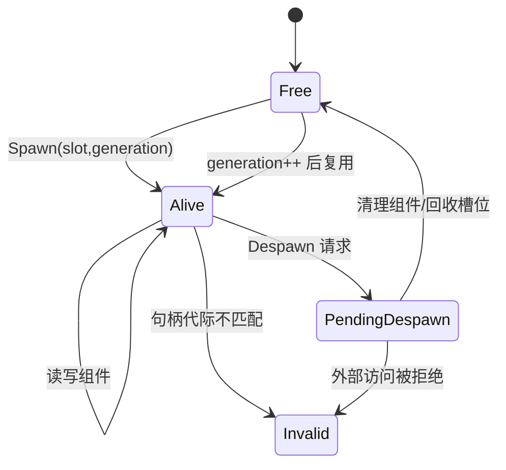

# 03-Entity生命周期与组件模型

> 知识基线：实时服务器的实体（Entity）ID 设计、Spawn/Despawn 生命周期、组件归属、实体池与悬垂防护；UE 对照以 AActor/UObject 生命周期为参照（详见 [游戏知识/01-引擎基础](../../../游戏知识/01-引擎基础/README.md)）。
> 版本基准：本层为通用服务器设计；UE5.8 的 Actor 生命周期差异见 3.7。
> 适用范围：MMO/实时服务器实体管理；与 [01-ServerMainLoop与TickScheduler](../运行调度与过载保护/01-ServerMainLoop与TickScheduler.md) 的 Tick 边界、[05-AOI与InterestManagement](../状态复制与兴趣管理/05-AOI与InterestManagement.md) 的登记/注销配合。
> 官方参考：[cppreference - std::pmr/内存与容器](https://en.cppreference.com/w/cpp/memory)、[UE5.8 Actor 生命周期文档](https://dev.epicgames.com/documentation/en-us/unreal-engine/actors-in-unreal-engine)。
> 最后更新：2026-09-30（修正分配失败身份冲突、退场查询契约与代际耗尽；保留原领域结构）。
> 知识成熟度：L3（示例代码可编译运行 + 验证入口；未做独立 Benchmark）。

## 1. 概述

服务器"跑世界"的最小单位是实体（Entity）：玩家、怪物、掉落物、技能投射物都是 Entity。实体管理是 Runtime 层的地基——**ID 怎么生成、什么时候创建/销毁、组件归谁所有、被引用时怎么防悬垂**，决定了一大批稳定性问题的走向：

- 玩家下线后，指向他的指针还在别的系统里（战斗结算、任务追踪、聊天）——悬垂；
- 怪物被击杀的同一 Tick，AOI 还在广播它的位置——生命周期事件顺序错乱；
- 实体频繁创建销毁导致内存碎片与分配尖峰——池化。

本文回答：

1. Entity ID 怎么设计才能安全复用（世代计数）？
2. Spawn/Despawn 的正确顺序与 Tick 边界在哪？
3. 组件模型怎么组织（归属、动态增删、与 ECS 的取舍）？
4. 跨进程/跨服的 Ghost/Mirror 实体是什么？
5. 怎么系统性防止悬垂引用？

## 2. 核心概念

| 术语 | 中文 | 一句话定义 |
| --- | --- | --- |
| Entity | 实体 | 世界中的可交互对象（玩家/怪物/掉落物/投射物） |
| Entity ID | 实体 ID | 服务器内唯一标识；通常"槽位 + 世代"编码 |
| Spawn / Despawn | 生成/销毁 | 实体进入/退出世界的过程（含事件广播与清理） |
| Component | 组件 | 附着在实体上的能力块（移动/战斗/背包/视觉） |
| Component ownership | 组件归属 | 组件数据归实体所有；系统只读/改组件 |
| Entity pool | 实体池 | 预分配实体对象复用，避免热路径分配 |
| Ghost / Mirror | 幽灵/镜像 | 其他进程/服务器上的实体副本（无权威） |
| Authority | 权威 | 谁对实体状态有最终决定权（服务器） |
| Dangling reference | 悬垂引用 | 指向已销毁实体的引用/指针 |
| Generation | 世代 | ID 复用时递增的计数，识别"旧身份" |

## 3. 原理详解

### 3.1 Entity ID：槽位 + 世代

```cpp
// ID 编码：高 32 位世代 + 低 32 位槽位（示意）
struct EntityId {
    uint32_t slot;        // 实体池槽位
    uint32_t generation;  // 世代：该槽位被复用的次数
    bool operator==(const EntityId& o) const { return slot == o.slot && generation == o.generation; }
};
```

为什么要世代：

- 实体销毁后槽位会被复用（ID 复用），如果旧引用只存"槽位"，会错误地指向新实体；
- 世代让"旧引用"变成"无效引用"（可检测）：`entity.generation != ref.generation` → 已过期；
- 与 AOI 兴趣集、任务系统、战斗锁定的"ID 引用"配合，替代裸指针跨系统传递。

工程要点：

- **槽位上限**决定 ID 宽度与池大小；世代位宽有限，不能归零后继续发号：旧句柄可能重新命中。达到上限后退役该槽位，或在能证明没有旧引用时更换完整池 epoch；不能用“实践中不会发生”代替边界策略；
- **ID 校验**：所有跨系统引用一律走 `GetEntity(id)` + 世代校验，禁止直接存 `Entity*` 跨 Tick 持有。

### 3.2 Spawn/Despawn 生命周期

```text
Spawn:
  分配 ID/槽位 → 构造组件 → 初始化状态 → 登记（AOI/任务/聊天/战斗）
  → 广播 Enter 事件 → 标记"已生成"（本 Tick 不可被逻辑访问之前完成）

Despawn:
  标记 Retiring（拒绝新查询）→ 广播 Leave/移除事件 → 从所有系统注销（AOI/任务/聊天/战斗锁定）
  → 在安全的 Tick 边界释放组件 → 回收槽位（世代+1；耗尽则退役）
```

关键规则：

1. **销毁延迟到 Tick 边界**：逻辑执行中途销毁实体，其他系统可能还在引用——用"待销毁队列"，Tick 结束时统一回收（游戏引擎的标准做法，UE 的 `AActor::Destroy` 也是延迟到帧末）；
2. **注销先于释放**：先让所有系统停止引用（AOI Leave、任务移除、战斗锁定解除），再回收内存；
3. **事件顺序确定**：Spawn 事件在"初始化完成"后、Despawn 事件在"禁止新查询"后且"注销开始"前——订阅者不依赖未定义顺序。

### 3.3 组件模型

| 方案 | 结构 | 优点 | 缺点 |
| --- | --- | --- | --- |
| 组件附着（Component） | Entity 持有组件列表，系统遍历组件 | 灵活、动态增删、面向对象直观 | 缓存局部性差、遍历有间接 |
| ECS | 组件是独立数组，系统按组件集批量处理 | 缓存友好、并行友好 | 动态增删复杂、心智负担高 |
| 纯数据 + 系统函数 | Entity 只是 ID，数据全在系统表里 | 最简 | 组件关系要手写 |

组件动态增删的注意点：

- **增删必须走实体 API**（`AddComponent/RemoveComponent`），并触发对应事件（玩家进组队、Buff 挂载）；
- 组件删除时若有系统正在遍历，用"待删标记 + Tick 边界统一清理"（与 Despawn 同理）；
- 组件间依赖（移动组件依赖位置组件）在文档里声明，禁止隐式顺序依赖。

游戏服务器现实选择：

- **Entity + 固定组件集 + 按系统遍历**最常用（组件是结构体，Entity 持有或系统持有数组）；
- **ECS 用于高频批量**（同类型大量实体：投射物、弹幕、AI 小兵），数据布局优先；
- 组件归属原则：**组件数据属于实体，系统无状态或只持有只读配置**——避免"系统持有实体数据"导致的归属混乱。

### 3.4 实体池与内存布局

- **池化**：预分配 `MAX_ENTITIES` 个实体槽，空闲链表管理；热路径零 `new/delete`；
- **内存布局**：按访问频率分组（高频字段连续存放，SoA 更好）；与 04-并发篇的缓存行讨论一致——实体数组是 AOI/Tick 遍历的热路径；
- **碎片控制**：固定大小池 + 世代回收，避免长期运行的内存碎片；
- **容量上限**：`MAX_ENTITIES` 是容量硬边界，超限时拒绝 Spawn 并告警（防内存失控）。

### 3.5 Ghost / Mirror Entity

跨进程/跨服的实体是"副本"：

- **Ghost（幽灵）**：其他场景/进程里的只读镜像，本地不可改，靠同步消息更新；
- **Mirror（镜像）**：与 Ghost 类似，但语义上允许本地预测（如客户端预测的玩家镜像）；
- 用途：跨服副本（战场/跨服活动）、场景分线、DS 与逻辑服的实体映射；
- 关键点：**Ghost 只存同步所需字段**（位置/状态/事件版本），不复制完整组件；同步走"事件 + 状态快照"，见 [13-世界Snapshot与故障恢复](13-世界Snapshot与故障恢复.md)（已落地）。

### 3.6 悬垂防护体系

```text
裸指针/裸引用  → 仅限"同 Tick 内临时使用"（系统内部）
EntityId（槽位+世代）→ 跨系统/跨 Tick 引用（首选）
TWeakObjectPtr（UE）→ UObject 场景
校验函数         → GetEntity(id) 返回 null 表示已失效
```

规则：

- **禁止跨 Tick 持有 `Entity*`**：代码评审红线；需要长引用一律 ID；
- 同 Tick 内使用指针前也建议校验（ID 未变），防止"本 Tick 内销毁"；
- 调试期用 `check`/断言：访问已回收槽位立即崩溃而非静默错误。

### 3.7 UE 对照（Actor vs Entity）

| 维度 | UE Actor（UObject） | 自研 Entity |
| --- | --- | --- |
| 创建 | `SpawnActor`（World 管理） | `Spawn()`（池分配） |
| 销毁 | `Destroy`（帧末延迟，GC 回收） | `Despawn`（Tick 边界 + 世代回收） |
| 引用防护 | `TWeakObjectPtr`/`UPROPERTY` | `EntityId` + 世代校验 |
| 组件 | `UActorComponent`（反射 + 场景组件） | 普通结构体组件（无反射开销） |
| 适用 | 客户端/DS 的引擎对象 | 逻辑服的高吞吐实体 |

自研逻辑服（非 UE）通常不需要 UObject 级别的反射与 GC 开销，用轻量 Entity 更合适；UE DS 上则直接使用 Actor/AActor 体系（见 [05-UE Dedicated Server平台化](<../../../00_Index/学习路线/网络与游戏服务端.md>)）。

### 3.8 生命周期事件契约

实体生命周期与外部系统交互必须"契约化"，否则事件顺序漂移会产生难以排查的竞态：

```text
Spawn 契约：ID 分配 → 组件构造 → 初始化 → 登记所有系统 → 广播 Spawned（此后才可被逻辑访问）
Despawn 契约：Alive → Retiring（立即拒绝新查询）→ 广播 Despawning → 各系统注销 → 组件释放 → 槽位回收（世代+1 或退役）
```

契约要点：

- **Spawned 广播前禁止逻辑访问**：其他系统在本 Tick 内看到"半初始化"实体会读到垃圾数据；
- **Despawning 广播后禁止新引用**：任务、战斗锁定、聊天 @ 都要在此刻解绑；
- **事件带版本**：事件消息带实体世代，消费者可识别"这是旧世代的事件"，直接丢弃；
- **订阅顺序无关**：任何系统在 Despawning 后访问 `GetEntity(id)` 必须得到 null（状态已是 Retiring；此时世代可以尚未递增）——查询同时检查状态和世代，不依赖订阅顺序。需要清理旧组件的订阅者使用受限清理上下文，不能再通过普通查询取得可操作实体。

这个契约同时是单测的骨架：测试"Spawn 后立即可用"与"Despawn 后引用失效"两个方向。

## 4. 示例：容量耗尽、两阶段退场与代际退役

> 2026-09-30 修正：原示例以 `{0, 0}` 表示分配失败，但首个实体恰好也是 `{slot=0, gen=0}`。容量为 1 时，第二次 Spawn 的“失败 ID”可通过 IsAlive，甚至错误销毁首个实体。这里用 `std::optional<EntityId>` 区分无结果和实体身份；不能只把哨兵换成另一个仍可分配的值。

以下为独立 C++17 回归程序中的类节选，不含 `main`。完整源码、12 项断言和运行方式见 [Entity 生命周期回归证据](../../../evidence/tests/gameplay-core/README.md#2026-09-30-边界回归补充)。

```cpp
#include <cstdint>
#include <cstdio>
#include <limits>
#include <optional>
#include <vector>

struct EntityId { uint32_t slot; uint32_t gen; };

class EntityPool {
    enum class State { Free, Alive, Retiring, Retired };
    struct Slot { uint32_t gen = 1; State state = State::Free; };
    std::vector<Slot> slots_;
    std::vector<uint32_t> free_;
    // A smaller ceiling allows the overflow policy to be exercised without billions of cycles.
    uint32_t maxGeneration_;
public:
    explicit EntityPool(uint32_t cap,
        uint32_t maxGeneration = std::numeric_limits<uint32_t>::max())
        : slots_(cap), maxGeneration_(maxGeneration ? maxGeneration : 1) {
        for (uint32_t i = 0; i < cap; ++i) free_.push_back(cap - 1 - i);
    }
    std::optional<EntityId> Spawn() {
        if (free_.empty()) return std::nullopt;
        const uint32_t s = free_.back();
        free_.pop_back();
        slots_[s].state = State::Alive;
        return EntityId{s, slots_[s].gen};
    }
    bool IsAlive(EntityId id) const {
        return id.slot < slots_.size() && slots_[id.slot].state == State::Alive &&
               slots_[id.slot].gen == id.gen;
    }
    bool BeginDespawn(EntityId id) {
        if (!IsAlive(id)) return false;
        slots_[id.slot].state = State::Retiring;
        // Broadcast Despawning only AFTER this point; reentrant lookup now fails.
        return true;
    }
    bool FinishDespawn(EntityId id) {
        if (id.slot >= slots_.size()) return false;
        Slot& slot = slots_[id.slot];
        if (slot.gen != id.gen || slot.state != State::Retiring) return false;
        // Subscriber/component cleanup is the caller's responsibility before this call.
        if (slot.gen == maxGeneration_) {
            slot.state = State::Retired; // Fail closed, never wrap into an old identity.
        } else {
            ++slot.gen;
            slot.state = State::Free;
            free_.push_back(id.slot);
        }
        return true;
    }
};

```

调用顺序是 `BeginDespawn` → 注销/清理 → `FinishDespawn`。前者立即阻止普通查询，后者才允许槽位复用；重复调用或迟到的旧句柄不会把新实体清走。若中途清理失败，槽位保留 Retiring、暂不复用，并报告错误重试清理；这比过早复用更安全，但需要告警，不能无限积累。

本例是单线程身份协议，不实现组件容器、异常恢复、Tick 队列或并发读者保护。返回裸指针后的使用期仍必须由单线程阶段、锁或 epoch/RCU 等另行保障；“验证过 generation”不是跨线程借用期保护。

### 4.1 把容量指标分清楚

- `active_entities`：当前可操作实体数量。
- `retiring_entities`：等待清理、不可重新分配的数量。
- `free_slots`：可以再次分配的槽位数量。
- `retired_slots`：代际耗尽后永久退出分配的槽位数量。
- `historical_identity_entries`：若另有注册表或墓碑，统计其历史累计规模。

测试不能只循环同一个固定 ID，再声称覆盖了“每次生成新 GUID”的真实流程。容量测试应分别使用固定键复用、持续新键、清理失败、旧事件迟到四种负载；同时观察活跃量和历史表大小。此处是通用测试建议，不声称某个 UE 项目已经运行这些用例。

### 4.2 验证结论的边界

已运行的 12 项模型断言覆盖零容量、满池、越界、无效世代、退出时查询拒绝、清理前禁复用、重复退场、槽位复用、迟到清理和代际耗尽策略。缩小上限为 2 是为了触发退役分支，不是宣称执行过 2³² 次循环；详见证据目录的原始结果。本文仍保留 L3，不把模型通过等同真实服或 UE 生命周期验收。

## 5. 最佳实践

1. **ID 引用优先**：跨系统/跨 Tick 一律 `EntityId` + 世代校验；裸指针只限同 Tick 临时。
2. **销毁延迟到 Tick 边界**：待销毁队列 + 统一回收，杜绝"执行中销毁"。
3. **注销先于释放**：AOI/任务/战斗等系统先注销，再回收槽位。
4. **事件顺序固定**：Spawn 在初始化后广播，Despawn 在注销前广播；文档写明契约。
5. **池化 + 世代**：热路径零分配；世代防"旧引用指向新实体"。
6. **容量硬边界**：`MAX_ENTITIES` 超限拒绝 + 告警，不做无界增长。
7. **组件归属明确**：组件数据属于实体；系统无状态。
8. **调试断言**：回收槽位访问立即崩溃（`check`），把问题暴露在开发期。
9. UE 场景直接用 Actor 生命周期（`SpawnActor`/`Destroy`/`TWeakObjectPtr`），不要自造第二套。
10. **生命周期事件契约化**：Spawned/Despawning 广播时点写进文档与单测（见 3.8）。
11. **跨系统引用登记**：谁持有该实体的引用（任务/战斗/聊天），在 Despawn 时统一解绑；用引用计数辅助审计。

## 6. FAQ

**Q1：为什么不用 `Entity*` 当长期引用？**
实体可能在任何系统执行中被销毁；指针无法检测"已销毁"，ID + 世代可以。指针只用于同 Tick 内、已校验的临时访问。

**Q2：世代计数会溢出吗？**
32 位世代在正常运营周期内不会（每秒销毁百万次也要 100 多年）；但仍要加断言，防止异常循环导致静默错误。

**Q3：Despawn 时先注销还是先广播事件？**
先广播 Leave（让订阅者知道要走了），再执行系统注销与回收；事件与注销都必须在同一 Tick 边界完成，避免中间态。

**Q4：ECS 比组件模型更适合服务器吗？**
看实体形态：同构大规模实体（投射物/AI 小兵）ECS 的缓存与并行收益明显；异构实体（玩家带十几类组件）组件模型更灵活。混合使用常见。

**Q5：Ghost 实体需要完整组件吗？**
不需要。只同步"对端需要的字段"（位置/状态/事件版本）；完整组件在权威侧。减少 Ghost 体积就是减少同步带宽。

**Q6：池化后实体数组遍历顺序稳定吗？**
槽位复用可能导致遍历顺序变化；需要确定性（回放/压测）时用"按 ID 排序"或"活跃列表"（数组 + swap-remove 保持紧凑），不要依赖槽位顺序。

**Q7：UE 的 Actor 为什么不能直接当逻辑服 Entity？**
可以，但 Actor 带 UObject 反射/GC/网络同步等重量级设施；纯逻辑服（非 UE）用轻量 Entity 更划算。UE DS 上 Actor 就是 Entity（见平台化 05 与网络同步 06）。

**Q8：实体组件可以跨实体共享吗（如共享 Buff 配置）？**
共享**配置**可以（只读、常驻）；共享**状态**不行（状态属于实体）。把"配置引用"与"状态实例"分开存储，避免组件间意外耦合。

**Q9：Spawn 风暴（开服/活动）怎么处理？**
批量 Spawn 走 `SpawnBatch` + 预算控制（每 Tick 上限），同时触发 AOI 批量 Enter 与广播合并；防止一瞬间的分配与网络尖峰（关联 14-背压篇的过载保护）。

**Q10：实体迁移到其他进程（跨服）时生命周期怎么走？**
本地走"Despawn 前导出状态 → 网络迁移 → 目标进程 Spawn"，两个生命周期事件（Despawning/Exported、Imported/Spawned）配对；迁移期间外部引用保持 ID 语义（见 [07-EntityOwnership与Authority](07-EntityOwnership与Authority.md)）。

**Q11：实体 ID 可以在多个进程间全局唯一吗？**
可以：高 16 位进程号 + 中 16 位槽位 + 低 32 位世代；跨服引用（组队、邮件）用全局 ID，本地引用用本地 ID——转换表只存在于迁移边界。

**Q12：组件状态需要定期持久化吗？**
需要持久化的只有"玩家可感知的长期状态"（背包/任务/冷却剩余）；位置、战斗临时状态不落库（由快照系统负责，见 [13-世界Snapshot与故障恢复](13-世界Snapshot与故障恢复.md)）。持久化走异步队列，避免阻塞 Tick（关联 14-背压篇）。

## 7. 验证与基准

- 单测设计：ID 复用（旧引用失效）、容量耗尽（返回无效 ID）、Despawn 幂等、事件顺序（Spawn 先于逻辑访问、Despawn 广播先于注销）；
- 泄漏检测：长稳运行后活跃实体数 == 期望值；槽位回收率监控；
- 确定性：同输入同 Tick 序，实体遍历/事件顺序一致（回放断言）；
- 性能验收：Spawn/Despawn 热路径零分配（插桩统计分配次数）；实体池内存布局的缓存命中（关联 04-并发篇）；
- 契约验收：Spawned 前访问被断言拦截；Despawning 后 `GetEntity` 返回 null；
- 批量验收：SpawnBatch 每 Tick 上限生效、批量 Enter 事件合并正确；
- 迁移验收：导出/导入状态一致（字段级 diff）、迁移期间引用不悬垂；
- 持久化验收：长期状态落库与加载一致；临时状态不落库；
- 证据状态：本文证据为第 4 节可编译运行的最小示例（含运行命令与预期输出）与上述验证矩阵；独立 Benchmark 原始数据未归档，故不做 L4 标注；
- 升级 L4 计划：Spawn/Despawn 压力测试（每秒万级）与实体数组遍历 Benchmark，原始数据入 `evidence/server/`。

### 7.1 快速决策树

```text
实体引用要跨 Tick 保存？
├─ 是 → EntityId（槽位+世代），禁止裸指针
├─ 仅同 Tick 临时 → 裸指针 + 校验
实体销毁时机？
├─ 逻辑执行中 → 待销毁队列，Tick 边界统一回收
├─ Tick 边界 → 先注销系统再回收槽位
组件组织方式？
├─ 异构少量实体 → 组件附着
├─ 同构海量实体 → ECS 数组布局
跨进程引用？
└─ 全局 ID（进程号+槽位+世代）
```

## 8. 关联阅读

- [01-ServerMainLoop与TickScheduler](../运行调度与过载保护/01-ServerMainLoop与TickScheduler.md)：Tick 边界与待销毁队列的调度语义。
- [05-AOI与InterestManagement](../状态复制与兴趣管理/05-AOI与InterestManagement.md)：Spawn/Despawn 的登记/注销接口。
- [07-EntityOwnership与Authority](07-EntityOwnership与Authority.md)：跨进程所有权与预测边界。
- [游戏知识/01-引擎基础](../../../游戏知识/01-引擎基础/README.md)：UObject/AActor 生命周期。
- [00-计算机与工程基础/04-C++并发与内存模型](../../../00-计算机与工程基础/04-C%2B%2B并发与内存模型/README.md)：实体数组的缓存行与原子语义。
- [13-世界Snapshot与故障恢复](13-世界Snapshot与故障恢复.md)（已落地）：实体状态的快照与恢复。
## 状态图：Entity 生命周期与代际句柄



句柄同时携带槽位与 generation；回收槽位必须递增代际，任何旧句柄在组件访问前校验失败，从而阻断悬垂引用。
