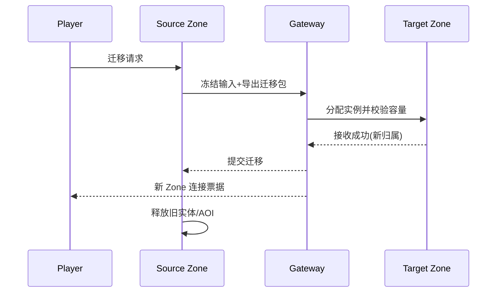

# 04-Scene-Map-Zone与实例管理

> 知识基线：Map（静态定义）/Scene（运行实例）/Zone（动态分区）三层模型、玩家归属、副本与分线、动态加载卸载、场景线程/进程分布；与 [03-Entity生命周期与组件模型](03-Entity生命周期与组件模型.md)、[05-AOI与InterestManagement](../状态复制与兴趣管理/05-AOI与InterestManagement.md) 配套。
> 版本基准：通用服务器设计；UE 对照为 UWorld/Level/World Partition（UE5.8）。
> 适用范围：MMO/实时服务器的大世界与副本场景管理。
> 官方参考：[UE5.8 World Partition 文档](https://dev.epicgames.com/documentation/en-us/unreal-engine/world-partition-in-unreal-engine)、[UE5.8 关卡与 World 文档](https://dev.epicgames.com/documentation/en-us/unreal-engine/worlds-and-levels-in-unreal-engine)。
> 最后更新：2026-08-13（首版）。
> 知识成熟度：L2（示例伪代码与静态验证矩阵；可运行 Demo 与独立 Benchmark 未归档，证据状态见第 7 节，补齐后评估升级）。

## 1. 概述

实体属于哪个场景（Scene）、场景跑在哪个进程、玩家从一个区域走到另一个区域怎么"无缝"切换——这是 Scene/Map/Zone 层回答的问题。设计错误的表现：

- 玩家跨区域时闪断（Zone 迁移没做对）；
- 副本数量失控（每个玩家一个实例，内存爆炸）；
- 场景加载卸载卡住主循环（加载阻塞 Tick）。

本文回答：

1. Map / Scene / Zone 三层怎么划分职责？
2. 玩家归属怎么管理（登录进哪个实例、跨区域怎么迁移）？
3. 动态加载/卸载怎么不阻塞 Tick？
4. 多进程/多线程下 Scene 怎么分布？

## 2. 核心概念

| 术语 | 中文 | 一句话定义 |
| --- | --- | --- |
| Map | 地图定义 | 静态数据：地形、出生点、区域配置（可多个实例共用） |
| Scene | 场景实例 | Map 的一个运行实例（副本、分线都是实例） |
| Zone | 区域 | Scene 内的动态分区（负载、AOI、迁移的粒度） |
| Instance | 实例 | Scene 的进程内存在（SceneInstanceId 标识） |
| Region | 大区 | 跨进程的场景集群（登录/匹配的粒度） |
| Zone boundary | 区域边界 | Zone 之间的切换点（迁移触发） |
| Loading / Unloading | 加载/卸载 | 动态场景的进出（资源预算控制） |
| Scene thread | 场景线程 | 一个 Scene 的逻辑执行线程/进程 |
| Migration ticket | 迁移票据 | 跨进程迁移携带的状态与基准（目标 Zone + 快照 + 时间） |
| Instance pool | 实例池 | 副本/分线实例的预创建与回收 |

## 3. 原理详解

### 3.1 三层模型

```text
Map（静态定义）    地图配置：地形/出生点/区域/刷怪表 —— 只读，可被多实例共享
  └─ Scene（运行实例）  一个 Map 的一次运行：副本、分线、战场实例
       └─ Zone（动态分区）  Scene 内的负载单元：AOI 网格、实体归属、迁移边界
```

关键决策：

- **Map 与 Scene 分离**：同一张地图开 10 个副本 = 10 个 Scene 实例共享 1 份 Map 数据；Map 只读 → 多实例零拷贝共享；
- **Zone 是负载单元**：实体密集的 Scene 拆多个 Zone，每个 Zone 可独立调度/迁移/降级（关联 [14-运行时背压与过载保护](../运行调度与过载保护/14-运行时背压与过载保护.md) 的局部过载）；
- **SceneInstanceId 是运行期唯一标识**：玩家、实体、快照都带 SceneInstanceId，跨实例引用用它区分。

Zone 划分的两种方式：

- **静态划分**：地图定义里预划分区域（适合固定结构：主城/副本/野外），配置简单；
- **动态划分**：按实体密度运行时合并/拆分（适合大世界开放地图），实现复杂但负载均衡好。

实践中多数游戏用静态划分 + 少量动态调整（过载 Zone 拆分、低载合并）。

### 3.2 玩家归属与实例分配

```text
登录 → 匹配/分配模块选择 SceneInstance（按负载/线路/队伍）
     → 注册玩家归属（Scene 持有玩家列表）
     → Spawn 到出生点 → AOI 登记 → 下发 Scene 基准（世界时间）
```

分配策略：

- **按负载**：选实体数/P99 最低的实例（关联 [14](../运行调度与过载保护/14-运行时背压与过载保护.md) 的容量监控）；
- **按组队**：队伍同实例（跨实例组队需要迁移，成本高）；
- **副本独立实例**：副本 Scene 按需创建、空场回收（实例池控制数量上限）。

### 3.3 Zone 边界与迁移

玩家跨越 Zone 边界时（或 AOI 半径触达边界时）触发迁移：

```text
触发：玩家位置进入边界缓冲带（或目标 Zone 的 AOI 覆盖）
流程：当前 Zone 解绑（AOI Leave 广播、任务/战斗解绑）
     → 目标 Zone 登记（AOI Enter、重新计算兴趣集）
     → 期间玩家操作不中断（同进程内迁移对玩家透明）
跨进程：携带状态快照 → 目标进程 Spawn（见 13-Snapshot 篇）
```

工程要点：

- **同进程 Zone 迁移必须无缝**：玩家无感，位置连续，不重新登录；
- **跨进程迁移要有协议**：迁移 Ticket（目标 Scene/Zone + 状态快照 + 时间基准），失败回滚到原 Zone；
- **边界缓冲带**：AOI 半径要小于 Zone 尺寸，避免"迁移前兴趣集被截断"。

迁移期间的操作语义：玩家输入继续接收但不结算（或缓存），迁移完成后按目标 Zone 规则重放；迁移耗时进监控（P95 目标是 < 100ms 同进程 / < 1s 跨进程）。

### 3.4 动态加载/卸载

```text
加载：玩家进入 Zone 范围 → 异步加载（资源/实体定义）→ 就绪后 Spawn 实体
卸载：Zone 内无玩家 → 延迟卸载（宽限期）→ 回收实体与内存
```

规则：

- **加载异步化**：禁止在主循环同步加载（阻塞 Tick）；加载完成回调投回逻辑线程；
- **预算控制**：每 Tick 加载预算（如 2ms），大世界加载分批完成；
- **宽限期防抖**：玩家短暂进出不触发反复加载/卸载（滞回）；
- **容量上限**：同时加载的 Zone 数有上限（内存保护），超出触发告警。

### 3.5 Scene 的线程/进程分布

| 方案 | 结构 | 优点 | 缺点 |
| --- | --- | --- | --- |
| 单进程多线程 | 每个 Scene 一个逻辑线程 | 共享内存、迁移便宜 | 单机容量上限、跨线程共享状态需小心 |
| 多进程 | 每个 Scene 集群一个进程 | 隔离好、容量大 | 迁移贵、状态需序列化 |
| 混合 | 常规 Scene 多线程，副本/战场独立进程 | 灵活 | 运维复杂 |

结论：先单进程多线程（Zone 为线程分片单位）跑通，容量不足再进程化；进程边界就是迁移边界（见 3.3）。

多线程 Scene 的注意事项：

- Zone 线程间共享数据（跨 Zone 引用）要收敛为"消息 + 所有权交接"（见 [07-EntityOwnership与Authority](07-EntityOwnership与Authority.md)）；
- 每 Zone 线程一个事件队列，主调度器分发（关联 [01](../运行调度与过载保护/01-ServerMainLoop与TickScheduler.md) 的调度语义）；
- 线程数 = 物理核数 - 保留（IO/网络），别开超卖线程。

### 3.6 与 Entity/AOI/跨服的关系

- **Entity 归属 Scene**：实体的 SceneInstanceId 是 ID 的组成部分（见 [03](03-Entity生命周期与组件模型.md) 的全局 ID 设计）；
- **AOI 按 Zone 分网格**：Zone 独立 AOI 网格，跨 Zone 走迁移而非普通跨格（见 [05](../状态复制与兴趣管理/05-AOI与InterestManagement.md)）；
- **跨服 = 跨进程 Scene 迁移**：携带状态快照 + 时间基准（见 [12](../运行调度与过载保护/12-世界时间确定性与GameClock.md) 与 13-Snapshot 篇）。

### 3.7 实例分配与负载均衡

分配决策的数据来源：

- **实体数**：每实例当前实体数（廉价，每 Tick 更新）；
- **P99 延迟**：实例级 Tick P99（更真实，但滞后）；
- **特殊约束**：队伍同实例、地区就近、玩法规则（战场阵营平衡）。

负载均衡手段（从轻到重）：

1. **新玩家分配**（最常用）：新登录优先进负载最低实例；
2. **空闲引导**：低负载实例发"世界事件"吸引玩家（活动/奖励），玩家自愿迁移；
3. **强制迁移**：实例过载时按规则迁移玩家（最后手段，需协议支持）。

实例池管理：

- 预创建热实例（匹配秒开）；空场宽限期后回收；
- 实例上限 = 内存/CPU 预算换算；超限拒绝创建并告警（关联 [14-运行时背压与过载保护](../运行调度与过载保护/14-运行时背压与过载保护.md)）。

### 3.8 UE 对照

- **UWorld = Scene 实例**：`World` 承载 Level、Actor、Tick；
- **Level = Map 的一部分**：子关卡（`ULevel`）动态加载卸载（Level Streaming）；
- **World Partition**：UE5 的大世界方案，按网格运行时加载子关卡，与自研 Zone 分层同构；
- UE DS 上"副本"用独立 World/地图实例运行（见 [05-UE Dedicated Server平台化](<../../../00_Index/学习路线/网络与游戏服务端.md>)）。

补充：UE 的 `ServerTravel` 切换地图（关服/换图）与自研"实例重启"对应；World Partition 的运行时加载与自研 Zone 加载同构，可互相参考预算设计。

## 4. 示例：场景注册表与迁移判定（伪代码）

```cpp
struct SceneInstance {
    SceneInstanceId id;
    MapId map;
    std::vector<Zone*> zones;          // Zone 列表
    int entityCount = 0;               // 负载指标
};

class SceneRegistry {
    std::unordered_map<SceneInstanceId, SceneInstance*> scenes_;
public:
    SceneInstance* PickInstance(MapId map, const TeamPref& pref) {
        // 按负载 + 队伍偏好选择（示意：取实体数最少）
        SceneInstance* best = nullptr;
        for (auto& [id, s] : scenes_) {
            if (s->map != map) continue;
            if (!best || s->entityCount < best->entityCount) best = s;
        }
        return best;
    }
    // 迁移判定：玩家位置进入目标 Zone 边界缓冲带
    bool ShouldMigrate(const PlayerPos& p, Zone* cur, Zone* next) {
        return next && DistanceToBoundary(p, next) < kBoundaryBuffer;
    }
};
```

### 4.1 跨进程迁移 Ticket（伪代码）

```cpp
struct MigrationTicket {
    SceneInstanceId targetScene;
    ZoneId          targetZone;
    Snapshot        playerState;    // 玩家状态快照（轻量）
    WorldTime       targetTime;     // 目标服世界时间基准
    uint64_t        expiresAtTick;  // 票据有效期
};

// 目标进程确认前，原进程保留实体（双写窗口）
bool TryCommitMigration(MigrationTicket& t, SceneInstance& target) {
    if (t.expiresAtTick < clock.tickIndex()) return false;   // 过期回滚
    target.SpawnFromSnapshot(t.playerState, t.targetTime);
    return true;
}
```

迁移失败路径：票据过期 → 回滚原 Zone（玩家无感）；目标进程拒绝（过载）→ 重试其他实例或留在原 Zone。

## 5. 最佳实践

1. **Map 只读共享，Scene 按需实例化**：副本/分线都是 Scene 实例，空场回收。
2. **Zone 是负载与迁移的粒度**：AOI、线程、降级都以 Zone 为单位。
3. **同进程迁移必须无缝**：跨 Zone 无感，跨进程走快照协议。
4. **加载异步 + 预算**：禁止主循环同步加载；每 Tick 加载预算。
5. **卸载宽限期**：防抖，避免反复加载。
6. **实例上限**：副本实例池控制数量，防内存失控。
7. **分配按负载**：PickInstance 用实体数/P99 指标，避免热点实例。
8. **UE 对照**：大世界用 World Partition；副本用独立 World 实例。
9. **迁移票据带过期**：跨进程迁移必须有时效与回滚语义。
10. **实例池上限**：预创建 + 回收 + 上限告警三件套。
11. **加载预算与宽限期**：异步加载限预算，卸载带宽限期防抖。
12. **迁移可观测**：迁移次数、耗时、失败回滚计数进监控；迁移风暴（同区域大量迁移）要告警。

## 6. FAQ

**Q1：Zone 多大合适？**
取决于实体密度与 AOI 半径：Zone 尺寸 ≥ 2×AOI 半径（避免兴趣集截断）；实体密集区 Zone 小（负载均衡），稀疏区 Zone 大（减少迁移）。

**Q2：副本实例什么时候销毁？**
空场 + 宽限期（如 5 分钟）后回收；预创建少量热副本（匹配秒开）。

**Q3：跨进程迁移失败怎么办？**
迁移 Ticket 带超时与回滚：目标进程确认前，原进程保留实体（双写窗口）；失败回滚到原 Zone，玩家无感（重试或降级为"本进程内等待"）。

**Q4：玩家跨 Zone 时 AOI 会闪断吗？**
同进程内不会：边界缓冲带保证迁移完成前兴趣集连续；跨进程有短暂重连（协议层处理）。

**Q5：加载中的 Zone 玩家能进吗？**
可以排队：玩家进入加载中 Zone 的边界时显示"区域加载中"或放入等待队列；禁止直接进入半加载状态（实体缺失）。

**Q6：一个 Scene 可以有多个线程吗？**
可以按 Zone 分线程（每个 Zone 一个逻辑线程），跨 Zone 实体迁移时交接所有权（见 [07-EntityOwnership与Authority](07-EntityOwnership与Authority.md)）。

**Q7：UE 的 Level Streaming 和自研 Zone 加载一样吗？**
思路一致（运行时按需加载子关卡），但 UE 是客户端/DS 侧渲染与逻辑耦合的加载；自研逻辑服的 Zone 加载纯逻辑（无渲染），可以更激进。

**Q8：玩家在边界来回走会反复迁移吗？**
会，除非用"缓冲带 + 滞回"：进入目标 Zone 的缓冲带才开始迁移判定，迁移完成后短时间（如 10s）不反向迁移；与卸载宽限期同理。

**Q9：副本实例的实体数是唯一的负载指标吗？**
不是。战斗密集的副本 CPU 高但实体数少；用"实体数 × 权重（按类型）"或直接 P99 更准；实体数适合快速筛选，P99 适合精确决策。

**Q10：动态加载的实体定义放哪？**
Map 的只读数据（实体定义、刷怪表）；Scene 实例只持有"已加载 Zone 的引用"；多个实例共享同一份定义（零拷贝）。

**Q11：迁移风暴怎么防？**
原因通常是"活动结束/实例过载"引发群体迁移；对策：迁移限速（每实例每 Tick 迁移上限）、分批（按优先级）、目标实例容量预检——迁移本身也要走背压保护（关联 [14](../运行调度与过载保护/14-运行时背压与过载保护.md)）。

**Q12：Zone 拆分/合并的动态调整怎么做？**
只在"加载边界"（Zone 无玩家或玩家极少）时操作：拆分 = 新建子 Zone + 迁移实体；合并 = 目标 Zone 接管；执行期间冻结该区域的新增/迁移，完成后恢复。禁止热拆分（执行中实体归属会乱）。

## 7. 验证与基准

- 单测：分配策略（负载最低实例）、迁移判定（边界缓冲带）、实例回收（空场宽限期）；
- 集成：同进程跨 Zone 迁移无感（位置连续、AOI 不闪断）；跨进程迁移回滚正确；
- 性能：加载预算（每 Tick ≤2ms）、Zone 内存上限、实例池容量；
- 迁移验收：跨进程迁移成功/超时回滚/目标拒绝三条路径；
- 分配验收：新玩家进负载最低实例；热点实例不持续增长；
- 实例池验收：预创建生效、空场宽限期回收、上限拒绝创建；
- 迁移性能验收：同进程 P95 < 100ms、跨进程 P95 < 1s；
- 动态调整验收：Zone 拆分/合并在加载边界执行、实体归属正确；
- 压测：多实例并发（副本风暴）下实例池上限生效、分配均衡；
- 证据状态：本文示例为设计层伪代码而非可运行 Demo，验证矩阵属静态设计证据；运行证据待补，故按 L2 计；
- 升级 L4 计划：Zone 迁移频率与耗时 Benchmark、加载预算压力测试，原始数据入 `evidence/server/`。

### 7.1 快速决策树

```text
场景结构？
├─ 固定结构（主城/副本）→ 静态 Zone 划分
├─ 开放大世界 → World Partition 式动态加载 + 静态 Zone
玩家进入？
├─ 新登录 → 按负载分配实例
├─ 跨 Zone → 缓冲带判定 → 同进程迁移（无缝）
├─ 跨进程 → 迁移 Ticket + 回滚语义
实例管理？
├─ 副本 → 实例池（预创建/回收/上限）
├─ 过载 → 新玩家分流 → 活动引导 → 强制迁移（最后手段）
```

## 8. 关联阅读

- [03-Entity生命周期与组件模型](03-Entity生命周期与组件模型.md)：实体归属与迁移的生命周期。
- [05-AOI与InterestManagement](../状态复制与兴趣管理/05-AOI与InterestManagement.md)：Zone 级 AOI 网格。
- [12-世界时间确定性与GameClock](../运行调度与过载保护/12-世界时间确定性与GameClock.md)：跨实例时间基准。
- [13-世界Snapshot与故障恢复](13-世界Snapshot与故障恢复.md)：跨进程迁移的状态快照。
- [游戏知识/13-世界构建与过场](../../../00_Index/学习路线/图形动画与物理仿真.md)：UE 大世界（World Partition）客户端侧。
- [05-UE Dedicated Server平台化](<../../../00_Index/学习路线/网络与游戏服务端.md>)：DS 实例生命周期。
- [08-跨Zone与跨服迁移](08-跨Zone与跨服迁移.md)：跨进程迁移的协议细节。
- [游戏服务端/04-平台与可靠性](../../../00_Index/学习路线/网络与游戏服务端.md)：实例分配的服务治理视角。
## 数据流：玩家跨 Zone 迁移



迁移包作为提交边界：目标 Zone 确认接收后才切换玩家归属，源 Zone 再释放实体，避免双写与丢失。
