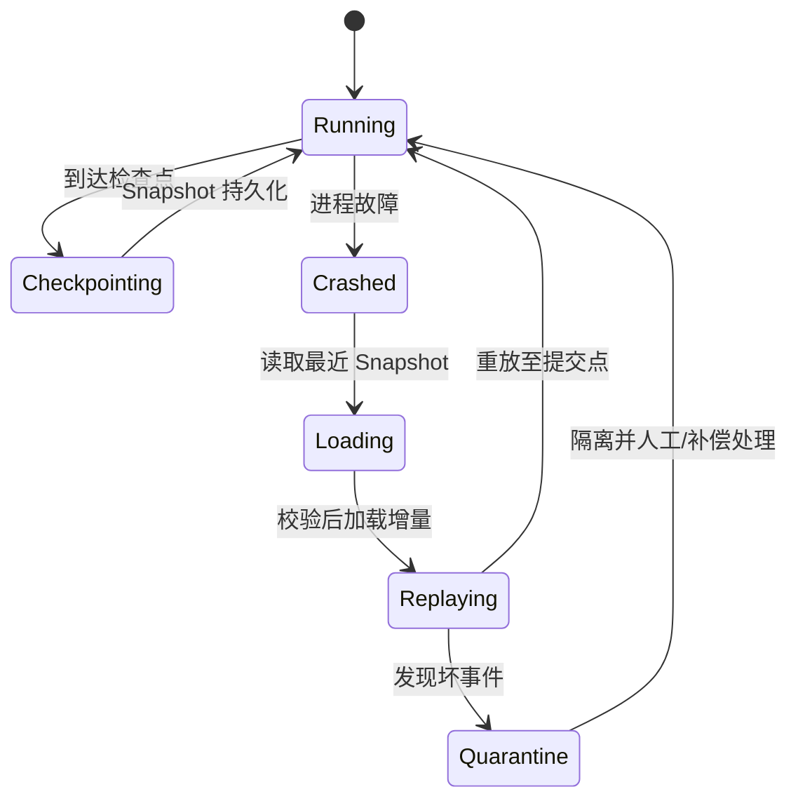

# 13-世界Snapshot与故障恢复

> 知识基线：全量快照 + 增量事件（delta/event）的世界持久化模型、崩溃恢复状态机（Crash → Restart → Restore → Reconcile）、客户端重连补偿；与 [12-世界时间确定性与GameClock](../运行调度与过载保护/12-世界时间确定性与GameClock.md) 的时间基准、[04-Scene-Map-Zone与实例管理](04-Scene-Map-Zone与实例管理.md) 的实例管理配套。
> 版本基准：通用服务器设计；UE 对照为 SaveGame/DS 崩溃重启流程。
> 适用范围：MMO/实时服务器的世界状态持久化与故障恢复。
> 官方参考：[cppreference - 序列化](https://en.cppreference.com/w/cpp/io)、[UE5.8 存档系统文档](https://dev.epicgames.com/documentation/en-us/unreal-engine/save-game-system-in-unreal-engine)。
> 最后更新：2026-08-13（首版）。
> 知识成熟度：L3（状态机 + 验证入口；未做独立 Benchmark）。

## 1. 概述

服务器崩溃不是"要不要面对"的问题，而是"多久恢复、丢多少状态"的问题。世界状态恢复的两个极端：

- 每帧全量快照：恢复最快，但写入成本不可接受；
- 从不持久化：崩溃即回档，玩家愤怒。

正确形态是**周期快照 + 增量事件**的混合：

```text
World State → Snapshot（周期全量）→ Delta/Event（期间增量）
→ Crash → Restart → Load Snapshot → Replay Events → Restore → Client Reconnect → Reconcile
```

本文回答：

1. 全量快照与增量事件怎么配合（频率怎么定）？
2. 崩溃恢复的状态机每一步做什么？
3. 客户端重连怎么补偿断线期间的状态？
4. 哪些状态必须恢复、哪些可以重建？

## 2. 核心概念

| 术语 | 中文 | 一句话定义 |
| --- | --- | --- |
| Snapshot | 快照 | 世界状态的周期性全量副本 |
| Delta / Event | 增量/事件 | 快照之间发生的变化（事件日志或变更集） |
| Checkpoint | 检查点 | 快照 + 到该点的事件日志（恢复起点） |
| Crash | 崩溃 | 进程异常终止（状态停留在内存） |
| Restart | 重启 | 拉起新进程，加载配置与地图 |
| Restore | 恢复 | 加载快照 + 重放事件，重建世界状态 |
| Reconcile | 对账 | 客户端与恢复后状态的差异修正 |
| Recovery time | 恢复时间 | 从崩溃到可服务玩家的时间（RTO） |
| Recovery point | 恢复点 | 恢复后世界时间点（丢多少状态，RPO） |
| Idempotent event | 幂等事件 | 同一事件重放多次结果一致 |
| Checkpoint advance | 检查点推进 | 新快照落库后归档旧日志段 |

## 3. 原理详解

### 3.1 快照 + 增量模型

```text
时间轴：--- S1 ---------------- S2 ----------------
            └── 事件日志段1 ──┘ └── 事件日志段2 ──┘

恢复：加载 S2 + 重放段2 事件 = 精确恢复到最后事件点
```

工程参数：

- **快照频率**：RPO 决定——每 5 分钟快照 = 最多丢 5 分钟 + 段内事件重放；事件日志持久化后实际 RPO 只到"最后持久化事件"；
- **事件持久化**：关键事件（交易、任务、奖励）同步落库；非关键事件（位置）可丢（重建）；
- **快照内容**：玩家长期状态 + 世界持久实体（BOSS 状态、活动进度）；临时实体（投射物、瞬时 Buff）不落快照，恢复后重建；
- **异步写入**：快照/事件写存储走异步队列，不阻塞 Tick（关联 [14-运行时背压与过载保护](../运行调度与过载保护/14-运行时背压与过载保护.md)）。

快照内容与体积控制：

- 玩家状态按实体分片（每实体独立快照键），世界快照只含持久实体；
- 快照压缩（字段级编码、差值）与写入限速（每 Tick 预算）；
- 快照频率分级：玩家关键状态高频（如 1 分钟），世界持久实体低频（如 5 分钟）。

恢复时间（RTO）的组成：加载快照 + 重放事件 + 结构重建 + 开放登录；其中重放事件通常占大头（事件量大）——事件日志的"批量重放"（并行分片 + 合并）是 RTO 优化的主战场。

### 3.2 崩溃恢复状态机

```text
Crash（进程退出）
  → Restart：拉起新进程、加载地图定义
  → Load Snapshot：加载最近检查点（快照 + 事件日志）
  → Replay Events：按时间序重放事件到崩溃点（或最后持久化点）
  → Restore：恢复玩家归属、Scene/Zone 结构、世界时间基准
  → Open：开放登录；客户端重连走 Reconcile
```

每一步的可观测性：

- 恢复进度（已加载快照/已重放事件数）进监控，恢复时间超阈值告警；
- 重放失败（事件损坏）回退到"上一个完整检查点"——宁可多丢，不可错乱；
- 恢复期间"只读开放"（玩家可登录但世界暂停），完成后广播"世界恢复 + 新基准"（关联 [12](../运行调度与过载保护/12-世界时间确定性与GameClock.md)）。

恢复进度指标：

```text
recovery_stage            # 当前阶段
recovery_snapshot_ms      # 快照加载耗时
recovery_replay_count     # 已重放事件数
recovery_replay_ms        # 重放耗时
recovery_rto_ms           # 总恢复时间（目标 SLA）
```

这些指标同时是容量规划的输入：事件量 × 单事件重放成本 = 重放耗时预算。

### 3.3 检查点推进与日志归档

```text
新快照落库成功 → 推进检查点（新快照 + 其后事件日志）
→ 归档：旧快照之前的日志段标记可删除（保留审计期，如 7 天）
```

要点：

- 归档必须"快照先落库、日志后删除"，否则丢日志段 = 丢恢复能力；
- 归档任务异步执行，避免阻塞恢复路径；
- 归档进度进监控：日志段积压超过阈值说明归档跟不上（存储问题）。

### 3.4 事件幂等的实现

```cpp
// 幂等键：事件重放前检查是否已生效
struct EventKey { uint64_t tickIndex; EntityId entity; uint32_t seq; };

bool ApplyIfNotApplied(World& w, const Event& ev) {
    if (w.appliedEvents.contains(ev.key)) return false;   // 已应用，跳过
    w.Apply(ev);
    w.appliedEvents.insert(ev.key);                       // 记录已应用
    return true;
}
```

注意：`appliedEvents` 自身也要能重建（用"最后一个已应用序号"代替全量集合，按实体记录），否则它变成新的恢复负担。

### 3.5 客户端重连与 Reconcile

```text
断线期间：服务器继续推进（或暂停，按场景）
重连：下发"世界时间 + Tick 序号 + 玩家快照"
Reconcile：客户端把本地状态对齐到服务器快照（丢弃本地预测的差异）
```

要点：

- 玩家重连恢复的是"玩家自己的状态 + 世界基准"，不需要完整世界状态（AOI 会重新 Enter）；
- 重放事件是"世界级"恢复；玩家级恢复用"玩家快照 + 服务器权威状态"；
- 冲突处理：断线期间发生的本地操作（如拾取）以服务器事件日志为准（重新结算或补偿）。

### 3.6 哪些状态必须恢复

| 状态 | 恢复策略 | 理由 |
| --- | --- | --- |
| 玩家长期状态（背包/任务/等级） | 快照 + 事件日志 | 不可丢，玩家资产 |
| 世界持久实体（BOSS/活动/掉落） | 快照 + 事件日志 | 影响世界一致性 |
| 交易/奖励流水 | 事件日志（同步落库） | 可审计、可补偿 |
| 位置/临时 Buff/投射物 | 不恢复（重建） | 重建成本低，玩家可接受 |
| 场景/Zone 结构 | 从地图定义重建 + 快照修正 | 结构可重建，内容要恢复 |

### 3.7 事件日志的设计

```text
事件 = (tickIndex, entityId, type, payload, checksum)
```

- **带 tickIndex**：重放时按世界时间序（确定性重放的前提）；
- **幂等**：同一事件重放两次结果一致（补偿/对账的基础）；
- **checksum**：检测损坏，损坏段回退检查点；
- **异步批量写**：事件按批落库（如每 100ms），RPO = 批量窗口 + 落库延迟。

事件字段补充：`source`（来源系统/玩家）与 `version`（协议版本）——跨版本恢复时按 version 迁移（旧事件与新逻辑兼容），审计也依赖 source。

### 3.8 UE 对照

- **SaveGame**：UE 的存档系统（`USaveGame`）用于玩家档案；DS 的世界级快照通常自研或接平台存储；
- **DS 崩溃重启**：平台层负责拉起新实例（见 [05-UE Dedicated Server平台化](<../../../00_Index/学习路线/网络与游戏服务端.md>) 的实例生命周期），逻辑层负责世界恢复；
- UE 的 `DemoNetDriver`（回放）本身就是"事件流重放"的引擎级实现（见 [游戏知识/06-网络同步/09-网络回放与DemoNetDriver](../同步预测与回放/09-网络回放与DemoNetDriver.md)）。

## 4. 示例：恢复状态机（伪代码）

```cpp
enum class RecoveryStage { Crash, Restart, LoadSnapshot, ReplayEvents, Restore, Open };

void RunRecovery(RecoveryStage& stage, Checkpoint& cp, EventLog& log) {
    switch (stage) {
    case RecoveryStage::LoadSnapshot:
        world.LoadFrom(cp.snapshot);          // 加载最近检查点
        stage = RecoveryStage::ReplayEvents;
        break;
    case RecoveryStage::ReplayEvents:
        while (auto ev = log.Next()) {
            if (ev.tickIndex > cp.endTick) break;
            world.Apply(ev);                   // 幂等重放
        }
        stage = RecoveryStage::Restore;
        break;
    case RecoveryStage::Restore:
        world.SetBaseline(cp.endTick + 1);     // 时间基准（关联 GameClock）
        broadcast(WorldRecovered{world.now()});
        stage = RecoveryStage::Open;
        break;
    }
}
```

## 5. 最佳实践

1. **快照频率按 RPO 定**：RPO 5 分钟 → 快照间隔 ≤ 5 分钟；关键事件同步落库进一步缩小 RPO。
2. **事件幂等**：重放安全（补偿/对账的前提）。
3. **异步写入**：快照/事件落库不阻塞 Tick；写失败进重试队列。
4. **恢复只读开放**：恢复期间可登录不可操作，完成后广播新基准。
5. **回退检查点**：事件损坏回退上一个完整检查点，宁可多丢不可错乱。
6. **监控 RTO/RPO**：恢复时间与数据丢失量是 SLA 指标。
7. **临时状态不落库**：投射物/瞬时 Buff 重建，别浪费存储与带宽。
8. **跨服迁移复用快照格式**：迁移 Ticket 就是"轻量快照 + 时间基准"（见 [04](04-Scene-Map-Zone与实例管理.md)）。
9. **归档先于删除**：快照落库成功才归档日志段，顺序不可反。
10. **RTO/RPO 进 SLA**：恢复时间与数据丢失量是运营承诺，压测验证。
11. **恢复演练常态化**：定期 kill 进程演练，防止"从没恢复过、一崩就出事"。
12. **批量重放优化**：事件按实体分片并行重放，合并结果——RTO 的关键优化点。

### 5.1 恢复演练清单

```text
每月演练：
  [ ] kill -9 逻辑服进程
  [ ] 记录 RTO/RPO（对照 SLA）
  [ ] 检查点回退路径（事件损坏注入）
  [ ] 重连玩家 Reconcile 断言
  [ ] 只读恢复期间登录行为
每季度：
  [ ] 高事件量（战斗峰值）恢复演练
  [ ] 存储故障注入（快照写失败）
```

演练结果进容量报告与工作日志。

## 6. FAQ

**Q1：快照太大怎么办？**
分片：玩家状态按实体分片存储，快照按 Zone/实体组生成；世界级快照只含持久实体，临时实体恢复时重建。

**Q2：事件日志无限增长怎么办？**
检查点推进时归档旧段：快照落库后，其之前的日志段可删除（保留审计期）。

**Q3：恢复期间玩家能做什么？**
"只读开放"：可登录、可查看，不可操作；或者完全关闭登录直到 Open（视 RTO 目标）。建议折中：登录排队 + 世界暂停。

**Q4：重连的玩家状态和恢复后的世界对不上？**
以服务器为准：玩家快照 + 世界基准 + AOI 重新 Enter；本地预测差异直接丢弃（Reconcile 语义）。

**Q5：崩溃时正在进行的交易怎么办？**
交易在事件日志里是"Begin/Commit"两阶段：崩溃时未 Commit 的交易回滚（幂等重放只生效 Commit 事件），已 Commit 的通过补偿邮件等处理。

**Q6：快照写一半崩溃会怎样？**
写快照用"临时文件 + 原子改名"（或存储事务）：要么完整新快照，要么旧快照 + 事件日志；绝不出现半写快照。

**Q7：恢复后的世界和崩溃前完全一样吗？**
目标不是"完全一样"而是"一致且公平"：持久状态一致、临时状态重建、玩家体验可接受；严格到"逐事件一致"只在确定性回放场景要求。

**Q8：恢复期间在线的玩家怎么处理？**
两种策略：全部踢下线（重连走 Reconcile）或"只读在线"（可看不可操作）。建议只读在线 + 世界暂停，恢复后广播新基准（关联 [12](../运行调度与过载保护/12-世界时间确定性与GameClock.md) 的暂停语义）。

**Q9：事件日志用消息队列还是数据库？**
都行，关键是**顺序与幂等**：单分区有序队列（Kafka 单分区/RocketMQ 有序）或数据库表 + tickIndex 主键；跨分区乱序会破坏确定性重放。

**Q10：快照和事件谁先写？**
先事件后快照（或各自独立 + 检查点协调）：恢复时"加载快照 + 快照之后的全部事件"；快照生成时刻与最后事件序号一起记录（检查点原子性）。

**Q11：恢复后玩家排队登录的顺序？**
按"重连优先（原在线玩家）> 新登录"；重连玩家走 Reconcile（状态对齐），新登录走正常流程；恢复期登录限速，防登录风暴叠加。

**Q12：恢复期间的监控告警会误报吗？**
会。恢复期指标（Tick P99、延迟）天然异常；监控系统要有"维护/恢复窗口"抑制逻辑，恢复完成自动解除，避免告警风暴掩盖真实问题。

## 7. 验证与基准

- 单元测试：事件幂等（重放两次状态一致）、快照原子性（半写恢复用旧快照）、状态机各阶段转换；
- 故障注入：随机 kill 进程 → 恢复时间与 RPO 符合 SLA；事件损坏 → 回退检查点；
- 重连测试：断线重连后玩家状态与服务器一致（Reconcile 断言）；
- 性能：快照生成/写入耗时（异步不阻塞 Tick 的插桩验证）、事件批量写吞吐；
- 归档验收：快照落库后旧日志段按序归档；归档失败不影响恢复；
- 幂等验收：同一事件重放两次状态一致（断言）；
- 只读恢复验收：恢复期间登录只读、完成后广播新基准；
- 批量重放验收：事件分片并行重放与串行结果一致；
- 登录限速验收：恢复期登录限速生效，无登录风暴；
- 压测：高事件率（战斗密集）下事件日志不积压（关联 14-背压篇）；
- 升级 L4 计划：恢复演练 Benchmark（100 万实体恢复时间）与快照写入压力测试，原始数据入 `evidence/server/`。

## 8. 关联阅读

- [12-世界时间确定性与GameClock](../运行调度与过载保护/12-世界时间确定性与GameClock.md)：恢复后的时间基准。
- [04-Scene-Map-Zone与实例管理](04-Scene-Map-Zone与实例管理.md)：实例重启与结构重建。
- [03-Entity生命周期与组件模型](03-Entity生命周期与组件模型.md)：实体状态恢复与重建。
- [游戏知识/06-网络同步/09-网络回放与DemoNetDriver](../同步预测与回放/09-网络回放与DemoNetDriver.md)：事件流重放的引擎实现。
- [游戏测试与质量](../../../00_Index/学习路线/工程实践与质量.md)：故障注入与恢复演练方法。
- [游戏服务端/02-数据与业务](../../../00_Index/学习路线/网络与游戏服务端.md)：存储与事务的工程基础。
- [游戏测试与质量/04-性能兼容与网络异常测试](../../08-工程实践与质量/测试策略与自动化/04-性能兼容与网络异常测试.md)：故障注入方法。
- [08-跨Zone与跨服迁移](08-跨Zone与跨服迁移.md)：迁移与恢复的边界。
- [游戏服务端/04-平台与可靠性/00-平台可靠性总览与迁移说明](../服务架构与消息通信/00-平台可靠性总览与迁移说明.md)：灾备与幂等的服务治理视角。
- [游戏服务端/02-数据与业务](../../../00_Index/学习路线/网络与游戏服务端.md)：事件日志的存储选型。
- [游戏服务端/04-平台与可靠性](../../../00_Index/学习路线/网络与游戏服务端.md)：容灾切换与恢复的编排。
- [游戏服务端/01-架构与网络](../../../00_Index/学习路线/网络与游戏服务端.md)：事件日志传输与消息语义。
- [游戏服务端/04-平台与可靠性/00-平台可靠性总览与迁移说明](../服务架构与消息通信/00-平台可靠性总览与迁移说明.md)：幂等语义的服务端实现。
- 本分类完整目录见 [06-世界模拟与运行时 README](../../../00_Index/学习路线/网络与游戏服务端.md)。
## 状态图：Snapshot、增量日志与恢复



恢复先加载完整快照，再按顺序重放未归档增量；事件幂等键保证重放安全，坏事件隔离而不阻塞整个世界。
