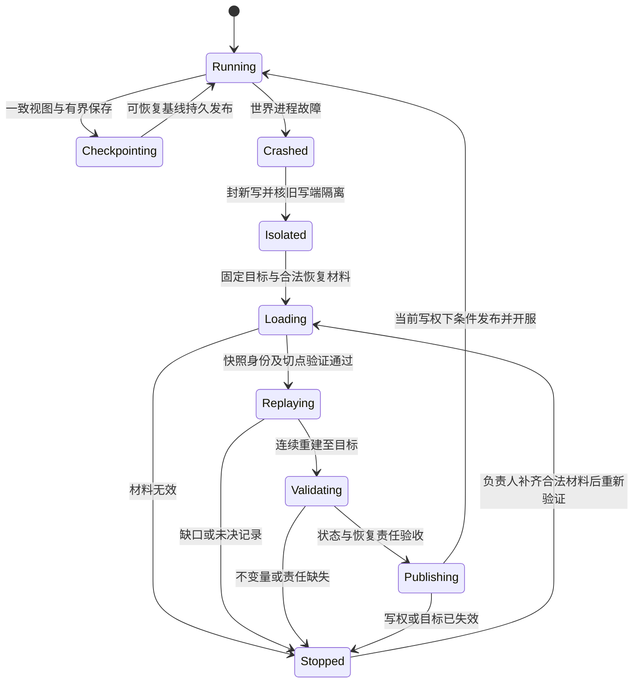
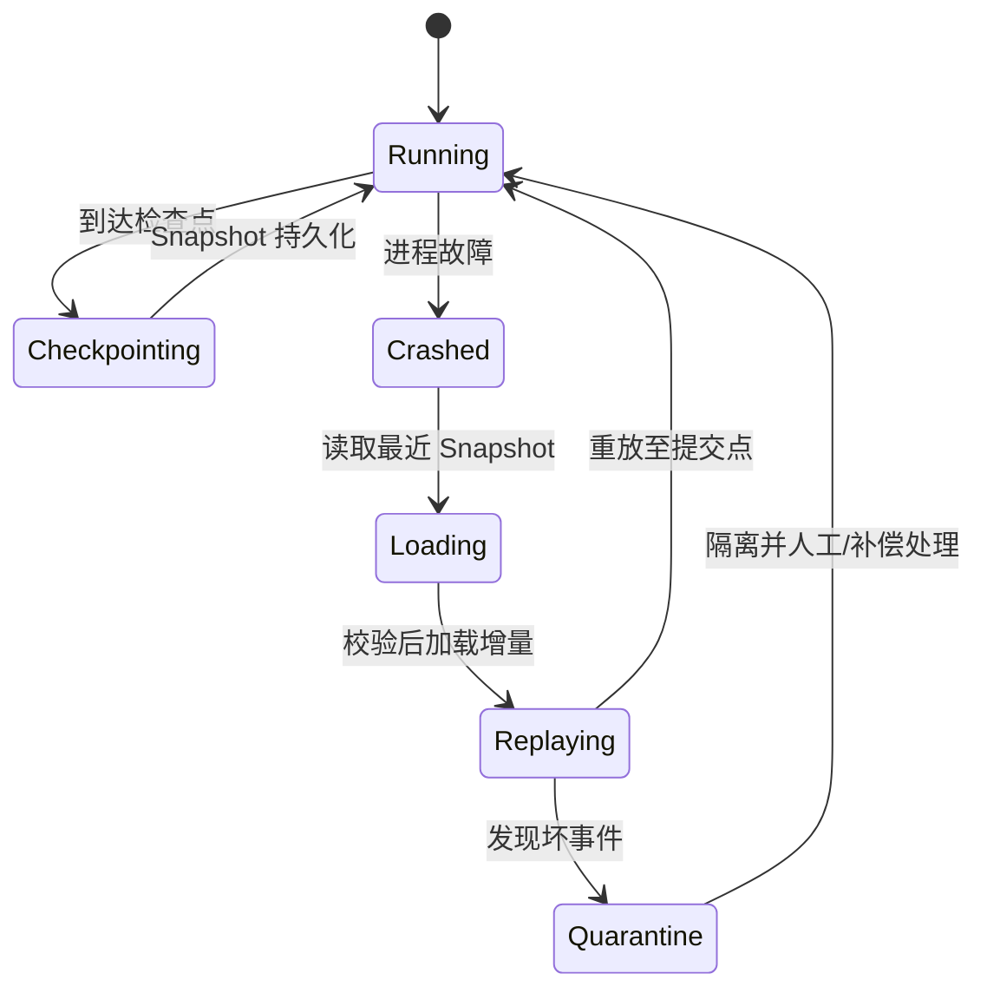

# 13-世界Snapshot与故障恢复

> 知识成熟度：L2。2026-10-09按指定官方文档与原始论文选读重写恢复机制；所有示例与数值均为 `PAPER_EXPECTED` 静态推导。未运行恢复实现、数据库、UE、备份、故障注入或性能测试。旧版L3依据“状态机+验证入口”，没有足以支持本文主要实现已运行的证据，本次据主要承诺调整为L2，verified仍为空。
> 最后更新：2026-10-09（本轮静态教学修订）
> 知识基线：Raft 2014-05-20 extended §7及§8相关段；PostgreSQL 18的WAL/备份/恢复文档；Epic当次标题显示UE5.8的SaveGame/Replay文档。不同来源各有适用范围，不是一套已验证兼容的部署；实际选读及缺口见第7节。
> 本篇负责权威世界的持久化恢复切点、连续重建、开服条件与玩家重连。网络复制/插值中的Snapshot用于向客户端展示状态，不能仅因同名而承担本篇的持久恢复责任。

## 1. 概述：进程重新起来，还欠哪些恢复事实

世界服崩溃后，新进程能加载地图，不表示玩家已确认的开门、任务进度或奖励仍能正确解释。恢复需要回答：哪份状态是合法基线，哪些后续决定真正保存下来，重建过程中谁仍可能写旧数据，以及何时可以重新对玩家服务。

本文选用“周期快照＋连续事件日志”讲解：快照缩短从起点重建的工作，日志保留快照之后需要恢复的决定。它不是所有状态的唯一正确方案。允许损失的独立状态可以只保存完整快照；权威资产可以由数据库事务/账本负责；某些短局甚至明确不承诺局内崩溃恢复。选择从业务接受合同、损失政策和故障域开始，而不是先套一个五分钟定时器。

```text
正常接受业务 → 达到约定耐久边界的结果事件 → 应用并回答原结果
                       ↓ 在一致切点取得不可变视图
                Snapshot(c) 完整持久发布
                       ↓
Crash → 隔离旧写端 → 固定恢复目标T → 选有效Snapshot(c)
      → 连续重建(c,T] → 核业务/结构/时间与未决责任
      → 条件发布恢复代 → 开放入口 → 玩家重连与Reconcile
```

这条链的前半段决定“将来还能恢复什么”，后半段决定“现在哪些事实已经恢复”。恢复不能补造正常运行时从未留下的证据。某个未来、回调或文件操作叫作成功，也要说明它确认了哪一层。

### 1.1 先分类状态，再决定什么能丢

| 状态 | 权威及恢复选择 | 不能省略的业务判断 |
| --- | --- | --- |
| 背包、货币、奖励、已确认购买 | 资产事务、账本与原结果；世界保存有关引用和履约责任，必要时恢复后核账 | 已承诺的成功不能因世界回档静默消失，也不能重放一次就再发一次 |
| 任务、活动进度、持久BOSS/门/机关 | 同一恢复域的快照＋可解释事件，或经明确选择的其他耐久方案 | 所需配置、因果前提与相关实体必须一致；不能只存最终显示值 |
| 临时投射物、纯表现Buff、可容损位置 | 可按事先业务政策丢弃或从其他权威状态重建 | Buff/位置若影响收费、资产、跨服交接或期限，就不能按名字一律可丢 |
| Scene/Zone、空间索引、缓存 | 从匹配地图定义和恢复实体重建，再核归属与结构 | 可重建的是派生结构；配置版本、实体身份和所有权仍要有来源 |
| 原请求终态、去重身份、未完成履约/恢复待办 | 与其效果/决定一起可恢复，并覆盖允许重试与恢复窗口 | “客户端没收到”不等于未提交；恢复待办不能只留旧进程调用栈 |

主例只恢复一个有限世界的持久子集，不声称物理世界、所有内存地址或客户端预测逐位回到崩溃前。业务上“一致且公平”也必须落到这些具体不变量，不能用它解释任何资产丢失。

### 1.2 RPO/RTO与实际恢复点

RPO是允许的数据损失目标，RTO是从约定故障起点到业务按验收标准恢复的时间目标。一次实际恢复还要记录可恢复数据点、丢失的状态类别/记录、各阶段耗时和最终业务可用时刻。数据文件可读、数据库启动、世界ready和玩家可以合法操作是不同里程碑。

快照周期主要影响要保留和重放的日志量、存储开销与恢复工作量；可恢复点则受日志接受/持久化、归档进度、连续性和故障域限制。没有成功的新快照，定时器触发过也没用。100ms合批还可能遇到排队、重试、I/O延迟或进程暂停，不能直接生成硬RPO；“事件量×单事件成本”也只在成本与串行方式明确时是纸面估算，不是实测恢复预算。[PostgreSQL18 PITR](https://www.postgresql.org/docs/18/continuous-archiving.html)

正常同步提交与异步提交所等的耐久阶段不同，异步提交可以在自洽恢复时丢失最近向客户端确认的事务。设备缓存与刷新是否真的达到非易失介质也是前提。由此应先写明本项目“成功”承诺，再选择策略；不能只看收到ACK或库仍自洽，就宣称资产都保住了。[PostgreSQL18异步提交](https://www.postgresql.org/docs/18/wal-async-commit.html)、[可靠性](https://www.postgresql.org/docs/18/wal-reliability.html)

## 2. 核心概念与正常保存链

| 名称 | 本文含义 | 与相邻概念的区别 |
| --- | --- | --- |
| Snapshot | 选定恢复域在一个可说明切点上的完整状态及必要元数据 | 不是任意时刻逐实体拷贝的集合，也不是复制给客户端的部分字段 |
| cut c | 该快照已经完整包含的日志前缀边界 | 不是文件修改时间或最大见过的tick |
| 已提交耐久前缀 | 依选定存储/协议已能证明连续提交且在故障假设下可恢复的范围 | 物理文件里出现的未提交尾部不能直接应用 |
| 应用水位 | 某个候选/持久状态已经连续应用到的位置 | 最大收到序号、最大实体序号和已提交上界都不自动等于它 |
| 恢复目标T | 本次明确要达到的合法数据边界 | 不能缺资料后偷偷降低再报告原目标成功 |
| Checkpoint | 可选用的完整快照、cut及必要恢复元数据/引用 | 恢复仍可能需要它之后的连续日志；不同产品术语以其协议为准 |
| Reconcile | 玩家显示/预测/AOI与恢复后的服务器状态对齐 | 不负责判定经济交易是否提交、是否补偿 |

### 2.1 从业务接受点留下恢复材料

本篇的事件路线先计算并校验合法结果，在约定原子域内保存事件身份、完整业务绑定和恢复所需结果；达到选定的耐久接受点后，才承诺这个结果可恢复。活世界应用失败时，应从已决定事实恢复并停止不确定推进，不能撤销已经确认的持久决定。等待存储可以通过异步流程组织，不等于提前给玩家“永久成功”。

另一种路线是资产效果、原结果和Outbox在数据库本地事务内一起接受，再异步传播。世界快照只是它的使用者，不能覆盖外部账本。详细接受、UNKNOWN、原身份重试与恢复归属见[存储引擎与事务](../持久化与分布式一致性/01-存储引擎与事务.md)、[数据库选型与存储设计](../持久化与分布式一致性/01-数据库选型与存储设计.md)与[分布式事务与最终一致性](../持久化与分布式一致性/04-分布式事务与最终一致性.md)。本文不实现另一套通用事务或驱动框架。

数据库WAL、业务事件流和UE网络回放是不同恢复对象。PostgreSQL的WAL要求相关日志先达到持久边界，再让数据页落盘，并为其引擎恢复提供规则；这个事实不证明任意对象dump加任意事件文件具备同样协议。[PostgreSQL18 WAL](https://www.postgresql.org/docs/18/wal-intro.html)

### 2.2 Snapshot必须对应一个真实的一致切点

一份可恢复材料至少要能辨认恢复域/对象代次、快照身份、日志流和cut、格式及规则/配置版本、内容绑定与完整性、同切点游戏时间，以及恢复所需业务结果/待办。不是所有产品都用同样字段，但这些问题必须有可核对的答案。主例采用如下说明性记录，不是实现好的文件格式：

```text
Snapshot = (world, incarnation, checkpoint_id, stream_id, cut,
            schema_version, rules/map_version, content_binding,
            durable_world_state, original_results, pending_obligations,
            clock_state_at_the_same_cut)
Event    = (stream_id, sequence, world/incarnation, event_type,
            schema/rules_version, complete_binding, decided_payload,
            relevant_game_tick, integrity_information)
```

content_binding需要实际明确编码、身份和冲突处理；checksum只能检测其覆盖的字节损坏，不能证明业务上所有字段来自同一时刻，也不是完整的权限或来源认证。版本未知、必要配置不可获得、身份不同或绑定冲突时停止，不能默默用当前逻辑解释旧事件。

最小正向选择是在world owner的安全点取得完整不可变视图，固定它对应的cut；后台编码/压缩只读这份视图，后续活世界变化不改变它。也可以采用实际存储所支持的一致快照、COW或其他协调协议，但要说明原子范围、成本和存活期。分多Tick遍历正在变化的实体，然后贴一个结束时序号，并不产生同一切面。P03给出所有checksum都正确而世界仍不一致的反例。

Raft的快照保存已应用的已提交前缀及相应元数据，以便和后缀衔接；其COW讨论说明了后台保存时需要稳定视图。那里的index/term属于Raft协议，不能直接改名当本篇自定义日志已实现共识。[Raft extended §7](https://raft.github.io/raft.pdf)

跨文件/跨卷也有范围问题。PostgreSQL文件系统冻结快照要求覆盖完整所需材料，数据/WAL/tablespace跨卷时要满足相应同时性；在线物理备份配合WAL是另一条受支持路线。类比到世界分片时，先问所选机制到底协调了哪些对象，不靠“差不多同时”推一致。[PostgreSQL18文件系统备份](https://www.postgresql.org/docs/18/backup-file.html)

### 2.3 异步保存、持久发布与成本

取得视图、复制对象、序列化、压缩、分配、加锁、提交队列和回调收束都会花CPU/内存/时间。“存储I/O不在Tick上同步等待”不能推广为“快照不阻塞Tick”。分片、字段编码和限速有价值，但应同时限制每次构造成本、待处理字节与真实在途；压缩收益还依数据而异。

接纳前落实快照及必要记录容量；容量不足就延后非关键快照、降低后续生产，或在新业务效果之前明确拒绝。不能让无界失败队列保存所有关键事件，也不能丢旧责任来给新请求腾位置。已经确认业务成功后需要的恢复材料必须仍有合法所有者。异步保存的业务结果与真实driver/callback退场沿用[运行时背压](../运行调度与过载保护/14-运行时背压与过载保护.md)和数据库篇A11，不把取消/关闭超时当释放证据。

```text
候选快照 → 写完整对象/必要段 → 校验身份、格式、完整性与依赖
         → 按选定存储的真实协议达到持久发布条件
         → 发布可供恢复选择的checkpoint身份/manifest
         → 才能把它计作新的恢复基线；日志回收还须另判
```

临时文件加rename可以是某种发布实现的一部分，但名字可见的原子性不自动证明掉电耐久、跨文件事务或对象存储语义。数据和元数据的持久顺序、写失败处理、同身份重试及发布结果查询，都必须由选定实现落实。写半份或未发布的候选不进入恢复选择；发布UNKNOWN时保留旧链与候选查询身份，既不假成功，也不据一次查不到就认定从未提交。

### 2.4 事件顺序、幂等与版本

同一tick可以包含多个有因果依赖的事件，墙钟可能回拨，跨进程时间更不产生共同顺序。主例以单日志流的连续sequence排序；tick保留游戏语义，UTC用于诊断关联。多分区各自有序不等于全世界有一个总序。

事件去重回答“同一记录是否已经应用”，业务请求去重回答“同一意图是否已有原终态”。恢复后同请求同绑定应能复用原结果，同身份异参要冲突，不能重新结算。Raft原始客户端段也把请求序号与对应响应一起记录；仅有一个key不产生这样的恢复能力。[Raft extended §8](https://raft.github.io/raft.pdf)

旧例的Apply后再插入集合，只展示了检查思路。真实恢复必须选择下列一种完整模型：

- **从快照全量重建：** 丢弃旧易失候选，从已验证快照重建私有状态；按已决定事件恢复状态、原结果和待办，不再次调用外部发奖/邮件。候选中途失败就不发布，重启可重新从基线构造
- **持久数据库增量应用：** 效果、原结果及已应用marker在同一个可恢复原子域内接受，再从该marker之后继续。不能保留一份已经改变的数据库，却假装它仍是旧快照后重放全部扣减

以“最后序号”压缩集合仅适用于已经连续应用的相应域。实体事件可能稀疏、乱序或跨事务依赖；最大见值不能覆盖缺口，业务原结果也不能一并删除。两种恢复模型及撕裂反例详见[分布式系统基础](../持久化与分布式一致性/02-分布式系统基础.md)和P05/P06。

本文选重放已决定的结果事件，避免恢复时重新抽随机数、查询当前价格或再次执行外部调用。若选“原输入＋确定性模拟”重演，就必须保存足够输入/随机/规则版本并证明相关执行确定性；有tickIndex本身远远不够。schema迁移要有明确解释与保留窗口，不支持的旧版本停止交给版本恢复负责人。

## 3. 崩溃后怎样恢复并重新开放

### 3.1 阶段、允许推进的证据与负责人



图中的Stopped保留恢复资料、最后可证水位与业务责任；它没有“隔离一个坏事件然后直接回Running”的捷径。是否可以只停一个Zone，要先证明其他域不依赖它；不能为缩小停机面而破坏共享资产或跨区事务。

| 阶段 | 允许前进的证据 | 失败/UNKNOWN及责任 |
| --- | --- | --- |
| 隔离与Restart | 该恢复域不再接纳普通写，旧写端实际失权或已隔离；新实例有合法接管来源 | 平台/权威接管负责人处理；健康探针、踢连接、进程号改变均不够 |
| 选目标与Load | 明确目标T、可证已提交前缀、可达T的合法快照/后缀和版本 | 恢复负责人保材料，报告缺失项；不能只选目录最新文件 |
| Replay | 同域连续记录、可解释内容、必要决定已知、候选完整应用水位 | 缺口/冲突/损坏立即停；保候选诊断，不对外展示成品 |
| Restore/Validate | 地图/归属/索引、业务不变量、原结果/待办与同cut时间基准匹配 | 业务/版本责任人核权威资料；不能自动补发或改余额消差 |
| Publish/Open | 实际发布点仍有当前写权，候选目标/版本仍合法，所需恢复责任已完成或合法持久交接 | 条件安装失败不开放；已知成功不被迟到UNKNOWN撤销；路由失准仍须接受点拒旧写 |
| Reconnect | 玩家取到对应世界/对象/恢复代的权威状态，接口按预算接纳 | 重连/同步负责显示与AOI；交易未知交原业务结果查询 |

旧owner的在途存储请求可能晚到，不能只改进程内epoch。接管与每次效果接受需要资源端实际校验，数据层恢复还要保住Gate和原结果；详见[分布式与高可用3.9](../持久化与分布式一致性/03-分布式与高可用.md)。本文的恢复代用于区分新旧状态发布和消息，不代替那个写权协议。

### 3.2 恢复状态机的契约伪代码

以下是全量重建路线的控制顺序。输入包括受支持存储给出的合法前缀证明、已发布检查点和明确目标；不是自行实现的通用数据库/共识适配器。每个“核”字要求有对应事实来源，不是一个默认总返回true的辅助函数。

```text
PAPER_EXPECTED；本例全量重建，候选失败后不公开部分状态
封住该恢复域新写；核旧写端实际隔离与新owner合法接管
固定目标T和已提交耐久前缀；无法证明则STOP并交恢复负责人
选可达T的已发布Snapshot(c)；核域/代次/版本/完整性/cut/后缀
从S构建私有候选World；无法满足容量/解码条件则STOP
watermark = c
对(c,T]的每条记录，按存储认证的域内顺序：
  核同一来源、连续sequence、绑定/格式和已决定状态
  缺口、冲突、损坏、不支持版本或提交未知 → STOP，保存诊断
  在私有候选完整应用其决定，恢复原结果/待办；禁止外部效果调用
  完整应用成功才推进候选watermark；失败不发布候选
要求watermark == T；核业务不变量、结构与同cut游戏基准
核未决外部责任已按明确政策完成或有合法持久所有者
实际发布点重查当前写权、实例/目标/版本及候选有效性
条件安装恢复代与候选；成功才开放该域业务入口
重连携世界/对象/恢复代和玩家状态；按预算重建AOI与预测基线
```

候选在中途进程崩溃后全部丢弃，从耐久材料重新构建；不把内存watermark冒充跨崩溃持久marker。需要增量落库时改用上一节的原子应用合同。记录重复时先核它确为同一记录且位于已经应用的连续前缀，不再产生效果；同序异内容是阻断，不能当重复吞掉。

恢复出的已完成tick为n，下一次待执行n+1不代表已经完成n+1。游戏基准需与恢复状态相配；新进程建立自己的单调观测锚点，不能相减旧进程steady_clock绝对值。是否追赶停机时长、UTC活动是否过期、玩法timer是否暂停是不同业务选择，沿[GameClock](../运行调度与过载保护/12-世界时间确定性与GameClock.md)的时间职责，不能在恢复伪代码里一个`endTick+1`全部替代。

### 3.3 损坏、回退与已经确认的资产

“较老快照”本身不表示必须丢更多状态。若其后完整连续日志仍能达到同一目标，可以从更旧基线多重放一段得到同样结果。相反，缺关键日志时换更旧快照通常仍缺同一段；此时应停在最后可证水位，找有效副本/合法替代链或交恢复负责人决定后续处置。

一种不同的合法替代是有独立验证的较新快照已经完整覆盖受损段及必要原结果/待办，能从其cut继续恢复。它必须有合法来源与一致状态，不能把“能解压且写着较大cut”当作证明。物理备份的恢复同样依赖适配的基线和连续资料；PostgreSQL PITR有明确可达目标及时间线约束，不可跳缺失WAL继续声称原目标成功。[PostgreSQL18 PITR](https://www.postgresql.org/docs/18/continuous-archiving.html)、[恢复目标配置](https://www.postgresql.org/docs/18/runtime-config-wal.html)

对允许损失的状态，可以按事先或另行明确的业务政策选择较早目标，但须记录损失范围和体验/运营责任。对已确认资产，不能“宁可多丢”后静默开服，更不能把所有已Commit的交易都补发邮件。Begin/Commit只是名字，不证明事务原子性，更不是两阶段提交协议。先核原账本/原结果，外部未知保留同一业务身份；补偿是另一次有规则、审计及授权的业务决定。P08说明已经发货但ACK丢失时为什么不能新造grant重发。

### 3.4 检查点推进不等于所有旧对象都可删除

新快照必须已经完整、可解码、身份匹配并完成约定持久发布，才可能成为新的恢复基线。这是回收前提之一。随后还须核保留的旧基线要到哪些目标、消费者和备份/PITR窗口是否仍需旧段、审计及未决业务责任是否已有合法承接。

| 对象 | 可退休/回收前的责任 | 不足以放行的单个观察 |
| --- | --- | --- |
| 日志段和旧快照文件 | 所有仍承诺的恢复链/消费者/备份/审计窗口已不再依赖，或责任已可靠转移 | 新快照写成功、文件时间较旧、存储快满 |
| RequestResult/Grant/去重及待办 | 合法重试/重放/恢复窗口封闭，或仍有足够的持久终态/拒旧机制 | 世界已开服、客户端离线、短TTL到期 |
| 快照内存视图 | 持有它的旧读者/编码器/任务实际不再访问 | 活动指针已切新快照、逻辑cut前进 |
| 在途存储输入、连接、回调依赖 | 实际工作及全部相关回调/派生访问已结束或合法接手 | 成功回调已到、cancel返回、等待预算耗尽 |
| 磁盘实际空间 | 真正删除/purge已成功，且剩余打开引用/备份等存储条件允许释放 | 逻辑上标记obsolete或已移出目录索引 |

归档是把恢复材料按策略保存到另一个可用责任位置，删除是去掉某份材料；发起归档不能当它已完成。归档失败要保旧链并限制后续积压，不能先删再补。PostgreSQL归档清理也要求顾及多个恢复消费者；本篇把相同问题落实为世界恢复材料的责任检查，未验证任意对象存储或文件系统行为。[PostgreSQL18 WAL配置](https://www.postgresql.org/docs/18/runtime-config-wal.html)

S103持久发布后若S100仍是承诺的fallback，101..103通常仍属于它所需后缀；P09另给旧reader和实际writer尚存的分支。这个问题与[存储引擎与事务](../持久化与分布式一致性/01-存储引擎与事务.md)的逻辑可见性/文件寿命、[事务篇第12节](../持久化与分布式一致性/04-分布式事务与最终一致性.md)的业务回收相接，不能混成一个done布尔。

### 3.5 分片、并行与恢复成本

按Zone/实体组组织快照、压缩和限速可以控制单份体积；不同状态也可以选择不同保存频率。但独立文件不等于独立恢复域。跨玩家转移、世界共享计数和跨Zone待办可能使不同分片必须落在协调切点上；各取“最新”再合并可能造出从未存在的世界。

主例默认串行。若能证明两个域无跨域约束或有完整的跨域恢复协议，可以并行构建候选，再按各自/共同发布条件开放。P10给出完全独立Zone的正向选择和转移30的混合反例；无法证明就先保持相关域封闭，由现有事务/迁移协议恢复，不再发明任意合并规则。

恢复耗时可能由读存储、解码、事件应用、索引重建、权威接管、资产核对或登录限速主导，不能先验断言“重放通常最大”。先测各阶段和端到端业务可用点，再决定是否做并行、压缩、增密快照或预热；优化不得改变cut/顺序/原结果合同。

### 3.6 重连、只读入口与UE对照

玩家通常只需自己的权威状态、世界/对象/恢复代和时间基准，相关实体由AOI重建。客户端丢弃不再适用的预测，拒绝旧代迟到包；同一业务意图仍应以原ID查询或重试，不能因画面已回档就重新扣款/领取。WorldRecovered广播只是通知，发送成功不证明玩家已对齐，也不能代替服务端发布门。

恢复中的私有候选不直接向玩家开放。网关可提供有界排队/维护信息；如要提供只读世界，必须另有已验证的一致视图和服务端只读合同，禁止登录奖励、邮件领取、计时器/过期结算、重连触发任务等所有写副作用。隐藏按钮、暂停某个GameClock或标“只读”都不够。原在线重连优先与新登录配额可以作为业务策略，但需总容量及公平性政策，防止恢复后的集中进入再次压垮服务。

- **SaveGame**：项目自己挑选要持久化的数据并转存/回填，提供同步和异步保存API；它不自动完成权威世界一致切点、业务事务或连续日志协议。[Epic SaveGame](https://dev.epicgames.com/documentation/en-us/unreal-engine/saving-and-loading-your-game-in-unreal-engine)
- **DemoNetDriver/Replay**：基于replication数据及Streamer录制/回放，适合观察相关网络状态。官方说明分帧checkpoint可包含不同帧Actor数据，回放Actor对共享状态的副作用须由项目约束；不能直接当资产事件账本或完整权威恢复。[Epic Replay](https://dev.epicgames.com/documentation/en-us/unreal-engine/using-the-replay-system-in-unreal-engine)、[DemoNetDriver and Streamers](https://dev.epicgames.com/documentation/en-us/unreal-engine/demonetdriver-and-streamers-in-unreal-engine)
- **DS重启编排**：平台负责进程/实例生命周期，世界逻辑与存储负责恢复与验收；进程健康不替代本节的Open条件。这些分工不意味着UE绝对不能承载项目自建的持久化方案

## 4. 最小恢复情境与可复核结果

以下P01–P11明确给初态、操作、预期结果及停止点，全部是静态`PAPER_EXPECTED`。它们将上面的选择连起来，不是已经运行的恢复测试。各题的独立分支不得互借一次成功，数字也不是生产参数。

### P01 最小完整恢复链

对象是一个有限世界的持久子集W=(world7, incarnationA)，格式schema2、规则rules4、地图map3。单一顺序日志流J记录**已决定的结果事件**，存储合同已能提供同一身份下连续且已提交的耐久前缀。它不是本地内存队列，也不因有最大序号就满足此合同。主例故障仅是世界进程崩溃；所需稳定材料、配置与合法写权服务均未丢失。重建候选不调用外部效果，不保留另一份已经更新的业务数据库再重放一次。经济资产不由此例的数据字段代表。

S100是已校验、已按选定存储协议持久发布的完整检查点：cut=100，J前缀绑定匹配，kills=2，gate=closed，原请求结果表D为空；时钟基准为已完成tick=9000、fixedStep=50ms、相应游戏时刻450000ms，timer remaining=20 ticks；持久字段/结果/时钟属于同一owner安全切点。临时投射物与空间索引不在快照内，前者按本例业务明确丢弃，后者可从持久实体重建。本例不涉及ID复用或D回收，内存/输入规模固定有界。

合法的已提交后缀和其唯一解释：

| seq | 事件/输入与前置条件 | 完整应用后持久子集的结果 |
| --- | --- | --- |
| 101 | TickCommitted(9001, kills从2变3, remaining从20变19)；包含该步所需已决定结果 | kills=3，gate=closed，tick9001，450050ms，remaining19，D空 |
| 102 | GateOpened(G, r55, binding=world7/A/G/open/rules4)；在owner安全点、同tick9001，前提kills≥3；保存原响应OPENED | gate=open；D[r55]=(完整binding,OPENED)；其他不变 |
| 103 | TickCommitted(9002, kills保持3, remaining从19变18) | kills3，gate=open，tick9002，450100ms，remaining18，D[r55]保留 |

101/102同tick而依赖有序；event_seq与tick不是同一身份。TickCommitted只说明该题选定持久子集的一步结果，不暗示任意引擎全状态可确定性重演。随机/配置/外部输入若影响所需恢复结果，必须已包含其决定或足够恢复材料；不能在重放时再抽随机或读当前配置补空。

题设正常运行已依次持久确认101–103，再应用于活世界并按各自结果响应；随后在下一步开始前进程崩溃。恢复目标T=103来自受支持存储的已提交前缀证明；未提供104，不猜测存在104。原owner=O/7；恢复控制者用既有权威接管协议确认旧写端失权并取得N/8，不以本地epoch变量自增充当这一证据。

| 顺序 | 具体动作 | 可以确认的结果/不能提前宣称 |
| --- | --- | --- |
| 1 | 关闭W的游戏写入口，固定恢复目标103及相应材料 | 只是进入恢复；网关可给等待状态，尚不可读半恢复世界 |
| 2 | 核S100身份、schema/rules/map、完整性与cut；核J的101..103连续且已提交 | 选择有效S100；“最新文件”不是选择依据 |
| 3 | 从S100建立私有候选，顺序应用表中101、102、103 | 候选依次到101、102、103；原请求r55结果与gate状态一起恢复 |
| 4 | 核gate=open时kills≥3、r55绑定/原结果、timer18、tick9002及结构；重建空间索引 | 候选可服务前所需状态一致；无外部发奖/邮件重放 |
| 5 | 在实际发布点核N/8仍为当前合法owner，条件安装同一候选和恢复代；重建新进程本地单调锚点 | 可公开的已完成tick仍9002；下次9003不是已完成9003；停机时长不自动补成游戏债 |
| 6 | 有预算地开放入口；玩家接收world/incarnation/recovery代、基准与自己的权威状态，按AOI重新建立显示 | 同r55同binding查询返回原OPENED；旧代消息不能覆盖新视图 |

恢复再次在步骤3崩溃时，该题候选全部丢弃，从已持久S100和J重新构造；不存在持久应用标记却没持久业务效果的混合模型。若采用持久数据库增量恢复，转P06的另一套输入，不照搬此重建假设。

### P02 快照周期、耐久点与恢复耗时

独立容损题：两系统均每5分钟做快照，最新有效S在12:00，故障起点12:06。

- A连续且可恢复的日志到12:05:59，题设实际数据损失窗口1秒；B只有S12:00，窗口6分钟。快照定时器既不证明S12:05成功，也不证明日志可读，所以“五分钟周期”不提供五分钟硬界
- 同样恢复到12:05:59，A在12:08业务验收并开服，实际恢复耗时2分钟；C进程12:07已启动，但12:15才完成必要业务验收，实际耗时9分钟。RTO按约定故障起点到服务验收，不按进程启动
- 关键事务已承诺不丢的策略不能借这道容损题丢弃1秒已确认资产。时间窗口必须配状态类别/确认合同；异步归档的异地可恢复点与本机提交点还可能不同
- 100ms合批只限制一个调度因素；排队、持久延迟、重试、故障域无上界时不能推出RPO≤100ms或固定公式

### P03 一致快照与半写发布

接P01的101/102：错误快照先拷kills=2，随后活世界完成101和102，再拷gate=open、D[r55]、贴cut102。所有字段可解码且checksum正确，仍有gate开放而kills不足。checksum保护字节一致不证明业务切点一致。

正确选择一：owner在cut100安全点一次取得完整不可变视图，后台只读取这份视图，即使活世界到103，它仍是S100。正确选择二：在cut102取得同样一致视图，必须含kills3/gateopen/r55。本题没有测试COW、锁或MVCC实现，必须选实际可证明的视图合同，不能以“异步”一词补足。

S103临时对象只写完一半就崩溃：它未通过完整性校验和耐久发布，选择器继续使用S100+101..103。若新S103已完成数据持久化但发布确认UNKNOWN，恢复方查同一checkpoint身份/绑定的权威发布结果；未知时不能删旧链或假定新对象不存在。文件系统rename、对象存储manifest条件写、存储事务各需自身真实耐久协议；题设不认证其中任一具体实现。

### P04 异步预算、成功与对象寿命

题设快照worker真实在途上限1，总字节预算已覆盖S100输入、编码输出及必要回调。准备S103的不可变副本如果不能预留容量，就延后本次快照或按既有策略减新接纳；不能先分配无界大快照再称限流生效。已接纳关键事件若需要耐久责任容量而无法取得，应在新效果之前拒绝，而不是丢旧事件腾位。

S100写收到匹配的成功确认后，存储事实可以标记已确认；但driver/callback仍持有输入字节，owner继续保留真实槽和依赖。取消或关闭等待超时不会归还槽，也不会把已确认成功变回UNKNOWN；宿主持续持有未退场操作。相反，真实静默但结果UNKNOWN也不证明存储回滚。原结果/资源两轴和有限排空沿数据库A11/背压RB6，不在此例新造driver适配器。

### P05 顺序、缺口、重复与未决尾部

- 从S100收到101、103，要求下条102而实际为103：停在连续水位101，保留材料和缺口；不得开放“已恢复103”
- 同tick的102在101之前应用，kills2不满足开门条件：停止；按tick排序而没有域内seq不能修复相同tick顺序
- 存储读取重复返回完全相同101两次：同一来源身份/绑定确认后只产生一次应用；再依次102/103，结果等P01。相同序号不同负载是冲突/损坏，停止；不凭seq比较盲丢
- 已持久文件含104但没有可证明的提交状态：T仍按合法前缀证明固定；不得把104并入。若未知104涉及已发成功响应，这是承诺/证据矛盾，要诊断停止，不能以忽略104宣布原业务已恢复
- 仅存每实体“见过最大seq103”会漏102；只有连续已应用水位才能压缩相应去重/进度。业务r55终态还须按其重试/恢复窗口保留，不能被event_seq取代

### P06 全量重建与持久增量不可混接

另起一题：数据库已有原子状态 `(kills3, gateOpen, D[r55]=OPENED, applied102)`，合法后缀为103。正确从103继续；不能把这份状态又当S100重放101/102。

数据库增量apply102若与效果/原结果/应用marker同事务，崩溃后只会见提交前的完整101或提交后的完整102；前者重做102，后者从103继续。只存gateOpen而丢D/marker，或只写marker102而未写gate/D，均不满足这个合同。发现撕裂即停，不用“event key存在”猜修复。这里仅推导事务合同，不执行数据库或证明驱动行为。

### P07 损坏、fallback与停止责任

独立备份输入：S99是合法基线，kills2/gateClosed/D空、tick8999/remaining21；E100将tick9000/remaining20，其余不变。因此S99+100=主例S100。

- S100损坏，但S99与100..103均完整且匹配：重新从S99构造，仍得到P01的103。fallback增加工作量但不丢已确认事实
- S100与S99都可读，唯有102损坏且无可用副本/受支持替代链：两个快照都无法抵达103。恢复负责人报告最后可证连续点、缺损段和受影响承诺，保持该域写/结算关闭；不能跳102，不发自动补偿邮件。查找有效材料、权威原结果或业务批准的有记录恢复方案后，才重新验证发布
- 另有已独立验证且来源合法的S103，完整包含所需状态/结果/待办时，可用它绕过不再需要重放的102；只贴cut103的文件不够。这是另一条完整恢复链，不是跳坏事件
- 无旧写端隔离证据、schema不支持、地图/配置缺失、T不明、依赖容量不足、发布时N/8已失权，均停在相应阶段。读取旧快照不自动回退当前Gate或复用旧epoch

### P08 资产与UNKNOWN：世界恢复不决定补发

另起外部履约题：世界保存claim c7与持久grant意图g7，资产服务拥有其Grant(g7)和实际背包效果。资产服务已提交g7发1件，ACK丢失；世界还记pending。世界快照恢复后沿原g7、完整绑定及授权主体查询，资产服务返回原已提交结果1件；世界按既有业务事务记录完成，不能重新生成g8再发1件。若查询不可用或无记录但旧尝试仍可能提交，维持UNKNOWN及原负责人的持久待办，暂停会重复该效果的操作；不声称玩家已收货/已回滚。

这是调用事务/Outbox篇合同的边界例，不在本篇实现跨服务事务。业务开放条件必须说明这条待办是否允许以“处理中”继续其他无关玩法，以及真正有容量、有负责人、可恢复的责任是否已经交接；仅把它放进内存列表不够。缺已确认资产的灾备链时由业务恢复负责人核权威账本和证据，补偿是另一次有身份、审计与授权的业务决定。

### P09 归档、删除与旧读者

S103已完成并获确证耐久发布；政策仍保留S100作为fallback，审计读取者A也正在读日志101..103。此时不能删101..103：S100要抵达103仍需它们，A尚未退出。若改用别的持久归档材料承接该责任，须先证明它可读、连续、在相同故障域承诺下可恢复，不能仅凭“开始上传”算交接成功。

后续只有保留政策已合法停止依赖S100，其他必要消费者/审计/恢复窗和未决责任均已满足，才把对应日志段列为可删除候选；实际删除成功另记。旧内存快照读者R即使不再提供当前服务，仍持有S100内存引用，须实际退出后才能释放那份内存；而S103写的driver/callback未退场时，还须继续持其输入。逻辑恢复材料的退休、数据库结果保留、内存对象释放和磁盘段实际删除是不同判断。

### P10 分片恢复的正向与反例

正例：ZoneA和ZoneB在题设中没有跨区交易、共享计数/实体或跨区待办，各自有明确owner、有效cut与连续日志。可并行构造两个私有候选；发布各自域前分别验收。不能据此声称全世界存在单一一致切面。

反例：跨分片转移30，合法全局状态只有转移前A100/B0或已原子决定且完整恢复后的A70/B30。各自选“最新快照”拼成A70/B0丢30，或A100/B30多30。若没有该事务/消息的决定、在途责任和一致切点协议，停止共享业务域；先用既有事务/迁移恢复协议解决，不能并行结果任意合并。每实体独立文件只是存储布局，不证明恢复独立性。

### P11 重连、时间与只读

接P01发布后的world7/A/恢复代8：重连玩家携旧代7预测包/拾取请求，显示重同步拒旧代；若该请求有原业务ID，则查询原终态而不因丢预测就当没发生。发送当前玩家状态和AOI初始基线，丢不适用预测不代表撤销服务端已发生效果。

恢复候选只到101时，不向玩家展示“gate已关且恢复完成”；网关可以显示维护/排队信息。只有另有明确的一致只读视图及受限接口才可提供只读世界，不能以屏蔽按钮代替服务端禁止写。暂停不等于UTC活动截止暂停；主例timer剩余18tick沿其游戏时间政策，UTC活动需要自己的持久业务决定。新进程不能拿旧steady_clock绝对值相减；不为保持旧字段而改已有目标世界共享GameClock。

监控报告stage、选用checkpoint、target、已连续应用水位、缺口/损坏、未决资产责任、写权代与发布状态，分阶段耗时及最后业务可用点。维护窗口可以调整正常Tick告警，不能屏蔽恢复停滞/损坏/持久化失败或未履约责任；本例没有测得任何P99或RTO。

## 5. 最佳实践与演练入口

1. **先定义接受与损失政策。** 将关键资产、世界进度和可丢临时状态分开；快照间隔不是RPO证明
2. **一个cut对应一个完整视图。** 状态、必要原结果/待办、版本与时间基准一起解释；不把异时实体文件拼成世界快照
3. **异步保存仍有成本和所有权。** 构造、字节、队列和真实在途均受限；失败/UNKNOWN沿原身份交恢复责任，不能无界重试
4. **恢复候选先隔离。** 正常选择关闭世界业务入口并提供外层等待；只读世界要有独立一致视图和真正无写副作用的接口
5. **损坏回退保持原目标合同。** 旧快照＋完整后缀可无损回到目标；缺已确认事实则停止并核证，不静默多丢
6. **RTO/RPO按业务里程碑验收。** 同报实际恢复点、受损记录、故障范围和业务可用时间，不能只看进程健康
7. **按玩法责任选择临时状态。** 纯表现可以重建，带资产/期限影响的Buff或掉落必须另有明确恢复政策
8. **格式可复用，写权不能复制。** 跨服迁移可复用部分序列化格式，但Ticket还要遵守实体归属、激活、期限、去重和接管协议；不是任意快照就能迁服
9. **发布、归档、删除分阶段。** 新快照可用是前提之一；所有旧恢复窗/消费者/审计与未决责任收口后才允许删相应材料
10. **保留恢复可观测性。** 目标和实际分开，失败/停滞/缺口不被维护窗口吞掉；持续记录最后可证连续水位
11. **定期演练有条件。** 先固定隔离环境、责任人、故障域、恢复材料、撤回方案和断言，再另行执行；保留失败样本和实际原始记录
12. **优化服从恢复合同。** 分片并行前证明独立性或协调切点，性能取舍看测得的阶段成本，不先决定重放必是瓶颈

### 5.1 应观察什么

原来的阶段耗时和重放计数继续有用，但要加身份、目标和责任，才能解释“恢复进度99%却不能开服”：

```text
recovery_stage / recovery_instance / world_incarnation
selected_checkpoint_id / checkpoint_cut / target_cut
continuous_applied_cut / gap_or_corruption / unsupported_version
recovery_snapshot_ms / recovery_replay_count / recovery_replay_ms
recovery_rebuild_ms / recovery_validation_ms / recovery_open_ms
recovery_elapsed_ms / observed_recoverable_point / affected_records
owner_epoch / publication_state / unresolved_business_obligations
snapshot_queued_bytes / actual_io_inflight / oldest_unresolved_age
```

指标名是设计示意，不是已部署监控。耗时标起止和时钟域，计数说明总体、重复/跳过及失败如何计入；业务恢复耗时从约定故障起点到真正开放验收点。RTO目标另列，不把`recovery_elapsed_ms`注释成已达到SLA。阶段平均数/P99不能随意相加当整体尾延迟，未完成任务年龄也应单列。

维护/恢复标记可调整不适用的普通Tick/连接基线告警，但损坏、连续水位停滞、材料不可读、持久化失败和未履约责任仍须告警。配置恢复完成后的自动解除也需实际状态驱动，不能只设一个固定时间后认为必然恢复。

### 5.2 未来恢复演练清单

下列清单保留原来单测、故障、重连、性能和高事件量演练的用途，全部未在本轮执行；“每月/每季度”可以作为团队初始计划，频率应由变更与风险决定。

- 固定实现revision、依赖/存储配置、恢复故障域、目标、玩家操作历史、原始快照和完整日志来源；确认权限/密钥可恢复，但不在知识正文存秘密
- 演练进程在日志接受、候选快照写入、持久发布、重建及开服切点失败；断言没有使用半写候选、没有跳缺口/未决尾部
- 比较串行与获准并行重放的状态/原结果/待办，另加跨实体依赖负向控制；只比最终实体数量不足够
- 验证同业务身份的重连查询、重复投递、ACK丢失与已确认资产核对；重连显示正常不能替代账本断言
- 验证恢复期间所有“只读”入口，包括自动登录奖励/邮件/计时器和后台任务，不产生未授权新写；恢复代/旧消息处理符合协议
- 验证日志回收受到旧快照、备份/PITR、消费者、审计和未决责任约束；归档失败不得删除唯一可用链
- 验证关闭超时后真实I/O/回调仍被保活，业务成功与静默两种到达顺序均正确；这需要实际driver合同
- 在明确实体/事件规模、负载分布、硬件与持久模式下测快照生成/写入、连续重放、结构重建、核对和登录恢复；包括高事件率、存储慢/失败与恢复流量峰值

未来得到的运行结果应成套记录输入、命令、环境、原始输出、失败及覆盖限制，才可能支持L3/L4；“计划做100万实体Benchmark”不填补当前运行证据。目标范围与目录应在实际实验任务中确定，本篇不创建不存在的`evidence/server/`结果。

## 6. FAQ

**Q1：快照太大怎么办？**

先区分必要权威状态与可重建结构，再按真正独立的Zone/实体组组织、编码/压缩及限速。分片保存必须保住同一cut或显式协调关系；后台写不消除取得视图和编码的CPU/内存成本。P03/P04说明一致性与容量两个不同门槛。

**Q2：日志无限增长怎么办？**

选择合适快照频率缩短所需后缀，并完成有证据的归档/保留政策。新快照成功后，还须确认每条旧链、消费者、审计/恢复窗口与未决责任不再需要某段，才能删它；磁盘压力应抑制新增负载，不能删除唯一恢复材料。见P09。

**Q3：恢复期间玩家能做什么？**

最小方案是网关给维护/有界排队状态，世界写与候选读取保持关闭。若提供只读世界，必须选择一个已验证一致视图并禁服务端全部写副作用；不能一边重放一边把半恢复状态当成品给玩家看。登录优先级是配额与业务策略，不是正确性证明。

**Q4：重连玩家与恢复世界对不上怎么办？**

携同世界/对象/恢复代重建玩家权威状态、时间与AOI基线，拒绝旧代迟到数据并丢弃不适用预测。对“断线前拾取到底成功没”的问题，按原请求身份和完整绑定查原业务结果；客户端显示回退不证明交易未发生。

**Q5：崩溃时正在进行的交易怎么办？**

先确定真正的事务/履约协议与权威原终态。未提交的普通本地事务由其存储恢复规则处理；已成功prepared的两阶段事务不能凭超时自己猜回滚。已提交但回复丢失要复用原结果，外部UNKNOWN继续查同身份；不对所有已Commit交易自动补偿。P08及事务主篇给具体责任边界。

**Q6：快照写一半崩溃会怎样？**

正确协议让半写/未发布候选不成为可选恢复基线，继续使用仍完整的旧快照与后缀。临时文件＋原子rename只是候选实现办法，须另外满足具体平台的持久化/目录发布和跨对象依赖条件；发布UNKNOWN时查原身份并保旧链，不能承诺所有平台“绝不半写”。

**Q7：恢复后一定和崩溃前完全相同吗？**

按明示状态类别验收：持久承诺和原结果不能缺失；可丢瞬时状态依政策重建；显示预测另作对齐。本文的已决定事件重建不等于完整确定性模拟或逐位内存复原。“一致且公平”必须能用业务不变量与具体损失说明，不能替代它们。

**Q8：恢复期间原来的在线玩家怎么处理？**

崩溃进程无法继续服务原会话；仍存活的网关/会话层可以保持等待或要求重连，但不能让旧路径继续世界写。已有只读视图如果独立存在也按Q3约束。完成合法发布后再通知新基准并按预算重连，通知或连接存活不证明世界已恢复。

**Q9：事件日志用消息队列还是数据库？**

先确认恢复来源的耐久/提交证明、域内顺序、保留窗口、原身份与连续读取合同，再比较候选服务。数据库表不能只用tick作唯一键，同tick可能有多事件；队列单分区顺序也不提供跨分区事务或任意保存期。本文没有运行或比较某个Kafka/RocketMQ部署，产品细节沿相关消息主篇核定。

**Q10：快照与事件谁先写？**

在本文日志路线中，选定cut所包含的决定必须先已提交且能解释，随后从其已应用一致视图形成快照；快照持久发布和后缀保留共同构成恢复链。其他引擎的在线备份/WAL协议需按该引擎规则，不能普遍简化为两个文件随便谁先写。Q6与P03展示半写发布，P05展示后缀缺失。

**Q11：恢复后登录队列怎么安排？**

可以预留原在线重连份额并限制新登录速率，同时受全局/Zone/连接预算约束；必须说明长期新登录与反复重连的公平策略。AOI/快照重发、鉴权/数据库读取和自动任务也要计入，不能只限握手次数。入口背压和重连协议各有主责篇。

**Q12：恢复期告警怎么避免误报？**

区分预期不可服务阶段与真正恢复异常。以明确阶段改变普通Tick/会话阈值，持续观察连续水位、失败、资产/履约责任和真实在途年龄；超过恢复目标或材料损坏仍报警。恢复完成条件达成后解除维护标记，不采用会吞掉真实故障的全局静音。

## 7. 来源、证据与本轮未验证项

本轮只作原始资料选读、普通文本/hash/元数据/链接与历史保全检查及P01–P11纸面推导。它支持机制说明的L2，不能证明某个存储协议、游戏服实现、driver、硬件或故障环境已经满足前提。没有目标程序/模型执行、编译、UE/PIE、数据库、备份/恢复、kill、网络探测/抓包、配置/权限/安全、压力或性能动作，也没有安装依赖。

### 7.1 实际选读范围

下表固定来源版本和本次核对范围；网页是2026-10-09取得的内容快照，不承诺URL对应内容永久不变。工具抽取行号只用于定位本次材料，正式引用以URL及章节为准；保存响应不等于全文精读。

| 来源 | 实际已读重点 | 能支持什么；不能外推什么 |
| --- | --- | --- |
| [Raft extended，2014-05-20](https://raft.github.io/raft.pdf) | §7、Figure12/13（印刷pp11–12，抽取L884–994）；§8请求去重及相邻读边界（L1007–1029） | 一致已应用前缀、快照/后缀及原结果；不是本篇游戏事件流已实现Raft或强读的证据 |
| [PostgreSQL18 WAL §28.3](https://www.postgresql.org/docs/18/wal-intro.html) | L19–27相关正文 | 引擎日志/页持久顺序与redo；不认证任意对象dump |
| [PostgreSQL18异步提交 §28.4](https://www.postgresql.org/docs/18/wal-async-commit.html) | L20–35 | 同步/异步ACK与数据损失区别；不证明当前项目选项 |
| [PostgreSQL18可靠性 §28.1](https://www.postgresql.org/docs/18/wal-reliability.html) | L19–25、35–46 | 存储缓存/刷新、部分写风险；不证明本机硬件可靠 |
| [PostgreSQL18文件系统备份 §25.2](https://www.postgresql.org/docs/18/backup-file.html) | L25–32 | 冻结快照与跨卷/所需WAL边界；不自动覆盖外部资产服务 |
| [PostgreSQL18 PITR §25.3](https://www.postgresql.org/docs/18/continuous-archiving.html) | 页面抽取正文已读；重点L28–38、57–83、106–119、149–179 | 连续WAL、可达目标/时间线、归档与保留；不代表本轮做过恢复 |
| [PostgreSQL18 WAL配置 §19.5](https://www.postgresql.org/docs/18/runtime-config-wal.html) | L47–95、155–183、198–278相关段 | 提交等待层级、共享归档清理、目标/达到目标动作；不把配置默认值当部署事实 |
| [Epic SaveGame](https://dev.epicgames.com/documentation/en-us/unreal-engine/saving-and-loading-your-game-in-unreal-engine) | L13–18、34、85–107、125–150 | 项目选择/保存/回填及异步API；无完整权威世界或掉电耐久认证 |
| [Epic Replay](https://dev.epicgames.com/documentation/en-us/unreal-engine/using-the-replay-system-in-unreal-engine) | L5–10、22–27 | replication录制/回放与版本处理；非业务账本 |
| [Epic DemoNetDriver and Streamers](https://dev.epicgames.com/documentation/en-us/unreal-engine/demonetdriver-and-streamers-in-unreal-engine) | L5–32 | checkpoint布局、跨帧和共享副作用风险；不证明快照原子切面 |

PostgreSQL采用`/docs/18/`固定大版本入口，没有把邻篇PG16/17资料当作同一部署版本。Epic成功页面当次标题显示UE5.8，URL未固定`application_version`；未访问UE源码、未展开所有折叠代码或看原图，不能把网页标题升级为源码revision。原cppreference链接本轮打开后标题为Input/output library，并非世界序列化/持久协议资料；旧链接保留在历史材料，当前结论以表内相应来源和明确推导为依据。

本次确有一个候选Epic路径`replay-system-in-unreal-engine`工具不可达，随后经官方搜索找到上表`using-the-replay-system-in-unreal-engine`并读取成功；保留该实际失败，不推断Epic全站不可用或需要登录。初次聚合显示截断的资料已按相应范围从保存响应回读；未把展示截断伪装成源站失败。没有重建丢失的旧轮次读取/失败日志，也没有据此继承旧审核结论。

### 7.2 成熟度与历史的关系

旧版包含可用的教学结构、状态图、代码思路、FAQ和演练入口，但没有与主要恢复承诺匹配的已运行实现、实际输入/输出、依赖环境和失败记录。“状态机＋验证入口；未做Benchmark”不是L3充分证据，本次因此将整篇L3改为L2；不是因没有Benchmark就机械降级。验证事件仍是独立字段，没有实际人类验证事件就保持`verified: []`。

本轮PAPER_EXPECTED说明哪些输入下允许成功、哪里必须停；没有通过实际执行验证伪代码。邻篇的Tick/AOI/PR20等局部实现/测试仍有各自价值，但不能代替本篇持久恢复证据。未来只补一个日志重复测试也不能自动让整条资产/接管/开服链升级。

## 8. 关联阅读与职责

- [12-世界时间确定性与GameClock](../运行调度与过载保护/12-世界时间确定性与GameClock.md)：游戏基准、实际完成tick、新进程单调锚点及显示估计；时间映射不替代本篇持久协议
- [14-运行时背压与过载保护](../运行调度与过载保护/14-运行时背压与过载保护.md)：快照生产、队列/字节/真实在途、恢复流量预算与关闭责任
- [04-Scene-Map-Zone与实例管理](04-Scene-Map-Zone与实例管理.md)、[03-Entity生命周期与组件模型](03-Entity生命周期与组件模型.md)：结构重建、实体身份与生命周期；旧入口“已落地”不作为本篇运行认证
- [07-EntityOwnership与Authority](07-EntityOwnership与Authority.md)、[08-跨Zone与跨服迁移](08-跨Zone与跨服迁移.md)：归属、交接与迁移。复制快照/Ticket不等于转移写权
- [09-网络回放与DemoNetDriver](../同步预测与回放/09-网络回放与DemoNetDriver.md)：网络观察/回放；与本篇世界持久恢复和资产账本分工
- [02-分布式系统基础](../持久化与分布式一致性/02-分布式系统基础.md)：合法前缀、全量重建/持久增量、fencing与强读
- [01-存储引擎与事务](../持久化与分布式一致性/01-存储引擎与事务.md)：WAL、引擎恢复、旧版本/文件寿命；不在本篇重写ARIES或LSM机制
- [01-数据库选型与存储设计](../持久化与分布式一致性/01-数据库选型与存储设计.md)：A10–A12业务接受、异步保存两轴与连续恢复材料
- [04-分布式事务与最终一致性](../持久化与分布式一致性/04-分布式事务与最终一致性.md)：Outbox、原结果、履约/补偿与回收责任
- [03-分布式与高可用](../持久化与分布式一致性/03-分布式与高可用.md)：旧写端隔离、Gate/结果恢复和条件接管
- [00-平台可靠性总览与迁移说明](../服务架构与消息通信/00-平台可靠性总览与迁移说明.md)：可靠性领域导航；不以总览替代上述原子协议
- [04-性能兼容与网络异常测试](../../08-工程实践与质量/测试策略与自动化/04-性能兼容与网络异常测试.md)、[工程实践与质量学习路线](../../../00_Index/学习路线/工程实践与质量.md)：未来故障/恢复验收方法
- [网络与游戏服务端学习路线](../../../00_Index/学习路线/网络与游戏服务端.md)、[世界权威与故障恢复目录](README.md)：架构网络、数据与业务、DS平台生命周期及本领域导航

## 9. 历史原文保留与修订依据

下方材料区逐字保留本次修订前的完整322行，包括原frontmatter、两段C++示意、所有流程/图、实践、FAQ、演练和旧导航标签。它是历史材料，不是另一份当前规范；其中L3、按时间序、绝对不阻塞Tick、直接回退/删日志及“坏事件不阻整个世界”等说法，应按上文具体合同理解。旧图/代码的教学用途已在当前正文续写，不能直接复制历史段当生产实现。

保留基线为commit `003a3157f9be9fdcf3f27d2be4692d450953fba7`，Git blob `95b333d56b23b6acb76d0a71fe11a2431523cc98`，17757 bytes，SHA256 `93193cbaa7765ce2487b2a44dc80769fd174ce787a29cc02ce45ac3b18f75256`。材料区外层围栏之间的UTF-8原字节（含最终换行）可直接按此核对。

实际跟随历史共8份：首版89145d6e、关联调整bd733c24、迁移关联01a28880、状态图45cdd15c、OKF元数据9beb653a、PR15的0ded04bf、PR16迁移79bb4a9e、PR17导航49b0a565；均从真实Git历史取得逐字版本与单路径patch，普通文本回拼8/8匹配。PR17之后直到本次before该文件blob未变。Git用于核验来历，下方仍实际保留原文；原书籍、工作日志、日期、附件和既有实验原件没有因本篇修订被替换。

<!-- SNAPSHOT_BEFORE_003a_BEGIN -->
````markdown
---
type: Mechanism
title: "13-世界Snapshot与故障恢复"
status: stable
verified: []
maturity: L3
---
# 13-世界Snapshot与故障恢复

> 知识基线：全量快照 + 增量事件（delta/event）的世界持久化模型、崩溃恢复状态机（Crash → Restart → Restore → Reconcile）、客户端重连补偿；与 [12-世界时间确定性与GameClock](../运行调度与过载保护/12-世界时间确定性与GameClock.md) 的时间基准、[04-Scene-Map-Zone与实例管理](04-Scene-Map-Zone与实例管理.md) 的实例管理配套。
> 版本基准：通用服务器设计；UE 对照为 SaveGame/DS 崩溃重启流程。
> 适用范围：MMO/实时服务器的世界状态持久化与故障恢复。
> 官方参考：[cppreference - 序列化](https://en.cppreference.com/w/cpp/io)、[UE5.8 存档系统文档](https://dev.epicgames.com/documentation/en-us/unreal-engine/save-game-system-in-unreal-engine)。
> 最后更新：2026-08-13（首版）。
> 知识成熟度：L3（状态机 + 验证入口；未做独立 Benchmark）。

## 1. 概述

服务器崩溃不是"要不要面对"的问题，而是"多久恢复、丢多少状态"的问题。世界状态恢复的两个极端：

- 每帧全量快照：恢复最快，但写入成本不可接受；
- 从不持久化：崩溃即回档，玩家愤怒。

正确形态是**周期快照 + 增量事件**的混合：

```text
World State → Snapshot（周期全量）→ Delta/Event（期间增量）
→ Crash → Restart → Load Snapshot → Replay Events → Restore → Client Reconnect → Reconcile
```

本文回答：

1. 全量快照与增量事件怎么配合（频率怎么定）？
2. 崩溃恢复的状态机每一步做什么？
3. 客户端重连怎么补偿断线期间的状态？
4. 哪些状态必须恢复、哪些可以重建？

## 2. 核心概念

| 术语 | 中文 | 一句话定义 |
| --- | --- | --- |
| Snapshot | 快照 | 世界状态的周期性全量副本 |
| Delta / Event | 增量/事件 | 快照之间发生的变化（事件日志或变更集） |
| Checkpoint | 检查点 | 快照 + 到该点的事件日志（恢复起点） |
| Crash | 崩溃 | 进程异常终止（状态停留在内存） |
| Restart | 重启 | 拉起新进程，加载配置与地图 |
| Restore | 恢复 | 加载快照 + 重放事件，重建世界状态 |
| Reconcile | 对账 | 客户端与恢复后状态的差异修正 |
| Recovery time | 恢复时间 | 从崩溃到可服务玩家的时间（RTO） |
| Recovery point | 恢复点 | 恢复后世界时间点（丢多少状态，RPO） |
| Idempotent event | 幂等事件 | 同一事件重放多次结果一致 |
| Checkpoint advance | 检查点推进 | 新快照落库后归档旧日志段 |

## 3. 原理详解

### 3.1 快照 + 增量模型

```text
时间轴：--- S1 ---------------- S2 ----------------
            └── 事件日志段1 ──┘ └── 事件日志段2 ──┘

恢复：加载 S2 + 重放段2 事件 = 精确恢复到最后事件点
```

工程参数：

- **快照频率**：RPO 决定——每 5 分钟快照 = 最多丢 5 分钟 + 段内事件重放；事件日志持久化后实际 RPO 只到"最后持久化事件"；
- **事件持久化**：关键事件（交易、任务、奖励）同步落库；非关键事件（位置）可丢（重建）；
- **快照内容**：玩家长期状态 + 世界持久实体（BOSS 状态、活动进度）；临时实体（投射物、瞬时 Buff）不落快照，恢复后重建；
- **异步写入**：快照/事件写存储走异步队列，不阻塞 Tick（关联 [14-运行时背压与过载保护](../运行调度与过载保护/14-运行时背压与过载保护.md)）。

快照内容与体积控制：

- 玩家状态按实体分片（每实体独立快照键），世界快照只含持久实体；
- 快照压缩（字段级编码、差值）与写入限速（每 Tick 预算）；
- 快照频率分级：玩家关键状态高频（如 1 分钟），世界持久实体低频（如 5 分钟）。

恢复时间（RTO）的组成：加载快照 + 重放事件 + 结构重建 + 开放登录；其中重放事件通常占大头（事件量大）——事件日志的"批量重放"（并行分片 + 合并）是 RTO 优化的主战场。

### 3.2 崩溃恢复状态机

```text
Crash（进程退出）
  → Restart：拉起新进程、加载地图定义
  → Load Snapshot：加载最近检查点（快照 + 事件日志）
  → Replay Events：按时间序重放事件到崩溃点（或最后持久化点）
  → Restore：恢复玩家归属、Scene/Zone 结构、世界时间基准
  → Open：开放登录；客户端重连走 Reconcile
```

每一步的可观测性：

- 恢复进度（已加载快照/已重放事件数）进监控，恢复时间超阈值告警；
- 重放失败（事件损坏）回退到"上一个完整检查点"——宁可多丢，不可错乱；
- 恢复期间"只读开放"（玩家可登录但世界暂停），完成后广播"世界恢复 + 新基准"（关联 [12](../运行调度与过载保护/12-世界时间确定性与GameClock.md)）。

恢复进度指标：

```text
recovery_stage            # 当前阶段
recovery_snapshot_ms      # 快照加载耗时
recovery_replay_count     # 已重放事件数
recovery_replay_ms        # 重放耗时
recovery_rto_ms           # 总恢复时间（目标 SLA）
```

这些指标同时是容量规划的输入：事件量 × 单事件重放成本 = 重放耗时预算。

### 3.3 检查点推进与日志归档

```text
新快照落库成功 → 推进检查点（新快照 + 其后事件日志）
→ 归档：旧快照之前的日志段标记可删除（保留审计期，如 7 天）
```

要点：

- 归档必须"快照先落库、日志后删除"，否则丢日志段 = 丢恢复能力；
- 归档任务异步执行，避免阻塞恢复路径；
- 归档进度进监控：日志段积压超过阈值说明归档跟不上（存储问题）。

### 3.4 事件幂等的实现

```cpp
// 幂等键：事件重放前检查是否已生效
struct EventKey { uint64_t tickIndex; EntityId entity; uint32_t seq; };

bool ApplyIfNotApplied(World& w, const Event& ev) {
    if (w.appliedEvents.contains(ev.key)) return false;   // 已应用，跳过
    w.Apply(ev);
    w.appliedEvents.insert(ev.key);                       // 记录已应用
    return true;
}
```

注意：`appliedEvents` 自身也要能重建（用"最后一个已应用序号"代替全量集合，按实体记录），否则它变成新的恢复负担。

### 3.5 客户端重连与 Reconcile

```text
断线期间：服务器继续推进（或暂停，按场景）
重连：下发"世界时间 + Tick 序号 + 玩家快照"
Reconcile：客户端把本地状态对齐到服务器快照（丢弃本地预测的差异）
```

要点：

- 玩家重连恢复的是"玩家自己的状态 + 世界基准"，不需要完整世界状态（AOI 会重新 Enter）；
- 重放事件是"世界级"恢复；玩家级恢复用"玩家快照 + 服务器权威状态"；
- 冲突处理：断线期间发生的本地操作（如拾取）以服务器事件日志为准（重新结算或补偿）。

### 3.6 哪些状态必须恢复

| 状态 | 恢复策略 | 理由 |
| --- | --- | --- |
| 玩家长期状态（背包/任务/等级） | 快照 + 事件日志 | 不可丢，玩家资产 |
| 世界持久实体（BOSS/活动/掉落） | 快照 + 事件日志 | 影响世界一致性 |
| 交易/奖励流水 | 事件日志（同步落库） | 可审计、可补偿 |
| 位置/临时 Buff/投射物 | 不恢复（重建） | 重建成本低，玩家可接受 |
| 场景/Zone 结构 | 从地图定义重建 + 快照修正 | 结构可重建，内容要恢复 |

### 3.7 事件日志的设计

```text
事件 = (tickIndex, entityId, type, payload, checksum)
```

- **带 tickIndex**：重放时按世界时间序（确定性重放的前提）；
- **幂等**：同一事件重放两次结果一致（补偿/对账的基础）；
- **checksum**：检测损坏，损坏段回退检查点；
- **异步批量写**：事件按批落库（如每 100ms），RPO = 批量窗口 + 落库延迟。

事件字段补充：`source`（来源系统/玩家）与 `version`（协议版本）——跨版本恢复时按 version 迁移（旧事件与新逻辑兼容），审计也依赖 source。

### 3.8 UE 对照

- **SaveGame**：UE 的存档系统（`USaveGame`）用于玩家档案；DS 的世界级快照通常自研或接平台存储；
- **DS 崩溃重启**：平台层负责拉起新实例（见 [05-UE Dedicated Server平台化](<../../../00_Index/学习路线/网络与游戏服务端.md>) 的实例生命周期），逻辑层负责世界恢复；
- UE 的 `DemoNetDriver`（回放）本身就是"事件流重放"的引擎级实现（见 [游戏知识/06-网络同步/09-网络回放与DemoNetDriver](../同步预测与回放/09-网络回放与DemoNetDriver.md)）。

## 4. 示例：恢复状态机（伪代码）

```cpp
enum class RecoveryStage { Crash, Restart, LoadSnapshot, ReplayEvents, Restore, Open };

void RunRecovery(RecoveryStage& stage, Checkpoint& cp, EventLog& log) {
    switch (stage) {
    case RecoveryStage::LoadSnapshot:
        world.LoadFrom(cp.snapshot);          // 加载最近检查点
        stage = RecoveryStage::ReplayEvents;
        break;
    case RecoveryStage::ReplayEvents:
        while (auto ev = log.Next()) {
            if (ev.tickIndex > cp.endTick) break;
            world.Apply(ev);                   // 幂等重放
        }
        stage = RecoveryStage::Restore;
        break;
    case RecoveryStage::Restore:
        world.SetBaseline(cp.endTick + 1);     // 时间基准（关联 GameClock）
        broadcast(WorldRecovered{world.now()});
        stage = RecoveryStage::Open;
        break;
    }
}
```

## 5. 最佳实践

1. **快照频率按 RPO 定**：RPO 5 分钟 → 快照间隔 ≤ 5 分钟；关键事件同步落库进一步缩小 RPO。
2. **事件幂等**：重放安全（补偿/对账的前提）。
3. **异步写入**：快照/事件落库不阻塞 Tick；写失败进重试队列。
4. **恢复只读开放**：恢复期间可登录不可操作，完成后广播新基准。
5. **回退检查点**：事件损坏回退上一个完整检查点，宁可多丢不可错乱。
6. **监控 RTO/RPO**：恢复时间与数据丢失量是 SLA 指标。
7. **临时状态不落库**：投射物/瞬时 Buff 重建，别浪费存储与带宽。
8. **跨服迁移复用快照格式**：迁移 Ticket 就是"轻量快照 + 时间基准"（见 [04](04-Scene-Map-Zone与实例管理.md)）。
9. **归档先于删除**：快照落库成功才归档日志段，顺序不可反。
10. **RTO/RPO 进 SLA**：恢复时间与数据丢失量是运营承诺，压测验证。
11. **恢复演练常态化**：定期 kill 进程演练，防止"从没恢复过、一崩就出事"。
12. **批量重放优化**：事件按实体分片并行重放，合并结果——RTO 的关键优化点。

### 5.1 恢复演练清单

```text
每月演练：
  [ ] kill -9 逻辑服进程
  [ ] 记录 RTO/RPO（对照 SLA）
  [ ] 检查点回退路径（事件损坏注入）
  [ ] 重连玩家 Reconcile 断言
  [ ] 只读恢复期间登录行为
每季度：
  [ ] 高事件量（战斗峰值）恢复演练
  [ ] 存储故障注入（快照写失败）
```

演练结果进容量报告与工作日志。

## 6. FAQ

**Q1：快照太大怎么办？**
分片：玩家状态按实体分片存储，快照按 Zone/实体组生成；世界级快照只含持久实体，临时实体恢复时重建。

**Q2：事件日志无限增长怎么办？**
检查点推进时归档旧段：快照落库后，其之前的日志段可删除（保留审计期）。

**Q3：恢复期间玩家能做什么？**
"只读开放"：可登录、可查看，不可操作；或者完全关闭登录直到 Open（视 RTO 目标）。建议折中：登录排队 + 世界暂停。

**Q4：重连的玩家状态和恢复后的世界对不上？**
以服务器为准：玩家快照 + 世界基准 + AOI 重新 Enter；本地预测差异直接丢弃（Reconcile 语义）。

**Q5：崩溃时正在进行的交易怎么办？**
交易在事件日志里是"Begin/Commit"两阶段：崩溃时未 Commit 的交易回滚（幂等重放只生效 Commit 事件），已 Commit 的通过补偿邮件等处理。

**Q6：快照写一半崩溃会怎样？**
写快照用"临时文件 + 原子改名"（或存储事务）：要么完整新快照，要么旧快照 + 事件日志；绝不出现半写快照。

**Q7：恢复后的世界和崩溃前完全一样吗？**
目标不是"完全一样"而是"一致且公平"：持久状态一致、临时状态重建、玩家体验可接受；严格到"逐事件一致"只在确定性回放场景要求。

**Q8：恢复期间在线的玩家怎么处理？**
两种策略：全部踢下线（重连走 Reconcile）或"只读在线"（可看不可操作）。建议只读在线 + 世界暂停，恢复后广播新基准（关联 [12](../运行调度与过载保护/12-世界时间确定性与GameClock.md) 的暂停语义）。

**Q9：事件日志用消息队列还是数据库？**
都行，关键是**顺序与幂等**：单分区有序队列（Kafka 单分区/RocketMQ 有序）或数据库表 + tickIndex 主键；跨分区乱序会破坏确定性重放。

**Q10：快照和事件谁先写？**
先事件后快照（或各自独立 + 检查点协调）：恢复时"加载快照 + 快照之后的全部事件"；快照生成时刻与最后事件序号一起记录（检查点原子性）。

**Q11：恢复后玩家排队登录的顺序？**
按"重连优先（原在线玩家）> 新登录"；重连玩家走 Reconcile（状态对齐），新登录走正常流程；恢复期登录限速，防登录风暴叠加。

**Q12：恢复期间的监控告警会误报吗？**
会。恢复期指标（Tick P99、延迟）天然异常；监控系统要有"维护/恢复窗口"抑制逻辑，恢复完成自动解除，避免告警风暴掩盖真实问题。

## 7. 验证与基准

- 单元测试：事件幂等（重放两次状态一致）、快照原子性（半写恢复用旧快照）、状态机各阶段转换；
- 故障注入：随机 kill 进程 → 恢复时间与 RPO 符合 SLA；事件损坏 → 回退检查点；
- 重连测试：断线重连后玩家状态与服务器一致（Reconcile 断言）；
- 性能：快照生成/写入耗时（异步不阻塞 Tick 的插桩验证）、事件批量写吞吐；
- 归档验收：快照落库后旧日志段按序归档；归档失败不影响恢复；
- 幂等验收：同一事件重放两次状态一致（断言）；
- 只读恢复验收：恢复期间登录只读、完成后广播新基准；
- 批量重放验收：事件分片并行重放与串行结果一致；
- 登录限速验收：恢复期登录限速生效，无登录风暴；
- 压测：高事件率（战斗密集）下事件日志不积压（关联 14-背压篇）；
- 升级 L4 计划：恢复演练 Benchmark（100 万实体恢复时间）与快照写入压力测试，原始数据入 `evidence/server/`。

## 8. 关联阅读

- [12-世界时间确定性与GameClock](../运行调度与过载保护/12-世界时间确定性与GameClock.md)：恢复后的时间基准。
- [04-Scene-Map-Zone与实例管理](04-Scene-Map-Zone与实例管理.md)：实例重启与结构重建。
- [03-Entity生命周期与组件模型](03-Entity生命周期与组件模型.md)：实体状态恢复与重建。
- [游戏知识/06-网络同步/09-网络回放与DemoNetDriver](../同步预测与回放/09-网络回放与DemoNetDriver.md)：事件流重放的引擎实现。
- [游戏测试与质量](../../../00_Index/学习路线/工程实践与质量.md)：故障注入与恢复演练方法。
- [游戏服务端/02-数据与业务](../../../00_Index/学习路线/网络与游戏服务端.md)：存储与事务的工程基础。
- [游戏测试与质量/04-性能兼容与网络异常测试](../../08-工程实践与质量/测试策略与自动化/04-性能兼容与网络异常测试.md)：故障注入方法。
- [08-跨Zone与跨服迁移](08-跨Zone与跨服迁移.md)：迁移与恢复的边界。
- [游戏服务端/04-平台与可靠性/00-平台可靠性总览与迁移说明](../服务架构与消息通信/00-平台可靠性总览与迁移说明.md)：灾备与幂等的服务治理视角。
- [游戏服务端/02-数据与业务](../../../00_Index/学习路线/网络与游戏服务端.md)：事件日志的存储选型。
- [游戏服务端/04-平台与可靠性](../../../00_Index/学习路线/网络与游戏服务端.md)：容灾切换与恢复的编排。
- [游戏服务端/01-架构与网络](../../../00_Index/学习路线/网络与游戏服务端.md)：事件日志传输与消息语义。
- [游戏服务端/04-平台与可靠性/00-平台可靠性总览与迁移说明](../服务架构与消息通信/00-平台可靠性总览与迁移说明.md)：幂等语义的服务端实现。
- 本分类完整目录见 [06-世界模拟与运行时 README](../../../00_Index/学习路线/网络与游戏服务端.md)。
## 状态图：Snapshot、增量日志与恢复



恢复先加载完整快照，再按顺序重放未归档增量；事件幂等键保证重放安全，坏事件隔离而不阻塞整个世界。
````
<!-- SNAPSHOT_BEFORE_003a_END -->
