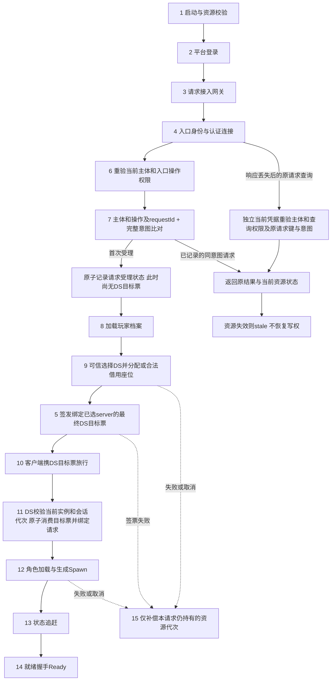

# 01-角色进入游戏完整链路

> 知识成熟度：L2（完整链路的设计解释与一手合同核对）。原 L4 标定混用了局部模型和历史 JIP 基准，不能支撑真实端到端实现已验；本次纠正整篇标定。下述票据、Session、DS 分配器是**三个独立的 C++17 合同模型**，局部正反例有严格 GCC14/UBSan 运行证据，不互相调用，也不连接真实认证服务。
> 知识基线：2026-10-04 核对 RFC 2104 §2、RFC 4231 选定向量、C++ `from_chars` 合同、AWS 幂等 API 案例与 etcd 3.5 归属事务条件。未访问 UE 源码或运行 UE，旧版 UE5.8/CL 引用不作为本轮观察。
> 适用范围：首次进入、重连、JIP 和跨服后再次进入的设计拆解；没有承诺一种流程适用于所有游戏。
> **JIP补充：2026-10-04修复有限串行接收模型的零增量安装、连续到固定目标、同步身份/实体代次及有界等待。** 该第四个独立程序同样不是真实网络/UE实现；历史 J1–J12 与“83条通过”保留，不能证明全部不变量或完整进入链路。本次不新增CPU测量。
> 证据入口：[四个独立模型与严格 runner](../../../evidence/tests/entry-core/README.md)、[票据/Session/DS manifest](../../../evidence/tests/entry-core/results/2026-10-04-entry-isolation/run-manifest.json)、[JIP strict](../../../evidence/tests/entry-core/results/2026-10-04-jip-contract/strict/run-manifest.json)与[UBSan manifest](../../../evidence/tests/entry-core/results/2026-10-04-jip-contract/ubsan/run-manifest.json)。合成签名者生成非法但带有效 MAC 的测试，只检验协议语法，不表示外人能伪造 MAC。
> 未验证：真实平台登录、TLS、CSPRNG、KMS/轮换、网关与 DS 双进程、DB/实体创建销毁、并发/崩溃恢复、侧信道和端到端性能。
> 最后更新：2026-10-04（严格票据解析、主体/意图幂等、资源代次补偿、座位/写权分离、有界JIP与证据范围纠正）。
---

## 一、概述与链路定位

进入游戏往往在玩家开始操作之前就已修改会话、占位等服务端状态。它需要完成五件事：证明"你是你"、找到"你该去哪个进程"、把"你的存档"读出来、把"你的角色"放进世界、并且让你看到的世界和别人看到的一致。

这段流程出问题时的表现极具误导性：

| 玩家看到 | 常见误判 | 真实原因 |
| --- | --- | --- |
| 卡在加载界面不动 | 客户端卡了 | 服务端 `no_capacity`，客户端没有超时兜底 |
| 反复"连接中" | 网络不好 | 票据过期，客户端拿旧票无限重试 |
| 进去了但世界是空的 | 渲染问题 | JIP 增量包乱序被丢弃，状态没追上 |
| 进去就被踢回登录 | 账号被顶 | 同一玩家重复进入，后一个会话顶掉了前一个 |
| 偶尔进不去、重进就好 | 随机故障 | 名额未释放（回滚缺失）导致池子被慢慢耗尽 |

本篇与相邻链路的分工：

| 维度 | 01-进入游戏（本篇） | [02-角色移动](../同步预测与回放/02-角色移动完整链路.md) | [07-假人AI](../../06-游戏AI/战斗战术与机器人/07-假人AI完整链路.md) |
| --- | --- | --- | --- |
| 关注点 | 从启动到"可操作"之前的一切 | 可操作之后的移动与预测 | 非玩家的实体决策 |
| 终点 | `Ready`（能发第一条输入） | 权威位置 | 决策结果 |
| 核心难点 | 幂等、租约、回滚、状态追赶 | 预测与纠偏 | 预算与寻路 |
| 证据 | `evidence/tests/entry-core/*` | 见该篇 | 见该篇 |

> 一句话判据：**进入链路的所有设计，都是为了在"客户端可能重发、可能断线、可能伪造"的前提下，在明确的主体、请求和资源代次作用域内保持唯一有效归属，并让重试与失败有可解释结果。单进程模型不证明跨进程持久化 exactly-once，也没有创建真实角色实体。**

## 二、链路类型与依赖模块

| 维度 | 内容 |
| --- | --- |
| 链路类型 | 会话建立型：入口身份 → 幂等受理 → 档案 → 可信DS选择/占位 → DS目标票 → 连接 → 校验/消费 → 生成 → 追赶 → 就绪 |
| 客户端模块 | 启动器/资源校验、平台 SDK 登录、网关连接与重连、Travel/Connect、加载界面、输入使能 |
| 服务端模块 | 网关（票据签发/验签/限流）、会话服务（幂等表、踢线）、档案服务（DB + 缓存）、匹配/房间服务、DS 调度器（租约 + 栅栏令牌）、DS 内 NetDriver/GameMode、世界（Spawn + 快照 + 增量日志） |
| 依赖模块 | [游戏服务端/04-平台与可靠性/01-身份认证与权限模型](01-身份认证与权限模型.md)、[游戏服务端/05-UE Dedicated Server平台化/03-DS会话注册与重连实现](03-DS会话注册与重连实现.md)、[游戏服务端/06-世界模拟与运行时/07-EntityOwnership与Authority](../世界权威与故障恢复/07-EntityOwnership与Authority.md)、[游戏服务端/06-世界模拟与运行时/13-世界Snapshot与故障恢复](../世界权威与故障恢复/13-世界Snapshot与故障恢复.md) |
| 失败路径 | 票据过期/被篡改/重放/跨服使用、重复进入、档案读取失败、无容量、DS 启动未就绪、旅行超时、生成期失败、日志窗口不足、重连宽限期超时 |
| 模型正确性证据 | [evidence/tests/entry-core](../../../evidence/tests/entry-core/README.md)：2026-09-11 的83项历史结果保留；三个安全模型与JIP各有独立输入/反例和新raw，不是集成验证 |
| 性能证据范围 | 仅保留旧JIP内存模型样本，不作为本批端到端性能证据；没有MAC timing或真实网络包体测量 |

## 三、权威状态与数据所有权

| 状态 | 权威方 | 说明 |
| --- | --- | --- |
| 平台身份（openid 等） | 平台 | 服务端只做校验，不可自造 |
| 登录票据 | 网关签发、DS 验签 | MAC保护声明完整性；消费作用域、授权和持有者绑定另定 |
| 会话（player → 会话实例） | 会话服务 | 唯一写者；负责踢线与幂等 |
| DS 名额（租约） | 调度器 | 串行管理座位记录；写权限另受完整句柄和时间约束 |
| 玩家档案 | 档案服务（DB 为源） | 内存缓存必须带版本号，写入走幂等 |
| 角色实体与初始属性 | DS（世界） | Spawn 那一刻由 DS 决定；客户端只表现 |
| 快照与复制增量序列 | DS（复制scope） | 同一scope连续seq；不是筛选后的全世界rev，客户端不能改 |

四条硬规则：

1. **票据是凭证，不是状态**。MAC能保护身份/受众声明不被任意改写，但不是持票者本人证明。票据应最小化；带签名的数据不因经客户端转发就可伪造，仍可能泄露、陈旧或被整张盗用。
2. **名额在"分配成功"时即被占用，不是"进服成功"后**。否则调度器会超卖。占用与释放之间必须有租约兜底，防止玩家掉线后名额永久泄漏。
3. **受保护写入须验证当前资源/owner generation**。数值令牌不是独立授权，真实存储必须在原子副作用提交点做比较。
4. **客户端世界状态只能由快照 + 增量推进，不能"看着像对的就跳过"**。跳过任何一条增量都会造成静默不一致，且在下一次全量校验前不可见。

> 客户端知道一个值并不代表它能伪造有效 MAC；服务器仍须验证来源、完整性、用途和当前授权，不能把“客户端声称的 playerId”当认证主体。

## 四、完整数据流架构图（设计拆解）



**先确定受众，再签发目标票。** 入口的当前身份凭据用于认证网关请求，不是本篇`TicketCodec`中已经带`server`的DS目标票。可信调度器先选择/分配DS，或确认可借用的既有归属；此后签发方才把已确定的server写入MAC保护的最终票据，再交给客户端Travel。不能在目标未定时预签目标DS票，也不能让客户端事后补填server。重连已有保留位也要先确认当前实例/会话代次后再签新目标票。

图中数字只定位下文章节，**执行顺序以箭头为准：第9节的可信目标确定先于第5节所述DS票签发**。首次网关受理记录与DS目标票的首次原子消费是不同状态：DS在目标票验证通过后把消费与对应请求绑定；网关不能提前消费同一张目标票后让DS盲目再次消费。原成功响应丢失时，独立当前身份/权限重验后查询已记录结果，不重消费旧nonce；旧资源已失效则返回stale，不恢复写权。

这是一张目标集成合同图，三个独立C++程序并未接成此系统。请求受理、可信分配、目标票签发、DS消费及原结果查询之间的持久化、故障续作与补偿仍需实现。进入失败只补偿本请求新取得且仍匹配的资源代次，不能无条件撤销旧Ready会话。

## 五、分步详解

### 步骤 1–2：启动与平台登录（客户端发起，服务端验证）

客户端启动后先做版本与资源校验（版本不符直接强制更新，不要放到进服后再失败），然后调用平台 SDK 完成登录，拿到平台凭证。

关键约束：

- **平台凭证只在客户端与网关之间使用**，绝不转发给 DS；DS 只认网关签的登录票据。
- 登录结果必须缓存"账号维度"的稳定标识，而不是设备/会话维度，否则换设备后无法识别为同一玩家（影响后续幂等与顶号判定）。

失败路径：平台登录失败、凭证过期 → 提示重新登录，**不消耗任何服务端名额**。

### 步骤 3–4：接入网关与长连接

网关地址应通过"接入层发现"下发（域名/就近接入/权重），而不是硬编码；客户端按返回列表逐个尝试，全部失败才是真正的网络故障。

长连接建立后先做加密/压缩协商，再发业务包。**鉴权在业务包层面完成，不依赖连接层面**——因为连接可能被复用、被代理重放。

### 步骤 5：换取登录票据（HMAC 签发）

票据是受众受限的短期凭证。本批模型只含以下字段，**没有实现实例 incarnation、session/purpose 或发送者证明**；真实 DS 接管的扩展合同见[重连票据章](03-DS会话注册与重连实现.md#4-安全重连票据hmac-sha256-reconnect-ticket)。

```text
v1|player=<id>|server=<id>|nonce=<lowerhex>|iat=<decimal>|exp=<decimal>|sig=<64 lowerhex>
```

为何签发和接收要共用 grammar？旧签发器允许 `p|server=wrong`，分隔符会改变接收方的字段解释。即使 MAC 正确，双方也可能在认证不同的业务意图。现在固定字段顺序/集合：ID 为 `[A-Za-z0-9_-]{1,64}`，nonce 为 16–64 个小写 hex，总 wire ≤1024 字节；拒绝重复、未知、缺失、乱序、嵌入 `|`/`=`/NUL 的字段。nonce 的长度限制是教学协议选择，**不证明随机熵**；合成常量不用于生产。

`iat/exp` 采用 `[0, INT64_MAX]` 规范十进制，只允许 `0` 或非零开头数字串，不允许符号、空白、前导零、尾缀。`TicketCodec::Decimal` 先限制字符/长度，再用 C++17 `from_chars` 检查 `ec` 和 `ptr == end`。[C++ 数字转换合同](https://eel.is/c++draft/charconv.from.chars)说明转换失败通过返回值报告；当前草案中的后续标准扩展不是本项目 C++17 要求。

`Issue`正常返回错误码时保持独立输出不变，适用前置条件见[模型README](../../../evidence/tests/entry-core/README.md#假设)；不承诺内存分配异常的强回滚。TTL 策略为 1–300 秒（默认60）；skew为0–30秒（默认5）。先检查 `now <= INT64_MAX - ttl` 再计算到期。验证独立检查 `exp > iat` 且时长≤300，不能让两个 skew 比较掩盖颠倒的区间。这些上限是模型配置，不是 RFC 强制值。

### 步骤 6：网关验签与一次性消费

独立`TicketCodec`的单票校验/首次消费顺序为：限长/规范解析 → MAC → 合法时间区间与当前窗口 → 非空预期 server → 检查/消费 nonce → 发布输出。这不是每次业务重试都应重新消费票据的调用链。`Parse` 用局部 Ticket，格式全部满足才写输出；`Verify`正常返回错误码的分支不发布未验证字段、不消费nonce；这里未承诺任意异常的强回滚保证。数字转换没有异常逸出，不代表含 string/map 的整个 API 在内存耗尽时 `noexcept`；本批没有注入 `bad_alloc`。

时间接受窗为 `[iat-skew, exp+skew)`，逻辑边界用“较大非负数减较小数”判断，避免直接算 `now±skew`。例如 `iat=100, exp=160, skew=5`：95、164接受，94尚未生效，165已过期。默认 TTL + 容差会延长接受窗，不能称容差没有安全代价。输入 now 来自可信验证服务器，本模型没有跨机器时间同步或票据验签时钟回拨检测。

反例与正确例（均使用合成测试密钥）：

| 输入/操作 | 旧缺陷 | 现在的判定及可观察状态 |
| --- | --- | --- |
| 有效 MAC，`iat=100junk` | `stoll`只转换前缀 | malformed；nonce表和输出逐项不变 |
| `iat=not-a-number`、超INT64 | 转换异常逸出 | 返回malformed，无数字转换异常 |
| 有效 MAC，`iat=104, exp=96, now=100` | 两侧skew让颠倒区间通过 | 独立区间检查拒绝 |
| player被改但MAC不改 | 字段完整性不成立 | bad signature |
| 正常票据首次消费/再次消费 | 单进程一次性语义 | 首次ok，再次replayed |
| INT64_MAX附近签发 | `now+ttl`有符号溢出 | 超界拒绝，恰好可表示边界正常 |

#### 三类证据不能互相替代

- SHA-256 的3个固定向量、流式分块一致性及 [RFC4231](https://www.rfc-editor.org/rfc/rfc4231) TC1/2/3/6，支持这些输入的输出。自实现 SHA/HMAC 是教学代码，不是生产密码库。
- 全字节异或比较的相等/首差异/末差异/长度差异，仅是布尔功能测试。**没有测量或证明常量时间**。采用 [OpenSSL `CRYPTO_memcmp`](https://docs.openssl.org/3.0/man3/CRYPTO_memcmp/) 等受维护接口需遵守其合同，仍不能把比较保证外推到整个服务；本程序未链接 OpenSSL。
- MAC保护被签数据完整性，不加密，也不证明持票者本人。按 [RFC6750 §1.2](https://www.rfc-editor.org/rfc/rfc6750#section-1.2) 的 bearer 语义，整张有效票被窃取后仍可能使用；本自定义协议不是 OAuth 实现。[RFC2104 §2](https://www.rfc-editor.org/rfc/rfc2104#section-2) 定义共享密钥 HMAC，能验MAC的一方通常也能签发，不是公钥签名。

#### 一次性与重试是两件事

模型消费键为一个 codec 签发域内的 `(player, server, nonce)`，最多1024项，满表拒绝新消费；不自动清理。它只有串行内存 check-and-mark，不保证并发、跨进程、重启后一次性。生产须选择统一消费点，保留到票据不再可能被接受，并定义状态容量、过期清理与故障恢复。

消费成功但响应丢失，应携带**独立的当前身份凭据与原requestId**查询业务结果：服务端重新认证主体/租户和查询权限，再匹配原operation与完整意图；当前权限不足就拒绝查询，资源已失效则返回stale，不再次占位或赋权。合法重试不应仅凭nonce重复就被笼统归为恶意请求。

不能把Session的`AuthFn`机械接成每次`Verify(..., consume=true)`：首次成功后nonce已用，合法重试会在缓存前被拒。`consume=false`也不是恢复查询接口，它仍检查并拒绝已消费nonce，只是不新增消费记录。现有三个模型没有实现跨模块恢复接口；真实集成需要当前身份验证和原请求结果查询这两个独立合同。网关和 DS 各自用独立 nonce 集合不等于全局一次性；可以共享原子状态，也可以网关消费入口票后签发用途不同、绑定会话与实例代次的 DS 凭证，不能让同一 nonce 被两个独立消费者都称作“唯一消费”。反重放和请求幂等是不同合同。

2026-10-01 的24项功能复跑保留为历史；2026-10-04 已增加严格语法、失败状态不变和时间边界。旧历史日志中的 T21–T24 命名不构成 timing 证明。

### 步骤 7：幂等去重与踢线判定

`requestId` 是客户端声明的请求关联值，不是身份凭证。现在每次 Enter 都先调用可信服务端Auth接口重验当前身份与操作权限（测试替身是合成凭据白名单，不是重复消费一次性票据），检查声明 player 与认证 subject 相符，再查询 `(tenant, subject, operation, requestId)`。凭据被撤销后，即使命中旧成功缓存，也不能拿到旧 Session/DS句柄。每步重试次数配置仅接受1–3，0、4或INT_MAX均在回调/分配前快拒，防止无限重试或计数器溢出。

保存完整规范业务意图 `{player, match, character, region}` 并逐字段比较。输入ID不隐式trim或大小写折叠；同键同意图返回原终态，Auth仍执行，Allocate/Travel/Load/Spawn不重跑；同键异意图返回Conflict，不返回旧对象、不改变资源。跨主体同字符串requestId独立。此做法对应 [AWS 幂等API案例](https://aws.amazon.com/builders-library/making-retries-safe-with-idempotent-APIs/) 的调用者隔离、异参数拒绝和迟到请求问题，不能省略持久化事务就声称同样的分布式保证。

请求结果与活动归属是两张不同的账。新requestId、同一意图可以借用已Ready资源，记录 `acquiredNew=false`；不同match等意图不借用。旧Ready的句柄已释放或换代，再重放只返回stale历史结果，不恢复写权；需要显式的新进入/重连操作。真实服务还须定义幂等记录保留期、崩溃恢复与资源删除后的响应，不能只加TTL后声称永久幂等。

同主体同意图借用已有Ready资源与“新设备顶掉旧连接”是不同问题：前者保持现有归属，不强制踢线；后者才涉及产品选择。顶号/拒绝新连接是产品政策，不由“有新票据”自动推出。无论选哪种，可信主体、当前会话代次、可见返回码和旧连接失效顺序都应明确。

### 步骤 8：加载玩家档案

从 DB 读取角色档案（等级、属性、背包、任务、位置）写入内存缓存。要点：

- 读失败要区分"档案不存在（新号，走创建）"与"DB 不可用（可重试）"，两者的重试策略完全不同。
- 缓存的档案必须带版本号，写入走幂等（见 [05-背包道具完整链路](../../05-Gameplay与交互系统/背包装备与存档/05-背包道具完整链路.md)）。
- 可选择先读档再占位以减少回滚，也可先占位后加载以控制并发成本。本Session模型用后者；失败只释放本请求新取得且当前仍匹配的名额。

### 步骤 9：分配 DS（占名额 + 租约 + 栅栏令牌）

先区别“座位仍在记账”和“owner仍可写”。`Lease` 保存 `{player, ds, epoch}`、`expiresAt`、`holdUntil`；allocator-wide epoch 在本进程中递增，Release/Reap不重置，耗尽拒绝，不回绕。真正跨进程/重启恢复还需要持久化高水位或实例 incarnation，本例未实现。

下表描述满足模型调用前置条件的**正常返回码路径**。容器/字符串分配异常未获强回滚保证，不能把表中的串行状态转换外推成任意异常下的事务。

| 状态 | 时间条件 | 占座 | Commit / Heartbeat / 请求Release | 重新鉴权后的Allocate |
| --- | --- | --- | --- | --- |
| Live | now < expiresAt | 1 | 完整句柄相等才允许 | 原位复用，不增load、不换代 |
| GraceHeld | expiresAt ≤ now < holdUntil | 1 | 旧owner均拒绝 | 原位换代，仍只记1个座位 |
| Expired待清扫 | now ≥ holdUntil | 物理账可仍是1 | 均拒绝，不依赖Reap | 成功分配时原子结清过期账并新分配 |
| Released/Reaped | 无记录 | 0 | 拒绝 | 按容量新分配、新epoch |

为什么grace重连必须先找本人座位？1台DS容量1、p1@1000拿到过期1030/保留1040的座位。1035重连时load已经是1；若再检查“load<capacity”会错误拒绝，若又加1会漏账。正确做法是更新这条记录的epoch/期限，load仍1。原DS满载也不迁走本人保留位。

每次操作检查逐DS `0≤load≤capacity`、`load(ds)==座位记录数(ds)`，玩家最多一条归属；不能把总数相等当逐DS正确。Commit/Heartbeat/请求Release都校验相同完整身份与Live时间窗，旧player、旧ds、旧epoch任一不同均拒绝。Reap仅负责容量清理，晚跑不延长授权；1030恰到期就不能用普通Heartbeat复活。

时间now是调度器可信输入。只有通过输入/配置前检、到达`Observe`的调用才记录水位，后续相对此水位倒退拒绝；空player、null输出或非法配置在前检即返回，不表示已经全局采样时钟。例如空player@2000被拒后，水位若仍1000，合法Commit@1020仍按1020判断。即使2000的旧心跳被拒，也不能回拨到1000复活。在调用前置条件成立、操作正常返回错误码的路径上，拒绝可推进这个**时钟水位**，但不改座位、load、epoch或独立的调用方输出。新deadline先检查TTL和grace加法；溢出/epoch耗尽的正常错误返回不会先清账再失败。`bad_alloc`等异常、外部直接改写public状态或out别名内部容器不在此保证内；这不是任意失败的强异常安全实现。

`Commit`这里只返回布尔值。生产必须把资源身份、owner generation与业务写入放在一个原子提交条件中；[etcd 3.5 LeaderKey.rev](https://etcd.io/docs/v3.5/dev-guide/api_concurrency_reference_v3/)可作事务归属条件，但使用etcd不自动保护外部DB。栅栏是一种防止迟到写入的机制，不是“不论怎样集成都安全”的唯一解。

### 步骤 10：客户端旅行到 DS

网关返回目标 DS 的地址与票据，客户端建立到 DS 的连接。要点：

- 票据**绑定 server 字段**，拿错服直接拒绝；还须验证当前主体、用途、会话、实例incarnation与资源代次，server字段不是全部授权。
- 旅行要有**独立超时**（不是复用网关连接超时）；超时后可重试，重试命中幂等表 → 复用同一名额。
- 客户端在旅行期间必须显示可取消的进度，而不是无限转圈。

### 步骤 11：DS 侧二次鉴权

DS 收到连接后**必须重新验签**，不能因为"来自网关"就信任：

```text
DS首次受理：当前主体权限 + 专用凭证验签/时间/实例与会话代次 -> 原子消费并绑定请求
原结果恢复：独立当前身份重验 -> 原requestId与完整意图查询 -> 当前资源状态（不再消费旧nonce）
```

消费点和业务结果必须衔接：DS或共享存储原子校验/消费并返回对应幂等结果。网关已消费入口票时，应查询既有结果或用独立用途的会话凭证，不能简单在两份内存集合再次消费同一票就宣称全局一次性。

### 步骤 12：角色加载与生成（Spawn）

DS 在权威世界内创建角色实体：读档案 → 计算初始属性（见 [11-伤害与属性结算完整链路](../../05-Gameplay与交互系统/技能战斗与属性结算/11-伤害与属性结算完整链路.md) 的属性快照与修正器聚合）→ 恢复 Buff（见 [04-Buff系统完整链路](../../05-Gameplay与交互系统/技能战斗与属性结算/04-Buff系统完整链路.md)）→ 放置到指定位置 → 标记 `alive`。

- **属性在 Spawn 时快照一次**，之后由世界驱动；不要每帧从档案重算。
- Spawn 位置要按场景规则做落地校验（避免卡地形），但**不要让客户端决定**。
- 生成阶段失败（例如位置非法、场景未加载完）应补偿本次新取得的名额并按实体代次清理本次创建的实体。模型的Spawn只是结果回调，本批只测名额补偿，**没有测实体创建/回收**。借用旧Ready资源时失败不得释放旧资源。

### 步骤 13：状态追赶（JIP 与断线重连）

玩家进入的是已运行的世界，但接收的是**为当前连接定义的复制scope**。本批[jip_resync.cpp](../../../evidence/tests/entry-core/src/jip_resync.cpp)实现一个有限串行模型：HP、位置、存活/死亡和同槽实体generation；没有把UE全世界复制或持久化恢复简化成一个已验证事务。

#### 先固定身份、范围和目标，再谈连续

`Context={world,incarnation,scope,schema,session}`由可信应用会话提供，每次同步加单调transfer；snapshot、delta和ACK都比较完整身份。字段相等不等于已认证：真实接入仍需前面章节的当前主体、权限和会话归属。schema/实例/复制范围改变由可信应用显式Rebind并重建基线，不能收到一个异流包就切换。Rebind拒绝与当前相同的Context；新的不同Context不得复用历史生命周期身份，跨进程/重启唯一性由外部提供，本例不无限保存旧Context。

`Plan={identity,R,T}`在开始时固定T。Snapshot(R)必须是同一scope的一致不可变切片；本模型由手工fixture提供，不实现权威端并发快照捕获。日志应覆盖这个scope的每个R+1..T，之后到来的T+1不会把本轮目标向前推。若AOI过滤后的全世界rev为100、103、109，不能因为没有101就宣布丢包；要定义连续的复制seq或显式覆盖合同。本模型采用前者。[Epic Actor Relevancy](https://dev.epicgames.com/documentation/unreal-engine/actor-relevancy-in-unreal-engine?lang=en-US)说明复制相关性按连接决定，不能据此声称本例实现了UE AOI。

```text
可信Begin(identity,R,T) -> ReceivingSnapshot（输入关闭）
安装Snapshot(R)，把已收到的R后增量连续排出
  R==T也必须安装；seq<T -> WaitingForGap；seq==T -> CaughtUp
完整identity+固定T的ACK -> 交接实时流；无洞才Live/Ready
  缺头/中洞/缺尾、坏数据、冲突、超限/过期 -> NeedSnapshot
可信新transfer + 最新Snapshot(R'=T') -> 同一个client重试
```

#### 收包期间不丢变化，也不无限等待

批Window的first是非空日志的包含式左界，head为已知上界；空日志忽略first（head+1可能无法表示），仅R==T且head≥T时允许安装。R<T空窗仍失败；这个编码是教学模型自己的约定。批CatchUp对每条记录先验identity及[first,head]范围，但seq≤R的已覆盖记录随后直接忽略payload，不保证验证其grammar、field或NaN/Inf。它们不参与快照状态重建，CaughtUp也不等于所有历史payload合法。R后的记录仍进入Deliver进行字段/有限数检查，槽/代次/生命周期在实际应用前验证。

快照传输时，R之后的增量先入有界pending。安装只排出到T，T后的合法包保留到ACK交接；旧transfer的包/ACK不影响新transfer。`seq==next`先验证完整载荷和实体代次，再排连续段；有洞仅缓冲。未应用same-seq/same-payload幂等，same-seq不同内容冲突而不覆盖；最近8条已应用记录也检查，更早返回Stale不写入，不宣称检测全部历史冲突。相同快照重发不清掉合法pending；旧基线不能回退同context的已提交seq。

模型固定≤16实体槽，pending≤8条、未来跨度≤32、单轮T−R≤32、批日志≤64条。Begin至ACK的10个合成时钟单位不随重发延期；实时缺口另开10单位期限，恰到期失败。now由可信调用方传入且定期Tick；通过当前身份/阶段前检后观察时间，重复/旧包或随后数据错误也不允许之后回拨，观察不延期；错误身份不采样。无后台定时器。具体上限为测试选择，不是上线配置建议。缺失尾包可能让pending为空，完成检查仍必须`seq==T`；不能用“没缓冲东西”充当成功。

#### 错误提交边界和可手算状态

每次Install/Deliver先在候选副本中验证可排出的完整连续段，再提交；正常错误返回保持本调用前世界、seq及合法pending，允许阶段切到NeedSnapshot。**批CatchUp保留较早成功调用的合法前缀**，不是全批原子事务。内存分配异常、外部篡改public字段、异步重入和持久化崩溃不在保证内。Install的快照检查和Deliver的载荷检查拒绝相应格式、未知field及NaN/Inf/越界数值，实际应用前再检查槽/代次/生命周期。批helper的R后记录走这些检查；其seq≤R旧payload只经前述identity/窗口范围检查后跳过，不在“坏载荷均拒绝”的保证内。seq/generation/期限耗尽不回绕。

例如R10的slot0是gen1/HP100/位置(0,0)。11将HP改73.5，13 Despawn，14以gen2在(3,4) Spawn（HP100），15改HP42；最终必须是gen2/HP42/(3,4)/alive，旧gen1消息不可再写。死亡slot也保留其ID、代次、位置、HP，逐字段参加oracle；不再用忽略dead且量化0.001的hash称“byte-identical”。完整三槽人工期望、逆序/固定seed置换、错误码和中间状态见[模型说明](../../../evidence/tests/entry-core/README.md#jip身份连续前缀和有界交接)。

#### 选择全量还是增量，先明确起终点

保留[2026-09-11原始JIP记录](../../../evidence/tests/entry-core/results/jip_resync.txt)供历史复核，撤回旧表的普适CPU/带宽结论：旧全量样本停在R、追赶到T，析构计时与单次/批均摊采样也不同。估算`实体数×32 / 增量数×32`没有实际编码，不能称网络节省10×。

fresh JIP的总量包含S(R)+D(R,T)，warm resume只有确认客户端已持有可用R基线才可能只发D；应与同一scope/同一终点的S(T)比较。将来基准须统一分配/析构/校验边界、抽样策略与可观察结果，测编码/压缩/网络成本。本批从默认程序撤下旧计时，不寻找或声称性能提升。

### 步骤 14：就绪握手（Ready）

`CaughtUp`只是已连续应用到本轮固定T。模型要求完整`{world,incarnation,scope,schema,session,transfer,T}`的ACK，并验证当前阶段；错身份、旧transfer、错T或尚未完成均不能打开输入。相同ACK幂等。ACK交接时继续排出已收到的T后增量，若仍有洞返回Buffered并保持输入关闭；实时流后来有洞也暂停输入，补齐恢复、到期重同步。

这里`AcceptAck`是**单个串行教学对象中的应用门禁**，没有实现双进程握手，也不能证明不可信客户端诚实地安装了数据。真实DS还须将当前连接、会话归属、角色生成结果与ACK授权衔接；`Ready()`不是替代认证/反作弊的凭证。客户端要区分连接已建立、快照已装、追到T和获准输入；分步埋点才能解释加载等待。

### 步骤 15：失败路径与回滚

失败处理贯穿整个流程。先问“本请求取得了什么”，再决定补偿；`rolledBack` 位与Ready后no-op都不足以独立保证隔离。

| 中断点 | 资源事实 | 正确补偿 | 本批覆盖 |
| --- | --- | --- | --- |
| Auth或Allocate回调失败 | 本请求还没取得资源 | 不释放任何座位 | Reject/Timeout/Cancel |
| 新分配后Travel/Load/Spawn失败 | 记录了新取得的具体handle | compare-release本请求仍持有的代次 | 失败矩阵与重复Cancel |
| 借用旧Ready后失败 | 旧资源不是本请求创建 | 不释放旧资源 | 旧Ready完整状态/handle/load比较 |
| 旧请求迟到取消 | 后来可能已换代 | 旧handle不匹配则no-op | 早失败迟到Cancel、旧代次补偿 |
| 当前Ready后Cancel | 玩家已在局内 | 本API no-op；退出用独立授权操作 | Ready保留 |
| 真实实体创建中断 | 可能有部分世界副作用 | 实体generation级补偿 | 未实现/未测 |

反例：p1/old在Auth被拒，没有占位；p1/new随后Ready。旧版Cancel(old)按player释放，会清掉new。正确例保存`acquiredNew`与取得时的完整句柄；没拿到资源不释放，借来的不释放，旧代次不匹配也不释放。补偿完成后终态不再转换。

历史“no_capacity只改状态却继续走到Ready”的教训仍成立：失败立即return。现在除了终态，还检查后续回调调用数为0及逐DS账实一致；测试真实负向控制刻意移除`acquiredNew`判断，旧Ready失败矩阵必须变红。

## 六、失败矩阵

| 阶段 | 失败 | 客户端表现 | 服务端应做 | 可重试 |
| --- | --- | --- | --- | --- |
| 1 启动 | 资源/版本不符 | 强制更新提示 | — | 更新后 |
| 2 平台登录 | 凭证无效/过期 | 重新登录 | — | 是 |
| 4 长连接 | 握手失败/超时 | 换接入点重试 | 计入接入层健康度 | 是 |
| 5 取票 | 网关限流 | 稍后重试 | 限流，不签票 | 是（退避） |
| 6 验签 | 签名错误 | **不可重试** | 记安全日志 | 否 |
| 6 验签 | 票据过期 | 先确认原请求是否已受理 | 经当前身份查询原结果；仅新受理需要新票 | 查询恢复或显式新请求 |
| 6 验签 | 跨服使用 | 不可重试 | 记安全日志（可能是探测） | 否 |
| 6 消费 | nonce已消费 | 响应可能丢失，不等于业务失败 | 拒绝再次消费；经当前主体/权限查询原请求结果，区分合法重试与越权 | 可查询恢复，不重复消费 |
| 7 会话 | 同主体同意图已有有效会话 | 恢复进入结果 | 原请求复用结果；新请求可合法借用当前资源，不强制顶号 | 按同意图合同 |
| 7 幂等 | 同键异意图 | 明确冲突 | Conflict，不返回旧对象、不改资源 | 不盲重试原冲突请求 |
| 7 会话 | 新设备要求接管旧连接 | 显示接管或拒绝结果 | 按显式顶号政策和当前授权处理，不能从已有会话自动推出Kick | 按产品政策 |
| 8 档案 | DB 不可用 | 稍后重试 | 熔断 + 降级读缓存 | 是 |
| 8 档案 | 档案不存在 | 进入创角流程 | 创建档案（幂等） | 否 |
| 9 分配 | 无容量 | 排队提示 | 入队/扩容，**不超卖** | 是（排队） |
| 10 旅行 | 超时 | 重试进度 | 幂等复用原名额 | 是 |
| 10 旅行 | DS 未就绪 | 重试 | 调度器置为不可分配 | 是 |
| 11 二次鉴权 | 会话令牌不匹配 | 回登录 | 拒绝并记日志 | 否 |
| 12 生成 | 位置/场景异常 | 回登录+重试 | 比较补偿本次新取得资源；借用旧Ready不释放 | 按错误分类 |
| 13 追赶 | 窗口不足/中洞/缺尾 | 输入关闭，显示同步进度或失败 | NeedSnapshot；新transfer重装最新基线 | 新一轮同步，不能原地假成功 |
| 13 追赶 | 冲突/坏数据/缓存或等待超限 | 明确同步失败，输入关闭 | 保留合法前缀和有界诊断；按策略新transfer | 有界重同步，不盲循环 |
| 14 就绪 | Ready响应丢失 | 经鉴权恢复原结果 | 原requestId+同意图查询，不重新消费nonce或分配；JIP ACK另绑定当前identity+T | 是（查询恢复） |

**“可重试”必须注明重试的操作**：重新查询原结果、重新认证、重新取票与新建会话不是同一件事。UI应给出对应恢复入口；不能把所有nonce重复显示成攻击，也不能把同意图现有会话一律显示成顶号。

## 七、验证与测试矩阵

三个安全模型与JIP分别以GCC14/C++17严格选项及UBSan真实运行，原始结果见[证据README](../../../evidence/tests/entry-core/README.md)。每项断言使用显式计数/非零退出，不依赖`assert`、`NDEBUG`或Python优化开关。

| 对象 | 本次可复现输入与oracle | 不包含 |
| --- | --- | --- |
| 票据 | 选定SHA/HMAC向量；非法iat/exp、完整grammar、签发/时间边界；每次失败比较nonce表与输出 | CSPRNG、生产密码安全、timing |
| 比较函数 | equal/first-diff/last-diff/length-diff布尔 | **首末差异耗时一致未验，撤销原T21–T24 timing ✅** |
| Session | Auth/Allocate/Travel/Load/Spawn × Reject/Timeout/Cancel × 有/无旧Ready；同键异意图/跨主体/迟到取消/stale replay | 真实认证、并发事务、实体生命周期 |
| DS | TTL/holdUntil前后含/不含Reap、满DS本人重连、跨DS完整句柄、溢出/回拨/耗尽、固定事件序列逐步不变量 | 多进程持久化fencing、脑裂 |
| runner | Bash与Linux pwsh的非零/缺工具/坏RESULT/输出失败/超时，3项安全语义与3项JIP mutation必须被抓 | Windows/MinGW C++未运行 |
| JIP | 零增量/窗口/头中尾缺失、乱序重复/安装期收包、完整身份与generation、ACK/T后交接、有界超时/耗尽、独立完整状态oracle | UE复制、真实弱网、认证、并发快照/持久化、性能 |
| 端到端 | 计划：网关→会话→DS→DB/世界→客户端 | **本轮未运行** |

runner把故意破坏后的模型输出留作负向控制：里面出现FAIL是预期发现，不可只grep目录中的RESULT求和。只认本次manifest与各阶段退出/判定。

## 八、性能与容量预算

本批没有票据/Session/DS耗时测量，不承诺“微秒量级可忽略”。JIP默认旧计时已撤下，历史raw受前述正确性和计量边界限制，不作为新模型性能结论。进入总耗时、成功率、每步排队/重试和资源占用应在目标环境埋点。

模型容量2玩家/DS只是用来触发容量边界，不是玩法容量建议。真实瓶颈可能在档案DB、调度器、资源加载、网络或DS Tick；“千人登录先倒DB”等结论须由负载与观测支持。目标预算应由玩法和设备约束决定，不能把示例3秒当标准。

## 九、反模式

| 反模式 | 为什么失败 | 正确合同 |
| --- | --- | --- |
| 有MAC就允许模糊语法 | 签发与验证解释可能不同 | 严格有界grammar，签发同规则 |
| 拼接MD5+盐叫HMAC-SHA256 | 算法根本不同 | 依RFC2104结构，生产使用受维护库 |
| 把票据字段当持有人证明 | 有效bearer可能整张被盗 | 安全传输、最小披露、用途/会话绑定 |
| requestId命中即返回 | 跨主体泄露或绕过撤销鉴权 | 先认证；主体+操作+ID+完整意图 |
| 新请求失败就Release(player) | 可能释放旧Ready或新一代资源 | acquired-new + 完整handle compare-release |
| 只给补偿加一个done位 | 首次迟到补偿仍可误伤新资源 | done位和资源代次条件同时满足 |
| grace重连重新加load | 保留位重复记账 | 原位换代、load不变 |
| Heartbeat依赖Reap先跑 | 清扫延迟让旧owner复活 | 每次自行检查Live窗口 |
| 比较数字epoch不比较ds/player | 另一个资源同数值可误授权 | 完整资源身份+当前代次 |
| 旧Ready缓存重新授予写权 | 资源可能已换代 | 返回stale，显式新操作 |
| 无限重试过期票据 | 无法恢复原消费结果 | 按认证主体查询原请求，必要时重签 |
| JIP空日志或pending为空就成功 | 未装基线或缺失尾包也可能为空 | 安装基线+seq==固定T+当前ACK；有限模型已覆盖 |
| 把全世界rev当过滤流连续号 | AOI排除事件会产生自然空号 | 定义复制scope/seq；scope改变重建基线 |

## 十、落地检查清单

- [ ] 签发/解析共用长度、字段顺序、字符集与数字规范；错误无半输出/nonce消费
- [ ] MAC、bearer身份、目的受众、实例incarnation/会话代次分开验证
- [ ] 时间区间、TTL/skew上限、等号边界与溢出均明确
- [ ] 每次缓存返回前鉴权，键含可信主体/操作/requestId，意图逐字段绑定
- [ ] 新取得/借用资源区分，补偿比较完整句柄，历史Ready不复活写权
- [ ] Seat与Live授权分开，逐DS账实一致，grace本人重连不多占位
- [ ] 所有资源操作自己检查时间；时钟回拨与epoch耗尽失败封闭
- [ ] 真实存储的归属校验与副作用同事务；进程重启不复用旧generation
- [ ] 首次nonce消费与原请求结果恢复分路；当前主体/权限每次重验，查询不重复消费
- [ ] 消费、幂等记录和资源创建有故障恢复合同；本模型未实现持久化
- [ ] JIP零增量安装、固定scope/R/T、身份和实体代次、有界重排/重同步与当前ACK；将有限模型接入真实协议后另验
- [ ] 原始日志不覆盖，新run独立；负向控制能使测试失败

## 十一、术语速查

| 术语 | 本篇含义 |
| --- | --- |
| 登录票据 | MAC保护的受众/时间声明；本例为自定义bearer式教学协议 |
| 幂等键 | 认证主体+operation+requestId；另比较完整意图，不是身份凭证 |
| Seat | 仍记在容量账上的保留位，可能已无写权 |
| Live lease | 当前时间在写授权窗内的租约 |
| GraceHeld | 旧owner无写权、本人仍保留一个重连座位 |
| Handle | 资源完整身份与epoch，不能只比较数字 |
| acquiredNew | 本请求创建的资源；补偿资格的一项必要条件 |
| Fencing | 在受保护写入提交点拒绝旧owner generation的机制 |
| JIP | 为中途加入/落后客户端建立一致scope基线并追到固定目标；本库只验证有限串行模型 |

## 十二、关联阅读与演进索引

- **可复现证据**：[evidence/tests/entry-core](../../../evidence/tests/entry-core/README.md)
- **下游链路**：[02-角色移动完整链路](../同步预测与回放/02-角色移动完整链路.md)（Ready 之后的第一步）、[11-伤害与属性结算完整链路](../../05-Gameplay与交互系统/技能战斗与属性结算/11-伤害与属性结算完整链路.md)（Spawn 时的属性快照）
- **横向机制**：[游戏服务端/04-平台与可靠性/01-身份认证与权限模型](01-身份认证与权限模型.md)、[游戏服务端/04-平台与可靠性/03-幂等重试与消息语义](../持久化与分布式一致性/03-幂等重试与消息语义.md)
- **DS 与平台**：[游戏服务端/05-UE Dedicated Server平台化/01-UE Dedicated Server实例生命周期与平台化](<../专用服务器实例与容量/01-UE%20Dedicated%20Server实例生命周期与平台化.md>)、[游戏服务端/05-UE Dedicated Server平台化/03-DS会话注册与重连实现](03-DS会话注册与重连实现.md)
- **世界与归属**：[游戏服务端/06-世界模拟与运行时/07-EntityOwnership与Authority](../世界权威与故障恢复/07-EntityOwnership与Authority.md)、[游戏服务端/06-世界模拟与运行时/13-世界Snapshot与故障恢复](../世界权威与故障恢复/13-世界Snapshot与故障恢复.md)
- **兄弟链路**：[05-背包道具完整链路](../../05-Gameplay与交互系统/背包装备与存档/05-背包道具完整链路.md)、[10-性能问题定位完整链路](../../08-工程实践与质量/调试与性能分析/10-性能问题定位完整链路.md)

### 演进方向

1. **集成测试**：网关 + DS 双进程真实链路（当前仅单元级）。
2. **并发与弱网**：同玩家并发进入、丢包/乱序/抖动下的进入成功率。
3. **容量与排队**：无容量时的排队与动态扩容联动（对接 W2 动态分线）。
4. **跨服转移后重入**：与 [游戏服务端/06-世界模拟与运行时/08-跨Zone与跨服迁移](../世界权威与故障恢复/08-跨Zone与跨服迁移.md) 打通。

> 历史：2026-09-11 首版分步流程与旧证据接入；2026-10-01 收窄票据比较声明；2026-10-04 本批修订及运行范围见顶部与证据README，原始历史日志保留。
