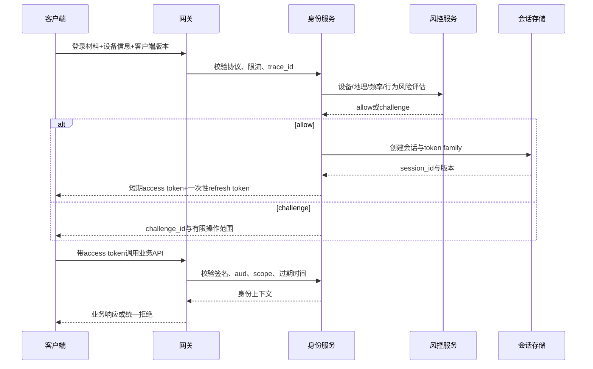

# 01 身份认证与权限模型

> 知识成熟度：L2
> 适用范围：平台可靠性-身份认证与权限模型
> 本文由《01-鉴权限流幂等灾备与可观测性》"二、身份认证、会话、令牌、设备与风控"拆分而来，正文逐字迁移。

## 元数据
- 最后更新：2026-08-13。
- 知识成熟度：L2。
- 适用范围：平台可靠性-身份认证与权限模型。
- 知识基线：平台可靠性工程方案（非 UE 内置能力）；事实边界以原《01-鉴权限流幂等灾备与可观测性》对应章节为准。
- 拆分来源：原《01-鉴权限流幂等灾备与可观测性》"二、身份认证、会话、令牌、设备与风控"。

## 概述
身份认证回答"请求来自哪个主体"，授权回答"主体能否对资源执行动作"，二者必须由服务端完成，并以最小权限和默认拒绝为基线。
本文覆盖账户、设备、会话、令牌与风险五种对象，以及 OAuth 的正确边界、登录与刷新流程、会话设计、设备风控和服务端授权检查。
失败路径、FAQ 与验收清单给出 JWT、OAuth token、撤销与超时场景下的正确口径。

### 1.1 先区分五种对象

身份认证（Authentication）回答“请求来自哪个主体”；授权（Authorization）回答“主体能否对资源执行动作”。
会话（Session）是服务端维护的登录上下文；令牌（Token）是请求携带的可验证凭据；设备标识（Device Identity）是风险和策略输入，不等于用户身份。

| 对象 | 典型字段 | 生命周期 | 泄露后的处理 | 服务端权威性 |
| --- | --- | --- | --- | --- |
| 用户账户 | account_id、区服、状态 | 长期 | 冻结、找回、审计 | 高 |
| 设备记录 | device_id、安装实例、风险标签 | 中长期 | 标记风险、重新验证 | 中，不能单独证明用户 |
| 登录会话 | session_id、account_id、issued_at、expires_at | 短期 | 撤销会话、使刷新链失效 | 高 |
| access token | subject、scope、aud、过期时间 | 分钟级或短期 | 撤销签名/会话、等待过期 | 仅代表有限访问授权 |
| refresh token | session_id、轮换版本、过期时间 | 较长但有限 | 轮换、撤销整条 token family | 只用于刷新，不直接调业务 |
| 风险令牌 | challenge_id、risk_level、expires_at | 很短 | 使挑战失效 | 只表达风控挑战状态 |

### 1.2 OAuth 的正确边界

OAuth 2.0 是授权框架参考，不是“把 access token 当账号密码”的设计许可证。
实现时应先决定自己的账户、会话和撤销模型，再选择适用的授权流程和令牌格式。
如果采用外部身份提供方，服务端仍要把外部 subject 映射到内部 account_id，并执行本地封禁、区服、年龄、设备和最小权限策略。
access token 必须有 audience、scope、过期时间和签发者校验。
access token 不应作为永久登录凭证，也不应被写入客户端长期明文存储后无限复用。
refresh token 不是业务 API 的通行证，使用时应绑定会话、轮换并检测重放。
涉及授权流程的协议细节，以 [RFC 6749 OAuth 2.0](https://www.rfc-editor.org/rfc/rfc6749.html) 为参考，并结合实际安全评审。

### 1.3 登录与刷新流程



登录成功不代表所有服务都信任客户端字段。
业务服务应从验证后的上下文获取 account_id、tenant_id、session_id、authn_level 和 risk_level。
客户端传来的 account_id 只能用于比对或报错，不能用来切换玩家资产。

### 1.4 会话设计要点

会话记录至少包含内部 session_id、account_id、创建时间、绝对过期时间、空闲过期时间、撤销版本和最后风险结论。
绝对过期防止长期在线会话无限延长；空闲过期限制无人操作的暴露时间。
长连接心跳只能证明连接仍在，不等于会话仍有权限。
服务端应在关键动作前检查会话状态，而不是只在连接建立时检查一次。
高风险动作可以要求更高 authn_level、最近一次重新认证或短时 challenge。
踢下线应增加会话版本或写入撤销集合，让旧 token 在可接受的延迟内失效。
撤销检查可以使用缓存，但撤销源和过期策略必须可审计。

### 1.5 设备与风控边界

设备 ID 是风险信号，不是不可伪造的硬件身份证明。
设备字段应分为客户端声明、服务端生成、平台证明和行为推断四类。
客户端声明的型号、时区和网络类型可用于风控特征，但不能单独作为封禁证据。
服务端生成的 device_install_id 应随机、可轮换、不能直接包含 account_id。
平台证明或硬件密钥的可用性依赖发行渠道和平台能力，未知时只能写成可选分支。
风控系统应返回风险等级和处置建议，不应直接修改货币或背包。
风控失败的默认动作可以是二次验证、限速、只读、延迟结算或人工复核。
封禁和解封都需要原因、操作者、时间、证据引用和有效期。

### 1.6 服务端授权与最小权限

每个请求至少由 subject、resource、action、context 四元组决定是否允许。
角色访问控制（RBAC）适合稳定的运维角色；属性访问控制（ABAC）适合区服、赛季、资源所有者和风险等级条件。
默认策略必须是 deny，新增 API 没有显式策略时应失败关闭。
服务间身份应与用户身份分开，服务账号不能因为“内部网络”而拥有全库写权限。
读取玩家资产的服务只申请对应表或接口的读取权限。
发放货币、改写封禁、执行迁移和回放补偿应使用独立高权限角色。
权限缓存必须短过权限变更的可接受传播时间，紧急撤权要有主动失效通道。
管理员操作不能复用普通玩家 token，也不能只依赖请求来源 IP。

### 1.7 授权检查伪代码

```text
function authorize(ctx, resource, action):
    if ctx.session == null:
        return Deny("UNAUTHENTICATED")
    if ctx.session.revoked or ctx.session.expires_at <= now():
        return Deny("SESSION_EXPIRED")
    if ctx.token.audience != service_name:
        return Deny("BAD_AUDIENCE")
    if not ctx.token.scopes.contains(required_scope(resource, action)):
        return Deny("INSUFFICIENT_SCOPE")
    if resource.owner_account_id != null and resource.owner_account_id != ctx.account_id:
        if not policy.allows(ctx.subject, resource, action):
            return Deny("FORBIDDEN")
    if ctx.risk_level >= HIGH and action in HIGH_RISK_ACTIONS:
        return Deny("STEP_UP_REQUIRED")
    return Allow()
```

拒绝结果应区分未认证和已认证但无权限，但对外错误体要避免泄露资源是否存在。
服务端日志可记录 policy_id、decision、subject_type、resource_type 和 reason_code。
不要记录完整 access token、refresh token、密码、设备密钥或支付敏感字段。

### 1.8 认证失败路径

| 失败路径 | 风险 | 默认处置 | 恢复或人工动作 |
| --- | --- | --- | --- |
| 登录密码错误过多 | 撞库、枚举 | 账户/设备/来源多维限速 | 风控挑战、通知用户 |
| token 过期 | 客户端重试风暴 | 返回可识别的过期错误，限制刷新频率 | 单次刷新并更新 token |
| refresh token 重放 | 会话被复制 | 撤销 token family | 重新登录、调查设备 |
| 撤销存储不可用 | 旧会话继续有效 | 高风险动作 fail closed，普通读按短缓存 | 恢复撤销存储并审计窗口 |
| 时钟偏差 | 误判过期 | NTP 监测、窄容忍窗口 | 校时并回放失败请求 |
| 身份服务超时 | 登录阻塞 | 入口排队/降级，不创建半成品会话 | 重试或人工公告 |
| 设备风险服务超时 | 风险未知 | 高风险动作挑战，低风险读有限放行 | 服务恢复后复核 |

### 1.9 术语速查

以下按协议、格式、机制三类整理常见术语，与 1.1 的对象生命周期表互补；同一术语在项目内的落点以 1.2-1.8 的边界为准，协议细节以 RFC 6749 与 OIDC 规范为参考。

| 术语 | 类别 | 一句话定义 | 常见误解 |
| --- | --- | --- | --- |
| OAuth 2.0 | 协议 | 授权框架，定义授权码、客户端凭证、PKCE 等流程，解决"允许第三方访问什么" | 不等于登录协议，不负责证明身份 |
| OpenID Connect | 协议 | 在 OAuth 2.0 之上增加 ID Token 与用户信息端点，构成身份认证层 | 不是 OAuth 的另一个版本 |
| JWT | 格式 | 自包含签名令牌，声明可验证但需自行校验签名、签发者、aud、scope、过期时间 | 有签名不等于会话有效 |
| Access Token | 凭据 | 短期访问凭据，只代表对特定受众和 scope 的有限授权 | 不能当永久登录凭证长期保存 |
| Refresh Token | 凭据 | 与会话绑定、一次性轮换的刷新凭据，只用于换取新的 access token | 不能直接调用业务 API |
| SSO | 机制 | 多个应用共享一次登录结果，依托受信身份提供方与会话联邦 | 不限定具体令牌格式 |
| 会话 Cookie | 载体 | 浏览器侧携带会话标识的载体，需 HttpOnly、Secure、SameSite 配合 | Cookie 本身不是会话 |
| Session ID | 标识 | 服务端会话记录的外键，必须随机生成、不可枚举 | 不能由账户信息推导 |
| FIDO2/WebAuthn | 协议 | 公钥密码学无密码登录标准，私钥留在认证器内，防钓鱼依赖域名绑定 | 可用性依赖渠道与平台，只能作为可选分支 |
| TOTP | 机制 | 基于共享密钥与时间的一次性口令，用于二次验证 | 不能替代服务端会话与撤销 |
| MFA | 机制 | 多因素认证，组合知识、持有、生物三类因素 | 因素越多越好，但体验与风控需平衡 |
| CSRF | 攻击面 | 跨站请求伪造，利用浏览器自动携带凭据的特性 | 仅靠 CORS 配置不能完整防护 |
| scope | 语义 | 令牌允许访问的资源或操作集合，按最小权限签发 | 签发大 scope 不是"预留扩展" |
| audience | 语义 | 令牌预期接收方标识，防止跨服务复用 | 校验 audience 是必选，不是可选 |
| PKCE | 机制 | 授权码流程中的代码挑战，防止授权码被截获后换取令牌 | 服务端仍需校验 code_challenge |
| token family | 语义 | 同一会话派生的一族刷新令牌，任一成员重放即整族撤销 | 不是"令牌分组"的管理分类 |

落点速查（协议术语到项目内组件的映射）：
- OAuth 2.0 授权码与 PKCE：客户端登录与第三方授权接入。
- OIDC：外部身份提供方接入时使用，换取 ID Token 后仍映射内部 account_id。
- JWT：网关与服务端之间传递验证后的身份上下文。
- 会话 Cookie 与 Session ID：Web 端会话载体与服务端记录。
- FIDO2：可选无密码分支，需渠道能力评估后再启用。
- TOTP/MFA：二次验证与高风险动作升级。
- scope/audience：网关令牌校验与授权策略配置。
- token family：刷新与撤销链路的实现单元。

速查使用口径：
- 协议名描述"能做什么"，项目落地时仍要自行定义账户、会话、撤销与风控模型。
- JWT、Cookie、TOTP 是格式或机制，不构成完整的认证方案。
- 术语对不上的场景，先回到 1.1 的五种对象与 1.2 的边界再对齐。
- 本表是速查不是规范替代，协议细节以 RFC 6749 与 OIDC 规范为准。

### 1.10 认证链路落地检查清单

检查清单按登录前、登录中、登录后、运维四阶段组织，逐项给出通过标准与验证手段；容量、并发与阈值类数字均为示意值，需项目压测验证。

| 阶段 | 检查项 | 通过标准 | 验证手段 |
| --- | --- | --- | --- |
| 登录前 | 传输加密 | 登录、刷新、改密请求仅经 TLS，链路无明文凭据 | 抓包检查/安全扫描 |
| 登录前 | 密码存储 | 密码带盐慢哈希存储，库内无明文或可逆加密 | 代码评审与抽查 |
| 登录前 | 登录限流 | 账户、设备、来源 IP 多维限速，超阈值触发挑战或冻结（阈值示意值，需项目压测验证） | 阈值测试 |
| 登录前 | 找回流程 | 忘记密码/找回流程有防滥用与审计，验证步骤可追踪 | 流程用例 |
| 登录中 | 会话标识熵 | session_id 随机生成、长度与熵足够、不可由账户信息推导 | 静态检查+抽样 |
| 登录中 | 会话固定防护 | 登录成功后会话标识重新生成，登录前标识立即失效 | 会话固定用例 |
| 登录中 | 失败口径 | 未认证、过期、签名错误、风控挑战返回可区分错误码，不泄露账号存在性 | 契约测试 |
| 登录中 | 验证码防滥用 | 验证码与 challenge 有时效、次数与来源限制 | 重放与暴力用例 |
| 登录后 | Cookie 属性 | 会话 Cookie 配置 HttpOnly、Secure、SameSite，JS 不可读 | 安全扫描+手工验证 |
| 登录后 | 刷新轮换 | refresh token 一次性使用，重放触发整族撤销 | 重放脚本 |
| 登录后 | 高风险动作升级 | 支付、改绑、封禁等动作要求更高 authn_level 或 challenge | 高风险动作用例 |
| 登录后 | CSRF 防护 | 状态变更请求具备同源校验或等效机制 | 跨站请求用例 |
| 登录后 | 多端策略 | 同账号多端并发策略明确（允许、互踢或限额）并有测试覆盖 | 多端用例 |
| 登录后 | 设备留存 | 设备字段按四分类标注来源，留存期限与用途明确 | 数据清单检查 |
| 运维 | 签名密钥管理 | 令牌签名密钥独立存放、支持轮换，轮换期新旧密钥均可验证 | 轮换演练 |
| 运维 | 时钟同步 | 服务节点 NTP 同步，过期容忍窗口明确且可配置 | 时钟偏差注入 |
| 运维 | 第三方身份映射 | 外部 subject 映射内部 account_id 唯一且可审计，本地封禁仍生效 | 映射冲突用例 |
| 运维 | 令牌存储 | 服务端不落明文 refresh token，存储使用哈希或加密 | 存储结构评审 |
| 运维 | 审计日志 | 登录、刷新、撤销、封禁记录操作者、原因、时间、证据引用 | 审计查询用例 |
| 运维 | 凭据清理 | 过期 token、challenge、临时凭据按保留策略清理 | 清理任务检查 |
| 运维 | 错误码文档化 | 认证错误码有版本化文档，客户端按码处理而非解析文案 | 文档与契约检查 |
| 运维 | 发布门禁 | 新 API 无显式策略时默认拒绝，并带测试覆盖 | 发布检查项 |
| 运维 | 恢复预案 | 身份服务、撤销存储故障时的降级与恢复步骤成文并演练 | 故障演练记录 |

本清单与"验收清单"的分工：验收清单回答"上线前必须满足什么"，本清单回答"每次改动与日常运维如何验证"，两者配合使用，验收清单条目不在本表重复列出。

检查节奏建议：
- 每次发布涉及认证或权限代码时，至少执行本清单"登录中/登录后"全部用例。
- 每季度执行一次密钥轮换演练与故障演练，结果记入审计。
- 第三方 IdP 或客户端 SDK 升级时，重跑"第三方身份映射"与"失败口径"用例。
- 安全扫描纳入 CI 门禁，扫描结果不因"历史遗留"豁免。
- 新 API 上线前由"发布门禁"项把关，未配置策略的接口不得合入。
- 外部 IdP 的证书与端点变更建立监测，变更前重跑映射用例。
- 每次安全通告（CVE、IdP 公告）触发一次受影响组件核查。

### 1.11 常见反模式

以下反模式按出现频率整理，均来自常见实现错误而非虚构案例；对照时以 1.2-1.8 的正确边界为准。

| 反模式 | 典型表现 | 后果 | 正确做法 |
| --- | --- | --- | --- |
| 密码明文或弱哈希存储 | 数据库直接可见密码或使用快速哈希 | 库泄露即全部账号沦陷 | 带盐慢哈希，评审入库 |
| 签名密钥硬编码分发 | 密钥写入客户端包或随代码库分发 | 泄露后无法定位与轮换 | 密钥独立管理，支持轮换 |
| access token 当永久凭证 | 客户端长期明文保存并无限复用 | 泄露窗口不可控 | 短期令牌+受控刷新 |
| 刷新令牌不轮换 | 同一 refresh token 反复使用且无重放处置 | 复制即长期有效 | 一次性轮换+整族撤销 |
| 设备 ID 当硬件身份 | 仅凭客户端设备号封禁或授信 | 误伤与绕过并存 | 四分类+多信号综合 |
| 会话 Cookie 裸奔 | 未设置 HttpOnly、SameSite | 扩大 XSS/CSRF 利用面 | 属性配置+同源校验 |
| 登录错误口径泄露 | 响应区分"账号不存在"与"密码错误" | 账户枚举 | 统一口径+限速 |
| 日志落完整凭据 | 日志记录完整 token、密码、设备密钥 | 日志即泄露面 | 脱敏+字段白名单 |
| 跨环境共用签名密钥 | 测试与生产共用 JWT 密钥 | 测试令牌可伪造生产身份 | 环境隔离+密钥分离 |
| 多服务共享一个内部凭据 | 所有服务用同一服务账号互调 | 一个泄露全链路可伪造 | 独立服务身份，按接口授权 |
| 风控处置不落地 | 风控返回风险结论但业务侧不执行 | 判罚与授权检查脱节 | 处置动作可执行、可审计 |

自查方法：
- 出现"为了调试方便先记一下完整 token""先上线后补 Cookie 属性""客户端自己判断身份"等表述时，回到本文对应章节重新评审。
- 评审时对照反模式表逐行自查，命中的条目记录整改项与负责人。
- 新 API 评审默认先过反模式表，再进入"发布门禁"检查。

### 1.12 典型故障案例

两个案例对应公开可复现的认证缺陷类别，具体数字为示意，不指向任何特定项目；复盘要点可直接转为测试与演练用例。

**1.12.1 案例一：access token 泄露后长期可用**

背景：客户端为"离线启动"把 access token 明文写入本地文件；网关日志打印完整 Authorization 头，日志平台无脱敏规则。

现象：多个账号出现异地登录与资产操作，风控侧无异常信号，投诉集中在同一客户端版本。

定位：日志平台检索发现完整 token 原文；本地文件检查确认其他进程可读；泄露 token 与异地登录请求中的令牌一致。

根因：token 生命周期被当作永久登录凭证设计，未设短期过期；日志脱敏规则缺失，令牌随日志二次扩散。

处置：按 token family 批量撤销受影响会话并强制重新登录；修复日志脱敏并回扫历史日志；客户端改为短期令牌加受控刷新，本地只保留可撤销的会话凭据。

复盘要点：
- 令牌泄露的损失面由生命周期长短决定，短期化与最小 scope 是最直接的控制手段。
- 撤销通道的时效决定应急响应窗口，生产环境必须可操作、可验证。
- 日志检索是发现泄露的重要来源，脱敏规则应先于日志采集上线。
- 客户端存储位置应纳入威胁模型，本地文件、备份与共享目录都算暴露面。

**1.12.2 案例二：会话固定**

背景：网关在匿名阶段为未登录请求生成 session_id 并写入 Cookie，登录成功后沿用同一标识，未执行会话轮换。

现象：攻击者先在公共环境获取匿名会话标识，诱导受害者用该标识完成登录；随后攻击者以受害者身份访问受保护接口。

定位：对比登录前后两次请求的 session_id 完全一致；服务端会话记录显示登录前后未重建会话。

根因：登录成功路径缺少会话标识轮换；会话有效性判断只依赖标识存在，未绑定认证事件版本。

处置：紧急下线所有疑似被固定的会话并强制重新登录；登录成功后强制重新生成会话标识；对高危接口增加设备与风控复核。

复盘要点：
- 认证状态变化（匿名到登录、低等级到高等级）必须伴随会话标识轮换。
- 测试用例应覆盖"登录前后会话标识一致性"与"登录前标识在登录后是否仍可用"两个断言。
- 会话标识的生成与校验放在服务端，客户端传来的标识只作载体。
- 会话重建的同时应清理登录前累积的临时状态，避免旧数据串入新会话。

两案共同的改进方向：把令牌与会话的泄露面、撤销时效、轮换时机写成发布检查项，并纳入故障演练场景，避免只在事故后补课。

## 失败路径

认证失败路径与默认处置的完整表见本文"1.8 认证失败路径"，核心兜底原则如下。

| 失败路径 | 默认处置 | 恢复或人工动作 |
| --- | --- | --- |
| 撤销存储不可用 | 高风险动作 fail closed，普通读按短缓存 | 恢复撤销存储并审计窗口 |
| refresh token 重放 | 撤销 token family | 重新登录、调查设备 |
| 身份服务超时 | 入口排队/降级，不创建半成品会话 | 重试或人工公告 |
| 设备风险服务超时 | 高风险动作挑战，低风险读有限放行 | 服务恢复后复核 |

## FAQ

### Q1：有 JWT 就不需要服务端会话了吗？

不一定。JWT 可以承载可验证声明，但撤销、设备管理、风险升级、踢下线和高风险动作仍需要服务端状态或可接受的短缓存。
是否采用 JWT 是实现选择，不应改变短期令牌、最小权限和服务端授权的边界。

### Q2：OAuth access token 能不能一直存起来当登录凭证？

不能把它当永久登录凭证。它应有 audience、scope、过期时间和撤销/刷新策略；长期会话应通过受控刷新或重新认证维持。
OAuth 协议参考与产品会话设计是两个层次。

## 验收清单

- 未认证请求进入受保护资源前被拒绝，默认策略为 deny。
- access token 校验 audience、scope、过期时间和签发者。
- 客户端传入的 account_id 只能用于比对或报错，不能切换玩家资产。
- 会话记录包含撤销版本、绝对过期时间和空闲过期时间，踢下线使旧 token 在可接受延迟内失效。
- 设备字段分为客户端声明、服务端生成、平台证明和行为推断四类，客户端声明不能单独作为封禁证据。
- 授权检查由 subject、resource、action、context 四元组决定，新增 API 没有显式策略时失败关闭。
- 服务间身份与用户身份分开，服务账号不因"内部网络"拥有全库写权限。
- 日志不记录完整 access token、refresh token、密码、设备密钥或支付敏感字段。

## 关联阅读

- [00-平台可靠性总览与迁移说明.md](../服务架构与消息通信/00-平台可靠性总览与迁移说明.md)：本目录总览与迁移说明，含责任边界、最佳实践清单与 FAQ。
- [04-平台与可靠性/README.md](../../../00_Index/学习路线/网络与游戏服务端.md)：本目录导航与学习路径。
- [02-数据与业务/04-安全与反作弊.md](04-安全与反作弊.md)：账号安全、风控与反作弊的专题细节。
- [03-业务系统设计/README.md](../../../00_Index/学习路线/网络与游戏服务端.md)：背包、商城、匹配、战斗结算等业务状态机的落点。
- [RFC 6749 OAuth 2.0](https://www.rfc-editor.org/rfc/rfc6749.html)：OAuth 2.0 授权协议参考。

## 更新日志

- 2026-08-13：从《01-鉴权限流幂等灾备与可观测性》"二、身份认证、会话、令牌、设备与风控"（2.1-2.8）拆出独立成篇；正文逐字迁移，标题按本文重编号。
- 2026-08-13：扩写术语速查、认证链路落地检查清单、常见反模式与典型故障案例（1.9-1.12），正文补充至 300+ 行。
