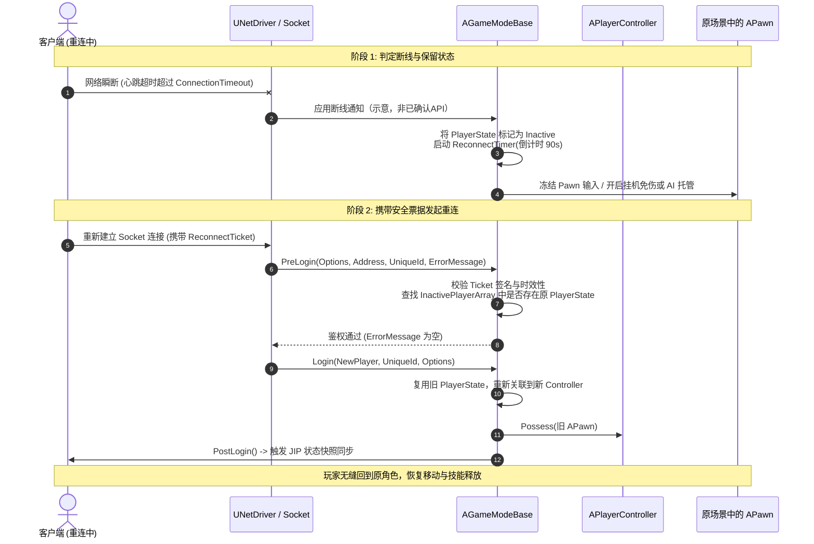
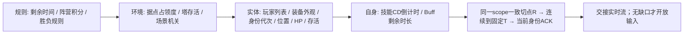
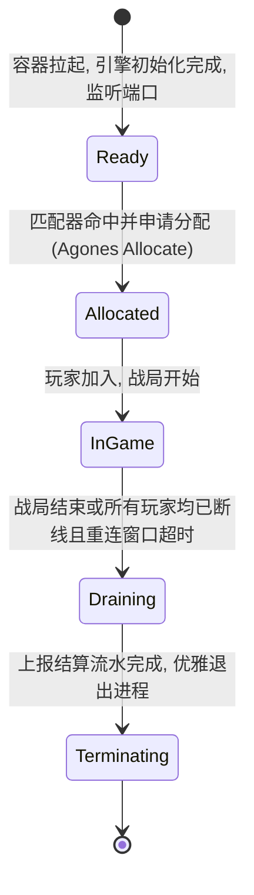

# DS 会话注册与断线重连实现

> 知识成熟度：L2（会话/票据合同的设计解释和公共一手资料核对；没有已编译UE重连接管实现）。
> 版本基线：C++17风格应用接口设计；UE5.8.0/CL55116800仅为原文历史描述，本次没有访问该checkout，不把它写成本机已核源码。下列路径/符号表是待在目标UE版本重核的定位线索。
> 适用范围：平台会话与游戏内连接分工、状态保留窗口、重连票据、实体接管与JIP的接口设计。
> **本次修正：撤回将 `FMD5::HashAnsiString(payload + salt)` 称为HMAC-SHA256的示例。** 新代码块是有类型的应用抽象、未编译、不宣称存在对应UE API。合成C++票据模型也不是本节完整重连协议实现。
> 事实边界：2026-10-04公共核对[RFC2104](https://www.rfc-editor.org/rfc/rfc2104#section-2)、[Epic FMD5 API](https://dev.epicgames.com/documentation/unreal-engine/API/Runtime/Core/FMD5?lang=en-US)；票据、Session、DS及JIP四个独立C++模型见[entry-core](../../../evidence/tests/entry-core/README.md)。未运行UE/PIE、真实认证、Agones/GameLift或弱网。
> 后置疑点：UE生命周期接管、平台自定义注解/健康参数及真实JIP接线仍需独立核查；本次有界快照/增量合同仅在独立C++模型验证，不能凭它或票据测试宣布安全重连闭环已完成。
> 最后更新：2026-10-04（安全合同、实例代次、nonce消费与应用抽象；补充JIP有界接收/ACK合同，保留平台/游戏内分层）。
---

## 1. 概述

Dedicated Server（专用战局服务器）的会话管理面临两大核心维度的解耦与协同：
1. **平台会话层（Platform Session / OSS）**：解决外部玩家与匹配服务“如何发现、调度并分配该战局实例”；
2. **游戏内会话层（Game Session / In-Game Room）**：解决战局内部“玩家连接断开时，如何保留状态、防范劫持，并在重新连接时安全无缝接管 Pawn”。

在移动弱网与跨国竞技场景中，玩家网络切换（4G/5G/Wi-Fi 切网）、瞬时丢包抖动与客户端 Crash 是高频常态。**断线重连绝非简单地把玩家当作新连接重新 PreLogin，而是由“状态保留窗口（Holding Window）+ 加密票据校验 + Controller 实体接管 + 全局状态快照追赶”组成的复杂状态机闭环。**

---

## 2. 事实边界与 UE5.8 源码锚点

以下为历史定位线索，**本次未核符号归属/签名/可调用性**；不能直接作为编译依据，特别是PlayerController接管、InactivePlayerArray归属和回调时序。

| 序号 | 引擎源码路径 | 历史待核机制与符号 |
| :--- | :--- | :--- |
| **1** | `Engine/Source/Runtime/Engine/Classes/Engine/NetDriver.h` | `InitialConnectTimeout`（握手阶段超时）、`ConnectionTimeout`（心跳丢失超时）、`GracefulCloseConnectionTimeout`（优雅下线缓冲） |
| **2** | `Engine/Source/Runtime/Engine/Classes/Engine/NetConnection.h` | `HandleConnectionTimeout()`（超时判定回调）、`PlayerId`（唯一连接凭证） |
| **3** | `Engine/Source/Runtime/Engine/Classes/GameFramework/GameModeBase.h` | `PreLogin()`（拦截鉴权与拒绝）、`Login()`（关联/创建 PlayerController）、`PostLogin()`（下发初始 Replication 复制） |
| **4** | `Engine/Source/Runtime/Engine/Classes/GameFramework/PlayerState.h` | `bIsInactive`（断线保留标记）、`UniqueId`（平台跨连接唯一标识） |
| **5** | `Engine/Source/Runtime/Engine/Private/PlayerController.cpp` | `APlayerController::Possess(APawn* aPawn)`（重连后的角色所有权接管） |

---

## 3. UE5.8 源码级重连接管机制（Controller & Pawn Takeover）

在传统的登录流程中，客户端重连如果被当成新连接处理，引擎会生成全新的 `PlayerController` 并尝试在出生点重新 Spawn 一个 `Pawn`，导致原角色的血量、装备丢失，并在原地留下“无主假人”。

### 3.1 核心状态流转时序图



### 3.2 GameMode 接管的类型化应用抽象（未编译）

此处只描述应用层如何把“保留的实体”与“新的授权连接”关联，不复制看似可直接粘贴的UE重写函数。下列类型和方法均为**本应用应实现的抽象**，不属于Epic API；尚未编译或接入UE。

```cpp
// 伪代码：类型名属于GameApp，UE adapter、存储、错误恢复未实现。
namespace GameApp {
struct Subject { std::string tenant; std::string player; };
struct EntityHandle { std::uint64_t id; std::uint64_t generation; };
struct InstanceIdentity { std::string stableId; std::uint64_t incarnation; };
struct HeldPlayer {
    Subject subject;
    EntityHandle pawn;
    InstanceIdentity instance;
    std::string session;
    std::uint64_t ownerEpoch;
    std::int64_t holdUntil;
};
struct TakeoverGrant { // 只能由第4节的认证/消费事务产生
    Subject subject;
    InstanceIdentity instance;
    std::string session;
    std::uint64_t expectedOwnerEpoch;
    std::string requestId;
};
enum class AttachResult { Attached, Expired, StaleEntity, StaleOwner, Denied };
struct SessionRuntime {
    virtual AttachResult CompareAndAttach(const HeldPlayer& expected,
                                         const TakeoverGrant& grant,
                                         std::int64_t trustedNow) = 0;
};
}
```

`CompareAndAttach`合同：同一串行world操作/持久化事务内检查subject、session、instance incarnation、entity generation与ownerEpoch，再让新连接获得输入资格并使旧连接按明确政策失效。只查PlayerId后`Possess`不够：同ID实体可能已重生，DS地址可能被新进程复用，旧会话也可能已退出。

断线时的冻结输入、Pawn保留与AI托管是玩法策略；保留deadline不是写权限延期。重连失败只撤销本请求新建的连接/临时资源，不能销毁借用的旧Pawn或释放旧Ready座位。没有拿到资源的旧请求，其迟到取消必须无害。真实UE adapter需要在实际版本核对Login/PostLogin、PlayerState恢复、Controller/Pawn生命周期和线程边界，随后用PIE/独立DS测试，不能把本抽象当已完成适配。

---

## 4. 安全重连票据（HMAC-SHA256 Reconnect Ticket）

重连票据要把已认证主体允许执行的操作绑定到一个**当前仍有效的实例/会话代次**。它能防数据被任意修改，不能单靠一个player字段防止有效bearer整体被盗用；TLS、泄露防护与发送者绑定仍需独立设计。

### 4.1 票据结构与签名规范

建议的应用合同（不是本库已部署协议）：

```text
Claims = version, tenant, player, stableInstanceId, incarnation,
         sessionId, ownerEpoch, purpose, requestId, nonce, issuedAt, expiresAt
MAC = HMAC-SHA256(key, canonicalPayloadBytes)
Wire = bounded encoding(canonicalPayloadBytes, 32-byte MAC)
```

- 固定字段集合/类型/顺序、编码及总长度上限，拒绝未知/重复/缺字段。Base64是编码不是加密；解码失败或解码后过长必须拒绝，不能继续读未验证JSON字段
- 使用服务端可信时间；TTL/skew有策略上限，先查溢出，独立验证合法区间和边界。60/90/120秒都只是配置候选，需按产品重试窗口与风险预算选择
- `stableInstanceId + incarnation` 标识实例生命期；Pod IP/端口可能复用，不能替代它。会话/ownerEpoch另行绑定，房间结算或代次变化后旧票不能恢复写权
- nonce的不可预测性由CSPRNG负责；nonce消费键至少含签发域/主体/目的资源，持久化、保留期、并发原子性和容量都要有合同。单进程内存集合只演示局部反重放
- HMAC密钥用于对称MAC，验证方通常也能签发；非对称方案才区分私钥签发/公钥验签。密钥不拼进日志/URL，也不能用“salt”命名掩盖密钥管理

**为什么旧例不成立：** `FMD5::HashAnsiString(PayloadB64 + salt)`调用的是MD5字符串散列；[Epic FMD5](https://dev.epicgames.com/documentation/unreal-engine/API/Runtime/Core/FMD5?lang=en-US)将其描述为MD5上下文/hex hash helper。[RFC2104 §2](https://www.rfc-editor.org/rfc/rfc2104#section-2)的HMAC包含内外pad和嵌套哈希，拼接MD5不是HMAC-SHA256。把函数换成一个猜测的UE“安全API”也不是修复；应选有明确算法/比较合同的受维护库并实际链接、测试。

### 4.2 票据校验与消费的类型化应用抽象（未编译）

以下为C++风格接口草图。全部函数名均是**应用应实现的接口**，不是UE成员，也不是一份能直接编译的完整程序。

```cpp
namespace GameApp {
struct AuthContext { std::string tenant; std::string player; }; // 来自可信认证层
struct ReconnectClaims {
    std::string tenant, player, instanceId, sessionId, purpose, requestId, nonce;
    std::uint64_t incarnation, ownerEpoch;
    std::int64_t issuedAt, expiresAt;
};
struct ParsedTicket {
    ReconnectClaims claims;
    std::vector<std::uint8_t> canonicalPayload;
    std::array<std::uint8_t, 32> mac;
};
struct Destination {
    std::string instanceId, sessionId;
    std::uint64_t incarnation, currentOwnerEpoch;
};
enum class TicketResult { Accepted, ReplayedResult, Malformed, BadMac,
                          Expired, WrongBinding, Conflict, StaleOwner };
struct TicketServices {
    virtual std::optional<ParsedTicket> DecodeStrictBounded(std::string_view wire) = 0;
    virtual bool VerifyHmacSha256(const ParsedTicket& t) = 0;
    virtual bool CheckTimeWindow(const ReconnectClaims& c, std::int64_t now) = 0;
    // 同一事务：重验当前目的资源/代次、比较完整请求意图、消费nonce或返回原结果。
    virtual TicketResult ConsumeOrReplay(const AuthContext&, const Destination&,
                                        const ReconnectClaims&) = 0;
};
TicketResult VerifyReconnect(TicketServices& services, std::string_view wire,
                             const AuthContext& auth, const Destination& dest,
                             std::int64_t trustedNow) {
    auto parsed = services.DecodeStrictBounded(wire);
    if (!parsed) return TicketResult::Malformed;
    if (!services.VerifyHmacSha256(*parsed)) return TicketResult::BadMac;
    const auto& c = parsed->claims;
    if (!services.CheckTimeWindow(c, trustedNow)) return TicketResult::Expired;
    if (c.tenant != auth.tenant || c.player != auth.player ||
        c.instanceId != dest.instanceId || c.incarnation != dest.incarnation ||
        c.sessionId != dest.sessionId || c.ownerEpoch != dest.currentOwnerEpoch ||
        c.purpose != "reconnect") return TicketResult::WrongBinding;
    return services.ConsumeOrReplay(auth, dest, c);
}
}
```

`DecodeStrictBounded`负责解码/字段类型/规范数字的全部检查；`VerifyHmacSha256`须由受维护库实现并遵守其固定长度比较合同。`CheckTimeWindow`处理TTL/skew和溢出，不信任客户端时间。接口名字不证明这些实现已经存在。

这段`VerifyReconnect`描述携带票据的受理路径，不是响应丢失后的唯一恢复入口。当前主体/查询权限的重验与首次nonce原子消费必须分开：**独立的原结果查询接口**以当前身份凭据认证，使用原operation/requestId和完整意图读取已记录结果，不要求重新消费已用nonce，也不靠已过期票据证明当前身份。本节接口未实现；不能把独立C++ Session Auth每次直接调用TicketCodec的consume=true，consume=false也仍拒绝已消费nonce。

为什么消费事务还要重验destination？在MAC校验与最终接管之间，owner可能已经从epoch41变成42；先读归属后无条件写是TOCTOU。事务必须在真实授权/副作用提交点比较当前代次。若响应丢失，同一认证主体、操作、requestId与完整意图可查询原结果；同键异意图Conflict，旧结果的资源已失效则StaleOwner，不能再次赋权。网关与DS各自消费同一nonce不构成全局一次性。

### 4.3 可以手算的正反例与失败边界

1. p1持有发给实例A/incarnation7、sessionS/epoch41的合法票；当前归属仍匹配。事务首次消费并授权；响应丢失后，经独立当前身份/权限校验的原请求查询返回对应结果与当前资源状态，不重复消费、不多占座
2. 实例A原IP被incarnation8复用。旧票MAC仍正确，但实例代次不符，正常拒绝路径不消费nonce、不接管Pawn。这是应用应实现的错误码合同，未实现的事务/异常处理不能据此宣称强异常安全
3. p2持有p1的票。可信AuthContext与player不符则拒绝；若采用纯bearer且没有独立主体证明，不能凭票内player识别实际持有人
4. 已占grace保留位的p1重新鉴权后应原位换代，load仍1；旧连接/旧请求补偿用旧代次不能释放新Ready
5. 自签非法格式/超长数字的合成测试检查解析合同，不是“攻击者已经伪造有效MAC”。真实并发消费、数据库故障、密钥轮换、旧实例复活和UE接管尚未运行

独立可运行的票据/会话/租约模型与这些合同有关，但字段更小、彼此未接线，不能把总PASS当本节扩展协议的集成证明。

---

## 5. 中途加入（Join-In-Progress, JIP）状态追赶流水线

**本节区分应用设计与已运行模型。** 独立[jip_resync.cpp](../../../evidence/tests/entry-core/src/jip_resync.cpp)已在有限串行场景验证快照期间收包、固定目标、身份/实体代次和有界失败；没有实现UE复制adapter、真实分包重传、并发快照捕获或跨进程ACK。重连的基线不是“收到几组RPC就自动一致”。

以下四类状态仍可帮助组织数据，顺序由依赖决定；模型只含实体HP/位置/生命周期，没有测试比赛规则、Buff或场景机关：



### 5.1 R→固定T，不能丢弃全量期间的变化

可信应用先选定`{world, incarnation, scope, schema, session, transfer}`，再固定快照R及追赶目标T。这里的seq是为该复制scope定义的连续序列，不是过滤后的全世界rev。快照应来自同scope一致切点；这个权威端生成合同在本例是输入前提，未证明多线程捕获一致性。不同scope/实例不能凭数值R相同混用，收到异流包只拒绝，不自动换流。

具体反例：Snapshot100含HP100，传输时seq101伤害将HP改50；若客户端“全量期间丢一切增量”，安装100后又只听102及以后，就会永久漏掉101。模型在Begin与Install之间有界保留R后增量，安装后连续排到T；T后的包先保留，匹配ACK交接后再排。另一合法设计是从日志重取R之后区间，重取不足则新transfer重装最新基线；本模型批CatchUp检验窗口首界、声明head和最终seq==T，头/中/尾缺失均不能默成功。本模型约定Window.first只在非空日志表示包含式左界；空日志忽略first（无需计算可能溢出的head+1），但必须R==T且head≥T，R<T仍失败。批CatchUp对记录先检查identity与[first,head]范围；seq≤R的已覆盖记录随后直接忽略payload，不保证检查其grammar、field或NaN/Inf。它们不参与快照状态重建，批次CaughtUp不代表全部历史payload合法。R后的记录仍交给Deliver校验字段/有限数，实际应用前再验槽/代次/生命周期。

### 5.2 身份、实体代次和恢复边界

- snapshot/delta/ACK比较完整identity；当前应用会话提供可信Context，整数相等本身不是认证。受控`Rebind`才允许换scope/实例并从新基线编号；与当前相同的Context被拒绝，不同Context还须由应用保证生命周期内不复用（含跨进程/重启），模型不保存无限历史Context
- 固定≤16槽，Spawn要求dead且generation+1；旧generation的HP/位置消息不能写重生实体。死亡记录仍保留并参加完整状态比较。Install校验快照字段；Deliver（含批helper送入的R后记录）校验field及有限数值，实际应用前检查槽/代次/生命周期；这些入口拒绝相应坏数据时不消耗seq。此保证不延伸到批helper直接跳过的seq≤R旧payload
- 相同快照/增量重发幂等，不清合法缓存；同seq冲突拒绝。同context的旧快照不能回退游标。最近8个已应用载荷之外的旧包只返回Stale，不能宣称永久冲突检测
- 每次Install/Deliver以候选副本校验完整可排出段再提交；正常错误保持该调用前世界/seq/pending，错误阶段可锁到NeedSnapshot。批CatchUp只保证较早成功的合法前缀，非全批事务；bad_alloc、重入、线程竞争和持久化异常未测
- pending≤8、未来span≤32、目标跨度≤32、日志≤64；Begin到ACK有10合成时间单位，重发不延期。实时缺口另设10单位期限，恰到期失败；调用方必须Tick。通过当前身份/阶段前检的重复/旧包或随后数据错误也推进可信时间水位，不能回拨且不延期；错误身份不采样。超限/耗尽不回绕、不静默丢数据后继续Ready，应用按策略发起新transfer

这些数值是有限模型的可验边界，不能直接当生产容量/弱网超时建议。完整可手算轨迹和[严格/UBSan原始证据](../../../evidence/tests/entry-core/README.md#指标与原始结果)保留HP、位置、生灭、逆序、重复和窗口回退的教学内容。

### 5.3 ACK绑定与UE边界

`CaughtUp`只表示已安装正确基线且连续到固定T；ACK必须匹配当前完整identity和T。错会话/实例/transfer、错T或未完成均不能开放输入；重复ACK幂等。交接时若T后已有缺口，模型返回Buffered并保持输入关闭；补齐再Live/Ready，过期重同步。这个单对象`AcceptAck`不是服务端验证客户端诚实的证明，真实服务还要绑定当前授权连接和角色接管结果。

`RPC_AckJIPSnapshotLoaded`可以是项目自己定义的消息名，不是已经确认存在的UE API；Actor的[Dormancy](https://dev.epicgames.com/documentation/en-us/unreal-engine/actor-network-dormancy-in-unreal-engine)也不是连接的JIP Ready状态。[Epic执行顺序说明](https://dev.epicgames.com/documentation/en-us/unreal-engine/replicated-object-execution-order-in-unreal-engine)指出跨Actor RPC及不同属性OnRep没有通用确定顺序；[相关性说明](https://dev.epicgames.com/documentation/unreal-engine/actor-relevancy-in-unreal-engine?lang=en-US)按连接筛选Actor。因此，把四组数据各发一个RPC并不能自动得到一致快照或有序全世界事务。上述资料于2026-10-04公开核对，不涉及私有UE源码或已运行的UE适配。

---

## 6. 与 Agones / GameLift 容器调度平台的心跳协同

平台健康与玩家座位租约职责不同；DS活着不代表某玩家仍有写权。以下平台状态图为概念映射，Agones/GameLift具体API与配置未在本批核验：



- **重连窗口内的保活保护（Drain Protection）**：
  当战场内所有玩家同时掉线时（如网吧断网或区域交换机闪断），DS 绝不能立刻判定游戏结束而退出；原文建议的自定义注解 `agones.dev/reconnect-hold: "true"` 与90秒保留**尚未证实有平台内置保证**；仅写一个注解不能宣称强制保活，需核对实际控制器、drain与生命周期策略。
- **健康心跳失败阶梯**：
  原文2秒发送`Health()`、连续6秒失败即重启是待核配置示例，不是已验证的平台固定值；还需分别核对SDK健康、容器探针、阈值与重启/删除行为。

---

## 7. 生产落地前的策略选择

1. **断线角色（Pawn）的挂机防护规则**：
   以下为玩法候选，未在项目中验证，必须考虑主动断网获益与对手公平性：断线第一秒起赋予“金身霸体/免伤”持续 20 秒；若 20 秒后仍未重连，将角色平滑过渡为简单的防御型假人 AI（自动原地还击或寻路逃生）。
2. **连接超时参数阶梯配置（基于 NetDriver.h）**：
   - `InitialConnectTimeout = 15.0f`（握手阶段需包容弱网重发）；
   - `ConnectionTimeout = 10.0f`（正常战局超过 10 秒无心跳即判定断线）；
   - `GracefulCloseConnectionTimeout = 2.0f`（关服下线时的快速回收缓冲）。
3. **断线重连单例通道（Single-Flight Takeover）**：
   若原客户端卡死尚未完全关闭，玩家在新手机/设备上登录重连，产品需选择拒绝新连接或接管旧连接；有效票据本身不足以要求强制Kick。接管必须经过当前主体/实例/会话代次验证与原子所有权变更，旧连接失效策略另验。

---

## 8. 验证建议与测试矩阵

为确保专用战局服务器（DS）的断线重连与会话稳定性，以下是待执行的集成/混沌测试计划，**本批没有运行这些测试**。§5单进程JIP严格/UBSan测试是另一层证据，不勾销此表：

| 测试用例 ID | 注入故障场景 | 预期系统表现与断言 | 验证手段 |
| :--- | :--- | :--- | :--- |
| **TEST-RECONN-01** | 模拟移动端 4G/Wi-Fi 网络切换 (丢包 10 秒) | 客户端断线后在 90 秒重连窗口内发起连接，成功接管原 Pawn，血量与 Buff 完整无损 | 弱网断开重连自动化脚本 |
| **TEST-RECONN-02** | 伪造篡改 HMAC 签名的非法重连票据 | PreLogin 阶段立刻拦截拒绝，返回 `ERR_INVALID_OR_EXPIRED_RECONNECT_TICKET` | 端口越权渗透测试 |
| **TEST-RECONN-03** | 战局进行至第 10 分钟时新玩家中途加入 (JIP) | 客户端按依赖装入同scope一致R基线，保留或重取R后变化，连续到固定T且当前ACK获准；缺口/超限显式恢复 | 自动化中途加入机器人 (Gauntlet) |
| **TEST-RECONN-04** | 战局全员强退断网，触发 Agones 实例保护 | 容器 Pod 保持 Allocated 状态不销毁，90 秒窗口超时后才优雅流转到 Draining 退出 | Kubernetes 容器调度演练 |

---

## 9. 常见问题 FAQ

**Q：票据返回replayed后是否只能退出或重新取票？**

A：不一定。成功响应丢失也会留下已消费nonce。首次受理接口拒绝重复消费后，客户端应携带当前身份凭据和原requestId查询既有结果；服务端重验主体/权限及完整意图，资源失效则明确stale。查询不是再次consume。仅在明确需要新的受理/授权时才走新票据流程，不能用新requestId盲占第二个座位。

**Q：已有同意图会话是否一定要踢掉旧连接？**

A：不是。同主体同意图的结果复用/资源借用可以保留原归属；新设备是否接管旧连接是另一个产品政策，仍需当前授权、实例/会话代次和明确拒绝或接管结果。

1. **Q：重连后玩家在客户端看到自己位置瞬移或闪回怎么办？**
   A：旧预测历史、快照基线或输入序号都可能导致跳变，需要观察日志判别。原文的`ClientSetRotationAndLocation`未在目标UE版本核实，不能作为现成修复API；应由实际适配层按当前会话/快照版本重建预测基线并验证。
2. **Q：重连票据在何处生成最安全？**
   A：可由独立RoomManager/SessionCoordinator控制签发和用途。HMAC验证需要对称密钥，持有者也有签发能力；非对称签名才可让DS仅持公钥。两者的密钥分发、轮换、权限隔离与性能都需单独验证，不能称“共享公钥HMAC”。
3. **Q：JIP 中途加入若地图正在 ServerTravel 换图怎么办？**
   A：应定义换图期间拒绝/排队策略、队列上限与旧票失效条件。原文`UNetDriver::ServerTravelPause`未核实存在，不能当可调用机制；在实际UE版本确认旅行生命周期后实现应用层门禁并测试。

---

## 10. 关联阅读

- [01-UE Dedicated Server实例生命周期与平台化](<../专用服务器实例与容量/01-UE%20Dedicated%20Server实例生命周期与平台化.md>) —— DS 实例 Allocated/Ready/Draining 核心状态机
- [02-Linux DS部署与容器实战](<../../08-工程实践与质量/部署运维与可观测性/02-Linux%20DS部署与容器实战.md>) —— Linux 无头容器化构建与信号管理
- [04-DS日志崩溃与可观测性实战](<../../08-工程实践与质量/部署运维与可观测性/04-DS日志崩溃与可观测性实战.md>) —— 崩溃堆栈捕获与连接超时分析
- [05-DS自动扩缩容与容量规划](<../专用服务器实例与容量/05-DS自动扩缩容与容量规划.md>) —— 缓冲池管理与重连实例保护策略
- [06-DS多区部署与容灾](<../专用服务器实例与容量/06-DS多区部署与容灾.md>) —— 跨区域全球就近调度与容灾切换
- [游戏知识/06-网络同步/04-多人游戏框架与玩家状态](04-多人游戏框架与玩家状态.md) —— UE 原生 PlayerState 与网络登录生命周期
