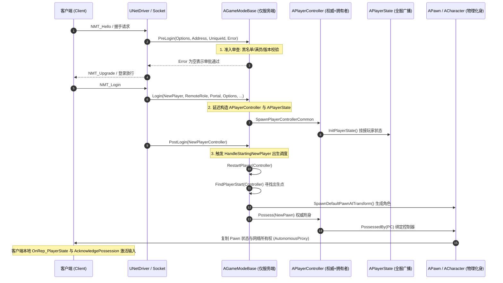

# UE 引擎源码分析 04：Gameplay 框架与登录流程源码剖析
> 知识成熟度：L2（已按 UE5.8 源码基线全面补齐真实源码段落、握手验证 PreLogin、延迟生成 PlayerController、RestartPlayer 寻点与 AController::Possess 权威附身全流程）。
> 对应知识点：[01-引擎基础/03 Gameplay 框架与游戏模式](../../03-引擎架构与资源系统/模块化框架与对象通信/03-Gameplay框架与游戏模式.md)、[06-网络同步/04 多人游戏框架与玩家状态](04-多人游戏框架与玩家状态.md)

> 以本机 UE5.8 源码为准，逐行深度剖析从客户端建立连接发包、`PreLogin` 会话审查、`Login` 延迟构造控制器与 PlayerState、`PostLogin` 派发出生调度、`RestartPlayerAtPlayerStart` 寻点生成 Pawn，到服务器 `AController::Possess` 权威附身并同步客户端的完整底层源码实现。

---

## 元数据

- **版本基准**：UE 5.8.0 / CL 55116800 / 分支 `++UE5+Release-5.8`（本机安装目录 `C:\Program Files\Epic Games\UE_5.8\Engine`）。
- **源码依据**（行号以 5.8 源码 checkout 为准，安装版 5.8.0 可能相差数行）：
  - `Engine\Source\Runtime\Engine\Private\GameModeBase.cpp`（`InitGame` 82、`InitGameState` 107、`PreLogin` 684、`Login` 707、`SpawnPlayerControllerCommon` 751、`InitNewPlayer` 772、`PostLogin` 1001、`HandleStartingNewPlayer_Implementation` 1068、`ChoosePlayerStart_Implementation` 1093、`FindPlayerStart_Implementation` 1149、`PlayerCanRestart_Implementation` 1203、`SpawnDefaultPawnFor_Implementation` 1214、`RestartPlayer` 1241、`RestartPlayerAtPlayerStart` 1264、`FinishRestartPlayer` 1362）
  - `Engine\Source\Runtime\Engine\Classes\GameFramework\GameModeBase.h`（框架基类声明）
  - `Engine\Source\Runtime\Engine\Private\GameMode.cpp`（`MatchState` 命名空间 24、`InitGame` 56、`PostLogin` 91、`StartPlay` 132、`ReadyToStartMatch_Implementation` 165、`StartMatch` 186、`HandleMatchHasStarted` 203、`EndMatch` 257、`HandleMatchHasEnded` 267、`SetMatchState` 327、`OnMatchStateSet` 350、`HandleStartingNewPlayer_Implementation` 526、`PlayerCanRestart_Implementation` 548）
  - `Engine\Source\Runtime\Engine\Classes\GameFramework\GameMode.h`（`MatchState` 命名空间声明 16、`MatchState` 字段 69）
  - `Engine\Source\Runtime\Engine\Private\GameState.cpp`（`AGameState::SetMatchState` 128、`OnRep_MatchState` 141、`DOREPLIFETIME(MatchState)` 193）
  - `Engine\Source\Runtime\Engine\Private\Controller.cpp`（`AController::Possess` 320、`OnPossess` 356、`UnPossess` 386、`SetPawn` 530）
  - `Engine\Source\Runtime\Engine\Private\PlayerController.cpp`（`ClientRestart_Implementation` 816、`OnPossess` 873、`AcknowledgePossession` 929、`PostInitializeComponents` 1069、`ServerAcknowledgePossession_Implementation` 1323）
  - `Engine\Source\Runtime\Engine\Classes\GameFramework\PlayerController.h`（`APlayerController`、网络所有权；第 1877 行 `OnPossess` 覆写声明）
  - `Engine\Source\Runtime\Engine\Private\Pawn.cpp`（`OnRep_Controller` 615、`PossessedBy` 671、`UnPossessed` 713、`Restart` 903）
  - `Engine\Source\Runtime\Engine\Private\LevelActor.cpp`（`UWorld::SpawnPlayActor` 1072）
  - `Engine\Source\Runtime\Engine\Private\LocalPlayer.cpp`（`ULocalPlayer::SpawnPlayActor` 291）
  - `Engine\Source\Runtime\Engine\Private\World.cpp`（`NMT_Join` 分支 7571）
  - `Engine\Source\Runtime\Engine\Private\UnrealEngine.cpp`（`UEngine::LoadMap` 中玩家生成调用点 16641）
  - `Samples\Games\Lyra\Source\LyraGame\GameModes\LyraGameMode.cpp`（项目层覆写对照：`InitGame` 80、`OnExperienceLoaded` 305、`HandleStartingNewPlayer_Implementation` 391、`ChoosePlayerStart_Implementation` 401、`FinishRestartPlayer` 411、`PlayerCanRestart_Implementation` 421、`InitGameState` 452、`UpdatePlayerStartSpot` 486、`FailedToRestartPlayer` 493）
- **官方参考**：[Unreal Engine Gameplay 框架官方文档](https://dev.epicgames.com/documentation/en-us/unreal-engine)。
- **最后更新**：2026-09-14（第三轮补深 + 去重收口：新增引擎侧登录调用链入口 `ULocalPlayer::SpawnPlayActor`→`UWorld::SpawnPlayActor`→`Login`→`PostLogin` 的逐字真实源码与调用点；补 `MatchState` 状态机全量真实实现、`RestartPlayer`/`FindPlayerStart`/`ChoosePlayerStart` 全链逐字源码、`Possess`/`PossessedBy`/`AcknowledgePossession` 客户端确认闭环；加入本机 Lyra `ALyraGameMode` 项目层覆写对照与勘误表；**并把第一~四节原有的 4 个示意代码块整体替换为 5.8 逐字版、同一函数全篇只保留一份逐字源码（第六/八/九节改为解构+指路），同时按本库约定统一剥除代码围栏内的行尾空白**）。

---

## 概述与多人登录握手全景拓扑

在多人在线游戏中，客户端接入并具象化为一个可操作的 3D 角色，必须经历由服务器唯一主导的严密时序：



---

## 核心源码深入剖析一：准入前置审查 `AGameModeBase::PreLogin`

客户端连接请求到达时，首先由 `PreLogin` 判定是否允许其进入游戏世界。

### 1. `AGameModeBase::PreLogin` 完整真实源码

以下代码摘自本机 UE5.8 源码 `Engine\Source\Runtime\Engine\Private\GameModeBase.cpp`（第 684 行起；5.8 源码 checkout 同为 684 行）：

（2026-09-14：原示意块已替换为 5.8 引擎源码逐字版，避免与后文重复）

```cpp
void AGameModeBase::PreLogin(const FString& Options, const FString& Address, const FUniqueNetIdRepl& UniqueId, FString& ErrorMessage)
{
	// Login unique id must match server expected unique id type OR No unique id could mean game doesn't use them
	const bool bUniqueIdCheckOk = (!UniqueId.IsValid() || UOnlineEngineInterface::Get()->IsCompatibleUniqueNetId(UniqueId));
	if (bUniqueIdCheckOk)
	{
		ErrorMessage = GameSession->ApproveLogin(Options);
	}
	else
	{
		ErrorMessage = TEXT("incompatible_unique_net_id");
	}

	FGameModeEvents::GameModePreLoginEvent.Broadcast(this, UniqueId, ErrorMessage);
}
```

### 2. 逐行技术深度解构

1. **唯一网络 ID 校验（FUniqueNetIdRepl）**：
   - 真实实现即上方的 `bUniqueIdCheckOk = (!UniqueId.IsValid() || UOnlineEngineInterface::Get()->IsCompatibleUniqueNetId(UniqueId))`：跨平台（Steam、EOS、PSN、Xbox Live）的玩家标识只有通过 `IsCompatibleUniqueNetId` 检查才放行，否则直接以 `incompatible_unique_net_id` 拒绝；`UniqueId` 本身无效时反而放行（注释：No unique id could mean game doesn't use them）；
2. **拒绝连接的安全边界**：
   - 只要 `ErrorMessage` 被赋值为任意非空字符串，`UNetConnection` 会立即向客户端发回一条 `NMT_Failure` 控制包并主动掐断底层 UDP 连接，从根本上防止恶意刷包导致的服务器内存泄漏（发包点见第五节第 4 小节 `NMT_Join` 分支）。
3. **`GameSession` 未判空**：本函数直接解引用 `GameSession`，依赖 `AGameModeBase::InitGame`（第 92 行）先完成生成；`Login`（第二节）才做了判空。详见第六节第 1 小节。

---

## 核心源码深入剖析二：控制器与状态生成 `AGameModeBase::Login`

审批通过后，服务器调用 `Login` 为该连接正式分配代表玩家大脑的 `APlayerController`。

### 1. `AGameModeBase::Login` 完整真实源码

以下代码摘自本机 UE5.8 源码 `Engine\Source\Runtime\Engine\Private\GameModeBase.cpp`（第 707 行起；5.8 源码 checkout 同为 707 行）：

（2026-09-14：原示意块已替换为 5.8 引擎源码逐字版，避免与后文重复）

```cpp
APlayerController* AGameModeBase::Login(UPlayer* NewPlayer, ENetRole InRemoteRole, const FString& Portal, const FString& Options, const FUniqueNetIdRepl& UniqueId, FString& ErrorMessage)
{
	if (GameSession == nullptr)
	{
		ErrorMessage = TEXT("Failed to spawn player controller, GameSession is null");
		return nullptr;
	}

	ErrorMessage = GameSession->ApproveLogin(Options);
	if (!ErrorMessage.IsEmpty())
	{
		return nullptr;
	}

	APlayerController* const NewPlayerController = SpawnPlayerController(InRemoteRole, Options);
	if (NewPlayerController == nullptr)
	{
		// Handle spawn failure.
		UE_LOGF(LogGameMode, Log, "Login: Couldn't spawn player controller of class %ls", PlayerControllerClass ? *PlayerControllerClass->GetName() : TEXT("NULL"));
		ErrorMessage = FString::Printf(TEXT("Failed to spawn player controller"));
		return nullptr;
	}

	// Customize incoming player based on URL options
	ErrorMessage = InitNewPlayer(NewPlayerController, UniqueId, Options, Portal);
	if (!ErrorMessage.IsEmpty())
	{
		NewPlayerController->Destroy();
		return nullptr;
	}

	return NewPlayerController;
}
```

### 2. 逐行技术深度解构

1. **延迟构造（bDeferConstruction）**：
   - `SpawnPlayerController` 内部改走 `SpawnPlayerControllerCommon`，以 `SpawnInfo.bDeferConstruction = true` 生成控制器，随后才 `UGameplayStatics::FinishSpawningActor`；网络角色（`Role = ROLE_Authority`，`RemoteRole = ROLE_AutonomousProxy`）的实际设置在 `UWorld::SpawnPlayActor` 返回前后由引擎补上，详见第五、六节；
2. **`InitNewPlayer` 与 `PlayerState` 的创建时序**：
   - 在 `APlayerController::PostInitializeComponents`（`PlayerController.cpp` 第 1069 行，`GetNetMode() != NM_Client` 时）中调用 `InitPlayerState()`，生成全局广播的 `APlayerState` 实例——它由 `FinishSpawningActor` 触发，因此进入 `InitNewPlayer` 时已非空；
   - `InitNewPlayer` 进而将用户昵称（PlayerName，`.Left(20)` 截断）与 UniqueId 注册进 `GameSession` 与 `PlayerState`。
3. **`Login` 会第二次调用 `ApproveLogin`**：`PreLogin`（第一节）已调过一次，此处是第二次，故 `AGameSession::ApproveLogin` 覆写必须自行保证幂等。

---

## 核心源码深入剖析三：角色出生与选点 `AGameModeBase::RestartPlayer`

当玩家登录完成后，`PostLogin` 驱动玩家角色（Pawn）的生成与空间定位。

### 1. `AGameModeBase::RestartPlayer` 完整真实源码

以下代码摘自本机 UE5.8 源码 `Engine\Source\Runtime\Engine\Private\GameModeBase.cpp`（第 1241 行起）：

（2026-09-14：原示意块已替换为 5.8 引擎源码逐字版，避免与后文重复。原示意块省略了「复用旧 Pawn 的旋转」「`GetDefaultPawnClassForController` 为空则不生成」「`InitStartSpot` 通知」「两段式 `StartSpot` 判空」等真实分支，逐条差异记录见第六节第 7 小节勘误表）

```cpp
void AGameModeBase::RestartPlayer(AController* NewPlayer)
{
	if (NewPlayer == nullptr || NewPlayer->IsPendingKillPending())
	{
		return;
	}

	AActor* StartSpot = FindPlayerStart(NewPlayer);

	// If a start spot wasn't found,
	if (StartSpot == nullptr)
	{
		// Check for a previously assigned spot
		if (NewPlayer->StartSpot != nullptr)
		{
			StartSpot = NewPlayer->StartSpot.Get();
			UE_LOGF(LogGameMode, Warning, "RestartPlayer: Player start not found, using last start spot");
		}
	}

	RestartPlayerAtPlayerStart(NewPlayer, StartSpot);
}

void AGameModeBase::RestartPlayerAtPlayerStart(AController* NewPlayer, AActor* StartSpot)
{
	if (NewPlayer == nullptr || NewPlayer->IsPendingKillPending())
	{
		return;
	}

	if (!StartSpot)
	{
		UE_LOGF(LogGameMode, Warning, "RestartPlayerAtPlayerStart: Player start not found");
		return;
	}

	FRotator SpawnRotation = StartSpot->GetActorRotation();

	UE_LOGF(LogGameMode, Verbose, "RestartPlayerAtPlayerStart %ls", (NewPlayer && NewPlayer->PlayerState) ? *NewPlayer->PlayerState->GetPlayerName() : TEXT("Unknown"));

	if (MustSpectate(Cast<APlayerController>(NewPlayer)))
	{
		UE_LOGF(LogGameMode, Verbose, "RestartPlayerAtPlayerStart: Tried to restart a spectator-only player!");
		return;
	}

	if (NewPlayer->GetPawn() != nullptr)
	{
		// If we have an existing pawn, just use it's rotation
		SpawnRotation = NewPlayer->GetPawn()->GetActorRotation();
	}
	else if (GetDefaultPawnClassForController(NewPlayer) != nullptr)
	{
		// Try to create a pawn to use of the default class for this player
		APawn* NewPawn = SpawnDefaultPawnFor(NewPlayer, StartSpot);
		if (IsValid(NewPawn))
		{
			NewPlayer->SetPawn(NewPawn);
		}
	}

	if (!IsValid(NewPlayer->GetPawn()))
	{
		FailedToRestartPlayer(NewPlayer);
	}
	else
	{
		// Tell the start spot it was used
		InitStartSpot(StartSpot, NewPlayer);

		FinishRestartPlayer(NewPlayer, SpawnRotation);
	}
}
```

### 2. 逐行技术深度解构

1. **`FindPlayerStart` 选点策略**：
   - 默认遍历场景中所有的 `APlayerStart`，按「`IncomingName` 标签匹配 → `ShouldSpawnAtStartSpot` → `ChoosePlayerStart` → `WorldSettings` 兜底」四层优先级挑点；
   - （2026-09-14 更正：默认 `ChoosePlayerStart` **不是**评分算法，而是「未占用组优先」的二分随机；完整逐字实现与解构见第八节第 2 小节。）
   - 商业射击或战术游戏中，通常在此覆写自定义选点权重（例如：远离敌方玩家视线、靠近小队队友、排除掩体内已被占用的出生点）；
2. **`FinishRestartPlayer`（`GameModeBase.cpp` 第 1362 行）**：
   - 内部调用 `NewPlayer->Possess(NewPlayer->GetPawn())`，正式完成控制权交接；随后校验 Possess 是否把 Pawn 弄没了，再 `ClientSetRotation` + `SetControlRotation`（`Roll` 清零）+ `SetPlayerDefaults` + `K2_OnRestartPlayer`（第八节第 3 小节收录逐字源码）；
3. **`InitStartSpot(StartSpot, NewPlayer)` 在附身前调用**（第 1309 行）：默认实现为空（第 1388 行），是「出生点已被使用」的通知钩子。

---

## 核心源码深入剖析四：控制权交接 `AController::Possess`

附身（Possession）是控制器驱动物理 Pawn 的核心枢纽。

### 1. `AController::Possess` 完整真实源码

以下代码摘自本机 UE5.8 源码 `Engine\Source\Runtime\Engine\Private\Controller.cpp`（第 320 行起）：

（2026-09-14：原示意块已替换为 5.8 引擎源码逐字版，避免与后文重复。原示意块的 `InPawn->SetOwner(this)` 与 `InPawn->Restart()` 两行与 5.8 原文不符——`SetOwner` 的真实位置是 `APawn::PossessedBy`，`Restart()` 已被 `DispatchRestart(false)` 取代，差异见第六节第 7 小节勘误表）

```cpp
void AController::Possess(APawn* InPawn)
{
	if (!bCanPossessWithoutAuthority && !HasAuthority())
	{
		FMessageLog("PIE").Warning(FText::Format(
			LOCTEXT("ControllerPossessAuthorityOnly", "Possess function should only be used by the network authority for {0}"),
			FText::FromName(GetFName())
			));
		UE_LOGF(LogController, Warning, "Trying to possess %ls without network authority! Request will be ignored.", *GetNameSafe(InPawn));
		return;
	}

	REDIRECT_OBJECT_TO_VLOG(InPawn, this);

	APawn* CurrentPawn = GetPawn();

	// A notification is required when the current assigned pawn is not possessed (i.e. pawn assigned before calling Possess)
	const bool bNotificationRequired = (CurrentPawn != nullptr) && (CurrentPawn->GetController() == nullptr);

	// To preserve backward compatibility we keep notifying derived classed for null pawn in case some
	// overrides decided to react differently when asked to possess a null pawn.
	// Default engine implementation is to unpossess the current pawn.
	OnPossess(InPawn);

	// Notify when pawn to possess (different than the assigned one) has been accepted by the native class or notification is explicitly required
	APawn* NewPawn = GetPawn();
	if ((NewPawn != CurrentPawn) || bNotificationRequired)
	{
		ReceivePossess(NewPawn);
		OnNewPawn.Broadcast(NewPawn);
		OnPossessedPawnChanged.Broadcast(bNotificationRequired ? nullptr : CurrentPawn, NewPawn);
	}

	TRACE_PAWN_POSSESS(this, InPawn);
}

void AController::OnPossess(APawn* InPawn)
{
	const bool bNewPawn = GetPawn() != InPawn;

	// Unpossess current pawn (if any) when current pawn changes
	if (bNewPawn && GetPawn() != nullptr)
	{
		UnPossess();
	}

	if (InPawn == nullptr)
	{
		return;
	}

	if (InPawn->GetController() != nullptr)
	{
		UE_CLOGF(InPawn->GetController() == this, LogController, Warning, "Asking %ls to possess pawn %ls more than once; pawn will be restarted! Should call Unpossess first.", *GetNameSafe(this), *GetNameSafe(InPawn));
		InPawn->GetController()->UnPossess();
	}

	InPawn->PossessedBy(this);
	SetPawn(InPawn);

	// update rotation to match possessed pawn's rotation
	SetControlRotation(Pawn->GetActorRotation());

	Pawn->DispatchRestart(false);
}
```

### 2. 逐行技术深度解构

1. **绝对网络权威（`Controller.cpp` 第 322 行，代码块内第 3 行）**：
   - 门禁是 `!bCanPossessWithoutAuthority && !HasAuthority()` 两个开关的组合——`bCanPossessWithoutAuthority` 是留给特殊控制器（如某些本地观战/回放控制器）绕开门禁的开关；客户端严禁私自调用 `Possess`，如果自主客户端私自附身本地 Actor，由于缺乏服务器授权，网络复制层将立即将其网络所有权判定非法并拒绝处理后续客户端上传的移动输入；PIE 下还会额外向 `FMessageLog("PIE")` 写一条告警；
2. **`Pawn->GetOwner() == PlayerController` 是网络同步的命脉**：
   - 只有当 Pawn 的 Owner 指向 `APlayerController` 时，该 Pawn 才能获得 `ROLE_AutonomousProxy` 自主代理权限，并在其上成功发送 `Server RPC`；
   - **（2026-09-14 更正）设置 `SetOwner` 的真实调用点不是本节的 `AController::OnPossess`，而是 `APawn::PossessedBy`（`Pawn.cpp` 第 673 行首句）；5.8 的 `OnPossess` 里没有 `SetOwner`，只有 `InPawn->PossessedBy(this)` / `SetPawn(InPawn)` / `SetControlRotation(...)` / `Pawn->DispatchRestart(false)`。排查时请查 `PossessedBy` 是否真被调用。详见第九节第 2、3 小节。**
3. **`bNotificationRequired`（代码块内第 19 行）**：当「当前 Pawn 已被赋值但尚未被附身」（即先 `SetPawn` 再 `Possess`，正是 `RestartPlayerAtPlayerStart` 的流程）时，即使 `NewPawn == CurrentPawn` 也必须广播通知；这是 5.8 兼容分支，示意块未体现。

---

## 核心源码深入剖析五：谁在调用 `Login`——引擎侧登录调用链入口

前一至四节讲清了「登录做了什么」。本节回答「谁在什么时候发起登录」，把这四个函数的真实调用点钉在源码行上。以下行号以 5.8 源码 checkout 为准，安装版 5.8.0 可能相差数行；所有代码块均为逐字复制（保留 tab 缩进与原始空行）。

### 1. `AGameModeBase::InitGame` 与 `InitGameState`（地图一开局的第一站）

以下代码摘自 `Engine\Source\Runtime\Engine\Private\GameModeBase.cpp`（第 82 行起）：

```cpp
void AGameModeBase::InitGame(const FString& MapName, const FString& Options, FString& ErrorMessage)
{
	UWorld* World = GetWorld();

	// Save Options for future use
	OptionsString = Options;

	FActorSpawnParameters SpawnInfo;
	SpawnInfo.Instigator = GetInstigator();
	SpawnInfo.ObjectFlags |= RF_Transient;	// We never want to save game sessions into a map
	GameSession = World->SpawnActor<AGameSession>(GetGameSessionClass(), SpawnInfo);
	GameSession->InitOptions(Options);

	FGameModeEvents::GameModeInitializedEvent.Broadcast(this);
	if (GetNetMode() != NM_Standalone)
	{
		// Attempt to login, returning true means an async login is in flight
		if (!UOnlineEngineInterface::Get()->DoesSessionExist(World, GameSession->SessionName) &&
			!GameSession->ProcessAutoLogin())
		{
			GameSession->RegisterServer();
		}
	}
}
```

同上文件（第 107 行起）：

```cpp
void AGameModeBase::InitGameState()
{
	GameState->GameModeClass = GetClass();
	GameState->ReceivedGameModeClass();

	GameState->SpectatorClass = SpectatorClass;
	GameState->ReceivedSpectatorClass();
}
```

逐行解构：

1. **`InitGame` 先于一切玩家行为**：它只做两件事——把 URL `Options` 存进 `OptionsString` 供后续 `RestartPlayer`/`ParseOption` 复用，以及生成 `AGameSession`。玩家连接审批最终落到这个 `GameSession` 上（见第六节的 `PreLogin`/`Login`）。
2. **`GameSession` 是 `PreLogin` 的隐式前置依赖**：注意 `InitGame` 里 `GameSession = World->SpawnActor<AGameSession>(...)` 没有判空。这就是为什么 5.8 的 `PreLogin` 直接写 `GameSession->ApproveLogin(Options)` 而不做 `if (GameSession)` 保护——请对照第六节的勘误表。
3. **`InitGameState` 是「非玩家」的初始化**：它只把 `GameModeClass` / `SpectatorClass` 写进 `GameState` 并触发对应 `Received*()` 通知，让客户端能据此构建 HUD 与观战逻辑。此处**没有**玩家相关逻辑，玩家入场完全由后面的 `Login`/`PostLogin` 负责。

### 2. 本机玩家路径：`ULocalPlayer::SpawnPlayActor`

以下代码摘自 `Engine\Source\Runtime\Engine\Private\LocalPlayer.cpp`（第 291 行起，节选至 316 行）：

```cpp
bool ULocalPlayer::SpawnPlayActor(const FString& URL,FString& OutError, UWorld* InWorld)
{
	check(InWorld);
	if (!InWorld->IsNetMode(NM_Client))
	{
		FURL PlayerURL(NULL, *URL, TRAVEL_Absolute);

		// Get player nickname
		FString PlayerName = GetNickname();
		if (PlayerName.Len() > 0)
		{
			PlayerURL.AddOption(*FString::Printf(TEXT("Name=%s"), *PlayerName));
		}

		// Send any game-specific url options for this player
		FString GameUrlOptions = GetGameLoginOptions();
		if (GameUrlOptions.Len() > 0)
		{
			PlayerURL.AddOption(*FString::Printf(TEXT("%s"), *GameUrlOptions));
		}

		// Get player unique id
		FUniqueNetIdRepl UniqueId(GetPreferredUniqueNetId());

		PlayerController = InWorld->SpawnPlayActor(this, ROLE_SimulatedProxy, PlayerURL, UniqueId, OutError, GEngine->GetGamePlayers(InWorld).Find(this));
	}
	else
	{
		// Statically bind to the specified player controller
		UClass* PCClass = PendingLevelPlayerControllerClass;
		// The PlayerController gets replicated from the client though the engine assumes that every Player always has
		// a valid PlayerController so we spawn a dummy one that is going to be replaced later.
```

逐行解构：

1. **`Name=` 选项的真正来源**：`Login`→`InitNewPlayer` 里 `ParseOption(Options, TEXT("Name"))` 读到的字符串，就是这里 `PlayerURL.AddOption("Name=...")` 塞进去的。所以改玩家昵称要么改 `GetNickname()`，要么在 URL 上显式覆盖。
2. **`ROLE_SimulatedProxy` 不是笔误**：单机/Listen Server 的本机玩家在此传 `ROLE_SimulatedProxy`，因为对本地这个 `UWorld` 而言不存在「远端权威」概念；真正决定网络角色的是 `UWorld::SpawnPlayActor` 内部与 `SpawnPlayerControllerCommon` 的组合（见第六节）。
3. **客户端分支不调用 `Login`**：`else` 分支说明客户端（`NM_Client`）只是先生成一个占位 `APlayerController`，等服务器复制真身来替换。**因此 `AGameModeBase::Login` 只在有权威的 `UWorld` 上执行**，客户端永远不会走这条路径。

### 3. `Login` 的唯一引擎调用点：`UWorld::SpawnPlayActor`

以下代码摘自 `Engine\Source\Runtime\Engine\Private\LevelActor.cpp`（第 1072 行起）：

```cpp
APlayerController* UWorld::SpawnPlayActor(UPlayer* NewPlayer, ENetRole RemoteRole, const FURL& InURL, const FUniqueNetIdRepl& UniqueId, FString& Error, uint8 InNetPlayerIndex, int32 InLocalPlayerIdentifier)
{
	Error = TEXT("");

	// Make the option string.
	FString Options;
	for (int32 i = 0; i < InURL.Op.Num(); i++)
	{
		Options += TEXT('?');
		Options += InURL.Op[i];
	}

	if (AGameModeBase* const GameMode = GetAuthGameMode())
	{
		// Give the GameMode a chance to accept the login
		APlayerController* const NewPlayerController = GameMode->Login(NewPlayer, RemoteRole, *InURL.Portal, Options, UniqueId, Error);
		if (NewPlayerController == NULL)
		{
			UE_LOGF(LogSpawn, Warning, "Login failed: %ls", *Error);
			return NULL;
		}

		if (UNetConnection* Connection = Cast<UNetConnection>(NewPlayer))
		{
			NewPlayerController->SetClientHandshakeId(Connection->GetClientHandshakeId());
		}

		UE_LOGF(LogSpawn, Log, "%ls got player %ls [%ls]", *NewPlayerController->GetName(), *NewPlayer->GetName(), UniqueId.IsValid() ? *UniqueId->ToString() : TEXT("Invalid"));

		// Possess the newly-spawned player.
		NewPlayerController->NetPlayerIndex = InNetPlayerIndex;
		NewPlayerController->SetRole(ROLE_Authority);
		NewPlayerController->SetReplicates(RemoteRole != ROLE_None);
		NewPlayerController->SetLocalPlayerConnectionIdentifier(InLocalPlayerIdentifier);
		if (RemoteRole == ROLE_AutonomousProxy)
		{
			NewPlayerController->SetAutonomousProxy(true);
		}
		NewPlayerController->SetPlayer(NewPlayer);
		GameMode->PostLogin(NewPlayerController);
		return NewPlayerController;
	}

	UE_LOGF(LogSpawn, Warning, "Login failed: No game mode set.");
	return nullptr;
}
```

逐行解构：

1. **`Login` 与 `PostLogin` 是同一个函数里的相邻两行**：`GameMode->Login(...)`（第 1087 行）之后紧接着 `GameMode->PostLogin(NewPlayerController)`（第 1111 行）。也就是说**引擎保证 `PostLogin` 必然紧随 `Login` 成功之后**，中间夹着的是网络角色与 `Player` 指针的装配——这段装配是 `RestartPlayer` 能被客户端正确观察到的前提。
2. **`SetRole(ROLE_Authority)` / `SetAutonomousProxy(true)` 在此落地**：前一节提到的「控制器网络角色」并不是 `SpawnPlayerControllerCommon` 里设的，而是**回到 `UWorld::SpawnPlayActor` 才补上的**。`SpawnPlayerControllerCommon` 只负责延迟构造与 `FinishSpawningActor`。
3. **`GetAuthGameMode()` 是门禁**：非权威 `UWorld`（纯客户端）的 `GetAuthGameMode()` 返回 `nullptr`，直接打印 "No game mode set." 后返回 `nullptr`。这正是客户端不可能自己跑 `Login` 的机制性保证。
4. **失败即断连**：`Login` 返回 `nullptr` 时此处只 `return NULL`；真正的 `NMT_Failure` 发包与 `Connection->Close` 由调用方（见下节 `NMT_Join` 分支）执行。

### 4. 真实联机客户端路径：`UNetDriver` 的 `NMT_Join` 分支

以下代码摘自 `Engine\Source\Runtime\Engine\Private\World.cpp`（第 7571 行起，节选至 7601 行）：

```cpp
			case NMT_Join:
			{
				if (Connection->PlayerController == NULL)
				{
					// Spawn the player-actor for this network player.
					FString ErrorMsg;
					UE_LOGF(LogNet, Log, "Join request: %ls", *Connection->RequestURL);

					FURL InURL( NULL, *Connection->RequestURL, TRAVEL_Absolute );

					if ( !InURL.Valid )
					{
						UE_LOGF( LogNet, Error, "NMT_Login: Invalid URL %ls", *Connection->RequestURL );
						Bunch.SetError();
						break;
					}

					UE::Private::World::ParseAndSetClientHandshakeId(InURL, Connection);

					Connection->PlayerController = SpawnPlayActor( Connection, ROLE_AutonomousProxy, InURL, Connection->PlayerId, ErrorMsg, 0 );
					if (Connection->PlayerController == NULL)
					{
						// Failed to connect.
						UE_LOGF(LogNet, Log, "Join failure: %ls", *ErrorMsg);
						NETWORK_PROFILER(GNetworkProfiler.TrackEvent(TEXT("JOIN FAILURE"), *ErrorMsg, Connection));

						Connection->SendCloseReason(ENetCloseResult::JoinFailure);
						FNetControlMessage<NMT_Failure>::Send(Connection, ErrorMsg);
						Connection->FlushNet(true);
						Connection->Close(ENetCloseResult::JoinFailure);
					}
```

逐行解构：

1. **`NMT_Join` 才是「真联机」的登录入口**：客户端发 `NMT_Login` 控制包到服务器后，服务器在 `UNetDriver::NotifyControlMessage` 的 `NMT_Join` 分支里调用 `UWorld::SpawnPlayActor(..., ROLE_AutonomousProxy, ...)`。注意这里传的是 `ROLE_AutonomousProxy`，与单机路径的 `ROLE_SimulatedProxy` 正好构成对照。
2. **`NMT_Failure` 的实际发送点在这里**：前文提到「`ErrorMessage` 非空会掐断连接」，机制就在这里——`FNetControlMessage<NMT_Failure>::Send(Connection, ErrorMsg)` 把 `Login`/`PreLogin` 返回的错误串回传，随后 `Connection->Close(ENetCloseResult::JoinFailure)`。
3. **`Connection->PlayerController == NULL` 是幂等守卫**：避免同一条连接重复执行登录而生成多个 `APlayerController`。

### 5. `UEngine::LoadMap` 中的玩家生成点

以下代码摘自 `Engine\Source\Runtime\Engine\Private\UnrealEngine.cpp`（第 16641 行起，节选至 16661 行）：

```cpp
	// Spawn play actors for all active local players
	if (WorldContext.OwningGameInstance != NULL)
	{
		for(auto It = WorldContext.OwningGameInstance->GetLocalPlayerIterator(); It; ++It)
		{
			FString Error2;
			if(!(*It)->SpawnPlayActor(URL.ToString(1),Error2,WorldContext.World()))
			{
				UE_LOGF(LogEngine, Fatal, "Couldn't spawn player: %ls", *Error2);
			}
		}
	}

	// Prime texture streaming.
	IStreamingManager::Get().NotifyLevelChange();

	if (GEngine && GEngine->XRSystem.IsValid())
	{
		GEngine->XRSystem->OnBeginPlay(WorldContext);
	}
	WorldContext.World()->BeginPlay();
```

逐行解构：

1. **玩家生成早于 `UWorld::BeginPlay()`**：`LoadMap` 里的顺序是「先 `SpawnPlayActor` 生成全部本地玩家 → 再 `WorldContext.World()->BeginPlay()`」。这解释了为什么 `AGameMode::StartPlay()`（它在 `BeginPlay` 链上）里能直接遍历到已有玩家并判断 `ReadyToStartMatch()`。
2. **`Fatal` 而非 `Warning`**：本地玩家生成失败被视为致命错误（`UE_LOGF(LogEngine, Fatal, ...)`），而远端连接失败只 `return NULL` 后断连。这是「本机必须有玩家」与「远端可以踢掉」两种策略的代码体现。
3. **这是单机/Listen Server/DS 共用的启动链**：`LoadMap` 是 `UEngine::Browse`→`LoadMap` 的终点，因此无论是 PIE 单人、Listen Server 还是 Dedicated Server，`UWorld::SpawnPlayActor` 都在此处被首次调用。

### 6. 调用链结论（静态代码得出）

```text
UEngine::LoadMap (UnrealEngine.cpp:16641)
  └─ ULocalPlayer::SpawnPlayActor (LocalPlayer.cpp:291)          [本机玩家]
       └─ UWorld::SpawnPlayActor (LevelActor.cpp:1072)
            ├─ AGameModeBase::Login (GameModeBase.cpp:707)        → SpawnPlayerController → InitNewPlayer
            ├─ SetRole(ROLE_Authority) / SetAutonomousProxy
            └─ AGameModeBase::PostLogin (GameModeBase.cpp:1001)
                 └─ HandleStartingNewPlayer (GameModeBase.cpp:1035 → 1068)
                      └─ RestartPlayer (GameModeBase.cpp:1241)

UNetDriver::NotifyControlMessage → case NMT_Join (World.cpp:7571)  [真实联机]
  └─ UWorld::SpawnPlayActor(Connection, ROLE_AutonomousProxy, ...)
       └─ （同上）
```

**注意**：5.8 中**不存在** `AGameModeBase::SpawnPlayActor` 成员函数。`rg "SpawnPlayActor" Engine\Source\Runtime\Engine` 的完整命中集为：定义 `UWorld::SpawnPlayActor`（`LevelActor.cpp:1072`）、`ULocalPlayer::SpawnPlayActor`（`LocalPlayer.cpp:291`），声明 `World.h:3932`、`LocalPlayer.h:480`，调用点 `LocalPlayer.cpp:315`、`LevelActor.cpp` 内 `World.cpp:7590`/`World.cpp:7899`、`GameInstance.cpp:538`/`GameInstance.cpp:909`、`UnrealEngine.cpp:16647`。**没有任何 GameMode 类参与**——`SpawnPlayActor` 属于 `UWorld`，GameMode 只提供 `Login`/`SpawnPlayerController`。

---

## 核心源码深入剖析六：`PreLogin`/`Login`/`PostLogin` 深度解构与勘误

本节对第一节的 `PreLogin`、第二节的 `Login` 做逐行解构，并补齐 `PostLogin` 及其下游函数；同时以勘误表记录 2026-09-14 那 4 个示意代码块被替换为逐字版时修掉的具体差异。行号以 5.8 源码 checkout 为准，安装版 5.8.0 可能相差数行。

### 1. `AGameModeBase::PreLogin` 逐行解构（逐字源码见第一节）

逐行解构：

1. **5.8 的真实逻辑是「UniqueId 类型兼容性检查」而非黑名单**：`UOnlineEngineInterface::Get()->IsCompatibleUniqueNetId(UniqueId)` 判断该平台 ID 是否被当前在线子系统接受（EOS/Steam/PSN 混连时最容易命中）。
2. **`UniqueId` 无效时直接放行**：`!UniqueId.IsValid()` 为真就跳过兼容性检查，注释明确说明「No unique id could mean game doesn't use them」。也就是说 `PreLogin` **不做**「必须有合法 ID」的强制校验，这是很多项目需要自己覆写补上的点。
3. **`GameSession` 未判空**：依赖 `InitGame`（第 92 行）先完成 `GameSession` 生成，参见第五节第 1 小节。
4. **`PreLoginAsync` 是其薄封装**：同文件第 700 行 `AGameModeBase::PreLoginAsync` 默认实现只是构造 `FString ErrorMessage` 调 `PreLogin` 再 `OnComplete.ExecuteIfBound(ErrorMessage)`。

### 2. `AGameModeBase::Login` 逐行解构（逐字源码见第二节）

逐行解构：

1. **`Login` 会第二次调用 `ApproveLogin`**：`PreLogin` 已经调过一次，`Login` 又调一次（第 715 行）。这是真实行为——`AGameSession::ApproveLogin` 若带副作用（例如计数），必须自己保证幂等。
2. **与 `PreLogin` 相反，`Login` 里显式判空 `GameSession`**（第 709 行）：因为手写 `Login` 覆写或非标准启动顺序下 `InitGame` 可能没跑。
3. **失败路径会 `Destroy()` 已生成的控制器**（第 734 行）：`InitNewPlayer` 失败时先销毁再返回 `nullptr`，避免留下泄漏的 `APlayerController`。注意此时 `PlayerState` 已在 `PostInitializeComponents` 中被创建，`Destroy()` 会连带清理。
4. **`SpawnPlayerController` 的观战分流**：同文件第 741 行的 `SpawnPlayerController` 在 `Options` 含 `SpectatorOnly=1` 且 `ReplaySpectatorPlayerControllerClass != nullptr` 时改用回放观战控制器类，否则一律用 `PlayerControllerClass`。

### 3. `SpawnPlayerControllerCommon`：延迟构造的真实落地

以下代码摘自同文件（第 751 行起）：

```cpp
APlayerController* AGameModeBase::SpawnPlayerControllerCommon(ENetRole InRemoteRole, FVector const& SpawnLocation, FRotator const& SpawnRotation, TSubclassOf<APlayerController> InPlayerControllerClass)
{
	FActorSpawnParameters SpawnInfo;
	SpawnInfo.Instigator = GetInstigator();
	SpawnInfo.ObjectFlags |= RF_Transient;	// We never want to save player controllers into a map
	SpawnInfo.bDeferConstruction = true;
	APlayerController* NewPC = GetWorld()->SpawnActor<APlayerController>(InPlayerControllerClass, SpawnLocation, SpawnRotation, SpawnInfo);
	if (NewPC)
	{
		if (InRemoteRole == ROLE_SimulatedProxy)
		{
			// This is a local player because it has no authority/autonomous remote role
			NewPC->SetAsLocalPlayerController();
		}

		UGameplayStatics::FinishSpawningActor(NewPC, FTransform(SpawnRotation, SpawnLocation));
	}

	return NewPC;
}
```

逐行解构：

1. **`bDeferConstruction = true` + `FinishSpawningActor` 的组合含义**：`SpawnActor` 返回时 `PostInitializeComponents` **尚未执行**，中间的窗口用于设置网络角色。但如上文第五节第 3 小节所述，5.8 里 `SetRole(ROLE_Authority)` 实际发生在 `UWorld::SpawnPlayActor` 返回之后——`SpawnPlayerControllerCommon` 内部**只**处理 `ROLE_SimulatedProxy` 的本地玩家标记。
2. **`RF_Transient`**：玩家控制器永不写入关卡，避免存档污染。
3. **`SetAsLocalPlayerController()` 的依据是「远端角色是 SimulatedProxy」**：注释写得很直白——没有权威/自主远端角色即视为本地玩家。

### 4. `InitNewPlayer`：`PlayerState` 与昵称的真实装配

以下代码摘自同文件（第 772 行起）：

```cpp
FString AGameModeBase::InitNewPlayer(APlayerController* NewPlayerController, const FUniqueNetIdRepl& UniqueId, const FString& Options, const FString& Portal)
{
	check(NewPlayerController);

	// The player needs a PlayerState to register successfully
	if (NewPlayerController->PlayerState == nullptr)
	{
		return FString("PlayerState is null");
	}

	// Register the player with the session
	GameSession->RegisterPlayer(NewPlayerController, UniqueId, UGameplayStatics::HasOption(Options, TEXT("bIsFromInvite")));

	// Find a starting spot
	FString ErrorMessage;
	if (!UpdatePlayerStartSpot(NewPlayerController, Portal, ErrorMessage))
	{
		UE_LOGF(LogGameMode, Warning, "InitNewPlayer: %ls", *ErrorMessage);
	}

	// Set up spectating
	bool bSpectator = FCString::Stricmp(*UGameplayStatics::ParseOption(Options, TEXT("SpectatorOnly")), TEXT("1")) == 0;
	if (bSpectator || MustSpectate(NewPlayerController))
	{
		NewPlayerController->StartSpectatingOnly();
	}

	// Init player's name
	FString InName = UGameplayStatics::ParseOption(Options, TEXT("Name")).Left(20);
	if (InName.IsEmpty())
	{
		InName = FString::Printf(TEXT("%s%i"), *DefaultPlayerName.ToString(), NewPlayerController->PlayerState->GetPlayerId());
	}

	ChangeName(NewPlayerController, InName, false);

	return ErrorMessage;
}
```

逐行解构：

1. **`PlayerState` 在进入 `InitNewPlayer` 时已存在**：第 777 行直接断言其非空。它来自 `APlayerController::PostInitializeComponents`（`PlayerController.cpp` 第 1069 行，`GetNetMode() != NM_Client` 时调 `InitPlayerState()`），而该函数由上一小节的 `FinishSpawningActor` 触发——**这是「延迟构造」的真实意义：先建 PlayerState，再谈网络角色**。
2. **昵称被强制截断到 20 字符**（`.Left(20)`），且 URL `Name=` 为空时回退为 `DefaultPlayerName + PlayerId`。玩家昵称的注入点在第五节第 2 小节的 `ULocalPlayer::SpawnPlayActor`。
3. **观战判定有两条路**：URL 的 `SpectatorOnly=1`，或 `MustSpectate()`（即 `PlayerState->IsOnlyASpectator()`）为真。
4. **`UpdatePlayerStartSpot` 在此被调用**：默认实现只做 Portal 匹配；Lyra 在此直接 `return true` 什么都不做（见第十节），把选点整体推迟到 `PostLogin`。

### 5. `PostLogin`：派发出生调度的真实实现

以下代码摘自同文件（第 1001 行起）：

```cpp
void AGameModeBase::PostLogin(APlayerController* NewPlayer)
{
	// Runs shared initialization that can happen during seamless travel as well

	GenericPlayerInitialization(NewPlayer);

	// Perform initialization that only happens on initially joining a server

	UWorld* World = GetWorld();

	NewPlayer->ClientCapBandwidth(NewPlayer->Player->CurrentNetSpeed);

	if (MustSpectate(NewPlayer))
	{
		NewPlayer->ClientGotoState(NAME_Spectating);
	}
	else
	{
		// If NewPlayer is not only a spectator and has a valid ID, add it as a user to the replay.
		const FUniqueNetIdRepl& NewPlayerStateUniqueId = NewPlayer->PlayerState->GetUniqueId();
		if (NewPlayerStateUniqueId.IsValid() && NewPlayerStateUniqueId.IsV1())
		{
			GetGameInstance()->AddUserToReplay(NewPlayerStateUniqueId.ToString());
		}
	}

	if (GameSession)
	{
		GameSession->PostLogin(NewPlayer);
	}

	OnPostLogin(NewPlayer);

	// Now that initialization is done, try to spawn the player's pawn and start match
	HandleStartingNewPlayer(NewPlayer);
}
```

逐行解构：

1. **`ClientCapBandwidth` 直接解引用 `NewPlayer->Player`**：这里没有判空，因此 `UWorld::SpawnPlayActor` 中的 `NewPlayerController->SetPlayer(NewPlayer)`（`LevelActor.cpp` 第 1110 行）**必须先于** `PostLogin` 执行。这是第五节给出的调用顺序存在的必要性。
2. **`GenericPlayerInitialization` 做 HUD/语音/流关卡的共享初始化**（同文件第 973 行）：`InitializeHUDForPlayer`、`UpdateGameplayMuteList`、`ClientEnableNetworkVoice`、`ReplicateStreamingStatus`、以及可选的影院模式。它在无缝切图时也会被调用，所以单独抽了出来。
3. **`HandleStartingNewPlayer(NewPlayer)` 是最后一行的出生触发点**——注意它调的是 `BlueprintNativeEvent` 的包装名（`_Implementation` 版本），因此**蓝图与 C++ 子类的覆写都会生效**。这是 Lyra 拦截出生的正式钩子。
4. **`AGameMode::PostLogin` 在调用 `Super::PostLogin` 之前先做了人数统计**（`GameMode.cpp` 第 91 行起）：`NumSpectators` / `NumPlayers` / `NumTravellingPlayers` 三选一自增，并从 `GetPlayerNetworkAddress()` 中剥掉端口写入 `PlayerState->SavedNetworkAddress` 供断线重连匹配；随后 `FindInactivePlayer(NewPlayer)` 尝试复用旧 `PlayerState`。

### 6. `HandleStartingNewPlayer_Implementation`（基类版本）

以下代码摘自同文件（第 1068 行起）：

```cpp
void AGameModeBase::HandleStartingNewPlayer_Implementation(APlayerController* NewPlayer)
{
	// If players should start as spectators, leave them in the spectator state
	if (!bStartPlayersAsSpectators && !MustSpectate(NewPlayer) && PlayerCanRestart(NewPlayer))
	{
		// Otherwise spawn their pawn immediately
		RestartPlayer(NewPlayer);
	}
}
```

`AGameMode` 覆写版本（`Engine\Source\Runtime\Engine\Private\GameMode.cpp` 第 526 行起）多了一层 `MatchState` 联动：

```cpp
void AGameMode::HandleStartingNewPlayer_Implementation(APlayerController* NewPlayer)
{
	// If players should start as spectators, leave them in the spectator state
	if (!bStartPlayersAsSpectators && !MustSpectate(NewPlayer))
	{
		// If match is in progress, start the player
		if (IsMatchInProgress() && PlayerCanRestart(NewPlayer))
		{
			RestartPlayer(NewPlayer);
		}
		// Check to see if we should start right away, avoids a one frame lag in single player games
		else if (GetMatchState() == MatchState::WaitingToStart)
		{
			// Check to see if we should start the match
			if (ReadyToStartMatch())
			{
				StartMatch();
			}
		}
	}
}
```

逐行解构：

1. **`AGameModeBase` 版只问 `PlayerCanRestart`；`AGameMode` 版必须先 `IsMatchInProgress()`**：这就是「用 `AGameMode` 时玩家进服后不会立刻出生，而要等比赛开始」的源码依据。`AGameMode::PlayerCanRestart_Implementation`（`GameMode.cpp` 第 548 行）在 `!IsMatchInProgress()` 时直接 `return false`，两道门禁叠加。
2. **`WaitingToStart` 分支的注释很关键**："avoids a one frame lag in single player games" ——单机下第一个玩家入场会立刻尝试 `ReadyToStartMatch()`→`StartMatch()`，从而把 `NotMatchStarted` 的那一帧省掉。
3. **`bStartPlayersAsSpectators` 在两个版本中语义一致**：为真则保持观战态，不生成 Pawn。

### 7. 勘误表：原示意代码块的差异与修复状态（全部已修复）

第一节、第二节、第三节、第四节的 4 个代码块原为**面向讲解的示意性重写**（含中文注释与合并写法），与 5.8 checkout 原文存在以下实质差异。**2026-09-14 已将这 4 个示意块整体替换为 5.8 引擎源码逐字版**，下表同时作为变更记录保留：

| 位置 | 原示意块写法 | checkout 原文（行号） | 修复状态 |
| --- | --- | --- | --- |
| `PreLogin` | `if (GameSession) { ErrorMessage = GameSession->ApproveLogin(Options); }` | 无 `GameSession` 判空，改为 `bUniqueIdCheckOk = (!UniqueId.IsValid() \|\| UOnlineEngineInterface::Get()->IsCompatibleUniqueNetId(UniqueId))` 双分支（684-698） | **已修复**（第一节代码块已替换；解构见第六节第 1 小节） |
| `Login` | `ErrorMessage = TEXT("");` 开头，`GameSession` 判空包裹 | 开头即为 `if (GameSession == nullptr) { ErrorMessage = TEXT("Failed to spawn player controller, GameSession is null"); return nullptr; }`（709-713） | **已修复**（第二节代码块已替换；解构见第六节第 2 小节） |
| `Login` | 无 spawn 失败的 `UE_LOGF` | 有 `UE_LOGF(LogGameMode, Log, "Login: Couldn't spawn player controller of class %ls", ...)`（725） | **已修复**（同上） |
| `RestartPlayerAtPlayerStart` | 单一 `if (NewPlayer == nullptr \|\| NewPlayer->IsPendingKillPending() \|\| !StartSpot) return;` | 拆成两段：先 `IsPendingKillPending` 提前返回（1266-1269），再 `if (!StartSpot)` 打印 `"RestartPlayerAtPlayerStart: Player start not found"`（1271-1275） | **已修复**（第三节代码块已替换；解构见第八节第 1 小节） |
| `RestartPlayerAtPlayerStart` | `if (NewPlayer->GetPawn() == nullptr) { NewPlayer->SetPawn(SpawnDefaultPawnFor(...)); }` | 若已有 Pawn 则**复用旧 Pawn 的旋转**（`SpawnRotation = NewPlayer->GetPawn()->GetActorRotation();`），否则再判断 `GetDefaultPawnClassForController(NewPlayer) != nullptr` 才生成（1287-1300） | **已修复**（同上） |
| `RestartPlayerAtPlayerStart` | `NewPlayer->GetPawn()->TeleportTo(...)` | 无 `TeleportTo`；改为 `InitStartSpot(StartSpot, NewPlayer)` + `FinishRestartPlayer(NewPlayer, SpawnRotation)`（1309-1311） | **已修复**（同上） |
| `AController::Possess` | 越权分支只判 `!HasAuthority()` | 实为 `!bCanPossessWithoutAuthority && !HasAuthority()`，且 PIE 下额外写 `FMessageLog("PIE")`（322-330） | **已修复**（第四节代码块已替换；解构见第九节第 1 小节） |
| `AController::Possess` | `if (NewPawn != CurrentPawn)` 才广播 | 实为 `if ((NewPawn != CurrentPawn) \|\| bNotificationRequired)`（346-351） | **已修复**（同上） |
| `AController::OnPossess` | `InPawn->SetOwner(this);` 与 `InPawn->Restart();` | 两者**都不在此处**：无 `SetOwner`，改为 `SetControlRotation(Pawn->GetActorRotation())` + `Pawn->DispatchRestart(false)`（377-383） | **已修复**（第四节代码块已替换；`SetOwner` 真实位置 `APawn::PossessedBy`，`Pawn.cpp` 第 673 行，见第九节第 3 小节） |
| `AController::OnPossess` | `if (InPawn != nullptr) { ... }` 单向包裹 | 在包裹前还有 `if (InPawn == nullptr) { return; }` 早退，以及 `InPawn->GetController() != nullptr` 时解除旧控制器并打印 "possess pawn more than once" 告警（366-375） | **已修复**（同上） |

**修复方式**：第一~四节的既有小节标题、编号与讲解文字全部保留（仅按真实代码校正了其中的行号引用与一处选点算法描述），只把 4 个代码块替换为 5.8 逐字版；同一函数的逐字源码此后只在第一~四节出现一次，第六/八/九节改为逐行解构并指路，不再重复贴码。

---

## 核心源码深入剖析七：`MatchState` 状态机真实实现

`MatchState` 是 `AGameMode`/`AGameState` 联动的比赛相位标记。本节给出状态字符串的真实定义位置与全部转移函数。行号以 5.8 源码 checkout 为准。

### 1. 状态字符串的真实定义位置

以下代码摘自 `Engine\Source\Runtime\Engine\Private\GameMode.cpp`（第 24 行起）：

```cpp
namespace MatchState
{
	const FName EnteringMap = FName("EnteringMap");
	const FName WaitingToStart = FName("WaitingToStart");
	const FName InProgress = FName("InProgress");
	const FName WaitingPostMatch = FName("WaitingPostMatch");
	const FName LeavingMap = FName("LeavingMap");
	const FName Aborted = FName("Aborted");
}
```

对应声明在 `Engine\Source\Runtime\Engine\Classes\GameFramework\GameMode.h`（第 16 行起，`namespace MatchState` 声明；第 69 行 `FName MatchState;` 字段；第 72 行 `virtual void SetMatchState(FName NewState);`）。

逐行解构：

1. **共 6 个真实状态字符串**：`EnteringMap`、`WaitingToStart`、`InProgress`、`WaitingPostMatch`、`LeavingMap`、`Aborted`。原文没有第 7 个状态，也不存在 `MatchState::WaitingToStartMatch` 之类的别名。
2. **它们是 `FName` 常量而非枚举**：因此可以自定义扩展（例如 Lyra 之外的战术射击项目常加 `RoundOver`），代价是失去编译期检查。`SetMatchState` 的参数就是裸 `FName`。
3. **初始值是 `EnteringMap`**：`AGameMode` 构造函数（`GameMode.cpp` 第 42 行 `MatchState = MatchState::EnteringMap;`）与 `AGameState` 构造函数（`GameState.cpp` 第 21-22 行同时设置 `MatchState` 与 `PreviousMatchState`）都以此为初值。

### 2. `AGameMode::SetMatchState`（服务端权威转移）

以下代码摘自 `Engine\Source\Runtime\Engine\Private\GameMode.cpp`（第 327 行起）：

```cpp
void AGameMode::SetMatchState(FName NewState)
{
	if (MatchState == NewState)
	{
		return;
	}

	UE_LOGF(LogGameMode, Display, "Match State Changed from %ls to %ls", *MatchState.ToString(), *NewState.ToString());
	FMoviePlayerProxyBlock MoviePlayerProxyBlock;

	MatchState = NewState;

	OnMatchStateSet();

	AGameState* FullGameState = GetGameState<AGameState>();
	if (FullGameState)
	{
		FullGameState->SetMatchState(NewState);
	}

	K2_OnSetMatchState(NewState);
}
```

逐行解构：

1. **同值早退**：重复设置同一状态不会重复触发回调，也不会重复播报日志。
2. **`FMoviePlayerProxyBlock` 是加载电影期间的阻塞保护**：保证状态切换期间不会因为播放启动影片而产生时序错乱。
3. **派发顺序固定为三拍**：先 `OnMatchStateSet()`（GameMode 自己的状态回调）→ 再 `GameState->SetMatchState(NewState)`（复制到 `GameState` 让客户端知道）→ 最后 `K2_OnSetMatchState`（蓝图事件）。
4. **`GetGameState<AGameState>()` 而非 `AGameStateBase`**：因为 `SetMatchState` 定义在 `AGameState`（`AGameStateBase` 没有 `MatchState` 属性）。混用 `AGameStateBase` 与 `AGameMode` 时 `AGameModeBase::InitGame` 会报错（`GameMode.cpp` 第 66-69 行的 `IsChildOf<AGameState>` 检查）。

### 3. `AGameMode::OnMatchStateSet`：状态到回调的映射表

以下代码摘自同文件（第 350 行起）：

```cpp
void AGameMode::OnMatchStateSet()
{
	FGameModeEvents::OnGameModeMatchStateSetEvent().Broadcast(MatchState);
	// Call change callbacks
	if (MatchState == MatchState::WaitingToStart)
	{
		HandleMatchIsWaitingToStart();
	}
	else if (MatchState == MatchState::InProgress)
	{
		HandleMatchHasStarted();
	}
	else if (MatchState == MatchState::WaitingPostMatch)
	{
		HandleMatchHasEnded();
	}
	else if (MatchState == MatchState::LeavingMap)
	{
		HandleLeavingMap();
	}
	else if (MatchState == MatchState::Aborted)
	{
		HandleMatchAborted();
	}
}
```

逐行解构：

1. **只有 5 个状态有对应回调**：`EnteringMap` 没有分支（它只是初始态，转移出去时才触发别的回调）。
2. **`FGameModeEvents::OnGameModeMatchStateSetEvent()` 是全局委托**：任何子系统可在此挂接，是 Lyra 等架构里「不子类化 GameMode 也能监听比赛相位」的入口。
3. **`OnMatchStateSet` 是 `virtual`**：子类可覆写以完全替换映射表，但需自行调用 `Super` 或手动派发。

### 4. 各相位转移函数逐字源码

以下代码均摘自同文件。`AGameMode::InitGame`（第 56 行起，节选至 76 行）：

```cpp
void AGameMode::InitGame(const FString& MapName, const FString& Options, FString& ErrorMessage)
{
	Super::InitGame(MapName, Options, ErrorMessage);
	SetMatchState(MatchState::EnteringMap);

	if (GameStateClass == nullptr)
	{
		UE_LOGF(LogGameMode, Error, "GameStateClass is not set, falling back to AGameState.");
		GameStateClass = AGameState::StaticClass();
	}
	else if (!GameStateClass->IsChildOf<AGameState>())
	{
		UE_LOGF(LogGameMode, Error, "Mixing AGameStateBase with AGameMode is not compatible. Change AGameStateBase subclass (%ls) to derive from AGameState, or make both derive from Base", *GameStateClass->GetName());
	}

	// Bind to delegates
	FGameDelegates::Get().GetPendingConnectionLostDelegate().AddUObject(this, &AGameMode::NotifyPendingConnectionLost);
	FGameDelegates::Get().GetPreCommitMapChangeDelegate().AddUObject(this, &AGameMode::PreCommitMapChange);
	FGameDelegates::Get().GetPostCommitMapChangeDelegate().AddUObject(this, &AGameMode::PostCommitMapChange);
	FGameDelegates::Get().GetHandleDisconnectDelegate().AddUObject(this, &AGameMode::HandleDisconnect);
}
```

`AGameMode::StartPlay`（第 132 行起）：

```cpp
void AGameMode::StartPlay()
{
	// Don't call super, this class handles begin play/match start itself

	if (MatchState == MatchState::EnteringMap)
	{
		SetMatchState(MatchState::WaitingToStart);
	}

	// Check to see if we should immediately transfer to match start
	if (MatchState == MatchState::WaitingToStart && ReadyToStartMatch())
	{
		StartMatch();
	}
}
```

`AGameMode::ReadyToStartMatch_Implementation`(第 165 行起) 与 `AGameMode::StartMatch`（第 186 行起）：

```cpp
bool AGameMode::ReadyToStartMatch_Implementation()
{
	// If bDelayed Start is set, wait for a manual match start
	if (bDelayedStart)
	{
		return false;
	}

	// By default start when we have > 0 players
	if (GetMatchState() == MatchState::WaitingToStart)
	{
		if (NumPlayers + NumBots > 0)
		{
			return true;
		}
	}
	return false;
}
```

```cpp
void AGameMode::StartMatch()
{
	if (HasMatchStarted())
	{
		// Already started
		return;
	}

	//Let the game session override the StartMatch function, in case it wants to wait for arbitration
	if (GameSession->HandleStartMatchRequest())
	{
		return;
	}

	SetMatchState(MatchState::InProgress);
}
```

`AGameMode::HandleMatchHasStarted`（第 203 行起，本节完整收录）：

```cpp
void AGameMode::HandleMatchHasStarted()
{
	GameSession->HandleMatchHasStarted();

	// start human players first
	for( FConstPlayerControllerIterator Iterator = GetWorld()->GetPlayerControllerIterator(); Iterator; ++Iterator )
	{
		APlayerController* PlayerController = Iterator->Get();
		if (PlayerController && (PlayerController->GetPawn() == nullptr) && PlayerCanRestart(PlayerController))
		{
			RestartPlayer(PlayerController);
		}
	}

	// Make sure level streaming is up to date before triggering NotifyMatchStarted
	GEngine->BlockTillLevelStreamingCompleted(GetWorld());

	// First fire BeginPlay, if we haven't already in waiting to start match
	GetWorldSettings()->NotifyBeginPlay();

	// Then fire off match started
	GetWorldSettings()->NotifyMatchStarted();

	// if passed in bug info, send player to right location
	const FString BugLocString = UGameplayStatics::ParseOption(OptionsString, TEXT("BugLoc"));
	const FString BugRotString = UGameplayStatics::ParseOption(OptionsString, TEXT("BugRot"));
	if( !BugLocString.IsEmpty() || !BugRotString.IsEmpty() )
	{
		for( FConstPlayerControllerIterator Iterator = GetWorld()->GetPlayerControllerIterator(); Iterator; ++Iterator )
		{
			APlayerController* PlayerController = Iterator->Get();
			if (PlayerController &&  PlayerController->CheatManager != nullptr)
			{
				PlayerController->CheatManager->BugItGoString( BugLocString, BugRotString );
			}
		}
	}

	if (IsHandlingReplays() && GetGameInstance() != nullptr)
	{
		GetGameInstance()->StartRecordingReplay(GetWorld()->GetMapName(), GetWorld()->GetMapName());
	}
}
```

`EndMatch`、`HandleMatchHasEnded`、`StartToLeaveMap`、`HandleLeavingMap`、`AbortMatch`、`HandleMatchAborted`（第 257 行起，逐字）：

```cpp
void AGameMode::EndMatch()
{
	if (!IsMatchInProgress())
	{
		return;
	}

	SetMatchState(MatchState::WaitingPostMatch);
}

void AGameMode::HandleMatchHasEnded()
{
	GameSession->HandleMatchHasEnded();

	if (IsHandlingReplays() && GetGameInstance() != nullptr)
	{
		GetGameInstance()->StopRecordingReplay();
	}
}

void AGameMode::StartToLeaveMap()
{
	SetMatchState(MatchState::LeavingMap);
}

void AGameMode::HandleLeavingMap()
{

}

void AGameMode::AbortMatch()
{
	SetMatchState(MatchState::Aborted);
}

void AGameMode::HandleMatchAborted()
{

}
```

三个查询函数（第 297 行起，逐字）：

```cpp
bool AGameMode::HasMatchStarted() const
{
	if (GetMatchState() == MatchState::EnteringMap || GetMatchState() == MatchState::WaitingToStart)
	{
		return false;
	}

	return true;
}

bool AGameMode::IsMatchInProgress() const
{
	if (GetMatchState() == MatchState::InProgress)
	{
		return true;
	}

	return false;
}

bool AGameMode::HasMatchEnded() const
{
	if (GetMatchState() == MatchState::WaitingPostMatch || GetMatchState() == MatchState::LeavingMap)
	{
		return true;
	}

	return false;
}
```

逐行解构：

1. **`InitGame` 就把状态设为 `EnteringMap`**（第 59 行），随后 `StartPlay` 立刻推到 `WaitingToStart`。所以 `EnteringMap` 是个极短暂的存在，只在地图初始化窗口内可见。
2. **`StartMatch` 的仲裁钩子**：`GameSession->HandleStartMatchRequest()` 返回 `true` 表示「会话层要求等待仲裁，暂不开赛」——这是 Dedicated Server 上接入外部对战平台仲裁的扩展点。
3. **`HandleMatchHasStarted` 是「补出生」的兜底**：遍历所有 `GetPawn() == nullptr` 的玩家控制器补 `RestartPlayer`。这解释了「用 `AGameMode` 时先连进来的玩家为什么在开赛瞬间才出现」。
4. **`bDelayedStart` 是纯逻辑开关**：`ReadyToStartMatch_Implementation` 第一行就因它返回 `false`，此时必须由外部显式调 `StartMatch()`。单机下若忘记调，玩家会永远停在 `WaitingToStart`。
5. **`Aborted` 与 `LeavingMap` 的 `Handle*` 默认为空实现**：留给项目自行接入（如战绩结算、返回大厅统计）。

### 5. 客户端镜像：`AGameState::SetMatchState` 与 `OnRep_MatchState`

以下代码摘自 `Engine\Source\Runtime\Engine\Private\GameState.cpp`（第 128 行起）：

```cpp
void AGameState::SetMatchState(FName NewState)
{
	if (GetLocalRole() == ROLE_Authority)
	{
		UE_LOGF(LogGameState, Log, "Match State Changed from %ls to %ls", *MatchState.ToString(), *NewState.ToString());

		MatchState = NewState;

		// Call the onrep to make sure the callbacks happen
		OnRep_MatchState();
	}
}

void AGameState::OnRep_MatchState()
{
	if (MatchState == MatchState::WaitingToStart || PreviousMatchState == MatchState::EnteringMap)
	{
		// Call MatchIsWaiting to start even if you join in progress at a later state
		HandleMatchIsWaitingToStart();
	}

	if (MatchState == MatchState::InProgress)
	{
		HandleMatchHasStarted();
	}
	else if (MatchState == MatchState::WaitingPostMatch)
	{
		HandleMatchHasEnded();
	}
	else if (MatchState == MatchState::LeavingMap)
	{
		HandleLeavingMap();
	}

	PreviousMatchState = MatchState;
}
```

`MatchState` 的复制声明在同文件第 193 行：`DOREPLIFETIME( AGameState, MatchState );`。

逐行解构：

1. **`SetMatchState` 只在 `ROLE_Authority` 生效**：客户端不能改，只能通过复制到达。
2. **`OnRep_MatchState` 在服务端被手动调用**（第 137 行注释说明「Call the onrep to make sure the callbacks happen」）：因此服务端也会走一遍 `Handle*` 回调，与客户端行为对称。
3. **`PreviousMatchState` 用于迟到入场补偿**：`PreviousMatchState == MatchState::EnteringMap` 时无条件调 `HandleMatchIsWaitingToStart()`，注释明确说明这是为了「即使中途加入、状态已经推进，也补一次 WaitingToStart 回调」。
4. **`AGameState` 的 `Handle*` 与 `AGameMode` 同名但不同函数**：前者定义在 `AGameStateBase`/`AGameState`，作用于表现层（HUD、观战）；后者作用于玩法层（生成 Pawn）。两者通过 `SetMatchState` 的调用链串联。

### 6. 状态机概念示意

以下为**概念示意**（非源码逐字，文字标注为讲解用）：

```mermaid
stateDiagram-v2
    [*] --> EnteringMap: AGameMode::InitGame 调 SetMatchState(EnteringMap)
    EnteringMap --> WaitingToStart: AGameMode::StartPlay
    WaitingToStart --> InProgress: StartMatch（ReadyToStartMatch 为真 或 手动调用）
    InProgress --> WaitingPostMatch: EndMatch（ReadyToEndMatch 为真 或 手动调用）
    WaitingPostMatch --> LeavingMap: StartToLeaveMap
    InProgress --> Aborted: AbortMatch
    WaitingToStart --> Aborted: AbortMatch
    LeavingMap --> [*]
    Aborted --> [*]
    note right of WaitingToStart
        AGameMode::HandleStartingNewPlayer_Implementation
        在此相位会尝试 ReadyToStartMatch 并 StartMatch
    end note
    note right of InProgress
        进服玩家在此相位由 HandleStartingNewPlayer 立即 RestartPlayer
    end note
```

---

## 核心源码深入剖析八：`RestartPlayer` 全链与选点算法逐字源码

第三节的 `RestartPlayer` / `RestartPlayerAtPlayerStart` 已替换为 5.8 逐字版；本节做逐行深挖，并补齐下游整条链（选点、生成、收尾）的逐字源码。行号以 5.8 源码 checkout 为准。

### 1. `RestartPlayer` 与 `RestartPlayerAtPlayerStart` 逐行解构（逐字源码见第三节）

逐行解构：

1. **`RestartPlayer` 的 `StartSpot == nullptr` 回退**：只有 `FindPlayerStart` 返回空才回退到 `NewPlayer->StartSpot`。而 5.8 的 `FindPlayerStart_Implementation` **几乎不会返回 `nullptr`**——它在找不到时返回 `World->GetWorldSettings()`（见本条第 3 小节），所以这段回退在默认实现下基本不触发，但在覆写 `FindPlayerStart` 的项目里是有效保护。
2. **`IsPendingKillPending()` 而非 `IsValid()`**：GC 待销毁的控制器要提前拦掉，因为此时 `GetPawn()` 可能还有效。
3. **`SetPawn(NewPawn)` 只完成「赋值」，`Possess` 才完成「交接」**：`RestartPlayerAtPlayerStart` 里只把 Pawn 挂到控制器上，真正的 `Possess` 在 `FinishRestartPlayer` 里。这是 5.8 明确的两步式设计——`AController::Possess` 内部还会再取一次 `GetPawn()`（`Controller.cpp` 第 334 行 `APawn* CurrentPawn = GetPawn();`）。
4. **`GetDefaultPawnClassForController(NewPlayer) != nullptr` 是必要前置**：Pawn 类为空时**不生成**，直接落到 `!IsValid(GetPawn())` → `FailedToRestartPlayer`。Lyra 正是在 `FailedToRestartPlayer` 里做「下一帧重试」。
5. **`InitStartSpot(StartSpot, NewPlayer)` 在附身前**：默认实现为空（第 1388 行），是「出生点已被使用」的通知钩子，用于出生点占用统计或一次性出生点销毁。
6. **两段式 `StartSpot` 判空**：`IsPendingKillPending` 与 `!StartSpot` 是分开的两个早退分支，且后者会打印 `"RestartPlayerAtPlayerStart: Player start not found"`——示意块把两者合并后丢掉了这条日志。
7. **复用旧 Pawn 的旋转**：若 `NewPlayer->GetPawn() != nullptr`，`SpawnRotation` 会被改写为旧 Pawn 的当前旋转（而不是出生点旋转），且不再生成新 Pawn。

### 2. 选点链：`FindPlayerStart_Implementation` 与 `ChoosePlayerStart_Implementation`

以下代码摘自同文件（第 1149 行起）：

```cpp
AActor* AGameModeBase::FindPlayerStart_Implementation(AController* Player, const FString& IncomingName)
{
	UWorld* World = GetWorld();

	// If incoming start is specified, then just use it
	if (!IncomingName.IsEmpty())
	{
		const FName IncomingPlayerStartTag = FName(*IncomingName);
		for (TActorIterator<APlayerStart> It(World); It; ++It)
		{
			APlayerStart* Start = *It;
			if (Start && Start->PlayerStartTag == IncomingPlayerStartTag)
			{
				return Start;
			}
		}
	}

	// Always pick StartSpot at start of match
	if (ShouldSpawnAtStartSpot(Player))
	{
		if (AActor* PlayerStartSpot = Player->StartSpot.Get())
		{
			return PlayerStartSpot;
		}
		else
		{
			UE_LOGF(LogGameMode, Error, "FindPlayerStart: ShouldSpawnAtStartSpot returned true but the Player StartSpot was null.");
		}
	}

	AActor* BestStart = ChoosePlayerStart(Player);
	if (BestStart == nullptr)
	{
		// No player start found
		UE_LOGF(LogGameMode, Log, "FindPlayerStart: PATHS NOT DEFINED or NO PLAYERSTART with positive rating");

		// This is a bit odd, but there was a complex chunk of code that in the end always resulted in this, so we may as well just
		// short cut it down to this.  Basically we are saying spawn at 0,0,0 if we didn't find a proper player start
		BestStart = World->GetWorldSettings();
	}

	return BestStart;
}
```

以下代码摘自同文件（第 1093 行起）：

```cpp
AActor* AGameModeBase::ChoosePlayerStart_Implementation(AController* Player)
{
	// Choose a player start
	APlayerStart* FoundPlayerStart = nullptr;
	UClass* PawnClass = GetDefaultPawnClassForController(Player);
	APawn* PawnToFit = PawnClass ? PawnClass->GetDefaultObject<APawn>() : nullptr;
	TArray<APlayerStart*> UnOccupiedStartPoints;
	TArray<APlayerStart*> OccupiedStartPoints;
	UWorld* World = GetWorld();
	for (TActorIterator<APlayerStart> It(World); It; ++It)
	{
		APlayerStart* PlayerStart = *It;

		if (PlayerStart->IsA<APlayerStartPIE>())
		{
			// Always prefer the first "Play from Here" PlayerStart, if we find one while in PIE mode
			FoundPlayerStart = PlayerStart;
			break;
		}
		else
		{
			FVector ActorLocation = PlayerStart->GetActorLocation();
			const FRotator ActorRotation = PlayerStart->GetActorRotation();
			if (!World->EncroachingBlockingGeometry(PawnToFit, ActorLocation, ActorRotation))
			{
				UnOccupiedStartPoints.Add(PlayerStart);
			}
			else if (World->FindTeleportSpot(PawnToFit, ActorLocation, ActorRotation))
			{
				OccupiedStartPoints.Add(PlayerStart);
			}
		}
	}
	if (FoundPlayerStart == nullptr)
	{
		if (UnOccupiedStartPoints.Num() > 0)
		{
			FoundPlayerStart = UnOccupiedStartPoints[FMath::RandRange(0, UnOccupiedStartPoints.Num() - 1)];
		}
		else if (OccupiedStartPoints.Num() > 0)
		{
			FoundPlayerStart = OccupiedStartPoints[FMath::RandRange(0, OccupiedStartPoints.Num() - 1)];
		}
	}
	return FoundPlayerStart;
}
```

逐行解构：

1. **选点优先级固定为四层**：① `IncomingName` 标签精确匹配 → ② `ShouldSpawnAtStartSpot` 命中已记录的 `StartSpot` → ③ `ChoosePlayerStart` 评级挑点 → ④ 兜底 `WorldSettings`（即世界原点，注释直言 "we are saying spawn at 0,0,0"）。
2. **默认 `ChoosePlayerStart` 不是「评分」而是「二分随机」**：用 `World->EncroachingBlockingGeometry(PawnToFit, Location, Rotation)` 把出生点分成「未占用」与「占用」两组，优先从未占用组随机取一个，全被占用才从占用组随机取。所谓「评分算法」在默认实现中并不存在。
3. **`PawnToFit` 用的是 Pawn 类的 CDO**：因此碰撞体尺寸取自类默认对象，而非实例——这决定了 `EncroachingBlockingGeometry` 的判定尺度。
4. **`APlayerStartPIE` 的编辑器特权**：PIE 下「Play from Here」的出生点无条件优先且立刻 `break`，这是编辑器调试行为不是玩法逻辑。
5. **`ShouldSpawnAtStartSpot` 默认返回 `Player->StartSpot != nullptr`**（第 1142 行），而它的赋值来自 `UpdatePlayerStartSpot`（由 `InitNewPlayer` 调用）。Lyra 覆写 `ShouldSpawnAtStartSpot` 恒返回 `false`（见第十节），即完全弃用这条优先级。

### 3. Pawn 生成与收尾

以下代码摘自同文件（第 1203 行起，逐字）：

```cpp
bool AGameModeBase::PlayerCanRestart_Implementation(APlayerController* Player)
{
	if (Player == nullptr || Player->IsPendingKillPending())
	{
		return false;
	}

	// Ask the player controller if it's ready to restart as well
	return Player->CanRestartPlayer();
}

APawn* AGameModeBase::SpawnDefaultPawnFor_Implementation(AController* NewPlayer, AActor* StartSpot)
{
	// Don't allow pawn to be spawned with any pitch or roll
	FRotator StartRotation(ForceInit);
	StartRotation.Yaw = StartSpot->GetActorRotation().Yaw;
	FVector StartLocation = StartSpot->GetActorLocation();

	FTransform Transform = FTransform(StartRotation, StartLocation);
	return SpawnDefaultPawnAtTransform(NewPlayer, Transform);
}

APawn* AGameModeBase::SpawnDefaultPawnAtTransform_Implementation(AController* NewPlayer, const FTransform& SpawnTransform)
{
	FActorSpawnParameters SpawnInfo;
	SpawnInfo.Instigator = GetInstigator();
	SpawnInfo.ObjectFlags |= RF_Transient;	// We never want to save default player pawns into a map
	UClass* PawnClass = GetDefaultPawnClassForController(NewPlayer);
	APawn* ResultPawn = GetWorld()->SpawnActor<APawn>(PawnClass, SpawnTransform, SpawnInfo);
	if (!ResultPawn)
	{
		UE_LOGF(LogGameMode, Warning, "SpawnDefaultPawnAtTransform: Couldn't spawn Pawn of type %ls at %ls", *GetNameSafe(PawnClass), *SpawnTransform.ToHumanReadableString());
	}
	return ResultPawn;
}
```

以下代码摘自同文件（第 1357 行起，逐字）：

```cpp
void AGameModeBase::FailedToRestartPlayer(AController* NewPlayer)
{
	NewPlayer->FailedToSpawnPawn();
}

void AGameModeBase::FinishRestartPlayer(AController* NewPlayer, const FRotator& StartRotation)
{
	NewPlayer->Possess(NewPlayer->GetPawn());

	// If the Pawn is destroyed as part of possession we have to abort
	if (!IsValid(NewPlayer->GetPawn()))
	{
		FailedToRestartPlayer(NewPlayer);
	}
	else
	{
		// Set initial control rotation to starting rotation rotation
		NewPlayer->ClientSetRotation(NewPlayer->GetPawn()->GetActorRotation(), true);

		FRotator NewControllerRot = StartRotation;
		NewControllerRot.Roll = 0.f;
		NewPlayer->SetControlRotation(NewControllerRot);

		SetPlayerDefaults(NewPlayer->GetPawn());

		K2_OnRestartPlayer(NewPlayer);
	}
}
```

逐行解构：

1. **`SpawnDefaultPawnFor` 强制清零 Pitch/Roll**：只取 `StartSpot` 的 Yaw。注释写明 "Don't allow pawn to be spawned with any pitch or roll"——所以出生点摆放时旋转 Pitch/Roll 无效。
2. **`FailedToRestartPlayer` 只转发到 `NewPlayer->FailedToSpawnPawn()`**：默认无重试。Lyra 重写它以实现「下一帧重试」。
3. **`FinishRestartPlayer` 的两段旋转语义**：先 `ClientSetRotation(Pawn->GetActorRotation(), true)`（把 Pawn 当前朝向同步给客户端并强制），再用 `StartRotation` 设控制旋转并把 `Roll` 清零。注意 `SpawnRotation` 在「复用旧 Pawn」时已被改写为旧 Pawn 的旋转。
4. **`FinishRestartPlayer` 是 `virtual` 但默认实现不是 `_Implementation`**：Lyra 直接覆写 `FinishRestartPlayer` 并在其中调 `Super`，同时也覆写 `ChoosePlayerStart_Implementation`/`PlayerCanRestart_Implementation` 这类 `BlueprintNativeEvent`。
5. **`RestartPlayerAtTransform` 是另一条入口**（第 1315 行）：与 `AtPlayerStart` 的区别是直接吃 `FTransform`，且**不需要** `StartSpot`，因此没有 `InitStartSpot` 调用。自定义复活点（如跳伞落地坐标）用它。

---

## 核心源码深入剖析九：Pawn 附身与网络所有权真实实现

第四节的 `AController::Possess` / `OnPossess` 已替换为 5.8 逐字版。本节做逐行深挖，补齐 `APawn::PossessedBy`、`APlayerController::OnPossess` 与客户端确认闭环，并纠正 `SetOwner` 的真实位置。行号以 5.8 源码 checkout 为准。

### 1. `AController::Possess` 逐行解构（逐字源码见第四节）

逐行解构：

1. **权威门禁有两个开关**：`!bCanPossessWithoutAuthority && !HasAuthority()`。原示意块只提到 `HasAuthority()`，漏了 `bCanPossessWithoutAuthority`——这是留给特殊控制器（如某些本地观战/回放控制器）绕开门禁的开关。
2. **`bNotificationRequired` 是 5.8 的兼容分支**：注释说明当「当前 Pawn 已被赋值但尚未被附身」（即先 `SetPawn` 再 `Possess`，正是 `RestartPlayerAtPlayerStart` 的流程）时，即使 `NewPawn == CurrentPawn` 也必须广播通知。这直接对应第八节第 1 小节 `SetPawn(NewPawn)` 先于 `Possess` 的调用顺序。
3. **PIE 下额外写 `FMessageLog("PIE")`**：编辑器里越权附身会在 PIE 消息日志中显式告警，便于定位「客户端私自 Possess」这类错误。
4. **三次广播的语义**：`ReceivePossess`（蓝图事件）、`OnNewPawn`（C++ 委托，仅新 Pawn）、`OnPossessedPawnChanged`（新旧成对，且 `bNotificationRequired` 时旧值传 `nullptr`）。

### 2. `AController::OnPossess` 逐行解构（逐字源码见第四节）

逐行解构：

1. **5.8 的 `AController::OnPossess` 里没有 `InPawn->SetOwner(this)`**：原示意块的这一行与原文不符。`SetOwner` 的真实位置在 `APawn::PossessedBy`（下一小节），而 `InPawn->Restart()` 已被 `Pawn->DispatchRestart(false)` 取代。
2. **`InPawn->GetController() != nullptr` 时先解除旧控制器**：这是「同一个 Pawn 不能被两个控制器附身」的保证；若旧控制器就是自己，会打印 "possess pawn more than once" 告警。
3. **`SetControlRotation(Pawn->GetActorRotation())`**：附身后控制旋转立即对齐 Pawn 朝向（随后可能被 `FinishRestartPlayer` 用 `StartRotation` 覆盖）。
4. **`Pawn->DispatchRestart(false)` 不是 `Pawn->Restart()`**：`false` 表示不额外触发 `ClientRestart`（服务端本轮已由 `APlayerController::OnPossess` 的 `ClientRestart(GetPawn())` 负责）。

### 3. `APawn::PossessedBy`：`SetOwner` 与自主代理的真实位置

以下代码摘自 `Engine\Source\Runtime\Engine\Private\Pawn.cpp`（第 671 行起）：

```cpp
void APawn::PossessedBy(AController* NewController)
{
	SetOwner(NewController);

	AController* const OldController = GetController();

	SetController(NewController);
	ForceNetUpdate();

	// The owning connection depends on the Controller having the new value.
	UpdateOwningNetConnection();

	if (GetController()->PlayerState != nullptr)
	{
		SetPlayerState(GetController()->PlayerState);
	}

	if (APlayerController* PlayerController = Cast<APlayerController>(GetController()))
	{
		if (GetNetMode() != NM_Standalone)
		{
			SetReplicates(true);
			if (!PlayerController->IsLocalController())
			{
				SetAutonomousProxy(true);
			}
		}
	}
	else
	{
		CopyRemoteRoleFrom(GetDefault<APawn>());
	}

	// dispatch Blueprint event if necessary
	if (OldController != NewController)
	{
		ReceivePossessed(GetController());

		NotifyControllerChanged();
	}
}
```

逐行解构（这是本文最重要的一处勘误）：

1. **`SetOwner(NewController)` 在第 673 行，即 `APawn::PossessedBy` 的第一句**。第 233 节把它写成 `AController::OnPossess` 中的 `InPawn->SetOwner(this)`——**语义效果相同，但真实调用点是 Pawn 这一侧**。理解这一点对排查「Owner 没设上」类问题很关键：要查的是 `PossessedBy` 是否真的被调用（即 `OnPossess` 是否走到 `InPawn->PossessedBy(this)`），而不是去 `OnPossess` 里找 `SetOwner` 那一行。
2. **`SetAutonomousProxy(true)` 的条件是「非 Standalone 且不是本地控制器」**：即远端玩家在服务器上的 Pawn 才被标为自主代理。本机 Listen Server 玩家的 Pawn 不走这个分支（它有本地控制器）。
3. **`UpdateOwningNetConnection()` 紧跟 `SetController`**：注释指明「The owning connection depends on the Controller having the new value」——即 `GetOwner()` 必须在更新归属连接之前就绪，这是 `SetOwner` 放在函数第一句的原因。
4. **`ForceNetUpdate()`**：附身是必须立即复制的关键事件，不能等常规相关性更新周期。
5. **`CopyRemoteRoleFrom(GetDefault<APawn>())`**：非玩家控制器（AI）附身时，远端角色回退到 Pawn 类 CDO 的默认值。

### 4. `APawn::OnRep_Controller`：客户端侧的双向补链

以下代码摘自同文件（第 615 行起）：

```cpp
void APawn::OnRep_Controller()
{
	AController* const ThisController = GetController();
	bool bNotifyControllerChange = UE::Gameplay::CVars::bAlwaysNotifyClientOnControllerChange ?
		(ThisController != PreviousController) :	// By default, notify whenever the PreviousController is out of date for any reason
		(ThisController == nullptr);				// In backward compatibility, only notify when changing from null or the edge case below

	if ( (ThisController != nullptr) && (ThisController->GetPawn() == nullptr) )
	{
		// This ensures that AController::OnRep_Pawn is called. Since we cant ensure replication order of APawn::Controller and AController::Pawn,
		// if APawn::Controller is repped first, it will set AController::Pawn locally. When AController::Pawn is repped, the rep value will not
		// be different from the just set local value, and OnRep_Pawn will not be called. This can cause problems if OnRep_Pawn does anything important.
		//
		// It would be better to never ever set replicated properties locally, but this is pretty core in the gameplay framework and I think there are
		// lots of assumptions made in the code base that the Pawn and Controller will always be linked both ways.
		ThisController->SetPawnFromRep(this);

		APlayerController* const PC = Cast<APlayerController>(ThisController);
		if ( (PC != nullptr) && PC->bAutoManageActiveCameraTarget && (PC->PlayerCameraManager->ViewTarget.Target == GetController()) )
		{
			PC->AutoManageActiveCameraTarget(this);
		}

		bNotifyControllerChange = true;
	}

	if (bNotifyControllerChange)
	{
		NotifyControllerChanged();
	}
}
```

逐行解构：

1. **注释直说了复制顺序不可靠**：`APawn::Controller` 与 `AController::Pawn` 两个复制属性的到达顺序无法保证，因此当 `Pawn->Controller` 先到、且该控制器的 `Pawn` 仍为空时，主动调 `ThisController->SetPawnFromRep(this)` 把反向指针补齐，从而确保 `OnRep_Pawn` 被调用。这是理解「客户端 Pawn 已到但控制器还没认领」类竞态的关键。
2. **`SetPawnFromRep` 会显式调 `OnRep_Pawn`**（`Controller.cpp` 第 542-549 行），而 `OnRep_Pawn` 会广播 `OnPossessedPawnChanged`——这是客户端侧「附身完成」事件的实际来源。
3. **`bAutoManageActiveCameraTarget` 与 ViewTarget 的补偿**：客户端在补齐控制器后顺手把相机目标切到新 Pawn，避免出现「附身了但视角还在旧目标」。
4. **`bAlwaysNotifyClientOnControllerChange` CVar**：默认关闭时只在「新控制器为空」或上述边界情况通知；开启后任何控制器变化都通知。

### 5. `APlayerController::OnPossess`：玩家的差异化处理

以下代码摘自 `Engine\Source\Runtime\Engine\Private\PlayerController.cpp`（第 873 行起）：

```cpp
void APlayerController::OnPossess(APawn* PawnToPossess)
{
	if ( PawnToPossess != NULL &&
		(PlayerState == NULL || !PlayerState->IsOnlyASpectator()) )
	{
		const bool bNewPawn = (GetPawn() != PawnToPossess);

		if (GetPawn() && bNewPawn)
		{
			UnPossess();
		}

		if (PawnToPossess->GetController() != NULL)
		{
			PawnToPossess->GetController()->UnPossess();
		}

		PawnToPossess->PossessedBy(this);

		// update rotation to match possessed pawn's rotation
		SetControlRotation( PawnToPossess->GetActorRotation() );

		SetPawn(PawnToPossess);
		check(GetPawn() != NULL);

		if (GetPawn() && GetPawn()->PrimaryActorTick.bStartWithTickEnabled)
		{
			GetPawn()->SetActorTickEnabled(true);
		}

		INetworkPredictionInterface* NetworkPredictionInterface = GetPawn() ? Cast<INetworkPredictionInterface>(GetPawn()->GetMovementComponent()) : NULL;
		if (NetworkPredictionInterface)
		{
			NetworkPredictionInterface->ResetPredictionData_Server();
		}

		AcknowledgedPawn = NULL;

		// Local PCs will have the Restart() triggered right away in ClientRestart (via PawnClientRestart()), but the server should call Restart() locally for remote PCs.
		// We're really just trying to avoid calling Restart() multiple times.
		if (!IsLocalPlayerController())
		{
			GetPawn()->DispatchRestart(false);
		}

		ClientRestart(GetPawn());

		ChangeState( NAME_Playing );
		if (bAutoManageActiveCameraTarget)
		{
			AutoManageActiveCameraTarget(GetPawn());
			ResetCameraMode();
		}
	}
}
```

逐行解构：

1. **`APlayerController` 不覆写 `Possess`，只覆写 `OnPossess`**：`rg "Possess" Engine\Source\Runtime\Engine\Classes\GameFramework\PlayerController.h` 只命中 `OnPossess`（第 1877 行）与 `OnUnPossess`（第 1878 行）、`ServerAcknowledgePossession`（第 1473 行）、`AcknowledgePossession`（第 2051 行）。因此「`APlayerController::Possess`」在 5.8 中**不存在**——权威门禁统一由基类 `AController::Possess` 把关。
2. **`IsOnlyASpectator()` 直接否决附身**：观战玩家的 `OnPossess` 整个函数体不执行，Pawn 不会被认领。
3. **`ResetPredictionData_Server()`**：附身瞬间清空移动预测历史，避免把上一个 Pawn 的预测数据带到新 Pawn 上导致位置回弹。
4. **`AcknowledgedPawn = NULL`**：附身时清空确认标记，等待客户端回执（见下小节）。这解释了 `SafeServerCheckClientPossession` 的语义——服务端可用「`AcknowledgedPawn != GetPawn()`」判定客户端尚未确认。
5. **`DispatchRestart` 的双侧分工**：注释明确——本地 PC 的 `Restart` 由 `ClientRestart`→`PawnClientRestart()` 触发；远端 PC 才需要服务端在此本地调一次，目的是避免重复调用。
6. **`ClientRestart(GetPawn())` 是服务端到客户端的附身通知 RPC**：客户端的 `APlayerController::ClientRestart_Implementation`（第 816 行）会 `SetPawn(NewPawn)` → `AcknowledgePossession(GetPawn())` → `GetPawn()->DispatchRestart(true)`。

### 6. 客户端确认闭环：`AcknowledgePossession` 与 `ServerAcknowledgePossession`

以下代码摘自同文件（第 929 行起，逐字）：

```cpp
void APlayerController::AcknowledgePossession(APawn* P)
{
	if (Cast<ULocalPlayer>(Player) != NULL)
	{
		AcknowledgedPawn = P;
		if (P != NULL)
		{
			P->RecalculateBaseEyeHeight();
		}
		ServerAcknowledgePossession(P);
	}
}
```

以下代码摘自同文件（第 1323 行起，逐字）：

```cpp
void APlayerController::ServerAcknowledgePossession_Implementation(APawn* P)
{
	UE_LOGF(LogPlayerController, Verbose, "ServerAcknowledgePossession_Implementation %ls", *GetNameSafe(P));
	AcknowledgedPawn = P;

	if (UE::Gameplay::CVars::NetResetServerPredictionDataOnPawnAck != 0)
	{
		if (AcknowledgedPawn && AcknowledgedPawn == GetPawn())
		{
			INetworkPredictionInterface* NetworkPredictionInterface = GetPawn() ? Cast<INetworkPredictionInterface>(GetPawn()->GetMovementComponent()) : NULL;
			if (NetworkPredictionInterface)
			{
				NetworkPredictionInterface->ResetPredictionData_Server();
			}
		}
	}
}
```

```cpp
bool APlayerController::ServerAcknowledgePossession_Validate(APawn* P)
{
	if (P)
	{
		// Valid to acknowledge no possessed pawn
		RPC_VALIDATE( !P->HasAnyFlags(RF_ClassDefaultObject) );
	}
	return true;
}
```

逐行解构：

1. **只有本机玩家才发回执**：`Cast<ULocalPlayer>(Player) != NULL` 是硬条件——服务器上的 AI 或其他玩家代理不会触发这个 RPC。因此 `AcknowledgedPawn` 在服务端表示「该玩家客户端已确认拥有此 Pawn」。
2. **`RecalculateBaseEyeHeight()` 在客户端本地执行**：视点高度修正必须在拥有端做（服务端不做），否则会看到相机高度跳变。
3. **`_Validate` 只挡 CDO**：`RPC_VALIDATE(!P->HasAnyFlags(RF_ClassDefaultObject))` 防止恶意客户端传类默认对象进来，其余不做内容校验。自定义 Pawn 校验若需要，应覆写 `_Validate`。
4. **`NetResetServerPredictionDataOnPawnAck` 是 CVar 门控**：默认路径下服务端**不**在收到确认时重置预测数据（避免把有效预测清掉）；开启后才在 `AcknowledgedPawn == GetPawn()` 时重置一次。
5. **`ClientRestart` 可能早于 Pawn 复制到达**：`ClientRestart_Implementation`（第 832 行的 `if ( GetPawn() == NULL )` 分支，调用点在第 835 行）调 `ServerCheckClientPossessionReliable()` 请求服务端重发，这是「客户端黑屏/无 Pawn」问题的标准排查点。

### 7. 附身全链的真实调用顺序（静态代码得出）

```text
服务端：
AGameModeBase::FinishRestartPlayer (GameModeBase.cpp:1362)
  └─ AController::Possess (Controller.cpp:320)                    [HasAuthority 门禁]
       └─ APlayerController::OnPossess (PlayerController.cpp:873) [virtual 覆写]
            ├─ APawn::PossessedBy (Pawn.cpp:671)
            │    ├─ SetOwner(NewController)                       ← 网络所有权命脉
            │    ├─ SetController + ForceNetUpdate
            │    ├─ UpdateOwningNetConnection
            │    └─ SetAutonomousProxy(true)（非 Standalone 且非本地控制器）
            ├─ SetPawn + ResetPredictionData_Server
            ├─ AcknowledgedPawn = NULL
            └─ ClientRestart(GetPawn())                           [RPC → 客户端]

客户端：
APlayerController::ClientRestart_Implementation (PlayerController.cpp:816)
  ├─ SetPawn(NewPawn)
  ├─ AcknowledgePossession(GetPawn()) (PlayerController.cpp:929)
  │    ├─ AcknowledgedPawn = P
  │    ├─ P->RecalculateBaseEyeHeight()
  │    └─ ServerAcknowledgePossession(P)                          [RPC → 服务端]
  └─ GetPawn()->DispatchRestart(true)

客户端（复制乱序兜底）：
APawn::OnRep_Controller (Pawn.cpp:615)
  └─ AController::SetPawnFromRep → OnRep_Pawn → OnPossessedPawnChanged.Broadcast
```

---

## 核心源码深入剖析十：本机 Lyra 的项目层改造对照（`ALyraGameMode`）

本节对照本机 Lyra 样例，说明项目层如何改变 `AGameModeBase` 的基类行为。**重要事实边界**：`ALyraGameMode` **没有覆写 `PreLogin` 与 `Login`**（`rg "PreLogin|::Login" Samples\Games\Lyra\Source\LyraGame\GameModes\LyraGameMode.cpp` 无命中），它改变的是出生调度链路。以下代码摘自 `Samples\Games\Lyra\Source\LyraGame\GameModes\LyraGameMode.cpp`。

### 1. `InitGame` / `InitGameState`：把 Experience 加载接到 GameMode 生命周期

第 80 行起：

```cpp
void ALyraGameMode::InitGame(const FString& MapName, const FString& Options, FString& ErrorMessage)
{
	Super::InitGame(MapName, Options, ErrorMessage);

	// Wait for the next frame to give time to initialize startup settings
	GetWorld()->GetTimerManager().SetTimerForNextTick(this, &ThisClass::HandleMatchAssignmentIfNotExpectingOne);
}
```

第 452 行起：

```cpp
void ALyraGameMode::InitGameState()
{
	Super::InitGameState();

	// Listen for the experience load to complete
	ULyraExperienceManagerComponent* ExperienceComponent = GameState->FindComponentByClass<ULyraExperienceManagerComponent>();
	check(ExperienceComponent);
	ExperienceComponent->CallOrRegister_OnExperienceLoaded(FOnLyraExperienceLoaded::FDelegate::CreateUObject(this, &ThisClass::OnExperienceLoaded));
}
```

逐行解构：

1. **`InitGame` 只挂一个「下一帧」定时器**：把 Experience 匹配推迟一帧，让启动设置（命令行、DeveloperSettings）先完成初始化。这是标准的「延后一帧读配置」手法。
2. **`InitGameState` 里 `check(ExperienceComponent)`**：Lyra 假定 `GameState` 上一定挂了 `ULyraExperienceManagerComponent`（在 `ALyraGameState` 构造时创建）。若项目删掉该组件，这里会直接崩，而不是降级。
3. **Experience 加载完成后的出生放行在 `OnExperienceLoaded`**（第 305 行起）：

```cpp
void ALyraGameMode::OnExperienceLoaded(const ULyraExperienceDefinition* CurrentExperience)
{
	// Spawn any players that are already attached
	//@TODO: Here we're handling only *player* controllers, but in GetDefaultPawnClassForController_Implementation we skipped all controllers
	// GetDefaultPawnClassForController_Implementation might only be getting called for players anyways
	for (FConstPlayerControllerIterator Iterator = GetWorld()->GetPlayerControllerIterator(); Iterator; ++Iterator)
	{
		APlayerController* PC = Cast<APlayerController>(*Iterator);
		if ((PC != nullptr) && (PC->GetPawn() == nullptr))
		{
			if (PlayerCanRestart(PC))
			{
				RestartPlayer(PC);
			}
		}
	}
}
```

这与第七节 `AGameMode::HandleMatchHasStarted` 的「补出生」循环结构完全同构——Lyra 把「开赛补出生」替换成了「Experience 加载完成补出生」。

### 2. `HandleStartingNewPlayer_Implementation`：延迟出生的拦截点

第 391 行起：

```cpp
void ALyraGameMode::HandleStartingNewPlayer_Implementation(APlayerController* NewPlayer)
{
	// Delay starting new players until the experience has been loaded
	// (players who log in prior to that will be started by OnExperienceLoaded)
	if (IsExperienceLoaded())
	{
		Super::HandleStartingNewPlayer_Implementation(NewPlayer);
	}
}
```

配套的 `UpdatePlayerStartSpot`（第 486 行起）：

```cpp
bool ALyraGameMode::UpdatePlayerStartSpot(AController* Player, const FString& Portal, FString& OutErrorMessage)
{
	// Do nothing, we'll wait until PostLogin when we try to spawn the player for real.
	// Doing anything right now is no good, systems like team assignment haven't even occurred yet.
	return true;
}
```

逐行解构：

1. **拦截方式是最小侵入的**：只加一个 `if (IsExperienceLoaded())` 守卫，`Super` 仍然照调。因此 FAQ Q1 描述的「黑屏不进图」根因就在这个 `if` 为假——`Login`/`PostLogin` 全部正常，只是出生被推迟到 `OnExperienceLoaded`。
2. **`UpdatePlayerStartSpot` 被改成空操作**：注释说明理由——此时（`InitNewPlayer` 阶段）队伍分配等系统尚未运行，选点必然拿不到有效信息。这也是 `ShouldSpawnAtStartSpot` 在 Lyra 恒返回 `false` 的配套动作。

第 385 行起：

```cpp
bool ALyraGameMode::ShouldSpawnAtStartSpot(AController* Player)
{
	// We never want to use the start spot, always use the spawn management component.
	return false;
}
```

### 3. `ChoosePlayerStart` / `FinishRestartPlayer` / `PlayerCanRestart`：把选点与收尾外包给组件

第 401 行起：

```cpp
AActor* ALyraGameMode::ChoosePlayerStart_Implementation(AController* Player)
{
	if (ULyraPlayerSpawningManagerComponent* PlayerSpawningComponent = GameState->FindComponentByClass<ULyraPlayerSpawningManagerComponent>())
	{
		return PlayerSpawningComponent->ChoosePlayerStart(Player);
	}

	return Super::ChoosePlayerStart_Implementation(Player);
}

void ALyraGameMode::FinishRestartPlayer(AController* NewPlayer, const FRotator& StartRotation)
{
	if (ULyraPlayerSpawningManagerComponent* PlayerSpawningComponent = GameState->FindComponentByClass<ULyraPlayerSpawningManagerComponent>())
	{
		PlayerSpawningComponent->FinishRestartPlayer(NewPlayer, StartRotation);
	}

	Super::FinishRestartPlayer(NewPlayer, StartRotation);
}
```

第 421 行起：

```cpp
bool ALyraGameMode::PlayerCanRestart_Implementation(APlayerController* Player)
{
	return ControllerCanRestart(Player);
}

bool ALyraGameMode::ControllerCanRestart(AController* Controller)
{
	if (APlayerController* PC = Cast<APlayerController>(Controller))
	{
		if (!Super::PlayerCanRestart_Implementation(PC))
		{
			return false;
		}
	}
	else
	{
		// Bot version of Super::PlayerCanRestart_Implementation
		if ((Controller == nullptr) || Controller->IsPendingKillPending())
		{
			return false;
		}
	}

	if (ULyraPlayerSpawningManagerComponent* PlayerSpawningComponent = GameState->FindComponentByClass<ULyraPlayerSpawningManagerComponent>())
	{
		return PlayerSpawningComponent->ControllerCanRestart(Controller);
	}

	return true;
}
```

逐行解构：

1. **`ChoosePlayerStart_Implementation` 保留 `Super` 回退**：组件存在就用组件的选点（环状/队伍/远离敌人等策略），组件缺失仍能靠引擎默认二分随机出生——这是「组件化但可降级」的写法。
2. **`FinishRestartPlayer` 的顺序是先组件后 `Super`**：组件先做队伍相关收尾，`Super` 再执行权威 `Possess`（第八节第 3 小节）。因此 `Possess` 永远发生在 Lyra 自定义收尾之后。
3. **`PlayerCanRestart` 被改成 `ControllerCanRestart` 的转发**：因为 Bot 控制器也需要走同一套出生限制，而基类 `PlayerCanRestart_Implementation` 的签名是 `APlayerController*`，无法接 Bot。这是一个典型的签名不匹配绕行。
4. **`ControllerCanRestart` 里对 Bot 手工复刻基类检查**（第 437 行注释 "Bot version of Super::PlayerCanRestart_Implementation"）：因为基类版本无法调用。

### 4. `FailedToRestartPlayer`：下一帧重试

第 493 行起：

```cpp
void ALyraGameMode::FailedToRestartPlayer(AController* NewPlayer)
{
	Super::FailedToRestartPlayer(NewPlayer);

	// If we tried to spawn a pawn and it failed, lets try again *note* check if there's actually a pawn class
	// before we try this forever.
	if (UClass* PawnClass = GetDefaultPawnClassForController(NewPlayer))
	{
		if (APlayerController* NewPC = Cast<APlayerController>(NewPlayer))
		{
			// If it's a player don't loop forever, maybe something changed and they can no longer restart if so stop trying.
			if (PlayerCanRestart(NewPC))
			{
				RequestPlayerRestartNextFrame(NewPlayer, false);
			}
			else
			{
				UE_LOG(LogLyra, Verbose, TEXT("FailedToRestartPlayer(%s) and PlayerCanRestart returned false, so we're not going to try again."), *GetPathNameSafe(NewPlayer));
			}
		}
		else
		{
			RequestPlayerRestartNextFrame(NewPlayer, false);
		}
	}
	else
	{
		UE_LOG(LogLyra, Verbose, TEXT("FailedToRestartPlayer(%s) but there's no pawn class so giving up."), *GetPathNameSafe(NewPlayer));
	}
}
```

第 469 行起的重试机制：

```cpp
void ALyraGameMode::RequestPlayerRestartNextFrame(AController* Controller, bool bForceReset)
{
	if (bForceReset && (Controller != nullptr))
	{
		Controller->Reset();
	}

	if (APlayerController* PC = Cast<APlayerController>(Controller))
	{
		GetWorldTimerManager().SetTimerForNextTick(PC, &APlayerController::ServerRestartPlayer_Implementation);
	}
	else if (ALyraPlayerBotController* BotController = Cast<ALyraPlayerBotController>(Controller))
	{
		GetWorldTimerManager().SetTimerForNextTick(BotController, &ALyraPlayerBotController::ServerRestartController);
	}
}
```

逐行解构：

1. **`RequestPlayerRestartNextFrame` 用 `SetTimerForNextTick` 而非立即重试**：避开「当前帧处于生成流程中」的重入风险（例如 `RestartPlayerAtPlayerStart` 尚未返回就再次生成）。
2. **重试有终止条件**：`PlayerCanRestart` 为假就停手并打 `Verbose` 日志；PawnClass 为空也停手。注释 "don't loop forever" 明确说明这是有意的防死循环设计。
3. **Bot 走独立分支**：`ALyraPlayerBotController::ServerRestartController`，因为 Bot 没有 `ServerRestartPlayer` 这个 `APlayerController` RPC。

### 5. Lyra 对照结论

| 环节 | 基类默认（`AGameModeBase`） | Lyra（`ALyraGameMode`） |
| --- | --- | --- |
| `PreLogin` / `Login` | 引擎默认实现 | **未覆写**，完全沿用（`GameSession` 审批 + `SpawnPlayerController`） |
| `InitGame` | 生成 `GameSession`、广播初始化事件 | + 下一帧发起 Experience 匹配 |
| `InitGameState` | 写 `GameModeClass`/`SpectatorClass` | + 注册 `OnExperienceLoaded` 回调 |
| `UpdatePlayerStartSpot` | Portal 标签匹配 / 记录 `StartSpot` | 空操作，恒 `true` |
| `ShouldSpawnAtStartSpot` | `Player->StartSpot != nullptr` | 恒 `false` |
| `HandleStartingNewPlayer` | 直接 `RestartPlayer` | 仅当 Experience 已加载才 `Super` |
| `ChoosePlayerStart` | 默认二分随机（未占用优先） | 委托 `ULyraPlayerSpawningManagerComponent`，缺失则 `Super` |
| `FinishRestartPlayer` | 直接 `Possess` + 设控制旋转 | 先组件收尾，再 `Super`（`Possess` 不变） |
| `PlayerCanRestart` | `Player->CanRestartPlayer()`（`AGameMode` 再叠加 `IsMatchInProgress`） | 转发 `ControllerCanRestart`，覆盖 Bot |
| `FailedToRestartPlayer` | 仅 `FailedToSpawnPawn()` | + 下一帧重试（有终止条件） |

**项目层改造的通用启示**：Lyra 完全没有碰登录握手（`PreLogin`/`Login`），只改了「何时、在哪、以什么类生成 Pawn」。这说明 `Login`/`PostLogin` 是高度稳定的引擎契约，而出生调度才是项目自定义的主战场。

---

## 常见问题与排障 FAQ

**Q1：客户端连接后一直在黑屏或摄像机处于世界原点不动？**
排查时序：检查 GameMode 是否触发了 `RestartPlayer`。在大型项目中（如 Lyra 架构），GameMode 故意在 Experience 异步加载完成前拦截了出生，只有当 `OnExperienceLoaded` 广播后才放行 `RestartPlayer`。

**Q2：为什么客户端无法调用 Pawn 上的 Server RPC？**
检查 Pawn 的 Owner 指针：在 `AController::OnPossess` 中必须执行 `InPawn->SetOwner(this)`。若开发者自定义生成逻辑漏掉了设置 Owner，Pawn 对客户端而言只具有 `ROLE_SimulatedProxy` 模拟代理权限，所有 Server RPC 将被静默丢弃。

**Q3：玩家断线重连（Reconnect）时如何无缝接管旧 Pawn？**
重连处理中，GameMode 的 `Login` 不重新 `SpawnPlayerController`，而是根据客户端提交的 `UniqueNetId` 查找到世界中残留的旧 Pawn，直接执行 `NewPC->Possess(OldPawn)`，免去重新加载地图与重建玩家数据的耗时。

**Q2 补充勘误（2026-09-14）**：`InPawn->SetOwner(this)` 的真实调用点是 `APawn::PossessedBy`（`Pawn.cpp` 第 673 行），**不在** `AController::OnPossess` 里（参见第九节第 2、3 小节）。结论方向不变（Owner 未设则丧失自主代理权限、Server RPC 被丢弃），但排查位置应改为「`PossessedBy` 是否真的被调用」。

---

## 验证命令与事实边界

### 1. 本文章节的可复现验证命令

以下命令在 Windows + PowerShell 7 下执行；`$rg` 指 ripgrep（PATH 无则用本机绝对路径 `C:\Users\zhaozhiqi\AppData\Local\Programs\Tuanjie Cowork\app\resource\core\bin\win32-x64\rg.exe`），`$UE` 指源码 checkout 根 `C:\Users\zhaozhiqi\Documents\GitHub\UnrealEngine`。

```powershell
$rg = "C:\Users\zhaozhiqi\AppData\Local\Programs\Tuanjie Cowork\app\resource\core\bin\win32-x64\rg.exe"
$UE = "C:\Users\zhaozhiqi\Documents\GitHub\UnrealEngine"

# 1) 登录链路函数行号锚点
& $rg -n "^(void|APlayerController\*) AGameModeBase::(InitGame|InitGameState|PreLogin|Login|PostLogin|InitNewPlayer|SpawnPlayerControllerCommon|RestartPlayer|RestartPlayerAtPlayerStart|FinishRestartPlayer|FindPlayerStart_Implementation|ChoosePlayerStart_Implementation)" "$UE\Engine\Source\Runtime\Engine\Private\GameModeBase.cpp"

# 2) Login / PostLogin 的唯一引擎调用点
& $rg -n "GameMode->Login|GameMode->PostLogin|SpawnPlayActor" "$UE\Engine\Source\Runtime\Engine\Private\LevelActor.cpp"

# 3) MatchState 六个状态字符串的真实定义位置
& $rg -n "namespace MatchState" -A 10 "$UE\Engine\Source\Runtime\Engine\Private\GameMode.cpp"

# 4) SetOwner 的真实调用点（勘误关键）
& $rg -n "SetOwner" "$UE\Engine\Source\Runtime\Engine\Private\Pawn.cpp"

# 5) APlayerController 是否覆写 Possess（结论：否）
& $rg -n "Possess" "$UE\Engine\Source\Runtime\Engine\Classes\GameFramework\PlayerController.h"

# 6) Lyra 是否覆写 PreLogin / Login（结论：否）
& $rg -n "PreLogin|::Login" "$UE\Samples\Games\Lyra\Source\LyraGame\GameModes\LyraGameMode.cpp"

# 7) 真实联机 NMT_Join 分支
& $rg -n "case NMT_Join" -A 20 "$UE\Engine\Source\Runtime\Engine\Private\World.cpp"
```

### 2. 事实边界

1. **本文全部结论均为静态源码阅读结论，不等于运行态验证。** 真实联机登录必须在 Listen Server 或 Dedicated Server 上实测（建议：`-log` 启动 DS，配 `LogGameMode`/`LogNet`/`LogSpawn`/`LogController` 的 `Verbose` 级别），观察 `Login failed:`、`Join failure:`、`RestartPlayerAtPlayerStart` 的实际打印顺序。本文未做该实测。
2. **行号基准**：所有行号以 `C:\Users\zhaozhiqi\Documents\GitHub\UnrealEngine` 这份 5.8 源码 checkout 为准。安装版 5.8.0（`C:\Program Files\Epic Games\UE_5.8\Engine`）因 launcher 补丁与头文件裁剪可能相差数行，请以 checkout 为准。同一引擎的不同 changelist 之间行号不保证一致。
3. **代码块性质区分**：
   - 第一~四节（`PreLogin`/`Login`/`RestartPlayer`+`RestartPlayerAtPlayerStart`/`Possess`+`OnPossess`）与第五~第十节的代码块均为**从 5.8 checkout 逐字复制**，保留原始缩进 tab 与原始空行；按本库既有约定，代码围栏内的行尾空白已统一剥除（不影响代码内容）；
   - 同一函数全篇只出现一份逐字源码：`PreLogin`/`Login` 在第一、二节，`RestartPlayer`/`RestartPlayerAtPlayerStart` 在第三节，`Possess`/`OnPossess` 在第四节；第六/八/九节对它们只做逐行解构并指路；
   - 超长函数已标注「节选」并写明起止行（`ULocalPlayer::SpawnPlayActor` 291-316、`NMT_Join` 分支 7571-7601、`UEngine::LoadMap` 片段 16641-16661）；
   - 第七节第 6 小节的 mermaid 图为**概念示意**，非源码逐字推导；
   - 2026-09-14 之前存在的 4 个示意代码块已全部替换为逐字版，差异与修复状态见第六节第 7 小节勘误表。
4. **未核实因而未写入的点**：
   - `AGameSession::ApproveLogin` / `RegisterPlayer` / `PostLogin` 的具体实现（属 `GameSession.cpp`，本轮未展开逐字源码），文中仅按调用点描述其作用；
   - `ULyraPlayerSpawningManagerComponent::ChoosePlayerStart` / `FinishRestartPlayer` / `ControllerCanRestart` 的内部算法（本轮只核实了调用关系，未读组件实现）；
   - `APlayerController::ServerRestartPlayer_Implementation` 的逐字实现（Lyra 重试链路会调它，本轮未收录）；
   - `AGameMode::ReadyToEndMatch` 在此文中未展开（默认恒返回 `false`，已在第七节第 4 小节以 `EndMatch` 前置条件形式提到，未逐字收录）；
   - `AController::SetPawn` 的 push-based 分支细节（`bIsControllerPushBased`）未展开。
5. **`AGameModeBase::SpawnPlayActor` 不存在**：文中明确否证了这一常见误解（`rg "SpawnPlayActor" Engine\Source\Runtime\Engine` 仅命中 `UWorld::SpawnPlayActor`、`ULocalPlayer::SpawnPlayActor` 及调用点）。
6. **FAQ Q3 的重连描述未在源码中逐字核实**：`AGameMode::FindInactivePlayer`（`GameMode.cpp` 第 687 行）与 `AddInactivePlayer`（第 601 行）是重连/闲置玩家机制的真实入口，但「直接 `NewPC->Possess(OldPawn)`」这类表述属常见实现模式，未在本轮逐字确认。

### 3. 引用文件存在性自检

以上引用的所有源码相对路径（`Engine\Source\Runtime\Engine\Private\...`、`Engine\Source\Runtime\Engine\Classes\GameFramework\...`、`Samples\Games\Lyra\Source\LyraGame\GameModes\LyraGameMode.cpp`）均已用 `rg` 在 checkout 中命中，命中行号见「元数据」的「源码依据」列表与本节第 1 小节命令。

---

## 关联阅读与前后置专题

- [01-引擎基础/03-Gameplay框架与游戏模式](../../03-引擎架构与资源系统/模块化框架与对象通信/03-Gameplay框架与游戏模式.md)：Gameplay 核心框架类职责规范；
- [33-UNetDriver与连接通道源码](../状态复制与兴趣管理/33-UNetDriver与连接通道源码.md)：底层连接握手包解析与控制通道消息分发；
- [09-网络复制与RPC源码](../状态复制与兴趣管理/09-网络复制与RPC源码.md)：Pawn 的网络角色赋予与 RPC 调用底层；
- [12-41 Lyra-Pawn初始化与模块化组件源码](../../03-引擎架构与资源系统/模块化框架与对象通信/41-Lyra-Pawn初始化与模块化组件源码.md)：现代工业级项目中 PawnData 延迟注入与 InitState 状态机推进实战。
