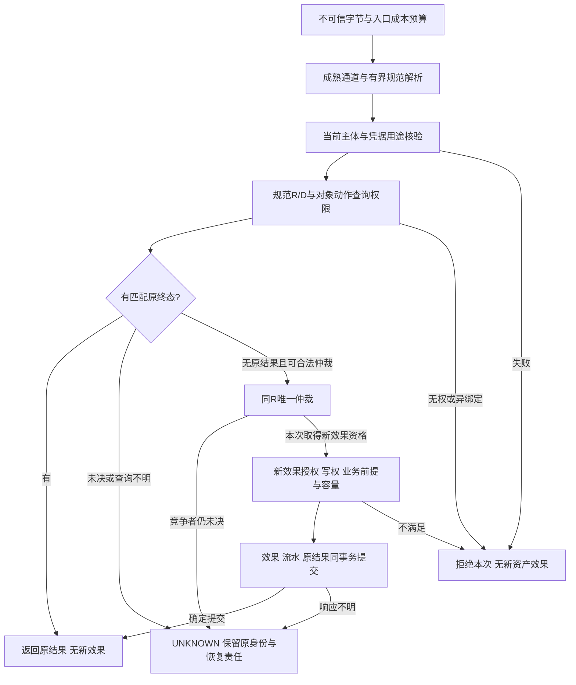
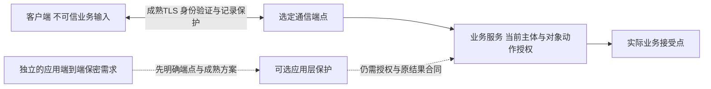
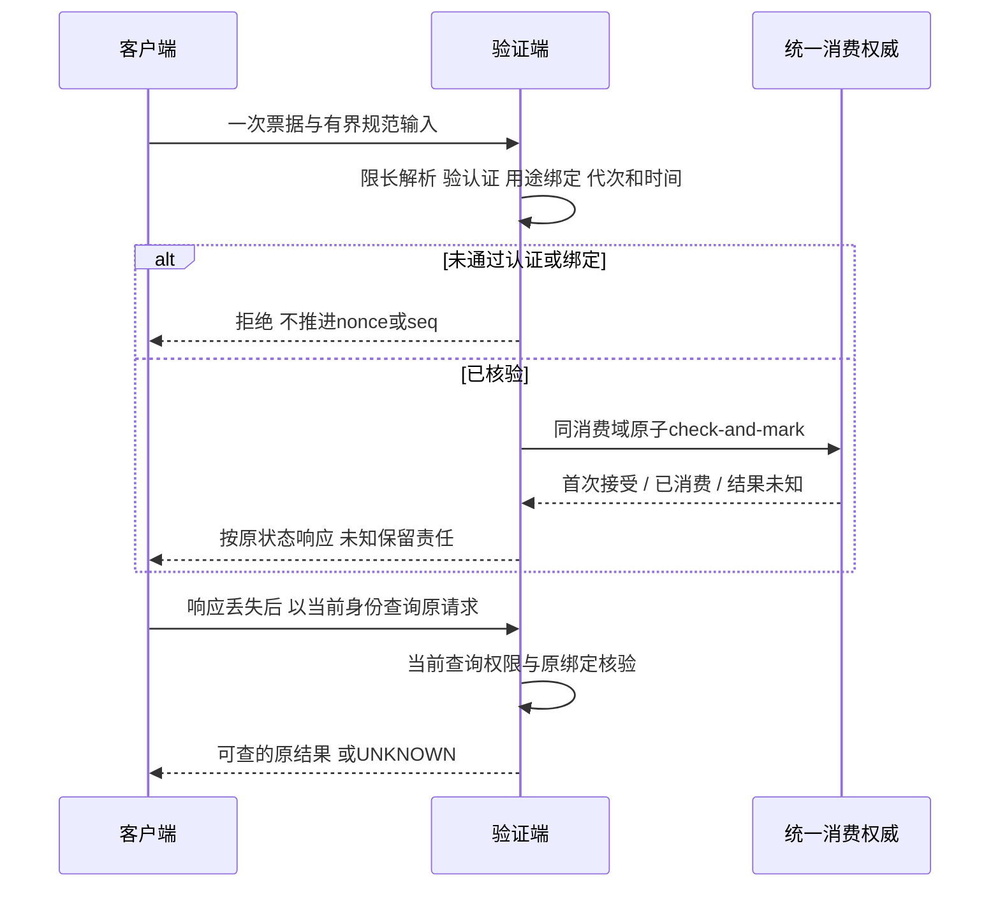
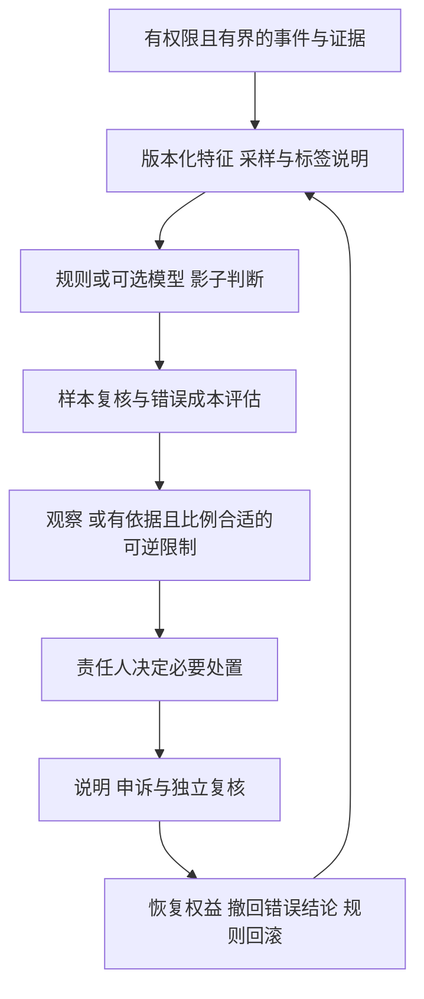
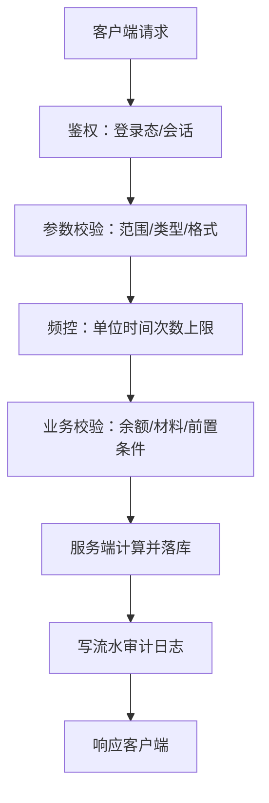
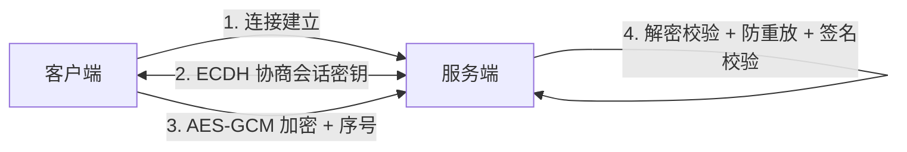
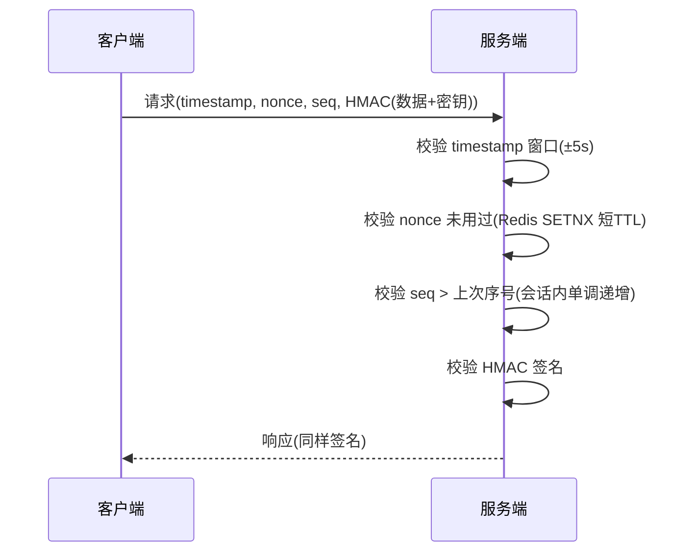
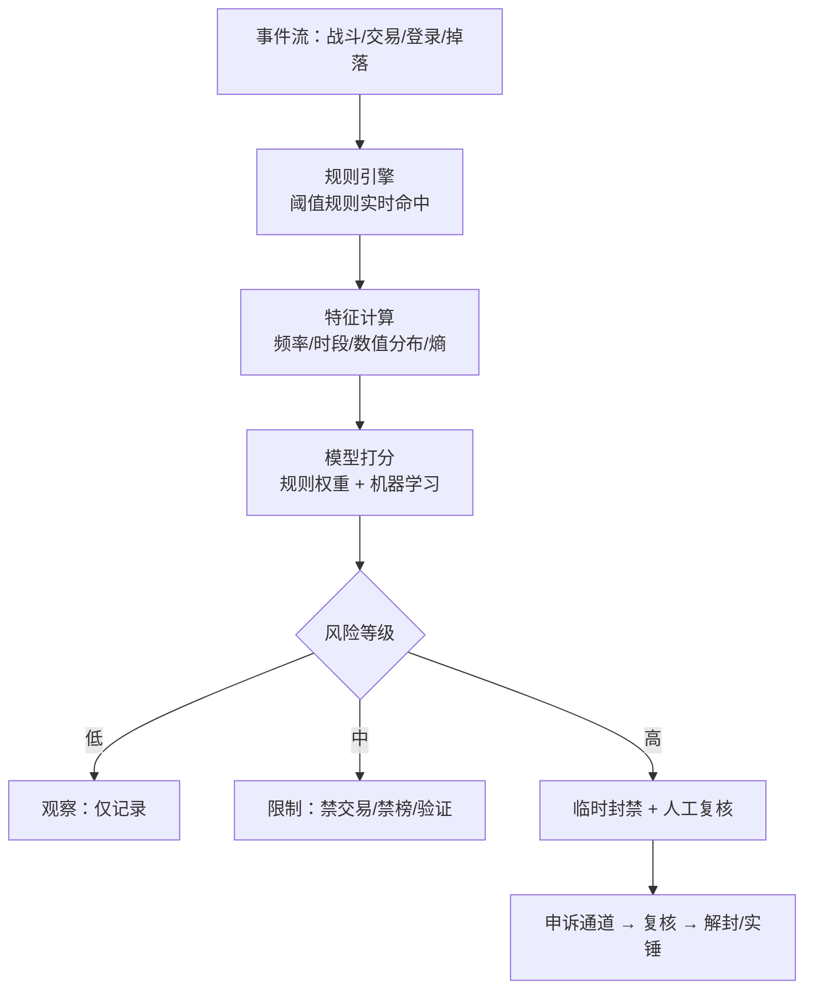

# 04 安全与反作弊

> 知识成熟度：L2。本文的主要证据是固定规范、标准库源码和已发布业务合同的静态选读；不是可直接部署的反作弊实现，也没有取得现网准确率或性能证据。
> 知识基线：TLS 1.3 [RFC 8446](https://www.rfc-editor.org/rfc/rfc8446)、AEAD [RFC 5116](https://www.rfc-editor.org/rfc/rfc5116)、IPsec窗口对照 [RFC 6479](https://www.rfc-editor.org/rfc/rfc6479)、Bearer [RFC 6750](https://www.rfc-editor.org/rfc/rfc6750)、JWT核验 [RFC 8725](https://www.rfc-editor.org/rfc/rfc8725)；Go go1.23.0与Redis 7.4.2仅为固定历史源码选读版本，不是上线版本建议。具体符号、条款及来源限制见S12。
> 适用范围：网关与会话身份、服务端业务接受、资产原结果恢复、反作弊线索与处置责任。默认使用校验端点身份的TLS及成熟承载；本文不定义新的密码或传输协议。
> 最后更新：2026-10-08。本次修订重接认证、授权、重放、事务、容量和调查闭环；文末保留的2026-08-04初稿及2026-08-06前言是历史贡献，旧日期不代表本次核对日期。
> 证据范围：所有P01–P26例子（P09分a/b）均标为PAPER_EXPECTED，是给定前提下的纸面预期。没有运行密码函数、Go/Lua/SQL、编译、协议模型、产品、数据库、并发、攻击、抓包、故障或压力实验，也没有采集真实玩家数据。验证建议与停止线见S12.2；法律只说明S10列明的历史文本和有限条款。

## S1 为什么合法登录仍不能证明购买成功

玩家在断线后重发一次购买，可能同时遇到三种情况：会话已换、旧事务已提交但响应丢失、旧连接仍有回调。把它们压成“请求失败，换ID再试”，可能扣两次款；把它们压成“token有效，放行”，又可能允许越权。这篇文章要回答的是：哪些证据分别允许读取历史结果、产生新效果、释放资源，以及何时必须停在未知。

贯穿主例是租户T的玩家p1买i9一件。服务器固定配置v3中价格30金币，钱包初值100。通信使用普通完成握手的TLS，不让资产写入走0-RTT early data。稳定请求身份为 `R=(T,p1,BuyItem,r42)`，规范业务绑定D包含目标p1/incarnation7、item=i9、count=1、currency=gold及约定v3。R/D的完整含义在S6展开。

| 要建立的事实 | 证据来自哪里 | 它不能替代的下一层 |
| --- | --- | --- |
| 通信端点可信、记录受保护 | 选定协议正确验证端点与握手，保护相应连接段 | 登录主体与业务权限 |
| 当前应用主体是p1 | 服务端验证会话/票据及其发行、受众、用途、期限与撤销状态 | p1是否可操作指定对象、动作和数量 |
| 可以接受本次新业务 | 当前授权、规范输入、服务器状态、容量及实际接受点的写权核验 | 事务是否真正提交 |
| 原R/D有持久终态 | 原效果与原结果同事务，或权威新读恢复到匹配结果 | 当前余额、当前owner权利、底层工作是否结束 |
| 对应资源已静默 | 实际调用、提交包装和全部回调不再访问的证据 | 远端业务是否提交；静默本身也不证明回滚 |

保护对象仍包括游戏经济、竞技公平和排行榜；威胁从四个方向进入：传输中的篡改/重放，受控客户端的内存/输入/时间，业务规则和并发恢复缺口，以及身份、个人信息、未成年人等制度约束。四层帮助划责任，不是完整威胁枚举。拒绝一个确定违反业务不变量的动作，与认定某人作弊、实施账号处罚，是不同决策。

两条连贯轨迹贯穿后文。成功轨迹是：验证通道与当前p1 → 对象动作授权和R/D确定 → 同库唯一仲裁及实际写权核验 → 100扣30、道具、流水和原SUCCESS共同提交 → 响应丢失记UNKNOWN → 当前身份与查询权限核验 → 原R/D权威查询恢复SUCCESS → 旧I/O与回调实际静默后回收对应资源。非法轨迹是：当前p1有效 → 要操作p2的物品 → 对象动作授权拒绝 → 无新资产效果 → 仅形成有界、脱敏、带规则版本的调查记录。后者不直接生成永久“作弊”结论；若连认证都没通过，更不能推进p1的nonce或序号状态。

## S2 十五个概念各自证明什么

| 概念 | 当前解释和边界 |
| --- | --- |
| 服务器权威 Server Authority | 关键状态与合法转换由服务端接受点决定。客户端可预测、播放与提出意图，预测结果不等于已提交事实 |
| 客户端不可信 | 玩家可以控制程序、内存、输入和本机时间；通过认证的客户端仍可能发送非法业务输入 |
| 协议加密 | 保护机密性；现代TLS还保护其记录完整性并在正确配置下认证端点。它不决定商城价格或物品所有权 |
| 消息签名 | 旧示例实际是HMAC共享密钥MAC，区别于公钥数字签名。能验证共享密钥MAC的一方通常也能生成它，不能据此证明“服务端签发”或“玩家诚实” |
| 防重放 | 在明确定义的消息/票据域内处理已接受的重复；业务合法重试常应返回原结果，而非重新执行或一律报作弊 |
| 内存修改 | 客户端数值或代码可变；不采纳它上报的最终伤害、余额、奖励，SDK报告只能补充调查 |
| 变速齿轮 | 客户端时间不能作冷却、活动和奖励的唯一权威。服务器收到包的间隔也受网络与调度影响 |
| 封包外挂 | 中间人改密文与受控端点生成具有有效认证的新消息是两种前提；前者靠协议保护，后者仍靠权限与状态约束 |
| 脚本外挂 | 自动化输入可能满足所有业务规则。间隔整齐、长时间在线等是线索，不能单独构成作弊判决 |
| 透视 | 已发到客户端的隐藏信息可能被读出；减少不该分发的信息，并处理合法显现、声音与状态追赶 |
| 反作弊SDK | 客户端检测与上报组件，涉及兼容性、隐私和性能成本；上报可被干扰，不能充当服务端真相 |
| 行为检测 | 对特征、样本、标签与阈值提出可检验假设，需要同时评估误报、漏报与分布变化 |
| 风控 | 将信号、规则版本、证据、措施与负责人连接，并提供复核、申诉、恢复权益和规则回滚 |
| 实名认证 | 在已核对的制度与接口范围内校验身份资料；资料匹配不能证明实际操作者年龄或阻止代认证 |
| 防沉迷 | 按适用地区、日期及产品规则在服务端控制服务接受与付费；不能只信客户端计时或扩大为未经核对的跨平台保证 |

## S3 从不可信输入到实际接受点

### S3.1 六类业务仍由服务端掌握最终事实

| 业务 | 服务端保留的判定与结果 | 客户端可承担的工作 |
| --- | --- | --- |
| 战斗伤害 | 按服务器属性、规则及有效命中依据计算或仲裁最终伤害 | 输入、预测、动画；不能把上报伤害直接结算 |
| 掉落 | 服务器生成、决定资格、保存发放事实；重复展示不再发奖 | 拾取意图和表现 |
| 货币/道具 | 服务器价格快照、余额/库存/容量与必要扣发效果；同库原结果见S6 | 购买/合成意图与展示 |
| 概率抽卡 | 规则版本、随机选择及原结果；同一抽取恢复不重抽 | 发起一次意图并播放其结果 |
| 移动/技能 | 合法时序、冷却、位置约束及服务端仲裁；回溯按玩法明确历史输入边界 | 预测与插值降低表现延迟 |
| 任务进度 | 已授权事件来源、前置状态、次数/物品/活动资格 | 展示进度，不能仅发“已完成”标志获得奖励 |

服务器权威不要求客户端只能当显示器，也不等于任何FPS都能靠低频异常抽查完成最终仲裁。预测、延迟补偿、回溯和服务器模拟怎样分工，需要玩法自己的正确性与性能证据；不得让未检查的关键结果先变成不可逆奖励。协议承载入口见[网络通信与协议设计](../服务架构与消息通信/02-网络通信与协议设计.md)，预测与仲裁入口见[帧同步与状态同步](../同步预测与回放/03-帧同步与状态同步.md)。

### S3.2 主体、输入与对象动作权限逐层连接

主体从服务端验证后的AuthContext取得，不能直接信任请求里的pid、tenant或ownerEpoch。解析先限制包大小、字段数、嵌套和字符串长度，再核固定schema、枚举、编码与版本。认证后核对象和动作：p1可读自己订单，不代表可转走p2物品；服务身份获准访问数据库，也不代表它仍持有某玩家的当前写权。

| 六类检查 | 可信依据与失败分支 |
| --- | --- |
| 数值/类型 | 数量是规范整数，币种与单位明确；先核范围再核乘加上限，不接受隐式截断、浮点货币或先溢出后比较 |
| 时间 | 活动起止采用服务器可信时间和明确时区/单位、端点；回拨、溢出或来源失效时按停止策略处理，客户端倒计时只展示 |
| 次数 | 每日资格由业务唯一域/持久状态保证；每秒频率保护预算。低频不说明尚有每日领取资格 |
| 幂等 | 同R同D恢复原终态，同R异D冲突；短TTL、traceID与重连session均不替代原业务身份 |
| 所有权 | 当前主体对指定tenant、对象incarnation和动作有权；新效果在实际接受点复核写权/代次 |
| 前置状态 | 服务器的解锁、副本阶段、材料/库存等决定合法转换；不能只用客户端“完成”或缓存旧状态放行 |



图中“查询原终态”还需要足够新且权威的视图；无记录而旧事务可能提交，走恢复等待/UNKNOWN，不能因此直接发第二次新效果。全局入口成本限制可以在身份未知时保护解析与连接预算；它不把未经认证的字段写进某玩家的重放状态。业务流水同事务，另行诊断记录按S9最小化，不能把图里的“请求已通过”理解为全部安全事实已成立。

**P01 · PAPER_EXPECTED：身份有效但越权。** 假设TLS端点与握手符合合同、p1的token有效；目标是p2的物品，p1没有对应动作权限。应在对象动作授权处拒绝，不产生资产效果。有效通道、有效token、有效MAC、低频和正常行为均不能补上缺失的权限。

**P02 · PAPER_EXPECTED：先证明数值可表示。** 本例金额选用有符号64位整数的非负金币单位，最大值M=9,223,372,036,854,775,807；数量约定1至999。count=0、负数、1000或非规范整数都在业务前拒绝。服务器price也须为允许的非负整数；当count>0时先要求price≤floor(M/count)，再计算cost，并检查余额和库存增量的上界。例如count=2虽在数量范围内，price=M仍不能相乘后再判断。不声称已运行整数溢出测试。

### S3.3 fence必须约束新效果，不能阻断合法历史查询

网关鉴权与存储提交有时间间隔。旧worker可能已收到请求，再被接管。沿[数据库选型与存储设计A5](../持久化与分布式一致性/01-数据库选型与存储设计.md)及[EntityOwnership与Authority](../世界权威与故障恢复/07-EntityOwnership与Authority.md)，所有会产生效果的入口都在同一受保护资源接受边界核当前incarnation/owner_epoch；检查与效果之间不能留下可被交接插入的空窗。本例借用DB1事务内锁定权威写权记录并持有至事务结束的合同，不能由踢连接、本地token或发现系统的地址替代。

**P03 · PAPER_EXPECTED：旧权只能被拒绝产生新效果。** epoch41在网关曾通过，实际接受点已是epoch42；若它要产生尚未存在的新效果，同原子接受的fence条件拒绝此次写入。反过来，若原R/D早已成功，当前获准主体查询该原结果，不应先要求原执行worker仍是epoch41的合法owner。先核当前查询权限与完整绑定，返回原终态不改变当前owner；也不能拿历史成功重新授予旧权。这个分层与[分布式与高可用§3.9](../持久化与分布式一致性/03-分布式与高可用.md)的原结果优先合同相接；本文D指参数绑定，该篇D指数据库事务域，两者不是同一符号对象。

## S4 TLS、凭据与旧密码示例的实际边界

### S4.1 默认采用成熟协议，不把算法列表当协议

TCP长连接、HTTPS、WebSocket都应选用正确验证服务端身份的TLS；wss只是WebSocket的安全方案名称，不是TLS的唯一用法。客户端身份通常仍由应用会话建立；只有明确采用并正确验证客户端证书时，才有相应的TLS客户端认证。TLS在网关终止时，网关到实际业务服务是另一段信任边界，需要独立保护和服务身份/权限设计。UDP需求应选择受维护的DTLS、QUIC等成熟协议，锁定实际实现与版本；本文不设计其握手、密钥协商或线上封包。

TLS记录已提供相应认证加密，普通购买不因为“关键”就必然需要再叠一层AES-GCM和HMAC。独立的应用端到端保护需求，例如中间代理不应读明文，才引出额外应用层方案；必须先解释端点、密钥责任与成熟协议选择。仅交换ECDH公钥不能自行认证对端。自造“ECDH→AES→HMAC”箭头，或把XOR、RC4、固定秘钥混淆当保护，都没有完成这个问题。



图中的可选保护没有取代任何业务箭头。共享会话密钥持有者可以生成认证消息，因此客户端密钥泄漏或恶意客户端的合法加密输入仍需S3检查。服务端票据的长期签发密钥不能下发给不可信客户端；否则客户端自己也可签出“有效”票据。白盒、反调试和内存保护不能把它变成可信签发者。

票据校验要有服务端固定的签发域、允许算法/key-id集合、目标受众、主体和用途、资源/实例/会话代次及有效区间。若实际使用JWT，才按RFC8725 §3.1、§3.8–3.9核允许算法、issuer与key的关系、合法subject及audience；不能让令牌自报算法就扩大允许集，也不把自定义登录票据直接叫OAuth。RFC6750的bearer含义是持有者即可使用该凭据，MAC/签名不证明实际操作者本人。旧文“按天/按版本轮换”只是示意：实际方案还要定义签发新钥时点、旧钥验证窗口、撤销/泄漏应对、所有实例同步与未过期票据的恢复方式。变更key-id标签而保留同一实际密钥，不会消除其既有nonce义务。

### S4.2 用固定Go API理解错误出口，不提供新封包实现

文末保留的EncryptPacket/DecryptPacket和SignMessage/VerifySign没有被运行，也不能作为默认实现。下表选读Go go1.23.0的 `crypto/aes/cipher.go`、`crypto/cipher/gcm.go`、`crypto/hmac/hmac.go` 接口与generic分支，支持API合同，不覆盖全部硬件路径和平台时序。

| 旧块中的步骤 | 当前必须成立的合同 | 错误时的业务状态 |
| --- | --- | --- |
| `aes.NewCipher(key)` | key长度只能为16/24/32字节；检查返回错误，不能把nil block继续传入构造器 | 停止，无新明文/nonce/seq/资产发布 |
| `cipher.NewGCM(block)` | 检查构造错误；固定标准构造的NonceSize为12、Overhead为16，非标准变体须另核接口合同 | 构造失败就退出，不继续解引用 |
| 取包前缀nonce | 先核总长度与项目允许的最大消息长度；确认足够nonce和tag后再切片，不能靠认证失败兜住切片panic | 拒绝短包/超长包，不进入业务 |
| `Open(dst,nonce,ciphertext,AD)` | nonce长度准确，密文至少有tag；AD与加密时一致，长度和别名规则满足API | 认证失败不向业务交付明文，不提交重放/业务状态 |
| Open失败的缓冲区 | AEAD接口明确dst容量范围内可能被覆盖；使用隔离临时存储，不承诺失败时所有内存不变 | 只在成功后发布业务所用结果，不读取失败输出当可信数据 |
| `hmac.Equal` | 比较MAC字节；先按固定表示/长度解析，避免任意大小输入；字段编码必须唯一可解释 | 比较失败拒绝；Equal不证明整个解析/授权链恒定时间 |

**P04 · PAPER_EXPECTED：构造与长度都是先决条件。** key长17时NewCipher返回错误，流程停止。另有sealed的len=cap=11、预期nonceSize=12；先切 `[:12]` 越界，必须在切片前拒绝。只有12字节nonce而没有16字节tag，同样在认证长度入口拒绝；未得到明文。这里没有实际调用Open、触发panic或测量时序。

**P05 · PAPER_EXPECTED：MAC不修复编码歧义。** 旧代码在每字段后加NUL。允许字段含NUL时，元组 `(a+NUL+b,c)` 和 `(a,b+NUL+c)` 都编码成 `a NUL b NUL c NUL`。两组业务字段不同，认证输入却相同；这不是破解HMAC。当前选定schema应拒绝不合法编码，或使用已定义的长度/类型边界和唯一规范表示，明确Unicode、整数、空值、字段顺序、未知字段及版本。MAC/AEAD只认证字节；业务必须唯一地理解那些字节，且覆盖所有影响处理的字段。不能将“HMAC(数据+密钥)”当成任意拼接哈希算法。

### S4.3 四种容易混淆的“唯一”

| 标识 | 唯一性所在域 | 不负责什么 |
| --- | --- | --- |
| GCM nonce | 同一实际key的全部加密调用，包括方向、实例、进程与重启 | 不保存业务原结果，不自动提供接收防重放 |
| 一次性票据nonce | 约定签发/消费域内的一次资格 | 不等于一个资产购买ID |
| 会话seq | 该会话/epoch与选定顺序协议内 | 重连不让历史购买变成新购买 |
| 业务request_id | 稳定R及完整D，覆盖合法重试/并发/恢复窗口 | 不代替当前身份、权限或密码nonce |

RFC5116 §2给AEAD与AD的接口，§3.1明确同key跨设备和重启的nonce协调要求；其通用接口提到零长度nonce，不表示GCM允许零nonce。本文固定Go GCM构造也拒绝零长度。应用不应仅凭“每包随机”就声称永无碰撞：随机源失败、调用总量、并发分配、方向隔离、重启恢复和密钥生命周期都属于被选方案的前提。成熟协议已经处理自己的nonce空间，不要再把其内部计数随意暴露成业务重试ID。

**P06 · PAPER_EXPECTED：同key复用nonce不满足前提。** 两次GCM加密若使用同key同nonce，即使明文不同、key-id不同、发生在两个方向或重启后的计数归零，都违反本例唯一性条件。发现无法证明唯一就停止该设计，不能靠附加HMAC或改标签继续使用；本文没有执行密码运算或利用演示。密钥、nonce分配和失效状态需要在所选成熟方案中核实，不能据此开始另造传输协议。

## S5 重放、乱序、重试与一次消费

### S5.1 先确定要防的重复属于哪个域

TLS记录空间归TLS实现负责；RFC8446 §8特别说明0-RTT并不天然防重放，应用重试还会跨连接/实例重复。本例资产写入只在普通握手完成后处理，但这仍不取消R/D原结果恢复。一次性登录或重连票据管“一次资格”；同会话序号管协议规定的顺序和重复；购买R/D管持久资产效果。timestamp、nonce、seq、HMAC不是所有业务“缺一不可”的四件套。

一次票据消费域至少明确签发域、主体、资源/实例/会话代次与用途；哪种重连可复用、哪种必须重新签发由既有会话合同规定。对照[角色进入游戏完整链路步骤5–6](01-角色进入游戏完整链路.md)和[DS会话注册与重连实现§4](03-DS会话注册与重连实现.md)。本节只解释其边界，不给自定义票据线格式或新签发代码。



图中的消费不自行代表之后的资产提交，也不保证已经存在最终业务结果。票据消费、请求登记与后续占位的相接责任按会话合同保存；响应丢失时走原请求查询，不能靠重复消费来“确认”。便宜的只读过期/格式预筛可以提前做；但只有认证及全部当前绑定通过后，才允许竞争修改相应重放状态。

### S5.2 状态提交、并发与乱序

**P07 · PAPER_EXPECTED：坏认证不能抬高序号。** 会话S/epoch7已接受seq41；收到seq999但认证失败。LastSeq仍是41，相应nonce表也不变。若先SETNX或写LastSeq，攻击者可用不可信数据污染状态，让后来合法消息被拒。认证成功也只是必要条件，错误用途、错误实例/代次仍不能消费这份资格。

**P08 · PAPER_EXPECTED：乱序与重放不同。** 仅在一个已明确允许乱序的协议中，设窗口W=4、最高已验证序号42，窗口为[39,42]，41尚未出现；经认证的41首次可接受并标记，再次41拒绝，38过旧。若只写seq>42，会误拒第一次41。RFC6479 §1描述的是IPsec接收窗口，这里用它解释概念，不把W=4当标准部署值或移植成游戏协议。承载若要求严格有序，则遵循该协议；新epoch、序号耗尽、并发验证及重启后的状态恢复都必须另有明确规则，不能清空序号却继续接受旧域。

**P10 · PAPER_EXPECTED：两个消费者竞争一次资格。** 两个服务同时验证同一票据，只有同一消费权威的原子check-and-mark才能选出一个首次接受者；先各自读“未见”再写，或各存一张本地表，不能推出全局一次性。存储超时要按真实结果记UNKNOWN，不能把没有拿到布尔结果强行解释成已重放或消费成功。Redis单个SET的NX与EX/PX组合提供一个命令能力，分开的SETNX、EXPIRE是两步；单命令能力仍不证明跨主切换、数据丢失或恢复后一致性满足产品合同。

### S5.3 TTL必须从合法接受区间推导

时间校验声明可信验证端时钟、单位、允许偏差和半开/闭区间；比较应避免 `abs(now-ts)` 在整数边界溢出。回拨、跨机偏差超界、时钟来源失效或重放状态丢失时，不能仍沿用原安全结论，应停止相关新接受或按事先证明的恢复策略进入新域。限制票据长度、nonce长度、scope数量和存储容量属于S7的另一份预算，时间窗不是容量证明。

**P09a · PAPER_EXPECTED：保留旧例成立的局部前提。** 原模型是ts=100秒、`abs(now-ts)≤5秒`，理想单实例时钟无回拨；95秒首次接受，最后可接受点是105秒。若消费记录从95保留60秒至155，它覆盖这份合法窗口，因此不能说旧60秒TTL必然太短。它没有证明跨实例统一消费、重启恢复、并发状态、容量或异常时钟安全；缺陷应按这些真实缺口判断。

**P09b · PAPER_EXPECTED：另一个票据合同有另一条期限。** 设iat=100、exp=160、skew=5秒，选定接受区间[95,165)。95秒消费却仅保留60秒，155秒删除后到165秒前票据仍可能合法；若无其他可靠已消费证据，它可能被再次接受。消费记录至少覆盖最后可能合法接受时刻，并满足允许的恢复/轮换合同。不能把P09a的±5秒点窗直接套在这张具有60秒生命周期的票据上，更不能用Redis TTL决定票据权威有效期。

重新签发、换TLS连接、轮换密钥或重连session都不自动结束业务R/D保留窗口。旧票仍可被验证的窗口、允许的备份恢复、人工恢复和未决消费责任必须算入回收条件；不能证明就停相关新接受，不能删状态腾位置。认证有效的超时重发也可能只是正常玩家，重试次数不是作弊判据。

## S6 一次购买、原终态与UNKNOWN

### S6.1 先保存业务身份，后决定是否产生新效果

主例只采用[数据库选型与存储设计A5](../持久化与分布式一致性/01-数据库选型与存储设计.md)的同库合同：Wallet、Inventory、Ledger和RequestResult位于同一个真实writer事务域，必要约束、持久化和故障恢复保持同一合法连续事实。数据库、驱动的事务连接、隔离、错误与取消行为需由实际项目核实，不能因为伪代码写了Begin/Commit就成立。

| 状态/身份 | 主例的精确定义 |
| --- | --- |
| 当前调用主体 | 从可信AuthContext得出的tenant T和p1；客户端自报pid不成为事实 |
| R | `(T,p1,BuyItem,r42)`，非空且有长度上限；稳定主体和操作域隔开同名ID |
| D | 目标p1/incarnation7、item=i9、count=1、currency=gold、价格配置v3及协议/规范化版本的完整规范参数；本例保存完整绑定，不用未定义碰撞处理的摘要代替比较 |
| 本次执行身份 | worker及owner_epoch、连接、traceID、重试次数；只描述尝试，不重定义R |
| 服务器快照 | v3价格30、上架状态、必要库存/限购与余额；价格由服务端配置确定，客户端不能指定优惠价 |
| RequestResult | 唯一R、完整D、原SUCCESS或选定的持久REJECTED及其完整有界原响应 |
| Ledger | 唯一业务效果buy/order42，币种、delta、before/after、原因和业务版本；与扣发和原结果同事务 |

R不是秘密，也不授予查询权限。会话重连、token刷新、换worker后仍按原R/D恢复；不得自动生成r43“重试”。首次发起者须在既定有界恢复责任中保住原身份、绑定与待确认工作，进程消失后仍能继续查询。必要恢复记录或结果容量不能建立时，不发起新效果。不能让一个临时调用栈成为UNKNOWN唯一保管人。

原结果查询先核当前身份和查询权限，再比较原绑定；相同R不同D即冲突，不把他人的结果作为冲突详情泄露。合法恢复返回当时完整终态：后来的配置v4、充值或owner更替不重算r42。新购买使用当前配置形成新的明确意图；不能将原r42静默改绑v4，也不能因v3已经不是销售默认配置而覆盖已保存的原事实。

### S6.2 真实事务顺序与失败分支

下面是静态状态追踪，不是可执行Go或SQL。当前身份/有界输入和查询权限已经核验；新效果还要在同一事务的真实接受点核当前对象动作权限、写权及业务前提。

1. 在固定writer连接开始事务并竞争R唯一记录。已有原终态时核D，同参返回它，异参冲突；并发未决按数据库真实状态有界等待或恢复查询。占位不单独提交为成功。
2. 只有本次获得新效果仲裁时，按固定锁顺序锁住权威Player/Wallet等必要记录，核incarnation和当前owner_epoch。接管更新同一保护记录，锁持续到事务结束。预留完整结果/流水/道具所需持久预算，不能先扣款后发现无处记结果。
3. 从约定服务器快照核上架、币种、price/count/cost范围、限购和容量；Wallet更新同时约束余额与期望版本。影响0行不得继续发道具；在同一真实事务的锁定读中分类账户缺失、余额不足或版本冲突，不能凭旧普通读快照分类。
4. 全部满足时，Wallet100→70，Inventory增加一件，Ledger记录buy/order42，RequestResult写原SUCCESS(order42,balance_after=70)，一起提交。任一步约束/写入失败，不允许留下一半效果。确定业务拒绝按选定合同仅保存完整原REJECTED、无扣发，并且只有确定提交才称已持久拒绝。
5. COMMIT确定成功才报告对应原终态；COMMIT结果不明记UNKNOWN(R,D)。确定本次回滚也只证明本次没有提交，不否定同R的其他竞争者。恢复以当前权限、同R/D和足够新且权威的原结果读为准。

| 观察 | 正确分类与下一步 | 不能推导的结论 |
| --- | --- | --- |
| Begin/Exec报错、死锁或连接失效 | 按实际数据库/驱动证据分确定回滚或UNKNOWN；失败事务退出后才能按合同恢复 | 所有错误都是余额不足或一定没发生 |
| 条件更新影响0行 | 锁定读当前权威状态分类；必要时在预算内重新仲裁完整事务 | rows=0可继续发道具，或一定是作弊 |
| R唯一约束冲突 | 退出失败事务，用权威新视图查胜者；同D恢复、异D冲突，未决保持UNKNOWN/处理中 | 冲突就永久REJECTED，或“忽略错误”继续扣款 |
| COMMIT响应丢失/取消/断线 | 原事务可能提交，保留R/D及责任，查原终态 | 换ID重试安全，或cancel已让服务端回滚 |
| 原查询空读/副本过旧 | 若旧尝试仍可能提交，继续UNKNOWN；核读视图与恢复合同 | 查不到就证明整个意图从未发生 |
| 已确认原SUCCESS后迟到UNKNOWN | 保留已知原终态；矛盾确证终态则停下诊断并保全证据 | 旧未知通知可以抹掉成功 |

旧购买函数遗漏reqID参数与可信主体来源，忽略Begin/Exec/Commit错误，SQL又含特定方言；它是待纠错材料，不是跨数据库通用代码。Redis dedup在资产事务之前成功，不会自动使资产与原结果共同提交。日志也分责任：Ledger是可恢复业务事实，跟效果同事务；调查日志与OpenTelemetry用于关联定位，不替代账本。若审计外发本身属于成功承诺，必须沿既有持久责任保证交接，不能用一句“先写日志”或“成功后异步补”代替原子性。

### S6.3 五个恢复分支

**P11 · PAPER_EXPECTED：一次确定提交。** 初态钱包100，i9价格30，数量1，同R/D无历史。唯一仲裁、权限/写权、数值及容量条件均满足；真实同库COMMIT确定提交后，钱包70、道具+1、Ledger(buy/order42,-30)、原SUCCESS(order42,70)同时成立。没有任一步单独等同这一组完成，本文没有实库输出。

**P12 · PAPER_EXPECTED：结果丢失不再扣款。** P11已提交，但COMMIT响应丢失，调用方先记UNKNOWN。随后按原R/D在足够新且权威视图读到原SUCCESS(order42,70)，恢复它而不再扣30。即使后来充值使当前余额100，原结果里的balance_after仍是70；当前余额另作当前读。若暂时查不到且旧事务未决，仍UNKNOWN。只有明确原尝试回滚且旧调用实际结束后，才按DB1的预算用同R/D重新仲裁，并仍处理别的同R胜者；这不是允许任意重发的新协议。

**P13 · PAPER_EXPECTED：同R并发和异D冲突。** 两个请求用相同R/D并发，由同一唯一约束仲裁，只有胜者可提交一次效果；败者按真实事务状态有界等待、返回处理中或恢复原结果。第三个请求仍用r42却把count改2，D不同，报告冲突而不追加道具。等待、容量拒绝、连接错误和异参冲突都不自动成为该R已持久的业务REJECTED。换session或worker不能绕过稳定域；调用方不能用新ID掩饰旧意图未决。

**P14 · PAPER_EXPECTED：拒绝也可有原事实。** 另起初态余额不足，业务合同已经在同一数据库持久保存原REJECTED(INSUFFICIENT_FUNDS)，无扣款或道具。后来充值，同R/D仍返回原拒绝；新的购买意图才用新R。若只有一次网络超时或容量不足，没有已提交原拒绝记录，就不能编造同样终态，也不能覆盖另一个已存在成功。

**P15 · PAPER_EXPECTED：恢复入口重新鉴权。** 一次票据已消费、结果响应丢失；p1重新取得当前有效身份后按原R查询，通过当前查询权限与D核验才恢复已有结果，不再重复消费、占位或扣款。p2也知道r42但没有查询权限时拒绝；缓存命中不绕过授权。查询期间原事务仍未决时返回UNKNOWN，不能为了“友好响应”猜一个成功。票据已消费证明一次资格状态，不能单独证明后面的购买已完成。

跨库订单履约另见[分布式事务与最终一致性§2、§3及T4/T5](../持久化与分布式一致性/04-分布式事务与最终一致性.md)：OrderDB受理、Outbox责任、InventoryDB的Grant及原结果是不同接受点。“订单已受理”不等于背包到账。本篇不增加多数据库、Outbox或消息投递实现，也不把同库COMMIT扩成跨服务原子性。

## S7 限流、记录存量与实际资源寿命

### S7.1 限流的单位、入口与状态

限流保护工作预算；票据去重限制某资格的一次接受；R/D保护原业务效果。三种计数不能合并。合法原结果查询也要有独立有界工作预算，但不能在新结果槽满时替它分配第二个结果槽或改变原终态。认证前的连接、包长与解析成本要有全局上限，认证后才可靠地按主体、tenant或业务scope分配预算；任由客户端创造无限scope可以绕过每scope限额。

旧Lua的用途是滑动窗口计数。当前只给状态合同，不运行或提供新脚本：选定scope、可信服务端时间来源、毫秒单位的score与窗口端点；明确计数的是尝试还是通过门的接受事件，每次是否计1；记录有界且确定不重复的member；清理、计数、判断与登记在同一真实原子边界内完成。输入类型/范围、key类型与必要容量在写前处理，错误出口按已发生的写分类。返回1只能说明这个门的准入，不能证明购买提交。

**P17 · PAPER_EXPECTED：不要混用单位和端点。** now_ms=10000，window_ms=1000，选定窗口(9000,10000]。score=9000的事件出窗，9001保留。Redis7.4.2命令声明中EXPIRE单位是秒，不能把1000毫秒直接当1000秒；ZSet score的单位由本业务合同规定。当前时间不能由任意客户端ARGV决定；回拨、未来时间或跨实例时钟差需要选定策略，失去该前提就停止使用此窗口结论。

**P18 · PAPER_EXPECTED：随机member并非确定唯一。** 两次请求的now相同，随机后缀也碰巧相同，则两次ZADD作用于同一member；第二次更新score，不增加成员数，计数少了一次。这个反例来自固定ZADD语义，不是测得碰撞概率。若合同要求每次接受计一次，需受控、不复用且有长度/耗尽策略的事件身份，并处理插入未产生新成员的情况。脚本执行不与其他命令交错，也不等于出现运行时错误时自动撤回此前写入；沿[缓存与排行榜系统的Redis脚本边界](../持久化与分布式一致性/02-缓存与排行榜系统.md)处理部分写责任，不能在异常后无条件再次计费或宣布没有准入。

### S7.2 窗口接受量不是系统存量

**P19 · PAPER_EXPECTED：有明确前提的令牌桶上界。** 固定scope容量B=5、补充速率r=2/s，每次接受耗1 token；所有接受经过唯一原子门且无旁路。取W=60秒，桶状态在该区间连续、不重置；区间开始可用token至多5，区间内最多补120，所以每scope经该门接受事件数≤B+rW=125。若整个区间只涉及最多100个固定scope，合计≤12500。单位是“这60秒内通过指定门的事件”，不是在库记录数、并发调用数、resident内存或已测服务容量。

任一前提不成立就不能直接套这个上界：重启重置桶、换key清零、旁路调用、一次接受没有按同一规则扣token、窗口中轮换出更多scope，都改变计数域。滑动日志窗口与令牌桶又是不同限流算法，不因为两者都写“60秒”就共享全部性质。

要估算存量，必须另列记录类型、每次接受最多派生数量、窗口开始前已有存量、各类最长合法保留、合法回收证据、索引/副本及未决派生责任。纸面反例：100个固定scope各持续每秒接受2次，每次生成1条记录，另有业务合同要求保留120秒。每个60秒窗口只有120次，小于125；按半开保留区间，在稳定阶段每scope却能有240条，合计24000。120秒只是反例前提，不是推荐TTL。未决事务、重放、备份恢复或回调可能要求更久保留；没有边界就停在“总存量上界未建立”。

| 预算对象 | 需要计算的内容与停止线 |
| --- | --- |
| 入口与解析 | 连接数、排队数、消息/字段长度、并发解析和认证CPU；未认证输入不按可伪造玩家ID无限建表 |
| 限流/重放状态 | scope总数、每scope记录上限、key/nonce/member长度、索引与实际物理回收；TTL不等于即时内存释放 |
| 原结果与恢复责任 | 完整R/D/结果、业务唯一记录、未决事务、查询与人工恢复任务；先有必要容量，才能接纳新效果 |
| 真实在途工作 | submit栈、payload、连接、回调、派生任务及owner；取消后仍访问就仍占真实容量 |
| 调查与审计 | 事件/证据字节、队列、最老未决年龄、保留目的与有权限的负责人；不要用无限用户ID作指标标签 |

容量达到停止线时拒绝新入场、降低生产或暂停派发；不能删除已接纳的原结果、去重证据或未决责任给新请求腾位置。普通TTL、重试次数耗尽、队列暂空都不是合法回收证明。回收条件沿[缓存与消息队列§11](../持久化与分布式一致性/03-缓存与消息队列.md)及[分布式事务与最终一致性§12](../持久化与分布式一致性/04-分布式事务与最终一致性.md)：允许的重试、人工/备份恢复、旧写者与所有在途工作窗口已封闭，或仍有合法持久结果/退役拒绝证据阻止旧身份重新生效。删除以后不能凭空恢复原事实。

### S7.3 结果已知与资源静默是两条轴

**P16 · PAPER_EXPECTED：成功查询也不能析构旧owner。** 购买原终态已查清为SUCCESS，但旧submit包装、driver或回调仍可能访问payload/连接；这些资源继续由稳定宿主或明确接手的保管人持有，真实槽仍占用。若关闭deadline先到，只能报告DRAINING/INCOMPLETE并保持责任，不能把cancel返回、收到一个回调或查询成功当成全部访问结束。

对应资源回收必须有证据：提交函数及宿主包装完成最后访问，全部已有回调退场，实际底层不再访问也不会再触发访问，派生任务结束或已有独立有效持有，业务UNKNOWN仍有持久恢复归属。关闭还需阻止新入口并覆盖关门前已登记但尚未真正submit的工作；不只数“已发送成功”的列表。依据[分布式事务与最终一致性§6.1](../持久化与分布式一致性/04-分布式事务与最终一致性.md)与[数据库选型与存储设计A11](../持久化与分布式一致性/01-数据库选型与存储设计.md)，这里仅承接接口合同；未核驱动静默能力就停止“安全关闭”声明，不补造调度器或测试结果。持久移交待办解决未来恢复，不会提前终止仍使用内存的旧工作。

## S8 六类作弊线索与信息分发

### S8.1 确定性约束先保护业务，线索再进入调查

| 类型与可能危害 | 服务端先保护的事实 | 辅助线索、代价与限制 |
| --- | --- | --- |
| 内存修改：伪造伤害、无敌、余额 | 不接纳客户端最终资产/伤害结果，服务器按合法状态转换结算 | SDK的调试器/断点、内存扫描、代码完整性哈希或注入上报可作线索；用户态/内核态覆盖不同，需评估兼容、权限、隐私与性能，报告缺失不等于干净，命中不等于定罪 |
| 变速：跳冷却、刷计时奖励 | 冷却、活动、奖励资格由权威时钟与服务器状态确定 | 请求到达间隔受网络抖动、批处理和调度影响；不能由“整齐”直接推变速，也不以客户端墙钟修正权威时间 |
| 封包：伪造请求、复制物品 | 成熟通道保护传输，当前对象动作授权、状态机及R/D防重复效果 | 受控端点可生成有效认证消息；未进副本就领奖、材料不足仍合成等由确定不变量拒绝，不能只检MAC |
| 脚本：挂机、自动刷取、代练 | 每次动作仍受资格、次数、资源和经济规则约束 | 间隔、轨迹、时段、操作序列可以调查；验证码/答题、随机玩法和收益递减有体验、可访问性与绕过成本，需产品评估，不能把验证失败当作弊确证 |
| 透视：获取本不该知道的位置 | 服务器尽量不发送此刻不应获知的实体/状态 | SDK完整性报告和可见性异常可辅助；可见性计算、预显现、声音与追赶有成本，S8.2说明边界 |
| AI代打：自动瞄准或决策污染竞技 | 服务端动作合法性仍独立成立 | 特征/模型只有在样本和标签可审时才产生可评估信号；机器学习名称不提供本项目检测率或泛化保证 |

通用的样本→特征→规则/模型闭环仍有用途，但样本必须来自获准来源，并区分确认样本、疑似样本和未知，记录标签依据及反例。采样只覆盖已被规则抓到的人，会把原规则偏差继续训练进去；没有被抓到的人也不能自动标正常。本文没有安装SDK、收集样本、训练模型或执行任何账号处置。

**P22 · PAPER_EXPECTED：异常节奏不替代事实。** p1本机时钟很快、间隔均匀或同IP多号，但请求动作符合服务器规则。服务器仍以自己的状态和时钟拒绝真正不合法的转换；这几个统计特征只入调查，不能单凭一项断言作弊。宿舍/家庭共享网络、网络批量到达、不同熟练度及辅助输入都可能改变特征；反过来，线索不足只表示证据不足，也不能证明完全没有作弊。

### S8.2 透视先从“发出去什么”检查

[Riot 2020-04-14 Fog of War设计](https://www.riotgames.com/en/news/demolishing-wallhacks-valorants-fog-war)提供的局部经验是：服务器控制不必要敌方位置信息的分发，同时解决必要时的显现与追赶。已经发到受控客户端的数据，不能仅靠“界面隐藏”守住；但过度裁剪会让合法敌人晚出现、动画或状态缺失，影响公平性。

**P23 · PAPER_EXPECTED：少发信息仍要让合法玩法成立。** 视野外敌人位置不发；进入合法可见范围后，客户端必须得到足以恢复当前表现的状态；声音可能有独立允许的信息范围。纯几何不可见不等于所有信息都不该发，系统应明确视野、听觉、队友信息及显现时机的产品合同，考虑服务器处理成本和延迟。这个方法减少可泄露的数据，不能宣称根除全部wallhack、无额外性能代价，或把Riot的项目效果复制成本文实测。

## S9 从检测信号到可解释处置

### S9.1 四类特征只产生待检验的判断

数值特征包括单次掉落价值、单位时间收益与排行榜增速；行为特征包括间隔方差、轨迹、点击坐标、序列和时段；关系特征包括资源转移、共享网络/设备线索；对抗特征包括SDK的注入、调试器或模拟器标记。每一类都要说明采集权限、分母、时间窗、版本与缺失值含义。不存在通用的“人类约200ms抖动/高斯分布、脚本恒定”定理；熵低、凌晨在线也可能来自正常玩法、职业安排、网络或可访问性工具。



图中没有“高分必封号”的箭头。客户端检测、服务器规则、统计模型和人工复核各补不同缺口，不能假设层数越多就无误报。新规则先离线核合法样本、再影子记录，条件成熟后才按产品责任灰度；规则保留版本、适用人群、数据来源、样本时间、损失预算和回滚入口。服务端保存敏感检测细节可降低规则暴露，但不能把“防逆向”变成无法申诉或无法解释的理由。

**P20 · PAPER_EXPECTED：保留旧YAML的目的，拆开阈值与处罚。** 下表是当前静态审查配置的含义，不是已部署规则或可执行YAML。v-shadow1只产生有界的影子调查记录，处置权限留给后续复核；三个旧阈值都尚未证明适合任一真实人群。

| 旧规则/纸面参数 | 影子记录需要什么 | 原处置用途怎样保留 |
| --- | --- | --- |
| freq_trade：每分钟60次交易 | 计数的是尝试/受理/完成哪一种，固定窗/滑窗，业务活动与重复请求排除规则，规则版本 | 限交易可保护经济风险；原2h只是历史参数，不能由命中直接推出合理持续时间 |
| score_speed：10分钟增加50000分 | 分数来源、奖励活动、回补/重算、赛季与模式、人群分布 | 暂时限制榜单影响可作可逆措施；原24h禁榜不是已验证政策 |
| odd_hours：连续14天凌晨3点在线 | 玩家适用时区、挂机状态、职业/地区差异及数据缺失 | 转人工队列可以补上下文；夜间在线本身不证明违规 |

三条影子记录至少带事件/规则版本、所用特征窗口、假设、缺失项与证据引用；不能直接执行原action。即使阈值相同，活动期/普通期、不同模式和人群的风险也不相同。若未来选择观察→限制→短期封禁→永久处置，应让措施严重性与证据和影响相称，并有负责人审批及纠错路径，而非固定自动升级阶梯。

### S9.2 把基率、误报分母和处罚错误分开

**P21 · PAPER_EXPECTED：低FPR也可能有很多误命中。** 虚构一个已标注总体：普通玩家100000名，作弊者100名。假设普通误报率0.1%、作弊检出率90%，则FP=100、TN=99900、TP=90、FN=10。命中的190名中真正作弊90名，命中精度为90/190≈47.4%。这只是假设标签正确的算术，不是本文的检测率、误封率或上线目标。

| 指标 | 分子/分母与单位 | 容易混淆的说法 |
| --- | --- | --- |
| FPR 普通误报率 | FP/(FP+TN)，本例按普通玩家人数 | “所有命中只有0.1%是错的” |
| 检出率/召回率 | TP/(TP+FN)，本例按已标作弊者人数 | “没有命中就证明普通” |
| 命中精度 | TP/(TP+FP)，按被命中的人数 | 只报低FPR，不看基率 |
| 漏报率 | FN/(TP+FN) | 把缺标签全部算未作弊 |
| 处置错误/申诉纠正 | 要另声明是被处罚人数、处罚次数还是全部受检人数，并处理复核未决 | 用规则命中FP直接当实际误封数，或把申诉未成功当全部正确 |

按请求或按事件计算，与按独立玩家计算会得到不同分母；同一人上万次重复请求不能任意把人数指标变漂亮。灰度要比较分层人群与时间窗口、缺失/选择偏差和复核延迟；“误封率<0.1%”在旧文中是没有本轮观测支持的目标，不是已达成事实。严重处罚需要足够独立证据；UNKNOWN留待核实，不强行补标签。

### S9.3 留证的目的是可复核，不是永久全量收集

调查记录保存必要的脱敏主体/对象关联、原请求或事件ID、规则/配置版本、有限输入证据、判定理由、措施、操作者和申诉结果。业务账本保留实际效果与原终态；调查证据指向受控原件/回放范围，规定访问权限、完整性保护、留存目的与到期处置。哈希可帮助核对内容是否一致，不自动使可关联的个人信息匿名，也不自行证明来源真实。

需要向玩家解释可理解的原因、受影响权益和复核入口，同时保护其他人的数据及可能导致规避的敏感检测细节。复核发现错误，恢复交易/榜单等权益，记录撤回原因，纠正受影响标签，并评估同一规则的其他命中和回滚范围。调查人员无法取得必要证据或无法解释关键依据时，不以“模型判断”补齐缺口。录像、设备信息与完整聊天各有高成本和隐私边界，不因“证据链完整”默认永久保留。

### S9.4 抽卡：不可预测、按规则选择、可恢复是三个问题

服务器随机源应符合所选安全需求，处理读取失败并核实际库和部署；[Go go1.23.0 crypto/rand](https://github.com/golang/go/blob/go1.23.0/src/crypto/rand/rand.go)仅支持这里关于CSPRNG接口与Read失败处理的固定源码说明，没有调用该源或核完各OS实现。教学用固定种子复算适合解释算法，不证明线上随机不可预测。概率表、配置版本和抽取映射还需独立审查；用了CSPRNG也不自动证明实现符合公示规则。

**P24 · PAPER_EXPECTED：恢复同一抽取，不重新抽奖。** 同一R已持久确定抽取结果，响应丢失后按R/D恢复原结果；再次抽样会改变原意图且可能发第二份奖励。可复核记录包含规则版本、结果、业务身份及必要的受控证据引用；不要求把未来随机状态、密钥、token或可复现未来序列的种子写进普通日志/公开日志。没有公开种子不等于无法审计。区块哈希、VDF等方案若被选择，还要核谁能选择/延迟输入、规则承诺和验证流程，不能仅靠名称宣称公平、不可操纵或合规；本文未核这些方案实现。

## S10 日期化制度事实与数据分类

### S10.1 两份防沉迷通知分别说了什么

本节是对已读取2019/2021文本的有限说明，读取日期为2026-10-07；没有完成截至2026-10-08的全部修订、地区适用和产品法律检索，不能据此认证当前全面合规或某系统已接入。

| 历史文本与具体位置 | 本文采用的有限事实 |
| --- | --- |
| [2019通知](https://www.nppa.gov.cn/xxfb/tzgs/201911/t20191119_666184.html)，落款2019-10-25，网页2019-11-19，第三/七项 | 未满8周岁不提供游戏付费；8周岁以上未满16周岁，单次充值≤50元、月累计≤200元人民币；16周岁以上未满18周岁，单次≤100元、月累计≤400元。充值限额的表述范围为同一网络游戏企业；未成年人定义为未满18周岁，企业含提供服务的平台 |
| [2021通知](https://www.nationalreading.gov.cn/xwzx/tzwj/202108/t20210830_100979.html)，2021-08-30发布、2021-09-01施行，第一/二/五项及末条 | 文本规定周五、六、日和法定节假日20–21时向未成年人提供1小时服务，其余时段不提供；规定接入实名验证系统，使用真实有效身份注册登录，不向未实名用户提供含游客模式的服务。与2019冲突处按2021文本 |

**P25 · PAPER_EXPECTED：不要把两年的条文混成一项保证。** 并列这两份文本时，付费年龄档和“同一企业”来自2019第三项，所述服务时段与实名要求来自2021相关项；不能把2019旧时段写成2021标准，也不能由“接入实名验证系统”推导本次已核全国跨游戏/跨平台累计时长API。工程应由服务器按已确认适用规则控制服务接受，时间、地区日历和账号关联的数据来源另须落实；客户端自报时长不能独自决定放行。

### S10.2 用必要性与风险决定采集，不用更多数据填补不确定

[2021年通过的个人信息保护法文本](https://www.cac.gov.cn/2021-08/20/c_1631050028355286.htm)本次只选读第6、13、19、24、28–31、47、50、51、55–56条。它们提供必要性、处理依据、保存期、重大自动化决定、敏感/儿童信息、权利申请及保护/评估责任的有限依据；不是全部个人信息、跨境、SDK或海外市场合规指南。

工程落实时先列处理目的、字段、可关联性、访问者、保留与删除/限制处理条件，再决定是否需要该数据。第19条所述必要最短保存与法律另有规定的例外，要按记录类别判断；不能从某一评估记录期限推出“所有游戏日志统一保存若干年”。第24条规定，对个人权益有重大影响的自动化决定，个人有权要求说明并拒绝仅通过自动化决策作出决定，这为S9的可解释与人工复核路径提供依据；第47/50条的权利处理与例外、51及55–56条的保护评估仍需由产品责任人核适用条件，不能仅勾选“加密”就完成。

**P26 · PAPER_EXPECTED：代认证疑点不自动授权采集。** 若因为成年人身份可能被未成年人使用，就在FAQ补一个默认人脸采集步骤，或把全部设备/身份数据永久保留，当前方案应停下该扩张，先核必要性、依据、替代方式和权益影响。人脸识别涉及第28条明确列出的生物识别敏感个人信息；设备指纹是否属于个人信息、是否达到敏感个人信息范围，须按具体字段、关联性、场景和风险另核，不能无条件与人脸作同一法定分类。未满14周岁的个人信息也有该法明确的敏感及监护人/专门规则要求，不能用普通成人流程概括。本文不采集任何真实数据。

实名核验字段与实际操作者不同，家长/用户申诉及运营核实可保留为治理入口，不能声称它们消除了代认证或把不配合生物识别当作弊证据。概率公示、内容监管、家长监护/消费提醒、境外GDPR、韩国规则、ESRB/PEGI或平台分级，都应由对应地区/产品独立核对；本次没有核完这些现行细则，不写统一的法律义务、全部UGC先审后发或普遍强制真人识别结论。

## S11 八个FAQ与七项落地准则

### S11.1 原八个问题逐题回答

**Q1：加了TLS加密是不是就防住外挂了？** TLS保护其通信边界，正确验证端点才能得到对应身份保证；玩家仍控制自己的程序。客户端可以在加密前构造消息，TLS不会判断p1是否有权转走p2物品。S3的业务接受合同、S5的各自重放空间和S9的调查处置分别解决不同问题，不能把“加密挡住中间人”扩大成“客户端诚实”。

**Q2：客户端算伤害、服务端再验一遍，性能不够怎么办？** 先明确哪些结果必须被服务端接受，再设计预测、仲裁、回溯和模拟分工。客户端预测缩短表现延迟，服务端按玩法合同确认有效输入和最终结果；经济扣发沿S6全链路。减少重复计算需要性能与正确性证据，不能用“FPS很忙”推出低频抽查足以验证每个关键事件。预算不够时限制工作或调整玩法/实现，不把未经检查的结果先永久结算。

**Q3：怎么区分手速快的人和脚本？** 没有通用的200ms、高斯或零方差分界。S9中的特征先提出假设，再用获准、覆盖普通与违规反例的样本检验，核人群/时区/网络/辅助输入差异及标签可靠性。多个特征和模型也可能共享偏差；验证码只是一个可能有体验与可访问性成本的环节，不能构成自动定罪。用P21的基率与分母判断命中可信度，重要措施留复核与申诉。

**Q4：nonce放Redis会撑爆内存吗？** 可能。P09a说明60秒在某个理想±5秒窗里可以足够，P09b说明换票据生命周期后可能不够；这两个结论都不证明内存有界。还要限制scope数量、记录/键长度、接受速率、恢复窗口与物理开销。序号可在特定会话协议中压缩重复状态，却不能替代所有票据nonce和业务原结果。SET NX EX/PX是单命令能力，不能把SETNX再EXPIRE两步当原子，也不能由TTL推出故障恢复安全。S7达到容量先停新入场，不能遗忘已有责任。

**Q5：未成年人用成年人身份注册怎么办？** 核验资料匹配与实际操作者是两个事实。先核适用制度、既有验证接口和申诉/运营责任，不默认把设备指纹或人脸采集接成“必做补救”。P26区分生物识别的明确敏感类别与设备字段需要具体判断的情形；新增数据需有必要性、处理依据、权限、保留及权益评估，不能保证采集越多识别越准，也不能由拒绝采集推出违规。

**Q6：误封正常玩家怎么处理？** 保存当时规则/配置版本和必要证据，解释受影响权益及复核入口；由有权限的人复核，适时撤回限制、恢复榜单/交易等权益，记录纠正理由并检查同规则影响范围。措施尽量与证据和损失相称且可逆。监控明确分母的误命中、实际错误处置和申诉未决，不能把旧“<0.1%目标”写成测得结果。规则与模型需要可回滚，而非只恢复单个账号。

**Q7：概率公示后怎样让玩家相信随机是真的？** 分开检查概率表版本、选择实现、不可预测随机源、单次结果的持久保存以及可复核记录。P24要求同一抽取R恢复原结果；固定种子教学复算不等于线上安全，公开种子也不自动证明公平。受控审计证据可供授权复核，不把未来随机状态写进常规日志。区块哈希/VDF等名称不能替代完整承诺、验证与产品合规审查；本篇没有其实现证据。

**Q8：聊天敏感词过滤怎么做？** 保留服务端规范化、词库/策略版本、上下文与举报人工复核的用途。规范化要明确谐音/拆字/拼音等变体规则与误伤边界，限制消息长度和处理成本；不要把不同语义无条件归为同一串后自动处罚。策略命中形成必要且有界的证据，提供纠错与申诉，第三方审核服务的传输字段和权限另核。聊天、昵称、UGC、重大违规处理的法律/平台义务按具体地区产品确认，不能从旧示例推导全部UGC一律先审后发、统一监管词库或所有命中都应自动上报。

### S11.2 七项实践的当前验收含义

1. **架构先行**：服务端掌握关键接受点，预测不越权；经济账本、原结果和对账/恢复责任从设计起同时考虑，见S3/S6。
2. **协议保护**：默认成熟TLS和端点核验，按选定承载处理密钥生命周期；额外AEAD/MAC只有独立需求才采用，不要求普遍四件套，见S4/S5。
3. **校验闭环**：当前身份、对象动作授权、规范输入、限额、业务状态、唯一仲裁及同事务结果逐层连接；失败和UNKNOWN有出口，见S3/S6/S7。
4. **反作弊分层**：服务器确定不变量先保护业务，SDK和行为模型提供有边界信号，复核补充上下文；每层有独立代价，不以层数代替效果证据，见S8/S9。
5. **风控灰度**：离线样本、影子规则、适用人群、分母与损失预算明确后再决定措施；规则版本、申诉、权益恢复和回滚成闭环，见S9。
6. **合规内置**：设计时列适用地区/产品、身份与付费限制、概率/内容规则和数据目的；S10只有有限已读历史事实，未核部分交责任人核实再作上线承诺。
7. **日志与取证**：业务事实同事务可恢复，调查只留必要有权限证据，保护访问和完整性并定义保留/删除；可复核不等于永久保存全部玩家资料，见S6/S9/S10。

## S12 来源、验证建议与历史保全

### S12.1 实际一手选读范围

2026-10-07获取的固定文本和源码用于本次2026-10-08修订。下载整文件不等于通读所有实现、审核全部平台或运行通过；下表只支持所列范围。

| 来源 | 固定范围与用途 | 未覆盖 |
| --- | --- | --- |
| [RFC8446](https://www.rfc-editor.org/rfc/rfc8446) | §1通道属性、§8及8.2/8.3相关段；TLS端点/记录与0-RTT、跨连接重试分开 | 全TLS实现审计、部署验证和本产品容量 |
| [RFC5116](https://www.rfc-editor.org/rfc/rfc5116) | §1.2、2.1–2.2、3.1、5.1.1；AEAD/AD、同key nonce唯一、认证失败及GCM复用边界 | 各算法/硬件实现与自定义协议安全证明 |
| [RFC6479](https://www.rfc-editor.org/rfc/rfc6479) | §1的IPsec已认证序号和有界乱序窗口，仅作S5概念对照 | §3示例运行或游戏线协议实现 |
| [RFC6750](https://www.rfc-editor.org/rfc/rfc6750) | §1.2 bearer定义、§5.2威胁缓解；持有者、受众与通道边界 | 不把2012年TLS部署背景当当前版本建议，不给自定义票据OAuth认证 |
| [RFC8725](https://www.rfc-editor.org/rfc/rfc8725) | §3.1、3.8–3.9；JWT条件下的算法、issuer/subject/audience核验 | 全OAuth/OIDC部署与所有JWT库行为 |
| [Go AES](https://github.com/golang/go/blob/go1.23.0/src/crypto/aes/cipher.go) | go1.23.0，blob cde2e45d2ca55962c9a1b58694ea0b6c7b1a37e7；NewCipher/KeySizeError | 汇编、硬件各路径和运行 |
| [Go GCM](https://github.com/golang/go/blob/go1.23.0/src/crypto/cipher/gcm.go) | go1.23.0，blob 505be50c6ae5b7579e0c3c3dbf0edb1996300c07；AEAD注释、构造器、NonceSize/Overhead与generic Seal/Open | 全平台时序、端到端封包正确性 |
| [Go HMAC](https://github.com/golang/go/blob/go1.23.0/src/crypto/hmac/hmac.go) | go1.23.0，blob 46ec81b8c58bc90edf90eaccfa4ead4c07290f49；包注释、New、Write/Sum、Equal | 整业务链恒定时间或消息编码自动正确 |
| [Go rand](https://github.com/golang/go/blob/go1.23.0/src/crypto/rand/rand.go) | go1.23.0，blob d16d7a1c9c3fe4ce7e1e9578bc905c48e4df4032；Reader/Read接口 | 未调用随机源、未核各OS完整实现 |
| [Redis ZADD](https://github.com/redis/redis/blob/7.4.2/src/commands/zadd.json) | 7.4.2，blob d489ee4fa71b18cbd45573300ff5af7c70134561；命令声明与新增/更新member返回 | 客户端、复制持久、Lua运行或容量 |
| [Redis SET](https://github.com/redis/redis/blob/7.4.2/src/commands/set.json) | 7.4.2，blob 8236bc7bb96d3379485eedddb6a3c269bdff9867；NX及EX/PX命令能力 | 故障恢复下全局一次性 |
| [Redis EXPIRE](https://github.com/redis/redis/blob/7.4.2/src/commands/expire.json) | 7.4.2，blob bf80939e9886b8997f20ae080abef4dbe899763f；秒单位与返回 | TTL作为总存量/物理内存或正确性回收证明 |
| [Riot Fog of War](https://www.riotgames.com/en/news/demolishing-wallhacks-valorants-fog-war) | Paul Chamberlain，2020-04-14；文章开头至可见性问题段，信息不分发、合法追赶、声音及性能权衡 | 本游戏反作弊效果、Riot完整系统或性能复现 |
| [NPPA 2019](https://www.nppa.gov.cn/xxfb/tzgs/201911/t20191119_666184.html)、[NPPA 2021](https://www.nationalreading.gov.cn/xwzx/tzwj/202108/t20210830_100979.html) | 2019第三/七项；2021第一/二/五项及施行/冲突条款，S10列具体日期 | 全部现行制度、全国累计API或生产接入 |
| [个人信息保护法2021文本](https://www.cac.gov.cn/2021-08/20/c_1631050028355286.htm) | 第6/13/19/24/28–31/47/50/51/55–56条有限选读，S10说明用途 | 全面法律意见、其他地区/跨境/SDK/内容合规认证 |

上述Go和Redis共七个文件按实际Git blob核对；历史tag只固定阅读对象，不推荐直接部署旧版本。网页来源是实际工具抽取，不能冒称HTTP原始HTML。直接获取2019/2021通知、PIPL、Riot四页曾各返回403；Riot tags另有504，失败和后来的成功页面抽取分别保留，不能用一份成功摘要改写失败事实。韩国旧文章虽取得载体，但未核完附件生效条文，本篇不以它支持当前全国规则；其他未核法规、第三方搜索摘要也不作已证来源。

仓内依据各有职责：DB1 A5管同库购买与原结果，A11管实际静默；TO1 §2/3管身份与同事务责任、§6.1管submit/回调生命周期、§12管保留；CM §11管容量与回收；CR1管会话缓存/Redis能力；进入游戏/DS重连管票据消费与独立查询；EntityOwnership和已发布HA1 §3.9管实际写权接受点。相关链接已在使用处给出。它们的局部历史实验或其他未选读内容不是本篇运行证据；身份认证/另一篇TLS反作弊综述仍各有原职责，本篇不借链接宣称那些文章已完成全面审查。

### S12.2 验证建议与停止线

读者可先静态复算各题的输入、状态和失败分支：P01–P03在S3，P04–P06在S4，P07/P08/P09a/P09b/P10在S5，P11–P15在S6，P16–P19在S7，P22/P23在S8，P20/P21/P24在S9，P25/P26在S10。编号是26组、27行内容映射，不是漏洞数、已通过测试数或质量分数。可复算并不证明实现与假设一致。

计划进入实际实现时，需要另行提供所选协议/标准库/数据库/驱动/SDK版本、配置与前提证据，再在授权环境验证：坏认证不污染状态、短包安全拒绝、同R并发和COMMIT丢响应、旧owner晚到、正常乱序/重连、时钟异常、容量停入、原结果与资源静默分离，以及规则误报复核和恢复。记录真实输入/输出、正反控制、失败和未覆盖项；拦截率、延迟与资源成本须来自匹配负载的实测，不能从本文纸面上界生成生产承诺。这里列验证入口，不表示本次已经执行或授权任何产品、安全、网络或负载实验。

四项旧前言用途在当前仍成立：服务端权威是逐接受点的信任边界（S1/S3）；nonce/序号/限流/处罚状态分别定义一致性与合法过期（S5/S7/S9）；脱敏关联、业务流水和调查日志分责（S6/S9）；验证覆盖正常重试、异常输入、并发、误报与恢复，并保留失败（本节）。仓库的编码、链接和元数据检查只检查文档，不证明密码、反作弊准确率或法律合规。本文保持BestPractice/L2及verified=[]，不由字节校验、门禁或范围批准提升为运行验证。

停止线包括：无法证明当前权限/实际接受点、规范参数或同R仲裁；密钥/nonce/重放状态前提失效；原事务可能提交而仅有空读；必要记录或真实在途预算不足；无法证明资源静默；检测证据/分母不可靠；法律适用超出已读范围。应保持拒绝新效果、UNKNOWN或待核实，并留下有界、有权限、有负责人的恢复责任，不用额外免责声明掩盖已经越界的成功声明。

### S12.3 原贡献、历史文本和当前教学的关系

2026-08-04提交c5c5be2536b9186276f64829d85e3450dda25d8d已有完整初稿20113字节；2026-08-06提交23d4e591d0ce6463e21f624010f958b794772bd8的22061字节版本增加前言与验收用途。本次不是首次成文。两版“游戏是……”起至关联阅读前的19430字节共同主体，与本次修订前主体相同；原贡献由下方完整历史区保留一份，旧导航另保留一份以支持原版复原，不能只依赖Git历史。

修订前22381字节按原头123字节、历史主体21439字节和当前导航819字节分开保全；原头仍在页首，原主体逐字置于下方惰性文本围栏，原当前导航仍在文末。旧十个围栏块（四图、四个Go/伪代码、Lua、YAML）、十五概念、八FAQ及原非空行重数均保留。当前四张图分别重建输入接受链、密码信任边界、先认证后一次消费、信号到复核闭环；当前API状态表、事务/限流轨迹和影子规则承担旧六段代码配置的教学用途。保留史料不表示继续推荐其旧执行顺序、法律概括或安全承诺。

以下历史文本只供对照，内部代码/配置/图均不执行、不渲染为当前流程。没有为旧材料补造运行日志。文末原导航中的旧目录literal仅作历史定位；当前上游可点击入口已在S3.1提供。原导航措辞须结合S3、S6的实际接受点与持久责任理解，不能只靠一把分布式锁就声称实现权限或业务幂等。


## 历史原文保留区（惰性文本）

以下内容逐字保留修订前历史主体，里面的旧代码、图、日期和结论不属于当前操作建议。

~~~~text

> 知识成熟度：L2（本轮审计修订时补标）。

> 知识基线：实时游戏服务端通用架构；示例中的语言、数据库、缓存、容器和云平台版本必须以项目部署清单为准。
> 适用范围：覆盖网关/登录协议安全、游戏服权威校验、数据/资产风控和运营审计；不替代法律合规评审、客户端安全或渠道规则。
> 事实边界：协议规范、组件行为和示例方案分开；容量数字只作示意/经验值，必须通过压测验证。
> 最后更新：2026-08-06（补齐规范来源、版本边界与工程验收入口）。
> 版本边界：以 2026-08-06 为核对日，不新增不确定的当前组件版本号；密码库、Redis、数据库、采集和封禁平台版本由项目部署清单锁定。
> 参考来源：[TCP RFC 9293](https://www.rfc-editor.org/rfc/rfc9293.html)、[QUIC RFC 9000](https://www.rfc-editor.org/rfc/rfc9000.html)、[Redis 官方文档](https://redis.io/docs/latest/)、[PostgreSQL 官方文档](https://www.postgresql.org/docs/)、[OpenTelemetry 官方文档](https://opentelemetry.io/docs/)。

### P0 反作弊证据与审计验收

- “服务端权威”是信任边界，不是单一算法：输入校验、频率/时钟窗口、资产流水、回放复核和风控处置要按玩法威胁模型组合，反作弊结论属于方案取舍，不是绝对保证。
- nonce、序号、限流键和封禁状态的存储/过期策略必须说明一致性要求；Redis 适合作为短期状态或加速层时，也要以持久化流水和数据库约束兜底关键资产。
- 审计记录需能关联脱敏玩家/设备、请求或事件 ID、规则版本、判定、处置和申诉结果；OpenTelemetry 用于跨服务定位，不替代不可篡改或可追溯的业务审计存储。
- 验收应包含重放、改包、改时钟、断线重试、并发刷取、误报复核和恢复演练，记录拦截率、误报率、延迟、资源成本和回滚入口后再决定上线。

> 游戏是网络攻击与作弊的重灾区：经济系统、PVP 竞技、排行榜都是外挂目标。安全的第一原则是"服务器权威、客户端不可信"，在此基础上叠加协议安全、行为风控与合规治理。

## 1. 概述

游戏服务端面临的安全威胁分为四层：

1. **协议层**：抓包、篡改、重放、伪造请求；
2. **客户端层**：内存修改、变速、透视、脚本自动化；
3. **业务层**：刷资源、薅羊毛、利用漏洞刷排行榜；
4. **合规层**：未成年人防沉迷、个人信息保护、概率公示。

安全设计的第一性原理：**客户端运行在攻击者的机器上，一切客户端数据都不可信**（Never Trust the Client）。所有影响游戏经济与公平性的判定必须由服务端完成，并保留审计日志。

## 2. 核心概念

| 概念 | 英文 | 说明 |
| --- | --- | --- |
| 服务器权威 | Server Authority | 关键状态与判定由服务端计算，客户端只做表现 |
| 客户端不可信 | Never Trust the Client | 一切客户端输入/上报都可能被篡改 |
| 协议加密 | Protocol Encryption | 对通信内容加密，防止明文抓包 |
| 消息签名 | Message Signature | 用密钥对消息做 HMAC，防篡改与伪造 |
| 防重放 | Anti-Replay | 通过 timestamp/nonce/序号防止旧包重放 |
| 内存修改 | Memory Hacking | 修改客户端进程内存（数值、跳转指令） |
| 变速齿轮 | Speed Hack | 加速/减速系统时钟，改变游戏节奏 |
| 封包外挂 | Packet Editor | 抓包、改包、伪造、重放网络消息 |
| 脚本外挂 | Macro / Bot | 模拟按键自动操作（挂机、自动打怪） |
| 透视 | ESP / Map Hack | 读取内存绘制敌方位置、掉落等隐藏信息 |
| 反作弊 SDK | Anti-Cheat SDK | 嵌入客户端的检测与上报组件 |
| 行为检测 | Behavior Detection | 基于操作特征识别自动化与外挂行为 |
| 风控 | Risk Control | 规则+模型评估风险，分级处置 |
| 实名认证 | Real-Name Verification | 对接权威数据校验玩家身份 |
| 防沉迷 | Anti-Addiction | 未成年人时长/消费限制 |

## 3. 原理详解

### 3.1 服务器权威原则（Server Authority）

核心思想：**客户端 = 显示器 + 输入器**。客户端展示状态、收集输入；所有影响结果的判定在服务端重新执行或校验。

必须服务端权威的判定：

| 业务 | 客户端行为 | 服务端做法 |
| --- | --- | --- |
| 战斗伤害 | 客户端算伤害并上报 | 服务端按属性公式重算（或服务端模拟/仲裁） |
| 掉落 | 客户端表现掉落 | 服务端随机 + 发放，客户端只播放 |
| 货币/道具 | 客户端请求购买/合成 | 服务端校验价格、库存、余额后扣发 |
| 概率抽卡 | 客户端请求抽卡 | 服务端随机数生成结果，概率公示可验证 |
| 移动/技能 | 客户端上报位置 | 状态同步由服务端仲裁（见架构篇） |
| 任务进度 | 客户端上报完成 | 服务端校验条件（次数、物品、时间） |

实现要点：

- **随机数服务端生成**：客户端随机结果一律不采纳（防"随机数作弊"）；
- **幂等与审计**：所有经济操作带请求 ID，服务端记录流水（谁、何时、何物、何因），可回溯可对账；
- **日志先行**：重要操作"先记日志再执行"，便于事后审计与回滚；
- **服务器权威不等于一切重算**：实时战斗类游戏为性能采用"客户端预测 + 服务端仲裁/回溯"，但最终结果以服务端为准。

### 3.2 客户端数据校验（不做信任）

**原则：任何来自客户端的数字、时间、次数、状态都可能被改，服务端必须逐项校验。**

校验清单：

| 输入类型 | 校验内容 | 示例 |
| --- | --- | --- |
| 数值 | 范围、非负、类型 | 购买数量 ∈ [1, 999]，价格由服务端查表 |
| 时间 | 活动时间窗 | 领取奖励时间在活动起止内，服务端时钟为准 |
| 次数 | 频率与总量限制 | 每日签到最多 1 次，抽卡每日上限 |
| 幂等 | 请求唯一 | 同一订单/请求 ID 不重复处理 |
| 所有权 | 归属校验 | 只能操作自己的角色/物品 |
| 前置条件 | 状态机校验 | 未解锁的功能拒绝调用；合成材料必须真实存在 |



注意：**鉴权 ≠ 信任**——登录态只能证明"是谁"，不能证明"参数合法"；业务校验不可省略。

### 3.3 协议加密与签名

#### 3.3.1 传输层

- 首选 TLS（wss://），保证传输机密性与完整性，防中间人窃听；
- 游戏长连接（TCP/WebSocket）同样启用 TLS，或用 DTLS（UDP 场景）。

#### 3.3.2 应用层加密

传输层加密之上，关键业务（充值、交易）通常再叠加应用层加密：对称加密用 **AES-GCM**（带认证的加密，AEAD），非对称用于密钥协商（ECDH）与签名。



安全准则：

- **禁止自研加密算法**；XOR、RC4、固定密钥"混淆"在抓包逆向面前形同虚设；
- 密钥定期轮换（按天/按版本），不同服不同密钥；
- 密钥不硬编码在客户端二进制中（可被提取），配合白盒加密（White-Box Cryptography）或服务端下发 + 内存保护；
- 加密 ≠ 防作弊：加密挡"看不懂"，服务器权威才挡"改不动"。

#### 3.3.3 消息签名与防重放



四道防线缺一不可：时间戳防"过期重放"、nonce 防"同刻重放"、序号防"乱序重放"、签名防"篡改伪造"。注意签名必须覆盖完整消息体（含上述字段），否则攻击者可"先改后签"——不，攻击者没有密钥签不了，但必须覆盖全部字段避免"字段替换攻击"。

### 3.4 常见外挂类型与对策

| 外挂类型 | 英文 | 原理 | 主要危害 | 核心对策 |
| --- | --- | --- | --- | --- |
| 内存修改 | Memory Hacking | 修改客户端进程内存中的数值/代码 | 秒杀、无敌、无限资源 | 服务器权威；反作弊 SDK 检测内存扫描/写入 |
| 变速齿轮 | Speed Hack | 加速/减速系统时钟 | 加速刷怪、无敌帧、跳过冷却 | 服务端按服务器时间计算冷却；行为检测异常节奏 |
| 封包外挂 | Packet Editor | 抓包改包、重放、伪造协议 | 刷物品、复制、篡改交易 | 加密 + 签名 + 防重放 + 服务端状态机校验 |
| 脚本外挂 | Macro / Bot | 模拟键鼠自动操作 | 挂机刷资源、自动钓鱼、代练 | 行为检测（操作模式、点击熵）+ 验证码/滑块 |
| 透视 | ESP / Wallhack | 读内存绘制敌方/物品位置 | 竞技不公平 | 反作弊 SDK 内存完整性检测；服务端不发送冗余信息 |
| AI 代打 | AI Bot | 视觉+操作自动化 | 排位/竞技污染 | 行为特征 + 机器学习识别 |

各类型对策详解：

1. **内存修改**：反作弊 SDK（内核/用户态）检测调试器（IsDebuggerPresent/断点）、内存扫描工具特征、代码段完整性（哈希校验）；服务端对高频异常数值（伤害峰值、移动速度）做审计；
2. **变速**：服务端权威时间——冷却、活动倒计时、掉落计时全部用服务器时间；客户端时钟只做展示。服务端可检测"请求到达间隔"的统计异常（变速挂通常伴随固定间隔）；
3. **封包**：服务端**状态机校验**——每个协议只在合法状态可调用（未进入副本不能提交副本奖励）、参数与服务器快照比对（背包里没有 999 个材料就不能合成 999 次）；配合签名/防重放（见 3.3）；
4. **脚本**：行为检测——按键间隔过于均匀（信息熵低）、7×24 在线、操作模式固定；对策：行为验证（验证码/滑块/答题）、随机化玩法（钓鱼位置随机）、挂机收益递减；
5. **透视**：SDK 检测 + 服务端信息最小化（不把地图全量实体位置发给客户端，用视野裁剪 + 迷雾）；
6. **通用**：作弊者样本采集 → 特征入库 → 规则/模型批量识别。

### 3.5 行为检测与风控

风控决策链路：



特征示例：

- **数值特征**：单次掉落价值、单位时间收益、排行榜分数增速（"3 分钟 100 万分"）；
- **行为特征**：操作间隔方差（人类 ~200ms 抖动 vs 脚本恒定）、鼠标轨迹曲率、点击坐标分布、在线时段（凌晨 4 点连续 30 天）；
- **关系特征**：小号批量行为、同 IP/同设备多账号、定向转移资源（养号）；
- **对抗特征**：SDK 上报的注入/调试器/模拟器标记。

处置原则：

- **分级处罚**：观察 → 限制（禁入排行榜、禁交易）→ 短期封禁 → 永久封禁，避免"一刀切"误伤；
- **灰度与复核**：新规则先离线回测再灰度上线，误封率可观测；申诉通道必须存在（合规要求）；
- **对抗升级**：外挂与反作弊是军备竞赛，检测规则要版本化、可灰度、防逆向（规则下发加密/服务端执行）。

### 3.6 防沉迷与合规

#### 3.6.1 防沉迷（中国网络游戏防沉迷新规，2021）

- **实名认证**：新用户必须实名（对接权威数据核验），未实名无法登录/充值；
- **未成年人时长**：仅周五/周六/周日及法定节假日 20:00~21:00 可玩 1 小时，其余时间禁玩（网络游戏服务时段限制）；
- **未成年人消费**：未满 8 周岁不得充值；8~16 周岁单次 ≤50 元、月累计 ≤200 元；16~18 周岁单次 ≤100 元、月累计 ≤400 元；
- **实现**：服务端统一时钟计算时长，跨游戏/跨平台由"网络游戏防沉迷实名验证系统"汇总；**时长计算必须在服务端**，客户端上报不可信；
- 海外市场注意当地法规（如韩国游戏宵禁、欧美 ESRB/PEGI 年龄分级、德国等对开箱概率的规定）。

#### 3.6.2 个人信息与内容合规

- **个人信息保护法（PIPL）/ GDPR**：最小化收集（只收必要信息）、加密存储（手机号、身份证哈希/加密）、提供删除权、隐私政策明示；
- **随机抽取概率公示**：抽卡/开箱概率必须公示且可验证（服务端随机算法可审计）；
- **内容合规**：聊天敏感词过滤、玩家昵称审核（接入审核服务或自建词库 + AI 审核）、UGC 内容先审后发；
- **未成年人保护**：家长监护平台、消费提醒、夜间禁玩；
- **审计留痕**：充值、实名、风控处置记录保留法定时限，便于监管检查与投诉举证。

## 4. 代码与配置示例

### 4.1 AES-GCM 加密封包（Go）

```go
func EncryptPacket(key []byte, plain []byte) ([]byte, error) {
    block, _ := aes.NewCipher(key)
    gcm, _ := cipher.NewGCM(block)
    nonce := make([]byte, gcm.NonceSize())
    if _, err := io.ReadFull(rand.Reader, nonce); err != nil {
        return nil, err
    }
    return gcm.Seal(nonce, nonce, plain, nil), nil // nonce 前置，密文自带认证
}

func DecryptPacket(key []byte, sealed []byte) ([]byte, error) {
    block, _ := aes.NewCipher(key)
    gcm, _ := cipher.NewGCM(block)
    nonce, ciphertext := sealed[:gcm.NonceSize()], sealed[gcm.NonceSize():]
    return gcm.Open(nil, nonce, ciphertext, nil) // 认证失败直接报错
}
```

### 4.2 HMAC 消息签名（Go）

```go
func SignMessage(key []byte, fields ...string) string {
    mac := hmac.New(sha256.New, key)
    for _, f := range fields { // 覆盖 timestamp、nonce、seq 与业务字段
        mac.Write([]byte(f))
        mac.Write([]byte{0})
    }
    return hex.EncodeToString(mac.Sum(nil))
}

// 校验：用相同输入重算签名，constant time 比较
func VerifySign(key []byte, got string, fields ...string) bool {
    expect := SignMessage(key, fields...)
    return hmac.Equal([]byte(got), []byte(expect))
}
```

### 4.3 防重放校验（伪代码）

```go
func CheckReplay(sess *Session, ts int64, nonce string, seq int64) error {
    now := time.Now().Unix()
    if abs(now-ts) > 5 { return ErrTimestamp }       // 时间窗校验
    ok, _ := rdb.SetNX(ctx, "nonce:"+sess.ID+":"+nonce, 1, 60*time.Second).Result()
    if !ok { return ErrReplayNonce }                 // nonce 唯一校验
    if seq <= sess.LastSeq { return ErrReplaySeq }   // 序号单调递增
    sess.LastSeq = seq
    return nil
}
```

### 4.4 频率限制（Redis 滑动窗口，Lua）

```lua
-- KEYS[1]=限流key，ARGV[1]=窗口秒数，ARGV[2]=上限，ARGV[3]=当前时间戳
local now = tonumber(ARGV[3])
redis.call('ZREMRANGEBYSCORE', KEYS[1], 0, now - tonumber(ARGV[1])*1000)
local count = redis.call('ZCARD', KEYS[1])
if count >= tonumber(ARGV[2]) then
  return 0
end
redis.call('ZADD', KEYS[1], now, now .. ':' .. math.random(1e9))
redis.call('EXPIRE', KEYS[1], tonumber(ARGV[1]))
return 1
```

### 4.5 服务器权威校验示例（购买道具，Go 伪代码）

```go
func BuyItem(ctx context.Context, pid int64, itemID int, count int) error {
    // 1. 基础校验
    if count <= 0 || count > 999 { return ErrBadParam }
    cfg := itemCfg[itemID]               // 价格查配置表，不信客户端传价
    if cfg == nil || !cfg.OnSale { return ErrItemNotOnSale }
    // 2. 频控与幂等（见 4.4）
    if !rateLimit(ctx, fmt.Sprintf("buy:%d", pid), 10, 1) { return ErrTooFrequent }
    if !dedup(ctx, reqID) { return ErrDuplicated }       // 同一请求只处理一次
    // 3. 事务：扣货币 + 发道具 + 写流水，同分片单事务
    tx := db.Begin()
    rows := tx.Exec("UPDATE player SET diamond=diamond-? WHERE player_id=? AND diamond>=?", cfg.Price*count, pid, cfg.Price*count)
    if rows == 0 { tx.Rollback(); return ErrNotEnough }
    tx.Exec("INSERT INTO player_item(pid,item_id,count) VALUES(?,?,?) ON DUPLICATE KEY UPDATE count=count+?", ...)
    tx.Exec("INSERT INTO trade_log(pid,req_id,item_id,count,cost,ts) VALUES(?,?,?,?,?,NOW())", ...)
    tx.Commit()
    return nil
}
```

### 4.6 风控规则配置（YAML）

```yaml
risk:
  rules:
    - id: freq_trade
      name: 高频交易
      metric: trade_count_per_minute
      threshold: 60
      action: limit_trade_2h
    - id: score_speed
      name: 排行榜分数异常增速
      metric: score_gain_per_10min
      threshold: 50000
      action: ban_leaderboard_24h
    - id: odd_hours
      name: 连续凌晨在线
      metric: consecutive_days_3am_online
      threshold: 14
      action: manual_review
  actions:
    limit_trade_2h: { type: restriction, target: trade, duration: 2h }
    ban_leaderboard_24h: { type: restriction, target: leaderboard, duration: 24h }
    manual_review: { type: queue, channel: risk-console }
```

## 5. 最佳实践

1. **架构先行**：关键计算服务端权威，客户端永远只是表现层；经济系统设计时就留"服务端流水 + 对账"能力；
2. **协议纵深**：TLS + AES-GCM + HMAC + 防重放四件套；密钥轮换与下发管理（密钥管理服务 KMS）；
3. **校验闭环**：参数校验 → 频控 → 业务校验 → 幂等 → 流水审计，缺一不可；
4. **反作弊分层**：SDK 客户端检测 + 服务端规则 + 行为模型 + 人工复核，层层递进，避免单点失效；
5. **风控灰度**：规则先离线回测、再小流量灰度、误封率监控、申诉与复核闭环；
6. **合规内置**：实名、防沉迷、概率公示、隐私保护从产品设计阶段就做（Security & Compliance by Design）；
7. **日志与取证**：风控处置保留完整证据链（操作日志、对局录像），防止误封纠纷与法律风险。

## 6. 常见问题 FAQ

**Q1：加了 TLS 加密是不是就防住外挂了？**
A：不是。TLS 只防窃听与中间人，外挂运行在玩家自己的机器上，可以 Hook 客户端、读取内存、甚至模拟点击——加密挡不住"客户端本身被控制"。服务器权威 + 行为检测才是根本。

**Q2：为什么客户端算伤害、服务端再验一遍，性能不够怎么办？**
A：实时战斗（MOBA/FPS）确实不能每帧服务端全量重算，采用"客户端预测 + 服务端仲裁（延迟补偿/回溯校验）"：服务端以较低频率校验关键事件（伤害峰值、经济变动、胜负判定），异常则回滚/修正。经济与掉落类低频操作则必须全量服务端权威。

**Q3：怎么区分"手速快的人类玩家"和"脚本"？**
A：统计特征：按键间隔分布（人类呈有抖动的高斯分布，脚本呈恒定值或周期性）、点击坐标精度、在线时长模式、操作序列的熵。单一特征易误判，用多特征模型 + 验证码（行为验证）二次确认。

**Q4：防重放里 nonce 存 Redis 会撑爆内存吗？**
A：nonce 带短 TTL（如 60s）即可，因为重放窗口只在时间戳窗口内才有意义；Redis 用 SETNX + EXPIRE，内存占用可控。序号校验（服务端会话态）可替代大部分 nonce 存储。

**Q5：未成年人用成年人身份证注册怎么办？**
A：实名认证对接权威数据（姓名+身份证一致）只能保证"身份真实"，无法识别"代认证"。补充手段：设备指纹、人脸识别（高敏场景）、家长申诉通道；合规要求企业尽到核验义务，剩余风险靠运营与监管机制兜底。

**Q6：误封了正常玩家怎么处理？**
A：处置分级（先限制后封禁）+ 申诉通道 + 人工复核；封禁必须附证据（可脱敏展示给玩家）；建立误封率指标（<0.1% 量级目标），规则上线先灰度。

**Q7：抽卡概率公示后，怎么让玩家相信随机是真的？**
A：服务端统一随机源（可种子的 CSPRNG），概率表版本化存档；可选"可验证随机"（如基于区块哈希/可验证延迟函数 VDF 的抽奖）；审计日志记录每次抽卡随机数与结果，支持监管抽查。

**Q8：聊天敏感词过滤怎么做？**
A：词库（精确 + 变体归一化：谐音、拆字、拼音）+ 服务端过滤；UGC 内容先审后发（自建审核 + 第三方审核 API）；涉政涉黄关键词接入监管词库；命中记录审计，重大违规上报。


~~~~

### 两份历史版本共用的旧导航原片段

下面658字节只保留一份，供2026-08-04与2026-08-06原版回拼；路径是当时的相对位置，当前可用导航在其后。

~~~~text
## 7. 关联阅读

- 上一篇：[03-分布式与高可用](03-分布式与高可用.md)——分布式锁与幂等机制是"服务端权威 + 防重复"的基础设施；
- 存档流水与对账设计：见 [01-数据库选型与存储设计](01-数据库选型与存储设计.md)；
- 排行榜防作弊与缓存一致性：见 [02-缓存与排行榜系统](02-缓存与排行榜系统.md)；
- 风控日志留存、监控告警与合规审计：见 [05-部署运维与监控](05-部署运维与监控.md)；
- 上游基础：`../01-架构与网络/` 中的协议设计与状态同步（帧同步/状态同步）决定了服务器权威的落地方式。

~~~~

### 原当前导航（文字与目的地保留）

## 7. 关联阅读

- 上一篇：[03-分布式与高可用](../持久化与分布式一致性/03-分布式与高可用.md)——分布式锁与幂等机制是"服务端权威 + 防重复"的基础设施；
- 存档流水与对账设计：见 [01-数据库选型与存储设计](../持久化与分布式一致性/01-数据库选型与存储设计.md)；
- 排行榜防作弊与缓存一致性：见 [02-缓存与排行榜系统](../持久化与分布式一致性/02-缓存与排行榜系统.md)；
- 风控日志留存、监控告警与合规审计：见 [05-部署运维与监控](../../08-工程实践与质量/部署运维与可观测性/05-部署运维与监控.md)；
- 上游基础：`../01-架构与网络/` 中的协议设计与状态同步（帧同步/状态同步）决定了服务器权威的落地方式。
