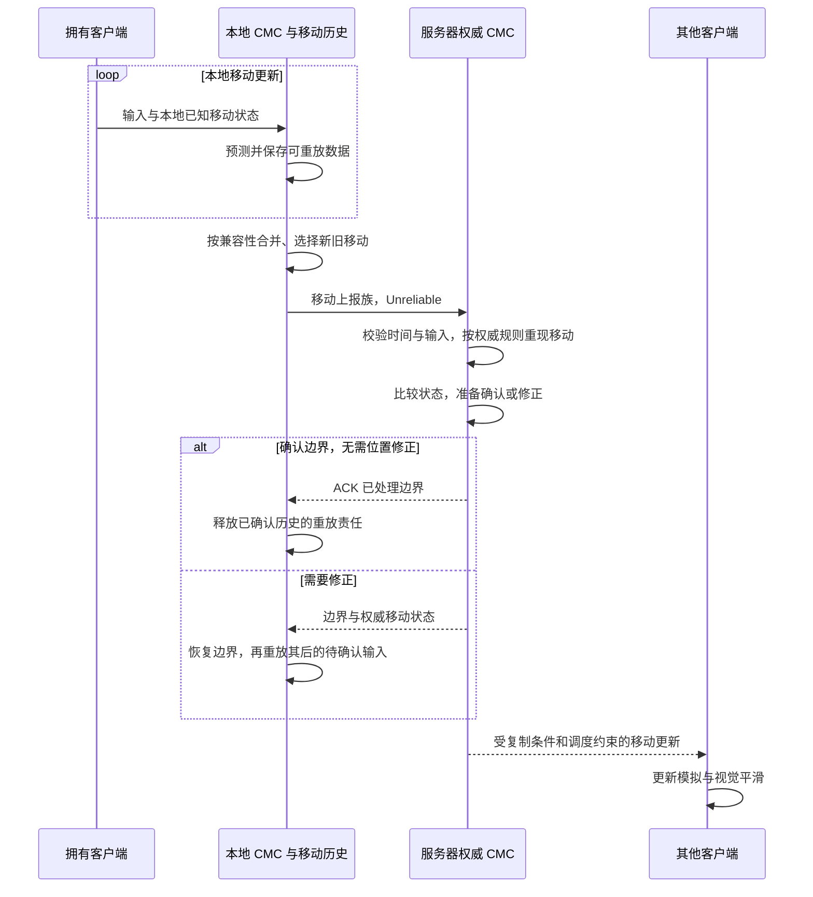
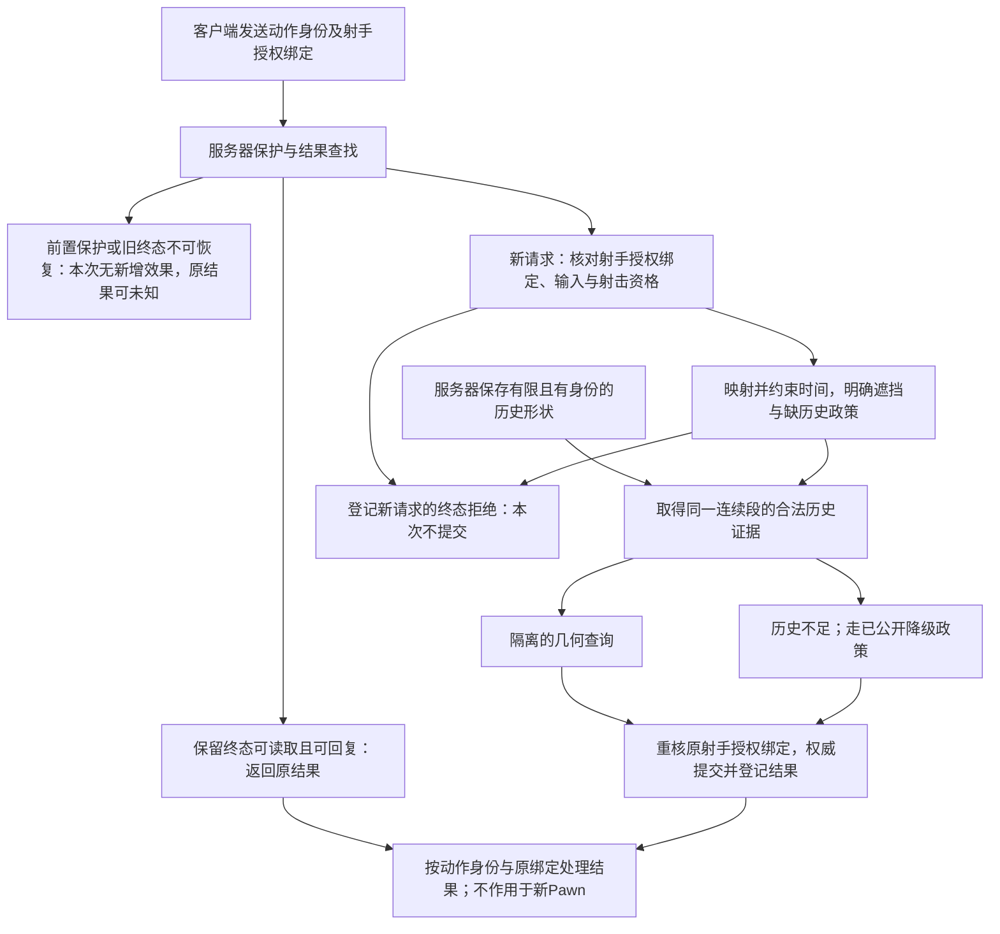

# 03 客户端预测与延迟补偿

> 知识成熟度：L2。主要承诺是官方资料静态核对、协议设计解释和有限纸面推导，不包含引擎、代码或性能实测；`verified: []`。
> 版本基准：2026-10-09 实际读取的 UE 5.6 网络移动/RPC/网络模拟文档，以及逐项注明的 UE 5.5 公开 API；调试CVar另核5.8公开参考的一个条目；Valve 对照固定为 `b8cfb12c0e083a2ef5b2f9f9b50f3902fa034474`。它们不是一个已编译的统一引擎 checkout。
> 历史身份：原稿自述 UE 5.8.0 / CL 55116800 / `++UE5+Release-5.8`，2026-09-30 已补充 ACK、时间域、有限历史与模型边界。本轮保留这些贡献，未访问原安装或复核其 CL；原始版本声明见第 10 节。
> 适用范围：服务器权威角色移动、本地表现预测、远端表现平滑，以及项目自建的即时射线命中历史查询。CMC、武器协议与网络回放各有自己的状态和寿命。
> 未验证项：UE/PIE/UHT、C++ 编译执行、目标网络、模型运行、抓包、设置、设备与压力性能实验均 NOT_RUN。本文不提供能直接接入任意项目的通用宿主。

## 1. 先分清正在补偿什么

如果本地玩家必须等服务器回包才看到移动，操作反馈会包括上行、服务器排队与模拟、发送调度、下行以及客户端显示等待。RTT 只能描述其中一部分；链路不对称时也不能把每个方向都写成 RTT/2。预测让客户端先按本地已知条件演算，使按键后的反馈不必等待往返，但输入采样、计算和显示本身仍有延迟。

这里有三件容易被同一个“回滚”混淆的事：

| 目标 | 从什么数据开始 | 改变或查询什么 | 谁决定最终结果 |
| --- | --- | --- | --- |
| 本地移动预测与纠偏 | 本地输入、移动状态、服务器确认/修正 | 恢复权威边界，再重放尚未确认的移动 | 服务器移动状态 |
| 远端表现平滑 | 收到的权威移动更新或快照 | 在显示端模拟、插值或衰减视觉偏差 | 不因此获得移动或伤害权限 |
| 延迟补偿命中查询 | 经验证的开火请求、时间估计和有界历史 | 查询过去的判定形状，按玩法策略结合遮挡 | 服务器业务结算 |

CMC 的 saved-move 重放并不是把整个世界回退；服务器重现移动也不是重新执行客户端所有副作用。DemoNetDriver 的录播又是另一套复制记录与重建流程，不能当作现成的射击回退缓存。相关边界见[网络回放与 DemoNetDriver](09-网络回放与DemoNetDriver.md)。

前置阅读是[网络架构与复制基础](../状态复制与兴趣管理/01-网络架构与复制基础.md)和[RPC 与属性同步](../状态复制与兴趣管理/02-RPC与属性同步.md)。本篇的实践顺序是：明确权威状态 → 找到确认边界 → 让输入可重放 → 分开显示时间 → 定义命中策略 → 控制结算、重试和资源寿命。

### 1.1 术语与角色

| 术语 | 本文中的准确含义 |
| --- | --- |
| Authority | 本案例中服务器的角色副本负责权威模拟；不等于任何具有本地 Authority 的对象都被授权执行服务器业务 |
| AutonomousProxy | 拥有客户端上的受控角色副本，执行预测、保存移动和上行输入；Listen Server 的本地主机角色另走本地权威路径 |
| SimulatedProxy | 远端角色副本，用收到的数据更新/模拟与平滑，不重放本机玩家对它不存在的输入 |
| SavedMove | 客户端一次移动的输入和必要起止状态记录；不是只保存坐标，也不是录像帧 |
| ServerMove | 本文对 CMC 移动上报族的概称；legacy、Dual、packed 数据路线不具有同一个签名 |
| ACK / Correction | 接受移动边界的确认 / 带权威状态的纠偏；二者均与未确认历史的推进有关 |
| Replay | 从确认边界后的输入重新演算；不能把已经包含在修正状态里的移动再执行一遍 |
| Rewind Window | 项目允许查询过去多远的政策；不等于实际历史一定完整，也不等于 RTT |
| Interpolation / Extrapolation | 用时间两侧有效样本插值 / 在已知范围之外估算；后者误差可能持续增大 |
| epoch / generation | 自定义协议中的会话/世界代号与实体代次，隔离重连、切图和重生；不是给 CMC 强加的替代时间戳 |

## 2. CMC：从输入到权威修正

### 2.1 一条移动经历哪些状态

[Epic 5.6 的网络移动说明](https://dev.epicgames.com/documentation/en-us/unreal-engine/understanding-networked-movement-in-the-character-movement-component-for-unreal-engine?application_version=5.6)将本地记录、合并发送、服务器重现、ACK/修正与模拟代理更新分开。下面是这些责任之间的关系图，箭头不承诺“一帧一包、一包一个 ACK”或所有构建的固定调用全序：



预测执行的是角色移动规则及本地碰撞环境。两端可能缺少同一时刻的平台位置、外部冲量、能力状态或碰撞信息，因此预测有误差并不自动等于作弊。它也不表示整个 Chaos 世界在两端确定性同步。

客户端报告的最终坐标是供比较的数据，不是要求服务器直接采纳的事实。服务器可接到消息却拒绝某个移动；可接受时间域中的移动输入，却在权威规则下不允许其请求的冲刺；也可完成移动模拟后因偏差而纠正客户端。把这些都叫“收到并接受”会掩盖真正的失败层。

### 2.2 SavedMove 保存的内容决定能否重现

[FSavedMove_Character 5.5 API](https://dev.epicgames.com/documentation/unreal-engine/API/Runtime/Engine/GameFramework/FSavedMove_Character?application_version=5.5)列出输入加速度、时间、起止位置/速度/模式、base、胶囊尺寸和 root motion 等成员，并公开保存、清理、合并、准备重放等入口。应保存“后来重新演算还需要什么”，而不是依赖重放时恰好仍相同的全局变量。

原稿所列移动上报字段仍有学习价值，但下面只列逻辑数据用途，不声称它们在所有packed/legacy函数中以相同参数出现：

| 数据 | 用途与边界 |
| --- | --- |
| TimeStamp、步长信息 | 标识/处理移动时间；不与UTC或另一时钟直接相减 |
| InAccel / Acceleration | 本次输入加速度；量化精度需按该字段单位与序列化路线理解 |
| ClientLoc及保存的末位置/速度 | 记录预测结果，供权威比较与重放；不授予客户端位置权威 |
| CompressedFlags | 编码跳跃、蹲伏等意图；自定义位必须明确分配 |
| ClientRoll、View或相应打包视角 | 表达控制朝向；不自动保证相机、枪口和准星射线一致 |
| MovementBase、BaseBoneName及相对状态 | 表达基座与骨骼/空间关系；接收端需有有效对象和正确变换 |
| MovementMode及自定义模式数据 | 表达移动状态；仍需服务器按权威条件确认 |

以冲刺为例：按下冲刺的意图、是否具有冲刺资格和冲刺产生的速度，是三个不同事实。客户端可以预测意图；服务器从角色/能力的权威状态决定资格；两端在所用移动规则下得到速度。若只在客户端把 `MaxWalkSpeed` 改大，服务端继续用旧规则，就会持续纠偏。若重放时只读“现在是否按住冲刺”，则按下后已经松开的历史移动会按错误输入重算。

`CompressedFlags` 的普通跳跃/蹲伏用途不等于引擎内置了项目的冲刺权限位。项目应明确自己的编码和反序列化；额外位放不下时再走自定义 move-data 容器，不能覆盖保留位或只给一个旧 RPC 加参数。

### 2.3 合并、打包和丢包不是同一件事

- 合并移动必须保持行为等价。若按下/松开冲刺、能力阶段、base 或其他影响模拟的条件变了，项目扩展需阻止不合法合并；少发一个包不能以丢失状态变化为代价。
- packed 路线可以在一次传输中装入多个移动的数据；这不等于把它们在逻辑上合成一个输入。legacy `ServerMoveDual` 名称也不能证明任意两帧都可合并。
- Unreliable 是 RPC 传送合同；未确认移动选择、重要旧移动补发和时间过期是 CMC 协议的恢复机制。[SavedMove 的 IsImportantMove](https://dev.epicgames.com/documentation/unreal-engine/API/Runtime/Engine/GameFramework/FSavedMove_Character?application_version=5.5)正用于判定哪些未确认移动值得再发。
- 因而“包丢了，下一条新位置覆盖即可”会丢掉输入语义；反过来，也不能承诺每次原始输入永远重传到成功。队列、发送预算、连接和旧移动有效期都有边界。

**有限追踪，PAPER_EXPECTED，NOT_RUN：** 客户端有 A、B、C 三段移动，A 含一次跳跃边沿。装有 A 的上报丢失，不意味着客户端撤销已经发生的本地预测；后续上报可能携带仍重要的 A 与新移动，服务器依版本协议处理其时间。只有确认边界或相应恢复策略才能决定何时不再保留 A。这里没有给出引擎必然选择 A 的固定包序，也没有认证任意断网时长后都能补齐。

### 2.4 确认边界与重放结果

用序号说明原理，不把它们当 CMC 的真实 wire 字段：客户端从状态 S100 依次执行 101、102、103、104；服务器发送“处理到102的权威状态 S102”。恢复 S102 后只应执行103、104。若恢复后又执行102，就把102重复计算；若直接丢弃103、104，本地输入就被吃掉。

**纸面数例：** 假定一维、每个输入只使位置加1、没有其他状态，客户端从0走到4；服务器处理到102的权威位置为1.5。正确结果为1.5+1+1=3.5；重复102得到4.5；不重放得到1.5。这只是给定规则的算术结果，不能证明实际 CMC 的碰撞、时间步长、Root Motion 或平台重放通过。

实际纠偏状态可能还需要速度、模式、base、相对变换和 root motion 等数据。只恢复位置而保留错误速度，下一步仍可能再次发散。确认应对应原历史中的边界；遇到旧 epoch、找不到所需历史或已经推进过的响应，不能猜一个最邻近输入继续重放。保留目标版本引擎的恢复路径，先核查缺失原因和限制，再选择项目支持的重新同步行为。

[客户端预测数据 API](https://dev.epicgames.com/documentation/unreal-engine/API/Runtime/Engine/GameFramework/FNetworkPredictionData_Client_Ch-?application_version=5.5)将 `SavedMoves`、`PendingMove`、`LastAckedMove` 和复用池分开。确认后不再需要重放并不保证相应内存立即交还系统：对象可能回到池中。不要手动清空整个队列来“修好橡皮筋”，也不要缓存其中裸指针交给跨帧异步代码。

### 2.5 副作用与逻辑重放分开

若在每次移动模拟中无条件播放脚步、扣体力、生成伤害或写存档，纠偏重放会重复产生外部影响。可重演的移动状态应与一次性副作用分开设计：

1. 模拟阶段只改变可重建的预测状态；不可逆权威业务不由客户端重放直接执行。
2. 表现事件用项目动作身份及原角色/授权绑定区分预测、确认与取消；重复终态复用原事件。只有确定拒绝终态才撤销相应可撤销部分；RetryLater等未知结果不等同拒绝，旧绑定结果也不能撤销新Pawn的表现。
3. 不能撤销的声音等效果接受其预测代价，限制重播；不能通过“让声音消失”声称历史事实被撤销。
4. 持续状态用可重建状态表达，单次 NetMulticast 或永久 `bPlayed` 不能覆盖晚加入、重连、连续两次攻击与取消。

## 3. 时间与显示：先写单位，再写差值

### 3.1 至少区分这些时间

| 字段/时间 | 含义与使用边界 |
| --- | --- |
| CMC 客户端移动 TimeStamp | 用于移动时间处理和历史定位，有 reset/旧移动标记；不保证永远严格递增，也不是服务器 WorldTime |
| 服务器模拟时间 | 权威规则的时间轴；暂停、时间膨胀和世界生命周期影响含义 |
| 接收/等待计时 | 诊断传输或超时需要明确单调计时域，不能随意用会暂停的模拟钟替代 |
| 客户端所见目标时间 | 若采用快照缓冲，表示正在显示的历史时刻；CMC 平滑也可能混有预测/偏移，并非每帧都对应一个统一过去时刻 |
| 自定义开火时刻估计 | 请求字段在明确映射下的估计，附不确定性与政策约束；不是可信时钟证明 |

[服务器预测数据 5.5](https://dev.epicgames.com/documentation/unreal-engine/API/Runtime/Engine/GameFramework/FNetworkPredictionData_Server_Ch-?application_version=5.5)区分收到与实际处理的客户端时间戳、服务器收到移动的时间和累计时间差。一个字段存在，不能证明项目启用了某检测开关或采用某默认阈值。不要写 `abs(ServerWorldTime - Move.TimeStamp) > 常量` 代替 CMC 时间处理，也不要因 timestamp reset 就把合法客户端判为倒流作弊。

自建命中协议应分别保存 `ConnectionEpoch`、`ShotSeq`、`EstimatedServerFireTimeSeconds`、接收时间、允许表现延迟与版本标记，并把请求内容绑定到第6.2节的服务器认可 `ActionBinding`。连接epoch是会话身份，同一连接换Pawn或重生时它未必变化，不能代替射手与授权代次。客户端不能任意宣布新epoch或新授权来重置去重/资格；序号溢出前关闭旧空间并按协议建立新空间，不能自然回绕复用仍有效的身份。

### 3.2 时钟估计只缩小不确定性

若只知道RTT为80ms，最多知道一次往返用了这些时间；上行60ms、下行20ms同样满足80ms。RTT/2=40ms是对称假设下的估计，不能证明某发子弹恰好在40ms前开火。时钟偏移、漂移、客户端采样与排队、服务器排队、抖动及显示缓冲还会分别引入误差。

设计时先选服务器认可的映射和估计更新方法，限制陈旧估计、允许误差及最大回退。客户端可提供测量线索，但不独自决定校时结果、样本取舍或“我需要额外300ms补偿”。对尚未提交的新动作，估计不够可靠时按预先写明的拒绝/降级政策处理；把任意旧值夹到窗口最老端并继续宣称“恢复原画面”是不成立的。

### 3.3 插值、外推和 CMC 网格平滑

对项目自建快照插值，先确定显示时间 `Trender`，寻找同一实体连续段内的 `Ta ≤ Trender ≤ Tb`，再计算插值系数。缓存更深通常能让迟到样本更可能赶上显示，但也让画面更旧；它改变命中时间映射的输入，不只是视觉参数。

若缺少右侧样本，可按明确策略短时保持、有限外推或暂停显示推进。外推需要最长时间/距离限制和新数据到达后的收敛策略；不能无限延长，也不能把外推位置写回权威状态。精确命中历史查询则不应把“画面还能猜”当作“历史命中证据存在”。

CMC 的模拟代理会按收到的移动数据继续有限模拟并处理网格偏移，不能简化成固定滞后一个更新间隔的快照播放器。[ENetworkSmoothingMode 5.5](https://dev.epicgames.com/documentation/unreal-engine/API/Runtime/Engine/Engine/ENetworkSmoothingMode?application_version=5.5)给出 Disabled、Linear、Exponential 三种模式语义，未给出任何“Exponential 总比 Linear 慢/更好”的统一排序：

| 模式 | 读者应检查什么 |
| --- | --- |
| Disabled | 不做该平滑，更新可能可见跳变；不等于整个角色不再模拟 |
| Linear | 依源/目标及时间参数插值；检查时间推进、距离与收敛 |
| Exponential | 依据偏差逐步收敛；检查大偏差、持续移动和迟到更新时的表现 |

碰撞胶囊、渲染网格、相机和瞄准数据可能不在同一位置。调平滑前先说明攻击究竟用哪个形状/姿态；仅拿网格截图和服务器胶囊对比，无法解释全部命中差异。更新频率也受相关性、带宽、复制条件与调度影响，不等于渲染帧率或服务器tick设置。

## 4. 把自定义移动接进 CMC

### 4.1 先确认路线，再写扩展

以下配置节选保留“在 Character 一侧启用复制与选择平滑”的用途，不是独立可编译工程，也不证明更改模式后效果通过：

```cpp
// AMyCharacter 构造函数内部的配置节选，NOT_RUN。
// 类声明、模块依赖、所用版本与组件创建由项目提供。
bReplicates = true;
SetReplicateMovement(true);
GetCharacterMovement()->NetworkSmoothingMode =
    ENetworkSmoothingMode::Exponential;
```

Actor 的移动复制标志不应写成 `MoveComp->bReplicateMovement`；也不要将预测数据内部的“收到更新”标志设为常开配置。这些开关不替代所有权、实际 ACharacter/CMC 组合和项目复制设置。

按5.6网络移动文档的扩展说明，packed 路线需要 SavedMove、network move data、容器以及必要时响应数据一起配合；legacy 路线不能靠猜一个省略参数的 `_Implementation` 签名接入。具体签名、访问级别、调用时机和编译开关须在目标版本头文件/实现中核对；本文只给已读公开接口的接入职责。

| 要做的事 | 已核对的公开入口或结构 | 项目必须补充的合同 |
| --- | --- | --- |
| 分配自定义移动 | 客户端预测数据的 `AllocateNewMove` | 实际分配派生 move；不能定义了派生类却继续创建基类 |
| 保存/恢复意图 | `SetMoveFor`、`PrepMoveFor` | 重放读取该 move 的旧意图；不能读取当前键盘状态替代 |
| 池复用 | `Clear`、`FreeMove` / `CreateSavedMove` | 清空派生字段和引用，避免旧冲刺意图泄漏给新移动 |
| 决定可合并 | `CanCombineWith` | 比较全部影响模拟的自定义条件；变化边界不可吞掉 |
| 在线传送自定义字段 | `FCharacterNetworkMoveData::ClientFillNetworkMoveData` / `Serialize` | 读写同一格式，定义输入范围、失败处理和版本兼容 |
| 提供持久容器 | `SetNetworkMoveDataContainer` | 容器及其move-data存储寿命覆盖组件使用期 |
| 服务端/重放取得本次数据 | 文档公开的 `GetCurrentMoveData` 路线 | 当前确在对应处理上下文中，类型与组件配置一致；不得跨上下文缓存指针 |
| 扩展确认状态 | response data / container | 权威的自定义状态能进入纠偏合同，不能只上行不下行 |

[SetNetworkMoveDataContainer 5.5 的 Remarks](https://dev.epicgames.com/documentation/unreal-engine/API/Runtime/Engine/GameFramework/UCharacterMovementComponent/SetNetworkMoveDa-?application_version=5.5)明确存储应持续到组件寿命结束，所以构造函数中的临时局部容器不是合格存储。5.6概述中的“扩展响应”文字不能单独证明某setter可被override，须读目标头文件；本文不生成虚构覆盖函数。

### 4.2 冲刺实践的完整接入顺序

1. 定义意图、服务器资格和模拟结果。例如“想冲刺”是输入，“有体力且未被禁锢”是授权，“本步最大速度”是两者和模式共同决定的派生值。
2. 为预测定义会变化的输入与状态边界。体力若也预测，必须有自己的权威确认/纠偏合同，不能让历史重放再次向正式体力账户扣款。
3. SavedMove 保存本步意图，Clear 重置它，PrepMoveFor 恢复它；CanCombineWith 不跨越不同意图/状态边界合并。先把这些职责全部列出，再选择压缩位或扩展序列化。
4. 服务端以连接对应角色、权威能力状态、移动模式和时间预算评估该输入。合法输入不保证能力一定执行；体力不足属于普通业务拒绝或普通移动结果，不必等同协议攻击。
5. 使授权差异进入纠偏。仅修正坐标而不处理影响下一步的能力状态，可能每次重放都再次冲刺并发散。
6. DS与拥有客户端之外，核对 Listen Server 主机和模拟代理。主机不能因为 `!HasAuthority()` 为假而漏掉业务入口；模拟代理不应运行本地输入预测。
7. 撤销能力、换Pawn、销毁组件、断线和切图时停止新预测/提交，废止旧身份与异步结果，按组件拥有关系清理。对第6节自建射击协议，同连接换Pawn/重生也要推进射手或授权绑定的代次；在接纳、提交与结果应用点核对。只重置表现或使授权过期不代表撤销过去已经提交的能力。

这是项目实现顺序与审查清单，未在本轮编译或运行。具体能力系统、根运动、体力模型不在本文重新实现。

### 4.3 移动平台与根运动

平台问题必须同时核对 base 身份、对象解析、相对/世界空间、平台运动及角色当前模式。仅把平台“高频复制”不能保证引用先到、时间一致或角色重放时看到同一平台位置；也不能把未知平台当世界原点。保持引擎已有 based-movement 路线，并按项目的传送、上/下平台和基座销毁策略建立不连续边界。

Root Motion 可以参与 CMC 的保存与重放，但“有根运动数据”不等于所有机器自动播放同一个蒙太奇，也不等于技能授权自动通过。若用 Root Motion Source，应由拥有者管理创建、句柄、完成/取消和移除，避免重复应用或组件销毁后继续使用旧句柄。GAS可承接能力同步，其预测键也不能直接代替自建武器协议的业务提交身份。

## 5. 延迟补偿：查询过去，结算现在的权威规则

### 5.1 先公开公平性选择

攻击者画面上的目标通常比服务器接收请求时更旧。按接收时刻判定可能让攻击者觉得打空；按历史判定则可能让防守者在已进掩体后受伤。窗口上限、目标集合、门和掩体时间、死亡同时性都属于玩法政策，不存在对两方无代价的“完全公平”。

本文后续的项目示例只处理即时射线。持续弹丸需要定义出生、飞行轨迹、碰撞期间的时序与加速追赶等规则；不能把“一次过去时刻的 raycast”自动推广为全部弹道补偿。也不按客户端传来的目标对象或伤害值直接结算。



图中“历史不足”不是几何miss。任何降级都必须先定义；不能悄悄取最近端点、把碰撞暂时关掉，或者挪动真实目标后只恢复位置。保护入口的拒绝只说明本次没有新增效果，不证明这个动作过去没有提交；已登记终态和不可恢复的未知结果按第6.3节分别处理。

### 5.2 历史能证明什么

| 历史内容 | 为什么需要 | 不能拿什么替代 |
| --- | --- | --- |
| 世界/会话epoch、实体ID、generation、有效生命期 | 拒绝旧关卡/旧Pawn/重生后的身份混用 | 裸 `ACharacter*` 或复用的数组下标 |
| 服务器采样时间、采样阶段、严格序和连续段 | 判断查询两侧是否覆盖且允许插值 | 最近快照、无界外推或仅一条墙钟 |
| 实际用于判定的形状和碰撞语义 | 重建胶囊半径/半高、盒子、部位与开关 | 仅 `bIsCrouched` 或可见骨骼截图 |
| 传送/出生/死亡/形状拓扑变化等标记 | 不跨不连续事件虚构中间状态 | 两端位置“看起来很近” |
| 动态遮挡物与平台的选定策略 | 防止只回退人物、却按不一致的门/平台状态判定 | 假定一切掩体静止 |

采样必须处在项目定义的一致阶段。若骨骼姿态、胶囊和门来自不同tick，单个“历史时间”字段不能把它们变成同时状态；专用服务器若跳过了某些动画更新，也不能凭客户端画面补出未采集的服务器hitbox。拓扑变化、蹲站形状跳变或坐骑切换可直接分段，也可用经设计的离散状态重建，不能默认所有字段都适合线性插值。连续旋转通常需按合适的四元数插值与归一化处理，不能机械插值欧拉角跨越绕回边界；仅改蹲伏bool或调用UpdateBounds不等于重建历史胶囊。

有限缓存可以保留窗口左边界之前的一个有效样本以构成括区间，但查询时间本身仍必须在允许窗口内。容器有数据不保证所需对象/形状在目标时刻合法存在；目标已经换generation时，应按政策处理旧实体的历史，绝不能把旧命中应用到新实体身上。

### 5.3 查询时间只计算一次

先说明请求字段是哪一种：

- 若它表示“开火发生时的服务器时间估计”，候选目标时间还需减去受控的目标表现延迟。
- 若它已经表示“当时所见目标对应的服务器时刻”，不能再减一次表现延迟。
- 若实际表现由不同时间的模拟和偏移混合而成，映射是近似政策，不得声称恢复了精确原画面。

**纸面例，PAPER_EXPECTED：** 接收时刻10.000s；本例假设可信映射得到开火时刻9.960s，允许的目标显示缓冲0.060s，所以查询9.900s。窗口0.250s允许区间为[9.750,10.000]。若尚未提交的新动作报9.300s，则按本例“非法时间拒绝”政策处理；若字段本来就报9.900s，再减0.060得到9.840便是重复扣除。这里的40ms仅为给定估计，不是测得单向延迟。

所有外来浮点先检查有限值和协议范围；未来、过老、时钟不确定性过大、请求身份错误分别记录。时间合法仍不代表历史完整，更不代表射击获准。箭头从“时间合法”跳到“扣血”会漏掉武器、弹药、冷却、射程、射线起点、方向合法性、阵营与遮挡。

### 5.4 Valve 对照只证明它自己的实现

固定 revision 的 [player_lagcompensation.cpp](https://github.com/ValveSoftware/source-sdk-2013/blob/b8cfb12c0e083a2ef5b2f9f9b50f3902fa034474/src/game/server/player_lagcompensation.cpp)中，`StartLagCompensation`综合链路延迟与插值tick、限制补偿量，并在指令时间偏差过大时改用延迟推导时刻；`BacktrackPlayer`检查存活记录和位置不连续，并选择/插值历史；`FinishLagCompensation`按变化记录恢复。

该实现还存在无括区间时复制可得记录的分支，且会暂时改变真实对象。它不证明“所有超窗都拒绝”或“所有实现都必须隔离查询”，更不是UE默认武器功能。本文选择更保守的历史有效性和隔离查询，是项目设计建议。源码中的数值和CVar属于该revision，不是UE的公平性预算。

### 5.5 查询成功、未命中和历史缺失分开

本篇建议用结构化结果表达查询/规则原因，例如 `BadInput`、`OutsideWindow`、`EntityMismatch`、`HistoryGap`，并与射击终态 `RuleRejected`、`AcceptedMiss`、`AcceptedHit` 区分。其中“历史可查询”只是一个前提，`HitHistory`之类模型返回值不意味着射线命中或允许伤害；第6.3节的 `RetryLater` / `ExpiredOutcomeUnknown` 则描述当前能否取得动作结果，不能当成确定的射击拒绝终态。

若项目能对不可变历史形状做独立几何查询，优先这样组织：世界继续保持当前权威状态，查询持有一份已固定的历史视图。若必须暂移真实组件，必须另行证明复制、物理、Overlap、动画、空间索引、并发与嵌套调用均受控，且异常/提前返回时完整恢复。RAII可以帮助保证退出时恢复调用发生，却不能自动隔离其他线程、事件和已经发出的外部副作用；仅保存位置/旋转再移回去不足够。

## 6. 从开火输入走到一次业务提交

### 6.1 传送保证不是业务完成

[RPC 5.6](https://dev.epicgames.com/documentation/en-us/unreal-engine/remote-procedure-calls-in-unreal-engine?application_version=5.6)定义路由与可靠性；[执行顺序5.5](https://dev.epicgames.com/documentation/unreal-engine/replicated-object-execution-order-in-unreal-engine?application_version=5.5)限定了可依赖的顺序。Reliable 的ACK/重传不表示弹药已扣、伤害已提交或结果跨断线持久保存。跨Actor、混合Reliable/Unreliable和独立属性通知之间也不能推导全局顺序。

因此“先发装备RPC，再发开火RPC”不能单凭调用相邻证明开火时武器已切好。请求要指向权威可识别的武器/状态版本，接收端按其实际状态检查依赖。新动作引用的对象未知或依赖尚未就绪时，选择拒绝或有界等待；等待需要截止时间和退场策略，不能无限持有历史和Actor引用。

`WithValidation` 的失败会断开调用客户端；普通的冷却未结束、没有弹药或能力已取消，应在业务结果里表达，而不是把所有可恢复拒绝都转成 `_Validate=false`。拥有Actor只解决路由，不是该玩家拥有任意武器、射程或目标的授权证明。

### 6.2 一个明确而有限的射击协议

以下是教学项目的设计合同，非UE默认实现：服务器在单一权威执行上下文内同步处理有限射线查询；不在中途等待外部服务，不支持跨崩溃的持久“恰好一次”。去重键仍为服务器绑定的 `ConnectionEpoch + ShotSeq`，相同键必须携带相同的规范化请求内容。键的唯一性与请求绑定正确，是两项独立检查。

本例把请求内容中的 `ActionBinding` 定义为服务器认可的 `(WorldEpoch, ShooterEntityId, ShooterGeneration, WeaponInstanceId, AuthorizationGeneration)`。服务器从自己的实体与授权记录核对这些字段，不能让客户端自行授予或选择任意新代次：

- 切图/世界替换推进WorldEpoch；射手重生推进ShooterGeneration，或分配不复用的实体ID；不能把旧输入重新归给当前Pawn。
- 同一连接重新Possess、更换所控Pawn，以及相关射击权限撤销/重新授予，都使旧AuthorizationGeneration失效；重新授予使用新代次，即使武器相同、显示状态相同也不能复用旧值。
- WeaponInstanceId标识实际实例且不在有效请求范围内复用；武器替换/重新分配也使相应旧授权失效。任何身份空间耗尽都需要关闭旧空间，不依赖自然回绕。

新请求接纳时和实际提交前，都核对原ActionBinding仍指向同一合法射手/武器/授权。已有旧动作终态可以在授权的结果查询路径上返回，但不重新接纳动作，也不将其状态/FX应用到新Pawn。结果同时携带原绑定，客户端按它寻找原动作。这里没有要求把全部字段扩进去重键，也没有把这套项目绑定强加给CMC原生移动协议。

为避免乱序重写过去的武器资源，本例按实际接纳顺序处理新序号：已经处理到更大序号后到达的较小、无保留记录请求不再执行，也不回退弹药账本；没有额外未执行证据时，返回 `ExpiredOutcomeUnknown`，不能仅凭高水位断言它过去从未执行。若查到已登记的同内容结果，且回复预算允许，则返回原结果。前置保护可能使本次未查询或未回复，不能无条件承诺每次重试都能拿到终态。若玩法必须保留乱序到达的每一发，需另设计有界排序/缺口等待和超时协议，不能声称本例已覆盖。

本例按原绑定射手在接纳时的权威存活/武器/弹药状态决定是否允许开火，不回退资源账本或自动实现“双方同时击杀”。射线起点由该射手/武器的服务器认可状态取得，并明确用开火历史还是当前状态；若客户端上传相机瞄点，还需验证从允许枪口出发的射程与遮挡，不能让墙后相机起点绕过墙体。

本例选择如下缺历史政策：已识别为新动作的时间/绑定/资格非法请求登记拒绝，不为该新动作扣弹；资格与时间合法但历史形状不足时，仍把这次开火作为一次有成本的射击接受，结果标为 `AcceptedNoHistoricalHit`，不制造历史伤害。该政策不推翻重复请求已有的终态。也可由项目另选当前时刻fallback，但必须在结果与日志中明确标识，不能仍叫精确rewind。选择不同政策会影响体验，需分别验收。

```text
客户端本地输入（项目伪代码；NOT_RUN）：
  取得本地受控Pawn的服务器认可ActionBinding和连接epoch
  生成未复用ShotSeq；固定绑定、请求内容、预测事件ID和等待期限
  仅预测允许的火光/后坐力/弹道表现；送出请求
  Listen Server主机也进入同一权威业务函数

服务器统一入口：
  从真实连接核对调用者；限制请求大小与处理/回复速率
  若保护阻止继续：可回复RetryLater；仅保证本次未新增效果
    不保证已查结果；不把此回复当动作从未提交的证据
  验证可查询的连接epoch和序号域；查询已有结果
  若有保留终态且内容一致：在回复预算内回原终态及原绑定
    不再次执行；若原射手已退场，也不把该动作改绑当前Pawn
  若同键内容冲突：拒绝本次尝试，不改变已有终态
  若无记录且身份已过期/低于已处理边界：不重新执行
    无额外未执行证据则回复ExpiredOutcomeUnknown
  若确认为可接纳的新身份但无结果槽：回复RetryLater，不新增效果
  为新身份保留结果槽；核对原ActionBinding与服务器当前授权记录
  后续绑定/业务/时间校验失败：
    登记该新动作的不可变拒绝结果并推进已处理序号；不扣弹/伤害
  核对原射手存活、原武器归属、状态版本、弹药、冷却和参数
  核对时间映射/窗口、原射手枪口/方向/射程及遮挡政策
  取得固定历史视图；查询合法形状，区分命中/未中/证据不足
  在一个不可重入的权威提交阶段：
    再核对同一ActionBinding仍有效；失效则登记拒绝，不改绑新Pawn
    按规则变更该射手/武器的弹药与冷却；向同generation目标结算伤害
    登记不可变终态、原绑定和权威状态版本，推进已处理序号
  退出提交阶段后派发表现/通知；在回复预算内返回该结果

客户端接收结果：
  先对应ConnectionEpoch + ShotSeq和原ActionBinding
  绑定已退场/撤销：可在原动作记录中保留可恢复终态
    不将旧状态、确认/取消或FX应用于当前新Pawn/新授权实例
  绑定仍有效且取得已登记终态：确认/取消/修正同一预测表现
    不再播放一次；相应权威状态只按同绑定的版本推进
  RetryLater/超时/ExpiredOutcomeUnknown不覆盖已知终态
    若此前无终态，继续同身份查询/有界重试，或结束为结果未知
    不能凭它们宣告退款、未提交，或换ID补发同一发
```

上面的“提交阶段”是项目需实现的不变量，不是多次UE API调用天然拥有的数据库事务。若伤害回调可能重入、目标销毁或触发另一发请求，要排队并在真正提交点再次核对原射手/武器/授权绑定及目标资格；先扣弹后发现无法登记结果会破坏重试语义。可以先完成容量与可提交性检查，再在不会失败/重入的受控阶段更新，或设计明确的补偿/事务策略。没有这个前提，伪代码不能获得“至多一次”的结论。

### 6.3 重试、结果账本和退场

路由、限流、容量不足或身份过期使本次处理停止，只证明**本次尝试没有新增提交**。该身份的原请求可能早已提交，恰好响应丢失、此次查找被保护条件阻止，或原结果已经释放。因此响应至少区分：

| 响应类别 | 能确定什么 | 客户端可以怎样处理 |
| --- | --- | --- |
| 已登记终态：RuleRejected / Accepted* | 对该身份及绑定已有具体业务结果；RuleRejected需有未提交该新动作的登记证据 | 按原绑定恢复/确认结果；同键重试不得改变终态 |
| RetryLater / Busy | 本次未新增效果；可能尚未查到或无法回复已有终态 | 保留已有终态；否则仍为未知，按限额/期限查询或重试同身份 |
| ExpiredOutcomeUnknown | 该身份不再可执行，且当前没有可恢复的旧终态 | 不重新执行；继续认可已有证据，若无终态则结束为未知，或走确有权威记录的恢复路径 |
| 确定未接纳 | 只有另有可核实的未执行记录时才能作此结论 | 可报告相应未执行终态；不能仅凭高水位、过期、空查找或限流推导 |

本例的至多一次只覆盖活跃epoch及约定的去重窗口。结果必须保留到同一身份仍可能被接纳的期限结束；清理时先推进拒绝旧序号的界限，再释放旧结果。这样可阻止再次执行，却不保证以后仍能恢复原终态。不能只用TTL删除结果，却继续把旧身份当新请求接受。账本容量不足时停止新接纳或走显式降级，不静默踢掉仍可重试的条目。

可靠RPC传送通常无需业务层重复发送同一调用，但断线、响应未见或应用层超时仍可能使客户端无法判断结果。自建有限重试复用身份、绑定和内容，并有截止时间、退避/速率限制与终止状态。已登记 `AcceptedMiss` 的重复请求若完成查找且允许回复，只回该终态，不重复扣弹；查找前被限流则本次可能只有RetryLater，历史上那次扣弹仍成立。已登记 `RuleRejected` 的同键动作不会因冷却后来结束而变成有效射击。

停止重试可以结束等待，却不能把未知自动变成“未提交”。只有保留的权威结果或另有可核实的恢复记录，才能解决旧终态；本例没有跨崩溃持久恢复能力。重连关闭旧epoch的动作接纳；查询旧结果另需授权的恢复路径，不能用新连接/新ID补做未知动作。同连接换Pawn/撤销再授予推进ActionBinding中的代次，旧结果查询不恢复旧授权，也不作用于新Pawn。更广的持久幂等记录与业务事务见[幂等重试与消息语义](../持久化与分布式一致性/03-幂等重试与消息语义.md)。

### 6.4 异步历史查询的附加门槛

若将查询交给后台任务，不能把“取消请求”当作任务已停止，更不能立刻释放任务还在读取的历史buffer。任务持有不可变视图或显式引用的snapshot，以及原请求身份与ActionBinding。完成时先检查所有者、world epoch、请求身份、原射手实体/generation、原武器实例/授权代次和目标generation；返回权威上下文后，在真正提交点重新核对原绑定仍有效。不能仅从连接解析当前Pawn，将旧任务结果改绑给它。旧绑定失效可阻止新提交，但不能抹去已经登记的终态；其返回与客户端应用仍遵循第6.2/6.3节。

缓存裁剪、任务完成和对象销毁之间必须有所有权合同。引用失效检查能避免使用已销毁对象，却不能保护被并发改写的历史内存。停止接纳 → 使旧请求失效 → 等待或安全脱离仍在运行的读取者 → 释放历史，是一种责任顺序；具体等待/锁/引用机制由实际实现决定，不是本文已验证的调用栈。

## 7. 有限历史插值模型与资源预算

### 7.1 保留模型的教学边界

下面继续保留原文的独立 C++11 一维历史查询用途。它只回答：“输入已处于同一非负服务器秒时间域、历史容器已按外层实体ID/epoch隔离时，能否取得该generation的一个精确样本或合法括区间？”返回 `HitHistory` 表示历史可取，完全不表示命中玩家。

它不实现采样、实体生存期、时钟同步、网络、并发、射线碰撞、武器资格或伤害。`generation` 的正确来源、容器容量和只读期间的寿命由调用方保证；示例中的NaN/Infinity断言另以前述值受目标double实现支持为前提。返回失败时 `outX` 保持不变。代码是未编译、未运行的完整教学模型，不认证任何 UE 行为。

```cpp
#include <cassert>
#include <cmath>
#include <cstdint>
#include <limits>
#include <vector>

struct Sample {
    double time;                   // 同一时间域中的非负秒数
    double x;                      // 一维判定位置，单位由调用方固定
    std::uint32_t generation;
    bool breakBefore;              // 进入本样本前发生不连续
};

enum class QueryResult {
    HitHistory, BadInput, OutsideWindow, HistoryGap, EntityMismatch
};

QueryResult QueryX(const std::vector<Sample>& h, double now,
                   double target, double window, double maxGap,
                   std::uint32_t generation, double& outX) {
    if (!std::isfinite(now) || !std::isfinite(target) ||
        !std::isfinite(window) || !std::isfinite(maxGap) ||
        now < 0.0 || target < 0.0 || window < 0.0 || maxGap <= 0.0)
        return QueryResult::BadInput;
    if (target > now || now - target > window)
        return QueryResult::OutsideWindow;

    // 教学版全量检查；生产端可在受控写入时建立这些不变量。
    for (std::size_t i = 0; i < h.size(); ++i) {
        if (!std::isfinite(h[i].time) || !std::isfinite(h[i].x) ||
            h[i].time < 0.0 || h[i].time > now ||
            (i > 0 && h[i].time <= h[i - 1].time))
            return QueryResult::BadInput;
    }
    for (std::size_t i = 0; i < h.size(); ++i) {
        if (h[i].time == target) {
            if (h[i].generation != generation)
                return QueryResult::EntityMismatch;
            outX = h[i].x;
            return QueryResult::HitHistory;
        }
        if (i == 0 || !(h[i - 1].time < target && target < h[i].time))
            continue;
        const Sample& a = h[i - 1];
        const Sample& b = h[i];
        if (a.generation != generation || b.generation != generation)
            return QueryResult::EntityMismatch;
        const double gap = b.time - a.time;
        if (b.breakBefore || !std::isfinite(gap) || gap > maxGap)
            return QueryResult::HistoryGap;
        const double alpha = (target - a.time) / gap;
        const double candidate = (1.0 - alpha) * a.x + alpha * b.x;
        if (!std::isfinite(alpha) || !std::isfinite(candidate))
            return QueryResult::BadInput;
        outX = candidate;           // 仅成功才提交输出
        return QueryResult::HitHistory;
    }
    return QueryResult::HistoryGap; // 不以最近端点假装有括区间
}

int main() {                       // 全部为待执行断言，NOT_RUN
    const std::vector<Sample> base{{9.875, 0.0, 7, false},
                                   {10.0, 10.0, 7, false}};
    double x = -1.0;
    assert(QueryX(base, 10.0, 9.9375, .25, .2, 7, x)
           == QueryResult::HitHistory && x == 5.0);
    assert(QueryX(base, 10.0, 9.5, .25, .2, 7, x)
           == QueryResult::OutsideWindow && x == 5.0);
    assert(QueryX(base, 10.0, 10.01, .25, .2, 7, x)
           == QueryResult::OutsideWindow);
    assert(QueryX(base, 10.0, 9.9375, .25, .2, 8, x)
           == QueryResult::EntityMismatch);
    assert(QueryX({}, 10.0, 9.9375, .25, .2, 7, x)
           == QueryResult::HistoryGap);
    auto h = base;
    h[1].breakBefore = true;
    assert(QueryX(h, 10.0, 9.9375, .25, .2, 7, x)
           == QueryResult::HistoryGap);
    assert(QueryX(h, 10.0, 10.0, .25, .2, 7, x)
           == QueryResult::HitHistory && x == 10.0);
    h = base;
    h[1].time = h[0].time;
    assert(QueryX(h, 10.0, 9.9375, .25, .2, 7, x)
           == QueryResult::BadInput);
    assert(QueryX(base, 10.0, 9.9375, .25, .1, 7, x)
           == QueryResult::HistoryGap);
    assert(QueryX(base, 10.0, std::numeric_limits<double>::quiet_NaN(),
                  .25, .2, 7, x) == QueryResult::BadInput);
    h = base;
    h[0].x = std::numeric_limits<double>::infinity();
    assert(QueryX(h, 10.0, 9.9375, .25, .2, 7, x)
           == QueryResult::BadInput);
}
```

未来若单独验证此模型，可将代码保存为 `history_query.cpp`，用支持 C++11 的工具链编译并运行断言，例如 `g++ -std=c++11 -Wall -Wextra -Werror -pedantic history_query.cpp -o history_query`，再运行所得程序。这是复现入口，本轮没有执行它；断言通过也只能支持列出的局部算术/边界，不证明时钟可信、判定公平、资源寿命正确或 UE 集成通过。

精确端点无需跨越前方的不连续，因此例中 `breakBefore=true` 时查询10.0可以取已记录样本，而查询9.9375不能跨越。若项目认为该端点属于新实体或禁用形状，应由generation/生命期/形状有效性拒绝；本模型只有一维位置，未代办那些校验。不要用一个很大的浮点epsilon把不存在的精确样本或超窗时刻“对齐”为合法。

### 7.2 历史不只是一个窗口数字

粗略有效载荷预算为“实体数 × 采样率 × 窗口秒数 × 每样本大小”。保留原纸例：64个实体、60Hz、0.25s、每样本20个盒子×假设32字节，率乘法得到614400字节，即600KiB。这不是引擎结构体大小或实测内存。

离散端点会增加数量：若每实体存16个样本，纯盒子载荷是640KiB；若为左边界括区间等再保留1个，则17个对应680KiB。之后还要加时间/身份/姿态、容器索引、对齐、分配、双buffer、异步读者保留及结果账本。采样率不稳定时，窗口长度本身也不能限制最坏样本数量，应同时设时间和数量/字节上限。

建议分别记录四类占用：未确认移动、服务器历史、在途查询固定视图、业务去重结果。某一类达到上限时的策略不同：移动历史需要引擎支持的恢复，历史缓存裁剪会损失可查询区间，异步读者不能被强行释放，结果账本淘汰则可能破坏幂等。性能选择应测实际复制/查询/重放成本；不从“内存约几百KiB”推出服务器每帧开销可忽略。

## 8. 排查、最佳实践与 FAQ

### 8.1 按失败层排查

| 现象 | 先核对的证据 | 避免的误修 |
| --- | --- | --- |
| 橡皮筋、修正后再次发散 | 预测/权威输入、模式、能力状态、时间预算、base和重放边界 | 只放大误差阈值，让权限或输入缺失更难发现 |
| 其他玩家一顿一顿 | 实际收到更新的间隔、相关性、带宽/服务器负载、网格偏差 | 用tickrate或模式名称推断包率/延迟 |
| 穿墙或突然位移 | 实际移动入口、权威碰撞、传送标志、不连续与角色形状 | 把所有SetActorLocation都判成错误，或把所有偏差都判作弊 |
| 平台上飘或旋转错位 | base身份/解析、相对空间、平台与角色更新、上下平台边界 | 只提高复制频率或在不明空间中相加位置 |
| 掩体后受伤 | 请求时间、所见时间估计、历史合法区间、门/目标遮挡政策 | 把所有争议归成碰撞误差，或声称窗口越大越公平 |
| 重复扣弹/效果多播或新Pawn收到旧效果 | 动作键、原射手/武器/授权绑定、结果登记、重放副作用与重入 | 依赖Reliable或连接epoch代替全部身份；把限流/过期当未提交 |
| 偶发崩溃/退出后回调 | buffer读者寿命、move池复用、世界/实体代次 | 把取消通知当作后台已停；缓存旧裸指针 |

调试保留 `p.NetShowCorrections 1` 的用途，但按目标构建确认是否可用，不把它当自动收集全部因果的诊断器。[5.8官方CVar参考](https://dev.epicgames.com/documentation/unreal-engine/unreal-engine-console-variables-reference)中已定点读取该项的0/1用途；[OnClientCorrectionReceived 5.5](https://dev.epicgames.com/documentation/unreal-engine/API/Runtime/Engine/GameFramework/UCharacterMovementComponent/OnClientCorrecti-?application_version=5.5)说明通知发生在应用修正数据前。看到这个回调不等于重放已经完成，不能在此无条件报告“最终误差”。

最小诊断记录应有：版本/构建/网络模式、角色与连接身份、原ActionBinding及其失效原因、时间域、移动时间戳或项目序号、ACK边界、待确认长度、修正前后及重放后位置、权威模式/base、终态/暂态/未知结果的类别、命中策略、历史可用范围与成本提交次数。只比较一张红绿胶囊截图不足以判断哪一层出错。

选什么预测取决于“立即反馈的收益、误预测的可恢复性、权威状态能否重建”。移动、转向与可撤销火光常适合；随机结果或持久交易需要权威确认。不是所有随机过程都数学上不可预测，而是客户端不能擅自把猜测当作获授权的正式结果。修正该硬切还是平滑，应服从传送/死亡等语义和碰撞正确性，不能以不可见为唯一目标。

### 8.2 十个常见问题

**Q1：为什么角色在别人眼里“一顿一顿”？**

先比较服务器生成更新、实际发送/接收与客户端显示时间，排除相关性、拥塞、tick卡顿及对象状态问题，再看平滑。CMC模式和通用快照缓冲并不是同一旋钮；没有数据时的外推也必须有界。

**Q2：什么是橡皮筋，怎么修？**

客户端反复向自己的预测位置走，又被权威修正拉回。先找第一处输入、模式、平台或时间差异，再核对ACK后的重放集合和副作用；同时保留服务器合法外力等原因。单改容差只能改变什么时候看见问题。

**Q3：怎么防止加速挂？**

保留引擎的时间戳/步长/时间差处理，核对项目确实使用的配置，再检查业务授权与移动模式。加速度不是速度，击退、下落、平台和根运动也可能合法超过步行速度。用连续证据和模式相关规则判断，不能只看 `MaxWalkSpeed` 超限一次就踢人。

**Q4：延迟补偿会被“延迟开枪”利用吗？**

时间声明和表现缓冲受客户端影响，必须由服务器约束；还要检查射速、弹药、原射手/武器/授权绑定、射线来源、距离与去重。同连接换Pawn后仍在窗口内的旧输入也不能从新Pawn开火。普通业务拒绝与会断开连接的RPC验证失败分开；前置限流/过期只证明此次不新增效果，不证明旧动作未提交。

**Q5：预测动画与服务器结果不一致怎么办？**

先区分移动状态、蒙太奇状态和一次性FX；它们可能需要不同的确认/取消方式。纠偏后应按同一角色/授权实例的新权威状态收敛，不能把所有蒙太奇都强制从头播；旧绑定的迟到确认/取消不得作用于新Pawn。重放不重复生成一次性效果；GAS/Lyra细节须按项目版本另核。

**Q6：站在移动平台上为什么会飘？**

先查base是否解析、是否已切换/销毁、角色数据是相对还是世界空间，以及平台和角色是否使用兼容时间。需要复制/重建平台运动，但单纯提高频率不保证一致性。传送和重新附着还需要明确历史断点。

**Q7：Unreliable ServerMove丢了怎么办？**

CMC的未确认历史、重要旧移动选择与后续确认构成恢复机制，不能当成“最新位置覆盖即可”。不要自行改成高频Reliable；也别把CMC的移动恢复机制借给自建射击协议，后者仍需要自己的请求身份、成本和结果合同。

**Q8：什么时候完全等服务器更合适？**

当即时反馈收益小、误判难以撤销或涉及正式随机/持久结果时。仍可本地显示“请求中”，但不能先给正式奖励再假定服务器必然认可。超时、RetryLater或ExpiredOutcomeUnknown不能覆盖已知终态；此前无终态时也不能据此宣布退款、未提交或用新ID补发同一动作。

**Q9：修正会把客户端“传送”吗？**

可能出现可见跳变；历史完整性、重放、平滑和误差大小都会影响表现。真正的权威传送不应被插值成穿过沿途障碍。把“纠偏可见”当bug之前，先辨别这是误预测、失步恢复还是玩法要求的跳变。

**Q10：Lyra与默认CMC有什么区别？**

先学默认CMC的数据责任，再核对实际Lyra revision的移动组件、能力/GAS、动画和Root Motion接入。本文未读取Lyra代码，不给它添加统一的自定义模式或生产性能承诺；保留它作为后续项目研究入口。

## 9. 有限纸例与未来验收

下表的“应得结果”是依据明确前提写出的 PAPER_EXPECTED；所有运行状态都是 NOT_RUN。它们既不是UE测量值，也不是执行本页模型所得输出。

| 编号 | 给定输入 | 应得结果及能暴露的反例 |
| --- | --- | --- |
| P1 确认边界 | 第2.4节，修正包含102，仍待103/104 | 得3.5；4.5暴露重复输入，1.5暴露丢输入；不含真实物理 |
| P2 合并条件 | 相邻输入分别冲刺按下/松开，速度规则依赖该位 | 不可丢掉边沿合成恒定意图；不推定引擎会自动识别项目字段 |
| P3 时间映射 | 10.000接收，9.960估计开火，0.060显示缓冲 | 9.900；已报所见时间时不能再减缓冲 |
| P4 窗口与数据 | now10，window.25；目标9.750但缓存最早9.875 | 时间在窗内仍HistoryGap；不能用9.875替代9.750 |
| P5 插值模型 | 样本(9.875,0)、(10,10)，同generation，无断点 | 9.9375取5；改generation拒绝；加断点拒绝区间内插值 |
| P6 端点/非法数 | 精确10.0端点、NaN、重复时间、超大gap | 端点按模型可取；坏输入/缺段分开；外层仍核生命期 |
| P7 重复请求 | 同epoch、seq41已登记AcceptedMiss且记录仍保留，内容/绑定一致重发，查找与回复预算允许 | 返回原终态，弹药总共只变更一次；换ID不能当同一发重试；预算阻止时见P12 |
| P8 乱序与重连 | 本例已处理seq43，再到无保留记录42；随后新epoch | 不重新执行42；无未执行证据则为ExpiredOutcomeUnknown，不能证明42从未提交；旧epoch不接纳新动作 |
| P9 缺历史政策 | 新动作的绑定/时间/资格合法，某必要形状没有历史 | 按本例接受成本并标AcceptedNoHistoricalHit，不生成历史伤害；不是几何miss |
| P10 资源寿命 | 裁剪与旧异步读者同时存在，或射手授权/目标已换代 | 读者仍持有效快照；提交前复核原ActionBinding和目标generation，旧结果不能改绑；取消不等于释放完成 |
| P11 同连接换Pawn | 连接E的A以绑定A/g7/武器W/授权a9发seq44；未接纳前同连接改控B，仍用W且显示状态相同，服务器授权已为a10 | 接纳时拒绝旧绑定，不扣B资源/新增伤害；若在排队或查询期间变更，则提交点同样阻止；若旧动作此前已提交，仅可查询其原终态，不应用于B |
| P12 终态回包丢失 | seq41已AcceptedMiss并扣弹一次；同键/同绑定重试在去重查找前被限流 | 本次无新增效果，允许只回复RetryLater或不回复；原扣弹不被否定，客户端没有终态则保持UNKNOWN，不能换ID补发/宣称退款 |
| P13 旧结果已释放 | seq41原先已提交，记录已按保留合同清理且序号不可再接纳，随后同键重试 | 不重新执行；无法恢复终态时返回ExpiredOutcomeUnknown，不能据过期或空查找推断NeverAccepted；已有终态仍保留 |

未来接入的最小验收应先固定实际引擎revision、构建、地图、组件/协议与参数，再使用独立DS加两客户端，并单测Listen Server主机路径：

1. 正常/纠偏：对比保存输入、权威状态、ACK边界和重放结果；先故意只改客户端速度作为反例，再让冲刺意图进入保存/传送/重放与服务器规则。按下/松开、资格变化与池复用必须覆盖；比较修正次数/幅度，不能只改容差。
2. 网络异常：延迟、抖动、丢包、重复和乱序分别施加，再组合。记录实际观测的收发时间和RTT，不把注入参数当测量。
3. 生命周期：死亡重生、同连接Possess换Pawn、同武器撤销再授予、切图、重连、平台销毁和停止时迟到响应；逐点核对接纳/提交/异步返回/客户端结果应用的原ActionBinding，旧请求不能污染新身份，buffer释放不早于最后使用者。
4. 判定政策：当前/历史门与目标、蹲站/传送断点、窗口端点、缺历史、起点在墙后/超射程和非法方向。对每个请求保留可解释的终态或未知结果，不以本次未新增效果替代历史终态。
5. 一次结算：响应丢失、同ID内容冲突、去重前限流、结果过期、超时重试、账本满和回调重入分别检查；不重复提交弹药/冷却/伤害，不把本次无新增效果或无法恢复终态当作原动作未提交。
6. 表现恢复：FX预测/确认/取消、持续状态恢复、远端平滑与相机；画出本地预测、服务器位置和远端网格三条时间曲线，解释显示缓冲取舍。展示“结果未知”而非凭超时猜成功或失败。
7. 资源与成本：样本/字节上限、待确认历史、重放量、在途视图、账本容量及实际CPU/内存。只有实际测量后才讨论可支持玩家数与预算。

[Epic Network Emulation 5.6](https://dev.epicgames.com/documentation/en-us/unreal-engine/using-network-emulation-in-unreal-engine?application_version=5.6)区分入站与出站延迟/丢包，也有重复与重排选项；`PktLag` 与 `PktOrder` 有组合限制。本文没有开启其中任一项，也没有运行网络程序、抓包或改变配置。采集日志本身同样有开销，应记录采集范围并保持对照条件。

## 10. 来源、版本与保留身份

### 10.1 实际阅读范围

本轮只使用实际读到的内容。公开网页的版本标签不等于目标安装版本；API列出Header/Source路径也不等于读过该实现。具体来源合同如下：

| 来源 | 本轮读到的版本/位置 | 支撑范围和限制 |
| --- | --- | --- |
| [Networked Movement](https://dev.epicgames.com/documentation/en-us/unreal-engine/understanding-networked-movement-in-the-character-movement-component-for-unreal-engine?application_version=5.6) | 5.6，正常移动、保存/发送/ACK/修正、模拟代理、特殊移动与packed扩展节 | CMC责任链；文内同时介绍legacy与packed，未认证所有构建固定调用顺序 |
| [FSavedMove_Character](https://dev.epicgames.com/documentation/unreal-engine/API/Runtime/Engine/GameFramework/FSavedMove_Character?application_version=5.5) 与 [Clear](https://dev.epicgames.com/documentation/unreal-engine/API/Runtime/Engine/GameFramework/FSavedMove_Character/Clear?application_version=5.5) | 5.5，所列字段与SetMoveFor/PrepMoveFor/CanCombineWith/Clear/IsImportantMove | 保存、合并与复用职责；5.6同名API直接访问失败，不能冒称5.6实现已读 |
| [Client Prediction Data](https://dev.epicgames.com/documentation/unreal-engine/API/Runtime/Engine/GameFramework/FNetworkPredictionData_Client_Ch-?application_version=5.5) | 5.5，时间字段、Saved/Pending/LastAcked/FreeMoves与分配/释放接口 | 历史与池的职责；不写未经读取的容量默认值或溢出分支 |
| [Server Prediction Data](https://dev.epicgames.com/documentation/unreal-engine/API/Runtime/Engine/GameFramework/FNetworkPredictionData_Server_Ch-?application_version=5.5) | 5.5，收到/处理时间、服务器时间、time discrepancy和delta接口 | 时间域分工；不认证项目开启设置和反作弊效果 |
| [SetNetworkMoveDataContainer](https://dev.epicgames.com/documentation/unreal-engine/API/Runtime/Engine/GameFramework/UCharacterMovementComponent/SetNetworkMoveDa-?application_version=5.5) | 5.5，签名及Remarks | 持久存储寿命；未提供完整派生组件/序列化实现 |
| [OnClientCorrectionReceived](https://dev.epicgames.com/documentation/unreal-engine/API/Runtime/Engine/GameFramework/UCharacterMovementComponent/OnClientCorrecti-?application_version=5.5) | 5.5，签名与应用修正前的通知说明 | 调试采样时机；不把通知等同重放完成，不复用旧不完整override |
| [Smoothing enum](https://dev.epicgames.com/documentation/unreal-engine/API/Runtime/Engine/Engine/ENetworkSmoothingMode?application_version=5.5) | 5.5，模式说明；网页Syntax显示UMETA形式 | 模式含义；网页渲染不是可复制编译头文件，不提供通用优劣排序 |
| [RPC](https://dev.epicgames.com/documentation/en-us/unreal-engine/remote-procedure-calls-in-unreal-engine?application_version=5.6) 与 [Execution Order](https://dev.epicgames.com/documentation/unreal-engine/replicated-object-execution-order-in-unreal-engine?application_version=5.5) | 前者5.6路由/可靠性/验证，后者5.5Actor及混合流顺序节 | 传送/业务区分；不把概述宽泛语句扩成跨Actor全局顺序 |
| [Valve lag compensation](https://github.com/ValveSoftware/source-sdk-2013/blob/b8cfb12c0e083a2ef5b2f9f9b50f3902fa034474/src/game/server/player_lagcompensation.cpp) | 固定完整SHA；FrameUpdatePostEntityThink、StartLagCompensation、BacktrackPlayer、FinishLagCompensation | Source的采样、时间选择、断点与恢复对照；不是UE源码或本文安全策略的直接实现 |
| [Network Emulation](https://dev.epicgames.com/documentation/en-us/unreal-engine/using-network-emulation-in-unreal-engine?application_version=5.6) | 5.6，模拟选项、方向与组合限制 | 未来验收入口；未执行命令、未核项目当前值 |
| [CVar Reference](https://dev.epicgames.com/documentation/unreal-engine/unreal-engine-console-variables-reference) | 5.8，定点选读p.NetShowCorrections条目 | 仅支持调试绘制开关用途；不是全文CVar审计或目标构建可用性验证 |

5.6概述页的API链接实际落到5.5，因此这里按落地版本标注。若单函数页失败，只使用已经读到的类页/概述支持的有限事实；未读到实现的时间戳细节、默认阈值和完整调用全序仍是目标版本接入门槛。另有5.8检索摘录用于寻找入口，并未把它们拼成已核对的5.6源码链。

Valve的可变master网页与raw缓存返回不同长度；本轮改以GitHub连接器取得的固定revision全文为依据，未用缓存差异猜实现变更。所有失败、空正文和摘录均按实际访问类别保留，不把一次成功访问替代前一次失败的记录。

### 10.2 原有贡献与历史身份

2026-09-30正文已正确强调：ACK/纠偏推进历史、重放只覆盖后续输入、时间域区分、实体generation、连续历史/间隙、形状与遮挡策略、Listen Server入口、动作去重及模型非UE证明。本轮继续承接这些内容，而非把它们计为本轮新发现。

原版本声明原字保留用于追溯，不是当前安装或执行证据：

> 版本基准：UE 5.8.0（本机 `Engine/Build/Build.version`：CL 55116800，分支 `++UE5+Release-5.8`）。
> 兼容性边界：适用于 UE5.8 编辑器/运行时，UE4.27 与早期 UE5 仅作迁移背景，具体模块以正文为准。
> 官方参考：[Unreal Engine UE5.8 官方文档总页](https://dev.epicgames.com/documentation/en-us/unreal-engine)。
> 最后更新：2026-08-06（本轮元数据维护）。

随后2026-09-30原文又明确：

> 版本基准：沿用原文 UE 5.8.0（CL 55116800 / `++UE5+Release-5.8`）阅读背景；2026-09-30 增量依据 Epic 在线文档与 Valve 公开源码。此轮未访问该 UE 安装或复核其 CL。
> 兼容性边界：概念适用于服务器权威网络游戏；CMC 的 RPC 打包、扩展点与签名须以项目所用引擎头文件为准。本页独立 C++11 模型不等同 UE 可直接集成实现。

原三条来源身份继续保留：[未限定版本的Epic CMC入口](https://dev.epicgames.com/documentation/unreal-engine/understanding-networked-movement-in-the-character-movement-component-for-unreal-engine)、[Valve master入口](https://github.com/ValveSoftware/source-sdk-2013/blob/master/src/game/server/player_lagcompensation.cpp)、[未限定版本的Network Emulation入口](https://dev.epicgames.com/documentation/unreal-engine/using-network-emulation-in-unreal-engine)。当前事实以第10.1节实际版本/范围为准。

稳定ID仍为 `kb-f48b338e725e`，历史路径为 `游戏知识/06-网络同步/03-客户端预测与延迟补偿.md`。当前基线全文以及两个路径的10个贡献提交身份、9种不同全文均在仓外审计封包和原Git保全，可按字节指纹还原。两张流程图、十项FAQ、配置/调试/移动扩展/历史查询/射击预测及练习用途在正文逐项承接；旧错误代码不再作为现行接入指导。工作日志、书籍、PDF、图片、附件与既有raw未作改动。

## 11. 关联阅读

- [网络架构与复制基础](../状态复制与兴趣管理/01-网络架构与复制基础.md)：网络模式、角色、复制条件与调度；不由本篇替其扩大证据范围。
- [RPC 与属性同步](../状态复制与兴趣管理/02-RPC与属性同步.md)：路由、可靠性、执行顺序与可恢复业务拒绝。
- [多人游戏框架与玩家状态](../会话身份与在线服务/04-多人游戏框架与玩家状态.md)：Possess、玩家/Pawn寿命与本地控制。
- [引擎基础历史入口](../../../游戏知识/01-引擎基础/README.md)：承接原有Actor生命周期阅读用途。
- [角色移动系统](../../05-Gameplay与交互系统/输入移动与交互/06-角色移动系统UCharacterMovement.md)与[角色移动完整链路](02-角色移动完整链路.md)：移动模式、输入与项目案例；按各自实际版本/证据阅读，标题中的完整链路或成熟度不替代本篇引擎运行验证。
- [世界时间确定性与GameClock](../运行调度与过载保护/12-世界时间确定性与GameClock.md)：模拟时钟、步长及重放前提。
- [幂等重试与消息语义](../持久化与分布式一致性/03-幂等重试与消息语义.md)：重试、业务身份与提交边界。
- [网络回放与DemoNetDriver](09-网络回放与DemoNetDriver.md)：录制可见事实与重建，不是完整输入/命中账本。

原源码定位 `Engine/Source/Runtime/Engine/Private/Components/CharacterMovementComponent.cpp` 仍是后续研究ServerMove、纠偏和平滑的入口，本轮未读取本机该文件。Lyra仍作为后续项目研究方向；没有已读取的固定Lyra版本，就不把它当本文结论的来源。全部运行验收仍为NOT_RUN，L2与空verified保持不变。
