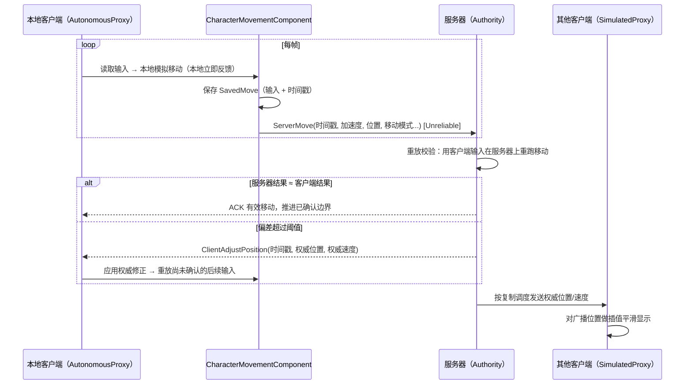
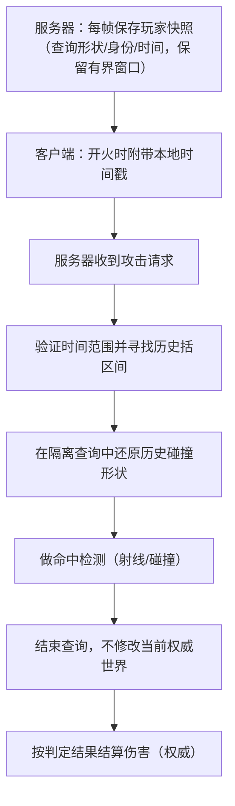

# 03 客户端预测与延迟补偿
> 知识成熟度：L2（本轮审计修订时补标）
> 版本基准：沿用原文 UE 5.8.0（CL 55116800 / `++UE5+Release-5.8`）阅读背景；2026-09-30 增量依据 Epic 在线文档与 Valve 公开源码。此轮未访问该 UE 安装或复核其 CL。
> 兼容性边界：概念适用于服务器权威网络游戏；CMC 的 RPC 打包、扩展点与签名须以项目所用引擎头文件为准。本页独立 C++11 模型不等同 UE 可直接集成实现。
> 官方参考：[Unreal Engine UE5.8 官方文档总页](https://dev.epicgames.com/documentation/en-us/unreal-engine)。
> 最后更新：2026-09-30（预测确认、时间域、回退可信边界与验证练习）。

> 本篇是「06-网络同步」分类的第三篇，解决多人游戏里最影响"手感"的两个问题：
> **客户端预测（Client-Side Prediction）**——让本地输入无需等待网络往返便有反馈；
> **延迟补偿（Lag Compensation）**——在明确公平性策略下补偿射击延迟。
> 前置知识：[RPC 与属性同步](../状态复制与兴趣管理/02-RPC与属性同步.md)、[角色移动](../../05-Gameplay与交互系统/输入移动与交互/06-角色移动系统UCharacterMovement.md)。读完应能区分输入重放、表现平滑、历史命中查询三条时间线。

---

## 一、概述

在纯"服务器权威 + 客户端只看同步结果"的模型下，玩家按一下 W，输入要先上行到服务器（仅在链路近似对称时可估为半个 RTT），服务器移动角色，再把新位置下行回来——**玩家的操作反馈至少要经过一次网络往返，还可能叠加模拟和发送调度等待**。RTT 为 50ms 时尚可接受，RTT 达到 150ms 时角色会"黏在键盘上"，体验极差。

**客户端预测**的思路是：让拥有控制权的客户端（AutonomousProxy）**先在本地立即执行移动**，同时把输入上行给服务器；服务器以权威身份重放并校验，若与客户端结果一致则"确认"，若不一致则下发**修正（Correction）**，客户端**回滚**到服务器认可的状态并重放后续输入。

**延迟补偿**解决的是另一个问题：玩家 A 瞄准玩家 B 开枪时，B 在他屏幕上已经跑到了另一个位置——服务器该按"谁的时间"判定？一种常见方案是：服务器保存有限历史，在校验请求序号、时间可信范围与射击权限后，把目标查询到**估计的客户端所见时刻**再做命中检测，即"服务器回退（Server Rewind）"。客户端时间只是输入证据，不能直接决定查询时间；CMC 本身也不自动提供通用武器命中回退。

本篇先讲移动预测的完整链路（SavedMove / ServerMove / Correction / 回滚重放），再讲延迟补偿的工程实现，最后覆盖插值、外推与动画/射击预测等配套话题。

---

## 二、核心概念（速查表）

| 概念 | 英文 | 含义 |
| --- | --- | --- |
| 自主代理 | AutonomousProxy | 自己控制的 Pawn：本地预测 + 上行输入 |
| 模拟代理 | SimulatedProxy | 非本地控制的复制 Pawn：依据权威更新做模拟/平滑，不重放本地玩家输入 |
| 权威 | Authority | 服务器：最终位置与判定 |
| 本地预测 | Local Prediction | 客户端在本地先执行移动/表现 |
| 服务器移动 | ServerMove | 客户端上行移动输入/状态的 RPC（Unreliable） |
| 保存的移动 | SavedMove | 客户端保存的移动输入历史（含时间戳），用于回滚重放 |
| 修正 | Correction / ClientAdjust* | 服务器下发的"权威位置/速度等移动状态"，客户端需回滚到该状态 |
| 回滚 | Rollback / Replay | 客户端退回服务器认可的状态，重放之后的输入 |
| 延迟补偿 | Lag Compensation | 服务器校验并映射请求时间，查询有界历史状态做判定 |
| 时间窗 | Rewind Window | 服务器策略允许的历史范围；须按玩法公平性和成本测量确定 |
| 插值 | Interpolation | 用历史数据平滑过渡（渲染到过去） |
| 外推 | Extrapolation | 无新数据时按速度继续推算位置 |
| 时钟同步 | Clock Sync | 估算客户端与服务器的时钟差/RTT |
| 网络平滑模式 | NetworkSmoothingMode | CMC 对模拟代理的平滑方式（Linear/Exponential/Disabled） |

---

## 三、原理详解

### 3.1 移动预测的完整链路



#### 3.1.1 客户端本地模拟

拥有控制权的客户端（`GetLocalRole() == ROLE_AutonomousProxy`）上的 CMC 会像单机一样执行完整的移动逻辑：加速度、速度、碰撞、物理。玩家的输入立即反映在画面上——这是"手感"的来源。

#### 3.1.2 ServerMove：输入上行

客户端把每次移动意图封装成 **SavedMove** 并通过 `ServerMove`（Unreliable RPC）上行，核心字段包括：

- `TimeStamp`：客户端本地时间戳（用于服务器对齐与回滚）；
- `InAccel`：本次输入的加速度向量（量化压缩）；
- `ClientLoc`：客户端预测出的位置（服务器用来快速比对）；
- `CompressedFlags`：跳跃/蹲伏/冲刺等状态位；
- `ClientRoll`、`View`：视角信息（用于移动与相机一致）；
- `ClientMovementBase` / `ClientBaseBoneName`：站在哪个移动平台上；
- `ClientMovementMode`：客户端认为的移动模式（走路/飞行/游泳…）。

`ServerMove` 在本页表示逻辑上的移动上报族。旧路径有 Dual 等变体，现代 CMC 还可使用 packed move 数据容器；不能假设覆写单个旧 RPC 就覆盖所有移动。具体扩展先查项目版本的 `FSavedMove_Character`、`FCharacterNetworkMoveData` / Container 及对应入口。

#### 3.1.3 服务器重放与校验

服务器收到 `ServerMove` 后，从自己的权威状态重建该次移动，再比较客户端报告结果：

- 若客户端位置与服务器计算结果偏差很小 → 接受，正常广播；
- 若偏差超过配置的允许范围→ 认为客户端预测错误（可能撞墙、被击退、服务器裁决不同），下发修正；
- 服务器按移动模式和碰撞环境执行模拟，并处理时间差；项目仍须补充冲刺权限、体力、技能等业务规则。不能把默认 CMC 当成完整反作弊系统。

#### 3.1.4 修正与回滚重放（Correction & Replay）

当客户端收到 CMC 的移动修正（如 `ClientAdjustPosition` 路径或版本对应的 packed response）时：

1. 找到对应时间戳的 SavedMove；
2. 把角色状态**回滚**到服务器给出的权威状态（位置、速度、移动模式）；
3. 从该时刻起**重放**之后所有本地 SavedMove（把"后来发生的输入"重新执行一遍）；
4. 继续正常预测。

重放的目的，是修正后保留尚未确认的输入；是否无感取决于偏差、历史完整性与表现平滑，不能保证所有修正都不可见。

#### 3.1.5 模拟代理的插值

其他客户端通常看到 SimulatedProxy：它们使用权威移动更新继续模拟并平滑视觉偏差。更新频率受相关性、带宽、复制配置与调度影响，不等于固定的 30~60Hz。`NetworkSmoothingMode` 决定表现平滑方式：

| 模式 | 行为 | 适用 |
| --- | --- | --- |
| `Linear` | 按 CMC 的平滑时间参数插值网格偏移 | 按视角和运动类型测试 |
| `Exponential` | 将修正造成的视觉偏移逐步衰减 | 检查收敛时间与高速运动误差 |
| `Disabled` | 直接应用，无平滑（会瞬移） | 调试/特殊需求 |

通用快照插值会主动缓冲历史；CMC 的网格平滑还有自身模拟与偏移处理，不能统一当成"固定滞后一个更新间隔"。必须记录真正用于瞄准的表现时间，不能从平滑模式名字推断延迟。

### 3.2 三种时间，不要用一个 float 混过去

1. **客户端移动时间戳**：CMC 用于排序输入、推导 delta、定位 ACK/修正；有自己的重置与过期规则，不是 UTC，也不保证等于服务器 `WorldTime`。
2. **服务器模拟时间**：决定权威状态属于哪一个 tick；暂停、时间膨胀、关卡切换会改变世界时间语义。
3. **远端对象表现时间**：客户端画面可能显示历史快照或平滑后的状态；开火时看见的目标通常不是服务器收到包时的位置。

因此不能写 `abs(ServerWorldTime - Move.TimeStamp) > 常量` 作为 CMC 防作弊。保留引擎时间戳验证与时间差处理；额外游戏规则校验要叠加在正确版本的移动扩展点上。[Epic 的 CMC 网络移动说明](https://dev.epicgames.com/documentation/unreal-engine/understanding-networked-movement-in-the-character-movement-component-for-unreal-engine)区分 ACK、修正、输入缓冲及时间差处理，具体函数签名仍以目标头文件为准。

若自行设计命中协议，用带单位/时钟域的字段，而不是含糊的 `ClientTime`：`CommandSeq`、`EstimatedServerFireTimeSeconds`、服务器允许的插值时长、接收时的 `ServerNowSeconds`。RTT/2 只是单向延迟估计，链路不对称时会有系统误差；时钟偏移、抖动与客户端排队也不能互相替代。关于固定步长和逻辑时钟，继续读[世界时间确定性与 GameClock](../运行调度与过载保护/12-世界时间确定性与GameClock.md)。

### 3.3 延迟补偿（Lag Compensation）



#### 3.3.1 为什么需要延迟补偿

没有延迟补偿时，服务器用"当前时刻"的状态判定攻击：玩家 A 看到 B 在位置 P 开枪，但服务器上 B 已经在位置 Q——子弹"明明打中了"却显示未命中（或者反过来，玩家被"隔墙打死"）。延迟补偿试图还原攻击方当时看见的目标；代价是防守方可能已在当前世界进入掩体。窗口、可回退对象与遮挡策略是玩法选择，不存在对双方都无代价的"完全公平"。

#### 3.3.2 历史查询应保存什么

- **按实体隔离**：使用稳定 ID + generation + 生命周期区间；不能凭一个裸 `ACharacter*` 把重生后的角色与旧历史混在一起。
- **保存判定形状**：胶囊的半高/半径、碰撞开关、姿态，以及玩法需要的命中盒变换。仅保存 `bIsCrouched` 并调用 `UpdateBounds()` 不会自动重建历史姿态/胶囊形状。
- **样本完整性**：时间排序、相邻样本间距上限、传送/出生/死亡等 discontinuity 标记。只在同一连续段内插值；旋转按合适的四元数插值，不能机械插值欧拉角。
- **范围与遮挡**：明确玩家、门、平台、可破坏掩体各采用历史还是当前碰撞；射线起点与射程也须服务器校验。不要只回退人而忽略会改变结果的动态门。
- **有界资源**：内存约为 `实体数 × 样本率 × 窗口秒数 × 每样本字节数`，再加索引/容器开销。例如 64 人、60Hz、0.25s、每人每样本 20 个盒子 × 32 字节，约 600KiB，尚不含其他字段；这是假设计算，不是实测性能。

#### 3.3.3 选择查询时刻与失败策略

先定义请求字段是否已经代表“所见目标时间”。如果客户端报的是开火发生的服务器时间估计，还要扣除受控的表现缓冲；若已是所见时间，再扣一次会过度回退。不能直接采纳客户端任意声明的插值延迟。

以教学时间线说明：服务器当前 10.000s，估计指令单向传输 0.040s，允许的目标表现缓冲 0.060s，则候选查询时刻为 9.900s。窗口 0.250s 意味着最早允许 9.750s。客户端若报 9.300s，应按公开策略拒绝或回落当前判定，不能偷偷夹到 9.750s 后仍声称还原了原画面。

[Valve 的公开实现](https://github.com/ValveSoftware/source-sdk-2013/blob/master/src/game/server/player_lagcompensation.cpp)展示了延迟/插值约束、指令时间核对以及对历史不连续的处理思路；它是 Source 的实现证据，不是 UE 默认行为。本页建议将失败分类为 `BadTime`、`OutsideWindow`、`HistoryGap`、`EntityMismatch`、`RuleRejected` 并分别计数，避免所有 miss 都被误诊为碰撞问题。

优先对不可变历史形状做独立几何查询。若项目必须暂移真实组件，需隔离复制/Overlap/物理副作用、完整保存与作用域恢复全部受影响状态，并禁止嵌套查询；一个保存位置再移回去的示例并不安全。

### 3.4 其他预测：射击与动画

#### 射击预测

客户端开火瞬间**立即**播放枪口火光、弹道特效、后坐力，同时上行 Server RPC；服务器验证（弹药、冷却、命中判定）后广播伤害与弹孔。若服务器判定未命中（如目标已跑开），客户端后续收到"未命中"结果并纠正（如弹孔消失、伤害数字不出现）。这是"表现预测 + 逻辑权威"的典型模式。

#### 动画预测

移动动画由 CMC 的移动状态驱动，天然跟随预测；蒙太奇可由玩法/GAS 的状态和预测机制驱动，或在明确范围内发送表现事件。不要把一个永久 bool 当去重：用动作/事件 ID 区分连续两次攻击，并定义取消、重连与迟到状态恢复；一次 NetMulticast 不替代持续状态复制。

### 3.5 常见失败模式

| 现象 | 原因 | 对策 |
| --- | --- | --- |
| 橡皮筋（Rubber-banding） | 服务器频繁修正 | 检查输入是否重复上报、修正阈值、时钟偏差 |
| 角色瞬移 | 服务器跳变式 SetActorLocation | 用移动组件、减少强制传送 |
| 穿墙 | 服务器未校验移动路径 | 服务器重放时做完整碰撞检测 |
| 修正后抖动 | 修正与本地重放冲突 | 检查 SavedMove 清理、时间戳对齐 |
| 站在移动平台上错位 | 平台移动未正确同步 | 处理 BasedMovement / MovementBase |
| 掩体后仍受伤/明明瞄准却未命中 | 时间映射、窗口或遮挡策略不符预期 | 重建三条时间线，检查公开的公平性策略 |

---

## 四、实现契约与可运行的 C++11 小模型

### 4.1 UE 配置与扩展点，不伪造可编译 override

在 `ACharacter` 派生类构造函数中开启 Actor 复制和移动复制；`bReplicateMovement` 属于 Actor 责任，不能写成 `MoveComp->bReplicateMovement`。CMC 保留默认 ACK/修正状态机，不手动把其内部“收到修正”标志当常开开关。

```cpp
// AMyCharacter 构造函数内部；需项目自己的类声明与 UE 头文件。
bReplicates = true;
SetReplicateMovement(true);
GetCharacterMovement()->NetworkSmoothingMode =
    ENetworkSmoothingMode::Exponential;
```

增加冲刺等自定义移动能力时，应共同维护：本地预测输入、SavedMove 保存/恢复、是否允许合并、上行序列化、服务器权威规则，以及修正后的重放。只把 `MaxWalkSpeed` 在客户端改大，会让两端模拟不同。额外位超出压缩标志容量时，研究项目版本的自定义 network move data 容器；不能盲目复制旧 `ServerMove_Implementation` 或省略参数的 `ClientAdjustPosition_Implementation` 签名。

调试时在派生 CMC 中观察预测数据的 SavedMoves、LastAckedMove、修正频率和历史长度；观察不应改变其所有权或把裸指针保存到跨帧异步任务。

### 4.2 ACK 边界决定重放什么

用序号解释独立于引擎细节的规则：客户端已执行 101、102、103、104，服务器确认到 102，则 101/102 可从未确认集合移除。若 102 同时附带权威修正状态，先恢复该状态，只重放 103/104。重放 102 会重复应用输入；丢掉 103/104 则会吃掉操作。

预测输入必须包含影响模拟的所有状态，例如冲刺意图、移动模式、作用中的根运动来源。声音、粒子、震屏等副作用不应随每次输入重放重复生成；使用本连接的事件 ID 与确认/取消状态去重。重连时换 epoch，避免新连接序号碰撞旧事件。

### 4.3 有界历史插值模型（纯 C++11）

以下模型只验证“已映射到服务器时钟的查询时间能否在同一实体的连续历史中插值”。不是武器实现，不包含时钟同步、网络去重、碰撞、伤害、UE API 或并发。为避免无限 `NaN` 穿过比较，还显式拒绝非有限数。

```cpp
#include <cassert>
#include <cmath>
#include <cstdint>
#include <vector>

struct Sample {
    double time;
    double x;
    std::uint32_t generation;
    bool breakBefore; // 到达此样本前发生传送/出生等不连续
};

enum class QueryResult { HitHistory, BadInput, OutsideWindow,
                         HistoryGap, EntityMismatch };

QueryResult QueryX(const std::vector<Sample>& h, double now,
                   double target, double window, double maxGap,
                   std::uint32_t generation, double& outX) {
    if (!std::isfinite(now) || !std::isfinite(target) ||
        !std::isfinite(window) || !std::isfinite(maxGap) ||
        window < 0.0 || maxGap <= 0.0)
        return QueryResult::BadInput;
    if (target > now || now - target > window)
        return QueryResult::OutsideWindow;
    // 全量验证是教学实现；生产中可在写入历史时保证这些不变量。
    for (std::size_t i = 0; i < h.size(); ++i) {
        if (!std::isfinite(h[i].time) || !std::isfinite(h[i].x) ||
            h[i].time > now || (i > 0 && h[i].time <= h[i-1].time))
            return QueryResult::BadInput;
    }
    for (std::size_t i = 0; i < h.size(); ++i) {
        if (h[i].time == target) {
            if (h[i].generation != generation)
                return QueryResult::EntityMismatch;
            outX = h[i].x;
            return QueryResult::HitHistory;
        }
        if (i == 0 || !(h[i-1].time < target && target < h[i].time))
            continue;
        const Sample& a = h[i-1];
        const Sample& b = h[i];
        if (a.generation != generation || b.generation != generation)
            return QueryResult::EntityMismatch;
        if (b.breakBefore || b.time-a.time > maxGap)
            return QueryResult::HistoryGap;
        const double alpha = (target-a.time)/(b.time-a.time);
        outX = (1.0-alpha)*a.x + alpha*b.x;
        if (!std::isfinite(outX)) return QueryResult::BadInput;
        return QueryResult::HitHistory;
    }
    return QueryResult::HistoryGap; // 不用最近端点伪装完整历史
}

int main() {
    std::vector<Sample> h{{9.875, 0.0, 7, false},
                          {10.0,  10.0, 7, false}};
    double x = -1.0;
    assert(QueryX(h, 10.0, 9.9375, .25, .2, 7, x)
           == QueryResult::HitHistory && x == 5.0);
    assert(QueryX(h, 10.0, 9.5, .25, .2, 7, x)
           == QueryResult::OutsideWindow);
    assert(QueryX(h, 10.0, 10.01, .25, .2, 7, x)
           == QueryResult::OutsideWindow);
    assert(QueryX(h, 10.0, 9.9375, .25, .2, 8, x)
           == QueryResult::EntityMismatch);
    h[1].breakBefore = true;
    assert(QueryX(h, 10.0, 9.9375, .25, .2, 7, x)
           == QueryResult::HistoryGap);
}
```

保存为 `history_query.cpp` 后使用 `g++ -std=c++11 -Wall -Wextra -Werror -pedantic history_query.cpp -o history_query && ./history_query`。断言通过只证明列出的算术/边界例子，不能证明时间估计可靠，更不能证明真实 UE 命中公平。

### 4.4 开火的完整请求契约（伪代码）

```text
本地输入：生成连接 epoch + shotSeq；预测一次枪口效果
服务器接收：按连接/玩家路由 → 去重并检查请求速率
权威规则：角色存活、武器属于玩家、弹药/冷却满足
时间处理：检查非有限值 → 映射时钟 → 约束表现缓冲/回退窗
历史查询：实体代次 + 连续区间 + 历史形状 + 遮挡策略
提交结果：一次性扣弹与结算；记录 shotSeq 的接受/拒绝结果
客户端响应：以相同事件 ID 确认或取消预测，不重复播放
```

被接受但未命中的一次射击通常也要消耗弹药；“未命中”与“请求非法”必须分开。Listen Server 上主机玩家也必须进入同一服务器规则函数，不能只在 `!HasAuthority()` 分支里发起开火而漏掉主机。重复 RPC、迟到回包和重连如何处理，继续读[幂等重试与消息语义](../持久化与分布式一致性/03-幂等重试与消息语义.md)。

---

## 五、最佳实践

1. **只预测"玩家可控且高频"的状态**：移动、转向、射击。不要预测"服务器随机决定"的东西（掉落、伤害数值），预测不了就等服务器。
2. **服务器永远留一手**：客户端预测只是"体验优化"，服务器重放校验 + 修正才是真相；所有关键逻辑以服务器结果为准。
3. **修正要温和**：修正阈值、插值速度要调到"玩家几乎无感"；频繁强修正 = 橡皮筋。
4. **先区分时间域**：CMC 移动保留引擎自身的时间戳重置与时间差处理；自建命中协议才显式定义时钟映射、表现缓冲及可信范围，不直接比较客户端时间与服务器 WorldTime。
5. **延迟补偿窗口要设上限**：超过窗口的攻击请求直接拒绝，防止"延迟开枪"滥用。
6. **校验一切上行参数**：速度上限、加速度、时间戳单调性、攻击频率、弹药消耗——服务器不信任何客户端数据。
7. **模拟代理插值别过度**：不要预设哪个模式一定更好；用相同弱网轨迹比较视觉误差和收敛时间。
8. **用 `p.NetShowCorrections 1` 调试修正**：观察修正频率与幅度，这是移动网络质量的"心电图"。
9. **区分"服务器修正"与"表现平滑"**：修正使客户端模拟收敛到服务器权威状态（再重放未确认输入），平滑改的是渲染表现（插值），两者职责别混。
10. **移动平台（BasedMovement）**：站在移动平台上的角色要同步平台引用与相对位置，否则修正会乱；CMC 已有支持，别自己另搞一套。

---

## 六、常见问题 FAQ

**Q1：为什么我的角色在别人眼里"一顿一顿"的？**
大概率是模拟代理没有插值或插值参数不当：检查 `NetworkSmoothingMode`；还要核查 Actor 更新预算、相关性、网络拥塞与服务器 tick；不能只改服务器 tickrate 就推断实际复制频率。

**Q2：什么是"橡皮筋效应"？怎么修？**
角色被反复拉回服务器位置 = 修正频繁。排查：① 客户端是否重复上报输入；② 服务器重放与客户端预测不一致（碰撞、浮点差异）；③ 自定义时间处理与 CMC 规则冲突；④ 修正阈值过小。

**Q3：服务器怎么防止"加速挂"？**
先保留 CMC 的时间差/步长处理，再核对自定义移动规则。加速度不是速度；击退、下落、平台或根运动也可能合法超过步行速度，不能仅比较 `MaxWalkSpeed` 就踢人。检测应记录移动模式、授权能力、时间预算和连续证据。

**Q4：延迟补偿会不会被用来作弊（延迟开枪）？**
会，所以必须：限制攻击频率与每发消耗、拒绝超出时间窗的请求、对请求时间戳与接收时间的差做阈值校验、在权威业务路径校验。`WithValidation` 只是某些 RPC 的验证入口，不代替业务校验、去重或时间可信模型。

**Q5：预测的动画和服务器结果对不上怎么办？**
动画由本地预测驱动时必然存在与权威状态的短暂偏差；修正到达后动画要能平滑收敛（如重新同步 AnimMontage 的播放位置）。若偏差持续存在，检查移动模式同步（如客户端以为在飞、服务器以为在走）。

**Q6：站在移动平台上为什么会"飘"？**
移动平台的位移在服务器与客户端之间有延迟，基于平台的角色位置会出现偏差。CMC 的 `BasedMovement` 会同步平台引用；若自定义平台逻辑，必须把平台位置/速度也复制（通常 `bReplicateMovement` + 高频更新）。

**Q7：Unreliable 的 ServerMove 丢了怎么办？**
Unreliable 不代表输入可随意丢弃。CMC 维护未确认 SavedMoves，并会组合或补发重要旧移动；ACK 推进缓冲边界，修正后重放剩余输入。高频 Reliable RPC 会有队头阻塞/缓冲压力，移动协议以自身的确认与冗余处理损失。不要自行改为“新位置覆盖旧位置”协议。

**Q8：什么时候应该关掉预测，完全等服务器？**
当状态"低频、结果随机、不需要即时反馈"时（如抽奖结果、交易确认、放置类操作），关预测更简单可靠。预测是手段不是目的。

**Q9：修正会把客户端"传送"吗？**
可能出现可见跳变；客户端重放与表现平滑可以减轻，但不保证玩家无感。尤其当服务器与客户端状态严重失配（如角色死亡/被传送/掉线重连）时才会出现明显跳变。

**Q10：Lyra 项目里的移动预测和默认 CMC 有什么区别？**
先从默认 CMC 建立心智模型，再按仓库所用 Lyra 版本核查派生移动组件、GAS 与 Root Motion 接入；不能把某个 Lyra 版本的扩展概括成所有版本都具备相同自定义移动模式。

---

## 七、验证练习：从会背术语到能定位时间线

| 场景 | 输入与操作 | 要观察的不变量 |
| --- | --- | --- |
| ACK/修正 | 101..104，确认或修正到 102 | 仅重放 103/104，FX 不因重放重复 |
| 窗口边界 | 恰好最老时刻、窗口外、未来、NaN | 拒绝原因可区分，无任意端点夹取 |
| 生命期 | 同 ID 重生、断线重连、关卡切换 | generation/epoch 隔离旧请求与历史 |
| 不连续 | 传送、坐骑切换、蹲站变化 | 不跨跳变插值；使用正确历史查询形状 |
| 网络异常 | 延迟、抖动、丢包、重复/乱序分别施加 | 未确认输入有界；伤害和扣弹至多一次 |
| 公平性 | 防守方关门或跑进掩体后开火请求到达 | 日志可解释采用历史还是当前遮挡 |

练习一：为 4.3 补齐空历史、重复时间、非有限样本、超大采样间隙与精确端点的断言；说明为什么 `OutsideWindow` 与 `HistoryGap` 是不同错误。

练习二：画出本地预测位置、服务器位置、远端网格位置三条曲线。解释增加插值缓冲为何可能减轻抖动，却改变命中补偿所需的表现时间。

练习三：让自定义冲刺只修改客户端速度，观察修正；再把意图纳入 SavedMove 和服务器规则，比较修正次数/幅度。不能只放大容忍阈值掩盖状态缺失。

UE 验收建议采用独立 DS + 两客户端，另测 Listen Server 主机路径，记录引擎版本、地图、网络参数和实际 RTT。使用 [Epic Network Emulation](https://dev.epicgames.com/documentation/unreal-engine/using-network-emulation-in-unreal-engine)分别引入异常；`PktLag` 等参数作用于具体收发路径，不要把单向注入值直接写成测得 RTT。收集 ACK 序号、缓冲长度、修正分布、拒绝原因、重复效果/结算次数及历史内存。

**此轮验证边界**：C++11 小模型可独立编译；本页不声称已完成 UE 编译、多人运行、Chaos 历史碰撞或公平性实测。上述场景是待执行的验收设计，成熟度保持 L2、verified 保持空列表。

---

## 八、关联阅读

- 本分类：[01-网络架构与复制基础.md](../状态复制与兴趣管理/01-网络架构与复制基础.md) —— NetRole（Autonomous/Simulated Proxy）与移动数据复制
- 本分类：[02-RPC与属性同步.md](../状态复制与兴趣管理/02-RPC与属性同步.md) —— ServerMove 的 RPC 属性（Unreliable）、移动属性的同步频率
- 本分类：[04-多人游戏框架与玩家状态.md](../会话身份与在线服务/04-多人游戏框架与玩家状态.md) —— 玩家 Pawn 的 Possess 与本地控制判定
- 本仓库：[01-引擎基础](../../../游戏知识/01-引擎基础/README.md) —— Actor 生命周期（预测对象的生成/销毁）
- 本仓库：[03-游戏玩法编程/06-角色移动系统UCharacterMovement.md](../../05-Gameplay与交互系统/输入移动与交互/06-角色移动系统UCharacterMovement.md) —— CMC 使用层（移动模式/速度/跳跃），本篇为网络预测视角
- 官方文档：Unreal Engine 5 Character Movement Component（网络移动章节）、Client-Side Prediction
- 引擎源码：`Engine/Source/Runtime/Engine/Private/Components/CharacterMovementComponent.cpp`（`ServerMove`、`ClientAdjustPosition`、`SmoothCorrection`）
- 参考项目：Epic Games 的 Lyra（生产级移动预测与网络配置）
