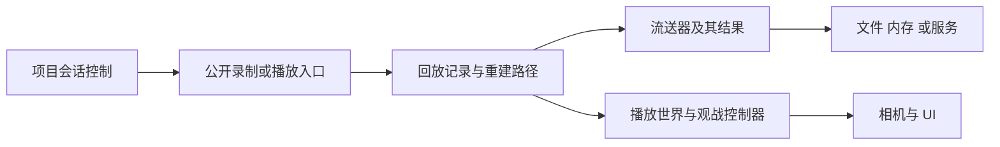
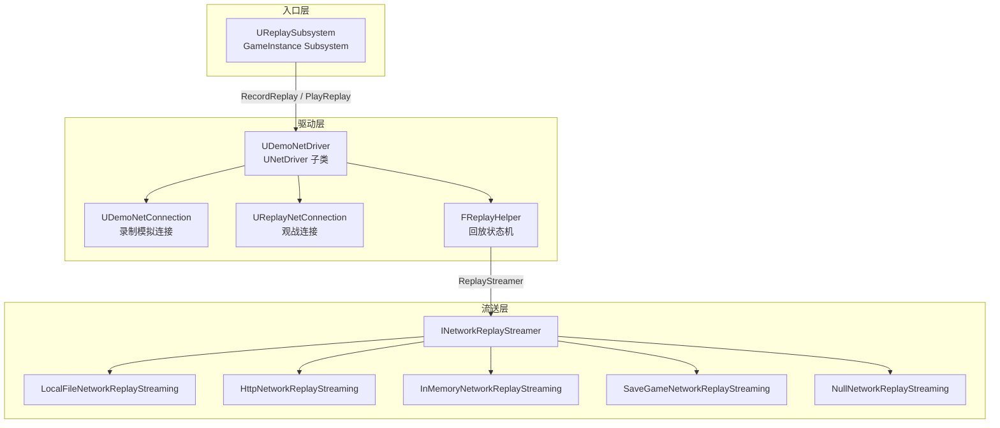
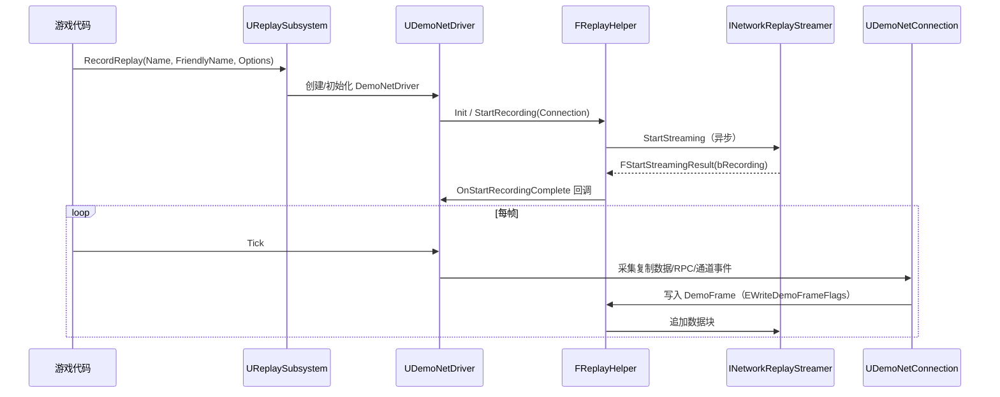
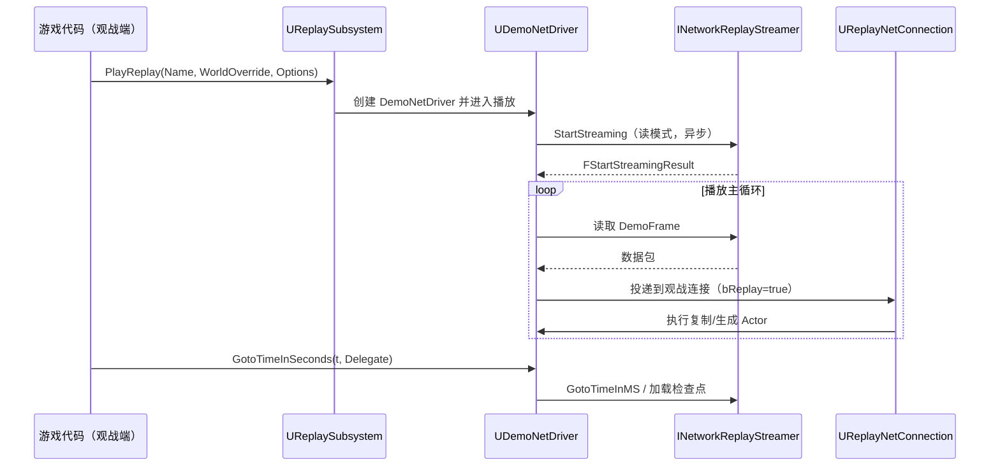

# 09 网络回放与 DemoNetDriver

> 知识成熟度：L2。主要结论经 Epic 官方说明与公开 API 静态核对；纸面例子用于解释数据覆盖和状态变化，不构成 UE 运行验证。
> 版本基准：2026-10-09 读取的 Epic 文档，主入口页面标示 UE5.8；单独使用的历史页面另行标注版本。公开页面不提供本文原安装的源码 CL 证明。
> 最后更新：2026-10-09
> 历史身份：原稿自述 UE5.8.0 / CL55116800 / `++UE5+Release-5.8`、2026-08-07 本机头文件核对，原文与真实 Git 版本在文末保留。本轮未访问该安装、未重新核对其行号或 `Build.version`，不能把历史身份写成本轮观察。
> 适用范围：录播、演示素材、赛事复盘、观战系统、赛后分析、反作弊取证辅助，以及这些功能的录制、播放、跳转与停止设计。
> 未验证项：未运行 UE/UHT/编译、录制播放、seek、目标网络、截图、性能或配置实验；未核实目标项目的 ReplicationGraph/Iris 组合、资源版本与平台流送实现。

## 1. 先确定“这份回放能回答什么”

网络回放把**录制路径实际纳入的复制数据与显式附加数据**保存下来，再由播放端重建可观察状态。它不是屏幕像素，也不是世界内存、所有输入、全部 RPC 和后端交易的自动备份。[官方系统概述](https://dev.epicgames.com/documentation/en-us/unreal-engine/using-the-replay-system-in-unreal-engine)将数据入口放在复制系统与 DemoNetDriver 之间。

因此，功能设计应先列“必须看见的事实”，再决定从哪端录、记录哪些数据、如何验证覆盖。例如，比赛复盘需要远处队员的位置；客户端若从未收到该队员的状态，播放端换一个自由相机不会把缺失信息补出来。录制端选择、复制条件与采样覆盖先决定了可以重建什么，之后才是相机和 UI。

| 目标 | 必须具备的数据/条件 | 可得结果与限制 |
| --- | --- | --- |
| 录播、教学演示、宣传素材 | 已记录对象状态；能匹配的地图、资产与表现逻辑 | 可重新取景并另行录屏；不会恢复录制机器原来的像素、画质和每个瞬时效果 |
| 赛事复盘、AI 行为分析 | 足够广的录制视野；关键状态、决策标记与时间关联 | 分析被记录的行为；没有记录的 AI 黑板、随机输入或决策原因不能由画面倒推出 |
| 远程观战、直播回放 | 回放发布、流送服务、鉴权、可用时间范围和延迟策略 | 多个播放客户端可消费同一份内容；每个客户端仍需读数据、重建和渲染 |
| 赛后统计、反作弊取证辅助 | 来源可信、覆盖已知、版本可辨、文件完整；必要的服务端事件证据 | 可辅助核对记录中的动作；不能单凭缺失帧证明“未发生”，也不替代权威结算账本 |

这些用途保留同一个前提：先证明所需事实进入记录。若目标是重新执行权威命中判定，还需单独保存输入、时间基准、算法/内容版本和必要外部状态，并验证重算合同；不能把“能播放角色动作”当作这项工作的完成证据。

## 2. 为什么复制数据不等于全部游戏事实

把一次录制理解为一个有边界的数据投影：原始世界变化 → 录制端可取得的状态 → 对象/属性/RPC 选择与更新调度 → 实际写入回放的数据 → 播放端可重建的状态。每经过一个选择环节，缺失信息都不能由下游凭空恢复。

### 2.1 对象、属性和 RPC 各自有选择规则

属性是否进入回放不能只看它是不是 `UPROPERTY`，甚至不能只看是否声明了复制。[属性复制条件参考](https://dev.epicgames.com/documentation/unreal-engine/replicate-actor-properties-in-unreal-engine)列出 `COND_ReplayOnly`、`COND_ReplayOrOwner` 与 `COND_SkipReplay`；其中跳过回放的属性就是明确反例。对象是否参与、录制视点、相关性、休眠与更新频率也需要按实际录制路径核对。

RPC 也不是完整的远程调用日志。[DemoNetDriver API](https://dev.epicgames.com/documentation/unreal-engine/API/Runtime/Engine/UDemoNetDriver?lang=en-US)公开 `ShouldReplicateFunction` 和可跳过某些 multicast 的配置；[控制台变量参考](https://dev.epicgames.com/documentation/unreal-engine/unreal-engine-console-variables-reference)列出 `demo.RecordUnicastRPCs`，公开默认值为 `false`，用途限定为符合条件的单播客户端 RPC。该条目足以否定“所有 RPC 天然被录下”，却不能推出任意项目当前启用状态或全部录制分支。

对需要长期恢复的结果，应优先明确状态如何编码、何时写入、跳转后如何恢复；一个只触发瞬时动画的 RPC 不能自动充当完整状态快照。游戏还可主动写事件或对象外部数据，但需要项目定义序列化、版本、时间含义与读取逻辑；存在 `FReplayExternalData` 不意味着动画通知和非复制变量会自动入流。

### 2.2 有限纸例：遗漏和采样分别损失什么

假设一个教学录制路径在 t=0 和 t=0.10 秒采样 Actor A 的 `Health`；其余中间变化不入记录。输入如下：

| 时间 | 世界里发生的事 | 本例实际记录 |
| --- | --- | --- |
| 0.00 | Health=100；本地诊断变量 Secret=7 | A.Health=100 |
| 0.03 | Health=80；单播提示 RPC 发出 | 无，本例假设该 RPC 不被选入 |
| 0.06 | Health=60；Secret=9 | 无 |
| 0.10 | Health 仍为60 | A.Health=60 |

从这两条记录只能确认采样结果由100变为60。不能判定“刚好两次20伤害”、Secret 的取值、提示是否展示、伤害由哪个输入导致。反例是另一局只受一次40伤害，它也产生相同两条记录。若分析需求要分辨这两局，必须增加明确的伤害事件或权威日志，而不是提高播放画质。

本例时间与采样由题目指定，不是 UE 默认频率、抓包结果或性能数据。它说明“记录未区分的两种历史，播放也不能区分”。

## 3. 按职责读 API，不把类名画成固定连接拓扑

| 层次 | 已核对的公开入口 | 应承担的职责 |
| --- | --- | --- |
| 游戏会话入口 | `UReplaySubsystem::RecordReplay / PlayReplay / StopReplay`；`UGameInstance::StartRecordingReplay / StopRecordingReplay / PlayReplay` | 发起/结束录制播放，接入项目错误处理与世界生命周期 |
| 驱动和回放状态 | `UDemoNetDriver`、`FReplayHelper` | 协调记录、读取、对象重建、checkpoint 和 seek；不是业务证据完整性保证 |
| 连接抽象 | `UDemoNetConnection`、`UReplayNetConnection`、`UNetConnection` 的回放相关语义 | 参与回放相关的数据处理；真实实例关系要读目标版本实现 |
| 流送器 | `INetworkReplayStreamer` 与具体实现 | 数据与元数据读写、检查点定位、枚举与事件访问；实现支持范围和异步错误单独处理 |
| 播放交互 | 回放 spectator controller、UI、项目相机与数据服务 | 选择视角、等待加载、更新列表、处理失败与取消 |

[UGameInstance 当前 API](https://dev.epicgames.com/documentation/unreal-engine/API/Runtime/Engine/UGameInstance)仍列出开始录制、停止录制和播放入口。因此，原稿“GameplayStatics 未找到 Replay，所以旧 API 已整体迁移且唯一入口是 Subsystem”的推理不成立：检索一个类不能证明另一个类被删除。这里以 `UReplaySubsystem` 展示一种高层用法，不主张它是唯一合法入口。

[UDemoNetConnection API](https://dev.epicgames.com/documentation/en-us/unreal-engine/API/Runtime/Engine/UDemoNetConnection)明确涉及录制和播放；[UReplayNetConnection API](https://dev.epicgames.com/documentation/en-us/unreal-engine/API/Runtime/Engine/UReplayNetConnection)还公开 `StartRecording`。不能把两者分别固定命名为“仅录制连接”和“每名观众的播放连接”。仅从方法名和头文件声明，也不能证明 Subsystem 在所有模式里都经由同一组内部调用。



这是一张职责图，不是已复核的 CL55116800 调用栈。查目标实现时应沿录制和播放分别追踪 `ReplaySubsystem.cpp`、`DemoNetDriver.cpp`、连接实现与所选 streamer；同时确认 World 和 Level Collection 的归属，不能根据图臆造“一个观众一个 UReplayNetConnection”。

## 4. 一次录制如何开始、形成记录并可靠地结束

开始请求先由会话入口接收，再由具体路径准备记录环境与 streamer；数据能写入之后，才可能产生有效回放。调用函数返回、连接对象存在和“文件已完整保存”是不同观察点。

[UReplaySubsystem API](https://dev.epicgames.com/documentation/en-us/unreal-engine/API/Runtime/Engine/UReplaySubsystem)公开的主要签名是：

```cpp
void RecordReplay(const FString& Name, const FString& FriendlyName,
    const TArray<FString>& AdditionalOptions,
    TSharedPtr<IAnalyticsProvider> AnalyticsProvider);
bool PlayReplay(const FString& Name, UWorld* WorldOverride,
    const TArray<FString>& AdditionalOptions);
void StopReplay();
void RequestCheckpoint();
```

以上为按公开声明整理的签名摘录，不是本轮编译过的项目代码。`RecordReplay` 返回 `void`，没有返回“已完成录制”的布尔值；`PlayReplay` 的返回值也不能被扩张成“地图、数据、Actor 和相机都已就绪”。附加选项由具体路径解释，不默认代表观战人数上限。

### 4.1 最小调用节选与上层状态

下面仅展示入口获取及空指针检查。项目必须补足调用时机、重复请求、错误显示、委托解除与世界切换策略；节选未运行。

```cpp
// GI 是调用方当前有效的 GameInstance；本节选不缓存跨会话的裸指针。
if (UGameInstance* GI = GetGameInstance())
{
    if (UReplaySubsystem* Replay = GI->GetSubsystem<UReplaySubsystem>())
    {
        Replay->RecordReplay(TEXT("match_001"), TEXT("示例对局"), {}, nullptr);
        // 此处只能说明已发起调用，不能显示“已保存成功”。
    }
}

// 由“停止”操作在之后的独立时刻调用，不是紧接上段开始后执行。
if (UGameInstance* GI = GetGameInstance())
{
    if (UReplaySubsystem* Replay = GI->GetSubsystem<UReplaySubsystem>())
    {
        Replay->StopReplay();
    }
}
```

推荐上层使用自己的状态：Idle → StartingRecord → Recording → Stopping → Idle，另有 Failed/Cancelled。它不是引擎枚举副本；每条边必须绑定项目在目标版本实际可观察的结果。开始失败不能继续显示红色录制标记；停止后仍要按 streamer 的完成/错误语义确认后端是否结束写入，不能仅凭列表出现同名条目宣布数据完整。

### 4.2 为什么不直接销毁驱动或只调用 StopStreaming

`StopReplay` 的公开职责是停止录制/播放；`bLoadDefaultMapOnStop` 控制调用停止时是否重载默认地图，具体当前值需要查项目配置。停止可能改变 World、Actor、控制器与 UI 的归属，因此业务应先让旧请求失效，再结束会话，并在新世界重新取得依赖。

`INetworkReplayStreamer::StopStreaming` 属于存储层。对一个由高层入口拥有的会话，只停 streamer 并不能由接口声明推导出驱动、连接、世界和 UI 全部已清理。故通常由同一会话所有者经高层入口停止，不把手动 Destroy/Teardown 当作缺失 Stop API 的替代教程。底层调试与自定义实现另需证明所有权和清理顺序。

资源生命周期的工程合同可以这样检查：谁创建请求，谁持有取消/结束责任；回调不得无条件解引用旧 Actor/UI；退出、切图和重新播放使旧会话代号失效；停止后迟到回调不能重新启动旧 UI 或覆盖新会话结果。这里的“会话代号”是项目设计建议，不是 UE 已替项目提供的自动保护。

## 5. 播放重建的是已记录状态，副作用仍须隔离

播放端先取得兼容的数据和内容，再逐步消费记录，将对象与属性恢复到可显示状态。会触发哪些函数受记录内容、驱动处理路径和项目逻辑影响；不能概括为“运行完整游戏逻辑”，更不能假设权威服务器、外部服务和物理世界都被原样重新执行。

例如一段被记录的表现逻辑可以调用音效或更新血条，这帮助重建画面；同一路径若还写入战绩服务或扣除库存，就可能在回放时产生不应重复的业务结果。推荐把显示状态与永久业务写入分开，并用当前播放环境判断是否允许副作用。[官方 Streamer 文档](https://dev.epicgames.com/documentation/en-us/unreal-engine/demonetdriver-and-streamers-in-unreal-engine)特别提醒回放 Actor 对共享对象的调用可能影响仍在运行的游戏。

这解释了为什么仅“固定随机种子”不够：没有记录的输入仍然缺失；同种子之外还有时间、代码版本、资产、调度和外部响应。若目标只是观战，优先消费记录的结果并隔离外部写入；若目标是确定性重算，需另建输入重放合同和验证。

播放调用也应有上层状态：StartingPlayback → Loading → Playing，遇到读失败/版本不兼容进入明确失败态，退出进入 Stopping/Cancelled。初始按钮成功返回后先显示加载；只有项目确认数据、世界及视角就绪才可显示可操作的时间轴。播放时长还可能因 live stream 增长，不能把首次读取的总时长永久缓存。

## 6. Checkpoint 与 seek：先恢复，再前进，再接受结果

检查点保存的是回放重建所需的已记录状态及相应协议信息，不是全部 Actor、线程、计时器和后端数据在同一时刻的完整内存快照。seek 的目标是从可用起点恢复，再应用后续记录到目标时间；它并不是把现在世界的所有操作倒放。

公开文档讨论 checkpoint 分帧预算：跨帧采集可能混入不同帧的 Actor 数据。因此“减少单帧检查点开销”和“保存严格同一时刻的完整世界”不能同时当作无条件结论。项目应按复盘目的决定允许的时间偏差，而不是只关注保存耗时。

### 6.1 全量、Delta 与请求完成各有边界

- 相对初始数据保存变化，与“相对前一 checkpoint 的 Delta 编码”是不同层次。公开 `demo.WithDeltaCheckpoints` 默认值为0；`HasDeltaCheckpoints()` 查询当前记录/播放是否使用该特性。不能因为 `bHasDeltaCheckpoints` 字段存在，就宣布“5.x 默认全部 Delta”。
- 有依赖链的 Delta 检查点需要相应基础和中间依赖；单拿最后一个增量块不一定能独立恢复。缺块时应报告无法恢复或使用被支持的更早起点，不拼造状态。
- `RequestCheckpoint()` 是请求在正在录制时写检查点。请求返回不等于数据已持久化；`IsSavingCheckpoint()` 是正在保存的状态观察，也不等于完整成功凭据，更不能以“当前为 false”断言刚才已保存。
- `MaxDesiredRecordTimeMS` 约束录制 Actor 复制的期望预算；检查点预算是另一项。两者都不能作为整个录制 CPU、I/O、压缩和上传的端到端硬上限，减少预算也可能改变记录时序/覆盖质量。

本段的参数身份参见[控制台变量参考](https://dev.epicgames.com/documentation/unreal-engine/unreal-engine-console-variables-reference)、[DemoNetDriver API](https://dev.epicgames.com/documentation/unreal-engine/API/Runtime/Engine/UDemoNetDriver?lang=en-US)及 [RequestCheckpoint](https://dev.epicgames.com/documentation/en-us/unreal-engine/BlueprintAPI/Replay/RequestCheckpoint)；这里未读取或改动任何目标配置。

### 6.2 有限纸例：流送定位成功仍不是 seek 完成

设一个理想化、已完整保存且独立可用的检查点 C10 记录 `A.Health=80`、`B 存在`。其后12秒记录 `A.Health=60`，14秒记录 `B 销毁`，16秒记录 `A.Health=40`。请求跳到15秒：

1. 选择不晚于目标且可用的 C10，并确认必需依赖可读。
2. 恢复 C10 得到 A=80、B 存在。
3. 只应用 `(10,15]` 的记录：12秒后 A=60；14秒后 B 不存在。
4. 不应用16秒记录。最终应是 A=60、B 不存在，再更新 UI 与视角。

反例一：一读到 C10 就宣布完成，显示 A=80、B 存在。反例二：回放到16秒后把“显示时间”改成15，A 仍是40。这两种做法都没有把目标状态恢复出来。

[FGotoResult 当前 API](https://dev.epicgames.com/documentation/unreal-engine/API/Runtime/NetworkReplayStreaming/FGotoResult)的 `ExtraTimeMS` 正是在说明取得检查点后，可能仍需快进一段时间到请求位置。因此底层 `GotoTimeInMS` 结果和驱动完成 `GotoTimeInSeconds` 是两层结果，不能混用作 UI 的成功信号。

### 6.3 并发请求、销毁与失败怎么处理

`UDemoNetDriver::GotoTimeInSeconds(float, const FOnGotoTimeDelegate&)` 是公开 seek 入口。官方对内部 transient delegate 的注释是“最多一次”，适用于成功或失败 scrub；它不承诺在任意销毁、取消条件下业务一定收到一次回调。

推荐项目串行化 seek：拖动中只保留最新目标，当前请求未完成时不再发起并行驱动操作。每次开始/停止播放增加 `SessionGeneration`，每次实际提交 seek 分配 `RequestId`。回调需同时满足：所有者有效、会话代号仍相等、请求仍是当前待处理请求。成功才重新取得当前世界中的对象并重绑视角；失败显示失败，不能把目标时间当已到达。若超时后下层仍可能运行，先使旧请求失效并按项目策略停止/恢复会话，不立即叠加无限重试。

```text
项目伪代码，非 UE 源码、非已编译实现：
SubmitSeek(target):
  若未就绪，拒绝并说明原因
  若已有 seek，替换 LatestDesiredTarget，不并行提交
  否则记录 (generation, requestId)，进入 Seeking
  调用当前驱动 GotoTimeInSeconds(target, callback)

callback(success):
  若 owner 已失效或 generation/requestId 过期，丢弃
  若失败，退出 Seeking 并显示错误
  若成功，从当前 World 重新解析对象/控制器并读取当前时间
  若还有最新目标，在本次结束后按策略提交

StopOrTravel():
  使 generation 递增；清除 pending/latest target 与 UI 引用
  由会话所有者停止回放；解除项目注册的委托
```

有限时序反例：G=7 的 seek 正在等数据，用户退出使 G=8；旧回调随后报告成功。它只能被丢弃，不能把已关闭的观战窗口重新标成 Playing。弱引用防止访问已销毁对象，代号防止仍存活的同一个 UI 被旧会话覆盖，两者解决的不是同一问题。

scrub 可能重置、销毁并重建需要回滚的启动 Actor；不能据此声称所有 Actor 每次都会重建。原对象指针与当前世界对象的身份也不能画等号。[官方驱动 API](https://dev.epicgames.com/documentation/unreal-engine/API/Runtime/Engine/UDemoNetDriver?lang=en-US)提供启动 Actor 回滚和恢复观战控制器连接的相关入口。`-skipreplayrollback` 的公开含义带有“不发生 scrubbing”的前提；不把它作为可无代价开启的通用优化，也不承诺文件会减小某个幅度。

## 7. 流送实现决定存储与分发，不能省略 I/O 生命周期

`INetworkReplayStreamer` 提供开始/停止、枚举、读取、检查点定位、事件与名称管理等能力，但不同实现未必支持每个操作。[结果基类](https://dev.epicgames.com/documentation/en-us/unreal-engine/API/Runtime/NetworkReplayStreaming/FStreamingResultBase)有 `Result` 与 `WasSuccessful()`；[操作结果枚举](https://dev.epicgames.com/documentation/unreal-engine/API/Runtime/NetworkReplayStreaming/EStreamingOperationResult?lang=en-US)区分成功、不支持、找不到、损坏、空间不足和未完成任务等。失败结果不能用空列表或总时长0伪装成正常无内容。

`FStartStreamingResult::bRecording` 表示请求的是录制还是播放，不是成功标志；此字段的独立页面本次显示5.7，不能冒充重读 CL55116800 的实现。[该字段说明](https://dev.epicgames.com/documentation/en-us/unreal-engine/API/Runtime/NetworkReplayStreaming/FStartStreamingResult)与当前结果基类应分开理解。底层无返回值的 `StopStreaming()` 也不能凭空配出一个“所有异步操作都有统一成功回调”的保证。

| 实现 | 适合的存储/消费路径 | 必须另外考虑 |
| --- | --- | --- |
| Local File | 本地单文件；官方说明默认位于 `Saved/Demos/`，扩展名 `.replay` | 实际目录可被配置；异步写入、磁盘空间、结束写入与文件完整性 |
| HTTP | 上传到回放服务，其他客户端下载，可服务直播观看 | 上传/下载带宽、服务鉴权、缓存、数据可用性与直播延迟 |
| Memory | 保留一段内存数据，用于击杀镜头或即时回放 | 内存与留存窗口；回放世界与仍运行的 live 世界隔离；不能默认长期保存 |
| SaveGame | 扩展本地实现，将回放转入平台 savegame slot | 槽位、平台能力、复制/载入结果；名称本身不保证云同步 |
| Null | 旧式本地磁盘格式与兼容路径 | 不是“什么都不写”的空实现；旧格式不能默认交给 Local File 读取 |

上述区别据[官方 Streamer 说明](https://dev.epicgames.com/documentation/en-us/unreal-engine/demonetdriver-and-streamers-in-unreal-engine)。选型应按“谁记录、谁存、谁分发、谁播放”划分责任，不能因为驱动模拟网络连接就否定 HTTP 真正的传输成本。

应用层常见失败合同：

- 打开失败：保留回放身份与具体错误，退出加载态；不开始无数据的播放。
- live 数据尚未可用：显示等待/缓冲，区分已发布范围和希望到达的时间；等待不等于文件损坏，也不等于已到目标。
- checkpoint 不支持或依赖损坏：报告 seek 能力边界；只有实现明确支持的恢复路径才可继续。
- 写满或上传失败：停止声称“已保存”，保留可用于诊断的状态；成功重试要重新确认完整性。
- 退出/切换列表：枚举与事件请求同样关联会话/请求身份，避免迟到结果覆盖新的筛选或回放。

## 8. 观战、事件、版本和性能如何放回正确层次

### 8.1 观众身份不是观战连接

`AddUserToReplay` 关联回放和用户；[UGameInstance API](https://dev.epicgames.com/documentation/unreal-engine/API/Runtime/Engine/UGameInstance)将它描述为把中途加入用户纳入当前录制相关用户集合。不能把调用它当作新观众已联网、通过鉴权、创建视角或启动播放。实际观战流程仍需要取得允许访问的回放、在播放端启动并分配本地相机/控制器。

回放列表可以使用 `EnumerateStreams` 及 [FNetworkReplayStreamInfo](https://dev.epicgames.com/documentation/en-us/unreal-engine/API/Runtime/NetworkReplayStreaming/FNetworkReplayStreamInfo)中的友好名、时长、大小、直播状态等信息；这些是特定查询时刻由实现返回的元数据。`NumViewers` 不证明同一驱动挂了多少观战连接，也不是永远精确的在线人数。`DemoSessionID` 的公开说明对应驱动对象生命周期；与比赛/赛事的业务 ID 如何关联，应由项目明确记录，不能默认为同一个稳定标识。

多人观战的典型分发模型是一个发布者、多份读取与播放。仅考虑无缓存的理想纸例，单个客户端消费1 Mbit/s、100人各读完整流，出口约100 Mbit/s，尚未算协议和重复请求。该乘法否定“观众再多也不增加带宽”，不是对某 streamer/CDN 的容量测试。已经下载完整文件时，播放可不再依赖远程取流，但仍有本地 I/O、解码/反序列化、对象和渲染成本。

### 8.2 Checkpoint 标记、事件与证据不能互相替代

赛事关键节点可请求 checkpoint 以缩短之后的定位路径；同时写入明确的业务事件有利于检索。两者职责不同：检查点解决恢复起点，事件解决“这是什么时刻”。事件 payload 是否真实、完整、可解码仍需要自己的 schema 和版本。

对于反作弊或争议复核，建议保存录制来源、比赛 ID、录制范围与配置、时间关联、游戏/内容版本以及受控存储中的完整性信息；重要判断与服务端输入/命中/结算日志交叉核对。这是工程证据设计建议，不是 replay 格式自动具备的签名、可信时间或法律证明。客户端文件可能缺少隐藏信息，也可能受客户端环境影响；服务端记录通常更适于控制来源和扩大覆盖，但同样不会自动纳入未记录字段。

### 8.3 版本和地图支持是兼容策略，不是单个字段保证

回放头、帧、GUID/对象信息、关卡时间和自定义版本分别服务格式读取与重建。[FReplayCustomVersion::Type 当前页面](https://dev.epicgames.com/documentation/unreal-engine/API/Runtime/Engine/FReplayCustomVersion/Type)含 `LatestVersion` 与 `MinSupportedVersion`；其存在表示有版本边界，不能说它“保证跨版本兼容”。原稿写的 `Latest` 符号不应直接当作现行公开名称。

兼容至少要考虑 streamer 格式、引擎与游戏网络版本、复制/自定义序列化、地图和资产内容。相同 Changelist 可作为筛选条件，却不足以证明项目内容一致；不同 Changelist 也不自动等于无法兼容。[官方历史4.27兼容说明](https://dev.epicgames.com/documentation/en-us/unreal-engine/replay-system?application_version=4.27)讨论过复制字段增删适配与自定义 `NetSerialize` 的人工处理，它是机制背景，不是5.8任意跨版播放的测试记录。

关卡时间记录和 seamless travel 相关入口说明引擎具有相关机制，但“有字段”不能推出项目所有切图、World Partition 组合都正确。应验证跨关卡顺序播放、前后 seek、资产缺失及停止时世界恢复。Iris/ReplicationGraph 也应针对目标版本、录制路径与过滤策略查实现并回归，不以“回放连接”一句话判为无关或完全兼容。

### 8.4 先测目标，再调预算

若未来获得运行授权，分别观察普通录制帧、检查点生成、结束写入、上传、加载、seek 和播放。记录输入规模、对象更新量、内容版本、配置、硬件及测量口径；对比未录制基线与每种配置。更稀疏的检查点可能节约存储，却增加目标点之前的重放工作；更小单帧预算可能缓和峰值，却延长跨帧采集。方向性推导不等于实测收益。

网络回放与视频的体积取决于各自编码、内容和取样策略；本轮没有同场景测量，故不保留“一到两个数量级”的固定优势。平台/版本/组合回归也属于后续工作，不因本文静态通过而升级为 L3/L4。

## 9. 排查顺序与 FAQ

1. **画面有对象缺失，先看什么？** 先确认该对象在录制端可取得、被选入且存在于对应时间，再查属性条件、生命周期记录、加载关卡和对象映射。自由相机无法补足从未录下的数据。
2. **顺播正常，seek 后错误？** 对比同一目标点；区分 checkpoint 依赖/读取、后续记录应用、启动对象重建、非复制缓存和视角重绑。先确认失败在哪一层，再判断是否与 rollback 配置相关。
3. **需要自己销毁驱动才能停止吗？** 高层有 `StopReplay`，GameInstance 也有停止录制入口。先用拥有会话的层结束它，核查停止后的资源/地图行为；不要只停存储层然后假设其余资源已经释放。
4. **回调成功为何 UI 仍错？** 检查回调层级与请求身份；流送定位成功可能仍要快进，旧请求成功也不能更新新会话。成功后重新取得当前世界对象。
5. **客户端能录吗？** 能存在客户端录制/内存回放用例；它的可见范围是设计约束。赛事全局复盘通常需要更广、可控的录制来源，不能由此写成“只有权威端才能录”。
6. **单机可用吗？** 使用复制数据作为记录来源的单机项目也可利用回放机制；不是开启功能后任意未复制变量都可回放。
7. **暂停、调速会改变权威比赛吗？** 它们控制回放消费/表现。若回放与 live 游戏共存，须区分世界与共享对象，不能把回放控制操作无条件作用到 live 会话。
8. **同一个回放支持多少观众？** 取决于存储/分发、网络和各播放端能力；`AddUserToReplay` 和 `NumViewers` 都不能代替容量验证。
9. **回放是否足以证明命中/作弊？** 它能展示已记录证据，能否支撑结论取决于记录覆盖、来源与关联日志。观察一致不证明全部输入和权威判定均已重算。
10. **什么时候算本篇已实现验证？** 需要目标 UE/项目中的实际录制→停止→重新打开→顺播/seek/退出及失败路径证据；目前只有官方资料静态核对与有限纸例。

## 10. 来源阅读边界与后续验收

本轮读取的是官方概述、公开 API 与配置参考，不是目标 CL 的 `.cpp` 调用链。表中来源链接与符号可用来定位；网页显示版本和抓取日期也不证明本机安装内容相同。独立 `FStartStreamingResult` 页面显示5.7，其余本文主引用显示5.8；若目标源码不同，应据其真实实现修订，不混接页面制造单一版本调用栈。

| 主要结论 | 已读来源入口 | 仍需目标环境证明 |
| --- | --- | --- |
| 记录覆盖有边界 | Replay System、属性复制条件、RPC 相关 API/CVar | 具体对象/属性/RPC 进入目标回放的覆盖 |
| 入口与停止职责 | UReplaySubsystem、UGameInstance、两种连接 API | 精确调用链、World/连接分支、停止后的持久化状态 |
| checkpoint 与 seek 分阶段 | DemoNetDriver、FGotoResult、Streamer API | 实际文件依赖、异步时序、失败/销毁/旅行时回调行为 |
| 存储和观战有传输代价 | Streamer 说明、元数据 API | 平台能力、数据完整性、直播延迟、用户规模和 CPU/I/O |
| 版本和资源决定可播放性 | ReplayCustomVersion、历史兼容说明 | 项目的升级策略、地图/资产一致性、Iris/ReplicationGraph 回归 |

后续运行验收应覆盖：被排除属性与 RPC 的负例、开始失败、写满/上传失败、正常停止并重开、反复 seek、过期回调、退出/切图、缺 checkpoint/内容、直播数据未到和跨版本拒绝。列出这些用例是验证计划，本文没有执行，也没有提交任何目标配置修改。

## 关联阅读

- [01-网络架构与复制基础.md](../状态复制与兴趣管理/01-网络架构与复制基础.md)：复制入口、对象与连接的前提
- [04-多人游戏框架与玩家状态.md](../会话身份与在线服务/04-多人游戏框架与玩家状态.md)：玩家状态、观战视角与会话
- [08-网络调试与性能分析.md](../状态复制与兴趣管理/08-网络调试与性能分析.md)：实际网络与性能观察工具，工具存在不等于回放全链路已测
- [09-网络复制与RPC源码.md](../状态复制与兴趣管理/09-网络复制与RPC源码.md)：属性与远程调用的来源及选择边界

## 更新日志

- 2026-10-09：依据官方公开资料重写录制覆盖、API 分层、停止所有权、异步 seek/checkpoint 与用途证据链；纠正完整游戏事实/完整 RPC/默认 Delta/固定连接拓扑/零带宽等过度结论。保持 L2 与 `verified: []`；原稿全文及真实历史版本在下方保留，不把纸例当作引擎实验。
- 2026-08-07：原稿记录的初稿与本机核对事件，保留其历史文字和身份；本轮未复现该事件。


## 历史原文与版本保全（不作为现行指导）

以下内容保存历史陈述，含已在上文纠正的结论、绝对路径、行号和示例；不能用这些旧说法覆盖现行解释。当前基线完整保留为可逐字提取的 Markdown 原文，较早版本用真实 Git blob 间差分保存，可由该基线逐一回拼，不依赖只去 Git 历史找资料。

### 当前基线全文

来源提交 `1e2150d4dbd830e637b4eed44b1351355288e9ac`；路径 `知识/07-网络与游戏服务端/同步预测与回放/09-网络回放与DemoNetDriver.md`；Git blob `cf66470e084bbf38896db907f85f1aaea7066022`；SHA-256 `22ef976795a69f8a4e3769d7b9e50b2317e65447d88ae0d6b6d5817840c29ada`；28534 bytes。下面四反引号围栏之间的 UTF-8 内容（含末尾 LF）等于该 blob。

<!-- NETWORK_REPLAY_BASELINE_BEGIN -->
````markdown
---
type: Concept
title: "09 网络回放与 DemoNetDriver"
status: stable
verified: []
maturity: L2
---
# 09 网络回放与 DemoNetDriver
> 知识成熟度：L2（本轮审计修订时补标）。

> 版本基线：UE5.8.0 / CL55116800 / `++UE5+Release-5.8`
> 适用范围：联机回放的录制、播放与观战开发（录播、赛事复盘、观战系统、反作弊取证）
> 事实边界：本文引用的全部符号与行号均经本机引擎 `C:\Program Files\Epic Games\UE_5.8\Engine\Source` 只读核对；凡无法在本机核实的条目一律标注"**待核对**"，未虚构任何 API。
> 官方参考：[Replays in Unreal Engine](https://dev.epicgames.com/documentation/en-us/unreal-engine/replays-in-unreal-engine)
> 最后更新：2026-08-07

---

## 概述

UE 的网络回放（Replay）系统录制的是**整个游戏会话的网络数据流**（复制数据、RPC、属性变化、Actor 生命周期事件），而不是视频帧。播放时由 `UDemoNetDriver` 以"模拟网络连接"的方式重放这些数据，引擎照常执行复制与同步逻辑，因此回放天然支持：

- **视角自由**：观战者可切换任意被记录 Actor 的视角（本质上是重放期本地的 `ViewTarget` 切换，不依赖录制端的画面）；
- **多人观战**：同一份回放可供多个观战连接（`UReplayNetConnection`）同时消费；
- **数据可分析**：回放中保留完整的属性/RPC 流，可用于赛后统计、反作弊取证、AI 行为复盘；
- **体积可控**：相比视频录屏，网络级回放通常小一到两个数量级（取决于检查点策略与内容复杂度）。

回放系统在工程上由三层构成：

1. **入口层**：`UReplaySubsystem`（GameInstance 子系统）——5.1 重构后的官方录制/播放入口；
2. **驱动层**：`UDemoNetDriver` + `UDemoNetConnection`（录制）/ `UReplayNetConnection`（观战）——模拟网络连接，读写回放数据流；
3. **流送层**：`INetworkReplayStreamer` 一族实现——决定回放文件"写到哪、从哪读"（本地文件、HTTP、内存、云存档等）。

> **5.8 版本差异（本机核对）**：`UGameplayStatics`（`Engine\Classes\Kismet\GameplayStatics.h`，共 1567 行）中**已不存在任何 Replay 相关 API**（全文件检索 `Replay` 零命中）。旧教程中常见的 `UGameplayStatics::StartRecordingReplay / StopRecordingReplay / PlayReplay` 在 5.8 中已由 `UReplaySubsystem::RecordReplay / PlayReplay` 取代。迁移代码时请以本机实际头文件为准。

---

## 核心概念表

| 概念 | 类 / 符号（本机 5.8 核对） | 职责 |
|---|---|---|
| 回放子系统 | `UReplaySubsystem : UGameInstanceSubsystem`（`Engine\Public\ReplaySubsystem.h` L23） | 录制/播放入口：`RecordReplay`（L40）、`PlayReplay`（L49）、`GetActiveReplayName`（L62）、`RequestCheckpoint`（L134）、`bLoadDefaultMapOnStop`（L149，默认 true） |
| 回放网络驱动 | `UDemoNetDriver : UNetDriver`（`Engine\Classes\Engine\DemoNetDriver.h` L151，774 行） | 回放录制与播放的"虚拟"网络驱动：`IsRecording`（L385）/`IsPlaying`（L386）、`GetDemoTotalTime`（L389）/`GetDemoCurrentTime`（L397）、`GotoTimeInSeconds`（L383）、`RequestCheckpoint`（L244） |
| 录制连接 | `UDemoNetConnection : UNetConnection`（`Engine\Classes\Engine\DemoNetConnection.h` L19，81 行） | "模拟网络连接，用于录制与回放游戏会话"（头文件原文）；`InitRemoteConnection`/`InitLocalConnection` 为空实现（L51-52），`IsNetReady`（L34）、`HandleClientPlayer`（L42） |
| 观战连接 | `UReplayNetConnection : UNetConnection`（`Engine\Public\ReplayNetConnection.h` L12，86 行，`transient, config=Engine`） | 播放期挂到 `UDemoNetDriver` 的观战连接：`RemoteAddressToString` 返回 `"Replay"`（L38）、`IsReplayReady`（L42）、`AddUserToReplay`（L54）、`GetReplayCurrentTime/TotalTime`（L57-58） |
| 回放状态核心 | `FReplayHelper`（`Engine\Public\ReplayHelper.h` L568 行） | 录制/播放的共享状态机：`StartRecording`（L61）、`SaveCheckpoint`（L100）、`RequestCheckpoint`（L124）、`DemoFrameNum`（L222）、`DemoCurrentTime`（L225）、`DemoTotalTime`（L228）、`bHasDeltaCheckpoints`（L244）、`LevelNamesAndTimes`（L216） |
| 回放流送器 | `INetworkReplayStreamer`（`Runtime\NetworkReplayStreaming\NetworkReplayStreaming\Public\NetworkReplayStreaming.h` L515） | 回放数据读写抽象：`StartStreaming`/`StopStreaming`/`GotoTimeInMS`/`EnumerateStreams`/`RenameReplayFriendlyName`（L582-583）；`EReplayStreamerState`（L497，Idle 等） |
| 流送结果 | `FStartStreamingResult : FStreamingResultBase`（同文件 L227，含 `bRecording` L230）、`FGotoResult`（L267） | 异步操作结果；`EStreamingOperationResult`（L196，含 `Unsupported` L199）；约定所有结果类型继承 `FStreamingResultBase`（L214） |
| 回放元数据 | `FNetworkReplayStreamInfo`（同文件 L70） | `FriendlyName`/`Timestamp`/`SizeInBytes`/`LengthInMS`/`NumViewers`/`Changelist`/`bIsLive`/`bShouldKeep` |
| 回放版本 | `FReplayCustomVersion`（`Engine\Public\ReplayTypes.h` L123） | 5.2 起使用自定义版本管理回放格式（`FReplayCustomVersion::Latest`）；旧 `ENetworkVersionHistory` 已弃用（L96，`UE_DEPRECATED(5.2,...)`） |
| 回放头/帧 | `FNetworkDemoHeader`（`ReplayTypes.h` L177）、`EWriteDemoFrameFlags`（L42）、`FPlaybackPacket`（L50） | 回放文件头与每帧写入标志 |
| Delta 检查点数据 | `FDeltaCheckpointData`（`ReplayTypes.h` L234）、`FQueuedDemoPacket`（L256）、`FReplayExternalData`（L484，`TimeSeconds`+`FBitReader`） | 增量检查点、排队数据包、外部数据（如动画通知等） |
| 连接回放标志 | `UNetConnection::bReplay`（`Engine\Classes\Engine\NetConnection.h` L386）、`IsReplay()`（L355）/`SetReplay(bool)`（L356-358） | "标识回放连接，与可靠性无关"（源码注释）；回放期所有通道与复制的特殊语义都依赖此标志 |
| 世界侧入口 | `UWorld::GetDemoNetDriver()`（`Engine\Classes\Engine\World.h` L669/L1209）、`DestroyDemoNetDriver()`（L3703） | 从 World 取回放驱动；`W 播放回放且时间轴成功 scrub 后`由驱动通知（L1467 注释） |

---

## 原理详解

### 1. 总体架构



图释：`UReplaySubsystem` 是唯一入口；`UDemoNetDriver` 内部持有 `FReplayHelper` 与 `TSharedPtr<INetworkReplayStreamer>`（`DemoNetDriver.h` L182/L185）；录制与观战分别使用 `UDemoNetConnection` 与 `UReplayNetConnection`；流送层按项目配置选择实现。本机 `Runtime\NetworkReplayStreaming` 目录实测存在上述 6 个流送模块（含 `LocalFileNetworkReplayStreaming`）。

### 2. 录制链路



图释：录制入口是 `UReplaySubsystem::RecordReplay`（4 参：名称、友好名、附加选项、可选分析提供者，`ReplaySubsystem.h` L40）。`FReplayHelper::StartRecording(UNetConnection*)`（`ReplayHelper.h` L61）发起流送，完成后回调 `OnStartRecordingComplete(const FStartStreamingResult&)`（L64）。此后每帧 `UDemoNetDriver` 通过 `UDemoNetConnection`（一个"模拟"连接，`InitLocalConnection`/`InitRemoteConnection` 均为空实现）把真实游戏世界的复制流量"镜像"写入回放流。

> **录制时的连接语义**：录制本质是"用假的网络连接骗过复制管线，把数据写进文件"。因此录制通常发生在服务器或监听主机（Listen Server）上——谁有权威数据，谁就能录。

### 3. 播放 / 观战链路



图释：播放入口是 `UReplaySubsystem::PlayReplay`（3 参：回放名、World 覆盖、附加选项，`ReplaySubsystem.h` L49）。播放期 `UDemoNetDriver` 创建 `UReplayNetConnection`（观战连接，`RemoteAddressToString()` 返回 `"Replay"`，`ReplayNetConnection.h` L38）作为数据出口；连接上的 `bReplay` 标志为 true，复制管线据此走回放语义。`bLoadDefaultMapOnStop = true`（L149）表示停止播放时默认加载初始地图。

### 4. 检查点（Checkpoint）与 Delta 压缩

回放文件不是纯增量流：为支持**任意时间点跳转（scrub）**，录制端会周期性写入**检查点**——某一时刻全部 Actor 属性/通道状态的完整快照。播放端跳转时先加载最近的检查点，再快速重放（fast-forward）到目标时间。

5.8 中的关键事实（本机核对）：

- `FReplayHelper::SaveCheckpoint(UNetConnection*)`（`ReplayHelper.h` L100）、`TickCheckpoint`（L101）、`ShouldSaveCheckpoint()`（L102）驱动检查点保存；
- **Delta 压缩**：`bHasDeltaCheckpoints`（L244，注释原文 "Checkpoints are delta compressed"）——5.x 起检查点默认增量压缩，`HasDeltaCheckpoints()`（L81）可查询；
- **分帧保存**：`ECheckpointSaveState`（L259，含 `ProcessCheckpointActors` 等阶段）与 `FCheckpointStepHelper`（L273：保存状态+开始时间+当前索引+总数）把检查点保存拆到多帧，配合 `CheckpointSaveMaxMSPerFrame`（L254，每帧检查点保存时间预算，0 表示单帧完成）避免卡顿；`demo.CheckpointSaveMaxMSPerFrameOverride` 可运行时覆盖（`ReplayHelper.h` L104-105 注释）；
- **手动请求**：`UReplaySubsystem::RequestCheckpoint()`（L134）与 `UDemoNetDriver::RequestCheckpoint()`（`DemoNetDriver.h` L244）可主动落检查点（如比赛关键节点）；
- **增量数据族**：`FReplayHelper` 的 `SerializeGuidCache`（L169）/`SerializeDeletedStartupActors`（L170）/`SerializeDeltaDynamicDestroyed`（L171）/`SerializeDeltaClosedChannels`（L172）分别序列化 GUID 缓存、删除的启动 Actor、动态销毁 Actor、关闭通道——这些都是 Delta 检查点协议的一部分；对应数据结构见 `ReplayTypes.h` 的 `FDeltaCheckpointData`（L234）与 `FQueuedDemoPacket`（L256）。

> **性能提示**：`UDemoNetDriver::MaxDesiredRecordTimeMS`（`DemoNetDriver.h` L292）限制每帧录制开销，`SetMaxDesiredRecordTimeMS`（L407）可运行时调整；`CheckpointSaveMaxMSPerFrame`（L299）控制检查点分帧预算。

### 5. 时间控制：跳转、快进与回滚

跳转（scrub）是回放最复杂的路径，涉及"回到检查点 → 快进 → 修正状态"三步：

- `UDemoNetDriver::GotoTimeInSeconds(const float TimeInSeconds, const FOnGotoTimeDelegate&)`（`DemoNetDriver.h` L383）是官方跳转入口；内部走 `SkipTimeInternal(SecondsToSkip, InFastForward, InIsForCheckpoint)`（L337）；
- 跳转后 `LoadCheckpoint(const FGotoResult&)`（L218）加载检查点；`PlaybackDeltaCheckpointData`（L220）承载增量数据；
- **回滚（rollback）**：scrub 时启动 Actor 需要"销毁重建"以回到录制时刻状态——`DemoNetDriver.h` L197 注释："启动 Actor 在 scrub 期间需要回滚：销毁并重新生成"；`AddNonQueuedActorForScrubbing`（L579）/`AddNonQueuedGUIDForScrubbing`（L581）把特定 Actor/GUID 排除出排队 bunch（避免快进时重复投递）；
- `RestoreConnectionPostScrub(APlayerController*, UNetConnection*)`（L475）在 scrub 后恢复观战玩家控制器的连接；
- 通道索引复用：`NetConnection.h` L1475（"replays 用已存在索引打开通道以快进包流"）、L1692（"replay 快进时销毁 actor 以回收通道索引"）、L1806（"replay 标志下跟踪重映射的通道索引"）——快进时引擎通过**销毁旧 Actor + 复用通道索引**重放状态；
- 启动参数 `-skipreplayrollback`（`DemoNetDriver.h` L769 注释："不生成回滚数据，假设不会有 scrub"）可省去回滚数据，缩小录制文件并降低开销——仅当确认产品不需要任意时间跳转时使用。

### 6. 回放中的网络同步语义（bReplay）

`UNetConnection::bReplay`（`NetConnection.h` L386，"标识回放连接，独立于可靠性"）是回放同步的开关：

- **所有通道**（ActorChannel/PropertyChannel/RPC 通道）在回放连接上走"写文件/读文件"路径，而非真实网络；
- 检查点保存时会**复用现有连接与通道**来录制快照（`NetConnection.h` L947 注释）；
- 属性重发类型与检查点配合：`NetConnection.h` L157（"回放检查点使用的属性数据重发类型"）；
- `FReplayExternalData`（`ReplayTypes.h` L484，`TimeSeconds` + `FBitReader`）用于携带"外部数据"（如动画通知、非复制数据），随帧回放；
- 回放播放期的 `NetMode` 表现为 `NM_Client`（本地伪客户端），观战者视角由 `UDemoNetConnection::HandleClientPlayer`（`DemoNetConnection.h` L42）等路径建立。

> **对游戏逻辑的影响**：`bReplay` 连接不产生真实网络流量，因此 `IsNetReady` 类容量判断、带宽统计在回放中无意义；回放连接上的 RPC 会真实执行（这正是回放能复现逻辑的原因），所以**回放播放端会运行完整游戏逻辑**，需要与"真服务器"等效的配置（如确定性、随机种子策略）。

### 7. 流送层：INetworkReplayStreamer

`INetworkReplayStreamer`（`NetworkReplayStreaming.h` L515）定义回放数据读写契约：

- 核心操作：`StartStreaming`（录制/播放共用，通过 `bRecording` 区分，见 `FStartStreamingResult::bRecording` L230）、`StopStreaming`、`GotoTimeInMS`、`EnumerateStreams`（列出回放，回调 `FOnEnumerateStreamsComplete` L155）、`RenameReplayFriendlyName`（L582-583）、`DeleteStream`；
- 结果约定：所有异步操作回调携带 `F<MethodName>Result`，继承 `FStreamingResultBase`（L214，含 `EStreamingOperationResult Result` L216）；操作不支持时返回 `EStreamingOperationResult::Unsupported`（L199）；
- 状态：`GetReplayStreamerState()`（L602）返回 `EReplayStreamerState`（L497，`Idle` 等）；
- 本机 5.8 内置实现（`Runtime\NetworkReplayStreaming` 目录实测）：`LocalFileNetworkReplayStreaming`（本地文件，默认）、`HttpNetworkReplayStreaming`（HTTP 后端，官方示例/自建服务）、`InMemoryNetworkReplayStreaming`、`SaveGameNetworkReplayStreaming`（云存档）、`NullNetworkReplayStreaming`（空实现）。

回放文件包含：文件头（`FNetworkDemoHeader`，`ReplayTypes.h` L177）、关卡时间表（`FLevelNameAndTime`，L64，驱动 `LevelNamesAndTimes` 列表）、逐帧数据（`FPlaybackPacket`，L50）、检查点与 Delta 数据。版本兼容由 `FReplayCustomVersion`（L123，`FReplayCustomVersion::Latest`）保证，5.2 起不再依赖 `ENetworkVersionHistory`（L96 已弃用）。

### 8. 回放文件与流送元数据

- `DemoSessionID`（`DemoNetDriver.h` L289）：录制会话唯一 ID，`GetDemoSessionID()`（L599）可取——用于把回放与会话服务关联；
- `LevelNamesAndTimes`（`ReplayHelper.h` L216）：关卡名+时间戳列表，支持**多关卡/无缝旅行**的回放（旅行时记录关卡切换点，播放时按列表加载）；
- `FNetworkReplayStreamInfo`（`NetworkReplayStreaming.h` L70）：回放列表项元数据（友好名、时间戳、大小、时长、观众数、Changelist、`bIsLive` 直播中、`bShouldKeep` 保留标记）——观战大厅/回放列表 UI 的数据来源；
- `IsRecordingMapChanges()`（`DemoNetDriver.h` L242）：是否录制地图变更（World Partition 相关，见 `WorldPartitionReplay.h`）。

### 9. 观战与延迟

- 观战连接 `UReplayNetConnection` 的 `AddUserToReplay(const FString&)`（`ReplayNetConnection.h` L54）把观战者标识写入回放流（回放内多人观战可见）；
- `GetReplayCurrentTime()/GetReplayTotalTime()`（L57-58）提供观战 UI 的时间轴数据；
- 回放是"播放本地数据"，**没有真实网络延迟**；但 scrub/快进可能产生明显的"追赶"开销（重放大量帧），观战 UI 需处理加载态；
- 直播回放（`bIsLive`）：录制与观看同时进行，观看端延迟取决于流送实现与检查点策略（待核对：各流送实现的直播刷新频率）。

---

## 代码 / 示例

> 以下代码均基于本机核对到的真实签名；仅作"节选"，请以项目实际封装为准。

### 示例 1：开始 / 停止录制（C++，真实签名）

```cpp
// 入口：UReplaySubsystem（GameInstance 子系统）
// 签名核对自 Engine\Public\ReplaySubsystem.h
UReplaySubsystem* Replay = GetGameInstance()->GetSubsystem<UReplaySubsystem>();
if (Replay)
{
    // 第 1 参：回放名称（唯一标识）；第 2 参：展示用友好名；
    // 第 3 参：附加选项（如观战人数上限等，按流送实现解释）；第 4 参：可选分析提供者
    Replay->RecordReplay(TEXT("match_20260807_001"), TEXT("2026-08-07 对局 #001"), {}, nullptr);
}

// 停止录制（本机未核对该方法签名，此处为示意）：
// Replay->StopRecordingReplay(); // 待核对：5.8 中的确切入口
```

> **待核对**：停止录制的官方入口在本机 `ReplaySubsystem.h`（159 行）未发现独立 `StopRecording` 方法；实践中常见做法是调用 `RecordReplay` 的反向流程（如 `UDemoNetDriver` 销毁/World Teardown），或经由流送器 `StopStreaming`。请以 5.8 实际头文件为准。

### 示例 2：播放回放（C++，真实签名）

```cpp
UReplaySubsystem* Replay = GetGameInstance()->GetSubsystem<UReplaySubsystem>();
if (Replay)
{
    // 播放指定名称的回放；WorldOverride 传 nullptr 表示使用当前 World
    Replay->PlayReplay(TEXT("match_20260807_001"), nullptr, {});
}
```

### 示例 3：获取驱动并跳转时间（C++，真实签名）

```cpp
// 从 World 获取回放驱动（签名核对自 Engine\Classes\Engine\World.h L669/L1209）
if (UDemoNetDriver* DemoDriver = GetWorld()->GetDemoNetDriver())
{
    if (DemoDriver->IsPlaying())
    {
        // 跳转到第 120 秒；完成回调（成功或失败各触发一次，见 L279 注释）
        DemoDriver->GotoTimeInSeconds(120.0f, FOnGotoTimeDelegate::CreateLambda(
            [](const bool bWasSuccessful)
            {
                // 更新观战 UI / 暂停逻辑
            }));
    }
}
```

### 示例 4：请求检查点与查询状态（C++，真实签名）

```cpp
// 关键比赛节点主动落检查点
GetGameInstance()->GetSubsystem<UReplaySubsystem>()->RequestCheckpoint(); // ReplaySubsystem.h L134

// 状态查询（DemoNetDriver.h 核对）
if (UDemoNetDriver* DemoDriver = GetWorld()->GetDemoNetDriver())
{
    const bool bRecording = DemoDriver->IsRecording();                 // L385
    const bool bPlaying   = DemoDriver->IsPlaying();                   // L386
    const float CurTime   = DemoDriver->GetDemoCurrentTime();          // L397
    const float TotTime   = DemoDriver->GetDemoTotalTime();            // L389
    const bool bHasDelta  = DemoDriver->HasDeltaCheckpoints();         // L611
    const uint32 FrameNum = DemoDriver->GetDemoFrameNum();             // L163
}
```

### 示例 5：观战者接入（示意）

```cpp
// 播放期观战连接（UReplayNetConnection，ReplayNetConnection.h L54）
// 当观战玩家加入时，把观战者标识写入回放流
if (UReplayNetConnection* ReplayConn = Cast<UReplayNetConnection>(SomeNetConnection))
{
    ReplayConn->AddUserToReplay(TEXT("viewer_zhangsan"));
    const FString ActiveName = ReplayConn->GetActiveReplayName();   // L56
}
```

---

## 最佳实践

1. **只在一端录制**：录制应发生在权威端（服务器或监听主机），避免多端录制文件不一致；录制端与玩家端时间基准需统一。
2. **入口用 `UReplaySubsystem`**：5.8 中不要再使用 `UGameplayStatics` 的旧回放 API（本机已确认不存在），统一走 `RecordReplay/PlayReplay`。
3. **合理设置检查点预算**：用 `CheckpointSaveMaxMSPerFrame`（或 `demo.CheckpointSaveMaxMSPerFrameOverride`）限制每帧检查点耗时，避免录制端卡顿；长对局定期 `RequestCheckpoint()` 降低 scrub 加载时间。
4. **评估 `-skipreplayrollback`**：若产品不需要任意时间跳转（只顺序观看），加该启动参数可显著减小文件与开销（`DemoNetDriver.h` L769）。
5. **scrub 后重置观战者状态**：跳转会销毁重建启动 Actor（L197 注释），观战 UI 需要监听跳转完成回调（`GotoTimeInSeconds` 的 Delegate）再刷新视图，避免中间态。
6. **录制/播放使用相同版本与 Changelist**：回放格式由 `FReplayCustomVersion`（`ReplayTypes.h` L123）管理，跨版本回放不保证兼容；上线前用 `Changelist`（`FNetworkReplayStreamInfo` L93）校验。
7. **回放列表走 `EnumerateStreams`**：大厅/战绩页的回放列表用流送器的枚举接口 + `FNetworkReplayStreamInfo` 展示元数据（时长/大小/是否直播）。
8. **回放中禁用非确定性逻辑**：回放会真实执行游戏逻辑，随机数、系统时钟、外部服务调用应做确定性处理（种子注入/服务端权威数据），否则观战与实况不一致。
9. **录制端负载监控**：用 `MaxDesiredRecordTimeMS`（L292）控制每帧录制开销；高 CCU 服务器上录制会叠加 CPU 消耗，压测时需计入。
10. **与观战人数解耦**：回放是本地播放，多人观战只增加"读同一个文件"的连接数，不增加网络带宽；但每个观战连接会各自执行复制逻辑，CPU 仍随观战者数增长（待核对：5.8 是否有共享读取优化）。

---

## FAQ

1. **Q：回放和录屏（视频）有什么区别？**
   A：回放录制网络数据流，体积小、可自由切视角、可多人观战、可做数据分析；录屏是像素级画面，体积大且不可交互。回放不记录渲染细节，因此画面表现取决于播放端设置。

2. **Q：5.8 中 `UGameplayStatics::StartRecordingReplay` 还能用吗？**
   A：不能依赖。本机核对 `GameplayStatics.h`（1567 行）无任何 Replay 引用，旧 API 已迁移到 `UReplaySubsystem::RecordReplay/PlayReplay`（`ReplaySubsystem.h` L40/L49）。旧代码需要迁移。

3. **Q：回放文件存在哪里？**
   A：由流送实现决定：默认本地文件（`LocalFileNetworkReplayStreaming`，`Runtime\NetworkReplayStreaming` 目录实测存在）；也可用 `HttpNetworkReplayStreaming` 上传自建/云服务，或 `SaveGameNetworkReplayStreaming` 走云存档。具体目录与配置项待核对各实现文档。

4. **Q：录制端（服务器）每帧开销有多大？**
   A：由 `MaxDesiredRecordTimeMS`（`DemoNetDriver.h` L292）控制录制上限，检查点另受 `CheckpointSaveMaxMSPerFrame`（L299）分帧预算约束。实际开销与复制数据量、Actor 数量、检查点频率强相关，需用 profiling 实测。

5. **Q：为什么跳转（scrub）后有些 Actor 消失了？**
   A：scrub 会回到检查点并快进；启动 Actor 在回滚时"销毁重建"（`DemoNetDriver.h` L197 注释），动态 Actor 依赖 Delta 数据（`SerializeDeltaDynamicDestroyed`，`ReplayHelper.h` L171）恢复。若使用了 `-skipreplayrollback` 且录制期没有回滚数据，跳转会失败或状态错乱。

6. **Q：回放能跨版本播放吗？**
   A：不能保证。回放格式由 `FReplayCustomVersion`（`ReplayTypes.h` L123）管理，5.2 起自定义版本机制取代旧 `ENetworkVersionHistory`（L96 已弃用）；跨 Changelist 的回放需按版本兼容策略处理（如拒绝播放并提示）。

7. **Q：回放与 ReplicationGraph 兼容吗？**
   A：**待核对**（本机未找到官方明确声明）。实践上 ReplicationGraph 作用于"真实连接的 Actor 收集"，回放走 `bReplay` 模拟连接路径（`NetConnection.h` L386），兴趣管理对回放数据的"录制侧"影响有限，但播放侧仍会执行连接级收集逻辑。建议在目标版本做录制→播放全链路验证。

8. **Q：回放与 Iris 复制兼容吗？**
   A：**待核对**（本机未核对到官方兼容性矩阵）。Iris 的 NetTrace 通道（见 `08-网络调试与性能分析.md`）与回放的 `FReplayExternalData`（`ReplayTypes.h` L484）机制属于不同层；启用 Iris 的项目必须验证：录制数据能否被播放端 Iris 正确反序列化、检查点序列化是否覆盖 Iris 的 GUID/对象状态。上线前务必做录制-播放-跳转全链路回归。

9. **Q：支持多关卡（无缝旅行）回放吗？**
   A：支持。`FReplayHelper::LevelNamesAndTimes`（`ReplayHelper.h` L216）记录关卡切换点，播放端按列表加载；`FLevelNameAndTime`（`ReplayTypes.h` L64）定义条目结构。World Partition 的地图变更录制见 `IsRecordingMapChanges()`（`DemoNetDriver.h` L242）。

10. **Q：回放里能多人同时观战吗？**
    A：可以。播放端可挂多个 `UReplayNetConnection`（`ReplayNetConnection.h` L12），`AddUserToReplay`（L54）记录观战者；`FNetworkReplayStreamInfo::NumViewers`（`NetworkReplayStreaming.h` L90）统计观战人数（录制时由流送实现上报，待核对细节）。

---

## 关联阅读

- [01-网络架构与复制基础.md](../状态复制与兴趣管理/01-网络架构与复制基础.md) —— 复制/NetDriver 基础，理解回放"镜像"的前提
- [04-多人游戏框架与玩家状态.md](../会话身份与在线服务/04-多人游戏框架与玩家状态.md) —— 玩家状态与观战视角、重连
- [08-网络调试与性能分析.md](../状态复制与兴趣管理/08-网络调试与性能分析.md) —— 网络仿真、NetTrace 与带宽基线（回放场景同工具链）
- [09-网络复制与RPC源码.md](../状态复制与兴趣管理/09-网络复制与RPC源码.md) —— 复制/RPC 源码层，回放数据的产生源头

---

## 更新日志

- 2026-08-07：初稿。全部符号经本机 UE5.8（CL55116800）只读核对：`UDemoNetDriver`（DemoNetDriver.h 774 行）、`UDemoNetConnection`（DemoNetConnection.h 81 行）、`UReplayNetConnection`（ReplayNetConnection.h 86 行，位于 `Engine\Public`）、`UReplaySubsystem`（ReplaySubsystem.h 159 行）、`FReplayHelper`（ReplayHelper.h 568 行）、`INetworkReplayStreamer` 与结果类型（NetworkReplayStreaming.h 733 行）、`ReplayTypes.h`（557 行）、`UNetConnection::bReplay`（NetConnection.h L386）、`UWorld::GetDemoNetDriver`（World.h L669）；确认 5.8 中 `GameplayStatics.h` 无回放 API。
````
<!-- NETWORK_REPLAY_BASELINE_END -->

### 历史版本 1

来源提交 `9beb653aa267a4a0dbcf44a32fa21ce205cc3ce5`；路径 `游戏知识/06-网络同步/09-网络回放与DemoNetDriver.md`；Git blob `337da34489543d289be841b68238991b3619d3f7`；SHA-256 `6df436360acb1ace363b0171b2852dab713e52685d65f7a704f9a8b7ab6dee00`；28435 bytes。下列差分方向为当前基线 → 此历史版本，每个版本均独立应用到当前基线，不串行叠加。

<!-- NETWORK_REPLAY_PATCH_1_BEGIN -->
````diff
--- baseline/cf66470e084bbf38896db907f85f1aaea7066022
+++ history/337da34489543d289be841b68238991b3619d3f7
@@ -347,4 +347,4 @@
-- [01-网络架构与复制基础.md](../状态复制与兴趣管理/01-网络架构与复制基础.md) —— 复制/NetDriver 基础，理解回放"镜像"的前提
-- [04-多人游戏框架与玩家状态.md](../会话身份与在线服务/04-多人游戏框架与玩家状态.md) —— 玩家状态与观战视角、重连
-- [08-网络调试与性能分析.md](../状态复制与兴趣管理/08-网络调试与性能分析.md) —— 网络仿真、NetTrace 与带宽基线（回放场景同工具链）
-- [09-网络复制与RPC源码.md](../状态复制与兴趣管理/09-网络复制与RPC源码.md) —— 复制/RPC 源码层，回放数据的产生源头
+- [01-网络架构与复制基础.md](01-网络架构与复制基础.md) —— 复制/NetDriver 基础，理解回放"镜像"的前提
+- [04-多人游戏框架与玩家状态.md](04-多人游戏框架与玩家状态.md) —— 玩家状态与观战视角、重连
+- [08-网络调试与性能分析.md](08-网络调试与性能分析.md) —— 网络仿真、NetTrace 与带宽基线（回放场景同工具链）
+- [09-网络复制与RPC源码.md](../12-引擎源码分析/09-网络复制与RPC源码.md) —— 复制/RPC 源码层，回放数据的产生源头
````
<!-- NETWORK_REPLAY_PATCH_1_END -->

### 历史版本 2

来源提交 `2653b9e01c9e9664429ba6225eed6853db30426e`；路径 `游戏知识/06-网络同步/09-网络回放与DemoNetDriver.md`；Git blob `178b5cc7f4e98dffbb025bf7ebec79ddf30a1b7e`；SHA-256 `6a75662616a0b83776fe548b6963867b5e3d2c16c79f78ff01a44a1aef8da6e5`；28330 bytes。下列差分方向为当前基线 → 此历史版本，每个版本均独立应用到当前基线，不串行叠加。

<!-- NETWORK_REPLAY_PATCH_2_BEGIN -->
````diff
--- baseline/cf66470e084bbf38896db907f85f1aaea7066022
+++ history/178b5cc7f4e98dffbb025bf7ebec79ddf30a1b7e
@@ -1,7 +0,0 @@
----
-type: Concept
-title: "09 网络回放与 DemoNetDriver"
-status: stable
-verified: []
-maturity: L2
----
@@ -347,4 +340,4 @@
-- [01-网络架构与复制基础.md](../状态复制与兴趣管理/01-网络架构与复制基础.md) —— 复制/NetDriver 基础，理解回放"镜像"的前提
-- [04-多人游戏框架与玩家状态.md](../会话身份与在线服务/04-多人游戏框架与玩家状态.md) —— 玩家状态与观战视角、重连
-- [08-网络调试与性能分析.md](../状态复制与兴趣管理/08-网络调试与性能分析.md) —— 网络仿真、NetTrace 与带宽基线（回放场景同工具链）
-- [09-网络复制与RPC源码.md](../状态复制与兴趣管理/09-网络复制与RPC源码.md) —— 复制/RPC 源码层，回放数据的产生源头
+- [01-网络架构与复制基础.md](01-网络架构与复制基础.md) —— 复制/NetDriver 基础，理解回放"镜像"的前提
+- [04-多人游戏框架与玩家状态.md](04-多人游戏框架与玩家状态.md) —— 玩家状态与观战视角、重连
+- [08-网络调试与性能分析.md](08-网络调试与性能分析.md) —— 网络仿真、NetTrace 与带宽基线（回放场景同工具链）
+- [09-网络复制与RPC源码.md](../12-引擎源码分析/09-网络复制与RPC源码.md) —— 复制/RPC 源码层，回放数据的产生源头
````
<!-- NETWORK_REPLAY_PATCH_2_END -->

### 历史版本 3

来源提交 `dcf23b36e08d110b3777bbc00d92b5bc6170390c`；路径 `游戏知识/06-网络同步/09-网络回放与DemoNetDriver.md`；Git blob `7a111021b36843e400dce492780da6040e3e3d26`；SHA-256 `ba839f9974e06343bad176d4f7b8358674a9c026d617b7845e004d26a2eae329`；28271 bytes。下列差分方向为当前基线 → 此历史版本，每个版本均独立应用到当前基线，不串行叠加。

<!-- NETWORK_REPLAY_PATCH_3_BEGIN -->
````diff
--- baseline/cf66470e084bbf38896db907f85f1aaea7066022
+++ history/7a111021b36843e400dce492780da6040e3e3d26
@@ -1,7 +0,0 @@
----
-type: Concept
-title: "09 网络回放与 DemoNetDriver"
-status: stable
-verified: []
-maturity: L2
----
@@ -9 +1,0 @@
-> 知识成熟度：L2（本轮审计修订时补标）。
@@ -347,4 +339,4 @@
-- [01-网络架构与复制基础.md](../状态复制与兴趣管理/01-网络架构与复制基础.md) —— 复制/NetDriver 基础，理解回放"镜像"的前提
-- [04-多人游戏框架与玩家状态.md](../会话身份与在线服务/04-多人游戏框架与玩家状态.md) —— 玩家状态与观战视角、重连
-- [08-网络调试与性能分析.md](../状态复制与兴趣管理/08-网络调试与性能分析.md) —— 网络仿真、NetTrace 与带宽基线（回放场景同工具链）
-- [09-网络复制与RPC源码.md](../状态复制与兴趣管理/09-网络复制与RPC源码.md) —— 复制/RPC 源码层，回放数据的产生源头
+- [01-网络架构与复制基础.md](01-网络架构与复制基础.md) —— 复制/NetDriver 基础，理解回放"镜像"的前提
+- [04-多人游戏框架与玩家状态.md](04-多人游戏框架与玩家状态.md) —— 玩家状态与观战视角、重连
+- [08-网络调试与性能分析.md](08-网络调试与性能分析.md) —— 网络仿真、NetTrace 与带宽基线（回放场景同工具链）
+- [09-网络复制与RPC源码.md](../12-引擎源码分析/09-网络复制与RPC源码.md) —— 复制/RPC 源码层，回放数据的产生源头
````
<!-- NETWORK_REPLAY_PATCH_3_END -->

回拼说明：先原样提取当前基线围栏内容；对某历史版本按零上下文差分中的行号核验待删除行，再执行删除/插入；将得到的 UTF-8 字节与该版本 SHA-256 及 Git blob 校验。当前可见 Git 历史中的四个不同 blob 均已保存；相同内容被多个提交引用不算新版本。
