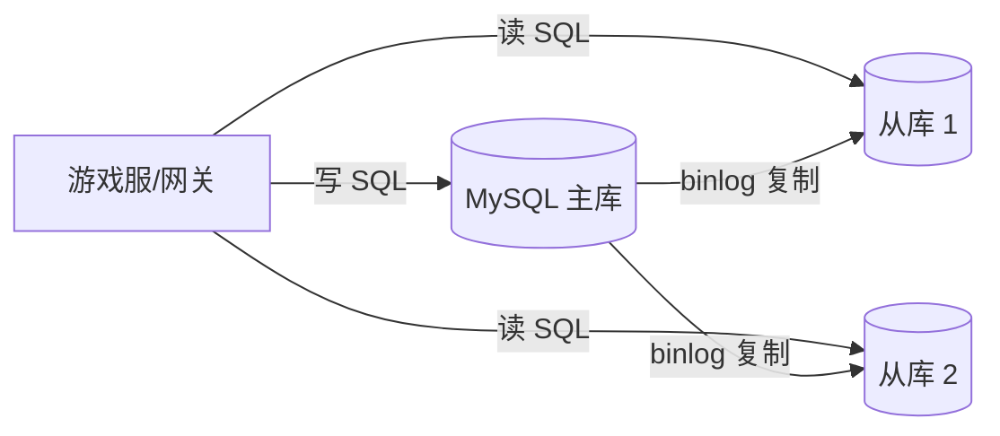
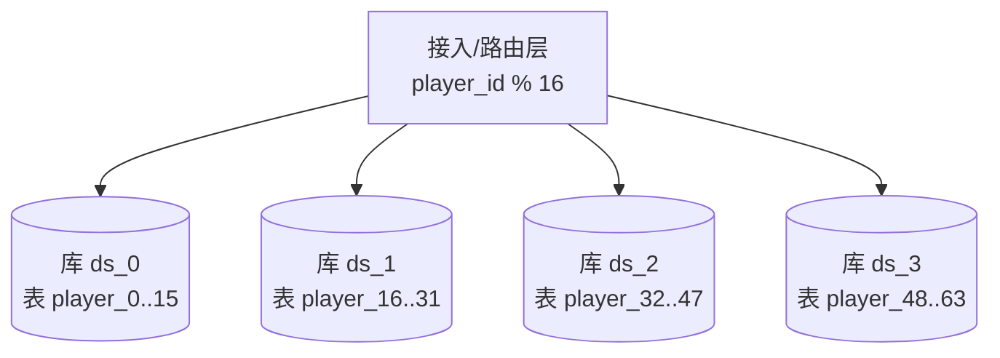
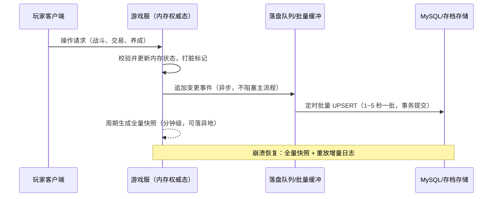

# 01 数据库选型与存储设计

> 知识成熟度：L2（本轮审计修订时补标）。

> 知识基线：实时游戏服务端通用架构；示例中的语言、数据库、缓存、容器和云平台版本必须以项目部署清单为准。
> 适用范围：覆盖数据/存档、资产流水、读写分离、迁移与恢复路径；不替代网关传输、玩法规则或运营审批流程。
> 事实边界：协议规范、组件行为和示例方案分开；容量数字只作示意/经验值，必须通过压测验证。
> 最后更新：2026-08-06（补齐规范来源、版本边界与工程验收入口）。
> 版本边界：以 2026-08-06 为核对日，不新增不确定的当前组件版本号；数据库、缓存、迁移工具和云平台版本由项目部署清单锁定。
> 参考来源：[PostgreSQL 官方文档](https://www.postgresql.org/docs/)、[Redis 官方文档](https://redis.io/docs/latest/)、[OpenTelemetry 官方文档](https://opentelemetry.io/docs/)。

### P0 数据证据与恢复验收

- 一致性分级是方案取舍：货币、道具和订单通常要求数据库事务、唯一约束或条件更新；排行榜、在线态和日志可以采用缓存/异步读模型，但必须声明允许的陈旧窗口和回源规则。
- 迁移验收采用版本化、可审查、可回滚的 expand/contract 流程：先验证新旧代码兼容，再执行数据回填和约束收紧；不能把 ORM 自动建表或一次性 DDL 当作生产迁移证据。
- 备份恢复验收不以“有备份文件”为终点，必须记录 RPO/RTO、恢复到隔离环境的结果、行数/校验和/流水连续性和恢复后读写检查；具体目标由项目清单与业务等级锁定。
- PostgreSQL、Redis 和可观测性组件的行为以官方文档和部署清单为准；一致性、迁移、备份恢复的结论是方案选择，不是对所有游戏都成立的绝对规则。

> 玩家数据是游戏服务端的"资产"：选对存储引擎、设计好存档表、保障读写性能与数据可靠性，是数据层与业务层的根基。

## 本次修订与历史身份（2026-10-07）

上方的2026-08-06日期、前言和元数据是原有记录，保留其历史身份；本次实际修订日期为 **2026-10-07**。2026-08-04已有完整文章，2026-08-06又补入规范来源、版本边界与工程验收前言。本次承接这些贡献，重写下面A1–A16的有效教学内容；文末另保留原主体全文供对照。取得并比较过的两份历史文件，其“1. 概述”至原关联阅读之前的主体与本次before相同；这不代表逐次核过中间所有历史修改。

本文的主线是：**五类操作与不变量 → schema和索引 → 本地事务及读视图 → 副本与分片 → 兼容迁移 → 存档接受、关闭和恢复**。产品资料、本文定义的设计模型、将来部署验收分开阅读。MySQL 8.4、MongoDB 8.0是此次选读的版本系列网页；mysql-8.4.6与Redis 7.2.4是选读源码的tag，未解析为上游commit。来源范围见A16。

文中的SQL、配置接线、Go风格示意与P0–P10均为 **PAPER_EXPECTED（纸面输入与预期）**，不是已运行结果。本次只做文档静态核验，没有连接数据库、执行SQL、运行driver、编译程序、启动容器或进行故障、权限、隔离、压力、性能实验。Comparison、L2和verified空列表保持原值。

## A1 从五类游戏操作决定数据责任

“玩家数据是资产”的含义，首先是每次成功响应都应有可以追问的依据。登录时展示过一个旧称号，与扣款后没有发道具，后果完全不同。不能先把数据库按“快、可靠、灵活”排队，再让所有业务迁就同一种写法。

下面贯穿同一款游戏：玩家登录，花30金币购买一个道具，领取邮件附件，查看赛季排行，运营按活动汇总充值。这里的30是算例输入，不是额度建议。

| 操作 | 身份与更新对象 | 必须守住的不变量和事务边界 | 可接受的读取/响应 | 恢复依据 |
| --- | --- | --- | --- | --- |
| 登录读档 | account_id找到player_id；读取Player、Wallet、Inventory、外观/任务片段 | 身份关系正确；需要一致画面时，多表来自可说明的同一读视图；切换写者须另核owner_epoch | 装饰显示可按产品约定陈旧；“可花余额”不能把旧显示当授权 | 已提交记录与已确认存档代；不能用未落盘缓存覆盖它 |
| 购买与背包 | 请求R、参数绑定D、业务效果键；Wallet、Ledger、Inventory、RequestResult | 扣款、唯一发放与原终态在同一个真实本地事务；余额/数量不负、不溢出 | 成功表示整个业务效果提交；等待超时仍可能UNKNOWN | 数据库业务记录、原请求结果；对外支付另需对账 |
| 邮件领取 | (player_id,mail_id)领取效果；Claim、资产、原结果 | 有效期内最多一次效果；阅读不等于领取；默认经济领取材料与资产同库 | 已领可返回原结果；过期按业务时间拒绝，不等TTL删除 | Claim、Ledger、Inventory；跨产品邮件投影不是唯一经济凭证 |
| 赛季排行 | (season_id,player_id)派生分数和版本/截止水位 | 赛季、排序与更新规则明确；用于结算时冻结结算切点和权威输入 | 可标注刷新水位的陈旧读模型；展示成功不表示奖励已结算 | 权威分数/事件与可重建规则，详见文末缓存排行导航 |
| 运营数据 | event_id、活动、玩家、币种、金额和发生时间 | 去重、迟到、冲正及截止窗口明确；承担财务结算时提升为受控事实 | 普通观察可容忍已声明的迟到/丢失；不能据此直接确认账本 | 事件源、账单、汇总定义与数据完整水位 |

这张表也决定事务落点。本例把钱包、约束背包、领取效果与经济流水放在MySQL/InnoDB；可重建排行榜放在Redis；适合文档聚合的运营数据可以放在MongoDB。不是“MongoDB不能事务”，而是减少本例经济操作跨产品的事务域。聊天、会话、计数和配置还应分别说明保存价值；不能因它们叫日志或缓存便默认可以丢。

工作负载用操作拆解：活跃玩家数×每玩家操作频次×每操作读写次数，再考虑峰值系数、热点集中度、行/索引字节、复制与备份开销。记录端到端p95/p99、失败预算和连接池排队，不只比较平均SQL时间。游戏未必“读多写少”；战斗存档、活动抢购、离线分析的读写分布可以完全不同。玩家增长也不代表容量和负载严格线性增长。达到瓶颈后按A14诊断，再决定A7的分片成本；本文没有产品通用QPS排名或“几千万行必分表”阈值。

**P0 · PAPER_EXPECTED：按访问粒度选聚合。** 假定player17的profile有界8KB、每次登录整体读，bag有10,000条且常按(item_id,binding_kind)扣减一条。先列出profile整体替换、stack单项数量约束、钱包按币种扣款；于是外观用PlayerFragment、背包用InventoryStack/独立装备实例、钱包用Wallet。登录的一致切点由读事务保证，不必把它们合成一大行。小型游戏若背包整体有界且总是整体替换，也可选择JSON聚合。8KB和10,000只是假定输入，不是通用分界；只因“按玩家聚合”就把所有系统塞进一行，会掩盖写入竞争的来源。

## A2 比较数据模型、事务域与运营成本

关系型数据库以表、键和关系组织记录，SQL可表达按键、范围、关联与聚合；KV按key定位值，Redis还提供集合等数据结构；文档数据库把有层次的字段聚为文档。模型决定常见访问的表达方式，并不单独决定可靠性或性能。PostgreSQL是另一关系型候选，本篇不展开第四套产品教程。

| 决策维度 | MySQL / InnoDB | Redis | MongoDB |
| --- | --- | --- | --- |
| 本例适配对象 | 钱包、背包约束、领取、流水、请求结果 | 可重建排行、热点配置、会话和计数等各自声明责任的数据 | 有界文档聚合、活动记录和运营数据 |
| 查询模型 | 主键/二级索引、范围、JOIN；需按真实SQL设计索引 | 按key和数据结构访问；额外查询维度常需维护派生结构 | 文档字段查询、索引、聚合；嵌套数组也有尺寸与更新代价 |
| 原子性与事务 | 同一事务域内多记录事务、约束和条件更新；不自动包住另一个独立库或产品 | 单条命令及适用的事务/脚本有自己的原子边界；集群多key须核槽约束，不能推出全局事务或失败回滚合同 | 单文档更新原子；支持副本集及分片集群多文档事务，不能笼统标为“事务弱” |
| 读隔离和确认 | A5的隔离与读视图、A6复制确认、A10持久配置 | 缓存/派生读应带版本或水位；原子执行不等于持久或故障切换后保留 | readConcern、事务级writeConcern、部署条件共同决定读取和提交保证 |
| 演进 | 独立列和JSON都需要读写兼容；DDL有算法/锁限制 | value编码、key命名、旧消费者仍需兼容 | flexible schema允许不同字段，但验证器与新旧读写者合同仍需演进 |
| 容量与恢复成本 | 行、索引、事务日志、备份、副本；分片增加路由和恢复责任 | 内存与持久化/副本开销；重建期间容量与降级也要预算 | 文档、索引、复制、分片和备份开销；跨文档事务有额外成本 |

MongoDB 8.0资料明确支持上述多文档事务；一个updateMany的各文档更新各自原子，不因此获得整条操作的跨文档原子性。事务中snapshot读关注与提交时majority写关注的搭配支持相应的多数提交快照；分片上的majority读本身不等于跨片同一快照，w:1提交还可能在故障切换中回滚。副本集/分片拓扑、仲裁者和存储配置有约束，应用须按真实部署核对，本文未验证任何MongoDB部署。[S15、S22]

InnoDB在选读的MySQL 8.4中是默认引擎，提供事务、行级锁、外键和一致性非锁定读。MyISAM是非事务引擎，表锁是其重要区别，不能仅凭表小就替代经济记录的事务需求。RocksDB/LSM属于另一机制路线；MyRocks、TiKV与MySQL内置引擎不应混作一个产品。读放大、写放大、空间放大和后台整理互相取舍，不能从“LSM”推出所有负载下写放大更低；页、日志、MVCC、LSM的展开见A16存储引擎主责链接。[S03]

Redis的RDB快照、AOF追加和AOF重写可以帮助理解“恢复基线＋后续变化”，但它们与MySQL binlog、业务事件日志并非可互换格式。选RDB/AOF、何时刷盘、备份哪一节点，都要根据故障域与恢复目标决定；“AOF＋重写”或“从库持久化”本身不能保证每个业务成功都可恢复。可重建数据还应保留重建所需的权威输入。

## A3 schema：玩家聚合与细粒度记录如何相接

先画清更新集合，再定记录边界。聚合减少一次读档的拼装成本，却可能放大每次保存的字节、锁竞争和旧快照覆盖面；规范化便于约束与单项查询，却要求把多表事务和读切点设计完整。本例采用以下**逻辑schema**，不是已执行DDL；表名与字段大小写在后续示例保持一致。

| 记录 | 键与关键字段 | 责任及访问路径 |
| --- | --- | --- |
| Player | 主键player_id；account_id、server_id、name、level、exp、version、owner_epoch、incarnation、created_at、updated_at；account_id查询索引 | 账号找角色，角色身份/等级。version只管这条记录的条件更新；owner_epoch是接管写权，incarnation区分重建后的身份世代 |
| Wallet | 唯一键(player_id,currency)；整数balance、version | gold/diamond分别映射为币种记录；频繁扣款不覆盖外观JSON。多币种共同原子操作仍在一个事务内并规定锁顺序 |
| InventoryStack | 唯一键(player_id,item_id,binding_kind)；qty、version | 堆叠数量增减；binding_kind避免绑定与非绑定物品混合。独立装备用另表item_instance_id，不能按item_id合并 |
| PlayerFragment | 唯一键(player_id,fragment_kind)；incarnation、owner_epoch、schema_version、save_generation、有界JSON payload | profile对应外观，quest对应任务；只有可整体替换、可验限、同一逻辑写者的数据才进合并快照 |
| Ledger | effect_key唯一；player_id、currency、delta、关联请求、发生时间 | 经济效果流水；和钱包/背包同事务，不能靠异步普通埋点代替 |
| Claim | (player_id,mail_id)唯一；奖励定义绑定、原领取结果 | 一次性领取效果。默认经济资格/有效期材料也在这个本地事务可权威检查的范围 |
| RequestResult | R唯一，R=(player_id,operation,request_id)；D参数绑定、原终态与结果 | 与经济效果同事务，识别“同一请求重来”与“同一key被换参数”；保留窗沿用分布式事务篇 |

Player的account查询索引服务登录，不自动约束“每账号只能一个角色”。昵称长度、Unicode/utf8mb4、collation、大小写和重音等值规则、是否服内唯一、改名流程均由产品确定；本例不默认全局昵称唯一。created_at与updated_at记录创建/更新时间，不能拿墙钟更新时间替代并发版本或恢复序号。server_id是所在服；合服/转服时可能改变，所以不自动当永久路由身份。

金额继续使用明确币种的整数最小单位，例如金币整数、充值金额分；在入口与存储合同中统一类型、正负含义和上下界。购买先确认cost>0、配置价格及币种匹配，扣减前检查余额，累加前检查溢出。UNSIGNED只限制表示范围，不能代替价格合法性与加法上限校验。背包qty也有容量、最大堆叠和装备唯一性约束。不要让业务金额跨JavaScript/JSON时先变成有精度损失的浮点数。

原一行玩家模型中的字段都有去处：name/level/exp/account/server/时间仍在Player；gold/diamond移至Wallet；profile/quest按片段；bag按单项访问选择stack/instance或有界JSON。若选择原来的单行模型，则它是另一份完整schema，必须接受该行的竞争与写放大，不能一边拆出Wallet，一边仍在默认Player查询gold。

JSON的灵活在于表示，并不免除schema。每片保存schema_version、大小/深度/元素数上限，定义缺字段默认和未知字段保存策略。旧代码反序列化后只写回认识的字段，可能删除新版本增加的任务信息；此时须做兼容字段级更新或禁止该旧写者，不得全量覆盖。数据归档也按责任执行：把长期不活跃的战报或历史片段迁入归档/对象存储时，保留player_id、格式、内容校验、访问授权、引用与恢复窗；经济查询和在线重返必须有明确回源路径，不能仅按“N天未登录”删除唯一恢复材料。

## A4 从真实查询推导索引，分清主键、分区与分片

下面是默认拆表schema的排行榜候选读取，SQL只用于纸面分析：

~~~sql
-- PAPER_EXPECTED：Player没有gold列；尚未运行EXPLAIN
SELECT player_id, level
  FROM Player
 WHERE server_id = ? AND level > ?
 ORDER BY level DESC, player_id DESC
 LIMIT ?;
~~~

候选索引(server_id,level,player_id)让server_id等值前缀先缩小范围，再按level与稳定的player_id排序键讨论范围扫描和取前N条。player_id解决同等级下的确定排序；跨页还要约定游标、插入/升级期间的切点，不能把稳定排序误当多次查询天然一致。两个投影列都在这个候选索引中，具有覆盖读取的条件；实际是否选它、扫描多少行，仍由真实统计与计划决定。[S04–S06]

要显示余额时，对选出的player_id和明确currency从Wallet联读或批量按键取balance。Player的覆盖索引只覆盖那两个投影，**没有覆盖Wallet的读取**。若要求“等级与余额来自同一数据库切点”，把这些普通一致性读取放进同一适当读事务/视图；若允许异步展示，分别标明其水位。已有旧RR快照不能满足另一个要求当前余额的接口，见A5/A6。

**独立单表备选。** 若另一个方案确实把gold保存在player行内，原SELECT player_id,gold FROM player WHERE server_id=1 AND level>50 ORDER BY level DESC才可讨论同表索引是否包含gold。为覆盖而把经常更新的余额放入二级索引，会增加索引空间和每次扣款的维护成本。这个备选不能与上面的Wallet模型拼成一套DDL。

InnoDB聚簇索引保存行数据，二级索引记录含主键列；主键越长，多个二级索引也跟着变大。这是为何不能只看“主键多带一列方便查询”。本例Player用player_id主键；原(server_id,player_id)可以是另一索引布局，但它只规定该表的排序/唯一关系，**不会创建物理分片**。[S04]

| 观察项 | 应问的问题 | 不能直接下的结论 |
| --- | --- | --- |
| EXPLAIN的type | 点查、范围、全索引或全表扫描分别访问多大集合？ | ref永远优于range，或ALL一律错误；小表/高命中比例全扫可能合理 |
| key | 优化器最终选择哪条索引？是否符合谓词、排序与投影？ | key非空就完成优化，或possible_keys就是实际采用 |
| rows | 估计行数与分布、过滤比例、JOIN乘积相符吗？ | 估计等于实测，或单独把最小rows当总成本最优 |
| Extra | filesort/temporary为哪种排序或聚合服务，规模多大？ | 看到这些字样便证明慢；filesort也不等于已发生磁盘溢出 |

联合索引的最左前缀解释的是常规lookup能利用哪些前导列。缺server_id不代表绝不会访问该索引：优化器可能做覆盖索引全扫描；MySQL 8.4在单表、投影在索引内等条件下还支持skip scan。列顺序要一起考虑等值、范围、排序/分组、覆盖、写入频度和实际分布，不能只按“选择性最高放最左”排序。[S05、S06]

函数和转换也要具体分析。按年份筛created_at时，可讨论同一时区语义的半开时间范围，而不是对每行执行YEAR后期待原列索引自动完成同样的范围定位；前导%的LIKE通常不能利用B-tree的前缀范围；数字列与字符串字面量'123'比较不是“索引必失效”的充分例子。选读文档给的明确反例是**字符串列与数字比较**，多种字符串可转成同一数字，不能靠该字符串索引直接快速定位。绑定参数应与列类型一致。[S07]

JSON路径可通过**有类型的生成列**建立二级索引；先规定缺值、非法值、长度和collation，再决定生成列类型。字符串路径还要处理JSON解引号语义。频繁过滤/排序的业务字段也可直接独立成列，按A9迁移。本篇不把未执行的表达式索引片段当生产模板。[S20]

单机PARTITION BY、同实例多表、跨实例分片是三件事。MySQL 8.4分区表的每个唯一键必须包含分区表达式使用的所有列；若真按server_id分区，原来独立的UNIQUE(player_id)不能原样照搬。反过来，在多个独立shard各建UNIQUE也只约束各自库内，并不会产生全局唯一性。键的生成与路由分别在A8/A7解决。[S10]

## A5 本地事务、隔离与购买原终态

InnoDB的默认隔离级别是 **REPEATABLE READ（RR）**，不是READ COMMITTED（RC）。MySQL 8.4手册与mysql-8.4.6 tag中transaction_isolation的默认值相符；这只能说明产品默认，不能证明项目连接池或会话没有改过设置。MVCC用版本与undo支持一致性非锁定读，写入和锁定读则有锁与冲突规则。[S01、S02]

| 级别 | 本篇使用的读取语义 | 业务决策边界 |
| --- | --- | --- |
| READ UNCOMMITTED | 普通SELECT非锁定且允许不一致/脏读，可能看到稍后回滚的数据；不承诺每次一定读到哪一个中间值 | 本例不用它判断可用余额、背包、领奖资格或恢复水位；RU不表示写入不加锁、不冲突 |
| READ COMMITTED | 每次一致性读建立自己的新快照，同事务两次普通SELECT可见不同已提交状态 | 跨语句不变量仍要约束、条件更新或锁定读，第一次读值不是持续有效的授权 |
| REPEATABLE READ | 同一事务的一致性读通常复用首次一致性读建立的快照；本事务自己的写入也影响自身可见内容 | 旧快照不是当前状态；锁定读、UPDATE不能与旧普通SELECT混成一个“最新视图”，快照稳定也不自动实现所有业务规则 |
| SERIALIZABLE | InnoDB在关闭autocommit时将普通SELECT隐式转成FOR SHARE；autocommit开启的单条只读SELECT可按一致性非锁定读串行化 | 不能声称每个SELECT都阻塞其他事务；锁/并发代价需测量，死锁和失败处理仍不可省 |

购买意图用R=(player,operation,request_id)标识，D绑定道具、数量、币种、价格/配置版本等语义参数；effect_key标识这次业务效果。R解决同一请求重试，effect_key防止同一订单通过不同请求入口重复产生效果，version解决旧状态覆盖，三者不能互换。下面是一个**真实连接必须满足的纸面事务合同**，不是driver示例的执行证明：

1. 在固定writer连接开始事务，竞争R的唯一记录；已存在时核D，相同则使用原终态，不同则报告身份冲突。并发重复请求等待/冲突后的恢复按数据库实际事务状态处理，不能盲目继续已失败事务。
2. 对Player的写权记录作事务内锁定检查，核incarnation/owner_epoch；接管者更新同一受保护记录。锁持续到事务结束，保证“检查写权”与资产效果不隔着一个可被接管的空窗。仅踢下线或检查内存token没有这个效果。
3. 校验cost、币种、容量和负载绑定；按固定顺序取得必要记录的锁或执行条件更新。钱包示意如下，:name是讲解用参数占位符，不是某客户端语法认证。

~~~sql
-- PAPER_EXPECTED：位于上述同一事务，expected_version指Wallet.version
UPDATE Wallet
   SET balance = balance - :cost,
       version = version + 1
 WHERE player_id = :pid AND currency = :currency
   AND version = :expected_version
   AND balance >= :cost;
~~~

4. 成功扣款后才写唯一Ledger效果、Inventory变更与RequestResult原成功结果；任何约束失败不得留下一半效果。确切拒绝则保存对应原REJECTED终态，并且没有扣款/道具效果；只有事务提交后才声称已持久保存该拒绝。
5. COMMIT得到确定提交结果才返回可解释的成功/拒绝。若结果丢失，保持UNKNOWN(R,D)，通过足够新且权威的读视图查原结果，而不是换request_id再扣一次。

本例语句每次成功都会增加version，因此affected_rows=0表示没有行满足全部前提，不能仍然发道具。它可能是记录不存在、余额不足、版本冲突；写权失效在事务内fence检查处另行分类。分类时在**同一真实事务内锁定读相应Wallet键**，不能复用先前RR普通SELECT的旧快照。版本变了但余额仍充足，也不能无限重试旧expected_version；应返回选定的冲突终态或在明确预算和重新校验规则下重启完整事务。死锁回滚、无效连接和业务拒绝不是同一种错误。

**P1 · PAPER_EXPECTED：两次不同购买竞争。** 初态balance=100/version=7，R1/D1与R2/D2各花80，都携带expected=7。T1条件写成功，余额变20/8，Ledger、道具和R1原成功结果同事务提交。T2的更新影响0行；它锁定读当前Wallet得到20/8，分类为余额不足，保存R2/D2的原REJECTED(INSUFFICIENT_FUNDS)并提交，没有第二笔资产效果。后来充值也不改变R2的原拒绝；重试R2/D2仍返回它，新购买意图使用新R。不能把这个输入推广成“所有CAS失败都是余额不足”。

**P1-RU · PAPER_EXPECTED（独立初态）。** 只有余额100已提交，T将其改成0但未提交；RU观察者可能读到0。T随后回滚，权威余额仍是100。曾观察到0不是“玩家花掉了100”的事实，不能产生补偿、账本或恢复水位。如果某可丢弃看板选择RU，必须注明可能脏值，且不被经济决策引用。

**P1-READ · PAPER_EXPECTED（另一个独立初态）。** 已提交余额100；R第一次读100，T随后提交70。RC中下一次一致性读的新快照可见70；RR中复用原快照的普通一致性读仍见100，所以它不能证明T未提交。另看SERIALIZABLE：autocommit关闭时普通读的FOR SHARE语义可能与写锁互相等待；开启时的单条只读SELECT不能套同一“必阻塞”结论。这里没有测得等待时长或性能。

**P2 · PAPER_EXPECTED：已提交但响应丢失。** 初态balance=100，R/D和effect=buy/order42均不存在；数据库已同事务提交余额70、Ledger(-30)、道具和SUCCESS(order42,balance_after=70)，COMMIT响应却丢失。调用方先记UNKNOWN，在权威新读视图中按同R/D查到匹配原终态后返回它，不再扣款、不另抽奖励、不换订单身份。这个结果是原请求当时的balance_after，不假装是当前余额；当前余额另按A6查询。

P2的两个边界：若原事务仍可能提交，查不到R不证明没发生，仍为UNKNOWN；若已确知原事务回滚且旧调用实际结束，可在预算内用同R/D重新仲裁整个事务，但仍要面对另一个同R胜者。COMMIT超时、取消、断线都不能独自证明服务器已回滚。业务结果已查询清楚也不证明旧调用/回调不再访问资源，资源责任见A11。上述复用承诺仅限约定保留窗内身份与原结果仍在；回收后不能凭空重建原终态，更不因此获准重复效果。身份、保留与跨服务履约详见[分布式事务与最终一致性](04-分布式事务与最终一致性.md)第2、3、12节和[幂等重试与消息语义](03-幂等重试与消息语义.md)。

## A6 用业务读合同选择副本和连接

读写分离把允许陈旧的读分摊到副本，并不会扩展同一个writer的写能力。源端binlog、复制接收、relay log持久、应用事务和读视图是连续但不同的环节；不能把“已经收到”画成“已经可读”，也不能假定现代复制永远只有一个SQL线程顺序回放。

~~~text
PAPER_EXPECTED：业务接口先声明要求
TRANSACTIONAL_WRITE ──固定writer连接── 读条件 / 写效果 / COMMIT
AUTHORITATIVE_CURRENT_READ ──权威节点＋满足要求的新读视图/屏障
BOUNDED_STALE_READ ──满足业务水位的副本或派生视图
ANALYTICS_READ ──带截止水位的汇总/分析数据

复制链：源端事务/日志 → 副本接收 → relay log持久 → 应用 → 相应视图可读
~~~

| 接口合同 | 默认路由与连接边界 | 不满足时的动作 |
| --- | --- | --- |
| TRANSACTIONAL_WRITE | 购买/领奖内所有读写、锁定读、会话依赖都固定同一writer事务连接 | 无法保持连接/事务身份则事务合同不成立，不拆给读组补救 |
| AUTHORITATIVE_CURRENT_READ | 权威源及符合调用要求的当前读视图；不复用旧长事务快照 | 不能取得新鲜结果时返回待查询/不可用，不伪装最新余额 |
| BOUNDED_STALE_READ | 明确最大陈旧条件与可判断的版本/时间水位；副本或派生视图 | 超界或水位未知时按预算回源、降级标旧或拒绝；“有行”不是水位 |
| ANALYTICS_READ | 离线汇总或隔离的分析存储，并说明事件截止与完整性 | 未到齐数据不得成为最终结算依据 |

“写后粘主1–2秒”只能是流量启发式，经过这个时间不证明副本应用追上；副本返回一个旧余额更不是cache miss。若使用复制位置等待，需核实际版本、源/通道/连接身份和等待返回含义；本文不补一个未核过的GTID API。走writer也必须重新满足读视图要求，旧RR快照不会因为节点名正确自动刷新。

**P3 · PAPER_EXPECTED：旧副本有行。** writer已是70/v8，replica仍是100/v7，接收可能到v8而应用未到，写后已2.1秒。当前余额接口声明AUTHORITATIVE_CURRENT_READ，既不能用“2秒过去”，也不能用“查到行”接受100/v7；默认转向writer并取得满足合同的新读视图。允许陈旧的显示可展示副本值及水位，但随后的购买必须重新执行A5的经济校验。

半同步也须沿这条链分析。MySQL 8.4选读中，副本在事务事件写入relay log并刷盘后确认；ACK不要求事件已应用，源端等待的副本数量可配置。只有半同步实际启用且本次未回退，才谈这个ACK边界；超时会转回异步，并非自动让业务提交失败。AFTER_SYNC在源binlog同步后、引擎提交前等待，AFTER_COMMIT在引擎提交后等待，其他读者可见时序因此不同。故障切换还要选持有所需日志且能完成恢复的副本，不能承诺任意副本新鲜或“半同步保证存档不丢”。[S11、S21]

例如等待副本ACK超时后业务仍按异步路径提交，随后源端故障且被提升副本没有该事务，此时“配置里开启过半同步”并不能补回丢失事实。这是资料边界下的反例推理，不是本次故障实验。

ProxySQL、ShardingSphere-Proxy可承担接线，但应先有上表业务合同。原历史规则^SELECT .*会把SELECT ... FOR UPDATE也匹配进读组，其注释没有实现排除；事务中普通SELECT、会话语句等也不能靠首词安全分类。只加一条负向正则不证明所有SQL语义都已覆盖。本次ProxySQL官方页两次返回Internal Error，保留这个来源缺口，不提供声称可部署的新代理配置。

## A7 分片、共置、路由与迁移切点

分片键回答“一条记录送到哪里”，主键回答“在某个表内如何标识它”，事务边界回答“哪些效果一起提交”。先垂直拆业务或冷热字段可以减少无关竞争；水平拆分把行分到多张表或多个实例。它们是不同手段，选择顺序应来自瓶颈证据，不是必须先垂直再水平的配方。

以player_id路由容易共置玩家钱包与背包，却不会消除公会、世界拍卖行或单个大玩家的热点；以server_id路由便于区服管理，却承担合服/转服和新区集中写入。要让Player、Wallet、Inventory、Claim共置，必须同时相同路由函数、桶布局、路由epoch和实际目标，只有字段同名不够。广播配置表要带配置版本和一致发布规则，不能各分片更新各自理解的价格。

| 路由选择 | 收益 | 成本与条件 |
| --- | --- | --- |
| 整数取模/哈希后取模 | 可计算、通常易分散key | 模数变化可能搬动大量key；翻倍迁移比例依赖模型和分布，不能当所有产品保证 |
| 范围 | 时间/编号范围易归档和区间查询 | 新数据可能集中到同一范围，拆范围与热点治理要配套 |
| 一致性哈希/目录映射 | 可控制扩容时的目标映射变化 | 均衡取决于节点/虚拟节点/权重或目录管理；复制及唯一写权仍需另外保证 |

Redis Cluster使用 **16,384个hash slots**，通常为CRC16(key) mod 16384，合法hash tag会改变取hash的key片段；这不是把节点放到一致性哈希环的同一种机制。同槽有助于多key操作的放置条件，但不表示MySQL与Redis共享事务。[S23、S24]

### A7.1 四库各十六表的闭合纸面路由

本文选择**全局表后缀0..63**，只给一套可手算的模型：

~~~text
PAPER_EXPECTED，player_id为本模型的非负整数
bucket = player_id mod 64
database = floor(bucket / 16)
table = "player_" + bucket

bucket  0..15 → ds_0.player_0..15
bucket 16..31 → ds_1.player_16..31
bucket 32..47 → ds_2.player_32..47
bucket 48..63 → ds_3.player_48..63
~~~

**P4 · PAPER_EXPECTED：** p=0→ds_0.player_0；15→ds_0.player_15；16→ds_1.player_16；63→ds_3.player_63；64→ds_0.player_0。64个桶的每个整数都恰有一个库/表组合，是本公式的纸面结果，没有运行路由程序。若另选每库局部后缀0..15，表公式应改为bucket mod 16；不能把局部后缀的YAML接到全局后缀图上。

这也不证明ShardingSphere的HASH_MOD对整数/字符串按这个公式输出。5.5.2选读把HASH_MOD列为自动分片算法，需autoTables规则；显式table/database策略应选择该配置形态支持的算法。本次没有加载配置或认证产品组合。[S19]

| ShardingSphere接线检查项 | 在项目中必须补齐的事实 |
| --- | --- |
| actualDataNodes | 真正存在的逻辑数据源和表集合，与局部/全局后缀约定一致 |
| databaseStrategy与tableStrategy | 库和表分别怎样路由，整数类型/哈希算法与缺分片键SQL如何处理 |
| autoTables / 显式策略 | 与所用算法类别相容，不能把HASH_MOD片段随意塞进另一形态 |
| 绑定/关联表 | 每张关联表路由、布局、epoch相同，JOIN是否确实同片 |
| 读写逻辑数据源 | ds_0..ds_3每组均对应自己的writer/readers；只定义ds_0不构成四库读写组 |
| 事务与读合同 | 路由组件如何保持A5/A6的连接、事务和权威读取条件 |

原片段只有tableStrategy、sharding-count:64、每库0..15和ds_0读写组，不能据此推导正确的4×16路由；把它保留作对照，是为了学会找缺失接线，而不是照抄上线。

### A7.2 扩容既移动数据，也移动写权

跨片全服查询优先考虑预计算汇总、离线分析，或有明确超时/并发/结果完整预算的fan-out；少一个分片不能悄悄当作空结果。跨玩家写若不能接受中间状态，就不能把补偿称为等价原子事务；2PC/TCC/Saga/Outbox的选择沿用A16主责，不在此扩写框架。

一次有界迁移要保存路由目录/epoch与恢复材料，经历：复制基线及追增量 → 对齐可证明切点 → 在旧接受点冻结/拒绝旧epoch写 → 切换唯一有效路由 → 核对新读写 → 保留回退窗。旧epoch5的在途写如果还可被旧库接受，仅把路由改为epoch6不安全；未获得fence和一致切点时应停在准备态。新库接受了切换后的写，再把路由改回旧库不等于无损回滚，还需要反向增量或冲突处理依据。迁移检查点不能只记“复制最大ID”，还要保证该范围完整与后续增量连续。

## A8 全局ID的组成与失败边界

雪花类ID常用41位相对毫秒时间、10位机器号、12位序列的教学布局。位宽给的是编码容量：同毫秒序列0..4095、机器号0..1023、时间0..2^41−1；它不自动保证全局唯一。机器号必须在相关时间域独占，生成操作须串行同步，重启必须恢复/避开已发high-water，时间回退和超位必须处理。机器号租约过期时旧进程仍可能发号，租约记录不能单独fence住它。

~~~text
PAPER_EXPECTED：可失败的NextID合同，不是可编译实现
前提：独占机器身份已核；保留记录涵盖已发及所有可能已成功的预留
恢复初始化（同一生成器开放前）：
  读得完整、权威的保留时间上界H → 当前运行last=H，seq=4095
  // 保守放弃H这一毫秒剩余序号，不把重启当作seq=0的新开端
  只有权威证明该机器/epoch域从未预留过ID时，才用last=-1、seq=4095
  记录缺失、损坏、尚有未解析预留或机器独占不明 → 停止发号
在生成器同步区，每次重新读取相对epoch的毫秒now并检查当前运行状态：
  身份不明确、时间超位、now < last → 拒绝发号，不落入序号分支
  now == last且seq已到4095 → 有界等待或失败；等待后重入本检查
  now > last → candidate_seq=0；否则candidate_seq=seq+1
  candidate=(now,machine_id,candidate_seq)
  先确认candidate的跨重启不复用保留合同已持久成立：
    确定预留失败 → 不发布ID，不把last/seq推进为本次已发布状态
    预留结果未知 → 不发布ID，停止新发号；权威解析并重新恢复后才开放
    预留已确认 → 在同一同步区提交last=now、seq=candidate_seq，再发布ID
  ID = (now << 22) | (machine_id << 12) | candidate_seq
失败路径不自行换机器号，也不无限自旋
~~~

这里的H是恢复初始化输入，last是其后持续更新的运行状态，不能一直拿H比较回退。保留已经确认而发布前崩溃，可以留下未使用的ID；恢复时放弃H毫秒的剩余序号，宁可留空洞也不复用可能已发布的身份。尚未解析的预留不能凭“没返回ID”当作不存在；保留与恢复能力仍是外部必须实现的合同，本篇没有实现该服务。

**P8 · PAPER_EXPECTED：时钟回退。** machine=3恢复H=900，因此last=900、seq=4095。时间到1000，预留确认后提交运行状态(1000,0)并发布；同毫秒下一次确认后提交(1000,1)；时间到1001后同样提交(1001,0)。时钟回到1000时，检查1000<当前last1001直接拒绝，不再形成(1000,1)。旧Go简化代码会因now != last而把seq重置，不能沿用。若在恢复后仍为now=900，则因seq=4095而有限等待或失败，等待后重新检查；不能从seq0重发。运行中同毫秒4095耗尽也走同一有限路径。预留失败/未知都不返回新ID，未知时停止而非尝试复用候选；这不是时钟或发号程序的运行实验。

号段法把分配服务的访问摊到一批ID上，但必须持久、互斥地分配不重叠区间，规定重启和未用完号段如何处理；允许空洞不代表允许复用。选择雪花或号段需要接受各自的时钟/协调/恢复成本，而不是简单写“无中心依赖”。唯一ID也不是不可猜安全令牌、全局提交顺序或业务幂等键。跨语言/JSON边界应保持精确整数身份，例如采用约定的十进制字符串，不能经过浮点截断。

## A9 在线迁移：从兼容写开始，到不再需要旧结构结束

以profile.vip_level从JSON提升为独立列为例：在本例它属于PlayerFragment(fragment_kind=profile)，新增的vip_level与source_version也放在这一记录，source_version专门标识迁移源变化；与save_generation的职责分开。若项目选择提升到Player，则需把双表示的更新纳入同一事务，而不是改名后声称已经原子。

| 阶段 | 具体动作 | 可继续的证据与停止线 |
| --- | --- | --- |
| Expand | 添加可选列和候选索引，规定NULL/缺字段默认、合法类型和值域 | 旧读者还能工作；核目标版本/表特性支持的DDL算法和metadata lock风险 |
| 兼容写 | 同一逻辑更新原子维护JSON旧表示、新列与source_version；盘点在线服务、离线任务和旧发布包 | 所有仍可写入者遵守兼容合同；无法限制旧写者时旧表示继续权威，不能先切读 |
| 回填 | 按稳定主键区间分批、限速、记检查点；携带读取时源版本 | 只在版本仍匹配且目标待迁移时写入；冲突重读，异常值隔离，不能用0掩盖转换失败 |
| 核对 | 对照旧/新读、覆盖率、缺值/异常分布；核检查点重启语义 | 行数相同不足以证明字段等价；未解决冲突不宣告整段完成 |
| 切读 | 确认活跃写者维持新格式后逐步切换，保留兼容字段及回退窗 | 若仍有旧写者只更新JSON，新列可能再次过时，必须停止切换 |
| Contract | 旧应用、回滚包、延迟任务、消费者、备份恢复均不再依赖旧结构后才收紧/移除 | 删除旧字段后回滚老程序可能不可行，必须有明确停止线和恢复方案 |

**P5 · PAPER_EXPECTED：回填遇到旧写者。** 初态JSON vip_level=2/source_version=10，新列NULL；回填读到(2,v10)。旧应用随后写3并把源版本升11。回填只允许在源版本仍10且目标待迁移时写2，因此条件失败，不推进该记录的成功检查点；重读(3,v11)后再条件写。直到所有活跃写者维护双表示，才能切读。无条件写2会把新读路径拉回旧状态；“回填跑完”不是兼容写成立的证据。

JSON旧写者丢未知字段，是另一种同源风险：新版本增加字段后，旧版本全量重写并删掉它，即使SQL表结构完全没变也破坏兼容。必须保留未知字段或改用已验证的局部更新；做不到则限制旧写者，不能进入contract。MongoDB的flexible schema也需要类似的读者、写者、验证器和数据回填计划。[S18]

MySQL 8.4的INSTANT加列有操作组合、行格式、表类型、列数/行版本等条件，并非任意ALTER都只改元数据；online DDL仍需metadata lock，长事务可能让它等待，等待的独占锁又会阻塞后续事务。“低峰执行”不能证明锁等待有界。[S08、S09] ORM可以生成可审查的迁移；Flyway、Liquibase或自研脚本也只是载体。问题是未经版本化、评审与兼容验证的自动变更，不是某品牌天然不能生产使用。

## A10 区分经济提交与非经济存档的接受点

经济事实以A5的数据库事务结果为接受点：Wallet、Ledger、Inventory/Claim和原结果一起提交，内存是已提交事实的工作副本。不能先回复“充值成功”，再指望3秒定时保存把唯一经济事实补上。每次经济写的成本可能很高，但优化应减少不必要读写、缩短事务、设计合适索引，不应删掉其原子和持久责任。

非关键任务进度、外观或可容忍回退的战斗片段，可以按业务批准的语义先在内存接纳再合批。但响应须区分“本局已接纳”和“恢复后保证存在”。立即存每次变化会增大写入和竞争，全部拖到下线又扩大损失；折中来自**哪些状态可合并、何时接受、谁负责保存**，而非一个固定timer。

~~~text
PAPER_EXPECTED
经济请求 → 本地事务效果＋原终态 → 可说明的COMMIT结果 → 对外成功
非经济修改 → 接纳前容量/快照校验 → 原子发布内存状态＋pending
           → 合并完整快照 → 实际保存 → 权威确认confirmed
需要接受后可恢复的非经济修改 → 另定义耐久journal接受点 → 才承诺可恢复
~~~

内存队列叫“WAL”不会变耐久。真正的write-ahead合同要求在依赖该记录的业务接受之前，日志已达到指定持久边界，并能按格式、序号、身份恢复。InnoDB redo管引擎崩溃恢复，MySQL binlog管复制/增量恢复相关记录，业务事件日志管业务重放，Redis AOF管Redis命令/数据恢复；它们不能直接混成同一条可重放流。先选恢复对象，再选记录与切点。

MySQL 8.4选读中，innodb_flush_log_at_trx_commit=1在提交时写并刷日志，0/2的周期刷盘存在调度偏差；sync_binlog=1与redo刷盘配置承担不同日志责任。即使采用资料建议的组合，OS/设备是否诚实完成flush、备份故障域和故障切换选点仍是前提。本次没有观察项目设置，不能据此声称零丢失。[S12、S13]

timer=3s不证明RPO≤3s：排队、长I/O、进程暂停、重试和持久层行为都会扩大未确认窗口。下线flush返回、context取消或一次等待结束，也不自动证明已提交或没有后台访问。下线和服务关闭都要落到A11的真实保存/资源合同；只能报告实际确认的代和未完成责任。RPO是可恢复数据损失目标，RTO是恢复耗时目标，应由业务确定并另行演练验证，不能用一张定时器配置直接生成SLA。

## A11 异步存档：接受、确认与资源静默是不同事实

本节是一个**有限纸面模型**，只保存可整体替换的非经济完整状态，不处理必须逐事件保留的账本/奖励增量。它要求每个(player,incarnation)有唯一逻辑写者、单调save_generation、不可变快照，以及每玩家最多一个实际在途写。多进程接管还需存储接受点核owner_epoch；本地mutex或踢掉旧连接不能撤销已经发出的旧写。

### A11.1 所有权与接纳门

唯一责任者是 **SaveCoordinator**。服务宿主持有它的真实所有权，它持有：

- 当前latest_generation与已证实的confirmed_generation；latest不等于持久水位
- pending的完整不可变快照，身份为(player,incarnation,owner_epoch,g,payload_binding)
- active实际写记录，包含write_id、上述身份/负载绑定、独立快照所有权、查询身份、真实槽以及全部仍会被driver/回调访问的依赖
- OPEN/DRAINING/CLOSED入口状态、close_cut与有限排空预算；close调用栈不拥有这些跨返回责任

接纳必须先解决失败路径。在入口门内确认OPEN、当前版本与预算，为新完整快照和记录预留受限容量，构造并校验不可变候选；再次核对所依据版本后，才把玩家状态变化、latest=g+1、pending=S(g+1) **一起原子发布**为已接纳。若构造在门外进行，重入门后的版本核对不可省。预留、构造或校验失败，本次修改不生效、不回复已接纳，旧dirty、pending和active不变。不能先改Player再调用可能容量失败的MarkDirty。

替换旧pending只在新快照已有容量、是包含之前全部已接纳非经济变化的完整状态时允许；事件/增量不能这样合并。active必须独立保有S10，pending换成S11不能为腾空间销毁S10。tick只触发一次有预算的调度，不交换map后遗忘保存失败的批次。使用裸Player指针不能证明保存期间看到同一个版本；快照应在保护下复制，后续修改不改变它。

本节的Sg可以包含A3中选定的多种非经济片段。其完整状态和接受元数据必须属于同一个可证明的原子接受域，不能把逐行写完其中一个PlayerFragment就称为全体g已确认。这里规定目标接口所需合同，不声称某个现成单条UPDATE或driver已经实现它。

### A11.2 业务结果轴与资源生命周期轴

每个W的业务轴为UNRESOLVED/UNKNOWN/COMMITTED/KNOWN_ROLLBACK，资源轴为“仍可能工作/访问”和“实际工作结束且回调静默”。这两轴独立，不能压成一个done布尔。权威查询可确认提交，但不终止旧driver；回调静默可结束内存访问，却不自动证明业务回滚。静默证据必须覆盖实际工作和全部相关回调已经退出、不会再次访问依赖；“收到某个回调”或取消返回不是这个证据。

| 观察状态 | 业务责任与所有者 | 允许推进什么；哪些仍禁止 |
| --- | --- | --- |
| CLEAN(g) | latest=confirmed=g，无待写/未决业务；若仍有active还需分别跟踪寿命 | 无active且静默才能释放资源；CLEAN本身不等于CLOSED |
| DIRTY(g) | Coordinator拥有已接纳pending；容量已经落实 | 取得实际槽并先登记active身份/所有权，再派发；派发前失败保留dirty |
| IN_FLIGHT(g,w) | active独立持有快照与依赖，槽按实际占用计数 | 可以按接纳合同形成更高pending；不能再派另一个实际写 |
| CONFIRMED(g,w) | COMMITTED响应或权威查询已匹配同身份/负载绑定 | 立即推进confirmed至已证实g；仅当pending仍为同代身份时清其登记。active未静默仍持有资源 |
| RETRYABLE(g,w) | 确知未提交，且旧实际工作/回调已静默；无可能晚到的旧尝试 | 有界重试原身份，或写覆盖旧代的更高完整非经济快照；没有新预算不发新尝试 |
| UNKNOWN(g,w) | 原写可能提交；Coordinator保留查询身份、快照及实际依赖 | 权威查询恢复结果；查不到不等于失败；本模型暂停后续保存派发 |
| DRAINING | 入口已关且close_cut冻结；宿主继续持有Coordinator | 只可排空cut内已接纳代，并满足前写结果已解析＋工作/回调已静默＋槽/预算条件 |
| CLOSED | cut内最新完整状态均确认，pending及未决业务责任为空，所有实际工作/回调静默，入口仍封闭 | 才可释放Coordinator的存档依赖；INCOMPLETE不属于此状态 |

“confirmed推进”只描述持久事实，不把物理静默当提交条件；“active释放”只描述资源事实，不因业务确认而提前发生。高代未确认时，旧代成功仅更新自己的确认水位，不能按player_id清空整张dirty表。业务终态的合并也必须单调：COMMITTED或KNOWN_ROLLBACK不被晚到UNKNOWN/未找到降级，同终态重复通知幂等。身份/负载绑定冲突，或同一写收到相矛盾的确证终态，均设置diagnostic_stop并保留证据及合法依赖；不撤销已确认事实、不猜另一个结果，也不继续派后继或进入CLOSED。

~~~text
PAPER_EXPECTED：事件处理示意，不是已实现driver适配器
OnAuthoritativeResult(w, result):
  要求通知关联active登记的write_id、player/incarnation/epoch/g及查询身份
  确证终态还须核持久结果与payload_binding匹配；身份/绑定冲突则诊断停止
  known = business[w]属于{COMMITTED, KNOWN_ROLLBACK}
  若result属于{UNKNOWN, NOT_FOUND}:
    若非known: business[w] = UNKNOWN
    返回 // 已知终态不降级；此次通知返回不代表查询/回调已静默
  若result不属于{COMMITTED, KNOWN_ROLLBACK}: 诊断停止并返回
  若known且result != business[w]:
    diagnostic_stop = true
    保留相矛盾证据及责任，不改business/confirmed/pending，不释放合法依赖
    返回
  若known且result == business[w]: 返回 // 同终态重复通知幂等
  business[w] = result
  若result == COMMITTED:
    confirmed = max(confirmed, w.g)
    若pending.identity == w.snapshot_identity: 清pending登记
    // active仍拥有payload、实际槽、查询身份、被访问的所有依赖
  // KNOWN_ROLLBACK不推进confirmed，也不吞掉pending

OnActualQuiescence(w, evidence):
  仅在实际工作结束且全部相关回调已经退出/不会再访问后标记quiet[w]
  // 此事件不改变business，不清UNKNOWN或diagnostic_stop

MaybeRetireAndDispatch():
  diagnostic_stop存在 → 保留责任并停止，不派后继，不进入CLOSED
  active存在且(业务未解析 或 没有quiet证据) → 保留active，不派下一写
  active已解析且quiet → 才归还其真实槽；按业务结果保留/处理pending责任
  pending存在且(OPEN 或 DRAINING且pending.g<=close_cut)且有限预算/槽足够:
    先登记新active及独立所有权，再发布实际请求
  CLOSED判断独立执行：无诊断阻断、入口关闭、cut状态全确认、无pending/未决、全体实际工作/回调静默
~~~

上述伪代码只展示必须满足的顺序，未提供分配器、查询实现或静默机制。实际实现必须把入口接纳、close_cut冻结、工作登记与这些事件状态变化放在同一个可证明的同步合同内；同步回调也不能先于active所有权登记。仍有查询任务或其回调访问依赖时，同样计入“所有实际工作”，不能只盯写调用。

### A11.3 P6：保存期间再次修改

**P6 · PAPER_EXPECTED。** 初态confirmed=9、latest=10、pending=S10、active空、gate=OPEN，真实槽上限1。

1. 协调者取得槽，登记W10的write_id、身份/负载和S10所有权后才发请求，active=W10。
2. 下一修改先为S11预留容量并构造/核版本，再发布latest=11、pending=S11和玩家新状态；W10仍独立持有S10。若预留/构造失败，新修改未被接纳，latest仍10、旧责任不变。
3. W10的COMMITTED结果及身份/绑定匹配，confirmed推进10。pending为S11不匹配W10，因此保留，latest11>confirmed10仍dirty。若W10尚未静默，槽和依赖仍归active。
4. W10实际工作结束且回调静默，才归还槽；OPEN且预算允许时先登记W11再派发。
5. W11的匹配COMMITTED证实后，confirmed推进11，仅按S11身份清pending；即使已无dirty，activeW11仍保有全部资源直到工作/回调静默。静默后无其他责任，处于CLEAN11。

这个正向轨迹同时允许完整快照合批，并保留保存期间的新变化。反例是旧W10成功后清空新dirty map，或让W11绕过未结束W10，随后被晚到旧写覆盖。

### A11.4 P7：超时、关闭与有限排空

Close首先在与接纳/工作登记协调的入口门内封闭业务入口，OPEN→DRAINING，并冻结close_cut=latest_generation。此后拒绝新修改；DRAINING内部调度只处理cut内已接纳快照，不是重新开放业务入口。关闭预算是等待/新尝试的有限预算，不是销毁仍被访问对象的倒计时。

**P7 · PAPER_EXPECTED。** 沿P6第2步：confirmed9、latest11、pendingS11、activeW10，数据库可能仍处理W10。

1. W10等待超时且无确定提交/回滚、无实际静默证据，业务轴为UNKNOWN，真实槽仍占用；不派W11。
2. Close封入口并冻结cut=11。S10/W10、S11、查询身份和所有实际依赖仍归Coordinator，服务宿主继续持有它。
3. 若预算耗尽，返回 **INCOMPLETE**，维持DRAINING；不再发起新尝试，已在进行的工作继续被跟踪。close调用栈返回不能销毁worker/pool或丢弃未确认dirty。宿主若做不到持续持有，不满足此模型安全关闭前提。
4. 权威查询证实W10的身份/绑定与COMMITTED10相符，可以推进confirmed=10；pendingS11保持。资源轴仍须等待W10真实结束和回调静默。查不到且原写可能提交，仍UNKNOWN；只有静默但结果UNKNOWN也不能判回滚。
5. **正向排空分支：** W10业务结果已解析且实际工作/回调静默，预算仍有余量，或停机控制者在持续持有协调者时明确给了新的有限预算。协调者才释放W10不再使用的槽/S10，保留S11，在DRAINING内先登记W11及其所有权，再派发。W11属于cut=11以内已接纳代。
6. W11的COMMITTED11或权威查询确认身份/绑定匹配时，立即推进confirmed=11，只在pending仍指向同代身份时清登记。**此刻active仍独立持有S11、真实槽、查询身份和全部仍被访问依赖。** 等W11真正结束、所有写/查询工作与回调静默，再核cut内最新完整状态全确认、pending/未决责任为空、入口仍封闭，才CLOSED并释放依赖。
7. **确定回滚分支：** W10已明确未提交且真实工作/回调静默，完整S11包含此前所有已接纳非经济状态，可在相同预算/登记规则下直接作为下一写，不必先重放被覆盖S10。这不适用于经济流水或逐项增量。
8. **停止分支：** W10未解析、缺静默、槽不可用或预算不足，均不派W11；维持INCOMPLETE/DRAINING及所有权。不预言最终必成；未经新有限预算不新增尝试。外部强制终止且g11没有耐久恢复材料时，g11仍可能丢失；已有耐久待办也不能证明当前内存引用可以提前释放。

若Close开始时已CLEAN且无pending、未决、实际工作和回调，则封入口后可直接CLOSED。这是不同初态，不可以把它的成功事件补给上述未决分支。

**P7-LATE · PAPER_EXPECTED：提交确认先到，旧查询的弱观察后到。** 这是P7第6步的有限子轨迹，不引入第二套存档模型。初态gate=DRAINING、cut=latest=11、confirmed=10、pending=S11、active=W11；W10已解析且静默，W11此前按规则派发，查询Q11在提交前读到“未找到”，结果通知尚在途中。

1. W11的确证COMMITTED及身份/负载匹配先到：business=W11的COMMITTED，confirmed推进11，按同代身份清pending。active仍独立持有S11、真实槽、查询身份及包括Q11在内仍被访问的依赖。
2. Q11稍后交回NOT_FOUND/UNKNOWN观察；因为W11已有确证终态，business仍COMMITTED、confirmed仍11，pending保持为空，不倒退为未解析，也不重造待写。Q11通知到达本身不证明该查询和回调已经退出。
3. 再次收到相同COMMITTED通知是幂等重复；不重复推进效果、不清除其他代登记、不据此提前释放active。若初先已确知KNOWN_ROLLBACK，同样不能被晚到弱观察改成UNKNOWN。
4. 待W11和Q11的实际工作及全部相关回调真正静默，才归还实际资源；核cut11已确认、入口仍封闭、无pending/未决/诊断阻断，进入CLOSED。若入口仍OPEN且另有更高已接纳dirty，则仍按原有预算与同代规则调度，不因旧弱观察阻塞已解析前写。
5. 独立冲突分支：若收到同一W11、同绑定的确证KNOWN_ROLLBACK，与已有COMMITTED矛盾，则设置diagnostic_stop，保留两份证据和责任，不撤销confirmed11、不改写原终态、不把已清pending伪装成未提交。即使后来静默，也不能自行继续派发或CLOSED；仍被访问的依赖照常持有，等待外部诊断。这不是把冲突解释成正常重试。

存储接受合同必须具体存在：同一incarnation/owner_epoch、拒绝更旧generation、同代不同负载冲突、同write_id与绑定返回原结果，并有足够的结果保留/权威查询能力。若目标API不能提供这些条件，或无法证明实际完成/回调静默，必须停在“实现前提未满足”，不能宣称本模型可安全运行。单连接与单写者只缩小本进程并发，不提供持久write_id、跨重启原结果、epoch接受检查或接管隔离；它不是等价补齐方案。本轮没有实现万能driver、强取消或保证最终关闭的框架。

## A12 恢复是一条可证明的连续链

先分清恢复对象：数据库崩溃恢复由引擎日志等机制负责；玩家业务恢复可用业务快照加业务日志；整库灾难恢复要用匹配的全量备份与受支持增量/PITR。三者可能协作，但不能把任意“快照文件＋日志文件”直接拼成一个恢复方案。

一份业务快照除payload还需记录完整性校验、schema_version、player/incarnation、业务切点与发布身份。先确认快照完整可解码，再按连续日志和去重/版本规则重放，核对余额、流水、物品及格式，最后才发布新的恢复代。最大见过的序号不是已连续恢复水位；“两个文件都写成功”也不证明它们属于同一个一致切点。

**P9 · PAPER_EXPECTED：缺104的恢复。** S100已完整持久，记录cut100/schema2/incarnationA；日志只有101、102、103、105..108。先验证S100并恢复到100，再核每条身份/序号/效果后应用101..103，连续水位到103。下条为105，发现缺104即停，不对外发布“恢复到108”。向恢复负责人报告已证明到103及缺失材料；之后若找回并核过104，再继续105..108，完整校验和发布条件满足后才改变对外恢复代。

日志回收要晚于恢复基线的持久发布，并确认所有必需消费者、备份与承诺恢复窗不再依赖旧段。新文件出现不代表旧日志可删。本例描述的是合同，没有认证某文件系统的原子发布或某备份工具已经完成这些步骤。

MySQL的时间点恢复通常从全量备份恢复基线，再应用后续变化到目标点；必须核binlog起点、连续性、目标切点和对应实例/版本。[S17] mysqldump与XtraBackup在这里保留为候选工具名，不表示其当前版本、选项、权限、引擎兼容或恢复流程已经验证。每日全量、增量、异地与季度演练可作为初始计划讨论，但频率须由恢复窗、容量和业务损失目标决定。

| 恢复材料/检查 | 应记录什么 | 为什么不足就停止 |
| --- | --- | --- |
| 基线与增量 | 备份身份、版本/配置、schema、日志起点和连续范围 | 错实例、错格式或日志缺口不能靠max序号补足 |
| 可解码与可访问 | 校验、压缩/加密格式、权限及必要密钥的可恢复性 | 有文件但无法读取不构成恢复能力；不在文档里保存秘密正文 |
| 故障域与保留 | 地域/介质故障相关性、窗口、所需旧结构 | 同机副本可能一起损毁；contract和日志删除会截断旧恢复路径 |
| 业务一致 | 行数/校验和、流水连续性、余额/物品核对、原结果和领取唯一性 | SQL能启动不证明玩家资产正确 |
| 恢复发布 | 隔离验证、读写检查、写权/路由切点、批准责任人 | 未核对前不能让旧写者与新恢复代同时接收写 |
| 实际演练 | 起止时刻、恢复点、RPO/RTO、失败与未覆盖条件 | 目标值不是测得结果，备份成功也不是演练成功 |

恢复后的玩家显示还要与已经对外成功的充值、支付/发货记录对账。运营补偿、补发或撤销属于另一个经审查的业务决定；存档层不能见到余额不齐就自动反向扣款或重复发货。

## A13 MongoDB邮件、TTL与运营聚合示例

文档适合把一封邮件的标题、附件和展示字段聚在一起；但本例经济领取的权威资格/奖励绑定、Claim和资产默认留在同一关系库事务域。MongoDB邮件可以是展示投影。若选择MongoDB做权威邮件且资产在MySQL，领取就跨两个事务域，必须按分布式事务篇处理履约状态；不能把insertOne后的另库UPDATE当成一次原子提交。

下面保留三个实际学习用途，均是 **PAPER_EXPECTED，未执行MongoDB命令**：

~~~javascript
// 邮件展示文档；schema_version、Date类型、附件边界需验证
db.mail.insertOne({
  mail_id: "signup-7d-player10001",
  player_id: 10001,
  schema_version: 1,
  title: "七日签到奖励",
  attachments: [{ item_id: 101, count: 10 }, { item_id: 202, count: 1 }],
  expire_at: new Date("2026-09-01T00:00:00Z"),
  read: false
});

// 行为观察数据保留30天的候选TTL；ts须为合法Date
db.behavior.createIndex({ ts: 1 }, { expireAfterSeconds: 2592000 });

// 前提：输入已按event_id去重、amount_minor为精确整数最小单位，窗口已定义
db.recharge.aggregate([
  { $match: { activity_id: "summer2026", currency: "CNY", unit: "fen" } },
  { $group: { _id: "$player_id", total_minor: { $sum: "$amount_minor" } } },
  { $sort: { total_minor: -1, _id: 1 } },
  { $limit: 100 }
]);
~~~

上述2026-09-01是历史邮件的示例日期，不代表当前仍可领取。read只表示阅读，领取必须另有唯一效果/原结果。schema_version、附件数量/类型/上限、ID表示和时间规则仍须校验；flexible schema默认可以不同字段，不意味着生产应用可以省去验证器或迁移。TTL日期字段缺失、类型错误等会影响清理语义，应用必须显式约束。[S18、S16]

TTL是后台清理，不保证到期瞬间删除，工作量大时可滞留更久。它适合清理观察类行为数据，却不能代替业务有效期检查，也不能任意清掉仍被幂等/恢复窗依赖的记录。[S16]

**P10 · PAPER_EXPECTED：过期但文档尚在。** mailM expire_at=12:00、read=false、附件item101×10，当前12:00:10，Claim(M,p)不存在。文档仍在只证明尚未删除；领取事务按权威时间/有效期合同拒绝，不发道具。若未过期的两个领取并发到达，竞争同(player,mail_id)唯一效果，并与背包和原结果同事务，只有一个效果。第二个按已领/原结果响应。read=false不能证明未领；跨库时也不能省略履约合同。

活动TOP100是选定输入集上的聚合视图。要解释total_minor，先明确event_id去重、迟到截止、退款/冲正的符号和归属、币种与单位、BSON精确数值类型及求和溢出策略；不要把JavaScript浮点大整数直接当金额。示例流水线没有替你完成这些前置处理，也不是账本真实性证明。大量分析可采用离线汇总或独立分析存储，ClickHouse是候选之一；不把交易库全表扫作为默认在线路径。

## A14 先诊断，再修改索引、归档或分片

最小诊断顺序仍是：**观察症状 → 聚合频次与成本 → 看计划和等待 → 提出局部变化 → 在受控环境验证 → 比较业务指标**。慢查询日志是入口之一，慢日志为空不能排除大量短查询的总成本，也不能排除连接风暴、后台任务或CPU热点。

| 观察面 | 有用信号 | 解释时的条件 |
| --- | --- | --- |
| 业务请求 | 端到端p95/p99、超时/拒绝、操作类型、热点玩家/区服 | SQL均值不能代替玩家尾延迟；先分解连接池排队和执行 |
| SQL聚合 | 频次×单次成本、扫描/返回行、慢日志及计划 | 高频小查询可能均低于阈值；mysqldumpslow按采样窗口聚合，不能视作全部请求 |
| 事务/锁 | 事务长度、行锁等待、metadata locks、死锁 | 行锁与MDL不是同一视图；有等待不能直接推出CPU高的原因 |
| 连接与背景负载 | 活跃/排队连接、Questions变化、备份/复制/整理任务 | 累计计数需考虑运行/重启窗口；备份移副本也须看副本负载与延迟 |
| 副本 | 接收、日志持久、应用及业务读水位 | 单一延迟秒数不覆盖所有新鲜性要求，更不能替代读屏障 |
| 存档 | oldest-dirty age、dirty bytes、pending/UNKNOWN数、实际槽、latest/confirmed差距 | 队列条数低也可能有巨大快照或一条长期未决；超时后槽不能虚报为空 |

Questions的累计值、Performance Schema、行锁等待资料与sys.schema_unused_indexes可支持调查，但都要核版本、权限、计数起点与覆盖窗口。未使用索引可能只是尚未覆盖月度任务，唯一索引还承担约束；不能见“unused”便删除。慢日志聚合工具例如mysqldumpslow -s t /var/log/mysql/slow.log的路径和样本应对应实际实例，本次没有读取任何数据库日志。

原文的SET GLOBAL slow_query_log=ON、SET GLOBAL long_query_time=1、SET GLOBAL log_queries_not_using_indexes=ON保留在历史区作为设置示例；启用前应检查日志量、存储开销、会话/新连接继承和采样目的。1秒不是生产统一阈值，全局设置也不保证所有既有会话立即改成相同阈值。本次未执行这些变更。

普通EXPLAIN观察估计计划；**EXPLAIN ANALYZE会执行语句**并收集实际迭代器数据，因此不能把它放进“纯静态核验”任务里。[S14] 本次连普通EXPLAIN也未运行。将来若实际验证索引，需保留版本、schema/索引、参数类型、数据分布、统计信息、计划、真实执行条件与业务负载；不能只贴一个key字段便认证“优化有效”。

## A15 十问与可核对的设计清单

**Q1：双端登录互相覆盖怎么办？** 先选唯一逻辑写者，接管时改变存储接受点检查的owner_epoch，写入同时核版本。断线、踢token或分布式锁租约结束不能撤销旧请求，已在途写仍需结果与寿命管理。Player/Wallet事务见A5，异步片段见A11。

**Q2：几千万行变慢，应立即分表吗？** 先核A14的频次、扫描、计划、锁与热点，再评估索引、查询改写和有恢复材料的冷归档。只有证据说明单实例容量/写入/维护边界不够，才支付A7的路由、跨片事务和恢复成本；行数本身不是触发器。

**Q3：充值后余额仍旧？** 当前余额接口要明确读合同，用满足要求的新鲜视图，购买/领奖内固定同一真实事务连接。固定粘主时间和副本有行都不充分；原请求的balance_after与当前余额也不是同一含义。见A5的P2与A6的P3。

**Q4：宕机后少了5秒存档，如何补偿？** 先证明实际恢复点与缺失材料，按A12核对外部支付/流水和资产；“少5秒”不能由timer推断。补发、补偿或撤销走业务审批，记录已承诺与已恢复的差异，防止对同一效果再次履约。

**Q5：JSON能索引吗？** 可对提取字段定义有类型生成列再建索引，处理缺值、转换、字符串解引号/长度/collation；高频筛选字段也可直接独立列。不能把文档能存任意形状误当查询无需schema，见A4/A9。

**Q6：如何缩小异步丢失窗口？** 前移真正耐久的接受点，并核日志/快照连续恢复合同；缩短批次周期只影响部分排队。经济效果同步事务，非经济接纳受预算保护，下线按A11报告CLOSED或INCOMPLETE，不能承诺“flush调用过就不回档”。

**Q7：分片后如何全服排行？** 按赛季/规则维护可重建的派生排行或汇总，明确权威输入、版本和结算切点；大规模报表隔离到离线/分析路径。Redis ZSet可作实现候选，完整设计见文末02篇导航，本篇不复制它的更新与恢复方案。

**Q8：JSON越来越大怎么办？** 观察读写字节、更新竞争和回表成本，限制片段尺寸；单项约束数据拆细粒度表，低频大对象只留可校验引用并有恢复/访问规则。只投影必要字段能减少部分成本，不能据此断言大JSON完全无开销；归档不能丢掉唯一恢复来源。

**Q9：CPU高而慢日志空怎么办？** 查高频短查询总量、计划与连接池，分开诊断行锁/MDL和背景负载；累计Questions与Performance Schema需有正确窗口。根据原因限流、批量、优化索引或隔离任务，不能从“有锁等待”直接推出CPU归因。

**Q10：为何反对直接ORM自动建表？** 反对的是没有版本、审查和兼容/回退证据的生产变更。ORM也可生成迁移，Flyway/Liquibase也不能代替A9的兼容写、带版本回填与contract停止线；低峰DDL不是回滚策略。

| 决策项 | 项目应能回答的检查问题 |
| --- | --- |
| 选型 | 哪些操作必须本地原子，哪些可陈旧/重建？产品数量增加了几个事务域？ |
| 表设计 | 字段和键对应哪种更新/查询？整数单位、JSON边界、名字等值和版本职责是否明确？ |
| 读路由 | 每个接口要求什么读视图，副本不满足时怎样处理？半同步实际状态与ACK边界是什么？ |
| 分片 | 已证实瓶颈是什么？共置、全局ID、route epoch与接受点fence是否闭合？ |
| 索引 | 候选如何服务真实谓词/投影/排序，付出多少写和空间成本？计划是否在目标数据上核过？ |
| 落盘 | 成功响应的接受点在哪？dirty预算失败会否吞修改？UNKNOWN与真实资源由谁持有到何时？ |
| 备份 | 基线、连续增量和恢复窗是否完整？隔离恢复实际结果是否达业务RPO/RTO？ |
| 监控 | 是否能看到队列年龄/字节、尾延迟、事务与锁、复制应用、confirmed及未决责任？ |

## A16 来源、纸面情境与验证入口

### A16.1 本次实际证据范围

此次依据完整原文、历史文件对比、固定来源选读和有限纸面交错进行整改。历史日期/标题与前言原字保留，正文成熟度仍L2，verified空列表没有被资料阅读或静态检查变成运行认证。来源返回是带行号的工具摘取，不是取得完整HTML、整套手册或完整源码。

以下来源于2026-10-07选读。MySQL 8.4和MongoDB 8.0为版本系列页面快照；ShardingSphere为5.5.2版本文档；Redis网页是当日返回快照。只有S02/S24标明源码tag，均未解析成commit。每行只支持列明范围，不能外推为完整部署保证。

| ID与版本链接 | 实际选读行标 | 支持范围 |
| --- | --- | --- |
| [S01 MySQL 8.4 手册快照](https://dev.mysql.com/doc/refman/8.4/en/innodb-transaction-isolation-levels.html) | L371–395、L452–458 | 默认RR、RC/RR快照、RU脏读和SERIALIZABLE在autocommit不同条件下的行为 |
| [S02 固定tag mysql-8.4.6](https://raw.githubusercontent.com/mysql/mysql-server/mysql-8.4.6/sql/sys_vars.cc) | L4524–4528 | transaction_isolation的DEFAULT(ISO_REPEATABLE_READ) |
| [S03 MySQL 8.4 手册快照](https://dev.mysql.com/doc/refman/8.4/en/storage-engines.html) | L211–260 | InnoDB默认/事务及MyISAM非事务/表锁 |
| [S04 MySQL 8.4 手册快照](https://dev.mysql.com/doc/refman/8.4/en/innodb-index-types.html) | L368–370、L374–381 | 聚簇索引、二级索引附带主键及空间代价 |
| [S05 MySQL 8.4 手册快照](https://dev.mysql.com/doc/refman/8.4/en/multiple-column-indexes.html) | L414–467 | 联合索引与最左前缀lookup |
| [S06 MySQL 8.4 手册快照](https://dev.mysql.com/doc/refman/8.4/en/range-optimization.html) | L594–659 | covering index scan与有条件skip scan |
| [S07 MySQL 8.4 手册快照](https://dev.mysql.com/doc/refman/8.4/en/type-conversion.html) | L318–338 | 字符串列对数值比较的索引反例与类型转换 |
| [S08 MySQL 8.4 手册快照](https://dev.mysql.com/doc/refman/8.4/en/innodb-online-ddl-operations.html) | L501–549 | INSTANT添加列和限制，不外推页面中后续版本注释 |
| [S09 MySQL 8.4 手册快照](https://dev.mysql.com/doc/refman/8.4/en/innodb-online-ddl-performance.html) | L374–376、L383–417 | online DDL仍需MDL且等待会阻塞后续事务 |
| [S10 MySQL 8.4 手册快照](https://dev.mysql.com/doc/refman/8.4/en/partitioning-limitations-partitioning-keys-unique-keys.html) | L158–218 | 分区表达式列必须进入每个唯一键 |
| [S11 MySQL 8.4 手册快照](https://dev.mysql.com/doc/refman/8.4/en/replication-semisync.html) | L386–414 | 接收不等于应用、relay log刷盘、超时回异步 |
| [S12 MySQL 8.4 手册快照](https://dev.mysql.com/doc/refman/8.4/en/innodb-parameters.html) | L1460–1489 | flush变量、周期非硬上界及OS/设备前提 |
| [S13 MySQL 8.4 手册快照](https://dev.mysql.com/doc/refman/8.4/en/replication-options-binary-log.html) | L1145–1168 | binlog/redo配置责任及硬件前提 |
| [S14 MySQL 8.4 手册快照](https://dev.mysql.com/doc/refman/8.4/en/explain.html) | L979–1002 | EXPLAIN ANALYZE真正执行语句，本轮未执行 |
| [S15 MongoDB 8.0 手册快照](https://www.mongodb.com/docs/v8.0/core/write-operations-atomicity/) | L123–139 | 单文档原子性、唯一约束、多文档事务 |
| [S16 MongoDB 8.0 手册快照](https://www.mongodb.com/docs/v8.0/core/index-ttl/) | L180–243 | TTL后台清理不保证即时删除、日期字段schema |
| [S17 MySQL 8.4 手册快照](https://dev.mysql.com/doc/refman/8.4/en/point-in-time-recovery.html) | L168–172 | 全量基线与后续增量恢复，未认证备份工具 |
| [S18 MongoDB 8.0 手册快照](https://www.mongodb.com/docs/v8.0/core/schema-validation/) | L41–100 | 灵活schema仍可校验与验证失败处理 |
| [S19 ShardingSphere 5.5.2版本文档](https://shardingsphere.apache.org/document/5.5.2/en/user-manual/common-config/builtin-algorithm/sharding/) | L356–384 | HASH_MOD为自动算法，autoTables接线 |
| [S20 MySQL 8.4 手册快照](https://dev.mysql.com/doc/refman/8.4/en/create-table-secondary-indexes.html) | L598–647 | JSON经生成列建二级索引 |
| [S21 MySQL 8.4 手册快照](https://dev.mysql.com/doc/refman/8.4/en/replication-semisync-interface.html) | L389–412 | enable/timeout/count与AFTER_SYNC/AFTER_COMMIT等待点 |
| [S22 MongoDB 8.0 手册快照](https://www.mongodb.com/docs/v8.0/core/transactions/) | L241–317 | snapshot/majority/readConcern/writeConcern和部署条件 |
| [S23 Redis官方网页2026-10-07返回快照](https://redis.io/docs/latest/operate/oss_and_stack/reference/cluster-spec/) | L149–188 | slots/hash tags，只纠正一致性哈希误归类 |
| [S24 固定tag 7.2.4](https://raw.githubusercontent.com/redis/redis/7.2.4/src/cluster.h) | L0–17 | CLUSTER_SLOTS=16384，只有头部常量选读 |

来源缺口也属于结论的一部分：ProxySQL官方读写分离页两次返回Internal Error，早期一般搜索流未完整持久保存，均未重造。引用结论使用后来保留的实际摘取，不拿缺失流作为唯一依据。Redis S24的旧派生曾误把源码注释分隔当文档边界，只留下L0–3，不能支持slots常量；本次采用从未修改的原raw重新派生的L0–17，其中L6明确是16384。S01也从既有raw补选RU/SERIALIZABLE行；这是派生修正，不声称旧selected早已含有这些行。

### A16.2 PAPER_EXPECTED的具体入口

| 顶层情境 | 正文入口与固定输入 | 需要读出的成功/停止条件 |
| --- | --- | --- |
| P0 | A1，8KB整体profile与10,000条单项bag | 按访问/不变量选择聚合，数字不是阈值 |
| P1 | A5，100/v7，两笔不同购买各80 | 只一笔资产效果；另一笔权威锁定读分类并保存原拒绝 |
| P2 | A5，扣30已提交但响应丢 | 查同R/D原终态；未决且查不到仍UNKNOWN |
| P3 | A6，writer70/v8与replica100/v7，已过2.1秒 | 当前读需满足视图，不凭时间或有行判新鲜 |
| P4 | A7.1，p为0/15/16/63/64 | 单一全局后缀公式闭合，不冒充HASH_MOD实测 |
| P5 | A9，回填v10遇旧写者v11 | 条件写拒绝旧源，未解决兼容写不切读/contract |
| P6 | A11.3，W10在途时接纳S11 | 旧确认不清新dirty；确认与实际静默两轴独立 |
| P7 | A11.4，W10未知时Close cut11 | 有限内部排空；缺结果/静默/预算返回INCOMPLETE且宿主持有责任 |
| P8 | A8，1000→1001→1000 | 回退拒绝，序号耗尽有界，不复用ID |
| P9 | A12，S100后缺日志104 | 连续水位止于103，不以max108发布恢复 |
| P10 | A13，12:00过期且12:00:10仍存在 | 业务拒绝过期；TTL与read字段都不替代唯一领取 |

P1还包含A5的**独立P1-RU与P1-READ子轨迹**，分别重设余额100的初态，避免混用扣80后的余额。它们说明允许脏读、RC/RR快照与SERIALIZABLE的autocommit条件，并没有实测具体返回/锁等待。A6另给半同步回退反例，A7.2给旧epoch写反例，A9给旧JSON写者丢字段反例；A4明确增加Wallet投影不再由Player覆盖索引承担。

### A16.3 静态检查与未来运行验证建议

本次可以检查的是原字保全、字段/查询一致性、公式手算、状态转移的因果、来源支持范围、Markdown元数据/链接与变更范围。PAPER_EXPECTED不是协议模型运行；静态保全通过也不等于语义独审或仓库发布通过。实际工具返回由本次交付证据记录，不在正文预填尚未取得的PASS。

| 将来需要单独开展的验证 | 对应章节 | 至少保留的输入、输出与停止依据 |
| --- | --- | --- |
| schema/索引及查询计划 | A3、A4、A14 | 确定版本/DDL、参数类型、分布、计划与受控执行条件；投影变更后重新判断覆盖 |
| 事务隔离、重复请求、未知结果 | A5 | 真实连接/autocommit/隔离、交错、唯一效果和原终态；查不到不冒充回滚 |
| 复制/读路由/代理接线 | A6、A7.1 | 接收/持久/应用水位、wait point/回退、事务固定、产品实际路由；未知新鲜度不接受为当前读 |
| 回填与迁移 | A7.2、A9 | 版本冲突、检查点重启、MDL、旧写者、epoch切点；缺fence不切换，缺兼容不contract |
| 保存接受与关闭 | A10、A11.1–A11.4 | 接纳预算、不可变代、原结果查询、真实槽/回调静默、Close成功和INCOMPLETE；能力缺失先停止实现声明 |
| 备份恢复 | A12 | 完整基线/连续增量、隔离恢复、业务核对、实际RPO/RTO及未覆盖故障域 |
| 邮件与运营数据 | A13 | TTL滞留、过期判断、一次领取、精确金额、去重/迟到/冲正和截止水位 |

上表是**未来运行验证建议，本次未执行**；数据库、driver、容器、配置、故障、权限、隔离、压力或性能实验不在本次静态工作中。普通EXPLAIN也需数据库连接，EXPLAIN ANALYZE更会执行语句，不能混报为本轮静态门禁。

### A16.4 关联知识的职责

- [存储引擎与事务](01-存储引擎与事务.md)：页、日志、MVCC、LSM与引擎恢复机制；本篇据此选择表与接受点
- [分布式系统基础](02-分布式系统基础.md)：复制、共识、quorum、强读与分区前提；本篇据此约束副本和分片读取
- [缓存与消息队列](03-缓存与消息队列.md)：缓存/消息的提交、确认与资源生命周期；本篇只承接存档的必要边界
- 分布式事务与最终一致性、幂等重试与消息语义的有效链接见A5；业务身份、Outbox/Inbox、跨服务履约与保留不在本篇重复建框架
- 缓存与排行榜应用使用文末02篇导航；安全、运维沿用原标准导航。原末尾的旧上游目录literal保留作历史记录，当前有效基础入口使用本节链接

## 历史正文保留区（2026-08-04主体）

下面原“1. 概述”至“6. 常见问题FAQ”是已有完整文章的原字单份保留。它包含已在A1–A16纠正的旧产品标签、隔离默认、分片图/YAML、SQL路由与Go伪代码，以及尚未成立的持久/恢复承诺；**历史内容不作为当前默认实施方案**。读旧表设计请对照A3/A4，隔离/CAS对照A5，复制/代理对照A6，分片配置对照A7，ID对照A8，演进对照A9，异步worker和恢复对照A10–A12，Mongo示例对照A13，诊断/FAQ对照A14/A15。其教学用途已在这些有效章节重新展开，不以仅存档替代知识修正。

## 1. 概述

游戏服务端的数据特征与普通互联网业务差异显著：

- **读多写少、写入随机**：玩家在线期间会产生大量小额、随机位置的写入（等级、金币、背包变化），而非互联网业务常见的"顺序追加"；
- **数据以玩家维度聚合**：角色、背包、任务、社交关系都以"一个玩家一行（one row per player）"为组织单位；
- **延迟与一致性分级**：排行榜、实时属性对延迟敏感；金钱、道具要求强一致（Strong Consistency）；聊天、日志、埋点可接受最终一致（Eventual Consistency）；
- **规模线性增长**：玩家数量增长要求存储层可水平扩展，单机 MySQL 无法无限承载。

本文按工程落地顺序展开：**选型（3.1）→ 表设计（3.2）→ 读写架构（3.3/3.4）→ 性能优化（3.5）→ 落盘可靠性（3.6）**，最后给出代码示例、最佳实践与 FAQ。

## 2. 核心概念

| 概念 | 英文 | 说明 |
| --- | --- | --- |
| 关系型数据库 | Relational Database | 以二维表组织数据，支持 SQL 与 ACID 事务，典型代表 MySQL、PostgreSQL |
| 键值存储 | Key-Value Store | 以 Key 定位 Value，读写极快，典型代表 Redis、Memcached |
| 文档数据库 | Document Database | 以 JSON/BSON 文档组织数据，无固定 Schema，典型代表 MongoDB |
| 读写分离 | Read-Write Splitting | 主库负责写、从库负责读，横向分摊读压力 |
| 主从复制 | Master-Slave Replication | 主库把变更以 binlog 形式同步到从库并回放 |
| 半同步复制 | Semi-Synchronous Replication | 主库等待至少一个从库确认收到 binlog 后才提交 |
| 分库分表 | Database/Table Sharding | 按维度把数据分散到多个库/表，突破单机容量与性能瓶颈 |
| 分片键 | Shard Key | 决定一行数据归属哪个分片的字段（如 player_id） |
| 慢查询 | Slow Query | 执行时间超过阈值（如 1s）的 SQL，是性能问题的首要排查对象 |
| 索引 | Index | 加速查询的数据结构（MySQL 为 B+ 树），以空间换时间 |
| 覆盖索引 | Covering Index | 查询所需列全部包含在索引中，免回表 |
| 存档快照 | Save Snapshot | 将玩家状态序列化为可恢复的持久化副本 |
| 异步落盘 | Async Persistence | 先改内存/缓存，再异步批量刷入磁盘存储 |
| WAL | Write-Ahead Logging | 先写日志、后写数据，用于崩溃恢复 |
| 全局唯一 ID | Global Unique ID | 分布式环境下不冲突的主键生成方案（雪花算法等） |
| 冷热分离 | Hot/Cold Data Separation | 热数据放高速存储，冷数据归档到低成本存储 |

## 3. 原理详解

### 3.1 数据库选型对比：MySQL / Redis / MongoDB

| 维度 | MySQL | Redis | MongoDB |
| --- | --- | --- | --- |
| 数据模型 | 关系表 + SQL | KV + 多种数据结构 | 文档（BSON），类 JSON |
| 事务能力 | 强 ACID（InnoDB） | 单实例 Lua 脚本原子；集群弱 | 单文档原子，多文档事务较弱 |
| 持久化 | 磁盘为主，可靠 | 内存为主，RDB/AOF 辅助 | 磁盘 + WiredTiger WAL |
| 单机读性能 | 数千～数万 QPS | 十万级 QPS | 万级 QPS |
| 容量扩展 | 分库分表/读写分离 | 受内存限制，集群分片 | 原生分片（Sharding） |
| 典型场景 | 存档主库、交易、对账、运营报表 | 缓存、排行榜、计数、分布式锁、会话 | 日志、行为埋点、结构多变的运营数据 |

选型原则：

1. **存档、货币、道具交易等需要强一致与回滚能力** → MySQL（InnoDB 事务）；
2. **高频读、可丢失/可重建的数据** → Redis（排行榜、计数、热点配置、在线状态）；
3. **结构多变、无强事务要求的运营数据** → MongoDB（邮件、日志、活动配置）。

补充知识——MySQL 存储引擎与隔离级别：

- 引擎对比：InnoDB（支持事务、行锁、MVCC、外键，**默认引擎**）vs MyISAM（表锁、无事务，仅剩历史存量场景）vs RocksDB 系（LSM 树、写放大低，适合写密集日志，常见于 TiDB 底层）；
- 事务隔离级别：读未提交（Read Uncommitted）→ 读已提交（Read Committed，**默认**，解决脏读）→ 可重复读（Repeatable Read，解决不可重复读）→ 串行化（Serializable，性能差）；
- 并发控制：MVCC（多版本并发控制，Multi-Version Concurrency Control）+ 行级锁，配合 undo log 实现快照读。

### 3.2 玩家存档表设计

核心思想：**一行一玩家**。把玩家维度的数据聚合成行，配合 JSON 列存放动态结构，避免"为每个系统建一张表、每次读档 JOIN 十几张表"的过度设计。

```sql
CREATE TABLE `player` (
  `player_id`   BIGINT UNSIGNED NOT NULL COMMENT '玩家ID（全局唯一）',
  `account_id`  BIGINT UNSIGNED NOT NULL COMMENT '账号ID',
  `server_id`   INT UNSIGNED    NOT NULL COMMENT '所在服ID（分表键）',
  `name`        VARCHAR(32)     NOT NULL COMMENT '昵称',
  `level`       INT UNSIGNED    NOT NULL DEFAULT 1 COMMENT '等级',
  `exp`         BIGINT UNSIGNED NOT NULL DEFAULT 0 COMMENT '经验',
  `gold`        BIGINT UNSIGNED NOT NULL DEFAULT 0 COMMENT '金币（最小单位）',
  `diamond`     BIGINT UNSIGNED NOT NULL DEFAULT 0 COMMENT '钻石（最小单位）',
  `profile`     JSON            NULL COMMENT '可变属性：时装、称号、头像框等',
  `bag`         JSON            NULL COMMENT '背包快照：道具id -> 数量',
  `quest`       JSON            NULL COMMENT '任务进度快照',
  `version`     INT UNSIGNED    NOT NULL DEFAULT 1 COMMENT '乐观锁版本号',
  `created_at`  DATETIME        NOT NULL DEFAULT CURRENT_TIMESTAMP COMMENT '创建时间',
  `updated_at`  DATETIME        NOT NULL DEFAULT CURRENT_TIMESTAMP ON UPDATE CURRENT_TIMESTAMP COMMENT '更新时间',
  PRIMARY KEY (`server_id`, `player_id`),
  UNIQUE KEY `uk_player_id` (`player_id`),
  KEY `idx_account` (`account_id`)
) ENGINE=InnoDB DEFAULT CHARSET=utf8mb4 COMMENT='玩家主存档';
```

设计要点：

1. **主键 `(server_id, player_id)`**：天然把同一服的玩家聚到同一分片，后续分表/分库按 server_id 路由即可；
2. **金额用整数存最小单位**（分/铜币），严禁浮点——浮点累加会产生精度误差，影响对账；
3. **高频字段独立成列**（等级、货币、VIP），用于索引与排行榜 SQL；低频动态结构进 JSON（profile/bag/quest），减少列数、避免宽表；
4. **version 乐观锁**：并发写存档时通过版本号防止覆盖（见 4.4）；
5. **冷热分离**：在线高频读写的热数据留主表，下线超过 N 天的历史数据定期归档到归档库/冷存储（如 OSS + 压缩）；
6. **Schema 演进（Schema Evolution）**：JSON 列天然兼容新旧字段；独立列新增用 `ALTER TABLE ... ADD COLUMN` 时选低峰期执行（8.0 支持 INSTANT 算法，只改元数据不重建表）。

### 3.3 读写分离

原理：主库（Primary）开启 binlog（二进制日志，Binary Log），从库（Replica）的 I/O 线程拉取 binlog 写入本地 relay log（中继日志），SQL 线程顺序回放，完成异步复制（Asynchronous Replication）。



关键点：

- 读写分离解决**读扩展**，不解决写瓶颈；写放大场景（如排行榜批量更新）仍要回到分库分表或异步化；
- **主从延迟**（Replication Lag）导致"写后读不一致"：对策为①关键读走主库、②按账号维度延迟容忍（1~2s 内强制读主）、③读从库发现数据缺失时重试主库；
- 半同步复制（Semi-Sync）：主库提交前等待至少一个从库 ACK，把"丢数据窗口"压缩到极短，是游戏存档场景的常用增强；
- 常用中间件：ProxySQL（功能强、规则灵活）、ShardingSphere-Proxy（读写分离 + 分片一体）、自研网关层按 SQL 特征路由。

### 3.4 分库分表

分库分表 = 垂直拆分（Vertical Sharding）+ 水平拆分（Horizontal Sharding）：

- **垂直拆分**：按业务域拆库（存档库/交易库/日志库），按字段冷热拆表（玩家基础表/玩家扩展表）；
- **水平拆分**：按分片键把行均匀分散到多张表、多个库，单表数据量控制在百万～千万级。



分片策略对比：

| 策略 | 优点 | 缺点 | 适用 |
| --- | --- | --- | --- |
| 取模（HASH_MOD） | 实现简单、数据均匀 | 扩容需迁移大部分数据（翻倍扩容可减半迁移） | 存档表等需均匀分布的场景 |
| 范围分片（RANGE） | 扩容简单、利于区间查询 | 热点倾斜（新区玩家集中） | 按时间归档的日志、邮件 |
| 一致性哈希 | 扩容只迁移少量 key | 实现复杂、均匀性依赖虚拟节点 | Redis Cluster、网关路由 |

配套组件：

- **全局唯一 ID**：雪花算法（Snowflake）——41 位时间戳 + 10 位机器 ID + 12 位序列号，趋势递增、全局唯一、无中心依赖；或号段模式（Segment）：发号器批量发放 ID 段，DB 压力小；
- **跨分片查询**：避免跨分片 JOIN 与聚合；需要全局查询（全服排行）时用"汇总表/汇总缓存"，由异步任务把各分片结果归并；
- **广播表/ER 分片**：配置类小表（道具表、活动表）全分片复制；有关联的表按相同分片键分片（如 player 与 player_mail 都按 player_id），保证 JOIN 在分片内完成；
- **分布式事务**：跨库写需要 2PC / TCC / 本地消息表 + 最终一致。游戏内原则是**避免跨库事务**——同玩家数据放同一分片，用"本地事务 + 消息补偿"替代强一致。

### 3.5 慢查询与索引优化

排查链路：**慢查询日志 → 聚合分析 → EXPLAIN → 优化索引/改写 SQL → 观察验证**。

```sql
-- 开启慢查询（可写入 my.cnf 持久化）
SET GLOBAL slow_query_log = ON;
SET GLOBAL long_query_time = 1;                    -- 超过 1 秒即记录
SET GLOBAL log_queries_not_using_indexes = ON;     -- 记录未走索引的查询

-- 分析执行计划
EXPLAIN SELECT player_id, gold FROM player
 WHERE server_id = 1 AND level > 50 ORDER BY level DESC;
```

EXPLAIN 关键列：

| 列 | 含义 | 优化目标 |
| --- | --- | --- |
| type | 访问类型 | 避免 ALL（全表扫描）；至少 range，理想 ref / eq_ref / const |
| key | 实际使用的索引 | 应有值且合理 |
| rows | 预估扫描行数 | 越小越好 |
| Extra | 附加信息 | 出现 Using filesort / Using temporary 需优化 |

索引优化规则：

1. **联合索引最左前缀**：`KEY idx_server_level (server_id, level)` 能命中 `server_id` 单列、`server_id + level` 组合条件；跳过首列的 `level` 条件无法走该索引；
2. **区分度高的列放前面**：把选择性（Selectivity = 去重值/总行数）高的列放联合索引左侧；
3. **覆盖索引**：`SELECT level FROM player WHERE server_id=1` 若索引含 level 列则免回表；
4. **避免索引失效**：索引列上做函数运算（`WHERE YEAR(created_at)=2026`）、隐式类型转换（`WHERE player_id='123'`）、前导通配符（`LIKE '%abc'`）都会导致失效；
5. **排序/分组尽量走索引**：`ORDER BY level` 若与索引顺序一致可避免 filesort；
6. 常见工具：`mysqldumpslow -s t /var/log/mysql/slow.log` 聚合 TOP N 慢查询；`performance_schema` 或 `sys.schema_unused_indexes` 找冗余索引。

### 3.6 存档快照与异步落盘

存档写入的两个极端都不合适：

- 每次变更立即写库 → 写放大、行锁竞争、DB 成为瓶颈；
- 全部攒到下线/定时才写 → 宕机丢大量数据、回档风险高。

折中方案：**内存为权威（In-Memory Authority）+ 脏标记（Dirty Flag）+ 批量异步落盘 + 快照/增量兜底**。



要点：

1. **脏标记**：仅被修改过的存档参与落盘，避免全量扫描；
2. **全量快照 + 增量日志**：快照提供快速恢复基线，增量（WAL/事件日志）补齐快照之后的变化；两者都写成功才推进"安全水位"；
3. **下线强制 flush**：玩家下线时同步落盘，"下线即存档"，杜绝"下线后回档"投诉；
4. **在线宕机**：最多丢失数秒增量，恢复流程 = 拉最近全量快照 + 重放该快照之后的增量日志 → 回滚到最近一致点；
5. Redis 持久化类比：RDB（全量快照，恢复快、可能丢数据）与 AOF（追加日志，更安全、文件大），生产建议 AOF + 定期重写（Rewrite），或主从 + 从库持久化；
6. 备份体系：每日全量（mysqldump/XtraBackup）+ binlog 增量，并**定期演练恢复**，明确 RPO（Recovery Point Objective，最多丢多少）与 RTO（Recovery Time Objective，多久恢复）。

## 4. 代码与配置示例

### 4.1 ShardingSphere 分库分表（YAML）

```yaml
rules:
  - !SHARDING
    tables:
      player:
        actualDataNodes: ds_${0..3}.player_${0..15}   # 4 库 × 16 表
        tableStrategy:
          standard:
            shardingColumn: player_id
            shardingAlgorithmName: player_hash_mod
    shardingAlgorithms:
      player_hash_mod:
        type: HASH_MOD
        props:
          sharding-count: 64
  - !READWRITE_SPLITTING
    dataSources:
      ds_0:
        writeDataSourceName: ds_0_master
        readDataSourceNames:
          - ds_0_replica_1
          - ds_0_replica_2
```

### 4.2 雪花 ID 生成（Go 简化版）

```go
type Snowflake struct {
    epoch     int64 // 自定义起始时间戳(ms)
    machineID int64 // 10 bit 机器ID
    last      int64 // 上次生成时间戳
    seq       int64 // 12 bit 序列号
}

func (s *Snowflake) NextID() int64 {
    now := time.Now().UnixMilli() - s.epoch
    if now == s.last {
        s.seq = (s.seq + 1) & 0xFFF
        if s.seq == 0 { // 同一毫秒序列号耗尽，自旋等待下一毫秒
            for now <= s.last {
                now = time.Now().UnixMilli() - s.epoch
            }
        }
    } else {
        s.seq = 0
    }
    s.last = now
    return (now << 22) | (s.machineID << 12) | s.seq
}
```

### 4.3 异步落盘工作器（Go 伪代码）

```go
type SaveWorker struct {
    mu    sync.Mutex
    dirty map[int64]*Player // 脏存档（玩家ID -> 内存对象）
}

func (w *SaveWorker) MarkDirty(p *Player) {
    w.mu.Lock(); w.dirty[p.ID] = p; w.mu.Unlock()
}

func (w *SaveWorker) FlushLoop(ctx context.Context) {
    ticker := time.NewTicker(3 * time.Second)
    defer ticker.Stop()
    for {
        select {
        case <-ticker.C:
            w.mu.Lock()
            batch := w.dirty
            w.dirty = make(map[int64]*Player)
            w.mu.Unlock()
            w.saveBatch(batch) // 批量 UPSERT，单事务提交，失败告警+重试
        case <-ctx.Done():
            w.mu.Lock()
            batch := w.dirty
            w.mu.Unlock()
            w.saveBatch(batch) // 进程退出前兜底落盘
            return
        }
    }
}
```

### 4.4 乐观锁防覆盖（SQL）

```sql
-- 预期版本号一致才更新，防止并发覆盖存档
UPDATE player
   SET gold = gold - #{cost},
       version = version + 1
 WHERE player_id = #{pid}
   AND version = #{expectVersion}
   AND gold >= #{cost};
-- 影响行数 = 0：版本冲突或余额不足，业务层重试或报错
```

### 4.5 ProxySQL 读写分离（配置节选）

```ini
mysql_replication_hostgroups:
  - { writer_hostgroup: 10, reader_hostgroup: 20, comment: "game-db" }
mysql_servers:
  - { hostgroup: 10, hostname: 10.0.0.1, port: 3306 }   # 主库
  - { hostgroup: 20, hostname: 10.0.0.2, port: 3306 }   # 从库1
  - { hostgroup: 20, hostname: 10.0.0.3, port: 3306 }   # 从库2
mysql_query_rules:
  # SELECT 且不以 FOR UPDATE 结尾 → 读组；其余 → 写组
  - { match_pattern: "^SELECT .*", destination_hostgroup: 20, apply: 1 }
```

### 4.6 MongoDB 存档与埋点示例

文档模型天然适合"一行一玩家 + 动态结构"，适合运营侧数据（邮件、活动记录、行为埋点）：

```javascript
// 邮件集合：动态结构无需迁移
db.mail.insertOne({
  player_id: 10001,
  title: "七日签到奖励",
  attachments: [{ item_id: 101, count: 10 }, { item_id: 202, count: 1 }],
  expire_at: new Date("2026-09-01T00:00:00Z"),
  read: false
});

// 行为埋点集合（TTL 索引自动过期清理）
db.behavior.createIndex({ ts: 1 }, { expireAfterSeconds: 2592000 });

// 聚合查询：某活动充值金额 TOP 玩家
db.recharge.aggregate([
  { $match: { activity_id: "summer2026" } },
  { $group: { _id: "$player_id", total: { $sum: "$amount" } } },
  { $sort: { total: -1 } },
  { $limit: 100 }
]);
```

注意：MongoDB 适合"不需要跨文档事务"的数据；若存档需要与 MySQL 事务联动（如充值流水），优先统一放 MySQL。

## 5. 最佳实践

1. **选型克制**：强一致走 MySQL，高频读走 Redis，灵活结构走 MongoDB；不要"一把梭 Redis 存所有"，也不要为日志上分布式事务；
2. **表设计**：一行一玩家；金额整数化；JSON 只放低频动态结构；version 乐观锁常备；
3. **读写分离**：关键读走主库；监控 Seconds_Behind_Master；半同步保障存档不丢；
4. **分库分表**：按 player_id/server_id 分片保证玩家数据内聚；先垂直拆、后水平拆；能用缓存解决就不先分表；
5. **索引**：慢查询日志常开（阈值 1s），每周巡检；联合索引遵循最左前缀；用覆盖索引消回表；
6. **落盘**：内存权威 + 脏标记 + 批量异步落盘 + 全量快照/增量日志 + 下线强制 flush；把 RPO/RTO 写进 SLA；
7. **备份**：每日全量 + binlog 增量，异地备份，季度级恢复演练；
8. **监控**：连接数、慢查询数、主从延迟、落盘积压队列长度都进监控（见 05 篇）。

## 6. 常见问题 FAQ

**Q1：玩家同账号双端登录，存档互相覆盖怎么办？**
A：三件套——①单服单进程保证同玩家串行处理；②version 乐观锁拒绝旧版本写入；③新连接登录时使旧 token 失效并踢下线。若已多实例化，用分布式锁（见 03 篇）保证同玩家同一时刻只有一个进程可写。

**Q2：MySQL 单表几千万行变慢了，要不要立刻分表？**
A：先查慢查询与 EXPLAIN，往往补索引就能解决；其次归档冷数据（删除/迁移历史行）；最后才是分表。分表会引入路由、跨表查询、全局 ID 等复杂度，是最后手段。

**Q3：读写分离后，充值完查余额还是旧值？**
A：三类对策：①"写后立刻读"的关键读强制走主库（按账号维度 1~2 秒窗口）；②读从库时若发现数据缺失（如玩家不存在）自动重试主库；③接受最终一致，UI 上延迟刷新。游戏货币场景务必用①。

**Q4：服务器宕机丢了 5 秒存档，玩家要求补偿怎么办？**
A：数据层明确 RPO（如"在线最多丢 10 秒"），按"快照 + 增量日志"恢复；运营侧对受影响玩家按恢复点补发并补偿；把 RPO/RTO 写入运维 SLA 与对外公告口径。

**Q5：JSON 列能建索引吗？**
A：MySQL 8.0 可为 JSON 列建生成列（Generated Column）再对生成列建索引；但高频查询字段建议直接独立成列，JSON 只用于低频动态结构。

**Q6：异步落盘丢数据的窗口怎么进一步压缩？**
A：①缩短批量周期（1s 级）并让玩家下线强制 flush；②变更事件先写本地 WAL 再更新内存，崩溃后可重放；③关键经济操作（充值、交易）同步写流水表，异步只针对非关键状态。

**Q7：全服排行榜要读全表玩家数据，分表后怎么查？**
A：排行榜不应实时扫分片表，标准做法是"写时维护 Redis ZSet，定时回源 DB 重建"（见 02 篇）；需要 SQL 报表时，用汇总表或数仓（如 ClickHouse）按日归并各分片数据。

**Q8：表里 JSON 越来越大，会不会拖慢查询？**
A：会。JSON 列随内容增长会显著增加行大小与回表代价。治理：①低频大字段（背包历史、战报）拆到独立表/对象存储，只留引用；②只读必要字段（`JSON_EXTRACT` 有开销，高频字段仍应独立成列）；③定期归档旧版本 JSON。

**Q9：数据库 CPU 打满但慢查询日志为空，怎么排查？**
A：慢日志只记录"执行慢"的 SQL；CPU 高还可能是：①高频小查询（QPS 过高）——看 `SHOW GLOBAL STATUS LIKE 'Questions'` 与连接数；②锁等待（行锁/元数据锁）——查 `performance_schema.data_lock_waits`；③非 SQL 开销（连接风暴、备份任务）。对策：连接池限流、批量读写、分离备份任务到从库。

**Q10：为什么说游戏存档"不要用 ORM 自动建表"？**
A：ORM 自动建表（AutoMigrate）通常丢失索引设计、字符集、分区等 DBA 细节，且生产环境变更不可控。正确做法：DDL 走版本化迁移（Flyway/Liquibase 或自研迁移脚本），代码评审 + 低峰期执行 + 演练回滚。


> 历史主体原文到此结束。以下保留原标准导航；当前新增的基础知识入口见A16.4。

## 7. 关联阅读

- 下一篇：[02-缓存与排行榜系统](02-缓存与排行榜系统.md)——存档之上的缓存层与 Redis 应用，理解"缓存与 DB 一致性"；
- 分布式事务、分布式锁与一致性哈希：见 [03-分布式与高可用](03-分布式与高可用.md)；
- 存档安全、防回档与外挂对抗：见 [04-安全与反作弊](../会话身份与在线服务/04-安全与反作弊.md)；
- 备份演练、数据库监控与容量规划：见 [05-部署运维与监控](../../08-工程实践与质量/部署运维与可观测性/05-部署运维与监控.md)；
- 上游基础：`../01-架构与网络/` 中的消息系统与并发模型决定了存档写入路径。
