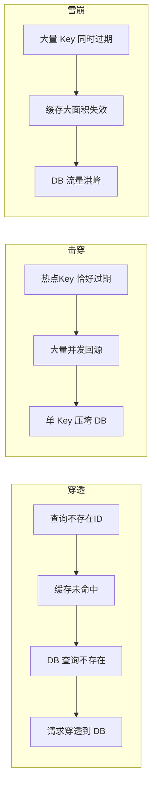
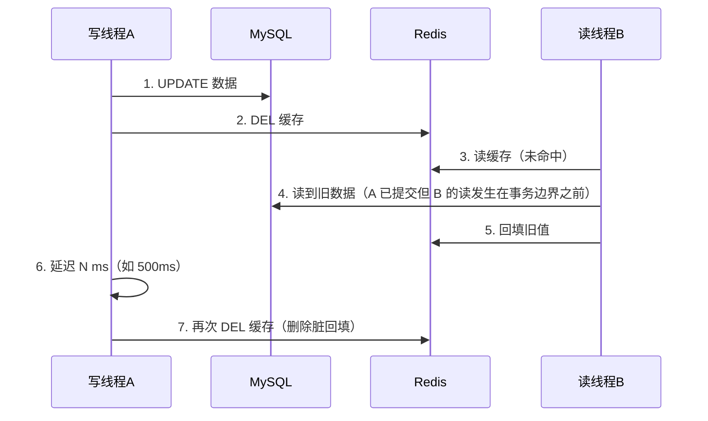
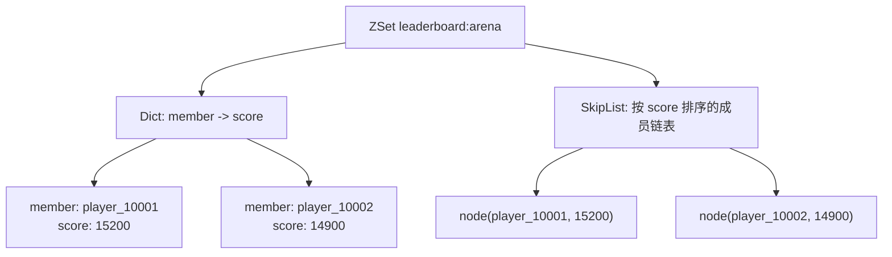

# 02 缓存与排行榜系统

> 知识基线：竞技场周赛的权威结算、可重建Redis展示榜与缓存读路径；Redis机制对照7.4.2固定源码和指定文档快照，部署版本仍须独立确认。
> 最后更新：2026-10-07（完整静态修订，未运行产品、客户端或性能实验）。
> 事实边界：组件语义、业务政策、条件设计、PAPER_EXPECTED与历史原文分开；不能把纯文档审查当运行证明。
> 知识成熟度：L2。verified保持空，不把旧metadata补标或授权解释为本次人工/运行验证。

> 本文当前教学口径（2026-10-07）：全文主要承诺为 L2 的机制解释、有限设计和纸面推导。Redis 行为以 7.4.2 固定源码及所列固定文档为对照；Bloom 能力另查模块/产品版本。未运行 Redis、数据库、客户端、并发模型、故障、网络或性能实验。末尾旧文仅作原字历史保留，不能当现行操作建议。

## 1. 从游戏读路径到可重建周榜

玩家打开商店、查询公开资料或查看周榜时，缓存能复用已有查询结果，减少权威数据库的负载。代价包括内存、失效传播、重建流量和陈旧读；缓存不必然是近似值，是否允许陈旧取决于业务。本地缓存、Redis、数据库形成可选层次，不承诺纳秒、亚毫秒或毫秒等固定延迟。

本章固定一个正向案例：竞技场周赛。结算服务在权威数据库中确认合法战斗和唯一结算请求，记录玩家本赛季业务分、达到当前分数的裁定时间和递增修订号；Redis 周榜只保存可重建的展示投影。玩家打开榜单读 Top10 和自己的位置；赛季结束后用权威封榜快照核发奖励。即使展示投影落后、丢失或需要重建，已经提交的结算和奖励依据仍可追溯。

这里区分三个对象：

- 结算事实：赛季、玩家、结算身份、业务分、修订号及原请求终态，由权威存储保管
- 实时榜：允许陈旧的当前投影；返回赛季和代次，不能被解释成跨页一致的奖励名单
- 封榜快照：绑定确定截止点、排序规则版本和不可变数据；分页和奖励必须绑定同一快照身份

一次新分数到达后的成功链为：服务端核验 → 数据库内去重并提交结算 → 持久任务携完整版本投影 → Redis 在目标代次实际接受更新 → 展示读取。数据库提交到 Redis 可见之间存在窗口。同步调用 Redis 可以缩短通常延迟，但不会自动使两个系统组成一个事务；消息、去重和事务细节分别见既有 Canonical，不在这里另造同义实现。

## 2. 先确定缓存合同，再选数据结构

| 对象 | 可接受的承诺 | 越界时做什么 |
| --- | --- | --- |
| 公开角色资料、商店展示 | 明确允许的陈旧/负缓存政策；能从权威源重建 | 返回带版本的旧值或稍后重试 |
| 活动配置 | 校验完整版本，再发布版本指针；本地副本有最大可用年龄 | 停用不能确认适用版本的配置 |
| 实时周榜 | 可重放投影；不承诺多次查询同一瞬间 | 显示更新时间/代次或退回最近快照 |
| 金钱、关键道具、奖励归属 | 持久化权威校验、原子业务约束和审计 | 不能用缓存命中替代授权与提交 |
| 登录/接口计数 | 先说明事件计数、去重人数、在线状态还是限流 | 不把一次 INCR 当四种含义 |

穿透是无效或不存在的查询反复回源；击穿是单个热对象缺失触发集中回源；雪崩是大量对象失效或缓存服务不可用造成回源洪峰。Bloom 是概率集合成员结构；旁路缓存是查缓存、回源、回填与失效的一组操作；互斥重建是减少同时加载的手段。它们都不自动给出跨数据库、缓存、客户端的统一一致性。

“最终一致”需要具体的推进条件：事实不再变化、工作不会永久丢失、失败任务继续被发现和重试、目标仍可写、陈旧写最终停止、保留窗口覆盖恢复过程。写“加了 TTL/双删，所以最终一致”遗漏了这些条件；有限陈旧上界更不能仅靠经验 TTL 推出。

### 2.1 Redis 结构与游戏用途

| 结构 | 保留的用途 | 必须知道的界限 |
| --- | --- | --- |
| String | 名称、序列化资料、整数计数、租约原语、会话状态缓存 | INCR 是单命令有符号 64 位整数变化；不是请求去重或业务扣款校验 |
| Hash | 同一玩家的多字段读模型、配置字段 | HINCRBY 不检查余额非负、权限、重复请求或持久化事务 |
| ZSet | 分数索引、名次、TopN、区间读、到期调度索引、时间线 | score 为 binary64；同分再比较 member 的字节序；小集合可用 listpack，大集合可转跳表+字典 |
| Set | 好友集合、可丢的成员缓存、集合交集 | SADD 的成员唯一不等于带业务结果和保留期的持久幂等账 |
| List | 最近公告、有明确丢失容忍的简单队列 | BRPOP 弹出后处理失败可能丢任务；不能称可靠投递 |
| Bitmap | 签到日历等有界位编号集合 | ID/日期到位的映射、最大偏移和补签政策属于业务合同 |
| HyperLogLog | 去重数量估计 | 不能枚举精确玩家或证明某玩家在线 |
| Stream | 带 ID 的流及消费者组 | 确认、重投、修剪、持久化/复制和业务幂等仍需设计 |

会话状态可序列化到String加速读取，但缓存TTL只是该副本的保留/可用期限，不是权威鉴权期限；命中且未过期也不能绕过会话版本、撤销或权限检查，注销/撤销后的失效与可接受窗口须由会话合同明确。角色名称的SET示例仅展示名称缓存，不承担会话教学。ZSet还可用有界的到期时间score组织待调度任务、按范围找出到期项；索引或出队并不保证任务处理完成、确认或重投，认领/恢复责任仍在调度系统。时间线用明确单位和精度界限的时间score及稳定member排序，同分仍依Redis字节序；持续变化的时间线跨页也会重漏，要求一致遍历时采用§4.6的快照身份与完整排序键。

上述是命令用途，不把历史 ziplist、双向链表等名称当各版本不变的物理实现。Redis 7.4.2 的 ZSet 源码分别处理 listpack 和 skiplist 编码；读复杂度与成员大小、返回条数、编码、访问分布相关。在跳表编码下，插入/删除和按排名定位具有相应的对数级期望成本，范围返回还要计入输出成员数M；不能把O(logN)解释成固定毫秒数或免费返回整榜。“百万成员能扛住”必须变成有环境和负载定义的测量问题。Hash 的紧凑编码、List 的 quicklist/listpack 等细节也以所部署版本为准。

~~~text
INCR login-events:2026-10-07
SET role:10001:name "剑客" EX 600
HSET role:10001:display level 10 gold 1000
HINCRBY role:10001:display gold -150
SADD friend:10001 20001 30001
~~~

HGETALL保留一次读取完整玩家小对象的用途；对象很大时按所需字段读取并限制响应量，不能把完整Hash读取当无成本操作。List可用LPUSH写入公告、BRPOP取走一项；一旦取走但处理未完成就可能丢失。需要恢复的工作可移入processing列表、处理完成再确认，并监控超期项重投，但还需持久性、去重和保留窗口；补偿道具邮件的发放结果由权威业务账记录。

这些命令只示意事件计数、过期展示值、字段变化和集合成员。最后一个 Hash 减法结果可以为负，也不会完成真实扣款；登录重复投递会重复计数。集合交集可用 SINTER 读取；SINTERSTORE 还会写目标键，Cluster 中输入和目标键必须同 slot。不能因共同好友例子可写成一条命令，就推断任意玩家分片都能原子执行。

## 3. 缓存读写：把加速、陈旧和失效分开

### 3.1 穿透：负缓存与 Bloom 的集合边界

负缓存必须有可区分的 NotFound 状态，不能把合法空字符串、缓存未命中、Redis 超时、数据库出错都当“查无此人”。只有权威查询成功且确定不存在才能生成负缓存；它也有版本/代次和短期保留策略。新玩家刚创建时，旧负缓存会暂时遮住新数据；创建后的失效、版本推进或明确的最大等待政策须覆盖这个窗口。参数格式校验和身份鉴权可先减掉无效流量，但格式正确不代表存在或有权查看。

对一个正确维护、未丢失成员位的 Bloom 集合，阴性说明元素未被加入该集合，阳性仍要查权威源。数学上常用近似误报率 p≈(1−e^(−kn/m))^k，m 为位数、k 为哈希数、n 为已插入数，依赖相应哈希近似。它不能证明数据库没有刚创建而尚未进入过滤器的玩家。过滤器重建、增量追赶、丢失、版本切换、key 缺失和命令失败都要单列；不能把任何“0/false”直接映射成业务 NotFound。

正向用法是给过滤器绑定覆盖范围和版本，例如“已封存赛季的参赛者集合 H”，完整装载并核对后再启用阴性拦截。动态玩家集合在覆盖状态未知时，降级为受限权威查询或稍后重试。基础 Bloom 不直接支持安全删除任意元素；扩容/分层和模块能力按版本选择，不在原位随意清位。BF.RESERVE/BF.ADD/BF.EXISTS 是条件示例，Redis 7.4.2 core 的存在不证明已提供该模块。例如以已封存集合H创建 player:sealed:H，BF.RESERVE 的0.01是请求的误报目标、10000000是容量输入；完整导入并确认覆盖后才查询。误报目标和容量参数不是本章测得的实际误报率，也不保证未来无限增量仍满足同一空间/延迟。

### 3.2 击穿：有界重建与真实资源寿命

读路径先辨认 Hit、Miss、NotFound 和 Error。未命中后可用进程内 singleflight 合并同键请求，再用短租约减少跨实例同时加载。持租约者还要重查缓存，避免等待抢锁时已有新值。其他请求在自己的等待预算内读取旧值、重试或返回繁忙；不能在抢锁失败后全部直接调用 load，否则把惊群搬到了“兜底”分支。

每次抢锁使用独立且足够不碰撞的 owner token。释放必须在 Redis 中比较 owner 后删除，不能无条件 DEL。租约过期后旧加载仍可能执行；随机 token 只能避免误解锁，不能让旧进程自动停下来，也不能约束外部数据库写入。需要阻止旧回填时，必须把 owner、缓存代次和版本条件放在目标真正接受写入的原子点，且所有写者都走同一入口。

请求截止、客户端返回超时、发出取消、后台调用实际结束是四件事。回源并发额度、连接、缓冲区和操作对象只在底层实际终止且不会再访问它们后释放。具体驱动若不能证明取消已生效，就保留未终止操作的占用记录并停止新增负载；不能用“用户不等了”释放额度后继续创建无限后台加载。本节只给控制要求，没有验证某个 Go/Redis/SQL 客户端的取消合同。

逻辑过期可以把可容忍陈旧的旧值提供给读者，同时有限地刷新；但旧值也要有最大可用年龄、容量回收和错误退路。它不意味着请求永不阻塞或对象永不失效。对没有旧值、已经太旧、版本不适用或需要权威判断的请求，返回不可用比编造数据合适。

### 3.3 雪崩与热点：先保护回源预算

TTL 抖动能分散因同一装载时间造成的集中到期，不能处理整个 Redis 不可达的所有故障。缓存故障时仍维持回源并发上限、有限队列、截止时间和重试预算；达到上限后选允许的旧快照或明确失败。主从、哨兵或 Cluster 提供各自的故障处理能力，不能据此推断零丢失或零陈旧。

热点要按具体 key、目标节点、时段、请求/响应字节和尾延迟识别；单 Key QPS 不能脱离这些条件定通用阈值。把 hot:item 拆成 N 个不同 key 只有实际路由到不同承载资源才可能分散 Redis CPU/网络压力；若全部落在一个节点，或给所有副本同一 hash tag，可能仍压同一 slot。副本数与本地缓存命中率也不会自动产生 1/N 的压力比。

多副本更新可用 pipeline 减少往返，但必须检查每项结果。部分成功时，各副本短暂不一致只有在该对象的合同允许时才可接受。携带配置版本或源修订号，异步任务按 target+generation+revision 记录待完成目标；旧重试不能覆盖已经接受的新版本。TTL 到期从“本次写被接受”开始计时，迟到的旧写可重新获得完整 TTL，不能据此声称陈旧最多一个固定 TTL。

本地缓存配合版本轮询或可恢复的失效链路。Pub/Sub 可作加速通知，但它是至多一次投递，断连期间会丢通知；不能让它成为唯一失效证据。进程重启、订阅恢复、版本跳跃或超过最大年龄时，重新核对版本。只读配置/公告最适合这种层次；关键资产不靠热点副本作提交依据。

### 3.4 旁路缓存与迟到回填的完整反例

最小旁路读是：查缓存 → 成功命中则返回 → 权威查询成功 → 按缓存合同尝试回填。写是：权威业务事务提交 → 删除/失效缓存；删除失败留下可重试任务。选择删除通常减少立即构造新缓存的工作，但删本身不会阻止已经在路上的读回填。

有限反例：R 在数据库版本 v10 时完成旧快照读取；W 提交 v11；W 第一次 DEL；延迟任务第二次 DEL；R 最后才 SET v10。两次删除均成功仍得到旧缓存。CDC/binlog 通知也可能先于 R 的迟到 SET 到达。把延迟设成“大于最长回填”只有在系统真的强制这个上界并拒绝超期回填时才是条件论证；300ms、500ms 或 1s 都不是普遍保证。数据库副本落后或旧事务快照又是不同的旧值来源。

正向策略分两档：

1. 容忍陈旧的简单缓存：明确旧值允许范围，持久化失效任务、重试、有限回填寿命、TTL、周期核对，并在恢复条件满足时收敛。不能把条件收敛写成固定陈旧上界
2. 需要抑制已经观察到的旧版本回填：目标保存不可混淆的 generation 和已知最小源修订 watermark；在实际接受点比较版本。这个 gate 只覆盖已到达该目标的失效/版本信息，数据库提交到 gate 更新的窗口依然存在

后一种方案的有限合同如下。缓存写和失效使用同一 Redis 原子域；所有参与 key 同 slot，所有写者遵守它：

- 失效事件携 source revision r：确认目标代次；将 watermark 单调推进到 max(old,r)，仅删除低于它的缓存值，不能先把失效任务标为完成再发送命令
- 加载在开始时绑定 generation g，回源获得值及 revision v；回填接受点同时核对 g 仍相同、租约 owner 仍匹配（若使用租约）、v≥watermark、v 不低于已接受缓存版本，再写入值和期限
- gate 缺失、类型不对、generation 不明、源版本无法比较时，不把“缺失”解释成初始版本零；停止该目标回填并重建/核对
- Redis 重启、故障转移、gate 被淘汰或恢复旧快照可能损失拒旧状态。恢复代次和可用门禁必须先重新建立；只写一个“版本号”不能证明其跨恢复单调性
- 返回成功才记录这个 target+generation 的完成；超时保留 UNKNOWN，并由原任务身份查询/重放幂等操作。L1 与多个 Redis 副本分别有目标状态，某一目标成功不等于全部完成

这是需要实现和验证的有界设计条件，不能声称已有 Redis API 自动跨库提供它。普通 SET/DEL、Lua 内先后两个系统调用、客户端先查版本再 SET，均不能替代目标接受点的原子比较。资产、货币和奖励仍走其权威业务事务。

## 4. 周榜：分数、时间、修订和快照各有身份

### 4.1 ZSet 能保证的顺序

member 唯一、score 可重复。ZRANGE 默认按 score 升序；同分按 member 二进制字节升序。ZRANGE ... REV 同时反转分数和同分 member 次序。它没有“先到者优先”的隐含规则，也不理解十进制玩家编号、自然语言字典序或数据库排序规则。

本例先规范 member：玩家 ID 在 0..9,999,999,999 内，编码为 ASCII 前缀 p: 加十位补零十进制，例如 p:0000010001。相同 ID 永远使用同一编码；展示名不作为 member。业务最终平手规则明确选择“同业务分、同裁定秒时较大玩家 ID 在前”，这样才与 REV 的字节逆序一致。若产品要求较小 ID 或精确先到序号，应换用经证明的完整排序编码/权威复合索引，不能暗示 Redis 会自动选择业务想要的顺序。

### 4.2 时间身份是一项业务决定

本例的活跃期规则标为arena-live-v1：在OPEN期记录“当前这次达到分数”的时间，而不是玩家一生首次达到这个分数：

- OPEN期第一次参赛、真正加分、扣分或纠错改变业务分时，记录本次权威裁定接受时的赛季秒偏移
- 重复结算请求返回原终态，不能再次加分，也不能重取当前时间；业务分没有变化的操作保留旧时间
- OPEN期100→110→100 是新的 100 分到达，不继承第一次 100 分的时间
- 仅修复丢失的 Redis 投影时重放数据库中原 score、time 和 revision，不“重新达到”；封榜后的这类投影回补仍沿用既有记录，不能伪称新接受的纠错
- 迟到战斗只有在赛季仍接受结算且权威校验通过时才可记入；本例用受理时刻，不使用客户端自报时间倒插。封榜后拒绝普通旧赛季结算
- 封榜后新接受且真实改分的追溯纠错走下面单列的规则arena-retro-last-v1，产生新快照；封榜后受理时刻只作审计，不拿来填当前赛季排序秒，也不静默改已发布名单

arena-retro-last-v1是本教材选择的有限业务政策，不是Redis保证。它只允许纠正该玩家在原封榜截止点H之前的最后一条真正改分结算e，且纠正后e仍须真正改分。本例追加纠正记录来改定e应得的分数增量，原e记录和原请求终态不改写，排序沿用e的原权威受理时间；不覆盖取消成零增量、改动更早结算或修改受理时间的其它纠错。权威裁定q必须关联原snapshot_id、e的身份/原修订、纠正修订、e前的权威分数、获准的新增量及奖励更正规则；核实到H无后续真正改分，并由e前分数加新增量得到合法的新赛季分数。这个新分数须确实不同于旧封榜分数，且新旧权威依据可核对。

用于排序的t明确取e在权威记录中已经固定的域内赛季受理秒，排序时间身份为(e_id, e的原受理秒, q_id, 纠正修订, arena-retro-last-v1)。这是将已封存的同一结算修正为当时应得分数的追溯裁定；不能借用与新分数无关的其它旧time，不能使用封榜后当前秒或客户端自报时间。本例一个新快照只纳入这一条已冻结裁定q，不在此合并并发或互相冲突的纠错；新快照以(原封榜H, {q}, arena-retro-last-v1)为不可变来源身份，未改玩家保留原封榜记录，纠正玩家采用这条有依据的新记录。分数/秒域、复合编码及最终同分member字节规则保持不变；新snapshot_id与旧版区别，旧版不改写。缺少e、e前事实、合法域内秒、最后改分证明或授权裁定，或不满足上述有限资格时，拒绝该纠错/停止新快照发布，继续保留原版，不以钳位、取模或任意回填时间补洞。

t 的单位是整秒，值域为 [0,604799]，由明确的赛季起点和权威时间政策得到并持久化。两个真实时刻在同一秒会并列到最终 member 规则。“按记录的裁定秒排序”不等于在分布式机器间恢复物理先后；如果产品承诺实际受理的严格先后，就必须另外提供与受理顺序一致的权威序号/时钟机制。时钟倒退、未来时间、跨赛季时间或单位不明不得偷偷截断、取模或钳位以凑入值域，应交回权威层纠正或拒绝。旧文示例的绝对 Unix 时间数值也不作日期换算的权威证据。

### 4.3 有界整数复合分数

固定本例 s 为非负整数业务分，0≤s≤1,000,000；t 为上述赛季秒，B=604800。定义：

~~~text
tie = B - 1 - t
composite = s * B + tie
bizScore = floor(composite / B)
~~~

必须先在整数域校验 s、t 和乘法上界，再运算，最后转换到 Redis 的 double。这里 0≤tie<B，故任意 s+1 的最小编码都大于 s 的最大编码；最大编码为 604800604799，小于 2^53，全部整数可被 binary64 精确表示。读取还应检查有限值、整数性和范围。若更长赛季、更细时间、负分或更大分数使条件不成立，重新设计编码；事后转 float64 不能修复先前的 int64 溢出。

旧公式 maxTimestamp=999999999999、scale=10^9 在 t=1780000000 时，时间项=998219999999，已经大于基数。s=15200 得到 composite=16198219999999，除以 10^9 得到16198而非15200。这一例尚未超过2^53，错误首先是归一化和值域；不能仅把它描述为 double 不精确。

相同的业务分和裁定秒仍可能完全同分，最终 member 规则不能省略。展示分数最好与权威字段对照；复合 score 本身不是新的业务资产。复合编码后的加50分需要根据最新权威 score、time 全量重算，而不是对复合 score 调用 ZINCRBY 50。

### 4.4 命令的用途与返回边界

~~~text
ZADD rank:{arena:W32}:g7 9193391999 p:0000010001
ZRANGE rank:{arena:W32}:g7 0 9 REV WITHSCORES
ZREVRANK rank:{arena:W32}:g7 p:0000010001
ZSCORE rank:{arena:W32}:g7 p:0000010001
ZCOUNT rank:{arena:W32}:g7 6048000000 9072604799
ZRANGE rank:{arena:W32}:g7 6048000000 9072604799 BYSCORE WITHSCORES
~~~

这些是命令语义示例，实际在线写入和多项读取必须走下一节的代次门禁。Redis6.2起的ZRANGE REV/BYSCORE可表达旧ZREVRANGE/ZRANGEBYSCORE等用途；本例7.4.2采用前者，不把新语法冒充所有旧版本都支持。第一行是 s=15200、t=172800 的有限计算结果。Top10 的下标范围包含两端；名次从0开始，存在时展示值加1，nil 表示未入榜而不是第1名。ZADD 默认计数是新增成员数，返回0可能是更新已有分数，不能当“没有执行”。同一完整 ZADD 重试同值不会再次加分，但旧版本的绝对赋值仍可能把新版本覆盖掉。

ZCOUNT一行是在本编码下数业务分10000..15000，范围是 [10000B,15001B−1]。下一条ZRANGE返回同一业务分区间内的成员；服务端还要限制可返回数量。不能把原始业务分10000直接用作复合 score 的边界。没有时间编码的原始分数榜可以使用 ZINCRBY 原子加分，但重复消息仍会再加一次，去重责任没有消失。

EXPIRE 的时间相对命令实际执行，604800秒不是“到周日零点”。重复调用可延后过期；缺失键上设置期限不能安排未来自动过期。赛季停止接收、封榜和内存回收是不同动作：权威截止按赛季身份和状态判断，保留期限在发布/保留策略中明确，不能靠 Redis key 到期替代封榜。

### 4.5 并发更新：检查发生在实际接受点

权威数据库按 (season, player, request_id) 记录请求身份、内容摘要和原终态。相同身份相同内容取回原结果；相同身份不同内容拒绝。余额/分数修改、修订号递增和待投影记录要有同一权威提交边界；并发请求要由数据库约束/隔离使这件事成立。详细幂等和 Outbox 机制沿用既有 Canonical，此处不宣称调用了一次 ZADD 就达成它。

投影事件携 (season, player, revision, score, attain_time, content_identity)。revision 比较的是同一玩家同一赛季的权威修订，不能拿分数大小替代。ZADD GT 只筛分数大小，会挡住合法扣分/纠错；它也没有业务请求身份。

一个有限、同 slot 的投影方案可用 rank:{arena:W32}:g7 与 rank:{arena:W32}:meta 保存榜单和门禁/修订。所有读写都通过固定 Lua 入口；generation、READY 状态、键类型、已知成员数、输入域与已有修订先检查。KEYS 显式传入全部键，不在脚本里按任意成员拼接未声明的 key。部署允许的脚本、命令、内存策略及迁槽行为都要核对。

为了直面 Lua 不回滚，教学合同按以下先后执行：

1. 前置检查：generation 对应预期、状态为 READY，榜键符合空榜/非空榜身份，score/time/revision 合法。相同 revision 相同完整内容为重复；相同 revision 内容不同为冲突；更低 revision 为过时
2. 写入门禁 UPDATING；这一写之前不能改变榜单或修订。若它失败，旧数据未被本次后续逻辑改动
3. 写入合法 ZADD 或明确移除成员的 ZREM，记录这次完整修订和内容身份；回读成员数等必要元数据
4. 最后一项成功发布将门禁恢复 READY；只有所有前序命令成功才走到这里
5. UPDATING已成功写入后，若最终READY发布前发生运行时错误，脚本停止但先前写入不会回滚。门禁留在非READY；新的读写都拒绝该代次，交恢复流程重建/核对。不能只 catch 异常后设置READY
6. 读取在同一原子脚本里检查代次/READY并完成所需范围/个人名次等有界查询；禁止直接 ZRANGE 绕过门禁。在脚本执行中其他命令不插入，成功读得到这个原子点的有限视图

这是一个待实现的同 Redis 执行域合同，旨在解释如何将失败关住，不是已验证客户端产品或可任意扩展的通用框架。计数核对不能检测所有数据损坏；跨恢复、故障转移后的状态回退、独立淘汰、外部绕行写、脚本缺失、命令错误和跨slot均需停用/重建。只靠一个READY字段也无法越过这些前提。版本号在 Lua 数字域内比较时要有精确上界；更大版本用经验证的无损编码比较，不能随意 tonumber 64位值。

回复丢失时，写入可能已完成；按同一 revision+内容核对后重放，不能生成新业务结算。即使 Redis 已确认，故障转移仍可能丢失该投影；事实、未完成任务及重建入口保留在权威系统里。Redis 原子执行、持久化确认和数据库事务是三个不同承诺。

### 4.6 分页、好友榜、分段与跨服合并

实时榜第一页和第二页之间可以有插入、删榜或分数变化。名次偏移会移动，导致重复或漏项；固定 (score,member) 游标也不能自动把一个持续变化的集合变成快照。要一致地遍历结果，使用不可变 snapshot_id，游标同时携快照身份和完整排序键；快照过期或代次不匹配就拒绝/重开，不能静默换成当前榜继续翻页。

一次展示需要Top10、个人名次、分数等彼此一致时，可在同一同代次只读脚本内取齐有界结果。把它们放到 pipeline 只减少往返，不提供这一致性。跨请求的完整快照还需要不可变榜身份。可以短时缓存“我的名次”，但缓存键/值要绑定玩家、赛季、投影代次或snapshot_id及生成时间；他人的写入也会改变我的名次，所以自己的分数未变不能证明名次仍新。缓存年龄由展示合同选择，旧文5–30秒只是设计示例，不能用于奖励结算。

全服榜、等级榜和地区榜分别定义资格与归属变化。一次 ZADD 只针对一个 key；同slot Lua可组合多个key，但把全球榜与所有分区强塞同一tag会牺牲分布。跨slot时采用可重放的各目标投影，显式展示不同水位，不承诺原子全榜更新。玩家换分段时还要清旧分段，不能只向新榜添加。

好友榜保留“好友集合与榜分相交”的用途，不能把并集误当好友资格。使用 ZINTERSTORE 时要核对默认SUM、WEIGHTS/AGGREGATE和资格集合的实际权重，避免朋友关系分数加进比赛分；命令会覆盖目标，临时结果的命名、期限和同slot约束都要满足。另一种有限实现是读取已授权好友ID，批量查同一不可变榜的分数，再用完整排序规则排序；好友关系也若要求同一快照须固定自己的版本。动态榜上的批量查询只是某段时间的读，不是全局瞬时视图。

跨服榜必须说明是“玩家由唯一分片保存完整分数”，还是“同一玩家的分数分布在多个分片相加”。前者在分片集合固定、所有分片来自同一截点且用相同完整总序时，合并各片TopK足以得到全局TopK：任一片中排在K名以后者前面已有K个全局比较更高的候选。后者不能这样截断：P在两片都为60分，各片另有一个局部第一名100分；各取Top1会漏掉合计120分的P。需要先按业务聚合后再排序。也不能把“各片都返回”当作同一时刻，应对齐watermark或明确异步陈旧。

### 4.7 封榜和重建：一个完整的成功流程

本例选简单可审计的封榜路线，不假定任意在线全量扫描天然有一致截点：

1. 权威赛季状态从OPEN进入CLOSING，结算事务在同一权威序列中检查赛季状态；禁止新接受的旧赛季请求越过截止。已获接受资格的在途事务如何完成，要由这一数据库边界明确裁定
2. 在纳入截止前事务之后，产生持久截止点H，并将赛季置为SEALED。若仍有可能写入H以内事实的事务，不能宣布快照完成
3. 从这个不再变化的权威集合构建新代次g8，不服务未完成的新榜。保存计数、排序规则版本、源截点和必要摘要；任何遗漏/错误留在BUILDING/FAILED
4. 验证完成后发布不可变snapshot_id。Redis的指针只在同slot内执行条件切换，确认当前旧代次和新榜READY；它不负责让数据库与Redis跨系统原子提交
5. 指针更新响应丢失时，按snapshot_id查询实际状态，不重新封榜或重复奖励。已有旧快照读者继续绑定旧ID，不能在下一页切换到g8
6. 奖励以权威snapshot_id、玩家和奖励请求身份进行持久幂等发放；实时Redis名次和过期缓存均不是依据。若后来发生§4.2定义的合格追溯纠错，以原H加固定授权裁定集形成新的不可变来源，按明确的arena-retro-last-v1生成新快照，保留旧快照及原奖励终态；仅按裁定中获准的奖励更正规则执行有独立幂等身份的差额调整，不能把新快照当成再次发放整套奖励的请求
7. 旧代次在新读者不再进入、在途读和游标保留政策满足后回收。无法证明操作已结束时不能提前释放被引用资源；若业务采用明确的快照期限，过期游标返回失效

在线榜重建可用“与增量流对齐的一致快照+截止点+追赶”，但必须由具体数据库/日志实现证明起点、重放区间和连续覆盖；扫DB一遍再原子RENAME并不能自动补上扫描期间的变化。本章没有实现或测试此机制，无法建立截点时继续服务允许的旧快照或停用榜单，不发布假装完整的新榜。

## 5. 示例的最小可检查实现边界

本节只包含静态阅读的片段与流程。没有配套运行器，也没有运行任何命令；粘贴到客户端并不构成生产实现。上线前还需要真实客户端、部署权限、命令版本和失败恢复的证据。

### 5.1 编码与反解（Go 静态片段）

~~~go
// 需要 errors、math；本节未编译或执行。
// biz 与 seasonSecond 已由权威结算产生，不能信任客户端自报值。
const (
    seasonSeconds int64 = 604800
    maxBizScore   int64 = 1_000_000
    maxExactScore int64 = 1 << 53
)

func ComposeScore(biz, seasonSecond int64) (int64, error) {
    if biz < 0 || biz > maxBizScore {
        return 0, errors.New("business score out of range")
    }
    if seasonSecond < 0 || seasonSecond >= seasonSeconds {
        return 0, errors.New("season second out of range")
    }
    tie := seasonSeconds - 1 - seasonSecond
    if biz > (maxExactScore-tie)/seasonSeconds {
        return 0, errors.New("composite would exceed exact integer range")
    }
    return biz*seasonSeconds + tie, nil
}

func ParseScore(score float64) (int64, int64, error) {
    // 这是同一固定编码域，不能用来解析任意其它赛季/规则版本。
    maxComposite := maxBizScore*seasonSeconds + seasonSeconds - 1
    if math.IsNaN(score) || math.IsInf(score, 0) ||
        score < 0 || score > float64(maxComposite) ||
        math.Trunc(score) != score {
        return 0, 0, errors.New("invalid composite")
    }
    n := int64(score) // 前面已经限制为可精确表示且可容纳的整数
    return n / seasonSeconds, seasonSeconds - 1 - n%seasonSeconds, nil
}
~~~

先检查再乘法，当前常量域远小于 int64 和 binary64 整数界限。新的赛季长度、单位或分数边界要更新合同和推导，不能只改一个常量。ParseScore 同时返回当前时间域的偏移，仍需核对赛季/规则版本身份。Redis返回nil、错误、非数值与合法零分各自处理。

### 5.2 锁释放与缓存加载流程

~~~lua
-- 单key的比较后删除：只用于释放自己仍持有的锁。
-- ARGV[1] 是这一次获取租约的独立owner token。
if redis.call('GET', KEYS[1]) == ARGV[1] then
    return redis.call('DEL', KEYS[1])
end
return 0
~~~

这个片段不是防旧写的完整方案。加载流程至少是：

~~~text
取得调用预算和真实回源额度
GET缓存：区分Hit / NotFound / Miss / Error
Miss -> 尝试拿独立owner的租约 -> 再次查缓存
未取得租约 -> 有界等待/合并请求/可接受旧值/繁忙
取得租约 -> 启动已登记的回源操作，保留operation句柄与额度
成功获得(sourceVersion, value或NotFound) ->
    在目标接受点比较owner、generation和版本，再条件回填
回填拒绝/超时 -> 不假装已发布；按读合同决定原请求返回或失败
释放租约 -> 使用比较后删除
底层操作真正终止 -> 才回收其额度、句柄和相关缓冲区
~~~

GET失败不是Miss；SetNX失败不是“别人一定有锁”；SET超时不是已失败。空字符串也不是缺失哨兵。不能省略第一个加载失败时的等待者唤醒、有限重试和异常清理。回源函数的实际终止条件由具体驱动提供，本文没有把 context 超时当作这一条件。

### 5.3 双删的替代教学流程

旧 Go 例子忽略 BeginTx、Exec 和 Commit 错误，并把进程内定时器当成了失效任务。现行流程保留“先处理权威写，再做可重试失效”的用途：

~~~text
校验请求身份和业务条件
开始权威事务；失败则返回相应失败
在事务内改变业务事实、记录原请求终态和失效任务；失败则回滚
提交：
  已知未提交 -> 不宣称业务成功
  已知已提交 -> 返回已提交事实；失效仍可能待完成
  结果未知   -> 用原请求身份向权威系统核对，不能重复造业务请求
持久失效工作者逐目标发送带generation/revision的动作
  目标确认完成 -> 条件标记该目标完成
  失败或超时   -> 保留待办/UNKNOWN，有限重试和核对
~~~

单进程500ms定时器不是持久化队列；进程结束、取消的上下文或启动失败会使动作缺席。数据库+缓存同步更新也不是两系统事务。本篇不再把“加第二次DEL”写成消除所有回填竞态的保证。

### 5.4 计数与期限：一个命令原子不等于整项业务原子

INCR是有符号64位整数命令，缺失键从0起算；错误类型、非整数和越界都不是合法计数结果。若要从第一次请求起维持一个有限窗口，把增加和首次设期限放在同一个有界Lua操作里，同时限制key类型、增量和期限输入。以下仅显示窗口语义：

~~~lua
local count = redis.call('INCR', KEYS[1])
if count == 1 then
    redis.call('EXPIRE', KEYS[1], 10)
end
return count
~~~

它要求专用key不会预先以异常值/缺失TTL存活，且所用两步正常完成；若前一步成功后后一步运行时失败，不能声称自动回滚，应核对该key并按限流的保守失败策略处理。不断对同一key设置10秒TTL会形成延续窗口，与固定自然秒/分钟桶不同。固定桶可以把已核准的桶身份放在key中，并把回收期限与桶截止绑定，仍要处理迟到请求和时钟政策。

INCR、ZINCRBY或HINCRBY超时重试可能重复计数。用于可容忍重复的观测指标时如实标定；用于奖励或结算时必须有持久业务幂等。TTL通常不因INCR/HSET等原位修改自动清除，而SET替换值会改变期限语义，必要时显式使用对应选项并核对版本。不能先INCR再依赖另一次普通客户端EXPIRE永远到达。

### 5.5 Pipeline、事务、Lua与失败责任

| 机制 | 在这里解决什么 | 不能据此推出什么 |
| --- | --- | --- |
| Pipeline | 有界批量收发，减少往返；逐项读取回复 | 全批原子、多副本同时更新、超时未执行 |
| MULTI/EXEC | 一个Redis执行域内连续执行排队命令 | 运行时错误回滚、与DB原子、丢回复后可无脑重试 |
| WATCH + MULTI/EXEC | 监视键未变化才执行，冲突时重算 | 无限重试必成功、错误命令自动恢复 |
| Lua | 目标内部条件判断与有界命令组合 | 跨节点事务、跨DB事务、运行错误回滚、后台加载取消 |

Redis7.4.2的固定测试源码有“INCR后调用不存在命令”的错误脚本，再INCR期望2的案例，它支持“首个效果仍在”的静态判断；本章没有运行该测试。redis.call出错终止脚本，redis.pcall把错误交回脚本；后者也不撤销先前效果。输入、类型、数值域和已有状态尽量在第一项写之前检查，但资源/持久化/执行条件和故障仍要处理。

本文只讨论全部声明键同slot的方案，不启用allow-cross-slot-keys来放宽它。脚本声明的KEYS仍须同slot；迁槽可能产生TRYAGAIN，脚本缓存可能缺失，部署权限、只读模式和OOM策略也影响可执行性。OOM拒绝位置取决于脚本flags与首次写条件，不能假定后续每项写都会重新受到maxmemory拦截；本例不保证OOM下的可用性。失败不能被改写成空结果或成功。使用哪版客户端、是否自动重试、什么时候返还连接和如何报告逐项错误，需要单独核证。

### 5.6 热点副本读写的结果模型

选副本前校验replicas>0和路由配置，避免随机索引非法。每次读取返回(sourceVersion, generation, value, freshness)，不存在/错误走同一有限回源政策。写任务保留目标清单及每个目标实际结果；pipeline Exec的整体返回不能代替逐项结果。部分成功后只重试尚未确认的目标，同一旧版本重放到已接受新版本的目标应被拒绝。

副本的物理放置与版本接受合同互相制约：同slot便于Redis原子组合，但不会把压力分散到不同主节点；跨节点可以分摊，却不能宣称一次脚本全副本同时提交。只读热点配置可以采用不可变版本key+受控指针，并保留旧版本至读者退出。源记录、目标代次或版本元信息保留不足时停止补写，不能让迟到任务复活已退役版本。

## 6. 有限纸面例子、实践与FAQ

### 6.1 正向周赛例子与失败边界

下列均为 PAPER_EXPECTED：有限算术和事件次序的推导，不是Redis运行日志、并发模型验证或性能结果。

初态为同一OPEN赛季、同一READY投影代次、无重复请求。三个玩家A/B/C的规范ID递增；本例无最终平手：

| 步骤 | 权威变化 | 展示预期 |
| --- | --- | --- |
| 1 | A:100分t10 rev1；B:100分t20 rev1；C:101分t30 rev1 | C、A、B |
| 2 | A合法加1分，记录101分t40 rev2和原请求终态 | C、A、B；C在本分数更早 |
| 3 | 同一结算身份重复到达 | 返回原终态；A仍t40 rev2，不重复加分或重置时间 |
| 4 | A合法扣2分，记录99分t60 rev3 | C、B、A |
| 5 | A的rev2投影迟到 | 被rev3拒绝；不能因rev2分数更大而覆盖 |
| 6 | 封榜到H，构建g8并发布snapshot S | S中的完整顺序用于固定分页和奖励 |
| 7 | 奖励响应丢失后用原请求身份重试 | 权威奖励结果取回，不按当前实时排名另发一次 |

其余有限反例/停止线：

| ID | 输入或次序 | PAPER_EXPECTED |
| --- | --- | --- |
| P01 | 旧公式15200分、绝对t=1780000000 | 编码16198219999999，旧解码16198，发现归一化错误 |
| P02 | 新公式s=15200、t=172800 | 编码9193391999，反解15200与172800 |
| P03 | s=0,t=604799；s=1000000,t=0 | 编码0与604800604799，均在所定精确域 |
| P04 | s=-1、s=1000001、t=-1或604800 | 在乘法/浮点转换前拒绝 |
| P05 | 两玩家同s同t | Redis REV按member字节逆序；固定编码下较大ID先 |
| P06 | OPEN期100→110→100；重放既有权威记录 | 活跃期新100有新时间；投影回补不重取时间，封榜后新纠错另按P29 |
| P07 | 旧读取v10→写v11→两次DEL→迟到SETv10 | 双删成功仍可旧回填 |
| P08 | 目标watermark已11，旧填v10；或g7回调到g8 | 在目标接受点拒绝 |
| P09 | gate缺失或恢复旧状态 | 拒绝补写并核对/重建；不能默认版本0 |
| P10 | A租约到期，B已持锁，A执行释放 | 比较owner后不删除B锁；外部旧工作不因释放被取消 |
| P11 | Redis超时/合法空字符串/DB错误 | 不当成NotFound；不生成错误负缓存 |
| P12 | 玩家刚入DB而Bloom还没补齐 | Bloom阴性不能直接推出业务不存在 |
| P13 | 先INCR成功，EXPIRE没有执行 | 可能留下无期限计数；不称复合原子 |
| P14 | ZINCRBY已执行后响应丢失，再盲重试 | 可多加一次；原子命令不去重 |
| P15 | pipeline只部分目标成功 | 逐目标核对/重试，不能全标完成 |
| P16 | 脚本改榜成功后元信息写错误 | 无自动回滚；非READY门禁保留，拒绝读写并恢复 |
| P17 | 最后READY发布成功但回复丢失 | UNKNOWN后按原代次/修订核对，不能重复业务结算 |
| P18 | 不同slot上的榜/元信息或正在迁槽 | 不承诺原子成功；按实际错误停止/有限重试 |
| P19 | 动态榜翻页中排名变化 | 可能重漏；一致遍历须固定不可变snapshot_id |
| P20 | 各片P=60，另各有不同玩家100，各取Top1 | 合计120的P可被遗漏；局部TopK不适用于分数跨片求和 |
| P21 | 重建扫描期间仍可写、无一致截点 | 不发布为完整封榜快照 |
| P22 | Pub/Sub断连漏失效 | 依靠版本核对/最大年龄收敛，不宣称通知必达 |
| P23 | 旧SET迟到才获得新TTL | 陈旧寿命从迟到接受点起算；仅TTL不是提交后固定界限 |
| P24 | 同实例不同逻辑DB，达到maxmemory | 仍共享实例资源/策略；不是故障与淘汰隔离 |
| P25 | 请求超时但load仍运行 | 保留真实并发额度和操作对象；停止继续超额发起 |
| P26 | 未封榜但周榜key过期，或EXPIRE被重复延长 | 键寿命不决定赛季是否接受结算 |
| P27 | BRPOP已经弹出，消费者在完成前退出 | 简单队列可能丢任务；需确认/恢复及业务幂等 |
| P28 | 旧游标在快照回收后访问 | 明确返回快照失效，不接到新榜继续翻页 |
| P29 | 封榜后纠正最后改分结算，时间身份和授权均满足arena-retro-last-v1 | 按下述完整轨迹建立新快照并幂等调整徽章；不取封榜后当前秒 |

P29完整轨迹（额外的有限教材假设，全部为PAPER_EXPECTED）：S1已按H封榜并只给前两名徽章。A、B、C分别使用p:0000000001、p:0000000002、p:0000000003；A最后一次改分是权威结算e，将90加10到100，原受理秒604700；H之前没有其后的真正改分。B为105分/t604750，C为105分/t604700，因此S1为C、B、A，权威奖励账已记录C、B有徽章。

在赛季第604801秒，权威新接受授权裁定q：e应加15而非10；q明确批准按照新前两名名单补授/撤销徽章。这个受理秒只记审计。核准e前90分、e身份/原修订、最后改分资格和原t604700后，按arena-retro-last-v1产生A的新记录105分/t604700，并携q和纠正修订。A的新composite=63504099，B=63504049，C=63504099；A和C完全同分时仍按既定member字节逆序，故新完整顺序为C、A、B。这是同一原结算的追溯时间，有独立裁定依据，不是沿用A的任意旧时间。

冻结(H,{q},arena-retro-last-v1)并完成候选校验后，发布不同ID的S2；S1和其已发奖励终态不变。奖励调整以(S1,S2,q,玩家,调整类型)为持久幂等身份：对A补授、对B撤销、C不变；各项在权威奖励事务完成并保存终态后才算完成。若A补授回复丢失，同一调整身份取回原终态，不重复补授。若q没有批准奖励更正规则，停止本例S2发布和奖励调整；若e时间不在[0,604800)、无法证明它是最后改分，或纠正后e不再改分，则该有限规则拒绝纠错/停止S2发布，不擅自改时间或原名单。本文未执行裁定、快照或奖励事务。

这些例子分别检查值域、身份、接受点、失败与停止线；不能由有限表格推出全部调度、跨机故障或客户端实现已经安全。

### 6.2 验证建议与实践检查

保留“可重建、源可追溯、分数由服务端核验、按赛季分key、周期核对、观测内存/热点”的旧文正确用途，但改成可验证条件：

- 固定数据源、源修订、赛季/代次、排序规则和允许陈旧/负缓存政策
- 所有写入参与版本比较，所有需要同一视图的读取服从对应代次门禁；直读、旧脚本和旧回调不能绕行
- 发布和恢复只有负责该代次的流程能把完整候选变为READY；旧代次回调在当前meta上被拒绝。故障转移后要先建立恢复可用门禁再开放流量；只写READY字段不能自动拦住旧主、旧客户端或旁路入口
- 容量评估包括成员字节、编码、返回量、实例内存、复制/持久化开销、热点分布、尾延迟和重建额外空间；没有统一百万榜容量/吞吐承诺
- maxmemory是实例层设置；noeviction也不会把Redis变成不丢事实的账本。不同DB编号是命名空间，不能替代独立实例的资源/策略边界；Redis Cluster只有DB0
- 普通缓存、版本/去重/gate元信息和不可丢事实有不同保留责任。关键拒旧状态丢失时停止接受写入，并用权威事实恢复
- 观测命中/负命中/错误、回源实际在途数、排队与拒绝、版本落后、逐目标未完成年龄、重建状态、对账差异及快照使用情况。仅命中率和Redis健康不足以说明正确
- 指标标签避免直接塞玩家ID/cache key造成敏感暴露和高基数；用受控脱敏追踪。OpenTelemetry可承载信号，持久业务流水仍负责审计
- 大key/hotkey诊断工具和负载实验先按真实环境权限与影响评估；本章只描述应收集的证据，未执行扫描、压测或配置改变

### 6.3 常见问题

Q1：缓存一定要删而不能更新吗？
删除是常用惰性策略；有序版本投影也可更新。两者都要处理数据库提交到缓存变化的窗口和迟到写，不能把任一动作当普遍一致性证明。

Q2：延迟双删等多久，CDC是否更可靠？
延迟只对被强制约束的回填寿命有条件作用，不能给通用毫秒值。CDC改善变化捕获和重试路径，但通知到达以后仍可能有旧回填。固定上界或拒旧需要相应的接受点和寿命控制。

Q3：能否直接ZINCRBY？
只存原始可加分数时可用，仍有重复提交问题；复合时间编码应按完整权威记录重算。ZADD同值重试不多加分，不代表乱序版本不会倒退。

Q4：Bloom误报或漏更新怎么办？
误报可让一次不存在查询进入权威源；漏更新是过滤器覆盖不完整，会误拦业务真实存在项，应禁用阴性拦截或走有限回源。二者不是同一种误差，负缓存也要处理创建后的陈旧。

Q5：Redis和数据库不同，以谁为准？
按本例以持久化结算和快照为准，重放/重建展示投影；不要从Redis旧值反向覆盖业务事实。资产读也应选正确隔离、主从和版本边界，“直读DB”四个字本身不等于任意强一致合同。

Q6：几百万玩家能不能放一个ZSet？
仅凭成员数无法判断。先估算成员/索引和重建双份空间，再在获准环境验证负载与尾延迟；局部TopN会失去尾部名次能力，分片也需明确聚合与完整总序，不能只承诺“能”。

Q7：热点多副本到期时怎么做？
按每目标代次合并重建并保持总回源预算；旧值超过可用年龄就拒绝。副本是否真分散到不同节点、更新是否部分成功、迟到写是否拒绝，都要核查。

Q8：OOM时单独DB号能保护排行榜吗？
不能。DB号是命名空间，共享实例内存/策略和持久化文件；Cluster还只提供DB0。可重建榜丢失后从权威事实恢复，不可丢事实不能只放缓存。独立实例也只是隔离手段，不替代备份、持久性和恢复证据。

## 一手资料与选读范围

下列来源支持相应机制的有限阅读，不是完整源码审计、客户端认证或部署验收。redis/redis-doc固定到1044224477fceacc5af56a636b0a7495d19e533c；Redis代码固定到7.4.2对应a0a6f23d997b024689ba157916837f493a593a34。未把前批Redis7.2.5材料混入本次版本保证，也未将latest文档倒推为7.4.2的全部能力。

- 分数、字节平手和范围：[ZADD](https://github.com/redis/redis-doc/blob/1044224477fceacc5af56a636b0a7495d19e533c/commands/zadd.md)、[ZRANGE](https://github.com/redis/redis-doc/blob/1044224477fceacc5af56a636b0a7495d19e533c/commands/zrange.md)、[ZINCRBY](https://github.com/redis/redis-doc/blob/1044224477fceacc5af56a636b0a7495d19e533c/commands/zincrby.md)、[ZCOUNT](https://github.com/redis/redis-doc/blob/1044224477fceacc5af56a636b0a7495d19e533c/commands/zcount.md)、[ZREVRANK](https://github.com/redis/redis-doc/blob/1044224477fceacc5af56a636b0a7495d19e533c/commands/zrevrank.md)
- 实现编码边界：[Redis7.4.2 t_zset.c](https://github.com/redis/redis/blob/a0a6f23d997b024689ba157916837f493a593a34/src/t_zset.c)，选读1–160、1320–1510行的比较、listpack和skiplist分支
- 好友与聚合：[ZINTERSTORE](https://github.com/redis/redis-doc/blob/1044224477fceacc5af56a636b0a7495d19e533c/commands/zinterstore.md)、[ZUNIONSTORE](https://github.com/redis/redis-doc/blob/1044224477fceacc5af56a636b0a7495d19e533c/commands/zunionstore.md)，核对交并语义、默认SUM、权重与目标覆盖
- 计数、期限与命名空间：[INCR](https://github.com/redis/redis-doc/blob/1044224477fceacc5af56a636b0a7495d19e533c/commands/incr.md)、[EXPIRE](https://github.com/redis/redis-doc/blob/1044224477fceacc5af56a636b0a7495d19e533c/commands/expire.md)、[SELECT](https://github.com/redis/redis-doc/blob/1044224477fceacc5af56a636b0a7495d19e533c/commands/select.md)
- 局部原子和失败：[事务](https://github.com/redis/redis-doc/blob/1044224477fceacc5af56a636b0a7495d19e533c/docs/interact/transactions.md)、[Eval](https://github.com/redis/redis-doc/blob/1044224477fceacc5af56a636b0a7495d19e533c/docs/interact/programmability/eval-intro.md)、[Lua API与flags](https://github.com/redis/redis-doc/blob/1044224477fceacc5af56a636b0a7495d19e533c/docs/interact/programmability/lua-api.md)。另只读[固定测试源码](https://github.com/redis/redis/blob/a0a6f23d997b024689ba157916837f493a593a34/tests/unit/scripting.tcl#L1287)的部分写后错误案例；v2另从同一已保存原对象选读1942–2007行的flags/OOM案例，不改写v1原选读范围。两次均没有运行测试
- slot与批量：[Cluster规范](https://github.com/redis/redis-doc/blob/1044224477fceacc5af56a636b0a7495d19e533c/docs/reference/cluster-spec.md)的同slot、hash tag、异步复制与迁槽段；[Pipeline](https://github.com/redis/redis-doc/blob/1044224477fceacc5af56a636b0a7495d19e533c/docs/manual/pipelining/index.md)的批量收发和回复缓冲段，不引用其示例机器的性能倍数
- owner与通知：[分布式锁](https://github.com/redis/redis-doc/blob/1044224477fceacc5af56a636b0a7495d19e533c/docs/manual/patterns/distributed-locks.md)仅选读单实例owner释放和一致性警告，不声称证明Redlock；[Pub/Sub](https://github.com/redis/redis-doc/blob/1044224477fceacc5af56a636b0a7495d19e533c/docs/interact/pubsub.md)的至多一次语义；[LMOVE](https://github.com/redis/redis-doc/blob/1044224477fceacc5af56a636b0a7495d19e533c/commands/lmove.md)的简单pop丢失与processing-list用途，不将该模式当端到端恰好一次
- Bloom的补充页面：[BF.EXISTS](https://redis.io/docs/latest/commands/bf.exists/)、[Bloom概念](https://redis.io/docs/latest/develop/data-types/probabilistic/bloom-filter/)，2026-10-07网页选读，未锁模块版本、未核完整实现或所有语言客户端；只用于过滤器集合语义和覆盖边界
- 旧文保留的[OpenTelemetry官方入口](https://opentelemetry.io/docs/)仅是观测框架导航，本次未作OpenTelemetry实现审计

## 附录：修订前原字保留

下面的有界文本保留2026-08-04原文的主体，以及8月补入的元数据/事实边界和两次导航迁移的原始文字。它们是历史材料，包含本次已解释的错误与过时建议；示例、性能数字和“保证”不得作为现行操作依据。标题、当前frontmatter及现行五条导航继续在正文中保留。旧正文主体和插入段按原字保存，旧导航另列，支持恢复修订前全文及历史版本；不能以只留Git历史代替这些文字。

历史主体与后增事实边界（原字）：

~~~~text


> 知识成熟度：L2（本轮审计修订时补标）。

> 知识基线：实时游戏服务端通用架构；示例中的语言、数据库、缓存、容器和云平台版本必须以项目部署清单为准。
> 适用范围：覆盖数据服务中的缓存、排行榜、热点配置和运营读路径；不将缓存视为资产唯一事实源，也不替代网关/游戏服权威判定。
> 事实边界：协议规范、组件行为和示例方案分开；容量数字只作示意/经验值，必须通过压测验证。
> 最后更新：2026-08-06（补齐规范来源、版本边界与工程验收入口）。
> 版本边界：以 2026-08-06 为核对日，不新增不确定的当前组件版本号；Redis、数据库、客户端库和部署平台版本由项目部署清单锁定。
> 参考来源：[Redis 官方文档](https://redis.io/docs/latest/)、[PostgreSQL 官方文档](https://www.postgresql.org/docs/)、[OpenTelemetry 官方文档](https://opentelemetry.io/docs/)。

### P0 缓存事实边界与验收入口

- 缓存一致性是取舍：资产、货币和订单以持久化数据为权威；配置、Presence、排行榜等读模型可接受有限陈旧，但必须写明 TTL、失效/回源、重建和降级策略。
- Redis 数据结构、淘汰、持久化和故障行为以部署清单与官方文档核对；“命中率高”不等于业务正确，“能恢复”也不等于满足 RPO/RTO。
- 排行榜验收要覆盖并发写、重复写、分数回放、分片合并、缓存重建和 DB 回源；容量数字只作示意，必须用目标数据量与真实访问分布压测。
- 可观测性至少关联 cache key/业务键的脱敏标识、命中/回源、延迟、淘汰、大 Key、错误和对账结果；OpenTelemetry 只提供观测信号框架，业务审计仍需持久化流水。

> 缓存让游戏"读得快"，排行榜让游戏"玩得爽"：本文覆盖 Redis 数据结构实战、缓存穿透/击穿/雪崩治理、缓存一致性、ZSet 排行榜与热点数据处理。

## 1. 概述

游戏服务器的读流量远高于写流量：玩家每次打开背包、查看商店、刷新排行榜都会触发大量读请求，而底层 MySQL 的 QPS 上限有限。缓存的本质是**用空间换时间、用内存换磁盘、用近似换精确**。

缓存分层：

1. **进程内缓存（Local Cache）**：游戏服进程内存（如 Caffeine/LRU Map），延迟纳秒级，但多实例间不一致，适合只读配置；
2. **分布式缓存（Distributed Cache）**：Redis 为主，所有实例共享，延迟亚毫秒级，是本文主线；
3. **数据库**：最终数据权威，缓存失效后的兜底。

排行榜（Leaderboard）是游戏最典型的缓存业务：全球/全服/好友三种榜单，要求毫秒级读取、写时更新、同分排序稳定。Redis 的有序集合（Sorted Set，ZSet）几乎是为排行榜而生的数据结构。

## 2. 核心概念

| 概念 | 英文 | 说明 |
| --- | --- | --- |
| 缓存穿透 | Cache Penetration | 查询不存在的数据，缓存与 DB 都查不到，请求直达 DB |
| 缓存击穿 | Cache Breakdown | 热点 Key 过期瞬间，大量并发同时回源 DB |
| 缓存雪崩 | Cache Avalanche | 大量 Key 同时过期（或缓存宕机），DB 被压垮 |
| 布隆过滤器 | Bloom Filter | 用位数组 + 多次哈希判断"一定不存在/可能存在"的结构 |
| 旁路缓存 | Cache-Aside | 读时先查缓存、未命中回源 DB 并回填；写时先更 DB 再删缓存 |
| 延迟双删 | Delayed Double Delete | 写 DB 后删缓存，延迟一小段时间再删一次，抵消并发读回填 |
| 互斥锁 | Mutex / Distributed Lock | 缓存重建期间只允许一个请求回源 DB，其余等待/返回旧值 |
| 逻辑过期 | Logical Expiration | 缓存不设 TTL，业务侧维护过期时间，异步线程重建 |
| 有序集合 | Sorted Set (ZSet) | Redis 中带分数（score）的集合，按分数排序，跳表实现 |
| 跳表 | Skip List | ZSet 的底层有序数据结构，支持 O(logN) 插入与范围查询 |
| 热点 Key | Hot Key | 被超高并发访问的单个缓存 Key（如爆款道具、名人玩家） |
| 多副本缓存 | Multi-Replica Cache | 热点 Key 打散成 N 份副本，分散单点压力 |
| 最终一致 | Eventual Consistency | 允许短暂不一致，经过一段时间后趋于一致 |

## 3. 原理详解

### 3.1 Redis 常用数据结构与游戏场景

| 结构 | 底层 | 常用命令 | 游戏场景 |
| --- | --- | --- | --- |
| String | SDS 动态字符串 | GET/SET/INCR/DECR/EXPIRE/SETNX | 计数（在线人数、钻石）、限流、分布式锁、会话 |
| Hash | 哈希表 + ziplist | HGET/HSET/HINCRBY/HGETALL | 玩家属性对象、道具数量、配置表 |
| ZSet | 跳表 + 哈希表 | ZADD/ZINCRBY/ZREVRANGE/ZRANK | 排行榜、延迟队列、时间线 |
| Set | 哈希表/整数集合 | SADD/SISMEMBER/SINTER/SUNION | 去重（签到、抽奖）、好友关系、共同好友 |
| List | 双向链表/quicklist | LPUSH/RPUSH/LPOP/BRPOP | 简单消息队列、最近公告 |
| Bitmap | 位数组（String 特殊视图） | SETBIT/GETBIT/BITCOUNT | 签到日历、连续登录 |
| HyperLogLog | 概率基数统计 | PFADD/PFCOUNT | UV 统计（在线去重人数） |
| Stream | 持久化消息结构 | XADD/XREAD/XGROUP | 可靠消息队列（Redis 5.0+） |

#### String：计数与限流

```bash
INCR online:login   # 登录计数（原子自增）
SET role:10001:name "剑客" EX 600
SET lock:buy:10001 1 NX EX 3   # 分布式锁原语（NX=不存在才设置）
```

#### Hash：玩家属性对象

```bash
HSET role:10001 level 10 gold 1000 diamond 88
HINCRBY role:10001 gold -150        # 原子扣款
HGETALL role:10001
```

Hash 相比"每属性一个 String Key"的优势：同类数据聚在一个 Key 下，减少 Key 数量、支持原子字段增减、便于批量读取与过期管理。

#### List：简单消息队列

```bash
LPUSH mail:10001 "{'title':'补偿','items':[{'id':101,'n':5}]}"
BRPOP mail:10001 0     # 阻塞弹出，实现简易可靠队列
```

#### Set：好友与去重

```bash
SADD friend:10001 20001 30001
SINTERSTORE common friend:10001 friend:20001   # 共同好友
```

### 3.2 缓存穿透、击穿、雪崩



#### 3.2.1 缓存穿透（Cache Penetration）

现象：攻击者/异常客户端持续查询**不存在的 Key**（如伪造 player_id），缓存永远不命中，请求全部打到 DB。

解决方案：

1. **空值缓存**：DB 查询为空时，把空结果以短 TTL（如 60s）写入缓存，后续请求命中空值；
2. **布隆过滤器**：查询前先过 Bloom Filter，判断"一定不存在"则直接返回，拦截绝大多数穿透请求。原理：多个哈希函数把 Key 映射到位数组的若干位；插入置 1，查询时任一位置为 0 则一定不存在。误判率（False Positive Rate）≈ `(1 - e^(-kn/m))^k`，可通过位数组长度 m 与哈希函数数 k 调节；
3. **入口参数校验**：ID 格式、范围、合法性校验（非法 ID 直接拒绝）。

#### 3.2.2 缓存击穿（Cache Breakdown）

现象：单个**热点 Key** 在过期瞬间，大量并发请求同时发现缓存未命中，一起回源 DB，DB 单点被打爆。

解决方案：

1. **互斥锁（Mutex）重建**：回源前先抢分布式锁，只有一个请求回源 DB，其余请求短暂等待后读取新缓存（或返回旧值/降级数据）；用 Lua 保证"查缓存→抢锁"原子性，避免惊群；
2. **逻辑过期**：缓存不设 TTL，value 内嵌过期时间；读取时发现"逻辑过期"立即返回旧值，同时异步线程重建缓存——读请求永远不阻塞，适合容忍秒级陈旧的数据；
3. **永不过期 + 主动更新**：热点配置类数据由后台任务定时刷新。

#### 3.2.3 缓存雪崩（Cache Avalanche）

现象：①大量 Key 在同一时刻过期（如统一 TTL=3600s 同时写入）；②缓存实例宕机/网络分区。缓存整体失效导致 DB 流量洪峰。

解决方案：

1. **TTL 加随机抖动**：`TTL = base + random(0, 300)`，错开过期时刻；
2. **多级缓存**：Redis 之上再加本地缓存，Redis 抖动时本地兜底；
3. **缓存高可用**：Redis 主从 + 哨兵/Cluster，故障自动切换（见 03 篇）；
4. **降级与限流**：缓存不可用时开启 DB 读限流 + 熔断，保护 DB 不被压垮；可降级为返回旧数据或"稍后重试"。

### 3.3 缓存一致性（Cache Consistency）

#### 3.3.1 旁路缓存（Cache-Aside）

读流程：先查缓存 → 命中返回 → 未命中查 DB → 回填缓存（设置 TTL）→ 返回。

写流程：**先更新 DB，再删除缓存**（Delete Cache After DB Write）。为什么"删"而不是"更新"缓存？

- 更新缓存是写操作，可能与并发读回填互相覆盖，产生不一致；
- 删缓存是惰性策略：下次读时自然回填最新值；
- 更新缓存需要额外序列化逻辑，删除更简单可靠。

#### 3.3.2 延迟双删（Delayed Double Delete）

问题：线程 A 更新 DB 后删缓存，但删除前线程 B 已读到旧值并回填缓存，缓存又变旧。



实现要点：

- 延迟时间 > 业务上"读→回填"的最长耗时（通常 300ms~1s），可用延迟队列/消息异步执行第二次删除；
- 第二次删除失败要有**补偿**：把删除动作发到消息队列，消费者重试；或订阅 MySQL binlog（如 Canal）异步删缓存，保证最终一致；
- 适用边界：旁路缓存 + 双删保证的是**最终一致性**；货币等强一致场景应直接读 DB 或"DB 事务 + 缓存同步更新 + 失败重试"。

### 3.4 ZSet 排行榜

#### 3.4.1 数据结构

ZSet = 哈希表（member → score 映射，O(1) 查分数）+ 跳表（按 score 排序，O(logN) 插入/范围查询）。member 唯一、score 可重复。



#### 3.4.2 常用命令

```bash
ZADD arena:week 15200 player_10001        # 新增/更新分数
ZINCRBY arena:week 50 player_10001        # 分数增量（原子）
ZREVRANGE arena:week 0 9 WITHSCORES       # TOP10（分数从高到低）
ZRANGE arena:week 0 9 WITHSCORES          # 分数从低到高
ZREVRANK arena:week player_10001          # 我的名次（0 起始，+1 即第几名）
ZRANGEBYSCORE arena:week 10000 15000      # 区间查询（按分数范围取成员）
ZSCORE arena:week player_10001            # 查我的分数
ZREM arena:week player_10001              # 移除成员
EXPIRE arena:week 604800                  # 榜单自然过期（周榜）
```

#### 3.4.3 同分排序（Tie-Breaking）

ZSet 同分时按 member 字典序排，这不符合游戏"同分先达到者排前面"的需求。标准解法：**把时间信息编码进 score**。

方案：`score = 业务分 * 10^9 + (MAX_TIME - 达到该分的时间戳)`。例如满分段 100000，时间戳精度到秒：

```go
// 战斗分 15200，在 2026-08-04 12:00:00 达成（时间戳 1780_000_000）
score := 15200*1_000_000_000 + (999_999_999_999 - 1780000000)
```

效果：分数越高越靠前；同分时"更早达成"（时间戳更小）得分更高，排在前面。注意：

- 时间戳位数要与分数最大值匹配，避免溢出 score 的 double 精度（Redis score 为 64 位 double，整数部分 2^53 内精确）；
- 玩家分数变化时用 ZADD 全量重写 score（而非 ZINCRBY，因为时间戳编码后不可增量）；
- 需要展示"原始分数"时，业务侧再解码或把原始分存 Hash 字段。

#### 3.4.4 区间查询与分段榜单

1. **TopN / 我的名次**：`ZREVRANGE ... WITHSCORES` + `ZREVRANK`，毫秒级；
2. **分页区间**：`ZREVRANGE key start stop`（start/stop 为排名下标）；
3. **分段榜单**：key 设计带维度——`rank:arena:global`、`rank:arena:server:{server_id}`、`rank:arena:level:{level_range}`；写时同步维护多个 ZSet（同一次 ZADD 写多个 key 用 Lua 保证原子）；
4. **好友榜**：每个玩家维护自己的好友 ZSet，用 `ZINTERSTORE` 或客户端并集计算；好友量大时改为"好友ID集合 + 全局榜 ZSCORE 批量查询"；
5. **跨服排行**：多服分数汇聚到中心 Redis（消息队列异步汇总），中心榜单只读。

#### 3.4.5 更新与一致性策略

- **写时更新**：战斗结算/积分变动时同步 ZADD，实时性最好，是默认方案；
- **定时重建**：凌晨从 DB 全量重建榜单（防止长期运行后 Redis 与 DB 漂移），重建期间用双 key 切换（新 key 写、旧 key 读，重建完原子切换）；
- **名次缓存**：展示层把"我的名次"缓存 5~30s，减少高频 ZREVRANK 压力；
- **防作弊联动**：分数增量必须服务端权威计算（见 04 篇），风控拦截异常分数后再入榜。

### 3.5 热点数据处理（Hot Key）

#### 3.5.1 热点识别

- 代理层/网关统计 Key 访问频次（如 1 秒内超过阈值标记热点）；
- 业务预判：开服活动道具、版本新英雄、名人玩家等已知热点提前规划；
- 慢于 Redis 的现象复现：单 Key QPS 超过单实例承载（如 >10 万 QPS）。

#### 3.5.2 多副本打散

```mermaid
flowchart LR
    C[客户端/网关] -->|读 hot:item:0| R1[(Redis 副本0)]
    C -->|读 hot:item:1| R2[(Redis 副本1)]
    C -->|读 hot:item:2| R3[(Redis 副本2)]
    C -->|读 hot:item:3| R4[(Redis 副本3)]
    Note: 写入时全副本更新；读取时按 随机/一致性哈希 选择副本
```

做法：`hot:item:123` 拆成 `hot:item:123:0..N-1`，读请求随机/按请求特征选副本；写请求更新全部副本（或依赖 TTL 让过期副本自然淘汰）。副本数按热点程度调节（如 8~16）。

#### 3.5.3 本地缓存兜底

热点数据（活动配置、公共公告）再加一层进程内缓存（Caffeine/LRU），Redis 压力减到 1/N；本地缓存失效通过版本号轮询或发布订阅（Pub/Sub）广播刷新。

#### 3.5.4 热点限流与降级

热点 Key 的 DB 回源统一走"互斥重建 + 限流"，防止回源风暴；必要时对热点接口返回降级数据（如排行榜展示缓存 30 秒前的快照）。

## 4. 代码与配置示例

### 4.1 排行榜全套命令（Shell）

```bash
# 周赛榜：玩家胜利 +50 分
ZINCRBY rank:arena:2026W32 50 player_10001
# TOP10
ZREVRANGE rank:arena:2026W32 0 9 WITHSCORES
# 我的名次（第 0 名是第一名）
ZREVRANK rank:arena:2026W32 player_10001
# 分数区间 10000-15000 的玩家数（运营统计）
ZCOUNT rank:arena:2026W32 10000 15000
# 7 天后榜单自动过期
EXPIRE rank:arena:2026W32 604800
```

### 4.2 互斥锁重建缓存（Lua + Go）

```lua
-- 原子：查缓存；未命中则尝试抢锁，抢到返回 1，抢不到返回 0
local v = redis.call('GET', KEYS[1])
if v then return {0, v} end
local ok = redis.call('SET', KEYS[2], ARGV[1], 'NX', 'EX', ARGV[2])
if ok then return {1, ''} else return {0, ''} end
```

```go
func GetOrLoad(ctx context.Context, key string, load func() (string, error)) (string, error) {
    lockKey := "lock:" + key
    if v, _ := rdb.Get(ctx, key).Result(); v != "" {
        return v, nil
    }
    ok, _ := rdb.SetNX(ctx, lockKey, "1", 3*time.Second).Result()
    if !ok { // 其他请求正在重建：短暂等待后读缓存
        time.Sleep(50 * time.Millisecond)
        if v, _ := rdb.Get(ctx, key).Result(); v != "" {
            return v, nil
        }
        return load() // 兜底：直接回源（可加本地限流）
    }
    defer rdb.Del(ctx, lockKey)
    v, err := load() // 只有持锁者回源 DB
    if err == nil {
        rdb.Set(ctx, key, v, time.Second*60) // 回填
    }
    return v, err
}
```

### 4.3 延迟双删（Go）

```go
func UpdateWithDoubleDelete(ctx context.Context, db *sql.DB, rdb *redis.Client, id int64) error {
    tx, err := db.BeginTx(ctx, nil)
    // 1. 更新 DB
    tx.ExecContext(ctx, "UPDATE player SET gold=? WHERE player_id=?", 500, id)
    tx.Commit()
    // 2. 第一次删缓存
    rdb.Del(ctx, fmt.Sprintf("player:%d", id))
    // 3. 延迟异步第二次删除（可用延迟队列实现，这里是简化示例）
    time.AfterFunc(500*time.Millisecond, func() {
        if err := rdb.Del(ctx, fmt.Sprintf("player:%d", id)).Err(); err != nil {
            // 失败进重试队列/消息队列，由消费者补偿
            enqueueRetry("cache-del", fmt.Sprintf("player:%d", id))
        }
    })
    return nil
}
```

### 4.4 布隆过滤器要点（Redis Module 用法）

```bash
# RedisBloom 模块（或自研位数组实现）
BF.RESERVE player_exist 0.01 10000000   # 误判率 1%，预期 1000 万元素
BF.ADD player_exist 10001
BF.EXISTS player_exist 10001   # 1 = 可能存在；0 = 一定不存在
```

### 4.5 同分排序 score 计算（Go）

```go
const (
    scoreScale   = int64(1_000_000_000)   // 业务分放大系数
    maxTimestamp = int64(999_999_999_999) // 时间戳上限
)

func ComposeScore(bizScore int64, achieveAt int64) int64 {
    return bizScore*scoreScale + (maxTimestamp - achieveAt)
}

// 读取时解码业务分
func ParseBizScore(score int64) int64 { return score / scoreScale }
```

### 4.6 热点多副本读写（Go 伪代码）

```go
func HotGet(ctx context.Context, key string, replicas int) (string, error) {
    // 按请求随机选副本，分散单 Key 压力
    idx := rand.Intn(replicas)
    return rdb.Get(ctx, fmt.Sprintf("%s:%d", key, idx)).Result()
}

func HotSet(ctx context.Context, key string, val string, ttl time.Duration, replicas int) {
    pipe := rdb.Pipeline()
    for i := 0; i < replicas; i++ {
        pipe.Set(ctx, fmt.Sprintf("%s:%d", key, i), val, ttl)
    }
    pipe.Exec(ctx) // 写全副本（或只写部分副本 + TTL 自然淘汰）
}
```

## 5. 最佳实践

1. **缓存什么**：只缓存"可重建、可容忍短暂陈旧"的数据；货币余额、背包关键道具默认走 DB 或"DB 事务 + 缓存同步"；
2. **TTL 策略**：一律设置 TTL，并加随机抖动防雪崩；热点配置类用逻辑过期 + 异步刷新；
3. **写流程统一**：先 DB 后删缓存（旁路缓存），配合延迟双删与失败补偿队列；禁止"先删缓存再写 DB"（会放大不一致窗口）；
4. **排行榜**：ZSet 写时更新 + 定时重建兜底；同分用 score 编码时间；榜单 key 带版本/周期后缀，支持整榜切换；
5. **热点治理**：先识别（网关统计），再多副本打散 + 本地缓存兜底 + 回源限流；
6. **容量**：监控 Redis 内存、命中率、大 Key/热 Key（`redis-cli --bigkeys`、`--hotkeys`）；
7. **安全**：缓存不可作为唯一数据源；防穿透（布隆/空值缓存）、防注入（参数校验）都要做。

## 6. 常见问题 FAQ

**Q1：为什么缓存更新用"删除"而不是"更新"？**
A：更新缓存与并发读回填存在竞态（旧值覆盖新值），且序列化成本高；删除是惰性策略，下次读自动回填最新值，配合双删与补偿可做到最终一致。

**Q2：延迟双删的延迟时间怎么定？**
A：延迟要大于"读请求从缓存未命中到回填完成"的最长耗时，一般 300ms~1s；严格场景用 binlog 订阅（Canal）替代双删，由异步任务删缓存，天然消除时序竞态。

**Q3：排行榜同分时为什么不能直接用 ZINCRBY？**
A：同分排序要求"先到先得"，需要把时间戳编码进 score，而时间戳编码后分数不再是增量关系，ZINCRBY 会破坏编码；正确做法是结算时用 ZADD 全量重写 score。

**Q4：布隆过滤器误判怎么办？**
A：误判只导致"本可拦截的请求漏过"，最终仍由 DB 兜底返回空；空值缓存可二次拦截。若数据量增长导致误判率上升，重建过滤器（重新分配位数组并批量填充）。

**Q5：缓存和 DB 数据不一致了，以谁为准？**
A：以 DB 为准（DB 是权威源）。不一致时：①依赖 TTL 过期自愈；②补偿队列重试删除；③对账任务定期扫描修复。游戏货币类强一致数据应避免进"可删除缓存"，改走 DB 直接读写。

**Q6：全服排行榜几百万玩家，ZSet 能扛住吗？**
A：能。单 ZSet 百万成员内存约几十 MB，ZREVRANGE/ZRANK 都是毫秒级；瓶颈在写入频率（每秒 ZADD 数万次可承受，再高需分批/异步）。超大榜单（千万级）考虑分段榜单或只保留 TopN + 尾部玩家用 DB 兜底。

**Q7：热点 Key 的 TTL 到了，多副本怎么办？**
A：多副本各自带 TTL，过期后由"互斥重建"流程回源 DB 并回填全部副本（或惰性重建当前副本）；副本间短暂不一致可接受，因为热点数据本身容忍秒级陈旧。

**Q8：Redis 内存被打满（OOM）会怎样？**
A：按 maxmemory 策略淘汰：allkeys-lru 最常用；noeviction 会直接拒绝写入导致业务报错。游戏建议：①缓存类数据 allkeys-lru；②不可丢的数据（如排行榜）单独实例/单独 DB 号并设置足够内存 + 监控告警。

~~~~

2026-08-04至8月版本的旧导航（原字，已失效路径只作记录）：

~~~~text
## 7. 关联阅读

- 上一篇：[01-数据库选型与存储设计](01-数据库选型与存储设计.md)——缓存回源与存档落盘的数据基础；
- 分布式锁的可靠实现与 Redis 高可用（哨兵/集群）：见 [03-分布式与高可用](03-分布式与高可用.md)；
- 排行榜防作弊与分数风控：见 [04-安全与反作弊](04-安全与反作弊.md)；
- Redis 监控（命中率/内存/大 Key）与告警：见 [05-部署运维与监控](05-部署运维与监控.md)；
- 一致性哈希在 Redis Cluster 与网关路由中的应用：见 [03-分布式与高可用](03-分布式与高可用.md) 3.1 节。
~~~~

PR15中间导航（原字）：

~~~~text
## 7. 关联阅读

- 上一篇：[01-数据库选型与存储设计](01-数据库选型与存储设计.md)——缓存回源与存档落盘的数据基础；
- 分布式锁的可靠实现与 Redis 高可用（哨兵/集群）：见 [03-分布式与高可用](03-分布式与高可用.md)；
- 排行榜防作弊与分数风控：见 [04-安全与反作弊](04-安全与反作弊.md)；
- Redis 监控（命中率/内存/大 Key）与告警：见 [05-部署运维与监控](../../知识/08-工程实践与质量/部署运维与可观测性/05-部署运维与监控.md)；
- 一致性哈希在 Redis Cluster 与网关路由中的应用：见 [03-分布式与高可用](03-分布式与高可用.md) 3.1 节。
~~~~

## 7. 关联阅读

- 上一篇：[01-数据库选型与存储设计](01-数据库选型与存储设计.md)——缓存回源与存档落盘的数据基础；
- 分布式锁的可靠实现与 Redis 高可用（哨兵/集群）：见 [03-分布式与高可用](03-分布式与高可用.md)；
- 排行榜防作弊与分数风控：见 [04-安全与反作弊](../会话身份与在线服务/04-安全与反作弊.md)；
- Redis 监控（命中率/内存/大 Key）与告警：见 [05-部署运维与监控](../../08-工程实践与质量/部署运维与可观测性/05-部署运维与监控.md)；
- 一致性哈希在 Redis Cluster 与网关路由中的应用：见 [03-分布式与高可用](03-分布式与高可用.md) 3.1 节。

现行补充：命令/消息重试与原终态见[幂等重试与消息语义](03-幂等重试与消息语义.md)；逐目标失效、投影和实际资源寿命见[缓存与消息队列](03-缓存与消息队列.md)。旧导航的“一致性哈希”标签原字保留；本章所指Redis Cluster采用16384 hash slots及CRC16/hash tag映射，不能把该标签当实现事实。
