# 03 分布式与高可用

> 知识成熟度：L2。本文以固定版本原始资料和有限纸面轨迹解释设计，未运行服务、代码、并发模型、故障注入或性能实验；所有例子的结果均为 PAPER_EXPECTED。
> 知识基线：游戏服分片、网关选路、发现与协调、房间 owner 交接、数据层恢复。主线是“找到候选实例 → 获准发起业务 → 存储接受点提交效果及原结果 → 换 owner 后仍能恢复同一请求”。
> 最后更新：2026-10-07（静态修订）。历史正文自述的 2026-08-06 日期与原贡献在第9节完整保留；它不是本次核对日期。产品文证采用第8节指定版本或 commit，不把不同资料拼成一套已运行的部署。

### P0 一致性与高可用验收

- **先定业务结果**：资产/订单要求的持久事实、可陈旧的展示、可补偿的异步履约分别写进接口。一次保存的路由成功、受理、提交、客户端收妥是不同事件；超时允许是 UNKNOWN。
- **再追写权**：分片表、注册中心、健康探针与租约只解决部分选路/协调问题。每次新业务效果必须在真实存储接受点核当前 owner、代次、版本与权限；迁移要覆盖旧写先提交、交接先提交及两种回包丢失。
- **恢复需要连续证据**：核备份、连续日志、原请求终态、当前 Gate 和旧主隔离，再开放流量。副本数量、自动重启、中心数量都不能推出业务不丢或 RPO/RTO 达标。
- **组件各司其职**：Kubernetes 调度、重启和终止实例；PostgreSQL、Redis、broker 承担各自选定的数据合同；OpenTelemetry 关联请求、转移与恢复信号。trace 存在、Pod ready 和心跳健康均不证明业务提交。运行验收须另在获准隔离环境按实际版本实施，本篇仅给设计入口。

## 1. 概述

从单服单进程走向分布式，通常为了把玩家分到多个服/区，减少单实例故障影响，并让登录、匹配、战斗、排行榜、充值独立伸缩。拆分也把一次本地调用变成了可能迟到、重复、超时或返回未知的网络操作；共享对象的写权与恢复责任不会因为“微服务化”自动明确。单服能承载多少人取决于玩法、tick、状态量和硬件，本篇不以历史容量数字作选型依据。

阅读时围绕三个问题：**路由把请求交给谁，接收端凭什么接受新效果，结果不明时谁继续负责**。3.1–3.8解释组件各自能解决什么；3.9用一个房间存档把它们连起来；第4节将原有图、代码和配置用途落到可检查的边界；第8节给 H1–H14 有限纸面情境。接管的正确性不以旧进程已经退出为前提，但旧进程能触达的所有业务写入口必须受同一 Gate 约束。

## 2. 核心概念

| 概念 | 英文 | 本文中的精确定义与用途 |
| --- | --- | --- |
| 一致性哈希 | Consistent Hashing | 将 key 映到环上后顺时针选节点；成员变更只改部分映射，不负责业务状态迁移或写授权 |
| 虚拟节点 | Virtual Node | 一个物理节点对应多个环位置，改善统计分布；热点 key、节点容量不同仍需另外处理 |
| 消息队列 | Message Queue (MQ) | 将生产和处理分离的持久/缓冲机制；接受、投递、业务完成与确认是不同事实 |
| 削峰填谷 | Peak Shaving | 用有限队列吸收短时突发；长期入速大于出速时必须背压、拒绝或扩容 |
| 负载均衡 | Load Balancing | 从候选后端中选择连接/请求的落点；不授予该后端业务 owner 身份 |
| 服务发现 | Service Discovery | 分发实例地址和能力等元数据；观测可能滞后，需与鉴权、健康和准入分开 |
| 注册中心 | Registry | 保存实例信息的组件；其一致性合同不自动扩展到外部业务数据库 |
| CAP 定理 | CAP Theorem | 在允许网络分区的模型中，线性一致寄存器语义与所有非故障节点请求都能完成不能兼得 |
| BASE 理论 | BASE | 基本可用、软状态、最终一致的一组设计取向；仍须定义收敛条件、冲突规则和推进责任 |
| Raft | Raft | 用选举和复制日志实现复制状态机共识；提交、应用、回复与外部效果有不同边界 |
| 容灾 | Disaster Recovery | 在指定故障域与损失/时延目标下恢复可用业务；“有备份”不是恢复完成 |
| 多活 | Multi-Active | 多中心同时承接业务；可能是按资源分写，也可能是受协议约束的共享写，必须说明具体对象 |
| 分布式锁 | Distributed Lock | 在锁服务的合同内协调持有者；外部资源要靠自身接受点拒绝过期持有者 |
| 租约 | Lease | 在规定续租与失效规则下暂时拥有某项权利/键；失去租约不等于进程、网络请求或外部事务已结束 |

下文把“效果被权威存储原子接受的位置”称为**接受点**；**UNKNOWN**表示尚不知道原意图是否已经成功，不能当作“没有发生”。业务结果和真实工作/回调是否静默是两条轴，关闭时尤其不能混为一个 done 标志。

## 3. 原理详解

### 3.1 一致性哈希（Consistent Hashing）

普通取模路由是 `hash(key) mod N`。迁移比例取决于旧/新 N、节点编号与 key 分布，并非一律“几乎全迁移”，也不是翻倍时只迁 1/N。节点编号保持、hash 均匀时，N→2N 约一半 key 改变；N→N+1 约 N/(N+1) 改变。后一个比例来自连续整数在 N(N+1) 周期内只有 N 个余数相同。它们是给定假设下的映射算术，不含真实字节量、热点或实际搬运成本。

一致性环把 key 与节点映到同一有序空间，选择顺时针第一个节点，越过最大值则回到起点。原 Go 例使用 uint32，因此空间为 0..2^32−1；环算法本身不限定 32 位。

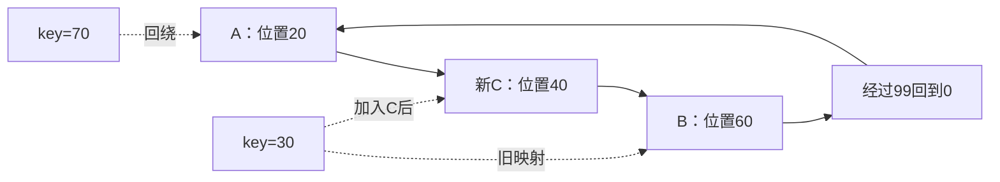

图中空间题设为 0..99，旧环 A20/B60，加入 C40 后只将区间 (20,40] 的 key 从 B 改给 C，70 仍给 A。若物理节点等容量、位置与 key 均匀，N→N+1 时新节点期望接约 1/(N+1) 的份额；少量节点和热点会偏离这个期望。虚拟节点把每台机器散布在多个位置，能降低随机不均；原来的 100–200 只是示例数量，应由分布、元数据规模与恢复成本决定，不能消除单个超级热点。

| 方案 | 扩容对映射的影响 | 均匀性与代价 | 适用判断 |
| --- | --- | --- | --- |
| 取模（mod N） | 上述假设下翻倍约一半；N→N+1 约 N/(N+1) | 简单，但成员数直接参与路由 | 成员稳定或已有显式迁移表时可用 |
| 一致性哈希 | 新位置接管相邻区间；均匀条件下期望份额有界 | 要管理环版本、虚拟节点、碰撞、热点和容量权重 | 弹性成员需要减少映射变化时可选 |
| 范围分片 | 仅把从未存在的新范围分给新节点，可不搬旧范围；切分已有热范围仍要迁移 | 便于范围查询，容易热点倾斜 | 明确访问范围与拆分机制时可选 |

四种游戏用途要分清：

1. **Redis Cluster**有固定 16384 hash slots，key 经 CRC16 等规则选槽，再由槽表决定节点；迁槽涉及 MOVED/ASK 与迁移状态，属于显式槽位映射，不是本文顺时针环。[S2]
2. **玩家亲和**只保证同一成员/环快照与同 key 选择相同候选。实例故障、扩容、重连都会改变条件；网关鉴权后仍要确认资源 owner，旧连接也不会自行搬家。
3. **分库分表**可以用 hash、范围或目录表，但路由变化还需共置事务与写权切点，见[数据库选型与存储设计 A7](01-数据库选型与存储设计.md#a7-分片共置路由与迁移切点)。
4. **Kafka 分区键**把同业务 key 路由到分区，在固定分区规则内利用日志顺序。增加分区数或换分区器会改变映射，必须另定迁移与业务序号规则；日志顺序不能直接证明处理完成顺序。

### 3.2 消息队列（Message Queue）

MQ 的四个动机仍是削峰、异步解耦、事件驱动与故障隔离。例如登录后的站内邮件、审计日志与排行榜汇聚可以分别消费事件，跨服战和全服活动也可用事件传播。但“下游暂时坏了”只是把责任移到有保留期、有容量的队列；队列满、过期、毒消息或长期积压时，要有背压、隔离和恢复负责人，不能无限缓冲。

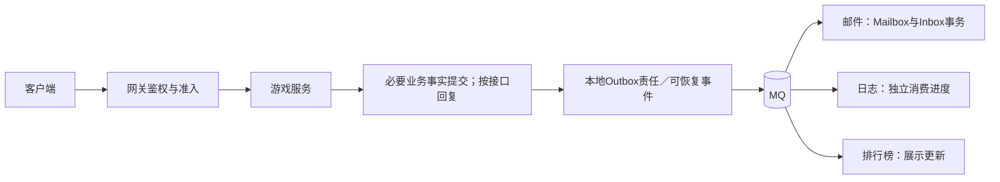

图中的三条箭头表示三个下游职责，不表示一个 RabbitMQ 队列会把每条消息广播给三个消费者。要三方各得一份，应分别配置队列或 Kafka 消费组。业务库与 broker 不在一个本地事务里，“提交后再发消息”有崩溃缺口；Outbox 的持久事实、投递、履约与补偿完整机制见[分布式事务与最终一致性](04-分布式事务与最终一致性.md)，这里不以 Raft 或锁替代它。

| 维度 | Kafka | RabbitMQ |
| --- | --- | --- |
| 模型 | Topic、Partition、Offset 的分区日志 | Exchange、Queue、Routing Key 的路由与队列 |
| 吞吐 | 由批次、消息大小、分区、副本、磁盘及负载决定 | 由队列类型、确认、持久化、消息大小及负载决定；不能凭产品名比较绝对 msg/s |
| 顺序性 | 单分区日志顺序；并行处理、重试、位点提交还需应用约束 | 队列投递有序性受多消费者、重投等影响；完成顺序另定 |
| 可靠性 | Producer 确认、ISR/副本策略与消费业务事务分别负责 | Publisher Confirm、持久队列/消息与 Consumer Ack 分别负责 |
| 消费模型 | 消费者拉取，按组管理分区分配与提交位点 | broker 推送消费或主动拉取；delivery tag 属于投递的 channel |
| 典型用途 | 日志、事件总线、跨服数据流、多组重放 | 任务分发、路由丰富的业务消息、可靠投递 |

Kafka 的 Topic 分成多个 Partition；Offset 是分区内位置。Consumer Group 在一次有效分配中将一个分区交给组内一个消费者，不证明被撤销分配的旧业务任务已经静默，也不禁止应用线程并发处理该分区。因此先处理 offset 12 后提交 13，若 11 的业务仍未知，就可能把未完成责任跨过去。顺序交易需按业务 key 选分区，并把版本/序号核验、串行完成与连续提交进度接起来。RabbitMQ 单队列单消费者可缩小并行边界，仍需处理重投；一致性哈希 exchange 是另需核对的插件能力，不能从它推断 exactly-once。

可靠性要分别问三端：生产端 `acks=all` 等待当前 ISR 所需确认，幂等生产约束覆盖该产品协议范围内的重试；broker 的副本数与 `min.insync.replicas` 决定哪些状态允许接受；消费端只有在本地业务效果及原终态已提交后才推进位点/ack。题设副本3、minISR2意味着 ISR 不足时拒绝这类写，不意味着任何故障、误配置、保留期或外部邮件都不丢不重。[S3][S4] 关键消息选 Kafka 或 RabbitMQ，应由重放、路由、延迟、保留、运维和业务接受合同决定；完整产品语义见[缓存与消息队列](03-缓存与消息队列.md)。

### 3.3 负载均衡（Load Balancing）

L4 按传输连接、IP/端口选择后端，例如云 LB、LVS；L7 理解 HTTP 路径、Header 等，可按应用规则路由，例如 Nginx 或游戏网关。健康检查是某个探针在某次时刻的观察，既不是后续请求保证，也不是权限凭据。

| 算法 | 实际选择依据 | 适用与边界 |
| --- | --- | --- |
| 轮询（Round Robin） | 依次选择后端 | 无状态、成本相近的请求；不感知每条请求真实工作量 |
| 加权轮询（Weighted RR） | 配置权重 | 异构机器；静态权重不是容量测量 |
| 最少连接（Least Connections） | 当前连接数 | 长连接可能有帮助，但一条繁忙连接与一条空闲连接成本不同 |
| 一致性哈希（Consistent Hash） | 来源或稳定业务路由 key | 有亲和需求；成员变化与 owner 迁移仍需协议 |
| 随机（Random） | 随机候选 | 无状态场景可用；小样本仍会偏斜 |

对游戏长连接至少区分：本 TCP/WebSocket 连接已落在哪台实例、新连接该找谁、这个房间当前谁有写权。会话保持只改善前两者的稳定性；第三者由3.9的 Gate 判定。玩家转服或跨服战由鉴权后的网关按业务元数据协调，不能让 LB 随机将同一状态交给两个可写实例。权重归零可减少新连接，不会搬走存量 WS；迁移还需停止准入、交接状态、重连或排空及原请求恢复。

### 3.4 服务发现（Service Discovery）

实例启动后注册地址、能力与健康信息，按所选产品合同续约；注册中心发布变更，调用方或代理更新候选。每一步都有自己的延迟与失败状态。即使注册中心具有强读接口，watch、缓存和网络仍会让消费者看到旧候选。[S6]

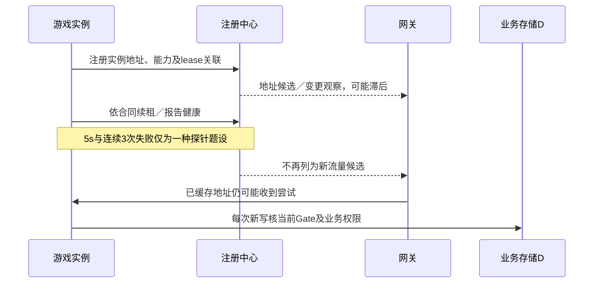

“每5s心跳、3次失败摘除”不能转写成 etcd lease 的精确失效时刻，也不能证明实例已经停机。**客户端发现**由调用方查注册中心并选后端；**服务端发现**由 LB/代理查注册中心，调用方只连代理。两者都必须承担缓存更新、健康观察、有界重试及授权边界，详见[IPv6、NAT、服务发现与负载均衡](../../01-编程与计算机基础/网络协议基础/03-IPv6NAT服务发现与负载均衡.md)。

例如合并 `zone-1-server-3`：先决定哪些房间交给新 owner，停止旧实例的新准入；在 D 中逐个安装合法新代次，再让新实例加载对应已提交基线并接纳尝试。地址登记服务于找得到它，不授予它房间写权；旧连接需按会话合同关闭/重连。在途存档用原 request_id 恢复，不能靠“旧实例摘除、新实例注册”四个字承诺平滑迁移。

### 3.5 CAP 与 BASE

CAP 的 C 在这里是线性一致：每个操作看起来在调用到返回之间某一点生效，且尊重已完成操作的实时先后；它不要求物理副本每个瞬间字节完全相同。A 是模型内每个发往非故障节点的请求最终都能完成，不能用一直报错或一直等待替代。P 表示模型允许消息在节点组之间被分区阻断。在这种分区历史中，不能同时保证上述 C 与 A；不能把结论简化成无条件“任何时候任选两个”。模型、可观察历史与强读边界由[分布式系统基础](02-分布式系统基础.md)详述。

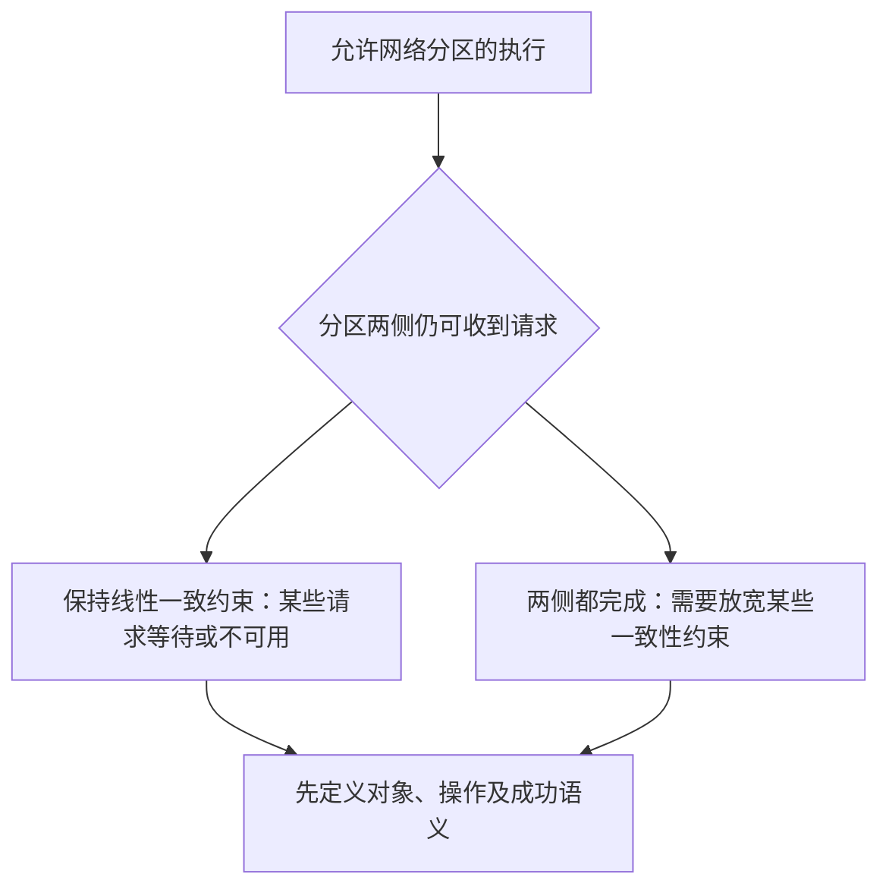

产品不宜整体贴固定 CP/AP 标签。etcd 的普通 KV 读写与可选陈旧读、Redis 异步复制和 failover、Kafka 对特定 ISR 的生产策略都是不同接口与故障条件。应先问某个对象允许读到多旧、分区时是否接受写、已确认写是否能丢，再核对实际部署；“集群”本身不是答案。

BASE 的基本可用、软状态、最终一致描述的是工程方向。收敛还需要更新能继续传播、冲突如何解决、哪些责任不会因超时消失，以及谁负责重试、对账和补偿。没有这些机制，“最终会一致”只是愿望。

- **资产、订单与关键存档**：不变量优先。例如扣款与唯一发放必须在合法事务域提交；无法确定结果就保留 UNKNOWN 和查询入口，不能一边告诉玩家“失败”一边用新 ID 再扣。
- **在线人数、实时榜单展示、部分广播**：可以明确陈旧窗口及降级返回。排行榜展示可陈旧，不代表封榜名次或奖品归属可以随意变动；该边界见[缓存与排行榜系统](02-缓存与排行榜系统.md)。
- **跨服战结果**：定义结果身份、权威版本、重复/冲突处理和对账推进者。跨库结果传播与补偿见[分布式事务与最终一致性](04-分布式事务与最终一致性.md)，不能由“AP”推导跨服操作已经原子完成。

### 3.6 Raft 简述

Raft 解决的是复制状态机日志的一致推进。Leader 组织复制；Follower 响应复制与投票；Candidate 在超时后发起选举。节点按协议持久保存 term、投票及日志等必要状态；协议的崩溃恢复前提不能被“内存里有多数”替代。[S8]

1. **任期**是逻辑选举编号。候选者发起新选举增加 term，节点见到更高 term 按协议退为 Follower；心跳让跟随者重置选举计时，不会给当前 term “续期”。论文中的随机 150–300ms 是示例，不是 etcd 在任意环境中的切换保证。
2. **选票**同一 term 至多投一个候选人，并检查日志是否足够新：先比较最后日志的 term，再比较 index。不能只按日志条数或墙钟时间决定。获得多数票也需满足候选者和日志规则，并非任何多数网络可达者都能合法晋升。
3. **复制与提交**：Leader 追加当前 term 的条目，复制到多数；按论文规则可据此推进该当前 term 条目的 commitIndex，连带此前合法前缀提交。已提交条目按顺序应用到状态机，再按应用合同回复。还未复制到多数的本任期条目也可能被后继覆盖，因此“Leader 写下的所有日志必定被多数保存”是错误的。
4. **旧任期反例**：旧 term 的条目后来碰巧出现在多数节点上，不能仅以此副本计数直接宣布它已提交；还需通过当前 term 条目的提交确立前缀。论文 §5.4.2 展示这项限制为何必要。安全性依赖这些规则共同成立，而不是单独的 term 较大或副本较多。

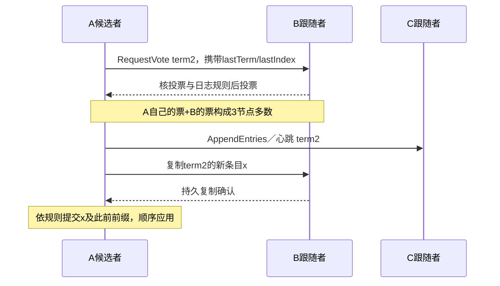

图只是三节点、一次 term2 写入的有限正常轨迹，不证明失联 C 已追上，也不包含在线配置变更。

**旧任期反例，PAPER_EXPECTED**：按论文 Figure8 的五节点 S1–S5 情境追踪 index2。S1 在 term2 只复制了部分节点就崩溃；S5 随后以 S3/S4/自己的票当选 term3，在 index2 写了另一条 term3 日志但尚未形成提交。S5 崩溃，S1恢复并在 term4 当选，把原 term2 的 index2 补到多数。此时若 S1 又崩溃，S5 的最后日志 term3 比其他存有 term2 的日志更新，仍可能在更高选举任期取得多数票并覆盖旧 index2。因此第三步的“旧条目已有多数副本”不够。替代分支是 S1 先把一条 term4 新条目复制到多数并依规则提交，原 term2 前缀才随之确立；S5 不能仅持较旧的日志赢得这个多数的选票。这里复述有限论文历史，没有运行协议模型。[S8 Figure8、§5.4.2]

客户端在应用成功但回包丢失后重试，同一命令仍需稳定 ID 和状态机内原结果去重；日志共识不会替应用自动定义请求身份。[S8 §8]

游戏中，etcd 可承载配置、实例元数据和协调锁；活动“主服”可以用协调服务选候选，但真正写活动状态仍要在业务接收端验证 owner。MySQL MGR 与 Redis Cluster failover 各有自己的复制、选主和故障模型，不能把它们都说成 Raft 实现，也不从“都用了投票”推出相同持久性。本文未审核它们的完整实现。一个 Raft 日志更不能把 PostgreSQL、broker 和外部邮件自动组成跨系统事务。

### 3.7 容灾与多活

**RPO**描述可接受的恢复数据损失目标，常用故障点与可恢复数据点之间的时间差表达；具体还应说哪些记录允许丢、哪些已确认事实必须连续。**RTO**描述从约定故障起点到业务按验收标准恢复的时间目标。数据库进程启动、HTTP 健康和真正重新开放业务流量是不同里程碑，不能混用。

| 方案 | 有用之处 | 必须另证的恢复条件 |
| --- | --- | --- |
| 本地备份 | 成本较低，可防部分误操作并提供恢复基线 | 同机/同场地可能同时损坏；备份频率不等于实际可恢复点 |
| 同城双活 | 可分摊无状态入口或按资源分写，降低部分场地影响 | 写域、延迟、依赖、仲裁与隔离；不能仅凭“双活”许诺秒级切换 |
| 两地三中心 | 同城生产冗余加异地恢复材料，隔离部分地域风险 | 异步复制进度、可恢复前缀、异地容量、密钥/权限与业务验收 |
| 三地五中心 | 可以覆盖更多故障域和布置更多冗余 | 跨地域成本、相关故障、仲裁布局与运行复杂度；中心数不产生 RPO/RTO 数值 |

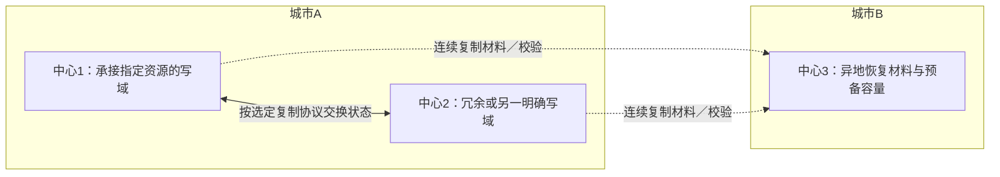

图保留两地三中心的规划用途。双向箭头不意味着同一余额允许无协调双写；有些系统只把无状态入口部署双中心，有些按服/房间分区指定唯一写域，有些依赖明确的跨中心事务协议。三种设计的延迟、可用性和恢复成本不同。

游戏服级恢复应追一条具体链：确定受影响的服/资源 → 阻止旧写端再接受新写 → 选匹配版本的完整备份与连续日志 → 恢复 Snapshot、Gate 和原结果 → 核余额、道具、存档版本及履约责任 → 加载新服务 → 小范围业务验收 → 开放流量。数据库之外还可能依赖登录、配置、队列与支付对账。缺一条关键日志时只能宣称恢复到已证明的连续水位，不能用最大序号填空。[S5；数据库选型与存储设计 A12](01-数据库选型与存储设计.md#a12-恢复是一条可证明的连续链)

异步跨机房复制有可能丢失已确认写；同步选择也带来跨地域延迟与故障时可用性取舍。双中心的仲裁用于决定谁应工作，**隔离旧主**必须让旧数据库写端确实不能继续接受；健康探针和旧主网络看不见不构成该证据。[S5] 回档到最近存档点仅能用于明确容损的业务政策；已确认充值/资产/发奖不能静默回档后重发。

**独立容损题 H9 · PAPER_EXPECTED**：故障起点10:07，可证明的合法恢复前缀到10:05，业务验收并开放流量10:12，则这次题设的损失时间窗口为2分钟、恢复耗时为5分钟。这不是现场测量，也不证明任何目标已达标；10:05–10:07内哪些已确认数据可以损失必须另有政策。3.9主例要求已承诺成功的状态连续，此题的容损前提不能拿来满足主例。

季度演练保留为计划入口：先指定所有者、隔离环境、目标故障域、恢复材料、撤回条件、起止观测和业务验收项，再另行获准执行。机房断电、数据库切换、整服回档等动作不在本次静态修订范围，也没有产生测量结果。

### 3.8 分布式锁（Distributed Lock）

先判断业务需要哪种不变量：每日重置需要“某业务日的重置效果只提交一次”；交易需要余额与交易记录原子一致；发奖需要稳定发奖身份及原终态；限量道具需要库存非负和唯一领取。这些不变量分别由同事务唯一约束、条件余额/库存更新、结果记录与必要的 Gate 保证。协调锁可以减少重复竞争，却不应成为它们唯一的正确性来源。

Redis `SET key value NX EX ttl` 将检查不存在、写值与设期限合成一个原子命令；唯一 value 用于识别本次尝试，Lua compare-delete 防止释放时删掉另一次持有者的 key。value 是随机身份，不是单调 fence。进程暂停超过 TTL 后可继续跑旧临界区，续期线程也可能一起暂停；watchdog 的作用是正常情况下维持租约，不能保证暂停/分区时旧工作停止。[S7]

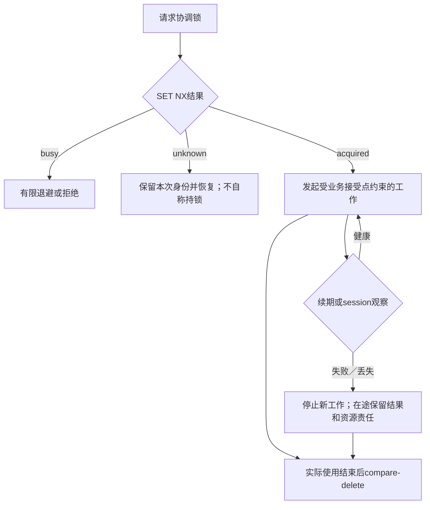

图中的“停止新工作”不能撤销 D 中已接受的事务。新 owner 安装以后，旧 owner 的晚到写由同一业务接受点拒绝；安装以前已合法提交的旧写必须纳入新基线。释放锁也不能代替等待业务回调静默。

Redis 主从异步复制下，主节点收到加锁后未复制就故障，提升的副本可能允许另一个持有者；因此单实例加 Sentinel 不自动保证跨 failover 的互斥。[S7] Redlock 是需要单独明确时钟、延迟与故障假设的设计话题，本篇没有给它通用安全认证，也不以“锁加幂等”四字替代不同资源的接受合同。

etcd 的 Session/Mutex 用租约键、创建 revision 和 watch 协調排队，4.5解释具体职责；etcd 内的条件事务可核它自己的 owner key，外部数据库仍须自行核 Gate。[S6] 数据库 `SELECT ... FOR UPDATE` 可串行化同行事务，乐观 `version` 条件可拒绝过期状态；只有把业务约束、效果与原结果放到同一接受事务，它们才构成完整方案。低频与高频都应按冲突、延迟和容量选择，而非凭“强一致”标签决定。

### 3.9 房间存档：把路由、接受点与 owner 交接接成一条链

#### 3.9.1 对象、权限与原子域

只讨论一个预先建立的房间资源 `R=(tenant, room_id, incarnation)`。客户端 C 经网关 G 到旧 worker O 或新 worker N；etcd 给出实例地址和协调观察，业务库 D 才决定谁能保存 R。G 鉴别稳定玩家/业务主体、租户和房间权限，可信 worker 校验业务参数；玩家不能通过 query 参数选择任意 owner、epoch 或任意存档内容。worker 的服务身份和交接控制面的授权分别验证。

D 是一个逻辑上的原子持久事务域。说明采用 PostgreSQL 16 的行锁与 READ COMMITTED 语义，[S5] 并要求下面全部状态以及所有修改 R 的入口共用这个事务域。不能另有管理员脚本、批处理或旧服务绕过 Gate 直接覆盖 Snapshot。复制、故障恢复与旧主隔离必须保持同一个合法连续前缀，包含对外承诺成功的效果和原终态；这是一项上线前提，不是本篇已测得事实。

| 持久状态 | 身份、内容与作用 |
| --- | --- |
| OwnerGate | 主键 R；current owner_id、epoch、准入/退役状态、最近 transfer_id。行预先建立、常驻；epoch 只由获准交接事务递增，不回绕 |
| Snapshot | 主键 R；snapshot_version 和有界完整状态。与 Gate 变化串行；新 owner 从已接受基线开始，不拿旧内存覆盖 |
| RequestResult | 唯一键 `(tenant, authenticated_actor, operation, request_id)`；完整请求绑定、完整原终态及原结果版本。同逻辑请求恢复返回原响应，不冒充当前状态 |
| TransferResult | 唯一键 `(tenant, authorized_control_scope, TransferOwner, transfer_id)`；完整交接绑定、新 epoch、当时接管的 snapshot_version 和完整有界基线。保留它，才能在后继写入后仍返回原交接结果 |
| 持久预算 | 每个 R 的有界 Snapshot 容量、Q 个业务结果槽、T 个交接结果槽；完整参数/结果及交接基线都计入预留空间，与相应效果同事务占用 |

**业务绑定**必须包含 R、操作意图、规范化后的完整业务参数、expected_snapshot_version、协议版本和规范化规则版本。本有限例直接保存规范化完整参数，不把未定义碰撞处理的摘要当作同参证明。authenticated_actor 是稳定业务调用主体；本次 worker 的 owner_id/epoch、地址、trace_id 和重试次数属于执行尝试，不属于业务意图。换 N 接管后恢复 q17 仍是原 q17，不因换 worker 变成第二次保存。

**交接绑定**包含 R、old_owner、old_epoch、new_owner、TransferOwner 意图与协议/规范化版本；authorized_control_scope 是已认证、获准的稳定控制面主体域，不是临时连接。ID 自身不赋予交接权限或结果查询权限。每次请求仍要核当前访问授权：玩家可以合法查询自己的原保存结果，不等于失权的 O 可以发起新写；控制面可以查询 t8 历史，不等于仍可要求安装旧代次。

epoch 是 D 的受控状态，不取自 etcd 地址、lease ID、revision、Raft term 或墙钟。普通 worker 不能靠自报一个更大数字接管；它只能提交与当前 Gate 完全匹配的执行身份。没有服务身份、授权控制面、递增规则或全部写入口覆盖，fencing 的结论就停止在缺失项。

#### 3.9.2 先有持久恢复责任，再发第一次操作

本例刻意有限：只接受既有 R；不删除/回收 Gate、Snapshot 的当前身份、RequestResult、TransferResult；不复用 incarnation、epoch、request_id 或 transfer_id 来表示新意图。同逻辑请求继续用原 ID 查询/重试。Gate 缺失、R 不在准入集合、资源退役或 epoch 耗尽时拒绝新工作，不能自动新建 epoch0 让旧身份重新有效。本文不执行退役；真实退役必须留下持续拒绝旧域的证据。

为纸面题设可取 Q=2、T=2，参数长度、主体长度、Snapshot 和完整结果字节上限也预先确定。这不是生产推荐值。新结果必须在效果之前、同一事务中预留足够的逻辑持久预算，统一锁顺序为 **Gate → 本 R 预算**；旧同 ID 同参结果在预算检查之前返回，不占第二个槽。容量不足就停止新增效果，不能删除老结果、截断内容或换 ID 腾位置。逻辑预算不能排除实际磁盘、WAL 或提交故障，物理提交未知时预算也不能乐观返还。

G 所属的恢复协调者，以及发起交接的控制面，各自有**有界且预先持久化的恢复记录**。首次向 D 发出请求之前，已保存原 ID、完整绑定、恢复主体、待确认责任和必要的有界负载；无法建立记录就不发请求。本有限例这些记录同样不回收，终态写入后不被迟到 UNKNOWN 覆盖。查询失败、等待期限或热重试预算耗尽只结束本轮尝试，恢复责任仍在；进程重启后沿同 ID 恢复，不依赖旧调用栈。

持久待办负责“未来还能查原意图”，在途记录负责“当前谁还在用内存、连接与回调”。两者不能互相替代：即使业务责任已经持久移交，只要旧工作仍访问依赖，原宿主或明确接手的资源所有者仍必须持有这些真实对象。无 GC 的代价是最终会拒绝新意图；正式 GC 必须另外证明合法重试、在途事务/回调、人工重放、备份和后继代次窗口都已关闭。本例没有省略这些证明后暗中回收，相关设计入口见[分布式事务与最终一致性第12节](04-分布式事务与最终一致性.md)与[缓存与消息队列第11节](03-缓存与消息队列.md)。

#### 3.9.3 一次保存的真实接受点

设 Gate 是 O/7，Snapshot 为 v10。原意图 q17 请求以 expected_version=10 保存服务端验证过的完整状态，业务绑定已持久保存。下面是事务顺序说明，含 SQL 形状；它不是可直接执行的存储过程，也没有隐藏“驱动已实现幂等”的假设。

```text
PAPER_EXPECTED：Save(R, q17, stable_actor, full_binding, attempt_worker, attempt_epoch)
先验证调用/结果查询权限、规范版本和有界输入；已存在持久恢复责任
BEGIN（READ COMMITTED）
  SELECT * FROM OwnerGate WHERE resource_key = :R FOR UPDATE;
  -- Gate存在时，以下操作始终持有这把行锁到事务结束
  SELECT * FROM RequestResult
    WHERE tenant=:tenant AND actor=:actor AND operation=:op AND request_id=:q17;
  若原终态存在：核完整binding和结果查询权限
    同参 → 结束只读事务后返回原终态；不核旧attempt是否仍owner，不产生效果
    异参 → 冲突，结束事务；不覆盖任何原记录
  若无原终态：
    必须存在Gate且资源未退役、可接纳；否则拒绝本次新尝试
    已认证attempt_worker/attempt_epoch必须等于当前Gate owner/epoch
    Snapshot.version必须等于绑定内expected_version；业务状态必须合法
    按Gate→预算顺序原子预留完整新状态与一个RequestResult槽；失败则回滚
    UPDATE Snapshot SET version=11, payload=:validated_state WHERE resource_key=:R;
    INSERT RequestResult(完整唯一键, 完整binding, 原SUCCESS及version11);
COMMIT
  已知成功 → 返回原SUCCESS(q17, version11)
  已知本次回滚 → 本次效果/结果/预算均未提交；仍不能断言其他同q17尝试未成功
  提交结果未知 → 保持UNKNOWN(q17,binding)，交原责任者恢复
```

此处行预先存在；对不存在的 Gate 做 `FOR UPDATE` 不能锁住“空缺”来建立互斥。若缺行，只允许经过权限校验的权威历史结果查询；无原结果则拒绝新工作，不插入替代 Gate。历史查询可以由独立只读入口完成，不能借“Gate 不存在”暴露别人的结果。

同 R 的新写与交接都被同一 Gate 行串行化，所以检查 owner/epoch 后不会在释放锁的空隙中被交接，再去提交旧效果。检查、Snapshot、RequestResult 和预算同 COMMIT；持锁期间不调用外部邮件/HTTP，不等玩家输入。仅客户端核 epoch、先 GET 注册中心再 UPDATE D、先写业务后异步补结果都不满足此合同。

RequestResult 的唯一键域可能跨 R。若有人用同 request_id 改绑另一个 R，两个事务会锁不同 Gate；最终唯一约束仍能让至多一个插入成为胜者。**唯一冲突使本次事务回滚，包括本次 Snapshot 和预算；它不证明整个逻辑请求从未成功。** 必须退出失败事务后，在合法主体的权威新读视图中查原完整绑定：同参则返回原终态，异参则冲突；暂不可读或原胜者仍未决则 UNKNOWN。不能捕获冲突就无条件“幂等跳过”，也不能在 PostgreSQL 已失败事务里接着读并假称成功。TransferResult 的唯一冲突遵循相同分支。

“明确拒绝本次尝试”与“这个业务意图已获得原终态”不同。例如 owner 已变或容量不足说明这次不能新写，不得覆盖原成功，也不能向未知的 q17 断言从未保存。若实际接口要把业务拒绝当作可重放的最终结果，需同样预留结果空间并持久记录其完整绑定；本文 H2–H5 只推导已经接受的保存成功路径。

#### 3.9.4 交接 t8：先查原结果，再决定是否安装新代次

控制面先持久保存 t8 的绑定 `(R, O, 7, N)`。停止给 O 分配新工作只是降低竞争；O 的旧连接、旧请求和旧事务仍可能存在。

```text
PAPER_EXPECTED：TransferOwner(t8, R, expected=O/7, new=N)
验证稳定控制面主体、交接授权、完整绑定及有界恢复记录
BEGIN（READ COMMITTED）
  锁同一个R的OwnerGate；持锁至事务结束
  先按完整控制面请求域查TransferResult(t8)
  若已有原结果：核查询权限与完整binding
    同参 → 返回原来的epoch8与当时基线；不递增、不改Gate、不重新授权N
    异参 → 冲突；保留原记录
  只有没有原结果时：
    核Gate存在、资源可接纳、当前确为O/7、新owner在授权集合、epoch可递增
    原子预留完整TransferResult（含当时基线）和Gate更新所需预算
    在仍持Gate时读取已经提交的Snapshot版本及完整内容
    更新Gate为N/8、transfer_id=t8
    插入TransferResult(t8, full_binding, SUCCESS, epoch8, 当时完整基线)
COMMIT：Gate与TransferResult一起接受；未知回复则保留同t8恢复责任
```

为什么必须先查 t8？若第一次已经安装 N/8 但回包丢了，先要求 Gate 仍是 O/7 会错误拒绝自己的恢复；重新生成 t9 又会把恢复变成新的交接意图。正确做法是同 t8 同参数重入同一 Gate 序列，找到原成功就交付原成功，不再次递增。

两种最小并发历史决定基线：

- **H3，旧写先接受**：O 先取得 Gate 锁，q17 将 v10→v11 连同原结果提交；t8 随后取得锁，安装 N/8 并记录 v11 基线。N 从 v11 开始，O 的合法成功不被撤销。t8 后到达接受点的 O/7 新写被拒。
- **H4，交接先提交**：t8 先安装 N/8；O 虽在内存算好了 v11，却尚未进入 D 的接受事务。它随后拿到锁时看到 N/8，不能提交。内存计算完成、RPC 发出、租约曾有效都不构成业务提交。

如果旧业务事务还持锁，t8 等它结束。等待预算耗尽就停本轮，保留 t8 的责任；不能把等待超时解释为旧事务已取消，也不能先对外宣称 N 已接管。D 的执行/锁等待上限和清理结果必须由实际接口合同实现，本静态顺序本身没有承诺每次等待总时长有界。

#### 3.9.5 UNKNOWN、迟到 t8 与后继 t9

**H5/H11，回复丢失**：q17 或 t8 的 COMMIT 可能已成功，但响应没到。一次普通 SELECT 无记录，可能只是原事务尚未提交；数据库不可读更没有否定意义。恢复仍持原 ID、完整绑定、合法查询主体和责任。在预算内重试时，再争同一 Gate 锁，锁内先查原结果，才在无记录时检查当前写权和新效果条件。数据库锁序厘清了前后，不能用一次空读替代这一步。无法判定时保持 UNKNOWN，停止新增尝试而不遗忘责任。

原成功是关于**当时**的事实。t8 成功后，另一个获准的新意图 t9 可用 expected=N/8 安装 P/9。之后迟到的 t8 恢复必须返回它保留的 epoch8 和当时 v11 基线，D 仍然是 P/9。t8 的成功既不能降级成失败，也不能变成“现在 N 又有写权”。这就是 H12：返回历史结果，与授予当前权限严格分开。

N 加载基线、准备接纳尝试以及实例 ready，均不能跳过随后每次新写的 Gate 核验。发现只发布实例候选；若网关缓存某 R 的 owner，它保存的也只是带观察代次的候选。先读 D 再跨系统写 registry/缓存不是原子发布：可能刚读到 N/8，t9 就安装 P/9，然后缓存迟到地写成 N/8。此时 D 拒绝 N/8 新写，保护了接受点；路由会多一次失败/刷新，本文不承诺路由始终最新或无感切换。若要求发布本身无陈旧，须为那个控制面另设计条件更新协议。

已知业务终态的合并要单调：q17 已确认 SUCCESS11，稍后到达的旧查询 NOT_FOUND/UNKNOWN 不得抹掉成功；同一原终态的重复通知只复用结果。若出现同一身份/绑定的互相矛盾确证终态，保留证据与依赖、停止推进诊断，不能任选一个继续。恢复结果本身也不证明旧 driver 或查询回调已静默。

#### 3.9.6 排空与数据层灾备

O 的本地 owner 在入口门内停止新准入，冻结已接纳工作边界；撤销还没开始的工作需要确认其确实未派发。已有 WS 按协议完成交接/关闭/重连；已有数据库保存保留原 ID 及实际依赖。关闭预算用尽报告 INCOMPLETE；不能把 cancel 返回、lease Done、RPC 等待结束或业务查询成功当作所有工作结束。

这里沿用[数据库选型与存储设计 A11](01-数据库选型与存储设计.md#a11-异步存档接受确认与资源静默是不同事实)的两轴与 close_cut：已接纳快照、实际在途写及查询、业务终态、真实资源静默分别跟踪。只有相应工作和全部回调都不会再访问依赖，才归还真实槽或关闭相应连接；持久移交业务待办不能提前销毁仍在访问的连接、快照或协调者。关闭调用返回以后，宿主仍要持有未完成资源责任。无法做到就不能声称安全关闭。

若故障的是 D 本身，重新连上一台健康数据库仍不足够。必须证明旧 D 写端已隔离，新 D 从合法连续前缀恢复 Snapshot、Gate、两类原结果及预算，且所有承诺成功状态没有被悄悄回退，epoch/incarnation 未复用。恢复旧备份如果缺掉已确认 q17 或 t8，就破坏本例前提，应停写、核对缺口并交业务恢复责任人；不能靠 etcd 有多数就继续发奖。外部对象存储、SMTP、支付等不在 D 中，不受这个同库原子性保证，需各自接收端原结果/幂等/授权协议，见[分布式事务与最终一致性](04-分布式事务与最终一致性.md)。

## 4. 代码与配置示例

下面保留原六个示例的学习用途，但全部是静态教学输入，没有编译、连接服务或加载配置。涉及身份、存储和关闭的前提随例列出；不能把语法看起来完整等同于生产实现已经完成。

### 4.1 一致性哈希（Go 简化版）

核心仍是虚拟节点、排序、二分查找与回绕。变化在构造：一次成员更新先在未发布候选里检查，任何重复节点、非法数量或 hash 碰撞都会丢弃整个候选，旧环不变。下例有显式输入上限，避免无界扩展；这些上限也是题设，未做内存测量。

```go
// PAPER_EXPECTED：纯计算示例，未编译/运行。
package ringexample

import (
    "fmt"
    "hash/crc32"
    "sort"
)

type ConsistentHash struct {
    ring       map[uint32]string
    sortedKeys []uint32
}

// 构造后字段不再修改；替换现用指针需调用方自己的同步发布合同。
func Build(nodes []string, replicas int) (*ConsistentHash, error) {
    const maxNodes, maxReplicas, maxPositions = 1024, 1024, 65536
    if replicas <= 0 || replicas > maxReplicas || len(nodes) > maxNodes {
        return nil, fmt.Errorf("invalid member/replica count")
    }
    if len(nodes) > maxPositions/replicas { // 不先做可能溢出的乘法
        return nil, fmt.Errorf("candidate too large")
    }
    candidate := &ConsistentHash{ring: make(map[uint32]string)}
    seen := make(map[string]bool)
    for _, node := range nodes {
        if node == "" || len(node) > 128 || seen[node] {
            return nil, fmt.Errorf("invalid or duplicate node")
        }
        seen[node] = true
        // 这是Add虚拟节点的构造期步骤，不是已发布环的并发Add方法。
        for i := 0; i < replicas; i++ {
            h := crc32.ChecksumIEEE([]byte(fmt.Sprintf("%s-%d", node, i)))
            if _, exists := candidate.ring[h]; exists {
                return nil, fmt.Errorf("hash collision; discard whole candidate")
            }
            candidate.ring[h] = node
            candidate.sortedKeys = append(candidate.sortedKeys, h)
        }
    }
    sort.Slice(candidate.sortedKeys, func(i, j int) bool {
        return candidate.sortedKeys[i] < candidate.sortedKeys[j]
    })
    return candidate, nil // 全批校验成功以后才交给发布者
}

func (c *ConsistentHash) Get(key string) (string, bool) {
    if c == nil || len(c.sortedKeys) == 0 { return "", false }
    h := crc32.ChecksumIEEE([]byte(key))
    i := sort.Search(len(c.sortedKeys), func(i int) bool {
        return c.sortedKeys[i] >= h
    })
    if i == len(c.sortedKeys) { i = 0 }
    return c.ring[c.sortedKeys[i]], true
}
```

空成员表会产生合法空环，Get 返回 not-found；它不应被上层当成“随机找一台旧服”。构造失败绝不能发布半个 candidate。CRC32 在这里是路由散列，不是身份鉴别或安全散列；碰撞时本例拒绝整组，未实现自动重散列。构造成功也只得到成员映射，既有房间状态还要按3.9交接。本例没有在线 Add、权重重平衡、迁移或并发指针发布实现。

### 4.2 Kafka 生产者配置（YAML/Properties）

原 YAML 的用途是把生产者、消费者和 topic 的参数列在一起。下列仍是**应用部署清单**，不是 Kafka Java 客户端能直接整体加载的通用格式；实际配置需分别送入相应组件。Java Serializer/Deserializer 使用完全限定名称。[S3]

```yaml
# PAPER_EXPECTED：三层配置清单，常量均为题设
producer_properties:
  bootstrap.servers: "kafka-1:9092,kafka-2:9092,kafka-3:9092"
  acks: "all"
  enable.idempotence: true
  retries: 10
  max.in.flight.requests.per.connection: 5
  key.serializer: "org.apache.kafka.common.serialization.StringSerializer"
  value.serializer: "org.apache.kafka.common.serialization.StringSerializer"
consumer_properties:
  bootstrap.servers: "kafka-1:9092,kafka-2:9092,kafka-3:9092"
  group.id: "game-mail-consumer"
  enable.auto.commit: false
  max.poll.records: 200
  key.deserializer: "org.apache.kafka.common.serialization.StringDeserializer"
  value.deserializer: "org.apache.kafka.common.serialization.StringDeserializer"
topic_creation_and_configs:
  mail:
    partitions: 16
    replication_factor: 3
    configs: { min.insync.replicas: 2 }
  cross-server:
    partitions: 32
    replication_factor: 3
    configs: { min.insync.replicas: 2 }
```

Kafka 3.8.0 文证要求启用幂等时配置相容：acks=all、retries>0、max.in.flight≤5；这里显式列出，不把其中10/5/200/16/32/3/2当推荐容量或SLO。`min.insync.replicas`属于 broker 默认或 topic 配置，不能塞进 Producer 属性就以为生效。副本分布与可用 broker 数也需满足 topic 创建条件；本篇没有实际建 topic。

`send()`返回 Future 或进入本地缓冲，仅说明客户端阶段；收到成功结果才按生产合同认定 broker 接受。Future 超时仍可能已接受，原 event_id 与投递责任应已在持久 Outbox；退出回调不能抹成成功。消费者逐业务事务完成后只提交连续完成前缀的下一 offset；rebalance 前未完成责任仍须保留。`max.poll.records=200`限定一次 poll 返回条数，不是每秒吞吐，也不保证处理能在分配合同允许时间内结束。

本节是配置入口，没有补造完整 Java 客户端生命周期。生产端停止新发送后，有界等待实际在途发送；未确认 event_id 仍由既有 Outbox 恢复，资源关闭需等真实工作/回调结束。消费端停止新准入、核当前分区分配、收束存量业务及连续位点；期限用尽不能盲目提交“最后读到的 offset”。具体资源所有权见[缓存与消息队列](03-缓存与消息队列.md)。

### 4.3 RabbitMQ 队列声明与消费（Python 节选）

本例只把一条可信邮件事件写入**同一数据库的站内 Mailbox**。不是调用外部 SMTP。唯一 Inbox 认领、Mailbox 行和原成功结果同一事务提交，才有下面的去重结论；没有一个空 `send_mail()`/`process_mail()`替代核心机制。

题设：一个 I/O 线程独占 Connection、Channel 与本回调；broker 已按实际队列/消息耐久合同接受事件，上游仍保留稳定 event_id 的恢复责任。Inbox 唯一键为 `(tenant, producer, event_id)`，Mailbox 有同一事件唯一约束，绑定保存**全部规范化事件内容**；Inbox 的临时认领行只在本事务里，提交时必须已经是 SUCCESS。完整内容与结果均有界，结果和消息在本例不 GC。新消息的 Mailbox/Inbox 预算在同库事务内锁定并预留；容量不足停止新效果，旧结果查找不占新槽。mail_id采用有界、不回绕的库内ID方案，耗尽则拒绝；若用序列，回滚可留下跳号，序列前进不等于邮件业务提交。[S9]

```python
# PAPER_EXPECTED：Pika API形状 + 显式SQL事务步骤；未运行。
# db.transaction()/execute()表示下述PostgreSQL同连接事务合同，
# 不是已认证的驱动适配器；运行前必须提供其提交结果/实际结束合同。
import json
import pika

conn = pika.BlockingConnection(pika.ConnectionParameters("rabbitmq"))
ch = conn.channel()
ch.exchange_declare("game.mail", "direct", durable=True)
ch.queue_declare("mail.send", durable=True)
ch.queue_bind("mail.send", "game.mail", routing_key="send")
ch.basic_qos(prefetch_count=50)  # 未ack窗口，不是每秒限速

class PauseForRecovery(Exception):
    pass

def no_duplicate_members(pairs):
    d = {}
    for key, value in pairs:
        if key in d:
            raise PauseForRecovery("duplicate JSON member")
        d[key] = value
    return d

def on_msg(channel, method, props, body):
    # I/O owner在调用前登记此delivery及真实资源责任，直到实际结束。
    if len(body) > 16384:
        raise PauseForRecovery("oversize; keep unacked")
    e = json.loads(body, object_pairs_hook=no_duplicate_members)
    required = {"tenant", "producer", "event_id", "recipient", "subject", "text", "version"}
    if not isinstance(e, dict) or set(e) != required:
        raise PauseForRecovery("schema; keep unacked")
    limits = {"tenant": 128, "producer": 128, "event_id": 128,
              "recipient": 128, "subject": 256, "text": 4096}
    if any(not isinstance(e[k], str) or not 0 < len(e[k]) <= n
           for k, n in limits.items()) or type(e["version"]) is not int or e["version"] != 1:
        raise PauseForRecovery("invalid/bounded fields")
    # authorized_tenant/producer/recipients是可信服务配置/已认证授权结果，
    # 不从消息自报身份生成；缺这项部署合同就不能运行本例。
    if (e["tenant"] != authorized_tenant or e["producer"] != authorized_producer
            or e["recipient"] not in authorized_recipients):
        raise PauseForRecovery("not authorized")
    binding = json.dumps(e, ensure_ascii=True, sort_keys=True, separators=(",", ":"))
    key = (e["tenant"], e["producer"], e["event_id"])

    with db.transaction():  # 一个READ COMMITTED事务；异常必须回滚整个事务
        claim = db.execute("""
            INSERT INTO Inbox(tenant, producer, event_id, binding, state)
            VALUES (%s,%s,%s,%s,'CLAIMED')
            ON CONFLICT (tenant,producer,event_id) DO NOTHING
            RETURNING event_id
            """, (*key, binding)).fetchone()
        if claim is None:
            original = db.execute("""
                SELECT binding,state,result FROM Inbox
                WHERE tenant=%s AND producer=%s AND event_id=%s
                """, key).fetchone()
            if original is None:
                raise PauseForRecovery("original not authoritative yet")
            if original[0] != binding:
                raise PauseForRecovery("same ID, different event; quarantine responsibility")
            if original[1] != "SUCCESS":
                raise PauseForRecovery("no complete original terminal")
            result = original[2]
        else:
            # 此Budget行已预建，统一锁顺序；本地事务失败撤销认领与预留。
            slots = db.execute("""
                UPDATE MailBudget SET remaining=remaining-1
                WHERE tenant=%s AND remaining>0 RETURNING remaining
                """, (e["tenant"],)).fetchone()
            if slots is None:
                raise PauseForRecovery("no durable capacity")
            mail_id = db.execute("""
                INSERT INTO Mailbox(tenant,producer,event_id,recipient,subject,body)
                VALUES (%s,%s,%s,%s,%s,%s) RETURNING mail_id
                """, (*key, e["recipient"], e["subject"], e["text"])).fetchone()[0]
            result = json.dumps({"status": "SUCCESS", "mail_id": mail_id})
            db.execute("""
                UPDATE Inbox SET state='SUCCESS',result=%s
                WHERE tenant=%s AND producer=%s AND event_id=%s
                """, (result, *key))
    # 只有事务已确知提交（或原SUCCESS已权威读到）才到达此行。
    channel.basic_ack(delivery_tag=method.delivery_tag)

ch.basic_consume(queue="mail.send", on_message_callback=on_msg, auto_ack=False)
try:
    ch.start_consuming()
except Exception as exc:
    # owner是宿主持有的责任记录；此处只登记故障，不确认消息、不报业务成功。
    owner.error = exc
    owner.state = "INCOMPLETE"
    owner.new_intake = False
    # conn、channel、DB工作及callback依赖继续由owner持有；没有finally自动close。
    # 由下文四分支解析原结果/隔离，并核实际静默后再关闭。
```

这个片段把事务里的核心操作列出，但没有把数据库驱动、认证配置和资源静默能力伪装成现成实现。SQL 的 `ON CONFLICT` 可等待另一个认领事务结束；`DO NOTHING`可能因原语句快照外的冲突而未插入，不能只看空RETURNING就认定“原业务已完成”。后续 READ COMMITTED 语句再读完整绑定与原终态；本例无GC，仍查不到时停在恢复分支。若本次插入成功，它只在本事务中可见，与效果一起提交或回滚。[S9] 任何未处理唯一冲突都要求先退出本次失败事务，再查权威原结果；本次回滚不是逻辑邮件从未成功。

四个分支必须由 I/O owner 收口：

1. **Mailbox+Inbox 已提交，ack 丢失**：broker 可能重投。同 event_id、完整 binding 读到原 SUCCESS 后 ack，不再插入一封。这只证明本库站内邮件唯一效果；publisher confirm 与消费 ack 是两个独立方向。[S4]
2. **DB COMMIT 断连/未知**：不 ack，保留原 event_id 和已有持久投递责任；沿原身份查结果。不能把异常都记成“未发”，也不能用新 ID 再写。若同步方法返回但驱动仍有真实工作或回调，资源 owner 继续持有连接/依赖。
3. **坏 JSON、越权、同 ID 异内容**：停止这一消费入口的新准入，保留未 ack 与诊断责任。授权的隔离流程需在有限持久隔离存储里保存原字、来源队列、完整可用身份、原因及处理责任，确认该事务提交后，才可按明确政策 ack 或 reject。隔离容量不足、原文过大或提交未知时不确认、不直接丢弃，也不无限 `nack(requeue=True)` 热循环。本例未实现隔离存储，故不能把这些异常说成已处理成功。
4. **临时故障与关闭**：停止新消费，先厘清已交付消息的业务终态和未 ack 责任；有界退避只在实际预算和所有权允许时发起。关闭前核数据库工作和所有回调已经结束，随后由同 I/O owner 关闭 channel/connection。未证明静默时保留依赖、报告 INCOMPLETE，不能靠异常退出的 `finally: close()` 假装安全。断开 channel 会使未确认消息按 broker 合同重新投递，持久隔离仍未完成的毒消息不能无人负责地反复启动消费。

prefetch50 限制未确认窗口，在单线程同步回调中并不建立50个安全并行数据库工作者；慢回调还可能影响连接事件处理/心跳，因此必须另核实际驱动、超时和 I/O 调度合同。禁止在这里开未追踪线程后跨 channel/线程 ack；delivery tag 只在原 channel 中有效。外部 SMTP 即使返回成功未知，也不能用上面的本地事务倒推出“邮件只发一次”，需要供应商结果协议与[跨系统履约责任](04-分布式事务与最终一致性.md)。

### 4.4 Redis 分布式锁（Go + Lua）

下面只展示 SetNX 和 compare-delete 的 API 形状，go-redis 客户端版本未单独锁定，未编译。`rdb`由拥有者持有；key 是受控资源名，val 是本次尝试的唯一随机值，不能跨新尝试复用。Redis 文证采用固定文档 commit，未引入新版本特有释放命令。[S7]

```go
// PAPER_EXPECTED：所需API形状；不是完整客户端生命周期。
const unlockScript = `
if redis.call("GET", KEYS[1]) == ARGV[1] then
    return redis.call("DEL", KEYS[1])
else
    return 0
end`

func Lock(ctx context.Context, key, val string, ttl time.Duration) (string, error) {
    if key == "" || val == "" || ttl <= 0 {
        return "not-attempted", fmt.Errorf("invalid lock input")
    }
    ok, err := rdb.SetNX(ctx, key, val, ttl).Result()
    if err != nil { return "unknown", err }
    if !ok { return "busy", nil }
    return "acquired", nil
}

func Unlock(ctx context.Context, key, val string) (string, error) {
    n, err := rdb.Eval(ctx, unlockScript, []string{key}, val).Int64()
    if err != nil { return "unknown", err }
    if n == 1 { return "deleted-own-key", nil }
    if n == 0 { return "absent-or-not-mine", nil }
    return "unexpected-result", fmt.Errorf("invalid script response")
}
```

acquired 表示该锁操作按当前 Redis 合同成功；busy 是明确未获这次锁；unknown 可能已经写入，需持原尝试身份恢复，不能当 acquired 进入临界区，也不能当 busy 忘记清理责任。释放的1只说明本次删除了匹配 key；0区分不了过期、已删除、被后继持有，均不证明自己的业务已停止；错误仍可能已删除。读取匹配 value 也只是一时观察，不构成后续外部写授权。

续期同样需要匹配自己的 value，续期失败/不明时停止新工作并保留在途责任；不能先无条件 EXPIRE 续别人的 key。结束时用仍有效的清理 context 尝试 compare-delete，记录删除/不匹配/未知；直到真实客户端工作和回调不再访问依赖，才能由 owner 关闭相应客户端。本例没有 watchdog 实现或“总能释放”的保证。无论 Redis 是否恢复健康，业务保存仍须通过3.9的当前 Gate，库存/发奖另有同事务不变量。

### 4.5 etcd 选主/锁（Go 伪代码）

依据固定 commit `9a5533382d84999e4e79642e1ec0f8bfa9b70ba8` 的 Session、Mutex 和 key.go。[S6] 该引用先前按 v3.5.15 定位，本文以 commit 为复核主键。每个独立竞争者拥有独立 Session；一个协调任务独占一个 Session/Mutex，不在共享 lease+prefix 上并发重入。

NewSession 申请 lease 并启动 KeepAlive。Mutex 将 key 生成为 prefix 加该 lease 的标识，检查创建 revision 并等待此前持有者的键删除；不会让所有竞争者 Put 同一个 `/lock/daily-reset` 覆盖彼此。`IsOwner()`返回的是 etcd 事务比较条件，能在那一次 etcd 元数据写中核自己的 key 创建 revision；不能拿它当 PostgreSQL 的条件。

```go
// PAPER_EXPECTED：正常路径的API顺序，所有context/资源由同一协调任务拥有者管理。
// sessionCtx活到正常清理结束；lockCtx、txnCtx、cleanupCtx各有独立有限预算。
// client必须仍存活；这不构成客户端全部调用/清理时长已有界的证明。
s, err := concurrency.NewSession(client,
    concurrency.WithTTL(10), concurrency.WithContext(sessionCtx))
if err != nil || s == nil {
    // 停止新协调工作，记录申请/续租是否明确；可能存在未确认lease责任。
    // 不进入下方正常路径；由拥有者按真实创建结果处理清理。
} else {
    // 在发起Lock之前，拥有者登记s及其lease/真实依赖，不让栈返回丢掉它。
    m := concurrency.NewMutex(s, "/lock/daily-reset")
    lockErr := m.Lock(lockCtx)
    if lockErr != nil {
        // 不宣称持锁；保存lease/key/错误与清理责任，走下文失败分支。
    } else {
        // 只演示受同一次条件事务保护的etcd元数据；这是候选记录，不是D授权。
        tx, err := client.Txn(txnCtx).If(m.IsOwner()).Then(
            clientv3.OpPut("/coord/daily-reset-candidate", "worker-N"),
        ).Commit()
        if err != nil {
            // 结果可能未知，保留本次元数据意图；不据此宣布业务执行成功。
        } else if !tx.Succeeded {
            // 比较失败：本次元数据未按Then写入，停止新协调工作。
        } else {
            // 仅证明此etcd条件事务已接受；业务D仍须执行3.9接受点。
        }
    }
    // 以下变量是规范状态，不是假定已有能强制静默的函数：
    // 必须覆盖Lock、元数据事务、D业务/查询及其全部真实工作和回调。
    if !allActualWorkEnded || !allCallbacksQuiet {
        report.state = "INCOMPLETE"
        // 不Unlock/Close/复用；宿主继续持有s、m、client及业务依赖。
    } else {
        if lockErr == nil {
            report.unlockErr = m.Unlock(cleanupCtx)
        }
        // Lock错误的内部清理未必已知；不盲目再次Unlock已改变的内部key。
        // 独占Session可在真实静默后尝试Revoke；这次结果仍需记录。
        report.sessionCloseErr = s.Close()
        // 错误/未知保留lease/key清理责任；调用返回不独自证明新的清理回调静默。
        report.state = "CHECK_CLEANUP_RESULTS_AND_QUIESCENCE"
    }
}
// client.Close只能由client拥有者在全部真实工作/回调结束后执行。
```

这个伪代码没有实现所有者状态机，因此需要把分支按以下合同逐个落地，而不能复制一个 defer 就宣称已关闭：

- **Session Done**关闭意味着该续租流结束/不再刷新。收到它后停止新协调工作，记录 session 丢失；它不证明远端 lease 已在某个精确时刻过期，不证明 D 中已接受事务已结束，更不证明本地回调静默。
- **Lock 错误清理的特殊边界**：固定 `mutex.go` 在等待删除或 Get 出错时调用 `m.Unlock(client.Ctx())`，不是用原 `lockCtx`，并没有把其清理错误作为返回错误完整交付。因此仅给 Lock 入参设 deadline，不能推导整个 Lock 调用/内部清理一定总有界。若缺 client/cleanup 的真实结束合同，就标为清理未证，保留依赖，不在同 lease/prefix 上复用一个新任务；迟到 Unlock 不能碰后继复用任务的 key。[S6 mutex.go 69–147]
- **正常收尾**：停止准入；解析或持久转交业务责任，同时仍持有所有实际工作依赖；等受控工作与回调不再访问后，用仍可用且有界的 cleanupCtx 尝试 Unlock，随后检查 Session.Close，再关闭 client。持久业务责任转交不满足前面的物理静默条件。
- **Close 的范围**：Session.Close 先 Orphan，取消刷新并等待 Done，再以 session context 派生一个 TTL 超时 context 尝试 Revoke。若 WithContext 的上层已提前取消，Revoke 可能失败而留下 lease 等待过期。Done/Orphan/Close 是不同操作；Close 有返回值且可能失败，不能把“调用过”写成“已回收”。[S6 session.go 79–102、133–141]
- **未知与复用**：Unlock/Close 结果不明时保留 lease/key 身份与清理责任；如果没有可靠结束证据，报告 INCOMPLETE。lease 过期可回收它附着的 etcd 键，却不会取消 D 中已提交/在途的业务，也不提供安全释放本地资源的证据。本文不承诺总能在给定期限完成关闭。

协调者取得锁后真正要做每日重置，仍须以稳定业务日/操作 ID 写入业务接受事务；N 若要接房间还须用独立、已授权的 t8 安装 D 的 epoch。etcd 的 key、revision、term 或成功 Unlock 都不自动成为新 owner 的业务写权。

### 4.6 Nginx 负载均衡（游戏网关前置，配置节选）

nginx release-1.26.3 的 hash 模块支持的 upstream flags 不含 BACKUP，官方 upstream 文档也明确 backup 不能与 hash 共同使用。[S1] 因此原有“hash 同组加 backup”应拆成两个备选，各保留相应用途。

```nginx
# PAPER_EXPECTED：方案A，按提示做亲和；无backup。
# $arg_player_id由来访者提供，必须当不可信路由提示。
upstream game_gate_affinity {
    hash $arg_player_id consistent;
    server 10.0.0.11:8080 weight=5;
    server 10.0.0.12:8080 weight=5;
    server 10.0.0.13:8080 weight=5;
}

# 方案B，默认加权轮询，带备用；不声明hash。
upstream game_gate_backup {
    server 10.0.0.11:8080 weight=5;
    server 10.0.0.12:8080 weight=5;
    server 10.0.0.13:8080 backup;
}

# 放在http配置上下文；以下server示意选择A。
map $http_upgrade $connection_upgrade {
    default upgrade;
    '' close;
}
server {
    listen 9000;
    location /ws {
        proxy_pass http://game_gate_affinity;
        proxy_http_version 1.1;
        proxy_set_header Upgrade $http_upgrade;
        proxy_set_header Connection $connection_upgrade;
    }
}
# 选择B时将proxy_pass指向game_gate_backup；两种策略不在同一组混用。
```

两个 upstream 可并列定义，`proxy_pass`明确选择其中一个；方案A用第三个普通节点，方案B才有备用节点。weight5、端口9000/8080和地址都是纸面输入，不含容量或健康判定证据。WebSocket 升级需要适当 HTTP 版本、Upgrade/Connection 转发及上游握手；显式 HTTP/1.1 避免把当前网页关于新版本默认值的说明回套1.26.3。[S1]

实际网关必须以认证会话确定玩家、租户与房间权限，核对业务 owner；攻击者传相同或任意 player_id 只能影响提示，不应获得该玩家身份。缺少/无效的提示还可能把流量集中到同一个候选，需要鉴权后的真实分发、限流和准入合同。本片段不含 TLS、认证、超时和过载的完整配置，未运行 nginx -t 或部署，不宣称可直接安全上线。

改 upstream 影响后续选路，不会把已有 WS 搬到新进程；服务发现摘除也不会撤销旧请求。批量下线要按3.9与 Q8 的排空/同身份恢复顺序，路由错误只在有界尝试预算内刷新候选，不能把非幂等消息盲目自动转发到另一台。

## 5. 最佳实践

1. **路由从资源身份开始**：选择取模、环、范围或目录表，记录成员/映射版本，再确定当前 owner 的权威来源。路由变更要有状态基线、同接受点代次安装与旧请求恢复；不要默认“双写一段再校验”，因为两个写入口若无统一冲突规则，会先制造无法解释的历史。
2. **MQ 从业务接受合同开始**：先定事件身份、效果事务、原终态和恢复保留，再选日志/队列、确认、复制和位点。监控 lag、最老待履约年龄、字节量、保留期与容量；lag 很低也可能留一条长期 UNKNOWN。不要只因“关键”就把 Kafka 的生产确认当成最终发奖。
3. **LB 同时看请求与连接**：无状态入口可轮询/加权；有亲和需求可选 hash，但每台网关仍需认证与核 owner。健康失败只是选路信号，重连与后端真实工作量需要自己的限额；长连接必须有明确排空或重连策略。
4. **发现保留滞后预算**：注册中心本身有冗余、恢复和容量职责，心跳/摘除参数按实际故障模型制定。旧候选仍可能存在，客户端用有限指数退避加抖动、连接/尝试预算以及同请求身份恢复，防止批量重连把健康节点压垮。
5. **一致性按接口不变量拆分**：资产、封榜奖励、订单结果、实时展示分别写清哪些结果可陈旧、哪些必须查询权威状态、哪些可以拒绝。跨服务写依赖本地事务、持久投递与对账补偿，完整责任不能由 CP/AP 标签替代。
6. **锁围绕接收端使用**：Redis/etcd 协调锁减少竞争，唯一约束、原子条件更新与 Gate 保护业务接受点。失租、失败释放或旧进程暂停都要能落到“停止新工作、保留原结果与实际资源责任”；Redis+Sentinel 不作为关键写正确性的默认凭据。
7. **容灾按业务恢复链规划**：按服/资源明确恢复范围、旧写端隔离、合法连续前缀、原结果及依赖，再谈流量切换。季度演练计划需要隔离环境、所有者、回退条件和实际观测，不能从本篇纸面表格报出已达标 RPO/RTO。

观测应跟随这些责任。可设计一个明确的统计窗口 W，例如连续10分钟，**分母是首次进入 W、通过身份与业务格式校验的合格逻辑保存请求**；以稳定主体域和 request_id 去重，另外计尝试次数。窗口结束时把它们分为：已取得匹配原终态的成功、已有明确逻辑终态拒绝、仍未解析的 UNKNOWN。仅被失权 worker 拒绝的一次尝试不能直接把原逻辑请求分类为最终失败；重试跨窗时归同一首次进入的请求队列，晚到结果按所选报表修订规则单列，不能静默移动分母。

如果 SLI 定义为“窗口内已确认持久保存/合格逻辑请求”，就使用上述成功数作分子；若要统计“在截止时间内客户端收到成功”，还必须有客户端收妥证据与明确时限，不能拿 D 的提交数替代。成功、拒绝、UNKNOWN、延迟和预算拒绝应一起看，不能只给一个抹去未知的百分比。此处10分钟是统计题设，没有流量样本或实测可用率。

交接还要看停止新准入到新代次可用的时段、最老 UNKNOWN 年龄、待恢复责任数、Gate 当前代次、原 transfer 终态、真实在途槽和回调静默。灾备要看可恢复前缀与开放业务验收时刻。OpenTelemetry 的 trace/span 可关联这些身份和观察，指标、日志与权威持久结果相互核对；它们不会因“采集到了”就证明提交或唯一执行。Kubernetes 的终止/重启需要尊重应用 DRAINING/INCOMPLETE，不能用实例生命周期吞掉业务责任。运维入口见[部署运维与监控](../../08-工程实践与质量/部署运维与可观测性/05-部署运维与监控.md)。

## 6. 常见问题 FAQ

**Q1：一致性哈希和取模怎么选？**

A：成员数稳定、实现简单且可承担明确迁移成本时可以取模；需要频繁增删节点并减少映射变化时可以评估一致性环。均匀 hash 且原编号保留时，取模翻倍约一半改变，不是1/N；一致性环的份额期望也受分布假设限制。Redis Cluster 使用固定槽表，应作为另一种路由方案理解。无论哪种，状态迁移、长连接和写权仍按3.9交接，hash 本身不保证玩家永远在同一服。

**Q2：Kafka 消息会丢吗？怎么做到不丢不重？**

A：先说哪一层。acks、ISR 与幂等 Producer 限定生产/复制协议内的接受与重试；消费完成、位点、保留期、集群恢复和外部效果仍各有缺口。副本3/minISR2是一个容错选择，可能以停止写入保守处理 ISR 不足，不是任意故障下的零损失证明。消费方需要稳定业务键、完整绑定、效果和原终态同事务，未知结果用原 ID 查。Kafka 事务在其明确范围内可有更强语义，也不能自动覆盖独立业务库或 SMTP；先核边界再使用“恰好一次”这个词。

**Q3：消息重复消费导致重复发奖怎么办？**

A：把发奖身份、被授权收件主体、完整奖励参数和版本绑定，唯一领取记录、余额/物品效果与原结果同事务提交。重复请求查到同参原终态就返回；同 ID 异内容则冲突。唯一插入失败要先退出失败事务，再读合法原结果，不能直接忽略；当前事务回滚不证明以前从未发奖。Redis 带 TTL 的键“先标记再发奖”会在标记后崩溃时漏发，TTL 过期后又可能重发，不能独立承担这个合同。站内邮件的具体同库分支见4.3；外部履约见[分布式事务与最终一致性](04-分布式事务与最终一致性.md)。

**Q4：Redis 分布式锁在 GC 停顿/时钟跳变时会失效吗？**

A：可能。超过 TTL 的暂停、续期失联及系统的过期时钟假设都可能让旧执行者仍活着而锁已换人；看门狗也可能暂停。随机 value+Lua 只防误删另一把锁。正确性要在业务接受点核当前受控 owner/epoch，并按操作不变量做同事务检查；新代次之后拒绝旧写，新代次之前已接受的合法旧写则纳入基线。Redlock 需要自己的假设，不能替这一步作通用背书。

**Q5：CAP 中游戏必须选 CP 吗？**

A：按具体接口选择可接受历史。资产与关键存档通常宁可暂不可用也不能接受违反不变量的写；展示可允许明确陈旧；跨服传播需要可恢复对账。排行榜展示可陈旧，不等于最终名次和奖励可以错。C 不是“所有节点物理上时时相同”，A 也不是“任意错误响应都算可用”。先定义读写和故障模型，才有选择意义。

**Q6：Raft 和 Paxos 什么关系？**

A：它们属于共识算法家族，目标都涉及节点如何在故障下对值或复制日志达成一致；Raft 把领导者选举、日志复制与安全规则组织得适合工程讲解，并非用“易懂”取代这些前提。选产品还要看强读、成员变更、持久恢复、事务范围与运维能力。etcd 可满足一部分协调需求，不能因此说所有存档、锁和跨库任务“用 etcd 就够了”；基础责任见[分布式系统基础](02-分布式系统基础.md)。

**Q7：两地三中心在游戏里怎么落地？**

A：先按服/房间/账号定义写域、关键依赖和允许丢失的记录，再决定无状态入口多中心、按资源分写或单写域冗余。异地需要可读取的恢复材料、连续前缀、实际可用容量、旧主隔离和业务验收。充值不能因为“同城双活”就默认允许两处独立扣款。RPO/RTO 由这条链和演练证据确定；备份数量与机房数量都不能替代。

**Q8：服务实例批量下线为什么会雪崩？**

A：大量存量连接断开后同时重连，健康实例还在处理旧工作，又接到重试放大的新负载。顺序是关应用新准入、减少新流量、为已接纳工作冻结排空范围、按同 ID 解析业务结果与交接、按连接合同关闭/重连，最后在工作和回调真实静默后关闭资源。客户端有限指数退避、抖动、连接预算与服务端过载保护协同使用。LB 权重归零不会搬走既有 WS；期限用尽应报告 INCOMPLETE，持久待办与真实资源仍有 owner，不能宣布“优雅退出成功”。

## 7. 关联阅读

- 上一篇：[02-缓存与排行榜系统](02-缓存与排行榜系统.md)负责缓存、实时展示、封榜与奖励事实边界，本篇不复制其权威模型。
- [01-数据库选型与存储设计](01-数据库选型与存储设计.md)负责数据模型、本地事务、分片与迁移、存档接受和恢复；A11 明确业务结果与实际资源静默两轴及 close_cut，A12 负责连续恢复链。
- [02-分布式系统基础](02-分布式系统基础.md)负责故障模型、共识提交/恢复、强读与外部 fencing 原理；本篇将这些要求接到房间 owner 交接。
- [IPv6、NAT、服务发现与负载均衡](../../01-编程与计算机基础/网络协议基础/03-IPv6NAT服务发现与负载均衡.md)负责地址、发现、连接、授权及网络请求边界。
- [03-缓存与消息队列](03-缓存与消息队列.md)负责产品消息语义、客户端工作所有权与关闭；本篇保留消息拓扑和配置入口。
- [04-分布式事务与最终一致性](04-分布式事务与最终一致性.md)负责本地事实、异步投递、异地履约及补偿，尤其是请求身份、原结果保留与恢复。
- 协议加密与防重放见[04-安全与反作弊](../会话身份与在线服务/04-安全与反作弊.md)。
- K8s 编排、弹性伸缩与故障恢复运行时见[05-部署运维与监控](../../08-工程实践与质量/部署运维与可观测性/05-部署运维与监控.md)。
- 上游基础分别见[服务器架构模式](../服务架构与消息通信/01-服务器架构模式.md)、[消息系统与事件驱动](../服务架构与消息通信/04-消息系统与事件驱动.md)、[并发与高性能](../运行调度与过载保护/05-并发与高性能.md)。

## 8. 纸面情境、来源与未验证边界

### 8.1 H1–H14：逐事件检查，不是运行结果

以下均为 **PAPER_EXPECTED**。表中数字来自明确题设与事务规则推导，没有执行并发模型或业务代码。读者应指出每一步由谁持有哪项状态，不能只勾“结果正确”。

| 情境 | 输入与事件顺序 | 允许结论与停止线 |
| --- | --- | --- |
| H1 路由 | hash整数0..11；节点编号保持，取模N=2→4。另一个环题为0..99、A20/B60加入C40 | 取模中2、3、6、7、10、11改映射，共6/12；环只改(20,40]。不是通用1/N，也不是实际迁移率；成员/分布未知则不能外推 |
| H2 正常保存 | R的Gate=O/7、Snapshot=v10；q17完整绑定expected10，经身份/业务校验，同Gate事务预留预算，更新v11并写原SUCCESS后COMMIT确认 | 返回q17原成功；后续同参q17先读原结果，不另写v12。缺同域事务、锁覆盖、权限或提交证据就停止 |
| H3 旧写先接受 | O先锁Gate提交q17=v11；t8等待后锁Gate，装N/8并保存完整v11基线；N加载v11 | 旧成功保留，N不覆盖回v10；t8后O/7新写拒绝。旧事务未决或基线不明时不宣布新owner已可承接 |
| H4 交接先提交 | t8先装N/8；O只在内存算好旧结果，随后才争Gate | O/7新写拒绝，无业务效果；能绕过Gate的任一写入口都会使保证失效 |
| H5 两类UNKNOWN | q17 COMMIT或t8 COMMIT回包丢失；原ID/完整绑定已有持久恢复责任；普通查询暂时无记录/不可用 | 保持UNKNOWN。恢复重试取得同Gate后先查原终态，再在无记录时核当前权利；不能把空读、超时或本次回滚当逻辑请求从未成功 |
| H6 lease丢失 | Session Done关闭，O进程尚活；新协调者得etcd锁，D尚未装新epoch | 只证明协调观察改变，不能说D已fence或O已静默。D交接以后再按H3/H4判断旧写；lease/地址/健康都不替代Gate |
| H7 MQ完成 | event_id=m17的Mailbox+Inbox同事务成功，ack丢失后同参重投 | 权威读取原SUCCESS后ack，不再插入一封。仅Redis先标记、未知外部SMTP或隔离未持久，都不能算本例完成 |
| H8 排空 | 已停止新准入并冻结cut；1条存量WS、1个DB保存未决、1个确认未启动任务 | 未启动任务可取消，WS按会话合同关闭/重连，DB保原ID恢复；每项真实依赖由owner持有到实际工作/回调静默。期限耗尽为INCOMPLETE，不虚报关闭 |
| H9 另题容损灾备 | 故障10:07，已核合法可恢复前缀到10:05，业务验收并开放流量10:12 | 题设损失窗口2min、恢复耗时5min。缺前缀/旧主隔离/终态连续性不得宣布恢复；此容损题不满足主例已确认事实连续性的假设 |
| H10 产品合同 | 静态核nginx1.26.3 hash flags、etcd固定commit的Session/Mutex、Kafka3.8.0属性 | 能解释hash与backup备选、etcd清理context边界、Kafka三层配置；不能推编译、版本组合、部署、性能或实际关闭通过 |
| H11 原t8恢复 | t8已装N/8并保v11基线，回包丢失；先查询失败，后同t8/原参数取得Gate | 锁内先查t8、核完整绑定/查询权，返回原epoch8与当时完整v11，不再次递增，也不先按“当前不是O/7”错误拒绝恢复 |
| H12 后继t9 | t8成功后，另一个获准新意图t9以N/8为预期装P/9；随后旧t8结果迟到 | t8仍是历史成功，Gate仍P/9；不能重新授N/8写权。即使候选缓存陈旧地写成N/8，D也拒绝其新效果；不据此许诺路由新鲜或无额外重试 |
| H13 容量不足 | Q或T剩余槽为0，收到没有原终态的新保存/交接；另收到已有同参q17/t8恢复 | 新效果或新Gate安装之前原子预留失败，全事务无新效果；旧恢复返回保留原结果/完整基线，不占新槽。真实提交未知仍保责任，不擅返预算；内存/连接/磁盘可用性另有边界 |
| H14 绑定与退役 | 同q17/t8改R、incarnation、参数、expected版本或交接对象；另有Gate缺失、退役或epoch耗尽输入 | 同ID异参冲突，不改原终态；缺失/退役/耗尽拒绝新工作，不重建epoch0。合法主体仍可查原结果，无权主体不能查；迟到UNKNOWN不降级原成功 |

H2–H5、H11–H14共同限定一个可讲清的模型：所有新效果在同 D 接受点检查当前 Gate，原结果在持久保留窗内可恢复，代次和身份不复用。它没有证明所有网络都能在时限内恢复，也没有用故障后“查询到原成功”证明旧资源已经静默。H8的关闭还需 DB1 A11 的实际工作/回调合同，不能用测试表中的一个逻辑事件补出不存在的驱动证据。

### 8.2 原始来源与实际选读范围

下表区分固定源码、版本网页与本篇设计推导。来源被取回不等于全文实现审计；网页选读记录不是整站快照。本文没有用当前滚动版本覆盖固定版本结论。

| 标识 | 原始来源、版本与位置 | 本文实际采用的范围 |
| --- | --- | --- |
| S1 | [nginx release-1.26.3 hash module，640–686行](https://github.com/nginx/nginx/blob/release-1.26.3/src/http/modules/ngx_http_upstream_hash_module.c#L640)；[upstream server/hash](https://nginx.org/en/docs/http/ngx_http_upstream_module.html#server)；[WebSocket proxying](https://nginx.org/en/docs/http/websocket.html) | hash支持flags没有BACKUP，consistent初始化选择；backup限制和Upgrade头转发。WebSocket页面是选读时网页，不将新版本默认值回套1.26.3；不是nginx -t结果 |
| S2 | [Redis文档固定commit 4125129b8efb00be8969a724b95dd210e5540ef0：cluster-spec](https://github.com/redis/docs/blob/4125129b8efb00be8969a724b95dd210e5540ef0/content/operate/oss_and_stack/reference/cluster-spec.md) | 76–102异步复制/故障窗口、143–177固定槽、465–501及529–556迁移与ASK/MOVED；不是具体Redis二进制全实现审计 |
| S3 | [Kafka 3.8.0 ProducerConfig.java](https://github.com/apache/kafka/blob/3.8.0/clients/src/main/java/org/apache/kafka/clients/producer/ProducerConfig.java#L120) | 120–140、263–277、330–350的acks与幂等参数约束；消费位点/外部效果沿已核[缓存与消息队列](03-缓存与消息队列.md)与[分布式事务与最终一致性](04-分布式事务与最终一致性.md)，不冒称完整Java客户端生命周期已实现 |
| S4 | [RabbitMQ 4.1 Consumer Acknowledgements and Publisher Confirms](https://www.rabbitmq.com/docs/4.1/confirms) | 生产/消费确认独立、channel内delivery tag、未ack窗口、热重投及连接断开恢复。Pika例限定API形状和单线程责任，未新增其完整库源码审计 |
| S5 | [PostgreSQL 16 Explicit Locking](https://www.postgresql.org/docs/16/explicit-locking.html#LOCKING-ROWS)、[Standby](https://www.postgresql.org/docs/16/warm-standby.html)、[Failover](https://www.postgresql.org/docs/16/warm-standby-failover.html) | 行锁、READ COMMITTED等待后读行、隔离差异、死锁/等待；异步WAL、旧主隔离及外部切换责任。3.9是明确假设的应用设计，不是PostgreSQL自动提供的房间fencing服务 |
| S6 | [etcd session.go](https://github.com/etcd-io/etcd/blob/9a5533382d84999e4e79642e1ec0f8bfa9b70ba8/client/v3/concurrency/session.go)、[mutex.go](https://github.com/etcd-io/etcd/blob/9a5533382d84999e4e79642e1ec0f8bfa9b70ba8/client/v3/concurrency/mutex.go)、[key.go](https://github.com/etcd-io/etcd/blob/9a5533382d84999e4e79642e1ec0f8bfa9b70ba8/client/v3/concurrency/key.go)；[v3.5 lock/lease notes](https://etcd.io/docs/v3.5/learning/why/#notes-on-the-usage-of-lock-and-lease)；[v3.5 API guarantees](https://etcd.io/docs/v3.5/learning/api_guarantees/) | 固定commit的Session 1–141、Mutex 1–167与key 1–65；重点KeepAlive/Done/Close、prefix+lease key、CreateRevision、waitDeletes、IsOwner和错误清理的client.Ctx。网页只采用外部资源自校验、watch可能迟到及超时结果可能未知等边界 |
| S7 | [Redis distributed-locks，固定文档commit](https://github.com/redis/docs/blob/4125129b8efb00be8969a724b95dd210e5540ef0/content/develop/clients/patterns/distributed-locks.md) | 74–118异步failover与唯一value/compare-delete，230–241的fencing/TTL时钟边界；不采用新命令，不认证Redlock全套正确性 |
| S8 | [In Search of an Understandable Consensus Algorithm，Extended Version](https://raft.github.io/raft.pdf) | Figure2纸面p4，§5.1–5.2 pp5–6，Figure8及§5.4.1–5.4.2 pp8–9，§8 p13：term、投票最新性、当前term提交规则、客户端命令序号与结果。不是全部18页/PDF原字节审计，也不支持跨系统原子效果 |
| S9 | [PostgreSQL16 INSERT](https://www.postgresql.org/docs/16/sql-insert.html)、[Transaction Isolation](https://www.postgresql.org/docs/16/transaction-iso.html) | 为4.3具体SQL于2026-10-07 23:19 UTC新选读：INSERT网页49–51、111–119、151行的冲突、RETURNING与仲裁约束；隔离网页60–68行的语句快照、行锁、DO NOTHING可见性及序列非回滚。没有执行SQL，也不把它列作旧材料恢复 |

旧历史与当前原稿全文均已取得：可定位的 [2026-09-03 legacy commit 8e4e4df](https://github.com/fantuan812/learning/blob/8e4e4dfed6688bd1a15ec5aa2846f4dc6bb115f5/游戏服务端/02-数据与业务/03-分布式与高可用.md)已含完整章节贡献；与本轮 before 只差两条导航目标迁至现行目录。它不是“最初创作日”的证明，本次修订也不声称首次创作。历史前言的 PostgreSQL、Redis、Kubernetes、OpenTelemetry 总页是原有入口，不能当作所有具体参数都逐项核验的证据；运行职责可继续从[PostgreSQL](https://www.postgresql.org/docs/)、[Redis](https://redis.io/docs/latest/)、[Kubernetes](https://kubernetes.io/docs/)与[OpenTelemetry](https://opentelemetry.io/docs/)官方文档查找。

核心来源有一次中断后的新补读：2026-10-07 22:05 UTC重新取得固定commit的session.go、mutex.go、Redis锁文档与上述Raft/etcd网页选段，真实时间与旧材料分开。旧lease.go、rpc.proto和博士论文原始返回仍未恢复，本篇不依赖它们未保存的细节，也不把新读取伪装成旧记录。早期RabbitMQ 4.0地址重定向4.3，实际采用另行读到并自标4.1的页；早期Kafka3.9网页不与当前3.8.0源码混作同版。nginx首次请求空范围不算证据，后来读取固定tag并选读上述实际行。

### 8.3 未验证项与下一次验收入口

本轮只做文档内容、原字、链接与元数据的静态核对，没有启动网络/服务/集群/容器、编译代码、修改配置权限、运行协议模型、故障/压力实验或安装依赖。因此没有真实容量、可用率、SLO、RPO/RTO、客户端版本组合或上线安全认证。历史“数千~数万在线”“Kafka百万/Rabbit万级”等缺少负载、硬件、消息大小、持续时间与原始观测，留在历史原字中，不转成当前建议。

运行前分别取得：路由成员快照与迁移成本；全部写入口的身份/授权和同D事务覆盖；结果保留与有限恢复预算；真实驱动完成/回调静默能力；数据层已确认事实连续恢复和旧主隔离证据。任何一项缺失，就在该处停止扩展保证。正式演练须另有隔离环境、版本、所有者、输入、预期、真实输出和失败记录，不能把 H1–H14 的纸面推导贴上“实测通过”。

## 9. 历史原文保留区

以下以外层 text 围栏完整保留本轮前23577个UTF-8字节（454个LF），包含原前言日期、23个标题、7幅图、6段代码、5张表、14个术语和8项FAQ；外层围栏使历史标题/配置不成为当前活动章节。原行的重复次数和末尾换行也保留，不以Git历史替代现存原件。该段是历史原文，不是当前操作路线；有争议的主张按上方对应用途读取修订后的机制与边界。

````````text
---
type: Architecture
title: "03 分布式与高可用"
status: stable
verified: []
maturity: L2
---
# 03 分布式与高可用

> 知识成熟度：L2（本轮审计修订时补标）。

> 知识基线：实时游戏服务端通用架构；示例中的语言、数据库、缓存、容器和云平台版本必须以项目部署清单为准。
> 适用范围：覆盖全链路服务发现、网关路由、房间/游戏服分片、数据层高可用和运营容灾；不替代具体云厂商的部署清单与演练方案。
> 事实边界：协议规范、组件行为和示例方案分开；容量数字只作示意/经验值，必须通过压测验证。
> 最后更新：2026-08-06（补齐规范来源、版本边界与工程验收入口）。
> 版本边界：以 2026-08-06 为核对日，不新增不确定的当前组件版本号；数据库、Redis、编排、注册中心和云平台版本由项目部署清单锁定。
> 参考来源：[PostgreSQL 官方文档](https://www.postgresql.org/docs/)、[Redis 官方文档](https://redis.io/docs/latest/)、[Kubernetes 官方文档](https://kubernetes.io/docs/)、[OpenTelemetry 官方文档](https://opentelemetry.io/docs/)。

### P0 一致性与高可用验收

- 一致性结论是按业务分级的方案取舍：资产/订单通常宁可失败也不接受错账，在线态/排行榜可以优先可用并接受最终一致；必须把失败语义和补偿入口写进接口契约。
- 迁移、扩缩容和故障切换要验证路由稳定性、会话排空、重复消费、锁失效、脑裂保护与回滚；仅有副本数或“自动重启”不能证明高可用。
- 备份恢复必须在与生产隔离的环境演练，记录 RPO/RTO、数据校验和、幂等重放与恢复后流量切换；跨地域多活是否值得采用取决于成本、延迟和业务容忍度。
- Kubernetes 负责运行时调度，Redis/PostgreSQL 负责各自数据语义，OpenTelemetry 负责跨服务观测信号；组件行为、容量和告警阈值都要以部署清单、压测和故障注入结果为准。

> 单机撑不住规模，分布式引入了新问题：路由、通信、一致性、容灾。本文讲解游戏服务端分布式化的核心组件与理论：一致性哈希、消息队列、负载均衡、服务发现、CAP/BASE、Raft、容灾多活与分布式锁。

## 1. 概述

游戏服务端从"单服单进程"演进到"分布式微服务"，动机有三：

1. **规模**：单服容量有限（数千~数万同时在线），需要分服、分区分流；
2. **可用性**：单点故障即全服停服，需要冗余与自动切换；
3. **业务拆分**：登录、匹配、战斗、排行榜、充值等子系统独立部署、独立伸缩。

但分布式引入三类新问题：**怎么路由**（一致性哈希、负载均衡、服务发现）、**怎么通信**（消息队列、RPC）、**怎么保证一致**（CAP/BASE、Raft、分布式锁、容灾多活）。本文逐一展开。

## 2. 核心概念

| 概念 | 英文 | 说明 |
| --- | --- | --- |
| 一致性哈希 | Consistent Hashing | 哈希环 + 顺时针寻址，扩容只影响少量 Key 的路由 |
| 虚拟节点 | Virtual Node | 一致性哈希中每个物理节点映射多个环上位置，改善均匀性 |
| 消息队列 | Message Queue (MQ) | 异步传递消息的中间件，实现削峰、解耦、事件驱动 |
| 削峰填谷 | Peak Shaving | 用队列缓冲瞬时高峰流量，平缓下游压力 |
| 负载均衡 | Load Balancing | 把请求分散到多台后端，提升吞吐与可用性 |
| 服务发现 | Service Discovery | 服务实例动态注册/注销，调用方按需寻址 |
| 注册中心 | Registry | 保存服务实例元数据（地址、状态）的中心组件 |
| CAP 定理 | CAP Theorem | 分布式系统在分区时只能在一致性与可用性二选一 |
| BASE 理论 | BASE | 基本可用 + 软状态 + 最终一致，CAP 在工程上的妥协 |
| Raft | Raft | 共识算法（Consensus Algorithm）：选举 + 日志复制 |
| 容灾 | Disaster Recovery | 故障/灾难下保证数据不丢、服务可恢复的能力 |
| 多活 | Multi-Active | 多个数据中心同时对外服务，互为备份并分担流量 |
| 分布式锁 | Distributed Lock | 跨进程互斥：同一资源同一时刻只有一个执行者 |
| 租约 | Lease | 带 TTL 的授权，过期自动失效，用于锁续期与选主保活 |

## 3. 原理详解

### 3.1 一致性哈希（Consistent Hashing）

**问题背景**：分片路由若用"取模（hash mod N）"，节点数 N 变化（扩容/缩容）时，几乎所有 Key 都要迁移。

**原理**：把哈希值空间组织成首尾相接的环（0 ~ 2^32-1），节点与 Key 都哈希到环上；Key 归属"顺时针遇到的第一个节点"。

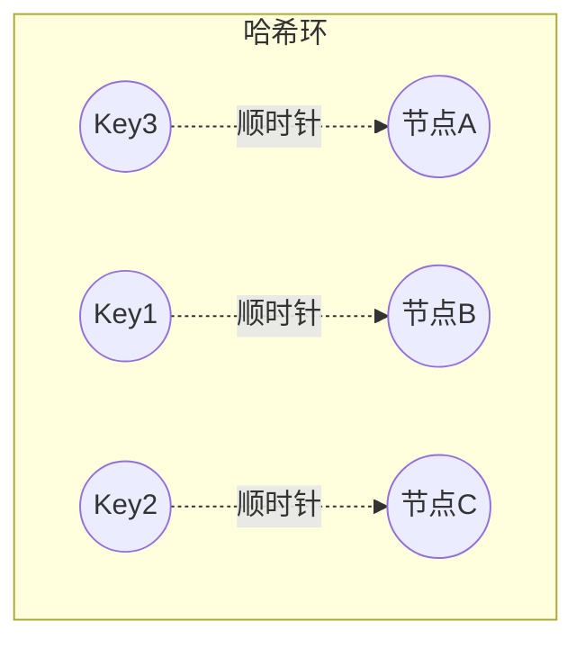

**虚拟节点**：每个物理节点在环上放多个虚拟节点（如 100~200 个），解决"节点少时分布不均"与"节点下线时负载倾斜"问题。

**对比**：

| 方案 | 扩容迁移量 | 均匀性 | 复杂度 |
| --- | --- | --- | --- |
| 取模（mod N） | 约 1/N 的数据迁移（翻倍扩容） | 好 | 低 |
| 一致性哈希 | 仅环上邻近 Key（约 1/N） | 依赖虚拟节点 | 中 |
| 范围分片 | 无迁移（新开区间） | 差（热点倾斜） | 低 |

**游戏中的应用**：

- Redis Cluster 的 slot 路由（16384 个 slot，本质是"槽位 + 环式迁移"）；
- 网关按玩家 ID 一致性哈希路由到对应游戏服，保证同玩家始终连同一服（会话保持）；
- 分库分表中间件的一致性哈希分片（见 01 篇）；
- 消息分区键路由：同一玩家的事件进同一 Kafka 分区，保证顺序。

### 3.2 消息队列（Message Queue）

**为什么需要 MQ**：

1. **削峰填谷（Peak Shaving）**：开服、活动瞬间的注册/登录洪峰，先入队缓冲，消费者按能力消费；
2. **异步解耦**：登录成功 → 发邮件、记日志、同步数据，主链路只做必要动作；
3. **事件驱动**：跨服战、全服活动、排行榜汇聚等通过事件总线协作；
4. **故障隔离**：下游（邮件服务）挂掉不影响主流程，消息可重试。

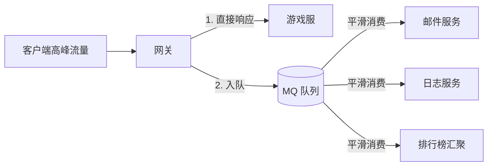

**Kafka vs RabbitMQ**：

| 维度 | Kafka | RabbitMQ |
| --- | --- | --- |
| 模型 | Topic / Partition / Offset | Exchange / Queue / Routing Key |
| 吞吐 | 极高（百万级 msg/s，顺序写） | 中高（万级 msg/s） |
| 顺序性 | 单分区内严格有序 | 单队列内有序（多消费者需注意） |
| 可靠性 | acks + 副本 + 幂等 Producer | Publisher Confirm + 持久化 + Consumer Ack |
| 消费模型 | 拉模式（pull），消费者管理 offset | 推/拉结合，Broker 管理投递 |
| 典型用途 | 大数据流、日志、事件总线、跨服消息 | 业务消息、任务分发、可靠投递 |

**Kafka 核心概念**：Topic（主题）→ 多个 Partition（分区，并行与顺序的单位）→ Offset（消费位点）；Consumer Group（消费组）内分区级负载均衡，组内一个分区只被一个消费者消费（保证组内顺序）。

**可靠性三件套**：

1. 生产端：`acks=all` + 重试 + 幂等 Producer（`enable.idempotence=true`）保证不丢不重；
2. Broker 端：`replication.factor>=3`、`min.insync.replicas>=2`，分区有副本冗余；
3. 消费端：手动提交 offset（处理成功后才提交）+ **消费幂等**（业务侧用唯一业务键去重，如邮件发放记录表唯一索引）。

**顺序消息**：需要严格顺序的业务（如玩家交易流水）按业务键路由到同一分区（`key=player_id`），单分区内保序；RabbitMQ 用单队列 + 单消费者或一致性哈希 Exchange。

### 3.3 负载均衡（Load Balancing）

层级：

- **L4（传输层）**：按 IP/端口转发，性能高，如云 LB、LVS；
- **L7（应用层）**：按 URL/Header/会话路由，支持健康检查与灰度，如 Nginx、网关（Kong/自研）。

算法对比：

| 算法 | 说明 | 适用 |
| --- | --- | --- |
| 轮询（Round Robin） | 依次分发 | 无状态服务 |
| 加权轮询（Weighted RR） | 按权重分发 | 异构机器 |
| 最少连接（Least Connections） | 给当前连接最少的节点 | 长连接服务 |
| 一致性哈希（Consistent Hash） | 按来源/玩家 ID 哈希 | 有状态游戏服（会话保持） |
| 随机（Random） | 简单、均匀 | 无状态场景 |

**游戏注意点**：游戏连接是**有状态长连接**（登录态、场景数据在服内），负载均衡必须"会话保持（Sticky Session）"——按玩家 ID 哈希到固定服务器；玩家跨服（转服、跨服战）由网关层路由而非 LB 随机分发。

### 3.4 服务发现（Service Discovery）

流程：服务启动 → 向注册中心注册（地址 + 元数据 + 健康状态）→ 心跳续约 → 下线/失活自动摘除 → 调用方订阅变更。

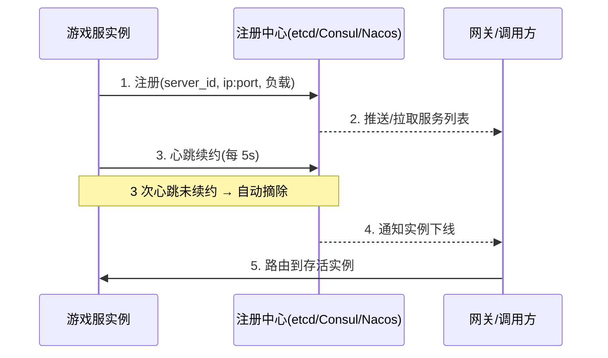

两种发现模式：

- **客户端发现**：调用方直接查注册中心并自己负载均衡（如 gRPC + Consul）；
- **服务端发现**：调用方只连 LB，LB 查注册中心转发（如 Nginx + Consul）。

游戏场景：开服/合服时游戏服动态注册 `zone-1-server-3`，网关按"玩家所在服"查注册中心拿到真实地址建立长连接；合服时旧实例摘除、新实例注册，连接平滑迁移。

### 3.5 CAP 与 BASE

**CAP 定理**：分布式系统中，网络分区（Partition，必然发生）时，只能在一致性（Consistency）与可用性（Availability）之间取舍：

- **CP**：牺牲可用性，保证所有节点读到一致数据（如 etcd、ZooKeeper、MongoDB 主从强同步）；
- **AP**：牺牲强一致，保证服务可用，接受最终一致（如 Redis 集群异步复制、Kafka）。

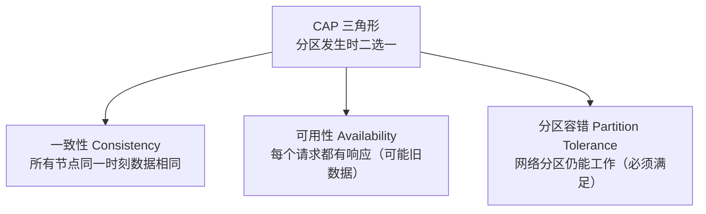

**BASE**：基本可用（Basically Available）+ 软状态（Soft State，允许中间态）+ 最终一致（Eventually Consistent），是 AP 路线的工程实现指南。

**游戏取舍**：

- 玩家存档、货币、道具：CP 倾向（写路径强一致，失败宁可报错不可错账）；
- 排行榜、在线人数、全服广播：AP 倾向（短暂陈旧可接受）；
- 跨服数据（跨服战结果）：最终一致 + 对账补偿。

### 3.6 Raft 简述

Raft 是易于理解的共识算法（Consensus Algorithm），用于让多节点就"同一份状态"达成一致（如选主、复制日志）。

**角色**：

- Leader（领导者）：接收客户端写入，复制日志到 Follower；
- Follower（跟随者）：被动复制，响应投票；
- Candidate（候选者）：选举超时后发起投票。

**机制**：

- 任期（Term）：每次选举递增的纪元号，防旧 Leader 干扰；
- 选举：Follower 选举超时（150~300ms 随机）→ 变 Candidate → 获得多数票成为 Leader，Leader 通过心跳续任期；
- 日志复制：客户端写 → Leader 追加日志 → 复制到多数节点（多数派提交，Majority Commit）→ 提交并应用；
- 安全性：只有日志最新者能当选；Leader 任期内的日志一定被多数节点保存。

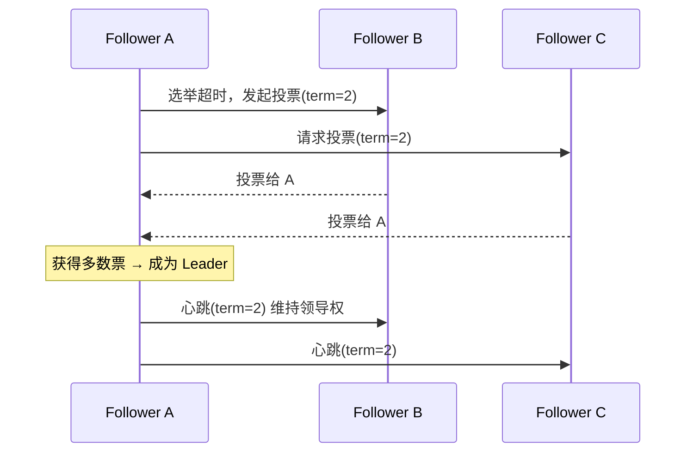

**游戏应用**：etcd 存元数据与配置（注册中心、分布式锁底层）；游戏"主服选举"（跨服战的主服、活动服）可用 Raft 系组件选主；自研主从切换（如 MySQL MGR、Redis Cluster 的 failover）都基于类似的多数派思想。

### 3.7 容灾与多活

**容灾等级**（从低到高）：

| 方案 | 说明 | RPO/RTO |
| --- | --- | --- |
| 本地备份 | 每日备份 + 恢复 | 小时级 |
| 同城双活 | 同城两机房同时服务，故障秒级切换 | 分钟级 |
| 两地三中心 | 生产双中心 + 异地灾备中心 | 分钟~小时级 |
| 三地五中心 | 多地多中心，单机房故障几乎无感 | 秒级 |

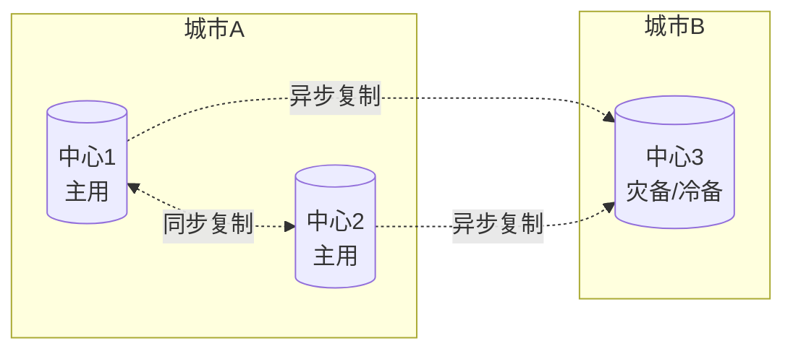

**游戏特殊性**：

1. 游戏按"服"组织玩家，容灾粒度常是"服级"：单服故障 → 该服玩家可转移/回滚到最近存档点（见 01 篇快照体系），而非全局切换；
2. 跨机房数据同步用异步复制为主，同城双活用于网关/登录/充值等无状态或低延迟依赖的系统；
3. 脑裂（Split-Brain）防护：双中心必须靠"多数派仲裁 + fencing（隔离旧主）"防止两边同时写；
4. 容灾演练常态化：每季度模拟机房断电、数据库切换、整服回档，验证 RPO/RTO 达标。

### 3.8 分布式锁（Distributed Lock）

**适用场景**：定时任务只在一个实例执行（每日重置）、跨服交易互斥、发奖幂等（同一订单只发一次）、热点资源（活动限量道具）扣减。

**Redis 实现（SETNX + 过期 + 续期）**：

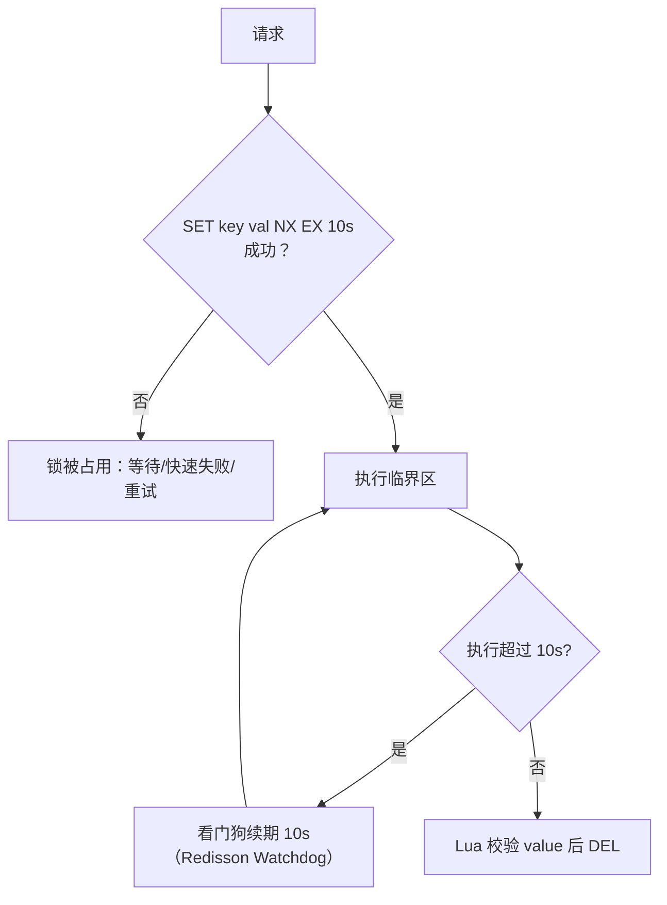

要点：

- **原子性**：加锁用 `SET key val NX EX ttl`（一个命令）；释放用 Lua（GET 校验 value 是自己的才 DEL），防止误删他人锁；
- **value 唯一**：每线程生成唯一值（UUID），释放时校验；
- **续期（Watchdog）**：持锁超过 TTL 自动续期，防止任务未完成锁已过期；
- **RedLock 争议**：Redis 作者提出的多实例加锁算法（半数以上实例成功才算持锁），业界争议大（依赖时钟、性能差）；大多数业务场景单实例 Redis + 哨兵高可用足够；
- **etcd 实现**：租约（Lease）+ 前缀创建 + Revision 序数比较，谁的最小谁持锁，天然支持 watch 等待与自动过期，无时钟依赖，适合强一致场景；
- **数据库实现**：悲观锁（SELECT ... FOR UPDATE）与乐观锁（version 比对，见 01 篇），适合低频、强一致场景。

## 4. 代码与配置示例

### 4.1 一致性哈希（Go 简化版）

```go
type ConsistentHash struct {
    ring       map[uint32]string // 环：哈希值 -> 节点
    sortedKeys []uint32          // 有序哈希值
    replicas   int               // 每个节点的虚拟节点数
}

func (c *ConsistentHash) Add(node string) {
    for i := 0; i < c.replicas; i++ {
        h := crc32.ChecksumIEEE([]byte(fmt.Sprintf("%s-%d", node, i)))
        c.ring[h] = node
        c.sortedKeys = append(c.sortedKeys, h)
    }
    sort.Slice(c.sortedKeys, func(i, j int) bool { return c.sortedKeys[i] < c.sortedKeys[j] })
}

func (c *ConsistentHash) Get(key string) string {
    h := crc32.ChecksumIEEE([]byte(key))
    idx := sort.Search(len(c.sortedKeys), func(i int) bool { return c.sortedKeys[i] >= h })
    if idx == len(c.sortedKeys) { idx = 0 } // 环回绕
    return c.ring[c.sortedKeys[idx]]
}
```

### 4.2 Kafka 生产者配置（YAML/Properties）

```yaml
producer:
  bootstrap.servers: "kafka-1:9092,kafka-2:9092,kafka-3:9092"
  acks: all                    # 等待所有 ISR 副本确认
  enable.idempotence: true     # 幂等生产者，防止重试导致重复
  key.serializer: StringSerializer
  value.serializer: StringSerializer
consumer:
  group.id: game-mail-consumer
  enable.auto.commit: false    # 手动提交 offset
  max.poll.records: 200
topics:
  mail: { partitions: 16, replication.factor: 3 }
  cross-server: { partitions: 32, replication.factor: 3 }
```

### 4.3 RabbitMQ 队列声明与消费（Python 节选）

```python
import pika
conn = pika.BlockingConnection(pika.ConnectionParameters("rabbitmq"))
ch = conn.channel()
ch.exchange_declare("game.mail", "direct", durable=True)
ch.queue_declare("mail.send", durable=True)
ch.queue_bind("mail.send", "game.mail", routing_key="send")
ch.basic_qos(prefetch_count=50)   # 消费限速，防止积压压垮下游

def on_msg(ch, method, props, body):
    send_mail(json.loads(body))    # 业务处理
    ch.basic_ack(method.delivery_tag)  # 成功才 ack

ch.basic_consume("mail.send", on_msg)
ch.start_consuming()
```

### 4.4 Redis 分布式锁（Go + Lua）

```go
const unlockScript = `
if redis.call("GET", KEYS[1]) == ARGV[1] then
    return redis.call("DEL", KEYS[1])
else
    return 0
end`

func Lock(ctx context.Context, key, val string, ttl time.Duration) (bool, error) {
    return rdb.SetNX(ctx, key, val, ttl).Result() // SET key val NX EX ttl 原子
}

func Unlock(ctx context.Context, key, val string) error {
    return rdb.Eval(ctx, unlockScript, []string{key}, val).Err() // 校验后删除
}
```

### 4.5 etcd 选主/锁（Go 伪代码）

```go
// 基于租约 + Revision 序数：最小 Revision 者持锁
lease := client.Lease.Grant(ctx, 10)                 // 10s 租约，自动续约
resp, _ := client.Put(ctx, "/lock/daily-reset", "leader", clientv3.WithLease(lease.ID))
// 读取同前缀所有 key，若自己的 Revision 最小 → 获得锁；否则 watch 前一个 Revision 删除
for _, kv := range allKeys {
    if kv.CreateRevision < resp.Header.Revision { waitRelease(ctx, kv.Key) }
}
```

### 4.6 Nginx 负载均衡（游戏网关前置，配置节选）

```nginx
upstream game_gate {
    # 一致性哈希按玩家ID路由：同玩家固定连同一网关（会话保持）
    hash $arg_player_id consistent;
    server 10.0.0.11:8080 weight=5;
    server 10.0.0.12:8080 weight=5;
    server 10.0.0.13:8080 backup;   # 备用节点
}
server {
    listen 9000;
    location /ws {
        proxy_pass http://game_gate;
        proxy_http_version 1.1;
        proxy_set_header Upgrade $http_upgrade;   # WebSocket 长连接
        proxy_set_header Connection "upgrade";
    }
}
```

## 5. 最佳实践

1. **路由**：玩家维度的状态路由用一致性哈希或取模 + 元数据表，保证会话保持；变更路由（合服）要平滑迁移（双写窗口 + 校验）；
2. **MQ**：关键业务消息用 Kafka（acks=all + 幂等），业务消费必须幂等（业务键唯一约束）；队列积压要有监控告警（lag）；
3. **LB**：无状态服务轮询/加权，有状态游戏服按玩家哈希 + 健康检查摘除；
4. **服务发现**：注册中心要独立高可用（etcd/Consul 集群），心跳超时与摘除参数按游戏服特性调优（长连接服务摘除要防"雪崩式重连"——摘除后加延迟重连与抖动）；
5. **一致性**：明确每个数据的 CP/AP 定位；跨服务写用"本地事务 + 消息补偿"实现最终一致；
6. **锁**：优先 Redis 单实例 + 哨兵；value 唯一 + Lua 释放 + 看门狗续期；强一致场景（发奖对账）用 etcd 锁或数据库唯一约束兜底；
7. **容灾**：按服级容灾设计，备份与恢复演练进季度计划；脑裂防护（fencing）必须做。

## 6. 常见问题 FAQ

**Q1：一致性哈希和取模怎么选？**
A：节点数量稳定、翻倍扩容可接受取模（实现简单）；节点频繁增删（云环境弹性伸缩、Redis Cluster）选一致性哈希。游戏网关路由推荐一致性哈希，保证玩家会话稳定。

**Q2：Kafka 消息会丢吗？怎么做到不丢不重？**
A：生产者 acks=all + 幂等；Broker 副本数 ≥3 且 min.insync.replicas=2；消费者手动提交 offset。但"不重"只能靠消费端幂等（业务键去重），分布式系统没有"恰好一次"的银弹（精确一次需要事务性幂等表）。

**Q3：消息重复消费导致重复发奖怎么办？**
A：发奖表对"订单号/消息ID"建唯一索引，重复消息插入失败即幂等跳过；或 Redis SETNX 幂等键（带 TTL）先标记再发奖。

**Q4：Redis 分布式锁在 GC 停顿/时钟跳变时会失效吗？**
A：会。GC 停顿导致锁过期而临界区未结束，可用看门狗续期缓解；RedLock 也无法完全解决（依赖时钟）。务实做法：锁 + 业务幂等双重保障——锁防并发，唯一约束/幂等键兜底。

**Q5：CAP 中游戏必须选 CP 吗？**
A：按数据分级：玩家资产/存档 CP（失败宁可报错）；排行榜/在线状态 AP。全盘 CP 会牺牲可用性（分区时拒绝服务），全盘 AP 会造成错账，游戏内通常混合。

**Q6：Raft 和 Paxos 什么关系？**
A：Paxos 是理论奠基（难实现难理解），Raft 是工程化共识算法（可理解、广泛落地：etcd、Consul、TiKV）。选型直接看产品：etcd（Raft）足够。

**Q7：两地三中心在游戏里怎么落地？**
A：游戏主链路（登录/存档/充值）同城双活；异地中心做灾备（异步复制 + 冷启动），因为游戏玩家数据按服隔离，异地容灾重点是"备份可恢复"，而非实时双活；跨服玩法（跨服战）再单独做中心化服务。

**Q8：服务实例批量下线为什么会雪崩？**
A：注册中心摘除后，客户端/网关集中重连造成连接风暴；对策：摘除前先摘流量（LB 停权重）→ 等待存量连接排空 → 再优雅下线；客户端重连加随机退避（指数退避 + 抖动）。

## 7. 关联阅读

- 上一篇：[02-缓存与排行榜系统](02-缓存与排行榜系统.md)——Redis 分布式锁与集群的缓存基础；
- 分库分表与分布式事务的数据面：见 [01-数据库选型与存储设计](01-数据库选型与存储设计.md)；
- 协议加密与防重放（分布式通信安全）：见 [04-安全与反作弊](../会话身份与在线服务/04-安全与反作弊.md)；
- K8s 编排、弹性伸缩与故障恢复（分布式系统的运行时）：见 [05-部署运维与监控](../../08-工程实践与质量/部署运维与可观测性/05-部署运维与监控.md)；
- 上游基础：`../01-架构与网络/` 中的消息系统、并发模型与服务器架构模式。
````````
