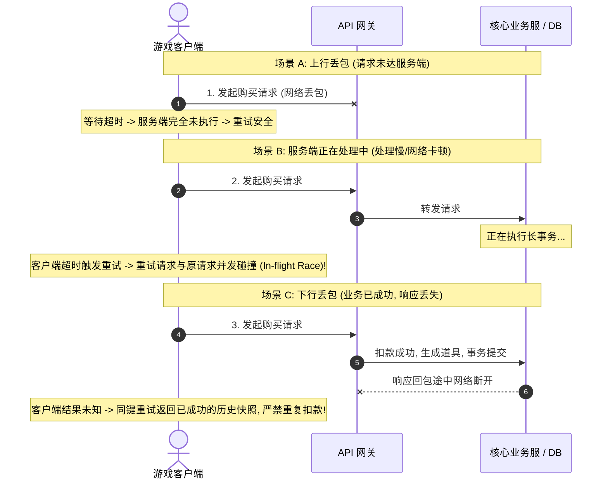
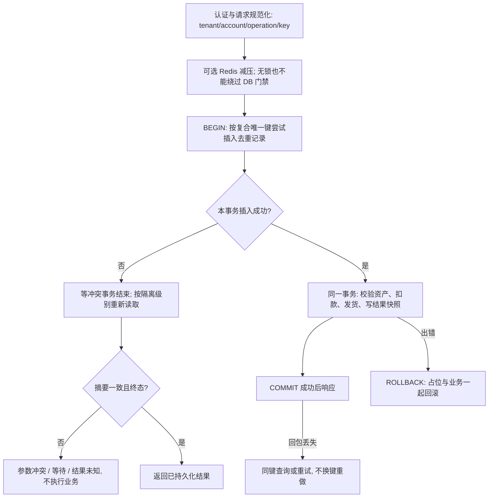

# 03 幂等重试与消息语义

> 知识成熟度：L2（持久化事务边界、租约恢复与重试契约；SQLite 故障窗口实验只证明模型断言，不代表生产数据库或跨系统保证）。
> 适用范围：平台可靠性-幂等重试与消息语义。
> 知识基线：平台可靠性工程方案（非 UE 内置能力）；深入解决弱网环境下的客户端重复点击、网络超时重发、中间件重复投递及跨系统扣款发货一致性难题。
> 官方参考：[RFC 9110 §9.2.2](https://www.rfc-editor.org/rfc/rfc9110.html#section-9.2.2)（取代 RFC 7231 的相关语义）、[PostgreSQL 18 事务隔离](https://www.postgresql.org/docs/18/transaction-iso.html)、[Redis 锁的保证与限制](https://redis.io/docs/latest/develop/clients/patterns/distributed-locks/)。
> 最后更新：2026-10-01（修复业务与去重双写窗口、错误的租约接管建议及消息语义保证，补可复现 SQLite 实验；保留超时时序、业务案例与退避示例）。

---

## 1. 概述与核心边界

网络可能丢失请求或响应，超时本身不能判定业务是否提交。**业务幂等要求在明确资源域与有效去重保留期内，重复的同一意图至多提交一次目标副作用；它不单独保证请求最终成功，也不把网络变成 exactly-once 传输。** 本章用唯一键、同库事务和结果查询构建这一边界，跨系统效果另行协调。

### 1.1 网络超时的“三态困境”（The Trilemma of Network Timeout）

当客户端向游戏服务器发起涉资操作（如商城购买、抽卡十连、装备强化）遭遇 3 秒超时未响应时，系统客观上面临三种截然不同的物理可能：



---

## 2. 核心概念与语义模型

| 语义名称 | 保证范围 | 无法保证的边界 | 生产落地典型模式 |
| :--- | :--- | :--- | :--- |
| **At-most-once** | 在声明的交付/处理边界内至多一次 | 可丢失；单独使用 UDP 并不提供去重承诺 | 不重投并配合序号/去重；适合允许丢更新的状态流 |
| **At-least-once** | 在持久化、重投、恢复和最终成功等前提下至少一次交付/处理 | 会重复；有限次重试、过期或永久错误不能保证成功 | 消息重投 + 消费者幂等；明确 ACK 的含义 |
| **Effectively-once** | 在一个业务资源域与去重保留期内，同一意图只提交一次目标副作用 | 不等于所有外部效果全局唯一，也不保证最终完成 | 唯一键、同库事务和可重放结果 |
| **Transactional Outbox** | 业务变更与待发事件记录同库提交 | 发布可能重复，消费端仍需去重；不是跨库事务 | 本地事件表 + CDC / 后台轮询，详见相邻事务章 |
| **Exactly-once（限定系统内）** | 依具体协议限定到某些日志、状态或事务资源 | 不能由网络重试推导到第三方支付、邮件或其他数据库 | 必须写清原子提交覆盖的资源、失败模型和去重期限 |

幂等描述的是**重复请求的预期业务效果相同**，不要求每次响应字节完全相同；本章为商城增加“重放首次结果快照”是更强的业务契约。HTTP 的安全方法、PUT、DELETE 有幂等语义，但服务端仍可能记录多条访问日志；POST 也能通过应用协议实现幂等。不能仅因为收到超时或 5xx 就自动重试非幂等操作，依据见 [RFC 9110 §9.2.2](https://www.rfc-editor.org/rfc/rfc9110.html#section-9.2.2)。

---

## 3. 持久化事务为主、Redis 为可选减压层

正确性来自**同一个数据库事务内的唯一键占位、业务变更、结果记录**，不来自“先查一下没有”。Redis 可以减少热点键碰撞，但是否值得增加这一层应由压测决定；单数据库方案本身可以成立。Redis 丢键、重启或租约过期后，即使两个执行者进入数据库，唯一键与事务仍必须守住不重复提交的边界。



### 3.0 先定义键、摘要与结果契约

- 唯一域是 `(tenant_id, account_id, operation, idempotency_key)`，数据库、Redis、查询结果接口必须使用一致域；租户/账号来自已认证上下文。幂等键不是鉴权凭证，不能用它读取别人的订单。
- 哪些写操作必须带键由服务端端点策略决定，缺键应在任何副作用前拒绝，不能因为漏传键就绕过门禁。
- 同一业务意图跨网络重试复用键；用户明确发起的新购买使用新键。随机、不含个人信息的标识即可，不强制拼设备 ID、账号或时间戳。限购、库存和重复领任务奖励等业务唯一性另有约束，换键也不能绕过。
- 摘要应包含会改变业务意义的规范化参数及契约版本，如商品、数量、目标角色。字段顺序、默认值、货币单位、Unicode/数字表示要有规则；服务端重新计算，不能相信客户端哈希，也不能直接把原始 JSON 字节当成业务等价性。
- 区分终态 `SUCCEEDED`、可重放的确定性拒绝 `REJECTED`、暂时故障与结果未知。余额不足是否记录为终态由业务约定；这里记录终态，充值后再次购买应新建意图。DB 超时不能写成“业务明确失败”。

### 3.1 MySQL/InnoDB 风格表结构示意

```sql
CREATE TABLE `t_idempotency_record` (
    `tenant_id`       BIGINT UNSIGNED NOT NULL DEFAULT 0 COMMENT '租户/大区ID',
    `account_id`      BIGINT UNSIGNED NOT NULL COMMENT '玩家账号ID',
    `operation`       VARCHAR(64) NOT NULL COMMENT '业务操作类型: MallBuy/Gacha/ItemUse',
    `idempotency_key` VARCHAR(128) NOT NULL COMMENT '业务意图键，必须结合租户/账号/操作唯一域',
    `request_hash`    CHAR(64) NOT NULL COMMENT '规范化业务参数摘要，拒绝同Key异参',
    `status`          VARCHAR(20) NOT NULL COMMENT '状态: PROCESSING/SUCCEEDED/REJECTED',
    `response_code`   INT DEFAULT 0 COMMENT '返回业务错误码',
    `response_body`   TEXT NULL COMMENT '终态JSON快照，包括契约约定的确定性拒绝',
    `created_at`      DATETIME(3) NOT NULL DEFAULT CURRENT_TIMESTAMP(3),
    `updated_at`      DATETIME(3) NOT NULL DEFAULT CURRENT_TIMESTAMP(3) ON UPDATE CURRENT_TIMESTAMP(3),
    `expire_at`       DATETIME(3) NOT NULL COMMENT '去重结果保留截止，不是处理租约',
    PRIMARY KEY (`tenant_id`, `account_id`, `operation`, `idempotency_key`),
    KEY `idx_expire_at` (`expire_at`)
) ENGINE=InnoDB DEFAULT CHARSET=utf8mb4 COMMENT='全局业务幂等去重流水表';
```

DDL 使用反引号、`UNSIGNED`、`ON UPDATE` 与 `ENGINE`，**不能直接当成 PostgreSQL DDL**。键列应选确定的字节/大小写比较规则（如符合业务约定的二进制比较），避免数据库 collation 把不同键视为相等。字段大小、快照脱敏、索引与分区约束需在所用数据库版本验证。

### 3.2 Redis 抢占与释放：owner token 不等于 fencing token

一次持锁尝试生成独立 owner token，不与业务幂等键混用。抢占已可由单条命令完成：

```text
SET lock:{tenant}:{account}:{operation}:{key} <owner_token> NX PX 5000
```

字段拼接必须转义或长度编码，以免不同元组碰撞。5 秒仅为示例租约，不是“5 秒内肯定完成”的承诺；同一个 owner token 被第二个线程重用，也不赋予它执行业务的资格。

```lua
-- 兼容旧版 Redis 的比较后删除；只防止删掉新持有者的锁。
if redis.call("GET", KEYS[1]) == ARGV[1] then
    return redis.call("DEL", KEYS[1])
else
    return 0
end
```

如需续期，应比较 owner 后原子 `PEXPIRE`，并处理续期失败；这仍不能撤销已经发出的外部请求。随机 token 只验证“谁可以释放”，**不阻止暂停的旧持有者恢复后继续写**。需要长任务接管时，目标存储还须在实际提交副作用处校验递增 epoch/fencing 条件。Redis 官方同时指出异步复制故障切换与时钟变化的边界，参见其[一致性说明](https://redis.io/docs/latest/develop/clients/patterns/distributed-locks/#disclaimer-about-consistency)。

### 3.3 正确提交边界：占位、扣款发货与结果必须同事务

旧版 `handler(req)` 成功后再调用 `SaveIdempotencyRecord` 有双写窗口：业务已提交但保存失败/进程退出时，同键重试还会再执行。把两个函数放在一起并不能形成原子性；必须显式传入同一事务连接，且 handler 不能自行 commit、开另一连接或发不可回滚外部请求。

以下为 **PostgreSQL 18 READ COMMITTED 语义下的流程伪代码**，不是可直接编译的驱动代码：

```text
authenticate_and_normalize(request)       # scope/hash 在服务端计算
BEGIN
inserted = INSERT INTO idempotency(scope, key, request_hash, status)
           VALUES (..., 'PROCESSING')
           ON CONFLICT (scope_columns, key) DO NOTHING
           RETURNING key
if not inserted:
    record = SELECT ... WHERE same_scope_and_key   # 下一条语句的新快照
    if record missing: ROLLBACK; return RetryOrUnknown
    if record.request_hash != request_hash: ROLLBACK; return KeyConflict
    if record.status not terminal: ROLLBACK; return InProgressOrUnknown
    COMMIT; return record.saved_result

# 下列所有操作使用本事务。锁定/条件更新所需库存与资产，检查 affected rows。
result = apply_business_changes_in_this_transaction()
UPDATE idempotency SET status = result.terminal_status,
                       response_body = result.snapshot WHERE same_scope_and_key
COMMIT                                  # 仅此处确定原子提交成功
return result
```

不能用 `ON CONFLICT DO UPDATE` 直接覆盖已有摘要/快照。若多个业务表涉及复杂约束，要统一加锁次序，必要时使用更强隔离；死锁/序列化失败应回滚后按原键有界重试**整个事务**。提交结果未知（例如 COMMIT 后连接中断）先用新连接向权威存储查同键，不能把未知当回滚。

[PostgreSQL INSERT](https://www.postgresql.org/docs/18/sql-insert.html) 定义冲突仲裁；[隔离文档](https://www.postgresql.org/docs/18/transaction-iso.html#XACT-READ-COMMITTED) 特别说明 `DO NOTHING` 可能受当前语句快照不可见的并发事务影响，因此上例使用后续语句查询。更强隔离需处理事务重试，不把这套可见性推导原样搬到 MySQL 或 SQLite。

### 3.4 PROCESSING：短事务与可接管长任务是两种模型

**短事务模型**中 PROCESSING 从插入到终态处于同一次未提交事务，其他普通事务看不到这个中间状态；进程退出使该事务回滚，完成提交后只留下终态。因此表中“长时间已提交的 PROCESSING”不是短事务的正常恢复机制。

**长任务模型**会先持久化 PROCESSING，再执行异步工作，必须另行定义 `owner_epoch`、`lease_until`、阶段状态与结果查询。租约到期只是允许竞争接管的条件，不证明旧 worker 已停止，也不证明外部操作没成功。接管者以条件更新竞争新 epoch；提交端以同事务条件检查 `epoch = my_epoch AND status = 'PROCESSING'` 后才写资产并转终态，影响行数为 0 必须不产生副作用。fencing 也不能追溯撤销旧 epoch 已经完成的操作。

对其他数据库或第三方接口，仅在本地写一个 epoch 不足以保护对端。使用对端支持的业务幂等键/结果查询，或 Outbox + 消费去重；无法确认时进入待对账而不是盲目重做。详见 [分布式事务与最终一致性](04-分布式事务与最终一致性.md)。

---

## 4. 全抖动指数退避算法（Exponential Backoff with Full Jitter）

在网络抖动或服务短时过载时，如果所有客户端都按照固定的间隔（如每隔 1 秒）重试，会导致成千上万的客户端请求在同一毫秒内同步撞击网关，形成致命的**重试风暴（Retry Storm / Thundering Herd）**。

[AWS 的退避实验](https://aws.amazon.com/blogs/architecture/exponential-backoff-and-jitter/)比较了多种抖动策略；这里选 **Full Jitter（全抖动指数退避）** 作为示例，不声称唯一标准：

$$SleepTime = \text{UniformRandom}(0, \min(MaxBackoff, BaseInterval \times 2^{r-1}))$$

其中 `r = 1` 表示第一次重试；首次请求不退避。`MaxAttempts` 表示包含首次请求的总尝试次数，不是额外重试次数。

```go
package retry

import (
	"math"
	"math/rand"
	"time"
)

type BackoffPolicy struct {
	BaseInterval time.Duration // 基础重试间隔 (如 100ms)
	MaxBackoff   time.Duration // 最大退避上限 (如 3000ms)
	MaxAttempts  int           // 总尝试次数（含首次）；此辅助函数不执行次数门禁
}

func (b *BackoffPolicy) CalculateBackoff(attempt int) time.Duration {
	if attempt <= 0 {
		return 0
	}
	multiplier := math.Pow(2.0, float64(attempt-1))
	temp := float64(b.BaseInterval) * multiplier
	maxDuration := float64(b.MaxBackoff)
	if temp > maxDuration {
		temp = maxDuration
	}
	sleepDuration := rand.Float64() * temp
	return time.Duration(sleepDuration)
}
```

此函数仅演示退避采样，不是完整重试器；调用方须验证 `BaseInterval > 0`、`MaxBackoff >= BaseInterval`、总尝试数有界，并处理 deadline、取消、pushback 和全局预算。本轮未编译或运行该 Go 示例；实际运行证据为 9.1 的 Python/SQLite 实验。

---

## 5. 常见高频业务场景落地实战

### 5.1 第三方充值回调发货（协议无关示意）
- **外力风险**：支付渠道可能重复投递通知；具体验签、重投与确认响应格式以所接入渠道的当前协议为准，不共用一种 `HTTP 200 SUCCESS` 模板。
- **落地契约**：
  1. 验签、校验商户/应用/订单归属、金额、币种及支付状态；业务键按渠道和商户隔离，区分事件 ID 与交易 ID，多种事件不代表多次发货；
  2. 同一事务内插入接收去重记录、核实订单可发货状态、增加资产并保存结果，或写入可恢复的持久化 Inbox/Outbox 后再按渠道协议确认接收；
  3. 遇唯一键冲突，读取并核对已有记录；只有确认已完成或已可靠接收且会继续处理时才回复相应确认，不能把任意主键冲突都当发货成功；
  4. 对退款、撤销与乱序回调走显式状态迁移和独立流水；外部结果未知走查询/对账，禁止凭超时再次发货。

### 5.2 商城限购礼包扣款发货
- **外力风险**：玩家连点“购买”按键，或网络卡顿产生多条并发 HTTP 请求同时到达网关。
- **落地契约**：
  1. 前端在点击购买弹窗打开时生成并锁定唯一的 `client_token`；
  2. 网关校验 `client_token` 幂等表，拦截在途（In-flight）重复请求；
  3. 同事务内分别锁定/条件更新库存与资产；例如 `UPDATE t_user_asset SET diamond = diamond - 100 WHERE uid = ? AND diamond >= 100` 只保护余额，不能同时保护商品库存，必须检查各语句影响行数；
  4. 发货与去重表 `response_body` 的道具结果快照一起提交；任一步失败回滚整个事务；
  5. 后续任何携带相同 `client_token` 的重试请求，直接查表返回保存的快照，绝不再走扣款流程。

### 5.3 抽卡十连防刷与结果固定
- **外力风险**：抽卡接口响应超时，玩家重复点击；若重新随机可能导致期望概率偏差或扣除两次抽卡券。
- **落地契约**：同一抽卡幂等键首次执行时，将抽取的卡牌结果 ID 列表同货币扣减一起原子写入数据库；重试到达时直接读取该记录已抽出的卡牌列表展示，严禁二次调用随机数引擎重新抽取。

---

## 6. 常见反模式清单（Anti-Patterns）

| 反模式 | 典型表现 | 潜在严重后果 | 正确工程解法 |
| :--- | :--- | :--- | :--- |
| **先发消息后提交事务** | 业务代码中先向 MQ 发送“发货通知”，然后再提交本地 DB 事务 | DB 事务若因死锁或断电回滚，MQ 消息已发出，导致凭空多发道具 | 必须使用 Transactional Outbox 模式，在同一事务内落库 |
| **重试复用新幂等键** | 客户端底层 HTTP 库发生超时重试时，每次新生成一个 UUID 作为 Header | 服务端无法识别这是同一次重试，重复扣款/重复发奖 | 幂等键生命周期绑定用户业务意图，跨层重发必须透传原始键 |
| **仅在内存中做去重** | 使用单个服务进程内的内存 Map 或 Java ConcurrentHashMap 做幂等 | 服务重启、发布更新或集群多实例水平扩展时防线彻底失效 | 使用可持久化且与业务原子提交的去重记录；Redis 可选，不是必需正确性前提 |
| **死信队列只入不治** | 消息重试多次失败后丢入 DLQ 死信队列，但无监控、无告警、无人处理 | 线上数据静默不一致，玩家资产受损扩大 | 配置死信报警指标，设立人工核查工具与自动重放脚本 |

---

## 7. 教学故障案例（假设场景，不是已验证生产事故）

### 案例一：弱网下商城重复扣款事故
- **场景**：大促开服期间，网关 CPU 负载达到 90%，网络响应延迟增至 4 秒。大量玩家点击“购买”后未见反应，连续点击 3 次，客户端自动重试。
- **根因**：服务端扣款逻辑未配置请求幂等表，且客户端每次重试生成了新的 ClientTimestamp 作为凭据。
- **处置**：全量补丁拦截：网关强制校验 `Idempotency-Key` 请求头；建立同库事务去重与可选热点减压层；通过对账脚本比对扣减日志与发货日志，全量补发差额道具。

### 案例二：下游超时引发雪崩式重试风暴
- **场景**：数据库主库发生 10 秒慢查询锁表，导致上游 5,000 QPS 的请求全部超时；所有客户端以 500ms 固定间隔同步重试，瞬间将请求量放大到 25,000 QPS。
- **根因**：客户端缺乏退避算法，缺乏全局重试预算（Retry Budget），无熔断保护。
- **处置**：全线引入 Full Jitter 指数退避，单客户端最多允许重试 3 次；网关接入自适应熔断器，当错误率超过 40% 时直接开启熔断快速失败。

---

## 8. 生产最佳实践

1. **幂等键生成规范**：
   在业务意图创建时生成稳定键，客户端、服务端订单入口或上游事件均可为来源；用认证域限定键的作用域。不要把个人信息拼入键；网络重试不能换键。
2. **请求摘要一致性校验（Request Hash Validation）**：
   服务端接收到重试请求时，必须重新计算当前参数的 SHA-256 并与去重表中的 `request_hash` 进行比对。若相同作用域中的键对应不同业务参数（如商品 ID 变了），返回契约定义的冲突（例如 `409 Conflict`）；这可能是客户端错误，并不自动证明恶意攻击。
3. **过期流水归档与分区清理**：
   保留期至少覆盖客户端离线重试、消息重投、人工重放与对账窗口；不能统一假定 30 天足够。删除记录后迟到旧键可能再次执行，须保留可查询墓碑/订单唯一约束或明确拒绝过期意图。归档不能悄悄撤掉在线去重能力，分区方案还要核对数据库的唯一索引限制。处理租约 `lease_until` 与结果保留 `expire_at` 分开。
4. **重试预算全局收敛（Retry Budget）**：
   选定一个业务可感知的重试责任层，并明确计数单位、窗口和分母，例如“每 100 次原始请求最多额外 10 次尝试”，另设并发上限。10% 仅示意；低流量最小预算、恢复探测与熔断配合需压测。每次尝试和退避都消耗同一个总 deadline，按 [限流熔断章](../运行调度与过载保护/02-限流熔断背压与过载保护.md) 执行。

---

## 9. 验证建议与测试矩阵

下表是生产环境建议矩阵，尚未执行；有限测试不证明“绝对稳定”。本轮实际执行的是后文 SQLite 模型实验，二者不能混称。

| 测试用例 ID | 注入故障场景 | 预期系统表现与断言 | 验证手段 |
| :--- | :--- | :--- | :--- |
| **TEST-IDEM-01** | 客户端并发多线程使用相同 Key 瞬时发起 50 次扣款请求 | 数据库仅产生 1 笔真实扣减流水，其余 49 次返回成功快照或排队拒绝 | 并发压测脚本 (JMeter / Locust) |
| **TEST-IDEM-02** | 模拟服务端业务已落库但网关故意丢弃 HTTP 响应回包 | 客户端超时重发相同请求，服务端直接返回历史快照，零重复执行 | 混沌工程代理 (Toxiproxy) |
| **TEST-IDEM-03** | 故意篡改同 Key 重试包中的商品 ID 参数 | 服务端校验 `request_hash` 失败，精确返回 HTTP 409 Conflict | 单元测试与接口集成用例 |
| **TEST-IDEM-04** | 模拟数据库注入 5 秒长事务导致大量请求超时重试 | 客户端重试请求呈现指数分散，无集中毛刺雷暴（Full Jitter 验证） | Prometheus 流量抓包分析 |

---

### 9.1 本轮可复现实验与证据边界

[SQLite 事务实验](../../../evidence/tests/gameplay-core/README.md#2026-10-01-持久化幂等补充)用 Python 标准库对本地文件数据库执行故障注入。覆盖同键重放、摘要冲突、账号/租户隔离、确定性拒绝快照、事务内失败、提交前/后子进程直接退出、在途写锁以及并发重复请求；另以反例展示“先业务后去重”和“删除去重记录后迟到重试”的重复效果，并验证数据库 epoch 条件拒绝旧执行者。

- 正向不变量：未发生充值/退款的单账户购买用例中，初始余额 = 当前余额 + 已提交扣款；每个成功购买意图只发放约定数量物品并保存一条终态记录；返回快照可重放。反例测试的 PASS 表示成功复现坏结果，不代表坏实现正确。
- 本实验 SQLite `BEGIN IMMEDIATE` 串行化写入，用于展示提交边界，不能证明 PostgreSQL/InnoDB 行锁、隔离、死锁、性能或分布式 failover。子进程 `os._exit` 不是断电/fsync/磁盘损坏实验。
- 外部支付、真实 Redis、HTTP/gRPC、消息队列与 UE/Windows 没有运行；上表生产混沌矩阵仍待实测。已运行命令、原始输出和源码哈希见证据 README，不提升本章 maturity/verified。

---

## 10. 常见问题 FAQ

1. **Q：重试时服务正在处理中（PROCESSING 状态），下游应该返回什么？**
   A：返回特定的状态码（如 HTTP 202 Accepted 或游戏自定义错误码 `ERR_REQUEST_IN_PROGRESS`），客户端捕获该错误码后提示“处理中，请稍候”，并按照退避时间轮询订单结果，决不能将状态误判为失败。
2. **Q：服务器宕机导致某条幂等记录永久卡在 PROCESSING 怎么办？**
   A：先判断采用哪种事务模型。短事务未提交的占位随回滚消失；已提交的长任务 PROCESSING 需按 3.4 的 epoch 条件接管、结果查询与对账流程恢复。租约到期不能证明原任务未产生副作用，不能直接重新扣款。
3. **Q：读请求（GET）需要幂等键吗？**
   A：按照规范，GET 的预期业务语义应是安全且幂等的，但实现仍可能写访问日志等附带状态；正确只读接口通常不需要业务幂等键；但对于耗时极高的大数据聚合查询或排行榜拉取，可利用幂等机制做请求合并（SingleFlight 缓存复用）。

---

## 11. 关联阅读

- [04-分布式事务与最终一致性.md](04-分布式事务与最终一致性.md) —— 本地消息表、Transactional Outbox 与跨服 Saga
- [02-限流熔断背压与过载保护.md](../运行调度与过载保护/02-限流熔断背压与过载保护.md) —— 防止重试风暴瘫痪系统的网关保护屏障
- [03-业务系统设计/01-背包与道具系统.md](../../05-Gameplay与交互系统/背包装备与存档/01-背包与道具系统.md) —— 道具事务与幂等性实战
- [03-业务系统设计/03-商城与经济系统.md](../../05-Gameplay与交互系统/任务活动与经济规则/03-商城与经济系统.md) —— 涉资充值与商城交易的安全底座
- [02-数据与业务/01-数据库选型与存储设计.md](01-数据库选型与存储设计.md) —— 数据库唯一索引与悲观锁设计
