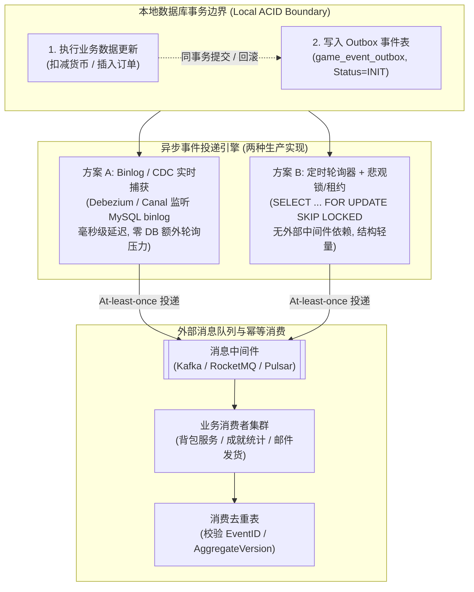
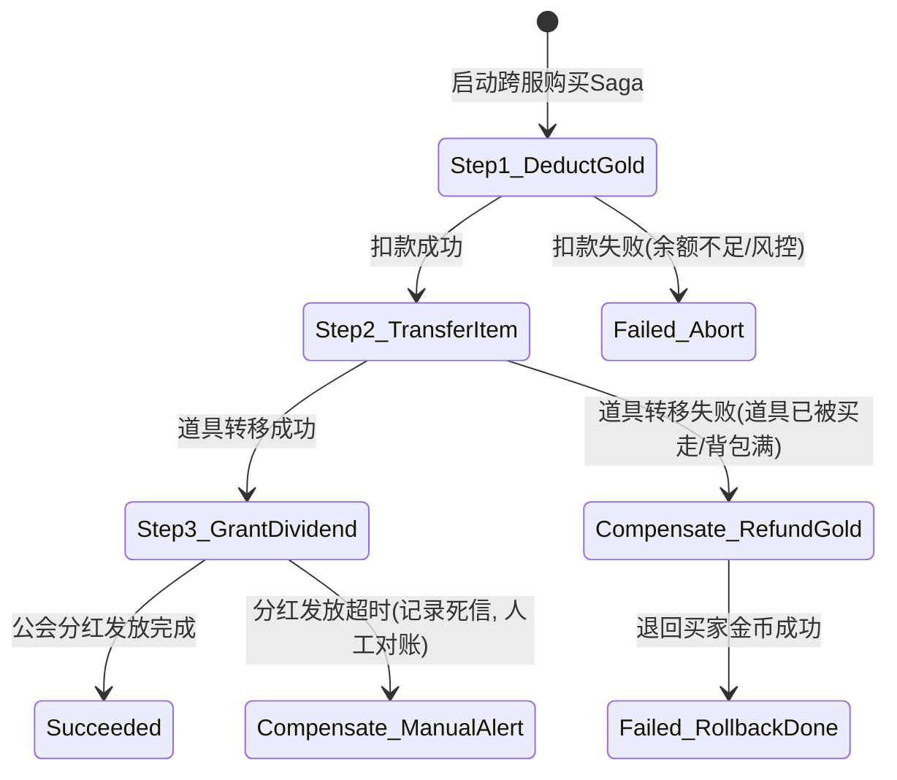
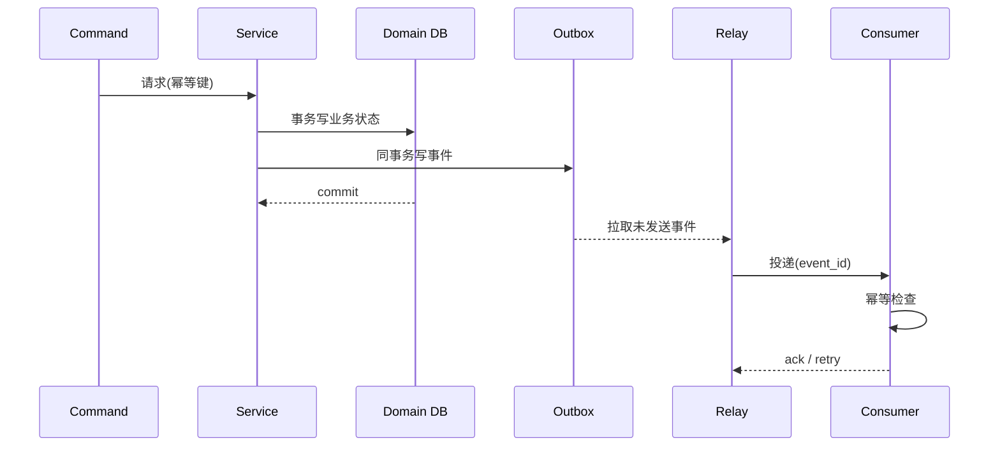

# 04 分布式事务与最终一致性

> 知识成熟度：L2。本篇按固定一手文档与源码选读核对；以下 SQL、伪代码、状态与结果均为 PAPER_EXPECTED，未运行数据库、消息客户端、Saga/TCC 服务或故障实验。
> 适用范围：平台模式层的本地提交、异步履约与跨服务恢复。幂等键完整通用合同沿用前篇；本文把它接到一笔订单的提交、Outbox、消费和补偿责任上。
> 知识基线：PostgreSQL REL_16_6 文档源码；Apache Kafka 3.8.0 文档源码；Debezium v3.0.0.Final 文档源码；Seata v2.2.0 的 TCC fence 源码及注明版本的官方 Saga/TCC 文档。它们不是一套已验证兼容的产品部署。
> 最后更新：2026-10-07，纯静态教学修订。

## 1. 要保持的事实，和不同的成功

假设玩家 p 用 30 金币购买订单 o 的一个道具。Wallet、Ledger、Order、RequestResult、OutboxEvent、Dispatch、FulfillmentCheck 都在 OrderDB 的同一个本地事务域；背包、Grant、Inbox 在 InventoryDB 的另一个本地事务域。两个数据库没有共同 COMMIT。所有金额用确定的整数单位，客户端只能提出购买意图，服务端校验身份、价格配置快照、限购与资源约束。

本篇区分四件事：订单事务已提交；事件已按选定 broker 的合同接收；InventoryDB 已持久完成发货；玩家收到了结果。前三者互不替代，第四者更不能决定前三者是否发生。订单受理后可以返回可查询的 o/履约状态；没有背包发货确认时不能把“已受理”说成“道具已到账”。OrderDB 的事务不能包住 InventoryDB、Kafka、邮件或支付方调用。

不变量是：同一逻辑购买至多扣一次；已提交购买总有可恢复的发货责任；同一履约事实至多生效一次；任何 UNKNOWN 都留有可查询的身份和负责恢复的人/组件。活性另有前提：持久记录不丢、存储及传输最终恢复、合法事件最终能处理、负责人持续推进。无限分区、永久坏消息或权限永久失效时，不能保证最终成功。最终一致是收敛性质；业务还应另外约定目标时限和逾期升级，时限不是其数学定义，也不凭一句 SLO 证明必然收敛。

原有贡献中，同事务 Outbox、消费去重、版本检测、订单快照、账本审计、抽卡复用原结果、匹配 ticket 与房间 reservation 均保留。后文补齐它们相接处的原子性和恢复条件。历史中的“生产级”“毫秒级”“零压力”“无限重试”等承诺没有对应本轮产品证据，不能作为上线认证。

## 2. 身份、事件和责任分开存

请求身份 R 为 `(tenant, authenticated_actor, operation, request_id)`；绑定 D 包括目标实体及 incarnation、规范化参数、协议/配置版本和摘要算法版本。相同 R/D 返回原终态，相同 R 不同 D 返回冲突。trace_id、重试时间和随机生成的新 event_id 不定义新业务意图。规范化必须明确字段、类型和编码；摘要比较还要处理碰撞风险，不用随意 JSON 字符串顺序作合同。通用键域、保留与外部调用边界仍以《03-幂等重试与消息语义》为 Canonical。

| 记录 | 唯一身份及内容 | 在哪里原子生效 |
| --- | --- | --- |
| RequestResult | R、D、原响应/结果、订单 o、结果状态 | 与本次订单和账本同事务 |
| Ledger | `(tenant, business_effect_id)`；p/currency、delta、before/after、reason/source/operator、业务版本 | 与 Wallet 变更同事务；修正新增冲正，不改写已发生记录 |
| OutboxEvent | event_id；实体、incarnation、event_seq、schema/producer版本、发生时间、原始业务身份、不可变负载 | 与 Order/RequestResult 同事务 |
| Dispatch | `(event_id, destination)`；状态、claim_generation、owner、lease_until、attempts、next_attempt_at、确认信息 | 自己的短事务；不能改变原事件身份/负载 |
| FulfillmentCheck | `(order_id, fulfillment_kind)`；预期参与方/业务绑定、待查结果和下次核对时间 | 与订单受理同事务创建，完成时与 Order 终态同事务 |
| Inbox | `(consumer_effect_scope, event_id)` 与原事件绑定和结果 | 与接收方业务效果同事务 |
| Grant | `(tenant, order_id, fulfillment_kind)` 与被发放对象/数量 | 与背包更新及 Inbox 同事务 |

event_id 去重同一消息，Grant 的业务唯一键去重同一履约事实的不同触发源。支付回调与订单事件可以有不同 event_id，但必须竞争同一个 Grant；把两个键简单拼接成每条路径独有的串会重开漏洞。操作单号区分人工操作与原请求，不能让“换一个人工幂等键”绕过业务效果唯一约束。

本例一笔购买产生一个 OrderAccepted 事件；每个实体的 event_seq 在锁住其权威行的事务中连续递增。若一次状态改变发多个事件，改为独立事件序号或 `(aggregate_version,event_index)`，不能沿用“一个 aggregate_version 只许一行”却插入多行。schema_version 是解释格式，event_seq 是业务顺序，occurred_at 是诊断时间，三者不可混用。删除重建使用新 incarnation，旧事件不能复活新对象。

示意关系包含真实实现必须补齐的非空、唯一和数值范围约束、索引与外键选择；它不是完整 DDL。多路投递时先明确每个必需 destination（目标集群/主题/业务路由）与成功定义，T1 同时建立全部 Dispatch；其中一路 PUBLISHED 不代表其余路线已完成。一个 topic 的多个 consumer group 另以各自 effect_scope 保存 Inbox 和消费责任，broker 收到只意味着发布边界已达成，不能证明每个组都成功。必需订阅者、目的集变更、未完成任务和恢复水位都纳入后文回收条件。生产者在提交前验证负载结构、枚举、尺寸上限与可序列化性，消费者按明确 schema 兼容策略解码，升级要有契约/灰度方案。过大的事件、缺字段和不可支持版本都不能等成功响应后再补救。

## 3. T1：订单、扣款、原结果与 Outbox 一起提交

下面是教学伪代码。BEGIN/COMMIT 的真正连接、异常/取消行为、持久化与主从故障模型必须由项目另行落实；不以事务名称代替这些前提。[PostgreSQL REL_16_6 事务](https://github.com/postgres/postgres/blob/REL_16_6/doc/src/sgml/advanced.sgml#L145-L255)支持本地原子提交；幂等身份与变更同原子操作的工程依据见 [AWS 原始设计说明](https://aws.amazon.com/builders-library/making-retries-safe-with-idempotent-APIs/)，后者是本次网页快照而非固定产品版本。

```text
T1 BEGIN，使用可控的事务预算；全部记录共享真实事务连接
  尝试以唯一 R 插入本事务的 RequestResult 占位；占位不单独提交
  已有 R：比较 D，异绑定冲突；同绑定读取原终态，不执行扣款
  锁住权威 Wallet/Order 所需行，按统一顺序取得锁
  校验服务端快照、余额、状态来源集合和 expected_version
  原子保证 RequestResult/Ledger/OutboxEvent/Dispatch 的必要持久容量
  Wallet 100→70；写 Ledger(effect_id=buy/o, delta=-30, before=100, after=70)
  写 Order(o, ACCEPTED, immutable_price=30)
  写 OutboxEvent(e, order/o, seq=1, OrderAccepted, 原发货负载)
  为每个必需发布目标写 Dispatch(e, destination, READY, generation=0)
  写 FulfillmentCheck(o, grant-kind, InventoryDB, PENDING)
  条件更新恰好一条本事务 RequestResult(R,D) 为原终态 ACCEPTED(o,e)；否则回滚
T1 COMMIT
```

入口先拒绝缺失/非法键，复合唯一列显式非空，绑定/编码/比较规则明确，不能靠数据库隐式转换身份。只有唯一键仲裁成功的事务执行本次新效果。“先 SELECT 不存在再发放”没有排他性；两个会话都可能看到空。使用数据库唯一约束或锁作为真正的仲裁点。PostgreSQL 的 ON CONFLICT 受唯一约束仲裁；`DO NOTHING` 不返回一行不意味着可以继续扣款。Read Committed 下竞争行可能不在该语句快照中，所以转到合适的新语句/新事务读取已提交结果，未决时等待有界或返回处理中。[INSERT](https://github.com/postgres/postgres/blob/REL_16_6/doc/src/sgml/ref/insert.sgml#L325-L370)、[并发快照](https://github.com/postgres/postgres/blob/REL_16_6/doc/src/sgml/mvcc.sgml#L318-L375)

失败分三类。确定回滚：本次 T1 没提交，重做也必须保留 R/D 并再仲裁；它不证明另一个相同请求没成功。COMMIT 回复丢失：结果 UNKNOWN，按 R/D 从权威数据库查原终态，不能换键、重新抽奖或再次扣款。查不到且另一个事务仍可能未决/权威查询不可用：继续 UNKNOWN，不能把一次未命中当最终失败。死锁/序列化失败重试整个事务，受总时长和次数限制，事务外副作用不能随它自动重做。

确定性拒绝是否保存终态由业务约定；为和前篇商城模型一致，本例余额不足保存 REJECTED 原结果，只提交该拒绝记录且不产生扣款/订单事件，充值后新购买应使用新意图。存储超时或容量不足不是已确认业务拒绝，不捏造 REJECTED；它们按回滚/UNKNOWN恢复。

余额 UPDATE 的 affected_rows=0 也不是同一原因：可能账户不存在、余额不足、版本冲突或已有同请求胜者。必须在正确事务/权威读上分类；如果同 R 的另一个胜者已经成功，应返回其原结果。余额检查和 Ledger 插入、版本增加一起提交；只留余额 CAS 不会自行提供业务幂等。无法容纳事件、原结果或必要恢复责任时回滚/拒绝新业务，不先成功后补事件。

## 4. T2：短事务 claim，数据库提交后再发送

本篇主例是轮询模式，不同时启动另一套 CDC 发布者。`FOR UPDATE SKIP LOCKED` 跳过当前无法立即取得行锁的行，仍取得行锁和通常的表锁；视图可能不完整，也不保证公平、无饥饿、全局次序或没有锁等待。[PostgreSQL SELECT](https://github.com/postgres/postgres/blob/REL_16_6/doc/src/sgml/ref/select.sgml#L1598-L1614)

在有界的 T2 中锁候选 Dispatch；候选是到期 READY 或 lease 已到期的 CLAIMED。锁住后核对当前状态，用新的不复用 generation 和 owner 标记 CLAIMED，增加 attempts、设置 lease_until，返回不可变事件和 `(event_id,destination,generation,owner)`，然后提交。示意批次上限是可配置预算，不承诺 100 行为生产常量。数据库时间只用于接管判定；墙钟跳变可改变何时接管，安全性来自代次条件和幂等接收，不能来自“租约应足够长”的概率。

```text
T2 BEGIN
  SELECT 合格 Dispatch ... FOR UPDATE SKIP LOCKED LIMIT 已批准批次
  对锁定行重新核对条件，generation := generation + 1
  SET state=CLAIMED, owner=W, lease_until=数据库时间+租约, attempts+=1
  读取/复制不可变 OutboxEvent，准备返回本次 claim token
T2 COMMIT
仅确认 T2 已提交且仍有本地预算时，向 broker 提交这次发送
```

T2 回滚则不发送。T2 的 COMMIT UNKNOWN 时，不能凭内存里的 token 开发新发送；先查询 Dispatch，确认当前仍是自己的相同代次/目标且未终结，并遵守本地入口预算。查不到权威结果就保留待核对责任。确认查询后仍可能暂停并失去租约，因此这个前置查询不提供 broker fence；后文仍允许重复。

不要跨 broker 等待保持数据库行锁；那会让外部延迟变成长事务和连接占用。新工作只在可用容量、数据库预算和发送预算都允许时领取。续租要带相同 token 条件更新，续租未知不表示仍有执行权；停止发起新工作，但不能把已发请求说成已取消。

## 5. T3：发布成功、失败与 UNKNOWN 的不同归属

发布接收点有至少三层：进入客户端本地缓冲、broker 按配置确认、下游业务已提交。只有第二层满足本例 Dispatch 的 PUBLISHED 定义；第三层由独立履约状态报告，不能由本地 enqueue 成功推出。Kafka 固定文档说明生产结果网络错误可能发生在日志提交前后；幂等生产者的协议序列号也不等于跨重启业务 event_id 去重。[Kafka 3.8.0 消息语义](https://github.com/apache/kafka/blob/3.8.0/docs/design.html#L245-L308)。本次v2另行取得并选读的[KafkaProducer 3.8.0说明](https://github.com/apache/kafka/blob/3.8.0/clients/src/main/java/org/apache/kafka/clients/producer/KafkaProducer.java#L166-L183)直接区分生产者自身重试与应用层重发，后者不能由该幂等机制去重；普通生产幂等保证限同一session。transactional.id支持的事务恢复是另外的协议范围，不能把前述限制扩大成任何跨会话事务都不可能恢复。

当选定确认条件满足时，执行短事务 T3：`UPDATE Dispatch SET state=PUBLISHED, confirmed_destination=..., confirmed_position=... WHERE event_id=e AND destination=d AND state=CLAIMED AND claim_generation=g AND owner=w`。确认信息必须核对属于该事件与目标，不能把任意回调或另一 topic 的成功当本事件成功。affected_rows=0 表示失去当前代次、已完成或状态变化，先读当前记录；旧代次不得覆盖新代次的状态。

若客户端明确拒绝且保证没有入队/发出，这次尝试为确定未发送，可以带同 token 改 READY 并安排下次。若已接受到本地缓冲后超时、断连、取消，或 broker 确认丢失，则发送 UNKNOWN：保留 Dispatch，不置完成，不删除 e。以同一 e 重试可能产生第二条消息，消费端必须去重。达到次数/时长预算后进入持久 SUSPENDED/需处理状态，记录原因、首次/最近失败、attempt、负责人和下一动作；停止热重试并不意味着业务责任消失。

T3 COMMIT UNKNOWN 时，即使 broker 确定接收，也必须保留“是否已标记完成”的恢复责任。重查同一个 Dispatch，PUBLISHED 就复用其确认；CLAIMED/READY 可按政策重发同 e，不能新建 e。若查询不可用保持 UNKNOWN。永久 schema 错误、目的地配置错误和无权限不要当瞬态无限热重试。

PUBLISHED 本身仅覆盖约定 broker 确认与故障模型。Kafka acks=all 是当前 ISR，不是任意副本损坏都能保全，也不表示所有配置副本始终收到；min.insync.replicas 等设置属于部署前提。完整 broker/客户端产品责任留在《03-缓存与消息队列》，本文不复制其 API 示例或宣布组合已验证。

## 6. 接管和迟到：租约 fence 不了已经发出的网络包

W1 取得 `(e,g1)` 后暂停；lease 到期，W2 取得 g2 并发布，T3 把 g2 标成 PUBLISHED；W1 恢复后仍可能发出 e。数据库拒绝 g1 的完成更新，不能从 broker 中抹掉 W1 的迟到消息。此例因此承诺允许重复，并通过 InventoryDB 的原子 Inbox/Grant 消除重复业务效果；不声称租约防重复发布。

如果业务必须阻止过期工作在实际资源上生效，就需要那个实际接受点原子检查有效代次/决定。仅在发送前查租约，或在数据库完成表上比较 token，不提供这个性质。分布式基础篇的 fence 边界在此不变。

进程重启从持久 Dispatch 恢复，READY 可领，CLAIMED 在到期且有恢复预算时接管，PUBLISHED 不重做发送，SUSPENDED 交给有记录的重试/人工流程。没有新重放身份；owner 进程重启使用新身份，generation 不回绕/复用。数据库备份恢复若倒退了代次和已完成记录，必须先隔离旧发件器、核对恢复水位及事件身份再恢复服务，不能把“重启扫描成功”当整个恢复合同。

宿主对象同样有寿命责任。领取后由稳定 owner 持有事件字节、token、客户端、回调状态和在途配额，直到真实底层完成/可证明静默。调用者超时、future cancel、lease 过期或从 map 移除都不证明客户端不再访问缓冲区或调用回调。关停先关入口、停止新 claim、持久保留未决责任，再等待真实客户端及回调退场；预算到期返回 INCOMPLETE/DRAINING，不能释放仍可能被访问的宿主对象后报 CLOSED。本篇没有核对具体 driver 的 shutdown 契约，不提供 C++/异步库的万能销毁实现。进程退出后的持久恢复与存活进程中的内存安全是不同责任。

### 6.1 先登记，再提交：同步回调也在同一寿命合同内

下面是应用宿主必须实现的抽象合同，不是 Kafka、数据库驱动或所有语言运行库提供的统一接口。数据库 claim token 仲裁持久投递责任；内存入口门 G 仲裁宿主入场和关闭，二者不可替代。一次内存 operation 使用独立且不复用的 op_id，绑定 `(e,d,g,w)`；同一 e 的另一次重发是另一内存 operation，不能让旧回调改写新尝试的内存状态。

入场者在 G 下检查宿主仍为 OPEN、容量足够，完整构造 operation 的事件字节、token、结果槽和 callback callable，再把 operation 放入 registry，并登记“提交尚未完成”责任，然后才释放 G 调用真实 send/submit。在调用前就已建立三种独立存活责任：registry 的 R、提交栈的 S、callback callable 的 C，均保住将被访问的 state；回调若访问宿主/入口门/客户端，它们也在存活范围内。C 从构造时就持有有效引用，回调入场再从有效 C 取得本次调用 guard K，不能从可能已释放的裸指针事后尝试补引用。R/S/C/K 是责任名字，不是假定某种语言的精确引用计数。

真实驱动若保留 callable 或 payload，适配层必须依据该版本的实际契约安排所有权，直到后述静默证据成立。本文没有这份驱动集成证明；若驱动只借用一个指针，不能因为伪代码写了 C 就假设借用已变成安全持有。不能把 send 返回后才登记操作、再安装 callback 状态作为实现。

| 维度 | 何时改变 | 不能由它单独推出什么 |
| --- | --- | --- |
| 宿主入口 OPEN/CLOSING | 入场登记与转 CLOSING 都由 G 串行仲裁 | CLOSING 不能抹掉此前已登记的提交责任 |
| 提交责任 REGISTERED/INVOKING/RETURNED | 登记即成立，调用前后由 S 负责；结果分类和宿主提交包装的最后访问结束后 S 才退出 | 没进“已发送列表”、send 尚未返回或抛异常不代表未接受 |
| 接受证据 UNKNOWN/ACCEPTED/PROVEN_NOT_ACCEPTED | 只按该调用的真实返回、回调及驱动合同判定 | 接受事实与提交函数已退栈不是一件事 |
| 回调结果与回调执行 | K 在有效状态上入场；可记录 broker 确认/T3责任，但当前回调仍在执行；返回前保住 K | 业务结果已记录不代表当前回调栈或其他回调都已退场 |
| 底层静默证据 Q | 证明没有当前/未来底层访问或回调，也没有随后接受该次提交的可能 | 本地 quiet 不撤销远端已接受的副作用，Dispatch 的 UNKNOWN 仍需恢复 |

登记、结果槽、submit状态、callback入退场与关闭扫描使用同一G或另有证明的等效同步，不能用无同步的布尔值拼接。调用真实 send 时不持有 G，否则 send 内同步 callback 需要同一门就可能自锁。同步 callback 可以先于 send 返回：它从已构造的 C 取得 K，按 op_id/e/d/g 核对并记录结果，随后退出；即使 T3 已把发布成功存盘，仍不能在该 callback 内销毁当前 callable/state、归还全部在途配额或宣称整个 operation 已静默。K 跨过回调内所有访问，R/C 继续覆盖回调退栈到真实 Q 的间隔；S 继续覆盖 send 及宿主提交包装的所有访问。若回调派生异步 T3 写或其他后台任务，它们另行登记自己的在途责任和引用，不能随回调返回消账。

关闭在 G 下把 OPEN 改为 CLOSING，拒绝新登记；本例已经登记者保留一次提交许可，因此它可能在关闭开始后才真正调用 send。这是入场时点的明确选择，关闭者必须等待这些 REGISTERED/INVOKING 操作，不只统计“send 已返回成功”的集合。关闭等待不持有 G。若需要收回尚未调用的许可，必须另行证明提交者无法越过撤销点；本文没有声称实现了这种更强取消协议。

确定未接受的回收路径必须同时有证据证明：该操作没有被接受、未来不会再被接受、不会再产生回调/访问；提交包装已完成最后访问，已有回调也已退场。普通同步异常、超时或 cancel 不是这个证据。若 callback 已经发生而 submit 后来抛异常，保留已知确认与未决责任，按驱动合同分类，不能仅凭异常改成“肯定没发出”。没有足够证据时保持 UNKNOWN，以相同 e 恢复持久投递责任，并继续计入真实在途容量。

operation 退出 registry 和归还本地在途配额的联合条件是：提交函数及其宿主包装不再访问，所有回调 invocation 已退场，真实 Q 已成立，派生任务已完成或由独立存活责任接手，且数据库中的未决发送/T3更新仍有持久恢复归属。局部计数归零或回调在尾部写“完成”都不替代 Q；回调尾部报告也可能发生在当前 callback 尚未退栈时。只有完成这些条件的 operation 才释放对应 R/C 等资源；宿主全体 operation 均退出、客户端也按实际合同静默后才可 CLOSED。预算先到就返回 INCOMPLETE/DRAINING，持有registry和client的关闭责任由稳定supervisor继续保管；调用者不能依据这次返回析构宿主，剩余owner仍须存活。没有核对真实驱动的静默能力时，到此停止，不能凭空补一个“关闭成功”事件。

### 6.2 两条入口与回调交错的有限纸面轨迹

两条轨迹分别从新的宿主与独立 op_id 开始，数据库均已有同一 e 的已提交 claim，取在途上限 Cmax=1。下表的 Cused 是宿主在途记账，不是引用计数。真实产品没有运行；Q 是否可取得是明示输入条件，未知时按停止线处理。

同步回调轨迹 S1 的给定次序：send 在自身返回前调用一次 callback；callback 给出本次正确目标的 broker 成功确认。初始 OPEN、registry空、Cused=0，尚无 R/S/C/K；本轨迹没有预先给出驱动关闭/静默保证。

| 步 | 操作 | 中间责任与判定 |
| --- | --- | --- |
| S1.1 | G 下完整构造并登记 op1，建立 R/S/C，Cused=1，随后释放 G | submit=REGISTERED；业务结果待定；Q未知 |
| S1.2 | S 调用 send，send 内同步 callback 通过 C 建立 K；callback 核验后记录本次确认 | submit=INVOKING，callback仍在栈上；即使T3已确认成功，R/S/C/K与Cused=1仍保留，不能移除op1 |
| S1.3 | callback完成最后访问并返回，K随该次调用结束；send仍在执行 | 已知broker确认；S仍活跃，Cused仍1，不能因callback结果完成释放send还会访问的状态 |
| S1.4 | send返回，宿主在G下记录接受结果；提交包装完成全部访问后S退出 | submit=RETURNED；本次同步callback已退栈，但未来底层访问是否可能仍未知，R/C与Cused=1保留 |
| S1.5 | 关闭进入CLOSING，预算耗尽仍拿不到Q | INCOMPLETE/DRAINING；不得释放R/C、客户端或事件缓冲，不报CLOSED |

S1的有条件终结分支：只有真实版本化驱动合同或实际静默操作给出Q，且所有相关调用/派生任务已退场或独立接手，才可撤出op1、归还Cused到0，并继续宿主关闭。这个条件分支不把Q当已经发生的本轮结果。错误顺序反例：send之后才登记，S1.2的callback会访问不存在/未初始化状态；或在S1.2结果槽写成功时释放state，会把当前callback/尚未返回的send留在悬空资源上。

关闭竞争轨迹 S2 初始同样 OPEN、空registry、Cused=0；输入约定只知道此次submit可能阻塞/接受未知，没有任何证明它肯定未被接受的契约。

| 步 | 操作 | 中间责任与判定 |
| --- | --- | --- |
| S2.1 | G下登记op2、完整建立R/S/C、Cused=1；提交者尚未开始真实调用 | registry已有REGISTERED责任；不是“未发送即可忘记” |
| S2.2 | 关闭者先取得G，置CLOSING，然后释放G等待 | 新操作入场拒绝；op2的一次已授提交许可和全部引用仍存在 |
| S2.3 | 先前入场的提交者开始send，调用尚未返回，是否接受未知 | submit=INVOKING；关闭把它计入待退场集合，Cused=1 |
| S2.4 | close预算到期，submit仍未返回 | 返回INCOMPLETE/DRAINING；R/S/C、客户端和缓冲不释放，Dispatch保持恢复责任 |
| S2.5 | 独立分支：submit后来抛出不能证明未接受的异常，包装退出 | 接受仍UNKNOWN、Q仍未知；同e仅可由另有合法claim和可用预算的执行者恢复；本宿主Cmax=1且op2未退场，不能再入场，也不能自动归还配额或销毁C |

若submit或底层永远不静默，S2就持续DRAINING，本轨迹在停止线上结束。若后来获得“未接受、未来不会接受、无后续访问/回调”的实际证明，且S及已有callback都退场，才可按确定拒绝路径撤销本地operation并条件恢复Dispatch为待重试；对该恢复更新的COMMIT未知仍沿用第5节。反例是S2.2只等“已经send成功”的列表并释放宿主，随后S2.3会在已释放对象上调用send。双方必须共享入场门及已登记责任，不能用一次关闭前后的空列表检查填补这个间隙。


## 7. T4：Inbox、业务唯一键、背包与消费结果同事务

InventoryDB 收到 e 后验证来源/目的、schema、业务绑定与有界负载。T4 先通过 `(scope,event_id)` 唯一约束仲裁；已存在且绑定一致则返回原消费状态；若为 WAITING 仍保留其 PendingGap/待办责任，不能伪报 APPLIED。异内容同 ID 进入冲突隔离，不静默当重复。新事件再以 Grant 的业务唯一键仲裁；复用已有 Grant 前，必须核对原参与方、收取对象、数量和原业务绑定全部一致，冲突不得包装成新 e 已成功。同订单同履约且绑定一致已经成功，才复用 Grant 原结果而不再次加物品，同时为新 e 保存与其一致的 Inbox 结果。

对于尚未发放的业务事实，在一个 T4 中检查背包容量、堆叠、绑定、过期时间和合法状态，更新背包、写 Grant/流水，并把 Inbox 置成功。数据库提交失败则这些全部不生效；提交 UNKNOWN 按相同 event_id/业务键查询，不能先确认消息已完成。并发消费者都看不到 Inbox 时仍只允许一个由唯一键获胜，失败者回滚本次并查询原终态。请求幂等键、消息去重键与 Grant 唯一键分别解决不同的重复，不能只选其中一个。

处理的是外部邮件/第三方发货时，T4 最多原子建立外部任务，不能把任务建立叫作第三方实际成功。外部 API 要有其自己的幂等/查询合同、身份绑定和保留期；若没有，UNKNOWN 进入对账或人工判断，不能无限盲重试。回调认证与订单/商户/金额/币种绑定属于支付接入前提，本文不把未经核验回调直接当付款事实。

消息 ACK/offset 在 T4 确认提交后。ACK 丢失可以重投，重投走原结果。Kafka 同分区并发处理时只提交已处理或可靠转交的连续前沿，不能因 offset 42 成功就越过尚未处理的 41。若转交到重试任务/隔离库，先持久接手原身份、原数据和恢复责任，再把原消息标成已转交；往 DLQ 发出但确认未知不构成可靠接手。该连续前沿和 unknown 原则与缓存消息篇一致。

### 7.1 T5：把实际发货结果接回订单终态

T1 的 FulfillmentCheck 是持久核对责任。核对器按原 `(tenant,order_id,fulfillment_kind)` 向指定 InventoryDB 权威接口查询 Grant，核对参与方、对象、数量和原业务绑定。查询本身不发货。获得不可变的 GRANTED 原结果后，在 OrderDB 的 T5 内锁住订单/检查任务，验证当前合法来源状态与绑定，保存结果身份和依据，将 Order 置 FULFILLED 并把同一任务置 DONE，一起提交。任务已有 DONE 时复用原结果；旧核对回调不能覆盖 CANCELLED/退款流程等不相容状态，而应进入差异处理。这个接口、鉴权和结果不可变性是项目需要实现的合同，并非数据库跨库自动保证。

查不到 Grant 时不能推断发货失败，可能消息尚未到达或 T4 未决；查询 UNKNOWN 保留任务，按有界预算再查。T5 COMMIT UNKNOWN 查询 Order/任务原状态，不再次发货。纸面例：Order=ACCEPTED、任务PENDING、InventoryDB Grant(o)=GRANTED/物品1；查询成功后T5提交FULFILLED/DONE，玩家丢失回复后查同o仍得FULFILLED。若T5回复丢失，重查得相同终态；若InventoryDB不可达则Order仍未确认履约，不能把broker回执代替Grant。这个闭环止于已保存的业务结果，展示通知失败不会回滚发货。

## 8. 顺序、版本缺口和 CDC 的另一路边界

同 aggregate key 通常把事件送往同分区，但前提包括稳定键字节、分区器、主题与分区布局。多个轮询者可能先发送 seq2 后 seq1；SKIP LOCKED/next_attempt_at 排序不保证业务顺序。Kafka 只保存实际接收的分区顺序，不重新推断源业务意图。[Kafka 分区与消费](https://github.com/apache/kafka/blob/3.8.0/docs/design.html#L198-L221)、[Debezium 固定版 id/aggregateid](https://github.com/debezium/debezium/blob/v3.0.0.Final/documentation/modules/ROOT/pages/transformations/outbox-event-router.adoc#L133-L165)

本例不靠发布顺序消除乱序：接收方对需要逐项执行的增量保存连续 last_seq。它限定到明确的完整消费流 `(tenant, aggregate_type, aggregate_id, incarnation, stream_definition_version, consumer_effect_scope)`，不是全局消息最大值。每个源事件都须在此消费域有定义好的业务处理或无效果推进；合法过滤的事件也要原子保存其已处理依据并推进序号，或者一开始就定义独立、连续的消费序号。未知schema/无法解释的事件不能冒充无效果过滤。流定义或incarnation变更要给定合法起点与衔接规则，不能默默把水位清零。seq=last+1 才应用；seq>last+1 原子写入有界 PendingGap 并保存“已接手等待”的 Inbox 状态，可以在责任可靠持久后确认原消息；seq≤last 只有在同身份原处理证据成立时复用原结果，不能单凭版本小就猜发货已经完成。缺口补齐后同事务应用待办、推进 last_seq、将相应 Inbox 从 WAITING 变成 APPLIED。查明缺口来自业务事件流定义还是丢失，再重拉相应事件/权威重建；容量满则不接手不 ACK。人工跳过需要业务证明与显式审计，不能清掉 PendingGap 冒充收敛。

若消费合同本来就是“可替代的完整快照”，可以原子接受较新版本并忽略旧快照；它不适用于 `+3/-2` 货币流水或每笔都须发的奖励。多个事件共享一个 aggregate_version 时还须事件内序号，跨聚合/跨分区依赖另外定义。背包发货主要靠 Grant 业务唯一性，不应把整个玩家所有无关订单硬串为一个未经定义的序列。

CDC 是替代轮询的另一条实现路线。Debezium v3.0.0.Final Outbox SMT 明确期望 Outbox 表仅 INSERT，过滤 DELETE，并对 UPDATE 按配置处理：默认 warn 记录警告后继续下一条，error 记录错误后继续下一条，fatal 使 connector 停止处理。因而不能把会反复更新 status/attempts 的同一表直接照搬为该 SMT 的已验证输入；独立轮询状态表本身可以正常 UPDATE，这不是“所有 CDC 均不支持更新”。主例把不可变 OutboxEvent 与可变 Dispatch 分离，CDC 路线只捕获满足其合同的事件表，需自行定义 connector 和目标确认的恢复责任。[固定 SMT 约束](https://github.com/debezium/debezium/blob/v3.0.0.Final/documentation/modules/ROOT/pages/transformations/outbox-event-router.adoc#L406-L416)

CDC 有快照、日志保留、复制槽、offset、反压和 failover 条件，不是零数据库成本或固定毫秒延迟。固定 PostgreSQL connector 文档说明初次快照和从记录 LSN 续读的流程；读取范围也提示复制时序/failover 的可见性限制。本文只选读这些边界，不宣称完成 connector 配置或证明任何 failover 下已提交事件绝不丢失。轮询与 CDC 切换须指定单一活动路线、起止水位、去重与恢复窗口；不得同时开两套后把重复当 broker 故障。

## 9. Saga：先辨认原结果，再决定补偿

本例采用持久编排式 Saga，把长业务拆成本地事务；Saga 也可以使用其他协调方式，这里不把编排器当成该模式的唯一定义。每一步有 `(saga_id,step_id,forward_id)`、参数绑定、结果与下一步责任；补偿有不同的 `compensation_id` 并关联原 forward_id。正向步骤已提交后不会因后来失败自动消失，其他业务还可能观察/使用它。Saga 不是数据库隔离的替代品，也不是任意操作都有数学逆运算。

以 A 扣金币、B 转道具、C 分红为例：A 成功才推进 B；B 回复超时只得到 UNKNOWN，先用 B 的原请求身份查询，不能立即退款同时允许 B 继续转道具。B 确定未提交且编排决定撤销时，向 A 发幂等退款；B 已提交则按该业务定义继续 C 或进入明确的反向流程。是否能收回已被消费/转赠的道具是业务约束，不能用补偿图隐藏。C 超时也不等于 C 失败，不能在分红可能已发生时把整个 Saga 标为失败终态。

补偿状态至少区分 REQUIRED、RUNNING、UNKNOWN、RETRY_WAIT、SUCCEEDED、MANUAL_REQUIRED。每个参与方把补偿去重、原效果核对与新账本记录放在自己的本地事务里；编排器持久保存下一责任。瞬态失败有退避和预算，预算耗尽仍保留责任及负责人；永久拒绝/业务不可逆进入人工或另一项明确业务处置，不能声称“不允许拒绝所以最终一定成功”。只有所有必需补偿都确认成功才报 COMPENSATED。人工处理单要记录事实、批准、幂等身份和结果，不抹除未决正向请求。

[Seata 2.2 官方 Saga 资料](https://seata.apache.org/docs/v2.2/user/mode/saga/)明确不提供隔离、要求应用处理并发脏写等边界；其失败恢复策略是某产品实现，不是对所有补偿必然成功的证明。本轮未获取1987 Sagas原论文，仅在官方文档看到其引用；不声称读过原论文证明或执行过模型。

空补偿也要和迟到正向竞争同一分支身份。纸面例：库存10，正向扣2尚未到；合法补偿先到，在同一本地事务写 COMPENSATED_EMPTY，库存仍10；迟到正向检查终态后拒绝，重复补偿也仍10。若补偿只因查不到返回成功却不保屏障，迟到正向可把10改8而编排器以为已恢复。这个协议是教学设计；没有它且原结果未知时，不得盲目提前补偿。

不可逆反例：Saga先发3份可消费额度，用户已消费3，剩余0；下一步资格核验确定失败。补偿按“余额不得负”规则收回3会确定拒绝，重试不生成新额度。自动预算耗尽转MANUAL_REQUIRED后，已消费仍是3，义务并未解决。记负债、追偿、接受损失或向前完成是需要明确决定的新业务处置，不能报已回滚。

## 10. TCC：预留状态与全局决定都不能靠超时猜

TCC 的 Try 在参与方预留资源，Confirm 消费预留，Cancel 释放预留；应用实现每个阶段的本地原子性、幂等、资源隔离与全局事务协调。不能仅因三个方法存在就称高并发强一致，也不能把买家库扣冻结资金和卖家库入账写成一次无条件原子 Confirm。

教学参与方以 `(global_id,branch_id)` 唯一，绑定账户/金额/业务对象，状态 NONE、TRIED、CONFIRMED、CANCELLED。Try 原子检查可用资源并把 available→frozen，记录 TRIED。Confirm 仅从 TRIED 消费 frozen 并记 CONFIRMED；相同 Confirm 返回原结果。Cancel 从 TRIED 退回预留并记 CANCELLED；重复 Cancel 无效果。如果合法的 Cancel 先于 Try 到达，持久写 CANCELLED 墓碑但不增加 available，这叫空回滚；后来 Try 看到它拒绝预留，防止悬挂。Confirm 与 Cancel 并发必须在同一状态行仲裁，终态不互相覆盖。保留墓碑必须覆盖合法迟到/重试/恢复窗口；提前清理后重新接受 Try 会重新开放悬挂风险。

NONE 上未知来源 Confirm/Cancel 不能凭“迟早会到”无限创造有效决定；参与方要核验全局身份、分支绑定和协调者决定。协调者先持久化同一全局事务唯一、不可被旧请求翻转的终局，再发送阶段二；恢复后重放同一终局，不凭当前时间另选方向。全局超时触发协调恢复/决策流程，单个调用者的超时不是参与方自行释放资源的许可。若协调者已经持久 COMMIT，迟到的本地计时器不能改成 Cancel；协调者未知则保留预留并升级，不能猜。

[Seata v2.2.0 SpringFenceHandler](https://github.com/apache/incubator-seata/blob/f127e50ee73b42510b37ef47c944edbb04c1d1e4/spring/src/main/java/org/apache/seata/rm/fence/SpringFenceHandler.java#L118-L245)源码以本地事务中的 fence 状态和业务 action 处理幂等、空回滚、悬挂，提供一个具体实现参照；[TwoPhaseBusinessAction.useTCCFence](https://github.com/apache/incubator-seata/blob/f127e50ee73b42510b37ef47c944edbb04c1d1e4/tcc/src/main/java/org/apache/seata/rm/tcc/api/TwoPhaseBusinessAction.java#L72-L77) 默认 false，不能假定任意 TCC 接口都启用了 fence。援引这一实现的前提包括进入全局 TCC 拦截路径、启用 fence，以及业务更新确实与 fence 使用同一本地事务；不在全局事务的拦截路径会直接放行，不能把注解名字当启用证明。它并不证明项目自己的数据库、资源账户和所有远端服务已纳入同一原子边界。源码的重复 Try 插入会走重复键异常，不能把教材“重复请求复用原结果”说成其所有接口默认行为。终态有清理入口，需核实迟到请求入口保护和保留假设。本例不是对该源码的逐字移植，也没有运行 Seata。

Try与Cancel并发时，Try事务暂存500/500尚未提交，Cancel不能因为读不到已提交行就无锁写空回滚成功；必须竞争同一唯一分支并在可用预算内等待/重试。Try先提交则Cancel从TRIED释放到1000/0，Cancel先提交墓碑则Try拒绝，仍1000/0。两个参与方若分别接受相反决定，即使本地fence都正确也会全局矛盾；相反决定须报警并恢复协调权威，不能使用“谁先到谁合法”。两参与方的Confirm先后发生也可能暴露中间可见状态，若需全局原子可见，须另定义读屏障/订单状态门，TCC名字不提供该性质。

## 11. 2PC、业务账本和原有场景的边界

2PC 协调者先让参与者 prepare，依据持久决定驱动 commit/rollback。prepared 成功意味着参与方持久保留待决状态和锁；会话退出不令它自行消失。超时只能报警和寻找权威决定，不能让两个参与者各猜一个终态。[PostgreSQL REL_16_6 PREPARE TRANSACTION](https://github.com/postgres/postgres/blob/REL_16_6/doc/src/sgml/ref/prepare_transaction.sgml) 专门供外部事务管理器使用，prepared 事务继续持锁并影响维护；人工恢复也必须核验同一全局决定或按明确的异常处置规程记录不一致风险，不能一句“人工对账释放”就声称原子性仍成立。是否选 2PC、TCC 或 Saga 看资源/隔离/可补偿性和故障模型，不以“2PC必然吞吐崩塌”或“Sagas一律优先”替代选择。

独立纸面反例：A初始100、B初始0，转30。两库都PREPARED，暂存A70/B30；协调者持久COMMIT后A提交可见70，B仍prepared且协调者暂不可达。此时B凭本地超时rollback会留下70/0，少30；恢复同一COMMIT决定再提交B才得70/30。PREPARE命令自身失败而取消当前事务与已经成功prepared后的待决状态不同，不能混为一谈。

业务账本用于把效果和恢复责任对应到事实。100→70 的扣减记录有唯一 buy/o、delta=-30；退款为新的 refund/o、delta=+30 且引用 buy/o，不删除原扣减。原操作/补偿各自幂等还不够，必须校验金额、币种、参与方和可退款数量，避免退款超原扣减。Ledger 与余额在同事务，定期按账户/币种/截止水位核对，差异按重复、缺失、未知外部结果、版本/恢复错误分类；对账任务也要有负责人和处置结果，不能自己改余额把差异藏掉。PG 事务/唯一约束提供原子和仲裁基础；这一账本 schema 与审计规则是本篇的应用设计，不冒充数据库产品自带会计保证。

订单继续保存商品、价格、币种、优惠和活动版本，保留 CREATED/PAYING/PAID/FULFILLING/FULFILLED/CANCELLED/REFUNDING 的业务区分；实际项目要列合法来源集合和事实触发器。支付方订单身份与内部履约身份一一核验，同支付通知重复可复用，乱序时不允许 FULFILLED 回退。人工补单有独立操作号/原因/审计，但最终仍经过统一 Grant 约束。

背包容量、堆叠、绑定和过期来自权威服务端判断；余额 CAS 和版本用于并发条件，缓存/客户端显示不决定扣款。抽卡把池/规则版本、随机源策略、保底计数、扣款与抽卡结果放在同一权威提交或明确跨服务状态机；重试返回原结果。外部随机服务 UNKNOWN 先查原结果，不重新扣费抽取；安全随机源、随机审计和数据保留另有实际产品要求，本篇未认证随机服务。

匹配加入以 ticket_id 唯一，在权威状态行上仲裁取消与 MATCHED；只能有一个合法终态。房间创建复用 reservation_id 和原 room_id，超时可查询。过期 ticket 的清理须知道旧匹配/建房操作不会重新生效，退役身份/墓碑覆盖迟到窗口；不能只比较当前时间就删除全部去重状态。匹配/房间属于独立应用状态机，不由 Outbox 自动提供锁。

## 12. 保留、回收和停止线

回收是正确性协议。时长要覆盖消息保留、最大合法重试、手动重放、跨主题转发、备份恢复及最老在途工作，未知上界就不能仅凭固定 TTL 宣称安全。要么拒绝超期旧请求并给可查询的业务结果，要么保留足以阻止重复的墓碑/原结果；已经遗忘全部身份后无条件接受旧请求，就是重新执行。第三方幂等保留期也必须纳入，不把外部提供者的有限窗口当本业务永久保证。

| 资源 | 回收前必须成立 | 不能作为充分证据 |
| --- | --- | --- |
| OutboxEvent/Dispatch | 所有必需目的地发布责任已确定交接，必需消费/履约与重放责任有合法持久归属；恢复/审计窗口满足；没有未知发送/标记责任；消费重放策略已有合法来源 | 仅 PUBLISHED 字段、attempts 耗尽或表太大 |
| RequestResult/Grant/Inbox | 所有允许重试/重放与恢复窗口封闭，或退役拒绝/持久业务唯一记录仍能阻止重复并回答结果 | broker 当前没有积压、短缓存 TTL |
| PendingGap/DLQ/外部任务 | 差异已实际解决或可靠转交给有容量/有负责人的持久任务，原身份与数据可追溯 | 已发往 DLQ 但未确认、人工看过 |
| Saga/TCC/2PC 状态 | 必需参与方终态与决定已确认，迟到消息不能重新开启分支，审计和恢复保留满足 | 编排器进程结束、本地定时器到期 |
| 内存缓冲/客户端/回调 owner | 底层不再访问、回调已退出且没有新入口；真实 driver 给出足够证据 | cancel、lease 到期、业务 future 已返回 |

容量预算包含事件/索引、Inbox/Grant、未决请求、延迟/缺口/补偿/人工任务以及恢复重放峰值。事务内无法容纳必要责任时拒绝/回滚新业务；下游积压时降低生产、暂停 claim 或不 ACK，不能删除未确认责任给新请求腾位置。监控最老未决年龄、业务履约年龄、各状态数、claim 接管/失败次数、版本缺口和补偿停滞，阈值来自项目目标和验证，不把本文数字当容量结论。

## 13. 可手算的正反例与验收

以下所有行都是 PAPER_EXPECTED，独立给初始值；没有用模拟器替代产品试验。

| 编号 | 初始状态与操作 | 应有结果与能暴露的反例 |
| --- | --- | --- |
| P1 原子边界 | Wallet=100，R/e/订单/流水均无；T1 在扣款后明确回滚 | 全部保持初始值；若扣款先独立提交则 Wallet=70 且无恢复事件，违反责任不丢 |
| P2 并发请求 | 相同 R/D 的 A/B 同时读空；A 唯一登记获胜并提交 70/o/e；B 竞争失败 | B 回滚后查回 A 原 ACCEPTED，余额70、Ledger一行；不能把 B 的回滚当逻辑请求失败再换键 |
| P3 请求未知 | T1已提交70/o/e，但客户端收不到 COMMIT/响应 | R/D权威查询返回原终态；查询不可用保持UNKNOWN，不再次扣30 |
| P4 claim未知 | e READY/g0；W1的T2已提交g1但回复丢失 | 发送前查回同token及目标；若记录已被g2接管就不发新请求；查询UNKNOWN保留责任 |
| P5 两次发布 | W1:g1发出e但确认丢失；W2:g2重发并确认；W1迟到完成 | broker可有两个e；旧g1不能覆盖g2记录；InventoryDB只有一个Grant/业务效果 |
| P6 标记未知 | broker明确收到e；T3提交后回复丢失 | 查询PUBLISHED复用；不能确定时保留未决，可重发同e；不能删除待核对事件 |
| P7 原子消费 | 两个消费者同时读不到Inbox(e)；只有一个唯一仲裁获胜 | 背包0→1，Inbox和Grant各一；先查后独立加背包反例为0→2 |
| P8 双触发源 | 回调event=a和Outbox event=b均对应同o/kind；Inbox两个键均新 | 竞争同Grant(o,kind)，背包仅加1；只按event_id去重会加2 |
| P9 ACK未知 | T4已提交物品1、Inbox成功；ACK丢失，e重投 | 返回原结果，物品仍1；若ACK先提交再T4失败，会永久跳过效果 |
| P10 顺序缺口 | 增量视图值10、last=1；seq3=-2先到，seq2=+3后到 | 先持久暂存3，补2得到13/last2，再应用3得到11/last3；直接last-wins得8丢掉+3 |
| P11 连续前沿 | 同分区下一待处理41；42已完成，41仍UNKNOWN | 不能提交跳过41的位点；可靠转交41后才可推进连续前沿 |
| P12 持久容量满 | Wallet100且事件/结果容量无法原子取得 | T1拒绝/回滚，仍100；不能成功扣款后丢事件 |
| P13 清理重放 | Grant/Inbox(e)删除后允许旧e重新进入；物品已有1 | 无剩余业务唯一/墓碑会变2，这是反例；合法设计停止回收或拒绝越界重放 |
| P14 Saga未知 | A扣30已提交；B转道具结果UNKNOWN | 不自动退款，先查询B原操作；B已成功则推进已批准路径，不能因响应丢失同时退款和交货 |
| P15 补偿失败 | buy/o=-30存在；refund/o首次已提交+30但响应丢失 | 同补偿ID查询后确认成功，余额100；确定永久拒绝则MANUAL_REQUIRED，不报COMPENSATED |
| P16 TCC正常 | available=1000,frozen=0；Try500→Confirm500→重复Confirm | 500/500→500/0→500/0，终态CONFIRMED；卖家入账另一个参与方需全局决定与自身幂等 |
| P17 空回滚悬挂 | available1000,frozen0,NONE；合法Cancel先到，Try后到 | CANCELLED墓碑且仍1000/0；迟到Try拒绝，不能再冻结或无预留返款 |
| P18 TCC决定 | TRIED, available500/frozen500；协调者已决定COMMIT但调用者超时 | 依据决定Confirm，不能本地超时Cancel；决定不可得保持待决并升级 |
| P19 prepared恢复 | 两个参与方均PREPARED；协调者不可达 | 保留待决和锁，查询持久全局决定；一方超时自行回滚可破坏原子性 |
| P20 关停寿命 | 一个发送仍在底层运行；调用者离开并达到close预算 | INCOMPLETE/DRAINING且owner仍存活、责任仍持久；不能说取消已阻止回调。入口与同步回调另见第6.2节S1/S2 |
| P21 快照不同 | 本例增量链外，完整快照v3=11先到、v2=13后到 | 允许原子保留v3/11；这不证明P10增量可跳过seq2 |
| P22 同键异参 | R已绑定o/30，重试R却要求o/50 | CONFLICT且余额不再改变；不能返回旧成功冒充50已支付 |
| P23 错目的回执 | token(e,d,g)收到另一个目标d2的成功回调 | 不可置d的PUBLISHED；保留核对责任 |
| P25 业务完成回读 | InventoryDB Grant(o)=GRANTED/物品1；OrderDB ACCEPTED/核对任务PENDING | T5权威核验后原子转FULFILLED/DONE；T5回复丢失查原终态，不再次发货 |
| P26 多目标责任 | e需要d1/d2；仅d1已确认，d2 UNKNOWN | 不删除e或把d2置完成；消费组各自保留Inbox/恢复责任 |
| P27 同步回调入场 | 第6.2节S1：调用send前已持R/S/C并登记；callback在send返回前给成功 | callback结果完成时R/S/C/K仍负责任；send返回后Q未知，关闭只能DRAINING |
| P28 提交未决关停 | 第6.2节S2：已登记op2但send未调用，随后Closing，已入场submit继续且不返回 | registry必须计入op2；预算耗尽保引用/配额，不能只等已发送集合 |
| P29 不能证明未接受 | S2.5：submit后来抛异常，但没有无接受/无未来callback的证据 | 保UNKNOWN；Cmax=1时旧op未退场，本宿主不能再入场。确定拒绝须满足第6.1节联合条件 |
| P24 原事务争锁 | e行被W1锁，W2 SKIP LOCKED读空 | 只说明本次无可立即锁定候选，不证明队列已清空/没有积压 |

上线前按各事务和实际产品分别验证：身份/唯一约束、事务范围、状态来源集合、发送确认与unknown、回调寿命、恢复水位、schema兼容、消费者原子性、连续前沿、业务顺序、补偿/决定、容量与保留。当前仅能检查这些纸面轨迹和来源，不把历史“每季度kill/压测/故障注入”的计划当本次执行。

## 14. 来源、成熟度和历史保全

本篇保留 Architecture、stable、L2 与 verified: []。L2 只对应实际选读的一手合同及静态推导；不是主要实现已运行的 L3，也不是测试/生产结果的 L4/L5。固定来源包括 PostgreSQL REL_16_6 的事务、INSERT、SELECT、MVCC 与 prepared 文档；Kafka 3.8.0 的消息语义、分区和复制选段，以及KafkaProducer.java原v2选读162–179行、本次v3实际补读181–183行（均来自原已取得140–195行片段，没有重新取源）；Debezium v3.0.0.Final 的 Outbox 字段/更新限制与 PostgreSQL connector 快照选段；Seata v2.2.0 fence 选段。网页型 Saga/TCC/AWS 资料另注明读取快照，不伪装不可变修订。

尚未核对或实现：所有数据库客户端取消/关闭契约，具体 DDL/隔离配置与崩溃恢复，完整 Kafka/CDC/Seata 源码，跨产品兼容、支付签名/第三方协议、随机服务、安全性证明及性能。PAPER_EXPECTED 的应用记录、预算、状态和因果轨迹是教学设计，不能写成这些产品自带的全链路保证。

下方历史保留区保全当前基线正文的原字节，包括2026-08-13拆分与扩写身份、2026-09-03的Outbox/Saga/TCC增补及后来导航迁移；本次不是首次编辑。历史生产例、故障故事、数字与执行计划作为历史内容保留，现行合同以第1–14节为准。书籍、工作日志和其他附件均不在本次写集。


## 历史正文保留区

~~~~text
> 知识成熟度：L2
> 适用范围：平台可靠性-分布式事务与最终一致性
> 本文由《01-鉴权限流幂等灾备与可观测性》"四、幂等、去重、状态机、事务与消息语义（4.5-4.12）"拆分而来，正文逐字迁移。

## 元数据
- 最后更新：2026-08-13。
- 知识成熟度：L2。
- 适用范围：平台可靠性-分布式事务与最终一致性。
- 知识基线：平台可靠性工程方案（非 UE 内置能力）；事实边界以原《01-鉴权限流幂等灾备与可观测性》对应章节为准。
- 拆分来源：原《01-鉴权限流幂等灾备与可观测性》"四、幂等、去重、状态机、事务与消息语义（4.5-4.12）"。

## 概述
事务与 Outbox 把业务状态和待发布事件放进同一个可提交边界，消费者用 event_id 与聚合版本面对重复、乱序和延迟。
本文覆盖订单、背包与货币、抽卡、匹配与房间等高频业务操作的状态机与补偿原则，以及消息重复投递与乱序的处理。
跨数据库、外部支付和第三方平台不能因为有 Outbox 就声称全链路 exactly-once。

### 1.1 事务与 Transactional Outbox 生产架构

在跨微服务或跨区服架构下，如果先写业务数据库，再向消息队列发送通知，一旦发生服务宕机或网络中断，将造成严重的“数据已写入但消息丢失”或“消息已发出但事务回滚”的不一致灾难。**Transactional Outbox 模式通过将业务数据变更与事件日志记录写在同一个本地 ACID 事务内，将不可靠的分布式提交转化为可靠的本地事务。**



```sql
-- 生产级 Outbox 事件日志表结构
CREATE TABLE `game_event_outbox` (
    `event_id`           VARCHAR(64) NOT NULL COMMENT '全局唯一事件ID(UUID/雪花算法)',
    `aggregate_type`     VARCHAR(64) NOT NULL COMMENT '业务聚合根类型: Order/Account/Guild',
    `aggregate_id`       VARCHAR(128) NOT NULL COMMENT '业务聚合根ID',
    `aggregate_version`  BIGINT UNSIGNED NOT NULL COMMENT '聚合版本号(用于检测乱序与版本缺口)',
    `event_type`         VARCHAR(128) NOT NULL COMMENT '事件类型: OrderPaid/ItemGranted/GuildDisbanded',
    `schema_version`     INT NOT NULL DEFAULT 1 COMMENT '事件协议版本',
    `payload`            JSON NOT NULL COMMENT '事件负载完整快照',
    `status`             VARCHAR(20) NOT NULL DEFAULT 'INIT' COMMENT '状态: INIT/PUBLISHED/FAILED',
    `attempts`           INT NOT NULL DEFAULT 0 COMMENT '已尝试投递次数',
    `next_attempt_at`    DATETIME(3) NOT NULL DEFAULT CURRENT_TIMESTAMP(3) COMMENT '下一次重试时间戳',
    `occurred_at`        DATETIME(3) NOT NULL DEFAULT CURRENT_TIMESTAMP(3) COMMENT '事件产生时间',
    `published_at`       DATETIME(3) NULL COMMENT '投递成功时间',
    PRIMARY KEY (`event_id`),
    UNIQUE KEY `uq_aggregate_ver` (`aggregate_type`, `aggregate_id`, `aggregate_version`),
    KEY `idx_status_next` (`status`, `next_attempt_at`)
) ENGINE=InnoDB DEFAULT CHARSET=utf8mb4 COMMENT='本地事务事件Outbox表';
```

### 1.2 生产级 Outbox 轮询投递器（Worker 实现模式）

如果项目未接入 Debezium/Canal 等 CDC 工具，可使用轻量轮询器。采用 `FOR UPDATE SKIP LOCKED` 语法，允许多个发布器并发读取而不产生行锁争抢：

```sql
-- 高并发无锁争抢捞取待投递事件
SELECT event_id, aggregate_type, aggregate_id, payload
FROM game_event_outbox
WHERE status = 'INIT' AND next_attempt_at <= NOW(3)
ORDER BY next_attempt_at ASC
LIMIT 100
FOR UPDATE SKIP LOCKED;
```

---

### 1.2.1 跨服业务长事务模式：Saga 编排器（Saga Orchestrator）

当业务涉及多个不可回滚的独立物理服务（如跨服拍卖行：A服扣金币、B服转移道具所有权、C服发公会分红）时，传统的 2PC 强一致协议会因长时间挂起网络行锁导致系统吞吐崩塌。游戏工业界广泛采用 **Saga 编排式最终一致性**：



1. **正向操作链（Forward Actions）**：每个步骤均是独立的本地 ACID 事务（如“A服扣金币”完成后立即提交本地事务释放锁）；
2. **反向补偿链（Compensating Actions）**：若中间步骤（如 B服道具已被锁定）失败，编排器逆序调用补偿接口（如“调用 A服反向退款接口”）；
3. **补偿操作强制要求**：
   - 补偿操作必须天生幂等；
   - 补偿操作不允许拒绝执行（若网络超时，必须持久化状态无限退避重试直至成功或进入死信人工对账）。

---

### 1.2.2 TCC 模式（Try-Confirm-Cancel）在资产冻结中的应用

对于高并发强一致场景（如拍卖行竞价排队）：
- **Try 阶段（资源预留）**：检查买家可用钻石，将 1000 钻石从 `AvailableDiamond` 移动到 `FrozenDiamond`（冻结）；
- **Confirm 阶段（确认消费）**：竞价获胜，扣减 `FrozenDiamond` 1000 并向卖家打款，操作幂等；
- **Cancel 阶段（解冻回退）**：竞价失败或超时，将 `FrozenDiamond` 1000 重新放回 `AvailableDiamond`。

### 1.3 订单操作

订单创建应把商品、价格、币种、折扣、活动版本写入订单快照，不能在补发时重新读取可能已变化的商品配置。
订单状态至少区分 CREATED、PAYING、PAID、FULFILLING、FULFILLED、CANCELLED 和 REFUNDING。
支付回调可能重复、乱序或先于客户端响应到达，必须以支付方回调订单号和内部幂等键去重。
发货成功后再收到支付回调，不应再次发货；发货失败要进入可重试履约状态。
订单与库存不在同一数据库时，应通过预留、确认、释放和对账定义补偿，而不是宣称分布式事务天然成功。
人工补单必须生成独立的操作单号、原因和审计，不得复用玩家原始幂等键。

### 1.4 背包和货币操作

背包更新的权威对象通常是玩家资产账本或带版本的资产行，缓存只做加速。
每一笔增减应有 reason_code、source_id、delta、before、after、operator 和业务版本。
扣减必须检查余额和资源版本，避免重试把同一份资产扣两次。
发放必须有 grant_id 或业务幂等键，补偿任务重复执行时只能命中原记录。
货币账本可以采用不可变流水加余额快照；若使用余额原子更新，也要定期与流水对账。
背包容量、堆叠上限、绑定状态和过期时间必须在服务端计算。
客户端展示的数量只作为 UI 参考，不作为扣减输入。

```sql
UPDATE wallet
SET balance = balance - :cost,
    version = version + 1,
    updated_at = CURRENT_TIMESTAMP
WHERE account_id = :account_id
  AND currency = :currency
  AND balance >= :cost
  AND version = :expected_version;
```

受影响行数为零时，要区分余额不足、版本冲突和账户不存在，不能无条件重试扣款。

### 1.5 抽卡操作

抽卡请求必须绑定抽卡池版本、规则版本、随机源策略和幂等键。
结果生成和扣除资源应处于同一权威事务，或有可证明的状态机与补偿记录。
随机种子、结果哈希和审计事件的保存策略应满足复核需求，但不能把客户端随机数当成安全随机源。
保底计数、累计次数和活动状态应在服务端原子更新，不能先读后写无锁覆盖。
同一幂等键重试必须返回同一抽卡结果，而不是重新抽取。
如果外部随机服务超时，不能根据“客户端没有看到结果”直接再次扣费抽卡。
抽卡结果的展示和真正发奖应区分，发奖成功后消息重复只能返回已完成。

### 1.6 匹配和房间操作

加入匹配是创建或复用一个 ticket，不是每次请求都追加一个队列元素。
ticket 应包含 account_id、队列、规则版本、区域、创建时间、过期时间和状态版本。
匹配器重复消费 ticket 时，应通过 ticket_id 和状态版本保证一次有效入队。
取消匹配与成功匹配存在竞态，必须定义谁拥有状态迁移的锁或版本。
房间创建应使用 reservation_id，避免客户端超时后创建两个房间。
房间分配成功后，应向客户端提供可查询的 room_id 和状态，不依赖单次响应到达。
匹配服务故障时，过期 ticket 可以被清理，但清理也应幂等并留有统计。

### 1.7 消息重复投递与乱序

消费者收到消息后，应先判断 event_id 是否已应用，再执行业务副作用。
高吞吐场景可按 aggregate_id 分区保持局部顺序，但仍需处理重投和跨分区事件。
aggregate_version 比单纯时间戳更适合检测旧事件和缺口。
出现版本缺口时可以暂存、重拉快照或进入死信队列，不能静默丢弃。
死信队列必须有原因、首次失败时间、最近错误、重试次数和人工处理人。
消息 ACK 的时机要与业务提交点一致，提前 ACK 会造成丢失，过晚 ACK 会导致重复。
消费者处理“已成功但 ACK 丢失”的消息时，去重记录应让第二次变成无副作用查询。

### 1.8 幂等失败路径

| 故障 | 可能状态 | 处理原则 | 验证手段 |
| --- | --- | --- | --- |
| 客户端超时但事务已提交 | 客户端未知 | 通过幂等键查询原结果 | 注入响应丢失 |
| 两个请求同时抢同一键 | 一个处理、一个等待 | 唯一约束或行锁仲裁 | 并发压测 |
| PROCESSING 租约过期 | 旧执行可能仍在跑 | 用版本/租约防双执行，必要时人工对账 | 杀进程恢复 |
| Outbox 发布成功但标记失败 | 消息重复 | 消费端 event_id 去重 | 模拟标记失败 |
| 消费成功但 ACK 丢失 | 消息重投 | 业务副作用幂等 | 反复投递 |
| 状态版本落后 | 乱序覆盖 | 拒绝旧版本或重拉快照 | 打乱消息顺序 |
| 外部支付结果未知 | 账户与支付不一致 | 查询、对账、补偿，不猜结果 | 模拟第三方超时 |

### 1.9 术语速查

以下按方案、机制、运维对象三类整理常见术语，与 1.1-1.8 的正文互补；同一术语在项目内的落点以前篇《03-幂等重试与消息语义》与本文为准。

| 术语 | 类别 | 一句话定义 | 常见误解 |
| --- | --- | --- | --- |
| 本地事务 | 方案 | 单数据库内的 ACID 提交边界，是 Outbox 与状态机的基础 | 不能跨库保证原子性 |
| 分布式事务 | 方案 | 跨库、跨服务保持一致性的问题域，不是单一技术 | 不是默认选项，先评估业务是否可以最终一致 |
| 两阶段提交（2PC） | 方案 | 协调者加参与者，先 prepare 后 commit 或 rollback 的强一致协议 | 锁定时间与协调者故障是主要成本 |
| TCC | 方案 | Try、Confirm、Cancel 三段式业务补偿，把资源操作拆成可补偿步骤 | 三段都必须业务可执行，不是事务魔法 |
| Saga | 方案 | 长事务拆成本地事务序列，失败时按序执行反向补偿 | 补偿是业务代码，不是自动回滚 |
| Outbox | 方案 | 业务状态与待发布事件同库提交，发布器异步读取 | 不保证外部链路 exactly-once |
| 本地消息表 | 方案 | 与业务同库的消息待发表，由任务轮询或订阅发布 | 与 Outbox 同族，仍需消费端幂等 |
| 最终一致性 | 语义 | 短时间内允许不一致，在约定时限内收敛到一致 | 不设收敛时限就不是设计，是放任 |
| 补偿事务 | 机制 | 撤销已执行步骤的逆向业务操作，需自身幂等 | 补偿失败要可重试、可告警、可人工介入 |
| 对账 | 机制 | 定期比对双方记录，发现并修复差异的兜底手段 | 对账不是替代幂等，是最后的防线 |
| 死信队列 | 运维对象 | 失败消息的隔离存储，等待诊断与人工处理 | 只入不治等于故障静默 |
| 租约 | 机制 | 处理中标记的持有期限，过期后允许其他实例接管 | 租约到期不自动等于原执行已停止 |
| 水位 | 运维对象 | 消费者已处理到的位置或版本，重启后据此恢复 | 水位丢失会重放或跳读 |
| 消息积压 | 运维对象 | 队列中未消费消息的堆积程度，需要监控与告警 | 积压告警阈值是示意值，需项目压测验证 |

落点速查（术语到组件与章节的映射）：
- Outbox/本地消息表：订单、背包、抽卡等高频业务的事件落库（1.1、1.3-1.5）。
- TCC/Saga：跨库或外部依赖的补偿编排，与状态机配合。
- 两阶段提交：仅限确有强一致需求且可承担锁与协调者成本的场景。
- 对账：支付、发货、货币流水等外部链路的定期兜底。
- 租约与水位：发布器与消费者的故障恢复基础。
- 死信队列：版本缺口、不可解析事件的隔离与人工处理入口。

速查使用口径：
- 方案类术语描述"怎么做"，选型时先回答业务能否接受最终一致。
- 机制类术语是构成要素，单独使用不构成完整方案。
- 运维对象类术语对应监控与治理项，不直接解决一致性问题。
- 术语对不上的场景，先回到 1.1 的提交边界与 1.7 的消费语义再对齐。

### 1.10 落地检查清单

检查清单按生产、消费、补偿、运维四类组织，逐项给出通过标准与验证手段；容量与阈值类数字均为示意值，需项目压测验证。

| 类别 | 检查项 | 通过标准 | 验证手段 |
| --- | --- | --- | --- |
| 生产 | 事件契约测试 | 生产方与消费方对事件字段、枚举与版本有契约测试 | 契约测试套件 |
| 生产 | schema 兼容 | 事件带 schema_version，消费者兼容旧版本，升级灰度放量 | 兼容性用例 |
| 生产 | 发布器高可用 | 发布任务可多实例竞争，租约防重复发布，宕机可接管 | 杀进程演练 |
| 生产 | 事件体完整性 | 事件携带幂等所需的全部字段，缺失字段在发布侧即被拒绝 | 校验用例 |
| 生产 | 消息体约束 | 消息体大小上限与处理超时上限明确（示意值，需项目压测验证） | 边界测试 |
| 消费 | 去重持久化 | 已应用 event_id 与聚合版本持久化，重启后可恢复 | 重启演练 |
| 消费 | 顺序保障 | 顺序敏感事件按聚合键分区，跨分区缺口有暂存或快照策略 | 乱序注入 |
| 消费 | 慢消费者隔离 | 处理超时与慢消费者有隔离机制，不阻塞整条队列 | 压测场景 |
| 消费 | 分区键评审 | 顺序敏感聚合的分区键与重平衡策略成文，变更走评审 | 配置评审 |
| 补偿 | 补偿幂等 | 补偿操作自身幂等，重试不产生二次扣减或重复发放 | 补偿重试用例 |
| 补偿 | 补偿链监控 | 补偿链失败有告警与人工介入入口，进展可查 | 故障注入 |
| 补偿 | 对账范围 | 参与对账的账户、订单与外部流水范围明确，差异有分类与升级路径 | 对账演练 |
| 运维 | 状态机合法性 | 每个状态迁移有合法来源集合，非法迁移被拒绝并告警 | 状态机用例 |
| 运维 | 积压监控 | 队列深度与消费延迟有监控告警（阈值示意值，需项目压测验证） | 压测标定 |
| 运维 | 外部调用预算 | 外部服务调用有超时、重试上限与熔断，重试不放大负载 | 故障演练 |
| 运维 | 存储清理 | Outbox 已发布事件与去重记录有保留期与清理任务 | 清理检查 |
| 运维 | 版本一致性 | producer_version、schema_version 与发布版本对应可查 | 发布清单核对 |
| 运维 | 故障演练覆盖 | 重复投递、乱序、发布器宕机、ACK 丢失均有演练用例 | 演练记录 |

本清单与"验收清单"的分工：验收清单回答"上线前必须满足什么"，本清单回答"每次改动与日常运维如何验证"，两者配合使用，验收清单条目不在本表重复列出。

检查节奏建议：
- 生产侧每次事件结构变更，先跑契约测试与兼容性用例再放量。
- 每季度至少一次杀进程、重复投递与乱序注入演练。
- 对账差异的升级路径与处理人随排班更新，避免对账单无人认领。
- 积压与延迟告警阈值在压测后写入配置，并在大促前复核。

### 1.11 常见反模式

以下反模式按出现频率整理，均来自常见实现错误而非虚构案例；对照时以 1.1-1.8 的正确边界为准。

| 反模式 | 典型表现 | 后果 | 正确做法 |
| --- | --- | --- | --- |
| 无收敛时限的最终一致性 | 只说"最终一致"不设时限与对账 | 差异无限期存在，问题静默 | 约定时限+对账+告警 |
| 默认两阶段提交 | 所有跨库操作都上 2PC | 锁与协调者故障放大 | 按业务选型，补偿型优先 |
| 先发消息后提交事务 | 消息已投递，业务事务回滚 | 消费者看到不存在的事实 | Outbox/本地消息表同库提交 |
| 补偿不幂等 | 补偿重试造成二次扣减 | 补偿本身成为故障源 | 补偿操作自带幂等键 |
| 状态机任意跳转 | 无合法迁移校验，任意赋值 | 乱序覆盖、状态悬空 | 迁移集合校验+告警 |
| 死信只入不治 | 死信队列只堆积无人处理 | 故障静默，差异扩大 | 死信有原因、处理人、升级路径 |
| 事件体只有业务 ID | 消费者回查数据库取最新值 | 消费结果与事件时刻不符 | 事件体携带快照与版本 |
| 重试无预算 | 无限重试无退避，失败立即重发 | 重试风暴放大故障 | 退避+上限+熔断 |
| 多链路各自幂等 | 两条链路各自生成幂等键 | 同一业务事实发放两次 | 汇聚点统一幂等键 |
| 对外承诺 exactly-once | 对玩家或合作方承诺全链路不重不漏 | 无法兑现，事故即违约 | 承诺 at-least-once+幂等消费 |

自查方法：
- 出现"先发消息再说""补偿不用管，出问题人工补""这个队列不会重复"等表述时，回到本文对应章节重新评审。
- 评审时对照反模式表逐行自查，命中的条目记录整改项与负责人。

### 1.12 典型故障案例

三个案例对应消息重复、乱序与悬挂事务三类高频故障，具体数字为示意，不指向任何特定项目；复盘要点可直接转为测试与演练用例。

**1.12.1 案例一：支付双链路重复发放**

背景：支付成功回调与订单 Outbox 事件都会触发发货，两条链路各自维护幂等记录。

现象：部分账号收到双份道具，余额与背包流水不一致，投诉集中在同一时段。

定位：对比两条链路的幂等记录，发现同一支付单使用了两个不同的幂等键，去重互不感知。

根因：多链路汇聚点没有统一到订单号或支付回调单号，幂等判断被拆分到两条链路各自完成。

处置：对受影响订单按审计单回收或补发，操作留痕；统一去重键为支付回调订单号加内部幂等键；消费端补 event_id 去重，先查询后发放。

复盘要点：
- 多个触发源汇聚到同一业务事实时，幂等键必须共享，不能各自为政。
- 发放类操作的默认动作是先查询原结果，命中即返回已完成。
- 回收操作本身要幂等并留审计，避免二次事故。

**1.12.2 案例二：事件乱序覆盖新版本**

背景：同一订单聚合的事件按时间戳分区投递，消费者多实例并行处理。

现象：余额与订单状态出现回退，数据库记录显示旧事件覆盖了新事件。

定位：两个事件的到达顺序与产生顺序相反，消费端未比对 aggregate_version 即应用。

根因：分区键未按 aggregate_id 组织，跨分区失去局部顺序；消费者缺少版本拒绝逻辑。

处置：修正分区键为 aggregate_id；消费者按 aggregate_version 拒绝旧事件；对受影响聚合从快照或对账记录重建。

复盘要点：
- 顺序敏感事件必须按聚合键分区，把"乱序"变成"可预期"。
- 版本校验是兜底，不能依赖队列保证顺序。
- 重建数据时以快照或流水为准，避免用"最新读"覆盖历史。

**1.12.3 案例三：悬挂事务锁死资源**

背景：跨库操作采用两阶段提交，协调者在 prepare 之后进程崩溃。

现象：库存与账户余额长时间不可用，超时重试持续失败，监控显示大量 prepared 状态事务。

定位：参与者事务长期停留在 prepared 状态，协调者恢复后未接续提交或回滚。

根因：协调者缺少恢复流程，参与者没有超时判定与悬挂检测机制。

处置：协调者恢复后按事务日志接续提交或回滚；对无法自动恢复的事务人工对账释放；补充悬挂检测与事务超时告警。

复盘要点：
- 强一致协议必须配套协调者高可用与悬挂检测，否则故障窗口比收益更长。
- 超时与悬挂阈值属于运维承诺，先于上线定义并演练。
- 不能以"重启后事务会自动消失"作为假设，prepared 状态必须显式处置。

三案共同的改进方向：把幂等键统一、版本校验、悬挂检测写入发布检查项与故障演练场景，并在压测中验证重试与恢复路径（示意值，需项目压测验证）。

## 失败路径

完整失败路径见本文"1.8 幂等失败路径"，事务与消息的关键兜底如下。

| 故障 | 可能状态 | 处理原则 | 验证手段 |
| --- | --- | --- | --- |
| Outbox 发布成功但标记失败 | 消息重复 | 消费端 event_id 去重 | 模拟标记失败 |
| 消费成功但 ACK 丢失 | 消息重投 | 业务副作用幂等 | 反复投递 |
| 状态版本落后 | 乱序覆盖 | 拒绝旧版本或重拉快照 | 打乱消息顺序 |
| 外部支付结果未知 | 账户与支付不一致 | 查询、对账、补偿，不猜结果 | 模拟第三方超时 |

## FAQ

### Q1：有了 Outbox 就能保证全链路 exactly-once 吗？

不能。跨数据库、外部支付、邮件和第三方平台不能因为有 Outbox 就声称全链路 exactly-once。
Outbox 只保证业务状态与待发布事件同库提交，外部消费仍可能重复，需要消费者去重。

### Q2：支付回调重复、乱序或先于客户端响应到达怎么办？

支付回调可能重复、乱序或先于客户端响应到达，必须以支付方回调订单号和内部幂等键去重。
发货成功后再收到支付回调，不应再次发货；发货失败要进入可重试履约状态。

### Q3：消息处理成功但 ACK 丢失了怎么办？

消费者处理"已成功但 ACK 丢失"的消息时，去重记录应让第二次变成无副作用查询。
消息 ACK 的时机要与业务提交点一致，提前 ACK 会造成丢失，过晚 ACK 会导致重复。

## 验收清单

- 业务状态与 Outbox 事件在同一个本地事务提交，发布器可重复读取未发布事件。
- 事件体包含 event_id、aggregate_id、aggregate_version、occurred_at、producer_version 和 schema_version。
- 消费者保存 event_id 或业务聚合版本，拒绝已应用的旧版本。
- 支付回调以支付方回调订单号和内部幂等键去重，发货不重复。
- 扣减检查余额和资源版本，受影响行数为零时区分余额不足、版本冲突和账户不存在。
- 同一幂等键重试返回同一抽卡结果，而不是重新抽取。
- 房间创建使用 reservation_id，避免客户端超时后创建两个房间。
- 消息 ACK 的时机与业务提交点一致，去重记录让重投变成无副作用查询。

~~~~

## 历史更新日志与数据流保留区

~~~~text
## 更新日志

- 2026-08-13：从《01-鉴权限流幂等灾备与可观测性》"四、幂等、去重、状态机、事务与消息语义"中的 4.5-4.12 拆出独立成篇；正文逐字迁移，标题按本文重编号。
- 2026-08-13：扩写术语速查、落地检查清单、常见反模式与典型故障案例（1.9-1.12），正文补充至 300+ 行。
## 数据流：事务与 Outbox 的最终一致性



业务提交与事件落库绑定在同一事务；Relay 至少一次投递，消费者以 `event_id` 去重，失败则重试而不回滚已提交业务。
~~~~

## 关联阅读

- [00-平台可靠性总览与迁移说明.md](../服务架构与消息通信/00-平台可靠性总览与迁移说明.md)：本目录总览与迁移说明，含责任边界、最佳实践清单与 FAQ。
- [04-平台与可靠性/README.md](../../../00_Index/学习路线/网络与游戏服务端.md)：本目录导航与学习路径。
- [03-幂等重试与消息语义.md](03-幂等重试与消息语义.md)：幂等键契约、去重表与业务状态机的前篇。
- [02-数据与业务/03-分布式与高可用.md](03-分布式与高可用.md)：分布式事务、最终一致性与高可用专题细节。
- [02-数据与业务/01-数据库选型与存储设计.md](01-数据库选型与存储设计.md)：事务、约束与存储设计细节。
- [PostgreSQL Documentation](https://www.postgresql.org/docs/)：事务、索引、备份与恢复的官方文档入口。
- [03-业务系统设计/01-背包与道具系统.md](../../05-Gameplay与交互系统/背包装备与存档/01-背包与道具系统.md)：背包/货币操作的事务与幂等落地。
- [03-业务系统设计/03-商城与经济系统.md](../../05-Gameplay与交互系统/任务活动与经济规则/03-商城与经济系统.md)：支付回调/订单/发货的业务落地（分工：本文=平台模式层）。

<!-- 原导航保留结束 -->
