# 01 服务器架构模式（Server Architecture Patterns）

> 知识成熟度：L2。主要承诺是架构比较、状态责任与固定资料的静态核对。下文算术和交错轨迹均为 PAPER_EXPECTED；没有运行游戏服、数据库、客户端、并发模型、集群、容器、故障或性能实验。
> 知识基线：单服、区服、Zone、服务化与托管部署的组合选择；先决定哪个状态由谁接受，再决定进程和机器如何承载。Skynet v1.7.0、Agones v1.44.0与Kubernetes 1.32文档固定修订用于机制选读，不是当前生产版本推荐。AWS、Orleans、gRPC和Nakama为2026-10-08实际读取的官方页面快照，具体范围见SA12。
> 最后更新：2026-10-08（全文静态修订）。原8月正文、来源、伪代码、图和后来导航贡献在历史区逐字保留；旧自述日期与容量经验不成为本轮观察。

适用读者是能区分进程、线程和基本网络调用的服务端开发者。读完应能画出一张说明世界切分、连接落点、状态所有者、业务接受点和恢复责任的拓扑，并依据实际约束解释为什么选它。

### P0 架构评审入口

- 对每类状态写出唯一主责、身份范围、真实接受点、允许丢失/陈旧的程度与恢复来源
- 对每条跨边界调用写出输入绑定、版本、总期限、容量、原结果查询与UNKNOWN的继续负责人
- 同步策略说明谁运行哪些逻辑、谁裁决、如何预测/重连；部署策略说明如何扩容、排空与恢复
- 选型用可观测瓶颈和已核对接口，性能承诺必须另有获准环境中的实际测量

## SA1 五种模式是不同选择维度

“单服→分区分服→无缝世界→微服务→云原生”适合记忆常见演进问题，却不是严格代际。一个产品可以同时采用分区分服、每服多个Zone、服务化账号，以及运行在Kubernetes上的单进程房间服。容器改变部署单元，不能自动改变世界模型、事务边界或权威归属。

先用一场十人对战提出问题：玩家怎样找到同一局；比赛期间谁改变血量；进程死亡后继续、重开还是终止；结算响应丢失时是否重复发奖？人数是此例的业务输入，不是框架容量结论。

| 决策维度 | 可选方式 | 决定下游什么 |
| --- | --- | --- |
| 世界边界 | 独立区服、会话房间、连续Zone、频道/副本 | 玩家可相遇范围、跨界交互、合服/迁移成本 |
| 状态分工 | 每房间一个逻辑owner、玩家聚合、独立经济服务 | 不变量由谁判定，哪些操作跨事务域 |
| 运行分工 | 一个进程多模块、多actor、多进程服务 | 内存共享、调度、崩溃与CPU争用范围 |
| 接入方式 | Gateway转发、大厅后直连DS、混合接入 | socket寿命、路由、票据与重连责任 |
| 同步方式 | 状态/输入同步、预测、回滚 | 确定性、带宽、延迟隐藏和重建条件 |
| 部署方式 | 裸机/虚拟机、容器、托管Fleet | 启动、分配、版本滚动、排空与运营成本 |
| 恢复合同 | 本局允许终止、持久快照+连续日志、业务原结果 | 可以承诺哪些已接受事实在故障后仍存在 |

选择从产品约束开始。小团队的有限房间玩法可以先用模块化单进程，每个房间有自己的状态；当单节点无法承载全部房间时，把不同房间分配到更多进程。只有一个热门房间超预算时，加闲置进程不会自动分摊它的串行逻辑，需要减少工作、改变玩法边界或设计可证明的拆分。这个判断比“在线人数达到某值就必须微服务”更具体。

## SA2 不要把机器、进程、服务和玩家混成一个身份

| 概念 | 本文中的含义 | 常见误用 |
| --- | --- | --- |
| 主机/节点 | 提供CPU、内存与网络的故障域之一 | 一台机器等于一个区服 |
| 进程 | 独立地址空间与进程寿命 | 同进程天然事务一致 |
| 服务 | 业务职责或框架消息接收单元，须注明哪种 | Skynet service必然是独立部署的微服务 |
| 实例 | 某一服务的一次运行实体；绑定启动身份 | 重启后地址相同就是原实例 |
| 容器/Pod | 运行与调度对象；Pod有UID | Pod重建恢复原内存和原连接 |
| 区服/shard | 业务数据与玩家社交边界 | shard必然只含一个进程或一份物理数据库 |
| Zone/Cell | 空间切分或实体交互归属 | 边界位置本身授予写权 |
| room/match | 一局或一组交互实体的业务对象 | room ID等于进程、端口或托管game session ID |
| incarnation | 删除重建后的新业务生命周期 | 复用room数字ID后旧命令仍有效 |
| owner/epoch | 指定状态的当前写入责任者及其代次 | 心跳、发现结果或本地epoch变量足以拒绝旧写 |
| 玩家/账号 | 经认证并映射到当前权限的业务主体 | 客户端包里的player_id已经可信 |
| 连接 | 一段传输通道及其本地句柄/代次 | fd可长期代表玩家，重连等于重做业务 |
| 会话/session | 应用登录或进入游戏的授权上下文 | 任意框架里的session都表示登录会话 |
| reservation/ticket | 一次预留或进入资格 | 已预留就等于已加入，票据已消费就等于后续经济提交 |
| 原请求R及绑定D | 稳定业务意图与目标/规范参数/版本绑定 | RPC序号、trace_id或新连接号就是幂等键 |
| 接受点 | 对指定状态真正仲裁并接受效果的原子边界 | send返回、队列入站或网关ACK等于业务完成 |
| 无状态实例 | 唯一业务事实不依赖这个实例的本地内存 | 整个登录/匹配/排行/聊天系统没有状态 |
| 权威服务器 | 对指定游戏状态的合法变化有最终判定权 | 所有服务器返回都正确，或转发指令即完成裁决 |
| 预测/校正 | 客户端提前模拟，依据权威结果修正 | 校正与所有rollback机制是同一个算法 |
| 服务发现 | 找候选地址、版本与能力 | 发现可达就代表拥有当前业务写权 |

例如机器N可承载进程P1/P2，P1有room42/inc8和room43/inc2；p7通过Gateway G3的conn19/session5进入room42。替换G3改变连接落点，不应改变p7、room42/inc8或购买R。替换P1需要处理room所有权和恢复事实，不能只改网关路由。Skynet请求/响应使用的session编号又是运行时相关号，不能替代上述业务R。

## SA3 五类模式怎样工作、何时合算

### SA3.1 模块化单服：先利用本地边界

登录、大厅、房间、玩法与数据访问可以先在同一进程中实现。调用少了序列化与网络等待，状态所有者容易定位，单次调试也能看到较完整的调用链；这是其开发和运维收益。模块接口、依赖方向和状态封装仍值得保留，未来拆分时不必从任意全局写入开始清理。

同进程并不使“所有数据天然一致”。多线程会竞争；单线程异步处理也能在等待点交错；内存修改、数据库提交与外发消息仍是三个边界。只有在同一串行非交错段里检查并修改受管内存，才能对这段内存维持相应不变量；崩溃会失去未持久状态。经济数据的事务原子性来自所选数据库/状态机合同，与进程数无直接等价关系。

代价是崩溃和发布影响同进程全部模块，内存/GC/热点线程互相争用，无法只给单个模块增实例。先观测每tick时间、最老排队年龄、room分布、停顿和数据访问等待，再决定扩容。多个互相独立的单服实例仍能水平承载更多区服或房间，不要把“单进程内模块不能独立伸缩”误写成“单服模式绝对不能横向扩展”。原型、轻玩法、较小运营团队常能从这个边界受益；房主制另需明确房主是否可信，辅助服务并不会让房主计算自动权威。

### SA3.2 分区分服：切开交互与数据责任

区服将玩家世界分组，组内可以是单进程也可以是多服务。玩家身份最好显式区分全局account、业务角色及角色所属shard，以免合服时相同本地数字ID碰撞。区服独立带来的收益是较小故障影响和可控社交密度；共享账号、支付、发现或数据库一旦失效，多个区服仍可能同时受影响。

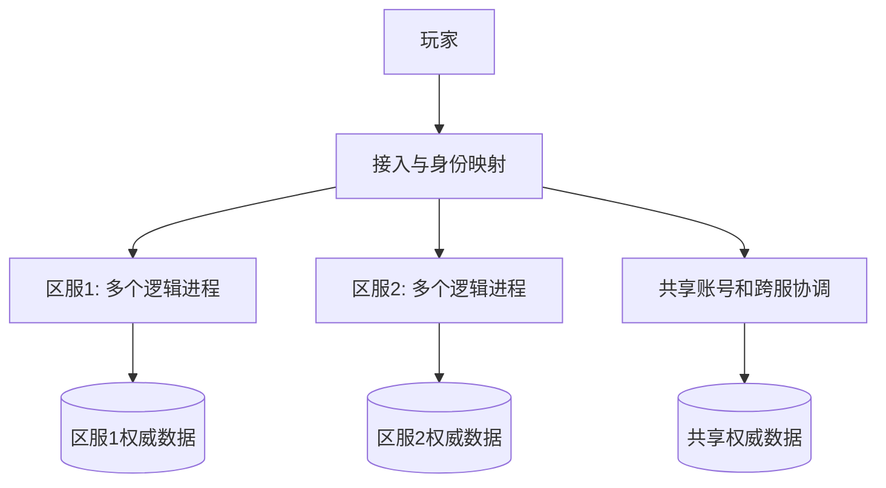

图中的分库表达责任，可以落实为独立实例、库或受约束的表；物理隔离程度要另看部署。区服增加减少组间直接交互，也引入跨服好友、聊天、排行与交易的协调成本。

| 产品问题 | 设计选择与代价 | 可观察依据 |
| --- | --- | --- |
| 人少“鬼服” | 合服、移民或跨服活动；合服需角色/公会/名字/排行冲突规则 | 活跃社交关系、匹配等待、迁移冲突，不能只看注册数 |
| 新服拥挤 | 预约、队列、分线或新shard；分线改变相遇范围 | 每shard准入拒绝、热点room/tick与数据库负载 |
| 跨服战 | 独立战场接纳多服玩家；原角色与临时战斗实体分身份 | 预留/加入/结算的原结果、退出后的归属恢复 |
| 跨服社交 | 独立服务或可重建投影 | 好友更新延迟、消息积压及共享依赖故障范围 |
| 统一活动 | 分发不可变配置版本，区服按确定版本解释 | 活动版本覆盖、切换时点、旧会话兼容 |

用机器人填充可能改变匹配公平和用户体验，是产品政策，不是负载均衡算法。合服也不只是拷贝表：冻结/切点、增量追赶、唯一身份、资产核对、旧写隔离及回退条件都需设计。详细迁移协议沿用既有所有权与高可用主文。

### SA3.3 连续Zone：空间邻近不等于同一事务

Zone把连续世界的部分实体交给特定owner处理。AOI只把相关实体送给观察者：若N个实体平均各关注K个对象，一轮朴素全对全候选量为O(N²)，限制关注关系后发送对象关系约为O(NK)。这不是完整算法复杂度或性能保证；查找邻居、空间索引更新、热点和消息大小仍有成本，K接近N时收益减小。

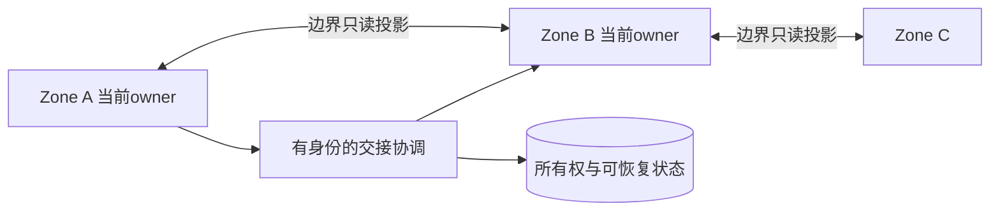

跨界不是“源打包→目标重建→双方确认”就结束。至少要解释：从哪个状态切点转移、晚到输入归谁、源是否还能产生新效果、目标何时获权、任一回包丢失怎么查原交接结果。目标加载副本不等于已经取得写权；连接切到目标也不授予写权。当前owner与代次必须在真正接受新效果的位置被检查，原交接结果恢复不能把历史owner重新当成当前owner。[高可用的交接合同](../持久化与分布式一致性/03-分布式与高可用.md)

边缘战斗可选择一个明确权威区裁决、把战斗参与者迁到同一战斗域、或设计跨域协调。第一种简化一致性但可能热点，第二种改变空间连续性和迁移成本，第三种增加延迟与失效组合。世界BOSS等全局实体也要有一个明确裁决边界，不能让相邻Zone各扣一份血再寄望最终同步。

Zone的收益是空间扩展与连续体验；代价是边界数据量、迁移和跨区玩法复杂度。热点可以分线或改空间边界，冷区可以合并供给，但先核对哪些玩家还能相遇、迁移中的交互与新边界的owner切点；分线改变社交/玩法语义，不能只按CPU阈值执行。是否“无感”由客户端预加载、网络与服务端切换共同决定，不能由拓扑证明。原文用WoW、EVE、Minecraft说明大世界动机，但本次未核各产品的版本化内部实现，不继续断言原版Minecraft天然按chunk分进程，或任意WoW区域与服务进程一一对应。EVE时间膨胀只是历史案例入口，不能据此给任意游戏套用降速策略。

### SA3.4 服务化：按变化与责任拆，不按名词拆

将账号、匹配、房间、聊天、排行和经济服务分别部署，可以隔离发布节奏与资源预算。成立前提是接口稳定、数据责任清楚、团队能处理网络失败、版本兼容与恢复。若战斗同步等待聊天且共用耗尽的连接池，聊天故障仍会拖垮战斗；“故障隔离”需要有限队列、独立预算及可用降级路径。

登录入口可以无状态化，但凭据、会话撤销和重放记录存在于其他责任层。匹配有ticket、队列和reservation；聊天有连接、成员关系、消息/离线状态；排行有结算事实和展示投影。把这些外置可以让某层实例可替换，代价是远程依赖、并发仲裁与恢复责任。分片哈希决定候选路由，不会搬状态，也不授予owner身份。

拆分的一条实践链是：先把同进程模块的输入/输出和状态写入口收拢；测出某模块需要独立发布或预算；定义远程调用与原结果合同；再改变部署边界；最后检查依赖不可用时核心玩法能否按约定降级。跨库一致性采用已有[Outbox与履约主文](../持久化与分布式一致性/04-分布式事务与最终一致性.md)，不因为有gRPC就重新发明分布式事务。

| 原有框架候选 | 这里能据什么比较 | 选型时还需补齐 |
| --- | --- | --- |
| Skynet | 本轮固定源码可追踪service、消息dispatch和协程等待；见SA4 | 进程部署、持久恢复、过载与实际业务协议 |
| Nakama | 官方authoritative match文档区分match状态、loop与显式广播 | 所用版本、扩展代码、实例间分配与故障恢复 |
| ET、kbengine、Pomelo、Photon | 保留原来的候选检索用途；本轮未核其版本实现 | 具体产品/版本、调度模型、权威模式、许可与运维条件 |

语言、市场流行程度或“ECS/Actor/云房间”标签不足以回答本项目能否安全恢复。客户端服务端共享代码能降低重复开发，不自动提供确定性、服务端授权或相同执行环境。

### SA3.5 云原生与托管：管理供给，不替代业务恢复

容器把进程及其用户态依赖打包，编排管理调度、启动与替换。相同镜像仍受内核、CPU架构、配置、数据、网络和资源限制影响；它提高环境可重复性，不“消灭环境差异”。Kubernetes固定文档明确Pod是临时对象，替代Pod有不同UID；恢复原room内存、玩家连接或业务原结果需要应用自己的状态合同。[S3]

GameLift Servers的runtime configuration指定compute/实例上启动哪些服务端进程；game session、player session及业务room还需明示映射。Agones固定资料中GameServer是受控制器管理的资源，Fleet维持可分配的预热GameServer集合；分配与SDK生命周期参与管理可用供给。[S4–S6] 两种产品不能仅按名字套一份YAML。

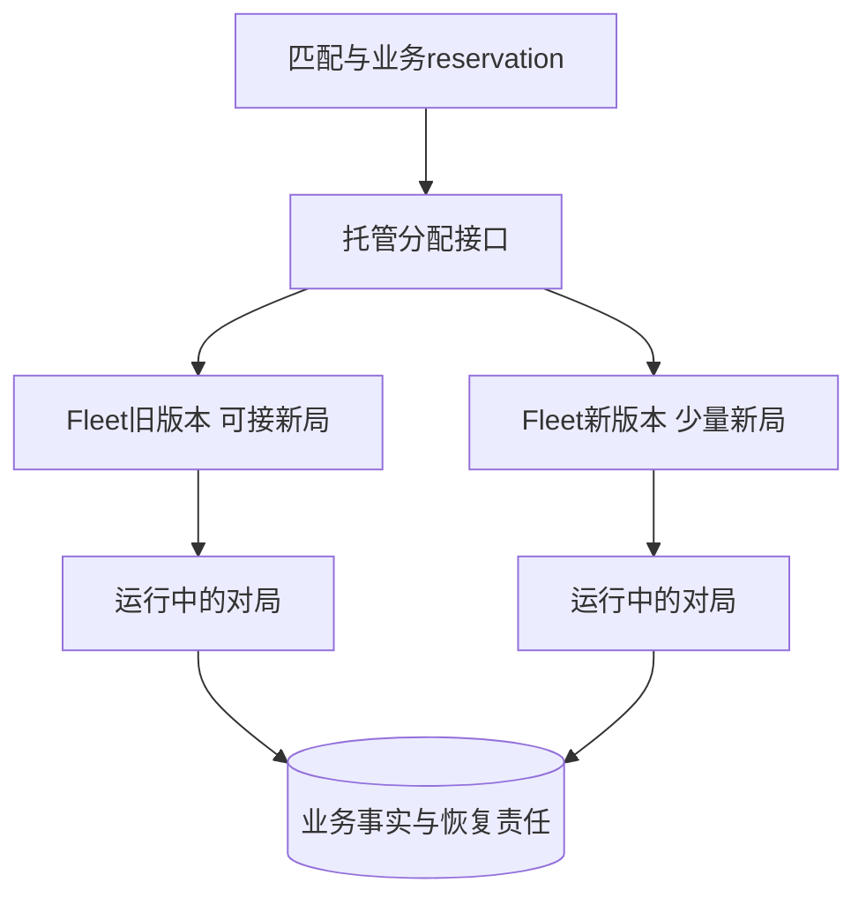

灰度通常从“把部分新局分配到新版本”开始；既有局是否原地升级、继续旧版或到期终止需明确政策。不能因为控制器准备缩容就任意杀掉活跃局。会话制短局容易以局结束作为回收点，长寿命MMO状态仍可托管，但需要更复杂的迁移/恢复合同；没有“MMO必须自建”的定理。

托管收益来自减少集群维护、预热供给与调度工作，成本要计闲置缓冲、启动时延、网络出站、区域覆盖、限额、监控和团队经验。Open Match与Hathora/Edgegap/SpatialOS仍保留为历史调研入口，本次不核其最新服务状态、价格或兼容关系。选型先明确需要的是匹配决策、服务器分配还是世界模拟，不将它们当同一类替代品。

## SA4 Actor单线程为什么仍可能把最后一个位置给两个人

这里补充的是运行模型边界，原文只有Skynet的Actor标签，没有宣称所有Actor绝不交错；不能把补边界记成原文已有的Actor错误。

固定Skynet源码的链条是：`skynet_context_message_dispatch`取服务队列并调用`dispatch_message`；Lua入口`raw_dispatch_message`为消息取得协程；`skynet.call`发送请求后在`yield_call`登记相关协程并yield；响应按session恢复它。在等待期间可以处理别的消息，因此“某服务同一时刻执行一个消息片段”不等于“某请求从开始到结束独占服务”。运行时session关联回复，业务原结果要另有稳定R/D。[S1]

反例取一个仅内存的房间，最后剩1个空位，A/B是不同玩家，外部资格检查会yield。所有步骤由一个线程执行：

| PAPER_EXPECTED A1 | 执行片段 | 状态与结果 |
| --- | --- | --- |
| 1 | A读空位=1，然后等资格检查 | 尚未占位 |
| 2 | B读空位=1，也开始等待 | 尚未占位 |
| 3 | A恢复，把自己加入并令空位减1 | 空位=0 |
| 4 | B恢复，沿用等待前的判断再加入 | 空位=-1或成员超限 |

没有两条CPU指令同时写这个变量，业务不变量仍被等待前后的陈旧假设破坏。可选修正有不同代价：

1. 在恢复后的同一非yield片段重新检查当前成员/空位，并在该片段内一起更新；这只保证该owner当前内存不超额，不证明持久接受或外部资格仍有效
2. 在开始异步工作前以同一非交错状态变迁建立有身份的有限预留；等待结束以同预留身份完成/拒绝，超时不盲目释放可能已在别处接受的资源。若要承诺崩溃后恢复，预留及后续责任必须进入选定持久接受域
3. 用框架支持的串行请求门覆盖完整处理，但审查调用环、等待时延和积压上限。Skynet `skynet.queue`选读维护等待协程队列，并用受保护调用退出临界区；它是协作式串行机制，不是跨数据库事务或无限等待的许可证

这些是供选择的设计，不是可以任意串接的已实现协议；外部资格在等待中可能失效时，还需在加入的实际接受点按当前合同复核资格/版本，或使用在该接受域有效的预留。无论选哪种，所有修改同一不变量的入口都必须服从同一机制；增加一个局部锁却让GM、重连或回调绕过仍会失败。固定Skynet消息队列源码中有扩容路径，不能据它的队列或告警名字推断已存在业务容量上限；上文有限队列是应用还须落实的条件。持锁跨外部回调还可能导致同步重入自锁。跨进程写权仍要由实际接受点仲裁，不能用这个内存反例自创第二套owner协议。

Orleans官方请求调度文档则说明默认完整请求不重入，启用Reentrant/特定interleaving后可交错，但仍逐turn单线程。这与Skynet的调用行为不能混成所有Actor框架的默认规则。非重入A等待B、B又等待A时可能无法推进；直接“开启重入”也不能免除上面的状态审查。[S2] 本节未执行Lua/C#/框架或调度模型。

## SA5 一张拓扑要标出数据平面与真实责任

下面是可裁剪的参考，不是每个产品必须拥有的“标准大型网游”。其中方框表示职责；可以同进程，也可以分开部署。实线为主要业务路径，虚线为控制或观察，不等于跨线原子性。

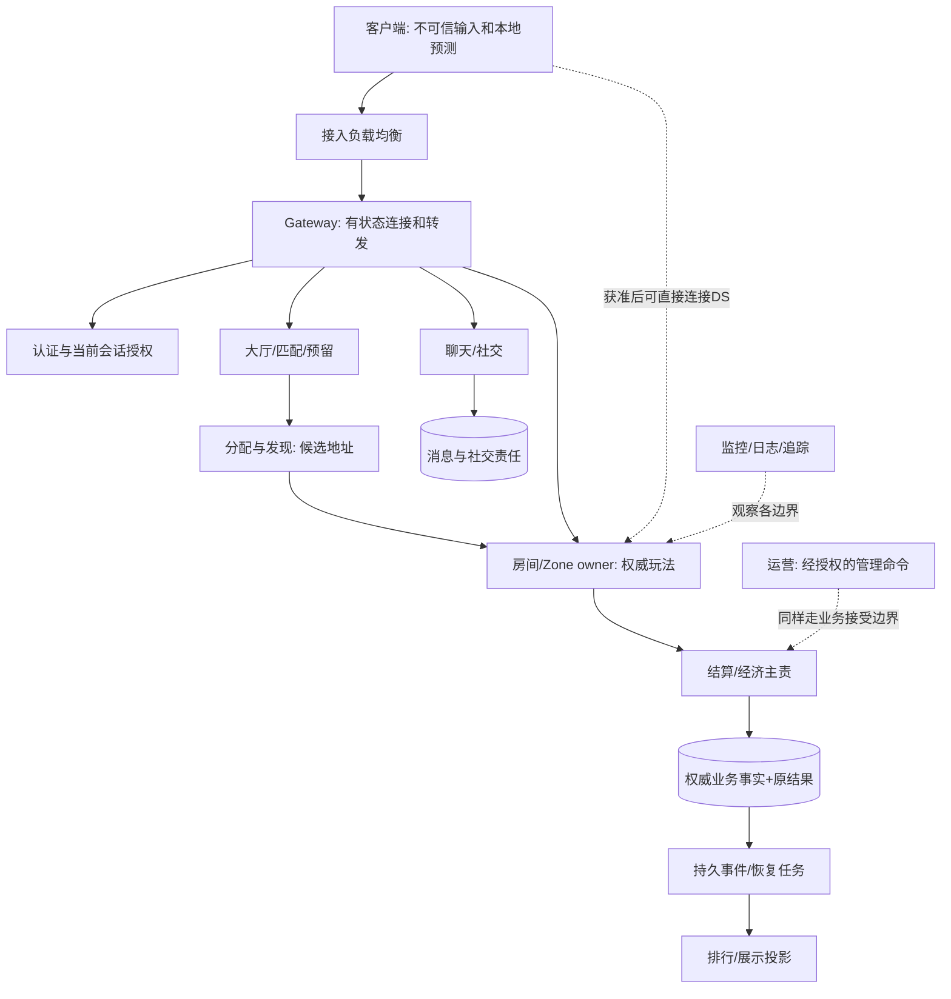

Gateway的socket、发送缓冲和连接代次是本地状态；认证会话可以有外部权威记录。它可以做认证入口、限流和路由，但每个实际接受新效果的服务仍核当前对象/动作权限和合法写权。客户端写在包里的player_id、source_region或room_id只是待绑定的输入。GM和后台也不能绕过业务约束。[安全与反作弊](../会话身份与在线服务/04-安全与反作弊.md)

两种接入方式都合理：全程经Gateway便于统一连接管理但多一层转发和资源消耗；大厅分配后直连DS减少中间数据路径，但DS要验证入场资格、保护端口并处理重连，控制面仍需维护房间归属。哪种更低延迟或更省钱要测具体协议、地域和流量。不能把图里的所有消息默认经TCP，也不能把UDP天然等同帧同步。

建立路由映射时至少分开 `(player, session_generation)`、`(gateway_instance, connection_generation)` 与 `(room, incarnation, owner_epoch)`。关闭旧连接用完整连接身份比较，不能让旧断线回调把新连接映射删掉。踢旧连接或过期认证会话只能约束相应入口；已发给数据库的旧请求还要由数据库实际接受点拒绝旧写。重连要重新取得当前授权，查找原房间/预留/业务结果并取当前权威状态，不把新socket当作新购买或新的进房意图。

## SA6 从匹配到结算：可跟踪的一条正向链

固定业务例：玩家p7要加入room42/inc8；房间上限10人，由实例P1/epoch7负责；本局玩法允许进程崩溃后终止比赛，但已确认的经济结果必须保留。这里的上限、故障政策是例子输入，不是产品通用默认。协议中的身份、记录、原子接受与恢复接口均是项目必须实现的合同，本文没有声称Skynet、Agones或GameLift直接提供它们。

| 阶段 | 成功到底说明什么 | 主责与失败去向 |
| --- | --- | --- |
| 认证 | 当前主体与会话权限已核验 | 身份服务；失败不能创建无限玩家状态 |
| 匹配ticket | 某个匹配意图被有界队列接受 | 匹配服务；取消/超时需按原ticket恢复已分配结果 |
| 房间预留 | 指定room/inc的一个位置按合同被预留 | reservation权威；请求/内容绑定和原结果跟位置同一接受域 |
| 资源分配 | 得到可用游戏服候选及版本/地址 | 托管或分配服务；不代表玩家已经入房或owner已获权 |
| 加入接受 | 当前room owner核权限、资格、容量后接纳该成员 | 房间权威；同一入场意图恢复原结果，不重复占位 |
| 玩法输入 | 已按协议校验并在明确tick/序列边界接受输入 | 房间模拟；收到字节与改变游戏状态分开 |
| 经济结算 | 指定业务事务已提交唯一效果和原终态 | 经济权威库；超时/断线查原R/D |
| 投影/通知 | 展示榜或客户端看到结果 | 下游可以落后；不能反向决定结算是否提交 |

匹配、预留与入房如分属不同服务，就没有天然共同COMMIT。可把强耦合的位置和加入判定共置在一个权威域；若必须分离，用已有可恢复工作流串联，各步身份保持稳定。发生未知时先查原步结果，再决定释放预留或补偿，不能用一个“匹配超时”撤销可能已加入的玩家。详细步骤幂等与补偿边界转到[分布式系统基础](../持久化与分布式一致性/02-分布式系统基础.md)与[分布式事务](../持久化与分布式一致性/04-分布式事务与最终一致性.md)，本篇只决定该责任放在哪个边界。

### SA6.1 确认、超时与恢复保持同一个意图

设一次结算请求R的完整范围是 `(tenant, authenticated_actor, operation, request_id)`，D绑定room/inc、已核比赛身份、完整规范参数及规则/协议/规范化版本。这里的authenticated_actor是首次建立意图时经认证的稳定业务主体；P1、owner_epoch、连接、地址和trace_id属于执行尝试，不因换合法恢复执行者而重建R或改绑D。实际经济接受点按既有[数据库设计A5](../持久化与分布式一致性/01-数据库选型与存储设计.md)将合法效果、业务唯一记录与原结果一起提交；不在此重复SQL或Outbox实现。

**首次向经济接受点发送前**，既定恢复主责必须已确证建立有界持久恢复记录，保存原R、完整D、原稳定业务主体、必要有界负载、原结果查询入口/范围等上下文以及待确认工作与恢复责任，使P1进程死亡后仍能取回这些材料。仅留在P1内存或临时调用栈不满足此条件。记录尚未确证、提交结果不明或必要容量不足时，不发起新效果；先查清记录或停止本次派发，不靠换ID绕过。这里承接[高可用§3.9.2](../持久化与分布式一致性/03-分布式与高可用.md)与[安全主文S6.1](../会话身份与在线服务/04-安全与反作弊.md)的现有合同，不新增持久框架。查询上下文是权威入口、作用域与关联材料，不代表保存或继续使用失效会话凭据。

换成合法恢复执行者时，从该持久责任取回原R/D及稳定主体，再以当前身份重新核查询权限；新worker的身份用于授权这次尝试，不替换原业务主体。材料缺失或不能可信取得时，停止自动重做/补偿并保留有记录的未决处置责任，不能临时生成新R、猜原D或宣称已恢复。

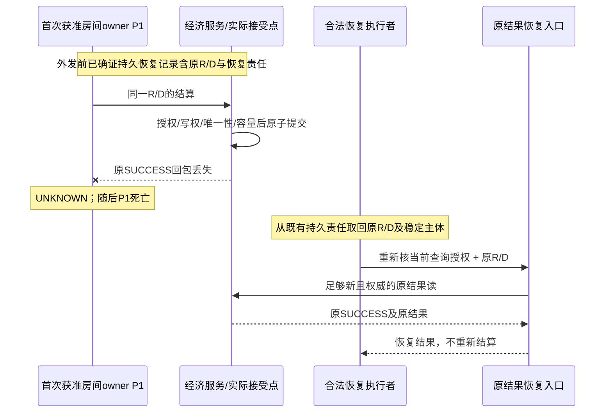

这条链有必须写清的分支：

- 原SUCCESS已提交：同R/D恢复原响应，不能读取今天的余额/积分冒充当时结果；同R异D是冲突
- 原REJECTED已按业务合同持久保存：恢复同一拒绝；后来条件改善不改变原终态，新业务意图才有新R
- 两个同R请求竞争：唯一性仲裁的失败事务退出后，用合适的新视图恢复胜者；一次回滚不证明整个R从未成功
- 查询空、权威源不可用或旧尝试仍可能提交：保持UNKNOWN；截止时间仅停止当前等待/热重试，不变成“肯定没发生”
- owner已转移：旧owner不能再提交新效果，但经当前授权的恢复入口仍可查询原结果；历史成功不恢复旧写权
- 已知终态后收到迟到UNKNOWN：不能降级已知事实；收到矛盾的确证终态则停止相关推进并诊断

调用总预算、在途数、原结果保留和恢复负责人都需有限。用完预算可以暂停新派发、返回处理中或转有记录的人工处理，不能删除未决记录、换ID或无限加并发。正确性记录的回收需覆盖合法重试、迟到调用、备份恢复与旧写者窗口；条件无法证明就停止回收，并在容量耗尽前拒绝新业务。这承接[缓存/消息的记录与资源合同](../持久化与分布式一致性/03-缓存与消息队列.md)，不新造第二套通用重试框架。

### SA6.2 故障后的三个不同问题

第一问是“玩家能连上了吗”，第二问是“哪个owner还能接受状态变化”，第三问是“已经接受的事实恢复到哪里”。Gateway重建解决不了第二、三问，Pod Ready也不证明room可用。例子明确允许本局进程死亡后终止比赛，所以不声称零丢失续局；若产品改为必须续局，需补充快照切点、连续输入/事件日志、版本兼容和恢复重放的真实证据，不能仅在配置上加重启策略。

新owner开放新效果前要完成权威状态恢复和实际接受点隔离旧owner。快照可能只含玩法状态，若遗漏成员生命周期、原请求结果或必须的水位，重启后仍可能重复入场/结算。HA1已定义的交接记录先恢复完整历史，再判当前写权；不要看到旧Transfer成功就把路由切回历史owner。

### SA6.3 关停不是“结果有了，就能销毁连接池”

在存活进程中，业务结果与实际资源静默是两个事实。即使权威查询证实结算SUCCESS，旧submit调用、driver或回调仍可能访问缓冲区、宿主与连接。稳定owner继续持有它们和真实在途槽，直到提交包装完成最后访问、全部相关回调退场、底层不会再访问/回调，派生任务已结束或被有效接手。

关入口与入场登记必须用同一串行门或有证明的等效机制。先完整构造并登记operation及有效持有，再调用真实submit；这样同步回调也有对象可用。调用外部submit时不持有一个可能被同步回调再次取得的非重入门。关闭不能只扫描“发送成功”的列表，关门前已经登记但尚未submit的工作也须计入。本文沿TO1的合同允许已登记工作保留一次提交许可，关闭者等待它；并未实现可撤销这个许可的更强协议。

关闭预算先到且仍未静默，只能报告INCOMPLETE/DRAINING并保留稳定宿主和依赖，不能由close返回者析构它们。没有固定driver的实际静默保证就停止安全销毁声明。持久移交UNKNOWN解决以后业务恢复，不会提前终止旧内存访问。[TO1 §6.1](../持久化与分布式一致性/04-分布式事务与最终一致性.md)、[DB1 A11](../持久化与分布式一致性/01-数据库选型与存储设计.md)

Kubernetes优雅终止有期限，期限后可能强制结束进程；这与应用仍DRAINING并不矛盾，而是部署设计必须承认的边界。应用不得在仍存活时虚报CLOSED；被外部终止以后，只有SA6.1的预先持久恢复材料仍能可信取得，合法恢复执行者才可沿原R/D和当前查询授权恢复未决外部效果；缺失材料时停在未决处置，不能声称已恢复，也不能声称所有回调曾正常退场或未确认内存已保存。[S3] 本次没有执行终止、重启或故障操作。

## SA7 同步方式与权威方式分别选择

状态同步回答“发送哪些状态”，输入同步回答“传播哪些输入”；权威性回答“谁有资格裁决合法结果”。输入转发服务器不一定运行完整模拟，权威服务器也可以广播输入并复算。客户端预测先显示本地推断，再按权威状态校正；rollback通常保存历史状态并在迟到输入后重模拟；reconciliation描述与权威结果对齐。具体系统可以组合，但不是一张同义词表。

原有“校验型、指令型、全权型”可保留为责任比较，不能直接当某种同步算法的等级：

| 权威分工 | 服务器承担什么 | 代价与不足 |
| --- | --- | --- |
| 客户端上报候选结果，服务器校验 | 校验可达性、当前权限及约束后才接受 | 校验器需要覆盖相关作弊面，单个速度阈值不够 |
| 客户端提交意图，服务器算指定结果 | 在当前权威状态上运行技能、碰撞或经济规则 | 计算/存储负担增加，需预测与有界输入减少等待感 |
| 指定关键模拟全部由服务器裁决 | 统一运行规则并发布状态/必要输入和确认 | 客户端仍可预测表现；信息可见性、延迟补偿与恢复仍要另设计 |

| 维度 | 状态同步 | 确定性输入同步/lockstep及其扩展 |
| --- | --- | --- |
| 发送主体 | 快照/增量、实体状态及必要确认 | 按帧/步编号的输入、顺序与必要校验 |
| 模拟责任 | 权威端计算指定状态，客户端可预测/表现 | 参与同一确定性模拟的副本遵守同一规则；纯转发端不因此执行模拟 |
| 带宽 | 与可见实体、字段、频率、压缩有关 | 与输入量、参与者、重传及校验有关；不保证任何场景都更小 |
| 计算成本 | 权威模拟、序列化、AOI与校正 | 客户端确定性模拟；服务器若复算仍承担模拟，回滚还重复计算 |
| 重连 | 兼容的权威基线+基线后更新/序号，重新核会话 | 确定状态切点+完整后续输入/规则，或受验证的状态恢复路径 |
| 回放 | 状态序列或可重建日志，考虑版本与缺口 | 初始状态、输入顺序、随机种子及模拟版本需完整 |
| 延迟与抖动 | 插值/预测减少可见影响但有校正代价 | 等待输入可能停顿；预测/rollback用计算与状态缓存换体验 |
| 反作弊 | 权威端仍要校验输入、权限和信息分发 | 转发本身不裁决；复算、服务端规则与可见信息另有设计 |

“拉取最新快照即可重连”漏掉快照后的在途增量、基线版本和身份；“帧同步客户端必须与服务器完全一致”则只有服务器也作为确定性模拟副本时才成立。只有广播输入的中继不能同时被称为“所有逻辑都在服务器”。任一策略下，客户端持有不该看见的敌人信息仍可能产生透视优势；权威伤害并不消除信息泄漏。

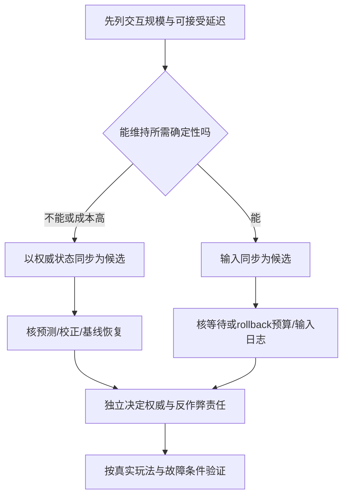

MMO的大量可见实体、射击的延迟补偿、RTS的确定性输入、格斗的回滚和回合制低频交互，分别提示不同问题；品类不是证明。房主可信也不能推出lockstep天然手感好。原文点名具体商业游戏的同步实现本次未核版本，不据其名称作现行技术结论。混用可行，但要指出同一状态只有一个最终裁决边界，不能让PVE与PVP切换重置资产或请求身份。详见[同步专题](../同步预测与回放/03-帧同步与状态同步.md)。

## SA8 四个示例的正确使用边界

### SA8.1 目录表示职责，不把目录名当部署单位

```text
gameserver/
├── gateway/     # 连接、会话绑定、有限转发
├── logic/       # 房间/Zone的权威模拟，可同进程或分进程
├── center/      # 共享业务职责，具体数据owner分别说明
├── common/      # 无副作用工具与明确版本的共享类型
├── proto/       # 字段、兼容策略、大小边界与服务接口
└── deploy/      # 镜像/配置/版本声明；不保存业务权威事实
```

同目录可有多个服务，同进程也可组合多个模块。`common`不能演变为可被任意模块改写的全局玩家表；`center`不能因为统一命名而拥有所有表的无界写权限。运营配置与数据快照分开版本，秘密也不因为需要部署而写进示例文件。

### SA8.2 GameLift字段示意：进程数不是房间数公式

原YAML混合Fleet、RuntimeConfiguration和ScalingPolicy字段，只标“示意”，不是可直接提交的API请求或完整CloudFormation模板；其中`PercentActiveSessions`不在本轮实际读到的PutScalingPolicy指标枚举内。下面分别展示两个官方接口的字段形状，仍是PAPER_EXPECTED节选，没有完整部署前提，不提供运行命令。

```json
{
  "ServerProcesses": [
    {
      "LaunchPath": "/local/game/server",
      "Parameters": "--port 7777",
      "ConcurrentExecutions": 1
    }
  ]
}
```

这是RuntimeConfiguration内容节选。ConcurrentExecutions表示使用这份进程配置在每个instance/compute并行运行的进程数量；多项时相加得配置的进程总数。它不通用地定义业务room数。进程与托管game session的生命周期、一个应用room怎样对应会话、每个进程的端口和资源都要另核；不能把同一固定端口的进程副本乘4，就假定在同一网络命名空间可同时监听。示例改为1是避免暗示这个未经落实的四进程端口配置，不是容量建议。[S4]

```json
{
  "PolicyType": "TargetBased",
  "MetricName": "PercentAvailableGameSessions",
  "TargetConfiguration": { "TargetValue": 20 }
}
```

这是PutScalingPolicy的部分字段，完整请求还需已核FleetId/Name等，不包含在此例。这里20表示该指标所定义的可用容量百分比目标，仅是算术示意，不是“活跃达到20%”或20个玩家。选择预热容量需结合启动/分配耗时、到达率、局时长、配额与最低容量；CPU、内存、网络和tick期限也要同时观察，不能只看一个会话指标。[S5] 没有调用AWS API、创建fleet、支付、开放端口或修改权限。

### SA8.3 服务接口：完整类型不等于业务实现完整

原proto只定义PlayerIdReq/PlayerBrief，却引用未定义的CrossBattleReq/Resp；作为片段可用于介绍RPC形状，不能据此称已可编译。下面保留跨服读和发起战斗的区分，所有类型都在示意中列出；协议编译、兼容测试、鉴权适配与真正服务端实现均未运行。

```protobuf
syntax = "proto3";
package game.center;

service CenterService {
  rpc GetPlayerAcrossServer(PlayerIdReq) returns (PlayerBrief);
  rpc CrossServerBattle(CrossBattleReq) returns (CrossBattleResp);
  rpc GetOriginalBattleResult(OriginalBattleReq) returns (CrossBattleResp);
}
message PlayerIdReq { uint64 player_id = 1; uint32 source_region = 2; }
message PlayerBrief {
  uint64 player_id = 1;
  string name = 2;
  uint32 level = 3;
  uint64 combat_power = 4;
}
message CrossBattleReq {
  string request_id = 1;
  string room_id = 2;
  string room_incarnation = 3;
  uint32 rules_version = 4;
}
message OriginalBattleReq {
  string request_id = 1;
  string room_id = 2;
  string room_incarnation = 3;
  uint32 rules_version = 4;
}
message CrossBattleResp {
  enum Outcome { UNKNOWN = 0; ACCEPTED = 1; REJECTED = 2; CONFLICT = 3; }
  Outcome outcome = 1;
  string battle_id = 2;
  string reason_code = 3;
}
```

首次意图的tenant、原稳定业务主体和操作域来自经核验的受信上下文，与request_id组成原R，并保存完整规范参数/版本作为D；客户端player_id不成为可信主体。当前worker、连接或owner_epoch只是执行尝试身份，不能被换入R。上述消息未单独编码全部原主体/作用域信息，真实接口须从SA6.1的既有持久请求记录及受信关联上下文取回它们，不能在恢复时从新worker身份重新推导原R。首次外发前记录及恢复责任必须已确证持久且有必要容量；恢复者沿原R/D查询，并另核当前身份和查询权限，缺少原材料则停止自动重做。ACCEPTED只在定义的战斗受理接受点确认后返回，不代表玩家已连接或结算成功；UNKNOWN是结果未知，不是成功默认值。字段编号、编码、尺寸/枚举范围、默认值处理和规则兼容需写入真实协议合同。deadline限制等待，服务端派生工作仍由应用负责停止与恢复。[S7]

### SA8.4 移动权威：客户端时间不决定移动额度

原C#片段用`req.ClientTime - p.LastMoveTime`算dt，再用客户端Position直接赋值。即使称“以服务器接收为准”，额度仍受客户端时钟控制；片段未更新LastMoveTime，也没有检查非有限坐标、负dt、状态权限、碰撞和输入顺序。它适合作为需要纠正的示意，不是可用反作弊算法。

PAPER_EXPECTED A2：设p.Speed=5米/秒，LastMoveTime=0。客户端上报ClientTime=100、目标相距500米，旧式maxDist=5×100×1.5=750米，距离检查通过。这证明该片段无法单凭服务器收包获得可信移动额度；不是某线上外挂实测。若距离值为NaN，在常见IEEE比较语义下`dist > maxDist`不会产生期待的“大于”，因此先核有限数值也是独立必要条件。

```text
PAPER_EXPECTED：权威房间的一次固定tick输入处理，不是可编译实现
1. 在有界入口核包长/类型/字段范围及有限数值；从当前认证会话取得主体
2. 在room/incarnation/current owner接受域核当前成员、动作权限和输入序列
3. 只接纳协议允许的本tick输入量；迟到/重复/未来输入按明确窗口处理
4. 使用服务端tick步长、服务端移动状态和规则计算速度/碰撞/位置
5. 在同一受保护状态变迁内发布新位置及已接受序列，再生成权威确认
6. 客户端用确认序列与权威状态校正预测；不把客户端声明的耗时当额外移动预算
```

服务器掉tick时如何限步/降级必须另定，不能把暂停时间全兑换成一次长距离移动。服务端收到包的间隔也不是完美玩家行为时钟，抖动和批量到达需用输入窗口、模拟步长与合法补偿政策处理。若项目采用客户端位置上报而非纯输入，需要更完整的服务端可达性校验；本段不认证那套方案。拒绝异常移动应校正/记录线索，不把一次网络异常直接认定作弊或自动封禁；处置依据沿SS1。

## SA9 从可观察约束选择容量与演进点

一页部署清单至少列出：玩法与业务峰值、各类状态owner、故障域、真实接受点、配置/协议版本、扩容和排空单位，以及谁处理未决结果。CCU只能作为输入之一：同屏交互、实体/AI数量、tick频率、消息字节、写频率、房间偏斜和突发登录都可能更早耗尽预算。横向扩展增加承载节点/实例，把可分割工作分出去；纵向扩展提高单机资源或单核能力，但仍受串行比例、成本和单机上限约束，二者都需先确认真正瓶颈。

### SA9.1 有前提的纸面容量算术

PAPER_EXPECTED A3：假定每个进程在代表性负载下能满足业务目标的上限是20个房间，每房最多10人，需要容纳100个同时活跃房间。则理论最低进程数为ceil(100/20)=5，座位上限为1000。这里“每进程20”是给定假设，不是本轮测量；满房人数、真实在线人数与活跃room数也不同。若要求任一进程消失后仍有足够房间槽，且房间可以合法重建/重新分配、没有其他瓶颈，需要N满足(N−1)×20≥100，即N≥6。增加备用只解决槽数量，原比赛的状态是否能恢复仍由SA6决定。

PAPER_EXPECTED A4：假设业务到达率在某稳定区间平均为40次/秒，平均端到端在系统中停留0.2秒，满足相应稳定性与统计口径前提时，平均在系统数量约为8。这个均值不能定峰值队列容量，也不能保证P99或超时。持续入速超过完成速率时，有限队列最终满；无限排队只会把拒绝换成长尾和内存耗尽。用受控准入、独立恢复预算和实际排队年龄判定停止线。

旧“峰值×1.5”与单进程500–2000人可当历史经验记录，不是本篇提供的工程阈值。留多少余量应取决于故障冗余、启动时延、负载偏斜、GC/抢占、下游限额和业务目标；CPU均值很低也可能有单房间串行热点或长I/O。

### SA9.2 预算与指标要沿同一请求解释

客户端→接入→玩法→存储的等待、排队、计算和传输组成整条路径。若各段有真实确定性上界，可以按因果路径相加；多个P99不能直接相加当作端到端P99，因为分布和相关性不满足这个推断。并行分支还要看等待的是最慢分支、任一结果还是所有结果。跨服务传播剩余预算，不能每跳重新给一份完整超时。[S7]

| 观察到的现象 | 先定位什么 | 可能的选择与停止线 |
| --- | --- | --- |
| 房间tick长尾，机器均值不高 | 热room实体量、单线程工作、GC/锁/阻塞I/O | 减少tick工作、AOI/分批、改变分线；加其他实例不自动救热room |
| 匹配等待高，玩法实例有空闲 | 规则约束、ticket分布、分配与预留失败 | 调整产品可接受的匹配条件或预热；不能盲目增DS |
| Gateway发送积压 | 慢连接、广播量、缓冲字节/最老年龄 | 有界缓冲、合并可替换状态、关闭慢消费者；关键结果另可查询 |
| 数据库忙，实例继续扩容 | 连接池总量、事务竞争、索引、写热点 | 限并发/缩短事务/数据分工；不以无限重试放大下游 |
| 原结果未知越来越多 | 接受点健康、响应链、查询新鲜度、恢复任务年龄 | 保留同R，暂停新效果或限流，交给持续恢复负责人 |
| 托管节点够但可用对局少 | 启动、就绪、版本/地域选择、进程退出 | 看可分配供给及启动分布，不只看节点数 |
| 下线或关停超预算 | 已登记未submit、driver/回调、持久未决责任 | INCOMPLETE并保owner；不清空列表伪造完成 |

指标标签使用有界聚合维度；具体player/request/room身份用于受限日志/追踪关联，不能无限放进指标标签制造额外存量。日志说明经过了哪些边界，但只有相应权威记录证明原业务结果。可观察性设计、部署及故障演练的完整方法属于工程质量域，本篇不新增运维框架。

### SA9.3 十项落地原则

1. 先画世界与业务状态边界，再画机器与进程；每个关键状态只指定一个可解释的最终裁决点
2. 保留权威判定和当前授权；客户端预测/结果上报的合法性由明确规则约束
3. 区分无状态实例和外部状态服务；每次外置都记录新故障与恢复边界
4. Gateway管理连接与准入，玩法owner管理游戏状态；直连DS也履行相应接入责任
5. 容量来自代表性负载与故障目标，示例常数不成为上线预算
6. 先收拢模块写入口再拆进程；用明确的依赖接口隔离外部系统，避免业务遍地直接写库
7. 跨服/合服是产品合同，提前设计全局身份、冲突规则、归属恢复和核对证据
8. 是否容器化由交付需求与团队能力决定；打包、配置、数据与内核差异分别管理
9. 沿请求分配总延迟和工作预算；同步依赖越多，失败组合与恢复责任越多
10. 上线前在授权隔离环境验证故障与恢复，记录真实结果；本篇纸面演算不替代这些实验

## SA10 常见问题

**Q1：单服能扛多少人？** 先指定同屏交互、tick、玩法计算、状态量、硬件与SLO，再测瓶颈。不存在脱离这些输入的通用在线人数。按房间分摊可增加总容量，但一个热房间的串行工作需要单独处理。

**Q2：一个“服”到底是什么？** 产品层的区服可以是一组进程和一组数据责任；进程、机器、容器、room和托管game session不是同一层身份。部署图要写清映射及共享依赖。

**Q3：Zone边界如何打架？** 先选唯一战斗裁决域，采用边界归属、迁移到同域或明确跨域协议，并检查迟到输入和交接结果。复制邻居状态只能作投影，不能让两边同时无条件改同一权威事实。

**Q4：什么时候值得微服务化？** 当独立发布、资源隔离、团队职责或复用需求带来具体收益，并能承担远程失败、版本与数据责任成本时。小团队也可能需要隔离高风险模块，大团队也可能保留核心模拟单体；团队人数不是硬阈值。

**Q5：什么时候必须用GameLift/Agones？** 没有“必须”的统一条件。会话制和波动负载常能受益于托管分配/预热，但要核地域、启动、成本、限额、排空及SDK合同。自建与托管都不能省略业务恢复。

**Q6：状态同步和输入同步能混合吗？** 能，分别说明每类状态的裁决、传播、确定性和恢复边界。混用不证明比单一方案更好，具体商业产品的旧标签也不是当前实现证据。

**Q7：客户端预测会不会被外挂利用？** 预测本身不授予最终写权，但服务器若信客户端时间/结果、泄漏隐藏状态或遗漏权限仍会出错。权威端校验和必要的信息可见性限制不可省。

**Q8：单线程Actor是否无需考虑并发？** 仍需考虑异步等待、重入、外部回调和跨进程副作用。先确认具体框架默认调度，再证明完整业务不变量；SA4给出没有并行写也会超额的轨迹。

**Q9：超时后新请求ID重试是否更简单？** 它可能把原意图变成第二次扣款/入房。保留原R/D，恢复原终态；不知道结果时就保留UNKNOWN和负责人。一次失败事务与一个逻辑意图从未成功不同。

**Q10：控制器重启了实例，是否表示恢复完成？** 还要查room权威、持久事实、旧owner隔离和当前准入。实例存活、玩家连通、业务可继续、资源安全退场各有不同证据。

## SA11 有限纸面情境与验证建议（未执行）

下列所有结果均为PAPER_EXPECTED：只按正文给定前提推导，不是产品断言输出、故障结果或新模型测试。A1–A4已给输入和逐步推理，下面覆盖它们与其余关键边界。缺少前提时应停在表里的未知或拒绝状态，不能补写成功。

| 编号 | 输入与操作 | 预期判定及依据 |
| --- | --- | --- |
| A1 | 最后1个座位，A/B均读1后异步等待再减 | 原式超额；恢复后同一非交错段重查/更新只可接纳一人，SA4 |
| A2 | speed=5、客户端dt=100、dist=500 | 旧maxDist=750会接受；服务端tick输入模型不借客户端dt增加额度，SA8.4 |
| A3 | 100个room、假定20room/进程、允许一进程失去后重分配 | 槽数最低5；冗余条件需6；不证明失去的room能续局，SA9.1 |
| A4 | 稳定输入40/s、平均停留0.2s | 相应前提下平均在系统8；不推出峰值与P99，SA9.1 |
| A5 | 同进程内存先发道具，持久事务后来失败 | “同进程”无法回滚此前可见效果；需真实同一接受域，SA3.1/SA6 |
| A6 | 网关conn19已被conn20替换，conn19断线回调迟到 | 按完整连接身份比较，不删除新映射；旧外部写另看接受点，SA5 |
| A7 | 目标Zone已加载状态，owner交接尚未确认 | 目标只持副本，不能因路由先切而新增权威效果，SA3.3 |
| A8 | owner已转到epoch8，旧epoch7的历史交接成功回复迟到 | 恢复原结果不恢复旧写权；查当前权威，SA6.2与HA1 |
| A9 | 首次发送前已确证原R/完整D/稳定主体/查询上下文与恢复责任持久；结算提交后回包丢失，P1随后死亡；后来当前分数又变 | 有据分支：合法恢复执行者取回原材料，重新核当前查询权限后查原SUCCESS及原值，不重结算、不拿当前值替代。缺材料反例分支：若记录未持久或已丢失，恢复前提不成立，停止自动重做/补偿并保留未决处置，不能换ID或宣称恢复；按本合同首次记录未确证/容量不足本就不应发送，SA6.1 |
| A10 | 两个同R/D并发，败者事务回滚；胜者已经提交 | 败者以权威新视图恢复原终态；异D另作冲突，SA6.1 |
| A11 | 原查询为空但旧请求仍可能提交，deadline先到 | UNKNOWN，保留R/D和恢复责任；不换键、不自动释放可能已生效预留 |
| A12 | 原REJECTED确已持久，之后条件改善 | 同R/D仍恢复原拒绝；新意图再新建R，SA6.1 |
| A13 | 入口登记完成后关门，submit尚未调用 | 仍属在途责任，按选定一次提交许可合同等待；不只等已发送列表 |
| A14 | submit内部同步成功回调，submit尚未返回 | 有效持有必须预先存在；结果已知但不能释放submit/回调仍用资源 |
| A15 | 权威结果SUCCESS已查明，driver是否静默未知 | 原终态保留；真实槽和owner仍存活，close只可INCOMPLETE/DRAINING |
| A16 | Pod用新UID替代旧实例，room仅在旧内存 | 平台重建不能恢复那份room；按例子的终止政策处理，不能承诺续局 |
| A17 | 输入中继只转发，各客户端模拟得到不同结果 | 转发没有建立权威裁决或确定性；不能以低服务器负载宣称强反作弊 |
| A18 | 快照基线v10后已有v11/v12增量，新连接只拿v10 | 还需连续后续更新/版本与身份核对；“有最新快照”描述不完整 |
| A19 | 同配置启动4进程，均显式绑定同一端口 | 不能仅凭ConcurrentExecutions推断4个可用room；先核端口和进程/会话合同 |
| A20 | 新业务结果槽满，已有UNKNOWN与合法原查询 | 停止新增效果，保未决正确性记录；原查询走独立有限预算，不编造新终态 |

未来若选用某个产品实现，最小验证应固定版本、身份/参数规则、存储原子域和真实driver，然后分别验证：两请求竞争最后位置、旧连接回调、同R并发/回包丢失、owner切换后的旧写、实际关停与派生回调、重连基线缺口。每项保存输入、接受点事实、原结果和资源静默证据，分开报告。容量基准另用代表性room分布、足够时长、负载输入与端到端计时；不让纯纸面模型成为L3/L4替身。本轮不执行上述产品/协议/编译/容器/网络/故障/性能/安全权限隔离动作，也不新增runner或CI。

## SA12 来源、版本与实际核对范围

本轮核对日期2026-10-08。固定源码只选读与本文链条直接相关的部分，不声称全文审计、组件之间兼容，或证明本地/线上部署采用这些版本。所有官方页面的结论只覆盖实际选段；官网链接可访问本身不证明整篇。

- **S1 · [Skynet v1.7.0，f97c72d341c820ca9ed0ec0d49f654b0e783d934](https://github.com/cloudwu/skynet/tree/f97c72d341c820ca9ed0ec0d49f654b0e783d934)**：实际选读`lualib/skynet.lua`的`yield_call/skynet.call/raw_dispatch_message/dispatch_message`，`lualib/skynet/queue.lua`，`skynet-src/skynet_server.c`的dispatch与`skynet-src/skynet_mq.c`队列入场/取出片段。支持协程等待、消息片段调度和串行队列解释；没有编译，也未认证任意C扩展、用户回调或分布式持久实现
- **S2 · [Orleans Request scheduling](https://learn.microsoft.com/en-us/dotnet/orleans/grains/request-scheduling)**：实际读默认请求调度、循环调用、Reentrancy和逐turn交错段；页面快照未固定到某个Orleans二进制版本。仅作不同Actor调度合同的对照，不把所有attribute/外部Task行为泛化认证
- **S3 · [Kubernetes 1.32文档固定修订a6b9d383…：Pod Lifecycle](https://github.com/kubernetes/website/blob/a6b9d383dfe5cba5d846d3f05475c6cc25f3d2d7/content/en/docs/concepts/workloads/pods/pod-lifecycle.md)**：实际读Pod寿命/替换UID、探针含义及终止流程。文档分支指向已另查明后按commit重读；不是执行集群，也不是用浮动最新页导航中的版本认证本文
- **S4 · [GameLift RuntimeConfiguration](https://docs.aws.amazon.com/gameliftservers/latest/apireference/API_RuntimeConfiguration.html)与[ServerProcess](https://docs.aws.amazon.com/gameliftservers/latest/apireference/API_ServerProcess.html)**：实际读进程配置、ConcurrentExecutions及LaunchPath/Parameters。是API页面快照，非某SDK实现版本；不由字段名推出业务room映射
- **S5 · [GameLift PutScalingPolicy](https://docs.aws.amazon.com/gameliftservers/latest/apireference/API_PutScalingPolicy.html)**：实际读Request Syntax、MetricName、PolicyType、TargetConfiguration及target-based示例。支持字段及可用会话百分比语义，不支持原YAML直接部署或任何容量/成本推荐
- **S6 · [Agones v1.44.0，24c36734…](https://github.com/agones-dev/agones/tree/24c36734cfa14b3575645f661a3079863dad05eb)**：实际读`site/content/en/docs/Overview/_index.md`、`Reference/gameserver.md`与`Reference/fleet.md`相关介绍、资源、端口和生命周期配置选段。只用于GameServer/Fleet机制，不将其与Kubernetes 1.32文档拼成兼容部署认证；本轮不是Agones当前推荐版本评估
- **S7 · [gRPC Deadlines](https://grpc.io/docs/guides/deadlines/)**：实际读Client/Server deadline与传播段，页面标最后修改2025-07-07；取消后派生工作仍由应用停止。未核各语言当前driver的关闭/静默契约，不由这个文档认证SA6.3的抽象宿主已经实现
- **S8 · [Nakama Authoritative Multiplayer](https://heroiclabs.com/docs/nakama/concepts/multiplayer/authoritative/)**：实际读tick rate、独立match state、显式广播相关段。网页快照未固定部署版本；未采用整页样例代码为可运行实现，也未认证match迁移或容量

最早的Skynet/Agones raw网页读取失败、一个Skynet queue连接中断、Agones旧组织API重定向与numeric repository URL不受connector支持，均保留失败记录；后续从官网指向的`agones-dev/agones`固定tag/commit重新读取，不把失败当已读成功。Kubernetes浮动页、Agones现行页只用于定位，正文产品事实以以上固定内容和明确快照为准。历史中的TCP/QUIC/Protobuf总页、Game Programming Patterns和产品案例保留阅读用途，本轮没有重审它们的全部内容。

本篇只决定部署、运行与业务状态的责任组合。分布式判定、消息/缓存接受、跨库履约、榜单投影、存档及安全的详细机制分别由既有DF1、CM1、TO1、CR1、DB1、HA1和SS1主文负责；这里只承接合同，不重复新建协议、存储模型或runner。

## SA13 关联阅读

- [网络通信与协议设计](02-网络通信与协议设计.md)：字节传输、定界与协议，是接入层的下一层问题
- [帧同步与状态同步](../同步预测与回放/03-帧同步与状态同步.md)：深入同步与预测；具体实现仍核该篇版本/证据边界
- [消息系统与事件驱动](04-消息系统与事件驱动.md)：服务内外的消息协作入口
- [并发与高性能](../运行调度与过载保护/05-并发与高性能.md)：运行调度的进一步学习入口
- [分布式系统基础](../持久化与分布式一致性/02-分布式系统基础.md)：超时、复制、原结果与资源接受点
- [缓存与消息队列](../持久化与分布式一致性/03-缓存与消息队列.md)：缓存代次、投递确认、容量与真实静默
- [分布式事务与最终一致性](../持久化与分布式一致性/04-分布式事务与最终一致性.md)：跨服务履约、Outbox与未决恢复
- [缓存与排行榜系统](../持久化与分布式一致性/02-缓存与排行榜系统.md)：结算事实、展示投影和封榜奖励责任
- [数据库选型与存储设计](../持久化与分布式一致性/01-数据库选型与存储设计.md)：事务、存档与恢复的接受点
- [分布式与高可用](../持久化与分布式一致性/03-分布式与高可用.md)：发现、路由、owner交接与恢复
- [安全与反作弊](../会话身份与在线服务/04-安全与反作弊.md)：身份、授权、原结果查询及信号处置
- [部署运维与监控](../../08-工程实践与质量/部署运维与可观测性/05-部署运维与监控.md)：原“运维与部署”延伸阅读的现行路径；本文不认证该篇的运行结论
- 历史通用规范入口：[TCP RFC 9293](https://www.rfc-editor.org/rfc/rfc9293.html)、[QUIC RFC 9000](https://www.rfc-editor.org/rfc/rfc9000.html)、[Protocol Buffers文档](https://protobuf.dev/)、[gRPC文档](https://grpc.io/docs/)、[Kubernetes文档](https://kubernetes.io/docs/)；保留原有导航，不能当作这些站点全部内容已于本轮核对
- [Amazon GameLift Servers开发者指南](https://docs.aws.amazon.com/gameliftservers/latest/developerguide/what-is-gamelift.html)、[Agones文档](https://agones.dev/site/docs/)、[Game Programming Patterns](https://gameprogrammingpatterns.com/contents.html)的服务定位器/更新方法、[Skynet源码](https://github.com/cloudwu/skynet)：保留原有外部延伸阅读用途；具体支持性来源范围以上节为准


## 历史原文保留区（惰性文本）

以下G0是修订前固定main正文的完整26,438字节；G1起仅保存早期版本中不在G0里的必要差异片段。它们不是当前教学建议、可运行配置或新增Canonical。围栏内的旧标题、图、代码、数字、链接和日期均保持原样；当前可用阅读导航见SA13。早期完整正文可按逐字映射从共同主体及差异片段回拼，避免重复保存整篇。

已读取历史贡献：2026-08-04初稿24,301字节；08-05调整旧产品说明24,326字节；08-06补来源/工程验收及导航26,188字节；08-13成熟度说明26,248字节；08-20加入OKF元数据26,382字节；之后迁移修正相对导航形成26,438字节。这些是实际历史内容，不宣称本轮首次写作。

### G0 固定main完整原文

<!-- SA-PRESERVE-G0-BEGIN -->
~~~~~text
---
type: Comparison
title: "01 服务器架构模式（Server Architecture Patterns）"
status: stable
verified: []
maturity: L2
---
# 01 服务器架构模式（Server Architecture Patterns）

> 知识成熟度：L2（本轮审计修订时补标）。

> 知识基线：实时游戏服务端通用架构；示例中的语言、数据库、缓存、容器和云平台版本必须以项目部署清单为准。
> 适用范围：覆盖网关/登录、房间/匹配、游戏服、数据服务与运营后台之间的全链路拆分、权威边界和部署责任。
> 事实边界：协议规范、组件行为和示例方案分开；容量数字只作示意/经验值，必须通过压测验证。
> 最后更新：2026-08-06（补齐规范来源、版本边界与工程验收入口）。
> 版本边界：以 2026-08-06 为核对日，不新增不确定的当前组件版本号；实际版本由项目部署清单锁定。
> 参考来源：[TCP RFC 9293](https://www.rfc-editor.org/rfc/rfc9293.html)、[QUIC RFC 9000](https://www.rfc-editor.org/rfc/rfc9000.html)、[Protocol Buffers 官方文档](https://protobuf.dev/)、[gRPC 官方文档](https://grpc.io/docs/)、[Kubernetes 官方文档](https://kubernetes.io/docs/)。

### P0 证据与验收入口

- 架构评审必须把网关/登录、房间/匹配、游戏服、数据与运营的状态所有权、故障域、扩缩容方式和降级责任逐项写入部署清单。
- 权威服务器结论只覆盖“最终判定在服务端”这一边界；客户端预测、缓存副本、消息重试和云平台调度都必须单独标注失效与恢复路径。
- 状态同步应验收权威快照、重连和校正；帧同步应验收确定性假设、输入日志和回放比对，不能用单次演示替代跨平台压测。
- 跨服务 RPC/事件必须有 schema 版本、超时、重试、幂等和限流记录；容量结论须附压测场景、数据规模和 P95/P99 结果。

> 适用读者：服务端新人、架构师、技术负责人
> 前置知识：基本网络知识（TCP/IP）、进程与线程概念
> 目标：理解五种主流服务器架构的演进脉络与取舍，掌握"权威服务器"（authoritative server）原则，
> 学会根据游戏类型选择同步架构，并能画出自己的服务器拓扑图。

---

## 1. 概述

服务器架构（server architecture）决定了游戏的**容量上限、开发效率、运维成本与反作弊能力**。
在写第一行业务代码之前，团队必须先回答三个问题：

1. **世界怎么切分**：所有玩家在同一个世界里，还是按区、按服、按场景切分？
2. **谁说了算**：客户端计算的结果服务器是否信任（权威服务器原则）？
3. **怎么扩容**：加机器就能加容量（水平扩展，horizontal scaling），还是只能换更强的机器（垂直扩展，vertical scaling）？

游戏服务端架构的演进大体经历了五代：

| 代际 | 架构 | 代表年代/产品 | 核心特征 |
| --- | --- | --- | --- |
| 第一代 | 单服架构（Monolithic） | 早期页游、单机联机 | 一台服务器扛全部，架构最简单 |
| 第二代 | 分区分服（Sharding） | 传奇、梦幻西游、大部分 MMORPG | 按区服切分世界，低成本高隔离 |
| 第三代 | 无缝世界（Zone/Seamless World） | World of Warcraft、EVE Online | 大世界按区域划分，跨区动态迁移 |
| 第四代 | 微服务/服务化（Microservices） | 腾讯互娱、网易、中台化产品 | 按业务域拆分服务，独立部署伸缩 |
| 第五代 | 容器化与云原生（Cloud-Native） | Amazon GameLift、Agones 等（Google Stadia 已于 2023 年关停） | 容器编排、弹性伸缩、按量付费 |

> 注意：五代架构并非"后者取代前者"，而是**并存**的。今天仍有大量成功产品使用分区分服，
> 架构选择是 trade-off（取舍）而非"越新越好"。

---

## 2. 核心概念（Core Concepts）

| 术语 | 英文 | 说明 |
| --- | --- | --- |
| 单服架构 | Monolithic Architecture | 所有模块（登录、场景、背包、战斗）打成一个进程 |
| 分区分服 | Sharding / Server Group | 玩家被分配到固定区服，区服之间数据隔离 |
| 无缝世界 | Seamless World | 大地图切分为多个 Zone，玩家跨区时无感迁移 |
| 区域 | Zone / Region / Cell / Grid | 无缝世界中承担局部场景的服务器单元 |
| 网关 | Gateway / Frontend | 客户端接入层，负责连接管理、消息转发、流量控制 |
| 场景服务器 | Scene / Game Server | 承载具体玩法逻辑（移动、战斗、AI）的进程 |
| 权威服务器 | Authoritative Server | 所有关键状态由服务器计算与裁决，客户端只提交输入 |
| 客户端预测 | Client Prediction | 客户端先行模拟以降低延迟感，服务器结果到达后校正 |
| 回滚 | Reconciliation / Rollback | 客户端预测与服务器结果不一致时修正状态 |
| 无状态服务 | Stateless Service | 不保存会话状态，可随意水平扩展（如登录、匹配） |
| 有状态服务 | Stateful Service | 保存玩家/场景状态，扩容需要状态迁移或分片 |
| 微服务 | Microservices | 按业务能力拆分的、可独立部署的服务集合 |
| 服务发现 | Service Discovery | 服务间互相定位的机制（etcd、Consul、ZooKeeper） |
| 容器编排 | Container Orchestration | 自动化部署、扩缩容、故障恢复（Kubernetes） |
| 水平扩展 | Horizontal Scaling | 增加机器数量提升容量 |
| 垂直扩展 | Vertical Scaling | 提升单机配置（CPU/内存）提升容量 |
| 有状态分片 | Stateful Sharding | 按玩家 ID 哈希等规则把状态分布到多台机器 |
| 合服 | Server Merge | 将多个低负载区服合并，提升社交密度 |
| 跨服 | Cross-Server | 让不同区服的玩家进入同一活动场景（跨服战） |

---

## 3. 原理详解（In-Depth）

### 3.1 单服架构（Monolithic）

**原理**：所有功能运行在同一个进程内，客户端直连（或经简单网关转发）唯一入口。
内存中的全局状态天然一致，没有跨进程通信开销。

**优点**：
- 开发最快：无分布式问题（无 RPC、无一致性难题），调试直观；
- 事务天然：所有数据在同一进程内，无需分布式事务；
- 运维简单：只部署一套进程。

**缺点**：
- 容量天花板：单进程受 CPU/内存/GC 限制，在线人数上限低（通常数百到数千）；
- 单点故障（single point of failure）：进程崩溃=全服宕机；
- 无法按模块扩缩容：场景压力大时无法只扩容场景模块；
- 大版本迭代风险高：改一行代码影响全服。

**适用场景**：休闲小游戏、原型验证（MVP）、房主制（P2P host）游戏的服务端辅助、
以及"不差钱但要快速上线"的轻度产品。

### 3.2 分区分服（Sharding / Server Group）

**原理**：按区（region）、服（server）或频道（channel）把玩家群体切分，
每个服是**独立的世界**（独立进程、独立数据库或独立库表），服内架构可以仍然是"单服"。
玩家注册时被分配到一个服，登录后绑定在该服。

**为什么流行**：成本低——一台物理机（或一个 Docker 容器）就是一个服；
隔离好——一个服出问题不影响其他服；社交密度可控——小服内玩家更容易形成熟人社区。

**关键问题与解法**：

| 问题 | 说明 | 常见解法 |
| --- | --- | --- |
| 鬼服 | 玩家流失后单服人数过少 | 合服（server merge）、动态移民 |
| 跨服玩法 | 国战、跨服战场需要多服玩家同场 | 跨服网关 + 独立的跨服战场服务器 |
| 服间数据 | 好友、聊天等需要跨服 | 中心化服务（好友中心、聊天中心）或共享存储 |
| 运营活动 | 每个服单独开活动成本高 | 活动配置中心化下发，逻辑服内执行 |
| 负载不均 | 新服爆满、老服冷清 | 预约开服、动态合服、AI 填充 |

**典型拓扑**：

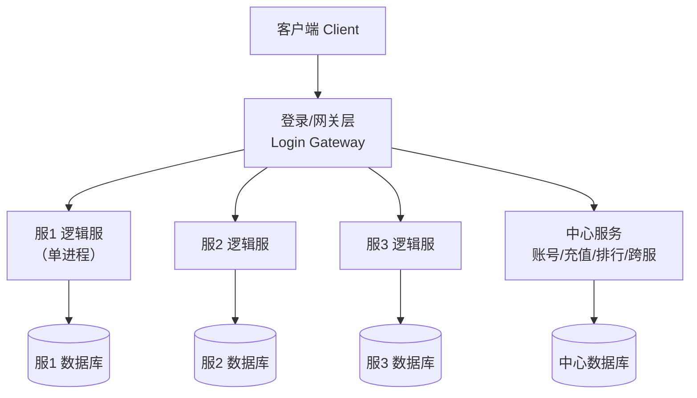

### 3.3 无缝世界（Seamless World / Zone）

**原理**：把巨大的连续世界地图切分为若干**区域**（Zone/Cell/Grid），每个区域由一个场景进程负责。
玩家在区域边界移动时，由服务器协调**跨区迁移**（handover/transfer），玩家无感。
同一区域的玩家数据在同一个进程内，保证一致性与性能；区域之间通过轻量交互（边界同步、跨区事件）协作。

**关键技术**：
- **AOI（Area of Interest，兴趣区域）**：每个玩家只关注周围一定范围内的实体，广播量从 O(N²) 降到 O(N·K)；
- **跨界迁移**：玩家跨越 Zone 边界时，源 Zone 打包玩家状态 → 目标 Zone 重建实体 → 双方确认 → 切换连接归属；
- **Zone 负载均衡**：热点区域拆分（如主城人多拆成多个副本线）、冷区合并；
- **无缝感**：客户端看到的是连续大地图，Zone 之间只是服务器内部的切分。

**代表案例**：
- **World of Warcraft**：大陆按区域划分，跨区时出现短暂的"Loading"（旧版），新版已接近无缝；
- **EVE Online**：星域（solar system）即 Zone，最著名的"时间膨胀"（time dilation）机制——
  当单星系负载过高时主动放慢服务器时间片，保证公平而非崩溃；
- **Minecraft 大型服务器**：分区块（chunk）由不同进程承载。

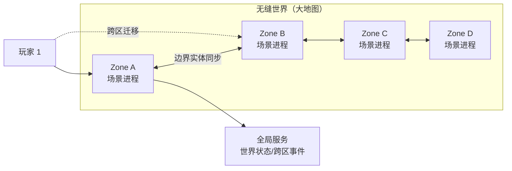

**优缺点**：体验最好（大世界、无感切换、社交无边界），但实现复杂度最高——
需要处理迁移一致性、跨 Zone 战斗（边缘战斗）、全局对象（如世界 BOSS）归属等问题。
**适用**：大型 MMORPG、开放世界（Open World）游戏。

### 3.4 微服务架构（Microservices）

**原理**：把服务器按**业务域**（domain）拆分为多个独立部署的服务，例如：
账号服务、登录服务、匹配服务、战斗服务、聊天服务、排行榜服务、商城服务、数据存档服务。
服务之间通过 RPC 或消息队列通信，每个服务可独立扩缩容、独立发布。

**游戏微服务与 Web 微服务的差异**：游戏的核心痛点是**有状态**（场景/战斗状态）与**低延迟**，
因此游戏里通常采用"**无状态服务自由扩展 + 有状态服务分片**"的组合：
- 无状态：登录、匹配、排行、聊天（可随意加机器）；
- 有状态：场景/战斗服务按"房间"或"分片"分配，配合一致性哈希（consistent hashing）与状态迁移。

**游戏界的"类微服务/服务化"框架**：

| 框架 | 语言 | 模型 | 特点 |
| --- | --- | --- | --- |
| Skynet（云风） | C + Lua | Actor（服务） | 单进程内多服务，消息驱动，国内中小团队使用极广 |
| ET（猫大仙） | C# | 双端共享 + 组件 | 客户端服务端共享逻辑代码，ECS 风格 |
| kbengine | C++ + Python | 多进程（cell/base） | 开源 MMORPG 引擎，cell 负责场景、base 负责玩家 |
| Pomelo | Node.js | 多进程（connector/game） | 早期页游/手游常用，JS 全栈 |
| Nakama | Go | 单进程多模块 | 开源游戏后端，内置社交/排行/实时多人 |
| Photon | C# | 云托管房间制 | 商业化实时多人后端（Photon Cloud） |

**优点**：模块独立演进、故障隔离（聊天挂了不影响战斗）、弹性伸缩、团队并行开发。
**缺点**：分布式复杂度（网络分区、一致性、链路追踪）、运维成本高、延迟增加（多一跳 RPC）。
**适用**：大型项目、中台化组织、需要多端复用（App/Web/小程序）的产品。

### 3.5 容器化与云原生（Containerization & Cloud-Native）

**原理**：把服务器进程打包成 Docker 镜像，用 Kubernetes 等编排系统管理，
由平台自动完成部署、扩容、故障重启。云厂商进一步提供游戏专用托管：

- **Amazon GameLift**：专为游戏设计的托管平台，提供"队列（queue）→ 舰队（fleet）→ 实例（instance）→ 游戏会话（game session）"模型，
  支持按玩家需求自动拉起游戏会话（session-based scaling），内置玩家放置（placement）与伸缩策略；
- **Agones（Google，开源）**：基于 Kubernetes 的游戏服务器托管，用 CRD（自定义资源）管理 GameServer，
  支持 Fleet 与自动伸缩，与 Kubernetes 生态无缝集成；
- **Open Match（Google，开源）**：与 Agones 配套的通用匹配框架；
- **Hathora / Edgegap / Improbable（SpatialOS）**：边缘节点部署、空间化计算。

**容器化带来的能力**：

| 能力 | 说明 |
| --- | --- |
| 弹性伸缩（Auto Scaling） | 根据在线人数/队列长度自动增减游戏服实例 |
| 故障自愈（Self-Healing） | 实例崩溃自动重建，降低运维人工干预 |
| 灰度发布（Canary） | 新版本先上少量实例验证再全量 |
| 环境一致 | 开发/测试/生产同一镜像，消灭"在我机器上能跑" |
| 成本优化 | 低谷期缩容到最小规模，按量计费 |

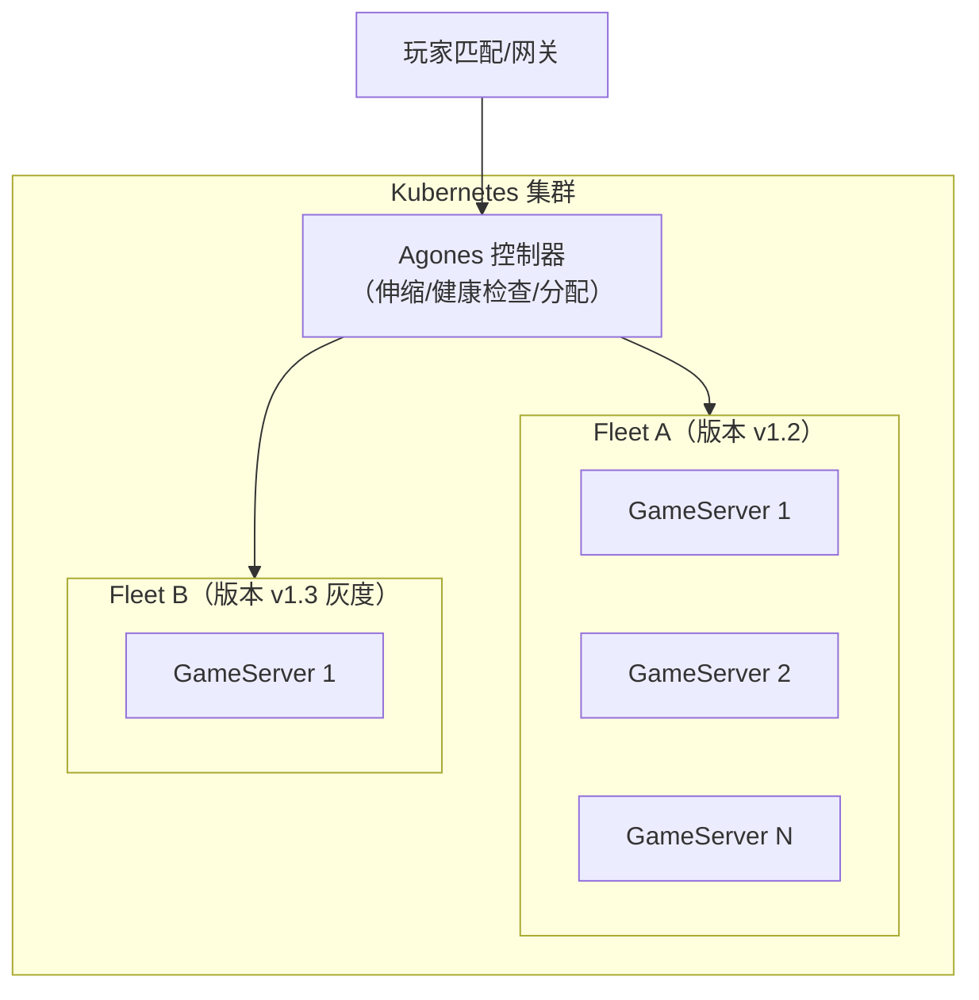

### 3.6 权威服务器原则（Authoritative Server）

**定义**：游戏中影响胜负与经济的**关键状态**（位置、血量、伤害、掉落、交易）一律由服务器计算和裁决；
客户端只发送**输入**（按键、指令），并展示服务器确认后的结果。

**为什么必须权威**：
- **反作弊**：客户端是"不可信终端"（untrusted terminal），内存修改、变速齿轮（speed hack）、
  瞬移（teleport hack）、伤害外挂（damage hack）都建立在客户端可篡改状态之上；
- **一致性**：多人共享世界必须以同一份状态为准，否则各客户端各自为政；
- **经济安全**：掉落、货币、交易等与收入相关的状态绝不能由客户端决定。

**权威化的层次**（从松到严）：

| 层次 | 说明 | 例子 |
| --- | --- | --- |
| 校验型 | 客户端上报结果，服务器做合法性校验 | 简易移动（校验速度上限） |
| 指令型 | 客户端只发意图，服务器算结果 | 技能释放、攻击判定 |
| 全权型 | 客户端只做表现，所有逻辑在服务器 | 帧同步（服务器裁决） |

**代价**：服务器计算压力大、网络延迟增加（一次操作需要 RTT 往返）、手感依赖预测与补偿技术。

**配套技术**：客户端预测（client prediction）、服务器回滚（server reconciliation）、
延迟补偿（lag compensation，如 FPS 的"回放击中"）、输入缓冲（input buffering）。

### 3.7 同步架构选型：状态同步 vs 帧同步

这是"网络同步"主题（见 `03-帧同步与状态同步.md`）的顶层决策，这里先给结论性对比：

| 维度 | 状态同步（State Sync） | 帧同步（Lockstep / Frame Sync） |
| --- | --- | --- |
| 同步内容 | 同步**结果状态**（坐标、血量、Buff） | 同步**输入指令**（操作 + 帧号） |
| 网络流量 | 与实体数量相关，通常较大 | 与玩家数量相关，指令小、流量低 |
| 服务器负载 | 高（服务器跑全量逻辑） | 低（服务器只转发指令，可选校验） |
| 客户端逻辑 | 客户端可跑表现层逻辑，容错高 | 客户端必须与服务器逻辑**完全一致**（确定性） |
| 反作弊 | 天然强（服务器权威） | 弱（客户端各有逻辑，需服务器校验或混合） |
| 回放/观战 | 快照重放，实现简单 | 指令重放，实现优雅且体积小 |
| 断线重连 | 友好（拉取最新快照即可） | 需要补齐指令流，实现复杂 |
| 网络要求 | 容忍一定抖动（插值缓冲） | 对抖动敏感（需要延迟隐藏与预测） |
| 代表品类 | MMO、MOBA（王者荣耀早期/主流）、射击 | 格斗（街霸）、RTS（星际争霸）、部分 MOBA |

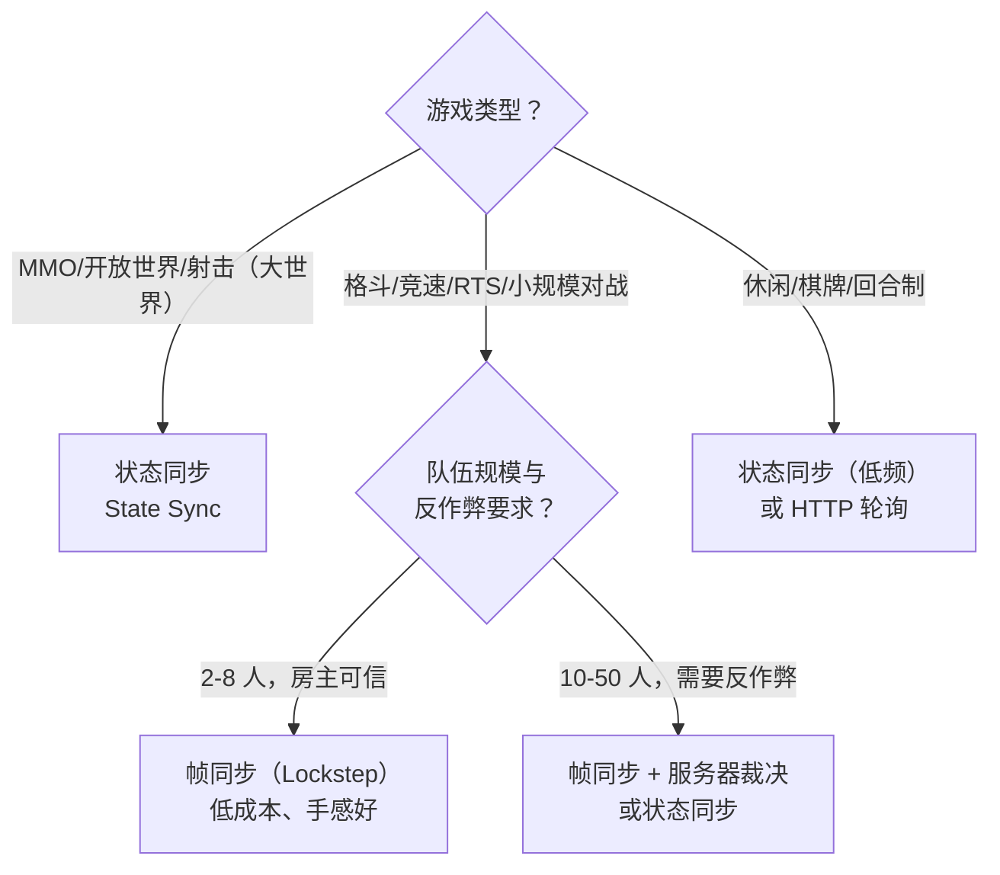

---

## 4. 服务器拓扑图（完整参考）

一张"标准大型网游"的完整拓扑，供对照与裁剪：

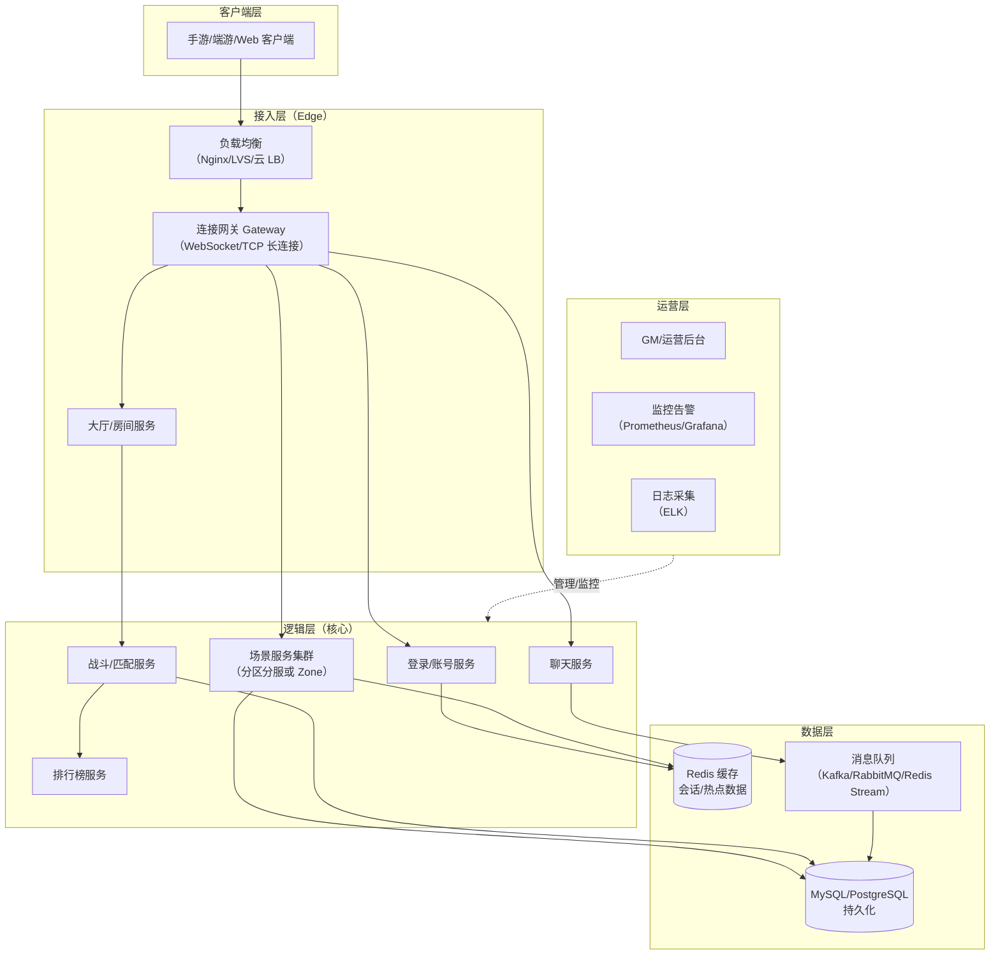

---

## 5. 代码/配置示例（Examples）

### 5.1 分区分服的最小目录结构（参考）

```text
gameserver/
├── gateway/          # 连接网关（长连接、转发、限流）
├── logic/            # 逻辑服（场景、玩法），一服一进程
├── center/           # 中心服（账号、跨服、排行、充值）
├── common/           # 共享代码（协议、工具、配置）
├── proto/            # 协议定义（protobuf）
└── deploy/
    ├── docker/       # 各服务 Dockerfile
    └── config/       # 区服配置
```

### 5.2 GameLift 舰队配置（Fleet 配置 YAML 示例）

```yaml
# gamelift-fleet.yaml（示意）
Fleet:
  Name: "cn-moba-fleet"
  BuildId: "build-2026-08-01"
  InstanceType: "c5.large"
  EC2InboundPermissions:
    - IpRange: "0.0.0.0/0"
      Protocol: "UDP"
      FromPort: 7777
      ToPort: 7787
  RuntimeConfiguration:
    ServerProcesses:
      - LaunchPath: "/local/game/server"
        Parameters: "--port 7777 --log /local/game/logs"
        ConcurrentExecutions: 4
  ScalingPolicy:
    TargetTracking:
      MetricName: "PercentActiveSessions"
      TargetValue: 70
```

> 要点：`ConcurrentExecutions` 决定单实例上并行游戏会话数（rooms per instance）；
> 伸缩策略建议按"活跃会话占比"而非 CPU 使用率，因为游戏进程对延迟更敏感。

### 5.3 服务拆分示例（gRPC proto 片段）

```protobuf
syntax = "proto3";
package game.center;

// 中心服的跨服服务（示意）
service CenterService {
  rpc GetPlayerAcrossServer(PlayerIdReq) returns (PlayerBrief);
  rpc CrossServerBattle(CrossBattleReq) returns (CrossBattleResp);
}

message PlayerIdReq {
  uint64 player_id = 1;
  uint32 source_region = 2;   // 来源区服
}

message PlayerBrief {
  uint64 player_id = 1;
  string name = 2;
  uint32 level = 3;
  uint64 combat_power = 4;
}
```

### 5.4 权威服务器：移动校验伪代码（C#）

```csharp
// 服务端：校验客户端上报的移动
public void OnMoveRequest(Player p, MoveRequest req) {
    var dt = req.ClientTime - p.LastMoveTime;   // 时间间隔
    var dist = Vector3.Distance(req.Position, p.Position);
    var maxDist = p.Speed * dt * 1.5f;         // 1.5 容忍网络抖动

    if (dist > maxDist) {
        // 客户端移动过快 → 判定疑似瞬移，丢弃并按服务器位置校正
        SendToClient(new MoveCorrection { Position = p.Position });
        BanRisk(p, "teleport-hack");
        return;
    }
    p.Position = req.Position;                  // 以服务器接收为准
    BroadcastNearby(p, new MoveBroadcast { PlayerId = p.Id, Position = p.Position });
}
```

---

## 6. 最佳实践（Best Practices）

1. **先定"世界模型"再写代码**：玩家是否跨服、世界是否无缝，决定了网关、状态存储与 RPC 设计，
   后期返工成本极高。建议用一页纸画出拓扑图并评审。
2. **权威服务器原则不可妥协**：PVP 结算、经济系统、掉落必须服务器裁决；
   即使采用帧同步，也要保留服务器校验能力（关键指令复算、结果抽查）。
3. **无状态与有状态分离**：登录、匹配、排行尽量无状态化，方便弹性伸缩；
   场景、战斗等有状态服务用"房间/分片"模型管理，明确归属与迁移协议。
4. **网关只做"交通警察"**：网关负责连接、鉴权、限流、转发，不承载玩法逻辑，
   这样协议升级与逻辑扩容互不影响。
5. **容量规划用"峰值×1.5"**：按高峰在线（CCU，Concurrent Users）估算，
   单进程承载建议留 50% 余量，避免 GC/毛刺导致雪崩。
6. **演进式架构**：原型期单服起步，验证玩法后再拆服务；
   用"防腐层"（anti-corruption layer）隔离核心逻辑与外部依赖，为重构留后路。
7. **跨服/合服是产品需求**：架构设计时就为"合服"与"跨服战场"预留中心化服务与玩家数据抽象，
   避免后期做数据搬运大手术。
8. **容器化尽早引入**：即使部署在裸机，也建议从第一天用 Docker 打包，
   保证开发/测试/生产环境一致，为将来上云留路。
9. **延迟预算**：为每跳网络设定预算（客户端→网关 20ms，网关→逻辑服 <1ms，逻辑服→DB <5ms 等），
   架构评审时逐跳核算，防止"分布式优雅但手感崩坏"。
10. **故障演练**：定期演练"单服宕机、网关雪崩、DB 主从切换"场景，
    确认架构的故障隔离与恢复路径真实可用。

---

## 7. 常见问题 FAQ

**Q1：单服能扛多少人？**
取决于玩法计算量：纯聊天/挂机类单进程可扛数千人；MMORPG 全量逻辑单进程通常 500~2000 人
（场景内同屏人数更关键）。超过后要么分服，要么分 Zone。

**Q2：分区分服的"服"到底是什么？**
一个"服"通常 = 一组进程（网关 + 场景 + 中心）+ 一份数据库。
玩家账号数据按服隔离，排行榜、好友等可能由中心服务统一维护。

**Q3：无缝世界的 Zone 之间怎么打架？**
边界战斗是难点：常见方案有"边缘归属"（边界区域归某一 Zone 全权负责）、
"战斗快照迁移"（开战时把双方临时迁移到同一 Zone）、或"跨 Zone 代理战斗"（重量级但复杂）。

**Q4：微服务是不是一定比单服好？**
不是。微服务解决的是**团队规模与部署弹性**问题，代价是延迟与复杂度。
小团队 + 轻玩法，单服/分区分服更务实；大团队 + 多端 + 高并发，服务化收益明显。

**Q5：什么时候必须用 GameLift/Agones 这类托管平台？**
当你的游戏是"会话制"（session-based，如 MOBA 对局、吃鸡、狼人杀）且流量波动剧烈时，
托管平台能按对局数自动拉起/回收实例，成本优势巨大；MMORPG 长连接型则更常见自建集群。

**Q6：状态同步和帧同步能混用吗？**
能，而且是主流：例如 MOBA 常用"服务器权威的状态同步 + 客户端预测"，而格斗游戏用帧同步；
同一游戏也可混合（PVE 用状态同步、PVP 小规模对战用帧同步）。

**Q7：客户端预测会不会被外挂利用？**
预测只是"表现层提前显示"，最终以服务器状态为准（服务器回滚校正）。
只要服务器严格校验输入与结果，预测本身不降低安全性。

---

## 8. 关联阅读（Related Reading）

- 本分类：[02-网络通信与协议设计.md](02-网络通信与协议设计.md)（网关背后的字节传输与协议）
- 本分类：[03-帧同步与状态同步.md](../同步预测与回放/03-帧同步与状态同步.md)（状态/帧同步机制详解）
- 本分类：[04-消息系统与事件驱动.md](04-消息系统与事件驱动.md)（服务间 RPC 与消息协作）
- 本分类：[05-并发与高性能.md](../运行调度与过载保护/05-并发与高性能.md)（单服/单进程内的并发模型）
- 知识库其他篇章：数据存储与缓存（Redis 会话与存档）、运维与部署（容器化实践）、安全与反外挂
- 外部资料：[Amazon GameLift Servers 开发者指南](https://docs.aws.amazon.com/gameliftservers/latest/developerguide/what-is-gamelift.html)、[Agones 文档](https://agones.dev/site/docs/)、
  [Game Programming Patterns](https://gameprogrammingpatterns.com/contents.html)“服务定位器/更新方法”、[Skynet 源码](https://github.com/cloudwu/skynet)
~~~~~
<!-- SA-PRESERVE-G0-END -->

### G1 早期版本必要差异片段

<!-- SA-PRESERVE-G1-BEGIN -->
~~~~~text
| 第五代 | 容器化与云原生（Cloud-Native） | Amazon GameLift、Agones、Google Stadia 类 | 容器编排、弹性伸缩、按量付费 |
~~~~~
<!-- SA-PRESERVE-G1-END -->

### G2 早期版本必要差异片段

<!-- SA-PRESERVE-G2-BEGIN -->
~~~~~text
- 本分类：[03-帧同步与状态同步.md](03-帧同步与状态同步.md)（状态/帧同步机制详解）
~~~~~
<!-- SA-PRESERVE-G2-END -->

### G3 早期版本必要差异片段

<!-- SA-PRESERVE-G3-BEGIN -->
~~~~~text
- 本分类：[05-并发与高性能.md](05-并发与高性能.md)（单服/单进程内的并发模型）
~~~~~
<!-- SA-PRESERVE-G3-END -->

### G4 早期版本必要差异片段

<!-- SA-PRESERVE-G4-BEGIN -->
~~~~~text
- 外部资料：GameLift 开发者指南（AWS）、Agones 文档（Google）、
  《游戏编程模式》"服务定位器/更新方法"、云风《Skynet 的设计与实现》系列博客
~~~~~
<!-- SA-PRESERVE-G4-END -->
