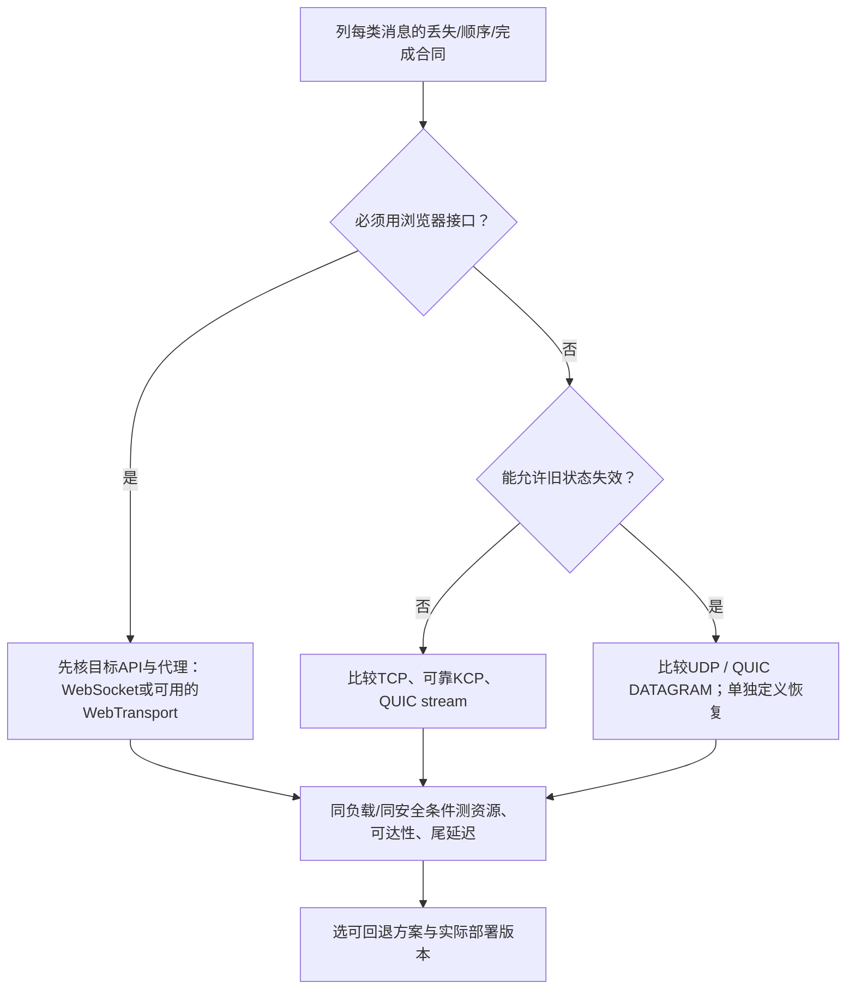
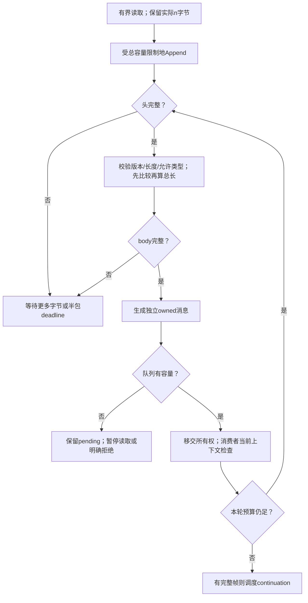
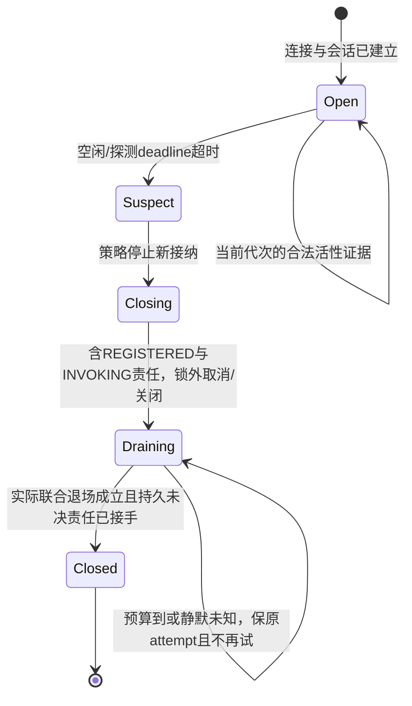
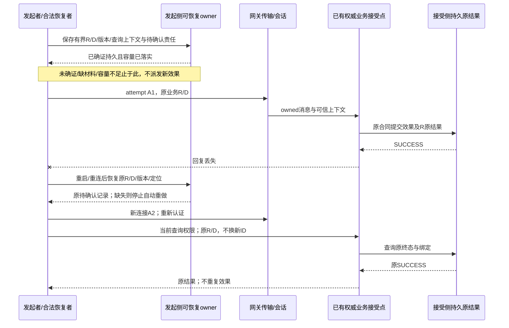
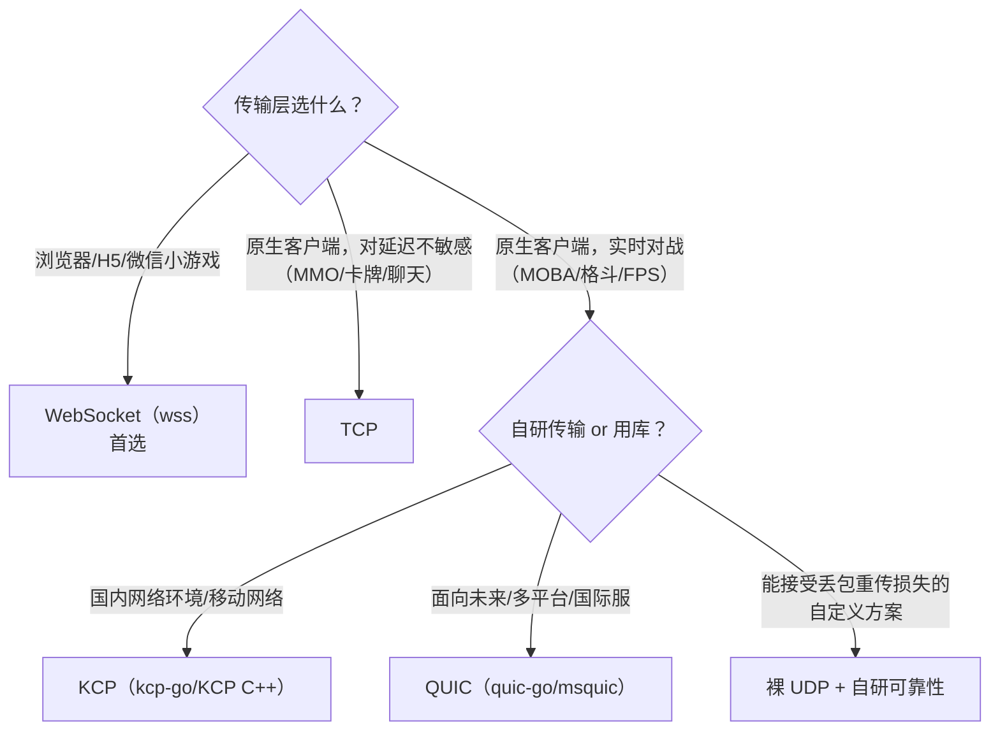
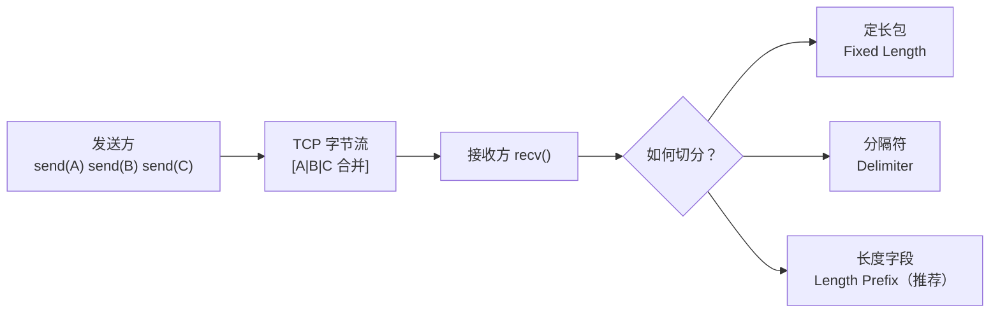
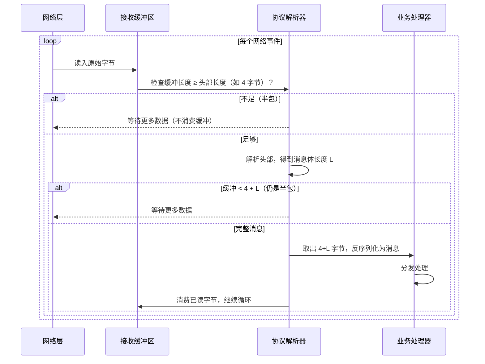
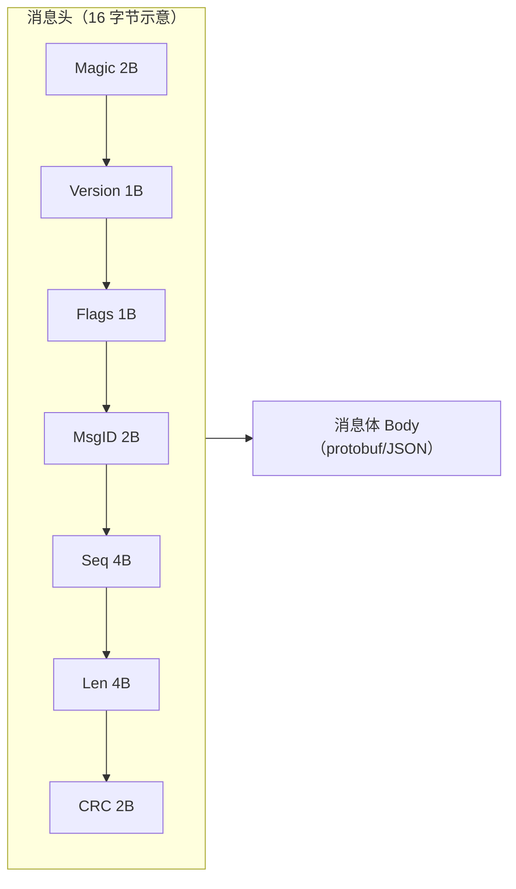
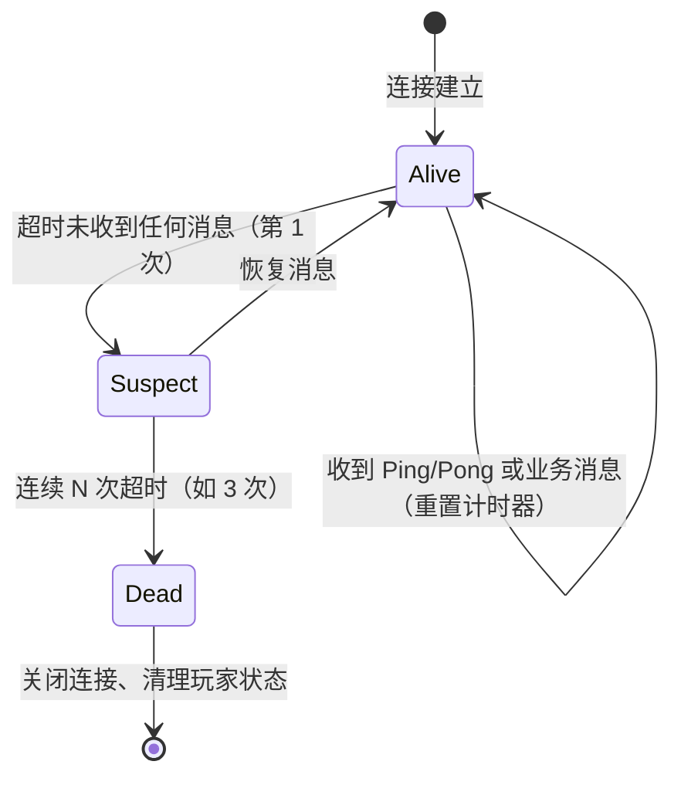

# 02 网络通信与协议设计（Networking & Protocol Design）

> 知识成熟度：L2。主要承诺是从传输选择、字节边界、消息所有权、身份与版本，推到有界交付和断线恢复的工程合同。
> 最后更新：2026-10-08 仅做固定规范/源码选读及纸面推导，未运行目标网络、服务、编解码器、编译、协议模型、抓包、故障或性能实验。
> 知识基线：TCP RFC 9293、QUIC RFC 9000、DATAGRAM RFC 9221、WebSocket RFC 6455；KCP 固定提交及 Go 1.23.0 等实际选读位置见 §12。这些是研究版本，不是项目部署二进制认证或推荐安装清单。
> 历史证据：原 2026-10-01 C++11/GCC 14.2.0 的 4 字节长度头/所有权模型报告 29 断言及 UBSan 通过；该报告与完整代码原样保留，本轮未找到该次独立原始 stdout。2026-10-02 protobuf 教学实验的原代码、生成代码、版本与原始输出仍在原 evidence 目录，见 §9。两者都不验证本次新增的 16 字节教学格式、真实网络或生产业务。
> 适用读者：服务端、客户端网络层和协议开发者；前置知识为 TCP/IP 与 Socket 基础。本文覆盖网关、登录、房间/游戏服长连接及 RPC 的通信边界，不重新实现数据库事务或消息中间件。

## SP1. 先给每种消息规定“完成”是什么

一次移动、一次聊天与一次购买都能序列化为字节，但它们对丢失、顺序和重试的要求不同。先写业务交付合同，再选传输，否则容易把“可靠流”误当成“每个动作恰好执行一次”。

| 消息 | 需要保存的意义 | 可做的优化 | 明确不能混用 |
| --- | --- | --- | --- |
| 独立位置快照 | 某实体、世界代次与快照版本的完整状态 | 在接收方已有必要基线时，以更新版本替换旧版本 | 不能把依赖前一项的 delta 当独立快照随意丢掉 |
| 确定性模拟输入 | 某局、某玩家、某 tick 的输入；缺失如何处理由同步协议决定 | 合并传输、带有限冗余、在规定窗口补发 | “帧同步不在乎旧包”不成立，历史输入可能决定后续状态 |
| 聊天/控制请求 | 用户可见的顺序、受理结果与错误 | 有界排队、批量传输 | 发送队列入队不等于接收方已展示/执行 |
| 购买/领取/结算 | 同一业务意图的效果与原结果；断线后仍能追查 | 同身份恢复、查询原终态 | 换连接或换 RPC attempt 不能生成新的业务意图 |
| 大快照/资产 | 完整对象及其版本、长度和校验约定 | 独立流、分块与背压 | 不能让无界大消息占尽控制消息所需资源 |

纸面例 SP-P01：客户端购买意图 R 发出后超时。世界 A 中，服务器从未受理；世界 B 中，服务器已提交扣款与原成功结果，仅回复丢失。客户端只观察到“超时”，两种世界都符合这个观察。因此不能从超时判断应重新扣款。恢复必须携带原 R 与原语义参数，交由已有业务接受点区分原成功、原拒绝与仍未知，不能由 TCP ACK、QUIC ACK 或重连成功代答。

完整 IP/TLS 链见[网络分层与工程实践](../../01-编程与计算机基础/网络协议基础/01-网络分层协议与工程实践.md)，RPC/事件的后续分发见[消息系统](04-消息系统与事件驱动.md)。本文的独立问题是：怎样让网络层交出去的东西，仍具有正确的边界、身份、生命周期和交付含义。

阅读时区分几个常用量：RTT是某一层发出到对应确认的往返时间，必须说明确认层次；RTO是用于重传判断的超时，不是RTT的别名。ARQ通过确认与重传修复丢失，可能增加等待。滑动窗口限制某作用域的在途数据；接收流控保护接收容量，拥塞控制适应共享网络容量，限流限制应用接纳频率，三者不能相互替代。序列化负责结构与字节的转换，拆帧负责找字节边界；“粘包/半包”是应用从流式读取观察到的合并/不完整边界，不是新的TCP包类型。

## SP2. 连接、流、帧和业务意图不是同一个身份

| 名称 | 作用域和用途 | 不能推出的事实 |
| --- | --- | --- |
| Socket/连接 C | 某进程中的传输对象；句柄可被复用 | fd 相同不代表同一玩家或旧连接仍存活 |
| 连接代次 g | 应用为一次连接实例建立的不可混淆标签；随队列任务、定时器和回调传递 | g 有效不自动证明账号当前仍获授权 |
| QUIC stream ID | 单个 QUIC 连接内的流标识 | 不是账号ID，也不是跨重连的业务请求ID |
| 帧 F | 应用对一段字节的长度/类型解释 | 完整帧不证明来源可信或业务合法 |
| Message ID | schema/版本/方向限定的消息类型，如 Login、Move | 1001是类型，不是这一次登录的唯一身份 |
| 关联序号 seq | 在明确会话/方向/代次内关联请求响应、检测顺序 | 单个 uint32 不能同时充当永久去重键、nonce、重放证明 |
| 业务意图 R | 主体、业务域、请求ID及语义参数绑定；跨尝试保持 | 相同字节不自动证明相同意图；重新序列化字节不同也可能是同一意图 |
| 尝试 A | 一次连接/RPC提交及本地超时窗口 | 新 A 不改变 R；A 失败不证明 R 未成功 |
| 可信主体/授权上下文 | 来自已认证连接或受信服务身份，并在动作/对象处核当前权限 | 客户端 body 中的 player_id 只是待验证声明 |

`g` 解决晚到回调串错连接，R 解决重复经济效果，schema/version 解决字节解释，三者分别携带。若 seq 在有限宽度内要回绕，必须另有已证明的窗口比较与旧消息退休合同。本教学合同选择**在代次内不回绕、不重用**；到达上限停止接纳并建立新代次，未决 R 留在原业务域查询。不能把计数清零当作已证明所有旧工作消失。


图中的顺序是责任链；具体 TLS 库可能先完成记录认证，再向应用提供明文字节。接收缓冲仍要有容量上限，不能等到业务验签时才限制分配。UDP 首包及尚未认证阶段还需要独立的低成本接入预算。

## SP3. 传输选型：选语义和成本，不能按游戏标签拍板

### SP3.1 五种承载的可比较边界

| 承载 | 应用看到什么 | 适合的合同与收益 | 成本和失效边界 |
| --- | --- | --- | --- |
| TCP | 可靠有序字节流，无消息边界 | 登录、聊天、控制、完整快照；成熟系统接口 | 同流缺失字节会阻塞后续交付；需拆帧、有界排队、超时与恢复 |
| UDP | 独立数据报；不保证可靠、顺序或唯一到达 | 允许过期丢弃的独立状态、应用明确处理缺失的输入方案 | 应用负责分片边界、序号、认证、拥塞、NAT与可达性；不是免费更快 |
| KCP | 某个固定实现的可靠有序 ARQ；消息/stream模式与外层库有关 | 在目标网络测得收益且能承担重传/带宽/调参成本的可靠UDP链路 | 核心不是认证握手协议，不提供“跳过缺失旧包后继续有序交付”保证 |
| QUIC streams | 同流可靠有序字节流；跨流无全序 | 需要多流、加密和有条件路径迁移的应用 | 同流仍可能等丢失数据；共用拥塞、路径、连接流控和CPU资源 |
| QUIC DATAGRAM | 协商扩展后的不可靠数据报 | 同连接里承载允许丢失的数据并共享安全上下文 | 丢失不重传；仍受拥塞、大小和实现队列约束；不可沿用stream可靠性 |
| WebSocket | 有类型的消息，消息可由多帧组成 | 浏览器双向控制/聊天/调试；复用成熟HTTP接入 | 底层TCP有序；代理升级、空闲超时、消息总长、压缩和背压仍须验收 |

TCP基本头20字节、UDP头8字节只描述各自最小/固定头，不包含IP、链路、TLS、选项与重传。KCP核心头24字节**不含UDP头**，封装/FEC/密码头另计。QUIC包头因长短头、CID、包号、token等变化，不能给统一“30–50字节含握手态”预算。WebSocket基础头2字节，再加扩展长度与客户端4字节mask；TLS/TCP/IP另算。对于某一实际样本，应逐层计数，不以单个头长断言总带宽优劣。

TCP握手、TLS握手、WebSocket的HTTP Upgrade是不同阶段；复用、恢复、代理以及HTTP承载版本会改变代价。不要将它们压成相同的一次RTT。原文50/100ms、15s、5%/10%/20%等数值保留为历史经验/测试输入候选，不是某一类型游戏的必然SLO。



浏览器API和平台支持会变化，本次没有逐平台运行验证。地域、手游/端游、国际服等标签不能替代上述步骤；Socket.IO也不等于裸WebSocket互操作端点，要核对具体应用协议。

### SP3.2 KCP：重传较激进，不等于可以跳过缺口

固定 `b1a7a210…` 的 `ikcp_create` 初始化 `stream=0`、`fastresend=0`、`nocwnd=0`。`ikcp_nodelay(nodelay, interval, resend, nc)`分别修改RTO下限、刷新间隔、快重传阈值与是否忽略核心拥塞窗口；某个库常用`nc=1`配置不能写成KCP默认。TCP也有不同丢失恢复实现，不能把所有TCP都限制成“三个重复ACK/固定200ms”。

最小源码链：`ikcp_send`按MSS构造segment并排入`snd_queue` → `ikcp_flush`受发送窗口、远端窗口及启用的拥塞窗口约束发送/重传 → `ikcp_input`解析ACK/PUSH并更新窗口/序号 → 接收缓冲只有`sn == rcv_nxt`才移到可读队列 → `ikcp_recv`按分片完成条件交付。`stream`模式改变上层消息边界处理，不会将有序接收变成随意跳过缺口。`conv`用于会话区分；它既不是密码认证，也不自带应用授权。

```text
KCP核心头，24字节；该实现的多字节字段按小端编码
offset  0..3   4    5    6..7   8..11   12..15  16..19  20..23
field   conv   cmd  frg  wnd    ts       sn      una     len
bytes   4      1    1    2      4        4       4       4
后接len字节数据；UDP/IP/FEC/安全封装不在这24字节内
```

SP-P02：给定`rcv_nxt=10`，只收到sn11，且接收队列之前为空。sn11先保存在乱序缓冲；sn10到达后才能推进连续前沿并交付。应用若希望“位置11取代位置10”，应选择允许丢失的数据语义或在发送前合并未发送状态，不能指望可靠流里已丢失的sn10被忽略。输入10是确定性模拟所必需时则必须补齐或执行既定缺失策略。

原Go示例的教学用途是展示`ListenWithOptions`/`AcceptKCP`入口。本轮按kcp-go `v5.6.18/sess.go`补正其解释：监听UDP → 首批可解析数据进入`packetInput` → 建立会话并进入`chAccepts` → `AcceptKCP`返回。这里没有提供TLS式认证握手；传入`nil` block也未启用该库包加密。即使配置了该库BlockCrypt/CRC路径，也不能把它自动等同经评审的AEAD认证通道。本轮不推荐把历史最短监听例直接暴露公网。

```go
// kcp-go v5.6.18 API入口节选；不是可部署服务，本轮未编译/运行
listener, err := kcp.ListenWithOptions(":7777", nil, 0, 0)
// err处理、监听关闭、有限接入预算、认证、每会话超时/发送队列由宿主补全
conn, err := listener.AcceptKCP()
// 返回传输会话，不代表账号认证或业务恢复完成
```

不拥塞控制会把成本转嫁给本链路及其他流，也可能增加自己的排队和丢包。互联网UDP应用的总发送与重传流量都应遵守[UDP使用指南RFC 8085 §3.1](https://www.rfc-editor.org/rfc/rfc8085.html#section-3.1)。库作者的性能介绍不是本项目测量；本次未测KCP相对TCP的延迟或吞吐。

### SP3.3 QUIC与WebSocket的边界

[RFC 9000 §2/§13](https://www.rfc-editor.org/rfc/rfc9000.html#section-2)规定的是stream字节抽象，不保留STREAM frame边界。两个流可独立推进，但同一丢失包若装了两个流的数据，两流都可能等待相关重传；同连接拥塞窗口及资源仍共享。应用跨流有因果依赖时，例如“先创建角色，再发角色动作”，需自行保证依赖，流复用不会替代业务顺序。

连接ID允许地址变化后定位连接，但迁移要受握手确认、`disable_active_migration`、路径验证及真实网络可达性约束，不能保证Wi-Fi切蜂窝零停顿。迁移仍在原QUIC连接内；连接死亡后建立新连接，是另一次应用恢复。[RFC 9000 §9](https://www.rfc-editor.org/rfc/rfc9000.html#section-9)

0-RTT需要可用的恢复上下文且可能被拒绝，不是首次连接的零延迟。早期数据的跨连接重放风险与客户端正常重试，都要求应用明确处理；购买/领取不因使用TLS就自动适合0-RTT。本文默认此类副作用不走早期数据，仍以R恢复已发生的结果，不把关闭0-RTT当成消除了所有重试重复。[TLS 1.3 RFC 8446 §2.3/§8](https://www.rfc-editor.org/rfc/rfc8446.html#section-8)

WebSocket需区分消息与帧：大消息可分片，中间可插入Ping/Pong/Close控制帧。实现若暴露完整消息API，就依该API限制重组后的总长；若暴露流式片段API，还要保存分片状态与累计容量。客户端mask用于协议规定的特定中间设备防护，**不是加密或身份认证**；`wss`才在此承载上使用TLS。binary消息可约定一个protobuf或一个自定义应用帧，但需要显式决定，不能再拿一次底层`recv`当一条WebSocket业务消息。[RFC 6455 §5.1–5.5](https://www.rfc-editor.org/rfc/rfc6455.html#section-5.4)

## SP4. 从部分I/O到完整且有主人的消息

### SP4.1 字节流没有“发几次就收几次”

TCP拆帧与Nagle是不同问题。即使关闭Nagle，也不产生消息边界。`TCP_NODELAY`只影响发送端小数据等待策略，不能关闭对端delayed ACK，也不能消除应用排队、拥塞或调度延迟。[RFC 9293 §2.2/§3.7.4](https://www.rfc-editor.org/rfc/rfc9293.html#section-3.7.4)

| 边界方法 | 怎样找完整消息 | 适用与代价 |
| --- | --- | --- |
| 定长 | 累计到N字节 | 小而固定的消息简单；版本变化与无效填充要有约定 |
| 分隔符 | 搜索终止符，同时实施最大长度 | 文本方便；二进制可经转义/编码承载，不能说完全无法表达；扫描与反转义也有成本 |
| 长度前缀 | 先取有界头，再等规定长度 | 通用；必须锁定长度所计单位/范围/端序及验证顺序 |
| 已有消息承载 | 使用WebSocket/KCP消息API提供的边界 | 仍限总长、解压和解析成本；避免重复、冲突的帧定义 |

原3.2.1模型的合同保持不变：`4字节大端body长度 + 不透明body`，`MaxBody=65536`、单次Append≤65536、未消费缓冲≤131080字节，Mailbox两帧；不是SP5的16字节头。完整C++模型、29断言入口及编译命令保存在文末原文中，其逻辑链是：读足4字节 → 无溢出地校验n → body完整才复制成独立`Bytes` → 消费接收缓冲 → 所有权移交Mailbox。

SP-P03（纸面）：帧字节为`00 00 00 03 01 02 03`。第一次Append前2字节，第二次再3字节，第三次再2字节；对应`NeedMore/NeedMore/Ready`，最后body为`01 02 03`。`00 01 00 01`表示65537，读完头就拒绝，不分配65537字节body。零长帧有效，必须有`has_pending`表示“有消息”，不能以空vector表示“无消息”。这些是对原合同的手算，不是本次重跑断言。

### SP4.2 拆帧要同时回答长度、容量、调度与所有权



只有网络线程修改framer，Mailbox锁只保护队列，不保护一个已经失效的借用指针。原`HandleMessage(&buf[4], L)`后`erase`只能允许回调返回前完成借用；异步消费者必须拥有独立存储或受明确owner保障。`vector`重新分配会使其元素引用失效，erase会使删除点及之后的引用失效，空body时也不能对不存在的元素做下标取址。[C++草案vector修改合同](https://eel.is/c++draft/vector.modifiers)、[capacity合同](https://eel.is/c++draft/vector.capacity)为本日选读快照，未固定为某编译器实现认证。移动`vector`所有权后，生产者不得再修改原元素；对象模式同样要明确Arena、消息对象与消费者各自生命周期。

SP-P04：两槽Mailbox已经满，framer又吐出body `{7}`。它必须留在pending，不再Next覆盖；消费者腾出位置后重试转交。此时不能只等网络“新可读”事件，因为新输入未必再来。消费者释放容量需触发可恢复调度；暂停读取也不能造成控制/关闭处理永不运行。每事件最多处理两帧只界定帧数量，不保证某个墙钟时间；单帧解压、解析深度、工作队列和总连接数仍要另限。

容量上界不是RSS承诺：原模型的两队列槽、pending、消费者输出、接收vector capacity、复制瞬间及socket/kernel/TLS缓冲都会占内存。单连接限长也不限制总连接数。分配异常要在真实连接/线程边界收敛，原模型没有证明bad_alloc或所有关闭交错安全，不能因为29断言通过就提升这些范围。

### SP4.3 写了多少、发送到哪里、哪个业务完成

[Go 1.23.0的io.Reader/Writer](https://github.com/golang/go/blob/go1.23.0/src/io/io.go)允许读取返回部分字节；存在`n>0`同时带错误的情形，应先处理有效字节再处理结束。Writer短写须伴错误；[net.Conn](https://github.com/golang/go/blob/go1.23.0/src/net/net.go)明确写超时也可能返回`n>0`。POSIX非阻塞socket的重试错误规则依其API，与Go合同分开，详见[Socket/Epoll/Reactor](../../01-编程与计算机基础/操作系统与系统I-O/01-Socket-Epoll与Reactor.md)。

本教学发送合同只采用一名串行writer维护一个owned frame及offset：成功写n就推进n；可恢复阻塞等待可写/调度；终止错误停止本连接发送。不能在一次短写之后从frame开头再发，否则已经发送的前缀被复制；也不能让多个writer交错写同一个字节流里的应用帧。若连接失败，丢弃的是该传输尝试的剩余字节计划，原R结果仍可能未知，重连后不能直接续发旧连接的裸字节后缀。

SP-P05：给定7字节帧、offset=0，底层第一步接受2字节，offset=2；第二步暂不可写，offset仍2；第三步接受5字节，offset=7。此时只知道发送接口接受了全部字节。若第二步是终止错误，则停止该连接，不以`offset=2`判断对端有没有业务效果。本轨迹是抽象部分写接口，不伪装Go Writer的无错短写；实际API错误类别需由项目适配。

| 可观察事件 | 最多证明什么 | 下一责任 |
| --- | --- | --- |
| 本地队列接受 | 某本地owner持有消息 | 有界发送/拒绝/关闭处置 |
| 框架write返回 | 依框架合同已接手数据，可能尚未出网卡 | 发送状态、错误与资源退休 |
| TCP/QUIC传输ACK | 对端传输层确认了对应数据/包 | 不能替业务受理或提交作证 |
| 业务ACCEPTED | 该业务定义的责任已被接手 | 继续到明确业务终态；若只在内存，需说明崩溃后责任 |
| 原结果SUCCESS/REJECTED | 权威接受点保存的该R终态 | 经当前查询授权返回原结果 |
| 客户端已展示 | 用户侧某次展示事件 | 不反向证明所有下游效果或持久性 |

[gRPC流控文档](https://grpc.io/docs/guides/flow-control/)明确write给框架不等于数据已出网络；[QUIC §13.1](https://www.rfc-editor.org/rfc/rfc9000.html#section-13.1)的STREAM ACK甚至不要求应用已交付并消费。因此统一命名“ACK”会丢掉最重要的信息，应在日志/API中区分层次及对应身份。

## SP5. 消息头：把布局写成wire合同

### SP5.1 固定宽度不等于可直接发送结构体

原头字段相加为16字节，但`#pragma pack`和`sizeof==16`只是在某编译器/ABI下控制对象布局，不定义端序、未对齐读、验证顺序或跨语言编码。原表的“2字节CRC32”不自洽；CRC32结果是32位，除非另行定义截断方案，不能直接占2字节。CRC16/CRC32用于检错，攻击者可重算校验值，不能充当消息认证。

下表是**新的纸面教学profile**，不是已发布网络协议迁移，也不受原29断言覆盖。保留16字节形状展示显式偏移，刻意不启用压缩、应用加密或额外ACK flags；外层采用经过正确身份校验的TLS或QUIC通道。旧头的crc字段在此作为`reserved=0`，真实旧端若正在使用CRC，必须协商新profile/版本，不能静默换解释。

| 字节偏移 | 字段/宽度 | 教学profile合同 |
| --- | --- | --- |
| 0–1 | magic / u16 | wire字节`4D 53`；仅格式识别，不认证 |
| 2 | version / u8 | 本教学支持1；其他值明确拒绝，不猜schema |
| 3 | flags / u8 | 本profile必须0；未知能力须先协商 |
| 4–5 | msg_id / u16 | 大端；按version、方向、允许状态查注册表 |
| 6–9 | seq / u32 | 大端；仅本连接代次/方向关联序号，不重用或回绕 |
| 10–13 | body_len / u32 | 大端；只计后续body字节，0≤L≤65536 |
| 14–15 | reserved / u16 | 大端0；不称CRC或MAC |
| 16… | body / L字节 | 注册表指定的protobuf/其他编码；空body须由该类型允许 |

```text
显式编码/解码伪码；数学整数中运算，落到目标语言前证明类型宽度
ReadBE32(b, p) = b[p]*2^24 + b[p+1]*2^16 + b[p+2]*2^8 + b[p+3]
ReadBE16(b, p) = b[p]*2^8 + b[p+1]
WriteBE32(n) = [(n>>24)&255, (n>>16)&255, (n>>8)&255, n&255]

```

入口Append同样先验证`used≤MaxBuffered`，再检查`incoming≤MaxBuffered-used`，不能先做可能溢出的`used+incoming`。校验头长、总长、单类型更小上限、解压后大小、数组数量/嵌套深度、业务字符串长度、浮点有限性，是不同层的预算。认证也不能替代这些限制。若未来允许压缩，必须在进入解压器前限制压缩输入，并在解压过程中限制输出和CPU/工作预算；不能先解压无界数据，再检查结果。

SP-P06：给定`msg_id=1001=0x03E9`、seq7、body_len3，完整头为`4D 53 01 00 03 E9 00 00 00 07 00 00 00 03 00 00`，再接`AA BB CC`；只用于验证头布局，三字节body未声称是某个有效protobuf。总长19字节，前15字节不足以读取完整头；收到16字节时可知L=3但仍NeedMore。length=`FF FF FF FF`应在加16和分配之前被65536上限拒绝。所有偏移以字节为单位，非字符索引。

SP-P07：数学值`2^32−1+16=2^32+15`。若错误实现先用32位无符号数相加，得到15，可能错误判作短帧；这解释了检查顺序，不是在报告某部署已有漏洞。本文只提出静态伪码，未证明具体语言整数提升、allocator、异常和所有输入路径实现正确。

#### SP5.1.1 EOF、截断与解析器终态（只读方向）

新16字节profile的输入状态区分`ReadOpen`与`ReadEnded(reason)`；解析终态为`EndOfFrames`、`Truncated`或`Failed`。只有适配层明确报告读方向终结，才进入ReadEnded。若一次读取同时给出`n>0`和EOF/终止错误，先在原单次/累计容量合同内保存这n字节，再记录结束原因；容量失败直接进入Failed，不能为保存末批数据扩容越限。非EOF终止错误最终报告ReadError，不把空尾巴包装为正常EOF。TLS/其他库的异常关闭如何映射，由已核对的具体API决定，不把任意错误统一改成干净EOF。

```text
Next16(buffer, input_ended):             // owned pending存在时调用者不能再Next
  if framer已有终态: return 该终态       // 不复用，不继续猜下一个头
  require 0 <= used <= MaxBuffered，有限MaxBuffered >= 16
  if used == 0 and input_ended: return Finish(EndOfFrames)
  if used < 16:
    return input_ended ? Fail(TruncatedHeader) : NeedMore
  校验magic、version、flags、reserved及该阶段允许的msg_id
  任一头校验失败: return Fail(InvalidHeader)
  L = ReadBE32(buffer,10)
  if L > 65536 or L > SIZE_MAX - 16: return Fail(InvalidLength)
  if used - 16 < L:
    return input_ended ? Fail(TruncatedBody) : NeedMore
  成功取得独立owned body后才消费16+L；分配失败由owner终止本framer
  return Ready(owned body, version, msg_id, seq, captured generation)
```

`Fail`与`Finish`都记录本framer不可复用的终态，前者同时保留错误诊断；头非法、长度非法、Append容量失败不能靠重试同一状态恢复，也不扫描后续魔数猜帧。`EndOfFrames`只表示输入缓冲没有残余；调用者须先解决pending，并结合结束原因才报告“帧流干净读结束”或ReadError。它不证明业务完成、发送方向关闭或资源静默。

EOF后的调用者继续采用SP4原预算：每次唤醒最多处理M个帧/规定字节（M为配置的正有限整数），先处理owned pending，再取下一帧。**完整前缀允许在当前认证、代次及接纳门仍允许时按原合同交付**；EOF不绕过这些检查。队列满保留pending，停在容量释放/关闭策略唤醒点；预算耗尽安排continuation，不再等待网络补字节，也不继续读取或忙等。Close已禁止新接纳时，未接纳的pending/完整帧按明确拒绝或关闭处置结束，不能记为成功交付；已被业务接纳的消息及其恢复责任不撤销。

完整前缀处理到末尾后，空余尾巴才是干净EOF；半头或半body为Truncated并终止本framer。完整帧已合法接纳后再发现截断尾巴，不倒退该帧已产生的业务责任。排空预算到期而pending尚无合法处置或真实工作未退场时，停止本轮排空并保持DRAINING及稳定owner，后续仅由容量释放/明确关闭处置唤醒；不能捏造一次“处理完毕”清空记录。最终资源退休仍按SP7.3。

SP-P06的EOF分支（字节为单位，全部PAPER_EXPECTED）：所列19字节帧只收到前15字节即EOF→TruncatedHeader；16字节头加1字节body后EOF→TruncatedBody；完整19字节且正常EOF→按接纳合同处理一帧后EndOfFrames。完整19字节再加下一帧前2字节后EOF→先处理完整前缀，再TruncatedHeader；若队列暂满或本轮M耗尽，保pending/缓冲及ReadEnded标记，在对应唤醒点继续上述同一轨迹，不抢跑终态。若当前close门已拒绝交付则明确处置未接纳前缀，已接纳责任保留。这些分支不属于原4字节模型的29断言，本轮未运行。

### SP5.2 类型注册、认证、授权分别查什么

Message ID按模块分段可提高排查效率，例如1000–1999登录、2000–2999场景、3000–3999战斗。注册表必须同时规定版本、方向、会话阶段、body类型、最大长度和行为；服务端推送ID不能仅因编码能解析就作为C2S处理。原示例用高位区分方向时，应预留无冲突的编码空间，不能再把超过可用范围的模块编号硬塞进u16。已发布ID和protobuf字段编号不复用；新语义分配新类型/能力，不把旧客户端认识的“移动”改成“扣款”。

三层检查的因果关系：

1. 结构/检错：完整头、合法长度、必要的编码校验，回答“能按约定解释这些字节吗”
2. 认证：正确验证TLS/QUIC对端或经评审的应用认证，回答“通信来自哪个可信主体/通道”；魔数、CRC、seq均不能单独回答
3. 当前授权及语义：该主体此刻能否对该角色/房间执行此动作，数值、状态和资产规则是否成立；合法客户端也可能提交非法请求

来自网关的主体信息只能经受信链路和明确转发合同传递，不能允许客户端用同名字段覆盖。新效果在实际接受点检查当前权威/权限；重连查原结果也要当前查询授权，但查回旧SUCCESS不恢复旧owner的写权。具体规则复用[安全与反作弊](../会话身份与在线服务/04-安全与反作弊.md)和[分布式高可用](../持久化与分布式一致性/03-分布式与高可用.md)，不在消息头里新造万能授权器。

## SP6. 编解码和演进：值、存在性、透传与业务四道合同

### SP6.1 先决定数据语义再选择序列化

protobuf适用于已有schema、需要跨语言和紧凑编码的消息。JSON易观察，适合调试/运营与低频交互；MessagePack的类型表示、FlatBuffers的直接访问各有用途，但“JSON必为3–5倍”“FlatBuffers极快零拷贝”不能脱离实际消息、解析器、验证与内存访问成本作预算。更换编码前用同一语义、数据分布和安全校验比较消息字节、分配、CPU与维护成本。

protobuf自有wire encoding，不把body中的每个整数再做`htonl`。字段编号1–15的tag常用1字节、16–2047用2字节，不意味着字段值长度固定。原MoveReq的浮点位置字段和PlayerMove的uint32字段都应按实际序列化样本计数；`uint32 input`只使用低16位时还需业务范围检查，不存在protobuf的`uint16`类型。

```protobuf
// 教学schema片段；保留原移动、广播与帧输入的用途。本轮未运行生成器
syntax = "proto3";
package game.scene;
message MoveReq {
  uint32 seq = 1; // 局内输入/预测关联，作用域由业务合同定义
  float x = 2;
  float y = 3;
  float dir = 4;
  uint32 client_time = 5; // 原毫秒字段；基准/回绕/可信度不能省略
}
message MoveNotify {
  uint64 player_id = 1;
  float x = 2;
  float y = 3;
  float dir = 4;
  uint32 server_time = 5;
}
message PlayerMove {
  uint32 frame = 1;
  uint32 input = 2; // 如果合同只允许16位，解析后检查<=65535
  uint32 random_seed = 3;
}
message MovePatch {
  optional float x = 1; // absent:不更新；present 0:清零，系本例业务选择
}
```

这是schema片段，不是权威移动实现。客户端给出位置、时间或random_seed并不获得决定世界状态/经济随机的权力。应检查NaN/Infinity、范围、当前角色与合法tick，按真实同步模型决定输入如何被权威模拟；随机种子、时间单位和溢出处理属于对应游戏协议。原MoveReq与独立MovePatch不能因同有`x`就互换类型。

| 合同 | 正确问题 | 正例与反例 |
| --- | --- | --- |
| binary wire | 新旧reader是否能解析；是否丢数据 | 新增字段通常可解析；int64扩宽后发送大值可能被旧int32截断，滚动期限制数值 |
| presence/更新 | absent、显式零、null、清空各是什么意思 | optional且has_x才赋值可清零；implicit中转再序列化会丢显式零的presence |
| 中转/JSON | 经过每个relay还保存哪些字段 | 原始bytes/消息API有条件保留未知字段；逐字段重建、转JSON可能丢信息 |
| 业务能力 | 旧端会执行哪种行为，能否安全降级 | 新sprint字段被忽略但客户端已扣体力，会造成业务分歧，即使Parse成功 |

删除字段后保留编号，按格式需要保留名称；字段/枚举名进入ProtoJSON，重命名必须独立迁移。向现存oneof移入字段不是无条件wire-safe。新枚举即使wire可承载，也可能打破语言侧穷尽分支或业务校验。不得把四种兼容压成“加个版本号就行”。

### SP6.2 网关中转与Arena所有权

只路由的网关可以移交经过有界结构和必要认证检查的原始owned body，让目标线程按msgId/schema解析。这保留未知数据的机会较好，但网关仍须执行它承诺的接入检查；不能以“不理解body”为由替业务承诺成功。需要改字段的网关要锁定schema及消息API，并测试未知字段与presence共同经过的路径。

`Arena`的分配线程安全不等于消息任意并发修改安全。对象在Arena上，就不能默认`delete`，也不能把裸指针入队后在回调末尾Reset。Reset必须等所有分配和对象使用者同步完成；跨Arena move/Swap可能复制，`std::move`不承诺零拷贝。[Arena官方合同](https://protobuf.dev/reference/cpp/arenas/)

SP-P08：新消息`x=0`且`sprint=true`经旧implicit schema中转。未知`sprint`能被保留，而已知`x`的presence仍可能丢失。这两个维度独立，不能用“unknown保存通过”覆盖“清零语义通过”。实际历史实验对应字节`08001801 → 1801`，详见§9的严格版本边界。

### SP6.3 能力协商与发布/回滚路径

协商需在可信会话中产生双方认可的能力集合、schema/profile与作用域，并由服务端保存。服务端在执行新行为之前检查能力；客户端按协商结果展示/降级，不能先支付代价再让旧服务端忽略新字段。重新认证/恢复到新实例时重新确认此结果，不能从本地缓存或TLS恢复票据推断后端业务版本。

发布顺序可按以下合同准备：先让reader/relay能承受新数据，再允许writer发新语义，观察真实业务结果；回滚时核对旧reader是否还能读取已写的新存档、Outbox与离线任务。可解析但含义不同仍阻止回滚。压缩算法、字典、最大解压长度、消息ID和头版本属于协议，不是只升级protobuf文件。

| 迁移路径 | 必须保存的观察 | 失败/停止条件 |
| --- | --- | --- |
| 旧writer→新reader | 缺失字段、默认行为及实际业务结果 | 新端把absent当作强制清零则停止灰度 |
| 新writer→旧relay→新reader | 值、presence、未知字段、relay方法 | 任一必须透传信息丢失，不启用依赖它的能力 |
| explicit零→implicit→explicit | 最终has_x与更新目标 | 数值相同但目标未清零，判语义不兼容 |
| 新字段/枚举→旧JSON端 | 拒绝码或忽略后的丢失 | 不能把忽略模式当无损兼容 |
| 大int64→旧int32 | 超范围是否拒绝/截断 | 未验收前writer不得超旧有效域 |
| 新writer已落盘→回滚reader | 历史存档/待办恢复行为 | 原R/原结果或新状态无法解释，停止回滚或走明确迁移 |

生成器、插件和目标语言runtime要一起锁定；C++ protobuf官方合同要求生成代码与runtime精确匹配，不保证跨发行版ABI。原C++11拆帧模型不证明新protobuf runtime支持C++11。[runtime合同](https://protobuf.dev/support/cross-version-runtime-guarantee/#c-and-rust-specific-guarantees)

## SP7. 心跳、重连与关闭：不同的计时器回答不同问题

### SP7.1 无消息只能触发怀疑，不能证明对端已停

TCP keepalive检查传输可达性，不证明逻辑线程还能处理请求。RFC 9293 §3.8.4要求其默认关闭、可配置，启用时默认空闲间隔不短于2小时；不是所有平台永远恰好2小时，也不是应用必须等它。应用心跳应明确探测的是网关事件循环、认证会话还是实际游戏逻辑；只在网关自动回Pong，不能证明房间逻辑健康。

原文“半开连接”指一端已丢失连接状态而另一端尚未察觉的情形；拔网线、进程消失、网络长期黑洞可能产生相似的应用观察，不能只由一次超时确诊原因。它不同于TCP有意关闭一个发送方向的半关闭。心跳/空闲超时触发的是本方处理策略，原始故障原因及远端业务状态仍需各自证据。

原HeartbeatManager把`DateTime.UtcNow - lastRecv > 45s`后每次Tick都`missCount++`，第三次Tick就关闭。若Tick很频繁，这不是“连续三个15s心跳缺失”；`_interval`没有用于调度Ping。问题来自计量单位混用，不是单纯常量选得不佳。

下面改为**一次空闲时长阈值**，计时来自持续运行的Stopwatch；完整连接owner仍负责入退场、认证和静默。本片段没有线程同步合同，因此限定单事件循环访问；OnValidPeerEvidence只由完成当前代次与认证检查的宿主调用，不能接到任意裸字节就续命。[.NET 8 Stopwatch文档](https://learn.microsoft.com/en-us/dotnet/api/system.diagnostics.stopwatch?view=net-8.0)

```csharp
// 教学片段，未编译/运行。回调只发起动作，不证明传输/业务完成或资源可释放
using System;
using System.Diagnostics;
public sealed class HeartbeatPolicy {
    private readonly Stopwatch clock = Stopwatch.StartNew();
    private readonly TimeSpan interval = TimeSpan.FromSeconds(15);
    private readonly TimeSpan idleLimit = TimeSpan.FromSeconds(45);
    private TimeSpan lastEvidence = TimeSpan.Zero;
    private TimeSpan nextPing = TimeSpan.FromSeconds(15);
    private bool closing;
    public void OnValidPeerEvidence() {
        if (!closing) lastEvidence = clock.Elapsed;
    }
    public void Tick(Action requestPing, Action requestClose) {
        if (closing) return;
        TimeSpan now = clock.Elapsed;
        if (now - lastEvidence >= idleLimit) {
            closing = true;
            requestClose(); // 停止新接纳；后续关闭由owner跟踪
            return;
        }
        if (now >= nextPing) {
            nextPing = now + interval; // 调度延迟后不补发一串历史Ping
            requestPing(); // 仍受有界控制队列预算，不是已收到Pong
        }
    }
}
```

SP-P09：时间单位秒，lastEvidence=0，Tick输入15、30、44.9、45；前两次请求Ping，44.9不关闭，45进入Closing且只请求一次关闭。若事件循环停顿到80才再次Tick，则在80才观察到超时；45秒是策略阈值，不是强实时故障发现上界。给定30秒收到合法活性证据，则阈值移到75；这仍不证明上一笔购买成功。要数“连续N个probe”，就另设probe身份、发送时点、Pong对应关系与每轮deadline，不能按Tick调用次数冒充。



### SP7.2 重连有界，恢复分为传输、会话和业务

原重连循环`while True`在connect成功后又回到循环，成功回调与无限尝试/重置混在一起。教学重试应先规定一次尝试的时间上限、总预算、取消入口及永久拒绝处理，成功后**return**到正常连接管理。退避上限应约束最终等待值；`min(delay,30)+jitter`可超过30，若项目要求最多30就需把抖动也放进上限。

本次选择**每个重连流程最多一个真实在途attempt**的最小路线。这里的“尝试返回”可能仅指调用者的等待结束，不自动代表底层提交函数、认证/恢复工作和回调都已退场。适配层必须能把候选连接及所有后续访问绑定到原attempt的稳定owner，并给出真实版本化API的结束/移交证据；不满足就停止自动重连，不能补一个空泛的`quiet=true`接口冒充保证。

```text
有界重连伪码；不执行。所有时间从当前单调时钟重取
输入：B>0秒、C>0秒、正整数Amax、base=1秒、cap=30秒、取消信号
deadline = start + B（在时钟可表示范围内）；delay=base；attempts=0
捕获本次重连流程的期望宿主代次 g_expected
循环：
  在SP7.3共同同步合同内重取now
  若非OPEN、已取消或当前代次不等于g_expected：停止本流程，保原owner与未决责任
  remaining=deadline-now
  若remaining<=0或attempts>=Amax：停止前台重连，保留未决R及owner
  若原attempt尚未真实退场/合法移交：返回DRAINING，不启下一attempt
  按SP7.3先建立稳定owner、保留唯一槽并登记A，再授一次提交许可
  attempts += 1；本次等待上限=min(C, remaining)
  在锁外提交连接/认证/恢复工作；任何同步或迟到回调仍归A
  等待返回后重取now，先核取消、总deadline、代次及宿主状态
  若已到停止线：不安装候选；交原A处置候选/关闭/真实退场，停止本流程
  若返回成功候选：
    在实际安装接受点的同一同步合同内，再重取now并复查上述全部条件
    仅条件仍成立时原子发布候选并移交明确的连接owner；成功后return Connected
    条件不成立：候选仍归A，锁外请求关闭并按SP7.3等待退场；不先安装后补清理
  若凭证失效/版本不支持/明确禁止：停止；原A仍负责全部候选与在途资源
  若结果UNKNOWN：保留原R/D；不宣布失败退款，不盲造新R
  若原A无真实退场证据：返回DRAINING；不抽样、不sleep、不启动下一attempt
  只有确定可重试且原A已真实退场、唯一槽已合法归还，才准备下一次等待
  重取now并复查取消/代次/OPEN；remaining=deadline-now
  若remaining<=0或attempts>=Amax：停止；不调用random或sleep
  upper=min(delay,cap,remaining)          // 此处各项均为正且有限
  wait=random[0,upper]                  // 包含0；总attempt数量仍有限
  可取消等待；若wait=0仅安排下一调度轮，不在本轮无限忙循环
  唤醒后回到循环入口复查；delay按不会溢出的方式饱和增长至cap
```

候选发布与取消/换代/close的状态变更采用同一锁或等效串行执行器，因此不把一次锁外“检查通过”当最终安装许可。成功移交时明确哪些资源归活动连接owner、哪些submit/回调仍归A；只转交connection handle不等于A已静默，不能提前归还其真实在途槽。若真实适配层不能证明安全移交，则候选不发布，原owner继续持有并进入DRAINING。安装后return结束重连流程，不代表活动连接或剩余回调立即结束。

SP-P10增加重连返回分支：给定deadline=10秒，t=9登记A1，本次等待上限1秒，宿主到t=10.1才处理返回。成功候选不能安装；失败也不能对非正remaining取随机等待。若t=9.5已取消或代次从g4变g5，t=9.8的成功同样不能安装。独立正例是t=9.4返回成功、最终安装点t=9.5且OPEN/未取消/原代次均成立，才发布并return。所有未安装候选都由A1持有至合法移交或真实退场；超时只结束等待时，A1继续占唯一槽，本流程停在DRAINING，不追加A2。

网关按账号/IP等限制突发，新握手进入有界接入队列；登录服务故障时明确维护拒绝比无界排队更可恢复。B、C、Amax和并发槽是项目合同输入，不是统一建议值。单调时间只界定何时停止接纳/等待，不能强制卡住的底层工作准点退出。

恢复顺序是：新传输C/g → 重新建立可信会话及当前授权 → 核对房间/世界代次与能力 → 获取一致快照及其后增量起点 → 单独查询未决业务R。session token可以帮助恢复，但其有效性、过期/撤销、并发登录和当前owner都需要服务端检查；不能把旧连接的缓冲、seq水位或角色权限直接复制给新连接。离线角色停留、AI托管、保护时间是游戏规则，应明示到期条件及谁维护，而非协议自动恢复功能。

SP-P10：旧连接g4已将消息入队，玩家换网建立g5。g4消息有独立内存并不代表还能修改g5的会话状态；消费者检查捕获的g/世界代次，过期的新动作拒绝。若该消息的R此前已成功，获当前查询权限的g5可以取回其原结果；这不会允许g4重新写入。晚到g4心跳回调也不能刷新g5的lastEvidence。

### SP7.3 关闭socket与释放宿主必须分开

`Close`、取消token、RPC deadline只触发特定API的行为，不自动停止已排队业务、数据库提交、回调或其派生任务。[gRPC取消文档](https://grpc.io/docs/guides/cancellation/)明确处理器通常要自行协作停止；net.Conn的Close唤醒阻塞I/O也不是“所有用户回调已退栈”的通用合同。

通信宿主沿用[事务与最终一致性](../持久化与分布式一致性/04-分布式事务与最终一致性.md)、[缓存与消息队列](../持久化与分布式一致性/03-缓存与消息队列.md)的既有责任合同，明确“已登记”必须发生在任何可能外调之前：

1. 宿主的接纳、登记、取消/代次变化与close共同使用一套同步合同。先完整建立attempt身份、候选资源容器、submit包装和callback所需稳定owner；再在该同步域内检查OPEN、当前代次、取消、deadline和真实在途容量，并原子保留槽、登记REGISTERED及授予该attempt**一次提交许可**。登记失败/结果未确认时不调用外部API；尚未submit的已登记者也在关闭扫描和容量账中，不能只枚举“send已成功”的列表
2. 本文选择已授的一次提交许可不因随后close自动撤销。close先关闭新接纳；REGISTERED的A仍由稳定owner负责把这一次许可消费到提交/明确结果与退场。调用前标INVOKING，释放同步锁后才外调；不在可能同步callback的锁下调用submit、cancel或close。这个许可只承接已入场工作，不授予新的业务权限；实际新效果仍由业务接受点核当前权限，候选安装仍须SP7.2最终复查
3. callback可以在submit返回前同步发生；它用已存在的A身份/代次/结果槽记录候选或结果，当前callback及submit包装分别保持覆盖全部访问的存活引用。记录成功不释放正在回调的对象、不认为包装已返回，也不在回调尾部假定自己已退栈。异步派生工作须另有登记或明确存活责任接手
4. 未获安装许可的候选连接仍由原A持有，按实际API在锁外请求关闭并跟踪退场，不能只丢handle。仅当submit及包装结束最后访问、已有callback确实退场、无未来访问/回调/随后接受提交的真实证据成立，且派生责任已结束或被明确接手时，才从registry撤出A并归还其槽；成功安装还需证明相应资源已经安全移交。没有真实适配层依据就保持未知，不捏造driver完成事件

SP-P16增加两个纸面分支：A已登记但未submit时close取得同步域，关闭新接纳后仍保留A与唯一槽；A可在锁外消费已授的这一次许可，任何迟到候选都不能越过安装复查。另给定submit内部同步调用callback，callback记录成功后返回、submit包装尚未退场，此时不销毁callback/state/client或归还槽；只有联合退场条件实际成立才回收。若超时/cancel只结束前台等待而这些条件未知，则单attempt路线没有下一次尝试，owner与依赖继续存活。

预算到期但不能证明无后续访问时，返回INCOMPLETE/DRAINING，由稳定owner继续持有依赖及未决容量。关闭责任不能随该次返回一起析构；原R/D的发起侧材料与接受侧未决责任分别依SP8.2持久保留。本地连接对象退出不删除去重记录、不自动补偿、不允许重新以新R收费。本文只列真实适配层必须满足的前提，没有另造driver或万能Gate，也没有声称原示例发生过某个UAF事故。

## SP8. 背压、重试和加密怎样贯通业务

连接层的职责仍可按原四层图理解：Socket/传输适配器处理API与事件；帧层管理字节边界、缓冲和消息所有权；消息层按版本/类型编解码并传递可信上下文；业务层检查当前授权和规则并给出受理/终态。TLS通常由传输库处理，KCP是UDP之上的ARQ而不是操作系统socket类型，压缩与心跳所在层由项目合同决定。分层的价值是每层报告准确的完成含义，不能因画在一层就省略跨层容量和生命周期。

### SP8.1 四种压力不能只用“每秒30条”解决

| 资源/压力 | 预算对象 | 过载时允许的动作 |
| --- | --- | --- |
| 网络拥塞 | 发送与重传的总带宽/在途 | 拥塞控制、pacing，避免把队列越积越长 |
| 本地接收/发送 | 字节、帧、每轮工作量、半包时间、连接总数 | 停读、背压、按语义合并或明确拒绝/断开 |
| 业务执行 | 某账号/类型/全局的并发、CPU、队列等待 | 在受理前拒绝；受理后保存恢复责任 |
| 持久未决责任 | 未终结R、原结果、Outbox/恢复任务 | 容量不足时停止新接纳，不靠丢UNKNOWN记录腾空间 |

原Go令牌桶的用途仍成立：独立连接可有平均速率与突发量。但“每秒最多30”应读作配置补充速率30条/秒、桶容量60条，允许突发；它不保证任意滑动1秒最多30条。多连接重连可绕过只按连接重置的桶，需账号/业务域及全局预算。请求数也不约束一条巨大消息或昂贵查询。示例`dispatch`返回必须命名其含义：本地入队、业务受理或业务终态不能都叫true。

SP-P11：数学令牌桶初始60枚，补充30枚/秒，无其他入场限制，计量单位为每次接纳1枚；在长度T=2秒的窗口最多接纳`60+30×2=120`条（整数事件按实际时点计）。这是令牌预算上界，不是完成吞吐或DDoS抵御能力。若每条已接纳工作保留10秒且没有其他并发限制，入场速率本身也不证明在途内存很小；实际持续未决还需独立上限。

可合并的是尚未发送的、独立可替代状态。例如同实体同世界代次的完整位置状态可以保留最高版本；依赖增量必须保留其基线或改发新快照。已进入TCP/KCP可靠流的旧字节不能用队列“丢旧包”策略撤回。10ms批处理窗口换更少包与更高等待，必须同时观察排队时长和消息年龄；把过期状态更快发出也不提高体验。

压缩大快照、AOI裁剪、降广播频率和低优先级特效丢弃各保留其用途；公平调度仍要保证控制/断连消息与正常玩家进度。限流拒绝后不要无界打印每条日志，日志亦需采样、限长、脱敏与容量预算。误报风控不直接等于作弊证据，处罚流程由安全主文负责。

### SP8.2 同意图恢复：传输层止于有意义的交付边界

本段只消费已发布[安全与反作弊S6](../会话身份与在线服务/04-安全与反作弊.md)与DB1/HA1/TO1合同，不提供第二套SQL或持久框架。**首次可能发出外部效果之前**，指定的发起侧可恢复owner `O_req`必须已确证在既有有界持久恢复责任中保存稳定R、完整规范参数D及其必要版本、权威结果查询定位、待确认状态和后续恢复责任，并已落实所需容量。O_req可由项目既有的可靠客户端恢复记录或受信业务服务承担，但不能只是当前调用栈、内存队列或一个“请求保存”的异步动作。保存结果未知、恢复材料不完整或容量不足时，不派发新效果；先恢复该原记录的保存结果，不能换R绕过停止线。

具体完整绑定沿用SS1的小例，所有字符串/响应均有项目约定的有限长度：

| 字段 | 本例保留的原值与用途 |
| --- | --- |
| 稳定R | `(tenant=T, principal=p1, operation=BuyItem, request_id=r42)`；T/p1来自可信主体合同，r42非空且不重用 |
| 完整D | `target=p1/incarnation7, item=i9, count=1, currency=gold, price_config=v3, protocol=buy-v1, normalization=n1`；保存这份完整规范绑定，不以未定义碰撞处置的摘要替代 |
| 约定配置与业务条件 | 服务端可信配置v3的单价30；客户端不能自选优惠价。D指定的是原配置/意图，真正新效果仍在原业务接受点核合法状态、权限及结果/恢复容量 |
| 查询定位/上下文 | 权威Economy结果域、T/p1/BuyItem/r42、原D及必要版本，初态`PENDING_CONFIRMATION`；定位是稳定服务/业务域，由当前合法路由解析，不固定某次worker/IP |
| 恢复责任 | O_req负责重启后查原终态/保持UNKNOWN/升级处理；记录占用及结果容量按既有合同保留，不因前台超时或换owner清空 |
| 本次执行上下文 | worker、owner_epoch、connection/g、trace、attempt A可变；它们不替换R/D中的稳定主体、目标incarnation或约定版本 |

持久查询上下文不是保存旧token、密码或失效凭据。重新连接/重启后，合法执行者从O_req的原记录读取完整R/D/定位，用**当前**可信身份与结果查询授权取原终态，并比较原绑定；不要求旧worker重新取得新效果写权。必要材料缺失时停止自动重做和自动补偿，进入明确恢复/对账，不能从当前连接seq、token、配置v4或新request_id猜回原意图。

接收侧继续在真实接受点原子仲裁同R，保存完整D、效果及不可变原SUCCESS/选定持久REJECTED；一次请求保存成功不等业务已受理。新效果的结果/恢复容量按DB1/SS1预留；合法旧结果查询复用原记录，不新占第二份业务结果槽。临时查询I/O仍受本地在途预算与SP7.3生命周期约束。请求raw bytes不宜直接作语义同一性的唯一依据：protobuf serialization不是跨语言/版本canonical编码，规范参数比较规则必须版本化。

SP-P12增加首次派发/重启分支：若上述R/D/PENDING记录尚未确证持久，则停在外发之前，余额不因本客户端再发新意图而改变；不能把这条停止线读成其他执行者也未产生效果。记录已确证后首次派发，服务端提交100→70及原R结果，发起进程随即消失；合法新执行者从原记录恢复同R/D，另核当前查询授权，取回原70。若恢复时原记录不可读/有缺项，则停自动重做/补偿，不生成r43，也不把当前余额60当原结果。SP-P13的提交/查询UNKNOWN同样保留此发起侧记录和接受侧责任，两者各有owner与容量。



SP-P12：给定余额100，R要扣30；依DB1合同第一次已原子提交余额70与R成功/原结果70，响应丢失。之后另一个合法请求把当前余额改成60。重试R返回原成功结果70及其结果身份；需要当前余额则另查当前状态，不能把60冒充R原结果。如果R原为确定业务拒绝，重复R也返回该原拒绝；条件改善后要发起新意图须由业务协议明确允许，不能把一次旧意图偷偷变成成功。

SP-P13：查询超时仍UNKNOWN；不能以“找不到响应”判未受理。一次事务失败或唯一键竞争失败，不证明另一个并发attempt未完成同R。若服务端只能确认持久ACCEPTED任务而下游物品未到账，就返回ACCEPTED与查询入口，由TO1/CM1保留持续责任；不得把broker ACK写成FULFILLED。相同R保存期必须覆盖合法重试/恢复边界，无法证明迟到上界时不能用短TTL清空记录后又接受旧R。有限容量耗尽停止新接纳并暴露恢复路径，旧UNKNOWN仍保留owner。

在非经济玩法中也可选择“本局进程故障后终止本局”的弱恢复合同，但必须明示内存受理不是持久承诺。不能一面承诺购买/奖励不丢，一面将它放入断线即清空的无持久队列。DF1、DB1、HA1分别承担复制、一致提交及权威交接的证明；发现新地址不授予新owner写权。

### SP8.3 加密不是反作弊或业务唯一执行证明

TLS/QUIC保护经过正确认证的通信边界。服务端证书/对端身份、密钥生命周期与版本配置仍须正确；`wss`不能免除这些前提。客户端能看到自己获授权的数据和自己的消息，TLS不能保证阻止客户端逆向协议或提出不合法动作。生产系统不应把可误启用的全局明文开关当成调试便利；调试环境、测试身份与数据另行隔离，本文未执行任何配置修改。

在确有应用层机密性或认证需求时，复用经评审的标准AEAD与成熟库，明确key/nonce使用域、重放状态、associated data与密钥轮换。序列号、nonce、请求R是不同角色；认证失败的输入不能推进权威重放水位。HMAC证明持钥者生成了消息，不证明动作符合游戏规则，更不能使可被用户控制的客户端成为权威。CRC/XOR不替代认证；AES-GCM也没有“某硬件数GB/s所以不可能成瓶颈”的无条件保证。

本轮安全依据采用[安全与反作弊](../会话身份与在线服务/04-安全与反作弊.md)已发布的RFC/标准库边界；未重新发明密码构造、重放窗口或处罚产品。需要测量时分握手CPU、会话复用、包率、小消息开销与完整安全配置；不能通过关掉安全检查得到所谓更快的协议对照。

## SP9. 保留原实践：怎样使用既有代码和真实实验

### SP9.1 原C++拆帧与Mailbox的用途和证据界线

原3.2.1完整类与4.5的`Frame/main`、两条编译方式及运行叙述在文末历史原文逐字保留。原报告对象是Linux/GCC14.2.0、C++11、不透明Bytes、4字节大端长度头与两槽队列；报告29断言及UBSan通过。半头/半body、合并帧、空帧、满队列pending、线程join、无效指针与容量拒绝等用途仍由SP4承接。

本轮只读固定main没有找到该次独立stdout文件；原29断言报告作为有日期的历史贡献保留，不提升成此次重新核验的运行输出。也未做TSan、分配失败、真实socket、压缩/认证、完整关闭或性能测量。SP5的新16字节profile及EOF/截断合同、SP7新心跳和重连/入场伪码均不属于29断言的被测对象。修改代码/协议后，未来必须以新对象新输入重新验证，不能沿用旧通过数。

练习沿用原目标：给Mailbox定义停止接纳/排空/拒绝合同，记录每份Bytes和派生任务由谁持有；再插入旧代次消息晚到、消费者暂停、关闭预算耗尽，先判断实际生命周期与当前权限，再决定拒绝或恢复R。本次没有执行这些练习。

### SP9.2 protobuf原实验确实测了什么

现有[实验说明](../../../evidence/labs/protobuf-evolution/README.md)、[原始输出](../../../evidence/labs/protobuf-evolution/results/python_linux.txt)、[两版schema与生成代码](../../../evidence/labs/protobuf-evolution/src/old.proto)、[测试](../../../evidence/labs/protobuf-evolution/tests/test_evolution.py)均保留原位。原记录为2026-10-02：Linux x86_64/Debian13、Python3.12.14、protoc36.0、Python protobuf7.36.0、`python` backend；普通与`-O`各12/12通过，并逐字比较重新生成的代码。**本轮只是读取原日志，不是重跑**。

“新旧”指两版schema共用一份runtime：旧`int32 x=1`，新`optional int32 x=1`并新增`bool sprint=3`，两者有`sequence=2`。不同package仅让descriptor能在一个Python进程共存，不验证gRPC/Any名称迁移。主要原始观察如下：

| 原实验输入/路径 | 原日志观察 | 仍有效的教训 |
| --- | --- | --- |
| 显式x=0、sequence7→旧implicit中转→新端 | `08001007 → 1007`，值0但HasField变假 | 清零意图可在数值不变时丢失 |
| sprint=true→旧对象改sequence7→8→新端 | sprint仍true | 本例消息API保留未知字段 |
| 旧消息CopyFrom / 逐字段重建 / DiscardUnknownFields | sprint为true / false / false | 中转方法是合同的一部分 |
| 旧消息转JSON再回来 | 只剩已知x，sprint消失 | JSON不是二进制未知字段透传 |
| 新JSON进入旧schema | 默认ParseError；忽略模式丢新字段 | 解析继续不等于能力支持 |
| explicit零与未知sprint同时存在 | `08001801 → 1801` | 未知字段保留不保护已知字段presence |

原实验还检查implicit零不覆盖目标9、explicit零会覆盖，JSON`{"x":0}`有presence、`{"x":null}`无presence。absent被该业务模型定义为“不更新”，所以null不清零；这不是任意业务都应采用的规则。旧服走1单位/新服走2单位与能力集合为空即拒绝是教学策略模型，不是实际网络协商结果。

原raw、schema、生成代码、脚本和工具链哈希没有被改动。实验未覆盖C++runtime/ABI/Arena、不同runtime组合、真实网络、整数溢出、新枚举/oneof、持久历史回滚与生产灰度。整篇仍L2，不能取这个局部L4作为全文等级。

## SP10. 最佳实践与FAQ

### SP10.1 从设计到验收的最短路径

1. 先给移动、聊天、经济和大快照分别定义丢失/顺序/完成合同，再选择承载
2. 头的字节布局、大小端、长度计数和字段用途明确；结构体、魔数与CRC不承担认证
3. 接收、pending、业务队列、发送、全局连接与持久未决责任分别有容量；限制数量不等于CPU或RSS保证
4. owned消息携带可信主体、连接/世界代次与业务R；旧代次拒绝新效果，但不抹去原结果
5. 协商/迁移同时覆盖binary、presence、relay/JSON、业务能力与回滚数据；生成器/runtime一起锁定
6. 心跳按实际elapsed时间或有身份的probe设计；重连有总预算、次数、取消和永久错误停止线
7. 关闭以真实静默和持久责任接手为条件，UNKNOWN不回收成空白；协议层状态能追溯到对应身份
8. 弱网/运营商/NAT/代理/滚动发布/旧客户端/消息洪水仅作为未来项目验证项；保存原样失败、版本和输入，不以“工程验收计划”当已验收

**Q1：粘包是不是协议bug？**
不是TCP异常，它只提供字节流。自己的拆帧器若把一次recv当一条消息、错算长度或移交悬空指针，才是实现需要修正的边界。Nagle关闭也不产生帧。EOF后不能继续等待缺失字节：完整前缀按原预算及当前接纳合同处理，空尾巴才可干净结束，半头/半body是截断；读方向结束不证明业务完成或资源静默。

**Q2：UDP/KCP一定比TCP快吗？**
没有脱离负载/安全/网络的答案。独立快照可丢旧数据时，省去等待有价值；必须可靠有序的KCP仍可能等待缺口。确定性输入可能必须补历史，不能把它当可无条件丢弃的状态。按同等合同测消息年龄、尾延迟、重传、CPU和带宽。

**Q3：心跳间隔设多少？**
由误判代价、移动电量、代理空闲策略、后台暂停与检测目标决定。15/45秒可作为明确模型输入，不是普遍正确值。超时是怀疑；经过验证的业务消息是否可重置某计时器，取决于它证明了哪段链路活性。

**Q4：WebSocket的Mask为什么存在？**
客户端发送帧必须mask，服务端发送不mask，这是RFC针对特定中间设备攻击的设计。它不能代替TLS；按消息总长处理分片，控制帧也要正常处理。

**Q5：Nagle怎样调？**
先区分应用排队、拥塞与小包等待。`TCP_NODELAY`影响发送侧Nagle，不取消delayed ACK；应用批处理增加等待以减少包数。以目标平台的尾延迟、包率和带宽决定，不能许诺消除固定200ms。

**Q6：QUIC能用在游戏吗？**
可以作为候选，但先锁平台API、库、NAT/UDP可达性及安全配置。streams与DATAGRAM是不同交付合同；迁移、0-RTT与跨流进度都有前提，不保证零延迟或业务完成。

**Q7：自研加密和TLS怎么选？**
优先标准通道与成熟库；确有额外边界才评审应用AEAD。nonce、重放状态、可信身份和业务授权不能省略。客户端持钥不等于可信玩法权威，CRC/XOR也不构成密码认证。

**Q8：怎样防消息洪水？**
按连接/主体/类型/全局限制字节、消息数、昂贵工作及在途责任，认证前另设预算；合理拒绝、背压或合并可替代状态。令牌桶不代替拥塞控制、总并发上限或公平调度，超时也不会强行停止正在执行的处理器。

**Q9：连接断了，购买可以发新request_id吗？**
首次外发前就须确证可恢复owner已持久保有原R、完整D/版本/查询上下文及有界待确认责任；重启后先取回它，再用当前查询权限恢复原SUCCESS/REJECTED/UNKNOWN。换尝试只换A/C/g；缺材料停自动重做/补偿，不能从新连接或新配置猜原意图，也不能以新ID再次扣款。

**Q10：收到成功回调就能释放连接宿主吗？**
不能据此推定所有访问结束。先稳定持有并登记后submit，接纳/登记与close共同仲裁，已授的一次提交许可仍有owner；同步回调也不能释放自身正在使用的state。安装候选须在实际接受点重查时间/取消/代次/OPEN；迟到候选归原attempt处置。真实静默未知则保Draining、唯一槽和owner，不启下一attempt，业务待确认责任继续保留。

## SP11. 可手算场景与未来最低验证

以下均为PAPER_EXPECTED，单位、输入域及停止条件已给在对应正文；不是执行次数、bug数量或运行测试通过数。未来项目要将预期转成实际断言/故障观察，保留实际输出与反例。无需为这些纸面场景新建runner/CI。

| 场景 | 输入/前提 | 预期及停止线 |
| --- | --- | --- |
| P01 超时歧义 | 未受理/已提交回包丢，两世界同超时 | 客户端UNKNOWN；保原R，不能自动重收费 |
| P02 KCP缺口 | rcv_nxt10，仅sn11 | 等待sn10；不能许诺跳过旧包 |
| P03 原4字节拆帧 | 7字节帧，分2/3/2；另65537长度 | NeedMore/NeedMore/Ready；超限终止该framer |
| P04 队列满 | 两槽满，pending `{7}` | 不覆盖；容量释放调度恢复，必要时有界拒绝 |
| P05 部分写 | 总7字节，写2/暂阻/写5 | offset0→2→2→7；不表示业务成功 |
| P06 新16字节头/EOF | 原19B样本；另15B EOF、17B EOF、19B+下一头2B EOF；满队列/预算暂停 | 原布局成立；分别半头截断、半body截断、完整前缀后截断；暂停保owner/唤醒点，不再读或忙等，空尾巴仅读结束 |
| P07 总长溢出 | uint32最大值+16 | 数学结果2^32+15；先上限/剩余容量拒绝 |
| P08 两种兼容并存 | explicit0与未知sprint经implicit | 值/presence与unknown分别判定；历史原raw另列 |
| P09 时间心跳 | t15/30/44.9/45，last0 | 45请求一次关闭；停顿到80才会观察到 |
| P10 旧代次/迟到安装 | g4 queued→g5；deadline10，t9发起、t10.1返回；另t9.5取消/换代→t9.8成功 | 保原拒旧/查询合同；迟到候选不安装，不对非正remaining随机等待；t9.5最终条件全合法才可安装，随后return |
| P11 令牌预算 | 初60，补30/秒，窗口2秒 | 至多120次接纳，不是完成吞吐/RSS |
| P12 原结果/发起者重启 | 原完整R/D记录先确证持久；R扣30：100→70后进程消失，当前余额60 | 合法恢复者取原绑定及原70；未确证记录不发新效果，缺材料停自动重做/补偿，不换r43；当前60另查 |
| P13 保存/查询未知 | 发起记录保存或R提交/查询无法确认 | 保存未确证则不派发新效果；发起侧/接受侧各保UNKNOWN、owner与容量；不为旧查询新占第二份业务结果槽 |
| P14 跨流依赖 | Create在stream1未确认，Move在stream2先到 | 业务按依赖拒绝/等待，不以跨流到达顺序代替因果 |
| P15 DATAGRAM丢失 | 协商完成，一份数据报丢失 | 协议不重传该DATAGRAM；恢复按消息合同 |
| P16 入场/同步回调/无静默 | 登记未submit时close；submit内同步callback；或cancel返回而真实退场未知 | 已授一次许可有owner，锁外submit；成功回调不释放自身/包装；保唯一槽且不启下一attempt，DRAINING/INCOMPLETE |
| P17 同R异参 | 原R扣30，重试同R扣40 | 绑定冲突拒绝，不复用成合法40 |
| P18 语义演进 | Parse成功，旧服不支持sprint | 不扣新能力成本；降级/拒绝须与协商一致 |
| P19 非法续命 | g4晚到Ping或未认证数据到g5 | 不刷新g5合法活性时间，不推进认证重放状态 |
| P20 发送终止 | frame前缀已写后连接终止 | 停该尝试；新连接不直接续裸后缀，R仍查原结果 |

未来最低验证分层安排：项目版本上的跨语言头编解码/零长/边界/错误端序/整数溢出、EOF完整前缀/截断及解析预算；真实读写接口的部分I/O、暂停/唤醒/错误、登记与close/同步回调及联合退场；重连返回与安装处的期限/取消/代次复查、发起者R/D持久材料及重启恢复；协商新旧端、中转、存档回滚；受控响应丢失下同R并发与原结果；最后才是真实代理/移动切网/弱网/拥塞与容量测量。必须区分机械文本检查、代码测试、库集成、端到端业务和生产观察，不拿任一层替代全部。

## SP12. 来源定位、邻篇边界与历史贡献

本次核对日2026-10-08 UTC。固定RFC按章节选读；GitHub源码按固定commit/tag与符号选读；protobuf/gRPC/Microsoft网页是当日内容快照，未固定其部署二进制。来源不存在或初次定位未命中不计作成功核对；准备记录保存了原始返回与补读，源页面只证明下列范围。

| 来源 | 实际定位与用途 | 不证明什么 |
| --- | --- | --- |
| [RFC9293](https://www.rfc-editor.org/rfc/rfc9293.html)（2022-08） | §2.2字节流；§3.7.4 Nagle；§3.8.4 keepalive | 本机TCP实现/配置、游戏延迟实测 |
| [RFC9000](https://www.rfc-editor.org/rfc/rfc9000.html)（2021-05） | §2/2.2 stream与帧；§9迁移；§13/13.1跨流及ACK | 任意QUIC库API/迁移成功或业务exactly-once |
| [RFC9221](https://www.rfc-editor.org/rfc/rfc9221.html)（2022-03） | §5/5.2 DATAGRAM的不重传与ACK | 数据报业务处理完成或项目已协商支持 |
| [RFC6455](https://www.rfc-editor.org/rfc/rfc6455.html)（2011-12） | §5.1–5.5帧/分片/控制及mask用途 | 所有浏览器/代理API支持或性能 |
| [RFC8446](https://www.rfc-editor.org/rfc/rfc8446.html)（2018-08） | §2.3/§8早期数据及重放 | TLS自动消除应用重试重复 |
| [RFC8085](https://www.rfc-editor.org/rfc/rfc8085.html)（2017-03） | §3.1 UDP拥塞与聚合流量 | 本项目拥塞算法已实现/公平性已测 |
| [KCP ikcp.c](https://github.com/skywind3000/kcp/blob/b1a7a2101dcbb96017681a500d6b82bbe5a88766/ikcp.c) | create/recv/send/input/flush/nodelay与encode；核心24字节及nc默认 | kcp-go直接使用此C文件或任意发布版完全相同 |
| [kcp-go v5.6.18 sess.go](https://github.com/xtaci/kcp-go/blob/v5.6.18/sess.go) | ListenWithOptions→serveConn→packetInput→AcceptKCP；Dial/SetNoDelay | 认证握手/安全审计或该版本适合部署 |
| [Go1.23.0 io](https://github.com/golang/go/blob/go1.23.0/src/io/io.go)、[net](https://github.com/golang/go/blob/go1.23.0/src/net/net.go) | Reader/Writer/Conn/SetWriteDeadline/Close合同 | 所有语言统一错误语义、所有回调静默 |
| [gRPC flow-control](https://grpc.io/docs/guides/flow-control/)、[cancellation](https://grpc.io/docs/guides/cancellation/) | write接手与流控；处理器协作取消 | 业务完成、处理器已被强制终止 |
| [protobuf field presence](https://protobuf.dev/programming-guides/field_presence/)、[proto3](https://protobuf.dev/programming-guides/proto3/)、[ProtoJSON](https://protobuf.dev/programming-guides/json/) | presence/merge、wire evolution、unknown/JSON；与原实验分开 | 所有runtime/语言结果相同 |
| [Arena](https://protobuf.dev/reference/cpp/arenas/)、[runtime guarantee](https://protobuf.dev/support/cross-version-runtime-guarantee/) | Reset同步、对象所有权、C++版本匹配 | 本轮编译或Arena并发实验 |
| [.NET8 Stopwatch](https://learn.microsoft.com/en-us/dotnet/api/system.diagnostics.stopwatch?view=net-8.0) | elapsed计时用途；与墙钟/调用次数分开 | 本轮C#执行或硬实时截止保证 |
| [C++草案vector.modifiers](https://eel.is/c++draft/vector.modifiers)、[vector.capacity](https://eel.is/c++draft/vector.capacity) | erase与重分配失效范围；本日页面快照 | 某固定编译器、allocator或并发运行已验证 |

关联阅读按当前职责定位：

- [服务器架构模式](01-服务器架构模式.md)：拓扑与权威部署。此处只使用已发布内容的定位，不依赖尚未发布修订
- [帧同步与状态同步](../同步预测与回放/03-帧同步与状态同步.md)：输入、快照和delta的具体同步语义
- [消息系统与事件驱动](04-消息系统与事件驱动.md)：到达服务后的分发/RPC入口
- [并发与高性能](../运行调度与过载保护/05-并发与高性能.md)：运行/队列调度；本篇不再实现Reactor
- [幂等重试与消息语义](../持久化与分布式一致性/03-幂等重试与消息语义.md)、[分布式系统基础](../持久化与分布式一致性/02-分布式系统基础.md)：同意图原结果、超时知识与复制合同
- [缓存与消息队列](../持久化与分布式一致性/03-缓存与消息队列.md)、[分布式事务与最终一致性](../持久化与分布式一致性/04-分布式事务与最终一致性.md)：消息接受/消费、Outbox/Inbox、真实静默和持久责任
- [数据库选型与存储设计](../持久化与分布式一致性/01-数据库选型与存储设计.md)：效果与原结果的真实接受点；本篇不重造事务模型
- [分布式与高可用](../持久化与分布式一致性/03-分布式与高可用.md)：路由不授写权、旧owner不能凭历史成功重获授权
- [安全与反作弊](../会话身份与在线服务/04-安全与反作弊.md)：可信身份、当前授权、重放与经济恢复边界
- [QUIC与HTTP演进](../../01-编程与计算机基础/网络协议基础/02-QUIC与HTTP演进.md)、[IPv6/NAT/发现与负载均衡](../../01-编程与计算机基础/网络协议基础/03-IPv6NAT服务发现与负载均衡.md)：标准传输与寻址的完整主文，本文不重做相同实验

2026-08-04的初版已建立选型、拆帧、消息头、心跳/重连、带宽、安全、示例与FAQ的完整用途；8月元数据/规范修订、10月1日所有权与迁移矩阵、10月2日实验、10月迁移导航均是已有贡献。本次在这些基础上修正实际错误并补齐跨层合同，不把历史原作当空白。文末以当前原文一份加必要逐版反向差异保留实际取得的历史正文；其旧建议和旧链接只作历史阅读，现行执行以本篇SP1–SP12及当前关联主文为准。


## 历史保全：现行依据与原始贡献分开

以下折叠区是惰性历史材料，不作为当前建议或可执行命令。SP1–SP12解释当前合同。完整原文保留一次，其后是实际Git历史逐版反向差异，按列明顺序可以从这份原文恢复十个更早版本；差异中的旧链接、元数据和错误建议保持历史身份。没有重复复制十篇全文，也没有改变原书籍、日志或实验文件。

<details>
<summary>固定PR77的完整原文（49,568字节；包括原代码、图、FAQ与导航）</summary>

<!-- SP_ORIGINAL_BEGIN -->
````````text
---
type: Architecture
title: "02 网络通信与协议设计（Networking & Protocol Design）"
status: stable
verified: []
maturity: L2
updated: 2026-10-02
sources:
  - id: protobuf-presence
    title: "Application Note: Field Presence"
    resource: https://protobuf.dev/programming-guides/field_presence/
  - id: protobuf-unknown-fields
    title: "Proto3: Unknown Fields"
    resource: https://protobuf.dev/programming-guides/proto3/#unknowns
  - id: protobuf-json
    title: "ProtoJSON Format"
    resource: https://protobuf.dev/programming-guides/json/
---
# 02 网络通信与协议设计（Networking & Protocol Design）

> 知识成熟度：L2（整体保留；4.6 的限定 Python schema 演进实验已有运行与测试证据，不外推到 C++ runtime 或生产系统）。

> 知识基线：实时游戏服务端通用架构；示例中的语言、数据库、缓存、容器和云平台版本必须以项目部署清单为准。
> 适用范围：覆盖网关接入、登录鉴权、房间/游戏服长连接和服务间 RPC 的传输与消息边界；不替代业务数据一致性设计。
> 事实边界：协议规范、组件行为和示例方案分开；容量数字只作示意/经验值，必须通过压测验证。
> 最后更新：2026-10-02（新增真实 protoc/Python 新旧 schema 实验；其余传输选型仍按各自来源核对）。
> 版本边界：拆帧模型保留 2026-10-01 核验；4.6 实验固定 protoc 36.0、Python protobuf 7.36.0（python backend），于 2026-10-02 实测；实际部署仍需锁定项目工具链。
> 参考来源：[TCP RFC 9293](https://www.rfc-editor.org/rfc/rfc9293.html)（RFC 793 仅作历史、已被取代规范）、[UDP RFC 768](https://www.rfc-editor.org/rfc/rfc768.html)、[QUIC RFC 9000](https://www.rfc-editor.org/rfc/rfc9000.html)、[WebSocket RFC 6455](https://www.rfc-editor.org/rfc/rfc6455.html)、[Protocol Buffers 官方文档](https://protobuf.dev/)、[gRPC 官方文档](https://grpc.io/docs/)。

### P0 协议选型与边界验收

| 承载 | 适用前提 | 必须验收的边界 |
| --- | --- | --- |
| TCP | 登录、控制、可靠 RPC、资产和快照等需要可靠有序传输的链路；能接受队头阻塞（HOL） | 连接/读写空闲超时、重连退避、消息长度上限和拥塞下的排队 |
| UDP | 低延迟输入或增量状态，且业务能自行处理序号、丢包、乱序、重放和认证 | UDP 可达性、MTU、丢包/乱序/抖动、放大攻击防护和应用层可靠性 |
| KCP | UDP 之上的可靠传输实现，客户端与服务端能锁定同一实现和参数，且实测收益成立 | KCP 不是标准协议；实现、拥塞、重传、MTU、密钥和断线恢复必须纳入部署清单与压测 |
| QUIC | 需要加密、连接迁移或多路复用，并且目标平台/客户端库、NAT 和网络策略已验证 | 流与数据报的语义、握手/空闲超时、路径迁移、MTU 和丢包下 P99；不能只因“基于 UDP”就直接替换 |
| WebSocket | 浏览器或 HTTP 网关需要双向长连接，聊天、控制和调试通道能接受 TCP 有序语义 | 代理/负载均衡空闲超时、升级失败、帧大小、心跳和背压；不等同于高频战斗同步专用通道 |

- 消息兼容性：protobuf 字段编号不复用，删除后保留编号与名称；二进制可解析、字段存在性、JSON 中转和业务降级分别验收；协议版本/能力协商必须可观测，不能靠 localhost 或 API 示例充当规范来源。
- 限流与超时：至少按连接、账号、IP/设备和消息类型建立令牌桶或等价预算；为握手、读写、排队、RPC 和处理器分别设置 deadline。数值由压测和线上 SLO 锁定，超载时明确拒绝、降级、丢弃或断开。
- 工程验收：用真实运营商/NAT/代理和丢包环境测试重连、切网、服务端滚动发布、旧客户端兼容和消息洪水，并保存协议抓包、错误码、P95/P99 与资源曲线。

> 适用读者：服务端开发、客户端网络层开发、协议设计者
> 前置知识：TCP/IP 基础、Socket 编程基础
> 目标：掌握传输层协议选型（TCP/UDP/KCP/QUIC/WebSocket），精通粘包拆包与消息协议设计，
> 理解心跳、重连、流量控制与加密传输的工程细节。

---

## 1. 概述

网络通信是游戏服务端的"血管"：玩家每一次移动、放技能、聊天，最终都变成网络上的字节流。
游戏网络设计与 Web 网络设计最大的区别在于**实时性**与**双向长连接**：

- 实时性：MMO 中移动广播通常要求 100ms 内送达，MOBA/格斗要求 50ms 级；
- 长连接：游戏普遍使用长连接（long-lived connection），而非 HTTP 的短请求；
- 双向：服务器主动推送（push）与客户端请求（request）同样频繁。

本章围绕"字节如何安全、快速、可靠地在两端流动"展开：

1. **传输层选型**：TCP、UDP、KCP、QUIC、WebSocket 各有什么优劣；
2. **粘包拆包**：字节流如何切分成一条条消息；
3. **消息协议设计**：消息头、消息 ID、序列化（protobuf）、版本兼容；
4. **心跳与超时**：如何发现"假连接"（半开连接）；
5. **断线重连**：网络抖动时如何优雅恢复；
6. **流量与带宽控制**：服务器扛不住/玩家带宽有限怎么办；
7. **加密传输**：防窃听、防篡改、防重放。

---

## 2. 核心概念（Core Concepts）

| 术语 | 英文 | 说明 |
| --- | --- | --- |
| 传输控制协议 | TCP | 面向连接、可靠、有序的字节流协议 |
| 用户数据报协议 | UDP | 无连接、不可靠、无序的数据报协议 |
| KCP | KCP (KCP Protocol) | 基于 UDP 的可靠传输协议，ARQ 与快重传优化 |
| QUIC | QUIC (Quick UDP Internet Connections) | 基于 UDP 的现代传输协议，0-RTT、连接迁移 |
| WebSocket | WebSocket | 基于 TCP 的全双工应用层协议，浏览器友好 |
| 粘包 | Sticky Packet | 多条消息被合并成一段字节流，无法直接切分 |
| 拆包 | Packet Framing | 从字节流中切分出完整消息的技术 |
| 半包 | Partial Packet | 一次读取只得到消息的一部分 |
| 消息头 | Message Header / Packet Header | 消息的元信息（长度、ID、序号、校验） |
| 消息体 | Message Body / Payload | 消息的业务内容（序列化后的数据） |
| 序列化 | Serialization | 结构化数据 ↔ 字节流（protobuf/JSON/MessagePack） |
| 心跳 | Heartbeat / Keepalive | 周期性探测连接存活的消息 |
| 半开连接 | Half-Open Connection | 一端已失效但对端未感知的连接 |
| 超时重传 | Retransmission | 超时未确认则重发（TCP/KCP 核心机制） |
| 指数退避 | Exponential Backoff | 重连间隔按指数增长，避免重连风暴 |
| 限流 | Rate Limiting | 限制单位时间消息量，保护服务器 |
| 令牌桶 | Token Bucket | 一种平滑限流算法 |
| 往返时间 | RTT (Round-Trip Time) | 消息从发出到收到确认的时间 |
| 拥塞控制 | Congestion Control | 根据网络状况调整发送速率 |
| 滑动窗口 | Sliding Window | 控制未确认数据量的机制 |
| 传输层安全 | TLS (Transport Layer Security) | 加密传输协议（HTTPS/wss 的基础） |

---

## 3. 原理详解（In-Depth）

### 3.1 传输协议选型对比

| 维度 | TCP | UDP | KCP（基于 UDP） | QUIC（基于 UDP） | WebSocket（基于 TCP） |
| --- | --- | --- | --- | --- | --- |
| 可靠性 | 可靠（重传） | 不可靠 | 可靠（ARQ） | 可靠 | 可靠（依赖 TCP） |
| 有序性 | 有序（队头阻塞） | 无序 | 可配置（快速重传，减少队头阻塞） | 按流有序，流间无阻塞 | 有序（依赖 TCP） |
| 传输模式 | 字节流 | 数据报 | 数据报（KCP 包） | 数据报（帧） | 消息帧 |
| 拥塞控制 | 有（复杂、波动大） | 无（需应用层实现） | 无（默认不控，可自定义） | 有（更现代，恢复快） | 有（依赖 TCP） |
| 头部开销 | 20 字节 | 8 字节 | 24 字节（含 UDP） | 约 30-50 字节（含握手态） | 2-14 字节帧头 + TCP |
| 握手延迟 | 1-RTT（TLS 另加） | 0 | 0（可在已建 UDP 上直接跑） | 0-RTT/1-RTT | 1-RTT（wss 另加 TLS） |
| 连接迁移 | 不支持（IP 变了就断） | 天然无连接 | 由应用层处理 | 原生支持（连接 ID） | 不支持 |
| 浏览器支持 | 否（原始 Socket） | 否 | 否 | 原生 QUIC 需客户端库；浏览器通常经 HTTP/3/WebTransport，按目标浏览器版本核对 | 是（天然支持） |
| 游戏适用场景 | MMO 长连接、登录、聊天 | 动作类实时同步 | MOBA/格斗实时对战 | 可评估新项目实时对战；需按目标平台、客户端库和真实网络实测 | 手游/H5/页游主流 |

**选型口诀**：



### 3.2 TCP 与粘包拆包（Packet Framing）

**为什么会粘包**：TCP 是**字节流**（byte stream）协议，没有消息边界。
发送方多次 `send()` 的数据可能被内核合并成一段（Nagle 算法、接收缓冲区合并），
接收方一次 `recv()` 可能收到多条消息（粘包）或一条消息的一部分（半包）。Nagle 的等待并非固定的 200ms；它取决于未确认数据、发送调用和具体协议栈。接收端的 delayed ACK 也由实现与配置决定，可能与小包发送策略叠加出额外等待。

对低延迟小消息，可在目标平台实测后评估 `TCP_NODELAY`：它只关闭发送端 Nagle，不会关闭接收端 delayed ACK，也可能增加包数与带宽。对允许稍等的高频更新，应用层批处理/合并窗口通常更可控；批处理窗口、刷新时机和消息语义必须按 P99 延迟、包数与带宽实测取舍。



**三种拆包方案对比**：

| 方案 | 原理 | 优点 | 缺点 | 适用 |
| --- | --- | --- | --- | --- |
| 定长包 | 每条消息固定 N 字节 | 实现最简单 | 浪费带宽、扩展性差 | 极简单协议（如心跳） |
| 分隔符 | 消息以 `\n`/`\0` 结尾 | 简单、可读 | 内容含分隔符需转义；无法表达二进制 | 文本协议（行协议） |
| 长度字段 | 头部携带消息长度 | 通用、高效、支持二进制 | 需要处理半包 | **绝大多数游戏协议** |

**长度字段拆包的完整流程**：



#### 3.2.1 从借用字节到拥有消息

原先 `HandleMessage(&buf_[4], bodyLen)` 后立即 `erase` 的写法，只能支持**回调返回前用完的借用**。`vector::erase` 会使删除点及其后的引用/指针失效，后续 `insert` 重分配也会失效；把这个指针捕获到逻辑线程，即使加了队列锁，也没有延长字节的生命期。长度为零时 `&buf_[4]` 还会对仅有 4 个元素的 vector 越界下标访问。[C++ vector 修改合同](https://eel.is/c++draft/vector.modifiers)

下面的 C++11 模型只定义 **4 字节大端 body 长度 + 不透明 body**，不实现下一节的完整业务头，也不解析 protobuf。`Next` 先复制独立消息再消费接收缓冲；`TryPush` 通过 `swap` 转移该消息的存储所有权。网络线程独占 framer；只有 mailbox 由 mutex 保护。不能将此例直接当生产网络库。

```cpp
#include <cassert>
#include <cstdint>
#include <iostream>
#include <mutex>
#include <thread>
#include <utility>
#include <vector>

using Bytes = std::vector<unsigned char>;
class PacketFramer {
public:
    enum class Result { NeedMore, Ready, Rejected };
    enum : std::size_t { MaxBody = 65536, MaxChunk = 65536,
                        MaxBuffered = 131080 };
    bool Append(const unsigned char* p, std::size_t n) {
        if (failed_) return false;
        if (n > MaxChunk || n > MaxBuffered - buf_.size() || (!p && n)) {
            failed_ = true;
            return false;
        }
        if (n) buf_.insert(buf_.end(), p, p + n);
        return true;
    }
    Result Next(Bytes& out) {
        if (failed_) return Result::Rejected;
        if (buf_.size() < 4) return Result::NeedMore;
        const std::uint32_t n = (std::uint32_t(buf_[0]) << 24) |
            (std::uint32_t(buf_[1]) << 16) |
            (std::uint32_t(buf_[2]) << 8) | std::uint32_t(buf_[3]);
        if (n > MaxBody) { failed_ = true; return Result::Rejected; }
        if (buf_.size() - 4 < n) return Result::NeedMore;
        // Allocate an independent body before committing consumption.
        Bytes body(buf_.begin() + 4, buf_.begin() + 4 + n);
        out.swap(body);
        buf_.erase(buf_.begin(), buf_.begin() + 4 + n);
        return Result::Ready;
    }
private:
    Bytes buf_;
    bool failed_ = false;
};

// Two owned slots; a teaching mailbox, not a production thread pool.
class Mailbox {
public:
    bool TryPush(Bytes& pending) {
        std::lock_guard<std::mutex> lock(mu_);
        if (count_ == 2 || pending.size() > PacketFramer::MaxBody) return false;
        slots_[(head_ + count_) % 2].swap(pending);
        ++count_;
        return true; // The accepted bytes now belong to this mailbox.
    }
    bool TryPop(Bytes& out) {
        std::lock_guard<std::mutex> lock(mu_);
        if (count_ == 0) return false;
        out.clear(); // swap gives this empty vector to the free slot.
        out.swap(slots_[head_]);
        head_ = (head_ + 1) % 2;
        --count_;
        return true;
    }
private:
    std::mutex mu_;
    Bytes slots_[2];
    std::size_t head_ = 0, count_ = 0;
};
```

调用者要保持一个 `pending` 消息和一个独立的 `has_pending` 标记：空 body 也是合法帧，不能用 `pending.empty()` 代表“没有消息”。先重试已有 pending 的入队；仅在成功转交后再 `Next`。入队失败保留 pending，并暂停读取或执行明确的过载断连策略，不能继续 `Next` 覆盖它。消费者取得的是自己的 `Bytes`，在其生命期内同步解析；发布后生产者不能再持有并修改其旧元素指针。

此模型的合同有四个刻意保留的限制：

- `Append` 每次最多接收 64 KiB，单 body 最多 64 KiB，未消费缓冲最多 131080 字节，队列最多两帧。检查加法前先用剩余容量比较，读取头后再校验 body。超限或非空长度配空指针会进入终止状态；调用层关闭连接，不重试同一 framer。有效的超大接收批次也会被拒绝，所以读缓冲大小必须遵守入口合同；不能把“本次 recv 很大”直接等同恶意客户端。
- 每次事件限制 `Next`/入队次数，例如最多 2 帧，再调度 continuation；缓冲内已有完整帧时不能只等下一次可读事件。队列满需在消费者释放空间后重试，半包则等待网络；次数上限只限制本轮工作量，不是墙钟耗时保证。总连接数、读取字节预算、半包 deadline、解压后长度和解析深度另设配额。
- 上限约束逻辑载荷，不是 RSS 精确上限：vector capacity、临时副本、生产者 pending、消费者输出、分配器和 socket 缓冲都占内存。示例反复 erase 为 O(n)，生产实现可评估游标/环形缓冲，但不能牺牲所有权合同。
- 分配失败等异常由连接/任务边界捕获并结束该连接，不能让异常逃出线程入口。`Next` 的消息分配发生在消费前，失败时未交付；后续业务回调失败则已是另一阶段，不能凭网络层自动重放推断恰好一次。示例未注入 bad_alloc，也未实现连接恢复、唤醒、公平调度或完整队列关闭协议。

### 3.3 UDP 与可靠传输：KCP 原理

**为什么实时游戏选 UDP**：TCP 的可靠机制（超时重传 + 拥塞控制）在网络丢包时会**大幅抬升延迟**
（重传等待 + 队头阻塞，head-of-line blocking），对"最新状态胜过旧状态"的游戏同步非常不利。

**KCP 的关键优化**（相对 TCP）：

| 机制 | TCP | KCP |
| --- | --- | --- |
| 超时重传 | 由 RTT/RTO 算法与具体实现下限决定，不能固定写成 200ms | 可配置（如 30ms，需按网络实测），更激进 |
| 快速重传 | 3 个重复 ACK 才重传 | 收到 2 个重复 ACK 即重传 |
| 队头阻塞 | 一条流内有序，阻塞后续 | 支持"跳过旧包"模式（只保证最终一致） |
| 拥塞控制 | 内置（窗口收缩，延迟敏感场景吃亏） | 默认不控，应用层自定义（游戏通常不控） |
| 选择性确认 | SACK | 支持（快速定位丢失包） |
| 延迟 | 高 | 低（为游戏场景调优） |

**KCP 的包结构（简化）**：

```text
0               4               8               12
+---------------+---------------+---------------+
| conv(会话ID)   | cmd(命令)     | frg(分片)     | wnd(窗口)    |
+---------------+---------------+---------------+
| ts(时间戳)     | sn(序列号)    | una(未确认号)  | len(长度)     |
+---------------+---------------+---------------+---------------+
| 数据（len 字节）                                        |
+--------------------------------------------------------+
```

`conv` 用于多路复用（一个 UDP Socket 承载多个会话）；`sn` 是数据包序号；
`una` 告诉对端"这个序号之前的包我都收到了"，用于快速推进窗口。

**KCP 使用示例（Go，kcp-go）**：

```go
import "github.com/xtaci/kcp-go"

func main() {
    // 服务端：监听 UDP 端口，底层自动完成 KCP 握手
    listener, err := kcp.ListenWithOptions(":7777", nil, 0, 0)
    if err != nil { panic(err) }
    for {
        conn, err := listener.AcceptKCP()
        if err != nil { continue }
        go handleConn(conn)   // conn 实现了 net.Conn 接口
    }
}
```

> 类似的库：C++ 版 KCP（skywind3000/kcp）、Netty 的 KCP 实现、Enet（可靠 UDP 库）、
> RakNet（老牌游戏网络库，UE 早期使用）。

### 3.4 QUIC：面向未来的传输协议

QUIC 是 Google 设计、IETF 标准化的基于 UDP 的传输协议，是 HTTP/3 的基石。对游戏的价值：

- **0-RTT 连接恢复**：有缓存凭证的客户端重连时第一个包即可携带数据，秒连；
- **连接迁移**：通过连接 ID（Connection ID）而非 IP:端口标识连接，WiFi↔4G 切换不断连；
- **多路复用无队头阻塞**：一条连接内多条流互相独立，一条流丢包不影响其他流；
- **内置 TLS 1.3**：加密是协议的一部分，无额外握手；
- **可插拔拥塞控制**：可实现"低延迟优先"的拥塞算法。

**代价**：协议复杂（实现与调优成本高）、库生态相对 TCP 年轻、
国内部分老旧网络设备/NAT 对 UDP 的限制。代表库：quic-go（Go）、msquic（微软）、quiche（Cloudflare）。

> **平台边界**：QUIC/WebTransport 不保证换协议就一定降低延迟。原生客户端、浏览器、移动端的 API/库能力不同；目标系统/浏览器版本、HTTP/3 与 UDP 可达性、NAT/代理/运营商策略、库实现和拥塞控制都应在目标平台的真实网络中实测后再决定。

### 3.5 WebSocket：浏览器游戏的事实标准

WebSocket 在 TCP 之上提供**全双工消息帧**，浏览器原生支持，天然适合 H5/页游/微信小游戏：

- 帧格式：FIN/Opcode（text/binary/close/ping/pong）/Mask/长度；
- 游戏用法：binary 帧承载 protobuf，text 帧承载 JSON 调试协议；
- `wss://` 走 TLS 加密，与 HTTPS 同端口兼容（代理友好）；
- 注意：WebSocket 有**队头阻塞**（底层 TCP），且帧头有 Mask 开销，但浏览器场景没有更好选择。

**服务端实现对照**：Node.js 的 ws/socket.io、Go 的 gorilla/websocket、C# 的 Fleck/Kestrel WebSockets、
C++ 的 websocketpp、Java 的 Netty。

### 3.6 消息协议设计（Protocol Design）

#### 消息头设计

一个典型的游戏消息头（以二进制协议为例）：

| 字段 | 长度 | 说明 |
| --- | --- | --- |
| Magic（魔数） | 2 字节 | 固定值如 `0x4D53`（"MS"），快速识别非法包 |
| Version（版本） | 1 字节 | 协议版本，用于兼容与升级 |
| Flags（标志位） | 1 字节 | 压缩/加密/ACK 要求等位标记 |
| Message ID（消息 ID） | 2 字节 | 标识消息类型（如 1001=登录，2003=移动） |
| Sequence（序列号） | 4 字节 | 请求-响应关联、防重放、乱序检测 |
| Body Length（长度） | 4 字节 | 消息体字节数（拆包依据） |
| Checksum（校验和） | 2 字节 | 可选：CRC32/简单异或，防篡改与传输错误 |



#### 消息 ID 的命名与分配

- 建议按模块分段：`1000-1999` 登录/账号，`2000-2999` 场景/移动，`3000-3999` 战斗，
  `4000-4999` 聊天/社交，`5000-5999` 商城/经济；
- 客户端→服务器（C2S）与服务器→客户端（S2C）可以共用 ID 空间（方向由消息语义决定），
  也可以高位区分（如 S2C 加 0x8000）；
- ID 一旦发布**永不复用**（废弃的标记 deprecated），避免新旧客户端混淆。

#### 序列化：protobuf 为核心

protobuf（Protocol Buffers）是游戏界最主流的二进制序列化方案：

```protobuf
syntax = "proto3";
package game.scene;

// 移动请求（C2S）
message MoveReq {
  uint32 seq = 1;            // 客户端自增序号，用于预测与回滚
  float x = 2;
  float y = 3;
  float dir = 4;
  uint32 client_time = 5;    // 客户端时间戳（毫秒）
}

// 移动广播（S2C）
message MoveNotify {
  uint64 player_id = 1;
  float x = 2;
  float y = 3;
  float dir = 4;
  uint32 server_time = 5;
}
```

**序列化方案对比**：

| 方案 | 体积 | 速度 | 可读性 | 跨语言 | 适用 |
| --- | --- | --- | --- | --- | --- |
| protobuf | 小 | 快 | 差 | 极好（官方多语言） | **核心战斗/高频消息** |
| MessagePack | 中 | 快 | 差 | 好 | 需要自描述的场景 |
| JSON | 大（3-5 倍） | 慢 | 好 | 极好 | 调试、运营后台、低频消息 |
| FlatBuffers | 小 | 极快（零拷贝） | 差 | 好 | 超高帧率同步（可选） |

#### 3.6.1 四种“兼容”要分别证明

1. **二进制 wire 兼容**：新字段通常属于 wire-safe，旧解析器按未知字段处理；这不代表旧端能执行新功能。删字段后保留其编号和名称，禁止复用；不能把已有字段随意移入现存 `oneof`。整数扩宽等“条件兼容”可能在旧端截断，滚动期须限制发送值范围。[proto3 演进规则](https://protobuf.dev/programming-guides/proto3/#updating)
2. **presence/更新语义**：上面的普通 proto3 数值字段采用 implicit presence。`x == 0` 无法区分未提供与显式提供零；不能直接把整个 MoveReq 当“只更新非零值”的 patch。需要表达清零时，设计独立 patch 消息，使用支持 explicit presence 的字段和 `has_x()`，或明确的字段掩码协议。[字段存在性](https://protobuf.dev/programming-guides/field_presence/)
3. **JSON/中转兼容**：ProtoJSON 不像二进制消息那样保留未知字段；旧 JSON 解析器默认可能拒绝新字段，开启忽略也会丢掉它。字段/枚举名称进入 JSON 表示，重命名必须单独迁移。不能用“网关转成 JSON 后再转回来”证明透传完整。[ProtoJSON 演进边界](https://protobuf.dev/programming-guides/json/#protojson-wire-safety)
4. **业务兼容**：新增 `sprint = true` 虽可能被旧服成功解析，但旧服不实现冲刺；如果新端先扣体力而旧服仍按步行计算，解析成功也已经行为分歧。能力协商、旧端降级、拒绝码、灰度范围和回滚数据要一起设计，不能只加一个版本号。

“未设置”是协议事实，“保持原值/取默认配置/拒绝请求”是业务选择。下面仅是另建教学 patch 的 schema 片段，不修改上面的 MoveReq，更不是对真实已发布协议的迁移指令：

```protobuf
syntax = "proto3";
message MovePatch {
  optional float x = 1; // absent: 保持；present 且为 0: 将 x 置零
}
```

使用 `if (patch.has_x()) state.x = patch.x();` 才表达这里约定的 patch 语义。proto3 optional 的官方启用要求是 protoc 至少 3.15，或 3.12 加实验开关；这是历史最低条件，不是推荐安装旧版。implicit/explicit 的二进制值可以互通，但显式零值经 implicit 中间节点重新序列化后，presence 可能丢失。真实项目需锁定生成器、插件、runtime 和目标语言；C++ 的生成代码/runtime 要精确匹配，官方不承诺跨发行版 ABI 稳定。这里的拆帧模型使用 C++11，不代表任意版本 protobuf runtime 都支持 C++11。[presence 启用条件](https://protobuf.dev/programming-guides/field_presence/#how-to-enable-explicit-presence-in-proto3)、[runtime 版本合同](https://protobuf.dev/support/cross-version-runtime-guarantee/#c-and-rust-specific-guarantees)

#### 3.6.2 跨服中转：字节、消息和 Arena 各有主人

网关如果只负责路由，可把经过长度/认证等检查的**原始 body 所有权**移交队列，在目标线程按 msgId 与锁定 schema 解析；不能把队列存活误当作借用 buffer 存活。若网关必须改字段，则记录其所用 schema 与未知字段保留路径：二进制消息 API 可保留未知字段，但逐字段重建消息会丢信息，不能只测试已有字段相等。[未知字段保留](https://protobuf.dev/programming-guides/proto3/#unknowns)

对象模式也可以跨线程，但要明确交付一份独立消息、共享不可变快照，还是连同所有者一起交付。Arena 上分配的对象不能随意包装成默认 delete 的 unique_ptr；把消息指针入队后在接收回调末尾 `arena.Reset()` 会使消费者失去有效对象。Arena 的分配线程安全不意味着消息的任意并发修改安全；Reset 必须与所有分配及对象使用者同步。跨 Arena 的 move/Swap 还可能深拷贝，`std::move` 本身不保证零拷贝。[C++ Arena 合同](https://protobuf.dev/reference/cpp/arenas/)

任务至少携带连接/玩家身份代次与目的服上下文；解析成功后再检查当前会话、权限、数值范围和请求幂等条件。晚到消息仍可拥有有效内存，却已经不适用于当前会话。详见 [RAII 与异步停止确认](../../01-编程与计算机基础/C%2B%2B语言与对象模型/01-C%2B%2B对象生命周期与RAII.md)、[消息系统](04-消息系统与事件驱动.md) 与 [幂等重试](../持久化与分布式一致性/03-幂等重试与消息语义.md)。

### 3.7 心跳与超时（Heartbeat & Timeout）

**为什么需要心跳**：TCP 的 `SO_KEEPALIVE` 默认 2 小时才探测一次，且不能感知应用层卡死；
玩家拔网线、WiFi 断连、App 被杀，服务器端连接可能长期处于**半开状态**（half-open），
白白占用 socket、内存与逻辑资源。

**心跳协议设计**：

| 要素 | 推荐值/方案 |
| --- | --- |
| 心跳类型 | 应用层 Ping/Pong（客户端发 Ping，服务器回 Pong；或双向） |
| 心跳间隔 | 10~30 秒（手游 15s 常见；实时对战可更短但需与业务区分） |
| 超时判定 | 连续 2~3 次无响应即判定死亡（如 15s 间隔、3 次 = 45s 判定） |
| 附带信息 | 心跳包可携带客户端时间、帧率、内存水位，服务端用于统计与体验优化 |
| 业务心跳 | 场景内移动消息本身可作为"活动心跳"（收到业务包即重置计时） |



### 3.8 断线重连（Reconnection）

**重连策略**：

1. **立即重试**：第一次断线立刻重连（网络抖动常见）；
2. **指数退避 + 抖动**：间隔 = `min(base * 2^n, cap) + random(0, jitter)`，
   如 `1s → 2s → 4s → 8s → 16s（上限 30s）`，随机抖动防止**重连风暴**（thundering herd）；
3. **会话恢复（Session Resume）**：服务器为断线玩家保留一定时间的会话（如 60 秒），
   重连时凭 session token 恢复原连接上下文，玩家回到原位而不是重新登录；
4. **重连期间的场景托管**：角色留在原地（可被攻击但有保护），或进入离线托管（AI 托管）。

```python
# 指数退避 + 抖动（示意）
import random, time

def reconnect_loop(client, on_connected):
    delay = 1.0
    while True:
        try:
            client.connect()
            on_connected()
            delay = 1.0              # 成功后重置
        except ConnectionError:
            wait = min(delay, 30.0) + random.uniform(0, 0.5)
            time.sleep(wait)
            delay *= 2               # 指数退避
```

**服务器端防重连风暴**：
- 网关按 IP/账号限流重连频率；
- 重连请求进入队列而非直接打满逻辑服；
- 大版本更新/机房故障时，开启"维护模式"统一拒绝并引导。

### 3.9 流量与带宽控制（Traffic & Bandwidth Control）

| 手段 | 原理 | 适用 |
| --- | --- | --- |
| 消息合并（Batch） | 多个小消息打包成一个大包发送（如 10ms 一包） | 移动广播、弹幕、聊天 |
| 增量同步（Delta） | 只发送变化字段，而非全量快照 | 状态同步（见 03 篇） |
| 压缩 | Snappy/LZ4（CPU 换带宽）或 zstd（高压缩比） | 大块数据（排行榜、地图） |
| 兴趣区域裁剪 | AOI 只广播给附近玩家 | MMO 场景广播 |
| 限流（Rate Limit） | 令牌桶/漏桶限制单位时间消息数 | 防刷屏、防 DDoS、防恶意高频 |
| 服务端降级 | 高负载时降低广播频率/分辨率 | 国战、全服活动 |
| 按优先级丢包 | 低优先级消息（如特效）可丢弃 | UDP 实时同步 |

**令牌桶限流（Go 示意）**：

```go
import "golang.org/x/time/rate"

// 每个玩家连接一个限流器：每秒最多 30 条上行消息，突发允许 60
limiter := rate.NewLimiter(rate.Limit(30), 60)

func OnRecv(conn *Conn, msg Message) bool {
    if !limiter.Allow() {
        conn.Close("rate-limit")   // 或丢弃 + 警告
        return false
    }
    return dispatch(conn, msg)
}
```

### 3.10 加密传输（Encryption）

**加密层次**：

| 层次 | 方案 | 保护范围 | 代价 |
| --- | --- | --- | --- |
| 传输层 | TLS 1.3（wss/https 天然具备） | 防窃听、防篡改 | 握手开销、CPU 开销（可硬件加速） |
| 应用层 | 标准 AEAD（如 AES-GCM/ChaCha20-Poly1305，仅在有明确需求时叠加） | 防窃听、防篡改、防重放（加序号） | 需要安全评审与密钥管理，避免重复加密 |
| 逻辑层 | 关键逻辑校验（HMAC 签名、双端校验） | 防外挂篡改协议 | 需要密钥保护（客户端易被逆向） |

**工程建议**：

- **首选 TLS 1.3**：性能好（0/1-RTT 握手、AEAD 加密），浏览器端 wss 强制；
- 若业务协议确需在 TLS/QUIC 之上增加应用层机密性或防重放，使用经过审计的标准 AEAD 与成熟密钥协商库；会话密钥配合递增序号/nonce 管理，具体方案须安全评审；
- **不要用 XOR/异或自嗨加密**：可逆、无认证，防君子不防小人，且给运维挖坑；
- 客户端密钥必然可被逆向：**客户端侧永远不可信**，关键校验必须在服务器（见 01 篇权威服务器）；
- 性能：AES-NI 指令集下 AES-GCM 加解密可达数 GB/s，不是瓶颈；
  真正的瓶颈往往是 TLS 握手次数——用连接复用/0-RTT 缓解。

---

## 4. 代码/配置示例（Examples）

### 4.1 完整消息头定义（C++ 结构体，紧凑对齐）

```cpp
#pragma pack(push, 1)
struct MsgHeader {
    uint16_t magic;     // 0x4D53 ("MS")
    uint8_t  version;   // 协议版本
    uint8_t  flags;     // bit0:压缩 bit1:加密 bit2:需要ACK
    uint16_t msg_id;    // 消息 ID
    uint32_t seq;       // 序列号（请求-响应关联/防重放）
    uint32_t body_len;  // 消息体长度
    uint16_t crc;       // 消息体 CRC16（可选）
};
#pragma pack(pop)
static_assert(sizeof(MsgHeader) == 16, "header must be 16 bytes");
```

### 4.2 心跳管理器（C# 示意）

```csharp
public sealed class HeartbeatManager {
    private readonly TimeSpan _interval = TimeSpan.FromSeconds(15);
    private readonly TimeSpan _timeout  = TimeSpan.FromSeconds(45); // 3 次
    private DateTime _lastRecv = DateTime.UtcNow;
    private int _missCount;

    public void OnAnyMessage() => _lastRecv = DateTime.UtcNow;

    public void Tick() {
        if (DateTime.UtcNow - _lastRecv > _timeout) {
            _missCount++;
            if (_missCount >= 3) { Connection.Close("heartbeat-timeout"); }
        } else {
            _missCount = 0;
        }
    }
}
```

### 4.3 移动场景的 UDP 消息结构（protobuf + KCP 组合示意）

```protobuf
// 教学片段：长度随数值与是否发送默认值变化，需对实际序列化样本计数
message PlayerMove {
  uint32 frame = 1;       // 帧号（与帧同步配合）
  uint32 input = 2;       // protobuf 没有 uint16；若只用低 16 位，业务层校验范围
  uint32 random_seed = 3; // 用于确定性随机（见 03 篇）
}
```

### 4.4 连接层架构（分层示意）

```text
┌───────────────────────────────────────────────┐
│ 业务层：消息 Handler（登录/移动/战斗）           │
├───────────────────────────────────────────────┤
│ 消息层：ID 分发器、序列化/反序列化、压缩、加密    │
├───────────────────────────────────────────────┤
│ 传输层：拆包器、心跳、重连、限流                │
├───────────────────────────────────────────────┤
│ Socket 层：TCP/UDP/KCP/WebSocket 适配器        │
└───────────────────────────────────────────────┘
```

### 4.5 可执行所有权检查与协议迁移练习

将 3.2.1 的完整 C++ 代码（含 include）与下面代码按顺序保存为 `framing_ownership.cpp`。这是独立的字节/所有权模型，测试值不是有效 protobuf 消息；不要据此声称业务解析器已经验收。

```cpp
static Bytes Frame(const Bytes& body) {
    const std::uint32_t n = static_cast<std::uint32_t>(body.size());
    Bytes wire{static_cast<unsigned char>(n >> 24),
               static_cast<unsigned char>(n >> 16),
               static_cast<unsigned char>(n >> 8), static_cast<unsigned char>(n)};
    wire.insert(wire.end(), body.begin(), body.end());
    return wire;
}
int main() {
    using R = PacketFramer::Result;
    PacketFramer f;
    Bytes out{99}, a = Frame(Bytes{1, 2, 3});
    assert(f.Append(a.data(), 2));
    assert(f.Next(out) == R::NeedMore && out == Bytes{99});
    assert(f.Append(a.data() + 2, 3));
    assert(f.Next(out) == R::NeedMore && out == Bytes{99});
    assert(f.Append(a.data() + 5, 2));
    assert(f.Next(out) == R::Ready && out == (Bytes{1, 2, 3}));
    Mailbox q;
    assert(q.TryPush(out) && out.empty());
    Bytes combined = Frame(Bytes{}), b = Frame(Bytes{7});
    combined.insert(combined.end(), b.begin(), b.end());
    assert(f.Append(combined.data(), combined.size()));
    assert(f.Next(out) == R::Ready && out.empty());
    assert(q.TryPush(out));
    assert(f.Next(out) == R::Ready && out == Bytes{7});
    assert(!q.TryPush(out) && out == Bytes{7}); // retain pending; don't call Next
    assert(f.Next(combined) == R::NeedMore);
    Bytes received;
    std::thread worker([&q, &received] {
        assert(q.TryPop(received) && received == (Bytes{1, 2, 3}));
    });
    worker.join(); // Only inspect received after this synchronization.
    assert(received == (Bytes{1, 2, 3}));
    assert(q.TryPush(out) && out.empty());
    assert(q.TryPop(received) && received.empty());
    assert(q.TryPop(received) && received == Bytes{7});
    assert(!q.TryPop(received));
    assert(f.Append(nullptr, 0));
    assert(!f.Append(nullptr, 1));
    assert(f.Next(out) == R::Rejected);
    PacketFramer huge;
    const unsigned char bad[] = {0, 1, 0, 1}; // 65537
    assert(huge.Append(bad, sizeof bad));
    assert(huge.Next(out) == R::Rejected);
    assert(!huge.Append(a.data(), a.size()));
    PacketFramer chunk;
    Bytes excess(PacketFramer::MaxChunk + 1, 0);
    assert(!chunk.Append(excess.data(), excess.size()));
    PacketFramer buffered;
    Bytes zeros(PacketFramer::MaxChunk, 0);
    assert(buffered.Append(zeros.data(), zeros.size()));
    assert(buffered.Append(zeros.data(), zeros.size()));
    assert(!buffered.Append(zeros.data(), 9));
    std::cout << "framing ownership: 29 assertions passed\n";
}
```

```bash
g++ -std=c++11 -O2 -Wall -Wextra -Werror -pedantic -pthread framing_ownership.cpp -o framing_ownership
./framing_ownership
g++ -std=c++11 -O1 -g -Wall -Wextra -Werror -pedantic -pthread -fsanitize=undefined -fno-sanitize-recover=all framing_ownership.cpp -o framing_ownership_ubsan
./framing_ownership_ubsan
```

2026-10-01 在 Linux/GCC 14.2.0 实测：29 个断言通过，UBSan 运行通过。检查半头、半 body、合并帧、空帧、消息顺序、队列满保留 pending、真实线程出队后 join、空指针、超长 body、过大单批次与累计缓冲拒绝。这里只覆盖线程移交的确定路径，本所有权模型未做 TSan、分配故障注入、真实 socket/压缩/认证或性能压测；它不包含 protobuf。独立的代码生成/Python runtime 实验见 4.6，不能混记为 C++ runtime 验证；整体 L2 不变。

协议迁移另建如下测试矩阵，使用项目锁定的 protoc/runtime 和新旧 schema 生成独立端点，保存输入字节、解析值、presence、业务结果及部署版本。以下是**项目迁移验收设计**，不是上述 29 断言的结果。4.6 已执行其中 presence/未知字段/JSON 的教学子集；整数溢出、新枚举、真实能力协商和历史存档回滚仍待项目验证：

| 路径/输入 | 要观察什么 | 不能只检查什么 |
| --- | --- | --- |
| 旧端 → 新端，新增字段 absent | 缺失字段走明确的旧行为 | 仅 Parse 成功 |
| 新端 → 旧端 → 新端，新增字段 present | 二进制中转仍能恢复未知字段；逐字段重建应暴露丢失反例 | 仅比较旧端认识的字段 |
| explicit 的 x=0 → implicit 中转 → explicit | 是否从 has_x=true 变为 false；patch 是否因此失效 | 仅比较 x 数值仍为零 |
| 新字段进入旧 ProtoJSON 端点 | 默认拒绝；开启忽略后丢弃的可观测行为 | 把忽略未知当作无损透传 |
| int64 新值超过旧 int32 范围 | 滚动期发送限制与拒绝/截断检测 | 只测小整数 |
| 新枚举/新能力、旧客户端与旧服务端 | 未识别值的默认分支和协商降级 | 把默认值自动当作合法动作 |
| 新 writer 上线后回滚 reader；读历史快照 | 旧进程能否承受新数据及其业务意义 | 只测当前在线双端 |

练习：先给 `Mailbox` 定义关闭/排空合同，再加入“断线后旧代次消息仍在队列”场景。分别指出谁拥有字节、谁可修改对象、谁判断消息过期，最后才决定拒绝/幂等重试。不要只延长指针生命期而让旧会话继续写入新玩家状态。


### 4.6 真实 protobuf 新旧 schema 实验：值相同，语义仍可能改变

完整 [实验、生成代码与运行方式](../../../evidence/labs/protobuf-evolution/README.md) 和 [原始输出](../../../evidence/labs/protobuf-evolution/results/python_linux.txt) 已入库。2026-10-02 实测 Linux x86_64、Python 3.12.14、官方 protoc 36.0、Python protobuf 7.36.0 的 `python` backend；默认与 `-O` 模式分别 12/12 测试通过，每次先重新生成两份 Python 消息代码并与保存版本逐字比较。

“新旧”是 **schema 版本**，共用同一个 runtime；不是“新 runtime 对旧 runtime”的支持矩阵。旧版 `int32 x=1`，新版 `optional int32 x=1` 并新增 `bool sprint=3`，两版共享 `uint32 sequence=2`。为在一个测试进程同时加载，package 不同；本例未涉及 gRPC/Any 的名称兼容。

| 真实路径 | 本次观察 | 发布判断 |
| --- | --- | --- |
| 显式 `x=0` → 旧 implicit 节点 → 新节点 | `08001007` → `1007`，读值仍是 0，`HasField("x")` 变假 | 若 absent 表示保持原值，原目标 99 不会归零；不能只比较数值 |
| 新 `sprint=true` → 旧对象改 sequence → 新对象 | sequence 7→8，未知 sprint 仍为真 | 二进制消息 API 可以保留未知字段；要测真实中转方法 |
| 旧消息 `CopyFrom` / 逐字段重建 / 主动丢弃 | sprint 分别为 true / false / false | 只抄已知字段会破坏未知字段透传 |
| 旧消息 → JSON → 消息 | JSON 只剩 `{"x":9}`，sprint 消失 | JSON 路径不能沿用二进制透传承诺 |
| 新 JSON → 旧 schema | 默认 ParseError；忽略未知后 sprint 消失 | “忽略未知”只让解析继续，不保存数据 |
| explicit `x=0` 和未知 sprint 同时存在 | `08001801` → `1801` | 未知字段保留与已知字段 presence 丢失可以同时发生 |

另外，真实 API 测到 implicit 零不会通过 `MergeFrom` 覆盖目标 9，而 explicit 零会；新 schema 的 ProtoJSON `{"x":0}` 保留 presence，`{"x":null}` 则无 presence。本例把 absent 定义为“不更新”，所以 null 也不表示清零。业务语义须先写成合同，再测试序列化路径。

上述二进制与 JSON 行为来自真实生成代码/runtime；测试中的“旧服走 1 单位、新服冲刺 2 单位、能力集合为空则拒绝”只是业务策略模型。没有真实网络能力协商、C++ protobuf 编译/runtime/ABI/Arena、溢出/新枚举/oneof 或生产滚动发布验证，不扩大结论。

工程落地顺序：列出新旧 writer/reader 与每个中转点 → 明确该点使用原始字节、消息 API 还是 JSON → 在最终新端同时断言值、presence 和新增字段 → 再断言旧端降级/拒绝和回滚数据。输入与输出十六进制用于诊断，不能把 protobuf deterministic 序列化当作跨版本的 canonical 字节合同。

---

## 5. 最佳实践（Best Practices）

1. **自定义固定宽头显式定义大小端**；protobuf body 遵循其 wire encoding，不能逐字段再做 htonl；
2. **拆包长度必须设上限**：防止内存耗尽攻击；异常包直接断连并记日志；
3. **消息 ID 永不复用**，废弃字段用 `reserved` 显式保留；
4. **protobuf 字段编号不复用**；1–15 的字段 tag 占 1 字节，16–2047 占 2 字节，小号可留给高频字段；编号不决定字段值本身的编码长度；
5. **心跳与业务解耦**：Ping/Pong 与业务消息共用"最近活动时间"，避免双套计时器打架；
6. **重连必带退避 + 抖动**：没有抖动的退避在故障恢复时会形成重连风暴；
7. **移动端优先 wss + TCP 长连接**，实时对战再上 KCP/UDP（需评估运营商对 UDP 的容忍度）；
8. **上线前做弱网测试**：模拟丢包 5%/10%/20%、延迟 100/300ms、抖动，验证协议与重连；
9. **协议层埋点**：消息数、字节数、耗时、丢包率全部上报监控（见 05 篇压测与监控）；
10. **加密默认开启**：正式环境一律 TLS/加密，防抓包逆向协议；
    但保留"明文模式"开关便于内网调试。

---

## 6. 常见问题 FAQ

**Q1：粘包是不是协议 bug？**
不是 bug，是 TCP 字节流的**固有特性**。长度字段提供边界信息，拆包器仍须正确处理残留字节、非法长度、所有权与背压，不能因为有长度头就认为实现已正确。

**Q2：UDP 是不是一定比 TCP 快？**
不一定。无丢包时两者延迟几乎一样；丢包时 TCP 因重传与队头阻塞延迟飙升，
而游戏（尤其帧同步）对"旧包"不敏感，UDP/KCP 能显著降低延迟。
但 UDP 需要自己处理丢包、乱序、NAT 穿透，工程成本更高。

**Q3：心跳间隔设多少合适？**
折中：太短浪费流量与电量，太长发现死亡慢。
移动端 15~30s 常见；实时对战可 5s（但可用业务消息代替）；PC 端可 30~60s。
判定死亡建议"间隔 × 2~3 次"。

**Q4：为什么 WebSocket 帧头有 Mask？**
WebSocket 规范要求**客户端→服务器**的帧必须掩码（Mask），
防止缓存投毒（cache poisoning）攻击；服务器→客户端不掩码。这不是浪费，是安全设计。

**Q5：Nagle 算法对游戏有影响吗？**
有可能，但不能写成“最多 200ms”的固定结论。Nagle、发送调用模式、接收端 delayed ACK 和操作系统实现共同决定等待时间。对强实时小消息，可在两端和目标网络实测后启用 `TCP_NODELAY`；它只关闭发送端 Nagle，不会消除 delayed ACK。对可合并的高频更新，优先设计应用层批处理/合并窗口，并用 P99 延迟、包数和带宽验证取舍。

**Q6：QUIC 现在能用吗？**
可以评估，但不能脱离目标平台和网络下结论。端游/原生客户端要核对客户端库、系统版本和更新策略；浏览器端通常经 HTTP/3/WebTransport，需核对目标浏览器版本与 API 能力。面向移动网络时，应在真实运营商/NAT/代理环境验证 UDP 可达性、限速、丢包、迁移和 P99 延迟，再决定是否采用。

**Q7：自研加密和 TLS 怎么选？**
优先 TLS 1.3、QUIC 内置 TLS 和标准 AEAD：有成熟的认证、密钥协商与证书体系。只有在确有应用层安全边界需求时，才在安全评审、密钥生命周期、nonce/重放防护和互操作性明确的前提下叠加标准 AEAD；不得自研密码算法，也不得把规避 TLS 指纹/检测作为设计目标或推荐理由。

**Q8：服务器怎么防止客户端"发超快"（消息洪水）？**
连接级令牌桶限流 + 单消息处理耗时预算（超时丢弃/降级） +
高频消息合并窗口（如 100ms 内最多处理 N 条移动）+ 风控封禁。

---

## 7. 关联阅读（Related Reading）

- 本分类：[01-服务器架构模式.md](01-服务器架构模式.md)（网关与接入层的架构定位）
- 本分类：[03-帧同步与状态同步.md](../同步预测与回放/03-帧同步与状态同步.md)（UDP/KCP 之上的同步机制）
- 本分类：[04-消息系统与事件驱动.md](04-消息系统与事件驱动.md)（消息到达服务器后的分发与 RPC）
- 本分类：[05-并发与高性能.md](../运行调度与过载保护/05-并发与高性能.md)（IO 线程模型与压测）
- 知识库其他篇章：安全与反外挂（协议逆向与防护）
- 外部资料：[RFC 9293：Transmission Control Protocol（TCP）](https://www.rfc-editor.org/rfc/rfc9293.html)（当前 TCP 基线）；[RFC 793：Transmission Control Protocol](https://www.rfc-editor.org/info/rfc793/)（历史规范，已被 RFC 9293 取代）；[RFC 9000：QUIC](https://www.rfc-editor.org/rfc/rfc9000.html)；[RFC 6455：The WebSocket Protocol](https://www.rfc-editor.org/rfc/rfc6455.html)；
  [skywind3000/kcp 实现参考](https://github.com/skywind3000/kcp)、[Protocol Buffers 官方文档](https://protobuf.dev/)、[gRPC 官方文档](https://grpc.io/docs/)
````````
<!-- SP_ORIGINAL_END -->

</details>

<details>
<summary>历史差异 2026-10-03T21:26:28Z 0ded04bf</summary>

从上一个版本 `e7bf9767edecd2911a2aed4f027b11841fd58105` 应用此反向差异，得到 `0ded04bf34c2fb3a9cc4539e0685d0cb52ffb003`。来源：[真实提交](https://github.com/fantuan812/learning/commit/0ded04bf34c2fb3a9cc4539e0685d0cb52ffb003)；提交主题：重构知识正文：迁移97篇基础算法与工程内容并完善性能验证 (#15)。恢复后字节数 49504；SHA-256 `f0fde8cf6b066b0d63f3afbd07724b26d7d8613a94e0da8381065bc3bd7d9e6c`。

<!-- SP_DELTA_BEGIN 0ded04bf -->
````````diff
--- e7bf9767edecd2911a2aed4f027b11841fd58105
+++ 0ded04bf34c2fb3a9cc4539e0685d0cb52ffb003
@@ -436 +436 @@
-任务至少携带连接/玩家身份代次与目的服上下文；解析成功后再检查当前会话、权限、数值范围和请求幂等条件。晚到消息仍可拥有有效内存，却已经不适用于当前会话。详见 [RAII 与异步停止确认](../../01-编程与计算机基础/C%2B%2B语言与对象模型/01-C%2B%2B对象生命周期与RAII.md)、[消息系统](04-消息系统与事件驱动.md) 与 [幂等重试](../持久化与分布式一致性/03-幂等重试与消息语义.md)。
+任务至少携带连接/玩家身份代次与目的服上下文；解析成功后再检查当前会话、权限、数值范围和请求幂等条件。晚到消息仍可拥有有效内存，却已经不适用于当前会话。详见 [RAII 与异步停止确认](../../知识/01-编程与计算机基础/C%2B%2B语言与对象模型/01-C%2B%2B对象生命周期与RAII.md)、[消息系统](04-消息系统与事件驱动.md) 与 [幂等重试](../04-平台与可靠性/03-幂等重试与消息语义.md)。
@@ -702 +702 @@
-完整 [实验、生成代码与运行方式](../../../evidence/labs/protobuf-evolution/README.md) 和 [原始输出](../../../evidence/labs/protobuf-evolution/results/python_linux.txt) 已入库。2026-10-02 实测 Linux x86_64、Python 3.12.14、官方 protoc 36.0、Python protobuf 7.36.0 的 `python` backend；默认与 `-O` 模式分别 12/12 测试通过，每次先重新生成两份 Python 消息代码并与保存版本逐字比较。
+完整 [实验、生成代码与运行方式](../../evidence/labs/protobuf-evolution/README.md) 和 [原始输出](../../evidence/labs/protobuf-evolution/results/python_linux.txt) 已入库。2026-10-02 实测 Linux x86_64、Python 3.12.14、官方 protoc 36.0、Python protobuf 7.36.0 的 `python` backend；默认与 `-O` 模式分别 12/12 测试通过，每次先重新生成两份 Python 消息代码并与保存版本逐字比较。
@@ -776 +776 @@
-- 本分类：[03-帧同步与状态同步.md](../同步预测与回放/03-帧同步与状态同步.md)（UDP/KCP 之上的同步机制）
+- 本分类：[03-帧同步与状态同步.md](03-帧同步与状态同步.md)（UDP/KCP 之上的同步机制）
@@ -778 +778 @@
-- 本分类：[05-并发与高性能.md](../运行调度与过载保护/05-并发与高性能.md)（IO 线程模型与压测）
+- 本分类：[05-并发与高性能.md](05-并发与高性能.md)（IO 线程模型与压测）
````````
<!-- SP_DELTA_END 0ded04bf -->

</details>

<details>
<summary>历史差异 2026-10-03T07:25:48Z b34f5c69</summary>

从上一个版本 `0ded04bf34c2fb3a9cc4539e0685d0cb52ffb003` 应用此反向差异，得到 `b34f5c6921b94fa2c21b5102ef45d972af1f98e9`。来源：[真实提交](https://github.com/fantuan812/learning/commit/b34f5c6921b94fa2c21b5102ef45d972af1f98e9)；提交主题：补齐 protobuf 新旧 schema 的真实生成代码与兼容性实验 (#10)。恢复后字节数 49477；SHA-256 `6c6e4884d057b0d39a3870a96ddb9204712ffca1394df6e54e6b185afb67a710`。

<!-- SP_DELTA_BEGIN b34f5c69 -->
````````diff
--- 0ded04bf34c2fb3a9cc4539e0685d0cb52ffb003
+++ b34f5c6921b94fa2c21b5102ef45d972af1f98e9
@@ -436 +436 @@
-任务至少携带连接/玩家身份代次与目的服上下文；解析成功后再检查当前会话、权限、数值范围和请求幂等条件。晚到消息仍可拥有有效内存，却已经不适用于当前会话。详见 [RAII 与异步停止确认](../../知识/01-编程与计算机基础/C%2B%2B语言与对象模型/01-C%2B%2B对象生命周期与RAII.md)、[消息系统](04-消息系统与事件驱动.md) 与 [幂等重试](../04-平台与可靠性/03-幂等重试与消息语义.md)。
+任务至少携带连接/玩家身份代次与目的服上下文；解析成功后再检查当前会话、权限、数值范围和请求幂等条件。晚到消息仍可拥有有效内存，却已经不适用于当前会话。详见 [RAII 与异步停止确认](../../00-计算机与工程基础/01-C++核心/01-C++对象生命周期与RAII.md)、[消息系统](04-消息系统与事件驱动.md) 与 [幂等重试](../04-平台与可靠性/03-幂等重试与消息语义.md)。
````````
<!-- SP_DELTA_END b34f5c69 -->

</details>

<details>
<summary>历史差异 2026-10-01T01:01:24Z 46cfcd67</summary>

从上一个版本 `b34f5c6921b94fa2c21b5102ef45d972af1f98e9` 应用此反向差异，得到 `46cfcd676fdbcc934387f2bd3359936b8e206290`。来源：[真实提交](https://github.com/fantuan812/learning/commit/46cfcd676fdbcc934387f2bd3359936b8e206290)；提交主题：补齐拆帧移交断言与协议迁移验证矩阵（待审）。恢复后字节数 45845；SHA-256 `b8d08f24caf881d2cdf1b68a0622f9c1356cfd1d87aa700e952b3f2aa91a9530`。

<!-- SP_DELTA_BEGIN 46cfcd67 -->
````````diff
--- b34f5c6921b94fa2c21b5102ef45d972af1f98e9
+++ 46cfcd676fdbcc934387f2bd3359936b8e206290
@@ -7,11 +7 @@
-updated: 2026-10-02
-sources:
-  - id: protobuf-presence
-    title: "Application Note: Field Presence"
-    resource: https://protobuf.dev/programming-guides/field_presence/
-  - id: protobuf-unknown-fields
-    title: "Proto3: Unknown Fields"
-    resource: https://protobuf.dev/programming-guides/proto3/#unknowns
-  - id: protobuf-json
-    title: "ProtoJSON Format"
-    resource: https://protobuf.dev/programming-guides/json/
+updated: 2026-10-01
@@ -21 +11 @@
-> 知识成熟度：L2（整体保留；4.6 的限定 Python schema 演进实验已有运行与测试证据，不外推到 C++ runtime 或生产系统）。
+> 知识成熟度：L2（本轮审计修订时补标）。
@@ -26,2 +16,2 @@
-> 最后更新：2026-10-02（新增真实 protoc/Python 新旧 schema 实验；其余传输选型仍按各自来源核对）。
-> 版本边界：拆帧模型保留 2026-10-01 核验；4.6 实验固定 protoc 36.0、Python protobuf 7.36.0（python backend），于 2026-10-02 实测；实际部署仍需锁定项目工具链。
+> 最后更新：2026-10-01（深化拆帧所有权、protobuf 演进与迁移验收；其他传输选型仍按各自来源核对）。
+> 版本边界：拆帧/序列化以 2026-10-01 为核对日，不新增不确定的当前组件版本号；客户端库、语言运行时和部署组件版本由项目部署清单锁定。
@@ -683,3 +673,3 @@
-2026-10-01 在 Linux/GCC 14.2.0 实测：29 个断言通过，UBSan 运行通过。检查半头、半 body、合并帧、空帧、消息顺序、队列满保留 pending、真实线程出队后 join、空指针、超长 body、过大单批次与累计缓冲拒绝。这里只覆盖线程移交的确定路径，本所有权模型未做 TSan、分配故障注入、真实 socket/压缩/认证或性能压测；它不包含 protobuf。独立的代码生成/Python runtime 实验见 4.6，不能混记为 C++ runtime 验证；整体 L2 不变。
-
-协议迁移另建如下测试矩阵，使用项目锁定的 protoc/runtime 和新旧 schema 生成独立端点，保存输入字节、解析值、presence、业务结果及部署版本。以下是**项目迁移验收设计**，不是上述 29 断言的结果。4.6 已执行其中 presence/未知字段/JSON 的教学子集；整数溢出、新枚举、真实能力协商和历史存档回滚仍待项目验证：
+2026-10-01 在 Linux/GCC 14.2.0 实测：29 个断言通过，UBSan 运行通过。检查半头、半 body、合并帧、空帧、消息顺序、队列满保留 pending、真实线程出队后 join、空指针、超长 body、过大单批次与累计缓冲拒绝。这里只覆盖线程移交的确定路径，未做 TSan、分配故障注入、真实 socket/压缩/认证、性能压测或 protobuf 代码生成/runtime 测试；L2 不变。
+
+协议迁移另建如下测试矩阵，使用项目锁定的 protoc/runtime 和新旧 schema 生成独立端点，保存输入字节、解析值、presence、业务结果及部署版本。以下是**待执行验收设计**，不是上述 29 断言的结果：
@@ -698,22 +687,0 @@
-
-
-### 4.6 真实 protobuf 新旧 schema 实验：值相同，语义仍可能改变
-
-完整 [实验、生成代码与运行方式](../../evidence/labs/protobuf-evolution/README.md) 和 [原始输出](../../evidence/labs/protobuf-evolution/results/python_linux.txt) 已入库。2026-10-02 实测 Linux x86_64、Python 3.12.14、官方 protoc 36.0、Python protobuf 7.36.0 的 `python` backend；默认与 `-O` 模式分别 12/12 测试通过，每次先重新生成两份 Python 消息代码并与保存版本逐字比较。
-
-“新旧”是 **schema 版本**，共用同一个 runtime；不是“新 runtime 对旧 runtime”的支持矩阵。旧版 `int32 x=1`，新版 `optional int32 x=1` 并新增 `bool sprint=3`，两版共享 `uint32 sequence=2`。为在一个测试进程同时加载，package 不同；本例未涉及 gRPC/Any 的名称兼容。
-
-| 真实路径 | 本次观察 | 发布判断 |
-| --- | --- | --- |
-| 显式 `x=0` → 旧 implicit 节点 → 新节点 | `08001007` → `1007`，读值仍是 0，`HasField("x")` 变假 | 若 absent 表示保持原值，原目标 99 不会归零；不能只比较数值 |
-| 新 `sprint=true` → 旧对象改 sequence → 新对象 | sequence 7→8，未知 sprint 仍为真 | 二进制消息 API 可以保留未知字段；要测真实中转方法 |
-| 旧消息 `CopyFrom` / 逐字段重建 / 主动丢弃 | sprint 分别为 true / false / false | 只抄已知字段会破坏未知字段透传 |
-| 旧消息 → JSON → 消息 | JSON 只剩 `{"x":9}`，sprint 消失 | JSON 路径不能沿用二进制透传承诺 |
-| 新 JSON → 旧 schema | 默认 ParseError；忽略未知后 sprint 消失 | “忽略未知”只让解析继续，不保存数据 |
-| explicit `x=0` 和未知 sprint 同时存在 | `08001801` → `1801` | 未知字段保留与已知字段 presence 丢失可以同时发生 |
-
-另外，真实 API 测到 implicit 零不会通过 `MergeFrom` 覆盖目标 9，而 explicit 零会；新 schema 的 ProtoJSON `{"x":0}` 保留 presence，`{"x":null}` 则无 presence。本例把 absent 定义为“不更新”，所以 null 也不表示清零。业务语义须先写成合同，再测试序列化路径。
-
-上述二进制与 JSON 行为来自真实生成代码/runtime；测试中的“旧服走 1 单位、新服冲刺 2 单位、能力集合为空则拒绝”只是业务策略模型。没有真实网络能力协商、C++ protobuf 编译/runtime/ABI/Arena、溢出/新枚举/oneof 或生产滚动发布验证，不扩大结论。
-
-工程落地顺序：列出新旧 writer/reader 与每个中转点 → 明确该点使用原始字节、消息 API 还是 JSON → 在最终新端同时断言值、presence 和新增字段 → 再断言旧端降级/拒绝和回滚数据。输入与输出十六进制用于诊断，不能把 protobuf deterministic 序列化当作跨版本的 canonical 字节合同。
````````
<!-- SP_DELTA_END 46cfcd67 -->

</details>

<details>
<summary>历史差异 2026-10-01T00:58:56Z dfc3ac70</summary>

从上一个版本 `46cfcd676fdbcc934387f2bd3359936b8e206290` 应用此反向差异，得到 `dfc3ac70062f8bfcc0514e5983dcd33f581935db`。来源：[真实提交](https://github.com/fantuan812/learning/commit/dfc3ac70062f8bfcc0514e5983dcd33f581935db)；提交主题：厘清protobuf兼容层次与拆帧消息所有权（待审）。恢复后字节数 40753；SHA-256 `53dbeba94ab93ea26ab91c1f8f3740b3250a2367b678b9a93f51496a7641e32a`。

<!-- SP_DELTA_BEGIN dfc3ac70 -->
````````diff
--- 46cfcd676fdbcc934387f2bd3359936b8e206290
+++ dfc3ac70062f8bfcc0514e5983dcd33f581935db
@@ -603,86 +602,0 @@
-### 4.5 可执行所有权检查与协议迁移练习
-
-将 3.2.1 的完整 C++ 代码（含 include）与下面代码按顺序保存为 `framing_ownership.cpp`。这是独立的字节/所有权模型，测试值不是有效 protobuf 消息；不要据此声称业务解析器已经验收。
-
-```cpp
-static Bytes Frame(const Bytes& body) {
-    const std::uint32_t n = static_cast<std::uint32_t>(body.size());
-    Bytes wire{static_cast<unsigned char>(n >> 24),
-               static_cast<unsigned char>(n >> 16),
-               static_cast<unsigned char>(n >> 8), static_cast<unsigned char>(n)};
-    wire.insert(wire.end(), body.begin(), body.end());
-    return wire;
-}
-int main() {
-    using R = PacketFramer::Result;
-    PacketFramer f;
-    Bytes out{99}, a = Frame(Bytes{1, 2, 3});
-    assert(f.Append(a.data(), 2));
-    assert(f.Next(out) == R::NeedMore && out == Bytes{99});
-    assert(f.Append(a.data() + 2, 3));
-    assert(f.Next(out) == R::NeedMore && out == Bytes{99});
-    assert(f.Append(a.data() + 5, 2));
-    assert(f.Next(out) == R::Ready && out == (Bytes{1, 2, 3}));
-    Mailbox q;
-    assert(q.TryPush(out) && out.empty());
-    Bytes combined = Frame(Bytes{}), b = Frame(Bytes{7});
-    combined.insert(combined.end(), b.begin(), b.end());
-    assert(f.Append(combined.data(), combined.size()));
-    assert(f.Next(out) == R::Ready && out.empty());
-    assert(q.TryPush(out));
-    assert(f.Next(out) == R::Ready && out == Bytes{7});
-    assert(!q.TryPush(out) && out == Bytes{7}); // retain pending; don't call Next
-    assert(f.Next(combined) == R::NeedMore);
-    Bytes received;
-    std::thread worker([&q, &received] {
-        assert(q.TryPop(received) && received == (Bytes{1, 2, 3}));
-    });
-    worker.join(); // Only inspect received after this synchronization.
-    assert(received == (Bytes{1, 2, 3}));
-    assert(q.TryPush(out) && out.empty());
-    assert(q.TryPop(received) && received.empty());
-    assert(q.TryPop(received) && received == Bytes{7});
-    assert(!q.TryPop(received));
-    assert(f.Append(nullptr, 0));
-    assert(!f.Append(nullptr, 1));
-    assert(f.Next(out) == R::Rejected);
-    PacketFramer huge;
-    const unsigned char bad[] = {0, 1, 0, 1}; // 65537
-    assert(huge.Append(bad, sizeof bad));
-    assert(huge.Next(out) == R::Rejected);
-    assert(!huge.Append(a.data(), a.size()));
-    PacketFramer chunk;
-    Bytes excess(PacketFramer::MaxChunk + 1, 0);
-    assert(!chunk.Append(excess.data(), excess.size()));
-    PacketFramer buffered;
-    Bytes zeros(PacketFramer::MaxChunk, 0);
-    assert(buffered.Append(zeros.data(), zeros.size()));
-    assert(buffered.Append(zeros.data(), zeros.size()));
-    assert(!buffered.Append(zeros.data(), 9));
-    std::cout << "framing ownership: 29 assertions passed\n";
-}
-```
-
-```bash
-g++ -std=c++11 -O2 -Wall -Wextra -Werror -pedantic -pthread framing_ownership.cpp -o framing_ownership
-./framing_ownership
-g++ -std=c++11 -O1 -g -Wall -Wextra -Werror -pedantic -pthread -fsanitize=undefined -fno-sanitize-recover=all framing_ownership.cpp -o framing_ownership_ubsan
-./framing_ownership_ubsan
-```
-
-2026-10-01 在 Linux/GCC 14.2.0 实测：29 个断言通过，UBSan 运行通过。检查半头、半 body、合并帧、空帧、消息顺序、队列满保留 pending、真实线程出队后 join、空指针、超长 body、过大单批次与累计缓冲拒绝。这里只覆盖线程移交的确定路径，未做 TSan、分配故障注入、真实 socket/压缩/认证、性能压测或 protobuf 代码生成/runtime 测试；L2 不变。
-
-协议迁移另建如下测试矩阵，使用项目锁定的 protoc/runtime 和新旧 schema 生成独立端点，保存输入字节、解析值、presence、业务结果及部署版本。以下是**待执行验收设计**，不是上述 29 断言的结果：
-
-| 路径/输入 | 要观察什么 | 不能只检查什么 |
-| --- | --- | --- |
-| 旧端 → 新端，新增字段 absent | 缺失字段走明确的旧行为 | 仅 Parse 成功 |
-| 新端 → 旧端 → 新端，新增字段 present | 二进制中转仍能恢复未知字段；逐字段重建应暴露丢失反例 | 仅比较旧端认识的字段 |
-| explicit 的 x=0 → implicit 中转 → explicit | 是否从 has_x=true 变为 false；patch 是否因此失效 | 仅比较 x 数值仍为零 |
-| 新字段进入旧 ProtoJSON 端点 | 默认拒绝；开启忽略后丢弃的可观测行为 | 把忽略未知当作无损透传 |
-| int64 新值超过旧 int32 范围 | 滚动期发送限制与拒绝/截断检测 | 只测小整数 |
-| 新枚举/新能力、旧客户端与旧服务端 | 未识别值的默认分支和协商降级 | 把默认值自动当作合法动作 |
-| 新 writer 上线后回滚 reader；读历史快照 | 旧进程能否承受新数据及其业务意义 | 只测当前在线双端 |
-
-练习：先给 `Mailbox` 定义关闭/排空合同，再加入“断线后旧代次消息仍在队列”场景。分别指出谁拥有字节、谁可修改对象、谁判断消息过期，最后才决定拒绝/幂等重试。不要只延长指针生命期而让旧会话继续写入新玩家状态。
-
````````
<!-- SP_DELTA_END dfc3ac70 -->

</details>

<details>
<summary>历史差异 2026-08-20T09:53:26Z 9beb653a</summary>

从上一个版本 `dfc3ac70062f8bfcc0514e5983dcd33f581935db` 应用此反向差异，得到 `9beb653aa267a4a0dbcf44a32fa21ce205cc3ce5`。来源：[真实提交](https://github.com/fantuan812/learning/commit/9beb653aa267a4a0dbcf44a32fa21ce205cc3ce5)；提交主题：更新知识体系：接入OKF并完成全库元数据迁移（369篇）。恢复后字节数 32090；SHA-256 `7570298f2454de30bac7a748de1bed95142e68e16302bc8a8eb0df38fe125853`。

<!-- SP_DELTA_BEGIN 9beb653a -->
````````diff
--- dfc3ac70062f8bfcc0514e5983dcd33f581935db
+++ 9beb653aa267a4a0dbcf44a32fa21ce205cc3ce5
@@ -7 +6,0 @@
-updated: 2026-10-01
@@ -16,2 +15,2 @@
-> 最后更新：2026-10-01（深化拆帧所有权、protobuf 演进与迁移验收；其他传输选型仍按各自来源核对）。
-> 版本边界：拆帧/序列化以 2026-10-01 为核对日，不新增不确定的当前组件版本号；客户端库、语言运行时和部署组件版本由项目部署清单锁定。
+> 最后更新：2026-08-06（补齐规范来源、版本边界与工程验收入口）。
+> 版本边界：以 2026-08-06 为核对日，不新增不确定的当前组件版本号；客户端库、语言运行时和部署组件版本由项目部署清单锁定。
@@ -30 +29 @@
-- 消息兼容性：protobuf 字段编号不复用，删除后保留编号与名称；二进制可解析、字段存在性、JSON 中转和业务降级分别验收；协议版本/能力协商必须可观测，不能靠 localhost 或 API 示例充当规范来源。
+- 消息兼容性：protobuf 字段采用只增不复用策略，删除字段保留编号，未知字段和枚举默认值要有行为定义；协议版本/能力协商必须可观测，不能靠 localhost 或 API 示例充当规范来源。
@@ -170,5 +169 @@
-#### 3.2.1 从借用字节到拥有消息
-
-原先 `HandleMessage(&buf_[4], bodyLen)` 后立即 `erase` 的写法，只能支持**回调返回前用完的借用**。`vector::erase` 会使删除点及其后的引用/指针失效，后续 `insert` 重分配也会失效；把这个指针捕获到逻辑线程，即使加了队列锁，也没有延长字节的生命期。长度为零时 `&buf_[4]` 还会对仅有 4 个元素的 vector 越界下标访问。[C++ vector 修改合同](https://eel.is/c++draft/vector.modifiers)
-
-下面的 C++11 模型只定义 **4 字节大端 body 长度 + 不透明 body**，不实现下一节的完整业务头，也不解析 protobuf。`Next` 先复制独立消息再消费接收缓冲；`TryPush` 通过 `swap` 转移该消息的存储所有权。网络线程独占 framer；只有 mailbox 由 mutex 保护。不能将此例直接当生产网络库。
+**核心实现（C++ 示意）**：
@@ -177,9 +172 @@
-#include <cassert>
-#include <cstdint>
-#include <iostream>
-#include <mutex>
-#include <thread>
-#include <utility>
-#include <vector>
-
-using Bytes = std::vector<unsigned char>;
+// 简化版：长度字段拆包器（4 字节大端长度 + 消息体）
@@ -186,0 +174 @@
+    std::vector<char> buf_;  // 累积缓冲
@@ -188,25 +176,3 @@
-    enum class Result { NeedMore, Ready, Rejected };
-    enum : std::size_t { MaxBody = 65536, MaxChunk = 65536,
-                        MaxBuffered = 131080 };
-    bool Append(const unsigned char* p, std::size_t n) {
-        if (failed_) return false;
-        if (n > MaxChunk || n > MaxBuffered - buf_.size() || (!p && n)) {
-            failed_ = true;
-            return false;
-        }
-        if (n) buf_.insert(buf_.end(), p, p + n);
-        return true;
-    }
-    Result Next(Bytes& out) {
-        if (failed_) return Result::Rejected;
-        if (buf_.size() < 4) return Result::NeedMore;
-        const std::uint32_t n = (std::uint32_t(buf_[0]) << 24) |
-            (std::uint32_t(buf_[1]) << 16) |
-            (std::uint32_t(buf_[2]) << 8) | std::uint32_t(buf_[3]);
-        if (n > MaxBody) { failed_ = true; return Result::Rejected; }
-        if (buf_.size() - 4 < n) return Result::NeedMore;
-        // Allocate an independent body before committing consumption.
-        Bytes body(buf_.begin() + 4, buf_.begin() + 4 + n);
-        out.swap(body);
-        buf_.erase(buf_.begin(), buf_.begin() + 4 + n);
-        return Result::Ready;
+    void Append(const char* data, size_t len) {
+        buf_.insert(buf_.end(), data, data + len);
+        Consume();
@@ -215,2 +181,12 @@
-    Bytes buf_;
-    bool failed_ = false;
+    void Consume() {
+        while (buf_.size() >= 4) {
+            uint32_t bodyLen = ReadU32BE(&buf_[0]);
+            if (bodyLen > kMaxPacketSize) {   // 防恶意超大包
+                CloseConnection();            // 直接断开，防内存攻击
+                return;
+            }
+            if (buf_.size() < 4 + bodyLen) return;  // 半包，等待
+            HandleMessage(&buf_[4], bodyLen);       // 完整包，交给上层
+            buf_.erase(buf_.begin(), buf_.begin() + 4 + bodyLen);  // 消费
+        }
+    }
@@ -218,35 +194,4 @@
-
-// Two owned slots; a teaching mailbox, not a production thread pool.
-class Mailbox {
-public:
-    bool TryPush(Bytes& pending) {
-        std::lock_guard<std::mutex> lock(mu_);
-        if (count_ == 2 || pending.size() > PacketFramer::MaxBody) return false;
-        slots_[(head_ + count_) % 2].swap(pending);
-        ++count_;
-        return true; // The accepted bytes now belong to this mailbox.
-    }
-    bool TryPop(Bytes& out) {
-        std::lock_guard<std::mutex> lock(mu_);
-        if (count_ == 0) return false;
-        out.clear(); // swap gives this empty vector to the free slot.
-        out.swap(slots_[head_]);
-        head_ = (head_ + 1) % 2;
-        --count_;
-        return true;
-    }
-private:
-    std::mutex mu_;
-    Bytes slots_[2];
-    std::size_t head_ = 0, count_ = 0;
-};
-```
-
-调用者要保持一个 `pending` 消息和一个独立的 `has_pending` 标记：空 body 也是合法帧，不能用 `pending.empty()` 代表“没有消息”。先重试已有 pending 的入队；仅在成功转交后再 `Next`。入队失败保留 pending，并暂停读取或执行明确的过载断连策略，不能继续 `Next` 覆盖它。消费者取得的是自己的 `Bytes`，在其生命期内同步解析；发布后生产者不能再持有并修改其旧元素指针。
-
-此模型的合同有四个刻意保留的限制：
-
-- `Append` 每次最多接收 64 KiB，单 body 最多 64 KiB，未消费缓冲最多 131080 字节，队列最多两帧。检查加法前先用剩余容量比较，读取头后再校验 body。超限或非空长度配空指针会进入终止状态；调用层关闭连接，不重试同一 framer。有效的超大接收批次也会被拒绝，所以读缓冲大小必须遵守入口合同；不能把“本次 recv 很大”直接等同恶意客户端。
-- 每次事件限制 `Next`/入队次数，例如最多 2 帧，再调度 continuation；缓冲内已有完整帧时不能只等下一次可读事件。队列满需在消费者释放空间后重试，半包则等待网络；次数上限只限制本轮工作量，不是墙钟耗时保证。总连接数、读取字节预算、半包 deadline、解压后长度和解析深度另设配额。
-- 上限约束逻辑载荷，不是 RSS 精确上限：vector capacity、临时副本、生产者 pending、消费者输出、分配器和 socket 缓冲都占内存。示例反复 erase 为 O(n)，生产实现可评估游标/环形缓冲，但不能牺牲所有权合同。
-- 分配失败等异常由连接/任务边界捕获并结束该连接，不能让异常逃出线程入口。`Next` 的消息分配发生在消费前，失败时未交付；后续业务回调失败则已是另一阶段，不能凭网络层自动重放推断恰好一次。示例未注入 bad_alloc，也未实现连接恢复、唤醒、公平调度或完整队列关闭协议。
+```
+
+> **工程要点**：`bodyLen` 必须校验上限（如 64KB），否则恶意客户端可以声称
+> "长度 = 4GB" 让服务器无限等待/分配内存（内存耗尽攻击，memory exhaustion attack）。
@@ -402,25 +347,2 @@
-#### 3.6.1 四种“兼容”要分别证明
-
-1. **二进制 wire 兼容**：新字段通常属于 wire-safe，旧解析器按未知字段处理；这不代表旧端能执行新功能。删字段后保留其编号和名称，禁止复用；不能把已有字段随意移入现存 `oneof`。整数扩宽等“条件兼容”可能在旧端截断，滚动期须限制发送值范围。[proto3 演进规则](https://protobuf.dev/programming-guides/proto3/#updating)
-2. **presence/更新语义**：上面的普通 proto3 数值字段采用 implicit presence。`x == 0` 无法区分未提供与显式提供零；不能直接把整个 MoveReq 当“只更新非零值”的 patch。需要表达清零时，设计独立 patch 消息，使用支持 explicit presence 的字段和 `has_x()`，或明确的字段掩码协议。[字段存在性](https://protobuf.dev/programming-guides/field_presence/)
-3. **JSON/中转兼容**：ProtoJSON 不像二进制消息那样保留未知字段；旧 JSON 解析器默认可能拒绝新字段，开启忽略也会丢掉它。字段/枚举名称进入 JSON 表示，重命名必须单独迁移。不能用“网关转成 JSON 后再转回来”证明透传完整。[ProtoJSON 演进边界](https://protobuf.dev/programming-guides/json/#protojson-wire-safety)
-4. **业务兼容**：新增 `sprint = true` 虽可能被旧服成功解析，但旧服不实现冲刺；如果新端先扣体力而旧服仍按步行计算，解析成功也已经行为分歧。能力协商、旧端降级、拒绝码、灰度范围和回滚数据要一起设计，不能只加一个版本号。
-
-“未设置”是协议事实，“保持原值/取默认配置/拒绝请求”是业务选择。下面仅是另建教学 patch 的 schema 片段，不修改上面的 MoveReq，更不是对真实已发布协议的迁移指令：
-
-```protobuf
-syntax = "proto3";
-message MovePatch {
-  optional float x = 1; // absent: 保持；present 且为 0: 将 x 置零
-}
-```
-
-使用 `if (patch.has_x()) state.x = patch.x();` 才表达这里约定的 patch 语义。proto3 optional 的官方启用要求是 protoc 至少 3.15，或 3.12 加实验开关；这是历史最低条件，不是推荐安装旧版。implicit/explicit 的二进制值可以互通，但显式零值经 implicit 中间节点重新序列化后，presence 可能丢失。真实项目需锁定生成器、插件、runtime 和目标语言；C++ 的生成代码/runtime 要精确匹配，官方不承诺跨发行版 ABI 稳定。这里的拆帧模型使用 C++11，不代表任意版本 protobuf runtime 都支持 C++11。[presence 启用条件](https://protobuf.dev/programming-guides/field_presence/#how-to-enable-explicit-presence-in-proto3)、[runtime 版本合同](https://protobuf.dev/support/cross-version-runtime-guarantee/#c-and-rust-specific-guarantees)
-
-#### 3.6.2 跨服中转：字节、消息和 Arena 各有主人
-
-网关如果只负责路由，可把经过长度/认证等检查的**原始 body 所有权**移交队列，在目标线程按 msgId 与锁定 schema 解析；不能把队列存活误当作借用 buffer 存活。若网关必须改字段，则记录其所用 schema 与未知字段保留路径：二进制消息 API 可保留未知字段，但逐字段重建消息会丢信息，不能只测试已有字段相等。[未知字段保留](https://protobuf.dev/programming-guides/proto3/#unknowns)
-
-对象模式也可以跨线程，但要明确交付一份独立消息、共享不可变快照，还是连同所有者一起交付。Arena 上分配的对象不能随意包装成默认 delete 的 unique_ptr；把消息指针入队后在接收回调末尾 `arena.Reset()` 会使消费者失去有效对象。Arena 的分配线程安全不意味着消息的任意并发修改安全；Reset 必须与所有分配及对象使用者同步。跨 Arena 的 move/Swap 还可能深拷贝，`std::move` 本身不保证零拷贝。[C++ Arena 合同](https://protobuf.dev/reference/cpp/arenas/)
-
-任务至少携带连接/玩家身份代次与目的服上下文；解析成功后再检查当前会话、权限、数值范围和请求幂等条件。晚到消息仍可拥有有效内存，却已经不适用于当前会话。详见 [RAII 与异步停止确认](../../00-计算机与工程基础/01-C++核心/01-C++对象生命周期与RAII.md)、[消息系统](04-消息系统与事件驱动.md) 与 [幂等重试](../04-平台与可靠性/03-幂等重试与消息语义.md)。
+**协议兼容性铁律**：只增字段不改编号、不删字段（用 `reserved` 保留）、
+新客户端兼容旧服务器、新服务器兼容旧客户端（双版本兼容窗口）。
@@ -581 +503 @@
-// 教学片段：长度随数值与是否发送默认值变化，需对实际序列化样本计数
+// 高频移动同步：每条约 20 字节（不含头）
@@ -584 +506 @@
-  uint32 input = 2;       // protobuf 没有 uint16；若只用低 16 位，业务层校验范围
+  uint16 input = 2;       // 输入位掩码（上/下/左/右/跳/攻击）
@@ -607 +529 @@
-1. **自定义固定宽头显式定义大小端**；protobuf body 遵循其 wire encoding，不能逐字段再做 htonl；
+1. **所有协议字段显式定义大小端**：统一大端（网络字节序）或小端，避免跨平台踩坑；
@@ -610 +532 @@
-4. **protobuf 字段编号不复用**；1–15 的字段 tag 占 1 字节，16–2047 占 2 字节，小号可留给高频字段；编号不决定字段值本身的编码长度；
+4. **protobuf 字段编号从 1 开始、小号留给高频字段**（varint 编码更短）；
@@ -624 +546 @@
-不是 bug，是 TCP 字节流的**固有特性**。长度字段提供边界信息，拆包器仍须正确处理残留字节、非法长度、所有权与背压，不能因为有长度头就认为实现已正确。
+不是 bug，是 TCP 字节流的**固有特性**。只要用"长度字段"拆包，粘包/半包都天然解决。
````````
<!-- SP_DELTA_END 9beb653a -->

</details>

<details>
<summary>历史差异 2026-08-13T10:11:38Z 61a43817</summary>

从上一个版本 `9beb653aa267a4a0dbcf44a32fa21ce205cc3ce5` 应用此反向差异，得到 `61a438171e9c3b9db4a5afc726a4b5d61b4473e7`。来源：[真实提交](https://github.com/fantuan812/learning/commit/61a438171e9c3b9db4a5afc726a4b5d61b4473e7)；提交主题：更新知识库：剩余事项落地（41篇成熟度补标、9篇短正文扩写至300+行、12目录H1模板统一、P2编号/排序/性能导航，KD-008/009）。恢复后字节数 31948；SHA-256 `505502ea81ef937e5be4e551baacda09b1d49e394726b872f9ab2b0aa6b700d5`。

<!-- SP_DELTA_BEGIN 61a43817 -->
````````diff
--- 9beb653aa267a4a0dbcf44a32fa21ce205cc3ce5
+++ 61a438171e9c3b9db4a5afc726a4b5d61b4473e7
@@ -1,7 +0,0 @@
----
-type: Architecture
-title: "02 网络通信与协议设计（Networking & Protocol Design）"
-status: stable
-verified: []
-maturity: L2
----
````````
<!-- SP_DELTA_END 61a43817 -->

</details>

<details>
<summary>历史差异 2026-08-06T08:27:15Z 23d4e591</summary>

从上一个版本 `61a438171e9c3b9db4a5afc726a4b5d61b4473e7` 应用此反向差异，得到 `23d4e591d0ce6463e21f624010f958b794772bd8`。来源：[真实提交](https://github.com/fantuan812/learning/commit/23d4e591d0ce6463e21f624010f958b794772bd8)；提交主题：完善游戏服务端元数据与规范来源（16篇）。恢复后字节数 31888；SHA-256 `841c4a70884d4c1fcfe6147d08092b403b3333950940fd83183a400c35ef010e`。

<!-- SP_DELTA_BEGIN 23d4e591 -->
````````diff
--- 61a438171e9c3b9db4a5afc726a4b5d61b4473e7
+++ 23d4e591d0ce6463e21f624010f958b794772bd8
@@ -2,2 +1,0 @@
-
-> 知识成熟度：L2（本轮审计修订时补标）。
````````
<!-- SP_DELTA_END 23d4e591 -->

</details>

<details>
<summary>历史差异 2026-08-06T08:04:45Z 8bc9f8da</summary>

从上一个版本 `23d4e591d0ce6463e21f624010f958b794772bd8` 应用此反向差异，得到 `8bc9f8da772cce8252a5b923cadec556c4fec482`。来源：[真实提交](https://github.com/fantuan812/learning/commit/8bc9f8da772cce8252a5b923cadec556c4fec482)；提交主题：修正AI服务端与算法事实边界（4篇）。恢复后字节数 28692；SHA-256 `c6e6e9b1675054323ff3f07a391b5c44688b6e51fca9cc93ecaadc42dd86cad3`。

<!-- SP_DELTA_BEGIN 8bc9f8da -->
````````diff
--- 23d4e591d0ce6463e21f624010f958b794772bd8
+++ 8bc9f8da772cce8252a5b923cadec556c4fec482
@@ -2,21 +1,0 @@
-
-> 知识基线：实时游戏服务端通用架构；示例中的语言、数据库、缓存、容器和云平台版本必须以项目部署清单为准。
-> 适用范围：覆盖网关接入、登录鉴权、房间/游戏服长连接和服务间 RPC 的传输与消息边界；不替代业务数据一致性设计。
-> 事实边界：协议规范、组件行为和示例方案分开；容量数字只作示意/经验值，必须通过压测验证。
-> 最后更新：2026-08-06（补齐规范来源、版本边界与工程验收入口）。
-> 版本边界：以 2026-08-06 为核对日，不新增不确定的当前组件版本号；客户端库、语言运行时和部署组件版本由项目部署清单锁定。
-> 参考来源：[TCP RFC 9293](https://www.rfc-editor.org/rfc/rfc9293.html)（RFC 793 仅作历史、已被取代规范）、[UDP RFC 768](https://www.rfc-editor.org/rfc/rfc768.html)、[QUIC RFC 9000](https://www.rfc-editor.org/rfc/rfc9000.html)、[WebSocket RFC 6455](https://www.rfc-editor.org/rfc/rfc6455.html)、[Protocol Buffers 官方文档](https://protobuf.dev/)、[gRPC 官方文档](https://grpc.io/docs/)。
-
-### P0 协议选型与边界验收
-
-| 承载 | 适用前提 | 必须验收的边界 |
-| --- | --- | --- |
-| TCP | 登录、控制、可靠 RPC、资产和快照等需要可靠有序传输的链路；能接受队头阻塞（HOL） | 连接/读写空闲超时、重连退避、消息长度上限和拥塞下的排队 |
-| UDP | 低延迟输入或增量状态，且业务能自行处理序号、丢包、乱序、重放和认证 | UDP 可达性、MTU、丢包/乱序/抖动、放大攻击防护和应用层可靠性 |
-| KCP | UDP 之上的可靠传输实现，客户端与服务端能锁定同一实现和参数，且实测收益成立 | KCP 不是标准协议；实现、拥塞、重传、MTU、密钥和断线恢复必须纳入部署清单与压测 |
-| QUIC | 需要加密、连接迁移或多路复用，并且目标平台/客户端库、NAT 和网络策略已验证 | 流与数据报的语义、握手/空闲超时、路径迁移、MTU 和丢包下 P99；不能只因“基于 UDP”就直接替换 |
-| WebSocket | 浏览器或 HTTP 网关需要双向长连接，聊天、控制和调试通道能接受 TCP 有序语义 | 代理/负载均衡空闲超时、升级失败、帧大小、心跳和背压；不等同于高频战斗同步专用通道 |
-
-- 消息兼容性：protobuf 字段采用只增不复用策略，删除字段保留编号，未知字段和枚举默认值要有行为定义；协议版本/能力协商必须可观测，不能靠 localhost 或 API 示例充当规范来源。
-- 限流与超时：至少按连接、账号、IP/设备和消息类型建立令牌桶或等价预算；为握手、读写、排队、RPC 和处理器分别设置 deadline。数值由压测和线上 SLO 锁定，超载时明确拒绝、降级、丢弃或断开。
-- 工程验收：用真实运营商/NAT/代理和丢包环境测试重连、切网、服务端滚动发布、旧客户端兼容和消息洪水，并保存协议抓包、错误码、P95/P99 与资源曲线。
@@ -576 +555 @@
-  [skywind3000/kcp 实现参考](https://github.com/skywind3000/kcp)、[Protocol Buffers 官方文档](https://protobuf.dev/)、[gRPC 官方文档](https://grpc.io/docs/)
+  skywind3000/kcp（GitHub）、protobuf 官方文档（Language Guide）
````````
<!-- SP_DELTA_END 8bc9f8da -->

</details>

<details>
<summary>历史差异 2026-08-05T05:47:33Z d294ec87</summary>

从上一个版本 `8bc9f8da772cce8252a5b923cadec556c4fec482` 应用此反向差异，得到 `d294ec876825038e6ed8c16b363d0ca811d414f0`。来源：[真实提交](https://github.com/fantuan812/learning/commit/d294ec876825038e6ed8c16b363d0ca811d414f0)；提交主题：UE5.8实时性校验：核对430+项CVar/命令/API签名，修复92处（默认值/已移除CVar/命令名/版本范围/过时技术版本）。恢复后字节数 26830；SHA-256 `cb4fd44ff6b3a94423067dfe2db392859575cf16b5e62e287a5a713966ae68da`。

<!-- SP_DELTA_BEGIN d294ec87 -->
````````diff
--- 8bc9f8da772cce8252a5b923cadec556c4fec482
+++ d294ec876825038e6ed8c16b363d0ca811d414f0
@@ -72,2 +72,2 @@
-| 浏览器支持 | 否（原始 Socket） | 否 | 否 | 原生 QUIC 需客户端库；浏览器通常经 HTTP/3/WebTransport，按目标浏览器版本核对 | 是（天然支持） |
-| 游戏适用场景 | MMO 长连接、登录、聊天 | 动作类实时同步 | MOBA/格斗实时对战 | 可评估新项目实时对战；需按目标平台、客户端库和真实网络实测 | 手游/H5/页游主流 |
+| 浏览器支持 | 否（原始 Socket） | 否 | 否 | 是（HTTP/3，主流浏览器已全面支持） | 是（天然支持） |
+| 游戏适用场景 | MMO 长连接、登录、聊天 | 动作类实时同步 | MOBA/格斗实时对战 | 新项目实时对战（尤其端游/原生） | 手游/H5/页游主流 |
@@ -92,3 +92 @@
-接收方一次 `recv()` 可能收到多条消息（粘包）或一条消息的一部分（半包）。Nagle 的等待并非固定的 200ms；它取决于未确认数据、发送调用和具体协议栈。接收端的 delayed ACK 也由实现与配置决定，可能与小包发送策略叠加出额外等待。
-
-对低延迟小消息，可在目标平台实测后评估 `TCP_NODELAY`：它只关闭发送端 Nagle，不会关闭接收端 delayed ACK，也可能增加包数与带宽。对允许稍等的高频更新，应用层批处理/合并窗口通常更可控；批处理窗口、刷新时机和消息语义必须按 P99 延迟、包数与带宽实测取舍。
+接收方一次 `recv()` 可能收到多条消息（粘包）或一条消息的一部分（半包）。
@@ -178 +176 @@
-| 超时重传 | 由 RTT/RTO 算法与具体实现下限决定，不能固定写成 200ms | 可配置（如 30ms，需按网络实测），更激进 |
+| 超时重传 | RTO 较保守（最小 200ms 级） | 可配置（如 30ms），更激进 |
@@ -233,2 +230,0 @@
-
-> **平台边界**：QUIC/WebTransport 不保证换协议就一定降低延迟。原生客户端、浏览器、移动端的 API/库能力不同；目标系统/浏览器版本、HTTP/3 与 UDP 可达性、NAT/代理/运营商策略、库实现和拥塞控制都应在目标平台的真实网络中实测后再决定。
@@ -415 +411 @@
-| 应用层 | 标准 AEAD（如 AES-GCM/ChaCha20-Poly1305，仅在有明确需求时叠加） | 防窃听、防篡改、防重放（加序号） | 需要安全评审与密钥管理，避免重复加密 |
+| 应用层 | 自定义加密（AES-GCM 等 AEAD） | 防窃听、防篡改、防重放（加序号） | 实现复杂、密钥管理 |
@@ -421 +417,2 @@
-- 若业务协议确需在 TLS/QUIC 之上增加应用层机密性或防重放，使用经过审计的标准 AEAD 与成熟密钥协商库；会话密钥配合递增序号/nonce 管理，具体方案须安全评审；
+- 自研协议 + 非对称握手：客户端持有服务器公钥，用 ECDH（X25519）协商会话密钥，
+  会话密钥 + 递增序号做 AES-GCM，天然防重放；
@@ -533 +530,2 @@
-有可能，但不能写成“最多 200ms”的固定结论。Nagle、发送调用模式、接收端 delayed ACK 和操作系统实现共同决定等待时间。对强实时小消息，可在两端和目标网络实测后启用 `TCP_NODELAY`；它只关闭发送端 Nagle，不会消除 delayed ACK。对可合并的高频更新，优先设计应用层批处理/合并窗口，并用 P99 延迟、包数和带宽验证取舍。
+有。Nagle 会延迟小包发送（最多 200ms），实时游戏应 `TCP_NODELAY = true` 关闭，
+再用"消息合并"代替 Nagle 的批量效果（合并时机由应用层控制更精准）。
@@ -536 +534,3 @@
-可以评估，但不能脱离目标平台和网络下结论。端游/原生客户端要核对客户端库、系统版本和更新策略；浏览器端通常经 HTTP/3/WebTransport，需核对目标浏览器版本与 API 能力。面向移动网络时，应在真实运营商/NAT/代理环境验证 UDP 可达性、限速、丢包、迁移和 P99 延迟，再决定是否采用。
+能。端游/原生客户端新项目值得尝试（quic-go、msquic 成熟度较高）；
+浏览器端只能经 HTTP/3 / WebTransport 通道使用裸 QUIC（主流浏览器已全面支持 HTTP/3；WebTransport 仍在演进）。若面向国内移动网络，
+需先验证运营商 UDP 限速情况。
@@ -539 +539,3 @@
-优先 TLS 1.3、QUIC 内置 TLS 和标准 AEAD：有成熟的认证、密钥协商与证书体系。只有在确有应用层安全边界需求时，才在安全评审、密钥生命周期、nonce/重放防护和互操作性明确的前提下叠加标准 AEAD；不得自研密码算法，也不得把规避 TLS 指纹/检测作为设计目标或推荐理由。
+优先 TLS：正确性有保障、有证书体系、性能足够。自研加密仅当
+（a）协议非常特殊（如 P2P 穿透场景）或（b）需要避开 TLS 指纹检测（反审查）时才考虑，
+且必须用 AEAD（AES-GCM/ChaCha20）+ 序号防重放，找安全专家评审。
@@ -554 +556 @@
-- 外部资料：[RFC 9293：Transmission Control Protocol（TCP）](https://www.rfc-editor.org/rfc/rfc9293.html)（当前 TCP 基线）；[RFC 793：Transmission Control Protocol](https://www.rfc-editor.org/info/rfc793/)（历史规范，已被 RFC 9293 取代）；[RFC 9000：QUIC](https://www.rfc-editor.org/rfc/rfc9000.html)；[RFC 6455：The WebSocket Protocol](https://www.rfc-editor.org/rfc/rfc6455.html)；
+- 外部资料：RFC 793（TCP）、RFC 9000（QUIC）、RFC 6455（WebSocket）、
````````
<!-- SP_DELTA_END d294ec87 -->

</details>

<details>
<summary>历史差异 2026-08-04T02:09:26Z c5c5be25</summary>

从上一个版本 `d294ec876825038e6ed8c16b363d0ca811d414f0` 应用此反向差异，得到 `c5c5be2536b9186276f64829d85e3450dda25d8d`。来源：[真实提交](https://github.com/fantuan812/learning/commit/c5c5be2536b9186276f64829d85e3450dda25d8d)；提交主题：新增游戏全栈知识库：游戏服务端/游戏算法/游戏AI（7子分类41篇）。恢复后字节数 26749；SHA-256 `aedefb6a5aca92ee76d693700fa8d2f066617c094b5b462605ef7694abc5c189`。

<!-- SP_DELTA_BEGIN c5c5be25 -->
````````diff
--- d294ec876825038e6ed8c16b363d0ca811d414f0
+++ c5c5be2536b9186276f64829d85e3450dda25d8d
@@ -72 +72 @@
-| 浏览器支持 | 否（原始 Socket） | 否 | 否 | 是（HTTP/3，主流浏览器已全面支持） | 是（天然支持） |
+| 浏览器支持 | 否（原始 Socket） | 否 | 否 | 是（HTTP/3，支持面渐广） | 是（天然支持） |
@@ -535 +535 @@
-浏览器端只能经 HTTP/3 / WebTransport 通道使用裸 QUIC（主流浏览器已全面支持 HTTP/3；WebTransport 仍在演进）。若面向国内移动网络，
+浏览器端受限于 HTTP/3 覆盖度（WebTransport 尚在演进）。若面向国内移动网络，
````````
<!-- SP_DELTA_END c5c5be25 -->

</details>
