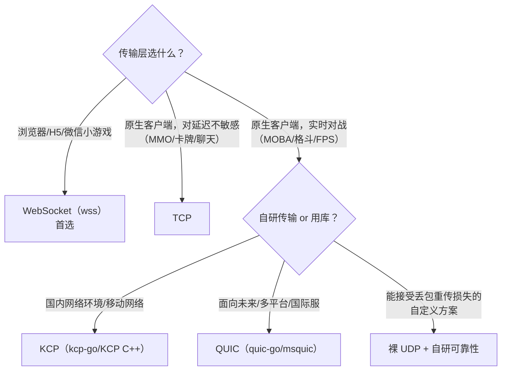
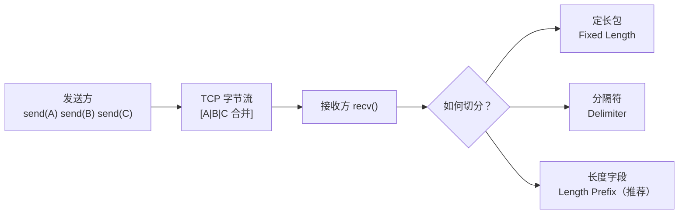
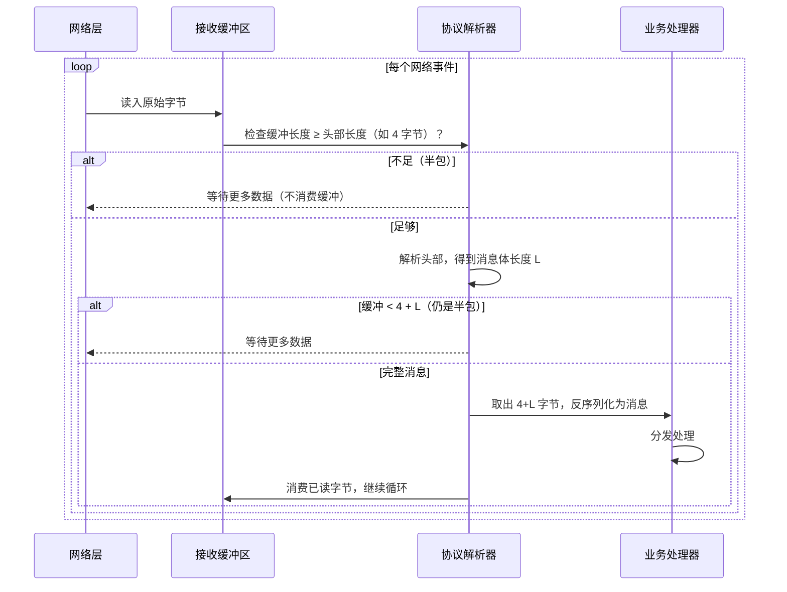
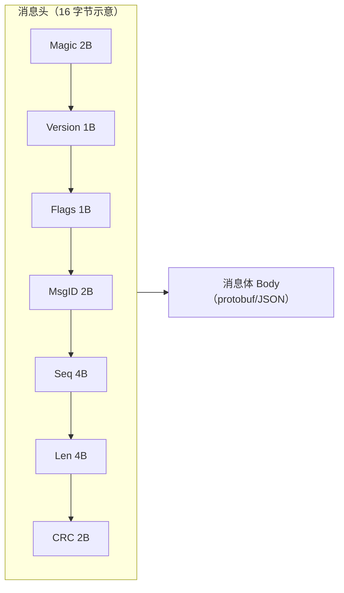
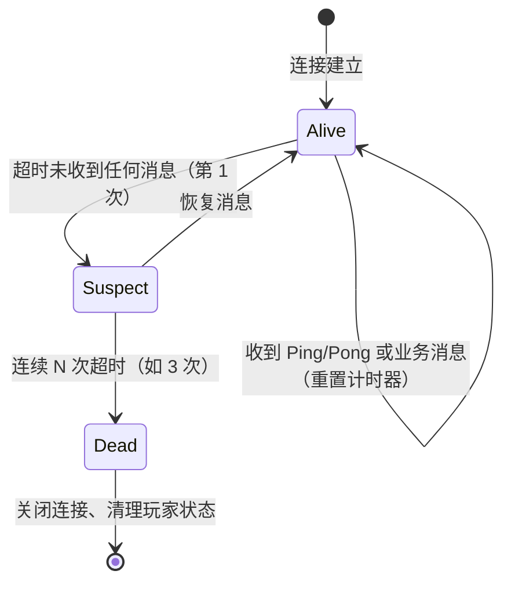

# 02 网络通信与协议设计（Networking & Protocol Design）

> 知识成熟度：L2（整体保留；4.6 的限定 Python schema 演进实验已有运行与测试证据，不外推到 C++ runtime 或生产系统）。

> 知识基线：实时游戏服务端通用架构；示例中的语言、数据库、缓存、容器和云平台版本必须以项目部署清单为准。
> 适用范围：覆盖网关接入、登录鉴权、房间/游戏服长连接和服务间 RPC 的传输与消息边界；不替代业务数据一致性设计。
> 事实边界：协议规范、组件行为和示例方案分开；容量数字只作示意/经验值，必须通过压测验证。
> 最后更新：2026-10-02（新增真实 protoc/Python 新旧 schema 实验；其余传输选型仍按各自来源核对）。
> 版本边界：拆帧模型保留 2026-10-01 核验；4.6 实验固定 protoc 36.0、Python protobuf 7.36.0（python backend），于 2026-10-02 实测；实际部署仍需锁定项目工具链。
> 参考来源：[TCP RFC 9293](https://www.rfc-editor.org/rfc/rfc9293.html)（RFC 793 仅作历史、已被取代规范）、[UDP RFC 768](https://www.rfc-editor.org/rfc/rfc768.html)、[QUIC RFC 9000](https://www.rfc-editor.org/rfc/rfc9000.html)、[WebSocket RFC 6455](https://www.rfc-editor.org/rfc/rfc6455.html)、[Protocol Buffers 官方文档](https://protobuf.dev/)、[gRPC 官方文档](https://grpc.io/docs/)。

### P0 协议选型与边界验收

| 承载 | 适用前提 | 必须验收的边界 |
| --- | --- | --- |
| TCP | 登录、控制、可靠 RPC、资产和快照等需要可靠有序传输的链路；能接受队头阻塞（HOL） | 连接/读写空闲超时、重连退避、消息长度上限和拥塞下的排队 |
| UDP | 低延迟输入或增量状态，且业务能自行处理序号、丢包、乱序、重放和认证 | UDP 可达性、MTU、丢包/乱序/抖动、放大攻击防护和应用层可靠性 |
| KCP | UDP 之上的可靠传输实现，客户端与服务端能锁定同一实现和参数，且实测收益成立 | KCP 不是标准协议；实现、拥塞、重传、MTU、密钥和断线恢复必须纳入部署清单与压测 |
| QUIC | 需要加密、连接迁移或多路复用，并且目标平台/客户端库、NAT 和网络策略已验证 | 流与数据报的语义、握手/空闲超时、路径迁移、MTU 和丢包下 P99；不能只因“基于 UDP”就直接替换 |
| WebSocket | 浏览器或 HTTP 网关需要双向长连接，聊天、控制和调试通道能接受 TCP 有序语义 | 代理/负载均衡空闲超时、升级失败、帧大小、心跳和背压；不等同于高频战斗同步专用通道 |

- 消息兼容性：protobuf 字段编号不复用，删除后保留编号与名称；二进制可解析、字段存在性、JSON 中转和业务降级分别验收；协议版本/能力协商必须可观测，不能靠 localhost 或 API 示例充当规范来源。
- 限流与超时：至少按连接、账号、IP/设备和消息类型建立令牌桶或等价预算；为握手、读写、排队、RPC 和处理器分别设置 deadline。数值由压测和线上 SLO 锁定，超载时明确拒绝、降级、丢弃或断开。
- 工程验收：用真实运营商/NAT/代理和丢包环境测试重连、切网、服务端滚动发布、旧客户端兼容和消息洪水，并保存协议抓包、错误码、P95/P99 与资源曲线。

> 适用读者：服务端开发、客户端网络层开发、协议设计者
> 前置知识：TCP/IP 基础、Socket 编程基础
> 目标：掌握传输层协议选型（TCP/UDP/KCP/QUIC/WebSocket），精通粘包拆包与消息协议设计，
> 理解心跳、重连、流量控制与加密传输的工程细节。

---

## 1. 概述

网络通信是游戏服务端的"血管"：玩家每一次移动、放技能、聊天，最终都变成网络上的字节流。
游戏网络设计与 Web 网络设计最大的区别在于**实时性**与**双向长连接**：

- 实时性：MMO 中移动广播通常要求 100ms 内送达，MOBA/格斗要求 50ms 级；
- 长连接：游戏普遍使用长连接（long-lived connection），而非 HTTP 的短请求；
- 双向：服务器主动推送（push）与客户端请求（request）同样频繁。

本章围绕"字节如何安全、快速、可靠地在两端流动"展开：

1. **传输层选型**：TCP、UDP、KCP、QUIC、WebSocket 各有什么优劣；
2. **粘包拆包**：字节流如何切分成一条条消息；
3. **消息协议设计**：消息头、消息 ID、序列化（protobuf）、版本兼容；
4. **心跳与超时**：如何发现"假连接"（半开连接）；
5. **断线重连**：网络抖动时如何优雅恢复；
6. **流量与带宽控制**：服务器扛不住/玩家带宽有限怎么办；
7. **加密传输**：防窃听、防篡改、防重放。

---

## 2. 核心概念（Core Concepts）

| 术语 | 英文 | 说明 |
| --- | --- | --- |
| 传输控制协议 | TCP | 面向连接、可靠、有序的字节流协议 |
| 用户数据报协议 | UDP | 无连接、不可靠、无序的数据报协议 |
| KCP | KCP (KCP Protocol) | 基于 UDP 的可靠传输协议，ARQ 与快重传优化 |
| QUIC | QUIC (Quick UDP Internet Connections) | 基于 UDP 的现代传输协议，0-RTT、连接迁移 |
| WebSocket | WebSocket | 基于 TCP 的全双工应用层协议，浏览器友好 |
| 粘包 | Sticky Packet | 多条消息被合并成一段字节流，无法直接切分 |
| 拆包 | Packet Framing | 从字节流中切分出完整消息的技术 |
| 半包 | Partial Packet | 一次读取只得到消息的一部分 |
| 消息头 | Message Header / Packet Header | 消息的元信息（长度、ID、序号、校验） |
| 消息体 | Message Body / Payload | 消息的业务内容（序列化后的数据） |
| 序列化 | Serialization | 结构化数据 ↔ 字节流（protobuf/JSON/MessagePack） |
| 心跳 | Heartbeat / Keepalive | 周期性探测连接存活的消息 |
| 半开连接 | Half-Open Connection | 一端已失效但对端未感知的连接 |
| 超时重传 | Retransmission | 超时未确认则重发（TCP/KCP 核心机制） |
| 指数退避 | Exponential Backoff | 重连间隔按指数增长，避免重连风暴 |
| 限流 | Rate Limiting | 限制单位时间消息量，保护服务器 |
| 令牌桶 | Token Bucket | 一种平滑限流算法 |
| 往返时间 | RTT (Round-Trip Time) | 消息从发出到收到确认的时间 |
| 拥塞控制 | Congestion Control | 根据网络状况调整发送速率 |
| 滑动窗口 | Sliding Window | 控制未确认数据量的机制 |
| 传输层安全 | TLS (Transport Layer Security) | 加密传输协议（HTTPS/wss 的基础） |

---

## 3. 原理详解（In-Depth）

### 3.1 传输协议选型对比

| 维度 | TCP | UDP | KCP（基于 UDP） | QUIC（基于 UDP） | WebSocket（基于 TCP） |
| --- | --- | --- | --- | --- | --- |
| 可靠性 | 可靠（重传） | 不可靠 | 可靠（ARQ） | 可靠 | 可靠（依赖 TCP） |
| 有序性 | 有序（队头阻塞） | 无序 | 可配置（快速重传，减少队头阻塞） | 按流有序，流间无阻塞 | 有序（依赖 TCP） |
| 传输模式 | 字节流 | 数据报 | 数据报（KCP 包） | 数据报（帧） | 消息帧 |
| 拥塞控制 | 有（复杂、波动大） | 无（需应用层实现） | 无（默认不控，可自定义） | 有（更现代，恢复快） | 有（依赖 TCP） |
| 头部开销 | 20 字节 | 8 字节 | 24 字节（含 UDP） | 约 30-50 字节（含握手态） | 2-14 字节帧头 + TCP |
| 握手延迟 | 1-RTT（TLS 另加） | 0 | 0（可在已建 UDP 上直接跑） | 0-RTT/1-RTT | 1-RTT（wss 另加 TLS） |
| 连接迁移 | 不支持（IP 变了就断） | 天然无连接 | 由应用层处理 | 原生支持（连接 ID） | 不支持 |
| 浏览器支持 | 否（原始 Socket） | 否 | 否 | 原生 QUIC 需客户端库；浏览器通常经 HTTP/3/WebTransport，按目标浏览器版本核对 | 是（天然支持） |
| 游戏适用场景 | MMO 长连接、登录、聊天 | 动作类实时同步 | MOBA/格斗实时对战 | 可评估新项目实时对战；需按目标平台、客户端库和真实网络实测 | 手游/H5/页游主流 |

**选型口诀**：



### 3.2 TCP 与粘包拆包（Packet Framing）

**为什么会粘包**：TCP 是**字节流**（byte stream）协议，没有消息边界。
发送方多次 `send()` 的数据可能被内核合并成一段（Nagle 算法、接收缓冲区合并），
接收方一次 `recv()` 可能收到多条消息（粘包）或一条消息的一部分（半包）。Nagle 的等待并非固定的 200ms；它取决于未确认数据、发送调用和具体协议栈。接收端的 delayed ACK 也由实现与配置决定，可能与小包发送策略叠加出额外等待。

对低延迟小消息，可在目标平台实测后评估 `TCP_NODELAY`：它只关闭发送端 Nagle，不会关闭接收端 delayed ACK，也可能增加包数与带宽。对允许稍等的高频更新，应用层批处理/合并窗口通常更可控；批处理窗口、刷新时机和消息语义必须按 P99 延迟、包数与带宽实测取舍。



**三种拆包方案对比**：

| 方案 | 原理 | 优点 | 缺点 | 适用 |
| --- | --- | --- | --- | --- |
| 定长包 | 每条消息固定 N 字节 | 实现最简单 | 浪费带宽、扩展性差 | 极简单协议（如心跳） |
| 分隔符 | 消息以 `\n`/`\0` 结尾 | 简单、可读 | 内容含分隔符需转义；无法表达二进制 | 文本协议（行协议） |
| 长度字段 | 头部携带消息长度 | 通用、高效、支持二进制 | 需要处理半包 | **绝大多数游戏协议** |

**长度字段拆包的完整流程**：



#### 3.2.1 从借用字节到拥有消息

原先 `HandleMessage(&buf_[4], bodyLen)` 后立即 `erase` 的写法，只能支持**回调返回前用完的借用**。`vector::erase` 会使删除点及其后的引用/指针失效，后续 `insert` 重分配也会失效；把这个指针捕获到逻辑线程，即使加了队列锁，也没有延长字节的生命期。长度为零时 `&buf_[4]` 还会对仅有 4 个元素的 vector 越界下标访问。[C++ vector 修改合同](https://eel.is/c++draft/vector.modifiers)

下面的 C++11 模型只定义 **4 字节大端 body 长度 + 不透明 body**，不实现下一节的完整业务头，也不解析 protobuf。`Next` 先复制独立消息再消费接收缓冲；`TryPush` 通过 `swap` 转移该消息的存储所有权。网络线程独占 framer；只有 mailbox 由 mutex 保护。不能将此例直接当生产网络库。

```cpp
#include <cassert>
#include <cstdint>
#include <iostream>
#include <mutex>
#include <thread>
#include <utility>
#include <vector>

using Bytes = std::vector<unsigned char>;
class PacketFramer {
public:
    enum class Result { NeedMore, Ready, Rejected };
    enum : std::size_t { MaxBody = 65536, MaxChunk = 65536,
                        MaxBuffered = 131080 };
    bool Append(const unsigned char* p, std::size_t n) {
        if (failed_) return false;
        if (n > MaxChunk || n > MaxBuffered - buf_.size() || (!p && n)) {
            failed_ = true;
            return false;
        }
        if (n) buf_.insert(buf_.end(), p, p + n);
        return true;
    }
    Result Next(Bytes& out) {
        if (failed_) return Result::Rejected;
        if (buf_.size() < 4) return Result::NeedMore;
        const std::uint32_t n = (std::uint32_t(buf_[0]) << 24) |
            (std::uint32_t(buf_[1]) << 16) |
            (std::uint32_t(buf_[2]) << 8) | std::uint32_t(buf_[3]);
        if (n > MaxBody) { failed_ = true; return Result::Rejected; }
        if (buf_.size() - 4 < n) return Result::NeedMore;
        // Allocate an independent body before committing consumption.
        Bytes body(buf_.begin() + 4, buf_.begin() + 4 + n);
        out.swap(body);
        buf_.erase(buf_.begin(), buf_.begin() + 4 + n);
        return Result::Ready;
    }
private:
    Bytes buf_;
    bool failed_ = false;
};

// Two owned slots; a teaching mailbox, not a production thread pool.
class Mailbox {
public:
    bool TryPush(Bytes& pending) {
        std::lock_guard<std::mutex> lock(mu_);
        if (count_ == 2 || pending.size() > PacketFramer::MaxBody) return false;
        slots_[(head_ + count_) % 2].swap(pending);
        ++count_;
        return true; // The accepted bytes now belong to this mailbox.
    }
    bool TryPop(Bytes& out) {
        std::lock_guard<std::mutex> lock(mu_);
        if (count_ == 0) return false;
        out.clear(); // swap gives this empty vector to the free slot.
        out.swap(slots_[head_]);
        head_ = (head_ + 1) % 2;
        --count_;
        return true;
    }
private:
    std::mutex mu_;
    Bytes slots_[2];
    std::size_t head_ = 0, count_ = 0;
};
```

调用者要保持一个 `pending` 消息和一个独立的 `has_pending` 标记：空 body 也是合法帧，不能用 `pending.empty()` 代表“没有消息”。先重试已有 pending 的入队；仅在成功转交后再 `Next`。入队失败保留 pending，并暂停读取或执行明确的过载断连策略，不能继续 `Next` 覆盖它。消费者取得的是自己的 `Bytes`，在其生命期内同步解析；发布后生产者不能再持有并修改其旧元素指针。

此模型的合同有四个刻意保留的限制：

- `Append` 每次最多接收 64 KiB，单 body 最多 64 KiB，未消费缓冲最多 131080 字节，队列最多两帧。检查加法前先用剩余容量比较，读取头后再校验 body。超限或非空长度配空指针会进入终止状态；调用层关闭连接，不重试同一 framer。有效的超大接收批次也会被拒绝，所以读缓冲大小必须遵守入口合同；不能把“本次 recv 很大”直接等同恶意客户端。
- 每次事件限制 `Next`/入队次数，例如最多 2 帧，再调度 continuation；缓冲内已有完整帧时不能只等下一次可读事件。队列满需在消费者释放空间后重试，半包则等待网络；次数上限只限制本轮工作量，不是墙钟耗时保证。总连接数、读取字节预算、半包 deadline、解压后长度和解析深度另设配额。
- 上限约束逻辑载荷，不是 RSS 精确上限：vector capacity、临时副本、生产者 pending、消费者输出、分配器和 socket 缓冲都占内存。示例反复 erase 为 O(n)，生产实现可评估游标/环形缓冲，但不能牺牲所有权合同。
- 分配失败等异常由连接/任务边界捕获并结束该连接，不能让异常逃出线程入口。`Next` 的消息分配发生在消费前，失败时未交付；后续业务回调失败则已是另一阶段，不能凭网络层自动重放推断恰好一次。示例未注入 bad_alloc，也未实现连接恢复、唤醒、公平调度或完整队列关闭协议。

### 3.3 UDP 与可靠传输：KCP 原理

**为什么实时游戏选 UDP**：TCP 的可靠机制（超时重传 + 拥塞控制）在网络丢包时会**大幅抬升延迟**
（重传等待 + 队头阻塞，head-of-line blocking），对"最新状态胜过旧状态"的游戏同步非常不利。

**KCP 的关键优化**（相对 TCP）：

| 机制 | TCP | KCP |
| --- | --- | --- |
| 超时重传 | 由 RTT/RTO 算法与具体实现下限决定，不能固定写成 200ms | 可配置（如 30ms，需按网络实测），更激进 |
| 快速重传 | 3 个重复 ACK 才重传 | 收到 2 个重复 ACK 即重传 |
| 队头阻塞 | 一条流内有序，阻塞后续 | 支持"跳过旧包"模式（只保证最终一致） |
| 拥塞控制 | 内置（窗口收缩，延迟敏感场景吃亏） | 默认不控，应用层自定义（游戏通常不控） |
| 选择性确认 | SACK | 支持（快速定位丢失包） |
| 延迟 | 高 | 低（为游戏场景调优） |

**KCP 的包结构（简化）**：

```text
0               4               8               12
+---------------+---------------+---------------+
| conv(会话ID)   | cmd(命令)     | frg(分片)     | wnd(窗口)    |
+---------------+---------------+---------------+
| ts(时间戳)     | sn(序列号)    | una(未确认号)  | len(长度)     |
+---------------+---------------+---------------+---------------+
| 数据（len 字节）                                        |
+--------------------------------------------------------+
```

`conv` 用于多路复用（一个 UDP Socket 承载多个会话）；`sn` 是数据包序号；
`una` 告诉对端"这个序号之前的包我都收到了"，用于快速推进窗口。

**KCP 使用示例（Go，kcp-go）**：

```go
import "github.com/xtaci/kcp-go"

func main() {
    // 服务端：监听 UDP 端口，底层自动完成 KCP 握手
    listener, err := kcp.ListenWithOptions(":7777", nil, 0, 0)
    if err != nil { panic(err) }
    for {
        conn, err := listener.AcceptKCP()
        if err != nil { continue }
        go handleConn(conn)   // conn 实现了 net.Conn 接口
    }
}
```

> 类似的库：C++ 版 KCP（skywind3000/kcp）、Netty 的 KCP 实现、Enet（可靠 UDP 库）、
> RakNet（老牌游戏网络库，UE 早期使用）。

### 3.4 QUIC：面向未来的传输协议

QUIC 是 Google 设计、IETF 标准化的基于 UDP 的传输协议，是 HTTP/3 的基石。对游戏的价值：

- **0-RTT 连接恢复**：有缓存凭证的客户端重连时第一个包即可携带数据，秒连；
- **连接迁移**：通过连接 ID（Connection ID）而非 IP:端口标识连接，WiFi↔4G 切换不断连；
- **多路复用无队头阻塞**：一条连接内多条流互相独立，一条流丢包不影响其他流；
- **内置 TLS 1.3**：加密是协议的一部分，无额外握手；
- **可插拔拥塞控制**：可实现"低延迟优先"的拥塞算法。

**代价**：协议复杂（实现与调优成本高）、库生态相对 TCP 年轻、
国内部分老旧网络设备/NAT 对 UDP 的限制。代表库：quic-go（Go）、msquic（微软）、quiche（Cloudflare）。

> **平台边界**：QUIC/WebTransport 不保证换协议就一定降低延迟。原生客户端、浏览器、移动端的 API/库能力不同；目标系统/浏览器版本、HTTP/3 与 UDP 可达性、NAT/代理/运营商策略、库实现和拥塞控制都应在目标平台的真实网络中实测后再决定。

### 3.5 WebSocket：浏览器游戏的事实标准

WebSocket 在 TCP 之上提供**全双工消息帧**，浏览器原生支持，天然适合 H5/页游/微信小游戏：

- 帧格式：FIN/Opcode（text/binary/close/ping/pong）/Mask/长度；
- 游戏用法：binary 帧承载 protobuf，text 帧承载 JSON 调试协议；
- `wss://` 走 TLS 加密，与 HTTPS 同端口兼容（代理友好）；
- 注意：WebSocket 有**队头阻塞**（底层 TCP），且帧头有 Mask 开销，但浏览器场景没有更好选择。

**服务端实现对照**：Node.js 的 ws/socket.io、Go 的 gorilla/websocket、C# 的 Fleck/Kestrel WebSockets、
C++ 的 websocketpp、Java 的 Netty。

### 3.6 消息协议设计（Protocol Design）

#### 消息头设计

一个典型的游戏消息头（以二进制协议为例）：

| 字段 | 长度 | 说明 |
| --- | --- | --- |
| Magic（魔数） | 2 字节 | 固定值如 `0x4D53`（"MS"），快速识别非法包 |
| Version（版本） | 1 字节 | 协议版本，用于兼容与升级 |
| Flags（标志位） | 1 字节 | 压缩/加密/ACK 要求等位标记 |
| Message ID（消息 ID） | 2 字节 | 标识消息类型（如 1001=登录，2003=移动） |
| Sequence（序列号） | 4 字节 | 请求-响应关联、防重放、乱序检测 |
| Body Length（长度） | 4 字节 | 消息体字节数（拆包依据） |
| Checksum（校验和） | 2 字节 | 可选：CRC32/简单异或，防篡改与传输错误 |



#### 消息 ID 的命名与分配

- 建议按模块分段：`1000-1999` 登录/账号，`2000-2999` 场景/移动，`3000-3999` 战斗，
  `4000-4999` 聊天/社交，`5000-5999` 商城/经济；
- 客户端→服务器（C2S）与服务器→客户端（S2C）可以共用 ID 空间（方向由消息语义决定），
  也可以高位区分（如 S2C 加 0x8000）；
- ID 一旦发布**永不复用**（废弃的标记 deprecated），避免新旧客户端混淆。

#### 序列化：protobuf 为核心

protobuf（Protocol Buffers）是游戏界最主流的二进制序列化方案：

```protobuf
syntax = "proto3";
package game.scene;

// 移动请求（C2S）
message MoveReq {
  uint32 seq = 1;            // 客户端自增序号，用于预测与回滚
  float x = 2;
  float y = 3;
  float dir = 4;
  uint32 client_time = 5;    // 客户端时间戳（毫秒）
}

// 移动广播（S2C）
message MoveNotify {
  uint64 player_id = 1;
  float x = 2;
  float y = 3;
  float dir = 4;
  uint32 server_time = 5;
}
```

**序列化方案对比**：

| 方案 | 体积 | 速度 | 可读性 | 跨语言 | 适用 |
| --- | --- | --- | --- | --- | --- |
| protobuf | 小 | 快 | 差 | 极好（官方多语言） | **核心战斗/高频消息** |
| MessagePack | 中 | 快 | 差 | 好 | 需要自描述的场景 |
| JSON | 大（3-5 倍） | 慢 | 好 | 极好 | 调试、运营后台、低频消息 |
| FlatBuffers | 小 | 极快（零拷贝） | 差 | 好 | 超高帧率同步（可选） |

#### 3.6.1 四种“兼容”要分别证明

1. **二进制 wire 兼容**：新字段通常属于 wire-safe，旧解析器按未知字段处理；这不代表旧端能执行新功能。删字段后保留其编号和名称，禁止复用；不能把已有字段随意移入现存 `oneof`。整数扩宽等“条件兼容”可能在旧端截断，滚动期须限制发送值范围。[proto3 演进规则](https://protobuf.dev/programming-guides/proto3/#updating)
2. **presence/更新语义**：上面的普通 proto3 数值字段采用 implicit presence。`x == 0` 无法区分未提供与显式提供零；不能直接把整个 MoveReq 当“只更新非零值”的 patch。需要表达清零时，设计独立 patch 消息，使用支持 explicit presence 的字段和 `has_x()`，或明确的字段掩码协议。[字段存在性](https://protobuf.dev/programming-guides/field_presence/)
3. **JSON/中转兼容**：ProtoJSON 不像二进制消息那样保留未知字段；旧 JSON 解析器默认可能拒绝新字段，开启忽略也会丢掉它。字段/枚举名称进入 JSON 表示，重命名必须单独迁移。不能用“网关转成 JSON 后再转回来”证明透传完整。[ProtoJSON 演进边界](https://protobuf.dev/programming-guides/json/#protojson-wire-safety)
4. **业务兼容**：新增 `sprint = true` 虽可能被旧服成功解析，但旧服不实现冲刺；如果新端先扣体力而旧服仍按步行计算，解析成功也已经行为分歧。能力协商、旧端降级、拒绝码、灰度范围和回滚数据要一起设计，不能只加一个版本号。

“未设置”是协议事实，“保持原值/取默认配置/拒绝请求”是业务选择。下面仅是另建教学 patch 的 schema 片段，不修改上面的 MoveReq，更不是对真实已发布协议的迁移指令：

```protobuf
syntax = "proto3";
message MovePatch {
  optional float x = 1; // absent: 保持；present 且为 0: 将 x 置零
}
```

使用 `if (patch.has_x()) state.x = patch.x();` 才表达这里约定的 patch 语义。proto3 optional 的官方启用要求是 protoc 至少 3.15，或 3.12 加实验开关；这是历史最低条件，不是推荐安装旧版。implicit/explicit 的二进制值可以互通，但显式零值经 implicit 中间节点重新序列化后，presence 可能丢失。真实项目需锁定生成器、插件、runtime 和目标语言；C++ 的生成代码/runtime 要精确匹配，官方不承诺跨发行版 ABI 稳定。这里的拆帧模型使用 C++11，不代表任意版本 protobuf runtime 都支持 C++11。[presence 启用条件](https://protobuf.dev/programming-guides/field_presence/#how-to-enable-explicit-presence-in-proto3)、[runtime 版本合同](https://protobuf.dev/support/cross-version-runtime-guarantee/#c-and-rust-specific-guarantees)

#### 3.6.2 跨服中转：字节、消息和 Arena 各有主人

网关如果只负责路由，可把经过长度/认证等检查的**原始 body 所有权**移交队列，在目标线程按 msgId 与锁定 schema 解析；不能把队列存活误当作借用 buffer 存活。若网关必须改字段，则记录其所用 schema 与未知字段保留路径：二进制消息 API 可保留未知字段，但逐字段重建消息会丢信息，不能只测试已有字段相等。[未知字段保留](https://protobuf.dev/programming-guides/proto3/#unknowns)

对象模式也可以跨线程，但要明确交付一份独立消息、共享不可变快照，还是连同所有者一起交付。Arena 上分配的对象不能随意包装成默认 delete 的 unique_ptr；把消息指针入队后在接收回调末尾 `arena.Reset()` 会使消费者失去有效对象。Arena 的分配线程安全不意味着消息的任意并发修改安全；Reset 必须与所有分配及对象使用者同步。跨 Arena 的 move/Swap 还可能深拷贝，`std::move` 本身不保证零拷贝。[C++ Arena 合同](https://protobuf.dev/reference/cpp/arenas/)

任务至少携带连接/玩家身份代次与目的服上下文；解析成功后再检查当前会话、权限、数值范围和请求幂等条件。晚到消息仍可拥有有效内存，却已经不适用于当前会话。详见 [RAII 与异步停止确认](../../01-编程与计算机基础/C%2B%2B语言与对象模型/01-C%2B%2B对象生命周期与RAII.md)、[消息系统](04-消息系统与事件驱动.md) 与 [幂等重试](../持久化与分布式一致性/03-幂等重试与消息语义.md)。

### 3.7 心跳与超时（Heartbeat & Timeout）

**为什么需要心跳**：TCP 的 `SO_KEEPALIVE` 默认 2 小时才探测一次，且不能感知应用层卡死；
玩家拔网线、WiFi 断连、App 被杀，服务器端连接可能长期处于**半开状态**（half-open），
白白占用 socket、内存与逻辑资源。

**心跳协议设计**：

| 要素 | 推荐值/方案 |
| --- | --- |
| 心跳类型 | 应用层 Ping/Pong（客户端发 Ping，服务器回 Pong；或双向） |
| 心跳间隔 | 10~30 秒（手游 15s 常见；实时对战可更短但需与业务区分） |
| 超时判定 | 连续 2~3 次无响应即判定死亡（如 15s 间隔、3 次 = 45s 判定） |
| 附带信息 | 心跳包可携带客户端时间、帧率、内存水位，服务端用于统计与体验优化 |
| 业务心跳 | 场景内移动消息本身可作为"活动心跳"（收到业务包即重置计时） |



### 3.8 断线重连（Reconnection）

**重连策略**：

1. **立即重试**：第一次断线立刻重连（网络抖动常见）；
2. **指数退避 + 抖动**：间隔 = `min(base * 2^n, cap) + random(0, jitter)`，
   如 `1s → 2s → 4s → 8s → 16s（上限 30s）`，随机抖动防止**重连风暴**（thundering herd）；
3. **会话恢复（Session Resume）**：服务器为断线玩家保留一定时间的会话（如 60 秒），
   重连时凭 session token 恢复原连接上下文，玩家回到原位而不是重新登录；
4. **重连期间的场景托管**：角色留在原地（可被攻击但有保护），或进入离线托管（AI 托管）。

```python
# 指数退避 + 抖动（示意）
import random, time

def reconnect_loop(client, on_connected):
    delay = 1.0
    while True:
        try:
            client.connect()
            on_connected()
            delay = 1.0              # 成功后重置
        except ConnectionError:
            wait = min(delay, 30.0) + random.uniform(0, 0.5)
            time.sleep(wait)
            delay *= 2               # 指数退避
```

**服务器端防重连风暴**：
- 网关按 IP/账号限流重连频率；
- 重连请求进入队列而非直接打满逻辑服；
- 大版本更新/机房故障时，开启"维护模式"统一拒绝并引导。

### 3.9 流量与带宽控制（Traffic & Bandwidth Control）

| 手段 | 原理 | 适用 |
| --- | --- | --- |
| 消息合并（Batch） | 多个小消息打包成一个大包发送（如 10ms 一包） | 移动广播、弹幕、聊天 |
| 增量同步（Delta） | 只发送变化字段，而非全量快照 | 状态同步（见 03 篇） |
| 压缩 | Snappy/LZ4（CPU 换带宽）或 zstd（高压缩比） | 大块数据（排行榜、地图） |
| 兴趣区域裁剪 | AOI 只广播给附近玩家 | MMO 场景广播 |
| 限流（Rate Limit） | 令牌桶/漏桶限制单位时间消息数 | 防刷屏、防 DDoS、防恶意高频 |
| 服务端降级 | 高负载时降低广播频率/分辨率 | 国战、全服活动 |
| 按优先级丢包 | 低优先级消息（如特效）可丢弃 | UDP 实时同步 |

**令牌桶限流（Go 示意）**：

```go
import "golang.org/x/time/rate"

// 每个玩家连接一个限流器：每秒最多 30 条上行消息，突发允许 60
limiter := rate.NewLimiter(rate.Limit(30), 60)

func OnRecv(conn *Conn, msg Message) bool {
    if !limiter.Allow() {
        conn.Close("rate-limit")   // 或丢弃 + 警告
        return false
    }
    return dispatch(conn, msg)
}
```

### 3.10 加密传输（Encryption）

**加密层次**：

| 层次 | 方案 | 保护范围 | 代价 |
| --- | --- | --- | --- |
| 传输层 | TLS 1.3（wss/https 天然具备） | 防窃听、防篡改 | 握手开销、CPU 开销（可硬件加速） |
| 应用层 | 标准 AEAD（如 AES-GCM/ChaCha20-Poly1305，仅在有明确需求时叠加） | 防窃听、防篡改、防重放（加序号） | 需要安全评审与密钥管理，避免重复加密 |
| 逻辑层 | 关键逻辑校验（HMAC 签名、双端校验） | 防外挂篡改协议 | 需要密钥保护（客户端易被逆向） |

**工程建议**：

- **首选 TLS 1.3**：性能好（0/1-RTT 握手、AEAD 加密），浏览器端 wss 强制；
- 若业务协议确需在 TLS/QUIC 之上增加应用层机密性或防重放，使用经过审计的标准 AEAD 与成熟密钥协商库；会话密钥配合递增序号/nonce 管理，具体方案须安全评审；
- **不要用 XOR/异或自嗨加密**：可逆、无认证，防君子不防小人，且给运维挖坑；
- 客户端密钥必然可被逆向：**客户端侧永远不可信**，关键校验必须在服务器（见 01 篇权威服务器）；
- 性能：AES-NI 指令集下 AES-GCM 加解密可达数 GB/s，不是瓶颈；
  真正的瓶颈往往是 TLS 握手次数——用连接复用/0-RTT 缓解。

---

## 4. 代码/配置示例（Examples）

### 4.1 完整消息头定义（C++ 结构体，紧凑对齐）

```cpp
#pragma pack(push, 1)
struct MsgHeader {
    uint16_t magic;     // 0x4D53 ("MS")
    uint8_t  version;   // 协议版本
    uint8_t  flags;     // bit0:压缩 bit1:加密 bit2:需要ACK
    uint16_t msg_id;    // 消息 ID
    uint32_t seq;       // 序列号（请求-响应关联/防重放）
    uint32_t body_len;  // 消息体长度
    uint16_t crc;       // 消息体 CRC16（可选）
};
#pragma pack(pop)
static_assert(sizeof(MsgHeader) == 16, "header must be 16 bytes");
```

### 4.2 心跳管理器（C# 示意）

```csharp
public sealed class HeartbeatManager {
    private readonly TimeSpan _interval = TimeSpan.FromSeconds(15);
    private readonly TimeSpan _timeout  = TimeSpan.FromSeconds(45); // 3 次
    private DateTime _lastRecv = DateTime.UtcNow;
    private int _missCount;

    public void OnAnyMessage() => _lastRecv = DateTime.UtcNow;

    public void Tick() {
        if (DateTime.UtcNow - _lastRecv > _timeout) {
            _missCount++;
            if (_missCount >= 3) { Connection.Close("heartbeat-timeout"); }
        } else {
            _missCount = 0;
        }
    }
}
```

### 4.3 移动场景的 UDP 消息结构（protobuf + KCP 组合示意）

```protobuf
// 教学片段：长度随数值与是否发送默认值变化，需对实际序列化样本计数
message PlayerMove {
  uint32 frame = 1;       // 帧号（与帧同步配合）
  uint32 input = 2;       // protobuf 没有 uint16；若只用低 16 位，业务层校验范围
  uint32 random_seed = 3; // 用于确定性随机（见 03 篇）
}
```

### 4.4 连接层架构（分层示意）

```text
┌───────────────────────────────────────────────┐
│ 业务层：消息 Handler（登录/移动/战斗）           │
├───────────────────────────────────────────────┤
│ 消息层：ID 分发器、序列化/反序列化、压缩、加密    │
├───────────────────────────────────────────────┤
│ 传输层：拆包器、心跳、重连、限流                │
├───────────────────────────────────────────────┤
│ Socket 层：TCP/UDP/KCP/WebSocket 适配器        │
└───────────────────────────────────────────────┘
```

### 4.5 可执行所有权检查与协议迁移练习

将 3.2.1 的完整 C++ 代码（含 include）与下面代码按顺序保存为 `framing_ownership.cpp`。这是独立的字节/所有权模型，测试值不是有效 protobuf 消息；不要据此声称业务解析器已经验收。

```cpp
static Bytes Frame(const Bytes& body) {
    const std::uint32_t n = static_cast<std::uint32_t>(body.size());
    Bytes wire{static_cast<unsigned char>(n >> 24),
               static_cast<unsigned char>(n >> 16),
               static_cast<unsigned char>(n >> 8), static_cast<unsigned char>(n)};
    wire.insert(wire.end(), body.begin(), body.end());
    return wire;
}
int main() {
    using R = PacketFramer::Result;
    PacketFramer f;
    Bytes out{99}, a = Frame(Bytes{1, 2, 3});
    assert(f.Append(a.data(), 2));
    assert(f.Next(out) == R::NeedMore && out == Bytes{99});
    assert(f.Append(a.data() + 2, 3));
    assert(f.Next(out) == R::NeedMore && out == Bytes{99});
    assert(f.Append(a.data() + 5, 2));
    assert(f.Next(out) == R::Ready && out == (Bytes{1, 2, 3}));
    Mailbox q;
    assert(q.TryPush(out) && out.empty());
    Bytes combined = Frame(Bytes{}), b = Frame(Bytes{7});
    combined.insert(combined.end(), b.begin(), b.end());
    assert(f.Append(combined.data(), combined.size()));
    assert(f.Next(out) == R::Ready && out.empty());
    assert(q.TryPush(out));
    assert(f.Next(out) == R::Ready && out == Bytes{7});
    assert(!q.TryPush(out) && out == Bytes{7}); // retain pending; don't call Next
    assert(f.Next(combined) == R::NeedMore);
    Bytes received;
    std::thread worker([&q, &received] {
        assert(q.TryPop(received) && received == (Bytes{1, 2, 3}));
    });
    worker.join(); // Only inspect received after this synchronization.
    assert(received == (Bytes{1, 2, 3}));
    assert(q.TryPush(out) && out.empty());
    assert(q.TryPop(received) && received.empty());
    assert(q.TryPop(received) && received == Bytes{7});
    assert(!q.TryPop(received));
    assert(f.Append(nullptr, 0));
    assert(!f.Append(nullptr, 1));
    assert(f.Next(out) == R::Rejected);
    PacketFramer huge;
    const unsigned char bad[] = {0, 1, 0, 1}; // 65537
    assert(huge.Append(bad, sizeof bad));
    assert(huge.Next(out) == R::Rejected);
    assert(!huge.Append(a.data(), a.size()));
    PacketFramer chunk;
    Bytes excess(PacketFramer::MaxChunk + 1, 0);
    assert(!chunk.Append(excess.data(), excess.size()));
    PacketFramer buffered;
    Bytes zeros(PacketFramer::MaxChunk, 0);
    assert(buffered.Append(zeros.data(), zeros.size()));
    assert(buffered.Append(zeros.data(), zeros.size()));
    assert(!buffered.Append(zeros.data(), 9));
    std::cout << "framing ownership: 29 assertions passed\n";
}
```

```bash
g++ -std=c++11 -O2 -Wall -Wextra -Werror -pedantic -pthread framing_ownership.cpp -o framing_ownership
./framing_ownership
g++ -std=c++11 -O1 -g -Wall -Wextra -Werror -pedantic -pthread -fsanitize=undefined -fno-sanitize-recover=all framing_ownership.cpp -o framing_ownership_ubsan
./framing_ownership_ubsan
```

2026-10-01 在 Linux/GCC 14.2.0 实测：29 个断言通过，UBSan 运行通过。检查半头、半 body、合并帧、空帧、消息顺序、队列满保留 pending、真实线程出队后 join、空指针、超长 body、过大单批次与累计缓冲拒绝。这里只覆盖线程移交的确定路径，本所有权模型未做 TSan、分配故障注入、真实 socket/压缩/认证或性能压测；它不包含 protobuf。独立的代码生成/Python runtime 实验见 4.6，不能混记为 C++ runtime 验证；整体 L2 不变。

协议迁移另建如下测试矩阵，使用项目锁定的 protoc/runtime 和新旧 schema 生成独立端点，保存输入字节、解析值、presence、业务结果及部署版本。以下是**项目迁移验收设计**，不是上述 29 断言的结果。4.6 已执行其中 presence/未知字段/JSON 的教学子集；整数溢出、新枚举、真实能力协商和历史存档回滚仍待项目验证：

| 路径/输入 | 要观察什么 | 不能只检查什么 |
| --- | --- | --- |
| 旧端 → 新端，新增字段 absent | 缺失字段走明确的旧行为 | 仅 Parse 成功 |
| 新端 → 旧端 → 新端，新增字段 present | 二进制中转仍能恢复未知字段；逐字段重建应暴露丢失反例 | 仅比较旧端认识的字段 |
| explicit 的 x=0 → implicit 中转 → explicit | 是否从 has_x=true 变为 false；patch 是否因此失效 | 仅比较 x 数值仍为零 |
| 新字段进入旧 ProtoJSON 端点 | 默认拒绝；开启忽略后丢弃的可观测行为 | 把忽略未知当作无损透传 |
| int64 新值超过旧 int32 范围 | 滚动期发送限制与拒绝/截断检测 | 只测小整数 |
| 新枚举/新能力、旧客户端与旧服务端 | 未识别值的默认分支和协商降级 | 把默认值自动当作合法动作 |
| 新 writer 上线后回滚 reader；读历史快照 | 旧进程能否承受新数据及其业务意义 | 只测当前在线双端 |

练习：先给 `Mailbox` 定义关闭/排空合同，再加入“断线后旧代次消息仍在队列”场景。分别指出谁拥有字节、谁可修改对象、谁判断消息过期，最后才决定拒绝/幂等重试。不要只延长指针生命期而让旧会话继续写入新玩家状态。


### 4.6 真实 protobuf 新旧 schema 实验：值相同，语义仍可能改变

完整 [实验、生成代码与运行方式](../../../evidence/labs/protobuf-evolution/README.md) 和 [原始输出](../../../evidence/labs/protobuf-evolution/results/python_linux.txt) 已入库。2026-10-02 实测 Linux x86_64、Python 3.12.14、官方 protoc 36.0、Python protobuf 7.36.0 的 `python` backend；默认与 `-O` 模式分别 12/12 测试通过，每次先重新生成两份 Python 消息代码并与保存版本逐字比较。

“新旧”是 **schema 版本**，共用同一个 runtime；不是“新 runtime 对旧 runtime”的支持矩阵。旧版 `int32 x=1`，新版 `optional int32 x=1` 并新增 `bool sprint=3`，两版共享 `uint32 sequence=2`。为在一个测试进程同时加载，package 不同；本例未涉及 gRPC/Any 的名称兼容。

| 真实路径 | 本次观察 | 发布判断 |
| --- | --- | --- |
| 显式 `x=0` → 旧 implicit 节点 → 新节点 | `08001007` → `1007`，读值仍是 0，`HasField("x")` 变假 | 若 absent 表示保持原值，原目标 99 不会归零；不能只比较数值 |
| 新 `sprint=true` → 旧对象改 sequence → 新对象 | sequence 7→8，未知 sprint 仍为真 | 二进制消息 API 可以保留未知字段；要测真实中转方法 |
| 旧消息 `CopyFrom` / 逐字段重建 / 主动丢弃 | sprint 分别为 true / false / false | 只抄已知字段会破坏未知字段透传 |
| 旧消息 → JSON → 消息 | JSON 只剩 `{"x":9}`，sprint 消失 | JSON 路径不能沿用二进制透传承诺 |
| 新 JSON → 旧 schema | 默认 ParseError；忽略未知后 sprint 消失 | “忽略未知”只让解析继续，不保存数据 |
| explicit `x=0` 和未知 sprint 同时存在 | `08001801` → `1801` | 未知字段保留与已知字段 presence 丢失可以同时发生 |

另外，真实 API 测到 implicit 零不会通过 `MergeFrom` 覆盖目标 9，而 explicit 零会；新 schema 的 ProtoJSON `{"x":0}` 保留 presence，`{"x":null}` 则无 presence。本例把 absent 定义为“不更新”，所以 null 也不表示清零。业务语义须先写成合同，再测试序列化路径。

上述二进制与 JSON 行为来自真实生成代码/runtime；测试中的“旧服走 1 单位、新服冲刺 2 单位、能力集合为空则拒绝”只是业务策略模型。没有真实网络能力协商、C++ protobuf 编译/runtime/ABI/Arena、溢出/新枚举/oneof 或生产滚动发布验证，不扩大结论。

工程落地顺序：列出新旧 writer/reader 与每个中转点 → 明确该点使用原始字节、消息 API 还是 JSON → 在最终新端同时断言值、presence 和新增字段 → 再断言旧端降级/拒绝和回滚数据。输入与输出十六进制用于诊断，不能把 protobuf deterministic 序列化当作跨版本的 canonical 字节合同。

---

## 5. 最佳实践（Best Practices）

1. **自定义固定宽头显式定义大小端**；protobuf body 遵循其 wire encoding，不能逐字段再做 htonl；
2. **拆包长度必须设上限**：防止内存耗尽攻击；异常包直接断连并记日志；
3. **消息 ID 永不复用**，废弃字段用 `reserved` 显式保留；
4. **protobuf 字段编号不复用**；1–15 的字段 tag 占 1 字节，16–2047 占 2 字节，小号可留给高频字段；编号不决定字段值本身的编码长度；
5. **心跳与业务解耦**：Ping/Pong 与业务消息共用"最近活动时间"，避免双套计时器打架；
6. **重连必带退避 + 抖动**：没有抖动的退避在故障恢复时会形成重连风暴；
7. **移动端优先 wss + TCP 长连接**，实时对战再上 KCP/UDP（需评估运营商对 UDP 的容忍度）；
8. **上线前做弱网测试**：模拟丢包 5%/10%/20%、延迟 100/300ms、抖动，验证协议与重连；
9. **协议层埋点**：消息数、字节数、耗时、丢包率全部上报监控（见 05 篇压测与监控）；
10. **加密默认开启**：正式环境一律 TLS/加密，防抓包逆向协议；
    但保留"明文模式"开关便于内网调试。

---

## 6. 常见问题 FAQ

**Q1：粘包是不是协议 bug？**
不是 bug，是 TCP 字节流的**固有特性**。长度字段提供边界信息，拆包器仍须正确处理残留字节、非法长度、所有权与背压，不能因为有长度头就认为实现已正确。

**Q2：UDP 是不是一定比 TCP 快？**
不一定。无丢包时两者延迟几乎一样；丢包时 TCP 因重传与队头阻塞延迟飙升，
而游戏（尤其帧同步）对"旧包"不敏感，UDP/KCP 能显著降低延迟。
但 UDP 需要自己处理丢包、乱序、NAT 穿透，工程成本更高。

**Q3：心跳间隔设多少合适？**
折中：太短浪费流量与电量，太长发现死亡慢。
移动端 15~30s 常见；实时对战可 5s（但可用业务消息代替）；PC 端可 30~60s。
判定死亡建议"间隔 × 2~3 次"。

**Q4：为什么 WebSocket 帧头有 Mask？**
WebSocket 规范要求**客户端→服务器**的帧必须掩码（Mask），
防止缓存投毒（cache poisoning）攻击；服务器→客户端不掩码。这不是浪费，是安全设计。

**Q5：Nagle 算法对游戏有影响吗？**
有可能，但不能写成“最多 200ms”的固定结论。Nagle、发送调用模式、接收端 delayed ACK 和操作系统实现共同决定等待时间。对强实时小消息，可在两端和目标网络实测后启用 `TCP_NODELAY`；它只关闭发送端 Nagle，不会消除 delayed ACK。对可合并的高频更新，优先设计应用层批处理/合并窗口，并用 P99 延迟、包数和带宽验证取舍。

**Q6：QUIC 现在能用吗？**
可以评估，但不能脱离目标平台和网络下结论。端游/原生客户端要核对客户端库、系统版本和更新策略；浏览器端通常经 HTTP/3/WebTransport，需核对目标浏览器版本与 API 能力。面向移动网络时，应在真实运营商/NAT/代理环境验证 UDP 可达性、限速、丢包、迁移和 P99 延迟，再决定是否采用。

**Q7：自研加密和 TLS 怎么选？**
优先 TLS 1.3、QUIC 内置 TLS 和标准 AEAD：有成熟的认证、密钥协商与证书体系。只有在确有应用层安全边界需求时，才在安全评审、密钥生命周期、nonce/重放防护和互操作性明确的前提下叠加标准 AEAD；不得自研密码算法，也不得把规避 TLS 指纹/检测作为设计目标或推荐理由。

**Q8：服务器怎么防止客户端"发超快"（消息洪水）？**
连接级令牌桶限流 + 单消息处理耗时预算（超时丢弃/降级） +
高频消息合并窗口（如 100ms 内最多处理 N 条移动）+ 风控封禁。

---

## 7. 关联阅读（Related Reading）

- 本分类：[01-服务器架构模式.md](01-服务器架构模式.md)（网关与接入层的架构定位）
- 本分类：[03-帧同步与状态同步.md](../同步预测与回放/03-帧同步与状态同步.md)（UDP/KCP 之上的同步机制）
- 本分类：[04-消息系统与事件驱动.md](04-消息系统与事件驱动.md)（消息到达服务器后的分发与 RPC）
- 本分类：[05-并发与高性能.md](../运行调度与过载保护/05-并发与高性能.md)（IO 线程模型与压测）
- 知识库其他篇章：安全与反外挂（协议逆向与防护）
- 外部资料：[RFC 9293：Transmission Control Protocol（TCP）](https://www.rfc-editor.org/rfc/rfc9293.html)（当前 TCP 基线）；[RFC 793：Transmission Control Protocol](https://www.rfc-editor.org/info/rfc793/)（历史规范，已被 RFC 9293 取代）；[RFC 9000：QUIC](https://www.rfc-editor.org/rfc/rfc9000.html)；[RFC 6455：The WebSocket Protocol](https://www.rfc-editor.org/rfc/rfc6455.html)；
  [skywind3000/kcp 实现参考](https://github.com/skywind3000/kcp)、[Protocol Buffers 官方文档](https://protobuf.dev/)、[gRPC 官方文档](https://grpc.io/docs/)
