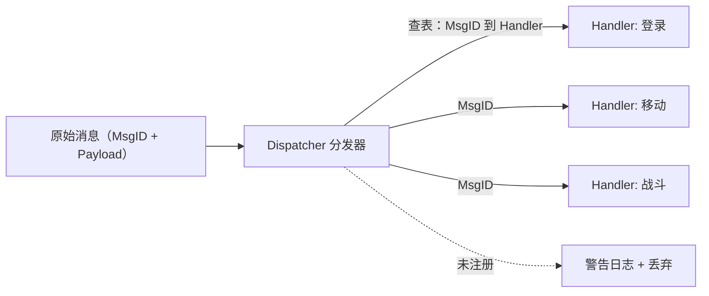
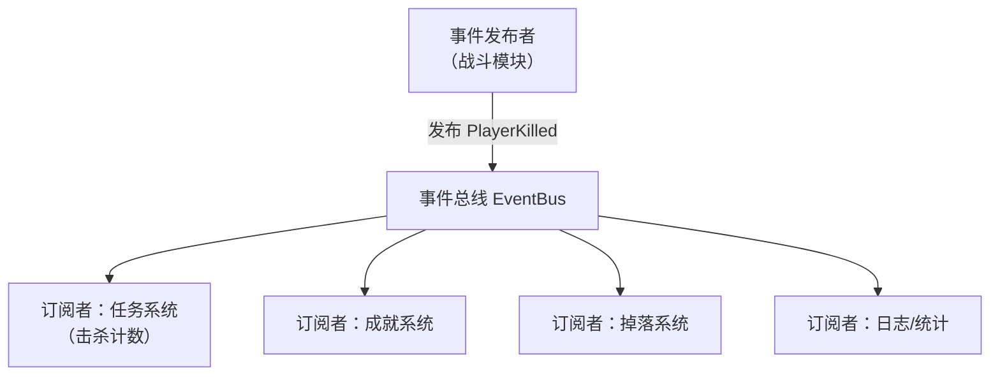
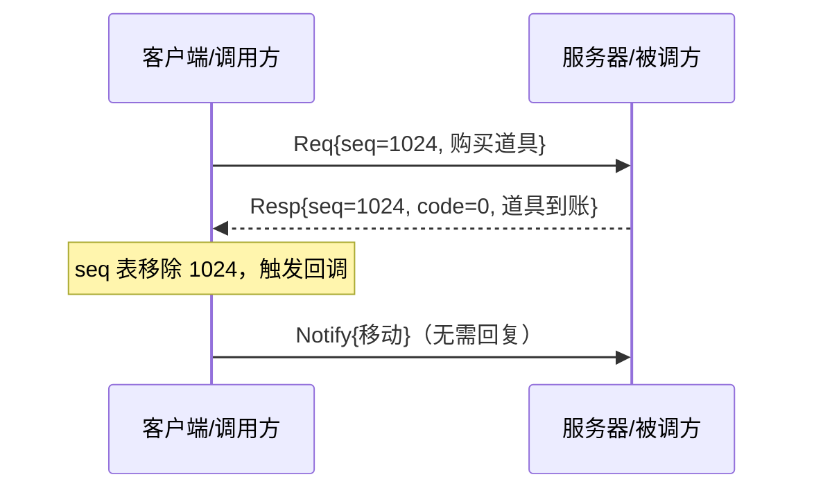
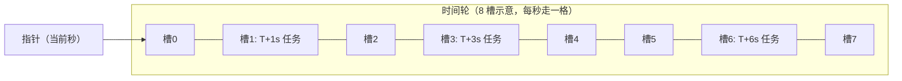
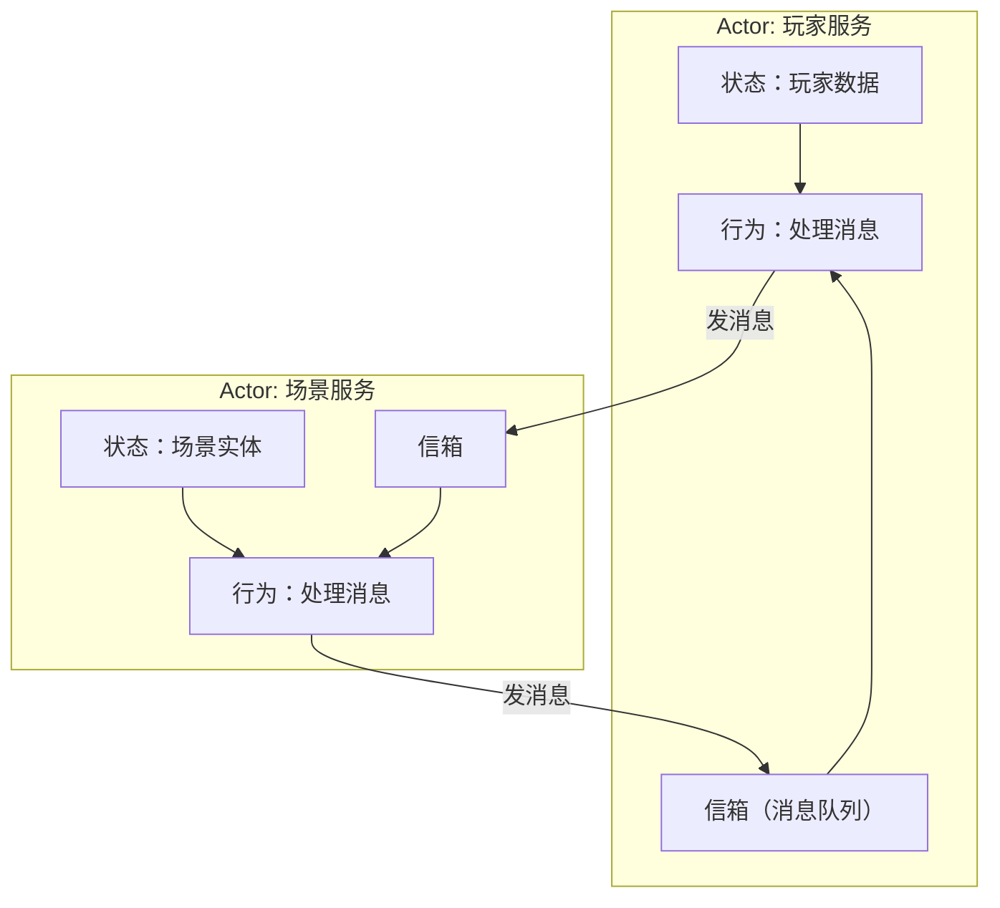
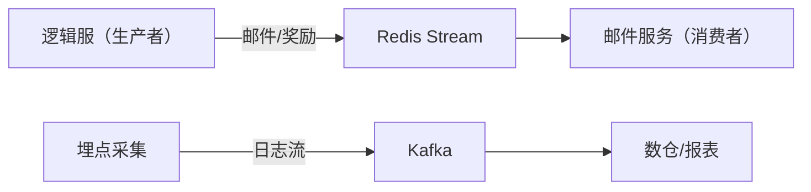

# 04 消息系统与事件驱动（Messaging & Event-Driven Architecture）

> 知识成熟度：L2。主要承诺是解释消息路径、失败分支与责任边界，证据为固定版本源码选读、官方文档和可手算轨迹；本文没有编译、运行消息程序或测量目标产品。
> 适用读者：服务端开发与框架设计者。前置知识：[服务器架构模式](01-服务器架构模式.md)的状态归属、[网络通信与协议设计](02-网络通信与协议设计.md)的帧、连接与有界接纳。
> 版本基准：Netty 4.1.115.Final固定commit、Skynet v1.7.0固定commit、Redis 7.4.2、Kafka 3.8.0、.NET runtime v8.0.0；Orleans、C#规范与gRPC使用2026-10-08所读官网快照。它们分别解释自己的机制，不构成一套已验证兼容的部署组合。
> 事实边界：固定源码与官网文档仅支持M12列出的静态命题；作者纸面算法、历史示意与真实产品行为分别标注，没有运行和容量证据。
> 最后更新：2026-10-08（全文消息责任、定时调度与消费恢复合同修订；保留原始历史）。
> 本篇维护消息流转合同，不重新定义资产数据库、Outbox/Inbox或安全协议。请求的持久原终态与恢复责任沿用已成文的数据库、事务、安全与高可用专题；全部伪码和数字轨迹标为PAPER_EXPECTED。

## M1 一条购买消息里，哪些“成功”并不相同

玩家点一次购买，网关解出请求，Dispatcher把它交给玩家服务，服务等待资产库，成功后通知任务系统与邮件服务。这里至少有六个独立观察：帧解析成功、消息被接纳、请求关联找到、业务提交成功、通知被broker确认、消费结果已提交。最后还要知道旧调用和回调是否不再访问资源。任一个观察都不能替后面的步骤盖章。

贯穿本文的正例是：受信主体p1的稳定购买意图R及完整参数D已有可恢复记录 → 新消息通过协议/权限/容量检查 → attempt A先登记再外调 → 权威业务原子接受R/D → 原成功持久提交 → 响应按本连接关联键K送回 → 事实事件被独立传播与幂等消费 → 各自真实在途工作结束后回收资源。响应丢失的反例只把调用者带到UNKNOWN；不能因此自动换R、退款、删去重记录或销毁仍会回调的宿主。

本章仍回答原稿的五类问题：路由找谁、事件如何通知、请求如何关联、定时任务怎样到期、跨进程如何协调。命令、事件、Actor、队列和RPC可以组合，不能互相替代其责任。

| 概念 | 本文采用的含义 | 容易混淆的边界 |
| --- | --- | --- |
| Message / 消息 | 有类型、版本、身份与有界载荷的数据单元 | 到达内存不等于业务受理 |
| Command / 命令 | 请求某个责任者执行意图 | 可通过请求或单向投递传送；不保证天然幂等 |
| Event / 事件 | 对某个已发生事实的陈述 | 事实成立点与通知送达点分别定义 |
| Notification / 通知 | 交互合同不要求业务回复 | 仍可有事件ID、顺序号或传输ACK |
| Request / Response | 调用者需要相应结果的交互形式 | 响应关联ID不是业务去重ID |
| Dispatcher / 分发器 | 根据类型/目标/主题选择处理入口 | 注册表不授予处理对象的当前写权 |
| Pub/Sub / 发布订阅 | 发布与订阅之间经主题或类型间接关联 | 可靠投递、失败反馈仍须有人负责 |
| Timer / 定时器 | 在约定时间之后使一项工作可运行 | 到期、投递、真正执行、业务生效不是同一时刻 |
| Timing wheel / 时间轮 | 用离散时间槽组织定时任务 | 一个槽中的全部工作不是O(1) |
| Actor / Mailbox | 状态所有者、消息信箱与调度规则 | 单线程执行片段不等于跨await整个请求原子 |
| Queue / Backpressure | 缓冲待处理工作；满载时限制接纳 | 队列不能消灭长期消费不足 |
| Idempotency / 幂等 | 同一业务意图重复处理不产生额外效果 | 需要稳定身份、完整绑定、原子接受与保留窗 |
| Circuit breaker / 熔断 | 故障时减少新调用、择机探测恢复 | 不撤销已提交操作，也不确认UNKNOWN的结果 |

## M2 从类型查表到真正的消息接受点

### M2.1 路由解决“找谁”，接纳解决“谁负责”

类型路由以消息类型/ID找到登录、移动、战斗等Handler；目标路由以player/room/service找到状态owner；主题路由以房间聊天、活动等主题找订阅者。一个请求可以先按类型找路由器，再按player和incarnation选择owner。定位表给出地址或服务handle；它可能陈旧，不能证明接收者仍有当前写权。


图中的入队成功表示某个内存owner接手了数据与后续处置；只有真实业务接受点才能判定资产/房间状态是否改变。未知消息若来自不可信网络，应按协议规则返回受控错误或关闭；日志限速并脱敏，不能每包无界打印。内部编程错误可以上报断言/诊断，但不能让请求悬挂成“没回复就是成功”。

### M2.2 分发示例的安全合同

旧C++注册表用handlers_[id]覆盖已有Handler，又在查表后直接调用容器内的函数对象。如果允许Handler重入注册/移除自身，必须先保证正在执行的函数对象存活；如果其他线程也能改表，查表本身还需要同步。本篇选择最小方案：启动期登记、重复ID报错，启动后冻结注册表；动态替换是另一项需审核的需求。

```text
PAPER_EXPECTED / 类型分发，不是可编译C++程序
启动：Register(id, expected_schema, handler)
  只接受唯一id；失败不覆盖旧handler
  冻结后不再变更注册表
Dispatch(owned_message, trusted_context):
  查表并核当前会话允许的消息类型/版本与有界字段
  未注册或格式不符 -> 明确拒绝并计数；不进入业务
  解析目标及其incarnation；验证当前对象动作权限
  在目标owner的接纳同步域内核OPEN、代次、项数/字节容量
  原子保留容量并转移owned_message给信箱；否则调用方仍负责消息
  处理者在真实业务接受点重核需要持续成立的写权和状态
```

owned表示实际数据生命周期由明确对象持有，不能只把网络缓冲的临时指针排入队列。每种语言的真实实现还需证明目标对象、Handler捕获对象和异步派生工作存活。本文不给一个未核对的C++指针示例贴“线程安全”标签。

协议演进仍需单独核消息头/字段编号、删除字段的保留、未知字段和schema解释版本；不能把新旧二进制可以解码当成业务语义兼容。事件ID、schema版本、来源与发生时间承担不同用途，墙钟时间不取代业务顺序号。详细编码合同在[协议篇](02-网络通信与协议设计.md)，本篇只在分发前核已经选定且允许的版本。

**ME-P01 · PAPER_EXPECTED。** 初态注册Login=H1，重复注册Login=H2应失败，表仍为H1；未知99明确拒绝。把一个指向可复用接收缓冲的Message*排入信箱，IO随后覆盖该缓冲，是反例；正确分支在接纳前取得有界owned载荷，再转移责任。

## M3 事件系统：解耦通知，不抹掉失败

### M3.1 事件、命令与异常策略

PlayerKilled表达击杀事实，AddItem表达新增物品意图，过去式/祈使式是有用命名惯例。事件可以有明确主题、目标订阅者或投递回执；发布者不能借事件命名免除关键通知的投递责任。业务结果是命令/RPC返回还是事件后续状态，应由接口合同决定。

“事件不抛业务异常”不是语言铁律。C#规范§21.6明确委托会同步按调用列表执行，未捕获异常可回到调用者并阻止后续项。应用可以选择逐订阅者捕获、终止整批或显式报告失败，但必须先说明是否有必须与主业务共同成功的步骤。[C#委托规范](https://learn.microsoft.com/en-us/dotnet/csharp/language-reference/language-specification/delegates#216-delegate-invocation)

例如击杀已由战斗权威确认，遥测失败不回滚击杀；必达的任务奖励则需持久待办及重试/恢复owner。若“扣款后发物品”必须原子，就先走资产事务/命令，把成功事件放在正确提交边界之后；不能将发物品藏在可随意catch忽略的观察者中。DB与Outbox同事务入口见[事务专题§3](../持久化与分布式一致性/04-分布式事务与最终一致性.md)。

### M3.2 一个有确定修改规则的进程内总线

本例限定单个逻辑owner，订阅变更与发布都在同一串行执行器；其他线程只能经有界消息请求它。载荷在发布期间不可变。一次发布开始时取得有限订阅快照，快照强持有各个目标；本次新增/退订在下一次发布生效，退订不销毁当前快照仍使用的对象。该选择使“退订后本批还会调用”成为明确合同。

```text
PAPER_EXPECTED / 逻辑步骤
Publish(evt):
  核载荷、队列/链路预算与事件身份；拒绝时仍由原owner负责
  捕获当前类型的有界订阅快照S；持有evt与S至本批结束
  对S中每个独立订阅者：
    调用；若出现合同允许隔离的普通处理失败，记录该订阅失败
    按其职责形成有界诊断或已约定的持久待办；继续其他独立订阅者
  返回本地分发回执；它不宣布跨进程消费或业务提交成功
```

严重不变量损坏不能用catch后继续写状态来伪装恢复；失败分类由实际宿主决定。副作用执行到一半才抛错时，重试仍必须沿同事件身份做原子幂等。快照只解决集合变化与引用存活，不使Handler访问的其他共享对象线程安全。.NET v8.0.0 List<T>.Enumerator会检查版本，遍历原List期间由Handler添加/删除，下一次MoveNext可抛InvalidOperationException；这与是否只有一个线程无关。[固定源码](https://github.com/dotnet/runtime/blob/5535e31a712343a63f5d7d796cd874e563e5ac14/src/libraries/System.Private.CoreLib/src/System/Collections/Generic/List.cs#L1148-L1212)

旧Lua例把任务、成就、掉落三次调用都放进同一个listener，外围一次pcall只能隔离整个listener；任务调用出错时后两步仍被跳过。若三者是独立观察者，应分别注册和记录失败；若有依赖/原子要求，就保留显式工作流，不能为了“解耦”打散必要顺序。

**ME-P02 · PAPER_EXPECTED。** 初态S=[任务Q,成就A]，Q在处理时新增掉落L并退订A。快照规则下本批仍执行Q、A，下一批执行Q、L。若Q单独失败，本批A仍执行，Q失败被记录；若Q已产生部分奖励，则不能盲目全量重试。该预期不适用于直接遍历可变List的旧实现。

### M3.3 同步、异步与事件环

同步分发在发布调用中推进，慢Handler延长调用时长；异步分发把执行交给队列，发布成功需说明是入队、持久化还是最终消费。异步也可以在单owner内保持入队顺序，同步也会有重入与共享状态竞争，不能简单写“同步无竞态、异步无顺序”。

递归A→B→A可耗尽调用栈；改成队列只是把它变成无界生产环。先找领域因果错误，再给链路深度、每轮事件数、项数/字节和单来源预算；超过预算明确拒绝/隔离并留责任，不在后台无限重试。相同eventId只能代表同一事实；有意发生的第二次击杀应有新身份，不能粗暴按事件类型去重。

## M4 请求关联、原终态与实际owner

### M4.1 三种身份分别持有

| 身份 | 示例 | 生命周期 |
| --- | --- | --- |
| 传输关联K | `(local_connection_generation=g7, seq=1024)` | 在本连接代次中关联一次等待；seq不在迟到响应仍可到达的域内重用 |
| 业务R与D | `(T,p1,BuyItem,r42)`及完整item/count/currency/price_config/目标incarnation/规范版本 | 重连、换worker、重试仍沿原值恢复；终态保留窗由业务定义 |
| attempt A与执行上下文 | 当前worker、owner_epoch、一次外部submit及回调 | 持有真实I/O、候选结果、取消与计时器责任，直到合法移交或实际退场 |

g来自本地已绑定的连接/回调上下文；不能直接信任网络包自报代次。消息类型、预期响应类型、主体和有界载荷也必须匹配。通知可以有seq用于排序；“无需业务回复”不等于“协议不得带序号”。

固定宽度seq耗尽时停止新接纳，并在能隔离旧响应的真正新代次开启新的关联空间；不能简单uint回绕覆盖_pending[seq]。如果协议没有可隔离的代次或迟到窗口证明，就不能提前重用。旧响应找不到活跃等待可以作有界迟到诊断或交原A恢复；不能匹配同号的新调用。

首次可能产生外部效果之前，发起侧可恢复owner必须已确证保存原R、完整D、权威查询定位、待确认责任与必要容量。只是把“保存”排进异步队列不够。恢复时以当前合法身份/结果查询权限读取原R/D，不从新token、当前配置、trace或seq猜原意图。接受侧原R/D、效果、原SUCCESS或选定持久REJECTED沿[安全S6](../会话身份与在线服务/04-安全与反作弊.md)与[数据库A5](../持久化与分布式一致性/01-数据库选型与存储设计.md)在真实原子域仲裁；本篇不另造数据库实现。

### M4.2 先登记再外调：同步回调也可能发生

旧RpcClient示意缺少Send抛错清理、超时后pending归属、取消注册释放、字典并发、序号回绕与宿主关闭，不能只补一个Remove就宣称完成。最小宿主采用同一锁或串行执行器协调接纳、registry、等待终态与close；任何可能同步回调的外部submit/cancel/close都在该锁之外调用。

1. 先构造稳定A、参数/结果容器和callback所需有效持有。包括取消注册在内，可能同步回调的动作也不能早于其所用owner存在。计时器与取消注册失败必须有实际退场处置，不能留下部分接纳。
2. 在共同同步域内重取单调时间，核OPEN、当前g、取消、deadline、等待与真实在途容量；原子保留槽，登记K→A与REGISTERED，授予A一次提交许可。登记失败或结果不确认则不外调；尚未发送的A已在close扫描与容量账中。
3. 本例沿[事务§6.1](../持久化与分布式一致性/04-分布式事务与最终一致性.md)选择一次许可不被后续close自动撤销。A在锁内标INVOKING，锁外恰好消费该许可；close只阻止新接纳，并保留已登记A。实际新业务效果仍在业务接受点核当前权限与状态。
4. submit可以在返回前同步调用callback。callback先通过预先存在的稳定引用进入，记录候选结果/失败事实；用户continuation在内部同步域之外调度，不能在持锁TrySetResult等操作中意外重入宿主。callback已经写结果不表示它已退栈，submit包装也可能仍在访问A。
5. submit抛错/返回拒绝的意义按真实API区分：只有能证明未接纳且无未来访问才是确定未提交；否则记录UNKNOWN。它与已发生callback共同仲裁，迟到的异常、取消或超时不得覆盖已确定结果。没有API证据时保留未知，不能自定义一个quiet布尔值当证据。

### M4.3 等待结束与资源退出是两条轴

| 事件 | 等待者可见状态 | A及业务责任 |
| --- | --- | --- |
| 合法匹配响应先赢 | 一次完成为Response | 原业务结果按内容解释；submit/callback尚未退场时继续持有A |
| 本地deadline先赢 | 一次完成为Timeout | 业务可仍为UNKNOWN；等待映射可移除，K不立即重用，registry保留A |
| 取消/关闭先赢 | 一次完成为Cancelled/Closing | 发起取消请求不证明底层已停；原R/D恢复记录保留 |
| 迟到响应 | 不第二次唤醒原等待者 | 可更新原A的已知结果或原恢复责任，不作用于新K，不复活旧连接 |
| 原终态已权威恢复 | 返回/保存同R同D原结果 | 仍不证明旧I/O静默，不提前释放真实槽 |

所有竞争通过共同同步域选择一次等待终态。移除wait_map只表示不再有活跃前台等待；registry、callback强持有、定时器/取消注册和持久责任各自有结束证据。回收要求submit包装已结束最后访问，当前callbacks实际退场，没有未来回调/访问或后续提交可能，派生工作已结束或被明确接手，并且已完成所需资源移交。取消注册的Dispose是否等待callback、调用在哪个线程，必须核实际库，不能在回调内部自等造成死锁。

关闭先停新接纳，随后请求取消/排空已经登记的A；预算到期只能返回INCOMPLETE/DRAINING并由稳定owner继续持有依赖及未决容量。调用close的栈帧结束不能触发这些依赖的析构。一个业务意图的下一次真实attempt在原A未退场时不自动开始；如果项目确实要并发尝试，必须另有真实在途预算和业务幂等证据，本篇不引入该扩展。

**ME-P03 · PAPER_EXPECTED。** K=(g7,1)超时，A仍在途；g8新连接的seq=1不接收g7回调。旧响应只归A；若g7空间没有隔离证据则不能在g7重用1。旧实现只超时TCS、pending一直保留，不能称“超时后自动清理”。

**ME-P04 · PAPER_EXPECTED。** A已登记未submit时close关门；A保留一次许可和真实槽。submit内部同步callback记录成功后返回，submit包装尚未退场，仍不能销毁A。close预算先到返回DRAINING；仅在联合退场/安全移交条件确证后撤registry并还槽。结果可已知而生命周期未完成。

**ME-P05 · PAPER_EXPECTED。** p1余额100，原r42购买30已提交70及原SUCCESS；响应丢失，之后另一个合法意图使当前余额60。恢复r42应取原balance_after=70，不能拿当前60重造原响应，也不能换r43再扣30。同R异D冲突；查不到结果但旧事务可能提交时保持UNKNOWN。当前余额另走当前查询合同。

## M5 定时器：先定义时间，再讨论槽位

### M5.1 到期不等于准点执行

Buff到期、技能冷却、活动开启和存档周期都需要调度。少量任务可以用小顶堆按deadline取最早任务；不要为每个任务建一个阻塞线程。选择时间轮通常是为了离散粒度和大批增删，但“万级以上一定更快”没有普遍证据，任务分布、取消率和热点槽会改变代价。

本节局部计时使用单调时钟，墙上时间只用于业务日期/活动日历的显式转换。进程重启后旧单调时间值不能直接作为新进程deadline；需要持续跨重启的业务到期事实应持久保存并重建本地timer。周期任务还要选择fixed-delay或fixed-rate、错过周期是跳过/合并还是有界补跑；不能一次卡顿后无限补发奖励。

### M5.2 可手算的单轮模型

这是作者的有限纸面算法，不是Netty源码翻译。选槽数W=8、粒度Δ=10ms、单调起点o=0；任务保存绝对dueTick及唯一不复用的handle。c是已完整处理的最大tick，初始0；一轮扫描活动tick记a，未扫描时a=c。新增delay非负且可表示，绝对deadline=t+delay，先做溢出检查：

```text
dueTick = max(a+1, ceil((deadline-o)/Δ))
slot = dueTick mod W
```

采用“不早于deadline，最早下一扫描tick”的策略，所以delay=0不会递归立即执行。ceil需要安全的整除/余数实现，不能把deadline+Δ-1溢出当正确代码。若tick/handle耗尽或存储预算不足，明确拒绝，不能回绕。

每次唤醒取target=floor((now-o)/Δ)，只处理a≤target的tick。开始新tick时令a=c+1，从slot[a mod W]分离当时有限的链表作为本轮扫描集；新加入任务进入新链表，不能被本轮尾部clear误删。逐节点检查：取消态移除；dueTick>a的任务放回其未来槽；dueTick≤a的任务转为到期待投递。这里只有dueTick等于当前或已逾期才到期，跨圈任务不会第一次遇到同槽就触发。

一次pump同时限制扫描节点数B和推进空/非空tick数K，两者都是正有限配置。预算尽则保存当前扫描游标/到期待办并安排下一调度轮；不跳过尚未处理的槽，不重扫已处理节点，不等待下一网络包来推动。到期消息只有在有界目标信箱明确接纳后才转移责任；信箱满时scheduler保留该有限pending并等待容量/关闭处置，禁止忙循环或丢任务伪造成功。完成本轮扫描及到期待办处置后才设c=a。

本例不在轮扫描中执行任意用户callback，只投递有界到期消息。消费端仍可能因负载延迟执行；实际生效前可复核timer的业务版本/取消代次。逻辑取消须与调度使用同一owner，尚未转移的任务可标Cancelled；已被接受/开始执行的工作不能靠取消timer回滚。已转移的到期消息归接收owner，旧timer记录是否可释放按实际引用结束；取消请求不替代静默证明。

**ME-P06 · PAPER_EXPECTED，单位ms。** t=0加入d=1、10、11、80、90，得到dueTick=1、1、2、8、9与slot=1、1、2、0、1。t=10扫描tick1，前两个到期，90ms任务仍保留；t=20到期11ms任务，t=80到期80ms任务，t=90才到期90ms任务。这是单轮加绝对tick支持跨圈；单轮并非必然只能表示WΔ范围。

**ME-P07 · PAPER_EXPECTED。** 正处理a=1时新增delay=0，dueTick至少2，本批不会反复执行新任务；t=95才唤醒、c=0且K=2时仅推进到2，安排续轮，不能直接把指针跳到9遗漏中间槽。某槽3个到期任务、B=2时先完成2个并保留第3个游标；下一轮从第3个继续，不重复前2个。信箱满则保留原pending，不能删timer后赌下一步会成功。

旧Python例的delay//tick_ms会向下取整，add相对current，advance却先访问current再递增；若第一次advance发生在Δ时，d=Δ被放到下一槽后在2Δ才执行，而d=WΔ取模到当前槽后在Δ就执行。必须同时规定插入基准和槽访问时刻，不能只把floor换ceil。循环中给同一list新增任务、最后clear也没有正确的重入保全合同。

### M5.3 Hashed wheel、层级轮与复杂度

Netty 4.1.115.Final的HashedWheelTimer是一个轮数组加remainingRounds；Worker.transferTimeoutsToBuckets算槽和轮数，waitForNextTick在tick+1边界唤醒，expireTimeouts再核deadline。这套tick编号和本文ceil模型不同，不能看见源码floor就判定它提前触发。新任务先经timeouts队列进入轮，每tick转入数量有上限；到期bucket遍历与取消队列仍有自己的工作量。[固定Netty源码](https://github.com/netty/netty/blob/04f9b4a827d992ad439823eeba85d65d3a89c265/common/src/main/java/io/netty/util/HashedWheelTimer.java)

层级轮使用多个粒度的轮，远期任务先放高层并按实现规则下放，降低远期任务被重复扫描的成本；hashed与hierarchical是不同组织方法，不能把Netty单轮写成“Hashed Hierarchical”。本轮未核Linux具体内核版本的timer实现，因此不拿“Linux也是如此”作验证证据。

O(1)通常只指已知槽和节点的插入/摘链，且受数据结构和同步前提约束。上面的简单标记取消只使逻辑状态更新常数步，内存回收要等扫描；要物理O(1)摘链需有效句柄/侵入链及正确同步。处理一个含m个任务的槽至少有O(m)工作，长延迟任务每圈检查还有累计扫描成本。小顶堆peek为O(1)、插入/弹出通常O(log n)，按句柄取消是否高效取决于额外索引。二者都不能承诺回调准点或恒定总tick耗时。

Netty固定版本cancel通过状态竞争并入取消队列；expire先变状态再交Executor，任务可能尚未真正运行。stop等待timer工作线程等语义也不等于任意外部taskExecutor中全部派生任务退场。本文仅静态阅读相关符号，不把它当M4宿主全部资源已静默的证明。

## M6 Actor：片段串行，跨等待状态重新检查

Actor把某组状态交给一个owner，消息进入信箱，由行为处理并可以创建Actor或发送消息。私有状态与消息传递减少共享写的范围；它们不消除别处共享对象、数据库并发、进程重启或业务死锁。玩家/场景/服务是可选边界，按状态不变量和热点选择；每个小对象一个Actor可能增加调度与序列化成本，合并过大又会形成单个热点。

Skynet v1.7.0的服务由框架worker调度，不等于“所有服务固定在一个线程”。同一服务的消息执行有调度约束，但skynet.call内部登记会话并yield；响应回来恢复原协程，其他请求可在等待期间推进。因此旧计数器inc/get在不yield片段内便于推导；在读counter与写counter之间插入一次call，就需要重新讨论交错。[skynet.lua固定call/dispatch](https://github.com/cloudwu/skynet/blob/f97c72d341c820ca9ed0ec0d49f654b0e783d934/lualib/skynet.lua#L693-L717)、[固定服务调度](https://github.com/cloudwu/skynet/blob/f97c72d341c820ca9ed0ec0d49f654b0e783d934/skynet-src/skynet_server.c)、[worker创建与循环](https://github.com/cloudwu/skynet/blob/f97c72d341c820ca9ed0ec0d49f654b0e783d934/skynet-src/skynet_start.c#L154-L232)

Orleans所读官方调度页则区分默认非重入请求与可重入执行：默认一个请求等到完成再开始下一个；启用相应interleave/reentrant规则后，await期间其他请求可执行，执行片段仍是单线程。这两种框架规则不能互相代入，也不能把async当成普遍解锁药。[Orleans调度](https://learn.microsoft.com/en-us/dotnet/orleans/grains/request-scheduling)

**ME-P08 · PAPER_EXPECTED。** 可交错Actor初始余额100/version7，A读100后await，B扣80写20/version8，A恢复后用旧100扣30并写70，会覆盖B。安全路线可以在等待前只保存意图，不改变经济状态；恢复后在实际接受点重新校验version与权限，用原子业务事务决定结果。若用Actor内串行临界区覆盖yield，要证明互调不会依赖同一个被占用的区，且存储效果仍有自己的原子性。

Skynet的skynet.queue源码提供协程队列与current_thread/ref控制，可用于某些串行区；它不证明任意跨服务调用无循环等待。A持有自己的串行请求等B、B又等A时，协程让出线程并不保证消息能通过各自请求门。Orleans文档也给出了异步等待但非重入请求互调超时的例子。解决时先消除依赖环或拆为明确阶段/后续消息；必要的重入需逐段保护状态，超时只限制等待，不撤销外部已生效的工作。

原稿列举的Erlang/OTP、Akka、ET、kbengine、Pomelo、Nakama仍是框架检索入口，不是同一种Actor调度实现，也不是当前流行度、许可证、性能或“天然稳定”的证据。本轮没有审阅它们的部署源码；不据其名字替本文状态合同背书。

## M7 进程内队列：交换指针之前先交换责任

IO线程到逻辑线程的队列解决执行环境隔离，必须先选择SPSC、MPSC或MPMC及所用语言内存模型。无锁只是实现性质，不能从“队列”两个字推断线程安全、无分配或无阻塞。用成熟队列时仍要核实际版本的生产者/消费者数量、可见性、元素销毁与关闭保证，详见[并发与高性能](../运行调度与过载保护/05-并发与高性能.md)。

双缓冲的一条易解释路线是：生产者在同一互斥域内向writeBuffer追加；消费者只有在自己旧readBuffer全部处理/归还且为空后，才在同一互斥域内把空缓冲与writeBuffer交换；解锁后独占新readBuffer。所有生产者追加与交换均经过此门，消费者处理期间生产者只写另一缓冲，不能持有交换前取得的裸指针继续追加。

这条路线不是无锁算法。锁只覆盖短的追加/交换，不包用户Handler；总项数/字节预算同时覆盖两个缓冲、正在处理的元素和派生在途工作。队列满时拒绝、暂停读取或按消息合同合并可丢快照；经济命令不能静默丢弃。处理预算耗尽时保存读缓冲游标，下轮继续；没有归还空缓冲前不再次交换。关停先禁止生产者接纳，再按已登记owner处理两个缓冲和当前项，不在指针交换后立即释放旧缓冲。

**ME-P09 · PAPER_EXPECTED。** producer准备写A，consumer同时把A交给自己读。如果producer能绕过同步门继续用旧A指针，读写并发成立。正确分支中producer取得门后重新使用当前writeBuffer，consumer只处理自己独占B。满载容量算两边与在途之和，不能每侧各放“总上限”而暗中翻倍。

长期平均输入大于输出时积压持续增长；增大队列只能延后拒绝。按消息类型分别记录接纳/拒绝、队列年龄、项数与字节、服务耗时、真实在途、超时、迟到和UNKNOWN恢复年龄。积压短且可恢复的突发可以缓冲；热点玩家/分区则需调整职责或配额。任何延迟和容量阈值都来自实际项目测量，本篇不提供未经测量的“毫秒级开销”。

## M8 跨进程队列：确认的对象必须说清

### M8.1 三类语义和产品适用范围

at-most-once允许丢失而避免重投。at-least-once的完整承诺是：对在约定接受点已经接纳的消息，在指定故障模型、所需持久记录及合法保留/重放窗、传输与消费者最终恢复、负责者持续推进重试等前提成立时，至少交付一次到声明的接收边界，同时允许重复。一个既会无责任丢失又会重复的系统，不能仅因“允许重复”就称为至少一次。它不自动承诺消费业务最终成功、完成时限，或无限故障期间仍能交付；消费侧仍按业务身份处理重复。[事务专题§1的事实与活性前提](../持久化与分布式一致性/04-分布式事务与最终一致性.md)

exactly-once也必须说明一次性效果位于哪个事务域、哪种故障模型和保留窗；“通常靠幂等近似”太笼统。同一数据库内唯一Inbox、业务效果与原结果原子提交，可以在约定域内给出可证明的重复抑制；它不会自动涵盖外部HTTP、邮件平台或另一数据库。

Kafka 3.8.0设计文档§4.6说明Kafka-to-Kafka可以用事务把消费位置和输出主题共同提交，消费方隔离级别也影响可见性；外部数据库仍需协调自己的结果与消费进度。幂等producer避免特定生产会话/协议范围的重复日志，不自动给应用生成稳定eventId，也不让资产库只执行一次。[Kafka固定设计文档](https://github.com/apache/kafka/blob/3.8.0/docs/design.html)

| 选项 | 需要先回答的问题 | 本篇边界 |
| --- | --- | --- |
| Redis Stream / consumer group | PEL、claim、保留/裁剪、持久/复制恢复和业务原子域由谁负责 | M8.2只核7.4.2所列命令；不由PEL或回执推定故障后必达，不把List简单pop等同Stream可靠消费 |
| RabbitMQ | 队列类型、路由、publisher confirm、manual ACK和死信策略是什么 | 沿[缓存消息队列§10](../持久化与分布式一致性/03-缓存与消息队列.md)的4.1/Pika边界；不新增broker配置 |
| Kafka | 分区key、事件身份、offset连续完成前沿、事务输出在哪里 | 不能用最大已完成offset越过未完成间隙；详见同篇§6–7 |
| NATS | 所用模式是否持久、是否启用JetStream、consumer确认合同是什么 | 仅保留候选入口，不由产品名推定可靠性；本轮未核部署版本 |

publisher confirm只涉及发布到broker的接受责任，consumer ACK是消费者告诉broker这次投递可结束，业务成功来自业务权威。这三种确认不能互换；回执丢失可以重投，因此消息身份与业务结果必须稳定。[RabbitMQ官方确认说明](https://www.rabbitmq.com/docs/confirms)

### M8.2 Redis Stream邮件消费的闭合路径

旧Go例只读`>`、忽略所有错误，调用deliverMail后立即XACK，既没有检查业务结果，也没有处理旧PEL、取消退出、ACK结果未知和已删除消息。它不能单凭XACK调用声称“已实现至少一次业务处理”。新例只提供下面的合同步骤，不冒充已编译的go-redis客户端。

设有已建立的stream `mail:deliver`、group `mail-svc`和唯一consumer名。下面的PEL恢复轨迹，以所需stream内容、group/PEL状态和MailDB原结果在选定故障模型、合法保留与恢复窗内仍可恢复为前提；XADD/XACK返回、当前存在PEL、某次claim成功都不能替代这组证据。本轮只核Redis 7.4.2的所列命令源码，未核其持久层、复制切换、灾难恢复或任一客户端的内存分配保证，因此不声明Redis零丢失、任意故障下必达或生产容量。[缓存消息篇§9](../持久化与分布式一致性/03-缓存与消息队列.md)提示持久化与故障模型须单独核实；该篇7.2.5的具体设置结论不能作为7.4.2证明。

eventId来自持久事件身份，stream entry ID只是本次日志位置；同一eventId可因发布重试出现在多个entry。邮件效果唯一键、Inbox与原处理结果在MailDB同一事务，邮件内容/接收者/版本完整绑定；如果真正发给外部邮件厂商，该外部副作用不在本事务内，需要已有Outbox/恢复协议，不能在事务中调用后当作原子。

如果业务要容许Redis这份投递记录丢失而仍承诺履约，选择复用[事务专题§3、§7.1、§12](../持久化与分布式一致性/04-分布式事务与最终一致性.md)的既有源事务Outbox、履约核对与保留合同，不新增通用可靠性服务：第一次XADD之前，源owner已确证保有可恢复的原eventId、完整规范D、必要schema/规则版本、必需邮件目的及待确认履约责任，并为原数据、核对与恢复重放预留有界容量。这些记录须在本业务承诺的故障/恢复范围内可靠；如果连既有可靠源都不满足该范围，本篇也不能给出必达保证。

XADD接受只更新所声明发布边界的状态，不删除仍需履约核对/合法重放的原事件。源owner沿原身份与完整绑定、以当前查询授权向MailDB权威边界核原结果；原结果已确认才按既有业务状态与保留条件结束相应责任。查询为空、超时或不可读不等于从未处理；UNKNOWN继续归原持久任务。必要的恢复重放必须取原eventId/D，受合法窗口、当前权限、原子Inbox/效果唯一键、真实在途退出和有限尝试预算约束；不能换新ID、从空PEL猜内容，或无限重投。所需原材料不可恢复、容量不足或缺乏上述既有责任时，停止自动新增/重放并进入明确对账，暴露未覆盖的故障范围，不清空未决记录换取“成功”。

```text
PAPER_EXPECTED / Redis 7.4.2命令语义与业务步骤，未连接产品
前提：选定故障窗内所需日志/PEL/原结果可恢复；更强履约走上述既有源责任
已核group、合法保留窗、有限批次/载荷/真实在途额度；原未决责任有界且已持久
循环入口检查关闭/取消/总预算；满载时不继续拉取
  有限轮恢复本consumer旧PEL或以XAUTOCLAIM按游标认领适龄pending
  与有限XREADGROUP ... COUNT C BLOCK finite STREAMS mail:deliver >交替
  空读取是可继续等待；断连/权限/解码错误分别处理，不统一立即continue
  对每条owned消息先登记稳定处理owner，再验证schema/eventId/完整绑定
  MailDB事务：唯一仲裁(consumer_role,eventId)，核完整绑定
    已有匹配原终态 -> 使用原结果；异绑定 -> 冲突，隔离并保责任
    无原结果 -> 校验业务、预留完整持久容量，写唯一邮件/Inbox/原结果同COMMIT
  确证原业务成功，或已确证持久的选定拒绝/可靠隔离接手：才提交该entry的XACK
  COMMIT未知：保原eventId/D及owner恢复，暂不ACK
  ACK未知：保投递确认责任；重复投递再查原结果，不再发第二封
  关闭：停新拉取，处理已登记工作；预算先到保DRAINING及原责任
恢复后日志/PEL缺失：转原源owner查权威结果/原事件；无材料则停止自动重做并对账
```

Redis 7.4.2的XREADGROUP `>`读取尚未交付给组内consumer的新项，不自动回收其他consumer的pending；XAUTOCLAIM按idle门槛和游标扫描并转移PEL归属。claim不停止旧consumer的外部数据库请求，因此MailDB唯一仲裁仍必要。XACK从该group的PEL移除记录，并不提交MailDB、删除stream本体或证明邮件已发。[固定Redis源码xread/xack/xautoclaim](https://github.com/redis/redis/blob/a0a6f23d997b024689ba157916837f493a593a34/src/t_stream.c)

拉取、claim、业务提交、查询和ACK这些真实外部调用本身也按M4先登记owner再外调；收到一条消息后建立其处理owner，不能补救此前拉取调用的借用指针失效。单条XACK返回1表示本次移除了目标PEL记录；返回0既可能是此前已ACK，也可能是stream/group已不存在或目标不在PEL，不能无条件当成邮件成功。只有已有权威原结果且投递责任的当前处置被核实时才收尾；group丢失、保留策略违规或回执不可判定要保原责任并修复/对账。

单次COUNT限制条数，不是7.4.2的总字节限制；还要限制字段/消息尺寸和解析分配，已有积压/恶意大消息超出合同就停下并走受控隔离，不能先无界分配再验收。claim的扫描/返回同样有预算，游标0-0只是本轮到末尾，之后可能有新适龄项。Stream裁剪/删除可能让PEL只剩ID没有body，7.4.2 XAUTOCLAIM会报告删除项；持久恢复责任须能发现并处理这种缺口，不能把“认领0条”或“body不见了”当业务已成功。官网latest出现的新命令选项不自动适用于7.4.2。

毒消息不能无限热重投，也不能仅catch日志然后ACK。若选持久隔离，隔离owner及完整必要材料必须先确证接手、容量有界，之后才放弃源投递责任；隔离库不可用/提交未知就保留原责任并停新接纳。重放时沿原eventId/D，仍受当前业务授权和合法重试窗约束。

**ME-P10 · PAPER_EXPECTED。** MailDB对e9提交一次邮件，进程在XACK前停止，e9之后被claim给新consumer。新consumer核到原Inbox与原结果，ACK当前entry，不再新增邮件；若旧COMMIT仍可能完成、权威查询不可用，保持UNKNOWN不ACK。先ACK再提交DB的反例在中间崩溃后可能丢失业务效果。

**ME-P11 · PAPER_EXPECTED。** 原consumer仍在慢事务中，idle超过claim阈值，第二consumer认领同entry；两个执行者都可能继续运行，只有MailDB原子唯一接受防止重复效果。若body已被裁剪，claim报告删除项，恢复owner对账/隔离，不能伪造处理成功。

**ME-P13 · PAPER_EXPECTED，两个独立输入。** A：只停止consumer进程，题设明确日志、PEL和MailDB原结果均可恢复，按ME-P10的claim→核原结果→ACK推进。B：Redis恢复后所需e9日志或PEL缺失，空PEL不能证明邮件成功；若事前已有上述可靠源及履约任务，源owner按原e9/完整D查询MailDB，已确证原成功则保存/恢复该结果，UNKNOWN则保原任务。在合同允许并满足真实在途与重放前提时，可从源记录重新投递同e9/D，任何旧/新处理者仍由同库原子接受去重。若可靠源的原数据/责任也缺失，则停止自动重做并对账，不造e10补发，不宣称本例覆盖了这个故障。两者都没有实际运行。

### M8.3 顺序要从入队追到提交

同key放同分区只给出一个排序域，多个producer、并行Handler、重投、异步外部调用与重平衡仍可能让业务完成顺序改变。单线程执行片段有先后，不代表不同来源的“现实发生时间”天然一致。客户端按seq排序还要定义连接代次、丢失/缺口、回绕与等待上限，不能无限等一个不会到达的包。

完整快照投影可以按version拒绝旧快照；增量事件v8必须在v7之后应用时，应在权威原子域检查预期版本，缺口保留并停止该key的推进，按预算补取缺失或恢复快照。不能跳过毒消息仍声称增量无损有序。Kafka并行消费的offset只推进连续完成前沿，重试转交必须先确证接手，见[缓存消息队列§7](../持久化与分布式一致性/03-缓存与消息队列.md)。

局部拍卖、房间回合或账本可能确实需要明确的全序，应该选择相应裁决域及其成本；不把“全局有序是伪需求”当铁律。跨无关业务域通常不必强求同一全序，但选择来自业务不变量。

## M9 RPC接口：把不可避免的分布式结果说出来

RPC可把调用形状做得像函数，仍须显式定义IDL/序列化、服务发现、认证授权、deadline、错误与重试、熔断、追踪和关闭责任。服务发现地址不等于当前写权，traceID用于观测也不等于R。

旧TradeService/CreateTradeReq仅列request_id和player_a/b，ItemSlot等类型不完整；裸request_id注释“只生效一次”不是实现。真正交易接口应明确受信租户/主体、操作域、双方对象及incarnation、规范道具/数量/价格或规则版本、R/D绑定、当前调用权限与原结果查询权限、有限参数/结果大小，以及跨库交易由谁协调。跨Actor或跨服交易沿[事务与最终一致性](../持久化与分布式一致性/04-分布式事务与最终一致性.md)，不能在每边各扣一次后用RPC成功掩盖半完成。

```text
PAPER_EXPECTED / 接口结果形状，不是proto编译单元
CreateTrade(R, complete_D, trusted_context) ->
  原SUCCESS(trade_id, original_result) |
  原持久REJECTED(reason, original_result) |
  CONFLICT(same_R_different_D) |
  UNKNOWN(recovery_locator_for_original_R)
QueryOriginalResult(R, D, current_query_authorization) -> 原终态或UNKNOWN
```

实际transport错误/过载拒绝和已持久业务REJECTED分层返回；一次尝试明确失败不证明同R的其他尝试没有成功。服务端超时取消后，已派生工作仍由应用停止/接手。gRPC默认没有deadline，需调用方设定合理预算，传播机制与语言实现有关；本文没有验证所有语言driver的关闭合同。[gRPC Deadlines](https://grpc.io/docs/guides/deadlines/)

总deadline覆盖排队、寻址、连接、一次调用、重试与恢复等待；下游等待上限不能超过剩余预算。只在明确可重试且幂等/原结果恢复合同成立时，以同R/D重试；attempt数、真实在途、总时长与退避均有界。鉴权拒绝、schema不支持、同R异D冲突不盲重试。deadline先到停止前台热尝试，持久UNKNOWN责任继续存在。

**ME-P12 · PAPER_EXPECTED。** 总预算100ms，排队已花60ms，当前下游等待至多取剩余40ms以内，不能重开100ms。40ms到时仅停止等待；下游若已提交，之后按原R恢复。嵌套A→B→C每层各重试3次可放大工作量，必须沿总预算和统一重试责任限制，而不是只规定每层“最多3次”。

## M10 连贯练习、排查顺序与验证建议

下面所有观察均是PAPER_EXPECTED，未运行目标产品、示例、模拟器或模型。它们为读者提供可以逐项核对的输入与判据，不是实测断言数量、性能基准或生产案例。

| 练习 | 输入与步骤 | 必须能指出的结果与反例 |
| --- | --- | --- |
| 完整通知链 | 击杀事实成立，Q失败、A成功，奖励需可靠处理 | 击杀不因遥测失败回滚；Q的持久待办/原身份还在，不能只打印成功 |
| 关联与关闭 | P03/P04，登记后关门，同步callback先于submit返回 | 只完成一次等待；K不误配；未退场A继续占槽 |
| 跨圈与积压 | P06/P07，d=90、t=95醒来、B/K有限 | 不提前到期、不跳过tick、不重复前缀，满信箱不丢pending |
| Actor交错 | P08，A await期间B改变version | 重新核接受点，旧读值不可直接覆盖；async不证明无死锁 |
| 消费恢复 | P10/P11，提交后ACK丢失、claim与旧工作并存 | 原效果一次，ACK只结束投递；UNKNOWN与缺body仍有负责人 |
| 故障范围 | P13，consumer停止且日志/PEL可恢复，或Redis恢复后消息/PEL缺失 | 前者才直接沿PEL恢复；后者查既有可靠源/原结果，无原材料停止自动重做，空PEL不代表成功 |
| 顺序缺口 | v8先于v7完成，v8是增量 | 不因同key就越过缺口；快照替换另按版本合同 |
| 原结果恢复 | P05，原70、当前60 | 恢复原70，不把当前读伪装原响应，不换R扣第二次 |

排查时沿同一条身份链问：消息是否通过格式/授权、是否真正接纳、谁持有载荷、K/R/eventId分别是什么、在哪个接受点发生效果、确认究竟来自谁、超时后谁恢复、目前谁仍会回调。先找到断开的责任，再选择修复位置；单看“请求耗时”或“队列长度”无法定位已经提交但回包丢失的情形。

将来若选择真实实现，最小适用验证需固定语言/库/消息协议版本，覆盖重复注册、集合变更、异常隔离、seq换代与耗尽、同步callback、submit抛错、timeout/response/cancel竞争、登记后close、timer边界/跨圈/取消/积压、Actor等待交错、队列满、提交与ACK之间崩溃、claim并发和顺序缺口。保存实际输入、输出、持久原结果与资源退场证据；本地小模型通过只证明模型，不替代Redis、Netty、Skynet、数据库或真实driver。

性能验收另需实际负载分布、消息尺寸、热点程度、取消率、故障/暂停模式、端到端计时和资源口径；不能从O(1)、单线程或万级任务推导上线容量。本轮未执行编译、网络探测、抓包、产品/数据库/容器运行、权限配置、故障注入、压力或性能实验，也不新增runner/CI。

## M11 常见问题

**Q1：什么时候用事件而不是直接调用？** 独立观察者适合事实通知；必须共同成功、严格依赖或需要立即结果的步骤用显式命令/工作流。频率影响成本，不独自决定语义。

**Q2：实时路径能不能跨进程排队？** 可以有进程/线程间消息，但每跳排队和序列化都进入实际延迟预算。持久broker是否适合移动/战斗要测量并说明玩法容忍度，不能用“绝不”替代设计；“用了broker”也不代表已证明故障后必达，可靠性按M8指定边界和恢复前提另核。

**Q3：Skynet服务就是一条固定线程吗？** 不是。服务与worker线程分别建模，skynet.call还会让出协程；同服务等待期间可有其他请求推进。按固定实现核调度，不套用Orleans默认非重入规则。

**Q4：超时后能安全重发吗？** 先保原R/D并恢复原终态，确认该操作的幂等与保留条件。无法判定时保UNKNOWN和恢复责任；不是给请求加个ID就能随时重发。

**Q5：时间轮一定比堆快吗？** 不一定。要分别算插入、取消、远期重复扫描、热点到期和回调工作量，再用真实分布验证；本文只给算法边界。

**Q6：全部async会消除Actor死锁吗？** 不会。互相等待而请求门不允许响应所需工作进入，仍可停滞。改调用依赖/阶段或审慎允许交错，同时保持状态不变量。

**Q7：按player key分区就有序了吗？** 它给出排序范围，还要保持消费/提交顺序、处理重投/代次与缺口；新连接seq和旧连接seq不能直接混排。

## M12 一手来源、历史贡献与关联阅读

本次实际核对的范围如下。获取了完整文件不等于审完全部实现；所读范围与未验证项分别列明，不把浮动网页当固定部署版本。

| 来源 | 版本与定位 | 支持什么；未覆盖什么 |
| --- | --- | --- |
| Netty HashedWheelTimer | 4.1.115.Final → `04f9b4a827d992ad439823eeba85d65d3a89c265`；newTimeout、Worker.run/transferTimeoutsToBuckets/waitForNextTick、cancel/expire/run、bucket遍历 | 单轮轮数、访问次序、逻辑取消/执行器边界；未运行JVM/外部Executor |
| Skynet | v1.7.0 → `f97c72d341c820ca9ed0ec0d49f654b0e783d934`；skynet.lua的yield_call/call/raw_dispatch_message，skynet_server.c服务调度，skynet_start.c的worker创建/循环，skynet_mq.c队列，skynet/queue.lua | 协程等待、服务调度、串行队列；未认证所有插件/扩展共享状态 |
| .NET与C# | runtime v8.0.0 List.cs Enumerator版本检查；C#规范§21.5–21.6官网快照 | 旧foreach的修改风险、委托异常/顺序；未编译总线或RPC客户端 |
| Orleans | Request scheduling，所读页面标更新2026-03-11 | 默认非重入与可重入片段交错/等待环；不是固定运行时源码审计 |
| Redis | 7.4.2 t_stream.c的xreadCommand、xackCommand、xautoclaimCommand；官网XACK/XREADGROUP/XAUTOCLAIM选段辅助 | 仅核PEL、claim、ACK、缺body和扫描；未核持久层、复制切换、灾难恢复或客户端内存分配，不能推定零丢失/故障后必达；latest新增8.x选项不纳入7.4.2 |
| Kafka | 3.8.0 docs/design.html §4.6 | Kafka事务输出与外部系统协调边界；未运行broker/消费者 |
| gRPC | Deadlines页面客户端/服务端/传播段，页面标最后修改2025-07-07 | 显式期限、派生工作责任；未核具体driver是否真正退场 |
| RabbitMQ | 官方confirms现行页2026-10-08快照；产品细节沿CM1已核4.1 | 两类确认独立；本轮没有把重定向后的4.3页面称为4.0源码 |

原稿2026-08-04已包含完整消息主题、图、跨语言示意、实践与七问；8月6日增补规范来源/P0，8月13日补成熟度，8月20日接入元数据，10月4日迁移路径。它已有实质写作贡献，本次是全文教学修订，不是首次建立该知识。原日期、代码、未运行示意与旧判断完整保留在下方惰性历史区；历史区不是现行运行指令或本轮错误清单。本轮没有发现可把这些示例升为L3/L4的原运行日志，也没有删除任何旧日志/附件。

- [服务器架构模式](01-服务器架构模式.md)：状态owner、路由、接纳、恢复与关停
- [网络通信与协议设计](02-网络通信与协议设计.md)：帧、schema、连接代次与协议预算；最终发布前核其现行合同
- [并发与高性能](../运行调度与过载保护/05-并发与高性能.md)：线程、队列与共享内存；按该篇实际证据阅读
- [数据库选型与存储设计](../持久化与分布式一致性/01-数据库选型与存储设计.md)：本地资产原子域、原结果与异步资源生命周期
- [分布式与高可用](../持久化与分布式一致性/03-分布式与高可用.md)：owner交接、原结果优先与恢复
- [缓存与消息队列](../持久化与分布式一致性/03-缓存与消息队列.md)：Outbox/Inbox、offset、确认和容量
- [分布式事务与最终一致性](../持久化与分布式一致性/04-分布式事务与最终一致性.md)：跨服务履约及持久转交
- [安全与反作弊](../会话身份与在线服务/04-安全与反作弊.md)：可信主体、动作授权、R/D与原终态


## 历史原文保留区（惰性文本）

本区保留历史贡献与原字，供溯源和版本比较。它不覆盖上方现行合同；旧代码、旧经验值和未验证结论不作为本轮运行事实。G0是固定基线完整原文，G1起为早期版本不能仅从G0取回的必要片段。各版本可以按下表顺序拼接，行号均相对相应G块、从1开始、含末行；片段之间不补换行。

| 真实历史提交 | 完整原文字节/LF | 回拼顺序 |
| --- | --- | --- |
| `23d4e591` | 23134/505 | G0[8..8] + G0[11..510] + G1[1..1] + G0[512..514] |
| `61a43817` | 23194/507 | G0[8..510] + G1[1..1] + G0[512..514] |
| `9beb653a` | 23345/514 | G0[1..510] + G1[1..1] + G0[512..514] |
| `c5c5be25` | 21086/491 | G0[8..8] + G0[25..510] + G1[1..1] + G0[512..512] + G2[1..2] |

10月4日迁移后正文与本次固定基线同字节；8月4日、6日、13日、20日原稿已取得并逐字回拼核对。历史查询固定在本次基线main及当前/legacy两条路径；本地仓库为浅历史，不能从浅仓第一次可见提交推定创作日期。未调查其他分支或作者外部草稿。

### G0 固定基线完整原文

<!-- ME1-PRESERVE:G0:BEGIN -->
````text
---
type: Architecture
title: "04 消息系统与事件驱动（Messaging & Event-Driven Architecture）"
status: stable
verified: []
maturity: L2
---
# 04 消息系统与事件驱动（Messaging & Event-Driven Architecture）

> 知识成熟度：L2（本轮审计修订时补标）。

> 知识基线：实时游戏服务端通用架构；示例中的语言、数据库、缓存、容器和云平台版本必须以项目部署清单为准。
> 适用范围：覆盖网关到游戏服以及服务间的请求、事件、队列和 RPC 路径；不定义具体业务资产的数据库模型。
> 事实边界：协议规范、组件行为和示例方案分开；容量数字只作示意/经验值，必须通过压测验证。
> 最后更新：2026-08-06（补齐规范来源、版本边界与工程验收入口）。
> 版本边界：以 2026-08-06 为核对日，不新增不确定的当前组件版本号；消息运行时、中间件和容器版本由项目部署清单锁定。
> 参考来源：[TCP RFC 9293](https://www.rfc-editor.org/rfc/rfc9293.html)、[Protocol Buffers 官方文档](https://protobuf.dev/)、[gRPC 官方文档](https://grpc.io/docs/)、[Redis 官方文档](https://redis.io/docs/latest/)。

### P0 消息兼容与投递边界

- protobuf schema 是消息兼容的证据入口：字段编号不可复用，新增字段应允许旧消费者忽略，删除字段保留编号；每条命令/事件记录 schema 版本、消息 ID、来源和产生时间。
- gRPC 请求必须定义 deadline、状态码、重试条件和幂等语义；事件/队列按至少一次投递设计时，消费者以 eventId 或业务键去重，不能把“送达”误写成“只处理一次”。
- 顺序只在明确的 key/分区/Actor 内保证；不追求跨服务全局有序。积压、消费者变慢和毒消息要有背压、隔离、重试上限和死信/人工处理入口。
- 限流与超时按连接、调用方、消息类型和队列长度分层设置；超过处理预算要拒绝、降级或延迟，不以无限重试掩盖故障。验收需覆盖重复、乱序、断连、重启、发布回滚和消息洪水。

> 适用读者：服务端开发、框架设计者
> 前置知识：01 篇的架构模式、02 篇的消息协议
> 目标：掌握服务器内部"消息如何流转"的完整体系——消息路由、事件系统、请求-响应、
> 时间轮定时器、Actor 模型、消息队列与 RPC 框架设计。

---

## 1. 概述

游戏服务器本质是一个**消息处理机器**：玩家的每个操作是消息，场景的每个事件是消息，
模块之间的每次协作也是消息。消息系统（messaging system）设计的好坏，
直接决定代码的耦合度、可扩展性与并发安全。

本章回答五个问题：

1. **消息怎么路由**：一条消息到达后，如何找到处理它的代码？
2. **事件怎么传播**：模块之间如何"解耦地"通知彼此（发布-订阅）？
3. **请求-响应怎么做**：需要"问一句答一句"的场景如何建模？
4. **定时任务怎么调度**：Buff 到期、活动开启等海量定时器如何高效管理？
5. **跨进程/跨服怎么通信**：Actor、消息队列、RPC 各自解决什么问题？

业界框架对照：**Skynet**（C+Lua，Actor 模型开源实现）、**ET**（C# 双端）、
**kbengine**（C++ 多进程消息）、**Pomelo**（Node.js 多进程推送）、**Nakama**（Go 单进程多模块）、
**Akka/Erlang**（Actor 的工业标杆）。

---

## 2. 核心概念（Core Concepts）

| 术语 | 英文 | 说明 |
| --- | --- | --- |
| 消息 | Message | 进程内/进程间传递的数据单元（含类型与载荷） |
| 事件 | Event | "已经发生的事实"（如 PlayerLevelUp），发布-订阅传播 |
| 命令 | Command | "希望发生的意图"（如 AddItem），通常有明确接收者 |
| 事件驱动 | Event-Driven | 程序流程由事件（消息）触发，而非顺序调用 |
| 消息路由 | Message Routing | 根据消息类型/目标把消息送达处理者的机制 |
| 分发器 | Dispatcher | 消息 ID 到 Handler 的注册与查表组件 |
| 发布-订阅 | Pub/Sub | 发布者不关心谁订阅，订阅者不关心谁发布 |
| 请求-响应 | Request-Response | 一问一答模式，靠请求 ID 关联 |
| 通知 | Notification | 单向消息（Oneway），无需回复 |
| RPC | Remote Procedure Call | 让跨进程调用像本地函数调用 |
| 定时器 | Timer | 延迟/周期执行的任务 |
| 时间轮 | Timing Wheel | O(1) 增删定时任务的数据结构 |
| Actor | Actor Model | 万物皆 Actor：状态私有 + 信箱 + 消息驱动 |
| 信箱 | Mailbox | Actor 的消息队列 |
| 消息队列 | Message Queue | 解耦生产/消费的中间件（进程内或跨服） |
| 背压 | Backpressure | 消费速度跟不上时反向限制生产 |
| 幂等 | Idempotency | 同一请求执行多次结果一致（重试安全） |
| 熔断 | Circuit Breaker | 下游故障时快速失败，避免雪崩 |

---

## 3. 原理详解（In-Depth）

### 3.1 消息路由与分发（Routing and Dispatch）

进程内消息分发的最常见形态：**消息 ID 到处理函数**的注册表。



**三种路由粒度**：

| 粒度 | 依据 | 适用 |
| --- | --- | --- |
| 类型路由 | 消息类/ID | 通用网络消息（C2S/S2C） |
| 目标路由 | 玩家 ID/房间 ID/服务名 | 把消息投递给具体玩家、房间、场景 |
| 主题路由 | Topic（如 chat.room.100） | 广播、订阅类消息 |

**目标路由的关键问题：消息"住在哪里"**。玩家数据可能分布在多个场景/服务，
路由层需要一张**定位表**（location table）：player_id 到 (service, node)。
Skynet 用 service name 到 handle 的注册表；kbengine 用 entityID 到 (cell, base) 双地址。

### 3.2 事件系统（Event System）

#### 事件与命令的区别

- **事件（Event）**：过去式命名，如 PlayerDied、ItemSold；没有"接收者"概念，
  谁关心谁订阅；发布者不知道也不关心结果；
- **命令（Command）**：祈使式命名，如 AddItem(玩家, 物品)；有明确目标，
  通常走请求-响应或 RPC，调用方关心成败。

> 铁律：**事件不返回值、不抛业务异常给发布者**；需要结果的用命令/RPC。

#### 发布-订阅（Pub/Sub）



```csharp
// C# 事件总线（简化）
public sealed class EventBus {
    private readonly Dictionary<Type, List<Delegate>> _subs = new();

    public void Subscribe<T>(Action<T> handler) where T : IEvent {
        if (!_subs.TryGetValue(typeof(T), out var list))
            _subs[typeof(T)] = list = new List<Delegate>();
        list.Add(handler);
    }

    public void Publish<T>(T evt) where T : IEvent {
        if (_subs.TryGetValue(typeof(T), out var list))
            foreach (var h in list) ((Action<T>)h)(evt);  // 同步分发
    }
}
```

**同步 vs 异步事件**：

| | 同步事件 | 异步事件 |
| --- | --- | --- |
| 执行时机 | 发布线程内立即执行 | 投递到队列，稍后处理 |
| 优点 | 简单、顺序确定、无竞态 | 解耦彻底、可跨线程 |
| 缺点 | 订阅者慢会拖慢发布者；重入风险 | 顺序不保证；调试难 |
| 适用 | 单线程逻辑服内部 | 跨线程/跨进程通知 |

**事件风暴（Event Storming Problem）**：一个事件触发一串事件（A 到 B 到 C 再到 A）可能死循环；
订阅者抛异常会污染发布者。对策：事件链深度限制、订阅者异常隔离（try/catch 包裹）、
必要时事件投递去重（dedupe）。

### 3.3 请求-响应与通知（Request-Response and Notification）

消息按语义分三类：

| 类型 | 方向 | 是否需回复 | 示例 |
| --- | --- | --- | --- |
| 通知 Notification（Oneway） | 单向 | 否 | 移动广播、聊天、Buff 生效 |
| 请求 Request | C 到 S 或 S 到 S | 是 | 登录、购买、移动校验 |
| 响应 Response | 反向 | 无需再回 | 登录结果、购买结果 |

**请求-响应关联**：靠请求消息头里的**序列号（seq）**配对。客户端发请求带 seq=1024，
服务器响应原样带回 seq=1024，客户端用 seq 到 callback 的映射表匹配。



**超时与错误码**：每个请求必须配超时（如 5 秒），超时触发重发或失败回调；
响应必须带错误码（code=0 表示成功），且**请求必须幂等**（重复执行不产生重复扣款/发奖）
——这是 RPC 重试安全的基础。

### 3.4 定时器与时间轮（Timers and Timing Wheel）

游戏服务器里有海量定时任务：Buff 到期（大量玩家乘多个 Buff）、技能冷却、活动倒计时、
定时存档。朴素做法（每个任务一个线程/一个 sleep）不可行；主流方案是**时间轮**。

**时间轮原理**：一个环形数组（槽位），每个槽位挂一个任务链表；
一个指针按固定 tick 前进一格，指针指向的槽位里的任务全部到期执行。
任务需要延迟 d 时，放入 (当前指针 + d 除以粒度) 对槽数取模的槽位。



**单层时间轮的局限**：槽数乘粒度等于最大延迟。8 槽乘 1 秒只能管 8 秒。
**层级时间轮（Hashed Hierarchical Timing Wheel，HHTW）**：多级轮（秒轮/分轮/时轮），
任务到期时降级到下轮。Netty 的 HashedWheelTimer、Linux 内核定时器都是此思想。

```python
# 简化时间轮（Python 示意）
class TimingWheel:
    def __init__(self, ticks: int, tick_ms: int):
        self.slots = [[] for _ in range(ticks)]
        self.tick_ms = tick_ms
        self.current = 0

    def add(self, delay_ms: int, callback):
        idx = (self.current + delay_ms // self.tick_ms) % len(self.slots)
        self.slots[idx].append(callback)   # 简化：不处理跨圈

    def advance(self):  # 每个 tick_ms 调用一次
        for task in self.slots[self.current]:
            task()                 # 执行到期任务
        self.slots[self.current].clear()
        self.current = (self.current + 1) % len(self.slots)
```

**工程要点**：定时器回调要"短平快"（不能阻塞太久）；取消任务用句柄（handle）
而非遍历查找；时间轮与最小堆对比：时间轮增删 O(1)，最小堆取最小 O(1) 但插入 O(log n)；
任务数巨大且延迟粒度固定时时间轮占优。

### 3.5 Actor 模型（Actor Model）

**定义**：万物皆 Actor。每个 Actor 拥有：

1. **私有状态**（不共享内存，天然无锁）；
2. **信箱（Mailbox）**：收到的消息排队；
3. **行为（Behavior）**：逐条处理消息，处理中可创建子 Actor、给其他 Actor 发消息。



**代表实现**：

| 框架 | 语言 | 特点 |
| --- | --- | --- |
| Erlang/OTP | Erlang | Actor 鼻祖，进程级隔离 + 监督树（supervisor）容错 |
| Akka | Scala/Java | JVM 版 Actor，集群模式成熟 |
| Skynet | C/Lua | 云风开源，单进程多"服务"（Lua 虚拟机），国内游戏团队使用极广 |
| Orleans | C# | 微软"虚拟 Actor"（Grain），自动激活/休眠，适合有状态服务 |
| Nakama | Go | 单进程多模块（近似 Actor 的模块化） |

**Skynet 示例（Lua）**：

```lua
-- 定义一个服务（Actor）
local skynet = require "skynet"

skynet.start(function()
    local counter = 0          -- 私有状态
    skynet.dispatch("lua", function(_, _, cmd, ...)
        if cmd == "inc" then
            counter = counter + 1
            skynet.ret(skynet.pack(counter))
        elseif cmd == "get" then
            skynet.ret(skynet.pack(counter))
        end
    end)
end)
```

**Actor 的代价**：消息复制/序列化开销、跨 Actor 调试困难、嵌套调用易成"消息风暴"。
**游戏里的最佳实践**：以"玩家/场景/服务"为 Actor 边界，Actor 内单线程处理，
避免"每个对象一个 Actor"的细粒度滥用。

### 3.6 消息队列（Message Queue）

#### 进程内队列

单进程内解耦生产/消费（如 IO 线程到逻辑线程），常用**无锁队列**（见 05 篇）
或双缓冲队列（生产者写 A 缓冲、消费者读 B 缓冲，交换指针）。

#### 跨服/跨进程队列

| 中间件 | 模型 | 游戏典型用途 |
| --- | --- | --- |
| Redis Stream/List | 轻量队列 | 跨服聊天、邮件、活动奖励发放 |
| RabbitMQ | AMQP，路由灵活 | 运营后台向游戏服下发指令 |
| Kafka | 高吞吐日志流 | 埋点日志、对局回放归档、排行榜流计算 |
| NATS | 轻量发布订阅 | 服务间事件通知 |



**消息队列三要素**：

1. **可靠性语义**：at-most-once（最多一次）/ at-least-once（至少一次，消费需幂等）/
   exactly-once（恰好一次，通常靠"幂等 + 去重"近似实现）；
2. **背压（Backpressure）**：队列堆积时要限流或拒绝新任务，避免内存暴涨；
3. **顺序保证**：跨服消息的全局顺序几乎不可得；按 key（如玩家 ID）分区保证单 key 有序即可。

### 3.7 RPC 框架设计（RPC Framework）

**RPC（远程过程调用）**让跨进程调用像本地函数：Login(playerId) 背后可能是
网关到登录服务的一次网络往返。

**完整 RPC 需要**：

| 组件 | 说明 |
| --- | --- |
| IDL 定义 | protobuf/gRPC、Thrift、自研协议文件 |
| 序列化 | 参数/返回值编解码 |
| 寻址 | 服务发现 + 负载均衡（etcd/Consul/K8s DNS） |
| 超时与重试 | 超时阈值、重试次数、幂等保证 |
| 错误处理 | 错误码、异常传播、熔断（circuit breaker） |
| 追踪 | trace ID 贯穿调用链（日志聚合） |

```protobuf
// gRPC 服务定义（跨服 RPC 示例）
service TradeService {
  rpc CreateTrade(CreateTradeReq) returns (CreateTradeResp);
  rpc ConfirmTrade(ConfirmTradeReq) returns (ConfirmTradeResp);
}

message CreateTradeReq {
  uint64 request_id = 1;   // 幂等键：同一 request_id 重复调用只生效一次
  uint64 player_a = 2;
  uint64 player_b = 3;
  repeated ItemSlot items_a = 4;
  repeated ItemSlot items_b = 5;
}
```

**RPC 陷阱**：

- **超时重试必须幂等**：扣款、发奖类操作以 request_id 去重；
- **嵌套 RPC 深度**：A 到 B 到 C 链路过长时延迟叠加，超时预算逐层递减；
- **回调地狱**：用协程/async-await 压平（Skynet 的 skynet.call、C# 的 async、Go 天然同步）；
- **网络分区**：RPC 失败不等于业务失败，状态机要能处理"未知结果"
  （如支付回调丢失后对账）。

---

## 4. 代码/配置示例（Examples）

### 4.1 消息注册与分发（C++ 示意）

```cpp
using Handler = std::function<void(Player*, const Message&)>;

class Dispatcher {
    std::unordered_map<uint16_t, Handler> handlers_;
public:
    void Register(uint16_t msgId, Handler h) { handlers_[msgId] = std::move(h); }

    void Dispatch(Player* p, const Message& msg) {
        auto it = handlers_.find(msg.Header.MsgId);
        if (it == handlers_.end()) {
            LogWarn("unhandled msg: %u", msg.Header.MsgId);  // 打日志，别静默
            return;
        }
        it->second(p, msg);
    }
};
```

### 4.2 请求-响应的 seq 关联（C# 示意）

```csharp
public sealed class RpcClient {
    private readonly Dictionary<uint, TaskCompletionSource<Message>> _pending = new();
    private uint _nextSeq = 1;

    public async Task<Message> CallAsync(Message req, TimeSpan timeout) {
        var seq = _nextSeq++;
        req.Header.Seq = seq;
        var tcs = new TaskCompletionSource<Message>();
        _pending[seq] = tcs;
        Send(req);
        using var ct = new CancellationTokenSource(timeout);
        ct.Token.Register(() => tcs.TrySetException(new TimeoutException("rpc timeout")));
        return await tcs.Task;
    }

    public void OnResponse(Message resp) {
        if (_pending.Remove(resp.Header.Seq, out var tcs))
            tcs.TrySetResult(resp);     // 超时后到达的响应直接丢弃
    }
}
```

### 4.3 事件驱动的任务系统（Lua 示意）

```lua
-- 事件总线（单线程逻辑服内）
local listeners = {}   -- event_name -> {fn, ...}

function subscribe(name, fn)
    listeners[name] = listeners[name] or {}
    table.insert(listeners[name], fn)
end

function publish(name, ...)
    for _, fn in ipairs(listeners[name] or {}) do
        local ok, err = pcall(fn, ...)   -- 订阅者异常隔离
        if not ok then log.error("event %s handler error: %s", name, err) end
    end
end

-- 用法：击杀事件驱动任务/成就/掉落
subscribe("PlayerKilled", function(killer, victim)
    quest_system.on_kill(killer, victim)
    achievement_system.on_kill(killer, victim)
    loot_system.on_kill(killer, victim)
end)
```

### 4.4 跨服消息（Redis Stream 消费，Go 示意）

```go
// 邮件服务消费"跨服邮件"队列
func ConsumeMail(ctx context.Context, rdb *redis.Client) {
    for {
        result, err := rdb.XReadGroup(ctx, &redis.XReadGroupArgs{
            Group: "mail-svc", Consumer: "mail-1",
            Streams: []string{"mail:deliver", ">"},
            Count: 100, Block: time.Second,
        }).Result()
        if err != nil { continue }
        for _, stream := range result {
            for _, msg := range stream.Messages {
                deliverMail(msg)          // 处理
                rdb.XAck(ctx, "mail:deliver", "mail-svc", msg.ID)  // 确认（at-least-once）
            }
        }
    }
}
```

---

## 5. 最佳实践（Best Practices）

1. **消息语义先分类再编码**：Oneway/Request/Response 在协议层显式区分，
   避免"不知道要不要回复"的混乱；通知不带 seq，请求必带 seq。
2. **事件用过去式、命令用祈使式**：命名即文档，杜绝"既是事件又是命令"的暧昧消息。
3. **订阅者必须异常隔离**：一个订阅者崩溃不能拖垮发布者与其他订阅者（pcall/try-catch）。
4. **事件链设深度上限**：防止 A 到 B 到 A 死循环；调试期打印事件链。
5. **所有请求必设超时**：无超时的 RPC 是内存泄漏与挂起协程的头号来源。
6. **写操作必幂等**：request_id 去重是分布式系统的第一安全网。
7. **定时器回调短平快**：回调里只做"投递消息"，重活交给逻辑帧；防止时间轮被阻塞。
8. **Actor 边界按"玩家/场景/服务"划**，粒度太细等于消息风暴加调试地狱。
9. **跨服队列按玩家 ID 分区**保证单玩家消息有序；全局有序是伪需求。
10. **埋点贯穿消息系统**：每个消息类型统计（次数/耗时/积压长度），
    上线后靠数据发现"热点消息"与"异常风暴"。

---

## 6. 常见问题 FAQ

**Q1：事件总线和直接函数调用有什么区别？**
直接调用 = 强耦合（A 要知道 B）；事件总线 = 解耦（A 只发事实，B/C/D 自己订阅）。
代价是流程隐性化（读代码难追踪）。**低频跨模块通知用事件，高频同模块调用用直接调用**。

**Q2：消息队列会不会让服务器变慢？**
会引入毫秒级延迟与额外资源，但换来解耦与削峰。游戏内**高频实时路径**（移动/战斗）
绝不走跨进程队列；队列只用于邮件、奖励、日志、活动等**非实时**业务。

**Q3：Skynet 的"服务"是线程吗？**
不是。Skynet 服务是运行在**单个线程**上的多个 Lua 虚拟机（协程调度），
消息在服务间投递（带锁的队列），服务内逐条处理。所以 Skynet 天然单线程逻辑、
无共享内存竞争，这也是它稳定的原因。

**Q4：RPC 超时了怎么办？重发安全吗？**
超时不代表失败（可能只是响应慢）。重发必须幂等：用 request_id 让服务端去重；
对"扣款/发奖"类操作，宁可"重复请求被去重"，不可"重复执行"。若无法幂等，
则只能"查询结果"而非"重发操作"。

**Q5：时间轮和最小堆定时器怎么选？**
任务量大（万级以上）、延迟粒度固定、增删频繁，选时间轮（O(1)）；
任务量小、需要精确取最近到期，选最小堆。游戏 Buff/冷却适合时间轮；活动倒计时随便。

**Q6：Actor 之间会死锁吗？**
同步阻塞式调用（A 等 B、B 等 A）会死锁。解决：
（a）禁止同步等待，全部异步回调/协程；（b）调用设超时；
（c）嵌套调用深度限制。Skynet 的 skynet.call 本质是"挂起协程等响应"，
配合超时机制规避死锁。

**Q7：消息顺序怎么保证？**
单线程逻辑服内天然有序；跨进程按 key 分区保证单 key 有序；
广播类消息不需要全局有序（客户端按 seq 排序）。**不要追求跨服务全局有序**。

---

## 7. 关联阅读（Related Reading）

- 本分类：[01-服务器架构模式.md](01-服务器架构模式.md)（服务化/微服务拆分与网关）
- 本分类：[02-网络通信与协议设计.md](02-网络通信与协议设计.md)（消息头、消息 ID 与序列化）
- 本分类：[05-并发与高性能.md](../运行调度与过载保护/05-并发与高性能.md)（无锁队列、协程与 IO 线程模型）
- 知识库其他篇章：数据存储与缓存（Redis 队列与缓存一致性）、运维与部署（消息中间件运维）
- 外部资料：[Skynet 源码](https://github.com/cloudwu/skynet)、[Erlang/OTP 文档](https://www.erlang.org/doc/)（Actor 与监督树）、
  [Akka 文档](https://doc.akka.io/)、[Microsoft Orleans 文档](https://learn.microsoft.com/en-us/dotnet/orleans/overview)、[Netty HashedWheelTimer API](https://netty.io/4.1/api/io/netty/util/HashedWheelTimer.html)
````
<!-- ME1-PRESERVE:G0:END -->

### G1 早期版本必要原字片段

<!-- ME1-PRESERVE:G1:BEGIN -->
````text
- 本分类：[05-并发与高性能.md](05-并发与高性能.md)（无锁队列、协程与 IO 线程模型）
````
<!-- ME1-PRESERVE:G1:END -->

### G2 早期版本必要原字片段

<!-- ME1-PRESERVE:G2:BEGIN -->
````text
- 外部资料：云风《Skynet 源码解析》、Erlang/OTP 文档（Actor 与监督树）、
  Akka 文档、Microsoft Orleans 文档、Netty HashedWheelTimer 源码
````
<!-- ME1-PRESERVE:G2:END -->
