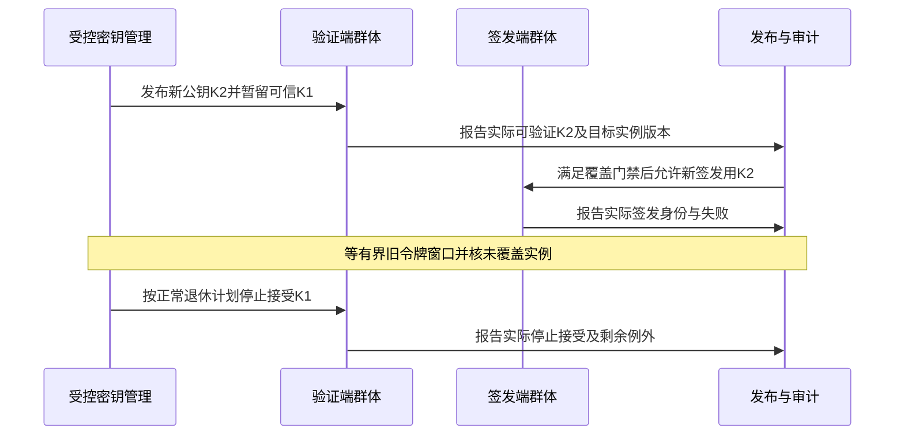
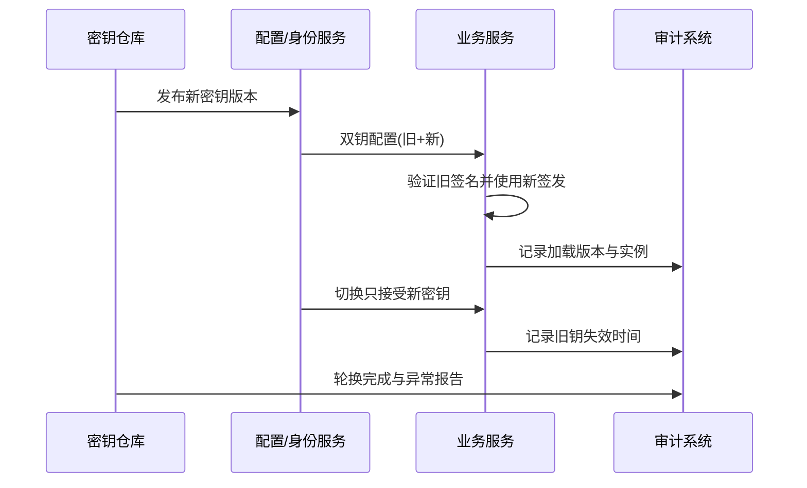

# 05 服务发现配置中心与治理

> 知识成熟度：L2。本次是指定官方资料/固定版本源码的静态核对，加上手工 PAPER_EXPECTED 推导；没有运行注册中心、配置中心、密钥/证书、连接池、数据库、缓存或故障实验。本文仍是原拆分条目，不新增第二个 Canonical。
> 本篇回答“治理信息怎样被可靠地采用”：发现地址如何成为候选，配置何时真正生效，轮换失败如何止损，超时后谁继续负责资源。平台选型与业务权威由各自主责文档承担。

## 元数据

- 知识基线：Kubernetes v1.34 文档分支固定到 website 47132eb5367cfdcba0a3b33a0b3ffc81185bd7e8；etcd v3.5 文档指定节的 2026-10-08 读取快照；Envoy v1.35.0 xDS 协议；Go go1.23.0 指定源码；PostgreSQL 17 libpq 文档；RFC 2308 §3/§5、RFC 9520 §2/§3.2、5280/9525/8446 指定章节。这些是解释边界的资料基准，不是推荐安装的版本组合。
- 适用范围：在线服务的发现消费、配置发布与实例应用、凭据生命周期、数据库池使用、派生缓存治理和演练设计；不推断当前项目部署了任何所列产品。
- 最后更新：2026-10-08。修订当前教学正文，保全原 23,102 字节及可定位历史差异；历史原话与现行建议明确分开。
- 来源补读记录：RFC 9520 的早期 v1 返回只有页面标题/URL/总行数，缺少条款正文，不能算已选读。2026-10-08 07:08:13 UTC 的独审补证取得 §2、§3.2 正文；本次 v2 于同日 07:16 UTC 复读该已冻结返回，补证来源与读取阶段分开记录，原缺流返回保留。
- 证据范围：只核下面来源表的指定章节/符号；产品配置、SDK 适配、源代码执行、实际时钟/网络/数据库行为均未验证。文中的 YAML 与伪码是项目合同示意，没有经过产品 schema 解析或编译。
- 拆分身份：2026-08-06 合辑的第六节，2026-08-13 拆分并扩写；稳定 ID 为 kb-c43cf71e6120。此前贡献完整保留，本次不是首次撰写。

## SG0. 六个组件围绕同一件事：谁在什么边界接受了什么

假设游戏实例准备接受一次匹配或一次购买。调用方能解析到地址，只表明它找到了一个候选；一次探针成功只表明某个时间点、某个检查成功；应用报告加载了新配置，也不自动表明该次购买用了新价格。治理必须把这些证据分开，再决定当前请求能否继续。

| 问题 | 本篇负责的合同 | 继续沿用的主责 |
| --- | --- | --- |
| 到哪里调用 | 发现范围、候选快照、健康观察、缓存失效和恢复 | [网络发现与负载均衡](../../01-编程与计算机基础/网络协议基础/03-IPv6NAT服务发现与负载均衡.md)、[分布式与高可用](../持久化与分布式一致性/03-分布式与高可用.md) |
| 用哪份规则 | 配置校验、完整快照、实际安装点、旧读者及推广条件 | [部署运维与监控](../../08-工程实践与质量/部署运维与可观测性/05-部署运维与监控.md) |
| 谁可以调用/写入 | 密钥证书生命周期和撤销传播的治理证据 | [安全与反作弊](../会话身份与在线服务/04-安全与反作弊.md)；当前身份、对象动作权限和存储代次仍在实际接受处检查 |
| 超时以后怎样收口 | 连接获取等待、数据库真实工作和资源所有者分开 | [网络通信与协议设计](02-网络通信与协议设计.md)、[数据库选型与存储设计](../持久化与分布式一致性/01-数据库选型与存储设计.md) |
| 缓存怎么保持派生身份 | 回填接受点、失效水位、代次及有限降级 | [缓存与排行榜系统](../持久化与分布式一致性/02-缓存与排行榜系统.md)、[缓存与消息队列](../持久化与分布式一致性/03-缓存与消息队列.md) |
| 怎样证明改动可用 | 纸面正确例/反例、可观察证据和未来演练停止线 | [事务与最终一致性](../持久化与分布式一致性/04-分布式事务与最终一致性.md)负责原业务结果与 Outbox；部署篇负责发布排空和观测 |

配置版本、注册修订、实例启动身份、房间 owner epoch、连接 generation、缓存 generation 和业务 request_id 各有范围。名字都叫 version 并不允许相互比较，地址也不能当业务写权。没有已核实现时保留这些区别，不发明一个字段统治所有组件。

## SG1. 服务发现：从注册信息到可接纳请求

### SG1.1 注册、健康、流量与权威分层

注册中心通常保存服务名与实例属性；记录可以来自主动注册、编排系统控制器或其他受控来源。调用方直接查询并选实例是客户端发现；调用方只连接代理，由代理消费发现信息并选实例是服务端发现。前者把依赖和缓存逻辑放入各 SDK，后者集中策略却增加代理的容量、故障和连接生命周期责任。两种路线都可以正确，选择依据是语言/客户端数量、代理开销、长连接和运维能力，不是“有中心就可靠”。


注册成功不证明进程永远可达，心跳成功不证明数据库读写可用，摘除地址不证明旧连接已断，更不证明旧 owner 不能提交。服务端对新动作仍核当前状态和权限；权威存储对旧代次拒绝新效果。原请求已提交时，获当前查询权限的恢复方仍可查询原结果，不必把旧地址重新加回候选。[分布式主责 §3.4](../持久化与分布式一致性/03-分布式与高可用.md)

注册信息按产品合同记录 service、环境/租户/区服、不可混淆的实例启动身份、地址/端口/协议、能力/版本、区域和权重；租约与健康由各自接口表达。不是每个注册产品都有统一“过期时间字段”，也不能把客户端本地 now+30s 当服务端租约的精确到期时刻。etcd v3.5 lease 到期删除绑定 key，实际授予 TTL 至少为请求的最小值；这与“每10秒心跳三次未收到即30秒失效”的自定义探针模型不同。[S2]

Kubernetes v1.34 的 liveness 失败按 kubelet 与 restartPolicy 处理容器，readiness 影响服务端点选择；两者不能互当。EndpointSlice 的 serving、terminating、ready 有不同含义，publishNotReadyAddresses 会影响 ready，代理也可能在全部可用端点都 terminating 时选择 serving+terminating 的端点。应用准入不能因此省掉。[S1] 不把所有依赖失败都塞进 liveness：共享数据库故障若触发整群重启，可能只增加恢复负载。readiness 应表达此实例此类服务的真实接纳能力；允许有限降级读的服务未必必须整体不就绪，必须先区分接口合同。

### SG1.2 空结果是什么，先读响应合同

一个零长度数组至少可能有四种来源：权威完整快照确实为空、查询失败被包装成空、只覆盖部分范围的响应，或增量协议本次没有新增。动作必须先依据来源、查询范围、完成状态与协议语义，不能用数组长度独自决定。

| 观察 | 可建立的事实 | 本文选定的动作 |
| --- | --- | --- |
| 同一范围、可信来源、完整成功快照明确为空 | 该快照边界上没有符合条件的候选；可能是计划撤服/隔离 | 安装空候选，停止该范围新路由并报告原因；不能用旧候选推翻明确撤除 |
| 查询超时、连接失败、权限拒绝、解析失败 | 当前状态未知；没有新的权威空快照 | 不安装伪空、不刷新旧快照年龄；按接口许可决定短时陈旧使用或拒绝 |
| 成功快照非空，但仍旧/来源范围错误/分页未完成 | 不满足当前消费合同 | 拒绝安装、重取完整正确范围；不合并成看似完整快照 |
| 明确删除/吊销/禁止该实例或该主体 | 已有负向事实 | 禁止相应新尝试，不因缓存剩余 TTL 放行 |
| 增量通知为空或缺少某项 | 可能只是无变化，不一定删除 | 按产品增量/删除协议处理，不套用完整集合替换 |

Envoy v1.35.0 是具体反例：SotW 的 Listener/Cluster 完整响应省去既有资源具有删除含义，空响应会删除这些类型的全部资源；其他类型的空 DiscoveryResponse 可能是 no-op；Delta 通过 removed_resources 表达删除。故“权威空则清空”的前提是该产品该类型、同一 ConfigSource/订阅范围确实承诺完整集合语义，不能跨类型全局清空，也不能把它推广成所有 xDS 消息的规则。[S3]

“短期安全缓存”不是一个已证事实。项目必须明说允许什么：例如低风险、可重试、后端仍做当前准入检查的请求，在无已知撤销且缓存年龄未超预算时可以尝试旧候选；交易权限、泄露凭据、明确已撤服对象不能从这个可用性政策获得新许可。安全与否不由“只有几秒”决定。若根本没有可用快照，新实例默认待就绪/拒绝该依赖，不能凭猜测创建后端列表。

### SG1.3 四种时钟与版本不能混用

- 注册 lease TTL 约束注册记录生命周期；本地缓存 TTL 约束消费者何时刷新/停止采用旧观察；负缓存 TTL 约束“不存在”结论；连接寿命约束已建立资源。改一个不会自动修改其他三个
- 缓存记录范围、来源身份、内容修订/游标、实际取得时间及最大使用条件；读取旧值不重置年龄。单调时钟用于本地预算，进程重启后不能复用旧进程的单调时间戳，需重新取得有效证据
- DNS 的 NXDOMAIN 与 NODATA 有不同查询键；RFC 2308 §3、§5 的负缓存期限来自响应 SOA 规则。RFC 9520 §2 明确 NXDOMAIN/NOERROR-NODATA 是有用的否定回答，不属于解析失败；§3.2 要求解析器缓存解析失败，匹配已缓存失败的查询在该项到期前不得再发对应上游查询，并规定至少1秒、不超过5分钟及限制缓存内存/处理开销的要求。不能宣称“任何错误都不可缓存”，也不能把失败缓存变成“服务已不存在”的事实。注册中心自己的负缓存策略必须另定，[S4] 不是给所有产品统一秒数
- etcd revision 有自己的有序语义；Kubernetes resourceVersion 是不透明值，客户端按 API 合同回传，不能转整数给跨集群对象排序。业务配置的 publish_generation 可以由项目定义为单调序号，但必须具备真实产生/恢复合同。[S1、S2]

PAPER_EXPECTED P01：题设同范围完整快照 r40={A,B}，t=0 取得；项目规定普通可重试查询的陈旧许可截止 t=5。t=2 查询 timeout，只可在仍满足安全条件时短暂用 r40，取得时间仍是0；t=5 必须停止，不因重试再续5秒。独立分支 t=3 收到真实 r41={}，t=3 即停止新候选路由；t=4 迟到 r40 不能使 A 复活。反例是“只要为空就保旧”，它会让计划隔离失效。5秒只是本题参数，不是生产建议或任何实际产品保证。

### SG1.4 watch 断线后恢复的是连续状态

一个可说明的 etcd 路线是：对固定 key 范围取满足一致性要求的完整快照及 revision r，安装该快照，再从 r+1 订阅；记录的是已完整应用的修订边界，不是刚收到的最大数字。分页读取须固定一致快照并确保页齐全；同一修订中若有多个事件，未处理完不能只保存该修订然后从下一修订开始。重新订阅只恢复尚在保留窗口中的历史；被 compact 掉就重新取得完整快照，不把缺口猜成“期间没有变化”。watch 自身不是线性化读，事件延迟没有有限普遍上界；连接还在、收到 progress 也不单独证明已达全局最新。[S2]

Kubernetes 采用 list 返回的 resourceVersion 开始 watch，断开可按最后处理游标续接；410 Gone 表示所需历史不可用了，应按 API 合同清掉该本地镜像并重新 list/watch。旧缓存若另有明确许可保留作有限降级，那是隔离的陈旧视图，不再充当连续镜像，也不得混入新 list。新一次同步拥有新的本地订阅代次，旧流迟到事件不能写进新镜像；实际镜像安装与事件应用要在同一串行边界核对该代次。[S1]

PAPER_EXPECTED P02：快照 r100={A}，r101 删除 A，r102 添加 B，断线发生在已完整应用100以后。若101仍保留，从101重放可得到{B}；若101已经 compact，直接从102“接着看”会留下 A，必须重做快照。恢复结果在其完整边界上可用，并不意味着此后永不陈旧。P03：Kubernetes 返回410，旧镜像不再作权威；新 list 建立后，旧 watch 回调携订阅 g7 而当前 g8，丢弃其状态安装并完成原回调归属，不能只更新游标继续混接。

### SG1.5 下线不是注销完就能销毁

正常下线选择一个明确应用接纳截点，停止新业务接纳并发布不再接新流量的状态，推动代理/发现收敛，继续处理已接受请求和合法原结果查询。已有长连接、滞后代理与迟到请求仍可能到达，因此应用入口的关闭检查不能只依赖注销。有限 grace 覆盖哪些保存、回调和连接移交必须说明；超过预算只能报告未完全排空或按已经具备持久恢复责任的合同终止，不能承诺“无损”。

Kubernetes 的终止传播存在并行阶段，preStop 消耗终止宽限期；本文不规定一条所有平台通用的“注销→等60秒→强退”串行流程。原示例的 drain_seconds=60、force_exit_after_seconds=90 不能直接当 Kubernetes 两个独立预算。详细接受点、老提交/回调退场和持久恢复沿用[部署篇 §6](../../08-工程实践与质量/部署运维与可观测性/05-部署运维与监控.md)。

## SG2. 配置：从发布意图到某个请求真正采用

### SG2.1 先按生效方式分层，再选择通道

| 配置类别 | 合适的选择 | 必须说明的限制 |
| --- | --- | --- |
| 构建参数/协议能力 | 随不可变制品发布；兼容矩阵先核 | 不能用热更制造二进制尚不支持的能力 |
| 环境与依赖地址 | 按环境/租户/区服分离的部署输入；需要时滚动替换 | 旧连接何时重建、在途事务归谁，不由文件更新自动解决 |
| 动态标量开关/阈值 | 经过校验的完整不可变业务快照，在已定义接纳点安装 | 一个请求采用一个确定版本；快照数量、大小和退休读者都有上限 |
| 秘密材料 | 专用秘密交付通道和用途最小权限 | 不能把可读密钥仓库等同可使用全部业务资源；不要将秘密值写入发布日志 |
| 实验参数/活动规则 | 固定人群及版本、审批、观测窗和终止条件 | 统计 cohort 不因请求完成时热更重新归类；经济效果依权威业务规则 |

静态文件适合少量稳定配置，变更随部署可追溯；配置中心适合跨实例动态分发，代价是订阅、版本漂移和实际应用确认。两者均须定义唯一的优先级/合成规则，不能手工本地覆盖却仍报告中心版本“全部生效”。缺少关键依赖、无限超时、非法范围或不可信来源应拒绝候选/阻止相关就绪；默认值是明确设计过的安全选择，不能用空密码或0代表“先跑起来”。

校验分为语法、schema/兼容版本、字段取值、跨字段不变量、目标范围、权限及依赖约束。未知字段按格式与演进合同处理：严格控制面可拒绝拼写错误和不支持语义；已有允许扩展的协议可有意识地忽略指定扩展，但必须证明不影响正确行为。原文“任何未知字段必须拒绝”并非所有格式通用规则；不识别且影响安全/业务效果的字段不得静默降级。[协议篇 §SP6](02-网络通信与协议设计.md)

### SG2.2 记录 desired、loaded、validated、effective 与 ACK

| 状态 | 本文的可观察含义 | 不能据此推断 |
| --- | --- | --- |
| desired | 控制面期望本实例/人群采用哪个发布身份 | 实例已收到或已执行 |
| loaded | 实例完整取得该候选字节/身份 | 校验通过、外部依赖可用 |
| validated | 候选通过声明的静态与依赖前提校验 | 已装入活动路径，或所有业务都适用 |
| effective | 在本应用定义的真实安装/接纳点成为新请求快照；报告目标/实例启动身份和该点的版本 | 旧在途请求全已结束，外部效果已撤回 |
| ACK/NACK | xDS 中以当前流的 response_nonce 关联某次 DiscoveryResponse；Delta 关联某次 DeltaDiscoveryResponse | 逐资源独立 ACK，或通用的“全量生效/完全未生效” |

Envoy v1.35.0 的 xDS ACK/NACK 关联对象是某次 DiscoveryResponse，response_nonce 标明它确认或拒绝的是当前流中的哪次响应。ACK 表示该响应中的各资源分别被判有效且客户端有应用意图，不保证已经成功应用；NACK 表示其中至少一项无效，也不保证零资源被接受。Delta 以同样的 nonce 对应关系将 DeltaDiscoveryRequest 的 ACK/NACK 关联到某次 DeltaDiscoveryResponse，确认单位仍是响应，不是给每个资源独立确认。记录实例启动身份、流、ConfigSource/订阅范围、type、nonce及相应协议变体的版本，不能拿它代替 loaded、effective 或业务结果回执。[S3]

Kubernetes v1.34 ConfigMap 普通投射卷更新是最终传播，环境变量不会自动更新，subPath 挂载不接收更新；immutable ConfigMap 约束 API 对象数据修改，也不等于应用已原子切换内存快照。即使文件变了，进程仍可能使用旧解析对象。[S1] 因此对账至少比对环境、目标实例启动身份、desired、loaded、effective、失败原因和最老未收敛时间，不能只统计“订阅在线”。

### SG2.3 一个有界、正常可完成的热更例

以下路线专用于可在本进程内安装的少量纯值配置，例如排队上限与展示开关，不包括改数据库 schema、远端凭据或打开外部资源的原子事务。项目设当前版本 C7，每份候选序列化输入最多64KiB，至多一个准备候选、一个活动快照和一个尚有读者的退休快照。三个对象上限与64KiB均为题设，不是实测容量；解析后对象、缓冲及回调状态另有内存上限，不能用输入字节数冒充总内存预算。候选构造在有界工作槽中；不借助实际不可用的“全局锁”跨网络保证原子。

```text
PAPER_EXPECTED；教学伪码，未执行
输入候选 = 完整bytes、可信发布身份、目标范围、期望安装代次、有限截止时刻
prepare：
  在有界候选槽里取得完整对象，核大小/格式/版本/目标及跨字段不变量
  构造只读候选；失败则记录该候选错误，不改活动指针
install：在配置管理器同一锁或串行执行器内
  重取单调时间；核管理器OPEN、未取消、未过期、目标/期望代次仍匹配
  核候选仍为本策略允许的desired；核没有未退休的更老快照占用额度
  若任一不符：拒绝候选；不增加新活动版本，不刷新旧有效期限
  否则把活动指针从C7一次切到C8；C7成为退休快照；记录真实effective=C8
request：在同一安装边界获得当前快照的强引用，整次规则计算使用它
retire：仅在C7全部读者和关联访问确已结束后释放C7
```

关闭、取消、目标换代与安装使用同一同步合同；锁外“检查过”的 C8 候选在迟到时不能仍安装。一次请求取引用和安装切换可串行判定：在切换之前取得 C7 的请求持有 C7，之后取得的持有 C8，不会逐字段拼出未知组合。若退休 C7 仍有读者，下一版 C9 暂停安装，避免靠不断热更累积旧快照。被拒候选若有尚未退出的解析任务/回调，仍归其稳定 owner 并占原工作槽；取消等待不是任务退出证明。此处不构造新的通用异步框架，生命周期采用[协议篇 §SP7.2](02-网络通信与协议设计.md)的相同原则。

PAPER_EXPECTED P04：C8 的 max_queue=-1，范围校验失败，effective 仍为 C7，loaded 可显示 C8+拒绝理由。P05：候选 C8 在截止 t=10 前校验通过，实际安装时 t=10.1，拒绝安装；另一正例在 t=9.5 且 OPEN/代次/容量均有效，安装成功。P06：请求 Q1 已取得 C7，t=2 安装 C8，Q2 取得 C8；Q1 读到的所有受此快照管理的字段仍是 C7。C9 到达时 C7 尚未退休，停止下一次安装，不销毁 Q1 的对象来凑容量。

### SG2.4 旧快照的可用性与当前权限不同

“整次用同一快照”解决内部规则一致性，不能给过期权限续命。展示布局可能允许旧请求用旧快照结束；封禁、凭据泄露、禁止某价格版本新成交等策略，需要在实际新效果接受点核当前许可。若 C8 的内容是立即停止 C7 价格成交，则已经持有 C7、尚未被业务接受的购买必须重新验证/拒绝，不能用强引用绕过停止令。若 C7 购买已成功提交，则恢复其原结果，不将它按 C8 重新定价；原幂等身份与完整业务内容不能更换。[安全篇](../会话身份与在线服务/04-安全与反作弊.md)、[事务主责](../持久化与分布式一致性/04-分布式事务与最终一致性.md)

配置回退只改变之后的接纳政策，并不撤销已发出的消息、已写入的数据、已发奖或已建立连接。若业务不兼容旧版本，保留旧值也未必安全：启动时阻止相关就绪；运行时停止相关新动作并显式降级，等前向修复或正式迁移。正常低风险变更可保留最后有效快照，但要给年龄/到期和适用接口，不能把“最后有效”解释成永不过期的许可。

PAPER_EXPECTED P07：C7 价格100的订单 R 已提交，发布 C8 价格120再回退 C7，都不能撤销 R 或重新扣100；先查原 R。另一个尚未提交的新订单如果使用被停止的 C7 规则，必须在业务接纳点拒绝。配置对账显示 C8 effective 只说明实例安装点，不证明这两个业务状态。

## SG3. 密钥与证书：正常轮换和泄露响应是两条路径

### SG3.1 先分用途，不把所有 Secret 当成同一种钥匙

对称认证密钥、非对称签名私钥、数据库密码、数据加密密钥与 TLS 证书不是可互换的资源。非对称签名的验证端通常只需要公钥；对称 MAC 验证端掌握的材料可能也能伪造签名，不能沿用“验证者无签发能力”的假设。数据库服务是否允许同账户双密码或双账户迁移取决于具体产品，不保证有“旧+新同时接受”开关。

证书一般是可公开的身份/公钥及签发者声明，关联私钥需要保密；证书自带 notBefore/notAfter，其他秘密材料的使用期通常由服务政策而非字节本身决定。秘密不进 Git、镜像层、日志、异常堆栈和客户端包；可观测数据记录非秘密 key_id/证书指纹/版本/用途/实例，不打印值。交付身份、读取秘密的权限、用该身份执行具体业务的权限分别约束。

### SG3.2 例行签名钥轮换的正向时序

下面只描述“旧私钥未泄露、算法和协议兼容、验证端支持按受控 key_id 查公钥、有界 token 最大寿命”的非对称签名题设；key_id 是受限选择信息，不能让令牌指定任意下载地址、算法或信任根。它不是数据库密码或加密数据密钥轮换的完整实现。



先让必要验证端具备 K2，再切签发，避免新令牌在旧验证端全部失败。窗口长度至少需要明确旧 token 最大有效期、允许时钟偏差、分发/应用延迟、离线群体和适用业务；无法界定这些前提时不能声称“等两分钟即可”。开始双钥、完成签发切换、旧钥停止签发、旧钥停止验证、旧材料销毁是不同事件。加密密钥还可能为了合法解密历史数据保留受限访问，不能按签名 token 窗口直接销毁。

PAPER_EXPECTED P08：两台验证端 V1/V2，只有 V1 报告 K2 effective；停止签发切换，继续在仍可信且政策有效的 K1 路线上处理获准请求。V2 完成后，才切 K2；这是一条可正常完成的选择。反例是看到配置中心“已发布”就切签发。切换失败也只有在 K1 仍可信、未到期/撤销、业务与协议兼容、已批准该回退时才能回旧签发；否则停止相关签发并前向修复。[S8]

### SG3.3 泄露时不能默认退回旧钥

若 K1 私钥疑似泄露，正常双钥窗口不再是默认可用性工具。按事故授权停止继续签发/使用受影响身份、撤销或禁止受影响材料、发布替代材料，推动验证端和会话/缓存失效，界定暴露范围并保留最小必要审计。已知不可信 K1 不能因为 K2 分发失败再次启用；无法安全验真时受影响新动作保持拒绝，修复可用性不能撤掉拒绝门。

取消证书、移除验证 key、禁用账户和终止现有会话是不同动作。一个撤销列表变更不会让离线缓存瞬间收敛；已建立 TLS 连接、会话恢复票据以及应用登录会话也不会仅因换证书就自动全部消失。需要按真实 TLS/身份产品声明作用范围与传播证据；未知仍应明确。已接受业务结果的恢复保留原身份，当前查询授权另行核对，不能把“禁用旧凭据”误成销毁全部未决交易事实。

PAPER_EXPECTED P09：K1 已报泄露，V2 暂时取不到 K2。正确结果是 V2 对相应新请求拒绝/隔离并报修复进度；“先回旧钥确认恢复”会重新接受攻击者可伪造的材料，属于错误分支。正常轮换的回退批准不能覆盖泄露后的风险变化。

### SG3.4 证书验证要说具体库做到了哪一层

| 层次 | 要确认的对象 | 典型遗漏 |
| --- | --- | --- |
| 路径与信任 | 证书签名、信任锚、路径约束、用途、有效期，以及适用的吊销状态 | “能解析证书”就当作可信；导入任意根扩大信任 |
| 服务身份 | 应连接的参考身份与证书中适用标识匹配 | TLS握手成功却未核目标主机/服务身份 |
| 部署与时间 | 实际库/平台、验证选项、时钟、真实证书链覆盖、CRL/OCSP/带外拒绝策略 | 配置写了检查但实际没启用；未知状态被静默当好证书 |
| 连接与业务 | 新握手、已有连接、会话恢复及应用权限各自行为 | 更换文件等同旧连接失效；证书可信等同玩家被授权 |

RFC 5280 §6.1.3(a)(3) 包含未吊销条件，不能把“路径验证”概括成规范不管吊销。RFC 9525 的服务身份匹配不替代完整证书验证；RFC 8446 §4.4.2.4 将证书验证关联 RFC 5280。具体库又有覆盖边界：Go1.23.0 的 Certificate.Verify 文档明确不做吊销检查，VerifyOptions.DNSName 影响名称检查，VerifyHostname 也不是完整路径验证。规范要求、函数覆盖、部署真正启用三者必须分列。[S9]

监控剩余有效期与时钟偏差可提前发现风险，但一张证书尚未过期不证明身份/链/撤销全部正确；某区域一次成功也不覆盖所有根存储、客户端版本和恢复会话。PAPER_EXPECTED P10：证书链和域名匹配，但 K1 已被事故策略拒绝；不能凭 Verify 返回成功继续放行。另一正例是指定参考身份、受控信任锚、时间/用途/撤销策略均满足且当前业务授权通过，此时才允许该类新请求。该正例是完整条件推导，没有真实握手证据。

## SG4. 数据库连接池：有界等待和真实工作分别管理

### SG4.1 容量先算总连接，再验证等待和查询行为

池把连接建立成本摊到多次请求，但数据库承受的是所有进程和运维/复制/迁移等连接的合计。读写池分开不减少总量，弹性扩容、滚动期间新旧进程并存、凭据轮换重建和故障迁移都会改变峰值。一个可复查的纸面预算是：允许的应用连接总额 C，最大同时存在实例数 N，每实例各池上限之和 P，至少要求 N×P≤C，并另留已明确的非应用余量。满足这个不等式仍不证明数据库吞吐或延迟达标。

PAPER_EXPECTED P11：总许可120，保留管理/其他消费者20，应用额100；最大同时4个实例，每实例读15+写10，则4×25=100，恰好预算。若滚动时同时5个实例，5×25=125>100，应减少并发发布/每实例上限或重新核容量，不是给 acquire_timeout 改大就解决。长事务、慢查询、锁等待和负载偏斜仍需实际测量，本文没有压测。

获取等待超时、查询 deadline、事务期限、连接最大寿命、空闲期限、服务关停宽限期各有对象。池的最大寿命通常不等于“时间到就能强抢正在用的连接”；特定库如何回收需查真实合同。监控至少分开 in_use、idle、waiters、acquire_latency、query_latency、事务年龄/锁等待、timeout_count、取消请求数与尚未退场工作数；指标名称是建议口径，不表示已部署面板。

### SG4.2 一条请求的资源归属

| 阶段 | 超时/取消可能意味着什么 | 仍必须做的事 |
| --- | --- | --- |
| 尚在等待池连接 | 调用者停止等候；可能与分配同时发生 | 适配层核取消竞态，迟到取得的连接仍归原尝试，不能泄漏或装到新请求 |
| 已发送查询/事务 | 调用者返回超时；数据库可能仍执行、提交或等待锁 | 发出产品支持的取消请求，继续按原 owner 接收结果/清理；结果未知保持 UNKNOWN |
| 数据库返回错误/事务失败 | 连接可能仍连着，但事务状态不适合下一请求 | 按驱动协议耗尽响应/关闭 Rows，完成必要 rollback/reset并确认状态 |
| 可安全归还池 | 原操作及会访问它的回调已结束，协议与会话状态满足复用合同 | 只在真实库允许时归还；不靠布尔 quiet 字段伪造退出 |
| 状态不明、连接损坏或无法清理 | 不能证明复用安全 | 隔离/按库合同废弃，由稳定 owner 完成关闭；未决业务另走原身份恢复 |

Go1.23.0 database/sql 的 DB.Conn(ctx) 涉及获取连接等待；BeginTx(ctx) 的上下文参与事务生命周期。不同驱动的取消能力不同，不支持 context cancellation 的驱动可能直到查询完成才返回。Tx.awaitDone 的回收路径依赖 driver.SessionResetter 与 driver.Validator 等合同，而不是普遍的“超时后一律归池/一律销毁”。Conn.Close 把连接交回池的含义也不等同 TCP 连接被关闭；具体源码与驱动要一起核。[S6]

PostgreSQL17 libpq 的取消请求成功派发不保证查询被取消，也可能原查询已经结束；必须继续从原连接获取最终结果。取消后的普通异步 libpq 流程仍须按 PQgetResult 取得结果直到 NULL，即便途中出现 fatal error；本文不将它未经核对外推到 pipeline 模式。连接状态良好与 PQtransactionStatus 处于 IDLE/ACTIVE/INTRANS/INERROR/UNKNOWN 不同，INERROR 不能不处理就当作干净会话。回滚只处理仍存在的事务，不能撤销已经成功提交的业务；连接断开或 COMMIT 回复丢失时的业务终态另行恢复。[S7]

池连接取得后，在实际提交许可点重取单调时间并核本请求未取消、deadline尚未到、宿主/业务代次与准入仍允许；不能只在开始排队时检查。借出连接与可能同步/迟到的回调在调用驱动前就登记到稳定原owner，保留一个真实在途名额；取消、关停与提交许可采用真实适配层的共同同步合同。调用者等候结束不释放这个名额，驱动支持context也不证明远端在截止时刻必然停止。没有这种可核对的驱动/应用合同，就停止自动追加尝试，不用抽象函数伪造保证。

### SG4.3 正反例：不能先释放再等迟到回调

PAPER_EXPECTED P12：池只有一个实际在用连接 X，Q1 在 t=0 获得 X 并提交数据库操作；t=1 前台 deadline 到期，发送 cancel；t=2 驱动仍会回调读取 X 的结果。此时把 X 交给 Q2 会让两个使用者互相污染。正确路线是原 Q1 owner 继续占这个真实工作/连接责任，停止相应新接纳或有界排队；t=3 收到终态、驱动协议/Rows/事务清理完成、相关访问真正结束后，按库合同归还或废弃。若无法证明退场，保持隔离/DRAINING，不因用户界面已报超时就回收内存、callback context 或连接池。

独立正例 P13：Q1 尚未获得连接就超时，真实库确认该等待已撤销且没有交付连接/后续使用者，可以释放这个等待名额；若与分配竞态，取得连接的原 owner 必须完成合法归还。再一个正例是查询已结束、事务状态和协议清理均满足驱动合同，此时复用比每次销毁更合适。治理目标是匹配合同，不是一概关闭所有连接。

业务 SUCCESS/REJECTED/UNKNOWN、底层真实工作退场与可持久恢复责任是三件事。第一次可能产生远端经济效果前，须已有经确认的有界持久原 request_id、完整内容/稳定主体/版本、查询材料和恢复责任；缺少或保存结果 UNKNOWN 就停止效果。超时后查原身份，不能生成新 request_id 当“连接池重试”；复用/销毁连接不会替代业务恢复。[协议篇 §SP8](02-网络通信与协议设计.md)、[事务主责](../持久化与分布式一致性/04-分布式事务与最终一致性.md)

数据库切换时路由、池中新建连接、已有连接、事务/读视图分别处理。不要把写事务中途送去另一连接，也不要看到副本有一行就说它新鲜；依[数据库篇 §A6](../持久化与分布式一致性/01-数据库选型与存储设计.md)的业务读合同选择权威源与合适的新读视图。

## SG5. 缓存治理：旧回填在真正写入处被拒绝

缓存先声明角色：可丢弃的派生读取、临时协调或业务权威。本文选择派生缓存，货币、订单、背包仍由业务数据库约束。Cache-Aside 的简单路线适合允许陈旧的读：缓存命中→按合同检查身份/版本/期限→必要时权威读→尝试回填；写先完成权威事务，再留下可恢复的失效任务。缓存失败不能让交易略过余额/权限校验。

单飞减少同 key 并发回源，TTL 抖动打散集中到期，有界负缓存减少不存在对象的重复查询，Bloom Filter 的集合与更新合同可减少穿透；这些都不是强一致性机制。空值负缓存必须与超时/权限错误分开；不同租户/区服/资源类型/schema 的 key 不得碰撞。单飞锁在旧加载者迟到时也会失效，不能代替回填接受点的版本核对。

PAPER_EXPECTED P14：R 在 v10 读取旧快照，W 提交 v11，失效消费者删缓存，R 随后无条件 SET v10。甚至两次删除都先于 R，也仍是旧缓存。原伪码中的 required_version 没定义来源、cache.set 无原子拒旧条件，不能作为完整实现。采用普通 TTL 的简单缓存时要诚实承认陈旧窗口，并按业务要求回源/拒绝；需要抑制已知旧版本则沿用[缓存篇 §3.4](../持久化与分布式一致性/02-缓存与排行榜系统.md)的有限门禁。

```text
PAPER_EXPECTED；省略产品命令，不是已实现的Redis脚本
每个受控目标保存 generation=g、已知最低源修订watermark=w、缓存value/revision
失效(v11)：同一目标原子接受点核g；w=max(w,11)；删除低于w的值
加载R：开始绑定g，从满足业务合同的源读出(value,revision=v)
回填接受点：原子核g仍相同、门禁存在且可用、v>=w且不低于已存版本
  成功才更新value/revision/有限期限；失败则丢弃该回填，不推翻w
读取：核目标身份、门禁/期限及调用方合法required_version；不满足则回源或拒绝
```

这是有条件的项目策略：所有写者遵守同一原子域；同 slot/类型/版本数值域正确；恢复时不能把缺失门禁当版本0；Redis 故障转移、淘汰或旧快照可能丢拒旧水位，需停止旧代次服务并重新建立代次/水位。失效事件重复取 max 是幂等，源版本冲突仍须报错；每个 L1/共享缓存目标独立确认，不能一个成功就把全部失效任务完成。

P15：目标 g3 的失效水位已是11，R=(g3,v10) 回填在原子点被拒；若恢复后新代次 g4，旧 R 即使 v12 也不能直接写入 g4。P16：W 已提交 v11，而失效尚未到达缓存，水位仍10，此时 gate 不能神奇知道 v11；若接口要求最新余额，直接执行满足权威读合同的查询，不能声称上述门禁提供跨库线性一致性。required_version 必须来自可信提交/会话合同，客户端自报不能授予业务许可。

Outbox 的业务提交与待失效事件需在同一真实事务中确认，发布、消费者接受、各缓存目标更新又是不同阶段；失败/回复丢失保持原任务身份与未决状态。本文不复写新消息框架，实际机制见[事务主责](../持久化与分布式一致性/04-分布式事务与最终一致性.md)。Q7 的答案仍然是：命中率只说明读取经过缓存，既不证明金额正确，也不证明缓存与权威已经对齐。

## SG6. 故障演练设计与三类事故形态

本节保留原故障注入教学用途，但全部为 PAPER_EXPECTED 设计，没有执行过注入，也不是生产运行手册。真实演练另需项目授权、隔离范围、负责人、持续时间、量化停止条件、观测点和经验证的恢复方案；预先确保原业务身份、数据不变量和未决责任不会被演练清理掉。选范围时优先从隔离环境开始，是否允许扩大到灰度/生产是新的风险决定。

故障注入是在受控范围内施加延迟、错误、断连/丢包、磁盘压力、时钟偏差或实例终止，以核对预先约定的失败行为。以下仍只是未来演练的纸面合同，不提供执行命令：计划须限定演练环境、账号与数据，演练账号与生产玩家隔离，不读取或暴露真实用户敏感数据；没有能核对的隔离边界和停止负责人就不开始。

撤注后的收口也必须预先列出：按批准方案确认临时故障已停止、临时配置及其他残留已撤回或处置；核对队列积压与最老未决项，连接/真实在途工作及回调仍有明确owner；检查告警是否按既定恢复判据恢复，复核数据不变量、原业务身份和持久恢复责任。队列归零不等于业务全成功，告警消失也不证明原因消除。任一项未恢复、缺少证据或残留不明，都报告 INCOMPLETE 并保留未决责任，不清除待办或重置计数来冒充恢复。

| 纸面场景 | 应观察/预期的行为 | 停止与恢复条件 |
| --- | --- | --- |
| 身份服务延迟 | 有界等待/明确拒绝，已有会话按真实有效性政策处理 | 队列/真实在途超预算即停新接纳；不绕过认证来减错误率 |
| 数据库只读或取消迟到 | 新写受控失败或UNKNOWN；池等待与真实工作分别记录 | 发现数据不变量异常、池责任丢失立即停止；按原R恢复，不造新R |
| Redis断连 | 按接口有限回源/标旧/拒绝，数据库仍权威 | 权限/资产绕过或回源失控即停；恢复后先核代次/水位 |
| 消息重复/乱序 | 同业务身份不重复效果；旧失效不能降低水位 | 账本差异或内容冲突即停；按主责去重/对账 |
| 证书临期/身份不符 | 告警、拒绝不符合验证政策的新连接 | 不关闭验证开关；核真实实例/客户端覆盖和恢复证据 |
| 区域摘流/旧连接 | 新准入受控，旧请求仍有owner和原结果恢复 | 双主/无合法fence/丢恢复责任即停；不是把旧地址加回就算恢复 |
| 发现watch中断/压缩 | 不伪造新鲜度；需要时完整重同步 | 历史缺口未闭合不推广候选，重试有总预算 |
| 配置部分加载/实例漂移 | 区分loaded和effective，暂停推广 | 目标范围不清或业务新旧不兼容时停止相关新动作 |

### SG6.1 注册雪崩：先找出“空”从哪里来

原案例的背景、现象和排查信号仍有用：心跳同时失败、候选骤减、重注册集中可能放大故障。新的根因判断要分两支。若查询失败被包装成空，修复结果分类，按有限陈旧合同缓冲并退避；若注册中心确实撤销了记录，继续保旧并不能恢复权威。先确认撤销是正确隔离还是探针政策错误，再按权限修复注册/探针，而不是客户端擅自忽略所有删除。拉长阈值会延迟真实故障发现，需成本评估；错峰与退避减少冲击，但不能保证固定时间恢复。

PAPER_EXPECTED P17：一百个客户端同一时间刷新失败，若立即无限重试，控制面压力上升；每个客户端受有限并发、总时间/次数和最终抖动上限约束，超出转显式不可用。在这个纸面题中只证明重试数量有界，没有测量100客户端容量或收敛耗时。

### SG6.2 配置漂移：同一version标签不代表同一行为

原案例中手工覆盖和静默保旧会让同区服规则分裂。排查先按环境/实例启动身份比对 desired/loaded/effective 与具体内容身份、失败原因，而非只看“版本号一样”。同一个不可变发布身份出现不同内容应拒绝/告警；已允许的版本并存还要区分灰度人群与异常漂移。恢复可保旧、前向修复或经兼容验证回退，不能用自动回滚掩盖已经发生的交易效果。

PAPER_EXPECTED P18：中心 desired=C8，A effective=C8，B loaded=C8 但 validated 失败、effective=C7。把两台都数作“已加载”得到100%会掩盖风险。正确报告为实际生效1/2、失败1/2，并暂停推广；若 C7 已不允许该业务，B 停相关新动作。这里的1/2是给定两个实例的精确题设分母，不是线上指标。

### SG6.3 轮换失败：先确定旧材料是否仍可信

原案例保留“验证端未加载而签发先切换”的失效机制，以及逐实例记录版本、分步发布和覆盖部分失败的用途。诊断必须先把例行轮换与泄露事件分开。例行变化可在旧材料仍获准的条件下暂停/回退；泄露则持续拒绝受影响旧材料、尽快前向修复，接受暂时可用性下降。用“全部恢复正常”描述结果前，分别核新签发、新验证、既有会话、撤销传播和原未决业务；一个成功请求不覆盖全部。

三例共同提示：观测必须指向具体接受点和恢复责任；参数、缓存和版本只是一部分。恢复过程中不能清除“未决”来让队列归零。案例均为同类故障的纸面形态，不是本项目事故复盘。

## SG7. 术语速查与常见反模式

| 术语 | 本篇中的含义 | 必须避免的误解 |
| --- | --- | --- |
| 注册中心 Registry | 提供限定范围的实例记录 | 注册记录等于健康或业务写权 |
| 心跳 Heartbeat | 指定主体在检查点的存活/续约信号 | 越频繁越可靠；任何成功都说明可承接全部业务 |
| Lease/TTL | 各自产品内的租约或缓存时效 | 本地TTL、服务端lease和连接寿命相同 |
| Liveness | 是否需要按容器策略重启的检查依据之一 | 用所有外部依赖故障触发进程重启 |
| Readiness | 实例是否具备指定服务接纳能力的信号 | Ready会关闭所有旧连接或授予写权 |
| Graceful shutdown | 封闭新接纳，处理/移交已接受责任后有界退出 | 注销成功就能强杀且没有后果 |
| Drain window | 为传播和在途收口设定的有限预算 | 等固定秒数就证明无损 |
| Config center | 版本化分发及治理通道 | 发布成功等于进程实际生效 |
| Config drift | 期望与实际应用状态偏离，按目标/版本/内容辨认 | 只有手工改文件才会漂移 |
| Config canary | 对确定小群体安装、观察后再推广 | 百分比实例等于百分比玩家或请求 |
| Secret vault | 有访问控制的秘密材料管理与交付来源 | 读密钥权限等于业务全部权限 |
| Dual-key rotation | 适用协议下的有限正常迁移策略 | 泄露旧钥也必须保持双钥可用 |
| Secret rotation | 按用途改变材料及使用政策 | 所有密码、签名钥、加密钥和证书共用同一回退 |
| Negative cache | 有范围/期限的否定观察；结果类别需区分 | timeout可直接证明对象不存在 |
| 服务名解析 | 从逻辑名得到候选或对应否定/失败 | 解析到地址便已完成认证、授权和提交 |

| 反模式 | 为什么会失败 | 可选择的替代路线 |
| --- | --- | --- |
| 只注册、不定义健康与准入 | 失效实例仍可被尝试 | 设具体检查与应用接受门，保留发布排空职责 |
| 心跳过密、批量立即重试 | 抖动转成误摘和控制面拥塞 | 校准误判成本、退避/抖动及有限预算 |
| 永久保留旧候选或任何空都保旧 | 正确撤服/隔离被反向覆盖 | 按完整/增量/失败/过期分类，负向事实优先 |
| 半份配置直接改活动对象 | 请求读到不存在的组合 | 有界完整快照、实际安装点、退休读者 |
| 收到ACK便宣告全量有效 | 协议确认范围不足 | 记录真实effective与业务观测覆盖 |
| 只改本地文件并沿用中心版本 | 内容漂移不可追溯 | 明确受控覆盖与优先级，按内容身份对账 |
| 未识别字段全部忽略或全部拒绝 | 前者可漏安全语义，后者可破兼容 | 依据格式/能力合同决策，不盲套统一口号 |
| 一次性切钥或泄露后回旧钥 | 正常分发断层或恢复攻击面 | 正常先验证覆盖再签发；泄露拒旧、前向修复 |
| timeout后立刻把连接交给别人 | 真实工作/协议响应尚在 | 原owner清理到安全终态，按驱动合同归还/废弃 |
| 两次DEL就宣称强一致 | 旧回填可能更晚到达 | 容忍陈旧且明示，或目标原子水位/代次门禁 |
| 只有演练计划没有原始证据 | 期望结果被误当已观察 | PAPER_EXPECTED与真实演练记录分列；未执行不勾已通过 |

## SG8. FAQ

### Q1：发现结果为空，到底保旧还是停流量？

先确定范围和响应语义。完整可信的新快照明确为空，应安装空候选并停止该范围新路由；查询失败是未知，只能在项目已经允许的有限陈旧条件下使用旧观察。增量空响应可能不表示删除，见 SG1.2 的 xDS 反例。

### Q2：readiness 已失败，为什么还有请求？

传播、客户端缓存、已有长连接及代理行为可能继续带来请求。readiness 不是应用准入的锁；对新业务的关闭要在真实接受点检查，既有责任按发布合同收口。

### Q3：watch 连上了，能说恢复了吗？

必须确认完整初态和所需历史连续，游标属于同一范围/来源且已实际应用；被压缩/410 的缺口要重同步。TCP连上或一个进度通知都不等于业务镜像已新鲜。

### Q4：热更失败保留旧值，总是正确吗？

候选尚未安装且旧值仍适用时可以；旧权限已撤销、旧价格停止新成交、旧schema不兼容时，要停止相关新动作或按正式方案前向修复。保留对象生命周期不等于继续授予业务许可。

### Q5：密钥轮换失败是否一定回滚？

先判断旧材料是否可信、仍在有效政策中、协议是否支持回退。泄露或已撤销材料不能默认恢复。证书、签名钥、数据库密码和加密数据钥分别核合同。

### Q6：数据库请求超时后，关闭连接就能避免重复扣款吗？

不能。数据库可能已提交，关闭连接不会撤销已提交事务。先保留原业务身份和恢复责任；底层owner按真实驱动合同结束访问后再处理连接，查询原结果确认终态。

### Q7：缓存命中率很高，为什么还要数据库对账？

命中可能是旧值、错误回填或恢复出的旧投影。货币、订单、背包按权威状态和原业务记录对账，不能用命中率替代正确性；SG5 保留并补全了这个原有问题。

### Q8：纸面案例通过，是否可以标演练完成？

不可以。P01–P18 是输入、操作和预期可手工追踪的教学题；缺少真实环境、调用与回调、原始输出、故障范围及回收证据。文档检查只能验证格式、链接与声明，不能证明生产行为。

## SG9. 补充示例、验收清单与验证建议

### SG9.1 注册治理的项目合同示意

以下延续旧 YAML 示例的字段用途，保留逻辑服务、实例、地址协议、版本区域、权重、续约/探针与下线信息。它不是 Kubernetes/etcd/Nacos 可直接加载的配置，所有数值都是 PAPER_EXPECTED 题设；原 10.20.30.40 地址和60/90秒原例完整保存在历史区，不在本次连接或探测。

```yaml
service_contract:
  service_name: matchmaking
  scope: {environment: paper, tenant: demo, zone: cn-sh1}
  instance_id: mm-cn-sh1-001
  startup_identity: paper-inc-4
  endpoint: {address: "192.0.2.40", port: 8080, protocol: grpc}
  capability_version: "1.4.2"
  weight: 100
  registration:
    requested_lease_ttl_seconds: 30
    keepalive_interval_seconds: 10
    observed_lease_id: "paper-lease"
  readiness:
    path: /healthz/ready
    timeout_seconds: 2
    contract: "只表示本题匹配新接纳能力，不授予房间或经济写权"
  discovery_consumer:
    success_semantics: complete_scoped_snapshot
    query_failure: unknown
    max_stale_age_seconds: 5
    negative_ttl_seconds: 1
    known_removal_overrides_stale: true
  shutdown:
    close_new_application_admission: true
    publish_not_accepting: true
    retain_accepted_work_owner: true
    grace_budget_seconds: 60
    on_budget_exhausted: "报告INCOMPLETE；依已有持久恢复合同收口，不伪称无损"
```

TTL、scope 和启动身份必须映射到实际产品；不存在的字段不能照抄。5秒陈旧许可只适用 SG1 的题设请求，1秒否定缓存也不是 DNS 或其他注册产品默认值。60秒只是一项整体规划预算，不能据 YAML 数字证明真实回调已结束；权威准入、负向事实和已接受责任仍分别处理。

### SG9.2 最小适用验收表

以下“通过标准”是未来项目需要提交的证据，不表示本次已经达成。可在文档审查时逐项回答政策是否完整；需要运行的项目保持未验证。

| 检查项 | 最小可审查内容 | 缺失时的停止线 |
| --- | --- | --- |
| 注册与范围 | 字段映射、实例启动身份、权重/能力、租约语义 | 范围/身份不明，不自动接纳 |
| 心跳与探针 | liveness/readiness 各自目的、失败阈值成本、依赖策略 | 不以任意短心跳宣称可靠；缺实验不能报已校准 |
| 发现缓存 | 完整/增量/空/失败/过期分类，TTL、负缓存和已知撤销 | 不刷新旧年龄、不永久保旧、不将错误伪装为空 |
| watch恢复 | 快照/游标、完整应用边界、断线、压缩/410和旧订阅隔离 | 缺口未闭合，停止把镜像当连续当前状态 |
| 下线 | 应用接纳截点、传播、已有连接、工作/回调与恢复责任 | grace耗尽仍未收口时报告INCOMPLETE |
| 配置变更记录 | 版本/内容身份、操作者、原因、审批、目标、时间、回退/前向修复 | 无可审目标和影响面不推广 |
| 配置校验 | 大小/类型/范围/跨字段/语义兼容，未知字段策略 | 候选失败不改活动对象；旧策略失效则拒绝相关新动作 |
| 安装与旧读者 | 同步接受点、晚到/取消/换代拒绝，快照数量/大小上限 | 不销毁仍被使用的旧快照，不无限叠加新版本 |
| 配置漂移 | desired/loaded/effective/失败原因/启动身份；协议ACK具体语义 | 未实际生效不算推广完成 |
| 环境隔离 | 租户/区服/环境的明确目标与校验、跨环境误引用反例 | 不凭配置路径相似默认合法 |
| 例行轮换 | 用途、验证覆盖、签发切换、旧材料退休、有限窗口 | 未覆盖不切换；未演练不声称可生产执行 |
| 泄露响应 | 拒旧、替代、撤销传播、现有会话、影响范围与最小审计 | 无法验真保持受影响新动作拒绝，不恢复泄露材料 |
| 证书验证 | 规范、库函数、部署实启、参考身份、时间及撤销覆盖 | 单一函数成功不替代完整政策 |
| 连接池 | 所有实例/池总额、超时类别、真实退场、协议/事务清理 | 无复用证据隔离/废弃；不能抹掉UNKNOWN业务 |
| 缓存与对账 | 权威源、可信源修订、原子回填/失效接受点、代次恢复 | gate缺失/旧代次不接纳回填，不按命中率放宽资产校验 |
| 观测与回滚 | 注册/健康、版本分布、实际钥版本、证书期、池责任和业务不变量 | 无分母/采样范围不声称全量；不把配置回退当效果撤销 |
| 故障演练 | 受控故障类型、授权/范围/时长/负责人、账号与敏感数据隔离；撤注后核临时状态/配置、队列与连接责任、告警、数据不变量和未决项的原始证据 | 纸面预期不能勾实测通过；收口缺证报告 INCOMPLETE，保留未决责任；新风险须重新评估 |

### SG9.3 本次证据与现有 CI 边界

本次 P01–P18 的输入、动作、预期及反例都在相应章节；它们是18组纸面场景，不是18个已修缺陷，也不是自动化测试数。实际完成的范围只有文档来源读取、字节保全、相对链接及元数据/围栏静态核对。没有执行本文 YAML、伪码、服务/网络请求、数据库取消、轮换、部署、故障注入或性能实验；Mermaid 未渲染。

后续实际安装到批准工作树以后，依根 AGENTS 和当前脚本接口运行适用文档门禁：check_okf Changed、check_repo、check_architecture、validate_knowledge、生成导航 check、test_quality_evidence、git diff --check，并由单一整合者机械重建 manifest；以最终实际字节为独立审查对象。这里是验证入口，不声称本提案已经运行全部仓库检查。check_repo 的现行“知识基线：”“最后更新：”标签及非代码来源规则保持原样，不能为了候选通过改变检查器。

现有 GitHub 工作流含 Ubuntu/Windows 文档检查与既有 Linux 模型/编译步骤；那些模型验证其原主题，不覆盖本篇注册/配置/钥/池/缓存部署。不得将远端旧模型全绿当作本文运行证明，不能新增一个模拟脚本替代真实产品验证。既有受保护来源格式欠账和 UE 来源未提供的边界需照实报告，不能归入本次“零缺陷”。

## SG10. 选读来源与事实层级

| 编号 | 官方/一手定位 | 本次核对与不能推断的范围 |
| --- | --- | --- |
| S1 | Kubernetes website [API Concepts](https://github.com/kubernetes/website/blob/47132eb5367cfdcba0a3b33a0b3ffc81185bd7e8/content/en/docs/reference/using-api/api-concepts.md) 的 Efficient detection of changes/Resource versions；[ConfigMaps](https://github.com/kubernetes/website/blob/47132eb5367cfdcba0a3b33a0b3ffc81185bd7e8/content/en/docs/concepts/configuration/configmap.md) 的 mounted updates/immutable；[Pod lifecycle](https://github.com/kubernetes/website/blob/47132eb5367cfdcba0a3b33a0b3ffc81185bd7e8/content/en/docs/concepts/workloads/pods/pod-lifecycle.md) probes/termination；[EndpointSlices](https://github.com/kubernetes/website/blob/47132eb5367cfdcba0a3b33a0b3ffc81185bd7e8/content/en/docs/concepts/services-networking/endpoint-slices.md) conditions | v1.34 分支固定文本；不是实际集群/SDK/平台源码全审，不推断应用原子配置或业务授权 |
| S2 | etcd v3.5 [API guarantees](https://etcd.io/docs/v3.5/learning/api_guarantees/) KV/Watch/Lease；[Interacting](https://etcd.io/docs/v3.5/dev-guide/interacting_v3/) historical watch、progress、compacted revisions、lease | 2026-10-08 页面选读；watch有序/保留窗口与非线性化/无有限普遍延迟；页面中的示例命令未执行，不把页面10ms陈述当本项目预算 |
| S3 | Envoy v1.35.0 [xds_protocol.rst](https://github.com/envoyproxy/envoy/blob/v1.35.0/docs/root/api-docs/xds_protocol.rst)：ACK/NACK、Grouping resources、Deleting Resources | ACK/NACK关联响应及其中各资源的有效性判断，nonce限定当前流；Delta亦确认对应DeltaDiscoveryResponse。ACK不保证成功应用，NACK不保证零接受；SotW与Delta删除仍限定类型/ConfigSource/订阅范围。两个版本化网页入口读取失败，后以固定tag原始文档核对；无Envoy实例验证 |
| S4 | [RFC2308 §3/§5](https://www.rfc-editor.org/rfc/rfc2308.html#section-5)、[RFC9520 §2/§3.2](https://www.rfc-editor.org/rfc/rfc9520.html#section-3.2) | v1该次RFC9520返回缺条款正文；2026-10-08 07:08:13 UTC独审补证的原网页L143–147、L211–218于v2复读。支持否定回答与解析失败、失败缓存及其期限/资源边界；原缺流不改写为已读。不照抄旧§7可选失败缓存规则当最新完整DNS要求，不把DNS期限迁移为注册中心统一默认 |
| S6 | Go1.23.0 [database/sql/sql.go](https://github.com/golang/go/blob/go1.23.0/src/database/sql/sql.go)：DB.Conn、DB.BeginTx/beginDC、Tx.awaitDone、Tx.rollback、Conn.Close；[driver.go](https://github.com/golang/go/blob/go1.23.0/src/database/sql/driver/driver.go)：SessionResetter、Validator、Context接口 | 固定源码指定符号的静态语义；实际驱动能力仍待核。未编译、未连接数据库，不能认证所有驱动 |
| S7 | PostgreSQL17 [libpq cancel §32.7](https://www.postgresql.org/docs/17/libpq-cancel.html)、[connection status §32.2](https://www.postgresql.org/docs/17/libpq-status.html)、[asynchronous commands §32.4](https://www.postgresql.org/docs/17/libpq-async.html) | 取消派发不保证取消；PQtransactionStatus区分事务状态。不是通用连接池的回收实现，也不证明已提交业务被撤销 |
| S8 | 例行/泄露轮换属于 SG3 明示的项目政策推导；[Google Cloud KMS Key rotation](https://docs.cloud.google.com/kms/docs/key-rotation) 的 Why rotate keys/After you rotate keys，及 [AWS IAM Secure access keys](https://docs.aws.amazon.com/IAM/latest/UserGuide/securing_access-keys.html) 是具体产品的官方例证 | KMS轮换不自动重加密或停用/删除旧版本；IAM泄露访问钥要撤销旧材料。动态网页按读取日期留证，不外推具体数据库双钥或生产轮换授权 |
| S9 | [RFC5280 §6.1.3](https://www.rfc-editor.org/rfc/rfc5280.html#section-6.1.3)、[RFC9525 §6](https://www.rfc-editor.org/rfc/rfc9525.html#section-6)、[RFC8446 §4.4.2.4](https://www.rfc-editor.org/rfc/rfc8446.html#section-4.4.2.4)、[Go1.23.0 x509/verify.go](https://github.com/golang/go/blob/go1.23.0/src/crypto/x509/verify.go) Verify/VerifyHostname | 区分路径规范、服务身份匹配与具体函数覆盖；Go Verify不做吊销检查。没有抓包、真实证书/私钥读取或握手测试 |

表内“项目政策”是从需求选择的有限方案，外部资料仅支持指定产品/规范事实；不存在把多产品组合成一个已验证生产栈的结论。Kubernetes 的最初 current 网页只用于定位，正文事实绑定上述固定 v1.34 文件；etcd 页面保留版本和读取日期，未宣称取到其历史 HTTP 原始报文。

## SG11. 关联阅读与修订记录

- [平台可靠性总览与迁移说明](00-平台可靠性总览与迁移说明.md)继续保存原第六节拆分归属；本次不修改总览或其他篇的正文
- [网络与游戏服务端学习路线](../../../00_Index/学习路线/网络与游戏服务端.md)是导航入口；本篇不按来源产品重新分类
- [缓存与排行榜](../持久化与分布式一致性/02-缓存与排行榜系统.md)、[部署运维与监控](../../08-工程实践与质量/部署运维与可观测性/05-部署运维与监控.md)保留原关联阅读用途；本次采用其已闭环接受点和恢复边界
- [消息系统与事件驱动](04-消息系统与事件驱动.md)是相邻主题。准备时其新修订仍在途，本篇不把该候选当已发布依据；消息/Outbox关键事实仅依当前已发布主责
- [Kubernetes文档入口](https://kubernetes.io/docs/)与[Redis文档入口](https://redis.io/docs/latest/)保留原检索用途；入口本身不作为具体断言已核对的证据

2026-08-06 合辑建立了原第六节；2026-08-13 首次拆分为本篇，随后扩写术语、清单、反模式、三个案例和 YAML。2026-08-20 补 OKF 元数据；2026-10-03/04 导航与路径迁移。2026-10-08 本次补充因果解释、产品/政策区分、完整有界正反例和停止线；不抹除早期贡献，也不把行数作为质量证明。

## SG-H. 历史字节保全与阅读方法

本节是历史原件区，不是现行执行建议。G0 保存本次 before 的完整 23,102 字节，含原图、代码、表格、FAQ、示例、链接和更新日志；G1仅收容从真实历史版本取得而G0没有的差异字节。现行规范在 SG0–SG11，原“空就保旧”“先回旧钥”“超时释放”等表述只用于追溯，不能绕过前文修订。

字节回拼配方以 G0/G1 的明确片段为输入，保留首尾换行及重复出现次数。可恢复拆分初稿、扩写稿、OKF稿、迁移前稿与原合辑第六节；合辑其他主题不纳入本篇的新权威正文。原合辑完整来源另有其真实提交，不能从本篇派生出“全合辑已经本次审完”。


### G0 本次 before 完整原件

<!-- SG-H0-BEGIN -->
~~~~text
---
type: BestPractice
title: "05 服务发现配置中心与治理"
status: stable
verified: []
maturity: L2
---
# 05 服务发现配置中心与治理

> 知识成熟度：L2
> 适用范围：平台可靠性-服务发现配置中心与治理
> 本文由《01-鉴权限流幂等灾备与可观测性》"六、服务发现、配置、密钥、证书、连接池与缓存"拆分而来，正文逐字迁移。

## 元数据
- 最后更新：2026-08-13。
- 知识成熟度：L2。
- 适用范围：平台可靠性-服务发现配置中心与治理。
- 知识基线：平台可靠性工程方案（非 UE 内置能力）；事实边界以原《01-鉴权限流幂等灾备与可观测性》对应章节为准。
- 拆分来源：原《01-鉴权限流幂等灾备与可观测性》"六、服务发现、配置、密钥、证书、连接池与缓存"。

## 概述
服务发现、配置、密钥证书、连接池与缓存构成平台治理的日常底座，每个组件都要有明确的失败行为。
本文给出服务发现契约、配置分层与热更新、双钥轮换、连接池上限、缓存一致性和故障注入的边界。
未知平台实现只记录这些契约，不推断当前项目已经使用哪种注册中心。

### 1.1 服务发现

服务发现（Service Discovery）负责把逻辑服务名映射到健康实例，不等于业务授权。
注册信息应包含实例 ID、地址、端口、协议、版本、区域、权重、过期时间和健康状态。
健康检查分为存活（liveness）和就绪（readiness）；进程活着但数据库不可用时，不应继续接收需要数据库的流量。
摘流要有宽限期，让长连接和进行中的请求完成或明确取消。
客户端缓存发现结果时要有 TTL、负缓存上限和版本感知，避免把已下线实例永久缓存。
发现中心不可用时，已有安全缓存可以短时工作，但新实例和故障实例的变化必须可观测。
未知平台实现只记录这些契约，不推断当前项目已经使用哪种注册中心。

### 1.2 配置管理

配置按静态构建参数、环境配置、动态开关、秘密材料和实验参数分层。
每次变更要有版本、操作者、原因、审批、发布时间和回滚/前向修复方案。
默认值必须安全，缺少关键配置时启动失败比使用空密码或无限超时更可控。
配置热更新要定义哪些字段可热更、何时生效、是否影响已有连接以及失败时如何保留旧值。
读取配置失败时不能把半份新配置和半份旧配置拼成未知状态。
动态限流和灰度配置要带 schema_version，服务端拒绝无法识别的字段或版本。

### 1.3 密钥与证书轮换

密钥（Secret）用于认证、签名、数据库连接或加密；证书（Certificate）用于身份和传输信任，两者都应有有效期和轮换责任人。
密钥不能进入 Git、镜像层、日志、异常堆栈或客户端包。
轮换应支持双钥窗口：先发布能验证旧钥并签发新钥的版本，再切换签发，最后撤销旧钥。
证书轮换要提前监测剩余有效期，验证完整链、主机名、信任根和所有区域的时钟。
私钥泄露时要有吊销、替换、缓存失效、审计和影响范围评估，而不是只重新部署一次。
服务账号应按用途拆分，读取密钥的权限与使用密钥访问业务资源的权限分离。



### 1.4 数据库连接池

连接池上限应由数据库可承受连接数、实例数、读写比例和慢请求时间共同计算。
连接池不是越大越好；每个实例都把池开满会让数据库在高峰时排队和上下文切换。
必须设置连接获取超时、空闲超时、最大生命周期、健康检查和事务回滚清理。
请求 deadline 到期时，应取消或释放数据库操作，不能让已超时请求继续占满连接。
长事务会阻塞锁、膨胀日志和连接池，应监测事务年龄和等待事件。
读写池可以分开，但故障切换时要避免读池继续指向已失效主库。
连接池指标至少包括 in_use、idle、waiters、acquire_latency、query_latency 和 timeout_count。

### 1.5 缓存一致性

缓存是派生状态还是临时协调状态，必须在设计上写清楚。
旁路缓存（Cache-Aside）适合读多写少的派生数据：先读缓存，未命中读数据库，再按版本写缓存。
写路径可以先写数据库再删缓存，也可以通过事件失效；每种方式都要处理删缓存失败和并发旧值回填。
缓存击穿需要单飞、短租约或请求合并；缓存雪崩需要过期抖动和分层降级；缓存穿透需要参数校验、空值短缓存或布隆过滤器。
货币、订单和背包的最终权威不能只存在缓存里。
缓存键要包含租户、区服、资源类型和 schema 版本，避免跨环境污染。
缓存失效消息重复是正常情况，失效操作应幂等。

```text
function read_player_inventory(account_id):
    key = "inventory:v3:" + account_id
    cached = cache.get(key)
    if cached != null and cached.version >= required_version:
        return cached.value
    value = database.read_inventory(account_id)
    cache.set(key, {version: value.version, value: value}, ttl=jittered_ttl())
    return value

function write_player_inventory(command):
    begin transaction
    value = database.apply_with_version(command)
    outbox.append(InventoryChanged(value.account_id, value.version))
    commit
    return value
```

缓存读到旧版本时，应优先以权威数据库或快照修复，不能为了命中率接受资产回退。

### 1.6 故障注入

故障注入（Fault Injection）是受控地引入延迟、错误、断连、丢包、磁盘压力、时钟偏差或实例终止。
注入前要定义范围、持续时间、停止条件、负责人、观测指标和回滚动作。
先在隔离环境验证，再在小流量灰度，最后才考虑生产演练。
注入对象要覆盖依赖超时、服务发现过期、配置不可用、密钥轮换、数据库主备切换和消息重复。
注入不应读取或暴露真实用户敏感数据，演练账号与生产玩家要隔离。
实验结束必须核对数据不变量、队列积压、连接泄漏、告警恢复和残留配置。

| 注入场景 | 预期行为 | 关键指标 | 停止条件 |
| --- | --- | --- | --- |
| 身份服务延迟 | 新登录进入排队或挑战 | auth latency、登录失败 | P1 影响扩大 |
| 数据库只读 | 写操作受控失败 | write error、pool wait | 数据损失迹象 |
| Redis 断连 | 限流保护和缓存降级 | fallback、命中率 | 未授权放行 |
| 消息重复 | 消费无二次副作用 | duplicate_count、账本差异 | 账本不平 |
| 证书临期 | 告警且不接受坏证书 | cert_expiry、TLS error | 连接大面积失败 |
| 区域摘流 | 流量迁移且不双主 | traffic、replication lag | 双写分叉 |

## 失败路径

| 失败路径 | 快速判断 | 默认动作 |
| --- | --- | --- |
| 发现中心不可用 | 缓存过期或为空 | 已有安全缓存短时工作，新实例和故障实例的变化可观测 |
| 配置读取失败 | 半份新配置 | 启动失败或保留旧值，不把半份新配置和半份旧配置拼成未知状态 |
| 密钥或证书泄露 | 私钥泄露报告 | 吊销、替换、缓存失效、审计和影响范围评估 |
| 连接池耗尽 | 获取超时、waiters 高 | 取消已超时请求的数据库操作，不让其继续占满连接 |
| 缓存写失效失败 | 缓存与库不一致 | 数据库仍权威，可修复缓存 |

## FAQ

### Q7：缓存命中率很高，为什么还要数据库对账？

缓存可能丢失、过期、乱序回填或被错误写入。订单、货币和背包的权威状态需要独立对账，缓存只能降低读取成本。

## 验收清单

- 服务发现把逻辑服务名映射到健康实例，liveness 与 readiness 分离，摘流有宽限期。
- 发现缓存带 TTL、负缓存上限和版本感知，不把已下线实例永久缓存。
- 配置变更记录版本、操作者、原因、审批、发布时间和回滚/前向修复方案。
- 缺少关键配置时启动失败，优于使用空密码或无限超时。
- 密钥不进 Git、镜像层、日志、异常堆栈或客户端包；轮换采用双钥窗口。
- 连接池设置获取超时、空闲超时、最大生命周期、健康检查和事务回滚清理。
- 缓存键包含租户、区服、资源类型和 schema 版本，缓存失效消息重复时失效操作幂等。
- 故障注入有范围、持续时间、停止条件、负责人、观测指标和回滚动作。

## 术语速查

服务发现与配置治理涉及较多平台术语，下表提供一句话定义与常见误解；完整行为见正文 1.1-1.6 各节及项目实际选型文档，本表不替代正文。

| 术语 | 一句话定义 | 常见误解 |
| --- | --- | --- |
| 注册中心（Registry） | 保存服务名到实例信息的映射，支持注册、心跳续约、摘除与查询 | "注册中心等于服务可用性"，健康状态由探针与心跳共同决定 |
| 心跳（Heartbeat） | 实例周期性上报存活信号，注册中心据此续约租约 | "心跳越频繁越安全"，过密心跳在网络抖动时反而放大误摘 |
| 租约/过期时间（Lease/TTL） | 实例注册的有效期，过期未续约视为失联 | "TTL 越长越稳"，过长会延迟故障摘除 |
| 存活检查（Liveness） | 判断进程是否活着，失败时停止接收流量并考虑重启 | "进程活着就能接流量"，依赖不可用时仍需就绪检查把关 |
| 就绪检查（Readiness） | 判断实例是否具备接收流量的能力，失败时摘流量但保留进程 | "就绪检查只是多一次请求"，它决定流量入口的开关 |
| 优雅下线（Graceful Shutdown） | 停止接收新请求，等待进行中请求完成或明确取消后再退出 | "直接 kill 也算下线"，缺少宽限期会中断进行中请求 |
| 摘流宽限期（Drain Window） | 下线前流量逐步迁移的时段，覆盖长连接与进行中请求 | "宽限期越长越好"，需按连接时长与发布节奏定值 |
| 配置中心（Config Center） | 集中管理配置版本、发布、热更新与回滚，按环境与区服隔离 | "配置中心等于文件服务器"，还需审批、schema 校验与回滚 |
| 配置漂移（Config Drift） | 期望配置与实际生效配置不一致的状态 | "漂移只在手工修改时发生"，热更失败与部分生效同样产生漂移 |
| 配置灰度（Config Canary） | 先让小范围实例加载新配置并验证，再逐步扩大生效范围 | "灰度只用于功能开关"，配置参数同样需要灰度 |
| 密钥仓库（Secret Vault） | 集中保存密钥并提供访问审计的存储，业务服务按需读取 | "密钥放环境变量就行"，仍要解决轮换、审计与权限分离 |
| 双钥轮换（Dual-Key Rotation） | 过渡期新旧密钥并存，验证通过后切换签发，最后撤销旧钥 | "发布新钥就完成轮换"，还需验证、切换、撤销三步 |
| 密钥轮换（Secret Rotation） | 周期性替换认证或加密密钥，配合灰度加载与失效窗口 | "轮换越快越好"，需保证新旧版本共存窗口可观测 |
| 负缓存（Negative Cache） | 短期缓存"查询无结果"的结论，防止空结果反复冲击注册中心 | "负缓存是错误缓存"，有 TTL 的负缓存是正常保护手段 |
| 服务名解析 | 把逻辑服务名解析为健康实例列表的过程 | "解析到实例就是授权"，服务发现不等于业务授权 |

## 落地检查清单

本节是服务发现、配置、密钥证书治理上线前逐项确认的执行检查，与"验收清单"一节的原理基线互补；未通过项按右列动作处理后再发布。

| 检查项 | 通过标准 | 未通过时的动作 |
| --- | --- | --- |
| 注册字段完整 | 注册信息含实例 ID、地址、端口、协议、版本、区域、权重与过期时间 | 缺字段注册被拒绝或告警 |
| 心跳参数校准 | 心跳间隔、判失联次数与摘除时间有数值依据并经过网络抖动演练（示意值需项目压测验证） | 未演练不得上线 |
| 探针分离 | liveness 与 readiness 使用不同检查逻辑 | 依赖不可用时 readiness 必须失败 |
| 摘流宽限期 | 下线流程的流量迁移窗口覆盖长连接与进行中请求 | 出现硬断连接视为未通过 |
| 发现缓存 | 客户端缓存带 TTL、负缓存上限与版本感知 | 无过期策略视为未通过 |
| 空结果保护 | 路由为空时有告警且不清空短期安全缓存 | 空结果直接生效视为缺陷 |
| 配置审批链 | 配置变更记录版本、操作者、原因、审批与发布时间 | 无记录视为未通过 |
| 变更影响面 | 高风险配置变更列出受影响服务与回滚顺序 | 无影响面说明不得发布 |
| 热更失败处理 | 热更失败保留旧值并告警，不出现半份配置 | 半份生效视为事故 |
| schema 校验 | 配置携带 schema_version，未知字段或版本被拒绝 | 忽略未知字段视为未通过 |
| 密钥轮换演练 | 双钥窗口的发布、验证、切换、撤销四步有演练记录 | 未演练不得执行生产轮换 |
| 泄露响应流程 | 私钥泄露的吊销、替换、缓存失效与审计步骤有书面流程 | 流程缺失视为未通过 |
| 证书监测 | 证书剩余有效期、信任链与各区域时钟纳入监测 | 临期无告警视为未通过 |
| 隔离验证 | 环境、租户、区服的配置隔离经过验证，跨环境引用会报错 | 未验证隔离视为未通过 |
| 对账机制 | 期望配置版本与实际生效版本定期对账，漂移可发现 | 无对账视为未通过 |
| 观测面板 | 注册数、心跳失败、配置版本分布、密钥加载版本与证书有效期有面板 | 指标缺失视为未完成 |
| 回滚演练 | 配置错误发布、密钥切换失败、注册中心切换三类回滚有演练报告 | 未演练场景列入行动清单 |

注：心跳与缓存类参数一经调整，需同步更新对账口径与演练记录，避免面板口径与配置不一致。

## 常见反模式

| 反模式 | 典型现象 | 后果 | 替代做法 |
| --- | --- | --- | --- |
| 只注册不探活 | 实例注册后无健康检查 | 依赖故障时流量仍进入 | 探针分离并按结果摘流 |
| 心跳过密过急 | 心跳间隔短、判失联阈值小 | 网络抖动引发批量误摘 | 参数经演练校准（示意值需项目压测验证） |
| 下线直接强杀 | 发布时立即终止进程 | 进行中请求中断、状态不一致 | 优雅下线加宽限期 |
| 发现结果永久缓存 | 客户端缓存无 TTL | 已下线实例持续收流量 | TTL 加负缓存与版本感知 |
| 绕过配置中心 | 手工修改本地配置或数据库 | 配置漂移、无法追溯 | 统一配置通道加对账 |
| 热更半份生效 | 配置部分加载失败仍继续运行 | 新旧混合的未知状态 | 失败保留旧值或启动失败 |
| 密钥一次性切换 | 无双钥窗口直接替换 | 新旧实例互不识别 | 双钥窗口分步切换 |
| 忽略 schema 版本 | 客户端不校验未知字段 | 新旧语义不一致 | schema_version 加拒绝未知字段 |
| 轮换不做演练 | 生产直接执行轮换步骤 | 失败后无回滚路径 | 演练加可重复检查单 |

## 典型故障案例

以下三个案例是同类事故的常见形态，用于复盘与演练设计，不代表本项目已发生的具体事件；案例中的参数均为示意值，需项目压测验证。

### 案例一：注册雪崩

- 背景：注册中心在网络抖动或自身短暂故障期间，大量实例心跳同时超时；客户端发现缓存 TTL 设置过短。
- 现象：注册中心批量摘除实例，客户端刷新后路由为空或实例数骤减，依赖这些实例的调用大量失败。
- 影响：故障从注册中心扩散到全部调用方，多个服务同时不可用，告警风暴掩盖真实根因。
- 排查：注册中心负载与心跳失败率同时飙升；发现缓存命中率骤降；"路由为空"告警集中出现且时间与注册中心抖动吻合。
- 根因：判失联阈值过短，网络抖动被当成实例故障；客户端对空结果直接生效，没有保留短期安全缓存；恢复后所有实例同时重注册，冲击注册中心。
- 处置：拉长判失联阈值并加入抖动；客户端对空结果保留短时旧缓存并告警；重注册做错峰与退避，避免瞬时打满注册中心。
- 预防：注册中心故障注入演练覆盖"批量心跳超时"场景；判失联参数用网络抖动场景校准（示意值需项目压测验证）；空结果保护纳入验收。
- 复盘要点：心跳与缓存参数的每一处数字都要回答"抖动时会发生什么"；雪崩的起点往往不是故障本身，而是对故障的瞬时反应。

### 案例二：配置漂移

- 背景：某区服活动配置通过配置中心发布，但部分实例此前被人手工改过本地文件，或热更失败后静默保留旧值。
- 现象：同一接口在不同实例上行为不一致，玩家随机遇到新旧两套规则；活动数据统计与预期不符。
- 影响：运营活动口径分裂，玩家体验不一致，后续数据对账与客服解释成本大幅上升。
- 排查：配置版本分布面板显示多版本并存；对比配置中心期望版本与各实例实际版本，定位漂移实例与首次变更时间。
- 根因：配置存在多个生效通道（本地文件、数据库、配置中心）；热更失败只保留旧值未告警；缺少期望版本与实际版本的定期对账。
- 处置：将漂移实例恢复为配置中心版本并验证行为一致；对热更失败实例补告警并自动回滚；建立定期对账任务。
- 预防：配置变更一律走配置中心单一通道；对账纳入巡检；热更失败必须可见，不允许静默保留旧值。
- 复盘要点：配置治理的目标是"任何实例的实际生效版本都可回答"；对账是发现漂移的最低成本手段。

### 案例三：密钥轮换失败

- 背景：例行密钥轮换按计划发布新密钥，但发布与切换几乎同时执行，且部分实例只在启动时加载密钥。
- 现象：轮换发布后部分实例无法通过下游认证，数据库连接与服务间调用批量认证失败，连接池重建引发延迟尖峰。
- 影响：依赖认证的服务可用性下降，轮换窗口被拉长，运维被迫紧急回滚并承担额外沟通成本。
- 排查：按实例统计密钥版本加载情况，发现新旧版本混载且切换窗口不重叠；认证失败时间与轮换发布时间吻合；审计日志显示部分实例从未加载新版本。
- 根因：双钥窗口未真正双开；实例加载密钥时机不一致（启动加载与热加载并存）；缺少"旧钥仍可接受"的验证环节。
- 处置：先回滚到旧钥并确认全量恢复；修复为"发布双钥共存版本→验证→切换签发→撤销旧钥"的顺序；对未加载新版本的实例触发重载并验证。
- 预防：轮换演练覆盖"部分实例未加载"场景；密钥加载版本纳入观测面板；轮换步骤做成可重复执行的检查单。
- 复盘要点：密钥轮换的风险不在密钥本身，而在加载时机与双钥窗口；轮换节奏必须能被观测和回滚。

### 案例共性

- 三个案例的扩散点都在"参数与缓存策略"：判失联阈值、缓存 TTL、双钥窗口长度直接影响故障半径。
- 恢复路径与故障路径同样关键：注册重放、热更回滚、密钥回滚都要有演练过的顺序。
- 故障注入应覆盖"部分实例生效"场景：部分摘除、部分热更、部分加载新密钥比全量故障更常见。

### 自检问题

- 注册中心整体不可用时，新实例能否注册、旧实例能否按缓存继续服务？
- 配置中心不可用时，实例使用最后一次成功配置还是拒绝启动？两种策略分别覆盖哪些场景？
- 密钥轮换失败后的回滚是否需要跨团队协调？该路径演练过吗？
- 某实例长期心跳正常但响应超时，现有监控能否区分"进程活着"与"可服务"？

## 补充示例

服务注册与健康检查的契约示例（字段与数值均为示意值，需项目压测验证，并按实际注册中心调整）：

```yaml
service_registration:
  service_name: matchmaking
  instance_id: mm-cn-sh1-001
  address: 10.20.30.40
  port: 8080
  protocol: grpc
  version: 1.4.2
  zone: cn-sh1
  weight: 100
  lease_ttl_seconds: 30
  heartbeat_interval_seconds: 10
  readiness:
    path: /healthz/ready
    timeout_seconds: 2
    healthy_when: ready
  graceful_shutdown:
    drain_seconds: 60
    force_exit_after_seconds: 90
    unregister_before_exit: true
```

说明：

- 注册字段与探针参数需按实际注册中心调整，字段名仅为契约示意，不代表当前项目已采用该实现。
- 心跳续约、摘流宽限期与正文"1.1 服务发现"的契约一致，数值需项目压测验证。
- 下线顺序为先注销实例，再等待宽限期结束或强制退出，避免"先杀进程再注销"。
- 本示例只表达契约结构，不推断当前项目使用哪种注册中心。

## 关联阅读

- [00-平台可靠性总览与迁移说明.md](00-平台可靠性总览与迁移说明.md)：本目录总览与迁移说明，含责任边界、最佳实践清单与 FAQ。
- [04-平台与可靠性/README.md](../../../00_Index/学习路线/网络与游戏服务端.md)：本目录导航与学习路径。
- [02-数据与业务/02-缓存与排行榜系统.md](../持久化与分布式一致性/02-缓存与排行榜系统.md)：缓存一致性、排行榜与缓存失效专题细节。
- [02-数据与业务/05-部署运维与监控.md](../../08-工程实践与质量/部署运维与可观测性/05-部署运维与监控.md)：部署、配置与运维监控专题细节。
- [Kubernetes Documentation](https://kubernetes.io/docs/)：服务编排、探针、发布和资源治理的官方文档入口。
- [Redis Documentation](https://redis.io/docs/latest/)：缓存、原子操作和限流实现参考。

## 更新日志

- 2026-08-13：从《01-鉴权限流幂等灾备与可观测性》"六、服务发现、配置、密钥、证书、连接池与缓存"（6.1-6.6）拆出独立成篇；正文逐字迁移，标题按本文重编号。
- 2026-08-13：扩写术语速查、落地检查清单、常见反模式、典型故障案例与补充示例，正文补充至 300+ 行。
~~~~
<!-- SG-H0-END -->

### G1 历史差异字节

<!-- SG-H1-BEGIN -->
~~~~text
- [04-平台与可靠性/README.md](README.md)：本目录导航与学习路径。
- [02-数据与业务/02-缓存与排行榜系统.md](../02-数据与业务/02-缓存与排行榜系统.md)：缓存一致性、排行榜与缓存失效专题细节。
- [02-数据与业务/05-部署运维与监控.md](../02-数据与业务/05-部署运维与监控.md)：部署、配置与运维监控专题细节。
- [04-平台与可靠性/README.md](README.md)：本目录导航与学习路径。
- [02-数据与业务/02-缓存与排行榜系统.md](../02-数据与业务/02-缓存与排行榜系统.md)：缓存一致性、排行榜与缓存失效专题细节。
- [02-数据与业务/05-部署运维与监控.md](../../知识/08-工程实践与质量/部署运维与可观测性/05-部署运维与监控.md)：部署、配置与运维监控专题细节。
## 六、服务发现、配置、密钥、证书、连接池与缓存
### 6.1 服务发现
### 6.2 配置管理
### 6.3 密钥与证书轮换
### 6.4 数据库连接池
### 6.5 缓存一致性
### 6.6 故障注入
~~~~
<!-- SG-H1-END -->

### 历史版本回拼索引

偏移与长度均为UTF-8字节，零起点；按每行片段顺序拼接，不增删换行。当前before就是完整G0。

| 版本/实际提交 | 目标字节与SHA256 | 片段顺序（块:offset:length） |
| --- | --- | --- |
| split / bd733c248b010ef880fa2560293a0fe1b54e5691 | 10039 B / 3fcb0cf4b147b4b1411686f3e8513c8026b1b8cc819f94d951046f414a28b090 | G0:114:8980 + G0:21806:190 + G1:0:401 + G0:22495:468 |
| expanded / 61a438171e9c3b9db4a5afc726a4b5d61b4473e7 | 22890 B / eda73fce986e1be3fc4c554b56c45b43f987a241a10a7256e754207678aee3e1 | G0:114:21882 + G1:0:401 + G0:22495:607 |
| okf / 9beb653aa267a4a0dbcf44a32fa21ce205cc3ce5 | 23004 B / 1d31900aeca9ebb527be8da58705f3ec63ab4b5cc435c6aa50cba6abff8c4896 | G0:0:21996 + G1:0:401 + G0:22495:607 |
| pre-move / 0ded04bf34c2fb3a9cc4539e0685d0cb52ffb003 | 23048 B / 712703d251a31137782762f64b1b40c45b29996653c0c11936d1f52cbe1c647d | G0:0:21996 + G1:401:445 + G0:22495:607 |
| original-six / c74e54a8db83019ed5ce0375721e03eeec4ef65b | 6211 B / 9a1650b3dbdbacd1c188472b281421216091dad0af3ba1bdbcd07b7937f4f5cf | G1:846:70 + G0:153:1 + G1:916:21 + G0:1254:794 + G1:937:21 + G0:2069:612 + G1:958:30 + G0:2711:1140 + G1:988:27 + G0:3878:725 + G1:1015:24 + G0:4627:1433 + G1:1039:21 + G0:6081:1292 |
| first-six / 87ec67acf99f597e8e64d4472bb99aa1be8e240b | 6211 B / 9a1650b3dbdbacd1c188472b281421216091dad0af3ba1bdbcd07b7937f4f5cf | G1:846:70 + G0:153:1 + G1:916:21 + G0:1254:794 + G1:937:21 + G0:2069:612 + G1:958:30 + G0:2711:1140 + G1:988:27 + G0:3878:725 + G1:1015:24 + G0:4627:1433 + G1:1039:21 + G0:6081:1292 |
