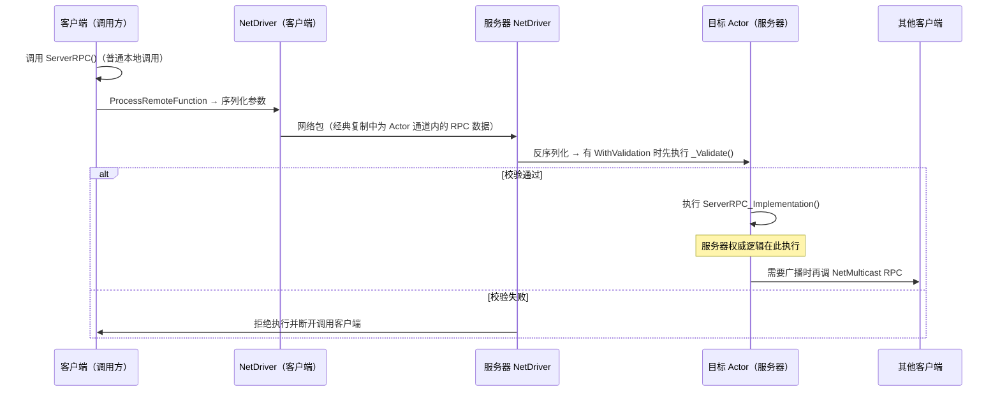
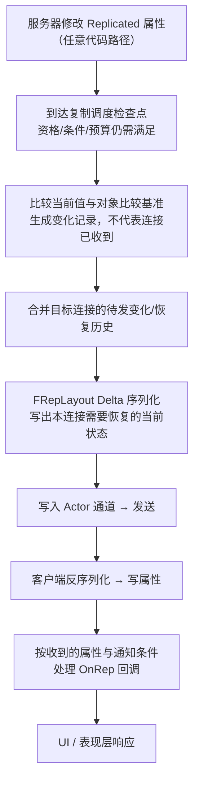

# 02 RPC 与属性同步
> 知识成熟度：L2（本轮审计修订时补标）。
> 版本基准：UE 5.8.0（本机 `Engine/Build/Build.version`：CL 55116800，分支 `++UE5+Release-5.8`）。
> 兼容性边界：适用于 UE5.8 编辑器/运行时，UE4.27 与早期 UE5 仅作迁移背景，具体模块以正文为准。
> 官方参考：[Unreal Engine UE5.8 官方文档总页](https://dev.epicgames.com/documentation/en-us/unreal-engine)。
> 历史整理日期：2026-08-06（本轮元数据维护）。
> 事实边界：2026-10-04 重新核对 Epic 公开文档；原本机/CL 标记作为历史基准保留，未在本次访问该安装、编译、运行 PIE 或弱网测试。
> 最后更新：2026-10-04（RPC/状态示例与复制合同的公共文档、静态修订；未运行 UHT、UE、PIE、弱网或性能测试）。

> 本篇是「06-网络同步」分类的第二篇，讲解 UE 网络通信的两种核心手段：
> **RPC（Remote Procedure Call，远程过程调用）**——跨机器执行函数；
> **属性同步（Replicated Properties）**——服务器状态自动下发。
> 适用版本：UE 5.0 ~ 5.8。

---

## 一、概述

在客户端-服务器架构下，任何跨机器的信息传递只有两种形态：

1. **事件（Event）**：我要通知你"发生了什么事"→ 用 **RPC**。例如"开火"、"开门"、"请重开一局"。
2. **状态（State）**：我要让你持续看到"现在是什么状态"→ 用 **属性同步**。例如血量、位置、得分、弹药数。

远端 RPC 与属性同步需要正确的复制对象、连接与路由。Actor/ActorComponent 要启用复制；经典复制使用 Actor 通道，Iris 使用不同的复制管线/数据流组织。调用端、Owner 连接和相关性决定执行位置，`Reliable` 不能修复路由错误。共同基础包括序列化、可靠性机制与带宽调度。

本篇结构：先讲 RPC 的声明语法、三种方向（Server / Client / Multicast）、可靠性与校验；再讲属性同步的注册、条件、通知与 Fast Array；最后集中解决工程问题——同步频率怎么调、抖动从哪来、插值怎么做。

---

## 二、核心概念（速查表）

### 2.1 RPC 三大方向

| 修饰符 | 调用位置 | 执行位置 | 典型用途 |
| --- | --- | --- | --- |
| `UFUNCTION(Server)` | 客户端（拥有该 Actor 的连接） | 服务器 | 客户端向服务器"请求/上报"：移动输入、攻击请求、交互请求 |
| `UFUNCTION(Client)` | 服务器 | **拥有该 Actor 的那个客户端** | 服务器向 Owner 单发通知：扣血提示、UI 事件、确认结果 |
| `UFUNCTION(NetMulticast)` | 服务器 | 服务器本地 + **当前已连接且该 Actor 对其相关的客户端** | 相关范围内的爆炸、开门动画等事件 |

### 2.2 可靠性修饰

| 修饰符 | 保证 | 代价 | 适用 |
| --- | --- | --- | --- |
| `Reliable` | 有效连接/路由中的已发送 RPC 通过 ACK/重传保障交付；同一连接、发送方向和 Actor/其子对象可靠流保序 | 额外带宽、可能阻塞后续可靠 RPC | 低频、需要可靠传递的请求/通知，业务仍需校验 |
| `Unreliable` | 可丢失，不提供可依赖的执行顺序，也不与 Reliable 建立统一顺序 | 无可靠重传，须容忍缺失 | 高频、可替代的输入或表现通知 |

### 2.3 校验与实现

| 后缀函数 | 作用 |
| --- | --- |
| `Foo_Implementation` | 实际执行体（必须实现） |
| `Foo_Validate` | 配合 `WithValidation` 校验 Server RPC；返回 false 会拒绝执行并断开调用客户端 |

### 2.4 属性同步关键宏

| 宏 | 作用 |
| --- | --- |
| `DOREPLIFETIME(Class, Prop)` | 无条件复制 |
| `DOREPLIFETIME_CONDITION(Class, Prop, COND_X)` | 条件复制 |
| `DOREPLIFETIME_CONDITION_NOTIFY(Class, Prop, COND_X, REPNOTIFY_Always/REPNOTIFY_OnChanged)` | 条件 + OnRep 触发策略 |
| `DOREPLIFETIME_ACTIVE_OVERRIDE(Class, Prop, bActive)` | 动态开关 |
| `DOREPLIFETIME_CHANGE_CONDITION(Class, Prop, COND_X)` | 动态改条件 |

### 2.5 同步频率与平滑

| 概念 | 说明 |
| --- | --- |
| `NetUpdateFrequency` | 参与常规复制检查频率设置；实际发送/接收另受后端、资格、历史与预算影响 |
| `NetPriority` | 带宽竞争时的发送优先级 |
| Jitter（抖动） | 网络延迟的波动，导致到达时间不均匀 |
| Interpolation（插值） | 用历史/目标值平滑过渡，消除跳变 |
| Extrapolation（外推） | 无新数据时按运动趋势继续推算 |

---

## 三、原理详解

### 3.1 RPC 调用路径



要点：

- RPC 的调用方只是"发起"，真正的执行在目标机器上；`_Implementation` 与普通函数一样可以访问该机器上的完整对象状态。
- RPC 参数与返回值：**RPC 没有返回值**（跨机器无法同步返回）；结果必须通过属性复制或另一个 RPC 传回。
- 执行上下文：Server RPC 在服务器上"以该 Actor 为上下文"执行；Client RPC 在目标客户端上执行。
- 先检查对象复制、有效连接与调用矩阵，再检查相关性/过滤与生命周期。客户端调用 Server RPC 必须拥有该 Actor；调用其他客户端或无 Owner 的 Actor 上的 Server RPC 会被丢弃。不能仅凭“看见 Actor”或 `Reliable` 判定能调用。

### 3.2 三类 RPC 的方向细节

#### 3.2.1 Server RPC

- 拥有该 Actor 的客户端调用时在服务器执行；非拥有客户端调用会被丢弃。
- 服务器自己调用 Server RPC 时在服务器本地执行，这是官方矩阵定义的行为。
- 请求能够路由不代表合法：服务器仍需检查权限、冷却、资源与参数。

#### 3.2.2 Client RPC

- 服务器向客户端远程调用时，目标是该 Actor 的 owning client connection。
- 服务器调用但 owning connection 为服务器或 None 时在服务器执行；并不会自动选择一个客户端。
- 典型用途是向某个玩家单独下发 UI 通知、确认请求或专属数据。

#### 3.2.3 NetMulticast RPC

- 服务器调用时，覆盖服务器本地和当前已连接、对该 Actor 相关的客户端。
- 客户端调用只在该客户端本地执行，不转发给服务器或其他客户端。
- 它不是跨相关性、跨断线或晚加入后的持久广播；持久效果需要用可重建状态表达。

### 3.3 可靠性：Reliable 与 Unreliable

- **Reliable RPC**：在有效连接和合法发送路径中进行 ACK/重传；同一连接、同一发送方向内，同一 Actor 及其子对象的可靠 RPC 流保序。不同 Actor、不同接收连接、双向调用以及 Reliable/Unreliable 混合流，不存在可依赖的统一顺序。连接断开、错误 Owner/路由或对象生命周期结束不能理解成“将来必补发”。高频调用会挤压可靠队列。
- **Unreliable RPC**：丢失后不靠可靠重传恢复。业务要容忍缺失，不能用与其他 RPC 相邻调用表达先后依赖。
- **属性复制**：重建当前状态，中间赋值可以被合并或跳过；不是逐条事件日志。连接有效且对象符合复制条件时，后续更新可纠正客户端状态。

可靠性是 UE 复制层语义，不等于把网络传输切换为 TCP。详见 [执行顺序](https://dev.epicgames.com/documentation/en-us/unreal-engine/replicated-object-execution-order-in-unreal-engine) 与 [RPC 调用矩阵](https://dev.epicgames.com/documentation/unreal-engine/remote-procedure-calls-in-unreal-engine?lang=en-US)。

### 3.4 WithValidation：服务器端校验

```cpp
UFUNCTION(Server, Reliable, WithValidation)
void ServerRequestFire(const FVector& AimDirection);

bool ServerRequestFire_Validate(const FVector& AimDirection)
{
    // 校验参数合法性：方向必须归一化、数值不能为 NaN/无穷
    return AimDirection.IsNormalized();
}
```

- 校验在服务器上、`_Implementation` 之前执行；
- `_Validate` 返回 false 时，该 RPC 不执行且调用客户端会断开；正常的“冷却未结束”等可恢复业务拒绝应与此分开处理。
- 所有客户端请求都要做服务器权威校验；是否使用会断线的 `WithValidation`，应与普通业务拒绝分开设计。

### 3.5 参数序列化与压缩类型

RPC 与属性同步的参数都会被序列化进网络包，参数类型直接影响带宽：

| 类型 | 说明 |
| --- | --- |
| `int32 / float / bool` | 基础类型，直接序列化 |
| `FVector / FRotator` | 线上大小取决于类型、版本和序列化路径，不能把内存大小或固定 12 字节直接当作包内成本 |
| `FVector_NetQuantize` | 按输入分量单位量化到 0 位小数（步距 1 单位），不据此猜范围或包长 |
| `FVector_NetQuantize100` | 按输入分量单位量化到 2 位小数（步距 0.01 单位） |
| `FVector_NetQuantize10` | 按输入分量单位量化到 1 位小数（步距 0.1 单位） |
| `FVector_NetQuantizeNormal` | 单位向量压缩（适合朝向） |
| `TArray<复制的类型>` | RPC 参数是本次调用携带的数据；复制属性的数组可有字段/元素级变化跟踪，实际粒度取决于类型与 serializer，不能一律称全量发送（见 3.8） |
| 自定义结构体 | 需实现 `NetSerialize` 才能高效压缩 |

这里的单位取决于传入数据的语义。**只有输入明确为 UE 默认世界坐标厘米时**，上述 1 / 0.1 / 0.01 单位才对应 1 / 0.1 / 0.01 cm 的量化步距；加速度等不同量纲不能直接称为位置厘米精度。数字后缀不是相同量纲下“10 比 100 更精细”的关系，也不能由小数位数推导适用范围或线上字节数。依据：[FVector_NetQuantize（0 位小数）](https://dev.epicgames.com/documentation/en-us/unreal-engine/API/Runtime/Engine/FVector_NetQuantize)、[FVector_NetQuantize10（1 位）](https://dev.epicgames.com/documentation/en-us/unreal-engine/API/Runtime/Engine/FVector_NetQuantize10)、[FVector_NetQuantize100（2 位）](https://dev.epicgames.com/documentation/en-us/unreal-engine/API/Runtime/Engine/FVector_NetQuantize100)。CMC 的移动上报使用这些量化类型，但类型合同与目标后端实测成本仍是两层证据。

### 3.6 属性同步机制

下图仅示意经典复制的轮询路径；Push Model 与 Iris 的检测、标脏和数据流实现需分别核对。



关键机制：

1. **变化检测与送达分开**：经典轮询把当前值与对象的共享比较基准对比，变化记录再与各连接的待发/ACK/NAK 历史合并；共享比较基准不是每个客户端已确认的快照。A 已收到 Health=90、B 丢包时，即使下一次比较没有新变化，B 仍需通过自己的待处理历史恢复当前状态。Push Model/Iris 的跟踪与恢复实现需分别核对；复制条件、调度和带宽可延后发送，每次赋值不一定有独立客户端事件。
2. **序列化粒度**：普通结构体可递归按字段跟踪；`NetSerialize` / `NetDeltaSerialize`、字段类型和后端会改变发送粒度。不能认定任意结构体改一个字段都整块重发，也不能把 `FVector` 固定算成 12 字节。拆分/组合按共同更新需求、通知语义和实测成本权衡。
3. **C++ 与蓝图通知不同**：C++ 直接赋值不会因 ReplicatedUsing 自动调用本地 OnRep；客户端接收更新时按通知条件触发。Blueprint 的 Set 节点可自动调用该属性在蓝图定义的 RepNotify；共享表现函数需避免重复副作用。
4. **顺序边界**：不同属性的 OnRep 顺序没有保证，不能按声明或服务器赋值顺序推断。有关联字段可由一个结构体和一个通知统一处理，或接收后集中协调；这不保证逐次中间状态，也不是跨 Actor 或 RPC/属性事务。

依据：[FRepLayout](https://dev.epicgames.com/documentation/en-us/unreal-engine/API/Runtime/Engine/FRepLayout)、[C++/Blueprint RepNotify](https://dev.epicgames.com/documentation/en-us/unreal-engine/replicate-actor-properties-in-unreal-engine)、[执行顺序](https://dev.epicgames.com/documentation/en-us/unreal-engine/replicated-object-execution-order-in-unreal-engine)。

### 3.7 同步频率：NetUpdateFrequency 与 NetPriority

- `NetUpdateFrequency` 参与常规复制调度，不是客户端实际收包/送达频率，也不是每次赋值的计数器。新的属性变化、初始接收状态和每连接待恢复历史是不同的待处理原因；即使这次没有新变化，也不能断言无需发送。对象/连接资格、休眠、后端、强制更新、带宽和丢包仍会影响实际检查与送达。
- 经典调度会为目标连接组织候选 Actor，并在优先级与带宽预算下选择发送；不要把它读成每个游戏 Tick 都向所有连接发送所有候选。Replication Graph/Iris 的候选组织和调度路径需分别核对。
- 组合策略：

| 场景 | 建议 |
| --- | --- |
| 玩家位置/朝向 | 30~100Hz 可作待测调度起点；使用复制移动状态或移动组件的专用协议，不把属性命名为 Unreliable RPC |
| 血量/状态变化 | 10~30Hz 只能作待测调度起点；是否满足玩法延迟预算要在实际负载与弱网下测量 |
| 装饰/静态物 | 低调度频率可作测量起点；`COND_InitialOnly` 是属性条件，仅适用于本生命期不变字段，不能替代 Actor 调度或可变状态恢复 |
| 一次性表现事件 | 可用 RPC，明确缺失/过期策略；需要恢复的结果仍保存为状态，不用通知次数代替事件日志 |

### 3.8 Fast Array：高效复制数组

不能把普通 `TArray` 复制一概说成“增删一个元素也必定全量发送”。经典 `FRepLayout` 可为反射动态数组生成子 changelist，普通结构体也可递归描述字段；自定义 `NetSerialize` / `NetDeltaSerialize`、元素类型以及 Iris 后端会改变实际发送粒度。RPC 数组参数携带的是本次调用参数，不等于跨多次 RPC 自动维护的属性 delta 状态。

**Fast Array（`FFastArraySerializer`）** 用条目 ID/Key 管理变更与删除，适合背包、Buff 等具有稳定条目身份、稀疏变化的集合。它还要发送数组/条目元数据、删除信息和必要的新接收者初始状态；“只发那一项”不是恒定字节数或总比普通数组快的保证。普通数组的索引变动也不同于业务条目身份变动。

| 同一数据、同一规模的操作 | 应观察什么 |
| --- | --- |
| 尾部新增一个元素 | 元素内容与数组长度/头信息；初始复制和后续 delta 分开 |
| 修改中间元素的一个字段 | 普通反射字段、自定义 serializer、FastArray 条目各自写了什么 |
| 删除头部元素 | 普通数组后续索引移动，FastArray 的删除 ID 与剩余条目成本 |
| 重排但不改业务内容 | 客户端是否需要相同顺序；若顺序重要，是否另有显式排序键 |

先以 N=8、N=256 等明确测试规模构造相同数据，逐步等待有效复制，再做同 tick 合并变更；分别记录 Legacy/Iris、配置、最终集合、序列化 CPU 和含元数据的 payload。Networking Insights 的包统计是压缩前视角，不等于物理链路字节。此表是选型实验设计，本次没有性能结果。机制来源：[FRepLayout](https://dev.epicgames.com/documentation/en-us/unreal-engine/API/Runtime/Engine/FRepLayout)、[FastArray 类型说明](https://dev.epicgames.com/documentation/unreal-engine/API/Runtime/NetCore/TFastArrayTypeHelper)、[Networking Insights](https://dev.epicgames.com/documentation/en-us/unreal-engine/networking-insights-in-unreal-engine)。

### 3.9 抖动（Jitter）与插值（Interpolation）

#### 抖动从哪来

- 网络路径上的排队与拥塞（延迟本身波动）；
- 服务器与客户端帧率不同步（更新到达时间不均匀）；
- 丢包导致的等待重传；
- 时钟漂移（客户端与服务器时钟不同步）。

抖动在表现上的后果：位置跳变、角色"瞬移"、动画卡顿。

#### 插值策略

| 策略 | 做法 | 适用 |
| --- | --- | --- |
| 属性级插值 | 每帧把当前值向目标值逼近（`FMath::FInterpTo`） | 血条、进度、自定义状态 |
| 位置插值 | 按时间戳在两个已知位置之间线性插值 | SimulatedProxy 的移动 |
| 旋转插值 | 四元数 `Slerp` 或最短路径旋转 | 朝向平滑 |
| 缓冲插值 | 客户端保留 50~150ms 的接收缓冲，统一延迟到"过去"再渲染 | 高实时对战 |
| 外推 | 无新数据时按速度继续推进 | 短暂丢包时避免停顿 |

UE 内置的移动插值由 `UCharacterMovementComponent` 的 `NetworkSmoothingMode`（Linear / Exponential / Disabled）控制，详见本分类 03 篇。

---

## 四、代码示例

### 4.1 Server RPC：本地输入入口，服务器共同裁决

“服务器权威”不等于“主机不能提交输入”。远端玩家、Listen Server 上的本地玩家和 Standalone 玩家都要到达权威裁决；原先 `if (!HasAuthority())` 才请求开火的写法会跳过后两者。以下为**原创接入片段，未编译/UHT/PIE 验证**：放进一个启用复制、由玩家拥有的 `ACharacter` 派生类。头文件还需该类的 generated header，源文件需对应类头、`Engine/World.h`；输入绑定由项目完成。

```cpp
// AMyCharacter 的成员声明片段；构造函数设置 bReplicates = true。
UFUNCTION(Server, Reliable)
void ServerRequestFire(FVector_NetQuantizeNormal AimDirection);

void OnFirePressed();
bool TryFireAuthority(const FVector& AimDirection);

int32 CurrentAmmo = 2;
double NextFireTime = 0.0;
double FireCooldown = 0.2;

// 项目必须实现：检查存活/武器/规则；只在服务器创建权威弹体。
bool CanFireUnderGameRules() const;
void SpawnProjectileAuthority(const FVector& AimDirection);
```

```cpp
void AMyCharacter::OnFirePressed()
{
    if (!IsLocallyControlled() || !IsPlayerControlled())
    {
        return; // 这是人类玩家输入入口，不是服务器 AI 入口。
    }
    // 远端拥有者发往服务器；服务器本地调用按矩阵在本地执行。
    ServerRequestFire(GetControlRotation().Vector());
}

void AMyCharacter::ServerRequestFire_Implementation(
    FVector_NetQuantizeNormal AimDirection)
{
    TryFireAuthority(AimDirection);
}

bool AMyCharacter::TryFireAuthority(const FVector& AimDirection)
{
    UWorld* World = GetWorld();
    if (!HasAuthority() || !World ||
        !FMath::IsFinite(AimDirection.X) ||
        !FMath::IsFinite(AimDirection.Y) ||
        !FMath::IsFinite(AimDirection.Z) || !AimDirection.IsNormalized())
    {
        return false;
    }
    const double Now = World->GetTimeSeconds();
    if (CurrentAmmo <= 0 || Now < NextFireTime || !CanFireUnderGameRules())
    {
        return false; // 普通业务拒绝，本例不使用导致断线的 Validate=false。
    }
    --CurrentAmmo;
    NextFireTime = Now + FireCooldown;
    SpawnProjectileAuthority(AimDirection);
    return true;
}
```

`CanFireUnderGameRules` 与 `SpawnProjectileAuthority` 是明确的项目扩展点，不是空实现或已提供的战斗框架；应检查角色存活、武器所有权、射击模式、资源、目标/命中规则，并处理生成失败的资源结算策略。方向合法不等于射击合法。服务器 AI 若要开火，可从已授权的服务器业务调用同一 `TryFireAuthority`，不冒充本地玩家输入。弹药若要显示在客户端，还需单独注册复制或结果协议，此片段没有省略后就宣称自动同步。

本例先不做预测表现，便于核对“每次接受只扣一次弹、只生成一次弹体”。若启用即时枪口/声音预测，应另设计请求标识、接受/拒绝回执及去重/撤销；服务器多播确认不能再无条件重播本地已预测效果。RPC 路由本身不附送预测，也不保证业务恰好执行一次。若另加 `WithValidation`，共同裁决中的检查仍保留，不能把本地服务器调用的安全前提只放进远端接收 thunk。

最小验证顺序是 Dedicated 远端拥有者 → Listen 本地主机 → Standalone → 错误 Owner → 冷却/无弹/死亡拒绝。分别记录权威裁决、扣弹与生成次数；本次这些 UE 场景均未运行。

### 4.2 Client RPC：使用实际接收者的本地 UI

在目标 Controller 上接收到 Client RPC 后，`this` 已经表示接收对象。再次查 `GetPlayerController(0)` 会按本机列表重新选择；若实际接收者不是索引 0，就可能把通知交给另一位本地玩家。接收者恰好是索引 0 时不暴露这个问题，因此分屏测试必须包含非零索引目标。

下面是类内声明及源文件方法片段，假定 `AMyPlayerController : APlayerController` 已正确声明/生成；不是独立工程。`ClientMessage` 是该 Controller 的消息接口，正式 HUD/UMG 可替换为同一接收者拥有的 UI 方法：

```cpp
// AMyPlayerController 的头文件成员
UFUNCTION(Client, Reliable)
void ClientNotifyMatchStarted(const FString& MapName);

// AMyPlayerController.cpp
void AMyPlayerController::ClientNotifyMatchStarted_Implementation(
    const FString& MapName)
{
    if (!IsLocalController())
    {
        return; // 没有本地展示目标，不能擅自转交给 controller 0。
    }
    ClientMessage(FString::Printf(TEXT("比赛开始：%s"), *MapName));
}
```

服务器必须对正确玩家的 Controller 调用；Reliable 不能修复选错接收对象。实际 UI 尚未创建时，应由该玩家自己的本地状态/UI 就绪机制恢复展示，不能用另一位玩家的 HUD 兜底。Dedicated Server 没有本地 UI，Listen 的主机 Controller 仍可拥有本地 UI。测试要把不同消息发给同一客户端的两个本地玩家，核对接收对象身份，而不是只看“屏幕上出现了一条字”。

这里用 `FString::Printf` 明确字符串构造意图；**未证明**旧 `TEXT("比赛开始：" + MapName)` 一定编译失败，也不宣称其一定可编译，目标宏展开与重载需真实 UE 编译确认。确定修复的是接收者被索引 0 替换。索引契约见 [GetPlayerController](https://dev.epicgames.com/documentation/en-us/unreal-engine/API/Runtime/Engine/UGameplayStatics/GetPlayerController)。

### 4.3 NetMulticast RPC：权威结算与本地视图表现分开

桶是 `AActor`，不能套用 `APawn::IsLocallyControlled()` 来寻找受影响玩家。服务器决定是否爆炸、结算伤害；收到事件的机器再逐个处理真正的本地视图。以下是**接入片段**，假定类为 `AMyExplosiveBarrel : AActor`；头/源、generated header、相机资源和两个项目 helper 需补齐，未编译运行。

```cpp
// 类成员；构造函数中 bReplicates = true。
bool bExplodedAuthority = false;
float CameraShakeRadius = 2000.f; // 示例玩法半径，须按项目确定。
UPROPERTY(EditDefaultsOnly)
TSubclassOf<UCameraShakeBase> ExplosionShake;

void ExplodeAuthority(); // 普通服务器内部函数，不是客户端可选伤害的 RPC。
void ApplyAreaDamageAuthority(); // 项目实现：可信范围/目标/伤害规则。
void SpawnExplosionCosmetics(const FVector& Location); // 仅特效与声音。

UFUNCTION(NetMulticast, Unreliable)
void MulticastExplode(FVector_NetQuantize Location);
```

```cpp
void AMyExplosiveBarrel::ExplodeAuthority()
{
    if (!HasAuthority() || bExplodedAuthority)
    {
        return;
    }
    bExplodedAuthority = true; // 在副作用前置位，重复调用不重复结算。
    ApplyAreaDamageAuthority();
    MulticastExplode(GetActorLocation());
}

void AMyExplosiveBarrel::MulticastExplode_Implementation(
    FVector_NetQuantize Location)
{
    UWorld* World = GetWorld();
    if (!World || GetNetMode() == NM_DedicatedServer)
    {
        return;
    }
    SpawnExplosionCosmetics(Location);
    for (FConstPlayerControllerIterator It = World->GetPlayerControllerIterator(); It; ++It)
    {
        APlayerController* PC = It->Get();
        if (!IsValid(PC) || !PC->IsLocalController() || !PC->PlayerCameraManager)
        {
            continue;
        }
        const float DistanceSquared = FVector::DistSquared(
            PC->PlayerCameraManager->GetCameraLocation(), Location);
        if (ExplosionShake && DistanceSquared <= FMath::Square(CameraShakeRadius))
        {
            PC->PlayerCameraManager->StartCameraShake(ExplosionShake);
        }
    }
}
```

相机部分需包含目标版本的 `GameFramework/PlayerController.h`、`Camera/PlayerCameraManager.h`、`Camera/CameraShakeBase.h` 和 `Engine/World.h`。项目 helper 必须保证结算时不会先销毁桶再继续依赖失效对象；如需销毁，按已测试的生命周期安排事件和复制状态。

服务端发起多播覆盖服务器本地及当前符合复制路由/相关性条件的接收者，不是“所有客户端永远都收到”。Dedicated 只结算，Listen 也为本地玩家表现，分屏逐视图按范围判断。事件可丢，后加入者不会补收过去的多播；改成 Reliable 也没有未来连接的历史重放。此处 `bExplodedAuthority` 只防服务器重复结算，**没有复制持续外观**；若桶的焦黑/不可交互状态要让晚加入者看到，应另用复制状态幂等重建，而非指望重播爆炸。

### 4.4 Health：服务器内部修改与可重建表现

客户端通常通过自己拥有的 Pawn/Controller 提交“使用武器/尝试攻击”的意图。服务器核对武器、冷却、弹药、距离、目标可攻击性与命中依据后，计算 Amount，再调用受害者 Health 组件的服务器内部入口。把 `0 <= Amount <= 1000` 当成全部权限校验，只限制了数值，不能证明这次攻击应当成立。

原 `ServerApplyDamage(Amount)` 的风险前提是调用者**有可路由的 owning RPC 路径**；它不会允许任意客户端绕过 UE 所有权路由直接调用任何受害者。以下改为普通 authority 方法，没有客户端自行选择伤害结果的 RPC。

下面是 `UMyHealthComponent : UActorComponent` 的成员/实现片段，**不是完整可编译工程**。需要 `Components/ActorComponent.h`、生成头、`Net/UnrealNetwork.h` 等；拥有者 Actor 也必须启用复制。`SetIsReplicatedByDefault` 只解决组件一层，不替拥有者、对象创建和连接生命周期完成设置。

```cpp
// UMyHealthComponent 的类内成员；UObject 派生组件使用 U 前缀。
public:
    UMyHealthComponent() { SetIsReplicatedByDefault(true); }
    bool ApplyDamageAuthority(float Amount);
    virtual void BeginPlay() override;
    virtual void GetLifetimeReplicatedProps(
        TArray<FLifetimeProperty>& OutLifetimeProps) const override;

private:
    UPROPERTY(ReplicatedUsing = OnRep_Health)
    float Health = 100.f;

    UFUNCTION()
    void OnRep_Health();
    void RefreshHealthPresentation(); // 项目实现：按当前 Health 幂等设置 UI/姿态。
    void SettleDeathAuthority(); // 项目实现：奖励/掉落等权威结算。
```

```cpp
void UMyHealthComponent::GetLifetimeReplicatedProps(
    TArray<FLifetimeProperty>& OutLifetimeProps) const
{
    Super::GetLifetimeReplicatedProps(OutLifetimeProps);
    DOREPLIFETIME(UMyHealthComponent, Health);
}

bool UMyHealthComponent::ApplyDamageAuthority(float Amount)
{
    AActor* Owner = GetOwner();
    if (!Owner || !Owner->HasAuthority() || !FMath::IsFinite(Amount) ||
        Amount <= 0.f || Health <= 0.f)
    {
        return false;
    }
    const float PreviousHealth = Health;
    Health = FMath::Max(0.f, Health - Amount);
    const bool bDiedNow = PreviousHealth > 0.f && Health <= 0.f;

    // C++ 赋值不会自动调用本地 OnRep；Listen/Standalone 明确刷新表现。
    if (Owner->GetNetMode() != NM_DedicatedServer)
    {
        RefreshHealthPresentation();
    }
    if (bDiedNow)
    {
        SettleDeathAuthority(); // 只结算 Alive -> Dead；此后不再访问可能销毁的 Owner。
    }
    return true;
}

void UMyHealthComponent::BeginPlay()
{
    Super::BeginPlay();
    if (GetOwner() && GetOwner()->GetNetMode() != NM_DedicatedServer)
    {
        RefreshHealthPresentation();
    }
}

void UMyHealthComponent::OnRep_Health()
{
    RefreshHealthPresentation();
}
```

`RefreshHealthPresentation` 必须只负责可重复的展示状态：把血条设为当前 Health、按是否为零设置死亡姿态/禁用表现，并容忍 UI/角色尚未就绪。不得在其中掉落、奖励或销毁权威对象；UI 创建完成时也应用当前状态。已有 Health=0 的接收者或晚加入者应能重建“已死”，不要求补播过去那一次死亡动画。一次性音效/动画若另走事件，需自己的去重/过期规则。

在本片段只减血、没有复活的生命期中，Health 从 100 变 0 后再施加 0 或 1 都不会再次结算死亡。若项目支持复活/复用组件，要定义新的生命期及复位合同，不能仅靠 OnRep 次数计数。本例普通 `REPNOTIFY_OnChanged` 也不承诺相同的 0 每次都产生通知。若拓展 `WithValidation`，严重协议违例与正常战斗拒绝仍应分开。

### 4.5 可变队伍持续复制，初始条件只承诺初始状态

玩家中途可以换队，因此 TeamId 是持久的可变状态。下面是 PlayerState 的成员及方法片段；该类、生成头、`Net/UnrealNetwork.h` 和 UI helper 由项目补齐，拥有者及 PlayerState 生命周期按多人框架设置。本例不使用辅助换队 RPC 维护真相：

```cpp
// AMyPlayerState : APlayerState 的成员片段
UPROPERTY(ReplicatedUsing = OnRep_TeamId)
int32 TeamId = INDEX_NONE;
UFUNCTION()
void OnRep_TeamId();
void SetTeamAuthority(int32 NewTeamId);
bool IsValidTeamForThisMatch(int32 NewTeamId) const; // 项目规则，不是恒真占位。
void RefreshTeamPresentation(); // 幂等应用当前 TeamId。
UPROPERTY(ReplicatedUsing = OnRep_MatchScore)
int32 MatchScore = 0; // 本项目自有字段，避免重复注册基类已有的 Score。
UFUNCTION()
void OnRep_MatchScore();
void RefreshScorePresentation();

// 源文件片段；GetLifetimeReplicatedProps 还需在类中声明 override。
void AMyPlayerState::GetLifetimeReplicatedProps(
    TArray<FLifetimeProperty>& OutLifetimeProps) const
{
    Super::GetLifetimeReplicatedProps(OutLifetimeProps);
    DOREPLIFETIME_CONDITION_NOTIFY(AMyPlayerState, TeamId, COND_None, REPNOTIFY_OnChanged);
    DOREPLIFETIME_CONDITION_NOTIFY(AMyPlayerState, MatchScore, COND_None, REPNOTIFY_OnChanged);
}

void AMyPlayerState::SetTeamAuthority(int32 NewTeamId)
{
    if (!HasAuthority() || !IsValidTeamForThisMatch(NewTeamId) || TeamId == NewTeamId)
    {
        return;
    }
    TeamId = NewTeamId;
    if (GetNetMode() != NM_DedicatedServer)
    {
        RefreshTeamPresentation();
    }
}

void AMyPlayerState::OnRep_TeamId()
{
    RefreshTeamPresentation();
}

void AMyPlayerState::OnRep_MatchScore()
{
    RefreshScorePresentation();
}
```

`MatchScore` 展示原有的分数通知用法；项目若直接使用基类已复制的 Score，应沿用基类接口，不重复注册。分数的服务器修改入口与本地 UI 初始化由项目提供，UI 消费当前分数，不把通知次数当作得分事件数。TeamId 的 setter 是服务器业务入口；客户端请求换队仍应由拥有的对象上行并受人数/阵营/时机规则约束。客户端 UI 初始化或稍后就绪时，应主动读取当前 TeamId，不能只等下一次 OnRep。

为什么“InitialOnly + 换队 RPC”不足以维持可变队伍？A、B 都已经得到 Team=1，服务器改成 2；B 错过辅助 RPC，而它仍保留原接收状态、没有新的 initial，则 InitialOnly 不会持续纠正 B。换成 Reliable 不会为未参与此次发送的未来连接保存事件，也不修复错误路由或已结束的生命周期。

但这**不等于晚加入必错**：若服务器字段确实保持最新值，新连接 C、新的初始接收者，或确实新建并执行初始复制的 ActorChannel，都可以由 initial 得到当前 Team=2。首次相关与已有接收者恢复相关性不能混为一谈；恢复时可能保留/复用状态，也可能确实重建，必须记录实际后端和生命周期。Iris 应检查相应复制对象/句柄状态，不能把所有恢复都称为新 ActorChannel。

`COND_InitialOnly` 仍适合生命周期内不变的身份或生成种子，例如不可变 TeamInfo 的队伍身份；玩家当前所属队伍则可以由 PlayerState 持续复制。保留 Lyra 这两种角色的区别，不能因为字段都叫 TeamId 就全部替换。

`REPNOTIFY_OnChanged` 与 `REPNOTIFY_Always` 控制**收到该属性后的通知策略**，不是是否每次赋值发送的开关。普通标量的 OnChanged 按接收路径的新旧值比较决定通知；Always 允许该属性收到相同值时仍通知。若这次包只有别的属性，不能据 Always 要求 Health/TeamId 也回调；自定义 delta/FastArray 回调还需按各自协议理解。来源：[属性条件与 RepNotify](https://dev.epicgames.com/documentation/en-us/unreal-engine/replicate-actor-properties-in-unreal-engine)。

### 4.6 Fast Array：traits、宿主复制与三种标脏操作

下面是**原创集成骨架，未进行 UHT/构建或双端验证**。它展示必要接点而不是生产背包事务。文件拆分示意为 `MyInventoryActor.h/.cpp`；生成头必须是头文件最后一个 include。使用这些公共头/类型的模块应配置 `Core`、`CoreUObject`、`Engine`、`NetCore` 依赖，并按目标工程的导出宏和模块边界调整。

```cpp
// MyInventoryActor.h
#pragma once
#include "CoreMinimal.h"
#include "GameFramework/Actor.h"
#include "Net/Serialization/FastArraySerializer.h"
#include "MyInventoryActor.generated.h"

USTRUCT()
struct FInventoryItem : public FFastArraySerializerItem
{
    GENERATED_BODY()
    UPROPERTY()
    FName InstanceId; // 示例业务身份：服务器分配，当前集合中唯一。
    UPROPERTY()
    int32 Count = 0;
};

USTRUCT()
struct FInventoryArray : public FFastArraySerializer
{
    GENERATED_BODY()
    UPROPERTY()
    TArray<FInventoryItem> Items;

    bool NetDeltaSerialize(FNetDeltaSerializeInfo& DeltaParms)
    {
        return FastArrayDeltaSerialize<FInventoryItem, FInventoryArray>(Items, DeltaParms, *this);
    }
};

template<>
struct TStructOpsTypeTraits<FInventoryArray> : TStructOpsTypeTraitsBase2<FInventoryArray>
{
    enum { WithNetDeltaSerializer = true };
};

UCLASS()
class AMyInventoryActor : public AActor
{
    GENERATED_BODY()
public:
    AMyInventoryActor();
    bool AddItemAuthority(FName InstanceId, int32 Count);
    bool SetCountAuthority(FName InstanceId, int32 Count);
    bool RemoveItemAuthority(FName InstanceId);
    virtual void GetLifetimeReplicatedProps(
        TArray<FLifetimeProperty>& OutLifetimeProps) const override;
private:
    UPROPERTY(Replicated)
    FInventoryArray Inventory;
};
```

```cpp
// MyInventoryActor.cpp
#include "MyInventoryActor.h"
#include "Net/UnrealNetwork.h"

AMyInventoryActor::AMyInventoryActor()
{
    bReplicates = true;
}

void AMyInventoryActor::GetLifetimeReplicatedProps(
    TArray<FLifetimeProperty>& OutLifetimeProps) const
{
    Super::GetLifetimeReplicatedProps(OutLifetimeProps);
    DOREPLIFETIME(AMyInventoryActor, Inventory);
}

bool AMyInventoryActor::AddItemAuthority(FName InstanceId, int32 Count)
{
    if (!HasAuthority() || InstanceId.IsNone() || Count <= 0 ||
        Inventory.Items.ContainsByPredicate([&](const FInventoryItem& Item)
        { return Item.InstanceId == InstanceId; }))
    {
        return false;
    }
    FInventoryItem& Item = Inventory.Items.AddDefaulted_GetRef();
    Item.InstanceId = InstanceId;
    Item.Count = Count;
    Inventory.MarkItemDirty(Item); // 添加：给新条目标脏。
    return true;
}

bool AMyInventoryActor::SetCountAuthority(FName InstanceId, int32 Count)
{
    if (!HasAuthority() || Count <= 0) { return false; }
    FInventoryItem* Item = Inventory.Items.FindByPredicate(
        [&](const FInventoryItem& Entry) { return Entry.InstanceId == InstanceId; });
    if (!Item) { return false; }
    if (Item->Count != Count)
    {
        Item->Count = Count;
        Inventory.MarkItemDirty(*Item); // 修改：标实际条目，不是一个脱离数组的拷贝。
    }
    return true;
}

bool AMyInventoryActor::RemoveItemAuthority(FName InstanceId)
{
    if (!HasAuthority()) { return false; }
    const int32 Index = Inventory.Items.IndexOfByPredicate(
        [&](const FInventoryItem& Item) { return Item.InstanceId == InstanceId; });
    if (Index == INDEX_NONE) { return false; }
    Inventory.Items.RemoveAt(Index);
    Inventory.MarkArrayDirty(); // 删除：旧元素已不存在，给容器标脏。
    return true;
}
```

traits 使该结构的 `NetDeltaSerialize` 被选择；宿主 `bReplicates`、成员 `UPROPERTY(Replicated)`、`DOREPLIFETIME` 与脏标记分别解决不同环节，不能把“注册即可”当成完整接入。`InstanceId` 是示例业务身份，不等于数组下标，也不等于 `FFastArraySerializerItem` 内部的 ReplicationID/ReplicationKey；服务器与客户端的数组顺序不保证永远相同。不要保存跨 Add/Remove 的条目指针。

接收端可按需要提供 `PreReplicatedRemove`、`PostReplicatedAdd`、`PostReplicatedChange` 或容器 `PostReplicatedReceive` 回调，用于更新按业务身份索引的 UI；这些回调是扩展点，不是每个条目都必须实现。回调描述接收变化，不保证与服务器的每一次操作一一对应；同 tick 多次修改可能合并，同值标脏或重新映射也要按版本/路径检查，不能依赖“必不回调”防重复结算。

本例只检查基本形状与 authority；业务仍需保证 InstanceId 分配/复用规则、数量上限、容量与操作权限。未展示并发交易、持久化或客户端预测。Iris 的描述符/fragments 和特化行为见 [Iris 接入与迁移](07-Iris复制使用与迁移.md)，不要把这个 Legacy 风格的接入骨架当作两后端都已验证。

来源：[FFastArraySerializer](https://dev.epicgames.com/documentation/unreal-engine/API/Runtime/NetCore/FFastArraySerializer?lang=en-US)、[traits 与 FastArray 合同](https://dev.epicgames.com/documentation/unreal-engine/API/Runtime/NetCore/TFastArrayTypeHelper)。验证应依次增 C、改 B、删 A、合并修改、晚加入，并按 InstanceId 对比最终集合；只看“有回调”不足以证明数据正确。

### 4.7 属性插值示例（客户端平滑）

```cpp
// 在客户端 Tick 中平滑逼近服务器目标值
void AMyActor::Tick(float DeltaSeconds)
{
    Super::Tick(DeltaSeconds);

    if (!HasAuthority() && bSmoothInterpolate)
    {
        // 显示值向服务器目标值插值（Exponential 逼近）
        DisplayValue = FMath::FInterpTo(DisplayValue, ServerTargetValue, DeltaSeconds, 12.f);
    }
}
```

---

## 五、最佳实践

1. **RPC 与属性的选择**：高频变化的持续状态用属性；低频一次性事件用 RPC；"想立刻执行逻辑"用 RPC，"想看到最新状态"用属性。
2. **服务器始终校验请求**：伤害、经济、交易、技能释放要检查权限与合法性；`WithValidation` 返回 false 会断线，普通业务失败应走明确的拒绝/结果逻辑。
3. **别滥用 Reliable**：Reliable RPC 有 ACK/重传开销，高频调用会形成重传风暴；高频数据走 Unreliable 或属性。
4. **RPC 参数最小化**：能传 `FVector_NetQuantizeNormal` 就别传 `FVector`；能传索引/ID 就别传对象引用。
5. **按语义组织属性**：有关联字段可集中到结构体和一个通知；变化频率/条件差异大的字段可分别设计。不要把结构体等同全量重发，使用 trace 验证成本。
6. **按状态合同选择条件**：`COND_OwnerOnly` / `COND_InitialOnly` / `COND_SimulatedOnly` 可减少不需要的分发，但有接收者/生命周期前提。InitialOnly 用于本生命期不变的信息，不能靠辅助 RPC 代替可变状态的持续恢复。
7. **权威修改与表现通知分开**：服务器校验和状态修改放在权威路径；C++ 本地赋值是否调用共享表现函数要明确安排，Blueprint Set 节点也可能触发本地 RepNotify，处理需避免重复副作用。
8. **按变化模式选数组协议**：有稳定条目身份和稀疏增删改时评估 FastArray；小数组、频繁整体替换或强顺序需求按同负载比较。先补齐 traits、宿主复制与标脏，再测成本，不以“有增删”直接判定赢家。
9. **插值要基于时间戳**：不要"每帧按固定速度追"，而要用时间戳差计算，否则不同帧率下平滑效果不一致（03 篇详述）。
10. **调试命令**：`showdebug net`（5.8；`net.InspectChannels` 已移除）、`p.NetShowCorrections`、`log LogNetRPC verbose`、`stat Net`，用数据说话。

---

## 六、常见问题 FAQ

**Q1：RPC 为什么"没生效"？**
按顺序排查：① Actor/Component 复制开关；② 修饰符与 `_Implementation`；③ 连接和对象生命周期；④ 调用端与 owning connection 是否符合执行矩阵；⑤ 相关性/过滤；⑥ `_Validate` 是否拒绝并导致断线。

**Q2：客户端调用了 Server RPC，服务器没执行，日志也没有报错？**
先核对调用客户端是否拥有该 Actor，以及对象是否是服务器复制来的有效对象。错误 Owner 或无 owning connection 的 Server RPC 会被丢弃；Reliable 不绕过这些条件，也不能据其修饰符预设某条断线日志必然出现。

**Q3：Reliable RPC 会丢吗？**
有效连接和合法发送路径内使用 ACK/重传；同一连接、同一发送方向内，同一 Actor 及其子对象的可靠 RPC 流保序。它不保证错误路由的调用执行，不提供跨 Actor 顺序、低延迟或断线后的持久重放。需要跨断线保存的结果应进入持久状态/业务确认协议。

**Q4：为什么服务器上调用 Client RPC 客户端没收到？**
服务器要远程调用客户端，必须找到该 Actor 的 owning client connection。没有客户端 Owner 时可能在服务器本地执行；检查 `GetOwner()`、`GetNetConnection()` 和连接状态，不要把本地执行当作客户端已收到。

**Q5：属性同步有延迟吗？**
有，但不能据“下一个更新周期”保证固定到达时间。服务器修改后还要经过合格调度、条件/休眠判断、待发历史与预算、网络传输/损失恢复及接收应用；可能合并多次中间赋值，也可能暂时不符合发送条件。没有实测数据就不承诺几毫秒或几十毫秒，详见 §3.7。对延迟敏感的玩法应定义状态延迟预算，并另外设计预测、纠正与表现插值（03 篇）。

**Q6：OnRep 在服务器上会执行吗？**
C++ 直接赋值不会因 ReplicatedUsing 自动调用本地 OnRep，手动调用可以。Blueprint 中定义了 RepNotify 的属性，其 Set 节点可触发本地通知，不能统一说“服务器绝不执行”。服务器权威逻辑仍应明确放在修改路径。

**Q7：为什么我的 float 属性同步后精度变了？**
序列化会按类型压缩/量化，浮点数默认保留足够精度，但经过 `FVector_NetQuantize` 等类型或自定义 `NetSerialize` 会损失精度。需要精确值就不要用压缩类型，或用 `NetSerialize` 自定义精度。

**Q8：两个客户端同时改同一属性会怎样？**
客户端赋值可以改变各自的本地副本，但不会经普通属性复制回传，也不会因此修改服务器权威值或另一客户端。服务器处理的是经合法请求到达的业务意图。客户端何时重新得到权威状态，仍取决于后续合格复制、属性条件与本连接待处理历史；不是无须后续更新就自动持续覆盖所有本地写入。预测应有独立的预测状态、确认与纠正规则，不把随意修改复制字段当成完整预测协议。

**Q9：Unreliable RPC 乱序到达怎么办？**
让数据自带时间戳/序号，接收方按时间戳处理（移动系统就是这么做的）。不要把"顺序敏感"的逻辑放在 Unreliable 上。

**Q10：一个属性又复制又走 RPC，会重复吗？**
两条路径独立，不能假设“先修改血量，再发死亡 RPC”就让 RPC 读到新血量。可由复制死亡状态重建表现；即时通知携带所需数据或状态版本，并让表现处理幂等。

---

## 七、原创反例与待执行验证矩阵

服务器在两次网络采样之间把 Ammo 从 3 改成 2 再改成 1；客户端直接从 3 看见 1 是允许的结果。OnRep 不能从收到的状态恢复“两次开火”；每次事件若都重要，需单独的事件标识/确认设计，当前弹药仍由属性重建。

| 用例 | 操作 | 应检查的边界 |
| --- | --- | --- |
| 同 Actor 可靠流 | 同连接、同方向，Actor/子对象发送 R1、R2，加入丢包 | 在有效会话中按序；记录重传延迟 |
| 跨 Actor | A.R1 后 B.R2 | 不把一次观察到的顺序当契约 |
| 属性/通知 | 连续更新 Ammo；分别修改 Health/Dead | 允许跳过中间值，不依赖两个 OnRep 先后 |
| 错误 Owner | 非拥有客户端调用 Reliable Server RPC | 不因 Reliable 而绕过路由矩阵 |
| Multicast | 一个客户端不相关，另一个晚加入 | 不假设补收旧事件；验证持久状态恢复 |
| 断线重连 | 发送后断线，建立新会话 | 不把旧 RPC 队列当持久消息 |

这是测试设计，不是运行记录。执行时记录 UE 版本、后端、调用端/接收端、Actor/连接标识、序号和弱网参数。本次未编译或运行 UE，不能声称这些用例已通过。

新增示例还需要以下回归。当前每项均为 **NOT_RUN**，不能用普通 Python 的布尔门、死亡转换或位掩码演示替代：

| 用例 | 输入与检查 | 必须分开的情形 |
| --- | --- | --- |
| 开火入口与拒绝 | Ammo=2，冷却就绪时输入一次；另测无弹/冷却/已死 | Dedicated 拥有者、Listen 本地主机、Standalone 均各裁决一次；普通拒绝不掉线 |
| Client 接收者 | 同一客户端两个本地玩家，各发不同消息 | 只交给目标 Controller 的 UI，记录空 UI/稍后就绪 |
| 爆炸 | 服务器重复调用，相关与不相关客户端，Listen/分屏 | 伤害恰一次；逐本地视图表现；晚加入靠持续状态而非旧事件 |
| Health | 同生命期 Health=100，伤害100后再给0、1；首次看到已死对象 | 死亡权威结算一次；表现可重复重建，未设计复活则不冒称覆盖复活 |
| 队伍恢复 | A/B先收1，服务器改2，B错过辅助事件；C晚加入 | 已有接收状态、新连接、首次相关、实际重建与状态复用分别记录 |
| FastArray | 加C、改B、删A，同 tick 合并、晚加入；负例漏标脏 | 按业务身份比较最终集合，记录 traits/复制设置/实际后端，不能只数回调 |
| 通知策略 | Health实际收到相同值；另收仅有其他属性的包 | OnChanged/Always 与发送资格分开，不把 Always 解释为每包调用 |

真实测试先记录 Engine 版本/Build.version、授权 checkout、实际后端、实例/连接/Owner 身份和无损基线；再记录有界弱网的入/出方向、延迟与丢包配置及读回值。队伍相关性实验要用可控 fixture，不能拿默认始终相关的 PlayerState 宣称已验证通道关闭/重建。日志应区分请求、裁决、状态应用、通知和副作用；具备有效网络 trace 才报告网络行为，结果缺失或无法辨认生命周期时保留 NOT_RUN/INCONCLUSIVE。

## 八、关联阅读

- 本分类：[01-网络架构与复制基础.md](01-网络架构与复制基础.md) —— Actor 复制、NetConnection、通道与 Relevancy 前置知识
- 本分类：[03-客户端预测与延迟补偿.md](../同步预测与回放/03-客户端预测与延迟补偿.md) —— ServerMove RPC 与移动属性的实战应用
- 本分类：[04-多人游戏框架与玩家状态.md](../会话身份与在线服务/04-多人游戏框架与玩家状态.md) —— PlayerState/GameState 的复制设计
- 本仓库：[03-游戏玩法编程](../../../游戏知识/03-游戏玩法编程/README.md) —— GAS 中 Attribute 的复制与预测
- 官方文档：Unreal Engine 5 RPCs、Replicated Properties、Fast Array Replication
- 引擎源码：`Engine/Source/Runtime/Engine/Private/Net/`、`Iris/`（新复制系统的属性定义）、`NetSerialization.h`
