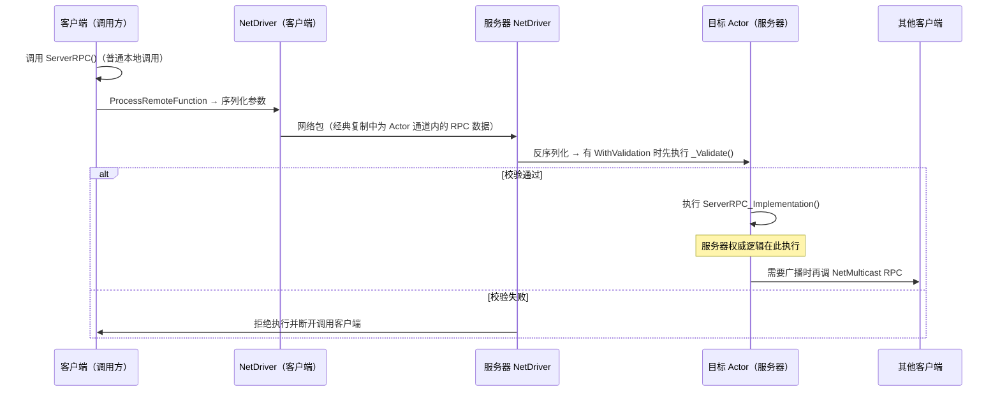
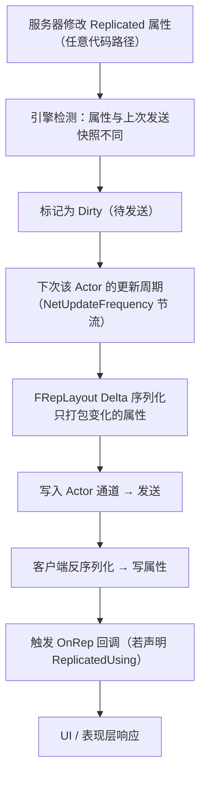

# 02 RPC 与属性同步
> 知识成熟度：L2（本轮审计修订时补标）。
> 版本基准：UE 5.8.0（本机 `Engine/Build/Build.version`：CL 55116800，分支 `++UE5+Release-5.8`）。
> 兼容性边界：适用于 UE5.8 编辑器/运行时，UE4.27 与早期 UE5 仅作迁移背景，具体模块以正文为准。
> 官方参考：[Unreal Engine UE5.8 官方文档总页](https://dev.epicgames.com/documentation/en-us/unreal-engine)。
> 历史整理日期：2026-08-06（本轮元数据维护）。
> 事实边界：2026-10-04 重新核对 Epic 公开文档；原本机/CL 标记作为历史基准保留，未在本次访问该安装、编译、运行 PIE 或弱网测试。
> 最后更新：2026-10-04（文献校订；未运行 UE、PIE、弱网或性能测试）。

> 本篇是「06-网络同步」分类的第二篇，讲解 UE 网络通信的两种核心手段：
> **RPC（Remote Procedure Call，远程过程调用）**——跨机器执行函数；
> **属性同步（Replicated Properties）**——服务器状态自动下发。
> 适用版本：UE 5.0 ~ 5.8。

---

## 一、概述

在客户端-服务器架构下，任何跨机器的信息传递只有两种形态：

1. **事件（Event）**：我要通知你"发生了什么事"→ 用 **RPC**。例如"开火"、"开门"、"请重开一局"。
2. **状态（State）**：我要让你持续看到"现在是什么状态"→ 用 **属性同步**。例如血量、位置、得分、弹药数。

远端 RPC 与属性同步需要正确的复制对象、连接与路由。Actor/ActorComponent 要启用复制；经典复制使用 Actor 通道，Iris 使用不同的复制管线/数据流组织。调用端、Owner 连接和相关性决定执行位置，`Reliable` 不能修复路由错误。共同基础包括序列化、可靠性机制与带宽调度。

本篇结构：先讲 RPC 的声明语法、三种方向（Server / Client / Multicast）、可靠性与校验；再讲属性同步的注册、条件、通知与 Fast Array；最后集中解决工程问题——同步频率怎么调、抖动从哪来、插值怎么做。

---

## 二、核心概念（速查表）

### 2.1 RPC 三大方向

| 修饰符 | 调用位置 | 执行位置 | 典型用途 |
| --- | --- | --- | --- |
| `UFUNCTION(Server)` | 客户端（拥有该 Actor 的连接） | 服务器 | 客户端向服务器"请求/上报"：移动输入、攻击请求、交互请求 |
| `UFUNCTION(Client)` | 服务器 | **拥有该 Actor 的那个客户端** | 服务器向 Owner 单发通知：扣血提示、UI 事件、确认结果 |
| `UFUNCTION(NetMulticast)` | 服务器 | 服务器本地 + **当前已连接且该 Actor 对其相关的客户端** | 相关范围内的爆炸、开门动画等事件 |

### 2.2 可靠性修饰

| 修饰符 | 保证 | 代价 | 适用 |
| --- | --- | --- | --- |
| `Reliable` | 有效连接/路由中的已发送 RPC 通过 ACK/重传保障交付；同一连接、发送方向和 Actor/其子对象可靠流保序 | 额外带宽、可能阻塞后续可靠 RPC | 低频、需要可靠传递的请求/通知，业务仍需校验 |
| `Unreliable` | 可丢失，不提供可依赖的执行顺序，也不与 Reliable 建立统一顺序 | 无可靠重传，须容忍缺失 | 高频、可替代的输入或表现通知 |

### 2.3 校验与实现

| 后缀函数 | 作用 |
| --- | --- |
| `Foo_Implementation` | 实际执行体（必须实现） |
| `Foo_Validate` | 配合 `WithValidation` 校验 Server RPC；返回 false 会拒绝执行并断开调用客户端 |

### 2.4 属性同步关键宏

| 宏 | 作用 |
| --- | --- |
| `DOREPLIFETIME(Class, Prop)` | 无条件复制 |
| `DOREPLIFETIME_CONDITION(Class, Prop, COND_X)` | 条件复制 |
| `DOREPLIFETIME_CONDITION_NOTIFY(Class, Prop, COND_X, REPNOTIFY_Always/REPNOTIFY_OnChanged)` | 条件 + OnRep 触发策略 |
| `DOREPLIFETIME_ACTIVE_OVERRIDE(Class, Prop, bActive)` | 动态开关 |
| `DOREPLIFETIME_CHANGE_CONDITION(Class, Prop, COND_X)` | 动态改条件 |

### 2.5 同步频率与平滑

| 概念 | 说明 |
| --- | --- |
| `NetUpdateFrequency` | Actor 每秒被检查更新的次数（默认 100） |
| `NetPriority` | 带宽竞争时的发送优先级 |
| Jitter（抖动） | 网络延迟的波动，导致到达时间不均匀 |
| Interpolation（插值） | 用历史/目标值平滑过渡，消除跳变 |
| Extrapolation（外推） | 无新数据时按运动趋势继续推算 |

---

## 三、原理详解

### 3.1 RPC 调用路径



要点：

- RPC 的调用方只是"发起"，真正的执行在目标机器上；`_Implementation` 与普通函数一样可以访问该机器上的完整对象状态。
- RPC 参数与返回值：**RPC 没有返回值**（跨机器无法同步返回）；结果必须通过属性复制或另一个 RPC 传回。
- 执行上下文：Server RPC 在服务器上"以该 Actor 为上下文"执行；Client RPC 在目标客户端上执行。
- 先检查对象复制、有效连接与调用矩阵，再检查相关性/过滤与生命周期。客户端调用 Server RPC 必须拥有该 Actor；调用其他客户端或无 Owner 的 Actor 上的 Server RPC 会被丢弃。不能仅凭“看见 Actor”或 `Reliable` 判定能调用。

### 3.2 三类 RPC 的方向细节

#### 3.2.1 Server RPC

- 拥有该 Actor 的客户端调用时在服务器执行；非拥有客户端调用会被丢弃。
- 服务器自己调用 Server RPC 时在服务器本地执行，这是官方矩阵定义的行为。
- 请求能够路由不代表合法：服务器仍需检查权限、冷却、资源与参数。

#### 3.2.2 Client RPC

- 服务器向客户端远程调用时，目标是该 Actor 的 owning client connection。
- 服务器调用但 owning connection 为服务器或 None 时在服务器执行；并不会自动选择一个客户端。
- 典型用途是向某个玩家单独下发 UI 通知、确认请求或专属数据。

#### 3.2.3 NetMulticast RPC

- 服务器调用时，覆盖服务器本地和当前已连接、对该 Actor 相关的客户端。
- 客户端调用只在该客户端本地执行，不转发给服务器或其他客户端。
- 它不是跨相关性、跨断线或晚加入后的持久广播；持久效果需要用可重建状态表达。

### 3.3 可靠性：Reliable 与 Unreliable

- **Reliable RPC**：在有效连接和合法发送路径中进行 ACK/重传；同一连接、同一发送方向内，同一 Actor 及其子对象的可靠 RPC 流保序。不同 Actor、不同接收连接、双向调用以及 Reliable/Unreliable 混合流，不存在可依赖的统一顺序。连接断开、错误 Owner/路由或对象生命周期结束不能理解成“将来必补发”。高频调用会挤压可靠队列。
- **Unreliable RPC**：丢失后不靠可靠重传恢复。业务要容忍缺失，不能用与其他 RPC 相邻调用表达先后依赖。
- **属性复制**：重建当前状态，中间赋值可以被合并或跳过；不是逐条事件日志。连接有效且对象符合复制条件时，后续更新可纠正客户端状态。

可靠性是 UE 复制层语义，不等于把网络传输切换为 TCP。详见 [执行顺序](https://dev.epicgames.com/documentation/en-us/unreal-engine/replicated-object-execution-order-in-unreal-engine) 与 [RPC 调用矩阵](https://dev.epicgames.com/documentation/unreal-engine/remote-procedure-calls-in-unreal-engine?lang=en-US)。

### 3.4 WithValidation：服务器端校验

```cpp
UFUNCTION(Server, Reliable, WithValidation)
void ServerRequestFire(const FVector& AimDirection);

bool ServerRequestFire_Validate(const FVector& AimDirection)
{
    // 校验参数合法性：方向必须归一化、数值不能为 NaN/无穷
    return AimDirection.IsNormalized();
}
```

- 校验在服务器上、`_Implementation` 之前执行；
- `_Validate` 返回 false 时，该 RPC 不执行且调用客户端会断开；正常的“冷却未结束”等可恢复业务拒绝应与此分开处理。
- 所有客户端请求都要做服务器权威校验；是否使用会断线的 `WithValidation`，应与普通业务拒绝分开设计。

### 3.5 参数序列化与压缩类型

RPC 与属性同步的参数都会被序列化进网络包，参数类型直接影响带宽：

| 类型 | 说明 |
| --- | --- |
| `int32 / float / bool` | 基础类型，直接序列化 |
| `FVector / FRotator` | 线上大小取决于类型、版本和序列化路径，不能把内存大小或固定 12 字节直接当作包内成本 |
| `FVector_NetQuantize` | 位置压缩（1/100 精度？——实际是整数量化，适合小范围坐标） |
| `FVector_NetQuantize100` | 高精度量化（厘米级，适合移动坐标） |
| `FVector_NetQuantize10` | 低精度量化（适合大范围粗略位置） |
| `FVector_NetQuantizeNormal` | 单位向量压缩（适合朝向） |
| `TArray<复制的类型>` | 数组整体序列化（效率低于 Fast Array，见 3.8） |
| 自定义结构体 | 需实现 `NetSerialize` 才能高效压缩 |

> 注：`FVector_NetQuantize` 系列是 UE 官方推荐的坐标/方向传输类型，CharacterMovement 的 `ServerMove` 就大量使用它们。

### 3.6 属性同步机制

下图仅示意经典复制的轮询路径；Push Model 与 Iris 的检测、标脏和数据流实现需分别核对。



关键机制：

1. **变化检测**：经典轮询使用变化跟踪；Push Model/Iris 的模式和配置不同。复制条件、调度和带宽仍可能延后发送，不代表每次赋值都有独立客户端事件。
2. **序列化粒度**：普通结构体可递归按字段跟踪；`NetSerialize` / `NetDeltaSerialize`、字段类型和后端会改变发送粒度。不能认定任意结构体改一个字段都整块重发，也不能把 `FVector` 固定算成 12 字节。拆分/组合按共同更新需求、通知语义和实测成本权衡。
3. **C++ 与蓝图通知不同**：C++ 直接赋值不会因 ReplicatedUsing 自动调用本地 OnRep；客户端接收更新时按通知条件触发。Blueprint 的 Set 节点可自动调用该属性在蓝图定义的 RepNotify；共享表现函数需避免重复副作用。
4. **顺序边界**：不同属性的 OnRep 顺序没有保证，不能按声明或服务器赋值顺序推断。有关联字段可由一个结构体和一个通知统一处理，或接收后集中协调；这不保证逐次中间状态，也不是跨 Actor 或 RPC/属性事务。

依据：[FRepLayout](https://dev.epicgames.com/documentation/en-us/unreal-engine/API/Runtime/Engine/FRepLayout)、[C++/Blueprint RepNotify](https://dev.epicgames.com/documentation/en-us/unreal-engine/replicate-actor-properties-in-unreal-engine)、[执行顺序](https://dev.epicgames.com/documentation/en-us/unreal-engine/replicated-object-execution-order-in-unreal-engine)。

### 3.7 同步频率：NetUpdateFrequency 与 NetPriority

- `NetUpdateFrequency` 是"上限节流"：Actor 每秒至多被检查/发送那么多次。它**不是**固定周期发送——只有当属性脏了才会真的发。
- 服务器每个 Tick 会遍历所有连接的候选 Actor，按 `NetPriority` 排序，在带宽预算内尽量多发。
- 组合策略：

| 场景 | 建议 |
| --- | --- |
| 玩家位置/朝向 | 30~100Hz，Unreliable 属性或移动组件专用通道 |
| 血量/状态变化 | 10~30Hz 足够（变化本身低频） |
| 装饰/静态物 | 1~10Hz，或干脆 `COND_InitialOnly` |
| 一次性事件 | 用 RPC，别用属性 |

### 3.8 Fast Array：高效复制数组

普通 `TArray` 属性复制是"整个数组"作为一个属性重发（增删一个元素也会全量发）。**Fast Array（`FFastArraySerializer`）** 把数组拆成"增量条目"：增删改只发受影响的那一项。

适用场景：物品栏、玩家列表、Buff 列表、生成物列表等"元素频繁增删改"的数组。

### 3.9 抖动（Jitter）与插值（Interpolation）

#### 抖动从哪来

- 网络路径上的排队与拥塞（延迟本身波动）；
- 服务器与客户端帧率不同步（更新到达时间不均匀）；
- 丢包导致的等待重传；
- 时钟漂移（客户端与服务器时钟不同步）。

抖动在表现上的后果：位置跳变、角色"瞬移"、动画卡顿。

#### 插值策略

| 策略 | 做法 | 适用 |
| --- | --- | --- |
| 属性级插值 | 每帧把当前值向目标值逼近（`FMath::FInterpTo`） | 血条、进度、自定义状态 |
| 位置插值 | 按时间戳在两个已知位置之间线性插值 | SimulatedProxy 的移动 |
| 旋转插值 | 四元数 `Slerp` 或最短路径旋转 | 朝向平滑 |
| 缓冲插值 | 客户端保留 50~150ms 的接收缓冲，统一延迟到"过去"再渲染 | 高实时对战 |
| 外推 | 无新数据时按速度继续推进 | 短暂丢包时避免停顿 |

UE 内置的移动插值由 `UCharacterMovementComponent` 的 `NetworkSmoothingMode`（Linear / Exponential / Disabled）控制，详见本分类 03 篇。

---

## 四、代码示例

### 4.1 Server RPC：客户端请求，服务器裁决

```cpp
UCLASS()
class AMyCharacter : public ACharacter
{
    GENERATED_BODY()

public:
    // 客户端调用：请求开火
    UFUNCTION(Server, Reliable, WithValidation)
    void ServerRequestFire(FVector_NetQuantizeNormal AimDirection);

    bool ServerRequestFire_Validate(FVector_NetQuantizeNormal AimDirection);
    void ServerRequestFire_Implementation(FVector_NetQuantizeNormal AimDirection);
};

bool AMyCharacter::ServerRequestFire_Validate(FVector_NetQuantizeNormal AimDirection)
{
    // 校验：方向必须有效
    return !AimDirection.IsZero() && AimDirection.IsNormalized();
}

void AMyCharacter::ServerRequestFire_Implementation(FVector_NetQuantizeNormal AimDirection)
{
    // 服务器权威：检查弹药、冷却、生成子弹
    if (CurrentAmmo > 0 && GetWorld()->GetTimeSeconds() >= NextFireTime)
    {
        CurrentAmmo--;
        NextFireTime = GetWorld()->GetTimeSeconds() + FireCooldown;
        SpawnProjectile(AimDirection);
    }
}

// 客户端输入回调里发起请求
void AMyCharacter::OnFirePressed()
{
    if (!HasAuthority()) // 非服务器才需要上行
    {
        ServerRequestFire(GetControlRotation().Vector());
    }
    // 客户端本地立即播放开火表现（预测），结果以服务器为准
    PlayFireEffects();
}
```

### 4.2 Client RPC：服务器向 Owner 下发

```cpp
UCLASS()
class AMyPlayerController : public APlayerController
{
    GENERATED_BODY()

public:
    // 服务器调用：只发给这个 Controller 对应的客户端
    UFUNCTION(Client, Reliable)
    void ClientNotifyMatchStarted(const FString& MapName);

    void ClientNotifyMatchStarted_Implementation(const FString& MapName)
    {
        // 客户端本地：更新 UI、播放开场动画
        UGameplayStatics::GetPlayerController(this, 0)->ClientMessage(TEXT("比赛开始：" + MapName));
        OnMatchStarted.Broadcast(MapName);
    }
};
```

### 4.3 NetMulticast RPC：广播事件

```cpp
UCLASS()
class AMyExplosiveBarrel : public AActor
{
    GENERATED_BODY()

public:
    // 服务器调用：全客户端播放爆炸
    UFUNCTION(NetMulticast, Unreliable)
    void MulticastExplode(const FVector& Location, const FRotator& Rotation);

    void MulticastExplode_Implementation(const FVector& Location, const FRotator& Rotation)
    {
        // 每个机器（含服务器）都执行：生成特效、播放音效、震屏
        SpawnExplosionVFX(Location, Rotation);
        PlaySound(ExplosionSound, Location);
        if (IsLocallyControlled()) // 本地玩家震屏
        {
            CameraShake();
        }
    }

    void ServerExplode()
    {
        if (HasAuthority())
        {
            ApplyAreaDamage();        // 权威结算
            MulticastExplode(GetActorLocation(), GetActorRotation()); // 广播表现
        }
    }
};
```

### 4.4 属性同步 + OnRep 完整示例

```cpp
UCLASS()
class AMyHealthComponent : public UActorComponent
{
    GENERATED_BODY()

public:
    AMyHealthComponent()
    {
        SetIsReplicatedByDefault(true); // 组件也要复制
    }

    UPROPERTY(ReplicatedUsing = OnRep_Health, BlueprintReadOnly)
    float Health = 100.f;

    UFUNCTION()
    void OnRep_Health();

    virtual void GetLifetimeReplicatedProps(TArray<FLifetimeProperty>& OutLifetimeProps) const override
    {
        Super::GetLifetimeReplicatedProps(OutLifetimeProps);
        DOREPLIFETIME(AMyHealthComponent, Health);
    }

    UFUNCTION(Server, Reliable, WithValidation)
    void ServerApplyDamage(float Amount);
    bool ServerApplyDamage_Validate(float Amount)
    {
        return Amount >= 0.f && Amount <= 1000.f && FMath::IsFinite(Amount);
    }
    void ServerApplyDamage_Implementation(float Amount)
    {
        // 服务器权威修改 → 自动复制 → 客户端 OnRep
        Health = FMath::Max(0.f, Health - Amount);
        if (Health <= 0.f)
        {
            OnDeath_Authority();
        }
    }
};

void AMyHealthComponent::OnRep_Health()
{
    // 只在客户端执行
    UpdateHealthBarUI(Health);
    if (Health <= 0.f)
    {
        PlayDeathEffects();
    }
}
```

### 4.5 条件复制 + 通知策略

```cpp
void AMyPlayerState::GetLifetimeReplicatedProps(TArray<FLifetimeProperty>& OutLifetimeProps) const
{
    Super::GetLifetimeReplicatedProps(OutLifetimeProps);

    // 分数：所有人可见，变化即通知
    DOREPLIFETIME_CONDITION_NOTIFY(AMyPlayerState, Score, COND_None, REPNOTIFY_OnChanged);

    // 队伍：只初始同步一次（中途换队走专门 RPC）
    DOREPLIFETIME_CONDITION(AMyPlayerState, TeamId, COND_InitialOnly);
}

void AMyPlayerState::OnRep_Score()
{
    // 分数条动画（客户端）
    OnScoreChanged.Broadcast(Score);
}
```

`REPNOTIFY_OnChanged`（默认）：只有值发生变化才触发 OnRep；`REPNOTIFY_Always`：每次收到都触发（即使值相同）。

### 4.6 Fast Array 示例

```cpp
// 1. 定义条目结构（继承 FFastArraySerializerItem）
USTRUCT()
struct FInventoryItem : public FFastArraySerializerItem
{
    GENERATED_BODY()

    UPROPERTY()
    FName ItemID;

    UPROPERTY()
    int32 Count = 0;
};

// 2. 定义 Fast Array 容器
USTRUCT()
struct FInventoryArray : public FFastArraySerializer
{
    GENERATED_BODY()

    UPROPERTY()
    TArray<FInventoryItem> Items;

    void AddItem(const FName& InItemID, int32 InCount)
    {
        FInventoryItem& NewItem = Items.AddDefaulted_GetRef();
        NewItem.ItemID = InItemID;
        NewItem.Count = InCount;
        MarkItemDirty(NewItem); // 关键：标记该条目脏
    }

    bool NetDeltaSerialize(FNetDeltaSerializeInfo& DeltaParms)
    {
        return FFastArraySerializer::FastArrayDeltaSerialize<FInventoryItem, FInventoryArray>(Items, DeltaParms, *this);
    }
};

// 3. 宿主类中注册
UCLASS()
class AMyInventoryActor : public AActor
{
    GENERATED_BODY()

    UPROPERTY(Replicated)
    FInventoryArray Inventory;

    virtual void GetLifetimeReplicatedProps(TArray<FLifetimeProperty>& OutLifetimeProps) const override
    {
        Super::GetLifetimeReplicatedProps(OutLifetimeProps);
        // Fast Array 用 DOREPLIFETIME 注册即可（内部走 NetDeltaSerialize）
        DOREPLIFETIME(AMyInventoryActor, Inventory);
    }
};
```

### 4.7 属性插值示例（客户端平滑）

```cpp
// 在客户端 Tick 中平滑逼近服务器目标值
void AMyActor::Tick(float DeltaSeconds)
{
    Super::Tick(DeltaSeconds);

    if (!HasAuthority() && bSmoothInterpolate)
    {
        // 显示值向服务器目标值插值（Exponential 逼近）
        DisplayValue = FMath::FInterpTo(DisplayValue, ServerTargetValue, DeltaSeconds, 12.f);
    }
}
```

---

## 五、最佳实践

1. **RPC 与属性的选择**：高频变化的持续状态用属性；低频一次性事件用 RPC；"想立刻执行逻辑"用 RPC，"想看到最新状态"用属性。
2. **服务器始终校验请求**：伤害、经济、交易、技能释放要检查权限与合法性；`WithValidation` 返回 false 会断线，普通业务失败应走明确的拒绝/结果逻辑。
3. **别滥用 Reliable**：Reliable RPC 有 ACK/重传开销，高频调用会形成重传风暴；高频数据走 Unreliable 或属性。
4. **RPC 参数最小化**：能传 `FVector_NetQuantizeNormal` 就别传 `FVector`；能传索引/ID 就别传对象引用。
5. **按语义组织属性**：有关联字段可集中到结构体和一个通知；变化频率/条件差异大的字段可分别设计。不要把结构体等同全量重发，使用 trace 验证成本。
6. **条件复制是免费的带宽**：`COND_OwnerOnly` / `COND_InitialOnly` / `COND_SimulatedOnly` 用起来，大多数玩家数据并不需要全员实时同步。
7. **权威修改与表现通知分开**：服务器校验和状态修改放在权威路径；C++ 本地赋值是否调用共享表现函数要明确安排，Blueprint Set 节点也可能触发本地 RepNotify，处理需避免重复副作用。
8. **Fast Array 优先于 TArray 复制**：只要数组会增删元素，就用 `FFastArraySerializer`。
9. **插值要基于时间戳**：不要"每帧按固定速度追"，而要用时间戳差计算，否则不同帧率下平滑效果不一致（03 篇详述）。
10. **调试命令**：`showdebug net`（5.8；`net.InspectChannels` 已移除）、`p.NetShowCorrections`、`log LogNetRPC verbose`、`stat Net`，用数据说话。

---

## 六、常见问题 FAQ

**Q1：RPC 为什么"没生效"？**
按顺序排查：① Actor/Component 复制开关；② 修饰符与 `_Implementation`；③ 连接和对象生命周期；④ 调用端与 owning connection 是否符合执行矩阵；⑤ 相关性/过滤；⑥ `_Validate` 是否拒绝并导致断线。

**Q2：客户端调用了 Server RPC，服务器没执行，日志也没有报错？**
先核对调用客户端是否拥有该 Actor，以及对象是否是服务器复制来的有效对象。错误 Owner 或无 owning connection 的 Server RPC 会被丢弃；Reliable 不绕过这些条件，也不能据其修饰符预设某条断线日志必然出现。

**Q3：Reliable RPC 会丢吗？**
有效连接和合法发送路径内使用 ACK/重传；同一连接、同一发送方向内，同一 Actor 及其子对象的可靠 RPC 流保序。它不保证错误路由的调用执行，不提供跨 Actor 顺序、低延迟或断线后的持久重放。需要跨断线保存的结果应进入持久状态/业务确认协议。

**Q4：为什么服务器上调用 Client RPC 客户端没收到？**
服务器要远程调用客户端，必须找到该 Actor 的 owning client connection。没有客户端 Owner 时可能在服务器本地执行；检查 `GetOwner()`、`GetNetConnection()` 和连接状态，不要把本地执行当作客户端已收到。

**Q5：属性同步有延迟吗？**
有。服务器修改 → 下一个更新周期（受 `NetUpdateFrequency` 与服务器 TickRate 限制）→ 网络传输 → 客户端应用。一般几毫秒到几十毫秒。对延迟敏感的状态请考虑预测与插值（03 篇）。

**Q6：OnRep 在服务器上会执行吗？**
C++ 直接赋值不会因 ReplicatedUsing 自动调用本地 OnRep，手动调用可以。Blueprint 中定义了 RepNotify 的属性，其 Set 节点可触发本地通知，不能统一说“服务器绝不执行”。服务器权威逻辑仍应明确放在修改路径。

**Q7：为什么我的 float 属性同步后精度变了？**
序列化会按类型压缩/量化，浮点数默认保留足够精度，但经过 `FVector_NetQuantize` 等类型或自定义 `NetSerialize` 会损失精度。需要精确值就不要用压缩类型，或用 `NetSerialize` 自定义精度。

**Q8：两个客户端同时改同一属性会怎样？**
属性同步只认服务器副本：谁改都无效，服务器最终值覆盖所有人。这正是权威模型的含义——客户端之间的"同时操作"由服务器串行化裁决。

**Q9：Unreliable RPC 乱序到达怎么办？**
让数据自带时间戳/序号，接收方按时间戳处理（移动系统就是这么做的）。不要把"顺序敏感"的逻辑放在 Unreliable 上。

**Q10：一个属性又复制又走 RPC，会重复吗？**
两条路径独立，不能假设“先修改血量，再发死亡 RPC”就让 RPC 读到新血量。可由复制死亡状态重建表现；即时通知携带所需数据或状态版本，并让表现处理幂等。

---

## 七、原创反例与待执行验证矩阵

服务器在两次网络采样之间把 Ammo 从 3 改成 2 再改成 1；客户端直接从 3 看见 1 是允许的结果。OnRep 不能从收到的状态恢复“两次开火”；每次事件若都重要，需单独的事件标识/确认设计，当前弹药仍由属性重建。

| 用例 | 操作 | 应检查的边界 |
| --- | --- | --- |
| 同 Actor 可靠流 | 同连接、同方向，Actor/子对象发送 R1、R2，加入丢包 | 在有效会话中按序；记录重传延迟 |
| 跨 Actor | A.R1 后 B.R2 | 不把一次观察到的顺序当契约 |
| 属性/通知 | 连续更新 Ammo；分别修改 Health/Dead | 允许跳过中间值，不依赖两个 OnRep 先后 |
| 错误 Owner | 非拥有客户端调用 Reliable Server RPC | 不因 Reliable 而绕过路由矩阵 |
| Multicast | 一个客户端不相关，另一个晚加入 | 不假设补收旧事件；验证持久状态恢复 |
| 断线重连 | 发送后断线，建立新会话 | 不把旧 RPC 队列当持久消息 |

这是测试设计，不是运行记录。执行时记录 UE 版本、后端、调用端/接收端、Actor/连接标识、序号和弱网参数。本次未编译或运行 UE，不能声称这些用例已通过。

## 八、关联阅读

- 本分类：[01-网络架构与复制基础.md](01-网络架构与复制基础.md) —— Actor 复制、NetConnection、通道与 Relevancy 前置知识
- 本分类：[03-客户端预测与延迟补偿.md](../同步预测与回放/03-客户端预测与延迟补偿.md) —— ServerMove RPC 与移动属性的实战应用
- 本分类：[04-多人游戏框架与玩家状态.md](../会话身份与在线服务/04-多人游戏框架与玩家状态.md) —— PlayerState/GameState 的复制设计
- 本仓库：[03-游戏玩法编程](../../../游戏知识/03-游戏玩法编程/README.md) —— GAS 中 Attribute 的复制与预测
- 官方文档：Unreal Engine 5 RPCs、Replicated Properties、Fast Array Replication
- 引擎源码：`Engine/Source/Runtime/Engine/Private/Net/`、`Iris/`（新复制系统的属性定义）、`NetSerialization.h`
