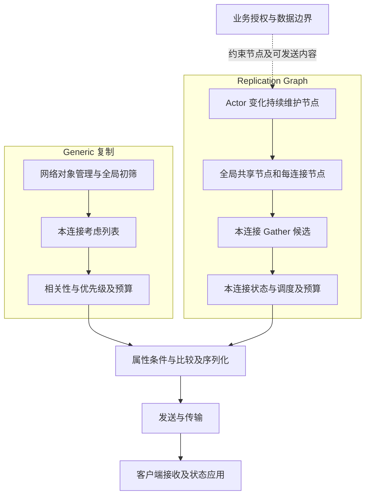
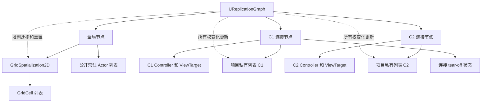
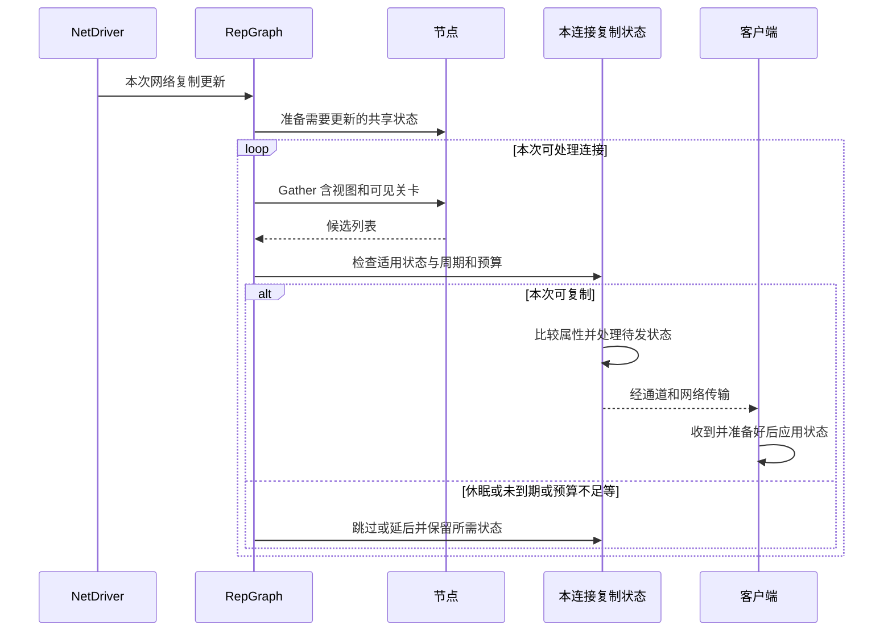

# 05 ReplicationGraph 兴趣管理

> 知识成熟度：L2。本文提供职责划分、接入合同与有限静态示例；没有把 API 阅读或集合推演记作 UE 编译、联机或性能验证。
> 知识基线：UE 的 Generic 复制与 Replication Graph 使用层；原文记录的 UE 5.8.0 / CL 55116800 / `++UE5+Release-5.8` 是历史机器身份，见 §1.3。本轮依据 2026-10-10 取得的 Epic UE 5.6 版本化指南和页面标题标为 UE 5.8 的公开 API 选段；动态 API 页不是该历史 CL 的源码快照。
> 版本基准：指南按显式 UE 5.6 版本页；公开 API 按此次返回的 UE 5.8 标题；历史 5.8.0 / CL 55116800 身份仅按 §1.3 归档语义理解。
> 适用范围：服务器侧 Actor 路由、节点生命周期、每连接候选与调度；Iris 另按 §3.7 的明确版本文档理解。
> 最后更新：2026-10-10（修正 owner-only 路由、候选/交付边界、网格与生命周期合同）。

本篇回答三个问题：Generic 复制的工作量从哪里来，RepGraph 如何共享兴趣结构，项目如何把正确的对象交给正确的连接。前置见 [网络架构与复制基础](01-网络架构与复制基础.md) 与 [RPC 与属性同步](02-RPC与属性同步.md)。

分工：本篇讲 **UE RepGraph 接入和使用合同**；[通用 AOI 与视野计算](../../02-数学与游戏算法/空间查询与碰撞/03-AOI与视野计算.md) 讲空间算法；[服务端 AOI](05-AOI与InterestManagement.md) 讲 Enter/Leave/Update 与运行时协议；[ReplicationGraph 源码专题](34-ReplicationGraph源码.md) 保留其历史源码分析。通用九宫格、服务端模拟器和源码邻篇都不能直接认证当前项目的 RepGraph 行为。

## 一、概述

### 1.1 默认复制路径的成本

Generic 复制会先从纳入网络复制管理的 Actor 中建立考虑列表，结合更新频率、休眠和 owning connection 等条件，再针对连接检查关卡就绪、相关性、优先级和发送能力。`UNetDriver::ServerReplicateActors` 是入口，`UActorChannel::ReplicateActor` 处理特定通道上的 Actor 复制。不能把它缩写为“每个游戏 Tick 必定扫描 World 中每一个 Actor，然后才做任何过滤”；非复制对象、休眠对象、未到更新时间和未处理的连接都影响实际工作集。[S1]

若把某次更新的全局扫描量记为 A，连接 c 要处理的考虑量记为 N_c，仅遍历与排序就可能包含 `A + Σ(N_c + N_c log N_c)` 的工作，还没有计入属性比较、通道管理和字节写入。这是解释成本的模型，不是逐函数复杂度证明。对象数、连接数、热点分布、变化量、硬件与后端共同决定瓶颈；没有“≤32 人用 Generic、100 人必须换图”的通用分界。

### 1.2 ReplicationGraph 改变什么

RepGraph 利用跨帧保留的节点、共享名单和每连接状态，减少反复构建候选的工作。空间、队伍、房间、揭示状态等都可以作为节点策略；2D 网格只是其中一种。[S2]

它也参与复制周期、优先级、连接饱和、休眠、发现预算和 Actor 生命周期处理，因此“仅喂一份名单”过窄。但它没有把候选名单变成已交付状态，也没有取代业务的权限检查、客户端状态应用或渲染判断。具体属性条件、待发历史和 RPC 语义继续由适用复制路径处理，不能把 Generic 的完整筛选流程原封不动地叠在自定义图后面。

### 1.3 历史版本与源码布局的证据边界

旧文的“已对照本机源码验证”“5.8 起全部节点合并到同一头文件”以及源码行号，是历史文本中的声明。本轮没有读取那台机器的 `Build.version`、授权引擎 checkout 或运行日志，不能重新签发该 CL 的认证。

可定位的历史：旧路径 `游戏知识/06-网络同步/05-ReplicationGraph兴趣管理.md` 在提交 `b688b2f4652a5e0760d23886db819ee5bd462273` 已含布局声明；`e464f4c7c1381c35703f9b6e8833f57b738c6830` 增加了 5.8.0 / CL 55116800 身份行；`79bb4a9ecb084d5765bcced9b5b4c586666f6d30` 将正文迁到当前路径。见 [固定历史版本](https://github.com/fantuan812/learning/blob/e464f4c7c1381c35703f9b6e8833f57b738c6830/游戏知识/06-网络同步/05-ReplicationGraph兴趣管理.md)。这两个路径是主题的历史定位，不是完整历史资料归档的声明。

公开 API 当前将图、多个节点放在 `ReplicationGraph.h`，类/Actor 数据结构放在 `ReplicationGraphTypes.h`。[S3][S4] 但 UE 5.5 的 `GatherActorListsForConnection` API 也已经列出 `ReplicationGraph.h`。[S5] 因而不能据当前头文件路径得出“5.8 才合并”的迁移结论。接入时核对目标版本的公开声明、模块依赖与实际授权源码；旧教程路径失效时按符号定位，不机械批量替换 include。

## 二、核心概念（速查表）

### 2.1 六个不能混淆的集合或事件

| 层次 | 本层回答的问题 | 不代表什么 |
| --- | --- | --- |
| 业务授权集合 | C 是否允许知道 A 的这部分数据，是否允许执行某操作 | 距离近、拥有对象或收到 RPC 都不是业务裁决 |
| 节点成员 | A 被维护在哪些持久列表/空间结构里 | 加入全局节点不等于对每连接都应发送 |
| 本连接候选 | 本次 Gather 给 C 提供了哪些 Actor | 不代表周期到期、非休眠、关卡就绪或预算足够 |
| 本连接调度结果 | 本次选择处理哪些 Actor/复制路径 | 不代表每个属性变化都有字节写出 |
| 发送与交付 | 写入通道/包、实际发出、对端接收分别发生到哪一步 | 写入或本次比较无变化不等于所有连接已同步 |
| 客户端应用 | 对象与引用准备后，状态如何应用、通知与展示 | 不等于可见于渲染，也不等于服务端已接受交互 |

例如私有背包 Actor 不能进入向所有连接输出的普通列表。即使某些属性带 Owner 条件，也不能据此推定该 Actor 的其余状态、引用或 RPC 都满足私有边界。服务端仍要核对操作主体、物品归属和数量约束。[S6]

### 2.2 关键类型与职责

| 类型 | 用途与接入注意点 |
| --- | --- |
| `UReplicationDriver` / `UReplicationGraph` | 驱动接口与图实现；图服务于具体 World / NetDriver |
| `UReplicationGraphNode` | 节点扩展点：成员增删、准备、收集、重置与退出 |
| `UNetReplicationGraphConnection` | 特定连接的图状态；连接数组下标不是稳定玩家身份 |
| `UReplicationGraphNode_ActorList` | 基础名单及按 streaming level 组织的名单；不是自动 Owner 过滤器 |
| `UReplicationGraphNode_ActorListFrequencyBuckets` | 分桶轮转收集，平摊检查工作；不保证实际交付周期 |
| `UReplicationGraphNode_DynamicSpatialFrequency` | 依据连接视点距离组织动态对象的频率策略 |
| `UReplicationGraphNode_GridSpatialization2D` / `GridCell` | 空间索引及格子节点；按对象的动态/静态/休眠策略维护 |
| `UReplicationGraphNode_AlwaysRelevant` | 始终相关策略的一种节点；“全局对象”仍需明确项目路由 |
| `UReplicationGraphNode_AlwaysRelevant_ForConnection` | 本次公开 API 说明聚焦本连接的 PlayerController 和 ViewTarget；不是任意 Owner-only 对象注册表 |
| `UReplicationGraphNode_DormancyNode` / `ConnectionDormancyNode` | 维护主名单的每连接副本，跳过已对该连接完全休眠的对象 |
| `UReplicationGraphNode_TearOff_ForConnection` | 专门管理 tear-off 状态；不要当普通销毁队列 |
| `AReplicationGraphDebugActor` | 每连接调试入口；公开 API 说明 Shipping 不生成它 |

类型目录依据 [S3]；名单、连接常驻与休眠细节依据 [S7][S8][S9]；调试边界见 [S10]。

### 2.3 类配置、全局 Actor 状态与每连接状态

| 层 | 内容 | 更新合同 |
| --- | --- | --- |
| `FClassReplicationInfo` | `ReplicationPeriodFrame`、距离/饥饿权重、偏置、通道超时参数、FastShared 配置等 | 提供类级配置；字段存在不等于默认值或任意热修改已获验证 |
| `FGlobalActorReplicationInfo` | 从类配置初始化的 `Settings`、缓存位置、强制更新/flush 记录、依赖对象 | 后续可有实例级差异；不能认为类表一改，所有旧实例都自动刷新 |
| `FConnectionReplicationActorInfo` | 该连接上的通道、休眠/tear-off、上次/下次复制帧和周期 | 同一个 Actor 对 C1/C2 的状态可以不同 |

类配置字段的用途可进一步拆开；以下不认证旧文列出的默认数值：[S4]

| 字段/接口 | 使用时的边界 |
| --- | --- |
| `ReplicationPeriodFrame` / `FastPath_ReplicationPeriodFrame` | 普通与快速路径各有周期，不把两条路径的帧状态混用 |
| `ActorChannelFrameTimeout` | 通道超时策略输入；实际关闭还涉及每连接状态 |
| `SetCullDistanceSquared` / `GetCullDistanceSquared` | 距离平方的设置/读取；使用接口而非假定保护字段可直接赋值 |
| `DistancePriorityScale` / `StarvationPriorityScale` | 距离与长期未复制的权重；排序数值方向需按目标实现解释 |
| `AccumulatedNetPriorityBias` | 优先级偏置；不是业务重要性的自动推导 |
| `FastSharedReplicationFunc` / `FastSharedReplicationFuncName` | 快速共享复制的函数配置；不是给任意私有负载自动加速的开关 |

`ReplicationPeriodFrame` 以复制图帧计，连接字段描述的是相邻 `ReplicateActor` 调用间的最小帧间隔。它不是“每 N 个渲染帧必定发包”，更不是客户端必达频率。公开 API 还提供 `GetReplicationPeriodFrameForFrequency`；项目是否从 `NetUpdateFrequency` 转换，以及转换/覆盖何时发生，要查目标图初始化和更新路径，不能虚构 Generic 的到期筛选必然先执行一遍。[S4][S11][S12]

`ActorChannelFrameTimeout` 参与通道生命周期；不能直接解释为“连续 4 帧没发送就必关”。连接状态另有 `ActorChannelCloseFrameNum`，饥饿与后续调度也会影响关闭时机。`CullDistanceSquared=0` 在相应距离策略中可表示不按距离剔除，但既不会自动入图，也不是授权所有接收者。距离热改要同步全局、连接状态及节点缓存；Grid 的 `NotifyActorCullDistChange` 明确只更新本节点缓存，调用者仍负责 Actor 复制信息。[S11][S13]

### 2.4 调试入口：保留用途，不当作当前已执行命令

旧文保存的下列名字可用于目标版本的命令注册核对；本轮没有启动控制台，也未逐条认证参数语法、平台可用性或开销。`Print/Draw` 与 `Stats/Details` 在这里是两个名字的合写，不是一个可直接粘贴的命令。

| 历史入口 | 要查的问题 |
| --- | --- |
| `stat net` | 旧文的总体网络观察入口；指标口径需按目标版本确认，不能据它单独归因全部复制成本 |
| `Net.RepGraph.PrintGraph`、`Net.RepGraph.DrawGraph` | 全局节点、连接节点及层次是否符合设计 |
| `Net.RepGraph.PrintAllActorInfo` | 指定对象的全局/连接状态是否一致 |
| `Net.RepGraph.PrioritizedLists.Print`、`Net.RepGraph.PrioritizedLists.Draw` | 候选与优先队列的区别 |
| `Net.RepGraph.PrintAll` | 连续帧观察；先限定帧数和连接，避免无界输出 |
| `Net.RepGraph.Lists.Stats`、`Net.RepGraph.Lists.Details` | 名单大小、重复与内存开销 |
| `Net.RepGraph.StarvedList` | 哪些对象因预算或调度长期未更新 |
| `Net.RepGraph.Spatial.CellInfo` | 热点格及空间维护状态 |
| `Net.RepGraph.SetClassCullDistance`、`Net.RepGraph.SetPeriodFrame` | 历史热改入口；先核对实例和连接传播范围 |
| `Net.RepGraph.Spatial.SetCellSize`、`Net.RepGraph.Spatial.ForceRebuild` | 网格配置/重建；可能影响全图，不是无代价查询 |
| `Net.RepGraph.SetDebugActor` | 历史条件断点入口；不假定客户端能任意调服务器 |

公开调试 Actor API 确实列出 `ServerSetCullDistanceForClass`、`ServerSetPeriodFrameForClass`、`ServerPrintAllActorInfo` 等；这证明接口用途，不证明上表所有控制台绑定。本篇不把调试 RPC 当生产配置或授权接口。[S10]

## 三、原理详解

### 3.1 默认复制 vs RepGraph：一图对比

下面是责任图，不是完整源码调用图；连接准备、关卡检查和生命周期处理可分布于多个阶段。



### 3.2 节点图不是只建一次的静态图

全局节点有机会为所有连接输出候选；连接节点只挂到指定连接。节点本身仍可按 Params 过滤。共享一份节点数据，不等于所有客户端共享同一份最终复制结果。[S14]



图由 World / NetDriver 持有；项目还要保留自己的节点引用、路由记录和连接映射，并遵守 UObject 生命周期。不要以 `Connections[0]` 指代固定玩家，也不要因为新连接尚未 ready 就把私有对象退回全局名单。`AddClientConnection`、`RemoveClientConnection`、`ResetGameWorldState`、`TearDown` 是应核对的生命周期入口。[S14]

### 3.3 GridSpatialization2D：空间索引与候选覆盖

本次公开 API 可确认 `CellSize`、`SpatialBias`、`GridBounds`、静态/动态/休眠增删入口及距离变化通知。[S13] 原文“固定取连接周围 3×3 格”没有相应实现证据。通用九宫格按点入格后扫描邻域，是一种算法；RepGraph 的预计算覆盖还可能把 Actor 放入多个可观察格。**将对象影响范围预存到格子**与**按视点范围查询格子**是不同索引组织，不能仅凭接口名裁定当前实现属于哪种、扫描多少格。本文未读取该历史 CL 的 Gather 实现，不另造一个确定的 UE 扫格算法。

项目应维护的覆盖不变量是：在当前路由/关卡/连接政策下应该被考虑的空间 Actor，不能因为缓存格、位置或剔除距离过期而漏出候选；粗筛可多收，再由适用策略处理。候选也不等于屏幕可见、视线无遮挡或允许攻击。

| 输入/入口 | 可用来设计什么 | 不可从名字推导什么 |
| --- | --- | --- |
| `CellSize`、`SpatialBias` | 格尺度及坐标映射；正尺寸、坐标范围由项目明确 | 10000 cm 是通用最优值，或负坐标必非法 |
| `AddActor_Static` / `RemoveActor_Static` | 位置稳定对象的成对路由 | 注册后移动能自动维护静态缓存 |
| `AddActor_Dynamic` / `RemoveActor_Dynamic` | 会移动对象的空间维护 | 跨一个格必重建全图 |
| `AddActor_Dormancy` / `RemoveActor_Dormancy` | 随休眠状态转换维护的对象 | Dormancy 是 Destroy 的另一种叫法 |
| `SetBiasAndGridBounds` | 限制创建格子的区域 | 自动阻止玩家越界或实现楼层隔离 |
| `ConnectionMaxZ` | 需按目标实现核对的高度限制输入 | 已实现任意多层地图的互斥兴趣 |
| `AddToClassRebuildDenyList` | 控制某类越界不驱动空间重建，API 描述会钳制 | 免除移动维护、物理边界或复制正确性检查 |
| `CreateCellNodeOverride`、`ForceRebuild` | 自定义格子构造/显式重建入口 | 可随意热换而不处理旧节点和连接状态 |

### 3.4 本连接流水线：收集后仍可能不复制

`FConnectionGatherActorListParameters` 包含 `Viewers`、连接管理器、客户端可见关卡集合、复制帧及输出名单引用。[S15] ViewTarget 可以变化；不要把单个 Pawn 位置当成所有连接视图的完整定义。



因此 C1 与 C2 同时收集到 A，也可能只有 C1 本次处理 A；即使都处理，也不必写出同样的属性。不能用 Gather 数量代替序列化 Actor 数，更不能用服务器写包记录代替客户端应用证据。默认路径和 FastShared 路径还需分别核对；共享序列化不得把带连接差异或私有信息的数据无条件复用。[S3][S11]

### 3.5 完整生命周期合同

| 事件 | 图/项目需要维护的状态 | 容易遗漏的退出条件 |
| --- | --- | --- |
| Spawn / 启用复制 | 复制资格、类策略、全局状态、实际插入节点及 level 身份 | 尚未初始化或 owner 未就绪时进入有界待处理集合；不能塞给全部连接 |
| Destroy / 停止复制 | 用实际插入记录对称移除；清理待处理与自定义依赖；让适用的引擎销毁/停止复制路径继续执行 | “从节点删掉”本身不是客户端销毁协议 |
| owner 或策略变化 | 从旧连接/旧策略移出，再按新 owning connection 与合法策略加入；更新登记记录 | owner 暂空、断线、旧通道/休眠副本已存在时也必须处理；不能仅按新 owner 找旧节点 |
| 新连接 / 断线 | 建立或移除其节点与映射；仅重试属于该连接的待处理对象 | 不重用失效连接标识；disconnect 不把私有对象全局广播 |
| 移动 / 传送 / 距离热改 | 动态空间更新，或显式刷新静态成员关系；同步相关缓存 | 只改类表或只改坐标可能留下旧覆盖；多个网格间迁移要成对处理 |
| 休眠 / 唤醒 | 跟踪每连接是否完全休眠；通过 Actor API 通知复制系统 | 节点保留 Actor 不代表该连接应发送；flush 不等于永久 Awake |
| tear-off | 走适用的 Actor/驱动/每连接 tear-off 路径，完成该路径要求的最后状态处理 | 不等于立即 Destroy，也不为晚加入者保存完整过去事件 |
| streaming level 卸载/重载、Outer 变化、World reset | 同步 level 名单、可见性、旧成员记录；清理或重建对应缓存 | 旧缓存被重新收集、悬空对象引用、旧世界连接残留 |

上表中对称路由、待处理集合和业务身份是项目设计合同，不是宣称引擎会替自定义节点实现。基础 ActorList 已含 streaming-level 名单；自定义 `NotifyAddNetworkActor` 只做 `ReplicationActorList.Add`，或 Gather 时无条件输出整表，可能绕开这部分处理。应优先复用适用基类行为，另补业务过滤、对称删除、Rename/Reset/TearDown，而不是只重写 Add/Gather。[S7]

休眠使用 `SetNetDormancy` 通知 NetDriver；一次性更新可先 `FlushNetDormancy`，持续变化则先转 Awake，再改复制属性。官方指南明确：即使节点收集到休眠 Actor，RepGraph 默认复制路径仍会跳过该连接上的休眠对象。[S16] `DormancyNode` 与 `ConnectionDormancyNode` 为各连接维护副本、flush 与流送恢复状态；不应在唤醒时盲目重复 Add。[S9]

此次返回为 UE 5.8 标题的 Grid API 列出 `bDestroyDormantDynamicActors`（启用离开相关范围后通知客户端销毁休眠动态副本）、`DestroyDormantDynamicActorsCellTTL`（对象在相关范围外持续多少帧的策略输入）和 `ReplicatedDormantDestructionInfosPerFrame`（把此类销毁通知成本分摊到多帧）。这是本次动态公开声明支持的用途，不认证历史 CL 55116800 的默认值、具体发送顺序或交付时限。[S13]

Grid 的休眠动态销毁选项是在满足其开关、相关性、TTL 等条件后通知客户端移除副本；服务器上的 Actor 生命周期另算。它不是无条件“清尸体”按钮。要记录它离开/重入时的客户端对象身份与关卡状态，不能把关通道、离开候选、进入休眠、tear-off 和销毁合成一个事件。[S13][S16]

`AActor::TearOff` 的公开含义是停止复制；已有接收者可保留 torn-off 对象并进入其本地生命周期。[S17] 本文没有核验该 CL 的最终发送顺序，也不承诺“调用后立刻删除服务器 Actor 仍可保证所有客户端收到最终值”。

### 3.6 优化选择要能说明代价

- 持久化空间/队伍名单可减少重复筛选，但动态移动、跨区、owner 转移和连接副本会产生维护与内存成本。
- FrequencyBuckets 与 DynamicSpatialFrequency 分别提供分桶和距离频率策略。减轻单次工作量也可能增加发现/状态更新等待，不能只看平均 CPU。[S18]
- `SetActorDiscoveryBudget` 的 API 参数以 KBytes/s 表示；图有独立的开 Actor 通道预算。它不是全服总带宽上限，也不能保证新连接在固定时间内看齐对象。[S14]
- 调大类周期、缩小半径、限制 AlwaysRelevant 会改变玩家收到的状态。先定义玩法允许的延迟和覆盖，再比较 Gather、排序、序列化、传输及客户端成本。
- 多个 Grid 可以表达分区，但如果每个连接照样遍历所有 Grid，或对象被重复路由，未必更省；分区边界重叠、跨区转移和队伍例外都要明确。

### 3.7 与 Iris 的关系

UE 5.6 版本化《Migrate to Iris》的 “Differences Specific to Replication Graph” 明确说明：Iris 与 Replication Graph 是不同系统，同一 NetDriver 选择其中一种；Iris 的 filters / prioritizers 承接对应的过滤与优先级用途。[S19] 这不是对本轮未读的 UE 5.8 CL 实现作裁决。

该 5.6 指南标注 Iris 为 Experimental；旧文 `d294ec...` 把某历史插件描述符的 Beta 标志写入正文，却同时保留 Experimental 说法。插件路径、单个 `IsBetaVersion` 字段、公开文档标签与项目生产适用性不是同一判断。本文保留历史定位，不据动态 API 重证旧机器的插件状态，也不声称“生产主流必用 RepGraph”。已有属性/RPC 声明可以有兼容性，迁移仍需核对过滤、子对象及生命周期。具体接入见 [Iris 复制使用与迁移](07-Iris复制使用与迁移.md)。

## 四、有限接入示例与失败退场

以下示例只展示配置形状、对象归属和单步路由合同；不是可直接编译的完整 UCLASS、宿主或生产实现。本轮未执行 UHT、编译、配置加载、联机或模型。项目需要真实模块、类声明、反射产物、持有节点的成员、连接映射与生命周期回调。

### 4.1 选择驱动的配置形状

```ini
[/Script/OnlineSubsystemUtils.IpNetDriver]
ReplicationDriverClassName="/Script/ExampleGame.ExampleReplicationGraph"
```

这是官方指南所示的 IpNetDriver 配置形状。[S2] `ExampleGame` 必须换成实际模块，类路径必须存在，插件与模块依赖必须就绪；使用别的 NetDriver 时需核对其配置。也可研究 `CreateReplicationDriverDelegate` 入口。本文不演示游戏进行中随意 `SetReplicationDriver`：活动通道、连接与对象状态不能因能调用 setter 就被视为安全迁移。

预期观察应是服务器实际 NetDriver 持有预期驱动；缺类、模块未载入、驱动不是预期类型或 Iris 已被选用，均停止把后续结果归因于 RepGraph。ini 存在只是输入，不是生效证据。

### 4.2 类设置：具体数值只属于这个例子

输入：目标为项目中实际使用的 `APawn` 派生对象；约定单位 cm，示例空间范围 150 m，周期为 2 个图帧。以下是图子类 `InitGlobalActorClassSettings` 中的局部设置，所需声明来自 `ReplicationGraph.h`、`ReplicationGraphTypes.h` 与 `GameFramework/Pawn.h`：

```cpp
// 局部片段；不是完整宿主，也未编译验证。
FClassReplicationInfo PawnInfo;
PawnInfo.SetCullDistanceSquared(15000.f * 15000.f);
PawnInfo.ReplicationPeriodFrame = 2;
GlobalActorReplicationInfoMap.SetClassInfo(APawn::StaticClass(), PawnInfo);
```

`SetClassInfo` 的公开入口见 [类/Actor 信息映射 API](https://dev.epicgames.com/documentation/unreal-engine/API/Plugins/ReplicationGraph/FGlobalActorReplicationInfoMap)。它展示“类设置”这一职责，不负责把 Pawn 入图。还需核对派生类更具体的覆盖、实例初始化时机和连接副本。原文拾取物 50 m / 4 帧、投射物 200 m / 3 帧可作为项目自定预算的候选输入；`APickup`、`AProjectile` 并不是本文提供了定义的引擎通用宿主，不能照抄其未声明类型后宣称完整可编译。

### 4.3 一个网格、公开列表和每连接私有列表

有限输入：只有 C1、C2 两个已 ready 的远程连接；S 是公开 GameState；P 是可移动 Pawn；I 是只向 C1 公开的私有物品 Actor；这些对象均在 persistent level，坐标有限、生命周期有效。图拥有 Grid 和 PublicList，每个连接拥有独立 PrivateList(C)。私有列表不会注册成全局节点。

以下是已实现图子类初始化函数中的局部语句；`Grid` 与 `PublicList` 应由图以符合 UObject 生命周期的成员引用保存：

```cpp
Grid = CreateNewNode<UReplicationGraphNode_GridSpatialization2D>();
Grid->CellSize = 10000.f;                // 本例 100 m，不是最优值承诺
Grid->SpatialBias = FVector2D(0.f, 0.f); // 本例仅使用预定非负区域
AddGlobalGraphNode(Grid);

PublicList = CreateNewNode<UReplicationGraphNode_ActorList>();
AddGlobalGraphNode(PublicList);
```

对于 C1 和 C2，分别在连接初始化入口创建一个 `UReplicationGraphNode_ActorList` 并通过 `AddConnectionGraphNode(Node, ConnectionManager)` 关联到该连接，把映射保存为 PrivateList(C)。若另外需要内建 Controller/ViewTarget 行为，可建立 `AlwaysRelevant_ForConnection`；这不自动收录 I。[S8][S14]

S 明确路由到 PublicList，P 通过 `AddActor_Dynamic(ActorInfo, GlobalInfo)` 进入 Grid，I 明确加入 PrivateList(C1)。不能使用无分类信息的 `Grid->NotifyAddNetworkActor` 替代所有 Static/Dynamic/Dormancy 决策。GameMode 是服务端规则对象，不因“全局”就应放入客户端常驻列表。

### 4.4 成对路由与 owner 迁移

下面是**项目政策伪代码**，不是 UE API 实现。`RouteRecord[A]` 保存实际插入时的节点/策略/稳定连接身份及本次安装记录标识 R；A 的稳定身份还需区分 World 和 Actor 的这次生命期，不能只用可能复用的数组位置或裸指针。`ExpectedRecord` 是该事件预期操作的旧安装记录；首次安装则预期“尚无记录”，不能把空值当通配符。`ValidatedEvent` 表示宿主完成下述复核的请求，不是引擎类型。

涉及 owner、ready、disconnect 或延迟清理的事件，宿主必须在解绑或调用本例之前重核：Actor 与连接的稳定身份仍对应这次生命周期；服务器当前权威 owning connection 是谁；事件携带的旧记录/待处理标识是否仍匹配实际状态。旧 C1 事件不因记住了 A 就有权操作当前 C2 的新记录。若已过期，只能清理仍可证明匹配旧身份和旧记录的成员或 pending 项；不能无条件按 Actor 删除当前记录、重新加入旧连接或全局兜底。销毁或旧 World 的 Actor 不得由迟到事件重新入图。

`RemoveMatching` 只在实际记录仍等于 `ExpectedRecord` 时，按那份记录调用适用的 `NotifyRemoveNetworkActor` 或 Grid 的 `RemoveActor_*`，并只清理与之匹配的旧记录/待处理项。首次安装预期无记录且实际也无记录时，移除为空操作。宿主负责在同一个路由更新界点内完成身份/归属复核、旧成员解绑、旧记录清理以及新成员与新记录的安装；若这些步骤分开执行，安装前必须再次核对当前权威归属、本次迁移仍有效且尚未被另一份新安装取代，不能用旧快照提交。旧成员未清理完成时不安装新路由，应暂停该对象在项目自定义路径的候选输出并报告失败；新安装失败时只撤销本次尝试的成员，保持 fail-closed 或当前身份下的有界 pending，不能误撤另一份已经成功的新记录。这些是本例需要宿主提供的责任，不是引擎事件全序或完整并发框架的证明。

Owner-only 与公开常驻策略冲突时，本例拒绝路由并报告配置错误，不用 if 顺序隐式放宽权限。

```text
AddOrReroute(A, ExpectedRecord, ValidatedEvent):
  if 宿主未在本次更新界点完成上述身份/当前权威归属/实际记录复核:
    拒绝本事件；仅清理仍匹配旧身份和旧记录的状态；返回
  if RouteRecord[A] 与 ExpectedRecord 不匹配:
    返回                            # 旧 R1 不得卸掉当前 R2
  if 本例不能处理的 tear-off/流送/策略组合:
    交生命周期宿主处理并停止；不先改旧路由或截断其最终状态路径
  if RemoveMatching(A, ExpectedRecord) 未完成:
    暂停该对象的项目候选输出并报告失败；返回
  if A 已销毁、停止复制、属于旧 World: 返回
  policy = 项目配置给 A 的唯一策略
  if policy 冲突或缺失: 报告错误；返回
  if policy == OwnerOnly:
    C = 服务器由 A 的 owning connection 解析得到的稳定连接身份
    if C 为空或未 ready:
      放入有界 PendingOwner(A)；返回  # 不回退到 Grid 或 PublicList
    插入 PrivateList(C)，记录 (A, OwnerOnly, C, 对应节点)
  if policy == Public:
    插入 PublicList，记录实际节点
  if policy == SpatialDynamic:
    Grid.AddActor_Dynamic(ActorInfo, GlobalInfo)，记录 Dynamic 策略
```

有限轨迹的静态预期：

| 输入变化 | 路由结果 | 仍不能据此宣称 |
| --- | --- | --- |
| 初始 S、P、I，I 的 owning connection=C1 | S 在公开列表；P 在动态网格；I 仅在 C1 私有列表 | C1 已收到 I，或 C2 已通过所有属性/授权检查 |
| I 从 C1 转归 C2 | 先移出 C1 的旧节点，后加入 C2；旧记录被替换 | C1 已有副本当场销毁，或已发送数据可被追回 |
| I 暂时无 owner | 两连接私有列表均不含 I，仅在 PendingOwner | 无 owner 应允许所有人接收 |
| I 在 pending 时销毁 | pending 与所有记录清空，不再重试 | 客户端销毁已可靠交付 |
| C1 断线后新连接复用数组位置 | 按连接身份重建，旧 C1 条目不能被新连接继承 | 数组下标能作稳定授权身份 |

迟到事件的有限轨迹：

1. I 属于当前 World/生命期，权威 owning connection 为 C1；宿主把 I 安装到 PrivateList(C1)，登记 R1。
2. 权威 owner 转为 C2；宿主重核 I、C1/C2 与实际 R1，在同一路由更新界点按 R1 成对移除并清理旧状态，再安装 PrivateList(C2) 并登记 R2。
3. 原 C1 的 ready、disconnect 或旧 R1 清理随后到达。宿主重核后发现当前 owner=C2、实际记录=R2；该过期事件至多清理仍匹配的 C1/R1 旧状态，R1 已清完则无事可做。不得移除 R2、把 I 重加 C1 或改为全局广播；清理旧 pending 也不能删除属于新归属/新记录的 pending。
4. I 若已经销毁或属于旧 World，迟到事件不得重建路由。只按那次 Actor/连接生命周期和记录身份清理残留，不能影响同位置/同名或复用索引的新 Actor。一次新的合法路由请求须重新核对当前权威状态。

真实宿主还需处理旧连接上的既有通道、休眠副本、已排队数据与策略变化。已到达客户端的信息无法靠改 Owner 收回；若旧接收者必须立刻停止使用本地对象，需要明确的生命周期和业务撤销规则。若新 owner 无法解析或连接销毁，保持 fail-closed 待处理/退场，不能为了“看得见”退回全局广播。

### 4.5 自定义节点与按类分组

按投射物类分组可以集中调频，但“一个全局 ProjectileList 对每连接原样输出”不是空间过滤。设计前写清：输入对象是否移动、是否依赖携带者、哪些连接能收、流送关卡何时可见；输出只承诺候选。

若只需名单容器，复用 `UReplicationGraphNode_ActorList` 的增删与 level 分类；若必须覆盖 Gather，使用 `Params` 的连接/可见关卡语义，并维护所继承的对象退出合同。[S7][S15] 按类的路由表需要确定继承匹配、重复路由与实例策略覆盖规则；`TMap<UClass*, Node*>` 本身不完成这些工作。依赖 Actor 也需检验接收连接的 level 可见性与周期，不能用“跟随父 Actor”替代所有权政策。[S12]

### 4.6 周期和距离热改的静态推演

假设 C1 对 P 的上次处理图帧为 100，配置最小周期 2，无强制更新、休眠/重建或特殊路径。本例只可提出“周期门限允许的下一候选处理时点为 102”这一推演；102 若未收集到 P 或预算不足仍可能不处理，更无法推导某时刻客户端必收到。C2 有独立上次/下次帧，不能复用 C1 的时点。[S11]

若把距离从 150 m 改成 200 m，仅修改 `FClassReplicationInfo` 不足以证明既有 P、C1/C2 及网格覆盖都更新。目标实现需要明确调用哪些全局/连接设置入口及 Grid 距离通知，并在失败时保持一致旧配置或停止这次变更；不能只完成一半缓存修改就报告热改成功。[S13][S14]

### 4.7 边界与重建

设本例允许区域为 XY `[0, 100000] cm`，格边长 10000 cm；P 传送到区域外时，项目先决定它是否仍应复制，再核对 GridBounds、越界钳制和重建政策。`AddToClassRebuildDenyList` 可以改变某类触发重建的资格，但不是“高速投射物总是更快”的结论。[S13]

静态 Actor 一旦允许移动，就要显式维护旧格/新格或切换到合适策略。修改 CellSize、SpatialBias 或多个 Grid 的边界时，应有重建旧成员、重接连接与失败回退方案。没有这些条件，本篇不提供“传送后直接 ForceRebuild 就好”的生产调用模板。

## 五、最佳实践与验证建议

### 5.1 先保证数据边界和生命周期

1. 将公开、owner-only、队伍、空间与依赖策略分清；权限决定可共享信息，复制图决定候选和调度，玩法服务端决定合法操作。
2. 同时设计 Add、Remove、Reroute、Reset、连接退出和 pending 清理；任何策略变更都能定位旧成员。
3. 用真实复制对象作为试验输入。GameState、PlayerController、Pawn 的默认行为不同；不要用始终相关对象证明空间离开后必然关通道。
4. 路由只记录具体连接身份；观战、视点切换、监听服本地玩家与远程连接分别解释，不按玩家数臆造网络连接。
5. 先区分普通复制与 FastShared，再评估共享名单/数据；连接差异和私有状态不能被共享路径绕过。

### 5.2 验证矩阵（本轮均未运行）

| 场景 | 需观察的中间证据 | 验收目标 |
| --- | --- | --- |
| C1/C2 + 同一 owner-only Actor | 旧/新路由记录、每连接 Gather、通道/副本身份与接收值 | 只有合法接收者取得允许数据；移交后旧路径不继续产生新更新 |
| owner 空值、稍后 ready、pending 中删除 | pending 数量、重试触发和清理记录 | 无全局兜底、无无界重试、无失效引用 |
| C1/R1 转为 C2/R2 后收到旧 ready/disconnect/清理 | Actor/连接生命期、事件旧标识、当前权威归属、实际安装及 pending 记录 | 旧事件不得卸 R2、重加 C1、删新 pending 或复活旧 World/已销毁 Actor；失败不全局兜底 |
| 同格移动、跨格、负坐标、边界及传送 | 服务端位置、缓存覆盖、本连接候选 | 不漏应考虑对象；重复、异常坐标与越界政策可解释 |
| Static/Dynamic/Dormancy 路由切换 | 实际成员记录与对称移除 | 无旧格残留、重复入图或移动对象误留静态缓存 |
| C1 已休眠、C2 新接入，然后修改状态 | flush/awake 时点、连接休眠状态、接收状态 | 区分首次发现、唤醒与持续更新，不以 Gather 代替已应用 |
| level 卸载后重载、Actor Outer/World 变化 | level 可见名单、对象身份、节点缓存 | 不发给未就绪关卡，不复活旧世界失效对象 |
| tear-off、服务器 Destroy、离开空间范围 | 各自关闭原因、最终状态、客户端保留/移除记录 | 三种退出原因分别符合合同；不使用一个“已移除”指标混报 |
| 预算不足、新连接大量发现 | 候选/处理数、开通道数、饥饿状态和状态时效 | 同时满足覆盖与时效预算，不能靠永不发送换低耗时 |
| 监听服、视点切换或多视图 | 实际 NetConnection/Viewer/本地实例身份 | 本地权威访问不冒充网络复制成功，多视图支持另验 |

真实验证需另行具备可运行工程、授权引擎与明确实验范围：记录 Build.version/CL、目标平台、服务器类型、选中驱动、真实类/对象/连接身份、输入轨迹和有效结果。若这些前提缺失，结果就是未运行或不充分，不创建虚假的测试日志。

### 5.3 性能证据如何解释

比较同等玩法覆盖与状态时效下的 Generic 与 RepGraph；分开记录图维护、Gather、排序、属性比较、通道/字节处理和客户端应用。场景至少区分均匀分布、热点聚集、静止休眠与批量出现。名单越短也可能来自漏路由；高命中热点可能使空间预筛几乎失效。没有实测，不给出“CPU 大幅下降”“线性扩展”或人数容量保证。

仓库确有 [AOI 模拟器历史记录](../../../evidence/algorithms/aoi/README.md) 与 [原始输出](../../../evidence/algorithms/aoi/results/aoi_simulator_win_x64_msvc.txt)：200×200 格、半径 3 格的切比雪夫口径，10,000 实体那行记录 130,226 次网格比较、7.299 ms 与暴力 96.003 ms，事件不一致 0。它是独立 C++ AOI 模型的历史数据，未建模 RepGraph、真实发包或客户端消费；不是本轮重跑，也不能替本篇证明固定 3×3、UE 端到端性能或任意半径正确率。保留这项有用局部证据，不扩大其外推范围。

## 六、常见问题 FAQ

**Q1：ReplicationGraph 能降低带宽吗？**
它主要改善候选组织及复制调度。路由、半径、周期和休眠策略可能减少发送，也可能增加首次发现或重建开销；必须区分 CPU、字节数和玩家状态时效，不能保证“直接不能”或“必定能”。

**Q2：CellSize 怎么选？**
10000 cm 只保留为示例输入。先确定对象半径/密度、移动与覆盖维护方式，再比较候选量和迁移成本。格边长与半径的经验比值不是 RepGraph 固定九宫格证明。

**Q3：bAlwaysRelevant / bOnlyRelevantToOwner 会自动路由吗？**
取决于实际图的策略实现。自定义路由需要明确实现这些语义；把普通 ActorList 命名为 OwnerOnlyNode 并挂到全局，不会自动变成每连接过滤。先确认所属连接，再维护对称路由。

**Q4：动态 Actor 跨格是不是每次重建？**
空间成员迁移与重建整个空间结构是不同操作。动态、静态和越界重建政策要分别核对；DenyList 不是通用低成本保证。

**Q5：NetUpdateFrequency 与 ReplicationPeriodFrame 会叠加吗？**
不能一概而论。项目图可能把前者转换成后者，但要看实际初始化/刷新逻辑。`ReplicationPeriodFrame` 约束图帧间隔，不承诺每隔该时间发出或到达一次。

**Q6：旧教程的分节点头文件找不到怎么办？**
按目标版本公开 API 与授权源码中的类声明定位；当前 API 指向 `ReplicationGraph.h`，但不能把这一结果说成已证明“5.8 起才合并”。历史身份见 §1.3。

**Q7：RepGraph 与 Iris 能一起用吗？**
本文取得的 UE 5.6 官方迁移指南规定同一 NetDriver 选择其中一种。不同 World/NetDriver 的组合和其他版本必须另查，不能把两套过滤器当自动可叠加。[S19]

**Q8：监听服务器是否比专用服务器多一个远程连接？**
不能这样算。本地宿主与远程客户端的网络路径不同；实际 NetConnection、Viewer 和本地实例应分别记录。本地能看见对象不证明远程客户端接收成功，分屏/多视图支持也需目标版本核对。

**Q9：ForceNetUpdate / FlushNetDormancy 是否保证立即收到？**
不保证。它们与待更新、休眠处理有关，后面仍有连接资格、调度、预算和传输。一次性修改应先 flush 或唤醒，再改复制属性；不要把“重新参与处理”写成“一定重新创建节点或马上到达”。[S16]

**Q10：AReplicationGraphDebugActor 会在所有构建自动可用吗？**
不会。当前公开 API 明确说明 Shipping 不生成，接口还涉及连接与调试路径。具体创建/授权入口和控制台注册要核对；不要把历史调试名字写成生产功能已启用。[S10]

## 七、关联阅读与来源

### 7.1 仓内导航

- [网络架构与复制基础](01-网络架构与复制基础.md)：复制对象、相关性及客户端状态基础
- [RPC 与属性同步](02-RPC与属性同步.md)：属性条件、待发历史、执行顺序与业务校验
- [客户端预测与延迟补偿](../同步预测与回放/03-客户端预测与延迟补偿.md)：状态时效与预测/纠正
- [多人游戏框架与玩家状态](../会话身份与在线服务/04-多人游戏框架与玩家状态.md)：GameState、Controller、Pawn 与登录流程
- [服务端 AOI 与 Interest Management](05-AOI与InterestManagement.md)：运行时事件和协议设计
- [通用 AOI 与视野计算](../../02-数学与游戏算法/空间查询与碰撞/03-AOI与视野计算.md)：空间算法及视野规则
- [UObject 与反射系统](../../03-引擎架构与资源系统/对象模型与生命周期/01-UObject与反射系统.md)：节点的对象生命周期前置
- [ReplicationGraph 源码专题](34-ReplicationGraph源码.md)：既有源码分析；其历史行号不视为本轮对引擎重验
- [Iris 复制使用与迁移](07-Iris复制使用与迁移.md)：Iris 专属过滤、优先级和接入边界

### 7.2 本轮实际读取的一手来源

读取日期为 2026-10-10。S1/S2/S6/S16/S19 使用显式 UE 5.6 选择器；S5/S17 有 UE 5.5 版本化入口。其余 API 返回标题标为 UE 5.8，但 URL 会更新，仅作此次声明/备注选段的证据，不能映射到 CL 55116800。加入 `application_version=5.8` 的若干 API 请求失败，未以失败当成功；具体行为超出公开备注时保持未核验。

- S1：[Detailed Actor Replication Flow，UE 5.6](https://dev.epicgames.com/documentation/en-us/unreal-engine/detailed-actor-replication-flow-in-unreal-engine?application_version=5.6)，初筛、连接/关卡、ActorChannel 分工
- S2：[Replication Graph，UE 5.6](https://dev.epicgames.com/documentation/en-us/unreal-engine/replication-graph-in-unreal-engine?application_version=5.6)，持久节点、按需列表、ini / delegate 配置入口
- S3：[ReplicationGraph 模块 API](https://dev.epicgames.com/documentation/unreal-engine/API/Plugins/ReplicationGraph?lang=en-US)，类型目录、名单类别及候选有效性
- S4：[FClassReplicationInfo](https://dev.epicgames.com/documentation/unreal-engine/API/Plugins/ReplicationGraph/FClassReplicationInfo)，字段与公开距离 setter
- S5：[GatherActorListsForConnection，UE 5.5](https://dev.epicgames.com/documentation/en-us/unreal-engine/API/Plugins/ReplicationGraph/UReplicationGraphNode/GatherActorListsForConnection?application_version=5.5)，头文件定位
- S6：[Actor Owner and Owning Connection，UE 5.6](https://dev.epicgames.com/documentation/en-us/unreal-engine/actor-owner-and-owning-connection-in-unreal-engine?application_version=5.6)，owning connection 与 Actor/属性/RPC 路由
- S7：[UReplicationGraphNode_ActorList](https://dev.epicgames.com/documentation/en-us/unreal-engine/API/Plugins/ReplicationGraph/UReplicationGraphNode_ActorList)，基础/streaming-level 列表及增删重置
- S8：[AlwaysRelevant_ForConnection](https://dev.epicgames.com/documentation/unreal-engine/API/Plugins/ReplicationGraph/UReplicationGraphNode_AlwaysRele-_1)，本版本 Controller/ViewTarget 行为
- S9：[DormancyNode](https://dev.epicgames.com/documentation/unreal-engine/API/Plugins/ReplicationGraph/UReplicationGraphNode_DormancyNo-)、[ConnectionDormancyNode](https://dev.epicgames.com/documentation/unreal-engine/API/Plugins/ReplicationGraph/UReplicationGraphNode_Connection-)，每连接副本、flush、level 恢复
- S10：[AReplicationGraphDebugActor](https://dev.epicgames.com/documentation/en-us/unreal-engine/API/Plugins/ReplicationGraph/AReplicationGraphDebugActor)，调试 RPC 与 Shipping 边界
- S11：[FConnectionReplicationActorInfo](https://dev.epicgames.com/documentation/en-us/unreal-engine/API/Plugins/ReplicationGraph/FConnectionReplicationActorInfo)，每连接帧、通道、休眠和周期状态
- S12：[FGlobalActorReplicationInfo](https://dev.epicgames.com/documentation/en-us/unreal-engine/API/Plugins/ReplicationGraph/FGlobalActorReplicationInfo)，类镜像、实例状态和依赖名单
- S13：[GridSpatialization2D](https://dev.epicgames.com/documentation/unreal-engine/API/Plugins/ReplicationGraph/UReplicationGraphNode_GridSpatia-?lang=en-US)，公开增删、边界、距离通知、休眠副本销毁开关；不提供完整 Gather 实现
- S14：[UReplicationGraph](https://dev.epicgames.com/documentation/en-us/unreal-engine/API/Plugins/ReplicationGraph/UReplicationGraph)，节点/连接管理、生命周期、预算及设置入口
- S15：[FConnectionGatherActorListParameters](https://dev.epicgames.com/documentation/unreal-engine/API/Plugins/ReplicationGraph/FConnectionGatherActorListParame-)，视图、可见关卡、连接与输出名单
- S16：[Actor Network Dormancy，UE 5.6](https://dev.epicgames.com/documentation/en-us/unreal-engine/actor-network-dormancy-in-unreal-engine?application_version=5.6)，先唤醒再修改、flush 与 RepGraph 收集后跳过
- S17：[AActor::TearOff，UE 5.5](https://dev.epicgames.com/documentation/unreal-engine/API/Runtime/Engine/GameFramework/AActor/TearOff?application_version=5.5)、[AActor 当前 API](https://dev.epicgames.com/documentation/unreal-engine/API/Runtime/Engine/AActor)，停止复制与 GetTearOff/TornOff 备注；不认证最后发送顺序
- S18：[ActorListFrequencyBuckets](https://dev.epicgames.com/documentation/unreal-engine/API/Plugins/ReplicationGraph/UReplicationGraphNode_ActorListF-)、[DynamicSpatialFrequency](https://dev.epicgames.com/documentation/unreal-engine/API/Plugins/ReplicationGraph/UReplicationGraphNode_DynamicSpa-)，分桶及动态距离频率节点
- S19：[Migrate to Iris，UE 5.6](https://dev.epicgames.com/documentation/en-us/unreal-engine/migrate-to-iris-in-unreal-engine?application_version=5.6)，Differences Specific to Replication Graph

继续做目标版本源码研究时，原文的定位用途仍保留：插件 `ReplicationGraph.h` / `ReplicationGraphTypes.h` 查声明，`BasicReplicationGraph.cpp` 查示例策略，`ReplicationGraph.cpp` 查图更新与调度，`ReplicationGraphDebugging.cpp` 查命令绑定，Generic 的 `NetDriver.cpp` 查对照流程；Iris 的源码位置按目标 checkout 单独定位。本篇不新增这些引擎源码正文，也不以旧行号认证当前安装。
