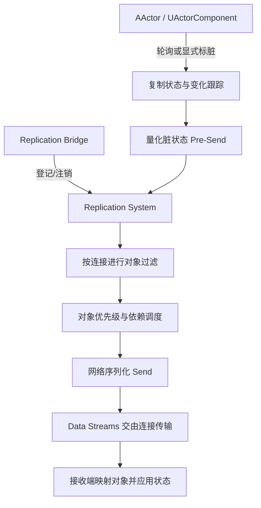

# 07 Iris 复制系统：使用、启用与迁移
> 知识成熟度：L2（接入与迁移教学；2026-10-04 公共文献校订保留，2026-10-10 补齐最小接线与判定方法，仍仅核对 Epic 公开文档/API，不新增运行验证）。

> 历史版本基准（沿用旧稿，待本机复核）：UE 5.8.0（旧稿记录 `Engine/Build/Build.version`：CL 55116800，分支 `++UE5+Release-5.8`）。
> 适用范围：UE 客户端/服务端 · Iris 接入、性能评估与分阶段迁移，不承诺无损热切换。
> 历史核对记录：原稿称曾对照本机 `C:\Program Files\Epic Games\UE_5.8\Engine`（`Source\Runtime\Net\Iris`、`Source\Runtime\Engine\Public\Net\Iris\ReplicationSystem\EngineReplicationBridge.h`、`Classes\Engine\NetDriver.h`、`Private\NetDriver.cpp`、`Plugins\Experimental\Iris\Iris.uplugin`）；该历史记录未在本次复现。源码级深读配合 [20-Iris复制源码.md](20-Iris复制源码.md)。
> 事实边界：2026-10-04 重新核对 Epic 公开文档/API；2026-10-10 再核对下列来源，补入原创装备架教学例。两次文献校订均不认证上述 Windows UE 安装或旧 CL；本次未编译、运行 PIE、抓取网络 trace、压测或演练生产回退。示例均需在目标工程验证。
> 官方参考：[Iris Replication System 官方文档](https://dev.epicgames.com/documentation/en-us/unreal-engine/iris-replication-system)。
> 历史整理日期：2026-08-20；本次文档校订日期见上，不将旧性能或生产适用性断言当作验证结论。
> 最后更新：2026-10-10（保留 2026-10-04 文献校订，补齐 Actor/Component/UObject 接线、两连接判定、Push Model 与生命周期边界；未运行 UE、PIE、弱网或性能测试）。
> 本次来源定位：实际读取的 Epic 稳定入口页标题为 UE5.8；网页不是旧 CL 的源码快照。带 `application_version=5.8` 的部分入口读取失败，因此不将该参数当作已固定的实现版本；以文末核对范围和目标工程自己的 Build.version/配置复核为准。

---

## 概述

**Iris** 是 UE 的选择启用型复制系统；UE 5.1 已有实验版本，本文参考的 UE5.8 官方介绍仍保留实验性提示。它将游戏对象的数据访问与复制状态处理分开，通过描述符、量化状态、过滤/优先级以及连接间共享工作改善扩展能力。

- **状态描述与变化跟踪**：可使用反射属性；是否轮询、如何标脏取决于模式和配置，不能说所有 Setter 自动标脏或静态对象零开销。
- **对象登记与网络句柄**：Bridge 连接游戏对象与复制系统；网络句柄关联复制对象，不能自动消除生命周期或引用错误。
- **并发潜力**：数据分离为并发创造条件，不保证整个流水线离开 GameThread，也不保证随核数线性加速。
- **兴趣与带宽调度**：过滤决定对象能否发给连接；优先级影响有限带宽下先发送哪些对象，不替代服务器的业务权限校验。

依据：[Iris 介绍](https://dev.epicgames.com/documentation/en-us/unreal-engine/introduction-to-iris-in-unreal-engine)、[UE5.1 实验版入门](https://dev.epicgames.com/community/learning/tutorials/Xexv/unre)。

---

## 核心架构与经典复制对比

| 维度 | 经典复制路径 | Iris 路径 | 迁移检查 |
| --- | --- | --- | --- |
| 对象与状态 | Actor 通道、属性复制布局，可搭配 Push Model / Replication Graph | Bridge、描述符、复制片段与网络句柄 | 旧插件、对象引用、销毁/重建与回放 |
| 变化检测 | 依配置轮询或显式标脏 | 依模式跟踪脏状态，也有兼容轮询路径 | 漏标脏、额外轮询与更新延迟 |
| CPU/内存 | 维护对象/连接相关状态 | 量化状态与连接间共享工作 | 同负载实测，不预设内存减少 40% 或 CPU 减少 30% |
| 并发 | 受实现和集成方式限制 | 分离复制与游戏数据，支持进一步并发 | 实际线程时间线及瓶颈转移 |
| 兴趣管理 | 相关性与 Replication Graph 节点 | Connection/Group/Dynamic Filtering 与 Prioritizer | 逐条保持旧规则语义，评估动态过滤成本 |

这些是设计比较和测量目标，不是本仓库已完成的基准测试。对象数、连接数、变化比例、可见范围和硬件不同，收益也可能不同。

---

## 原理详解与运行时数据流

下图是概念流程，不是实测线程分布：



### 1. 后端选择与运行状态

编译包含 Iris、插件启用、配置选择和连接实际使用 Iris 是不同检查点。应在目标工程记录实际 NetDriver，结合 `UNetDriver::IsUsingIrisReplication()` 和日志核对。

不要把两种后端理解成同一连接内任意按 Actor 混搭，也不要从某个 Bridge 接口推导出“可实时切换”。依赖 `UActorChannel`、NetGUID 内部细节或旧 `ReplicateSubobjects` 回调的插件/代码应列入兼容审计；本文不宣称这些底层接口全部消失。

---

## 最小启用步骤（按 UE5.8 官方文档核对）

1. `.uproject` 启用 Iris 插件；模块 `.Build.cs` 调用 `SetupIrisSupport(Target)`；目标 `.Target.cs` 核对 `bUseIris = true`。早期版本构建默认值不同，按目标版本说明操作。
2. 在 `DefaultEngine.ini` 按下列最小项选择启用；使用 Push Model 模式时，还需其开关和正确标脏。

```ini
[SystemSettings]
net.SubObjects.DefaultUseSubObjectReplicationList=1
net.Iris.UseIrisReplication=1
; net.Iris.PushModelMode=1 时还需：
; net.IsPushModelEnabled=1
```

3. 核对目标 NetDriver 的 `IrisNetDriverConfigs`、客户端/服务端配置和已有平台集成。不要为了启用 Iris 清空 `NetDriverDefinitions` 或强行替换网络驱动，以免破坏已有会话、平台或回放配置。
4. 官方列出的命令行选项为 `-UseIrisReplication=1` / `-UseIrisReplication=0`。在受控启动/新会话流程中测试两条路径；参数本身不是活跃连接零停机转换协议。

来源：[Introduction to Iris 的启用与命令行选项](https://dev.epicgames.com/documentation/en-us/unreal-engine/introduction-to-iris-in-unreal-engine)。本次未在目标工程编译或启动验证这些步骤。

---

## C++ 接入片段与对象注册

### 1. ActorComponent 与普通 UObject 子对象分开处理

**ActorComponent**：拥有者 Actor 和组件都要启用复制。静态组件可在构造函数使用 `SetIsReplicatedByDefault(true)`；动态组件按生命周期注册并使用 `SetIsReplicated(true)`。这不要求所有业务组件都直接调用 Bridge 的 `StartReplicatingSubObject`。

**普通 UObject 子对象**：Iris 使用 registered subobjects list。拥有者启用 `bReplicateUsingRegisteredSubObjectList`，对象创建后用 `AddReplicatedSubObject` 登记，删除前用 `RemoveReplicatedSubObject` 移除。对象仍需有效引用和复制属性；非 Actor/ActorComponent 的类还需实现 `RegisterReplicationFragments`。

`UPROPERTY` 本身不等于已复制该成员引用。如果客户端要通过 `WeaponState` 成员访问动态子对象，还需复制该引用，例如 `UPROPERTY(Replicated)` 与 `DOREPLIFETIME`，或明确其他关联机制。`AddReplicatedSubObject` 不自动同步拥有者的成员指针；客户端在对象引用映射完成前应容忍空值。

以下仅展示拥有者一侧的生命周期片段，**不是完整可编译工程**。省略的 `UMyWeaponState` 需实现网络支持、属性注册与 Iris fragments；`WeaponState` 需按上述要求持有/复制引用：

```cpp
// AMyCombatCharacter 构造函数的设置
bReplicates = true;
bReplicateUsingRegisteredSubObjectList = true;

// 服务器创建和登记；不是每帧重复执行
WeaponState = NewObject<UMyWeaponState>(this);
AddReplicatedSubObject(WeaponState);

// 替换或删除前，先取消登记，再处理引用和销毁生命周期
RemoveReplicatedSubObject(WeaponState);
WeaponState = nullptr;
```

`Health` 等 Actor 属性仍通过 `UPROPERTY(ReplicatedUsing=...)` 和 `DOREPLIFETIME` 声明；这与子对象登记是不同步骤。晚加入、对象销毁/重建以及回放要单独测试。

来源：[Actor Component Replication](https://dev.epicgames.com/documentation/unreal-engine/replicating-actor-components-in-unreal-engine)、[Object Replication](https://dev.epicgames.com/documentation/en-us/unreal-engine/replicating-uobjects-in-unreal-engine)。

### 2. 从三个游戏对象追到两个连接：公共装备架最小例

前面的短片段说明“登记什么”；这里把未展开的接线补齐。场景只有一个公共装备架：Actor 保存 `Revision`，静态 ActorComponent 保存 `Health`，服务器动态创建的 UObject 保存 `Ammo`。A、B 两个客户端都应最终看到 `Revision=1, Health=75, Ammo=29`。这些全是公开测试值，**本例不承载私有背包或队伍机密**。

选这个例子是为了区分三条线路：`CreateDefaultSubobject` 创建组件，组件的复制开关让组件状态进入复制；`AddReplicatedSubObject` 登记动态 UObject；Actor 的复制成员引用把收到的 UObject 接到 `WeaponState`。只接通其中一条不能替代另外两条。复制系统登记对象后，还要检测状态、按连接过滤和调度、编码传输并在客户端映射/应用，才形成可读的值；“已经注册”不是“两个客户端已经收到”。

以下是原创、完整列出本例类声明和定义的 **UE C++ 教学候选，未编译、未运行**；不是引擎源码节选，也不是独立可执行工程。将两文件加入同一个现有游戏模块的 `Private` 目录，因此不需要示例模块导出宏。已有模块需依赖 `Core`、`CoreUObject`、`Engine`，并按上节调用 `SetupIrisSupport(Target)`。保留项目自己的模块名、Target、NetDriver 和插件配置。本文依据 2026-10-10 实际读到、页标题标为 UE5.8 的 Epic 文档/API；这不认证旧 CL 或任意 UE 分支能直接编译本例。

先固定为轮询教学起点：在**隔离测试工程的启动配置**中明确 `net.Iris.PushModelMode=0`，保留上节 Iris 启用项。本例属性使用普通 `DOREPLIFETIME`，不宣称它展示 Push Model 性能。官方网络调试参考区分 0（关闭）、1（启用且不可运行时切换）、2（启用且可切换），采用 Push dirtiness 还要求 `net.IsPushModelEnabled` 及 `WITH_PUSH_MODEL > 0`。这里不依赖不同版本文档的默认值；更改的是测试启动条件，不是活跃会话热切换。来源：[网络调试变量 / Iris](https://dev.epicgames.com/documentation/en-us/unreal-engine/console-commands-for-network-debugging-in-unreal-engine)。

#### `IrisTeachingRack.h`：属性属于谁，客户端就从谁读取

```cpp
#pragma once
#include "CoreMinimal.h"
#include "Components/ActorComponent.h"
#include "GameFramework/Actor.h"
#if UE_WITH_IRIS
#include "Iris/ReplicationSystem/ReplicationFragmentUtil.h"
#endif
#include "IrisTeachingRack.generated.h"

UCLASS()
class UIrisTeachingWeaponState : public UObject
{
    GENERATED_BODY()
public:
    UPROPERTY(Replicated) int32 Ammo = 30;
    virtual bool IsSupportedForNetworking() const override { return true; }
    virtual void GetLifetimeReplicatedProps(
        TArray<FLifetimeProperty>& OutLifetimeProps) const override;
#if UE_WITH_IRIS
    virtual void RegisterReplicationFragments(
        UE::Net::FFragmentRegistrationContext& Context,
        UE::Net::EFragmentRegistrationFlags Flags) override;
#endif
};

UCLASS()
class UIrisTeachingStatus : public UActorComponent
{
    GENERATED_BODY()
public:
    UIrisTeachingStatus();
    UPROPERTY(Replicated) int32 Health = 100;
    virtual void GetLifetimeReplicatedProps(
        TArray<FLifetimeProperty>& OutLifetimeProps) const override;
};

UCLASS()
class AIrisTeachingRack : public AActor
{
    GENERATED_BODY()
public:
    AIrisTeachingRack();
    virtual void Tick(float DeltaSeconds) override;
    virtual void GetLifetimeReplicatedProps(
        TArray<FLifetimeProperty>& OutLifetimeProps) const override;
protected:
    virtual void BeginPlay() override;
    virtual void EndPlay(const EEndPlayReason::Type Reason) override;
private:
    UPROPERTY() TObjectPtr<UIrisTeachingStatus> Status;
    UPROPERTY(Replicated) TObjectPtr<UIrisTeachingWeaponState> WeaponState;
    UPROPERTY(Replicated) int32 Revision = 0;
    float ReadySeconds = 0.0f;
    bool bAppliedSample = false;
    FString LastSnapshot;
};
```

`Status` 是构造时创建的同名默认组件，不需要再复制这个成员指针来创建它。`WeaponState` 则不同：它只在服务器运行期创建，所以引用也被登记为复制属性。`UPROPERTY` 同时保存服务器强引用，不能指望注册列表替代 GC 引用管理。三个类放在一起仅为缩短教学接线，不建议据此把真实业务类做成公共可写数据袋。

#### `IrisTeachingRack.cpp`：创建、状态变化、观察与退出

```cpp
#include "IrisTeachingRack.h"
#include "Engine/World.h"
#include "Net/UnrealNetwork.h"

void UIrisTeachingWeaponState::GetLifetimeReplicatedProps(
    TArray<FLifetimeProperty>& OutLifetimeProps) const
{
    Super::GetLifetimeReplicatedProps(OutLifetimeProps);
    DOREPLIFETIME(UIrisTeachingWeaponState, Ammo);
}

#if UE_WITH_IRIS
void UIrisTeachingWeaponState::RegisterReplicationFragments(
    UE::Net::FFragmentRegistrationContext& Context,
    UE::Net::EFragmentRegistrationFlags Flags)
{
    UE::Net::FReplicationFragmentUtil::CreateAndRegisterFragmentsForObject(
        this, Context, Flags);
}
#endif

UIrisTeachingStatus::UIrisTeachingStatus()
{
    SetIsReplicatedByDefault(true);
}

void UIrisTeachingStatus::GetLifetimeReplicatedProps(
    TArray<FLifetimeProperty>& OutLifetimeProps) const
{
    Super::GetLifetimeReplicatedProps(OutLifetimeProps);
    DOREPLIFETIME(UIrisTeachingStatus, Health);
}

AIrisTeachingRack::AIrisTeachingRack()
{
    bReplicates = true;
    bAlwaysRelevant = true; // 仅公共、低负载教学对象
    bReplicateUsingRegisteredSubObjectList = true;
    PrimaryActorTick.bCanEverTick = true;
    PrimaryActorTick.TickInterval = 0.25f;
    Status = CreateDefaultSubobject<UIrisTeachingStatus>(TEXT("Status"));
}

void AIrisTeachingRack::BeginPlay()
{
    Super::BeginPlay();
    if (HasAuthority())
    {
        WeaponState = NewObject<UIrisTeachingWeaponState>(this);
        AddReplicatedSubObject(WeaponState);
    }
}

void AIrisTeachingRack::GetLifetimeReplicatedProps(
    TArray<FLifetimeProperty>& OutLifetimeProps) const
{
    Super::GetLifetimeReplicatedProps(OutLifetimeProps);
    DOREPLIFETIME(AIrisTeachingRack, WeaponState);
    DOREPLIFETIME(AIrisTeachingRack, Revision);
}

void AIrisTeachingRack::Tick(float DeltaSeconds)
{
    Super::Tick(DeltaSeconds);
    // 受控场景：一个独立服务器，恰好两个客户端，无 Bot/旁观者。
    // Controller 数仅用来启动演示延时，不是客户端已收包的确认。
    if (HasAuthority() && !bAppliedSample)
    {
        if (GetWorld()->GetNumPlayerControllers() == 2)
            ReadySeconds += DeltaSeconds;
        else
            ReadySeconds = 0.0f;
        if (ReadySeconds >= 5.0f && IsValid(WeaponState))
        {
            Status->Health = 75;
            WeaponState->Ammo = 29;
            Revision = 1;
            bAppliedSample = true;
        }
    }

    const FString Snapshot = FString::Printf(
        TEXT("Revision=%d Health=%d Weapon=%s Ammo=%d"),
        Revision, Status->Health,
        IsValid(WeaponState) ? TEXT("mapped") : TEXT("null"),
        IsValid(WeaponState) ? WeaponState->Ammo : -1);
    if (Snapshot != LastSnapshot)
    {
        UE_LOG(LogTemp, Display, TEXT("IrisRack World=%s Authority=%d %s"),
            *GetWorld()->GetName(), HasAuthority() ? 1 : 0, *Snapshot);
        LastSnapshot = Snapshot;
    }
}

void AIrisTeachingRack::EndPlay(const EEndPlayReason::Type Reason)
{
    if (HasAuthority() && IsValid(WeaponState))
        RemoveReplicatedSubObject(WeaponState);
    WeaponState = nullptr;
    Super::EndPlay(Reason);
}
```

这里 Tick 的唯一额外职责是让读者从每个世界读取当前组合状态；不依赖 Actor、组件、UObject 的通知顺序，也不把 `Revision` 当作跨对象事务提交号。生产 UI 可以用相应通知刷新，但仍须处理引用暂未映射和状态分次到达。

核心接线依据：[Object Replication 的 Required Setup / Registered Subobjects List / Additional Steps for Iris](https://dev.epicgames.com/documentation/en-us/unreal-engine/replicating-uobjects-in-unreal-engine)、[静态与动态 ActorComponent](https://dev.epicgames.com/documentation/en-us/unreal-engine/replicating-actor-components-in-unreal-engine)。对象引用和对象状态分别注册；非 Actor/Component 的 UObject 明确实现 fragments。`UE_WITH_IRIS` 只保护 Iris 专属声明与调用，不替代模块依赖或运行时后端确认。演示计时读取的 `GetNumPlayerControllers()` 见 [UWorld API](https://dev.epicgames.com/documentation/en-us/unreal-engine/API/Runtime/Engine/UWorld)，实际后端查询见 [UNetDriver::IsUsingIrisReplication](https://dev.epicgames.com/documentation/en-us/unreal-engine/API/Runtime/Engine/UNetDriver)。

#### 在目标工程怎样判定，而不是只看服务器输出

1. 编译通过后，在空测试地图只放一个 `AIrisTeachingRack`。编辑器的具体起点是 Play 菜单中 `Number of Players=2`、`NetMode=Play as Client`，在 Advanced Settings 取消 `Run Under One Process`；Play as Client 会启动后台 Dedicated Server。用 New Editor Window (PIE) 区分 A、B 窗口，按各窗口标题和进程日志识别客户端。这里是待执行设置，依据 [PIE Multiplayer Options 的 Setting up Networked Testing / Advanced Settings](https://dev.epicgames.com/documentation/en-us/unreal-engine/play-in-editor-multiplayer-options-in-unreal-engine)。用一个独立服务器加 A、B 两个客户端，确认两条实际连接；不能把 Listen Server 的本地玩家当成第二个远端连接。各进程保留启动参数、实际 NetDriver / Iris 后端证据及日志。测试配置不加入项目自定义过滤器、休眠或带宽限流；若已有这些策略，先在独立测试地图/工程排除其影响。
2. 两个 Controller 连续存在约 5 秒后，服务器仅修改一次三个字段。5 秒是示例操作窗口，不是收包承诺；每端日志的世界名/进程区分 A、B。初始参考值是 `(0,100,mapped,30)`，但慢客户端可能首次直接看到修改后的当前状态，不要求初始日志一定出现。
3. 在状态停止变化、连接持续有效且对象有发送机会的条件下，A 和 B **各自**应最终打印 `Authority=0 Revision=1 Health=75 Weapon=mapped Ammo=29`。可能先打印 `Weapon=null Ammo=-1`，也可能出现跨对象的暂态组合；不要把第一条快照当作最终结果，也不要因这些暂态单独判失败。服务器的 `Authority=1` 行不能替客户端通过。
4. 在本地低负载冒烟中可先给“服务器修改后 10 秒”作为排查触发点，超时保存现场并逐项排查下表，不无限等候或提高优先级掩盖缺接线。这个窗口不是 UE 时延保证，也不是生产 SLA。停止并重连 B；服务器不会重新执行示例写入，B 仍应最终取得 `(1,75,mapped,29)`，用它区别“同步当前状态”与“重放每次中间赋值”。

**以下是预测观察，不是本次运行结果。** 每次负控制只改一处，并在新会话复测，避免旧对象或初始状态掩盖问题：

| 只移除的一条接线 | 预期差异与定位理由 |
| --- | --- |
| `AddReplicatedSubObject(WeaponState)` | Actor/组件字段仍可更新，动态 UObject 没有进入子对象复制；不能因服务器指针非空就认为客户端获得对象 |
| Actor 上 `DOREPLIFETIME(..., WeaponState)` | 子对象可以进入复制，但拥有者的成员引用没有这条同步线路；通过 `WeaponState` 读的快照仍缺关联，不能把指针复制和对象复制合并判断 |
| 组件构造中的 `SetIsReplicatedByDefault(true)` | 组件仍在两端本地构造，客户端却可能一直是默认 `Health=100`；对象存在不证明组件属性在复制 |
| `DOREPLIFETIME(UIrisTeachingWeaponState, Ammo)` | UObject/引用可能已映射，客户端 Ammo 仍是默认 30；`UPROPERTY(Replicated)` 与生命周期属性注册都必须齐全 |
| 保留 `.h` 中 `RegisterReplicationFragments` 的 override 声明及 `.cpp` 中函数定义，仅注释函数体内 `CreateAndRegisterFragmentsForObject(this, Context, Flags)` 调用 | 单独隔离缺少 fragment 注册的情况；可能报告 ensure/协议错误或无期望状态，具体失败形态由目标版本运行确认。普通编译/链接错误不算这项运行负控制的有效观察，不能用 Legacy 路径通过代替 |

业务字段已经变化但客户端仍无变化时，按“实际后端 → Actor/组件与子对象登记 → 成员引用映射 → 属性声明/注册 → 变化检测 → 每连接 scope → 发送机会 → 接收应用”检查。若发现协议错误、跨队数据暴露或销毁后的悬空引用，停止扩大场景，先修该项；不会靠增加 Bot 数验证正确性。

#### 把同一个 Ammo 字段改为 Push Model，需要同时改变哪两处

先让轮询案例收敛，再在新会话中做这个局部变体。对测试构建确认 `WITH_PUSH_MODEL > 0`，显式配置 `net.IsPushModelEnabled=1` 与 `net.Iris.PushModelMode=2`；其他字段仍保留原来的注册方式。把 UObject 的 Ammo 注册行替换为：

```cpp
FDoRepLifetimeParams Params;
Params.bIsPushBased = true;
DOREPLIFETIME_WITH_PARAMS_FAST(UIrisTeachingWeaponState, Ammo, Params);
```

在 `.cpp` 加入 `#include "Net/NetPushModelHelpers.h"`，把同一服务器权威分支内的 `WeaponState->Ammo = 29;` 替换为：

```cpp
if (WeaponState->Ammo != 29)
{
    WeaponState->Ammo = 29; // 先改变真正的业务值
    UNetPushModelHelpers::MarkPropertyDirty(
        WeaponState, GET_MEMBER_NAME_CHECKED(UIrisTeachingWeaponState, Ammo));
}
```

这是同一对象上的属性名，不是给拥有者 Actor 标一个同名字段。官方公开接口明确区分 [FDoRepLifetimeParams 的 bIsPushBased](https://dev.epicgames.com/documentation/en-us/unreal-engine/API/Runtime/Engine/FDoRepLifetimeParams) 与 [MarkPropertyDirty](https://dev.epicgames.com/documentation/en-us/unreal-engine/API/Runtime/Engine/UNetPushModelHelpers)。注册声明“该字段采用 Push”，写入点通知“它需要检查”；两者都不负责替业务代码改值。宏所在函数与 FAST 变体适用性见 [Property Replication Reference](https://dev.epicgames.com/documentation/en-us/unreal-engine/replicate-actor-properties-in-unreal-engine)。

标脏也不等于立即发包或必定产生新的值通知：它仍受实际值/序列化比较、对象 scope 和调度影响。对照两种错误：只标脏却一直保留 Ammo=30，不能期望客户端出现29；把30改29却遗漏标脏，Push 路径可能保留旧值，兼容轮询或首次同步可能掩盖错误。必须在已完成首次同步的存活对象上复测后续修改，并记录实际模式；不能只凭第一次入场成功判断所有 Setter 正确。不同属性 OnRep 无顺序保证的边界仍见 FAQ Q4。

#### 停止更新、断开成员引用与销毁远端副本是三件事

短片段和完整例的 `RemoveReplicatedSubObject` 用来撤销登记，避免已释放对象仍留在注册列表中；**这个调用本身不立即删除已经复制到客户端的副本**。把拥有者 `WeaponState` 设为 null 是另一项状态变化；Push 引用属性还需正确标脏。若游戏要在 Actor 仍存活时移除远端子对象，应核对目标版本的 `DestroyReplicatedSubObjectOnRemotePeers` 或 tear-off 语义，而不是把“停止更新”当“撤回已发送信息”。公开 API 说明销毁通知在 Actor 后续复制时处理，服务器本地对象的释放仍由调用方负责。来源：[RemoveReplicatedSubObject](https://dev.epicgames.com/documentation/unreal-engine/API/Runtime/Engine/AActor/RemoveReplicatedSubObject)、[DestroyReplicatedSubObjectOnRemotePeers](https://dev.epicgames.com/documentation/unreal-engine/API/Runtime/Engine/AActor/DestroyReplicatedSubObjectOnRemo-?lang=en-US)。

本例的 EndPlay 只交代拥有者结束时撤销本地登记/引用；没有声称它覆盖“存活 Actor 内替换 UObject”的全部远端销毁协议。该扩展应另测“先有旧副本 → 发起退场 → 所有相关客户端不再使用旧引用 → 服务器回收 → 创建新对象”，并检查断线/重连与 GC；不能让日志/观察器保留旧强引用，再把未回收误判成复制器漏删。


### 3. 同队可见过滤：先选机制，再实现策略

“装备只复制给同队连接”应先评估 Connection/Group Filtering。只有在频繁变化或无法由组关系表达时，再评估动态过滤；它有额外 CPU 成本，也不能重新允许已被连接/组过滤排除的对象。

下面保留同队判定的设计意图，是原创业务伪代码，**不是 UE C++ API**：

```text
for each candidate object for connection:
    allowed = known(connection.team) and known(object.team)
              and connection.team == object.team
    write allow or deny for every candidate in the output
```

不能用统一 `return 1` 的占位队伍查询投产，否则过滤无法隔离队伍。测试必须覆盖未知队伍、换队、重连、对象销毁和其他过滤条件叠加。底层 `UNetObjectFilter` 的签名、对象索引和位图契约应按目标版本 API 实现，不把旧示例里的未核实字段当作可编译接口。

来源：[Iris Filtering](https://dev.epicgames.com/documentation/unreal-engine/iris-filtering-in-unreal-engine?lang=en-US)。

### 4. 距离衰减优先级：公式与引擎接入分开

距离可作为优先级的一部分，但优先级用于带宽调度，不是可见性或保密权限。先评估引擎内置 prioritizer；自定义实现再对照 `UNetObjectPrioritizer` 的目标版本接口。

```text
# 原创策略伪代码；数值只是设计起点，未做性能测试
radius = 10000 cm
score = clamp(1 - distance_squared / radius_squared, 0.1, 1.0)
priority = combine(score, gameplay_importance)
```

保留近处较高优先级的意图，同时验证远处关键对象是否饥饿。Iris 已有跨 Tick 累计优先级及复制后重置的机制，先核对实际效果，再决定是否加额外等待时间权重。旧代码中的固定距离占位函数、假定的参数字段或输出调用不再当作已验证示例。

来源：[Iris Prioritization](https://dev.epicgames.com/documentation/en-us/unreal-engine/iris-prioritization-in-unreal-engine)。

### 5. 在同一个装备架上区分过滤、优先级与业务权限

最小例允许 A、B 都接收；`bAlwaysRelevant` 是教学前提，不是私有数据方案。若需求改成“仅 A 所在队伍看到装备”，先用服务器确认的连接身份与队伍关系构造 allow/deny，再选择 Connection 或 Group Filter；不要把客户端自报队伍直接当作权限依据。未知队伍拒绝，在换队/重连时重新建立连接映射。只有对象已注册并取得目标 ReplicationSystem 的有效句柄后才能调用该系统的配置接口；连接编号、对象句柄不应跨会话缓存复用。

沿用同一个 `Ammo=29` 做概念追踪：A 被允许、B 被拒绝，则后续这个对象的复制只对 A 有发送资格；把 B 的 priority 调得很高也不能让它越过过滤。反过来，A、B 都被允许，仅降低 B 的 priority，改变的是 B 相对其他候选对象的发送顺序/机会，不能把“不一定这帧发”当作“永远不可见”。复制过滤也不替服务器检查拾取/修改装备请求是否合法；已经送到客户端的旧信息更不能靠事后过滤保证被遗忘。这一段是从机制得出的设计判断，不是本例已运行的同队过滤实现。

实际接队伍规则时，再为两连接记录“业务授权结果、过滤结果、是否存在待发变化、调度结果、客户端最终状态”。如果只看到 B 未打印日志，既可能过滤正确，也可能根本没登记或断线；需要 A 的正控制、B 的负控制及发送端证据一起判断。来源与机制边界仍以本节的 [Filtering](https://dev.epicgames.com/documentation/en-us/unreal-engine/iris-filtering-in-unreal-engine) 和 [Prioritization](https://dev.epicgames.com/documentation/en-us/unreal-engine/iris-prioritization-in-unreal-engine) 为准；现有团队伪代码与距离公式保留为策略说明，不冒充已接通的引擎接口。

### 6. 哪些状态先用默认序列化，哪些迁移必须停下来核对

装备架只用整数、复制组件与 UObject 引用，优先使用引擎支持的属性描述和序列化。`WeaponState` 在不同进程是不同地址；复制的是可解析的网络引用，不是原始指针的数值。引用能被映射还依赖对象创建、注册和对该连接可达，不能把“复制引用”当作自动创建任意资产或突破过滤的机制。

旧项目如果有 `NetSerialize` / `NetDeltaSerialize`，应逐个确认实际走的是兼容路径、默认属性路径还是自定义 Iris NetSerializer。不能从一个函数同名就推出所有旧编码自动等价，也不需要为了本例的整数写自定义序列化器。实际读到的 [FNetSerializer API](https://dev.epicgames.com/documentation/unreal-engine/API/Runtime/IrisCore/FNetSerializer) 列出了量化/还原、序列化/反序列化、相等判断、验证以及动态状态和引用收集等接口；这里没有读到目标工程的具体实现，不提供伪造的万能序列化器。

对确需自定义压缩的项目，先写清输入域和可接受误差，再核对目标类型的注册、`Quantize/Dequantize` 与 `IsEqual` 是否表达同一业务语义；包含动态内存或 UObject 引用时，再核对相关生命周期与引用收集要求。用边界值、往返恢复、相等/不等、未映射引用和旧存档/旧客户端兼容性验证，而不是只测一个普通数值。若精度损失会改变权威游戏判定，或旧引用/自定义状态尚不能正确释放，保持旧后端并修复该类型，不进入性能灰度。这里是迁移审计方法，未证明任何特定自定义序列化器已经兼容。


---

## 迁移执行流程与灰度检查清单

### 1. 五阶段迁移流程（计划，不是执行记录）

1. **审计依赖**：盘点 ActorChannel/NetGUID 内部依赖、旧 `ReplicateSubobjects`、自定义序列化、Fast Array 标脏和回放；保存原配置和可回滚版本。
2. **双后端冒烟**：分别记录客户端与服务器实际后端，测试登录、移动、战斗、背包、RPC、晚加入和子对象销毁/重建。
3. **弱网与负载**：按项目预算选择延迟、丢包、连接数和对象数，记录实际参数与工具版本；“50 Bot”或固定丢包比例不是通用的充分条件。
4. **同负载比较**：比较复制 CPU、总帧时 P50/P95、RSS、带宽、状态延迟及断线/重传。门槛由项目先定义，不能把降低 30% 或 40% 当成已有事实。
5. **分批发布与回退演练**：用匹配版本/配置的新实例验证 `-UseIrisReplication=0` 路径，再按会话排空/重连策略切流。重启需求、客户端兼容和会话迁移都需实测；不承诺零停机。

### 2. 原创待执行回归矩阵

| 用例 | 检查点 | 失败信号 |
| --- | --- | --- |
| 动态 Component 与 UObject 分别测试 | 创建、更新、删除、晚加入 | 把组件与普通子对象接入混为一谈 |
| 子对象引用 | 客户端成员指针何时有效，销毁后是否清理 | 已登记对象却以为成员引用自动同步 |
| Fast Array 增/改/删 | 分别正确标脏，比较服务器/客户端集合 | 缺项、旧值或删除未传播 |
| 同队过滤与换队 | 未知队伍默认拒绝，换队后重算 | 跨队泄漏或永久不可见 |
| 属性与 RPC 依赖 | 不要求不同 OnRep 按赋值次序触发 | 读到旧状态导致不可恢复错误 |
| 回退配置 | 新会话两端后端一致，原会话有明确处理方案 | 把命令行选项当活跃连接热转换 |

执行时应记录构建版本、后端、配置、负载、机器规格、日志/trace 和实际结果。当前均为待执行项，没有通过率、性能数字或生产回退证明。

### 3. 让一次冒烟结果成为迁移下一步的门槛

先在已有 Legacy 路径使用同一注册列表和同一装备架状态，记录 A/B 输出；再在匹配的 Iris 客户端与服务器新会话复测。两轮都需要当前构建版本、实际后端、三个字段与引用的证据，不能让 `UE_WITH_IRIS` 的编译宏代替后端确认。公开文档支持的 registered subobjects list 可以作为这项接入重构的共同起点，但不证明依赖旧 ActorChannel 的插件已兼容。

只有正例、逐项负控制、晚加入和生命周期退场都符合预期，才把一个真实业务类接入同一流程。再恢复项目过滤/优先级，复测业务允许与拒绝的两个连接；最后才增加负载比较成本。若缺 fragments、漏标脏或成员引用不收敛，先停在接入阶段；若业务权限失守或自定义序列化改变权威含义，停止灰度。带宽下降但客户端状态错误不算迁移成功。

退回 Legacy 的前提是旧路径仍被构建、其配置与同一业务状态表达经过测试、客户端版本兼容、已有 Iris 会话有排空/重连处置。`-UseIrisReplication=0` 只是一项选择入口；不能代替上述证据。这个最小例目前只提供待执行的接线和判定方法，原有五阶段计划与回归矩阵仍全部待目标工程验证。


---

## 常见问题与排障 FAQ

**Q1：动态 ActorComponent 收不到更新？**
先查拥有者/组件复制开关、服务器创建和注册时机、复制属性及相关性。普通 UObject 再查注册列表、fragments 和成员引用复制；不要一律补一个 Bridge 调用。

**Q2：Iris 能直接套用 Replication Graph 节点吗？**
不能把旧节点当作 Iris 配置。应逐条把兴趣管理需求映射到 Iris 的过滤/优先级机制并验证语义，不假设每种 GridNode 都对应一个同名类，也不混淆后端选择与策略迁移。

**Q3：Fast Array 还需要标脏吗？**
需要。添加/修改项调用 `MarkItemDirty`，删除项调用 `MarkArrayDirty`；`FIrisFastArraySerializer` 仍提供这两个入口。UE5.8 特化 API 不支持数组里混入仅本地非复制条目；覆写 `ShouldWriteFastArrayItem` 排除条目可能触发 ensure，额外条目仍可能发送后才在接收端过滤，所以它不是保密边界。不能概括为“完全兼容、无需 Dirty”。见 [Fast Array 基类](https://dev.epicgames.com/documentation/unreal-engine/API/Runtime/NetCore/FFastArraySerializer?lang=en-US) 与 [Iris 特化 API](https://dev.epicgames.com/documentation/en-us/unreal-engine/API/Runtime/IrisCore/FIrisFastArraySerializer)。

**Q4：OnRep 顺序为什么不同？**
不同属性的 OnRep 本来就没有确定顺序保证，不能归因为“低优先级属性被重排”。有关联字段可用一个结构体和通知统一处理，这不保证收到每次中间赋值，也不是跨对象事务。见 [复制执行顺序](https://dev.epicgames.com/documentation/en-us/unreal-engine/replicated-object-execution-order-in-unreal-engine)。

**Q5：能零停机回退吗？**
官方后端选择选项是 `-UseIrisReplication=0/1`，不是本文旧稿所写的 `-NoIris`。它不替项目完成在线会话迁移；回退必须按已测试的启动、客户端兼容、排空或重连策略执行，不能承诺活跃连接无损切换。

---

## 性能调试与观测指标

| 工具或记录 | 观测目标 |
| --- | --- |
| `-trace=net -NetTrace=1` | Networking Insights 的连接、包内容和对象/属性/RPC 数据 |
| 编辑器按需追加 `-tracehost=localhost` | 将网络 trace 送到运行中的 Insights |
| 同步采集的 CPU、内存和帧时 | 区分复制成本与总帧时，保留采集配置 |
| 版本、实际后端、场景与连接/对象数量 | 确保 Legacy/Iris 比较可复核 |

来源：[Networking Insights 设置](https://dev.epicgames.com/documentation/en-us/unreal-engine/networking-insights-in-unreal-engine)。旧稿的 `net.iris.profiling`、`net.iris.dumprecords` 与 `net.iris.spatialfilter.draw` 未在本次核实，不将它们列作已验证指令；项目特定变量应在目标引擎确认帮助文本和输出后再记录。

---

## 关联阅读与前后置专题

- [01-网络架构与复制基础](01-网络架构与复制基础.md)：C/S 架构权威模型与经典属性同步基础；
- [02-RPC与属性同步](02-RPC与属性同步.md)：RPC 可靠性、条件复制与 OnRep 回调规范；
- [05-ReplicationGraph兴趣管理](05-ReplicationGraph兴趣管理.md)：经典大规模兴趣管理节点拓扑原理；
- [12-20 Iris复制源码](20-Iris复制源码.md)：ReplicationSystem 状态机与序列化器底层源码深度剖析；
- [12-33 UNetDriver与连接通道源码](33-UNetDriver与连接通道源码.md)：底层 Socket 驱动与网络包分发全流程；
- [08-工具链与打包发布/10-UE Dedicated Server运行参数与性能调优](../../08-工程实践与质量/调试与性能分析/10-UE%20Dedicated%20Server运行参数与性能调优.md)：服务器 Tick 与带宽预算控制实战。


---

## 本次公开资料核对与未运行范围

2026-10-04 的用途说明、比较表、概念图、短生命周期片段、团队过滤伪代码、距离公式、迁移计划、FAQ 和观测入口均保留。2026-10-10 新增例把当时明确省略的 fragments、属性/引用注册和观察端接起来，没有将文献校订改写成运行记录。

| 实际读到的一手资料（2026-10-10，页面标题为 UE5.8） | 本次支持的范围 |
| --- | --- |
| [Introduction to Iris](https://dev.epicgames.com/documentation/en-us/unreal-engine/introduction-to-iris-in-unreal-engine)，Use Iris / Design / Flow | 启用检查点、Bridge/fragment/量化状态与发送接收职责 |
| [Object Replication](https://dev.epicgames.com/documentation/en-us/unreal-engine/replicating-uobjects-in-unreal-engine)，Required Setup / Registered Subobjects List / Additional Steps for Iris；[Actor Component Replication](https://dev.epicgames.com/documentation/en-us/unreal-engine/replicating-actor-components-in-unreal-engine)，Static / Dynamic | 对象与成员引用分开复制、静态组件、普通 UObject fragments；不包含本例编译结论 |
| [网络调试参考](https://dev.epicgames.com/documentation/en-us/unreal-engine/console-commands-for-network-debugging-in-unreal-engine)，Iris 与 Push Model 条目；[FDoRepLifetimeParams](https://dev.epicgames.com/documentation/en-us/unreal-engine/API/Runtime/Engine/FDoRepLifetimeParams)；[UNetPushModelHelpers](https://dev.epicgames.com/documentation/en-us/unreal-engine/API/Runtime/Engine/UNetPushModelHelpers) | 显式模式、属性级 Push 声明和标脏入口；不保证默认配置、漏标脏症状或性能 |
| [Filtering](https://dev.epicgames.com/documentation/en-us/unreal-engine/iris-filtering-in-unreal-engine)，Owner / Connection / Group / Dynamic；[Prioritization](https://dev.epicgames.com/documentation/en-us/unreal-engine/iris-prioritization-in-unreal-engine)，开头与 Static / Dynamic | 连接过滤与排序的不同职责、动态过滤限制；不包含项目队伍授权实现 |
| [RemoveReplicatedSubObject](https://dev.epicgames.com/documentation/unreal-engine/API/Runtime/Engine/AActor/RemoveReplicatedSubObject)；[DestroyReplicatedSubObjectOnRemotePeers](https://dev.epicgames.com/documentation/unreal-engine/API/Runtime/Engine/AActor/DestroyReplicatedSubObjectOnRemo-?lang=en-US) | 停止复制与删除远端副本的差别；未读 ActorReplication.cpp 实现 |
| [FNetSerializer](https://dev.epicgames.com/documentation/unreal-engine/API/Runtime/IrisCore/FNetSerializer)，接口表；[FIrisFastArraySerializer](https://dev.epicgames.com/documentation/en-us/unreal-engine/API/Runtime/IrisCore/FIrisFastArraySerializer)，说明与 Dirty 入口 | 自定义序列化审计范围；保留 Fast Array 特化限制 |
| [Replicated Object Execution Order](https://dev.epicgames.com/documentation/en-us/unreal-engine/replicated-object-execution-order-in-unreal-engine)，Replicated Using Order；[Networking Insights](https://dev.epicgames.com/documentation/en-us/unreal-engine/networking-insights-in-unreal-engine)，Setup | 通知顺序与观测入口，均不是本例抓包结果 |

本次只在文档仓库准备并静态检查教学文本；本轮获准输入只有知识库和公开资料，未提供可构建本例的目标 UE 工程、引擎 checkout 及两客户端运行会话，且本轮不包含引擎执行范围。没有下载受限源码，没有改变用户网络/安全设置，没有执行配置、编译、PIE、网络模拟或压力实验。原稿旧 Windows 路径、UE5.8 CL 和源码篇链接只保留历史定位身份；源码篇的现有叙述不扩张成本次亲读实现的证据。上面的输出、负控制、退场与性能矩阵都需要在目标工程实际执行后另记结果，全文维持 L2、verified 为空。
