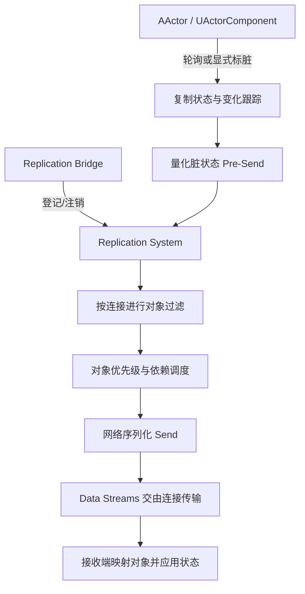

# 07 Iris 复制系统：使用、启用与迁移
> 知识成熟度：L2（接入与迁移笔记；本次仅核对 Epic 公开文档，不新增运行验证）。

> 历史版本基准（沿用旧稿，待本机复核）：UE 5.8.0（旧稿记录 `Engine/Build/Build.version`：CL 55116800，分支 `++UE5+Release-5.8`）。
> 适用范围：UE 客户端/服务端 · Iris 接入、性能评估与分阶段迁移，不承诺无损热切换。
> 历史核对记录：原稿称曾对照本机 `C:\Program Files\Epic Games\UE_5.8\Engine`（`Source\Runtime\Net\Iris`、`Source\Runtime\Engine\Public\Net\Iris\ReplicationSystem\EngineReplicationBridge.h`、`Classes\Engine\NetDriver.h`、`Private\NetDriver.cpp`、`Plugins\Experimental\Iris\Iris.uplugin`）；该历史记录未在本次复现。源码级深读配合 [20-Iris复制源码.md](20-Iris复制源码.md)。
> 事实边界：2026-10-04 重新核对 Epic 公开文档/API；未访问上述 Windows UE 安装，未编译、运行 PIE、抓取网络 trace、压测或演练生产回退。示例均需在目标工程验证。
> 官方参考：[Iris Replication System 官方文档](https://dev.epicgames.com/documentation/en-us/unreal-engine/iris-replication-system)。
> 历史整理日期：2026-08-20；本次文档校订日期见上，不将旧性能或生产适用性断言当作验证结论。
> 最后更新：2026-10-04（文献校订；未运行 UE、PIE、弱网或性能测试）。

---

## 概述

**Iris** 是 UE 的选择启用型复制系统；UE 5.1 已有实验版本，本文参考的 UE5.8 官方介绍仍保留实验性提示。它将游戏对象的数据访问与复制状态处理分开，通过描述符、量化状态、过滤/优先级以及连接间共享工作改善扩展能力。

- **状态描述与变化跟踪**：可使用反射属性；是否轮询、如何标脏取决于模式和配置，不能说所有 Setter 自动标脏或静态对象零开销。
- **对象登记与网络句柄**：Bridge 连接游戏对象与复制系统；网络句柄关联复制对象，不能自动消除生命周期或引用错误。
- **并发潜力**：数据分离为并发创造条件，不保证整个流水线离开 GameThread，也不保证随核数线性加速。
- **兴趣与带宽调度**：过滤决定对象能否发给连接；优先级影响有限带宽下先发送哪些对象，不替代服务器的业务权限校验。

依据：[Iris 介绍](https://dev.epicgames.com/documentation/en-us/unreal-engine/introduction-to-iris-in-unreal-engine)、[UE5.1 实验版入门](https://dev.epicgames.com/community/learning/tutorials/Xexv/unre)。

---

## 核心架构与经典复制对比

| 维度 | 经典复制路径 | Iris 路径 | 迁移检查 |
| --- | --- | --- | --- |
| 对象与状态 | Actor 通道、属性复制布局，可搭配 Push Model / Replication Graph | Bridge、描述符、复制片段与网络句柄 | 旧插件、对象引用、销毁/重建与回放 |
| 变化检测 | 依配置轮询或显式标脏 | 依模式跟踪脏状态，也有兼容轮询路径 | 漏标脏、额外轮询与更新延迟 |
| CPU/内存 | 维护对象/连接相关状态 | 量化状态与连接间共享工作 | 同负载实测，不预设内存减少 40% 或 CPU 减少 30% |
| 并发 | 受实现和集成方式限制 | 分离复制与游戏数据，支持进一步并发 | 实际线程时间线及瓶颈转移 |
| 兴趣管理 | 相关性与 Replication Graph 节点 | Connection/Group/Dynamic Filtering 与 Prioritizer | 逐条保持旧规则语义，评估动态过滤成本 |

这些是设计比较和测量目标，不是本仓库已完成的基准测试。对象数、连接数、变化比例、可见范围和硬件不同，收益也可能不同。

---

## 原理详解与运行时数据流

下图是概念流程，不是实测线程分布：



### 1. 后端选择与运行状态

编译包含 Iris、插件启用、配置选择和连接实际使用 Iris 是不同检查点。应在目标工程记录实际 NetDriver，结合 `UNetDriver::IsUsingIrisReplication()` 和日志核对。

不要把两种后端理解成同一连接内任意按 Actor 混搭，也不要从某个 Bridge 接口推导出“可实时切换”。依赖 `UActorChannel`、NetGUID 内部细节或旧 `ReplicateSubobjects` 回调的插件/代码应列入兼容审计；本文不宣称这些底层接口全部消失。

---

## 最小启用步骤（按 UE5.8 官方文档核对）

1. `.uproject` 启用 Iris 插件；模块 `.Build.cs` 调用 `SetupIrisSupport(Target)`；目标 `.Target.cs` 核对 `bUseIris = true`。早期版本构建默认值不同，按目标版本说明操作。
2. 在 `DefaultEngine.ini` 按下列最小项选择启用；使用 Push Model 模式时，还需其开关和正确标脏。

```ini
[SystemSettings]
net.SubObjects.DefaultUseSubObjectReplicationList=1
net.Iris.UseIrisReplication=1
; net.Iris.PushModelMode=1 时还需：
; net.IsPushModelEnabled=1
```

3. 核对目标 NetDriver 的 `IrisNetDriverConfigs`、客户端/服务端配置和已有平台集成。不要为了启用 Iris 清空 `NetDriverDefinitions` 或强行替换网络驱动，以免破坏已有会话、平台或回放配置。
4. 官方列出的命令行选项为 `-UseIrisReplication=1` / `-UseIrisReplication=0`。在受控启动/新会话流程中测试两条路径；参数本身不是活跃连接零停机转换协议。

来源：[Introduction to Iris 的启用与命令行选项](https://dev.epicgames.com/documentation/en-us/unreal-engine/introduction-to-iris-in-unreal-engine)。本次未在目标工程编译或启动验证这些步骤。

---

## C++ 接入片段与对象注册

### 1. ActorComponent 与普通 UObject 子对象分开处理

**ActorComponent**：拥有者 Actor 和组件都要启用复制。静态组件可在构造函数使用 `SetIsReplicatedByDefault(true)`；动态组件按生命周期注册并使用 `SetIsReplicated(true)`。这不要求所有业务组件都直接调用 Bridge 的 `StartReplicatingSubObject`。

**普通 UObject 子对象**：Iris 使用 registered subobjects list。拥有者启用 `bReplicateUsingRegisteredSubObjectList`，对象创建后用 `AddReplicatedSubObject` 登记，删除前用 `RemoveReplicatedSubObject` 移除。对象仍需有效引用和复制属性；非 Actor/ActorComponent 的类还需实现 `RegisterReplicationFragments`。

`UPROPERTY` 本身不等于已复制该成员引用。如果客户端要通过 `WeaponState` 成员访问动态子对象，还需复制该引用，例如 `UPROPERTY(Replicated)` 与 `DOREPLIFETIME`，或明确其他关联机制。`AddReplicatedSubObject` 不自动同步拥有者的成员指针；客户端在对象引用映射完成前应容忍空值。

以下仅展示拥有者一侧的生命周期片段，**不是完整可编译工程**。省略的 `UMyWeaponState` 需实现网络支持、属性注册与 Iris fragments；`WeaponState` 需按上述要求持有/复制引用：

```cpp
// AMyCombatCharacter 构造函数的设置
bReplicates = true;
bReplicateUsingRegisteredSubObjectList = true;

// 服务器创建和登记；不是每帧重复执行
WeaponState = NewObject<UMyWeaponState>(this);
AddReplicatedSubObject(WeaponState);

// 替换或删除前，先取消登记，再处理引用和销毁生命周期
RemoveReplicatedSubObject(WeaponState);
WeaponState = nullptr;
```

`Health` 等 Actor 属性仍通过 `UPROPERTY(ReplicatedUsing=...)` 和 `DOREPLIFETIME` 声明；这与子对象登记是不同步骤。晚加入、对象销毁/重建以及回放要单独测试。

来源：[Actor Component Replication](https://dev.epicgames.com/documentation/unreal-engine/replicating-actor-components-in-unreal-engine)、[Object Replication](https://dev.epicgames.com/documentation/en-us/unreal-engine/replicating-uobjects-in-unreal-engine)。

### 2. 同队可见过滤：先选机制，再实现策略

“装备只复制给同队连接”应先评估 Connection/Group Filtering。只有在频繁变化或无法由组关系表达时，再评估动态过滤；它有额外 CPU 成本，也不能重新允许已被连接/组过滤排除的对象。

下面保留同队判定的设计意图，是原创业务伪代码，**不是 UE C++ API**：

```text
for each candidate object for connection:
    allowed = known(connection.team) and known(object.team)
              and connection.team == object.team
    write allow or deny for every candidate in the output
```

不能用统一 `return 1` 的占位队伍查询投产，否则过滤无法隔离队伍。测试必须覆盖未知队伍、换队、重连、对象销毁和其他过滤条件叠加。底层 `UNetObjectFilter` 的签名、对象索引和位图契约应按目标版本 API 实现，不把旧示例里的未核实字段当作可编译接口。

来源：[Iris Filtering](https://dev.epicgames.com/documentation/unreal-engine/iris-filtering-in-unreal-engine?lang=en-US)。

### 3. 距离衰减优先级：公式与引擎接入分开

距离可作为优先级的一部分，但优先级用于带宽调度，不是可见性或保密权限。先评估引擎内置 prioritizer；自定义实现再对照 `UNetObjectPrioritizer` 的目标版本接口。

```text
# 原创策略伪代码；数值只是设计起点，未做性能测试
radius = 10000 cm
score = clamp(1 - distance_squared / radius_squared, 0.1, 1.0)
priority = combine(score, gameplay_importance)
```

保留近处较高优先级的意图，同时验证远处关键对象是否饥饿。Iris 已有跨 Tick 累计优先级及复制后重置的机制，先核对实际效果，再决定是否加额外等待时间权重。旧代码中的固定距离占位函数、假定的参数字段或输出调用不再当作已验证示例。

来源：[Iris Prioritization](https://dev.epicgames.com/documentation/en-us/unreal-engine/iris-prioritization-in-unreal-engine)。

---

## 迁移执行流程与灰度检查清单

### 1. 五阶段迁移流程（计划，不是执行记录）

1. **审计依赖**：盘点 ActorChannel/NetGUID 内部依赖、旧 `ReplicateSubobjects`、自定义序列化、Fast Array 标脏和回放；保存原配置和可回滚版本。
2. **双后端冒烟**：分别记录客户端与服务器实际后端，测试登录、移动、战斗、背包、RPC、晚加入和子对象销毁/重建。
3. **弱网与负载**：按项目预算选择延迟、丢包、连接数和对象数，记录实际参数与工具版本；“50 Bot”或固定丢包比例不是通用的充分条件。
4. **同负载比较**：比较复制 CPU、总帧时 P50/P95、RSS、带宽、状态延迟及断线/重传。门槛由项目先定义，不能把降低 30% 或 40% 当成已有事实。
5. **分批发布与回退演练**：用匹配版本/配置的新实例验证 `-UseIrisReplication=0` 路径，再按会话排空/重连策略切流。重启需求、客户端兼容和会话迁移都需实测；不承诺零停机。

### 2. 原创待执行回归矩阵

| 用例 | 检查点 | 失败信号 |
| --- | --- | --- |
| 动态 Component 与 UObject 分别测试 | 创建、更新、删除、晚加入 | 把组件与普通子对象接入混为一谈 |
| 子对象引用 | 客户端成员指针何时有效，销毁后是否清理 | 已登记对象却以为成员引用自动同步 |
| Fast Array 增/改/删 | 分别正确标脏，比较服务器/客户端集合 | 缺项、旧值或删除未传播 |
| 同队过滤与换队 | 未知队伍默认拒绝，换队后重算 | 跨队泄漏或永久不可见 |
| 属性与 RPC 依赖 | 不要求不同 OnRep 按赋值次序触发 | 读到旧状态导致不可恢复错误 |
| 回退配置 | 新会话两端后端一致，原会话有明确处理方案 | 把命令行选项当活跃连接热转换 |

执行时应记录构建版本、后端、配置、负载、机器规格、日志/trace 和实际结果。当前均为待执行项，没有通过率、性能数字或生产回退证明。

---

## 常见问题与排障 FAQ

**Q1：动态 ActorComponent 收不到更新？**
先查拥有者/组件复制开关、服务器创建和注册时机、复制属性及相关性。普通 UObject 再查注册列表、fragments 和成员引用复制；不要一律补一个 Bridge 调用。

**Q2：Iris 能直接套用 Replication Graph 节点吗？**
不能把旧节点当作 Iris 配置。应逐条把兴趣管理需求映射到 Iris 的过滤/优先级机制并验证语义，不假设每种 GridNode 都对应一个同名类，也不混淆后端选择与策略迁移。

**Q3：Fast Array 还需要标脏吗？**
需要。添加/修改项调用 `MarkItemDirty`，删除项调用 `MarkArrayDirty`；`FIrisFastArraySerializer` 仍提供这两个入口。UE5.8 特化 API 不支持数组里混入仅本地非复制条目；覆写 `ShouldWriteFastArrayItem` 排除条目可能触发 ensure，额外条目仍可能发送后才在接收端过滤，所以它不是保密边界。不能概括为“完全兼容、无需 Dirty”。见 [Fast Array 基类](https://dev.epicgames.com/documentation/unreal-engine/API/Runtime/NetCore/FFastArraySerializer?lang=en-US) 与 [Iris 特化 API](https://dev.epicgames.com/documentation/en-us/unreal-engine/API/Runtime/IrisCore/FIrisFastArraySerializer)。

**Q4：OnRep 顺序为什么不同？**
不同属性的 OnRep 本来就没有确定顺序保证，不能归因为“低优先级属性被重排”。有关联字段可用一个结构体和通知统一处理，这不保证收到每次中间赋值，也不是跨对象事务。见 [复制执行顺序](https://dev.epicgames.com/documentation/en-us/unreal-engine/replicated-object-execution-order-in-unreal-engine)。

**Q5：能零停机回退吗？**
官方后端选择选项是 `-UseIrisReplication=0/1`，不是本文旧稿所写的 `-NoIris`。它不替项目完成在线会话迁移；回退必须按已测试的启动、客户端兼容、排空或重连策略执行，不能承诺活跃连接无损切换。

---

## 性能调试与观测指标

| 工具或记录 | 观测目标 |
| --- | --- |
| `-trace=net -NetTrace=1` | Networking Insights 的连接、包内容和对象/属性/RPC 数据 |
| 编辑器按需追加 `-tracehost=localhost` | 将网络 trace 送到运行中的 Insights |
| 同步采集的 CPU、内存和帧时 | 区分复制成本与总帧时，保留采集配置 |
| 版本、实际后端、场景与连接/对象数量 | 确保 Legacy/Iris 比较可复核 |

来源：[Networking Insights 设置](https://dev.epicgames.com/documentation/en-us/unreal-engine/networking-insights-in-unreal-engine)。旧稿的 `net.iris.profiling`、`net.iris.dumprecords` 与 `net.iris.spatialfilter.draw` 未在本次核实，不将它们列作已验证指令；项目特定变量应在目标引擎确认帮助文本和输出后再记录。

---

## 关联阅读与前后置专题

- [01-网络架构与复制基础](01-网络架构与复制基础.md)：C/S 架构权威模型与经典属性同步基础；
- [02-RPC与属性同步](02-RPC与属性同步.md)：RPC 可靠性、条件复制与 OnRep 回调规范；
- [05-ReplicationGraph兴趣管理](05-ReplicationGraph兴趣管理.md)：经典大规模兴趣管理节点拓扑原理；
- [12-20 Iris复制源码](20-Iris复制源码.md)：ReplicationSystem 状态机与序列化器底层源码深度剖析；
- [12-33 UNetDriver与连接通道源码](33-UNetDriver与连接通道源码.md)：底层 Socket 驱动与网络包分发全流程；
- [08-工具链与打包发布/10-UE Dedicated Server运行参数与性能调优](../../08-工程实践与质量/调试与性能分析/10-UE%20Dedicated%20Server运行参数与性能调优.md)：服务器 Tick 与带宽预算控制实战。
