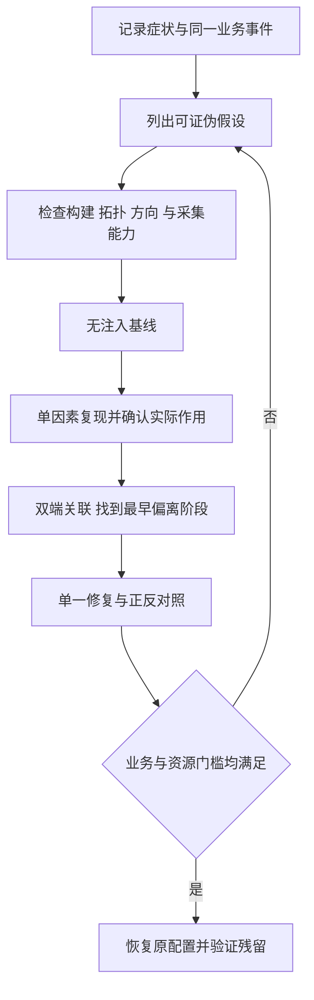

# 08 网络调试与性能分析

> 知识成熟度：L2。本文核对了官方文档与本篇历史原文；闭环、算例和实验表都是静态教学，不是 UE、网络或性能实验结果。`verified: []` 不因文档检查通过而改变。
> 版本基准：UE 5.6 官方操作文档；2026-10-10 取得的 UE 5.8 标题 API 快照、实际返回的 UE 5.5 顺序资料及 RFC 8085（2017）/RFC 2681（1999）各按正文已述范围使用，均为静态资料核对。
> 最后更新：2026-10-10；静态教学修订与元数据补全，未新增来源或运行验证。
> 版本与环境：操作入口以实际取得的 UE 5.6 官方版本页为基准；两个 API 页面是 2026-10-10 返回且标题标作 UE 5.8 的快照，不能代替某个 5.8 checkout。执行顺序资料实际跳转到 UE 5.5，单独标明。版本参数无法读取的请求不算核对成功；版本选择器也不保证网页永不修订，本文只对实际读到的内容负责。
> 历史边界：初稿声称在 Windows UE 5.8.0、CL 55116800、`++UE5+Release-5.8` 核对源码；本次没有那份安装目录、Build.version 或源码读回，故保留为历史定位线索。没有本轮“本机 5.8 已验证”的结论。
> 未运行：UE/PIE/Standalone/DS、编译、统计/Trace/Profiler、真实链路探测、抓包、弱网设置、RPC 丢弃、压力与系统网络修改均未执行。下文出现的入口仅供隔离环境中经过版本核对后的实验设计使用。

## 1. 本文要闭合什么问题

“玩家瞬移”是症状；“网络差”仍是猜测。玩家可能已经收到了正确状态，只是渲染或插值停顿；也可能服务器尚未产生状态、Actor 对该连接不相关，或者状态在传输后被业务逻辑拒绝。先问是哪一个请求、哪一个状态版本，在链路哪一段停止推进，再决定观察工具。

本文负责“出了问题怎样查、改动怎样比较”。复制模型、RPC 写法、预测、ReplicationGraph 和 Iris 的实现仍由关联主题负责。一次调查的产物应包含可复查的现象、被证据支持或推翻的假设、准确的修改范围以及恢复确认，而非命令截图和一个下降的带宽数字。

| 阶段 | 输入与动作 | 可以交给下一阶段的证据 | 停止或返回条件 |
| --- | --- | --- | --- |
| 观测 | 记录受影响角色、业务步骤、窗口、连接与帧 | 原始日志/Trace 标识、症状频率、正常对照 | 只有“感觉卡”时先补事件标记，不直接调参数 |
| 假设 | 指定故障位置与竞争解释 | “如果 H 成立应看到 X；如果 Y 出现则推翻 H” | 无可区分观测时缩小问题，不列无限根因清单 |
| 复现 | 在隔离拓扑中一次改变一个因素 | 基线、注入配置、实际生效观测、失败样本 | 配置未确认、生效方向未知或采集缺失则实验无效 |
| 定位 | 对齐同一请求/对象/连接代际的双端证据 | 最早偏离预期的阶段与机制 | 单端无事件不能自动写成对端丢包 |
| 对照 | 修复一个原因，按同一负载重测 | 业务正确性、时延、资源指标及观测开销的前后差异 | 症状消失但负载变了，不能归因于修复 |
| 恢复 | 撤回临时注入、采集和配置；验证正常窗口 | 原配置恢复、连接重建/退出结果、残留状态检查 | `Off` 已输入但状态未知，不算恢复完成 |

图中的循环是调查方法，不是本文已完成的试验。复现失败可能来自实验条件不匹配，也可能推翻假设；必须把两者分开。

## 2. 把传输和业务完成分成不同观测点

以“客户端申请打开机关，服务器接受后复制新状态”为例，给请求一个业务关联键，并沿下面的链记录。该键是项目设计，不要求修改 UE 传输协议。

| 点位 | 要记录什么 | 它不能单独证明什么 |
| --- | --- | --- |
| C0：客户端意图产生 | 请求 ID、连接代际、输入帧、目标对象、期望状态版本 | 玩家意图产生不等于 RPC 满足 ownership/路由条件 |
| C1：复制/RPC 进入发送侧管线 | NetDriver/连接、对象身份、RPC 或状态版本、所用可靠性 | 已序列化不等于 socket 发出，更不等于到达对端 |
| T：传输记录 | 包方向、序号、时间窗口、所在测量层与确认/丢弃状态 | 协议确认不等于机关业务已接受；仿真丢弃也不是互联网故障证据 |
| S0：服务器收到并进入处理 | 匹配请求、对象/owner、校验分支、排队与执行时间 | handler 被调用不等于校验成功或持久业务提交成功 |
| S1：权威业务终态 | Accepted/Rejected/Expired、原因、状态版本、重复处理情况 | 服务器成功不等于客户端已应用该状态 |
| C2：客户端获得并应用权威结果 | 结果请求 ID、版本、旧结果丢弃/依赖未齐的原因、表现帧 | 属性回调触发不等于 UI/动画真的更新，画面更新也不能替代权威终态 |

这里的 Accepted/Rejected/Expired 是教学中的业务状态，不是 UE 固定枚举。断线后若不能判定服务器是否已经接受请求，应记录“结果未知”，按项目的幂等/查询/重连同步契约恢复，不能把客户端超时直接当作服务器拒绝，也不能盲目再次执行有副作用的操作。

[UE 5.6 RPC 文档](https://dev.epicgames.com/documentation/en-us/unreal-engine/remote-procedure-calls-in-unreal-engine?application_version=5.6)区分调用端、owner、执行端与可靠性。可靠 RPC 的重传与顺序约束是复制层承诺；它不是跨断线会话的永久保存，也不是业务成功回执。不要为了“丢了”而把所有高频事件改为 Reliable：先核对它是否本该在目标连接执行，再检查接收端业务处理。

[UE 5.5 执行顺序页](https://dev.epicgames.com/documentation/unreal-engine/replicated-object-execution-order-in-unreal-engine?application_version=5.5)明确区分同 Actor 可靠 RPC 顺序、跨 Actor 顺序，以及不同变量的 OnRep 次序。它能支持“不要借网络抵达顺序隐含表达跨对象业务依赖”的设计审查，不能未经目标版本核对就推定所有 Iris/子对象组合都具有相同实现。若机关展示依赖另一对象的数据，记录依赖是否已满足；把依赖缺失误记成丢包，会导致错误修复。

### 2.1 时间、连接与身份先统一

每份记录至少带 `run_id`、构建/提交、进程、World/PIE 实例、NetDriver、连接 ID 与连接代际、对象标识、方向和窗口。Travel、重连、对象销毁重建后，名称或数字 ID 可能被再次使用；只拼一个 ConnectionId 或 Actor 名会混入旧样本。若某工具未提供代际，可用会话文件、创建事件和本地映射补足，不能假设不同文件中的同名对象必为同一实例。

同一端的“发出请求到获得结果”可用单调时钟求差，但含本端排队、远端处理和往返传输，名称应为业务往返耗时。跨端时间戳直接相减前，必须说明时钟同步误差、分辨率与漂移；无法校准时只依据因果键和各端相对时间，不能把负耗时修成零后继续分析。

[RFC 2681 §1–3](https://www.rfc-editor.org/rfc/rfc2681.html)讨论往返测量、非对称路径与时钟误差。由此应区分 RTT、单向延迟和业务完成耗时：单向延迟不能无条件用 RTT/2 代替；一次没有按时返回的请求也需要明确观察截止时间，不能在报表中默默删除。

### 2.2 用层级选择工具，不按症状直接定罪

| 候选层 | 可区分的观察 | 常见误判 |
| --- | --- | --- |
| 输入/表现 | C0 是否生成；C2 已应用但帧仍卡顿；客户端帧耗时、插值与纠正 | “只有一个客户端卡”就认定它的链路丢包 |
| 业务/复制 | 权威版本是否变化；ownership、相关性、休眠、条件复制、调度；RPC 实际执行分支 | “没有属性包”就认定 UDP 丢包，忽略对象未被选择 |
| 引擎传输/连接 | 同一连接的收发、确认/丢弃、排队、断开理由 | 一个饱和计数就证明物理网卡已打满 |
| 系统/真实路径 | 在获准环境中的接口计数、收发路径和必要抓包；路由/MTU/NAT 证据 | 引擎内模拟丢包成功就宣布找到了真实运营商故障 |

多数调查可以先用低成本聚合观察缩小窗口，再下钻对象；这不是强制先看服务器。若“某客户端 C2 已收到、画面却停住”的证据已足够，应先查表现线程。全体玩家同时受影响也可能是共享服务器 CPU、共同业务锁或同一广播事件，并非带宽的同义词。

## 3. 统计、Networking Insights 与 Network Profiler 各自回答什么

### 3.1 聚合统计用于选窗口

历史常用入口是 `stat net` 与 `net.PrintNetConnections`。前者给网络统计视图，后者帮助找连接与驱动；本次没有在目标构建调用。具体计数器是否注册、采样窗口和单位，应从目标构建的定义与更新点核对。命令不可用应记“未采集”，不能记成零负载。

| 历史统计组/项目 | 有用问题 | 判读边界 |
| --- | --- | --- |
| SendAcks、Tick、ReceivedNak、ReceivedAcks | 网络连接处理在哪一段花时间 | 调用耗时不是包数；线程计时也不是单向网络延迟 |
| AddClientConnection、ProcessRemoteFunction | 建连或 RPC 执行是否出现尖峰 | 时间尖峰可来自业务处理，不直接证明链路拥塞 |
| `Num Saturated Connections` | 哪些连接受到引擎侧发送预算/就绪约束 | 需核对该版本饱和条件；不等于物理链路满载或固定容量上限 |
| `Net bunch time % overshoot frames` | 哪些帧超过相应处理时间预算 | 名称涉及时间预算，不能直接改称“字节/带宽超支比例” |
| SharedSerialization RPC/Property Hit、Miss | 相同场景下共享序列化复用是否变化 | 确认分子分母、计数重置点及后端是否适用；不把旧后端计数硬套到 Iris |
| Empty Object Replicate Properties Skipped | 被检查却没有属性内容的工作是否很多 | 次数多可提示调度成本，也可能是正常路径；与总 CPU 证据一起判断 |
| ActorChan_CleanUp、ReceivedRawBunch、FindOrCreateRep、ProcessQueuedBunches | 生命周期与 bunch 处理是否堆积 | 处理时间、队列长度和队列等待时间是不同量，需要分别采集 |

连接清单里的 NetId/ViewTarget/FullDescription 等字段是定位辅助，不是权威业务终态。服务器的 ClientConnections、客户端的 ServerConnection 或多个驱动的记录必须按实际拓扑配对；筛选参数的拼法以目标版本帮助或注册实现为准。[UNetDriver API 快照](https://dev.epicgames.com/documentation/en-us/unreal-engine/API/Runtime/Engine/UNetDriver)确认该类型具有连接、累计/速率统计与禁止仿真的配置概念，并不验证旧命令的具体参数和所有统计项。

### 3.2 Networking Insights：包、对象与选择范围

[UE 5.6 Networking Insights](https://dev.epicgames.com/documentation/en-us/unreal-engine/networking-insights-in-unreal-engine?application_version=5.6)给出 `-trace=net -NetTrace=1` 这样的采集入口；verbosity 应大于零，编辑器场景还需匹配实际 Trace 接收位置。这里是文档示例，不是本次启动命令。`-tracehost=localhost` 指向被启动进程所在机器的本地接收端；不能把它照抄为远程 DS 会自动传到自己的电脑。

[UE 5.6 Insights Reference](https://dev.epicgames.com/documentation/unreal-engine/unreal-insights-reference-in-unreal-engine-5?application_version=5.6)列出 Net 通道与 `-NetTrace=1`、Frame 的关系，并分别列出 Trace 总开关及网络埋点编译开关。源码符号 `NetChannel`、`FrameChannel` 不等于命令行必须填写的通道名。初稿仅凭符号推荐 `-trace=NetChannel` 且未同时说明 verbosity，不能作为可移植配方。

采集前确认目标二进制的 Trace 能力、启用通道、verbosity、接收端/文件位置、磁盘预算和工具版本。采集后必须能打开文件，找到正确进程、实例、连接、方向和覆盖症状的窗口，并看到预期事件。文件存在而 Network 内容为空，应调查配置、构建、连接选择、缺失事件或工具兼容性；这不证明没有流量。

面板选择顺序：Game Instance → Connection → incoming/outgoing → 时间/包范围 → Packet Content 和 Net Stats。Packet Content 用于下钻对象、属性和 RPC；Net Stats 的 inclusive/exclusive 位数不能混加，否则父子事件重复计数。Packet Overview 的大小是压缩前记录，不是网卡线上最终字节；Frame Stats 与 Packet Stats 作用域也不同。上述边界依据 [Networking Insights 页面](https://dev.epicgames.com/documentation/en-us/unreal-engine/networking-insights-in-unreal-engine?application_version=5.6)；实际字段完整性仍依赖版本、复制后端与采集配置。

双端 Trace 不是相同表格的复制。发送端某对象的序列化事件，接收端可能在后续处理点才出现对应事件；不能用两个窗口里对象名行数直接计算丢包。遇到拆分 bunch，应确认重组前后事件上报时机，再比关联包与业务版本。Iris、传统复制、RepGraph 的埋点覆盖可能不同，迁移前先定义两侧都可观察的指标。

### 3.3 Network Profiler：`.nprof` 与 `.utrace` 分开

[UE 5.6 Network Profiler](https://dev.epicgames.com/documentation/en-us/unreal-engine/using-the-network-profiler-in-unreal-engine?application_version=5.6)描述独立分析工具及 `.nprof`。它要求启用 STATS 的构建；文档中的 `networkprofiler=true`、`netprofile enable`、`netprofile disable` 是该工具的记录入口，与 Networking Insights 的 `.utrace` 不同。临时 `NetworkProfiling.tmp` 不应冒充已结束并可分析的记录。

该文档列出的分析器位置是 `Engine/Binaries/DotNET/NetworkProfiler.exe`；这是文档中的工具分发信息，不证明本机或所有平台均有可运行分析器。录制端和分析端应分别记录平台、引擎版本、构建、格式与兼容性。不能因为 Linux DS 能产出数据就声明 Windows 工具已在 Linux 验证。

客户端记录主要显示该客户端发出的 RPC 细节，不能当成服务器 Actor/属性复制的完整账本；需要完整服务器贡献时采集服务器侧。该工具的 All Actors/Properties/RPCs 等总览与 Chart 时间区间的作用范围不同，比较前核对筛选口径。文档中的 Outgoing bandwidth 含 IP/UDP 头估算，Game socket send size 的口径不同，二者不能混用。[同页](https://dev.epicgames.com/documentation/en-us/unreal-engine/using-the-network-profiler-in-unreal-engine?application_version=5.6)

### 3.4 三种数据不能互相冒充

| 数据 | 所处层与适用问题 | 本文的验收约束 |
| --- | --- | --- |
| 引擎统计/Profiler/NetTrace | 引擎中的复制、处理与计数 | 记录单位、后端、方向、窗口、压缩/头部口径；不自称线上流量 |
| 系统接口/实际抓包 | 某观察点看到的真实报文与时间 | 如需另行采集，应有环境与隐私授权；记录接口、过滤、工具和丢失统计，不能只看一个端点推断全路径 |
| 业务事件与终态 | 玩家操作是否按规则完成、拒绝或可恢复 | 与请求/状态版本关联；协议确认与字节减少都不能替代业务正确性 |

加密、压缩、包处理器、重传、协议头和采集点都会改变可见内容。需要实际链路证据时转交获准的系统网络调查，不在共享宿主上自动安装工具、抓包或改路由。引擎仿真只用于可控条件下揭示时序依赖，不能覆盖 NAT、无线竞争、真实 MTU 或运营商拥塞的全部机制。[RFC 8085 §3.1–3.3](https://www.rfc-editor.org/rfc/rfc8085.html)给出 UDP 拥塞、报文尺寸、丢失/重复/乱序的协议层背景；UE 在其上的确认与业务规则仍需另外验证。

## 4. 网络仿真先指定作用点，再选参数

### 4.1 一条方向可能被注入两次

在客户端 C 与服务器 S 之间，C→S 可以经过 C 的 outgoing 注入和 S 的 incoming 注入；S→C 则经过 S outgoing 和 C incoming。初稿“服务器设置延迟，所有客户端统一增加 100 ms”的说法省略了驱动、连接、方向和测量口径。

PAPER_EXPECTED 算例：假定其他延迟为零、请求/响应处理立即完成、没有重传，C outgoing 加 100 ms，S outgoing 加 100 ms，则请求/响应的附加往返时间是 200 ms。若又给 S incoming 加 100 ms，则去程被加两次，往返附加 300 ms。这只是按作用点相加的理想模型，调度粒度、排队和实际参数语义会改变观测值，不能把配置值当作真实 RTT 测量。

服务器进程内可能有多个 World、NetDriver 与客户端连接；全局入口可能影响多连接，驱动限定入口也不天然等于“单玩家”。客户端设置 incoming，指其自身收包方向；把同名参数放在服务器上则变成服务器收包方向。先画作用点，再判断上下行。

### 4.2 保留参数用途，避免相互覆盖造成假实验

[UE 5.6 仿真页](https://dev.epicgames.com/documentation/en-us/unreal-engine/using-network-emulation-in-unreal-engine?application_version=5.6)提供编辑器 Play/Multiplayer 设置、命令行、`NetEmulation.<SETTING_NAME> <VALUE>` 控制台和 `[PacketSimulationSettings]` 配置入口。它们是同类仿真的不同配置来源，不代表同样的持久化范围。先记录原配置以及启动参数、profile、运行时覆盖的来源，再选唯一入口做一项干预。

| 参数族 | 保留的用途 | 最小正确选择与边界 |
| --- | --- | --- |
| `PktLag`、`PktLagVariance` | 固定延迟及围绕它的波动 | Variance 依赖 Lag；先单测固定延迟，不把多个随机机制一起打开 |
| `PktLagMin` / `PktLagMax` | outgoing 延迟区间 | 验证非负且 Min≤Max；与 PktLag 分开做实验，避免优先级争议 |
| `PktJitter` | outgoing 时延波动 | 不假设它与 Variance 等价或必定叠加；目标版本需核对具体实现 |
| `PktIncomingLagMin/Max` | 接收处理前的入站延迟 | 写明设置在哪个端；不自动等于服务器下行 |
| `PktLoss`、`PktIncomingLoss` | outgoing/incoming 随机丢包 | 概率不等于每个有限窗口的实际比例；记录样本量与实际计数 |
| `PktOrder`、`PktDup` | 改变包次序或制造重复 | UE 5.6 页说明 PktOrder 与 PktLag 不组合；传输层去重后未必出现重复业务执行 |
| `PktLossMinSize/MaxSize` | 按尺寸筛选可能丢弃的包 | 5.8 API 快照说明阈值单位是字节；采集位数先转换，别用业务 payload 长度冒充引擎实际判断长度 |
| `PktBufferBloatInMS`、`PktIncomingBufferBloatInMS` | 延迟一段时间后集中发送/处理的突发模型 | 5.8 API 快照支持该用途，不等于已经建立了真实路由器队列或容量模型 |
| `PktEmulationProfile` | 保存并复用一组条件 | Profile 名称不是条件本身；记录版本与展开后的完整参数，不能仅写“Mobile/Bad” |

上表前六行基于 [UE 5.6 仿真页](https://dev.epicgames.com/documentation/en-us/unreal-engine/using-network-emulation-in-unreal-engine?application_version=5.6)，尺寸与缓冲膨胀字段基于 [FPacketSimulationSettings 的 5.8 标题快照](https://dev.epicgames.com/documentation/en-us/unreal-engine/API/Runtime/Engine/FPacketSimulationSettings)。这些摘要不是目标二进制的支持列表。

**必须保留的来源冲突：**初稿称 Min/Max 优先于 PktLag；本次取得的 5.8 API 页却描述设置 PktLag 时忽略 Min/Max。没有目标源码与运行证据，不能把任一说法扩展成跨版本结论。本文采用互斥配置并记录有效值，后续在目标 revision 检查解析、归一化和消费分支。API 页对 Jitter 的描述也提示接收端丢失影响，不能把 Jitter 当作纯数学延迟、不检查重排/丢弃后果。

### 4.3 “已输入”“已设置”“影响正确对象”是三次检查

1. 输入层：命令在目标进程被识别，未被控制台/权限/编译配置过滤；保存原始返回和错误。
2. 状态层：正确 World/Driver/连接的有效配置与预期一致；排除 profile、配置文件、持久设置和新建驱动的覆盖。
3. 行为层：该方向的实际包/业务时序出现预期变化，正控制有反应，未受影响连接的负控制符合设计。

日志回显最多支持对应解析或赋值发生；不能单凭回显证明所有连接已受影响。无日志也不能推出未生效，日志过滤、等级与版本都可能影响输出。若状态不可读且行为证据缺失，记录“无法确认生效”，停止基于该样本做根因结论。

历史 `DO_ENABLE_NET_TEST` 编译门、`bNeverApplyNetworkEmulationSettings`、持久设置以及 DemoNetDriver 禁用线索见第 9 节。5.8 API 快照确认驱动可以拒绝应用仿真，但本次未验证某个 Shipping/Development 包的实际宏值。构建名字不足以替代能力核对；同样，录制/播放使用 DemoNetDriver，不代表同一 World 中真实游戏连接驱动也必然失去仿真能力。

## 5. 一个完整的可执行设计：机关状态偶发不同步

本节全部为 **PAPER_EXPECTED**。它给将来的隔离实验定义输入、证据和判据，不提供已运行报告或共享宿主执行指令。

### 5.1 固定输入与可证伪假设

拓扑：一个专用测试服务器 S，两个独立客户端 C1/C2；同一个小地图、相同构建、相同复制后端；机关状态由 S 权威拥有，C1 通过自己拥有且可复制的 Actor 发起请求，机关对 C1/C2 均相关。C2 是旁观对照。用同一脚本化动作序列反复请求，动作间隔、运行窗口、请求总数与业务截止时间在开始前声明。

业务不变量：每个请求最多造成一次权威状态转换；拒绝应有明确原因；客户端最终显示与已确认权威版本一致；过期或旧连接响应不覆盖新版本。若项目本不提供这些语义，应先写明实际契约，不能由测试者臆造要求。

假设 H1：机关真相已在服务器改变，但客户端 UI 只依赖一个可丢失的表现事件，未从权威状态恢复。竞争解释 H2 是 RPC 所有权/相关性错误，H3 是权威结果已应用而客户端渲染卡顿，H4 是服务器根本未接受请求。能区分它们的不是“有没有丢包”，而是 C0→S0→S1→C2 各点的关联证据。

### 5.2 实验矩阵及每次的预期记录

| 组 | 唯一变化 | PAPER_EXPECTED 判据 | 无效样本/失败分支 |
| --- | --- | --- | --- |
| A：无注入 | 原配置，完整短窗口 | 建立请求/终态对照与普通时序；各阶段能关联 | 基线已有未知终态时先查业务，不开始带宽优化 |
| B：C1 上行固定附加延迟 | 只在一个确认作用点加延迟 | C1 请求到 S0 推迟，S1 后结果仍能恢复；C2 请求路径不应被同项注入 | C2 也受影响需查全局设置范围或共享负载，不能标“单客户端” |
| C：C1 下行少量随机丢失 | 只改变一个下行作用点 | 记录实际丢弃样本与 S1/C2；业务可等待权威状态恢复或明确超时 | 有限样本没有丢弃，不能宣布耐丢包；必须记配置与实际数分开 |
| D：定向抑制机关表现事件 | 仅当目标版本支持且隔离获准时 | S1/权威版本正常、表现事件缺失，若 UI 永久陈旧则支持 H1 | 定向 RPC 抑制不是真实传输丢包；需单独恢复该钩子 |
| E：仅修复客户端状态恢复 | 用相同 A–D 条件重放动作 | UI 随权威版本恢复；没有新增重复副作用，资源指标不越门槛 | 若改动同时提高频率/改后端/换地图，不能归因于单一修复 |
| F：恢复 | 撤销临时项、按原配置新会话复测 | 配置与原值一致；无注入窗口恢复基线；D 的定向抑制不残留 | 仅有 Off 日志、未核对 profile/新驱动/钩子，恢复不完整 |

如果希望以确定丢失揭示依赖，应把确定性业务事件抑制与随机包丢失分为不同实验。前者验证“依赖是否错误”，后者观察某传输条件下的表现与恢复；二者相同症状不证明相同根因。

### 5.3 手工追踪正例与反例

下表的时间属于为讲解而设的共同理想时间轴，不是可直接从未同步双端日志相减得到的测量值。请求 q17，初始权威版本 v8，目标 v9。

| 理想时间 | 事件 | 可得结论 |
| --- | --- | --- |
| 0 ms | C1 产生 q17，记录 C0 | 有用户意图，尚不知道远端是否执行 |
| 110 ms | S0 收到 q17，校验通过 | 请求确实到达业务入口；去程表现不能只归于线速 |
| 120 ms | S1 提交 v9，q17=Accepted | 权威状态已变；尚不能宣告客户端显示成功 |
| 130 ms | 测试设计抑制一次表现事件 | 该事件缺失是已知干预，不是实际互联网丢包证据 |
| 240 ms | C1 的状态接收路径得到 v9 | 若 UI 仍停 v8，应查应用/表现依赖，而非继续加重链路条件 |
| 250 ms | 修复方案据 v9 更新 UI，丢弃任何旧 v8 结果 | 在该纸上轨迹中满足恢复不变量；仍需实际版本验证 |

反例一：S0 没有 q17，C1 发起点位的 owner 不正确。此时把 UI 改成定时重试、将 RPC 改为 Reliable，都没有修复路由资格。应先沿发送入口与 RPC 执行矩阵查证 H2。

反例二：C1 在 240 ms 已记录 UI 使用 v9，但 240–500 ms 客户端帧停顿。输入或画面看起来“网络卡”，网络状态却已经收敛；应关联客户端 CPU/渲染/GC 证据检验 H3。

反例三：C1 超时退出，随后 S1 才提交 q17。网络恢复不应让旧会话回包触发第二次开门；记录结果未知、业务查询和去重规则，比单纯“重连成功”更接近终态验收。本文不指定项目的持久化实现。

## 6. 从典型症状走到可证伪的定位

保留初稿的五类场景，但不把“指标高 → 某 Actor 有错”当成已确立因果。

| 症状 | 竞争假设与第一份证据 | 缩小原因的对照 | 修复后必须同时成立 |
| --- | --- | --- | --- |
| 全体周期卡顿 | 网络预算、服务器 CPU/GC、同步业务工作；对齐发生窗口与服务器帧 | 看发送内容是否集中、业务处理是否先变慢；固定地图人数，仅调整一个已定位来源 | 业务及时性改善，复制/CPU 指标解释得通；无关玩家/阶段未退化 |
| 一名玩家频繁掉线 | 路径异常、客户端停顿、超时/会话/协议不兼容；双方断开理由和最后事件 | 同客户端不同获准路径、同路径不同客户端，或隔离单因素复现；区分相似症状与同一错误码 | 错误原因闭合、未误断开；重连后身份/状态恢复，无旧请求重复副作用 |
| Iris 迁移后带宽上升 | 负载改变、首次复制/对象生命周期变化、序列化内容差异、工具覆盖不一致 | 同后端各自基线，再按共同指标比较；分开建连峰值和稳态，核对对象数量 | 玩家可见内容相同；正确性、CPU、时延及带宽共同达标，不只看一个命中率 |
| RPC 缺失导致不同步 | ownership/路由不成立、事件本可丢、跨 Actor 依赖、业务校验拒绝 | 从请求 ID 追到 handler/终态；已核对的定向抑制用于暴露错误依赖 | 重要状态能恢复；可靠事件用量有界；避免把所有表现事件改可靠造成新排队 |
| 高帧率时网络更差 | 输入/RPC 生成次数随帧率增长、服务器 Tick 排队、客户端插值/帧资源变化 | 固定真实动作率，分别观察每秒调用数、网络字节、服务器/客户端时间线 | 改善对应机制；帧率变化下业务动作不增殖，不凭 Frame 对齐就声称 bunch 堆积 |

对第一类问题，Top Actor 只能说明选定口径里占比大。减少它的复制频率若恰好降低字节但让状态更旧，应判为取舍失败。Dormancy 和 RepGraph 修改会影响哪些对象何时能收到更新，需要验证唤醒、进入相关范围和新加入客户端；这些机制详情见关联正文。

对第二类问题，高丢包复现掉线仅说明该实现能在这类条件下走到相似终态。要认定真实链路根因，还需现场路径证据。不要在没有授权的主机/网络上用洪水、强制断开或系统级丢包作为默认排查步骤。

## 7. 用同一口径做带宽、频率与 CPU 对照

### 7.1 先声明实验合同

固定构建与复制后端、地图/实体状态、客户端数量、AI 密度、路线/动作种子、Tick 配置、相关性与休眠条件、冷/热阶段、测试时长、注入状态、采集工具/选区/过滤器。预热和首次同步单独保存，不能把它们从报告中删掉而只报漂亮的稳态数字。

每项指标明确：测量点、单位、方向、每连接或全服务器、累计值或窗口增量、内容/总包/线上估算、是否包含重传与协议头、成功与失败样本分母。若其中任一口径变化，报告不可比，不用百分比掩盖。

| 目标 | 推荐对照内容 | 需要排除的伪改善 |
| --- | --- | --- |
| 降低传输负载 | 同观察点的总字节、每连接分布、短时峰值 | 断线玩家更少发包；采集窗口缩短；关键对象漏复制 |
| 降低序列化成本 | 相同内容下服务器处理时间与复用计数 | 开了不同计时宏或过滤器；只比较字节忽略 CPU |
| 保证响应 | 请求到业务终态、客户端应用耗时，超时/失败比例 | 仅统计成功请求，把失败和结果未知样本丢弃 |
| 保证一致性 | 权威状态版本、最终客户端状态、重复与旧结果处理 | UI 先播放动画就当作服务端已完成 |
| 保证容量 | 不同已授权负载级别的资源与业务结果 | 把单机 PIE 或一个人数场景当成生产容量结论 |

采集本身有 CPU、内存和 I/O 成本。正式性能比较至少确保前后同等采集设置，并另设低观测开销对照；若高 verbosity 已改变行为，应报告观察者效应，不能继续用那组数据证明容量。多次配对运行展示离散程度与异常样本；不要以一次 30 秒或 180 秒窗口宣称尾部延迟稳定。

### 7.2 保留初稿数字，但明确只是算例

下表 **PAPER_EXPECTED，全部输入是初稿的教学数字，不是真实 benchmark**。MB/KB 在此约定为十进制，窗口均为 180 s；换成 MiB/KiB 要重新标单位。目的只是演示计算及判读边界。

| 指标 | 假设改前 | 假设改后 | 手算结果与限制 |
| --- | --- | --- | --- |
| 同口径总字节 | 48 MB | 41 MB | `(41−48)/48 = −14.583…%`，约 −14.6%；不能据此推定线上费用或服务器容量 |
| 由上述字节推导的平均速率 | 266,666.7 B/s | 227,777.8 B/s | 总字节除以 180 s；平均值不能暴露尖峰或每连接不公平 |
| 饱和连接数峰值 | 3 | 0 | 峰值减少 3；需核实指标定义和全部样本，不能说完全无排队 |
| SharedSerialization 属性命中率 | 62% | 71% | 增加 9 个百分点；相对变化约 14.5%，不能把 +9% 与 +9 个百分点混写 |
| 同选区单对象开销 | 12 KB/s | 6 KB/s | 减少 50%；还要核对对象数量/生命周期、相关性及状态新鲜度 |

旧流程“总字节≤+5% 且无饱和连接”的门槛只是一种示例，不能跨游戏直接使用。正确门槛由项目预先声明的体验目标和资源预算决定，而且必须同时满足业务结果。若字节减少 50% 却使机关永久停留旧状态，应判失败。

服务器总 outgoing 与单客户端 outgoing 通常没有相等义务：服务器面对多个客户端并复制状态，客户端可能主要上传输入。即使匹配服务器→C1 与 C1 的 incoming，也需统一窗口、压缩/头部/重传口径及捕获缺失边界。**流量不对称不是“服务器逻辑错误或请求过多”的充分条件。**

### 7.3 一份可验收报告至少留下什么

记录：假设与排除理由、环境/构建、实验拓扑与注入作用点、原配置、输入序列、采集文件校验值、每轮起止标记、指标定义和原始样本、失败/超时/缺失、修复差异、业务与资源判据、恢复结果。缺任何关键文件都写未完成，不把预期表放进“实测结果”。

分析结果可以是“在这个构建与窗口支持 H1；真实网络路径未验证”，也可以是“无法确认生效，数据不足以区分 H1/H2”。明确范围比为了闭环而强行宣布找到根因更有用。

## 8. 恢复也是实验的一部分

不要等掉线后才想退出路径。开始前保存进程、World/Driver/连接范围和全部原始配置；明确哪台隔离实例承担干预，如何退出，谁负责确认恢复。持久化配置、编辑器设置、启动参数、运行时 packet 仿真和 RPC 定向丢弃分别记录，避免只清除其中一层。

| 恢复对象 | 应完成的动作 | 证明恢复的观察 |
| --- | --- | --- |
| Packet 仿真 | 在匹配范围撤回临时设置，恢复实验前值；原来无注入时才以 Off 为终态 | 有效配置读回与短正常窗口；检查新建 Driver 是否重新载入旧配置 |
| 定向 RPC 抑制 | 按目标版本撤除相应规则/钩子；历史 `DropNothing` 用途与 packet Off 分开核对 | 目标事件重新可观察；非目标事件不受残留规则影响 |
| Trace/Profiler | 正常停止当前采集、确认文件结束且可读；恢复临时 verbosity/通道 | 文件身份、窗口、可打开状态与空间占用，非只看控制台返回 |
| `.ini`/PIE/profile/启动参数 | 仅还原本次临时项，保留原本已有设置 | 前后精确差异、重启后有效配置；不能无差别覆盖共享配置 |
| 业务连接 | 按项目流程正常退出或重建会话，查未知请求与旧版本回包 | 正确身份、权威状态收敛，无重复业务副作用 |

停止条件包括：无法确认受影响范围、出现非目标客户端受影响、采集不完整、资源接近实验预算、已失去恢复通路或构建能力不匹配。停下后保留失败证据和实际配置；恢复未确认就标记未恢复，不继续叠加注入。

`NETFLOOD`、`NETDISCONNECT`、休眠全局刷新以及系统级丢包/抓包不属于共享宿主默认步骤。本篇保留这些历史功能的用途，但没有启动它们，也没有把“命令存在”视为可随时执行的许可。

## 9. 历史命令与源码定位的用途保全

以下是初稿的检索地图，目的在于让维护者能回到原版本验证，并保留曾经覆盖的功能。**所有旧行号、注册细节、默认百分比、编译断言和路径均未在本轮源树重读。**与上文官方资料冲突或证据不足时，采用上文的边界，不能把本表重新解释成已验证速查流程。

### 9.1 命令入口与状态影响

| 历史入口/符号 | 初稿保留的用途 | 本轮处理与将来核对重点 |
| --- | --- | --- |
| `Net PktLag=100`、`Net PktLoss=10 PktJitter=50` | 传统 exec 中一次输入多个仿真字段 | 只作历史语法；先核对支持、作用范围与字段相互关系，不复制组合参数作为基线 |
| `Net GameNetDriver PktLag=100` | 按驱动名选作用对象 | Driver 名不是玩家 ID；重名 World/PIE 和多驱动都要排除 |
| `Net PktEmulationProfile=Mobile`、`NetEmulation.PktEmulationProfile <Name>` | 加载 profile，未找到时列出可用项的历史行为 | Mobile 非内置事实；记录实际档名及展开参数，失败不能当作默认档成功 |
| `[PacketSimulationSettings]`、带驱动限定配置 | 在配置阶段提供字段 | 有效来源与覆盖顺序须核对；配置文件改动会跨次运行残留 |
| `NetEmulation.Off` | packet 仿真复位入口 | 官方 5.6 页面有关闭入口；仍须核对有效状态与原配置，不能替代 RPC 规则恢复 |
| `NetEmulation.PktLagMin/Max <ms>` | 延迟区间设置入口 | 这是两个独立字段名称的历史简写，不能把斜杠写法当作一条命令 |
| `NetEmulation.DropAnyUnreliable` | 抑制不可靠 RPC；初稿记录默认 20% | 默认值与当前可用性未复核，不能称“5.8 新增已确认” |
| `NetEmulation.DropUnreliableRPC <函数名> [0-100]` | 按函数定向抑制事件 | 查实际匹配规则、方向、范围；它与包级丢失不是同一实验 |
| `NetEmulation.DropUnreliableOfActorClass <类> [0-100]` | 按 Actor 类抑制 | 同上；还需查类/派生类及对象范围 |
| `NetEmulation.DropUnreliableOfSubObjectClass <类> [0-100]`、`NetEmulation.DropNothing` | 子对象规则及撤除定向规则 | 生命周期、钩子清理与 packet Off 关系需独立核对 |
| `stat net`、`net.PrintNetConnections` | 聚合统计与连接清单 | 保留观测用途；注册、参数与 STATS 能力须在目标构建核对 |
| `SOCKETS`、`PACKAGEMAP` | socket 与 NetGUID/包映射定位 | 输出可能含连接/对象信息，按获准范围保存；不能由映射存在推断业务已应用 |
| `NETFLOOD` | 历史洪水发包/容量压力辅助 | 主动制造负载；不提供默认运行流程，不用于共享宿主或真实对外目标 |
| `PKTLOSSBURST=<ms>`、`NETDISCONNECT` | 突发丢失窗口、主动断线 | 主动改变会话；只保留用途，需单独隔离、预算与恢复设计 |
| `NETDEBUGTEXT`、`DUMPSERVERRPC` | 调试文字、服务器 RPC 转储 | 观测信息不替代实际 handler/业务终态 |
| `DUMPDORMANCY`、`FLUSHALLNETDORMANCY` | 休眠状态转储与全局刷新 | 转储与改变状态的刷新分开；刷新会改变待测条件和负载 |
| `DUMPSUBOBJECTS`、`DUMPREPLAYOUTFLAGS` | 子对象复制器、复制布局标志 | 用于检查配置与生命周期，不能单靠转储判断正确性 |
| `PUSHMODELMEM`、`PROPERTYCONDITIONMEM` | PushModel 与属性条件内存转储 | 保留成本核查用途；数值单位、作用域与后端需查版本 |
| `net.DumpRelevantActors` | 相关 Actor 清单 | 初稿称受 `NET_DEBUG_RELEVANT_ACTORS` 注册门控制；本次未确认目标二进制支持 |

### 9.2 源码检索地图及原始说明范围

以下路径以 `Engine/Source` 为相对根，只是历史源文件定位，不表示本轮文件存在性或代码行为已检查。

| 历史文件与符号 | 初稿记录的范围/行号 | 保留的学习目的与当前限制 |
| --- | --- | --- |
| `Runtime/Engine/Classes/Engine/NetDriver.h` | `DO_ENABLE_NET_TEST` 约 450；`bNeverApplyNetworkEmulationSettings` 约 1261 | 查构建门和驱动拒绝路径；初稿公式 `!(UE_BUILD_SHIPPING)` 不能直接推定自定义构建能力 |
| `Runtime/Engine/Classes/Engine/NetConnection.h` | `FPacketSimulationSettings` 成员约 908 | 查设置如何落到连接及其生命周期；API 结构声明不等于该成员偏移/行号仍有效 |
| `Runtime/Engine/Private/NetDriver.cpp` | `NetDriverExec` 9330/9341–9347；`Exec_Dev` 4282–4353；`ParseSettings` 调用 4301–4302 | 查命令识别、Driver 路由、解析返回和更新分支，不能跳过失败路径 |
| 同文件：配置变更 | 5077–5089；`SetPacketSimulationSettings` / `OnPacketSimulationSettingsChanged` | 查拒绝与连接更新；设置对象已变不代表每个连接有效 |
| `Runtime/Engine/Private/NetConnection.cpp` | 2516–2714 的发包/仿真消费；5500 的设置更新 | 查丢弃、重复、乱序、延迟和真实发送边界；参数优先级冲突须在这里解决 |
| `Runtime/Engine/Private/Net/NetEmulationHelper.cpp` | 16/44–47 持久设置；49–94 profile/Off；97–339 RPC 规则；358–359 Min/Max；502–621 配置解析/日志 | 查持久化、入口和 RPC 抑制的独立清理；日志不等于行为证明 |
| `Runtime/Engine/Private/DemoNetDriver.cpp` | 构造处约 731 的禁止仿真设置 | 查 DemoNetDriver 自身限制；不能扩大成“回放存在时所有游戏网络连接都不受仿真” |
| NetConnection.cpp / NetDriver.cpp / DataChannel.cpp | 131–134 / 159–173 / 62–64 与 3035 | 查统计声明和更新点，分清耗时、计数、比率与单位；第 3 节保留各项用途 |
| NetDriver.cpp 的连接/相关性输出 | 9375–9425；9315–9319 | 查连接字段、Driver 筛选参数以及相关 Actor 命令的注册条件 |
| `Runtime/Net/Core/Public/Net/Core/Trace/NetTrace.h` 与 `Private/Net/Core/Trace/Reporters/NetTraceReporter.cpp` | 后者 16–221 的通道及事件；前者追踪宏入口 | 查编译门、事件 schema 和对象 scope；不从 C++ 符号直接推命令行名 |
| `Runtime/Net/Core/Private/Net/Core/Trace/NetTraceInternal.cpp` | 219–220 的 Frame 通道联动历史定位 | 区分内部通道变量与用户选项，本文操作依据是已读取的版本文档 |
| NetDriver.cpp 的对象/Iris 追踪 | 3350–3426 的 `UE_NET_TRACE_CREATE_COLLECTOR` / `UE_NET_TRACE_OBJECT_SCOPE`；7558 的 `ReplicationSystem->GetId()` / NetTraceId；920–923、1941–1943 的实例关联 | 用于核对对象开销与后端身份，不保证任意版本所有事件均存在 |

初稿列出的事件族也保留：Init/InstanceUpdated/InstanceDestroyed 用于实例生命周期；Packet/PacketDropped 用于包；PacketContent 用于内容；ConnectionCreated/StateUpdated/Updated/Closed 用于连接；PacketStatsCounter/FrameStatsCounter 用于统计；NameEvent 用于名称注册。它们是旧 schema 检索词，不是对所有 `.utrace` 必含字段的承诺；真正解释文件时匹配其生产版本与分析器。

### 9.3 原始正文可回溯，错误结论不继续传播

[最初版本（78476a1）](https://github.com/fantuan812/learning/blob/78476a1f8990c593064a6e90f1f0ecbc1bb56e0e/游戏知识/06-网络同步/08-网络调试与性能分析.md)保存 2026-08-07 初稿的命令、表格、例子和定位；[本次修订前版本（79bb4a9）](https://github.com/fantuan812/learning/blob/79bb4a9ecb084d5765bcced9b5b4c586666f6d30/知识/07-网络与游戏服务端/状态复制与兴趣管理/08-网络调试与性能分析.md)保存迁移后的完整正文。中间历史的原字节另有仓外审计保全，未新增第二份仓内 Canonical；书籍、日志、附件与已有 raw 记录不在此次正文改写范围。

需要纠正而非重复的旧结论包括：一段仿真日志即证明生效、无日志即未生效、只设置某侧就给所有玩家固定 RTT、带宽不对称必有逻辑故障、时间预算超支就是带宽超支，以及定向丢弃成功即可证明真实链路根因。保留原文是为了可审计和理解来路，不代表继续推荐这些推论。

## 10. 常见问题

**Q1：输入延迟命令后看不出变化？** 先排除未识别或编译能力不足，再确认正确 World/Driver/方向的有效设置、覆盖来源和实际作用。日志、设置与行为三层分别给证据；仍无法确认时不要继续做根因判断。

**Q2：`NetEmulation.*` 与传统 `Net Pkt*` 怎么选？** 前者有已读取的 UE 5.6 文档入口；后者是历史 exec 线索。二者不能在未核对覆盖关系时混用。按目标版本选择唯一入口，记录配置与恢复方法；不声称整个命令族在 5.8 才新增。

**Q3：回放里能测弱网吗？** 回放数据的录制/播放、真实游戏连接和外部传输是不同对象。初稿 DemoNetDriver 线索只关乎该驱动；回放无法自动重现原真实链路。需要网络复现时设计实际客户端/服务端实验，不默认启用系统级故障注入。

**Q4：`stat net` 或 Profiler 没输出是不是没有网络工作？** 不是。查编译能力、采集启用、进程/驱动选择、工具格式和文件结束状态。未采集与测得零必须分开。

**Q5：Network Insights 不显示包怎么办？** 根据目标版本同时核对网络通道和 NetTrace verbosity、采集目的地、正确连接方向与时间窗口；检查目标是否真的生成可分析数据。本文读到的 UE 5.6 文档入口是 `-trace=net -NetTrace=1`，不把源码变量名当替代。

**Q6：服务器和客户端注入有何不同？** 先画 C outgoing→S incoming 与 S outgoing→C incoming，再标驱动/连接范围；同一方向在两个端都设置会重复作用。以实际端点和作用点定义实验，不用“服务器=所有客户端统一延迟”简化。

**Q7：Iris 迁移性能该如何验收？** 同负载分别采集，按共同可观测口径比较业务结果、CPU、字节、时延、对象数量与首次同步。若计数器语义或后端覆盖不同，先解决可比性；不能仅凭 SharedSerialization 命中率判优。

**Q8：带宽高但饱和数为零说明什么？** 只说明这个计数器在该窗口没有报告它定义的饱和。可能有足够预算，也可能观察点、连接或窗口不对；结合资源、排队与业务时延，不从一个零推定不存在问题。

**Q9：Variance 和 Jitter 可以随便叠加吗？** 不应。先分别验证简单模型，特别是 PktLag 与 Min/Max 的来源冲突；参数名不是跨版本的数学规范。记录实际有效配置和时序分布，复合模型属于后续明确设计的实验。

**Q10：怎样确认某对象开销过高？** 在同一实例/连接/方向/窗口中按对象下钻，分清 inclusive/exclusive、对象数量与生命周期，再检查对应内容是否必要、更新是否过密。仅 Top 排名不等于 bug；删掉关键复制获得低字节是负例。

## 11. 关联阅读与来源使用范围

- [01-网络架构与复制基础](01-网络架构与复制基础.md)：NetMode/NetRole 和复制模型
- [02-RPC与属性同步](02-RPC与属性同步.md)：调用资格、可靠性与状态恢复
- [03-客户端预测与延迟补偿](../同步预测与回放/03-客户端预测与延迟补偿.md)：预测/插值与纠正表现
- [05-ReplicationGraph兴趣管理](05-ReplicationGraph兴趣管理.md)：对象为何被选择或裁剪
- [07-Iris复制使用与迁移](07-Iris复制使用与迁移.md)：后端迁移与共同指标
- [33-UNetDriver与连接通道源码](33-UNetDriver与连接通道源码.md)：连接、通道、超时的实现
- [09-网络复制与RPC源码](09-网络复制与RPC源码.md)：复制管线实现
- [03-性能分析工具与Profiling](../../08-工程实践与质量/调试与性能分析/03-性能分析工具与Profiling.md)：通用采样、时间线和证据口径
- [20-Iris复制源码](20-Iris复制源码.md)：复制系统身份与后端实现
- [10-UE Dedicated Server运行参数与性能调优](<../../08-工程实践与质量/调试与性能分析/10-UE%20Dedicated%20Server运行参数与性能调优.md>)：服务器 Tick 与资源预算
- [04-DS日志崩溃与可观测性实战](../../08-工程实践与质量/部署运维与可观测性/04-DS日志崩溃与可观测性实战.md)：生产日志与运行观测

本次真正读取的官方页面已在 frontmatter 和相应段落给出。UE 5.6 网络仿真、Networking Insights、Network Profiler 和 Insights Reference 分别支持参数入口、Trace 选择、文件/端点口径与采集能力；RPC 与实际返回的 UE 5.5 顺序页支持调用资格和顺序边界。两个 5.8 标题 API 快照仅支持其列出的字段/配置概念，不能补签旧 Windows 源码核对。RFC 8085/2681 分别提供传输可靠性/容量背景与时间测量边界；本文故障树、业务记录格式和 PAPER_EXPECTED 轨迹是据这些边界设计的方法，不是假托官方给出的测试结果。

## 更新日志

- 2026-08-07：历史初稿记录 UE 5.8、CL 55116800 的源码核对、命令地图、五种症状与带宽算例；该历史声明和全部原文可由第 9 节固定 Git 版本回溯
- 2026-10-10：按观测→假设→复现→定位→对照→恢复重写；区分配置、真实传输与业务终态；核对官方 Trace/Profiler 入口与计量口径，保留参数冲突、历史命令用途及失败边界；修订保持 L2，无新增运行验证事件
