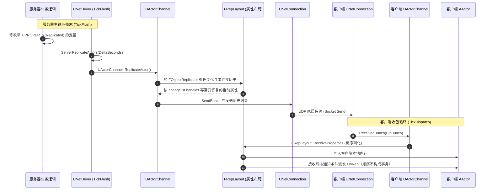
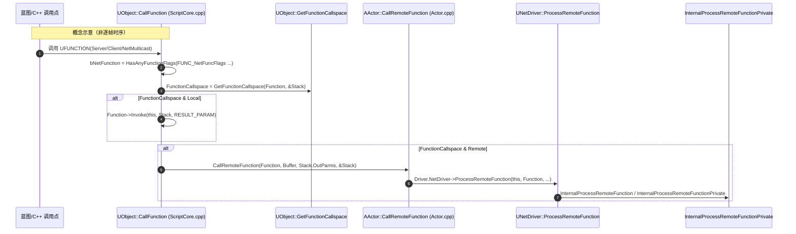

# UE 引擎源码分析 09：网络复制与 RPC 源码剖析
> 知识成熟度：L2（历史源码阅读材料与公共契约的静态分析；不是引擎编译或运行验证等级）。
> 对应知识点：[06-网络同步/01 网络架构与复制基础](01-网络架构与复制基础.md)、[06-网络同步/02 RPC 与属性同步](02-RPC与属性同步.md)

> 本文沿用旧稿标为 UE5.8 的源码阅读材料，分析 `ServerReplicateActors` 调度、`UActorChannel::ReplicateActor` 打包、`FRepLayout` 变化跟踪以及 RPC/OnRep 接收链路。节选有明确省略，不能视为完整调用图或全部后端实现。

> 历史来源记录：旧稿称源码节选来自 `C:\Users\zhaozhiqi\Documents\GitHub\UnrealEngine`，行号以当时 checkout 为准；长函数用 `// …（节选：省略 N 行）` 标出省略。这是保留的历史归属说明，本次未访问或认证该私有 checkout、安装目录、revision 或 CL，不能据公共文档页反向证明其逐字真实性。
> 本次事实边界（2026-10-04）：完整复读仓内本文及 RPC 使用篇；以明确显示 UE5.8 的 Epic 公开文档/API 核对行为合同，用仓内节选检验相邻解释的控制流/位运算。既有 40 个历史源码 fence 保留，不补造缺失的私有实现；本库教学例与解释则按合同修订。下文历史行号、函数长度与旧检索记录是定位线索，不是本次复现结果。
> 后端边界：下文 ActorChannel / FRepLayout 机制主要讨论经典复制路径；Iris 分支仅作边界定位，迁移见 [Iris 使用与迁移](07-Iris复制使用与迁移.md)。UHT、UE 构建、PIE、弱网、网络 trace 和性能实验均 **NOT_RUN**；普通控制流算例不能代替它们。

---

## 元数据

- **历史版本基准（本次未认证）**：UE 5.8.0 / CL 55116800 / 分支 `++UE5+Release-5.8`（旧稿安装目录 `C:\Program Files\Epic Games\UE_5.8\Engine`）。公开 UE5.8 文档只能支持公开契约，不证明这个 CL 或本机安装。
- **源码依据**：
  - `Engine\Source\Runtime\Engine\Private\NetDriver.cpp`（`UNetDriver::TickFlush`、`ServerReplicateActors`、`ProcessRemoteFunction`）
  - `Engine\Source\Runtime\Engine\Private\DataChannel.cpp`（`UActorChannel::ReplicateActor`、`ReceivedBunch`、`ProcessBunch`）
  - `Engine\Source\Runtime\Engine\Private\RepLayout.cpp`（`FRepLayout::ReplicateProperties`、`ReceiveProperties`、`CallRepNotifies`）
  - `Engine\Source\Runtime\Engine\Public\Net\UnrealNetwork.h`（`DOREPLIFETIME` 系列宏、`FDoRepLifetimeParams`）
  - `Engine\Source\Runtime\CoreUObject\Public\UObject\CoreNetTypes.h`（`ELifetimeCondition` 复制条件）
  - `Engine\Source\Runtime\Engine\Private\Components\CharacterMovementComponent.cpp`（`ServerMove`、`ClientAdjustPosition`）
- **官方参考**：[Unreal Engine 属性复制与 RPC 官方文档](https://dev.epicgames.com/documentation/en-us/unreal-engine)。
- **历史补深来源目录（旧稿记录为逐字摘录并经 ripgrep 核对；本次未重跑该私有源码检索）**：
  - `Engine\Source\Runtime\Engine\Private\NetDriver.cpp`（`ServerReplicateActors` 第 6277 行、`ServerReplicateActors_PrepConnections` 第 5198 行、`ServerReplicateActors_BuildConsiderList` 第 5303 行、`ServerReplicateActors_PrioritizeActors` 第 5528 行、`ServerReplicateActors_ProcessPrioritizedActorsRange` 第 5687 行、`ServerReplicateActors_ForConnection` 第 5938 行、`ProcessRemoteFunction` 第 8125 行、`InternalProcessRemoteFunctionPrivate` 第 3083 行、`ProcessRemoteFunctionForChannelPrivate` 第 3223 行）
  - `Engine\Source\Runtime\Engine\Private\DataReplication.cpp`（`FObjectReplicator::ReceivedRPC` 第 1323 行（本节引其第 1429~1453 行分支）、`CallProcessEventForReceivedRPC` 第 1479 行、`PostReceivedBunch` 第 1592 行、`QueueRemoteFunctionBunch` 第 2293 行、`CallRepNotifies` 第 2431 行、`QueuePropertyRepNotify` 第 2737 行、`net.MaxRPCPerNetUpdate` 第 38 行）
  - `Engine\Source\Runtime\Engine\Public\Net\DataReplication.h`（`FObjectReplicator` 类声明第 73 行、`CallRepNotifies` 声明第 221 行）
  - `Engine\Source\Runtime\Engine\Public\Net\RepLayout.h`（`FRepStateStaticBuffer` 第 376 行、`FReceivingRepState` 第 538 行、`FSendingRepState` 第 567 行、`FRepState` 第 671 行、`FRepParentCmd` 第 780 行、`FRepLayoutCmd` 第 856 行）
  - `Engine\Source\Runtime\Engine\Private\RepLayout.cpp`（`CompareProperties_r` 第 1648 行、`FRepLayout::ReplicateProperties` 第 1972 行、`SendProperties_r` 第 2767 行、`SendProperties` 第 2948 行、`ReceiveProperties` 第 3789 行、`CallRepNotifies` 第 4661 行）
  - `Engine\Source\Runtime\Net\Core\Public\Net\Core\PropertyConditions\RepChangedPropertyTracker.h`（`FRepChangedPropertyTracker` 第 22 行，5.8 已迁移至 NetCore 模块）
  - `Engine\Source\Runtime\CoreUObject\Private\UObject\ScriptCore.cpp`（`UObject::CallFunction` 第 1133 行、RPC 远程分支第 1155~1187 行）
  - `Engine\Source\Runtime\Engine\Private\Actor.cpp`（`AActor::CallRemoteFunction` 第 5668 行）
  - `Engine\Source\Runtime\Engine\Private\ActorReplication.cpp`（`AActor::GetNetPriority` 第 48 行、`AActor::IsWithinNetRelevancyDistance` 第 383 行）
  - `Engine\Source\Programs\Shared\EpicGames.UHT\Exporters\CodeGen\UhtHeaderCodeGeneratorCppFile.cs`（`_Validate` 派发代码生成第 3506~3513 行）
- **历史整理日期**：2026-09-14（旧稿补充服务器主循环、复制状态、OnRep 与 RPC/UHT 节选及定位信息）。
- **最后更新**：2026-10-04（公共行为合同与仓内静态因果校订；保持既有源码材料，未新增 UE 运行证据）。
- **阅读证据分层**：公开合同回答“应用能依赖什么”；仓内节选回答“这些可见语句怎样衔接”；被省略实现、确切现代阈值及真实运行结果需在获授权、可定位的目标版本另外验证。两者相冲突时先缩小结论，不用历史摘录压过明确公开合同。

---

## 概述与网络复制全链路时序

在本篇讨论的经典复制路径中，属性同步与 RPC 经 **FOutBunch / FInBunch** 等数据块组织。下图是教学概览，省略 `FObjectReplicator`、调度与历史合并细节，不是 Iris 内部管线或实测时序：



---

## 核心源码深入剖析零：服务器复制主循环 `UNetDriver::ServerReplicateActors`

> 本节为 2026-09-14 补深新增。`UActorChannel::ReplicateActor` 只负责「单个 Actor 到单个连接」的打包，真正决定「本帧哪些 Actor、以什么顺序、发给哪些连接」的是 `UNetDriver::ServerReplicateActors`。5.8 中该主循环由 4 个阶段函数串成，且全部位于 `NetDriver.cpp` 的 `#if WITH_SERVER_CODE`（第 5197~5936 行）保护块内。

### 1. 主循环入口与框架级调用点

`TickFlush` 在帧末驱动复制（`Engine\Source\Runtime\Engine\Private\NetDriver.cpp` 第 1186~1230 行，节选）：

```cpp
	if (IsServer() && (ClientConnections.Num() > 0 || UE::Net::Private::bUpdateReplicationSystemWithNoConnections) && !bSkipServerReplicateActors)
	{
		if (ReplicationSystem)
		{
			if (UEngineReplicationBridge* Bridge = ReplicationSystem->GetReplicationBridgeAs<UEngineReplicationBridge>())
			{
				// …（节选：省略 AUTORTFM 事务分支 9 行）
				{
					UE::Net::FDeferredReplicationSystemCalls::FlushDeferred(Bridge);
				}
			}
		}

		// Update all clients.
#if WITH_SERVER_CODE
		CSV_SCOPED_TIMING_STAT_EXCLUSIVE(ServerReplicateActors);

		if (ReplicationSystem)
		{
			InternalIrisUpdateTransactional(DeltaSeconds);
		}
		else if (ClientConnections.Num() > 0)
		{
			// …（节选：省略 bReplicateTransactionally 事务包裹分支）
```

可见这一分支在存在 ReplicationSystem 时调用 `InternalIrisUpdateTransactional`，否则才进入所示传统复制分支。此节选没有展示整个 TickFlush 的退出流程，不能据此添加“立即返回”的动作。下文主要讨论传统路径。

### 2. `ServerReplicateActors` 主函数（节选）

以下为旧稿标注的源码摘录，历史来源为 `Engine\Source\Runtime\Engine\Private\NetDriver.cpp`（第 6277 行起，函数共约 210 行，此处为节选）：

```cpp
int32 UNetDriver::ServerReplicateActors(float DeltaSeconds)
{
	SCOPE_CYCLE_COUNTER(STAT_NetServerRepActorsTime);

#if WITH_SERVER_CODE
	if ( ClientConnections.Num() == 0 )
	{
		return 0;
	}

	GetMetrics()->SetInt(UE::Net::Metric::NumReplicatedActors,0 );
	GetMetrics()->SetInt(UE::Net::Metric::NumReplicatedActorBytes, 0);

	// …（节选：省略 CSV_PROFILER_STATS 的 FScopedNetDriverStats 统计块 4 行）

	if (ReplicationDriver)
	{
		return ReplicationDriver->ServerReplicateActors(DeltaSeconds);
	}

	check( World );

	// Bump the ReplicationFrame value to invalidate any properties marked as "unchanged" for this frame.
	ReplicationFrame++;

	int32 Updated = 0;

	// …（节选：省略 UE_WITH_REMOTE_OBJECT_HANDLE && UE_AUTORTFM 的 bUseGranularTransactions 定义 5 行）

	const int32 NumClientsToTick = [this, DeltaSeconds, bUseGranularTransactions]()
		{
			// …（节选：省略事务分派分支 10 行）
			{
				return ServerReplicateActors_PrepConnections(DeltaSeconds);
			}
		}();


	if ( NumClientsToTick == 0 )
	{
		// No connections are ready this frame
		return 0;
	}

	AWorldSettings* WorldSettings = World->GetWorldSettings();

	bool bCPUSaturated		= false;
	float ServerTickTime	= GEngine->GetMaxTickRate( DeltaSeconds );
	if ( ServerTickTime == 0.f )
	{
		ServerTickTime = DeltaSeconds;
	}
	else
	{
		ServerTickTime	= 1.f/ServerTickTime;
		bCPUSaturated	= DeltaSeconds > 1.2f * ServerTickTime;
	}

	ensureMsgf(CurrentConsiderList.IsEmpty(), TEXT("UNetDriver::ServerReplicateActors: CurrentConsiderList isn't empty before starting replication."));

	CurrentConsiderList.Reserve( GetNetworkObjectList().GetActiveObjects().Num() );
	ON_SCOPE_EXIT
	{
		// Deallocate the array while the NetDriver doesn't need it.
		CurrentConsiderList.Empty();
	};

	// Build the consider list (actors that are ready to replicate)
	// …（节选：省略 bUseGranularTransactions 事务包裹分支 11 行）
	{
		ServerReplicateActors_BuildConsiderList(CurrentConsiderList, ServerTickTime);
	}

	TSet<UNetConnection*> ConnectionsToClose;

	FMemMark Mark( FMemStack::Get() );

	if (OnPreConsiderListUpdateOverride.IsBound())
	{
		OnPreConsiderListUpdateOverride.Execute({ DeltaSeconds, nullptr, bCPUSaturated }, Updated, CurrentConsiderList);
	}

	for ( int32 i=0; i < ClientConnections.Num(); i++ )
	{
		UNetConnection* Connection = ClientConnections[i];
		check(Connection);

		// net.DormancyValidate can be set to 2 to validate all dormant actors against last known state before going dormant
		if ( GNetDormancyValidate == 2 )
		{
			// …（节选：省略 dormant replicator 校验 lambda 12 行）
			Connection->ExecuteOnAllDormantReplicators(ValidateFunction);
		}

		// if this client shouldn't be ticked this frame
		if (i >= NumClientsToTick)
		{
			// …（节选：省略 bPendingNetUpdate 打标循环 18 行）
			// clear the time sensitive flag to avoid sending an extra packet to this connection
			Connection->TimeSensitive = false;
		}
		else if (Connection->ViewTarget)
		{
			UE::Net::FServerReplicateActors_ForConnectionParams Params =
			{
				.Connection = Connection,
				.ConnectionViewers = WorldSettings->ReplicationViewers,
				.DeltaSeconds = DeltaSeconds,
				.ConsiderList = CurrentConsiderList,
				.InOutUpdated = Updated,
				.bCPUSaturated = bCPUSaturated
			};

			// …（节选：省略事务分支 9 行）
			{
				ServerReplicateActors_ForConnection(Params);
			}
		}

		if (Connection->GetPendingCloseDueToReplicationFailure())
		{
			ConnectionsToClose.Add(Connection);
		}
	}
```

逐段解构：

1. **入口三条早退**：无客户端连接、`ReplicationDriver` 存在（ReplicationGraph 等接管）、`NumClientsToTick == 0`。这里的 `ReplicationDriver->ServerReplicateActors` 说明「主循环」本身是可替换的抽象，`Engine\Source\Runtime\Engine\Classes\Engine\ReplicationDriver.h` 定义了该接口。
2. **`ReplicationFrame++`（第 6303 行）**：这是「本帧内属性不值得再比较」的失效信号。`FRepChangelistState::CompareIndex` 与 `FSendingRepState::LastCompareIndex` 的比对依赖它——同一帧内重复比较会被 early-out 跳过。
3. **`ServerTickTime` 与 `bCPUSaturated`（第 6340~6350 行）**：`GEngine->GetMaxTickRate(DeltaSeconds)` 给出目标 tick 率；若实际 `DeltaSeconds` 超过目标帧时长的 **1.2 倍**，本帧被标记为 CPU 饱和。注意此处的 `bCPUSaturated` 只是传给 `ServerReplicateActors_ForConnection` 的参数。
4. **`CurrentConsiderList` 生命周期**：`ON_SCOPE_EXIT` 保证函数退出时清空，`ensureMsgf` 检查它进入时必须为空——这是「主循环不可重入 / 不可跨帧持有」的硬约束。
5. **每帧上限不在主函数里**：主函数不设「每帧最多复制 N 个 Actor」的硬截断，真正的上限来自 `PrepareConnections` 的客户端节流（下节）与 `ServerReplicateActors_ProcessPrioritizedActorsRange` 的**连接饱和**判定（见第 4 小节）。
6. **`i >= NumClientsToTick` 分支的后续责任**：旧稿定位其省略循环为相关对象设置 `bPendingNetUpdate`，用于后续继续考虑；可见代码还清除该连接的 TimeSensitive。待更新标记不是下一帧送达保证，仍需对象/连接有效、条件允许并得到预算；不能由标记动作推导连接限流、断线或生命周期结束都不会造成缺失。

### 3. 阶段一：`ServerReplicateActors_PrepConnections` —— 客户端节流

摘自 `Engine\Source\Runtime\Engine\Private\NetDriver.cpp`（第 5198 行起，节选）：

```cpp
int32 UNetDriver::ServerReplicateActors_PrepConnections( const float DeltaSeconds )
{
	int32 NumClientsToTick = ClientConnections.Num();

	// by default only throttle update for listen servers unless specified on the commandline
	static bool bForceClientTickingThrottle = FParse::Param( FCommandLine::Get(), TEXT( "limitclientticks" ) );
	if ( (bForceClientTickingThrottle || GetNetMode() == NM_ListenServer) && bTickingThrottleEnabled )
	{
		// determine how many clients to tick this frame based on GEngine->NetTickRate (always tick at least one client), double for lan play
		// FIXME: DeltaTimeOverflow is a static, and will conflict with other running net drivers, we investigate storing it on the driver itself!
		static float DeltaTimeOverflow = 0.f;
		// updates are doubled for lan play
		static bool LanPlay = FParse::Param( FCommandLine::Get(), TEXT( "lanplay" ) );
		//@todo - ideally we wouldn't want to tick more clients with a higher deltatime as that's not going to be good for performance and probably saturate bandwidth in hitchy situations, maybe
		// come up with a solution that is greedier with higher framerates, but still won't risk saturating server upstream bandwidth
		float ClientUpdatesThisFrame = GEngine->NetClientTicksPerSecond * ( DeltaSeconds + DeltaTimeOverflow ) * ( LanPlay ? 2.f : 1.f );
		NumClientsToTick = FMath::Min<int32>( NumClientsToTick, FMath::TruncToInt( ClientUpdatesThisFrame ) );
		//UE_LOGF(LogNet, Log, "%2.3f: Ticking %d clients this frame, %2.3f/%2.4f",GetWorld()->GetTimeSeconds(),NumClientsToTick,DeltaSeconds,ClientUpdatesThisFrame);
		if ( NumClientsToTick == 0 )
		{
			// if no clients are ticked this frame accumulate the time elapsed for the next frame
			DeltaTimeOverflow += DeltaSeconds;
			return 0;
		}
		DeltaTimeOverflow = 0.f;
	}

	if( NetCmds::MaxConnectionsToTickPerServerFrame->GetInt() > 0 )
	{
		NumClientsToTick = FMath::Min( ClientConnections.Num(), NetCmds::MaxConnectionsToTickPerServerFrame->GetInt() );
	}
```

1. **第一分支有两个门**：只有 `(bForceClientTickingThrottle || NetMode == ListenServer) && bTickingThrottleEnabled` 成立，才计算速率限制。Listen 模式本身不充分；强制 `limitclientticks` 也不绕过 `bTickingThrottleEnabled`。Dedicated 可以经强制分支进入，不能统一称为“不节流”。
2. **第一分支的计算与早退**：使用速率、`DeltaSeconds + DeltaTimeOverflow` 和 LAN 倍率计算，再截断为整数并与连接数取较小值。结果为零时累加 overflow 后立即返回，后面的显式 cap 根本不会执行。这里只说明所示控制流，不宣称真实负载下平均速率已测准。
3. **第二分支是覆盖赋值**：代码到达独立的正 `MaxConnectionsToTickPerServerFrame` 分支后，重新赋 `min(ClientConnections.Num(), configured_cap)`；它没有再与前一计算值取 min。一个纯算术反例是：20 个连接，前一非零结果 2，配置 cap=10，后式得到 10，而不是 2。若前式为 0 则已经返回，也不能套这个反例。两分支的效果必须按实际配置/路径分别记录。
4. **ready 检查仍是另一层**：旧稿另记录函数末尾为 `bFoundReadyConnection ? NumClientsToTick : 0`（历史第 5300 行，未在此节选展开）。因此数量计算不是连接已被成功复制的证据。目标版本完整函数、实际模式、开关值和每连接调度结果都需另外验证。

### 4. 阶段二：`ServerReplicateActors_BuildConsiderList` —— 候选集与自适应频率

摘自 `Engine\Source\Runtime\Engine\Private\NetDriver.cpp`（第 5303 行起，节选）：

```cpp
void UNetDriver::ServerReplicateActors_BuildConsiderList( TArray<FNetworkObjectInfo*>& OutConsiderList, const float ServerTickTime )
{
	SCOPE_CYCLE_COUNTER( STAT_NetConsiderActorsTime );

	UE_LOGF( LogNetTraffic, Log, "ServerReplicateActors_BuildConsiderList, Building ConsiderList at WorldTime: %f ServerTickTime: %f", World->GetTimeSeconds(), ServerTickTime );

	int32 NumInitiallyDormant = 0;

	const bool bUseAdapativeNetFrequency = IsAdaptiveNetUpdateFrequencyEnabled();

	TArray<AActor*> ActorsToRemove;

	for ( const TSharedPtr<FNetworkObjectInfo>& ObjectInfo : GetNetworkObjectList().GetActiveObjects() )
	{
		FNetworkObjectInfo* ActorInfo = ObjectInfo.Get();

		if ( !ActorInfo->bPendingNetUpdate && World->TimeSeconds <= ActorInfo->NextUpdateTime )
		{
			UE_LOGF(LogNetTraffic, VeryVerbose, "Skipping actor: %ls. bPendingNetUpdate: %ls | NextUpdateTime: %f (currently %f)", *GetNameSafe(ActorInfo->Actor), ActorInfo->bPendingNetUpdate?TEXT("true"):TEXT("false"),ActorInfo->NextUpdateTime, World->TimeSeconds);
			continue;		// It's not time for this actor to perform an update, skip it
		}

		AActor* Actor = ActorInfo->Actor;

		if ( Actor->IsPendingKillPending() )
		{
			// …（节选：省略 PendingKillPending 告警 8 行）
			ActorsToRemove.Add( Actor );
			continue;
		}

		if ( Actor->GetRemoteRole() == ROLE_None )
		{
			UE_LOGF(LogNetTraffic, VeryVerbose, "Skipping Actor %ls - it has no remote role!", *Actor->GetName());
			ActorsToRemove.Add( Actor );
			continue;
		}

		// This actor may belong to a different net driver, make sure this is the correct one
		// (this can happen when using beacon net drivers for example)
		if (Actor->GetNetDriverName() != NetDriverName)
		{
			// …（节选：省略错误日志 5 行）
			continue;
		}

		// Verify the actor is actually initialized (it might have been intentionally spawn deferred until a later frame)
		if ( !Actor->IsActorInitialized() )
		{
			UE_LOGF(LogNetTraffic, VeryVerbose, "Skipping Actor %ls - it not initialized!", *Actor->GetName());
			continue;
		}

		// Don't send actors that may still be streaming in or out
		ULevel* Level = Actor->GetLevel();
		if ( Level->HasVisibilityChangeRequestPending() || Level->bIsAssociatingLevel )
		{
			UE_LOGF(LogNetTraffic, VeryVerbose, "Skipping Actor %ls - it has a pending visibility change!", *Actor->GetName());
			continue;
		}

		if ( IsDormInitialStartupActor(Actor) )
		{
			// This stat isn't that useful in its current form when using NetworkActors list
			// We'll want to track initially dormant actors some other way to track them with stats
			SCOPE_CYCLE_COUNTER( STAT_NetInitialDormantCheckTime );
			NumInitiallyDormant++;
			ActorsToRemove.Add( Actor );
			UE_LOGF(LogNetTraffic, VeryVerbose, "Skipping Actor %ls - its initially dormant!", *Actor->GetName() );
			continue;
		}
```

以及同函数内的自适应频率计算（第 5383~5410 行，逐字）：

```cpp
		// Set defaults if this actor is replicating for first time
		if ( ActorInfo->LastNetReplicateTime == 0 )
		{
			UE_LOGF(LogNetTraffic, VeryVerbose, "Setting Actor %ls - initial replication update time!", *Actor->GetName());
			ActorInfo->LastNetReplicateTime = World->TimeSeconds;
			ActorInfo->OptimalNetUpdateDelta = 1.0f / Actor->GetNetUpdateFrequency();
		}

		const float ScaleDownStartTime = 2.0f;
		const float ScaleDownTimeRange = 5.0f;

		const float LastReplicateDelta = World->TimeSeconds - ActorInfo->LastNetReplicateTime;

		if ( LastReplicateDelta > ScaleDownStartTime )
		{
			if ( Actor->GetMinNetUpdateFrequency() == 0.0f )
			{
				Actor->SetMinNetUpdateFrequency(2.0f);
			}

			// Calculate min delta (max rate actor will update), and max delta (slowest rate actor will update)
			const float MinOptimalDelta = 1.0f / Actor->GetNetUpdateFrequency();									  // Don't go faster than NetUpdateFrequency
			const float MaxOptimalDelta = FMath::Max( 1.0f / Actor->GetMinNetUpdateFrequency(), MinOptimalDelta ); // Don't go slower than MinNetUpdateFrequency (or NetUpdateFrequency if it's slower)

			// Interpolate between MinOptimalDelta/MaxOptimalDelta based on how long it's been since this actor actually sent anything
			const float Alpha = FMath::Clamp( ( LastReplicateDelta - ScaleDownStartTime ) / ScaleDownTimeRange, 0.0f, 1.0f );
			ActorInfo->OptimalNetUpdateDelta = FMath::Lerp( MinOptimalDelta, MaxOptimalDelta, Alpha );
		}
```

1. **第一道门是时间（`NextUpdateTime`）**，不是相关性。候选集构建完全不做距离/可见性计算——这也是 5.8 与早期版本的重要差别：相关性判定被提前到优先级阶段（见下节注释「Relevancy is now cheap」）。
2. **剔除条件依次为**：`IsPendingKillPending()`、`GetRemoteRole() == ROLE_None`（本端没有远端角色，例如客户端上纯本地 Actor）、`GetNetDriverName() != NetDriverName`（beacon 等多 NetDriver 场景）、`!IsActorInitialized()`（deferred spawn）、流关卡可见性变更中、`IsDormInitialStartupActor()`（初始休眠 Actor 在此被移出活动列表）。
3. **自适应频率（`IsAdaptiveNetUpdateFrequencyEnabled()`）**：距上次成功复制超过 `ScaleDownStartTime = 2.0s` 后开始降频，在 `[1/NetUpdateFrequency, 1/MinNetUpdateFrequency]` 之间按 `Alpha = Clamp((LastReplicateDelta - 2.0) / 5.0, 0, 1)` 线性插值出 `OptimalNetUpdateDelta`。`MinNetUpdateFrequency` 未设置时被就地设为 **2.0**。这就是「长期不走网的 Actor 自动降到最低 2Hz」的实现。
4. 该函数不修改 Actor 的复制状态，只产出 `OutConsiderList` 与 `ActorsToRemove`。

### 5. 阶段三：`ServerReplicateActors_PrioritizeActors` —— 相关性、休眠与优先级

相关性/休眠/优先级在 5.8 中由 4 个文件局部 `static FORCEINLINE_DEBUGGABLE` 辅助函数 + `FActorPriority` 构造函数承担，**函数内没有 lambda**。以下辅助函数摘自 `Engine\Source\Runtime\Engine\Private\NetDriver.cpp`（第 5457~5526 行，逐字）：

```cpp
// Returns true if this actor should replicate to *any* of the passed in connections
static FORCEINLINE_DEBUGGABLE bool IsActorRelevantToConnection( const AActor* Actor, const TArray<FNetViewer>& ConnectionViewers )
{
	for ( int32 viewerIdx = 0; viewerIdx < ConnectionViewers.Num(); viewerIdx++ )
	{
		if ( Actor->IsNetRelevantFor( ConnectionViewers[viewerIdx].InViewer, ConnectionViewers[viewerIdx].ViewTarget, ConnectionViewers[viewerIdx].ViewLocation ) )
		{
			return true;
		}
	}

	return false;
}

// Returns true if this actor is owned by, and should replicate to *any* of the passed in connections
static FORCEINLINE_DEBUGGABLE UNetConnection* IsActorOwnedByAndRelevantToConnection( const AActor* Actor, const TArray<FNetViewer>& ConnectionViewers, bool& bOutHasNullViewTarget )
{
	const AActor* ActorOwner = Actor->GetNetOwner();

	bOutHasNullViewTarget = false;

	for ( int i = 0; i < ConnectionViewers.Num(); i++ )
	{
		UNetConnection* ViewerConnection = ConnectionViewers[i].Connection;

		if ( ViewerConnection->ViewTarget == nullptr )
		{
			bOutHasNullViewTarget = true;
		}

		if ( ActorOwner == ViewerConnection->PlayerController ||
			 ( ViewerConnection->PlayerController && ActorOwner == ViewerConnection->PlayerController->GetPawn() ) ||
			 (ViewerConnection->ViewTarget && ViewerConnection->ViewTarget->IsRelevancyOwnerFor( Actor, ActorOwner, ViewerConnection->OwningActor ) ) )
		{
			return ViewerConnection;
		}
	}

	return nullptr;
}

// Returns true if this actor is considered dormant (and all properties caught up) to the current connection
static FORCEINLINE_DEBUGGABLE bool IsActorDormant( FNetworkObjectInfo* ActorInfo, const TWeakObjectPtr<UNetConnection>& Connection )
{
	// If actor is already dormant on this channel, then skip replication entirely
	return ActorInfo->DormantConnections.Contains( Connection );
}

// Returns true if this actor wants to go dormant for a particular connection
static FORCEINLINE_DEBUGGABLE bool ShouldActorGoDormant( AActor* Actor, const TArray<FNetViewer>& ConnectionViewers, UActorChannel* Channel, const float Time, const bool bLowNetBandwidth )
{
	if ( Actor->NetDormancy <= DORM_Awake || !Channel || Channel->bPendingDormancy || Channel->Dormant )
	{
		// Either shouldn't go dormant, or is already dormant
		return false;
	}

	if ( Actor->NetDormancy == DORM_DormantPartial )
	{
		for ( int32 viewerIdx = 0; viewerIdx < ConnectionViewers.Num(); viewerIdx++ )
		{
			if ( !Actor->GetNetDormancy( ConnectionViewers[viewerIdx].ViewLocation, ConnectionViewers[viewerIdx].ViewDir, ConnectionViewers[viewerIdx].InViewer, ConnectionViewers[viewerIdx].ViewTarget, Channel, Time, bLowNetBandwidth ) )
			{
				return false;
			}
		}
	}

	return true;
}
```

`FActorPriority` 的两个构造函数（第 5152~5190 行，逐字）——**这就是优先级的真实公式**：

```cpp
FActorPriority::FActorPriority(UNetConnection* InConnection, UActorChannel* InChannel, FNetworkObjectInfo* InActorInfo, const TArray<struct FNetViewer>& Viewers, bool bLowBandwidth)
	: ActorInfo(InActorInfo), Channel(InChannel), DestructionInfo(NULL)
{
	const float Time = Channel ? (InConnection->Driver->GetElapsedTime() - Channel->LastUpdateTime) : InConnection->Driver->SpawnPrioritySeconds;
	// take the highest priority of the viewers on this connection
	Priority = 0;
	for (int32 i = 0; i < Viewers.Num(); i++)
	{
		Priority = FMath::Max<int32>(Priority, FMath::RoundToInt(65536.0f * ActorInfo->Actor->GetNetPriority(Viewers[i].ViewLocation, Viewers[i].ViewDir, Viewers[i].InViewer, Viewers[i].ViewTarget, InChannel, Time, bLowBandwidth)));
	}
}

FActorPriority::FActorPriority(UNetConnection* InConnection, FActorDestructionInfo * Info, const TArray<FNetViewer>& Viewers )
	: ActorInfo(NULL), Channel(NULL), DestructionInfo(Info)
{

	Priority = 0;

	for (int32 i = 0; i < Viewers.Num(); i++)
	{
		float Time  = InConnection->Driver->SpawnPrioritySeconds;

		FVector Dir = DestructionInfo->DestroyedPosition - Viewers[i].ViewLocation;
		float DistSq = Dir.SizeSquared();

		// adjust priority based on distance and whether actor is in front of viewer
		if ( (Viewers[i].ViewDir | Dir) < 0.f )
		{
			if ( DistSq > NEARSIGHTTHRESHOLDSQUARED )
				Time *= 0.2f;
			else if ( DistSq > CLOSEPROXIMITYSQUARED )
				Time *= 0.4f;
		}
		else if ( DistSq > MEDSIGHTTHRESHOLDSQUARED )
			Time *= 0.4f;

		Priority = FMath::Max<int32>(Priority, 65536.0f * Time);
	}
}
```

优先级排程主体摘自 `Engine\Source\Runtime\Engine\Private\NetDriver.cpp`（第 5528 行起，函数共 152 行，此处为前半节选）：

```cpp
int32 UNetDriver::ServerReplicateActors_PrioritizeActors( UNetConnection* Connection, const TArray<FNetViewer>& ConnectionViewers, const TArray<FNetworkObjectInfo*>& ConsiderList, const bool bCPUSaturated, FActorPriority*& OutPriorityList, FActorPriority**& OutPriorityActors )
{
	SCOPE_CYCLE_COUNTER( STAT_NetPrioritizeActorsTime );

	// Get list of visible/relevant actors.

	NetTag++;

	// Set up to skip all sent temporary actors
	for ( int32 j = 0; j < Connection->SentTemporaries.Num(); j++ )
	{
		Connection->SentTemporaries[j]->NetTag = NetTag;
	}

	// Make list of all actors to consider.
	check( World == Connection->OwningActor->GetWorld() );

	int32 FinalSortedCount = 0;
	int32 DeletedCount = 0;

	// Make weak ptr once for IsActorDormant call
	TWeakObjectPtr<UNetConnection> WeakConnection(Connection);

	const int32 MaxSortedActors = ConsiderList.Num() + DestroyedStartupOrDormantActors.Num();
	if ( MaxSortedActors > 0 )
	{
		OutPriorityList = new ( FMemStack::Get(), MaxSortedActors ) FActorPriority;
		OutPriorityActors = new ( FMemStack::Get(), MaxSortedActors ) FActorPriority*;

		check( World == Connection->ViewTarget->GetWorld() );

		AGameNetworkManager* const NetworkManager = World->NetworkManager;
		const bool bLowNetBandwidth = NetworkManager ? NetworkManager->IsInLowBandwidthMode() : false;

		for ( FNetworkObjectInfo* ActorInfo : ConsiderList )
		{
#if UE_WITH_REMOTE_OBJECT_HANDLE
			// If we can run transactions entries in the ConsiderList might become invalid
			if (bReplicateTransactionally && !ActorInfo->WeakActor.IsValid())
			{
				continue;
			}
#endif

			AActor* Actor = ActorInfo->Actor;

			UActorChannel* Channel = Connection->FindActorChannelRef( ActorInfo->WeakActor );

			// Skip actor if not relevant and theres no channel already.
			// Historically Relevancy checks were deferred until after prioritization because they were expensive (line traces).
			// Relevancy is now cheap and we are dealing with larger lists of considered actors, so we want to keep the list of
			// prioritized actors low.
			if (!Channel)
			{
				if (!IsLevelInitializedForActor(Actor, Connection))
				{
					// If the level this actor belongs to isn't loaded on client, don't bother sending
					continue;
				}

				if (!IsActorRelevantToConnection(Actor, ConnectionViewers))
				{
					// If not relevant (and we don't have a channel), skip
					continue;
				}
			}

			UNetConnection* PriorityConnection = Connection;

			if ( Actor->bOnlyRelevantToOwner )
			{
				// This actor should be owned by a particular connection, see if that connection is the one passed in
				bool bHasNullViewTarget = false;

				PriorityConnection = IsActorOwnedByAndRelevantToConnection( Actor, ConnectionViewers, bHasNullViewTarget );
```

同函数后半段的结构与结尾（第 5604~5679 行，节选）：

```cpp
			// …（节选：省略 PriorityConnection == nullptr 时的通道关闭与 continue 13 行）

			else if ( GSetNetDormancyEnabled != 0 )
			{
				// …（节选：省略 IsActorDormant / ShouldActorGoDormant 分支 17 行）
			}

			if ( Actor->NetTag != NetTag )
			{
				UE_LOGF( LogNetTraffic, Log, "Consider %ls [%d/%d] Rank: %d NetTag: %d ChannelLastUpdateTime: %f Priority: %f", *Actor->GetFullName(), FinalSortedCount, MaxSortedActors, FinalSortedCount, Actor->NetTag, (float)(Channel ? Channel->LastUpdateTime : 0.0), (float)(Actor ? Actor->GetNetPriority(ConnectionViewers.Num() ? ConnectionViewers[0].ViewLocation : FVector::ZeroVector, FVector::ZeroVector, nullptr, nullptr, Channel, 0.f) : 0.f) );

				Actor->NetTag = NetTag;

				// Add to the priority list
				OutPriorityList[FinalSortedCount] = FActorPriority( PriorityConnection, Channel, ActorInfo, ConnectionViewers, bLowNetBandwidth );
				OutPriorityActors[FinalSortedCount] = &OutPriorityList[FinalSortedCount];

				FinalSortedCount++;
			}
		}

		// …（节选：省略 DestroyedStartupOrDormantActors 删除项入列 10 行）
			DeletedCount++;
		}

		// Sort by priority
		Algo::SortBy(MakeArrayView(OutPriorityActors, FinalSortedCount), &FActorPriority::Priority, TGreater<>());
	}

	UE_LOGF( LogNetTraffic, Log, "ServerReplicateActors_PrioritizeActors: Potential %04i ConsiderList %03i FinalSortedCount %03i", MaxSortedActors, ConsiderList.Num(), FinalSortedCount );

	// Setup stats
	GetMetrics()->SetInt(UE::Net::Metric::PrioritizedActors, FinalSortedCount);
	GetMetrics()->SetInt(UE::Net::Metric::NumRelevantDeletedActors, DeletedCount);

	return FinalSortedCount;
}
```

1. **相关性判定位置**：`if (!Channel)` 且 `!IsActorRelevantToConnection(...)` 才跳过。**已存在通道的 Actor 不再做相关性剔除**——它进入候选后由阶段四用「最近相关性窗口」决定是否关闭通道。源码注释明确写出这是相对早期版本的优化：「Historically Relevancy checks were deferred until after prioritization because they were expensive (line traces).」
2. **`bOnlyRelevantToOwner`**：只有 `IsActorOwnedByAndRelevantToConnection` 返回的连接才作为 `PriorityConnection`；返回 `nullptr` 时（且非 `bHasNullViewTarget`）会尝试按 `RelevantTimeout` 关闭通道。
3. **休眠在这里被消费**：`GSetNetDormancyEnabled != 0` 时，`IsActorDormant`（查 `FNetworkObjectInfo::DormantConnections`）为真则 `continue`，整条 Actor 完全不参与本连接本帧复制；`ShouldActorGoDormant` 为真则 `Channel->StartBecomingDormant()`。
4. **`NetTag` 去重**：`SentTemporaries` 先被打上本帧 `NetTag`，随后 `Actor->NetTag != NetTag` 才入列——防止同一 Actor 被重复排程。
5. **排序**：`Algo::SortBy(..., TGreater<>())` 按 `Priority` 降序。优先级取自 `AActor::GetNetPriority`（`Engine\Source\Runtime\Engine\Private\ActorReplication.cpp` 第 48~92 行），其返回值在 `FActorPriority` 构造时被 `RoundToInt(65536.0f * ...)` 定点化。
6. **注意**：形参 `bCPUSaturated` 在该函数体内**未被使用**（旧稿 rg 核对记录，本次未复现），CPU 饱和的实际作用点在阶段四的 `bIgnoreSaturation`。

### 6. 阶段四：`ServerReplicateActors_ProcessPrioritizedActorsRange` —— 饱和、通道与 `ReplicateActor`

`ServerReplicateActors_ProcessPrioritizedActors`（第 5681 行）在 5.3 起被标记 `UE_DEPRECATED`，5.8 中它只是 5 行的转发壳，真实实现在 `..._Range`。摘录其开头（`Engine\Source\Runtime\Engine\Private\NetDriver.cpp` 第 5687 行起，函数共 208 行，此处为节选）：

```cpp
int32 UNetDriver::ServerReplicateActors_ProcessPrioritizedActorsRange( UNetConnection* Connection, const TArray<FNetViewer>& ConnectionViewers, FActorPriority** PriorityActors, const TInterval<int32>& ActorsIndexRange, int32& OutUpdated, bool bIgnoreSaturation )
{
	SCOPE_CYCLE_COUNTER(STAT_NetProcessPrioritizedActorsTime);

	int32 ActorUpdatesThisConnection		= 0;
	int32 ActorUpdatesThisConnectionSent	= 0;
	int32 FinalRelevantCount				= 0;

	if (!Connection->IsNetReady() && !bIgnoreSaturation)
	{
		GNumSaturatedConnections++;
		// Connection saturated, don't process any actors
		return 0;
	}

	for ( int32 j = ActorsIndexRange.Min; j < ActorsIndexRange.Min + ActorsIndexRange.Max; j++ )
	{
		FNetworkObjectInfo*	ActorInfo = PriorityActors[j]->ActorInfo;

		// Deletion entry
		if ( ActorInfo == NULL && PriorityActors[j]->DestructionInfo )
		{
			// Make sure client has streaming level loaded
			if ( PriorityActors[j]->DestructionInfo->StreamingLevelName != NAME_None && !Connection->ClientVisibleLevelNames.Contains( PriorityActors[j]->DestructionInfo->StreamingLevelName ) )
			{
				// This deletion entry is for an actor in a streaming level the connection doesn't have loaded, so skip it
				continue;
			}

			FinalRelevantCount++;
			UE_LOGF( LogNetTraffic, Log, "Server replicate actor creating destroy channel for NetGUID <%ls,%ls> Priority: %d", *PriorityActors[j]->DestructionInfo->NetGUID.ToString(), *PriorityActors[j]->DestructionInfo->PathName, PriorityActors[j]->Priority );

			SendDestructionInfo(Connection, PriorityActors[j]->DestructionInfo);

			Connection->RemoveDestructionInfo( PriorityActors[j]->DestructionInfo );		// Remove from connections to-be-destroyed list (close bunch of reliable, so it will make it there)
			continue;
		}

		// …（节选：省略非 Shipping 下的 net.PackageMap.DebugObject 调试块 17 行）

		// Normal actor replication
		UActorChannel* Channel = PriorityActors[j]->Channel;
		UE_LOGF( LogNetTraffic, Log, " Maybe Replicate %ls", ActorInfo ? *ActorInfo->Actor->GetName() : TEXT("None") );
		if ( !Channel || Channel->Actor ) //make sure didn't just close this channel
		{
			AActor* Actor = ActorInfo->Actor;
			bool bIsRelevant = false;

			const bool bLevelInitializedForActor = IsLevelInitializedForActor( Actor, Connection );

			// only check visibility on already visible actors every 1.0 + 0.5R seconds or every RelevantTimeout if it's lower then 1sec.
			// bTearOff actors should never be checked
			if ( bLevelInitializedForActor )
			{
				const float MinVisibilityTimeout = FMath::Min(RelevantTimeout, 1.0f);
				if ( !Actor->GetTearOff() && ( !Channel || ElapsedTime - Channel->RelevantTime >= MinVisibilityTimeout) )
				{
					if ( IsActorRelevantToConnection( Actor, ConnectionViewers ) )
					{
						bIsRelevant = true;
					}
#if NET_DEBUG_RELEVANT_ACTORS
					else if ( DebugRelevantActors )
					{
						LastNonRelevantActors.Add( Actor );
					}
#endif // NET_DEBUG_RELEVANT_ACTORS
				}
			}
			else
			{
				// Actor is no longer relevant because the world it is/was in is not loaded by client
				// exception: player controllers should never show up here
				UE_LOGF( LogNetTraffic, Log, "- Level not initialized for actor %ls", *Actor->GetName() );
			}

			// if the actor is now relevant or was recently relevant
			const bool bIsRecentlyRelevant = bIsRelevant || ( Channel && ElapsedTime - Channel->RelevantTime < RelevantTimeout ) || (ActorInfo->ForceRelevantFrame >= Connection->LastProcessedFrame);

			if ( bIsRecentlyRelevant )
			{
				FinalRelevantCount++;

				TOptional<FScopedActorRoleSwap> SwapGuard;
				if (ActorInfo->bSwapRolesOnReplicate || IsRoleSwappingOnAllActorsEnabled())
				{
					SwapGuard = FScopedActorRoleSwap(Actor);
				}
```

关键后半段与结尾（第 5808~5894 行，节选）：

```cpp
				// …（节选：省略通道创建与 NextUpdateTime 抖动 22 行）
				// …（节选：省略 RelevantTime 刷新 7 行）

				// …（节选：省略 Channel->IsNetReady() 判定与 ReplicateActor 调用 16 行）
				{
					ActorUpdatesThisConnectionSent++;
					// …（节选：省略 USE_SERVER_PERF_COUNTERS 统计与调试记录）
				}

				// …（节选：省略 OptimalNetUpdateDelta 回写与 LastNetReplicateTime 更新 10 行）

				ActorUpdatesThisConnection++;
				OutUpdated++;

				// …（节选：省略通道饱和时的 ForceNetUpdate 打标 6 行）

				if ( GNumSaturatedConnections > LocalNumSaturated )
				{
					GNumSaturatedConnections++;
					return j;
				}
			}

			if ( !bIsRecentlyRelevant )
			{
				// …（节选：省略通道关闭判定 14 行）
				{
					UE_LOGF( LogNetTraffic, Log, "- Closing channel for no longer relevant actor %ls", *Actor->GetName() );
					Channel->Close(Actor->GetTearOff() ? EChannelCloseReason::TearOff : EChannelCloseReason::Relevancy);
				}
			}
		}
	}

	return ActorsIndexRange.Max;
}
```

1. **本次调用的连接饱和门**：`!Connection->IsNetReady() && !bIgnoreSaturation` 时计数递增并返回 0，所以本次调用不会进入下面的 Actor 范围循环。该节选不能排除同帧其他调用/路径已做工作，不应扩述为“整条连接本帧一个 Actor 都不处理”。它展示的是入口门控，不是全系统配额或已送达计数。
2. **相关性重检的局部分支**：关卡就绪且未 TearOff 时，代码在没有 Channel 或经过所示时间阈值后执行相关性检查。阈值用 `Min(RelevantTimeout, 1.0f)`，但实际响应还受何时再次调度影响；不能把此条件直接当作实测或固定“1 秒延迟”，也不由这一分支穷尽所有检查路径。
3. **`bIsRecentlyRelevant` 提供继续处理的资格**：当前相关、通道处于最近相关窗口，或 ForceRelevantFrame 条件满足，都会进入后续处理分支。这可减少相关性边界抖动造成的开关，但还要经过后续对象/通道就绪、预算等检查，不能把“三者任一为真”写成已经发送或收到。
4. **`ReplicateActor` 的调用点**在该函数中段（第 5815~5830 行区域），只有 `Channel->IsNetReady() || bIgnoreSaturation` 为真才进入——即「Actor 级饱和检查」。这是本文展示的常规调度入口；并不是全部调用来源。后文还记录了 RPC 为建立初始状态而强制序列化的入口，不能由局部节选推导完整调用图。
5. **后半段的 `GNumSaturatedConnections > LocalNumSaturated` 早退**（第 5867~5873 行）返回 `j`，配合 `ServerReplicateActors_MarkRelevantActors`（第 5896 行）把未处理区间标记为相关，下一帧继续。
6. **Close 不等于同步销毁所有副本**：可见尾段在不再 recently relevant 的分支中，按某些条件调用 `Channel->Close` 并选择 TearOff/Relevancy 原因；确切关闭判定的 14 行已省略，不能由此认证完整条件。服务器发起关闭、接收端处理、Actor 销毁/保留与后来重建是不同步骤。关卡对象和动态对象的具体生命周期须查目标实现并记录，不能给 Map Actor 加上“非 startup”括注，也不能从一次 Close 推导立刻销毁或必定保留。

### 7. 历史节选中的参数与阈值（目标版本须另核）

| 名称 | 真实位置 | 源码中的真实语义 |
| --- | --- | --- |
| `ReplicationFrame` | `NetDriver.cpp` 第 6303 行递增 | 使「本帧已比较过」的属性失效，供 changelist 比较 early-out |
| `bCPUSaturated` | `NetDriver.cpp` 第 6349 行 | `DeltaSeconds > 1.2 * ServerTickTime`；在 `PrioritizeActors` 中未被使用 |
| `NumClientsToTick` | 历史 `NetDriver.cpp` 第 5214、5227 行 | 第一条件分支计算可早退；后续正 cap 若被执行则覆盖前值，见上一节的分支算例 |
| `ScaleDownStartTime = 2.0f` | `NetDriver.cpp` 第 5391 行 | 距上次复制超过 2 秒才开始降频 |
| `ScaleDownTimeRange = 5.0f` | `NetDriver.cpp` 第 5392 行 | 降频插值的 5 秒过渡区间 |
| `MinNetUpdateFrequency` 兜底 | `NetDriver.cpp` 第 5400 行 | 为 0 时被就地设为 `2.0f` |
| `MinVisibilityTimeout` | `NetDriver.cpp` 第 5746 行 | `FMath::Min(RelevantTimeout, 1.0f)`，相关性重检的最小间隔 |
| `Priority` | `NetDriver.cpp` 第 5160 行 | `RoundToInt(65536.0f * GetNetPriority(...))`，多 viewer 取 `FMath::Max` |
| `DORM_*` 判定 | `NetDriver.cpp` 第 5505~5526 行 | `NetDormancy <= DORM_Awake` 不动；`DORM_DormantPartial` 逐个 viewer 查 `GetNetDormancy` |
| `net.MaxRPCPerNetUpdate` | 历史 `DataReplication.cpp` 第 38~42 行 | 旧稿记录默认2；实际阈值、计数窗口和后端按目标版本核验，不等于每游戏帧上限 |

**关于 `MaxReplicationDistanceSquared`**：该标识符在 UE 5.8 的 `Engine\Source` 中**不存在**（旧稿 ripgrep 全库零命中记录，本次未复现）。距离裁剪的真实来源是 `AActor::IsWithinNetRelevancyDistance`（`Engine\Source\Runtime\Engine\Private\ActorReplication.cpp` 第 383~386 行），比较对象为 `GetNetCullDistanceSquared()`。

---

## 核心源码深入剖析一：服务器复制核心 `UActorChannel::ReplicateActor`

`ReplicateActor` 是单个 Actor 属性状态打包进网络 Bunch 的中枢。

### 1. `UActorChannel::ReplicateActor` 真实源码（节选）

（2026-09-14：原示意块已替换为 5.8 源码逐字版）

`ReplicateActor` 在 5.8 中是一个约 **382 行**的长函数（第 3602~3983 行），远超前文的直觉印象。以下为旧稿标注的源码摘录，历史来源为 `Engine\Source\Runtime\Engine\Private\DataChannel.cpp`（第 3602 行起），按真实顺序保留关键区段，省略处标注省略行数：

```cpp
int64 UActorChannel::ReplicateActor()
{
	using namespace UE::Net;
	using namespace UE::Net::Private;

	LLM_SCOPE_BYTAG(NetChannel);
	SCOPE_CYCLE_COUNTER(STAT_NetReplicateActorTime);

	check(Actor);
	check(!Closing);
	check(Connection);
	check(nullptr != Cast<UPackageMapClient>(Connection->PackageMap));

	const UWorld* const ActorWorld = Actor->GetWorld();
	ensureMsgf(ActorWorld, TEXT("ActorWorld for Actor [%s] is Null"), *GetPathNameSafe(Actor));
	if (ActorWorld == nullptr)
	{
		return 0;
	}

	// …（节选：省略 STATS/ENABLE_STATNAMEDEVENTS 的 SCOPE_CYCLE_UOBJECT 与计时计数器 10 行）

	const bool bReplay = Connection->IsReplay();
	const bool bEnableScopedCycleCounter = !bReplay && GReplicateActorTimingEnabled;
	FSimpleScopeSecondsCounter ScopedSecondsCounter(GReplicateActorTimeSeconds, bEnableScopedCycleCounter);

	if (!bReplay)
	{
		GNumReplicateActorCalls++;
	}

	// ignore hysteresis during checkpoints
	if (bIsInDormancyHysteresis && (Connection->ResendAllDataState == EResendAllDataState::None))
	{
		return 0;
	}

	// triggering replication of an Actor while already in the middle of replication can result in invalid data being sent and is therefore illegal
	if (bIsReplicatingActor)
	{
		FString Error(FString::Printf(TEXT("ReplicateActor called while already replicating! %s"), *Describe()));
		UE_LOGF(LogNet, Log, "%ls", *Error);
		ensureMsgf(false, TEXT("%s"), *Error);
		return 0;
	}

	if (bActorIsPendingKill)
	{
		// Don't need to do anything, because it should have already been logged.
		return 0;
	}

	// If our Actor is PendingKill, that's bad. It means that somehow it wasn't properly removed
	// from the NetDriver or ReplicationDriver.
	// TODO: Maybe notify the NetDriver / RepDriver about this, and have the channel close?
	if (!IsValidChecked(Actor) || Actor->IsUnreachable())
	{
		bActorIsPendingKill = true;
		ActorReplicator.Reset();
		FString Error(FString::Printf(TEXT("ReplicateActor called with PendingKill Actor! %s"), *Describe()));
		UE_LOGF(LogNet, Log, "%ls", *Error);
		ensureMsgf(false, TEXT("%s"), *Error);
		return 0;
	}

	if (bPausedUntilReliableACK)
	{
		if (NumOutRec > 0)
		{
			return 0;
		}
		bPausedUntilReliableACK = 0;
		UE_LOGF(LogNet, Verbose, "ReplicateActor: bPausedUntilReliableACK is ending now that reliables have been ACK'd. %ls", *Describe());
	}

	if (bNetReplicateOnlyBeginPlay && !IsActorReadyForReplication() && !bIsForcedSerializeFromRPC)
	{
		UE_LOGF(LogNet, Verbose, "ReplicateActor ignored since actor is not BeginPlay yet: %ls", *Describe());
		return 0;
	}

	// …（节选：省略 ReplicationViewers 与 bIsNewlyReplicationPaused 判定 22 行）

	// The package map shouldn't have any carry over guids
	// Static cast is fine here, since we check above.
	UPackageMapClient* PackageMapClient = static_cast<UPackageMapClient*>(Connection->PackageMap);
	if (PackageMapClient->GetMustBeMappedGuidsInLastBunch().Num() != 0)
	{
		UE_LOGF(LogNet, Warning, "ReplicateActor: PackageMap->GetMustBeMappedGuidsInLastBunch().Num() != 0: %i: Channel: %ls", PackageMapClient->GetMustBeMappedGuidsInLastBunch().Num(), *Describe());
	}

	bool bWroteSomethingImportant = bIsNewlyReplicationUnpaused || bIsNewlyReplicationPaused;

	// Create an outgoing bunch, and skip this actor if the channel is saturated.
	FOutBunch Bunch( this, 0 );

	// Create export scope to capture NetToken exports and store them in Bunch.NetTokensPendingExport
	UE::Net::FNetTokenExportScope NetTokenExportScope(Bunch, Connection->GetDriver()->GetNetTokenStore(), Bunch.NetTokensPendingExport, "ReplicateActor");

	if( Bunch.IsError() )
	{
		return 0;
	}

	// Cache the netgroup manager so we don't have to access it for every subobject.
	DataChannelInternal::CachedNetworkSubsystem = ActorWorld->GetSubsystem<UNetworkSubsystem>();
	check(DataChannelInternal::CachedNetworkSubsystem);
	ON_SCOPE_EXIT
	{
		DataChannelInternal::CachedNetworkSubsystem = nullptr;
	};

	// …（节选：省略 UE_NET_TRACE / 可靠性调试名 / UE_NET_REPACTOR_NAME_DEBUG 块 35 行）

	FGuardValue_Bitfield(bIsReplicatingActor, true);
	FScopedRepContext RepContext(Connection, Actor);

	FReplicationFlags RepFlags;

	// Send initial stuff.
	if( OpenPacketId.First != INDEX_NONE && (Connection->ResendAllDataState == EResendAllDataState::None) )
	{
		if( !SpawnAcked && OpenAcked )
		{
			// After receiving ack to the spawn, force refresh of all subsequent unreliable packets, which could
			// have been lost due to ordering problems. Note: We could avoid this by doing it in FActorChannel::ReceivedAck,
			// and avoid dirtying properties whose acks were received *after* the spawn-ack (tricky ordering issues though).
			SpawnAcked = 1;
			for (auto RepComp = ReplicationMap.CreateIterator(); RepComp; ++RepComp)
			{
				RepComp.Value()->ForceRefreshUnreliableProperties();
			}
		}
	}
	else
	{
		if (Connection->ResendAllDataState == EResendAllDataState::SinceCheckpoint)
		{
			RepFlags.bNetInitial = !bOpenedForCheckpoint;
		}
		else
		{
			RepFlags.bNetInitial = true;
		}

		Bunch.bClose = Actor->bNetTemporary;
		Bunch.bReliable = true; // Net temporary sends need to be reliable as well to force them to retry
	}

	// Owned by connection's player?
	UNetConnection* OwningConnection = Actor->GetNetConnection();

	RepFlags.bNetOwner = (OwningConnection == Connection || (OwningConnection != nullptr && OwningConnection->IsA(UChildConnection::StaticClass()) && ((UChildConnection*)OwningConnection)->Parent == Connection));

	// ----------------------------------------------------------
	// If initial, send init data.
	// ----------------------------------------------------------

	if (RepFlags.bNetInitial && OpenedLocally)
	{
		UE_NET_TRACE_SCOPE(NewActor, Bunch, GetTraceCollector(Bunch), ENetTraceVerbosity::Trace);

		Connection->PackageMap->SerializeNewActor(Bunch, this, static_cast<AActor*&>(Actor));
		bWroteSomethingImportant = true;

		Actor->OnSerializeNewActor(Bunch);

		RepFlags.bForceInitialDirty = Bunch.bOutWantsFullInitState;
	}

	// Possibly downgrade role of actor if this connection doesn't own it
	TUniquePtr<FScopedRoleDowngrade> ScopedRoleDowngrade;
	if (Connection->Driver->CanDowngradeActorRole(Connection, Actor))
	{
		ScopedRoleDowngrade = MakeUnique<FScopedRoleDowngrade>(Actor, RepFlags);
	}

	RepFlags.bNetSimulated	= (Actor->GetRemoteRole() == ROLE_SimulatedProxy);

	if (Actor->GetRemoteRole() == ROLE_AutonomousProxy && Connection->IsProxyConnection())
	{
		RepFlags.bNetSimulated = true;
	}

	RepFlags.bRepPhysics	= Actor->GetReplicatedMovement().bRepPhysics;
	RepFlags.bReplay		= bReplay;
	RepFlags.bClientReplay	= ActorWorld->IsRecordingClientReplay();
	RepFlags.bForceInitialDirty |= Connection->IsForceInitialDirty();

	if (EnumHasAnyFlags(ActorReplicator->RepLayout->GetFlags(), ERepLayoutFlags::HasDynamicConditionProperties))
	{
		if (const FRepState* RepState = ActorReplicator->RepState.Get())
		{
			const FSendingRepState* SendingRepState = RepState->GetSendingRepState();
			if (const FRepChangedPropertyTracker* PropertyTracker = SendingRepState ? SendingRepState->RepChangedPropertyTracker.Get() : nullptr)
			{
				RepFlags.CondDynamicChangeCounter = PropertyTracker->GetDynamicConditionChangeCounter();
			}
		}
	}

	UE_LOGF(LogNetTraffic, Log, "Replicate %ls, bNetInitial: %d, bNetOwner: %d", *Actor->GetName(), RepFlags.bNetInitial, RepFlags.bNetOwner);

	FMemMark	MemMark(FMemStack::Get());	// The calls to ReplicateProperties will allocate memory on FMemStack::Get(), and use it in ::PostSendBunch. we free it below

	// ----------------------------------------------------------
	// Replicate Actor and Component properties and RPCs
	// ---------------------------------------------------

	// …（节选：省略 USE_NETWORK_PROFILER 起始计时 3 行）

	if (!bIsNewlyReplicationPaused)
	{
		// The Actor
		{
			UE_NET_TRACE_OBJECT_SCOPE(ActorReplicator->ObjectNetGUID, Bunch, GetTraceCollector(Bunch), ENetTraceVerbosity::Trace);

			const bool bCanSkipUpdate = ActorReplicator->CanSkipUpdate(RepFlags);

			if (UE::Net::bPushModelValidateSkipUpdate || !bCanSkipUpdate)
			{
				bWroteSomethingImportant |= ActorReplicator->ReplicateProperties(Bunch, RepFlags);
			}

			ensureMsgf(!UE::Net::bPushModelValidateSkipUpdate || !bCanSkipUpdate || !bWroteSomethingImportant, TEXT("Actor wrote data but we thought it was skippable: %s"), *GetFullNameSafe(Actor));
		}

		bWroteSomethingImportant |= DoSubObjectReplication(Bunch, RepFlags);

		if (Connection->ResendAllDataState != EResendAllDataState::None)
		{
			int64 NumBitsWrote = 0;
			if (bWroteSomethingImportant)
			{
				SendBunch(&Bunch, 1);
				NumBitsWrote = Bunch.GetNumBits();
			}

			MemMark.Pop();
			NETWORK_PROFILER(GNetworkProfiler.TrackReplicateActor(Actor, RepFlags, FPlatformTime::Cycles() - ActorReplicateStartTime, Connection));
			Connection->GetDriver()->GetMetrics()->IncrementInt(UE::Net::Metric::NumReplicatedActorBytes, (NumBitsWrote + 7) >> 3);

			return NumBitsWrote;
		}

		{
			bWroteSomethingImportant |= UpdateDeletedSubObjects(Bunch);
		}
	}

	NETWORK_PROFILER(GNetworkProfiler.TrackReplicateActor(Actor, RepFlags, FPlatformTime::Cycles() - ActorReplicateStartTime, Connection));

	// -----------------------------
	// Send if necessary
	// -----------------------------

	int64 NumBitsWrote = 0;
	if (bWroteSomethingImportant)
	{
		// We must exit the collection scope to report data correctly
		FPacketIdRange PacketRange = SendBunch( &Bunch, 1 );

		if (!bIsNewlyReplicationPaused)
		{
			for (auto RepComp = ReplicationMap.CreateIterator(); RepComp; ++RepComp)
			{
				RepComp.Value()->PostSendBunch(PacketRange, Bunch.bReliable);
			}

			// …（节选：省略 NET_ENABLE_SUBOBJECT_REPKEYS 的 NakMap 记录 29 行）

			if (Actor->bNetTemporary)
			{
				LLM_SCOPE_BYTAG(NetConnection);
				Connection->SentTemporaries.Add(Actor);
			}
		}
		NumBitsWrote = Bunch.GetNumBits();
	}

	// …（节选：省略 PendingObjKeys 清空、LastUpdateTime 回写、MemMark.Pop 与指标累加 16 行）

	return NumBitsWrote;
}
```

### 2. 逐行技术深度解构

1. **经由 `FObjectReplicator` 调用**：可见代码是 `ActorReplicator->ReplicateProperties(Bunch, RepFlags)`，不是 ActorChannel 直接调用 `FRepLayout`。`CanSkipUpdate` 是跳过工作的门控，不能据此发明 `UPROPERTY(Replicated, PushModel)` 作为接入 specifier。公开的属性注册参数是 `FDoRepLifetimeParams::bIsPushBased`，还需要目标工程的 Push Model 构建/配置以及正确标脏；开了选项不意味着引擎能发现任意未标记的写入。可见 `bPushModelValidateSkipUpdate` 分支与 `ensureMsgf` 用于发现“判定可跳过却仍写出数据”的不一致，这是开发期校验，不等于本项目已通过运行验证。示例见本节末尾。
2. **共享比较与每连接发送状态不同**：
   - `FRepLayout` 是类型的布局/命令描述；对象的 `FRepChangelistState::StaticBuffer` 用于比较当前状态，changelist 记录变化 Handle。不能把类型共享布局误说成所有对象/连接共享同一份发送确认状态。
   - 可见 `CompareProperties_r` 先 `PropertiesAreIdentical`，命中差异即 `StoreProperty` 并追加 Handle。这是比较阶段，尚不能证明任何具体连接发送、接收或 ACK。
   - `FRepState` 明确是每对象、每连接的状态，`FSendingRepState` 保存发送/条件历史。经典普通属性的历史主要追踪 changelist 与包标识；Custom Delta 另有基准/retirement 状态。接收侧 `FReceivingRepState::StaticBuffer` 又是不同用途。完整双连接时间线见“核心源码深入剖析五”。
   - 因而是类型化命令比较、变化记录、连接历史与序列化共同工作，不是对整块 Actor 内存无条件 `memcmp`，也不是“共享缓存已更新，所以所有连接已同步”。
3. **SubObject 动态挂载复制（第 4007 行，`Actor->ReplicateSubobjects(...)` 调用点）**：真实调用链是 `ReplicateActor` → `DoSubObjectReplication`（第 3888 行）→ 二选一：
   - `Actor->IsUsingRegisteredSubObjectList()` 为真时走 `ReplicateRegisteredSubObjects`（5.8 的推荐路径，配合 `AddReplicatedSubObject`）；
   - 否则才回调虚函数 `Actor->ReplicateSubobjects(this, &Bunch, &OutRepFlags)`（第 4007 行，即在 `DoSubObjectReplication` 第 3985 行起函数的 `else` 分支内）；
   - 单个子对象实际写入由 `UActorChannel::ReplicateSubobject`（第 4256 行）→ `WriteSubObjectInBunch` 完成，并受 `SUBOBJECT_TRANSITION_VALIDATION`（第 4263~4287 行）与 `GCVarDetectDeprecatedReplicateSubObjects` 的开发期校验约束；`UE::Net::GCVarCompareSubObjectsReplicated` 会触发 `ValidateReplicatedSubObjects()` 对比新旧两条路径的结果。
4. **发送与恢复的衔接**：可见 `bWroteSomethingImportant` 才进入 `SendBunch(&Bunch, 1)`，然后调用各 replicator 的 `PostSendBunch(PacketRange, Bunch.bReliable)`。这把本次写出与包范围/可靠性关联起来，不能笼统称为把全部属性值存进同一 retire 缓存。普通 RepLayout 历史追踪 changelist/包标识，Custom Delta 有自己的基准与 retirement；收到 NAK 后可以把仍需恢复的变化合入后续发送，传送当前值，而非逐次重播业务赋值。
5. **`OpenPacketId.First != INDEX_NONE` 分支**：通道已建立时，一旦 spawn 包被 ACK（`!SpawnAcked && OpenAcked`）就对所有 replicator 调用 `ForceRefreshUnreliableProperties()`，强制把此前发出的不可靠属性重新置脏——因为 spawn 之前的不可靠包可能已丢。这是「连接建立瞬间的一波重发」的真实来源。
6. **`RepFlags` 的关键语义**：`bNetInitial`（首包，需序列化 spawn 信息）、`bNetOwner`（该连接是否为 NetOwner）、`bNetSimulated`、`bRepPhysics`、`bReplay`、`bForceInitialDirty`、`CondDynamicChangeCounter`。其中 `CondDynamicChangeCounter` 取自 `FSendingRepState::RepChangedPropertyTracker->GetDynamicConditionChangeCounter()`（第 3848~3858 行），供 `COND_*` 动态条件（`DOREPLIFETIME_ACTIVE_OVERRIDE`）判定使用。
7. **`bIsReplicatingActor` 重入保护（第 3643 行）**：`FGuardValue_Bitfield` 在第 3774 行置位。这正是 `ProcessRemoteFunctionForChannelPrivate` 第 3259 行要检查 `Ch->bIsReplicatingActor` 并在「复制中途触发 RPC」时报错并 `ensureMsgf(false)` 的原因——两者互为约束。
8. **两种已记录的调用场景**：常规调度经 `ServerReplicateActors_ProcessPrioritizedActorsRange`；旧稿另定位 `ProcessRemoteFunctionForChannelPrivate` 在 RPC 需要初始序列化时，以 `SetForcedSerializeFromRPC(true)` 包裹调用。它们分别回答“轮到哪些对象更新”和“远程调用所需对象状态是否已建立”。这里没有重新取得完整目标版本调用图，不能称“唯一来源”或穷尽“只有两处”。

下面是**原创属性注册片段**，不是引擎源码，也不是完整可编译工程。假定 `AMyActor::Health` 已用 `UPROPERTY(ReplicatedUsing=...)` 声明，拥有者复制、类声明/生成头等已配置：

```cpp
// AMyActor.cpp，需 Net/UnrealNetwork.h
void AMyActor::GetLifetimeReplicatedProps(TArray<FLifetimeProperty>& OutLifetimeProps) const
{
    Super::GetLifetimeReplicatedProps(OutLifetimeProps);
    FDoRepLifetimeParams Params;
    Params.bIsPushBased = true;
    DOREPLIFETIME_WITH_PARAMS(AMyActor, Health, Params);
}
```

注册只是一步。下一步按目标版本 `PushModel.h` 的公开标脏入口集中封装 Health 修改，检查模块/运行配置，并做“有标脏更新、故意漏标脏负例、初始接收、两连接恢复”测试；Iris 还要核对其 Push Model 模式。此处未运行。依据：[FDoRepLifetimeParams](https://dev.epicgames.com/documentation/en-us/unreal-engine/API/Runtime/Engine/FDoRepLifetimeParams)、[FRepState](https://dev.epicgames.com/documentation/en-us/unreal-engine/API/Runtime/Engine/FRepState)、[FSendingRepState](https://dev.epicgames.com/documentation/unreal-engine/API/Runtime/Engine/FSendingRepState) 与 [Iris 接入说明](07-Iris复制使用与迁移.md)。

### 3. 客户端通道入口：`ProcessBunch` 与 `ReceivedBunch`

客户端侧入口为 `UActorChannel::ProcessBunch(FInBunch& Bunch)`（`Engine\Source\Runtime\Engine\Private\DataChannel.cpp` 第 3541 行），其实现被事务包裹后转调 `ProcessBunchInternal`（第 3273 行）；真正把 payload 交给 replicator 的是 `UActorChannel::ReceivedBunch(FInBunch & Bunch)`（第 3114 行）。关键派发点（第 3466~3482 行，逐字节选）：

```cpp
				UE_LOGF( LogNet, Warning, "UActorChannel::ProcessBunch: Replicator.ReceivedBunch failed (Ignoring because of IsInternalAck). RepObj: %ls, Channel: %i", RepObj ? *RepObj->GetFullName() : TEXT( "NULL" ), ChIndex );
			// …（节选：省略 IsInternalAck 分支收尾 3 行）
			UE_LOGF( LogNet, Error, "UActorChannel::ProcessBunch: Replicator.ReceivedBunch failed.  Closing connection. RepObj: %ls, Channel: %i", RepObj ? *RepObj->GetFullName() : TEXT( "NULL" ), ChIndex );
			// …（节选：省略 Connection->Close 调用 2 行）
```

要点：

1. **`ReceivedBunch` 先处理 `bHasMustBeMappedGUIDs`**（第 3141 行起）：若该 bunch 声明了必须映射的 GUID，客户端必须先读出一组 `FNetworkGUID` 并等待其解析完成，才允许继续处理该通道后续流。这就是「异步加载资源未就绪时复制会排队」的底层原因（相关日志见 `Queuing bunch because another channel ... is processing bunches for this guid still`，第 3234 行）。
2. **失败即断连**：`Replicator.ReceivedBunch` 返回 false 时，非 `IsInternalAck` 情况下会 `Close` 连接，日志文案为 `Replicator.ReceivedBunch failed. Closing connection.`。这不是可忽略的告警，而是硬错误。
3. **Actor 可能在处理中被销毁**：第 3482 行有 `UActorChannel::ProcessBunch: Actor was destroyed during Replicator.ReceivedBunch processing` 的 VeryVerbose 日志，说明 `ReceivedBunch` 允许销毁 Actor（如 `OnRep` 中 `Destroy()`），调用方必须处理。
4. **`FObjectReplicator` 的真实归属**：类声明在 `Engine\Source\Runtime\Engine\Public\Net\DataReplication.h`（第 73 行），实现在 `Engine\Source\Runtime\Engine\Private\DataReplication.cpp`。**它没有迁移到 `Net\Core\`**；迁移到 NetCore 的是 `FRepChangedPropertyTracker`（`Engine\Source\Runtime\Net\Core\Public\Net\Core\PropertyConditions\RepChangedPropertyTracker.h` 第 22 行，`RepLayout.h` 第 123 行留有注释 `FRepChangedPropertyTracker moved to NetCore module`）。

---

## 核心源码深入剖析二：远程函数调用 `UNetDriver::ProcessRemoteFunction`

当在 C++ 或蓝图中调用标记为 `UFUNCTION(Server, Reliable)` 的函数时，引擎底层拦截本地调用并将其封装为 RPC。

### 1. `UNetDriver::ProcessRemoteFunction` 真实源码

（2026-09-14：原示意块已替换为 5.8 源码逐字版）

以下为旧稿标注的源码摘录，历史来源为 `Engine\Source\Runtime\Engine\Private\NetDriver.cpp`（第 8125 行起，函数共 153 行，此处为节选）：

```cpp
void UNetDriver::ProcessRemoteFunction(
	class AActor* Actor,
	UFunction* Function,
	void* Parameters,
	FOutParmRec* OutParms,
	FFrame* Stack,
	class UObject* SubObject)
{
	if (Actor->IsActorBeingDestroyed())
	{
		UE_LOGF(LogNet, Warning, "UNetDriver::ProcessRemoteFunction: Remote function %ls called from actor %ls while actor is being destroyed. Function will not be processed.", *Function->GetName(), *Actor->GetName());
		return;
	}

	if (UE::Net::bDiscardTornOffActorRPCs && Actor->GetTearOff())
	{
		UE_LOGF(LogNet, Warning, "UNetDriver::ProcessRemoteFunction: Remote function %ls called from actor %ls while actor is torn off. Function will not be processed.", *Function->GetName(), *Actor->GetName());
		return;
	}

#if !UE_BUILD_SHIPPING
	SCOPE_CYCLE_COUNTER(STAT_NetProcessRemoteFunc);
	SCOPE_CYCLE_UOBJECT(Function, Function);

	{
		UObject* TestObject = (SubObject == nullptr) ? Actor : SubObject;
		checkf(IsInGameThread(), TEXT("Attempted to call ProcessRemoteFunction from a thread other than the game thread, which is not supported.  Object: %s Function: %s"), *GetPathNameSafe(TestObject), *GetNameSafe(Function));
		ensureMsgf(TestObject->IsSupportedForNetworking() || TestObject->IsNameStableForNetworking(), TEXT("Attempted to call ProcessRemoteFunction with object that is not supported for networking. Object: %s Function: %s"), *TestObject->GetPathName(), *Function->GetName());
	}

	bool bBlockSendRPC = false;

	SendRPCDel.ExecuteIfBound(Actor, Function, Parameters, OutParms, Stack, SubObject, bBlockSendRPC);

	if (!bBlockSendRPC)
#endif
	{
		const bool bIsServer = IsServer();
		const bool bIsServerMulticast = bIsServer && (Function->FunctionFlags & FUNC_NetMulticast);

		++TotalRPCsCalled;

		// Copy Any Out Params to Local Params
		TArray<UE::Net::Private::FAutoDestructProperty> LocalOutParms;
		if (Stack == nullptr)
		{
			// If we have a subobject, thats who we are actually calling this on. If no subobject, we are calling on the actor.
			UObject* TargetObj = SubObject ? SubObject : Actor;
			LocalOutParms = UE::Net::Private::CopyOutParametersToLocalParameters(Function, OutParms, Parameters, TargetObj);
		}

		// …（节选：省略 UE_WITH_REMOTE_OBJECT_HANDLE 的 EnqueueRPC 分支 7 行）

		if (ReplicationSystem)
		{
			if (bIsServerMulticast)
			{
				if (ReplicationSystem->SendRPC(Actor, SubObject, Function, Parameters))
				{
					return;
				}
			}
			else
			{
				if (UNetConnection* Connection = Actor->GetNetConnection())
				{
					if (ReplicationSystem->SendRPC(Connection->GetConnectionHandle().GetParentConnectionId(), Actor, SubObject, Function, Parameters))
					{
						return;
					}
				}
				else
				{
					UE_LOGF(LogNet, Verbose, "SendRPC %ls::%ls dropped because Actor does not have a NetConnection", *Actor->GetName(), *Function->GetName());
				}
			}

			// If we are using Iris replication, we should never fall back on normal replication path
			return;
		}

		// Forward to replication Driver if there is one
		if (ReplicationDriver && ReplicationDriver->ProcessRemoteFunction(Actor, Function, Parameters, OutParms, Stack, SubObject))
		{
			return;
		}

		// RepDriver didn't handle it, default implementation
		UNetConnection* Connection = nullptr;
		if (bIsServerMulticast)
		{
			TSharedPtr<FRepLayout> RepLayout = GetFunctionRepLayout(Function);

			// Multicast functions go to every client
			EProcessRemoteFunctionFlags RemoteFunctionFlags = EProcessRemoteFunctionFlags::None;
			TArray<UNetConnection*> UniqueRealConnections;
			for (int32 i = 0; i < ClientConnections.Num(); ++i)
			{
				Connection = ClientConnections[i];
				if (Connection && Connection->ViewTarget)
				{
					// Only send or queue multicasts if the actor is relevant to the connection
					FNetViewer Viewer(Connection, 0.f);

					if (Connection->GetUChildConnection() != nullptr)
					{
						Connection = ((UChildConnection*)Connection)->Parent;
					}

					// It's possible that an actor is not relevant to a specific connection, but the channel is still alive (due to hysteresis).
					// However, it's also possible that the Actor could become relevant again before the channel ever closed, and in that case we
					// don't want to lose Reliable RPCs.
					if (Actor->IsNetRelevantFor(Viewer.InViewer, Viewer.ViewTarget, Viewer.ViewLocation) ||
						((Function->FunctionFlags & FUNC_NetReliable) && !!CVarAllowReliableMulticastToNonRelevantChannels.GetValueOnGameThread() && Connection->FindActorChannelRef(Actor)))
					{
						// We don't want to call this unless necessary, and it will internally handle being called multiple times before a clear
						// Builds any shared serialization state for this rpc
						RepLayout->BuildSharedSerializationForRPC(Parameters, GetNetTokenStore());

						InternalProcessRemoteFunctionPrivate(Actor, SubObject, Connection, Function, Parameters, OutParms, Stack, bIsServer, RemoteFunctionFlags);
					}
				}
			}

			// Finished sending this multicast rpc, clear any shared state
			RepLayout->ClearSharedSerializationForRPC();

			// Return here so we don't call InternalProcessRemoteFunction again at the bottom of this function
			return;
		}

		// Send function data to remote.
		Connection = Actor->GetNetConnection();
		if (Connection)
		{
			if (ServerConnection)
			{
				Connection = ServerConnection;
			}
			InternalProcessRemoteFunction(Actor, SubObject, Connection, Function, Parameters, OutParms, Stack, bIsServer);
		}
		else
		{
			UE_LOGF(LogNet, Warning, "UNetDriver::ProcessRemoteFunction: No owning connection for actor %ls. Function %ls will not be processed.", *Actor->GetName(), *Function->GetName());
		}
	}
}
```

### 2. 逐行技术深度解构

1. **入口三连拦截（第 8133~8143 行）**：Actor 正在销毁、`UE::Net::bDiscardTornOffActorRPCs` 且已 TearOff，都被直接丢弃并打 Warning。5.8 中**不存在**「找不到连接就打印 `ProcessRemoteFunction: No connection found for Actor`」这句日志；真实文案是末尾的 `No owning connection for actor %ls. Function %ls will not be processed.`（第 8274 行）。
2. **通道创建不在本函数、也不在 `Connection->GetConnectionState() == USOCK_Open` 时**：真实的通道懒惰创建在 `InternalProcessRemoteFunctionPrivate`（第 3152~3184 行），条件是 `bIsServer && IsLevelInitializedForActor(Actor, Connection)`，用 `CreateChannelByName(NAME_Actor, EChannelCreateFlags::OpenedLocally)`；客户端侧找不到通道则直接 `return`。这与「客户端对尚未初始同步的 Actor 发 Server RPC 会被静默丢弃」的现象一致，但真实告警不在这里。
3. **函数索引压缩的真实位置**：`ProcessRemoteFunction` 本身只做分派；紧凑索引由后续的 `NetCache->GetClassNetCache(TargetObj->GetClass())` 取得 `FClassNetCache`，再 `ClassCache->GetFromField(Function)` 取 `FFieldNetCache`（第 3138~3150 行），最终在 `Ch->WriteFieldHeaderAndPayload(...)`（第 3412/3429 行）中写出 `FieldCache->FieldNetIndex`。注意这**不是**「PackageMap 导出的全局编号」，而是**每个类一份**的字段序号。
4. **`Server` 与 `NetMulticast` 的真实判定**：本函数只显式算 `bIsServerMulticast = bIsServer && (Function->FunctionFlags & FUNC_NetMulticast)`（第 8163 行）。`Server` 与 `Client` 的区分不在这里的 if 里，而是**由 `UObject::GetFunctionCallspace` 在更上游决定本次调用到底是 Local、Remote 还是 Absorbed**（见下节）。`AActor::CallRemoteFunction` 只在 `GetFunctionCallspace` 返回含 `Remote` 位时才被调用。
5. **节选中的多播接收集合**：循环候选来自 `ClientConnections`，但还要通过有效连接、ViewTarget、相关性等检查。可见代码另有“Reliable + 对应 cvar 开启 + 通道仍存在”的非当前相关连接分支；这属于该历史节选的后端/生命周期例外，不能推成通用的跨相关性广播保证。它也说明暂时失去相关性不必然关闭通道。公共调用矩阵仍应作为应用的默认合同：服务端及当前相关接收者；未来连接没有本次调用队列，Reliable Multicast 不会为晚加入者重播。
6. **词法位置、缓存与发送策略是三件事**：在所示代码中，`BuildSharedSerializationForRPC(...)` 的调用位于多播循环内的合格连接分支；注释说明其内部可处理 clear 前的重复调用，不能因为复用缓存就改说调用在循环外。`ClearSharedSerializationForRPC()` 则在循环结束后。下文 `ERemoteFunctionSendPolicy::Default` 才选择将不可靠多播放入队列；ForceQueue/ForceSend 有各自分支，不能把“通常排队”写成所有发送策略都不立即处理。排队后的实际发送仍依赖复制调度和连接状态。
7. **`FObjectReplicator::QueueRemoteFunctionBunch` 的节流是真实存在的**（第 2302~2332 行，逐字节选）：

```cpp
	// This is a pretty basic throttling method - just don't let same func be called more than
	// twice in one network update period.
	//
	// Long term we want to have priorities and stronger cross channel traffic management that
	// can handle this better
	int32 InfoIdx = INDEX_NONE;
	for (int32 i = 0; i < RemoteFuncInfo.Num(); ++i)
	{
		if (RemoteFuncInfo[i].FuncName == Func->GetFName())
		{
			InfoIdx = i;
			break;
		}
	}
	// …（节选：省略 RemoteFuncInfo 初始化 6 行）

	if (++RemoteFuncInfo[InfoIdx].Calls > CVarMaxRPCPerNetUpdate.GetValueOnAnyThread())
	{
		UE_LOGF(LogRep, Verbose, "Too many calls (%d) to RPC %ls within a single netupdate. Skipping. %ls.  LastCallTime: %.2f. CurrentTime: %.2f. LastRelevantTime: %.2f. LastUpdateTime: %.2f ",
			RemoteFuncInfo[InfoIdx].Calls, *Func->GetName(), *GetPathNameSafe(GetObject()), RemoteFuncInfo[InfoIdx].LastCallTimestamp, OwningChannel->Connection->Driver->GetElapsedTime(), OwningChannel->RelevantTime, OwningChannel->LastUpdateTime);

		// The MustBeMappedGuids can just be dropped, because we aren't actually going to send a bunch. If we don't clear it, then we will get warnings when the next channel tries to replicate
		CastChecked<UPackageMapClient>(Connection->PackageMap)->GetMustBeMappedGuidsInLastBunch().Reset();
		return;
	}
```

   旧稿记录 `net.MaxRPCPerNetUpdate` 默认值为 2；上面可见代码实际比较的是同函数在该队列统计窗口中的 Calls 与运行配置。**network update period 不是通用的游戏/渲染帧定义**：同一帧是否跨清理点、哪个 replicator/队列、哪种后端/发送策略，都影响解释。只有确认仍处于同一计数窗口、同一函数且实际阈值为 2，才可由递增判断第三次被跳过；不能把它当成 UE 所有多播“每帧最多两次”的合同。复现时应记录后端、send policy、配置值、排队/清理边界和丢弃次数，未测前不要编造结果。

### 3. 上游：`Server` / `Client` / `NetMulticast` 的真实判定代码

RPC 的「发往哪一侧」判定不在 `ProcessRemoteFunction` 里，而在调用点之前。链路为：



`UObject::CallFunction` 的真实分支摘自 `Engine\Source\Runtime\CoreUObject\Private\UObject\ScriptCore.cpp`（第 1149~1199 行，逐字节选）：

```cpp
	if (Function->FunctionFlags & FUNC_Native)
	{
		const bool bNetFunction = Function->HasAnyFunctionFlags(FUNC_NetFuncFlags|FUNC_BlueprintAuthorityOnly|FUNC_BlueprintCosmetic|FUNC_NetRequest|FUNC_NetResponse);
		const int32 FunctionCallspace = bNetFunction ? GetFunctionCallspace( Function, &Stack ) : FunctionCallspace::Local;

		uint8* SavedCode = NULL;
		if (FunctionCallspace & FunctionCallspace::Remote)
		{
			// Call native networkable function.
			uint8* Buffer = (uint8*)UE_VSTACK_ALLOC_ALIGNED(Stack.CachedThreadVirtualStackAllocator, Function->ParmsSize, Function->GetMinAlignment());

			SavedCode = Stack.Code; // Since this is native, we need to rollback the stack if we are calling both remotely and locally

			FMemory::Memzero( Buffer, Function->ParmsSize );

			// Form the RPC parameters.
			for (TFieldIterator<FProperty> It(Function); It && (It->PropertyFlags & (CPF_Parm|CPF_ReturnParm))==CPF_Parm; ++It)
			{
				uint8* CurrentPropAddr = It->ContainerPtrToValuePtr<uint8>(Buffer);
				if (CastField<FBoolProperty>(*It) && It->ArrayDim == 1)
				{
					uint8 TempValue = 0;
					Stack.Step(Stack.Object, &TempValue);
					const bool NewBoolValue = (TempValue != 0);

					if (NewBoolValue)
					{
						((FBoolProperty*)*It)->SetPropertyValue(CurrentPropAddr, true);
					}
				}
				else
				{
					Stack.Step(Stack.Object, CurrentPropAddr);
				}
			}
			checkSlow(*Stack.Code==EX_EndFunctionParms);

			CallRemoteFunction(Function, Buffer, Stack.OutParms, &Stack);
		}

		if (FunctionCallspace & FunctionCallspace::Local)
		{
			if (SavedCode)
			{
				Stack.Code = SavedCode;
			}

			// Call regular native function.
			FScopeCycleCounterUObject NativeContextScope(GVerboseScriptStats ? Stack.Object : nullptr);
			Function->Invoke(this, Stack, RESULT_PARAM);
		}
		else
		{
			// Eat up the remaining parameters in the stream.
			SkipFunction(Stack, RESULT_PARAM, Function);
		}
	}
```

`AActor::CallRemoteFunction` 旧稿标注为全文摘自 `Engine\Source\Runtime\Engine\Private\Actor.cpp`（第 5668~5688 行，逐字）：

```cpp
bool AActor::CallRemoteFunction( UFunction* Function, void* Parameters, FOutParmRec* OutParms, FFrame* Stack )
{
	bool bProcessed = false;

	if (UWorld* MyWorld = GetWorld())
	{
		if (FWorldContext* const Context = GEngine->GetWorldContextFromWorld(MyWorld))
		{
			for (FNamedNetDriver& Driver : Context->ActiveNetDrivers)
			{
				if (Driver.NetDriver != nullptr && Driver.NetDriver->ShouldReplicateFunction(this, Function))
				{
					Driver.NetDriver->ProcessRemoteFunction(this, Function, Parameters, OutParms, Stack, nullptr);
					bProcessed = true;
				}
			}
		}
	}

	return bProcessed;
}
```

加上 `UNetDriver::ShouldReplicateFunction` 全文（`NetDriver.cpp` 第 8410~8413 行，逐字）：

```cpp
bool UNetDriver::ShouldReplicateFunction(AActor* Actor, UFunction* Function) const
{
	return (Actor && Actor->GetNetDriverName() == NetDriverName);
}
```

1. **`Local` 与 `Remote` 是位标记，不必互斥**：所示代码先处理 Remote，再处理 Local；一个合适的应用例子是服务器发起 NetMulticast，在本地执行并发送给合格远端接收者。拥有者客户端调用 Server RPC，并不因此自动在客户端执行服务器实现；服务器自己调用 Server RPC 则按矩阵在服务器本地执行。预测要由业务另外实现。`SavedCode` 回滚解释的是参数流可同时用于两个分支，不是对任意 RPC 增加“双端执行”语义。依据：[公开 RPC 执行矩阵](https://dev.epicgames.com/documentation/en-us/unreal-engine/remote-procedure-calls-in-unreal-engine)。
2. **`Absorbed` 走 `SkipFunction`**：`FunctionCallspace` 既不含 `Remote` 也不含 `Local` 时，参数被 `SkipFunction` 吃掉而不执行。这就是「客户端上对非拥有 Actor 调 Server RPC 什么也不发生」的真实机制。
3. **原生 RPC 参数在发送前被逐字段搬运到一块本地 `Buffer`**（`UE_VSTACK_ALLOC_ALIGNED` 分配、`Memzero` 清零），`FBoolProperty` 且 `ArrayDim == 1` 时走特殊读取路径，其余走 `Stack.Step`。这说明 RPC 参数是**值拷贝**出去，与调用栈生命周期解耦。
4. **`ShouldReplicateFunction` 的判据只有 NetDriverName 匹配**（5.8 已简化，不再检查角色/所有权）。**因此「只有 NetOwner 才能发 Server RPC」的权限校验不在此处**，真实拦截点是 `GetFunctionCallspace`（`AActor` 重写版）与 `UObject::ProcessEvent` 的 callspace 判定。是否放行由 `FunctionCallspace` 决定，`ProcessRemoteFunction` 只负责发。
5. **`Context->ActiveNetDrivers` 是循环**：一个 WorldContext 下可能有多个 NetDriver（主驱动 + beacon 等），`CallRemoteFunction` 会遍历所有通过 `ShouldReplicateFunction` 的驱动，返回 `bProcessed` 表示是否有任一驱动接手。

### 4. RPC 校验：`_Validate` 的真实派发机制

UE 中 `UFUNCTION(Server, Reliable, WithValidation)` 会要求实现 `XXX_Validate`。该机制的真相**不是**在 `ProcessRemoteFunction` 里的 if 判断，而是 **UHT 在生成的 `exec` thunk 中插入的代码**。代码生成源摘自 `Engine\Source\Programs\Shared\EpicGames.UHT\Exporters\CodeGen\UhtHeaderCodeGeneratorCppFile.cs`（第 3505~3513 行，逐字）：

```cpp
			// Call the validate function if there is one
			if (!function.FunctionExportFlags.HasAnyFlags(UhtFunctionExportFlags.CppStatic) && function.FunctionFlags.HasAnyFlags(EFunctionFlags.NetValidate))
			{
				builder.Append("\tif (!P_THIS->").Append(function.CppValidationImplName).Append('(').AppendFunctionThunkParameterNames(function).Append("))\r\n");
				builder.Append("\t{\r\n");
				builder.Append("\t\tRPC_ValidateFailed(TEXT(\"").Append(function.CppValidationImplName).Append("\"));\r\n");
				builder.Append("\t\treturn;\r\n");   // If we got here, the validation function check failed
				builder.Append("\t}\r\n");
			}
```

配套的命名规则在 `Engine\Source\Programs\Shared\EpicGames.UHT\Parsers\UhtFunctionParser.cs`（第 738~740 行，逐字）：

```csharp
					if (function.CppValidationImplName.Length == 0 && function.FunctionFlags.HasAnyFlags(EFunctionFlags.NetValidate))
					{
						function.CppValidationImplName = function.EngineName + "_Validate";
					}
```

失败原因的记录/读取接口在 `Engine\Source\Runtime\CoreUObject\Private\UObject\CoreNet.cpp`（第 663、667、672 行，声明见 `CoreNet.h` 第 800~802 行）：`RPC_ResetLastFailedReason()`、`RPC_ValidateFailed(const TCHAR* Reason)`、`RPC_GetLastFailedReason()`。

接收端的历史调用链摘录标为来自 `Engine\Source\Runtime\Engine\Private\DataReplication.cpp`（Server RPC 的接收端是服务器，不应统一称客户端接收侧）。`FObjectReplicator::ReceivedRPC` 的关键分支（第 1429~1453 行，节选）：

```cpp
		RPC_ResetLastFailedReason();

		// See if the caller wants us to potentially skip the execution of this RPC
		const bool bCanDelayUnmapped = (SkipRpcBehavior == ESkipRpcBehavior::SkipIfNotReady) && (Function->FunctionFlags & FUNC_NetReliable);
		const bool bDelayUnmappedRPCs = bCanDelayUnmapped && (UnmappedGuids.Num() > 0 || PendingLocalRPCs.Num() > 0);
		bOutSkippedRpcExec = (bDelayUnmappedRPCs || SkipRpcBehavior == ESkipRpcBehavior::AlwaysSkip);

		if (!bOutSkippedRpcExec)
		{
			AActor* OwningActor = OwningChannel->Actor;
			UObject* const SubObject = Object != OwningChannel->Actor ? Object : nullptr;

			// Forward the function call.
			Connection->Driver->ForwardRemoteFunction(OwningActor, SubObject, Function, Parms);

			// Reset errors from replay driver
			RPC_ResetLastFailedReason();

			{
				// Call the function.
				if (Connection->Driver->IsExecuteRPCFunctionsEnabled())
				{
					CallProcessEventForReceivedRPC(Object, Function, Parms);
				}
			}
		}
```

以及 `FObjectReplicator::CallProcessEventForReceivedRPC` 全文（第 1479~1485 行，逐字）：

```cpp
void FObjectReplicator::CallProcessEventForReceivedRPC(UObject* Object, UFunction* Function, uint8* Params)
{
	UE::Net::FScopedNetContextRPC CallingRPC;
	UE::Net::Private::FScopedRemoteRPCMode ReceivingRemoteRPC(Function, UE::Net::Private::ERemoteFunctionMode::Receiving);

	Object->ProcessEvent(Function, Params);
}
```

1. **thunk 退出不等于连接继续存活**：可见生成代码先调用 `RPC_ValidateFailed` 记录原因，再 return，因而不会继续该次 `_Implementation`；这只是函数派发层。接收处理层还会检查失败状态并处理连接，不能从局部 return 推断“发送方永远无感知”。Epic UE5.8 公共合同明确：Server RPC 的 `_Validate` 返回 false 会断开调用客户端。本文未收录完整断连实现，也未运行断连测试，故不补造私有处理链；无 RPC 同步返回值与后来观察到断线是两回事。冷却未结束、弹药不足等正常业务拒绝应在普通结果路径表达，不能把 Validate=false 当常规拒绝按钮。见 [Server RPC Validation](https://dev.epicgames.com/documentation/en-us/unreal-engine/remote-procedure-calls-in-unreal-engine)。
2. **`_Validate` 校验的是 thunk 收到的参数**，`FunctionThunkParameterNames` 与 `_Implementation` 同签名（除返回值）。UHT 在解析阶段会校验 `_Validate` 是否存在及其签名，缺失时报错（`UhtFunction.cs` 第 923/934 行的 `LogRpcFunctionError`）。
3. **执行被 `IsExecuteRPCFunctionsEnabled()` 门控**：这是 PlayInEditor / 网络模拟等场景下可以「只收不执行」的开关；关掉后 `ReceivedRPC` 依然完成反序列化与失败原因检查，但不触发 `ProcessEvent`。
4. **`FScopedNetContextRPC` + `FScopedRemoteRPCMode(Receiving)`** 标记「当前处于接收远端 RPC」的上下文，`UE::Net::Private::FScopedRemoteRPCMode` 会让 `UObject::ProcessEvent` 走接收模式（避免把收到的 RPC 再次当作本地发起并回发）。
5. **`net.DelayUnmappedRPCs`（默认 0）** 控制收到含未映射引用的可靠 RPC 时是延迟还是立刻以空参执行（`DataReplication.cpp` 第 44~50 行 cvar 说明：`if false RPCs will execute immediately with null parameters`）。

### 5. RPC 序列化的真实布局：`WriteFieldHeaderAndPayload`

`ProcessRemoteFunctionForChannelPrivate` 的后半段（`NetDriver.cpp` 第 3373~3431 行，节选）：

```cpp
	// Use the replication layout to send the rpc parameter values
	TSharedPtr<FRepLayout> RepLayout = GetFunctionRepLayout(Function);
	RepLayout->SendPropertiesForRPC(Function, Ch, TempWriter, Parms);

	if (TempWriter.IsError())
	{
		// …（节选：省略错误日志分支 9 行）
	}
	else
	{
		// Make sure net field export group is registered
		FNetFieldExportGroup* NetFieldExportGroup = Ch->GetOrCreateNetFieldExportGroupForClassNetCache(TargetObj);

		int32 HeaderBits	= 0;
		int32 ParameterBits	= 0;

		bool QueueBunch = false;
		switch (SendPolicy)
		{
			case ERemoteFunctionSendPolicy::Default:
				QueueBunch = ( !Bunch.bReliable && Function->FunctionFlags & FUNC_NetMulticast );
				break;
			case ERemoteFunctionSendPolicy::ForceQueue:
				QueueBunch = true;
				break;
			case ERemoteFunctionSendPolicy::ForceSend:
				QueueBunch = false;
				break;
		}

		if (QueueBunch)
		{
			Ch->WriteFieldHeaderAndPayload(Bunch, ClassCache, FieldCache, NetFieldExportGroup, TempWriter);
			ParameterBits = Bunch.GetNumBits();
		}
		else
		{
			Ch->PrepareForRemoteFunction(TargetObj);

			FNetBitWriter TempBlockWriter(Bunch.PackageMap, 0);

			// …（节选：省略 UE_NET_TRACE_ENABLED 的 collector 折叠注释与宏 10 行）

			Ch->WriteFieldHeaderAndPayload(TempBlockWriter, ClassCache, FieldCache, NetFieldExportGroup, TempWriter);
			ParameterBits = TempBlockWriter.GetNumBits();
			HeaderBits = Ch->WriteContentBlockPayload(TargetObj, Bunch, false, TempBlockWriter);

			UE_NET_TRACE_DESTROY_COLLECTOR(GetTraceCollector(TempBlockWriter));
		}
```

1. **RPC 参数由 `FRepLayout::SendPropertiesForRPC` 序列化**（`RepLayout.cpp` 第 7019 行），复用同一套 `FRepLayoutCmd` 机制——这也是 RPC 参数同样受 `FRepLayout` 兼容性校验约束的原因。
2. **两条写出路径**：入队（多播/不可靠，见第 6 点）直接写进 `Bunch`；立即发送则先写进 `TempBlockWriter` 得出 `ParameterBits`，再用 `Ch->WriteContentBlockPayload(...)` 写入 `Bunch` 并返回 `HeaderBits`。
3. **第 3449 行的断言是真实的位账本校验**：`check(Bunch.GetNumBits() == HeaderBits + ParameterBits);`——头部位数加参数位数必须精确等于 bunch 位数。
4. **函数索引在 `WriteFieldHeaderAndPayload` 内写出**（`DataReplication.cpp` 中同名方法见第 2789 行起，其注释为 `// Get the network friend property index to replicate` 与 `// Send property name and optional array index.`），使用 `ClassCache->GetFromField(Property/Function)` 得到的 `FFieldNetCache::FieldNetIndex`。所以「函数名不占网络带宽」的结论正确，但准确说法是**类内字段序号**，而非全局 `PackageMap` 编号。

---

## 核心源码深入剖析三：客户端属性反序列化与 `OnRep` 触发

客户端收到服务器发来的 `FInBunch` 后，通过 `FRepLayout::ReceiveProperties` 与 `CallRepNotifies` 唤醒表现层。

### 1. `FRepLayout::CallRepNotifies` 源码机制（真实签名）

（2026-09-14：原示意块已替换为 5.8 源码逐字版）

以下为旧稿标注的源码摘录，历史来源为 `Engine\Source\Runtime\Engine\Private\RepLayout.cpp`（第 4661 行起，函数共 131 行，此处为节选）：

```cpp
void FRepLayout::CallRepNotifies(FReceivingRepState* RepState, UObject* Object) const
{
	if (RepState->RepNotifies.Num() == 0)
	{
		return;
	}

	if (IsEmpty())
	{
		UE_LOGF(LogRep, Error, "FRepLayout::CallRepNotifies: Empty layout with RepNotifies: %ls", *GetPathNameSafe(Owner));
		return;
	}

	CSV_SCOPED_TIMING_STAT_EXCLUSIVE(RepNotifies_Generic);

	FRepShadowDataBuffer ShadowData(RepState->StaticBuffer.GetData());
	FRepObjectDataBuffer ObjectData(Object);

	for (FProperty* RepProperty : RepState->RepNotifies)
	{
		if (!Parents.IsValidIndex(RepProperty->RepIndex))
		{
			UE_LOGF(LogRep, Warning, "FRepLayout::CallRepNotifies: Called with invalid property %ls on object %ls.",
				*RepProperty->GetName(), *Object->GetName());
				continue;
		}

		UFunction* RepNotifyFunc = Object->FindFunction(RepProperty->RepNotifyFunc);

		if (RepNotifyFunc == nullptr)
		{
			UE_LOGF(LogRep, Warning, "FRepLayout::CallRepNotifies: Can't find RepNotify function %ls for property %ls on object %ls.",
				*RepProperty->RepNotifyFunc.ToString(), *RepProperty->GetName(), *Object->GetName());
			continue;
		}

		const FRepParentCmd& Parent = Parents[RepProperty->RepIndex];
		const int32 NumParms = RepNotifyFunc->NumParms;

		switch (NumParms)
		{
			case 0:
			{
				Object->ProcessEvent(RepNotifyFunc, nullptr);

				// TODO CopyCompleteValue no matter the field is replicated or not
				// will be a performance regression for any RepNotify arrays.
				// One fix is to track the incoming changelist and then resize the array and
				// recursively copy over only the fields we care about.
				if (EnumHasAnyFlags(Parent.Flags, ERepParentFlags::HasDynamicArrayProperties) && !EnumHasAnyFlags(Parent.Flags, ERepParentFlags::IsFastArray))
				{
					RepProperty->CopyCompleteValue(ShadowData + Parent, ObjectData + Parent);
				}
				break;
			}
			// …（节选：省略 case 1（带旧值参数）与 case 2（CustomDelta 元数据参数）共 60 行）
			default:
			{
				checkf(false, TEXT("FRepLayout::CallRepNotifies: Invalid number of parameters for property %s on object %s. NumParms=%d, CustomDelta=%d"),
					*RepProperty->GetName(), *Object->GetName(), NumParms, !!EnumHasAnyFlags(Parent.Flags, ERepParentFlags::IsCustomDelta));
				break;
			}
		}
	}

	RepState->RepNotifies.Empty();
	RepState->RepNotifyMetaData.Empty();
}
```

1. **真实签名是 `CallRepNotifies(FReceivingRepState* RepState, UObject* Object) const`**，不是 `CallRepNotifies(FRepNotifies&, UObject*)`；`RepNotifies` 是 `FReceivingRepState` 的成员（`RepLayout.h` 第 557 行，`TArray<FProperty*> RepNotifies;`）。
2. **参数个数三分支（`switch (NumParms)`）**：
   - `case 0`：`Object->ProcessEvent(RepNotifyFunc, nullptr)`，无参 `OnRep_XXX()`；
   - `case 1`：把 `ShadowData + Parent`（影子缓冲中该属性的**旧值**）作为参数传入，即 `OnRep_XXX(OldValue)`；
   - `case 2`：`check(EnumHasAnyFlags(Parent.Flags, ERepParentFlags::IsCustomDelta))`，从 `RepState->RepNotifyMetaData.Find(RepProperty)` 取元数据（数组索引等）作为第二参数——**仅 Custom Delta 属性（如 `FFastArraySerializer`）才有此形态**；
   - 其他参数个数直接 `checkf(false)` 视为非法。
3. **通知需要接收侧保存的状态**：可见 `ShadowData` 引用 `FReceivingRepState::StaticBuffer`，对象数据另由 ObjectData 指向；旧稿省略的带参分支利用相应旧值/元数据。公共 RepNotify 支持旧值参数，但具体在各接收分支何时保存或回写，不能从这里两个 buffer 的构造语句推出统一时点。
4. **`case 0` 之后的条件性 `CopyCompleteValue`**：只有「含动态数组属性且非 FastArray」的 Parent 才把 `ObjectData` 回抄进 `ShadowData`。源码 TODO 注释直言这对 RepNotify 数组是性能回归，因为回抄的是整个属性而非仅复制字段。
5. **清空只说明本次通知队列被消费**：`RepNotifies.Empty()` / `RepNotifyMetaData.Empty()` 不构成业务事件恰好一次保证。再次接收、其他通知路径或业务手动调用仍可能进入表现逻辑；更新 UI 应按当前状态幂等处理，奖励/掉落不能靠这次队列清空防重。
6. **通知入队点**：`FObjectReplicator::QueuePropertyRepNotify`（`Engine\Source\Runtime\Engine\Private\DataReplication.cpp` 第 2737 行起，逐字节选）：

```cpp
	if (!Property->HasAnyPropertyFlags(CPF_RepNotify))
	{
		return;
	}

	FReceivingRepState* ReceivingRepState = RepState.IsValid() ? RepState->GetReceivingRepState() : nullptr;
	if (ensureMsgf(ReceivingRepState, TEXT("FObjectReplicator::QueuePropertyRepNotifiy: No receiving RepState. Object=%s, Property=%s"),
		*GetPathNameSafe(Object), *Property->GetName()))
	{
		//@note: AddUniqueItem() here for static arrays since RepNotify() currently doesn't indicate index,
		//			so reporting the same property multiple times is not useful and wastes CPU
		//			were that changed, this should go back to AddItem() for efficiency
		// @todo UE - not checking if replicated value is changed from old.  Either fix or document, as may get multiple repnotifies of unacked properties.
		ReceivingRepState->RepNotifies.AddUnique(Property);

		UFunction* RepNotifyFunc = Object->FindFunctionChecked(Property->RepNotifyFunc);

		if (RepNotifyFunc->NumParms > 0)
		{
			if (Property->ArrayDim != 1)
			{
				// For static arrays, we build the meta data here, but adding the Element index that was just read into the PropMetaData array.
				UE_LOGF(LogRepTraffic, Verbose, "Property %ls had ArrayDim: %d change", *Property->GetName(), ElementIndex);

				// Property is multi dimensional, keep track of what elements changed
				TArray< uint8 > & PropMetaData = ReceivingRepState->RepNotifyMetaData.FindOrAdd(Property);
				PropMetaData.Add(ElementIndex);
			}
			// …（节选：省略 MetaData.Num() > 0 分支 10 行）
		}
	}
```

   `AddUnique` 只在这一待派发列表中对属性去重，不是“每帧”或“每次服务器操作”的通用边界。此 helper 的旧注释确实没有在该入口比较值；但不能把某个队列入口（包括 Custom Delta 等路径）的局部行为推广成所有普通标量的 RepNotify 合同。需要查清谁调用它、之前是否已经判断通知条件，而不是只看最后入队函数。

将流程拆成三层才不会误用：

1. **是否发送**：对象/连接资格、变化跟踪、复制条件、待恢复历史与调度共同决定。`REPNOTIFY_OnChanged` 不是服务器生成 changelist 的总开关；Always 也不强制每次赋值发送。
2. **收到并应用什么**：接收端只对本次实际携带/可应用的属性数据处理。服务器多次赋值可以合并，丢包后也可能只恢复当前值。
3. **是否通知**：普通标量的 OnChanged 依据接收路径新旧值比较；Always 可在该属性实际收到相同值时通知。如果包里只有别的属性，不能要求它也回调。FastArray/自定义 delta 的条目回调与普通标量 OnRep 需分别核对，不能相互替代结论。

一个待测反例：服务器 Health 从 100 改成 90，客户端已预测为 90，然后实际收到 Health=90。比较 OnChanged 与 Always，再发一个只携带别的属性的包作对照；记录 payload、接收前值与通知次数，而不是把“每收到网络包”当成 Health 被接收。来源：[属性 RepNotify 条件](https://dev.epicgames.com/documentation/en-us/unreal-engine/replicate-actor-properties-in-unreal-engine)。此场景未运行。

### 2. OnRep 为何在属性写入之后才调用（真实时序）

服务器把属性值写入客户端内存的调用链是 `UActorChannel::ReceivedBunch` → `FObjectReplicator::ReceivedBunch`（`DataReplication.cpp` 第 984 行）→ `FRepLayout::ReceiveProperties`（第 3789 行）。`ReceiveProperties` 旧稿标注为摘自 `Engine\Source\Runtime\Engine\Private\RepLayout.cpp`（第 3789~3870 行，全函数 82 行）：

```cpp
bool FRepLayout::ReceiveProperties(
	UActorChannel* OwningChannel,
	UClass* InObjectClass,
	FReceivingRepState* RESTRICT RepState,
	UObject* Object,
	FNetBitReader& InBunch,
	bool& bOutHasUnmapped,
	bool& bOutGuidsChanged,
	const EReceivePropertiesFlags ReceiveFlags) const
{
	check(InObjectClass == Owner);

	FRepObjectDataBuffer Data(Object);
	const bool bEnableRepNotifies = EnumHasAnyFlags(ReceiveFlags, EReceivePropertiesFlags::RepNotifies);

	UE_NET_TRACE_SCOPE(Properties, InBunch, OwningChannel->Connection->GetInTraceCollector(), ENetTraceVerbosity::Trace);

	if (OwningChannel->Connection->IsInternalAck())
	{
		return ReceiveProperties_BackwardsCompatible(OwningChannel->Connection, RepState, Data, InBunch, bOutHasUnmapped, bEnableRepNotifies, bOutGuidsChanged, Object);
	}

#ifdef ENABLE_PROPERTY_CHECKSUMS
	const bool bDoChecksum = InBunch.ReadBit() ? true : false;
#else
	const bool bDoChecksum = false;
#endif

	UE_LOGF(LogRepProperties, VeryVerbose, "ReceiveProperties: Owner=%ls", *Owner->GetPathName());

	bOutHasUnmapped = false;

	// If we've gotten this far, it means that the server must have sent us something.
	// That should only happen if there's actually commands to process.
	// If this is hit, it may mean the Client and Server have different properties!
	check(!IsEmpty());

	FReceivePropertiesSharedParams Params{
		bDoChecksum,
		// We can skip swapping roles if we're not an Actor layout, or if we've been explicitly told we can skip.
		EnumHasAnyFlags(ReceiveFlags, EReceivePropertiesFlags::SkipRoleSwap) || !EnumHasAnyFlags(Flags, ERepLayoutFlags::IsActor),
		InBunch,
		bOutHasUnmapped,
		bOutGuidsChanged,
		Parents,
		Cmds,
		NetSerializeLayouts,
		Object,
		OwningChannel->Connection->GetInTraceCollector()
	};

	FReceivePropertiesStackParams StackParams{
		FRepObjectDataBuffer(Data),
		FRepShadowDataBuffer(RepState->StaticBuffer.GetData()),
		&RepState->GuidReferencesMap,
		0,
		Cmds.Num() - 1,
		bEnableRepNotifies ? &RepState->RepNotifies : nullptr
	};

	// Read the first handle, and then start receiving properties.
	ReadPropertyHandle(Params);
	if (ReceiveProperties_r(Params, StackParams))
	{
		if (0 != Params.ReadHandle)
		{
			UE_LOGF(LogRep, Error, "ReceiveProperties: Invalid property terminator handle - Handle=%d", Params.ReadHandle);
			return false;
		}

#ifdef ENABLE_SUPER_CHECKSUMS
		if (bDoChecksum)
		{
			ValidateWithChecksum<>(FConstRepShadowDataBuffer(RepState->StaticBuffer.GetData()), InBunch);
		}
#endif

		return true;
	}

	return false;
}
```

而通知的实际触发点在 `FObjectReplicator::PostReceivedBunch`（`Engine\Source\Runtime\Engine\Private\DataReplication.cpp` 第 1592~1610 行，全函数逐字）：

```cpp
void FObjectReplicator::PostReceivedBunch()
{
	if ( GetObject() == nullptr )
	{
		UE_LOGF(LogNet, Verbose, "PostReceivedBunch: Object == nullptr");
		return;
	}

	// Call PostNetReceive
	const bool bIsServer = (OwningChannel->Connection->Driver->ServerConnection == nullptr);
	if (!bIsServer && bHasReplicatedProperties)
	{
		PostNetReceive();
		bHasReplicatedProperties = false;
	}

	// Call RepNotifies
	CallRepNotifies(true);
}
```

结论（按可见节选限定，不扩展为跨对象事务）：

1. **可见的是两种数据视图**：StackParams 同时传入对象数据视图与 `FReceivingRepState::StaticBuffer` 影子视图。本文没有展示 `ReceiveProperties_r` 的各类属性/通知分支，因此不统一断言“写完对象就立即回写影子”。旧值保存、数组/自定义 delta 处理和通知后回写的准确时点，需结合目标接收分支与通知参数读取核验。
2. **接收与派发分层**：所示 `ReceiveProperties` 把通知列表指针交给递归接收过程，本函数没有直接调用 OnRep。普通递归接收和前文 `QueuePropertyRepNotify` 不能仅因都使用通知数组就认定为同一个调用点；完整未展示分支须查目标版本。此处可确认的是接收记录与稍后的通知派发是不同职责。
3. **派发被推迟到 `PostReceivedBunch`**：`UActorChannel::ReceivedBunch` 处理完整个 bunch 后才调用 `Replicator.PostReceivedBunch()`，其中先 `PostNetReceive()`（`AActor::PostNetReceive` 虚函数）、再 `CallRepNotifies(true)`（`FObjectReplicator::CallRepNotifies`，第 2431 行；形参 `bSkipIfChannelHasQueuedBunches` 对应此处的 `true`）。
4. **已应用的一批数据不等于业务完整快照**：推迟派发使回调发生在相应接收处理之后，带参 OnRep 可按其路径取得旧值；但本次 bunch 不一定包含业务依赖的所有字段，未映射引用还可能延迟，其他 Actor/RPC 更不属于这批应用的事务。不同属性 OnRep 没有确定先后，不应依赖“Health 通知先于 Dead”。把关联字段放入一个结构体/通知有助于协调，但不保证收到每次中间赋值，也不创建跨 Actor 或 RPC/属性的原子事务。需要时保存待协调状态，在接收通知后集中应用，参见 [Replicated Object Execution Order](https://dev.epicgames.com/documentation/en-us/unreal-engine/replicated-object-execution-order-in-unreal-engine)。
5. **`PostNetReceive` 先于 `OnRep`**：`PostNetReceive` 仅在客户端（`!bIsServer`）且本包确实有属性复制（`bHasReplicatedProperties`）时调用一次并复位该标志；随后才是全部 `OnRep`。

### 3. `GetLifetimeReplicatedProps` 真实签名与 `DOREPLIFETIME` 宏展开

真实签名（`Engine\Source\Runtime\Engine\Classes\GameFramework\Actor.h` 第 306 行，逐字）：

```cpp
	ENGINE_API virtual void GetLifetimeReplicatedProps(TArray<FLifetimeProperty>& OutLifetimeProps) const override;
```

宏定义的真实展开（`Engine\Source\Runtime\Engine\Public\Net\UnrealNetwork.h` 第 231~293 行，逐字）：

```cpp
#define DOREPLIFETIME_WITH_PARAMS_FAST(c,v,params) \
{ \
	static_assert(ValidateReplicatedClassInheritance<c, ThisClass>(), #c "." #v " is not accessible from this class."); \
	const TCHAR* DoRepPropertyName_##c_##v(TEXT(#v)); \
	const NetworkingPrivate::FRepPropertyDescriptor PropertyDescriptor_##c_##v(DoRepPropertyName_##c_##v, (int32)c::ENetFields_Private::v, 1); \
\
	PRAGMA_DISABLE_DEPRECATION_WARNINGS \
	RegisterReplicatedLifetimeProperty(PropertyDescriptor_##c_##v, OutLifetimeProps, FixupParams<decltype(c::v)>(params)); \
	PRAGMA_ENABLE_DEPRECATION_WARNINGS \
}

// …（节选：省略 DOREPLIFETIME_WITH_PARAMS_FAST_STATIC_ARRAY 静态数组版 7 行）

#define DOREPLIFETIME_WITH_PARAMS(c,v,params) \
{ \
	static_assert(ValidateReplicatedClassInheritance<c, ThisClass>(), #c "." #v " is not accessible from this class."); \
	FProperty* ReplicatedProperty = GetReplicatedProperty(StaticClass(), c::StaticClass(), GET_MEMBER_NAME_CHECKED(c,v)); \
	PRAGMA_DISABLE_DEPRECATION_WARNINGS \
	RegisterReplicatedLifetimeProperty(ReplicatedProperty, OutLifetimeProps, FixupParams<decltype(c::v)>(params)); \
	PRAGMA_ENABLE_DEPRECATION_WARNINGS \
}

#define DOREPLIFETIME(c,v) DOREPLIFETIME_WITH_PARAMS(c,v,FDoRepLifetimeParams())

/** This macro is used by nativized code (DynamicClasses), so the Property may be recreated. */
#define DOREPLIFETIME_DIFFNAMES(c,v, n) \
{ \
	static TWeakFieldPtr<FProperty> __swp##v{};							\
	const FProperty* sp##v = __swp##v.Get();								\
	if (nullptr == sp##v)													\
	{																		\
		sp##v = GetReplicatedProperty(StaticClass(), c::StaticClass(), n);	\
		__swp##v = sp##v;													\
	}																		\
	for ( int32 i = 0; i < sp##v->ArrayDim; i++ )							\
	{																		\
		OutLifetimeProps.AddUnique( FLifetimeProperty( sp##v->RepIndex + i ) );	\
	}																		\
}

#define DOREPLIFETIME_CONDITION(c,v,cond) \
{ \
	static_assert(cond != COND_NetGroup, "COND_NetGroup cannot be used on replicated properties. Only when registering subobjects"); \
	FDoRepLifetimeParams LocalDoRepParams; \
	LocalDoRepParams.Condition = cond; \
	DOREPLIFETIME_WITH_PARAMS(c,v,LocalDoRepParams); \
}

/** Allows gamecode to specify RepNotify condition: REPNOTIFY_OnChanged (default) or REPNOTIFY_Always for when repnotify function is called  */
#define DOREPLIFETIME_CONDITION_NOTIFY(c,v,cond,rncond) \
{ \
	static_assert(cond != COND_NetGroup, "COND_NetGroup cannot be used on replicated properties. Only when registering subobjects"); \
	FDoRepLifetimeParams LocalDoRepParams; \
	LocalDoRepParams.Condition = cond; \
	LocalDoRepParams.RepNotifyCondition = rncond; \
	DOREPLIFETIME_WITH_PARAMS(c,v,LocalDoRepParams); \
}
```

1. **`DOREPLIFETIME` 本身不做任何网络动作**，它只是在 `GetLifetimeReplicatedProps` 执行时把一条 `FDoRepLifetimeParams` 描述追加进 `OutLifetimeProps`。真正的注册发生在 `RegisterReplicatedLifetimeProperty`，数据消费者是 `FRepLayout` 的构建流程。
2. **`DOREPLIFETIME` 走 `GetReplicatedProperty(StaticClass(), c::StaticClass(), GET_MEMBER_NAME_CHECKED(c,v))` 按名字查属性**；`_FAST` 变体改用 `c::ENetFields_Private::v` 这个**编译期整型索引**（`FRepPropertyDescriptor` 的第二个参数），避开运行时名字查找。这就是 `_FAST` 后缀的性能含义。
3. **`DOREPLIFETIME_CONDITION` 只是给 `FDoRepLifetimeParams::Condition` 赋值**，然后转发到 `DOREPLIFETIME_WITH_PARAMS`。`COND_NetGroup` 被 `static_assert` 明确禁止用于属性（只能用于子对象注册）。
4. **`DOREPLIFETIME_CONDITION_NOTIFY` 的第四个参数就是 `RepNotifyCondition`**，即 `REPNOTIFY_OnChanged` / `REPNOTIFY_Always`，最终落到 `FRepParentCmd::RepNotifyCondition`。
5. **`DOREPLIFETIME_DIFFNAMES` 是唯一直接使用 `RepIndex` 的宏**：`FLifetimeProperty(sp##v->RepIndex + i)`。这佐证了 `RepIndex` 属于 `FProperty`（属性上由 UHT 分配的复制索引），而**不属于** `FRepLayoutCmd`。
6. **条件枚举来自 `ELifetimeCondition`**（`Engine\Source\Runtime\CoreUObject\Public\UObject\CoreNetTypes.h`，`COND_None = 0` … `COND_Max = 17`），`FRepParentCmd::Condition` 在 `RepLayout.h` 第 826 行保存该值。

### 4. 本节事实边界

- 上述为历史节选及静态解释，受开篇证据边界约束；**未**在运行态用抓包或网络剖析器验证过实际字节数、帧内触发次数或带宽占用。
- `ELifetimeCondition` 目前有 `COND_None`(0) 到 `COND_Max`(17) 共 17 个可用条件（`COND_Max` 为哨兵）。本文只覆盖示例中出现的 `COND_OwnerOnly` / `COND_SimulatedOnly` / `COND_InitialOnly`，其余条件的判定位置在 `FRepLayout::RebuildConditionalProperties` 与 `FilterChangeList`（`RepLayout.cpp` 中 `ReplicateProperties` 调用它们），本文未逐条展开。

---

## 核心源码深入剖析五：`FRepLayout` 属性复制、影子缓冲与 `COND_*` 条件

> 本节为 2026-09-14 补深新增。5.8 中「影子内存」的落点与前几版文章常见的描述不同：发送侧的对比基准是 `FRepChangelistState::StaticBuffer`，接收侧才用 `FReceivingRepState::StaticBuffer`，而 `FRepState` 自身不持有任何缓冲。

### 1. 数据结构的真实归属（含 `RepIndex` 与 `COND_*` 的落点）

`FRepLayoutCmd` 旧稿标注为全文摘自 `Engine\Source\Runtime\Engine\Public\Net\RepLayout.h`（第 856~886 行，逐字）：

```cpp
class FRepLayoutCmd
{
public:

	/** Pointer back to property, used for NetSerialize calls, etc. */
	FProperty* Property;

	/** For arrays, this is the cmd index to jump to, to skip this arrays inner elements. */
	uint16 EndCmd;

	/** For arrays, element size of data. */
	uint16 ElementSize;

	/** Absolute offset of property in Object Memory. */
	int32 Offset;

	/** Absolute offset of property in Shadow Memory. */
	int32 ShadowOffset;

	/** Handle relative to start of array, or top list. */
	uint16 RelativeHandle;

	/** Index into Parents. */
	uint16 ParentIndex;

	/** Used to determine if property is still compatible */
	uint32 CompatibleChecksum;

	ERepLayoutCmdType Type;
	ERepLayoutCmdFlags Flags;
};
```

`FRepParentCmd` 旧稿标注为全文摘自同一文件（第 780~837 行，逐字）：

```cpp
class FRepParentCmd
{
public:

	FRepParentCmd(FProperty* InProperty, int32 InArrayIndex):
		Property(InProperty),
		CachedPropertyName(InProperty ? InProperty->GetFName() : NAME_None),
		ArrayIndex(InArrayIndex),
		ShadowOffset(0),
		CmdStart(0),
		CmdEnd(0),
		Condition(COND_None),
		RepNotifyCondition(REPNOTIFY_OnChanged),
		RepNotifyNumParams(INDEX_NONE),
		Flags(ERepParentFlags::None)
	{}

	FProperty* Property;

	const FName CachedPropertyName;

	/**
	 * If the Property is a C-Style fixed size array, then a command will be created for every element in the array.
	 * This is the index of the element in the array for which the command represents.
	 *
	 * This will always be 0 for non array properties.
	 */
	int32 ArrayIndex;

	/** Absolute offset of property in Object Memory. */
	int32 Offset;

	/** Absolute offset of property in Shadow Memory. */
	int32 ShadowOffset;

	/**
	 * CmdStart and CmdEnd define the range of FRepLayoutCommands (by index in FRepLayouts Cmd array) of commands
	 * that are associated with this Parent Command.
	 *
	 * This is used to track and access nested Properties from the parent.
	 */
	uint16 CmdStart;

	/** @see CmdStart */
	uint16 CmdEnd;

	ELifetimeCondition Condition;
	ELifetimeRepNotifyCondition RepNotifyCondition;

	/**
	 * Number of parameters that we need to pass to the RepNotify function (if any).
	 * If this value is INDEX_NONE, it means there is no RepNotify function associated
	 * with the property.
	 */
	int32 RepNotifyNumParams;

	ERepParentFlags Flags;
};
```

容器结构的真实声明同样摘自 `RepLayout.h`（`FRepStateStaticBuffer` 第 376~424 行、`FReceivingRepState` 第 538~564 行、`FRepState` 第 671~708 行，逐字节选）：

```cpp
struct FRepStateStaticBuffer : public FNoncopyable
{
	// …（节选：省略私有构造、移动构造与访问器 30 行）
private:

	// Properties will be copied in here so memory needs aligned to largest type
	TArray<uint8, TAlignedHeapAllocator<16>> Buffer;
	TSharedRef<const FRepLayout> RepLayout;
};

/** Replication State needed to track received properties. */
class FReceivingRepState : public FNoncopyable
{
	// …（节选：省略私有构造与 friend 声明）
public:

	void CountBytes(FArchive& Ar) const;

	/** Latest state of all property data. Only valid on clients. */
	FRepStateStaticBuffer StaticBuffer;

	/** Map of Absolute Property Offset to GUID Reference for properties. */
	FGuidReferencesMap GuidReferencesMap;

	/** List of properties that have RepNotifies that we will need to call on Clients. */
	TArray<FProperty*> RepNotifies;

	/**
	 * Holds MetaData (such as array index) for RepNotifies.
	 * Only used for CustomDeltaProperties.
	 */
	TMap<FProperty*, TArray<uint8>> RepNotifyMetaData;
};

/** Replication State that is unique Per Object Per Net Connection. */
class FRepState : public FNoncopyable
{
	// …（节选：省略私有构造与 friend 声明 6 行）
private:

	/** May be null on connections that don't receive properties. */
	TUniquePtr<FReceivingRepState> ReceivingRepState;

	/** May be null on connections that don't send properties. */
	TUniquePtr<FSendingRepState> SendingRepState;

public:
	// …（节选：省略 CountBytes 与四个访问器 26 行）
};
```

1. **`RepIndex` 不在 `FRepLayoutCmd` 上**：`FRepLayoutCmd` 的成员是 `Property / EndCmd / ElementSize / Offset / ShadowOffset / RelativeHandle / ParentIndex / CompatibleChecksum / Type / Flags` 共 10 个，**没有 `RepIndex`，也没有 `SendingProxy`**（旧稿 ripgrep 零命中记录，本次未复现）。`RepIndex` 是 `FProperty` 的成员（由 UHT 分配），在 `FRepLayout::CallRepNotifies` 中以 `RepProperty->RepIndex` 作为 `Parents` 的下标使用；`DOREPLIFETIME_DIFFNAMES` 中同样使用 `sp##v->RepIndex`。
2. **`COND_*` 的落点是 `FRepParentCmd::Condition`（第 826 行）**，类型为 `ELifetimeCondition`；`REPNOTIFY_*` 的落点是紧邻的 `RepNotifyCondition`（第 827 行）。二者都在 **Parent Cmd（顶层属性）** 上，不在每个 element 的 `FRepLayoutCmd` 上——这是「条件复制以顶层属性为粒度」的源码依据。
3. **两套 offset**：`FRepLayoutCmd::Offset` 是对象内存偏移，`ShadowOffset` 是影子内存偏移，二者不必相等（结构体布局差异），这也是不能用一次整块 memcpy 完成同步的原因之一。
4. **`CompatibleChecksum`**：用于判定客户端与服务器该属性是否兼容（不兼容属性在接收侧被跳过），是「客户端/服务器类定义不一致时不崩、但静默丢属性」的机制来源。
5. **`FRepState` 是纯容器**：只持有 `TUniquePtr<FReceivingRepState>` 与 `TUniquePtr<FSendingRepState>`，**没有 `StaticBuffer`/`DynamicBuffer` 成员**。因此「`FRepState::DynamicBuffer`」这一说法在 5.8 中不成立（旧稿在 `RepLayout.h` 中的零命中记录，本次未复现）；接收侧影子缓冲是 `FReceivingRepState::StaticBuffer`（第 551 行），发送侧比较基准是 `FRepChangelistState::StaticBuffer`。
6. **影子缓冲的存储类型**：`TArray<uint8, TAlignedHeapAllocator<16>>`——按最大类型做 16 字节对齐，源码注释写明 `Properties will be copied in here so memory needs aligned to largest type`。`FRepStateStaticBuffer` 还持有 `TSharedRef<const FRepLayout> RepLayout`，因此它知道自己属于哪个 layout。

### 2. 比较的真实实现：`CompareProperties_r` 与 `PropertiesAreIdentical`

`CompareProperties_r` 旧稿标注为全文摘自 `Engine\Source\Runtime\Engine\Private\RepLayout.cpp`（第 1648~1690 行，逐字）：

```cpp
static uint16 CompareProperties_r(
	const FComparePropertiesSharedParams& SharedParams,
	FComparePropertiesStackParams& StackParams,
	const uint16 CmdStart,
	const uint16 CmdEnd,
	uint16 Handle)
{
	for (int32 CmdIndex = CmdStart; CmdIndex < CmdEnd; ++CmdIndex)
	{
		const FRepLayoutCmd& Cmd = SharedParams.Cmds[CmdIndex];

		check(Cmd.Type != ERepLayoutCmdType::Return);

		++Handle;

		const FConstRepObjectDataBuffer Data = StackParams.Data + Cmd;
		FRepShadowDataBuffer ShadowData = StackParams.ShadowData + Cmd;

		UE_LOGF(LogRepCompares, VeryVerbose, "CompareProperties_r: CmdIndex: %d CmdType: %ls Property: %ls", CmdIndex, LexToString(Cmd.Type), *GetNameSafe(Cmd.Property));

		if (Cmd.Type == ERepLayoutCmdType::DynamicArray)
		{
			FComparePropertiesStackParams NewStackParams{
				Data,
				ShadowData,
				StackParams.Changed,
				StackParams.Result
			};

			// Once we hit an array, start using a stack based approach
			CompareProperties_Array_r(SharedParams, NewStackParams, CmdIndex, Handle);
			CmdIndex = Cmd.EndCmd - 1;		// The -1 to handle the ++ in the for loop
			continue;
		}
		else if (SharedParams.bForceFail || !PropertiesAreIdentical(Cmd, ShadowData.Data, Data.Data, SharedParams.NetSerializeLayouts))
		{
			StoreProperty(Cmd, ShadowData.Data, Data.Data);
			StackParams.Changed.Add(Handle);
		}
	}

	return Handle;
}
```

按类型分派的比较原语（第 668~727 行，节选）：

```cpp
static FORCEINLINE bool PropertiesAreIdenticalNative(
	const FRepLayoutCmd& Cmd,
	const void* A,
	const void* B,
	const TMap<FRepLayoutCmd*, TArray<FRepLayoutCmd>>& NetSerializeLayouts)
{
	switch (Cmd.Type)
	{
		case ERepLayoutCmdType::PropertyBool:
			return CompareBool(Cmd, A, B);

		case ERepLayoutCmdType::PropertyNativeBool:
			return CompareValue<bool>(A, B);

		case ERepLayoutCmdType::PropertyByte:
			return CompareValue<uint8>(A, B);

		case ERepLayoutCmdType::PropertyFloat:
			return CompareValue<float>(A, B);

		case ERepLayoutCmdType::PropertyInt:
			return CompareValue<int32>(A, B);

		case ERepLayoutCmdType::PropertyName:
			return CompareValue<FName>(A, B);

		case ERepLayoutCmdType::PropertyObject:
			return CompareObject(Cmd, A, B);

		case ERepLayoutCmdType::PropertySoftObject:
			return CompareSoftObject(Cmd, A, B);

		case ERepLayoutCmdType::PropertyWeakObject:
			return CompareWeakObject(Cmd, A, B);

		case ERepLayoutCmdType::PropertyInterface:
			return CompareInterface(Cmd, A, B);

		case ERepLayoutCmdType::PropertyUInt32:
			return CompareValue<uint32>(A, B);

		case ERepLayoutCmdType::PropertyUInt64:
			return CompareValue<uint64>(A, B);

		case ERepLayoutCmdType::PropertyVector:
			return CompareValue<FVector>(A, B);
		// …（节选：省略其余 NetQuantize/Plane/Rotator/NetId/RepMovement/String/NetSerialize 等分支 25 行）
		default:
			UE_LOGF(LogRep, Fatal, "PropertiesAreIdentical: Unsupported type! %i (%ls)", (uint8)Cmd.Type, *Cmd.Property->GetName());
	}

	return false;
}
```

1. **比较按 Cmd 分派到类型化操作**：当前节选显示布尔、数值、对象等走各自比较入口，动态数组另递归；它不是无条件扫描整个 Actor 内存。Cmd 可能对应嵌套字段，不能简单等同顶层属性或业务条目。`CompareValue<T>` 的函数体未展示，所以也不能继续把单条 Cmd 的实现说成逐字节 memcmp。
2. **命中变更后的两个动作（第 1682~1684 行）**：
   - `StoreProperty(Cmd, ShadowData.Data, Data.Data)`——**把新值写入影子缓冲**；
   - `StackParams.Changed.Add(Handle)`——把该 Cmd 的 Handle 追加进 changelist。
   因此这里写回的是**对象最近一次比较所采用的状态基准**。StoreProperty 在发送/确认之前就执行，不能称为“每个连接上次已发送或已 ACK 状态的镜像”。变化 Handle 进入共享 changelist 后，还要由各连接跟踪自己的消费、发送与恢复进度。
3. **`bForceFail` 强制比较命中，不等于已重发**：这个条件为真时，所示非数组分支跳过相等判断，写基准并追加 Handle；数组另走递归。实际哪些调用者设置它、后续条件如何过滤，以及有没有真正发出，不能仅由此函数确定。初始/刷新等场景须结合目标版本上游，而不是把“比较命中”直接写成“客户端收到”。
4. **动态数组走栈式递归**：`CompareProperties_Array_r` 处理数组子结构，外层用 `Cmd.EndCmd` 跳过已处理的内部命令。这里的 Handle 属于 changelist 层次，不是“每个动态数组元素都有一个 FLifetimeProperty 记录”：FLifetimeProperty 用于 lifetime 属性注册，不能当作元素身份表。公开 FRepLayout 说明数组可有 sub-changelist，Handle 在递归层级内重新解释，并不与 Cmd 一一对应。普通反射数组可以按变化的元素/字段发送；长度、索引移动、头部、NetSerialize/NetDeltaSerialize 与实际后端会改变成本，不能反过来保证“一处修改只发一条元素且没有额外开销”。
5. **对象类型有专用分派入口**：可见对象、软对象、弱对象和接口分别进入 `CompareObject` 等 helper。它们的函数体未收录，名称本身不能证明比较的是 NetGUID、指针还是其他表示。保留“类型决定比较语义”的结论，具体标识/映射行为须查目标 helper，不替未展示代码补实现。
6. **类型不支持即 `Fatal`**：`default` 分支直接 `UE_LOGF(LogRep, Fatal, ...)`，说明 `ERepLayoutCmdType` 与比较函数必须一一对应，新增 Cmd 类型而忘记补比较分支会导致致命错误。
7. **三处不同入参形式的 `PropertiesAreIdentical`**：`USE_CUSTOM_COMPARE` 定义时（第 808~823 行）先调 `PropertiesAreIdenticalNative` 并可选做一致性断言，未定义时（第 825~832 行）退化为 `Cmd.Property->Identical(A, B)` 反射比较。因此「走优化路径还是反射 `Identical`」取决于编译宏。

### 3. 发送侧：`ReplicateProperties` → `SendProperties` → `SendProperties_r`

`FRepLayout::SendProperties` 旧稿标注为全文摘自 `Engine\Source\Runtime\Engine\Private\RepLayout.cpp`（第 2948~2997 行，逐字）：

```cpp
void FRepLayout::SendProperties(
	FSendingRepState* RESTRICT RepState,
	FRepChangedPropertyTracker* ChangedTracker,
	const FConstRepObjectDataBuffer Data,
	UClass* ObjectClass,
	FNetBitWriter& Writer,
	TArray<uint16>& Changed,
	const FRepSerializationSharedInfo& SharedInfo,
	const ESerializePropertyType SerializePropertyType) const
{
	SCOPE_CYCLE_COUNTER(STAT_NetReplicateDynamicPropSendTime);

	if (IsEmpty())
	{
		return;
	}

#ifdef ENABLE_PROPERTY_CHECKSUMS
	const bool bDoChecksum = (GDoPropertyChecksum == 1);
#else
	const bool bDoChecksum = false;
#endif


	UE_NET_TRACE_SCOPE(Properties, Writer, GetTraceCollector(Writer), ENetTraceVerbosity::Trace);
	FBitWriterMark Mark(Writer);

#ifdef ENABLE_PROPERTY_CHECKSUMS
	Writer.WriteBit(bDoChecksum ? 1 : 0);
#endif

	const int32 NumBits = Writer.GetNumBits();

	UE_LOGF(LogRepProperties, VeryVerbose, "SendProperties: Owner=%ls, LastChangelistIndex=%d", *Owner->GetPathName(), RepState->LastChangelistIndex);

	FChangelistIterator ChangelistIterator(Changed, 0);
	FRepHandleIterator HandleIterator(Owner, ChangelistIterator, Cmds, BaseHandleToCmdIndex, 0, 1, 0, Cmds.Num() - 1);

	SendProperties_r(RepState, Writer, bDoChecksum, HandleIterator, Data, 0, &SharedInfo, SerializePropertyType);

	if (NumBits != Writer.GetNumBits())
	{
		// We actually wrote stuff
		WritePropertyHandle(Writer, 0, bDoChecksum);
	}
	else
	{
		Mark.Pop(Writer);
	}
}
```

`SendProperties_r` 的数组分支与控制流（第 2767~2846 行，节选）：

```cpp
void FRepLayout::SendProperties_r(
	FSendingRepState* RESTRICT RepState,
	FNetBitWriter& Writer,
	const bool bDoChecksum,
	FRepHandleIterator& HandleIterator,
	const FConstRepObjectDataBuffer SourceData,
	const int32 ArrayDepth,
	const FRepSerializationSharedInfo* const RESTRICT SharedInfo,
	const ESerializePropertyType SerializePropertyType) const
{
	const bool bDoSharedSerialization = SharedInfo && !!GNetSharedSerializedData;

	while (HandleIterator.NextHandle())
	{
		const FRepLayoutCmd& Cmd = Cmds[HandleIterator.CmdIndex];
		const FRepParentCmd& ParentCmd = Parents[Cmd.ParentIndex];

		UE_LOGF(LogRepProperties, VeryVerbose, "SendProperties_r: Parent=%d, Cmd=%d, ArrayIndex=%d", Cmd.ParentIndex, HandleIterator.CmdIndex, HandleIterator.ArrayIndex);

		FConstRepObjectDataBuffer Data = (SourceData + Cmd) + HandleIterator.ArrayOffset;

		if (Cmd.Type == ERepLayoutCmdType::DynamicArray)
		{
			if (SerializePropertyType == ESerializePropertyType::Handle)
			{
				WritePropertyHandle(Writer, HandleIterator.Handle, bDoChecksum);
			}
			else if (SerializePropertyType == ESerializePropertyType::Name)
			{
				WritePropertyName(Writer, Cmd.Property->GetFName(), bDoChecksum);
			}

			UE_NET_TRACE_DYNAMIC_NAME_SCOPE(Cmd.Property->GetFName(), Writer, GetTraceCollector(Writer), ENetTraceVerbosity::Trace);

			const FScriptArray* Array = (FScriptArray *)Data.Data;
			const FConstRepObjectDataBuffer ArrayData(Array->GetData());

			// Write array num
			uint16 ArrayNum = Array->Num();
			Writer << ArrayNum;

			UE_LOGF(LogRepProperties, VeryVerbose, "SendProperties_r: ArrayNum=%d", ArrayNum);

			// Read the jump offset
			// We won't need to actually jump over anything because we expect the change list to be pruned once we get here
			// But we can use it to verify we read the correct amount.
			const int32 ArrayChangedCount = HandleIterator.ChangelistIterator.Changed[HandleIterator.ChangelistIterator.ChangedIndex++];

			const int32 OldChangedIndex = HandleIterator.ChangelistIterator.ChangedIndex;

			TArray<FHandleToCmdIndex>& ArrayHandleToCmdIndex = *HandleIterator.HandleToCmdIndex[Cmd.RelativeHandle - 1].HandleToCmdIndex;

			FRepHandleIterator ArrayHandleIterator(HandleIterator.Owner, HandleIterator.ChangelistIterator, Cmds, ArrayHandleToCmdIndex, Cmd.ElementSize, ArrayNum, HandleIterator.CmdIndex + 1, Cmd.EndCmd - 1);

			check(ArrayHandleIterator.ArrayElementSize> 0);
			check(ArrayHandleIterator.NumHandlesPerElement> 0);

			SendProperties_r(RepState, Writer, bDoChecksum, ArrayHandleIterator, ArrayData, ArrayDepth + 1, SharedInfo, SerializePropertyType);

			check(HandleIterator.ChangelistIterator.ChangedIndex - OldChangedIndex == ArrayChangedCount);				// Make sure we read correct amount
			check(HandleIterator.ChangelistIterator.Changed[HandleIterator.ChangelistIterator.ChangedIndex] == 0);	// Make sure we are at the end

			HandleIterator.ChangelistIterator.ChangedIndex++;

			WritePropertyHandle(Writer, 0, bDoChecksum);		// Signify end of dynamic array
			continue;
		}
		// …（节选：省略共享序列化命中/未命中、NetSerializeItem 与 checksum 分支 90 行）
	}
}
```

`FRepLayout::ReplicateProperties` 的开头与结尾（第 1972~2020、2193~2207 行，节选）：

```cpp
bool FRepLayout::ReplicateProperties(
	FSendingRepState* RESTRICT RepState,
	FRepChangelistState* RESTRICT RepChangelistState,
	const FConstRepObjectDataBuffer Data,
	UClass* ObjectClass,
	UActorChannel* OwningChannel,
	FNetBitWriter& Writer,
	const FReplicationFlags& RepFlags) const
{
	CONDITIONAL_SCOPE_CYCLE_COUNTER(STAT_NetReplicateDynamicPropTime, GUseDetailedScopeCounters);

	check(ObjectClass == Owner);

	// If we are an empty RepLayout, there's nothing to do.
	if (IsEmpty())
	{
		return false;
	}

	FRepChangedPropertyTracker*	ChangeTracker = RepState->RepChangedPropertyTracker.Get();

	const bool bRecordingCheckpoint = (OwningChannel->Connection->ResendAllDataState != EResendAllDataState::None);

	TArray<uint16> NewlyActiveChangelist;

	// Rebuild conditional state if needed
	if (RepState->RepFlags.Value != RepFlags.Value)
	{
		RebuildConditionalProperties(RepState, RepFlags);

		// Filter out any previously inactive changes from still inactive ones
		TArray<uint16> InactiveChangelist = MoveTemp(RepState->InactiveChangelist);
		TArray<uint16> NewInactiveChangeList;

		FilterChangeList(InactiveChangelist, RepState->InactiveParents, NewInactiveChangeList, NewlyActiveChangelist);

		// If we're recording a checkpoint, restore the inactive changelist
		if (bRecordingCheckpoint)
		{
			RepState->InactiveChangelist = MoveTemp(InactiveChangelist);
		}
		else
		{
			RepState->InactiveChangelist = MoveTemp(NewInactiveChangeList);
		}
	}
	// …（节选：省略 ResendAllDataState::SinceOpen 的 LifetimeChangelist 重放分支 40 行）
	// …（节选：省略 changelist 历史合并与 pre-open ack 冲刷 130 行）

	// See if something actually sent (this may be false due to conditional checks inside the send properties function
	const bool bSomethingSent = NumBits != Writer.GetNumBits();

	if (!bSomethingSent)
	{
		// We need to revert the change list in the history if nothing really sent (can happen due to condition checks)
		Changed.Empty();
		RepState->HistoryEnd--;
	}

	return bSomethingSent;
}
```

1. **`ReplicateProperties` 的签名（第 1972~1978 行）与文章早先的想象完全不同**：它接收 `FSendingRepState*`、`FRepChangelistState*`、`FConstRepObjectDataBuffer Data`、`UClass* ObjectClass`、`UActorChannel* OwningChannel`、`FNetBitWriter& Writer`、`const FReplicationFlags& RepFlags`；返回 `bool` 表示「是否真的写出了数据」。整函数 236 行。
2. **`RebuildConditionalProperties` 的真实位置就在本函数内（第 1992 行）**：当 `RepState->RepFlags.Value != RepFlags.Value` 时重建条件状态。这是 `COND_*` 生效的执行点——`RepFlags` 变化（例如连接从「非拥有者」变为「拥有者」）会触发条件重算。
3. **`InactiveChangelist` / `InactiveParents` 属于本连接条件历史**：代码把此前不活跃的变化重新过滤成仍不活跃与新活跃集合。它为条件恢复后的状态发送提供依据，但不等于所有权交接瞬间立即送达，更不是重播该期间的每次业务操作。后续资格、调度、发送与确认仍需成立；新连接初始状态另有初始化路径。
4. **Writer 的局部位流合同**：此函数接收一个 `FNetBitWriter&`，最终属性数据进入 Actor 通道的发送内容；不能在省略了中间包装函数时仅凭同名参数认定每层都是同一个 Bunch 对象。可见 `FBitWriterMark` 保存起点，若没有属性写出则回滚；有内容则补 0 Handle 终结符。这说明如何构成一个属性区段，不证明它已经上网或被 ACK。
5. **`bSomethingSent` 在此处表示 Writer 位数变化**：可见代码以写出位数判断是否回滚刚建立的历史项，维持本地历史与写出内容一致。这个名称不能升级为“接收端已经拿到数据”。完整历史合并和 ACK/NAK 路径没有全部收录，因此不从两行回滚代码反推缺失时所有版本必定永久丢数据。
6. **共享序列化有资格与命中条件**：可见 `bDoSharedSerialization` 受 SharedInfo 和开关控制，后续共享命中/未命中分支在本文省略。适合共享且命中缓存时可复用已有位段，减少重复工作；不能承诺同一属性值“一帧只序列化一次、其余连接全部复用”。fallback、连接相关映射与缓存失效边界需按目标实现核对，收益须测量。
7. **`FRepChangedPropertyTracker` 的 5.8 归属**：`RepLayout.h` 第 123 行注释逐字为 `/** FRepChangedPropertyTracker moved to NetCore module */`；真实声明在 `Engine\Source\Runtime\Net\Core\Public\Net\Core\PropertyConditions\RepChangedPropertyTracker.h` 第 22 行（`class FRepChangedPropertyTracker`），提供 `IsParentActive(uint16 ParentIndex)`、`GetDynamicCondition(uint16 ParentIndex)`、`GetDynamicConditionChangeCounter()` 等查询，用于 `COND_*` 动态条件判定。发送侧通过 `FSendingRepState::RepChangedPropertyTracker`（`RepLayout.h` 第 632 行，`TSharedPtr<FRepChangedPropertyTracker>`）持有它。

### 4. 原创双连接时间线：比较过不等于都送达

以下是用于解释职责的状态时间线，**不是 UE 抓包、仿真器或运行结果**。假定同一对象对 A/B 都持续符合复制条件，连接有效；Health 从 100 改成 90 后服务器不再业务赋值。

| 阶段 | 对象共享比较状态 | 连接 A | 连接 B |
| --- | --- | --- | --- |
| 起点 | 比较基准为 100 | 已知 100 | 已知 100 |
| 检出变化 | 当前90与基准不同；StoreProperty写90，记录Health对应Handle | 等待消费变化 | 等待消费变化 |
| 各自发送 | 共享基准已为90，不是全连接ACK表 | 写出90，随后对应包被确认 | 可能因预算尚未发送，或写出后丢包；两种情况分开记 |
| 下一次没有新赋值 | 当前仍90，比较可无新增差异 | 已确认的历史可退休 | 尚未消费/未确认或NAK的历史仍需处理，不能以共享比较相等跳过恢复责任 |
| 链路/预算恢复并继续调度 | 不要求业务反复写同一个90来“催更新” | 保持90 | 后续合并待处理Handle并序列化当前值，最终状态可恢复到90 |

`FRepLayout` 的公开说明把 changelist 描述为 Handle 集合，并不保存每次属性值；`FSendingRepState` 用包标识与历史处理 ACK/NAK。因此如果服务器期间又变为80，恢复时可以得到80，而不是强制补播100→90→80的每一步。条件暂时不满足、尚未完成初始接收与断线后新会话也不是同一个恢复场景；只有新接收生命周期才讨论新的 initial，不能自动期待旧 RPC 队列重放。

读取 [FRepState](https://dev.epicgames.com/documentation/en-us/unreal-engine/API/Runtime/Engine/FRepState) 的“每对象/每连接”职责、[FSendingRepState](https://dev.epicgames.com/documentation/unreal-engine/API/Runtime/Engine/FSendingRepState) 的 ChangeHistory/InactiveChangelist/PreOpenAckHistory，以及 [FRepLayout](https://dev.epicgames.com/documentation/en-us/unreal-engine/API/Runtime/Engine/FRepLayout) 的 changelist/重试说明时，应把布局共享、对象比较共享和连接历史分开。FRepLayout 概览中的宽泛共享状态句不能覆盖具体状态类的明确职责。

实际验收：先在无损环境确认A/B初值，再仅令B丢包或饱和，服务器改值一次后停止赋值，恢复B；记录真实后端、各连接发送/ACK/NAK/最终值。如果不能观察这些状态，就只能报告未验证或无法判定，不能用此表作为已通过证明。Iris 应测试相同玩法结果，但不能要求其内部必须出现这些经典状态类。

### 5. 本节事实边界

- 上述是公开契约与仓内节选的静态解释。`CompareProperties` 与 `CallRepNotifies` 的实际调用次数、每帧耗时**未**做运行态测量，本文不给出任何性能数字。
- `FRepLayout::ReplicateProperties` 中段（changelist 历史合并、`UpdateChangelistHistory`、pre-open ack 冲刷）与 `SendProperties_r` 的共享序列化分支共约 220 行未逐字收录，仅按源码结构给出摘要；如需完整逻辑请直接查阅 `Engine\Source\Runtime\Engine\Private\RepLayout.cpp` 第 2072~2192、2847~2936 行。
- `UE::Net::Metric::*`、`GNumSharedSerializationHit/Miss`、`GNumReplicateActorCalls` 等统计量的运行时数值取决于项目配置与负载，本文不提供任何具体数值。

---

## 核心源码深入剖析六：`UCharacterMovementComponent` 客户端预测与 `ServerMove`

> 本节为 2026-09-14 补深新增，属可选加分项。CMC 的移动复制不是「复制位置」，而是「客户端发意图、服务器重放并纠正」，正好是本文前述 RPC + 属性复制机制的实战组合。

### 1. `UCharacterMovementComponent::ReplicateMoveToServer`（节选）

摘自 `Engine\Source\Runtime\Engine\Private\Components\CharacterMovementComponent.cpp`（第 8907 行起，函数约 460 行，此处为开头节选）：

```cpp
void UCharacterMovementComponent::ReplicateMoveToServer(float DeltaTime, const FVector& NewAcceleration)
{
	SCOPE_CYCLE_COUNTER(STAT_CharacterMovementReplicateMoveToServer);
	check(CharacterOwner != NULL);

	// Can only start sending moves if our controllers are synced up over the network, otherwise we flood the reliable buffer.
	APlayerController* PC = Cast<APlayerController>(CharacterOwner->GetController());
	if (PC && PC->AcknowledgedPawn != CharacterOwner)
	{
		return;
	}

	// Bail out if our character's controller doesn't have a Player. This may be the case when the local player
	// has switched to another controller, such as a debug camera controller.
	if (PC && PC->Player == nullptr)
	{
		return;
	}

	FNetworkPredictionData_Client_Character* ClientData = GetPredictionData_Client_Character();
	if (!ClientData)
	{
		return;
	}

	// Update our delta time for physics simulation.
	DeltaTime = ClientData->UpdateTimeStampAndDeltaTime(DeltaTime, *CharacterOwner, *this);

	// Find the oldest (unacknowledged) important move (OldMove).
	// Don't include the last move because it may be combined with the next new move.
	// A saved move is interesting if it differs significantly from the last acknowledged move
	FSavedMovePtr OldMove = NULL;
	if( ClientData->LastAckedMove.IsValid() )
	{
		const int32 NumSavedMoves = ClientData->SavedMoves.Num();
		for (int32 i=0; i < NumSavedMoves-1; i++)
		{
			const FSavedMovePtr& CurrentMove = ClientData->SavedMoves[i];
			if (CurrentMove->IsImportantMove(ClientData->LastAckedMove))
			{
				OldMove = CurrentMove;
				break;
			}
		}
	}

	// Get a SavedMove object to store the movement in.
	FSavedMovePtr NewMovePtr = ClientData->CreateSavedMove();
	FSavedMove_Character* const NewMove = NewMovePtr.Get();
	if (NewMove == nullptr)
	{
		return;
	}

	NewMove->SetMoveFor(CharacterOwner, DeltaTime, NewAcceleration, *ClientData);
	const UWorld* MyWorld = GetWorld();

	// see if the two moves could be combined
	// do not combine moves which have different TimeStamps (before and after reset).
	if (const FSavedMove_Character* PendingMove = ClientData->PendingMove.Get())
	{
		if (PendingMove->CanCombineWith(NewMovePtr, CharacterOwner, ClientData->MaxMoveDeltaTime * CharacterOwner->GetActorTimeDilation(*MyWorld)))
		{
			SCOPE_CYCLE_COUNTER(STAT_CharacterMovementCombineNetMove);
```

1. **角色/Controller 就绪门**：可见 `AcknowledgedPawn` 不匹配就返回。保留的旧注释提到 reliable buffer，但单独这条注释不能证明 ServerMove 被声明为 Reliable，也不能据此补造该调用必走哪条溢出断连链。公开 CMC 合同明确 ServerMove 使用 Unreliable，上层通过 SavedMoves、确认/纠正与必要的旧移动重提处理损失；应分别检查就绪条件、RPC flags 与移动协议，不能混为一项。
2. **`GetPredictionData_Client_Character()` 是客户端预测的中枢**：返回 `FNetworkPredictionData_Client_Character`（`CharacterMovementComponent.h` 第 2347 行声明、第 3152 行类定义），持有 `SavedMoves`（未被 ACK 的移动，最旧到最新）、`PendingMove`、`LastAckedMove`、`MaxSavedMoveCount`、`MaxMoveDeltaTime` 等。
3. **移动合并（`CanCombineWith`）是带宽优化的核心**：`PendingMove->CanCombineWith(NewMovePtr, ..., MaxMoveDeltaTime * TimeDilation)` 为真时，两次小移动被合并成一次发送。`FSavedMove_Character::CanCombineWith`（第 13085 行起，逐字节选）：

```cpp
bool FSavedMove_Character::CanCombineWith(const FSavedMovePtr& NewMovePtr, ACharacter* Character, float MaxDelta) const
{
	const FSavedMove_Character* NewMove = NewMovePtr.Get();

	if (bForceNoCombine || NewMove->bForceNoCombine)
	{
		return false;
	}

	if (bOldTimeStampBeforeReset)
	{
		return false;
	}

	// Cannot combine moves which contain root motion for now.
	// @fixme laurent - we should be able to combine most of them though, but current scheme of resetting pawn location and resimulating forward doesn't work.
	// as we don't want to tick montage twice (so we don't fire events twice). So we need to rearchitecture this so we tick only the second part of the move, and reuse the first part.
	if( (RootMotionMontage != NULL) || (NewMove->RootMotionMontage != NULL) )
	{
		return false;
	}

	if (NewMove->Acceleration.IsZero())
	{
		if (!Acceleration.IsZero())
		{
			return false;
		}
	}
	else
	{
		if (NewMove->DeltaTime + DeltaTime >= MaxDelta)
		{
			return false;
		}

		if (!FVector::Coincident(AccelNormal, NewMove->AccelNormal, AccelDotThresholdCombine))
		{
			return false;
		}
	}
	// …（节选：省略速度零值变化等后续判定 20 行）
```

   真实不可合并条件包括：`bForceNoCombine`、时间戳重置跨越（`bOldTimeStampBeforeReset`）、**任一方含 Root Motion**、加速度从零变非零或反之、累计 `DeltaTime` 超过 `MaxDelta`、`AccelNormal` 方向不一致（阈值 `AccelDotThresholdCombine`）。源码注释解释了 Root Motion 不可合并的原因：当前「重置位置并重新模拟」的方案会导致蒙太奇被 tick 两次从而重复触发事件。
4. **`SavedMoves` 不是无限增长**：由 `MaxSavedMoveCount` / `MaxFreeMoveCount` 限制；`FSavedMove_Character::SetMoveFor`（第 12761 行）负责把当帧输入快照进 move，`PrepMoveFor`（第 13300 行）用于重放时恢复状态。真正被压缩发送的是 `FVector_NetQuantize10` / `FVector_NetQuantize100` 等定点类型（见下）。

### 2. `ServerMove_Implementation` 真实签名与校验（节选）

摘自同一文件（第 10087 行起，逐字节选）：

```cpp
void UCharacterMovementComponent::ServerMove_Implementation(
	float TimeStamp,
	FVector_NetQuantize10 InAccel,
	FVector_NetQuantize100 ClientLoc,
	uint8 MoveFlags,
	uint8 ClientRoll,
	uint32 View,
	UPrimitiveComponent* ClientMovementBase,
	FName ClientBaseBoneName,
	uint8 ClientMovementMode)
{
	SCOPE_CYCLE_COUNTER(STAT_CharacterMovementServerMove);
	CSV_SCOPED_TIMING_STAT(CharacterMovement, CharacterMovementServerMove);

	if (!HasValidData() || !IsActive())
	{
		return;
	}

	FNetworkPredictionData_Server_Character* ServerData = GetPredictionData_Server_Character();
	check(ServerData);

	if( !VerifyClientTimeStamp(TimeStamp, *ServerData) )
	{
		const float ServerTimeStamp = ServerData->CurrentClientTimeStamp;
		// This is more severe if the timestamp has a large discrepancy and hasn't been recently reset.
		if (ServerTimeStamp > 1.0f && FMath::Abs(ServerTimeStamp - TimeStamp) > CharacterMovementCVars::NetServerMoveTimestampExpiredWarningThreshold)
		{
			UE_LOGF(LogNetPlayerMovement, Warning, "ServerMove: TimeStamp expired: %f, CurrentTimeStamp: %f, Character: %ls", TimeStamp, ServerTimeStamp, *GetNameSafe(CharacterOwner));
		}
		else
		{
			UE_LOGF(LogNetPlayerMovement, Log, "ServerMove: TimeStamp expired: %f, CurrentTimeStamp: %f, Character: %ls", TimeStamp, ServerTimeStamp, *GetNameSafe(CharacterOwner));
		}
		return;
	}

	bool bServerReadyForClient = true;
	APlayerController* PC = Cast<APlayerController>(CharacterOwner->GetController());
	if (PC)
	{
		bServerReadyForClient = PC->NotifyServerReceivedClientData(CharacterOwner, TimeStamp);
		if (!bServerReadyForClient)
		{
			InAccel = FVector::ZeroVector;
		}
	}

	// View components
	const uint16 ViewPitch = (View & 65535);
	const uint16 ViewYaw = (View >> 16);

	const FVector Accel = InAccel;

	const UWorld* MyWorld = GetWorld();
	const float DeltaTime = ServerData->GetServerMoveDeltaTime(TimeStamp, CharacterOwner->GetActorTimeDilation(*MyWorld));

	ServerData->CurrentClientTimeStamp = TimeStamp;
	ServerData->ServerAccumulatedClientTimeStamp += DeltaTime;
	ServerData->ServerTimeStamp = MyWorld->GetTimeSeconds();
```

1. **后缀不是可靠性证据**：`_Implementation` 表示 RPC 实现命名约定，不能推导 Reliable。公开 UE5.8 [CMC 网络移动](https://dev.epicgames.com/documentation/en-us/unreal-engine/understanding-networked-movement-in-the-character-movement-component-for-unreal-engine) 明确 ServerMove 为 **Unreliable**；[ACharacter API](https://dev.epicgames.com/documentation/unreal-engine/API/Runtime/Engine/ACharacter) 也展示 `ServerMovePacked` 的 Unreliable/Server 标记。SavedMoves、ACK 边界、冗余旧移动及纠正后的重放是移动协议恢复，不能归功于可靠 RPC 队列。
2. **旧签名的位布局按表达式读**：加速度/位置使用量化向量，flags/roll 使用 uint8；并非所有参数都是固定“压缩后字节数”，对象引用还涉及映射。对所示 `uint32 View`，`View & 65535` 取**低16位给 Pitch**，`View >> 16` 取**高16位给 Yaw**。纯位算例 `View=0xABCD1234` 得到 Pitch=0x1234、Yaw=0xABCD；这是掩码推导，不是 UE 网络测试，也不能推出物理线上总开销。
3. **时间戳校验是第一道门**：`VerifyClientTimeStamp(TimeStamp, *ServerData)` 失败即 return，并按偏差是否超过 `CharacterMovementCVars::NetServerMoveTimestampExpiredWarningThreshold`（且 `ServerTimeStamp > 1.0f`）选择 Warning 或 Log 级别。这解释了刷 `ServerMove: TimeStamp expired` 日志的真实阈值条件。
4. **客户端未就绪时把加速度清零**：`PC->NotifyServerReceivedClientData(...)` 返回 false 时 `InAccel = FVector::ZeroVector`，即**仍然处理这次移动但不采纳输入**——避免客户端在服务器尚未准备好时凭输入获得位移优势。
5. **`ServerData->CurrentClientTimeStamp = TimeStamp;`**：服务器接受这一次的时间戳作为基准，后续 `ServerMoveHandleClientError`（第 10182、10188 行，两个重载）据此判定是否发送 `ClientAdjustPosition` 纠正。

### 3. 本节事实边界

- 本节 View 布局属于所示旧入口。当前 CMC 还可使用 variable-sized Packed move/response 容器；不能把旧参数表或某个 `_Implementation` 的覆写当成覆盖全部移动，也不能把旧 View 位布局强加给 Packed。先查目标版本实际启用路径，再记录网络行为。使用层见 [客户端预测与延迟补偿](../同步预测与回放/03-客户端预测与延迟补偿.md)。
- 本节只覆盖 `ReplicateMoveToServer` 开头、`CanCombineWith` 开头与 `ServerMove_Implementation` 开头，**不是**这些函数的全文；`ServerMoveHandleClientError`、`ClientAdjustPosition`、`FSavedMove_Character::SetMoveFor/PrepMoveFor`、`ClientUpdatePosition` 的完整实现未逐字收录。
- CMC 还包含 `ServerMoveHandleClientError` 的两个重载（`UPrimitiveComponent*` 与 `FMovementBaseInterfaceData*` 版本，`CharacterMovementComponent.h` 第 2421、2429 行），本文未展开其差异。
- **未**做任何运行态验证：移动纠正频率、`MaxMoveDeltaTime` 的默认值、合并命中率等均取决于项目配置，本文不给出数值。

---

## 属性复制宏体系与条件过滤规范

在 `GetLifetimeReplicatedProps` 中通过宏配置属性条件。以下为本库原创注册片段，假定类/成员/生成头及宿主复制已配置，未编译运行；不是额外引入的引擎源码：

```cpp
void AMyCharacter::GetLifetimeReplicatedProps(TArray<FLifetimeProperty>& OutLifetimeProps) const
{
    Super::GetLifetimeReplicatedProps(OutLifetimeProps);

    // 1. 无额外属性条件；仍需对象/连接满足复制资格与相关性。
    DOREPLIFETIME(AMyCharacter, Health);

    // 2. 只向 owning connection 复制；服务器业务权限仍需另外校验。
    DOREPLIFETIME_CONDITION(AMyCharacter, InventoryItems, COND_OwnerOnly);

    // 3. 仅模拟代理可见（自主代理采用本地预测，不接收服务器回传）
    DOREPLIFETIME_CONDITION(AMyCharacter, SimulatedTransform, COND_SimulatedOnly);

    // 4. 本生命期不变的种子；合格新接收状态在 initial 得到当前值。
    DOREPLIFETIME_CONDITION(AMyCharacter, CharacterCustomSeed, COND_InitialOnly);
}
```

---

## 常见问题与排障 FAQ

**Q1：为什么在服务器端修改了属性，客户端没有收到更新？**
依次排查：① Actor 的 `bReplicates = true` 是否开启；② 属性是否正确编写 `UPROPERTY(Replicated)` 并在 `GetLifetimeReplicatedProps` 注册；③ 该 Actor 是否处于休眠状态（`NetDormancy`）；④ 客户端是否在该 Actor 的网络相关性裁剪范围之外（Relevancy 距离或所属 ReplicationGraph 节点被剔除）。

**Q2：Server RPC 频繁丢失的根本原因是什么？**
检查 RPC 是否标记为 `Unreliable`（不可靠）。不可靠 RPC 在弱网丢包时不会重发；若是 `Reliable` 仍未执行，检查客户端是否拥有该 Actor 的 NetOwner 权限（只有被当前 PlayerController 拥有的 Actor 才能发送 Server RPC）。

**Q3：频繁触发网络饱和卡顿（Saturated NetDriver）？**
先用实际 trace 区分大 payload、复制对象/连接数量、可靠队列、更新频率与链路预算；没有证据不能把饱和一概归因某个 TArray。普通反射数组并不必然整块重发，FastArray 也有身份/头部/删除开销。按相同规模与尾增、单项修改、头删、重排负载比较，核对最终状态及 CPU/payload，再选协议；高频数值是否量化由误差预算决定，见 [RPC 与属性同步的选型步骤](02-RPC与属性同步.md#38-fast-array高效复制数组)。

---

## 关联阅读与前后置专题

- [06-网络同步/01-网络架构与复制基础](01-网络架构与复制基础.md)：C/S 架构与网络角色概念；
- [06-网络同步/02-RPC与属性同步](02-RPC与属性同步.md)：RPC 可靠性与条件复制使用层规范；
- [33-UNetDriver与连接通道源码](33-UNetDriver与连接通道源码.md)：底层 UDP 收包、通道管理与连接超时状态机；
- [20-Iris复制源码](20-Iris复制源码.md)：下一代数据驱动复制系统对传统 `FRepLayout` 的重构；
- [00-02 C++对象模型与内存](../../../00_Index/学习路线/编程与计算机基础.md)：反射类型系统、属性内存对齐与偏移量底层机理。
