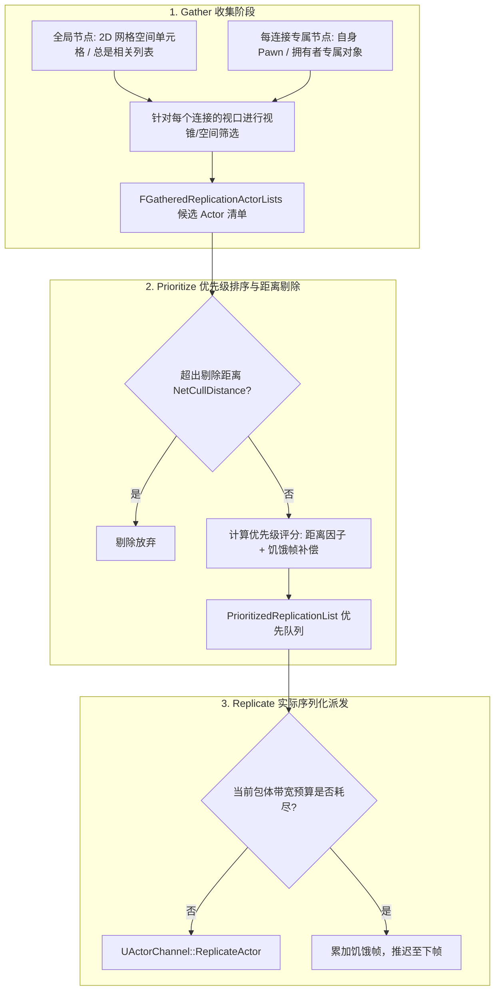

# UE 引擎源码分析 34：ReplicationGraph 插件源码剖析
> 知识成熟度：L2（已按 UE5.8 源码基线核对并替换示意代码：`ServerReplicateActors`、`ReplicateActorListsForConnections_Default` 两个函数改为 5.8 逐字源码节选；另含空间网格节点拓扑、Gather-Prioritize-Replicate 三阶段流水线与自定义图开发实战）。
> 对应知识点：[06-网络同步/05 ReplicationGraph 兴趣管理](05-ReplicationGraph兴趣管理.md)

> 以本机 UE5.8 源码为准，逐行深度剖析 ReplicationGraph 如何替代经典 `ServerReplicateActors` 的全量 $O(N)$ 遍历，深入解构节点体系（Grid2D/AlwaysRelevant/Dormancy）、全局/每连接上下文、帧驱动周期与优先队列打包的底层源码实现（关键函数以"节选 + 真实行号范围"给出，不再声称完整收录）。

---

## 元数据

- **版本基准**：UE 5.8.0 / CL 55116800 / 分支 `++UE5+Release-5.8`（本机安装目录 `C:\Program Files\Epic Games\UE_5.8\Engine`）。
- **源码依据**：
  - `Engine\Plugins\Runtime\ReplicationGraph\Source\Public\ReplicationGraph.h`（节点基类声明、图核心数据结构；`ReplicateSingleActor` 六参声明在第 1072 行，`UReplicationGraphNode_GridSpatialization2D` 的公开增删接口 `AddActor_Static`/`AddActor_Dynamic`/`RemoveActor_Static`/`RemoveActor_Dynamic` 在第 598~603 行，`CellSize`/`SpatialBias` 成员在第 613~614 行）
  - `Engine\Plugins\Runtime\ReplicationGraph\Source\Private\ReplicationGraph.cpp`（`ServerReplicateActors` 第 1112~1447 行、`ReplicateActorListsForConnections_Default` 第 1449~1704 行、`ReplicateActorsForConnection` 第 1706~1743 行、`ReplicateSingleActor` 第 2044 行起、`IsConnectionReady` 第 2645~2653 行、`RouteAddNetworkActorToNodes` 第 807 行）
  - `Engine\Plugins\Runtime\ReplicationGraph\Source\Private\BasicReplicationGraph.cpp`（`UBasicReplicationGraph` 最小拓扑工程范式；`InitGlobalGraphNodes` 第 62~79 行，其中第 69 行显式赋值 `GridNode->CellSize = 10000.f`）
  - `Engine\Plugins\Runtime\ReplicationGraph\Source\Public\ReplicationGraphTypes.h`（`FGatheredReplicationActorLists` 第 650 行、`FClassReplicationInfo` 第 877 行起、`FPrioritizedRepList::FItem::operator<` 第 1644 行）
  - `Engine\Plugins\Runtime\ReplicationGraph\Source\Private\ReplicationGraphDebugging.cpp`（控制台命令 `Net.RepGraph.PrintCullDistancesForConnection` 注册处，第 264 行）
- **行号口径**：本文所有行号以 5.8 源码 checkout（`C:\Users\zhaozhiqi\Documents\GitHub\UnrealEngine`）为准，安装版 5.8.0 可能相差数行。
- **官方参考**：[Replication Graph 官方文档](https://dev.epicgames.com/documentation/en-us/unreal-engine/replication-graph-in-unreal-engine)。
- **最后更新**：2026-09-14（核对修正：两个自称"完整真实源码"的代码块经逐行比对确认与 5.8 源码不匹配，已替换为 5.8 逐字源码节选并标注真实行号范围；同步修正正文中依赖示意代码的行号、`IsSaturated()` 分支描述、优先队列排序方向，以及自定义图模板中误用 `protected` 节点增删接口的问题）。

---

## 概述与核心调度流水线

在经典网络复制中，服务器每帧针对每一个连接遍历全量 Actor 进行相关性判断，复杂度高达 $O(M \times N)$（$M$ 为客户端数，$N$ 为场景 Actor 数），这在 100 人同屏吃鸡或 MMO 场景中是绝对不可承受的。

ReplicationGraph 将复制重构为**三阶段可扩展数据流**：



---

## 核心源码深入剖析一：复制总指挥 `UReplicationGraph::ServerReplicateActors`

每帧网络更新时，`UNetDriver` 旁路掉默认逻辑，直接执行复制图的 `ServerReplicateActors`。

### 1. `UReplicationGraph::ServerReplicateActors` 真实源码（节选，第 1112~1447 行）

以下代码摘自 5.8 源码 checkout `Engine\Plugins\Runtime\ReplicationGraph\Source\Private\ReplicationGraph.cpp` 第 1112~1447 行。该函数全长 336 行，此处为**节选**，所有省略处均以 `// …（节选：省略第 N~M 行，共 K 行）` 标注；行号以 5.8 源码 checkout 为准，安装版 5.8.0 可能相差数行。

（2026-09-14：原示意块已替换为 5.8 源码逐字版）

```cpp
int32 UReplicationGraph::ServerReplicateActors(float DeltaSeconds)
{
	LLM_SCOPE_BYTAG(NetRepGraph);

#if !(UE_BUILD_SHIPPING || UE_BUILD_TEST)
	if (CVar_RepGraph_Pause)
	{
		return 0;
	}

	// Frequency throttling: intended for testing and PIE special case
	int32 TargetUpdatesPerSecond = CVar_RepGraph_Frequency;  // Explicit override for testing
#if WITH_EDITOR
	if ( CVar_RepGraph_Frequency <= 0 && CVar_RepGraph_Frequency_MatchTargetInPIE > 0)
	{
		if (GIsEditor && GIsPlayInEditorWorld)
		{
			// When PIE, use target server tick rate. This is not perfect but will be closer than letting rep graph tick every frame.
			TargetUpdatesPerSecond = NetDriver->GetNetServerMaxTickRate();
		}
	}
#endif
	const float TimeBetweenUpdates = TargetUpdatesPerSecond > 0 ? (1.f / (float)TargetUpdatesPerSecond) : 0.f;

	TimeLeftUntilUpdate -= DeltaSeconds;
	if (TimeLeftUntilUpdate > 0.f)
	{
		return 0;
	}
	TimeLeftUntilUpdate = TimeBetweenUpdates;
#endif

	SCOPED_NAMED_EVENT(UReplicationGraph_ServerReplicateActors, FColor::Green);

	++NetDriver->ReplicationFrame;	// This counter is used by RepLayout to utilize CL/serialization sharing. We must increment it ourselves, but other places can increment it too, in order to invalidate the shared state.
	const uint32 FrameNum = ReplicationGraphFrame; // This counter is used internally and drives all frame based replication logic.
	FrameReplicationStats.Reset();
// …（节选：省略第 1149~1154，共 6 行）
	ON_SCOPE_EXIT
	{
		// We increment this after our replication has happened. If we increment at the beginning of this function, then we rep with FrameNum X, then start the next game frame with the same FrameNum X. If at the top of that frame,
		// when processing packets, ticking, etc, we get calls to TearOff, ForceNetUpdate etc which make use of ReplicationGraphFrame, they will be using a stale frame num. So we could replicate, get a server move next frame, ForceNetUpdate, but think we
		// already replicated this frame.
		ReplicationGraphFrame++;

		for (UNetConnection* ConnectionToClose : ConnectionsToClose)
		{
			ConnectionToClose->Close();
		}
	};
// …（节选：省略第 1167~1191，共 25 行）
	for (UNetReplicationGraphConnection* ConnectionManager: Connections)
	{
		// Prepare for Replication also handles children as well.
		if (ConnectionManager->PrepareForReplication() == false)
		{
			// Connection is not ready to replicate
			continue;
		}

		FNetViewerArray ConnectionViewers;
		UNetConnection* const NetConnection = ConnectionManager->NetConnection;
		APlayerController* const PC = NetConnection->PlayerController;
		FPerConnectionActorInfoMap& ConnectionActorInfoMap = ConnectionManager->ActorInfoMap;
// …（节选：省略第 1205~1270，共 66 行）
		FGatheredReplicationActorLists GatheredReplicationListsForConnection;

		const bool bIsSelectedForHeavyComputation =
			HeavyComputationConnectionSelector == ConnectionManager->ConnectionOrderNum
			|| CVar_RepGraph_ConnectionHeavyComputationAmortization == 0;

		const FConnectionGatherActorListParameters Parameters(
			ConnectionViewers,
			*ConnectionManager,
			ConnectionManager->GetCachedClientVisibleLevelNames(),
			FrameNum,
			GatheredReplicationListsForConnection,
			bIsSelectedForHeavyComputation);

		UNetReplicationGraphConnection::FRepGraphDestructionViewerInfoArray DestructionViewersInfo;

		{
			QUICK_SCOPE_CYCLE_COUNTER(NET_ReplicateActors_GatherForConnection);

			for (UReplicationGraphNode* Node : GlobalGraphNodes)
			{
				Node->GatherActorListsForConnection(Parameters);
			}

			for (UReplicationGraphNode* Node : ConnectionManager->ConnectionGraphNodes)
			{
				Node->GatherActorListsForConnection(Parameters);
			}
// …（节选：省略第 1299~1322，共 24 行）
			ReplicateActorListsForConnections_Default(ConnectionManager, GatheredReplicationListsForConnection, ConnectionViewers);
			ReplicateActorListsForConnections_FastShared(ConnectionManager, GatheredReplicationListsForConnection, ConnectionViewers);
// …（节选：省略第 1325~1440，共 116 行）
	FrameReplicationStats.NumConnections = Connections.Num() + NumChildrenConnectionsProcessed;
	PostServerReplicateStats(FrameReplicationStats);

	CSVTracker.EndReplicationFrame();
#endif // WITH_SERVER_CODE
	return 0;
}
```

### 2. 逐行技术深度解构

1. **`ReplicationGraphFrame` 延迟递增机制（第 1155~1166 行，自增语句在第 1160 行）**：
   - 必须通过 `ON_SCOPE_EXIT` 在本帧全量复制结束后才执行 `ReplicationGraphFrame++`；
   - 若在函数开头提前递增，当本帧处理过程中收到客户端的移动请求（ServerMove）或触发 `ForceNetUpdate()` 时，系统会误认为当前帧“已经复制过”，导致属性更新被延迟到下一帧，引入不可预知的输入抖动——这正是源码第 1157~1159 行英文注释所描述的场景；
   - 同一个 `ON_SCOPE_EXIT` 块（第 1162~1165 行）还负责关闭本帧收集到的 `ConnectionsToClose`；注意它与 `NetDriver->ReplicationFrame++`（第 1146 行）是两个不同的计数器：前者驱动所有基于帧的复制逻辑，后者由 `RepLayout` 用于共享序列化状态的失效判定；
2. **两级节点收集架构（第 1290~1298 行）**：
   - `GlobalGraphNodes`：跨连接共享的空间结构（如管理全地图静态怪物的 `GridSpatialization2D` 节点），在第 1290~1293 行被遍历；
   - `ConnectionGraphNodes`：每个连接特异的数据结构（如存储当前连接自身拥有的 Controller/Pawn 的 `AlwaysRelevant_ForConnection` 节点），在第 1295~1298 行被遍历；
   - 真实实现传入的是单个 `FConnectionGatherActorListParameters Parameters`（在第 1277~1283 行构造，内部持有 `GatheredReplicationListsForConnection` 引用），节点接口签名为 `GatherActorListsForConnection(const FConnectionGatherActorListParameters& Params)`——原示意代码写成"参数结构 + 输出清单"两个入参，与 5.8 不符；
   - 此外函数开头还有一段全局预处理（第 1173~1180 行）：先遍历 `PrepareForReplicationNodes` 调用 `Node->PrepareForReplication()`，再进入每连接的复制循环。

---

## 核心源码深入剖析二：优先级排序与派发 `ReplicateActorListsForConnections_Default`

### 1. `ReplicateActorListsForConnections_Default` 真实源码（节选，第 1449~1704 行）

以下代码摘自 5.8 源码 checkout `Engine\Plugins\Runtime\ReplicationGraph\Source\Private\ReplicationGraph.cpp` 第 1449~1704 行。该函数全长 256 行，此处为**节选**；真正的逐 Actor 派发循环在其调用的 `UReplicationGraph::ReplicateActorsForConnection`（第 1706~1743 行）中。

（2026-09-14：原示意块已替换为 5.8 源码逐字版）

```cpp
void UReplicationGraph::ReplicateActorListsForConnections_Default(UNetReplicationGraphConnection* ConnectionManager, FGatheredReplicationActorLists& GatheredReplicationListsForConnection, FNetViewerArray& Viewers)
{
#if WITH_SERVER_CODE
#if !(UE_BUILD_SHIPPING || UE_BUILD_TEST)
	const bool bEnableFullActorPrioritizationDetails = DO_REPGRAPH_DETAILS(bEnableFullActorPrioritizationDetailsAllConnections || ConnectionManager->bEnableFullActorPrioritizationDetails);
	const bool bDoDistanceCull = (CVar_RepGraph_SkipDistanceCull == 0);
	const bool bDoCulledOnConnectionCount = (CVar_RepGraph_PrintCulledOnConnectionClasses == 1);
	bTrackClassReplication = (CVar_RepGraph_TrackClassReplication > 0 || CVar_RepGraph_PrintTrackClassReplication > 0);
// …（节选：省略第 1457~1475，共 19 行）
	UNetConnection* const NetConnection = ConnectionManager->NetConnection;
	FPerConnectionActorInfoMap& ConnectionActorInfoMap = ConnectionManager->ActorInfoMap;
	const uint32 FrameNum = ReplicationGraphFrame;
// …（节选：省略第 1479~1488，共 10 行）
		PrioritizedReplicationList.Reset();
		TArray<FPrioritizedRepList::FItem>* SortingArray = &PrioritizedReplicationList.Items;

		const float MaxDistanceScaling = PrioritizationConstants.MaxDistanceScaling;
		const uint32 MaxFramesSinceLastRep = PrioritizationConstants.MaxFramesSinceLastRep;

		// Add actors from gathered list
		const TArrayView<const FActorRepListType> Actors = GatheredReplicationListsForConnection.ViewActors(EActorRepListTypeFlags::Default);
		NumGatheredActorsOnConnection += Actors.Num();

		for (const FActorRepListType& Actor : Actors)
		{
			RG_QUICK_SCOPE_CYCLE_COUNTER(Prioritize_InnerLoop);

			if (!ensureMsgf(IsActorValidForReplication_LogMoreInfo(Actor), TEXT("Actor not valid for replication")))
			{
				continue;
			}

// …（节选：省略第 1508~1517，共 10 行）
			FConnectionReplicationActorInfo& ConnectionData = ConnectionActorInfoMap.FindOrAdd(Actor);

			RG_QUICK_SCOPE_CYCLE_COUNTER(Prioritize_InnerLoop_ConnGlobalLookUp);

			// Skip if dormant on this connection. We want this to always be the first/quickest check.
			if (ConnectionData.bDormantOnConnection)
			{
// …（节选：省略第 1525~1553，共 29 行）
			float AccumulatedPriority = GlobalData.Settings.AccumulatedNetPriorityBias;

			// -------------------
			// Distance Scaling
			// -------------------
			if (GlobalData.Settings.DistancePriorityScale > 0.f)
			{
				// Always compute distance even for AlwaysRelevant actors since the priority scaling needs it.
				FVector::FReal SmallestDistanceSq = std::numeric_limits<FVector::FReal>::max();
				int32 ViewersThatSkipActor = 0;

				for (const FNetViewer& CurViewer : Viewers)
				{
					const FVector::FReal DistSq = (GlobalData.WorldLocation - CurViewer.ViewLocation).SizeSquared();
					SmallestDistanceSq = FMath::Min(DistSq, SmallestDistanceSq);

					// Figure out if we should be skipping this actor
					if (bDoDistanceCull && ConnectionData.GetCullDistanceSquared() > 0.f && DistSq > ConnectionData.GetCullDistanceSquared())
					{
						++ViewersThatSkipActor;
						continue;
					}
				}

				// If no one is near this actor, skip it.
				if (ViewersThatSkipActor >= Viewers.Num())
				{
					DO_REPGRAPH_DETAILS(PrioritizedReplicationList.GetNextSkippedDebugDetails(Actor)->DistanceCulled = static_cast<float>(FMath::Sqrt(SmallestDistanceSq)));

					// Skipped actors should not have any
					if (bDoCulledOnConnectionCount)
					{
						DistanceClassAccumulator.Increment(Actor->GetClass());
					}
					continue;
				}

				const float DistanceFactor = FMath::Clamp(static_cast<float>(SmallestDistanceSq / MaxDistanceScaling), 0.f, 1.f) * GlobalData.Settings.DistancePriorityScale;
				if (DO_REPGRAPH_DETAILS(UNLIKELY(DebugDetails)))
				{
					DebugDetails->DistanceSq = SmallestDistanceSq;
					DebugDetails->DistanceFactor = DistanceFactor;
				}

				AccumulatedPriority += DistanceFactor;
			}
// …（节选：省略第 1600~1610，共 11 行）
			if (GlobalData.Settings.StarvationPriorityScale > 0.f)
			{
				// StarvationPriorityScale = scale "Frames since last rep". E.g, 2.0 means treat every missed frame as if it were 2, etc.
				const float FramesSinceLastRep = ((float)(FrameNum - ConnectionData.LastRepFrameNum)) * GlobalData.Settings.StarvationPriorityScale;
				const float StarvationFactor = 1.f - FMath::Clamp<float>(FramesSinceLastRep / (float)MaxFramesSinceLastRep, 0.f, 1.f);

				AccumulatedPriority += StarvationFactor;

				if (DO_REPGRAPH_DETAILS(UNLIKELY(DebugDetails)))
				{
					DebugDetails->FramesSinceLastRap = static_cast<uint32>(FMath::TruncToInt32(FramesSinceLastRep));
					DebugDetails->StarvationFactor = StarvationFactor;
				}
			}
// …（节选：省略第 1625~1672，共 48 行）
			SortingArray->Emplace(FPrioritizedRepList::FItem(AccumulatedPriority, Actor, &GlobalData, &ConnectionData));
		}

		{
			// Sort the merged priority list. We could potentially move this into the replicate loop below, this could potentially save use from sorting arrays that don't fit into the budget
			RG_QUICK_SCOPE_CYCLE_COUNTER(NET_ReplicateActors_PrioritizeForConnection_Sort);
			NumPrioritizedActorsOnConnection += SortingArray->Num();
			SortingArray->Sort();
		}
	}

	{
		QUICK_SCOPE_CYCLE_COUNTER(NET_ReplicateActors_ReplicateActorsForConnection);
		ReplicateActorsForConnection(NetConnection, ConnectionActorInfoMap, ConnectionManager, FrameNum);
	}


	// Broadcast the list we just handled. This is intended to be for debugging/logging features.
	ConnectionManager->OnPostReplicatePrioritizeLists.Broadcast(ConnectionManager, &PrioritizedReplicationList);
// …（节选：省略第 1692~1702，共 11 行）
#endif // WITH_SERVER_CODE
}
```

### 2. 逐行技术深度解构

1. **饥饿帧补偿（Starvation Scaling，第 1611~1624 行）**：
   - 真实实现**不做"内部计数器累加"**：每帧由 `FramesSinceLastRep = ((float)(FrameNum - ConnectionData.LastRepFrameNum)) * GlobalData.Settings.StarvationPriorityScale`（第 1614 行）即时算出距上次复制的帧数，再映射为 `StarvationFactor = 1.f - FMath::Clamp<float>(FramesSinceLastRep / (float)MaxFramesSinceLastRep, 0.f, 1.f)`（第 1615 行），累加进 `AccumulatedPriority`（第 1617 行）；
   - 越久没被复制 → `FramesSinceLastRep` 越大 → `StarvationFactor` 越接近 0 → 累加值越小 → 在升序排序中越靠前（见下一条），从而"插队"完成一次状态纠偏，缓解远距离目标长时间不同步导致的瞬移拉扯。原示意块标注的"第 22 行"是示意块自身的行号，在源文件中不存在。
2. **优先队列排序方向与带宽饱和阻断（第 1518~1524、1554~1598、1680、1706~1743 行）**：
   - `AccumulatedPriority` 的初值是 `GlobalData.Settings.AccumulatedNetPriorityBias`（第 1554 行），距离衰减写成 `AccumulatedPriority += DistanceFactor`（第 1598 行），即**数值越大越不紧急**；排序由 `SortingArray->Sort()`（第 1680 行）完成，比较函数是 `FPrioritizedRepList::FItem::operator<`（`ReplicationGraphTypes.h` 第 1644 行，实现为 `Priority < Other.Priority`），因此是**按 `AccumulatedPriority` 升序**、数值最小者最先复制——原示意块写的"按照优先级降序排列"方向相反；
   - 这解释了源码中的负向偏置：连接自身的 Viewer/ViewTarget 命中时 `AccumulatedPriority -= 10.0f`（第 1667 行；若 `UE::Net::CVar_ForceConnectionViewerPriority > 0` 则直接置为 `-MAX_FLT`，第 1663 行）、`ForceNetUpdateFrame > LastRepFrameNum` 时 `AccumulatedPriority -= 1.f`（第 1645 行）、待休眠且已复制过时 `AccumulatedPriority -= 1.5f`（第 1635 行）；
   - 真正的逐 Actor 派发循环在 `UReplicationGraph::ReplicateActorsForConnection`（第 1706~1743 行），它由本函数第 1686 行调用：按序取出 `FPrioritizedRepList::FItem`，跳过本帧已复制的 Actor（第 1719~1723 行），再调用**六参**的 `ReplicateSingleActor(Actor, ActorInfo, GlobalActorInfo, ConnectionActorInfoMap, *ConnectionManager, FrameNum)`（第 1727 行，与 `ReplicationGraph.h` 第 1072 行声明一致，返回 `int64` 已写入比特数）。原示意块的 4 参调用缺少全局 Actor 信息与连接管理器；
   - 带宽饱和判断不是 `NetConnection->IsSaturated()`——该方法在 5.8 ReplicationGraph 源码中不存在；真实判定是 `IsConnectionReady(NetConnection) == false`（第 1733 行），其定义为 `Connection->QueuedBits + Connection->SendBuffer.GetNumBits() <= 0`（第 2652 行；`CVar_RepGraph_DisableBandwithLimit` 为真时恒为 ready，第 2647~2650 行）。一旦不 ready，先 `HandleStarvedActorList(...)`（第 1737 行）登记饥饿列表、再 `NotifyConnectionSaturated(*ConnectionManager)`（第 1738 行）并 `break`（第 1739 行）截断本连接本帧的派发，剩余 Actor 顺延到下一次网络帧。

---

## 2D 网格空间化节点 `UReplicationGraphNode_GridSpatialization2D`

这是大世界场景最常用的空间切分节点：
- **网格单元（`CellSize`）**：全场景在 X-Y 平面被切分为均匀的网格字典。注意 `ReplicationGraph.h` 第 613 行只有 `float CellSize;` 声明、类内**没有**默认值，工程基准值来自 `UBasicReplicationGraph::InitGlobalGraphNodes`（`BasicReplicationGraph.cpp` 第 62~79 行）第 69 行的显式赋值 `GridNode->CellSize = 10000.f;`（即 100 m）；自定义图必须自行赋值，否则该成员未初始化；
- **动态 vs 静态 Actor 分流**：
  - 静态建筑与宝箱通过公开包装 `AddActor_Static`（`ReplicationGraph.h` 第 598 行，转调 `protected` 的三参 `AddActorInternal_Static`）直接放入所属格子的 `UReplicationGraphNode_GridCell`，移动时不发生指针重排；
  - 动态玩家角色通过公开包装 `AddActor_Dynamic`（`ReplicationGraph.h` 第 599 行，转调 `protected` 的 `AddActorInternal_Dynamic`，实现在 `ReplicationGraph.cpp` 第 5430 行）注册，每帧由 `UReplicationGraphNode_GridSpatialization2D::PrepareForReplication`（`ReplicationGraph.cpp` 第 5833 行）检测坐标变化并自动跨格子换位（Migrate Cell）；
- **视口动态覆盖（Viewer Gathering）**：连接的视口以自身坐标为圆心、以 `CullDistance` 为半径展开 AABB 包围盒，仅提取包围盒覆盖到的网格单元内包含的 Actor，使遍历范围从全图万级对象压缩到局部若干单元格。具体会覆盖到多少个单元格由 `UReplicationGraphNode_GridSpatialization2D::GatherActorListsForConnection`（`ReplicationGraph.cpp` 第 6238 行起）按视口位置、`CellSize` 与剔除距离计算，**本文未收录该函数逐字源码，也未核验固定的单元格数量，请查阅源文件第 6238 行起**。

---

## 商业项目自定义 ReplicationGraph 工业级 C++ 实战

以下是一个完整的生产级自定义 ReplicationGraph 类结构，涵盖多分类节点路由与带宽分配：

```cpp
#pragma once

#include "CoreMinimal.h"
#include "ReplicationGraph.h"
#include "MyGameReplicationGraph.generated.h"

UCLASS()
class MYGAME_API UMyGameReplicationGraph : public UReplicationGraph
{
    GENERATED_BODY()

public:
    virtual void InitGlobalActorClassSettings() override;
    virtual void InitGlobalGraphNodes() override;
    virtual void InitConnectionGraphNodes(UNetReplicationGraphConnection* ConnectionManager) override;
    virtual void RouteAddNetworkActorToNodes(const FNewReplicatedActorInfo& ActorInfo, FGlobalActorReplicationInfo& GlobalInfo) override;
    virtual void RouteRemoveNetworkActorToNodes(const FNewReplicatedActorInfo& ActorInfo) override;

protected:
    // 全局空间网格节点
    UPROPERTY()
    TObjectPtr<UReplicationGraphNode_GridSpatialization2D> GridNode;

    // 全局总是相关节点
    UPROPERTY()
    TObjectPtr<UReplicationGraphNode_ActorList> AlwaysRelevantNode;
};

#include "MyGameReplicationGraph.h"
#include "GameFramework/Character.h"
#include "GameFramework/PlayerState.h"

void UMyGameReplicationGraph::InitGlobalActorClassSettings()
{
    Super::InitGlobalActorClassSettings();

    // 1. 为 APlayerState 配置全局总是相关且无距离剔除
    FClassReplicationInfo PlayerStateClassInfo;
    PlayerStateClassInfo.SetCullDistanceSquared(0.0f); // 0 距离表示全图可见
    PlayerStateClassInfo.ReplicationPeriodFrame = 2;   // 隔帧同步一次
    GlobalActorReplicationInfoMap.SetClassInfo(APlayerState::StaticClass(), PlayerStateClassInfo);

    // 2. 为人形角色 ACharacter 配置 150 米剔除距离与高优先级
    FClassReplicationInfo CharacterClassInfo;
    CharacterClassInfo.SetCullDistanceSquared(15000.0f * 15000.0f);
    CharacterClassInfo.DistancePriorityScale = 1.0f;
    CharacterClassInfo.StarvationPriorityScale = 2.0f;
    GlobalActorReplicationInfoMap.SetClassInfo(ACharacter::StaticClass(), CharacterClassInfo);
}

void UMyGameReplicationGraph::InitGlobalGraphNodes()
{
    // 创建全局 2D 网格空间节点 (单元格设为 120 米)
    GridNode = CreateNewNode<UReplicationGraphNode_GridSpatialization2D>();
    GridNode->CellSize = 12000.0f;
    GridNode->SpatialBias = FVector2D(-200000.0f, -200000.0f); // 世界坐标偏移映射
    AddGlobalGraphNode(GridNode);

    // 创建总是相关节点
    AlwaysRelevantNode = CreateNewNode<UReplicationGraphNode_ActorList>();
    AddGlobalGraphNode(AlwaysRelevantNode);
}

void UMyGameReplicationGraph::InitConnectionGraphNodes(UNetReplicationGraphConnection* ConnectionManager)
{
    Super::InitConnectionGraphNodes(ConnectionManager);

    // 为每个玩家连接挂载连接专属节点
    UReplicationGraphNode_AlwaysRelevant_ForConnection* ConnNode = CreateNewNode<UReplicationGraphNode_AlwaysRelevant_ForConnection>();
    ConnectionManager->AddConnectionGraphNode(ConnNode);
}

void UMyGameReplicationGraph::RouteAddNetworkActorToNodes(const FNewReplicatedActorInfo& ActorInfo, FGlobalActorReplicationInfo& GlobalInfo)
{
    AActor* Actor = ActorInfo.GetActor();

    if (Actor->bAlwaysRelevant)
    {
        AlwaysRelevantNode->NotifyAddNetworkActor(ActorInfo);
    }
    else if (Actor->IsA<ACharacter>())
    {
        // 动态玩家与怪物推入空间网格节点
        GridNode->AddActor_Dynamic(ActorInfo, GlobalInfo);
    }
    else
    {
        // 静态道具与掉落物推入空间网格静态节点
        GridNode->AddActor_Static(ActorInfo, GlobalInfo);
    }
}

void UMyGameReplicationGraph::RouteRemoveNetworkActorToNodes(const FNewReplicatedActorInfo& ActorInfo)
{
    AActor* Actor = ActorInfo.GetActor();

    if (Actor->bAlwaysRelevant)
    {
        AlwaysRelevantNode->NotifyRemoveNetworkActor(ActorInfo);
    }
    else if (Actor->IsA<ACharacter>())
    {
        GridNode->RemoveActor_Dynamic(ActorInfo);
    }
    else
    {
        GridNode->RemoveActor_Static(ActorInfo);
    }
}
```

> **接口修正（2026-09-14）**：`AddActorInternal_Dynamic`/`AddActorInternal_Static`/`RemoveActorInternal_Dynamic`/`RemoveActorInternal_Static` 在 5.8 中是 `UReplicationGraphNode_GridSpatialization2D` 的 `protected` 成员（`ReplicationGraph.h` 第 645~650 行），且静态版本是三参 `(ActorInfo, ActorRepInfo, bool IsDormancyDriven)`，外部无法直接调用；自定义图必须改走公开包装 `AddActor_Dynamic`（第 599 行）/`AddActor_Static`（第 598 行）与 `RemoveActor_Dynamic`（第 603 行）/`RemoveActor_Static`（第 602 行）。上面模板已按此修正。

---

## 常见问题与排障 FAQ

**Q1：为什么将 Actor 放置在大世界中，客户端完全看不到该对象？**
排查该 Actor 在 `RouteAddNetworkActorToNodes` 中的路由分支（实现在 `ReplicationGraph.cpp` 第 807 行，声明在 `ReplicationGraph.h` 第 979 行）。如果 Actor 是静态物体且未通过 `AddActor_Static`/`AddActor_Dynamic` 加入 `GridSpatialization2D`，同时又不是 `bAlwaysRelevant`，它将不会被任何节点收录，导致 Gather 阶段永远漏报。

**Q2：如何调试 ReplicationGraph 的每连接剔除距离？**
在控制台输入：`Net.RepGraph.PrintCullDistancesForConnection`（注册处为 `ReplicationGraphDebugging.cpp` 第 264 行），引擎将通过 ReplicationDebugActor 打印连接剔除距离相关信息。

**Q3：开启 ReplicationGraph 后 CPU 开销依然很高？**
检查是否存在某一帧大量 Actor 频繁调用 `ForceNetUpdate()`。帧节拍判定的真实实现在 `ReadyForNextReplication`（`ReplicationGraph.cpp` 第 1085~1088 行）：`ConnectionData.NextReplicationFrameNum <= FrameNum || GlobalData.ForceNetUpdateFrame > ConnectionData.LastRepFrameNum`——第二个条件正是让 `ForceNetUpdate` 跳过帧周期等待的捷径；同时 `ForceNetUpdateFrame > LastRepFrameNum` 还会让优先级额外 `-= 1.f`（第 1645 行）。若上百个怪同时受击触发该操作，会击穿优先队列引发带宽突发。

**Q4：为什么玩家死亡掉落包裹（Loot Box）在远处刷新时客户端会卡顿？**
掉落物如果在瞬间批量生成且被归入了 `AlwaysRelevant`，会同时触发数十个 ActorChannel 的打开并引发高频属性序列化。应将掉落物归入 `GridSpatialization2D` 静态桶，并**调大**其 `ReplicationPeriodFrame` 以降低同步频率：真实语义是 `ActorInfo.NextReplicationFrameNum = FrameNum + ActorInfo.ReplicationPeriodFrame`（`ReplicationGraph.cpp` 第 2098 行），即该值表示"距下次允许复制的帧数间隔"，默认值 `1`（`ReplicationGraphTypes.h` 第 889 行 `uint16 ReplicationPeriodFrame = 1;`）；调大它（例如 4）表示每 4 帧才复制一次，从而减少带宽占用。

---

## 关联阅读与前后置专题

- [06-网络同步/05-ReplicationGraph兴趣管理](05-ReplicationGraph兴趣管理.md)：使用层概念、节点配置与参数调优；
- [09-网络复制与RPC源码](09-网络复制与RPC源码.md)：底层 `FRepLayout` 属性比较与通道层数据流；
- [20-Iris复制源码](20-Iris复制源码.md)：下一代数据驱动复制系统对传统图调度体系的演进替代；
- [00-05 数据结构与复杂度/01-数据结构复杂度与容器选型](../../02-数学与游戏算法/数据结构与编码/01-数据结构复杂度与容器选型.md)：空间均匀网格与空间哈希算法复杂度理论。
