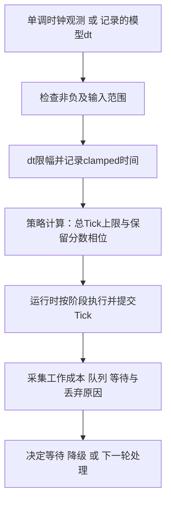

# 01-ServerMainLoop与TickScheduler

> 知识基线：固定步长、外部流逝与游戏时间、补帧/丢弃、分阶段执行、过载降级与确定性边界。
> 版本基准：本页可运行例使用C++17和整数Hz纯策略模型；UE对照仅核验2026-10-04公开API，不是本地UE构建或真实DS运行证据。
> 适用范围：实时游戏服务器调度设计；前置为duration单位、整数边界、队列与线程所有权。
> 最后更新：2026-10-04（撤回旧“生产级”代码与容量结论，修正单位/上限/余数计数，加入可抽取运行的完整例）。
> 知识成熟度：L2（整篇）。局部策略有运行测试、故障对照和精确模型记录，但未验真实CPU、唤醒、网络、UE或生产容量；局部测试不代表整篇L4。verified为空。

## 1. 主循环到底约束什么

游戏服务器不只是处理请求，还要持续推进一个权威世界。主循环必须回答：外部过去了多少时间、这次推进几个逻辑Tick、积压如何处理、各阶段在什么边界读写状态。

四种量不能混在一起：

| 量 | 含义 | 不能替代 |
| --- | --- | --- |
| 外部流逝 | 单调时钟两次观测之差，或模型显式输入的dt | 游戏已经推进的时间 |
| 游戏时间 | 按已接纳的逻辑Tick及规则推进 | CPU工作花费、真实墙钟截止 |
| 工作成本 | 执行逻辑/锁/分配/网络准备所耗资源 | 人为写入数组的“每实体0.5us” |
| 发送节拍 | 网络批次、连接预算与复制频率 | 每个逻辑Tick必定发一个包 |

固定步长让积分和规则使用一致的逻辑步长，便于分析和重放。它不自动固定任务完成顺序、浮点结果、输入排序或网络发送间隔；一次外层循环补多个Tick仍会造成突发工作。

本页先把**纯调度决策**做成可以反驳的合同，再说明接到真实运行时还缺什么。不是给一个只会算数的模拟器加“生产级”标题。

## 2. 先看三个反例

### 2.1 变量类型不会替你猜单位

旧例的`TickInterval`是`nanoseconds`，却用`1000000 / TargetHz`初始化。20/30/60Hz分别得到50,000/33,333/16,666**纳秒**，不是50ms/33.333ms/16.667ms，构造值对应的频率约大1000倍。

[C++ duration](https://eel.is/c%2B%2Bdraft/time.duration)以count和period共同表示时间；整数构造只提供本类型的count。应使用带单位的转换或明确的相位表示，不能只改变量名。30/60Hz的周期还不是整数纳秒，逐Tick先截断再累加会产生长期偏差。

### 2.2 上限必须在执行之前判断

`if (++executed > maxCatchUp)`放在执行之后，max=3时可以先执行第4次才停止。用“当前样本没有足够积压”证明不了这个边界。

反例输入：足够10个Tick的积压，cap=3。预期最多选3次，剩余按明确定义处理。上限究竟限制本轮总Tick，还是额外补Tick，也必须说清楚。

### 2.3 清空积压会连分数余量一起丢掉

20Hz时一Tick为50ms。cap=1，输入125ms：有2.5个Tick，应选1、丢1个完整欠债、保留0.5个Tick。下一次输入25ms，保留的半Tick应与新的半Tick凑成一次推进。

如果每次过载都把accumulator清零，这次125ms剩下的25ms会悄悄消失；只记录“丢1Tick”也无法解释这额外损失。新合同选择**只丢完整欠债，保留分数相位**；其他政策可以设计，但要如实记账。

## 3. 一个边界清楚的纯策略

### 3.1 输入、状态与输出

唯一实现见[tick_policy.hpp](../../../evidence/server/tick-scheduler/src/tick_policy.hpp)。`Policy::advance(elapsed_ns)`只计算一次调度决策，没有实际工作回调或等待操作。

| 项 | 本实验合同 |
| --- | --- |
| 输入 | `int64_t`非负纳秒；负值/倒退输入拒绝，不先转成无符号 |
| 频率 | 固定整数Hz，范围1～1000；0和超范围拒绝 |
| 每轮上限 | 总逻辑Tick数1～1000；cap=0非法，不暗作暂停 |
| dt限幅 | max accepted delta为1ns～60s；超过部分单独记为clamp |
| 相位 | `uint64_t` credits；单位为ns×Hz，1,000,000,000 credits恰好一Tick |
| 积压政策 | 本轮最多选择cap次，丢弃其余完整Tick债务，保留分数相位 |
| 所有权 | 单线程按值状态；拷贝是独立快照，没有外部指针/迭代器 |
| 失败 | 配置/负输入/算术溢出抛出明确异常；失败不提交新相位 |

输出字段`executed`表示**模型选择的逻辑推进次数**，不是已执行真实回调的数量。适配器若执行失败，不能拿这个字段假报业务已完成；TickIndex、阶段提交与恢复协议由运行时另外拥有。

频率在Policy生命周期内固定。改变Hz时相位单位也变了，不能把旧credits原封不动塞进新频率；需要明确定义转换/重置和损失记账。

### 3.2 为什么用整数相位

设Q=1,000,000,000，旧相位为p：

```text
accepted_ns = min(raw_ns, max_delta_ns)
clamped_ns  = raw_ns - accepted_ns
credit      = p + accepted_ns * Hz
 due        = floor(credit / Q)
 executed   = min(due, cap)
 dropped    = due - executed
 next_phase = credit % Q
```

这里没有先计算被截断的“每Tick整数纳秒周期”。只要没有clamp/drop，输入总量恰好一秒时，20/30/60Hz都会精确选出20/30/60个Tick。输入仍是离散纳秒，这不表示机器时钟真有纳秒分辨率。

两个精确账本：

```text
raw_ns = accepted_ns + clamped_ns
p + accepted_ns * Hz = (executed + dropped) * Q + next_phase
0 <= next_phase < Q
```

`dropped/Hz`才是丢弃游戏时间的精确有理秒数。60Hz丢一Tick是1/60秒，不把它截成16,666,666ns后称为守恒。CSV保留整数credits和Tick数量，JSON把丢弃秒数保存为分子/分母；大的纳秒总量保存为十进制字符串，避免被JS浮点读丢精度。

### 3.3 溢出检查也有单位

实现明确使用64位有符号elapsed与64位无符号credit。先拒负值，再限幅，最后才转换为无符号。

即使配置边界已经使正常输入安全，乘法仍先检查`a != 0 && b > UINT64_MAX / a`，加法先检查`b > UINT64_MAX - a`。不能运算完成后再猜是否回绕。测试既覆盖配置内`INT64_MAX`原始输入的限幅，也直接覆盖算术辅助函数的最大值/溢出拒绝路径。

这是有限范围合同，不是任意频率、任意精度的大整数时间库。公开配置范围以外明确拒绝，不能静默截断。

### 3.4 分块什么时候应当等价

在**无clamp和无drop**时，同总dt的整段输入和分块输入应产生相同执行总数与最终相位。

有每次调用cap时，分块会改变可执行机会：30Hz/cap=3，一次输入1秒选择3、丢27；分成十次100ms则每次选择3，总共30、没有丢弃。两者最终相位都是0，`executed+dropped`都是30。不同执行数是接口的每轮上限语义，不是守恒失败。

如果每次还做dt限幅，分块甚至会改变总accepted时间。此时分别核对每次clamp账，不能要求两种分块的接纳时间相同。

## 4. 完整、可抽取运行的示例

下面是带main的完整C++17程序，依赖本仓库明确列出的头文件。它输入模型dt，不读取时钟、不睡眠，也不执行网络/AI工作。脚本会实际从本页抽取这个代码块、编译并执行。

```cpp
// tick-policy: complete-example
#include "tick_policy.hpp"
#include <cassert>
#include <cstdint>
#include <iostream>

int main() {
    tick_policy::Policy policy({20, 1, INT64_C(1000000000)});
    const auto first = policy.advance(INT64_C(125000000));
    assert(first.executed == 1 && first.dropped_ticks == 1);
    assert(first.phase_after == UINT64_C(500000000));
    const auto second = policy.advance(INT64_C(25000000));
    assert(second.executed == 1 && second.dropped_ticks == 0);
    assert(second.phase_before == first.phase_after && second.phase_after == 0);
    std::cout << "EXAMPLE total_executed=" << first.executed + second.executed
              << " dropped_ticks=" << first.dropped_ticks + second.dropped_ticks
              << " phase=" << second.phase_after << '\n';
}
```

将代码存为仓库外的`/tmp/tick_policy_example.cpp`，从仓库根运行：

```bash
g++ -std=c++17 -O2 -Wall -Wextra -Werror -pedantic \
  -I evidence/server/tick-scheduler/src /tmp/tick_policy_example.cpp \
  -o /tmp/tick_policy_example
/tmp/tick_policy_example
# EXAMPLE total_executed=2 dropped_ticks=1 phase=0
```

完整复跑入口会自动抽取，不需要人工同步第二份示例：

```bash
python3 -B evidence/server/tick-scheduler/scripts/run_policy.py \
  --output-dir /tmp/tick-policy-my-new-run --compiler g++ --timeout 120
```

输出目录必须不存在。完整过程包含正常功能、两种编译期故障、故障版禁止产出场景、正文示例、runner失败语义、CSV与独立Python Fraction复核。缺编译器、超时、缺代码块或缺场景均失败，不当作skip成功。

## 5. 接到真实主循环，还差哪些合同

### 5.1 观测、决策与执行边界



纯策略核心只覆盖B到D。真实适配器还必须决定：

- `steady_clock`观测的范围是否包括上轮执行和等待，避免把工作成本漏掉或重复加两遍
- 回调失败/取消时哪些状态已提交，是否停止该世界实例；决策已消费相位不等于业务事务提交
- TickIndex如何推进、长期计数溢出如何处理、暂停/恢复是否重置基准
- Stop由谁调用；跨线程请求需要明确同步和生命周期，普通bool不提供线程安全
- 慢一步、分配、锁等待或最终结果提取能否被抢占；“最多3Tick”不是“最多50ms”

先用可注入时钟与有界步数测这些适配器合同，再测真实唤醒与工作分布。不要让测试在无限Run循环里靠偶然时序退出。

### 5.2 等待精度不是固定承诺

[steady_clock](https://eel.is/c%2B%2Bdraft/time.clock.steady)适合计量经过时间；其单调性不保证操作系统按某个微秒时刻唤醒。[C++超时规定](https://eel.is/c%2B%2Bdraft/thread.req.timing)也明确存在实现、调度及资源竞争带来的额外延迟。

Sleep后短自旋是一种工程取舍，需要测CPU占用、唤醒误差、功耗与同机竞争。不能把“最后自旋1～2ms”说成极小代价、微秒精度保证。平台intrinsic头文件应在正确的文件作用域包含；本例不依赖自旋或特定CPU指令。

## 6. 六阶段执行管线仍有价值

以下是职责分解，不是六个空函数就构成已验生产实现：

| 阶段 | 输入/输出责任 | 需要另外验证的边界 |
| --- | --- | --- |
| 0 接收网络输入 | 将已校验消息纳入本Tick输入集合 | 接收预算、排序、拒绝/重试与队列上限 |
| 1 计时器与生命周期 | 处理到期事件、Spawn/Despawn | 同Tick事件顺序、实体代次、销毁后访问 |
| 2 物理与移动 | 推进位置与碰撞状态 | 固定/子步长、碰撞长尾、路径版本 |
| 3 Gameplay与战斗 | 应用权威玩法规则 | 事务边界、幂等、随机与结果接纳顺序 |
| 4 空间/AOI | 根据已提交位置生成兴趣变化 | 生命周期一致、进入/离开与配额 |
| 5 网络刷新 | 批量发送可见变化 | 每连接预算、可靠队列、重发与发送长尾 |

阶段间先明确数据所有者与提交点，再选择双缓冲、锁或任务队列。并不是任何系统都必须“100%无锁”；阻塞工作应隔离/有界，但线程池也不能创造无限CPU或无限队列。

多次补Tick可能在一次外层循环内连续产生网络更新。逻辑Tick、Actor复制频率和网络批次要分别计量，不能由固定步长推断发包节奏恒定。

## 7. 过载降级：策略与证据分开

降级可保留多级、滞回和慢恢复的思路，但阈值需按真实业务校准，不存在通用“至少15%～20%死区”证明。

| 示例级别 | 可观察触发 | 可选动作 | 恢复条件必须覆盖 |
| --- | --- | --- | --- |
| Normal | 队列/工作耗时/有效吞吐在目标内 | 常态预算 | 不只看平均耗时 |
| Soft | 持续超预算或非关键队列增长 | 非战斗AI降频、装饰更新延后 | 低水位持续窗口、任务年龄 |
| Heavy | 持续过期/丢弃、关键请求受影响 | 准入限制、缩减非关键同步 | 输入量稳定、关键成功率恢复 |
| Emergency | 持续积压或资源接近安全上界 | 拒绝新任务、隔离故障实例 | 资源释放、状态一致与人工/自动恢复政策 |

涉及AOI视距、战斗弹道或关键动作的降级会改变玩法，必须有安全与公平政策；不能为把CPU降下来任意丢权威事件。用注入→降级→恢复试验检查抖动与饥饿，而不是只画状态图。

### 7.1 指标必须有明确分母

- `executed_ticks`：模型选择的逻辑Tick；运行时另记实际完成/提交Tick
- `extra_ticks`：每轮`max(executed-1,0)`求和
- `catchup_iterations`：有多于一次Tick的外层迭代数；一次执行3Tick时只加1，不能称额外Tick数
- `drop_events`与`dropped_ticks`：发生丢弃的轮数、丢弃完整Tick数量，分别统计
- `clamped_ns`：dt限幅丢失的外部时间，不能混成过载丢Tick
- 实际运行时另测阶段成本、完整外层循环、排队年龄、deadline命中率与有效提交吞吐

单请求/单阶段P99不能当硬上限，也不能简单相加当整体P99。降级后低耗时可能只是大量工作被拒绝，因此必须同时看有效结果和玩家体验。

## 8. 新证据与旧结论的关系

[纯策略实验](../../../evidence/server/tick-scheduler/README.md)维护唯一复跑配方、输入输出和失败对照。局部验证包括17组C++合同（其中10000步确定性守恒）、两种故障版本、15项runner合同、正文完整例与18组/1074行模型场景的独立Fraction复核。它验证单位、上限、余数和计数，不验证真实执行成本。

旧[Windows/MSVC结果](../../../evidence/server/tick-scheduler/results/tick_scheduler_win_x64_msvc.txt)保留原字节，不能拿新结果倒填成当时已测。旧模型存在：

1. `cost = entities × unitCost × jitter`只存数组，不推进模拟时钟；成本涨一亿倍仍可得到相同ticks/drops
2. cap=3可先执行第4次；catch记录外层多Tick轮数而不是额外Tick总数
3. 清零余量与drop计数不对应，丢失的分数时间没有分账

所以撤回“模型证明CPU容量/网络突发丢包/雪崩”的结论。世界速率也须给分母：外部总时间为6000×1.3T而游戏推进6000T时，游戏/外部比为1/1.3≈76.923%，不是相对外部速率下降30%；“完成同样游戏时间需多30%现实时间”是另一个量。

新模型同样没有服务成本反馈。若未来要模拟CPU过载，工作执行必须真实推进模型时钟，并与外部到达/等待区分；若测真实CPU，则保存目标硬件、输入、时钟与原始样本。不能把本批模型表重新命名为性能基准。

## 9. UE对照与未验证边界

[UNetDriver公开API](https://dev.epicgames.com/documentation/en-us/unreal-engine/API/Runtime/Engine/UNetDriver)将Get/SetNetServerMaxTickRate用于Dedicated Server模式下的引擎tick rate上限；[FApp公开API](https://dev.epicgames.com/documentation/en-us/unreal-engine/API/Runtime/Core/FApp)区分固定delta time的秒数与是否启用固定步长。它们是不同语义，不能只改一个数就证明模拟、发送和回放全部一致。

查本项目实际引擎版本、运行模式与具体调用链，再验证TaskGraph阶段和网络刷新时机。本批没有本地UE源码编译、TickTaskManager调度实验、DS长稳、perf采样或线上容量证据；不下载私有引擎源码补成“已验”。

进入生产前另需：输入排序与随机/导航快照；回调异常和取消；跨线程所有权；长期计数；实际工作/等待/队列分布；过载恢复；网络和玩家侧验收。固定种子与固定dt只是部分条件，不能保证100%跨平台回放。

## 10. 关联阅读

- [Timer时间轮与延迟任务](02-Timer时间轮与延迟任务.md)：到期任务与分帧预算
- [AOI与InterestManagement](../状态复制与兴趣管理/05-AOI与InterestManagement.md)：阶段4的兴趣变化与配额
- [AI与寻路时间预算](11-AI与寻路时间预算.md)：单查询、分片、排队与过期结果
- [世界时间确定性与GameClock](12-世界时间确定性与GameClock.md)：外部时间、游戏时钟与回放输入
- [运行时背压与过载保护](14-运行时背压与过载保护.md)：准入、队列水位与恢复政策
- [UE Dedicated Server实例生命周期与平台化](../专用服务器实例与容量/01-UE%20Dedicated%20Server实例生命周期与平台化.md)：实例退出、故障和容量边界
