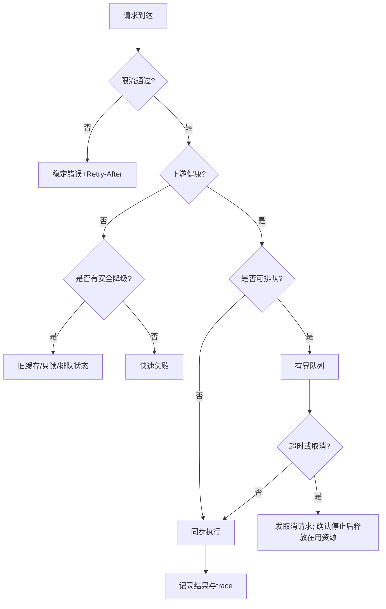
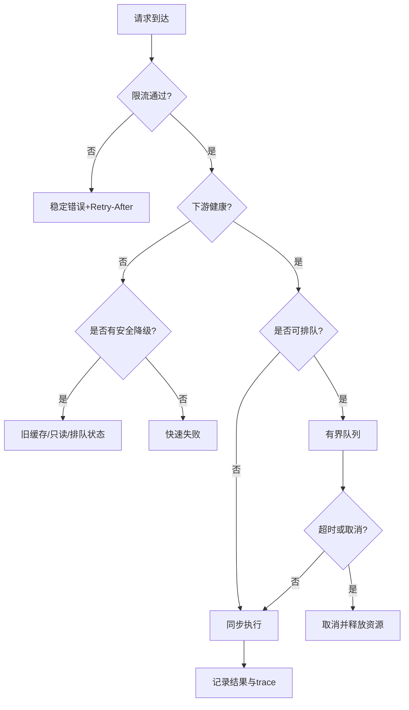

# 02 限流熔断背压与过载保护

> 知识成熟度：L2。本文依据指定规范、官方指南及固定版本源码作静态教学核对；纸面例标为 PAPER_EXPECTED。没有运行网关、限流服务、RPC、数据库、故障、网络、压力或性能实验。
> 知识基线：RFC 3290 的计量模型；HTTP 的 RFC 6585/9110；Resilience4j v2.2.0（e77f3536）指定熔断符号；gRPC/Redis 按 OC10 的网页快照范围。它们不是一份项目部署清单，本文伪码、配置及数值均是应用政策题设。
> 适用范围：网关与服务入口的接纳、排队、依赖调用、拒绝、重试和恢复。前置为请求/业务身份、基本同步和超时概念；运行时 Tick、AOI、世界时间和游戏输入的降级由邻篇负责。
> 最后更新：2026-10-08。延续 2026-08-06 合辑、08-13 拆分及扩写、10-01 重试校订的贡献；本次不是首次撰写。稳定身份 kb-88567caf9c20 不变，原文及精确历史还原材料保存在 OC11。
> 验证建议：先按 OC9 的输入、预期与反例复核合同，再在选定实现及获准环境中做集成验收；静态推导不提供生产容量、误伤率或延迟保证。

## OC0 为什么入口必须同时回答六个问题

假设数据库平时能及时返回，库存写入口持续接纳请求；依赖变慢后，单位时间的入口量没有增加，但每次工作占住连接和内存更久。只有限 QPS 仍可能积满在途工作；只有限线程数，线程池前的无界任务队列仍可能耗尽内存。超时后若立即归还许可而旧查询仍在运行，还会让真实工作量穿透并发上限。

因此沿一个业务意图区分下列边界。这里的“接纳”必须带对象与层，不能拿一个 Accept 字样覆盖整个系统。

| 边界 | 发生了什么 | 此时可向调用方承诺什么 |
| --- | --- | --- |
| 提出 | 发起者以原业务身份 R 和完整参数 D 提交请求；可能有多个网络 attempt | 尚未证明服务端接纳或执行 |
| 入口判定 | 身份/规则/速率/存量预算检查；明确拒绝或转交责任 | 确证尚未转交时可称本入口未接纳；代理超时则可能未知 |
| 已接纳、排队 | 有界队列/稳定 owner 已接手，记录排队与截止时刻 | 可以说排队中或已接受待处理，不能说业务成功 |
| 实际执行 | 领取后复核有效性，获得真实依赖槽并发起工作 | 已开始一次 attempt；网络确认仍不是业务提交 |
| 业务原结果 | 权威边界确认成功/业务拒绝，或暂时 UNKNOWN | 同 R 同 D 恢复原结果，不因换连接/重试生成新业务意图 |
| 资源退场 | 本地提交包装、所有回调及派生访问已结束或按合同接手 | 此时才归还相应真实槽、缓冲和连接；业务 UNKNOWN 不被改成失败 |

入口流量治理保护的是有限资源和可服务性。持久化幂等、事务与原结果查询沿用[幂等重试与消息语义](../持久化与分布式一致性/03-幂等重试与消息语义.md)及[事务主责](../持久化与分布式一致性/04-分布式事务与最终一致性.md)；本文不把“有幂等键”当已实现全部持久化合同。

PAPER_EXPECTED P00是一条正常完成的库存写轨迹，时间仅为题设：t=0提出购买R/D，可信身份和入口额度通过；t=2ms队列owner在有限容量内接纳并返回“待处理”；t=10ms领取时复核当前业务权限和期限，登记一个真实operation后submit；t=30ms权威事务保存同R/D的购买效果与原结果；t=32ms结果回调让前台得知成功；t=35ms提交包装、回调和关联访问全退场，才归还真实槽。t=32至35之间业务已经成功而资源仍被占用，两张账不能合并。

若t=31ms连接断开，客户端只知道结果未知，不撤销t=30ms的购买；后续以同R/D授权查询原结果。若在t=2ms以前因队列满而确证未转交，只能说这一次入口attempt未被接纳；此前同R是否执行过仍由原结果记录判定。后文分别解释哪些政策能使这条链有界，以及哪一步失败时谁继续负责。

## OC1 先写清每个预算的对象、单位和作用域

### OC1.1 速率、配额和存量不是同一个数

| 预算 | 量与单位 | 生效/归还边界 | 适合解决的问题及代价 |
| --- | --- | --- | --- |
| 速率 | 请求/秒、字节/秒或成本单位/秒 | 在指定计量点扣减；随时间补充 | 抑制持续到达量；不保证处理速度或在途上限 |
| 突发 | 成本单位，不是“每秒” | 同一桶最多积累 B 单位 | 吸收合法短突发；突发仍须服从真实容量 |
| 窗口配额 | 最近 W 秒内的累计成本 | 旧记录移出窗口后恢复 | 限定近期行为；精度、存储与边界规则须明确 |
| 周期配额 | 每日/月累计动作或资源量 | 依业务周期、时区、原子结算规则 | 限制累计花费；跨周期在途不能重复结算 |
| 排队存量 | Q 条、Bq 字节及最老等待时间 | 确证领取、过期撤销或合法转交时减少 | 允许有限等待；每项持有对象也占内存 |
| 实际在途 | A 个 operation、连接/字节等 | 从登记预留到全部实际访问退场 | 保护慢依赖；前台取消不能提前还槽 |
| 前台等待 | W 个等待者及其上下文 | 该等待真正注销和退场 | 限制等待成本；不代表被等待工作消失 |

固定 worker 数不能代替 Q/Bq/A/W。即使队列每项最大2KiB、至多2项，也只界住队列内的4KiB载荷；构造中的 pending、已领取工作、框架/内核缓冲和对象开销另算。每连接有界还要配全局连接数及全局预算，不能用“每个连接都有限”推出全服有限。

### OC1.2 四个维度保留，但键的可信度与成本不同

| 层/主体 | 典型受控键 | 正向选择 | 必须处理的盲点 |
| --- | --- | --- | --- |
| 未认证连接/握手 | listener、可信来源地址、已分配 connection_id | 先用便宜检查保护建立连接、解析与鉴权预算 | NAT共享出口；地址不是用户身份；来源字段不得信任任意header |
| 路由/方法 | route、method、依赖和实现版本 | 把昂贵写与便宜读分开计成本 | 路由名规范化；高基数参数不得无界生成桶 |
| 已认证主体 | tenant/account/session 的服务端可信映射 | 约束单账号洪峰，隔离租户/区服 | 登录前没有可信account；device_id可能可伪造/重置 |
| 业务资源 | account+action、池/匹配队列/订单范围 | 把昂贵业务、热点资源和资产动作单独约束 | 成本单位及接受点由业务定义，订单ID不应成为无限免费桶 |

用户/租户份额与全局/依赖硬上限同时存在。单主体最多20、全局最多100，不表示可以接纳无限主体各20；只有所有所需预算都允许才转交。分片各自配100而未分配总额，N片合计可到N×100。严格全局上限需要共同计量权威或有证明的额度分配；本地兜底预算只能按明示的额外上界计算，不能冒充共享配额仍精确。

采用多维限流会增加查表、同步和误伤成本。应为每条规则登记 ID、版本、owner、单位、计量点、窗口/初值、作用域、拒绝语义、状态故障政策和回滚值。规则快照实际安装与旧读者退休遵循[治理篇 SG2](../服务架构与消息通信/05-服务发现配置中心与治理.md)；换版本或迁移桶若重置为满桶，必须把额外突发列入政策，不能仍引用连续桶的同一上界。

## OC2 算法怎样改变可接纳流量

### OC2.1 令牌桶：累计成本的包络，而非完成吞吐保证

本文选择一个可手算的连续补充模型：容量 B>0 成本单位，补充速率 r>0 单位/秒，初始令牌 T∈[0,B]；一个动作成本 c 满足0<c≤B。每次在同一串行判定点取本地单调时刻 t，先补充到 min(B,T+r×(t−last))，再以足够令牌为条件扣c。原始[ RFC 3290 Appendix A.2](https://www.rfc-editor.org/rfc/rfc3290.html#appendix-A.2)给出 R×t+B 的简单计量包络；该 RFC 是 Informational 模型资料。本文把包字节推广为应用成本，是明确设计选择。

在同一不中途重置的桶、可靠的单调时间、准确计量和原子判定下，任意长度 Δ 的区间里被计费接受的成本至多 B+rΔ。若每次同样成本 c，区间次数至多 floor((B+rΔ)/c)；零时间突发最多 floor(B/c)。它不限制一个请求执行多久，不自动限制已接纳任务数，也不证明资源成本与c成正比。

下面是串行状态转移的教学伪码，不是可编译限流器，不含存储/锁/异常/API实现：

```text
PAPER_EXPECTED；单一owner或一个覆盖整步的同步域
输入参数先核合法且表示安全；c>B直接拒绝为策略不支持，不给有限等待承诺
take(c):
  在判定域内读取单调t；若t<last，报时钟/状态异常并停止该判定
  按有界、无溢出的表示计算refill；T=min(B,T+r*(t-last))；last=t
  若T<c：返回LIMITED及(c-T)/r的最早补足估计，不扣c
  否则：T=T-c；返回CHARGED
```

整数实现需规定时间粒度、舍入和余数累计，不能每次向下截断并丢弃余数，让高频检查把补充永久吃掉；也不能向上取整制造额外令牌。乘法可先与填满所需时长比较以避免巨大间隔溢出。时刻必须在串行决定中重新取，不能让一个线程拿陈旧 now 在 CAS 重试成功后把 last 写回过去。原递归 CAS 伪码还缺 r=0、非法成本、表示上限、版本重置与有限竞争/栈深度合同，因此只保留为历史草图。

PAPER_EXPECTED P01：B=4、r=2单位/秒、每次c=1、t=0满桶。四次接受后T=0，第五次拒绝；t=0.25得到0.5仍拒绝；t=0.5累计到1，再接受一次。把每次拒绝当作“重置last但不保存T的小数余量”，就错误地使后一次仍只有0.5。拒绝提示只是无其他竞争时的最早补足估计，其他请求可能先消费，不是未来预约。

### OC2.2 窗口：精确最近W秒与时间片近似要分开

精确滑动日志可定义窗口为(t−W,t]：在一次串行判定中先移除时刻≤t−W的已计费记录，求剩余成本S，只有S+c≤L才插入本次记录。这样边界、同刻动作及是否计入拒绝都明确。本例只记录成功计费；若防滥用政策要计所有提出次数，应是另一张已命名的账。保存每条记录有内存与清理成本；每用户窗口有限，还须限制用户/键的数量。

PAPER_EXPECTED P02：W=10s、L=3、c=1，t=0接纳3次；t=9.9拒绝；t=10恰移除t=0三条，再接纳。固定窗口若分别在9.99与10.00接受各3次，极短跨界区间可累计6次。令牌桶可能同样允许明确B的突发，因此“改成令牌桶就绝不出现高峰”不成立；应按希望约束的区间与容量选参。

时间片滑窗是近似模型：一个部分落在窗口外的片若整片计入，会保守拒绝；若直接丢掉会漏计。加权前窗也是估计，需要说明误差及突发分布假设。“滑窗”这个名字不说明精度，窗口更长也不自动更准。高价值动作仍依业务授权/幂等/资产约束，不能由某一种计数算法保证安全。

### OC2.3 漏桶：明确这里说的是有界排队整形

“漏桶”在资料中还可表示一种计量判定，本文沿原用途只讨论平滑派发：有界队列按约定节拍至多派发一项，单位成本时节拍间隔1/μ秒。它限制派发时机，不使下游真的以μ完成；慢下游还须有真实在途上限。变成本动作需要按成本排程，不能继续按固定一项计费。[RFC 3290 Appendix A.1](https://www.rfc-editor.org/rfc/rfc3290.html#appendix-A.1)

PAPER_EXPECTED P03：μ=2项/秒，下一次可派发为t=0，已有3项，且执行槽可用；理想无调度延迟下在0、0.5、1.0派发。第三项若deadline=0.8，不能承诺等到1.0仍有价值，应在接纳估算或真正领取时拒绝/过期。实际调度延迟、不同成本及依赖占槽会改变等待，排队长度除以速率只能在这些前提下作估计。

### OC2.4 分布式实现要另核什么

共享计数适合需要共同上限的入口，代价是网络延迟、热点与共享存储可用性。一次限流判定必须把读取、补充/窗口清理、比较、扣减、状态写回放到真实原子边界；客户端先GET再SET不具备这个性质。Redis Lua是一个实现选项：[官方脚本指南](https://redis.io/docs/latest/develop/programmability/eval-intro/)说明脚本执行期间阻塞其他服务器活动及脚本缓存的挥发性。它没有替本项目实现跨分片原子性、持久额度、异常回滚或重试去重；本次也没有核对部署的Redis/客户端版本。

具体接入必须核时间来源与回拨、数值表示、键基数、TTL提前丢状态、初始化/热更、脚本错误、NOSCRIPT恢复、热点阻塞、复制/故障切换后额度，以及“请求已扣但响应丢失”的未知结果。若选择对每次实际入口attempt计费，响应未知后的重试可能再次计费，这应被明示；若要一次逻辑动作只扣一次，则计量服务本身需要有界保留的去重合同。不能因为业务幂等已具备就默认额度计费也幂等。

## OC3 多道门怎样组成一次诚实的接纳

下面选择保守、容易说明的策略：先做廉价输入边界检查，再按可信身份/路由计入口attempt成本；已成功扣掉的速率成本不因后续排队满/熔断拒绝自动返还。这样会让某些最终拒绝也耗额度，降低忙时可用性，但避免跨组件“退款”制造重复额度或无界补偿。它不是所有产品的强制顺序；若项目要求只对最终接纳计费，就必须实现明确预留/提交/撤销协议。

一次本地接纳在共同门内核 OPEN、当前适用规则、期限与取消、各主体/全局队列及字节预算，成功才把输入所有权交给稳定队列owner。多维速率判断若已扣主体桶而全局桶拒绝，本政策保留已扣成本，并分别记录；只有所有必需判断通过才接纳。入队可能抛错或发布结果不确定的API不能只凭异常统一返回“未接纳”，须遵循其真实发布合同。

```yaml
# PAPER_EXPECTED：应用政策示意，非 Redis/Envoy/gRPC 可直接加载schema
rule_id: inventory-write-demo
version: 1
scope: one_authoritative_admission_domain
metered_event: ingress_attempt_passed_identity_check
cost_unit: request
cost_per_attempt: 1
account_bucket: {rate_per_second: 8, capacity: 12}
queue: {max_items: 2, max_payload_bytes: 4096, max_wait_ms: 100}
dependency_operations: {max_actual_outstanding: 1}
waiters: {max_count: 3}
on_later_rejection: retain_already_charged_rate_cost
```

这组数字只为有限纸面追踪服务。旧 login 5/s、burst10、device 30/60s，inventory 8/s、burst12、并发200，matchmaking 1/s、burst2仍完整保存在OC11，均不作为测得的容量或推荐默认值。登录应先有未认证来源/握手预算，认证后才使用可信账号；设备维度仅补充。匹配超限只能在当前用户确有同业务范围ticket时返回既有票据；没有票据时不能虚构“return_existing_ticket”成功。

max_wait_ms在本题设中从接纳到领取计时，并与原总deadline取更早者；到期任务不得再开始业务工作。计时器可能迟运行，领取处仍须重查，不能据此承诺100ms内回调一定发生。排队接纳不预留一份无限期可用的业务权限。

PAPER_EXPECTED P04：一个依赖operation运行、队列A/B占两槽；C的账号桶扣1后发现队列满，明确拒绝，C输入仍归调用者，桶不退款。A已被接纳却在领取时过期，则由队列owner确证未submit后完成过期结果并释放对应排队占用。这个结论不外推到已submit的操作。

## OC4 排队、公平、背压与降级如何配合

### OC4.1 背压要让上游减少产生，不能只换个地方积压

下游真实槽不足 → 停止领取/缩减派发 → 有界入口队列达到水位 → 上游暂停读取或停止产生新工作 → 无法等待者明确拒绝。这条链上的每个缓冲、pending和等待者都要有界。暂停socket读取只会把部分压力传给框架/内核/远端；它不自动限制已解码闭包，也不能撤回已经提交的业务。

恢复读取/派发时要有可靠的空间可用通知，并重查队列和状态，避免丢唤醒。一次调度已用完工作预算但缓冲尚有完整消息时，应安排下一轮继续处理，不能只等未来网络事件。详见[协议篇 SP3/SP8](../服务架构与消息通信/02-网络通信与协议设计.md)。gRPC[流控指南](https://grpc.io/docs/guides/flow-control/)在这里仅支持 streaming RPC 的框架交付/流控区别；write返回不等于已经发到网络，更不是业务已完成，双边只写不读还可能死锁。

### OC4.2 有优先级仍要有成本上限和公平策略

登录、心跳、风控阻断等关键工作需要保留可用预算，但“关键”不是无限配额。将高/低优先级拆成独立有界队列与依赖份额，规定同类按主体轮转或加权服务，可以防止大户填满全队列；代价是空闲保留份额可能暂未充分利用，公平也增加调度状态。严格最高优先级先行可让低优先级永久饥饿，必须明确这是允许的降级还是需要最低服务份额/老化。

PAPER_EXPECTED P05：A/B两租户各最多2个排队项，全局最多3项；A已有2项，B仍可占剩下1项，A第三项拒绝。若派发按A/B轮转且各自有待处理，下一轮B至少有一次派发机会；这只是规定算法下的机会，不保证墙钟时限，单项无限耗时仍可阻塞。共享依赖也需真实总上限，不能因拆了队列就说故障已隔离。

### OC4.3 丢弃和降级取决于业务语义

| 请求类别 | 可采用的有限策略 | 必须给出的结果 |
| --- | --- | --- |
| 可替换展示状态/只读排行榜 | 合并同对象更新，或返回在允许年龄内的旧缓存 | 版本/时间戳、陈旧标记和适用范围 |
| 匹配排队 | 有界接纳并返回ticket，允许状态查询/按协议取消 | 排队中与真正成局分别确认 |
| 抽卡、支付确认、货币扣减 | 接纳前明确拒绝，接纳后由业务owner完成或恢复 | 不以“先回成功、以后补写”替代权威结果 |
| 已接受的必达消息/持久工作 | 保留责任、按原身份恢复或正式移交 | 不以丢队列项消除已接受承诺 |

队列满时可优先拒绝新低优先级任务；要移除已有项，必须同时处置被移除项的结果与责任。普通移动状态与离散技能/交易指令语义不同，不能把邻篇“最新输入优先”推广到所有游戏输入。本文与[运行时背压篇](14-运行时背压与过载保护.md)的分工仍是入口治理与Runtime保护；邻篇的Tick/AOI历史模拟和阈值不成为本篇容量证据。

## OC5 熔断根据哪些观察限制新的依赖调用

### OC5.1 错误率先定义分母和分类

熔断器控制故障期间的新调用，限流器控制提出量，舱壁控制真实资源占用。三者可以组合；熔断不会终止既有工作，也不保证正常态只有有限并发。统计按依赖/方法/必要版本划分以避免一个慢方法拖垮不相关入口，同时控制标签与状态基数。

| 观察 | 本文纸面熔断分类 | 业务结果知识 |
| --- | --- | --- |
| 权威业务拒绝，如余额不足/参数无效 | 本题设单列，不进熔断分子/分母；若项目将正常业务拒绝当依赖成功，需另明示分母 | 拒绝结果已知 |
| 本入口限流、队列满、熔断拒绝，未调用依赖 | 单列本地拒绝，不虚构一次下游成功/失败样本 | 仅说明该次入口未转交 |
| 已发起调用的连接/响应故障或依赖超时 | 按约定计为不健康观察，慢调用另计 | 可能已发生业务效果，不能推为从未执行 |
| 明确依赖故障响应 | 纳入指定可用性错误类别 | 是否可重试仍查业务合同 |
| 观测缺失、采样不足、健康检查成功 | 缺失/不足/探针另列 | 不能当业务请求成功填充分母 |

“4xx不进、5xx都进”不是充分分类：调用链中谁生成状态、业务语义、是否实际调用依赖都重要。慢调用可同时成功，慢比例与失败比例应各有定义；错误率低不代表延迟、排队或资源已健康。

### OC5.2 一个有限、可解释的三态政策

本段是项目可选的纸面政策，不声称任何库默认如此：CLOSED统计最近10秒内已结束的可分类依赖attempt，至少10个样本且故障比例≥50%才OPEN；OPEN期间拒绝新的普通调用，等待5秒后尝试进入HALF_OPEN；一次探测轮至多授予2个探测许可，并另受真实operation总量限制。当前轮两个结果全成功且均不慢、资源信号恢复才进入有限放量阶段；任一失败/慢则重新OPEN。探测期限到而无结果时维持保护并报UNKNOWN，不能宣称恢复或释放旧实际槽。所有常量是题设。

状态转换、许可发放和结果归属必须在同一同步合同里决定。每个probe记录它获许可的轮次，迟到结果不能把新一轮状态改回CLOSED；即使旧轮结果不参与新轮判定，它仍要完成原operation的业务结果与退场责任。没有新请求时是否自动从OPEN到HALF_OPEN、探测超时和排程责任都由选定实现明确。人工确认可作为高风险策略/多次震荡的操作门禁，不是所有熔断恢复的技术必要条件。

PAPER_EXPECTED P06：窗口只有2次调用且两次失败，未达10样本，记低样本不凭100%宣告具有稳定统计依据；真实资源硬上限仍工作。到10样本其中5失败，OPEN。冷却后两个probe中P1成功、P2仍运行，不能按上述政策全量恢复；探测期限到记保护/未知，P2继续占槽。迟到P2成功不能绕过新轮状态与当前资源检查。

这不是把旧“5%→20%→50%→100%”写成通用处方。放量可以按有界许可率/实际并发逐步增加，每阶段有足够观察窗、错误/慢比例/队列及资源条件；失败立即收缩新接纳，旧工作仍须收束。探针太少不足以代表真实业务混合，太多会冲垮刚恢复的依赖，冷却太长则延迟恢复服务。

### OC5.3 固定库源码为何需要单独核对

Resilience4j v2.2.0 的 CircuitBreakerMetrics 对count-based窗口将有效minimumNumberOfCalls限制为窗口大小以内；HALF_OPEN用允许探测数建立该类窗口，所以有效最小样本为 min(配置m,探测数p)。其StateMachine使用原子许可计数。若m<p，可以在所有p个探测结束前作判断；不能把上节“全部探测结束”的自选政策当成该库事实。一次探测轮的许可计数也不是一切状态下的真实operation舱壁。[固定版本源码目录](https://github.com/resilience4j/resilience4j/tree/e77f3536ac9b6c4764b1b8ac3dae0bca540768e4/resilience4j-circuitbreaker/src/main/java/io/github/resilience4j/circuitbreaker/internal)

选库时应对照这些具体语义适配错误分类、最小样本、时间窗、慢调用、ignored异常、半开等待与事件归属。这里只静态核对OC10列出的符号，没有集成该库，也没有认可它覆盖本文完整关闭/回收合同。

## OC6 客户端重试不能把保护变成下一轮洪峰

### OC6.1 三个预算与一个业务身份

一次逻辑意图固定R及完整D，总deadline包含等待、网络、下游、退避和恢复查询。每层不得重开完整时限；进程内用单调时间，跨机器用协议规定的剩余时限传播，不能直接传本机steady_clock绝对值。gRPC[deadline指南](https://grpc.io/docs/guides/deadlines/)也要求服务应用自行停止派生工作，传播行为须核语言实现。

每条链有总尝试上限（含首次），每个依赖/主体还有有界重试预算，并受真实operation总量限制。三层各额外重试3次，纸面上界为4×4×4=64；三层各最多3次为27，四层则必须乘四项。SDK透明重试、代理重试、应用重试与消息重新交付分别盘点；不能只数业务for循环。

重试前同时成立：错误在允许列表、原操作安全重复或持久幂等已经落实、R/D及当前权限有效、剩余deadline足够、次数和共享重试预算可用、熔断探测/正常许可允许、前次实际operation已合法退场。本文不加入并发hedging；若前次还活着，先保留owner和UNKNOWN，不能让等待超时直接启动下一次真实业务attempt。恢复查询也有独立有限预算，不等于盲目重做写入。

### OC6.2 退避等待和真正发起都重查

本文自选 full jitter：第k次重试等待上界 cap(k)=min(max_backoff,base×2^(k−1))，在[0,cap(k)]内随机取delay，指数计算须避免溢出。它用于分散重试时刻，不增加总预算。gRPC[重试指南](https://grpc.io/docs/guides/retry/)描述的backoff抖动是±20%，并有透明重试及收到响应头后的内部提交点；这些不同于本伪码，内部commit也不是业务事务提交证明。

```text
PAPER_EXPECTED；控制流程，未提供真实rpc/同步/取消API
在原R/D的有限总deadline内，至多MAX_ATTEMPTS次真实业务attempt：
  发起前在共同接纳边界重查时间、取消、当前权限、breaker许可及真实容量
  先登记稳定operation，再在锁外submit（OC7）；记录实际attempt
  获得确定原结果则返回该结果；等待结束但业务未知则保留UNKNOWN
  若不安全重试、已达次数上限或前次未退场，停止新业务attempt
  依据协议提示和jitter算下一次不早于的时刻，重算剩余时间
  若等到该时刻后没有最小有用执行预算，停止，不截短等待强行重试
  在有限等待容量内等待；取消则退出等待，不消除operation责任
  醒来再次核deadline/关闭/取消；新attempt真正接纳时消费重试额度
```

MIN_USEFUL_ATTEMPT、单次timeout上限和重试额度都是业务政策。sleep前核过仍要在真正发起处复核；等待可超时或被延迟，预算不能倒流。最后一次失败后直接给出已知结果或UNKNOWN，不做末尾多余sleep。新attempt的额度/许可若跨多个组件无法原子取得，采用OC3明示的保守计费或有证明的预留合同，不假设“检查都通过”天然是原子动作。

PAPER_EXPECTED P07：总deadline=t=1000ms，前次在t=850结束且实际退场；最小有用执行预算100ms。若选退避80ms，则最早930ms，只剩70ms，停止。若选择20ms，醒来本应870ms，但调度迟到至920ms，重查后也停止；绝不沿850ms的旧remaining继续submit。这是纸面时间线，不是网络计时测量。

### OC6.3 HTTP状态与等待提示承诺到哪里

[RFC 6585 §4](https://www.rfc-editor.org/rfc/rfc6585.html#section-4)定义429表示过多请求，Retry-After可选，并要求该响应不得缓存；[RFC 9110 §15.6.4](https://www.rfc-editor.org/rfc/rfc9110.html#section-15.6.4)的503表示暂时过载/维护，也可带此字段。过载时服务器还可能拒绝连接，不能要求总能得到429/503或提示，更不能靠状态码推断链上原业务从未执行。响应可能来自代理，前一个同R的attempt也可能已完成。

[Retry-After §10.2.3](https://www.rfc-editor.org/rfc/rfc9110.html#section-10.2.3)可用HTTP-date或非负整数秒；秒数从收到响应后起算。客户端需解析两种形式、缺失和无效值；日期形式还涉及墙钟/Date与偏差策略，不能直接混成单调时刻。本篇政策将可信且有效的提示作为不得提前的等待下界，再受总deadline约束；等待之后仍无重试许可保证。无效/缺失时走明示的保守本地策略，不忙转。gRPC pushback另按具体gRPC协议与SDK处理，不能把HTTP秒数直接塞给SDK字段。

返回给应用的结果建议区分：当前attempt入口拒绝、排队中、已接纳未完成、权威业务成功/拒绝、结果未知，并携可授权查询的原身份。HTTP传输成功、TCP确认和“已收到响应头”各有层次，不替代这些业务语义。[协议篇](../服务架构与消息通信/02-网络通信与协议设计.md)

## OC7 取消、同步回调和Close时谁仍占着容量

原文已经强调“确认停止后释放”。现在补齐其对接纳容量的直接含义，沿用[消息篇 M4](../服务架构与消息通信/04-消息系统与事件驱动.md)的稳定owner合同；实现细节与语言并发仍见[并发与高性能](05-并发与高性能.md)。

1. 外调前构造稳定operation、输入/结果容器及callback有效持有；可能同步触发的取消注册也不得早于它所用owner
2. 在同一锁或串行门内核OPEN、期限/取消、真实operation与字节上限，预留并登记，再授一次submit许可。已登记未submit同样占槽、参与Close扫描
3. 释放内部门后调用真实submit/cancel；不持可能被同步回调重入的非重入锁。沿现有合同，已授的一次许可不因其后Close自动撤销
4. submit内部可能同步callback；结果仲裁可先完成，但callback自身和submit包装尚未退出，资源不能因此销毁。只有真实API确认未发布且无未来访问的拒绝才可回滚
5. Close关新入口后请求取消/排空旧工作，有限等待到期返回DRAINING/INCOMPLETE；稳定host继续持有未退场operation、依赖及容量，不把调用Close的栈退出当系统已静默

联合退场要求：submit包装结束最后访问、当前回调全部退出、底层合同保证无未来回调/访问/后续提交、计时器和取消注册责任结束、派生工作结束或合法接手。仅一个quiet布尔值、队列空或计数清零没有证明力。[gRPC取消指南](https://grpc.io/docs/guides/cancellation/)明确处理器通常需协作停止；这也不提供通用数据库回滚或任意SDK回收保证。

PAPER_EXPECTED P08：唯一真实槽被A登记但尚未submit；Close关门；A仍消费已授许可，submit同步callback确认成功。callback未返回且submit包装仍访问A时，A继续占唯一槽。Close期限到返回DRAINING，由稳定host持有A。待真实联合退场条件确证后归还槽。反例是callback刚写成功就free(A)，或超时先还槽让B同时进入，分别造成寿命错误或容量穿透。

原业务成功不被迟到timeout/UNKNOWN覆盖；确证的矛盾终态须诊断停止。无法确定业务效果时保留R/D和原结果恢复责任。持久交接可以让以后查明业务UNKNOWN，却不让仍运行的进程内回调提前失去内存；未知工作也不能通过反复换owner“洗掉”真实容量。

## OC8 怎样判断保护确实改善了可服务性

只报“QPS下降、P99下降”可能是拒绝了大多数请求，或生成端已经发不出目标负载。先区分业务意图、入口attempt和实际依赖attempt，再给每个指标固定总体、时间窗与观测边界。

| 指标 | 必须随值记录的口径 | 常见错误 |
| --- | --- | --- |
| offered/received/admitted/rejected | 生成端提出量、服务端实际收到量、入口接纳/拒绝数；相同窗口及边界 | 用目标QPS代替实际提出量，或将丢失日志填零 |
| 业务完成/有效吞吐 | 按原R去重的权威成功，期限内有效成功另列；cohort及尚未结束数 | 把排队/202/网络成功当业务完成；多attempt重复计成功 |
| 拒绝比例与误伤 | 本入口拒绝/收到的合格attempt；正常主体cohort和分类依据 | 无法知道“正常”却宣称精确误伤率 |
| 排队/服务/端到端延迟 | 各自起止点、单位、窗口、样本N、失败/超时/取消处理方法 | 只看成功请求，漏掉最慢的未完成请求 |
| 实际资源 | 全局与依赖/租户Q条、字节、A真实operation、W等待者、最老年龄 | 前台超时后把A减掉，制造假空闲 |
| breaker与retry | 状态转换原因、窗口N、故障/慢分类、探测轮、实际attempt/逻辑R | 空窗口当0%错误，忽略SDK/代理重试 |
| 恢复与公平 | 各主体接纳/等待/拒绝、恢复各阶段的资源与有效完成 | 全局均值好看但小租户长期饥饿 |

PAPER_EXPECTED P09：窗口收到100个合格attempt，入口拒绝40、接纳60；60中权威成功45、业务拒绝5、窗口结束仍未决10。可说入口拒绝率40%，当前该接纳cohort已知成功45/60且未决10；不能把45/(45+5)=90%当全部接纳成功率，也不能把未决当业务失败。到后续观察窗补齐终态时，应保持原cohort身份，不能混入新接纳分母。

若只成功请求有时延，必须命名“成功样本延迟”；超时是删失/未决或独立终态，不能从直方图悄悄消失。低样本分位数缺稳定性，例如N=10的P99高度依赖估计法；报告N、聚合算法与原始桶边界。不同实例的P99不能直接平均成总体P99。缺失序列、采样中断、计数重启和乱序到达要显式标记unknown，而不是零故障。

未来容量评估要同时观察生成端CPU/网络/连接、实际发起节奏、服务端接收量、失败和排队；闭环客户端因慢响应而少发，可能隐藏本来想施加的负载。先说明开放/闭环模型和时间安排，再解释拐点与保护后稳定点。纸面阈值、旧示例和邻篇模拟不提供本入口的真实性能结论。

## OC9 失败路径、案例与验证建议

### OC9.1 有结果的失败处置

| 触发 | 观察与有限动作 | 不可抹去的责任 |
| --- | --- | --- |
| 限流状态服务超时 | 记录判定UNKNOWN；高风险写停新接纳，低风险读按预先分配的短本地预算/陈旧读取政策 | 可能已经扣额度；不能静默无限放行或无限等存储 |
| 路由发现为空/过旧 | 明确依赖不可用；核当前候选/版本与恢复条件 | 不随机选未知版本；旧attempt仍需原结果恢复 |
| 队列或真实槽满 | 接纳前拒绝，或按已定义语义有限等待/合并 | 已接纳资产工作不能任意丢弃 |
| 持续依赖故障/慢调用 | 按样本和分类熔断，限制探测与重试、记录恢复阶段 | OPEN不取消过去提交，也不释放其槽 |
| 响应丢失/代理断开 | UNKNOWN，同R/D授权查询原结果 | 超时/429/503都不能据此补发新业务身份 |
| 取消/Close与submit交错 | 共同门登记后锁外外调；未静默返回DRAINING | 仍活动的owner、内存、依赖和容量继续保留 |
| 指标缺失或生成端饱和 | 标记证据不足，检查负载与采样边界 | 不宣布生产容量或恢复成功 |

### OC9.2 两个原案例继续用作演练题

限流误伤：共享出口有很多正常用户，单IP额度被耗尽，攻击者又可换出口。排查应对齐可信账号/入口/拒绝原因，说明怎样定义正常用户样本；先保留未认证入口预算，再给认证主体与业务资源独立份额。设备标识与验证码只能作为另有安全合同的辅助，不能把未验证device header当权威身份。恢复方案要比较共享出口群体与其他群体的接纳/成功/等待，不能只看总拒绝下降。

熔断恢复震荡：故障后冷却到期直接全量放行，瞬间再次积满依赖，客户端同步重试进一步放大。应检查冷却/半开轮次、实际探测许可、迟到结果、资源存量及各层attempt；用有界探测和逐步放量恢复。反复震荡才按项目升级策略人工介入，不要求每次自动恢复都有人点击确认。这两例仍是典型形态和PAPER_EXPECTED设计，未声称本项目发生过真实事故。

### OC9.3 从纸面审查走向真实验收的入口

| 待验证输入/交错 | 预期判定与反例 | 验证层 |
| --- | --- | --- |
| P01补充、同刻并发、非法c/r、时间回拨/溢出 | 原子计量、不凭重复检查增发；无有限补足则不给伪提示 | 先纸面，选实现后单元/并发 |
| P02窗口边界、时间片近似、桶重置/TTL/迁移 | 明确半开区间与误差/重置政策 | 静态合同后真实计量实现 |
| P03/P04队列满、期限过期、各层额度部分扣减 | 接纳与输入转移可定位、拒绝成本和已接纳责任可追 | 队列与入口集成 |
| P05租户洪峰、高优先级持续流、键数激增 | 全局与主体界同时生效，饥饿按承诺处理 | 公平/容量集成 |
| P06低样本、探测卡住、迟到旧轮结果、恢复再失败 | 不把缺失当健康，保护/恢复有界，旧实际槽保留 | breaker适配及故障环境 |
| P07调用耗尽预算、末次失败、wait迟醒、提示超deadline | 无末尾多余等待，不重置总deadline、不提前重试 | 客户端SDK/代理/业务联合 |
| P08登记前同步取消、登记后Close、同步callback、submit结果未知 | 无未登记外调、无提前回收/超卖、原终态不被UNKNOWN覆盖 | 实际语言/库/资源寿命集成 |
| P09响应丢失、低样本、指标中断、生成端饱和 | cohort/未决/失败/缺失分开，不能只挑成功样本 | 可观测性与性能方法 |

未来上线前应完成规则owner与审批记录、参数/回滚版本、灰度cohort、误伤观察、告警接收/升级、客户端错误与Retry-After合同、真实幂等覆盖、舱壁资源监控、队列/降级边界以及值班手册。原“压测留档”应变成与具体主张匹配的真实证据要求，不把本文静态通过说成已做压测或演练。测试失败、环境不足及尚未运行项分别留档；扩容也不能先靠旧常数证明需要多少实例。

常见问答：限流存储挂了不是一律全放或全停，选择由动作风险和已分配的有限兜底预算决定；熔断器不会让数据库自动回滚；重试不是对所有5xx机械循环；关键请求仍需容量界；降级只读是本文示例的安全选择，已正式设计的异步业务可返回诚实的已接纳状态，但不能伪称完成。

## OC10 来源定位与证据边界

| 来源及本次实际核对 | 支持的范围 | 未覆盖范围 |
| --- | --- | --- |
| RFC 3290（2002-05）Appendix A.1/A.2；[RFC 2697（1999-09）§2–3](https://www.rfc-editor.org/rfc/rfc2697.html#section-3)作计量背景 | 令牌桶/漏桶模型、速率与突发单位；二者为Informational | 本应用伪码正确实现、生产吞吐或安全性 |
| RFC 6585（2012-04）§4；RFC 9110（2022-06）§10.2.3/§15.6.4 | 429、503、Retry-After形式与可选性 | 项目代理是否生成、客户端是否遵守、业务原结果 |
| [Resilience4j v2.2.0 Metrics](https://github.com/resilience4j/resilience4j/blob/e77f3536ac9b6c4764b1b8ac3dae0bca540768e4/resilience4j-circuitbreaker/src/main/java/io/github/resilience4j/circuitbreaker/internal/CircuitBreakerMetrics.java)：构造、forHalfOpen、checkIfThresholdsExceeded；[StateMachine](https://github.com/resilience4j/resilience4j/blob/e77f3536ac9b6c4764b1b8ac3dae0bca540768e4/resilience4j-circuitbreaker/src/main/java/io/github/resilience4j/circuitbreaker/internal/CircuitBreakerStateMachine.java)：HalfOpenState及许可/结果处理 | 有效最小样本与半开探测许可的版本事实 | 本文自选政策与库完全等价、全局资源隔离或关闭证明 |
| gRPC Deadlines：Client/Server/Propagation，页脚2025-07-07；Retry：client works/configuration/transparent retry，页脚2025-11-26 | 期限传播、应用停止责任、透明重试和内部提交点 | 具体语言/SDK版本部署事实；实际网络取消/重试测试 |
| gRPC Cancellation：Overview/Client side，页脚2024-02-29；Flow Control：Overview/Warning，页脚2023-10-05 | 协作取消、streaming流控、框架write与网络发送区别 | 任意驱动的静默、事务回滚、全部资源回收 |
| Redis Scripting with Lua：原子执行、参数化、Script cache/Cache volatility，2026-10-08快照 | 服务器侧脚本执行与缓存可能消失 | 项目Redis版本、故障切换额度安全、跨分片事务、脚本运行测试 |

网页快照是读取日期固定的证据，不是声称所有后续版本相同。此次gRPC流控初次批量返回未完整呈现正文，已重新打开并读到Overview及Warning；来源取得、正文选读、纸面推导和实际执行分别记录，不能用标题/总行数冒充正文已读。库源码同样只覆盖上表所列符号。Resilience4j早期web读取完整SHA原始页失败，先取得v2.2.0标签正文；之后GitHub只读connector成功取得e77f3536ac9b6c4764b1b8ac3dae0bca540768e4两文件完整正文与blob身份，核对定位不再只靠标签。

关联阅读：[平台总览与迁移说明](../服务架构与消息通信/00-平台可靠性总览与迁移说明.md)、[服务端路线](../../../00_Index/学习路线/网络与游戏服务端.md)、[分布式与高可用](../持久化与分布式一致性/03-分布式与高可用.md)、[部署运维与监控](../../08-工程实践与质量/部署运维与可观测性/05-部署运维与监控.md)、[RAII与异步取消](../../01-编程与计算机基础/C%2B%2B语言与对象模型/01-C%2B%2B对象生命周期与RAII.md)。

## OC11 历史原字、来源和可逆回拼

本节是惰性历史文本，旧错误、旧链接、配置及命令保持原样，不是当前可运行方案。当前建议以OC0–OC10为准。现有书籍、工作日志、附件、旧raw及实验目录均未因本文修订而改写。

### OC11.1 修订前的完整原件

下面围栏内UTF-8无BOM内容从首个 `---` 到末行，保留每一个LF及末尾LF；去掉围栏即可恢复本篇修订前23,494 bytes，SHA256 `a84d99364cac5d23b5d370bbdecdff5386b15fff7b2522c156008f07f001597e`。它与2026-10-04提交49b0a565的本文blob完全相同；2026-10-08读取的main e38fc3b仅是本次工作基线，不是首次成文日期。

~~~~~~~~~~~~text
---
type: BestPractice
title: "02 限流熔断背压与过载保护"
status: stable
verified: []
maturity: L2
updated: 2026-10-01
---
# 02 限流熔断背压与过载保护

> 知识成熟度：L2
> 适用范围：平台可靠性-限流熔断背压与过载保护
> 本文最初由《01-鉴权限流幂等灾备与可观测性》相关章节迁移，后续按主责主题补充。

## 元数据
- 最后更新：2026-10-01（澄清总尝试次数、deadline 和取消边界）。
- 知识成熟度：L2。
- 适用范围：平台可靠性-限流熔断背压与过载保护。
- 知识基线：平台可靠性工程方案（非 UE 内置能力）；事实边界以原《01-鉴权限流幂等灾备与可观测性》对应章节为准。
- 拆分来源：原《01-鉴权限流幂等灾备与可观测性》"三、API 网关、限流、降级与重试控制"。

## 概述
网关是流量治理的第一道边界：按连接、请求、用户、业务资源四个维度限流，用令牌桶、漏桶、滑动窗口与并发信号量控制流量，并定义排队、降级、熔断与重试的失败行为。
本文给出示意限流配置、令牌桶伪代码和网关失败路径。
重试必须绑定总 deadline、退避、抖动和幂等条件，避免重试风暴。

### 1.1 四个限流维度

只按 IP 限流会误伤共享网络，也无法约束单个用户的业务洪峰。
建议至少评估连接、请求、用户、业务资源四个维度，再根据攻击面增加设备、租户、来源和服务账号维度。

| 维度 | 典型键 | 适用目标 | 主要盲点 |
| --- | --- | --- | --- |
| 连接 | listener、IP、device_id、connection_id | 防连接耗尽、握手洪峰 | 多用户共享 NAT 时误伤 |
| 请求 | route、method、来源、服务 | 防 API QPS 洪峰 | 不理解用户资产价值 |
| 用户 | account_id、session_id | 防单用户刷接口 | 未认证请求没有 account_id |
| 业务 | account_id+action、抽卡池、匹配队列、订单 | 防昂贵和敏感操作 | 需要业务定义成本 |
| 租户/区服 | tenant_id、shard_id | 保护大客户或区服隔离 | 配置复杂、易不均衡 |

限流键必须使用经过认证和规范化的值，不能让客户端自由提交一个任意 header 就绕过真实身份。
所有限流规则要有版本、来源、单位、窗口、超限动作和生效范围。

### 1.2 令牌桶、漏桶和滑动窗口

令牌桶（Token Bucket）以速率 r 产生令牌，桶容量 b 允许短时突发；请求消耗 cost 个令牌。
可接受的长期平均速率不超过 r，瞬时突发上限近似为 b/cost。
漏桶（Leaky Bucket）以固定服务速率出队，更适合把下游处理变得平滑，但会增加等待延迟。
滑动窗口（Sliding Window）按时间片统计最近窗口请求数，精度较好但需要更多计数存储。
固定窗口实现简单，但窗口边界可能产生两倍突发，不应直接用于高风险动作的唯一保护。

| 算法 | 优点 | 代价 | 推荐场景 |
| --- | --- | --- | --- |
| 令牌桶 | 支持可控突发、参数直观 | 需要可靠时间和原子更新 | 普通 API、登录、网关 |
| 漏桶 | 输出平滑、便于保护下游 | 排队会引入延迟 | 匹配、批处理、写入队列 |
| 滑动窗口 | 统计更贴近最近行为 | 存储和并发原子性更复杂 | 抽卡、支付、风控 |
| 并发信号量 | 直接限制同时执行数 | 不表达时间速率 | 数据库、外部依赖、房间服务 |
| 配额 | 适合日/月累计预算 | 需要周期结算 | 邮件、奖励、管理操作 |

### 1.3 令牌桶伪代码

```text
function take(bucket, now_ms, cost):
    state = atomic_read(bucket)
    elapsed = max(0, now_ms - state.last_ms)
    refill = elapsed * state.rate_per_ms
    tokens = min(state.capacity, state.tokens + refill)
    if tokens < cost:
        retry_after_ms = ceil((cost - tokens) / state.rate_per_ms)
        return Reject(retry_after_ms)
    next = {tokens: tokens - cost, last_ms: now_ms}
    if not compare_and_swap(bucket, state, next):
        return take(bucket, now_ms, cost)
    return Accept()
```

分布式限流的计数更新必须是原子的，时间基准应说明是单调时钟还是共享服务时间。
Redis、网关插件或自研限流器都只是实现选项；如果使用 Redis，应验证原子脚本、过期时间、主从切换和热点键行为。
可参考 [Redis Documentation](https://redis.io/docs/latest/) 的数据结构和原子操作文档，但不能把示例直接当成当前项目的部署事实。

### 1.4 示意限流配置

```yaml
rate_limits:
  login:
    dimensions:
      - key: source_ip
        algorithm: token_bucket
        rate_per_second: 5
        burst: 10
      - key: device_id
        algorithm: sliding_window
        limit: 30
        window_seconds: 60
    on_exceed: challenge_or_429
  inventory.write:
    dimensions:
      - key: account_id
        algorithm: token_bucket
        rate_per_second: 8
        burst: 12
      - key: route
        algorithm: concurrency
        limit: 200
    on_exceed: reject_with_retry_after
  matchmaking.enqueue:
    dimensions:
      - key: account_id
        algorithm: token_bucket
        rate_per_second: 1
        burst: 2
    on_exceed: return_existing_ticket
```

配置中的数字只是压测起点，不是通用标准。
上线前应通过正常峰值、异常峰值、单用户刷接口和多区服热点四组数据校准。

### 1.5 排队与降级

排队适用于可等待且可取消的任务，不能把所有请求无限放入队列。
队列必须有最大长度、单用户配额、过期时间、取消语义、优先级和拒绝策略。
登录、心跳、踢下线和风控阻断通常不应被低优先级批处理任务饿死。
抽卡、支付确认和货币扣减不能通过“先返回成功、以后慢慢写”来模拟成功。
只读排行榜、推荐和装饰性消息可以在依赖异常时返回带时间戳的旧缓存。
匹配可进入排队状态，但要返回 ticket_id 和状态查询协议。
降级响应必须区分“暂不可用”“排队中”“已接受但未完成”和“已完成”。



### 1.6 重试风暴与熔断

重试放大上界按链上各层**总尝试次数（含首次）**相乘：三个嵌套层各额外重试 3 次，最坏为 4×4×4 = 64 次下游尝试；若各层最多尝试 3 次则为 27 次。四层的例子应乘四个因子；实际因 deadline、错误分类和熔断可能提前停止。
重试需同时满足错误属于允许重试的瞬时失败、操作可安全重复（自身幂等或具有已落实的持久化幂等契约）、次数/deadline/预算仍有余量。
每次重试必须继承总 deadline，不能为每层重新开启一个完整超时。
退避应包含抖动（jitter），否则所有客户端会同时再次冲击下游。
熔断器（Circuit Breaker）通常有 closed、open、half-open 三个状态。
open 状态快速失败并设置冷却时间；half-open 只允许有限探测请求。
熔断统计要按下游、方法、错误分类和版本切分，不能把用户 4xx 误算成依赖 5xx。

```text
function call_with_budget(request, deadline, idempotency_key):
    for attempt in 1..MAX_ATTEMPTS:       # 总次数含首次
        remaining = deadline - monotonic_now()
        if remaining <= MIN_USEFUL_ATTEMPT: return DeadlineExceededOrUnknown()
        if circuit.is_open(request.dependency): return DependencyUnavailable()
        result = rpc.call(request, timeout=min(PER_TRY_CAP, remaining), key=idempotency_key)
        circuit.record(classify_dependency_outcome(result))
        if result.success or not is_retryable_and_safe(result, request): return result
        if attempt == MAX_ATTEMPTS: return RetryExhaustedOrUnknown()
        delay = full_jitter(attempt)     # 首次重试 r=1
        remaining = deadline - monotonic_now()  # RPC 已耗时，必须重算
        if delay + MIN_USEFUL_ATTEMPT >= remaining: return DeadlineExceededOrUnknown()
        if not retry_budget.try_take(): return RetryBudgetExhaustedOrUnknown()
        if not cancellable_wait(delay): return CancelledOrUnknown()
        # 醒来后循环开头重新检查 deadline；不能以等待前预算发请求
```

`MIN_USEFUL_ATTEMPT`、单次上限、budget 都是业务策略，不是 gRPC 默认参数。重试安全性取决于[持久化幂等契约](../持久化与分布式一致性/03-幂等重试与消息语义.md)，不能仅按状态码决定。若协议返回 Retry-After/pushback，先按协议处理并核对 deadline，不能为了赶时间提前重试。

[gRPC deadline](https://grpc.io/docs/guides/deadlines/)区分客户端超时与服务端停止工作；传播 deadline 时需要扣除已用时间。进程内用单调时钟计预算，跨机器不可直接传 `steady_clock` 的绝对值，使用 RPC 框架规定的剩余时间/时限传播方式。[gRPC 重试](https://grpc.io/docs/guides/retry/)还包含透明重试、提交点和重试配置语义，接入 SDK/代理后须盘点真实尝试来源。上面只是教学伪代码，未运行 gRPC 集成测试。

取消请求不等于事务回滚或 callback 已结束；过期请求可能已经成功，必须保留“结果未知”并查同键结果。仍在访问连接/缓冲区的异步任务，应等停止确认再释放资源，参见 [RAII 与异步取消](../../01-编程与计算机基础/C%2B%2B语言与对象模型/01-C%2B%2B对象生命周期与RAII.md)。

### 1.6.1 重试验证建议（待接入真实 RPC 后执行）

| 注入条件 | 必须检查的行为 |
| --- | --- |
| RPC 消耗几乎全部预算 | 调用后重算 remaining，不再按调用前预算 sleep 或发起下一次 |
| 到达总尝试上限 | 立即返回已知结果/结果未知，不做末尾多余等待 |
| Retry-After/pushback 超出剩余 deadline | 终止这条重试链，不截短协议要求的等待去提前重试 |
| 取消与提交竞争 | 取消不伪装回滚，保留原业务键并能查询最终结果 |
| 暂时失败与业务拒绝混合 | 暂时依赖故障进入熔断统计，业务拒绝按明确分类处理 |
| SDK、代理和业务层同时启用重试 | 记录每个逻辑请求的实际 attempt 数，核对预算与放大上界 |

以上是测试设计，不是运行结果。持久化重放与崩溃窗口的本地可复现证据见[幂等章的实验边界](../持久化与分布式一致性/03-幂等重试与消息语义.md#91-本轮可复现实验与证据边界)；它不能代替网络 deadline 或取消集成验收。

### 1.7 网关失败路径

| 失败路径 | 快速判断 | 默认动作 | 禁止动作 |
| --- | --- | --- | --- |
| 限流状态存储超时 | 原子计数无结果 | 高风险写 fail closed；低风险读按短本地预算 | 无限等待存储 |
| 路由发现为空 | 无可用实例 | 返回依赖不可用并告警 | 随机转发到未知版本 |
| 下游持续 5xx | 熔断指标越阈值 | open、采样日志、保护恢复 | 全量同步重试 |
| 队列已满 | 长度达到上限 | 拒绝或按优先级丢弃 | 无界增长 |
| 客户端重试旧请求 | 幂等键已完成 | 返回原结果 | 再执行一次写操作 |
| 代理连接断开 | 响应未知 | 由幂等查询确认状态 | 根据超时直接判定失败并补发 |

## 失败路径

网关失败路径与默认动作的完整表见本文"1.7 网关失败路径"，重试与降级的关键约束如下。

| 失败路径 | 快速判断 | 默认动作 | 禁止动作 |
| --- | --- | --- | --- |
| 限流状态存储超时 | 原子计数无结果 | 高风险写 fail closed；低风险读按短本地预算 | 无限等待存储 |
| 下游持续 5xx | 熔断指标越阈值 | open、采样日志、保护恢复 | 全量同步重试 |
| 队列已满 | 长度达到上限 | 拒绝或按优先级丢弃 | 无界增长 |
| 客户端重试旧请求 | 幂等键已完成 | 返回原结果 | 再执行一次写操作 |

## FAQ

### Q3：限流存储挂了，是否应该全部放行？

不应一刀切。高风险写入和认证入口通常应 fail closed 或进入挑战/排队，低风险只读可使用很短的本地预算和明确降级。
关键是把"限流不确定"作为可观测状态，而不是静默放行。

## 验收清单

- 限流至少评估连接、请求、用户、业务资源四个维度，再按攻击面增加设备、租户、来源和服务账号维度。
- 限流键使用经过认证和规范化的值，客户端自由提交的 header 不能绕过真实身份。
- 令牌桶支持可控突发，滑动窗口统计最近行为，并发信号量直接限制同时执行数。
- 分布式限流计数更新原子，时间基准说明是单调时钟还是共享服务时间。
- 限流配置经正常峰值、异常峰值、单用户刷接口和多区服热点四组数据校准。
- 队列有最大长度、单用户配额、过期时间、取消语义、优先级和拒绝策略。
- 重试继承总 deadline，退避包含抖动（jitter）。
- 熔断统计按下游、方法、错误分类和版本切分，用户 4xx 不误算成依赖 5xx。

## 术语速查

本文治理术语较多，下表提供一句话定义与常见误解，完整行为见正文各节，本表不替代正文。

| 术语 | 一句话定义 | 常见误解 |
| --- | --- | --- |
| 令牌桶（Token Bucket） | 按固定速率补充令牌，桶容量允许短时突发，请求按 cost 消耗 | "桶容量等于每秒限额"，容量实际决定突发上限 |
| 漏桶（Leaky Bucket） | 按固定服务速率出队，把下游处理变得平滑 | "漏桶只是限速"，它还会引入可预测的排队延迟 |
| 滑动窗口（Sliding Window） | 统计最近时间窗内的请求量，贴近真实行为 | "窗口越长越准"，计数存储与原子更新成本随之上升 |
| 固定窗口（Fixed Window） | 按整段时间片计数，实现简单 | "窗口边界没有影响"，边界处可能产生两倍突发 |
| 并发信号量（Concurrency Semaphore） | 限制同时执行的任务数 | "能表达速率"，它只约束并发度，不表达时间速率 |
| 熔断三态 | closed 放行并统计、open 快速失败、half-open 有限探测 | "open 到期直接全量放行"，恢复应先经探测验证 |
| 冷却时间（Cooldown） | open 后等待多久进入 half-open | "冷却越长越安全"，过长会延迟恢复可用性 |
| 背压（Backpressure） | 上游感知下游处理能力，压力有界地反向传导 | "背压等于拒绝一切"，关键是可观测且有界 |
| 舱壁隔离（Bulkhead） | 按依赖或业务划分独立资源池，单个池耗尽不影响其他池 | "隔离就是多部署一套服务"，指资源池与配额上的隔离 |
| 过载保护（Overload Protection） | 负载超过容量时优先保护关键请求与系统稳定性 | "过载时才需要配置"，平时就应定义拒绝与降级策略 |
| Retry-After | 响应中告知客户端何时可重试的字段 | "客户端可以忽略"，忽略后重试风暴随之而来 |
| 幂等键（Idempotency Key） | 唯一标识一次业务意图，重试携带同一键避免重复执行 | "有幂等键就能无限重试"，仍需总 deadline 约束 |
| 抖动退避（Jittered Backoff） | 指数退避叠加随机抖动，避免重试同步化 | "退避只加固定间隔就行"，无抖动仍会同步冲击下游 |
| fail closed / fail open | 治理状态不确定时的默认拒绝或默认放行 | "放行就是安全"，低风险读可放行但必须可观测 |

## 落地检查清单

本节是限流、熔断、背压治理上线前逐项确认的执行检查，与"验收清单"一节的原理基线互补；未通过项按右列动作处理后再发布。

| 检查项 | 通过标准 | 未通过时的动作 |
| --- | --- | --- |
| 规则登记 | 每条限流规则有唯一标识、版本、来源与负责人，可追溯 | 未登记的规则不得上线 |
| 变更审批 | 限流与熔断参数变更记录原因、影响面与回滚值 | 拒绝无审批变更 |
| 灰度窗口 | 新规则先在灰度环境观察误伤率与拒绝占比 | 指标异常即回滚规则 |
| 误伤监控 | "正常业务被拒占比"有面板与阈值告警 | 超阈值触发回滚与人工复核 |
| 告警分级 | 熔断 open、队列打满、背压告警有明确接收人与升级路径 | 未定义升级路径视为未完成 |
| 恢复确认 | 熔断恢复包含 half-open 探测与人工确认环节 | 不允许 open 到期直接全量放行 |
| 压测留档 | 压测记录负载参数、结果与结论，数字标注为示意值需项目压测验证 | 无留档不得调参或扩容 |
| 客户端契约 | 客户端解析 429/503 的 Retry-After 并有自动化测试 | 无测试覆盖视为未通过 |
| 幂等覆盖 | 可重试写操作具备幂等键或天然幂等 | 补幂等设计后再开放重试 |
| 资源隔离 | 舱壁隔离的池有独立上限、监控与耗尽告警 | 无独立监控视为未隔离 |
| 降级只读 | 降级路径不执行写操作，旧缓存带时间戳与失效说明 | 发现降级写路径立即阻断 |
| 队列边界 | 队列长度、单用户配额、过期时间有配置且经过演练 | 无界队列视为缺陷 |
| 演练覆盖 | 限流存储故障、依赖持续 5xx、队列打满三类场景有演练报告 | 未演练场景列入值班行动清单 |
| 值班手册 | 手册含常见告警处置步骤、联系人、升级路径与回滚命令 | 手册缺失视为上线阻塞项 |

注：检查结果应留档并随值班手册一起维护，参数调整后同步更新演练记录。

## 常见反模式

| 反模式 | 典型现象 | 后果 | 替代做法 |
| --- | --- | --- | --- |
| 只按 IP 限流 | 共享出口下所有用户一起被拒 | 误伤正常用户，攻击者换出口继续 | 以认证身份维度为主，IP 仅作辅助 |
| 固定窗口保护高价值动作 | 窗口边界出现两倍突发 | 抽卡、支付等峰值穿透 | 滑动窗口或令牌桶 |
| 熔断统计不切分 | 一个慢方法触发整个依赖熔断 | 大面积误熔断 | 按下游、方法、错误分类与版本切分 |
| 每层重试重置 deadline | 各层重试各开完整超时 | 重试风暴放大到下游 | 继承总 deadline，退避加抖动 |
| 无界队列 | 队列无上限、无过期 | 内存耗尽、迟到请求失去意义 | 有界队列加拒绝与优先级策略 |
| 恢复后全量放行 | open 到期直接转 closed | 恢复震荡、下游二次打垮 | half-open 探测加逐步放量 |
| 降级路径写数据 | 降级时先回成功后异步写 | 背包、货币不一致 | 降级只读或返回明确排队状态 |
| 治理状态静默 | 限流存储故障时不告警 | 高风险入口被刷无感知 | fail closed 或短本地预算并告警 |

## 典型故障案例

以下两个案例是同类事故的常见形态，用于复盘与演练设计，不代表本项目已发生的具体事件。

### 案例一：限流误伤

- 背景：登录接口按来源 IP 限流（示意值：5 次/秒），公司、学校 NAT 或运营商共享地址下多名玩家共用同一出口 IP。
- 现象：高峰时段网关连续拒绝正常登录，玩家集中投诉"登不上"；真实攻击流量占比很低，限流主要命中正常用户。
- 影响：正常用户登录成功率下降，客服工单与误伤告警同时升高，攻击者并未被有效阻断。
- 排查：拒绝日志按 IP 聚合显示大量不同账号共用同一 IP；按账号统计被拒请求，正常活跃账号占绝大多数；攻击特征（频率、来源分布）不显著。
- 根因：限流维度只有 IP，无法区分同一出口下的不同用户；单一 IP 配额被正常用户耗尽。
- 处置：登录限流改为账号与设备维度为主、IP 为辅助聚合维度；共享出口 IP 提高聚合上限并配合验证码挑战；拒绝响应返回稳定错误码与 Retry-After。
- 预防：上线前用共享出口 IP 场景压测；按用户维度监控"正常用户被拒占比"；新规则先在灰度环境观察误伤率，异常即回滚。
- 复盘要点：限流维度的选择必须回到"谁在发起请求"；任何以网络地址为键的规则都要评估共享出口与代理场景。

### 案例二：熔断恢复震荡

- 背景：下游数据库故障触发熔断 open，故障持续一段时间后恢复；熔断配置为冷却到期即转 closed。
- 现象：恢复瞬间全部流量涌入，数据库负载再次打满并重新 open，进入"open-恢复-再 open"的反复震荡，可用性指标持续跳变。
- 影响：故障时间被拉长，告警反复触发导致值班疲劳，客户端重试放大进一步加剧冲击。
- 排查：熔断状态日志显示 open 后很快转 closed 且持续很短；数据库负载曲线在每次恢复瞬间出现尖峰；错误率在恢复初期骤升。
- 根因：缺少 half-open 探测阶段或探测放行比例过高；恢复判断只看错误率回落，未结合下游负载、排队深度与恢复时长。
- 处置：熔断器增加 half-open，仅放行少量探测请求；探测通过后按比例逐步放量（如 5%→20%→50%→100%，示意值需项目压测验证）；放量速度结合下游延迟与队列深度。
- 预防：把"恢复后放量"纳入故障注入场景演练；多次震荡时联动人工确认；熔断参数变更走审批与灰度流程。
- 复盘要点：熔断保护的不仅是"故障中"，也包括"刚恢复时"；恢复路径与故障路径要同样经过演练。

## 关联阅读

- [00-平台可靠性总览与迁移说明.md](../服务架构与消息通信/00-平台可靠性总览与迁移说明.md)：本目录总览与迁移说明，含责任边界、最佳实践清单与 FAQ。
- [04-平台与可靠性/README.md](../../../00_Index/学习路线/网络与游戏服务端.md)：本目录导航与学习路径。
- [02-数据与业务/03-分布式与高可用.md](../持久化与分布式一致性/03-分布式与高可用.md)：熔断、降级与高可用专题细节。
- [02-数据与业务/05-部署运维与监控.md](../../08-工程实践与质量/部署运维与可观测性/05-部署运维与监控.md)：流量治理与运维监控专题细节。
- [Redis Documentation](https://redis.io/docs/latest/)：缓存、原子操作和限流实现参考。
- [gRPC Documentation](https://grpc.io/docs/)：RPC deadline、取消、健康检查和重试参考。
- [06-世界模拟与运行时/14-运行时背压与过载保护](14-运行时背压与过载保护.md)：进程内 Runtime 层的背压/过载/降级（分工：本文=网关/入口治理层）。

## 更新日志

- 2026-08-13：从《01-鉴权限流幂等灾备与可观测性》"三、API 网关、限流、降级与重试控制"（3.1-3.7）拆出独立成篇；正文逐字迁移，标题按本文重编号。
- 2026-08-13：扩写术语速查、落地检查清单、常见反模式与典型故障案例，正文补充至 300+ 行。
~~~~~~~~~~~~

### OC11.2 真实历史的逆向差异

从OC11.1原件开始，按下表顺序应用每个零上下文统一差异（人工/工具应用时须允许0行上下文）；每一步的文件名是来源提交身份，不要求真实仓库checkout。只在仓库外副本恢复。校验每步UTF-8字节数与SHA256，不规范化链接、空白、行尾、日期或旧观点。空内容/缺失差异不代表恢复成功。日期为GitHub返回的原提交UTC日期；正文自述日期仍逐字保留。

| 步骤 | 来源提交与日期 | 恢复bytes | SHA256 | 原始贡献 |
| --- | --- | ---: | --- | --- |
| 0 | [49b0a565](https://github.com/fantuan812/learning/commit/49b0a565f5c36f4646b020dc026c3f82501d1780)，2026-10-04T10:36:50Z | 23494 | `a84d99364cac5d23b5d370bbdecdff5386b15fff7b2522c156008f07f001597e` | 收敛八域学习路线与旧入口，补齐 expected 契约实验 (#17) |
| 1 | [79bb4a9e](https://github.com/fantuan812/learning/commit/79bb4a9ecb084d5765bcced9b5b4c586666f6d30)，2026-10-04T09:42:14Z | 23492 | `b8c33cb161d3f3623847d0d9e982f1592d3f4b9125e4563b65d40e373ae8fa75` | 完成八域核心知识迁移并校正网络复制与样例配置说明 (#16) |
| 2 | [0ded04bf](https://github.com/fantuan812/learning/commit/0ded04bf34c2fb3a9cc4539e0685d0cb52ffb003)，2026-10-03T21:26:28Z | 23379 | `fb19161656622cb9d2daefb4258b8996ab1006af869c1f287f06b8f8a4e95d28` | 重构知识正文：迁移97篇基础算法与工程内容并完善性能验证 (#15) |
| 3 | [cd498405](https://github.com/fantuan812/learning/commit/cd49840569a5661537a9fcc91101e88b46944a4d)，2026-10-01T09:05:56Z | 23308 | `afeb57887d5eba992494defd9db5719b26998e085ab0b676e901b8b8ecf33a5d` | 修正持久化幂等事务与租约恢复边界，补齐故障窗口实验 (#9) |
| 4 | [9beb653a](https://github.com/fantuan812/learning/commit/9beb653aa267a4a0dbcf44a32fa21ce205cc3ce5)，2026-08-20T09:53:26Z | 20513 | `60be289a5949059e55ee49fcb85b76af29c4dcef66366ad2129ed91ae85de140` | 更新知识体系：接入OKF并完成全库元数据迁移（369篇） |
| 5 | [2653b9e0](https://github.com/fantuan812/learning/commit/2653b9e01c9e9664429ba6225eed6853db30426e)，2026-08-14T02:12:59Z | 20399 | `072a9e4a9ffe78a21940c1277ec218897f4b2cfb7af58ad018853d68ff442c61` | 更新知识库：首轮审查整改落地（成熟度补标/互链修复/术语统一/重命名与结构调整，209 文件） |
| 6 | [61a43817](https://github.com/fantuan812/learning/commit/61a438171e9c3b9db4a5afc726a4b5d61b4473e7)，2026-08-13T10:11:38Z | 20170 | `95beae3fb513d67fc255e22be695493ace3a78d98eb31fc8ece36114577b33cb` | 更新知识库：剩余事项落地（41篇成熟度补标、9篇短正文扩写至300+行、12目录H1模板统一、P2编号/排序/性能导航，KD-008/009） |
| 7 | [bd733c24](https://github.com/fantuan812/learning/commit/bd733c248b010ef880fa2560293a0fe1b54e5691)，2026-08-13T09:30:30Z | 11646 | `0613b1bad0024512ebcc3418f06e7688706915f7b7e09258bd8e1701233ca06e` | 更新知识库：三项拆分落地（47→48扩展插件、算法04 1→5篇、服务端04按W7-10.1 1→9篇）并同步全库链接与导航（39 文件） |

#### 逆向步骤 1：49b0a565 → 79bb4a9e

~~~~~~~~~~~~diff
--- 49b0a565f5c36f4646b020dc026c3f82501d1780
+++ 79bb4a9ecb084d5765bcced9b5b4c586666f6d30
@@ -317 +317 @@
-- [04-平台与可靠性/README.md](../../../00_Index/学习路线/网络与游戏服务端.md)：本目录导航与学习路径。
+- [04-平台与可靠性/README.md](../../../游戏服务端/04-平台与可靠性/README.md)：本目录导航与学习路径。
~~~~~~~~~~~~

#### 逆向步骤 2：79bb4a9e → 0ded04bf

~~~~~~~~~~~~diff
--- 79bb4a9ecb084d5765bcced9b5b4c586666f6d30
+++ 0ded04bf34c2fb3a9cc4539e0685d0cb52ffb003
@@ -172 +172 @@
-`MIN_USEFUL_ATTEMPT`、单次上限、budget 都是业务策略，不是 gRPC 默认参数。重试安全性取决于[持久化幂等契约](../持久化与分布式一致性/03-幂等重试与消息语义.md)，不能仅按状态码决定。若协议返回 Retry-After/pushback，先按协议处理并核对 deadline，不能为了赶时间提前重试。
+`MIN_USEFUL_ATTEMPT`、单次上限、budget 都是业务策略，不是 gRPC 默认参数。重试安全性取决于[持久化幂等契约](03-幂等重试与消息语义.md)，不能仅按状态码决定。若协议返回 Retry-After/pushback，先按协议处理并核对 deadline，不能为了赶时间提前重试。
@@ -176 +176 @@
-取消请求不等于事务回滚或 callback 已结束；过期请求可能已经成功，必须保留“结果未知”并查同键结果。仍在访问连接/缓冲区的异步任务，应等停止确认再释放资源，参见 [RAII 与异步取消](../../01-编程与计算机基础/C%2B%2B语言与对象模型/01-C%2B%2B对象生命周期与RAII.md)。
+取消请求不等于事务回滚或 callback 已结束；过期请求可能已经成功，必须保留“结果未知”并查同键结果。仍在访问连接/缓冲区的异步任务，应等停止确认再释放资源，参见 [RAII 与异步取消](../../知识/01-编程与计算机基础/C%2B%2B语言与对象模型/01-C%2B%2B对象生命周期与RAII.md)。
@@ -189 +189 @@
-以上是测试设计，不是运行结果。持久化重放与崩溃窗口的本地可复现证据见[幂等章的实验边界](../持久化与分布式一致性/03-幂等重试与消息语义.md#91-本轮可复现实验与证据边界)；它不能代替网络 deadline 或取消集成验收。
+以上是测试设计，不是运行结果。持久化重放与崩溃窗口的本地可复现证据见[幂等章的实验边界](03-幂等重试与消息语义.md#91-本轮可复现实验与证据边界)；它不能代替网络 deadline 或取消集成验收。
@@ -316,4 +316,4 @@
-- [00-平台可靠性总览与迁移说明.md](../服务架构与消息通信/00-平台可靠性总览与迁移说明.md)：本目录总览与迁移说明，含责任边界、最佳实践清单与 FAQ。
-- [04-平台与可靠性/README.md](../../../游戏服务端/04-平台与可靠性/README.md)：本目录导航与学习路径。
-- [02-数据与业务/03-分布式与高可用.md](../持久化与分布式一致性/03-分布式与高可用.md)：熔断、降级与高可用专题细节。
-- [02-数据与业务/05-部署运维与监控.md](../../08-工程实践与质量/部署运维与可观测性/05-部署运维与监控.md)：流量治理与运维监控专题细节。
+- [00-平台可靠性总览与迁移说明.md](00-平台可靠性总览与迁移说明.md)：本目录总览与迁移说明，含责任边界、最佳实践清单与 FAQ。
+- [04-平台与可靠性/README.md](README.md)：本目录导航与学习路径。
+- [02-数据与业务/03-分布式与高可用.md](../02-数据与业务/03-分布式与高可用.md)：熔断、降级与高可用专题细节。
+- [02-数据与业务/05-部署运维与监控.md](../../知识/08-工程实践与质量/部署运维与可观测性/05-部署运维与监控.md)：流量治理与运维监控专题细节。
@@ -322 +322 @@
-- [06-世界模拟与运行时/14-运行时背压与过载保护](14-运行时背压与过载保护.md)：进程内 Runtime 层的背压/过载/降级（分工：本文=网关/入口治理层）。
+- [06-世界模拟与运行时/14-运行时背压与过载保护](../06-世界模拟与运行时/14-运行时背压与过载保护.md)：进程内 Runtime 层的背压/过载/降级（分工：本文=网关/入口治理层）。
~~~~~~~~~~~~

#### 逆向步骤 3：0ded04bf → cd498405

~~~~~~~~~~~~diff
--- 0ded04bf34c2fb3a9cc4539e0685d0cb52ffb003
+++ cd49840569a5661537a9fcc91101e88b46944a4d
@@ -176 +176 @@
-取消请求不等于事务回滚或 callback 已结束；过期请求可能已经成功，必须保留“结果未知”并查同键结果。仍在访问连接/缓冲区的异步任务，应等停止确认再释放资源，参见 [RAII 与异步取消](../../知识/01-编程与计算机基础/C%2B%2B语言与对象模型/01-C%2B%2B对象生命周期与RAII.md)。
+取消请求不等于事务回滚或 callback 已结束；过期请求可能已经成功，必须保留“结果未知”并查同键结果。仍在访问连接/缓冲区的异步任务，应等停止确认再释放资源，参见 [RAII 与异步取消](../../00-计算机与工程基础/01-C++核心/01-C++对象生命周期与RAII.md)。
@@ -319 +319 @@
-- [02-数据与业务/05-部署运维与监控.md](../../知识/08-工程实践与质量/部署运维与可观测性/05-部署运维与监控.md)：流量治理与运维监控专题细节。
+- [02-数据与业务/05-部署运维与监控.md](../02-数据与业务/05-部署运维与监控.md)：流量治理与运维监控专题细节。
~~~~~~~~~~~~

#### 逆向步骤 4：cd498405 → 9beb653a

~~~~~~~~~~~~diff
--- cd49840569a5661537a9fcc91101e88b46944a4d
+++ 9beb653aa267a4a0dbcf44a32fa21ce205cc3ce5
@@ -7 +6,0 @@
-updated: 2026-10-01
@@ -13 +12 @@
-> 本文最初由《01-鉴权限流幂等灾备与可观测性》相关章节迁移，后续按主责主题补充。
+> 本文由《01-鉴权限流幂等灾备与可观测性》"三、API 网关、限流、降级与重试控制"拆分而来，正文逐字迁移。
@@ -16 +15 @@
-- 最后更新：2026-10-01（澄清总尝试次数、deadline 和取消边界）。
+- 最后更新：2026-08-13。
@@ -139 +138 @@
-    T -- 是 --> Y[发取消请求; 确认停止后释放在用资源]
+    T -- 是 --> Y[取消并释放资源]
@@ -146,2 +145,3 @@
-重试放大上界按链上各层**总尝试次数（含首次）**相乘：三个嵌套层各额外重试 3 次，最坏为 4×4×4 = 64 次下游尝试；若各层最多尝试 3 次则为 27 次。四层的例子应乘四个因子；实际因 deadline、错误分类和熔断可能提前停止。
-重试需同时满足错误属于允许重试的瞬时失败、操作可安全重复（自身幂等或具有已落实的持久化幂等契约）、次数/deadline/预算仍有余量。
+重试放大因子（Retry Amplification）可以近似为各层重试次数的乘积。
+客户端、网关、RPC 客户端和消息消费者若分别重试 3 次，最坏可能造成 3×3×3 的下游尝试。
+重试只适用于明确的瞬时错误、幂等请求或具备幂等键的请求。
@@ -156 +156,2 @@
-    for attempt in 1..MAX_ATTEMPTS:       # 总次数含首次
+    attempts = 0
+    while attempts < MAX_ATTEMPTS:
@@ -158,12 +159,11 @@
-        if remaining <= MIN_USEFUL_ATTEMPT: return DeadlineExceededOrUnknown()
-        if circuit.is_open(request.dependency): return DependencyUnavailable()
-        result = rpc.call(request, timeout=min(PER_TRY_CAP, remaining), key=idempotency_key)
-        circuit.record(classify_dependency_outcome(result))
-        if result.success or not is_retryable_and_safe(result, request): return result
-        if attempt == MAX_ATTEMPTS: return RetryExhaustedOrUnknown()
-        delay = full_jitter(attempt)     # 首次重试 r=1
-        remaining = deadline - monotonic_now()  # RPC 已耗时，必须重算
-        if delay + MIN_USEFUL_ATTEMPT >= remaining: return DeadlineExceededOrUnknown()
-        if not retry_budget.try_take(): return RetryBudgetExhaustedOrUnknown()
-        if not cancellable_wait(delay): return CancelledOrUnknown()
-        # 醒来后循环开头重新检查 deadline；不能以等待前预算发请求
+        if remaining <= 0:
+            return Timeout()
+        if circuit.is_open(request.dependency):
+            return DependencyUnavailable()
+        result = rpc.call(request, timeout=remaining, idempotency_key=idempotency_key)
+        if result.success or result.permanent_error:
+            circuit.record(result)
+            return result
+        attempts += 1
+        sleep(min(backoff(attempts), remaining / 2) + jitter())
+    return RetryExhausted()
@@ -172,18 +172 @@
-`MIN_USEFUL_ATTEMPT`、单次上限、budget 都是业务策略，不是 gRPC 默认参数。重试安全性取决于[持久化幂等契约](03-幂等重试与消息语义.md)，不能仅按状态码决定。若协议返回 Retry-After/pushback，先按协议处理并核对 deadline，不能为了赶时间提前重试。
-
-[gRPC deadline](https://grpc.io/docs/guides/deadlines/)区分客户端超时与服务端停止工作；传播 deadline 时需要扣除已用时间。进程内用单调时钟计预算，跨机器不可直接传 `steady_clock` 的绝对值，使用 RPC 框架规定的剩余时间/时限传播方式。[gRPC 重试](https://grpc.io/docs/guides/retry/)还包含透明重试、提交点和重试配置语义，接入 SDK/代理后须盘点真实尝试来源。上面只是教学伪代码，未运行 gRPC 集成测试。
-
-取消请求不等于事务回滚或 callback 已结束；过期请求可能已经成功，必须保留“结果未知”并查同键结果。仍在访问连接/缓冲区的异步任务，应等停止确认再释放资源，参见 [RAII 与异步取消](../../00-计算机与工程基础/01-C++核心/01-C++对象生命周期与RAII.md)。
-
-### 1.6.1 重试验证建议（待接入真实 RPC 后执行）
-
-| 注入条件 | 必须检查的行为 |
-| --- | --- |
-| RPC 消耗几乎全部预算 | 调用后重算 remaining，不再按调用前预算 sleep 或发起下一次 |
-| 到达总尝试上限 | 立即返回已知结果/结果未知，不做末尾多余等待 |
-| Retry-After/pushback 超出剩余 deadline | 终止这条重试链，不截短协议要求的等待去提前重试 |
-| 取消与提交竞争 | 取消不伪装回滚，保留原业务键并能查询最终结果 |
-| 暂时失败与业务拒绝混合 | 暂时依赖故障进入熔断统计，业务拒绝按明确分类处理 |
-| SDK、代理和业务层同时启用重试 | 记录每个逻辑请求的实际 attempt 数，核对预算与放大上界 |
-
-以上是测试设计，不是运行结果。持久化重放与崩溃窗口的本地可复现证据见[幂等章的实验边界](03-幂等重试与消息语义.md#91-本轮可复现实验与证据边界)；它不能代替网络 deadline 或取消集成验收。
+RPC deadline、取消和重试的细节可参考 [gRPC Documentation](https://grpc.io/docs/)，但实际服务仍需定义自己的错误分类和业务幂等规则。
~~~~~~~~~~~~

#### 逆向步骤 5：9beb653a → 2653b9e0

~~~~~~~~~~~~diff
--- 9beb653aa267a4a0dbcf44a32fa21ce205cc3ce5
+++ 2653b9e01c9e9664429ba6225eed6853db30426e
@@ -1,7 +0,0 @@
----
-type: BestPractice
-title: "02 限流熔断背压与过载保护"
-status: stable
-verified: []
-maturity: L2
----
~~~~~~~~~~~~

#### 逆向步骤 6：2653b9e0 → 61a43817

~~~~~~~~~~~~diff
--- 2653b9e01c9e9664429ba6225eed6853db30426e
+++ 61a438171e9c3b9db4a5afc726a4b5d61b4473e7
@@ -298 +297,0 @@
-- [06-世界模拟与运行时/14-运行时背压与过载保护](../06-世界模拟与运行时/14-运行时背压与过载保护.md)：进程内 Runtime 层的背压/过载/降级（分工：本文=网关/入口治理层）。
~~~~~~~~~~~~

#### 逆向步骤 7：61a43817 → bd733c24

~~~~~~~~~~~~diff
--- 61a438171e9c3b9db4a5afc726a4b5d61b4473e7
+++ bd733c248b010ef880fa2560293a0fe1b54e5691
@@ -207,83 +206,0 @@
-## 术语速查
-
-本文治理术语较多，下表提供一句话定义与常见误解，完整行为见正文各节，本表不替代正文。
-
-| 术语 | 一句话定义 | 常见误解 |
-| --- | --- | --- |
-| 令牌桶（Token Bucket） | 按固定速率补充令牌，桶容量允许短时突发，请求按 cost 消耗 | "桶容量等于每秒限额"，容量实际决定突发上限 |
-| 漏桶（Leaky Bucket） | 按固定服务速率出队，把下游处理变得平滑 | "漏桶只是限速"，它还会引入可预测的排队延迟 |
-| 滑动窗口（Sliding Window） | 统计最近时间窗内的请求量，贴近真实行为 | "窗口越长越准"，计数存储与原子更新成本随之上升 |
-| 固定窗口（Fixed Window） | 按整段时间片计数，实现简单 | "窗口边界没有影响"，边界处可能产生两倍突发 |
-| 并发信号量（Concurrency Semaphore） | 限制同时执行的任务数 | "能表达速率"，它只约束并发度，不表达时间速率 |
-| 熔断三态 | closed 放行并统计、open 快速失败、half-open 有限探测 | "open 到期直接全量放行"，恢复应先经探测验证 |
-| 冷却时间（Cooldown） | open 后等待多久进入 half-open | "冷却越长越安全"，过长会延迟恢复可用性 |
-| 背压（Backpressure） | 上游感知下游处理能力，压力有界地反向传导 | "背压等于拒绝一切"，关键是可观测且有界 |
-| 舱壁隔离（Bulkhead） | 按依赖或业务划分独立资源池，单个池耗尽不影响其他池 | "隔离就是多部署一套服务"，指资源池与配额上的隔离 |
-| 过载保护（Overload Protection） | 负载超过容量时优先保护关键请求与系统稳定性 | "过载时才需要配置"，平时就应定义拒绝与降级策略 |
-| Retry-After | 响应中告知客户端何时可重试的字段 | "客户端可以忽略"，忽略后重试风暴随之而来 |
-| 幂等键（Idempotency Key） | 唯一标识一次业务意图，重试携带同一键避免重复执行 | "有幂等键就能无限重试"，仍需总 deadline 约束 |
-| 抖动退避（Jittered Backoff） | 指数退避叠加随机抖动，避免重试同步化 | "退避只加固定间隔就行"，无抖动仍会同步冲击下游 |
-| fail closed / fail open | 治理状态不确定时的默认拒绝或默认放行 | "放行就是安全"，低风险读可放行但必须可观测 |
-
-## 落地检查清单
-
-本节是限流、熔断、背压治理上线前逐项确认的执行检查，与"验收清单"一节的原理基线互补；未通过项按右列动作处理后再发布。
-
-| 检查项 | 通过标准 | 未通过时的动作 |
-| --- | --- | --- |
-| 规则登记 | 每条限流规则有唯一标识、版本、来源与负责人，可追溯 | 未登记的规则不得上线 |
-| 变更审批 | 限流与熔断参数变更记录原因、影响面与回滚值 | 拒绝无审批变更 |
-| 灰度窗口 | 新规则先在灰度环境观察误伤率与拒绝占比 | 指标异常即回滚规则 |
-| 误伤监控 | "正常业务被拒占比"有面板与阈值告警 | 超阈值触发回滚与人工复核 |
-| 告警分级 | 熔断 open、队列打满、背压告警有明确接收人与升级路径 | 未定义升级路径视为未完成 |
-| 恢复确认 | 熔断恢复包含 half-open 探测与人工确认环节 | 不允许 open 到期直接全量放行 |
-| 压测留档 | 压测记录负载参数、结果与结论，数字标注为示意值需项目压测验证 | 无留档不得调参或扩容 |
-| 客户端契约 | 客户端解析 429/503 的 Retry-After 并有自动化测试 | 无测试覆盖视为未通过 |
-| 幂等覆盖 | 可重试写操作具备幂等键或天然幂等 | 补幂等设计后再开放重试 |
-| 资源隔离 | 舱壁隔离的池有独立上限、监控与耗尽告警 | 无独立监控视为未隔离 |
-| 降级只读 | 降级路径不执行写操作，旧缓存带时间戳与失效说明 | 发现降级写路径立即阻断 |
-| 队列边界 | 队列长度、单用户配额、过期时间有配置且经过演练 | 无界队列视为缺陷 |
-| 演练覆盖 | 限流存储故障、依赖持续 5xx、队列打满三类场景有演练报告 | 未演练场景列入值班行动清单 |
-| 值班手册 | 手册含常见告警处置步骤、联系人、升级路径与回滚命令 | 手册缺失视为上线阻塞项 |
-
-注：检查结果应留档并随值班手册一起维护，参数调整后同步更新演练记录。
-
-## 常见反模式
-
-| 反模式 | 典型现象 | 后果 | 替代做法 |
-| --- | --- | --- | --- |
-| 只按 IP 限流 | 共享出口下所有用户一起被拒 | 误伤正常用户，攻击者换出口继续 | 以认证身份维度为主，IP 仅作辅助 |
-| 固定窗口保护高价值动作 | 窗口边界出现两倍突发 | 抽卡、支付等峰值穿透 | 滑动窗口或令牌桶 |
-| 熔断统计不切分 | 一个慢方法触发整个依赖熔断 | 大面积误熔断 | 按下游、方法、错误分类与版本切分 |
-| 每层重试重置 deadline | 各层重试各开完整超时 | 重试风暴放大到下游 | 继承总 deadline，退避加抖动 |
-| 无界队列 | 队列无上限、无过期 | 内存耗尽、迟到请求失去意义 | 有界队列加拒绝与优先级策略 |
-| 恢复后全量放行 | open 到期直接转 closed | 恢复震荡、下游二次打垮 | half-open 探测加逐步放量 |
-| 降级路径写数据 | 降级时先回成功后异步写 | 背包、货币不一致 | 降级只读或返回明确排队状态 |
-| 治理状态静默 | 限流存储故障时不告警 | 高风险入口被刷无感知 | fail closed 或短本地预算并告警 |
-
-## 典型故障案例
-
-以下两个案例是同类事故的常见形态，用于复盘与演练设计，不代表本项目已发生的具体事件。
-
-### 案例一：限流误伤
-
-- 背景：登录接口按来源 IP 限流（示意值：5 次/秒），公司、学校 NAT 或运营商共享地址下多名玩家共用同一出口 IP。
-- 现象：高峰时段网关连续拒绝正常登录，玩家集中投诉"登不上"；真实攻击流量占比很低，限流主要命中正常用户。
-- 影响：正常用户登录成功率下降，客服工单与误伤告警同时升高，攻击者并未被有效阻断。
-- 排查：拒绝日志按 IP 聚合显示大量不同账号共用同一 IP；按账号统计被拒请求，正常活跃账号占绝大多数；攻击特征（频率、来源分布）不显著。
-- 根因：限流维度只有 IP，无法区分同一出口下的不同用户；单一 IP 配额被正常用户耗尽。
-- 处置：登录限流改为账号与设备维度为主、IP 为辅助聚合维度；共享出口 IP 提高聚合上限并配合验证码挑战；拒绝响应返回稳定错误码与 Retry-After。
-- 预防：上线前用共享出口 IP 场景压测；按用户维度监控"正常用户被拒占比"；新规则先在灰度环境观察误伤率，异常即回滚。
-- 复盘要点：限流维度的选择必须回到"谁在发起请求"；任何以网络地址为键的规则都要评估共享出口与代理场景。
-
-### 案例二：熔断恢复震荡
-
-- 背景：下游数据库故障触发熔断 open，故障持续一段时间后恢复；熔断配置为冷却到期即转 closed。
-- 现象：恢复瞬间全部流量涌入，数据库负载再次打满并重新 open，进入"open-恢复-再 open"的反复震荡，可用性指标持续跳变。
-- 影响：故障时间被拉长，告警反复触发导致值班疲劳，客户端重试放大进一步加剧冲击。
-- 排查：熔断状态日志显示 open 后很快转 closed 且持续很短；数据库负载曲线在每次恢复瞬间出现尖峰；错误率在恢复初期骤升。
-- 根因：缺少 half-open 探测阶段或探测放行比例过高；恢复判断只看错误率回落，未结合下游负载、排队深度与恢复时长。
-- 处置：熔断器增加 half-open，仅放行少量探测请求；探测通过后按比例逐步放量（如 5%→20%→50%→100%，示意值需项目压测验证）；放量速度结合下游延迟与队列深度。
-- 预防：把"恢复后放量"纳入故障注入场景演练；多次震荡时联动人工确认；熔断参数变更走审批与灰度流程。
-- 复盘要点：熔断保护的不仅是"故障中"，也包括"刚恢复时"；恢复路径与故障路径要同样经过演练。
-
@@ -302 +218,0 @@
-- 2026-08-13：扩写术语速查、落地检查清单、常见反模式与典型故障案例，正文补充至 300+ 行。
~~~~~~~~~~~~

### OC11.3 2026-08-06 合辑原第三节

[原合辑提交87ec67a](https://github.com/fantuan812/learning/commit/87ec67acf99f597e8e64d4472bb99aa1be8e240b)的第三节先于独立文章存在。这里只逐字保全与本篇主责相应的完整第三节（含3.1–3.7及尾部空行），未搬入不属于本篇的其他合辑章节。来源路径为“游戏服务端/04-平台与可靠性/01-鉴权限流幂等灾备与可观测性.md”；完整原文件Git blob为 `cf72d2888f22142895c9b3b8ef6d6a23085db624`，SHA256 `4fbe298c2f98fd454d747fd3ed7817fad6aeb257d2b0e4e9e5275f17daa7f4cc`。以下原节为7794 bytes，SHA256 `99bbb19673e48b57dc271a61b077d19d73cef6a316bb84d96dca0be28afb5563`；在完整源文件中UTF-8字节区间为[13952,21746)。

~~~~~~~~~~~~text
## 三、API 网关、限流、降级与重试控制

### 3.1 四个限流维度

只按 IP 限流会误伤共享网络，也无法约束单个用户的业务洪峰。
建议至少评估连接、请求、用户、业务资源四个维度，再根据攻击面增加设备、租户、来源和服务账号维度。

| 维度 | 典型键 | 适用目标 | 主要盲点 |
| --- | --- | --- | --- |
| 连接 | listener、IP、device_id、connection_id | 防连接耗尽、握手洪峰 | 多用户共享 NAT 时误伤 |
| 请求 | route、method、来源、服务 | 防 API QPS 洪峰 | 不理解用户资产价值 |
| 用户 | account_id、session_id | 防单用户刷接口 | 未认证请求没有 account_id |
| 业务 | account_id+action、抽卡池、匹配队列、订单 | 防昂贵和敏感操作 | 需要业务定义成本 |
| 租户/区服 | tenant_id、shard_id | 保护大客户或区服隔离 | 配置复杂、易不均衡 |

限流键必须使用经过认证和规范化的值，不能让客户端自由提交一个任意 header 就绕过真实身份。
所有限流规则要有版本、来源、单位、窗口、超限动作和生效范围。

### 3.2 令牌桶、漏桶和滑动窗口

令牌桶（Token Bucket）以速率 r 产生令牌，桶容量 b 允许短时突发；请求消耗 cost 个令牌。
可接受的长期平均速率不超过 r，瞬时突发上限近似为 b/cost。
漏桶（Leaky Bucket）以固定服务速率出队，更适合把下游处理变得平滑，但会增加等待延迟。
滑动窗口（Sliding Window）按时间片统计最近窗口请求数，精度较好但需要更多计数存储。
固定窗口实现简单，但窗口边界可能产生两倍突发，不应直接用于高风险动作的唯一保护。

| 算法 | 优点 | 代价 | 推荐场景 |
| --- | --- | --- | --- |
| 令牌桶 | 支持可控突发、参数直观 | 需要可靠时间和原子更新 | 普通 API、登录、网关 |
| 漏桶 | 输出平滑、便于保护下游 | 排队会引入延迟 | 匹配、批处理、写入队列 |
| 滑动窗口 | 统计更贴近最近行为 | 存储和并发原子性更复杂 | 抽卡、支付、风控 |
| 并发信号量 | 直接限制同时执行数 | 不表达时间速率 | 数据库、外部依赖、房间服务 |
| 配额 | 适合日/月累计预算 | 需要周期结算 | 邮件、奖励、管理操作 |

### 3.3 令牌桶伪代码

```text
function take(bucket, now_ms, cost):
    state = atomic_read(bucket)
    elapsed = max(0, now_ms - state.last_ms)
    refill = elapsed * state.rate_per_ms
    tokens = min(state.capacity, state.tokens + refill)
    if tokens < cost:
        retry_after_ms = ceil((cost - tokens) / state.rate_per_ms)
        return Reject(retry_after_ms)
    next = {tokens: tokens - cost, last_ms: now_ms}
    if not compare_and_swap(bucket, state, next):
        return take(bucket, now_ms, cost)
    return Accept()
```

分布式限流的计数更新必须是原子的，时间基准应说明是单调时钟还是共享服务时间。
Redis、网关插件或自研限流器都只是实现选项；如果使用 Redis，应验证原子脚本、过期时间、主从切换和热点键行为。
可参考 [Redis Documentation](https://redis.io/docs/latest/) 的数据结构和原子操作文档，但不能把示例直接当成当前项目的部署事实。

### 3.4 示意限流配置

```yaml
rate_limits:
  login:
    dimensions:
      - key: source_ip
        algorithm: token_bucket
        rate_per_second: 5
        burst: 10
      - key: device_id
        algorithm: sliding_window
        limit: 30
        window_seconds: 60
    on_exceed: challenge_or_429
  inventory.write:
    dimensions:
      - key: account_id
        algorithm: token_bucket
        rate_per_second: 8
        burst: 12
      - key: route
        algorithm: concurrency
        limit: 200
    on_exceed: reject_with_retry_after
  matchmaking.enqueue:
    dimensions:
      - key: account_id
        algorithm: token_bucket
        rate_per_second: 1
        burst: 2
    on_exceed: return_existing_ticket
```

配置中的数字只是压测起点，不是通用标准。
上线前应通过正常峰值、异常峰值、单用户刷接口和多区服热点四组数据校准。

### 3.5 排队与降级

排队适用于可等待且可取消的任务，不能把所有请求无限放入队列。
队列必须有最大长度、单用户配额、过期时间、取消语义、优先级和拒绝策略。
登录、心跳、踢下线和风控阻断通常不应被低优先级批处理任务饿死。
抽卡、支付确认和货币扣减不能通过“先返回成功、以后慢慢写”来模拟成功。
只读排行榜、推荐和装饰性消息可以在依赖异常时返回带时间戳的旧缓存。
匹配可进入排队状态，但要返回 ticket_id 和状态查询协议。
降级响应必须区分“暂不可用”“排队中”“已接受但未完成”和“已完成”。



### 3.6 重试风暴与熔断

重试放大因子（Retry Amplification）可以近似为各层重试次数的乘积。
客户端、网关、RPC 客户端和消息消费者若分别重试 3 次，最坏可能造成 3×3×3 的下游尝试。
重试只适用于明确的瞬时错误、幂等请求或具备幂等键的请求。
每次重试必须继承总 deadline，不能为每层重新开启一个完整超时。
退避应包含抖动（jitter），否则所有客户端会同时再次冲击下游。
熔断器（Circuit Breaker）通常有 closed、open、half-open 三个状态。
open 状态快速失败并设置冷却时间；half-open 只允许有限探测请求。
熔断统计要按下游、方法、错误分类和版本切分，不能把用户 4xx 误算成依赖 5xx。

```text
function call_with_budget(request, deadline, idempotency_key):
    attempts = 0
    while attempts < MAX_ATTEMPTS:
        remaining = deadline - monotonic_now()
        if remaining <= 0:
            return Timeout()
        if circuit.is_open(request.dependency):
            return DependencyUnavailable()
        result = rpc.call(request, timeout=remaining, idempotency_key=idempotency_key)
        if result.success or result.permanent_error:
            circuit.record(result)
            return result
        attempts += 1
        sleep(min(backoff(attempts), remaining / 2) + jitter())
    return RetryExhausted()
```

RPC deadline、取消和重试的细节可参考 [gRPC Documentation](https://grpc.io/docs/)，但实际服务仍需定义自己的错误分类和业务幂等规则。

### 3.7 网关失败路径

| 失败路径 | 快速判断 | 默认动作 | 禁止动作 |
| --- | --- | --- | --- |
| 限流状态存储超时 | 原子计数无结果 | 高风险写 fail closed；低风险读按短本地预算 | 无限等待存储 |
| 路由发现为空 | 无可用实例 | 返回依赖不可用并告警 | 随机转发到未知版本 |
| 下游持续 5xx | 熔断指标越阈值 | open、采样日志、保护恢复 | 全量同步重试 |
| 队列已满 | 长度达到上限 | 拒绝或按优先级丢弃 | 无界增长 |
| 客户端重试旧请求 | 幂等键已完成 | 返回原结果 | 再执行一次写操作 |
| 代理连接断开 | 响应未知 | 由幂等查询确认状态 | 根据超时直接判定失败并补发 |
~~~~~~~~~~~~

### OC11.4 本次修订记录

- 2026-10-08：在既有主篇身份上修订入口接纳、计量单位/边界、多层预算、排队公平、熔断恢复、重试、业务原结果和实际资源退场的教学合同；只提供静态来源与PAPER_EXPECTED例
- 2026-08-13拆分/扩写及2026-10-01重试修订的原日志、示意数值、旧伪码与关联引用均可从以上原件和真实差异恢复；本次维护计数不代表否认此前用户贡献
