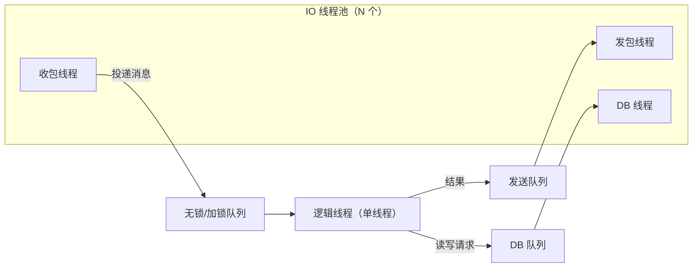
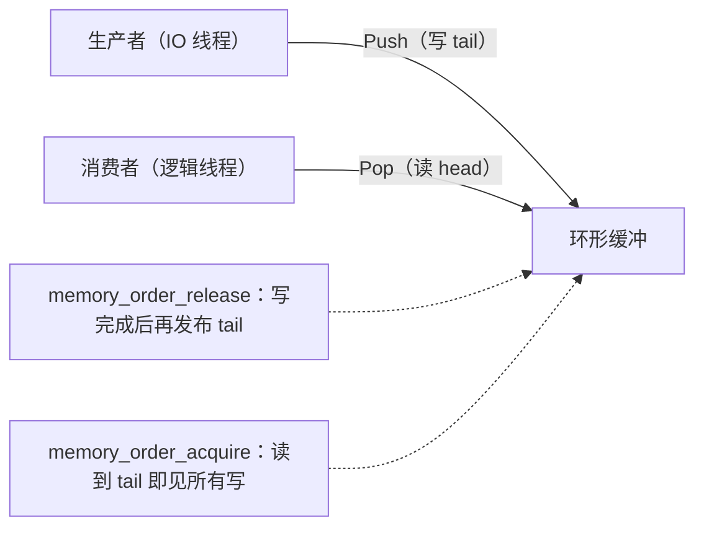
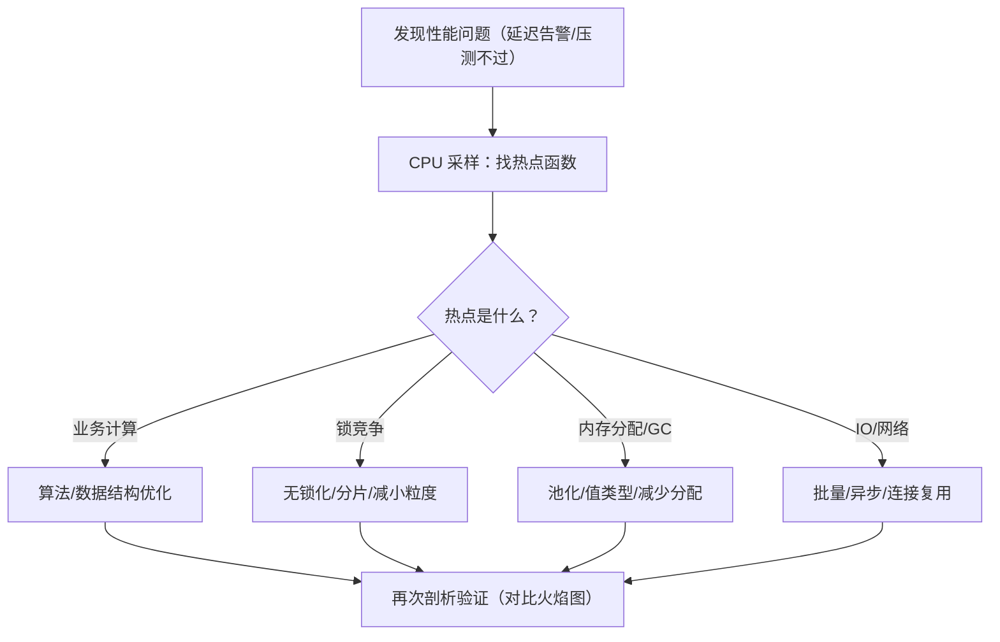

# 05 并发与高性能（Concurrency & High Performance）

> 知识成熟度：L2。主要承诺是解释服务端执行权、接纳容量、资源寿命和测量口径，依据标准/官方资料及已有主责篇静态核对。本文没有运行新程序、模型、编译、基准、剖析、网络、压力或故障实验；纸面例均标为 PAPER_EXPECTED。
> 知识基线：C++20 工作草案 N4861；Go 1.23.0 固定源码与 2022-06-06 内存模型；Skynet v1.7.0；.NET 8.0.0 ArrayPool。GC、剖析与工具页面按 SC10 列明各自版本/快照，不拼成统一部署清单。
> 适用范围：网关/登录 I/O、房间与场景逻辑、异步存储工作的运行调度、临时对象和容量诊断。前置是线程/进程、消息所有权及基本同步；不提供通用 Actor/线程池/驱动实现，不给出生产吞吐或玩家数承诺。
> 事实边界：标准合同、框架事实、应用设计选择、纸面算术、历史记录分开。C++ 数据竞争规则不直接移植给 Go；托管服务端 .NET GC 配置不自动适用于 Unity/IL2CPP。
> 最后更新：2026-10-08。保留原 title、H1、类型、成熟度、verified 和稳定身份；历史正文与旧数值完整放入末尾惰性文本，当前解释以 SC1–SC10 为准。
> 验证建议：先复核 SC9 的有限正反例、来源定位与寿命合同；实际实现和性能验收须另有明确语言/库版本、授权环境和原始输出。本次没有改变 GC/内核/权限设置或运行旧命令。

## SC1 从“哪段工作由谁负责”开始

原文把并发模型、内存效率、测量能力并列，是有用的阅读路线。服务端真正要维护的是：同一业务状态不会被冲突地更新；每个被接纳的任务和缓冲都有存活的主人；过载时资源有限；完成与失败能追到明确边界。线程更多、分配更少、QPS 更高都不能单独代替这些条件。

沿一条消息看：网络收到字节 → 拆出独立拥有的消息 → 有界接纳 → 逻辑 owner 检查当前状态并执行 → 派生 I/O → 结果归属 → 真正退场 → 资源回收。接纳不是业务提交，回调给出结果也不表示所有访问已经结束。[协议篇 SP4/SP7](../服务架构与消息通信/02-网络通信与协议设计.md)、[消息篇 M4/M7](../服务架构与消息通信/04-消息系统与事件驱动.md)已有完整主责，本文只将它们应用到执行和资源预算。

| 首先要回答的问题 | 主要机制 | 需要保留的代价 |
| --- | --- | --- |
| 谁可修改一个房间的可变状态 | 单一 owner、串行片段或覆盖不变量的同步 | 热房间仍有串行上限，等待可能交错 |
| 怎样利用独立房间/计算的并行性 | 分片、任务池、进程划分 | 路由、迁移、跨片结果和共享下游容量 |
| 怎样防止慢工作吞掉全部资源 | 队列条数/字节、真实在途和等待者分别有界 | 拒绝、背压、过期/关闭的明确处置 |
| 怎样降低已测得的分配或缓存代价 | 布局、生命周期收窄、有限复用 | 常驻内存、复制、重置、同步和回收成本 |
| 怎样判断改变有收益 | 同口径端到端指标和有针对性的剖析 | 测量本身有开销，局部热点不等全链路瓶颈 |

“先测量，再优化”仍成立为工作方法；旧“90% 的瓶颈一眼可见”没有在本轮限定的正文历史、仓内 evidence/工作日志检索中找到可关联的样本、方法或 raw，因此只保留历史身份。没有找到不代表证明从未测过，也不猜测它的来源。低 CPU 均值可与单核热点、下游等待、配额节流、负载发生器不足同时出现；指标是调查线索。

## SC2 进程、线程、协程和 Actor 分别承诺什么

### SC2.1 执行单位与阻塞对象

| 名称 | 可以据此说明什么 | 不能直接推出什么 |
| --- | --- | --- |
| 进程 | 通常有独立虚拟地址空间；通过 IPC/网络或显式共享映射协作 | 进程隔离不消除数据库/文件/共享映射上的竞争 |
| 线程 | 可由系统调度并行执行，共享进程资源 | 多线程不保证多核收益；线程栈/切换时间不是统一常数 |
| 协程 | 在挂起点保存/恢复执行状态，是语言或运行时机制 | 不自带 I/O、调度器、固定线程、零分配或无内核开销承诺 |
| Go goroutine | Go 运行时在 OS 线程上调度的执行单位 | 不是“单 OS 线程协作式 Lua 协程”；共享状态仍需同步 |
| Actor/消息驱动 | 一种所有权和消息处理组织 | 名称不证明完整请求原子、无共享引用或任意库行为安全 |

“阻塞”必须带对象：某 goroutine 等待、某 OS 线程卡在系统调用、某 Actor 的完整请求门被占住、某下游槽仍被借用，是四件不同的事。非阻塞 I/O 也消耗缓冲、关联记录和完成队列。同步式语法可以由运行时在等待时释放执行资源；普通阻塞库调用或长 CPU 循环并不会因为写在 async/协程函数里自动变成异步。

Go 1.23.0 的运行时说明将 G、M、P 分别解释为 goroutine、OS 线程和执行用户 Go 代码所需的运行时资源。线程进入系统调用时可交回 P 供其他执行使用；这不是 goroutine 数量、OS 线程数量或所有阻塞调用的无成本保证。[固定 HACKING.md，“Scheduler structures”](https://github.com/golang/go/blob/6885bad7dd86880be6929c02085e5c7a67ff2887/src/runtime/HACKING.md)

原 Go 的 ReadMsg 是未实现的应用函数，不能仅凭函数名断言其只挂起 goroutine。标准 net.Conn 的 Close 可使阻塞 Read/Write 返回错误，deadline 涵盖已挂起和后续相应 I/O；Write 超时也可能已经写出部分字节。它们不证明业务撤销、ReadMsg 内所有派生工作停止或任意 driver 静默。[固定 net.go，Conn/SetDeadline](https://github.com/golang/go/blob/6885bad7dd86880be6929c02085e5c7a67ff2887/src/net/net.go#L116-L173)

每条消息都 go process(msg) 会失去单连接串行执行，并且生产速度超过完成速度时不断增加任务。缓冲 channel 只限制通道存量：若无限创建 goroutine 然后让它们等待 channel/信号量，等待 goroutine 仍无界。入口应在创建/移交工作前取得真实的有界许可，拒绝路径保持消息所有权；读取缓冲不能交给仍在运行的任务后立即覆写。

### SC2.2 单线程片段不等于跨等待不变量

原“单线程 + 多线程 I/O”可作为数据 owner 清晰时的起点，不能称为绝大多数玩法的容量结论。网络/数据库异步完成者不得直接越过 owner 修改场景；跨线程只传独立拥有的值或有明确寿命的不可变材料。确定性还需要固定输入顺序、时间、随机性、浮点/容器约束及外部结果；单线程本身不保证回放确定，多线程也不是必然不确定。

PAPER_EXPECTED SC-P01：剩余空位=1。请求 A 先检查有空位，然后 await 资格查询；B 在等待中也看到1并 await。A 恢复加入后剩0；B 沿用旧判断加入，变成-1。即使同一线程交替执行也会违反容量不变量。这是业务 race condition，不需要 C++ data race。

修正选择之一是恢复后在同一不让出的片段重新核当前空位、成员身份与资格版本，再完成检查和占位；B 因剩0拒绝。需要跨服务承诺时，使用在真实接受域有效的有限预留，或框架支持的完整请求串行门，并审查调用环和等待上限。所有修改入口，包括 GM、回调、重连和迁移，都须遵守同一约束。[架构篇 SA4](../服务架构与消息通信/01-服务器架构模式.md)

Skynet v1.7.0 的 skynet.call 经过 yield_call 登记 session 并 yield，响应恢复对应协程；返回值来自协议的 unpack，并不额外自动返回 ok 标志。原 local ok, result = skynet.call(...) 只有当该业务本来返回这两个值才是那个合同；调用异常需用实际错误处理机制接住。skynet.queue 是协作式串行门，不能把它叫 OS mutex 或数据库事务。[固定 skynet.lua](https://github.com/cloudwu/skynet/blob/f97c72d341c820ca9ed0ec0d49f654b0e783d934/lualib/skynet.lua#L692-L716)、[queue.lua](https://github.com/cloudwu/skynet/blob/f97c72d341c820ca9ed0ec0d49f654b0e783d934/lualib/skynet/queue.lua)

不同 Actor 框架的默认重入策略不同；Orleans 的具体默认与 turn interleaving 已在架构主责中核对。本文不把 Skynet 的 yield 行为推广为所有 Actor，也不把“消息发送”当作深拷贝所有引用或持久可靠投递。

### SC2.3 C++20 co_await 不是线程池 API

N4861 的 await_ready、await_suspend、await_resume 决定某个挂起点；awaiter 可立即就绪，也可挂起、转移恢复责任或抛错。标准不为原 Awaitable/SendRpc/RecvRpc 提供实现，更不保证 co_await 中的调用不阻塞。协程状态可能分配，引用参数指向的外部对象不会因协程挂起自动延寿。[N4861 expr.await /3–5](https://timsong-cpp.github.io/cppwp/n4861/expr.await)、[dcl.fct.def.coroutine /8–13](https://timsong-cpp.github.io/cppwp/n4861/dcl.fct.def.coroutine)

实际 awaiter 至少要明确：谁只恢复一次、可能在哪个线程恢复、失败与取消如何交付、保存的借用何时失效、句柄何时不再被访问。不能以取消 future 或请求超时作为 destroy 协程帧的依据。也不要持有要求同线程解锁的 std::mutex 跨未知恢复线程；即使恢复线程相同，持锁期间调用别的服务或同步回调仍可能自锁/形成等待环。实现层细节沿[线程池与协程调度主责](../../01-编程与计算机基础/并发与同步/04-线程池、任务调度与协程调度.md)，不在本文再造一个 awaiter。

## SC3 同步先保证合法访问，再讨论无锁和缓存

### SC3.1 三个容易混淆的问题

| 问题 | 纸面反例或正例 | 对策边界 |
| --- | --- | --- |
| Race condition（竞态条件） | SC-P01 的检查跨 await，或两个 atomic 先读余额再分别写回 | 保护整个业务不变量；单字段原子不等于复合事务 |
| C++ data race（数据竞争） | 两线程对同一普通计数无同步地读写，至少一方写 | 依 N4861 intro.races 的冲突/潜在并发/happens-before 判定；属 UB，只作静态反例 |
| False sharing（伪共享） | 两线程合法独占不同普通槽，但有写且处于发生相干交互的同一缓存行 | 检查布局/访问/目标机器；可能慢，不由共行推出数据竞争 |

用同一 mutex 保护共享状态组，或独占 owner 加合法消息转交，都是正常选择。互斥锁、读写锁、自旋锁分别有调度与争用成本；读多并不证明读写锁更快，try-lock 失败也不保证公平进展。固定加锁顺序要覆盖全部入口；RAII 管解锁，不替业务回滚中途修改。不可恢复基础设施失败与可交付业务异常应分别处理。[同步主责](../../01-编程与计算机基础/并发与同步/02-线程同步与锁.md)、[N4861 intro.races](https://timsong-cpp.github.io/cppwp/n4861/intro.races)

atomic 保证对应操作的原子性；relaxed 并不发布其他普通载荷。lock-free 是在指定模型下整体进展的性质，不能用“代码没有 mutex”定义，不保证公平、每线程不饥饿、低延迟或更快。还要把分配、载荷复制/析构、回收和原子类型的实现能力算入整个操作。[N4861 atomics.lockfree /1–4](https://timsong-cpp.github.io/cppwp/n4861/atomics.lockfree)

### SC3.2 原 SPSC 环形队列在什么前提下可解释

原 Push/Pop 的双向发布思路可保留，但原泛型不是任意 T、任意生产者数量都正确的生产容器。纸面推导限定：N=4，有效容量 N−1=3；槽中是已构造的 int；赋值不抛异常；恰有一个不重入的生产者和一个不重入的消费者；消费者输出与内部槽不别名；构造先于线程访问，析构晚于双方退出；没有并发重置、resize 或队列销毁。

生产者独占写 tail 与空闲槽，消费者独占写 head 与领取输出：

1. 生产者先写 buf[t]，然后 release 发布 tail；消费者的 acquire 读到相应发布，才读取该槽
2. 消费者先完成读取/复制，再 release 发布 head；生产者 acquire 观察到该释放，才可重用相应槽
3. 自己维护的索引可用 relaxed 读；这依赖独占写者。对端读仍必须建立所需同步，不能只保留第一条发布链
4. 本轮观察为空/满可以导致一次保守失败；调用者保留输入，按有界等待/重试或拒绝处理，不通过忙转保证时限

依据为 [N4861 atomics.order /1–2](https://timsong-cpp.github.io/cppwp/n4861/atomics.order)；具体算法推导是本文静态应用，不是标准库附赠的队列实现证明。

PAPER_EXPECTED SC-P02：初始 h=t=0，Push(10)、Push(20)、Push(30) 后 h=0、t=3；Push(40) 的 next=0 等于 h，返回满，40仍属生产者。Pop 得10并发布 h=1；再 Push(40) 写槽3并发布 t=0；此后 Pop 顺序20、30、40，最终 h=t=0。此轨迹只演示有限环绕、空满和责任，不是穷尽所有弱内存执行的模型检测。

反例：增加第二个生产者，两者可能取同一 t 并写同一槽；把尾索引改成 CAS 也没有自动补齐槽占用、发布与异常协议。任意 T 的赋值可能分配、回调重入或抛错，出队失败还可能改变 out 或槽；N<2、别名、对象寿命、计数表示与目标 atomic 能力也须另审。原 alignas(64) 只是一个布局假设，不能证明目标缓存行就是64B，更不证明整个 Push/Pop lock-free。

原队列没有Close接口，也没有线程/任务owner。有限关闭合同必须在外层补齐：先用共同入口门停止新接纳；已经获准的生产仍登记在册，消费者继续处理，不能为等待生产者退出先停消费者；生产者完成最后一次发布并确认今后不再访问队列后，向消费者建立有证明的同步通知。消费者在该确认之后再次排空并重查空，处理完最后领取项才退出；拥有者再确认双方/回调全退场，最后销毁队列。等待实现须避免丢唤醒，不能把一次Pop(false)当“永久为空”。这些外层步骤是纸面使用前提，原代码并未实现它们。

PAPER_EXPECTED SC-P02C：仅有最后一项40，生产者已经获准但尚未release发布tail；消费者暂时读空。此时close不能让消费者直接退出。生产者发布40、结束并通过上述同步宣告不再发布后，消费者重查领取40，再查空且处理完成，才到最终drain结束；否则只能保留owner并报未收束。槽中的int对象从队列构造到双方退场一直存在，Pop只是复制值/释放复用资格，不是在每次出队时结束该int寿命。将槽改成手工构造的存储或拥有型T时，要另证构造/析构/异常与未消费残留的责任。

### SC3.3 ABA、回收和有序各有独立合同

CAS 比较的值从 A 变 B 又变 A，可以漏掉中间关系变化；ABA 不要求必须发生释放，同一活节点重新插入也可能触发。给指针加有限版本号还须证明表示合法、整组比较原子和观察窗口内不回绕；“高16位版本号”不是可移植处方。节点已释放后再解引用是另外的寿命问题，版本相同或不同都不能补救。

Hazard pointer/epoch 类方案各有保护、复核、退休、安全回收和参与者停滞合同；“先登记一次指针”或“代次递增”不足。队列 FIFO 也只约束其规定的领取顺序，多消费者业务完成顺序还需另外仲裁。[LockFree 与 FalseSharing 主责 §4](../../01-编程与计算机基础/并发与同步/03-LockFree与FalseSharing.md)、[消息篇 M8.3](../服务架构与消息通信/04-消息系统与事件驱动.md)

布局优化在合法访问以后考虑。按 owner 分离热写字段可减少争用，也增加内存/缓存/TLB 占用；SoA 对只遍历某几个字段可能合算，AoS 对同时访问整对象可能更合适。实际工作集、预取、向量化、NUMA、分配和目标布局共同决定收益。火焰图不能排他地证明伪共享；Linux 官方建议结合具体行与字段布局定位。[Linux False Sharing](https://docs.kernel.org/kernel-hacking/false-sharing.html)

## SC4 队列、线程池和异步工作：接纳直到实际静默

### SC4.1 “有界”必须说是哪个量

| 预算 | 计量对象 | 不能遗漏的部分 |
| --- | --- | --- |
| Q 条 / B 字节 | 已接纳待领取消息及拥有的载荷 | pending消息、解码/复制瞬间和队列外构造的对象 |
| A 个实际 operation | 已登记未submit、提交包装、底层工作、回调/派生工作 | 请求已超时但底层仍访问的 operation |
| W 个等待者 | 等同一结果/连接/信号量的前台请求 | 每个等待者的栈、取消注册与上下文 |
| 全局/分片/连接份额 | 上述预算的不同作用域 | 每连接有界不能阻止无限连接；各分片共享DB/内存总量 |

队列限制条数且每条最大负载 M 时，只能推得所计队列的负载不超过 Q×M；容器、分配器、内核 socket、TLS、池中空闲对象和工作栈另算。线程池固定 worker 数不限制未接纳任务、闭包捕获大小或无限排队；预先创建协程再等待许可也可能已经分配大量对象。

最小接纳结果是 Accepted、Full、Closed，以及实际实现需要的 Invalid/构造失败。Accepted 才转交所约定所有权；拒绝方仍负责输入的释放/重试。若旧API的调用可能已发布但返回异常，不能把异常统一当“未接纳”。消息类别要先规定拒绝策略：可替换状态可在其合法版本合同内合并；购买、结算等已接纳责任不能靠丢队列项消失。原“优先丢弃非关键消息”需要这一步语义判定。[协议篇 SP8](../服务架构与消息通信/02-网络通信与协议设计.md)

PAPER_EXPECTED SC-P03：两个排队槽、一个执行槽，每条纯负载上限2KiB；一个任务执行、两个排队时，三者的纯负载合计至多6KiB。第四条在接纳前拒绝。若再允许两个各持2KiB的producer pending，纯负载上界变10KiB；没有给pending数量上限就不能宣称6KiB界住整个系统。这些是给定参数的算术，不是RSS测量。

### SC4.2 登记必须先于可能同步回调的外调

沿[消息篇 M4](../服务架构与消息通信/04-消息系统与事件驱动.md)既有合同，不新增通用运行时：

1. 构造稳定 operation 与输入/结果所有权，准备其回调所需有效持有；这一步若失败尚未发生外部效果
2. 用同一锁/串行门协调接纳、关闭和登记；核 OPEN、剩余总deadline、实际槽与字节预算，登记 operation 并授一次提交许可。登记失败/结果不确认时不外调
3. 释放内部门后消费该许可调用真实 submit；不持一个可能被同步 callback/cancel 重入的非重入锁。已登记未submit也在关闭扫描与容量账中
4. callback可能在submit返回前执行，必须找到已有operation；它只完成相应结果仲裁。用户continuation不能在内部锁中意外执行
5. 明确拒绝且确证未发布、无任何未来访问时才回滚本地资源；其他失败可能是UNKNOWN，仍由稳定owner持有。计时器/取消注册及部分初始化也有退场责任

这里选择已登记的一次许可不因后续 close 自动撤销，与现有 M4 合同一致。若另选“关闭可撤销未发布许可”，必须有同一同步域内的互斥仲裁与确证未发布，不能只加一次锁外 closed 检查。无论本地许可如何，真实业务接受点仍检查当前权限和业务状态。

### SC4.3 结果、前台等待和资源生命周期分开

| 事件 | 能确定什么 | 此时不能做什么 |
| --- | --- | --- |
| 前台 timeout/cancel | 该等待已结束或请求取消 | 不据此归还仍被底层占用的槽、缓冲和连接 |
| 原结果已知SUCCESS/REJECTED | 对应业务事实有权威依据 | 不推导旧submit、查询或回调已退场 |
| 队列为空 | 暂无待领取项 | 不推导worker空闲、派生任务结束或host可析构 |
| operation实际静默 | 其submit包装最后访问结束、全部回调退场且无未来访问/提交、派生责任已结束或有效接手 | 不推导业务UNKNOWN变失败或外部效果回滚 |
| CLOSED | 入口封闭、无新发布可能、所需工作和回调全退场、责任已收束/合法移交 | 不能靠把计数清零制造这个状态 |

PAPER_EXPECTED SC-P04：A已登记，close关门，A尚未submit；按上述一次许可合同，A仍可执行已授的那次submit。submit同步回调写入结果后，回调尚未返回，故A的真实槽仍占用；即使close预算先到，也只能返回INCOMPLETE/DRAINING，稳定host继续持有A、缓冲、pool和回调接收端。待submit包装与全部实际访问都结束，且底层合同证实无未来回调，才回收。若永远拿不到静默证据，则不能安全销毁；不编造最终完成事件。

外部业务恢复另沿原身份、完整参数绑定与原结果查询合同。持久交接能让后来查明UNKNOWN，不会使仍活着的进程内存提前停止被访问；本地取消更不等于撤销数据库提交。原业务已知结果不被迟到UNKNOWN覆盖，矛盾确证结果须诊断停止。[数据库篇 A11](../持久化与分布式一致性/01-数据库选型与存储设计.md)、[缓存/消息篇 §4](../持久化与分布式一致性/03-缓存与消息队列.md)

## SC5 消息泵与分片：限制本轮工作而不丢消息

### SC5.1 原消息泵的条件顺序会取走未处理项

原 while (inbox.Pop(msg) && processed < 1024) 先求左侧。已处理1024条时，若队列还有第1025条，Pop 已将其取走，随后右侧为false，Dispatch不执行。这不是性能取舍，而是一次丢失领取责任的路径。依据为[N4861内建逻辑与的左到右及短路求值](https://timsong-cpp.github.io/cppwp/n4861/expr.log.and)；这里只推导原表达式，没有执行它。原 SPSCQueue<Message> 还缺模板N，running/Tick/Dispatch亦未定义；整块本来是示意，不能说已可编译。

下面是当前纸面替代，保留“消息与固定步逻辑共享一个owner”的教学用途；不提供可直接运行的线程主函数：

~~~text
PAPER_EXPECTED / 一个owner、每轮至多两条、无外部副作用
本轮计数 n=0
while n < 2:
    若队列没有可领取项: break
    领取恰好一项，明确转移给当前owner
    处理并记录此项的成功/约定失败；异常不能静默丢掉已领取项
    n=n+1
执行本轮到期的逻辑更新
若尚有存量：安排可继续执行的下一轮，不依赖未来新网络事件
~~~

PAPER_EXPECTED SC-P05：输入队列[1,2,3]。旧条件把上限替成2时，先处理1、2，再取走3但不处理；新顺序只领取1、2，3仍在队列供下轮处理。若处理2抛出已约定业务异常，则记录2的失败后按合同继续/停止，不能把2算成功，也不能凭未知外部效果自动重做。

条数预算不能界定墙钟：一项可能计算很久或等待I/O。需按实际目标补单项大小/复杂度、协作式分段、时间观测与慢任务隔离；预算检查不会抢占一段已经执行的同步代码。固定时间步的累积、落后时补帧/降级、最大追赶量属于产品同步策略；sleep_for(1ms) 不保证1ms后准点唤醒或较低抖动，也不应成为默认消息泵调度器。使用固定步长不自动消除处理时间漂移，关闭时仍走SC4的收束规则。

### SC5.2 sceneID%8 是取模分片，不是一致性哈希

原 Go 路由示意把每个分片交给一个 goroutine串行处理，可保留其owner用途，但它不固定该goroutine在一个OS线程。多个场景映射到同一分片时会相互排队；Handle若产生并发派生写或把可变引用外泄，串行入口也保护不了它们。

PAPER_EXPECTED SC-P06：sceneID=9，8片时归1，改成9片后归0。直接改模数而不迁移，会让同一场景同时有两个owner或丢失旧状态；不能把这个公式称为“一致性分片”。迁移需沿既有架构的路由代次、状态交接和接受点写权合同，不在本文另造迁移协议。

单一发送者按程序序发送到同一FIFO channel可以保持其发送序；并发发送者需要先定义应用序列。入队序、领取序和外部提交完成序分别记录，不能用“同一个channel”证明场景业务全序。满channel的阻塞、deadline、拒绝和close的发送竞争必须由唯一关闭责任/共同入口门管理；向已关闭channel发送会panic，因此不能允许send与close无协议地竞争。[Go规格 Send statements / Close](https://go.dev/ref/spec#Send_statements)为本日网页快照；这里不混入其未核对的新版本特性。Go内存模型只为具体同步事件提供顺序，不为应用自动合并多个来源的业务顺序。[Go Memory Model，“Channel communication”](https://go.dev/ref/mem#chan)

## SC6 对象池与内存池：复用要到最后一次访问之后

### SC6.1 一次租用至少有五个阶段

对象池复用实例，内存池/分配资源复用存储；两者都要约定构造、逻辑重置、析构与底层释放的责任，不能只看API叫Rent/Return。单次租用可按“空闲 → 独占租用 → 仍有异步使用者 → 真正退场 → 重置后可再租”检查。接纳上限、空闲保留上限和峰值在租数量是不同量。

原C#池的Stack加锁只保护空闲容器。Return中的Reset在锁外并不自动错误，关键是必须先证明所有使用者退场、只归还一次，再处理Reset失败；池锁不能阻止旧别名继续写。将一个变量设null不会清除其他引用。重复Return会让同一对象出现两个空闲条目，接着被同时租给两人。4096只限制该实现保留的空闲条数，Rent仍可无限new，并非总存量或业务并发上限。

PAPER_EXPECTED SC-P07：A租到对象x，异步发送仍引用x；A等待超时便Return，B再次租x并重写内容，迟到发送读到B内容。反例即使没有托管悬垂内存也会污染业务。正例由operation持有租约直到实际I/O/回调静默，再重置并归还一次；若预算耗尽但仍在途，保持SC4的DRAINING，拒绝新工作，不把x投回空闲栈。

跨await持有租约并非一律禁止，但要把整段租期计入有限在租预算，避免等待另一个只能由自己释放的资源；重入回调不得二次归还。重置负责清除身份、事件订阅、引用和敏感内容，但执行用户Reset/Dispose的线程、异常与再次入池条件须明确。重置失败的对象不能伪装成干净对象再发出；其隔离/销毁亦需无活跃使用者。

### SC6.2 .NET ArrayPool 与 Go sync.Pool 是不同合同

.NET 8.0.0 ArrayPool.Rent(n)返回长度至少为n的数组；不得把实际Length当已初始化有效负载长度。池可能复用或新分配，Return必须回到同一池、仅一次、之后调用者不再使用。clearArray=true的合同以池保留供复用为条件，不能冒称所有路径上的安全擦除保证。[固定 ArrayPool.cs，Rent/Return](https://github.com/dotnet/runtime/blob/5535e31a712343a63f5d7d796cd874e563e5ac14/src/libraries/System.Private.CoreLib/src/System/Buffers/ArrayPool.cs#L63-L99)

原数组try/finally保留“异常也归还”的目的；它只有在try结束前所有使用者确已完成才成立。若把数组交给未await到实际退场的异步发送，finally可能过早归还；异常、取消或等待超时也要依据真正I/O合同确认最后访问。原8只是请求长度，处理/发送限定有效区间[0,8)，先初始化再读；需要清除引用或数据时按其保密与保留合同处理，并计清理成本。

Go 1.23.0 sync.Pool可并发调用，不等于其中同一对象可被多人同时修改。它缓存暂时不用的对象；项可随时无通知消失，Get可以当池空且不保证取回某次Put的同一项。首次使用后不可复制Pool；同对象的Put到取回它的Get有相应同步，归还后持有的别名仍不能继续使用。它不适合保存必须可靠留存的会话、连接配额、未决结果或关闭责任。[固定 pool.go，类型注释和Get](https://github.com/golang/go/blob/6885bad7dd86880be6929c02085e5c7a67ff2887/src/sync/pool.go#L14-L50)

旧“GC会清空Pool”太粗。所读1.23实现的poolCleanup丢旧victim、把当前缓存移到victim，不等于每次GC都立即清空所有对象；应用依赖的是允许任意移除的公开合同，不依赖刚好保留几轮。[固定poolCleanup](https://github.com/golang/go/blob/6885bad7dd86880be6929c02085e5c7a67ff2887/src/sync/pool.go#L256-L281)

PAPER_EXPECTED SC-P08：Put(x)之后Get返回y或走New是允许的，不能以x不回来判缓存错误；若“丢失x就丢了一个待提交结算”，则选择sync.Pool保存责任本身就错。ArrayPool同样只是内存复用，不能充当已接纳任务的耐久队列。

### SC6.3 固定块也有浪费和生命周期

分桶池可能让某些路径接近常数步，不能一概承诺O(1)、无碎片或比new/delete快。块向上取整会有内部浪费；空闲块分布、扩容、线程缓存、同步、页回收和大分配都有代价。tcmalloc、jemalloc、mimalloc在原文保留为分配器检索入口，本次没有逐版审计它们，不把品牌或部署习惯写成性能保证。

帧/arena整体回收的前提是该批所有对象的有效使用已经结束；异步任务、跨帧消息和回调会破坏“帧结束=无人访问”的假设。释放存储与正确结束对象生命周期不是同一个动作；非平凡析构、文件/句柄等仍须按所用资源合同处理。取内存、构造对象、结束寿命、释放存储的基础继续见[对象生命周期与RAII](../../01-编程与计算机基础/C%2B%2B语言与对象模型/01-C%2B%2B对象生命周期与RAII.md)。

## SC7 分配与GC：优化的是目标负载下的成本

| 语言/机制 | 当前可采用的判断 | 需要测量或另行核对的边界 |
| --- | --- | --- |
| C# struct | 值语义与复制规则；可能含引用字段 | 不是一律栈分配或零GC。数组/容器本身、装箱、闭包/async捕获各有成本 |
| C# 泛型/接口 | 合适的泛型路径可以避免某些装箱 | 转成object/某些接口使用仍可能装箱；不能写“泛型+接口必不分配” |
| .NET GC模式 | workstation/server与background是相关但不同选择维度 | Server GC不保证更低P99；多进程/CPU配额/堆增长须共同评估；不直接套Unity |
| Go逃逸 | 是否逃逸取决于使用上下文与编译器 | 小对象不保证在栈；栈增长、调用路径、版本变化需实际工具输出 |
| Go GOGC/GOMEMLIMIT | GC CPU、活堆/根与内存预算间有取舍；memory limit是软约束 | 非整个进程RSS硬上限，过低可增加GC工作；不能替代有界接纳 |
| C++所有权/布局 | 独占拥有、减少无用复制和紧凑访问可作为候选 | std::move不保证底层不分配；shared_ptr计数成本不等载荷线程安全；裸指针不自动更安全 |

C#依据为官方规格§8.3的值类型、引用字段和装箱关系；并不从这些规则推导某个JIT实际分配结果。[C# types](https://learn.microsoft.com/en-us/dotnet/csharp/language-reference/language-specification/types#83-value-types)。.NET页面将background与server/workstation分别说明，并指出server GC可能增加资源压力；本次仅核此选择边界，没有改GC配置。[.NET GC说明](https://learn.microsoft.com/en-us/dotnet/standard/garbage-collection/workstation-server-gc)

Go GC Guide所读页自述以Go1.19的gc工具链为说明对象，不能称为任意Go实现/所有后续版本不变。它区分活堆、分配率、扫描/根与CPU成本；Go GC并非整个周期都停世界，仍可能有短暂停顿、调度和assist成本。GOGC选择时间/内存取舍，GOMEMLIMIT为软预算；本文不提供统一参数建议或关闭GC步骤。[GC Guide，“Where Go Values Live / GOGC / Memory limit / Latency”](https://go.dev/doc/gc-guide)

PAPER_EXPECTED SC-P09：A方案每次操作临时分配1KiB，1000次/s，所计分配率约1000KiB/s；B方案使用100个常驻16KiB缓冲，至少持有1600KiB纯缓冲存量。B可能降低后续分配，却增大常驻集合；重置/锁/未命中仍有成本。这只能说明要同时记“字节/操作、字节/秒、活字节、峰值与租期”，不证明B更快，也不能用分配率直接预测GC暂停。

热路径零分配可作为一个有测量口径的目标，不是所有服务端代码的普遍禁令。StringBuilder/缓存委托/复用slice/SoA各自要比较输入规模、扩容、引用滞留、复制和同步；低频路径为消除一次分配增加全局池可能得不偿失。先改善算法和必要工作量，再在已定位的热路径比较方案。C++移动与所有权合同沿[Copy/Move主责](../../01-编程与计算机基础/C%2B%2B语言与对象模型/02-Copy-Move与值语义.md)。

## SC8 剖析与负载：每个百分比先写分母

### SC8.1 指标、采样、插桩和追踪各回答什么

指标适合持续记录有界聚合事实；CPU采样估计活跃CPU时间分布；堆/分配、block/mutex profile回答各自采集对象；插桩/追踪可以关联阶段等待与因果，但成本、漏采样和时钟边界要显式保留。Go官方诊断页说明block/mutex默认未启用且多类剖析有相互干扰；block的采样按阻塞时间、mutex按争用事件比例，不能把参数单位混写。本篇不规定采样常量，也没有启用它们。[Go diagnostics](https://go.dev/doc/diagnostics)

CPU火焰图中没看到I/O等待，不证明I/O没有造成尾延迟；宽帧是所选样本权重，不是一次请求的墙钟顺序。

原火焰图25%、20%、12%、18%是明确“文本示意”，本轮未找到对应raw profile，不把它们升级成实测。父帧包含子帧时不能把二者相加当互斥贡献；“Lock.Contend 12%”也必须说明来自CPU、block还是mutex口径，不能由标签认定线程阻塞了12%的端到端时长。

PAPER_EXPECTED SC-P10：同一CPU profile总样本1000，父帧A含子帧B，A出现400、B出现250，则A包容占比40%、B占比25%，不是65%。若另有一次请求等待数据库900ms、CPU执行100ms，活跃CPU采样不会自动把那900ms画成数据库函数宽度；需要同请求计时/适配的等待观测。不同样本数、采样间隔、剖析类型的图不能只按形状比较收益。[FlameGraph作者说明](https://www.brendangregg.com/flamegraphs.html#Summary)将普通火焰图的横轴与时间轴明确区分。

原工具名保留各自用途：perf、Go pprof、Tracy、Unity Profiler/dotTrace、Visual Studio/PerfView、eBPF/BCC是定位入口，具体版本/平台/采样权限要另核。gprof不应与perf一概称同一种采集方式。多个profiler同时打开可能互相干扰；更细的采样或插桩可能改变调度、分配、锁和吞吐，先记录低开销基线，再有限采样并记录差异，不能将带/不带插桩两组直接当算法性能差。

原Go“3行接入”通过空Handler使用默认mux，空host监听地址也不是仅localhost；导入net/http/pprof会注册默认mux上的调试路由。[Go1.23.0固定pprof init](https://github.com/golang/go/blob/6885bad7dd86880be6929c02085e5c7a67ff2887/src/net/http/pprof/pprof.go#L95-L105)支持注册事实。仅改成命名导入仍会运行init；另开loopback端口也不能消除业务端口共用DefaultServeMux的暴露风险。当前默认教学流程是先审查端点可达性、独立管理监听/明确mux、授权访问与数据暴露，再决定是否采集；不能把历史监听代码复制到公网业务监听。另须有限采样时长/并发、错误与关闭处理、输出归属，不在本轮开端口、改权限或采集profile。精确工具来源见SC10。

### SC8.2 吞吐、并发与延迟的统计域

一次报告至少固定：构建/依赖/CPU配额、客户端和服务端拓扑、协议/业务混合、数据规模与热度、预热/测量/排空窗口、arrival模型、并发与未决上限、计时起止、成功/拒绝/超时/错误分类、样本数、histogram精度、负载发生器是否饱和。QPS是某边界每秒完成数，不能把已发送包数当业务成功吞吐。

| 量 | 示例口径 | 常见误读 |
| --- | --- | --- |
| offered rate | 每秒按计划到达/提出的业务意图 | 配置100/s不证明发生器实际发出100/s |
| admitted rate | 入口确认接纳数/测量秒数 | 接纳不等业务成功或持久提交 |
| success throughput | 窗口内按定义成功数/秒 | 把拒绝、丢弃、只写socket成功都算成功 |
| in-flight/concurrency | 指定边界尚未退场的请求/操作数量 | 连接数、用户数、排队数、OS线程数不是同一个量 |
| latency | 同一主体单调时钟上起止时间差 | success-only P99不代表全部意图；不同机器墙钟差不能未经校准相减 |
| percentile | 给定总体、窗口与估计规则的分位值 | 不是所有未来请求延迟上界，也不能平均各实例P99 |

PAPER_EXPECTED SC-P11：窗口10s内提出1000次，入口拒绝100；接纳900中800成功、50明确失败、50前台超时。提出率100/s，接纳率90/s，成功吞吐80/s；若50次超时的底层仍未退场，真实在途继续占用容量。报告保留四类样本与超时阈值，不把800条成功延迟的P99标成1000次意图P99。超时的观察等待时长不是其未知业务实际完成时长。作为工具边界，所读Vegeta Metrics.Add在处理Error之前就累计Latency，hit的defer也给错误返回填耗时；不能泛称“工具默认删超时”。是否有上游筛选、未排空或success-only面板，要查实际工作流。[Metrics.Add](https://github.com/tsenart/vegeta/blob/master/lib/metrics.go#L50-L85)、[hit](https://github.com/tsenart/vegeta/blob/master/lib/attack.go#L536-L564)按本日blob快照核对，未运行。

分位使用排序或明确的histogram估计。PAPER_EXPECTED SC-P12用nearest-rank定义：10个完成样本为1、2、3、4、5、6、7、8、9、100ms，P50取第ceil(0.5×10)=5项即5ms，P90=9ms，P99=100ms；不表示有足够样本稳定估计生产P99。若两次超时未完成，需另列截止/未决样本和总体口径，不能静默删掉后声称12次整体尾延迟相同。跨实例合并应合并兼容原始观测/可合并histogram后求分位，不能平均分位数；桶边界/单位与样本范围须兼容，估计仍有误差。[Prometheus Histograms and summaries](https://prometheus.io/docs/practices/histograms/#quantiles)明确反对直接平均预计算分位。

PAPER_EXPECTED SC-P13：一组100个样本全1ms，另一组1个1000ms；两组P99的算术平均为500.5ms。合并101样本按nearest-rank的P99是第100项=1ms，最大值是1000ms。两者不同来自定义与样本权重，不代表慢样本不重要。分位必须连同样本数、错误/超时、最大值/尾部和业务风险解释。

### SC8.3 开放到达、闭合用户与发生器自身

闭合模型中固定数量用户完成上次工作后才发下一次；响应越慢，实际到达率可能越低。开放模型按独立计划产生到达；发生器若能力不足、未决上限耗尽、调度迟到或主动丢弃，必须报告实际发出与计划差。两者分别回答不同用户行为，不存在脱离产品需求的万能选择。

PAPER_EXPECTED SC-P14：1个闭合用户，无思考时间，正常每次耗100ms，近似10次/s；服务一次卡2s期间该用户不会发出原本每100ms一次的独立到达。因此这组结果不能回答“每秒固定10次到达时积压多少”。coordinated omission是负载/计时漏掉本应被表达的等待的风险；用计划发出时间计时可揭示发生器迟发，但需把计划到实际发送与实际发送到响应分开，并说明工具的修正规则。不能凭修正histogram声称真实执行过所有被补计样本。[wrk2 latency measurement说明](https://github.com/giltene/wrk2/blob/master/README.md)为这一工具方法的原始入口，其中比较旧wrk的2014段落不作为当前所有工具对照实验。

HTTP工具不能自动替代游戏协议机器人：wrk/vegeta面向HTTP；HTTP Upgrade成功不证明有WebSocket帧、心跳、收发关联或真实游戏业务。ghz面向gRPC，Locust的HttpUser也不是原send_packet自定义二进制客户端。需要选支持目标协议的适配器，并校验登录、授权、编码/解码、响应关联及真实完成条件；这些工具的当前适配能力和具体配置须按选定版本核对。[wrk README](https://github.com/wg/wrk/blob/master/README.md)、[Vegeta README](https://github.com/tsenart/vegeta/blob/master/README.md)本次只核HTTP能力与负载模型，不排除另有扩展。

原1000线程、300s、sleep(0.066)机器人脚本缺接收/错误分类、join/关闭、deadline和资源上限，不是默认压测入口。sent仅计发送尝试，15Hz也是近似节奏：发送耗时加sleep会漂移，负载发生器可能先耗尽CPU/连接。当前纸面流程先用有限业务记录定义“登录成功后何时发、怎样收响应、何时停止并排空”，再在明确授权环境中选固定并发/速率预算；本轮不运行脚本。

### SC8.4 一个可执行计划必须有停止与回收条件

未来验收先做协议正确性与有限错误路径，再选择稳定/阶梯/突发/持续场景；登录风暴、慢客户端、断连、滚动发布与故障恢复仅在被授权的隔离环境执行。不能默认从10%跑到200%或持续12–24小时。时长与强度来自问题、预算和预先评审的停止线，不从文章常数复制。

计划应限定目标地址/服务/账号、允许的业务数据与副作用、发生器和服务资源预算、最高速率/并发/请求总数/总时长、观察窗口、撤销与排空责任。CPU/内存/队列年龄、错误率、依赖容量或业务不变量越过事先定义的阈值即停止增加负载；记录未完成请求、取消/停止发出与实际退场，保留失败样本。不能因停止发压就认定旧工作消失。

只改变一个待验证因素，保持可比较输入与完成口径，保留原始数据和失败；必要的多轮用于揭示波动，不能事后挑最快一轮。生产与实验环境的差异须明列，CPU架构相同远不足以认证等价。网络、DB、配额、缓存热度、编译选项和GC模式都可能改变结果。峰值×1.5、帧<50ms、广播P99<200ms保留为旧举例；真实余量由产品SLO、故障冗余、偏斜和恢复成本决定。

## SC9 有限纸面核对与最小验证门禁

以下均为PAPER_EXPECTED，表中的通过条件是待核对推导，不是本轮运行输出。本文静态主承诺无需制造新runner/CI；若将来写成真实实现，先补实际库的静默点，再申请执行合法有限短例，不能运行故意race、UB、死锁来“验证”。

| 编号 | 正例需要得到什么 | 反例或停止线 |
| --- | --- | --- |
| SC-P01 | 跨await恢复后重查，第二人被拒绝 | 沿用旧空位检查会超额 |
| SC-P02/02C | 四槽保留一空；拒绝保留40；关闭等最后发布后重查排空 | 多producer、任意T、无对向发布或早销毁不在证明内 |
| SC-P03 | 2排队+1执行×2KiB=6KiB纯负载，另计pending | 全系统RSS或无限producer不能套该界 |
| SC-P04 | 登记后close仍追踪一次许可；结果已知也等真实静默 | 无静默证据持续DRAINING，不回收 |
| SC-P05 | 先查预算再领取，[1,2,3]处理两项后仍留3 | 先Pop再查额度会取走未处理项 |
| SC-P06 | scene9在8片归1、9片归0，扩片要交接 | 不称一致性哈希，不直接改模数上线 |
| SC-P07 | 租约随实际使用者存活，最后访问后归还一次 | timeout/重入/重复Return不能提前复用 |
| SC-P08 | sync.Pool丢项仍合法，正确性责任在稳定owner | 不能放必须可靠保存的未决记录 |
| SC-P09 | 分配率与常驻租用存量分列 | 少分配不推出更快或更少RSS |
| SC-P10 | 包容CPU帧不能相加；等待需另一证据 | 无raw的示意图不升级为采样事实 |
| SC-P11 | 100/90/80每秒各有分母，50超时仍可占槽 | 不把成功子集或sent当总完成 |
| SC-P12/13 | 指定nearest-rank、样本数、窗口，合并后求分位 | 不平均分位，不删超时掩盖尾部 |
| SC-P14 | 闭合用户减速与开放到达分别解释 | 未达到计划负载时不能给目标容量结论 |

最小实现验证建议是将上述所有权/接纳/关闭转移映射到实际API，固定对象与有限输入，覆盖Full、Closed、构造失败、确定未发布拒绝、同步/迟到回调、重复通知、超时但未静默以及归还后不再访问。没有真实API的完成语义时停在“前提未满足”，不先写假driver或模型输出替代。性能测量是随后独立工作：能正确处理三条消息不证明吞吐或P99，TSan无告警也不证明无锁或业务线性化。

本轮允许的文本检查仅针对文章：UTF-8、YAML未知字段保全、CommonMark围栏/H1/链接、现行checker要求的“知识基线：”“最后更新：”“验证建议”及来源入口、原文/历史回拼和候选diff。实际仓内安装后的全仓适用门禁与独立审核另行执行；机械通过不表示程序执行、产品schema、Mermaid渲染或性能认证。

## SC10 来源定位、历史贡献与阅读分工

### SC10.1 实际核对的证据层次

| 来源 | 版本/位置 | 本文支持范围与未覆盖项 |
| --- | --- | --- |
| N4861 C++20工作草案 | 2020-04-01；expr.await、dcl.fct.def.coroutine、intro.races、atomics.order、atomics.lockfree固定条文 | 协程、发布、data race和原子能力；条文镜像选读与官方PDF身份，不认证编译器/完整容器 |
| Go运行时/标准库 | go1.23.0→6885bad7dd86880be6929c02085e5c7a67ff2887；HACKING.md Scheduler structures，pool.go类型/Get/poolCleanup，net.go Conn | 调度职责、临时复用与I/O接口；未审全部runtime/网络poller/driver |
| Go内存模型 | 页面Version of June 6, 2022；Synchronization/Channel communication | goroutine共享访问需同步、channel事件顺序；不提供业务全序 |
| Skynet | v1.7.0→f97c72d341c820ca9ed0ec0d49f654b0e783d934；skynet.lua 692–716/879–905，skynet/queue.lua | call/yield/返回值与串行门；复用已保存固定源码，不运行Lua或审完整框架 |
| .NET ArrayPool | v8.0.0→5535e31a712343a63f5d7d796cd874e563e5ac14；ArrayPool.cs 63–99 | 至少长度、同池/一次归还、使用权与clearArray；不认证Unity或租约包装实现 |
| C#官方规格 | 本日页面快照，§8.3.1/§8.3.3/§8.3.13 | 值语义、引用字段、装箱；不测JIT分配 |
| Go GC Guide | 本日页面自述描述Go1.19 gc工具链；GOGC/Memory limit/Latency | 取舍、软预算及非全周期STW；未改参数或测GC |
| .NET GC说明 | 本日所读页面标最后更新2023-03-03；workstation/server/background | 模式/资源取舍；不承诺部署默认或性能 |
| Linux False Sharing | 本日页面What/Detect/Mitigations | 共行含写、字段定位及空间代价；未执行perf/c2c或改权限 |
| 剖析与HTTP监听 | Go diagnostics与net/http/net页面本日快照；实际pprof注册另读Go1.23.0固定init | 采样对象/开销、DefaultServeMux与监听边界；未采集/开端口；辅助runtime页面所示Go1.27.1不是本项目版本，未引入其采样数值 |
| FlameGraph | 作者官方Summary本日快照；README blob ee1b3eee429637f2c6f092118d34235e0eb203cd | stack population/样本权重，不是请求时间线；图例非raw |
| wrk / Vegeta | 本日README blob ac61e0d9b3192ce75e960f3b42eb84f56dbbf780 / 04aaacba3a5f51fcf07c7c0b5ef3d44e03421002 | HTTP入口、rate/max-workers模型；不是所有扩展的能力审计 |
| Vegeta统计 | metrics.go blob 5d7dbf9b25dc9a737a955d9e72e60ed9f7cb08a3，Add；attack.go blob d2f1cf5a41611a6bad90d5dbb4ef9e3fc07116e4，hit | 错误耗时纳入路径；未查实际项目的筛选和结束排空 |
| wrk2 / Prometheus | README blob 7908d1f0fb2aab8023f31556d4ec00051b398de6，latency technique；histograms页面本日Quantiles段 | 计划发送口径、分位合并与误差；没有执行负载/修正histogram |

来源网页能访问只证明取得了所列文本，不代表全部页面、链接的实现或示例都经过审查。原TCP/QUIC/protobuf/gRPC入口保留为历史来源；它们不能直接支撑协程纳秒、单核消息数或GC性能。所需传输行为沿SP1的已核版本，不在本文重复抓取。

### SC10.2 已有主责与本篇边界

- [原子与内存模型](../../01-编程与计算机基础/并发与同步/02-Atomic与C%2B%2B内存模型.md)、[LockFree与FalseSharing](../../01-编程与计算机基础/并发与同步/03-LockFree与FalseSharing.md)：语言层同步、回收/进展和布局分析；旧实验的环境、失败和有限结论仍归原页，不挪作本文性能证据
- [线程同步与锁](../../01-编程与计算机基础/并发与同步/02-线程同步与锁.md)、[线程池与协程调度](../../01-编程与计算机基础/并发与同步/04-线程池、任务调度与协程调度.md)：完整有限实现、构造/关闭/唤醒和恢复责任；本文只讲服务端使用条件
- [服务器架构](../服务架构与消息通信/01-服务器架构模式.md)、[网络协议](../服务架构与消息通信/02-网络通信与协议设计.md)、[消息与事件](../服务架构与消息通信/04-消息系统与事件驱动.md)：owner/迁移、协议字节、接纳/关联与真实静默；不另造路由、帧协议或RPC框架
- [数据库设计](../持久化与分布式一致性/01-数据库选型与存储设计.md)、[缓存与消息队列](../持久化与分布式一致性/03-缓存与消息队列.md)：提交、原结果、存档和恢复责任；少分配/快队列不覆盖这些合同
- [帧同步与状态同步](../同步预测与回放/03-帧同步与状态同步.md)：固定步和确定性入口；不能以本篇静态检查替它增加证据
- [atomic-memory-order旧证据](../../../evidence/labs/atomic-memory-order/README.md)、[false-sharing旧证据](../../../evidence/labs/false-sharing/README.md)：保留历史定位；本轮未运行旧runner，不覆盖原raw

### SC10.3 原用途映射与版本沿革

本次修订不是首次写作。真实提交历史显示：2026-08-04初稿已包括模型选择、三种协程、SPSC、对象/内存池、三语言分配建议、剖析/压测、四个示例和八问；08-06补来源/边界/P0，08-13补成熟度，08-14补主责互链，08-20接OKF，10月按现行结构迁移链接。历史日期、用途和原字均保留；不把后来新增的解释倒记为早期已有。

| 原用途 | 当前承接 | 保留但限制的旧内容 |
| --- | --- | --- |
| 概述、三大战场、术语表 | SC1–SC3、SC7–SC8 | “90%”、统一纳秒/微秒/线程数量及单核吞吐没有成为本轮实测 |
| 并发选型、I/O→队列→逻辑图 | SC2/SC4 | 产品名字不证明相同调度；框架范围按所核版本 |
| Lua/C++/Go异步同步化写法 | SC2.1–SC2.3 | 未定义RPC/ReadMsg不当完整API，Skynet返回值纠偏 |
| Mutex/RWLock/Spin/atomic、SPSC/CAS/ABA | SC3 | 代码保留原字；N、T、双向发布、寿命和进展前提补齐 |
| C#池、数组池、分桶/帧内存 | SC6 | 4096非总容量、早归还/重复归还/重置失败与跨await责任 |
| C#/Go/C++分配与GC建议 | SC7 | “struct栈”“零分配禁令”“O(1)无碎片”改为有条件的比较 |
| pprof、工具表、火焰图、指标看板 | SC8.1–SC8.2 | 原调试监听、示意百分比不作默认操作或真实profile |
| 10%→200%、12–24h、千线程机器人 | SC8.3–SC8.4 | 保留旧命令/代码历史身份；以有授权边界的有限计划承接目的 |
| 消息泵、Go取模分片 | SC5 | 明示1025项丢失与取模变化，不假装旧例已编译 |
| 十条最佳实践、八问和关联阅读 | SC1–SC9及本节 | 全部问题在当前合同中回答，旧经验值不作容量阈值 |

历史完整原文位于G0；早期与G0不同的必要原字段落位于G1。围栏中的代码、命令、警句、链接与日期是历史记录，不是默认执行流程或本次测试结果。正文历史追溯限定在固定main的两个已知路径及其可取得版本；没有声称搜遍作者外部原稿、所有分支或已删除历史。

## 历史原文保留区（惰性文本）

以下G0完整保留修订前26,328字节、558个LF；G1收录早期版本与G0不同的必要原字。历史代码与高负载命令不作为当前操作步骤，不启动网络、剖析、GC调参或压力测试。当前教学与停止条件见SC1–SC10。

### G0 固定基线完整原文

~~~~~~~~text
---
type: Mechanism
title: "05 并发与高性能（Concurrency & High Performance）"
status: stable
verified: []
maturity: L2
---
# 05 并发与高性能（Concurrency & High Performance）

> 知识成熟度：L2（本轮审计修订时补标）。

> 知识基线：实时游戏服务端通用架构；示例中的语言、数据库、缓存、容器和云平台版本必须以项目部署清单为准。
> 适用范围：覆盖网关/登录 IO、房间/游戏服逻辑并发、数据服务连接池与压测入口；不把单机测得的容量外推到全链路。
> 事实边界：协议规范、组件行为和示例方案分开；容量数字只作示意/经验值，必须通过压测验证。
> 最后更新：2026-08-06（补齐规范来源、版本边界与工程验收入口）。
> 版本边界：以 2026-08-06 为核对日，不新增不确定的当前组件版本号；编译器、运行时、RPC 库和容器版本由项目部署清单锁定。
> 参考来源：[TCP RFC 9293](https://www.rfc-editor.org/rfc/rfc9293.html)、[QUIC RFC 9000](https://www.rfc-editor.org/rfc/rfc9000.html)、[Protocol Buffers 官方文档](https://protobuf.dev/)、[gRPC 官方文档](https://grpc.io/docs/)。

### P0 并发与性能证据入口

- 并发模型先证明逻辑所有权与消息顺序，再谈线程数；网关/登录 IO、房间/游戏服 Actor 或分片、数据连接池必须分别给出队列长度、背压、超时和关闭策略。
- 协议处理链路应把 protobuf 解码、gRPC deadline、TCP/QUIC 连接状态和业务处理预算分开观测；任何“吞吐提升”都必须同时检查尾延迟、错误率、丢弃率、GC/分配和数据一致性。
- 限流按连接、账号、IP/设备、房间和消息类型分层，超预算时优先丢弃可重建的非关键消息；重试必须有上限与幂等键，不能用无限线程或无限队列换取表面吞吐。
- 工程验收至少包含稳定负载、阶梯负载、开服登录风暴、慢客户端、丢包/断连、滚动发布和故障恢复；容量数字只有在目标部署清单和压测报告同时存在时才可作为方案输入。

> 适用读者：服务端开发、性能工程师
> 前置知识：操作系统线程/进程概念、04 篇的消息系统基础
> 目标：掌握游戏服务器的并发模型选型（多线程/协程/无锁）、内存优化手段
> （对象池/内存池/GC 优化），以及性能剖析与压测的完整方法论。

---

## 1. 概述

一台游戏服务器要在有限硬件上承载数千玩家与每秒几十万条消息，
核心矛盾是：**逻辑的正确性要求（顺序、一致）** 与 **硬件的并行能力（多核）** 之间的张力。

游戏服务端性能优化的三大战场：

1. **并发模型**：如何组织线程/协程/进程，让多核真正干活，又不引入数据竞争；
2. **内存效率**：如何减少分配、复用对象、驯服 GC，消除"卡顿毛刺"（GC pause）；
3. **测量能力**：如何剖析热点、设计压测，让优化"基于数据"而非"拍脑袋"。

> 金句：**先测量，再优化**（measure first, optimize later）。
> 没有性能数据的"优化"大多是玄学；而有了数据，90% 的瓶颈一眼可见。

---

## 2. 核心概念（Core Concepts）

| 术语 | 英文 | 说明 |
| --- | --- | --- |
| 进程 | Process | 独立地址空间，进程间通信靠 IPC/网络 |
| 线程 | Thread | 进程内可并行的执行流，共享内存 |
| 协程 | Coroutine | 用户态协作式调度，无内核切换开销 |
| 竞态条件 | Race Condition | 多线程访问共享数据结果取决于调度顺序 |
| 互斥锁 | Mutex | 互斥访问临界区 |
| 读写锁 | RWLock | 读共享、写独占 |
| 自旋锁 | SpinLock | 忙等而非睡眠，短临界区适用 |
| 无锁队列 | Lock-Free Queue | 用原子操作（CAS）实现的并发队列 |
| CAS | Compare-And-Swap | 比较并交换，无锁编程的基础原子操作 |
| ABA 问题 | ABA Problem | CAS 中值从 A 变 B 又变回 A 导致误判 |
| 内存序 | Memory Order | 多核下内存可见性与重排的约束（acquire/release） |
| 对象池 | Object Pool | 复用对象实例，减少分配与 GC |
| 内存池 | Memory Pool | 固定大小块的内存复用分配器 |
| 逃逸分析 | Escape Analysis | 编译器判断对象是否逃逸到堆（Go/Java） |
| 垃圾回收 | GC (Garbage Collection) | 自动回收不再使用的内存 |
| 停顿 | GC Pause / Stop-The-World | GC 期间应用线程暂停的时间 |
| 剖析 | Profiling | 采样/插桩分析 CPU、内存、锁等热点 |
| 压测 | Load Testing | 模拟真实负载验证容量与稳定性 |
| 每秒查询数 | QPS (Queries Per Second) | 吞吐指标 |
| 百分位延迟 | P99 / P95 | 99%/95% 请求的延迟上界 |
| 背压 | Backpressure | 生产者速度受消费者能力反向约束 |
| 伪共享 | False Sharing | 不同核心的变量落在同一缓存行互相拖慢 |

---

## 3. 原理详解（In-Depth）

### 3.1 并发模型选型（Concurrency Models）

| 模型 | 代表 | 优点 | 缺点 | 游戏适用 |
| --- | --- | --- | --- | --- |
| 单线程 + 多线程 IO | Skynet、Redis、Node.js | 逻辑无锁、开发简单、稳定 | 单核逻辑上限 | **绝大多数逻辑服首选** |
| 多线程逻辑（分片） | 按场景/分片并行 | 吃满多核 | 跨片交互复杂、调试难 | 大型 MMO 场景服 |
| 多进程 | kbengine（cell/base）、微服务 | 隔离强、可独立扩容 | 通信开销、部署复杂 | 服务化/跨服架构 |
| 协程（单线程内） | Lua 协程、C++20 coroutine、Go goroutine | 极低切换成本、代码同步化 | 单协程阻塞会卡全部 | 逻辑服内异步化 |
| Actor/消息驱动 | Skynet、Erlang、Orleans | 无共享内存、天然并发安全 | 消息开销、调试难 | 服务化逻辑 |

#### 3.1.1 单线程逻辑 + 多线程 IO（最稳的起点）

游戏逻辑（场景、战斗、背包）天然是**顺序依赖**的：一个玩家的操作影响另一个玩家，
并行化逻辑收益有限而风险巨大（锁、死锁、不确定性）。因此主流做法：

- **IO 多线程**：网络收发、数据库访问、日志写入跑在专用线程池；
- **逻辑单线程**：IO 线程把消息投递到逻辑线程的队列，逻辑线程逐条处理；
- **数据分层**：逻辑线程独占可变数据；IO 线程只碰连接对象与队列。



**为什么单线程逻辑是"稳定之王"**：

- 无锁：逻辑代码里完全没有 mutex，杜绝死锁与竞态；
- 确定性：帧同步/回放（见 03 篇）要求确定性，多线程几乎必然破坏；
- 调试友好：逻辑 bug 可单步、可回放；
- 吞吐足够：单核 3-5GHz 处理纯逻辑可达每秒百万级轻量消息，
  大多数游戏单场景几千人远未触及单核上限。

**什么时候必须多线程逻辑**：单场景万人国战、AI 密集型玩法、物理计算量大时，
按"分片"（shard）拆成多个逻辑线程，每个分片内部仍是单线程，跨分片走消息。

### 3.2 协程（Coroutines）

**协程 vs 线程**：

| 维度 | 线程 | 协程 |
| --- | --- | --- |
| 调度 | 内核抢占式 | 用户态协作式 |
| 切换成本 | 微秒级（内核态切换） | 纳秒级（函数调用级） |
| 栈 | 默认 MB 级（预分配） | 可小至 KB 级（或共享栈） |
| 并发单位 | 万级撑不住 | 十万/百万级轻松 |
| 数据安全 | 需锁 | 单线程内天然安全 |
| 阻塞 | 阻塞只卡自己 | 阻塞会卡同线程所有协程 |

#### Lua 协程（Skynet 模式）

Skynet 里每个服务是一个 Lua 虚拟机，服务内用协程处理消息：

```lua
local skynet = require "skynet"

-- skynet.call 是"协程挂起等响应"，不阻塞其他协程
local ok, result = skynet.call("db_service", "lua", "query", player_id)
-- 协程在这里挂起；服务内其他消息继续处理；响应到达后本协程恢复
```

#### C++20 协程

```cpp
// C++20 协程示例（示意）：异步 RPC 同步化书写
Awaitable<PlayerData> GetPlayer(uint64_t id) {
    auto req = MakeRpc("player.query", id);
    co_await SendRpc(req);                    // 挂起，不阻塞线程
    PlayerData data = co_await RecvRpc(req);  // 恢复
    co_return data;
}
```

#### Go goroutine

Go 的 goroutine 是**有栈协程 + 工作窃取调度器（GMP）**：goroutine 多路复用到线程池上，
程序员无需关心线程数；`channel` 提供通信原语。

```go
// Go 示意：每个连接一个 goroutine，天然"同步写法"
func handleConn(conn net.Conn) {
    for {
        msg, err := ReadMsg(conn)   // 阻塞式读，但只挂起当前 goroutine
        if err != nil { return }
        go process(msg)             // 轻量并发
    }
}
```

> 注意：**协程不是银弹**。单线程协程中一个死循环或阻塞调用会卡死整线程；
> 任何"长任务"都要切成小块或交给线程池。

### 3.3 锁与无锁队列（Locks & Lock-Free Queues）

#### 锁的正确使用

即使单线程逻辑，IO 线程与逻辑线程之间仍需同步，锁不可避免：

| 锁类型 | 场景 | 注意 |
| --- | --- | --- |
| 互斥锁（Mutex） | 通用临界区 | 临界区要短；避免嵌套（死锁） |
| 读写锁（RWLock） | 读多写少（配置表） | 写者饥饿问题；C++ shared_mutex |
| 自旋锁（SpinLock） | 纳秒级临界区 | 临界区过长会烧 CPU |
| 原子变量（atomic） | 计数器、标志位 | 无锁但仅限单变量 |

**锁的三大坑**：

1. **死锁（Deadlock）**：两个线程互相持有对方要的锁 → 固定顺序加锁 / try-lock / 单一锁；
2. **锁竞争（Contention）**：热点锁让线程排队 → 减小粒度、分片锁、无锁化；
3. **伪共享（False Sharing）**：两个线程的变量落在同一缓存行（64 字节），
   互相 invalidate → 变量 padding 对齐到缓存行。

#### 无锁队列

游戏中最常见的无锁需求是 **SPSC（单生产者单消费者）**：IO 线程写、逻辑线程读。

```cpp
// SPSC 无锁队列（环形缓冲，简化版）
template <typename T, size_t N>
class SPSCQueue {
    alignas(64) std::atomic<size_t> head_{0};  // 消费者位置（伪共享隔离）
    alignas(64) std::atomic<size_t> tail_{0};  // 生产者位置
    T buf_[N];

public:
    bool Push(const T& v) {
        size_t t = tail_.load(std::memory_order_relaxed);
        size_t next = (t + 1) % N;
        if (next == head_.load(std::memory_order_acquire)) return false; // 满
        buf_[t] = v;
        tail_.store(next, std::memory_order_release);
        return true;
    }

    bool Pop(T& out) {
        size_t h = head_.load(std::memory_order_relaxed);
        if (h == tail_.load(std::memory_order_acquire)) return false;   // 空
        out = buf_[h];
        head_.store((h + 1) % N, std::memory_order_release);
        return true;
    }
};
```

**要点**：单生产者单消费者时只需要 `release`/`acquire` 内存序；
MPMC（多生产者多消费者）需要 CAS 或加锁兜底。注意 **ABA 问题**：
CAS 循环中指针被复用时，用"版本号 + 指针"打包（如 `std::atomic<uint64_t>` 高 16 位作版本）规避。



### 3.4 内存池与对象池（Memory & Object Pools）

#### 对象池（Object Pool）

游戏热路径上每秒创建/销毁海量小对象（消息、Buff、子弹、掉落），
反复 new/delete 或触发 GC 是性能杀手。**对象池**预创建一批对象，用后归还：

```csharp
// C# 对象池（配合泛型，Unity/服务器通用思路）
public sealed class ObjectPool<T> where T : class, new() {
    private readonly Stack<T> _free = new();
    private readonly object _lock = new();

    public T Rent() {
        lock (_lock) {
            return _free.Count > 0 ? _free.Pop() : new T();
        }
    }

    public void Return(T item) {
        (item as IPoolable)?.Reset();   // 归还前重置状态，防止脏数据泄漏
        lock (_lock) {
            if (_free.Count < 4096) _free.Push(item);  // 有界，防止池膨胀
        }
    }
}
```

**对象池四原则**：

1. **归还必重置**：不重置 = 状态泄漏（下个使用者拿到脏数据）；
2. **池要有界**：无界池 = 变相内存泄漏；
3. **避免归还后仍被引用**：悬垂引用是经典 bug（用后置空持有者）；
4. **不做"池一切"**：大对象、低频对象池化收益低，白加复杂度。

#### 内存池（Memory Pool）

与对象池不同，内存池管的是**原始内存块**：按固定大小（如 64B/256B/1KB）分桶，
分配 O(1) 且无碎片。工业级实现：**tcmalloc**（Google）、**jemalloc**（FreeBSD/Facebook）、
Mimalloc（微软）。**建议直接用现成的**，除非你的分配模式极其特殊。

> 游戏引擎（Unity/Unreal）的"帧内存/栈分配器"：每帧一个单调递增的分配器，
> 帧末整体释放——对"每帧临时对象"极其高效，但需要严格的生命周期纪律。

### 3.5 GC 与分配优化（GC & Allocation Tuning）

#### C#（Unity/ET 常用）

- **值类型（struct）优先**：栈上分配，零 GC 压力；但大 struct 拷贝贵，要权衡；
- **避免装箱（boxing）**：`int` 转 `object` 产生垃圾；泛型 + 接口避免；
- **字符串拼接**：热路径用 `StringBuilder` 或池化字符串；
- **减少闭包与 lambda 分配**：热路径缓存委托；
- **数组池**：`ArrayPool<T>`（.NET 内置）复用临时数组；
- **GC 模式**：服务器端可用 Server GC + 大对象堆（LOH）监控。

```csharp
// 坏：每次调用分配一个新数组 → 每帧产生垃圾
float[] tmp = new float[8];

// 好：从数组池租用，用后归还
float[] tmp = ArrayPool<float>.Shared.Rent(8);
try { /* ... */ }
finally { ArrayPool<float>.Shared.Return(tmp); }
```

#### Go

- **逃逸分析**：小对象若未逃逸则在栈上分配；`go build -gcflags="-m"` 可查看逃逸决策；
- **sync.Pool**：复用临时对象（注意 GC 会清空 Pool，它是"缓存"不是"保底"）；
- **避免热路径 string 拼接**：用 `strings.Builder` 或 `[]byte`；
- **GC 调参**：`GOGC` 与环境变量调整触发阈值；服务器场景一般默认即可。

#### C++

- 默认 new/delete 慢且碎片化：热路径用池（3.4 节）；
- **避免小对象散堆**：用紧凑布局（struct-of-arrays，SoA）提升缓存命中；
- **shared_ptr 慎用**：原子引用计数在热路径昂贵；明确所有权（unique_ptr/裸指针+作用域）。

> 核心心法：**热路径零分配**（zero-allocation in hot path）——
> 游戏每帧、每消息处理的代码路径上不允许出现堆分配。

### 3.6 性能剖析与压测（Profiling & Load Testing）

#### 剖析（Profiling）

| 工具 | 平台 | 用途 |
| --- | --- | --- |
| perf / gprof | Linux | CPU 采样、火焰图（FlameGraph） |
| pprof | Go | CPU/内存/阻塞剖析，火焰图 |
| Tracy Profiler | C++ | 游戏服务器实时帧剖析（客户端服务端通用） |
| Unity Profiler / dotTrace | C# | 托管代码分配与耗时 |
| Visual Studio Profiler / PerfView | Windows/C# | CPU 与 .NET GC 分析 |
| eBPF/BCC | Linux | 内核级观测（网络、锁、syscall） |

**剖析流程**：



**Go pprof 接入（3 行代码）**：

```go
import _ "net/http/pprof"

// main 中开一个端口
go func() { http.ListenAndServe(":6060", nil) }()
// 然后：go tool pprof http://localhost:6060/debug/pprof/profile
```

#### 压测（Load Testing）

**工具**：

| 工具 | 场景 |
| --- | --- |
| wrk / vegeta | HTTP/WebSocket 轻量压测 |
| ghz | gRPC 压测 |
| locust | Python 脚本化分布式压测 |
| 自研机器人压测 | **游戏专用**：真实客户端协议模拟（最重要！） |

**游戏压测三阶段**：

1. **协议冒烟**：单连接正确性 + 简单负载；
2. **梯度加压**：从 10% 负载逐步加到 200%，记录 QPS、P50/P95/P99 延迟、错误率；
3. **极限与稳定性**：找到拐点（吞吐不再随并发上升 = 拐点）；持续 12-24 小时压测查内存泄漏。

**压测铁律**：

- 机器人必须走**真实协议**（别用 HTTP 打 Socket 服）；
- 记录**服务器侧指标**（CPU/内存/GC/网络）与**客户端侧指标**（延迟）对照；
- 压测环境与生产同配置（至少同 CPU 架构）；
- 先测"单进程极限"，再测"集群极限"，定位瓶颈层。

```python
# locust 风格示意（伪代码，说明思路）
class GameBot(TaskSet):
    @task
    def move(self):
        self.client.send_packet(pack_move(self.robot_id, x, y))

class GameUser(HttpUser):
    tasks = [GameBot]
    # 按"每用户每秒消息数"建模，而不是盲目循环
```

**指标看板**：Prometheus + Grafana 采集服务器指标；
关键指标：QPS、P99 延迟、GC 次数/耗时、锁等待、队列积压、CPU 使用率、内存水位。

---

## 4. 代码/配置示例（Examples）

### 4.1 逻辑线程 + IO 线程的消息泵（C++ 示意）

```cpp
// 逻辑线程主循环：处理队列中所有消息，再睡眠到下一 tick
void LogicThreadMain(SPSCQueue<Message>& inbox) {
    while (running) {
        Message msg;
        size_t processed = 0;
        while (inbox.Pop(msg) && processed < 1024) {  // 每帧限量，防饿死其他任务
            Dispatch(msg);
            processed++;
        }
        TickLogic(kFixedDt);   // 固定时间步（见 03 篇）
        std::this_thread::sleep_for(1ms);  // 让出 CPU，降低功耗与抖动
    }
}
```

### 4.2 分片逻辑线程（多场景并行，Go 示意）

```go
// 按场景 ID 分片：每个分片一个 goroutine 单线程处理
var shards [8]*SceneShard

func RouteToScene(sceneID uint64, msg Message) {
    shard := shards[sceneID%8]      // 一致性分片
    shard.inbox <- msg              // 场景内消息保持有序
}

func (s *SceneShard) Run() {
    for msg := range s.inbox {
        s.scene.Handle(msg)         // 分片内串行，无需锁
    }
}
```

### 4.3 火焰图解读示例（文本示意）

```text
--------------------------------------------------------------
  FlameGraph 采样结果（简化）：
  [ 25% ] Server.Update
    [ 20% ] Scene.Update
      [ 12% ] PathFinding.A*          ← 热点 1：寻路（可缓存/分帧）
      [  6% ] Entity.Broadcast
    [  5% ] Net.Poll
  [ 18% ] GC.Collect                  ← 热点 2：GC（可池化削减）
  [ 12% ] Lock.Contend                ← 热点 3：锁竞争（分片/无锁）
--------------------------------------------------------------
```

### 4.4 压测机器人协议脚本（Python 示意）

```python
import socket, struct, threading, time

MSG_MOVE = 2003

def bot(player_id: int, host: str, port: int, duration: float):
    s = socket.create_connection((host, port))
    send_login(s, player_id)
    end = time.time() + duration
    sent = 0
    while time.time() < end:
        body = struct.pack("<ff", x(), y())      # 模拟移动
        send_packet(s, MSG_MOVE, body)
        sent += 1
        time.sleep(0.066)                        # 模拟 15 帧/秒操作
    report(player_id, sent)

# 1000 个机器人线程（生产环境用多进程 + 协程）
for i in range(1000):
    threading.Thread(target=bot, args=(i, "127.0.0.1", 7777, 300)).start()
```

---

## 5. 最佳实践（Best Practices）

1. **默认单线程逻辑**：逻辑服从"单线程 + 多线程 IO"起步，
   只有数据证明单核不够时才引入分片；分片间通信走消息而非共享内存。
2. **热路径零分配**：每消息/每帧处理路径禁止堆分配；用对象池 + 值类型 + 复用缓冲。
3. **锁的三大纪律**：临界区最短化、固定顺序防死锁、热点锁无锁化或分片。
4. **无锁队列选型**：SPSC 用环形缓冲 + release/acquire；MPMC 优先用现成库
   （如 moodycamel::ConcurrentQueue），别手搓 CAS 队列（ABA、内存序都是坑）。
5. **对象池有界且必重置**：防泄漏、防脏数据；池化对象禁止外泄引用。
6. **GC 靠"少分配"而非"调参数"**：GC 参数只是止痛药，分配削减才是根治。
7. **压测用真实协议**：自研机器人模拟真实玩家行为（移动/战斗/聊天混合），
   比纯吞吐测试更有价值；混合比例要对齐线上。
8. **指标先行**：上线前就把 Prometheus/Grafana 指标配好
   （QPS、P99、GC、锁等待、队列积压、内存），压测与线上共用一套看板。
9. **每轮优化闭环**：剖析 → 优化 → 再剖析（对比火焰图）→ 记录基线。
   没有基线的优化不可验收。
10. **容量留余量**：按峰值负载的 1.5 倍设计，P99 延迟必须达标
    （MMO 场景逻辑帧 < 50ms、移动广播 P99 < 200ms 之类，按产品定义）。

---

## 6. 常见问题 FAQ

**Q1：单线程逻辑真的够用吗？**
绝大多数情况够。单核每秒可处理数十万条轻量消息；瓶颈通常在 IO、
数据库与 GC 而非纯逻辑。万人同屏国战类才需要分片多线程，且分片复杂度极高，
建议先优化算法与数据结构，再考虑并行。

**Q2：协程和线程哪个快？**
协程切换（用户态、纳秒级）远快于线程切换（内核态、微秒级），
且协程可以开十万级。但协程解决的是"并发写法"而非"并行计算"——
单线程协程不利用多核；多核并行仍需多线程（或多进程）。

**Q3：无锁队列真的无锁吗？**
"无锁"指没有互斥锁（mutex），但仍用原子指令（CAS/load/store）与内存序，
底层硬件有锁总线/缓存一致性协议。无锁的价值是**避免线程被内核挂起**，
适合临界区极短的高频场景；设计错误（ABA、乱序）比锁更难排查。

**Q4：为什么 GC 会让游戏"卡一下"？**
GC 触发 Stop-The-World 暂停所有托管线程。服务器端对策：
（a）减少分配（根本）；（b）分代/并发 GC 参数调优；
（c）把 GC 敏感路径搬到非托管代码或避免在热路径分配。

**Q5：压测时 QPS 上不去，先查什么？**
按顺序查：CPU 是否打满（哪个核）→ 锁等待 → GC 频率 → 网络小包吞吐 →
数据库连接池 → 中间件积压。用火焰图定位，别猜。

**Q6：对象池和内存池有什么区别？**
对象池管"对象实例"（含构造/析构与重置语义）；内存池管"原始字节块"。
游戏逻辑层多用对象池（消息、实体）；底层分配器用内存池（tcmalloc/jemalloc 已内置）。

**Q7：伪共享是什么？怎么发现？**
两个线程频繁修改**不同变量**，但它们落在同一 64 字节缓存行，
每次写都触发缓存行失效与同步。发现：perf c2c / 火焰图高但逻辑简单；
解决：变量按缓存行对齐（alignas(64)）或分到不同结构。

**Q8：压测机器人数量是不是越多越好？**
不是。机器人要模拟**真实行为分布**（登录率、移动频率、战斗占比、在线时长），
纯"越多越好"只会测出网络栈上限，掩盖逻辑瓶颈。建议按线上 CCU 结构建模，
并做"拐点测试"找最大承载。

---

## 7. 关联阅读（Related Reading）

- 本分类：[01-服务器架构模式.md](../服务架构与消息通信/01-服务器架构模式.md)（单服/分片/微服务的进程组织）
- 本分类：[02-网络通信与协议设计.md](../服务架构与消息通信/02-网络通信与协议设计.md)（IO 线程处理的对象：连接与消息）
- 本分类：[03-帧同步与状态同步.md](../同步预测与回放/03-帧同步与状态同步.md)（确定性与单线程逻辑的关系）
- 本分类：[04-消息系统与事件驱动.md](../服务架构与消息通信/04-消息系统与事件驱动.md)（消息队列与背压）
- 知识库其他篇章：数据存储与缓存（DB 连接池与缓存性能）、运维与部署（监控告警落地）
- 外部资料：[Game Programming Patterns](https://gameprogrammingpatterns.com/contents.html)（对象池、更新模式章节）、
  [Go pprof 官方文章](https://go.dev/blog/pprof)、[C++ Concurrency in Action](https://www.cppconcurrencyinaction.com/)、
  [Preshing on Programming](https://preshing.com/)（无锁编程系列）
- [00-计算机与工程基础/04-C++并发与内存模型](../../../00-计算机与工程基础/04-C%2B%2B并发与内存模型/README.md)：原子/无锁/缓存行的语言层与硬件层细节（分工：本文=服务端应用层）
- [00-计算机与工程基础/04-C++并发与内存模型/02-Atomic与C++内存模型](../../01-编程与计算机基础/并发与同步/02-Atomic与C%2B%2B内存模型.md)：原子操作与内存序的语言层基础（篇级互链）
- [00-计算机与工程基础/04-C++并发与内存模型/03-LockFree与FalseSharing](../../01-编程与计算机基础/并发与同步/03-LockFree与FalseSharing.md)：无锁容器与缓存行竞争的硬件层基础（篇级互链）
- 实验证据：[evidence/labs/atomic-memory-order](../../../evidence/labs/atomic-memory-order/README.md) 与 [evidence/labs/false-sharing](../../../evidence/labs/false-sharing/README.md)
~~~~~~~~

### G1 早期版本必要原字片段

片段按可重建需要去重保存；原日期与用途沿SC10.3，旧路径只保留历史身份。

~~~~~~~~text
- 本分类：[01-服务器架构模式.md](01-服务器架构模式.md)（单服/分片/微服务的进程组织）
- 本分类：[02-网络通信与协议设计.md](02-网络通信与协议设计.md)（IO 线程处理的对象：连接与消息）
- 本分类：[03-帧同步与状态同步.md](03-帧同步与状态同步.md)（确定性与单线程逻辑的关系）
- 本分类：[04-消息系统与事件驱动.md](04-消息系统与事件驱动.md)（消息队列与背压）
- 外部资料：《游戏编程模式》（对象池、更新模式章节）、
  Go 官方 pprof 文档、C++ 并发实战（Anthony Williams《C++ Concurrency in Action》）、
  Jeff Preshing 的无锁编程系列博客（Preshing on Programming）
- [00-计算机与工程基础/04-C++并发与内存模型](../../00-计算机与工程基础/04-C++并发与内存模型/README.md)：原子/无锁/缓存行的语言层与硬件层细节（分工：本文=服务端应用层）
- 实验证据：[evidence/labs/atomic-memory-order](../../evidence/labs/atomic-memory-order/README.md) 与 [evidence/labs/false-sharing](../../evidence/labs/false-sharing/README.md)
- [00-计算机与工程基础/04-C++并发与内存模型](../../00-计算机与工程基础/04-C++并发与内存模型/README.md)：原子/无锁/缓存行的语言层与硬件层细节（分工：本文=服务端应用层）
- [00-计算机与工程基础/04-C++并发与内存模型/02-Atomic与C++内存模型](../../00-计算机与工程基础/04-C++并发与内存模型/02-Atomic与C++内存模型.md)：原子操作与内存序的语言层基础（篇级互链）
- [00-计算机与工程基础/04-C++并发与内存模型/03-LockFree与FalseSharing](../../00-计算机与工程基础/04-C++并发与内存模型/03-LockFree与FalseSharing.md)：无锁容器与缓存行竞争的硬件层基础（篇级互链）
- 实验证据：[evidence/labs/atomic-memory-order](../../evidence/labs/atomic-memory-order/README.md) 与 [evidence/labs/false-sharing](../../evidence/labs/false-sharing/README.md)
- [00-计算机与工程基础/04-C++并发与内存模型](../../00-计算机与工程基础/04-C++并发与内存模型/README.md)：原子/无锁/缓存行的语言层与硬件层细节（分工：本文=服务端应用层）
- [00-计算机与工程基础/04-C++并发与内存模型/02-Atomic与C++内存模型](../../知识/01-编程与计算机基础/并发与同步/02-Atomic与C%2B%2B内存模型.md)：原子操作与内存序的语言层基础（篇级互链）
- [00-计算机与工程基础/04-C++并发与内存模型/03-LockFree与FalseSharing](../../知识/01-编程与计算机基础/并发与同步/03-LockFree与FalseSharing.md)：无锁容器与缓存行竞争的硬件层基础（篇级互链）
- 实验证据：[evidence/labs/atomic-memory-order](../../evidence/labs/atomic-memory-order/README.md) 与 [evidence/labs/false-sharing](../../evidence/labs/false-sharing/README.md)
~~~~~~~~
