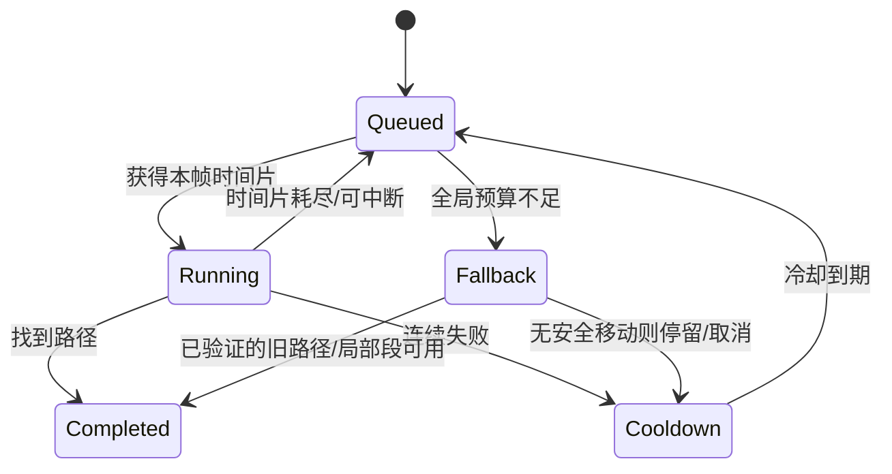

# 11-AI与寻路时间预算

> 知识基线：AI Tick 预算（决策/移动/寻路分层）、分帧更新（staggered update）、可中断寻路、优先级调度、降级阶梯；性能证据复用 [Evidence · astar](../../../evidence/algorithms/astar/README.md) 与 [Evidence · tick-scheduler](../../../evidence/server/tick-scheduler/README.md)。
> 版本基准：服务器 Tick 20Hz 示例；预算数值需按项目实测校准。
> 适用范围：MMO/实时服务器的 AI 系统与寻路服务；与 [01-ServerMainLoop与TickScheduler](01-ServerMainLoop与TickScheduler.md) 的预算表、[03-Entity生命周期与组件模型](../世界权威与故障恢复/03-Entity生命周期与组件模型.md) 的实体选择配合。
> 官方参考：[cppreference - std::chrono](https://en.cppreference.com/w/cpp/chrono)、[UE5.8 AI 文档](https://dev.epicgames.com/documentation/en-us/unreal-engine/artificial-intelligence-in-unreal-engine)。
> 最后更新：2026-10-04（保留分片/排队/结果有效性合同；撤回旧缓存伪测量，接入新本地A*/LRU证据）。
> 知识成熟度：L2（整篇）。完整AI调度、UE/Detour集成与生产容量尚未验收，局部实验不能代表整篇等级。第5.1的本地A*/LRU测试与第4.3队列模型分别列明实际运行范围；历史Tick模型有缺陷，不能当CPU容量证据。verified保持空。

## 1. 概述

AI 是服务器 CPU 的隐形大头：成百上千个 Bot/NPC 每 Tick 都要决策、寻路、移动。不做预算管理时，AI 消耗会随实体数线性增长，**在玩家人数峰值与开服活动时吃掉整个 Tick 预算**。时间预算的本质是：

```text
预算 + 有界入队 + 分片/降级 + 过期结果丢弃 = 可测量并可约束的调度策略
// 不是严格时间上界或 P99 达标的自动证明
```

本文回答：

1. AI 开销为什么必须分层预算（决策/移动/寻路）？
2. 寻路怎么做"可中断 + 时间片"（预算内搜不完怎么办）？
3. Staggered Update 与优先级怎么分配？
4. 过载时降级阶梯怎么设计？
5. 本机实验能证明什么（A* P99 与 Tick 过载）？

## 2. 核心概念

| 术语 | 中文 | 一句话定义 |
| --- | --- | --- |
| AI budget | AI 预算 | 每 Tick 的目标资源配额；硬上界还需要可抢占性/最坏耗时证明 |
| Decision rate | 决策频率 | 选目标/切状态的频率（常低于 Tick 频率） |
| Staggered update | 分帧更新 | 实体分批决策/移动，摊薄到多 Tick |
| Path query budget | 寻路预算 | 每次寻路允许消耗的时间片 |
| Interruptible search | 可中断搜索 | A* 支持"搜一半暂停，下 Tick 续搜" |
| Priority scheduling | 优先级调度 | 玩家附近/战斗中的实体先获得预算 |
| Degradation ladder | 降级阶梯 | 超预算时按影响从低到高逐级降级 |
| Cache + fallback | 缓存与回退 | 路径缓存命中省搜索；失败/超时选择已验证旧路径、停留或受约束局部移动 |
| Search suspension | 搜索挂起 | A* 预算用尽时保存状态，下 Tick 续搜 |
| Priority bucket | 优先级分桶 | 按距离/重要性分档排序，避免热路径全排序 |

## 3. 原理详解

### 3.1 三层频率与三层预算

```text
决策层（5~10Hz）：选目标、切状态 —— 每 Tick 只处理 1/4~1/2 的实体（分帧）
移动层（20Hz）：沿路径推进 —— 轻量，只读路径
寻路层（按需）：目标变化才搜 —— 单次查询是重头，必须时间片化
```

每层独立预算片，超时各自降级：

| 层 | 预算占比（示意） | 超时降级 |
| --- | ---: | --- |
| 决策 | 40% | 决策频率减半（5Hz→2.5Hz） |
| 移动 | 20% | 暂停非战斗移动（原地等待） |
| 寻路 | 40% | 预算收缩、缓存优先、失败冷却 |

### 3.2 可中断寻路与时间片

A* 可以改造成可续搜，但不是在任意指令点暂停：在算法维护不变量的检查点，保留 open/closed、代价、父链及输入版本后让出执行权。每 N 次展开检查时钟只能实现协作式预算，若一次展开、分配或锁等待很慢，仍可能超支。

```cpp
// 示意：时间片式 A* 展开
while (!open.empty()) {
    if (++expanded % kCheckEvery == 0 && elapsed() > budgetUs) {
        return SearchStatus::Suspended;   // 下 Tick 续搜（保存状态）或降级
    }
    Node cur = pop();
    // ... 展开邻居
}
```

工程选择：

- **小地图/短路径**：是否可一次搜完需按目标场景预算实测，尺寸不能代替拓扑/可达性；本次100×100固定地图的堆搜索单查询P99约0.689ms/0.755ms，不能沿用旧“小于0.2ms”的概括；
- **大地图/长路径**：续搜（保存状态）或"部分路径 + 下 Tick 重规划"——部分路径对移动系统更友好；
- **安全保底**：预算内没结果不证明直线可走；先验证旧路径/局部移动仍满足半径、地形、动态碰撞与版本约束，否则停留或取消。记录降级原因并冷却重试，不能以穿墙换取“及时完成”。

### 3.3 Staggered Update 与优先级

```text
每 Tick 只更新 1/K 的实体（K=决策周期/Tick 周期）
顺序：玩家附近 → 战斗中 → 视野内 → 远距/非关键
```

优先级排序的代价必须可控：用"分桶 + 近似排序"（如按距离分档），是否全量排序取决于规模和测量；可用分桶/增量队列降低开销，不把 O(n log n) 本身当不可接受的证据。

### 3.4 缓存与失败冷却

- **路径缓存**：命中减少重搜，但查找、LRU touch、复制/消费与miss装填都有成本。旧“0.001ms、33倍”来自程序常数，已撤回；总体命中率由真实请求分布决定，见第5.1节；
- **失败冷却**：不可达目标指数退避重试，避免每 Tick 空转；
- **缓存失效**：地图版本变化整体失效（见 [07-假人AI完整链路](../../06-游戏AI/战斗战术与机器人/07-假人AI完整链路.md) 的验证矩阵）。

缓存键至少区分起终区域、导航版本、agent profile（半径/高度/能力）及过滤/代价策略。量化起点可提高命中，却不能保证缓存路径第一段可从当前位置接入；复用前校验接入段和剩余走廊。动态危险/门状态需另有失效机制；LRU 限制条数之外还要限制节点/字节总量，128~1024 只是示例配置。

### 3.5 降级阶梯（过载时）

```text
第 1 级：AI 决策降频（5Hz→2.5Hz）            —— 影响小，恢复快
第 2 级：寻路预算收缩 + 缓存优先             —— 路径质量略降
第 3 级：非玩家实体 Update 降频（AOI 联动）   —— 视觉表现降级
第 4 级：暂停非关键 Bot（战斗外 NPC 挂起）    —— 保玩家体验
```

每级降级都有恢复条件（**滞回**：如 P99 连续 30s 低于预算 70% 才升回上一级），防止抖动。

### 3.6 与 Tick 预算表的联动

AI/寻路预算写进 [01-ServerMainLoop与TickScheduler](01-ServerMainLoop与TickScheduler.md) 的预算表（按 P99 签）：示例 20Hz 下 AI 总预算 5ms（决策 2ms、移动 1ms、寻路 2ms），若假设目标项目另测得单查询 P99 0.2ms（不是本次实验值），2ms/0.2ms=10 只能给出初始试验批量，不能保证每 Tick 10 次均在2ms内。队列、初始化、结果提取、缓存和合并成本也要计入；最终看批次总耗时与排队时延的实测分布。

### 3.7 与假人 AI 链路的衔接

预算机制与 [系统实战/07-假人AI完整链路](../../06-游戏AI/战斗战术与机器人/07-假人AI完整链路.md) 的对应关系：

| 链路环节 | 预算机制 | 对应章节 |
| --- | --- | --- |
| 决策（5~10Hz） | 分帧更新 + 优先级分桶 | 本文 3.3 |
| A* 请求 | 可中断寻路 + 时间片 | 本文 3.2 |
| 路径缓存 | LRU + 地图版本失效 | 本文 3.4 |
| 移动执行 | 有独立移动预算；碰撞/避障与路径有效性检查不能算零成本 | 本文 3.1 |
| 过载降级 | 四级阶梯（决策降频→寻路收缩→Update 降频→暂停非关键） | 本文 3.5 |

机器人压测（[游戏测试与质量 07](<../../08-工程实践与质量/测试策略与自动化/07-UE%20DS机器人压测与容量评估.md>)）应同时观测"预算占用"：压测报告里的 Tick P99 要拆出 AI/寻路部分，才能判断容量拐点是 AI 还是网络。

### 3.8 四种预算，必须写清单位与计量范围

| 限制 | 单位/时钟 | 解决的问题 | 不保证的事情 |
| --- | --- | --- | --- |
| Tick AI 配额 | 微秒，单调时钟 | 游戏线程在AI阶段花了多久 | 工作线程总CPU、外部锁等待可被抢占 |
| 搜索工作配额 | 展开次数/迭代数 | 一次让出前最多做多少算法步 | 每步等耗时或固定墙钟时间 |
| 请求deadline | 逻辑tick或单调时刻，协议中固定一种 | 结果超过多久已无业务价值 | 到期瞬间运行线程已停止 |
| 队列与内存上限 | 请求数、节点数、字节 | 限制积压和资源占用 | 平均等待满足SLO或低优先级无饥饿 |

C++计时通常采用 [steady_clock](https://eel.is/c%2B%2Bdraft/time.clock.steady)计量经过时间，不用可校时的墙上时间决定预算；其单调性不意味着定时检查可以抢占长函数。成本统计要覆盖准入、初始化、展开、结果提取/复制、验证和回收，别只围住最显眼的搜索循环。

若每N步才检查耗时，则可能额外执行一段N步工作；即便每步检查，也可能被单步长尾超出目标。硬实时需要更强的最坏成本、抢占和平台保证，本文提供的是协作式预算。

#### Detour sliced 查询的真实边界

[dtNavMeshQuery 官方 API](https://recastnav.com/classdtNavMeshQuery.html)给出 init → update → finalize 生命周期；`updateSlicedFindPath(maxIter, doneIters)` 的预算单位是迭代次数。它不是“给2ms就严格在2ms内返回”的接口。一个正在进行的 sliced 查询占用查询对象内部状态，不能把多个任务随意交替 init 到同一对象上当成独立协程；为活跃搜索分配独立上下文，或按该库的队列方式串行拥有它。

[DetourStatus](https://recastnav.com/DetourStatus_8h_source.html)同时有主状态和detail位：`DT_IN_PROGRESS`、`DT_SUCCESS`、`DT_FAILURE`与`DT_PARTIAL_RESULT`、`DT_OUT_OF_NODES`、`DT_BUFFER_TOO_SMALL`不能压缩成一个bool。最终要结合目标poly、路径长度、detail位和业务政策区分完整到达、部分路径、容量截断与失败。`finalizeSlicedFindPathPartial`针对已有路径的已探索部分，不等于任意未完成搜索都能生成可直接走的安全直线。

导航输入的生命周期和并发访问策略是调用者责任；Tile/过滤器/agent profile在搜索期间变化，应使用快照或同步协议，不只在事后看一下版本号就假设内存访问安全。算法与polyRef细节继续读[NavMesh工程](../../02-数学与游戏算法/路径搜索与导航/03-NavMesh工程Recast与Detour.md)，本页只维护调度合同。

### 3.9 准入、过期、公平性和结果提交

排队系统不能用“本Tick没空就下Tick”作为完整设计。若持续到达工作量大于完成量，积压会无界增长；优先级只能决定谁先等，不能创造CPU。

推荐为每个请求记录：

```text
RequestId / EntityId + Generation / GoalRevision
NavRevision / AgentProfileRevision / FilterRevision
EnqueuedTick / DeadlineTick / PriorityClass / EstimatedWork
```

这些字段是不同不变量，不是随便加一个版本号：实体代次防ID复用，目标版本防换目标后旧路径覆盖，导航/策略版本防环境或能力改变，deadline防“仍正确但已无用”的结果。起点漂移还要根据当前位置重新接入/验证，不能以版本一致替代几何检查。

1. **准入**：全局/分优先级限额；同实体连续目标变化可合并最新请求，拒绝时返回可观测原因。设每请求节点和结果大小上限，清理操作本身也要有预算。
2. **执行**：在算法安全点让出；按份额轮转/老化而非让持续高优先级无限占满。关键类可预留份额，保底类也要有可测等待政策。
3. **取消**：将旧请求标记不再接纳，但等待线程安全退出后才回收其上下文。取消请求与取消成功是两件事。
4. **提交**：在世界线程的确定边界重新检查对象代次、目标/导航/策略版本、deadline、路径状态与接入条件。丢弃过期结果是正确行为，应计入浪费工作而不是偷偷降低请求统计。

分片时间、完成时间与接纳帧分开记录。固定随机种子不能固定线程竞态或墙钟截止；若玩法需要确定回放，可固定工作单元配额、稳定tie-break和接纳顺序，或把外部完成事件记录为回放输入。不得为了强行有序提交而让主线程无限等待慢任务。

### 3.10 从分位数到端到端指标

单请求耗时X的P99=x，只描述该分布约99%的样本不超过x。即使n次查询互相独立，“所有查询都不超过x”的概率也是约`0.99^n`；n=100时约36.6%，并非99%。这个计算不直接等于批次总耗时的超限概率，只用于反驳“每项P99可当每项硬上限”。相关地图/缓存长尾会进一步破坏独立假设。

除分层CPU直方图，再记录：

- admitted/rejected/coalesced、队列长度、最老请求年龄与每优先级等待分位数
- 执行耗时与端到端延迟分别统计，不用快速拒绝混低成功请求的P99
- complete/partial/no-path、deadline-expired、goal/nav/entity-stale，各原因分开
- 计算完成但提交被丢弃的工作量、每请求节点峰值、结果合并/回收耗时
- 有效提交吞吐与玩法指标（到达率、停留时长、关键响应时延），防止CPU降下来只是AI都没做事

## 4. 示例：预算监控与降级状态机

```cpp
struct AiBudget {
    double decideUs, moveUs, pathUs;   // 各层本 Tick 已用
    int    decideRateHz = 5;           // 当前决策频率（可降级）
    bool   pathCacheOnly = false;      // 第 2 级：只用缓存路径
    bool   suspendNonCritical = false; // 第 4 级
};

// 每 Tick 结束：更新预算统计并判定降级/恢复（示意）
void UpdateBudgetState(AiBudget& b, double tickP99Us, double budgetUs) {
    if (tickP99Us > budgetUs * 0.9) {
        b.decideRateHz = std::max(1, b.decideRateHz / 2);   // 第 1 级
        if (b.decideRateHz <= 2) b.pathCacheOnly = true;    // 第 2 级
    } else if (tickP99Us < budgetUs * 0.7 && steady30s) {
        // 恢复（滞回）：逐级回升
    }
}
```

### 4.1 预算监控字段

```text
ai_budget_decision_p99_us     # 决策层 P99
ai_budget_move_p99_us         # 移动层 P99
ai_budget_path_p99_us         # 寻路层 P99
path_query_count              # 每 Tick 查询数
path_timeout_count            # 超时（未搜完）次数
path_cache_hit_rate           # 缓存命中率
ai_degrade_level              # 当前降级等级（0~4）
```

告警：`path_timeout_count` 连续上升 = 预算不足；`path_cache_hit_rate` 骤降 = 缓存失效/负载模式变化；`ai_degrade_level ≥ 2` 持续 = 需要扩容或调参。

### 4.2 决策分帧示例

```cpp
// 每 Tick 只决策 1/K 的实体（K = 决策周期）
const int kDecideEveryTick = 4;   // 20Hz Tick 下 5Hz 决策
for (size_t i = tickIndex % kDecideEveryTick; i < bots.size(); i += kDecideEveryTick) {
    Decide(bots[i], tickIndex);   // 决策只改目标点/行为，不占寻路预算
}
```

分帧 + 优先级分桶的组合：先按距离分桶（近/中/远），每 Tick 从高到低消耗预算片；预算耗尽即停，下 Tick 继续。

### 4.3 可运行的工作单元队列模型（C++11）

以下独立单线程模型验证有界入队、轮转工作配额、deadline与过期结果拒绝。它不运行A*或Detour，不包含墙钟/锁/分配耗时，不证明2ms配额或生产无饥饿。`remaining`代表可安全让出的一步，生产需要真实搜索上下文及明确内存预算。

```cpp
#include <cassert>
#include <cstdint>
#include <deque>
#include <map>
#include <vector>
#include <iostream>

struct State { std::uint64_t generation, goal; };
struct Job {
    int entity;
    std::uint64_t generation, goal, nav, deadlineTick;
    unsigned remaining; // 模型工作单元，不是微秒/实际A*节点成本
};
struct Queue {
    std::deque<Job> jobs;
    std::map<int, State> current; // 单线程持有；此示例不模拟并发删除
    std::vector<int> applied;
    std::uint64_t nav = 1;
    unsigned stale = 0, expired = 0;
    std::size_t capacity;
    explicit Queue(std::size_t cap) : capacity(cap) {}
    bool submit(Job j) {
        if (jobs.size() >= capacity || j.remaining == 0) return false;
        jobs.push_back(j); return true;
    }
    bool valid(const Job& j) const {
        const auto it = current.find(j.entity);
        return it != current.end() && it->second.generation == j.generation
            && it->second.goal == j.goal && nav == j.nav;
    }
    unsigned pump(std::uint64_t nowTick, unsigned workBudget) {
        unsigned used = 0;
        while (!jobs.empty() && used < workBudget) {
            Job j=jobs.front(); jobs.pop_front();
            if (nowTick >= j.deadlineTick) { ++expired; continue; }
            if (!valid(j)) { ++stale; continue; }
            --j.remaining; ++used; // 每次只执行一个模型步，再回到队尾
            if (j.remaining) jobs.push_back(j);
            else if (valid(j)) applied.push_back(j.entity);
        }
        // 无外部并发入队时：每轮要么消耗工作额度，要么删除一个任务，故终止。
        return used;
    }
};
int main() {
    Queue q(2); q.current[1]={7,1}; q.current[2]={4,1};
    assert(q.submit({1,7,1,1,10,3}));
    assert(q.submit({2,4,1,1,10,1}));
    assert(!q.submit({3,1,1,1,10,1})); // 队列有界
    assert(q.pump(0,2)==2);
    assert(q.applied.size()==1 && q.applied[0]==2); // 长任务不能独占轮转
    assert(q.jobs.size()==1 && q.jobs[0].remaining==2);
    q.current[1].goal=2;
    assert(q.pump(1,2)==0 && q.stale==1); // 目标变化，旧任务不提交
    assert(q.submit({1,7,2,1,2,1}));
    assert(q.pump(2,1)==0 && q.expired==1); // deadline为开区间上界
    assert(q.submit({1,7,2,1,10,1})); q.current[1].generation=8;
    assert(q.pump(3,1)==0 && q.stale==2); // ID复用
    assert(q.submit({1,8,2,1,10,1})); ++q.nav;
    assert(q.pump(4,1)==0 && q.stale==3); // 导航版本变化
    assert(q.submit({1,8,2,2,10,1}));
    assert(q.pump(5,0)==0 && q.jobs.size()==1); // 无工作预算不推进
    q.current.erase(1);
    assert(q.pump(6,1)==0 && q.stale==4); // 实体删除
    assert(q.applied.size()==1); // 只有实体2的结果曾提交
    assert(!q.submit({2,4,1,2,10,0})); // 非法空工作
    assert(40u*20u/5u == 160u); // 每秒量纲换算
    std::cout << "PASS: 19 queue/capacity assertions\n";
}
```

```bash
g++ -std=c++11 -Wall -Wextra -Werror -pedantic ai_budget_queue.cpp -o ai_budget_queue
./ai_budget_queue
g++ -std=c++11 -Wall -Wextra -Werror -pedantic -fsanitize=undefined -fno-sanitize-recover=all ai_budget_queue.cpp -o ai_budget_queue_ubsan
./ai_budget_queue_ubsan
```

模型没有代次回绕处理，要求测试期间ID代次/版本不回绕；生产应采用足够宽的版本与生命周期策略。`workBudget=0`时也不清理过期任务，真实服务应另给维护配额。无效项扫描最多清理当前有界队列，但仍有CPU成本，不能把`used==0`说成“没有花时间”。应用结果前还须做本页3.9的profile/filter与几何验证，示例为篇幅只模拟其中三类版本。

## 5. 实验结果与结论（复用本机证据）

### 5.1 A*/LRU：有效证据与预算边界

旧Windows报告的缓存命中0.001ms是源码填入的常数，没有真正计时、返回路径或更新recency；“33倍”即便限定在重复子集也不是测量。旧扩展倍率还存在格式参数类型错误。原始文件和历史日志保留不改，说明与新入口见[实验修订](../../../evidence/algorithms/astar/README.md)。

局部A*/LRU子项已有L4测试/基准证据，但不提升整篇等级。新实验用独立Bellman-Ford核验小图，两种OPEN实现都要通过完整路径校验；真正LRU另测touch、覆盖、负结果、epoch/profile与独立返回，取消touch的负对照确实失败。它不再以“两种A*一致”证明最优，不再要求缓存必快10倍。

性能组为固定100×100静态网格、Octile、正交1/对角√2、禁止穿角；GCC14.2.0/C++17、Linux、5轮。旧组允许穿角，不能与新组混成A/B。新数据分成单查询search/cold-fill，以及warm/mixed每32次批均值；后者的P99不能称单查询P99。

| 观测（25%障碍阈值组） | 无缓存 / 缓存，加权均值μs | 对预算的含义 |
| --- | ---: | --- |
| cold-fill，64个不同key | 113.368 / 114.953 | 首次装填可能更慢，必须算miss成本 |
| warm-hit，64-key预热热点 | 125.059 / 0.169 | 人工100%命中不能当真实请求分布 |
| mixed-pressure，256-key池/容量128 | 121.075 / 51.662 | 总体命中57.3%，安排重复子集100%，分母必须分开 |

[原始样本](../../../evidence/algorithms/astar/results/astar-measurement-2026-10-04/samples.csv.gz)保存请求坐标、时长、操作数、命中、路径长度、found/unreachable和展开统计；[summary](../../../evidence/algorithms/astar/results/astar-measurement-2026-10-04/summary.json)注明单查询/批均值与每轮总量。空时钟对最小正观测20ns不代表纳秒精度保证；无CPU隔离/亲和/锁频，本机数据不是跨机器固定倍率。

这些实验回答“静态网格查询/缓存调用花了什么成本”，尚未覆盖准入、排队、分片调度、线程切换、接纳拒绝、碰撞/AOI与真实网络。2ms除以某个单查询P99最多产生待压测的候选批量，不能给安全容量上限；必须测整批/整Tick及deadline完成率。

### 5.2 Tick 过载模拟（evidence/server/tick-scheduler）

| 场景 | ticks | drops | catch | 意义 |
| --- | ---: | ---: | ---: | ---: |
| 10000 实体，frameLoad 1.3，catch-up | 7800 | 0 | 1800 | catch是执行多于一次Tick的外层迭代数，不是额外Tick总数 |
| 10000 实体，frameLoad 1.3，drop | 6000 | 1500 | 0 | drops计清空累积时间的事件数，不是丢弃Tick数或实测CPU过载 |

这张表保留历史输出数值，但源码语义有三个限制：`catchUps`只在外层迭代结束时遇到`executed > 1`加一，不能作为额外Tick总数；`if (++executed > maxCatchUp)`在限制3时可先执行到4次，有off-by-one缺陷；`cost = entities × workPerEntityUs × jitter`只进入成本数组，不推进模拟时钟，因此加大实体成本不会反馈积压。`frameLoad`改变外部流逝量，不能直接叫CPU负载倍率。

所以这是存在已知缺陷的60Hz策略模型，既不是真实AI负载，也未闭合“工作耗时→落后→追帧/丢弃”的因果。实现修复留给单独Tick实验批次，本页不能从这些数推导容量、时间膨胀量或自愈能力。

对预算设计的量化含义（以 20Hz、AI 预算 5ms 为例）：

```text
决策层：2ms ÷ 0.05ms/次 = 40 次/Tick
        40 × 20 Tick/s ÷ 5 次/(实体·s) = 160 实体（未计开销）
        2000 实体 × 5Hz ÷ 20Hz = 500 次/Tick，即25ms/Tick，超出2ms配额
寻路层：2ms ÷ 实测候选成本，仅用于选起始压测批量；直接测批次总耗时及排队/过期
移动层：1ms 是目标配额；能覆盖多少实体需计入碰撞/避障/失效处理后测量
```

这些单位换算排除明显不可行方案，但不产生性能保证。各层共享CPU/cache/锁，独立P99相加也不等于总体P99。

注意：地图规模、拓扑、可达比例、目标距离与启发/tie-break都会改变分布；更大地图不自动决定某个固定倍率。上线前用目标地图与请求混合重跑。

## 6. 最佳实践

1. **三层独立预算**：决策/移动/寻路各占时间片，在安全点让出；共享CPU/cache/锁仍可能相互影响。
2. **寻路可中断 + 保底**：预算片展开、超时续搜/验证后的部分路径；记录单步长尾，协作式检查不能承诺Tick绝不超时。
3. **分帧更新**：决策 5~10Hz + 分桶优先级，热路径不做全量排序。
4. **缓存优先**：LRU 路径缓存 + 地图版本失效；命中率进监控。
5. **失败冷却**：不可达指数退避，防空转。
6. **降级阶梯 + 滞回恢复**：四级降级明确触发/恢复条件，防抖动。
7. **按批次和端到端验证预算**：单查询分位数只作初估；同时测 Tick AI 总耗时、排队时延与有效结果吞吐。
8. **监控三件套**：各层预算占用 P99、寻路超时/失败计数、缓存命中率。
9. **确定性**：固定随机种子之外，还须固定输入快照、排序/tie-break、预算工作单元与结果接纳顺序；墙钟截止和线程完成先后会改变结果可见帧，需记录或规范化。
10. **预算参数配置化**：决策频率/预算片/降级阈值进配置表，压测扫参后定稿，不写死。
11. **降级可观测**：每次降级/恢复记录时间、等级、触发指标（P99/lag），复盘时能还原因果。
12. **先保玩家再保 AI**：预算分配玩家相关 AI 优先；纯装饰 NPC 是最先降级对象。
13. **分帧 + 分桶组合**：决策按 Tick 取模分帧，优先级按距离分桶，预算片从高到低消费。
14. **参数与代码分离**：决策频率/预算/阈值全进配置，压测扫参定稿。

## 7. FAQ

**Q1：预算片内 A* 没搜完，返回部分路径安全吗？**
不自动安全。先区分算法合法的部分走廊与被截断/过期数据，验证可走段与局部碰撞，并给终点明确“等待/重规划”语义；不要把部分结果当目标已达成。

**Q2：分帧更新会让人看到"AI 卡顿"吗？**
决策频率5Hz是否足够取决于玩法，必须测反应时间与事件触发路径；移动层仍然每 Tick 执行（读路径推进），视觉上连续。决策与移动同时被跳过是可能原因之一，网络抖动、路径重规划、碰撞和帧耗时尖峰也可能造成卡顿。

**Q3：缓存命中率多少算健康？**
没有通用健康百分比；重复目标、起点变化、地图版本和agent profile都会影响。命中率低时检查缓存键设计（是否包含起点精度/地图版本）。

**Q4：多线程寻路能替代预算吗？**
不能替代。线程池可能增加吞吐，也会争抢CPU/cache/锁；提交、队列、执行、完成合并都要有界。预算不是严格时间确定性的证明，Tick边界还须拒绝过期结果。

**Q5：降级阶梯会不会影响玩法公平？**
可能影响。关键请求若持续超过服务能力，最高优先级也会排队；需预留份额、准入限制与玩法认可的失败策略，不能保证靠优先级免除公平性取舍。

**Q6：预算监控的粒度多大合适？**
按层聚合耗时之外，还要有队列长度/最老年龄、拒绝/过期/失效原因、有效结果率。逐请求可采样而不是全量常开，避免只看CPU变低却漏掉大量请求被饿死。

**Q7：本机基准能直接用于容量规划吗？**
可给出带单位的初估（单查询参考耗时 × 查询数），但P99不是均值/最坏值；真实容量用批次与端到端机器人压测校准（关联 [游戏测试与质量](../../../00_Index/学习路线/工程实践与质量.md) 07）。

**Q8：预算内"每 Tick 最多 10 次查询"，但请求有 50 个怎么办？**
先判断突发还是持续超载：只有有限50请求且后续无新增、每Tick确能完成10个时，才有5Tick的理想清空时间。持续每Tick到50个会净增40，必须限制队列、合并过期目标、拒绝或降级；排队不是容量来源。

**Q9：续搜（Suspended）状态存哪里？**
保存在拥有该次搜索状态的请求/查询上下文中，实体销毁或目标/导航版本变化时使请求失效。工作线程仍可能在运行，取消标志不等于已停止；资源释放必须等待安全所有权交接，最终结果仍需验证代次。

**Q10：降级后玩家体验真的无感吗？**
第1、2级也可能改变攻击反应和到达时间，应以玩法指标实测；第 3 级（远处 NPC 更新降频）在视觉上可察觉；第 4 级（暂停非关键 NPC）明显但保住了玩家战斗。设计目标：日常峰值只到第 1~2 级。

**Q11：预算表和实际 CPU 时间对不上怎么办？**
预算表是目标分配，实测需核对同一范围、窗口与计量口径。偏差20%可作示例调查阈值，并不能自动证明某系统超支；先区分请求量变化、计量差异、分配/GC/锁等因素，再测批次与队列，不直接放宽预算掩盖原因。

**Q12：寻路查询的排队会影响玩家体验吗？**
会。玩家相关请求也可能超出预留份额；设置业务deadline、队列上限、配额和过载响应。低优先级采用老化或保底份额并测等待上界，不要声称排序本身保证无饥饿。

**Q13：决策分帧的取模起点会带来"同帧决策聚集"吗？**
取模只平摊稳定数组的索引数量，不能平摊每个实体的实际成本；数组删除/重排还会改变相位。可用稳定实体ID分槽并限制每槽工作，但仍需测战斗热点、集中Spawn与高成本任务。

## 8. 验证与基准

- A*/LRU复测：`python3 -B evidence/algorithms/astar/scripts/run_benchmark.py --output-dir <尚不存在的新目录>`；Windows入口需显式OutputDirectory，旧结果不会覆盖。历史Tick模型的运行边界另见其Evidence，不能与本次CPU观测混称；
- 预算验收：100/1000/10000 Bot 场景下各层预算 P99 占用 ≤ 预算表，且无连续 drop；
- 降级验收：过载注入（实体数翻倍）后 30s 内降级生效、P99 回落、恢复无抖动；
- 确定性验收：固定输入/导航版本、工作单元配额、排序与接纳顺序，再比较扩展节点/路径/事件；墙钟预算运行应记录实际完成/接纳帧，不能只固定种子；
- 队列验收：请求积压按优先级正确排序、无饥饿（低优先级不永久等待）；
- 降级恢复验收：过载注入后等级上升、恢复后逐级回落（滞回参数验证）；
- 容量模型验收：记录候选批量下实际总耗时、超支率与端到端等待；阈值由SLO定义，不拿P99除法当硬上限；
- 缓存键验收：总体/重复子集命中率分开，地图版本切换后旧epoch的key不得命中；新epoch重新装填后可正常命中；
- 升级 L5：取得真实项目 AI 预算数据（分层 P99、超时计数、降级事件）与可归因复盘，新增对应日期记录；不回填或改写历史日志原件。

### 8.1 本轮增量的验证矩阵

| 场景 | 输入/故障 | 接受标准 |
| --- | --- | --- |
| 容量单位 | 20Hz Tick、5Hz决策、40次/Tick | 理论160实体；2000实体会要求500次/Tick，不偷换单位 |
| 持续过载 | 到达量长期超过完成量 | 队列/节点内存有界，有拒绝/合并原因，未完成请求不假报成功 |
| 分片长尾 | 某一步异常慢、finalize结果很大 | 记录超支；说明协作式检查不能抢占该步，不宣称硬截止 |
| 结果有效性 | 重生、换目标、Nav更新、实体删除 | 旧结果不覆盖新状态，浪费工作计数可解释 |
| 公平与取消 | 高优先级持续到达，低优先级有deadline | 按配额/老化策略测最老年龄；超时显式终止；取消后不提前释放在用上下文 |
| 可回放 | 同输入不同线程完成次序/墙钟抖动 | 固定接纳规则或记录外部完成事件；仅种子相同不算通过 |

2026-10-01 新增的可执行证据只覆盖4.3模型断言与UBSan，旧A*/Tick输出未重新生成；Detour集成、真实导航快照并发、目标硬件吞吐与机器人压测仍待执行。2026-10-04另新增第5.1的A*/LRU功能与实际测量，范围仍不推广到完整AI调度或新增协议。

### 8.2 预算健康度速查

```text
单查询P99上升？      → 成本/负载变化假设，需联看批次耗时、队列与有效吞吐后诊断容量
决策 P99 超预算？   → 联看请求量、单实体成本、共享锁/CPU与分帧分布，再试配额/降频
缓存命中率下降？    → 无通用30%阈值；区分总体/重复子集、冷启动、失效、容量与输入分布
timeout_count 上升？→ 区分排队到期/搜索未完成；核对预算、地图可达性、请求突发与单步长尾
降级频繁抖动？      → 检查统计窗口、输入波动、恢复政策与滞回；通过注入/恢复实验定位
```

## 9. 关联阅读

- [01-ServerMainLoop与TickScheduler](01-ServerMainLoop与TickScheduler.md)：预算表与过载策略。
- [07-假人AI完整链路](../../06-游戏AI/战斗战术与机器人/07-假人AI完整链路.md)：Bot 的决策-寻路-移动全链路。
- [05-AOI与InterestManagement](../状态复制与兴趣管理/05-AOI与InterestManagement.md)：AI 移动的同步出口。
- [游戏算法/01-寻路与图论](../../../00_Index/学习路线/数学与游戏算法.md)：A*/JPS/HPA 算法层。
- [游戏AI/02-移动学习与服务端](../../../00_Index/学习路线/游戏AI.md)：服务端 AI 工程。
- [游戏算法/01-寻路与图论/02-A星算法与优化](../../02-数学与游戏算法/路径搜索与导航/02-A星算法与优化.md)：A* 优化的算法细节。
- [游戏AI/02-移动学习与服务端/04-服务端AI与性能.md](../../06-游戏AI/评测安全与运行预算/04-服务端AI与性能.md)：AI 归属与预算的 AI 域视角（预算机制口径以本篇为准）。
- [系统实战/07-假人AI完整链路](../../06-游戏AI/战斗战术与机器人/07-假人AI完整链路.md)：预算机制的端到端应用。
- [02-Timer时间轮与延迟任务](02-Timer时间轮与延迟任务.md)：延迟任务与预算片的协同。
- [游戏测试与质量/03-服务端测试与机器人压测](../../08-工程实践与质量/测试策略与自动化/03-服务端测试与机器人压测.md)：预算相关压测方法。
## 状态图：寻路时间片与降级阶梯



寻路任务按优先级分批获得可中断时间片；预算不足时仅复用验证仍有效的路径或采用显式停留/取消策略，失败任务进入冷却，防止重试风暴挤占 Tick。
