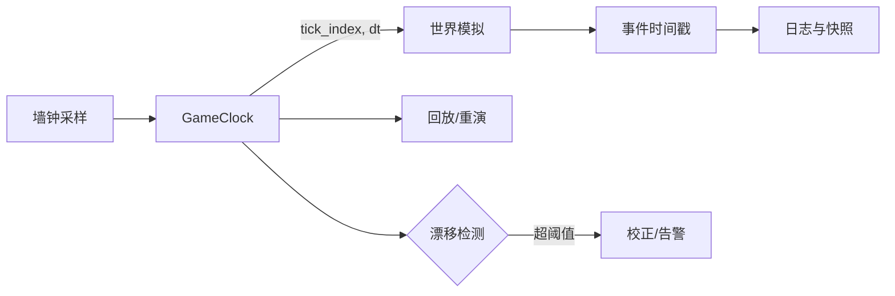

# 12-世界时间确定性与GameClock

> 知识成熟度：L2。2026-10-09 静态核对一手资料并修订教学；`verified: []`。文中的协议是明确题设下的伪代码，所有数值追踪均为 PAPER_EXPECTED 纸面推导，未运行目标程序、模型、C++ 编译、UE、并发、迁移、网络、故障或性能实验。
> 最后更新：2026-10-09（时间权威、控制/失败/寿命合同、迁移与来源静态修订）。
> 版本与规范基线：时钟与时长使用 WG21 N3337；原子操作、数据竞争和寿命另用 N4950，二者不混称同一版本。UE 以实际读到的 5.5 官方 API 页为主，5.4 单页补充另标；未读引擎源码。示例世界 20Hz，不是生产容量结论。
> 适用范围：MMO/实时服务端的世界时间权威、维护暂停、调速、冷却/Buff、运营截止、迁移和重连。前置内容见[游戏知识/01-引擎基础](../../../游戏知识/01-引擎基础/README.md)、[01-ServerMainLoop与TickScheduler](01-ServerMainLoop与TickScheduler.md)；恢复基准的完整职责见[13-世界Snapshot与故障恢复](../世界权威与故障恢复/13-世界Snapshot与故障恢复.md)，不由本文代证其落地。
> 原有检索入口仍保留：[cppreference - std::chrono 时钟](https://en.cppreference.com/w/cpp/chrono)、[Epic 文档总入口](https://dev.epicgames.com/documentation/en-us/unreal-engine)。它们用于继续查找，不充当本次具体条款或 UE5.5 API 已核对的证据；精确来源在 GC9。

## GC0 从一次维护暂停理解“现在”

设世界 A 正常运行，玩家还有 100 个 Tick 的技能冷却；运营活动定于某 UTC 时刻结束。维护时暂停世界一分钟，连接和聊天仍服务。恢复后，玩家冷却应继续保有原来的游戏剩余时长，运营活动却可能已经截止。这里需要两种时间政策；把所有系统改读同一个秒数，并不能同时得到这两个结果。

GameClock 的任务是给一个世界提供明确的游戏时间权威：哪个 epoch 中，哪些固定步已经实际提交；暂停或半速怎样影响以后可执行的步；失败后最后确认到哪里。它不替代日历业务，也不单独提供回放、跨服事务或线程安全。本文按以下因果链展开：先辨认时间域，再把单调流逝换成调度额度，然后只在世界步实际提交时推进权威 Tick，最后把完整值快照交给监控和客户端。


图中的“选择”不等于“提交”。选择了两步而第二步失败，只能确认第一步；最后一次采样时间已经接纳，也不能把它再加一次。墙钟影响玩法的路径是经业务决定、接纳和记录形成输入，而非直接把 UTC 的跳变变成模拟 `dt`。

贯穿全文的不变量是：每个 world/epoch 只有一个 owner 提交游戏时间；过去区间按当时倍率结算；一个区间至多接纳一次；已提交步与损失分别记账；FAILED/UNKNOWN 不能通过普通 Resume 复活；迁移实体不重设目标共享 Clock。这些都是本文提出的集成合同，需要真实实现满足，不能从接口名字或引擎设置推定已经存在。

## GC1 五类时间：先问单位、原点和归属

### GC1.1 时刻和时长不是一种量

`TimePoint` 表示某时钟域的一个位置，`Duration` 表示两个可比较位置之间的距离。20Hz 世界的 `5000ms`、进程 P 的单调点 `9000ms`、日志 UTC 看似都可写成整数，却没有共同原点。把前两者裸减成“落后 4 秒”没有意义。

| 时间 | 定义与可用范围 | 典型用途 | 必须声明的边界 |
| --- | --- | --- | --- |
| Wall clock / 墙钟 | 日历或系统 realtime 的时刻；可能被调整 | 日志关联、运营活动真实截止、外部约定时刻 | 使用的 UTC/时区表达和校时政策；不能假定任意 `system_clock` 整数天然就是某纪元 UTC |
| Monotonic clock / 单调钟 | 同源观测点之差用于经过时长 | 外轮间隔、超时、心跳、性能耗时 | 进程/时钟实例的 domain；不是跨机器公共纪元，也不保证线程准时被唤醒 |
| Game time / 游戏时间 | 某 world/epoch 的玩法时长和时刻 | 冷却、Buff、游戏内活动持续 | 世界 owner、暂停/倍率政策、初始基点 |
| Tick time / 固定步时间 | 用已提交步号和本 epoch 固定步长表达游戏时间 | 状态转移、输入归属、回放定位 | 步号不是时长，必须配 h、epoch 和基点 |
| Scheduled business time / 业务时间 | 业务选择的一套到期规则 | 邮件过期、商城刷新、赛季结束 | 是真实截止还是游戏持续；哪些调整、停机或迁移会耗时 |

N3337 对 `steady_clock` 的描述支持不倒退、稳定速率且不可调整；它不提供统一跨机器 epoch、系统休眠细节或调度精度保证。`system_clock` 是系统 realtime 墙钟，`is_steady` 未指定；不能把可能调整的墙钟差直接用于模拟推进。本文不会由“单调”进一步推导“所有平台的秒数完全相同”。

一个可审计的类型合同应至少区分：

```text
GamePoint   = { worldID, epoch, committedTick }
GameDuration= { count, unit }                 // 或精确有理数时长
MonoPoint   = { processClockDomain, count, unit }
MonoDuration= { count, unit }
UtcPoint    = { declaredTimeRepresentation, value }

允许：同 domain/epoch 的 Point - Point -> 对应 Duration
允许：Point + 同语义 Duration -> Point（先查范围）
禁止：GamePoint - MonoPoint；不同进程 MonoPoint 直接相减
跨世界换算：先得到带政策的剩余 Duration，再由目标 owner 生成新 Point
```

这是类型设计示意，不是已编译 C++。只写两个包着 `double` 的 `WorldTime` / `RealTime`，仍不能防止把秒当毫秒、把两台机器的单调点相减或忘记 epoch。N3337 `duration` 的 `count` 与 `ratio` 能表达单位，应用仍须补 world/epoch 标签、显式换算与溢出检查；整数除法舍入也必须是业务选择。

### GC1.2 冷却的最小正例

在 A/epoch7 的已提交 n=100 激活一个 10 步冷却，记录 `ready={A,7,110}`。同 epoch 的 n=106 时，剩余 `max(110−106,0)×50ms=200ms`。暂停期间 n 不变，剩余不耗；半速只让后续提交这些步需要更长现实时间。查询遇到另一个 epoch 时先拒绝裸比较，走恢复/迁移转换，不能对无符号整数直接相减造成下溢。

用真实截止的邮件则记录业务到期时刻，不能为了统一接口偷偷转成 10 个游戏 Tick。评审应检查时间用途，允许业务层按声明读墙钟，也允许调度层测单调间隔；仅按 `chrono` 关键词禁用所有调用会误伤正确边界。

## GC2 固定步、倍率和时间账怎样连起来

### GC2.1 固定的是每个已提交步的时长

在一个固定步 epoch 中：

```text
G(n) = G0 + (n - n0) × h
```

n 是已确认提交的步号，`(G0,n0)` 是本 epoch 的基点，h 是固定步长。改变速率只改变以后有多少调度额度到来，不改 h，不重解释已经提交的 n。若 n=100 对应 G=5000ms，切半速的瞬间仍是 5000ms，下一步提交后才到 5050ms；`n×h×currentSpeed` 会在切半速时错退到 2500ms。

建议保存整数步号、精确单位时长或有理 h，需要显示时再换算，避免把浮点逐帧累加误当精确权威。但整数也会溢出，必须在接纳前检查 n 的增长及乘加结果。频率从 20Hz 改为 10Hz 时，要新建分段/epoch 或提供明确转换，不能用新的 h 解释旧的全部 Tick。换 epoch 也不是清掉欠账或恢复权限的捷径。

调度器只决定“本轮计划尝试几步”。准备候选状态成功还不够，只有状态和对应 Tick 在真实提交边界一起确认，才增加 n。选择 3 步、只确认第 1 步而第 2 步失败，n 只加 1；第 3 步不得继续，未完成输入归恢复责任方。GC3 的专用例子另把每轮上限定为 2，这里是用 3 步展示 selected 与 committed 的概念区别。

### GC2.2 有意半速和过载慢下来，因果不同

选一个共同单调基点 m0，并记录分段有效倍率 s。在理想无损失且不限步的映射中：

```text
G_target(m) = G0 + 各已声明分段的 duration × 当段 rate
policy_gap = G_target(m) - G_committed(m)
```

`G_target` 是政策目标，不是已运行状态。1000ms 现实中有意半速，目标增加 500ms，实际成功 10 个 50ms 步也增加 500ms，此时 policy_gap=0。真实经过时长减游戏推进量为 500ms，只说明政策不同，不能据此判过载。暂停段目标增加 0；恢复先结清旧的 0 倍段，就不会产生暂停债。

要解释落后，至少分开以下量：

| 账项 | 含义 | 不能混充 |
| --- | --- | --- |
| raw elapsed | 同域两次单调观测之差 | 不等于全部都已接纳或应推进游戏 |
| accepted elapsed | 本次允许进入时间映射的原始区间量 | 不代表其游戏额度已提交 |
| fractional phase | 不足一个 h 的已接纳游戏余量 | 正常量化余数，不必是运行过载 |
| retained debt | 已接纳、仍待补的完整步时间 | 与永久丢弃不同，只有实际补做才减少 |
| clamped loss | 输入区间被上限裁掉的游戏时间 | 不能藏进 phase，也不能把暂停 raw clamp 当游戏损失 |
| dropped loss | 已接纳后按政策永久弃掉的完整步时间 | 后续清 accumulator 不会追回它 |
| committed advance | 实际已提交步数 × h | 不能用 planned 或 charged 代替 |
| unresolved Plan | 已接纳但失败/未知而未结清的区间与输入 | 不能硬归入正常余数或成功 drop |

正常闭账时，在统一游戏时间单位中，目标增量加原余量/保债，等于实际提交加新余量/保债以及本次 clamp/drop。失败未收束时则保留独立 Plan，不用成功等式伪造闭账。本文 GC3 选择“成功后只保分数、丢掉完整多余步”，这是一个可手算的策略选择；保债追赶是另一种政策。

### GC2.3 为什么降级后旧差值可能永不归零

取与 [14-运行时背压与过载保护](14-运行时背压与过载保护.md) 一致的账例：20Hz，单轮 cap=1，无输入 clamp。第一轮经过 125ms，实际提交 50ms，永久 drop 50ms，留 phase25ms；下一轮再经过 25ms，余量凑成一步，累计已提交 100ms、外部经过 150ms、phase0，累计永久损失仍为 50ms。

以后每 50ms 只完成正常的一个 50ms 步，差一直是 50ms。降低 AI 开销可以阻止新损失，却没有让历史丢掉的时间重新执行。若选择保留 100ms 债，且未来 100ms 确有余力在正常工作之外成功多提交两步，债才能少 100ms。多做工作的容量前提不能省略，否则追赶本身会压垮系统。

因此 `worldLag` 若保留为监控名，必须标出 domain、共同基点和倍率分段，拆成当前债、分数相位、累计损失及近窗新增损失。单独一个裸差值既不是过载程度，也不证明恢复完成。具体调度策略仍归 [01](01-ServerMainLoop与TickScheduler.md)，本文只接其选择结果并解释真实提交与时间权威。

## GC3 一个可逐步追踪的 owner 协议

### GC3.1 题设、所有者与本地提交前提

下面是协议伪代码，目的是解释控制流、状态变化和失败结果；不是可编译 C++，也不是现成引擎保证。它只有一个 world owner，同一进程单调域，h=50ms。为精确表达半速，定义 1 credit=0.5ms 游戏时间，Q=100credit 为一个 Tick；`rateCode∈{0,1,2}` 分别为暂停、半速、正常。因此正常时 25ms 输入产生 50credit，半速时产生 25credit。

每次观测最多接纳 200ms 原始间隔，每次完整调用最多尝试 cap=2 步；每个真实外轮总预算 B=2。正常成功后只保小于 Q 的分数相位，完整剩余步永久 drop。200ms、2 和倍率集合都是题设常量，不能据此声称满足任何服务器的延迟或容量目标。

| owner 持有的对象 | 必须表达的状态 |
| --- | --- |
| Clock | world/epoch、G0/n0/h、lastConfirmedTick、lastMonotonic 及其 domain、rateCode、fractionalCredits、mappingRevision、snapshotSeq、lifecycle、stateValidity、累计 clamp/drop |
| 世界状态 | 仅 owner 可读写的权威状态，以及按步有身份且有固定顺序的输入 |
| 唯一 IntervalPlan | planID、oldM/sampleM、oldRate/oldPhase、raw/accepted/clamp、输入 credit、planned、各步输入身份、committed、remaining、unknown 标记 |
| 当前 RoundBudget | world/epoch、roundID、remaining=2、closed、callInProgress、已计费 charged |
| 唯一控制槽 | 排队或正在选择的一个 requestID、world/epoch、expected revision、目标 rate、权限身份、取消状态、原有限 deadline |
| 发布槽与记录 | 小的完整纯值快照；区间终态槽；控制安装的事件/快照槽，容量有界且接纳前预留 |

本例额外要求：候选步准备不改变权威状态，也不产生外部效果；准备成功后，本地提交在 owner 串行边界一起更新私有 state、Tick 和 Plan，不再分配内存或调用用户/网络代码。值快照的短发布段在已取得的共同 mutex 内，给预先准备的固定大小值槽赋值，不再分配或外调。SetRate 安装同样预先准备完整 Clock、控制事件和快照，再在一个本地边界提交。

这些要求不是“调用 Commit 就自动原子”。真实项目若有外部副作用、可失败的存储或无法保证本地发布段，必须接入已有提交/恢复协议；对不确定结果保留 UNKNOWN。内存 Plan 和本地事件不是跨进程持久日志，本例不证明崩溃后可恢复。

### GC3.2 每真实外轮只有一次选择

先解决一个容易漏掉的问题：若每次 SetRate 内部又独立调用公开 Observe，就可能一轮各跑两步；若总先 Observe 耗尽预算，控制又可能一直延后。本文明确把“外轮选择”和“完整调用预算”合为同一入口合同。

只有外轮主循环真正开始下一轮、前一调用已经退出时，才能递增一次 roundID 并创建 B=2。外部调用、同步回调和内部控制都没有 BeginRound 权限；不能把函数递归叫一次就说开始了新外轮。roundID 溢出须拒绝建立新轮，并交生命周期责任方处理，不能回绕复用身份。

外部控制只提交到容量为一的槽；容量包含已排队或正被选择的请求。提交成功只返回 QUEUED，不表示倍率生效。相同 requestID 按保留的身份返回原状态；槽满的新请求返回 BUSY，不能覆盖前者或暗建第二队列。请求的 world/epoch、原 deadline、取消和权限身份一直由槽 owner 保管；取消通路也须与实际安装仲裁使用同一门，生命周期见 GC4。

每个真实外轮执行一次以下选择，不循环扫描请求：

1. 检查至多这一个控制槽。已取消、到期、身份/权限/epoch 或 expected revision 不符，就明确拒绝控制并清槽；这一步没有接纳时间，不扣步预算。
2. 若仍有有效控制，优先选择其整个 SetRate；否则选择普通 Observe。选择完成后本轮不再换第二个调用，即使所选调用纯预检失败、零步或被拒绝。
3. 为选中的调用重新取当前观测点 m_new，验证不早于 lastMonotonic。入队时、上轮延后时的旧 m 不是这次观测，不能拿它更新锚点。
4. 调用退出后不再作第二次选择，外轮结束才标记 closed。成功安装或明确控制终态给原请求结果并释放槽；有部分失败/UNKNOWN 时，原身份和记录移交已存在的恢复责任方，world 仍 FAILED，不能只清槽而丢责任。

在唯一调用之后到来的控制最多占该槽，等下一真实外轮。有效请求会在下个可运行轮优先取得完整调用机会；world 已 FAILED/CLOSING 时则明确不可执行或交恢复，不承诺继续推进。持续控制每轮仍只选择一次 SetRate，而它自身会结算旧时间，不需要额外先跑普通 Observe。

### GC3.3 完整 cap 预留：没有免费再次进入

以下入口是所有普通 Observe、SetRate、Pause、Resume 的共同门。查询不推进时间，不扣步预算，但必须遵守 GC4 的保护与寿命门。

```text
TryStartWholeCall(kind, request, m, currentRound):
  在 owner 串行接纳门内：
    若 callInProgress，返回 DEFERRED_REENTRANT，不递归执行
    若 world 非 ACTIVE 或有 unsettledPlan，拒绝普通推进/控制
    验证 world/epoch/roundID 是当前未 closed 的真实外轮
    校验参数、同域 m>=lastMonotonic、完整调用的所有算术/序号/槽容量
    若 remaining < 2，返回 DEFERRED_BUDGET，整个调用未接纳
    若本轮唯一选择已用过或本调用并非所选调用，拒绝，不重选
    remaining -= 2；charged += 2；callInProgress = true
    登记一次当前 world/epoch/roundID 专用且尚未使用的 reservation
  普通 Observe：只调用一次 ObserveReserved(m, reservation)
  SetRate：只调用一次 ObserveReserved(m, 同一 reservation)，再尝试安装
  退出时关闭 reservation，清 callInProgress；不把 remaining 加回
```

“未接纳”意味着没有新 Plan、没有移动 lastMonotonic、没有消费输入或生成 Tick，也没有安装控制。参数、容量等预检失败发生在预留前，不扣预算；但仍用掉本轮唯一选择，不在同一外轮反复试到成功。成功预留后，本轮一律计费 2：实际 0/1/2 步、后续控制被拒、部分失败或 UNKNOWN 都不退款。charged 是上界费用，committed 才是真实步数。

ObserveReserved 仅限持有效 reservation 的内部入口，不能外部直呼，也不能重用 reservation。SetRate 不再调用公开 Observe，不再取第二份预算。同步回调想调速只能提交有界槽并取得 QUEUED/DEFERRED；直接递归 Observe/SetRate 返回 DEFERRED_REENTRANT。若槽无容量，就明确未排队。DEFERRED 本身从不偷偷创建无限待处理队列。

预算不足的 SetRate 必须整调用延后：不先 Observe，不改 rate/revision，不发布控制快照。已入槽的请求仍归槽 owner，未入槽的请求归调用方；两者的结果应有区别。下一真实外轮保原 requestID、deadline、取消状态和权限身份，重新采 m_new、重新校验。等待期间仍属旧倍率；因等待而变长的区间若被 clamp，照常记损失，不能把等待时间删掉。

预检还须覆盖 raw 差值、scaled 乘法、credit 加法、最多 planned 个 Tick、planID、累计 drop/clamp、snapshotSeq。SetRate 要在首次 Observe 接纳前额外预检 mappingRevision、控制 eventID，以及“区间快照一次、控制快照一次”的序号和记录容量上界。只剩一个 snapshotSeq 可用时，不能先推进再发现第二次发布溢出。首次保护/资源取得失败可以明确未接纳；已经接纳后必要提交或发布失败，须保实际发生的步数、停止普通推进并报告快照陈旧/UNKNOWN，不能回称整请求未接纳。

由此纸面得到上界：每开始一个完整调用先从同一轮扣 2，每调用实际最多 2 步，本轮初始只有 2 且不退款，因此总提交步数不超过 2。唯一选择还避免零步/拒绝造成无界重试。代价是利用率保守，暂停或不足一 Tick 的调用也耗尽本轮预算，Pause 可能延至下一轮；这不是 CPU 耗时上界或即时暂停保证，本文没有添加“零预算免费控制”的例外。

### GC3.4 先占住区间，再实际提交

```text
ObserveReserved(m, reservation):
  验证 reservation 当前、有效且未使用；本次消费其 Observe 使用权
  只允许 ACTIVE 且无 unsettledPlan；复核已预检条件仍成立
  raw = m - lastMonotonic
  accepted = min(raw, 200ms)
  clampedCredit = (raw - accepted) * oldRateCode
  在 owner 接纳边界登记唯一 Plan(oldM, m, oldRate, oldPhase, 输入身份)
  同时 lastMonotonic = m；fractionalCredits = 0
  原 phase 和本次 accepted*oldRateCode 全部转归 Plan.remaining
  把 clampedCredit 计入此次已接纳损失账
  planned = min(floor(Plan.remaining / Q), 2)
  按固定输入顺序，对这至多 planned 步逐个处理：
    从最后确认状态准备候选，不改权威状态、不作外部效果
    确认成功提交：一起更新 state、lastConfirmedTick、Plan.committed
                  Plan.remaining -= Q
    明确失败或结果未知：立即走硬停止，不继续下一步，不作正常 drop
  所有选中步确认成功：
    droppedCredit = floor(remaining/Q)*Q，记永久 drop
    fractionalCredits = remaining % Q
    将 Plan 标为已收束，发布预留完整成功值快照，释放 Plan 槽
```

lastMonotonic 在接纳时移到 m，是为了让同一时间段只有一个归属；它并不宣称对应的游戏工作已完成。原分数也同时转入 Plan，不能留在 Clock 中被第二次消费。零步的区间也按此闭账，仍发布完整采样/相位状态，但不凭空增加 n。

成功时的 credit 等式是：

```text
phase_before + raw_ms * oldRateCode
  = committed_this_plan * Q + phase_after + droppedCredit + clampedCredit
```

例如 raw=275ms、rateCode2、phase0，输入550credit。只接纳200ms得到400credit，实际提交2步花200credit，余下200credit永久 drop；未接纳75ms对应clamp150credit。总账 `550=200+0+200+150`，游戏实际前进100ms，永久损失175ms。若同一 raw 发生在暂停 rate0 段，输入和游戏损失都是0；可记录原始采样缺口，但不能声称欠了175ms游戏时间。

### GC3.5 FAILED 和 UNKNOWN 必须真实停止

初态 n0/lastM0/rate2/phase0，Observe(100) 接纳 Plan17、先把 lastM 移到100，得到200credit并选两步。第一步确认，第二步准备失败：结果是 n1、Plan.remaining100credit、drop0、clamp0，Plan 保存旧/新端点和全部输入身份。这100credit既不是成功后的 phase，也不是已经 drop。

失败处理要直接改变控制流：设置 lifecycle=FAILED，关闭新 Tick 和新控制接纳，撤销未开始的本轮步机会。后续 Observe(150)、SetRate(150,0)、Resume 在加 credit 或动作之前拒绝，lastM 仍100，不能从0再接纳旧区间，也不能从100自动继续。即使开始了新真实外轮，也不能把 FAILED 变回 ACTIVE；本轮原 charged=2 不退，真实 committed=1 单记。

若第二步明确没有效果，stateValidity 可保持 KNOWN，已提交 state 与 n1 一致。若第二步可能产生效果但提交确认未知，stateValidity=UNKNOWN；lastConfirmedTick=1 只表示最后确认点，不能声称实际世界恰好是 S1。保 unknown 步、原业务身份和 Plan，返回 FAILED_UNKNOWN，不把它当成功、不作正常 drop、不盲重做。

设置失败终态后，使用接纳前预留的终态槽，在 GC4 的同一发布 mutex 内发布完整 FAILED 快照：带新 snapshotSeq、最后确认 Tick、stateValidity、planID 与未收束标记；原 Plan 继续由恢复责任方持有，不释放成可复用区间。若真实实现连这段必要发布也无法确认完成，就公开最后确认快照的陈旧/UNKNOWN 状态并停止普通工作，由已有发布/恢复责任方处理，不能用旧成功快照冒充当前状态。

失败后只保有界查询、取消/退场和已有恢复 owner 的诊断工作。已在途工作仍要实际收束，FAILED 标志并不让它消失。只有现有 Snapshot、迁移或事务恢复责任方消解 Plan，明确剩余 credit、输入及未知效果的去向，才能建立新 ACTIVE 基准。这里没有一个凭名字保证恢复成功的通用 Recover()；崩溃恢复还依赖真实耐久记录。

### GC3.6 SetRate：结清旧映射，再安装新映射

```text
SetRate(m, newRate, originalRequest, currentRound):
  使用 TryStartWholeCall 预留一次完整 cap；不足/同步重入则整调用延后
  接纳前校验倍率只为0/1/2、请求身份、epoch、权限和全部记录/序号
  为旧区间终态与控制安装分别预留完整记录
  intervalResult = ObserveReserved(m, 同一 reservation)
  若 intervalResult 失败：控制未安装，返回已提交步数/Plan/FAILED或UNKNOWN
  若区间成功：
    在真正安装的串行接受门内，重核 world/epoch、expected revision、权限、
      ACTIVE、取消及原 deadline；从检查到提交不放开同一接受门
    若失效：返回 INTERVAL_COMMITTED + CONTROL_NOT_APPLIED(reason)
    若 newRate 与当前 rate 相同：返回区间结果 + NO_CHANGE，不增加 revision
    否则准备 newClock(rate=newRate, mappingRevision+1, 预留新 snapshotSeq)
    在共同保护下同时提交 newClock、带原 requestID 的控制事件、完整新快照
    该本地边界是 APPLIED；外部通知在其后进行
  返回 interval 和 control 两部分结果，并带通知状态
```

比如 n10/lastM0/rate2/rev4/seq30，SetRate(50,0) 先用旧 rate 成功一步，可发布 n11/rate2/rev4/seq31。然后安装暂停并同时发布 n11/rate0/rev5/seq32。读者可按同锁时序看到完整31或32，不能看到“rate已经是0、seq32的载荷却仍是旧映射”。mappingRevision 表示映射政策变化，snapshotSeq 表示完整发布次序，二者都不能代替锁。

控制初检只是允许准备。旧区间推进期间，请求可能到期、取消或失权；安装点必须与这些变更共用串行仲裁门再次核验。若此时取消，已提交 n11 保留、rate2/rev4 不变，结果应明确 `INTERVAL_COMMITTED(1)+CONTROL_NOT_APPLIED`，不能回滚 Tick，也不能回称“整个请求未改变世界”。本轮仍 charged2。

本纸面输入约定把映射边界定在观测点 m，控制记录带该边界、接受时 Tick、revision 和 requestID。它没有实现任意真实宿主的精确控制时刻。若真实适配要求在更晚物理时刻生效，就必须把中间流逝按旧/新倍率明确分段结算；不能把迟到控制倒算到过去。权限、取消和期限仍在真正接受点判断，不能沿用准备时结论。

本地控制事件随 Clock 一起安装，之后广播、外部日志或遥测失败，返回仍是 APPLIED(rev5,seq32)，另报 notification=PENDING/FAILED。保本地记录和 GetSnapshot 查询；重发同一映射不再结算原区间、不递增 revision、不回滚已生效 Clock。这个内存记录不能冒称抗崩溃日志。

有界通知资源也要闭合：本例接纳前预留控制事件/快照槽，槽未按既有有界通知/恢复协议释放时，后续控制因容量不足明确拒绝，不能无限追加。若另一实现选择合并“最新映射”，必须声明只能合并可替代的状态，不能合并掉需逐条保留的业务事件。若安装本地边界本身不确定是否完成，不能报 NOT_APPLIED，要 FAILED_UNKNOWN、保最后确认版本并停普通推进，交原安装/恢复 owner 查询。

这区别了三个实质结果：预留/参数失败的 NOT_ADMITTED；本地已安装而通知失败的 APPLIED；实际效果未知的 FAILED_UNKNOWN。一个 bool 无法表达它们。

### GC3.7 暂停和恢复的连续追踪

Pause 是 SetRate(...,0)，Resume 只接受 rateCode1或2。owner-only `paused()` 看已安装 rateCode==0；跨线程版本从 GC4 完整快照推导。没有一个只写入却从未参加时间计算的 speed 字段。

各调用分别发生在有预算2的新真实外轮，初 n0/lastM0/rate2：

| 观测与控制 | 旧映射结算 | 控制后结果 |
| --- | --- | --- |
| m25，SetRate(25,1) | 25×2=50credit，不足一步 | n0，phase50，安装半速 |
| m75，Pause(75) | 新50ms×1加原50，凑100credit，提交一步 | n1，G50ms，phase0，安装暂停 |
| m1075，Resume(1075,2) | 暂停1000ms按旧0结算，新游戏额度0 | n1，phase0，恢复正常 |
| m1125，普通 Observe | 50ms×2=100credit | n2，G100ms |

暂停仍接纳单调区间，才能持续更新其归属；恢复先结清旧0倍率，所以不会把1000ms补成债。本例暂停时保留既有分数相位；若要丢弃它，须另记损失，不能悄悄清零。

暂停的是这个世界的玩法提交。聊天、心跳、UI和真实截止可按各自时钟继续；输入若仍接收，需要有界容量、到期/取消政策以及恢复时明确的接纳顺序。维护中的冻结世界通常不应默认接收新匹配，是否接受迁入由其当前权限/维护政策决定。恢复广播携新映射，客户端按 GC6 更新显示；暂停不是断线，也不是保证所有计时器和动画自动停下。

## GC4 快照一致性与发布者寿命是两条合同

### GC4.1 一把共同的槽锁保护一份完整值

owner 私有世界状态由 owner 串行访问；监控只取发布槽中的小值副本。例如 `{world,epoch,n,h,rate,revision,snapshotSeq,lifecycle,stateValidity,phase,losses}` 必须作为一个版本被复制。owner 写槽与 ReadSnapshot 读槽使用同一 mutex；只给读者加锁而写者裸写，仍没有共同保护。

```text
ReadSnapshot(registration):
  先从寿命更长的入口管理方，在其接纳门内取得访问 guard
  只有成功取得 guard，才取得发布者/槽指针并访问槽 mutex
  持槽 mutex，复制完整的固定大小纯值记录
  离开槽锁，结束所有对发布者的访问，归还 guard
  返回不含悬空指针的值副本
```

这是锁保护方案，没有宣称无锁。准备一个世界步时不持监控锁，只在发布小值的短段持锁。读者不能绕过槽，凭 n 读取可变 World、实体或普通容器。跨线程 `now()`、`paused()`、`tick()` 都从上述快照推导；直接看 owner 字段的同名接口必须明确 owner-only。

沿 GC3.6 的两阶段发布，设先有 seq8={epochA,n100,rate2,rev4}，旧区间结算后发布 seq9={epochA,n101,rate2,rev4}，控制安装后再发布 seq10={epochA,n101,rate0,rev5}。读者在一次保护中可得到完整8、9或10；n101/rate2/rev4是合法的结算中间态。若多个字段各用独立 atomic，却可能先读旧n100，再读新rate0/rev5，拼成从未发布过的n100/rate0/rev5。即使 tick 是 atomic，也不能由此推出普通 World 状态已发布，或所有字段属于同一时刻。N4950 的原子 modification order 是逐对象的；release/acquire 要满足相应同步条件，还不会延长被指向对象的寿命。是否 lock-free 也依具体类型、实现和对象条件，不能由 uint64_t 或 atomic 字样推断。

快照的新鲜度与一致性分开：完整8可以是安全但陈旧的值，完整失败快照也可以包含明确 FAILED/UNKNOWN。mappingRevision 标识时间映射，snapshotSeq 标识完整发布，epoch 标识世界基准；这些标签帮助拒旧，却不提供互斥或权限。

### GC4.2 Close 必须等到实际最后一次访问结束

复制出的纯值可在 owner 更新乃至销毁后继续读；正在进入 ReadSnapshot 的线程却不能使用已销毁发布者。这要求一个比发布者活得更久的入口/注册管理方：在同一门内检查是否接纳、取得 guard 后，才允许调用方取得发布者指针。先取裸指针再到对象内部“加读者计数”太晚，析构可能已经发生。

guard 是访问责任，不是 GC3 的预算 reservation。同步读者、owner 发布，以及捕获发布者的排队/在途回调，都要在首次可能访问前登记。注册计时/取消回调、提交包装和派生访问也在真实责任链内，不能只数业务函数返回。

Close 的具体顺序是：

1. 管理方关闭新 guard 和新提交入口，并向 owner 请求在安全点停止；既有访问的退出通路仍可执行。
2. 对尚未派发回调，只有队列实际移除且保证不再派发时才收束责任；其他回调即使收到 cancel，也继续持 guard 到所有访问结束。
3. 等 owner 退出/最后发布实际完成、活跃读者结束、所有可能访问发布者的排队/在途/派生回调实际退出或被明确接管。
4. 同时确认上述责任归零后，才能销毁发布者、槽 mutex、队列和关联资源。已经复制出的纯值不妨碍销毁。

例如 t0 读者A取得 guard，t1 Close关门，B被拒，t2 A复制值，t3 owner已停止但A仍在调用里，t4 A结束并归还guard。t1/t3都不能析构；只有其他责任也结束后才能销毁。取消、注销成功、epoch变化或一个 stop 标志都不等于 t4。

退场超时返回 CLOSING/INCOMPLETE 并保持资源有效，让原生命周期 owner 继续处理，不能为达到超时目标清计数或 free。Close 也不能在需要自身退出的 owner/回调中同步等待自己。CLOSING 时需新 guard 的派生工作应被拒；已有工作仍能归还责任。若快照含共享资源而非纯值，要另外证明那些资源的拥有、退场和有界保留，单个 strong reference 并不覆盖整个对象图。

## GC5 回放：Tick 是定位，不是充分证明

固定步让相同 epoch/h 下同一个已提交 n 对应相同 G；这只约束游戏时间。要得到相同世界状态，需要明确状态转移：

```text
S(n+1) = F(S(n), ordered I(n), h, rules/version,
           rng-state, admitted-external-events(n), numerical-environment)
```

最小正例是 GC1 的冷却：给定同 epoch 的激活 Tick、deadline 和当前 Tick，剩余游戏时长可以确定。反例是初始 HP100，同 Tick 有“伤害30”和“把HP设为50”：先伤害后设值得50，反序得20。输入集合、Tick号都相同，处理顺序不同就足够发散。

回放需要保存或能够确定重建：相同初态/恢复基准，逐步有序输入与接纳/去重身份，步长序列及规则/资源版本，随机状态与调用顺序，所有影响权威结果的外部输入，以及所需数值环境。相同 seed 不保证不同随机调用顺序仍相同；浮点在不同架构、编译器、优化或算法顺序下也不能自动推出逐位一致。Fiedler 的固定步和 lockstep 文章支持这些限定，不能推广成“打开固定 Delta 就确定”。

墙钟截止、数据库回复、异步寻路或外部服务结果若影响模拟，应在权威接纳点转成带事件身份、确定 Tick 和顺序的输入，并保留重放所需结果，或证明其结果/顺序由受控状态唯一决定。这是由输入完备性推导的工程约束，不是 Fiedler 给出的通用异步框架。回放时使用已接纳结果，不重新请求一次外部服务再称同一输入。

FAILED/UNKNOWN Plan 不能被“回放最后确认 Tick”自动抹去。恢复 owner 要先消解未知效果与输入归属，选择可信快照/新 epoch，再重建合法基准。本文没有运行 replay，也没有验证网络、数据库或引擎的确定性；后续真实验证应比较首个状态分歧并保留当步完整输入和环境。

## GC6 活动、迁移和客户端各用什么真相

### GC6.1 业务截止必须先定政策

“开服持续7天”究竟是连续真实时长、日历结束日，还是游戏运行7天，需求本身就必须回答，不能由字面猜测。一个活动可以同时有 UTC 报名截止和游戏内3小时赛段，但每个字段须分别命名并明确两者交互；不可让同一个 deadline 时而按 UTC、时而按游戏时长比较。

声明为墙钟截止的运营活动在世界暂停时仍可到期；系统校时、重复触发、补偿与事件去重由业务政策处理。若其结束会改变游戏状态，就把决定作为 GC5 外部事件在可接受的 Tick 接入。声明为游戏时长的 Buff/冷却在暂停时冻结，半速时现实持续通常延长。充值到账、商城/排行榜等真实业务能继续服务，并不证明冻结世界已执行了它们的玩法效果。

### GC6.2 迁移的是实体期限，不是目标世界的共享 Clock

源世界 A 切出玩家，目标世界 B 已在服务其他玩家。若 `OnMigratedTo` 为了对齐此玩家而对共享 B Clock 调 SetBaseline，B 中所有实体的时间都可能改变。正确边界是目标 owner 在实际激活点，把这个实体的剩余时长或业务截止转换为本实体的新 deadline；B 自身继续正常权威推进。

先选转移期政策，票据才有可解释的值：

| 政策 | 切出到激活期间怎样耗时 | 需要哪方提供事实 |
| --- | --- | --- |
| 冻结剩余 | 切出时冻结一个非负游戏 Duration，目标激活时重建 | 源 owner 给切出时剩余；目标用当前提交点换算 |
| 按源游戏时间继续 | 转移期间按源世界游戏进展继续消耗 | 源权威按明确结算点给最终剩余，并使该结果唯一归属此 transfer |
| 真实业务截止 | deadline 保持业务时刻，转移和世界暂停不改期限 | 共同业务时间表示、时钟偏斜/校时政策和明确的到期权威 |

不能用“目标旧基点到到达点”作为跨服旅行时长，也不能减两台机器的 steady 绝对点；目标可能已经运行很久，倍率和原点都不同。采用继续消耗政策时若没有源权威结算结果，就缺关键事实，不能假装冻结票据已经回答。

冻结正例：源20Hz、n200、Buff到n220，切出剩1000ms；目标10Hz、实际激活时已提交n700，则本实体deadline=`700+ceil(1000/100)=710`，共享Clock仍700。若目标20Hz则deadline720。直接搬20个Tick到10Hz会变2000ms，是错误的单位转换。

正剩余950ms向上量化到10个100ms步，会多保留50ms；一般向上量化误差在0到小于目标 h 之间。该取舍避免提前到期，却会轻微延长效果，必须对产品声明；剩余0保持到期，不能把已过期的效果至少送一个Tick。换算先查加法/乘法范围和 epoch，不靠无符号回绕表达过期。

### GC6.3 票据有效与实际接纳之间还要重核

票据至少带实体身份/代次、transferID、源 world/epoch、目标 world/epoch 约束、交接状态、剩余/截止与政策、量化约定、原有效期限/取消及认证权限。票据只是输入，不授永久写权。准备时有效，到目标真正激活时仍须在同一个效果接受门重核当前世界/实体代次、权限、取消/期限、transferID 去重和源交接状态，然后才用目标此刻已提交 Tick 计算 deadline。

合法重复返回原接纳结果，不再延长 Buff；旧 epoch、取消或过期明确拒绝。切出结果 UNKNOWN 时交已有迁移恢复协议查询，不能两端同时假定有权重建。检查与提交之间不放开同一接受门，避免“刚检查有效，权限已变却仍提交”。完整迁移/故障协议属于相关 owner 与恢复系统，本文不重新实现分布式事务。

源 owner 切出确认时撤销原业务归属。旧回调即使仍持源对象 strong reference，也必须在真实效果提交点重核归属/权限，拒绝给已迁走实体加 Buff 或扣血；内存还活着不代表业务写权还在。其访问和清理责任却仍归原方，不能因 epoch 变了提前销毁缓冲/锁。

目标成功激活也不证明源发布者已可销毁。源退役继续执行 GC4 的实际退场；未结束资源若需转交，必须有明确存活的责任方和接管确认，否则原方继续持有并报未完成。这把“谁能改业务”和“谁还会访问内存”分成两个可检查结果。

### GC6.4 重连获得的是有效映射，显示值仍是估计

重连协议入口见[03-DS会话注册与重连实现](<../会话身份与在线服务/03-DS会话注册与重连实现.md>)。服务器时间包至少需要 world/epoch、已提交 n、h/基点、paused/rate、mappingRevision、snapshotSeq，以及约定的样本含义/新鲜度信息。身份认证和会话当前归属也要成立；更大的 revision 不是权限。

客户端在收到有效快照后，用自己的单调流逝和当前映射做表现估计。例如以“收到时保存的本地单调点”为展示锚，先展示确认的 G，再按 rate 有限外推；这会包含网络传输造成的未知偏差。若要用 RTT/2 补偿，须承认对称性近似、采样处理时间及抖动限制，没有这些前提就不能保证误差小于1 Tick。

新的完整快照用来校正表现基准；错 world/epoch 的旧包拒绝，旧 revision/seq 不覆盖当前映射。超出允许外推期限、延迟无法定界或映射陈旧时，标明陈旧、停止过度外推并请求/等待新状态。暂停只冻结对应玩法外推，UI、聊天、菜单和其他动画仍按各自时间政策。恢复改变映射斜率，需要新版本通知；它不必意味着游戏时刻跳变，也不能保证网络情况下永不回弹。

显示估计不得反过来决定服务端冷却、资产到期或权威 Tick。不同 world/进程的 n 也无需相等；若业务必须共同截止，用明确的共同业务规则。没有可比较的基点与倍率，就不能拿两个世界相差100ms推断某个进程过载。

## GC7 UE API 对照：名称并不等于完整实现

本节只核官方 API 资料的身份与描述。UE5.5 为主，唯一另列的5.4页只补该版本的查询语义。公开文档 Header/Source 字段是定位线索，不表示已经读取引擎源码或验证调用全序。继续学习路径见[游戏知识/06-网络同步](../../../00_Index/学习路线/网络与游戏服务端.md)。

| 已核 API / 字段 | 可以据当前来源说什么 | 不能由此推导什么 |
| --- | --- | --- |
| UE5.5 `FApp::GetCurrentTime` | 以秒给当前计时值；FApp类页另列 SetCurrentTime | 不能称它就是 UTC/Unix epoch，或据名字保证单调、暂停/休眠行为 |
| UE5.5 `FApp::GetDeltaTime` | 以秒返回时间差，返回 double | duration 不是 monotonic clock；不能声称它必等于墙钟连续差或所有子系统统一 dt |
| UE5.5 `FApp::UseFixedTimeStep`、`SetUseFixedTimeStep`、`SetFixedDeltaTime` | 类页区分查询开关、设置开关、设置固定 delta 秒值；5.5的 SetUseFixedTimeStep 单页也实际可读 | `SetFixedDeltaTime` 设值不等于已启用；没有这里所谓 `UseFixedDeltaTime` 开关；固定 delta 不等于限帧或实际每秒执行指定次数 |
| UE5.4 `UseFixedTimeStep` 单页 | 补证该版本 bool 查询语义 | 不把5.4单页改标成5.5单页已读 |
| UE5.5 `UWorld::GetTimeSeconds` | World 为 play 启动以来的秒数，游戏暂停时停止，受 dilation/clamping 影响 | 不证明它使用本文整数已提交 Tick 模型，也不证明跨 World 连续 |
| UE5.5 `UWorld::GetRealTimeSeconds` | 5.5类页说明自 World 为 play 启动以来、不暂停、不受 dilation/clamping 影响 | real 不是 UTC；单方法页未成功，不声称其源码或平台时钟行为已核 |
| UE5.5 `AGameStateBase::ServerWorldTimeSecondsDelta` | 该类的 protected float 成员，描述本地与服务端 World TimeSeconds 差异 | 不是已核为 UNetDriver 的成员；描述不足以推出符号方向和精确公式 |
| UE5.5 `AGameStateBase::GetServerWorldTimeSeconds` | API 描述为服务端模拟 TimeSeconds，并在客户端/服务端同步 | 不承诺零误差、固定 RTT/2、逐帧更新或 UTC 语义 |
| UE5.5 `UpdateServerTimeSeconds` 与相关 OnRep | 类页描述周期更新 ReplicatedWorldTimeSecondsDouble，相关 OnRep 允许客户端计算差值；另列更新频率和均值累计相关字段 | 未读实现，不填默认频率、平滑常数、回调完整顺序或精确返回式 |

FApp 帧计时、UWorld 玩法相对时间、GameState 同步估计各有职责。本文的 IntervalPlan、控制槽、完整预算、同锁快照和退场合同都不是这些 API 自动附带的能力；把它们接入 UE 需要针对实际版本和宿主验证。

## GC8 日志、实践和常见问题

### GC8.1 双时间戳要能解释，不能直接相减

一个玩法事件日志可包含：`utc_timestamp`（已声明 UTC 表示）、`worldID/epoch/committedTick/h`、`eventID/eventSeq`、`mappingRevision/snapshotSeq`、处理结果；测耗时另存 `mono_duration` 及其 domain/单位。跨世界迁移还应能关联 transferID 和实体代次。

UTC 用于跨系统检索和业务时刻关联，world/epoch/Tick 用于定位模拟步骤，eventSeq 或业务因果关系用于同 Tick 与跨系统排序。若 UTC 与游戏快照分别采样，应携采样身份/次序并承认间隔，不能宣称它们恰是同一瞬间，更不能把裸差称 worldLag。记录真实时间有审计价值，但不是法律合规的充分证明。

20Hz 的 Tick 派生毫秒值只在50ms格点变化，字段命名为 `world_ms` 不会产生1ms分辨率。排行榜若要区分同 Tick 事件，采用权威接纳序号和声明的 tie-break；若业务真的要求物理毫秒先后，另定义来源精度、跨机同步误差和冲突处理。UTC 更早也不自动证明因果在先。

监控应同时看近窗输入/实际提交量、当前完整债、phase、新增 clamp/drop、累计损失、rate/暂停状态以及 FAILED/UNKNOWN/CLOSING。只清 accumulator 或重设基点能改变图形，却不能证明欠的工作已经执行。降级/恢复决策的完整资源与滞回政策仍由运行时背压章节承担。

### GC8.2 十二条实践检查

1. 每个 world/epoch 只有一个游戏时间提交 owner；独立真实截止业务明确自己的时间权威。
2. 时刻与时长、单位、clock domain、world/epoch 分型，不允许裸跨域相减。
3. 每个活动、冷却和 Buff 明确暂停/倍率政策；需要真实截止的业务单独声明。
4. 跨服携身份、代次、有效期、时长政策与必要基准，目标实际激活时重核。
5. 监控共同基点下的债、相位和近窗损失，不能用真实减游戏的裸差判过载。
6. 回放记录 Tick 归属与输入顺序，补齐初态、规则、随机与外部结果等前提。
7. 测经过时长选择同源单调钟；墙钟截止须有校时、重复触发和补偿政策。
8. 时间包装提供显式换算和范围检查，冷却比较先查 epoch 与是否已过期。
9. 日志保 UTC 与 world/epoch/Tick 并列，再加事件身份/序号和采样口径。
10. 维护暂停冻结玩法提交，运营、网络和输入接纳按各自明确且有界的政策处理。
11. 暂停/恢复通知带映射版本和完整基准，客户端限制玩法外推并处理陈旧状态。
12. 迁移只换实体期限，不修改目标共享 Clock；目标继续自己的权威推进，源方实际静默后才退场。

### GC8.3 十二个常见问题

**Q1：为什么不用墙钟驱动 Tick？** 墙钟可能调整，经过时长可能出现跳变；调度使用同源单调差值，再应用明确倍率和接纳政策。单调不保证线程准时醒来，也不提供跨机器共同原点。

**Q2：世界减速时客户端怎么表现？** 依有效的服务器映射有限外推，玩法表现可随倍率变慢；新鲜度、延迟和校正策略决定误差，不能承诺只有一个基准就“不错乱”。

**Q3：活动倒计时用哪种时间？** 先把真实截止和游戏持续分别定义。例如 UTC 结束点随现实到来，游戏内3小时则可被暂停延长；由需求决定，不能按“活动”一词默认。

**Q4：跨服基准怎么携带？** 带实体剩余/业务截止、时长政策、world/epoch、transferID 与权限/期限信息；目标在当前提交点生成实体 deadline，不重设共享世界时钟。

**Q5：暂停时下线，重连后能正确吗？** 必须取得当前有效身份/epoch/映射和完整状态，按协议恢复权威；客户端倒计时仍是有新鲜度和网络误差的估计，单个“世界秒数+Tick”不足以无条件保证。

**Q6：排行榜要毫秒时间怎么办？** 50ms Tick 只能给50ms格点，优先用权威事件序号和业务 tie-break 定序；有真实毫秒要求则另外定义时钟精度和跨机顺序政策。

**Q7：半速时活动会延长吗？** 游戏时长活动通常延长其现实持续；真实截止不会因世界 rate 变化而顺延，除非业务另作有身份的延期决定。

**Q8：客户端的服务器时间从哪里来？** 从服务器样本和本地单调流逝构造显示估计，周期校正并限制外推；UE 对应 GameState API，不把其相对 World Time 当 UTC。

**Q9：多进程/分线需要各自 Tick 相等吗？** 独立世界不需要。需要共同业务时刻的场景另有协调与映射，迁移按实体语义转换；没有统一时间域就不能用100ms差断言过载。

**Q10：旧代码到处读 chrono，怎么迁移？** 先用 `rg` 找调用并按调度间隔、玩法持续、业务截止和日志用途分类，记录实际单位/原点/所有者；再按模块引入类型与 Clock。回归应使用 GC9 的真实实现判据，不能仅做关键词禁用或声称本文已经跑过回放。

**Q11：暂停期间运营活动继续吗？** 声明为真实截止的部分继续判断，游戏持续部分冻结；需要影响权威模拟的业务决定先记录，再按世界的接纳政策执行。

**Q12：暂停为何还要发新基准？** 暂停改变游戏时间对本地流逝的映射斜率，不通知就会继续用旧 rate 外推。发新 revision/快照支持拒旧和重同步；它不必表示权威时刻跳变，也不能消除一切视觉回弹。

### GC8.4 时间源与术语速查

| 入口 | 选择与含义 |
| --- | --- |
| 玩法持续、冷却、Buff | GameClock 的 world/epoch + 已提交 Tick；按声明受暂停/倍率影响 |
| 外轮间隔、超时、心跳 | 同时钟域单调观测差；不是“今天几点” |
| 日志、运营截止 | 明确日历/UTC表示的墙钟业务政策；日志同时保游戏定位 |
| 客户端显示 | 有身份、版本、新鲜度的服务器映射加本地估计 |
| 跨服/迁移 | 转实体剩余/截止，不减跨机 steady、不重设目标共享 Clock |
| GameClock | 每世界游戏时间的权威，不是所有业务时钟的别名 |
| World slowdown | 观测到游戏推进慢；可能是有意倍率、暂停、损失或执行不足，须拆因果 |
| Time alignment | 在已声明的域、基点和寿命下建立转换关系，不是无条件使两个整数相等 |
| worldLag | 必须带口径的目标与实际偏差，可含债/phase/历史损失，不能单值代表过载 |
| 事件时间戳 | UTC关联 + world/epoch/Tick定位 + 业务因果/序号，分别回答不同问题 |

## GC9 静态判例、来源定位与未运行边界

### GC9.1 怎样复核本文，而不把推导称为实验

以下12个主例和17个子情形全部是 PAPER_EXPECTED：按明确初态、输入、算术、控制顺序和权威边界手算应得结果。未另说明时，每个调用分别处在初始预算2的新真实外轮；SetRate 的旧区间 Observe 与安装只共用一份完整预留。GC-P05 的 cap1 是单独对照题，不能偷偷改成 GC3 的 cap2。

应先沿 GC1–GC8 理解机制，再用表逐项反驳错误实现：selected 被当 committed、暂停债、重复接纳、预算退款、陈旧权限、字段拼接和已取消就释放资源等。表里出现 FAILED/UNKNOWN 是题设推导的结果，不是观察到的故障注入日志。本次仅做普通文件、格式、链接和历史字节回拼核对；没有运行这些协议或验证模型。

### GC9.2 十二个主例

| ID | 输入、操作与初态 | 纸面预期及原因 | 反例/失败边界 |
| --- | --- | --- | --- |
| GC-P01 时间点与时长 | world A/epoch7的n=100、h=50ms；进程P单调观测m=9000ms；日志UTC独立 | 同epoch n=102相对100推进100ms；进程内两同源m之差可计duration；UTC只作墙钟语义 | 不能把5000ms game与9000ms local monotonic裸减后称落后4秒；另一进程m=2000ms不表示提前7秒 |
| GC-P02 半速、暂停、恢复 | 使用GC3题设Q=100credit=50ms、每次Observe的cap2、rate2。m0=0,n0=0；m25由SetRate(25,1)内部先按旧倍率观察再切rate1；m75由Pause(75)内部先观察再安装暂停；m1075 Resume(rate2)；m1125观察 | m25 phase=50credit、n0；m75新增50credit并提交n1，G50ms、phase0。暂停1000ms新增0game；m1075先按旧0结清再恢复；m1125提交n2、G100ms | 若SetRate先改再结清旧区间，会把过去时间按新倍率重算；若恢复把1000ms按rate2补进，就制造暂停债。原SetSpeed只写字段无法得到本结果 |
| GC-P03 固定步与提交 | n100对应G5000ms，改变rate为半速；另一个不采用GC3 cap2的抽象题准备了3步但只成功提交第1步，第2步失败 | 倍率变化当刻G仍5000ms；下一步成功才成5050ms。失败题n仅增加1，原输入/部分结果归恢复owner，未完成量与成功账分开 | now=n*h*currentSpeed会瞬间退到2500ms；策略selected=3不能报committed=3；溢出先拒绝，不许计数回绕 |
| GC-P04 余数、clamp与暂停 | 仍用GC3的Q100、cap2、rate2。单轮raw275ms，上限accepted200ms，初phase0 | 输入550credit；成功提交2步=200credit，drop两步=200credit，clamp150credit，phase0，总550闭合；对应G100ms、永久损失175ms | raw275ms若发生在rate0暂停段，scaled clamp=0，world目标亦不增长；采样缺口可记录，但不是世界欠175ms |
| GC-P05 历史差不自动回落 | 与01/RB2一致：20Hz，首轮125ms/cap1，无dt clamp；次轮25ms/cap1；两步实际成功 | 首轮G50ms、drop50ms、phase25ms；次轮G100ms、外部150ms、phase0、累计drop50ms。以后每50ms推进50ms，则差永为50ms | 降AI成本后没有额外成功补步，不能凭低CPU宣称追回；把accumulator清0或换基点不是追回已丢时间 |
| GC-P06 意图偏差与真正追赶 | 1000ms现实期间有意半速，成功提交10个50ms步；另题欠100ms完整债且选择保债，未来100ms能成功多做2个50ms步 | 半速G500ms而G_target也500ms，policy偏差0，不能判过载；保债题只有确实完成额外2步才减少100ms债 | raw-real差500ms是意图，不是过载；无剩余容量的追赶可能加重工作。额外步不证明任何真实服务器具备此容量 |
| GC-P07 并发快照与退场 | owner依次发布seq8(epochA,n100,rate2,rev4)、旧区间结算后的seq9(epochA,n101,rate2,rev4)、控制安装后的seq10(epochA,n101,rate0,rev5)；读者需要成组字段 | 在同一保护下值复制返回完整快照8、9或10；n101/rate2/rev4是合法中间态。其拥有的值副本可在owner随后更改后继续读，过期性另判；mappingRevision不能代替snapshotSeq或同一次保护 | 分别原子读字段可能先取旧n100，再取新rate0/rev5，组合成从未发布的n100/rate0/rev5；原子tick不会发布普通对象。若snapshot指向已销毁World，release/acquire也不能修复悬空访问；未跑TSan不报无竞争 |
| GC-P08 回放充分性 | 初始HP100，同Tick有伤害30与“将HP设为50”两个输入 | 若固定顺序为伤害再设值，结果50；反序则20，所以同输入集合和同Tick仍不足。指定相同S0/输入序/规则/h及全部影响结果的随机/外部事件，才可要求同转移结果 | 同seed但随机调用次序不同也可能不同；真实截止到期可以作为按Tick接纳的外部事件记录，不能只禁chrono就声称全确定 |
| GC-P09 冻结剩余迁移 | 源20Hz，n200，Buff到n220，切出时剩1000ms；政策为转移期间冻结；目标到达n700，目标10Hz即h100ms | 目标在当前owner激活点设置本实体deadline=710；共享目标Clock仍n700。若目标同20Hz则deadline720 | 直接携20个源Tick到10Hz会延长为2000ms；“目标基点至到达”未证明等于转移耗时。正duration950ms向上量化成10步1000ms，增加50ms须明示；0ms保持到期 |
| GC-P10 映射寿命和重复包 | 客户端/迁移票据带worldA、epoch3、revision9；目标已epoch4，或实体已处理相同transferID；旧包晚到 | 旧epoch映射拒绝并请求/等待当前基准；重复迁移查询原结果，不再次赋Buff、不改时钟；当前epoch新快照只用于显示估计，不倒改权威n | revision较大不代表权限，伪造票据仍需认证/当前归属；若切出后结果UNKNOWN，不任意重建实体继续双写 |
| GC-P11 业务截止、日志与排行榜 | 运营活动UTC结束点固定；同时一个100Tick游戏Buff；世界暂停1分钟，墙钟可能校时 | 前者依声明的墙钟业务判定及校时政策，后者暂停时n不变所以剩余游戏时长不耗。日志记录UTC、world/epoch/n、event seq与采样身份 | world_ms与UTC不能裸减；20Hz世界时标只有50ms步分辨率，不能由毫秒字段推出1ms排序；排序需要权威序号/业务tie-break |
| GC-P12 重连与慢速显示 | 服务器下发world/epoch/n/h/rate/revision和已约定的样本含义；客户端用自己的单调流逝作估计，设允许外推期限 | 新包校正表现基准；暂停只冻结相应游戏外推。过期/错epoch/无法定界延迟时标陈旧、止过度外推并请求新状态；UI/聊天按自身规则 | RTT/2需要对称性近似，网络抖动下无条件<1Tick/零回弹不成立；客户端显示值不能作为服务端扣冷却或资产截止真相 |


### GC9.3 十二个失败、安装与退场子情形

| 对应缺陷及子情形 | 有限纸面交错 | 必须得到的结果 |
| --- | --- | --- |
| R1 / GC-P03a：部分提交后再次推进 | 初n0、phase0、lastM0、rate2；Observe(100)接纳Plan17，移lastM至100，输入200credit并计划两步；第一步确认提交，第二步准备失败；随后Observe(150)、SetRate(150,0) | n1、G50ms；Plan17.remaining100credit，已确认1步、clamp0、drop0、oldM0/sampleM100/input身份均保留；lifecycle实际FAILED。后续两调用在加credit/改速前拒绝，lastM仍100，不从0或100继续自动计新时间；原0–100ms区间不得第二次接纳 |
| R1 / GC-P03b：第二步效果未知 | 同P03a，但第二步提交确认丢失，可能有部分效果；原owner退出请求随后到来 | 最后确认tick仍1，stateValidity=UNKNOWN；不宣称实际world等于S1，不把第二步当成功或drop，不自动重做。稳定恢复责任方持Plan和原业务身份，普通推进关闭；退出前未真正转交/收束责任就不能销毁 |
| R1 / GC-P03c：纯参数失败 | ACTIVE、n1/lastM100；Observe(90)或计划算术溢出，在区间接纳前发现 | 返回NOT_ADMITTED、状态和锚点不改，保持ACTIVE；此分支不同于已部分提交后的FAILED，不为非法输入伪造新Plan或新epoch |
| R2 / GC-P02a：安装后即读 | 初n10/G500ms、lastM0、rate2、mappingRevision4、snapshotSeq30；SetRate(50,0)，旧区间成功推进一步并发布seq31旧映射，再在安装门复核有效并提交新映射/事件/seq32 | 结算后旧快照可为n11/rate2/rev4/seq31；安装后ReadSnapshot必须见完整n11/rate0/rev5/seq32或按同锁时序得到较早完整快照。不能得到同seq32的两个载荷；owner当前paused为true，随后50ms暂停区间不提交新步 |
| R2 / GC-P02b：序号和记录槽预检 | 上例改为mappingRevision已达最大值，或snapshotSeq仅余一个值而操作最多需两次发布，或本地控制事件无空槽 | 首个Observe接纳前拒绝；n/lastM/rate/revision/snapshotSeq及记录都不变。不存在先推进旧区间才回绕revision或安装后丢失本地控制事件 |
| R2 / GC-P02c：实际接受时已失效 | 参数预检通过；旧区间Observe已成功提交1步；安装门检查发现控制已取消/到期，或当前权限/expected revision已不成立 | 返回INTERVAL_COMMITTED(1)与CONTROL_NOT_APPLIED(reason)，保已提交n和旧rate/revision，不回滚旧Tick、不报整个world未变化。若此时lifecycle已非ACTIVE，保真实保护状态，正常控制不恢复它 |
| R2 / GC-P12a：广播或外部日志失败 | P02a本地新Clock+事件+seq32已原子安装；随后广播或外部日志返回失败；客户端仍持seq31 | 结果APPLIED(rev5,seq32)，notification=PENDING/FAILED；查询快照为新暂停映射，客户端按陈旧规则重同步。重发同rev5/seq32不再安装、不再结算0–50ms、不增加revision；外部日志失败不抹掉本地预留记录，也不声称该内存记录可抗进程崩溃 |
| R2预算 / GC-P02d：成功后预算不足 | 外轮r预算2，初n0/lastM0/rate2；本轮唯一选择Observe(50,r)先预留2并成功1步；随后同轮收到Pause请求，占单槽等待；下一真实外轮r+1预算2、实际m100 | 首调用n1/lastM50、charged2、remaining0。本轮不执行第二个SetRate；其时间/效果DEFERRED，槽owner保原请求，n/lastM/rate/revision均不变。次轮优先选SetRate(100,0,r+1)，只预留一次2，内部按旧rate结算50–100ms为n2/lastM100，再安装暂停并发新快照；没有先普通Observe耗光额度，没有重复计0–50ms |
| R3 / GC-P07a：读调用与Close交错 | t0读者A从仍存活的入口管理方取得guard；t1 Close关闭新guard门，B申请被拒；t2 A在槽mutex内复制；t3 owner停止发布但A尚未归还guard；t4 A离开调用并归还guard | t1不析构发布者/槽/mutex，t3仅owner停也不够，至全部既有访问结束才可销毁。A已得到的不含指针值副本可继续存活；不能先取裸指针再在已可能销毁对象内增加计数 |
| R3 / GC-P07b：取消并未静默 | callback C已登记并排队或在途，持有提交包装/取消计时注册；Close发出cancel并注销入口，退场期限到，但C仍可运行或其派生访问未结束 | 返回CLOSING/INCOMPLETE，保C的guard、owner和相关缓冲/锁；不能清计数或free。只有实际队列撤除且保证不再派发，或C及提交包装、计时/取消回调、派生访问确已退出/有效转交后才归还责任。Close不在需要自身退出的回调中同步等待自己 |
| R3 / GC-P10a：源切出后旧回调 | 源实体切出已确认、原归属失效；旧callback C仍持源对象；目标尚未或已经激活；C晚到试图给实体加Buff | C在源实际业务效果接受门因归属/权限失效而拒绝效果，仍完成自己的资源退场。对象活着不授业务许可，切出成功也不证明C结束；目标共享Clock不被C或迁移票据重设 |
| R3 / GC-P10b：目标实际激活重核 | 转移票据准备时有效，延迟后到达目标接受门：或epoch改变、取消/过期、transferID已处理，或源交接UNKNOWN；另有所有条件有效的冻结剩余1000ms票据 | 错误/取消/过期拒绝；重复返回原结果不重复授益；UNKNOWN交已有恢复而不让两端同时重建。只有条件在同一接受边界通过才用目标当前已提交n700/h100ms设实体deadline710；所有分支目标共享clock仍n700 |


### GC9.4 五个外轮预算补充情形

| 对应子情形 | 输入与交错 | 明确扣账及状态 |
| --- | --- | --- |
| R2预算 / GC-P02e：同步控制一次预留、无步也不退 | 外轮r剩2，初phase0/lastM0/rate2；SetRate(25,0,r)预留2，其内部旧rate产生50credit但不足一Tick，然后安装暂停；同轮再Observe(25,r) | 第一次只取一份额度，committed0、phase50credit、lastM25、rate0；charged2、remaining0。第二调用整体DEFERRED_BUDGET。预留是上界费用，不冒称真的跑2步；不能把未用2返还给第二调用 |
| R2预算 / GC-P02f：同步重入不绕预算 | 外轮r的Observe已经预留2并处理候选，其内部同步路径又请求SetRate/Observe，或想调用BeginRound重开额度 | callInProgress/未收束Plan门阻止递归普通工作，时间/控制不接纳，原预留不分裂不重置。BeginRound仅真实外轮owner可在前次调用退出后调用；内部控制不获此权限。请求若需要保留，返回既有有界调用方，不暗建无限队列 |
| R2预算 / GC-P02g：部分失败保守计费 | 外轮r预算2，GC-P03a的Observe(100,r)预留2；第一步确认、第二步失败；后续请求试图索回1步额度或新建外轮继续 | charged仍2、remaining0；committed1单独计，FAILED与Plan.remaining100credit保留。调用退出可清callInProgress，但不退款、不释放未静默访问guard；后续普通调用因FAILED拒绝，新round不能把失败world变ACTIVE |
| R2预算 / GC-P02h：预检拒绝与次轮重采样 | 外轮r剩2，lastM100；唯一选中的Observe(90,r)预检拒绝，本轮结束；下一真实轮r+1选合法Observe(150,r+1)，其后控制排单槽延后至r+2的m250 | 非法调用未预留、不登记Plan，r仍剩2但不再重选调用。r+1合法调用预留2、按100–150ms结算后剩0。延期控制不动lastM150；r+2优先选择该控制并重新取m250，原身份/期限不变、条件重核，按旧rate一次结算150–250ms后才可能安装；过期则按原规则拒绝，不延长deadline |
| R2预算 / GC-P02i：控制优先与过期不会耗光推进 | 外轮r已完成普通Observe、lastM50；m60收到暂停请求C，原deadline200，单槽接纳。r+1实际m100；另题同C原deadline90 | 有效题先选C的SetRate(100,0)，不先选普通Observe，所以C得到完整预留并能结算50–100后安装；未用m60回拨或延长deadline。过期题在选择前明确拒C并清槽，不扣预算；本轮唯一选择转为普通Observe(100)，按旧rate正常结算。新控制遇槽满得BUSY，不能积出第二条隐藏队列 |


### GC9.5 验证建议与未验证项：从原验证意图到下一步判据

本表保留原有11类验证用途，同时区分本次纸面覆盖与以后真实实现所需证据。未来实验需另定实际平台、实现、输入、正负控制和授权范围；这里没有启动新 runner/CI 或把计划登记为 `verified`。

| 原验证用途 | 本次纸面覆盖与修正 | 真实实现以后应观察的判据 |
| --- | --- | --- |
| 暂停、半速、恢复 | P02/P04及控制子情形；滞回归运行时过载政策 | 权威提交、相位、控制事件与版本一致，暂停无新增游戏债 |
| 同 Tick 的世界时间 | P03，前提为同epoch/基点/h及已提交n | G映射相同；另测状态，不能把同时间当同状态 |
| 跨服与重连对齐 | P09/P12，各自时间域与估计边界明确 | 实体期限转换正确、显示误差在声明条件下可量化；不要求不同世界绝对时间差0 |
| 过载漂移与降级 | P05/P06，永久损失不因降级自动追回 | 区分近窗新损失和历史总量、保债的实际消耗及资源完成量 |
| 完整回放 | P08加GC5输入完备性 | 相同实现与数值前提下比对状态首差、顺序、随机/外部输入 |
| 时间源混用审计 | GC1/GC8的用途、单位与domain审计 | 审查调用语义和显式转换；不以禁所有chrono关键词代替结论 |
| 双进程迁移 | P09/P10，拒绝跨域裸差 | 源切出/目标激活唯一性、期限/去重重核、共享Clock不变；无本轮双进程实测 |
| 暂停广播与恢复表现 | P12/P12a，本地安装和通知分离 | APPLIED可查询，陈旧包拒绝、有限外推与重同步；不无条件承诺零回弹 |
| 迁移剩余时长 | P09的三种政策和量化误差 | 按声明政策核每端权威结果，不能用“玩家感觉一致”代替数值与权限证据 |
| 并发查询 | P07/P07a/P07b，同锁复制和实际退场 | 覆盖读写/关闭/派生回调全路径；TSan等只能作为真实环境证据之一，未运行则不报无竞争/无锁 |
| 24h与暂停恢复压力 | 本次未执行，不能自动升L4 | 先选真实实现和观测口径，再保原始时长/负载/故障记录及失败样本；不以长期计划冒充完成 |

01/PR20 的纯调度策略局部实验，对单位、上限与余数有历史价值；它不证明本文 GameClock 提交、控制安装、并发寿命、迁移或 UE 行为。邻篇14的时间账也不代替本篇运行证据。全文继续 L2、`verified: []`，不因来源齐全或纸面算术闭合提升等级。

### GC9.6 C++固定草案：分别核对哪些条款

核对日期为2026-10-09。这里使用 Tim Song 托管的 WG21 固定草案 HTML 镜像，固定的是本次读取内容；不称为正式 ISO 出版物或某个标准库实现。N3337 时钟/时长与 N4950 并发/寿命分开。引用条款提供语言底线，world/epoch、控制协议和迁移政策是本文工程设计。

| 一手条款入口 | 实际选读位置 | 支持与限制 |
| --- | --- | --- |
| [N3337 system_clock](https://timsong-cpp.github.io/cppwp/n3337/time.clock.system) | §20.11.7.1，类声明及说明 | 系统realtime墙钟、is_steady未指定、time_t精度转换有实现定义舍入/截断；不从该版本推出1970 epoch、NTP实现或跨机误差 |
| [N3337 steady_clock](https://timsong-cpp.github.io/cppwp/n3337/time.clock.steady) | §20.11.7.2 | 时刻不倒退、相对real稳定速率、不可调整；不提供共同跨机原点、唤醒及时性或统一休眠语义 |
| [N3337 duration](https://timsong-cpp.github.io/cppwp/n3337/time.duration) | §20.11.5 ¶1、构造部分 | count/ratio表达时长，有限制的隐式换算；不自动实现epoch、所有显式转换安全或算术溢出检查 |
| [N4950 intro.races](https://timsong-cpp.github.io/cppwp/n4950/intro.races) | §6.9.2.2 ¶2–6、¶21 | 冲突访问、逐atomic modification order、data race的UB；不证明本文伪码已经data-race-free |
| [N4950 atomics.order](https://timsong-cpp.github.io/cppwp/n4950/atomics.order) | §33.5.4 ¶1–2 | relaxed单对象原子性、release/acquire的条件同步；不提供成组事务快照或自动回收 |
| [N4950 basic.life](https://timsong-cpp.github.io/cppwp/n4950/basic.life) | §6.7.3 ¶1/4/6/7 | 对象寿命与寿命外访问限制；GC4的具体guard/退场方案是应用合同 |
| [N4950 atomics.types.generic](https://timsong-cpp.github.io/cppwp/n4950/atomics.types.generic) | §33.5.8.2 ¶4–5及整数特化 | lock-free条件有实现/对象相关查询；不能据atomic关键词宣称目标平台无锁 |

本次也读到 N4950 system_clock 的较新纪元描述，但未把它倒推成 N3337 的保证。一次 duration 请求只返回标题，随后定点重读才取得实际正文；来源读取失败不算已核对。没有编译、标准库源码或时钟实验。

### GC9.7 UE与Fiedler：精确版本、API和推论边界

| 已读来源 | 定位与版本 | 本文使用范围 |
| --- | --- | --- |
| [FApp::GetCurrentTime](https://dev.epicgames.com/documentation/en-us/unreal-engine/API/Runtime/Core/Misc/FApp/GetCurrentTime?application_version=5.5) | 实际标题UE5.5，方法描述/签名 | 秒单位当前计时值；未证明UTC或平台源 |
| [FApp::GetDeltaTime](https://dev.epicgames.com/documentation/en-us/unreal-engine/API/Runtime/Core/Misc/FApp/GetDeltaTime?application_version=5.5) | 实际标题UE5.5，描述/签名 | 秒单位时间差；不是单调时钟身份 |
| [FApp类页](https://dev.epicgames.com/documentation/unreal-engine/API/Runtime/Core/Misc/FApp?application_version=5.5) | UE5.5，Get/SetCurrentTime、Use/SetUseFixedTimeStep、SetFixedDeltaTime条目 | 开关、查询与delta值分离，使用类页补足未取得的方法单页 |
| [SetUseFixedTimeStep](https://dev.epicgames.com/documentation/unreal-engine/API/Runtime/Core/Misc/FApp/SetUseFixedTimeStep?application_version=5.5) | UE5.5，方法描述及bool参数 | 设置是否用固定步；不等于限帧或确定性 |
| [UseFixedTimeStep](https://dev.epicgames.com/documentation/en-us/unreal-engine/API/Runtime/Core/Misc/FApp/UseFixedTimeStep?application_version=5.4) | 实际标题UE5.4，返回bool的查询方法 | 仅补该版本单页语义，不改标成5.5 |
| [UWorld::GetTimeSeconds](https://dev.epicgames.com/documentation/unreal-engine/API/Runtime/Engine/Engine/UWorld/GetTimeSeconds?application_version=5.5) | UE5.5方法页 | play启动以来，暂停且受dilation/clamping影响 |
| [UWorld类页](https://dev.epicgames.com/documentation/unreal-engine/API/Runtime/Engine/Engine/UWorld?application_version=5.5) | UE5.5，GetRealTimeSeconds条目 | play启动以来、不暂停、不受dilation/clamping；不解释为UTC |
| [AGameStateBase类页](https://dev.epicgames.com/documentation/en-us/unreal-engine/API/Runtime/Engine/GameFramework/AGameStateBase?application_version=5.5) | UE5.5，ServerWorldTimeSecondsDelta、复制时间字段、更新频率、OnRep与UpdateServerTimeSeconds | 修正字段所属，核公开描述；没有推精确公式或调用全序 |
| [GetServerWorldTimeSeconds](https://dev.epicgames.com/documentation/unreal-engine/API/Runtime/Engine/GameFramework/AGameStateBase/GetServerWorldTimeSeconds?application_version=5.5) | UE5.5方法页 | 服务端模拟时间同步API；不承诺零误差/固定RTT补偿 |
| [Glenn Fiedler：Fix Your Timestep!](https://gafferongames.com/post/fix_your_timestep/) | 2004-06-10，variable/semi-fixed/fixed、accumulator、余量与spiral of death段 | 固定步与可用时间/工作量关系；本文cap、clamp和drop政策是自选例子 |
| [Glenn Fiedler：Deterministic Lockstep](https://gafferongames.com/post/deterministic_lockstep/) | 2014-11-29，初态/逐帧输入/dt、ODE随机顺序、跨平台限制段 | 回放的严格前提；外部事件接纳/生命周期并非原文给出的通用协议 |

UE5.5 的 UseFixedTimeStep、SetFixedDeltaTime、GetRealTimeSeconds、UpdateServerTimeSeconds 部分单页请求失败或 cache miss；相应类页条目实际取得，不能把替代来源写成单页成功。SetUseFixedTimeStep 首次请求只有标题，随后另一官方路径取得正文。公开文档可能维护更新，版本参数和实际标题只标本次读取身份，不是引擎 commit 固定。

未读取 App.h、World.cpp 或 GameStateBase.cpp。API 页给出的源码定位不证明实现已读，也不证明 FApp 到 World 再到复制系统存在本文猜定的执行全序。Fiedler 示例不是 UE 实现；本文的 credit账、单槽/唯一选择、实际提交、完整发布、guard、迁移接纳和外部结果记录均为明示工程合同或推论。

## GC10 关联阅读与职责边界

- [01-ServerMainLoop与TickScheduler](01-ServerMainLoop与TickScheduler.md)：固定步长、catch-up/drop 的调度选择、单位与余数；本文承接实际提交后的时间语义。
- [14-运行时背压与过载保护](14-运行时背压与过载保护.md)：时间账、资源压力与降级/恢复决策；历史损失不自动回落。
- [01-架构与网络/03-帧同步与状态同步](../同步预测与回放/03-帧同步与状态同步.md)：确定性时钟在同步机制中的角色。
- [游戏算法/04-05-联机确定性与基准工程](../../02-数学与游戏算法/确定性与基准/05-联机确定性与基准工程.md)：通用确定性工程、定点选择与回放哈希。
- [13-世界Snapshot与故障恢复](../世界权威与故障恢复/13-世界Snapshot与故障恢复.md)：恢复时的状态/时间基准与未完成责任；不以链接证明本文恢复已落地。
- [游戏知识/06-网络同步](../../../00_Index/学习路线/网络与游戏服务端.md)：UE服务器时间同步的学习入口。
- [00-计算机与工程基础/01-C++核心](../../../00-计算机与工程基础/01-C%2B%2B核心/README.md)：时间类型包装与值语义。
- [游戏知识/06-网络同步](../../../00_Index/学习路线/网络与游戏服务端.md)：客户端时间校正，以及AGameStateBase的ServerWorldTimeSecondsDelta。
- [02-Timer时间轮与延迟任务](02-Timer时间轮与延迟任务.md)：Timer与GameClock对接时的时钟归属、暂停和到期语义。
- [游戏测试与质量/05-CI质量门禁与缺陷管理](../../08-工程实践与质量/持续交付与发布治理/05-CI质量门禁与缺陷管理.md)：未来真实时间回归的门禁设计，本篇没有新增CI。
- [00-计算机与工程基础/01-C++核心/02-Copy-Move与值语义](../../01-编程与计算机基础/C%2B%2B语言与对象模型/02-Copy-Move与值语义.md)：时间包装和纯值快照的值语义实现。
- [游戏服务端/02-数据与业务](../../../00_Index/学习路线/网络与游戏服务端.md)：活动/商城的时间政策与存储。
- [游戏服务端/04-平台与可靠性](../../../00_Index/学习路线/网络与游戏服务端.md)：时间基准在容灾切换中的作用。
- [游戏知识/12-引擎源码分析](../../../游戏知识/12-引擎源码分析/README.md)：后续引擎级时间与Tick实现的源码对照入口。

以下 GC11 保存原件与历史异文，旧结论只供追溯。现行身份仍为知识图中的 `kb-3b8786900536`，本篇路径、title/H1、Mechanism/stable/L2 和空 verified 保持；不会另建第二个权威正文。历史取源基线虽为旧 feature，其 before 与本次 main `003a3157f9be9fdcf3f27d2be4692d450953fba7` 的正文均为19449 bytes、SHA256 `1c7f6b6e112603e1c17749edf204e195a4d2876433ccf47c3cb2c469669e172b`。源附录保持原字节，整篇与切片位置另按其回拼合同逐一核对。

## GC11 历史原文与精确回拼

本节是原文保全记录，不是现行设计或实验结论。旧标题、日期、导航、伪代码及其错误陈述按原始 UTF-8 字节保留；阅读和实现应以前文现行解释为准。原有成熟度和“已验证”等字样只表示历史文本当时的写法，本轮未运行 GameClock、UE、编译、并发或性能实验。

固定读取基线为 feature 提交 `2fa1bd283cd6a78a2e40f431226351cbf323e429`，不将它称为 main。沿当前路径及旧路径追踪到 10 次真实变更，实际读取并逐字节校验 10 个版本，形成 10 份唯一内容。其中 6 个本地缺失 blob 通过获准的 GitHub `fetch_blob` 只读接口逐个取回；每份响应解码为 UTF-8 后，Git blob SHA1 均与本地 tree 记录的 OID 相等。原本地读取失败与完整工具响应均保留，未执行 Git lazy fetch，未改动仓库对象、index、refs 或 remote。

### GC11.1 版本清单与读取边界

- 当前路径：`知识/07-网络与游戏服务端/运行调度与过载保护/12-世界时间确定性与GameClock.md`
- 历史路径：`游戏服务端/06-世界模拟与运行时/12-世界时间确定性与GameClock.md`
- SHA256 与 Git blob SHA1 均由实际读取的完整版本字节计算；Git blob SHA1 包含 `blob <bytes>\0` 对象头。缺失版本只记录 Git tree 中实际读取的对象标识，不填写无法验证的 bytes 或 SHA256。
- 正文仅存一份完整 before（B）；F 为按原始字节摘取的去重差异片段。历史版本不整篇重复保存，按版本映射的顺序连接 B/F 切片即可恢复。所有区间使用 UTF-8 字节、左闭右开，不是字符或行号。

- `49b0a565f5c36f4646b020dc026c3f82501d1780`｜2026-10-04T18:36:50+08:00｜`M`｜V00，19449 bytes，SHA256 `1c7f6b6e112603e1c17749edf204e195a4d2876433ccf47c3cb2c469669e172b`，blob `6c8d2718e9f8712f6dc9057d424939817ab4ef95`
- `79bb4a9ecb084d5765bcced9b5b4c586666f6d30`｜2026-10-04T17:42:14+08:00｜`R089`｜V01，19409 bytes，SHA256 `94bd14a11eddf3858a4fc2c7bff89163a6332d2a92a828ef4a365b3755162cb5`，blob `bd9cc319d446dab75c639eaddf9897e64801d6dc`
- `0ded04bf34c2fb3a9cc4539e0685d0cb52ffb003`｜2026-10-04T05:26:28+08:00｜`M`｜V02，19341 bytes，SHA256 `72a95de76931bef04da65377b5d55e97fbec419cfce0994add1ea84079ea4867`，blob `a9f1d7b9724edb001e03929e054c646f230af381`
- `eb422c1720c022d09d1865ff4e4ecb9195e4434e`｜2026-09-30T14:21:23+08:00｜`M`｜V03，19270 bytes，SHA256 `71ad78fd9aae9a0f63e69265057f52fd011184f6956b8d3f086a78de349d69a1`，blob `9f8167bb22cb905b72f51e96ff43ebaa38fbd8ac`
- `9beb653aa267a4a0dbcf44a32fa21ce205cc3ce5`｜2026-08-20T17:53:26+08:00｜`M`｜V04，19270 bytes，SHA256 `a04c1eb23399410b8ff96ce021617dc6655c820b69d01b6bd2d01b9641748b52`，blob `e70324c99a10b952215ed57a8b0e7c7c4692d977`
- `45cdd15cf13798149b8aa48a3143c5bdaaa2c0f1`｜2026-08-20T11:18:37+08:00｜`M`｜V05，19159 bytes，SHA256 `f530266c3dd773931dc3e751305173040b6a501f0138e00c995212136dfd0f4d`，blob `3c3f9a508dd90d6cb34c42cd4064b88bfecc61bf`
- `01a28880c74bf4a6b4c3ec6263b11798913f1386`｜2026-08-18T12:25:59+08:00｜`M`｜V06，18698 bytes，SHA256 `bd1149e06b9aee588e74a80758f59a1f3151beb73cc7ae803ee6071c892e5824`，blob `27b341bad1e3e2ae9c58c13b34e73da13be73fa1`
- `2653b9e01c9e9664429ba6225eed6853db30426e`｜2026-08-14T10:12:59+08:00｜`M`｜V07，18673 bytes，SHA256 `0ace24c83f8185a350b334429ceed25f8dadb3b51638abef5127b91ee6709d72`，blob `c40eb7a5df96d775772cde4f39790edd486446cc`
- `c74e54a8db83019ed5ce0375721e03eeec4ef65b`｜2026-08-13T16:46:31+08:00｜`M`｜V08，18329 bytes，SHA256 `e7388bf8274fc5a6c57ab4b84e4e5147afd608b020a95471e78e1a8980675732`，blob `aa1eedafed4a7c6f1bec9e06e33c33f9f4f38bba`
- `89145d6e884466ad91a6818a42c6209dd3c38fd7`｜2026-08-13T14:40:22+08:00｜`A`｜V09，17917 bytes，SHA256 `55c2672ec7d8343794d98bd4a3ecdb104d9618ff076eabe13e97e0d8dda814ad`，blob `7f3578f404e7005a0c710b6bb76114a9f77f2924`

### GC11.2 当前 before 原文 B（完整且仅一份）

B 的完整原文字节指纹：19449 bytes；329 LF；0 CR；末尾 LF；SHA256 `1c7f6b6e112603e1c17749edf204e195a4d2876433ccf47c3cb2c469669e172b`；Git blob SHA1 `6c8d2718e9f8712f6dc9057d424939817ab4ef95`。围栏与本说明不属于 B。

````text
---
type: Mechanism
title: "12-世界时间确定性与GameClock"
status: stable
verified: []
maturity: L2
---
# 12-世界时间确定性与GameClock

> 知识基线：时间源分类（wall/monotonic/game/tick/scheduled）、GameClock 单一权威、世界减速/暂停语义、跨服与重连时间对齐；UE 对照以 `FApp` 时间 API（`Engine\Source\Runtime\Core\Public\Misc\App.h`）与 [游戏知识/01-引擎基础](../../../游戏知识/01-引擎基础/README.md) 为参照。
> 版本基准：C++11 `steady_clock`/`system_clock` 语义；服务器 20Hz Tick 示例。
> 适用范围：MMO/实时服务器的时间权威设计；与 [01-ServerMainLoop与TickScheduler](01-ServerMainLoop与TickScheduler.md) 的固定步长、[13-世界Snapshot与故障恢复](../世界权威与故障恢复/13-世界Snapshot与故障恢复.md)（已落地）的恢复语义配合。
> 官方参考：[cppreference - std::chrono 时钟](https://en.cppreference.com/w/cpp/chrono)、[UE5.8 官方文档](https://dev.epicgames.com/documentation/en-us/unreal-engine)。
> 最后更新：2026-08-13（首版）。
> 知识成熟度：L2（标准/官方资料验证；示例为伪代码，未做独立实验）。

## 1. 概述

服务器最常见的隐性 bug：**系统里混用了多种时间**——活动倒计时用墙上时钟、战斗冷却用单调时钟、过载时世界变慢但玩家聊天的时间戳还是真实时间——于是一过 0 点活动提前结束、跨服副本时间错位、回放对不上。解法只有一个：

```text
世界时间 = tickIndex × tickTime（GameClock 单一权威）
```

本文回答：

1. 墙上时钟、单调时钟、游戏时间、Tick 时间、业务时间有什么区别，各自归谁用？
2. GameClock 怎么设计（推进、暂停、减速）？
3. 跨服迁移、活动倒计时、重连时时间怎么对齐？
4. 过载"世界减速"语义怎么表达？

## 2. 核心概念

| 术语 | 中文 | 一句话定义 |
| --- | --- | --- |
| Wall clock | 墙上时钟 | 真实世界时间（可被校时回拨），`system_clock` |
| Monotonic clock | 单调时钟 | 只增不减的流逝时间，`steady_clock` |
| Game time | 游戏时间 | 世界内部时间（可能减速/暂停） |
| Tick time | Tick 时间 | `tickIndex × tickTime`，逻辑时间真相 |
| Scheduled business time | 业务时间 | 活动/倒计时/邮件等对外时间（墙上时钟或游戏时间，按语义选） |
| GameClock | 世界时钟 | 服务器唯一的游戏时间权威对象 |
| World slowdown | 世界减速 | 过载时世界时间比真实时间慢（drop 策略的结果） |
| Time alignment | 时间对齐 | 跨服/重连时把各方时间换算到同一基准 |

## 3. 原理详解

### 3.1 五类时间的使用边界

| 时间 | 来源 | 用途 | 禁止 |
| --- | --- | --- | --- |
| 单调时钟 | `steady_clock` | 帧间隔测量、超时计时、心跳 | 不能做"今天几点" |
| 墙上时钟 | `system_clock` | 日志时间戳、运营活动（真实起止）、跨服协调 | 不能驱动 Tick（会回拨） |
| Tick 时间 | `tickIndex × tickTime` | 全部玩法逻辑（冷却、Buff、结算） | 不能当真实时间 |
| 游戏时间 | GameClock 输出 | 玩法可见时间（活动倒计时用游戏时间还是墙上时间需明确） | 混淆语义 |
| 业务时间 | 按业务定义 | 邮件过期、商城刷新、赛季结算 | 混用其他时间源 |

核心规则：**玩法逻辑只允许读 GameClock**；真实时间只用于"帧测量"与"对外运营"，两者在代码里显式隔离。

隔离手段：

- 时间类型包装（`WorldTime` vs `RealTime`，禁止隐式转换）；
- 代码评审红线：玩法系统出现 `std::chrono::system_clock` 即 FAIL；
- 日志字段命名区分（`world_ms` / `real_ms`），监控报表不混用。

### 3.2 GameClock 设计

```cpp
class GameClock {
    uint64_t tickIndex_ = 0;
    double   tickTime_ = 0.05;      // 20Hz
    bool     paused_ = false;
    double   speed_ = 1.0;          // 世界速度（过载减速）
public:
    uint64_t tickIndex() const { return tickIndex_; }
    double   now() const { return tickIndex_ * tickTime_; }   // 世界时间
    void     AdvanceTick() { if (!paused_) tickIndex_ += 1; }
    void     SetSpeed(double s) { speed_ = s; }               // 0.5 = 世界半速
};
```

要点：

- **时间只由 Tick 推进**：`AdvanceTick` 是唯一改变世界时间的入口（确定性）；
- **暂停** = 停止推进（`tickIndex` 不变）；暂停期间真实时间照走（用于"服务器维护但世界冻结"）；
- **减速** = 每帧真实时间推进的 Tick 数减少（drop 策略的自然结果）；速度必须可查询，供客户端插值；
- **不直接暴露"当前秒"**：玩法用 `GameClock::now()`，避免到处 `std::chrono`。

GameClock 的线程语义：逻辑线程独占修改（`AdvanceTick`），其他线程只读（原子读 `tickIndex`）——监控线程读时间不锁逻辑（关联 04-并发篇的原子读）。

### 3.3 跨服迁移与活动倒计时的对齐

- **跨服迁移**：携带"目标服 GameClock 基准"（世界时间点 + 映射关系）；到达后本地时间 = 目标服时间，禁止本地继续累计（否则两个服时间漂移）；
- **活动倒计时**：两种语义必须选一——"真实起止"用墙上时钟（运营确定），"玩法持续时长"用游戏时间（暂停/减速时延长）；同一个活动不能混用；
- **重连**：客户端重连时服务器下发"世界时间 + Tick 序号"，客户端把本地表现对齐到该基准（关联 [03-DS会话注册与重连实现](<../会话身份与在线服务/03-DS会话注册与重连实现.md>)）。

### 3.4 漂移检测

```text
真实流逝（单调时钟） vs 世界时间推进（tickIndex × tickTime）
偏差 = 世界时间 - 真实时间
正常：≈0（固定步长 + 补帧）
过载：世界时间 < 真实时间（drop/减速）——偏差是"世界落后"的直接度量，进监控
```

漂移不是 bug 而是特性：**偏差大小 = 过载程度**。监控 `worldLagMs = 真实时间 - 世界时间`，超过阈值触发降级（关联 [14-运行时背压与过载保护](14-运行时背压与过载保护.md)）。

### 3.5 时间在回放中的角色

回放（replay）记录的是"输入流 + Tick 序号"，时间戳只用于日志：

```text
回放正确性 = 相同输入流 + 相同 tickIndex 序列 → 相同世界状态
```

- 任何系统用"真实时间"做逻辑（如 `steady_clock::now()` 计时冷却）都会破坏回放一致性；
- 冷却/Buff/技能的剩余时长一律用 `tickIndex` 差（或 GameClock 毫秒值）；
- 回放断言：世界状态只依赖 `tickIndex`，与真实时间完全无关。

这就是"时间确定性"的最终验收：**把真实时间从逻辑中彻底摘除**。

### 3.6 UE 对照

- UE 用 `FApp::GetCurrentTime()`（墙上）与 DeltaTime（帧间单调）；固定帧率由 `FApp::UseFixedDeltaTime/SetFixedDeltaTime` 控制（`Engine\Source\Runtime\Core\Public\Misc\App.h`，见 [01](01-ServerMainLoop与TickScheduler.md) 的 3.5）；
- UE 服务器时间同步：`UNetDriver` 下发服务器时间戳，客户端用 `ServerWorldTimeSecondsDelta` 校正（详见 [游戏知识/06-网络同步](../../../00_Index/学习路线/网络与游戏服务端.md)）；
- 自研逻辑服建议独立实现 GameClock（本文），不要把引擎时间直接当业务时间。

### 3.7 事件时间戳与日志

服务器日志的事件时间戳统一用"世界时间 + 真实时间"双字段：

```text
[world=12345678ms real=2026-08-13T10:00:03Z] 玩家下线
```

- 世界时间用于"玩法时序复盘"（跨服迁移、活动结算对得上）；
- 真实时间用于"运维时序复盘"（告警、日志检索、审计）；
- 两者偏差恰好就是 worldLag——日志里顺带记录了过载历史。

审计类事件（充值、封号）**必须**用真实时间（法律/运营语义），玩法类事件用世界时间；日志框架强制双写，防止开发时漏字段。

## 4. 示例：暂停与减速语义（伪代码）

```cpp
// 服务器维护窗口：世界暂停但网络连接保持
void EnterMaintenancePause() {
    clock.SetSpeed(0.0);        // 世界停止推进
    broadcast(WorldPaused{clock.now()});
}

// 过载减速：drop 策略下每帧 Tick 数减少
void OnFrame(double realDtMs) {
    accumulator += realDtMs;
    while (accumulator >= kTickMs && !clock.paused()) {
        RunTick(clock.tickIndex());
        clock.AdvanceTick();
        accumulator -= kTickMs;
    }
    // 世界落后量 = accumulator 的残余 + 未执行 Tick 数
    metrics.worldLagMs = accumulator;
}
```

### 4.1 时间类型包装（防混用）

```cpp
struct WorldTime { double ms; };      // 世界时间（GameClock 输出）
struct RealTime { double ms; };       // 真实时间（单调时钟，仅帧测量/超时）

class GameClock {
    // ...
    WorldTime now() const { return {tickIndex_ * tickTime_ * 1000.0}; }
};

// 用法：玩法逻辑只接受 WorldTime
bool IsCooldownReady(WorldTime now, WorldTime lastCast, double cdMs) {
    return now.ms - lastCast.ms >= cdMs;
}
```

工程收益：编译器 + 评审双层拦截"把真实时间传给冷却逻辑"这类错误；日志/监控字段也用类型区分。

### 4.2 跨服迁移的时间基准（伪代码）

```cpp
// 迁移包携带：目标服世界时间基准
struct MigrationTicket {
    uint64_t targetTickIndex;   // 目标服当前 tickIndex
    WorldTime targetWorldTime;  // 目标服当前世界时间
    // 玩家侧剩余时长按"世界时间差"换算，不携带绝对时间
};

void OnMigratedTo(MigrationTicket t) {
    localClock.SetBaseline(t.targetTickIndex, t.targetWorldTime);
    // 此后本地时间 = 目标服时间；禁止本地继续累计漂移
}
```

冷却/Buff 剩余时长的迁移语义：`剩余 = 原剩余 - (迁移耗时折算的世界时间)`；迁移耗时按目标服基准与到达时刻之差计算，保证"玩家感觉时长不变"。

### 4.3 世界暂停的完整语义

```text
暂停（维护/活动开服前）：
  - 世界时间冻结（tickIndex 不推进）
  - 玩家可在线（聊天/商城走真实时间或独立通道）
  - 冷却/Buff/活动时长全部冻结（按游戏时间计）
  - 恢复时广播"世界恢复 + 新基准"
```

注意：**暂停不等于断线**——连接保持、输入可收但不结算；协议层要有"世界暂停"消息让客户端停止预测（否则客户端预测推进而服务器冻结，出现回弹）。

暂停期间运营侧的处理：排行榜/商城等真实时间系统照常；跨服匹配暂停（避免把玩家送进冻结世界）；恢复时按优先级补发"世界恢复 + 新基准"广播。

## 5. 最佳实践

1. **单一权威**：玩法只读 GameClock；真实时间只用于帧测量与对外运营。
2. **显式时间类型**：代码里用包装类型区分"世界时间/真实时间"，禁止隐式转换。
3. **暂停/减速语义明确**：活动、冷却、Buff 都按游戏时间计算（暂停即冻结）；需要真实时间的业务（充值到账）单独声明。
4. **跨服携带基准**：迁移协议带"目标服时间基准"，落地即对齐。
5. **监控 worldLag**：世界落后量是过载的先行指标，与 drops 联动告警。
6. **回放依赖 Tick 序号**：回放记录 `tickIndex` 而非时间戳；时间戳只用于日志。
7. **校时保护**：任何系统禁止用 `system_clock` 做间隔测量（回拨导致负间隔）。
8. **时间类型包装**：`WorldTime`/`RealTime` 分离，禁止隐式转换（见 4.1）。
9. **日志双时间戳**：world + real 双写，审计用 real、玩法复盘用 world。
10. **暂停与维护窗口语义一致**：世界暂停时玩法时间冻结、运营时间照走，文档写明。
11. **暂停广播给客户端**：客户端停止预测/插值，恢复后按新基准对齐（见 4.3）。
12. **迁移基准不漂移**：迁移后禁止本地累计世界时间（见 4.2）。

## 6. FAQ

**Q1：为什么不能用墙上时钟驱动 Tick？**
NTP 校时会回拨（甚至负跳变），导致 `dt < 0`、世界倒退；单调时钟保证只增不减。

**Q2：世界减速时客户端怎么表现？**
客户端按"服务器世界时间 - 本地基准"插值，世界变慢表现为动画/移动变慢但不错乱；关键是有服务器下发的时间基准。

**Q3：活动倒计时用游戏时间还是真实时间？**
先定语义："开服持续 7 天"是真实时间（运营），"维护后活动继续 3 小时"是游戏时间；不同活动各自声明，禁止默认。

**Q4：跨服迁移时时间基准怎么携带？**
带"目标服当前 worldTime + tickIndex"；玩家实体在目标服按目标服时间重新注册（技能/冷却状态按剩余时长迁移，不迁移绝对时间）。

**Q5：暂停期间玩家下线，重连回来时间对吗？**
对——只要客户端重连后重新同步"世界时间 + Tick 序号"，暂停/减速都被包含在基准里。

**Q6：需要毫秒级时间戳的业务（排行榜）怎么办？**
用 GameClock 毫秒值（tickIndex × tickTime 的整数毫秒）；与真实时间戳并存时字段名必须区分（`world_ms` vs `real_ms`）。

**Q7：世界减速时活动倒计时会延长吗？**
取决于活动声明的语义：按游戏时间计（减速时延长）或按真实时间计（不延长）。策划需求必须写清，实现按声明执行，禁止默认。

**Q8：客户端显示的服务器时间怎么来？**
服务器下发的"世界时间 + Tick 序号"基准 + 客户端按本地流逝估计，周期性校正（Ping/RTT 补偿）；显示用世界时间，避免直接展示真实时间造成跨服不一致。

**Q9：多进程（分线/跨服）各自有 GameClock 怎么对齐？**
进程间只同步"基准点"（某 tickIndex 对应的真实时间），各进程本地按 Tick 推进；偏差超过阈值（如 100ms）说明有进程过载，触发告警而非强行同步（强行同步会破坏确定性）。

**Q10：代码里已经到处用 `chrono` 了，怎么迁移？**
分两步：先加"时间源审计"（grep `system_clock`/`steady_clock` 标注用途），再逐步把玩法逻辑切到 GameClock；切换以模块为单位，每个模块切换后跑回放断言。

**Q11：世界暂停时运营活动（真实时间）继续吗？**
继续——运营活动按真实时间（开服/关服时刻），世界暂停只冻结玩法时间。两套时钟并行是设计常态，文档写清每个系统的时钟归属。

**Q12：为什么暂停时也要广播新基准而不是让客户端自己等？**
客户端插值/预测依赖"世界时间与本地时间的映射"；不广播基准，客户端会按旧映射继续推进，恢复瞬间出现回弹。广播基准 = 显式告诉客户端"世界跳变"。

## 7. 验证与基准

- 单测：暂停（Tick 不推进、真实时间照走）、减速（世界时间与真实时间偏差增长）、恢复（滞回）；
- 确定性：同输入同 Tick 数 → 世界时间完全一致（回放断言）；
- 对齐测试：模拟跨服迁移后时间差 == 0；重连客户端时间校正误差 < 1 Tick；
- 漂移监控验收：过载注入后 `worldLag` 单调增长、降级后回落；
- 回放验收：同输入流 + 同 tickIndex → 世界状态完全一致（真实时间无关）；
- 混用检测：CI 扫描玩法模块禁用 `system_clock`/`steady_clock`（评审红线自动化）；
- 跨服对齐验收：双进程模拟迁移后时间偏差 < 1 Tick；偏差告警阈值生效；
- 暂停广播验收：客户端收到暂停消息后停止预测、恢复后无回弹；
- 迁移时长验收：冷却剩余时长在迁移前后玩家感知一致（±1 Tick）；
- 并发验收：监控线程读 tickIndex 无锁无竞争（原子读，TSan 覆盖）；
- 升级 L4 计划：时间偏差长稳实验（24h 模拟）与暂停/恢复压力测试，原始数据入 `evidence/server/`。

### 7.1 时间源归属速查

```text
玩法逻辑（冷却/Buff/活动时长）→ GameClock（世界时间）
帧间隔/超时/心跳 → steady_clock（单调）
日志时间戳/审计/运营时刻 → system_clock（墙上），双写 world+real
客户端显示 → 服务器下发的世界时间基准 + 校正
跨服/迁移 → 只同步基准点，禁止本地累计
```

## 8. 术语速查

| 术语 | 含义 |
| --- | --- |
| wall / monotonic / game | 真实时间 / 单调时钟 / 世界时间三类时间源 |
| GameClock | 服务器唯一世界时间权威（支持暂停/减速/迁移） |
| worldLag | 世界时间与真实时间的偏差（过载/降级的观测指标） |
| 事件时间戳 | 审计事件用真实时间、玩法事件用世界时间（日志双写） |

## 9. 关联阅读

- [01-ServerMainLoop与TickScheduler](01-ServerMainLoop与TickScheduler.md)：固定步长与 catch-up/drop 的时间语义。
- [14-运行时背压与过载保护](14-运行时背压与过载保护.md)：worldLag 与降级联动。
- [01-架构与网络/03-帧同步与状态同步](../同步预测与回放/03-帧同步与状态同步.md)：确定性时钟在同步机制中的角色。
- [游戏算法/04-05-联机确定性与基准工程](../../02-数学与游戏算法/确定性与基准/05-联机确定性与基准工程.md)：通用确定性工程（定点/回放哈希）。
- [13-世界Snapshot与故障恢复](../世界权威与故障恢复/13-世界Snapshot与故障恢复.md)（已落地）：恢复时的时间基准。
- [游戏知识/06-网络同步](../../../00_Index/学习路线/网络与游戏服务端.md)：UE 服务器时间同步。
- [00-计算机与工程基础/01-C++核心](../../../00-计算机与工程基础/01-C%2B%2B核心/README.md)：时间类型包装与值语义。
- [游戏知识/06-网络同步](../../../00_Index/学习路线/网络与游戏服务端.md)：客户端时间校正（`ServerWorldTimeSecondsDelta`）。
- [02-Timer时间轮与延迟任务](02-Timer时间轮与延迟任务.md)：Timer 与 GameClock 的对接。
- [游戏测试与质量/05-CI质量门禁与缺陷管理](../../08-工程实践与质量/持续交付与发布治理/05-CI质量门禁与缺陷管理.md)：时间相关回归的门禁设计。
- [00-计算机与工程基础/01-C++核心/02-Copy-Move与值语义](../../01-编程与计算机基础/C%2B%2B语言与对象模型/02-Copy-Move与值语义.md)：时间包装类型的值语义实现。
- [游戏服务端/02-数据与业务](../../../00_Index/学习路线/网络与游戏服务端.md)：活动/商城的时间语义与存储。
- [游戏服务端/04-平台与可靠性](../../../00_Index/学习路线/网络与游戏服务端.md)：时间基准在容灾切换中的作用。
- [游戏知识/12-引擎源码分析](../../../游戏知识/12-引擎源码分析/README.md)：引擎级时间与 Tick 实现（源码对照）。
## 数据流：GameClock 驱动确定性 Tick



模拟只消费离散的 `tick_index` 与固定 `dt`；墙钟仅用于推进与漂移观测，事件和快照记录逻辑时间以保证回放可重演。
````

### GC11.3 历史差异片段 F（去重原文）

以下仅收录已读取历史版本中、B 与先前 F 尚未保存的原始文本行；某个旧段落若与 B 相同，映射直接引用 B。片段之间的标题、围栏和说明不是历史原文。旧链接按原样保留，不把失效链接认作现行导航。

#### F001（214 bytes；引用版本：79bb4a9ecb08）

````text
- UE 服务器时间同步：`UNetDriver` 下发服务器时间戳，客户端用 `ServerWorldTimeSecondsDelta` 校正（详见 [游戏知识/06-网络同步](../../../游戏知识/06-网络同步/README.md)）；
````

#### F002（112 bytes；引用版本：79bb4a9ecb08）

````text
- [游戏知识/06-网络同步](../../../游戏知识/06-网络同步/README.md)：UE 服务器时间同步。
````

#### F003（144 bytes；引用版本：79bb4a9ecb08）

````text
- [游戏知识/06-网络同步](../../../游戏知识/06-网络同步/README.md)：客户端时间校正（`ServerWorldTimeSecondsDelta`）。
````

#### F004（282 bytes；引用版本：79bb4a9ecb08）

````text
- [游戏服务端/02-数据与业务](../../../游戏服务端/02-数据与业务/README.md)：活动/商城的时间语义与存储。
- [游戏服务端/04-平台与可靠性](../../../游戏服务端/04-平台与可靠性/README.md)：时间基准在容灾切换中的作用。
````

#### F005（334 bytes；引用版本：0ded04bf34c2, eb422c1720c0, 9beb653aa267, 45cdd15cf137, 01a28880c74b, 2653b9e01c9e, c74e54a8db83, 89145d6e8844）

````text
> 知识基线：时间源分类（wall/monotonic/game/tick/scheduled）、GameClock 单一权威、世界减速/暂停语义、跨服与重连时间对齐；UE 对照以 `FApp` 时间 API（`Engine\Source\Runtime\Core\Public\Misc\App.h`）与 [游戏知识/01-引擎基础](../../游戏知识/01-引擎基础/README.md) 为参照。
````

#### F006（267 bytes；引用版本：0ded04bf34c2, eb422c1720c0, 9beb653aa267, 45cdd15cf137, 01a28880c74b, 2653b9e01c9e, c74e54a8db83）

````text
> 适用范围：MMO/实时服务器的时间权威设计；与 [01-ServerMainLoop与TickScheduler](01-ServerMainLoop与TickScheduler.md) 的固定步长、[13-世界Snapshot与故障恢复](13-世界Snapshot与故障恢复.md)（已落地）的恢复语义配合。
````

#### F007（246 bytes；引用版本：0ded04bf34c2, eb422c1720c0, 9beb653aa267, 45cdd15cf137, 01a28880c74b, 2653b9e01c9e, c74e54a8db83, 89145d6e8844）

````text
- **重连**：客户端重连时服务器下发"世界时间 + Tick 序号"，客户端把本地表现对齐到该基准（关联 [03-DS会话注册与重连实现](<../05-UE Dedicated Server平台化/03-DS会话注册与重连实现.md>)）。
````

#### F008（211 bytes；引用版本：0ded04bf34c2, eb422c1720c0, 9beb653aa267, 45cdd15cf137, 01a28880c74b, 2653b9e01c9e, c74e54a8db83, 89145d6e8844）

````text
- UE 服务器时间同步：`UNetDriver` 下发服务器时间戳，客户端用 `ServerWorldTimeSecondsDelta` 校正（详见 [游戏知识/06-网络同步](../../游戏知识/06-网络同步/README.md)）；
````

#### F009（862 bytes；引用版本：0ded04bf34c2, eb422c1720c0, 9beb653aa267, 45cdd15cf137, 01a28880c74b, 2653b9e01c9e, c74e54a8db83, 89145d6e8844）

````text
- [01-架构与网络/03-帧同步与状态同步](../01-架构与网络/03-帧同步与状态同步.md)：确定性时钟在同步机制中的角色。
- [游戏算法/04-05-联机确定性与基准工程](../../知识/02-数学与游戏算法/确定性与基准/05-联机确定性与基准工程.md)：通用确定性工程（定点/回放哈希）。
- [13-世界Snapshot与故障恢复](13-世界Snapshot与故障恢复.md)（已落地）：恢复时的时间基准。
- [游戏知识/06-网络同步](../../游戏知识/06-网络同步/README.md)：UE 服务器时间同步。
- [00-计算机与工程基础/01-C++核心](../../00-计算机与工程基础/01-C++核心/README.md)：时间类型包装与值语义。
- [游戏知识/06-网络同步](../../游戏知识/06-网络同步/README.md)：客户端时间校正（`ServerWorldTimeSecondsDelta`）。
````

#### F010（833 bytes；引用版本：0ded04bf34c2, eb422c1720c0, 9beb653aa267, 45cdd15cf137, 01a28880c74b, 2653b9e01c9e, c74e54a8db83, 89145d6e8844）

````text
- [游戏测试与质量/05-CI质量门禁与缺陷管理](../../知识/08-工程实践与质量/持续交付与发布治理/05-CI质量门禁与缺陷管理.md)：时间相关回归的门禁设计。
- [00-计算机与工程基础/01-C++核心/02-Copy-Move与值语义](../../知识/01-编程与计算机基础/C%2B%2B语言与对象模型/02-Copy-Move与值语义.md)：时间包装类型的值语义实现。
- [游戏服务端/02-数据与业务](../../游戏服务端/02-数据与业务/README.md)：活动/商城的时间语义与存储。
- [游戏服务端/04-平台与可靠性](../../游戏服务端/04-平台与可靠性/README.md)：时间基准在容灾切换中的作用。
- [游戏知识/12-引擎源码分析](../../游戏知识/12-引擎源码分析/README.md)：引擎级时间与 Tick 实现（源码对照）。
````

#### F011（191 bytes；引用版本：eb422c1720c0, 9beb653aa267, 45cdd15cf137, 01a28880c74b, 2653b9e01c9e）

````text
- [游戏算法/04-05-联机确定性与基准工程](../../游戏算法/04-确定性与基准工程/05-联机确定性与基准工程.md)：通用确定性工程（定点/回放哈希）。
````

#### F012（351 bytes；引用版本：eb422c1720c0, 9beb653aa267, 45cdd15cf137, 01a28880c74b, 2653b9e01c9e, c74e54a8db83, 89145d6e8844）

````text
- [游戏测试与质量/05-CI质量门禁与缺陷管理](../../游戏测试与质量/05-CI质量门禁与缺陷管理.md)：时间相关回归的门禁设计。
- [00-计算机与工程基础/01-C++核心/02-Copy-Move与值语义](../../00-计算机与工程基础/01-C++核心/02-Copy-Move与值语义.md)：时间包装类型的值语义实现。
````

#### F013（84 bytes；引用版本：2653b9e01c9e, c74e54a8db83, 89145d6e8844）

````text
- `02-Timer时间轮与延迟任务`（规划）：Timer 与 GameClock 的对接。
````

#### F014（227 bytes；引用版本：89145d6e8844）

````text
> 适用范围：MMO/实时服务器的时间权威设计；与 [01-ServerMainLoop与TickScheduler](01-ServerMainLoop与TickScheduler.md) 的固定步长、`13-世界Snapshot与故障恢复`（规划）的恢复语义配合。
````

#### F015（18 bytes；引用版本：89145d6e8844）

````text
### 3.5 UE 对照
````

#### F016（33 bytes；引用版本：89145d6e8844）

````text
### 3.6 事件时间戳与日志
````

#### F017（19 bytes；引用版本：89145d6e8844）

````text
## 8. 关联阅读
````

#### F018（103 bytes；引用版本：89145d6e8844）

````text
- `13-世界Snapshot与故障恢复`（规划）：恢复时的时间基准（正文暂不链接）。
````

### GC11.4 精确回拼与整文件定位

下列映射中的 `B[a:b]` 或 `Fnnn[a:b]` 都是源区段自身的 UTF-8 字节切片。按箭头顺序拼接可恢复对应完整版本；它们不是 appendix 或 candidate 的整文件坐标，也不能用局部 SHA256 代替整文件 SHA256。

- V00：`B[0:19449]`
- V01：`B[0:7131] + F001[0:214] + B[7356:17620] + F002[0:112] + B[17743:17889] + F003[0:144] + B[18044:18551] + F004[0:282] + B[18840:19449]`
- V02：`B[0:151] + F005[0:334] + B[488:580] + F006[0:267] + B[878:5470] + F007[0:246] + B[5712:7131] + F008[0:211] + B[7356:17120] + F009[0:862] + B[18044:18153] + F010[0:833] + B[18988:19449]`
- V03：`B[0:151] + F005[0:334] + B[488:580] + F006[0:267] + B[878:5470] + F007[0:246] + B[5712:7131] + F008[0:211] + B[7356:17120] + F009[0:153] + F011[0:191] + F009[354:862] + B[18044:18153] + F012[0:351] + F010[412:833] + B[18988:19449]`
- V04：`B[0:151] + F005[0:334] + B[488:580] + F006[0:267] + B[878:5470] + F007[0:246] + B[5712:7131] + F008[0:211] + B[7356:16478] + B[16867:16886] + B[150:151] + B[16478:16867] + B[16887:17120] + F009[0:153] + F011[0:191] + F009[354:862] + B[18044:18153] + F012[0:351] + F010[412:833] + B[18988:19449]`
- V05：`B[111:151] + F005[0:334] + B[488:580] + F006[0:267] + B[878:5470] + F007[0:246] + B[5712:7131] + F008[0:211] + B[7356:16478] + B[16867:16886] + B[150:151] + B[16478:16867] + B[16887:17120] + F009[0:153] + F011[0:191] + F009[354:862] + B[18044:18153] + F012[0:351] + F010[412:833] + B[18988:19449]`
- V06：`B[111:151] + F005[0:334] + B[488:580] + F006[0:267] + B[878:5470] + F007[0:246] + B[5712:7131] + F008[0:211] + B[7356:16478] + B[16867:16886] + B[150:151] + B[16478:16867] + B[16887:17120] + F009[0:153] + F011[0:191] + F009[354:862] + B[18044:18153] + F012[0:351] + F010[412:833]`
- V07：`B[111:151] + F005[0:334] + B[488:580] + F006[0:267] + B[878:5470] + F007[0:246] + B[5712:7131] + F008[0:211] + B[7356:16478] + B[16867:16886] + B[150:151] + B[16478:16867] + B[16887:17120] + F009[0:153] + F011[0:191] + F009[354:862] + F013[0:84] + F012[0:351] + F010[412:833]`
- V08：`B[111:151] + F005[0:334] + B[488:580] + F006[0:267] + B[878:5470] + F007[0:246] + B[5712:7131] + F008[0:211] + B[7356:16478] + B[16867:16886] + B[150:151] + B[16478:16867] + B[16887:17120] + F009[354:862] + F013[0:84] + F012[0:351] + F010[412:833]`
- V09：`B[111:151] + F005[0:334] + B[488:580] + F014[0:227] + B[878:5470] + F007[0:246] + B[5712:6854] + F015[0:18] + B[6872:7131] + F008[0:211] + B[7356:7463] + F016[0:33] + B[7496:8078] + B[150:151] + B[8079:8131] + B[8078:16458] + F017[0:19] + B[16886:17120] + F018[0:103] + F009[473:862] + F013[0:84] + F012[0:351] + F010[412:833]`

随附 `history-rebuild.json` 记录 appendix 完整 bytes/SHA256、每个 B/F 相对 appendix 的绝对区间和所有版本完整指纹。将本 appendix 原字节追加到 candidate 后，整合者必须另行记录 candidate 完整 bytes/SHA256 与 appendix 的起始偏移 O；源切片在 candidate 内的区间为 `[O + source_start + a, O + source_start + b)`。回拼器可同时核对 appendix 整体切片和 candidate 整文件指纹。
