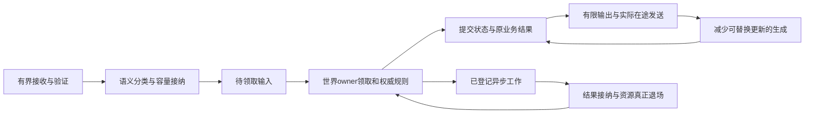
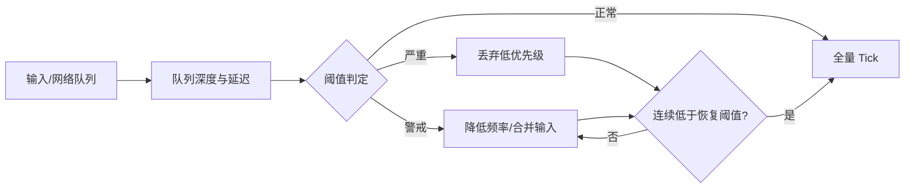

# 14-运行时背压与过载保护

> 知识基线：世界运行中的输入接纳、Tick预算、AOI与输出存量、降级判据和恢复责任。队列为空、结果已知、实际资源静默是不同事实；真实流逝、当前时间债和累计丢弃也分别计量。
> 版本基准：N4950时钟条款、N4861定时等待、Fiedler原始文章、Bernier历史协议论文、固定版本官方复制/监控资料及仓内历史Tick/AOI源码，逐项范围见RB10。20Hz与以下阈值均为纸面题设。
> 适用范围：实时服务端的世界/Zone/系统/连接保护。[入口治理篇](02-限流熔断背压与过载保护.md)负责令牌桶、熔断和重试；本文接续已经接纳的运行时工作，不重建网关框架。
> 最后更新：2026-10-09。重新读取当前来源并修订全文；原2026-08-13正文及八个真实历史版本可复原，旧raw不改。2026-10-08仓外候选/证据包已丢失，本次是新稿，不继承其字节身份或审查结论。
> 知识成熟度：L2（整篇）。主要承诺是解释输入、资源、降级与恢复合同，依据原始资料和源码静态核对。旧AOI局部经过时间测量、旧Tick模型计数及此前PR20纯策略测试仍各有价值，但未测试整套运行时控制。全部PAPER_EXPECTED是纸面预期；本次未运行目标程序、模型、编译、引擎、网络、故障、压力或性能实验，verified为空。

## RB0 从玩家动作追到结果和资源退场

服务器保护不能只看“是否还在出Tick”。输入已进队列但没有主人、交易实际提交却因断连被重做、发送已被取消但缓冲仍被SDK引用，都会在过载时放大。目标是限制存量与继续产生的速度，按业务语义减少非关键工作，并让已经接受的责任能收束。



背压应反馈到产生工作的位置：输出拥塞时减少远距快照生成，寻路槽满时停止创建无限任务，队列满时在真实接纳点拒绝或按合法语义替换。把工作挪到另一个无界队列不会产生新容量。[微软Queue-Based Load Leveling](https://learn.microsoft.com/en-us/azure/architecture/patterns/queue-based-load-leveling)讨论的是应用排队削峰及消费速率，不是TCP协议参考。

积压没有固定传导顺序。慢客户端可只堵自己的发送；CPU长尾可能先让Tick迟到；慢依赖使真实operation占槽而待领取队列仍为空。分别采集资源、时间与有效结果，再定位瓶颈。不能把单一worldLag阈值视为全部过载的可靠证明。

“关键路径保底”意味着预留份额、限制新接纳和明确失败策略，不保证战斗/交易/登录的无限到达量都能处理。新登录、新进房间和新经济动作可在接纳前明确拒绝；已接纳的动作仍由owner完成、按协议终止或恢复原结果。降级不能靠静默删掉已承担的责任变得“健康”。

## RB1 预算先定义单位、所有者和释放点

| 预算 | 实际计量对象 | 满时的动作 | 何时退出这张账 |
| --- | --- | --- | --- |
| Q条待领取消息 | 已接纳、尚未转交执行owner | 接纳前拒绝；仅合法完整状态可替换 | 领取转入执行账，或完成该项约定拒绝/过期责任 |
| B字节 | 队列拥有的载荷及明确纳入的节点 | 分配/复制前预留，超限拒绝 | 相应存储无人再访问；移出容器不必然释放全部缓冲 |
| A个真实operation | 已登记未submit、底层执行、回调和派生访问 | 停新外调，保已有owner | submit包装与全部访问确已结束或依合同接手 |
| 输出字节/最老年龄 | 待发送、重传与在途分别记账 | 先减少生成，再合法合并/限速，必要时断连 | 按具体接口的生命周期，不能仅据send返回或前台超时 |
| 维护/恢复额度 | 到期清理、拒绝反馈、结果查询、退场处理 | 保留有限份额、达到上限显式不可用 | 同样有owner、期限与真实退场条件 |

每连接/Zone额度还受进程和共享依赖总额约束。无限连接各占1MiB仍无全局上界；解码、producer pending、替换重叠副本、TLS/内核缓冲、容器与池保留对象不在一个queue长度里。条数上限只有结合单条尺寸上限，才能推出所计载荷上界，不能冒称RSS上限。

PAPER_EXPECTED RB-P01：两排队槽、一执行槽，单载荷最多2KiB，已接受的三条载荷合计最多6KiB；再允许一个producer pending则为8KiB。替换一个2KiB旧快照前先造出2KiB新快照，旧读者尚未退出时还需预留重叠2KiB。没有纳入这项，就不能用“槽位没增加”证明峰值仍8KiB。

监控计数与接纳判定分开。[原子与内存模型](../../01-编程与计算机基础/并发与同步/02-Atomic与C%2B%2B内存模型.md)中的relaxed只保证该原子操作，不发布普通载荷，也不让多个计数成为同一事务快照。容量检查和预留须在共同锁/串行门或其他已证明原子协议中完成；不能根据监控线程的旧读数各自入队后再补扣。[并发主责SC4](05-并发与高性能.md)

## RB2 墙钟、调度时间和游戏时间不能互代

### RB2.1 先选共同基准，再解释worldLag

| 时间 | 用途 | 不能推导的保证 |
| --- | --- | --- |
| UTC墙钟 | 日志关联、运营真实起止 | 不经校时处理不能拿回拨计持续hot/cool |
| 本地单调时间m | 工作成本、队列年龄、当前进程deadline | 不提供跨机器共同epoch或精确唤醒，休眠语义需按平台核对 |
| 权威游戏时间G/TickIndex | 已提交玩法进展、游戏冷却与重放 | 策略选了Tick不等于业务已提交；不等于CPU耗时 |

N4950草案镜像的[system_clock](https://timsong-cpp.github.io/cppwp/n4950/time.clock.system)与[steady_clock](https://timsong-cpp.github.io/cppwp/n4950/time.clock.steady)分别定义墙钟和稳定时钟，后者单调且不可调整；[N4861定时等待](https://timsong-cpp.github.io/cppwp/n4861/thread.req.timing)允许实现、调度和资源竞争带来的额外延迟。单调计时不会抢占正在运行的慢回调，超时点也不是回调必定结束点。

设共同基准为m0/G0。正常1倍且无暂停时，期望游戏时间G_target=G0+(m−m0)；暂停段期望增量为0，半速段为0.5×该段单调流逝。实际G按真正提交的世界步推进。只有明确这个映射，G_target−G才是可解释的世界偏差；不能直接拿UTC字符串减相对游戏秒，也不能跨进程把两个steady_clock计数相减。

暂停、倍率变化、进程停顿、采样缺口或主动时间丢弃均可形成偏差。诊断要并看当前可追赶欠债、近窗新增drop/clamp、阶段成本和业务完成。关联[GameClock篇](12-世界时间确定性与GameClock.md)仍有“偏差=过载程度/降级后回落”的简化；本篇按这里的边界使用，不扩改该邻篇。

### RB2.2 当前欠债和已经丢掉的时间分别记账

当前调度欠债表示策略还准备执行的完整Tick和分数相位；累计丢弃表示已经决定不再推进的时间，另记dt限幅损失；实际提交Tick数则由运行时执行结果决定。它们不能统称一个drops或worldLag。

PAPER_EXPECTED RB-P02：20Hz，一Tick=50ms，输入125ms、本轮总上限1Tick，策略选择执行1、丢弃1个完整欠债、保留25ms。下次输入25ms再选择1Tick。若两次所选步都提交，游戏共100ms、外部150ms，累计差50ms。随后每50ms都正常推进50ms，这50ms历史差仍不变；降低AI成本不会自动追回已丢时间。

可选政策是保留欠债并在有余量时有限追赶，或明确接受损失并建立新对齐基准。后者须记录损失、发生点和客户端/玩法处理，不得跳过已接纳离散事件或把清监控称作“已追回”。恢复判据可看当前欠债和近窗新增损失，另展示累计损失，不要求它自动归零。[现主循环合同](01-ServerMainLoop与TickScheduler.md)

### RB2.3 有限追赶的收益与代价

[Fiedler原文](https://gafferongames.com/post/fix_your_timestep/)说明固定步追赶也消耗时间：若模拟X秒持续花费超过X秒，越追越落后。有限补步可控制一次外轮的工作数量，代价是模拟相对外部变慢；有余量时才可能吸收短暂波动。原资料不能证明本项目20Hz或某实体数安全。

上限必须在执行前判断；即使最多3Tick，一次不可抢占步仍可能很慢，多Tick还可集中产生输入处理、AOI和网络工作。逻辑步长、发送批次和复制频率分别计量。短尖峰不必然自愈，持续过载则要减少产生或新接纳，降级只是保护，不替代容量规划。

## RB3 游戏输入先分语义，再选合并或拒绝

### RB3.1 “后值包含前值所需语义”才可替换

| 类型 | 合法的有限方案 | 要保住的前提 |
| --- | --- | --- |
| 明确按Tick采样的完整当前方向/朝向 | 同玩家、会话/实体代次、字段组的最新状态槽 | 版本可比较、输入已校验、过期和断流neutral/保持时长明确 |
| 移动usercmd序列 | 有界排序、协议确认与丢失补偿；只有证明等价时合并 | 时长、按键边沿、预测重放可能需要中间命令 |
| 施法、拾取、交易等离散动作 | 接纳前拒绝/有限排队；接纳后执行或给确定终态/恢复 | 较新动作不消除较旧独立业务意图 |
| 可丢表现/遥测 | 有界采样/聚合/丢弃计数 | 不夹带权威效果、可靠结果或关键审计责任 |

Bernier的[原作者论文](https://web.cs.wpi.edu/~claypool/courses/4513-B03/papers/games/bernier.pdf)展示usercmd含msec、移动和攻击按键，预测从最后确认命令起逐条重演未确认序列。这反驳“移动天然只保最新”的无条件说法。相反，[UE5.2属性复制](https://dev.epicgames.com/documentation/en-us/unreal-engine/property-replication-in-unreal-engine?application_version=5.2)允许只通知最终属性值，是状态复制的具体实例，不能转授客户端动作丢弃许可。

PAPER_EXPECTED RB-P03：题设协议每Tick读当前方向，A同代次s10=左、s11=右均尚未消费，则s11可替换s10。若s10=开火一次、s11=换弹一次，丢s10会消失动作；若两条各含20ms移动，只执行后条会丢前20ms。序号只说明流内顺序，不证明可替换；旧会话seq999也不能覆盖新会话seq1，不同玩家不能共用一个全局“最新”槽。

### RB3.2 接纳、领取和实际业务接受是不同边界

PAPER_EXPECTED RB-P04：每玩家一个方向槽，全世界离散动作队列两槽，本Tick最多领取一个动作。A:s11合法替换尚未消费的s10；R1/D1和R2/D2入队，R3/D3在共同接纳门因满明确拒绝。Tick owner先检查领取预算再Pop R1，重查实体/世界代次、当前权限与业务期限；R2仍归队列owner，下次继续。若先Pop R2再发现预算耗尽，就丢了已领取责任。异常也须给R1约定结果或保留UNKNOWN，不能默默当成功。[并发篇SC5](05-并发与高性能.md)

接纳前拒绝仅说明这个attempt未被本入口接手，不证明同R之前从未产生效果。尚未执行且能确证未submit的过期动作可按协议结束；已提交的交易超时不能靠换新身份再做。首次可能效果之前，原业务身份R、完整参数D、版本/目标、结果记录及有界恢复容量必须已有稳定责任方；需要跨进程恢复的工作，还必须有确认的持久恢复/查询责任，进程内map不够。[事务主责](../持久化与分布式一致性/04-分布式事务与最终一致性.md)

当前业务接受点仍核权威权限与规则。世代号、租约、本地队列接纳或旧配置强引用不等于通用写权；重连后的原结果查询也核当前权限。不能确定原效果、记录缺失、参数冲突或超过合法恢复窗口时停止盲重做，交既有恢复流程。

### RB3.3 合并、取消、丢弃和回收不能互证

合并改变消息表示但保留约定语义；丢弃是不再交付某项；取消只是请求工作停止；回收要求最后一个实际访问者已退场。拒收迟到结果也不等于旧工作结束。

PAPER_EXPECTED RB-P05：寻路P为实体代次7登记占槽；目标改变后请求取消P，新目标只留在有界待处理槽。P迟到路径不再接纳为当前移动，但回调仍应收束P自身责任；submit包装、回调和底层访问未退出就继续占槽、持缓冲。递增epoch、清队列或释放前台等待都不能先free(P)。下一次实际发起仍核导航/目标版本、代次、权限和容量。[AI预算](11-AI与寻路时间预算.md)、[协议主责](../服务架构与消息通信/02-网络通信与协议设计.md)

## RB4 按瓶颈和业务代价选择降级

### RB4.1 统一阶梯方向，保留有限关键份额

保留优先级是“权威战斗/经济一致性、必要生命周期与结果恢复优先，表现新鲜度和非战斗装饰其次”；降级执行顺序则从较低影响工作开始。旧文先砍本地战斗、后砍非关键AI，与其他节AI优先互相冲突。下表给一套明确的示例累计阶梯，不是所有游戏都必须采用的顺序。

| 有效级别 | 示例减负动作 | 不得一并删除的责任及代价 |
| --- | --- | --- |
| 0 | 在常态硬预算内运行 | 正常状态仍有有限接纳/发送额度 |
| 1 | 非战斗装饰AI决策降频、次要表现采样 | 玩家相关决策与动作边沿不混入；装饰变化也可能可见 |
| 2 | 远距可替换复制状态降频/合并，减少编码 | 保实体身份、Spawn/Despawn和接收基线；远距不等于无战斗影响 |
| 3 | 经玩法批准，降低附近非关键更新/查询频率 | 明确最大陈旧、预测误差与公平代价，不能任意隐藏攻击者/权威碰撞 |
| 4 | 暂停非关键后台任务，收紧新进入和非必要动作接纳 | 已接受责任继续收束；保恢复/退场预算，不足则隔离/有界停止并告警 |

纯发送瓶颈不一定靠AI降频改善；DB槽满时应限制相应新动作，减少伤害数字并不会让旧查询结束。CPU、发送和依赖可选择不同动作，但由明确owner合成、报告实际组合，避免两控制器互相覆盖。小租户/低优先级仍需有限保底、老化或明确deadline终止政策；优先队列本身不保证无饥饿。[AI与寻路预算](11-AI与寻路时间预算.md)

### RB4.2 预算表和真正能完成的工作不同

PAPER_EXPECTED RB-P06：20Hz间隔50ms，题设分给输入/权威规则20ms、AI5ms、AOI编码8ms、结果接纳/清理5ms，留12ms余量。50ms只是目标分配；不可抢占回调单次耗30ms时会穿透AI5ms。可以在安全点停止后续工作、记录超支并收紧下轮接纳，不能倒填成本或宣称严格5ms截止。计数配额、可中断工作单元、finalize/分配/锁/维护的成本都要计量；各阶段P99相加不是整个Tick P99。

纸面同成本系统若每Tick完成10个，初有50个且不再新增，需要5Tick；持续每Tick到12个则净增2，队列再大只延后满；减少到8个才净减2。这是带前提的算术，不是用单请求P99推安全批量。不同成本、暂停、锁和共享CPU会破坏这些前提。降级后须同时看有效结果、拒绝/替换和等待，不能只看CPU下降。

### RB4.3 AOI、复制频率和输出存量分别省什么

AOI选择连接应知道的对象，复制频率决定何时考虑更新，优先级在资源紧时决定先服务谁；输出队列则持有已经生成的消息。先全量做空间查询/编码再丢输出，只节约后半段；应把保护反馈到相应生产阶段。

[UE5.5 relevancy](https://dev.epicgames.com/documentation/en-us/unreal-engine/actor-relevancy-in-unreal-engine?application_version=5.5)按连接判断相关性，不再相关的动态Actor可在客户端销毁；[priority](https://dev.epicgames.com/documentation/en-us/unreal-engine/actor-priority-in-unreal-engine?application_version=5.5)在饱和时按相对优先级分配。提高全部优先级不增加总预算。[同版更新频率建议](https://dev.epicgames.com/documentation/en-us/unreal-engine/performance-and-bandwidth-tips-for-unreal-engine?application_version=5.5)是调优方向，不保证降频无感。恢复视野时可能要重建对象/完整快照，不能只把Hz调回去。

按连接、实体代次、字段组保留最新完整快照，可减少未发送副本；delta必须依赖接收方已认可或可恢复的基线。丢v5基线后继续发v5→v6差值可能无法解释。进入/离开兴趣区、所有权变化、可靠RPC和经济结果不自动可替换；位置远也不说明无玩法依赖。

PAPER_EXPECTED RB-P07：应用输出载荷硬上限100KiB、软高水位70KiB、恢复低水位40KiB、单条最多10KiB，真实在途另计。队列65KiB时新来40KiB批次，须按协议允许的单位拆分并逐项接纳，或整批拒绝；不能全入队再等超过100KiB断连。合法替换还要预留新旧副本重叠；旧缓冲已被发送线程持有时，继续占真实在途账。

软水位使后续生成减量，硬上限则每次接纳都检查，不等慢速滞回。必要断连按具体协议有界关闭及重同步，不是任何队列都必须走的最后一步；它不撤销业务效果、不证明所有回调退出。控制/拒绝消息也有有限份额，不能另开无限“关键消息”旁路。[Socket与Reactor](../../01-编程与计算机基础/操作系统与系统I-O/01-Socket-Epoll与Reactor.md)、[DS重连](../会话身份与在线服务/03-DS会话注册与重连实现.md)

## RB5 分开统计窗口、连续判据和实际生效

### RB5.1 每个阈值必须有有效观测对象

下面选用纸面政策：每1s取得快照，P99取最近10s已完成Tick成本，注明N和分位算法，未完成Tick的年龄另列。本例假设窗口完整、样本充分；真实实现须给最小样本、暂停和缺测规则。20Hz的10s窗口只有约200个提交机会，少提交/暂停会改变总体，无样本不能记P99=0。

| 判据 | 本文示例 | 用途 |
| --- | --- | --- |
| hot | 有效窗口P99>45ms，或当前可追赶欠债>500ms，或受保护存量超过软高水位 | 持续10s才提出下一档常规降级 |
| cool | 有效窗口P99<35ms，当前欠债<200ms，有关队列/字节/真实在途均低于恢复水位，近窗无新增drop/clamp，关键有效完成和最老年龄符合政策 | 同时满足并持续30s，才提出恢复一档 |
| middle | 有效数据但既非hot也非cool | 保等级，清连续计时 |
| invalid | 必需指标缺失/过期、窗口不足、采样间隔不满足合同、时钟域改变 | 不当cool；保保护、标未知，按明确应急政策处理 |

这里45/35ms来自50ms×0.9/0.7，仅为题设；不同存量需各自定义水位。真实硬上限、关闭和权限在每次实际接纳处立即判定，不等10s，也不依赖监控线程准时运行。

[Prometheus v3.5.0 for](https://github.com/prometheus/prometheus/blob/v3.5.0/docs/configuration/alerting_rules.md)描述每次评估持续成立；[range selector](https://github.com/prometheus/prometheus/blob/v3.5.0/docs/querying/basics.md)选择一段时间的样本。这两件事不同，本篇没有部署该产品或声称它默认采用以下算法。拥塞进入统计窗、使P99越阈、再连续hot10s，到动作可能超过10s；5s物理尖峰可能在滚动窗口留下更久的坏样本，不能直接推必触发或必不触发。

### RB5.2 lastChange不能代替hotSince和coolSince

旧例未更新lastChange；即使补了更新，也只证明距上次变级多久。正常运行一分钟后第一次hot，now−lastChange已超过10s，却没有hot持续10s。替代合同如下，所有处理由一个串行控制owner执行；只是纸面判定流程，不是已编译实现。

```text
PAPER_EXPECTED：状态为effectiveLevel、pending提议、hotSince、coolSince、前次有效采样时刻
有效采样使用同一本地单调时钟；本例严格每1s一个，实际项目须另给允许抖动/年龄上限

若数据无效、时刻倒退或时钟域改变：
  清hotSince/coolSince和前次有效采样时刻，标UNKNOWN
  保留pending提议与effectiveLevel，结束本次处理，不读取该快照的hot/cool
若采样间隔不满足连续性：清两种计时，从本次有效样本重新起算
记录本次有效采样时刻
若有pending安装：只保观测，不叠加提议，清两种计时
否则若hot：
  coolSince=空；hotSince为空时设为now
  now-hotSince>=10s且effectiveLevel<4时，登记唯一的level+1提议，清两种计时
否则若cool：
  hotSince=空；coolSince为空时设为now
  now-coolSince>=30s且effectiveLevel>0时，登记唯一的level-1提议，清两种计时
否则：清两种计时，保持当前级别

实际安装确认才改变effectiveLevel；明确未安装的拒绝保原级别并重新取有效观察
安装结果UNKNOWN时保pending和既有硬保护，在有限查询预算内找实际状态；不能假报恢复
```

“连续”是采样合同中的连续，不证明两次采样之间没有短尖峰。安装请求有目标/期望前态和期限，执行点必须重新检查；快照很早满足cool，不代表很晚到达的恢复命令仍适用。不能把未确认的effective当确定值继续发多轮提议。

PAPER_EXPECTED RB-P08：假设每秒样本有效、直接给hot/cool判据、初始level0。t0…4 hot，t5 middle清计时；t6…15 hot只过9s，t16才过10s提出level1。本题设同一安全点确认安装。t17…30 cool，t31 middle再次清计时；t32…62 cool，到t62才满30s恢复一级。若只按t16+30，会在t46错误恢复，此时最后一段cool仅14s。若t40…45缺样，t46重启计时；不能把缺口算健康。多级恢复每次确认后重新观察，不能一个回调连降三档。

PAPER_EXPECTED RB-P08的无效快照变体：初始level1且无pending，t0…9每秒有效cool；t10快照缺必要指标，即使其中残留cool=true，也清两种计时和前次有效采样状态并立即结束，等级仍为1。t11首次重新取得有效cool，coolSince只能从11开始；以后每秒有效cool，最早t41满30s才提出恢复，不能从t10残留值或更早t0计时。若t10本有pending安装，invalid也不删除该提议或假改effective，仍由原安装确认/查询流程收束。

PAPER_EXPECTED RB-P09：P99已降到30ms，但队列中两动作年龄过长，且一个前台超时的operation仍在回调。完整cool不成立，保持保护并收束旧责任。把所有请求拒绝得到低P99也不等于服务已恢复，必须联看有效完成与真实接纳规模。

## RB6 配置、作用域和关闭要落在真实接受点

### RB6.1 从完整候选到effective版本

阈值配置写明单位、计量范围、窗口/样本、进入/退出水位、持续时长、动作和维护份额。校验低水位<高水位<硬上限、非负有限、版本/目标有效等跨字段关系。若新硬上限低于已有占用，不能删已接纳关键责任凑数；可停新接纳等待收束，或拒绝不支持的变更，按事先政策选择。

沿[配置治理SG2](../服务架构与消息通信/05-服务发现配置中心与治理.md)已有合同：有界构造完整不可变快照；在安装与关闭共用的锁/串行门内重取时间，核OPEN、未取消/未过期、目标代次、expected前态/版本、仍被允许的desired，以及旧快照退休额度。成功才一次切换活动指针并记录effective。读者在同一边界取得稳定引用，不能逐字段拼出新旧混合规则。仅loaded/validated或配置文件改变不代表活动路径已生效。

PAPER_EXPECTED RB-P10：C7有效，C8把低/高水位设80/70KiB被拒，C7保持。另一个合法C8在t9验证、deadline=t10，t10.1才到安装点则拒绝；合法且未过期C8在t9.5安装才算effective。旧回调持C7时C7不能释放；退休额度满则C9暂缓安装。取消候选等待也不证明准备任务已退出，其owner与槽仍需收口。

版本/epoch只给比较标识，不替代实际同步；旧快照的寿命也不延续撤销的业务许可。新效果接受点仍核当前权威；已提交交易按原R/D恢复，不按新价重做。配置回退只改变之后的政策，不撤销已发送消息或已发生效果。

### RB6.2 作用域比标签多一层所有权

全局、Zone、系统、连接有各自资源owner；命令带实例启动身份、作用域/对象代次、规则版本与预期前态、有限期限和原因。接收方在实际安装点重查。标签用于路由，不能自动授权；同名Zone重建或连接ID复用后，旧恢复命令不得落到新对象。

全局与局部策略的合成须事先定义，例如新接纳同时满足两级硬额度，频率采用获准的较严格上限；不以最后一条命令覆盖全部。PAPER_EXPECTED RB-P11：全局level1、Zone Z代次8为level2；全局恢复0，Z仍保持局部level2。迟到Z代次7恢复命令被拒，但命令处理任务仍按自己的owner退场。共享CPU/DB/网络仍有耦合，不能把“只改Z策略”写成“全局P99必不变”。

### RB6.3 登记先于外调，结果先到不等于可回收

异步存储、寻路、发送和加载沿用[并发SC4](05-并发与高性能.md)、[消息主责M4](../服务架构与消息通信/04-消息系统与事件驱动.md)及[入口治理OC7](02-限流熔断背压与过载保护.md)，不另造完整host：

1. 先构造稳定operation、输入/结果容器和回调有效持有；同步触发的取消注册也不能早于其owner
2. 在接纳/关闭共同门里核OPEN、当前期限/取消、真实槽与字节，预留登记，再授一次submit许可；登记失败或不确认就不外调
3. 释放可能被同步回调重入的内部锁后外调；已登记未submit也占容量，参与Close扫描
4. 同步callback可先给业务结果，但callback本身及submit包装可能还在访问；只有确认未发布且无未来访问的拒绝才回滚资源
5. Close关新入口，请求取消/排空旧工作；到期仍未静默就返回DRAINING/INCOMPLETE，由稳定host保留owner和依赖

本文沿现有合同：已授的一次提交许可不因之后Close自动撤销。另一种“可撤销未发布许可”需要同一同步域的互斥仲裁及确证未发布，锁外看closed不够。无论本地许可何时授予，真正业务效果接受点仍核当前业务权限。

PAPER_EXPECTED RB-P12：R/D在首次可能效果前已有确认的持久恢复责任和容量；A登记占唯一真实槽，Close随后关门，A消费原许可submit。submit内部同步callback报告权威成功；callback未返、submit包装未结束时，A仍占槽。前台/关闭预算用尽只能报DRAINING，不能还槽让B进来或free(A)。提交包装最后访问结束、现有回调全部退场、底层保证无未来访问/提交、取消/计时注册和派生责任结束或有效接手，才释放相应资源。队列空、epoch变化、租约持有、一个quiet布尔值都不能代替这些证据。

若响应丢失，以原R、完整D、版本/目标和当前查询权限恢复原结果，不因新连接生成新业务意图；权威成功不被迟到timeout/UNKNOWN覆盖。恢复记录缺失、参数不一致、保留窗口过期或查询/恢复容量不足时停自动重做。持久交接让以后能查业务UNKNOWN，但不让当前进程仍活的回调提前失去内存；无法确认真实退场就不能安全销毁host或复用槽。

## RB7 观察保护后的有效服务与恢复轨迹

### RB7.1 指标既要看成本，也要看消失的工作

至少报告received/admitted/rejected、合法替换/过期/丢弃、有效提交/确定拒绝/仍未决，配同一总体和窗口；待领取条数/字节/最老年龄、实际在途及取消后未退场数；实际Tick提交、阶段/整外轮成本；当前时间债、近窗drop/clamp和累计损失；生成/入队/发送/重传字节；各作用域desired/effective版本、等级与原因。超时但还在运行的任务不能在报表里消失。

P99标窗口、N、算法、起止边界，说明成功/失败/超时样本如何纳入及未完成如何单列。单请求、整Tick、批次均值不是同一总体；全服分位数还能掩盖一个玩家或Zone的饥饿。逐Tick原值有诊断价值，但不要求生产永久存无限日志：可用有界环缓冲、抽样、异常窗口与1s/10s/1min聚合，保留缺样计数、上限及采集开销。

按玩家卡顿时间线先看连接字节/年龄和重同步，再看Zone提交间隔、阶段成本、当前欠债与共享依赖真实槽；UTC日志和本地elapsed需有映射与误差。没有数据时标未知，不承诺“10分钟必定位”。

### RB7.2 一条有分母的有限恢复轨迹

PAPER_EXPECTED RB-P13：应用输出硬上限100KiB，初队列60KiB；题设每秒真实完成并释放40KiB，按“先释放、后接纳本秒产物”记账。这是人工给定服务量，不是网络测量。

| 秒末 | 生成并入队KiB | 真正释放KiB | 剩余队列KiB | 解释 |
| --- | ---: | ---: | ---: | --- |
| t1 | 50 | 40 | 70 | 达软高水位，减后续可替换生成 |
| t2 | 30 | 40 | 60 | 题设减负已实际生效 |
| t3 | 30 | 40 | 50 | 净流入为负，存量下降 |
| t4 | 30 | 40 | 40 | 达低水位并不立即全量恢复 |
| t5 | 30 | 40 | 30 | 还需完整cool条件和持续窗口 |

恢复按当前有效完整状态做有界重同步，不补发已经替换/丢弃的全部历史状态。每次只撤销一档、重新观察，AI/复制定时器错峰分桶，避免同帧全部恢复；若再次积压，重新hot或触发硬保护。真实socket、重传和编码成本会改变40KiB假设，不能据此认证稳定吞吐。

容量报告同时保留降级前拐点与降级后实际策略、输入混合、拒绝/替换、有效完成和玩家影响；检查生成端CPU/网络是否饱和、开放/闭环提出量是否达到目标。大量拒绝或闭环客户端因变慢而少发，都可能让P99“改善”。[并发与测量](05-并发与高性能.md)

## RB8 原有实验的输入、方法和真实覆盖

本节保留原数与先前贡献。2026-10-09读取当前repo的源码、旧raw和现policy记录；旧Tick源码按历史commit取证，不能拿PR20新实现解释旧输出。没有重跑或倒填结果。历史运行环境按当时README标识，不冒充本机环境。

### RB8.1 旧Tick四行都有raw，但不是CPU过载试验

旧README记载2026-08-12 Windows x64/MSVC14.44.35207，脚本选项含/O2 /std:c++17 /EHsc /utf-8 /W4。旧simulate以tickUs=16666.7（约60Hz）、6000外层轮，mt19937_64种子20260812，unitCost=0.5us/实体及Uniform(0.7,1.3)生成cost。原文20Hz是另外的设计例，不是这个旧实验频率。

| 原文引用输入 | ticks | drops | catch | 按旧源码实际含义阅读 |
| --- | ---: | ---: | ---: | --- |
| 10000实体，frameLoad1.0 | 6000 | 0 | 0 | 固定输入下无清零或多Tick外轮，不证明全服正常 |
| 10000，frameLoad1.3，catch-up | 7800 | 0 | 1800 | 多Tick外轮计数；不是短尖峰后恢复轨迹 |
| 10000，frameLoad1.3，drop | 6000 | 1500 | 0 | 1500次清accumulator事件，不是1500个丢弃Tick |
| 20000，frameLoad1.5，drop | 6000 | 3000 | 0 | 数字真实对应，不证明由20000实体CPU成本造成过载 |

四行均可查[旧MSVC raw](../../../evidence/server/tick-scheduler/results/tick_scheduler_win_x64_msvc.txt)。每轮只将固定frameUs=tickUs×frameLoad加入accumulator，cost写入数组但不推进时钟；增加cost不会反馈积压。合成cost排序后取n/2、floor(0.95n)、floor(0.99n)并打印一位小数，不是steady_clock测CPU的P50/P95/P99。

旧catch计“执行超过一个Tick的外轮”，不是额外Tick数量；drop清零连分数相位一起丢。maxCatchUp=3的执行后检查允许先执行第4次，表中最多两步的输入没有覆盖这个错误。固定1.3贯穿全部6000轮，没有尖峰结束点、降载阶段或真实余量，不能据7800/1800证明尖峰自愈。

raw未输出worldLag。按旧输入算术另作推导：1.3/drop的外部输入为130.00026s、逻辑推进100.0002s，游戏/外部比1/1.3≈76.923%，相对外部速率下降约23.077%。完成相同游戏时长多30%外部时间是另一分母，原“减速30%”混淆了它们。清空当前欠债也不消除累计时间差。

原raw无CPU型号、独立编译器version、逐命令exit头或逐帧成本记录；本次限定读取未定位当次build/cl.log。它限制可复核深度，不等于运行伪造。真实存在的数字和当时叙述在历史附录原bytes保留。

### RB8.2 PR20纯策略的局部贡献仍保留

此前[PR20](https://github.com/fantuan812/learning/pull/20)修订的[唯一tick_policy.hpp](../../../evidence/server/tick-scheduler/src/tick_policy.hpp)将非负elapsed纳秒、Hz、每调用总Tick上限、dt限幅及整数ns×Hz相位分开；[现README](../../../evidence/server/tick-scheduler/README.md)明确executed是选择的次数，不是业务回调已完成。

[现validation记录](../../../evidence/server/tick-scheduler/results/tick-policy-2026-10-04/validation.json)、[provenance](../../../evidence/server/tick-scheduler/results/tick-policy-2026-10-04/provenance.json)与[scenarios.csv](../../../evidence/server/tick-scheduler/results/tick-policy-2026-10-04/scenarios.csv)保留17个功能组、两种指定故障对照、15项runner合同及18组1074行精确模型记录。环境记录为Linux/C++17等实际当次来源，不能拿旧Windows raw认证新实现已过MSVC；本次只读、不再跑C++、故障宏或Python参考模型。

其局部证据支持单位、上限、余量、分块和守恒等合同，没有服务成本反馈、真实唤醒、输入替换、hot/cool、配置安装或回调静默。将全文L4改L2是按本篇主要承诺判断，不抹掉这些已经存在的局部运行与负向证据。

### RB8.3 AOI计数与本地经过时间都要按原方法解释

原[AOI源码](../../../evidence/algorithms/aoi/src/aoi_simulator.cpp)使用200×200格、半径3（扫描49格），各轴随机移动±0.6并限制坐标，所有实体均作观察者。100/1000/10000实体分别200/100/20帧、种子1/2/3。旧[README](../../../evidence/algorithms/aoi/README.md)同样记载2026-08-12 Windows x64/MSVC14.44.35207。

| 实体数 | sends/帧 | grid均值ms/帧 | brute均值ms/帧 | 集合不一致计数 |
| --- | ---: | ---: | ---: | ---: |
| 100 | 11 | 0.009 | 0.010 | 0 |
| 1000 | 1178 | 0.165 | 0.966 | 0 |
| 10000 | 120226 | 7.299 | 96.003 | 0 |

数字见[原raw](../../../evidence/algorithms/aoi/results/aoi_simulator_win_x64_msvc.txt)。这里确实用steady_clock测本地分段经过时间，不能和旧Tick生成cost都说成“未测任何耗时”。但grid段含移动、维护网格、构造排序，事件差分与验证辅助工作也加进gridMs；brute段还含圆视野sqrt、checksum和排序，工作范围不对称。只有分段总量/帧数汇总，没有逐帧时间数组、重复run分布，不能叫P99、纯内核公平通用倍率或线上CPU容量。

sends语句仅累加g[i].size()，是有向observer→entity兴趣关系数；并未单独加Enter/Leave字节，更没有编码/socket/可靠重传/客户端消费。源码打印不一致数0但没有据mismatch失败退出的断言，只支持这些已保存输入的集合观测，不能证明全部输入或网络事件正确。

原文1178与120226是真raw。若额外假设每关系32B、全量20Hz，120226×32=3,847,232B/帧；×20×8=615,557,120bit/s，十进制约615.557Mb/s。假设未含协议头、压缩、差分、批次、重传及更新比例，不能写成实测带宽、必达NIC上限或“网络第二大来源”。

实体数×10而总关系约×102，不支持总发送量线性。固定面积、固定半径、近似均匀且每实体都观察时，总关系可近似N(N−1)×相交概率；若保持密度而扩地图，口径又不同。这里只作条件推导，两个点也不能认证复杂度。正向用法是分别定义观察者、平均候选关系、实际更新比例、频率和包长做预算初估，再测真实链路。[AOI主责](../状态复制与兴趣管理/05-AOI与InterestManagement.md)

## RB9 实践、响应速查与原有12个问题

| 当前表现 | 优先响应 | 保留的恢复责任 |
| --- | --- | --- |
| 输入队列满 | 按消息语义接纳前拒绝/合法替换，先核预算再领取 | 已接纳动作owner、可见结果与最老年龄 |
| Tick持续超支 | 定位阶段/当前欠债，减少非关键生成 | 实际提交与有效服务，不能只看P99 |
| 输出高水位 | 减少生产、合法合并和限速，必要时按协议断连 | 基线重同步、可靠原结果与真实缓冲退场 |
| worldLag异常 | 核共同基准、暂停/倍率、当前债与累计损失 | 近窗新增损失停止，不清零伪造历史追回 |
| 紧急级仍过载 | 收紧新接纳、隔离/有界停止、告警并做已有容量动作 | 责任收束、目标容量、真实恢复证据 |

最佳实践仍是监控先行、语义先行、网络有限缓冲、分级自动保护、慢恢复、关键份额、容量告警、作用域匹配和受控配置。要把它们落实到具体owner与接纳点，并为到期清理、结果查询和退场留有限预算；“先保玩家再保AI”不免除关键负载过量时的公平与拒绝政策。

**Q1：输入为什么有时可丢旧？** 只有同一语义的新完整状态确能替代旧项，且旧项未进入不可删除的责任，才可覆盖。移动usercmd的时长、边沿和预测序列可能不可丢，RB3给出正反例；序号大不是充分条件。

**Q2：降级会造成玩法不一致吗？** 可能。输入时机、AOI和AI反应都影响公平，须分开权威规则/必要事件/纯表现，定义最大陈旧与恢复同步并验证结果。关键优先级不能证明一致性或无限处理能力。

**Q3：10s触发、30s恢复怎么定？** 它们是题设，结合窗口延迟、采样抖动、队列上界和玩法容忍度校准。先说明从拥塞发生还是首次有效hot计时；5s注入不能直接等同满足10s持续条件。

**Q4：worldLag与drops看哪个？** 并看当前欠债、实际提交和成本，先核drops是事件数还是Tick数。暂停/倍率和累计丢弃使单一偏差不等于过载，正常1倍也不会自动消掉历史差值。

**Q5：无限发送队列怎么办？** 在分配/接纳前保护条数、字节和真实在途，再把高水位反馈到生成。阈值可受控配置，“硬上限”不等于必须硬编码；断连依协议选择且不解除已接纳责任。

**Q6：怎样制造过载验证？** 先给环境、工作分布、基线定义、观测与停止条件，分别覆盖CPU、网络、依赖存量与恢复。实体×2或120%若未定义成本没有统一意义。本文仅提出RB11中的有限验证方案，未执行。

**Q7：等级要告诉客户端和运营吗？** 内部等级可不暴露，但暂停、可交互对象和重同步等协议变化须被客户端理解。运营通知描述范围、影响和恢复进度；是否公告按业务影响决定，不固定第4级一律广播。通知同样有预算。

**Q8：热点Zone能迁移玩家吗？** 可按既有迁移合同执行，先核目标容量、权威/会话交接及失败恢复；快照、传输和目标接纳都有成本，不能把强制迁移或断连当免费释放。[跨Zone迁移](../世界权威与故障恢复/08-跨Zone与跨服迁移.md)

**Q9：降级后性能数据还能用吗？** 可以，但标出实际服务质量、负载总体、拒绝/替换率、有效结果和等待。保护前拐点与保护后稳定点分别报告，不只保留成功请求的P99，不能推广到所有地图和输入分布。

**Q10：AI和AOI谁先降？** 按瓶颈和业务代价。示例先装饰AI再远距可替换复制；纯慢连接宜直接限制其输出。AI降频不保证无感，远距对象也可能与战斗相关。

**Q11：玩家卡顿如何下钻？** 对齐该连接积压/重同步、Zone提交与阶段成本、世界当前债和共享依赖，保留采样缺口与时间映射误差。有限原始轨迹配分维聚合，不能承诺固定分钟内总能定位。

**Q12：阈值如何校准回归？** 记录真实提出量和工作混合，逐项逼近已定义瓶颈，同时观察有效结果、拒绝和等待；再覆盖短波动、持续越限、缺样、配置迟到、局部热点及逐级恢复。回到1倍负载仍可能有旧在途未收口，不为满足30s目标假还槽或改计时。

## RB10 来源覆盖与读取身份

以下为2026-10-09本次实际重读的范围。固定草案镜像不是ISO正式标准原本；网页可变内容只按此次取得的正文解释。来源支持机制，不给本项目20Hz、10s/30s、500/200ms或安全容量。

| 来源 | 实际版本与选读 | 对本文的支持边界 |
| --- | --- | --- |
| [Fiedler](https://gafferongames.com/post/fix_your_timestep/) | 2004-06-10原作者文章，固定/半固定步、accumulator与Free the physics | 补步的时间成本与螺旋、有限补步的代价，不认证项目吞吐 |
| [system_clock](https://timsong-cpp.github.io/cppwp/n4950/time.clock.system)、[steady_clock](https://timsong-cpp.github.io/cppwp/n4950/time.clock.steady) | N4950固定草案镜像，§29.7.2.1、§29.7.7实际正文 | 墙钟与稳定时钟；G_target/暂停/倍率是本文应用推导，不是标准worldLag定义 |
| [thread.req.timing](https://timsong-cpp.github.io/cppwp/n4861/thread.req.timing) | N4861 §32.2.4 /2–6 | 超时与调度/争用延迟；不认证当前平台或抢占行为 |
| [Bernier / Valve原作者论文](https://web.cs.wpi.edu/~claypool/courses/4513-B03/papers/games/bernier.pdf) | WPI托管13页稿，未见修订号；本次选读物理第4–6页usercmd/prediction等，未声称全文13页均读完 | msec时长、buttons保持按下位集、未确认命令顺序重演；边沿/离散事件如何保持是本文协议要求，不把buttons当通用可靠事件接口 |
| [Epic Relevancy](https://dev.epicgames.com/documentation/en-us/unreal-engine/actor-relevancy-in-unreal-engine?application_version=5.5)、[Priority](https://dev.epicgames.com/documentation/en-us/unreal-engine/actor-priority-in-unreal-engine?application_version=5.5)、[Bandwidth Tips](https://dev.epicgames.com/documentation/en-us/unreal-engine/performance-and-bandwidth-tips-for-unreal-engine?application_version=5.5) | 实际标题UE5.5，相关性规则、相对优先级与频率建议正文 | 复制机会和对象可见性的代价；未读UE源码、未运行引擎，不写成UE5.8已核对 |
| [Epic Property Replication](https://dev.epicgames.com/documentation/en-us/unreal-engine/property-replication-in-unreal-engine?application_version=5.2) | 实际UE5.2历史页面，属性中间变化不必全部通知 | 最终属性态的独立实例，不推广成动作丢弃协议 |
| [Prometheus alerting](https://raw.githubusercontent.com/prometheus/prometheus/v3.5.0/docs/configuration/alerting_rules.md)、[querying basics](https://raw.githubusercontent.com/prometheus/prometheus/v3.5.0/docs/querying/basics.md) | 官方v3.5.0，for、Range Vector Selectors及staleness段 | 持续各次评估与选样本窗口不同；本文未验证一份实际PromQL或产品部署 |
| [Queue-Based Load Leveling](https://learn.microsoft.com/en-us/azure/architecture/patterns/queue-based-load-leveling) | 官方页面本次显示Last updated 2026-06-12，Problems and considerations正文 | 队列平滑突发、持续生产快于消费仍积压；不是TCP规范 |
| [历史Tick/AOI证据](../../../evidence/server/tick-scheduler/README.md)、[AOI源码/记录](../../../evidence/algorithms/aoi/README.md) | 历史commit旧Tick源码与原raw；当前AOI源码/raw、PR20纯策略记录 | 按RB8分别支持模型计数、局部经过时间及策略合同，无本篇完整保护运行结论 |

本次网页原工具响应的保存只证明取得哪些文本，不是HTTP wire日志或原PDF完整二进制。旧2026-10-08响应包无法读取，不能把其中成功/失败记录移作此次记录。本轮可选.NET Queue.cs读取失败已保留为来源检索缺口；本文没有使用该实现作依据，也不以另一个List.cs成功读取冒充Queue或Channel已核对。

## RB11 验证与基准：纸面教学不等于执行结果

### RB11.1 逐项能反驳的纸面合同

| 纸面例 | 给定输入/分支 | 判定依据 |
| --- | --- | --- |
| P01 | 条数、单条2KiB、pending与替换重叠 | 计清声明范围的字节，不能称RSS界 |
| P02 | 20Hz/cap1，125ms再25ms | 当前相位与50ms历史损失分开，正常1倍不自动追回 |
| P03 | 方向、开火/换弹、带时长移动 | 可替换性来自协议语义，非序号/“游戏输入”标签 |
| P04 | 两动作槽，本轮只取一条 | 先核预算再Pop，拒绝/已接纳/未知效果分别负责 |
| P05 | 换目标、取消寻路、迟回调 | 拒旧结果污染当前状态，但旧owner直到真实退场 |
| P06 | 50ms预算、不可抢占30ms；到达12/完成10 | 暴露软预算与持续容量差，不假报严格截止 |
| P07 | 65KiB队列、100KiB上限、40KiB批次 | 接纳前拆分/拒绝，真实在途缓冲仍占账 |
| P08 | hot/cool中断与采样缺口 | 重新计时、满持续窗后仅提议、安装确认才变级 |
| P09 | P99降但旧动作/真实回调尚在 | 完整cool不成立，有效服务与资源一起看 |
| P10 | 非法水位、逾期安装、旧读者 | 合法实际安装点与退休预算，不据validated放行 |
| P11 | 全局恢复、Zone仍热、旧代次命令 | 规则合成正确，局部隔离不保证共享性能不变 |
| P12 | 已登记许可、Close、同步callback、submit未返 | 原结果与真实静默两轴，有限关闭返回DRAINING |
| P13 | 60KiB初队列，先释放40、后入50/30 | 70→60→50→40→30，恢复受完整cool和重同步预算约束 |

13个编号是教学覆盖，不是13个新跑测试或缺陷计数。原文的过载触发、输入丢弃、内存上界、Zone范围、断连重连、命令作用域、监控下钻、阈值回归和L5项目复盘用途均保留，但验收标准已纠正为各自合同，而非无条件“120%10s必降/30s必恢复”。

### RB11.2 将来需要运行什么，必须另有明确范围

全文L2静态教学不需要为了标级强加实验。若以后要声称控制器已实现并测试，可先申请一个独立有限模型：只读显式时间/观测/安装结果序列，覆盖P08–P11；无真实时钟、休眠、线程、产品、网络或配置改动。事先指定语言/工具、有限步数、截止和新输出目录，保存实际输入、预期/负向对照、stdout/stderr/exit及版本。这里仅给计划，未运行或新增runner/CI。

这样的模型仍不能认证真实队列并发、SDK取消、配置接受点、回调静默、UE复制或吞吐。要证明运行时保护，需要在另行授权的产品/环境中覆盖真实工作成本、队列/字节/在途、输入语义、拒绝和关键结果、逐级恢复、配置迟到/旧回调与重同步；附有效负载、停止条件和完整原始证据。L5再要求真实项目事件、影响与可归因复盘，不能以本机模拟或静态门禁替代。

本次仅作文本/hash/YAML/CommonMark/链接及历史回拼等文档检查，没有执行旧构建脚本、目标模型、CPU/network基准或压测。旧复跑入口仍在各Evidence README中，属于其原主题，不把命令存在或CI里的旧模型成功当成本篇运行证明。

### RB11.3 文档安装与验证另行记账

本文实际字节安装后由指定整合者单独机械生成manifest，再按现行接口运行七项文档门禁：check_okf Changed、check_repo、check_architecture、validate_knowledge、render_knowledge_views --check、test_quality_evidence、git diff --check。独立actual-after全文审查、cached精确范围、当前提交完整CI及合并后确认另列；此处是交付合同，不声称这些步骤已完成。

现行checker要求“知识基线：”“最后更新：”与非代码来源，本文按实际标签保留，不改检查器。受保护原始资料已有格式欠账、UE源码根未提供等边界据真实输出报告。文件存在只证明位置，静态检查通过不证明控制器已加载、实际权限已强制或生产容量已验证。

## RB12 关联阅读与修订边界

- [01-ServerMainLoop与TickScheduler](01-ServerMainLoop与TickScheduler.md)：有限补步、单位/相位与实际提交
- [12-世界时间确定性与GameClock](12-世界时间确定性与GameClock.md)：时间归属与暂停；其旧偏差简化按RB2局限理解
- [11-AI与寻路时间预算](11-AI与寻路时间预算.md)：分层预算、旧任务取消与结果接纳
- [05-AOI与InterestManagement](../状态复制与兴趣管理/05-AOI与InterestManagement.md)：兴趣集合与复制预算
- [01-Socket-Epoll与Reactor](../../01-编程与计算机基础/操作系统与系统I-O/01-Socket-Epoll与Reactor.md)：输出背压及异步资源
- [02-限流熔断背压与过载保护](02-限流熔断背压与过载保护.md)：入口速率、存量、拒绝、熔断和重试
- [04-Scene-Map-Zone与实例管理](../世界权威与故障恢复/04-Scene-Map-Zone与实例管理.md)：局部世界的owner与作用域
- [13-世界Snapshot与故障恢复](../世界权威与故障恢复/13-世界Snapshot与故障恢复.md)：快照恢复，不能代替未完成业务责任
- [08-跨Zone与跨服迁移](../世界权威与故障恢复/08-跨Zone与跨服迁移.md)：权威交接与容量迁移
- [网络与游戏服务端路线](../../../00_Index/学习路线/网络与游戏服务端.md)、[工程实践与质量路线](../../../00_Index/学习路线/工程实践与质量.md)：运行保护的上下游学习与验证入口

2026-10-09把全文原L4标定为L2：主要承诺是运行时保护链，旧Tick/AOI和现纯策略仅覆盖其局部。不是为门禁自动降级，也不是否定历史运行贡献。稳定身份kb-84e851771c8e、原标题/H1、路径与原学习用途保持；前文是当前建议，以下是不能继续当现行断言的历史原文及可逆索引。


## 附录 A：历史原文与逐字回拼（2026-10-09 重建）

本附录保存修订前文字及真实 Git 历史的差异原字节，仅供溯源。围栏内的旧 L4 标定、旧输入丢弃策略、旧实验解释和路径保留原样，不表示本次继续认可这些结论。2026-10-09 重新读取当前仓库及 GitHub blob 建立本附录，没有恢复或沿用已丢失的旧候选包。

基线为修订前正文 B：19021 bytes，SHA-256 `2c68ec56761dbc00abbffe0026ef239f80b5c4449752215f8372fcb702973bcd`，Git blob SHA-1 `a1a8dc47eda3b59f5edab845603260d86b191876`。全量原文只在下方 B 围栏出现一次；其他版本由 B 的不变片段和去重后的差异原字节回拼，不使用压缩包或编码归档。

本次窄查覆盖现有 Git 历史中该文的当前路径与旧路径：

- C：`知识/07-网络与游戏服务端/运行调度与过载保护/14-运行时背压与过载保护.md`
- L：`游戏服务端/06-世界模拟与运行时/14-运行时背压与过载保护.md`

八个不同正文 blob 均重新校验原字节；前七版通过 GitHub 按 blob 获取，UTF-8 原字节的 Git blob SHA-1 与本地 commit tree 一致，末版直接读取已有本地 blob。以下是本轮真实来源与结果，不是旧包清单的转述。

| 版本 | 提交与来源 | 路径 | bytes | Git blob SHA-1 | SHA-256 |
| --- | --- | --- | ---: | --- | --- |
| V01 | [89145d6e884466ad91a6818a42c6209dd3c38fd7](https://github.com/fantuan812/learning/blob/89145d6e884466ad91a6818a42c6209dd3c38fd7/%E6%B8%B8%E6%88%8F%E6%9C%8D%E5%8A%A1%E7%AB%AF/06-%E4%B8%96%E7%95%8C%E6%A8%A1%E6%8B%9F%E4%B8%8E%E8%BF%90%E8%A1%8C%E6%97%B6/14-%E8%BF%90%E8%A1%8C%E6%97%B6%E8%83%8C%E5%8E%8B%E4%B8%8E%E8%BF%87%E8%BD%BD%E4%BF%9D%E6%8A%A4.md) | L | 17929 | `3fb14bc80142ca76face6c7d088289cd685f105a` | `84e03a7bca8f961da8d993bbb0a5a90803b5bb5677219f9ffffa8b432653ede0` |
| V02 | [2653b9e01c9e9664429ba6225eed6853db30426e](https://github.com/fantuan812/learning/blob/2653b9e01c9e9664429ba6225eed6853db30426e/%E6%B8%B8%E6%88%8F%E6%9C%8D%E5%8A%A1%E7%AB%AF/06-%E4%B8%96%E7%95%8C%E6%A8%A1%E6%8B%9F%E4%B8%8E%E8%BF%90%E8%A1%8C%E6%97%B6/14-%E8%BF%90%E8%A1%8C%E6%97%B6%E8%83%8C%E5%8E%8B%E4%B8%8E%E8%BF%87%E8%BD%BD%E4%BF%9D%E6%8A%A4.md) | L | 18116 | `a3609aea36d70c83d1b6a68fcfbbf996d5ddc010` | `892cd161393b8afacd28482474f50867777acef00dcfde971c59003f9e0aea71` |
| V03 | [01a28880c74bf4a6b4c3ec6263b11798913f1386](https://github.com/fantuan812/learning/blob/01a28880c74bf4a6b4c3ec6263b11798913f1386/%E6%B8%B8%E6%88%8F%E6%9C%8D%E5%8A%A1%E7%AB%AF/06-%E4%B8%96%E7%95%8C%E6%A8%A1%E6%8B%9F%E4%B8%8E%E8%BF%90%E8%A1%8C%E6%97%B6/14-%E8%BF%90%E8%A1%8C%E6%97%B6%E8%83%8C%E5%8E%8B%E4%B8%8E%E8%BF%87%E8%BD%BD%E4%BF%9D%E6%8A%A4.md) | L | 18157 | `d9abc7858801a50c0aae5fd8dc545f4b788e9fd2` | `f646d85d33e12a5ba6b0d4527395aad5c2ae70a2a48ad4f4c52656bac6d06236` |
| V04 | [45cdd15cf13798149b8aa48a3143c5bdaaa2c0f1](https://github.com/fantuan812/learning/blob/45cdd15cf13798149b8aa48a3143c5bdaaa2c0f1/%E6%B8%B8%E6%88%8F%E6%9C%8D%E5%8A%A1%E7%AB%AF/06-%E4%B8%96%E7%95%8C%E6%A8%A1%E6%8B%9F%E4%B8%8E%E8%BF%90%E8%A1%8C%E6%97%B6/14-%E8%BF%90%E8%A1%8C%E6%97%B6%E8%83%8C%E5%8E%8B%E4%B8%8E%E8%BF%87%E8%BD%BD%E4%BF%9D%E6%8A%A4.md) | L | 18681 | `ae8efbc1f85f246a015c4b7e0a6389b509169b81` | `711e68d983035bf700442ecf4829d0eca7b9c28a035a2c06182e19587e831e9e` |
| V05 | [9beb653aa267a4a0dbcf44a32fa21ce205cc3ce5](https://github.com/fantuan812/learning/blob/9beb653aa267a4a0dbcf44a32fa21ce205cc3ce5/%E6%B8%B8%E6%88%8F%E6%9C%8D%E5%8A%A1%E7%AB%AF/06-%E4%B8%96%E7%95%8C%E6%A8%A1%E6%8B%9F%E4%B8%8E%E8%BF%90%E8%A1%8C%E6%97%B6/14-%E8%BF%90%E8%A1%8C%E6%97%B6%E8%83%8C%E5%8E%8B%E4%B8%8E%E8%BF%87%E8%BD%BD%E4%BF%9D%E6%8A%A4.md) | L | 18792 | `f0435078c1a283dbd59ad269d3ccb2acbd54a106` | `65b6e98ee222ed825ce2446e60aa08645aa656c2bb99d2bd03e69d1fdeacf989` |
| V06 | [0ded04bf34c2fb3a9cc4539e0685d0cb52ffb003](https://github.com/fantuan812/learning/blob/0ded04bf34c2fb3a9cc4539e0685d0cb52ffb003/%E6%B8%B8%E6%88%8F%E6%9C%8D%E5%8A%A1%E7%AB%AF/06-%E4%B8%96%E7%95%8C%E6%A8%A1%E6%8B%9F%E4%B8%8E%E8%BF%90%E8%A1%8C%E6%97%B6/14-%E8%BF%90%E8%A1%8C%E6%97%B6%E8%83%8C%E5%8E%8B%E4%B8%8E%E8%BF%87%E8%BD%BD%E4%BF%9D%E6%8A%A4.md) | L | 18813 | `a13cf6e8e75332a8ad2eb36fadbc2bad6bbd6475` | `d735d01f1056999c1be62b1036bf59bb2ed7e82d6f39cbb8f974926283f4bc3e` |
| V07 | [79bb4a9ecb084d5765bcced9b5b4c586666f6d30](https://github.com/fantuan812/learning/blob/79bb4a9ecb084d5765bcced9b5b4c586666f6d30/%E7%9F%A5%E8%AF%86/07-%E7%BD%91%E7%BB%9C%E4%B8%8E%E6%B8%B8%E6%88%8F%E6%9C%8D%E5%8A%A1%E7%AB%AF/%E8%BF%90%E8%A1%8C%E8%B0%83%E5%BA%A6%E4%B8%8E%E8%BF%87%E8%BD%BD%E4%BF%9D%E6%8A%A4/14-%E8%BF%90%E8%A1%8C%E6%97%B6%E8%83%8C%E5%8E%8B%E4%B8%8E%E8%BF%87%E8%BD%BD%E4%BF%9D%E6%8A%A4.md) | C | 18989 | `0c5977deb69bb91a39b748dc2b8bc26ccfc6abd0` | `0df8f53f83973f74ec91f553cbd6be0ba92eaed6ad8ceb6a87ce539e8e8ea1b8` |
| V08 | [49b0a565f5c36f4646b020dc026c3f82501d1780](https://github.com/fantuan812/learning/blob/49b0a565f5c36f4646b020dc026c3f82501d1780/%E7%9F%A5%E8%AF%86/07-%E7%BD%91%E7%BB%9C%E4%B8%8E%E6%B8%B8%E6%88%8F%E6%9C%8D%E5%8A%A1%E7%AB%AF/%E8%BF%90%E8%A1%8C%E8%B0%83%E5%BA%A6%E4%B8%8E%E8%BF%87%E8%BD%BD%E4%BF%9D%E6%8A%A4/14-%E8%BF%90%E8%A1%8C%E6%97%B6%E8%83%8C%E5%8E%8B%E4%B8%8E%E8%BF%87%E8%BD%BD%E4%BF%9D%E6%8A%A4.md) | C | 19021 | `a1a8dc47eda3b59f5edab845603260d86b191876` | `2c68ec56761dbc00abbffe0026ef239f80b5c4449752215f8372fcb702973bcd` |

窄查还见三个分支提交，其正文 blob 与上表相同，不另存同一正文：`2261103a95d6461135add9356ed3e96be23c706c` = V06，`c354aea4bafcb52691b5ebc2631c02e8731bcc8c` = V07，`89541530db6b448ce2478540a8ef0c64a80a37ea` = V08。当前 HEAD `42071e1e5c00688ca729e52b3946ae4048d6cb6c` 的该文件仍为 V08。此处只声称所查两路径及现有 Git 对象范围，不声称找回不可访问的任意分支、未提交稿或旧本地候选。

### A.1 修订前完整原文 B

````````````text
---
type: BestPractice
title: "14-运行时背压与过载保护"
status: stable
verified: []
maturity: L4
---
# 14-运行时背压与过载保护

> 知识基线：背压（backpressure）来源（输入队列/网络发送/异步回调）、高水位与降级阶梯（Critical > 本地战斗 > 附近 AOI > 远端低优先级 > 非关键 AI）、恢复滞回；性能证据复用 [Evidence · tick-scheduler](../../../evidence/server/tick-scheduler/README.md) 与 [Evidence · aoi](../../../evidence/algorithms/aoi/README.md)。
> 版本基准：服务器 20Hz Tick 示例；阈值需按项目校准。
> 适用范围：MMO/实时服务器的运行时保护；与 [01-ServerMainLoop与TickScheduler](01-ServerMainLoop与TickScheduler.md) 的过载策略、[12-世界时间确定性与GameClock](12-世界时间确定性与GameClock.md) 的 worldLag、[11-AI与寻路时间预算](11-AI与寻路时间预算.md) 的降级阶梯配合。
> 官方参考：[UE5.8 官方文档](https://dev.epicgames.com/documentation/en-us/unreal-engine)、[TCP backpressure 参考（云厂商架构文档）](https://learn.microsoft.com/en-us/azure/architecture/patterns/queue-based-load-leveling)。
> 最后更新：2026-08-13（首版）。
> 知识成熟度：L4（复用本机模拟原始结果：Tick 过载 drops/catch-up 与 AOI 发送估算，见 5 节）。

## 1. 概述

服务器过载不是"变慢"那么简单：**任何一环堆积都会传导**——玩家输入堆积 → 逻辑 Tick 落后 → 状态同步堆积 → 网络发送堆积 → 客户端延迟爆炸 → 玩家重连风暴 → 更糟。背压与过载保护是运行时层的"安全阀"：

```text
识别积压（队列长度/预算超时/worldLag）→ 分级降级（按影响排序）→ 滞回恢复
```

本文回答：

1. 背压从哪里来，怎么传导？
2. 降级优先级怎么定（什么先砍、什么保底）？
3. 队列、Tick、网络、AI 四类过载各自的阈值与策略？
4. 恢复为什么必须滞回？
5. 本机实验能证明什么（drop/catch-up 与发送量）？

## 2. 核心概念

| 术语 | 中文 | 一句话定义 |
| --- | --- | --- |
| Backpressure | 背压 | 下游处理不过来时向上游传导的压力 |
| Queue backlog | 队列积压 | 输入/网络/任务队列的未处理长度 |
| High watermark | 高水位 | 积压触发降级的阈值 |
| Degradation ladder | 降级阶梯 | 按影响从低到高逐级降级 |
| Hysteresis | 滞回 | 降级与恢复用不同阈值，防抖动 |
| Critical path | 关键路径 | 玩家战斗/交易等不可降级的逻辑 |
| worldLag | 世界落后量 | 世界时间与真实时间的偏差（过载度量） |
| Load shedding | 负载丢弃 | 主动丢弃低价值负载（如远距 AI 更新） |

## 3. 原理详解

### 3.1 背压传导链

```text
玩家输入 → 输入队列 → 逻辑 Tick → 状态变更 → 网络发送队列 → 客户端
                        ↑                      ↑
                  Tick 超预算               发送积压
                        ↓
              worldLag 增长 → 触发降级
```

传导特征：**下游积压先表现为队列增长，再表现为 worldLag 增长，最后表现为连接超时/重连**。监控必须看前两个指标（队列长度、worldLag），而不是等第三个爆发。

监控采集频率：队列长度与发送积压每 Tick 采样（廉价计数器），worldLag 每帧计算；告警聚合到 10s 窗口（防抖动），但**日志保留逐 Tick 原始值**供事后下钻。

采样实现：计数器用 `relaxed` 原子累加（关联 [02-Atomic与C++内存模型](../../01-编程与计算机基础/并发与同步/02-Atomic与C%2B%2B内存模型.md)），监控线程定期读取聚合——监控自身不能成为新的性能负担。

同样的模式用于发送量/队列长度统计；历史数据按 1s/10s/1min 三级下采样保留，支撑"卡顿投诉"回溯。

### 3.2 降级优先级（什么先砍）

```text
保底（绝不降级）：Critical gameplay（战斗判定、交易、玩家登录）
第 1 级：本地战斗细节（非关键伤害数字、次要表现）
第 2 级：附近 AOI 更新（降频、合并）
第 3 级：远端低优先级更新（远距实体降频/延迟）
第 4 级：非关键 AI（决策降频、暂停非战斗 NPC）
```

设计原则：

- 降级按"对玩家体验的影响"排序，先砍最不可见的；
- 每一级有独立触发条件（见 3.3）与恢复条件；
- **降级是自动的**（调度器/监控触发），不依赖人工。

### 3.3 四类过载的阈值与策略

| 过载类型 | 度量 | 阈值（示意） | 策略 |
| --- | --- | --- | --- |
| 输入队列 | 队列长度 | > 1000 条 | 合并同类输入、丢弃过期输入（玩家已发新指令） |
| Tick 预算 | P99 耗时 | > 预算 × 0.9 | 降级阶梯：AI 降频 → AOI 限流 → 战斗降级 |
| 网络发送 | 发送队列/带宽 | > 高水位 | 合并包、降频远端更新、丢低优先级 |
| worldLag | 世界落后量 | > 500ms | 确认过载：触发阶梯降级 + 告警 |

关键细节：

- **输入丢弃语义**：网络游戏"最新指令优先"（覆盖旧指令），所以输入积压可以安全丢弃旧条目——这是游戏与普通后端最大的不同；
- **网络背压**：发送队列高水位时降频而非无限缓冲（内存保护），最终手段是断开低优先级连接（关联 [01-Socket-Epoll与Reactor](../../01-编程与计算机基础/操作系统与系统I-O/01-Socket-Epoll与Reactor.md) 的背压三连）；
- **AI 降频**：见 [11-AI与寻路时间预算](11-AI与寻路时间预算.md) 的降级阶梯。

### 3.4 恢复滞回

```text
触发降级：P99 > 预算 × 0.9 持续 10s
恢复上一级：P99 < 预算 × 0.7 持续 30s
```

滞回的意义：**过载阈值附近来回抖动会让系统反复降级/恢复**，玩家体验更差。用"持续时长 + 不同阈值"两个维度防抖。

### 3.5 与 catch-up/drop 的关系

[01-ServerMainLoop与TickScheduler](01-ServerMainLoop与TickScheduler.md) 的 catch-up/drop 是"世界时间策略"，背压保护是"负载策略"，两者配合：

- 短尖峰：catch-up（限上限）自愈，不触发降级；
- 持续过载：drops 增长 + worldLag 增长 → 触发降级阶梯；
- 降级仍不足：容量告警（加机器/分线），降级只是兜底。

### 3.6 局部过载 vs 全局过载

过载不总是全局的：

| 类型 | 表现 | 处理 |
| --- | --- | --- |
| 全局过载 | 所有 Tick P99 超预算 | 阶梯降级 + 容量告警 |
| 单 Zone 过载 | 某场景实体密集 | Zone 级降级（该 Zone AOI 限流/AI 降频），不波及其他 Zone |
| 单连接过载 | 某玩家带宽/计算异常 | 连接级限制（限流、降级其视野），必要时断开 |
| 单系统过载 | 如 DB 慢查询导致异步队列堆积 | 系统级背压（限速、合并、丢弃低价值写入） |

设计要点：

- 降级作用域与过载作用域一致：全局指标触发全局降级，Zone 指标触发 Zone 降级；
- 监控维度要能下钻：全局 P99 → 按 Zone/按系统拆分，定位"谁在过载"；
- 单连接异常要防"放大器"：一个玩家每秒发 10 万条输入，先限流再查 bug。

## 4. 示例：过载检测与降级状态机

```cpp
struct OverloadState {
    double lagMs = 0;                  // worldLag（每 Tick 更新）
    int    level = 0;                  // 0=正常，1~4=降级等级
    std::chrono::steady_clock::time_point lastChange;
};

void UpdateOverload(OverloadState& s, double tickP99Us, double budgetUs, double lagMs) {
    s.lagMs = lagMs;
    bool hot = tickP99Us > budgetUs * 0.9 || lagMs > 500.0;
    bool cool = tickP99Us < budgetUs * 0.7 && lagMs < 200.0;
    if (hot && s.level < 4 && Elapsed(s) > 10s) s.level++;          // 降级
    else if (cool && s.level > 0 && Elapsed(s) > 30s) s.level--;    // 恢复（滞回）
    ApplyLevel(s.level);   // 按等级执行 AOI 限流/AI 降频/远端降频
}
```

### 4.1 输入队列的最新指令优先

```cpp
// 游戏输入"最新优先"：积压时覆盖旧指令，队列长度有上限
class InputQueue {
    std::deque<PlayerInput> q_;
    size_t cap_ = 1024;
public:
    void Push(PlayerInput in) {
        if (q_.size() >= cap_) q_.pop_front();   // 丢弃最旧（不是最新！）
        q_.push_back(std::move(in));
    }
    // 消费时只取最新有效指令（按 seq 覆盖语义）
};
```

注意与普通后端的区别：**队列满时丢旧不丢新**——玩家最新操作优先，旧操作已无意义；这是游戏输入语义决定的（详见 FAQ Q1）。

### 4.2 网络发送的高水位阶梯

```text
发送队列 < 低水位：正常批量发送
低水位 < 队列 < 高水位：合并包 + 远端更新降频
队列 ≥ 高水位：丢弃低优先级更新（远距实体），保玩家关键更新
队列 ≥ 硬上限：断开最低优先级连接（最后手段）
```

水位阈值与恢复滞回进配置表；"断连"必须有协议层重连语义配合（关联 [03-DS会话注册与重连实现](<../会话身份与在线服务/03-DS会话注册与重连实现.md>)）。

### 4.3 降级作用域下发

```text
全局降级 → 调度器统一执行（AI 降频 + AOI 限流 + 远端降频）
Zone 降级 → 只对该 Zone 的实体/连接生效
连接降级 → 只对该玩家生效（限流 + 视野收缩）
```

作用域用"标签"实现：降级命令带作用域（global/zone/conn），实体/连接按标签匹配执行；避免"全局指标触发单连接降级"或反之。

## 5. 实验结果与结论（复用本机证据）

### 5.1 Tick 过载（evidence/server/tick-scheduler）

| 场景 | ticks | drops | catch | 过载语义 |
| --- | ---: | ---: | ---: | ---: |
| 10000 实体，负载 1.0 | 6000 | 0 | 0 | 正常 |
| 10000，负载 1.3，catch-up | 7800 | 0 | 1800 | 尖峰自愈（世界不落后） |
| 10000，负载 1.3，drop | 6000 | 1500 | 0 | **世界减速 30%（worldLag 增长）** |
| 20000，负载 1.5，drop | 6000 | 3000 | 0 | 严重过载，必须降级干预 |

结论：**drops/worldLag 是过载的可靠信号**；纯 catch-up 在持续过载下会退化为"单帧执行多 Tick"（突发变长），所以降级触发应结合 drops 与 P99，而非只看其一。

对背压设计的直接含义：

- **短尖峰用 catch-up 吸收**（不需要降级），持续过载用 worldLag 识别（需要降级）——两级响应机制；
- drop 策略下的"世界减速"本身就是一种隐式背压（上游输入相对世界时间变多，队列自然堆积）；
- 降级触发阈值建议绑定 worldLag（累积量）而不是单帧 P99（瞬时抖动），避免误触发。

### 5.2 AOI 发送量（evidence/algorithms/aoi）

| 实体数 | 发送估算/帧 | 带宽含义 |
| --- | ---: | --- |
| 1000 | 1178 | 可承受 |
| 10000 | 120226 | 若每条 32B，约 3.8MB/帧 ≈ 620Mbps@20Hz——**必须限流/批量/降频** |

结论：**网络是过载的第二大来源**；AOI 发送量随实体数线性增长，降级阶梯里的"远端更新降频"直接作用于该预算（详见 [05-AOI与InterestManagement](../状态复制与兴趣管理/05-AOI与InterestManagement.md)）。

换算示例：120226 条/帧 × 32B × 20Hz ≈ 77MB/s ≈ 616Mbps——单服带宽硬上限很快触达；因此**发送预算与 CPU 预算同等重要**，降级阶梯必须覆盖两者。

## 6. 最佳实践

1. **监控先行**：队列长度、Tick P99、发送积压、worldLag 四个指标常驻；等连接超时才反应已经晚了。
2. **输入可丢弃**：最新指令优先，输入积压丢旧条目（与普通后端"不能丢请求"相反）。
3. **网络限流优先于缓冲**：发送队列高水位降频；内存保护优先于带宽利用。
4. **降级自动 + 分级**：四级阶梯独立触发/恢复，不依赖人工。
5. **滞回防抖**：降级/恢复阈值分离 + 持续时长条件。
6. **降级不碰关键路径**：战斗判定、交易、登录永远保底。
7. **容量告警兜底**：降级全开仍过载 → 告警 + 分线/扩容；降级是保护不是解决方案。
8. **压测验证**：过载注入（实体数翻倍/带宽翻倍）验证降级生效与恢复（关联 [游戏测试与质量](../../../00_Index/学习路线/工程实践与质量.md) 07）。
9. **作用域匹配**：Zone/连接/系统级过载用对应作用域降级，不搞全局一刀切（见 3.6）。
10. **输入语义优先**：最新指令优先 + 队列上限，防单连接放大器。
11. **阈值配置化 + 压测标定**：降级/恢复阈值进配置表，用 120% 负载压测标定。
12. **降级作用域标签化**：global/zone/conn 三级作用域，命令与实体按标签匹配（见 4.3）。

## 7. FAQ

**Q1：输入队列积压为什么可以丢旧指令？**
网络游戏的状态语义是"最新状态优先"：玩家连续移动指令，旧位置已无意义；保留最新指令即可。这要求协议层支持"指令版本号 + 覆盖"语义。

**Q2：降级会不会造成玩法不一致？**
降级只砍"非关键/远距"内容（第 3、4 级），战斗判定与交易不降级；玩法一致性由"关键路径保底"保证。

**Q3：恢复滞回的时间参数怎么定？**
降级 10s 触发、30s 恢复是常见起点；目标是"尖峰不触发、持续过载必触发"。用压测标定：过载注入 5s 应触发，恢复后 30s 应回升。

**Q4：worldLag 和 drops 看哪个？**
都看：drops 是"丢了 Tick"（世界减速），worldLag 是"世界落后真实时间"（减速的累计）。drops 反映瞬时，worldLag 反映累积——降级触发用 worldLag，尖峰识别用 drops。

**Q5：网络发送队列无限增长会怎样？**
内存耗尽或延迟雪崩。高水位必须硬编码（内存保护）：降频 → 丢弃低优先级 → 断开连接三连，缺一不可。

**Q6：压测时怎么制造过载？**
阶梯加压（实体数/带宽逐步翻倍）找拐点，然后固定 120% 负载验证降级与恢复；拐点数据回填容量报告（关联 [游戏测试与质量](../../../00_Index/学习路线/工程实践与质量.md) 07）。

**Q7：降级等级直接暴露给客户端吗？**
不必。客户端感知的是"表现变化"（动画降频、视野缩小）；等级是内部状态，但**关键降级（第 4 级）要广播给策划/运营**（世界公告"服务器繁忙"类提示）。

**Q8：单 Zone 过载时玩家迁移出去可行吗？**
是最后手段：先 Zone 级降级，仍过载再"引导迁移"（玩家主动/半主动转移到相邻 Zone）；强制迁移成本高，只用于极端情况（关联 [08-跨Zone与跨服迁移](../世界权威与故障恢复/08-跨Zone与跨服迁移.md)）。

**Q9：降级后的性能数据还能信吗？**
能，但要标注：压测报告分"降级前拐点"与"降级后稳定点"两段记录；容量结论以拐点为准，降级段用于验证保护逻辑。

**Q10：AI 降频和 AOI 限流谁先触发？**
按影响排序：AI 决策降频（玩家无感）先于 AOI 限流（视觉可感知）；两者都由调度器统一降级状态机驱动，不各自为政。

**Q11：玩家举报"卡顿"时怎么用监控定位？**
按时间线查四指标：该玩家连接级积压 → 所在 Zone 的 Tick P99 → 全局 worldLag → 服务器容量；监控报表按"全局/Zone/连接"三级预聚合，10 分钟内定位到层级。

**Q12：降级阈值压测标定的具体步骤？**
①正常负载跑 10 分钟记录基线 P99；②1.2× 负载确认触发阈值合理（10s 内降级）；③回到 1.0× 确认 30s 内恢复；④阈值写入配置表并进回归（每次调优重复 ②③）。

## 8. 验证与基准

- 复用实验：`evidence/server/tick-scheduler/scripts/build_run.ps1`、`evidence/algorithms/aoi/scripts/build_run.ps1`（原始结果见各自 results/）；
- 过载注入验收：120% 负载下 10s 内降级触发、P99 回落、30s 后恢复无抖动；
- 输入丢弃验收：积压时最新指令语义正确（旧指令不生效）；
- 内存保护验收：发送队列有硬上限，不无限增长；
- 作用域验收：单 Zone 过载只触发该 Zone 降级，全局 P99 不受影响；
- 输入语义验收：队列满时最新指令优先，旧指令不生效；
- 断连保护验收：硬上限触发断连时，协议层重连语义正常（关联 DS 会话重连）；
- 降级命令验收：global/zone/conn 作用域命令只作用于匹配对象；
- 监控下钻验收：过载注入时能按"全局→Zone→连接"定位到来源；
- 阈值回归验收：配置表变更后 1.2×/1.0× 负载回归通过；
- 升级 L5：真实项目过载事件（触发时间、等级、恢复、对玩家影响）回填工作日志。

### 8.1 过载响应速查

```text
输入队列积压 → 丢旧保新（最新指令优先）
Tick P99 超限 → 降级阶梯（AI 降频 → AOI 限流 → 远端降频 → 暂停非关键）
发送队列高水位 → 合并 → 丢低优先级 → 断连（协议重连兜底）
worldLag 增长 → 确认过载，触发阶梯降级 + 告警
降级全开仍过载 → 容量告警：分线/扩容（降级是保护，不是方案）
```

## 9. 关联阅读

- [01-ServerMainLoop与TickScheduler](01-ServerMainLoop与TickScheduler.md)：catch-up/drop 与预算表。
- [12-世界时间确定性与GameClock](12-世界时间确定性与GameClock.md)：worldLag 的语义与监控。
- [11-AI与寻路时间预算](11-AI与寻路时间预算.md)：AI 降级阶梯。
- [05-AOI与InterestManagement](../状态复制与兴趣管理/05-AOI与InterestManagement.md)：AOI 限流与发送量。
- [00-计算机与工程基础/07-Linux系统编程/01-Socket-Epoll与Reactor](../../01-编程与计算机基础/操作系统与系统I-O/01-Socket-Epoll与Reactor.md)：网络层背压三连。
- [游戏服务端/04-平台与可靠性](../../../00_Index/学习路线/网络与游戏服务端.md)：限流熔断与过载保护的服务治理视角。
- [04-Scene-Map-Zone与实例管理](../世界权威与故障恢复/04-Scene-Map-Zone与实例管理.md)：Zone 级过载作用域的归属边界。
- [13-世界Snapshot与故障恢复](../世界权威与故障恢复/13-世界Snapshot与故障恢复.md)：过载降级时的状态快照兜底。
- [08-跨Zone与跨服迁移](../世界权威与故障恢复/08-跨Zone与跨服迁移.md)：Zone 级过载的迁移兜底。
## 数据流：背压阈值到降级恢复



背压沿输入、模拟、输出链路传导；进入降级态使用滞回阈值，只有负载持续下降才恢复，避免在临界点来回抖动。
````````````

### A.2 历史差异原字节

以下每个 F 片段为历史正文中实际存在的 UTF-8 字节，没有补写语句。保留使字符边界完整的最小差异片段，并对相同片段只存一份；它们不单独承担教学解释。标记后的排版换行不属于原片段，长度与 SHA-256 只覆盖围栏内容开头的指定 bytes。源偏移从该历史正文的第 0 个字节起计。

#### F001

源：V01，byte offset 3519，1 bytes；SHA-256 `5feceb66ffc86f38d952786c6d696c79c2dbc239dd4e91b46729d73a27fb57e9`。

````````````text
0
````````````

#### F002

源：V01，byte offset 3530，9 bytes；SHA-256 `b81962419f615f3ffef4dfa880137abe8db4319c545b01b65df14f1892e2b8f0`。

````````````text
与工程
````````````

#### F003

源：V01，byte offset 3546，6 bytes；SHA-256 `b95c853e6816a26a4baffccc92a2b77ad78531f1e862015b1863bb757c6d9c66`。

````````````text
04-C++
````````````

#### F004

源：V01，byte offset 3561，12 bytes；SHA-256 `7316ae0a1940628456731e877c119493d5444b52715351ea767546e2e80e7c47`。

````````````text
内存模型
````````````

#### F005

源：V01，byte offset 3587，2 bytes；SHA-256 `cfc0c0607a3380f7975346b30c14af8284f5493d9781b0ed847f499f01b4768e`。

````````````text
++
````````````

#### F006

源：V01，byte offset 5387，8 bytes；SHA-256 `59a6533fc574486073c438cf51ebb9cf6011ea269be71bc3695696d249ecdc07`。

````````````text
07-Linux
````````````

#### F007

源：V01，byte offset 5401，6 bytes；SHA-256 `84f1a53f97f12db528844486fbb92f9d8881342f6b84ac49e56819f6c1e3eb93`。

````````````text
编程
````````````

#### F008

源：V01，byte offset 7152，47 bytes；SHA-256 `2909534f6218ad796363f01fb993417e95f97e389ff9d92d8fe120e5a01beaa4`。

````````````text


## 4. 示例：过载检测与降级状态机
````````````

#### F009

源：V01，byte offset 9049，31 bytes；SHA-256 `5d4591faa16f6f947f90aec64cc18868c8c9a965bf2ee9b28cfba95489ce617a`。

````````````text
05-UE Dedicated Server平台化
````````````

#### F010

源：V01，byte offset 12222，12 bytes；SHA-256 `821330984107c0c56070794b45bf2fedb53e5a241716ede242ba7eb5fe72efc0`。

````````````text
游戏测试
````````````

#### F011

源：V01，byte offset 12243，7 bytes；SHA-256 `d3a7b28d730b438d466a0995badd76cc41e71918499b2f54023be3fb2f02b11f`。

````````````text
/README
````````````

#### F012

源：V01，byte offset 14576，1 bytes；SHA-256 `8d33f520a3c4cef80d2453aef81b612bfe1cb44c8b2025630ad38662763f13d3`。

````````````text
`
````````````

#### F013

源：V01，byte offset 14602，8 bytes；SHA-256 `8cc1ec3601ee06cb75043addce6dd7626bd250b39e0194977165d9861b77377e`。

````````````text
` 规划
````````````

#### F014

源：V01，byte offset 17764，29 bytes；SHA-256 `57893aba4aba0bf9f5b1bebc45d689062013452e0792d635ec98ee4080803c42`。

````````````text
/04-平台与可靠性/README
````````````

#### F015

源：V01，byte offset 17880，13 bytes；SHA-256 `c1964a429b65a112e229daaf2e4dfc6d309010b7f88fdd7967d7e3e9d5cadf19`。

````````````text
`（规划）
````````````

#### F016

源：V06，byte offset 3629，7 bytes；SHA-256 `84ce68d9647c9591910020aa9abb9cb324864094e85d895885c0cd6ace7f927d`。

````````````text
知识/
````````````

#### F017

源：V06，byte offset 5468，7 bytes；SHA-256 `1d8340bb38878e08931e099375fffdd6acbf301f7c5a0294fd49c300898f7a70`。

````````````text
/知识
````````````

### A.3 回拼索引与本轮结果

全部区间用 UTF-8 原字节的 0-based 半开区间 `[start:end)`，不是字符或行号；例如 `B[0:3]` 取 B 的前 3 个字节。按每行从左到右连接各片段可恢复对应完整历史正文。每个 B/F 的原字节从其 text 围栏下一行开始；只读上面给出的 bytes，忽略展示用补换行与围栏。V08 与 B 整字节相同。

```text
V01 = B[111:416] + B[419:483] + B[486:3636] + F001[0:1] + B[3637:3638] + B[3647:3656] + F002[0:9] + B[3656:3663] + F003[0:6] + B[3663:3672] + F004[0:12] + B[3678:3692] + F005[0:2] + B[3698:5469] + F001[0:1] + B[5470:5471] + B[5480:5489] + F002[0:9] + B[5489:5496] + F006[0:8] + B[5502:5508] + F007[0:6] + B[5520:7265] + F008[0:47] + B[7265:9115] + F009[0:31] + B[9142:11188] + B[11219:12315] + F010[0:12] + B[12352:12361] + F011[0:7] + B[12361:14151] + F010[0:12] + B[14188:14197] + F011[0:7] + B[14197:14705] + F012[0:1] + B[14706:14731] + F013[0:8] + B[14793:17633] + B[17664:17810] + F001[0:1] + B[17811:17812] + B[17821:17830] + F002[0:9] + B[17830:17837] + F006[0:8] + B[17843:17849] + F007[0:6] + B[17861:17967] + B[18001:18016] + F014[0:29] + B[18016:18077] + F012[0:1] + B[18374:18399] + F015[0:13] + B[18461:18497]
V02 = B[111:416] + B[419:483] + B[486:3636] + F001[0:1] + B[3637:3638] + B[3647:3656] + F002[0:9] + B[3656:3663] + F003[0:6] + B[3663:3672] + F004[0:12] + B[3678:3692] + F005[0:2] + B[3698:5469] + F001[0:1] + B[5470:5471] + B[5480:5489] + F002[0:9] + B[5489:5496] + F006[0:8] + B[5502:5508] + F007[0:6] + B[5520:9115] + F009[0:31] + B[9142:11188] + B[11219:12315] + F010[0:12] + B[12352:12361] + F011[0:7] + B[12361:14151] + F010[0:12] + B[14188:14197] + F011[0:7] + B[14197:14705] + F012[0:1] + B[14706:14731] + F013[0:8] + B[14793:17633] + B[17664:17810] + F001[0:1] + B[17811:17812] + B[17821:17830] + F002[0:9] + B[17830:17837] + F006[0:8] + B[17843:17849] + F007[0:6] + B[17861:17967] + B[18001:18016] + F014[0:29] + B[18016:18112] + B[18143:18261] + B[18292:18373] + F012[0:1] + B[18374:18399] + F015[0:13] + B[18461:18497]
V03 = B[111:416] + B[419:483] + B[486:3636] + F001[0:1] + B[3637:3638] + B[3647:3656] + F002[0:9] + B[3656:3663] + F003[0:6] + B[3663:3672] + F004[0:12] + B[3678:3692] + F005[0:2] + B[3698:5469] + F001[0:1] + B[5470:5471] + B[5480:5489] + F002[0:9] + B[5489:5496] + F006[0:8] + B[5502:5508] + F007[0:6] + B[5520:9115] + F009[0:31] + B[9142:11188] + B[11219:12315] + F010[0:12] + B[12352:12361] + F011[0:7] + B[12361:14151] + F010[0:12] + B[14188:14197] + F011[0:7] + B[14197:14733] + B[14764:17633] + B[17664:17810] + F001[0:1] + B[17811:17812] + B[17821:17830] + F002[0:9] + B[17830:17837] + F006[0:8] + B[17843:17849] + F007[0:6] + B[17861:17967] + B[18001:18016] + F014[0:29] + B[18016:18112] + B[18143:18261] + B[18292:18401] + B[18432:18497]
V04 = B[111:416] + B[419:483] + B[486:3636] + F001[0:1] + B[3637:3638] + B[3647:3656] + F002[0:9] + B[3656:3663] + F003[0:6] + B[3663:3672] + F004[0:12] + B[3678:3692] + F005[0:2] + B[3698:5469] + F001[0:1] + B[5470:5471] + B[5480:5489] + F002[0:9] + B[5489:5496] + F006[0:8] + B[5502:5508] + F007[0:6] + B[5520:9115] + F009[0:31] + B[9142:11188] + B[11219:12315] + F010[0:12] + B[12352:12361] + F011[0:7] + B[12361:14151] + F010[0:12] + B[14188:14197] + F011[0:7] + B[14197:14733] + B[14764:17633] + B[17664:17810] + F001[0:1] + B[17811:17812] + B[17821:17830] + F002[0:9] + B[17830:17837] + F006[0:8] + B[17843:17849] + F007[0:6] + B[17861:17967] + B[18001:18016] + F014[0:29] + B[18016:18112] + B[18143:18261] + B[18292:18401] + B[18432:19021]
V05 = B[0:416] + B[419:483] + B[486:3636] + F001[0:1] + B[3637:3638] + B[3647:3656] + F002[0:9] + B[3656:3663] + F003[0:6] + B[3663:3672] + F004[0:12] + B[3678:3692] + F005[0:2] + B[3698:5469] + F001[0:1] + B[5470:5471] + B[5480:5489] + F002[0:9] + B[5489:5496] + F006[0:8] + B[5502:5508] + F007[0:6] + B[5520:9115] + F009[0:31] + B[9142:11188] + B[11219:12315] + F010[0:12] + B[12352:12361] + F011[0:7] + B[12361:14151] + F010[0:12] + B[14188:14197] + F011[0:7] + B[14197:14733] + B[14764:17633] + B[17664:17810] + F001[0:1] + B[17811:17812] + B[17821:17830] + F002[0:9] + B[17830:17837] + F006[0:8] + B[17843:17849] + F007[0:6] + B[17861:17967] + B[18001:18016] + F014[0:29] + B[18016:18112] + B[18143:18261] + B[18292:18401] + B[18432:19021]
V06 = B[0:416] + B[419:483] + B[486:3635] + F016[0:7] + B[3635:5467] + F017[0:7] + B[5467:9115] + F009[0:31] + B[9142:11188] + B[11219:12315] + F010[0:12] + B[12352:12361] + F011[0:7] + B[12361:14151] + F010[0:12] + B[14188:14197] + F011[0:7] + B[14197:14733] + B[14764:17633] + B[17664:17809] + F016[0:7] + B[17809:17967] + B[18001:18016] + F014[0:29] + B[18016:18112] + B[18143:18261] + B[18292:18401] + B[18432:19021]
V07 = B[0:12318] + F010[0:12] + B[12352:12361] + F011[0:7] + B[12361:14154] + F010[0:12] + B[14188:14197] + F011[0:7] + B[14197:17970] + B[18001:18016] + F014[0:29] + B[18016:19021]
V08 = B[0:19021]
```

本轮逐 bytes 回拼：V01～V08 全部 PASS；各版 byte length、SHA-256 和 Git blob SHA-1 均与重新读取的源一致。该检查只证明原文保全与回拼，不验证旧正文中的技术结论，也没有重新编译、运行 Tick/AOI 程序、模型或压力实验。
