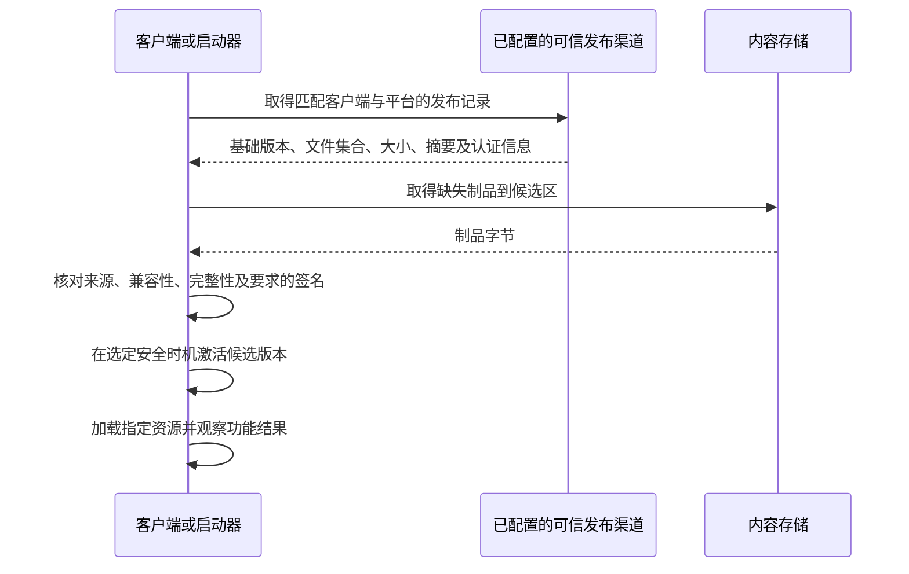
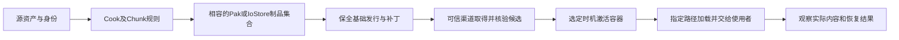

# 04 资源管理与热更新
> 知识成熟度：L2（官方资料静态核对；第四节是待执行的完整教学练习，未在本轮运行 UE）。
> 版本基线：2026-10-10 实际读到的 Epic 文档页面标题为 UE 5.8；来源与具体覆盖见第七节。没有本轮本地引擎源码或打包结果。
> 历史身份：旧稿记载“UE 5.8.0、CL 55116800、`++UE5+Release-5.8`，2026-08-06 元数据维护”。这是原稿的环境声明，不能作为本次已读取 `Engine/Build/Build.version` 的证据；UE4.27 资料仅保留历史对照身份。
> 适用范围：资源组织、Cook/Chunk 与内容交付原理；完整练习限 Windows 桌面、同一引擎与客户端构建、传统 Pak、退出游戏后安装补丁。IoStore、ChunkDownloader 和平台分发另列能力边界。
> 最后更新：2026-10-10（补全红→蓝材质补丁练习，校正挂载、容器、来源可信与回退边界）。未执行编辑器、Cook、打包、C++/蓝图编译、安装、网络下载或安全配置。

## 一、概述

玩家拿到新 Pak，为什么有时仍然看到旧材质？因为内容更新至少涉及三个不同对象：磁盘上的发布制品、引擎接下来能找到的包，以及场景已经持有的 UObject。把文件下载成功当成更新成功，会把这三个对象混在一起。

本文先解释资产身份、引用与 Cook 如何决定“包里有什么”，再解释容器如何让加载器找到这些内容。第四节用一个小练习把它们接起来：先发布一个显示红色立方体的 Windows 构建，保持资源路径与客户端不变，把材质实例改成蓝色，生成补丁，在退出游戏后安装，再通过同一路径加载出蓝色；最后切回保留的基础副本确认红色。

资源更新不必一律在进程中完成。整包更新、启动前补丁、运行时按需下载各有适用场景。本文完整练习选择启动前补丁：这样可以把资源身份、构建基线和实际显示结果讲清楚，同时避免把“挂载”误解成替换所有已加载对象的万能事务。

## 二、核心概念（表格速览）

| 概念 | 说明 | 关键文件 / API |
| --- | --- | --- |
| `.uasset` / `.umap` | 资产与关卡文件（二进制） | `Content/` 目录 |
| Asset Registry | 查询资产元数据与依赖；有记录不等于已经加载 | `IAssetRegistry` / `FAssetData` |
| 硬引用 | A 直接持有 B 的 UObject 指针 | `UPROPERTY` 对象属性 |
| 软引用 | 以路径字符串引用，按需加载 | `TSoftObjectPtr` / `FSoftObjectPath` |
| Primary Asset | 可用类型与名称组成的 ID 管理的资产 | `UAssetManager` / `FPrimaryAssetId` |
| Pak | 内容容器文件（可挂载/加密/压缩） | `UnrealPak` 工具 |
| Chunk | 把内容按更新/平台粒度分组 | Chunk ID + `-manifests` |
| IoStore | UE5 的新容器格式 | `.utoc` + `.ucas` |
| Mount Point | Pak 挂载路径（对应 `/Game/` 等） | `FPakPlatformFile` |
| DDC | 烘焙/派生数据缓存 | 见 02 篇 |
| 内容更新 | 获取与启用一组相容的新内容 | 发布基线、交付文件、加载入口与激活策略 |
| 版本管理 | 资产/引擎/自定义版本号 | `FPackageFileVersion`、`FCustomVersion` |
| 迁移 | 资产跨项目/跨引擎转移 | 内容浏览器 Migrate、ResavePackages |

## 三、原理详解

### 3.1 资产组织规范

#### 3.1.1 目录结构约定

```text
Content/
  Maps/                 # 关卡
  Characters/           # 角色
    Hero/               # 每个角色一个子目录
      Meshes/  Textures/  Animations/  Blueprints/  Materials/
  Environments/         # 场景
    Level01/  Level02/
  UI/                   # 界面
    Icons/  Widgets/  Fonts/
  Audio/                # 音频
  Data/                 # 数据资产 DataAsset / DataTable
  FX/                   # 特效（Niagara / Cascade）
  VFX/  Props/  Vehicles/ ...
```

**功能（Feature）优先 vs 类型优先**：中小项目按类型分（上图），大型项目推荐按功能域分（`Features/Battle/`、`Features/Shop/`），与插件化、Chunk 化天然对齐。

#### 3.1.2 命名规范（前缀约定）

| 前缀 | 资产类型 | 前缀 | 资产类型 |
| --- | --- | --- | --- |
| `SM_` | Static Mesh | `SK_` | Skeletal Mesh |
| `M_` | Material | `MI_` | Material Instance |
| `T_` | Texture | `UI_` / `B_` | UI 贴图 / 图标 |
| `BP_` | Blueprint | `W_` / `WB_` | Widget Blueprint |
| `A_` | Anim Sequence | `ABP_` | Anim Blueprint |
| `PS_` | Particle System | `NI_` | Niagara 系统 |
| `S_` | Sound | `DT_` | DataTable |
| `DA_` | DataAsset | `GM_` | GameMode |
| `PC_` / `AC_` | 玩家/角色控制器 | `C_` | Curve |

#### 3.1.3 引用、身份与资源何时进入内存

- **硬引用**让引用者加载时带入目标及所需依赖，适合启动时一定要用的内容；不是“加载一定更快”的保证。
- **软引用**保存可解析的对象路径，允许延后加载。它不替你下载文件，也不意味着任意拼出来的字符串都会被 Cook 收入。
- **Primary Asset**由有效的 `FPrimaryAssetId` 识别，形式是类型与名称。Asset Manager 的扫描、规则、Bundle 和加载接口围绕它工作；普通材质不会因为放进某个目录就自动变成项目自定义主资产。（S01、S02）

例如第四节的材质实例有三种不同名字：

```text
编辑器文件：Content/PatchDemo/Color/MI_Status.uasset
包名：      /Game/PatchDemo/Color/MI_Status
对象路径：  /Game/PatchDemo/Color/MI_Status.MI_Status
```

对象路径用于软引用；Chunk ID 用于内容分组；发布版本 `1.0.1` 用于项目交付。它们不能相互替代。补丁覆盖同一资产时保持包与对象身份不变；重命名属于迁移，需要处理旧引用，不能只改 CDN 文件名。

以下保留 C++ 软引用与异步加载的对应关系，是**接口节选，不是独立可编译程序**。`UMyAssetOwner` 表示项目已有的 UObject 类，需在类中声明成员和回调，并包含 `Engine/AssetManager.h`、`Engine/StreamableManager.h` 与所用资产类型头文件：

```cpp
UPROPERTY(EditAnywhere)
TSoftObjectPtr<UStaticMesh> OptionalMesh;

UPROPERTY(Transient)
TObjectPtr<UStaticMesh> LoadedMesh;

// UMyAssetOwner 的成员函数内；回调签名为 void OnMeshLoaded()。
UAssetManager::GetStreamableManager().RequestAsyncLoad(
    OptionalMesh.ToSoftObjectPath(),
    FStreamableDelegate::CreateUObject(this, &UMyAssetOwner::OnMeshLoaded));

// OnMeshLoaded 内：完成通知也可能对应加载失败，仍要检查结果。
LoadedMesh = OptionalMesh.Get();
if (LoadedMesh)
{
    // 此时才把资源交给仍然有效的使用者。
}
```

实际项目还要处理请求重入与取消：回调使用请求时的路径/代次，不能在请求中途更改 `OptionalMesh` 后误接收旧结果；所有者销毁后不得继续访问它。需要取消或控制驻留时保存返回的 `FStreamableHandle`。成功后由组件、强引用属性或仍有效的加载句柄维持需要的对象；单独软指针不负责强保活。第四节只发起一次蓝图异步加载，用组件持有材质，不把这段节选当成完整加载器。（S01、S02）

### 3.2 Cook、Chunk、Pak 与 IoStore 分别做什么

#### 3.2.1 从可编辑资产到可交付内容

Cook 根据目标平台、地图、引用和显式规则选择资产，并转换成运行时内容。只有编辑器源文件而没有相应平台 Cook 结果，不能靠压进 Pak 就变成可运行内容。

Chunk 是逻辑分组。Asset Manager 的规则与 Primary Asset Label 可以指定 CookRule、Priority、Chunk ID；规则冲突和共享依赖决定一个资产最后归入哪里。把一个文件夹标为 Chunk 1001，不等于它的所有依赖都一定只存在于 1001，也不等于首包会自动排除它。需要用 Asset Audit、Reference Viewer、Cook/打包输出核对实际归属。（S03、S04）

Pak 则是容器。容器里的条目路径、索引和数据让运行时能找到被打包的文件。常见项目内容路径关系仍是：

```text
../../../PatchDemo/Content/  →  /Game/
```

这是解释虚拟内容根的示意，不是让所有第三方 Pak 都强行挂到 `/Game/` 的命令。项目名、实际内部路径、Cook 平台和依赖不匹配时，仅改挂载点解决不了问题。

#### 3.2.2 Pak 与 IoStore 要按制品和版本区分

`Use Pak File` 与 `Use Io Store` 是不同的打包设置。Epic 的项目设置文档把 IoStore 的包数据描述为 `.utoc/.ucas`；不能仅看到 `-pak` 就断言一定产生 IoStore，也不能因为旁边有一个很小的 `.pak` 就认定它含有全部资源。（S05）

```text
传统 Pak 教学路径：       对应 Chunk 的 .pak
启用 IoStore 的项目路径： .utoc + .ucas 等配套容器，可能另有 .pak
```

具体文件集合由本次构建输出决定，签名、额外分片等同样属于交付合同。不要把 `.utoc` 改扩展名交给旧 Pak 工具，也不要只分发其中一个伴随文件。IoStore 的组织方式不能单独保证“补丁必定更小”“随机读取必定更快”或“加密更安全”；这些需要相应构建、内容与运行证据。

#### 3.2.3 几个系统的责任不能串错

| 系统 | 本文可依赖的职责 | 不由它单独保证 |
| --- | --- | --- |
| Asset Registry | 提供资产元数据与依赖查询 | 文件已下载、对象已加载、未知新资产已自动注册 |
| Asset Manager | 主资产身份、扫描、加载管理与 Cook/Chunk 规则 | CDN 发布、可信来源认证、完整版本回滚 |
| Pak / IoStore | 按各自链路组织和读取容器 | 刷新场景中的既有 UObject、业务可用性 |
| ChunkDownloader | 依据部署/构建清单缓存与挂载 Chunk | 完整商店发布、所有平台安全策略、项目状态迁移 |
| 项目发布/启动器 | 选择相容版本、取得可信制品、安排激活与回退 | 不能由“下载回调成功”代替以上判断 |

UE5.8 的 ChunkDownloader API 将 `DownloadChunks` 与 `MountChunks` 分开；其 hosting 教程现已展示 `.pak/.utoc/.ucas` 共同列入清单。因而“ChunkDownloader 永远只能处理单个 Pak、绝不涉及 IoStore”也不成立。另一方面，这份示例清单不能证明任意旧版本插件、平台或自定义加载器都能完整启用 IoStore：要按目标版本核对实际实现、全部制品及运行结果。本文不实现该插件的网络链路。（S08、S09）

### 3.3 内容更新为什么需要发布基线

#### 3.3.1 “差量”不是只有变更的几个字节

Epic 的传统 Pak 补丁流程比较新旧 Cook 结果，变更包通常以整个 package 为单位进入补丁。因此改一个材质参数可能产生比参数本身大很多的补丁。基础发布的 Cook 内容、Asset Registry 与发行制品必须保留，生成时才知道相对于哪个版本比较。压缩、共享依赖和序列化变化也会影响大小。（S06、S07）

| 方案 | 适合的问题 | 主要代价与边界 |
| --- | --- | --- |
| 整包或平台商店更新 | 程序、引擎、插件或平台安装内容一并改变 | 下载与审核成本；走对应平台渠道 |
| 启动前 Pak 补丁 | 相容客户端的内容修订 | 保留基础包；补丁身份与优先级要明确 |
| 运行时 Chunk 下载 | 进入某功能前取得内容 | 还需处理请求、驻留、失败与激活时机 |
| 脚本/蓝图内容更新 | 项目已有相容运行时支持的逻辑内容 | 不自动获得动态代码分发许可；仍受平台与版本约束 |

本篇不把平台代码更新政策概括为“换一个脚本就允许”。C++ 二进制或序列化布局变化通常要求新的相容客户端与正规分发流程；编辑器 Live Coding 也不是玩家端内容补丁机制。

#### 3.3.2 获取、验证、激活各自回答一个问题



摘要回答“字节是否与发布记录一致”；可信发布渠道或签名验证回答“这份记录和制品是否来自被授权的发布者”。如果攻击者能同时换掉包和同站点的裸哈希，换成 SHA-256 也不会凭空产生发布者身份认证。HTTPS、签名与客户端信任配置各有作用；不能关闭证书或签名校验来让练习通过。

本地练习直接使用自己刚生成且保全的构建输出作为来源，另留摘要以检查复制结果。扩展到远端时，项目必须补齐发布授权、可信清单、下载目的地址及路径约束、大小/空间限制、失败保留与回退策略；这是项目交付层职责。UE 会生成补丁，不替你完成所有平台的补丁分发。（S05、S07、S13）

#### 3.3.3 挂载成功后，旧对象为什么仍然存在

挂载改变的是后续包查找可以访问的容器，不是重建所有已经加载的对象。场景中的网格、材质实例、蓝图对象和异步请求可能仍指向旧内容；卸载一个容器也不等于释放这些引用。

第四节选择**退出应用后放入补丁，再启动新进程**，使指定路径在第一次加载时就选中新内容。若要在游戏中切换，项目必须建立一个没有旧资源使用者与未完成读取的安全窗口，并处理资产索引、加载句柄、对象依赖及业务状态，不能把这些责任藏在 `Mount()` 的布尔返回值后面。（S01、S02、S10）

#### 3.3.4 为什么不再复制“new 一个平台文件链”的挂载骨架

运行中另建 `FPakPlatformFile` 并调用 `SetPlatformFile` 会改变全局文件系统链；它不是每次更新都应执行的普通步骤。UE5.8 的 `Mount` API 文档也建议多数调用使用 `FCoreDelegates` 的挂载委托。（S10）

接口中的 `uint32 PakOrder` 是顺序参数，不是原稿注释里的 `bIsPrimary`。不能用“后挂载一定覆盖先挂载”作为通用规则。传统补丁还涉及启动搜索目录、基础 Pak 与带 `_p.pak` 后缀补丁的优先级规则；应采用项目已验证的发布链路。第四节使用正常启动自动发现补丁，无需改全局文件链。（S06、S10）

### 3.4 版本管理与迁移

#### 3.4.1 资产版本号体系

UE 资产内部携带版本信息，用于序列化兼容：

| 版本机制 | 说明 |
| --- | --- |
| `FPackageFileVersion` 与对象版本 | 包格式/序列化兼容信息；不同于项目资源发布版本 |
| `FCustomVersion` | 自定义版本：插件/团队自行注册的版本 GUID，用于自己的数据结构升级 |
| `FArchive` 版本判断 | 序列化时按版本分支读写 |

自定义版本示例（UObject 派生类的教学节选，未编译；类声明与头文件由项目提供）：

```cpp
// MyCustomVersion.h
struct FMyCustomVersion
{
	enum Type
	{
		BeforeCustomVersionWasAdded = 0,
		AddedNewField,          // 某个版本新增了字段
		VersionPlusOne,
		LatestVersion = VersionPlusOne - 1
	};
	const static FGuid GUID;
};

// MyCustomVersion.cpp
const FGuid FMyCustomVersion::GUID(0x12345678, 0x9ABCDEF0, 0x12345678, 0x9ABCDEF0);
FCustomVersionRegistration GRegisterMyCustomVersion(
	FMyCustomVersion::GUID, FMyCustomVersion::LatestVersion, TEXT("MyCustomVersion"));

// 序列化中使用
void UMyVersionedAsset::Serialize(FArchive& Ar)
{
	Super::Serialize(Ar);
	Ar.UsingCustomVersion(FMyCustomVersion::GUID);
	if (Ar.CustomVer(FMyCustomVersion::GUID) >= FMyCustomVersion::AddedNewField)
	{
		Ar << NewField;
	}
}
```

#### 3.4.2 引擎升级与资产重存

读取旧资产时，兼容代码可按版本号解释或转换数据；再次保存才会把新格式写回磁盘。自定义 GUID 需通过 `UsingCustomVersion` 参与该对象的序列化；注册 GUID 本身不等于每个对象都记录了它。旧包不存在新字段时还要定义合理默认值，而不是无条件读取。上述机制与补丁版本号是两层合同。（S12）

升级链注意事项：

- 不要假设高版本引擎**保存后**的资产能被低版本引擎读取；保留原件并锁定团队引擎/插件版本，打开与保存不是同一个动作；
- 大规模升级前先备份/分支。以下是原稿保留的**批量重存入口示意**，参数须按实际引擎核对；不属于第四节练习，也未在本轮执行：

```bat
Engine\Binaries\Win64\UnrealEditor-Cmd.exe "C:\MyGame\MyGame.uproject" ^
    -run=ResavePackages -resaveall -unattended -nop4
```

- 升级后检查 `check()`/日志中的版本警告，配合自动化测试回归；
- 自定义版本号要在升级代码发布前注册，避免线上旧资产读取失败。

#### 3.4.3 资产迁移（Migrate）

跨项目/跨分支复制资产：

- **内容浏览器 Migrate**：右键资产 → Asset Actions → Migrate，列出内容依赖供检查；保留所需依赖并迁移到目标 Content 根（S14）；
- **手动拷贝**：容易漏依赖，`Content/` 下的引用路径会断，不推荐；
- **批量迁移**：按实际项目建立路径映射与验证清单；不要把未指定名称的“Data Migration 工具”或 `-run=...` 当作已经可用的实现。

#### 3.4.4 版本控制

- 常见选择是支持锁定工作流的 **Perforce**，或 **Git + Git LFS**；按团队规模、托管与锁定方案决定，不能把 LFS 当作二进制自动合并工具；
- `.uasset` 是二进制，通常不能靠通用文本合并解决冲突：约定**一人一资产**、检出即锁定；
- `Config/` 下的 ini 是文本，可正常 diff；
- 提交规范：蓝图/资产提交时附带说明，CI 对 `Content/` 变更触发 Cook 冒烟。

## 四、完整练习：同一路径的红色材质更新为蓝色

下面是原创练习设计，基于前述公开机制推导，**所有操作与结果均为待执行方案 / 预期，未在本轮运行**。无需额外下载美术资产，不涉及在线热更新服务。读者需已有能够正常打包 Windows 的 UE 开发环境；若该环境尚未具备，先完成 [UAT 与自动化打包](../构建编译与制品/02-UAT与自动化打包.md) 的环境与制品检查。

### 4.1 固定工程、路径与基础输入

在自己的 Windows 实验目录建立 Games → Blank → Blueprint 工程 `PatchDemo`，使用同一份 UE5.8 发行版完成基础和补丁。记录实际 `Build.version`、工程/插件 revision、目标 Windows、配置 Development；这里的 Development 是为了查看加载日志，不能与 Shipping 产物混作同一发布基线。

创建以下内容，整个练习不改名：

```text
Content/PatchDemo/
  Boot/
    L_PatchRoom.umap
    BP_PatchProbe.uasset
    BP_PatchGameMode.uasset
  Color/
    M_Status.uasset
    MI_Status.uasset
    Label_Color.uasset
```

1. 在 `Color` 创建材质 `M_Status`，设为 Unlit，把名为 `Tint` 的 Vector Parameter 接到 Emissive Color；初值为红色 `(1,0,0)`，Apply/Save。
2. 从它创建材质实例 `MI_Status`，勾选并覆盖 `Tint=(1,0,0)`。这个实例硬引用父材质；两者都要在基础交付中可用。
3. 创建 Actor 蓝图 `BP_PatchProbe`，加入 Static Mesh 组件 `Cube`，选择引擎自带的 Cube。保持组件原本的默认材质，不在组件 Details 直接指定 `MI_Status`。
4. 创建变量 `StatusMaterial`，类型为 Material Interface 的 **Soft Object Reference**，默认值选 `MI_Status`。这样启动地图能引用探针 Actor，而材质由下面的异步入口加载。
5. 创建空地图 `L_PatchRoom`，放置探针于 `(0,0,100)`；放置 Camera Actor 于 `(-300,0,100)`、旋转 `(0,0,0)`，Auto Activate for Player 设 Player 0，镜头朝向立方体。创建 `BP_PatchGameMode`（GameModeBase），Default Pawn Class 设 None，并在该地图的 World Settings 中把 GameMode Override 指向它。
6. 在 Maps & Modes 把 Game Default Map 设为 `L_PatchRoom`，保存全部内容。此例使用自发光颜色，不依赖额外灯光。

### 4.2 连出一次真正的资源加载入口

在 `BP_PatchProbe` 的 Event Graph 连接：

```text
Event BeginPlay
  → Async Load Asset（Asset = StatusMaterial）
      Completed → 检查返回 Object 有效且类型为 Material Interface
                  → Cube.SetMaterial（Element Index = 0，Material = 返回对象）
                  → Print String（PATCH_DEMO: material loaded，Print to Log = true）
      返回无效 / 类型错误 → Print String（PATCH_DEMO: material load failed）
```

使用 `Completed` 之后的结果，不把节点刚发出请求时的执行出口当成加载完成。若蓝图节点输出是泛型 Object，先 Cast To Material Interface，再把成功输出接给 Set Material；Cast Failed 进入失败提示。此例每次进图只请求一次，不在 Tick 中重复发起。

Async Load Asset 的输入是软对象引用，成功后才有可用对象。组件的材质引用接住加载结果；编辑器能选中资产、回调被调用、材质实际设置成功是不同观察点。编辑器预览应看到红色立方体，但预览不能替代后面的独立打包验证。（S11）

### 4.3 让 Cook 确实收进这个材质及依赖

在 `Color` 文件夹创建 **Data Asset**，基类选择原生 `PrimaryAssetLabel`，命名 `Label_Color`；不是创建一个 Blueprint 子类。设置 Chunk ID `1001`、Priority `10`、Cook Rule `Always Cook`、Label Assets in My Directory 启用、Is Runtime Label 启用。检查 Asset Manager 的 Primary Asset Types to Scan 中 `PrimaryAssetLabel` 扫描能覆盖 `/Game/PatchDemo/Color`；若项目改过默认扫描规则，应修正本实验工程中的匹配项，避免添加重复类型。（S03、S04）

Project Settings → Packaging 在这个独立实验工程中选择 `Use Pak File=true`、`Generate Chunks=true`、`Use Io Store=false`。这是为演示传统 Pak 所作的容器选择，不是生产 IoStore 项目更新的前置要求；不要顺带修改签名、加密或平台安全设置。（S05）

在 Tools → Audit → Asset Audit 检查 `MI_Status`、`M_Status` 的 Chunk 归属；用 Reference Viewer 看到 `MI_Status → M_Status` 的依赖。目标是 Color 资产进入 1001，Boot 地图/蓝图留在基础启动内容。若实际归属不同，先排查扫描范围、冲突规则与引用，不继续假设文件夹已经替你完成分块。

Chunk 1001 在本例**随基础包完整安装**，不模拟“缺块在线下载”。把它单独分组的目的是观察构建边界，并让修改前后的内容身份清楚可见。

### 4.4 先生成能独立启动的 1.0.0

打开 Platforms → Project Launcher，创建 Custom Launch Profile `PatchDemo_Base_1.0.0`：

| 项目 | 本练习取值 |
| --- | --- |
| Project / Build | 当前 `PatchDemo`；Development |
| Cook | By the Book；当前 UE 显示的 Windows 目标；文化选 en；地图只选 `L_PatchRoom` |
| Release/DLC/Patching | 创建发行版本，版本名 `1.0.0`；不勾 Generate Patch |
| Cook 高级选项 | Store All Content in a Single File (UnrealPak)、Generate Chunks、Compress Content、Save Packages Without Versions 启用；Cooker Build Configuration 选 Development；本例不使用 Iterative Cooking 或新的 Patch Tier |
| Package / Archive | Package & Store Locally；Profile 中的 I/O Store 也关闭；启用归档并设为专用 `C:\PatchLab\Base100`，不与补丁目录共用 |
| Deploy / Launch | Do Not Deploy / Do Not Launch |

这些选项在 Project Launcher 里也有独立入口，要核对该 Profile 的实际取值，不能只改 Project Settings。`Save Packages Without Versions` 省略部分序列化版本信息并假定相容加载端，本例因此严格保持同一客户端与序列化代码；它不是跨引擎内容兼容开关。（S15）

构建完成后保全 `PatchDemo/Releases/1.0.0` 的 Asset Registry、Cook/发布基线与实际基础容器，以及完整 `Base100` 交付目录。官方页面部分截图沿用 `WindowsNoEditor` 命名，实际子目录以这次工具输出为准，不凭截图硬拼路径。（S07）

从 `Base100` 归档中确认可执行文件和项目 `Content/Paks` 实际位置，记下为 `BaseExe` 与 `BasePaks`。完整复制一份到 `C:\PatchLab\Client100`，从其中的可执行文件独立启动：

- **预期**：进入 `L_PatchRoom`，立方体为红色，Development 日志含成功标记；失败标记不应出现
- **制品检查**：基础 Pak 包含实际分配的 Color 内容与 Boot 内容，1001 不是只有空名而没有材质；不存在本例未选择的 IoStore 包数据集合
- **停止条件**：基础副本不能独立运行、Cook 有资源/版本错误或材质缺失时，先修基础，不生成补丁掩盖问题

检查容器内容时，可使用同一引擎的 `UnrealPak.exe` 对实际基础 1001 Pak 运行 `-List`，查找 `PatchDemo/Color/MI_Status` 与 `M_Status` 条目；再对后续补丁列表确认改变的实例进入补丁。完整路径从本次输出取得，不用本文臆造文件名。该读取入口仍需项目已有的正常访问条件；若加密索引等使读取失败，保留失败并按受控构建流程核查，不关闭加密或签名。（S16；本轮未运行）

保留这份基础副本，不用第二次 Stage 结果覆盖它。

### 4.5 只改输入中的一个值，再生成补丁

回编辑器只把 `MI_Status` 的 `Tint` 覆盖值改为蓝色 `(0,0,1)` 并保存。不要改文件路径、父材质、蓝图、引擎、插件、客户端代码或 Cook 平台。

复制基础 Launch Profile 为 `PatchDemo_Patch_1.0.1`。保持平台、配置、地图、文化及 Cook/容器选项相同；取消“创建基础发行版本”，设 **Release Version This Is Based On = 1.0.0**，启用 **Generate Patch**，本地归档到另一个目录 `C:\PatchLab\Patch101Build`。不要把资源补丁标签 `1.0.1` 当成“基于 1.0.1”输入。

执行后从实际 Stage/归档输出中识别本次生成的全部补丁 Pak（通常带 `_P.pak` / `_p.pak` 后缀，保留工具原名）及该项目要求的配套签名文件；组成单独的 `C:\PatchLab\Payload101`。若日志未确认 Generate Patch 与基线 1.0.0，或者输出只是全量基础包，停止，不靠手工重命名伪装补丁。（S06）

此处差量计算需要原基础发行数据。版本字符串相同而内容来自另一份构建也不安全；因此把引擎/工程身份与原始制品一起保全。一个 Chunk 可能有多个产物，不能只拿看到的第一个文件。

### 4.6 获取可信制品并核对复制结果

本例的发布者就是生成 `Payload101` 的本地构建过程。先确认它来自上一步成功产物，记录每个文件的名称、大小和 SHA-256，之后再复制到候选安装区；不能在收到一份来历不明的包后，现场对它算个哈希就称其可信。

下面两条 **PowerShell 阅读/复现命令未在本轮执行**，只读取已准备的本地文件。它们不下载、不安装、不改安全设置；输出值必须用实际构建结果记录，本文不预造摘要：

```powershell
Get-ChildItem -LiteralPath 'C:\PatchLab\Payload101' -File |
    Select-Object Name, Length

Get-ChildItem -LiteralPath 'C:\PatchLab\Payload101' -File |
    Get-FileHash -Algorithm SHA256
```

把完整 `Client100` 再复制为 `C:\PatchLab\Client101`。确认两个客户端进程均已退出，将 `Payload101` 的完整文件集合复制到 **Client101 实际基础 Pak 所在的启动搜索目录**，与基础包并存。对目的文件重复上面的大小/哈希读取并逐项对照来源记录；保留工具生成的签名及现有验证要求。复制未完成、缺文件、摘要不符、版本不符、签名失败都不得启动候选。（S06、S13）

若之后扩展成网络方案，项目自定义 JSON 记录可包含 `contentVersion`、`baseRelease`、`clientBuildId`、`platform`、`containerFormat` 与文件路径/字节数/摘要。但这不是 UE 内置统一协议，也不是 ChunkDownloader 的清单格式。ChunkDownloader 的公开示例使用带构建 ID 和条目数的文本清单，文件字段用 Tab 分隔；示例中的任意版本字符串不能自动等同于加密摘要，更不能等同于清单签名。（S08、S09）

### 4.7 启动、观察，并证明能回到基础版本

从 `Client101` 自己的可执行文件启动，确认没有误开编辑器或 `Client100`：

| 条件 | 预期观察 | 说明 |
| --- | --- | --- |
| 原 Client100，基础 1.0.0 | 红色，加载成功标记 | 基础输入与加载入口成立 |
| Client101，基础包 + 完整 1.0.1 补丁 | 蓝色，同样的加载成功标记 | 同一路径在新进程中取得补丁内容 |
| 完全退出 Client101，再启动保留的 Client100 | 再次红色 | 本练习无需迁移业务状态，可切回原副本 |

颜色验证内容变化，日志验证加载入口；应结合启动/容器日志确认本次使用的目录与补丁。只看到一个 `.pak` 文件或一次成功回调都不足以证明这一整行结果。

本例采用保留完整副本后选择启动目录的回退方式，没有在运行中删除或卸载容器。生产启动器若原地维护版本目录，应在应用关闭后切换已核验的完整版本集合；多个补丁的覆盖关系、断电中断、磁盘空间、文件占用及恢复步骤都要另测。来自同一基础版本的多个完整补丁不能随意叠加，需遵循实际构建的替代关系。（S06）

### 4.8 与这个例子直接相关的错误

- **PIE 红色正常，独立包失败**：回查软引用对象路径、Cook 选择和实际 Chunk 内容；编辑器有原资产不证明发布包里也有
- **候选依然红色**：先核对启动的是哪个 exe、补丁是否在其搜索目录、名称与挂载日志，再确认修改的是材质实例已启用的 Tint 覆盖值；不要先不断增加挂载次数
- **回调成功却是默认材质**：检查有效性/类型和 Set Material 的组件、槽位及执行连线；完成回调不自动完成场景赋值
- **改为新增资源后找不到**：本例验证同路径替换；新资产还要解决 Cook 收入、发现/索引与入口引用，不能把它当作本例已验证的扩展
- **基础 1.0.0 配上另一平台/客户端补丁**：在激活前拒绝；换文件名不改变 Cook 目标和序列化兼容性
- **在线内容或存档已写入新格式**：回退资源可能无法回退业务状态。本例只变颜色没有这类迁移，生产必须单独设计相容性或使用整包升级

### 4.9 把构建与内容使用连起来



本图保留“打包与热更关系”的用途，但把最后的“挂载即生效”拆成了容器可见、对象加载与使用者观察。CI 可以先生成与核验制品，真正的交付验证仍要在相应客户端与平台上完成。

## 五、最佳实践

1. **先规定资产身份与引用边界**：目录、命名、可复用父材质与功能依赖一并维护；重命名时处理旧引用。
2. **按实际加载时机选择引用**：启动必需内容可硬引用，大型可选内容用软引用并提供加载/失败入口，不把“全部改成软引用”当作普遍优化。
3. **Chunk 服从用户旅程与共享依赖**：首包、地图、玩法包要能解释实际安装与使用时机；Asset Audit 和实际 Cook 输出共同确认。
4. **保留发布基线**：基础 Cook 数据、Asset Registry、容器、程序、配置和构建身份一起保存；差量大小由实际产物比较。
5. **将字节一致与发布者可信分开**：MD5/SHA1 不作为抵御恶意篡改的信任机制；摘要本身也不认证来源，遵守既有签名与分发策略。
6. **加密不等于服务端权威**：客户端需要能读取资源，敏感玩法判断仍在适当的权威端；不要承诺容器加密让内容不可提取。
7. **版本纪律**：引擎、插件和自定义序列化版本共同锁定；资源发布标签不能代替二进制兼容检查。
8. **自动化关注交付集合**：记录实际文件、大小、摘要、基础依赖和失败日志；不能由单个工具退出码推导玩家更新成功。
9. **包体优化按内容验证**：纹理、音频、文化、Editor-only 资源与共享依赖分别检查，避免为变小而漏掉动态加载内容。
10. **监控分阶段解释**：区分下载、完整性、认证、容器激活、对象加载与实际功能失败；告警要能定位哪一步需要恢复。

## 六、常见问题 FAQ

**Q1：热更后出现花屏、白模或缺声音？**
先检查改变的资源与依赖是否在基础/补丁联合集合中、是否来自正确平台 Cook、是否加载成功；Shader、材质、纹理和组件赋值也分别排查。第四节里 `MI_Status` 存在但缺父材质，并不构成可用补丁。

**Q2：Pak 挂载失败或找不到？**
检查实际搜索目录、内部路径、完整性、要求的签名/密钥与版本兼容。不同方案允许的挂载时机不同，不把“任何 Pak 都必须在引擎访问 Content 前挂载”当成绝对规则；同路径内容更新尤其要先考虑已加载对象。不要重装全局平台文件链或关闭安全检查。

**Q3：客户端与服务器资源版本不一致？**
协议明确哪些内容版本与哪个客户端/服务端兼容，登录或进入玩法前检查；“资源版本号一样”不证明程序与数据模式相容。不满足协议时拒绝进入该功能或走适当升级入口。

**Q4：iOS 或其他商店平台能否靠脚本绕过代码更新限制？**
不能据此推断。资源、蓝图、脚本和原生代码的分发方式受当前平台规则与应用用途约束，应查对应渠道的最新官方要求。本篇 Windows 本地练习不提供其他平台许可或商店合规结论。

**Q5：引擎升级后大量资产报版本错误？**
先确认工具链、插件、GUID 注册与兼容代码；在保留原件的升级分支上重存和回归，不通过批量保存覆盖唯一旧版本。原稿的 ResavePackages 命令仅是批处理入口示例，不证明资产都可自动修复。

**Q6：Migrate 后引用断了？**
迁移到目标项目的 Content 根并保留依赖路径关系；检查资产重定向、插件/原生类和引擎版本。Migrate 处理内容依赖，不复制所有外部代码环境；有问题先恢复副本，再规划重定向处理。（S14）

**Q7：IoStore 与旧 Pak 工具不兼容？**
先识别实际容器及工具版本；`.utoc/.ucas` 需匹配的加载链路与配套文件，不能当成普通单 Pak 操作。5.8 ChunkDownloader 文档的三类文件示例也不为旧项目提供自动迁移保证。

**Q8：如何控制热更包大小？**
比较同一基线下的真实产物，查变化包、Cook 非确定变化、共享依赖、压缩和分块策略。传统包级补丁并非修改几个字节就只下发几个字节。

**Q9：热更失败怎么回滚？**
未激活时保留当前版本并隔离不完整候选；激活后按项目的进程、容器、对象与状态兼容合同恢复。第四节的可跟做办法是关闭候选、启动完整基础副本；线上资源回退不自动撤销存档或服务端数据变更。

**Q10：多人同时改一个蓝图或资产冲突怎么办？**
采用团队明确的锁定/协作规则，配合 Perforce 或 Git LFS 等大文件方案、提交前审阅和可回退版本。LFS 保存大文件，不替你理解二进制合并；大关卡可按项目架构分工减少冲突。

## 七、关联阅读与本次来源

- [01-UBT构建系统与编译配置](../构建编译与制品/01-UBT构建系统与编译配置.md)：目标、模块与构建相容性
- [02-UAT与自动化打包](../构建编译与制品/02-UAT与自动化打包.md)：Build、Cook、Stage、Package 的交付责任
- [03-插件开发与编辑器扩展](../编辑器工具与资产自动化/03-插件开发与编辑器扩展.md)：插件代码与内容进入发布集合
- [13-资源加载与异步加载源码](../../03-引擎架构与资源系统/世界组织与资源加载/13-资源加载与异步加载源码.md)：更细的对象加载机制；该文自己的历史源码声明不作为本篇本次源码复核

2026-10-10 实际读取以下官方资料；Epic 页面返回标题为 UE5.8，属于公开文档静态证据。部分正文/截图保留旧术语，不能由标题推断每张截图均为5.8重新实测。S08/S09专门保留了现行三类容器示例与API措辞的差异，不用4.27旧教程替代新能力核对。

| 来源 | 实际支持的范围 |
| --- | --- |
| S01 [Asynchronous Asset Loading](https://dev.epicgames.com/documentation/en-us/unreal-engine/asynchronous-asset-loading-in-unreal-engine) | 软引用、异步完成、结果检查与驻留责任 |
| S02 [Asset Management](https://dev.epicgames.com/documentation/unreal-engine/asset-management-in-unreal-engine) | Primary Asset ID、Asset Manager 与 Streamable Manager 分工 |
| S03 [Preparing Assets for Chunking](https://dev.epicgames.com/documentation/en-us/unreal-engine/preparing-assets-for-chunking-in-unreal-engine) | 原生 PrimaryAssetLabel、规则与分块观察 |
| S04 [Cooking and Chunking](https://dev.epicgames.com/documentation/en-us/unreal-engine/cooking-content-and-creating-chunks-in-unreal-engine) | 扫描、规则、共享引用与 Asset Audit |
| S05 [Project Settings：Packaging / Encryption / Signing](https://dev.epicgames.com/documentation/en-us/unreal-engine/project-section-of-the-unreal-engine-project-settings) | Pak/IoStore 独立设置及签名、加密选项 |
| S06 [How To Create a Patch](https://dev.epicgames.com/documentation/unreal-engine/how-to-create-a-patch-in-unreal-engine) | 包级差量、基线、启动搜索与补丁替代关系 |
| S07 [Releasing Your Project](https://dev.epicgames.com/documentation/unreal-engine/preparing-unreal-engine-projects-for-release)；[Patching Overview](https://dev.epicgames.com/documentation/en-us/unreal-engine/updating-unreal-engine-projects-with-patches-after-release) | 发行版本与制品保留；生成补丁和分发责任不同 |
| S08 [Hosting a Manifest and Assets for ChunkDownloader](https://dev.epicgames.com/documentation/en-us/unreal-engine/hosting-a-manifest-and-assets-for-chunkdownloader-in-unreal-engine) | Tab 文本清单；现行 `.pak/.utoc/.ucas` 文件示例 |
| S09 [FChunkDownloader API](https://dev.epicgames.com/documentation/en-us/unreal-engine/API/Plugins/ChunkDownloader/FChunkDownloader) | 缓存、下载、挂载、ValidateCache 的接口职责；不证明清单来源认证 |
| S10 [FPakPlatformFile::Mount](https://dev.epicgames.com/documentation/en-us/unreal-engine/API/Runtime/PakFile/FPakPlatformFile/Mount) | 参数、IoStore 状态出口以及建议使用挂载委托 |
| S11 [Async Load Asset](https://dev.epicgames.com/documentation/unreal-engine/BlueprintAPI/Utilities/AsyncLoadAsset) | 蓝图软引用异步加载输入与完成输出 |
| S12 [Versioning of Assets and Packages](https://dev.epicgames.com/documentation/en-us/unreal-engine/versioning-of-assets-and-packages-in-unreal-engine) | 引擎/对象版本、UsingCustomVersion、兼容读取与保存 |
| S13 [Get-FileHash（PowerShell 5.1）](https://learn.microsoft.com/en-us/powershell/module/microsoft.powershell.utility/get-filehash?view=powershell-5.1) | SHA-256 文件摘要及 MD5/SHA1 的安全用途限制 |
| S14 [Migrating Assets](https://dev.epicgames.com/documentation/en-us/unreal-engine/migrating-assets-in-unreal-engine) | Migrate 的依赖选择和目标 Content 根 |
| S15 [Project Launcher](https://dev.epicgames.com/documentation/unreal-engine/using-the-project-launcher-in-unreal-engine?lang=en-US) | Profile 的 Generate Chunks、I/O Store、归档及版本保存选项 |
| S16 [Oodle Network：Packaging](https://dev.epicgames.com/documentation/unreal-engine/oodle-network) | 仅引用 `UnrealPak.exe <Pak路径> -List` 的容器条目查看用途；不采用该页关闭加密的测试建议 |

本轮没有新的运行证据或完整引擎源码核对。第四节的红→蓝→红、Chunk 分配、补丁文件集合、日志、命令输出与恢复表现全是需要在所选环境逐项观察的结果，不是已产生的测试记录；因此维持 L2 与 `verified: []`。
