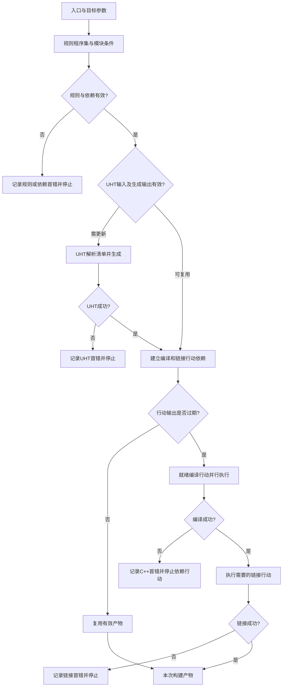
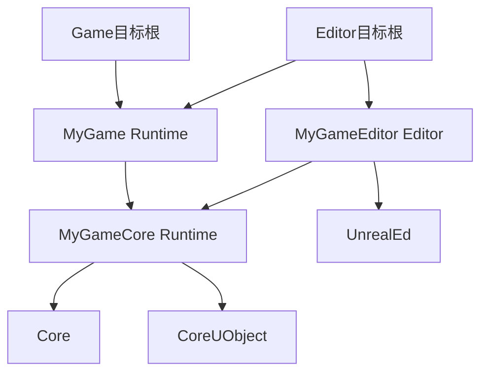
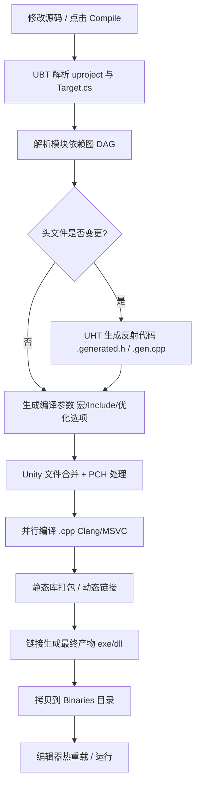
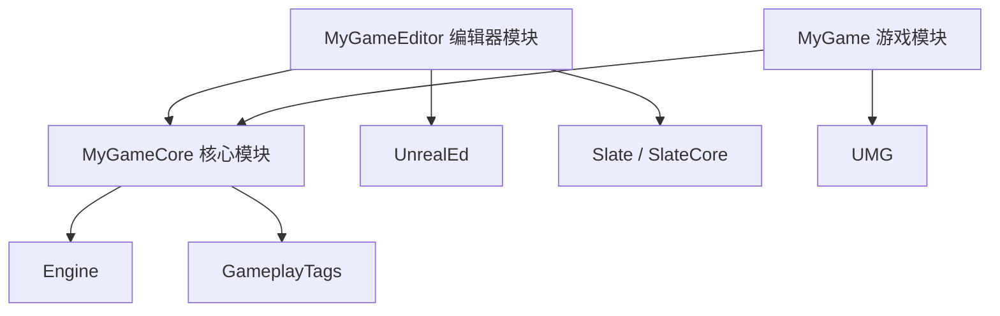

# 01 UBT 构建系统与编译配置

> 知识成熟度：L2（已核公开官方资料；教学代码、配置与纸面预期未运行）。
> 版本基准：2026-10-09 读取的 Epic 公开构建文档，页面标示 UE 5.8；UHT 迁移事实另用 UE 5.1、5.3 版本说明；C++ 翻译单元采用 Microsoft Learn 文档。
> 适用范围：解释 UE C++ 项目构建的规则、依赖、生成、编译、链接与诊断；具体目标支持、工具链、选项及产物布局仍由所用引擎版本和发行形态决定。
> 源码核对状态：未读取本地 Engine checkout 或 `Engine/Build/Build.version`，未核旧 CL 55116800；公开 API 和页面版本标签不能证明该旧 CL 的实现。旧前言与原文完整保留在末尾历史附录。
> 最后更新：2026-10-09（全文知识修订；仅静态核对）。
> 参考来源：第七节列出实际核对的官方页、版本与位置；第八节所有案例均为 PAPER_EXPECTED / NOT_RUN。

<!-- UBT_BUILD_ACTIVE_BEGIN -->

## 一、概述

在普通 C++ 工程里，编译器把源文件变成对象文件，链接器把对象和库变成程序。UE 还要解决几件事：同一份代码需要形成 Editor、Game、Client 或 Server 等不同应用；模块要传播必要的头文件与库依赖；反射类型在普通 C++ 编译前需要生成配套代码；不同平台又有自己的工具链和输出规则。把文件加入 IDE 列表，并不足以描述这些关系。

**UBT（UnrealBuildTool）负责把项目规则变成一次具体构建。** 它读取项目、插件及目标描述，编译并构造 C# 规则，决定模块与编译环境，协调 UHT，然后组织 C++ 编译和链接。生成的 `.sln` / `.vcxproj` 等主要是编辑、浏览与启动构建的入口；真正的 UE 构建依据来自规则，而不是手工改过的 IDE 文件。（S01、S11、S21）

### 1.1 UE 构建体系三件套

| 工具 | 主要输入 → 输出 | 本篇边界与官方定位 |
| --- | --- | --- |
| UBT：UnrealBuildTool | Target/Module 规则、目标参数、工具链 → 构建行动与 C++ 产物 | C#/.NET 构建工具；官方定位 `Engine/Source/Programs/UnrealBuildTool`，本文未打开该源码树 |
| UHT：UnrealHeaderTool | 选定反射头及清单 → 生成的声明/实现配套 | 当前公开资料描述 C# UHT；5.1 发布说明给出 `Engine/Source/Programs/Shared/EpicGames.UHT` 定位 |
| UAT：AutomationTool | 自动化任务与项目参数 → Build/Cook/Stage/Package 等流程结果 | 更上层的任务编排；C++ 构建只是其中一环，后续见 UAT 篇 |

UBT 本身、规则程序集、UHT 与被构建的游戏 C++ 代码是不同对象。不能把“规则 C# 编译成功”“UHT 成功”“游戏 C++ 链接成功”“可分发包成功”当成同一事件。

### 1.2 UE5 时代的版本变化怎样读

[UE 5.1 版本说明](https://dev.epicgames.com/documentation/en-us/unreal-engine/unreal-engine-5.1-release-notes?application_version=5.1)明确记载 UHT 改写为 C#、与 UBT 集成，并默认启用；旧 C++ UHT 当时被弃用。[UE 5.3 版本说明](https://dev.epicgames.com/documentation/en-us/unreal-engine/unreal-engine-5.3-release-notes?application_version=5.3)又记载移除 C++ UHT。因此，不能把方向写成“早期 C#，UE5 改为 C++”，也不应继续把旧 C++ 工具目录当作当前唯一实现位置。（S03、S04）

UBT 的 .NET 启动包装、随引擎分发的运行时和可执行文件布局随版本、源码构建与 installed build 形态变化。本轮没有证据支持旧文具体的“5.0 起”“5.3 后自包含”时间线，不据此指导安装。应从所用发行版的受支持脚本进入，而不是猜一个永久固定的 DLL/exe 路径。

同样要分开看 **Unity、IWYU、构建默认版本与包含顺序版本**：它们解决不同问题。没有实际模板或迁移说明依据，就不能把它们绑成“UE5.3 + V5 + 默认全部开启”的套装，也不能把 Unity 说成按某个版本自动合并大量引擎模块、必有数倍加速。具体机制见 3.7。

## 二、核心概念（表格速览）

| 概念 | 回答的问题 | 常见入口或边界 |
| --- | --- | --- |
| Project / Plugin | 这是哪个项目、启用哪些插件、登记哪些模块？ | `.uproject` / `.uplugin`；插件是可包含代码模块与内容的组织单元 |
| Target | 这次要构建哪一种应用？ | `*.Target.cs`，基类 `TargetRules`；根模块及目标策略 |
| Configuration | 这次采用哪类优化和调试形态？ | Debug、DebugGame、Development、Test、Shipping |
| Platform / Architecture | 产物为哪个平台、架构与 ABI 构建？ | Win64、Linux 等及相应架构；与执行构建的宿主不同 |
| Module | 哪些代码共享接口、依赖和构建规则？ | `*.Build.cs`，基类 `ModuleRules`；不是 C++20 module |
| Translation unit（翻译单元） | C++ 编译器这一轮处理什么？ | 一个实现文件连同预处理后纳入的头；Unity 会改变这个输入边界 |
| Build action（构建行动） | 调度器现在可执行哪一步？ | 一个生成、编译、链接等工作节点及其输入/输出依赖 |
| Binary | 哪些对象/库最后链接在一起？ | exe、DLL、共享库或其他平台产物；不一定一模块一 DLL |
| UHT | 反射声明如何获得生成配套？ | UBT 准备输入清单，UHT 解析并生成，普通编译随后消费 |
| Unity Build | 能否减少多个源文件重复解析的开销？ | 将适用源文件聚合成较大的编译输入；不是模块依赖声明 |
| PCH | 能否复用已处理的头文件前缀？ | `PCHUsage` 等；优化层不能成为声明可见的隐含前提 |
| IWYU | 每个文件是否明确提供自己需要的声明？ | 头自洽、对应头优先、减少巨型头；不是仅开一个布尔值就完成 |
| LoadingPhase | 模块在应用启动的哪个阶段加载？ | descriptor 的加载政策，不是编译行动排序 |
| DDC | 资产、着色器等派生数据能否复用？ | 不等于 C++ 对象文件/PCH 缓存；资源与打包另见关联篇 |

模块是 UE 的组织与构建边界，编译器看到的却是翻译单元，执行器调度的是行动，链接器输出的是二进制。明确这四层，才能解释“只改一个 cpp 为什么重编一大块”以及“头能找到为什么仍链接失败”。（S06、S11、S16）

## 三、原理详解

### 3.1 UBT 的启动链路：先把规则变成具体任务

以 Windows 为例，用户可从 IDE 或引擎提供的 `Engine/Build/BatchFiles/Build.bat` 等入口发起构建。下面是职责模型，不是本轮捕获的调用栈，也不是保证每个版本内部实现顺序完全一致：

```text
IDE / 构建脚本 / 上层自动化
  → UBT：确定 Target + Platform + Configuration + Architecture
  → 读取项目/插件描述，编译并构造 TargetRules / ModuleRules
  → 决定可参与的模块、依赖、宏、include 路径与链接输入
  → 必要时准备 UHT 清单并生成反射配套
  → 根据工具链生成编译/链接等行动，判断输入输出是否过期
  → 执行器运行可执行行动；C++ compiler 编译，linker 链接
  → 留下本次构建产物和诊断记录
```

MSBuild 可以位于 Visual Studio 的启动/调度一侧，但不是与 Clang 并列的 C++ 编译器。UBT 会使用已选择工具链的编译器、链接器及适用执行方式；并行或分布执行也不会省掉依赖约束。机器有哪些 SDK、具体支持哪个编译器，必须看对应 UE 版本的平台要求，不能从本文名单推出。（S01、S02、S21）

`.Build.cs` 和 `.Target.cs` 是 C# 规则代码，而不只是被字符串解析的配置列表。规则语法/成员不匹配可以在任何游戏 C++ 文件进入编译器前失败。因此遇到 C# 规则报错时，应先核规则类、API 版本与当前目标，而不是先改 C++ include。

### 3.2 Target：产品定义与构建坐标

一个具体构建至少要说清目标、配置、平台、架构，并记录引擎/工具链身份。例如 `MyGameEditor + Development + Win64 + 所选架构` 与 `MyGame + Shipping + Win64 + 所选架构` 不是同一构建，仅文件夹名字相同不能使中间结果通用。

| TargetType | 主要用途 | 产物理解 |
| --- | --- | --- |
| Game | 独立游戏应用，可能承载一般客户端或 listen-server 玩法 | 不等同于专门的 Client 目标；运行通常还需对应 cooked content |
| Editor | 在 Unreal Editor 中开发该项目 | 编辑器程序与项目模块共同参与；不保证每次都重建整个编辑器 |
| Client | 明确面向网络客户端的目标 | 需要相应 Client Target 和支持的发行形态/工具链 |
| Server | 专用服务器目标 | 不把一条命令等同于已完成构建、Cook 和运行部署 |
| Program | 独立工具程序 | 可有不同引擎依赖及链接方式，并非“给 UBT 加插件”的同义词 |

`ExtraModuleNames` 指定额外根模块；依赖闭包还由这些模块的规则、插件和目标条件共同形成，不是把所有依赖模块都重复填进 Target。编译出什么 binary 又受 modular/monolithic、平台和目标设置影响，不能绝对规定“一 Target 一 exe”或“一 Module 一 DLL”。（S05、S10、S14）

源码引擎方案与仅编译项目的发行形态，其支持的配置矩阵不同。先确认所选组合被支持，再谈编译。宿主是 Windows 也不自动意味着已具备 Linux Server 交叉工具链。

### 3.3 Module：依赖怎样传播到消费者

典型结构如下；`Public`、`Private` 表达构建接口可见性，不是 C++ 的 `public:` / `private:` 访问控制：

```text
Source/MyGameCore/
  MyGameCore.Build.cs
  Public/BuildProbe.h
  Private/BuildProbe.cpp
  Private/MyGameCoreModule.cpp
```

对模块 A 来说，选择依赖作用域的依据是**A 的公开头是否需要向消费者暴露 B 的编译环境**：

- A 的公开头需要 B 的完整类型声明，例如继承 B 的类，通常把 B 加入 `PublicDependencyModuleNames`
- B 只用于 A 的私有 cpp/私有头，A 的公开接口不依赖它时，使用 `PrivateDependencyModuleNames`
- 前置声明可以降低部分公开依赖，但只适用于 C++ 允许不完整类型的位置；继承、按值成员等不能靠前置声明随意绕开，反射声明还受 UHT 类型规则约束

Public 与 Private 不是“需要链接”和“不需要链接”的开关。官方还区分只要头搜索路径而不静态导入的 include-path 依赖，以及动态加载模块；应按实际接口和链接方式选择，不能把加更多 Public 依赖当通用修复。（S06、S11）

本文例子中 MyGameCore 的公开 `UBuildProbe` 继承 `UObject`，其公开编译接口需要 CoreUObject；MyGame 只在自己的私有 cpp 使用这个接口，因此 MyGame 对 MyGameCore 可以是 Private。若以后 MyGame 又在公开头暴露它，就要重新判断，而不是永久照抄这一行。

新模块应尽量形成无环依赖：A→B→A 会使职责和构建关系难以维护，可提取真正公共接口、调整职责或采用依赖倒置。官方仍保留 `CircularlyReferencedDependentModules` 等 legacy 兼容入口，因此“任何循环 UBT 都无条件报错”不准确；这些入口也不成为新代码创建环的建议。模块依赖图与编译行动图应分别理解。（S06）

### 3.4 UHT：从反射输入到生成代码

公开 UHT 文档描述的是：UBT 发现头文件中的相关关键词，形成包含待处理模块/文件的 manifest，随后 UHT 解析这些输入并输出 UObject 系统需要的配套；UBT 再调用 C++ 编译器。UHT 并非无条件完整解析模块内所有 C++ 头，也不替代普通编译器。官方甚至列出了仅含动态 delegate、缺少发现关键词时的输入发现边界。（S02）

反射头使用 `UCLASS` / `USTRUCT` 等声明，字段和函数可用 `UPROPERTY` / `UFUNCTION` 标记；生成结果常表现为 `.generated.h` 与 `.gen.cpp` 一类配套。它们承担声明展开、注册和元数据等工作，而普通 C++ 编译/链接还要检查类型、定义与符号关系。

**`X.generated.h` 必须是这个头文件的最后一条 `#include`，不是整个文件的最后一行。** 后面仍然要有反射类型的声明、`GENERATED_BODY()` 和成员。第四节给出完整位置关系；不要手工编辑生成文件修补源头错误。（S20）

生成结果在该构建的 `Intermediate` 树下，层级和命名随目标/平台/版本变化，排错时从实际命令和日志定位，不照抄一个跨版本路径模板。是否需要再次运行 UHT，也不能简化为“有没有改头文件”：输入清单、外部依赖、生成器/规则及输出有效性都可能影响判断；输出内容相同还可能不重新写文件。（S02、S07）

当前公开资料中的 UHT 是 C# 实现，5.1 与 5.3 的迁移过程见 1.2。这里的路径和行为说明来自文档，不冒充对某个引擎 CL 的源码走读。

### 3.5 完整编译管线与失败出口



图把过程压缩为职责阶段，不表示所有构建都执行所有节点，也不规定真实调度中的单一全局屏障。生成代码须在消费它的编译前有效，链接须等所需对象/库可用；失败时不继续把依赖失败产物的行动当成成功。运行、加载、Live Coding 补丁、Cook、Stage 和 Package 都需要各自步骤及证据，未画成构建成功后的自动保证。

### 3.6 Configuration：优化、符号和诊断分开判断

| 配置 | 常见优化/调试意图 | 选择时要另核什么 |
| --- | --- | --- |
| Debug | 引擎与游戏采用便于调试的构建形态 | 发行形态是否支持；调试符号、CRT 与模块覆盖设置 |
| DebugGame | 重点调试游戏模块，游戏代码通常不优化；引擎模块可保持优化 | 模块归属与覆盖设置；它不等于所有模块都Debug |
| Development | 兼顾开发迭代与优化，常用于编辑器开发 | 优化会影响断点/变量可见性；不能因此忽略真实逻辑差异 |
| Test | 接近发布形态，保留选定测试/分析能力 | 哪些能力被启用及目标支持，不据名字保证“适合所有压测” |
| Shipping | 面向发布，通常裁剪开发能力并采用相应优化 | 日志、checks、符号、控制台等独立策略；体积/速度仍需测量 |

优化与调试符号是两回事。公开文档说明 Shipping 也可能带符号；具体是否生成、保留或随包分发需看构建/打包设置。不能把“可调试”简化成无优化，也不能说 Shipping 自动得到任意负载下最优性能。（S10、S21）

配置名也不能机械转换为 C++ 宏名。公开 `EBuildConfiguration` 有 DebugGame 枚举，不等于已证明存在 `UE_BUILD_DEBUGGAME` 宏。本轮未读精确版本 `Build.h`/UBT 定义，因此不提供逐配置、逐模块宏真值表。构建规则中的配置选择依据相应的 `Target.Configuration` / `UnrealTargetConfiguration`；需要运行时配置身份时可另核该版本的应用配置查询 API，两者不代替预处理判断。（S19）

常见代码条件仍可这样理解，以下为未编译的语义片段：

```cpp
#if UE_BUILD_SHIPPING
// 仅当实际编译定义启用了这个条件时纳入。
#endif

#if WITH_EDITOR
// 使用本构建确实提供的 editor 编译能力。
#endif
```

常规 Development Game 与 Development Editor 的 editor 能力不同，说明 Configuration 和 TargetType 是两维。还不能反过来说 `WITH_EDITOR` 只可能属于 Editor Target：现行 Target Reference 明确允许有需要的 Program 编译 editor 代码。`WITH_EDITORONLY_DATA` 关注 editor-only 数据的编译政策，不能当作 editor API 已可链接的许可；运行中是否以游戏模式/PIE工作也是另一问题。（S05）

#### 断言：求值、终止和上报不是一个开关

`check` 通常在默认 Shipping 形态不执行其表达式，但目标可改变相关策略；`verify` 即使诊断被关闭仍会求值；`ensure` 的表达式求值与是否发送崩溃报告也分开。带 Slow 的变体还存在不同条件，不能用一列“断言全开/全关”概括。（S12）

必需业务动作先执行，再对结果作诊断，并处理真实失败；不要只写在 `check(DoRequiredWork())` 内。否则关闭求值后业务操作一起消失。P10用有限计数解释这个差异，不运行断言或制造崩溃。

#### 日志：先存在，再允许，再输出

至少分三层问：目标是否编译进相应日志能力，类别/verbosity 是否允许这条调用保留，运行时过滤和输出设备是否接收。现行目标属性包含 Shipping/Test 的日志与 checks 选择；日志类别还可被运行时 verbosity 过滤。因此 Development 并非天然“全量日志”，Shipping 也不是单一固定“极简日志”。对已被编译裁掉的调用，运行时 `-log` 或调高 verbosity 无法使其重新出现。（S05、S17）

### 3.7 Unity Build、PCH 与 IWYU

**Unity** 把适用的多个 C++ 源文件组合为较大的编译输入，减少反复处理共同头文件的工作；它不等于把模块接口与链接边界一起合并。代价是某个 cpp 的改动可能使整块 Unity 输入重编，共同预处理环境也会影响错误表现。自适应 Unity 还可能把正在修改的文件排除，具体条件以实际配置为准。（S06、S07）

两种相反的风险都值得理解：B.cpp漏include，恰好借先纳入的A.cpp获得声明，聚合构建可能掩盖问题；A/B各自独立翻译单元中合法的文件内同名定义，聚合后却可能冲突。禁用Unity是定位这类依赖的方法，不保证构建更快。第八节P05/P06将包含顺序、无PCH和两处定义写清楚。

**PCH** 复用头文件处理结果。下表只列常见模式，**不是枚举的穷尽定义**：

| 常见策略 | 含义与限制 |
| --- | --- |
| `UseExplicitOrSharedPCHs` | 在相关规则下使用显式私有或共享PCH；官方说明显式私有PCH还需相应私有PCH头设置 |
| `UseSharedPCHs` | 共享PCH相关策略；官方IWYU页也列出此选项，因此不能称只有原文三种模式 |
| `NoSharedPCHs` | 不使用共享PCH；不等于一定生成私有PCH |
| `NoPCHs` | 不用PCH的诊断/构建策略，代价要由实际编译工作决定 |

“选哪种策略”与“这次是否实际生成、复用了哪份PCH”是两件事。后者还要核模块规则、显式头设置、适用阈值及行动记录，不能仅看一个属性名就宣称PCH已生效。（S08）

**IWYU** 要求文件明确提供所需声明，让头能够在合适的编译环境中自洽；有对应头的 cpp 优先包含它，避免依赖偶然的间接包含。PCH应作为优化层，移除它不能暴露一堆本应由源文件自己声明的依赖。官方建议用 non-unity 且禁用PCH的构建验证这一点；本文仅设计这种验证，没有运行。（S08）

`DefaultBuildSettings` 是兼容构建默认的选择，`IncludeOrderVersion` 是包含顺序版本，两者与手写include纪律不同。`Latest` 随升级改变行为，可能带来构建错误；团队应记录并审查选定基线，而不是把V5或Latest当作跨版本保证。本轮未核“UE5.3新工程默认V5”的说法；现行IWYU页面还分别说明engine/game默认，不能跨模板概括。（S05、S08）

`IWYUSupport` 还涉及运行相应工具时修改源码的能力，不能把 `IWYUSupport.Full` 当作一般包含检查的无害别名。主例仅采用已说明的PCHUsage和显式依赖纪律，不自动执行改源码工具。（S06）

### 3.8 增量编译、缓存与产物身份

可以先用下面的教学模型追踪失效，而不要假装已实现某个UBT版本的完整缓存算法：

```text
构建身份 + 行动命令/环境 + 输入依赖 + 输出存在及有效性
  → 判断哪些行动过期
  → 沿产物依赖传播到下游行动
```

没有改cpp不等于不会重编；头、规则、定义、工具链、生成器等变化都可能影响结果。改头也不等于简单“整模块重编”：真正消费者可跨模块，Unity/PCH又会改变重编粒度。只有实际行动日志才能证明一次构建复用了哪些结果。（S02、S07、S16）

`Intermediate/Build` 常存中间构建数据，IDE工程也是可重建的编辑辅助数据；但直接把整份Intermediate跨机器搬用，不是可靠缓存协议。要考虑引擎revision、目标/平台/架构、compiler/SDK、配置、规则与参数等身份，交由明确的缓存机制判断兼容性；多个作业并写同一个中间目录又是另一类冲突。DDC命中不能证明C++对象或PCH命中。

清理与构建是两个操作。清除中间结果不会自行生成新binary，旧文把 `-Clean` 标成“全量重建”会误导。排障先保存版本、完整命令和首错，再限定清理的可重建范围；不要以删光Binaries/Intermediate作为第一步。完整clean build若仍开Unity/PCH，也可能继续掩盖缺失include；它不能替代P05的独立性检查。

## 四、代码 / 配置示例

以下是**已有、版本匹配的 C++ 工程上的原创教学增量**，不是可直接解压构建的完整项目，也不是UE源码节选。没有创建工程或执行以下代码、命令、XML。真实使用时保留既有引擎关联、目标默认版本和项目所需设置，先核目标支持及工具链。

假定项目名MyGame，只有本例三个自定义模块；无额外插件或第三方库。运行时模块MyGameCore提供一个反射类型和普通导出函数，MyGame在私有代码里使用它，MyGameEditor以Editor模块身份使用它及UnrealEd。原有主模块入口应修改整合，不能额外添加第二个主模块注册。

```text
MyGame.uproject
Source/
  MyGame.Target.cs
  MyGameEditor.Target.cs
  MyGame/
    MyGame.Build.cs
    Private/MyGame.cpp
  MyGameCore/
    MyGameCore.Build.cs
    Public/BuildProbe.h
    Private/BuildProbe.cpp
    Private/MyGameCoreModule.cpp
  MyGameEditor/
    MyGameEditor.Build.cs
    Private/MyGameEditorModule.cpp
```

### 4.1 项目文件 `MyGame.uproject`：登记模块

下面只展示要核对的`Modules`属性，**不是完整`.uproject`**。保留原文件的`FileVersion`、`EngineAssociation`、已有插件和其他未知字段；不要将别人的`"5.4"`版本关联写进当前工程，也不要启用并不存在的示例插件。

```json
"Modules": [
  { "Name": "MyGame",       "Type": "Runtime", "LoadingPhase": "Default" },
  { "Name": "MyGameCore",   "Type": "Runtime", "LoadingPhase": "Default" },
  { "Name": "MyGameEditor", "Type": "Editor",  "LoadingPhase": "PostEngineInit" }
]
```

descriptor登记宿主类型与加载阶段；编译依赖在下一组Build.cs中表达。`AdditionalDependencies`在所读官方API中仍存在，不能凭简化示例就宣称它已被删除；本例不依赖它代替明确的ModuleRules。（S11、S18）

### 4.2 `MyGame.Target.cs`：Game目标增量

在现有`MyGameTarget : TargetRules`的`MyGameTarget(TargetInfo Target) : base(Target)`构造器中核对以下内容。已有`ExtraModuleNames`中的MyGame不应重复添加；本例不删除真实项目的其他必要根。

```csharp
// MyGameTarget 构造器内的相关内容；不是完整文件。
Type = TargetType.Game;
ExtraModuleNames.Add("MyGame");
```

MyGameCore会由MyGame的依赖进入闭包，不必再把全部传递依赖列为Target根。这里不加入MyGameEditor。

已有的`DefaultBuildSettings`与`IncludeOrderVersion`保留其经过项目确认的值；升级另作审查，不机械替换成V5或Latest。Unity/PCH、Windows目标版本等设置也不因教程而覆盖；只有明确诊断或平台需求时才作范围有限的修改。（S05）

### 4.3 `MyGameEditor.Target.cs`：Editor目标增量

在既有`MyGameEditorTarget : TargetRules`的对应构造器中使用这两个根；同样不要与原列表重复：

```csharp
// MyGameEditorTarget 构造器内的相关内容；不是完整文件。
Type = TargetType.Editor;
ExtraModuleNames.AddRange(new string[] { "MyGame", "MyGameEditor" });
```

设置Editor目标表达应用类型；不需要为了“让名字像Editor”再无条件叠加一批developer、platform或优化开关。Program的editor能力是不同需求，也不直接复用这个游戏编辑器Target。

### 4.4 三个模块的规则、反射、导出与消费者

各文件名、类名与构造器名一致。本例核心公开头需要Core/CoreUObject；两个消费者没有将MyGameCore类型继续暴露在自己的公开头，因此它们对MyGameCore采用Private依赖。若接口变化，要重判作用域。

`Source/MyGameCore/MyGameCore.Build.cs`：

```csharp
using UnrealBuildTool;

public class MyGameCore : ModuleRules
{
    public MyGameCore(ReadOnlyTargetRules Target) : base(Target)
    {
        PCHUsage = PCHUsageMode.UseExplicitOrSharedPCHs;
        PublicDependencyModuleNames.AddRange(
            new string[] { "Core", "CoreUObject" });
    }
}
```

`Source/MyGame/MyGame.Build.cs`：

```csharp
using UnrealBuildTool;

public class MyGame : ModuleRules
{
    public MyGame(ReadOnlyTargetRules Target) : base(Target)
    {
        PCHUsage = PCHUsageMode.UseExplicitOrSharedPCHs;
        PrivateDependencyModuleNames.AddRange(
            new string[] { "Core", "MyGameCore" });
    }
}
```

这里的MyGame只展示模块入口和普通函数消费，没有Actor、世界或渲染业务。真实游戏如使用Engine API，必须保留/补上相应Engine依赖，不能拿这个最小列表覆盖实际项目。

`Source/MyGameEditor/MyGameEditor.Build.cs`：

```csharp
using UnrealBuildTool;

public class MyGameEditor : ModuleRules
{
    public MyGameEditor(ReadOnlyTargetRules Target) : base(Target)
    {
        PCHUsage = PCHUsageMode.UseExplicitOrSharedPCHs;
        PrivateDependencyModuleNames.AddRange(
            new string[] { "Core", "MyGameCore", "UnrealEd" });
    }
}
```

UnrealEd是下方`GEditor`引用的依赖，不是所有Editor工具唯一可依赖的模块。如果加入Slate/UMG界面，再按实际公开/私有接口加入对应依赖；没有使用就不预先堆一包模块。

`Source/MyGameCore/Public/BuildProbe.h`：

```cpp
#pragma once

#include "CoreTypes.h"
#include "UObject/Object.h"
#include "BuildProbe.generated.h"

UCLASS()
class MYGAMECORE_API UBuildProbe : public UObject
{
    GENERATED_BODY()

public:
    UPROPERTY()
    int32 Value = 7;
};

MYGAMECORE_API int32 GetBuildProbeValue();
```

最后一条include是生成头，但反射类和普通函数声明在其后。`UCLASS` / `GENERATED_BODY` / `UPROPERTY`串起UHT配套，普通导出函数则让我们能独立讨论链接。示例没有创建UObject实例，也不借此教授对象生命周期。`MYGAMECORE_API`用于需要静态导入的跨模块接口；其展开受modular/monolithic构建影响。（S14、S20）

`Source/MyGameCore/Private/BuildProbe.cpp`先包含自己的头：

```cpp
#include "BuildProbe.h"

int32 GetBuildProbeValue()
{
    return 42;
}
```

`Source/MyGameCore/Private/MyGameCoreModule.cpp`提供普通模块入口：

```cpp
#include "Modules/ModuleManager.h"

IMPLEMENT_MODULE(FDefaultModuleImpl, MyGameCore);
```

`Source/MyGame/Private/MyGame.cpp`是本例唯一主模块入口及消费者：

```cpp
#include "Modules/ModuleManager.h"
#include "BuildProbe.h"

class FMyGameModule : public FDefaultGameModuleImpl
{
public:
    virtual void StartupModule() override
    {
        const int32 ProbeValue = GetBuildProbeValue();
        (void)ProbeValue;
    }
};

IMPLEMENT_PRIMARY_GAME_MODULE(FMyGameModule, MyGame, "MyGame");
```

这段只展示跨模块调用，没有打印运行结果；`42`是函数文本中的教学常量，不是一次运行观测。若已有主模块类和启动逻辑，应将相关使用整合进去，保留原生命周期职责。

`Source/MyGameEditor/Private/MyGameEditorModule.cpp`展示Editor消费者和其独立入口：

```cpp
#include "Modules/ModuleManager.h"
#include "BuildProbe.h"
#include "Editor.h"

class FMyGameEditorModule : public FDefaultModuleImpl
{
public:
    virtual void StartupModule() override
    {
        const int32 ProbeValue = GetBuildProbeValue();
        const bool bEditorAvailable = (GEditor != nullptr);
        (void)ProbeValue;
        (void)bEditorAvailable;
    }
};

IMPLEMENT_MODULE(FMyGameEditorModule, MyGameEditor);
```

`PostEngineInit`是此Editor例子的加载策略，不是“先编译Engine再编译本模块”的声明。即使名称和依赖闭合，静态阅读也不能证明实际工具链已编译通过或启动时已经加载。

正例的因果链为：MyGame声明依赖→获得MyGameCore公开编译环境→include普通声明与反射配套→编译调用→链接到定义；模块入口又负责加载注册。P02/P03以无额外传递依赖、无Unity/PCH遮蔽以及modular DLL为条件，分别移除公开依赖、定义或导出，定位这几层为何不可互相替代。

#### 可选构建政策，为什么不塞进入门模板

| 需求 | 正确判断依据 | 不应直接照抄的做法 |
| --- | --- | --- |
| 为一个平台加入依赖 | 该平台分支实际用到的头、符号、第三方库及目标支持 | 只因Android就加入Launch |
| 限定优化方便调试 | 该模块/配置的诊断目标、引擎与第三方ABI/性能要求 | 让所有非Shipping永远不优化 |
| 启用异常 | 库要求、跨模块异常边界、工具链和项目错误处理政策 | 只因要解析用户输入就开启try/catch |
| 选择C++标准 | 所用UE版本、模块依赖及工具链支持 | 在任意旧项目里强设Cpp20便宣称兼容 |
| 调整警告级别 | 明确警告来源、必要的局部豁免和恢复期限 | 全局关闭warnings-as-errors掩盖未知问题 |

这些仍是Build.cs/Target规则能影响的构建问题；具体属性、枚举值与允许的组合必须按所选引擎核对。本轮不验证原例的全部覆盖值，也不修改机器或项目设置。（S05、S06）

### 4.5 命令行构建：先确定入口和参数，再解释结果

以下是Windows入口形状，假设当前发行版确实提供该Build.bat，且`UE_ROOT`、`PROJECT_FILE`由使用者在自己的环境指向实际引擎根和`.uproject`。变量在本文中没有实际值，命令没有执行：

```bat
rem PAPER_EXPECTED / NOT_RUN：编辑器开发目标
call "%UE_ROOT%\Engine\Build\BatchFiles\Build.bat" MyGameEditor Win64 Development -project="%PROJECT_FILE%"

rem PAPER_EXPECTED / NOT_RUN：游戏发布目标，只说明C++构建请求
call "%UE_ROOT%\Engine\Build\BatchFiles\Build.bat" MyGame Win64 Shipping -project="%PROJECT_FILE%"
```

三个位置参数表达目标名、平台、配置；`-project`消除项目选择歧义。架构默认/选择方式、互斥等待和其他参数按该引擎帮助与日志核对。第二条不是Cook/Package命令，不承诺产物运行所需资产已经存在。

生成IDE文件可使用该发行版支持的`.uproject`菜单或GenerateProjectFiles脚本。对于根目录有该脚本的源码树，参数形状可以是：

```bat
rem PAPER_EXPECTED / NOT_RUN：只刷新工程视图/相关生成信息
call "%UE_ROOT%\GenerateProjectFiles.bat" -project="%PROJECT_FILE%" -game
```

脚本位置、IDE选择参数和平台支持需先确认；生成不是编译，刷新也不会修复不存在的模块规则。不要把`-Clean`当重建，也不要把未核的`-ModuleWithSuffix`、`-IncrediBuild`等历史参数表当作所有UE版本的共同接口。

需要排查Unity/PCH时，在独立诊断配置中按版本选择关闭它们并记录原值，验证后恢复；不是永久关闭来求“更稳定”。XGE、FASTBuild、SN-DBS、UBA等属于可用性各异的执行/加速方案，先查本机工具与版本，再依据真实瓶颈选择；没有测量就没有加速倍数。（S07、S09）

### 4.6 模块依赖关系示例



箭头表示这里的根选择或依赖方向，不是加载先后，也不是完整引擎依赖图。Game闭包不能通过MyGameCore反向带入MyGameEditor/UnrealEd；用`#if WITH_EDITOR`包围某个cpp片段不自动删除Build.cs中的那条依赖。模块需要UI时才再增加Slate等节点。

### 4.7 `BuildConfiguration.xml`：局部配置与并行度

所读公开文档列出Windows引擎级、用户级及项目Saved下的配置位置，其他宿主路径不同。项目级示例位置为`<PROJECT_DIRECTORY>/Saved/UnrealBuildTool/BuildConfiguration.xml`。先核该版本真正读取哪些文件和属性分组，避免用户级隐藏设置造成不同机器行为不一致。（S07）

以下只展示一个当前文档支持的最小形状，没有写入任何配置：

```xml
<?xml version="1.0" encoding="utf-8"?>
<Configuration xmlns="https://www.unrealengine.com/BuildConfiguration">
  <BuildConfiguration>
    <MaxParallelActions>0</MaxParallelActions>
  </BuildConfiguration>
</Configuration>
```

这里`0`表示由工具按可用核数、内存等选择，不是零个行动。固定16并行并非普遍最优：编译器进程内存压力、链接器和I/O可能先成为瓶颈。Unity阈值、PCH、Hot Reload等属性不能随意塞进旧XML分类；记录实际版本与生效结果，再作一次一个变量的调节。示例不提供任何运行或性能保证。

## 五、最佳实践

1. **按可维护的职责划模块。** 把有独立接口和依赖的能力抽出，但不把“一功能一个模块”当硬规则。过细拆分同样增加接口、注册、构建与版本协调成本。
2. **以公开接口判断依赖作用域。** 只在Private实现使用的依赖尽量私有；公开头需要的编译环境应准确传播。减少include和接口耦合，比盲目改列表长度更有意义。
3. **新代码按无环方向组织。** 看到环先审职责，提取真正共享契约或调整方向。legacy circular allowlist是兼容手段，不能拿来证明环无代价。
4. **让Editor依赖停留在合适的目标/模块。** Editor模块可以依赖Runtime和必要的Editor工具库；避免Runtime闭包反向牵入UnrealEd。C++宏、descriptor宿主过滤、Build.cs依赖分别核对。
5. **坚持头文件自洽。** 有对应头的cpp先include自己的头；所需声明由文件显式提供。前置声明受完整类型和反射规则约束；未来验证用non-unity/no-PCH正负控制，而不是只看一次开发构建成功。
6. **分清资产引用与代码依赖。** 资产软引用可改变内容加载关系，不能自动消除C++头/库依赖。代码侧采用恰当的前置声明、接口边界、依赖倒置或动态模块接口，并明确由谁负责可见性与加载。
7. **缓存按身份复用，作业隔离写入。** 不提交可重建中间物；需要缓存时记录引擎、SDK、编译器、规则和目标参数，采用明确的缓存机制。共享缓存服务不等于多人共写一个Intermediate目录。
8. **把优化开关作为可恢复的诊断变量。** 保存原值和构建记录，一次只改Unity、PCH、并行度等一个条件；判断首错/行动变化，最后恢复或经审查固定。无法核实是否生效时，不根据耗时猜测已生效。
9. **显式管理构建默认版本。** 团队记录Target的DefaultBuildSettings和IncludeOrderVersion；升级时检查迁移影响。统一版本有助于可复现，但不能补救真实漏include、SDK差异或未定义行为。
10. **让CI覆盖有意义的不同条件。** 依据成本与风险选择Game/Editor、发布形态以及non-unity/no-PCH检查；clean、incremental和缓存策略分开记录。每日全量不是普适要求，clean仍可能被Unity/PCH遮蔽，也不证明所有平台目标通过。

## 六、常见问题 FAQ

先按**失败阶段**整理日志，再回答具体问题。保存完整入口命令、引擎/工具链身份、第一条有因果意义的错误及相关规则；日志最后一行“build failed”通常不是根因。下面每次只修最小相关条件，先保留证据再决定是否清理。

| 失败阶段/症状 | 最先检查的证据 | 最小修复方向 | 恢复与停止条件 |
| --- | --- | --- | --- |
| 入口或SDK不可用 | 实际脚本/可执行路径、所选host/target、工具链发现错误 | 指向已有正确发行版与受支持工具；缺组件先确认环境要求 | 前提未满足就停止依赖构建，不靠删缓存重试；安装/配置属于另一个操作 |
| C#规则编译失败 | 第一条规则文件/类/成员错误，当前引擎API | 修类名、语法或版本不匹配的属性；保留原设置备份 | 规则有效后再看C++；未知属性不无差别删除来“能过就行” |
| 模块未发现/被过滤 | 名称、Build.cs位置、插件启用、宿主/平台过滤、目标可达链 | 修确切名字/登记/依赖或目标选择 | 不支持该目标的模块应隔离或换合法目标；单纯加ExtraModuleNames不兜底 |
| UHT失败 | UHT首错、对应反射头、generated include位置、输入清单与输出错误 | 修反射声明/类型可见性或生成前提 | 由源头重生配套；生成器/文件输出问题未解决时停止，不手改generated文件 |
| C++未知类型/找不到头 | 报错翻译单元、实际include环境、首个缺声明处 | 补准确include/依赖，确认公开接口自洽 | non-unity/no-PCH仍不满足时继续定位，不靠巨型头长期遮蔽 |
| 链接缺符号/重复定义 | 缺失符号签名、定义、对象/库输入、导出模式 | 修缺实现、签名、参与构建条件、API导出或重复定义 | 只允许相关变更；monolithic偶然成功不能代替modular验证 |
| binary加载或版本不符 | 启动的确切程序、模块来源、版本/构建身份、加载日志 | 使用匹配的产物和模块；按证据处理陈旧副本 | 保留旧产物身份，停止混搭；构建成功不代表当前进程加载了它 |
| Cook/运行资产缺失 | Cook/Stage记录、目标平台内容、运行实际路径 | 转入资产/打包流水线补齐相应内容 | 不把重编C++当Cook；未具备该阶段证据时只报告build结果 |

### Q1：编译报错 “Unable to find module 'XXX'”？

先判断规则没有被发现，还是所选目标不允许/未依赖这个模块。核模块名、对应`.Build.cs`类名与文件名、真实Source位置、所属插件是否可用，以及descriptor目标/平台条件。模块可处在Source内合适的子目录，并非只能平铺一个固定层级。（S11）

`ExtraModuleNames`只适合目标应直接选入的根；普通依赖通常在消费者Build.cs声明。为掩盖未启用插件或错误宿主类型而强加根模块，可能把问题推进到更晚的阶段。修复正确事实源后再刷新IDE视图；不存在的规则不会被重新生成工程文件凭空补出来。

### Q2：LNK 链接错误（无法解析的外部符号）？

“声明能被include”仅完成一层。继续核是否有匹配定义、定义是否被本目标编译、相应对象/库是否参与链接，以及modular模式是否正确导出/导入。还要核宏/平台分支是否只保留声明却排除了定义，避免Editor-only接口误流入Game。（S14、S16）

P03只在无额外传递依赖、无Unity/PCH遮蔽、modular DLL边界的有限模型里分别拿掉定义和导出，解释症状来自哪一层；精确链接器诊断仍需实际工具。重复定义则应检查多处实现、Unity输入合并等，不能继续加依赖列表。

### Q3：编译很慢，怎么优化？

先知道时间花在哪里：规则和依赖收集、UHT、C++编译、链接，还是工具启动、I/O与缓存miss。头改动波及面、Unity块粒度、PCH是否实际使用和可并行行动数会影响结论。没有阶段记录，按“开Unity→上分布式”的固定顺序不一定抓到瓶颈。

未来测量应固定代码/规则与工具链，分别比较clean/incremental、cold/warm缓存，并报告硬件、内存、并行度和计时范围。加大并行度可能导致内存争用；分布执行仍有传输与调度成本。本文没有性能数据，因此不给“快数倍”或全量/增量必改善的承诺。

### Q4：修改了 Build.cs 或新增模块，但编辑器/IDE 不识别？

区分三件事：UBT是否发现规则、模块是否进入所选目标并成功构建、当前编辑器是否加载了新产物。官方推荐修改规则/移动文件后刷新工程文件；相关构建缓存也有重新收集入口，但这不代替正确模块登记和依赖。（S07、S09、S11）

如果只是IDE视图旧，刷新即可处理该层；如果规则名错或模块被过滤，先修规则；如果进程仍持有旧binary或涉及结构变更，按明确的编辑器重启/完整构建策略处理并保留证据。不能把“重启编辑器”当所有原因的充分修复。

### Q5：UHT 报 “Unrecognized type” 或反射生成失败？

从第一条UHT错误及其头文件开始：反射标记是否匹配、类型是否在UHT支持范围、依赖声明是否可见、`X.generated.h`是否为最后一条include。类定义应在这个include后面，不能把生成头移到文件末尾。（S02、S20）

还要区分发现阶段未将输入纳入清单、生成工具/插件问题、文件输出失败与真正语法问题。UHT并非完整C++编译器；任意自定义预处理布局也不能假定按普通编译器方式处理。不要因大量generated错误就批量修改生成代码，应修第一处源头并重新生成。

### Q6：Debug 与 Development 下行为不一致？

先确认比较的是同一目标、同一输入和正确产物；再检查优化、条件编译、未初始化状态、未定义行为以及诊断表达式是否有副作用。优化改变调试器对变量/语句的呈现，不等于程序语义差异都正常。发现真实行为差异应追踪原因，而不是仅切Debug掩盖它。

DebugGame又是不同选择：它面向游戏模块调试，不能用配置名推导所有模块的宏值。Shipping相关检查与日志差异见3.6/P10，不能拿它回答所有Debug/Development问题。缺精确Build.h及构建定义时，记录待核项，不编造宏矩阵。（S10、S12）

### Q7：Hot Reload / Live Coding 与 UBT 什么关系？

二者都处在代码迭代链上，但机制不宜混称。现行Live Coding文档描述的是Live++集成、运行中重编并补丁二进制，以及可选object reinstancing；它不只是“动态加载一个新DLL”。结构变化可以受reinstancing支持，却要求相应指针与缓存正确更新。（S13）

函数体改动适合讨论快速迭代；反射布局、对象替换与旧实例状态需要另核。保守地关闭编辑器并完整构建可以帮助排除状态问题，但不是证明所有头文件改动一律不受支持。补丁成功不代表Game/Shipping完整构建成功，也不代表Cook和分发通过；本文没有热重载或PIE试验。

### Q8：怎么构建专用服务器？

先有对应`MyGameServer.Target.cs`、合适的Server类型与模块闭包，再确认当前引擎发行形态、宿主/目标工具链和SDK支持。如果选择Linux Shipping，请求的三元组是`MyGameServer Linux Shipping`；没有这些前提，一条命令不会自动产生可运行服务器。

官方Lyra教程要求source build和支持客户端/服务器玩法的C++项目，这个前提按该教程范围引用，不扩成“任何自制installed build都不能有Server”的断言。构建binary之后还需要对应内容的Cook及运行验证，避免把headless与“可随意去掉所有被依赖模块”混为一谈。（S15）

### Q9：开启 warnings-as-errors 后大量警告怎么办？

先按规则、UHT、C++和第三方库等来源分类，修真实缺陷，再讨论局部豁免。警告开关可能在不同工具阶段有不同意义；某模块降低诊断级别也未必影响UHT或规则警告。

必要豁免应限定来源和范围、写明理由及恢复条件，保留原值。不要把全局`bWarningsAsErrors = false`当入门模板，或把所有版本的属性/参数名称视为通用；按所用引擎核对其生效范围。（S02、S05、S06）

### Q10：能否给 UBT 加自定义逻辑、参数或打包步骤？

先选正确扩展层：Target/Module规则描述构建；官方Target Reference中的PreBuildSteps/PostBuildSteps可表达适用的构建前后步骤；UAT负责更高层自动化；Program定义一个独立程序，它本身不等于扩展UBT。自定义UHT exporter又有单独的插件机制与输出限制。（S02、S05）

旧文用`Target.Options`概括读取自定义参数，本轮没有足够一手依据支持它作为通用接口，因此不继续推荐，也不据检索缺失宣称所有版本都不存在。确需修改UBT本体或解析新参数，应先针对实际引擎源码/API设计、审查副作用，并记录工具版本；不要把构建规则变成执行不透明外部动作的入口。打包步骤的设计继续看UAT篇。

## 七、关联阅读

- 本分类 [02-UAT与自动化打包.md](02-UAT与自动化打包.md)：UBT构建产物如何进入自动化打包流水线
- 本分类 [03-插件开发与编辑器扩展.md](../编辑器工具与资产自动化/03-插件开发与编辑器扩展.md)：插件的Build.cs、模块宿主类型与编辑器工具
- 本分类 [04-资源管理与热更新.md](../持续交付与发布治理/04-资源管理与热更新.md)：代码构建与资源打包/发布的衔接

这些链接保留原导航职责；相邻文章的代码、版本前言与运行结论不因本文修订自动获得验证。

### 公开来源与实际核对位置

下表的S编号对应前文引用。除明确历史版本或Microsoft修订日期外，“5.8”仅指2026-10-09读取时页面所示版本；没有对应本地源码revision的含义。来源支持其列出的事实，不能替代本例编译、目标矩阵或旧CL认证。

| 编号与来源 | 实际核对位置 | 用途与边界 |
| --- | --- | --- |
| S01 [UnrealBuildTool](https://dev.epicgames.com/documentation/en-us/unreal-engine/unreal-build-tool-in-unreal-engine) | Modular Architecture | UBT/模块规则与IDE文件职责；不证明发行版脚本布局 |
| S02 [Unreal Header Tool](https://dev.epicgames.com/documentation/en-us/unreal-engine/unreal-header-tool-for-unreal-engine) | Overview、Internal UBT Command、Common Issues、ExportFactory | 两阶段、清单、C#、输入发现及外部依赖；不是完整失效算法源码 |
| S03 [UE 5.1 Release Notes](https://dev.epicgames.com/documentation/en-us/unreal-engine/unreal-engine-5.1-release-notes?application_version=5.1) | C# Unreal Header Tool；Dev Tools Deprecated | C#改写、默认启用、旧C++弃用；固定历史版本事实 |
| S04 [UE 5.3 Release Notes](https://dev.epicgames.com/documentation/en-us/unreal-engine/unreal-engine-5.3-release-notes?application_version=5.3) | C++ Unreal Header Tool；Dev Tools | C++ UHT移除；不包含本轮性能结论 |
| S05 [Target Reference](https://dev.epicgames.com/documentation/unreal-engine/unreal-engine-build-tool-target-reference) | DefaultBuildSettings、IncludeOrderVersion、bCompileAgainstEditor、logging/checks、pre/post steps | 目标策略与Program特例；生成参考中可能有legacy文字，不泛化所有属性组合 |
| S06 [Module Properties](https://dev.epicgames.com/documentation/unreal-engine/module-properties-in-unreal-engine) | ModuleRules、public/private依赖、circular兼容、PCH/Unity/IWYU属性 | 规则的作用范围；属性出现不证明旧例全部枚举可用 |
| S07 [Build Configuration](https://dev.epicgames.com/documentation/unreal-engine/build-configuration-for-unreal-engine) | XML locations、UBT Makefiles、MaxParallelActions、Unity/adaptive unity | 配置与依赖重收集；不证明缓存性能或跨机兼容 |
| S08 [Include What You Use](https://dev.epicgames.com/documentation/unreal-engine/include-what-you-use-iwyu-for-unreal-engine-programming) | IWYU Conventions、Verifying IWYU、Running in IWYU Mode | 头自洽、PCH策略、non-unity/no-PCH检查；不支持旧V5时间线 |
| S09 [Project Files for IDEs](https://dev.epicgames.com/documentation/unreal-engine/how-to-generate-unreal-engine-project-files-for-your-ide) | Project generation、Project Files and Source Control | 生成工程是可重建编辑视图；不是编译结果 |
| S10 [Build Configurations Reference](https://dev.epicgames.com/documentation/en-us/unreal-engine/build-configurations-reference-for-unreal-engine) | State/Target说明；UE Solution与UE Project矩阵 | 配置意图、符号、支持形态差异；不是预处理宏真值表 |
| S11 [Unreal Engine Modules](https://dev.epicgames.com/documentation/en-us/unreal-engine/unreal-engine-modules) | Setting Up、Dependencies、Public/Private、Implementing、Loading | 模块结构、接口传播与入口；高层模块表述另结合C++翻译单元解释 |
| S12 [Asserts](https://dev.epicgames.com/documentation/en-us/unreal-engine/asserts-in-unreal-engine) | Check、Verify、Ensure | 表达式求值、诊断与上报的区别；未运行任何断言 |
| S13 [Live Coding](https://dev.epicgames.com/documentation/en-us/unreal-engine/using-live-coding-to-recompile-unreal-engine-applications-at-runtime) | Overview、Object Reinstancing | 二进制补丁、结构变化及指针责任；不保证项目热替换成功 |
| S14 [Module API Specifiers](https://dev.epicgames.com/documentation/en-us/unreal-engine/module-api-specifiers-in-unreal-engine) | Modular/monolithic与API展开 | 导出/导入和binary边界；不认证示例ABI |
| S15 [Setting Up Dedicated Servers](https://dev.epicgames.com/documentation/en-us/unreal-engine/setting-up-dedicated-servers-in-unreal-engine) | Lyra教程前提、Server/Client Build、Cook | source-build前提按该教程引用，Build与Cook分离 |
| S16 [Translation units and linkage](https://learn.microsoft.com/en-us/cpp/cpp/program-and-linkage-cpp?view=msvc-170) | 翻译单元定义；External vs. internal linkage；页面更新2025-01-28 | 编译/链接及内部名称边界；不是本轮compiler输出 |
| S17 [Logging in Unreal](https://dev.epicgames.com/documentation/en-us/unreal-engine/logging-in-unreal-engine) | UE_LOG、Log Verbosity、LogCmds、类别定义 | 类别和运行过滤，与目标日志政策合读；不保证Shipping日志存在 |
| S18 [FModuleDescriptor](https://dev.epicgames.com/documentation/en-us/unreal-engine/API/Runtime/Projects/FModuleDescriptor) | AdditionalDependencies、Type、LoadingPhase、编译/加载筛选 | descriptor现行成员和职责；不据偏好宣称成员已删除 |
| S19 [EBuildConfiguration](https://dev.epicgames.com/documentation/unreal-engine/API/Runtime/Core/EBuildConfiguration) | Enum及Values | 包含DebugGame枚举，不因此推出同名C++宏 |
| S20 [Objects](https://dev.epicgames.com/documentation/en-us/unreal-engine/objects-in-unreal-engine) | Header File Format | generated.h位置、API与GENERATED_BODY；不采用该页其他legacy GC说法 |
| S21 [Compiling Game Projects](https://dev.epicgames.com/documentation/en-us/unreal-engine/compiling-game-projects-in-unreal-engine-using-cplusplus) | 构建规则说明、Configuration/Target | IDE入口与规则关系；不照搬其中较旧的工具链版本例子 |

原文的四个旧端点（UHT/Build Configuration的`in-unreal-engine`入口、`build-configuration-for-targets-in-unreal-engine`、`modules-in-unreal-engine`）本轮未取得可读页面，使用上表已读的对应入口。工具报告“不可访问”不等于证明HTTP 404。两条手工推测的Core/Misc API地址也未读到，通过官方链接找到S19；不把猜测路径当源码证据。

V5首发时间、旧.NET自包含时间线、某些参数别名、`Target.Options`及旧CL的宏分配，本轮证据不足；没有检索命中也不证明它们在所有版本不存在。Microsoft页面同时返回通用访问提示与完整相关文章段落，这里只采用实际返回的翻译单元/链接正文。所有本地运行、SDK安装/配置、UBT/UHT、目标编译、PIE、热重载和性能实验均未执行。

## 八、验证与基准建议：纸面预期与未执行边界

以下是本文的有限纸面验证。以下全部为 PAPER_EXPECTED / NOT_RUN，没有创建或编译工程，没有生成命令输出，不以“预计通过”冒充实际通过。有限模型用于判断机制，不保证某个未访问UE版本的精确错误文字、行动数量或耗时。

### 统一前提

三个模块及其直接边：MyGame(Runtime) → MyGameCore(Runtime)；MyGameEditor(Editor) → MyGameCore、UnrealEd。MyGameCore公开UObject派生类，公共依赖Core/CoreUObject；MyGame私有依赖MyGameCore，Editor工具模块私有依赖Core/MyGameCore/UnrealEd。此处“私有”按没有向外暴露这些类型的消费接口为前提。

构建身份固定为一份已明确的引擎revision/发行形态、host OS、target platform/architecture/configuration、compiler/SDK和规则集。模型不自动扩展到外部库、真实插件、Live Coding、Cook、网络和机器共享缓存。所有扰动一次只改一个条件，然后恢复；不边改include边改依赖边删缓存。

### P01：常规 Game 与 Editor 模块闭包

- 输入：Game根={MyGame}；Editor根={MyGame, MyGameEditor}；前述依赖图，无隐式插件
- 操作：沿声明依赖求可达集合，并套用对应宿主类型过滤；只在纸上追踪
- PAPER_EXPECTED：Game自定义闭包={MyGame, MyGameCore}，不得含MyGameEditor/UnrealEd；Editor自定义闭包含三个模块且允许所需Editor依赖。这里只列指定模块，不声称完整引擎闭包只有这些
- 反例：给MyGameCore添加UnrealEd依赖，再用WITH_EDITOR包围一段C++；规则依赖仍存在，宏不能消除这条边
- 判据：由闭包解释为何Game条件不满足，不能仅看IDE有无项目。修复方向是把Editor实现移入MyGameEditor或在真实支持条件下限定依赖；若需要跨文件结构改动，超出本文纸例即停止

### P02：public/private 编译环境传播

- 输入：MyGameCore/Public/BuildProbe.h中的类继承UObject并包含其声明；MyGame只include BuildProbe.h，自己不直接声明CoreUObject依赖；没有PCH/Unity或额外传递边遮蔽，按modular构建讨论
- 操作：比较MyGameCore将CoreUObject列Public与仅列Private
- PAPER_EXPECTED：Public情形向消费其公开头的模块提供所需编译依赖；Private情形不构成公开接口可自洽的保证，隔离消费者可能在头可见性/类型解析处失败
- 判据：沿公开头需求解释失败，而不是死记“Public就是链接Private就是不链接”。如果加入其他依赖后碰巧成功，说明反例隔离前提破坏，不得当Private设计正确
- 恢复：把公开接口需要的依赖归Public，或将完整类型移到Private并在C++和UHT都允许的条件下使用前置声明

### P03：include 可见不等于 link 成功

- 输入：MyGameCore声明并导出一个int32返回函数，定义位于它的Private cpp；MyGame有正确依赖与include，modular DLL模式；无额外传递依赖、无Unity/PCH遮蔽
- 操作A：保留声明和调用，仅移除函数定义
- PAPER_EXPECTED：普通语法编译可能成功，最终链接缺少定义；确切LNK编号不作承诺
- 操作B：恢复定义、移除跨DLL必需的API导出标记；其他条件相同
- PAPER_EXPECTED：存在跨模块符号不可见风险，应核对实际导出/导入和link输入；monolithic模式可能遮住该问题，不能从单体通过推出modular通过
- 判据：区分依赖声明、声明可见、定义存在、定义参与构建、符号可导出五项；不靠给每个库都加Public来试错

### P04：UHT 生成与 C++ 编译阶段

- 输入：BuildProbe.h先包含需要的类型声明，再包含BuildProbe.generated.h，然后UCLASS类体含GENERATED_BODY与一项int32 UPROPERTY
- 操作：静态追踪UBT发现→manifest→UHT生成→普通编译消费；把generated.h从最后include改到类声明后作负例
- PAPER_EXPECTED：正确结构让生成配套出现在类宏展开所需位置；放到文件末尾违背结构契约，不能视为合法模板。未知UHT类型、缺生成文件、文件输出失败都可能阻断后续依赖它的行动
- 判据：先识别第一条UHT/编译错误，不承诺所有错都由UHT同一阶段发现；不得直接编辑generated文件掩盖源头
- 边界：只含DECLARE_DYNAMIC委托且缺UHT发现关键词的头，官方记录存在发现边界；不要套用“UHT无条件解析模块所有头”

### P05：Unity 遮蔽漏 include

- 输入：两个普通C++源文件A.cpp与B.cpp同模块；A.cpp先包含定义FHelper的Helper.h；B.cpp用FHelper但不include；无PCH。人为指定一个Unity输入顺序A→B，只用于纸面解释
- 操作：比较该Unity输入与各自独立翻译单元
- PAPER_EXPECTED：在同一预处理环境且给定顺序下，B可能借A的include成功；独立编译B缺声明而失败。若顺序变B→A也可能失败
- 正例：B显式包含所需头；自身对应header优先，header也应自洽
- 判据：论证仅依赖明确给定包含顺序，不声称实际UBT必采用此顺序；clean build仍使用同一Unity/PCH并不能排除此缺陷

### P06：Unity 引入文件内名称冲突

- 输入：A.cpp和B.cpp各有一处匿名命名空间内的变量定义`namespace { int LocalCount = 0; }`（不是extern声明），各自独立翻译单元时合法，假设无宏重命名
- 操作：把两文件文本加入同一Unity翻译单元
- PAPER_EXPECTED：原来分开的内部名称空间现在属于同一翻译单元，可能形成重定义；Unity不是只改变性能、语义环境完全不变
- 判据：去掉聚合或消除冲突可解释差异；不能将所有Unity错误都归因为“行号偏移”
- 停止：精确编译行为需未来实际compiler验证；本轮不运行，也不给性能数据

### P07：文件变更与过期行动传播

- 输入：普通cpp C1引用公共头H，C2不引用H；无Unity/PCH的简化依赖图，C1.obj和C2.obj进入同一link行动L，初始输出有效
- 操作：只改C1函数体；另一次恢复后只改H；另一次保持文件不变但改变compiler flags
- PAPER_EXPECTED：C1改动影响C1 compile和依赖它的L；H改变影响其实际消费者；flags改变也可能使行动失效。若打开Unity/PCH，粒度和传播另算
- 判据：在这个显式简化图内可推导行动集合，但不宣称真实UBT本次仅执行这些行动；真实生成代码、规则和隐式依赖会改变集合
- 恢复/停止：先保留日志和构建身份，再决定是否需要精确清理。不得为验证推导实际删缓存

### P08：无头文件改动也不能保证 UHT 不运行

- 输入：反射输入字节没变；对比生成输出存在与缺失，或UHT外部依赖/工具发生变化
- 操作：按来源公开的manifest和外部依赖机制判断有效性
- PAPER_EXPECTED：只看头文件时间戳不足以推出“可跳过UHT”；生成/缓存机制需要考虑其依赖和输出有效性
- 判据：模型只否定充分条件，不断言具体版本每次必重跑所有头、必改写所有输出；官方CommitOutput可跳过相同内容写回

### P09：Configuration、TargetType 与宏不得混用

- 输入：常规Development Game、Development Editor、DebugGame Editor三项；另列一个允许编译Editor代码的Program特例
- 操作：分别回答优化意图、应用类型、editor编译能力、调试符号是否有、目标是否在该发行形态支持
- PAPER_EXPECTED：Development一词不能推出WITH_EDITOR；Program特例推翻“仅Editor=1”；DebugGame是一种配置枚举名称，不能从字面推出UE_BUILD_DEBUGGAME宏
- 判据：表格不填未经读Build.h/UBT定义的精确宏值矩阵。规则使用Target.Configuration处理选择；运行时FApp配置查询用于诊断信息，不代替编译期移除代码
- 停止：若需要原CL55116800的逐模块宏分配，先取得授权的精确源码/构建定义证据；本轮公开API不能补足

### P10：Shipping 与 check 副作用

- 输入：纸面函数DoRequiredWork会把calls加1并返回true；初始calls=0；一次执行`check(DoRequiredWork())`。比较check会求值与默认关闭check求值的两个模型条件
- PAPER_EXPECTED：求值条件下calls=1；不求值条件下calls=0。这个反例说明业务动作不应只存在于诊断宏里，不是任何真实构建的实测
- 正例：先`bool ok=DoRequiredWork()`，再对ok作诊断，并对真实失败走明确处理；需要副作用时也理解verify为何仍求值，但不能用诊断替业务错误处理
- 延伸：ensure各构建会求值与是否发崩溃报告不同；日志总开关/类别编译阈值/运行时过滤分别处理。运行时调高verbosity不复活未进入binary的调用
- 判据：不把所有断言统一标“Shipping关闭”；不实际运行可能终止进程的断言

### P11：descriptor、rules 和 IDE 视图的不同作用

- 输入：Build.cs类名/文件名正确但模块未进入任何目标依赖闭包；另一次将模块名拼错；再另一次仅IDE工程没刷新
- PAPER_EXPECTED：三种问题分别属于可达性、规则发现/名称一致性、编辑视图；重新生成IDE工程只能解决其对应问题，不自动增加依赖/修复拼写
- 判据：检查真正Build日志的首错及所选target；不要因IDE列表看不到模块就推定binary不存在，也不因列表出现就推定会被编译/加载
- 恢复：最小修改对应事实源，记录改哪一条；本轮不生成工程文件或重启编辑器

### P12：产物、Cook 和 Server 前提

- 输入：MyGame Game binary的构建成功这一假设；无Cook产物。另一情形选择MyGameServer Linux Shipping却缺Server target或交叉工具链
- PAPER_EXPECTED：第一情形只支持C++构建产物存在，不能证明可分发包和所需内容齐全；第二情形在目标/工具链前提处停止，不能把命令字符串当已成功构建服务器
- 判据：先定义目标支持矩阵，再交接UAT/Cook；主例不选择整个矩阵“全部通过”
- 恢复：补齐真实授权环境与项目目标后才可能实测；不扩大为下载引擎/安装SDK/配置机器任务

### P13：缓存身份和并发隔离

- 输入：缓存K对应engine revision R1、compiler T1、Win64 Development；请求R2或Linux Shipping；无缓存工具提供兼容证明
- PAPER_EXPECTED：不能据目录名相同当作可靠命中；先核key/兼容性，不直接复用或并写。DDC命中与C++obj/PCH命中不是同一个事实
- 正例：独立job目录、记录身份、由明确缓存机制判定输入输出；即使命中也要核实际行动日志
- 判据：无测量不提供命中率/加速倍数；回归失败先保存证据再决定清理

### P14：Live Coding 与完整构建的可证结论

- 输入：运行中编辑器应用的一段普通函数体改动；另一次反射结构变化，object reinstancing已开启但仍有旧对象指针缓存
- PAPER_EXPECTED：Live Coding可补丁二进制；结构变更的对象替换还要求指针/缓存正确处理，旧指针可能造成问题。Hot Reload与Live Coding不能用同一“新DLL加载”句子代替
- 判据：补丁成功≠完整Game/Shipping构建成功；也不能从需要保守重启诊断推出“所有头修改一律不支持”
- 停止：实际结构迁移/对象生命周期验证是未来项目工作；本轮无编辑器、PIE、热重载或目标实验

### 未来实测记录合同

若之后另获范围并具备环境，先选有限目标矩阵；每次只运行一个已定义正/负控制，保存完整命令、版本、输入hash、退出码、首错、实际compile/link行动数及产物身份。性能比较必须分别声明clean/incremental、cold/warm缓存、Unity/PCH、并行度、硬件和计时区间，不给未执行的数值。资料校验PASS不能转记为上述14项运行PASS。

<!-- UBT_BUILD_ACTIVE_END -->

## 历史原文与逐字回拼

以下是历史证据，不是现行结论；原代码仅展示，未执行。完整旧文保留一份，差异片段去重保留。

<!-- UBT_BUILD_ORIGINAL_CURRENT_BEGIN -->
````````text
---
type: Concept
title: "01 UBT 构建系统与编译配置"
status: stable
verified: []
maturity: L2
---
# 01 UBT 构建系统与编译配置
> 知识成熟度：L2（本轮审计修订时补标）。
> 版本基准：UE 5.8.0（本机 `Engine/Build/Build.version`：CL 55116800，分支 `++UE5+Release-5.8`）。
> 兼容性边界：适用于 UE5.8 编辑器/运行时，UE4.27 与早期 UE5 仅作迁移背景，具体模块以正文为准。
> 最后更新：2026-08-06（本轮元数据维护）。

## 一、概述

UE（Unreal Engine）不是用现成的 CMake / MSBuild 工程组织源码的，而是使用自研的 **UBT（UnrealBuildTool）** 作为构建系统的核心。UBT 负责：

- 解析 `.uproject` / `.uplugin` / `Target.cs` / `Build.cs` 等描述文件，构建出完整的**模块依赖图**；
- 根据目标平台与配置（Development、Shipping 等）生成对应的编译参数；
- 调用平台编译器（MSVC / Clang / GCC）并组织**并行编译**与**增量编译**；
- 驱动 **UHT（UnrealHeaderTool）** 生成反射（Reflection）代码，供蓝图、序列化、GC 使用；
- 生成 IDE 工程文件（Visual Studio / Rider / Xcode / CLion / CMake）。

理解 UBT，是理解 UE 一切工程化能力（打包、插件、热更、CI）的前提。本文从核心概念讲起，逐步深入到原理、配置示例与常见问题。

### 1.1 UE 构建体系三件套

| 工具 | 全称 | 职责 | 源码位置（UE5） |
| --- | --- | --- | --- |
| UBT | UnrealBuildTool | 构建编排、依赖解析、编译驱动 | `Engine/Source/Programs/UnrealBuildTool` |
| UHT | UnrealHeaderTool | 解析 C++ 头文件中的 UE 宏，生成反射代码 | `Engine/Source/Programs/UnrealHeaderTool` |
| UAT | UnrealAutomationTool | 自动化任务：Cook、打包、测试 | `Engine/Source/Programs/AutomationTool`（详见 02 篇） |

### 1.2 UE5 时代的变化

- UBT 改为基于 **.NET（UE5.0 起随引擎提供 dotnet 运行时，UE5.3 后提供自包含的可执行文件）**，不再依赖系统全局安装的 .NET Framework；
- **UHT 已用 C++ 重写**（UE5 起，早期为 C# 实现），解析速度大幅提升；
- 默认启用 **IWYU（Include What You Use）** 包含模式（UE5.3 起新建工程默认，对应 `BuildSettingsVersion.V5`），`#include` 必须显式书写；
- 引入 **Unified Build（统一构建）**：把大量引擎模块合并为更少的 Unity 文件，显著加速从零开始的完整构建；
- 引入 **IncludeOrderVersion**，严格管控头文件包含顺序，保证跨引擎版本的可移植性。

## 二、核心概念（表格速览）

| 概念 | 是什么 | 关键文件 / 命令 |
| --- | --- | --- |
| Target（目标） | 一次构建的产物定义：游戏、编辑器、服务器、程序 | `*.Target.cs` |
| Module（模块） | 代码组织单元，编译与依赖的最小单位 | `*.Build.cs` |
| 项目（Project） | 顶层工程描述，包含模块与插件列表 | `*.uproject` |
| 插件（Plugin） | 可复用模块+资源包 | `*.uplugin`（详见 03 篇） |
| UBT | 构建系统本体（C# 程序） | `Build.bat` → `UnrealBuildTool.dll` |
| UHT | 头文件工具，生成 `.generated.h` / `.gen.cpp` | 由 UBT 自动调用 |
| 配置类型 | 编译与运行形态：Debug / DebugGame / Development / Test / Shipping | `-configuration=` 参数 |
| 平台 | 目标运行平台：Win64、Linux、Android、iOS、Mac、PS5、XSX 等 | `-platform=` 参数 |
| 构建模式 | 按 TargetType 区分：Game / Client / Server / Editor / Program | `Target.cs` 中 `Type` |
| Unity Build | 把多个 .cpp 合并成一个"Unity 文件"编译，减少编译开销 | `bUseUnityBuild`、`-DisableUnity` |
| PCH | 预编译头，加速编译 | `PCHUsage`、`SharedPCHs` |
| IWYU | 显式包含头文件的代码规范 | `IWYUSupport`、`IncludeOrderVersion` |
| DDC | Derived Data Cache，烘焙/着色器编译缓存 | 见 02/04 篇 |
| 编译产物 | 可执行文件与 DLL：`Binaries/Win64/MyGame.exe` 等 | `Engine/Binaries/...` |

## 三、原理详解

### 3.1 UBT 的启动链路

以 Windows 为例，构建入口是 `Engine\Build\BatchFiles\Build.bat`，其核心调用链为：

```text
Build.bat
  └─> UnrealBuildTool（dotnet 运行，UE5）
        ├─ 读取 .uproject → 找到 Target 源文件
        ├─ 解析 Target.cs → 确定配置、平台、模块集合
        ├─ 递归解析 Build.cs → 构建模块依赖图
        ├─ 调用 UHT 生成反射代码（必要时）
        ├─ 生成编译参数（include 路径、宏、优化选项）
        └─ 调用 MSBuild/Clang 并行编译 → 链接 → 产物
```

UBT 本身位于 `Engine\Source\Programs\UnrealBuildTool`，编译后的程序位于 `Engine\Binaries\DotNET\UnrealBuildTool\`。日常使用无需直接调用，通过 `Build.bat` 或编辑器"编译"按钮即可。

### 3.2 Target：一次构建的"产品定义"

每个可执行目标对应一个 `Target.cs` 文件，位于项目的 `Source/` 目录下。常见 Target 包括：

| Target 文件 | TargetType | 产物 | 说明 |
| --- | --- | --- | --- |
| `MyGame.Target.cs` | Game | `MyGame.exe`（客户端） | 游戏本体 |
| `MyGameEditor.Target.cs` | Editor | `UnrealEditor.exe` + 项目 DLL | 编辑器开发目标 |
| `MyGameServer.Target.cs` | Server | `MyGameServer.exe` | 专用服务器 |
| `MyGameClient.Target.cs` | Client | 纯客户端（不含服务器逻辑） | 联网游戏拆分用 |
| `MyTool.Target.cs` | Program | 独立命令行程序 | 自定义工具 |

Target 决定：**编译哪些模块**（`ExtraModuleNames`）、**使用什么配置/平台**、**是否编译编辑器**（`bBuildEditor`）、**链接方式**等。

### 3.3 Module：编译与依赖的最小单位

一个模块 = 一个目录 + 一个 `Build.cs`。模块目录内通常分为：

```text
Source/MyGameCore/
  MyGameCore.Build.cs        # 模块描述
  Public/                    # 公开头文件（可被其他模块 include）
  Private/                   # 私有实现
  Classes/                   # 旧版约定，UE5 已不再推荐
```

模块间通过 `Build.cs` 声明依赖，UBT 据此构建**有向无环图（DAG）**。若出现循环依赖（A 依赖 B，B 又依赖 A），UBT 会直接报错。

### 3.4 UHT 与反射代码生成

UHT 扫描模块中所有头文件，识别 `UCLASS` / `USTRUCT` / `UFUNCTION` / `UPROPERTY` 等 UE 宏，生成：

- `*.generated.h`：反射元数据声明；
- `*.gen.cpp`：反射实现（属性表、函数表、`StaticClass()` 等）。

生成的代码位于 `Intermediate/Build/<Platform>/<Config>/<Module>/` 下。**UHT 生成是编译的前置步骤**：只有 UHT 成功，才会进入真正的 C++ 编译。

> UE5 的 UHT 已用 C++ 重写（早期为 C#），并支持**增量生成**：只有头文件变更时才重新生成，显著缩短迭代时间。

### 3.5 完整编译管线（Mermaid）



### 3.6 配置类型（Configuration）详解

UBT 提供五种内置配置，通过 `-configuration=` 指定：

| 配置 | 优化 | 断言 | 日志 | 典型用途 | 关键宏 |
| --- | --- | --- | --- | --- | --- |
| Debug | 无 | 开启 | 全量 | 断点调试引擎/游戏逻辑 | `UE_BUILD_DEBUG` |
| DebugGame | 引擎优化、游戏代码不优化 | 开启 | 全量 | 日常调试游戏逻辑 | `UE_BUILD_DEBUGGAME` |
| Development | 优化但可调试 | 开启 | 全量 | 日常开发（编辑器默认） | `UE_BUILD_DEVELOPMENT` |
| Test | 优化 | 部分 | 精简 | 性能/压力测试 | `UE_BUILD_TEST` |
| Shipping | 全优化 | 关闭 | 极简 | 发布给玩家 | `UE_BUILD_SHIPPING` |

**重点理解 Development 与 Shipping：**

- Development 是**开发默认**：带调试信息、带 `check()`/`ensure()` 断言、日志完整，适合编辑器与日常构建；
- Shipping 是**发布形态**：`WITH_EDITOR=0`、`UE_BUILD_SHIPPING` 开启，断言被移除，日志按 `LogXXX` 的编译期裁剪（部分日志在 Shipping 下直接不编译），体积与性能最优；
- 很多"打包后功能消失"的问题，本质是代码写在 `#if WITH_EDITOR` 或依赖 Editor 模块导致。

代码中常用的条件宏：

```cpp
#if UE_BUILD_SHIPPING
    // 发布版才包含
#endif

#if WITH_EDITOR
    // 仅编辑器构建包含（注意：Development 游戏构建也包含 WITH_EDITOR? 否，WITH_EDITOR 仅编辑器目标为 1）
#endif

#if !UE_BUILD_SHIPPING
    // 非发布版（调试用代码）
#endif
```

> `WITH_EDITOR` 仅在 Editor Target 中为 1；Development 配置下的 Game Target 其 `WITH_EDITOR` 为 0。区分「配置（Configuration）」与「目标类型（TargetType）」两个维度非常重要。

### 3.7 Unity Build、PCH 与 IWYU

**Unity Build（统一编译）**：UBT 默认将同一模块中多个 `.cpp` 合并成一个大 `.cpp`（Unity 文件）再编译，减少头文件重复解析的开销。代价是：单文件改动会触发所属 Unity 文件整体重编、编译器报错行号难定位。UE5.3 起进一步引入 Unified Build，把引擎模块也合并，全量编译速度可提升数倍。

**PCH（预编译头）**：`PCHUsage` 有三种模式：

| 模式 | 说明 |
| --- | --- |
| `UseExplicitOrSharedPCHs` | 推荐。使用共享 PCH 或显式 PCH |
| `NoSharedPCHs` | 每个模块用自己的 PCH |
| `NoPCHs` | 完全禁用 PCH |

**IWYU（Include What You Use）**：要求每个 `.cpp`/`.h` 显式包含自己用到的所有头文件，禁止依赖"间接包含"。UE5.3+ 新工程默认开启（`BuildSettingsVersion.V5`），旧工程可通过 Target.cs 的 `DefaultBuildSettings` 控制。好处是增量编译更快、改动影响面更小，代价是写代码时要多写 include。

### 3.8 增量编译与缓存

UBT 通过 `Intermediate/` 目录保存编译中间产物：

```text
Intermediate/
  Build/          # 各平台各配置的编译产物
  ProjectFiles/   # 生成的 IDE 工程
  ...
```

增量编译的核心：

- 仅重编**头文件影响到的模块**（头文件依赖跟踪）；
- 未变化的 Unity 文件直接复用；
- UHT 仅在头文件变更时重新生成；
- `Build.bat` 支持 `-Clean` 全量清理，CI 中建议保留 `Intermediate` 缓存以加速构建。

## 四、代码 / 配置示例

### 4.1 项目文件 `MyGame.uproject`

```json
{
	"FileVersion": 3,
	"EngineAssociation": "5.4",
	"Category": "",
	"Description": "示例项目",
	"Modules": [
		{
			"Name": "MyGame",
			"Type": "Runtime",
			"LoadingPhase": "Default",
			"AdditionalDependencies": ["Engine"]
		},
		{
			"Name": "MyGameEditor",
			"Type": "Editor",
			"LoadingPhase": "PostEngineInit"
		}
	],
	"Plugins": [
		{ "Name": "MyCompanyToolPlugin", "Enabled": true }
	]
}
```

### 4.2 `MyGame.Target.cs`（游戏目标）

```csharp
using UnrealBuildTool;
using System.Collections.Generic;

public class MyGameTarget : TargetRules
{
	public MyGameTarget(TargetInfo Target) : base(Target)
	{
		Type = TargetType.Game;

		// 要编译进本目标的模块（不写 Editor 模块！）
		ExtraModuleNames.AddRange(new string[] { "MyGame", "MyGameCore" });

		// UE5 推荐：使用与引擎一致的构建设置与包含顺序
		DefaultBuildSettings = BuildSettingsVersion.V5;
		IncludeOrderVersion = EngineIncludeOrderVersion.Latest;

		// 关闭 Unity 构建（调试依赖图问题时用，平时保持默认 true）
		bUseUnityBuild = true;
		bUsePCHFiles = true;
		bUseSharedPCHFiles = true;

		// 链接选项示例
		WindowsPlatform.TargetWindowsVersion = TargetWindowsVersion.Win10;
	}
}
```

### 4.3 `MyGameEditor.Target.cs`（编辑器目标）

```csharp
using UnrealBuildTool;
using System.Collections.Generic;

public class MyGameEditorTarget : TargetRules
{
	public MyGameEditorTarget(TargetInfo Target) : base(Target)
	{
		Type = TargetType.Editor;
		DefaultBuildSettings = BuildSettingsVersion.V5;
		IncludeOrderVersion = EngineIncludeOrderVersion.Latest;

		ExtraModuleNames.AddRange(new string[] { "MyGame", "MyGameCore", "MyGameEditor" });

		// 编辑器目标必须链接引擎编辑器相关库
		bBuildEditor = true;
		bBuildDeveloperTools = true;
	}
}
```

### 4.4 模块 `MyGameCore.Build.cs`

```csharp
using UnrealBuildTool;

public class MyGameCore : ModuleRules
{
	public MyGameCore(ReadOnlyTargetRules Target) : base(Target)
	{
		// UE5 推荐：显式 PCH + IWYU
		PCHUsage = PCHUsageMode.UseExplicitOrSharedPCHs;
		IWYUSupport = IWYUSupport.Full;

		// 公开依赖：被其他模块 include 头文件时，对方也必须能链接这些模块
		PublicDependencyModuleNames.AddRange(new string[]
		{
			"Core",
			"CoreUObject",
			"Engine",
			"GameplayTags",
			"DeveloperSettings"
		});

		// 私有依赖：仅本模块内部使用
		PrivateDependencyModuleNames.AddRange(new string[]
		{
			"Slate",
			"SlateCore",
			"UMG",
			"RenderCore"
		});

		// 仅编辑器构建才引用的模块
		if (Target.bBuildEditor)
		{
			PrivateDependencyModuleNames.Add("UnrealEd");
		}

		// 平台分支示例
		if (Target.Platform == UnrealTargetPlatform.Android)
		{
			PrivateDependencyModuleNames.Add("Launch");
		}

		// 代码优化策略：Shipping 才优化，其余保持可调试
		OptimizeCode = CodeOptimization.InShippingBuildsOnly;

		// 异常开关（默认关闭，需要 try/catch 解析用户数据时打开）
		bEnableExceptions = true;

		// 编译选项示例
		CppStandard = CppStandardVersion.Cpp20;
		bWarningsAsErrors = false;
	}
}
```

### 4.5 命令行构建

```bat
rem ===== 开发构建（编辑器相关） =====
Engine\Build\BatchFiles\Build.bat MyGameEditor Win64 Development ^
    -project="C:\MyGame\MyGame.uproject" -WaitMutex

rem ===== 发布构建（游戏本体） =====
Engine\Build\BatchFiles\Build.bat MyGame Win64 Shipping ^
    -project="C:\MyGame\MyGame.uproject"

rem ===== 常用附加参数 =====
rem -Clean                全量重建
rem -NoPCH                禁用预编译头
rem -DisableUnity         禁用 Unity 合并（定位编译错误）
rem -WarningsAsErrors     警告当错误
rem -ModuleWithSuffix=ModuleName,AAAA  带后缀编译（调试用）
rem -XGE / -IncrediBuild  分布式编译（IncrediBuild）
rem -FASTBuild            使用 FASTBuild 分布式编译
```

生成 IDE 工程文件：

```bat
Engine\Build\BatchFiles\GenerateProjectFiles.bat -2022 -project="C:\MyGame\MyGame.uproject"
```

### 4.6 模块依赖关系示例（Mermaid）



### 4.7 全局构建配置 `BuildConfiguration.xml`

位于 `Engine\Saved\UnrealBuildTool\BuildConfiguration.xml`（或用户级目录），可调整 Unity、并行度等：

```xml
<?xml version="1.0" encoding="utf-8"?>
<Configuration xmlns="https://www.unrealengine.com/BuildConfiguration">
	<BuildConfiguration>
		<MaxParallelActions>16</MaxParallelActions>
		<bAllowHotReloadFromIDE>true</bAllowHotReloadFromIDE>
	</BuildConfiguration>
	<UEBuildConfiguration>
		<MinSourceFilesForUnityBuild>2</MinSourceFilesForUnityBuild>
		<bUseUnityBuild>true</bUseUnityBuild>
	</UEBuildConfiguration>
</Configuration>
```

## 五、最佳实践

1. **模块划分粒度适中**：一个功能域一个 Runtime 模块（如 `MyGameInventory`），不要把所有代码塞进一个模块；也不要拆分过细导致依赖图混乱。
2. **依赖最小化**：`PrivateDependencyModuleNames` 能放私有的就不放公开；公开依赖会被下游模块传递继承，放多了会拖慢编译。
3. **禁止循环依赖**：UBT 会报错；遇到时通过提取公共模块或使用接口（`UINTERFACE`）解耦。
4. **Editor 代码与 Runtime 严格分离**：编辑器工具模块（`*Editor`）只依赖 `UnrealEd`，且**永远不要**被 Game Target 引用。
5. **保持 IWYU 纪律**：新工程保持默认；写头文件时只 include 自己需要的，能用前置声明就用前置声明。
6. **合理使用软引用**：模块间避免头文件互相包含，必要时用接口 + 动态绑定。
7. **CI 中保留缓存**：`Intermediate/` 缓存不提交到版本库，但 CI 机器之间可共享（或使用分布式编译缓存），否则每次全量编译耗时极长。
8. **用 `-DisableUnity` 定位编译错误**：Unity 合并后的行号会偏移，报错难定位时先关闭 Unity 重编。
9. **统一 `DefaultBuildSettings`**：团队所有 Target 使用同一版本（如 V5），避免新旧 include 顺序混用导致的"换个机器编译不过"。
10. **定期全量构建**：增量构建会掩盖头文件漏 include 问题（IWYU 违规），CI 中安排每日全量构建兜底。

## 六、常见问题 FAQ

**Q1：编译报错 "Unable to find module 'XXX'"?**
检查该模块是否被加入 `ExtraModuleNames`、模块目录是否在 `Source/` 下、`.Build.cs` 类名与文件名是否一致（必须同名同路径）。

**Q2：LNK 链接错误（无法解析的外部符号）？**
多为模块依赖缺失：使用某模块的 API 却没在 `Build.cs` 中声明依赖；或函数声明了但未实现；或 Editor-only 函数在非编辑器构建被调用。

**Q3：编译很慢，怎么优化？**
按顺序排查：Unity Build 是否开启 → PCH 是否生效 → 是否全量重编（头文件改动波及面大）→ 是否缺少 IWYU → 是否可上分布式编译（IncrediBuild / FASTBuild / SN-DBS）。

**Q4：修改了 `Build.cs` 或新增了模块，但编辑器不识别？**
需要**重新生成工程文件**并重启编辑器：右键 `.uproject` → "Generate Visual Studio project files"，或运行 `GenerateProjectFiles.bat`。

**Q5：UHT 报错 "Unrecognized type" 或反射生成失败？**
检查头文件是否 `#include "X.generated.h"` 且位于文件末尾、类是否缺少 `UCLASS`/`USTRUCT` 宏、`UPROPERTY` 是否使用了 UHT 支持的类型。UHT 错误几乎总是头文件语法或宏使用问题。

**Q6：Debug 与 Development 下行为不一致？**
正常现象：`check()` 在 Development 保留但在 Shipping 移除；优化级别不同。排查逻辑问题用 Development，排查发布问题用 Shipping 构建 + 远程日志。

**Q7：什么是 Hot Reload / Live Coding，与 UBT 什么关系？**
两者都通过 UBT 编译变更的模块并动态加载新 DLL。Live Coding（UE4.22+）比 Hot Reload 更稳定，支持更多场景；但**改头文件/宏/反射结构后仍建议重启编辑器**。

**Q8：怎么构建专用服务器？**
`Build.bat MyGameServer Linux Shipping -project=...`（服务器常用 Linux 平台），并在 Target.cs 中保证 Server 目标不引用渲染/客户端模块。

**Q9：`bWarningsAsErrors` 开启后大量警告怎么办？**
先修复存量警告再开启；或在个别模块用 `bWarningsAsErrors = false` 豁免，但应记录豁免原因并定期清理。

**Q10：能否给 UBT 加自定义逻辑（自定义参数/自定义打包步骤）？**
可以：创建 `Program` 类型 Target 或通过 UAT 扩展（见 02 篇）；也可以在 `Build.cs` 中通过 `Target` 对象读取自定义命令行参数（`Target.Options`）。

## 七、关联阅读

- 本分类 [02-UAT与自动化打包.md](02-UAT与自动化打包.md)：UBT 构建出的产物如何进入打包流水线
- 本分类 [03-插件开发与编辑器扩展.md](../编辑器工具与资产自动化/03-插件开发与编辑器扩展.md)：插件的 Build.cs 与模块类型
- 本分类 [04-资源管理与热更新.md](../持续交付与发布治理/04-资源管理与热更新.md)：编译宏与资源打包的协作
- 官方文档：Unreal Build Tool（https://dev.epicgames.com/documentation/en-us/unreal-engine/unreal-build-tool-in-unreal-engine）
- 官方文档：Build Configuration（https://dev.epicgames.com/documentation/en-us/unreal-engine/build-configuration-in-unreal-engine）
- 官方文档：Unreal Header Tool（https://dev.epicgames.com/documentation/en-us/unreal-engine/unreal-header-tool-in-unreal-engine）
- 官方文档：Target 与配置（https://dev.epicgames.com/documentation/en-us/unreal-engine/build-configuration-for-targets-in-unreal-engine）
- 官方文档：IWYU / 模块（https://dev.epicgames.com/documentation/en-us/unreal-engine/modules-in-unreal-engine）
````````
<!-- UBT_BUILD_ORIGINAL_CURRENT_END -->

<!-- UBT_BUILD_HISTORY_H01_BEGIN -->
````````text
- 本分类 [03-插件开发与编辑器扩展.md](03-插件开发与编辑器扩展.md)：插件的 Build.cs 与模块类型
- 本分类 [04-资源管理与热更新.md](04-资源管理与热更新.md)：编译宏与资源打包的协作
````````
<!-- UBT_BUILD_HISTORY_H01_END -->

### 历史回拼表

以 CURRENT/Hxx 注释标记内的原字节为准；CURRENT 行号为1起、含端点、保留LF。

| Git blob | bytes | SHA-256 | 回拼顺序 |
| --- | --- | --- | --- |
| `9aea27e1da26576f9ad0a628440dfbf7651c46fe` | 20492 | `d0769ba1e43b30587115c9ae65157ce629b6a643956228d240d12b2dd2ea5740` | CURRENT[8:8] + CURRENT[13:449] + H01 + CURRENT[452:456] |
| `eae48f71fa4dbf8856296c049200354fa6267b75` | 20794 | `2e1b5c6017d95a9dd6c2284bd295b1a7150a5d682aa1abf32a2c77ebc8b71e2c` | CURRENT[8:8] + CURRENT[10:449] + H01 + CURRENT[452:456] |
| `ac1ea88f5dff86768e0bb275f2a869484d25028f` | 20853 | `918375807bd327eb0632950d06c24ddbb78169e6b7913158c523423a269c0a16` | CURRENT[8:449] + H01 + CURRENT[452:456] |
| `1d4e2a380ccbf047554e22b28f9d9d4132071860` | 20960 | `29776a6f35e7ba31e8483a26ee0d99d492e1a6f238f161591ff233aa5de439b3` | CURRENT[1:449] + H01 + CURRENT[452:456] |
| `ddbaf21182ca0a86d7ee8e77a9c62b168a648405` | 21028 | `ad2b70b92720fd5d40ed2d3cef364698d1f5a0b49c667aadf5513c629d43a1dc` | CURRENT[1:456] |
