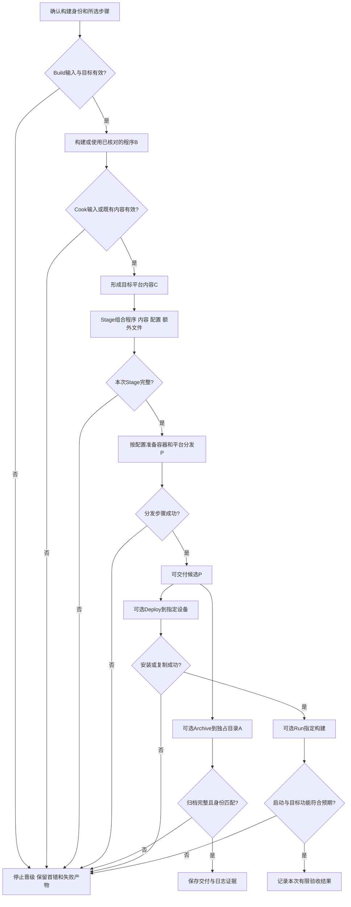
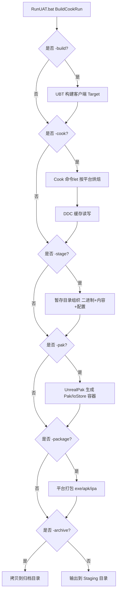

# 02 UAT 与自动化打包

> 知识成熟度：L2（公开一手资料静态核对；示例仅纸面预期，不代表引擎或目标平台已运行）。
> 知识基线：UE5.6公开文档中的UAT、Cook、交付和测试合同；5.5参数API、5.1命令历史及动态来源仅限第七节所列事实。
> 版本基准：实际读到的UE5.6文档选择页，不是本地引擎源码revision。没有认证原文的UE5.8.0、CL55116800或本机Build.version。
> 最后更新：2026-10-09（全文语义修订；原文与历史异文逐字保全）。
> 源码核对状态：未核对。本轮未访问Engine源码，未执行UAT（含help/list）、UBT、UHT、UE、Cook、C++/C#编译、打包、设备操作、网络工作负载或性能实验。
> 验证与基准：第八节全部为PAPER_EXPECTED / NOT_RUN；静态资料核对、纸面推导与未来实测分别记录，未产生运行日志或计时结果。

<!-- UAT_PACKAGING_ACTIVE_BEGIN -->

## 一、概述

“编辑器里能打开地图”与“别人拿到这份包就能在目标设备运行”之间，隔着目标代码、平台内容、运行配置、文件布局、平台封装和安装条件。UAT（Unreal Automation Tool）提供C#宿主及工具库，编排这些工作；它并不替项目自动决定哪些资源必须交付，也不能由一个成功退出码证明全部业务功能正确。（S01、S02）

最常见的组合入口是BuildCookRun。先按职责理解它，再看命令参数：

```text
项目/目标/工具链与内容规则
  → Build：目标代码
  → Cook：目标平台内容
  → Stage：运行所需文件集合
  → Package：平台分发形式
      ├→ 可选 Archive：保存交付集合
      └→ 可选 Deploy：送到指定设备 → 可选 Run：启动并观察
```

这是逻辑依赖模型，不是某个UE版本逐行源码调用栈。容器准备可能与Stage/Package的实现交织；有些步骤可以使用既有产物，但必须先知道其来源、完整性和相容性。生成分发文件、归档成功、安装成功、启动成功、功能测试成功，是不同结论。

UAT的价值是把已定义的流程参数化：批量出包、跨平台选择、衔接CI、运行测试和加入项目自定义命令。跨平台支持仍受宿主、引擎发行形态、Target、SDK、插件和平台授权限制。Windows通常从`Engine/Build/BatchFiles/RunUAT.bat`进入，Mac/Linux使用对应的`RunUAT.sh`；shell的引号、续行和可用工具不同，不能把Windows命令原样换后缀就承诺可用。本文的Windows围栏按cmd.exe解释。（S01、S02）

本篇沿用“先概念、再完整链、再多平台场景”的用途。C++构建细节见UBT篇；CI调度、资源补丁方案和插件开发另有主篇，不在这里实现新的runner。下面所有命令和代码都用于阅读，不是本轮执行记录。

## 二、核心概念（表格速览）

| 概念 | 回答的问题 | 入口或边界 |
| --- | --- | --- |
| RunUAT | 如何启动自动化宿主 | `.bat`或`.sh`；先确认选中了哪份引擎 |
| AutomationTool | 谁发现并执行自动化命令 | C#宿主与工具库；文档源码入口为`Engine/Source/Programs/AutomationTool`，本轮未读取该源码 |
| BuildCookRun | 如何组合构建、内容与交付步骤 | 命令参数和项目配置共同参与，不能仅凭命令名推断所有步骤都会做 |
| Build | 哪个应用的代码要构建 | UBT处理Target、Platform、Configuration等；构建配置不等于目标类型 |
| Cook | 哪些资产转为哪种平台内容 | Cook commandlet；地图、引用、显式规则、平台和文化等决定输入 |
| Stage | 交付集合应含哪些东西 | 程序、Cook内容、运行配置及额外文件；UFS与普通文件读取需求要分清 |
| Package | 交付物采用什么平台形式 | 可以是一组目录/文件或平台包；不等于每次新建一个安装器 |
| Archive | 哪份产物保存到哪里 | 可选归档目录；不是自动发布，也不是Xcode archive的同义词 |
| Pak | 是否使用Pak内容容器 | 与IoStore、压缩和平台安装包分开；不能由`-pak`单独推出`.utoc/.ucas` |
| DDC | 哪些派生工作可复用 | 派生数据缓存；不是完整Cook输出或可分发包的替身 |
| 目标平台 | 产物在哪里运行 | 与构建宿主不同；SDK和架构必须匹配 |
| 配置 | 如何构建所选目标 | Development/Shipping等；`-clientconfig`的名字不自动意味着选择了独立Client Target |
| 自动化测试 | 选哪些测试、在哪个上下文执行 | Automation框架、测试插件、Editor/Client等载体和报告；UAT负责调度，不是框架本体 |
| 迭代 | 哪些旧结果仍然有效 | 迭代Cook、跳过Cook、只部署修改内容是不同选择 |
| Deploy / Run | 送到哪台设备、实际启动哪份构建 | 安装/复制与启动各有失败条件，不由Package成功推出 |
| 构建身份 | 一组产物是否属于同一次可解释构建 | 引擎/工程/插件revision、工具链、目标、平台、架构、配置和内容选择共同记录 |

先从交付目的反推步骤：只研究资源转换可以单独Cook；给QA一个离线构建需要完整交付集合；设备测试还要Deploy/Run；商店分发则有平台后续要求。不能通过多加几个看起来相关的flag替代这个选择。（S02–S07）

## 三、原理详解

### 3.1 UAT 的架构

公开文档描述的入口链是：宿主发现可加载的`.Automation.csproj`项目，按适用构建/加载规则取得程序集，再通过反射找到派生自`BuildCommand`的命令类。命令名对应类名；参数被传入该命令，命令代码负责读取、校验和安排后续工具。是否重新编译自动化程序集属于宿主选项和当前状态，不能与游戏C++ Build混为一谈。（S01、S08）

BuildCookRun据项目和目标设置调用构建、Cook和平台交付能力。UBT构建代码，UHT可能作为UBT组织的反射生成阶段参与；Cook通常由引擎的Cook commandlet处理内容。一个UAT进程成功发现了命令，不代表UBT目标存在、Cook所需插件能加载或签名工具配置正确。

`[Help(...)]`用于描述帮助信息；参数仍需`ParseParam`、`ParseParamValue`或相应解析方法读取。下面是原创教学片段，放置前提是已有可被UAT发现、引用正确AutomationUtils的项目。它不是官方BuildCookRun源码，也没有编译过：

```csharp
using System;
using AutomationTool;

[Help("Inspect a caller-provided build label; does not build or publish.")]
[Help("Label=<text>", "One or more ASCII letters, digits, '_' or '-'.")]
public class InspectBuildLabel : BuildCommand
{
    public override void ExecuteBuild()
    {
        string label = ParseParamValue("Label");
        if (string.IsNullOrWhiteSpace(label))
            throw new ArgumentException("Label is required.");

        foreach (char c in label)
        {
            bool allowed = (c >= 'A' && c <= 'Z') ||
                           (c >= 'a' && c <= 'z') ||
                           (c >= '0' && c <= '9') || c == '_' || c == '-';
            if (!allowed)
                throw new ArgumentException("Invalid Label character.");
        }
        LogInformation("Accepted label: " + label);
    }
}
```

给`Label=K001`时，纸面上解析后通过字符检查；缺Label或含`/`时在记录前拒绝。帮助特性本身不会完成这些校验。这个标签也不是可信构建哈希，没有调用Build、写归档或上传产物。

项目如何被发现、程序集引用和输出位置都需要与所用引擎匹配。S08教程区分native/foreign项目，但其中.NET版本和IDE操作仅属于该页情境，不可直接当所有UE发行版的模板。旧文的`[Param]`没有得到本轮资料支持，活动例采用已读机制；这不证明所有历史版本或项目扩展中都不存在同名特性。

### 3.2 完整打包流水线（Mermaid）

下面图中的“有效”是交付者必须建立的证据，不能理解为UAT会自动检查本文定义的全部身份字段。跳步时，已有产物仍需通过相同的来源和完整性判断。



Archive与Deploy是不同目的，图上从候选P分别出发，不要求每个流程都先归档后部署。若只是生成交付文件，可停在相应成功节点；不能同时声称完成未选择的设备或功能验收。任何失败都可能留下部分文件，甚至旧版本的完整目录；“文件还在”不是本次成功证据。

用一份假想已有MyGame工程贯穿全文。构建身份K001包含engine revision R、project revision C、plugins P、host/compiler/SDK T、MyGame Game target、Win64、架构、Shipping、地图/文化与容器设置。这些是纸面标识，不是本机版本。

业务内容设为：Main地图硬引用HUD；ItemA在运行期按字符串读取，另由明确Cook规则纳入；Tool明确标记为不进入发布内容；`Content/Data/rules.json`由NonUFS复制规则交付。正向链是：

1. Build形成K001的程序B；Build通过尚不能证明内容存在
2. Cook形成目标内容C。仅列业务部分时应覆盖Main、HUD、ItemA，排除Tool；真实引擎依赖另计
3. Stage将B、C、运行配置与rules.json按要求组织为S
4. 根据该平台和项目设置形成P；容器、可执行文件、必要外部文件必须作为匹配集合交付
5. 需要归档时保存P及其K001、文件清单/哈希和日志关联；需要设备验证时把同一P交到明确设备并确认版本，再启动Main及所选功能

K001只是让推理可追踪；真正的构建标识、哈希清单和阶段成功判断仍需项目实现。本文没有新增这样的实现或CI。

### 3.3 Cook（烘焙）原理

Cook把源资产处理成目标平台可使用的内容。纹理、音频、shader等处理依赖平台能力和项目设置；同一源资产在不同目标上不必产生相同表示。Cook不是把每个`.uasset`机械压成一个Pak，也不是对任意Blueprint都作“原生C++化”的承诺。（S03、S04）

先看**选择集**，再看**转换**：选哪些地图、沿哪些引用纳入依赖、AssetManager/显式Cook规则是否覆盖动态加载、哪些目录NeverCook或Editor-only、哪些文化和平台内容需要交付。S06还提供“即使未被引用也Cook”和“即使被引用也NeverCook”的设置，所以不能把“从地图遍历引用”写成唯一规则。软引用也不能统一归类为“不烘焙”；其具体选择和加载合同要单独确认。

前述ItemA若只有运行时拼接字符串、又没有任何发现/纳入规则，编辑器能打开它不证明包内存在。将它加入明确Cook规则是修复选择问题的一条路径；但若实际缺的是Stage、容器挂载或运行读取路径，改成硬引用可能没有解决根因。

**DDC与Cook输出不同。** DDC保存可再生成的派生数据，命中时复用，没有命中时可以生成；Cook仍需形成完整正确的目标内容。常规已烘焙构建不靠把开发DDC随包发给玩家来运行。Zen服务可能被配置为DDC，也可能通过UseZenStore参与Cook数据存取，不能仅凭服务名将两种角色合并。旧文的SharedCookedBuild也不应当作DDC的通用开关。（S06、S07）

**迭代不等于跳过。** 官方Cook commandlet的`-iterate`描述为处理过期项；Project Launcher另有Iterative Cooking选择。它们仍在做Cook有效性判断。SkipCook的用途则是使用已经准备好的内容，调用方必须先证明那些内容适用于当前请求。改过平台、相关资产/配置或引擎而仍盲目复用，可能把旧内容带入新包；此前Cook失败更不能靠SkipCook变成成功。本文没有核对`-iterates/-iteratedirectory`作为通用BCR接口，因此不保留它们为现行配方。（S04、S05）

**按书烘焙与按需烘焙不同。** Cook by the Book在交付前准备选择范围内的内容；Cook on the Fly由Cook服务响应运行程序请求，依赖服务和通信环境。COTF适用于特定迭代路线，不能拿“连接着开发Cook服务的游戏能跑”证明离线交付完整。本轮没有启动该服务。（S02、S04）

**无版本包不是迁移器。** S04的UnVersioned与Launcher的Save Packages Without Versions表示加载端按当前版本解释相关内容，不能因此得到跨引擎兼容性。需要保留该用法时，要同时锁定生产/消费约定；不因它可能节省体积而默认给所有项目加开关。（S04、S05）

`Saved/Cooked/...`是常见输出形状，不能写成所有版本、平台和存储配置的唯一目录。公开Cook页还含Sandboxes等历史示例，专服教程又显示WindowsServer目录，UseZenStore可以改变存储方式。排查时读本次日志和产物记录中的实际位置，不从教程模板猜路径。（S04、S06、S16）

### 3.4 Stage / Package / Archive 的区别

三者处理的是不同责任。要交付的集合没有先定义清楚，看到一个`.exe`或`.pak`并不能补足缺失的信息。

| 阶段 | 输入与工作 | 能证明什么，不能证明什么 |
| --- | --- | --- |
| Stage | 将目标程序、Cook内容、运行配置和规定的额外文件组织到暂存集合 | 清单所列内容进入了指定布局；不等于已签名、安装或启动 |
| Package | 将该集合准备为目标平台的分发形式，按平台流程处理必要封装 | 对应平台交付步骤完成；不保证总有独立安装器或固定扩展名 |
| Archive | 将约定交付物保存到指定归档位置 | 这次保存的集合完整且可追溯；不等于已发布，也不自动创建补丁基线 |

Windows程序通常在Build阶段就已编译；Package可能围绕程序及内容组织一组可分发文件，不能教成“Package才把工程编译成exe”。Android APK/AAB、Apple现代`.app/.xcarchive`与其他平台形式分别有自己的后续流程。UAT的归档复制与Xcode的Archive动作虽然同名，语义不同。（S03、S05、S14）

还要区分**资产**与**非资产文件**。S06的Additional Non-Asset Directories to Package用于按UFS读取的附加文件；Additional Non-Asset Directories to Copy用于需要普通文件访问的附加目录，例如第三方库自己的文件IO。把rules.json加入Cook资产目录，不能自动满足第三方运行时在某个普通路径打开它的需求。应写明消费者、路径、大小写和交付规则，再在Stage及最终布局核对。

**容器与压缩是独立维度。** UsePak与UseIoStore分别控制适用内容的包装；IoStore的package data使用`.utoc/.ucas`，不意味着所有文件都必进入同一容器。压缩是否启用、格式、方法和等级另有设置，Oodle只是可选压缩体系中的一个名字。压缩可能减小交付量，却带来编码/解码与平台取舍；不能从UE5、`-pak`或某后缀推出全包已压缩、必定更快。（S06）

错误恢复以本次阶段为准：

| 失败位置 | 可能留下什么 | 下一判断与停止条件 |
| --- | --- | --- |
| Build | 旧binary、部分新中间文件、构建日志 | 先找UBT/UHT/compiler/link首错；旧binary不能标为本次成功 |
| Cook | 已完成的部分资源、旧Cook内容、派生缓存 | 核相同平台/选择集的首错；不能用SkipCook掩盖缺口 |
| Stage | 不完整布局或混入旧版本的目录 | 对照应交付集合、源产物身份及复制/过滤结果；归属不明则停止复用 |
| Package / 签名 | 可能完整的Stage、未完成平台包 | 保存平台工具结果；分发物尚未成立，不能直接部署半成品 |
| Archive | 已生成P与复制了一部分的A | 分开报告“产物生成”与“归档失败”；重试前核源P身份 |
| Deploy | 本地P与设备上的旧版或部分安装 | 确认目标设备和安装状态，不由本地包存在推断已更新 |
| Run | 已安装构建及运行/崩溃日志 | 核实际版本、默认地图、挂载及所选功能，不能由进程启动推出功能通过 |

这张表是诊断模型，没有承诺UAT在所有平台自动清理、回滚或原子替换。保存失败证据后，再决定只重做哪一步。

### 3.5 自动化测试框架

Automation Test Framework是C++测试体系，Functional Testing等接口可以承载蓝图关卡测试；UAT是组织运行这些任务的宿主。测试本身要在所选目标中存在、相关模块/插件可加载，并适用于该Editor或Client上下文。包成功生成不会自动让全部编辑器测试出现在Shipping程序里。（S09、S10）

下面用局部纯函数保留原测试代码的教学用途。包含、函数、测试名和三个断言都明确，但它仍是加入已有可加载测试模块的**教学片段，未编译、未运行**；模块发现、构建配置和引擎依赖需工程提供。

```cpp
#include "Misc/AutomationTest.h"

#if WITH_DEV_AUTOMATION_TESTS
namespace PackagingLesson
{
constexpr int ClampBudget(int value)
{
    return value < 0 ? 0 : (value > 10 ? 10 : value);
}
}

IMPLEMENT_SIMPLE_AUTOMATION_TEST(
    FPackagingBudgetTest,
    "MyGame.Core.ClampBudget",
    EAutomationTestFlags::EditorContext | EAutomationTestFlags::ProductFilter)

bool FPackagingBudgetTest::RunTest(const FString& Parameters)
{
    (void)Parameters;
    const bool lower = TestEqual(TEXT("lower bound"),
        PackagingLesson::ClampBudget(-1), 0);
    const bool middle = TestEqual(TEXT("inside range"),
        PackagingLesson::ClampBudget(7), 7);
    const bool upper = TestEqual(TEXT("upper bound"),
        PackagingLesson::ClampBudget(11), 10);
    return lower && middle && upper;
}
#endif
```

纸面预期是0、7、10；三个TestEqual分别执行后才合并结果。函数无资产、文件、GPU或网络依赖，故这种纯逻辑检查不能替代Main地图启动、包内资源完整或设备功能验收。`WITH_DEV_AUTOMATION_TESTS`是否启用、测试模块是否进入目标以及EditorContext是否匹配，都是例子可被发现的前提，不是本轮观察。

自动化要回答的不只是“有没有进程退出”：选中的测试有哪些、实际发现/执行多少、哪些失败或未完成、报告是否属于这次K001。如果预计1项却匹配0项，应报告未执行；若报告留有in-progress/not-run或缺失，不得把它等同通过。超时与崩溃要保留日志，不用第二份空报告覆盖失败。这是本篇验收合同，不是宣称所有UE版本自动以同一退出码实现了它。

## 四、打包命令示例

### 4.1 Windows 完整出包（最常见）

假设已有`C:\UE`引擎安装和`C:\MyGame\MyGame.uproject`，MyGame Game target、Win64工具链、插件和Shipping构建形态受支持；Game Default Map、Cook规则、文化、容器与前置组件设置已经明确。输出目录属于这次K001，不能与另一job共同写。目录名和配置只是教学输入，不指当前机器。

下面是cmd.exe中的**原创命令骨架，NOT_RUN**。执行前应在真正使用的安装中核对BuildCookRun帮助和Project Launcher生成的命令。这个核对入口同样未在本轮运行。（S01、S02、S05）

```bat
"C:\UE\Engine\Build\BatchFiles\RunUAT.bat" BuildCookRun ^
    -project="C:\MyGame\MyGame.uproject" ^
    -platform=Win64 -clientconfig=Shipping ^
    -build -cook -stage -package -archive ^
    -archivedirectory="C:\BuildOutput\MyGame_K001"
```

双引号保护含空格的路径，`^`按cmd续行规则使用，不能混为PowerShell或POSIX shell语法。若今后把它放入批处理，还需正确调用子批处理和传播退出状态；本文没有创建这样的runner。

| 参数或选择 | 责任与判定 |
| --- | --- |
| project | 指定实际uproject；选错工程也可能产出一个看似正常的包 |
| platform | 目标平台，不等于宿主；不能补齐缺失SDK/插件 |
| clientconfig | 此组合流程游戏侧配置；不凭参数名称推断已选择独立Client Target |
| build/cook/stage/package | 请求相应工作；逐阶段看本次状态和输入输出，不以旧文件判断 |
| archive/archivedirectory | 归档及目的地；目录带版本号不自动向游戏注入版本或生成可信manifest |
| Pak / IoStore | 在Packaging设置中明确选择并核产物；需要CLI覆盖时用该版支持的映射，不能只加pak推导一切 |
| Prerequisites | 按平台支持选择是否携带前置安装器或app-local依赖；携带不等于已安装在用户机器 |
| P4 / NoP4 | 选择是否参与Perforce流程，和“使用任何版本库就必须加nop4”无关；也不是通用断网开关 |
| 日志 | 保存UAT入口和其指示的子工具日志；一个log参数不证明UBT/Cook/平台/运行日志都在同一位置 |

官方参数例中有归档目录、容器及设备替换形状（S20），但那是5.5辅助API文档，不是本机5.6/5.8完整parser认证。主例没有附加未经核对的签名、NDK、迭代或测试flag。

预计得到的是属于K001的**完整交付集合**：程序、内容容器或相应文件、运行配置、rules.json及按配置需要的依赖。具体层级从该版本结果获取。检查清单、阶段状态与必要目标功能后，才能交付；只检查是否出现MyGame.exe不够。

### 4.2 开发迭代包（快速出包）

保留一份已成功的构建身份与Cook基线，再决定复用什么。在Project Launcher的自定义配置中，区分Build、Cook By the Book的Iterative Cooking、Package、Archive以及Deploy的Only deploy modified content。这些选项各省去不同工作，不能合成一个“复用所有旧目录”的开关。（S05）

若只研究Cook commandlet，S04的`-iterate`表示只处理过期项；BCR传递Cook选项的接口应以该版生成命令/帮助为准。本文不把旧`-iterates -iteratedirectory`改个拼写后就声称跨版本可用。

例：K001的ItemA发生影响Cook输出的变化。迭代路径仍要识别这项变化并形成新内容；直接SkipCook可能带着旧ItemA交付。若只改不会影响内容的某项代码，也不能仅凭“是代码”自动断言所有Cook结果都有效，仍需看其序列化、内容依赖和配置影响。

发布候选与日常迭代输出应清楚区分，必要时用受控的完整重建/重烘焙验证复用假设；不要求一律删除所有缓存。先保留失败证据再作精确清理。是否缩短时间以及缩短多少，取决于实际变更、缓存和瓶颈，本轮没有分钟数或百分比结果。

### 4.3 Android 打包

先选定引擎版本，再配套host、Android SDK/NDK、Java/build tools和目标设备能力。本文读到的Android Requirements页面虽选择5.6，Current段却写5.7；只将其中明确的5.6历史行（SDK34、NDKr27c）作为“必须按版本配套”的例子，不能据此认证旧5.8 CL，也不能推出2026当前商店提交资格。（S11）

完整路线仍可按以下顺序准备，所有步骤都是教学说明，未实际执行：

1. 核对该引擎的Android组件、工具链和所需插件，识别构建宿主与目标架构
2. 选择设备可用的纹理格式与CPU ABI；这是两条独立维度，不能把旧armv7/x86_64列表当所有当前引擎都支持
3. 在项目设置里确定包标识、版本和用途。开发设备测试与商店分发要分开
4. 要AAB时使用官方文档中的Generate Bundle (AAB)设置；APK与AAB服务不同交付目的，生成AAB不等于设备已安装或商店已接受（S12）
5. 分发签名按项目的Distribution Signing及平台工作流配置Key Store/alias等；不要把秘密嵌进可共享命令或日志。本文未认证旧`-keystore/-storepass/-keypass`等BCR接口，也不生成/保存凭据（S21）
6. 经版本匹配的Launcher配置生成BuildCookRun命令，执行时分别收集Build/Cook/Stage/Package结果；SDK/签名失败先停在对应阶段
7. 取得可安装测试构建后，另行选择设备、安装并启动，确认包标识/版本和必要功能；最后的商店分发另按当时规则验证

Shipping和distribution选择不会自动补齐签名、政策或设备相容性；“安装完成”也不代表画面、音频或资源加载正确。原文的`-sdkapi=34 -ndk=26.1.10909125`、`-aab`及架构CLI没有本轮完整版本依据，保留在历史供追溯，不作为直接照抄的现行命令。

### 4.4 iOS / macOS 打包

先确定项目使用哪条Apple构建流程。本节主线限定为S14描述的UE5.3+现代Xcode流程，已有匹配的Mac、Xcode、工程和所需签名能力；不反推旧流程或所有Windows打包路径。

现代流程通过Stage把运行所需数据放入自包含`.app`。Package与distribution可交由Xcode组织；文档明确不再自动为iOS生成`.ipa`，distribution会形成`.xcarchive`，后续在Xcode的Validate/Distribute/Export中选择分发目的，某些导出路线才得到IPA。它与UAT将产物复制到archivedirectory不是同一动作。（S14）

```text
Mac + 版本匹配Xcode + 已配置工程
  → 构建和Cook
  → Stage完整app内容
  → Package / 所选distribution流程
  → xcarchive或该流程产物
  → 针对分发目的验证/导出
  → 安装和启动测试，或后续商店流程
```

以上是条件化教学路线，未生成Xcode工程或归档。使用`.sh`时应按所用shell处理路径和续行；S14给出的`-package -clientconfig=Shipping -distribution`只说明该现代流程的分发选择，不能单独构成完整工程命令。

| 情境 | 需要分清的条件 |
| --- | --- |
| iOS C++工程的App Store分发 | Mac/Xcode与引擎配套；BundleID、Team、entitlements及签名/Provisioning相容；后续导出/上传另有步骤 |
| 现代开发签名 | Xcode可自动管理部分开发签名；S13旧手工设置与S14现代流程须联读，不能要求所有情形都手工注入Profile |
| Windows工作流 | 可由Windows编排远程Mac；部分Blueprint开发/测试有其他受限路线。“所有步骤必须在本地Mac执行”过于绝对 |
| 真机与模拟器 | 目标、SDK、架构和所需签名条件分别确认；不把真机构建改个未核对的simulator开关就当可复用 |
| macOS外部分发 | Developer ID签名、Gatekeeper与公证有自己的目的；公证不是绕过系统安全，也不是iOS命令中通用的安装修复参数 |

S13支持证书/Profile与BundleID等一致性要求，但不能用一组`ProvisioningProfile/SignIdentity`字符串保证签名成功。S15只支撑所述macOS分发语境；其他地区或平台的分发规则另查对应官方路线，不由本篇作全局否定。本轮没有创建证书、改变系统安全、签署协议或上传应用。

### 4.5 Linux 专用服务器

先有受支持的Server Target，再谈打包。官方Lyra专服教程采用源码引擎和C++网络工程；这是该教程前提，不足以证明所有定制installed build都不支持Server。已有Server binary之后，仍要准备正确的Server内容和运行配置。（S16）

Windows宿主交叉编译Linux与Linux宿主本机编译是两条路线，使用的工具链须与引擎匹配。S17给出明确的5.6历史工具链行；本文没有安装或验证它，也不用编辑器图形硬件要求推断无头DS运行下限。

| 准备/阶段 | 服务器例要回答的问题 |
| --- | --- |
| 目标 | 工程是否真正有MyGameServer Target，模块/插件是否支持该目标？ |
| 宿主与工具链 | Windows交叉还是Linux native？平台、架构、SDK/sysroot是否配套？ |
| Build | 构建的是Server目标和所选配置，不是把Game exe改名 |
| Cook | Server Default Map、服务端需要的资产及过滤规则是否齐备？ |
| Stage / Package | 服务器程序、内容、配置、必需共享库和附加文件是否组成匹配集合？ |
| Deploy / Run | 目标机是否满足运行前提，实际启动的是哪份版本，日志/退出/所选功能是否符合预期？ |

旧命令的`-server/-serverplatform/-serverconfig/-noclient`表达角色和平台选择意图；它们不能创建缺失Target或工具链。真正的组合参数先由对应安装的Launcher/帮助确认。未具备上述前提时停止，而不是叠加flag尝试。

专服打包成功不证明客户端已连入、服务器权威逻辑正确、端口可达或容量足够。这些后续网络与压力验证本轮未做。

### 4.6 主机平台（PS5 / Xbox Series X|S / Switch）

保留主机出包入口，但公开资料只能给到授权和环境边界：先取得相应平台开发权限，使用有支持的引擎源码/平台扩展、匹配SDK和工具，再配置项目Target、部署设备与平台要求。不能仅把`-platform`换成平台名字，就推出完整工具链已存在。（S02、S03）

准备顺序是：确认授权与引擎发行形态→在获授权资料中核平台扩展/SDK版本和实际布局→确认目标/内容/签名封装配置→形成分发候选→设备部署/运行→按平台要求验收。每步缺前提就停在对应位置，不凭公共教程猜SDK必须装在某个固定`Platforms/<Name>`路径。

分盘、Chunk、安装顺序会影响平台交付，CrashReporter、账号和成就也可能需要平台专属集成；仍保留这些原用途的入口，但细节应转对应平台文档和资源发布主篇，不在此伪造受限SDK代码或主机认证结论。没有访问受限资料或实际设备。

### 4.7 自动化测试执行

“打包后测试”要求测试代码/内容已编入适用载体，设备或本机实例真正运行，并有对应控制和报告流程；它不是给BuildCookRun加一个看似相关的flag就完成。编辑器测试则可以直接使用官方Editor/Client命令接口，不必先生成一个Shipping包。（S09、S10）

以下cmd.exe骨架针对3.5的Editor测试，假设目标模块已启用、测试名实际可发现、报告目录归本次K001独占。仍是NOT_RUN：

```bat
"C:\UE\Engine\Binaries\Win64\UnrealEditor-Cmd.exe" ^
    "C:\MyGame\MyGame.uproject" -unattended ^
    -ExecCmds="Automation RunTest MyGame.Core.ClampBudget;Quit" ^
    -ReportExportPath="C:\Reports\K001"
```

S10明确给出`Automation RunTest ...;Quit`形状，不能将Quit本身列为错误。其报告参数是ReportExportPath；本轮没有认证原文RunTests、ReportOutputPath、RunAutomationTests、AutomationTestFilter及TestExit等组合在所有版本中的别名/传播行为，不据此声称这些名字从不存在。

判定要同时查看：所选集合、匹配数量、完成状态、断言结果、报告身份和进程/控制流程状态。这个例子预计1项，匹配0项应报告未执行；报告缺失或存在not-run/in-progress、失败、崩溃或超时均不能算通过。退出码怎样对应测试失败，需要未来实际工具链验证，本文不捏造固定值。

`-unattended`不能补齐测试上下文。`-nullrhi`只能在测试不需要真实渲染的条件下考虑，不能用它验证截图、GPU或真实画面。3.5纯逻辑例也不能因此获得包完整性或设备运行的背书。收集报告不会自动提供测试隔离、超时和结果晋级策略，本篇只规定这些职责，没有新增实现。

### 4.8 其他常用 UAT 命令

名称像“打包动作”，不代表它就是可直接传给RunUAT的命令类。

| 原有用途 | 正确入口层级与边界 |
| --- | --- |
| BuildPlugin | UAT命令用途；官方5.1记录已出现RunUAT BuildPlugin，当前具体平台/参数仍按使用版本核对，插件内容另见关联主篇 |
| Cook | 本文可靠依据是引擎Cook commandlet（`-run=cook`）及BCR的Cook阶段；不把它和任意顶层UAT命令一概等同 |
| UnrealPak | 独立内容容器工具，发布/补丁流程可调用；不是所有IoStore内容的统一生成器 |
| GeneratePatch | 官方示例是BuildCookRun的`-generatepatch`配合已有release基线；不是只凭这个词就认定存在独立命令 |
| DLC | Launcher/BCR相关流程选项与内容基线，不能等同一个无前提的通用DLC命令 |
| Help / List | UAT概览支持列命令与查某命令帮助；用于未来核本地版本的实际接口，不证明已执行任务 |

补丁需要保留已发布Cook基线与相容序列化合同，归档目录带版本号不自动完成这件事。这里仅区分命令层级和交接责任，不重复补丁/Chunk设计。（S01、S04、S18–S20）

## 五、最佳实践

1. **让环境可解释。** 专用构建机有利于隔离和重复，不是所有项目必须禁止开发机参与。记录引擎发行形态、工具链、插件、目标与输出归属；在错误发生时能回答“到底用哪份输入构建”比机器名称更重要。
2. **按瓶颈使用共享DDC。** 缓存命中可省派生工作，网络/存储延迟也可能抵消收益。通过支持的缓存机制共享，不把共写Cook/Stage目录当共享缓存；不承诺固定50%加速。（S07）
3. **记录真正的构建身份。** `EngineAssociation`是工程与引擎的关联：官方Managing Game Code说明foreign项目中Launcher构建通常写版本号，源码构建写editor GUID。它不是全部源码/插件/SDK/内容设置的哈希锁。除关联外仍记录实际revision、配置和工具链，不因GUID相同断言产物可复现。（[S22：Managing Game Code，UE5.6](https://dev.epicgames.com/documentation/en-us/unreal-engine/managing-game-code-in-unreal-engine?application_version=5.6)）
4. **让归档能追溯。** 给构建分配唯一ID，关联输入身份、交付文件清单/哈希、阶段状态与日志。archivedirectory只是去向，不会自动向应用注入版本，也不代替release/patch基线管理。
5. **保留分阶段日志。** 记录UAT实际调用、子工具日志入口、首错和退出状态；分别保留Cook、平台打包/签名及运行结果。编码选项要按实际工具支持核对；保留证据时同时避免把凭据写入共享日志。
6. **按阶段排错和复用。** Build/Cook/Stage/Package可作为诊断边界，但拆成多个调用后必须传递正确版本的产物；拆步骤本身不保证正确。具体CI编排不在本篇实现。
7. **区分迭代候选与交付候选。** 日常迭代需要说明复用基础；发布前选择足以发现陈旧产物和内容遗漏的验证。完整重建可以作对照，但“删缓存再成功”不能替代解释哪个输入失效。
8. **明确Cook与Stage集合。** 地图、引用、显式Cook/NeverCook、AssetManager、文化/平台过滤和附加文件分别检查。动态加载路径与第三方文件IO尤其不能只靠编辑器运行验证。
9. **将测试结果连到构建身份。** 启动地图的冒烟、核心逻辑、渲染及平台功能各有不同覆盖。每个候选包上的测试报告必须对应同一构建，匹配0项或未完成不是通过。（S09、S10）
10. **隔离可写目录并精确清理。** 同机并行不是一律禁止；共写中间、Stage、Archive或报告目录才会使身份与产物混杂。独占输出仍需资源预算和工具支持。清理前保留日志、crash、用户保存、autosave与发布Cook基线，只处理确认可再生且归该job所有的产物，不能泛删整个Saved。（S18）

## 六、常见问题 FAQ

**Q1：打包报错“Cook failed”或某资源Cook崩溃？**

先区分末尾汇总与首个具体失败。记录这次引擎/平台/地图选择，检查资源依赖、平台转换、插件、shader或内存等证据，再收窄到相关地图/资产的相同目标Cook。编辑器能打开资源只是一个观察，不能证明目标Cook正确。SkipCook绕过的正是失败阶段；CookAll扩大输入也不是最小复现。保留原日志，不用旧Cook目录冒充恢复成功。

**Q2：打包出来的游戏没有音效、贴图或关卡？**

依次确认：它是否进入选择集→是否Cook成功→是否进入Stage→容器或loose文件是否完整安装→运行请求的路径/文化/挂载是否正确。软引用不等于必然未Cook，AssetManager也不是所有问题的统一修复。可以用受控引用或显式规则定位选择问题，但不要让它掩盖NonUFS、平台过滤或安装缺失。默认地图与Editor Startup Map也不同，核的是目标游戏实际入口。（S06）

**Q3：Android找不到SDK/NDK？**

先核所选引擎版本、真实工具链安装/路径与该版支持矩阵，再看第一条工具发现错误。旧`-sdkapi/-ndk`字符串不会替代安装，也没有本轮通用BCR接口保证。确认版本和缺口后再按对应官方流程处理；本文不安装SDK、不接受许可或调整机器环境。（S11）

**Q4：iOS打包必须在Mac上吗？**

本文C++/App Store分发主线需要匹配的Mac与Xcode，但Windows可编排远程Mac，部分Blueprint开发测试有其他受限路线。不要把“某条分发路线需要Mac”写成“任何iOS准备/打包步骤都只能本地Mac”。现代Xcode的产物和后续导出见4.4；旧流程、模拟器和特殊插件另查具体支持条件。（S13、S14）

**Q5：`-pak`与`-compressed`是什么关系？**

一个关注内容容器，另一个名字常用于表达压缩选择，但具体CLI含义取决于工具层级/版本。活动依据应是所用Packaging设置与实际生成命令：UsePak/UseIoStore、Create Compressed Cooked Packages、Compression Format/Method/Level各自明确。不能说“UE5默认Oodle，所以不需要检查压缩设置”。包小了多少、加载更快或更慢，都需要实际测量。（S06）

**Q6：自动化测试在CI上跑不起来或卡住？**

先看测试是否被编入和发现、插件是否加载、Editor/Client上下文是否适用，再看具体断言、异步完成、报告及崩溃/超时证据。unattended不是测试环境修复器，nullrhi可能使需要渲染的测试失去意义。官方RunTest…;Quit可作为入口形状，不能单凭它保证所有项目异步测试已正确结束。为本次运行保存完整报告；报告缺失或未完成就停止晋级，不能改成不跑测试。（S09、S10）

**Q7：打包时间太长，如何加速？**

先把耗时归到规则/编译、Cook派生、内容读写、容器压缩、平台签名或归档/部署，再选择相应措施。共享DDC、迭代Cook、受支持的编译执行器、减少无用文化和目标平台分别减少不同工作。压缩等级、网络缓存及并行度也可能增加某些成本。没有同输入/输出和cold/warm条件下的数据，不给固定倍速；本轮只作机制解释。

**Q8：`-prereqs`是必须的吗？**

先问目标机需要什么、分发方式由谁安装依赖、平台支持哪些前置安装器或app-local方案。带着安装器不代表它已运行；公司统一预装也要有对应版本保证。可以按S06/S05中的设置选择，但不把该flag当任何Windows机器必能启动的证明，也不承诺固定包含全部VC++/DX组件。

**Q9：日志里大量“LogPakFile: Warning”怎么办？**

读具体消息、请求路径和本次容器配置，区分缺内容、未挂载、版本/签名/加密条件、安装不全或其他警告。Pak与IoStore的package data不能用同一个文件后缀假设排障。Saved里的临时资源不因存在就应进入发布包；对照真正的Cook/Stage规则。无具体证据时，不统一归因于`-pak`没开，也不直接重打全部包。

**Q10：能否在UAT里加自定义命令？**

可以按S01/S08机制创建可发现的Automation项目、引用匹配库、派生BuildCommand，并用帮助与解析/校验代码定义合同，3.1给出了有限片段。命令类可被发现、参数合法与业务执行成功是三次不同判断。原`[Param]`说法本轮无充分依据，改用已读的Help与ParseParam系列；并非宣称其他扩展永远不存在。工具链与发现规则先按实际版本确认，不直接修改引擎全局目录或任意执行外部动作。

## 七、关联阅读

- 本分类 [01-UBT构建系统与编译配置.md](01-UBT构建系统与编译配置.md)：打包前置的编译与配置概念
- 本分类 [03-插件开发与编辑器扩展.md](../编辑器工具与资产自动化/03-插件开发与编辑器扩展.md)：插件打包分发（BuildPlugin）
- 本分类 [04-资源管理与热更新.md](../持续交付与发布治理/04-资源管理与热更新.md)：Pak/Chunk、差量补丁与版本管理

以上三条保留导航职责；相邻正文不会因本篇引用而获得新认证。资源管理篇仍有-pak/IoStore及DDC的旧概括，不能把它作为本篇纠正结论的依据；插件和补丁细节也未在这里重新验收。

### 一手来源与实际核对范围

以下S编号对应活动正文。主要依据为2026-10-09实际读到的UE5.6版本选择页；网页仍可更新，并非不可变源码快照。5.5/5.1辅助资料与动态来源单列。只核表列主题，不表示通读整套文档或执行过示例。

| 编号与来源 | 版本及核对位置 | 支持与边界 |
| --- | --- | --- |
| S01 [Automation Tool Overview](https://dev.epicgames.com/documentation/en-us/unreal-engine/unreal-automation-tool-overview-for-unreal-engine?application_version=5.6) | 5.6选择页；L5–18,28–65 | Automation项目发现、BuildCommand、命令名、Help/List/P4和不同宿主启动脚本；不据此证明任意BuildCookRun参数都存在或成功 |
| S02 [Build Operations](https://dev.epicgames.com/documentation/en-us/unreal-engine/build-operations-cooking-packaging-deploying-and-running-projects-in-unreal-engine?application_version=5.6) | 5.6选择页；L5–13,64–98,105–157 | Build/Cook/Stage/Package/Deploy/Run职责；Project Launcher生成命令；CBTB/COTF；页面有历史输出路径和源码路径拼写，仅采用职责，不据其路径认证当前引擎 |
| S03 [Packaging Your Project](https://dev.epicgames.com/documentation/en-us/unreal-engine/packaging-your-project?application_version=5.6) | 5.6选择页；How Does Packaging Work；Supported Target Platforms；Setting a Game Default Map | 桌面产物是一组可分发文件；控制台需要授权源码形态；默认地图和后续运行分离；总览含概括及legacy表述，不据此推断Blueprint原生化、所有资源只按地图或所有配置性能 |
| S04 [Content Cooking](https://dev.epicgames.com/documentation/en-us/unreal-engine/cooking-content-in-unreal-engine?application_version=5.6) | 5.6选择页；L9–43 | Cook是commandlet；iterate检查过期项；COTF服务器；UnVersioned假定加载为当前版本；引用与选择可受选项影响；所示WindowsNoEditor和Sandboxes目录可能历史；不作为本轮实际路径/目标枚举 |
| S05 [Project Launcher](https://dev.epicgames.com/documentation/en-us/unreal-engine/using-the-project-launcher-in-unreal-engine?application_version=5.6) | 5.6选择页；Cook/Package/Archive/Deploy/Launch，L61–190 | 迭代Cook与部署复用是不同选项；地图文化选择；Archive归档；I/O Store和前置安装器可选；只采用选项职责，不照搬其Development=release、推荐速度或旧平台样例 |
| S06 [Project Settings Packaging](https://dev.epicgames.com/documentation/en-us/unreal-engine/project-section-of-the-unreal-engine-project-settings?application_version=5.6) | 5.6选择页；L150–245 | Pak/IoStore/Zen Store；压缩格式；显式Cook/NeverCook；UFS/NonUFS；前置组件与构建目标；属性语义不认证CLI别名；不可把版本网页当immutable源码；不照搬ForDistribution总括 |
| S07 [Derived Data Cache](https://dev.epicgames.com/documentation/en-us/unreal-engine/using-derived-data-cache-in-unreal-engine?application_version=5.6) | 5.6选择页；L19–25,60–91,147–154,170–177,220–240 | 可再生成派生数据、命中/生成流程、共享代价、cooked builds不依赖DDC、日志与凭据边界；Zen也可承载Cook数据，但角色仍不能混同；不采用固定50%加速 |
| S08 [Create an Automation Project](https://dev.epicgames.com/documentation/en-us/unreal-engine/create-an-automation-project-in-unreal-engine?application_version=5.6) | 5.6选择页；L6–40,55–76,89–143 | 项目可发现位置、Automation.csproj、BuildCommand、Help说明、ParseParam*实际读取；文中.NET6仅该教程示例；不用作当前所有UE工具链下限；自创示例不冒称已编译 |
| S09 [Automation Test Framework](https://dev.epicgames.com/documentation/en-us/unreal-engine/automation-test-framework-in-unreal-engine?application_version=5.6) | 5.6选择页；L15–41,44–72 | C++核心框架与Blueprint Functional Testing接口不同；测试插件/目标可选；隔离状态；UAT不是测试框架本体；不采用1秒作为本篇实测或所有冒烟硬门槛 |
| S10 [Run Automation Tests](https://dev.epicgames.com/documentation/en-us/unreal-engine/run-automation-tests-in-unreal-engine?application_version=5.6) | 5.6选择页；L15–20,26–33 | Editor/Client兼容性；官方RunTest…;Quit例；ReportExportPath报告及ResumeRunTest；不把Quit本身判错；未认证原RunTests/ReportOutputPath/RunAutomationTests等别名或退出码传播 |
| S11 [Android Development Requirements](https://dev.epicgames.com/documentation/en-us/unreal-engine/android-development-requirements-for-unreal-engine?application_version=5.6) | 5.6选择页；L12–31与L59–68 | 显式5.6历史行列SDK34/r27c，版本需配套；当前段实际写5.7，显示版本冲突；标题5.6不等于全文固定5.6；旧商店要求不作当前发布规则；不用5.8旧NDK硬编码 |
| S12 [Packaging Android Projects](https://dev.epicgames.com/documentation/en-us/unreal-engine/packaging-android-projects-in-unreal-engine?application_version=5.6) | 5.6选择页；L9–30,60–66,103–122 | 纹理目标选择；APK产物与安装独立；Generate Bundle (AAB)设置和测试APK；不采用旧体积限额、armv7脚本、任意ABI枚举或认定-aab是通用参数 |
| S13 [Provisioning Profiles and Signing Certificates](https://dev.epicgames.com/documentation/en-us/unreal-engine/setting-up-ios-tvos-and-ipados-provisioning-profiles-and-signing-certificates-for-unreal-engine-projects?application_version=5.6) | 5.6选择页；L5–19,108–138 | C++/App Store路径的Mac/Xcode、BundleID/证书/Profile一致；Windows远程与Blueprint测试路径另论；不采纳无条件无需签名或证书入库建议；不是本次创建凭据或签署协议 |
| S14 [Modernized Xcode Workflow](https://dev.epicgames.com/documentation/en-us/unreal-engine/using-modern-xcode-in-unreal-engine?application_version=5.6) | 5.6选择页；L6–18,55–83,99–116 | 5.3+现代工作流Stage自包含app；不自动生成ipa；distribution输出xcarchive后续export；仅所述现代工作流；不用反推全部legacy/Windows流程；UAT archive不等于Xcode archive |
| S15 [Distributing software on macOS](https://developer.apple.com/macos/distribution/) | 读取日动态页，非固定UE版本；Outside the Mac App Store，L162–170 | DeveloperID/Gatekeeper与macOS公证目的；动态官方页2026-10-09读取，不是固定UE条款；不据此断言所有地区iOS不存在notarization |
| S16 [Setting Up Dedicated Servers](https://dev.epicgames.com/documentation/en-us/unreal-engine/setting-up-dedicated-servers-in-unreal-engine?application_version=5.6) | 5.6选择页；L23–27,55–87 | Lyra教程的源码/C++前提、Server Target、Build/Cook分离；教程Windows示例不能认证Linux产物；不概括所有自制installed build不支持Server |
| S17 [Linux Development Requirements](https://dev.epicgames.com/documentation/en-us/unreal-engine/linux-development-requirements-for-unreal-engine?application_version=5.6) | 5.6选择页；Cross-Compile Toolchain/Native Toolchain/Version History，L36–51,95–106 | Windows交叉编译与Linux native不同路径；明确5.6工具链历史行；不安装或验证工具链，不用图形编辑器硬件要求判断DS运行下限 |
| S18 [How To Create a Patch](https://dev.epicgames.com/documentation/en-us/unreal-engine/how-to-create-a-patch-in-unreal-engine?application_version=5.6) | 5.6选择页；L7–17,31–39,98–120 | UnrealPak工具、保留发布Cook基线、BuildCookRun -generatepatch是组合参数；DLC/patch选项；只用于区分命令层级与保留基线，不扩展补丁设计或泛化Pak到IoStore |
| S19 [Unreal Engine 5.1 Release Notes](https://dev.epicgames.com/documentation/en-us/unreal-engine/unreal-engine-5.1-release-notes?application_version=5.1) | 5.1版本说明；Core，L3409 | 官方历史记录存在RunUAT BuildPlugin用法；仅支持命令身份，不证明当前全部参数/平台组合 |
| S20 [BuildCookRunParams](https://dev.epicgames.com/documentation/en-us/unreal-engine/API/Developer/DeveloperToolSettings/Settings/FProjectBuildSettings/BuildCookRunPara-?application_version=5.5) | 5.5历史API；Remarks | 自定义构建参数替换，archivedirectory/iostore/device是有文档的参数场景；固定5.5 API例，只作辅助；不认证5.6或5.8的完整parser |
| S21 [Signing Android Projects for Release](https://dev.epicgames.com/documentation/en-us/unreal-engine/signing-android-projects-for-release-on-the-google-play-store-with-unreal-engine) | 读取日动态页，非固定UE版本；Applying the Key | Android Distribution Signing使用Key Store/alias等项目配置；读取时5.8页；固定5.6入口失败。不复制示例密码、keytool命令、秘密或旧JRE路径 |
| S22 [Managing Game Code](https://dev.epicgames.com/documentation/en-us/unreal-engine/managing-game-code-in-unreal-engine?application_version=5.6) | 5.6选择页；Foreign Projects，L71–121 | Foreign项目EngineAssociation：Launcher版本号或source-built editor GUID；字段关联引擎而非锁定所有构建输入；不认证本地GUID注册、CL、版本可复现性或实际工程；不执行更换关联或重新生成工程 |

### 来源限制与未验证内容

最初尝试的5.8显式选择链接、若干旧slug和部分可选页面未取得正文；通过可读官方入口完成了本表有限核对。“工具不可读”不等于HTTP404、功能不存在或参数已删除。

Android Requirements有5.6标题与5.7当前段混用，只用明确5.6历史行说明版本配套，不作当前商店资格判断。Cook/Packaging概览中的历史路径、目标名和过度简化另由专门设置页细化。创建Automation项目教程中的.NET/IDE例子不成为本篇全版本安装建议。

Apple原公证页面只返回脚本提示，其Markdown入口工具不支持，故采用S15可读的官方macOS分发页，仅论所列职责。iOS Windows详细页和可选Gauntlet入口未取得可靠正文，本篇不据其编造详细参数；S13/S14足以支撑已限定的路线区别。S21固定5.6签名入口失败，动态页只用于项目签名设置，不证实旧CLI。

原CL55116800、引擎源码位置、完整BuildCookRun参数表、项目Target/SDK/证书和所有平台产物均未在本轮环境认证。没有实测退出码、程序输出、包大小、耗时、设备兼容或性能结果。原文的数值和旧命令完整保留在历史区，不能重新标成本轮结果。

## 八、验证与基准：有限纸面预期

以下15组均为 **PAPER_EXPECTED / NOT_RUN**。没有创建工程、运行模型/模拟程序、编译C++/C#、执行UE/打包/设备/网络或性能代码，也没有生成伪日志。输入用3.2的K001与内容集合，单例另加前提；模型只解释给定条件，不承诺真实UAT在某行返回固定错误号。

### P01 完整Build→Run正向身份链

- 输入：已有MyGame、合法Win64 Game Shipping目标及工具链。身份K001固定engine R/project C/plugins P/platform/architecture/config/maps/cultures/container。Main/HUD/ItemA需要交付，rules.json走NonUFS，EditorTool明确排除。
- 操作：按本文3.2节逐个标记B/C/S/P/A/D/R职责的输入输出，设备D明确选定且接受该平台。
- PAPER_EXPECTED：每一阶段只接收K001或已验证与K001相容的完整输入；B为代码，C为目标内容，S为集合，P为分发，A归档，D设备安装，R启动。逻辑身份链完整后仍需目标功能/测试验收。
- 反例/对照：负例仅把B替成K000的旧exe，其余声称K001。
- 判据与边界：身份链不一致即不能标本次交付成功，即使文件名一致且存在；这不是声称真实UAT自动逐字验证K。
- 恢复/停止：记录正确构建来源并重建/复核所需上游；没有可信身份则停止晋级。
- 依据：S01, S02, S03, S05, S22

### P02 跳步与失败残留

- 输入：同一K001正向流程，初始无合格Cook/Stage产物；旧K000归档目录已存在。
- 操作：分别假设Build成功Cook失败、Package失败、Archive失败，检查能得出的最强结论。
- PAPER_EXPECTED：Cook失败时B可供诊断但不能完成P；Package失败时S可能仍存在；Archive失败时P可能存在但A不完整。旧K000不能充当K001完成证据。
- 反例/对照：只检查某目录非空或旧exe存在就PASS；或省略Cook且无已核对C。
- 判据与边界：按本次调用状态和该阶段输入输出核验，不能由上一阶段通过推出下游通过；未承诺失败时所有中间文件必删除。
- 恢复/停止：隔离失败产物，保留首错和K；仅在相容完整性已核对时复用上游。
- 依据：S02, S03, S05

### P03 资产选择与NonUFS集合

- 输入：简化集Main硬引用HUD；ItemA仅字符串加载且显式AlwaysCook；Tool明确NeverCook；rules.json明确NonUFS复制。假设没有其他边，仅讨论这5项。
- 操作：按这些显式规则列出模型资产Cook集合和附加Stage集合，然后只移除ItemA的AlwaysCook规则。
- PAPER_EXPECTED：正例模型Cook={Main,HUD,ItemA}，Tool排除；Stage还需rules.json。负例ItemA在给定模型中没有纳入路径，故不能保证运行加载成功。
- 反例/对照：把rules.json加进Cook资产列表就声称第三方文件IO可读；或仅看到编辑器能打开ItemA。
- 判据与边界：区分资产选择、Cook结果、Stage路径、容器或loose文件、运行时读取API；真实引擎隐式依赖另计。
- 恢复/停止：补最小正确Cook/Stage规则；如额外AssetManager或引用改变模型，先重列输入而非硬套预期。
- 依据：S04, S06

### P04 Pak/IoStore/压缩分离

- 输入：三个独立设置：UsePak、UseIoStore、Compression。假设Win64项目支持所选组合，但不假定任何UE默认值。
- 操作：比较UsePak开/IoStore关与IoStore开，分别保持Compression关或开，判断哪些属性可推断。
- PAPER_EXPECTED：容器选择决定内容包装路径；IoStore package data可用utoc/ucas；是否压缩须单独检查，Pak存在不证明IoStore、Oodle名字不证明压缩已启用。
- 反例/对照：只见-pak就断言有utoc/ucas；或只见UE5就认定全部内容被Oodle压缩。
- 判据与边界：对照记录的设置、实际命令与未来产物清单；不能预言所有组合完整文件列表或加载速度。
- 恢复/停止：明确该版支持配置并重新准备对应交付集合；不要把格式问题修成随意加压缩开关。
- 依据：S05, S06

### P05 DDC命中不等于Cook完毕

- 输入：A情况有可命中的DDC而无Cook输出；B情况无DDC但源资产完整、工具链可生成。
- 操作：纸面沿派生数据缓存命中/生成与Cook输出两个职责分别追踪。
- PAPER_EXPECTED：A仍需形成完整有效Cook输出与后续交付；B可重新生成派生数据，代价未知。标准已烘焙交付的运行不以分发开发DDC为一般前提。
- 反例/对照：把共享DDC目录复制进包代替Cook；或把Zen服务存在等同Cook数据完整。
- 判据与边界：缓存对象、Cook数据和Stage集合分别列证据；若Zen承担多个存储角色，按使用者/数据类型区分。
- 恢复/停止：缓存故障记录LogDerivedDataCache再处理；不得在本轮部署服务、改认证、下载缓存或测速度。
- 依据：S06, S07

### P06 迭代Cook与SkipCook

- 输入：K001已有成功Cook；一次改ItemA，一次改平台，另一次完全不变。假设显式给出依赖和相容性信息；不执行模型程序。
- 操作：比较继续运行迭代Cook与直接跳过Cook，分别分析三种输入。
- PAPER_EXPECTED：迭代仍检查需更新对象；skip依赖调用方认可现有内容。改了被烘焙的ItemA却直接skip，旧内容不能代表新资产；平台变化不能沿用未证实相容的旧输出。
- 反例/对照：Cook失败后加SkipCook，或把UnVersioned当跨引擎兼容保证。
- 判据与边界：只否定不充分复用条件，不宣称任何微小修改都必全量Cook；UnVersioned读取时假定当前版本并非迁移器。
- 恢复/停止：保留基线，针对变化核依赖/失效；无法证明复用正确时重新形成相应输出，不通过删日志伪造干净。
- 依据：S04, S05

### P07 Android构建与发布前提

- 输入：选择明确UE版本、host、受支持CPU ABI/纹理格式，项目已配置包标识和签名；AAB/测试APK是两种交付目的。
- 操作：逐项核版本矩阵→纹理/ABI→GenerateBundle设置→签名配置→Package→设备安装/启动；不做任何真实安装。
- PAPER_EXPECTED：工具链匹配与配置完整只是允许继续的前提。AAB生成不等于直接设备安装或商店验收；打包成功不证明账号/签名/商店政策当前有效。
- 反例/对照：将旧-sdkapi/NDK命令常量当所有版本推荐，或把某ABI示例列表当当前全支持。
- 判据与边界：5.6历史行SDK34/r27c仅用于说明版本绑定；当前商店规则本轮未作结论；页面混版显式披露。
- 恢复/停止：先选准确版本官方矩阵，需凭据/SDK操作时停止文本任务；秘密不写命令、日志、仓库。
- 依据：S11, S12, S21

### P08 按第一失败阶段诊断

- 输入：给三份假想事实：Cook首错为ItemA引用失败；Stage缺rules.json；Run报告找不到Main。均有完整K和该次步骤状态。
- 操作：逐份判断最早可能失败职责、所需下一证据，以及能否靠SkipCook/加硬引用/删Saved通用修复。
- PAPER_EXPECTED：Cook查资产/平台及选择；Stage查NonUFS规则和目标位置；Run先核目标构建身份、默认地图/内容/挂载。三者不能用同一开关笼统解决。
- 反例/对照：只看末尾Unknown Error、LogPakFile分类或旧目录；忽略前面的首错和本次返回状态。
- 判据与边界：先保日志和输入；不能推断给定错误的唯一根因。CookAll扩大选择不等于最小复现，编辑器可开不证明平台Cook。
- 恢复/停止：仅调整有证据的一项并重新核该阶段；日志、保存数据或发布基线归属不明时不清理。
- 依据：S02, S04, S06, S18

### P09 Linux DS及主机停止线

- 输入：A选MyGameServer/Linux/Shipping但没有Server.Target；B有Target却没有匹配交叉或native工具链；C只有主机平台字符串但无授权扩展。
- 操作：在纸面前提表逐项推进至首个缺口，再与前提齐全情形对照。
- PAPER_EXPECTED：A停止目标识别，B停止工具链条件，C停止授权/平台支持条件；添加server/noclient/平台名不能补这些缺口。前提齐全也只准备运行真实流程，未证明成功。
- 反例/对照：拿Windows Lyra教程证明Linux已构建；拿构建成功证明服务器已联网且容量合格。
- 判据与边界：严格区分源码教程前提与其他发行形态；Windows交叉与Linux本机是不同路线；不提供受限SDK细节。
- 恢复/停止：交由已授权环境补足后另行验证；当前保持NOT_RUN，不下载引擎/SDK，不启动服务。
- 依据：S03, S16, S17

### P10 现代Apple流程与归档二义性

- 输入：限定UE5.3+现代Xcode流程、Mac/Xcode、C++工程与明确分发方式。BundleID/Team/entitlements/签名必须匹配。
- 操作：追踪Stage自包含app→package/distribution→xcarchive→后续export；对照UAT -archive复制目录；另列macOS外部分发公证。
- PAPER_EXPECTED：现代流程不自动承诺ipa；Xcode archive含分发所需信息，后续导出另一步。UAT archive目录不因名称相同获得Xcode归档含义。Mac公证与iOS签名/Profile不是一项开关。
- 反例/对照：在iOS示例加-notarize声称规避安装限制；或“所有iOS操作必须本地Mac、全部手工Profile”。
- 判据与边界：限定具体工作流；Windows远程Mac和部分Blueprint开发测试存在替代入口，不把页面概括当无条件能力。
- 恢复/停止：遇实际签名/分发选择需按项目核对；不创建证书、不改系统安全、不接受协议/上传。
- 依据：S13, S14, S15

### P11 零测试/未完成不能算通过

- 输入：原创ClampBudget函数输入-1/7/11纸面返回0/7/10。已注册Editor测试MyGame.Core.ClampBudget，预计匹配1项，报告目录K001独占。
- 操作：分别给结果：1项完成成功；0项匹配；1项failed；1项in-progress；无报告但进程退出；超过该项目定义期限。
- PAPER_EXPECTED：只有所选集合与实际完成集合相符、断言无失败、报告完整且流程状态满足合同才可接受。其余分别为未执行、失败或不完整；纯函数通过仍不证明包完整。
- 反例/对照：拼接打包参数就说运行了测试；nullrhi用于截图/渲染测试；单独把Quit认定有错。
- 判据与边界：官方S10列RunTest…;Quit和ReportExportPath，保留该依据；本轮不认证旧RunTests等别名、精确退出码传播和超时机制。
- 恢复/停止：先核测试是否编入/插件启用/Editor或Client上下文与报告，再处理超时/崩溃；不新增runner/CI，不运行C++。
- 依据：S09, S10

### P12 并发/目录与清理

- 输入：两个job K001/K002，A共用同一Stage目录，B各自独占项目中间/Stage/Archive/报告目录且共享通过支持机制访问的DDC。
- 操作：比较写入归属，并列举Saved/Logs、Saved/SaveGames、autosave、发布Cook基线四种材料。
- PAPER_EXPECTED：A有覆盖/混包风险，必须隔离或串行；B不因同机器而必然非法，但仍需资源预算/工具支持。共享DDC不能推导共写Stage安全。Saved不是整体可删集合。
- 反例/对照：加一个并发上限就当输出原子；失败后删整个Saved或发布基线。
- 判据与边界：对每条路径明确owner、输入/输出和恢复方式，保留日志与不可再生数据；不保证多job一定更快。
- 恢复/停止：并发外部写者出现或路径归属未知时停止该路径；本文不执行删除、部署或调度。
- 依据：S05, S07, S09, S18

### P13 命令解析边界与日志

- 输入：同一逻辑命令分别用于cmd.exe与POSIX shell；路径含空格。原入口说明NoP4、log来自不同层级。
- 操作：只在纸上分辨可执行脚本、命令名、参数、引号、续行与工作目录。
- PAPER_EXPECTED：Windows用bat、Mac/Linux用sh；^不是shell通用续行；NoP4与版本库类型不同，单个-log不证明覆盖所有子进程日志。
- 反例/对照：把bat片段原样贴入PowerShell/POSIX，或声称Git用户必须NoP4/所有日志在Saved/Logs。
- 判据与边界：示例注明shell和已有安装；精确参数/日志文件由该版本help和启动记录核对。没有运行help。
- 恢复/停止：遇未知选项先核可用命令层级，不盲试更多参数，不从日志缺失推断成功。
- 依据：S01, S02, S14

### P14 自定义UAT与其他工具身份

- 输入：已有可发现Automation.csproj和AutomationUtils引用；命令InspectBuildLabel继承BuildCommand，Help说明Label，ParseParamValue读它。
- 操作：比较-Label=K001、缺Label、非法Label三种输入；再分类BuildPlugin/Cook/UnrealPak/GeneratePatch/DLC。
- PAPER_EXPECTED：Help只是帮助元数据，解析和业务验证仍需代码。有效Label可以记录，缺失/非法需明确拒绝。Cook是commandlet场景；UnrealPak独立工具；patch/DLC是可组合流程选项，不能一概列成顶层UAT命令。
- 反例/对照：只写Param特性或把类命名BuildCookRun就说集成完成；把所有术语传给RunUAT。
- 判据与边界：按S01/S08公开机制及S18/S19历史/流程证据说明；不据无搜索结果宣称Param或某命令永不存在。
- 恢复/停止：以实际版-List/-Help和发现日志作为未来入口；不构建程序集、不装.NET、不扩展CI。
- 依据：S01, S04, S08, S18, S19

### P15 性能说法与可复用证据

- 输入：没有任何本轮运行数据。原文声称共享DDC缩短50%以上、迭代数十分钟到几分钟。
- 操作：只判断证明这些说法还缺什么，不执行任何性能模型或基准。
- PAPER_EXPECTED：必须声明同输入/输出、引擎/SDK、硬件、cold/warm缓存、是否迭代、阶段计时、失败样本及原始结果。当前只能说明哪些工作可能复用，不能写速度或收益比例。
- 反例/对照：把官方建议、缓存目录存在、静态PAPER_EXPECTED当性能实测。
- 判据与边界：活动正文不保留未经本轮证实的数值承诺；旧原文仍完整历史保存；正确性和性能分别报告。
- 恢复/停止：停止于NOT_RUN；后续真有授权和环境另立可复现实测，不将本篇提案提升L3/L4。
- 依据：S07

### 未来实际验证要记录什么

将来具备已授权的实际工程与目标环境时，先固定有限矩阵，再逐例记录引擎/工程revision、插件、SDK/host、完整命令、Cook选择与配置、输入和产物身份、阶段状态、首错/退出码、报告与目标设备版本。性能比较额外分清clean/incremental、cold/warm缓存、压缩策略、资源预算及计时边界，保留失败样本。

资料核对通过不等于这些运行项通过；有限纯函数测试即使将来运行成功，也不能扩展成完整打包、GPU、设备、网络或生产容量结论。本篇保持L2与verified=[]，不追加不存在的验证事件。

<!-- UAT_PACKAGING_ACTIVE_END -->

## 历史原文与逐字回拼

以下仅为既有仓库原记录；旧版本、工具链、命令与性能说法不作为本轮运行事实或现行建议。CURRENT 保存整改前整篇一次，其余只保留异文。外层用较长围栏避免旧文围栏被执行或参与活动导航。

### CURRENT：整改前完整原文

<!-- UAT_HISTORY_CURRENT_BEGIN -->
~~~~~~~~~~text
---
type: Concept
title: "02 UAT 与自动化打包"
status: stable
verified: []
maturity: L2
---
# 02 UAT 与自动化打包
> 知识成熟度：L2（本轮审计修订时补标）。
> 版本基准：UE 5.8.0（本机 `Engine/Build/Build.version`：CL 55116800，分支 `++UE5+Release-5.8`）。
> 兼容性边界：适用于 UE5.8 编辑器/运行时，UE4.27 与早期 UE5 仅作迁移背景，具体模块以正文为准。
> 最后更新：2026-08-06（本轮元数据维护）。

## 一、概述

**UAT（UnrealAutomationTool）** 是 UE 的自动化任务执行框架，本质是一个 C# 程序集合。它把 UE 发布流程中的琐碎步骤（编译、烘焙、暂存、打包、归档、测试）封装为一条条可组合的命令，其中最核心的是 **BuildCookRun**。

一个典型的上线包生成流程：

```text
编译（Build）→ 烘焙（Cook）→ 暂存（Stage）→ 打包（Package）→ 归档（Archive）
```

UAT 的价值在于：

- **一条命令出包**：从源码到可分发安装包全部自动化；
- **跨平台**：Windows / Android / iOS / Linux / macOS / 主机平台；
- **可编排**：参数化组合，天然适配 CI（Jenkins、GitLab CI、GitHub Actions、DevOps）；
- **可扩展**：用 C# 编写自定义 Automation 任务（`[Help]` + `[Param]` 特性），与官方命令同等待遇；
- **自动化测试**：内置 Automation 测试框架，可命令行批量执行功能/压力测试。

本文以 Windows 环境为主讲解（其他平台脚本为 `RunUAT.sh`，参数一致），先建立全局概念，再给命令示例。

## 二、核心概念（表格速览）

| 概念 | 说明 | 关键参数 / 文件 |
| --- | --- | --- |
| RunUAT | UAT 启动脚本 | `Engine\Build\BatchFiles\RunUAT.bat` / `RunUAT.sh` |
| AutomationTool | UAT 本体（C#） | `Engine\Source\Programs\AutomationTool` |
| BuildCookRun | 最常用的组合命令 | `-build -cook -stage -package -archive` |
| Build | 调用 UBT 编译目标 | `-build`、`-clientconfig` |
| Cook（烘焙） | 把 uasset 转换为目标平台运行时格式 | `-cook`、`-CookCultures`、`-CookAll` |
| Stage（暂存） | 把产物按目录结构拷贝到暂存区 | `-stage`、`-StagingDirectory` |
| Package（打包） | 生成平台安装包（apk/ipa/exe 等） | `-package`、`-distribution` |
| Archive（归档） | 拷贝产物到指定目录 | `-archive`、`-archivedirectory` |
| Pak | 把 Cook 内容打包为 pak/io 容器 | `-pak`、`-compressed` |
| DDC | 烘焙缓存（Derived Data Cache） | `-ddc=...`、`-SharedCookedBuild` |
| 目标平台 | 产物运行的平台 | `-platform=Win64/Android/iOS/...` |
| 配置 | 客户端/服务器构建配置 | `-clientconfig=Shipping`、`-serverconfig` |
| 自动化测试 | Automation 测试框架 | `-ExecCmds="Automation RunTests ..."` |
| 迭代 | 复用上次结果加速重复出包 | `-iterate`、`-SkipCook` 等 |

## 三、原理详解

### 3.1 UAT 的架构

UAT 位于 `Engine\Source\Programs\AutomationTool`，由若干 **Command（命令类）** 组成。每个命令类用 C# 特性声明参数：

```csharp
[Help("打包命令示例")]
[Param("Platform", "目标平台")]
public class BuildCookRun : BuildCommand
{
	public override void ExecuteBuild()
	{
		// 读取参数并编排子步骤
	}
}
```

`BuildCookRun` 内部按顺序调用：

1. **Build**：调用 UBT 构建指定 Target（客户端 + 可选服务器）；
2. **Cook**：调用 `Cook` 命令let（`UnrealEditor-Cmd.exe -run=Cook`）烘焙资源；
3. **Stage**：把二进制、Cook 产物、配置文件按发布目录结构组织；
4. **Package**：调用平台工具生成安装包；
5. **Archive**：把最终产物拷贝到归档目录。

### 3.2 完整打包流水线（Mermaid）



### 3.3 Cook（烘焙）原理

Cook 把编辑器态资源（`.uasset`）转换为目标平台运行态资源（`.uasset` 的 Cooked 版本 + 着色器缓存 + 平台专用格式），存放于 `Saved/Cooked/<Platform>/<Project>/Content/`。

关键点：

- **按引用烘焙**：从 Map 出发遍历资源引用图，只烘焙被引用的资源（配合 Primary Asset 可扩大范围）；
- **平台相关**：纹理格式（ASTC/ETC2/BC）、音频格式、着色器各不相同，必须按平台分别 Cook；
- **DDC 缓存**：Cook 结果缓存在 Derived Data Cache，未变化的资源无需重烘焙，这是 CI 加速的关键；
- **增量 Cook**：`-iterate` 或 `-SkipCook` 复用上次 Cook 结果，本地反复出包时显著提速；
- **版本化**：`-unversionedcookedcontent` 可去掉资源版本号（减小体积，牺牲兼容性，通常与 `-pak` 搭配）。

### 3.4 Stage / Package / Archive 的区别

初学者最容易混淆的三个概念：

| 阶段 | 做什么 | 产物形态 |
| --- | --- | --- |
| Stage | 把"应该进入发布包的东西"按目录摆好（二进制、Cook 内容、ini、启动脚本） | `Saved/StagedBuilds/<Platform>/` |
| Package | 把 Staged 产物封装为平台安装包 | `.exe`、`.apk`、`.ipa`、`.pkg` |
| Archive | 把 Package 产物再拷贝一份到团队约定的目录 | 任意目录，通常带版本号 |

### 3.5 自动化测试框架

UE 内置 **Automation（自动化测试）** 框架，测试用 C++（`IMPLEMENT_SIMPLE_AUTOMATION_TEST`）或蓝图（Automation 蓝图）编写，可在编辑器内（Session Frontend）或命令行执行。

```cpp
IMPLEMENT_SIMPLE_AUTOMATION_TEST(FMyTest, "MyGame.Core.MyTest",
	EAutomationTestFlags::ApplicationContextMask | EAutomationTestFlags::ProductFilter)

bool FMyTest::RunTest(const FString& Parameters)
{
	TestTrue("值应为真", MyFunction() == Expected);
	return true;
}
```

命令行执行（无需打开编辑器窗口）：

```bat
Engine\Binaries\Win64\UnrealEditor-Cmd.exe MyGame -unattended -nullrhi -nop4 ^
    -ExecCmds="Automation RunTests MyGame.Core; Quit" ^
    -TestExit="Automation Test Queue Empty" -ReportOutputPath="C:\Reports"
```

## 四、打包命令示例

### 4.1 Windows 完整出包（最常见）

```bat
Engine\Build\BatchFiles\RunUAT.bat BuildCookRun ^
    -project="C:\MyGame\MyGame.uproject" ^
    -noP4 -platform=Win64 ^
    -clientconfig=Shipping ^
    -build -cook -stage -package -archive ^
    -archivedirectory="C:\BuildOutput\MyGame_1.0.0" ^
    -pak -prereqs ^
    -log="C:\Logs\MyGame_package.log"
```

参数含义：

| 参数 | 含义 |
| --- | --- |
| `-project` | 项目 uproject 路径 |
| `-noP4` | 不连接 Perforce（版本库用户必须加） |
| `-platform=Win64` | 目标平台 |
| `-clientconfig=Shipping` | 客户端构建配置 |
| `-build -cook -stage -package -archive` | 执行完整流水线 |
| `-pak` | 内容打包为 Pak（UE5 默认同时生成 IoStore 容器） |
| `-prereqs` | 附带 VC++ 运行库等前置安装程序 |
| `-archivedirectory` | 归档输出目录 |
| `-log` | 日志输出路径（默认在 `Saved/Logs`） |

### 4.2 开发迭代包（快速出包）

```bat
RunUAT.bat BuildCookRun -project="C:\MyGame\MyGame.uproject" ^
    -noP4 -platform=Win64 -clientconfig=Development ^
    -build -cook -stage -package ^
    -pak -iterates -iteratedirectory="C:\MyGame\Saved\Iterative"
```

> `-iterates` 配合 `-iteratedirectory` 可复用上次的 Cook 与 Staging 结果；仅资源/代码小幅改动时出包时间可从数十分钟降到几分钟。

### 4.3 Android 打包

```bat
RunUAT.bat BuildCookRun -project="C:\MyGame\MyGame.uproject" ^
    -noP4 -platform=Android -clientconfig=Shipping ^
    -build -cook -stage -package ^
    -pak -distribution ^
    -keystore="C:\MyGame\Build\mygame.keystore" ^
    -storepass=****** -keyalias=mygame -keypass=****** ^
    -sdkapi=34 -ndk=26.1.10909125
```

前置条件：

- 安装 Android Studio + SDK/NDK，并在引擎中配置路径（Edit → Project Settings → Platforms → Android SDK）；
- `-distribution` 生成可上架商店的发布包（含签名）；调试包用 `-debug` 或默认；
- AAB 上架 Google Play 需 `-aab` 参数（UE5 支持）；
- 多 ABI（arm64-v8a / armv7 / x86_64）可用 `-Architecture=-arm64` 等控制，减小包体。

### 4.4 iOS / macOS 打包

```sh
# 必须在 macOS 上执行（iOS 打包需要 Xcode）
Engine/Build/BatchFiles/RunUAT.sh BuildCookRun \
    -project="/path/MyGame.uproject" \
    -noP4 -platform=iOS -clientconfig=Shipping \
    -build -cook -stage -package \
    -distribution -notarize \
    -ProvisioningProfile="xxxx-xxxx-xxxx" \
    -SignIdentity="Apple Distribution: XXX (XXXX)"
```

要点：

- 需要开发者证书、Provisioning Profile，并在引擎设置中配置；
- `-notarize`（公证）用于规避 macOS Gatekeeper / iOS 安装限制；
- 真机调试需签名；模拟器包用 `-simulator`。

### 4.5 Linux 专用服务器

```bat
RunUAT.bat BuildCookRun -project="C:\MyGame\MyGame.uproject" ^
    -noP4 -platform=Linux -clientconfig=Shipping ^
    -server -serverplatform=Linux -serverconfig=Shipping ^
    -build -cook -stage -package ^
    -pak -noclient
```

> `-noclient` 只产出服务器；`-server` 显式构建专用服务器（Dedicated Server）。

### 4.6 主机平台（PS5 / Xbox Series X|S / Switch）

主机平台需要 Epic / 平台厂商授权的**平台扩展（Platform Extension）**与专用 SDK：

```bat
RunUAT.bat BuildCookRun -project="C:\MyGame\MyGame.uproject" ^
    -noP4 -platform=PS5 -clientconfig=Shipping ^
    -build -cook -stage -package -pak
```

常见注意事项：

- 主机 SDK 安装路径需在引擎 `Platforms/<Name>/` 下配置；
- 分盘（Disc Layout）与多 Chunk 需求强烈建议配合 04 篇的 Chunk 方案；
- 主机平台的 CrashReporter、账号、成就等需对接平台 SDK 插件。

### 4.7 自动化测试执行

```bat
rem 方式一：通过 BuildCookRun 打包后运行测试
RunUAT.bat BuildCookRun -project="C:\MyGame\MyGame.uproject" ^
    -noP4 -platform=Win64 -clientconfig=Development ^
    -build -cook -stage -package -pak ^
    -RunAutomationTests ^
    -AutomationTestFilter="MyGame.Core" ^
    -ReportOutputPath="C:\Reports\Automation"

rem 方式二：编辑器命令行直接跑
Engine\Binaries\Win64\UnrealEditor-Cmd.exe "C:\MyGame\MyGame.uproject" ^
    -unattended -nullrhi -nosplash -nop4 ^
    -ExecCmds="Automation RunTests MyGame.Core; Quit" ^
    -TestExit="Automation Test Queue Empty"
```

### 4.8 其他常用 UAT 命令

| 命令 | 用途 |
| --- | --- |
| `BuildPlugin` | 打包插件分发（详见 03 篇） |
| `Cook` | 仅执行烘焙 |
| `UnrealPak` | 手动打 Pak / 生成补丁（详见 04 篇） |
| `GeneratePatch` | 基于旧 Pak 生成差量补丁 |
| `DLC` | 生成 DLC 包 |
| `BuildCookRun -help` | 打印全部参数说明 |

## 五、最佳实践

1. **CI 用专用打包机**：配置干净的构建环境（引擎版本固定、SDK 固定、磁盘余量充足），禁止开发机兼任。
2. **共享 DDC**：CI 之间、开发机与 CI 之间共享 DDC（自建 DDC 服务器或用共享目录），打包时间可缩短 50% 以上。
3. **固定引擎版本**：`EngineAssociation` 用版本号或源码哈希锁定，避免"昨天还能打包今天不行"。
4. **版本号注入**：通过 `-archivedirectory` 带版本号归档，并生成版本 manifest（JSON）供运维/QA 使用。
5. **日志全保留**：每次构建的完整日志按日期归档，`-log` 指定路径；配合 `-utf8output` 避免中文乱码。
6. **分步执行便于排错**：CI 中把 Build / Cook / Stage / Package 拆成多步，失败时快速定位阶段。
7. **迭代包与发布包分离**：日常验证用 `-iterate` 快速包；发版/提测用全量干净包。
8. **Cook 白名单化**：用 Primary Asset / 资源扫描规则控制烘焙范围，避免"编辑器能跑，打包缺资源"。
9. **自动化测试进 CI**：冒烟测试（启动进主菜单）+ 核心功能测试在每个提测包上执行。
10. **磁盘与并发管理**：同一台机器避免并发打包；及时清理 `Saved/` 与归档目录，防止磁盘写满导致诡异失败。

## 六、常见问题 FAQ

**Q1：打包报错 "Cook failed" / 某资源 Cook 崩溃？**
查看 Cook 日志定位资源；常见原因：资源引用缺失、着色器编译内存不足、平台不支持格式。可用 `-SkipCook` + 编辑器内打开资源复现。批量定位可用 `-CookAll` 或按 Map 缩小范围。

**Q2：打包出来的游戏没有音效/贴图/关卡？**
多半是资源未被烘焙：检查引用是否为软引用且未纳入 Primary Asset 扫描，或内容被判定为 Editor-only。把资源加入 `AssetManager` 扫描规则或用硬引用测试。

**Q3：Android 打包失败：找不到 SDK/NDK？**
在引擎里配置 SDK 路径，或命令行显式传 `-sdkapi` / `-ndk`；注意 UE5 各小版本对 NDK 版本有要求，需与引擎文档匹配。

**Q4：iOS 打包必须在 Mac 上吗？**
是。Windows 上只能做部分准备工作（资源、配置），最终 IPA 生成需要 macOS + Xcode + 证书。也可用远程 Mac 打包机。

**Q5：`-pak` 与 `-compressed` 什么关系？**
`-pak` 生成容器；`-compressed` 是 UE4 时代的整体压缩开关，UE5 默认使用 Oodle 按块压缩，无需再传 `-compressed`（详见 04 篇）。

**Q6：自动化测试在 CI 上跑不起来 / 卡住？**
检查是否加了 `-unattended -nullrhi`；测试需显式退出（`Quit` 或 `-TestExit`）；崩溃时生成 `Saved/Crashes` 分析；注意 `-ReportOutputPath` 需要有写权限。

**Q7：打包时间太长，如何加速？**
① 共享 DDC；② 增量 Cook（`-iterate`）；③ 分布式编译（IncrediBuild/FASTBuild）；④ 关闭不必要的 Cook 文化/语言（`-CookCultures=zh-Hans`）；⑤ 减少平台数（一次打一个平台）。

**Q8：`-prereqs` 是必须的吗？**
Windows 包建议加：它会附带 VC++ 运行库与 DX 组件安装器；如果目标机器已统一预装，可不加以减小体积。

**Q9：打包后日志里大量 "LogPakFile: Warning: ..."？**
多为 Pak 挂载/缺失告警，检查 `-pak` 是否生效、是否有内容没进 Pak（如 `Saved/` 下的临时资源）。

**Q10：能否在 UAT 里加自定义命令？**
可以：在 `Engine\Source\Programs\AutomationTool` 下（或通过源码引擎的 `AutomationTool` 扩展点）编写继承 `BuildCommand` 的 C# 类，用 `[Param]` 声明参数，即可用 `RunUAT.bat 你的命令名` 调用。

## 七、关联阅读

- 本分类 [01-UBT构建系统与编译配置.md](01-UBT构建系统与编译配置.md)：打包前置的编译与配置概念
- 本分类 [03-插件开发与编辑器扩展.md](../编辑器工具与资产自动化/03-插件开发与编辑器扩展.md)：插件打包分发（BuildPlugin）
- 本分类 [04-资源管理与热更新.md](../持续交付与发布治理/04-资源管理与热更新.md)：Pak/Chunk、差量补丁与版本管理
- 官方文档：Automation Tool / RunUAT（https://dev.epicgames.com/documentation/en-us/unreal-engine/automation-tool-in-unreal-engine）
- 官方文档：打包游戏（https://dev.epicgames.com/documentation/en-us/unreal-engine/packaging-unreal-engine-projects）
- 官方文档：Automation 测试框架（https://dev.epicgames.com/documentation/en-us/unreal-engine/automation-in-unreal-engine）
- 官方文档：DDC（https://dev.epicgames.com/documentation/en-us/unreal-engine/derived-data-cache-in-unreal-engine）
~~~~~~~~~~
<!-- UAT_HISTORY_CURRENT_END -->

### F001：历史异文

<!-- UAT_HISTORY_F001_BEGIN -->
~~~~~~~~~~text
- 本分类 [03-插件开发与编辑器扩展.md](03-插件开发与编辑器扩展.md)：插件打包分发（BuildPlugin）
- 本分类 [04-资源管理与热更新.md](04-资源管理与热更新.md)：Pak/Chunk、差量补丁与版本管理
~~~~~~~~~~
<!-- UAT_HISTORY_F001_END -->

### 回拼表

将 CURRENT 按保留换行的零基行数组读取，区间为左闭右开，依下表顺序连接原文行段或异文块；所得 UTF-8 字节应等于记录的 SHA-256。此表是精确保存合同，不能把旧文结论当现行合同。

| 版本 | 一份可验证 Git 定位 | SHA-256 | 拼接规则 |
| --- | --- | --- | --- |
| CURRENT | `532e7059f6ae1a41910d98a9be41677c6f905086:知识/08-工程实践与质量/构建编译与制品/02-UAT与自动化打包.md` | `7f15436de693bb2a483a477f263c42e405bb638bb1d5e400211f57f05c97999d` | CURRENT[0:337] |
| H01 | `9beb653aa267a4a0dbcf44a32fa21ce205cc3ce5:游戏知识/08-工具链与打包发布/02-UAT与自动化打包.md` | `0c2aca501d2b4f01e70bfcd456e7b79e4ac4ef87506b681bad76a4c7a3530b7a` | CURRENT[0:331] + F001 + CURRENT[333:337] |
| H02 | `2653b9e01c9e9664429ba6225eed6853db30426e:游戏知识/08-工具链与打包发布/02-UAT与自动化打包.md` | `deaeab62122fc6413ffbb29c51c2d4498178bd3e0c86b3705a19155762e21f03` | CURRENT[7:331] + F001 + CURRENT[333:337] |
| H03 | `f97556acb80af617fe6fbedcbaf99485888371ba:游戏知识/08-工具链与打包发布/02-UAT与自动化打包.md` | `3a1f9c059080d56fa02f22cd08f9f93641f329f293f868ce5ecb5c27e6f5d92e` | CURRENT[7:8] + CURRENT[9:331] + F001 + CURRENT[333:337] |
| H04 | `a90206240792bc881ddbc44374b47733a837107d:游戏知识/08-工具链与打包发布/02-UAT与自动化打包.md` | `3e52a957b06b78618ec8c752b2a4f8e9eea73c06a76d351e8dd8afe4817136f2` | CURRENT[7:8] + CURRENT[12:331] + F001 + CURRENT[333:337] |
