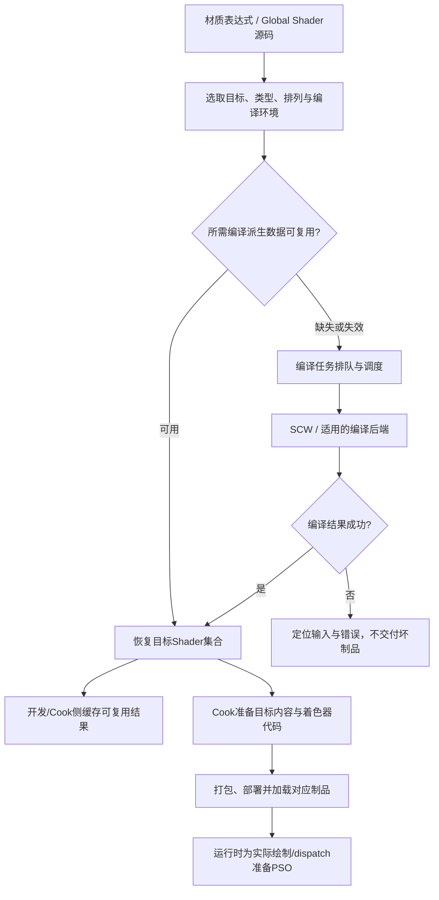
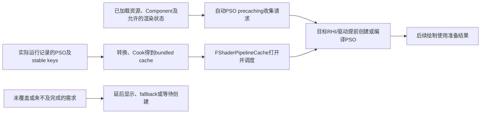
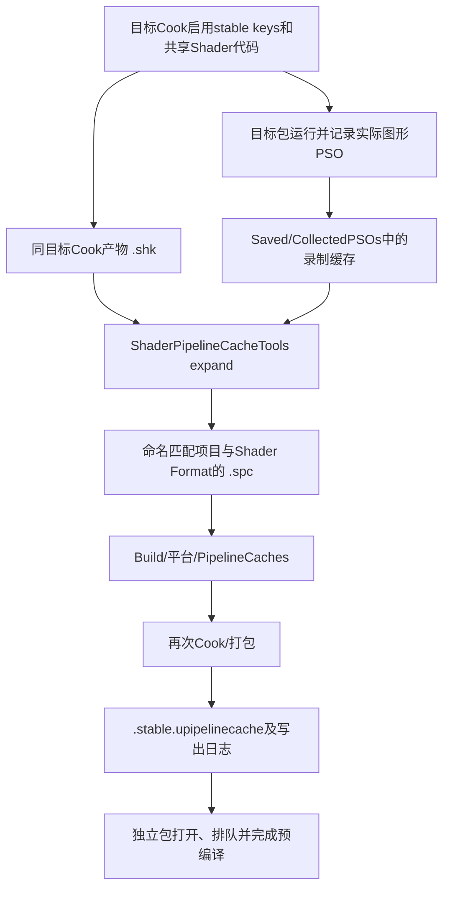

# 07 Shader 编译管线与 PSO

> 知识成熟度：L2。本文依据官方文档与公开API声明作静态核对；教学例、配置和检查步骤均未在UE中执行，不能据此给出编译速度或首局帧时间。
> 版本基准：操作路线以实际读到的UE 5.6文档为主；S06–S11是2026-10-11读取时显示UE 5.8的动态API页，只支持所列声明，不认证某个5.8源码修订的实现。
> 兼容性边界：先固定目标平台、RHI、Shader Format、质量档和内容版本。D3D12示例不自动适用于Vulkan、Metal、移动端或主机；光追PSO另有边界。
> 最后更新：2026-10-11。修正缓存职责、插件虚拟路径和PSO收集路线，补全从材质编译到独立包首用的正常教学路径。

原稿曾标注UE 5.8.0、CL 55116800和本机源码验证。本轮没有该checkout或`Build.version`原件，不沿用为本轮观察。原来的编译任务、SCW、ShaderMap、分布式调度、DDC、ShaderLibrary和PSO主题继续保留；无法重核的私有实现常量不再作为可直接套用的配置。本轮未运行UE、ShaderCompileWorker、编译器、Cook、打包、设备测试或性能测试。

## 一、先区分要解决的三种问题

“编译过Shader”可能只表示编辑器已有某目标的编译结果，并不表示独立包已包含需要的代码，更不表示目标设备已准备好这次绘制的PSO。

| 读者遇到的问题 | 此时应检查什么 | 不能由它推出什么 |
| --- | --- | --- |
| 修改材质后等待编译，或Cook耗时长 | 所需排列、编译任务、DDC命中、SCW与目标编译器 | 不能直接推出GPU执行慢 |
| 编辑器正常，独立包缺材质或报Shader缺失 | 目标Cook范围、编译错误、着色器代码制品与加载 | 开发机DDC有数据不能补救已发布包遗漏 |
| 第一次出现某特效时停顿 | 先定位耗时，再查对应PSO是否漏收、来不及完成或不支持预缓存 | 不能只凭“第二次不卡”认定PSO，更不能断言缺缓存必卡 |

本文主责是准备与交付这些编译制品和管线状态。材质图/PBR由[材质系统](../../04-图形动画与物理仿真/材质地形与世界表现/02-材质系统详解.md)负责；各渲染pass和GPU稳态工作由[渲染管线概览](../../04-图形动画与物理仿真/渲染管线与光照/01-渲染管线概览.md)负责。

## 二、Shader类型、排列与编译单位

### 2.1 类型不是文件后缀，也不是GPU阶段

S01的分类回答“这段Shader依赖哪些输入”：

| 类型/对象 | 依赖关系 | 为什么影响编译集合 |
| --- | --- | --- |
| Global Shader | 不依赖某个材质的表达式，例如部分后处理 | 仍有目标平台与允许的排列；“global”不表示所有项目拥有完全相同的字节码 |
| `FMaterialShaderType` | 依赖材质属性，但不需要某种网格的顶点工厂 | 针对材质及适用pass准备，例如light function类用途 |
| `FMeshMaterialShaderType` | 同时依赖材质与网格类型 | 需要适用的材质/Vertex Factory组合，例如base pass |
| Vertex Factory | 将不同网格的数据接入pass，例如静态网格与蒙皮数据 | 相同材质用于骨骼网格时，所需顶点处理不一定与静态网格相同 |
| `FMaterialShaderMap` | 聚合该材质需要的Shader集合 | 完成一项编译任务不等于整张ShaderMap已可用 |

VS/PS/CS表示Shader阶段；Global/Material/MeshMaterial表示UE中组织与依赖方式。插件是代码/资源的封装位置，不是与这些类型互斥的另一种GPU阶段。`.ush`主要供include，`.usf`可含入口；不要按扩展名判断是否已经存在可执行Shader（S05）。

### 2.2 哪些变化制造新的排列

材质的静态选项、usage、平台和允许的pass组合决定所需编译集合；过滤条件使它成为稀疏集合，而非所有维度的无条件笛卡尔积。普通运行scalar/vector参数改变值，与改变编译期静态分支是两类操作，具体材质例见材质篇3.1。

**纸面例 P1，仅追踪输入，不是编译计数实测：**父材质`M_Probe`有静态开关`UseDetail`及运行颜色参数`Tint`。准备静态开关关/开两个MIC，都用于静态网格；再让关分支的MID依次设红色、蓝色。

- 两个MIC要求准备各自实际使用的静态选择；MID改色不因两种颜色再制造两组静态选择。
- 若把同一材质用于骨骼网格，须核对新增usage与Vertex Factory组合，不能只看父材质是否曾编译。
- 这里不能得到“总共编译2个Shader”：一个可见物体也可能参与depth、base、shadow等多个pass，且会有多个阶段。

反例是把“100个实例”直接乘进排列总量，或把所有usage勾上当作免费的兼容办法。应记录实际需要的材质静态配置和用途，再检查目标编译集合。

## 三、从输入到目标着色器制品

### 3.1 编译、缓存、Cook的职责图



这是职责图，既不承诺每一箭头都是函数调用，也不承诺DDC只有一次查找。缓存命中时可省去相应编译工作；首次启动编辑器、Cook另一平台、改公共include或改变静态配置时，待做的工作也不同（S01、S02、S06–S10）。

### 3.2 编译输入与结果如何定位

下面是公开API声明支持的观察入口，不是直接构造任务的完整插件（S06–S09）：

| 对象 | 有用字段/职责 | 排查时如何使用 |
| --- | --- | --- |
| `FShaderCompilerInput` | `Target`、`ShaderFormat`、`ShaderPlatformName` | 确认报错究竟属于哪个目标，而非只写“Windows” |
| 同上 | `VirtualSourceFilePath`、`EntryPointName`、`ShaderName` | 把编译错误定位到虚拟源码、入口与类型 |
| 同上 | `Environment`、`SharedEnvironment`、`ExtraSettings` | 检查编译条件与附加设置是否符合目标 |
| 同上 | `Hash`、`DebugGroupName`、dump路径 | Input的Hash用于job cache；调试组和路径帮助关联材质或Global任务 |
| `FShaderCompilerEnvironment` | include虚拟内容映射、`CompilerFlags`、`SetDefine`、资源/Uniform Buffer信息 | 同名入口使用不同define或布局时，输入条件已经不同 |
| `FShaderCompilerOutput` | `bSucceeded`、`Errors`、`ShaderCode`、`ParameterMap`、`OutputHash` | 先判断成功和诊断，再跟踪产物；输出Hash与输入job key不要混为一谈 |
| `FShaderCompilingManager` | 异步任务入队、结果获取与并行调度 | 区分尚未完成的任务、待finalize的ShaderMap和真正失败 |

S08同时声明`CompileTime`、`PreprocessTime`和`ValidateInputHash`。这些字段存在不表示本文取得了任何数值；也不能把单任务时间当整次Cook时间。S06未给出完整DDC key构造算法，因此不写成“Input Hash加一个版本常量就是所有DDC键”。

### 3.3 SCW、调度与分布式编译

Shader Compile Worker承担平台编译工作，帮助并行利用CPU；编译管理器处理异步排队与结果回收（S01、S09）。编辑器可在任务未完成时继续工作，并不代表该材质已成功准备；Global Shader编译失败也可能使启动无法继续。

读慢任务时按“有多少待编译输入→缓存是否有效→实际后端是否工作→CPU/内存与I/O是否受限”的次序看。盲目增加worker可能与编辑器或Cook争抢内存和CPU，不能仅凭CPU核数承诺收益。S01给出的关闭worker/异步编译是调试手段，有明显吞吐代价，不是日常优化。

S09的`BuildDistributionController`公开说明提到XGE/SN-DBS，表明管理器存在分布式调度接口。本轮未读取后端实现或农场配置，不能宣称任意安装都有可用后端。先证明任务确实分发、返回成功，并比较相同输入及缓存状态下的耗时，才能决定小改动或全量Cook是否使用它。原稿的FASTBuild支持、固定协议号、必然重试和一组调度CVar数值未获本轮实现证据，不作为通用操作前提。

### 3.4 DDC复用编译工作，不替代发布制品

DDC依缓存层级查找派生数据，缺失时生成并回填。S02说明UE 5.4起默认Local DDC使用Zen；旧Filesystem示例不能视为所有版本的默认。共享DDC对同地点团队可减少重复工作，但慢网络、权限和配置差异仍会影响收益。

最小核查路线是先读启动日志中的`LogDerivedDataCache`，确认实际后端、有效位置、可写状态及是否因问题停用，再比较相同目标的重复工作。原稿的`[/Script/Engine.DerivedDataCache] SharedDataCachePath=...`不能当作已核实的共享DDC配置；S02的Filesystem例使用`[DerivedDataBackendGraph]`里的`Shared`节点，也提供编辑器的Global Shared DDC Path入口。Zen/Cloud应选各自文档，不能照抄Filesystem路径。

**边界：S02明确cooked build不需要也不使用DDC。**因此把开发机缓存拷给玩家并不能代替Cook；发布后缺Shader时先检查目标包与加载，不能先要求玩家“预热共享DDC”。

### 3.5 ShaderMap与ShaderLibrary不是同一种物件

ShaderMap是关联Shader的组织单位；Shader Code Library聚合代码，S10说明它在Cook期间填充唯一Shader代码。S11的文件缓存机制依赖Shader Code Library及`Share Material Shader Code`。

Cook按目标平台和项目设置准备交付内容。共享代码、原生库以及容器化方式会改变实际磁盘布局，不应将`.ushaderbytecode`写成所有平台、所有设置唯一的落盘终态。S01仍含材质Shader随包保存的旧式说明，应结合目标版本和共享代码设置阅读，不能把它与共享库配置合成一条无条件存储规则。

可检查的终态是：Cook/打包日志没有未解决的目标Shader错误，目标代码确已纳入交付内容，独立进程能够加载所需Shader并渲染预期材质。它仍不证明所有PSO已提前准备，更不证明GPU运行时间达标。

## 四、PSO：现成的Shader还要与管线状态匹配

### 4.1 Graphics PSO包含什么

在D3D12中，Graphics PSO将Shader字节码与输入布局、混合/光栅/深度模板、渲染目标格式等相关状态组合，使驱动可以预先处理状态依赖。资源绑定、viewport等还有独立设置；称其为“全部GPU状态”不准确（S12）。Compute PSO与Graphics PSO的需求不同，不能把图形PSO的收集办法一概套到光追PSO。

**纸面反例 P2：**已拥有同一组VS/PS字节码，但一次pass的render-target格式与另一次不同。Shader代码存在不能证明第二种Graphics PSO已创建。反过来，PSO命中也不证明纹理已驻留、几何已加载或整个帧不存在别的阻塞。

### 4.2 两种提前准备路线并行存在



自动预缓存利用组件/资源信息预测需求；bundled cache从实际走过的渲染路径积累描述。二者可互补，后者不是前者必经的上一阶段（S03、S04）。`.upipelinecache`保存的高层描述也不等于每台用户设备可直接复用的驱动机器码。

| 层 | 作用与边界 |
| --- | --- |
| 进程内PSO缓存 | 复用当前运行中已准备的对象/状态，不能单独跨进程保证复用 |
| 自动PSO precaching | 支持的组件、Vertex Factory、pass等提前收集并异步创建；覆盖和及时性都要验证 |
| `FShaderPipelineCache` / `FPipelineFileCacheManager` | 由文件描述驱动记录、持久化、读取与预编译；与代码库、版本、目标平台配合（S11） |
| bundled/user cache | 发布随包数据与用户可写数据用途不同；用户缓存有内容版本兼容限制（S04） |
| 驱动缓存 | 驱动侧复用准备结果；旧缓存可掩盖第一次运行成本，不能只测连续第二次启动（S03） |

### 4.3 自动预缓存：何时能进入可见场景

S03的总开关是`r.PSOPrecaching`，它依赖RHI的支持标志。`r.PSOPrecache.Components`控制组件范围；`r.PSOPrecache.Resources`是另一范围，资源信息可能不包含完整的组件渲染状态。不能把Components当总开关，也不能仅凭默认值宣称项目已启用。

组件加载后可针对可能的pass收集PSO。所需对象尚未准备好时，延迟proxy创建可表现为暂时不绘制；其他策略可能使用默认材质或承受等待。因此“没有卡顿”与“物体按时正确显示”必须一起验收。加载阶段可按S03检查`FShaderPipelineCache::NumPrecompilesRemaining()`，但零只对应当时已知/待处理的请求，不覆盖未来才加载的内容。

诊断时启用目标构建支持的`r.PSOPrecache.Validation`并看`stat PSOPrecache`：`Missed`表示需要的PSO没被预缓存，`Too late`表示排了队却未及时完成，`Untracked`指当前未纳入可跟踪范围。把三者都解释成“缓存文件不全”，会把加载时序问题与收集覆盖问题混在一起。

### 4.4 手动bundled cache的文件链

以下是S04的图形PSO路线，细节以该页UE 5.6为准。D3D12与Vulkan记录不可互换；该路线不支持bundled光追PSO，Compute PSO有Cook侧的另行处理。



这条链的价值是把录制时的字节码标识与稳定描述关联，再由当前Cook生成可交付缓存。核查实际文件名、目标和日志，不以“找到一个后缀正确的文件”代替匹配证明。重大内容变化后仍可能需要重收，旧数据还会增加无效准备工作。

## 五、正常教学例：从小关卡到独立包

下面是**待在有UE环境的项目中执行的学习步骤**，本文只给输入、操作和预期判据。先完成主路线A–D；有明确收集需求时再选E。任何示例数量都不代表性能结果。

### 5.1 准备输入并完成材质编译

选择项目确实支持的一个目标，例如Windows/D3D12，并记录UE版本、实际Shader Format、构建配置和质量档。创建小关卡`L_ShaderProbe`，放置两个静态网格Cube及可照亮它们的灯光。`M_Probe`使用Surface、Opaque、Default Lit：Vector Parameter `Tint`接Base Color，Static Switch Parameter `UseDetail`的True接常量0.2、False接0.8，输出接Roughness。这里用粗糙度分支简化“静态选择”的观察，不声称它代表真实细节纹理成本。

创建`MI_Probe_Off`和`MI_Probe_On`，分别覆盖该开关为False/True并赋给两个Cube；用关分支实例在一个Cube上创建MID，向`Tint`先写红色再写蓝色。MID沿用父实例的静态选择，换色前后都应保持该粗糙度分支；实例操作前提见材质篇。将这个地图纳入项目既有Cook/打包范围。

在Material Editor对父材质Apply/保存，等待相关任务完成。检查Output Log中目标材质及Shader错误，确认两个静态选择都显示预期外观；再只改MID的Tint，比较输入性质。S01支持材质Apply的迭代方式；不能只凭编译进度条消失证明所有目标已成功。

预期终态A：这个编辑器目标的材质准备完成，静态选择/运行颜色各按设计表现；若看到default/fallback或报错，先定位该任务，停止继续以“正常材质”收集PSO。

### 5.2 解释缓存，再做目标Cook/打包

保存一次编译/Cook日志和`LogDerivedDataCache`有效后端信息。同样内容、同样目标的后续准备可以复用有效派生数据；没有新编译不等于没工作，出现新编译也先核对平台、静态条件或源码是否改变。此学习例不需要删除全部DDC来证明缓存。

使用项目正常打包流程生成上述目标包，核查地图纳入、Shader编译与代码交付是否成功。若项目采用共享Shader代码路线，检查Packaging相关设置及Cook日志与其一致；不要在这个例子顺手更换RHI、升级SDK或添加分布式后端，否则无法定位变化原因。

预期终态B：有属于这个内容版本和目标的可启动包、完整Cook/打包日志与对应着色器制品。编辑器里的材质正确不能替代这一步。

### 5.3 在独立包验证自动预缓存

用该包进入同一地图，在支持的开发构建中核实`r.PSOPrecaching`及组件范围实际生效；准备加载阶段时把当时的PSO待完成请求纳入等待条件。应让Validation在待观察内容的收集/首用前就生效，避免入场后才开统计遗漏早期事件。下列第一行为开发诊断值，第二行为观察命令；先确认目标构建的设置入口与可用性，不将它们当生产性能推荐值：

```text
r.PSOPrecache.Validation 2
stat PSOPrecache
```

让两个MIC实际可见，走到所有测试视角；记录请求完成状态、PSO分类、实际材质与是否出现延迟显示。关联到具体材质、Vertex Factory、mesh pass和渲染目标状态，再判断需不需要补收集器或bundled cache。

预期终态C：小关卡能以目标外观呈现，当前已知PSO工作完成，观察路线没有未解释的miss/late或视觉缺口。这只覆盖这个内容/配置/路线；即使满足也尚未取得帧时间收益。

### 5.4 正例、反例与停止条件

| 控制项 | 纸面预期与检查 | 不成立时先做什么 |
| --- | --- | --- |
| 同包同RHI同质量，两个MIC都已加载并完成当前请求 | 再走已覆盖路线应能复用准备结果；同时看视觉及分类 | 对照具体PSO状态，而非只记录“不卡” |
| 同包改到未覆盖质量档或首次加载另一效果 | 可能新增需求；先前零剩余不能证明覆盖它 | 记录新内容/状态，区分新增需求和原路线漏收 |
| 缩短加载等待，使已排请求来不及 | 可能出现Too late、延后可见或阻塞；不应直接判断Shader编译失败 | 检查排队时点、等待条件与资源争用 |
| 仅有字节码但更换pass/目标格式 | 可能需要不同PSO，见P2 | 对照full PSO状态而非仅Shader Hash |
| 包报告缺少目标Shader或材质fallback | 前置编译/Cook链未成立 | 返回5.1/5.2，不继续统计“成功的首用表现” |

预期终态D：能说明哪一层完成、哪些内容尚未覆盖。性能验收要另取固定设备、build、质量、路线、驱动缓存状态及完整trace；官方诊断页有冷驱动缓存测试入口，但清缓存属于独立测试准备，本文没有执行。必须保留首次与后续运行条件，不能把热驱动缓存结果称为新玩家首次体验。

### 5.5 可选：确有遗漏时制作bundled cache

沿4.4执行。S04的UE 5.6准备项分别属于以下配置位置，不能把它们当控制台命令混贴：

| 文件/入口 | 要核对的配置 |
| --- | --- |
| 项目`DefaultEngine.ini`或目标平台Engine配置 | `[DevOptions.Shaders]`下`NeedsShaderStableKeys=true` |
| 项目`DefaultGame.ini` | `[/Script/UnrealEd.ProjectPackagingSettings]`下`bShareMaterialShaderCode=True`、`bSharedMaterialNativeLibraries=True` |
| 目标运行的有效CVar | `r.ShaderPipelineCache.Enabled=1`，以`-logPSO`启动收集包 |

目标包实际绘制后，保存`Saved/CollectedPSOs`内的录制缓存，以及相同目标Cook的`Saved/Cooked/<平台>/<项目名>/Metadata/PipelineCaches`内`.shk`。按S04执行转换：`ShaderPipelineCacheTools expand`的三个位置参数依次是录制`*.rec.upipelinecache`、stable key的`*.shk`和输出`.spc`路径；它通过目标UE的`UnrealEditor-Cmd`以`-run=ShaderPipelineCacheTools`调用。本文不拼接未经确认的本机安装目录。

输出名必须含准确项目名和Shader Format；将`.spc`放入项目`Build/<平台>/PipelineCaches`再Cook/打包。第一次收集应明确是否已有seed/user cache影响采集；保留旧制品及记录，不以删除原文件作为教学前提。

预期终态E不止一个文件：Cook日志写出大于零的graphics PSO，包启动日志打开预期缓存，写出/打开条目相符，预编译确有任务，并在同条件重走时检查是否仍发现新PSO。命令参数中的项目名、Shader Format和路径必须来自真实制品；缺少`.shk`、目标不符或零graphics条目时停在转换/构建环节排查，不能靠改扩展名补救。

自动预缓存与手动文件可一同使用；是否只记录自动路径漏掉的PSO，要核对S04的`ExcludePrecachePSO`及其Validation前提。不能从“没主动录制”推断“必卡”，也不能从“包里有缓存”推断覆盖已完成。

## 六、保留的代码入口与工程取舍

### 6.1 自定义Global Shader声明例

保留原稿的参数结构示例，用于理解“C++类型→虚拟文件→入口→阶段”绑定，原稿`SHADER_USE_PARAMETER_STRUCT`的Shader类和基类实参本来正确，本轮保留并按S13复核。下例是**未编译的声明示意**，不是完整可运行插件：还缺模块依赖、正确加载时机、`.usf`入口实现、输出资源及渲染线程/RDG dispatch。

```cpp
class FMyExampleCS : public FGlobalShader
{
public:
    DECLARE_GLOBAL_SHADER(FMyExampleCS);
    SHADER_USE_PARAMETER_STRUCT(FMyExampleCS, FGlobalShader);

    BEGIN_SHADER_PARAMETER_STRUCT(FParameters, )
        SHADER_PARAMETER(FVector4f, MyColor)
        SHADER_PARAMETER_RDG_TEXTURE_UAV(RWTexture2D<float4>, OutputTexture)
    END_SHADER_PARAMETER_STRUCT()
};

IMPLEMENT_GLOBAL_SHADER(
    FMyExampleCS, "/Plugin/MyPlugin/Private/MyExample.usf", "MainCS", SF_Compute);
```

按S05，插件的`Shaders/`目录对应`/Plugin/插件名/`虚拟路径；含Shader实现的模块需关注`PostConfigInit`加载阶段，引用其他插件时还要核查启用及依赖。原稿`/MyPlugin/...`不能在未建立自定义映射时当作默认路径，也没有本轮依据支持通用`.uplugin ShaderDirectory`字段或`RegisterShaderDirectory`调用。这里不以API网页空壳证明这些符号存在。

### 6.2 调试配置只针对问题开启

| 入口 | 适合解决的问题 | 限制 |
| --- | --- | --- |
| `r.ShaderDevelopmentMode` | 开发时取得编译诊断及重试入口（S01/S05） | 不把重试作为忽略确定性源码错误的办法 |
| `r.DumpShaderDebugInfo` | 检查预处理源码、include和等价编译参数（S01） | 会产生大量小文件；确认该任务真的编译，缓存命中不保证新dump |
| `recompileshaders changed` | Shader源码修改后的迭代（S01） | 公共include影响面可能很大；不是PSO缓存刷新命令 |
| `LogDerivedDataCache` | 验证DDC实际后端与可用性（S02） | 日志存在不等于每个目标任务都命中 |
| `FShaderPipelineCache`的batch/pause/resume入口 | 配合加载或交互阶段分配文件预编译工作（S11） | 批量大小不是毫秒保证，不能任意套50等示例值 |

若将缓存接入游戏代码，先由公开`FShaderPipelineCache`层查看打开、保存、batch和剩余请求接口；原稿直接调用`FPipelineFileCacheManager::OpenPipelineFileCache`的参数与保存枚举，本轮未完成具体签名核对，不提供可复制的低层调用。正常教学路线用5.5的官方收集/转换工作流，避免让一个示意函数冒充完整收集系统。

### 6.3 优化时先证明优化对象

1. 编译吞吐：减少真正不需要的静态组合和usage，复用有效DDC，再分析worker/分布式后端；不要用“小时降到分钟”代替项目测量。
2. Cook交付：固定目标和内容版本，检查Shader代码与地图覆盖；第一次Cook也不等于编译所有理论组合。
3. 首用准备：分别验证自动收集覆盖、完成时机和文件缓存有效性，既看停顿也看fallback/延迟可见。
4. 资源成本：提前创建PSO也消耗CPU和内存，加载等待更久与运行时更平稳之间要以目标设备数据取舍。
5. 升级维护：源码、编译输出格式和工具链变化可能使部分派生数据失效；S08明确输出格式变更要维护缓存/worker版本。不能只凭升级就断言每个Shader全量重编。

## 七、常见问题 FAQ

**Q1：一直显示Compiling Shaders，先删DDC吗？**
先看任务是否推进、具体错误与DDC有效后端，再核对这次是否新增目标/排列或改变公共源码。保留首个失败任务和日志；删除有效缓存只会增加待做工作，不能修复语法错误。

**Q2：SCW崩溃怎么查？**
区分编译诊断与worker进程失败，记录目标、输入、引擎/worker版本、退出或崩溃日志及内存情况。先找版本不匹配、确定性输入失败或资源不足的证据；不无依据归因显存，也不保证崩溃一定透明重试。

**Q3：插件Shader找不到文件？**
按虚拟路径核对插件是否启用、真实`Shaders/`目录与大小写、模块加载阶段和插件依赖，再核对include路径。找不到文件是前置输入问题，加PSO缓存不会解决（S05）。

**Q4：首局卡顿，之后正常，一定是PSO吗？**
不是。先用CPU/加载与渲染诊断定位耗时；已确认PSO相关时再看Missed、Too late及实际目标状态。资源I/O、解压、对象初始化等也可能出现首次成本。

**Q5：没有PSO记录文件？**
按5.5检查目标RHI、记录开关、输出位置与实际绘制。自动预缓存生效不等于已经启用手动记录；纯加载资源、没有走到对应绘制，也不能证明完成录制覆盖。

**Q6：一个材质为何很多Shader？**
材质静态选择、pass、阶段、目标和Vertex Factory共同决定所需集合，并有过滤。不要按实例数量或所有选项理论乘积当实际编译任务数。

**Q7：分布式编译为何更慢？**
先确认相同工作量与缓存状态，再看是否真正分发成功、等待/传输是否盖过计算收益。后端不可用或任务太少是候选原因，不能仅凭开关已设就认定农场在工作。

**Q8：升级后重新编译是否异常？**
可能是派生数据条件改变。比较源码/输出格式/目标等实际变化及缓存诊断，保留原日志；不要伪造“UE_SHADER_CACHE_VERSION导致全部失效”的已核对调用链。

**Q9：移动端精度或编译出错？**
固定实际移动平台、Shader Format、feature level和材质条件，先读目标编译错误。S07公开`FullPrecisionInPS`与移动精度模式有关，但不代表所有移动Shader都必须FP16，也不能用桌面成功替代设备验证。

**Q10：哪些指标该分别记录？**
开发/Cook侧记录工作量、复用情况、总耗时和峰值资源；交付侧记录目标制品与大小；运行侧记录PSO覆盖/及时性、加载等待、视觉正确性与相关帧trace。编译时间、指令数、包体大小和帧时间不可相互代替。

## 八、关联阅读与来源边界

- [01-UBT构建系统与编译配置.md](01-UBT构建系统与编译配置.md)：C++模块/目标构建与Shader编译职责不同。
- [02-UAT与自动化打包.md](02-UAT与自动化打包.md)：BuildCookRun中各阶段及目标内容准备。
- [04-资源管理与热更新.md](../持续交付与发布治理/04-资源管理与热更新.md)：代码库/内容版本、分包和更新交付。
- [02-材质系统详解.md](../../04-图形动画与物理仿真/材质地形与世界表现/02-材质系统详解.md)：运行参数、静态选择和usage。
- [04-Nanite与Lumen.md](../../04-图形动画与物理仿真/渲染管线与光照/04-Nanite与Lumen.md)：相关渲染功能；不因材质出现于该功能就假定本例覆盖所有PSO。S03对特殊渲染路径另列collector扩展入口。

以下来源于2026-10-11实际选读。正文中的S编号指向下表与frontmatter；版本标签是所读页面的范围，不能代替源码revision。

| 来源 | 实际核对范围 | 不据此声称 |
| --- | --- | --- |
| [S01 Shader Development，5.6](https://dev.epicgames.com/documentation/en-us/unreal-engine/shader-development-in-unreal-engine?application_version=5.6) | Shader依赖分类、异步编译、SCW、缓存与开发调试 | 所有历史示例宏/平台编译器在5.8原CL一致 |
| [S02 DDC，5.6](https://dev.epicgames.com/documentation/en-us/unreal-engine/using-derived-data-cache-in-unreal-engine?application_version=5.6) | 缓存层级、Local Zen变化、共享配置、日志、cooked build边界 | 所有项目需同一种网络后端或实际命中率 |
| [S03 PSO Precaching，5.6](https://dev.epicgames.com/documentation/en-us/unreal-engine/pso-precaching-for-unreal-engine?application_version=5.6) | 开关、组件/global准备、加载等待、验证分类、资源代价、collector边界 | 所有组件均覆盖、全平台默认开启或零卡顿 |
| [S04 Bundled PSO，5.6](https://dev.epicgames.com/documentation/en-us/unreal-engine/manually-creating-bundled-pso-caches-in-unreal-engine?application_version=5.6) | 记录/转换/再Cook/加载检查，平台差异，用户缓存与自动路径协作 | 官方示例条目数是本项目实测，或支持bundled光追PSO |
| [S05 Plugins，5.6](https://dev.epicgames.com/documentation/en-us/unreal-engine/overview-of-shaders-in-plugins-unreal-engine?application_version=5.6) | USF/USH、虚拟路径、加载阶段、依赖与排错 | 其旧式ShouldCache/Serialize示例可直接迁移至任意当前插件 |
| [S06 Input](https://dev.epicgames.com/documentation/en-us/unreal-engine/API/Runtime/RenderCore/FShaderCompilerInput)、[S07 Environment](https://dev.epicgames.com/documentation/en-us/unreal-engine/API/Runtime/RenderCore/FShaderCompilerEnvironment)、[S08 Output](https://dev.epicgames.com/documentation/en-us/unreal-engine/API/Runtime/RenderCore/FShaderCompilerOutput) | 读取日显示5.8的字段与接口声明，头文件定位 | 完整DDC键算法、固定worker协议值或函数实现已读 |
| [S09 CompilingManager](https://dev.epicgames.com/documentation/en-us/unreal-engine/API/Runtime/Engine/FShaderCompilingManager) | 读取日显示5.8的调度职责及worker/distributed相关声明 | 已启用某构建农场、必然重试、所有旧CVar有效 |
| [S10 CodeLibrary](https://dev.epicgames.com/documentation/en-us/unreal-engine/API/Runtime/RenderCore/FShaderCodeLibrary)、[S11 PipelineCache](https://dev.epicgames.com/documentation/unreal-engine/API/Runtime/RenderCore/FShaderPipelineCache?lang=en-US) | 读取日显示5.8的库与文件预编译接口 | 单一后缀适用全部打包布局、原低层示例签名已编译 |
| [S12 Microsoft D3D12 PSO](https://learn.microsoft.com/en-us/windows/win32/direct3d12/managing-graphics-pipeline-state-in-direct3d-12) | PSO内外状态及状态依赖，页面标注2021-12-30更新 | 所有RHI的对象/状态划分与D3D12完全相同 |
| [S13 RDG，5.6](https://dev.epicgames.com/documentation/en-us/unreal-engine/render-dependency-graph-in-unreal-engine?application_version=5.6) | Shader Bindings与Shader/Pass参数示例选读，宏的类/基类实参及FParameters角色 | 全页RDG实现已审查，或本文插件已编译/dispatch |

来源间也有层次差异：S11类说明主要介绍记录式缓存，不能用其中笼统的“实际绘制才记录”覆盖S03自动预测或S04的Compute Cook路线。原稿的Shader开发/DDC/PSO旧链接已换成实际读到的对应入口；原有材质质量主题由材质篇继续承接。历史源码定位与早期修订贡献保留于仓库原Git版本，不冒充本轮源代码审查。
