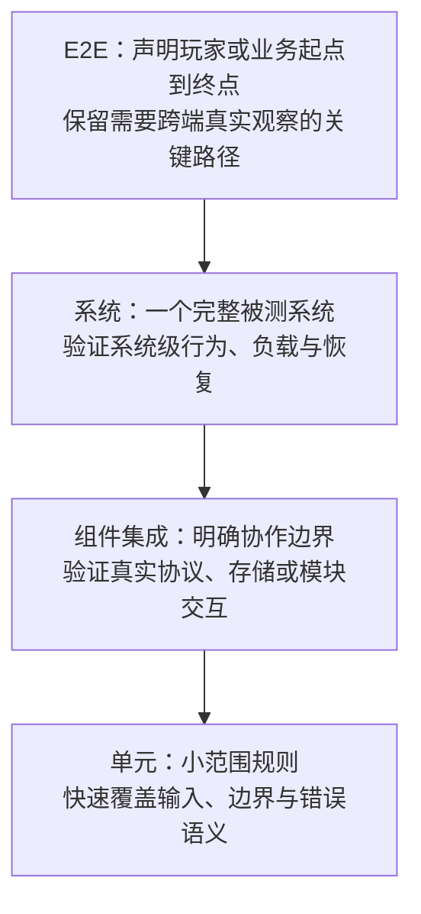
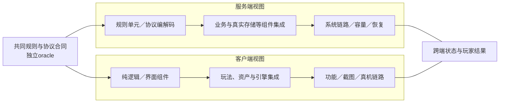
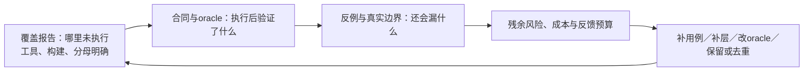
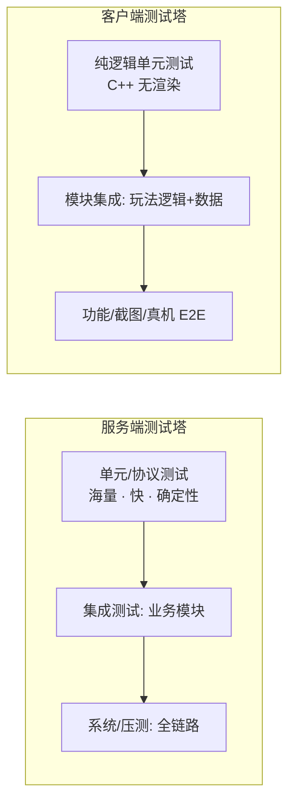
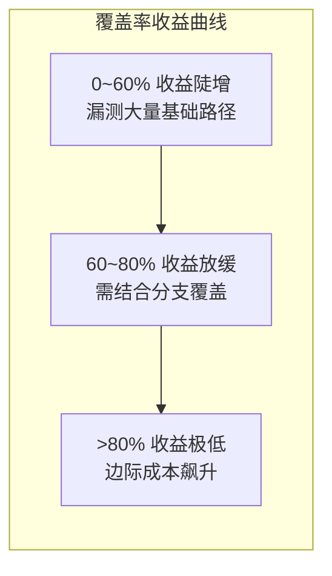

# 01 · 测试金字塔与测试策略

> 知识成熟度：L2。主要承诺是测试策略的概念教学与一手资料静态核对，不是已经运行或证明有效的项目测试方案。
> 最后更新：2026-10-09
> 知识基线：2026-10-09；工具选读基准包括 UE 5.6、Clang 20.1.0、pytest 8.4.x；其他作者文章与动态文档的具体范围见“权威来源”。
> 适用范围：游戏纯逻辑、组件、协议、客户端与服务端组合的测试选择；离线、单机、权威服架构分别按实际边界使用。
> 执行状态：NOT_RUN。本文没有编译、运行游戏或测试 runner，没有压测、故障注入、网络修改或部署。所有游戏数字、状态样例、命令和算例都是示例合同或 PAPER_EXPECTED。知识库静态检查不证明目标测试策略的检出率、稳定性或 ROI。

## 概述：先确定什么结果算错

两个相反的投入方式都可能失败：上线前只靠 QA 重复点测，会让回归反馈很慢；把所有规则都从 UI 端到端验证，又可能让环境准备和故障定位占满时间。解决问题需要知道测试在排除什么风险。

例如，客户端与服务端伤害值一致，仍可能是两端用了同一个错误公式；邮件领取界面显示成功，也可能是账本尚未提交或同一奖励写入了两次。测试数量和覆盖率都不能直接回答这两个问题。

本文采用以下闭环：

**风险与损失 → 行为合同 → 独立判定依据（oracle）→ 正反用例与测试边界 → 输入、环境和资源准备 → 实际执行证据 → 失败归因 → 修复、补证或接受残余风险。**

行为合同至少包含前置条件、输入合法域、结果、不变量、错误行为和时间约束。oracle 是判断结果是否符合合同的依据，可以是独立规则表、手算结果、已审查的参考数据或性质；不能只是再次运行同一段被测实现。

读完本篇，应能：

1. 解释单元、组件集成、系统和 E2E 各自在观察什么边界，以及使用替身会失去什么信息
2. 选择功能、性能、兼容、安全、回归和探索性验证，不用固定比例代替风险分析
3. 区分客户端、服务端和跨端链路的证据，避免把权威实现当作天然真值
4. 正确读覆盖率、样本、失败与重跑报告，不把未跑或未知写成通过
5. 用有分母、有成本范围的指标调整测试资产，并保留低频严重缺陷的回归保护

前置输入是变更范围、规则版本、架构与支持平台、可用环境、既有测试入口和反馈预算。没有这些输入，可以先列未知与补证计划，不能直接给出发布通过结论。

## 核心概念

| 术语 | 含义与边界 |
| --- | --- |
| 测试金字塔 Test Pyramid | 自动化测试组合的经验模型，提醒团队提供不同粒度的反馈；不是比例、成本或质量保证 |
| 单元测试 Unit Test | 在团队约定的小范围内验证一项行为；“单元”不必等于一个函数，协作者可真可替换，需说明边界 |
| 集成测试 Integration Test | 验证选定组件或外部接口之间的真实协作；把目标边界也替换掉，就没有验证该边界 |
| 系统测试 System Test | 以声明的完整系统为对象验证行为；“完整”相对于被测系统定义，不意味着整个公司所有服务 |
| 端到端测试 E2E | 从声明的起点到业务终点检验跨层链路；既可从 UI 发起，也可从 API 发起，必须列明被替换的环节 |
| 功能测试 Functional Test | 检查功能合同，包括成功、拒绝、错误及状态变化；不是仅看返回值是/否 |
| 性能测试 Performance Test | 在指定负载、环境、计时口径和样本下测响应、吞吐或资源，结论有适用范围 |
| 兼容性测试 Compatibility Test | 验证支持矩阵中的设备、OS、驱动、协议、数据或版本组合 |
| 回归测试 Regression Test | 变更后重新验证既有行为的目的，可使用不同层级和功能/性能等类型 |
| 白盒 White-box | 依据内部结构设计用例，如条件、分支和数据流 |
| 黑盒 Black-box | 依据规格与可观察行为设计用例；测试者即使能看源码也能做黑盒设计 |
| 灰盒 Gray-box | 用规格配合部分内部知识设计/定位问题；本篇将其作为实践描述，不强设标准分层 |
| 行覆盖率 Line Coverage | 工具所认定的可执行代码行中，至少执行过一次的比例 |
| 分支覆盖率 Branch Coverage | 工具定义的分支结果覆盖情况；短路条件、switch 等不能简单缩成每个 if 两个出口 |
| 路径覆盖率 Path Coverage | 对约定路径集合的覆盖；含循环时可能有无界路径，不能默认可枚举全部可能执行 |
| 变异测试 Mutation Testing | 对代码作受控改动，观察现有测试是否检出；不是路径覆盖的另一名称 |
| ROI | 指定期间与成本范围下的净收益/成本；收益/成本比是另一指标 |
| 可测性 Testability | 能控制输入/状态、观察结果并定位违约的程度；依赖接口化、可观测性和资源边界 |
| 测试替身 Test Double | 代替生产协作者的对象；fake 有简化实现，stub 给指定响应，spy 记录调用，mock 检查交互预期，dummy 仅占位 |
| fixture | 一个用例所需的已知状态与资源准备，以及相应恢复/清理责任 |
| flaky / quarantine | 前者指间歇不一致的测试表现；后者是临时隔离噪声的处置，均不说明根因已修复 |

替身术语见 [S3]。名称只是沟通工具：需要同时记下范围、运行依赖、设计依据、测试目的与真实边界，不能从某个框架名推定它们。

## 原理详解

### 1. 金字塔是测试组合的起点

Mike Cohn 的作者论述使用 **Unit / Service / UI 三层**，中间层强调绕过 UI 验证应用提供的行为；本文为了讨论游戏链路，使用“单元 / 组件集成 / 系统 / E2E”四个组织标签。两者不是同一份标准。[S1][S2]



图表示从宽范围向窄范围分解问题的方向，不给用例数量或预算百分比。一个用例可能同时是系统、回归和性能测试；做资产清单时可以指定一个主范围标签，再加其他维度，避免重复计数。

| 范围 | 游戏对象 | 真实/替身选择 | 预期反馈特点与不能证明的部分 |
| --- | --- | --- | --- |
| 单元 | 伤害、背包容量、寻路局部规则、协议编解码 | 小范围生产逻辑；昂贵/不可控依赖按目标替换 | 通常便于快速定位；不能由此推断真实 DB、渲染或跨进程行为 |
| 组件集成 | 技能与状态效果、结算与掉落、存储适配器与目标 DB | 被验证的协作边界用真实实现；边界外可替换并声明 | 暴露接口/事务/配置问题；依赖启动也可能较慢 |
| 系统 | 完整房间服务、登录系统、一局战斗的声明范围 | 按系统合同部署；外部服务的替换须列出 | 能检验更宽状态变化；定位需关联日志和快照 |
| E2E | 启动→角色→引导→副本→结算→退出，或 API 到持久化结果 | 保留所宣称端到端链路的实际环节 | 适合检验连接是否真的接通；替换的环节仍是证据缺口 |

小范围测试容易控制输入，失败时嫌疑范围也较窄，因此通常适合密集覆盖规则组合。上层引入更多状态与环境，准备、运行和诊断成本可能增加；但“层级越高，假失败率指数上升”没有普遍保证。真实产品竞态也会表现为间歇失败，不能先叫它假失败。

成本要分别统计：用例数、编写人时、维护人时、运行资源、墙钟反馈时间、失败调查时间。70% 用例不等于70%预算。若风险只有真实设备或真实事务能暴露，就应保留对应验证，即使测试组合不像某幅图。

### 2. 游戏项目的“双塔”视图

“双塔”是本文组织客户端与服务端责任的示意，不声称是通用行业标准。



服务端证据不能代替客户端画面、输入和设备行为；客户端截图不能证明服务端账本只写一次。共享库降低实现重复，也会让同一个 bug 同时出现在两端，所以还需要独立规则向量与跨端验证。

对于离线游戏，存档与结算可能都在客户端；对于云游戏或复杂渲染服务，服务端也可能有图形依赖。按实际责任分配风险，不固定“服务端逻辑一定最多”。

### 3. 测试类型地图

类型关注属性，范围关注被测边界，回归关注变更后的再验证目的。它们可以组合。

| 类型/目的 | 验证属性 | 手段 | 游戏例 | 安排依据 |
| --- | --- | --- | --- | --- |
| 功能 | 成功、拒绝和错误合同 | 断言、状态追踪、独立规则表 | 伤害符合规则；任务可领奖且不可重复入账 | 规则变更与风险 |
| 性能 | 时延、吞吐、资源 | 帧时间、负载、Profiler | 某设备目标30FPS、某接口P99<200ms | 这些数字仅是自选示例，需完整测量合同 |
| 兼容 | 支持组合的行为 | 设备/版本矩阵、真机 | 特定低端机或iOS版本、分辨率、存档版本 | 项目声明支持范围，不能以历史机型例替代当前矩阵 |
| 回归 | 既有合同仍成立 | 选择或完整执行已定义测试集 | 数值表改动后检查相关旧玩法 | 影响分析加必要保底范围，不承诺发现所有间接影响 |
| 安全 | 权限与信任边界 | 越权/非法输入用例、授权范围内的模糊测试 | 伪造购买或领奖请求被拒绝且不写资产 | 威胁模型与允许的测试环境 |
| 可用性/体验 | 操作理解、手感、音画反馈 | 试玩、观察、体验评审 | 引导困惑、关键反馈不可见 | 场景、人群和观察协议 |

### 4. 白盒、黑盒、灰盒怎样配合

| 维度 | 白盒 | 黑盒 | 灰盒实践 |
| --- | --- | --- | --- |
| 用例起点 | 代码结构、分支与状态流 | 需求、输入输出、业务规则 | 规格加协议、存储、配置等内部约束 |
| 游戏例 | 暴击/格挡分支、状态迁移 | 商城购买成功/拒绝、UI可用 | 请求与流水关联、存档字段迁移 |
| 主要收益 | 找结构盲点与定位线索 | 防止只验证实现自洽 | 检查跨团队边界和定位隐藏状态 |
| 常见代价 | 过度断言私有调用顺序会脆弱 | 只看少量输入输出可能漏组合 | 依赖内部知识，须维护观察接口 |
| 使用者与范围 | 开发或QA均可；不限单元 | 开发或QA均可；可用于单元 | 不以岗位或测试框架命名决定 |

白盒不必与实现细节紧耦合：从分支发现未测条件后，仍可断言公开行为。黑盒也不意味着必须手工点 UI。协议字段类型正确只是合同的一部分，还要考虑权限、错误语义、重试、版本兼容和副作用。

### 5. 客户端与服务端的策略差异

| 维度 | 客户端（如UE/Unity） | 服务端 |
| --- | --- | --- |
| 主要风险 | 输入、体验、资产、兼容、存档、预测与校正 | 权限、结算、持久化、并发、容量、恢复 |
| 单元边界 | 可抽离规则、界面状态；依赖引擎的行为另测 | 业务规则可小范围测；共享状态/存储/分布式边界并不天然容易 |
| 执行环境 | 纯逻辑可不渲染；渲染/真机行为需要相应设备与后端 | 无头适合许多场景，但真实服务依赖和资源成本仍要计入 |
| 回归重点 | UI、资产/热更新、存档、交互反馈 | 协议、幂等、数据一致性、部署配置 |
| 性能口径 | 帧时间、加载、内存、显存、功耗与温度 | 实际吞吐、成功/拒绝/超时、延迟分布、资源与排队 |
| 崩溃/稳定 | 按影响范围、可恢复性、数据损失定级 | 同样检查崩溃/泄漏/恢复；混沌与长稳是手段，不是稳定性证明 |
| 投资方向 | 可控规则加必要引擎/真实设备验证 | 规则、协议、存储并发与容量的组合 |

严重度和处理优先级要按项目规则区分，不能把所有闪退一概叫 P0。抽离纯逻辑有利于快速反馈，但不是所有自动化的必要前提。UE 5.6 官方说明 Automation Framework 依赖 UE 系统，纯单元测试另有 Low-Level Tests 入口；不能仅凭“Automation”名称就宣称脱离引擎。[S4]

#### 5.1 最小正确例：服务端权威不等于正确性oracle

下面是自选规则 R1，全部结果为 **PAPER_EXPECTED**：attack、defense 为非负整数，damage=max(0,attack-defense)，负输入返回 InvalidInput 且无状态写入。本例不含暴击、浮点溢出或最小伤害1；那些要另订规则。

| 输入 | 独立手算预期 | 能暴露的错误 |
| --- | --- | --- |
| attack=120，defense=20 | 100 | 两端都误写为相加得到140，端间一致性仍会假通过 |
| 20，20 | 0 | 错设伤害下限为1 |
| 10，20 | 0 | 去掉clamp得到负伤害 |
| -1，20 | InvalidInput；状态不变 | 忽略非法输入或擅自取绝对值 |

不要调用 Damage 本身生成测试期望值。客户端与服务端各对独立规则表验证，再检查预测与权威消息的版本、校正时机和玩家反馈。服务器拥有状态裁决权，不意味着它不会违反 R1。对相同错误实现作差分比较，最多证明一致，不能证明规则正确。

### 6. 从风险落到一条可追踪的测试链

贯穿例是合成 MMO 邮件领奖，**没有真实支付或真实玩家操作**。规则 M1 是教学合同：

- 邮件 M 属于玩家 A，奖励100金币；A初始余额50；B没有领取权
- 合法成功后 A=150、M=Claimed、奖励流水恰1条
- 同一 M 的重复请求最多产生一次奖励效果，包括同请求标识重试和不同请求标识重复领取；具体响应语义由项目合同定义
- B的请求被拒绝，A/B的资产都不变；写入失败不得留下合同不允许的部分成功
- Accepted 只表示收到或排队；面向玩家的成功须有可查询的持久化业务终态

| 测试边界 | 真实对象/替身 | 输入与操作 | oracle与应留证据 | 仍不能证明 |
| --- | --- | --- | --- | --- |
| 单元 | 领奖规则真；时钟/存储可fake | 合法、越权、过期前后、奖励边界 | 独立规则表、写入意图；拒绝无副作用 | DB实际提交、竞态或跨进程重试 |
| 组件集成 | 邮件/账本/目标DB事务真；通知stub | 首次、重复、并发、持久化失败 | 余额150、Claimed、流水1，或约定的完全不变；前后快照/关联ID | 客户端显示与部署外的服务 |
| 协议契约 | 指定消费方/提供方版本 | 缺字段、未知字段、错误码、同标识异内容 | schema加语义/权限/重试约定；提供方验证结果 | 只有mock provider通过不证明真实提供方兼容 |
| 系统/E2E | 所宣称的客户端→服务端→持久化链 | 登录A→打开M→领取→等待终态→重读余额；重复点击/断线后核对 | 玩家结果与同一操作的权威账本相符；状态日志、流水、必要录屏 | 无渲染路径看不到真机图形/触控/功耗 |
| 探索 | 代表设备和授权测试账号 | 主题“领取中切后台、断线、重复点击”，限定时盒 | 操作轨迹、预期/实际、异常与缺陷记录 | 一次未发现问题不代表穷尽所有序列 |

这张表说明测试为何需要分层：规则组合在小范围便宜地覆盖；只有真实事务能揭示实际隔离/提交问题；只有真实链路能发现连线或最终显示错误。把DB全部fake掉，再写“验证DB事务”会产生假信心。测试外层事务回滚也不自动清除其他连接已提交的写入或消息队列副作用。

#### 6.1 异步终态、超时与退出

测试可记录 Prepared → Requested → Pending → Succeeded / Rejected / Failed。观察端还可能 TimedOut 或 Cancelled；这些不证明服务端没有执行。按 operation_id 查询、等待或对账，才知道资产终态。

等待条件应绑定本次操作和业务状态，采用事件或有截止时间的轮询。固定 sleep 后只检查 HTTP 200，可能过早读取，也可能浪费大量时间。回调必须说明是“任务已接收”还是“持久化完成”；即使使用回调也需要超时与失败通道。[S12]

测试结束前停止或取消自己创建的后台工作，并确认已退出。无法确认任务终止时，不得立即把账号交回池供下一用例修改；将相关租约与数据隔离，记录残留和后续处理责任。清理失败不覆盖第一次业务结果，但会使运行完整性不足。

## 覆盖率与 ROI：分别回答不同问题

### 7. 覆盖率解释到哪里为止

代码覆盖回答“工具看到哪些代码结构被执行过”；需求/风险覆盖回答“哪些合同有针对性证据”；故障检出能力还要问“违约时断言是否真的会失败”。三者不能互换。



原来常见的“0–60%收益陡增、60–80%放缓、80%以上收益极低”不能作为普遍曲线：遗漏的一行可能是资产权限检查，也可能是不再支持的平台分支。图改为逐项判断边际价值，避免让百分比替读者作决定。

- **行覆盖**：即使每一行都执行了，没有检查结果的测试仍可能全绿
- **分支覆盖**：比单纯行数提供更多结构信息，仍不能证明计算、状态或业务语义正确；具体分支由工具定义
- **路径覆盖**：须先定义可行路径与范围；循环次数和状态组合会增长，部分路径也可能不可达
- **变异测试**：让特定代码变体接受现有测试，检验其敏感性；幸存可能是缺断言、没有覆盖，也可能是等价变异，不能一律算真实缺陷

Clang 20.1.0 的报告按插桩代码统计，未插桩部分不计入；行、区域、分支是不同指标。[S5] Stryker 的 detected/valid 有自己的计量规则，例如把 timeout纳入detected，编译/运行错误等另分类；引用分数时必须披露版本、变异算子、排除项和分母。[S13] 该分数不是线上真实缺陷检出率。

### 8. 两套覆盖工具入口（未来执行示例）

以下保留具体操作链，**NOT_RUN**。本仓库没有为本文准备可编译的 test.cpp 或可运行的 GameServer.exe。执行者须在受控项目中选定实际目标与版本、读取项目说明、保存退出状态与测试结果；生成覆盖报告本身不证明测试通过。

**方案A：Clang/LLVM。** 在每次运行独立的目录中使用匹配工具链与二进制；本例写法面向 Bash，不是原样适用于 PowerShell。test.cpp 是已准备测试入口的示例名，下面不是完整项目构建指令。

```bash
# NOT_RUN：仅供受控项目替换入口后使用
clang++ -fprofile-instr-generate -fcoverage-mapping -o test_runner test.cpp
LLVM_PROFILE_FILE="run-%p.profraw" ./test_runner
# 保存测试退出码与报告后，合并本次目录中的profile
llvm-profdata merge -sparse run-*.profraw -o run.profdata
llvm-cov report ./test_runner -instr-profile=run.profdata
llvm-cov show ./test_runner -instr-profile=run.profdata -format=html -output-dir=coverage_html
```

每一阶段失败均单独保留，不让最后一次命令成功覆盖前面的失败。%p区分进程；仍需每次run使用独立目录，避免旧文件被通配合并。生产逻辑目标也必须按构建系统正确插桩/链接；仅插桩测试壳不能代表所有被测库。记录原始profile、匹配二进制/源码/编译器与索引profile：raw格式没有跨版本兼容保证，归档后不能假设任意新工具都能重读。异常退出可能导致profile不完整；缺报告应标证据缺失。[S5]

**方案B：Windows OpenCppCoverage。** 已有exe可作为入口，但仍需要匹配的PDB、源码与支持的构建条件；优化后源行映射可能不准。它的行覆盖口径不能直接和LLVM分支覆盖比较。[S6]

```powershell
# NOT_RUN；路径和 --run-tests 均为项目示例，后者不是通用参数
OpenCppCoverage.exe --sources C:\project\server\src --modules GameServer.exe `
  --cover_children --export_type=html:coverage_report -- .\GameServer.exe --run-tests
```

--sources与--modules改变选取范围；--modules只过滤实际加载的模块，不会把未加载DLL凭空加入分母。若业务代码在被该筛选排除的DLL里，应明确调整范围再读覆盖结果。--cover_children意味着纳入实际子进程，不能以父进程报告代替所有子任务完成。[S7]

两套入口都应输出：构建/工具版本、模块与源路径过滤、排除理由、发现/执行的测试集合、首次结果、覆盖原始产物和报告。不要合并不同构建的profile掩盖差异；也不要拿覆盖插桩构建直接宣称发布制品的性能。

### 9. 可改用的测试策略矩阵

下表的数字只是 **PAPER_EXPECTED自选政策模板**，没有行业默认门槛。采用前由项目说明为何选择、分母是什么、未覆盖风险如何处理；这些占位策略不能直接放行发布。

| 模块 | 风险/合同与oracle | 主要范围/真实边界 | 示例量化项 | 负责人及证据 |
| --- | --- | --- | --- | --- |
| 服务端战斗 | 规则表、非法输入和结算不变量 | 单元+状态集成；实际数据/协议另测 | 可讨论行85%、分支75%，不能替代规则向量 | 服务端开发；向量、构建、结果 |
| 背包/道具 | 容量、堆叠、原子性、重复请求 | 单元+接口/实际存储集成 | 可讨论行80%；另列并发与失败合同 | 开发；前后状态与流水 |
| 客户端伤害表现 | 独立规则+预测/校正合同 | 纯逻辑、引擎集成、必要E2E | 可讨论行60%；图形/输入另有支持矩阵 | 客户端开发；状态时序、设备证据 |
| 登录/支付链路 | 身份、错误、回调与资产效果合同 | 系统+关键E2E，明确第三方沙盒边界 | “关键路径全量”须先列有限清单 | QA+开发；请求/回调/状态关联，不实际支付 |
| 团战性能 | 设备/负载下的帧时间或服务SLO | 系统性能，真实目标资源 | P99阈值待项目批准，附样本/失败统计 | 性能团队；原始trace与负载记录 |

### 10. ROI 决策示例与删除条件

先固定同一期间与成本范围，再计算：

```text
成本 C = 编写 + 维护 + 运行 + 失败调查 + 其他纳入的成本
收益 B = 估计避免的损失 + 回归人工节省 + 其他可解释收益
收益成本比 = B / C
净 ROI = (B - C) / C       （C > 0）
```

以下保留原MMO邮件系统数字作为 **PAPER_EXPECTED题设，不是已观测项目事实**：

```text
自动化120例，维护40人时/月≈4000元/月，观察期间6个月
题设称拦截3个线上级缺陷，估计避免损失60000元
仅已给维护成本：4000×6 = 24000元
收益成本比：60000 / 24000 = 2.5
仅这两项的净ROI：(60000 - 24000) / 24000 = 150%
题设另给缺陷逃逸率15%，但没有定义分母、等级与时间窗
```

这不能直接证明真实净收益为正：编写、运行、调查等成本尚缺，“避免损失”是反事实估计，检出三次也不等于每次必然上线并造成相同损失。若总成本其实为60000元，仅该收益的净ROI就是0；收益高估也会改变结论。应报告估计范围、关键假设与敏感性，防止重复计算人工节省和发布收益。

15%逃逸率需要定义同窗口内哪些已确认、去重、按严重度划分的缺陷进入分子/分母；线上暴露周期、玩家规模和版本变化都会影响比较。事故数与测试投入的负相关只能作线索，不能独立证明因果。

若邮件漏测问题集中在请求重试与持久化，补灰盒协议/真实存储合同比继续堆同义UI用例更直接。但“30天没失败”“从未抓bug”不足以判测试无效：它可能保护低频严重回归。删除前核查合同是否已废弃、是否有等效替代、独有风险是否仍在、维护成本来自哪里；先考虑改善oracle、降低实现耦合、下沉或去重。保留明确的历史缺陷回归关联。

## 用例、环境与运行可靠性

### 11. 六种用例设计方法

| 方法 | 如何使用 | 游戏例与限制 |
| --- | --- | --- |
| 等价类划分 | 根据合同假设分组，每组选代表并检查组内是否同质 | 等级1–100、0、101；负数、类型错误、缺字段未必属于同一无效类；一个代表不保证穷尽 |
| 边界值分析 | 按数据类型/精度取边界及邻近值 | 背包99/100/101；活动开始前/恰好开始/之后；浮点或时钟边界须指定最小单位 |
| 判定表 | 列条件组合、约束和对应动作 | 暴击×格挡×克制；不可能组合标理由，别静默省略 |
| 场景法 | 按状态迁移与真实用户目标设计序列 | 新手→首充→抽卡→组队→副本，同时设计退出、拒绝、重入与中断分支 |
| 错误推测 | 把过往缺陷与机制推断变成可检验假设 | 断网购买、重复点击、切后台；不是仅凭经验宣布通过 |
| 探索性测试 | 带问题与时盒，边学习边设计，记录过程和发现 | 新版本聚焦领取中断/状态异常；不是无目标地随便玩 |

保留数值表、等级/堆叠上限、百分比0%/100%、每日刷新、0/1/上限/上限+1等边界场景，但没有“约70%缺陷都在边界”的普遍统计保证。选取哪些组合，还要看状态、权限、序列和影响。

邮件M1可由判定表生成“A/B×未领/已领×有效/过期×写入成功/失败”的候选，再按约束筛出合法组合；用状态序列补“先超时再重试”。这些是可追踪的选择理由，比凑固定20–30例更有意义。

### 12. 测试环境与数据管理

| 环境 | 用途 | 数据/依赖安排 | 责任与边界 |
| --- | --- | --- | --- |
| 本地 | 小范围开发反馈 | 合成fixture，可真可fake | 开发；不可因本地快而省略真实边界 |
| CI | 可重放的门禁/回归 | 隔离的运行空间、固定版本与清单 | 流水线维护者；容器并不自动隔离外部账号/DB |
| Test | 功能/组件/系统协作 | 接近目标结构的受控数据 | QA与开发；共享资源有租约/namespace |
| Staging | 预发布组合验证与演练 | 优先合成，其他数据须有合法授权和适当保护 | 预发布不等于生产灰度；后者可能承载真实用户 |
| Perf | 性能/长稳/授权故障场景 | 明确机器人账号池、拓扑、负载与观测 | 性能团队；不混入真实用户或未授权资源 |

三个原有实践仍有价值：

1. **数据工厂**：按场景创建等级、装备、金币等资产；固定数据版本并能重建，避免无法解释的手工改库
2. **账号资产池**：为新号、满级号、脏数据等场景标注所有权、租约和复位条件；异常数据在专门隔离空间中创建，不能污染下个用例
3. **时间与随机控制**：注入业务时钟与随机流，记录种子、算法、调用顺序和输入；固定seed只控制对应序列，不控制线程调度、外部时间、硬件浮点或所有跨端状态

业务虚拟时钟与超时所用的单调真实时钟应分开。测试活动边界不是修改共享宿主全局时钟的理由。可控替身帮助重现特定路径；真实时钟/网络/存储的行为由相应集成测试补足。

#### 12.1 隔离、部分创建和清理

测试间独立不意味着所有依赖都mock，而是一个用例不因另一个用例留下的可变状态而改变结论。记录run_id、专用路径、账号/DB namespace、进程/线程/任务和每项资源的owner。

**PAPER_EXPECTED反例**：账号A创建成功，随后创建B失败，fixture尚未yield。如果只在yield之后删除A，清理可能根本不会执行。pytest文档明确了yield前异常与已注册finalizer的差别；每个成功资源应及时配对清理责任。[S10]

实际工程还需处理比这个例子更难的边界：

- 创建请求已送出但响应丢失时，“没收到成功”不证明资源不存在；用幂等创建标识、owner、租约和查询确认
- 停止后台工作并等待终态后，按逆依赖次序清理本次拥有的文件、账号、事务外状态和进程；共享只读fixture则核查未被修改
- 清理要覆盖正常结束、断言失败、setup失败、超时与取消；进程强杀时fixture/finalizer不保证运行，必须有可观测的遗留回收责任
- 保留清理结果和未知残留；API返回成功不必然证明任务、文件或持久状态均消失
- 不为“恢复环境”删除共享目录或整个数据库；清理范围不能超出资源所有权

UE文档同样提醒测试不能假设上次留下的状态，且应恢复文件状态。[S4] 对更多实作入口，见[客户端自动化](02-客户端自动化测试.md)与[服务端测试](03-服务端测试与机器人压测.md)；本篇的证据边界不能因相邻教程存在而自动满足。

### 13. 性能、样本与可重复性

性能合同应同时写：build、设备/OS/驱动、画质/分辨率、电源/温度/后台负载、地图/人数/操作、资源/数据规模、负载模型、冷启动/预热/测量窗口、计时起止、样本与独立运行轮数、失败/超时处理、分位算法、允许差异和阈值来源。

平均30FPS不能证明无长帧；一个P99数值也不说明样本是否足够或计时覆盖了玩家关心的步骤。R文档列出不同样本分位算法，报告应指明使用哪一种。[S15] k6的http_req_duration不包含初始DNS/连接时长；它不能直接冒充玩家操作到最终业务状态的全程时延。[S16]

比较版本时保留每轮原始样本/分布、场景事件和失败，不只挑最快的一轮。不要把各设备的P99取平均就称为总体P99。需要总体时，使用可合并的原始样本或定义清楚的分布结构；同时记录请求尝试、完成、拒绝、错误和超时，说明时延统计纳入了哪些结果。性能/概率性质测试本就可能有统计波动，不应一概按确定性单元测试处理。

**两次一致能证明多少？** PAPER_EXPECTED：假设每次是独立同分布的Bernoulli试验，固定条件下失败概率为p。n次零失败的概率为(1-p)^n。将其设为0.05，可自行推得零失败时单侧95%置信上界：

```text
p_U = 1 - 0.05^(1/n)
n = 2 → p_U ≈ 0.776393（77.64%）
```

它说明极少的观察并不能给出很低的失败率上界，绝不意味着实际失败率是77.64%。这是明确假设下的纸面推导；NIST来源给出一般二项置信区间方法，不能说原页逐字给出上面单侧公式。[S14] 同seed重放、共享环境、连续帧等往往不满足独立假设，不可直接套用。

因此“固定fixture连续两次一致”只记录这两次观察。稳定性要依据风险提出运行/样本计划，覆盖顺序、并行、设备或其他相关变化，披露仍未覆盖的范围。关于具体性能采集，见[性能兼容与网络异常测试](04-性能兼容与网络异常测试.md)。

### 14. 失败、重试与隔离

失败先保留构建、输入、原始结果、日志与状态，再调查：合同/oracle是否错误、产品是否违约、测试同步/共享状态是否不当、环境是否不同、测量是否不足。证据不足就记未知；不能仅因第二次通过就推断第一次是环境问题。

pytest与Fowler列举的状态污染、执行顺序、线程、时序等是排查方向。[S9][S12] 重试能帮助诊断或暂时缓解噪声，不修复根因。次数、超时和允许范围由项目政策指定，首跑与每次复跑都保留。

quarantine用于临时分离噪声时，应有用例/风险范围、负责人、期限、替代验证与残余风险接受记录。隔离用例不是已通过，也不是已修复。若产品竞态导致间歇重复奖励，隔离测试并不能消除资产风险；应继续阻断相应合同或走明确风险决策。

## 反模式与最佳实践

### 常见反模式

| 症状 | 后果 | 纠正 |
| --- | --- | --- |
| 冰淇淋筒：大量UI长链重复验证同一规则 | 反馈慢、准备与维护成本高 | 规则组合下沉，保留真实UI/跨端连接的必要验证 |
| 只有UI冒烟，没有规则与错误合同 | 主流程可走通却漏越权/并发/数据损坏 | 从独立规则与关键真实边界补证，不能只加冒烟数量 |
| 上层集中且定位困难 | 一个失败牵涉很多依赖 | 依据实际失败与耗时分解边界，不按固定百分比重分预算 |
| 100%覆盖崇拜 | 数字增加而oracle和真实风险未变 | 检查分母、断言与未覆盖合同，选择有价值的补证 |
| 门禁摆设或重试洗绿 | 原始失败与缺口不可见 | 对账计划/执行/产物，首跑保留，豁免有范围与期限 |

原文中的“奖杯测试（Cupcake）”混用了名称。Kent C. Dodds的Testing Trophy是来自前端经验、重视集成并包含static/unit/integration/E2E的模型，不是“只有UI冒烟”的反模式。[S17] 不应凭形状判好坏。

CI很慢或红灯很多值得调查，但“超过一小时且红灯率超过5%”不能直接推出用例上层过多或环境不稳。红灯还可能是正确拦截产品缺陷、资源排队、构建瓶颈或不合理测量；先定义窗口和分母，再分类。

### 八条落地实践

1. 先给每个高风险变更写合同、oracle、真实边界和未知项，再选用例/环境/负责人
2. 用反馈时间、检出目标、维护与运行成本调整分层，不把固定比例当准入条件
3. 能抽离的规则做快速测试；引擎、存储、协议与设备行为在需要的真实边界补证
4. 协议、存档、配置表建立版本与错误语义合同，不只检查字段存在
5. 覆盖门槛按项目风险制定并说明分母；80%、40%等数字都不能代替语义验收
6. 定期检查冗余、脆弱和废弃用例；依据合同/替代覆盖与成本去重，不凭最近30天没失败删除
7. 自动化承担可重复的检查，手工承担探索和体验判断；根据实际收益安排，不设70/30通则
8. 左移到需求/设计评审：提前识别可测性、异常和数据生命周期；保留发布前与运行后仍必要的验证

## 常见问题 FAQ

**Q1：游戏 UI 变化频繁，UI 自动化测试总是坏，是不是不该做 UI 自动化？**

先区分需求真的变了、定位器过度依赖布局、异步未收束、共享数据污染与产品故障。保留登录、关键玩法入口、支付沙盒等高价值实际链路；纯规则可下沉到逻辑层，截图另有设备/色彩/容差合同。无需把UI限制为固定5%；成本与独有检出价值决定保留范围。

**Q2：我们团队没写过单元测试，从哪开始？**

选一个风险明确、输入可控的模块，先用独立规则表做正常、边界、非法和一个能骗过坏断言的反例。服务端结算、背包、任务或客户端纯逻辑都可能适合，不必先凑每模块20–30例。跑通既有入口、发现清单、首次结果与覆盖报告，再扩展真实边界。

**Q3：覆盖率 90% 了，为什么线上还有严重 bug？**

覆盖只说明工具记录的结构执行。可能没有有效断言，oracle复制了错误实现，规则遗漏了权限/时序，真实协议/存储边界被mock，或目标设备/负载没测。查看未覆盖结构与断言、独立正反例、环境和真实边界；分支高分也不证明业务正确。

**Q4：手工测试会被自动化完全取代吗？**

体验、手感、音画和理解成本仍需要有组织的观察与判断；确定性回归适合自动化，探索也可借自动化采集数据。不能用自动化70%/手工30%当通用分工；按可判定性、变动成本、观察价值和反馈需求选择。

**Q5：测试金字塔对“买量小游戏/休闲游戏”还适用吗？**

可用它讨论快慢反馈和边界，但先看实际架构。离线存档、广告回调、支付、热更新、设备兼容可能比服务端结算更关键。生命周期短不等于可以删掉唯一覆盖高损失路径的系统测试；选择最小但能解释风险的测试组合。

**Q6：怎么向管理层证明测试投入的价值？**

展示同窗口、同定义的缺陷逃逸、回归人时和事故影响，并列出投入成本、业务规模、版本复杂度和估计范围。实际拦截个案能解释具体价值，趋势相关不能单独证明因果。避免损失是估计，需说明假设，详见本页ROI例与[质量门禁度量](../持续交付与发布治理/05-CI质量门禁与缺陷管理.md)。

**Q7：冒烟测试、回归测试、全量测试怎么编排？**

冒烟是快速筛选关键能力；回归是变更后重验既有合同的目的；全量是某个已定义清单完整执行。三者有重叠，不是固定“快→中→全”层级。团队可设置10分钟、一小时或夜间等预算，但这些是项目政策；超时、漏发现、未执行要显式处置。全量也不等于所有可能输入和环境。

**Q8：测试左移具体怎么落地？**

需求评审定义可判定合同和风险，设计评审确定边界/观察点，编码阶段建立规则测试与必要的TDD反馈，合入前做自测/静态分析/评审。不要以“开发完成80%用例”代替合同覆盖；后续真实集成、设备与运行验证仍需承担其责任。

**Q9：测试策略文档应该包含哪些内容？**

一页起步可保留七块：范围与不测项、分层与反馈预算、类型与判定标准、环境与数据、门禁与发布条件、风险及未知、人力与排期。每块关联合同/oracle、真实或替身边界、版本、证据与负责人。策略是经项目确认的门禁依据，不能把本页示例数字直接照搬。

## 验证建议与验收证据

### 最小验证样例（未来执行）

全部仍为 **NOT_RUN**。在目标项目获得所需环境与授权后，执行者先把下列计划具体化：

1. 固定提交/构建、引擎/runner/依赖、规则向量、数据/地图、平台与实际入口，确认测试发现清单
2. 以R1伤害规则检验正常/边界/非法和错误实现反例，确认oracle独立
3. 以M1或项目等价合同检验背包/邮件的真实存储写入、重复、并发、拒绝和失败状态
4. 选玩家关键路径登录→进入房间→完成一局→结算→退出，验证业务终态与资源退出，不仅是进程返回0
5. 按实际风险选择顺序、并行、平台和重复计划；保存首跑/复跑、清理与未执行项，不把准备工作写成运行结论

| 范围 | 最小样例与入口 | 必备证据 | 失败/缺口信号 | 通过合同 |
| --- | --- | --- | --- | --- |
| 单元 | R1；项目既有unit runner | 独立向量、发现/执行清单、断言结果 | 零发现、错误oracle、反例未检出 | 所需向量实际执行且结果符合合同 |
| 组件集成 | 背包/邮件；项目integration profile | 实际依赖版本、前后状态、流水、清理 | 部分提交、重复效果、残留 | 目标真实边界满足不变量且清理可核查 |
| 契约 | 一条API的消费/提供方入口 | 版本、请求/响应、schema与语义结果 | 仅mock通过、错误码或副作用漂移 | 所声明双方版本的合同验证成立 |
| E2E | 登录到结算；匹配平台的既有入口 | 同一操作的UI/业务状态、日志、必要视频 | 卡住、超时、任务未退出 | 声明链路终态、断言与资源退出满足合同 |
| 探索 | 高风险新功能；有主题的手工会话 | 时盒、设备、操作记录、缺陷 | 未解释异常、不可恢复或数据问题 | 完成约定观察并处置发现，仍声明未穷尽范围 |

headless只能证明它实际保留的边界。渲染或真实输入是目标时，要用能观察这些行为的配置。每个测试可选一个主范围用于清单，再标类型/目的和真实依赖，不要求现实中所有术语互斥。

### 结果、证据与决策分三层记录

下面状态词是示例记录词汇，不声称每个runner都内置同一枚举。pytest就对失败、中断、内部错误、命令用法和零发现给出不同退出码；实际项目应核对自己的runner语义。[S11]

| 检查项 | 必须识别的信号 | 合格证据与决策依据 |
| --- | --- | --- |
| 发现与执行 | 计划20例却发现0例、筛选错误、skip、未跑 | 计划/发现/执行/终态逐项对账；不得以失败0判通过 |
| 业务断言 | PASS/FAIL/ERROR/TIMEOUT/CANCELLED | 保存实际结果及oracle；超时/取消再核对可能副作用 |
| 证据有效性 | 构建不匹配、报告丢失、环境未知、样本不足 | 证据缺口为INCOMPLETE/UNKNOWN，不能自动升为PASS |
| 可重复性 | 相同提交出现不一致或顺序/并行相关 | 记录输入与条件，按预定计划复验；两次一致仅是两次观察 |
| 资源退出 | 断言通过但teardown失败、后台任务不明 | 原业务结果不篡改；运行/隔离完整性需补证或阻断 |
| 风险覆盖 | 高风险合同只有计划、没有实际证据 | 运行证据或明确风险接受；一条可执行用例的存在不等于已验证 |
| 重试与豁免 | 首跑失败被覆盖、quarantine被当绿灯 | 完整运行集合、有限范围/期限/责任人，依据项目政策决定 |
| 反馈预算 | 无限重试、超预算、排队与执行混算 | 区分各段耗时；预算变动有理由，不能降低断言洗绿 |

一个测试断言PASS，不等于所有证据充分；证据充分也不直接代替发布决策。允许带已知风险发布时，应记录批准范围和残余风险，不能把历史FAIL/NOT_RUN改写成PASS。见[CI质量门禁与缺陷管理](../持续交付与发布治理/05-CI质量门禁与缺陷管理.md)中的工作流承接。

### 证据清单与复核模板

保留提交/构建、实际命令与筛选器、并发/种子/超时、工具/引擎/依赖版本、机器/设备/OS/区域、fixture版本和资源owner；保留原始测试结果、首次失败、重跑、截图/trace、覆盖profile及匹配二进制；关联风险/需求/缺陷、清理结果与未覆盖范围。敏感数据应按项目规则最小化处理后保存到授权位置。

```text
复核日期、复核人：
规则/需求/风险编号及oracle来源：
提交/构建/引擎/runner/依赖版本：
测试主范围、类型/目的、真实依赖与替身：
实际入口、筛选器、并发、seed、时钟、超时：
设备/OS/驱动/区域、fixture与资源owner/租约：
计划/发现/执行/通过/失败/error/timeout/cancel/skip/未跑：
首跑与每次复跑的独立run_id、结果、证据：
业务终态与关联操作、后台任务退出：
清理成功/失败/未知残留及责任：
原始报告/日志/profile/trace/截图及对应构建：
性能口径、窗口、样本数/独立轮次、算法、失败纳入规则：
证据有效性：充分/不完整/未知（理由）
失败归因：产品/测试/oracle/环境/测量/未知（依据）
决策：通过指定门禁/补证/阻断/有限豁免
豁免范围、替代验证、批准人、期限、残余风险：
```

## 权威来源：实际核对范围

以下均于2026-10-09静态选读。作者文章提供经验模型，工具官方页提供其版本/范围内的行为说明；本文自选游戏规则、预算和政策不是这些来源的规范保证。未读实体书、未核对UE源码、未安装或运行所列工具。

| ID | 来源与实际定位 | 本文用途与边界 |
| --- | --- | --- |
| [S1] | Mike Cohn，The Forgotten Layer of the Test Automation Pyramid；页面最后更新2023-02-07，三层说明 | 原作者Unit/Service/UI模型；不声称读过整本Succeeding with Agile |
| [S2] | Ham Vocke，The Practical Test Pyramid，2018-02-26；Test Pyramid、Unit、Sociable/Solitary、Mocking | 粒度、术语与替身选择；经验建议 |
| [S3] | Martin Fowler，Test Double，2006-01-17；术语列表 | 区分替身意图；不证明fake与真依赖等价 |
| [S4] | Epic Games，Automation Test Framework，UE5.6；Overview、Test Design Guidelines | 框架依赖与状态隔离；未执行引擎 |
| [S5] | Clang20.1.0，Source-based Code Coverage；workflow、reports、format、limitations | 插桩/分母/profile流程与限制 |
| [S6] | OpenCppCoverage官方wiki Home；Requirements、Release versus Debug | PDB/源码与映射限制；动态页按本次日期核对 |
| [S7] | OpenCppCoverage Command line reference；modules/sources/cover_children/export_type | 命令过滤边界；不是项目runner参数说明 |
| [S8] | Microsoft Learn，Unit testing best practices for .NET；Characteristics、Coverage and quality | .NET语境的经验建议；高覆盖不保证质量 |
| [S9] | pytest8.4.x Flaky tests；System state、Thread safety、Xfail、Rerunning、Delete/rewrite | 间歇失败与治理线索，不是根因自动判定 |
| [S10] | pytest8.4.x How to use fixtures；yield errors、finalizers、Safe teardowns/structure | 部分setup失败与清理责任；不保证进程强杀清理 |
| [S11] | pytest8.4.x Exit codes | 运行状态应区分的具体工具例 |
| [S12] | Martin Fowler，Eradicating Non-Determinism in Tests，2011-04-14；Quarantine、Isolation、Async | 异步等待与清理的经验解释 |
| [S13] | Stryker Mutator，Mutant states and metrics；states、metrics | 变异计分口径，动态文档；不能外推实际缺陷率 |
| [S14] | NIST/SEMATECH Handbook §7.2.4.1；exact binomial confidence intervals | 明确概率模型下的统计方法；本文单侧零失败例是自推 |
| [S15] | R-patched stats quantile；Types，所读页脚stats4.5.0 | 样本分位算法不同；未运行R |
| [S16] | Grafana k6 Built-in metrics；HTTP-specific metrics | 请求计时边界；动态页未锁为目标安装版本 |
| [S17] | Kent C. Dodds，The Testing Trophy and Testing Classifications，2021-06-03 | Trophy原作者的前端经验语境；纠正名称混用 |

原文的Google Testing Blog *Just Say No to More End-to-End Tests*引用保留在历史区；本次读取失败，不冒充成功访问，也不以旧“统一访问日”覆盖本次证据。动态文档不声称永久不变；实际运行前须再核目标版本。

[S1]: https://www.mountaingoatsoftware.com/agile/the-forgotten-layer-of-the-test-automation-pyramid
[S2]: https://martinfowler.com/articles/practical-test-pyramid.html
[S3]: https://martinfowler.com/bliki/TestDouble.html
[S4]: https://dev.epicgames.com/documentation/en-us/unreal-engine/automation-test-framework-in-unreal-engine?application_version=5.6
[S5]: https://releases.llvm.org/20.1.0/tools/clang/docs/SourceBasedCodeCoverage.html
[S6]: https://github.com/OpenCppCoverage/OpenCppCoverage/wiki
[S7]: https://github.com/OpenCppCoverage/OpenCppCoverage/wiki/Command-line-reference
[S8]: https://learn.microsoft.com/en-us/dotnet/core/testing/unit-testing-best-practices
[S9]: https://docs.pytest.org/en/8.4.x/explanation/flaky.html
[S10]: https://docs.pytest.org/en/8.4.x/how-to/fixtures.html
[S11]: https://docs.pytest.org/en/8.4.x/reference/exit-codes.html
[S12]: https://martinfowler.com/articles/nonDeterminism.html
[S13]: https://stryker-mutator.io/docs/mutation-testing-elements/mutant-states-and-metrics/
[S14]: https://www.itl.nist.gov/div898/handbook/prc/section2/prc241.htm
[S15]: https://www.stat.ethz.ch/R-manual/R-patched/library/stats/html/quantile.html
[S16]: https://grafana.com/docs/k6/latest/using-k6/metrics/reference/
[S17]: https://kentcdodds.com/blog/the-testing-trophy-and-testing-classifications

## 关联阅读

- [游戏测试与质量 README](../../../00_Index/学习路线/工程实践与质量.md)：全库导航与测试体系
- [02-客户端自动化测试](02-客户端自动化测试.md)：客户端逻辑、引擎、截图与真实设备入口
- [03-服务端测试与机器人压测](03-服务端测试与机器人压测.md)：协议、状态与负载场景
- [04-性能兼容与网络异常测试](04-性能兼容与网络异常测试.md)：采样、支持矩阵与恢复验证
- [05-CI质量门禁与缺陷管理](../持续交付与发布治理/05-CI质量门禁与缺陷管理.md)：执行证据与门禁决策承接
- [游戏知识](../../../00_Index/UE专题.md)：UI、引擎与客户端性能主题
- [游戏服务端](../../../00_Index/学习路线/网络与游戏服务端.md)：权威边界、协议与服务端架构

## 历史原文与实际Git贡献保留

以下保留修订前全文与实际可见历史差异，供追溯贡献与逐字恢复。历史中的固定比例、覆盖率收益、两次一致、旧路径和工具命令不构成本篇现行推荐或执行授权。现行用途已在前文图表、例子、FAQ与验证合同中承接。历史文字放入代码围栏，避免其标题、旧链接和旧结论混入现行导航。

### 修订前完整原文

来源为基线 a62d3ab1794e3f877e0e33a0997eaf017e814e5d 的本文件，与最近一次修改 49b0a565f5c36f4646b020dc026c3f82501d1780 下blob完全相同：29268 bytes，386 LF，SHA256 a54fa5bbfd79be48a593aef3469649e44d7f5477f5831be52305f2ae7ab6cd9d。只取下列BEGIN行之后、END行之前的UTF-8原始内容即可恢复，包含原文最后LF，不含标记或外层围栏。

<details>
<summary>展开修订前全文（历史资料）</summary>

````markdown
<!-- TS-ORIGINAL-BEGIN -->
---
type: BestPractice
title: "01 · 测试金字塔与测试策略"
status: stable
verified: []
maturity: L2
---
# 01 · 测试金字塔与测试策略
> 知识成熟度：L2（本轮审计修订时补标）。

> 知识基线：截至 2026-08-07；本页补充的是可复核的策略原则与验收入口。
> 最后更新：2026-08-07
> 执行状态：待执行。以下证据栏位仅定义要求，不表示本轮已经通过。

> 本文是「游戏测试与质量」知识库的**策略基石**：先回答"测什么、测多深、在哪个层级测"，再谈"怎么测"。全文围绕测试金字塔（Test Pyramid）展开，并落到游戏行业特有的**客户端 vs 服务端策略差异**与**覆盖率 / ROI 取舍**。

## 概述

游戏项目的测试投入普遍存在两个极端：一是"重手工、轻自动化"，上线前靠 QA 加班点测，回归一次动辄数天；二是"盲目堆自动化"，把大量脆弱的 UI 级端到端测试塞进流水线，维护成本爆炸、红灯不断。

**测试金字塔（Test Pyramid）**是解决上述问题的经典模型：它用"数量倒三角 + 成本正三角"的形式，给出一个可执行的资源配置原则——**底层（单元测试）多而快，上层（E2E 测试）少而慢**。本文的目标是让读者：

1. 掌握金字塔各层级（单元 / 集成 / 系统 / E2E）的定义、职责与成本特征；
2. 理解测试类型（功能 / 性能 / 兼容 / 回归）在游戏项目中的落地方式；
3. 区分白盒 / 黑盒 / 灰盒测试的适用场景；
4. 建立**客户端与服务端差异化**的测试策略视图；
5. 学会用覆盖率与 ROI 数据驱动测试投入的调整，而不是拍脑袋。

核心结论先行：**游戏项目的自动化测试资产应呈现"服务端逻辑 > 客户端逻辑（纯 C++/可脱离渲染）> 集成/系统 > UI 级 E2E"的分布**；凡是能下沉到低层级的测试，就不要放在上层做。

## 核心概念

| 术语 | 英文 | 一句话定义 |
| --- | --- | --- |
| 测试金字塔 | Test Pyramid | Mike Cohn 提出的测试分层模型：单元测试为底座、E2E 测试为塔尖，层级越低数量越多、速度越快、成本越低 |
| 单元测试 | Unit Test | 对最小可测单元（函数 / 类 / 蓝图节点逻辑）的隔离验证，不依赖外部资源 |
| 集成测试 | Integration Test | 验证多个单元/模块协作是否正确，如"战斗模块 + 背包模块"的交互 |
| 系统测试 | System Test | 在完整游戏环境中验证一个系统的端到端行为，可含真实渲染与网络 |
| 端到端测试 | E2E Test（End-to-End） | 模拟真实玩家从启动到核心玩法的完整链路，跨客户端与服务端 |
| 功能测试 | Functional Test | 验证"功能是否符合需求"，关注行为正确性（是/否） |
| 性能测试 | Performance Test | 验证"快不快、稳不稳"，关注帧率、延迟、吞吐、资源占用 |
| 兼容性测试 | Compatibility Test | 验证"在不同设备/系统/分辨率下能否正常运行" |
| 回归测试 | Regression Test | 验证"改动没有破坏既有功能"，是自动化测试的第一价值 |
| 白盒测试 | White-box Testing | 测试者了解内部实现，基于代码结构设计用例（语句/分支/路径覆盖） |
| 黑盒测试 | Black-box Testing | 测试者只看输入输出与需求规格，不关心内部实现 |
| 灰盒测试 | Gray-box Testing | 部分了解内部实现（如数据库表、协议结构），介于黑白之间 |
| 行覆盖率 | Line/Coverage Rate | 被执行的代码行占可执行总行数的比例 |
| 分支覆盖率 | Branch Coverage | 被执行的布尔分支（if/else 两个出口）占全部分支的比例 |
| 路径覆盖率 | Path Coverage | 被执行的独立路径占全部可能路径的比例（成本最高） |
| ROI | Return on Investment | 测试投入产出比：避免的缺陷成本 / 测试编写与维护成本 |
| 可测性 | Testability | 系统被设计得容易测试的程度（依赖注入、确定性、接口化） |

## 原理详解

### 1. 测试金字塔的分层模型

标准金字塔自下而上分为四层（游戏行业常见变体）：

```mermaid
flowchart TB
    subgraph 金字塔[测试金字塔 - 数量与成本示意]
        E2E[E2E 端到端<br/>数量: 极少(约5%) · 成本: 最高 · 速度: 最慢]
        SYS[系统测试<br/>数量: 少(约10%) · 成本: 高 · 速度: 慢]
        INT[集成测试<br/>数量: 中(约15%) · 成本: 中 · 速度: 中]
        UNIT[单元测试<br/>数量: 多(约70%) · 成本: 最低 · 速度: 最快]
    end
    E2E --> SYS --> INT --> UNIT
```

各层级职责与游戏项目中的典型形态：

| 层级 | 典型被测对象（游戏语境） | 运行环境 | 单例耗时 | 失败定位成本 |
| --- | --- | --- | --- | --- |
| 单元测试 | 数值计算函数（伤害公式）、背包数据结构、寻路算法、协议编解码 | 无渲染、无网络（Test 模块/命令行） | 毫秒级 | 极低，直接指向函数 |
| 集成测试 | 技能系统 + 状态效果系统、战斗结算 + 掉落逻辑、DB 层 + 缓存层 | 可无渲染，需要 mock 外部依赖 | 秒级 | 低，指向模块交互 |
| 系统测试 | 一局完整战斗（含 AI、同步）、一次完整登录流程（客户端+网关+DB） | 可无头（headless）或最小渲染 | 秒~分钟级 | 中，需要日志链路 |
| E2E 测试 | 启动游戏→创建角色→新手引导→进副本→结算→退出 | 完整客户端（真机/模拟器）+ 测试服 | 分钟级 | 高，需截图/录像回放 |

**为什么上层必须少？** 三条硬约束：

- **速度**：E2E 一次执行数分钟，若数量上万，CI 永远跑不完；
- **稳定性（Flakiness）**：层级越高，环境变量越多（渲染时序、网络抖动、时钟），假失败率指数上升；
- **维护成本**：UI 一动，UI 级测试跟着改；底层测试几乎不受 UI 变更影响。

### 2. 游戏项目的金字塔"变体"：双塔模型

游戏测试有一个独特问题：**客户端渲染层难以单元化**。因此实践中常用"双塔"：



客户端塔的"塔尖"（真机 E2E）仍然数量有限，但**它承载了服务端塔测不到的体验类风险**（手感、画面、崩溃）；服务端塔则承载了绝大部分**逻辑与容量风险**。理解双塔，是理解 [03-服务端测试与机器人压测](03-服务端测试与机器人压测.md) 与 [02-客户端自动化测试](02-客户端自动化测试.md) 分工的前提。

### 3. 测试类型地图

测试类型（Test Type）与测试层级（Test Level）是正交的两个维度：**层级回答"在哪测"，类型回答"验证什么属性"**。

| 类型 | 验证属性 | 典型手段 | 游戏项目中的例子 | 常驻阶段 |
| --- | --- | --- | --- | --- |
| 功能测试 | 行为正确性 | 用例脚本、自动化断言 | 技能伤害与文案一致；任务可完成可领奖 | 开发期 + 回归 |
| 性能测试 | 速度/资源 | 帧率采集、压测、Profiler | 团战帧率 ≥ 30FPS；登录接口 P99 < 200ms | 里程碑 + 上线前 |
| 兼容性测试 | 环境适配 | 设备矩阵、真机云测 | 骁龙 680 低端机可运行；iOS 14 不闪退 | 上线前 + 版本迭代 |
| 回归测试 | 无破坏 | 全量自动化 + 冒烟 | 改数值表后旧玩法全通过 | 每次合入/发版 |
| 安全测试 | 防作弊/防注入 | 抓包、模糊测试（Fuzz） | 客户端伪造道具购买请求被拒绝 | 持续 + 上线前 |
| 可用性/体验测试 | 易用与手感 | 用户调研、试玩观察 | 新手引导流失率分析 | 阶段评审 |

### 4. 白盒 / 黑盒 / 灰盒

| 维度 | 白盒 White-box | 黑盒 Black-box | 灰盒 Gray-box |
| --- | --- | --- | --- |
| 内部可见性 | 完全可见（源码、结构） | 完全不可见 | 部分可见（协议、DB、配置） |
| 用例来源 | 代码结构（语句/分支/路径） | 需求规格、等价类、边界值 | 规格 + 关键内部约束 |
| 执行者 | 开发自测为主 | QA 手工/自动化为主 | QA + 开发协作 |
| 优点 | 覆盖深、定位快、可自动化 | 贴近用户视角、与实现解耦 | 兼顾两者、能测黑盒测不到的分支 |
| 缺点 | 与实现耦合、改实现即改用例 | 覆盖盲区大、重复劳动 | 需要额外知识投入 |
| 游戏语境 | 伤害公式分支、状态机转换 | 商城购买流程、UI 操作 | 协议字段校验、存档结构验证 |

**选择原则**：白盒测"实现正确性"（开发自测 + 单元测试默认白盒）；黑盒测"需求符合性"（QA 用例默认黑盒）；灰盒用于**关键契约**（协议、存档、配置表），因为这类问题的失败往往跨端、跨团队。

### 5. 客户端 vs 服务端测试策略差异

这是游戏测试最核心的策略分叉，直接决定人力和工具投入：

| 维度 | 客户端（UE/Unity） | 服务端 |
| --- | --- | --- |
| 主要风险 | 体验（卡顿/手感）、崩溃、平台兼容、资源 | 正确性（结算/存档）、并发（超卖/状态竞争）、容量（峰值） |
| 单元测试难度 | 高（引擎耦合、渲染依赖），需抽离纯逻辑 | 低（进程内可跑、易 mock），天然适合 TDD |
| 自动化执行环境 | 需要 GPU/真机/模拟器，成本高 | 无头进程即可，成本低、可大规模并行 |
| 回归重点 | UI 流程、存档、热更新 | 协议兼容、幂等性、数据一致性 |
| 性能验证 | 帧率、内存、功耗（真机） | QPS、P99 延迟、成功率（压测） |
| 崩溃/稳定性 | 必测（闪退是 P0） | 通过混沌测试、长稳测试验证 |
| 测试资产占比（推荐） | 自动化以"纯逻辑单测 + 少量功能/截图"为主 | 自动化可做到高覆盖（单测 + 接口 + 压测） |

一个直接推论：**同一套业务规则（如伤害公式）若同时存在于客户端（表现层预测）与服务端（权威结算），必须以服务端实现为准做验证，客户端只验证"表现一致"**。这一定位与 [游戏服务端](../../../00_Index/学习路线/网络与游戏服务端.md) 中"服务端权威（Server Authority）"的架构原则一致。

### 6. 测试覆盖率与 ROI

**覆盖率（Coverage）是手段不是目标。** 它衡量的是"代码被执行了多少"，而不是"行为被验证了多少"。覆盖率曲线呈 S 形：



- **行覆盖率（Line Coverage）**：最常用，但容易被"执行了但没断言"的测试虚高；
- **分支覆盖率（Branch Coverage）**：更有意义，要求 if/else 两个出口都被走到；
- **路径/变异覆盖（Mutation Testing）**：成本最高，用于关键模块（战斗结算、经济系统）。

**ROI 计算框架**：测试投入 = 编写成本 + 维护成本 + 运行成本；测试收益 = 避免线上缺陷成本 + 回归人工成本节省 + 发布提速收益。经验法则：

```
ROI ≈ (线上缺陷损失 × 逃逸率下降幅度) / (测试编写与维护成本)
```

当某个模块的测试"频繁因重构而修改、却从未抓住过 bug"时，该模块的 ROI 为负，应降低覆盖目标甚至删除；反之，核心经济/战斗模块即使覆盖率已达 80%，仍值得补变异测试——**资源应向"缺陷密度高 + 修复成本高"的模块倾斜**。

## 示例

### 示例 1：用覆盖率工具量化现状（Windows + 通用）

**方案 A：llvm-cov（配合 Clang 构建的服务端逻辑）**

```bash
# 编译时开启覆盖率插桩
clang++ -fprofile-instr-generate -fcoverage-mapping -o test_runner test.cpp
# 运行测试并采集
LLVM_PROFILE_FILE=run.profraw ./test_runner
# 合并并生成报告
llvm-profdata merge -sparse run.profraw -o run.profdata
llvm-cov report ./test_runner -instr-profile=run.profdata
llvm-cov show ./test_runner -instr-profile=run.profdata -format=html -output-dir=coverage_html
```

**方案 B：OpenCppCoverage（Windows 下对已有 exe 做动态插桩，无需改构建）**

```powershell
OpenCppCoverage.exe --sources C:\project\server\src --modules GameServer.exe `
  --cover_children --export_type=html:coverage_report -- .\GameServer.exe --run-tests
```

### 示例 2：测试策略矩阵（项目模板可直接改）

| 模块 | 层级（主要） | 类型（主要） | 覆盖率红线 | 负责人 |
| --- | --- | --- | --- | --- |
| 战斗结算（服务端权威） | 单元 + 集成 | 功能 + 白盒 | 行 ≥ 85%，分支 ≥ 75% | 服务端开发 |
| 背包/道具 | 单元 + 接口 | 功能 + 灰盒 | 行 ≥ 80% | 服务端开发 |
| 客户端伤害表现 | 单元（纯逻辑）+ 少量 E2E | 功能 | 行 ≥ 60% | 客户端开发 |
| 登录/支付链路 | 系统 + E2E | 功能 + 安全 | 关键路径用例全量 | QA + 开发 |
| 团战性能 | 系统（压测） | 性能 | P99 延迟红线 | 性能测试工程师 |

### 示例 3：ROI 决策示例

```
场景：某 MMO 的邮件系统
- 自动化测试 120 例，月度维护耗时 40 人时（约 4000 元）
- 过去 6 个月该模块测试共拦截 3 个线上级缺陷，估算避免损失 6 万元
- 同期该模块缺陷逃逸率 15% → 仍有缺陷漏到线上
结论：ROI 为正（6 万 >> 2.4 万），但逃逸率偏高；
行动：补灰盒协议用例（关键契约），而非继续堆 UI 用例。
```

### 7. 测试用例设计方法（与金字塔配套）

金字塔决定"在哪测、测多少"，用例设计方法决定"**单个用例怎么设计才有效**"。常用六种方法：

| 方法 | 英文 | 原理 | 游戏示例 |
| --- | --- | --- | --- |
| 等价类划分 | Equivalence Partitioning | 把输入域划分为若干"等价类"，同类中取一个代表即可 | 等级输入：1~100 为有效类，0 与 101 为无效类 |
| 边界值分析 | Boundary Value Analysis | 缺陷多集中在边界，取边界及相邻值测试 | 背包容量 99/100/101；冷却时间 0 秒/0.1 秒 |
| 判定表 | Decision Table | 用条件组合表覆盖"多条件→多动作"逻辑 | 战斗结算：是否暴击 × 是否格挡 × 是否克制 → 伤害结果 |
| 场景法 | Scenario Testing | 按用户真实操作路径设计用例 | "新手→首充→抽卡→组队→副本"一条链路 |
| 错误推测 | Error Guessing | 凭经验预判易错点直接设计用例 | 断网时点购买、重复点击按钮、快速切后台 |
| 探索性测试 | Exploratory Testing | 边探索边学习边设计，无预设脚本 | 新版本随便玩，重点观察异常状态与边界操作 |

**边界值在游戏中的典型应用**：数值策划表（等级上限、堆叠上限、百分比加成 0%/100%）、时间边界（活动开启前一秒/后一秒、每日刷新瞬间）、数量边界（0 个/1 个/上限个/上限+1 个）。实践中约 70% 的缺陷集中在边界附近，边界值分析是**性价比最高**的黑盒方法。

### 8. 测试环境与数据管理

测试环境（Test Environment）分级管理，是策略落地的物理前提：

| 环境 | 用途 | 数据 | 谁在用 |
| --- | --- | --- | --- |
| 本地环境 | 开发自测、单测 | 本地 mock | 开发 |
| CI 环境 | 门禁测试（单测/接口/静态分析） | 容器化、干净数据 | 流水线 |
| 测试服（Test） | 功能/集成/回归测试 | 接近正式的结构化数据 | QA |
| 灰度服（Staging） | 发布前演练、灰度预演 | 生产脱敏副本 | QA + 运维 |
| 压测服（Perf） | 压测/长稳/混沌 | 机器人账号池 | 性能团队 |

配套三个数据实践：

1. **数据工厂（Data Factory）**：用脚本按需生成测试账号与资产（等级、装备、货币），避免手工改库；
2. **账号资产池**：按测试场景维护"满级号、新号、异常号（负货币/脏数据）"等账号类型；
3. **时间与随机控制**：测试服提供"跳过活动时间、固定随机种子"的后台开关，支撑边界与确定性测试（详见 [03-服务端测试与机器人压测](03-服务端测试与机器人压测.md)）。

### 9. 常见的金字塔反模式

| 反模式 | 形态 | 后果 | 纠正 |
| --- | --- | --- | --- |
| 冰淇淋筒（Ice-cream Cone） | E2E 用例一大堆、单测几乎没有 | 慢、脆、维护爆炸 | 把 UI 用例下沉为逻辑层用例 |
| 奖杯测试（Cupcake） | 只有 UI 冒烟，无深层验证 | 大量逻辑缺陷逃逸 | 从服务端核心逻辑开始补单测 |
| 倒金字塔 | 测试资产集中在系统层 | 反馈慢、定位难 | 按 70/15/10/5 重新分配预算 |
| 100% 覆盖崇拜 | 为覆盖率数字堆废用例 | 维护成本飙升、ROI 为负 | 核心模块 80%+、外围务实 |
| 门禁摆设 | 门禁存在但频繁手动放行 | 测试失去威慑力 | 放行留痕 + 计入质量周报（见 [05-CI质量门禁与缺陷管理](../持续交付与发布治理/05-CI质量门禁与缺陷管理.md)） |

判断团队是否踩坑的最快方法：**看 CI 全量测试的时长与失败率**。全量 > 1 小时且红灯率 > 5%，大概率存在上层用例过多或环境不稳的问题。

## 最佳实践

1. **先建"测试策略文档"，再写用例**：每个里程碑前明确"测什么层级、什么类型、覆盖率红线、谁负责"，避免测试资产野蛮生长；
2. **坚持金字塔比例**：新功能合入时按"70% 单测 / 15% 集成 / 10% 系统 / 5% E2E"分配自动化预算；
3. **核心逻辑下沉并隔离**：把伤害、掉落、经济规则抽成**不依赖引擎的服务端/共享库逻辑**，这是所有自动化的前提（对应 [游戏服务端](../../../00_Index/学习路线/网络与游戏服务端.md) 的"逻辑与表现分离"原则）；
4. **为关键契约补灰盒测试**：协议字段、存档结构、配置表校验，用灰盒用例锁死跨端契约；
5. **覆盖率不设"一刀切"门槛**：核心模块 80%+，外围工具模块 40% 即可，用分支覆盖防止"假覆盖"；
6. **定期做测试资产体检**：每季度统计"测试最近 30 天是否失败过 / 是否拦截过缺陷"，删除无效用例（ROI 为负即删）；
7. **手工测试与自动化分工明确**：自动化覆盖"可回归的确定性验证"，手工覆盖"探索性测试（Exploratory Testing）与体验评审"；
8. **把测试左移（Shift-Left）**：需求评审阶段就给出"可测性检查项"，编码完成时单测已完成，而不是等提测后补。

## 常见问题 FAQ

**Q1：游戏 UI 变化频繁，UI 自动化测试总是坏，是不是不该做 UI 自动化？**
A：不是"不做"，而是"少做、分层做"。UI 级 E2E 只覆盖**高价值主路径**（登录、首充、核心玩法入口），其余用"逻辑层测试 + 少量截图对比（见 [02-客户端自动化测试](02-客户端自动化测试.md)）"替代。UI 自动化用例数建议控制在总自动化用例的 5% 以内。

**Q2：我们团队没写过单元测试，从哪开始？**
A：从**服务端业务逻辑**开始（收益最大、环境最干净），用 TDD 风格给结算、背包、任务三个系统各补 20~30 个用例；再抽客户端纯逻辑（如伤害公式）补单测。先跑通"一个模块、一条流水线、一个覆盖率报告"，再横向扩展。

**Q3：覆盖率 90% 了，为什么线上还有严重 bug？**
A：三种常见原因：① 覆盖率虚高（执行了但无断言）；② 覆盖的是"代码路径"而非"行为契约"（跨模块/跨端问题测不到）；③ 环境差异（真机渲染、弱网、数据异常）未覆盖。对策：看**分支覆盖 + 断言质量**，补灰盒与系统级用例。

**Q4：手工测试会被自动化完全取代吗？**
A：不会。游戏的"手感、画面、音效、付费心理"等体验维度难以断言化；探索性测试在版本迭代期仍是发现深层次问题的主力。合理的配比是：**自动化解决 70% 的回归负担，手工聚焦 30% 的探索与评审**。

**Q5：测试金字塔对"买量小游戏/休闲游戏"还适用吗？**
A：适用但需调整：小游戏生命周期短、迭代快，可砍掉大部分系统级与 E2E 用例，把预算集中到"服务端结算逻辑单测 + 关键路径冒烟 + 兼容性云测"三件事上。金字塔的原则是"成本与价值的平衡"，不是教条的数量比。

**Q6：怎么向管理层证明测试投入的价值？**
A：用三个数字讲故事：① **逃逸率**（漏到线上的缺陷占比）逐季度下降曲线；② **回归成本**（一次全量回归的人时数）因自动化而下降；③ **线上事故**（P0/P1 故障数）与测试投入的负相关。详见 [05-CI质量门禁与缺陷管理](../持续交付与发布治理/05-CI质量门禁与缺陷管理.md) 的质量度量章节。

**Q7：冒烟测试（Smoke Test）、回归测试（Regression）、全量测试（Full Test）怎么编排？**
A：冒烟测试是"核心链路快速验证"（几十条用例、分钟级），每次合入必跑；回归测试是"改动影响面验证"（模块级，按变更范围选择用例集），合入与提测时跑；全量测试是"发版前完整验证"（含性能/兼容/长稳），版本级跑。三者是"快→中→全"的漏斗关系，时间预算大致为 10 分钟 / 1 小时 / 数小时~1 天。

**Q8：测试左移（Shift-Left）具体怎么落地？**
A：四个动作：① 需求评审阶段 QA 参与并输出"可测性检查项"；② 设计评审阶段开发给出"关键分支清单"，QA 据此预设计用例；③ 编码阶段用 TDD/单测先行，提测前开发自测完成 80% 用例；④ 静态分析与代码评审前置到 MR 阶段。左移的目标是让缺陷在"引入阶段"就被发现（对应 [05-CI质量门禁与缺陷管理](../持续交付与发布治理/05-CI质量门禁与缺陷管理.md) 的 MTTD 指标）。

**Q9：测试策略文档（Test Strategy）应该包含哪些内容？**
A：建议一页纸起步，包含七块：① 范围（本版本测什么、不测什么）；② 分层预算（单测/集成/系统/E2E 的用例配比）；③ 类型清单（功能/性能/兼容/回归各自的范围与红线）；④ 环境与数据（测试服、账号池、时间控制开关）；⑤ 门禁与发布条件（覆盖率、通过率、性能红线）；⑥ 风险清单（高缺陷密度模块、第三方依赖、平台差异）；⑦ 人力与排期（谁在什么阶段做什么）。策略文档随版本迭代更新，是 [05-CI质量门禁与缺陷管理](../持续交付与发布治理/05-CI质量门禁与缺陷管理.md) 门禁阈值的事实来源。

## 验证建议与验收证据

本节把“测试金字塔”从比例口号落到可追踪的测试层级、反馈时间和风险覆盖。执行人必须把命令、版本、提交号和原始产物一并保存；本轮仅完成方案补全，未执行这些命令。

### 最小验证样例

1. 在干净工作区固定一个提交号，记录引擎版本、目标平台、测试运行器版本和时区。
2. 选取一个纯函数（例如伤害计算）作为单元测试样例，至少覆盖正常值、边界值和非法输入三类。
3. 选取一个无渲染的组件集成样例（例如背包读写），使用临时数据存储并在测试结束后清理。
4. 选取一条玩家关键路径作为端到端样例（登录—进入房间—完成一局—退出），只保留一条稳定冒烟路径。
5. 分别运行单元、集成和端到端入口，记录测试数、失败数、耗时、重试次数和日志路径。

### 测试矩阵

| 层级 | 最小样例 | 入口/命令 | 必备证据 | 失败信号 | 通过标准 |
| --- | --- | --- | --- | --- | --- |
| 单元 | 伤害计算 3 类输入 | 项目既有 unit runner | JUnit/JSON、提交号 | 断言失败或测试未发现 | 预期用例全执行，失败数为 0 |
| 组件集成 | 背包写入后读回 | integration profile | 数据快照、日志 | 状态不一致、残留数据 | 读回值与快照一致且无残留 |
| 契约 | 客户端与服务端一条 API | contract runner | 请求/响应脱敏包 | schema 或错误码漂移 | schema 校验通过，错误码符合契约 |
| 端到端 | 登录到结算冒烟 | headless E2E | 视频/截图、关键日志 | 卡死、超时、流程中断 | 关键断言通过且总时长在预算内 |
| 探索 | 一项高风险新功能 | 手工记录模板 | 操作录屏、缺陷单 | 未知崩溃或数据损坏 | 风险项有结论、缺陷有等级与复现 |

### 分层配额与反馈预算

- 先按风险而非固定百分比拆层：纯逻辑优先落单元层，跨模块状态落组件层，真实平台差异才进入端到端层。
- 单元层应在开发者本地快速反馈；若单个测试依赖真实网络、时钟或随机数，必须注入可控替身并在集成层补一条真实链路。
- 集成层需隔离外部服务，使用可复现的 fixture；禁止因为环境偶发失败而自动标记为通过。
- 端到端层只保留少量高价值路径；失败时先保留第一次失败的日志和截图，再决定是否允许一次重试。
- 每次新增测试都标注所属层级、风险假设、维护人和删除/升级条件，避免测试数量增长却没有覆盖收益。

### 证据清单

执行者至少上传以下可追踪证据：

- 测试提交号、构建号、引擎与运行器版本。
- 运行命令（含筛选器、并发度、随机种子和超时）。
- 机器/容器规格、操作系统、目标平台与区域设置。
- 原始结果文件、控制台日志和失败时的最小复现步骤。
- 测试层级映射表：每条用例对应风险、需求或缺陷编号。
- 失败重跑记录：首次结果、重跑结果、是否环境性、最终处置。

### 失败信号与通过标准

| 检查项 | 失败信号 | 通过标准 |
| --- | --- | --- |
| 分层归属 | 同一测试在多个层级重复且无理由 | 每条用例有唯一主层级及升级理由 |
| 可重复性 | 相同提交结果不一致且无记录 | 固定种子/fixture 后连续两次结果一致 |
| 反馈时间 | 关键门禁超出预算或被无限重试 | 运行时间在团队约定预算内，重试次数有上限 |
| 风险覆盖 | 高风险条目没有任何自动或手工证据 | 每个高风险条目至少有一条可执行验证 |
| 失败处置 | 失败被静默忽略或直接改为通过 | 失败保留原始证据并关联缺陷/豁免 |

### 复核记录模板

```text
复核日期：
提交/构建：
引擎与运行器版本：
测试层级及入口：
用例总数/失败数/重试数：
原始证据路径：
失败信号与缺陷编号：
是否满足通过标准：待执行/通过/不通过（附理由）
复核人：
```

## 权威来源

以下链接为本页策略与验证入口的直接一手资料；访问日期统一记为 2026-08-07，执行时应再次核对版本变化。

1. Google Testing Blog，*Just Say No to More End-to-End Tests*：<https://testing.googleblog.com/2015/04/just-say-no-to-more-end-to-end-tests.html>。用于说明端到端测试的反馈成本与分层取舍。
2. Microsoft Learn，*.NET unit testing best practices*：<https://learn.microsoft.com/en-us/dotnet/core/testing/unit-testing-best-practices>。用于边界、隔离、可重复性和断言设计的检查项。
3. Epic Games，*Automation Test Framework in Unreal Engine*：<https://dev.epicgames.com/documentation/en-us/unreal-engine/automation-test-framework-in-unreal-engine>。用于把单元、功能和系统测试入口映射到 UE 工程。

## 关联阅读

- [游戏测试与质量 README](../../../00_Index/学习路线/工程实践与质量.md)：全库导航与测试体系全景图；
- [02-客户端自动化测试](02-客户端自动化测试.md)：金字塔"客户端塔"的落地工具（UE Automation / Functional / 截图）；
- [03-服务端测试与机器人压测](03-服务端测试与机器人压测.md)：金字塔"服务端塔"的落地工具（协议测试 / 确定性单测 / 压测）；
- [04-性能兼容与网络异常测试](04-性能兼容与网络异常测试.md)：性能/兼容/网络异常三类非功能测试的实操；
- [05-CI质量门禁与缺陷管理](../持续交付与发布治理/05-CI质量门禁与缺陷管理.md)：覆盖率与通过率如何成为流水线门禁；
- [游戏知识](../../../00_Index/UE专题.md) `07-UI与性能优化`：客户端性能基线如何支撑性能测试指标；
- [游戏服务端](../../../00_Index/学习路线/网络与游戏服务端.md) `01-架构与网络`：服务端权威架构如何决定"以服务端为准"的测试策略。
<!-- TS-ORIGINAL-END -->
````

</details>

### 六个实际历史版本与回拼方法

下表来自实际git log --follow与对应git show，不以正文旧日期推断提交日期。前两项使用现路径，更早四项的路径为“游戏测试与质量/01-测试金字塔与测试策略.md”。已保留全部当前原文；旧版本用真实差异恢复，避免重复粘贴六份近乎相同全文。

| 提交 | bytes / LF | SHA256 | 实际贡献 |
| --- | --- | --- | --- |
| 49b0a565f5c36f4646b020dc026c3f82501d1780 | 29268 / 386 | a54fa5bbfd79be48a593aef3469649e44d7f5477f5831be52305f2ae7ab6cd9d | PR17修导航；当前原文与该版一致 |
| 0ded04bf34c2fb3a9cc4539e0685d0cb52ffb003 | 29183 / 386 | cbd057583df72663a69580b9c4a45f0c46bc0ceb81b5a0fb6a859edd2068a75e | PR15迁移至现路径并改相对链接 |
| 9beb653aa267a4a0dbcf44a32fa21ce205cc3ce5 | 28973 / 386 | e6587af1678258a54920009133d80daeac3f94df84cf54fb45f0bba4c69ebc51 | 新增OKF frontmatter |
| 2653b9e01c9e9664429ba6225eed6853db30426e | 28859 / 379 | 61cca1279e601b3418fb1db41504e7b648cc13f2465841635a562569c01d377d | 新增成熟度行 |
| c279ee8cba4c28d5f9ac2b86bddcc1a3d9bb0045 | 28800 / 378 | e040c0280b14bd73176343a109643cbb053864674eaea0d07d523fd361263181 | 新增基线/执行状态、验证建议与三来源；未执行 |
| fef024a60b93f24b38c96585ecbb2010b67cbfd0 | 23629 / 301 | 1dc2790992ac18f71eafda83674565935ebb4d674f5ad06c04a6eff57d9cb328 | 本地可见历史首次新增全文；不据此推定仓外创作时间 |

回拼以完整原文为初始输入，依下列数组从新到旧依次处理。每步先检查from_sha256，将输入按保留LF的行拆分；对该步reverse_ops按start从大到小，把零基半开区间[start,end)替换为指定literal标记间的原文。delete操作替换为空。每步结束校验to_sha256，再进入下一步。索引始终针对该步的新版本，不能把前一步的行号直接套在其他版本上。literal块共12段、3778 bytes，标记与围栏均不属于payload。

<details>
<summary>展开可回拼操作表与全部历史字片</summary>

```json
<!-- TS-REASSEMBLY-BEGIN -->
[
  {
    "from_commit": "49b0a565f5c36f4646b020dc026c3f82501d1780",
    "from_sha256": "a54fa5bbfd79be48a593aef3469649e44d7f5477f5831be52305f2ae7ab6cd9d",
    "to_commit": "0ded04bf34c2fb3a9cc4539e0685d0cb52ffb003",
    "to_sha256": "cbd057583df72663a69580b9c4a45f0c46bc0ceb81b5a0fb6a859edd2068a75e",
    "reverse_ops": [
      {
        "start": 146,
        "end": 147,
        "literal": "H1-1",
        "bytes": 362,
        "sha256": "7083c17d6b37cd8823281125f773c41707564280d0a345fcbf455e2a48b94bb9"
      },
      {
        "start": 268,
        "end": 269,
        "literal": "H1-3",
        "bytes": 259,
        "sha256": "a7cf5fdaa3ad6aeedbe394da4dd21a671988314563133c36c665ceb44a244a25"
      },
      {
        "start": 379,
        "end": 380,
        "literal": "H1-5",
        "bytes": 117,
        "sha256": "0a2c9f1597b6362556be605258d9622644e0305719c5a098f92930cbac2f4720"
      },
      {
        "start": 384,
        "end": 386,
        "literal": "H1-7",
        "bytes": 281,
        "sha256": "79eb5ba37317a04b1080b8a50b263b26b84027c05c053e88b88468ae92b5b549"
      }
    ]
  },
  {
    "from_commit": "0ded04bf34c2fb3a9cc4539e0685d0cb52ffb003",
    "from_sha256": "cbd057583df72663a69580b9c4a45f0c46bc0ceb81b5a0fb6a859edd2068a75e",
    "to_commit": "9beb653aa267a4a0dbcf44a32fa21ce205cc3ce5",
    "to_sha256": "e6587af1678258a54920009133d80daeac3f94df84cf54fb45f0bba4c69ebc51",
    "reverse_ops": [
      {
        "start": 146,
        "end": 147,
        "literal": "H2-1",
        "bytes": 356,
        "sha256": "8dffe7ecf36003333a5b9db3a555c572cd0ed8f2110175394bb2fcefceae858e"
      },
      {
        "start": 260,
        "end": 261,
        "literal": "H2-3",
        "bytes": 194,
        "sha256": "f50f1f674014b5785945bb2301b0238216c3efcaeeac4edcb3e322443a3eda14"
      },
      {
        "start": 268,
        "end": 269,
        "literal": "H2-5",
        "bytes": 253,
        "sha256": "bfe3a562d4cc51cbfee46515848f37aa932dffc54514e519807e8f44f0044fe2"
      },
      {
        "start": 293,
        "end": 294,
        "literal": "H2-7",
        "bytes": 360,
        "sha256": "b3c9b068ef3794504ec98e17d836dba65b3e68b7b72d34a4185f89c69f47031c"
      },
      {
        "start": 299,
        "end": 300,
        "literal": "H2-9",
        "bytes": 460,
        "sha256": "076944ac127a2c8053a1c042761edef25e48fffce277c1e7b211c2573eef5c80"
      },
      {
        "start": 302,
        "end": 303,
        "literal": "H2-11",
        "bytes": 653,
        "sha256": "fb07f3b4f28f96df81c9aa4a7b0ce0861b60ca090884b3dbdbcebc2861597991"
      },
      {
        "start": 379,
        "end": 380,
        "literal": "H2-13",
        "bytes": 86,
        "sha256": "7e739613b2fb02f56e9808a8839f8bece0d39cb4da435d17cc72557e06084c17"
      },
      {
        "start": 383,
        "end": 386,
        "literal": "H2-15",
        "bytes": 397,
        "sha256": "0ce384549058d5056cc486b27ff3a3a4ecd0a6402eb681399f7c4102f628e922"
      }
    ]
  },
  {
    "from_commit": "9beb653aa267a4a0dbcf44a32fa21ce205cc3ce5",
    "from_sha256": "e6587af1678258a54920009133d80daeac3f94df84cf54fb45f0bba4c69ebc51",
    "to_commit": "2653b9e01c9e9664429ba6225eed6853db30426e",
    "to_sha256": "61cca1279e601b3418fb1db41504e7b648cc13f2465841635a562569c01d377d",
    "reverse_ops": [
      {
        "start": 0,
        "end": 7,
        "literal": null,
        "bytes": 0,
        "sha256": "e3b0c44298fc1c149afbf4c8996fb92427ae41e4649b934ca495991b7852b855"
      }
    ]
  },
  {
    "from_commit": "2653b9e01c9e9664429ba6225eed6853db30426e",
    "from_sha256": "61cca1279e601b3418fb1db41504e7b648cc13f2465841635a562569c01d377d",
    "to_commit": "c279ee8cba4c28d5f9ac2b86bddcc1a3d9bb0045",
    "to_sha256": "e040c0280b14bd73176343a109643cbb053864674eaea0d07d523fd361263181",
    "reverse_ops": [
      {
        "start": 1,
        "end": 2,
        "literal": null,
        "bytes": 0,
        "sha256": "e3b0c44298fc1c149afbf4c8996fb92427ae41e4649b934ca495991b7852b855"
      }
    ]
  },
  {
    "from_commit": "c279ee8cba4c28d5f9ac2b86bddcc1a3d9bb0045",
    "from_sha256": "e040c0280b14bd73176343a109643cbb053864674eaea0d07d523fd361263181",
    "to_commit": "fef024a60b93f24b38c96585ecbb2010b67cbfd0",
    "to_sha256": "1dc2790992ac18f71eafda83674565935ebb4d674f5ad06c04a6eff57d9cb328",
    "reverse_ops": [
      {
        "start": 1,
        "end": 5,
        "literal": null,
        "bytes": 0,
        "sha256": "e3b0c44298fc1c149afbf4c8996fb92427ae41e4649b934ca495991b7852b855"
      },
      {
        "start": 296,
        "end": 369,
        "literal": null,
        "bytes": 0,
        "sha256": "e3b0c44298fc1c149afbf4c8996fb92427ae41e4649b934ca495991b7852b855"
      }
    ]
  }
]
<!-- TS-REASSEMBLY-END -->
```

#### 历史字片 H1-1

````text
<!-- TS-LITERAL-H1-1-BEGIN -->
一个直接推论：**同一套业务规则（如伤害公式）若同时存在于客户端（表现层预测）与服务端（权威结算），必须以服务端实现为准做验证，客户端只验证"表现一致"**。这一定位与 [游戏服务端](../../../游戏服务端/README.md) 中"服务端权威（Server Authority）"的架构原则一致。
<!-- TS-LITERAL-H1-1-END -->
````

#### 历史字片 H1-3

````text
<!-- TS-LITERAL-H1-3-BEGIN -->
3. **核心逻辑下沉并隔离**：把伤害、掉落、经济规则抽成**不依赖引擎的服务端/共享库逻辑**，这是所有自动化的前提（对应 [游戏服务端](../../../游戏服务端/README.md) 的"逻辑与表现分离"原则）；
<!-- TS-LITERAL-H1-3-END -->
````

#### 历史字片 H1-5

````text
<!-- TS-LITERAL-H1-5-BEGIN -->
- [游戏测试与质量 README](../../../游戏测试与质量/README.md)：全库导航与测试体系全景图；
<!-- TS-LITERAL-H1-5-END -->
````

#### 历史字片 H1-7

````text
<!-- TS-LITERAL-H1-7-BEGIN -->
- [游戏知识](../../../游戏知识/README.md) `07-UI与性能优化`：客户端性能基线如何支撑性能测试指标；
- [游戏服务端](../../../游戏服务端/README.md) `01-架构与网络`：服务端权威架构如何决定"以服务端为准"的测试策略。
<!-- TS-LITERAL-H1-7-END -->
````

#### 历史字片 H2-1

````text
<!-- TS-LITERAL-H2-1-BEGIN -->
一个直接推论：**同一套业务规则（如伤害公式）若同时存在于客户端（表现层预测）与服务端（权威结算），必须以服务端实现为准做验证，客户端只验证"表现一致"**。这一定位与 [游戏服务端](../游戏服务端/README.md) 中"服务端权威（Server Authority）"的架构原则一致。
<!-- TS-LITERAL-H2-1-END -->
````

#### 历史字片 H2-3

````text
<!-- TS-LITERAL-H2-3-BEGIN -->
| 门禁摆设 | 门禁存在但频繁手动放行 | 测试失去威慑力 | 放行留痕 + 计入质量周报（见 [05-CI质量门禁与缺陷管理](05-CI质量门禁与缺陷管理.md)） |
<!-- TS-LITERAL-H2-3-END -->
````

#### 历史字片 H2-5

````text
<!-- TS-LITERAL-H2-5-BEGIN -->
3. **核心逻辑下沉并隔离**：把伤害、掉落、经济规则抽成**不依赖引擎的服务端/共享库逻辑**，这是所有自动化的前提（对应 [游戏服务端](../游戏服务端/README.md) 的"逻辑与表现分离"原则）；
<!-- TS-LITERAL-H2-5-END -->
````

#### 历史字片 H2-7

````text
<!-- TS-LITERAL-H2-7-BEGIN -->
A：用三个数字讲故事：① **逃逸率**（漏到线上的缺陷占比）逐季度下降曲线；② **回归成本**（一次全量回归的人时数）因自动化而下降；③ **线上事故**（P0/P1 故障数）与测试投入的负相关。详见 [05-CI质量门禁与缺陷管理](05-CI质量门禁与缺陷管理.md) 的质量度量章节。
<!-- TS-LITERAL-H2-7-END -->
````

#### 历史字片 H2-9

````text
<!-- TS-LITERAL-H2-9-BEGIN -->
A：四个动作：① 需求评审阶段 QA 参与并输出"可测性检查项"；② 设计评审阶段开发给出"关键分支清单"，QA 据此预设计用例；③ 编码阶段用 TDD/单测先行，提测前开发自测完成 80% 用例；④ 静态分析与代码评审前置到 MR 阶段。左移的目标是让缺陷在"引入阶段"就被发现（对应 [05-CI质量门禁与缺陷管理](05-CI质量门禁与缺陷管理.md) 的 MTTD 指标）。
<!-- TS-LITERAL-H2-9-END -->
````

#### 历史字片 H2-11

````text
<!-- TS-LITERAL-H2-11-BEGIN -->
A：建议一页纸起步，包含七块：① 范围（本版本测什么、不测什么）；② 分层预算（单测/集成/系统/E2E 的用例配比）；③ 类型清单（功能/性能/兼容/回归各自的范围与红线）；④ 环境与数据（测试服、账号池、时间控制开关）；⑤ 门禁与发布条件（覆盖率、通过率、性能红线）；⑥ 风险清单（高缺陷密度模块、第三方依赖、平台差异）；⑦ 人力与排期（谁在什么阶段做什么）。策略文档随版本迭代更新，是 [05-CI质量门禁与缺陷管理](05-CI质量门禁与缺陷管理.md) 门禁阈值的事实来源。
<!-- TS-LITERAL-H2-11-END -->
````

#### 历史字片 H2-13

````text
<!-- TS-LITERAL-H2-13-BEGIN -->
- [游戏测试与质量 README](README.md)：全库导航与测试体系全景图；
<!-- TS-LITERAL-H2-13-END -->
````

#### 历史字片 H2-15

````text
<!-- TS-LITERAL-H2-15-BEGIN -->
- [05-CI质量门禁与缺陷管理](05-CI质量门禁与缺陷管理.md)：覆盖率与通过率如何成为流水线门禁；
- [游戏知识](../游戏知识/README.md) `07-UI与性能优化`：客户端性能基线如何支撑性能测试指标；
- [游戏服务端](../游戏服务端/README.md) `01-架构与网络`：服务端权威架构如何决定"以服务端为准"的测试策略。
<!-- TS-LITERAL-H2-15-END -->
````

</details>

这些保留字片只覆盖确实发生的历史变化：验证节、元数据和两次导航迁移都可恢复；没有把本次教学修订倒填为旧项目验证结果。
