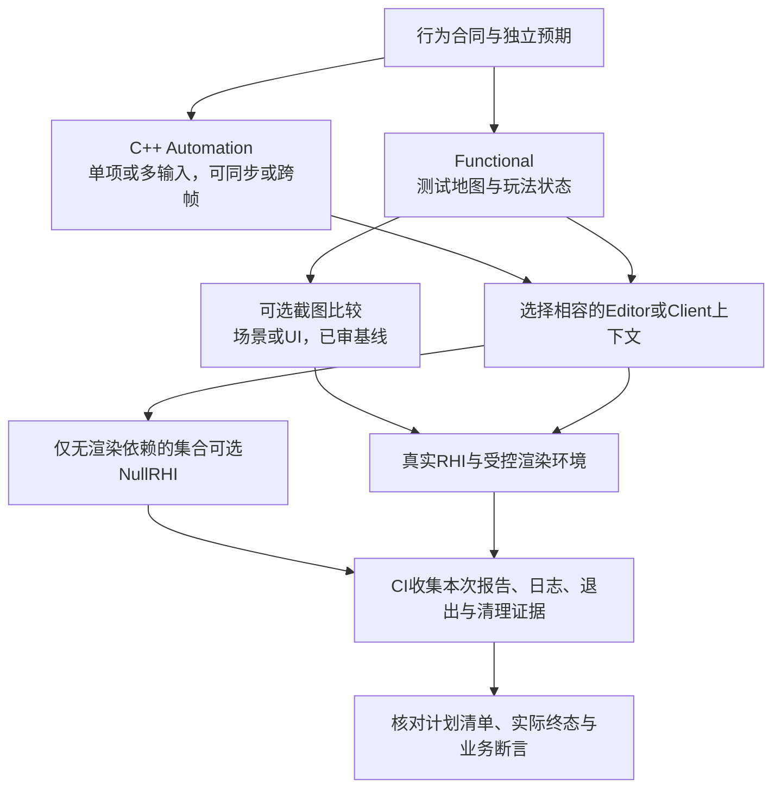
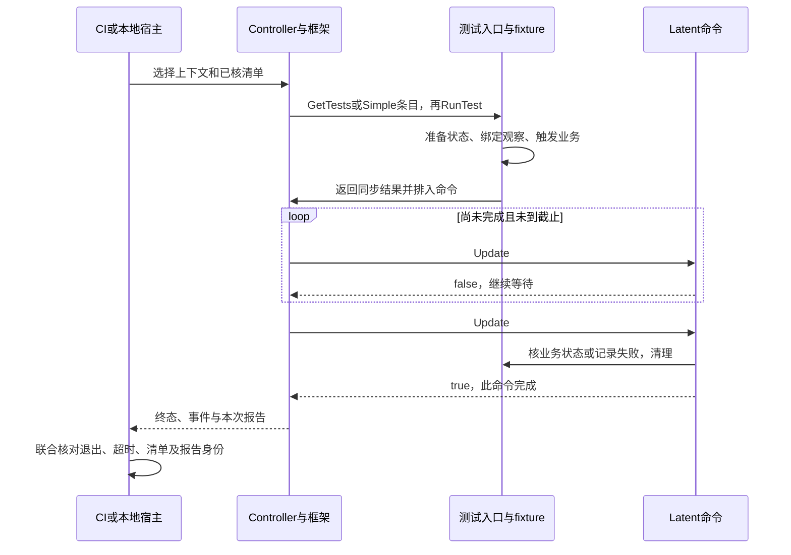
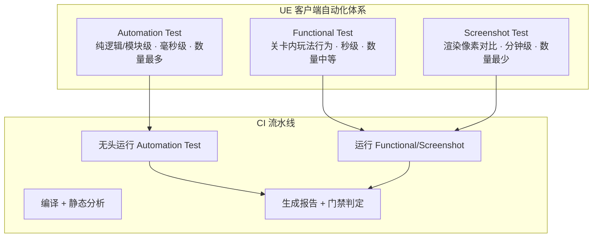
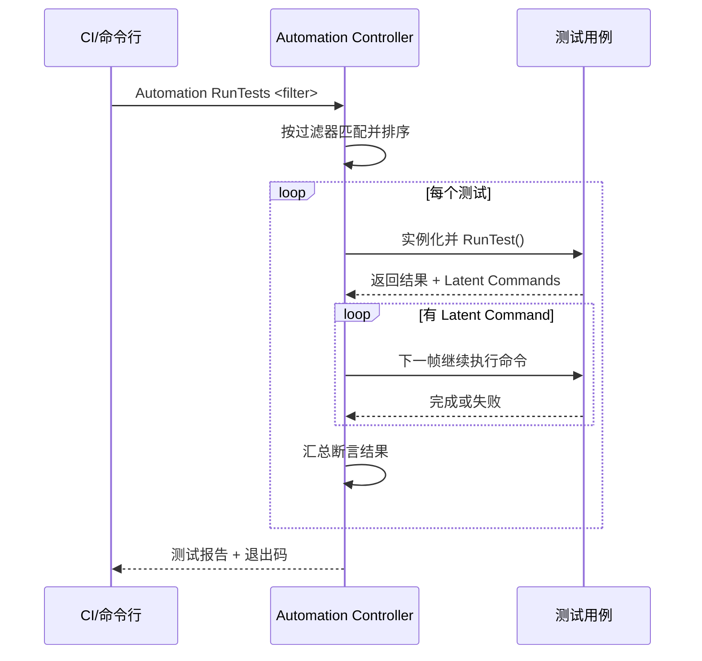

# 02 · 客户端自动化测试（UE 体系为主）

> 知识成熟度：L2（公开一手资料静态核对；示例与验收合同未运行）。
> 知识基线：UE5.6官方文档中的C++ Automation、Functional、截图、命令行与报告；UE5.5断言API仅作单独注明的辅助；Unity对照限UTF1.3.9与已归档官方图形测试仓库的职责。
> 版本基准：实际读取的版本化官方网页，不是本机引擎安装、不可变源码revision或跨版本兼容认证。
> 最后更新：2026-10-09
> 源码核对状态：未核对。本轮未访问Engine源码或Build.version，未认证任何历史机器或CL。
> 执行状态：NOT_RUN。本文代码、命令及PAPER_EXPECTED均为教学或未来验收合同；未执行UE、UAT、UBT、UHT、编译、PIE、Unity、截图/GPU、设备、网络、压力、故障注入或项目设置操作。仓库文档门禁不证明这些目标测试通过。

<!-- CLIENT_AUTOMATION_ACTIVE_BEGIN -->

## 概述

客户端回归的困难通常来自环境：同一逻辑可能在编辑器、游戏世界、输入系统、资源加载和渲染之间跨越多个更新。把点击发出去、等待两秒或得到进程返回码0，都还没有回答“需要验证的业务结果发生了吗”。本文围绕这个问题选择UE接口、编写C++和蓝图测试、检查视觉差异，再把可追溯的结果交给CI。

前置知识见 [游戏知识](../../../00_Index/UE专题.md) 的 `08-工具链与打包发布`（UBT/UAT）与 `03-游戏玩法编程`（Gameplay框架）。先给每个用例写清前置状态、输入、独立预期、完成条件、截止时间和清理责任，再选择工具。工具名称不自动决定测试层级、耗时或GPU需求：

1. **Automation Test**：C++核心测试框架可承载API、功能和内容压力等测试。框架本身不属于UObject反射系统；具体测试仍可能依赖引擎、世界、编辑器甚至渲染，不能统称为“无渲染的C++/蓝图测试”。（S01、S02）
2. **Functional Test**：用测试关卡和AFunctionalTest组织世界中的玩法验证，可由C++或蓝图实现。是否需要渲染取决于正在观察什么。（S03）
3. **Screenshot Comparison**：比较受控渲染输出与已审核基线，使用明确的比较规则和容差。它可以嵌在Functional流程中；一次截图相符不保证整个玩法正确。（S04）

这与 [01-测试金字塔与测试策略](01-测试金字塔与测试策略.md) 的客户端测试组合相接：能缩小依赖范围的断言优先缩小，但不把UE工具列表当成固定的成本金字塔。启动、资产准备、执行和留证都应计入反馈成本；本文没有毫秒、秒或分钟级实测。



图中的lane是环境选择，不是三套互斥框架。C++纯逻辑断言不必经UI驱动；关卡测试需要真实世界行为；视觉风险需要正确的捕获对象和渲染配置。按这些依赖组织测试，才能解释失败是业务不符、环境缺失、测试未完成还是证据不完整。

## 核心概念

| 术语 | 含义与使用边界 |
| --- | --- |
| Automation Test | 通过C++测试声明和框架执行的测试；Controller负责发现、选择、调度与收集，不能由测试名推出运行环境 |
| Simple Test | 用`IMPLEMENT_SIMPLE_AUTOMATION_TEST`声明一个测试条目；也可以排入latent命令，并不等于只同步执行 |
| Complex Test | 用`IMPLEMENT_COMPLEX_AUTOMATION_TEST`复用逻辑处理多份输入；须用`GetTests`给出对应的显示名和参数，再由`RunTest`处理每一项 |
| Latent Command | 跨帧推进的命令；`Update()`返回false表示仍未完成，true表示该命令结束，业务通过与否另由断言/结果表达 |
| Functional Test | 关卡中的AFunctionalTest及其准备、就绪、开始、完成和清理流程 |
| Screenshot Test | 采集指定场景或UI画面，再等待比较完成；请求、捕获、比较是不同阶段 |
| Baseline / Ground Truth | 经审核、与配置身份关联并版本化的参照图；首次生成的图只是候选 |
| 测试断言 | `TestTrue`、`TestEqual`、`TestNotNull`等是测试方法，不是声明宏；记录具体预期与不符信息，不能用普通日志代替 |
| Test Map | 专用测试关卡及fixture；命名如`Test/`是团队约定，不自动决定发现或打包排除 |
| Headless / NullRHI | 无头运行需明确实际环境；`-nullrhi`使用空渲染接口，`-unattended`只约束无人交互，二者不是同义词 |
| Unit Test Framework | 纯逻辑单测是一种测试范围；UE Automation仍依赖引擎系统，低层测试或第三方框架可按依赖另选，不假定存在一个通用“Test模块”包办所有用途 |
| Blueprint Test | 此处区分世界中的Functional蓝图与EditorTests插件的EditorUtilityTest；不是任意蓝图加Assert节点就自动注册C++测试 |
| Unity Test Framework | 基于NUnit的Unity测试体系；本文选读1.3.9，其EditMode/PlayMode是运行上下文 |
| Smoke Test | 团队可定义快速核心检查集合；UE的Smoke标记另有官方速度约定，不能把任何耗时很长的用例都标为Smoke或声称本轮已满足该约定 |

## 原理详解

### 1. Automation Test 框架的工作原理

先分开五个职责：`FAutomationTestBase`提供测试方法与结果信息；`IMPLEMENT_*`宏声明并注册测试类型；框架按测试入口运行；Controller处理兼容实例、发现、过滤、调度与收集；Automation Driver是模拟输入的接口，并不是远程管理所有设备的通用工具。测试的模块需要实际构建、加载，测试也必须适用于所选上下文，才能出现在发现清单中。（S01、S02、S06、S11、S19）

Simple与Complex控制的是**条目/参数组织**。Complex的`OutBeautifiedNames[i]`与`OutTestCommands[i]`成对，后者成为对应`RunTest(Parameters)`的输入；没有枚举，示例就没有把多输入发现合同写完整。跨帧由latent命令承担，两类测试都可使用它。

执行时应区分四个时点：

- `RunTest`返回：同步入口结束；它排入的工作可能还未完成
- 某个`Update`返回true：该latent命令完成；如果它记录了错误，完成仍是失败
- 业务断言成立：这一观察符合预期；还要完成必要清理及其余步骤
- 整次run结束：所有计划用例有可解释终态，报告与进程证据收齐



失败时永久返回false会让队列继续等，而不是可靠表达“测试失败”。应记录失败并结束当前命令，使后续清理或宿主恢复有机会执行。本文不假定所有入口都有120秒默认超时；等待条件自己的截止时间与整次进程的外层超时都要明确。

Automation Spec提供BeforeEach、It、AfterEach及latent形式；Done控制何时继续下一步，仍要单独做业务断言。选择线程执行与选择latent完成是两件事。Driver同步API会阻塞，官方明确要求不要在GameThread上这样驱动输入，以免所需输入处理无法推进；实际线程和取消责任必须由工程约束。（S11、S12）

### 2. Functional Test 的工作原理

AFunctionalTest可作为子C++类或蓝图放进测试关卡，也可由Level Script组织简单流程。可复用或准备较复杂的测试宜把状态放在测试类/fixture中，避免散落在多个关卡脚本。官方提供的关键链为：（S03）

1. `PrepareTest`启动准备，例如加载所需场景数据；为准备阶段设置截止与失败原因
2. `IsReady`反复判断准备是否满足，未满足时不应让业务主体提前开始
3. `OnTestStart`开始动作与断言；每条成功/失败路径最终都要结束测试
4. `FinishTest(Result, Message)`表达结果，不能把“请求发出”当Succeeded
5. `OnTestFinished`恢复被修改状态；`RegisterAutoDestroyActor`可登记本测试生成、结束时要销毁的Actor

典型用法仍是测试地图、一个Functional Test、若干辅助Actor和断言。例如新手引导：准备任务系统与Pawn，移动到目标点，再核任务状态。Actor的BeginPlay、移动完成、任务完成各自是不同事件；不能只加固定Delay把它们连成“必然成功”。移动失败、目标销毁、准备超时和任务拒绝都需要终态及诊断上下文。

### 3. 截图对比测试的原理

截图首先是一个观察设计：要验证UI布局、特效外观还是光照？场景/相机截图接口不自动包含UI，UI截图另有入口；也可选适用的buffer观察渲染变化。把按钮颜色作为目标却只拍scene，会得到与目标无关的绿灯。（S04、S14）

一个可复核的视觉流程是：

1. 固定地图/资产版本、相机、分辨率、RHI、平台、GPU/驱动和必要渲染设置；等待加载、材质/资源准备及所需稳定状态
2. 发出截图请求，等待捕获完成；截图文件存在还不等于比较完成
3. 查找适用的已审核ground truth；没有基线时保存候选，进入审核，不能“首次自动通过”
4. 等待比较结果，核对实际选用的基线和比较设置；保存ground truth、incoming、diff及元数据
5. 对真实回归、环境不匹配、噪声、基线变更分别处理。只有批准的基线变更才更新参照，不能为消除红灯盲目替换

S04说明比较产物可在项目`Saved/Automation/Comparisons`查看，工具按Platform_RHI_ShaderModel分桶，并可依据设备元数据选替代基线。它不支持把`Platform/GraphicsCard`或`Tests/Automation`写成所有项目必须采用的存储结构。报告路径、ground truth存储和源控制提交是不同责任，实际路径由目标版本/工程确认。

比较选项至少分三层：通道/亮度容差决定哪些颜色变化可以视为相近；Maximum Local Error限制局部热点；Maximum Global Error限制整体误差。它们不能笼统改写成“忽略2%像素”。局部严重错位可能只占很小总面积，所以只看全局平均会漏掉它。阈值应由被测风险和已观察噪声预先定义，本篇没有推荐统一1–3%。（S04、S13）

降噪也会改变观察对象。关闭动态模糊可以帮助某个UI布局例稳定，但若要测试动态模糊本身就不能关闭它。固定随机种子、相机和采样条件有助复现，不保证整个模拟确定；动画/粒子可设计受控状态和合适oracle，不能一律关掉就宣称它们已验证。时间override只影响送到渲染线程/材质的时间，不等于冻结GameThread业务时间。delay与frame_delay要同时满足，但固定等待仍不替代资源/业务就绪条件。（S13）

### 4. C++ 单元测试的编写方式

最小组织方式是在相关模块的`Private/Tests`就近放测试；独立测试模块或插件也是选择，便于控制加载、依赖与测试内容。不要把文件夹名当构建规则。（S01、S02、S09）

```text
Source/
└── MyGame/
    ├── MyGame.Build.cs
    ├── Public/Core/DamageFormula.h       # 已有被测项目接口
    └── Private/Tests/
        ├── DamageFormulaTest.cpp
        └── InitializationTest.cpp

可选：独立测试模块/插件 → 自己的Build.cs、模块声明/加载入口及测试资产
```

`Misc/AutomationTest.h`属于Core；如果测试使用UObject、World或Functional对象，再核对对应模块和接口的依赖。独立模块还要能访问项目被测接口、被目标构建并在运行实例中加载。不能把`Core + CoreUObject + Engine + MyGame + AutomationTest`当无需核对的万能依赖清单。（S19的模块定位仅UE5.5辅助）

开发/性能automation测试的编译有Target开关，目标配置、宏与模块/插件包含规则共同决定是否存在；`Private/Tests`或默认ModuleRules并不自动承诺Shipping排除。代码是否进入binary、测试模块是否加载、测试是否被发现、测试地图是否被Cook/Stage必须分别确认。本文不修改工程Build.cs或Target，也不从源码路径文字推断本机已安装这些文件。（S09）

### 5. 蓝图测试

保留两种不同用途：

- **世界功能测试**：AFunctionalTest子蓝图或Level Script组织关卡准备、玩家行为与结果检查；用FinishTest结束并恢复状态，适合策划/QA共同维护玩法流程（S03）
- **编辑器工具测试**：UE5.6文档要求EditorTests插件，创建以EditorUtilityTest为父类的Editor Utility Blueprint。Prepare Test完成后调用Finish Prepare Test，再进入Start Test，最终Finish Test；准备失败/超时不应继续主流程。它测试的是编辑器工具接口，不能直接当成打包游戏内的测试（S05）

项目可以用蓝图维护数据、流程、测试地图，把需要高复用、复杂数据检查或更精细生命周期控制的部分放到C++。决定依据是被测调用边界、维护者和诊断成本，不是“50个节点必改C++”或“大规模蓝图必然不可维护”。
### 6. 测试在 CI 中运行

UAT可以编排构建和运行任务，Automation框架负责具体测试；调用Editor/Client可执行文件也是运行入口。工具链职责见 [游戏知识](../../../00_Index/UE专题.md) `08-工具链与打包发布`。先确认目标、配置、模块/插件、地图和测试发现，再选择命令，不把“包已生成”当成测试已存在或已执行。

| 入口/参数 | 本篇采用的含义与限制 |
| --- | --- |
| `-ExecCmds="Automation RunTest Test1+Test2;Quit"` | UE5.6官方例支持多个测试及运行后退出；也支持章节前缀或`Group:Name`。`;Quit`本身不是缺陷 |
| `-ReportExportPath=<dir>` | 输出JSON及相关HTML报告；目录应只属于本次run |
| `-unattended` | 禁用需要人工处理的弹窗/对话框；不等于关闭渲染或必然不创建窗口 |
| `-nullrhi` | 空渲染接口，适用于已证明不需要真实渲染的用例；不能验证像素 |
| `-RenderOffScreen` | 离屏渲染，仍需要相容的真实渲染环境；平台可用性需工程确认 |
| `-log` / `-stdout` | 按宿主采集日志；需要绝对日志文件时可核`-ABSLOG`，不能从参数存在推断实际产物已保存 |
| `-NoSound` | 原例关闭音频的选择；若验证音频本身就不能使用，具体宿主支持及副作用需核对 |
| Group / ExcludeTest | 官方文档提供按名称组织集合和带原因/RHI的排除机制；排除结果是Skipped，不是通过 |

原文的`RunTests`、`ReportOutputPath`别名本轮没有认证，活动例使用已有明确文档的拼法，但不据“未读取”断言别名不存在。命令参考列有`testexit`关键字却没有足够行为说明，不能继续声称裸`-TestExit`普遍保证测试完成后退出；也不推荐未经核对的`Automation SetTestOptions`、`-AutomationSaveScreenshot`或用减号排除测试语法。截图设置采用相应测试对象/选项，测试分组与排除采用目标版本支持的配置入口。（S06、S08、S10）

每次运行记录身份K：引擎/工程/插件revision、目标/配置/平台、地图与fixture版本、设备/RHI/渲染设置、实际filter、预期完整用例名、唯一run ID与报告目录。成功条件应由团队明确为合取关系：

- 进程在外层时限内正常完成，退出码符合本入口合同，没有崩溃或强杀
- 报告可解析、属于K；日志中的完成记录与实际终态一致，不能复用旧目录的绿报告
- 计划清单里的每个用例都被发现并执行；失败、notRun、inProcess、缺项及未批准的Skipped都不能算通过
- 业务断言满足；清理状态可复核，警告/已声明预期错误按明确政策处理

JSON示例中的failed=0不能排除漏测，进程exit=0也不自动保证测试清单完整。UE日志中的测试退出信息、OS进程返回码和CI job状态是不同观察，要在具体宿主中确认传播。精确预期的错误日志可成为负向用例的一部分；不能只搜索任意“Error”字符串就判定，也不能泛化抑制所有错误。（S07、S19）

### 7. Unity Test Framework 简述对比

以下只对照实际选读的UTF1.3.9，不能当成所有当前Unity版本的完整支持表。EditMode测试在Editor运行，可访问Editor代码，带UnityTest的测试可跨Editor更新，甚至安排进入/退出Play Mode；PlayMode可在Editor或构建后的目标Player中运行，UnityTest使用协程推进。它们是上下文轴，不能直接等同UE的Automation/Functional层级。（S16）

| 选择问题 | UE的入口与边界 | Unity UTF1.3.9的入口与边界 |
| --- | --- | --- |
| 语言与断言 | C++测试方法、Functional/Editor Utility蓝图 | C#与NUnit；需要跨帧时选择适合的UnityTest形式 |
| 关卡/场景行为 | Functional测试地图、真实世界状态 | PlayMode与场景组织；实际Player和Editor分别留证 |
| 截图比较 | Screenshot/Functional及已审基线 | 需另外选择图形测试能力；Unity官方历史仓库提供过ImageAssert，但所读仓库已归档 |
| CI入口 | Editor/Client参数，必要时由UAT/Gauntlet编排 | `-runTests -batchmode -testPlatform ... -testResults ...`；结果为NUnit XML |
| UI自动化 | Driver有输入模拟、定位与等待，受线程/平台输入支持限制 | 另核目标UI系统、包或项目接口；本篇未认证某个通用UI包 |
| 代码覆盖率 | 按编译器、instrumentation和平台选择工具；不假定一个内置插件包办 | 核对与Editor/包版本相容的覆盖率工具；UTF运行结果不等于覆盖率统计 |
| 集成与维护 | 模块、UObject/世界寿命、线程、资产依赖需接入 | 测试程序集、Editor/Player生命周期和包版本需接入；不作生态成熟度排名 |

S18证明Unity官方曾提供独立的图形测试工具，不能写“只有第三方或自研”。但它于2024-03-27归档，本篇没有核当前替代包、安装方式或兼容性。`-testPlatform PlayMode`在UTF1.3.9指Editor内PlayMode；指定构建目标是另一条Player路径。它的结果文件与错误栈仍需一起检查，不能假定各被测组件有统一退出码。（S17）

选型先看需要哪些真实依赖。UE项目通常可从现有引擎接口开始，纯C++算法库也可评估低层测试或Catch2/GoogleTest；这些是可选集成方向，不是“第三方框架只能测无UObject代码”的绝对限制。团队应衡量生命周期适配、发现、调试和维护成本，避免仅因断言语法好看就隐藏环境依赖。

## 示例

### 示例 1：C++ 简单测试（伤害公式）

假设项目已有`DamageFormula::Calculate`，业务合同要求三组输入分别得到70、105、至少1。它不是UE内置伤害公式；真实工程还要定义合法域、取整、溢出上限及非法输入行为。expected应来自审核过的规则或独立推导，不能复制被测实现再算一次。

下例是放入已有可加载模块的教学代码，未编译。`Core/DamageFormula.h`必须由工程真实提供；开发测试宏、目标配置和模块加载需匹配。这里选择EditorContext使例子与后面的Editor命令一致，不把ApplicationContextMask当作任何宿主都满足依赖的保证。

```cpp
// MyGame/Private/Tests/DamageFormulaTest.cpp
#include "Misc/AutomationTest.h"
#include "Core/DamageFormula.h" // 项目已有被测接口，本页不提供实现

#if WITH_DEV_AUTOMATION_TESTS
IMPLEMENT_SIMPLE_AUTOMATION_TEST(
    FDamageFormulaBasicTest,
    "MyGame.DamageFormula.Basic",
    EAutomationTestFlags::EditorContext | EAutomationTestFlags::ProductFilter)

bool FDamageFormulaBasicTest::RunTest(const FString& Parameters)
{
    (void)Parameters;
    const bool Basic = TestEqual(TEXT("基础伤害计算"),
        DamageFormula::Calculate(100, 30, 1.0f), 70);
    const bool Critical = TestEqual(TEXT("暴击伤害计算"),
        DamageFormula::Calculate(100, 30, 1.5f), 105);
    const bool Minimum = TestGreaterEqual(TEXT("最低伤害保护"),
        DamageFormula::Calculate(10, 999, 1.0f), 1);
    return Basic && Critical && Minimum;
}
#endif
```

三个断言分别求值后才合取，避免短路漏掉后面的检查。原`TestGreaterEqual(int32)`在S19的UE5.5 API中确有重载，不应仅凭名称判错；这份辅助资料不证明上面片段已经在UE5.6编译。原写法末尾`return true`也不意味着已记录的断言错误被抹掉，真正结论要看框架结果。未来可用“第一组故意返回71”检验测试及报告链是否能报错；本轮没有执行这个负向控制。（S02、S19；P01）

### 示例 2：复杂测试与跨帧初始化

原例中的`SpawnActor`是同步创建调用，之后项目初始化可能跨帧。这里保留“生成Actor后等待初始化”这个用途，同时把**多输入枚举**与**等待**分开。假想项目的两个fixture场景为ReadyImmediately和ReadyAfterTick；它们分别安排立即完成与延后完成的真实初始化路径，不让测试等待器自己把ready改成true。

```cpp
IMPLEMENT_COMPLEX_AUTOMATION_TEST(
    FAsyncSpawnTest,
    "MyGame.Spawn.AsyncSpawn",
    EAutomationTestFlags::EditorContext | EAutomationTestFlags::ProductFilter)

void FAsyncSpawnTest::GetTests(
    TArray<FString>& OutBeautifiedNames,
    TArray<FString>& OutTestCommands) const
{
    OutBeautifiedNames.Add(TEXT("ReadyImmediately"));
    OutTestCommands.Add(TEXT("Immediate"));
    OutBeautifiedNames.Add(TEXT("ReadyAfterTick"));
    OutTestCommands.Add(TEXT("Deferred"));
}
```

`RunTest`以Immediate或Deferred参数选择对应fixture。GetTests只是枚举，不在发现期间改世界。世界来自已准备的测试地图，不在本文创建新的World宿主；Actor由fixture同步创建并负责回收。下面的`FInitializationFixture`是**项目适配接口名称**，并非UE类，也不是本仓库已有实现；工程提供以下合同后，节选才可接入：

| 适配项 | 必须提供的含义 |
| --- | --- |
| `PrepareFixtureFromCurrentTestMap(Parameters)` | 识别两种参数，检查当前地图/World/被测接口并创建fixture；失败返回空，不能读取任意编辑器世界充数 |
| `Actor` | fixture拥有的测试Actor，观察用弱引用；拥有者保证测试所需生命周期，弱引用本身不保活 |
| `PrepareObservationAndDeadline()` | 初始化本次状态、单调截止、回调关联ID；在提交初始化请求前完成 |
| `StartInitialization()` | 调用项目真正的初始化入口；拒绝、同步回调和异步回调都更新同一次观察状态；不伪造成功 |
| `InitializationFailed()` / `IsInitializationComplete()` | 在允许访问对象的线程读取本次失败或完成；排除上次run/旧请求回调 |
| `VerifyInitializedState()` | 检查完成后的业务不变量，例如所需组件和初始数值，不能只再次检查ready |
| `Cancelled` / `CleanupOwnedFixture()` | 取消成为明确终态；清理幂等、先使本次观察失效，再解绑/取消请求、恢复状态并回收本例Actor |

可采用如下RunTest顺序节选。`FWaitForInitialization`是本例latent命令，构造后保存fixture的共享引用及本次测试引用，不能保存RunTest局部变量的裸引用。类声明、项目fixture实现与目标模块集成不在片段中；这不是独立可编译文件。

```cpp
bool FAsyncSpawnTest::RunTest(const FString& Parameters)
{
    TSharedPtr<FInitializationFixture> Fixture =
        PrepareFixtureFromCurrentTestMap(Parameters); // 项目适配入口
    if (!TestTrue(TEXT("测试 fixture 已准备"), Fixture.IsValid()))
        return false;
    if (!TestTrue(TEXT("Actor 已同步创建"), Fixture->Actor.IsValid()))
    {
        Fixture->CleanupOwnedFixture();
        return false;
    }

    Fixture->PrepareObservationAndDeadline();
    ADD_LATENT_AUTOMATION_COMMAND(
        FWaitForInitialization(Fixture.ToSharedRef(), *this));
    Fixture->StartInitialization();
    return true; // 仅同步入口结束；等待与断言尚可能未完成
}
```

准备观察状态、注册等待与触发业务的顺序很重要：提交可能立即失败，也可能在返回前同步调用完成回调。完成回调只更新已初始化、仍属于本run的状态；不能引用尚未赋值的请求handle。如果提交在同步完成之后才返回handle，适配层应先看当前终态，再决定持有还是释放/取消它，不能把已结束请求重新标成Pending。异步回调若晚于清理到达，应通过弱状态/关联ID失效检查丢弃；若来自其他线程，先交回约定线程再访问Actor。只有成功提交的状态才进入等待，不把“拿到一个handle”当业务完成。

以下Update节选对应前表。`Fixture`为命令持有的共享引用，`Test`为框架在该测试队列存活期内有效的测试引用；DeadlineSeconds使用项目选定的单调时钟。FPlatformTime的具体宿主精度没有实测，也不作为本文性能数字。

```cpp
bool FWaitForInitialization::Update()
{
    if (Fixture->Cancelled || !Fixture->Actor.IsValid() ||
        Fixture->InitializationFailed())
    {
        Test.TestTrue(TEXT("初始化未取消、对象有效且未失败"), false);
        Fixture->CleanupOwnedFixture();
        return true;
    }
    if (Fixture->IsInitializationComplete())
    {
        Test.TestTrue(TEXT("初始化后的业务状态"),
            Fixture->VerifyInitializedState());
        Fixture->CleanupOwnedFixture();
        return true;
    }
    if (FPlatformTime::Seconds() >= Fixture->DeadlineSeconds)
    {
        Test.TestTrue(TEXT("在截止时间内完成初始化"), false);
        Fixture->CleanupOwnedFixture();
        return true;
    }
    return false; // 继续等待，不是“测试失败”
}
```

工程应将合并的失败断言细化为取消/对象失效/初始化拒绝的具体原因和最近状态，便于定位。这里先观察完成，再判断尚未完成的超时；若合同要求“实际完成时间≤deadline”，应由完成事件记录时间并单独断言，不能用轮询时刻猜测。业务校验false时命令仍完成，但测试失败。退出、超时和取消都由同一清理责任处理；进程崩溃/强杀时普通teardown可能根本不运行，下次fixture准备还要识别残留。（S02、S03、S12、S19；P02–P06）

### 示例 3：Functional Test 蓝图步骤（新手引导）

使用原`Test_Gameplay_Onboarding`地图，放置Functional Test子蓝图、Pawn与目标点；任务fixture从明确初态开始。下面是可接入项目的节点/事件流程说明，没有创建资产或运行蓝图。

1. PrepareTest准备Pawn、目标点与任务系统；IsReady检查引用、地图和任务数据已就绪，并设置准备超时。不要直接从BeginPlay进入断言
2. OnTestStart检查`CurrentQuestID == 1`；不符则记录当前ID并FinishTest为Failed
3. 驱动Pawn执行AI MoveTo。移动失败、目标无效、取消或超过预算分别记录原因并FinishTest；移动成功只允许进入下一检查
4. 等待业务可观察的`QuestState == Completed`，核关键阶段没有被跳过、错误反馈符合合同；条件满足且断言均成功才FinishTest为Succeeded。实际节点结果使用目标版本的测试结果枚举，不用布尔True冒充
5. OnTestFinished解绑本例事件、恢复任务/输入fixture；本例生成Actor可登记RegisterAutoDestroyActor，不能顺手销毁正式关卡对象
6. 在已启用相应测试插件的Test Automation界面选择实际发现的该用例。UE5.6运行专页给Tools入口，概述及旧截图页保留其他菜单措辞；以目标安装中的实际入口和发现结果为准

原两个固定Delay可以作为某个有理由的采样延时，但不能单独证明“场景就绪”和“任务完成”。若错误UI反馈属于合同，还要检查其真实可观察状态；仅任务内部状态通过不能替代UI断言。（S03、S06）

### 示例 4：CI命令行入口（本地教学）

前提是已有UE安装、已构建的测试模块/工程、已核发现清单、地图/插件及独立可写的run目录。以下Windows PowerShell片段未执行，路径和filter都是教学值；真实每次替换唯一run ID，并设置外层进程截止。

```powershell
# lane 1：仅选择已验证无渲染依赖的逻辑集合
& "C:\UE5\Engine\Binaries\Win64\UnrealEditor-Cmd.exe" "C:\proj\MyGame.uproject" `
  '-ExecCmds=Automation RunTest MyGame.DamageFormula;Quit' `
  -unattended -nullrhi -NoSound -log `
  '-ReportExportPath=C:\ci\reports\run-001\logic'
$LogicProcessExit = $LASTEXITCODE

# lane 2：真实RHI环境；完整名称需从实际发现结果核对
& "C:\UE5\Engine\Binaries\Win64\UnrealEditor-Cmd.exe" "C:\proj\MyGame.uproject" `
  '-ExecCmds=Automation RunTest Project.Functional Tests.Test_Gameplay_Onboarding;Quit' `
  -unattended -NoSound -log `
  '-ReportExportPath=C:\ci\reports\run-001\functional'
$FunctionalProcessExit = $LASTEXITCODE
```

带空格的ExecCmds值作为一个PowerShell参数传入；未来实跑仍要核目标进程收到的参数与发现清单。第二条不使用NullRHI，以便承载本例需要画面时的配置；这不表示每个Functional用例都必需GPU。不要随意加`-game`后仍假定EditorContext测试能发现。

两个返回码立即分别保存，后一个成功不能覆盖前一个失败。还要对两份本次报告应用第6节的完整判据；仅运行这些命令不构成CI门禁。`;Quit`是官方支持的执行后退出形状，不是本次修订要删除的错误。`RunTest`、`ReportExportPath`选用5.6已核文档；实际fixture/filter未取得，不能说这些教学名字在用户工程存在。（S06–S08）

### 示例 5：GitLab CI 调用与制品片段

这里保留GitLab用途，但限定为已有Windows PowerShell runner上的**调用与留证节选**。工程、引擎、模块/地图和环境变量事先已准备，runner shell须实际确认。`UE_EDITOR`指相容的Editor-Cmd，`UE_TEST_FILTER`来自已核清单；不是本轮创建或配置runner。

```yaml
ue-automation-tests:
  stage: test
  script:
    - |
      $runPath = Join-Path $env:CI_PROJECT_DIR "reports\$env:CI_JOB_ID"
      & $env:UE_EDITOR (Join-Path $env:CI_PROJECT_DIR 'MyGame.uproject') `
        "-ExecCmds=Automation RunTest $env:UE_TEST_FILTER;Quit" `
        -unattended -nullrhi -NoSound -log "-ReportExportPath=$runPath"
      $editorExit = $LASTEXITCODE
      if ($editorExit -ne 0) { exit $editorExit }
  artifacts:
    when: always
    paths:
      - reports/
```

YAML block scalar使PowerShell的`&`保留为调用操作符。该lane只适用于已核无渲染集合；视觉lane使用其真实RHI环境。实际runner应为每次尝试分配唯一目录，禁止混入复用工作区的旧reports；CI_JOB_ID只是本例的身份来源之一。

**这个节选不能单独作为发布绿灯。** 它仅传播非零进程退出并留存已经生成的文件；项目现有门禁还必须解析本次JSON、核K和完整expected清单，拒绝漏测/旧报告/失败/未完成/未经批准的跳过，并对进程设置外层超时。这里没有实现或假称存在该项目解析器，不用一个占位脚本名冒充完整平台。GitLab文档说明`artifacts:when:always`有job timeout例外；runner中断或尚未生成截图也不能保证有附件。应保留实际日志/报告/截图并明确缺失项，而非只看到reports目录就认定证据齐全。（S07、S20、S21）
## 最佳实践

1. **代码就近、构建边界明确**：相关模块的Private/Tests便于定位；独立测试模块/插件按实际依赖选择，不要求每模块必有`.Tests`。模块规范入口仍见 [游戏知识](../../../00_Index/UE专题.md) `08-工具链与打包发布`；目录、目标编译、加载和发现分别确认
2. **缩小环境依赖**：从UI链中提取可独立判断的规则，把剩余世界/输入/渲染边界分别验证。NullRHI只是某些用例的执行选项，不能由“是C++”推出可用
3. **命名与发现清单配套**：沿用`项目名.模块.场景`，例如`MyGame.DamageFormula.Crit`；参数化子项也有唯一名字。每个lane记录expected完整名字，不能只数一个模糊前缀
4. **专用地图与fixture版本化**：使用测试关卡和资产，声明被允许改变的状态；准备与清理都可重复。不得依赖测试执行顺序，也不把上次成功留存的状态当初态
5. **基线和环境共同版本化**：记录平台/RHI/ShaderModel、设备/驱动、分辨率和渲染设置；按真正捕获对象选择scene/UI/buffer。粒子动画需受控采样或合适oracle，降低噪声时保留正在验证的特性
6. **分别预算准备、等待和整次run**：根据反馈目标设置等待截止与外层超时。原30秒/2分钟可以是某团队预算示例，不能当引擎通用门槛；实际耗时需要测量。UE5.6文档将Smoke标记视为实现者的一秒内完成承诺；这与团队广义的冒烟集合不同，也不由命名自动满足
7. **按风险安排CI频率**：快速稳定的集合可随合入运行，更昂贵矩阵可安排后续窗口；高风险视觉变更也可能需要合入前覆盖。原“10分钟内、夜间全量”属于规划示例，不能由分类证明可达
8. **失败留下本次证据**：使用ReportExportPath及实际日志/图像产物，记录run身份、地图、设备、RHI、最近输入与观察状态。测试没有产生的截图不能自动补称存在；首次失败优先保存
9. **治理不稳定测试**：保留失败及每次重试，定位输入/环境/依赖/时序；隔离要写责任人、风险、批准范围和到期。官方ExcludeTest会产生Skipped，不能把`[DISABLED]`视为所有测试的通用禁用语法，也不以“连续3次”自动减少门禁覆盖。参见 [05-CI质量门禁与缺陷管理](../持续交付与发布治理/05-CI质量门禁与缺陷管理.md)
10. **策划/QA与开发共同维护**：蓝图适合可观察的关卡/工具流程，C++可承载复用断言和生命周期适配；明确失败消息、数据所有权和修复责任，使非作者也能复现和判断

这些是项目设计建议，不是本次实测性能/稳定性结论。首次结果与重试结果不能相互覆盖；重试次数应由风险和诊断政策限定，不能把“重试一次成功”改写成首次成功。

## 常见问题 FAQ

**Q1：为什么我的 Automation Test 在 `-nullrhi` 下跑不起来？**

先确认它是否被发现、模块/插件是否加载、上下文是否相容，再看实际被测路径需要哪些资源。涉及像素、渲染目标或真实视口的断言不能由NullRHI证明；但不能仅凭“使用UMG/材质类”就断言任何相关对象都无法创建。把可隔离逻辑单独验证，视觉部分使用目标平台支持的RHI/设备配置；不把换成`-opengl`作为跨平台万能修复。保存启动日志和实际filter，缺环境时记录未执行，不把它算作业务通过。（S06、S08、S14）

**Q2：Complex Test 或其他latent测试一直不结束怎么办？**

先看最后一个已开始但未完成的条目、当前等待条件、对象有效性、deadline及执行线程。Simple也可能跨帧；Update=false是继续等。给每个条件定义成功、拒绝、失效、取消和超时出口，错误要被记录且命令应终止。固定时长等待只说明时间过去，不保护另一个永不成立的业务条件；本轮未核到足以把原`FWaitLatentCommand`参数称为业务超时保护的5.6 API，不能延续这个承诺。若同步Driver阻塞GameThread，等待本身可能阻止所需输入推进。失败后核清理，崩溃残留在下次准备检查。（S02、S11、S12）

**Q3：截图在CI与本地不同，是否只需放宽容差？**

不应先推定GPU是唯一原因。先比run身份、选用基线、分辨率、RHI/驱动、相机、资源就绪、颜色/曝光/抗锯齿和动画时序，再看incoming/ground truth/diff。局部错位可能是产品回归，随机噪声可能是测试设计问题。比较阈值应预先有依据；只因当前失败把容差调高，无法证明原要求满足。确属预期画面变更时人工审核新基线或适用Alternative，并保留变更前后的证据。（S04、S13）

**Q4：蓝图测试和C++测试怎么选？**

先问测试发生在Editor工具还是游戏世界，谁维护数据/流程，是否需要跨帧资源与回调控制。Functional蓝图适合策划/QA可读的关卡编排，EditorUtilityTest面向编辑器工具；C++便于复用复杂断言和明确对象持有期。两者可以组合。数量如50个断言不是自动迁移阈值，应观察重复、诊断难度和维护成本；编写语言也不能替代业务oracle。（S03、S05）

**Q5：Unity项目能照搬这套体系吗？**

合同、隔离、等待、独立预期和证据归属可以复用，具体上下文与接口要重选。UTF1.3.9的EditMode/PlayMode不是UE两层的别名；`-testPlatform PlayMode`在该文档中跑Editor PlayMode，目标Player另有入口。截图能力要核实际包版本；Unity官方历史ImageAssert存在，但本篇所读仓库已归档，不能据它承诺当前安装可用。命令与NUnit XML结果使用对应版本合同。（S16–S18）

**Q6：测试代码和关卡会进入玩家包吗？**

不能只回答“不会”。分别检查开发测试宏/Target选项、模块和插件包含、Cook选择、测试地图/数据资产引用与Stage结果。Shipping或Test目录名称本身不能证明所有测试内容都被排除，也不能保证Editor测试在运行时可发现。本轮没有验证一个通用`-ExcludeFiles`参数，因此不把它作为万能排除命令；应按项目实际构建与内容规则检查最终交付集合。工具链导航仍见 [游戏知识](../../../00_Index/UE专题.md) `08-工具链与打包发布`。（S01、S09）

## 验证建议与验收证据

本节是未来项目验收合同，当前没有UE/Unity运行报告。测试需要能在声明的无交互或受控交互环境中重复，并把业务缺陷、资产问题、平台差异、环境失败和测试自身不稳定分开。后面的PAPER_EXPECTED只帮助检查判据是否自洽，不替代项目测试。

### 最小验证样例

1. 固定引擎、插件、项目提交、构建/目标配置、地图/fixture、区域设置、随机输入和渲染配置；给本次执行唯一run身份
2. 用一个已存在的纯逻辑Automation测试覆盖正常、边界和明确错误行为；合法输入与oracle独立定义，并设置一个能证明断言链会失败的负向控制
3. 用一个Functional Actor验证玩家交互与错误反馈；准备、成功、拒绝、超时、取消和清理路径都明确
4. 如需跨进程/设备组织，准备Gauntlet冒烟流程：启动客户端、确认目标地图、执行关键输入、检查业务终态、采集日志后退出。Gauntlet负责session编排，不能代替游戏侧行为断言；TestController是可选接口（S15）
5. 按用例依赖选择无渲染与目标渲染配置；不要求每个用例都能在两者运行。保留首次失败，不以换配置或重试覆盖原结果

### 测试矩阵

| 类型 | 最小样例与入口 | 必备证据 | 失败信号 | 该范围的通过条件 |
| --- | --- | --- | --- | --- |
| Automation Unit | 伤害/背包规则；已核Automation filter | 预期清单、JSON报告、日志、进程结果 | 未发现/漏测、断言失败、未完成 | 本次清单全部真实执行并满足合同；UE报告不误写成默认XML |
| Functional Test | 专用地图交互→任务状态；AFunctionalTest | 地图/fixture版本、状态事件、实际产出的截图与日志 | 准备失败、Actor失效、动作拒绝、超时 | 关键状态及错误反馈满足，Finish终态明确并完成清理 |
| Gauntlet Smoke | 启动→入图→输入→业务检查→退出；项目实际profile | session与游戏日志、构建身份、各进程退出/终态 | 启动崩溃、地图错误、业务未完成 | session与业务两层均满足；exit0且无普通Error文本仍不足以单独放行 |
| 输入回放 | 固定输入序列；项目录制/回放入口 | 序列版本、输入时间、初始状态、选定状态切片 | 输入丢失、关键结果漂移 | 对已声明可确定状态采用独立预期/哈希；不把哈希一致扩成全部世界一致 |
| 多配置 | 无渲染逻辑lane与适用的目标渲染lane | 配置清单、各自报告；性能只在实际测量时附口径 | 不相容、漏测、无法解释的差异 | 每个支持组合完成其分配合同；不支持项单列而非默认为通过 |
| 断线恢复 | 受控断线/重连的项目入口 | 网络事件时间线、客户端/权威结果、结算标识 | 卡死、状态不一致、重复结算 | 在已定义预算内恢复且应发生的结算只一次；客户端画面不能单独证明权威状态 |

回放与断线是原篇已有的未来验证方向，不是本次运行或新实现的runner。网络故障、设备、压力和性能流程均未执行；需要真实工程/权限/环境与独立预期才可填结果。

### 运行隔离与稳定性

测试应只修改自己拥有的fixture状态。创建的Actor、绑定、输入状态、存档与临时文件都有清理责任；保留测试开始前的必要快照，并核结束后应恢复的不变量，而不是要求全部引擎内部状态逐字相同。准备阶段也检查前次崩溃残留，不能假定上次teardown一定运行。（S01、S03）

时间、随机输入、网络响应和异步回调应有受控输入或明确完成条件；固定Sleep不能成为唯一同步依据。回调订阅和观察状态先于提交，提交可能同步完成，回调可能迟到；必须把本次请求身份、对象持有期、终态和解绑顺序写进fixture合同。

失败日志至少给测试全名、run身份、世界/地图、设备/RHI、当前步骤、最近输入与可用的帧/时间信息。图像例另记分辨率、色彩与渲染设置，像素差异不能直接等同逻辑错误。分享原始日志前处理其中确有的敏感信息。

重试有独立run ID、原因和次数限制；次数由团队政策定，原“最多一次”可作为某团队规则，不是框架保证。首次失败与重试通过并列，标记不稳定并开治理项；连续两次相同只说明这两个样本相同，不证明没有flaky风险。

### 证据清单

- 引擎、插件、工程提交、构建号、target/config/platform与实际设备/操作系统
- Automation/Functional/Gauntlet的真实入口、filter/profile、预期完整名单、发现名单和执行终态
- 地图、fixture、输入序列及截图基线的版本/哈希；渲染例的RHI/驱动、分辨率和选项
- 本次标准输出、UE日志、OS进程返回码、测试完成信息、JSON/适用结果报告及哈希；实际生成的截图/视频/性能摘要与缺失项
- 失败步骤、首次失败时间、最近业务状态、最小复现与关联缺陷
- 重试、隔离、豁免及基线更新的原因、批准范围、责任人与失效日期

### 失败信号与通过标准

| 检查项 | 必须阻断或单列的信号 | 通过条件/边界 |
| --- | --- | --- |
| 身份和发现 | 旧报告、重复/缺少计划名、零测、filter与环境不符 | 报告归属本次K，完整名单一致且每项有执行记录；计数一致也需核名字 |
| 终态与断言 | 失败、notRun/inProcess、未批准Skipped、崩溃/超时 | 所需用例完成并满足业务合同，进程结果与报告一致 |
| 日志 | 无法解释的Error/Fatal、日志缺口、异常被统一抑制 | 事件与结果可追踪；负向用例的预期错误精确声明，不按任意字符串盲判 |
| 清理 | 残留Actor/绑定/存档改变下次初态 | 本例拥有状态按合同恢复；崩溃后的恢复限制如实记录 |
| 稳定性 | 相同输入配置结果不一致，重试覆盖首次失败 | 保留每次结果并解释差异；有限重复不能宣称零失败概率 |
| 平台/视觉 | 不匹配基线、采集或比较未完成、局部/全局门限超限 | 配置相容、已审基线、完整比较结果；豁免单列范围和残余风险 |
| 证据完整性 | 只有“本地通过”、空目录或截图无对应run | 版本、命令、原始结果、判断规则可复核，缺失不可当成功 |

### 复核记录模板

```text
复核日期与复核人：
状态：NOT_RUN / PAPER_EXPECTED / 实际运行（选一并说明）
Run ID、首次/重试关系、原因：
工程提交/构建/引擎与插件版本：
目标、配置、平台、设备、操作系统、RHI/驱动：
Automation/Functional/Gauntlet实际入口及filter/profile：
预期完整名单、发现名单、完成/失败/Skipped/notRun/inProcess：
地图、fixture、输入与基线哈希；基线批准记录：
命令、进程退出、测试完成、超时/崩溃与缺失证据：
日志、结果报告、截图/视频/性能产物路径与哈希：
业务断言、失败信号、缺陷编号与清理结果：
重试、豁免/隔离、批准范围与失效日期：
结论：待执行/通过/不通过/证据不足（附适用范围）
```

### 有限纸面判定：PAPER_EXPECTED / NOT_RUN

下列16例只在给定前提下推导判定，未执行引擎、替代模型、像素比较或CI。数字不构成推荐时限、容差、性能或稳定性结果。

#### P01 逻辑正常与边界

状态：PAPER_EXPECTED / NOT_RUN

- 输入：按本文假想DamageFormula合同，A=100,D=30,k=1；k=1.5；A=10,D=999,k=1
- 预期：分别观察70、105、至少1；各断言都求值并记名
- 反例：第一组71应失败；同一错误函数被复制到expected不能构成独立oracle
- 不可推：不证明实际DamageFormula存在、溢出/非法域正确或已编译

#### P02 分类轴

状态：PAPER_EXPECTED / NOT_RUN

- 输入：测试T只有一个条目，但要等地图/Actor初始化；另一测试U对两份参数做同步检查
- 预期：T可Simple+latent；U可Complex+GetTests两个平行name/parameter条目
- 反例：把Complex名称当自动异步支持或不实现GetTests，不能满足多输入示例合同
- 不可推：不是宏生成代码或注册结果实测

#### P03 跨帧正常

状态：PAPER_EXPECTED / NOT_RUN

- 输入：准备有效Actor，项目ready序列为false,false,true；业务Verify=true；尚未超过deadline
- 预期：前两帧Update=false；第三帧断言业务状态并cleanup，再return true
- 反例：直接第一帧return true会结束等待，不能由RunTest=true推业务成功
- 不可推：不代表真实Tick次数/渲染帧/线程调度

#### P04 命令完成但业务失败

状态：PAPER_EXPECTED / NOT_RUN

- 输入：ready=true，Verify=false，Actor有效
- 预期：记录失败断言；cleanup；Update=true结束命令，最终报告必须失败
- 反例：把Update=true解读为测试通过，会误放业务失败
- 不可推：不证明具体引擎报告格式传播已运行

#### P05 超时与生命周期

状态：PAPER_EXPECTED / NOT_RUN

- 输入：ready持续false至deadline，或等待期Actor失效
- 预期：各自明确超时/对象失效原因，记录失败并结束命令；清理一次可重复调用，后续准备识别残留
- 反例：永久return false会卡队列；弱引用失效仍解引用是不合法前提
- 不可推：进程崩溃/强杀不保证teardown，本文没有模拟故障

#### P06 完成与截止竞争

状态：PAPER_EXPECTED / NOT_RUN

- 输入：当前Update先观察ready=true，时钟已刚过deadline
- 预期：按示例先完成后超时顺序，此命令走完成分支；严格SLA需独立完成时间≤deadline断言
- 反例：把轮询观察时刻当真实完成时刻，无法确定严格时限是否满足
- 不可推：本文不认证race、时钟精度或并发正确性

#### P07 Functional启动

状态：PAPER_EXPECTED / NOT_RUN

- 输入：BeginPlay已发生但IsReady=false；随后ready=true，QuestID==1，移动成功，QuestState==Completed
- 预期：先准备后OnTestStart；所有业务条件满足才Finish Succeeded；最后恢复fixture
- 反例：只等0.5/1秒或只看Move成功不能推出任务完成；失败路径也需Finish与清理
- 不可推：没有启动地图/蓝图/AI导航

#### P08 环境相容

状态：PAPER_EXPECTED / NOT_RUN

- 输入：L只依赖已加载纯逻辑；V要验证UMG图像；命令带unattended+nullrhi
- 预期：L可作为待验证的NullRHI候选；V缺渲染前提，结果应记环境不可用/未执行并阻断所需覆盖
- 反例：unattended不自动提供GPU/视口；NullRHI成功退出不是视觉验证
- 不可推：未证明L真实可在该宿主跑通

#### P09 截图新基线

状态：PAPER_EXPECTED / NOT_RUN

- 输入：有incoming，无已审ground truth
- 预期：状态为候选基线待审核；记录配置与图像，不判视觉回归通过
- 反例：把首次输出自动设为正确并绿灯会使oracle自证
- 不可推：没有采集图像或提交基线

#### P10 截图局部/全局

状态：PAPER_EXPECTED / NOT_RUN

- 输入：教学比较器已独立输出global=0.004、local=0.06；预设上限global=0.01、local=0.05
- 预期：全局满足而局部超限，判差异失败；先看热点与diff再决定是缺陷/基线变更
- 反例：只看global或事后调高local到0.07不能证明原门槛通过
- 不可推：数值为教学输入，不计算像素、不冒充UE误差算法或推荐阈值

#### P11 截图捕获目的

状态：PAPER_EXPECTED / NOT_RUN

- 输入：目标是验证UI按钮颜色，却选择不含UI的scene capture，或要测motion blur却关闭它
- 预期：测试设计未覆盖所需断言；改用正确UI捕获或保留被测渲染特性后再定义稳定前提
- 反例：一张scene图通过不证明UI，关闭特性后的稳定不证明该特性
- 不可推：未运行GPU/RHI、UI或截图比较

#### P12 完整通过合同

状态：PAPER_EXPECTED / NOT_RUN

- 输入：run K的expected={A,B}，实际唯一发现/完成A,B；两者Success；无失败/未完成/未批准跳过；本次报告完整；进程exit=0，无crash/timeout
- 预期：仅此已声明范围可以通过；保留K、原始日志/报告hash与清理证据
- 反例：不能从该结果推出其他地图/设备/配置/测试/网络范围正确
- 不可推：是假设证据集合的纸面判定，本次实际状态NOT_RUN

#### P13 零测/漏测/旧报告

状态：PAPER_EXPECTED / NOT_RUN

- 输入：进程exit=0，但发现0、缺B、B为Skipped/notRun/inProcess，或报告属于K-1
- 预期：任一项不满足预期清单与身份，阻断；按原因记未运行/漏测/环境/结果不完整
- 反例：只查failed=0或JSON存在会假绿；批准的隔离也必须公开残余风险，不能称全覆盖
- 不可推：不声称真实UE对零测的退出码规则

#### P14 重试与清理

状态：PAPER_EXPECTED / NOT_RUN

- 输入：K1的A失败，K2的A通过；或前一run残留Actor改变下一run初态
- 预期：保留两次结果与原因；标不稳定/待诊断，不能覆盖首次失败；准备/清理检查只涉及本例拥有的资源
- 反例：两次恰好一致也不证明零flaky概率；不无条件删除全部Saved
- 不可推：本轮无重复运行或清理目标工程

#### P15 Gauntlet/回放/断线范围

状态：PAPER_EXPECTED / NOT_RUN

- 输入：session启动和exit0；输入序列已发出但任务未完成；断线后出现两次结算；回放只比较已定义关键状态切片
- 预期：进程生命周期通过仍不能替代业务断言；任务未完成/重复结算违合同；状态hash只对声明切片有意义
- 反例：无Error日志不能证明完成；视觉截图同样不能证明权威结算只一次
- 不可推：没有运行Gauntlet、输入回放、网络或故障；业务合同为项目待实现

#### P16 Shipping与Unity上下文

状态：PAPER_EXPECTED / NOT_RUN

- 输入：目录名Tests且配置Shipping；UTF1.3.9 -testPlatform PlayMode
- 预期：代码编译/模块/插件/资产Cook需分别有证据；Unity该值指Editor中PlayMode，目标Player需相应平台入口
- 反例：Shipping名不自动排除所有测试地图；EditMode并非纯逻辑层且可跨更新
- 不可推：没有打包/Cook/Unity/设备执行；官方归档ImageAssert非当前兼容保证
## 权威来源

核对日期：2026-10-09。S01–S15使用实际可读的UE5.6文档/API选择页；S19为明确UE5.5辅助。版本化网页仍可更新，不是引擎源码commit。S16–S17的返回metadata为UTF1.3.9；S18为已归档官方仓库；GitLab两项是读取日的动态资料。下表只声明实际阅读范围，不宣称所有实现或平台已验证。

|ID|官方来源/版本|核对位置与承接|限制|
| --- | --- | --- | --- |
|S01|[Automation Test Framework](https://dev.epicgames.com/documentation/en-us/unreal-engine/automation-test-framework-in-unreal-engine?application_version=5.6)；UE5.6|L5–43,44–72；C++核心、接口与测试目的；测试状态/文件隔离|不能推出Automation一律无GPU、固定耗时或不适合所有纯逻辑测试|
|S02|[Write C++ Tests](https://dev.epicgames.com/documentation/en-us/unreal-engine/write-cplusplus-tests-in-unreal-engine?application_version=5.6)；UE5.6|L6–27,40–142；宏拼写；Simple单项/Complex多输入及GetTests；latent Update true完成/false等待|官方示例仍含ATF_Game/GSystemSettings旧符号，不能照抄为5.6可编译程序；无通用120秒默认|
|S03|[Functional Testing](https://dev.epicgames.com/documentation/en-us/unreal-engine/functional-testing-in-unreal-engine?application_version=5.6)；UE5.6|L7–35；PrepareTest/IsReady/OnTestStart/OnTestFinished与FinishTest；RegisterAutoDestroyActor|不认证GatherTestActors为通用生命周期；GroundTruth示例不等于自动生成结果天然正确|
|S04|[Screenshot Comparison Tool](https://dev.epicgames.com/documentation/en-us/unreal-engine/screenshot-comparison-tool-in-unreal-engine?application_version=5.6)；UE5.6|L12–38,46–67,70–105,112–147；截图方法、容差、报告路径、基线审核、平台RHI分桶和替代基线|不能把门限直接概括成任意1–3%不同像素；页面旧菜单措辞不覆盖所有编辑器|
|S05|[Write Editor Tests with Utility Blueprints](https://dev.epicgames.com/documentation/en-us/unreal-engine/write-editor-tests-with-utility-blueprints-in-unreal-engine?application_version=5.6)；UE5.6|L135–163；EditorTests插件、EditorUtilityTest父类、Prepare/Start/Finish与超时|编辑器接口不是任意运行时蓝图挂节点即可注册；未运行插件|
|S06|[Run Automation Tests](https://dev.epicgames.com/documentation/en-us/unreal-engine/run-automation-tests-in-unreal-engine?application_version=5.6)；UE5.6|L5–33；Editor/Client兼容测试；RunTest+组合/Group/;Quit；ReportExportPath JSON/HTML|不认证RunTests、ReportOutputPath别名，也不否认其存在；无TestExit空参数保障|
|S07|[Review Test Results](https://dev.epicgames.com/documentation/en-us/unreal-engine/review-test-results-in-unreal-engine?application_version=5.6)；UE5.6|L13–31,50–98；完成日志、JSON事件/设备/时间与failed/notRun/inProcess/Skipped|文档样例不是本次run；OS进程返回码、日志退出码和报告身份仍须具体宿主核对|
|S08|[Command-Line Arguments Reference](https://dev.epicgames.com/documentation/en-us/unreal-engine/unreal-engine-command-line-arguments-reference?application_version=5.6)；UE5.6|L430,493,541,558,621,888；nullrhi/unattended/RenderOffScreen/stdout/ABSLOG职责；testexit列在keyword表|testexit空白描述不能认证具体语义；OpenGL存在参数不等于目标平台支持；不指定真实RHI|
|S09|[UBT Target Reference](https://dev.epicgames.com/documentation/en-us/unreal-engine/unreal-engine-build-tool-target-reference?application_version=5.6)；UE5.6|L322–326；编译开发/性能automation及禁用开关，测试编译取决于目标设置|不据此认证所有宏组合或Cook内容；不修改Target.cs|
|S10|[Configure Automation Tests](https://dev.epicgames.com/documentation/en-us/unreal-engine/configure-automation-tests-in-unreal-engine?application_version=5.6)；UE5.6|L7–38；Group过滤和ExcludeTest带原因/RHI，跳过为Skipped|未核默认配置section不写可直接落盘的完整ini；[DISABLED]不是已证通用禁用语法|
|S11|[Automation Driver](https://dev.epicgames.com/documentation/unreal-engine/automation-driver-in-unreal-engine?application_version=5.6)；UE5.6|L5–54,57–89,162–205；平台输入模拟；同步API不可在GameThread阻塞；定位/等待|不泛化移动/手柄支持或宣称远程控制全部UI；不搭建driver宿主|
|S12|[Automation Spec](https://dev.epicgames.com/documentation/unreal-engine/automation-spec-in-unreal-engine?application_version=5.6)；UE5.6|L115–130,261–305；Before/It/After和latent Done负责顺序推进；异步执行线程是独立选项|不声称Done即业务断言成功；不把Spec扩写为新框架教程|
|S13|[AutomationScreenshotOptions](https://dev.epicgames.com/documentation/en-us/unreal-engine/python-api/class/AutomationScreenshotOptions?application_version=5.6)；UE5.6 Experimental Python API|L8–35；delay+frame_delay均满足；局部/全局/通道；render时间override不冻结game线程|辅助核对属性意义，不将Python名称冒充C++精确签名|
|S14|[AutomationLibrary](https://dev.epicgames.com/documentation/en-us/unreal-engine/python-api/class/AutomationLibrary?application_version=5.6)；UE5.6 Experimental Python API|L384–434；默认截图选项；场景/相机截图不含UI，UI另有接口；默认gameplay/rendering选项|未读取C++源码；不按返回void推断立即完成截图比较|
|S15|[Gauntlet Automation Framework](https://dev.epicgames.com/documentation/en-us/unreal-engine/gauntlet-automation-framework-in-unreal-engine?application_version=5.6)；UE5.6|L5–6；跨进程session编排和可选TestController，业务自动化由项目定义|启动/退出成功不证明入图/输入/业务检查成功；没有实际profile或日志|
|S16|[Edit Mode vs Play Mode tests](https://docs.unity3d.com/Packages/com.unity.test-framework@1.3/manual/edit-mode-vs-play-mode-tests.html)；UTF1.3.9（返回metadata）|L115–154；EditMode/PlayMode上下文与UnityTest循环、程序集前提|不是当前所有Unity版本；不与UE单元/功能层级一一等价|
|S17|[UTF command line](https://docs.unity3d.com/Packages/com.unity.test-framework@1.3/manual/reference-command-line.html)；UTF1.3.9（返回metadata）|L115–162；-runTests/-batchmode/-testPlatform/-testResults与XML结果|不保证每个组件统一退出码；未运行Unity；不扩展主机平台示例|
|S18|[Graphics Tests Framework official repository](https://github.com/Unity-Technologies/com.unity.testframework.graphics)；官方归档仓库；2026-10-09读取|L115,219–230；Unity官方曾提供独立ImageAssert/参考图工具；2024-03-27归档|不是兼容性/当前支持承诺，不推荐以此地址自动安装|
|S19|[FAutomationTestBase](https://dev.epicgames.com/documentation/unreal-engine/API/Runtime/Core/Misc/FAutomationTestBase?application_version=5.5)；UE5.5 API辅助|L18–20,54–79,138–158,182–238；L346–376,674–679；断言方法/错误记录、GetTests、HasAnyErrors与int32 TestGreaterEqual确实存在|5.6入口不可读；只辅助静态签名，不能冒称5.6本机编译或实现已核|
|S20|[GitLab artifacts:when](https://docs.gitlab.com/ci/yaml/#artifactswhen)；动态官方文档2026-10-09|L1707–1728；always在失败时保留已产生artifact，但job timeout例外|不保证进程崩溃/runner中断时一定上传，未改实际CI|
|S21|[GitLab Runner PowerShell](https://docs.gitlab.com/runner/shells/#powershell)；动态官方文档2026-10-09|L94–100,135–160；runner的shell由配置/执行器决定，PowerShell节选需要对应宿主|不从Windows或yaml本身推断shell；未注册或修改runner|

来源限制也属于结论：旧Automation Technical Guide多个5.5/5.6入口仅空标题或失败，最终通过官方目录取得Write C++ Tests 5.6；其示例仍含旧式ATF_Game/GSystemSettings等符号，本文只用其分类和latent合同，不把旧示例当当前可编译工程。5.6的FAutomationTestBase、IAutomationLatentCommand、FWaitLatentCommand多个API入口不可读，官方flags链接返回404；5.5 Base总页成功但若干子页失败。未读不等于接口不存在，5.5断言辅助不认证5.6实现。

命令参考旧短slug失败，新完整入口成功；testexit只有列名，无法据此补造原裸参数的语义。截图、概述与运行专页菜单措辞有差异，项目应核实际界面和发现结果，不能从菜单文本推定已执行。Unity图形工具其他入口不可读，所读归档仓库只支持历史职责；论坛、镜像和其他同名框架没有被用作本篇依据。

没有可继承为本轮观察的引擎源码、Build.version、项目实现、设备/GPU信息、运行日志或原始截图。历史记录中的日期、方案与源码文字只按原身份保存；不认证历史机器、CL或运行通过。

## 关联阅读

- [01-测试金字塔与测试策略](01-测试金字塔与测试策略.md)：客户端塔的分层定位与 ROI 原则；
- [04-性能兼容与网络异常测试](04-性能兼容与网络异常测试.md)：客户端性能/兼容性验证与自动化测试的配合；
- [05-CI质量门禁与缺陷管理](../持续交付与发布治理/05-CI质量门禁与缺陷管理.md)：测试通过率如何成为 CI 门禁与发版条件；
- [游戏知识](../../../00_Index/UE专题.md) `08-工具链与打包发布`：UBT/UAT、模块规范、打包与排除测试资产；
- [游戏知识](../../../00_Index/UE专题.md) `03-游戏玩法编程`：Gameplay 框架与委托，是写玩法类测试的前置；
- [游戏知识](../../../00_Index/UE专题.md) `07-UI与性能优化`：UMG 与渲染性能，支撑 UI 截图与性能断言；
- [游戏知识](../../../00_Index/UE专题.md) `06-网络同步`：网络复制与 RPC，理解多人场景下 Functional Test 的时序问题。

<!-- CLIENT_AUTOMATION_ACTIVE_END -->

## 历史原文与异文恢复附录

以下为修订前原文、真实 Git 身份及零上下文差异数据。它们不构成本轮正确用法或已运行证据。当前原文仅保存一次；历史版本按本节父版本→目标版本配方逐步恢复，顺序见各节配方；恢复父只表示重建依赖，不表示真实Git父提交；每份异文只保存一条必要的零上下文差异。旧来源、命令、日期、代码、图与 FAQ 保持原字。

### CURRENT：修订前全文（单份）

字节 24828；SHA256 `8f977c0d0c44f75ca3e44300c65f7bd2908755c63b6077dcb1c0c34685a1354c`；Git blob `0113669b7ecc057d625d5d4cc36110d2af618d97`。

````````text
---
type: BestPractice
title: "02 · 客户端自动化测试（UE 体系为主）"
status: stable
verified: []
maturity: L2
---
# 02 · 客户端自动化测试（UE 体系为主）
> 知识成熟度：L2（本轮审计修订时补标）。

> 知识基线：截至 2026-08-07；本页补充 UE 客户端自动化的可复核入口与证据要求。
> 最后更新：2026-08-07
> 执行状态：待执行。示例命令和标准是验收定义，不代表本轮已在项目中通过。

> 本文讲解 Unreal Engine 的自动化测试体系：Automation Test（C++/蓝图单元与集成测试）、Functional Test（关卡内功能测试）、Screenshot Test（截图对比测试），以及它们如何接入 CI；最后与 Unity Test Framework 做横向对比。前置知识见 [游戏知识](../../../00_Index/UE专题.md) 的 `08-工具链与打包发布`（UBT/UAT）与 `03-游戏玩法编程`（Gameplay 框架）。

## 概述

客户端自动化测试的难点从来不是"写断言"，而是**环境**：引擎启动慢、渲染依赖 GPU、异步逻辑多、UI 时序不定。UE 为此提供了**分层递进**的三套工具，按成本从低到高：

1. **Automation Test（自动化测试）**：无渲染或最小环境的 C++/蓝图测试，跑得最快，覆盖纯逻辑与模块集成；
2. **Functional Test（功能测试）**：在测试关卡里放置 AFunctionalTest 与断言节点，让 Actor 真正动起来验证玩法行为；
3. **Screenshot Test（截图对比测试）**：渲染输出与基线图逐像素对比，锁死画面回归。

三者不是替代关系，而是金字塔在客户端的具体落地（对应 [01-测试金字塔与测试策略](01-测试金字塔与测试策略.md) 的"客户端塔"）：



核心结论：**把"能脱离渲染的断言"全部下沉到 Automation Test；Functional Test 只测"必须动起来才可信"的玩法；截图对比用于高风险视觉资产（UI 布局、特效、光照），且必须严格控制数量**。

## 核心概念

| 术语 | 英文 | 一句话定义 |
| --- | --- | --- |
| 自动化测试 | Automation Test | UE 内置测试框架，通过宏声明测试用例，由 Automation Controller 驱动执行并报告结果 |
| 简单测试 | Simple Test | 同步执行的测试（宏 IMPL_SIMPLE_AUTOMATION_TEST），执行完即返回结果 |
| 复杂测试 | Complex Test | 支持异步/多帧执行的测试（宏 IMPL_COMPLEX_AUTOMATION_TEST），配合 Latent Commands 分步完成 |
| 潜在命令 | Latent Command | 延迟/异步命令，如"等待 N 帧""等待 Actor 销毁"，让测试跨帧推进 |
| 功能测试 | Functional Test | 基于 AFunctionalTest Actor 的关卡内测试，支持蓝图断言节点与多 Actor 协作 |
| 截图对比测试 | Screenshot Test | 在指定视口渲染一帧并保存图片，与基线（Baseline）图片按容差对比 |
| 基线图片 | Baseline Image | 截图对比的参照图，首次通过后生成并入库，后续版本与之比对 |
| 断言宏 | Assertion Macros | TestTrue / TestEqual / TestNotNull 等，测试失败时记录错误并计入统计 |
| 测试关卡 | Test Map | 专门放置 Functional Test 与测试资产的关卡，通常以 "Test/" 前缀组织 |
| 无头模式 | Headless Mode | 不创建游戏窗口运行引擎（-nullrhi / -unattended），适合 CI 批量执行 |
| 单元测试框架 | Unit Test Framework | UE 自带 Test 模块；也可集成 Catch2、GoogleTest 等第三方框架 |
| 蓝图测试 | Blueprint Test | 用蓝图节点（Assert 系列）编写的自动化测试，适合策划/QA 维护 |
| Unity Test Framework | UTF | Unity 官方的测试框架，基于 NUnit，EditMode/PlayMode 两套模式 |
| 冒烟测试 | Smoke Test | 快速验证"核心链路可跑通"的少量用例，CI 每次合入必跑 |

## 原理详解

### 1. Automation Test 框架的工作原理

UE 的自动化框架核心组件：

- **FAutomationTestBase**：所有测试的基类，提供断言、日志、命令队列；
- **IMPL_SIMPLE_AUTOMATION_TEST / IMPL_COMPLEX_AUTOMATION_TEST**：声明宏，注册测试到 `FAutomationTestFramework`；
- **Automation Controller**（`IAutomationController`）：管理测试发现、过滤（按类别/优先级）、调度与结果收集；
- **Automation Driver**（`IAutomationDriver`）：提供"远程控制"式 API，可驱动真实 UI 操作（点击、输入），用于 UI 自动化；
- **Test 模块**：测试代码统一放在模块的 `Tests` 目录，仅当目标含 `Development` 或 `Debug` 配置时编译（Shipping 不编译测试）。

测试生命周期（Complex Test）：`RunTest()` 返回后框架会检查是否还有 `Latent Command` 在队列中，若还有则**下一帧继续执行**，直到队列清空或超时（默认 120 秒）。这就是"等待条件成立"类断言的实现基础。



### 2. Functional Test 的工作原理

`AFunctionalTest` 是放置在关卡中的 Actor，运行时会：

1. `GatherTestActors()`：收集场景中注册的辅助 Actor（如 AFunctionalTestAIController、路径点）；
2. `StartTest()` → 执行测试逻辑（蓝图或 C++）；
3. `FinishTest(Result, Message)`：根据断言结果设置测试通过/失败；
4. 输出日志并记录到测试报告。

典型形态：**测试关卡（Test Map）+ 一个 AFunctionalTest + 若干断言节点 + 可选的 AI/流程编排**。例如"新手引导完整流程测试"：放置一个 AFunctionalTest，蓝图里驱动角色移动到目标点，断言任务系统状态机逐阶段推进。

### 3. 截图对比测试的原理

截图测试分三步：

1. **录制基线（Baseline）**：首次在受控环境（固定 GPU/驱动/分辨率）运行，`FAutomationTestFramework` 保存截图到 `Saved/Automation/`，人工审核后入库（放在 `Tests/Automation/` 或通过 `-AutomationSaveScreenshot` 保存）；
2. **对比执行**：CI 或本地再次渲染同一帧，与基线逐像素比较；
3. **容差判定**：默认对比整张图，可配置 `AutomationCommon::GetAutomationScreenshotOptions` 的容差（Tolerance），如忽略 2% 像素差异或按通道容差。

截图对比的三大敌人：**GPU 差异（不同显卡渲染结果不同）、平台差异（各平台抗锯齿实现不同）、非确定性（粒子/动画帧序）**。因此基线必须按平台分别维护，且只对**可确定渲染**的场景启用（固定相机、固定时间、关闭随机特效）。

### 4. C++ 单元测试的编写方式

UE 测试代码结构（模块化）：

```
Source/
├── MyGame/
│   ├── MyGame.Build.cs          # 原模块
│   └── Public/ Private/
└── MyGame.Tests/
    ├── MyGame.Tests.Build.cs    # 测试模块（依赖 MyGame + Core + AutomationTest）
    └── Private/
        ├── MyGame.TestsModule.cpp
        ├── DamageFormulaTest.cpp
        └── InventoryTest.cpp
```

测试模块的 Build.cs 关键点：`PrivateDependencyModuleNames.AddRange(new string[] { "Core", "CoreUObject", "Engine", "MyGame", "AutomationTest" });` 并声明 `ModuleRules` 默认即可（测试代码只在非 Shipping 编译）。

### 5. 蓝图测试

蓝图侧有两种方式：

- **蓝图自动化测试**：在蓝图类里挂 `BlueprintAutomationTest` 相关节点（如 `Assert` 系列节点），通过 `Automation` 分类注册；
- **Functional Test 蓝图**：在关卡中放置 `Functional Test` 蓝图类，用 `Assert` 节点（Assert Value、Assert Is Valid 等）编写断言，配合 `Finish Test` 节点结束。

蓝图测试适合：**策划驱动的数值/流程验证、QA 维护的关卡测试**；不适合：大规模逻辑测试（维护成本与性能都差）。

### 6. 测试在 CI 中运行

核心是 **UAT（Unreal Automation Tool）** 与引擎二进制的命令行参数（详见 [游戏知识](../../../00_Index/UE专题.md) `08-工具链与打包发布`）。推荐做法：先用 `UnrealEditor-Cmd.exe` 以**无头模式**运行（`-nullrhi -unattended`），再按需开渲染跑 Functional/Screenshot。

关键参数：

| 参数 | 作用 |
| --- | --- |
| `-ExecCmds="Automation RunTests <Filter>"` | 执行匹配过滤器的测试（支持 `+` 组合、`-` 排除） |
| `-ReportOutputPath=<dir>` | 输出自动化测试报告（HTML/JSON） |
| `-TestExit` | 测试结束后自动退出编辑器进程 |
| `-unattended` | 无人值守模式：禁用弹窗/对话框 |
| `-nullrhi` | 使用 Null RHI，不创建真实渲染设备（纯逻辑测试） |
| `-log` | 输出完整日志（CI 采集断言失败依据） |
| `-NoSound` | 禁用音频（CI 环境常无音频设备） |
| `-ExecCmds="Automation SetTestOptions ..."` | 设置截图路径、容差等选项 |

### 7. Unity Test Framework 简述对比

Unity 官方测试框架基于 **NUnit**，提供两套模式：

- **EditMode Tests（编辑模式）**：不进入 Play 模式，直接执行 C# 测试，相当于 UE 的 Automation Test；
- **PlayMode Tests（播放模式）**：进入运行时环境执行，可测 MonoBehaviour 行为，相当于 UE 的 Functional Test 子集。

| 维度 | UE（Automation + Functional + Screenshot） | Unity（UTF：EditMode + PlayMode） |
| --- | --- | --- |
| 测试语言 | C++ 为主，蓝图辅助 | C#（NUnit 断言） |
| 断言风格 | 宏/蓝图节点 | NUnit：Assert.AreEqual 等 |
| 关卡内测试 | Functional Test（AFunctionalTest） | PlayMode + 场景加载 |
| 截图对比 | 内置 Screenshot Test 体系 | 需第三方（如 Unity Test Framework 的 Image Assertion / 自研） |
| CI 运行 | UAT + Editor-Cmd，支持 -nullrhi 无头 | Unity CLI 的 `-runTests` / `-testPlatform` |
| UI 自动化 | Automation Driver（相对成熟） | 依赖 UI Automation 包（较新）或自研 |
| 覆盖率 | 内置 Code Coverage（需插件）或外部工具 | 内置 Code Coverage 包 |
| 生态成熟度 | 引擎级集成深，但文档分散 | 与 IDE/CI 生态（Azure DevOps 等）集成更顺滑 |

选择建议：**UE 项目优先用引擎原生体系**（避免第三方框架与引擎生命周期/GC 冲突）；第三方框架（Catch2/GoogleTest）只用于**纯 C++ 无 UObject 依赖的算法库**（如寻路、数学库），可获得更好的断言语法与 IDE 支持。

## 示例

### 示例 1：C++ 简单测试（伤害公式）

```cpp
// MyGame.Tests/Private/DamageFormulaTest.cpp
#include "Misc/AutomationTest.h"
#include "Core/DamageFormula.h"   // 被测的纯逻辑类

IMPLEMENT_SIMPLE_AUTOMATION_TEST(
    FDamageFormulaBasicTest,
    "MyGame.DamageFormula.Basic",
    EAutomationTestFlags::ApplicationContextMask |
    EAutomationTestFlags::ProductFilter)

bool FDamageFormulaBasicTest::RunTest(const FString& Parameters)
{
    // 基础伤害：攻击 100，防御 30，系数 1.0 → 期望 70
    const int32 Damage = DamageFormula::Calculate(100, 30, 1.0f);
    TestEqual(TEXT("基础伤害计算"), Damage, 70);

    // 暴击：暴击系数 1.5 → 期望 105
    const int32 CritDamage = DamageFormula::Calculate(100, 30, 1.5f);
    TestEqual(TEXT("暴击伤害计算"), CritDamage, 105);

    // 边界：防御高于攻击 → 至少 1 点伤害
    const int32 MinDamage = DamageFormula::Calculate(10, 999, 1.0f);
    TestGreaterEqual(TEXT("最低伤害保护"), MinDamage, 1);
    return true;
}
```

### 示例 2：复杂测试（异步等待 Actor 生成）

```cpp
IMPLEMENT_COMPLEX_AUTOMATION_TEST(
    FAsyncSpawnTest,
    "MyGame.Spawn.AsyncSpawn",
    EAutomationTestFlags::EditorContext | EAutomationTestFlags::ProductFilter)

bool FAsyncSpawnTest::RunTest(const FString& Parameters)
{
    // 发起异步生成
    UWorld* World = ...;
    AActor* Spawned = World->SpawnActor<AActor>(AActor::StaticClass(), FVector::ZeroVector, FRotator::ZeroRotator);
    TestNotNull(TEXT("Actor 已生成"), Spawned);

    // 等待 2 秒后验证生成后的初始化状态
    ADD_LATENT_AUTOMATION_COMMAND(FWaitLatentCommand(2.0f));
    ADD_LATENT_AUTOMATION_COMMAND(FFunctionLatentCommand([this]()
    {
        TestTrue(TEXT("初始化完成"), bInitialized);
        return true; // 返回 true 表示命令完成
    }));
    return true;
}
```

### 示例 3：Functional Test 蓝图步骤（文字版）

1. 新建关卡 `Test_Gameplay_Onboarding`，放入 `Functional Test` 蓝图实例；
2. 在 `Functional Test` 蓝图的 Event Graph 中：
   - `Begin Play` → `Delay 0.5`（等待场景就绪）；
   - `Assert Value`（任务系统：`CurrentQuestID == 1`）；
   - 驱动 Pawn 移动到目标点（`AI MoveTo`）；
   - `Delay 1.0` → `Assert Value`（`QuestState == Completed`）；
   - `Finish Test`（True / "引导流程通过"）；
3. 在 Automation 面板（Window → Test Automation）筛选 `Functional Tests` 分类运行。

### 示例 4：CI 命令行运行（本地验证）

```powershell
# 纯逻辑测试：无头 + 不渲染
.\Engine\Binaries\Win64\UnrealEditor-Cmd.exe "C:\proj\MyGame.uproject" `
  -ExecCmds="Automation RunTests MyGame.DamageFormula;Quit" `
  -unattended -nullrhi -NoSound -log -TestExit `
  -ReportOutputPath="C:\ci\reports\automation"

# 功能测试：需要渲染（可加 -game 或默认编辑器模式）
.\Engine\Binaries\Win64\UnrealEditor-Cmd.exe "C:\proj\MyGame.uproject" `
  -ExecCmds="Automation RunTests FunctionalTests;Quit" `
  -unattended -NoSound -log -TestExit `
  -ReportOutputPath="C:\ci\reports\functional"
```

### 示例 5：GitLab CI 片段

```yaml
ue-automation-tests:
  stage: test
  script:
    - $env:UE_EDITOR = "C:\UE5\Engine\Binaries\Win64\UnrealEditor-Cmd.exe"
    - & $env:UE_EDITOR "C:\proj\MyGame.uproject" -ExecCmds="Automation RunTests MyGame.Unit;Quit" -unattended -nullrhi -TestExit -ReportOutputPath=".\reports"
  artifacts:
    when: always
    paths:
      - reports/
```

## 最佳实践

1. **测试代码与产品代码同仓同目录规范**：每个模块配 `.Tests` 模块，测试就近可发现（对应 [游戏知识](../../../00_Index/UE专题.md) `08-工具链与打包发布` 的模块规范）；
2. **逻辑先行、渲染后置**：凡是不需要渲染的断言一律进 Automation Test（`-nullrhi` 可跑），把需要渲染的用例数量压到最低；
3. **测试过滤器命名规范**：`项目名.模块.场景`（如 `MyGame.DamageFormula.Crit`），CI 按前缀批量运行；
4. **Functional Test 使用独立测试关卡**：不污染正式关卡；测试关卡同样入库、纳入版本管理；
5. **截图基线按平台隔离**：`Platform/GraphicsCard` 目录分隔，只对确定性渲染场景启用；对粒子/动画等非确定内容关闭截图测试；
6. **控制用例时长**：单个 Automation Test 超过 30 秒即为坏味道；Functional Test 建议单例 < 2 分钟；
7. **CI 分两阶段**：每次合入跑"快速冒烟"（纯逻辑，< 10 分钟）；夜间或发版前跑"全量"（含渲染类）；
8. **失败留证**：失败时自动附加日志与截图（`-ReportOutputPath` + 失败截图），便于定位；
9. **把 Flaky 用例立即隔离**：连续 3 次非确定性失败，移出门禁并加 `[DISABLED]` 标记，绝不带着闪烁用例上流水线（详见 [05-CI质量门禁与缺陷管理](../持续交付与发布治理/05-CI质量门禁与缺陷管理.md)）；
10. **策划/QA 参与蓝图测试维护**：功能测试关卡尽量用蓝图编写，降低开发介入成本。

## 常见问题 FAQ

**Q1：为什么我的 Automation Test 在 `-nullrhi` 下跑不起来？**
A：`-nullrhi` 下不能创建需要真实渲染资源的对象（如 UMG、材质、特效）。对策：把被测逻辑改为纯 C++（无渲染依赖），或用 `-opengl` / 最小分辨率窗口代替 nullrhi 跑渲染相关用例。

**Q2：Complex Test 一直不结束 / 超时失败怎么办？**
A：多为 Latent Command 队列未清空。检查：① 每个 `FFunctionLatentCommand` 是否正确返回 `true`；② 是否存在"等待永远不成立的条件"；③ 用 `-ReportOutputPath` 查看卡在哪一步的日志。必要时给等待命令加超时保护（`FWaitLatentCommand` 带超时参数）。

**Q3：截图对比在 CI（不同 GPU）与本地结果不一致？**
A：这是 GPU/驱动差异导致的正常现象。对策：① 基线按平台隔离；② 提高容差（忽略 1~3% 像素差异）；③ 只对固定相机、固定时间、关闭动态模糊/粒子的场景截图；④ 严重依赖视觉的用例改为"人工审核基线变更"模式（diff 报告 + 人工确认）。

**Q4：蓝图测试和 C++ 测试怎么选？**
A：能用 C++ 的用 C++（快、可读、可维护）；蓝图测试适合：① 策划验证数值/流程；② Functional Test 关卡编排；③ QA 快速补用例。规模超过 50 个蓝图断言时，应评估是否值得下沉为 C++ 测试。

**Q5：Unity 项目可以照搬 UE 的这套体系吗？**
A：方法论通用，工具不同。Unity 用 UTF（EditMode + PlayMode），截图对比需自研或第三方（如 Image Assertion 类库），CI 用 Unity CLI 的 `-runTests -testPlatform EditMode/PlayMode`。分层原则（纯逻辑单测多、场景测试少）完全一致。

**Q6：测试代码会打进玩家包吗？**
A：不会。Automation 测试代码仅随 `Development`/`Debug` 配置编译，`Shipping` 配置默认剔除；Functional Test 关卡若被打进包，需在打包设置里排除 `Test/` 目录或使用 `-ExcludeFiles` 过滤（详见 [游戏知识](../../../00_Index/UE专题.md) `08-工具链与打包发布`）。

## 验证建议与验收证据

本节约束客户端自动化测试的边界：测试必须能在无交互或受控交互下重复运行，且失败时能区分产品缺陷、资产问题、平台差异和测试本身不稳定。当前只补齐验收方案，尚未运行 UE 编辑器、命令行或目标设备。

### 最小验证样例

1. 固定引擎版本、项目提交号、地图、区域设置、渲染后端和随机种子。
2. 建立一个纯逻辑 Automation Test，覆盖正常、边界和错误返回；测试不能依赖真实网络或帧率。
3. 建立一个 Functional Test Actor，加载最小测试地图，验证一个玩家交互和一个失败反馈。
4. 建立一条 Gauntlet 冒烟流程，启动客户端、进入指定地图、执行关键输入、采集日志后正常退出。
5. 在至少一个无渲染/headless 配置和一个目标渲染配置运行，保留首次失败证据，不以重试替代修复。

### 测试矩阵

| 类型 | 最小样例 | 入口/命令 | 必备证据 | 失败信号 | 通过标准 |
| --- | --- | --- | --- | --- | --- |
| Automation Unit | 伤害/背包纯逻辑 | UE Automation filter | 自动化 XML、日志 | 断言失败、未发现测试 | 预期测试全发现且失败数为 0 |
| Functional Test | 交互触发状态变化 | 测试地图 + Functional Test | 地图版本、截图、日志 | Actor 未完成、超时 | 关键状态与错误提示均匹配 |
| Gauntlet Smoke | 启动—入图—退出 | Gauntlet profile | session 日志、退出码 | 启动崩溃、退出码非 0 | 退出码 0 且无 Error/Fatal |
| 输入回放 | 一条固定输入序列 | 录制/回放 runner | 输入序列、帧时间 | 输入丢失、结果漂移 | 关键状态哈希一致 |
| 多配置 | 无渲染/目标渲染 | 两个构建配置 | 配置清单、性能摘要 | 只在某配置失败 | 差异可解释且未越过门槛 |
| 断线恢复 | 受控断网后重连 | 网络模拟器/测试开关 | 网络事件时间线 | 卡死、重复结算 | 在预算内恢复且只结算一次 |

### 运行隔离与稳定性

- 测试地图、资产和数据表使用专用 fixture；测试结束必须清理生成 Actor、存档和临时文件。
- 所有时间、随机数、网络响应和异步回调都要有可控替身或明确等待条件，禁止固定 Sleep 作为唯一同步手段。
- 失败日志要包含测试名、世界/地图、设备、渲染后端、帧号和最近一次输入；脱敏后才能上传共享系统。
- 对易受平台影响的截图采用容差并记录分辨率、色彩空间和渲染设置；像素差异不能直接等同逻辑失败。
- 重试最多一次，并把首次失败与重试结果同时保留；两次结果不一致时标记为不稳定测试并开治理项。

### 证据清单

执行者至少保存：

- 引擎、插件、项目提交号与构建号。
- Automation、Functional Test、Gauntlet 的实际入口和筛选器。
- 测试地图/fixture 的版本哈希及设备配置。
- 标准输出、UE 日志、退出码、截图或视频、性能摘要。
- 失败用例的最小复现步骤、首次失败时间和关联缺陷号。
- 重试、豁免或 quarantine 的原因、批准人和失效日期。

### 失败信号与通过标准

| 检查项 | 失败信号 | 通过标准 |
| --- | --- | --- |
| 测试发现 | 计划用例数与实际发现数不一致 | 发现数等于清单，漏测即失败 |
| 运行结果 | 退出码非 0、Error/Fatal 或断言失败 | 退出码为 0，关键日志无未豁免 Error/Fatal |
| 清理 | 下次运行受到残留 Actor/存档影响 | 测试前后 fixture 快照一致 |
| 稳定性 | 同一构建重复结果不一致 | 连续两次结果一致；不一致则进入治理 |
| 平台差异 | 某配置失败且没有解释或门槛 | 已定义容差，差异在容差内或有批准豁免 |
| 证据完整性 | 只能给出“本地通过”口头结论 | 命令、版本、原始产物和结论可复核 |

### 复核记录模板

```text
复核日期：
提交/构建/引擎版本：
设备、操作系统、渲染后端：
Automation/Functional/Gauntlet 入口：
计划数/发现数/通过数/失败数/重试数：
地图与 fixture 哈希：
日志、截图、视频、退出码路径：
失败信号与缺陷编号：
结论：待执行/通过/不通过（附证据）
复核人：
```

## 权威来源

下列为 UE 客户端自动化的直接一手资料；访问日期为 2026-08-07，升级引擎时需复查文档版本。

1. Epic Games，*Automation Test Framework in Unreal Engine*：<https://dev.epicgames.com/documentation/en-us/unreal-engine/automation-test-framework-in-unreal-engine>。用于 Automation Test 分类、筛选和运行入口。
2. Epic Games，*Functional Testing in Unreal Engine*：<https://dev.epicgames.com/documentation/en-us/unreal-engine/functional-testing-in-unreal-engine>。用于 Functional Test Actor、测试地图和功能断言。
3. Epic Games，*Gauntlet Automation Framework in Unreal Engine*：<https://dev.epicgames.com/documentation/en-us/unreal-engine/gauntlet-automation-framework-in-unreal-engine>。用于客户端会话编排、命令行运行和结果采集。

## 关联阅读

- [01-测试金字塔与测试策略](01-测试金字塔与测试策略.md)：客户端塔的分层定位与 ROI 原则；
- [04-性能兼容与网络异常测试](04-性能兼容与网络异常测试.md)：客户端性能/兼容性验证与自动化测试的配合；
- [05-CI质量门禁与缺陷管理](../持续交付与发布治理/05-CI质量门禁与缺陷管理.md)：测试通过率如何成为 CI 门禁与发版条件；
- [游戏知识](../../../00_Index/UE专题.md) `08-工具链与打包发布`：UBT/UAT、模块规范、打包与排除测试资产；
- [游戏知识](../../../00_Index/UE专题.md) `03-游戏玩法编程`：Gameplay 框架与委托，是写玩法类测试的前置；
- [游戏知识](../../../00_Index/UE专题.md) `07-UI与性能优化`：UMG 与渲染性能，支撑 UI 截图与性能断言；
- [游戏知识](../../../00_Index/UE专题.md) `06-网络同步`：网络复制与 RPC，理解多人场景下 Functional Test 的时序问题。
````````

#### CURRENT 的真实 Git 身份

````````text
commit 49b0a565f5c36f4646b020dc026c3f82501d1780
parents 79bb4a9ecb084d5765bcced9b5b4c586666f6d30
author 赵志琦(Zhao Zhiqi) <74356113+fantuan812@users.noreply.github.com>
author-date 2026-10-04T18:36:50+08:00
committer GitHub <noreply@github.com>
committer-date 2026-10-04T18:36:50+08:00
subject 收敛八域学习路线与旧入口，补齐 expected 契约实验 (#17)
path 知识/08-工程实践与质量/测试策略与自动化/02-客户端自动化测试.md
blob 0113669b7ecc057d625d5d4cc36110d2af618d97

commit 89541530db6b448ce2478540a8ef0c64a80a37ea
parents 79bb4a9ecb084d5765bcced9b5b4c586666f6d30
author 赵志琦(Zhao Zhiqi) <74356113+fantuan812@users.noreply.github.com>
author-date 2026-10-04T18:32:32+08:00
committer 赵志琦(Zhao Zhiqi) <74356113+fantuan812@users.noreply.github.com>
committer-date 2026-10-04T18:32:32+08:00
subject 收敛八域学习路线与旧入口，补齐 expected 契约实验
path 知识/08-工程实践与质量/测试策略与自动化/02-客户端自动化测试.md
blob 0113669b7ecc057d625d5d4cc36110d2af618d97

````````

### H01：从 CURRENT 回拼

目标 24844 bytes；SHA256 `e0737b2a60894d03e428877160378502c9b7923b85fd0a73ce62c31be0d7ebf3`。将父版本 CURRENT 恢复后的字节放到临时目录的 `document.md`，再对本节 Git 原始差异执行 `git apply --no-index --unidiff-zero -p2`；不要在知识仓库内应用此恢复差异。

````````diff
diff --git a/current/document.md b/historical/document.md
index 0113669..260bf95 100644
--- a/current/document.md
+++ b/historical/document.md
@@ -15 +15 @@ maturity: L2
-> 本文讲解 Unreal Engine 的自动化测试体系：Automation Test（C++/蓝图单元与集成测试）、Functional Test（关卡内功能测试）、Screenshot Test（截图对比测试），以及它们如何接入 CI；最后与 Unity Test Framework 做横向对比。前置知识见 [游戏知识](../../../00_Index/UE专题.md) 的 `08-工具链与打包发布`（UBT/UAT）与 `03-游戏玩法编程`（Gameplay 框架）。
+> 本文讲解 Unreal Engine 的自动化测试体系：Automation Test（C++/蓝图单元与集成测试）、Functional Test（关卡内功能测试）、Screenshot Test（截图对比测试），以及它们如何接入 CI；最后与 Unity Test Framework 做横向对比。前置知识见 [游戏知识](../../../游戏知识/README.md) 的 `08-工具链与打包发布`（UBT/UAT）与 `03-游戏玩法编程`（Gameplay 框架）。
@@ -152 +152 @@ Source/
-核心是 **UAT（Unreal Automation Tool）** 与引擎二进制的命令行参数（详见 [游戏知识](../../../00_Index/UE专题.md) `08-工具链与打包发布`）。推荐做法：先用 `UnrealEditor-Cmd.exe` 以**无头模式**运行（`-nullrhi -unattended`），再按需开渲染跑 Functional/Screenshot。
+核心是 **UAT（Unreal Automation Tool）** 与引擎二进制的命令行参数（详见 [游戏知识](../../../游戏知识/README.md) `08-工具链与打包发布`）。推荐做法：先用 `UnrealEditor-Cmd.exe` 以**无头模式**运行（`-nullrhi -unattended`），再按需开渲染跑 Functional/Screenshot。
@@ -288 +288 @@ ue-automation-tests:
-1. **测试代码与产品代码同仓同目录规范**：每个模块配 `.Tests` 模块，测试就近可发现（对应 [游戏知识](../../../00_Index/UE专题.md) `08-工具链与打包发布` 的模块规范）；
+1. **测试代码与产品代码同仓同目录规范**：每个模块配 `.Tests` 模块，测试就近可发现（对应 [游戏知识](../../../游戏知识/README.md) `08-工具链与打包发布` 的模块规范）；
@@ -317 +317 @@ A：方法论通用，工具不同。Unity 用 UTF（EditMode + PlayMode），
-A：不会。Automation 测试代码仅随 `Development`/`Debug` 配置编译，`Shipping` 配置默认剔除；Functional Test 关卡若被打进包，需在打包设置里排除 `Test/` 目录或使用 `-ExcludeFiles` 过滤（详见 [游戏知识](../../../00_Index/UE专题.md) `08-工具链与打包发布`）。
+A：不会。Automation 测试代码仅随 `Development`/`Debug` 配置编译，`Shipping` 配置默认剔除；Functional Test 关卡若被打进包，需在打包设置里排除 `Test/` 目录或使用 `-ExcludeFiles` 过滤（详见 [游戏知识](../../../游戏知识/README.md) `08-工具链与打包发布`）。
@@ -400,4 +400,4 @@ Automation/Functional/Gauntlet 入口：
-- [游戏知识](../../../00_Index/UE专题.md) `08-工具链与打包发布`：UBT/UAT、模块规范、打包与排除测试资产；
-- [游戏知识](../../../00_Index/UE专题.md) `03-游戏玩法编程`：Gameplay 框架与委托，是写玩法类测试的前置；
-- [游戏知识](../../../00_Index/UE专题.md) `07-UI与性能优化`：UMG 与渲染性能，支撑 UI 截图与性能断言；
-- [游戏知识](../../../00_Index/UE专题.md) `06-网络同步`：网络复制与 RPC，理解多人场景下 Functional Test 的时序问题。
+- [游戏知识](../../../游戏知识/README.md) `08-工具链与打包发布`：UBT/UAT、模块规范、打包与排除测试资产；
+- [游戏知识](../../../游戏知识/README.md) `03-游戏玩法编程`：Gameplay 框架与委托，是写玩法类测试的前置；
+- [游戏知识](../../../游戏知识/README.md) `07-UI与性能优化`：UMG 与渲染性能，支撑 UI 截图与性能断言；
+- [游戏知识](../../../游戏知识/README.md) `06-网络同步`：网络复制与 RPC，理解多人场景下 Functional Test 的时序问题。
````````

#### H01 的真实 Git 身份

````````text
commit 0ded04bf34c2fb3a9cc4539e0685d0cb52ffb003
parents ba0d5bf958ab1b8a95c02e02e2eb63cebd6e5457
author 赵志琦(Zhao Zhiqi) <74356113+fantuan812@users.noreply.github.com>
author-date 2026-10-04T05:26:28+08:00
committer GitHub <noreply@github.com>
committer-date 2026-10-04T05:26:28+08:00
subject 重构知识正文：迁移97篇基础算法与工程内容并完善性能验证 (#15)
path 知识/08-工程实践与质量/测试策略与自动化/02-客户端自动化测试.md
blob 260bf954297e8575aa3bc339a360bfbb071afd00

commit 2261103a95d6461135add9356ed3e96be23c706c
parents ba0d5bf958ab1b8a95c02e02e2eb63cebd6e5457
author 赵志琦(Zhao Zhiqi) <74356113+fantuan812@users.noreply.github.com>
author-date 2026-10-04T05:04:45+08:00
committer 赵志琦(Zhao Zhiqi) <74356113+fantuan812@users.noreply.github.com>
committer-date 2026-10-04T05:04:45+08:00
subject 重构知识正文：迁移97篇基础算法与工程内容并完善性能验证
path 知识/08-工程实践与质量/测试策略与自动化/02-客户端自动化测试.md
blob 260bf954297e8575aa3bc339a360bfbb071afd00

````````

### H02：从 H01 回拼

目标 24734 bytes；SHA256 `87a214fa95f070ae9f35fd6cdb65599553f6a4c5f2490ae13a4c43f6a8d9d612`。将父版本 H01 恢复后的字节放到临时目录的 `document.md`，再对本节 Git 原始差异执行 `git apply --no-index --unidiff-zero -p2`；不要在知识仓库内应用此恢复差异。

````````diff
diff --git a/current/document.md b/historical/document.md
index 260bf95..7b9f961 100644
--- a/current/document.md
+++ b/historical/document.md
@@ -15 +15 @@ maturity: L2
-> 本文讲解 Unreal Engine 的自动化测试体系：Automation Test（C++/蓝图单元与集成测试）、Functional Test（关卡内功能测试）、Screenshot Test（截图对比测试），以及它们如何接入 CI；最后与 Unity Test Framework 做横向对比。前置知识见 [游戏知识](../../../游戏知识/README.md) 的 `08-工具链与打包发布`（UBT/UAT）与 `03-游戏玩法编程`（Gameplay 框架）。
+> 本文讲解 Unreal Engine 的自动化测试体系：Automation Test（C++/蓝图单元与集成测试）、Functional Test（关卡内功能测试）、Screenshot Test（截图对比测试），以及它们如何接入 CI；最后与 Unity Test Framework 做横向对比。前置知识见 [游戏知识](../游戏知识/README.md) 的 `08-工具链与打包发布`（UBT/UAT）与 `03-游戏玩法编程`（Gameplay 框架）。
@@ -152 +152 @@ Source/
-核心是 **UAT（Unreal Automation Tool）** 与引擎二进制的命令行参数（详见 [游戏知识](../../../游戏知识/README.md) `08-工具链与打包发布`）。推荐做法：先用 `UnrealEditor-Cmd.exe` 以**无头模式**运行（`-nullrhi -unattended`），再按需开渲染跑 Functional/Screenshot。
+核心是 **UAT（Unreal Automation Tool）** 与引擎二进制的命令行参数（详见 [游戏知识](../游戏知识/README.md) `08-工具链与打包发布`）。推荐做法：先用 `UnrealEditor-Cmd.exe` 以**无头模式**运行（`-nullrhi -unattended`），再按需开渲染跑 Functional/Screenshot。
@@ -288 +288 @@ ue-automation-tests:
-1. **测试代码与产品代码同仓同目录规范**：每个模块配 `.Tests` 模块，测试就近可发现（对应 [游戏知识](../../../游戏知识/README.md) `08-工具链与打包发布` 的模块规范）；
+1. **测试代码与产品代码同仓同目录规范**：每个模块配 `.Tests` 模块，测试就近可发现（对应 [游戏知识](../游戏知识/README.md) `08-工具链与打包发布` 的模块规范）；
@@ -296 +296 @@ ue-automation-tests:
-9. **把 Flaky 用例立即隔离**：连续 3 次非确定性失败，移出门禁并加 `[DISABLED]` 标记，绝不带着闪烁用例上流水线（详见 [05-CI质量门禁与缺陷管理](../持续交付与发布治理/05-CI质量门禁与缺陷管理.md)）；
+9. **把 Flaky 用例立即隔离**：连续 3 次非确定性失败，移出门禁并加 `[DISABLED]` 标记，绝不带着闪烁用例上流水线（详见 [05-CI质量门禁与缺陷管理](05-CI质量门禁与缺陷管理.md)）；
@@ -317 +317 @@ A：方法论通用，工具不同。Unity 用 UTF（EditMode + PlayMode），
-A：不会。Automation 测试代码仅随 `Development`/`Debug` 配置编译，`Shipping` 配置默认剔除；Functional Test 关卡若被打进包，需在打包设置里排除 `Test/` 目录或使用 `-ExcludeFiles` 过滤（详见 [游戏知识](../../../游戏知识/README.md) `08-工具链与打包发布`）。
+A：不会。Automation 测试代码仅随 `Development`/`Debug` 配置编译，`Shipping` 配置默认剔除；Functional Test 关卡若被打进包，需在打包设置里排除 `Test/` 目录或使用 `-ExcludeFiles` 过滤（详见 [游戏知识](../游戏知识/README.md) `08-工具链与打包发布`）。
@@ -399,5 +399,5 @@ Automation/Functional/Gauntlet 入口：
-- [05-CI质量门禁与缺陷管理](../持续交付与发布治理/05-CI质量门禁与缺陷管理.md)：测试通过率如何成为 CI 门禁与发版条件；
-- [游戏知识](../../../游戏知识/README.md) `08-工具链与打包发布`：UBT/UAT、模块规范、打包与排除测试资产；
-- [游戏知识](../../../游戏知识/README.md) `03-游戏玩法编程`：Gameplay 框架与委托，是写玩法类测试的前置；
-- [游戏知识](../../../游戏知识/README.md) `07-UI与性能优化`：UMG 与渲染性能，支撑 UI 截图与性能断言；
-- [游戏知识](../../../游戏知识/README.md) `06-网络同步`：网络复制与 RPC，理解多人场景下 Functional Test 的时序问题。
+- [05-CI质量门禁与缺陷管理](05-CI质量门禁与缺陷管理.md)：测试通过率如何成为 CI 门禁与发版条件；
+- [游戏知识](../游戏知识/README.md) `08-工具链与打包发布`：UBT/UAT、模块规范、打包与排除测试资产；
+- [游戏知识](../游戏知识/README.md) `03-游戏玩法编程`：Gameplay 框架与委托，是写玩法类测试的前置；
+- [游戏知识](../游戏知识/README.md) `07-UI与性能优化`：UMG 与渲染性能，支撑 UI 截图与性能断言；
+- [游戏知识](../游戏知识/README.md) `06-网络同步`：网络复制与 RPC，理解多人场景下 Functional Test 的时序问题。
````````

#### H02 的真实 Git 身份

````````text
commit 9beb653aa267a4a0dbcf44a32fa21ce205cc3ce5
parents 32c35ddbd968563fd3fd3f9b152a9fa205bd77db
author fantuan812 <fantuan812@users.noreply.github.com>
author-date 2026-08-20T17:53:26+08:00
committer fantuan812 <fantuan812@users.noreply.github.com>
committer-date 2026-08-20T17:53:26+08:00
subject 更新知识体系：接入OKF并完成全库元数据迁移（369篇）
path 游戏测试与质量/02-客户端自动化测试.md
blob 7b9f961fc5f9303ee65807666dad0c110e94af42

````````

### H03：从 H02 回拼

目标 24605 bytes；SHA256 `dbdeb906b2ba0bd5648db3bd27a2707a80dd48a390996b82ad9b8caae37e6d3c`。将父版本 H02 恢复后的字节放到临时目录的 `document.md`，再对本节 Git 原始差异执行 `git apply --no-index --unidiff-zero -p2`；不要在知识仓库内应用此恢复差异。

````````diff
diff --git a/current/document.md b/historical/document.md
index 7b9f961..82608c4 100644
--- a/current/document.md
+++ b/historical/document.md
@@ -1,7 +0,0 @@
----
-type: BestPractice
-title: "02 · 客户端自动化测试（UE 体系为主）"
-status: stable
-verified: []
-maturity: L2
----
````````

#### H03 的真实 Git 身份

````````text
commit 2653b9e01c9e9664429ba6225eed6853db30426e
parents 61a438171e9c3b9db4a5afc726a4b5d61b4473e7
author fantuan812 <fantuan812@users.noreply.github.com>
author-date 2026-08-14T10:12:59+08:00
committer fantuan812 <fantuan812@users.noreply.github.com>
committer-date 2026-08-14T10:12:59+08:00
subject 更新知识库：首轮审查整改落地（成熟度补标/互链修复/术语统一/重命名与结构调整，209 文件）
path 游戏测试与质量/02-客户端自动化测试.md
blob 82608c456bfdc21c7ee8622ee7d5e7dedbd4900d

````````

### H04：从 H03 回拼

目标 24546 bytes；SHA256 `9259e59453fb7d521bc226203655813364ae66b034573a26881b347f1ee1ef10`。将父版本 H03 恢复后的字节放到临时目录的 `document.md`，再对本节 Git 原始差异执行 `git apply --no-index --unidiff-zero -p2`；不要在知识仓库内应用此恢复差异。

````````diff
diff --git a/current/document.md b/historical/document.md
index 82608c4..2f88bc2 100644
--- a/current/document.md
+++ b/historical/document.md
@@ -2 +1,0 @@
-> 知识成熟度：L2（本轮审计修订时补标）。
````````

#### H04 的真实 Git 身份

````````text
commit c279ee8cba4c28d5f9ac2b86bddcc1a3d9bb0045
parents dc720873adca58ec8632ad91584e20f687af3b43
author fantuan812 <fantuan812@users.noreply.github.com>
author-date 2026-08-12T21:52:54+08:00
committer fantuan812 <fantuan812@users.noreply.github.com>
committer-date 2026-08-12T21:52:54+08:00
subject 新增体系结构：00计算机基础/系统实战/世界模拟运行时骨架与L0-L5成熟度规范，测试08-10三篇及多域README同步（28项全量）
path 游戏测试与质量/02-客户端自动化测试.md
blob 2f88bc254582492d92680da6cd72d1ca0142cb41

````````

### H05：从 H04 回拼

目标 19107 bytes；SHA256 `9ab3aaef2914c5c59d15c015dc10248bfd6462b92ef4a89ddd03093c64b7a9ad`。将父版本 H04 恢复后的字节放到临时目录的 `document.md`，再对本节 Git 原始差异执行 `git apply --no-index --unidiff-zero -p2`；不要在知识仓库内应用此恢复差异。

````````diff
diff --git a/current/document.md b/historical/document.md
index 2f88bc2..59dd6b4 100644
--- a/current/document.md
+++ b/historical/document.md
@@ -3,4 +2,0 @@
-> 知识基线：截至 2026-08-07；本页补充 UE 客户端自动化的可复核入口与证据要求。
-> 最后更新：2026-08-07
-> 执行状态：待执行。示例命令和标准是验收定义，不代表本轮已在项目中通过。
-
@@ -311,76 +306,0 @@ A：不会。Automation 测试代码仅随 `Development`/`Debug` 配置编译，
-## 验证建议与验收证据
-
-本节约束客户端自动化测试的边界：测试必须能在无交互或受控交互下重复运行，且失败时能区分产品缺陷、资产问题、平台差异和测试本身不稳定。当前只补齐验收方案，尚未运行 UE 编辑器、命令行或目标设备。
-
-### 最小验证样例
-
-1. 固定引擎版本、项目提交号、地图、区域设置、渲染后端和随机种子。
-2. 建立一个纯逻辑 Automation Test，覆盖正常、边界和错误返回；测试不能依赖真实网络或帧率。
-3. 建立一个 Functional Test Actor，加载最小测试地图，验证一个玩家交互和一个失败反馈。
-4. 建立一条 Gauntlet 冒烟流程，启动客户端、进入指定地图、执行关键输入、采集日志后正常退出。
-5. 在至少一个无渲染/headless 配置和一个目标渲染配置运行，保留首次失败证据，不以重试替代修复。
-
-### 测试矩阵
-
-| 类型 | 最小样例 | 入口/命令 | 必备证据 | 失败信号 | 通过标准 |
-| --- | --- | --- | --- | --- | --- |
-| Automation Unit | 伤害/背包纯逻辑 | UE Automation filter | 自动化 XML、日志 | 断言失败、未发现测试 | 预期测试全发现且失败数为 0 |
-| Functional Test | 交互触发状态变化 | 测试地图 + Functional Test | 地图版本、截图、日志 | Actor 未完成、超时 | 关键状态与错误提示均匹配 |
-| Gauntlet Smoke | 启动—入图—退出 | Gauntlet profile | session 日志、退出码 | 启动崩溃、退出码非 0 | 退出码 0 且无 Error/Fatal |
-| 输入回放 | 一条固定输入序列 | 录制/回放 runner | 输入序列、帧时间 | 输入丢失、结果漂移 | 关键状态哈希一致 |
-| 多配置 | 无渲染/目标渲染 | 两个构建配置 | 配置清单、性能摘要 | 只在某配置失败 | 差异可解释且未越过门槛 |
-| 断线恢复 | 受控断网后重连 | 网络模拟器/测试开关 | 网络事件时间线 | 卡死、重复结算 | 在预算内恢复且只结算一次 |
-
-### 运行隔离与稳定性
-
-- 测试地图、资产和数据表使用专用 fixture；测试结束必须清理生成 Actor、存档和临时文件。
-- 所有时间、随机数、网络响应和异步回调都要有可控替身或明确等待条件，禁止固定 Sleep 作为唯一同步手段。
-- 失败日志要包含测试名、世界/地图、设备、渲染后端、帧号和最近一次输入；脱敏后才能上传共享系统。
-- 对易受平台影响的截图采用容差并记录分辨率、色彩空间和渲染设置；像素差异不能直接等同逻辑失败。
-- 重试最多一次，并把首次失败与重试结果同时保留；两次结果不一致时标记为不稳定测试并开治理项。
-
-### 证据清单
-
-执行者至少保存：
-
-- 引擎、插件、项目提交号与构建号。
-- Automation、Functional Test、Gauntlet 的实际入口和筛选器。
-- 测试地图/fixture 的版本哈希及设备配置。
-- 标准输出、UE 日志、退出码、截图或视频、性能摘要。
-- 失败用例的最小复现步骤、首次失败时间和关联缺陷号。
-- 重试、豁免或 quarantine 的原因、批准人和失效日期。
-
-### 失败信号与通过标准
-
-| 检查项 | 失败信号 | 通过标准 |
-| --- | --- | --- |
-| 测试发现 | 计划用例数与实际发现数不一致 | 发现数等于清单，漏测即失败 |
-| 运行结果 | 退出码非 0、Error/Fatal 或断言失败 | 退出码为 0，关键日志无未豁免 Error/Fatal |
-| 清理 | 下次运行受到残留 Actor/存档影响 | 测试前后 fixture 快照一致 |
-| 稳定性 | 同一构建重复结果不一致 | 连续两次结果一致；不一致则进入治理 |
-| 平台差异 | 某配置失败且没有解释或门槛 | 已定义容差，差异在容差内或有批准豁免 |
-| 证据完整性 | 只能给出“本地通过”口头结论 | 命令、版本、原始产物和结论可复核 |
-
-### 复核记录模板
-
-```text
-复核日期：
-提交/构建/引擎版本：
-设备、操作系统、渲染后端：
-Automation/Functional/Gauntlet 入口：
-计划数/发现数/通过数/失败数/重试数：
-地图与 fixture 哈希：
-日志、截图、视频、退出码路径：
-失败信号与缺陷编号：
-结论：待执行/通过/不通过（附证据）
-复核人：
-```
-
-## 权威来源
-
-下列为 UE 客户端自动化的直接一手资料；访问日期为 2026-08-07，升级引擎时需复查文档版本。
-
-1. Epic Games，*Automation Test Framework in Unreal Engine*：<https://dev.epicgames.com/documentation/en-us/unreal-engine/automation-test-framework-in-unreal-engine>。用于 Automation Test 分类、筛选和运行入口。
-2. Epic Games，*Functional Testing in Unreal Engine*：<https://dev.epicgames.com/documentation/en-us/unreal-engine/functional-testing-in-unreal-engine>。用于 Functional Test Actor、测试地图和功能断言。
-3. Epic Games，*Gauntlet Automation Framework in Unreal Engine*：<https://dev.epicgames.com/documentation/en-us/unreal-engine/gauntlet-automation-framework-in-unreal-engine>。用于客户端会话编排、命令行运行和结果采集。
-
````````

#### H05 的真实 Git 身份

````````text
commit b688b2f4652a5e0760d23886db819ee5bd462273
parents 872451a60515a168421907b7da375c038b7ea7be
author fantuan812 <fantuan812@users.noreply.github.com>
author-date 2026-08-05T11:53:30+08:00
committer fantuan812 <fantuan812@users.noreply.github.com>
committer-date 2026-08-05T11:53:30+08:00
subject 全库依次校验：修复25个文件约80处（结构缺失/占位符/失效链接/API错误/字符损坏/README不一致）
path 游戏测试与质量/02-客户端自动化测试.md
blob 59dd6b4f28823a4998d5f995deba8572b942af46

````````

### H06：从 H05 回拼

目标 19107 bytes；SHA256 `6e5d51f3a4a8b487d1e9619decad2e1d0a76a2e5fa61e4adf4d1236626211112`。将父版本 H05 恢复后的字节放到临时目录的 `document.md`，再对本节 Git 原始差异执行 `git apply --no-index --unidiff-zero -p2`；不要在知识仓库内应用此恢复差异。

````````diff
diff --git a/current/document.md b/historical/document.md
index 59dd6b4..f4547f0 100644
--- a/current/document.md
+++ b/historical/document.md
@@ -222 +222 @@ bool FAsyncSpawnTest::RunTest(const FString& Parameters)
-    // 等待 2 秒后验证生成后的初始化状态
+    // 等待 2 帧后验证生成后的初始化状态
````````

#### H06 的真实 Git 身份

````````text
commit fef024a60b93f24b38c96585ecbb2010b67cbfd0
parents c5c5be2536b9186276f64829d85e3450dda25d8d
author fantuan812 <fantuan812@users.noreply.github.com>
author-date 2026-08-04T17:58:43+08:00
committer fantuan812 <fantuan812@users.noreply.github.com>
committer-date 2026-08-04T17:58:43+08:00
subject 完善游戏全栈体系：新增物理/音频/VFX/业务系统/游戏测试5大模块并修复断链
path 游戏测试与质量/02-客户端自动化测试.md
blob f4547f0f2a23c1d534d62bf7375ec2a3ce657e85

````````
