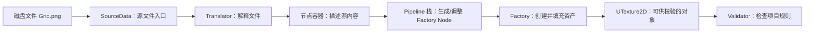

# 06 Interchange 与 DataValidation

> 知识成熟度：L2。主例核对的是 Epic 公开 UE 5.6 文档与同版本 API；代码是按其各节注明接口编写的教学实现，尚未在 UE 中执行。没有运行编辑器、Python 脚本、资产导入、UHT、目标编译或命令行校验。
> 版本基准：UE 5.6 公开文档与同版本 Python/C++ API；仅 §4.6 的 C++ 导入入口按公开 UE 5.8 API 明示范围保留，不作为 5.6 主例的兼容性证明。
> 适用范围：UE 5.6 编辑器中的单个 PNG 纹理导入与资产规则校验。Python API 在该版本标为 Experimental；这里的 Python 工具不用于 PIE 或打包后的游戏。
> 历史边界：旧文记录 UE 5.8.0、CL 55116800、分支 `++UE5+Release-5.8` 的源码核对。本轮未访问那个 checkout，因此保留其历史身份，不将它当成本轮源码观察；除 §4.6 明示的 5.8 C++ 保留入口外，主例统一使用可定位的 5.6 公开接口，不能据此断言与该 5.8 checkout 完全兼容。
> 最后更新：2026-10-11。保留此前完整 5.6 教学路线，补回有版本标注的 5.8 C++ 同步导入与实际对象验证节选，并补齐版本基准标签。首次 5.6 来源核对日期仍为 2026-10-10。

## 一、先分清“导进来了”和“符合项目规则”

假设美术交付一张 `Grid.png`。引擎能解码它，并创建 `UTexture2D`，说明格式转换成功；项目却要求纹理名以 `T_` 开头，资产 `Grid` 仍然不合格。文件损坏和命名不合格需要不同的修复：前者回到源文件或导入器，后者修改资产名或导入命名选项。

Interchange 负责从外部文件到 Unreal 对象的转换。DataValidation 在对象上执行项目规则。两者可以由同一个工具顺序调用，但“使用 Interchange”本身不等于“已执行所有 Validator”，保存资产也不等于校验通过。

本文先解释它们为何这样分工，再做一条完整的小路线：

`Grid.png → 默认纹理 Pipeline → T_Grid → 命名 Validator → Valid + 可见反馈`

负例只把目标名改成 `Grid`：像素仍可导入，验证应产生带资产路径的错误。规则只覆盖 `/Game/ImportLab/` 下的 `Texture2D`，不把整个项目的材质、网格或其他资产都判成坏数据。

## 二、Interchange 如何把文件变成资产

### 2.1 中间节点为何存在

Translator 理解文件格式，把源文件的信息描述成节点；Pipeline 根据项目导入选项决定哪些对象应该生成、使用什么设置，并创建或调整 Factory Node；Factory 根据这些创建指令产生 Unreal 对象。中间节点把“怎样读文件”和“项目想得到什么资产”分开。同一个格式可以使用不同项目策略，已有资产类型通常也不必为每种格式重新实现一次 Factory。



这里的最后一步由本文工具显式调用。图中的箭头是教学数据流，不声称所有阶段在同一线程串行执行，也不把翻译节点直接当作已经存在的资产。格式支持、插件与 Pipeline 栈共同决定能否得到预期对象；只检查扩展名并返回 `true` 还没有完成一个 Translator。[官方导入流程](https://dev.epicgames.com/documentation/en-us/unreal-engine/importing-assets-using-interchange-in-unreal-engine?application_version=5.6)

### 2.2 Pipeline 各阶段解决什么问题

Pipeline 栈是有顺序的。例如先由默认纹理 Pipeline 建立创建纹理所需的 Factory Node，再由项目 Pipeline 调整其中的规则；如果只留下一个什么也不创建的空 Pipeline，不能期待 Factory 自行推断所有意图。

| 阶段 | 此时有什么 | 合适的工作 |
| --- | --- | --- |
| `ExecutePipeline` | 已翻译的节点；尚未按图创建资产 | 建立或调整 Factory Node、选择要导入的内容 |
| `ExecutePostFactoryPipeline` | Factory 已创建对象，尚未调用 `PostEditChange` | 对新对象施加导入策略 |
| `ExecutePostImportPipeline` | `PostEditChange` 已完成；文档说明异步构建框架的构建应已完成 | 依赖该资产构建数据的后处理 |
| `ExecutePostBroadcastPipeline` | 资产注册和相关广播之后 | 需要这一阶段才成立的后续工作 |

这些阶段来自 [5.6 Pipeline API](https://dev.epicgames.com/documentation/unreal-engine/API/Runtime/InterchangeCore/UInterchangePipelineBase?application_version=5.6)。它们不是“任意资源都已持久化”的保证。单个对象的 PostImport 也不能代替多资产导入的整体完成通知。

自定义阶段若操作编辑器对象或 UI，不能仅因框架支持异步就允许它在任意线程运行。具体 Pipeline 通过 `CanExecuteOnAnyThread` 表达可否异步；需要强制主线程的逻辑应返回 false。不要在导入尚依赖的回调里阻塞等待整次导入结束。

### 2.3 何时需要扩展哪一层

| 需求 | 首选落点 | 为何 |
| --- | --- | --- |
| 已支持 PNG，只想选择纹理导入选项 | 默认纹理 Pipeline 的配置 | 文件解析与纹理创建已经存在 |
| 已支持格式，需要在导入过程中统一处理节点/对象 | 自定义 Pipeline，并接入实际使用的栈 | 政策进入导入和重导入过程 |
| 外部是新格式，输出仍是引擎已有资产类型 | Translator，以及与已有节点/Factory 的对接 | 新的是读取与转换，不必先假定需要新 Factory |
| 要生成新的项目资产类型 | 相应 Factory 和 Pipeline/节点配合 | 必须有人实现该 UObject 的创建与填充 |
| 检查已经导入或手工修改的资产 | Validator 或对象自检 | 规则不能只覆盖导入这一个入口 |

旧文中的 `CanImportSourceData`、`Translate`、Factory 注册与导入入口仍是理解扩展职责的线索，但几个空函数并不组成可运行的新格式导入器。本文不提供新格式解析器；格式错误处理、Payload 获取、Factory 参数和注册时机需要在实际版本实现中继续核对。

## 三、DataValidation 怎样得出结果

### 3.1 自检与外部 Validator

项目自己定义的数据资产，可以重写 `UObject::IsDataValid`，直接访问类里的私有状态。例如关卡配置的 `Level` 必须大于零，这条约束属于该类型本身。

`UTexture2D` 是引擎类型，通常不应仅为检查名字而改写它。派生 `UEditorValidatorBase`，由 `CanValidateAsset` 筛选对象，再由 `ValidateLoadedAsset` 检查规则，能把团队规范加到已有资产上。Subsystem 先处理对象自身的校验，再处理适用的已注册 Validator；最终还可能包含其他规则的结果。[Subsystem API](https://dev.epicgames.com/documentation/en-us/unreal-engine/python-api/class/EditorValidatorSubsystem?application_version=5.6)

| 结果 | 应怎样理解 |
| --- | --- |
| `Valid` | 本次实际执行的规则给出了通过结果 |
| `Invalid` | 本次验证失败，需要查看具体错误 |
| `NotValidated` | 没有完成验证；不能据此说资产符合项目规则 |

这三个结果不要转成一个模糊的“非零即成功”判断。[结果枚举](https://dev.epicgames.com/documentation/en-us/unreal-engine/python-api/class/DataValidationResult?application_version=5.6)

### 3.2 结果与消息必须一致

Validator 有自己的验证状态。Python/蓝图 Validator 应在通过路径调用 `asset_passes`，在失败路径调用 `asset_fails`；后者同时记录错误。只有警告时可以使用 `asset_warning`，它本身不把验证标为失败。只返回枚举而不维护 Validator 状态，可能无法表达“这个 Validator 已检查过”。C++ 对应 `AssetPasses`、`AssetFails`、`AssetWarning`。[Validator API](https://dev.epicgames.com/documentation/en-us/unreal-engine/python-api/class/EditorValidatorBase?application_version=5.6)

`IsDataValid` 是另一条接口，使用 `FDataValidationContext` 收集问题。继承实现时应保留父类的 `Invalid`；自己的规则实际通过而父类只给 `NotValidated` 时，也要明确返回自己的通过结果。原文“先取 Super 结果，只有失败时改 Invalid，最后原样返回”的写法可能使正例仍是 NotValidated。警告不自动等于错误，软引用非空也只说明填写了路径，不证明目标资源存在或能成功加载。

校验器最好只读检查，不在验证时自动重命名或修资产。否则保存时、手动时与 CI 重复执行同一规则，会混入修复副作用，很难解释到底验证的是哪个版本。

## 四、完整小例：导入两张内容相同、名称不同的纹理

### 4.1 输入、准备与预期结果

这是供读者在 UE 5.6 编辑器中执行的步骤，本文没有执行它。

1. 使用一个练习项目，确认 Interchange Editor、Interchange Framework、Data Validation、Python Editor Script Plugin 和 Editor Scripting Utilities 可用；按插件要求重启编辑器。不要进入 PIE。
2. 准备一张普通、可解码的 64×64 PNG，保存为磁盘文件 `Grid.png`。内容可为纯色，尺寸只是让练习小而明确，不是项目性能预算。
3. 在 Content Browser 用该 PNG 做首次交互导入预览，确认当前 PNG 路径采用默认纹理 Pipeline，且预览对象类型是 Texture2D；取消这次预览即可。若项目改过默认栈，先记录它，不能把项目定制结果说成引擎统一默认。
4. 将下一节完整代码保存为项目的 `Content/Python/import_validation_lab.py`。该目录会加入编辑器 Python 模块搜索路径。
5. 测试目标使用两个此前不存在的目录：`/Game/ImportLab/Good` 和 `/Game/ImportLab/Bad`。脚本拒绝覆盖目标资产。已有同名练习结果时换新目录，不靠重复执行掩盖旧资产。

准备方式和 Python 的编辑器范围见 [官方 Python 指南](https://dev.epicgames.com/documentation/en-us/unreal-engine/scripting-the-unreal-editor-using-python?application_version=5.6)。本例保留项目的纹理 Pipeline 选择，不以一条脚本偷偷改项目全局栈。

### 4.2 一个完整模块

规则故意只有一条：`/Game/ImportLab/` 内 Texture2D 名称必须以区分大小写的 `T_` 开头。PNG 的颜色、大小、sRGB 或压缩设置不是这条规则的通过依据。

```python
# Content/Python/import_validation_lab.py
# UE 5.6 editor-only teaching implementation; not executed in this article.
import os
import unreal

ROOT = "/Game/ImportLab/"
_validator = None


@unreal.uclass()
class ImportLabTextureValidator(unreal.EditorValidatorBase):
    @unreal.ufunction(override=True)
    def k2_can_validate_asset(self, asset):
        return (
            isinstance(asset, unreal.Texture2D)
            and asset.get_path_name().startswith(ROOT)
        )

    @unreal.ufunction(override=True)
    def k2_validate_loaded_asset(self, asset):
        if not asset.get_name().startswith("T_"):
            self.asset_fails(
                asset,
                unreal.Text(
                    "ImportLab: Texture2D name must start with T_: "
                    + asset.get_path_name()
                    + ". Rename it in the Content Browser or fix the import name."
                ),
            )
            return unreal.DataValidationResult.INVALID

        self.asset_passes(asset)
        return unreal.DataValidationResult.VALID


def subsystem():
    result = unreal.get_editor_subsystem(unreal.EditorValidatorSubsystem)
    if result is None:
        raise RuntimeError("DataValidation editor subsystem is unavailable.")
    return result


def register_validator():
    global _validator
    if _validator is None:
        registry = subsystem()
        validator = ImportLabTextureValidator()
        validator.set_editor_property("is_enabled", True)
        registry.add_validator(validator)
        _validator = validator
    return _validator


def unregister_validator():
    global _validator
    if _validator is not None:
        subsystem().remove_validator(_validator)
        _validator = None


def validate_object(asset):
    if asset is None:
        raise ValueError("No imported object to validate.")
    register_validator()
    result, errors, warnings = subsystem().is_object_valid(
        asset, unreal.DataValidationUsecase.SCRIPT
    )
    unreal.log("VALIDATION {} -> {}".format(asset.get_path_name(), result))
    for error in errors:
        unreal.log_error(str(error))
    for warning in warnings:
        unreal.log_warning(str(warning))
    return result, errors, warnings


def import_texture(source_file, content_path, asset_name):
    # source_file is a disk path; content_path is an Unreal /Game package path.
    source_file = os.path.abspath(source_file)
    if not os.path.isfile(source_file):
        raise FileNotFoundError(source_file)
    if os.path.splitext(source_file)[1].lower() != ".png":
        raise ValueError("This exercise accepts PNG files only.")
    if not content_path.startswith(ROOT):
        raise ValueError("Use a new directory below /Game/ImportLab/.")
    if not asset_name or not asset_name.isascii() or not all(
        char.isalnum() or char == "_" for char in asset_name
    ):
        raise ValueError("Use a simple ASCII asset name.")

    target = content_path.rstrip("/") + "/" + asset_name
    if unreal.EditorAssetLibrary.does_asset_exist(target):
        raise RuntimeError("Target already exists; choose a fresh path: " + target)

    manager = unreal.InterchangeManager.get_interchange_manager_scripted()
    source_data = unreal.InterchangeManager.create_source_data(source_file)
    if source_data is None or not manager.can_translate_source_data(source_data):
        raise RuntimeError("No usable Interchange translator for this source.")

    params = unreal.ImportAssetParameters()
    params.is_automated = True
    params.replace_existing = False
    params.destination_name = asset_name

    objects = manager.import_asset(content_path, source_data, params)
    if objects is None:
        raise RuntimeError("Interchange import failed; inspect its Output Log.")
    if len(objects) != 1 or not isinstance(objects[0], unreal.Texture2D):
        raise RuntimeError(
            "Expected one Texture2D, got {} objects; inspect the pipeline result."
            .format(len(objects))
        )

    texture = objects[0]
    expected_object_path = target + "." + asset_name
    if texture.get_path_name() != expected_object_path:
        raise RuntimeError(
            "Unexpected destination: " + texture.get_path_name()
            + "; expected " + expected_object_path
        )
    unreal.log("IMPORTED " + texture.get_path_name())
    return texture


def import_and_validate(source_file, content_path, asset_name):
    register_validator()
    texture = import_texture(source_file, content_path, asset_name)
    result, errors, warnings = validate_object(texture)
    return texture, result, errors, warnings
```

先看数据怎样走完，而不是只看函数名：

- 磁盘路径先经过存在性检查，再包装成 SourceData；这一步没有创建纹理
- `can_translate_source_data` 只确认有可用 Translator，不证明 PNG 内容一定能解码
- `destination_name` 给出单个输入资产的目标名；脚本还核对实际返回对象的类型、数量和路径，避免对错误对象输出“验证通过”
- 同步 `import_asset` 完成后，才把返回对象交给 Subsystem；这里没有用猜测的对象名重新加载资产
- Subsystem 调用适用规则，代码把返回的错误与警告显式写到 Output Log；它不在验证过程中改名
- 模块保存 Validator 实例，并提供注销函数。注册在当前编辑器进程内有效；重新打开编辑器后需再次导入模块并注册，不能期待 Python 类自动持久化成项目资产

接口依据是同一版本的 [InterchangeManager](https://dev.epicgames.com/documentation/en-us/unreal-engine/python-api/class/InterchangeManager?application_version=5.6)、[ImportAssetParameters](https://dev.epicgames.com/documentation/en-us/unreal-engine/python-api/class/ImportAssetParameters?application_version=5.6)、[EditorValidatorBase](https://dev.epicgames.com/documentation/en-us/unreal-engine/python-api/class/EditorValidatorBase?application_version=5.6) 和 [Python 类型/装饰器入口](https://dev.epicgames.com/documentation/en-us/unreal-engine/python-api/module/unreal?application_version=5.6)。`EditorAssetLibrary` 的路径检查只防止本例覆盖已知目标，不提供整个导入过程的事务回滚。[资产 API](https://dev.epicgames.com/documentation/en-us/unreal-engine/python-api/class/EditorAssetLibrary?application_version=5.6)

### 4.3 从编辑器调用，观察正例

打开 Output Log，将输入方式切成 Python。以下 `C:/ImportLab/Grid.png` 是要替换成实际磁盘文件的示例路径，`/Game/...` 是内容路径：

```python
import unreal
import import_validation_lab as lab

good, good_result, good_errors, good_warnings = lab.import_and_validate(
    "C:/ImportLab/Grid.png",
    "/Game/ImportLab/Good",
    "T_Grid",
)

assert good_result == unreal.DataValidationResult.VALID
assert len(good_errors) == 0
```

预期可看到 `IMPORTED /Game/ImportLab/Good/T_Grid.T_Grid`，随后是该对象的验证结果。不要依赖枚举的具体字符串打印格式，以上断言比较的是枚举值。

正例的因果链是：PNG 可转换 → 产生一个目标纹理 → 类型/目录筛选命中 → 名称以前缀开头 → 调用 `asset_passes` → 返回 Valid。若其他已注册规则报告 Invalid，正例整体仍应失败；本文规则通过不覆盖项目已有规则。先读消息来源，再决定是否是本例接线问题。

同步返回数组不是保存成功凭证。到这里得到了并检查了编辑器中的对象；需要把练习资产保留到下次打开项目时，再在编辑器保存它，并检查保存反馈。

### 4.4 保持像素不变，只改变名字

```python
bad, bad_result, bad_errors, bad_warnings = lab.import_and_validate(
    "C:/ImportLab/Grid.png",
    "/Game/ImportLab/Bad",
    "Grid",
)

assert bad_result == unreal.DataValidationResult.INVALID
assert any("ImportLab:" in str(error) for error in bad_errors)
```

预期导入仍产生 `/Game/ImportLab/Bad/Grid.Grid`，命名验证才失败。错误应包含实际资产路径和修复方式。这个负例区分“没有导入成功”与“成功创建了不符合规则的资产”，不会靠损坏源文件来冒充 Validator 生效。

在 Content Browser 把负例改名为 `T_GridFixed`，然后选中它，右键 `Asset Actions → Validate Assets`。因为前面已在此编辑器进程注册 Validator，这条手动入口也应执行同一规则，相关反馈在 Message Log 中查看。修复的是命名输入，规则代码不需要变；若源文件之后再次导入成 `Grid`，错误仍会出现。

还可以直接调用 `lab.validate_object(bad)` 检查当前对象。若重命名导致手头引用不再适合当前操作，使用当前 Content Browser 选中的对象或明确加载新对象路径，不沿用猜测的旧路径。

### 4.5 三个接口边界，决定你该在哪里接后续动作

| 调用 | 5.6 文档中的返回意义 | 本例如何使用 |
| --- | --- | --- |
| Python `import_asset` | 同步导入，Python 返回 `Array[Object]` 或 `None` | 判 None，再检查实际对象 |
| `scripted_import_asset_async` | bool 表示是否开始导入 | 不能拿 true 直接验证尚未产生的对象 |
| `is_object_valid` | 结果、错误数组、警告数组；不自动填充 Message Log | 解包并显式显示消息 |

同步 Python 文档的 Returns 段还保留 C++ 风格的 true/false 描述；实际 Python 签名和 Return type 明确列出对象数组或 None。不要把它写成“返回 bool”，也不要把 C++ 的输出引用参数机械搬成 Python 第四个实参。[Manager API](https://dev.epicgames.com/documentation/en-us/unreal-engine/python-api/class/InterchangeManager?application_version=5.6)

若把本例改成异步，要把后续验证接到 `ImportAssetParameters.on_assets_import_done`，并检查回调提供的实际对象。保留承接回调的工具/委托引用，覆盖取消、关闭编辑器和部分结果；`on_asset_done` 是单资产通知，不是整个批次的完成。这里没有实现异步版本，更没有将启动成功推成整个批次成功。[参数与回调](https://dev.epicgames.com/documentation/en-us/unreal-engine/python-api/class/ImportAssetParameters?application_version=5.6)

### 4.6 保留旧文的 C++ 同步入口（仅此节按公开 5.8 API）

旧文的四参数 `ImportAsset(ContentPath, SourceData, Params, OutImportedObjects)` 是有效的 C++ 入口：返回 bool，同时通过输出引用交回对象数组。这里保留它的用途，并补上调用结果到验证的接线。它与前面的 5.6 Python 主例各有自己的版本和绑定形式。

下面是项目辅助函数的最小节选，按公开页面标题为 UE 5.8 的 [Manager API](https://dev.epicgames.com/documentation/en-us/unreal-engine/API/Runtime/InterchangeEngine/UInterchangeManager) 和 [ValidatorSubsystem API](https://dev.epicgames.com/documentation/en-us/unreal-engine/API/Plugins/DataValidation/UEditorValidatorSubsystem) 核对；未编译、未运行，也不是旧 CL checkout 的逐字源码。它放在编辑器工具中，包含 `CoreMinimal.h`、`InterchangeManager.h`、`InterchangeSourceData.h`、`Engine/Texture2D.h`、`EditorValidatorSubsystem.h` 和 `Misc/DataValidation.h`；模块依赖仍须按该项目的 Editor 配置设置。

调用前由编辑器工具准备有效 SourceData、目标路径和导入参数，并取得有效的编辑器 ValidatorSubsystem 引用。适用规则须在这个进程中注册。本节仍只接受预期为一张纹理的输入，不把它扩成任意格式批量工具。

```cpp
// Project helper excerpt for an editor tool; UE 5.8 public API basis.
// A non-null return means this helper obtained one validated Texture2D.
// It does not mean that the asset's package has been saved.
UTexture2D* ImportAndCheckOneTexture(
    const FString& ContentPath,
    const UInterchangeSourceData* SourceData,
    const FImportAssetParameters& Params,
    UEditorValidatorSubsystem& Validators)
{
    if (SourceData == nullptr)
    {
        return nullptr;
    }

    TArray<UObject*> OutImportedObjects;
    const bool bImported =
        UInterchangeManager::GetInterchangeManager().ImportAsset(
            ContentPath, SourceData, Params, OutImportedObjects);
    if (!bImported)
    {
        UE_LOG(LogTemp, Error, TEXT("Interchange import failed"));
        return nullptr;
    }

    if (OutImportedObjects.Num() != 1 || !IsValid(OutImportedObjects[0]))
    {
        UE_LOG(LogTemp, Error, TEXT("Expected one valid imported object"));
        return nullptr;
    }
    UTexture2D* Texture = Cast<UTexture2D>(OutImportedObjects[0]);
    if (Texture == nullptr)
    {
        UE_LOG(LogTemp, Error, TEXT("Imported object is not a Texture2D"));
        return nullptr;
    }

    TArray<FText> Errors;
    TArray<FText> Warnings;
    const EDataValidationResult Result = Validators.IsObjectValid(
        Texture, Errors, Warnings, EDataValidationUsecase::Script);
    for (const FText& Error : Errors)
    {
        UE_LOG(LogTemp, Error, TEXT("%s"), *Error.ToString());
    }
    for (const FText& Warning : Warnings)
    {
        UE_LOG(LogTemp, Warning, TEXT("%s"), *Warning.ToString());
    }
    return Result == EDataValidationResult::Valid ? Texture : nullptr;
}
```

这里有三层不同结果：`bImported` 是同步导入调用的结果；`OutImportedObjects` 是它实际产生的对象，不能用预想名称替代；`Result` 才是随后验证该纹理得到的结果。导入失败或对象不符合本例预期时停止，不对缺失对象继续校验；验证为 Invalid 或 NotValidated 时也不返回“已验证纹理”。

只有拿到这个返回对象之后，调用者才进入自己明确的保存步骤，并检查对应 Package 的保存结果。函数本身不保存、不自动清理导入产物，也不保证失败已回滚。返回的是 UObject 指针；若调用者要跨帧继续操作，应由工具的正常 UObject 引用持有它，不能把局部输出数组当成跨帧所有权。这些后续条件不改变四参数入口本身的正确性。

## 五、把例子扩展成项目工具

### 5.1 从“检查名字”到“导入时执行策略”

Validator 发现问题，Pipeline 决定生成方式。本例通过导入参数选择名字。如果项目还要求颜色纹理在导入时采用特定设置，应把转换策略放入项目 Pipeline，Validator 再独立检查结果；不要为让负例转绿而在 Validator 内悄悄修改资产。

建立自定义 Pipeline 的学习顺序是：

1. 在 Content Browser 创建 Blueprint，父类选 `InterchangePipelineBase`，给它明确用途，例如导入后记录产物
2. 重写 `Scripted Execute Post Import Pipeline`，用传入的 `Created Asset` 接 `Get Path Name`，把路径输出到日志；不要在这里凭源文件名寻找资产
3. 在当前练习项目使用的纹理 Pipeline 栈中保留原默认纹理 Pipeline，并加入这条项目 Pipeline，导入新的目录
4. 预期每个传入的创建对象产生一条路径反馈；这只验证扩展接线，没有宣称修改了像素、碰撞、LOD 或保存行为
5. 确认接线之后，再按目标规则选择节点阶段或对象阶段进行修改，并分别准备首次导入和重导入的正反例

这是一个具体的最小扩展：它只记录已完成导入的对象，不以空函数假装实现合并网格或创建资产。Blueprint 的原生 `Print String` 节点需打开 Print to Log；若用于该记录动作，`Scripted Can Execute on Any Thread` 返回 false。日志动作的数量应按实际创建对象计，不预设每个源文件永远只有一个对象。[Pipeline 阶段接口](https://dev.epicgames.com/documentation/en-us/unreal-engine/python-api/class/InterchangePipelineBase?application_version=5.6)

通过 `override_pipelines` 传入自定义集合时，它替代系统选择的集合，不是往默认栈末尾追加一个元素。必须包含完成所需 Factory Node 创建的 Pipeline；对象路径应从实际项目 Pipeline 资产复制，不能照抄另一项目路径。

### 5.2 C++ Validator 与对象自检怎样迁移

如果希望验证器在编辑器启动和 C++ 命令行流程中稳定发现，可把相同命名规则放入项目 Editor 模块中的 `UEditorValidatorBase` 派生类。模块需要依赖 `DataValidation` 及其所用引擎模块；不要把 Editor 插件无条件加入游戏 Runtime 模块。

5.6 C++ 的主要重写点为：

```cpp
// 接口节选，不是完整模块；需要正常的 UCLASS/GENERATED_BODY 与编辑器构建配置。
virtual bool CanValidateAsset_Implementation(
    const FAssetData& InAssetData,
    UObject* InObject,
    FDataValidationContext& InContext) const override;

virtual EDataValidationResult ValidateLoadedAsset_Implementation(
    const FAssetData& InAssetData,
    UObject* InAsset,
    FDataValidationContext& Context) override;
```

类型/目录筛选、名称检查、`AssetFails(InAsset, Message)` 与 `AssetPasses(InAsset)` 的分支应与 Python 例一致。原文的 C++ 外部 Validator 方向保留；这里不把这段声明说成已生成、已编译或已注册的类。[C++ Validator API](https://dev.epicgames.com/documentation/unreal-engine/API/Plugins/DataValidation/UEditorValidatorBase?application_version=5.6)

自己拥有的数据资产仍适合 `IsDataValid`。以原文的 `Level` 和软网格引用为例，规则决策可以写成以下伪代码：

```text
parent = Super.IsDataValid(context)
invalid = (parent == Invalid)
若 Level <= 0：向 context 添加错误；invalid = true
若 Mesh 路径为空：按项目约定添加警告，或添加错误并置 invalid
返回 Invalid（若 invalid），否则 Valid（本类规则已经执行并通过）
```

这解释了原例的正例、失败和父类结果保留，不承诺非空软引用一定可加载。蓝图项目若要从自己的 UObject 自检调用蓝图规则，应由 C++ 明确提供事件桥接；不能把普通的 C++ `IsDataValid` 当成所有资产都能直接在蓝图中重写的事件。

### 5.3 保存、手动检查、提交与 CI

`EDataValidationUsecase` 表明调用目的：Manual、Save、PreSubmit、Commandlet、Script 等。它让项目可以决定哪些昂贵规则在何时运行，但没有自动替你实现全量/增量策略。[Usecase 枚举](https://dev.epicgames.com/documentation/en-us/unreal-engine/python-api/class/DataValidationUsecase?application_version=5.6)

保存时校验可由 DataValidation 设置控制：

```ini
[/Script/DataValidation.DataValidationSettings]
bValidateOnSave=true
```

“保存时触发”不等于“每次保存全项目所有资产”，也不能只凭弹出错误就断言资产绝不会被写入。要建立提交门禁，需明确覆盖资产、依赖策略、结果处理和提交方行为。批量调用 `validate_assets_with_settings` 的计数含失败或警告，不能把它简单等同 Invalid 数量；详细结果才适合区分两者。

官方给出的命令行入口是：

```bat
UnrealEditor-Cmd.exe "C:\Projects\ImportLab\ImportLab.uproject" -run=DataValidation
```

它是待执行入口，不是本文的运行记录。官方说明默认只执行 C++ 校验规则，Python/蓝图规则需要扩展支持；在交互编辑器里运行过本例 `register_validator()`，不会把该进程内注册自动带到新建命令行进程。[Data Validation 文档](https://dev.epicgames.com/documentation/en-us/unreal-engine/data-validation-in-unreal-engine?application_version=5.6)

接入 CI 前至少用一个已知正确资产与一个已知错误资产记录：规则确实被发现、覆盖资产集合、完整错误输出和真实进程退出码。没有核对该版本命令行实现与运行结果时，不把“出现 Invalid”直接写成“保证非零退出”，也不以 `-TestExit` 等未经本例核实的参数充当必需修复。本文未运行 CI 命令行资产验证。

## 六、失败时沿哪一段检查

| 观察 | 先检查什么 | 为什么 |
| --- | --- | --- |
| 源文件不存在，脚本抛异常 | 磁盘绝对路径 | `/Game` 不能用作外部 PNG 的磁盘路径 |
| 没有可用 Translator | 插件、源格式和本版本支持 | 文件后缀过滤只是练习范围，不是解码证明 |
| 有 Translator，导入返回 None | Interchange 错误日志、文件内容和 Pipeline | 匹配格式与成功转换是两件事 |
| 返回数量/类型/路径不符 | 实际 Pipeline 与命名设置 | 不应对错误对象继续给出通过结论 |
| 导入成功但返回 Invalid | 错误具体来自哪条规则 | 命名、依赖等项目错误不靠反复导入自愈 |
| 结果是 NotValidated | Validator 是否已注册、启用、筛选命中 | 未覆盖不等于“检查过没问题” |
| Python 校验有结果，Message Log 没记录 | 使用了哪个入口 | `is_object_valid` 不自动写 Message Log，本例显式写 Output Log |
| 重启后不再出现 ImportLab 规则 | 是否重新导入模块并注册 | Python Validator 不随前一进程存续 |
| 再次运行命中已有目标 | 换一个明确的新练习目录 | 本例拒绝覆盖，不把旧结果混成新观察 |
| 同步导入在某个回调里卡住 | 调用事件与导入的等待关系 | 官方对 Blueprint 同步入口提示死锁可能；改用正确完成回调，而不是盲目阻塞 |

导入失败或结果不符时，脚本不自动删除已经生成的产物。先检查练习目录与日志，再决定保留、修复或清理；“抛异常”并不证明引擎已回滚所有导入副作用。

重导入会复用有关导入设置，但源数据、材质映射和项目策略都可能改变。迁移旧流程时，应并排检查首次导入与重导入的命名、坐标/单位、材质、LOD、碰撞和引用，不能把“同一框架”写成“结果必定完全相同”。本例 PNG 命名成功也不能证明 FBX、骨骼动画、运行时导入或平台构建可用。

## 七、版本迁移与证据边界

原文将 UE 5.1+ 的所有导入描述为默认 Interchange、称旧导入器已被取代或停止演进，范围过大。5.6 的导入指南仍描述不受支持格式走旧框架，且特定格式有自己的支持状态。应针对目标版本、格式、插件和入口确认；不要用“UE5”三个字替代它们。

本轮证据分开看：

| 内容 | 本次依据 | 尚未证明 |
| --- | --- | --- |
| Translator/节点/Pipeline/Factory 的职责 | 固定 5.6 官方导入指南与 Pipeline API | 任一格式的全部实现与内部调度 |
| 同步 Python 返回对象、异步返回启动状态 | 固定 5.6 Manager 与参数 API | 示例已在实际编辑器成功导入 |
| Validator 的筛选、结果与消息接线 | 固定 5.6 Validator/Subsystem API | 所有项目规则的汇总实现细节 |
| 正反纹理例与手动修复路线 | 本文实现与输入推演 | 实际输出、保存结果、性能、平台兼容 |
| 旧 5.8 源码路径与版本记录 | 旧文历史记录 | 本轮重新读取了该 checkout |
| §4.6 的 5.8 C++ 四参数导入与对象校验 | 本轮实际读到的公开 5.8 Manager/ValidatorSubsystem 类页 | 旧 CL 实现、编译、保存以及与 5.6 主例的跨版本兼容 |
| 命令行入口 | 固定 5.6 官方说明 | 项目规则发现、返回码及 CI 门禁已实测 |

公开页面列出的头文件位置可作为后续源码入口：`Engine/Source/Runtime/Interchange/Core/Public/InterchangePipelineBase.h`、`Engine/Source/Runtime/Interchange/Engine/Public/InterchangeManager.h`、`Engine/Plugins/Editor/DataValidation/Source/DataValidation/Public/EditorValidatorBase.h` 和 `EditorValidatorSubsystem.h`。列出它们不等于本轮读取了对应实现；没有下载新增受限源码，也没有用另一机器的环境冒充本次依据。

## 八、关联阅读

- [插件开发与编辑器扩展](03-插件开发与编辑器扩展.md)：把项目规则放入合适的 Editor 模块
- [Python 编辑器脚本与资产自动化](14-Python编辑器脚本与资产自动化.md)：编辑器脚本的执行与资产操作边界
- [GameFeatures 特性插件](../../03-引擎架构与资源系统/插件装配与初始化/05-GameFeatures特性插件.md)：项目资产自检的另一处应用
- [UAT 与自动化打包](../构建编译与制品/02-UAT与自动化打包.md)：将校验和制品流程连接起来，分别核对各自结果
