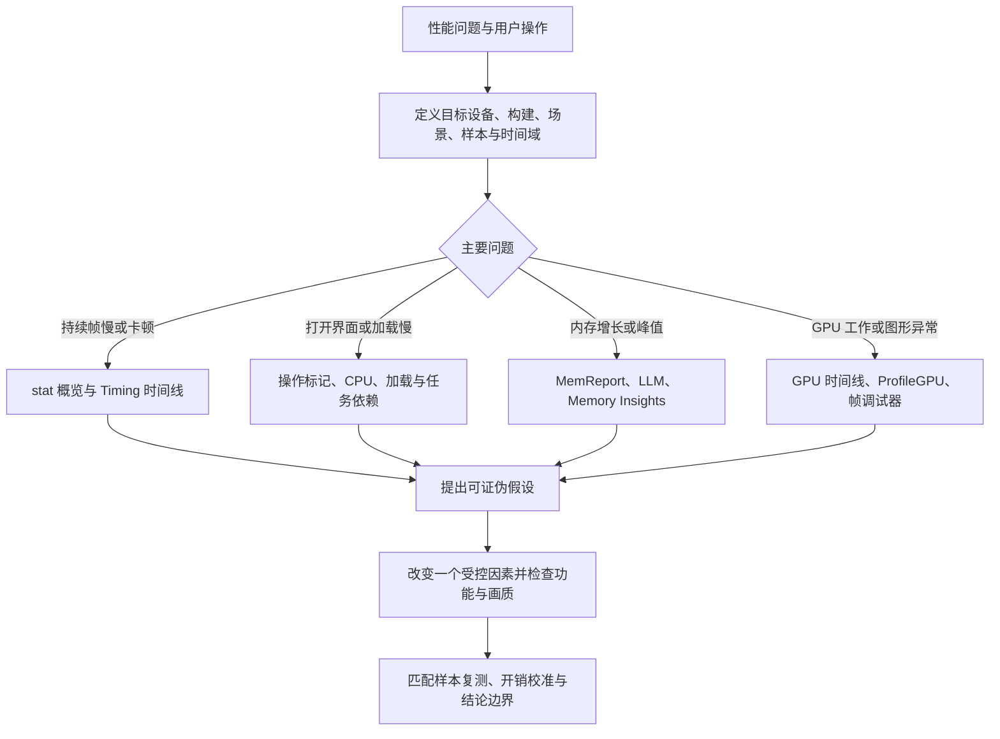
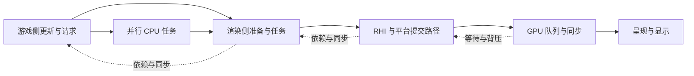
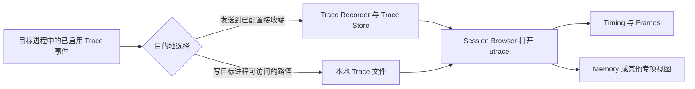
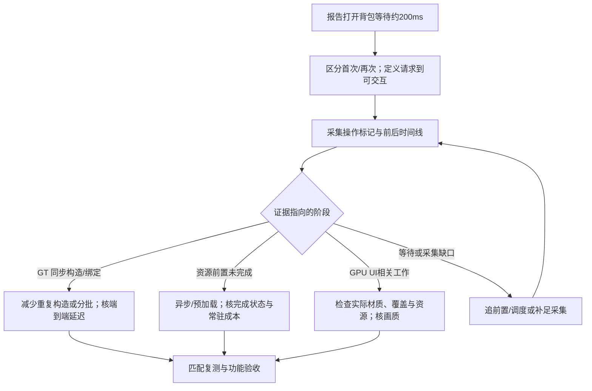

# 03 性能分析工具与 Profiling

> 知识成熟度：L2。主要承诺是测量口径、工具用途和证据推理；本篇完成静态文证核对，未采集或分析实际项目 Trace，未编译或运行示例。
> 版本基准：主要采用 Epic 文档的 UE 5.5 版本入口；Stats 插桩使用已读的 UE 5.6 入口，旧 Stats 文件及 MemReport 另标历史来源。版本选择器不是引擎源码快照，页面混入新旧内容时仅采用已注明的段落，不推断整个版本均支持。
> 版本与规范基线：C++ 时钟示例依据 C++20 草案 N4861 固定源文件；UE 的平台、RHI、构建配置、Stats/Trace 编译开关和插件共同决定可用能力。所有命令、C++、蓝图流程、纸面数字和验证计划均为 `NOT_RUN`。
> 历史来源声明：旧文曾标“UE 5.8.0，本机 Engine/Build/Build.version：CL 55116800，分支 ++UE5+Release-5.8”。这是旧作者环境声明；本次未读取该安装或引擎实现，不把它当作本机版本、接口移除或性能验证证据。
> 最后更新：2026-10-09。来源阅读与失败边界见第 11 节。

## 1. 先回答哪个体验变慢，再选择工具

Profiling 的交付不是一张“红色最宽条”的截图，而是可以复核的解释：哪个样本群体违反什么预算，时间或内存花在哪里，哪些依赖限制完成，做何种改变后是否在匹配条件下改善，以及结论能推广到哪里。持续低帧率、偶发卡顿、首次开界面等待和长期内存增长，通常需要不同的采样窗口与工具。

“先测量，再优化”还包含两件事：先定义测量对象，再检查测量是否扰动了对象。Epic 的性能入门区分持续 CPU/GPU 限制、显示同步限制及短暂尖峰，并提醒在目标设备测量和考虑功耗、热降频。编辑器里的趋势可以帮助找线索，不能直接代表目标机发布体验。〔S01〕



| 要回答的问题 | 首选入口 | 得到什么；下一步还缺什么 |
| --- | --- | --- |
| 一段游戏是否稳定达标 | 帧时间序列，辅以 `stat unit` / `stat unitGraph` | 先找违反预算的区间；单个屏显值不能完成归因 |
| 某帧为什么迟到 | Unreal Insights 的 Timing Insights | 看线程、任务和等待；需要所需通道、业务标记及完整前后文 |
| 某系统是否工作过多 | 相应 Stats 组或自定义 Scope | 看调用次数及单次/每帧成本；区分包含时间、自身时间和重复嵌套 |
| GPU 哪部分值得调查 | `stat gpu`、`ProfileGPU`、GPU 时间线 | 定位 Pass 与事件；具体资源、着色器和状态再由 RenderDoc / PIX 检查 |
| 内存由哪类资源占用 | MemReport、LLM | 快照/分类找大头；对象引用和分配生命周期另查 |
| 某操作是否遗留分配 | Memory Insights | 查分配、释放和存活区间；“应当释放”的业务条件仍由项目定义 |
| 资产何时进入关键路径 | CPU + LoadTime / File / AssetLoadTime | 区分加载请求、I/O、解码/反序列化及主线程消费；通道依赖见第 5 节 |
| 网络负载是否异常 | `stat net`、Networking Insights | 包/复制与本地帧问题分别看；跨机器时钟和端到端体验另定口径 |

## 2. 测量合同：每个数字都要有对象、时间域和分母

### 2.1 时间、工作量和延迟不是同一个量

| 概念 | 本篇口径 | 不能自动推出 |
| --- | --- | --- |
| 帧间隔 / Frame time | 指定帧序列中，相邻边界或工具定义的帧区间；单位 ms | 某个函数独占 CPU 的时间；输入到屏幕的全部延迟 |
| Scope elapsed time | 同一线程上进入到退出插桩区间的经过时间 | 线程始终在 CPU 上执行；等待、抢占也可能处于区间内 |
| CPU running time | 线程实际获得 CPU 执行的时间，需相应调度/采样证据 | 所有墙上经过时间；单靠宽 Scope 不能得出此值 |
| 游戏时间 | 世界推进的逻辑时间，可能受暂停与时间膨胀影响 | 微秒级性能耗时或真实等待时长 |
| 操作端到端延迟 | 例如收到打开请求到 UI 可交互，明确起止事件 | OpenPanel 同步函数返回耗时或一帧的耗时 |
| GPU 事件时长 | 特定队列/计时范围内的 GPU 时间戳或工具聚合 | CPU 提交成本；所有 GPU 队列时间可直接求和 |
| 吞吐量 | 一段明确时长内完成的工作数 | 某次请求或某一帧的延迟 |
| 瓶颈 | 在当前负载和约束下，限制目标完成速度/延迟的资源或依赖 | 整个项目永远固定在某一线程；最大的累计条目必在关键路径 |
| 捕获 / 转储 | 一段事件流、单帧状态或某时刻报告，须标产物类型 | 三种工具产物可互换或都包含完整调用栈 |
| CVar / 命令 | 配置值与执行操作是不同接口 | 任意 Stats 名称都是 CVar；历史命令适用当前构建 |

`Get Game Time in Seconds` 对应的公开合同会受时间膨胀影响且在暂停时停止；`GetRealTimeSeconds` 不受这些影响，但公开合同是世界开始以来的时间，未承诺每次调用都提供独立高精度取样。两者不应凭名字充当单帧内蓝图节点 profiler。测短同步范围，优先已接入的 Scope / Trace；测跨帧体验，显式选时间域及起止事件。〔S12、S13〕

### 2.2 样本群体与统计聚合

先在记录中填入：项目提交/构建标识、引擎版本、设备/OS/驱动/RHI、分辨率与画质、窗口与 VSync/帧率限制、地图与镜头路径、角色/物体数量、网络角色、缓存与预热状态、采集通道及其版本、观察窗口和重复轮次。不同热状态、构建配置或首次/再次打开，应分组展示。

指标至少保留以下四层：

1. 原始时间序列及业务标记：方便回到异常处，判断多个连续慢帧还是孤立尖峰。
2. 分布：帧间隔的中位数、所需尾分位、最大值、超预算比例；写清是否剔除样本及理由。
3. 事件聚合：单次调用分布与“每帧全部调用的总耗时”分别计算；调用数变化也是解释的一部分。
4. 重复性：多个独立会话、轮次和设备分别报告；先看轮间变动，再谈小幅改善。不能用一次会话的海量帧假装有同等数量独立实验。

总体 FPS 若定义为“样本帧数 / 这些帧总时长”，它对应平均帧间隔的倒数；逐帧 FPS 的算术平均是另一个量。分位数同样必须声明算法及样本单位。以下采用最近秩 `x[ceil(p×n)]`，仅用于教学；它不是对某个 Insights 列实现的认证。

**PAPER_EXPECTED P01（NOT_RUN）**：四个帧间隔 10、10、10、70 ms，总计 100 ms。按上述口径总体 40 FPS，而逐帧 FPS 均值约 78.57；最近秩 P50 为 10 ms、P95 为 70 ms，60 FPS 对应约 16.67 ms 的预算下有 1/4 帧超标。平均、尾部和连续卡顿回答不同问题，不能仅报告“平均帧率不错”。

**PAPER_EXPECTED P02（NOT_RUN）**：帧 A 调用 100 次，每次 0.1 ms，总计 10 ms；帧 B 调用 1 次、耗时 4 ms。按实例看，绝大多数调用很便宜；按帧看，A 的累计成本反而更高。帧聚合的分位数不等于实例分位数，更不等于“各轮平均值的分位数”。

## 3. CPU / GPU：从并行流水线找到真正的限制

### 3.1 阶段是职责，帧号偏移是待观察事实

Game Thread 处理游戏侧逻辑和提交请求；Render Thread 准备渲染侧工作；RHI 层将工作送向图形 API；GPU 执行队列里的命令，最终还有显示/呈现。任务可能分发到工作线程，某些配置没有独立 RHI 线程。各阶段可以处理不同帧，但不能固定画成 Game=N、Render=N−1、RHI=N−2 后当作所有版本、平台和时刻的实测模型。



图示表达依赖，不表达固定线程数、精确调用顺序或量化帧号。公开 Threaded Rendering 文档说明渲染线程可落后游戏线程并存在同步；其中也保留旧宏和旧实现背景，本文只引用这种职责/同步关系，不把整页旧实现升格为当前源码结论。〔S14〕

在理想、稳定、无额外同步限制的流水线里，最慢阶段的服务时间常限制吞吐量，这是有用的初始模型。但实际帧还受依赖、排队、显示节奏、任务粒度、驱动、I/O 和调度影响；帧总时长既不能机械等于 Game+Draw+GPU，也不能无条件等于三个显示值的最大值。跨线程总工作量可以大于一帧经过时间。输入延迟还可能包含多帧排队，即使吞吐量相同，延迟也不同。

### 3.2 怎样读 `stat unit` 的两条旧示例

下面沿用旧文数字，明确为纸面诊断练习，没有对应设备或 Trace。

```text
PAPER_EXPECTED P03 / NOT_RUN
Frame: 16.7 ms  Game: 9.2 ms  Draw: 6.1 ms  GPU: 15.4 ms  RHIT: 1.2 ms

PAPER_EXPECTED P04 / NOT_RUN
Frame: 16.7 ms  Game: 15.1 ms  Draw: 3.2 ms  GPU: 5.0 ms
```

- P03：GPU 时间较高，是值得先查的候选。还需知道限制帧率/VSync、采样与平滑口径、GPU 是否在等待、数据是否来自对应帧。接近 16.67 ms 只表示预算余量小，不能证明 GPU 已限制整体吞吐。
- P04：Game 较高，优先检查逻辑线程与它等待的前置任务。若大段时间在等待渲染、任务或文件，删减旁边一小段逻辑未必改善帧率。
- 两例都缺少分布、连续异常和工作/等待证据；不能从一行数值决定全面改材质、Draw Call 或 UI。静态材料没有给出实际优化收益。

`stat unit` 是定位入口，官方说明本就使用“likely”等条件性表述，并说明 GPU/RHIT 可能随帧同步。历史图形编程文档还特别提醒 GPU 显示时间可能含 idle；本文保留此警示而不继承该旧页的渲染实现与开关。〔S02、S15〕

### 3.3 把“长条”拆成执行、等待和聚合

在 Timing Insights 中先选问题时间段，再检查对应线程轨道和父子 Scope。包含时间包含子 Scope，自身时间排除已记录的子 Scope；自身时间不等于纯 CPU 执行时间，未插桩工作与等待仍可能留在里面。跨线程子任务也不一定以同一嵌套树表达。Timers 的 Instance / Game Frame / Rendering Frame 聚合口径不同，比较前要固定选择范围与模式。〔S04、S05〕

**PAPER_EXPECTED P05（NOT_RUN）**：一个父 Scope 为 10 ms，内部不重叠的两个子 Scope 为 4 ms 和 3 ms，则在这个简化、完整嵌套例里自身部分为 3 ms。不能把父 10 与子 4+3 再相加说成 17 ms，也不能说其自身 3 ms 必然全在 CPU 上运行。

看到等待应追问“等谁、被等者何时就绪、为何没及时运行”。有 Task/CPU 事件时可查看前置、后继和任务生命周期；ContextSwitch 等调度数据需要额外平台能力与权限，不是普通 CPU Scope 自动包含的内容。没有事件也可能是通道、插桩、过滤或数据缺失，不能直接解释为线程完全空闲。Task Graph 工具提供关系图，但因果结论仍需对应实际任务及问题完成点。〔S06〕

**PAPER_EXPECTED P06（NOT_RUN）**：任务 A、B 从同一时刻并行，各 8 ms，最后串行合并 2 ms。忽略其他成本时，端到端约 10 ms，工作量为 18 ms。只把分支 B 减到 4 ms，A 仍为 8 ms，端到端仍约 10 ms；降低累计耗时不保证立即提升这次完成延迟。

## 4. Stats：快速概览、系统计数和旧式录制

### 4.1 常用命令及它们的观察范围

下面是实际已读文档列出的入门入口，不是跨平台支持清单。命令属于引擎控制台，不能拿来直接在操作系统终端执行；实际使用前在目标构建的帮助/自动补全中确认存在与参数，记录输出和缺失项。本文没有执行这些命令。〔S02〕

| 命令 | 主要用途 | 读数边界 |
| --- | --- | --- |
| `stat unit` / `stat unitGraph` | Frame、Game、Draw、GPU 等概览与曲线 | 线程/字段可能因配置不同；DynRes 是分辨率比例信息，不是线程 |
| `stat game` / `stat engine` | Gameplay Tick 与引擎统计 | 分组可能混含计数和时间，不能把整组归为纯 GT CPU |
| `stat streaming` / `stat levels` | 资源流送状态；关卡加载状态及部分加载时间 | 不等于全链路 I/O 或所有关卡 CPU 耗时 |
| `stat rhi` / `stat scenerendering` | RHI 内存/性能及场景渲染概览 | 渲染准备、提交与 GPU 成本须继续区分 |
| `stat gpu` | GPU 阶段统计 | 依赖平台/RHI/计时支持；缺项不是零开销 |
| `stat slate` / `stat slateverbose` | Slate 相关统计 | 具体列及可见性按当前构建，不以名字猜测相同口径 |
| `stat memory` | 子系统内存统计 | 分类未必互斥，不任意累加成进程物理内存 |
| `stat net` | 网络概览 | 不能单独解释网络端到端卡顿 |
| `stat anim` | 动画/蒙皮相关统计入口 | 已读表列 `Anim`；不把旧文 `stat animation` 认证为通用别名 |
| `stat help` / `stat list` | 查统计命令、组/集合等 | 具体子参数依本构建帮助；不是任意 `-enable/-disable` 模板 |

旧文还列 `stat detailed`、`stat UMG` 及 `stat unit -Detailed` 的版本断言。本轮所读材料不足以确认它们在 CL 55116800 的存在、移除或精确字段，因此不作为必需入口；需要 UI 细节时用已核的 Slate Insights 工作流。旧文所谓“5.8 无 stat dump”也未获本次源码/命令注册表证实；录制统计与转储统计不是同一操作，不能用 StartFile 来证明另一命令不存在。

另保留两类诊断用途：旧文的 `log LogStreaming Verbose` 意在增加加载日志线索，但详细日志不是加载时间线的替代品，也可能扰动采样；`-RHIValidation` 意在检查图形接口使用的正确性，验证层的成本不能混进发布性能基线。本轮未核这两个入口及旧 `r.RHI.EnableValidation` 的完整版本合同，需要使用时先核本构建支持，不能断言某 CVar 已被移除。

### 4.2 `stat startfile` / `stat stopfile` 的产物合同

StartFile 开始一段 Stats 采集，StopFile 结束并关闭文件。已读 UE 5.5 版本入口的 Stat Commands 页面写 `.uestats`，目录为项目 `Saved/Profiling/UnrealStats`，消费入口为 Session Frontend 的 Profiler；UE 4.27 页面写 `.ue4stats`。这些是页面所述文件名，不是本次生成文件，更不是对全部 UE5 安装的扩展名承诺。旧文的 `.uprof` 没有由这些来源支持。保留目标构建实际生成的名字和日志，不手工改扩展名当作转换。〔S02、S16〕

```text
教学控制台顺序 / NOT_RUN
stat startfile
（执行约定操作，记录开始/结束点）
stat stopfile
（确认实际生成文件完整关闭，再由匹配工具打开）
```

这条路径保留了旧式统计回放用途；Unreal Insights 的 `.utrace` 属于另一套 Trace 产物。不要默认离开 PIE 就一定停止录制，文档明确要求 StopFile。采集必须有时长/空间预算与终止条件；异常退出、零字节、缺尾部或打不开的文件应标无效，不纳入成功样本。

## 5. Unreal Insights：把采集、传输、存储和分析拆开

### 5.1 先核对入口与通道，再启动采集

Unreal Insights 是独立分析应用。Win64 文档示例路径为 `Engine/Binaries/Win64/UnrealInsights.exe`，编辑器入口为 Tools → Unreal Insights → Run Unreal Insights；其他平台或发行方式须核实际可执行文件。Session Browser 打开 `.utrace` 后进入 Timing Insights，Frames 面板用于选择帧；不需要把“Frame Insights”当作另一个必须安装的工具。〔S03、S04〕



图里不把整条链写成 UDP。Trace 文档区分 Recorder 与 Store，并在其描述中给 Recorder 监听端口 1981；Reference 的 Store 地址还涉及另一角色。旧文把默认 1980 当所有连接唯一端口并不成立。本文不据端口号推断所有版本的协议、自动发现或防火墙配置，也不把游戏网络的 UDP 与 Trace 传输混为一谈。〔S07、S08〕

以下是公开 Reference 的参数与目的地关系，尖括号是替换占位，不是可直接复制的命令，实际可执行文件/写入路径/地址必须由项目确定；本篇没有启动、联网或更改设备：

```text
启动时写本地文件（示意 / NOT_RUN）
<GameExecutable> -trace=cpu,frame,bookmark -tracefile=<AbsoluteWritablePath>/ui-open.utrace

启动时发送到接收端（另一个选择 / NOT_RUN）
<GameExecutable> -trace=cpu,frame,bookmark -tracehost=<TraceServerAddress>

运行时控制台（按需选择一种目的地 / NOT_RUN）
Trace.Status
Trace.File ui-open.utrace cpu,frame,bookmark
Trace.Stop

Trace.Send <TraceServerAddress> cpu,frame,bookmark
Trace.Stop
```

`Trace.Status` 用于核对连接和通道。`Trace.File` 的相对文件示例落在项目 Profiling 目录；启动参数用明确可写绝对路径更方便保留身份。Reference 把 `Trace.Start` 列为通道控制相关入口，而 Trace 概览的 Late Connect 段仍给 `trace.start [filename]`；两处文字不一致。本篇采用语义更明确的 File / Send，不把 `trace.start file` 当通用“录到文件”语法，也不裁定所有版本 Start 的实际实现。〔S07、S08〕

| 观察目标 | 通道/能力的起点 | 需要确认的附加条件 |
| --- | --- | --- |
| CPU 工作区间与帧 | `cpu,frame,bookmark` | 自定义 Scope 已编入、录制实际包含这些事件 |
| GPU 时间 | 增加 `gpu` | GPU 计时与当前 RHI/平台支持 |
| 任务关系 | 增加 `task` 并保留 CPU | 工具能解析这些任务事件，不能补回未录制的历史 |
| 加载路径 | `loadtime` 配合 CPU；需要文件事件时再加 `file` | LoadTime 面向运行时包加载；File 覆盖范围按平台和实际调用路径 |
| UObject 序列化/蓝图名称线索 | `assetloadtime` + CPU；按文档配 `-statnamedevents` | 不等于得到每个蓝图节点的高精度时长 |
| 分配生命周期 | 从进程启动启用 `default,memory` | Memory Insights 的启动时条件、Development 包及匹配符号，见第 7 节 |
| UI 更新原因 | Slate Insights 插件与 `slate` 通道 | 不是只打开 Timing 便自然有全部 Widget 原因 |
| 网络包 | Networking Insights 所需 `net` 及 `-NetTrace=1` | 它不是旧式 Network Profiler 的 `.nprof` 文件 |

这些组合是来源给出的能力入口及本篇的最小化选项，不是“移动端最低开销”的实测结论。`default` 是 preset，项目可以定义预设；不同文档列出的默认集合也有差异，因此每次记录实际启用集合，不能把 `default,cpu` 说成一定比原来更精简。通道、调用栈、日志、符号和输出 I/O 都可能影响被测进程。〔S05、S06、S07、S08、S09、S10〕

### 5.2 真正有用的一次时间线分析

1. 打开采集后先验明项目/构建/进程与时间范围，找到操作标记。缺少问题发生前的加载或启动数据时，明确写“前因未采到”。
2. Frames 选择异常区间，同时保留附近正常帧。对同一段使用一致的线程过滤、聚合模式和时间单位。
3. 从关键完成点向前找长 Scope、任务前置与等待；区分频繁小调用的累计成本和少量长调用。切换调用者/被调用者视图帮助确定拥有者，不能只取榜首名字。
4. 如果怀疑加载，关联请求、File/LoadTime 和最终 GT 消费；后台长任务不一定挡住这次 UI，可等待的前置未及时完成才可能进入关键路径。
5. 写下假设及预期变化，选择一个改变。复测既看目标指标，也看被转移的成本：预加载增加启动/内存，池化增加常驻，分帧增加完成延迟，异步并不消除总工作。

## 6. GPU 分析：Pass 成本与图形调试分工

`ProfileGPU` 用于观察捕获帧的 GPU 事件层级；`stat gpu` 用于持续观察。具体 UI、事件名与完整度依引擎/RHI 而变。RenderDoc 能检查单帧事件、资源与管线状态，适合解释“为什么这一画面这样绘制”；PIX on Windows 的官方定位是 DirectX 12，GPU Capture 与 Timing Capture 的用途不同。帧调试器重放数字不能未经校准就替代真实运行时分布，Occupancy 或带宽计数也要看厂商、驱动及工具支持。〔S11、S15、S18〕

```text
PAPER_EXPECTED P07 / NOT_RUN：沿用旧文数字的部分层级示意，不是完整捕获
GPU Frame: 15.2 ms
  Scene: 11.0 ms
    BasePass: 6.4 ms
    Translucency: 1.8 ms
    PostProcess: 2.5 ms
    （其他/未展开部分）
  UI (Slate): 1.5 ms
  （其他/未展开部分）
```

Scene 三个已列子项合为 10.7 ms，Frame 已列顶层项合为 12.5 ms，说明这只是未展开完全的教学树；不能将所有父子相加，不能把未列出的差额自动命名为某个具体瓶颈。在真实多队列/重叠 GPU 工作中，即使层级完整，也先确认工具采用的包含、重叠与同步口径。

| 观察到的线索 | 可以建立的假设 | 匹配检查及代价 |
| --- | --- | --- |
| BasePass 较长 | 覆盖像素、材质、几何或相关资源访问成本高 | 看实际事件与资源；分辨率改变只能帮助检验像素相关性，不能单独证明材质根因 |
| Translucency 较长 | 半透明覆盖/重叠、材质或带宽成本高 | GPU Pass 时长不能直接归因为 CPU 排序；分别核 CPU 准备与 GPU 执行 |
| PostProcess 较长 | 某些效果在此分辨率/质量下昂贵 | 逐效果建立对照并验画质；“链长”不等于每个效果同价 |
| UI GPU 较长 | UI 材质、覆盖、裁剪、渲染目标等工作较多 | 与 Slate CPU 布局/重绘成本分开；控件多不是 GPU 长的充分解释 |

UE 的 RenderDoc 集成文档写的是随引擎提供的插件及 `-AttachRenderDoc`，项目设置中也有 Auto attach on startup。旧文笼统的 `-RenderDoc` 和“安装插件即可”不应作为已核步骤。工具支持某个 Android/API 组合，也不证明当前设备、游戏构建和全部 UE 特性均可捕获。本文仅给入口，没有安装、启用插件、更改设置或抓帧。〔S11〕

## 7. 内存分析：分配、存活、引用与进程占用各查一层

### 7.1 选对工具和单位

| 工具/量 | 能回答 | 不能单独回答 |
| --- | --- | --- |
| MemReport 文本快照 | 当前对象/资源及已配置报告项的大类占用，前后快照差异 | 所有分配的完整生命线；所有条目可无重叠相加 |
| `obj list` 类别过滤 | 某类 UObject 实例的数量和报告信息 | 全部内存；“对象增长即泄漏”或“相同贴图类即重复资源” |
| LLM 标签统计 | 受跟踪分配按标签的归属变化 | 所有 OS/驱动/GPU 开销与游戏对象一一映射 |
| Memory Insights | 分配/释放事件、存活区间、标签与可解析调用栈 | 业务上应不应该释放；自动解决所有自定义分配器覆盖缺口 |
| 进程工作集/提交量、VRAM 等平台指标 | 对应系统口径的资源压力 | 与 LLM 标签和 UObject 大小天然同口径 |

MemReport 的一手历史说明把默认和 `-full` 区分为快速/更完整报告，路径为 `Saved/Profiling/MemReports`，文件扩展名 `.memreport`；内容受报告命令配置影响，`-full` 包含更多单资产信息。它不是固定的 `memreport-*.txt` 命名合同，默认报告也不宜称“穷尽所有内存”。原文的 `obj list -alphabetical` 与这份来源的 `obj list -alphasort` 不一致；按目标版本帮助核参数，保留排序后文本对比的用途。历史资料不能证明当前所有选项或列原样存在。〔S17〕

原常用入口仍可按目标构建核对后使用：`memreport`、`memreport -full`、`stat memory`、`obj list class=Texture2D`、`obj list class=UserWidget`。记录实际路径、命令输出、报告时间和对象生命周期阶段。执行报告本身可能影响时序/回收，把报告采集窗口与实时帧性能样本区分开。

一次可复核的快照对照流程是：先确认平台总体统计与报告单位，再查对象数量和 Texture/Mesh 等已存在的分类，必要时用 full 报告定位单资产；在下一次相同生命周期检查点保存第二份报告，逐类比较数量与资源变化，最后将增长项对应到对象/资产和拥有者。两份报告使用相同配置与统计口径；共享资源、包含/独占列及平台总量不能重复相加。

LLM 的 Default 与 Platform 两个 tracker 是不同层，不能将其相加：官方解释 Default 的分配统计包含在更底层的 Platform 统计范围内。已核入口为 `-LLM`、`-LLMCSV`、`stat LLM`、`stat LLMFULL`、`stat LLMPlatform`、`stat LLMOverhead`；CSV 文档目录为 `Saved/Profiling/LLM`。本篇不沿用未实核的 `DumpLLM`、`LLM.Enable`、`LLM.Dump` 或 `LLM.TrackPeaks` 版本承诺。〔S10〕

LLM 页对 Test 配置同时出现“编译移除”和“可不带 Stats 输出 CSV”的表述，因此不能简单承诺 Test/Shipping 统一可用。按项目构建中的编译宏、目标平台和可用输出确认；不能把开发构建的标签覆盖率自动推广到发布包。跟踪器自身也占资源，必须记入采集条件。

### 7.2 Memory Insights 的入口与启动条件

Memory Insights 属于 Unreal Insights：在 Session Browser 打开相应 Trace 后，从 Menu → Memory Insights 进入。旧文“编辑器 → Tools → Memory Profiler”没有由本次来源确认，旧名称也不能与此入口混用。文档要求 memory 通道从进程开始即启用，不能在迟连接后补造之前未记录的 allocation；打包项目的该流程要求 Development 构建。调用栈解析还需要与模块匹配的符号，并应检查解析成功/失败状态。〔S09〕

```text
启动参数的内存观察示意 / NOT_RUN
<GameExecutable> -trace=default,memory -tracefile=<AbsoluteWritablePath>/ui-memory.utrace
```

区分“从启动已采集、稍后打开/连接查看”与“运行一会儿才启用 memory 事件”。前者与后者不是同一完整性条件。额外资产名/类名过滤需要对应 metadata 能力；有内存曲线不意味着所有资产信息和调用栈都已成功获得。自定义分配器等路径还要检查插桩覆盖，Trace Developer Guide 明确给这类情况留下了额外接入责任。〔S08、S09、S19〕

### 7.3 用生命周期证明问题，而不只看增长曲线

先定义 A=操作前稳定点，B=操作完成/关闭点，C=按项目设计应已回收或进入既定缓存状态的点。需要调查的是“哪些资源经过 B、C 仍存活，谁持有，为什么超过了规定寿命”，而不是“关闭窗口后操作系统数字有没有立即下降”。

- 大量 allocation/free 但存活量稳定：可能是分配抖动，影响 CPU 或峰值；仍值得优化，但与未释放不同。
- 活跃分配增长后稳定：可能是有界池、字体图集、纹理缓存或预加载；检查上界和压力策略，不能仅因预期缓存就忽略超预算。
- 相同循环和回收条件下，每轮遗留无业务用途的新对象/分配：形成泄漏或过度保留的强线索，接着找引用/拥有者及释放路径。
- UObject 数下降而进程工作集未降：可能还有分配器保留页或其他资源；不证明 UObject 泄漏，也不证明所有内存都已正确释放。

Memory Insights 的 Growth、Short Living、Long Living、Memory Leaks 等是按时间范围筛选分配的查询规则；“Memory Leaks”只是帮助找 A 到 B 之间分配、到 C 仍未释放的候选，其名称不是业务判决。LLM 标签告诉你记在谁名下，分配栈告诉你从哪里申请，UObject 的引用链/缓存拥有者解释为什么还留着，三者不能互相替代。〔S09〕

**PAPER_EXPECTED P08（NOT_RUN）**：一次打开创建 20 个列表项，关闭后全被一个容量 20 的池持有，后续开闭仍保持 20。对象数比初始高不是充分泄漏证据；需要确认这是批准的有界缓存。若每次关闭额外留下 20 个且既无复用策略又无释放路径，则应追查池、委托绑定、计时器回调、Subsystem 缓存、静态持有和强引用等拥有关系。`TStrongObjectPtr` 的存在只说明一种持有方式，不能仅凭类型判错。

**PAPER_EXPECTED P09（NOT_RUN）**：两条路径都各累计分配 1 GiB；A 已全部释放，B 仍有 64 MiB 活跃。累计分配量相同不代表最终占用相同；A 也可能产生不可接受的分配/释放开销。进程占用仍要另按同口径测量，不能用此例推出操作系统回收页的时机。

## 8. 代码与蓝图：给测量对象起正确的名字

### 8.1 C++ 同步范围：Stats 与 Trace 两种观察方式

下面为已有 `UMyUIManager::OpenPanel` 实现中的教学节选，省略项目类声明与 UI 业务代码，不是可直接编译的完整 UE 类。统计声明放在单一 `.cpp`；需要跨文件时使用已核的 `_EXTERN` 声明加单一定义模式，避免把定义放入重复包含的头文件。Stats 支持和观察组还须在构建中存在。〔S20〕

```cpp
// 教学节选 / NOT_RUN，放在定义 OpenPanel 的一个 .cpp
#include "Stats/Stats.h"
#include "ProfilingDebugging/CpuProfilerTrace.h"

DECLARE_STATS_GROUP(TEXT("My UI"), STATGROUP_MyUI, STATCAT_Advanced);
DECLARE_CYCLE_STAT(TEXT("OpenPanel sync"), STAT_MyUI_OpenPanel, STATGROUP_MyUI);

void UMyUIManager::OpenPanel()
{
    SCOPE_CYCLE_COUNTER(STAT_MyUI_OpenPanel);
    TRACE_CPUPROFILER_EVENT_SCOPE(MyUI_OpenPanelSync);
    // 已有同步业务：建立可见树或提交请求。
    // 若此处只发起异步加载，这个 Scope 到函数返回便结束。
}
```

Stats 路径使用自有组 `stat MyUI` 来找条目；Trace 路径在 CPU 通道中找稳定名称。保留旧文“将打开面板逻辑加入统计”的用途，但不保证只写一个宏就能在每个构建的 `stat game` 出现。Trace 名称与插桩本身有成本；动态字符串尤其不宜逐对象制造高基数名称。实际项目通常选择满足目标的一条路径，双路径同时使用要核对是否有重复事件及开销。〔S19、S20〕

这个 Scope 量到同步执行范围的经过时间。如果异步工作跨帧，在请求、加载完成、UI 可交互等关键点另记同一操作 ID 与低频 Bookmark，保留失败/取消结果；不要让一个栈上 Scope 跨异步回调，也不要把请求函数快返回当作最终体验已快。业务完成定义可以是“可交互”或“第一张有效画面”，必须事先决定。

### 8.2 C++ 间隔警报：保留用途，纠正计时对象

旧例在 GameMode 每次 Tick 相减两次 Cycles，实际最多描述该采样点的到达间隔，不能称 Game Thread CPU 耗时。GameMode 在多人场景只存在于服务端，也不适合作为所有客户端帧观测点；还缺少第一次采样的初始化。〔S21〕

下面用标准单调时钟写一个独立小部件，表达“相邻回调间隔是否超过阈值”。它没有 Tick 注册、线程调度或日志副作用；由项目拥有者在所测进程的同一个约定回调点，每次调用一次。代码是未编译/未运行的教学实现；读取时钟本身也不是零成本。N4861 规定 `steady_clock` 不倒退且不可调整，并不由此保证跨机器同 epoch、精确纳秒分辨率或特定系统休眠行为。〔S22〕

```cpp
// 教学实现 / NOT_RUN。单线程使用，调用间隔必须在时钟表示范围内。
#include <chrono>
#include <cmath>

struct FIntervalObservation
{
    bool bHasSample = false;
    double ElapsedMs = 0.0;
    bool bOverBudget = false;
};

class FCallbackIntervalMonitor
{
    using Clock = std::chrono::steady_clock;
    Clock::time_point Previous{};
    bool bHasPrevious = false;

public:
    void Reset() noexcept { bHasPrevious = false; }

    FIntervalObservation Sample(double BudgetMs)
    {
        if (!std::isfinite(BudgetMs) || BudgetMs <= 0.0)
        {
            Reset();
            return {}; // 无效预算不是成功或零成本样本。
        }
        const auto Now = Clock::now(); // 每次只读一次作为下一间隔起点。
        if (!bHasPrevious)
        {
            Previous = Now;
            bHasPrevious = true;
            return {}; // 第一次只有起点，没有前一到达间隔。
        }
        const double Ms = std::chrono::duration<double, std::milli>(Now - Previous).count();
        Previous = Now;
        return {true, Ms, Ms > BudgetMs};
    }
};
```

消费方只有在 `bHasSample` 为真时才写入样本序列；首次无样本、无效预算、重置等情况单独计数。超阈值时递增计数或记录有限事件，避免每帧 `UE_LOG` 造成日志风暴。`BudgetMs` 由项目传入，例如目标 30 FPS 的帧间隔预算是约 33.33 ms；不能把 33.0 ms 任意阈值精确称为“低于 30 FPS”。

此部件的量名是 CallbackInterval，不是 CpuTime 或 RenderFrameTime。采样源若暂停、停 Tick、改 TickInterval、后台节流、遗漏调用或地图切换，间隔也会变长。新会话/新的采样源需 Reset；是否将暂停计入用户体验由测量合同决定，不能为了好看默默丢弃。若要测某段同步逻辑，改为包围该逻辑的 Scope；若要测整帧，使用已定义的帧事件。

**PAPER_EXPECTED P10（NOT_RUN）**：首个回调建立起点；后续两次到达相隔 20 ms、40 ms，预算 33.33 ms，则只有后一间隔超标。此结论不包含线程究竟工作几毫秒；“首个回调无相邻间隔”也不是“首次打开/首帧体验不算数”。

### 8.3 蓝图：语义调试、事件标记与性能测量分开

Blueprint Debugger 的断点、单步和变量观察帮助核实逻辑路径；暂停执行或逐节点调试会改变时序，不能直接当作自然运行中的节点耗时证据。需要性能时，用已录制的 CPU/蓝图名称线索或把目标功能放入有明确插桩的 C++ 入口。已读 Timers 文档给出的 AssetLoadTime 与 Named Events 只支持名称可见性和相应事件，不保证逐蓝图节点全覆盖。〔S05〕

跨帧操作的蓝图教学接线（NOT_RUN）：接到 Open 请求 → 生成/保存本次操作身份与起点 → 发起构建/异步工作 → 可交互或失败/取消时记录对应终点 → 用同一时间域计算间隔并标结果。重入时明确取消旧请求或同时维护多个身份，不能让后一次起点覆盖前一次后再配错终点。

执行 Console Command 节点可以用来触发项目已允许的诊断命令，但不保证当前构建编入了那些功能，也不能用节点来补回启动时未开启的 memory 数据。诊断接线的开启、停止和打包可见性由项目明确管理，不把任意控制台命令暴露为正式产品交互。

## 9. 完整案例、预算与复测

### 9.1 UI 打开卡顿：从 200 ms 现象走向可验证改变

沿用旧文“背包打开卡顿 200 ms”的教学情境，数字是假设，下面全部是计划而非实际 Trace 发现。



推荐按以下顺序填写案例，而不是先选“池化”答案：

1. 现象与完成点：首次开背包从输入事件到可交互的时间；另记稳定帧时间，避免把 200 ms 操作整体误称一帧 200 ms。
2. 样本分组：冷启动首次、资源已缓存的再次、不同物品数分别比较；同时观察关闭和反复开闭的内存状态。
3. 插桩与线索：请求、资源完成、控件建立、数据绑定、可交互各阶段；不要只寻找固定的 `UUserWidget::NativeTick` 或 `FAsyncLoadingThread` 名称，名称缺失不证明阶段没发生。
4. 假设：例如“关键路径被同步加载挡住”或“同一批可见数据重复生成”。写出改变后应缩短哪段、调用数应如何变，而非看到一个长条便宣布根因。
5. 受控改变：虚拟化/复用只针对已确定的重复成本；异步要处理等待态与失败；预加载明确触发时机与释放；分帧明确完成延迟和帧预算。
6. 匹配复测：同设备、构建优化配置、资源规模和缓存组，比较操作延迟分布、超预算帧和内存峰值；确认选择、滚动、焦点、取消、关闭重开、资产失败及场景退出仍正确。

Slate Insights 可按帧显示 Widget 的失效及更新原因。失效次数上升可能对应动画、内容变化或正常布局，不足以认定“重绘风暴”；OnPaint 多也不单独证明控件树过大。需关联控件身份、原因、实际耗时与用户场景，再考虑 Invalidation、虚拟化或更新频率。字体与图集仍是检查对象，按实际字集、资源共享和缓存策略测量，不能称所有 UI 的共同最大内存项。〔S10、S17、S23〕

### 9.2 项目预算取代无来源的平台数字

| 目标 | 可计算的间隔参考 | 必须由项目另填 |
| --- | --- | --- |
| 30 FPS | 1000/30 ≈ 33.33 ms | 适用设备、稳定与尾部目标、CPU/GPU 余量、内存峰值及热状态 |
| 60 FPS | 1000/60 ≈ 16.67 ms | 同上；不是自动分配给各线程的可相加预算 |
| 120 FPS | 1000/120 ≈ 8.33 ms | 同上；显示刷新、帧 pacing 与输入延迟也需定义 |

这些是算术参考，不是已经实现的性能。原文“PC 高端内存不限”“移动旗舰统一 3.5 GB”等无法从设备类别得出，删去固定平台阈值，保留预算管理目的。预算要覆盖最低支持机型、分辨率/画质、多人/最坏内容规模、长时间热状态、背景任务、加载峰值及平台限制；CPU、GPU 和内存可能互相换成本。

首次加载是用户会经历的行为，应独立统计。只在研究稳定态时按预先声明的规则排除预热区间，同时仍保留冷态指标；不能见到慢样本后补写“首帧不算”。Development 有利于观测，Shipping 更接近发布代码但能力可能被裁剪；两种构建不能默认为同样可采集或直接合并成一个性能基线。

### 9.3 匹配复测与采集开销

同一问题至少保留最小观测和专项细查两个层次，先检查启用 Trace/日志/调用栈后现象有没有明显改变；重型帧抓取、MemReport 与稳定帧分布分开采样。不要一律减去一个“工具固定成本”，因为开销随事件量、I/O 和负载变化，可能改变调度与瓶颈。建议交替安排基线与修改版、保留各次原始结果，降低设备热状态和缓存随顺序漂移的误判。

一次改变后不只检查均值：目标操作的尾部是否改善、冷态是否变差、内容是否相同、画质是否降级、缓存是否无界、失败/取消路径是否遗漏。发现收益只在某张地图或某个 RHI 成立，就把适用范围写到结论里。没有与问题匹配的反复证据，结论仍是“假设得到部分支持”，不是“已定位并解决所有瓶颈”。

## 10. FAQ 与验证建议

### Q1：Frame 高而 Game/GPU 低，是哪个线程卡住？

先确认显示是否使用平滑、帧率上限/VSync、是否有后台节流以及字段是否可用；再在对应时间线追查等待、未显示线程、调度、I/O 和 Present。`stat streaming` 可提供流送线索，但它自身不能证明一次同步加载正阻塞关键路径。没有时间线只能列候选原因。

### Q2：移动端没有实时 Trace 会话怎么办？

先查应用是否包含并启用了所需通道，再查命令行实际传入、目标地址和接收端角色，最后查文件/会话是否产生。Android 官方流程涉及部署包、命令行文件、设备工具等特定条件；文档还存在旧 `.trace` 路径示例，因此按目标安装实际日志与文件核验。已有本地 `.utrace` 可以转至分析机打开，不能据“看不到实时会话”就断言移动端不支持 Insights，也不应盲目更改防火墙或设备权限。〔S24〕

### Q3：ProfileGPU 或 stat gpu 没有输出，是否 GPU 开销为零？

不是。可能缺少构建能力、RHI/驱动计时支持或有效 GPU 工作；先核功能可用性和日志。RenderDoc/厂商工具也有平台与特性限制，不能保证任意 Android 设备都适用。旧文的 `-stat` 启动模式解释与“5.8 没有 r.RHI.GPUStatsEnabled”未获本次证据支持，不作为排障步骤。

### Q4：MemReport 文件在哪里？

先看命令实际输出的路径，再查该目标运行环境的 Saved/Profiling/MemReports。历史来源给 `.memreport` 文本文件；打包沙箱、平台写入位置与命名可能不同。文件没找到时确认命令是否成功、可写路径与回收渠道，`-full` 本身不会修复权限或缺失输出。

### Q5：如何排查“内存只增不减”？

定义重复操作与 A/B/C 状态，比较同一生命周期阶段，分别看对象数、活跃分配、标签及进程占用。循环次数和报告频率由复现需要与开销决定，原来“100 次、每 10 次”只是可选计划，不能当检测阈值。找到超出预期寿命的对象后查引用/缓存/回调拥有关系；不要靠强制频繁 GC 让曲线好看，也不由短时间未下降直接宣布泄漏。

### Q6：Trace 使帧率下降，怎样继续分析？

缩小问题窗口、按问题选择通道、降低不必要日志/动态事件量，并把采集与未采集状态分别记录。所谓“10–30 秒”只是某些复现的观察窗口示例，不能保证低扰动或能覆盖稀有问题。必要时用长时间低开销指标定位触发条件，再做短期细查；依赖启动数据的内存问题仍须从启动收集。不能将被严重扰动后的结果冒作自然运行分布。

### Q7：Slate 哪些指标最重要？

把失效/更新原因、Paint/Tick 等实际事件、调用次数、每帧累计 CPU 与 GPU UI 成本关联起来；关注哪个 Widget 及哪个变化触发工作。无需假定所有版本 `stat slate` 都有同名的 Invalidate / Dynamic Draw 列。高次数是诊断线索，结合实际成本与应有交互判断是否需要减少更新。

### Q8：如何接入 CI？

先定义固定设备/构建/场景与指标，再设计启动、就绪、采集、停止、产物检查、解析和阈值判定。Gauntlet 或既有自动化可以负责执行流程，但 Session Frontend 本身不是完整压测方案。Stats 采集必须结束关闭，Trace 必须包含所需窗口；没有有效产物或解析失败应为采集失败，不能当成“0 ms 通过”。保存原始 Trace/报告、符号与版本、聚合口径和环境记录；回归看绝对与相对差异及自然波动。Timings 工具文档提供按范围导出数据的能力，但命令/UI 随版本变化，本篇不添加 runner、CI 或声称已建性能看板。〔S05〕

### Q9：为什么开销降了，FPS 没变？

可能被显示/帧率上限限制，可能改善的是非关键路径，也可能只是统计聚合的变化。FPS 不变不代表无收益：余量、耗电或尾部可能改善，但需要对应测量；同样不能用“应该更省电”替代功耗实测。

### Q10：本篇怎样验收？

本次只有静态文证和文档检查。P01–P10 是手写 `PAPER_EXPECTED`，均 `NOT_RUN`；其推导不代表脚本、C++、UE 或实际 profiler 已执行。后续有授权与目标环境时，可以按下表实施，必须另记真实结果，不能把“计划完整”写入 `verified`。

| 待执行项 | 最小观测与通过条件 | 本次状态 |
| --- | --- | --- |
| 工具入口及产物 | 记录目标构建支持命令，Stats/Trace/MemReport 分别可打开且身份正确 | NOT_RUN |
| 帧口径 | 帧事件与 CallbackInterval 对照，暂停/停 Tick/后台时分组准确 | NOT_RUN |
| Scope 与聚合 | 已知业务范围可定位；实例/每帧、包含/自身不混用 | NOT_RUN |
| CPU/GPU 归因 | 对候选资源的受控改变能解释关键路径与帧分布变化 | NOT_RUN |
| UI 端到端 | 首次/再次、重入/取消/失败/退出有配对事件与正确结果 | NOT_RUN |
| 内存寿命 | 重复操作 A/B/C 下，池上界与应释放资源有拥有者证据 | NOT_RUN |
| 平台与开销 | 在目标设备/热状态/构建记录采集扰动、缺失事件与支持限制 | NOT_RUN |
| 性能回归流程 | 停止/关闭、产物完整性、解析错误、缺失样本、匹配比较均有处理 | NOT_RUN |

## 11. 来源与关联阅读

### 11.1 本轮文证边界

UE 页面链接固定版本选择参数，但不保证其正文不可变。本轮已见 5.5 Timing 页出现“UE 5.7”条目、Reference 有额外后续通道，故仅使用下列明确相关部分，不整体认证菜单、全部通道与平台列表。LLM 的 Test 配置矛盾、Trace.Start 的入口差异、Stats/旧 Android 的扩展名背景已在正文注明。源页写出的 Source 路径只是定位线索，本次没有由此声称读取引擎实现。

初次多项 Epic URL 返回不可访问、空标题页或超时，经正确文档路径和版本入口取得下列可读内容；失败不算有效来源。FPlatformTime / GetAccurateRealTime 的尝试未得到固定版本可读 API，本篇因而不用它们的未核实现来承诺精度，间隔示例改用已读固定标准。Asset Loading 独立页面未读到，相关能力限于 Reference 和 Timers 实际段落。PIX 页面直接打开返回 403，S18 仅使用官方搜索返回的简介；未据此认证其当前完整功能或平台计数器。

| 编号 | 一手来源与版本 | 本文采用的部分 |
| --- | --- | --- |
| S01 | [Performance Profiling 入门，UE 5.5](https://dev.epicgames.com/documentation/en-us/unreal-engine/introduction-to-performance-profiling-and-configuration-in-unreal-engine?application_version=5.5) | 帧、资源限制、显示限制、工具扰动、热状态与目标硬件 |
| S02 | [Stat Commands，UE 5.5 入口](https://dev.epicgames.com/documentation/unreal-engine/stat-commands-in-unreal-engine?application_version=5.5) | 所列 Stats 入口、Unit、StartFile/StopFile 及页面所写 uestats |
| S03 | [Trace Quick Start，UE 5.5](https://dev.epicgames.com/documentation/en-us/unreal-engine/trace-quick-start-guide-in-unreal-engine?application_version=5.5) | Win64/编辑器入口、Status、Session Browser 与 utrace |
| S04 | [Timing Insights，UE 5.5 入口](https://dev.epicgames.com/documentation/unreal-engine/timing-insights-in-unreal-engine?application_version=5.5) | Frames/Timing/Timers 等基本视图，未采用混入的后续版本功能 |
| S05 | [Timers and Counters，UE 5.5](https://dev.epicgames.com/documentation/unreal-engine/using-the-timers-and-counters-tabs-in-unreal-insights-for-unreal-engine?application_version=5.5) | 聚合模式、包含/自身、蓝图名称、导出能力；不照抄有拼写问题的命令 |
| S06 | [Task Graph Insights，UE 5.5](https://dev.epicgames.com/documentation/unreal-engine/task-graph-insights-in-unreal-engine-5?application_version=5.5) | CPU/Task、任务生命周期与依赖视图 |
| S07 | [Unreal Insights Reference，UE 5.5 入口](https://dev.epicgames.com/documentation/unreal-engine/unreal-insights-reference-in-unreal-engine-5?application_version=5.5) | 本文所用通道及 File/Send/Status/Stop 参数；未认证后续附加表 |
| S08 | [Trace，UE 5.5 入口](https://dev.epicgames.com/documentation/unreal-engine/trace-in-unreal-engine-5?application_version=5.5) | Recorder/Store、目的地、通道和与 Reference 的命令差异 |
| S09 | [Memory Insights，UE 5.5](https://dev.epicgames.com/documentation/en-us/unreal-engine/memory-insights-in-unreal-engine?application_version=5.5) | 启动条件、入口、分配查询、符号条件；不复制整套菜单列表 |
| S10 | [Low-Level Memory Tracker，UE 5.5](https://dev.epicgames.com/documentation/en-us/unreal-engine/using-the-low-level-memory-tracker-in-unreal-engine?application_version=5.5) | tracker 层次、入口、开销与 Test 条件矛盾；未核实现字节开销 |
| S11 | [RenderDoc 集成，UE 5.5](https://dev.epicgames.com/documentation/en-us/unreal-engine/using-renderdoc-with-unreal-engine?application_version=5.5) | 单帧调试、随引擎插件与 AttachRenderDoc；平台列表不作通配保证 |
| S12 | [GetTimeSeconds，UE 5.5 API](https://dev.epicgames.com/documentation/en-us/unreal-engine/API/Runtime/Engine/Kismet/UGameplayStatics/GetTimeSeconds?application_version=5.5) | 游戏时间、暂停与 dilation 的公开合同 |
| S13 | [GetRealTimeSeconds，UE 5.5 API](https://dev.epicgames.com/documentation/en-us/unreal-engine/API/Runtime/Engine/Kismet/UGameplayStatics/GetRealTimeSeconds?application_version=5.5) | 未暂停/未缩放的世界时间；没有高精度逐调用承诺 |
| S14 | [Threaded Rendering，UE 5.5 入口](https://dev.epicgames.com/documentation/en-us/unreal-engine/threaded-rendering-in-unreal-engine?application_version=5.5) | GT/RT 职责与同步背景；不采用其旧宏为当前实现 |
| S15 | [Graphics Programming，UE 4.27 历史页](https://dev.epicgames.com/documentation/en-us/unreal-engine/graphics-programming-overview?application_version=4.27) | 仅 ProfileGPU 用途及 GPU idle 警示，不外推旧渲染实现 |
| S16 | [Stat Commands，UE 4.27 历史页](https://dev.epicgames.com/documentation/en-us/unreal-engine/stat-commands?application_version=4.27) | ue4stats 与旧 Session Frontend 工作流对照 |
| S17 | [Epic：Debugging and Optimizing Memory，2014-10-29](https://www.unrealengine.com/blog/debugging-and-optimizing-memory?lang=en-US) | MemReport 历史产物、配置/排序和对象/资源列语义背景 |
| S18 | [Microsoft PIX Introduction](https://devblogs.microsoft.com/pix/introduction/) | 仅2026-10-09官方搜索响应的 DX12 与捕获种类简介；正文直开403 |
| S19 | [Trace Developer Guide，UE 5.5](https://dev.epicgames.com/documentation/en-us/unreal-engine/developer-guide-to-tracing-in-unreal-engine?application_version=5.5) | timer/Bookmark、动态名字成本和自定义分配器覆盖 |
| S20 | [Stats System Overview，UE 5.6](https://dev.epicgames.com/documentation/en-us/unreal-engine/unreal-engine-stats-system-overview?application_version=5.6) | 单文件/跨文件统计声明及 Scope；不认证旧CL或实际编译 |
| S21 | [Game Mode and Game State，UE 5.5](https://dev.epicgames.com/documentation/en-us/unreal-engine/game-mode-and-game-state-in-unreal-engine?application_version=5.5) | GameMode 实例位于服务端 |
| S22 | [C++20 N4861 固定 source/time.tex](https://github.com/cplusplus/draft/blob/ea10e25b784539f159580b58078ebe40f3179b20/source/time.tex) | time.clock.steady、duration 与 time_point 相关条款；未通读其余日历/时区部分 |
| S23 | [Slate Insights，UE 5.5](https://dev.epicgames.com/documentation/en-us/unreal-engine/slate-insights-in-unreal-engine?application_version=5.5) | 插件/通道、Slate Frame View、失效与更新原因 |
| S24 | [Android Insights，UE 5.5](https://dev.epicgames.com/documentation/en-us/unreal-engine/how-to-use-unreal-insights-to-profile-android-games-for-unreal-engine?application_version=5.5) | 目标包/命令行/传输前提；未执行设备步骤，旧路径例不作现行保证 |

### 11.2 关联阅读

- [UMG 框架与控件系统](../../05-Gameplay与交互系统/界面设置与无障碍/01-UMG框架与控件系统.md)：控件生命周期、失效与交互正确性，配合本篇测量流程使用。
- [渲染与加载性能优化](04-渲染与加载性能优化.md)：在测量支持假设后选择优化手段；具体建议仍需按本篇口径复测。
- [08-工具链与打包发布](../../../00_Index/学习路线/工程实践与质量.md)：保留原工程路线入口，用于控制台、打包与工具链背景。
- [渲染管线概览](../../04-图形动画与物理仿真/渲染管线与光照/01-渲染管线概览.md)：提交、完成、显示与资源生命周期的职责边界。
- [世界时间确定性与 GameClock](../../07-网络与游戏服务端/运行调度与过载保护/12-世界时间确定性与GameClock.md)：逻辑时间、单调经过时间与时钟口径。

下一篇：[04 渲染与加载性能优化](04-渲染与加载性能优化.md)。带着已定义的指标、可检验假设和匹配复测条件，把分析结果转成有边界的改进。
