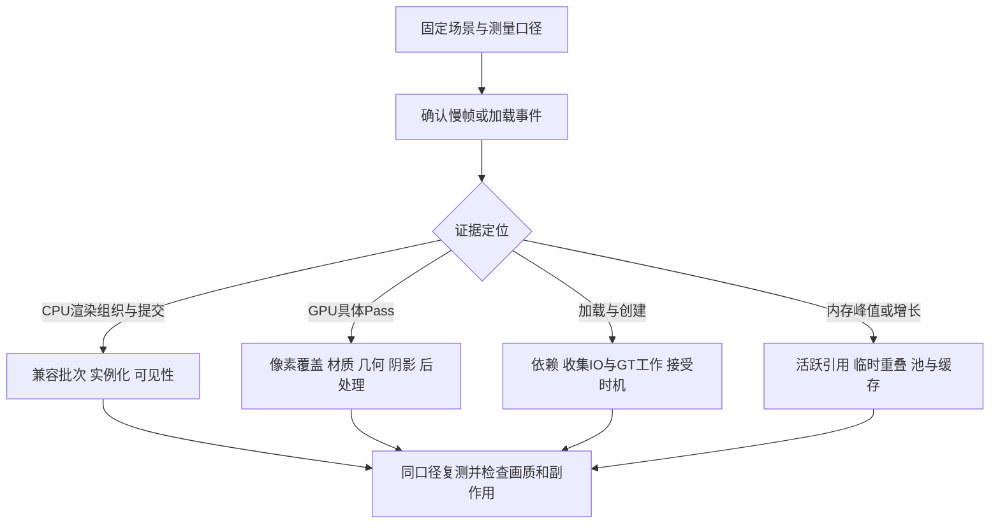
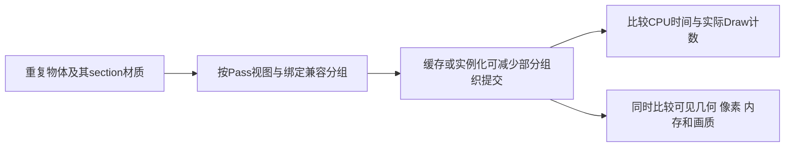
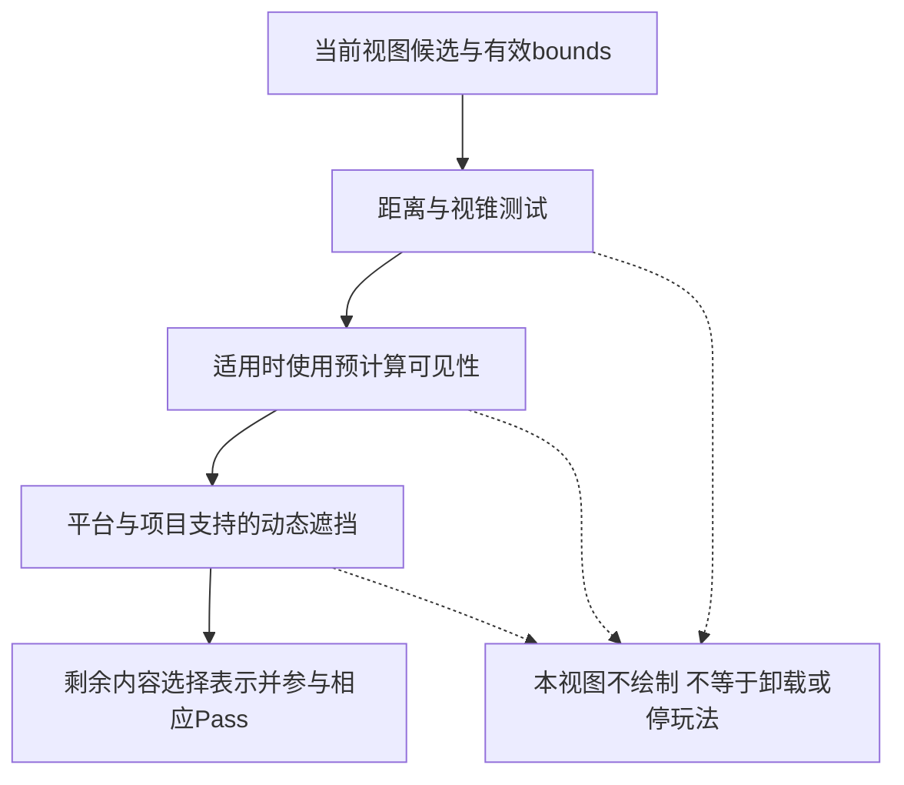
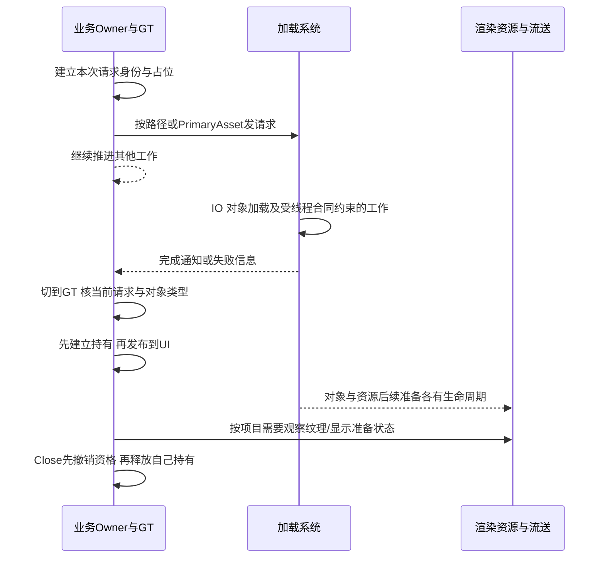
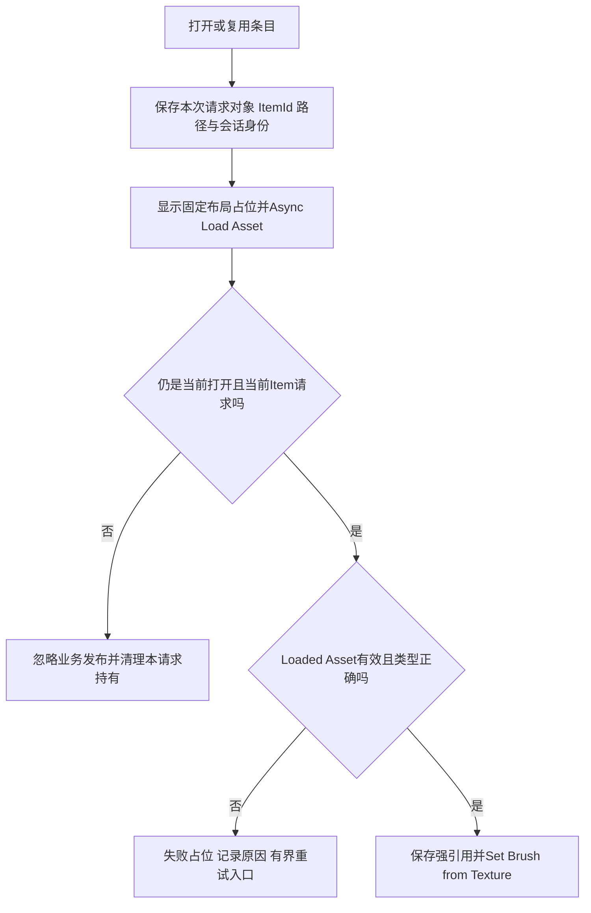
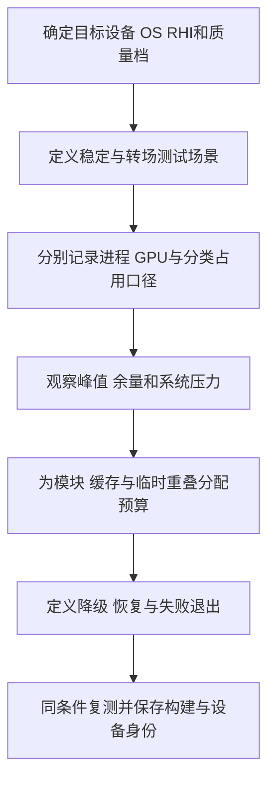

# 04 渲染与加载性能优化

> 知识成熟度：L2。本篇为一手资料支持的静态教学；没有执行 UE、PIE、UHT、C++、蓝图、Shader 编译、GPU/内存采集、控制台、设备或性能实验，`verified: []` 不变。
> 版本基准：主要使用带 `application_version=5.6` 的 Epic 公开指南；部分 API 只能读到读取日标为 5.8 的动态页面，逐项见第 8 节。网页选择器不是不可变源码版本。
> 版本与规范基线：区分观测指标、优化机制、对象加载、资源就绪、持有和业务接受。第 4 节的请求状态机是本文项目适配合同，不是 Epic 对全部异步 API 的时序承诺。
> 事实边界：原文声明“UE 5.8.0、`Engine/Build/Build.version`、CL 55116800、分支 `++UE5+Release-5.8`”，原更新时间为 2026-08-06。本轮没有取得对应 Engine checkout 或该原件，保留其历史身份，不认证为本次源码或运行验证。
> 验证建议：第 7 节全部 `PAPER_EXPECTED` 与目标机验收计划均为 `NOT_RUN`。完成加载、通过静态检查和改善实际帧时间是不同证据。
> 最后更新：2026-10-09，修订渲染代价、加载消费与引用寿命、平台预算和复测边界。

## 1. 从可观测瓶颈选择动作

本篇接续 [性能分析工具与 Profiling](03-性能分析工具与Profiling.md)，回答两类实施问题：渲染慢时应减少哪种工作，打开界面或切换内容卡顿时应把哪些工作提前、分开或减少。目标是符合画质和交互要求的稳定帧时间、加载延迟与内存峰值，不是孤立地把 Draw Call 或资产数量压到最小。

先记录引擎/构建、平台/GPU、RHI、renderer、分辨率/画质、场景/相机、资产冷热状态和是否存在帧率限制。`stat unit` 的 Game、Draw、GPU 等是定位线索；Draw 是渲染线程计时，不能当成“绘制次数”。线程可能等待其他阶段；用时间线和调用栈区分工作与等待。这里未采集任何统计。[S30]



| 现象 | 需要区分的原因 | 可尝试的方向 | 同时检查的代价 |
| --- | --- | --- | --- |
| 大量小物体，CPU 渲染阶段长 | 可见性、命令构建、状态差异、提交或等待 | 分区、ISM/HISM、兼容状态复用 | 剔除粒度、更新成本、材质与碰撞语义 |
| GPU 某个 Pass 长 | 像素/采样、带宽、几何、光照、同步 | 有针对性地减少该 Pass 工作 | 画质、其他 Pass、新增临时资源 |
| 首次打开商城长帧 | 同步依赖、对象创建、UI 构建、资源/PSO 首用 | 有界预取、延迟子页、分批构建 | 提前占用、失败占位、过期结果 |
| 来回打开后占用增长 | 活跃引用、缓存、池高水位、延迟回收或泄漏 | 同阶段快照、按类/标签和引用链定位 | 不把“没有立即下降”直接定性为泄漏 |

一个场景可能同时受到数个预算约束。只修改一个可解释因素，再观察关键路径、尾部慢帧、内存和画质；把预加载移到启动阶段虽然能缩短开屏延迟，却可能拉长启动并提高常驻占用。

## 2. 核心概念与边界

| 概念 | 本文含义 | 不由它自动保证的事情 |
| --- | --- | --- |
| Draw Call | 渲染 API/统计口径中的绘制命令 | 一个 Actor、mesh 或实例恰好一个 draw；各 RHI 计数可直接横比 |
| Batching / Instancing | 按兼容状态组织绘制，或以实例数据复用几何 | 全场景只发一次；减少 draw 一定减少 GPU 时间 |
| Material Complexity | 目标 shader 的操作、采样、寄存器/带宽与覆盖成本线索 | 节点数、颜色热图或某个指令数就是毫秒耗时 |
| Overdraw | 同一屏幕区域经历重复片元/着色/混合工作 | 只发生在半透明；透明像素完全免费 |
| Culling / LOD | 跳过无须绘制的内容，或降低表示复杂度 | 被剔除的 Actor 停 Tick、停止碰撞、卸载资产 |
| Package / UObject | 包内容与对象加载层 | 对象非空就意味着全部纹理 mip、GPU工作和业务依赖已准备好 |
| 同步加载 | 调用等待所需加载完成 | 只会发生在 GT；任何调用一定产生磁盘读取 |
| 异步加载 | 发出请求后允许与其他工作重叠 | 没有 GT 工作、没有同步等待、没有创建/回调峰值 |
| 硬资产依赖 | 持有者加载会带入被引用资产的依赖边 | 必然永久常驻；整个依赖链必在 GT 同步完成 |
| 受 GC 跟踪的强引用 | 可达持有者通过追踪边保持 UObject 可达 | 任意裸指针都有此效果；对象业务上仍有效 |
| Soft / Weak | Soft 可保存资产路径；Weak 观察既有对象且不保活 | Soft 自动加载、持有；Weak 能按路径重新加载 |
| Primary Asset / Bundle | 主资产身份与命名的关联资产集合 | 自动发现全部内容、无限预取、每调用者独立引用计数 |
| Asset Registry | 查询资产元数据而不必先完整加载对象 | 查到元数据即表示内容已打包、挂载、加载或可消费 |
| 纹理流送池 / 内存预算 | 前者约束特定资源池；后者组织项目整体占用 | 池大小等于进程总内存或系统授予的安全上限 |

具体对象引用和加载接口依据 [S11]、[S12]、[S13]、[S16]；渲染统计与机制依据 [S01]、[S02]、[S30]。下文把这些边界转成实际选择和代码流程。

## 3. 渲染：减少有证据指向的工作

### 3.1 Draw Call、状态兼容与网格合并

UE 的 mesh 绘制描述会经过 mesh batch、特定 Pass 的 draw command 与 RHI 提交。缓存与并行处理会改变每帧的 CPU 代价，状态绑定差异也会影响合并条件。因此“每次提交固定耗时”“1000 个 mesh 必然 1000 draw”都不能作为通用计算模型。一个网格可有多个 section/material，并出现在深度、阴影、主视图等多个 Pass/视图；Nanite 等路径还需独立分析。[S01]



这张图保留“从很多小绘制到较少兼容批次”的思路；不把原来的 1000→50 当成任何场景的实测结果。若纸面假设 N 个单 section、单 Pass、完全兼容实例，实例化可减少重复命令；改变 section、状态或视图条件后，必须重新分析，见 P01。

| 手段 | 适用理由 | 限制与复测点 |
| --- | --- | --- |
| Merge Actors | 相邻、生命周期相似的静态内容，减少对象和 section 组织成本 | 默认 Merge 仍可按材质保留多个 section；材质烘焙可能改 UV；过大合并范围降低剔除/流送灵活性 |
| ISM | 同网格、共享组件属性的重复物体 | 材质、阴影、碰撞等共享属性要合适；实例更新与 GPU 剔除仍有成本 |
| HISM | 大量较少移动的实例，可利用层级组织 | 层级维护和群组 LOD 有取舍；不能把“ISM 无逐实例 LOD”当成现代 UE 通则 |
| LOD / HLOD | 降低远处几何或用空间代理表示一组内容 | 切换、轮廓、材质和遮挡须检查；代理合并不等于任意运动内容都适合 |
| 材质状态复用 | 减少不必要的绑定/排列差异 | 同一母材质的不同 MI/MID 不保证可合批；共享同一实例也仍受其他状态限制 |
| 图集 | 相同用途、过滤和生命周期的纹理共用资源 | padding/mip 出血、驻留放大、不同页/材质/裁剪仍会分批 |
| Forward / Deferred 选择 | 按功能、AA、灯光和平台决定渲染路径 | 不是“前向渲染合批开关”，不保证减少光照 Pass 或总耗时 |

Merge、Simplify、Batch、Approximate 是不同工作流；不能只看最终 Actor 数。先保留可回退内容，检查材质映射、UV、lightmap、碰撞和 bounds，再比较实际帧工作。[S03] ISM 与 HISM 的选择及逐实例自定义数据依据 [S02]；完整 renderer 差异见 [渲染管线概览](../../04-图形动画与物理仿真/渲染管线与光照/01-渲染管线概览.md)。

Mesh Drawing Pipeline 文档用 shader binding 匹配解释动态实例化，且部分实现描述仍带历史 RHI 限制。本篇只采用“兼容绑定是必要条件、不同 per-draw 绑定可阻止合并”的机制，不据该动态网页认证原 CL 的完整实现。实例颜色可以走受支持的 Per Instance Custom Data 等路径；为每个实例创建独立 MID 则可能引入额外状态。[S01]、[S02]

### 3.2 材质、半透明与屏幕覆盖

优化材质前先固定目标 shader platform、renderer、质量档位和使用位置。静态分支可能生成不同排列，纹理采样与 ALU 的成本不相等，编译器也会消除或重排节点。材质编辑器 Stats/Platform Stats 与 Shader Complexity 用于找候选；GPU Pass 时间和目标机画质用于验收。绿色区域大面积重复着色仍可能昂贵，红色小区域也可能不是帧关键路径。[S06]、[S07]

半透明通常需要考虑排序、混合、屏幕覆盖与重复着色，但不等于“无法深度测试”。官方材质属性单列 Disable Depth Test，并指出禁用会失去被遮挡像素的 Z 剔除机会。深度测试、普通深度写入、Custom Depth 写入和透明排序是不同问题；不能用一个选项代表全部。[S05]

| 证据指向 | 修改候选 | 要核对的输出 |
| --- | --- | --- |
| 大面积透明叠层 | 减少覆盖、层数、粒子尺寸或不必要全屏层 | 透明排序、边缘、混合/颜色域与必要视觉反馈 |
| 材质采样/计算重 | 精简实际启用分支，合适的纹理打包/精度 | 压缩伪影、通道精度、法线/高光；新带宽和采样路径 |
| 小三角形/Quad Overdraw 高 | 调整几何与 LOD、遮挡和使用距离 | 轮廓稳定、遮挡边界；不能只降低材质指令数 |
| 阴影或后处理 Pass 高 | 按该功能的范围/分辨率/质量调整 | 灯光、时序稳定、曝光与颜色域，见关联专题 |

不存在本文能认证的“所有移动材质 <128 指令、采样 ≤4–6 就安全”红线。S06 的 Additional Suggestions 仍包含 iPad4/iPad Air、旧 RHI 统计名和五 sampler 等历史语境；S07 的 4.27 ES3.1 材质页则区分 16 sampler 与更早 ES2 的五 sampler。两页不能合并成当前所有手机的统一限制，更不能把 sampler 数等同 Texture Sample 节点数。当前上限与性能目标由目标 feature level、编译结果和设备预算确定。[S06]、[S07]

### 3.3 可见性、遮挡与 LOD 的成本



S04 描述距离、视锥、预计算可见性、动态遮挡的成本顺序，并明确受支持平台的硬件遮挡查询默认启用；原图“默认关闭”不成立。具体项目可覆盖设置，Nanite/HZB/移动路径也不能仅由这张概念图推定。遮挡测试本身会花时间，历史结果还可能有延迟，所以对象数量多、可见比例高时要衡量收益。[S04]

距离剔除可由 per-Actor 的 draw distance 或 Cull Distance Volume 按尺寸/距离组织；bounds 过大会让更多对象保留，过小则可能错误消失。预计算可见性用烘焙数据换运行时工作与内存，适合能表达其假设的区域；不能将动态大世界一概标成“移动端推荐必开”。HISM 层级和 LOD 的使用同样要匹配实例变化频率。[S04]、[S02]

验证时选正常相机轨迹与快速转向/穿门情况，观察 bounds、剔除统计、pop-in 和阴影。关闭绘制不是关闭 Tick、碰撞、网络或持有；距离剔除也不是世界流送。关卡加载/可见性见 [Level Streaming](../../03-引擎架构与资源系统/世界组织与资源加载/08-关卡流送LevelStreaming.md)。

### 3.4 UI：批次、布局、构建与过度绘制分别处理

Slate/UMG 合批受资源、shader/绘制状态、Layer ID、裁剪等兼容性及合法顺序限制。不同裁剪空间不能直接合批；颜色本身可以是 Slate 顶点数据，所以“颜色/透明度不同必断批”不是通则。反过来，同纹理或同色也不保证合批，透明重叠的顺序不能为了批次随意交换。[S08]、[S09]、[S10]

| 问题 | 可落地的优化 | 容易遗漏的代价 |
| --- | --- | --- |
| 重复 paint/layout | 事件驱动更新、合适的 Invalidation、拆分常变与稳定区域 | 缓存内存、失效频率；Render Transform 不保证零失效 |
| 大量列表项 | ListView/条目复用，按可见项请求图标 | 复用后的 Item 身份、旧请求、订阅解绑与焦点 |
| UI Draw 数高 | 检查层级、资源与裁剪分组，必要时图集 | 图集并非一张纹理必一批；自定义 UI 材质也要核兼容性 |
| 全屏层重叠 | 去掉重复背景、约束动画覆盖和必要层数 | 仅改 Opacity 不证明 GPU 工作消失 |
| 开屏创建峰值 | 轻量框架先就位，延后子页，分批创建 | 被隐藏的子控件仍可能已加载/构建；占位与失败流程 |
| 字体或 Retainer 占用 | 控制实际字体/字号/回退集合，审查缓存/渲染目标 | 不能牺牲字符覆盖；Retainer 更新、内存和显示延迟 |

Hidden、Collapsed、裁剪出屏幕和移出父级不是同一状态，也不是业务 Close。是否保留布局、绘制、输入与 UObject 引用各自决定；列表虚拟化不能由“所有屏外控件手动 Collapsed”代替。经常需要即时响应的界面可以合理常驻，低频子页按需加载。[S08] 具体生命周期和复用合同见 [UMG 框架与控件系统](../../05-Gameplay与交互系统/界面设置与无障碍/01-UMG框架与控件系统.md)。

## 4. 加载：发请求、接受结果、持有与退出

### 4.1 哪些工作可以重叠，哪些仍会造成卡顿

异步资产加载允许包 IO、解码/反序列化等工作与其他任务重叠，但不保证所有工作都搬到后台。对象 PostLoad 是否能在加载线程执行有专门的线程安全合同；回调后创建控件、生成对象、绑定数据或再做同步加载仍会消耗 GT。纹理 streamer 自身也同时有异步工作与 game update 中的步骤。[S25]、[S22]



这不是某一版本逐线程执行轨迹。包加载完成、对象存在、资源达到想要的 mip、第一帧显示和输入可用是不同接受点。`IsFullyStreamedIn` 只回答该可流送资源在 LOD 约束下的 mip 驻留条件，未挂载可选 mip 还可能使它始终为 false；它不是所有 UI、PSO 或业务的就绪屏障。[S24]

`LoadSynchronous()` 不是“若已加载则返回”的查询。只想使用已有对象时用 `Get()`；为空才选择异步请求或明确允许的同步路径。同步等待在热路径外也要预算，不能因为函数名含 Async 就随后 `WaitUntilComplete()`，又宣称没有阻塞。[S11]、[S13]

| 接口路线 | 何时选择 | 本项目仍要补什么 |
| --- | --- | --- |
| `LoadPackageAsync` | 确实需要包级加载控制的底层集成 | 按目标版本核包级完成/失败合同，找到所需对象、类型及持有；不把包通知直接当UI可用 |
| `FStreamableManager` | 按软路径加载一组对象，使用句柄组织持有 | 每项失败、接受身份、句柄和owner退出，见§4.3 |
| `UAssetManager` | 按Primary Asset身份、bundle、内容规则调度 | 正式Load与Preload的不同所有权，见§4.4 |
| 蓝图 `Async Load Asset` | 蓝图侧按软对象请求资产 | 每请求上下文与完成消费，见§4.5 |
| 同步加载 | 已明确允许等待的初始化/工具路径 | 调用线程、耗时预算和错误处理；不是异步流程的默认兜底 |

这里保留包级、路径级、主资产级及蓝图入口的选型用途；`LoadPackageAsync` 已读动态 API 限于包/对象加载、挂载路径与请求ID说明，不据此认证具体宿主重载、所有线程、取消或回收行为。[S34]

### 4.2 引用、句柄与可回收性

| 形式 | 适用作用 | 持有与释放责任 |
| --- | --- | --- |
| `UPROPERTY()` 的 `TObjectPtr<T>` | UObject owner 中需要长期持有的对象 | owner 自身需仍可达；字段/容器清理后才解除这条强边 |
| 普通局部 `UObject*` | 短期借用已有效对象 | 不自动登记 GC 强边；不能裸捕获后假设跨帧有效 |
| `TSoftObjectPtr<T>` / `FSoftObjectPath` | 存储按需加载的资产身份 | 不保活，不自动加载；Cook/挂载与路径可解析另核 |
| `TWeakObjectPtr<T>` | 观察现有对象、回调中核目标有效性 | 不保存可重新加载的资产身份，不保持对象存活 |
| 活跃 `FStreamableHandle` | 对其已加载资源维持加载系统的持有 | `ReleaseHandle`/`CancelHandle`/句柄所有者退出各按接口处理 |
| `TStrongObjectPtr<T>` | 非 UObject 持有者的特定强引用需求 | 有持续 GC 影响及循环风险，不作为所有回调的默认解决方案 |

Soft 与 Weak 都可不保活，但不能据此把两者视为同一类型。`TObjectPtr` 也不是放到任意局部或未反射容器里就能自动获得 `UPROPERTY` 跟踪。保活不保证 Actor 没有 EndPlay、UI 仍打开或当前用户仍在看相同条目。[S12]

`FStreamableHandle` 的活跃状态保持已加载资源；“shared pointer 非空”与“handle 仍 active”需区分。完成计数可包含失败项，`HasLoadCompleted()` 也允许资源项为空。必须逐项验证对象和类型，再交给业务。`ReleaseHandle()` 若早于完成通知可推迟释放；`CancelHandle()` 的文档承诺涉及该请求的完成/取消委托，不能推广成所有 IO、共享加载、GT 已排队任务或 GPU 工作都已同步静默。[S13]、[S15]

普通硬依赖既可能是必要资源合同，也可能不必要地扩大启动依赖。先用引用图确认哪条边使哪批内容过早进入，再将可延迟部分改成 soft 并补齐加载/失败/持有路径。小而总要使用的内容保留硬依赖也合理；“全部 UI/音效一律软引用”会把明确依赖变成大量运行时故障点。[S11]

### 4.3 C++：单图标请求的完整消费流程

以下是**项目类的成员与方法片段**，用于把原来的 `FStreamableManager` 回调、`TSoftObjectPtr` 和 UI 图标示例连成可审查流程；不是认证过的可直接编译工程。宿主须在实际版本补上 UCLASS/generated header、模块导出与 Core/CoreUObject/Engine/UMG 依赖，并将 `UIconLoadSession` 作为现有 UObject 的受跟踪成员持有。示例用 `UImage::SetBrushFromTexture` 实际赋图，不用空的 `SetIcon` 代替结果消费。

项目合同：所有公开入口和对象访问均在 GT；请求与操作各用独立对象身份，不用会回绕的整数充当唯一性。请求后端持有自己所需的路径数据。加载委托仅操作线程安全 shared/weak 上下文并投递 GT 任务，不在未知回调线程解引用 UObject。TaskGraph、模块代码和 AssetManager 必须仍可服务；这个短命 UI 会话不承担引擎退出/模块卸载的排空工作。后者要由更长寿命的宿主在停接请求后完成，再卸载代码。

`SetBrushFromTexture` 是可覆写的虚接口，不能假定它不调用项目业务。[S35]、[S36] 本例允许它同步重入同一会话：最新**获接受**的 Open/Load/Close 优先；旧 Open/Load 跨外调返回后必须核操作身份。Close 先取走旧图像/请求并提交全部关闭状态，随后只清理局部旧对象。实际 brush 写入由本会话的一个 GT 循环串行执行，同一目标尚未执行的写入合并为最新值；已经进入的旧虚调用先返回，再执行新值。因此派生 setter 即使先重入业务、后调用父实现，后来的赋图调用仍在旧虚调用返回后执行。项目覆写仍须履行传入 texture/null 的赋图语义；实际呈现另有边界，见后文。

这个循环有**实际准入上限**：每轮外层 brush 写入只再接受 8 次重入 Open/Load；超出时立即返回 false，保留最近获接受状态，调用方不能当成功，更不能在同一调用栈紧循环重试。Close 始终可调用并撤销接受资格；重复 Close 不会在已取空的 Image 上再排清空。数字 8 只是示例的业务防循环策略，不是引擎限制或实测性能预算。每次虚调用本身必须返回；任何同步接口都无法替一个永不返回的覆写提供终止保证。下文队列的有限性与持有边界仍需作为项目合同验收，不能用 NOT_RUN 掩盖已知反例。

```cpp
// 位于项目已有的 UIconLoadSession : public UObject 中。
// 头文件包含 CoreMinimal.h、UObject/Object.h、UObject/SoftObjectPtr.h、
// UObject/ObjectPtr.h、UObject/WeakObjectPtrTemplates.h、Templates/SharedPointer.h；
// UImage、UTexture2D 可前置声明；项目的 generated.h 仍按 UHT 规则放置。
public:
    enum class EState { Closed, Idle, Loading, Ready, Failed, TimedOut };
    bool Open(UImage* InImage); // true表示转移获接受，不保证返回时仍是本次打开。
    bool LoadIcon(FName ItemId, TSoftObjectPtr<UTexture2D> Asset, double TimeoutSeconds);
    void PollTimeout(); // 宿主打开期间从GT推进；不是硬实时定时器。
    void Close();      // 业务关屏、条目回收和宿主退出必须显式调用。
    EState GetState() const { return State; } // 同样只从GT读。
private:
    struct FRequest;
    using FRequestPtr = TSharedPtr<FRequest, ESPMode::ThreadSafe>;
    struct FOperation {};
    using FOperationPtr = TSharedPtr<FOperation>; // 只在GT持有/比较。
    struct FBrushWrite
    {
        TWeakObjectPtr<UImage> Target;
        TWeakObjectPtr<UTexture2D> Texture;
        FOperationPtr Operation;
        bool bClear = true;
    };
    static constexpr int32 MaxBrushReentryAdmissions = 8;
    FOperationPtr Operation;
    FRequestPtr Current;
    TWeakObjectPtr<UImage> Image;
    UPROPERTY(Transient)
    TObjectPtr<UTexture2D> HeldTexture;
    EState State = EState::Closed;
    bool bOpen = false;
    bool bWritingBrush = false;
    int32 BrushReentryAdmissionsLeft = 0;
    TArray<FBrushWrite> PendingBrushes;
    bool AdmitOpenOrLoad();
    void ClearSession(const FOperationPtr& Op);
    void WriteBrush(UImage* Target, UTexture2D* Texture, const FOperationPtr& Op);
    void ObserveCompletion(const FRequestPtr& Request);
    void Finish(const FRequestPtr& Request, UTexture2D* Texture, EState Result);
    static void CancelOwnedHandle(const FRequestPtr& Request);
```

```cpp
// 项目 .cpp 的相关包含；本轮未编译。
#include "Engine/AssetManager.h"
#include "Engine/StreamableManager.h"
#include "Engine/Texture2D.h"
#include "Components/Image.h"
#include "Async/TaskGraphInterfaces.h"
#include "HAL/PlatformTime.h"
#include "UObject/StrongObjectPtr.h"

struct UIconLoadSession::FRequest
{
    FName ItemId;
    FSoftObjectPath Path;
    double Deadline = 0.0;
    bool bInstalled = false;
    bool bCompletionObserved = false;
    TSharedPtr<FStreamableHandle> Handle; // 仅GT访问、释放。
};

bool UIconLoadSession::AdmitOpenOrLoad()
{
    check(IsInGameThread());
    if (!bWritingBrush) return true;
    if (BrushReentryAdmissionsLeft == 0) return false;
    --BrushReentryAdmissionsLeft; // 重入不能开启新一轮预算。
    return true;
}

void UIconLoadSession::WriteBrush(
    UImage* Target, UTexture2D* Texture, const FOperationPtr& Op)
{
    check(IsInGameThread());
    if (!IsValid(Target)) return;
    FBrushWrite Write;
    Write.Target = Target;
    Write.Texture = Texture;
    Write.Operation = Op;
    Write.bClear = (Texture == nullptr);
    const int32 Slot = PendingBrushes.IndexOfByPredicate(
        [Target](const FBrushWrite& Entry) { return Entry.Target.Get() == Target; });
    if (Slot == INDEX_NONE) PendingBrushes.Add(MoveTemp(Write));
    else PendingBrushes[Slot] = MoveTemp(Write); // 只合并尚未进入虚调用的同目标写入。
    if (bWritingBrush) return;

    TStrongObjectPtr<UIconLoadSession> SessionPin(this); // 覆写返回前保住本次调用对象。
    bWritingBrush = true;
    BrushReentryAdmissionsLeft = MaxBrushReentryAdmissions;
    while (!PendingBrushes.IsEmpty())
    {
        FBrushWrite Next = MoveTemp(PendingBrushes[0]);
        PendingBrushes.RemoveAt(0); // 外调前取局部；重入不借用数组元素。
        TStrongObjectPtr<UImage> TargetPin(Next.Target.Get());
        if (!IsValid(TargetPin.Get()))
        {
            if (bOpen && Image == Next.Target) Close(); // 当前目标消失，结束会话。
            continue;
        }
        TStrongObjectPtr<UTexture2D> TexturePin(Next.Texture.Get());
        if (!Next.bClear)
        {
            if (Operation != Next.Operation || !bOpen || Image != Next.Target)
                continue; // 非当前操作的成功图不可发布。
            if (!IsValid(TexturePin.Get()) || HeldTexture.Get() != TexturePin.Get())
            {
                Close(); // 当前成功值失效，不发布空悬纹理，也不继续宣称Ready。
                continue;
            }
        }
        TargetPin.Get()->SetBrushFromTexture(
            Next.bClear ? nullptr : TexturePin.Get(), false);
        // 业务字段不在旧虚调用返回后写回；只由此循环接着取下一笔最新写入。
    }
    bWritingBrush = false; // 仅外层循环管理写入门；重入不会改这个门或重置预算。
}

void UIconLoadSession::CancelOwnedHandle(const FRequestPtr& Request)
{
    check(IsInGameThread());
    if (!Request) return;
    auto Handle = MoveTemp(Request->Handle);
    if (Handle) Handle->CancelHandle(); // 本例不绑定取消业务回调。
}

void UIconLoadSession::ClearSession(const FOperationPtr& Op)
{
    check(IsInGameThread());
    const auto PreviousImage = Image;
    auto Old = MoveTemp(Current);
    bOpen = false;
    State = EState::Closed;
    Image.Reset();
    HeldTexture = nullptr; // 所有关闭状态先提交；外调后不再写这些字段。
    if (auto* Target = PreviousImage.Get()) WriteBrush(Target, nullptr, Op);
    CancelOwnedHandle(Old); // 只清局部旧请求；重入后的Current不在这里访问。
}

bool UIconLoadSession::Open(UImage* InImage)
{
    check(IsInGameThread());
    if (!IsValid(InImage) || !AdmitOpenOrLoad()) return false;
    const TWeakObjectPtr<UImage> NewImage(InImage); // 不跨外调借用未经复核的裸指针。
    const auto Op = MakeShared<FOperation>();
    Operation = Op;
    ClearSession(Op);
    if (Operation != Op || !NewImage.IsValid()) return true;
    Image = NewImage;
    bOpen = true;
    State = EState::Idle;
    return true;
}

bool UIconLoadSession::LoadIcon(
    FName ItemId, TSoftObjectPtr<UTexture2D> Asset, double TimeoutSeconds)
{
    check(IsInGameThread());
    if (!bOpen || !Image.IsValid() || Asset.IsNull() ||
        !FMath::IsFinite(TimeoutSeconds) || TimeoutSeconds <= 0.0 || TimeoutSeconds > 300.0 ||
        !AdmitOpenOrLoad())
        return false; // 参数/状态/重入预算拒绝；不替换已有请求。

    const auto Op = MakeShared<FOperation>();
    Operation = Op;
    auto Request = MakeShared<FRequest, ESPMode::ThreadSafe>();
    Request->ItemId = ItemId;
    Request->Path = Asset.ToSoftObjectPath();
    Request->Deadline = FPlatformTime::Seconds() + TimeoutSeconds;
    auto Old = MoveTemp(Current);
    Current = Request; // 先撤销旧结果资格，再取消旧工作。
    State = EState::Loading;
    HeldTexture = nullptr;
    CancelOwnedHandle(Old);
    if (Operation != Op || !bOpen || Current != Request) return true;
    if (!Image.IsValid()) { Close(); return true; }
    WriteBrush(Image.Get(), nullptr, Op); // 布局固定的外层占位仍可见。
    if (Operation != Op || !bOpen || Current != Request) return true;
    if (!Image.IsValid()) { Close(); return true; }

    if (UTexture2D* Existing = Asset.Get()) // 只查询，绝不调用LoadSynchronous。
    {
        Request->bInstalled = true;
        Finish(Request, Existing, EState::Ready); // 允许本次调用返回前已Ready。
        return true;
    }

    TWeakObjectPtr<UIconLoadSession> WeakOwner(this);
    TWeakPtr<FRequest, ESPMode::ThreadSafe> WeakRequest(Request);
    auto Done = FStreamableDelegate::CreateLambda([WeakOwner, WeakRequest]()
    {
        auto RequestForTask = WeakRequest.Pin();
        if (!RequestForTask) return;
        FFunctionGraphTask::CreateAndDispatchWhenReady(
            [WeakOwner, RequestForTask]()
            {
                // 只有这里在GT解析UObject；任务按值拥有上下文。
                if (auto* Owner = WeakOwner.Get())
                    Owner->ObserveCompletion(RequestForTask);
            }, TStatId(), static_cast<const FGraphEventArray*>(nullptr),
            ENamedThreads::GameThread);
    });
    auto NewHandle = UAssetManager::GetStreamableManager().RequestAsyncLoad(
        Request->Path, MoveTemp(Done));

    // 不把某API的“下一tick”说明当成所有适配器都不会重入的保证。
    if (Operation != Op || !bOpen || Current != Request)
    {
        if (NewHandle) NewHandle->CancelHandle();
        return true; // 获接受的请求已被后来的操作替代。
    }
    Request->Handle = MoveTemp(NewHandle);
    Request->bInstalled = true;
    if (!Request->Handle)
        Finish(Request, nullptr, EState::Failed);
    else if (Request->bCompletionObserved)
        ObserveCompletion(Request);
    return true;
}

void UIconLoadSession::ObserveCompletion(const FRequestPtr& Request)
{
    check(IsInGameThread());
    if (!bOpen || Current != Request) return;
    Request->bCompletionObserved = true;
    if (!Request->bInstalled) return; // 先通知后返回句柄时，安装后再消费。
    if (FPlatformTime::Seconds() >= Request->Deadline)
    {
        Finish(Request, nullptr, EState::TimedOut);
        return;
    }
    const auto Handle = Request->Handle;
    UTexture2D* Texture = nullptr;
    if (Handle && !Handle->WasCanceled() && Handle->HasLoadCompleted())
        Texture = Cast<UTexture2D>(Request->Path.ResolveObject());
    Finish(Request, Texture, IsValid(Texture) ? EState::Ready : EState::Failed);
}

void UIconLoadSession::Finish(
    const FRequestPtr& Request, UTexture2D* Texture, EState Result)
{
    check(IsInGameThread());
    if (!bOpen || Current != Request) return;
    const auto Op = Operation;
    const auto Target = Image;
    if (!Target.IsValid()) { Close(); return; }
    if (Result == EState::Ready && FPlatformTime::Seconds() >= Request->Deadline)
    {
        Texture = nullptr;
        Result = EState::TimedOut;
    }
    HeldTexture = IsValid(Texture) ? Texture : nullptr; // 先转移GC持有。
    State = Result;
    Current.Reset(); // 发布前终结本请求，重复/迟到通知无接受资格。
    auto Handle = MoveTemp(Request->Handle);
    if (Handle)
    {
        if (Result == EState::TimedOut) Handle->CancelHandle();
        else Handle->ReleaseHandle();
    }
    if (Operation != Op || !bOpen || Image != Target) return;
    if (!Target.IsValid()) { Close(); return; }
    WriteBrush(Target.Get(), HeldTexture.Get(), Op);
    // 如需业务事件，由项目另核事件身份/寿命；不能在此无条件再广播旧结果。
}

void UIconLoadSession::PollTimeout()
{
    check(IsInGameThread());
    auto Request = Current;
    if (bOpen && Request && FPlatformTime::Seconds() >= Request->Deadline)
        Finish(Request, nullptr, EState::TimedOut);
}

void UIconLoadSession::Close()
{
    check(IsInGameThread());
    const auto Op = MakeShared<FOperation>();
    Operation = Op; // 即使已Closed，也使尚未返回的旧Open失去继续安装资格。
    ClearSession(Op);
}
```

上述方法展示的是“一个会话最多接受最新图标”，不是通用资产框架。调用方在 Image 初始化可用后 `Open`，列表项换 Item 时再 `LoadIcon`，业务关闭/条目回收时 `Close`，不能只等最终 GC。每次请求固化 ItemId 和路径，回调不重读被新请求覆盖的软引用。Open/Load 返回 `false` 表示前置拒绝、旧状态未被本次替换；`true` 只表示操作获接受，可能随后被重入取代，Load 甚至可能在发出后端工作前被取代。它们都不是“本次仍打开/加载成功”的通知；消费者读状态，失败/超时保留固定尺寸占位并提供显式重试。重入拒绝后的重试由宿主在下一次明确输入或以后的 GT 时机有界安排，本例不偷偷补发。

brush 队列只存弱 Image/Texture 与 GT 操作身份。排队成功图仅在它仍是当前操作、目标与 `HeldTexture` 时发布；当前纹理由受 GC 跟踪的强字段保持。旧操作的纹理失效只丢弃旧发布；当前目标或当前成功纹理在消费前失效则 Close，解除本会话持有，不伪造显示成功。真正进入虚调用时再用局部 `TStrongObjectPtr` 保住 session、Image 与传入纹理，避免覆写重入 Close 清强字段后，同一次虚调用还借用被 GC 回收的对象；局部 pin 在调用/本轮循环结束释放。它们不是重新打开已关闭 UI 的资格，也不是引擎退出屏障。宿主仍须管理 Widget/会话的业务退场；显式销毁调用中的对象、其他系统绕过本会话直接写同一 brush、异步延后写旧 brush，均需另有协调协议。[S12]

状态接受与实际显示分开：`Ready` 先表示当前对象已通过接受并转入强持有；重入返回时，brush 写入可能仍排在当前虚调用之后。不能在这个时刻据 Ready 宣称新图已显示、mip就绪或GPU已呈现。若本轮队列耗尽、目标仍有效且没有其他 brush 写者，最新获接受的待写值才已调用 setter；仍不等于完成一帧显示。没有 Load 的 Open 只建立 Idle 绑定，不承诺改写新目标原有 brush。Close 在重入期间先撤业务资格，其 clear 在已进入的 setter 返回后执行；如果这期间有后来的获接受 Open/Load，则按后者合同处理，不把较早 Close 说成持久关闭。

有限性按代码计数，不以“会自然收敛”作前提：设本轮获接受的重入 Open/Load 总数为 A，则 A≤8。每个 Open 最多增加一个旧目标 clear，每个 Load 最多增加一次占位与一次终态写入；Close（含失效处理）先取空 Image，所以两次获接受 Open 之间任意多次 Close 至多增加一个 clear，至多再有一笔进入本轮时尚未消费的 Current 终态。无新获接受操作的重复/迟到通知不会造新写入。故即使不计同目标合并，整轮入队量也有保守上界 `4*A+4`；失效目标或过期成功图只会减少实际虚调用。预算耗尽不取消最近请求、不保证它成功，也不自动关屏；之后的 Close 仍可排最终 clear。最后一笔 Close 若没有后续获接受 Open/Load，所有较早同目标待写值都被 clear 替换，已进入的旧 setter 返回后再清空。这里证明的是返回型覆写下的本地工作数有限，不是 8 次重入的毫秒上限，也不证明外部覆写本身有界耗时。

句柄在 GT 安装、取出和释放；委托只弱持有请求上下文，避免形成“context→handle→delegate→context”强环。转交任务按值保有上下文；Close 的局部旧句柄在有限 brush 清理返回后取消，不访问重入安装的新 Current。`ESPMode::ThreadSafe` 只保护 shared pointer 的引用计数，不使 `FStreamableHandle`、上下文字段或 UObject 变成线程安全。项目不得让后台线程读写这些 GT 字段。

这是公开接口上的项目组合：S14 的已加载请求说明为 next tick，S13 说明完成状态可早于延迟回调；本例另支持缓存快路径同步 Ready，并保留安装屏障。S21 支持指定任务执行线程；没有由此推断任意加载委托必在请求线程。重入准入、写入合并和上界是本例策略，不是 S35/S36 承诺的引擎时序。实际 UHT/重载/线程、各同步虚调用轨迹与停机排空仍须第 7 节验收。空句柄在此非空路径 Streamable 请求中按失败处理，**不能复制到 Primary Asset API**。[S13]、[S14]、[S21]


### 4.4 Primary Asset：加载、预取、Bundle 与所有者

先在 Asset Manager 配置中登记正确 type、基类、扫描目录与是否为 Blueprint class，再确认 `PrimaryAssetId` 可发现、所需 bundle 及 Cook/Chunk 安装条件。注册一个名称不自动建立全部运行时依赖。[S16]

| 操作 | 对象与持有合同 | 退出/失效处理 |
| --- | --- | --- |
| `LoadPrimaryAssets(Ids, Bundles, ...)` | 按 ID 列表正式加载，管理器保留加载状态 | 由明确 owner 在不用时对相同 ID 卸载；外部强引用仍可能保活 |
| `LoadPrimaryAssetsWithType(Type, ...)` | 参数是一个 `FPrimaryAssetType`，加载该类型全部资产 | 不把 `TArray<FPrimaryAssetType>` 传给单类型参数；类型全集可能很大 |
| `PreloadPrimaryAssets(Ids, Bundles, ...)` | 预取返回必须保持 active 的句柄 | 不等同正式 Loaded 状态；丢弃预取持有且无其他持有时才能回收 |
| `ChangeBundleState` 等 bundle 操作 | 调整适用主资产的关联集合 | 不把改 bundle 当成任意外部预取句柄的释放或全部依赖递归保证 |

S18 明确 `LoadPrimaryAssets` 无工作时可返回 null 并调用完成委托，因此 null handle 不能统一解释为失败。完成后仍查询所需 ID/类型和业务条件。S17 还明确预取资产不是正式 Loaded，Unload/ChangeBundleState 不会直接控制该预取持有。S20 的卸载只有在没有其他持有时才使资产可释放。[S17]、[S18]、[S19]、[S20]

原“启动时加载 ItemData/HeroData 两类”的用途可用以下**调用点形状**表达；`ItemHandle`/`HeroHandle` 不是自动跨调用者引用计数。管理器级正式加载最好由一个有界服务统一调度，避免一个界面卸载另一界面仍在使用的 ID。

```cpp
UAssetManager& AM = UAssetManager::Get();
const TArray<FName> Bundles{ FName(TEXT("UI")) };
auto ItemHandle = AM.LoadPrimaryAssetsWithType(
    FPrimaryAssetType(FName(TEXT("ItemData"))), Bundles);
auto HeroHandle = AM.LoadPrimaryAssetsWithType(
    FPrimaryAssetType(FName(TEXT("HeroData"))), Bundles);
// 正式Load的驻留由AssetManager维护；不能靠这两个局部handle离开作用域卸载。
// 业务必须记录实际所需ID与独立加载结果，由同一owner在结束时Unload对应ID。
```

更适合大型商品库的流程是先取得本页/近期需要的明确 ID 集合，再 `LoadPrimaryAssets` 或短期 `PreloadPrimaryAssets`。预取命中率低会增加 IO、内存和抢占，不能把“异步预取所有类型”作为低卡顿默认方案。对多个消费者，应由项目规定共享租约、引用需求集合和最后使用者释放规则；没有证据表明“调用一次 Load，调用一次 Unload”就天然配平每个 UI 的所有权。

### 4.5 蓝图图标与商城：把回调接到正确的一次打开

单图标保持原流程：Soft Object Reference（Texture2D）→ Async Load Asset → 检查 Loaded Asset → 类型检查 → 强引用变量 → Set Brush from Texture。完成执行引脚/节点回调的名称按实际版本确认，不创造一个所有节点都有的独立 `On Asset Loaded` 事件。



蓝图实现必须让**每次请求保存自己的上下文**，不能在同一个变量里先写 A，再发 B，两个完成事件都只读到 B。可用每请求一个辅助 UObject/代理携带 ID、路径与 owner weak/session，或让已实现该合同的 C++ 服务提供事件。Weak 有效只证明对象还在，不能证明回收后重用的条目还是原 Item。计数代次方案必须规定不重复/溢出策略；本篇 C++ 用请求对象身份避开该问题。

商城面板用两阶段接受：

1. 打开时创建轻量壳与加载/取消入口，保存本次会话身份，按当前页请求 Widget class、数据和必需图标；Widget class 采用正确的软类引用，不能把 Blueprint 资产对象随意当成可实例化 UClass。
2. 所需对象全部加载或明确失败后，在 GT 检查 owner/local player、当前会话、类与数据，再创建面板；面板创建成功、首屏必需内容达到项目接受点后才撤掉遮罩。不能先隐藏遮罩再无条件创建。
3. 次要图标逐项接受、虚拟列表按需构建；按本帧时间预算限制创建/绑定工作和并发量。“每帧 N 个”只控制数量，不保证每个资源成本相同。
4. 关闭、切页、换账号或世界退出先撤销结果资格，再取消自己请求、移除自己订阅、清刷子和持有。已排队完成仍检查身份，不允许旧请求重开面板。

若应用有合法的同资源共享加载，取消一个消费者不等于撤销其他消费者的需求。若后端借用了调用方内存或项目动态模块，必须另有完成/排空协议；weak、解绑或 CancelHandle 都不能代替那份存储与代码寿命保证。

## 5. 纹理、内存与移动设备预算

### 5.1 资源就绪与内存峰值

纹理对象已加载后，streamer 仍根据视图、理想 mip、池预算与优先级决定驻留。池不足可降低所请求的分辨率；预取过多也可能挤掉更有用的内容。`r.Streaming.PoolSize` 在 S23 中以 MB 表示，池可包含 UI/NeverStream 等纹理，部分平台还包含其他资源；它不是整个进程或全部 GPU 内存。[S22]、[S23]

预算应覆盖稳定占用和阶段重叠：旧场景资源、新场景加载、解压/反序列化临时数据、对象创建、纹理上传、render target、音频、动画、导航、UI与缓存。释放 UObject 强引用后，还可能有其他引用、GC、渲染资源延迟释放、allocator 或池保留；不能用一次对象列表断定整个进程是否泄漏。

### 5.2 设备内存与热状态不能用固定 GB 代表

移动平台使用虚拟地址空间。“不依赖磁盘交换来无限兜底”和“没有虚拟内存”是两回事。Apple 2013 归档明确讨论 iOS 虚拟内存，并描述当时的 backing-store 限制；这里只用它澄清概念，不拿它证明现代所有 iOS/iPadOS 设备的交换策略。Android 当前内存说明区分 RAM、zRAM、存储、页面回收与低内存杀进程，CPU/GPU还可共享 RAM。[S26]、[S27]

Android 的 managed heap 限制也不等于 UE native heap、图形资源与整个进程的总预算。不能从“设备总 RAM 减系统”直接算出可稳定使用额度；前后台状态、并行应用、OS/OEM策略和温度都会改变可用余量。原 iOS 1.2–2GB、Android 1.5–3GB 仅是无设备上下文的旧数字，不能作为产品红线。



热状态应来自所用平台公开 thermal 接口；电池状态不是 GPU/CPU 温度计。Android Thermal API 有设备支持、采样频率和可能无效返回的限制；Apple `ProcessInfo.ThermalState` 表达系统热状态。项目按支持性、持续负载和恢复滞回调整帧率/分辨率/效果，不能把某个温度或“中端机一律30FPS”写成通用规律。[S28]、[S29]

动态分辨率按GPU负载和配置预算调节内部屏幕比例，需要目标平台/renderer支持及有效启用状态。手工修改一次 `r.ScreenPercentage` 不是已经建立自适应控制；也不能保证解决CPU创建峰值。S32所读页本身保留主机平台及历史限制说明，本篇不据此推定所有移动设备可用，目标项目要核支持范围和缩放后的UI/画质。[S32]

### 5.3 图集、压缩、字体与缓存的选择

- 图集按共同使用、过滤、颜色空间和生命周期组织，保留 padding 与 mip 边缘，检查 UV 区域和导入结果；Image 的 Draw As=Image 本身不会自动配置图集中每个子图。若每页都需独立材质实例来指定 UV，应再查合批是否得到收益
- ASTC/ETC2 等格式按目标 GPU/API、内容质量和实际 Cook 支持选择。ASTC 固定输出block位数下，较小的texel覆盖对应较高比特率；UI细线、文字、透明边缘需单独验图。不能把“只许压缩、图集必须≤2048”当所有现代设备的规定，也不能由磁盘压缩大小直接推理运行时占用。[S33]
- 字体要覆盖实际语言、回退字符、字号和显示样式。字体子集化/缓存调整应同时验证缺字、输入文本和授权范围；字体数量减少不是丢弃必要字形的理由
- 缓存设置容量、计费口径、淘汰条件和使用中的保留规则。LRU 只是候选策略；热资源可常驻，低命中预取应降级。清缓存要区分移除索引、解除强引用与资源真正回收

这是项目内容决策，不是本轮测得的最佳尺寸、格式或收益。材质和纹理的实际约束继续查 [材质系统详解](../../04-图形动画与物理仿真/材质地形与世界表现/02-材质系统详解.md) 与 [移动端渲染专项](../../04-图形动画与物理仿真/渲染管线与光照/10-移动端渲染专项.md) 对应平台资料；旧页中的阈值仍须按本节口径重验。

### 5.4 预算表的正确用途

| 指标 | 必须写明的口径 | 阈值从哪里来 |
| --- | --- | --- |
| 帧时间/慢帧 | GT/渲染/RHI/GPU或呈现；场景与百分位 | 体验目标、显示节奏、目标机重复采样 |
| Draw/section/三角形 | 具体计数器、RHI、Pass、视图与 Nanite 路径 | 与关键路径的相关性及实际瓶颈 |
| UI成本 | 构建、layout/paint、提交、像素和缓存分别看 | 代表性菜单/列表/动画，目标分辨率 |
| 内存 | 进程 RSS/PSS 等、GPU/池、分类与峰值 | 压力与转场余量；避免重复加共享页 |
| 加载 | 请求→对象完成、首屏可交互、全部内容各自计时 | 冷/热缓存、存储、Cook/安装和交互要求 |
| 持续运行 | 热状态、功耗、帧节奏与退后台恢复 | 指定设备/OS的持续场景 |

原表 PC/移动的 3000/500 Draw、6/2GB、5/8s 和 60/30FPS 可用于说明“预算有多个维度”，但缺设备和计数口径，不能直接采用。项目可填写明确的示例目标，例如 60Hz 对应一帧约 16.67ms；这只是时长换算，CPU/GPU并行阶段不能相加后直接等同该数，也不是已经达标。

## 6. 实施步骤与诊断入口

### 6.1 渲染与加载的最小可回退变更

渲染：固定相机与质量→记录实际瓶颈→只改变一个合并范围/材质分支/LOD或覆盖因素→核图像和玩法副作用→重复测量同范围→保留有证据的收益。GPU BasePass 高不自动等于 draw 太多；先核像素和材质。阴影与后处理分见 [光照与阴影](../../04-图形动画与物理仿真/渲染管线与光照/03-光照与阴影系统.md)、[后处理与画面特效](../../04-图形动画与物理仿真/渲染管线与光照/05-后处理与画面特效.md)。

加载：列出“何时真正需要哪些对象”→检查硬依赖和 Cook/挂载→提前有界请求→明确失败/超时/取消与占位→分批创建→在接受点建立持有→owner退出清理→观察同一业务周期结束后的内存。分包和首包瘦身不能只改引用类型，需要资产安装/交付合同，见 [资源管理与热更新](../持续交付与发布治理/04-资源管理与热更新.md)。

### 6.2 开发期诊断命令目录

下表只记录查找入口，**本轮一项也未执行**。任何实际使用都先核对当前构建是否支持、输出字段、作用范围与开销；修改 CVar 前保存有效旧值/来源，实验后恢复。采集开始、停止、输出文件与结束状态需要成对验证。[S30]、[S31]

| 入口 | 能帮助观察什么 | 使用边界 |
| --- | --- | --- |
| `stat unit` / `stat scenerendering` / `stat rhi` | 帧阶段与渲染统计线索 | 不是逐物体 draw 证明；缺失/零值不直接当零成本 |
| `stat initviews` / 遮挡可视化 / `FreezeRendering` | 可见性成本、bounds、固定视角剔除 | 改变观察条件；不是所有 GPU 工作的冻结屏障 |
| `ProfileGPU`、平台 GPU 捕获 | 当前实现支持的 Pass/事件与资源 | 工具、RHI、异步队列和版本口径需另核，不保证每 Pass 都列 Draw 数 |
| `stat AsyncLoad` / `stat AsyncLoadGameThread` / `stat LoadTime` | 加载相关工作 | 加载统计不代表消费者已经创建并可交互 |
| `stat streaming` | 纹理流送量与预算 | 不是全部包、磁盘 IO 和全部内存的统一状态 |
| `stat memory` / `memreport -full` / 对象清单 | 分类/对象占用与阶段快照 | 导出可干扰帧；UObject清单不覆盖所有原生/GPU分配 |
| LLM 类统计、Memory Insights | 按已支持分类/分配定位增长 | 跟踪覆盖、采样时机与开销要记录；本轮未认证 LLM 具体页面 |
| `r.Streaming.PoolSize` | 纹理池配置实验 | 不代替降资源负载；调大可能越过整体预算 |
| `r.MeshDrawCommands.DynamicInstancing` | 动态实例化诊断对照 | 比较 CPU/GPU与图像，不只比较次数 |
| `r.AllowOcclusionQueries` / `r.VisualizeOccludedPrimitives` | 查询策略与遮挡显示 | 按当前 renderer/平台核支持，恢复实验值 |
| `stat startfile` / `stat stopfile` | Stats文件采集 | 与 Trace文件不同；退出PIE不一定代替显式停止 |
| `Trace.File` / `Trace.Stop` / `Trace.Status` | Trace文件和状态 | 先核支持通道；`Trace.Start` 不能冒充已指定文件输出 |
| `obj list class=Texture2D`、GC相关诊断 | 对象清单/回收观察的候选入口 | 语法与支持范围由目标版本确认；强制GC会改变负载且不保证进程立即归还全部页 |

### 6.3 保留“定时内存报告”用途，但限制开销和寿命

原例每五分钟 `memreport -full` 适合有明确终点的开发/QA会话，不宜在所有游戏模式无限输出。正式方案宜在“进场前、进场后、退出后”等可比阶段采样，同时可设置低频兜底；记录构建、地图、阶段、时间与导出路径。300秒只是示例频率，报告本身可能停顿并占磁盘。

```cpp
// 项目已有 AMyGameMode 成员：FTimerHandle MemoryTimer;
// 相关包含：TimerManager.h、Engine/World.h、Engine/Engine.h。
// 下面方法需在头文件声明，EndPlay覆写保留Super；本轮未运行。
void AMyGameMode::StartMemoryWatch()
{
#if !UE_BUILD_SHIPPING
    if (UWorld* World = GetWorld())
        World->GetTimerManager().SetTimer(
            MemoryTimer, this, &AMyGameMode::DumpMemoryReport, 300.0f, true);
#endif
}

void AMyGameMode::DumpMemoryReport()
{
#if !UE_BUILD_SHIPPING
    if (GEngine && GetWorld())
        GEngine->Exec(GetWorld(), TEXT("memreport -full"));
#endif
}

void AMyGameMode::EndPlay(const EEndPlayReason::Type Reason)
{
    if (UWorld* World = GetWorld())
        World->GetTimerManager().ClearTimer(MemoryTimer);
    Super::EndPlay(Reason);
}
```

这个片段不证明输出文件已成功生成，也不证明非Shipping就具备该命令。实际宿主应另有启用开关、采样数/磁盘上限和停止入口；多人客户端不能依赖只存在于权威侧的 GameMode 来采客户端内存。需要客户端监控时把同一职责放到正确客户端宿主，仍按其退出路径停表。不要将报告导出、手动GC和常态帧性能采样混成同一轮“无扰动”结果。

## 7. 验证与基准：先定义结果，再决定是否执行

### 7.1 纸面预期（全部 NOT_RUN）

下表是审查输入、接受边界与反例，不是执行过的 C++/Python 模型、蓝图、UE 或性能结果。

| 编号 | 输入/轨迹 | PAPER_EXPECTED | 必须拒绝的错误结论 |
| --- | --- | --- | --- |
| P01 | 1000个重复物体；从单section变为两section，并增加阴影视图 | 按每Pass/视图和状态重新估算并观测；实例化仍需分别处理不兼容组 | 1000物体必1000draw，或一ISM总共必1draw |
| P02 | 同母材质但不同实例绑定；另组采用实例自定义颜色 | 检查实际绑定与支持路径；颜色差不是独立的必断批证据 | 所有MI必合批；任何颜色变化必断批 |
| P03 | 半透明物体被不透明墙挡住，深度测试开/关 | 对照被遮挡片元机会及画面，分清深度测试与写入 | 半透明从来不能利用深度测试 |
| P04 | Asset.Get为空且路径有效 | 发出异步请求；调用中没有LoadSynchronous兜底 | 同步读失败才异步叫“无阻塞” |
| P05 | A请求未完成→B请求→A完成→B完成 | A因Current身份不同不发布；B成功后先强持有再赋图 | 只检查weak有效就把A写到B |
| P06 | 完成通知在句柄返回前被观察 | 先标记observed，安装后完成；旧请求不覆写新handle | 必须假定所有后端永远下一帧回调 |
| P07 | 关闭/复用后GT任务到达；owner已经销毁 | 没有业务访问；上下文按值存活；句柄已由GT清掉 | Cancel或weak本身使所有工作同步静默 |
| P08 | 加载完成但对象缺失/类型错误；或截止后才观察 | Failed/TimedOut，保留占位，不创建成功面板 | completed计数等于全部成功；超时后迟到自动重开 |
| P09 | 正式Primary Load无工作返回null；短期Preload句柄释放 | 分接口检查结果与持有；不把预取当正式Loaded | 所有null都失败；所有handle析构都卸载正式资产 |
| P10 | UObject就绪但目标mip未驻留/可选mip未挂载 | 按项目显示接受点占位或渐进显示，单列资源条件 | 对象有效意味着全部显示品质准备好 |
| P11 | 关闭后对象数降但RSS仍高 | 核其他引用、native/GPU、池与延迟回收，比较稳定同阶段 | 没立即下降就一定泄漏或一定没有泄漏 |
| P12 | 移动长时负载中热状态变化、后台/前台切换 | 按设备支持/压力合同降级与恢复，记录稳定体验 | 全机型固定GB/指令/图集大小即可保证安全 |
| P13 | Close清旧A的虚调用重入Open(B)，再Load(B) | Close状态已先脱离；B保留；B写入等旧虚调用返回再执行 | 旧Close返回后清掉B的Image/强字段 |
| P14 | Open(A)清旧目标时重入Open(B)或Close | 新操作身份使旧Open不再安装A；重复Close仍能撤销旧Open | 只前移Image.Reset就完成了重入保护 |
| P15 | Load(A)占位清空时重入Close或Load(B) | 旧A在虚调用返回后核身份，后端未开始时不再补发；B写入串行 | 只挡旧完成，不挡旧栈继续发工作 |
| P16 | Ready(A)的setter先重入Load(B)/Close、后做自身旧赋图 | 状态先提交；旧setter返回后再执行B最新值或最终clear | “发布前提交状态”自动约束派生setter后半段 |
| P17 | 同一brush循环反复同步重入，第9次请求新Open/Load | 最多8次获接受，之后false且不改旧状态；Close仍可清空；拒绝不自动重试 | while必自然收敛；预算耗尽等于成功/自动关闭 |
| P18 | 已排Ready随后Close；局部pin期间清强字段；弱目标失效 | 同目标待写值被clear替换；当前setter参数由局部pin保住；当前对象失效则Close，旧发布跳过 | 弱队列保活；保活等于业务仍有效或退出已排空 |

### 7.2 获准后在目标环境的验收计划（全部 NOT_RUN）

1. **宿主与内容**：真实引擎版本/CL、平台、RHI、renderer、构建、模块/UHT头、有效软路径、Cook/Chunk安装、Primary Asset扫描和目标Widget绑定逐项确认
2. **异步集成**：在已加载、冷加载、空路径、缺失包、错误类型下检查返回值/状态；确认没有热路径同步兜底。检查GT投递与所有句柄访问线程，禁止把静态逻辑审查当线程实验
3. **重入与过期**：在受控适配层模拟先通知后返回、重复完成、A→B、关屏重开、条目复用、owner销毁与超时；核每次UI接受至多一次，旧任务不得改新请求。另核P13–18的虚setter前/后业务重入、同目标合并、Close最终清空、准入耗尽与false处理；验证已进入的setter返回后新值才落地，且所有外部覆写本身返回
4. **退出与持有**：检查Close和真实宿主退出；确认已排队工作无借用内存，模块停机另有排空；分别检查强字段、brush、handle、缓存与管理器正式加载的释放责任
5. **Primary Asset**：核单type重载、空工作null结果、多个ID部分失败、bundle与递归范围、预取和正式加载并存；多个消费者不得互相卸载所需内容
6. **渲染与UI**：分别改合并范围、实例数据、材质和裁剪；记录实际draw/CPU/GPU、可见性成本、图像与交互，包含快速相机、透明重叠、字体/缩放和列表复用
7. **加载与内存**：分别测请求、对象、首屏可交互和完整内容；冷/热轮次独立，记录转场峰值、缓存命中和稳定退出后分类占用。导出报告影响单列
8. **平台预算**：按选定设备/OS验证格式、分辨率、稳定热状态和前后台恢复；预算报警先有可靠采样口径与噪声策略，再决定是否接入CI。本篇不新增runner或修改CI

静态复核只能检查文本/身份/链接/来源及纸面合同，不产生“加载不卡”“Draw下降”“GC正确”“代码已编译”的结论。代码审查、原生集成测试与目标机性能证据必须各自标注范围。

## 8. 常见问题与已读来源

### Q1：Draw Call 数怎么确认，越少越好吗？

先明确具体计数器、RHI、Pass/视图和渲染路径，用渲染统计与工具对照实际提交；Draw线程计时不等于Draw数。合并可能牺牲剔除而增加GPU工作，所以同时看关键路径、尾部帧和图像，不能仅以“数量下降”验收。

### Q2：合批后画面变花或材质改变怎么办？

先判断是Merge烘焙、Simplify代理还是ISM替换；逐项对照UV、材质映射、vertex/per-instance数据、lightmap、世界位置表达式与bounds。恢复原组定位差异，不用“同母材质”代替兼容性证明。[S03]

### Q3：图标闪一下才出现，是异步加载失败吗？

可能是占位/布局、对象创建、纹理mip或发布时机。保留固定尺寸占位，区分请求→对象→赋图→可接受显示；对高频核心图标有界预取，不能只用多加一帧Delay保证就绪。

### Q4：软引用加载后为何还会被回收？

Soft不保活。需要持续使用时由可达owner的强字段、brush/消费者合同或active handle维持；单个局部裸指针不够。解除自己的强边后，其他消费者和系统仍可能持有，不能承诺“下一次GC必回收”。[S12]、[S13]

### Q5：内存一直涨，obj list看不出问题怎么办？

按相同生命周期阶段比较分类快照，区分对象、原生分配、资源池、render target、音频/动画/导航和上传临时峰值。检查实际强边及缓存淘汰。流送池小可能带来质量/换入问题，但不能仅凭它解释任何进程增长。

### Q6：移动压缩后UI质量差怎么办？

先比较目标Cook格式、block/质量、mip、alpha、sRGB与图集边缘；对重要细线/文字选合适质量或独立资源，同时计入驻留预算。保留原“按内容质量选择压缩率”的目的，不把某个ASTC block或未压缩图集作为所有项目的固定答案。

### Q7：RequestAsyncLoad回调能直接操作UI吗？

只有确认在GT、owner有效且当前会话/条目仍匹配后才可以。已读API页未提供所有接口共用的“总在请求线程”合同；本例显式投递GT并重新检查身份、持有和期限。切线程不能补救此前已释放的借用数据，取消也不能撤回已经独立排队的业务任务。

### Q8：怎么避免开图鉴/商城卡死？

控制依赖和并发，轻量壳先显示，分页/虚拟列表按需加载并按GT时间预算构建，错误和取消有明确结果。加载遮罩仍需线程推进；把一万次创建塞到完成回调里，仍会制造长帧。先测首屏可交互，再测完整内容，不用转场动画掩盖预算失控。

### 8.1 来源与实际读取边界

以下为公开一手资料；本轮不引用未读受限引擎实现，不新增外部全文或引擎源码片段。带版本的页面也可能混有历史说明。S04/S05/S10/S13–S15/S17–S21/S24 是读取日显示 5.8 的动态页；S25 为 5.5，S07仅用于4.27历史反证。S29只有官方搜索摘录，页面为JS壳且Markdown入口读取失败，故仅采用热状态枚举含义。

| 来源 | 采用的部分 | 不据此推导 |
| --- | --- | --- |
| [S01] Mesh Drawing Pipeline；[S02] ISM；[S03] Merging Actors | Pass/状态兼容、实例与合并工作流 | 原CL实现、固定每draw耗时、任何场景的总次数 |
| [S04] Visibility and Occlusion；[S05] Material Properties | 剔除默认/成本、深度测试属性 | 所有移动路径完全相同、半透明全部功能支持 |
| [S06] Mobile Guidelines；[S07] 4.27 Mobile Materials | 质量档位、历史设备与sampler语境 | 现代统一硬件阈值；未执行编译器安装 |
| [S08] UMG Optimization；[S09] Clipping；[S10] FSlateVertex | 缓存/构建/Layer、裁剪限制、顶点颜色 | 任何动画零成本、颜色差必断批 |
| [S11] Async Loading；[S12] Object Pointers | 路径、查询、GC持有区别 | 原示例旧接口全部仍可编译；Soft确保所有Cook/安装配置正确 |
| [S13] FStreamableHandle；[S14] RequestAsyncLoad；[S15] ReleaseHandle | 完成、active、取消/释放的公开合同 | 取消等于排空；回调线程普遍保证 |
| [S16] Asset Management；[S17] Preload；[S18] Load；[S19] WithType；[S20] Unload | 类型/ID/bundle、驻留与null handle语义 | 无需项目所有权协调、任意bundle自动递归 |
| [S21] TaskGraph接口；[S22] Texture Streaming；[S23] Streaming Configuration；[S24] IsFullyStreamedIn；[S25] PostLoad线程安全查询 | 指定执行线程、mip/池、工作阶段边界 | 完整退出协议、全部显示就绪、全对象PostLoad时序 |
| [S26] Android内存；[S27] Apple虚拟内存归档 | zRAM/页/进程口径；虚拟地址与交换的区别 | iOS当前交换实现、固定GB安全线 |
| [S28] Android Thermal；[S29] Apple ThermalState | 平台热状态与支持性限制 | 电池状态等于温度；项目自适应已完成 |
| [S30] Stat Commands；[S31] Insights Reference | 已读统计表、Trace通道与开始/停止/状态入口 | 所有版本字段完整、某次采集成功或无扰动 |
| [S32] Dynamic Resolution；[S33] Arm ASTC格式概述；[S34] LoadPackageAsync | 动态比例与预算；固定block位数；包级请求合同 | 全移动平台支持；特定资产压缩质量；包加载等于显示就绪 |
| [S35] UImage动态API；[S36] SetBrushFromTexture 5.5 API | 该方法可覆写；Texture与bMatchSize参数用途 | 派生覆写不重入、旧CL实现、示例队列与预算为引擎自带时序 |

失败读取包括部分带5.6版本的遮挡/Streamable API、Material Properties旧slug、FSlateVertex旧路径、View Modes、UObject::IsPostLoadThreadSafe、AsyncTask、移动纹理/材质slug、LLM、UImage具体方法页、Apple内存页与ASTC固定tag/raw入口。对能由正式替代入口取得的合同使用上表来源；其余不补写推测的源码或运行结论。S31读取到的5.6标签页含更新的通道表，只采用实际读取的通道/控制说明，目标版本仍需核查。S33仅取得Arm官方仓库main的搜索摘录，不声称固定5.3.0正文已读；只采用不依赖编码器版本的block/比特率关系。S34是动态5.8页。补查S35读取日显示5.8，S36为5.5入口；此前UImage方法页失败仍保留，仅由这两个成功入口确认虚接口与参数，不据此认证历史CL或实际宿主编译。

[S01]: https://dev.epicgames.com/documentation/en-us/unreal-engine/mesh-drawing-pipeline-in-unreal-engine?application_version=5.6
[S02]: https://dev.epicgames.com/documentation/en-us/unreal-engine/instanced-static-mesh-component-in-unreal-engine?application_version=5.6
[S03]: https://dev.epicgames.com/documentation/en-us/unreal-engine/merging-actors-in-unreal-engine?application_version=5.6
[S04]: https://dev.epicgames.com/documentation/en-us/unreal-engine/visibility-and-occlusion-culling-in-unreal-engine
[S05]: https://dev.epicgames.com/documentation/en-us/unreal-engine/unreal-engine-material-properties
[S06]: https://dev.epicgames.com/documentation/en-us/unreal-engine/performance-guidelines-for-mobile-devices-in-unreal-engine?application_version=5.6
[S07]: https://dev.epicgames.com/documentation/en-us/unreal-engine/materials-for-mobile-platforms?application_version=4.27
[S08]: https://dev.epicgames.com/documentation/en-us/unreal-engine/optimization-guidelines-for-umg-in-unreal-engine?application_version=5.6
[S09]: https://dev.epicgames.com/documentation/en-us/unreal-engine/clipping-for-umg-widgets-in-unreal-engine?application_version=5.6
[S10]: https://dev.epicgames.com/documentation/en-us/unreal-engine/API/Runtime/SlateCore/FSlateVertex
[S11]: https://dev.epicgames.com/documentation/en-us/unreal-engine/asynchronous-asset-loading-in-unreal-engine?application_version=5.6
[S12]: https://dev.epicgames.com/documentation/en-us/unreal-engine/object-pointers-in-unreal-engine?application_version=5.6
[S13]: https://dev.epicgames.com/documentation/en-us/unreal-engine/API/Runtime/Engine/FStreamableHandle
[S14]: https://dev.epicgames.com/documentation/en-us/unreal-engine/API/Runtime/Engine/FStreamableManager/RequestAsyncLoad
[S15]: https://dev.epicgames.com/documentation/en-us/unreal-engine/API/Runtime/Engine/FStreamableHandle/ReleaseHandle
[S16]: https://dev.epicgames.com/documentation/en-us/unreal-engine/asset-management-in-unreal-engine?application_version=5.6
[S17]: https://dev.epicgames.com/documentation/en-us/unreal-engine/API/Runtime/Engine/UAssetManager/PreloadPrimaryAssets
[S18]: https://dev.epicgames.com/documentation/en-us/unreal-engine/API/Runtime/Engine/UAssetManager/LoadPrimaryAssets
[S19]: https://dev.epicgames.com/documentation/en-us/unreal-engine/API/Runtime/Engine/UAssetManager/LoadPrimaryAssetsWithType
[S20]: https://dev.epicgames.com/documentation/en-us/unreal-engine/API/Runtime/Engine/UAssetManager/UnloadPrimaryAssets
[S21]: https://dev.epicgames.com/documentation/en-us/unreal-engine/API/Runtime/Core/FFunctionGraphTask/CreateAndDispatchWhenReady
[S22]: https://dev.epicgames.com/documentation/en-us/unreal-engine/texture-streaming-overview-for-unreal-engine?application_version=5.6
[S23]: https://dev.epicgames.com/documentation/en-us/unreal-engine/texture-streaming-configuration-in-unreal-engine?application_version=5.6
[S24]: https://dev.epicgames.com/documentation/en-us/unreal-engine/API/Runtime/Engine/UStreamableRenderAsset/IsFullyStreamedIn
[S25]: https://dev.epicgames.com/documentation/unreal-engine/API/Runtime/Engine/Distributions/UDistribution/IsPostLoadThreadSafe?application_version=5.5
[S26]: https://developer.android.com/topic/performance/memory-management
[S27]: https://developer.apple.com/library/archive/documentation/Performance/Conceptual/ManagingMemory/Articles/AboutMemory.html
[S28]: https://developer.android.com/games/optimize/adpf/thermal
[S29]: https://developer.apple.com/documentation/foundation/processinfo/thermalstate-swift.enum
[S30]: https://dev.epicgames.com/documentation/en-us/unreal-engine/stat-commands-in-unreal-engine?application_version=5.6
[S31]: https://dev.epicgames.com/documentation/en-us/unreal-engine/unreal-insights-reference-in-unreal-engine-5?application_version=5.6
[S32]: https://dev.epicgames.com/documentation/en-us/unreal-engine/dynamic-resolution-in-unreal-engine?application_version=5.6
[S33]: https://github.com/ARM-software/astc-encoder/blob/main/Docs/FormatOverview.md
[S34]: https://dev.epicgames.com/documentation/en-us/unreal-engine/API/Runtime/CoreUObject/LoadPackageAsync
[S35]: https://dev.epicgames.com/documentation/en-us/unreal-engine/API/Runtime/UMG/UImage
[S36]: https://dev.epicgames.com/documentation/unreal-engine/API/Runtime/UMG/Components/UImage/SetBrushFromTexture?application_version=5.5

## 9. 关联阅读与历史保留

- [性能分析工具与 Profiling](03-性能分析工具与Profiling.md)：保留原“先分析再优化”的入口，展开测量口径与诊断方法
- [UMG 框架与控件系统](../../05-Gameplay与交互系统/界面设置与无障碍/01-UMG框架与控件系统.md)：控件构建、失效、列表、输入和生命周期
- [资源管理与热更新](../持续交付与发布治理/04-资源管理与热更新.md)：原资产管理/打包关联；交付配置另行核查
- [移动端渲染专项](../../04-图形动画与物理仿真/渲染管线与光照/10-移动端渲染专项.md)：保留原平台适配目的，数值需目标机验证
- [Actor 与 Component 生命周期](../../03-引擎架构与资源系统/对象模型与生命周期/02-Actor与Component生命周期.md)、[Level Streaming](../../03-引擎架构与资源系统/世界组织与资源加载/08-关卡流送LevelStreaming.md)：对象业务退场、世界内容加载/可见性与真正回收的区别
- [渲染管线概览](../../04-图形动画与物理仿真/渲染管线与光照/01-渲染管线概览.md)、[材质系统详解](../../04-图形动画与物理仿真/材质地形与世界表现/02-材质系统详解.md)：渲染完成域和材质机制

稳定身份 `kb-db4d4dc0b8ac`、title/H1和本篇“渲染/加载优化实施”职责保持。原557行全文及8种历史正文已按Git对象和仓外原字节保全，逐段用途与回拼证据随审计提案保存；普通教学历史不全部重复附在本文。旧错误代码不继续充当推荐方案。书籍、工作日志、附件和已有raw材料不在本次写集。原“从框架、数据、分析到优化”收束目的仍由本篇与关联入口共同承接。
