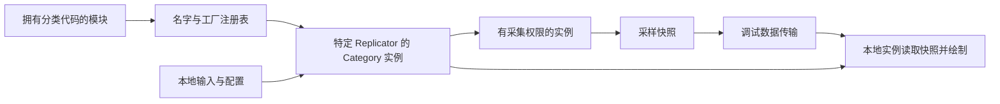

# 05 GameplayDebugger 与运行时调试

> 知识成熟度：L2。本文核对公开官方文档/API，并据此设计有限诊断示例；未编译或运行示例，未观察 UE、PIE、联机复制、可视日志或性能结果。
> 版本基准：UE 5.5 固定版本的 DataPack、可配置输入、模块加载 API 与 Visual Logger 文档；补充选读本次返回标题为 UE 5.8 的 GameplayDebugger API，以及 5.8 固定版本 Rewind Debugger 文档。DataPack 枚举页本次返回 5.7，单独标注。不同来源不合并成一个已验证引擎构建。
> 知识基线：2026-10-10 实际返回的页面正文；来源范围见第 11 节。本次没有读取本机引擎源码或 Build.version，旧文的 UE 5.8.0、CL 55116800 和“关键 API 已对照本机源码验证”不作为现行证据。
> 适用范围：开发期玩法状态观测、Category 接入与退场、诊断数据复制、Visual Logger 记录与回看。目标构建的编译开关、默认配置、内部调用顺序、RPC 校验实现和插件兼容性须另核。
> 最后更新：2026-10-10。全篇重建采集、传输、绘制和记录的责任边界，修订模块注册、快照寿命和蓝图入口。

## 1. 先定义要看见什么

“AI 为什么没攻击”至少有三种不同问题：它现在选择了哪个目标；上次从追逐变为等待之前发生了什么；这一帧的决策为什么消耗太久。先选择证据，再开工具：

| 问题 | 入口 | 必须保留的上下文 |
| --- | --- | --- |
| 当前目标、状态、路径是否符合预期 | GameplayDebugger Category | 采集端、World、玩家/连接、被选目标、采样时刻或序号 |
| 某次短暂状态切换的前因后果 | Visual Logger | LogOwner、时间、分类、旧/新状态、触发原因、相关空间位置 |
| CPU/GPU/任务等待为何超预算 | Unreal Insights / Profiling | 对应进程、时间窗、通道、构建与负载条件 |
| 动画状态和姿势如何随时间变化 | Rewind Debugger | 已记录对象、组件轨道、采集前启用的数据与插件 |
| 一次局部空间关系是否正确 | DrawDebug 辅助绘制 | 绘制发生在哪个 World/端；是否另有记录机制 |

GDT 提供带分类和交互的实时观察窗口，Visual Logger 保留已经埋点并录到的历史。两者都不能恢复从未采集的数据；网络快照到屏幕存在延迟，也不能把旧快照称为“此刻服务器完整状态”。基础玩法、RPC 与对象寿命知识是接入前提，性能测量方法由[性能分析工具与 Profiling](03-性能分析工具与Profiling.md)负责。〔S01、S13、S16〕

## 2. 从模块注册到屏幕的责任链

### 2.1 注册表、实例和目标不在同一层

`IGameplayDebugger` 是模块接口；CategoryName 和工厂委托登记在分类集合中。`FGameplayDebuggerAddonManager` 按名字维护已知分类，并为具体 Replicator 创建 Category 对象。注册一个工厂不等于已经为某玩家创建可用实例，也不等于类别已启用、目标已选中或数据已到达。〔S02、S05〕

`AGameplayDebuggerCategoryReplicator` 暴露所属 PlayerController、当前 DebugActor、目标变化计数以及本地/启用状态。诊断时应按“World + Replicator/Owner + 目标”识别上下文，不能把 DebugActor 记为跨玩家、跨 World 的全局唯一目标。多 PIE 世界、分屏和服务器无本地视口都是这个区分的实际用途。〔S06〕

下面是职责图，不是本次阅读到的完整引擎调用栈：



实例上 `IsCategoryAuth()` 表达采集角色，`IsCategoryLocal()` 表达展示角色；`CollectData`、`AddTextLine`、`AddShape` 标为 AUTH，`DrawData`、`OnDataPackReplicated` 和 Scene Proxy 相关接口标为 LOCAL。单机、编辑器世界、客户端允许本地采集等情形不能用“进程叫 Client，所以所有数据必来自服务器”推断。API 另有 `ShouldCollectDataOnClient()`；具体判断实现本次未读。〔S07〕

### 2.2 分类、扩展和配置的选择

Category 用于采集和展示业务诊断数据；Extension 适合工具交互，例如观察视角或目标选择。官方类别说明将 Extension 描述为不复制、不绘制的轻量扩展；不要由“stateless”文字推导它不需要解绑回调、清理临时资源或恢复改变过的工具状态。扩展仍由拥有模块注册和反注册。〔S03〕

类别状态包括 `EnabledInGameAndSimulate`、`EnabledInGame`、`EnabledInSimulate`、`Disabled`、`Hidden`。它们描述启用/可见策略，不能代替访问授权。`UGameplayDebuggerConfig` 可以修改类别创建参数、输入与槽位；有 0～9 的槽位按键，也有前后行切换键，因而“十个槽位键”不能解释为“系统最多十个分类”。显示排版、阴影、行键和 ActivationKey 以实际配置为准。〔S03、S12〕

## 3. Category 必须与拥有模块一起进入和退出

### 3.1 先处理构建能力，再处理加载状态

官方接口说明给出了 `SetupGameplayDebuggerSupport(Target)`、`WITH_GAMEPLAY_DEBUGGER` / `WITH_GAMEPLAY_DEBUGGER_CORE` 与 Target 选择项。完整支持和 Core 支持不同：Core 路径要求项目自行安排分类注册及需要的 Replicator。本例仅展示完整调试器接入，使用 `WITH_GAMEPLAY_DEBUGGER` 同时包住 include、类和调用；不能只保护 Startup，而让不包含调试器的构建仍引用其类型。这里不建议为线上包强制打开调试工具。〔S03〕

Build.cs 的职责是提供当前目标需要的模块依赖与编译定义；模块是否已经加载是另一件事。`IsAvailable()` 检查已加载且可用的状态，不会为“一次 Startup 时为 false”自动安排稍后重试。原来的 `if (IsAvailable()) RegisterCategory(...)` 若没有额外加载约定，会静默错过注册。项目应选定一种可审查策略：依赖必须存在时显式加载；确实可选时记录不可用并在明确的生命周期入口重试，同时在退场时撤销相应监听。不要每帧重试注册。〔S04〕

### 3.2 最小模块接线

以下是教学用 C++ 接线节选，`NOT_RUN`。要求项目已经在适用 Target 的 Build.cs 中配置 GameplayDebugger 支持，分类工厂定义见第 6 节；应合入现有模块，不能额外定义第二个主游戏模块。这里选择“开发目标中该依赖必须存在”，`LoadModuleChecked` 缺模块会触发断言，不是容错加载器。〔S04、S17〕

```cpp
#include "Modules/ModuleManager.h"
#if WITH_GAMEPLAY_DEBUGGER
#include "GameplayDebugger.h"
#include "MovementAuditCategory.h"
#endif

class FMovementDiagnosticsModule : public IModuleInterface
{
public:
    void StartupModule() override
    {
#if WITH_GAMEPLAY_DEBUGGER
        if (bRegistered)
        {
            return;
        }
        IGameplayDebugger& Debugger =
            FModuleManager::LoadModuleChecked<IGameplayDebugger>(
                TEXT("GameplayDebugger"));
        Debugger.RegisterCategory(
            TEXT("Project.MovementAudit"),
            IGameplayDebugger::FOnGetCategory::CreateStatic(
                &FMovementAuditCategory::MakeInstance),
            EGameplayDebuggerCategoryState::Disabled,
            INDEX_NONE);
        bRegistered = true;
        Debugger.NotifyCategoriesChanged();
#endif
    }

    void ShutdownModule() override
    {
#if WITH_GAMEPLAY_DEBUGGER
        if (bRegistered && IGameplayDebugger::IsAvailable())
        {
            IGameplayDebugger& Debugger = IGameplayDebugger::Get();
            Debugger.UnregisterCategory(TEXT("Project.MovementAudit"));
            Debugger.NotifyCategoriesChanged();
        }
        bRegistered = false;
#endif
    }

private:
    bool bRegistered = false;
};
```

名字、工厂和卸载责任要属于同一模块。注册使用有项目前缀的稳定名字，退场用完全相同的名字；布尔值只防该模块实例重复接线，不证明跨插件没有同名冲突。`NotifyCategoriesChanged` 是通知分类集合变化的接口；这里在改变集合后显式通知，但不宣称所有引擎版本缺少这一行都会立即失效，也不推定其内部销毁顺序。〔S02、S05〕

Shutdown 阶段先检查调试器是否仍可用；不要为了反注册再加载已经退出的模块。`Get()` 文档明确提醒关闭阶段的模块卸载风险。若工厂、输入委托、已有 Category 或自定义 Scene Proxy 仍引用即将卸载模块的代码，单有 `bRegistered=false` 无法证明安全；动态卸载/热重载还必须核对目标引擎对活动实例的回收路径、项目外部委托与异步任务。普通 Startup/Shutdown 节选没有证明任意卸载顺序、Live Coding 或热重载已正确。〔S04〕

## 4. 输入路由和业务权限要分别审查

`BindKeyPress` 既有简单键名形式，也有 `FGameplayDebuggerInputHandlerConfig` 形式；后者用于可配置并保存的输入。输入配置在 Addon 构造阶段建立，配置名应稳定，便于追查当前按键。不要把按键数字、菜单槽位索引和业务含义混成同一个标识。〔S08〕

`EGameplayDebuggerInputMode::Local` 在本地 Category 调用处理函数；`Replicated` 把输入路由到 authority Category 处理。切换本地“显示细节”适合 Local；请求改变采集端的诊断筛选条件才可能需要 Replicated。它们描述执行位置，不是“该用户获准读取所有目标或修改玩法”的权限机制。〔S09〕

本篇的权限建议是项目设计约束，而非对未读引擎实现的认证：

- 可观测字段先做允许列表，优先输出状态摘要；服务器专有目标、隐藏单位、其他用户数据不能因有调试器 Owner 就任意传出
- 客户端输入改变服务器状态时，检查允许的操作、目标归属、会话/World、执行频率和参数；只读观察与修改玩法的作弊命令分开设计
- `Disabled` 或 `Hidden` 是界面/分类状态，不是数据保密或发布版安全边界
- Replicator API 上的 `Server`、`Reliable`、`WithValidation` 说明 RPC 声明属性；本次没有读取 `_Validate`，不能声称它已经实现项目级授权

5.8 返回页同时列出按 CategoryId 和按 CategoryName 的服务器辅助函数，且它们位于 Protected 区。不能据此把这些函数当项目应直接调用的公共 API，也不能仅凭列表断言旧函数于 5.8 被弃用或已删除。接入时使用该版本公开的 Category/Replicator 接口；跨端保持分类名字、输入处理器及数据协议一致。〔S06〕

## 5. 采集的是快照，接收完成才形成新的可读数据

### 5.1 采集端每次建立一个自洽结果

`CollectData(OwnerPC, DebugActor)` 是读业务状态、形成诊断快照的入口。`OwnerPC` 和 `DebugActor` 都需要按可空上下文处理：未选中、销毁、切 World、玩法组件暂未初始化都可能没有可读业务状态。推荐先写无效默认值，再填合法字段；不要在目标失效时直接返回，让上个目标的 Health/PathPoints 留在新目标标题下。

文本行和形状列表在 AUTH 采集前由框架清空，这不等于自定义成员、应用缓存和 DataPack 的所有字段都自动满足项目的清理规则。`ForceImmediateCollect()` 的文档语义是促使下一次更新采集，不是同步执行取数，也不是等待网络复制完成。采样周期与界面刷新周期不同，降低采样频率之前先确定问题是否会短到在两次采样之间消失。〔S07〕

采集端不要借诊断读取触发新的寻路、加载、全世界遍历或业务状态修改。需要昂贵结果时，先考虑业务系统已有快照、摘要和明确预算；这是一项减少观测干扰的设计建议，并无本文测量出的通用间隔。旧文的 0.2～0.5 秒只能是试验参数，不能写成所有类别的推荐阈值。

### 5.2 文本、形状与 DataPack 的用途

少量文字与几何标记可用 `AddTextLine`、`AddShape`。结构化快照通过 `SetDataPackReplication(&Member, Flags)` 注册成员地址，成员类型实现 `Serialize(FArchive&)`，函数返回该包的 `int32` ID。原文把返回值保存为 ID 的做法成立；注册一般安排在实例构造期间，不能每次采样重复添加同一包，也不能注册采样函数栈上临时对象的地址。〔S07、S10〕

DataPack API 暴露 `DataCRC`、dirty、进度和完整接收标记。`MarkDataPackDirty` 用于请求复制，不能补齐遗漏的序列化字段，也不解决双方布局不一致；每次无条件置脏会抵消变化检测的作用。`OnDataPackReplicated(DataPackId)` 明确是客户端收到整个包后的通知，因此 UI 不应把“开始传输”当作“新快照可用”。这里不推导压缩阈值、包大小、重发算法或精确节省的带宽。〔S07、S11〕

`Persistent`、`ResetOnActorChange`、`ResetOnTick` 是 5.7 枚举页列出的策略名称；该页没有解释 ResetDelegate 的执行顺序与范围。本例显式选择 Persistent 并在每次采样中重置自己的数据，避免把框架重置行为当项目状态正确性的证明。需要另一种策略时，应针对目标引擎读取注册模板、重置委托及目标切换分支，再验证是否会清除需要保留的字段。〔S18〕

### 5.3 版本、目标变化和迟到数据

框架传输头里的版本/同步字段不是项目应用 schema。字段类型或序列化顺序变动时，必须明确双方版本协议；单纯自增框架 DataVersion 或强制置脏不能把旧反序列化器变成新反序列化器。本文示例要求相同构建和相同布局，没有实现异版本协商。

为排查“显示的是谁、什么时候的值”，项目可加入自己的有效位、来源标签、目标标识和采样序号。跨对象复用、迟到结果、长时间未更新需要再有目标 generation、会话标识和失效策略；目标名字只是标签，不是稳定全局 ID，计数也存在回绕。API 提供 DebugActorCounter 不足以证明任意项目缓存天然防串台。〔S06、S11〕

如果用 `CreateDebugSceneProxy` 把快照转为渲染资源，完整数据到达后按需 `MarkRenderStateDirty`。Canvas 文字绘制本身没有必要每包都重建 Scene Proxy。也不能让渲染侧随意追读正在销毁的玩法 UObject；数据复制、代理拥有权和渲染资源退场应在目标实现中另核。〔S07〕

## 6. 一个有限的 Category 示例

下面的单头文件形式只表达“采集 Actor 的标签/位置/速度 → 已登记的快照 → 本地按键切换细节”。它不依赖未知项目 Health、ActionId、Start/End 变量。接口按已读页面接线，`NOT_RUN`，没有声称通过 UHT、C++ 编译或实际网络传输；项目应把实现移入 cpp，并核对目标引擎 include 和模板声明。CanvasContext 的官方头文件定位为 `GameplayDebuggerTypes.h`。〔S19〕

```cpp
// MovementAuditCategory.h — 教学接线，NOT_RUN
#pragma once
#include "CoreMinimal.h"
#if WITH_GAMEPLAY_DEBUGGER
#include "GameplayDebuggerCategory.h"
#include "GameplayDebuggerTypes.h"
#include "GameFramework/Actor.h"
#include "Serialization/Archive.h"

struct FMovementAuditSnapshot
{
    uint8 bHasTarget = 0;
    FString TargetLabel;
    FVector Location = FVector::ZeroVector;
    float Speed = 0.0f;

    void Serialize(FArchive& Ar)
    {
        Ar << bHasTarget;
        Ar << TargetLabel;
        Ar << Location;
        Ar << Speed;
    }
};

class FMovementAuditCategory : public FGameplayDebuggerCategory
{
public:
    FMovementAuditCategory()
    {
        SnapshotPackId = SetDataPackReplication(
            &Snapshot, EGameplayDebuggerDataPack::Persistent);
        BindKeyPress(FName(TEXT("F8")), this,
            &FMovementAuditCategory::ToggleDetail,
            EGameplayDebuggerInputMode::Local);
    }

    static TSharedRef<FGameplayDebuggerCategory> MakeInstance()
    {
        return MakeShareable(new FMovementAuditCategory());
    }

    void CollectData(APlayerController* OwnerPC, AActor* DebugActor) override
    {
        Snapshot = FMovementAuditSnapshot{};
        if (!IsValid(DebugActor))
        {
            return;
        }
        Snapshot.bHasTarget = 1;
        Snapshot.TargetLabel = DebugActor->GetName().Left(64);
        Snapshot.Location = DebugActor->GetActorLocation();
        Snapshot.Speed = DebugActor->GetVelocity().Size();
    }

    void DrawData(APlayerController* OwnerPC,
        FGameplayDebuggerCanvasContext& CanvasContext) override
    {
        if (!Snapshot.bHasTarget)
        {
            CanvasContext.Printf(TEXT("No target snapshot"));
            return;
        }
        CanvasContext.Printf(TEXT("Target=%s Speed=%.1f"),
            *Snapshot.TargetLabel, Snapshot.Speed);
        if (bShowDetail)
        {
            CanvasContext.Printf(TEXT("Position=%s"),
                *Snapshot.Location.ToCompactString());
        }
    }

private:
    void ToggleDetail() { bShowDetail = !bShowDetail; }
    FMovementAuditSnapshot Snapshot;
    int32 SnapshotPackId = INDEX_NONE;
    bool bShowDetail = false;
};
#endif
```

快照成员寿命与 Category 相同，地址不会指向已退出的采样栈。空目标写回无效位和空标签；DrawData 只消费快照，不重新向客户端 Actor 查询“服务端速度”。F8 是人为选择的教学键，项目需检查冲突或换成配置形式。字符串截断 64 个字符只是示例上界，会丢失标签信息，不是身份校验或通用预算。

本例故意只做基本同版本诊断。它没有目标 generation、时间戳、异版本解析、权限核验、断线刷新或过期快照 UI；客户端仍可能在更新到达前看到上一份有效快照，不能用它证明严格的实时目标一致性。需要 Health/ActionId/PathPoints 时应从项目已授权的只读接口取数，规定无组件、无数据、数组上限和目标切换时的行为，再逐字段定义序列化。第 10 节提供纸面检查，不把该设计冒充完整网络可靠性实现。

## 7. 把“没显示”拆成有证据的阶段

### 7.1 激活与选择

文档所说 Apostrophe 是单引号 `'`，不是反引号；但实际 `ActivationKey`、键盘布局、窗口焦点和输入冲突应在当前配置中确认。类别开关、行键、槽位键、目标选择是不同动作。不要把旧文的 Alt+左键、固定 0～9 数字键行为、固定编辑器菜单位置或命令拼写当所有版本的保证。〔S01、S12〕

`EnableGDT` 是已读概览列出的入口，但概览仍夹有旧式 `UGameplayDebuggingComponent` 扩展示例。本文只用它支持工具用途和默认激活键，不照搬其旧类接入代码。`gdt.*` 命令、编辑器用户设置、自动创建管理器 CVar 及默认数值，本次没有读取实现或目标控制台帮助；实际使用须在相同构建确认是否存在、作用于哪个玩家/World，不能凭没有 HUD 就任意改网络或发布配置。〔S01〕

### 7.2 内置类别给出问题方向，不给出未经核实的默认表

| 观察主题 | 可寻找的类别/工具方向 | 要追问 |
| --- | --- | --- |
| Pawn 与 AIController | 基础 AI 状态 | 当前选的是哪个 Pawn，哪一端持有控制器 |
| 行为树与黑板 | BehaviorTree | 记录的树、活跃节点与黑板值属于同一次采样吗 |
| 环境查询 | EQS | 这是哪个查询实例、哪次结果，是否仍适用于当前目标 |
| 感知 | Perception | 刺激时间和目标有效性是否明确 |
| 导航 | Navmesh | 观察区域、位置和导航数据集是否匹配 |
| HUD / 观察视角 | 工具 Extension | 是否改变了本地输入或观察状态，退出是否恢复 |

这些是寻找证据的入口，不承诺固定注册模块、默认槽号、默认启用状态、NavGrid 可见性或客户端一定具有全部 AI 数据。缺项先核对当前目标的模块/类别注册，再找相关业务系统。〔S01、S03〕

### 7.3 联机排查链

依次记录：该目标是否编译包含调试器 → 拥有模块是否加载并登记类别 → 注册变化是否通知 → 所在 World 是否有对应 Replicator/Owner → 类别是否启用、是否有合法目标 → 采集端有没有形成快照 → 传输是否进行/完成 → 本地绘制是否被配置或视图条件排除。在哪一级停止有证据，就先修那一级。

API 中存在 `GetNetConnection`、`IsNetRelevantFor`、NetPack 接口及可选 DataPack RPC 路径，不足以证明当前项目使用哪套网络后端或已经适配 Iris。名字路由、输入 HandlerId 与相同序列化布局都要检查；“客户端有 HUD”“Reliable RPC 已声明”“调用了 ForceImmediateCollect”分别只说明一部分条件。不要用无条件置脏或强制启用全部类别掩盖 Owner、授权、注册顺序或 schema 问题。〔S06、S07、S11〕

## 8. Visual Logger：把对象和时间保留下来

### 8.1 文本、快照和形状各司其职

Visual Logger 面板按对象和时间查看采集结果。`GrabDebugSnapshot` 为状态快照提供入口；文本按分类呈现，同帧多条文本可组成列表；几何记录帮助还原位置、路径与方向。不要把“同帧快照可能覆盖”扩大成“同帧每条文本都会覆盖”，也不要以为记录了文字就自动保存对象的全部状态。〔S13〕

LogOwner 回答“这条证据挂在哪个对象”，LogCategory 回答“它属于哪类诊断”，Verbosity 用于分级/过滤。同一个对象可有多个日志类别，同一类别也可以用于很多对象，所以无需“每个对象创建一个 Category”。业务关键转换可记录旧状态、新状态与原因，循环快照记录现值；文本、形状和事件的取舍由问题决定，不把“事件总比文本好”当规则。

### 8.2 最小埋点与蓝图入口

下面是 C++ 诊断函数节选，`NOT_RUN`。调用方提供当前移动请求两端点与状态编号；此处只记录，不提交移动或发起新的寻路。函数按项目线程和对象寿命约定调用，不证明任意线程读 Actor 安全。

```cpp
#include "GameFramework/Actor.h"
#include "VisualLogger/VisualLogger.h"
DEFINE_LOG_CATEGORY_STATIC(LogMovementAudit, Log, All);

static void RecordMovementAudit(AActor* Owner,
    const FVector& Start, const FVector& End, int32 StateId)
{
    if (!IsValid(Owner))
    {
        return;
    }
    UE_VLOG(Owner, LogMovementAudit, Log,
        TEXT("StateId=%d RequestedDistance=%.1f"),
        StateId, FVector::Dist(Start, End));
    UE_VLOG_SEGMENT(Owner, LogMovementAudit, Log,
        Start, End, FColor::Cyan, TEXT("Requested movement"));
}
```

这里用已读 5.5 文档支持的 `UE_VLOG` 与 `UE_VLOG_SEGMENT` 参数形状。需要同写普通日志可查看 `UE_VLOG_UELOG`；条件宏的条件在前、形状宏另有几何参数、事件宏有自己的签名，不能把所有宏一律概括为“前三个参数相同”。球、盒、圆锥、圆柱、胶囊、网格等各有适用几何；高阶事件、直方图、坐标系及条件变体本次未逐个核对，不提供猜测出的完整宏签名表。〔S13〕

Visual Logger 确实提供蓝图节点。`UVisualLoggerKismetLibrary` 是 `UBlueprintFunctionLibrary`，页面列出 `EnableRecording`、`LogText`、`LogLocation`、`LogSegment`、多种形状与 `RedirectVislog`，标有 `BlueprintCallable` 和 `DevelopmentOnly`。蓝图可先开启记录，再用 VisLog 文本/形状节点写入，并到面板选择相应对象/时刻；有节点不代表目标构建会保留它或已经开启记录。不要把“自定义 GDT Category 用 C++”扩大为“VisualLogger 没有蓝图节点”。〔S14〕

### 8.3 记录、过滤、落盘与重定向

`FVisualLogger` 提供采集开关、文件/Trace 输出、对象/类别允许列表和输出设备接口。为一次问题记录明确的开始、停止、目标对象、类别与时间窗；开启 Record 不等于文件已成功保存。结束后核对实际输出路径、文件、大小和消费工具版本，并尝试读回需要的区间，不能仅凭常见的 `.bvlog` 扩展名或旧示例路径宣称结果存在。〔S15〕

重定向可把组件/控制器的诊断归到另一个对象，便于按角色查看，但归属选择会影响查找。Pawn 不保证永久存在；Possess/UnPossess、重生和销毁后需重新审查关系，不能只在 BeginPlay 无条件 `GetPawn()` 一次就当全会话有效。蓝图 `RedirectVislog` 的 SourceOwner/DestinationOwner 语义有官方入口；具体 C++ 宏及旧 CONNECT 宏的弃用版本，本次未读取源码，不作为版本断言。〔S14、S15〕

记录失败应区分：编译能力缺失、记录未打开、日志类别或对象被过滤、代码路径没执行、输出设备/文件问题、回看时选择了错误对象或时间。关闭运行时记录与编译裁剪不同；宏之外为了凑日志而做的遍历、字符串拼接与数组准备仍可能发生。也不能保证 Shipping 普通日志必输出，关键业务观测的可用性应单独设计和验证。〔S13、S15〕

## 9. 回看、关联与常见误判

Rewind Debugger 在已记录的数据轨道中观察动画和关联对象，支持项目扩展轨道；它不是所有对象完整状态的任意倒带。Pose Watch 等观察需在采集前安排；没有记录某字段，事后不能靠拖时间线补出来。VisualLogger 的 Trace 输出可以供 Rewind Debugger 使用，但 `.bvlog`、Trace、对象身份和跨进程时钟并非自动互换或同步。〔S15、S16〕

| 症状 | 先取得什么证据 | 下一步及停止条件 |
| --- | --- | --- |
| 激活键无反应 | 实际 ActivationKey、焦点、构建能力、模块状态 | 修输入/依赖；未确认构建边界时停止盲改 Target |
| 类别不存在 | 注册名字、工厂入口、加载时点与通知 | 看是否一次 IsAvailable=false 后再未注册；无注册记录时先不查带宽 |
| 有类别但无数据 | Owner/World、目标、采集角色、启用与采样结果 | 找到断点阶段；不把“空”直接诊断为复制器故障 |
| 切目标后仍显示旧 Health/路径 | 自定义快照重置、目标身份、采样和接收时刻 | 先排除旧成员残留，再核迟到数据与 UI 有效性 |
| 包到达却字段错位 | 两端构建、Serialize 字段类型/顺序 | schema 不同时停止解析；不要用 DataVersion++ 或 dirty 重发替代协议 |
| 大量 EQS/路径数据影响体验 | 字段数、数组上限、采样频率、活跃类别和实际采集成本 | 缩小信息与时间窗，再测；没有测量就不声称优化比例 |
| Visual Logger 为空 | 执行路径、记录/过滤/输出状态 | 用已知会触发的单条埋点定位；不要先推定日志系统损坏 |
| 文件或回看形状找不到 | 实际保存结果、对象/时间/类别/形状条件 | 核选择与记录内容；对象销毁本身不足以证明记录必丢失 |
| 两端时间线对不上 | 会话、进程、时钟来源、共享事件标识 | 没有对齐证据则分别解释，不按相似数值强行拼因果 |

分享诊断结果时携带版本、地图、输入步骤、记录范围和已知缺口，筛掉与问题无关或无权传出的字段。文件存在、能打开与足以解释问题是三层验收。`VisLogSync` API 的存在不是自动跨机统一时钟、同一物理设备或“画中画”的证明；需要这些能力时另读实现并验证。

## 10. 有限、可复现的纸面检查

以下均为 `PAPER_EXPECTED`，状态均为 `NOT_RUN`。它们验证本篇设计的因果关系和应观察内容，不是引擎、弱网、热重载或性能测试。

| 编号 | 给定输入与操作 | 纸面预期 | 能暴露的错误 / 未覆盖 |
| --- | --- | --- | --- |
| P01 | Startup 时调试器尚未加载，但依赖可加载；只执行一次 Startup | 第 3 节显式加载后登记并通知；旧的条件注册路径可能直接跳过 | 无构建支持时的断言不是成功；未实测模块加载 |
| P02 | 已登记分类，Shutdown 时调试器仍加载 / 已卸载两分支 | 前者同名注销并通知，后者不尝试重新加载；本地登记标记清除 | 不能由此证明活动实例与异步资源已经安全回收 |
| P03 | 两个 Replicator 的目标分别是 A、B | 数据标识应保留各自 Owner/World/目标上下文 | “全局唯一 DebugActor”会混淆两份观察 |
| P04 | 第 6 节先采到 A，再以空目标采样 | 后次序列化内容的有效位为 0、标签空、位置/速度归零 | 客户端收到前仍可能保留旧包；不等于立即清屏 |
| P05 | 同一快照先画一次，随后按 Local F8 | 只改变本地细节行是否显示，采集业务状态不因此变化 | 若要改变服务端采集需另设计路由与授权 |
| P06 | 把 Snapshot 放到 CollectData 的局部变量，登记其地址后返回 | 地址寿命不足，违反成员存储前提；恢复为 Category 成员 | 不需要执行悬空指针才能判定设计错误 |
| P07 | 发送端按“有效位、名称、位置、速度”写，接收端按别的顺序读 | 协议不匹配；dirty 与框架 DataVersion 不能修复 | 本篇没有提供可迁移 schema 解析器 |
| P08 | 有包传输进度但尚未完整接收 | 不把进度起点当完整快照到达；完整包通知才是相应边界 | 未验证分块、重发、Iris 或断线行为 |
| P09 | 同帧记录两个文本消息，同时更新对象状态快照 | 文本列表与状态快照分别检查，不能由快照覆盖断言只剩一条文本 | 具体状态字段覆盖顺序需目标实现确认 |
| P10 | 蓝图有 VisLog Text 节点，但未开启记录或该对象被过滤 | 节点存在仍不保证产物；依次检查记录、过滤与实际输出 | DevelopmentOnly 不能证明某发布目标会保留节点 |
| P11 | 采集前没有启用需要的动画轨道/观测 | 回看缺少的数据不能事后恢复 | 不将 Rewind 当全部游戏状态恢复器 |

要把本文推进到运行证据，需要在确定版本的开发项目中分别记录：模块进入/退出与类别列表、无目标/切目标/销毁、两个独立观察者、Local/Replicated 输入、有限包的序列化与完整接收、输出关闭/过滤/保存失败，以及回看能找到目标事件。运行前先落实业务读取权限和构建边界；每种拓扑与版本单列结果，不把某次单机演示推广到联机、专用服务器或发布构建。

## 11. 来源定位、已读范围与版本限制

核对日期均为 2026-10-10。下表中的“返回标题版本”来自当次网页响应，版本无查询参数的页面不是不可变源码；固定版本 URL 也只证明所返回文档，不证明本地引擎。正文是接口合同与项目设计建议，未读的 cpp、模板函数体、RPC 验证、构造默认值及平台实现均不作已验证事实。

| 标识 | 官方来源与版本 | 本次实际使用的范围 |
| --- | --- | --- |
| S01 | [Using the Gameplay Debugger](https://dev.epicgames.com/documentation/en-us/unreal-engine/using-the-gameplay-debugger-in-unreal-engine)，返回标题 5.8 | 工具用途、类别方向、Apostrophe；页面含旧扩展类，未把它当现行接线 |
| S02 | [IGameplayDebugger](https://dev.epicgames.com/documentation/en-us/unreal-engine/API/Runtime/GameplayDebugger/IGameplayDebugger)，返回标题 5.8 | 工厂、注册、反注册和通知接口 |
| S03 | [EGameplayDebuggerCategoryState](https://dev.epicgames.com/documentation/en-us/unreal-engine/API/Runtime/GameplayDebugger/EGameplayDebuggerCategoryState)，返回标题 5.8 | 构建说明、模块拥有责任、Category/Extension 分工与状态枚举 |
| S04 | [Get](https://dev.epicgames.com/documentation/en-us/unreal-engine/API/Runtime/GameplayDebugger/IGameplayDebugger/Get) 与 [IsAvailable](https://dev.epicgames.com/documentation/en-us/unreal-engine/API/Runtime/GameplayDebugger/IGameplayDebugger/IsAvailable)，返回标题 5.8 | 模块访问、可用性与关闭期提醒；两页措辞有加载/检查差异，示例采用明确加载接口 |
| S05 | [FGameplayDebuggerAddonManager](https://dev.epicgames.com/documentation/en-us/unreal-engine/API/Runtime/GameplayDebugger/FGameplayDebuggerAddonManager)，返回标题 5.8 | 注册表、创建实例和集合通知职责 |
| S06 | [AGameplayDebuggerCategoryReplicator](https://dev.epicgames.com/documentation/en-us/unreal-engine/API/Runtime/GameplayDebugger/AGameplayDebuggerCategoryReplica-)，返回标题 5.8 | Owner、目标、计数、本地状态、公开/受保护边界；未读 RPC 校验与网络实现 |
| S07 | [FGameplayDebuggerCategory](https://dev.epicgames.com/documentation/en-us/unreal-engine/API/Runtime/GameplayDebugger/FGameplayDebuggerCategory)，返回标题 5.8 | AUTH/LOCAL、文本/形状重置、采集/绘制、完整包通知、Scene Proxy 接口 |
| S08 | [BindKeyPress 配置重载](https://dev.epicgames.com/documentation/unreal-engine/API/Runtime/GameplayDebugger/FGameplayDebuggerAddonBase/BindKeyPress/2?application_version=5.5)，固定 5.5；[AddonBase](https://dev.epicgames.com/documentation/unreal-engine/API/Runtime/GameplayDebugger/FGameplayDebuggerAddonBase?lang=en-US)、[GameplayDebugger 模块](https://dev.epicgames.com/documentation/unreal-engine/API/Runtime/GameplayDebugger)，返回标题 5.8 | 输入签名、配置保存，以及输入配置构造期约束 |
| S09 | [EGameplayDebuggerInputMode](https://dev.epicgames.com/documentation/en-us/unreal-engine/API/Runtime/GameplayDebugger/EGameplayDebuggerInputMode)，返回标题 5.8 | Local 与 Replicated 的处理位置 |
| S10 | [SetDataPackReplication](https://dev.epicgames.com/documentation/unreal-engine/API/Runtime/GameplayDebugger/FGameplayDebuggerCategory/SetDataPackReplication?application_version=5.5)，固定 5.5 | 成员地址、Serialize 要求、返回 int32 包 ID |
| S11 | [FGameplayDebuggerDataPack](https://dev.epicgames.com/documentation/en-us/unreal-engine/API/Runtime/GameplayDebugger/FGameplayDebuggerDataPack)，返回标题 5.8 | dirty、CRC、进度、完整接收与传输状态字段；无内部算法认证 |
| S12 | [UGameplayDebuggerConfig](https://dev.epicgames.com/documentation/en-us/unreal-engine/API/Runtime/GameplayDebugger/UGameplayDebuggerConfig)，返回标题 5.8 | 激活/行/槽位输入、显示项及配置更新接口；未核对默认值 |
| S13 | [Visual Logger](https://dev.epicgames.com/documentation/en-us/unreal-engine/visual-logger-in-unreal-engine?application_version=5.5)，固定 5.5 | 对象/时间视图、文本与快照区别、快照接口、文本/线段等示例 |
| S14 | [UVisualLoggerKismetLibrary](https://dev.epicgames.com/documentation/en-us/unreal-engine/API/Runtime/Engine/UVisualLoggerKismetLibrary)，返回标题 5.8 | BlueprintCallable/DevelopmentOnly、记录、文本/形状、重定向 |
| S15 | [FVisualLogger](https://dev.epicgames.com/documentation/en-us/unreal-engine/API/Runtime/Engine/FVisualLogger)，返回标题 5.8 | 选读记录/过滤/设备/文件/Trace、对象名保存和时间戳接口，未通读全部形状重载 |
| S16 | [Animation Rewind Debugger](https://dev.epicgames.com/documentation/unreal-engine/animation-rewind-debugger-in-unreal-engine?application_version=5.8)，固定 5.8 | 轨道与录制、Pose Watch 前置、Trace 和可扩展性；未执行插件设置 |
| S17 | [LoadModuleChecked](https://dev.epicgames.com/documentation/unreal-engine/API/Runtime/Core/Modules/FModuleManager/LoadModuleChecked/2?application_version=5.5)，固定 5.5 | 显式加载、复用已加载实例、缺模块断言 |
| S18 | [EGameplayDebuggerDataPack](https://dev.epicgames.com/documentation/en-us/unreal-engine/API/Runtime/GameplayDebugger/EGameplayDebuggerDataPack)，返回 5.7 | 仅三种枚举名；无默认值和 reset 实现结论 |
| S19 | [FGameplayDebuggerCanvasContext](https://dev.epicgames.com/documentation/en-us/unreal-engine/API/Runtime/GameplayDebugger/FGameplayDebuggerCanvasContext)，返回标题 5.8 | 头文件定位与 Printf 接口 |

固定 5.6/5.8 的部分 Category/模块 API 请求、旧 Gameplay Debugger/旧 Rewind URL、DataPackHeader 入口在本次返回错误或空正文，均未当作成功阅读；改用上表实际返回的页面并按版本单列。没有以搜索结果标题替代未返回的函数实现，也未据版本号推断“首次新增/废弃”的时间。

## 12. 关联阅读与职责边界

- [性能分析工具与 Profiling](03-性能分析工具与Profiling.md)：测量合同、Trace 采集和瓶颈证据，本篇不代替性能实测
- [行为树详解](../../06-游戏AI/感知决策与行为规划/01-行为树详解.md)、[感知系统与 EQS](../../06-游戏AI/感知决策与行为规划/02-感知系统与EQS.md)：GDT 所观察的业务系统，界面现象须回到对应状态解释
- [RPC 与属性同步](../../07-网络与游戏服务端/状态复制与兴趣管理/02-RPC与属性同步.md)：连接、所有权与复制的一般前提，不把调试传输当游戏业务协议
- [UnrealInsights 与 Trace 源码](28-UnrealInsights与Trace源码.md)：Trace 消费链的进一步入口，其历史源码/运行声明不自动成为本篇证据
- [Lyra 调试工具与扩展源码](47-Lyra-调试工具与扩展源码.md)：项目作弊与编辑器扩展案例，不能从已有项目命令推断通用服务器授权
- [调试与性能分析方法论](01-调试与性能分析方法论.md)：先列假设、找最小观察，再区分事实与推断
