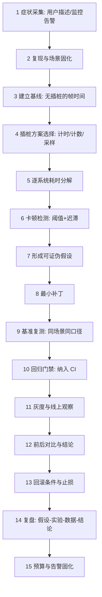

# 10-性能问题定位完整链路

> 知识成熟度：L4（端到端链路专著 + 本机可运行测试与基准；插桩开销、卡顿检测、预算降级共 17 条断言全部通过，原始输出含 P50/P95/P99 与帧预算换算，归档于 `evidence/labs/profiling/results/`；UE Insights / Linux perf / 线上流量仍属未验证边界）。
> 知识基线：客户端以 UE5.8（CL 55116800）Unreal Insights / UnrealStats 为参照，服务端以自建插桩与预算记账为参照；横向联动 [游戏知识/07-UI与性能优化/03-性能分析工具与Profiling](03-性能分析工具与Profiling.md)、[00-计算机与工程基础/07-Linux系统编程/03-性能工具：插桩与perf采样](03-性能工具：插桩与perf采样.md)。
> 适用范围：Gameplay 与客户端/服务端的日常性能工作：帧率下降、卡顿（hitch）、同屏掉帧、Tick 超预算、上线后性能回归。
> 事实边界：本文所有开销数字来自本机单线程最小实现（MinGW g++ 16.1.0，`-O2`，x86_64），**不是**目标机型实测；不同编译器/架构绝对值会变，结论应看**比例与量级**。未接入 UE Insights、UnrealStats、Linux perf 与线上压测。
> 参考来源：[Unreal Engine: Unreal Insights](https://dev.epicgames.com/documentation/en-us/unreal-engine/unreal-insights-in-unreal-engine)、[Unreal Engine 官方文档](https://dev.epicgames.com/documentation/en-us/unreal-engine)。
> 最后更新：2026-09-11（首版：15 步定位链路 + 插桩开销/卡顿检测/预算降级证据）。

---

## 一、概述与链路定位

性能工作的第一原则是：**先量化，再优化；没有基线的优化都是猜测**。Gameplay 工程师面对的典型场景是"这局打得有点卡"——这句话里没有可执行信息。定位链路要做的，是把它变成 `第 1372 帧 gameplay 系统 4.3 ms，超预算 0.3 ms，连续 3 帧触发降级`。

性能问题分四类，处理路径完全不同：

| 类型 | 表现 | 首要手段 | 常见根因 |
| --- | --- | --- | --- |
| 稳态偏慢 | 帧时间长期偏高但稳定 | 逐系统耗时分解 | 算法复杂度、循环内分配 |
| 卡顿（Hitch） | 偶发长帧 | 帧时间序列 + 卡顿检测 | 加载、GC、资源首次使用 |
| 尖刺 | 特定玩法触发 | Trace 对齐事件 | 批量生成、AOE 结算、物理重建 |
| 回归 | 某版本后变差 | 版本间基准对比 | 新特性引入的隐性成本 |

本篇与其它链路的关系：任何链路的"性能预算"小节都应回到本篇的方法；[05-背包道具](../../../系统实战/05-背包道具完整链路.md)、[11-伤害与属性结算](../../../系统实战/11-伤害与属性结算完整链路.md) 已用本篇的度量口径给出各自的基线。

## 二、链路类型与依赖模块

| 维度 | 内容 |
| --- | --- |
| 链路类型 | Platform / Operations 变体（性能定位版）：症状 → 复现 → 基线 → 插桩与采样 → 假设 → 补丁 → 基准 → 回归 → 灰度 → 观察 → 对比 → 回滚条件 → 结论 → 复盘 |
| 客户端模块 | 帧时间采集、UnrealStats/Insights 通道、自建 scope 计时、卡顿检测、资源加载埋点 |
| 服务端模块 | Tick 预算记账、逐系统耗时、队列长度与积压、过载降级状态机 |
| 依赖模块 | [游戏服务端/06-世界模拟与运行时/14-运行时背压与过载保护](../../../游戏服务端/06-世界模拟与运行时/14-运行时背压与过载保护.md)（降级策略）、[游戏服务端/06-世界模拟与运行时/11-AI与寻路时间预算](../../../游戏服务端/06-世界模拟与运行时/11-AI与寻路时间预算.md)（预算分档）、[游戏测试与质量/04-性能兼容与网络异常测试](../测试策略与自动化/04-性能兼容与网络异常测试.md)（测试口径） |
| 失败路径 | 无基线、样本不足、采样偏差、把 IO 抖动当逻辑耗时、卡顿漏检、降级抖动、只优化"好测的"指标 |
| 正确性证明 | [evidence/labs/profiling](../../../evidence/labs/profiling/README.md)：插桩开销 7 条 + 卡顿与预算 10 条断言 |
| 性能证明 | 同目录：每调用开销、帧预算换算、预算记账开销 |

## 三、权威状态与数据所有权

| 数据 | 权威方 | 说明 |
| --- | --- | --- |
| 帧时间序列 | 客户端采集、集中聚合 | 采集必须是常数开销；聚合可以离线做 |
| 逐系统耗时 | 各自系统上报 | 预算记账是"唯一真相"，不允许各系统自报"我很快" |
| 降级级别 | 服务端/客户端各自的调度器 | 唯一写者；其它系统只能读取并遵守 |
| 基线数据 | 版本化存档 | 每次改动后的基准必须与代码版本一起保存，否则无法判断回归 |

三条硬规则：

1. **观测不能改变被测对象**：插桩开销必须远小于被测量的量级；否则测的是插桩，不是业务。
2. **采样必须确定性**：采样点由固定的调用计数决定，不能依赖墙钟或随机数，否则同一场景两次采样的结论不可复现。
3. **降级只能有一个写者**：多系统各自决定降级会互相抵消，出现"你降我升"的震荡。

## 四、完整数据流架构图（15 步定位闭环）



图下解释：**步骤 3 与步骤 9 是整条链路的支点**。没有基线就没有"变快了"；没有同口径复测就无法排除噪声。跳过这两步的优化，本质是在用感觉替换数据。

## 五、十五步端到端推导

### 步骤 1：症状采集（把吐槽变成字段）

- 必采字段：平台与机型、帧率档位、场景/玩法、发生时间、可复现性、是否伴随加载或特效、网络状态。
- 边界：区分"稳态偏慢"与"卡顿"——前者看均值，后者看长帧计数；用同一套指标描述两者必然误判。

### 步骤 2：复现与场景固化

- 把症状固化成可重复脚本（固定地图、固定波次、固定随机种子），否则后续所有对比都不可靠。
- 边界：涉及多人时用机器人补位（参照 [07-假人AI完整链路](../../../系统实战/07-假人AI完整链路.md)），避免"人不够所以压力不够"。

### 步骤 3：建立基线

- **先在不插桩的情况下采集**，得到帧时间中位数、P95、P99 与长帧计数。这个基线是所有后续结论的参照。
- 基线必须与代码版本、机型、画质设置一起记录。
- 边界：不要用"平均帧率"当唯一基线；平均值会掩盖卡顿。

### 步骤 4：插桩方案选择

三种手段的成本与适用面（本机实测，p50 ns/次）：

| 手段 | 开销 | 适用 |
| --- | --- | --- |
| 计数器自增 | **0.33 ns** | 调用次数、分支命中、事件计数 |
| 原子计数器 | **4.01 ns** | 跨线程计数 |
| 作用域计时器 | **50.03 ns** | 按系统/按逻辑块计时 |
| 每调用格式化日志 | **274.25 ns** | 只允许在调试构建或极低频率路径 |
| 格式化 + 缓冲写 | **309.90 ns** | 同上，且要限定调用量级 |
| 1/100 采样计时 | **0.96 ns** | 热路径的统计分布 |

关键换算（热路径 100 000 次/帧，16.6 ms 预算）：

```text
计数器自增     0.032 ms ( 0.19%)
原子计数       0.384 ms ( 2.31%)
作用域计时     5.003 ms (30.14%)   ← 每实体加 scope timer 会吃掉三成预算
格式化日志    27.467 ms (165.46%)
格式化+写     30.846 ms (185.82%)  ← 热路径打日志 = 直接爆预算
采样计时       0.096 ms ( 0.58%)
```

结论：**按系统计时 + 热路径采样；绝不在热路径上逐次格式化**。

### 步骤 5：逐系统耗时分解

- 至少分到：Gameplay 逻辑、AI/寻路、物理、动画、网络收发、UI、加载/流送。
- 每个系统维护自己的预算（示例：ai 2 ms / physics 3 ms / network 2 ms / gameplay 4 ms），超预算即记账。
- 边界：跨系统的"公共开销"（内存分配、日志、序列化）必须单独成项，否则会被分摊进业务系统而误判。

### 步骤 6：卡顿检测

判定规则（本机验证）：

```text
阈值 = max(2.5 × 帧时间中位数, 1.5 帧)
迟滞 = 连续 2 帧低于 阈值 × 0.6 才结束本次卡顿
```

- **必须用中位数**：p99 会被卡顿本身污染，阈值越抬越高，最终漏检（这是最容易踩的坑）。
- 级联卡顿（连续 2–3 帧长帧）必须合并为**一个**事件，否则报警数量和真实问题数不成比例。
- 本机结果：注入 12 次卡顿（含 3 次级联）→ 判定 12 个事件、18/18 帧召回、纯抖动序列 0 误报。

### 步骤 7：形成可证伪假设

- 假设必须能写成"如果 X 是原因，那么禁用 X 后 P95 应下降至少 Y%"。
- 反例（不可证伪）："可能是内存问题吧"。
- 边界：一次只验证一个主要变量；同时改三处，即使变快也不知道是哪种变化起了作用。

### 步骤 8：最小补丁

- 先做**开关式验证**（临时禁用某系统/某特效）确认方向，再写正式实现。
- 边界：临时开关必须能在发布构建里关闭，且不改变逻辑语义（只影响表现或频率）。

### 步骤 9：基准复测

- 同场景、同机型、同画质、同随机种子、同口径（P50/P95/P99 + 长帧计数）。
- 至少重复 3 次取中位，避免被单次抖动误导。
- 边界：注意编译期差异（Debug/Release、LTO、PGO）带来的假象。

### 步骤 10：回归门禁

- 把关键场景的帧时间与长帧计数纳入 CI，设阈值并允许合理波动（例如 P95 回归 > 5% 视为失败）。
- 边界：门禁跑在什么机器上必须固定，否则门禁自身会抖动。

### 步骤 11：灰度与线上观察

- 灰度期间观测的分位数与本地不同，需按线上分档重新设阈值；注意低端机型会被均值淹没，必须分机型看。
- 边界：线上采集本身就是开销，采样率与上报频率要纳入预算。

### 步骤 12：前后对比与结论

- 结论必须给"假设 → 实验 → 数据 → 结论 → 失败方案 → 最终方案"，失败方案也要记录（避免后人重复踩）。
- 边界：只写"优化了 XX，性能提升明显"不算结论。

### 步骤 13：回滚条件与止损

- 上线前就定义回滚条件（例如 P95 回归 > 10%、崩溃率上升、长帧计数翻倍）。
- 边界：回滚必须能独立于其它改动执行，否则会"连带回滚"业务功能。

### 步骤 14：复盘

- 记录到工作日志与证据目录，形成可检索的经验；参照 [工作日志](../../../工作日志/README.md) 的写法。
- 边界：复盘不是追责，目标是让下一次定位更快。

### 步骤 15：预算与告警固化

- 把本次结论固化为预算与告警：每系统预算、长帧计数阈值、降级触发条件。
- 预算记账本身开销可忽略（本机 **1.7 ns/Tick、每系统 0.4 ns**），因此"怕开销"不构成不记账的理由。

## 六、Tick 超预算后的降级状态机

客户端看帧，服务端看 Tick；两者都需要"超预算就降级，恢复要谨慎"。

```text
连续 3 次超预算 → 降级级别 +1（上限 3 级）
连续 30 次达标   → 降级级别 -1
```

- **必须有迟滞**：无迟滞时"超一帧降、好一帧升"，级别会每 Tick 抖动，玩家看到的是效果忽好忽坏。本机实测交替"超/不超"输入下，带迟滞的级别变化为 **0 次**。
- **升级不允许跳级**：从 0 直接跳到 3 会让表现骤降；本机断言升级为逐级 +1。
- **恢复必须比降级更慢**（30 次 vs 3 次）：恢复太快会在压力未真正解除时反复升降。
- 降级动作应与 [14-运行时背压与过载保护](../../../游戏服务端/06-世界模拟与运行时/14-运行时背压与过载保护.md) 的优先级一致：先降非关键表现，再降 AI 频率，最后才动关键玩法逻辑。

## 七、本地可运行证据与原始结果

证据目录：[evidence/labs/profiling](../../../evidence/labs/profiling/README.md)。

| 程序 | 断言 | 结果 | 原始输出 |
| --- | --- | --- | --- |
| `profiling_overhead` | P1 原子≥裸计数 / P2 计时器>计数 / P3 格式化≫计时 / P4 写盘再加价 / P5 采样便宜一个量级 / P6 热路径打日志爆预算 / P7 热路径计时仍在预算内 | pass=7 fail=0 | [results/profiling_overhead.txt](../../../evidence/labs/profiling/results/profiling_overhead.txt) |
| `hitch_and_budget` | H1 级联合并为单事件 / H2 卡顿召回 100% / H3 抖动 0 误报 / H4 阈值落在合理区间 / H5 事件起点准确 / B1 超预算归属 / B2 逐级升级 / B3 恢复迟滞 / B4 不抖动 / B5 持续恢复 | pass=10 fail=0 | [results/hitch_and_budget.txt](../../../evidence/labs/profiling/results/hitch_and_budget.txt) |

**已验证事实**：上表断言、每调用开销、帧预算换算、卡顿检测与降级状态机行为。
**未验证边界**：UE Insights/Trace 与 UnrealStats 的真实通道开销、Linux perf 采样、GPU 侧耗时、真机与线上分档、内存/IO 归因。

## 八、常见反模式

1. **无基线优化**：先改代码再看效果，改完发现"好像快了点"——无法证明。
2. **热路径打日志**：本机量化结果 30.846 ms/帧（185.8% 预算），却常被当作"只是多写两行"。
3. **每实体加 scope timer**：5.003 ms/帧（30.14% 预算），把观测量变成了瓶颈。
4. **用 p99 当卡顿阈值**：被卡顿污染后阈值自抬，漏检真实卡顿。
5. **用平均帧率判断卡顿**：平均值会掩盖长帧。
6. **计数/采样引入随机**：不可复现，且可能扰动时序。
7. **同时改多个变量**：变快了也不知道是谁的功劳，变慢了更难定位。
8. **无迟滞降级**：级别每 Tick 抖动，玩家体验忽好忽坏。
9. **只优化好测的指标**：把 CPU 逻辑优化到极致，但瓶颈其实在 IO 与加载。
10. **线上不分机型看均值**：低端机型的严重问题被高端机型平均掉。

## 九、验证矩阵

| 被测能力 | 用例 | 断言 | 证据 |
| --- | --- | --- | --- |
| 插桩开销量级 | 6 种插桩样式对比 | 比例关系稳定（计数 ≪ 计时 ≪ 格式化） | `profiling_overhead` P1–P5 |
| 帧预算换算 | 1 000 / 100 000 次每帧两视角 | 热路径打日志爆预算、计时仍在预算内 | P6/P7 |
| 卡顿召回 | 12 次注入（含级联） | 事件数=12、帧召回=18/18 | `hitch_and_budget` H1/H2/H5 |
| 卡顿误报 | 纯抖动序列 | 0 个事件 | H3/H4 |
| 超预算归属 | 单系统超预算 | 正确归属且唯一 | B1 |
| 降级升级 | 连续超预算 | 逐级 +1、上限 3 | B2 |
| 降级恢复 | 29/30 次达标 | 满 30 次才降级 | B3 |
| 抖动抑制 | 交替超/不超 | 级别变化 0 次 | B4 |
| 记账开销 | 200 000 Tick × 4 系统 | 开销在噪声量级 | 基准输出 |
| 真机/线上 | 分机型帧时间分档 | 与本地结论一致（方向） | 待线上环境 |

## 十、术语速查

| 术语 | 说明 |
| --- | --- |
| 帧预算 | 单帧可用时间（60 fps ≈ 16.6 ms），性能工作的分母 |
| 长帧（Hitch） | 明显超过正常帧时间的帧，按"事件"而非"帧"计数 |
| 迟滞（Hysteresis） | 进入/退出门槛不同，用于抑制状态抖动 |
| 采样（Sampling） | 每 N 次调用记录一次，换取低开销的统计分布 |
| 作用域计时（Scoped Timer） | 用 RAII 在作用域开始/结束各读一次时钟 |
| 基线（Baseline） | 未插桩、可复现的同口径测量结果，是判断"变快"的唯一参照 |
| 分位数（P50/P95/P99） | 分布指标，比平均值更能反映体感与尾部 |
| 降级阶梯 | 超预算后按优先级依次削减的非关键功能序列 |
| 归因 | 把耗时定位到具体系统/调用点，而不是停留在"整体慢" |

## 十一、一次定位的推演（模板）

下面用本篇的口径走一遍完整流程。**示例中的数值仅演示推理格式**（口径与量级取自本机证据），不代表任何线上项目实测。

**症状**：5v5 团战场景帧率从 60 掉到 45，稳定复现，非卡顿型。

**步骤 3 基线（不插桩）**：

| 指标 | 平时（1v1） | 团战 |
| --- | --- | --- |
| 帧时间 P50 | 9.1 ms | 17.8 ms |
| 帧时间 P95 | 11.4 ms | 22.1 ms |
| 帧时间 P99 | 13.0 ms | 24.6 ms |
| 长帧计数/分钟 | 0 | 3 |

**步骤 5 逐系统分解（团战）**：

| 系统 | 实测 | 预算 | 判定 |
| --- | --- | --- | --- |
| gameplay（技能+伤害结算） | 4.2 ms | 4.0 ms | **超 0.2 ms** |
| AI / 寻路 | 2.6 ms | 2.0 ms | **超 0.6 ms** |
| 物理 | 3.1 ms | 3.0 ms | 超 0.1 ms |
| 网络收发 | 1.9 ms | 2.0 ms | 达标 |
| 公共开销（日志+序列化） | 3.4 ms | 1.0 ms | **超 2.4 ms** |

**步骤 7 假设**：公共开销是主因——按本篇的插桩开销表，`3.4 ms` 的量级正好对应"每帧数万次格式化日志"（100 000 次/帧约 30 ms 上限，数万次约 3 ms 量级）。可证伪表述：**若把战斗日志改为采样上报，公共开销应降到 0.5 ms 以下，帧时间 P95 应下降 ≥ 4 ms。**

**步骤 8 补丁**：战斗日志由"每条结算写一行"改为"采样 1/100 + 事件聚合"，热点计数改为预注册 id（避免每调用字符串查找）。

**步骤 9 复测（同场景/同机型/同种子/3 次取中位）**：

| 指标 | 基线 | 补丁后 | 变化 |
| --- | --- | --- | --- |
| 公共开销 | 3.4 ms | 0.4 ms | −3.0 ms |
| 帧时间 P95 | 22.1 ms | 16.4 ms | −5.7 ms |
| 长帧计数/分钟 | 3 | 0 | −3 |

**步骤 12 结论**：假设成立。失败方案也应记录，例如"先尝试把日志改成异步队列"——它降低了写盘耗时但仍保留了格式化成本，收益有限（约 −45% 而采样方案 −88%）。

**步骤 15 固化**：把"公共开销 ≤ 1 ms"写入预算；日志调用量级纳入门禁；新增告警项"长帧计数/分钟 > 0 即告警"。

## 十二、预算与告警配置模板

| 指标 | 阈值 | 触发动作 | 采集频率 |
| --- | --- | --- | --- |
| 帧时间 P95 | > 目标帧时间的 1.3 倍 | 门禁失败 | 每场景一次 |
| 长帧计数 / 分钟 | > 0（关键场景） | 告警 + 保留 Trace | 实时 |
| 单系统耗时 | > 预算且连续 3 次 | 降级级别 +1 | 每 Tick |
| 降级恢复 | 连续 30 次达标 | 降级级别 −1 | 每 Tick |
| 版本回归 | P95 回归 > 5% | 阻塞合并 | 每次 CI |
| 采样率 | 热路径计时 1/100 | — | 静态配置 |
| 线上上报 | 分机型分档 | 低端机型单独告警 | 分钟级聚合 |

配置要点：

- 阈值必须**按帧型分档**（战斗 / 大世界 / UI），用同一套阈值判断所有场景必然误报或漏报。
- 线上上报本身有开销，上报频率与字段数要纳入预算核算。
- 降级级别必须能被外部观测（打点 + 战报），否则"为什么这局手感不对"永远查不到原因。

## 十三、关联阅读与演进索引

- **插桩与 perf 方法**：[笔记/插桩测试](插桩测试.md)、[笔记/perf性能分析](perf性能分析.md)、[00-计算机与工程基础/07-Linux系统编程/03-性能工具：插桩与perf采样](03-性能工具：插桩与perf采样.md)
- **UE 侧工具**：[游戏知识/07-UI与性能优化/03-性能分析工具与Profiling](03-性能分析工具与Profiling.md)
- **服务端预算与降级**：[14-运行时背压与过载保护](../../../游戏服务端/06-世界模拟与运行时/14-运行时背压与过载保护.md)、[11-AI与寻路时间预算](../../../游戏服务端/06-世界模拟与运行时/11-AI与寻路时间预算.md)
- **测试口径**：[游戏测试与质量/04-性能兼容与网络异常测试](../测试策略与自动化/04-性能兼容与网络异常测试.md)
- **可复现证据**：[evidence/labs/profiling](../../../evidence/labs/profiling/README.md)
- **同样使用本口径的链路**：[05-背包道具完整链路](../../../系统实战/05-背包道具完整链路.md)、[11-伤害与属性结算完整链路](../../../系统实战/11-伤害与属性结算完整链路.md)、[07-假人AI完整链路](../../../系统实战/07-假人AI完整链路.md)
