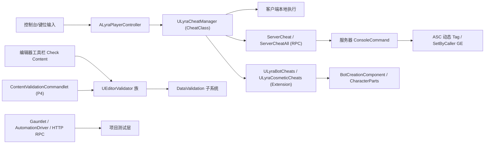
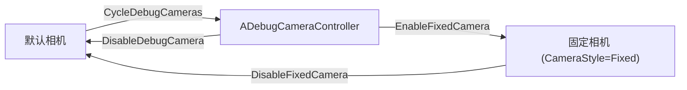

# UE5.8 Lyra 源码解析 47：调试工具与扩展源码

> 本篇沿“运行时调试 → 编辑器验证 → 项目测试层 → 扩展插件”四条线阅读 Lyra 5.8 源码：CheatManager 与开发者设置、LyraEditor 的验证器与 Commandlet、Gauntlet/自动化驱动/HTTP RPC 测试入口，以及 AsyncMixin、PocketWorlds 等插件。
> 重点是区分“源码中能证明的事实”与“只能推断的用途”：资产存在不等于蓝图行为已验证，类存在不等于运行时默认启用。
> 知识成熟度：L2（本机 UE 5.8 与 Lyra 5.8 项目/插件源码已静态核对；PIE、Gauntlet 与 HTTP 请求实验为可复现验证步骤）。

> 版本基准：UE 5.8.0（本机 `Engine/Build/Build.version`：CL 55116800，分支 `++UE5+Release-5.8`），Lyra 5.8 样例 `LyraStarterGame.uproject` 的 `EngineAssociation=5.8`。
> 源码依据：`C:\Users\zhaozhiqi\Documents\Unreal Projects\LyraStarterGame\Source\...`（项目只读引用）；引擎层以 `C:\Program Files\Epic Games\UE_5.8\Engine\...` 为准。
> 适用范围：调试命令、开发者设置、编辑器验证工具与扩展插件的 Lyra 5.8 项目源码解析。
> 兼容性边界：UE 4.27/早期 UE5 仅作为历史兼容性说明。
> 官方参考：[UE 5.8 官方文档](https://dev.epicgames.com/documentation/en-us/unreal-engine)。
> 最后更新：2026-08-13
> 知识成熟度：L2

## 一、先给结论

Lyra 的调试能力不是一个文件，而是三层：

第一层是运行时调试。`ULyraCheatManager` 挂在 `ALyraPlayerController::CheatClass` 上，非 Shipping 构建通过引擎 `APlayerController::AddCheats` 创建；`ULyraBotCheats` 与 `ULyraCosmeticCheats` 作为 `UCheatManagerExtension` 在 CheatManager 创建事件里自动挂接；`ULyraDeveloperSettings` 提供 PIE 期的 Experience 覆盖、机器人数量覆盖、自动执行命令和调试 CVar 映射。

第二层是编辑器验证。`Source/LyraEditor` 是仅编辑器目标编译的模块：`UEditorValidator` 家族把“加载告警、材质函数引用、版本控制依赖、蓝图继承链”变成 DataValidation 规则；`UContentValidationCommandlet` 把 P4 变更集变成 CI 里可跑的批处理；`ULyraEditorEngine` 负责 PIE 前的 NetMode 强制与设置提示；其余工具以编辑器控制台命令和资产工厂形式存在。

第三层是项目测试与插件扩展。`LyraGame/Tests` 里有 Gauntlet 启动控制器、UI 自动化 Spec 和 HTTP RPC 注册组件；`Plugins` 下的 AsyncMixin、PocketWorlds、GameSubtitles、ModularGameplayActors 等插件分别解决异步加载生命周期、独立 UI 世界、字幕显示和 GameFeature 可扩展 Actor 基类问题。

本篇先给出可以静态证明的事实，再给出验证边界。

> 例如：`ULyraCheatManager` 的真实 Exec 命令没有“生成物品”命令；本版本以动态 GameplayTag、SetByCaller 伤害/治疗和相机切换为主。不能凭印象写“Lyra 有 GiveItem 命令”。

> 例如：`Plugins/RedRoom` 与 `Plugins/GreenRoom` 只有 Content 资产和 uplugin 配置，项目 C++ 与配置中找不到文本引用；只能写“资产存在 + 用途推断”，不能写“用于某某测试已被验证”。

## 二、阅读前的事实边界

### 2.1 证据分级

| 等级 | 证据 | 本文用法 |
| --- | --- | --- |
| A | Lyra 5.8 `Source/LyraGame` 与 `Source/LyraEditor` 的 C++ 文件 | 作为类、函数、字段、调用顺序的直接事实 |
| B | Lyra 5.8 `Plugins` 插件源码与 uplugin 配置 | 作为插件行为与启用配置的事实 |
| C | UE 5.8 引擎源码或官方文档 | 作为 CheatManager、DataValidation、Gauntlet 语义的补充依据 |

本文不把 `.uasset`/`.umap` 文件名推断成蓝图图表内容。

资产路径只能证明资产存在和可被引用。

蓝图父类、字段值、节点连线需要在 UE 编辑器中打开资产确认。

本文不把一次静态检索写成“已经通过 PIE”或“已经通过 CI”。

断点实验章节会给出应观察的现象和记录字段。

### 2.2 先验证目录

```powershell
# 节选：确认项目、运行时调试、编辑器模块、测试目录与关键插件存在
$Lyra = 'C:\Users\zhaozhiqi\Documents\Unreal Projects\LyraStarterGame'
Test-Path -LiteralPath "$Lyra\LyraStarterGame.uproject"
Test-Path -LiteralPath "$Lyra\Source\LyraGame\Player\LyraCheatManager.cpp"
Test-Path -LiteralPath "$Lyra\Source\LyraGame\Development\LyraDeveloperSettings.h"
Test-Path -LiteralPath "$Lyra\Source\LyraEditor\Validation\EditorValidator.cpp"
Test-Path -LiteralPath "$Lyra\Source\LyraGame\Tests\MenuStartElimination.spec.cpp"
Test-Path -LiteralPath "$Lyra\Plugins\AsyncMixin\Source\Public\AsyncMixin.h"
Test-Path -LiteralPath "$Lyra\Plugins\PocketWorlds\Source\Public\PocketLevelSystem.h"
```

命令输出 `True` 只说明路径存在。

源码事实仍以文件中的真实符号为准。

### 2.3 目录地图

```text
LyraStarterGame/
├─ Source/LyraGame/
│  ├─ Player/LyraCheatManager.h/.cpp
│  ├─ Player/LyraDebugCameraController.h/.cpp
│  ├─ Development/LyraDeveloperSettings.h/.cpp
│  ├─ Development/LyraBotCheats.h/.cpp
│  ├─ Cosmetics/LyraCosmeticCheats.h/.cpp
│  ├─ System/LyraDevelopmentStatics.h/.cpp
│  └─ Tests/
│     ├─ LyraTestControllerBootTest.h/.cpp
│     ├─ LyraTestControllerStartEliminationTest.h/.cpp
│     ├─ MenuStartElimination.spec.cpp
│     └─ LyraGameplayRpcRegistrationComponent.h/.cpp
├─ Source/LyraEditor/
│  ├─ LyraEditorEngine.h/.cpp
│  ├─ LyraEditor.Build.cs
│  ├─ Validation/EditorValidator.h/.cpp
│  ├─ Validation/EditorValidator_Load/MaterialFunctions/SourceControl/Blueprints
│  ├─ Commandlets/ContentValidationCommandlet.h/.cpp
│  ├─ Utilities/CheckChaosMeshCollision.cpp
│  ├─ Utilities/CreateRedirectorPackage.cpp
│  ├─ Utilities/DiffCollectionReferenceSupport.cpp
│  └─ Private/GameEditorStyle + AssetTypeActions/Factories
└─ Plugins/
   ├─ AsyncMixin/  PocketWorlds/  GameSubtitles/  LyraExtTool/
   ├─ RedRoom/  GreenRoom/  ModularGameplayActors/
   └─ CommonLoadingScreen/  CommonStartupLoadingScreen/（44 篇已深挖，本篇只交叉引用）
```

## 三、调试与扩展体系总图



图的上半部分是运行时 Cheat 链路，下半部分是编辑器与 CI 验证链路，右侧是测试层。

两条链路共享同一个边界：非 Shipping 才有 CheatManager（`UE_WITH_CHEAT_MANAGER`），编辑器验证只在编辑器目标存在，`WITH_RPC_REGISTRY` 在 Shipping 被定义为 0。

## 四、核心职责矩阵

| 对象 | 文件（相对路径） | 职责 | 运行边界 |
| --- | --- | --- | --- |
| `ULyraCheatManager` | `Source/LyraGame/Player/LyraCheatManager.h/.cpp` | 项目级 Exec 命令与调试相机管理 | 非 Shipping（`USING_CHEAT_MANAGER`） |
| `ALyraDebugCameraController` | `Source/LyraGame/Player/LyraDebugCameraController.h/.cpp` | 调试相机控制器与 CheatClass 传递 | 编辑器/PIE 调试相机启用时 |
| `ULyraDeveloperSettings` | `Source/LyraGame/Development/LyraDeveloperSettings.h/.cpp` | 开发者设置、CheatsToRun、CVar 映射 | `EditorPerProjectUserSettings` |
| `ULyraBotCheats` | `Source/LyraGame/Development/LyraBotCheats.h/.cpp` | 增减机器人玩家命令 | `WITH_SERVER_CODE && UE_WITH_CHEAT_MANAGER` |
| `ULyraCosmeticCheats` | `Source/LyraGame/Cosmetics/LyraCosmeticCheats.h/.cpp` | 角色部件外观覆盖命令 | `UE_WITH_CHEAT_MANAGER` |
| `UEditorValidator` 族 | `Source/LyraEditor/Validation/*` | 内容验证规则 | 编辑器目标（`UnrealEd` 依赖） |
| `UContentValidationCommandlet` | `Source/LyraEditor/Commandlets/*` | P4 变更集内容验证 | 编辑器目标、命令行运行 |
| `ULyraTestControllerBootTest` 等 | `Source/LyraGame/Tests/*` | Gauntlet 启动判定 | 测试构建（Gauntlet） |
| `ULyraGameplayRpcRegistrationComponent` | `Source/LyraGame/Tests/*` | HTTP RPC 注册（外部调试入口） | 非 Shipping（`WITH_RPC_REGISTRY`） |
| 扩展插件（AsyncMixin/PocketWorlds/GameSubtitles/LyraExtTool/ModularGameplayActors/加载屏） | `Plugins/*` | 插件扩展见 48 | 见 48 |

## 五、ALyraCheatManager：项目级 CheatManager

### 5.1 类声明与编译边界

`ULyraCheatManager` 继承引擎 `UCheatManager`，声明为 `UCLASS(config = Game, Within = PlayerController, MinimalAPI)`。

头文件顶部定义了：

```cpp
// 节选：Source/LyraGame/Player/LyraCheatManager.h
#ifndef USING_CHEAT_MANAGER
#define USING_CHEAT_MANAGER (1 && !UE_BUILD_SHIPPING)
#endif
DECLARE_LOG_CATEGORY_EXTERN(LogLyraCheat, Log, All);
```

`USING_CHEAT_MANAGER` 是项目自有的编译开关，等价于“非 Shipping”。

类内真实方法（头文件核对）：

| 方法 | 修饰 | 用途 |
| --- | --- | --- |
| `InitCheatManager()` | override | 创建后初始化，执行 PIE 自动命令、启动 God 模式 |
| `Cheat(FString Msg)` | Exec | 把命令发到服务器（仅拥有者） |
| `CheatAll(FString Msg)` | Exec | 把命令发到服务器并广播所有玩家控制器 |
| `PlayNextGame()` | Exec, BlueprintAuthorityOnly | 用 `ULyraSystemStatics::PlayNextGame` 无缝旅行下一局 |
| `ToggleFixedCamera()` | Exec | 固定相机与默认相机切换 |
| `CycleDebugCameras()` | Exec | 默认 → 调试相机 → 固定相机循环 |
| `CycleAbilitySystemDebug()` | Exec | HUD 显示 AbilitySystem 调试并切换分类 |
| `CancelActivatedAbilities()` | Exec, BlueprintAuthorityOnly | 取消输入激活的能力 |
| `AddTagToSelf(FString)` | Exec, BlueprintAuthorityOnly | 给自身 ASC 加动态 Tag |
| `RemoveTagFromSelf(FString)` | Exec, BlueprintAuthorityOnly | 移除自身 ASC 动态 Tag |
| `DamageSelf(float)` | Exec, BlueprintAuthorityOnly | SetByCaller 伤害自己 |
| `DamageTarget(float)` | override | 伤害准星目标（客户端自动转 ServerCheat） |
| `HealSelf(float)` / `HealTarget(float)` | Exec | SetByCaller 治疗 |
| `DamageSelfDestruct()` | Exec, BlueprintAuthorityOnly | 就绪后调用 `ULyraHealthComponent::DamageSelfDestruct` |
| `God()` | override | 切换 `Cheat_GodMode` 动态 Tag |
| `UnlimitedHealth(int32)` | Exec | 切换 `Cheat_UnlimitedHealth` 动态 Tag |

源码中不存在“生成物品/授予能力”形式的 Exec 命令。

这是本篇第一个事实修正：Lyra 5.8 的 CheatManager 以 Tag、SetByCaller、相机与机器人命令为主。

### 5.2 挂接路径：CheatClass → AddCheats → EnableCheats

引擎侧挂接（`Engine/Source/Runtime/Engine`）：

- `APlayerController::CheatClass` 是 `TSubclassOf<UCheatManager>` 属性，默认行为注释写明：Shipping 下 `UE_WITH_CHEAT_MANAGER=0` 恒禁用；PIE 恒启用；其他情况单人默认启用，可用 `EnableCheats` 控制台命令强制打开；行为可被 `APlayerController::EnableCheats` 或 `AGameModeBase::AllowCheats` 覆盖。
- `APlayerController::AddCheats(bool bForce)` 在 `CheatManager` 为空且 `CheatClass` 有效时，若 `AllowCheats(this)` 或 `bForce` 成立，则 `NewObject<UCheatManager>(this, CheatClass)` 并调用 `InitCheatManager()`。
- `APlayerController::EnableCheats()` 在非 Shipping 构建调用 `AddCheats(true)`。
- `UCheatManager::InitCheatManager()` 广播静态委托 `OnCheatManagerCreatedDelegate`，`RegisterForOnCheatManagerCreated` 可注册回调。

Lyra 侧挂接：

```cpp
// 节选：Source/LyraGame/Player/LyraPlayerController.cpp
ALyraPlayerController::ALyraPlayerController(const FObjectInitializer& ObjectInitializer)
	: Super(ObjectInitializer)
{
	PlayerCameraManagerClass = ALyraPlayerCameraManager::StaticClass();
#if USING_CHEAT_MANAGER
	CheatClass = ULyraCheatManager::StaticClass();
#endif
}
```

```cpp
// 节选：Source/LyraGame/Player/LyraPlayerController.cpp
void ALyraPlayerController::AddCheats(bool bForce)
{
#if USING_CHEAT_MANAGER
	Super::AddCheats(true);
#else
	Super::AddCheats(bForce);
#endif
}
```

`AddCheats(true)` 表示非 Shipping 构建直接绕过 `AllowCheats` 门槛创建 CheatManager。

`ULyraCheatManager` 构造函数把 `DebugCameraControllerClass` 设为 `ALyraDebugCameraController::StaticClass()`，使引擎 `DebugCamera` 命令生成项目调试相机。

### 5.3 InitCheatManager 与自动执行

```cpp
// 节选：Source/LyraGame/Player/LyraCheatManager.cpp
void ULyraCheatManager::InitCheatManager()
{
	Super::InitCheatManager();
#if WITH_EDITOR
	if (GIsEditor)
	{
		APlayerController* PC = GetOuterAPlayerController();
		for (const FLyraCheatToRun& CheatRow : GetDefault<ULyraDeveloperSettings>()->CheatsToRun)
		{
			if (CheatRow.Phase == ECheatExecutionTime::OnCheatManagerCreated)
			{
				PC->ConsoleCommand(CheatRow.Cheat, /*bWriteToLog=*/ true);
			}
		}
	}
#endif
	if (LyraCheat::bStartInGodMode)
	{
		God();
	}
}
```

两个 CVar 定义在匿名命名空间（`LyraCheat`）：

- `LyraCheat.EnableDebugCameraCycling`（`ECVF_Cheat`）：允许运行期循环调试相机。
- `LyraCheat.StartInGodMode`（`ECVF_Cheat`）：BeginPlay 时自动执行 `God()`。

`CheatOutputText` 是静态辅助函数，同时输出到控制台与 `LogLyraCheat`。

### 5.4 ServerCheat 链路

客户端 Exec 命令通过 RPC 上送服务器：

```cpp
// 节选：Source/LyraGame/Player/LyraCheatManager.cpp
void ULyraCheatManager::Cheat(const FString& Msg)
{
	if (ALyraPlayerController* LyraPC = Cast<ALyraPlayerController>(GetOuterAPlayerController()))
	{
		LyraPC->ServerCheat(Msg.Left(128));
	}
}
```

`ALyraPlayerController::ServerCheat`/`ServerCheatAll` 是 UE_API 声明、带 `_Validate` 的服务器 RPC（`Source/LyraGame/Player/LyraPlayerController.h/.cpp`）。

服务器实现（`Source/LyraGame/Player/LyraPlayerController.cpp`）：

- `ServerCheat_Implementation`：`CheatManager` 非空时 `ConsoleCommand(Msg)` 并把返回消息 `ClientMessage` 回给客户端。
- `ServerCheatAll_Implementation`：遍历 `TActorIterator<ALyraPlayerController>`，对每个控制器执行 `ConsoleCommand(Msg)`。
- 两个 `_Validate` 当前都返回 `true`，只截断到 128 字符，不解析内容——这是调试通道，不是安全边界。

### 5.5 Tag 与 SetByCaller 的实现路径

`AddTagToSelf`/`RemoveTagFromSelf` 通过 `LyraGameplayTags::FindTagByString(TagName, true)` 找到 Tag，再调用 `ULyraAbilitySystemComponent::AddDynamicTagGameplayEffect`/`RemoveDynamicTagGameplayEffect`。

`God()` 与 `UnlimitedHealth()` 用同一机制切换 `Cheat_GodMode`、`Cheat_UnlimitedHealth` 动态 Tag。

`God()` 在客户端检测到 `NM_Client` 时自动 `ServerCheat("God")`，保证权威侧生效。

伤害与治疗走 SetByCaller：

```cpp
// 节选：Source/LyraGame/Player/LyraCheatManager.cpp
TSubclassOf<UGameplayEffect> DamageGE = ULyraAssetManager::GetSubclass(ULyraGameData::Get().DamageGameplayEffect_SetByCaller);
FGameplayEffectSpecHandle SpecHandle = LyraASC->MakeOutgoingSpec(DamageGE, 1.0f, LyraASC->MakeEffectContext());
if (SpecHandle.IsValid())
{
	SpecHandle.Data->SetSetByCallerMagnitude(LyraGameplayTags::SetByCaller_Damage, DamageAmount);
	LyraASC->ApplyGameplayEffectSpecToSelf(*SpecHandle.Data.Get());
}
```

治疗路径对称，使用 `HealGameplayEffect_SetByCaller` 与 `SetByCaller_Heal`。

`DamageSelfDestruct()` 先检查 PawnExtension 是否到达 `InitState_GameplayReady`，再调用 `ULyraHealthComponent::DamageSelfDestruct()`，防止在初始化未完成时误杀。

`PlayNextGame()` 委托 `ULyraSystemStatics::PlayNextGame`（`Source/LyraGame/System/LyraSystemStatics.cpp`）：取 `LastURL`、PIE 下剥掉地图前缀、加 `SeamlessTravel` 选项、去掉 host/port 后 `ServerTravel`。

### 5.6 静态验证命令

```powershell
# 节选：核对真实 Exec 命令与挂接
$Lyra = 'C:\Users\zhaozhiqi\Documents\Unreal Projects\LyraStarterGame'
rg -n 'UFUNCTION\(exec\)|UFUNCTION\(Exec|void (Cheat|God|DamageSelf|PlayNextGame)' "$Lyra\Source\LyraGame\Player\LyraCheatManager.h"
rg -n 'CheatClass|AddCheats|ServerCheat' "$Lyra\Source\LyraGame\Player\LyraPlayerController.cpp"
rg -n 'EnableCheats|AllowCheats|InitCheatManager' 'C:\Program Files\Epic Games\UE_5.8\Engine\Source\Runtime\Engine\Private\PlayerController.cpp'
```

## 六、ALyraDebugCameraController 与相机调试

### 6.1 类结构

`ALyraDebugCameraController : ADebugCameraController`，头文件只有构造函数与 `AddCheats(bool)` 重写。

构造函数把 `CheatClass` 设为 `ULyraCheatManager::StaticClass()`，注释明确说明“与 LyraPlayerController 使用相同 Cheat 类，以便通过 Cheat 切换调试相机”。

### 6.2 AddCheats(true) 的防卡死语义

```cpp
// 节选：Source/LyraGame/Player/LyraDebugCameraController.cpp
void ALyraDebugCameraController::AddCheats(bool bForce)
{
	// Mirrors LyraPlayerController's AddCheats() to avoid the player becoming stuck in the debug camera.
#if USING_CHEAT_MANAGER
	Super::AddCheats(true);
#else
	Super::AddCheats(bForce);
#endif
}
```

调试相机控制器也带同一 CheatManager，因此从调试相机切回时仍能执行 `DisableDebugCamera` 相关命令。

### 6.3 CheatManager 侧相机状态机

`CycleDebugCameras()` 由 `LyraCheat.EnableDebugCameraCycling` 门控，状态流转：



`EnableFixedCamera`/`DisableFixedCamera` 对原控制器调用 `SetCameraMode("Fixed")`/`SetCameraMode(NAME_Default)`。

`DisableDebugCamera` 重写在退出调试相机时把相机 POV 回写原控制器（若原相机是 Fixed 模式），避免切回后镜头跳走。

`CycleAbilitySystemDebug()` 通过 `MyHUD->ShowDebug("AbilitySystem")` 与 `AbilitySystem.Debug.NextCategory` 切换 GAS 调试页。

### 6.4 静态验证命令

```powershell
# 节选：核对调试相机链路
$Lyra = 'C:\Users\zhaozhiqi\Documents\Unreal Projects\LyraStarterGame'
rg -n 'CheatClass|AddCheats' "$Lyra\Source\LyraGame\Player\LyraDebugCameraController.cpp"
rg -n 'CycleDebugCameras|ToggleFixedCamera|EnableDebugCamera|DisableDebugCamera' "$Lyra\Source\LyraGame\Player\LyraCheatManager.cpp"
rg -n 'EnableDebugCameraCycling|StartInGodMode' "$Lyra\Source\LyraGame\Player\LyraCheatManager.cpp"
```

## 七、ULyraDeveloperSettings

### 7.1 基类与配置容器

`ULyraDeveloperSettings : UDeveloperSettingsBackedByCVars`，`UCLASS(config=EditorPerProjectUserSettings, MinimalAPI)`。

引擎基类在 `Engine/Source/Runtime/DeveloperSettings/Public/Engine/DeveloperSettingsBackedByCVars.h`，支持把配置字段映射为控制台变量。

`GetCategoryName()` 返回 `FApp::GetProjectName()`，即 Lyra。

### 7.2 字段清单（头文件核对）

| 字段 | 类型/元数据 | 用途 |
| --- | --- | --- |
| `ExperienceOverride` | `FPrimaryAssetId`，`AllowedTypes="LyraExperienceDefinition"` | PIE 覆盖 Experience |
| `bOverrideBotCount` | bool，`InlineEditConditionToggle` | 是否覆盖机器人数量 |
| `OverrideNumPlayerBotsToSpawn` | int32 | 覆盖后的机器人数量 |
| `bAllowPlayerBotsToAttack` | bool | 是否允许机器人攻击 |
| `bTestFullGameFlowInPIE` | bool | PIE 是否走完整游戏流程 |
| `bShouldAlwaysPlayForceFeedback` | bool，CVar=`LyraPC.ShouldAlwaysPlayForceFeedback` | 是否无视最近输入设备强制播放力反馈 |
| `bSkipLoadingCosmeticBackgroundsInPIE` | bool | PIE 跳过外观背景加载以提速 |
| `CheatsToRun` | `TArray<FLyraCheatToRun>` | 自动执行的 Cheat 命令列表 |
| `LogGameplayMessages` | bool，CVar=`GameplayMessageSubsystem.LogMessages` | 是否记录 GameplayMessage 广播 |
| `CommonEditorMaps` | `TArray<FSoftObjectPath>`（`WITH_EDITORONLY_DATA`） | 编辑器工具栏“常用地图”列表 |

`FLyraCheatToRun` 结构有两个字段：`Phase`（`ECheatExecutionTime`）与 `Cheat`（命令字符串）。

`ECheatExecutionTime` 枚举值：`OnCheatManagerCreated`、`OnPlayerPawnPossession`。

### 7.3 CheatsToRun 的两个执行阶段

| Phase | 执行点（源码位置） | 条件 |
| --- | --- | --- |
| `OnCheatManagerCreated` | `ULyraCheatManager::InitCheatManager` | `WITH_EDITOR && GIsEditor` |
| `OnPlayerPawnPossession` | `ALyraPlayerController::OnPossess` | `WITH_SERVER_CODE && WITH_EDITOR` 且 `GIsEditor`、`InPawn != nullptr` |

两个执行点都在编辑器环境才跑，普通打包运行不自动执行。

### 7.4 设置如何影响游戏逻辑

`Source/LyraGame/System/LyraDevelopmentStatics` 是设置与玩法逻辑之间的桥：

- `ShouldSkipDirectlyToGameplay()`：编辑器内 `bTestFullGameFlowInPIE=false` 时返回 true，跳过等待阶段。
- `ShouldLoadCosmeticBackgrounds()`：`bSkipLoadingCosmeticBackgroundsInPIE` 控制。
- `CanPlayerBotsAttack()`：返回 `bAllowPlayerBotsToAttack`。
- `FindPlayInEditorAuthorityWorld()`：寻找 PIE 的权威世界。
- `FindClassByShortName(SearchToken, DesiredBaseClass)`：按短名找类，供外观 Cheat 使用。

`ULyraBotCreationComponent`（`Source/LyraGame/GameModes/LyraBotCreationComponent.cpp`）在编辑器下读取 `bOverrideBotCount` 与 `OverrideNumPlayerBotsToSpawn` 计算 `EffectiveBotCount`，随后 URL 的 `NumBots` 选项还可再覆盖一次。

### 7.5 PIE 提示

`OnPlayInEditorStarted()` 在 `ExperienceOverride` 有效时弹出 2 秒通知，提醒开发者当前 PIE 正在使用覆盖 Experience。

`PostEditChangeProperty`/`PostReloadConfig`/`PostInitProperties` 都调用 `ApplySettings()`，当前版本函数体为空。

### 7.6 静态验证命令

```powershell
# 节选：核对开发者设置字段与消费点
$Lyra = 'C:\Users\zhaozhiqi\Documents\Unreal Projects\LyraStarterGame'
rg -n 'UPROPERTY|ConsoleVariable' "$Lyra\Source\LyraGame\Development\LyraDeveloperSettings.h"
rg -n 'CheatsToRun|ECheatExecutionTime' "$Lyra\Source\LyraGame\Player\LyraCheatManager.cpp" "$Lyra\Source\LyraGame\Player\LyraPlayerController.cpp"
rg -n 'OverrideNumPlayerBotsToSpawn|CanPlayerBotsAttack' "$Lyra\Source\LyraGame\GameModes\LyraBotCreationComponent.cpp" "$Lyra\Source\LyraGame\System\LyraDevelopmentStatics.cpp"
```

## 八、ULyraBotCheats 与 ULyraCosmeticCheats

### 8.1 UCheatManagerExtension 的自动挂接

两个类都继承 `UCheatManagerExtension`，并在 CDO 构造函数里注册：

```cpp
// 节选：Source/LyraGame/Development/LyraBotCheats.cpp
ULyraBotCheats::ULyraBotCheats()
{
#if WITH_SERVER_CODE && UE_WITH_CHEAT_MANAGER
	if (HasAnyFlags(RF_ClassDefaultObject))
	{
		UCheatManager::RegisterForOnCheatManagerCreated(FOnCheatManagerCreated::FDelegate::CreateLambda(
			[](UCheatManager* CheatManager)
			{
				CheatManager->AddCheatManagerExtension(NewObject<ThisClass>(CheatManager));
			}));
	}
#endif
}
```

引擎 `UCheatManager::InitCheatManager` 广播 `OnCheatManagerCreatedDelegate`，扩展随即加入。

### 8.2 机器人命令

`ULyraBotCheats` 命令：

- `AddPlayerBot()`：Exec, BlueprintAuthorityOnly；经 `ULyraBotCreationComponent::Cheat_AddBot()`（头文件内联为 `SpawnOneBot()`）添加机器人。
- `RemovePlayerBot()`：经 `Cheat_RemoveBot()`（内联为 `RemoveOneBot()`）移除一个机器人。

`GetBotComponent()` 通过 `GameState->FindComponentByClass<ULyraBotCreationComponent>()` 查找。

### 8.3 外观命令

`ULyraCosmeticCheats` 命令：

- `AddCharacterPart(FString AssetName, bool bSuppressNaturalParts = true)`：用 `ULyraDevelopmentStatics::FindClassByShortName<AActor>` 找类，构造 `FLyraCharacterPart`，调用 `ULyraControllerComponent_CharacterParts::AddCheatPart`。
- `ReplaceCharacterPart(...)`：先清除再添加。
- `ClearCharacterPartOverrides()`：调用 `ClearCheatParts()`。

`AddCheatPart` 内部以 `ECharacterPartSource::AppliedViaCheatManager` 标记部件（`Source/LyraGame/Cosmetics/LyraControllerComponent_CharacterParts.cpp`），`ClearCheatParts` 只清理该来源的部件，再重放开发者设置。

### 8.4 与开发者设置的关系

`ULyraCosmeticDeveloperSettings`（`Source/LyraGame/Cosmetics/LyraCosmeticDeveloperSettings.h`）提供 `CheatCosmeticCharacterParts` 与 `ECosmeticCheatMode`（`ReplaceParts`/`AddParts`）。

部件组件在编辑器环境下用 `ECharacterPartSource::AppliedViaDeveloperSettingsCheat` 应用这些部件，形成“CheatManager 临时覆盖 + 开发者设置持久覆盖”两层。

`ULyraBotCheats` 的编译守卫比 `ULyraCosmeticCheats` 多一个 `WITH_SERVER_CODE`，因为机器人逻辑只在服务器代码编译时存在；外观命令没有服务器语义。

### 8.5 静态验证命令

```powershell
# 节选：核对扩展类挂接与命令
$Lyra = 'C:\Users\zhaozhiqi\Documents\Unreal Projects\LyraStarterGame'
rg -n 'RegisterForOnCheatManagerCreated|AddCheatManagerExtension|UFUNCTION\(Exec' "$Lyra\Source\LyraGame\Development\LyraBotCheats.cpp" "$Lyra\Source\LyraGame\Cosmetics\LyraCosmeticCheats.cpp"
rg -n 'AddCheatPart|ClearCheatParts|AppliedViaCheatManager' "$Lyra\Source\LyraGame\Cosmetics\LyraControllerComponent_CharacterParts.cpp"
rg -n 'CheatCosmeticCharacterParts|ECosmeticCheatMode' "$Lyra\Source\LyraGame\Cosmetics\LyraCosmeticDeveloperSettings.h"
```

## 九、LyraEditor 模块边界

### 9.1 模块身份

`Source/LyraEditor` 是纯编辑器模块：

- `LyraEditor.Build.cs` 依赖 `UnrealEd`、`EditorFramework`、`DataValidation`、`MessageLog`、`CollectionManager`、`SourceControl`、`Chaos`、`GameplayAbilitiesEditor`、`GameplayTagsEditor`、`StudioTelemetry` 等，并私有依赖 `LyraGame`。
- 非 Shipping 额外依赖 `ExternalRpcRegistry` 与 `HTTPServer`，定义 `WITH_RPC_REGISTRY=1`、`WITH_HTTPSERVER_LISTENERS=1`；Shipping 定义两者为 0。
- `PublicDefinitions.Add("SHIPPING_DRAW_DEBUG_ERROR=1")`：在测试/Shipping 构建中对 DrawDebug 调用生成编译错误。

`LyraEditorTarget`（`Source/LyraEditor.Target.cs`）是 `TargetType.Editor`，`ExtraModuleNames` 只有 `LyraGame` 与 `LyraEditor`，并 `EnablePlugins.Add("RemoteSession")`。

结论：游戏打包目标不编译 LyraEditor，内容验证工具链只在编辑器/CI 编辑器进程中存在。

### 9.2 模块启动职责

`FLyraEditorModule`（`Source/LyraEditor/LyraEditor.cpp`）：

- 初始化 `FGameEditorStyle`。
- 非运行游戏时：监听模块加载（GameplayAbilitiesEditor 加载后绑定委托）、绑定 GameplayCue 编辑器三个委托（默认类、接口类、创建路径）、注册 Play 工具栏菜单、订阅 BeginPIE/EndPIE。
- BeginPIE 时调用 `ULyraExperienceManager::OnPlayInEditorBegun()`。
- 注册/注销 `FAssetTypeActions_LyraContextEffectsLibrary`。

GameplayCue 编辑器委托（`Source/LyraEditor/LyraEditor.cpp` 静态函数）：

- `GetGameplayCueDefaultClasses`：暴露 `UGameplayCueNotify_Burst`、`AGameplayCueNotify_BurstLatent`、`AGameplayCueNotify_Looping`。
- `GetGameplayCueInterfaceClasses`：枚举实现 `UGameplayCueInterface` 的 Actor 类。
- `GetGameplayCuePath`：默认取 `UAbilitySystemGlobals::GameplayCueNotifyPaths` 首项，生成 `GCN_<Tag>` 路径。

### 9.3 静态验证命令

```powershell
# 节选：核对编辑器模块依赖与目标
$Lyra = 'C:\Users\zhaozhiqi\Documents\Unreal Projects\LyraStarterGame'
rg -n 'UnrealEd|DataValidation|SourceControl|SHIPPING_DRAW_DEBUG_ERROR|WITH_RPC_REGISTRY' "$Lyra\Source\LyraEditor\LyraEditor.Build.cs"
rg -n 'ExtraModuleNames|TargetType' "$Lyra\Source\LyraEditor.Target.cs"
rg -n 'RegisterGameEditorMenus|BindGameplayAbilitiesEditorDelegates|OnPlayInEditorBegun' "$Lyra\Source\LyraEditor\LyraEditor.cpp"
```

## 十、ULyraEditorEngine

### 10.1 类结构

`ULyraEditorEngine : UUnrealEdEngine`（`Source/LyraEditor/LyraEditorEngine.h/.cpp`），重写 `Init`、`Start`、`Tick`、`PreCreatePIEInstances`。

`Tick` 中调用 `FirstTickSetup()`，仅执行一次：

```cpp
// 节选：Source/LyraEditor/LyraEditorEngine.cpp
void ULyraEditorEngine::FirstTickSetup()
{
	if (bFirstTickSetup) return;
	bFirstTickSetup = true;
	// Force show plugin content on load.
	GetMutableDefault<UContentBrowserSettings>()->SetDisplayPluginFolders(true);
}
```

### 10.2 PreCreatePIEInstances 的两个动作

1. 若 `ALyraWorldSettings::ForceStandaloneNetMode` 为 true 且 PIE 不是 `PIE_Standalone`，强制改为 Standalone 并弹出通知（前端地图通常要求单人）。
2. 调用 `ULyraDeveloperSettings::OnPlayInEditorStarted()` 与 `ULyraPlatformEmulationSettings::OnPlayInEditorStarted()`，弹出覆盖提示。

源码注释提到：理想方案是让非编辑器模块也能订阅 PIE 开始/结束，当前实现是直接调用设置类。

### 10.3 静态验证命令

```powershell
# 节选：核对编辑器引擎子类
$Lyra = 'C:\Users\zhaozhiqi\Documents\Unreal Projects\LyraStarterGame'
rg -n 'PreCreatePIEInstances|ForceStandaloneNetMode|FirstTickSetup' "$Lyra\Source\LyraEditor\LyraEditorEngine.cpp"
rg -n 'ForceStandaloneNetMode' "$Lyra\Source\LyraGame\GameModes\LyraWorldSettings.h"
```

## 十一、EditorValidator 族

### 11.1 基类 UEditorValidator

`UEditorValidator : UEditorValidatorBase`（`Source/LyraEditor/Validation/EditorValidator.h/.cpp`），`UCLASS(Abstract)`。

引擎基类位于 `Engine/Plugins/Editor/DataValidation/Source/DataValidation/Public/EditorValidatorBase.h`。

基类提供的静态入口：

| 静态方法 | 用途 |
| --- | --- |
| `ValidateCheckedOutContent(bInteractive, Usecase)` | 校验版本控制中打开的资产（交互式/CI） |
| `ValidatePackages(Existing, Deleted, MaxPackagesToLoad, Out, Usecase)` | 校验资产包集合，含删除包的引用者 |
| `ValidateProjectSettings()` | 校验项目设置（如 Python bDeveloperMode 不应入库） |
| `IsInUncookedFolder(PackageName)` | 判断包是否在 `DirectoriesToNeverCook` 中 |
| `ShouldAllowFullValidation()` | `IsRunningCommandlet() || bAllowFullValidationInEditor` |
| `GetChangedAssetsForCode(AssetRegistry, Header, Out)` | 头文件变更 → 受影响的派生蓝图包 |

`FLyraValidationMessageGatherer` 是 `FOutputDevice` 子类，挂在 `GLog` 上收集 Warning/Error，支持忽略模式，用于“预加载资产时的日志抓取”。

`ValidateCheckedOutContent` 流程：

1. 资产发现未完成时给出提示并返回。
2. 版本控制可用时执行 `FUpdateStatus`（只取打开的），按“已检出/已添加/已删除”收集包名；`.h` 变更走 `GetChangedAssetsForCode`。
3. 交互式模式下先 `FinishAllCompilation` 冲刷着色器编译，并允许全量验证。
4. 调用 `ValidatePackages`（默认上限 2000）。
5. 用 `FLyraValidationMessageGatherer` 包住 `ValidateProjectSettings()`。
6. 交互式弹出结果对话框（全部通过 / 有问题 / 错误码异常）。

`ValidatePackages` 关键语义：

- 被删除包会通过 AssetRegistry 的 `GetReferencers` 找到引用者并加入校验队列。
- 超过 `MaxPackagesToLoad` 时跳过并告警。
- 预加载阶段把加载 Warning 升级为 Error 输出，供 CIS 建立任务。
- 最终调用 `UEditorValidatorSubsystem::ValidateAssetsWithSettings`，`bSkipExcludedDirectories=true`。

`GetChangedAssetsForCode` 的三步：缓存原生类（ModuleName+ModuleRelativePath）→ `GetDerivedClassNames` 找派生蓝图 → 枚举非 data-only 蓝图并收集包名，上限由 `EditorValidator.MaxAssetsChangedByAHeader`（默认 200）控制。

### 11.2 四个具体验证器

| 验证器 | 适用资产 | 行为（源码核对） |
| --- | --- | --- |
| `UEditorValidator_Load` | 任意 | 对内存中的包做“旁路重载”收集加载告警；Commandlet 下禁用（已加载过） |
| `UEditorValidator_MaterialFunctions` | `UMaterialFunction` | 全量验证时递归收集硬引用者，加载引用它的 `UMaterial` 检查编译告警 |
| `UEditorValidator_SourceControl` | 任意已入版本控制资产 | 检查包依赖中是否有“已知但未加入版本控制”的依赖，告警“References X which is not marked for add in source control” |
| `UEditorValidator_Blueprints` | `UBlueprint` | 全量验证时对非 data-only 蓝图递归收集硬引用者，跳过 LevelScript（`PKG_ContainsMap`），加载引用蓝图检查编译告警 |

`UEditorValidator_Load::IsEnabled()` 返回 `!IsRunningCommandlet() && Super::IsEnabled()`。

`GetLoadWarningsAndErrorsForPackage` 的旁路重载细节：

- 跳过 `GetTransientPackage()` 与世界/外部 Actor 包。
- 全量验证且包已在内存：把资产文件复制到 `/Temp/<名>_<序号>`，用 `LOAD_ForDiff` 加载；遇到非 data-only 蓝图先编译原件并给副本加 `LOAD_DisableCompileOnLoad`。
- 日志里的临时路径/包名替换回原路径，避免告警指向临时文件。
- 结束后 `ResetLoaders`、删除临时文件、清 `RF_Public|RF_Standalone`、`ForceGarbageCollection`。
- 忽略列表只含 `"Enum name collision: '"` 一类因双包共存产生的无害告警。

### 11.3 静态验证命令

```powershell
# 节选：核对验证器族
$Lyra = 'C:\Users\zhaozhiqi\Documents\Unreal Projects\LyraStarterGame'
rg -n 'ValidateCheckedOutContent|ValidatePackages|GetChangedAssetsForCode|ShouldAllowFullValidation' "$Lyra\Source\LyraEditor\Validation\EditorValidator.cpp"
rg -n 'LOAD_ForDiff|ResetLoaders|InMemoryReloadLogIgnoreList' "$Lyra\Source\LyraEditor\Validation\EditorValidator_Load.cpp"
rg -n 'GetReferencers|IsDataOnlyBlueprint|not marked for add' "$Lyra\Source\LyraEditor\Validation\EditorValidator_Blueprints.cpp" "$Lyra\Source\LyraEditor\Validation\EditorValidator_MaterialFunctions.cpp" "$Lyra\Source\LyraEditor\Validation\EditorValidator_SourceControl.cpp"
```

## 十二、ContentValidationCommandlet

### 12.1 入口与参数

`UContentValidationCommandlet : UCommandlet`（`Source/LyraEditor/Commandlets/ContentValidationCommandlet.h/.cpp`），`Main` 流程：

1. `AssetRegistry.SearchAllAssets(true)` 全量发现资产。
2. 按参数收集变更：
   - `-P4Filter=<过滤串>`：执行 `p4 files <过滤串>`。
   - `-P4Changelist=<CL>`：执行 `p4 opened -c <CL>`。
   - `-P4Opened`：从版本控制设置或 `-P4Client` 取工作区，执行 `p4 -c<workspace> opened`。
   - `-InPath=<路径+...>`：按路径收集包。
   - `-OfType=<类短名+...>`：按类收集包。
   - `-Packages=<包名+...>`：追加指定包。
   - `-MaxPackagesToLoad=<N>`：覆盖默认 2000。
3. `FinishAllCompilation()` 后调用 `UEditorValidator::ValidatePackages(..., EDataValidationUsecase::Commandlet)` 与 `ValidateProjectSettings()`，任一失败返回非 0。

### 12.2 变更文件解析

`GetAllChangedFiles` 把 P4 输出按 `#` 拆成 depot 路径与版本信息：

- `.uasset/.umap`：`LyraGame/Content/` 前缀 → `/Game/` 包名；`LyraGame/Plugins/<插件>/Content/` 前缀 → `/<插件>/` 包名（插件需启用）；`delete` 标记进删除列表。
- `.cpp/.h`：记录为代码变更；`.h` 额外调用 `GetChangedAssetsForCode` 收集受影响蓝图。
- 其余文件记录为其他文件。

`LaunchP4` 用 `FPlatformProcess::CreateProc("p4.exe", ...)` 起进程并读管道；`GetLocalPathFromDepotPath` 用 `p4 -ztag -c<ws> where` 反查本地路径。

头文件还声明了 `AutoExportMCPTemplates`、`AutoExportDadContent`、`AutoPersistDadContent` 三个私有成员，当前 `.cpp` 中未找到实现——这是“声明存在、实现未在本文核对范围内”的验证边界，不应写成可用功能。

### 12.3 静态验证命令

```powershell
# 节选：核对 Commandlet 参数与 P4 逻辑
$Lyra = 'C:\Users\zhaozhiqi\Documents\Unreal Projects\LyraStarterGame'
rg -n 'P4Filter|P4Changelist|P4Opened|InPath|OfType|MaxPackagesToLoad' "$Lyra\Source\LyraEditor\Commandlets\ContentValidationCommandlet.cpp"
rg -n 'ValidatePackages|EDataValidationUsecase::Commandlet' "$Lyra\Source\LyraEditor\Commandlets\ContentValidationCommandlet.cpp"
rg -n 'AutoExportMCPTemplates|AutoExportDadContent|AutoPersistDadContent' "$Lyra\Source\LyraEditor\Commandlets\ContentValidationCommandlet.h"
```

## 十三、LyraEditor 工具与工厂

### 13.1 CheckChaosMeshCollision

`Source/LyraEditor/Utilities/CheckChaosMeshCollision.cpp` 注册编辑器控制台命令 `Lyra.CheckChaosMeshCollision`。

遍历 `TObjectRange<UStaticMesh>`（已加载资产），对 `BodySetup->TriMeshGeometries` 中每个 `FTriangleMeshImplicitObject` 检查退化三角形：叉积 `SafeNormalize() < SMALL_NUMBER` 视为退化，输出 `LogConsoleResponse` Warning。

用途：发现碰撞数据中的零面积三角形，属于编辑器资产健康检查。

### 13.2 CreateRedirectorPackage

`Source/LyraEditor/Utilities/CreateRedirectorPackage.cpp` 注册 `Lyra.CreateRedirectorPackage <RedirectorName> <TargetPackage>`。

流程：校验长包名 → `StaticLoadObject` 目标资产 → `CreatePackage` → `NewObject<UObjectRedirector>(..., RF_Standalone | RF_Public)` → 设置 `DestinationObject` → `FAssetRegistryModule::AssetCreated`。

用途：资产迁移/重命名时批量补重定向器。

### 13.3 DiffCollectionReferenceSupport

`Source/LyraEditor/Utilities/DiffCollectionReferenceSupport.cpp` 注册 `Lyra.DiffCollectionReferenceSupport <Old> <New> [Deduplicate]`。

语义：对比两个项目 Collection，找出 New 相对 Old 新增的资产，再沿 AssetRegistry 引用者递归找出“哪些旧资产直接/间接支撑新资产”，输出支撑者列表与无支撑资产列表。

用途：评估新内容是否被旧内容引用，帮助判断删除/迁移风险。

### 13.4 ContextEffectsLibrary 资产类型动作与工厂

`FAssetTypeActions_LyraContextEffectsLibrary : FAssetTypeActions_Base`（`Source/LyraEditor/Private/AssetTypeActions_LyraContextEffectsLibrary.h/.cpp`）：

- `GetSupportedClass()` 返回 `ULyraContextEffectsLibrary::StaticClass()`。
- `GetCategories()` 返回 `EAssetTypeCategories::Gameplay`。
- 类型颜色 `FColor(65, 200, 98)`。

`ULyraContextEffectsLibraryFactory : UFactory`（`Source/LyraEditor/Private/LyraContextEffectsLibraryFactory.h/.cpp`）：

- 构造函数设置 `SupportedClass`、`bCreateNew=true`、`bEditAfterNew=true`。
- `FactoryCreateNew` 直接 `NewObject<ULyraContextEffectsLibrary>`。

两者配合让内容创建菜单中出现“LyraContextEffectsLibrary”新建项。

### 13.5 GameEditorStyle

`FGameEditorStyle`（`Source/LyraEditor/Private/GameEditorStyle.h/.cpp`）是静态 Slate 样式集：

- `GetStyleSetName()` 返回 `"GameEditorStyle"`。
- `Create()` 注册 `"GameEditor.CheckContent"` 图标，来源为项目 `Content/Editor/Slate/Icons/CheckContent.svg`（`GAME_IMAGE_BRUSH_SVG`）。
- `Initialize`/`Shutdown` 管理 `FSlateStyleRegistry` 生命周期。

该图标被“Check Content”工具栏按钮使用。

### 13.6 静态验证命令

```powershell
# 节选：核对编辑器工具命令与工厂
$Lyra = 'C:\Users\zhaozhiqi\Documents\Unreal Projects\LyraStarterGame'
rg -n 'FAutoConsoleCommandWithWorldArgsAndOutputDevice|Lyra\.CheckChaosMeshCollision|Lyra\.CreateRedirectorPackage|Lyra\.DiffCollectionReferenceSupport' "$Lyra\Source\LyraEditor\Utilities\*.cpp"
rg -n 'GetSupportedClass|EAssetTypeCategories::Gameplay' "$Lyra\Source\LyraEditor\Private\AssetTypeActions_LyraContextEffectsLibrary.cpp"
rg -n 'SupportedClass|bCreateNew|FactoryCreateNew' "$Lyra\Source\LyraEditor\Private\LyraContextEffectsLibraryFactory.cpp"
```

## 十四、项目测试层：Gauntlet 控制器

### 14.1 ULyraTestControllerBootTest

`ULyraTestControllerBootTest : UGauntletTestControllerBootTest`（`Source/LyraGame/Tests/LyraTestControllerBootTest.h/.cpp`）。

引擎基类位于 `Engine/Plugins/Experimental/Gauntlet/Source/Gauntlet/Public/GauntletTestControllerBootTest.h`。

当前实现只做“时间判定”：

```cpp
// 节选：Source/LyraGame/Tests/LyraTestControllerBootTest.cpp
bool ULyraTestControllerBootTest::IsBootProcessComplete() const
{
	static double StartTime = FPlatformTime::Seconds();
	const double TimeSinceStart = FPlatformTime::Seconds() - StartTime;
	if (TimeSinceStart >= TestDelay)
	{
		return true;
	}
	return false;
}
```

`TestDelay = 20.0f`，头文件注释说明：游戏启动后焦点回到 Gauntlet 前测试可能已经结束，需要延时让 Gauntlet 感知进程存活。

源码中原来按 `ShooterGameInstanceState::WelcomeScreen/MainMenu` 判断启动完成的状态检查被注释掉，当前版本不执行该检查——这是本机源码事实。

### 14.2 ULyraTestControllerStartEliminationTest

`ULyraTestControllerStartEliminationTest : UGauntletTestControllerBootTest`（`Source/LyraGame/Tests/LyraTestControllerStartEliminationTest.h/.cpp`），同样只重写 `IsBootProcessComplete`。

真实判定逻辑：

```cpp
// 节选：Source/LyraGame/Tests/LyraTestControllerStartEliminationTest.cpp
if (const UWorld* World = GetWorld(); World != nullptr && World->IsGameWorld())
{
	AGameStateBase* GameState = World->GetGameState();
	if (GameState != nullptr)
	{
		ULyraExperienceManagerComponent* ExperienceComponent =
			GameState->FindComponentByClass<ULyraExperienceManagerComponent>();
		if (ExperienceComponent != nullptr && ExperienceComponent->IsExperienceLoaded())
		{
			return ExperienceComponent->GetCurrentExperienceChecked()->GetName().Contains("Elimination");
		}
	}
}
return false;
```

判定条件：游戏世界存在 → GameState 存在 → `ULyraExperienceManagerComponent::IsExperienceLoaded()` 为真 → 当前 Experience 名称包含 `Elimination`。

这是“启动目标世界并等到 Elimination Experience 加载完成”的冒烟测试。

### 14.3 静态验证命令

```powershell
# 节选：核对 Gauntlet 控制器
$Lyra = 'C:\Users\zhaozhiqi\Documents\Unreal Projects\LyraStarterGame'
rg -n 'IsBootProcessComplete|TestDelay' "$Lyra\Source\LyraGame\Tests\LyraTestControllerBootTest.cpp" "$Lyra\Source\LyraGame\Tests\LyraTestControllerStartEliminationTest.cpp"
rg -n 'IsExperienceLoaded|GetCurrentExperienceChecked|Elimination' "$Lyra\Source\LyraGame\Tests\LyraTestControllerStartEliminationTest.cpp"
Test-Path -LiteralPath 'C:\Program Files\Epic Games\UE_5.8\Engine\Plugins\Experimental\Gauntlet\Source\Gauntlet\Public\GauntletTestControllerBootTest.h'
```

## 十五、MenuStartElimination.spec.cpp

### 15.1 测试框架与守卫

`Source/LyraGame/Tests/MenuStartElimination.spec.cpp` 使用引擎 Automation Spec 宏，整体包裹在：

```cpp
#if WITH_DEV_AUTOMATION_TESTS && WITH_AUTOMATION_DRIVER

#include "Misc/AutomationTest.h"
#include "AutomationDriverTypeDefs.h"
#include "IAutomationDriver.h"
#include "IAutomationDriverModule.h"
#include "IDriverElement.h"
#include "LocateBy.h"

BEGIN_DEFINE_SPEC(FMenuStartEliminationSpec, "Lyra.MenuStartEliminationSpec",
                  EAutomationTestFlags::ClientContext | EAutomationTestFlags::ProductFilter)
	FAutomationDriverPtr Driver;

	void ClickButton(const FString& Text) const;
END_DEFINE_SPEC(FMenuStartEliminationSpec)

void FMenuStartEliminationSpec::ClickButton(const FString& Text) const
{
	const auto Button = Driver->FindElement(By::TextFilter::Contains(By::Path("<SCommonButton>"), Text));
	Driver->Wait(Until::ElementIsInteractable(Button, FWaitTimeout::InSeconds(60)));
	Button->Click();
}

void FMenuStartEliminationSpec::Define()
{
	BeforeEach([this]()
	{
		if (IAutomationDriverModule::Get().IsEnabled())
		{
			IAutomationDriverModule::Get().Disable();
		}
		IAutomationDriverModule::Get().Enable();
		Driver = IAutomationDriverModule::Get().CreateDriver();
	});

	AfterEach([this]()
	{
		Driver.Reset();
		IAutomationDriverModule::Get().Disable();
	});

	Describe("Menu Start Elimination", [this]()
	{
		It("Should click buttons to Start Elimination", EAsyncExecution::ThreadPool, [this]()
		{
			ClickButton("Play Lyra");
			ClickButton("Start a Game");
			ClickButton("Elimination");
		});
	});
}
#endif
```

`WITH_AUTOMATION_DRIVER` 由 `Source/LyraGame/LyraGame.Build.cs` 定义：非 Shipping 且非安装版引擎时为 1（并依赖 `AutomationDriver`），Shipping 或安装版引擎为 0。

### 15.2 用例结构

```cpp
// 节选：Source/LyraGame/Tests/MenuStartElimination.spec.cpp
BEGIN_DEFINE_SPEC(FMenuStartEliminationSpec, "Lyra.MenuStartEliminationSpec",
                  EAutomationTestFlags::ClientContext | EAutomationTestFlags::ProductFilter)
	FAutomationDriverPtr Driver;
	void ClickButton(const FString& Text) const;
END_DEFINE_SPEC(FMenuStartEliminationSpec)
```

- 测试全名：`Lyra.MenuStartEliminationSpec`。
- 标志：`ClientContext | ProductFilter`。
- `BeforeEach`：先 `Disable()` 再 `Enable()` AutomationDriver（强制重置），然后 `CreateDriver()`。
- `AfterEach`：`Driver.Reset()` 并 `Disable()`。
- 用例 `It("Should click buttons to Start Elimination")` 依次点击三个按钮：`Play Lyra` → `Start a Game` → `Elimination`。

`ClickButton` 通过 CommonUI 按钮定位：

```cpp
// 节选：Source/LyraGame/Tests/MenuStartElimination.spec.cpp
const auto Button = Driver->FindElement(By::TextFilter::Contains(By::Path("<SCommonButton>"), Text));
Driver->Wait(Until::ElementIsInteractable(Button, FWaitTimeout::InSeconds(60)));
Button->Click();
```

用途：用 UI 自动化驱动真实前端菜单，验证“从主菜单进入 Elimination 模式”的点击路径。

### 15.3 静态验证命令

```powershell
# 节选：核对 UI 自动化 Spec
$Lyra = 'C:\Users\zhaozhiqi\Documents\Unreal Projects\LyraStarterGame'
rg -n 'BEGIN_DEFINE_SPEC|It\(|ClickButton|SCommonButton' "$Lyra\Source\LyraGame\Tests\MenuStartElimination.spec.cpp"
rg -n 'WITH_AUTOMATION_DRIVER|AutomationDriver' "$Lyra\Source\LyraGame\LyraGame.Build.cs"
```

## 十六、LyraGameplayRpcRegistrationComponent

### 16.1 类结构与编译守卫

`ULyraGameplayRpcRegistrationComponent : UExternalRpcRegistrationComponent`（`Source/LyraGame/Tests/LyraGameplayRpcRegistrationComponent.h/.cpp`）。

引擎基类位于 `Engine/Source/Runtime/ExternalRPCRegistry/Public/ExternalRpcRegistrationComponent.h`（已核对存在）。

`LyraGame.Build.cs` 对 `ExternalRpcRegistry` 模块的说明：基础外部 RPC 框架，Shipping 下剥离功能以消除攻击面。

```csharp
// 节选：Source/LyraGame/LyraGame.Build.cs
PrivateDependencyModuleNames.Add("ExternalRpcRegistry");
PrivateDependencyModuleNames.Add("HTTPServer"); // Dependency for ExternalRpcRegistry
if (Target.Configuration == UnrealTargetConfiguration.Shipping)
{
	PublicDefinitions.Add("WITH_RPC_REGISTRY=0");
	PublicDefinitions.Add("WITH_HTTPSERVER_LISTENERS=0");
	PublicDefinitions.Add("WITH_AUTOMATION_DRIVER=0");
}
else
{
	PublicDefinitions.Add("WITH_RPC_REGISTRY=1");
	PublicDefinitions.Add("WITH_HTTPSERVER_LISTENERS=1");
}
```

组件用单例模式：

```cpp
// 节选：Source/LyraGame/Tests/LyraGameplayRpcRegistrationComponent.cpp
ULyraGameplayRpcRegistrationComponent* ULyraGameplayRpcRegistrationComponent::GetInstance()
{
#if WITH_RPC_REGISTRY
	if (ObjectInstance == nullptr)
	{
		ObjectInstance = NewObject<ULyraGameplayRpcRegistrationComponent>();
		ObjectInstance->AddToRoot();
	}
#endif
	return ObjectInstance;
}
```

### 16.2 已注册的 HTTP 回调（真实方法名）

| 注册阶段 | 回调名 | HTTP 路径/动词 | 处理函数 | 行为（源码核对） |
| --- | --- | --- | --- | --- |
| AlwaysOn | `CheatCommand` | `POST /core/cheatcommand` | `HttpExecuteCheatCommand` | 解析 JSON `command` 字段，非空则 `ALyraPlayerController::ConsoleCommand(command, true)` |
| InMatch | `GetPlayerStatus` | `GET /player/status` | `HttpGetPlayerVitalsCommand` | 返回 JSON：`health`（`ULyraHealthComponent::FindHealthComponent`）+ `inventory` 数组（`ULyraInventoryManagerComponent::GetAllItems`） |
| InMatch | `PlayerFireOnce` | `POST /player/status` | `HttpFireOnceCommand` | 校验 PC/Pawn 存在后返回成功，当前未执行实际开火动作 |
| Frontend | （空） | - | - | `RegisterFrontendHttpCallbacks` 当前函数体为空 |

`GetJsonObjectFromRequestBody` 把请求体 UTF-8 字节反序列化为 `FJsonObject`。

`HttpExecuteCheatCommand` 是“外部进程通过 HTTP 触发游戏内 Cheat”的示例：拿到 `GetPlayerController()`（`GEngine->GameViewport->GetGameInstance()->GetWorld()` 的 FirstPlayerController）后直接执行命令。

该组件本身不鉴权；`WITH_RPC_REGISTRY` 编译开关是唯一的防护手段，必须配合本机防火墙/回环地址使用。

### 16.3 静态验证命令

```powershell
# 节选：核对 RPC 注册组件
$Lyra = 'C:\Users\zhaozhiqi\Documents\Unreal Projects\LyraStarterGame'
rg -n 'RegisterHttpCallback|FHttpPath|HttpExecuteCheatCommand|HttpGetPlayerVitalsCommand|HttpFireOnceCommand' "$Lyra\Source\LyraGame\Tests\LyraGameplayRpcRegistrationComponent.cpp"
rg -n 'WITH_RPC_REGISTRY|HTTPSERVER_LISTENERS' "$Lyra\Source\LyraGame\LyraGame.Build.cs"
Test-Path -LiteralPath 'C:\Program Files\Epic Games\UE_5.8\Engine\Source\Runtime\ExternalRPCRegistry\Public\ExternalRpcRegistrationComponent.h'
```

## 十七、测试分层与 44 篇的分工

44 篇已覆盖 `Plugins/GameFeatures/ShooterTests` 的 CQTest 基础类、网络测试组件、地图与网络测试、Gauntlet 入口与回放配置。

本篇 `Source/LyraGame/Tests` 与 ShooterTests 的分工：

| 层 | 载体 | 位置 | 验证内容 |
| --- | --- | --- | --- |
| 进程级启动冒烟 | Gauntlet 控制器 | `Source/LyraGame/Tests/LyraTestControllerBootTest*` | 进程存活与启动延时 |
| 目标模式冒烟 | Gauntlet 控制器 | `Source/LyraGame/Tests/LyraTestControllerStartEliminationTest*` | Elimination Experience 加载完成 |
| UI 自动化 | Automation Spec + Driver | `Source/LyraGame/Tests/MenuStartElimination.spec.cpp` | 真实菜单点击路径 |
| 外部进程调试 | HTTP RPC | `Source/LyraGame/Tests/LyraGameplayRpcRegistrationComponent*` | 通过 HTTP 发 Cheat、查玩家状态 |
| 地图/网络行为测试 | CQTest + 测试地图 | `Plugins/GameFeatures/ShooterTests`（44 篇） | 复制、对战规则、多进程行为 |

## 十八、断点实验

### 18.1 实验一：CheatManager 创建与扩展注册

目的：证明 `ULyraCheatManager` 的创建时机和两个扩展类的自动挂接。

准备：VS 附加编辑器进程，PIE 启动任意对战地图（非 Shipping）。

断点顺序与观察：

1. 引擎 `APlayerController::AddCheats`（`Engine/Source/Runtime/Engine/Private/PlayerController.cpp`）：记录 `CheatClass`、`bForce`、`AllowCheats` 返回值。预期 `CheatClass = ULyraCheatManager`。
2. `UCheatManager::InitCheatManager`（`Engine/Source/Runtime/Engine/Private/CheatManager.cpp`）：观察 `OnCheatManagerCreatedDelegate.Broadcast` 触发。
3. `ULyraCheatManager::InitCheatManager`：验证 `CheatsToRun` 中 `OnCheatManagerCreated` 阶段的命令是否按配置执行。
4. `ULyraBotCheats`/`ULyraCosmeticCheats` 的 CDO 注册 lambda：验证 `AddCheatManagerExtension` 被调用。

预期证据：调用栈顺序为 `AddCheats → NewObject → InitCheatManager → Broadcast → 扩展注册`。

失败解释：如果断点 1 不命中，检查构建配置（Shipping 无 CheatManager）或 `CheatClass` 是否被覆盖。

### 18.2 实验二：客户端 Cheat 到服务器的 RPC 链路

目的：证明 `Cheat → ServerCheat → ConsoleCommand` 的真实路径与 128 字符截断。

准备：PIE 一个 Listen Server + 客户端（或 `-game` 双进程），客户端控制台执行 `God`。

断点顺序：

1. `ULyraCheatManager::Cheat`：确认 `Msg.Left(128)`。
2. `ALyraPlayerController::ServerCheat_Implementation`：确认 `CheatManager` 非空、`LogLyra` 输出 `ServerCheat: God`。
3. `ULyraCheatManager::God`：确认 `NM_Client` 分支触发 `ServerCheat("God")` 时不会死循环（客户端 `God` 只转发、服务器 `God` 才改 Tag）。
4. `ULyraAbilitySystemComponent::AddDynamicTagGameplayEffect`：观察 `Cheat_GodMode` 生效。

记录字段：`Msg` 内容、`CheatManager` 指针、`NetMode`、Tag 变化前后的 `HasMatchingGameplayTag`。

### 18.3 实验三：EditorValidator_Load 的旁路重载

目的：证明“复制到临时包重载收集告警”的行为。

准备：编辑器进程，打开一个项目蓝图资产（非 data-only），在 `UEditorValidator_Load::GetLoadWarningsAndErrorsForPackage` 下断点；点击编辑器 Play 工具栏的 Check Content（需 PIE 未运行）。

观察：

1. `DestPackageName` 形如 `/Temp/<资产名>_<序号>`，`DestFilename` 为复制出的临时文件。
2. 蓝图路径设置 `LOAD_ForDiff`，必要时 `LOAD_DisableCompileOnLoad`。
3. `FLyraValidationMessageGatherer` 收集的告警经 `Replace(DestFilename, SrcFilename)` 后出现在输出。
4. 结束时 `ResetLoaders`、删除临时文件、`ForceGarbageCollection`。

预期证据：临时文件生命周期只在函数内存在；告警路径被还原为原资产路径。

### 18.4 实验四：Gauntlet StartElimination 判定

目的：证明 `ULyraTestControllerStartEliminationTest` 的判定条件。

准备：使用 Gauntlet 运行 `LyraTestControllerStartEliminationTest`（可参考 44 篇的 Gauntlet 入口与目标参数），在 `IsBootProcessComplete` 下断点。

观察：

1. `World->IsGameWorld()`。
2. `GameState->FindComponentByClass<ULyraExperienceManagerComponent>()` 非空。
3. `IsExperienceLoaded()` 从 false 变 true 的帧。
4. `GetCurrentExperienceChecked()->GetName().Contains("Elimination")` 的字符串内容。

预期证据：测试在 Elimination Experience 加载完成后结束，而不是固定时间。

## 十九、失败模式排查表

| 现象 | 常见原因 | 排查入口 |
| --- | --- | --- |
| Cheat 命令完全无反应 | Shipping 构建（`UE_WITH_CHEAT_MANAGER=0`）或 `CheatClass` 未设置 | 检查 `USING_CHEAT_MANAGER` 与 `ALyraPlayerController` 构造函数 |
| `God` 只在客户端生效一半 | 服务器没有执行；或客户端直接改本地 ASC | 断点 `ServerCheat_Implementation`，确认走 RPC |
| `DamageTarget` 不扣血 | 目标没有 ASC，或 SetByCaller GE 未配置 | 检查 `ULyraGameData` 的 `DamageGameplayEffect_SetByCaller` |
| 调试相机切不回来 | `AddCheats` 未传 `bForce=true`，CheatManager 未在调试相机创建 | 核对 `ALyraDebugCameraController::AddCheats` |
| 固定相机切回后镜头跳走 | `DisableDebugCamera` 的 POV 回写逻辑未触发 | 检查 `CameraStyle == Fixed` 分支 |
| Check Content 报“Still discovering assets” | 资产发现未完成 | 等发现完成再点，或命令行非交互模式重试 |
| 验证器跳过校验 | 包数超过 `MaxPackagesToLoad`（默认 2000） | 查看 `ValidatePackages` 的跳过告警 |
| Commandlet 返回 1 | P4 命令失败、工作区未配置、`ValidateProjectSettings` 失败 | 检查 `LaunchP4` 输出与 `P4Client` 参数 |
| 材质/蓝图验证误报 | 引用者尚未编译或忽略列表外告警 | 核对 `FLyraValidationMessageGatherer` 忽略模式 |
| Gauntlet 测试瞬间结束 | `IsBootProcessComplete` 时间判定过早（BootTest） | 观察 `TestDelay` 与进程焦点时序 |
| HTTP Cheat 请求失败 | 非 Shipping 但端口未监听；`GetPlayerController` 为空 | 检查 `WITH_RPC_REGISTRY`、`/core/cheatcommand` 路径与 JSON 字段 |

> 插件域失败模式（PocketWorld 重复创建、RedRoom/GreenRoom 无文本引用等）已随插件正文迁至 [48-Lyra扩展插件源码](../../../游戏知识/12-引擎源码分析/48-Lyra扩展插件源码.md) §十 失败模式排查表。

## 二十、常见反模式

### 20.1 把调试命令当成产品功能

CheatManager 在 Shipping 下整体不存在。

不要在游戏逻辑里依赖 `God()` 或动态 Tag 作为正式玩法路径。

### 20.2 绕过 ServerCheat 直接改客户端

Tag、伤害、治疗都应由服务器权威执行。

客户端本地直接改 ASC 会在复制回滚后产生“看起来生效”的假象。

### 20.3 把 Cheat 通道当安全边界

`ServerCheat_Validate` 当前返回 `true`，只截断 128 字符。

任何暴露到外部的 Cheat 入口（HTTP RPC、URL 参数）都必须有独立鉴权与审计。

### 20.4 在运行时模块里写编辑器验证逻辑

`Source/LyraEditor` 只进编辑器目标。

验证逻辑应放编辑器模块，运行时模块通过静态函数或事件接收结果，而不是在游戏包里携带 `UnrealEd` 依赖。

### 20.5 把资产存在当作用途已证明

RedRoom/GreenRoom 只有资产与 uplugin 配置。

写结论时区分“存在”与“行为已验证”，引用蓝图类前先打开资产核对。

### 20.6 把编译开关当运行开关

`WITH_RPC_REGISTRY=1` 只说明代码被编译。

HTTP 监听是否启动、端口是否可达、请求是否被防火墙拦截，都要运行时验证。

### 20.7 滥用固定延时测试

`ULyraTestControllerBootTest` 的 20 秒延时是启动冒烟的简化手段。

真实启动判定应基于状态（Experience 加载、菜单可见），而不是纯时间。

### 20.8 忽略异步加载的生命周期

直接在 Widget 里持有 `FStreamableHandle` 而不取消，会导致回调在对象销毁后触发。

使用 `FAsyncMixin`/`FAsyncScope` 或等价的生命周期管理。

## 二十一、FAQ

### Q1：Lyra 的 CheatManager 有没有“生成物品”命令？

本版本没有。

`ULyraCheatManager` 头文件中的真实 Exec 命令只有 Tag 切换、SetByCaller 伤害/治疗、相机与机器人相关命令。

生成物品/授予能力在 Lyra 中通常由其他路径完成（如蓝图、机器人配置、编辑器工具），写调试命令前先核对头文件。

### Q2：CheatClass 在哪里配置？

不在 ini 里。

`ALyraPlayerController` 构造函数在 `USING_CHEAT_MANAGER` 下设置 `CheatClass = ULyraCheatManager::StaticClass()`，`ALyraDebugCameraController` 同理。

### Q3：EnableCheats 与 AllowCheats 是什么关系？

`APlayerController::EnableCheats()` 在非 Shipping 下调用 `AddCheats(true)`，绕过 `AGameModeBase::AllowCheats`。

Lyra 的 `AddCheats` 重写直接传 `true`，等于在非 Shipping 构建永远允许。

### Q4：CheatsToRun 的两种 Phase 什么时候执行？

`OnCheatManagerCreated` 在 `ULyraCheatManager::InitCheatManager`（编辑器内）；`OnPlayerPawnPossession` 在 `ALyraPlayerController::OnPossess`（编辑器内）。

两者都带 `WITH_EDITOR` 守卫，打包运行不执行。

### Q5：为什么 ULyraCosmeticCheats 没有 WITH_SERVER_CODE 守卫？

外观部件是纯表现数据，服务器代码裁剪不影响其存在。

`ULyraBotCheats` 操作机器人创建组件，只在 `WITH_SERVER_CODE` 编译。

### Q6：UEditorValidator 与引擎 DataValidation 插件是什么关系？

`UEditorValidator` 继承 `UEditorValidatorBase`（`Engine/Plugins/Editor/DataValidation`），最终通过 `UEditorValidatorSubsystem::ValidateAssetsWithSettings` 执行。

Lyra 提供的是项目级规则与静态入口。

### Q7：ContentValidationCommandlet 必须用 P4 吗？

不是必须。

`InPath`、`OfType`、`Packages` 参数可以脱离 P4 指定资产；P4 相关参数只在需要按变更集校验时使用。

### Q8：WITH_RPC_REGISTRY 在 Shipping 是什么状态？

`LyraGame.Build.cs` 在 Shipping 定义 `WITH_RPC_REGISTRY=0`、`WITH_HTTPSERVER_LISTENERS=0`、`WITH_AUTOMATION_DRIVER=0`。

对应代码全部不编译，这是“默认剥离外部调试入口”的设计。

### Q9：MenuStartElimination.spec 和 ShooterTests 的测试有什么区别？

Spec 用 AutomationDriver 驱动真实 UI 点击（前端路径）；ShooterTests 是 CQTest 地图/网络行为测试。

两者互补：一个证明“菜单能点到”，一个证明“对局行为正确”。

## 二十二、关联阅读

- [39-Lyra源码总览与阅读路线](../../../游戏知识/12-引擎源码分析/39-Lyra源码总览与阅读路线.md)：项目插件地图、Experience 入口和系列阅读顺序。
- [40-Lyra-Experience与GameFeature源码](../../../游戏知识/12-引擎源码分析/40-Lyra-Experience与GameFeature源码.md)：Experience 装配与 GameFeature 激活，理解 StartEliminationTest 的判定对象。
- [41-Lyra-Pawn初始化与模块化组件源码](../../../游戏知识/12-引擎源码分析/41-Lyra-Pawn初始化与模块化组件源码.md)：PawnExtension 初始化状态与 `DamageSelfDestruct` 的就绪检查。
- [42-Lyra-输入GAS与武器战斗源码](../../../游戏知识/12-引擎源码分析/42-Lyra-输入GAS与武器战斗源码.md)：ASC、动态 Tag 与 SetByCaller 伤害链路。
- [43-Lyra-背包装备消息与UI源码](../../../游戏知识/12-引擎源码分析/43-Lyra-背包装备消息与UI源码.md)：Inventory、GameplayMessage 与 UIExtension，RPC 组件读取库存的上下文。
- [44-Lyra-前端会话网络与扩展源码](../../../游戏知识/12-引擎源码分析/44-Lyra-前端会话网络与扩展源码.md)：ShooterTests、Gauntlet、回放与加载屏投票，本篇只交叉引用不重复。
- [45-Lyra-相机音频与游戏阶段源码](../../../游戏知识/12-引擎源码分析/45-Lyra-相机音频与游戏阶段源码.md)：相机与游戏阶段（并行写作，最终存在）。
- [46-Lyra-AI机器人与队伍源码](../../../游戏知识/12-引擎源码分析/46-Lyra-AI机器人与队伍源码.md)：AI 机器人与队伍（并行写作，最终存在）；ModularAIController 与机器人 Cheat 的延伸。
- [48-Lyra扩展插件源码](../../../游戏知识/12-引擎源码分析/48-Lyra扩展插件源码.md)：AsyncMixin、PocketWorlds、GameSubtitles、LyraExtTool、RedRoom/GreenRoom、ModularGameplayActors 与加载屏插件的独立解析与 25 个完整源码附录。
- [19-高优先级源码覆盖路线图](../../../游戏知识/12-引擎源码分析/19-高优先级源码覆盖路线图.md)：调试与验证工具的覆盖位置。
- [05-GAS能力系统源码](../../../游戏知识/12-引擎源码分析/05-GAS能力系统源码.md)：AbilitySystemComponent 与 GameplayEffect 底层。
- [13-资源加载与异步加载源码](../../../游戏知识/12-引擎源码分析/13-资源加载与异步加载源码.md)：FStreamableHandle 与异步加载机制，理解 FAsyncMixin。
- [26-CommonUI源码](../../../游戏知识/12-引擎源码分析/26-CommonUI源码.md)：SCommonButton 与 UI 自动化定位器背景。
- [28-UnrealInsights与Trace源码](28-UnrealInsights与Trace源码.md)：把调试命令与加载过程变成可观测证据。
- [32-UE Dedicated Server启动与监听源码](<../../../游戏知识/12-引擎源码分析/32-UE%20Dedicated%20Server启动与监听源码.md>)：服务器进程与 Cheat 的服务器侧行为。
- [README](../../../游戏知识/12-引擎源码分析/README.md)：本目录索引。
- [游戏玩法编程 README](../../../游戏知识/03-游戏玩法编程/README.md)、[AI系统 README](../../../游戏知识/05-AI系统/README.md)、[网络同步 README](../../../游戏知识/06-网络同步/README.md)、[UI与性能优化 README](../../../游戏知识/07-UI与性能优化/README.md)、[工具链与打包发布 README](../../../游戏知识/08-工具链与打包发布/README.md)、[世界构建与过场 README](../../../游戏知识/13-世界构建与过场/README.md)：跨分类入口。

## 二十三、权威来源

- [Unreal Engine Documentation](https://dev.epicgames.com/documentation/en-us/unreal-engine)
- [Lyra Sample Game in Unreal Engine](https://dev.epicgames.com/documentation/en-us/unreal-engine/lyra-sample-game-in-unreal-engine)
- [Game Features and Modular Gameplay](https://dev.epicgames.com/documentation/en-us/unreal-engine/game-features-and-modular-gameplay-in-unreal-engine)
- [Automation System](https://dev.epicgames.com/documentation/en-us/unreal-engine/automation-system-in-unreal-engine)
- [Gauntlet Automation Framework](https://dev.epicgames.com/documentation/en-us/unreal-engine/gauntlet-automation-framework-in-unreal-engine)
- [Gameplay Ability System](https://dev.epicgames.com/documentation/en-us/unreal-engine/gameplay-ability-system-for-unreal-engine)
- [Common UI](https://dev.epicgames.com/documentation/en-us/unreal-engine/common-ui-plugin-for-unreal-engine)
- [Loading Screens](https://dev.epicgames.com/documentation/en-us/unreal-engine/loading-screen-in-unreal-engine)

官方页面只描述引擎与 Lyra 的通用语义。

本文所有类名、函数名与文件路径以本机源码为准，官方文档与源码不一致时以本机源码事实优先。

## 二十四、静态验证命令汇总

```powershell
# 节选：本篇核心符号一次性核对
$Lyra = 'C:\Users\zhaozhiqi\Documents\Unreal Projects\LyraStarterGame'

# 运行时调试
rg -n 'UFUNCTION\(Exec|InitCheatManager|CheatClass|ServerCheat' "$Lyra\Source\LyraGame\Player\LyraCheatManager.h" "$Lyra\Source\LyraGame\Player\LyraPlayerController.cpp"
rg -n 'CheatsToRun|ConsoleVariable|ExperienceOverride' "$Lyra\Source\LyraGame\Development\LyraDeveloperSettings.h"
rg -n 'RegisterForOnCheatManagerCreated|AddCheatManagerExtension' "$Lyra\Source\LyraGame\Development\LyraBotCheats.cpp" "$Lyra\Source\LyraGame\Cosmetics\LyraCosmeticCheats.cpp"

# 编辑器验证
rg -n 'ValidateCheckedOutContent|ValidatePackages|ValidateProjectSettings' "$Lyra\Source\LyraEditor\Validation\EditorValidator.cpp"
rg -n 'P4Filter|P4Changelist|EDataValidationUsecase::Commandlet' "$Lyra\Source\LyraEditor\Commandlets\ContentValidationCommandlet.cpp"
rg -n 'Lyra\.CheckChaosMeshCollision|Lyra\.CreateRedirectorPackage|Lyra\.DiffCollectionReferenceSupport' "$Lyra\Source\LyraEditor\Utilities\*.cpp"

# 测试层
rg -n 'IsBootProcessComplete|Elimination|SCommonButton' "$Lyra\Source\LyraGame\Tests" -g '*.cpp'
rg -n 'WITH_RPC_REGISTRY|WITH_AUTOMATION_DRIVER' "$Lyra\Source\LyraGame\LyraGame.Build.cs"

# 插件（AsyncMixin/PocketWorlds/ModularGameplayActors 等已迁至 48 篇，验证命令见 48-Lyra扩展插件源码.md 静态验证小节）
```

## 二十五、验收清单

### 25.1 源码事实

- [ ] `ULyraCheatManager` 的 Exec 命令列表与头文件一致，未虚构命令。
- [ ] `CheatClass`、`ServerCheat`、`AddCheats` 的挂接路径可复述。
- [ ] `ULyraDeveloperSettings` 字段与 `LyraDeveloperSettings.h` 一致。
- [ ] 四个 EditorValidator 的行为与各自 .cpp 一致。
- [ ] ContentValidationCommandlet 参数与实现一致，未把声明当实现。
- [ ] 测试层三个入口（Gauntlet/Spec/RPC）的分工清楚。
- [ ] 插件相关验收（AsyncMixin/PocketWorlds/RedRoom/GreenRoom/ModularGameplayActors）见 48 篇验收清单。

### 25.2 文档门禁

- [ ] 正文不少于 300 行（本篇远超目标）。
- [ ] 文件 UTF-8 无 BOM。
- [ ] 代码围栏成对（``` 数量为偶数）。
- [ ] 文档禁用字词扫描结果为空（占位、延期标记类字词均未出现）。
- [ ] 代码块均标注“节选”或“示意”，无行号引用。
- [ ] Mermaid 图下均有文字解释。
- [ ] 每个主题都有 `$Lyra` 静态验证命令片段。


## 附录：核心文件完整源码

> 收录原则：本附录把正文直接分析的 LyraStarterGame 5.8 项目源码文件逐字完整收录（未删改，保留 Epic 版权头），正文中的"节选"负责解释调用链，本附录提供全文，二者配合阅读。引擎层（`Engine/`）文件体量过大且不属于项目教程主体，仍按正文的路径+符号检索方式引用，不在此收录；`.uasset/.umap` 资产也不在收录范围。
> 版权提示：以下代码来自 Epic Games 的 LyraStarterGame 样例（UE 5.8），随 Unreal Engine EULA 的样例代码条款提供，仅作本地学习收录；对外发布前请自行核对许可条款。

| # | 文件（相对 LyraStarterGame 根） | 行数 |
| --- | --- | --- |
| 1 | `Source\LyraGame\Player\LyraCheatManager.h` | 110 |
| 2 | `Source\LyraGame\Player\LyraCheatManager.cpp` | 426 |
| 3 | `Source\LyraGame\Player\LyraDebugCameraController.h` | 29 |
| 4 | `Source\LyraGame\Player\LyraDebugCameraController.cpp` | 25 |
| 5 | `Source\LyraGame\Development\LyraDeveloperSettings.h` | 111 |
| 6 | `Source\LyraGame\Development\LyraDeveloperSettings.cpp` | 63 |
| 7 | `Source\LyraGame\Cosmetics\LyraCosmeticDeveloperSettings.h` | 66 |
| 8 | `Source\LyraGame\Cosmetics\LyraCosmeticDeveloperSettings.cpp` | 96 |
| 9 | `Source\LyraGame\Cosmetics\LyraCosmeticCheats.h` | 36 |
| 10 | `Source\LyraGame\Cosmetics\LyraCosmeticCheats.cpp` | 70 |
| 11 | `Source\LyraEditor\LyraEditorEngine.h` | 34 |
| 12 | `Source\LyraEditor\LyraEditorEngine.cpp` | 85 |
| 13 | `Source\LyraEditor\Validation\EditorValidator.h` | 108 |
| 14 | `Source\LyraEditor\Validation\EditorValidator.cpp` | 499 |
| 15 | `Source\LyraEditor\Validation\EditorValidator_Blueprints.h` | 24 |
| 16 | `Source\LyraEditor\Validation\EditorValidator_Blueprints.cpp` | 118 |
| 17 | `Source\LyraEditor\Validation\EditorValidator_Load.h` | 31 |
| 18 | `Source\LyraEditor\Validation\EditorValidator_Load.cpp` | 188 |
| 19 | `Source\LyraEditor\Validation\EditorValidator_MaterialFunctions.h` | 24 |
| 20 | `Source\LyraEditor\Validation\EditorValidator_MaterialFunctions.cpp` | 106 |
| 21 | `Source\LyraEditor\Validation\EditorValidator_SourceControl.h` | 24 |
| 22 | `Source\LyraEditor\Validation\EditorValidator_SourceControl.cpp` | 68 |
| 23 | `Source\LyraEditor\Commandlets\ContentValidationCommandlet.h` | 35 |
| 24 | `Source\LyraEditor\Commandlets\ContentValidationCommandlet.cpp` | 429 |
| 25 | `Source\LyraEditor\Private\GameEditorStyle.h` | 29 |
| 26 | `Source\LyraEditor\Private\GameEditorStyle.cpp` | 69 |
| 27 | `Source\LyraGame\Tests\LyraTestControllerBootTest.h` | 26 |
| 28 | `Source\LyraGame\Tests\LyraTestControllerBootTest.cpp` | 31 |
| 29 | `Source\LyraGame\Tests\LyraTestControllerStartEliminationTest.h` | 16 |
| 30 | `Source\LyraGame\Tests\LyraTestControllerStartEliminationTest.cpp` | 29 |
| 31 | `Source\LyraGame\Tests\MenuStartElimination.spec.cpp` | 60 |
| 32 | `Source\LyraGame\Tests\LyraGameplayRpcRegistrationComponent.h` | 64 |
| 33 | `Source\LyraGame\Tests\LyraGameplayRpcRegistrationComponent.cpp` | 231 |

### 附录文件 1：`Source\LyraGame\Player\LyraCheatManager.h`

> 完整源码（本机 Lyra 5.8 样例，逐字收录，未删改）。

```cpp
// Copyright Epic Games, Inc. All Rights Reserved.

#pragma once

#include "GameFramework/CheatManager.h"
#include "LyraCheatManager.generated.h"

class ULyraAbilitySystemComponent;


#ifndef USING_CHEAT_MANAGER
#define USING_CHEAT_MANAGER (1 && !UE_BUILD_SHIPPING)
#endif // #ifndef USING_CHEAT_MANAGER

DECLARE_LOG_CATEGORY_EXTERN(LogLyraCheat, Log, All);


/**
 * ULyraCheatManager
 *
 *	Base cheat manager class used by this project.
 */
UCLASS(config = Game, Within = PlayerController, MinimalAPI)
class ULyraCheatManager : public UCheatManager
{
	GENERATED_BODY()

public:

	ULyraCheatManager();

	virtual void InitCheatManager() override;

	// Helper function to write text to the console and to the log.
	static void CheatOutputText(const FString& TextToOutput);

	// Runs a cheat on the server for the owning player.
	UFUNCTION(exec)
	void Cheat(const FString& Msg);

	// Runs a cheat on the server for the all players.
	UFUNCTION(exec)
	void CheatAll(const FString& Msg);

	// Starts the next match
	UFUNCTION(Exec, BlueprintAuthorityOnly)
	void PlayNextGame();

	UFUNCTION(Exec)
	virtual void ToggleFixedCamera();

	UFUNCTION(Exec)
	virtual void CycleDebugCameras();

	UFUNCTION(Exec)
	virtual void CycleAbilitySystemDebug();

	// Forces input activated abilities to be canceled.  Useful for tracking down ability interruption bugs. 
	UFUNCTION(Exec, BlueprintAuthorityOnly)
	virtual void CancelActivatedAbilities();

	// Adds the dynamic tag to the owning player's ability system component.
	UFUNCTION(Exec, BlueprintAuthorityOnly)
	virtual void AddTagToSelf(FString TagName);

	// Removes the dynamic tag from the owning player's ability system component.
	UFUNCTION(Exec, BlueprintAuthorityOnly)
	virtual void RemoveTagFromSelf(FString TagName);

	// Applies the specified damage amount to the owning player.
	UFUNCTION(Exec, BlueprintAuthorityOnly)
	virtual void DamageSelf(float DamageAmount);

	// Applies the specified damage amount to the actor that the player is looking at.
	virtual void DamageTarget(float DamageAmount) override;

	// Applies the specified amount of healing to the owning player.
	UFUNCTION(Exec, BlueprintAuthorityOnly)
	virtual void HealSelf(float HealAmount);

	// Applies the specified amount of healing to the actor that the player is looking at.
	UFUNCTION(Exec, BlueprintAuthorityOnly)
	virtual void HealTarget(float HealAmount);

	// Applies enough damage to kill the owning player.
	UFUNCTION(Exec, BlueprintAuthorityOnly)
	virtual void DamageSelfDestruct();

	// Prevents the owning player from taking any damage.
	virtual void God() override;

	// Prevents the owning player from dropping below 1 health.
	UFUNCTION(Exec, BlueprintAuthorityOnly)
	virtual void UnlimitedHealth(int32 Enabled = -1);

protected:

	virtual void EnableDebugCamera() override;
	virtual void DisableDebugCamera() override;
	bool InDebugCamera() const;

	virtual void EnableFixedCamera();
	virtual void DisableFixedCamera();
	bool InFixedCamera() const;

	void ApplySetByCallerDamage(ULyraAbilitySystemComponent* LyraASC, float DamageAmount);
	void ApplySetByCallerHeal(ULyraAbilitySystemComponent* LyraASC, float HealAmount);

	ULyraAbilitySystemComponent* GetPlayerAbilitySystemComponent() const;
};
```

### 附录文件 2：`Source\LyraGame\Player\LyraCheatManager.cpp`

> 完整源码（本机 Lyra 5.8 样例，逐字收录，未删改）。

```cpp
// Copyright Epic Games, Inc. All Rights Reserved.

#include "LyraCheatManager.h"
#include "GameFramework/Pawn.h"
#include "LyraPlayerController.h"
#include "LyraDebugCameraController.h"
#include "Engine/Engine.h"
#include "Engine/GameViewportClient.h"
#include "Engine/Console.h"
#include "GameFramework/HUD.h"
#include "System/LyraAssetManager.h"
#include "System/LyraGameData.h"
#include "LyraGameplayTags.h"
#include "AbilitySystem/LyraAbilitySystemComponent.h"
#include "AbilitySystemGlobals.h"
#include "Character/LyraHealthComponent.h"
#include "Character/LyraPawnExtensionComponent.h"
#include "System/LyraSystemStatics.h"
#include "Development/LyraDeveloperSettings.h"

#include UE_INLINE_GENERATED_CPP_BY_NAME(LyraCheatManager)

DEFINE_LOG_CATEGORY(LogLyraCheat);

namespace LyraCheat
{
	static const FName NAME_Fixed = FName(TEXT("Fixed"));
	
	static bool bEnableDebugCameraCycling = false;
	static FAutoConsoleVariableRef CVarEnableDebugCameraCycling(
		TEXT("LyraCheat.EnableDebugCameraCycling"),
		bEnableDebugCameraCycling,
		TEXT("If true then you can cycle the debug camera while running the game."),
		ECVF_Cheat);

	static bool bStartInGodMode = false;
	static FAutoConsoleVariableRef CVarStartInGodMode(
		TEXT("LyraCheat.StartInGodMode"),
		bStartInGodMode,
		TEXT("If true then the God cheat will be applied on begin play"),
		ECVF_Cheat);
};


ULyraCheatManager::ULyraCheatManager()
{
	DebugCameraControllerClass = ALyraDebugCameraController::StaticClass();
}

void ULyraCheatManager::InitCheatManager()
{
	Super::InitCheatManager();

#if WITH_EDITOR
	if (GIsEditor)
	{
		APlayerController* PC = GetOuterAPlayerController();
		for (const FLyraCheatToRun& CheatRow : GetDefault<ULyraDeveloperSettings>()->CheatsToRun)
		{
			if (CheatRow.Phase == ECheatExecutionTime::OnCheatManagerCreated)
			{
				PC->ConsoleCommand(CheatRow.Cheat, /*bWriteToLog=*/ true);
			}
		}
	}
#endif

	if (LyraCheat::bStartInGodMode)
	{
		God();	
	}
}

void ULyraCheatManager::CheatOutputText(const FString& TextToOutput)
{
#if USING_CHEAT_MANAGER
	// Output to the console.
	if (GEngine && GEngine->GameViewport && GEngine->GameViewport->ViewportConsole)
	{
		GEngine->GameViewport->ViewportConsole->OutputText(TextToOutput);
	}

	// Output to log.
	UE_LOG(LogLyraCheat, Display, TEXT("%s"), *TextToOutput);
#endif // USING_CHEAT_MANAGER
}

void ULyraCheatManager::Cheat(const FString& Msg)
{
	if (ALyraPlayerController* LyraPC = Cast<ALyraPlayerController>(GetOuterAPlayerController()))
	{
		LyraPC->ServerCheat(Msg.Left(128));
	}
}

void ULyraCheatManager::CheatAll(const FString& Msg)
{
	if (ALyraPlayerController* LyraPC = Cast<ALyraPlayerController>(GetOuterAPlayerController()))
	{
		LyraPC->ServerCheatAll(Msg.Left(128));
	}
}

void ULyraCheatManager::PlayNextGame()
{
	ULyraSystemStatics::PlayNextGame(this);
}

void ULyraCheatManager::EnableDebugCamera()
{
	Super::EnableDebugCamera();
}

void ULyraCheatManager::DisableDebugCamera()
{
	FVector DebugCameraLocation;
	FRotator DebugCameraRotation;

	ADebugCameraController* DebugCC = Cast<ADebugCameraController>(GetOuter());
	APlayerController* OriginalPC = nullptr;

	if (DebugCC)
	{
		OriginalPC = DebugCC->OriginalControllerRef;
		DebugCC->GetPlayerViewPoint(DebugCameraLocation, DebugCameraRotation);
	}

	Super::DisableDebugCamera();

	if (OriginalPC && OriginalPC->PlayerCameraManager && (OriginalPC->PlayerCameraManager->CameraStyle == LyraCheat::NAME_Fixed))
	{
		OriginalPC->SetInitialLocationAndRotation(DebugCameraLocation, DebugCameraRotation);

		OriginalPC->PlayerCameraManager->ViewTarget.POV.Location = DebugCameraLocation;
		OriginalPC->PlayerCameraManager->ViewTarget.POV.Rotation = DebugCameraRotation;
		OriginalPC->PlayerCameraManager->PendingViewTarget.POV.Location = DebugCameraLocation;
		OriginalPC->PlayerCameraManager->PendingViewTarget.POV.Rotation = DebugCameraRotation;
	}
}

bool ULyraCheatManager::InDebugCamera() const
{
	return (Cast<ADebugCameraController>(GetOuter()) ? true : false);
}

void ULyraCheatManager::EnableFixedCamera()
{
	const ADebugCameraController* DebugCC = Cast<ADebugCameraController>(GetOuter());
	APlayerController* PC = (DebugCC ? ToRawPtr(DebugCC->OriginalControllerRef) : GetOuterAPlayerController());

	if (PC && PC->PlayerCameraManager)
	{
		PC->SetCameraMode(LyraCheat::NAME_Fixed);
	}
}

void ULyraCheatManager::DisableFixedCamera()
{
	const ADebugCameraController* DebugCC = Cast<ADebugCameraController>(GetOuter());
	APlayerController* PC = (DebugCC ? ToRawPtr(DebugCC->OriginalControllerRef) : GetOuterAPlayerController());

	if (PC && PC->PlayerCameraManager)
	{
		PC->SetCameraMode(NAME_Default);
	}
}

bool ULyraCheatManager::InFixedCamera() const
{
	const ADebugCameraController* DebugCC = Cast<ADebugCameraController>(GetOuter());
	const APlayerController* PC = (DebugCC ? ToRawPtr(DebugCC->OriginalControllerRef) : GetOuterAPlayerController());

	if (PC && PC->PlayerCameraManager)
	{
		return (PC->PlayerCameraManager->CameraStyle == LyraCheat::NAME_Fixed);
	}

	return false;
}

void ULyraCheatManager::ToggleFixedCamera()
{
	if (InFixedCamera())
	{
		DisableFixedCamera();
	}
	else
	{
		EnableFixedCamera();
	}
}

void ULyraCheatManager::CycleDebugCameras()
{
	if (!LyraCheat::bEnableDebugCameraCycling)
	{
		return;
	}
	
	if (InDebugCamera())
	{
		EnableFixedCamera();
		DisableDebugCamera();
	}
	else if (InFixedCamera())
	{
		DisableFixedCamera();
		DisableDebugCamera();
	}
	else
	{
		EnableDebugCamera();
		DisableFixedCamera();
	}
}

void ULyraCheatManager::CycleAbilitySystemDebug()
{
	APlayerController* PC = Cast<APlayerController>(GetOuterAPlayerController());

	if (PC && PC->MyHUD)
	{
		if (!PC->MyHUD->bShowDebugInfo || !PC->MyHUD->DebugDisplay.Contains(TEXT("AbilitySystem")))
		{
			PC->MyHUD->ShowDebug(TEXT("AbilitySystem"));
		}

		PC->ConsoleCommand(TEXT("AbilitySystem.Debug.NextCategory"));
	}
}

void ULyraCheatManager::CancelActivatedAbilities()
{
	if (ULyraAbilitySystemComponent* LyraASC = GetPlayerAbilitySystemComponent())
	{
		const bool bReplicateCancelAbility = true;
		LyraASC->CancelInputActivatedAbilities(bReplicateCancelAbility);
	}
}

void ULyraCheatManager::AddTagToSelf(FString TagName)
{
	FGameplayTag Tag = LyraGameplayTags::FindTagByString(TagName, true);
	if (Tag.IsValid())
	{
		if (ULyraAbilitySystemComponent* LyraASC = GetPlayerAbilitySystemComponent())
		{
			LyraASC->AddDynamicTagGameplayEffect(Tag);
		}
	}
	else
	{
		UE_LOG(LogLyraCheat, Display, TEXT("AddTagToSelf: Could not find any tag matching [%s]."), *TagName);
	}
}

void ULyraCheatManager::RemoveTagFromSelf(FString TagName)
{
	FGameplayTag Tag = LyraGameplayTags::FindTagByString(TagName, true);
	if (Tag.IsValid())
	{
		if (ULyraAbilitySystemComponent* LyraASC = GetPlayerAbilitySystemComponent())
		{
			LyraASC->RemoveDynamicTagGameplayEffect(Tag);
		}
	}
	else
	{
		UE_LOG(LogLyraCheat, Display, TEXT("RemoveTagFromSelf: Could not find any tag matching [%s]."), *TagName);
	}
}

void ULyraCheatManager::DamageSelf(float DamageAmount)
{
	if (ULyraAbilitySystemComponent* LyraASC = GetPlayerAbilitySystemComponent())
	{
		ApplySetByCallerDamage(LyraASC, DamageAmount);
	}
}

void ULyraCheatManager::DamageTarget(float DamageAmount)
{
	if (ALyraPlayerController* LyraPC = Cast<ALyraPlayerController>(GetOuterAPlayerController()))
	{
		if (LyraPC->GetNetMode() == NM_Client)
		{
			// Automatically send cheat to server for convenience.
			LyraPC->ServerCheat(FString::Printf(TEXT("DamageTarget %.2f"), DamageAmount));
			return;
		}

		FHitResult TargetHitResult;
		AActor* TargetActor = GetTarget(LyraPC, TargetHitResult);

		if (ULyraAbilitySystemComponent* LyraTargetASC = Cast<ULyraAbilitySystemComponent>(UAbilitySystemGlobals::GetAbilitySystemComponentFromActor(TargetActor)))
		{
			ApplySetByCallerDamage(LyraTargetASC, DamageAmount);
		}
	}
}

void ULyraCheatManager::ApplySetByCallerDamage(ULyraAbilitySystemComponent* LyraASC, float DamageAmount)
{
	check(LyraASC);

	TSubclassOf<UGameplayEffect> DamageGE = ULyraAssetManager::GetSubclass(ULyraGameData::Get().DamageGameplayEffect_SetByCaller);
	FGameplayEffectSpecHandle SpecHandle = LyraASC->MakeOutgoingSpec(DamageGE, 1.0f, LyraASC->MakeEffectContext());

	if (SpecHandle.IsValid())
	{
		SpecHandle.Data->SetSetByCallerMagnitude(LyraGameplayTags::SetByCaller_Damage, DamageAmount);
		LyraASC->ApplyGameplayEffectSpecToSelf(*SpecHandle.Data.Get());
	}
}

void ULyraCheatManager::HealSelf(float HealAmount)
{
	if (ULyraAbilitySystemComponent* LyraASC = GetPlayerAbilitySystemComponent())
	{
		ApplySetByCallerHeal(LyraASC, HealAmount);
	}
}

void ULyraCheatManager::HealTarget(float HealAmount)
{
	if (ALyraPlayerController* LyraPC = Cast<ALyraPlayerController>(GetOuterAPlayerController()))
	{
		FHitResult TargetHitResult;
		AActor* TargetActor = GetTarget(LyraPC, TargetHitResult);

		if (ULyraAbilitySystemComponent* LyraTargetASC = Cast<ULyraAbilitySystemComponent>(UAbilitySystemGlobals::GetAbilitySystemComponentFromActor(TargetActor)))
		{
			ApplySetByCallerHeal(LyraTargetASC, HealAmount);
		}
	}
}

void ULyraCheatManager::ApplySetByCallerHeal(ULyraAbilitySystemComponent* LyraASC, float HealAmount)
{
	check(LyraASC);

	TSubclassOf<UGameplayEffect> HealGE = ULyraAssetManager::GetSubclass(ULyraGameData::Get().HealGameplayEffect_SetByCaller);
	FGameplayEffectSpecHandle SpecHandle = LyraASC->MakeOutgoingSpec(HealGE, 1.0f, LyraASC->MakeEffectContext());

	if (SpecHandle.IsValid())
	{
		SpecHandle.Data->SetSetByCallerMagnitude(LyraGameplayTags::SetByCaller_Heal, HealAmount);
		LyraASC->ApplyGameplayEffectSpecToSelf(*SpecHandle.Data.Get());
	}
}

ULyraAbilitySystemComponent* ULyraCheatManager::GetPlayerAbilitySystemComponent() const
{
	if (ALyraPlayerController* LyraPC = Cast<ALyraPlayerController>(GetOuterAPlayerController()))
	{
		return LyraPC->GetLyraAbilitySystemComponent();
	}
	return nullptr;
}

void ULyraCheatManager::DamageSelfDestruct()
{
	if (ALyraPlayerController* LyraPC = Cast<ALyraPlayerController>(GetOuterAPlayerController()))
	{
 		if (const ULyraPawnExtensionComponent* PawnExtComp = ULyraPawnExtensionComponent::FindPawnExtensionComponent(LyraPC->GetPawn()))
		{
			if (PawnExtComp->HasReachedInitState(LyraGameplayTags::InitState_GameplayReady))
			{
				if (ULyraHealthComponent* HealthComponent = ULyraHealthComponent::FindHealthComponent(LyraPC->GetPawn()))
				{
					HealthComponent->DamageSelfDestruct();
				}
			}
		}
	}
}

void ULyraCheatManager::God()
{
	if (ALyraPlayerController* LyraPC = Cast<ALyraPlayerController>(GetOuterAPlayerController()))
	{
		if (LyraPC->GetNetMode() == NM_Client)
		{
			// Automatically send cheat to server for convenience.
			LyraPC->ServerCheat(FString::Printf(TEXT("God")));
			return;
		}

		if (ULyraAbilitySystemComponent* LyraASC = LyraPC->GetLyraAbilitySystemComponent())
		{
			const FGameplayTag Tag = LyraGameplayTags::Cheat_GodMode;
			const bool bHasTag = LyraASC->HasMatchingGameplayTag(Tag);

			if (bHasTag)
			{
				LyraASC->RemoveDynamicTagGameplayEffect(Tag);
			}
			else
			{
				LyraASC->AddDynamicTagGameplayEffect(Tag);
			}
		}
	}
}

void ULyraCheatManager::UnlimitedHealth(int32 Enabled)
{
	if (ULyraAbilitySystemComponent* LyraASC = GetPlayerAbilitySystemComponent())
	{
		const FGameplayTag Tag = LyraGameplayTags::Cheat_UnlimitedHealth;
		const bool bHasTag = LyraASC->HasMatchingGameplayTag(Tag);

		if ((Enabled == -1) || ((Enabled > 0) && !bHasTag) || ((Enabled == 0) && bHasTag))
		{
			if (bHasTag)
			{
				LyraASC->RemoveDynamicTagGameplayEffect(Tag);
			}
			else
			{
				LyraASC->AddDynamicTagGameplayEffect(Tag);
			}
		}
	}
}

```

### 附录文件 3：`Source\LyraGame\Player\LyraDebugCameraController.h`

> 完整源码（本机 Lyra 5.8 样例，逐字收录，未删改）。

```cpp
// Copyright Epic Games, Inc. All Rights Reserved.

#pragma once

#include "Engine/DebugCameraController.h"

#include "LyraDebugCameraController.generated.h"

class UObject;


/**
 * ALyraDebugCameraController
 *
 *	Used for controlling the debug camera when it is enabled via the cheat manager.
 */
UCLASS()
class ALyraDebugCameraController : public ADebugCameraController
{
	GENERATED_BODY()

public:

	ALyraDebugCameraController(const FObjectInitializer& ObjectInitializer = FObjectInitializer::Get());

protected:

	virtual void AddCheats(bool bForce) override;
};
```

### 附录文件 4：`Source\LyraGame\Player\LyraDebugCameraController.cpp`

> 完整源码（本机 Lyra 5.8 样例，逐字收录，未删改）。

```cpp
// Copyright Epic Games, Inc. All Rights Reserved.

#include "LyraDebugCameraController.h"
#include "LyraCheatManager.h"

#include UE_INLINE_GENERATED_CPP_BY_NAME(LyraDebugCameraController)


ALyraDebugCameraController::ALyraDebugCameraController(const FObjectInitializer& ObjectInitializer)
	: Super(ObjectInitializer)
{
	// Use the same cheat class as LyraPlayerController to allow toggling the debug camera through cheats.
	CheatClass = ULyraCheatManager::StaticClass();
}

void ALyraDebugCameraController::AddCheats(bool bForce)
{
	// Mirrors LyraPlayerController's AddCheats() to avoid the player becoming stuck in the debug camera.
#if USING_CHEAT_MANAGER
	Super::AddCheats(true);
#else //#if USING_CHEAT_MANAGER
	Super::AddCheats(bForce);
#endif // #else //#if USING_CHEAT_MANAGER
}

```

### 附录文件 5：`Source\LyraGame\Development\LyraDeveloperSettings.h`

> 完整源码（本机 Lyra 5.8 样例，逐字收录，未删改）。

```cpp
// Copyright Epic Games, Inc. All Rights Reserved.

#pragma once

#include "Engine/DeveloperSettingsBackedByCVars.h"
#include "UObject/PrimaryAssetId.h"
#include "UObject/SoftObjectPath.h"
#include "LyraDeveloperSettings.generated.h"

struct FPropertyChangedEvent;

class ULyraExperienceDefinition;

UENUM()
enum class ECheatExecutionTime
{
	// When the cheat manager is created
	OnCheatManagerCreated,

	// When a pawn is possessed by a player
	OnPlayerPawnPossession
};

USTRUCT()
struct FLyraCheatToRun
{
	GENERATED_BODY()

	UPROPERTY(EditAnywhere)
	ECheatExecutionTime Phase = ECheatExecutionTime::OnPlayerPawnPossession;

	UPROPERTY(EditAnywhere)
	FString Cheat;
};

/**
 * Developer settings / editor cheats
 */
UCLASS(config=EditorPerProjectUserSettings, MinimalAPI)
class ULyraDeveloperSettings : public UDeveloperSettingsBackedByCVars
{
	GENERATED_BODY()

public:
	ULyraDeveloperSettings();

	//~UDeveloperSettings interface
	virtual FName GetCategoryName() const override;
	//~End of UDeveloperSettings interface

public:
	// The experience override to use for Play in Editor (if not set, the default for the world settings of the open map will be used)
	UPROPERTY(EditDefaultsOnly, BlueprintReadOnly, config, Category=Lyra, meta=(AllowedTypes="LyraExperienceDefinition"))
	FPrimaryAssetId ExperienceOverride;

	UPROPERTY(EditDefaultsOnly, BlueprintReadOnly, config, Category=LyraBots, meta=(InlineEditConditionToggle))
	bool bOverrideBotCount = false;

	UPROPERTY(EditDefaultsOnly, BlueprintReadOnly, config, Category=LyraBots, meta=(EditCondition=bOverrideBotCount))
	int32 OverrideNumPlayerBotsToSpawn = 0;

	UPROPERTY(EditDefaultsOnly, BlueprintReadOnly, config, Category=LyraBots)
	bool bAllowPlayerBotsToAttack = true;

	// Do the full game flow when playing in the editor, or skip 'waiting for player' / etc... game phases?
	UPROPERTY(EditDefaultsOnly, BlueprintReadOnly, config, Category=Lyra)
	bool bTestFullGameFlowInPIE = false;

	/**
	* Should force feedback effects be played, even if the last input device was not a gamepad?
	* The default behavior in Lyra is to only play force feedback if the most recent input device was a gamepad.
	*/
	UPROPERTY(config, EditAnywhere, Category = Lyra, meta = (ConsoleVariable = "LyraPC.ShouldAlwaysPlayForceFeedback"))
	bool bShouldAlwaysPlayForceFeedback = false;

	// Should game logic load cosmetic backgrounds in the editor or skip them for iteration speed?
	UPROPERTY(EditDefaultsOnly, BlueprintReadOnly, config, Category=Lyra)
	bool bSkipLoadingCosmeticBackgroundsInPIE = false;

	// List of cheats to auto-run during 'play in editor'
	UPROPERTY(config, EditAnywhere, Category=Lyra)
	TArray<FLyraCheatToRun> CheatsToRun;
	
	// Should messages broadcast through the gameplay message subsystem be logged?
	UPROPERTY(config, EditAnywhere, Category=GameplayMessages, meta=(ConsoleVariable="GameplayMessageSubsystem.LogMessages"))
	bool LogGameplayMessages = false;

#if WITH_EDITORONLY_DATA
	/** A list of common maps that will be accessible via the editor detoolbar */
	UPROPERTY(config, EditAnywhere, BlueprintReadOnly, Category=Maps, meta=(AllowedClasses="/Script/Engine.World"))
	TArray<FSoftObjectPath> CommonEditorMaps;
#endif
	
#if WITH_EDITOR
public:
	// Called by the editor engine to let us pop reminder notifications when cheats are active
	LYRAGAME_API void OnPlayInEditorStarted() const;

private:
	void ApplySettings();
#endif

public:
	//~UObject interface
#if WITH_EDITOR
	virtual void PostEditChangeProperty(FPropertyChangedEvent& PropertyChangedEvent) override;
	virtual void PostReloadConfig(FProperty* PropertyThatWasLoaded) override;
	virtual void PostInitProperties() override;
#endif
	//~End of UObject interface
};
```

### 附录文件 6：`Source\LyraGame\Development\LyraDeveloperSettings.cpp`

> 完整源码（本机 Lyra 5.8 样例，逐字收录，未删改）。

```cpp
// Copyright Epic Games, Inc. All Rights Reserved.

#include "LyraDeveloperSettings.h"
#include "Misc/App.h"
#include "Widgets/Notifications/SNotificationList.h"
#include "Framework/Notifications/NotificationManager.h"

#include UE_INLINE_GENERATED_CPP_BY_NAME(LyraDeveloperSettings)

#define LOCTEXT_NAMESPACE "LyraCheats"

ULyraDeveloperSettings::ULyraDeveloperSettings()
{
}

FName ULyraDeveloperSettings::GetCategoryName() const
{
	return FApp::GetProjectName();
}

#if WITH_EDITOR
void ULyraDeveloperSettings::PostEditChangeProperty(FPropertyChangedEvent& PropertyChangedEvent)
{
	Super::PostEditChangeProperty(PropertyChangedEvent);

	ApplySettings();
}

void ULyraDeveloperSettings::PostReloadConfig(FProperty* PropertyThatWasLoaded)
{
	Super::PostReloadConfig(PropertyThatWasLoaded);

	ApplySettings();
}

void ULyraDeveloperSettings::PostInitProperties()
{
	Super::PostInitProperties();

	ApplySettings();
}

void ULyraDeveloperSettings::ApplySettings()
{
}

void ULyraDeveloperSettings::OnPlayInEditorStarted() const
{
	// Show a notification toast to remind the user that there's an experience override set
	if (ExperienceOverride.IsValid())
	{
		FNotificationInfo Info(FText::Format(
			LOCTEXT("ExperienceOverrideActive", "Developer Settings Override\nExperience {0}"),
			FText::FromName(ExperienceOverride.PrimaryAssetName)
		));
		Info.ExpireDuration = 2.0f;
		FSlateNotificationManager::Get().AddNotification(Info);
	}
}
#endif

#undef LOCTEXT_NAMESPACE

```

### 附录文件 7：`Source\LyraGame\Cosmetics\LyraCosmeticDeveloperSettings.h`

> 完整源码（本机 Lyra 5.8 样例，逐字收录，未删改）。

```cpp
// Copyright Epic Games, Inc. All Rights Reserved.

#pragma once

#include "Engine/DeveloperSettingsBackedByCVars.h"

#include "LyraCosmeticDeveloperSettings.generated.h"

struct FLyraCharacterPart;
struct FPropertyChangedEvent;

class ULyraExperienceDefinition;

UENUM()
enum class ECosmeticCheatMode
{
	ReplaceParts,

	AddParts
};

/**
 * Cosmetic developer settings / editor cheats
 */
UCLASS(config=EditorPerProjectUserSettings, MinimalAPI)
class ULyraCosmeticDeveloperSettings : public UDeveloperSettingsBackedByCVars
{
	GENERATED_BODY()

public:
	ULyraCosmeticDeveloperSettings();

	//~UDeveloperSettings interface
	virtual FName GetCategoryName() const override;
	//~End of UDeveloperSettings interface

public:
	UPROPERTY(Transient, EditAnywhere)
	TArray<FLyraCharacterPart> CheatCosmeticCharacterParts;

	UPROPERTY(Transient, EditAnywhere)
	ECosmeticCheatMode CheatMode;

#if WITH_EDITOR
public:
	// Called by the editor engine to let us pop reminder notifications when cheats are active
	LYRAGAME_API void OnPlayInEditorStarted() const;

private:
	void ApplySettings();
	void ReapplyLoadoutIfInPIE();
#endif

public:
	//~UObject interface
#if WITH_EDITOR
	virtual void PostEditChangeProperty(FPropertyChangedEvent& PropertyChangedEvent) override;
	virtual void PostReloadConfig(FProperty* PropertyThatWasLoaded) override;
	virtual void PostInitProperties() override;
#endif
	//~End of UObject interface

private:


};
```

### 附录文件 8：`Source\LyraGame\Cosmetics\LyraCosmeticDeveloperSettings.cpp`

> 完整源码（本机 Lyra 5.8 样例，逐字收录，未删改）。

```cpp
// Copyright Epic Games, Inc. All Rights Reserved.

#include "LyraCosmeticDeveloperSettings.h"
#include "Cosmetics/LyraCharacterPartTypes.h"
#include "Misc/App.h"
#include "Widgets/Notifications/SNotificationList.h"
#include "Framework/Notifications/NotificationManager.h"
#include "System/LyraDevelopmentStatics.h"
#include "TimerManager.h"
#include "Engine/Engine.h"
#include "LyraControllerComponent_CharacterParts.h"
#include "EngineUtils.h"

#include UE_INLINE_GENERATED_CPP_BY_NAME(LyraCosmeticDeveloperSettings)

#define LOCTEXT_NAMESPACE "LyraCheats"

ULyraCosmeticDeveloperSettings::ULyraCosmeticDeveloperSettings()
{
}

FName ULyraCosmeticDeveloperSettings::GetCategoryName() const
{
	return FApp::GetProjectName();
}

#if WITH_EDITOR

void ULyraCosmeticDeveloperSettings::PostEditChangeProperty(FPropertyChangedEvent& PropertyChangedEvent)
{
	Super::PostEditChangeProperty(PropertyChangedEvent);

	ApplySettings();
}

void ULyraCosmeticDeveloperSettings::PostReloadConfig(FProperty* PropertyThatWasLoaded)
{
	Super::PostReloadConfig(PropertyThatWasLoaded);

	ApplySettings();
}

void ULyraCosmeticDeveloperSettings::PostInitProperties()
{
	Super::PostInitProperties();

	ApplySettings();
}

void ULyraCosmeticDeveloperSettings::ApplySettings()
{
	if (GIsEditor && (GEngine != nullptr))
	{
		ReapplyLoadoutIfInPIE();
	}
}

void ULyraCosmeticDeveloperSettings::ReapplyLoadoutIfInPIE()
{
#if WITH_SERVER_CODE
	// Update the loadout on all players
	UWorld* ServerWorld = ULyraDevelopmentStatics::FindPlayInEditorAuthorityWorld();
	if (ServerWorld != nullptr)
	{
		ServerWorld->GetTimerManager().SetTimerForNextTick(FTimerDelegate::CreateLambda([=]()
			{
				for (TActorIterator<APlayerController> PCIterator(ServerWorld); PCIterator; ++PCIterator)
				{
					if (APlayerController* PC = *PCIterator)
					{
						if (ULyraControllerComponent_CharacterParts* CosmeticComponent = PC->FindComponentByClass<ULyraControllerComponent_CharacterParts>())
						{
							CosmeticComponent->ApplyDeveloperSettings();
						}
					}
				}
			}));
	}
#endif	// WITH_SERVER_CODE
}

void ULyraCosmeticDeveloperSettings::OnPlayInEditorStarted() const
{
	// Show a notification toast to remind the user that there's an experience override set
	if (CheatCosmeticCharacterParts.Num() > 0)
	{
		FNotificationInfo Info(LOCTEXT("CosmeticOverrideActive", "Applying Cosmetic Override"));
		Info.ExpireDuration = 2.0f;
		FSlateNotificationManager::Get().AddNotification(Info);
	}
}

#endif // WITH_EDITOR

#undef LOCTEXT_NAMESPACE

```

### 附录文件 9：`Source\LyraGame\Cosmetics\LyraCosmeticCheats.h`

> 完整源码（本机 Lyra 5.8 样例，逐字收录，未删改）。

```cpp
// Copyright Epic Games, Inc. All Rights Reserved.

#pragma once

#include "GameFramework/CheatManager.h"

#include "LyraCosmeticCheats.generated.h"

class ULyraControllerComponent_CharacterParts;
class UObject;
struct FFrame;

/** Cheats related to bots */
UCLASS(NotBlueprintable)
class ULyraCosmeticCheats final : public UCheatManagerExtension
{
	GENERATED_BODY()

public:
	ULyraCosmeticCheats();

	// Adds a character part
	UFUNCTION(Exec, BlueprintAuthorityOnly)
	void AddCharacterPart(const FString& AssetName, bool bSuppressNaturalParts = true);

	// Replaces previous cheat parts with a new one
	UFUNCTION(Exec, BlueprintAuthorityOnly)
	void ReplaceCharacterPart(const FString& AssetName, bool bSuppressNaturalParts = true);

	// Clears any existing cheats
	UFUNCTION(Exec, BlueprintAuthorityOnly)
	void ClearCharacterPartOverrides();

private:
	ULyraControllerComponent_CharacterParts* GetCosmeticComponent() const;
};
```

### 附录文件 10：`Source\LyraGame\Cosmetics\LyraCosmeticCheats.cpp`

> 完整源码（本机 Lyra 5.8 样例，逐字收录，未删改）。

```cpp
// Copyright Epic Games, Inc. All Rights Reserved.

#include "LyraCosmeticCheats.h"
#include "Cosmetics/LyraCharacterPartTypes.h"
#include "LyraControllerComponent_CharacterParts.h"
#include "GameFramework/CheatManagerDefines.h"
#include "System/LyraDevelopmentStatics.h"

#include UE_INLINE_GENERATED_CPP_BY_NAME(LyraCosmeticCheats)

//////////////////////////////////////////////////////////////////////
// ULyraCosmeticCheats

ULyraCosmeticCheats::ULyraCosmeticCheats()
{
#if UE_WITH_CHEAT_MANAGER
	if (HasAnyFlags(RF_ClassDefaultObject))
	{
		UCheatManager::RegisterForOnCheatManagerCreated(FOnCheatManagerCreated::FDelegate::CreateLambda(
			[](UCheatManager* CheatManager)
			{
				CheatManager->AddCheatManagerExtension(NewObject<ThisClass>(CheatManager));
			}));
	}
#endif
}

void ULyraCosmeticCheats::AddCharacterPart(const FString& AssetName, bool bSuppressNaturalParts)
{
#if UE_WITH_CHEAT_MANAGER
	if (ULyraControllerComponent_CharacterParts* CosmeticComponent = GetCosmeticComponent())
	{
		TSubclassOf<AActor> PartClass = ULyraDevelopmentStatics::FindClassByShortName<AActor>(AssetName);
		if (PartClass != nullptr)
		{
			FLyraCharacterPart Part;
			Part.PartClass = PartClass;

			CosmeticComponent->AddCheatPart(Part, bSuppressNaturalParts);
		}
	}
#endif	
}

void ULyraCosmeticCheats::ReplaceCharacterPart(const FString& AssetName, bool bSuppressNaturalParts)
{
	ClearCharacterPartOverrides();
	AddCharacterPart(AssetName, bSuppressNaturalParts);
}

void ULyraCosmeticCheats::ClearCharacterPartOverrides()
{
#if UE_WITH_CHEAT_MANAGER
	if (ULyraControllerComponent_CharacterParts* CosmeticComponent = GetCosmeticComponent())
	{
		CosmeticComponent->ClearCheatParts();
	}
#endif	
}

ULyraControllerComponent_CharacterParts* ULyraCosmeticCheats::GetCosmeticComponent() const
{
	if (APlayerController* PC = GetPlayerController())
	{
		return PC->FindComponentByClass<ULyraControllerComponent_CharacterParts>();
	}

	return nullptr;
}

```

### 附录文件 11：`Source\LyraEditor\LyraEditorEngine.h`

> 完整源码（本机 Lyra 5.8 样例，逐字收录，未删改）。

```cpp
// Copyright Epic Games, Inc. All Rights Reserved.

#pragma once

#include "Editor/UnrealEdEngine.h"

#include "LyraEditorEngine.generated.h"

class IEngineLoop;
class UObject;


UCLASS()
class ULyraEditorEngine : public UUnrealEdEngine
{
	GENERATED_BODY()

public:

	ULyraEditorEngine(const FObjectInitializer& ObjectInitializer = FObjectInitializer::Get());

protected:

	virtual void Init(IEngineLoop* InEngineLoop) override;
	virtual void Start() override;
	virtual void Tick(float DeltaSeconds, bool bIdleMode) override;
	
	virtual FGameInstancePIEResult PreCreatePIEInstances(const bool bAnyBlueprintErrors, const bool bStartInSpectatorMode, const float PIEStartTime, const bool bSupportsOnlinePIE, int32& InNumOnlinePIEInstances) override;

private:
	void FirstTickSetup();
	
	bool bFirstTickSetup = false;
};
```

### 附录文件 12：`Source\LyraEditor\LyraEditorEngine.cpp`

> 完整源码（本机 Lyra 5.8 样例，逐字收录，未删改）。

```cpp
// Copyright Epic Games, Inc. All Rights Reserved.

#include "LyraEditorEngine.h"

#include "Development/LyraDeveloperSettings.h"
#include "Development/LyraPlatformEmulationSettings.h"
#include "Engine/GameInstance.h"
#include "Framework/Notifications/NotificationManager.h"
#include "GameModes/LyraWorldSettings.h"
#include "Settings/ContentBrowserSettings.h"
#include "Settings/LevelEditorPlaySettings.h"
#include "Widgets/Notifications/SNotificationList.h"

#include UE_INLINE_GENERATED_CPP_BY_NAME(LyraEditorEngine)

class IEngineLoop;

#define LOCTEXT_NAMESPACE "LyraEditor"

ULyraEditorEngine::ULyraEditorEngine(const FObjectInitializer& ObjectInitializer)
	: Super(ObjectInitializer)
{
}

void ULyraEditorEngine::Init(IEngineLoop* InEngineLoop)
{
	Super::Init(InEngineLoop);
}

void ULyraEditorEngine::Start()
{
	Super::Start();
}

void ULyraEditorEngine::Tick(float DeltaSeconds, bool bIdleMode)
{
	Super::Tick(DeltaSeconds, bIdleMode);
	
	FirstTickSetup();
}

void ULyraEditorEngine::FirstTickSetup()
{
	if (bFirstTickSetup)
	{
		return;
	}

	bFirstTickSetup = true;

	// Force show plugin content on load.
	GetMutableDefault<UContentBrowserSettings>()->SetDisplayPluginFolders(true);

}

FGameInstancePIEResult ULyraEditorEngine::PreCreatePIEInstances(const bool bAnyBlueprintErrors, const bool bStartInSpectatorMode, const float PIEStartTime, const bool bSupportsOnlinePIE, int32& InNumOnlinePIEInstances)
{
	if (const ALyraWorldSettings* LyraWorldSettings = Cast<ALyraWorldSettings>(EditorWorld->GetWorldSettings()))
	{
		if (LyraWorldSettings->ForceStandaloneNetMode)
		{
			EPlayNetMode OutPlayNetMode;
			PlaySessionRequest->EditorPlaySettings->GetPlayNetMode(OutPlayNetMode);
			if (OutPlayNetMode != PIE_Standalone)
			{
				PlaySessionRequest->EditorPlaySettings->SetPlayNetMode(PIE_Standalone);

				FNotificationInfo Info(LOCTEXT("ForcingStandaloneForFrontend", "Forcing NetMode: Standalone for the Frontend"));
				Info.ExpireDuration = 2.0f;
				FSlateNotificationManager::Get().AddNotification(Info);
			}
		}
	}

	//@TODO: Should add delegates that a *non-editor* module could bind to for PIE start/stop instead of poking directly
	GetDefault<ULyraDeveloperSettings>()->OnPlayInEditorStarted();
	GetDefault<ULyraPlatformEmulationSettings>()->OnPlayInEditorStarted();

	//
	FGameInstancePIEResult Result = Super::PreCreatePIEServerInstance(bAnyBlueprintErrors, bStartInSpectatorMode, PIEStartTime, bSupportsOnlinePIE, InNumOnlinePIEInstances);

	return Result;
}

#undef LOCTEXT_NAMESPACE
```

### 附录文件 13：`Source\LyraEditor\Validation\EditorValidator.h`

> 完整源码（本机 Lyra 5.8 样例，逐字收录，未删改）。

```cpp
// Copyright Epic Games, Inc. All Rights Reserved.

#pragma once

#include "EditorValidatorBase.h"

#include "EditorValidator.generated.h"

class UObject;

class FLyraValidationMessageGatherer : public FOutputDevice
{
public:
	FLyraValidationMessageGatherer()
		: FOutputDevice()
	{
		GLog->AddOutputDevice(this);
	}

	virtual ~FLyraValidationMessageGatherer()
	{
		GLog->RemoveOutputDevice(this);
	}

	virtual void Serialize(const TCHAR* V, ELogVerbosity::Type Verbosity, const class FName& Category) override
	{
		if (Verbosity <= ELogVerbosity::Warning)
		{
			FString MessageString(V);
			bool bIgnored = false;
			for (const FString& IgnorePattern : IgnorePatterns)
			{
				if (MessageString.Contains(IgnorePattern))
				{
					bIgnored = true;
					break;
				}
			}

			if (!bIgnored)
			{
				AllWarningsAndErrors.Add(MessageString);
				if (Verbosity == ELogVerbosity::Warning)
				{
					AllWarnings.Add(MessageString);
				}
			}
		}
	}

	const TArray<FString>& GetAllWarningsAndErrors() const
	{
		return AllWarningsAndErrors;
	}

	const TArray<FString>& GetAllWarnings() const
	{
		return AllWarnings;
	}

	static void AddIgnorePatterns(const TArray<FString>& NewPatterns)
	{
		IgnorePatterns.Append(NewPatterns);
	}

	static void RemoveIgnorePatterns(const TArray<FString>& PatternsToRemove)
	{
		for (const FString& PatternToRemove : PatternsToRemove)
		{
			IgnorePatterns.RemoveSingleSwap(PatternToRemove);
		}
	}

private:
	TArray<FString> AllWarningsAndErrors;
	TArray<FString> AllWarnings;
	static TArray<FString> IgnorePatterns;
};

UCLASS(Abstract)
class UEditorValidator : public UEditorValidatorBase
{
	GENERATED_BODY()

public:
	UEditorValidator();

	static void ValidateCheckedOutContent(bool bInteractive, const EDataValidationUsecase InValidationUsecase);
	static bool ValidatePackages(const TArray<FString>& ExistingPackageNames, const TArray<FString>& DeletedPackageNames, int32 MaxPackagesToLoad, TArray<FString>& OutAllWarningsAndErrors, const EDataValidationUsecase InValidationUsecase);
	static bool ValidateProjectSettings();

	static bool IsInUncookedFolder(const FString& PackageName, FString* OutUncookedFolderName = nullptr);
	static bool ShouldAllowFullValidation();

	static void GetChangedAssetsForCode(class IAssetRegistry& AssetRegistry, const FString& ChangedHeaderLocalFilename, TArray<FString>& OutChangedPackageNames);

protected:
	virtual bool CanValidateAsset_Implementation(UObject* InAsset) const override;

	static TArray<FString> TestMapsFolders;

private:
	/**
	 * Used by some validators to determine if it is okay to load referencing assets or other slow tasks. 
	 * This is not okay for fast operations like saving, but is fine for slower "check everything thoroughly" tests
	 */
	static bool bAllowFullValidationInEditor;
};
```

### 附录文件 14：`Source\LyraEditor\Validation\EditorValidator.cpp`

> 完整源码（本机 Lyra 5.8 样例，逐字收录，未删改）。

```cpp
// Copyright Epic Games, Inc. All Rights Reserved.

#include "EditorValidator.h"

#include "AssetRegistry/ARFilter.h"
#include "AssetRegistry/AssetRegistryModule.h"
#include "Blueprint/BlueprintSupport.h"
#include "Editor.h"
#include "EditorValidatorSubsystem.h"
#include "Engine/BlueprintCore.h"
#include "ISourceControlModule.h"
#include "ISourceControlProvider.h"
#include "Logging/MessageLog.h"
#include "LyraEditor.h"
#include "Misc/ConfigCacheIni.h"
#include "Misc/MessageDialog.h"
#include "Misc/PackageName.h"
#include "Misc/ScopedSlowTask.h"
#include "Settings/ProjectPackagingSettings.h"
#include "ShaderCompiler.h"
#include "SourceCodeNavigation.h"
#include "SourceControlOperations.h"
#include "Stats/StatsMisc.h"
#include "StudioTelemetry.h"
#include "UObject/UObjectIterator.h"

#include UE_INLINE_GENERATED_CPP_BY_NAME(EditorValidator)

#define LOCTEXT_NAMESPACE "EditorValidator"

int32 GMaxAssetsChangedByAHeader = 200;
static FAutoConsoleVariableRef CVarMaxAssetsChangedByAHeader(TEXT("EditorValidator.MaxAssetsChangedByAHeader"), GMaxAssetsChangedByAHeader, TEXT("The maximum number of assets to check for content validation based on a single header change."), ECVF_Default);

bool UEditorValidator::bAllowFullValidationInEditor = false;
TArray<FString> FLyraValidationMessageGatherer::IgnorePatterns;

UEditorValidator::UEditorValidator()
	: Super()
{
}

void UEditorValidator::ValidateCheckedOutContent(bool bInteractive, const EDataValidationUsecase InValidationUsecase)
{
	if (FStudioTelemetry::IsAvailable())
	{
		FStudioTelemetry::Get().RecordEvent(TEXT("ValidateContent"));
	}

	FAssetRegistryModule& AssetRegistryModule = FModuleManager::LoadModuleChecked<FAssetRegistryModule>("AssetRegistry");
	if (AssetRegistryModule.Get().IsLoadingAssets())
	{
		if (bInteractive)
		{
			FMessageDialog::Open(EAppMsgType::Ok, LOCTEXT("DiscoveringAssets", "Still discovering assets. Try again once it is complete."));
		}
		else
		{
			UE_LOG(LogLyraEditor, Display, TEXT("Could not run ValidateCheckedOutContent because asset discovery was still being done."));
		}
		return;
	}

	TArray<FString> ChangedPackageNames;
	TArray<FString> DeletedPackageNames;

	ISourceControlProvider& SourceControlProvider = ISourceControlModule::Get().GetProvider();
	if (ISourceControlModule::Get().IsEnabled())
	{
		// Request the opened files at filter construction time to make sure checked out files have the correct state for the filter
		TSharedRef<FUpdateStatus, ESPMode::ThreadSafe> UpdateStatusOperation = ISourceControlOperation::Create<FUpdateStatus>();
		UpdateStatusOperation->SetGetOpenedOnly(true);
		SourceControlProvider.Execute(UpdateStatusOperation, EConcurrency::Synchronous);

		TArray<FSourceControlStateRef> CheckedOutFiles = SourceControlProvider.GetCachedStateByPredicate(
			[](const FSourceControlStateRef& State) { return State->IsCheckedOut() || State->IsAdded() || State->IsDeleted(); }
		);

		for (const FSourceControlStateRef& FileState : CheckedOutFiles)
		{
			FString Filename = FileState->GetFilename();
			if (FPackageName::IsPackageFilename(Filename))
			{
				// Assets
				FString PackageName;
				if (FPackageName::TryConvertFilenameToLongPackageName(Filename, PackageName))
				{
					if (FileState->IsDeleted())
					{
						DeletedPackageNames.Add(PackageName);
					}
					else
					{
						ChangedPackageNames.Add(PackageName);
					}
				}
			}
			else if (Filename.EndsWith(TEXT(".h")))
			{
				// Source code header changes for classes may cause issues in assets based on those classes
				UEditorValidator::GetChangedAssetsForCode(AssetRegistryModule.Get(), Filename, ChangedPackageNames);
			}
		}
	}

	bool bAnyIssuesFound = false;
	TArray<FString> AllWarningsAndErrors;
	{
		if (bInteractive)
		{
			bAllowFullValidationInEditor = true;

			// We will be flushing shader compile as we load materials, so dont let other shader warnings be attributed incorrectly to the package that is loading.
			if (GShaderCompilingManager)
			{
				FScopedSlowTask SlowTask(0.f, LOCTEXT("CompilingShadersBeforeCheckingContentTask", "Finishing shader compiles before checking content..."));
				SlowTask.MakeDialog();
				GShaderCompilingManager->FinishAllCompilation();
			}
		}
		{
			FScopedSlowTask SlowTask(0.f, LOCTEXT("CheckingContentTask", "Checking content..."));
			SlowTask.MakeDialog();
			if (!ValidatePackages(ChangedPackageNames, DeletedPackageNames, 2000, AllWarningsAndErrors, InValidationUsecase))
			{
				bAnyIssuesFound = true;
			}
		}
		if (bInteractive)
		{
			bAllowFullValidationInEditor = false;
		}
	}

	{
		FLyraValidationMessageGatherer ScopedMessageGatherer;
		if (!ValidateProjectSettings())
		{
			bAnyIssuesFound = true;
		}
		AllWarningsAndErrors.Append(ScopedMessageGatherer.GetAllWarningsAndErrors());
	}

	if (bInteractive)
	{
		const bool bAtLeastOneMessage = (AllWarningsAndErrors.Num() != 0);
		if (bAtLeastOneMessage)
		{
			FMessageDialog::Open(EAppMsgType::Ok, LOCTEXT("ContentValidationFailed", "!!!!!!! Your checked out content has issues. Don't submit until they are fixed !!!!!!!\r\n\r\nSee the MessageLog and OutputLog for details"));
		}
		else if (bAnyIssuesFound)
		{
			FMessageDialog::Open(EAppMsgType::Ok, LOCTEXT("ContentValidationFailedWithNoMessages", "No errors or warnings were found, but there was an error return code. Look in the OutputLog and log file for details. You may need engineering help."));
		}
		else
		{
			FMessageDialog::Open(EAppMsgType::Ok, LOCTEXT("ContentValidationPassed", "All checked out content passed. Nice job."));
		}
	}
}

bool UEditorValidator::ValidatePackages(const TArray<FString>& ExistingPackageNames, const TArray<FString>& DeletedPackageNames, int32 MaxPackagesToLoad, TArray<FString>& OutAllWarningsAndErrors, const EDataValidationUsecase InValidationUsecase)
{
	bool bAnyIssuesFound = false;

	FAssetRegistryModule& AssetRegistryModule = FModuleManager::LoadModuleChecked<FAssetRegistryModule>(TEXT("AssetRegistry"));
	IAssetRegistry& AssetRegistry = AssetRegistryModule.Get();

	TArray<FString> AllPackagesToValidate = ExistingPackageNames;
	for (const FString& DeletedPackageName : DeletedPackageNames)
	{
		UE_LOG(LogLyraEditor, Display, TEXT("Adding referencers for deleted package %s to be verified"), *DeletedPackageName);
		TArray<FName> PackageReferencers;
		AssetRegistry.GetReferencers(FName(*DeletedPackageName), PackageReferencers, UE::AssetRegistry::EDependencyCategory::Package);
		for (const FName& Referencer : PackageReferencers)
		{
			const FString ReferencerString = Referencer.ToString();
			if (!DeletedPackageNames.Contains(ReferencerString) && !IsInUncookedFolder(ReferencerString))
			{
				UE_LOG(LogLyraEditor, Display, TEXT("    Deleted package referencer %s was added to the queue to be verified"), *ReferencerString);
				AllPackagesToValidate.Add(ReferencerString);
			}
		}
	}

	const FText ValidationPageName = LOCTEXT("ValidatePackages", "Validate Packages");

	FMessageLog DataValidationLog("AssetCheck");
	DataValidationLog.NewPage(ValidationPageName);

	if (AllPackagesToValidate.Num() > MaxPackagesToLoad)
	{
		// Too much changed to verify, just pass it.
		FString WarningMessage = FString::Printf(TEXT("Assets to validate (%d) exceeded -MaxPackagesToLoad=(%d). Skipping existing package validation."), AllPackagesToValidate.Num(), MaxPackagesToLoad);
		UE_LOG(LogLyraEditor, Warning, TEXT("%s"), *WarningMessage);
		OutAllWarningsAndErrors.Add(WarningMessage);
		DataValidationLog.Warning(FText::FromString(WarningMessage));
	}
	else
	{
		// Load all packages that match the file filter string
		TArray<FAssetData> AssetsToCheck;
		for (const FString& PackageName : AllPackagesToValidate)
		{
			if (FPackageName::IsValidLongPackageName(PackageName) && !IsInUncookedFolder(PackageName))
			{
				int32 OldNumAssets = AssetsToCheck.Num();
				AssetRegistry.GetAssetsByPackageName(FName(*PackageName), AssetsToCheck, true);
				if (AssetsToCheck.Num() == OldNumAssets)
				{
					FString WarningMessage;
					// See if the file exists at all. Otherwise, the package contains no assets.
					if (FPackageName::DoesPackageExist(PackageName))
					{
						WarningMessage = FString::Printf(TEXT("Found no assets in package '%s'"), *PackageName);
					}
					else
					{
						if (ISourceControlModule::Get().IsEnabled())
						{
							ISourceControlProvider& SourceControlProvider = ISourceControlModule::Get().GetProvider();
							FString PackageFilename = FPackageName::LongPackageNameToFilename(PackageName, FPackageName::GetAssetPackageExtension());
							TSharedPtr<ISourceControlState, ESPMode::ThreadSafe> FileState = SourceControlProvider.GetState(PackageFilename, EStateCacheUsage::ForceUpdate);
							if (FileState->IsAdded())
							{
								WarningMessage = FString::Printf(TEXT("Package '%s' is missing from disk. It is marked for add in perforce but missing from your hard drive."), *PackageName);
							}

							if (FileState->IsCheckedOut())
							{
								WarningMessage = FString::Printf(TEXT("Package '%s' is missing from disk. It is checked out in perforce but missing from your hard drive."), *PackageName);
							}
						}

						if (WarningMessage.IsEmpty())
						{
							WarningMessage = FString::Printf(TEXT("Package '%s' is missing from disk."), *PackageName);
						}
					}
					ensure(!WarningMessage.IsEmpty());
					UE_LOG(LogLyraEditor, Warning, TEXT("%s"), *WarningMessage);
					OutAllWarningsAndErrors.Add(WarningMessage);
					DataValidationLog.Warning(FText::FromString(WarningMessage));
					bAnyIssuesFound = true;
				}
			}
		}

		if (AssetsToCheck.Num() > 0)
		{
			// Preload all assets to check, so load warnings can be handled separately from validation warnings
			{
				for (const FAssetData& AssetToCheck : AssetsToCheck)
				{
					if (!AssetToCheck.IsAssetLoaded())
					{
						UE_LOG(LogLyraEditor, Display, TEXT("Preloading %s..."), *AssetToCheck.GetObjectPathString());

						// Start listening for load warnings
						FLyraValidationMessageGatherer ScopedPreloadMessageGatherer;
						
						// Load the asset
						AssetToCheck.GetAsset();

						if (ScopedPreloadMessageGatherer.GetAllWarningsAndErrors().Num() > 0)
						{
							// Repeat all errant load warnings as errors, so other CIS systems can treat them more severely (i.e. Build health will create an issue and assign it to a developer)
							for (const FString& LoadWarning : ScopedPreloadMessageGatherer.GetAllWarnings())
							{
								UE_LOG(LogLyraEditor, Error, TEXT("%s"), *LoadWarning);
							}

							OutAllWarningsAndErrors.Append(ScopedPreloadMessageGatherer.GetAllWarningsAndErrors());
							bAnyIssuesFound = true;
						}
					}
				}
			}

			// Run all validators now.
			FLyraValidationMessageGatherer ScopedMessageGatherer;
			FValidateAssetsSettings Settings;
			FValidateAssetsResults Results;

			Settings.bSkipExcludedDirectories = true;
			Settings.bShowIfNoFailures = true;
			Settings.ValidationUsecase = InValidationUsecase;
			Settings.MessageLogPageTitle = ValidationPageName;

			const bool bHasInvalidFiles = GEditor->GetEditorSubsystem<UEditorValidatorSubsystem>()->ValidateAssetsWithSettings(AssetsToCheck, Settings, Results) > 0;

			if (bHasInvalidFiles || ScopedMessageGatherer.GetAllWarningsAndErrors().Num() > 0)
			{
				OutAllWarningsAndErrors.Append(ScopedMessageGatherer.GetAllWarningsAndErrors());
				bAnyIssuesFound = true;
			}
		}
	}

	return !bAnyIssuesFound;
}

bool UEditorValidator::ValidateProjectSettings()
{
	bool bSuccess = true;

	FMessageLog ValidationLog("AssetCheck");

	{
		bool bDeveloperMode = false;
		GConfig->GetBool(TEXT("/Script/PythonScriptPlugin.PythonScriptPluginSettings"), TEXT("bDeveloperMode"), /*out*/ bDeveloperMode, GEngineIni);

		if (bDeveloperMode)
		{
			const FString ErrorMessage(TEXT("The project setting version of Python's bDeveloperMode should not be checked in. Use the editor preference version instead!"));
			UE_LOG(LogLyraEditor, Error, TEXT("%s"), *ErrorMessage);
			ValidationLog.Error(FText::AsCultureInvariant(ErrorMessage));
			bSuccess = false;
		}
	}

	return bSuccess;
}

bool UEditorValidator::IsInUncookedFolder(const FString& PackageName, FString* OutUncookedFolderName)
{
	const UProjectPackagingSettings* const PackagingSettings = GetDefault<UProjectPackagingSettings>();
	check(PackagingSettings);
	for (const FDirectoryPath& DirectoryToNeverCook : PackagingSettings->DirectoriesToNeverCook)
	{
		const FString& UncookedFolder = DirectoryToNeverCook.Path;
		if (PackageName.StartsWith(UncookedFolder))
		{
			if (OutUncookedFolderName)
			{
				FString FolderToReport = UncookedFolder.StartsWith(TEXT("/Game/")) ? UncookedFolder.RightChop(6) : UncookedFolder;
				if (FolderToReport.EndsWith(TEXT("/")))
				{
					*OutUncookedFolderName = FolderToReport.LeftChop(1);
				}
				else
				{
					*OutUncookedFolderName = FolderToReport;
				}
			}
			return true;
		}
	}

	return false;
}

bool UEditorValidator::ShouldAllowFullValidation()
{
	return IsRunningCommandlet() || bAllowFullValidationInEditor;
}

bool UEditorValidator::CanValidateAsset_Implementation(UObject* InAsset) const
{
	if (InAsset)
	{
		FString PackageName = InAsset->GetOutermost()->GetName();
		if (!IsInUncookedFolder(PackageName))
		{
			return true;
		}
	}
	
	return false;
}

void UEditorValidator::GetChangedAssetsForCode(IAssetRegistry& AssetRegistry, const FString& ChangedHeaderLocalFilename, TArray<FString>& OutChangedPackageNames)
{
	static struct FCachedNativeClasses
	{
	public:
		FCachedNativeClasses()
		{
			static const FName ModuleNameFName = "ModuleName";
			static const FName ModuleRelativePathFName = "ModuleRelativePath";

			for (TObjectIterator<UClass> ClassIt; ClassIt; ++ClassIt)
			{
				UClass* TestClass = *ClassIt;
				if (TestClass->HasAnyClassFlags(CLASS_Native))
				{
					FAssetData ClassAssetData(TestClass);

					FString ModuleName, ModuleRelativePath;
					ClassAssetData.GetTagValue(ModuleNameFName, ModuleName);
					ClassAssetData.GetTagValue(ModuleRelativePathFName, ModuleRelativePath);

					Classes.Add(ModuleName + TEXT("+") + ModuleRelativePath, TestClass);
				}
			}
		}

		TArray<TWeakObjectPtr<UClass>> GetClassesInHeader(const FString& ModuleName, const FString& ModuleRelativePath)
		{
			TArray<TWeakObjectPtr<UClass>> ClassesInHeader;
			Classes.MultiFind(ModuleName + TEXT("+") + ModuleRelativePath, ClassesInHeader);

			return ClassesInHeader;
		}

	private:
		TMultiMap<FString, TWeakObjectPtr<UClass>> Classes;
	} NativeClassCache;

	const TArray<FString>& ModuleNames = FSourceCodeNavigation::GetSourceFileDatabase().GetModuleNames();
	const FString* Module = ModuleNames.FindByPredicate([ChangedHeaderLocalFilename](const FString& ModuleBuildPath) {
		const FString ModuleFullPath = FPaths::ConvertRelativePathToFull(FPaths::GetPath(ModuleBuildPath));
		if (ChangedHeaderLocalFilename.StartsWith(ModuleFullPath))
		{
			return true;
		}
		return false;
		});

	if (Module)
	{
		SCOPE_LOG_TIME_IN_SECONDS(TEXT("Looking for blueprints affected by code changes"), nullptr);

		const FString FoundModulePath = FPaths::ConvertRelativePathToFull(FPaths::GetPath(*Module));
		const FString FoundModulePathWithSlash = FoundModulePath / TEXT("");
		FString ChangedHeaderReleativeToModule = ChangedHeaderLocalFilename;
		FPaths::MakePathRelativeTo(ChangedHeaderReleativeToModule, *FoundModulePathWithSlash);
		FString ChangedHeaderModule = FPaths::GetBaseFilename(FoundModulePath);

		// STEP 1 - Find all the native classes inside the header that changed.
		TArray<TWeakObjectPtr<UClass>> ClassList = NativeClassCache.GetClassesInHeader(ChangedHeaderModule, ChangedHeaderReleativeToModule);

		// STEP 2 - We now need to convert the set of native classes into actual derived blueprints.
		bool bTooManyFiles = false;
		TArray<FAssetData> BlueprintsDerivedFromNativeModifiedClasses;
		for (TWeakObjectPtr<UClass> ModifiedClassPtr : ClassList)
		{
			// If we capped out on maximum number of modified files for a single header change, don't try to keep looking for more stuff.
			if (bTooManyFiles)
			{
				break;
			}

			if (UClass* ModifiedClass = ModifiedClassPtr.Get())
			{
				// This finds all native derived blueprints, both direct subclasses, or subclasses of subclasses.
				TSet<FTopLevelAssetPath> DerivedClassNames;
				TArray<FTopLevelAssetPath> ClassNames;
				ClassNames.Add(ModifiedClass->GetClassPathName());
				AssetRegistry.GetDerivedClassNames(ClassNames, TSet<FTopLevelAssetPath>(), DerivedClassNames);

				UE_LOG(LogLyraEditor, Display, TEXT("Validating Subclasses of %s in %s + %s"), *ModifiedClass->GetName(), *ChangedHeaderModule, *ChangedHeaderReleativeToModule);

				FARFilter Filter;
				Filter.bRecursiveClasses = true;
				Filter.ClassPaths.Add(UBlueprintCore::StaticClass()->GetClassPathName());

				// We enumerate all assets to find any blueprints who inherit from native classes directly - or
				// from other blueprints.
				AssetRegistry.EnumerateAssets(Filter, [&BlueprintsDerivedFromNativeModifiedClasses, &bTooManyFiles, &DerivedClassNames, ChangedHeaderModule, ChangedHeaderReleativeToModule](const FAssetData& AssetData)
					{
						FString PackageName = AssetData.PackageName.ToString();
						// Don't check data-only blueprints, we'll be here all day.
						if (!AssetData.GetTagValueRef<bool>(FBlueprintTags::IsDataOnly) && !UEditorValidator::IsInUncookedFolder(PackageName))
						{
							// Need to get the generated class here to see if it's one in the derived set we care about.
							const FString ClassFromData = AssetData.GetTagValueRef<FString>(FBlueprintTags::GeneratedClassPath);
							if (!ClassFromData.IsEmpty())
							{
								const FTopLevelAssetPath ClassObjectPath(FPackageName::ExportTextPathToObjectPath(ClassFromData));
								if (DerivedClassNames.Contains(ClassObjectPath))
								{
									UE_LOG(LogLyraEditor, Display, TEXT("\tAdding %s To Validate"), *PackageName);

									BlueprintsDerivedFromNativeModifiedClasses.Emplace(AssetData);

									if (BlueprintsDerivedFromNativeModifiedClasses.Num() >= GMaxAssetsChangedByAHeader)
									{
										bTooManyFiles = true;
										UE_LOG(LogLyraEditor, Display, TEXT("Too many assets invalidated (Max %d) by change to, %s + %s"), GMaxAssetsChangedByAHeader, *ChangedHeaderModule, *ChangedHeaderReleativeToModule);
										return false; // Stop enumerating.
									}
								}
							}
						}
						return true;
					});
			}
		}

		// STEP 3 - Report the possibly changed blueprints as affected modified packages that need
		// to be proved out.
		for (const FAssetData& BlueprintsDerivedFromNativeModifiedClass : BlueprintsDerivedFromNativeModifiedClasses)
		{
			OutChangedPackageNames.Add(BlueprintsDerivedFromNativeModifiedClass.PackageName.ToString());
		}
	}
}

#undef LOCTEXT_NAMESPACE
```

### 附录文件 15：`Source\LyraEditor\Validation\EditorValidator_Blueprints.h`

> 完整源码（本机 Lyra 5.8 样例，逐字收录，未删改）。

```cpp
// Copyright Epic Games, Inc. All Rights Reserved.

#pragma once

#include "EditorValidator.h"

#include "EditorValidator_Blueprints.generated.h"

class FText;
class UObject;

UCLASS()
class UEditorValidator_Blueprints : public UEditorValidator
{
	GENERATED_BODY()

public:
	UEditorValidator_Blueprints();

protected:
	using Super::CanValidateAsset_Implementation; // -Woverloaded-virtual
	virtual bool CanValidateAsset_Implementation(const FAssetData& InAssetData, UObject* InObject, FDataValidationContext& InContext) const override;
	virtual EDataValidationResult ValidateLoadedAsset_Implementation(const FAssetData& InAssetData, UObject* InAsset, FDataValidationContext& Context) override;
};
```

### 附录文件 16：`Source\LyraEditor\Validation\EditorValidator_Blueprints.cpp`

> 完整源码（本机 Lyra 5.8 样例，逐字收录，未删改）。

```cpp
// Copyright Epic Games, Inc. All Rights Reserved.

#include "EditorValidator_Blueprints.h"

#include "AssetRegistry/AssetRegistryModule.h"
#include "Blueprint/BlueprintSupport.h"
#include "Kismet2/BlueprintEditorUtils.h"
#include "LyraEditor.h"
#include "Modules/ModuleManager.h"
#include "Validation/EditorValidator.h"
#include "Validation/EditorValidator_Load.h"

#include UE_INLINE_GENERATED_CPP_BY_NAME(EditorValidator_Blueprints)

#define LOCTEXT_NAMESPACE "EditorValidator"

UEditorValidator_Blueprints::UEditorValidator_Blueprints()
	: Super()
{
}

bool UEditorValidator_Blueprints::CanValidateAsset_Implementation(const FAssetData& InAssetData, UObject* InAsset, FDataValidationContext& InContext) const
{
	return Super::CanValidateAsset_Implementation(InAsset) && (InAsset ? InAsset->IsA(UBlueprint::StaticClass()) : false);
}

EDataValidationResult UEditorValidator_Blueprints::ValidateLoadedAsset_Implementation(const FAssetData& InAssetData, UObject* InAsset, FDataValidationContext& Context)
{
	UBlueprint* Blueprint = Cast<UBlueprint>(InAsset);
	check(Blueprint);

	if (UEditorValidator::ShouldAllowFullValidation())
	{
		// For non-dataonly blueprints, also load and check all directly referencing non-data-only blueprints, as changes may have caused them to fail to compile
		if (!FBlueprintEditorUtils::IsDataOnlyBlueprint(Blueprint))
		{
			FAssetRegistryModule& AssetRegistryModule = FModuleManager::LoadModuleChecked<FAssetRegistryModule>(TEXT("AssetRegistry"));
			IAssetRegistry& AssetRegistry = AssetRegistryModule.Get();

			TSet<FName> AllHardReferencers;

			TArray<FName> PackagesToProcess;
			PackagesToProcess.Add(Blueprint->GetOutermost()->GetFName());

			do
			{
				TArray<FName> NextPackagesToProcess;
				for (FName PackageToProcess : PackagesToProcess)
				{
					TArray<FName> HardReferencers;
					AssetRegistry.GetReferencers(PackageToProcess, HardReferencers, UE::AssetRegistry::EDependencyCategory::Package, UE::AssetRegistry::EDependencyQuery::Hard);
					for (FName HardReferencer : HardReferencers)
					{
						if (!AllHardReferencers.Contains(HardReferencer))
						{
							AllHardReferencers.Add(HardReferencer);
							TArray<FAssetData> RefAssets;
							AssetRegistry.GetAssetsByPackageName(HardReferencer, RefAssets, true);
							for (const FAssetData& RefData : RefAssets)
							{
								if (RefData.IsRedirector())
								{
									NextPackagesToProcess.Add(RefData.PackageName);
									break;
								}
							}
						}
					}
				}
				PackagesToProcess = MoveTemp(NextPackagesToProcess);
			} while (PackagesToProcess.Num() > 0);

			for (FName HardReferencer : AllHardReferencers)
			{
				FString HardReferencerStr = HardReferencer.ToString();
				if (!IsInUncookedFolder(HardReferencerStr))
				{
					TArray<FAssetData> ReferencerAssets;
					AssetRegistry.GetAssetsByPackageName(HardReferencer, ReferencerAssets, true);
					for (const FAssetData& ReferencerAssetData : ReferencerAssets)
					{
						// Skip levelscript BPs... for now
						if ((ReferencerAssetData.PackageFlags & PKG_ContainsMap) == 0)
						{
							bool bIsDataOnlyBP = false;
							if (ReferencerAssetData.GetTagValue<bool>(FBlueprintTags::IsDataOnly, bIsDataOnlyBP))
							{
								if (!bIsDataOnlyBP)
								{
									UE_LOG(LogLyraEditor, Display, TEXT("    Loading referencing non-dataonly blueprint %s"), *HardReferencerStr);

									TArray<FString> WarningsAndErrors;
									if (UEditorValidator_Load::GetLoadWarningsAndErrorsForPackage(HardReferencerStr, WarningsAndErrors))
									{
										for (const FString& WarningOrError : WarningsAndErrors)
										{
											AssetFails(InAsset, FText::FromString(WarningOrError));
										}
									}
									break;
								}
							}
						}
					}
				}
			}
		}
	}

	if (GetValidationResult() != EDataValidationResult::Invalid)
	{
		AssetPasses(InAsset);
	}

	return GetValidationResult();
}

#undef LOCTEXT_NAMESPACE
```

### 附录文件 17：`Source\LyraEditor\Validation\EditorValidator_Load.h`

> 完整源码（本机 Lyra 5.8 样例，逐字收录，未删改）。

```cpp
// Copyright Epic Games, Inc. All Rights Reserved.

#pragma once

#include "EditorValidator.h"

#include "EditorValidator_Load.generated.h"

class FText;
class UObject;

UCLASS()
class UEditorValidator_Load : public UEditorValidator
{
	GENERATED_BODY()

public:
	UEditorValidator_Load();

	virtual bool IsEnabled() const override;

	static bool GetLoadWarningsAndErrorsForPackage(const FString& PackageName, TArray<FString>& OutWarningsAndErrors);

protected:
	using Super::CanValidateAsset_Implementation; // -Woverloaded-virtual
	virtual bool CanValidateAsset_Implementation(const FAssetData& InAssetData, UObject* InObject, FDataValidationContext& InContext) const override;
	virtual EDataValidationResult ValidateLoadedAsset_Implementation(const FAssetData& InAssetData, UObject* InAsset, FDataValidationContext& Context) override;
	
private:
	static TArray<FString> InMemoryReloadLogIgnoreList;
};
```

### 附录文件 18：`Source\LyraEditor\Validation\EditorValidator_Load.cpp`

> 完整源码（本机 Lyra 5.8 样例，逐字收录，未删改）。

```cpp
// Copyright Epic Games, Inc. All Rights Reserved.

#include "EditorValidator_Load.h"

#include "AssetCompilingManager.h"
#include "Engine/Engine.h"
#include "Engine/World.h"
#include "HAL/FileManager.h"
#include "Kismet2/BlueprintEditorUtils.h"
#include "Kismet2/KismetEditorUtilities.h"
#include "Misc/PackageName.h"
#include "Misc/Paths.h"
#include "Validation/EditorValidator.h"

#include UE_INLINE_GENERATED_CPP_BY_NAME(EditorValidator_Load)

#define LOCTEXT_NAMESPACE "EditorValidator"

// This list only ignores log messages that occur while we are reloading an asset that is already in memory
// Should only be used for warnings that occur as a result of having the asset in memory in two different packages
TArray<FString> UEditorValidator_Load::InMemoryReloadLogIgnoreList = { TEXT("Enum name collision: '") };

UEditorValidator_Load::UEditorValidator_Load()
	: Super()
{
}

bool UEditorValidator_Load::IsEnabled() const
{
	// Commandlets do not need this validation step as they loaded the content while running.
	return !IsRunningCommandlet() && Super::IsEnabled();
}

bool UEditorValidator_Load::CanValidateAsset_Implementation(const FAssetData& InAssetData, UObject* InAsset, FDataValidationContext& InContext) const
{
	return Super::CanValidateAsset_Implementation(InAsset) && InAsset != nullptr;
}

EDataValidationResult UEditorValidator_Load::ValidateLoadedAsset_Implementation(const FAssetData& InAssetData, UObject* InAsset, FDataValidationContext& Context)
{
	check(InAsset);

	TArray<FString> WarningsAndErrors;
	if (GetLoadWarningsAndErrorsForPackage(InAsset->GetOutermost()->GetName(), WarningsAndErrors))
	{
		for (const FString& WarningOrError : WarningsAndErrors)
		{
			AssetFails(InAsset, FText::FromString(WarningOrError));
		}
	}
	else
	{
		AssetFails(InAsset, LOCTEXT("Load_FailedLoad", "Failed to get package load warnings and errors"));
	}

	if (GetValidationResult() != EDataValidationResult::Invalid)
	{
		AssetPasses(InAsset);
	}

	return GetValidationResult();
}

bool UEditorValidator_Load::GetLoadWarningsAndErrorsForPackage(const FString& PackageName, TArray<FString>& OutWarningsAndErrors)
{
	check(!PackageName.IsEmpty());
	check(GEngine);

	UPackage* const ExistingPackage = FindPackage(nullptr, *PackageName);

	if (ExistingPackage == GetTransientPackage())
	{
		return true;
	}

	// Skip World or External Actor packages
	if (ExistingPackage && UWorld::IsWorldOrWorldExternalPackage(ExistingPackage))
	{
		return true;
	}

	// Commandlets shouldnt load the temporary packages since it involves collecting garbage and may destroy objects higher in the callstack. Loading it the one time is probably good enough
	// Also since commandlets dont use RF_Standalone, this could greatly increase commandlet execution time when loading the same assets over and over
	if (ExistingPackage && !IsRunningCommandlet() && UEditorValidator::ShouldAllowFullValidation() && !ExistingPackage->ContainsMap() && !PackageName.EndsWith(TEXT("_BuiltData")))
	{
		// Copy the asset file to the temp directory and load it
		const FString& SrcPackageName = PackageName;
		FString SrcFilename;
		const bool bSourceFileExists = FPackageName::DoesPackageExist(SrcPackageName, &SrcFilename);
		if (bSourceFileExists)
		{
			static int32 PackageIdentifier = 0;
			FString DestPackageName = FString::Printf(TEXT("/Temp/%s_%d"), *FPackageName::GetLongPackageAssetName(ExistingPackage->GetName()), PackageIdentifier++);
			FString DestFilename = FPackageName::LongPackageNameToFilename(DestPackageName, FPaths::GetExtension(SrcFilename, true));
			uint32 CopyResult = IFileManager::Get().Copy(*DestFilename, *SrcFilename);
			if (ensure(CopyResult == COPY_OK))
			{
				// Gather all warnings and errors during the process to determine return value
				UPackage* LoadedPackage = nullptr;
				{
					FLyraValidationMessageGatherer::AddIgnorePatterns(InMemoryReloadLogIgnoreList);
					FLyraValidationMessageGatherer ScopedMessageGatherer;
					// If we are loading a blueprint, compile the original and load the duplicate with DisableCompileOnLoad, since BPs loaded on the side may not compile if there are circular references involving self
					int32 LoadFlags = LOAD_ForDiff;
					{
						TArray<UObject*> AllExistingObjects;
						GetObjectsWithPackage(ExistingPackage, AllExistingObjects, EGetObjectsFlags::None);
						TArray<UBlueprint*> AllNonDOBPs;
						for (UObject* Obj : AllExistingObjects)
						{
							UBlueprint* BP = Cast<UBlueprint>(Obj);
							if (BP && !FBlueprintEditorUtils::IsDataOnlyBlueprint(BP))
							{
								AllNonDOBPs.Add(BP);
							}
						}
						if (AllNonDOBPs.Num() > 0)
						{
							LoadFlags |= LOAD_DisableCompileOnLoad;
							for (UBlueprint* BP : AllNonDOBPs)
							{
								check(BP);
								FKismetEditorUtilities::CompileBlueprint(BP);
							}
						}
					}
					LoadedPackage = LoadPackage(NULL, *DestPackageName, LoadFlags);
				
					// Make sure what we just loaded has finish compiling otherwise we won't be able
					// to reset loaders for the package or verify if errors have been emitted.
					FAssetCompilingManager::Get().FinishAllCompilation();

					for (const FString& LoadWarningOrError : ScopedMessageGatherer.GetAllWarningsAndErrors())
					{
						FString SanitizedMessage = LoadWarningOrError.Replace(*DestFilename, *SrcFilename);
						SanitizedMessage = SanitizedMessage.Replace(*DestPackageName, *SrcPackageName);
						OutWarningsAndErrors.Add(SanitizedMessage);
					}
					FLyraValidationMessageGatherer::RemoveIgnorePatterns(InMemoryReloadLogIgnoreList);
				}
				if (LoadedPackage)
				{
					ResetLoaders(LoadedPackage);
					IFileManager::Get().Delete(*DestFilename);
					TArray<UObject*> AllLoadedObjects;
					GetObjectsWithPackage(LoadedPackage, AllLoadedObjects, EGetObjectsFlags::IncludeNestedObjects);
					for (UObject* Obj : AllLoadedObjects)
					{
						if (Obj->IsRooted())
						{
							continue;
						}
						Obj->ClearFlags(RF_Public | RF_Standalone);
						Obj->SetFlags(RF_Transient);
						if (UWorld* WorldToDestroy = Cast<UWorld>(Obj))
						{
							WorldToDestroy->DestroyWorld(true);
						}
						Obj->MarkAsGarbage();
					}
					GEngine->ForceGarbageCollection(true);
				}
			}
			else
			{
				// Failed to copy the file to the temp folder
				return false;
			}
		}
		else
		{
			// It was in memory but not yet saved probably (no source file)
			return false;
		}
	}
	else
	{
		// Not in memory, just load it
		FLyraValidationMessageGatherer ScopedMessageGatherer;
		LoadPackage(nullptr, *PackageName, LOAD_None);
		OutWarningsAndErrors = ScopedMessageGatherer.GetAllWarningsAndErrors();
	}

	return true;
}

#undef LOCTEXT_NAMESPACE

```

### 附录文件 19：`Source\LyraEditor\Validation\EditorValidator_MaterialFunctions.h`

> 完整源码（本机 Lyra 5.8 样例，逐字收录，未删改）。

```cpp
// Copyright Epic Games, Inc. All Rights Reserved.

#pragma once

#include "EditorValidator.h"

#include "EditorValidator_MaterialFunctions.generated.h"

class FText;
class UObject;

UCLASS()
class UEditorValidator_MaterialFunctions : public UEditorValidator
{
	GENERATED_BODY()

public:
	UEditorValidator_MaterialFunctions();

protected:
	using Super::CanValidateAsset_Implementation; // -Woverloaded-virtual
	virtual bool CanValidateAsset_Implementation(const FAssetData& InAssetData, UObject* InObject, FDataValidationContext& InContext) const override;
	virtual EDataValidationResult ValidateLoadedAsset_Implementation(const FAssetData& InAssetData, UObject* InAsset, FDataValidationContext& Context) override;
};
```

### 附录文件 20：`Source\LyraEditor\Validation\EditorValidator_MaterialFunctions.cpp`

> 完整源码（本机 Lyra 5.8 样例，逐字收录，未删改）。

```cpp
// Copyright Epic Games, Inc. All Rights Reserved.

#include "EditorValidator_MaterialFunctions.h"

#include "AssetRegistry/AssetData.h"
#include "AssetRegistry/IAssetRegistry.h"
#include "LyraEditor.h"
#include "Materials/Material.h"
#include "Materials/MaterialFunction.h"
#include "Validation/EditorValidator.h"
#include "Validation/EditorValidator_Load.h"

#include UE_INLINE_GENERATED_CPP_BY_NAME(EditorValidator_MaterialFunctions)

#define LOCTEXT_NAMESPACE "EditorValidator"

UEditorValidator_MaterialFunctions::UEditorValidator_MaterialFunctions()
	: Super()
{
}

bool UEditorValidator_MaterialFunctions::CanValidateAsset_Implementation(const FAssetData& InAssetData, UObject* InAsset, FDataValidationContext& InContext) const
{
	return (InAsset ? InAsset->IsA(UMaterialFunction::StaticClass()) : false);
}

EDataValidationResult UEditorValidator_MaterialFunctions::ValidateLoadedAsset_Implementation(const FAssetData& InAssetData, UObject* InAsset, FDataValidationContext& Context)
{
	UMaterialFunction* MaterialFunction = Cast<UMaterialFunction>(InAsset);
	check(MaterialFunction);

	if (UEditorValidator::ShouldAllowFullValidation())
	{
		// Also load and check all directly referencing materials, as changes may have caused them to fail to compile
		IAssetRegistry& AssetRegistry = IAssetRegistry::GetChecked();

		TSet<FName> AllHardReferencers;

		TArray<FName> PackagesToProcess;
		PackagesToProcess.Add(MaterialFunction->GetOutermost()->GetFName());

		do
		{
			TArray<FName> NextPackagesToProcess;
			for (FName PackageToProcess : PackagesToProcess)
			{
				TArray<FName> HardReferencers;
				AssetRegistry.GetReferencers(PackageToProcess, HardReferencers, UE::AssetRegistry::EDependencyCategory::Package, UE::AssetRegistry::EDependencyQuery::Hard);
				for (FName HardReferencer : HardReferencers)
				{
					if (!AllHardReferencers.Contains(HardReferencer))
					{
						AllHardReferencers.Add(HardReferencer);
						TArray<FAssetData> RefAssets;
						AssetRegistry.GetAssetsByPackageName(HardReferencer, RefAssets, true);
						for (const FAssetData& RefData : RefAssets)
						{
							if (RefData.IsRedirector())
							{
								NextPackagesToProcess.Add(RefData.PackageName);
								break;
							}
						}
					}
				}
			}
			PackagesToProcess = MoveTemp(NextPackagesToProcess);
		} while (PackagesToProcess.Num() > 0);

		for (FName HardReferencer : AllHardReferencers)
		{
			FString HardReferencerStr = HardReferencer.ToString();
			if (!IsInUncookedFolder(HardReferencerStr))
			{
				TArray<FAssetData> ReferencerAssets;
				AssetRegistry.GetAssetsByPackageName(HardReferencer, ReferencerAssets, true);
				for (const FAssetData& ReferencerAssetData : ReferencerAssets)
				{
					if (ReferencerAssetData.AssetClassPath == UMaterial::StaticClass()->GetClassPathName())
					{
						UE_LOG(LogLyraEditor, Display, TEXT("    Loading referencing material %s"), *HardReferencerStr);

						TArray<FString> WarningsAndErrors;
						if (UEditorValidator_Load::GetLoadWarningsAndErrorsForPackage(HardReferencerStr, WarningsAndErrors))
						{
							for (const FString& WarningOrError : WarningsAndErrors)
							{
								AssetFails(InAsset, FText::FromString(WarningOrError));
							}
						}
						break;
					}
				}
			}
		}
	}

	if (GetValidationResult() != EDataValidationResult::Invalid)
	{
		AssetPasses(InAsset);
	}

	return GetValidationResult();
}

#undef LOCTEXT_NAMESPACE
```

### 附录文件 21：`Source\LyraEditor\Validation\EditorValidator_SourceControl.h`

> 完整源码（本机 Lyra 5.8 样例，逐字收录，未删改）。

```cpp
// Copyright Epic Games, Inc. All Rights Reserved.

#pragma once

#include "EditorValidator.h"

#include "EditorValidator_SourceControl.generated.h"

class FText;
class UObject;

UCLASS()
class UEditorValidator_SourceControl : public UEditorValidator
{
	GENERATED_BODY()

public:
	UEditorValidator_SourceControl();

protected:
	using Super::CanValidateAsset_Implementation; // -Woverloaded-virtual
	virtual bool CanValidateAsset_Implementation(const FAssetData& InAssetData, UObject* InObject, FDataValidationContext& InContext) const override;
	virtual EDataValidationResult ValidateLoadedAsset_Implementation(const FAssetData& InAssetData, UObject* InAsset, FDataValidationContext& Context) override;
};
```

### 附录文件 22：`Source\LyraEditor\Validation\EditorValidator_SourceControl.cpp`

> 完整源码（本机 Lyra 5.8 样例，逐字收录，未删改）。

```cpp
// Copyright Epic Games, Inc. All Rights Reserved.

#include "EditorValidator_SourceControl.h"

#include "AssetRegistry/AssetRegistryModule.h"
#include "ISourceControlModule.h"
#include "Misc/PackageName.h"
#include "SourceControlHelpers.h"
#include "Validation/EditorValidator.h"

#include UE_INLINE_GENERATED_CPP_BY_NAME(EditorValidator_SourceControl)

#define LOCTEXT_NAMESPACE "EditorValidator"

UEditorValidator_SourceControl::UEditorValidator_SourceControl()
	: Super()
{
	
}

bool UEditorValidator_SourceControl::CanValidateAsset_Implementation(const FAssetData& InAssetData, UObject* InAsset, FDataValidationContext& InContext) const
{
	return InAsset != nullptr;
}

EDataValidationResult UEditorValidator_SourceControl::ValidateLoadedAsset_Implementation(const FAssetData& InAssetData, UObject* InAsset, FDataValidationContext& Context)
{
	check(InAsset);

	FName PackageFName = InAsset->GetOutermost()->GetFName();
	if (FPackageName::DoesPackageExist(PackageFName.ToString()))
	{
		ISourceControlProvider& SourceControlProvider = ISourceControlModule::Get().GetProvider();
		FSourceControlStatePtr AssetState = SourceControlProvider.GetState(SourceControlHelpers::PackageFilename(PackageFName.ToString()), EStateCacheUsage::Use);
		if (AssetState.IsValid() && AssetState->IsSourceControlled())
		{
			FAssetRegistryModule& AssetRegistryModule = FModuleManager::LoadModuleChecked<FAssetRegistryModule>(TEXT("AssetRegistry"));
			IAssetRegistry& AssetRegistry = AssetRegistryModule.Get();

			// Check for assets that are submitted to source control that reference assets that are not
			static const FString ScriptPackagePrefix = TEXT("/Script/");
			TArray<FName> Dependencies;
			AssetRegistry.GetDependencies(PackageFName, Dependencies, UE::AssetRegistry::EDependencyCategory::Package);
			for (FName Dependency : Dependencies)
			{
				const FString DependencyStr = Dependency.ToString();
				if (!DependencyStr.StartsWith(ScriptPackagePrefix))
				{
					FSourceControlStatePtr DependencyState = SourceControlProvider.GetState(SourceControlHelpers::PackageFilename(DependencyStr), EStateCacheUsage::Use);
					if (DependencyState.IsValid() && !DependencyState->IsSourceControlled() && !DependencyState->IsUnknown())
					{
						// The editor doesn't sync state for all assets, so we only want to warn on assets that are known about
						AssetFails(InAsset, FText::Format(LOCTEXT("SourceControl_NotMarkedForAdd", "References {0} which is not marked for add in source control"), FText::FromString(DependencyStr)));
					}
				}
			}
		}
	}

	if (GetValidationResult() != EDataValidationResult::Invalid)
	{
		AssetPasses(InAsset);
	}

	return GetValidationResult();
}

#undef LOCTEXT_NAMESPACE
```

### 附录文件 23：`Source\LyraEditor\Commandlets\ContentValidationCommandlet.h`

> 完整源码（本机 Lyra 5.8 样例，逐字收录，未删改）。

```cpp
// Copyright Epic Games, Inc. All Rights Reserved.

#pragma once

#include "Commandlets/Commandlet.h"

#include "ContentValidationCommandlet.generated.h"

class IAssetRegistry;
class UObject;

UCLASS()
class UContentValidationCommandlet : public UCommandlet
{
	GENERATED_UCLASS_BODY()

public:
	// Begin UCommandlet Interface
	virtual int32 Main(const FString& Params) override;
	// End UCommandlet Interface

private:
	/** Validate steps */
	bool AutoExportMCPTemplates(const TArray<FString>& ChangedPackageNames, const TArray<FString>& DeletedPackageNames, const TArray<FString>& ChangedCode, const TArray<FString>& ChangedOtherFiles, const FString& SyncedCL, const FString& Robomerge, bool& bOutDidExport);
	bool AutoExportDadContent(const FString& BuildCL, const FString& AccessToken);
	bool AutoPersistDadContent(const FString& AccessToken);

private:
	/** Helper functions */
	bool GetAllChangedFiles(IAssetRegistry& AssetRegistry, const FString& P4CmdString, TArray<FString>& OutChangedPackageNames, TArray<FString>& DeletedPackageNames, TArray<FString>& OutChangedCode, TArray<FString>& OutChangedOtherFiles) const;
	void GetAllPackagesInPath(IAssetRegistry& AssetRegistry, const FString& InPathString, TArray<FString>& OutPackageNames) const;
	void GetAllPackagesOfType(const FString& OfTypeString, TArray<FString>& OutPackageNames) const;
	bool LaunchP4(const FString& Args, TArray<FString>& Output, int32& OutReturnCode) const;
	FString GetLocalPathFromDepotPath(const FString& DepotPathName) const;
};
```

### 附录文件 24：`Source\LyraEditor\Commandlets\ContentValidationCommandlet.cpp`

> 完整源码（本机 Lyra 5.8 样例，逐字收录，未删改）。

```cpp
// Copyright Epic Games, Inc. All Rights Reserved.

#include "ContentValidationCommandlet.h"

#include "AssetRegistry/ARFilter.h"
#include "AssetRegistry/AssetData.h"
#include "AssetRegistry/AssetRegistryModule.h"
#include "DataValidationModule.h"
#include "Interfaces/IPluginManager.h"
#include "Misc/CommandLine.h"
#include "Misc/ConfigCacheIni.h"
#include "ShaderCompiler.h"
#include "SourceControlHelpers.h"
#include "Validation/EditorValidator.h"

#include UE_INLINE_GENERATED_CPP_BY_NAME(ContentValidationCommandlet)

DEFINE_LOG_CATEGORY_STATIC(LogLyraContentValidation, Log, Log);

class FScopedContentValidationMessageGatherer : public FOutputDevice
{
public:

	FScopedContentValidationMessageGatherer()
		: bAtLeastOneError(false)
	{
		GLog->AddOutputDevice(this);
	}

	~FScopedContentValidationMessageGatherer()
	{
		GLog->RemoveOutputDevice(this);
	}

	virtual void Serialize(const TCHAR* V, ELogVerbosity::Type Verbosity, const class FName& Category) override
	{
		if (Verbosity <= ELogVerbosity::Error)
		{
			bAtLeastOneError = true;
		}
	}

	bool bAtLeastOneError;
};

UContentValidationCommandlet::UContentValidationCommandlet(const FObjectInitializer& ObjectInitializer)
	: Super(ObjectInitializer)
{
}

int32 UContentValidationCommandlet::Main(const FString& FullCommandLine)
{
	UE_LOG(LogLyraContentValidation, Display, TEXT("Running ContentValidationCommandlet commandlet..."));
	
	TArray<FString> Tokens;
	TArray<FString> Switches;
	TMap<FString, FString> Params;
	ParseCommandLine(*FullCommandLine, Tokens, Switches, Params);

	FAssetRegistryModule& AssetRegistryModule = FModuleManager::LoadModuleChecked<FAssetRegistryModule>("AssetRegistry");
	IAssetRegistry& AssetRegistry = AssetRegistryModule.Get();
	AssetRegistry.SearchAllAssets(true);

	int32 ReturnVal = 0;

	TArray<FString> ChangedPackageNames;
	TArray<FString> DeletedPackageNames;
	TArray<FString> ChangedCode;
	TArray<FString> ChangedOtherFiles;
	FString* P4FilterString = Params.Find(TEXT("P4Filter"));
	if (P4FilterString && !P4FilterString->IsEmpty())
	{
		FString P4CmdString = TEXT("files ") + *P4FilterString;
		if (!GetAllChangedFiles(AssetRegistry, P4CmdString, ChangedPackageNames, DeletedPackageNames, ChangedCode, ChangedOtherFiles))
		{
			UE_LOG(LogLyraContentValidation, Display, TEXT("ContentValidation returning 1. Failed to get changed files."));
			ReturnVal = 1;
		}
	}

	FString* P4ChangelistString = Params.Find(TEXT("P4Changelist"));
	if (P4ChangelistString && !P4ChangelistString->IsEmpty())
	{
		FString P4CmdString = TEXT("opened -c ") + *P4ChangelistString;
		if (!GetAllChangedFiles(AssetRegistry, P4CmdString, ChangedPackageNames, DeletedPackageNames, ChangedCode, ChangedOtherFiles))
		{
			UE_LOG(LogLyraContentValidation, Display, TEXT("ContentValidation returning 1. Failed to get changed files."));
			ReturnVal = 1;
		}
	}

	bool bP4Opened = Switches.Contains(TEXT("P4Opened"));
	if (bP4Opened)
	{
		check(GConfig);

		FString Workspace;
		FString* P4ClientString = Params.Find(TEXT("P4Client"));

		if (P4ClientString && !P4ClientString->IsEmpty())
		{
			Workspace = *P4ClientString;
		}
		else
		{
			const FString& SSCIniFile = SourceControlHelpers::GetSettingsIni();
			GConfig->GetString(TEXT("PerforceSourceControl.PerforceSourceControlSettings"), TEXT("Workspace"), Workspace, SSCIniFile);
		}

		if (!Workspace.IsEmpty())
		{
			FString P4CmdString = FString::Printf(TEXT("-c%s opened"), *Workspace);
			if (!GetAllChangedFiles(AssetRegistry, P4CmdString, ChangedPackageNames, DeletedPackageNames, ChangedCode, ChangedOtherFiles))
			{
				UE_LOG(LogLyraContentValidation, Display, TEXT("ContentValidation returning 1. Failed to get changed files."));
				ReturnVal = 1;
			}
		}
		else
		{
			UE_LOG(LogLyraContentValidation, Error, TEXT("P4 workspace was not found when using P4Opened"));
			UE_LOG(LogLyraContentValidation, Display, TEXT("ContentValidation returning 1. Workspace not found."));
			ReturnVal = 1;
		}
	}

	int32 MaxPackagesToLoad = 2000;

	FString* InPathString = Params.Find(TEXT("InPath"));
	if (InPathString && !InPathString->IsEmpty())
	{
		GetAllPackagesInPath(AssetRegistry, *InPathString, ChangedPackageNames);
	}

	FString* OfTypeString = Params.Find(TEXT("OfType"));
	if (OfTypeString && !OfTypeString->IsEmpty())
	{
		const int32 InitialPackages = ChangedPackageNames.Num();
		GetAllPackagesOfType(*OfTypeString, ChangedPackageNames);
		MaxPackagesToLoad += ChangedPackageNames.Num() - InitialPackages;
	}

	FString* SpecificPackagesString = Params.Find(TEXT("Packages"));
	if (SpecificPackagesString && !SpecificPackagesString->IsEmpty())
	{
		TArray<FString> PackagePaths;
		SpecificPackagesString->ParseIntoArray(PackagePaths, TEXT("+"));
		ChangedPackageNames.Append(PackagePaths);
	}

	// We will be flushing shader compile as we load materials, so don't let other shader warnings be attributed incorrectly to the package that is loading.
	if (GShaderCompilingManager)
	{
		GShaderCompilingManager->FinishAllCompilation();
	}

	FString* InMaxPackagesToLoadString = Params.Find(TEXT("MaxPackagesToLoad"));
	if (InMaxPackagesToLoadString)
	{
		MaxPackagesToLoad = FCString::Atoi(**InMaxPackagesToLoadString);
	}

	TArray<FString> AllWarningsAndErrors;
	UEditorValidator::ValidatePackages(ChangedPackageNames, DeletedPackageNames, MaxPackagesToLoad, AllWarningsAndErrors, EDataValidationUsecase::Commandlet);

	if (!UEditorValidator::ValidateProjectSettings())
	{
		ReturnVal = 1;
	}

	return ReturnVal;
}

bool UContentValidationCommandlet::GetAllChangedFiles(IAssetRegistry& AssetRegistry, const FString& P4CmdString, TArray<FString>& OutChangedPackageNames, TArray<FString>& DeletedPackageNames, TArray<FString>& OutChangedCode, TArray<FString>& OutChangedOtherFiles) const
{
	TArray<FString> Results;
	int32 ReturnCode = 0;
	if (LaunchP4(P4CmdString, Results, ReturnCode))
	{
		if (ReturnCode == 0)
		{
			for (const FString& Result : Results)
			{
				FString DepotPathName;
				FString ExtraInfoAfterPound;
				if (Result.Split(TEXT("#"), &DepotPathName, &ExtraInfoAfterPound))
				{
					if (DepotPathName.EndsWith(TEXT(".uasset")) || DepotPathName.EndsWith(TEXT(".umap")))
					{
						FString FullPackageName;
						{
							// Check for /Game/ assets
							FString PostContentPath;
							if (DepotPathName.Split(TEXT("LyraGame/Content/"), nullptr, &PostContentPath)) //@TODO: RENAME: Potential issue when modules are renamed
							{
								if (!PostContentPath.IsEmpty())
								{
									const FString PostContentPathWithoutExtension = FPaths::GetBaseFilename(PostContentPath, false);
									FString PackageNameToTest = TEXT("/Game/") + PostContentPathWithoutExtension;
									if (!UEditorValidator::IsInUncookedFolder(PackageNameToTest))
									{
										FullPackageName = PackageNameToTest;
									}
								}
							}
						}
						
						if (FullPackageName.IsEmpty())
						{
							// Check for plugin assets
							FString PostPluginsPath;
							if (DepotPathName.Split(TEXT("LyraGame/Plugins/"), nullptr, &PostPluginsPath))
							{
								const int32 ContentFolderIdx = PostPluginsPath.Find(TEXT("/Content/"));
								if (ContentFolderIdx != INDEX_NONE)
								{
									int32 PluginFolderIdx = PostPluginsPath.Find(TEXT("/"), ESearchCase::CaseSensitive, ESearchDir::FromEnd, ContentFolderIdx - 1);
									if (PluginFolderIdx == INDEX_NONE)
									{
										// No leading /. Directly in the /Plugins/ folder
										PluginFolderIdx = 0;
									}
									else
									{
										// Skip the leading /. A subfolder in the /Plugins/ folder
										PluginFolderIdx++;
									}
									
									const int32 PostContentFolderIdx = ContentFolderIdx + FCString::Strlen(TEXT("/Content/"));
									const FString PostContentPath = PostPluginsPath.RightChop(PostContentFolderIdx);
									const FString PluginName = PostPluginsPath.Mid(PluginFolderIdx, ContentFolderIdx - PluginFolderIdx);
									if (!PostContentPath.IsEmpty() && !PluginName.IsEmpty())
									{
										TSharedPtr<IPlugin> Plugin = IPluginManager::Get().FindPlugin(PluginName);
										if (Plugin.IsValid() && Plugin->IsEnabled())
										{
											const FString PostContentPathWithoutExtension = FPaths::GetBaseFilename(PostContentPath, false);
											FullPackageName = FString::Printf(TEXT("/%s/%s"), *PluginName, *PostContentPathWithoutExtension);
										}
									}
								}
							}
						}

						if (!FullPackageName.IsEmpty())
						{
							if (ExtraInfoAfterPound.Contains(TEXT("delete")))
							{
								DeletedPackageNames.AddUnique(FullPackageName);
							}
							else
							{
								OutChangedPackageNames.AddUnique(FullPackageName);
							}
						}
					}
					else
					{
						FString PostLyraGamePath;
						if (DepotPathName.Split(TEXT("/LyraGame/"), nullptr, &PostLyraGamePath))
						{
							if (DepotPathName.EndsWith(TEXT(".cpp")))
							{
								OutChangedCode.Add(PostLyraGamePath);
							}
							else if (DepotPathName.EndsWith(TEXT(".h")))
							{
								OutChangedCode.Add(PostLyraGamePath);

								FString ChangedHeaderLocalFilename = GetLocalPathFromDepotPath(DepotPathName);
								if (!ChangedHeaderLocalFilename.IsEmpty())
								{
									UEditorValidator::GetChangedAssetsForCode(AssetRegistry, ChangedHeaderLocalFilename, OutChangedPackageNames);
								}
							}
							else
							{
								OutChangedOtherFiles.Add(PostLyraGamePath);
							}
						}
					}
				}
			}

			return true;
		}
		else
		{
			UE_LOG(LogLyraContentValidation, Error, TEXT("p4 returned non-zero return code %d"), ReturnCode);
		}
	}

	return false;
}

void UContentValidationCommandlet::GetAllPackagesInPath(IAssetRegistry& AssetRegistry, const FString& InPathString, TArray<FString>& OutPackageNames) const
{
	TArray<FString> Paths;
	InPathString.ParseIntoArray(Paths, TEXT("+"));

	FARFilter Filter;
	Filter.bRecursivePaths = true;
	Filter.bIncludeOnlyOnDiskAssets = true;

	for (const FString& Path : Paths)
	{
		Filter.PackagePaths.Add(FName(*Path));
	}

	TArray<FAssetData> AssetsInPaths;
	if (AssetRegistry.GetAssets(Filter, AssetsInPaths))
	{
		for (const FAssetData& AssetData : AssetsInPaths)
		{
			OutPackageNames.Add(AssetData.PackageName.ToString());
		}
	}
}

void UContentValidationCommandlet::GetAllPackagesOfType(const FString& OfTypeString, TArray<FString>& OutPackageNames) const
{
	FAssetRegistryModule& AssetRegistryModule = FModuleManager::LoadModuleChecked<FAssetRegistryModule>(TEXT("AssetRegistry"));
	IAssetRegistry& AssetRegistry = AssetRegistryModule.Get();

	TArray<FString> Types;
	OfTypeString.ParseIntoArray(Types, TEXT("+"));

	FARFilter Filter;
	Filter.bRecursivePaths = true;
	Filter.bIncludeOnlyOnDiskAssets = true;

	for (const FString& Type : Types)
	{
		FTopLevelAssetPath TypePathName = UClass::TryConvertShortTypeNameToPathName<UStruct>(Type, ELogVerbosity::Error, TEXT("UContentValidationCommandlet"));
		if (TypePathName.IsNull())
		{
			UE_LOG(LogLyraContentValidation, Error, TEXT("Failed to convert short class name \"%s\" to path name. Please use class path names."), *Type);
		}
		else
		{
			Filter.ClassPaths.Add(TypePathName);
		}
	}

	TArray<FAssetData> AssetsOfType;
	if (AssetRegistry.GetAssets(Filter, AssetsOfType))
	{
		for (const FAssetData& AssetData : AssetsOfType)
		{
			OutPackageNames.Add(AssetData.PackageName.ToString());
		}
	}
}

bool UContentValidationCommandlet::LaunchP4(const FString& Args, TArray<FString>& Output, int32& OutReturnCode) const
{
	void* PipeRead = nullptr;
	void* PipeWrite = nullptr;

	verify(FPlatformProcess::CreatePipe(PipeRead, PipeWrite));

	bool bInvoked = false;
	OutReturnCode = -1;
	FString StringOutput;
	FProcHandle ProcHandle = FPlatformProcess::CreateProc(TEXT("p4.exe"), *Args, false, true, true, nullptr, 0, nullptr, PipeWrite);
	if (ProcHandle.IsValid())
	{
		while (FPlatformProcess::IsProcRunning(ProcHandle))
		{
			StringOutput += FPlatformProcess::ReadPipe(PipeRead);
			FPlatformProcess::Sleep(0.1f);
		}

		StringOutput += FPlatformProcess::ReadPipe(PipeRead);
		FPlatformProcess::GetProcReturnCode(ProcHandle, &OutReturnCode);
		bInvoked = true;
	}
	else
	{
		UE_LOG(LogLyraContentValidation, Error, TEXT("Failed to launch p4."));
	}

	FPlatformProcess::ClosePipe(PipeRead, PipeWrite);

	StringOutput.ParseIntoArrayLines(Output);

	return bInvoked;
}

FString UContentValidationCommandlet::GetLocalPathFromDepotPath(const FString& DepotPathName) const
{
	FString ReturnString;

	const FString& SSCIniFile = SourceControlHelpers::GetSettingsIni();
	FString Workspace;
	GConfig->GetString(TEXT("PerforceSourceControl.PerforceSourceControlSettings"), TEXT("Workspace"), Workspace, SSCIniFile);

	if (Workspace.IsEmpty())
	{
		FString ParameterValue;
		if (FParse::Value(FCommandLine::Get(), TEXT("P4Client="), ParameterValue))
		{
			Workspace = ParameterValue;
		}
	}

	if (!Workspace.IsEmpty())
	{
		TArray<FString> WhereResults;
		int32 ReturnCode = 0;
		FString P4WhereCommand = FString::Printf(TEXT("-ztag -c%s where %s"), *Workspace, *DepotPathName);
		if (LaunchP4(P4WhereCommand, WhereResults, ReturnCode))
		{
			if (WhereResults.Num() >= 2)
			{
				ReturnString = WhereResults[2];
				ReturnString.RemoveFromStart(TEXT("... path "));
				FPaths::NormalizeFilename(ReturnString);
			}
			else
			{
				UE_LOG(LogLyraContentValidation, Warning, TEXT("GetAllChangedFiles failed to run p4 'where'. WhereResults[0] = '%s'. Not adding any validation for %s"), WhereResults.Num() > 0 ? *WhereResults[0] : TEXT("Invalid"), *DepotPathName);
			}
		}
	}

	return ReturnString;
}

```

### 附录文件 25：`Source\LyraEditor\Private\GameEditorStyle.h`

> 完整源码（本机 Lyra 5.8 样例，逐字收录，未删改）。

```cpp
// Copyright Epic Games, Inc. All Rights Reserved.

#pragma once

#include "Templates/SharedPointer.h"

class ISlateStyle;

/** Slate style used by the Game Editor */
class FGameEditorStyle
{
public:

	static void Initialize();

	static void Shutdown();
	
	static const ISlateStyle& Get();

	static FName GetStyleSetName();

private:

	static TSharedRef< class FSlateStyleSet > Create();

private:

	static TSharedPtr< class FSlateStyleSet > StyleInstance;
};
```

### 附录文件 26：`Source\LyraEditor\Private\GameEditorStyle.cpp`

> 完整源码（本机 Lyra 5.8 样例，逐字收录，未删改）。

```cpp
// Copyright Epic Games, Inc. All Rights Reserved.

#include "GameEditorStyle.h"

#include "Brushes/SlateImageBrush.h"
#include "Misc/Paths.h"
#include "Styling/SlateStyle.h"
#include "Styling/SlateStyleRegistry.h"

TSharedPtr< FSlateStyleSet > FGameEditorStyle::StyleInstance = nullptr;

void FGameEditorStyle::Initialize()
{
	if ( !StyleInstance.IsValid() )
	{
		StyleInstance = Create();
		FSlateStyleRegistry::RegisterSlateStyle( *StyleInstance );
	}
}

void FGameEditorStyle::Shutdown()
{
	FSlateStyleRegistry::UnRegisterSlateStyle( *StyleInstance );
	ensure( StyleInstance.IsUnique() );
	StyleInstance.Reset();
}

FName FGameEditorStyle::GetStyleSetName()
{
	static FName StyleSetName(TEXT("GameEditorStyle"));
	return StyleSetName;
}

#define IMAGE_BRUSH( RelativePath, ... ) FSlateImageBrush( FPaths::EngineContentDir() / "Editor/Slate"/ RelativePath + TEXT(".png"), __VA_ARGS__ )
#define BOX_BRUSH( RelativePath, ... ) FSlateBoxBrush( FPaths::EngineContentDir() / "Editor/Slate"/ RelativePath + TEXT(".png"), __VA_ARGS__ )
#define BORDER_BRUSH( RelativePath, ... ) FSlateBorderBrush( FPaths::EngineContentDir() / "Editor/Slate"/ RelativePath + TEXT(".png"), __VA_ARGS__ )

#define GAME_IMAGE_BRUSH( RelativePath, ... ) FSlateImageBrush( FPaths::ProjectContentDir() / "Editor/Slate"/ RelativePath + TEXT(".png"), __VA_ARGS__ )
#define GAME_IMAGE_BRUSH_SVG( RelativePath, ... ) FSlateVectorImageBrush( FPaths::ProjectContentDir() / "Editor/Slate"/ RelativePath + TEXT(".svg"), __VA_ARGS__ )

TSharedRef< FSlateStyleSet > FGameEditorStyle::Create()
{
	TSharedRef<FSlateStyleSet> StyleRef = MakeShareable(new FSlateStyleSet(FGameEditorStyle::GetStyleSetName()));
	StyleRef->SetContentRoot(FPaths::EngineContentDir() / TEXT("Editor/Slate"));
	StyleRef->SetCoreContentRoot(FPaths::EngineContentDir() / TEXT("Slate"));

	FSlateStyleSet& Style = StyleRef.Get();

	const FVector2D Icon16x16(16.0f, 16.0f);
	const FVector2D Icon20x20(20.0f, 20.0f);
	const FVector2D Icon40x40(40.0f, 40.0f);
	const FVector2D Icon64x64(64.0f, 64.0f);

	// Toolbar 
	{
		Style.Set("GameEditor.CheckContent", new GAME_IMAGE_BRUSH_SVG("Icons/CheckContent", Icon20x20));
	}

	return StyleRef;
}

#undef IMAGE_BRUSH
#undef BOX_BRUSH
#undef BORDER_BRUSH

const ISlateStyle& FGameEditorStyle::Get()
{
	return *StyleInstance;
}
```

### 附录文件 27：`Source\LyraGame\Tests\LyraTestControllerBootTest.h`

> 完整源码（本机 Lyra 5.8 样例，逐字收录，未删改）。

```cpp
// Copyright Epic Games, Inc.All Rights Reserved.

#pragma once

#include "GauntletTestControllerBootTest.h"

#include "LyraTestControllerBootTest.generated.h"

class UObject;

UCLASS()
class ULyraTestControllerBootTest : public UGauntletTestControllerBootTest
{
	GENERATED_BODY()

protected:

	// This test needs a delay as the test can be over before focus is returned to Gauntlet after launching the game.
	// This can cause the test to be over before Gauntlet can even know that it is running and will cause the test to fail.
	//@TODO: Comment and delay copied from ShooterGame.  Still needed?
	const double TestDelay = 20.0f;

	//~UGauntletTestControllerBootTest interface
	virtual bool IsBootProcessComplete() const override;
	//~End of UGauntletTestControllerBootTest interface
};
```

### 附录文件 28：`Source\LyraGame\Tests\LyraTestControllerBootTest.cpp`

> 完整源码（本机 Lyra 5.8 样例，逐字收录，未删改）。

```cpp
// Copyright Epic Games, Inc.All Rights Reserved.

#include "Tests/LyraTestControllerBootTest.h"


#include UE_INLINE_GENERATED_CPP_BY_NAME(LyraTestControllerBootTest)

bool ULyraTestControllerBootTest::IsBootProcessComplete() const
{
	static double StartTime = FPlatformTime::Seconds();
	const double TimeSinceStart = FPlatformTime::Seconds() - StartTime;

	if (TimeSinceStart >= TestDelay)
	{
		return true;
//@TODO: actually do some useful testing here
// 		if (const UWorld* World = GetWorld())
// 		{
// 			if (const ULyraGameInstance* GameInstance = Cast<ULyraGameInstance>(GetWorld()->GetGameInstance()))
// 			{
// 				if (GameInstance->GetCurrentState() == ShooterGameInstanceState::WelcomeScreen ||
// 					GameInstance->GetCurrentState() == ShooterGameInstanceState::MainMenu)
// 				{
// 					return true;
// 				}
// 			}
// 		}
	}

	return false;
}
```

### 附录文件 29：`Source\LyraGame\Tests\LyraTestControllerStartEliminationTest.h`

> 完整源码（本机 Lyra 5.8 样例，逐字收录，未删改）。

```cpp
// Copyright Epic Games, Inc.All Rights Reserved.

#pragma once

#include "GauntletTestControllerBootTest.h"

#include "LyraTestControllerStartEliminationTest.generated.h"

UCLASS()
class ULyraTestControllerStartEliminationTest : public UGauntletTestControllerBootTest
{
	GENERATED_BODY()

protected:
	virtual bool IsBootProcessComplete() const override;
};
```

### 附录文件 30：`Source\LyraGame\Tests\LyraTestControllerStartEliminationTest.cpp`

> 完整源码（本机 Lyra 5.8 样例，逐字收录，未删改）。

```cpp
// Copyright Epic Games, Inc.All Rights Reserved.

#include "Tests/LyraTestControllerStartEliminationTest.h"

#include "GameModes/LyraExperienceDefinition.h"
#include "GameModes/LyraExperienceManagerComponent.h"
#include "System/LyraGameInstance.h"


#include UE_INLINE_GENERATED_CPP_BY_NAME(LyraTestControllerStartEliminationTest)

bool ULyraTestControllerStartEliminationTest::IsBootProcessComplete() const
{

	if (const UWorld* World = GetWorld(); World != nullptr && World->IsGameWorld())
	{
		AGameStateBase* GameState = World->GetGameState();
		if (GameState != nullptr)
		{
			ULyraExperienceManagerComponent* ExperienceComponent = GameState->FindComponentByClass<ULyraExperienceManagerComponent>();
			if (ExperienceComponent != nullptr && ExperienceComponent->IsExperienceLoaded())
			{
				return ExperienceComponent->GetCurrentExperienceChecked()->GetName().Contains("Elimination");
			}
		}
	}

	return false;
}
```

### 附录文件 31：`Source\LyraGame\Tests\MenuStartElimination.spec.cpp`

> 完整源码（本机 Lyra 5.8 样例，逐字收录，未删改）。

```cpp
// Copyright Epic Games, Inc.All Rights Reserved.

#if WITH_DEV_AUTOMATION_TESTS && WITH_AUTOMATION_DRIVER

#include "Misc/AutomationTest.h"
#include "AutomationDriverTypeDefs.h"
#include "IAutomationDriver.h"
#include "IAutomationDriverModule.h"
#include "IDriverElement.h"
#include "LocateBy.h"

BEGIN_DEFINE_SPEC(FMenuStartEliminationSpec, "Lyra.MenuStartEliminationSpec",
                  EAutomationTestFlags::ClientContext | EAutomationTestFlags::ProductFilter)
	FAutomationDriverPtr Driver;

	void ClickButton(const FString& Text) const;
END_DEFINE_SPEC(FMenuStartEliminationSpec)

void FMenuStartEliminationSpec::ClickButton(const FString& Text) const
{
	const auto Button = Driver->FindElement(By::TextFilter::Contains(By::Path("<SCommonButton>"), Text));
	Driver->Wait(Until::ElementIsInteractable(Button, FWaitTimeout::InSeconds(60)));
	Button->Click();
}

void FMenuStartEliminationSpec::Define()
{
	BeforeEach([this]()
	{
		if (IAutomationDriverModule::Get().IsEnabled())
		{
			// Check if the Driver was left enabled by a previous test
			// Disable it in this case to force a reset
			IAutomationDriverModule::Get().Disable();
		}
		IAutomationDriverModule::Get().Enable();

		Driver = IAutomationDriverModule::Get().CreateDriver();
	});

	AfterEach([this]()
	{
		Driver.Reset(); /* remove reference to allow destruction */
		IAutomationDriverModule::Get().Disable();
	});

	Describe("Menu Start Elimination", [this]()
	{
		It("Should click buttons to Start Elimination", EAsyncExecution::ThreadPool, [this]()
		{
			ClickButton("Play Lyra");

			ClickButton("Start a Game");

			ClickButton("Elimination");
		});
	});
}

#endif
```

### 附录文件 32：`Source\LyraGame\Tests\LyraGameplayRpcRegistrationComponent.h`

> 完整源码（本机 Lyra 5.8 样例，逐字收录，未删改）。

```cpp
// Copyright Epic Games, Inc. All Rights Reserved.

#pragma once

#include "ExternalRpcRegistrationComponent.h"
#include "Serialization/JsonSerializer.h"

#include "Dom/JsonObject.h"
#include "LyraGameplayRpcRegistrationComponent.generated.h"

#define UE_API LYRAGAME_API


UCLASS(MinimalAPI)
class ULyraGameplayRpcRegistrationComponent : public UExternalRpcRegistrationComponent
{
	GENERATED_BODY()
protected:
	static UE_API ULyraGameplayRpcRegistrationComponent* ObjectInstance;

public:
	static UE_API ULyraGameplayRpcRegistrationComponent* GetInstance();

#if WITH_RPC_REGISTRY
	/**
	* Basic function that converts any request into a proper Json body.
	*/
	UE_API TSharedPtr<FJsonObject> GetJsonObjectFromRequestBody(TArray<uint8> InRequestBody);

	UE_API virtual void DeregisterHttpCallbacks() override;


// These are RPCs that should always be enabled, no matter what state the game is in. They 

	UE_API virtual void RegisterAlwaysOnHttpCallbacks() override;
	/** 
	* This is an example RPC that shows how to interact with request bodies and gather passed in values for use in game code.
	*/
	UE_API bool HttpExecuteCheatCommand(const FHttpServerRequest& Request, const FHttpResultCallback& OnComplete);


// These are RPCs that should only be enabled while we are in the frontend.

	UE_API virtual void RegisterFrontendHttpCallbacks();
	//bool HttpSetMatchType(const FHttpServerRequest& Request, const FHttpResultCallback& OnComplete);

// These are RPCs that should only be enabled while we are in a match

	UE_API virtual void RegisterInMatchHttpCallbacks();
	/**
	 * This is an example RPC that shows how you can use requests to cause in-game input.
	 */
	UE_API bool HttpFireOnceCommand(const FHttpServerRequest& Request, const FHttpResultCallback& OnComplete);

	/**
	 * This is an example RPC that shows how you can put together a response for consumption.
	 */
	UE_API bool HttpGetPlayerVitalsCommand(const FHttpServerRequest& Request, const FHttpResultCallback& OnComplete);

#endif

};

#undef UE_API
```

### 附录文件 33：`Source\LyraGame\Tests\LyraGameplayRpcRegistrationComponent.cpp`

> 完整源码（本机 Lyra 5.8 样例，逐字收录，未删改）。

```cpp
// Copyright Epic Games, Inc. All Rights Reserved.

#include "LyraGameplayRpcRegistrationComponent.h"
#include "Player/LyraPlayerController.h"
#include "Character/LyraPawn.h"
#include "Player/LyraPlayerState.h"
#include "Engine/Engine.h"
#include "Engine/GameViewportClient.h"
#include "Engine/GameInstance.h"
#include "Misc/CommandLine.h"
#include "EngineMinimal.h"

#include "Character/LyraHealthComponent.h"
#include "Inventory/LyraInventoryItemDefinition.h"
#include "Inventory/LyraInventoryItemInstance.h"
#include "Inventory/LyraInventoryManagerComponent.h"
#include "Character/LyraPawnExtensionComponent.h"

#include UE_INLINE_GENERATED_CPP_BY_NAME(LyraGameplayRpcRegistrationComponent)

ULyraGameplayRpcRegistrationComponent* ULyraGameplayRpcRegistrationComponent::ObjectInstance = nullptr;
ULyraGameplayRpcRegistrationComponent* ULyraGameplayRpcRegistrationComponent::GetInstance()
{
#if WITH_RPC_REGISTRY
	if (ObjectInstance == nullptr)
	{
		ObjectInstance = NewObject<ULyraGameplayRpcRegistrationComponent>();
		if (!UExternalRpcRegistry::GetInstance())
		{
			GLog->Log(TEXT("BotRPC"), ELogVerbosity::Warning, FString::Printf(TEXT("Unable to create RPC Registry Instance. This might lead to issues using the RPC Registry.")));
		}
		ObjectInstance->AddToRoot();
	}
#endif
	return ObjectInstance;
}

UWorld* FindGameWorld()
{
	//Find Game World
	if (GEngine->GameViewport)
	{
		UGameInstance* GameInstance = GEngine->GameViewport->GetGameInstance();
		return GameInstance ? GameInstance->GetWorld() : nullptr;
	}
	return GWorld;
}

ALyraPlayerController* GetPlayerController()
{
	UWorld* LocalWorld = FindGameWorld();
	if (!LocalWorld)
	{
		return nullptr;
	}
	//Find PlayerController
	ALyraPlayerController* PlayerController = Cast<ALyraPlayerController>(LocalWorld->GetFirstPlayerController());
	if (!PlayerController)
	{
		return nullptr;
	}
	else
	{
		return PlayerController;
	}
}

#if WITH_RPC_REGISTRY

TSharedPtr<FJsonObject> ULyraGameplayRpcRegistrationComponent::GetJsonObjectFromRequestBody(TArray<uint8> InRequestBody)
{
	FUTF8ToTCHAR WByteBuffer(reinterpret_cast<const ANSICHAR*>(InRequestBody.GetData()), InRequestBody.Num());
	const FString IncomingRequestBody =  FString::ConstructFromPtrSize(WByteBuffer.Get(), WByteBuffer.Length());
	TSharedPtr<FJsonObject> BodyObject = MakeShareable(new FJsonObject());
	TSharedRef<TJsonReader<>> JsonReader = TJsonReaderFactory<>::Create(IncomingRequestBody);

	if (FJsonSerializer::Deserialize(JsonReader, BodyObject) && BodyObject.IsValid())
	{
		return BodyObject;
	}

	return nullptr;
}


void ULyraGameplayRpcRegistrationComponent::RegisterAlwaysOnHttpCallbacks()
{
	Super::RegisterAlwaysOnHttpCallbacks();	
	const FExternalRpcArgumentDesc CommandDesc(TEXT("command"), TEXT("string"), TEXT("The command to tell the executable to run."));

	RegisterHttpCallback(FName(TEXT("CheatCommand")),
		FHttpPath("/core/cheatcommand"),
		EHttpServerRequestVerbs::VERB_POST,
		FHttpRequestHandler::CreateUObject(this, &ThisClass::HttpExecuteCheatCommand),
		true,
		TEXT("Cheats"),
		TEXT("raw"),
		{ CommandDesc });
}

void ULyraGameplayRpcRegistrationComponent::RegisterInMatchHttpCallbacks()
{
	RegisterHttpCallback(FName(TEXT("GetPlayerStatus")),
		FHttpPath("/player/status"),
		EHttpServerRequestVerbs::VERB_GET,
		FHttpRequestHandler::CreateUObject(this, &ThisClass::HttpGetPlayerVitalsCommand),
		true);

	RegisterHttpCallback(FName(TEXT("PlayerFireOnce")),
		FHttpPath("/player/status"),
		EHttpServerRequestVerbs::VERB_POST,
		FHttpRequestHandler::CreateUObject(this, &ThisClass::HttpFireOnceCommand),
		true);
	
}

void ULyraGameplayRpcRegistrationComponent::RegisterFrontendHttpCallbacks()
{
    // TODO: Add Matchmaking RPCs here
}


void ULyraGameplayRpcRegistrationComponent::DeregisterHttpCallbacks()
{
	Super::DeregisterHttpCallbacks();
}

bool ULyraGameplayRpcRegistrationComponent::HttpExecuteCheatCommand(const FHttpServerRequest& Request, const FHttpResultCallback& OnComplete)
{
	TSharedPtr<FJsonObject> BodyObject = GetJsonObjectFromRequestBody(Request.Body);

	if (!BodyObject.IsValid())
	{
		TUniquePtr<FHttpServerResponse>Response = CreateSimpleResponse(false, TEXT("Invalid body object"));
		OnComplete(MoveTemp(Response));
		return true;
	}
	if (BodyObject->GetStringField(TEXT("command")).IsEmpty())
	{
		TUniquePtr<FHttpServerResponse>Response = CreateSimpleResponse(false, TEXT("command not found in json body"));
		OnComplete(MoveTemp(Response));
		return true;
	}
	ALyraPlayerController* LPC = GetPlayerController();
	if (!LPC)
	{
		TUniquePtr<FHttpServerResponse>Response = CreateSimpleResponse(false, TEXT("player controller not found"));
		OnComplete(MoveTemp(Response));
		return true;
	}
	FString CheatCommand = FString::Printf(TEXT("%s"), *BodyObject->GetStringField(TEXT("command")));
	LPC->ConsoleCommand(*CheatCommand, true);

	TUniquePtr<FHttpServerResponse>Response = CreateSimpleResponse(true);
	OnComplete(MoveTemp(Response));
	return true;
}

bool ULyraGameplayRpcRegistrationComponent::HttpFireOnceCommand(const FHttpServerRequest& Request, const FHttpResultCallback& OnComplete)
{
	ALyraPlayerController* LPC = GetPlayerController();
	if (!LPC)
	{
		TUniquePtr<FHttpServerResponse> Response = CreateSimpleResponse(false, TEXT("No player controller found"));
		OnComplete(MoveTemp(Response));
		return true;
	}
	APawn* LyraPlayerPawn = LPC->GetPawn();
	if (!LyraPlayerPawn)
	{
		TUniquePtr<FHttpServerResponse> Response = CreateSimpleResponse(false, TEXT("Player pawn not found"));
		OnComplete(MoveTemp(Response));
		return true;
	}

	// TODO: Fire Once here
	TUniquePtr<FHttpServerResponse> Response = CreateSimpleResponse(true);
	OnComplete(MoveTemp(Response));
	return true;
}

bool ULyraGameplayRpcRegistrationComponent::HttpGetPlayerVitalsCommand(const FHttpServerRequest& Request, const FHttpResultCallback& OnComplete)
{
	ALyraPlayerController* LPC = GetPlayerController();
	if (!LPC)
	{
		TUniquePtr<FHttpServerResponse> Response = CreateSimpleResponse(false, TEXT("No player controller found"));
		OnComplete(MoveTemp(Response));
		return true;
	}
	APawn* PlayerPawn = LPC->GetPawn();
	if (!PlayerPawn)
	{
		TUniquePtr<FHttpServerResponse> Response = CreateSimpleResponse(false, TEXT("Player pawn not found"));
		OnComplete(MoveTemp(Response));
		return true;
	}

	ALyraPlayerState* LyraPlayerState = LPC->GetLyraPlayerState();
	if (!LyraPlayerState)
	{
		TUniquePtr<FHttpServerResponse> Response = CreateSimpleResponse(false, TEXT("Player state not found"));
		OnComplete(MoveTemp(Response));
		return true;
	}

	FString ResponseStr; 
	TSharedRef<TJsonWriter<>> JsonWriter = TJsonWriterFactory<>::Create(&ResponseStr);
	TSharedPtr<FJsonObject> BodyObject = MakeShareable(new FJsonObject());
	JsonWriter->WriteObjectStart();
	if (ULyraHealthComponent* HealthComponent = ULyraHealthComponent::FindHealthComponent(PlayerPawn))
	{
		JsonWriter->WriteValue(TEXT("health"), FString::SanitizeFloat(HealthComponent->GetHealth()));
	}
	if (ULyraInventoryManagerComponent* InventoryComponent = LPC->GetComponentByClass<ULyraInventoryManagerComponent>())
	{
		JsonWriter->WriteArrayStart(TEXT("inventory"));
		for (ULyraInventoryItemInstance* ItemInstance : InventoryComponent->GetAllItems())
		{
			// TODO: Dump any relevant player info here.
		}
		JsonWriter->WriteArrayEnd();
	}
	JsonWriter->WriteObjectEnd();
	JsonWriter->Close();
	TUniquePtr<FHttpServerResponse>Response = FHttpServerResponse::Create(ResponseStr, TEXT("application/json"));
	OnComplete(MoveTemp(Response));
	return true;
}

#endif
```

## 二十六、更新日志
- 2026-08-13：扩展插件部分拆分为独立 48 篇《UE5.8 Lyra 源码解析 48：扩展插件源码》（原 §十八~§二十五 正文、插件断点实验 26.5 与附录 #34-#58 共 25 个插件文件迁出），本篇收窄为调试工具与测试，章节重编号为 十八~二十八。
- 2026-08-13：按用户要求补入核心文件完整源码附录（共 58 个文件，逐字收录，正文分析不变；2026-08-14 修正口径：拆分后本篇附录为 33 个调试/编辑/测试文件，25 个插件文件已随 48 迁出，见上条）。

- 2026-08-13：基于本机 UE 5.8 / Lyra 5.8 源码整理运行时调试（CheatManager/DeveloperSettings/BotCheats/CosmeticCheats/调试相机）、LyraEditor 验证器族与 Commandlet、LyraGame/Tests 测试层、AsyncMixin/PocketWorlds/GameSubtitles/LyraExtTool/ModularGameplayActors/测试房间插件。
- 2026-08-13：明确记录事实边界：CheatManager 无生成物品命令；`AutoExportMCPTemplates/AutoExportDadContent/AutoPersistDadContent` 仅头文件声明；RedRoom/GreenRoom 无源码文本引用；PocketWorlds 在 LyraGame C++ 中无直接调用点。

## 二十七、术语速查

| 术语 | 含义 |
| --- | --- |
| CheatManager | 玩家控制器持有的 Exec 命令管理对象 |
| CheatManagerExtension | 通过创建事件挂到 CheatManager 的扩展对象 |
| Exec | 可在控制台直接输入执行的函数标记 |
| ECVF_Cheat | 标记为作弊类控制台变量的标志 |
| SetByCaller | GameplayEffect 中由调用方指定的数值标签 |
| Dynamic GameplayTag | 运行时通过 Effect 动态添加的 Tag |
| DeveloperSettings | 项目设置类，可映射为 CVar |
| EditorValidator | 项目级 DataValidation 规则 |
| Commandlet | 无 UI 的命令行批处理入口 |
| Gauntlet | 引擎自动化测试框架 |
| AutomationDriver | 驱动真实 UI 交互的自动化模块 |
| RPC Registry | 引擎外部 RPC 注册框架（`Engine/Source/Runtime/ExternalRPCRegistry`） |
| SceneCapture | 场景捕获组件，用于生成渲染目标 |
| Uncooked Folder | 打包时永不 Cook 的目录（`DirectoriesToNeverCook`） |
| Data-Only Blueprint | 无图表逻辑、仅数据的蓝图 |

> 插件域术语（FAsyncMixin/PocketWorld/Modular Actor/PreLoadScreen 等）已随插件正文迁至 [48-Lyra扩展插件源码](../../../游戏知识/12-引擎源码分析/48-Lyra扩展插件源码.md)，术语见 48 篇 §十八 术语速查。

## 二十八、最终复盘

读完本篇后，应该能用一条断点链回答“Lyra 的调试是怎么接进来的”。

先问“这个命令在哪个构建存在”。

再问“它在哪里执行、是否经过服务器”。

再问“编辑器里谁在验证内容、CI 里怎么跑”。

最后问“插件解决的是什么生命周期问题”。

CheatManager 解决的是开发期输入。

DeveloperSettings 解决的是开发期配置。

EditorValidator 解决的是内容健康。

Commandlet 解决的是批量与 CI。

测试层解决的是可复现证据。

AsyncMixin 解决的是异步加载的存亡。

PocketWorlds 解决的是独立 UI 世界。

插件与工具的存在不代表默认启用。

资产与类的存在不代表行为已验证。

把这两层结论分开，才不会把 Lyra 的调试与扩展代码读成错误的生产承诺。
