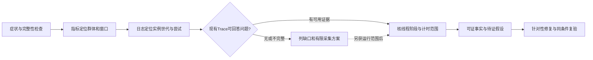
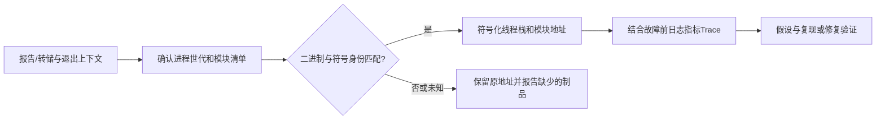
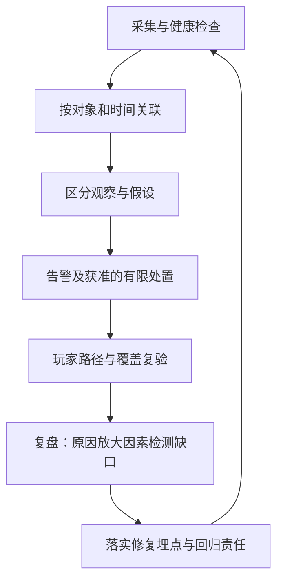

# DS 日志、崩溃与可观测性实战

> 知识成熟度：L2。主要承诺是解释 UE Dedicated Server 的一次异常如何形成可定位、可复查的证据链；本次核对官方资料并做静态教学推导，没有启动 DS、采集 Trace、生成崩溃、执行符号化或验证线上恢复，verified 保持为空。
> 知识基线：版本基线为 Epic UE **5.6 文档版本页**；OpenTelemetry Specification **v1.50.0**；W3C Trace Context **2021-11-23 Recommendation**；GNU 官方手册本次首页标识 **GDB 18.1**。这些是选读资料版本，不是项目已部署版本，也没有核对 UE 本机源码/Build.version。网页选读边界见第 10 节。
> 最后更新：2026-10-10（补齐正文的知识基线、版本基线与更新日期标识；资料内容及验证边界不变）。
> 原稿 UE5.8.0 / CL55116800 / ++UE5+Release-5.8 是历史声明，本次没有对应 checkout 可复核，故不沿用为本次事实证据。迁移到真实项目时须重新核对实际 UE、平台、构建配置、采集器和后端版本。

## 1. 从“玩家进不去房间”开始

玩家报入场超时，但 DS 还在 Tick，看板的平均 CPU 也正常。只搜 Error 会得到“timeout”，只看 CPU 又像没有问题。排障要把两个问题分开：**这次尝试在哪个观察点失败，以及哪个执行阶段解释了这段耗时**。进程没退出、依赖返回成功、DS 生成了成功响应，都不保证玩家按时收到成功。

本文以一次合成入场尝试贯穿日志、指标和 Trace；另给“进程真的退出”的崩溃分支。读者只需知道 DS、一次请求、线程与基本耗时的含义，不需要先搭建日志平台。所有 ID、时间、指标名和事件名都是教学数据或项目 schema，没有现成 UE 埋点/API 的含义。

| 信号 | 本文用它回答 | 单独不能证明 |
| --- | --- | --- |
| 结构日志 | 哪个版本、实例、尝试在什么阶段报告了什么 | 没有日志就没执行；最后一条日志就是根因 |
| 指标 | 哪个群体、窗口和比例受影响 | 聚合正常代表每个玩家正常；某条请求的细节 |
| 分布式 Trace | 同一次工作跨网关、DS 与依赖的关联和各观察段耗时 | 自动包含 UE 每个 Tick/回调；所有请求都被保留 |
| UE Trace / Insights | DS 进程中帧、线程、计时事件与日志的时间关系 | 自动等同 OTel 链路；耗时最长的函数就是最终根因 |
| 崩溃报告、转储与符号 | 报告类型、退出上下文、故障线程及地址映射 | 报告一定表示进程死亡；调用栈已经解释触发原因 |

日志 schema 与一次故障的读法由本篇负责；编排、发布、采集器接线及 PromQL 的主责是[部署运维与监控](05-部署运维与监控.md)，SLO/错误预算见[SLI-SLO与可观测性](06-SLI-SLO与可观测性.md)。实例接纳、排空和重连行为沿用[DS 实例生命周期与平台化](<../../07-网络与游戏服务端/专用服务器实例与容量/01-UE%20Dedicated%20Server实例生命周期与平台化.md>)，这里不另造业务状态机或发布 runner。

## 2. 先设计能回答问题的事件

### 2.1 分类、级别与结构是三件事

Net、Match、Login、Persistence 等可以是项目日志分类的命名方案，不意味着这些精确名字都已由引擎声明。分类用于筛选模块，级别用于表达严重性，结构字段用于机器关联；三者互补。UE 的 `UE_LOG` 支持分类与 verbosity，`UE_LOGFMT` 提供结构化参数，但并不因此保证最终文件每行都是 JSON，也不会自动替项目接入 OTel 或日志后端。[S1]

正常边界事件可以用 Log/Display；可恢复且有行动价值的异常用 Warning；失败用 Error，并记录稳定 code、stage 与 outcome。Verbose/VeryVerbose 适合有限诊断窗，开关、预算与到期恢复应由项目控制。**Fatal 会使会话崩溃，不是更醒目的 Error，不能为了告警而升级成 Fatal。** 编译时裁剪、分类阈值、运行输出设备和采集过滤都会影响一条日志是否最终可见。[S1]

### 2.2 哪个 ID 关联什么

下面是项目字段合同，故意不把所有字段强塞进所有信号。没有值时保留缺失及原因，不能拼造“完整链路”。

| 字段 | 生成/保留位置与含义 | 易错边界 |
| --- | --- | --- |
| buildId、platform、configuration | 制品清单提供发布身份及构建环境 | 人工 release 名称不自动等于 ELF build ID 或符号身份 |
| instanceId、processRunId | 平台实例名与本次进程启动身份 | 同名实例重启后应换 processRunId；PID 也可复用 |
| sessionId、matchId | 受控的不透明会话/对局引用 | 不含凭据，不把会话当一条无限延伸的 Trace |
| requestId、attempt | 一次入口尝试及其重试关系，由项目约定 | 诊断 ID 不是授权、幂等键或业务结果凭证 |
| traceId、spanId | 有真实链路上下文时保留；跨边界显式传播 | 有 ID 不证明 Span 已采集、导出或可查询 |
| eventId、event、stage、code、outcome | 一个事件身份，稳定事件/阶段/错误分类 | 自由 message 是解释，不能独自充当聚合键 |
| ts、observedTs、elapsedMs | 源事件时间、采集观察时间、同一单调时钟测得的时长 | 采集时间不等于发生时间；UTC 格式不保证两台机器时钟一致 |

OTel 日志模型分别定义事件时间与观察时间，并允许日志携带 TraceId/SpanId；这是数据模型，没有要求指标为每个 requestId 建立时序。[S4] 精确版本、请求、会话和 Trace ID 留在受控日志/Trace 或制品映射中；指标采用有界 region、route、outcome 等维度。把玩家 ID 换成哈希不会减少它的取值数量。

外来 traceparent 要按协议校验；无效、全零或超长输入不能原样进入日志。信任边界上的关联策略由项目确定，追踪上下文绝不赋予玩家权限，不能把 ticket 或个人数据塞进它。[S6] 序列化器还要正确转义换行、引号等字符，限制字段与单条大小，避免把用户输入变成伪造日志行。

### 2.3 一条日志经过哪些边界


图中实线是数据方向，虚线是独立的采集健康观察。原稿的文件、stdout/stderr、结构化事件是**可能的来源/表示**，不是三个互不重叠的事实源；同一事件可能既写文件又输出 stdout。先选择主采集路线，双采时按原 eventId 与来源识别重复，不能把两份错误计成两个玩家失败，也不能靠自由文本去重合并不同请求。

每段都可能失败：尚未生成、被过滤、缓冲未刷出、磁盘满、轮转遗漏、解析失败、发送重试用尽、后端尚未可查。已读文件偏移不等于后端接收确认。应用计数、采集器输入/丢弃数与后端查询数不同，要先解释口径；关键审计/经济记录另用业务耐久账本，不以尽力而为的普通日志代替。[部署篇第 8 节](05-部署运维与监控.md#8-日志采集与-trace保留诊断用途明确交付边界)给出采集侧的具体接线与限制。

## 3. 贯穿案例：依赖已返回，入场仍超时

### 3.1 题设和输入

**PAPER_EXPECTED，合成资料，不是线上日志或实测。** 网关为一个合成会话执行 q17 的入场尝试，网关本地等待预算为 300 ms。DS 版本 demo-r42，实例 demo-ds-07，进程世代 demo-boot-b。网关最终观测 timeout；DS 稍后形成入场响应。项目示例有一个 IO 线程接收鉴权答复，再把后续工作排到 GameThread，这个接线是题设，不是所有 UE 登录路径的默认机制。

下列 NDJSON 展示后端可检索表示：每行是一个独立 JSON 对象，共三条；整个围栏不是单个 JSON 文档，也**不是 UE_LOGFMT 的默认输出**。三个事件都属于同一次 DS 尝试；网关另有同 requestId 的 timeout 终态。ts 是假数据，诊断的同进程时差使用 elapsedMs，不能跨主机相减墙钟。

```jsonl
{"ts":"2026-10-10T12:00:00.000Z","level":"info","eventId":"demo-e1","event":"join_received","instanceId":"demo-ds-07","processRunId":"demo-boot-b","buildId":"demo-r42","sessionId":"demo-session-9","matchId":"demo-match-2","requestId":"demo-q17","attempt":1,"traceId":"4bf92f3577b34da6a3ce929d0e0e4736","spanId":"00f067aa0ba902b7","stage":"receive","code":"JOIN_RECEIVED","outcome":"pending","elapsedMs":0}
{"ts":"2026-10-10T12:00:00.105Z","level":"info","eventId":"demo-e2","event":"auth_callback_enqueued","instanceId":"demo-ds-07","processRunId":"demo-boot-b","buildId":"demo-r42","sessionId":"demo-session-9","matchId":"demo-match-2","requestId":"demo-q17","attempt":1,"traceId":"4bf92f3577b34da6a3ce929d0e0e4736","spanId":"00f067aa0ba902b7","stage":"await_game_thread","code":"AUTH_RESPONSE_RECEIVED","outcome":"pending","elapsedMs":105}
{"ts":"2026-10-10T12:00:00.380Z","level":"info","eventId":"demo-e3","event":"join_response_ready","instanceId":"demo-ds-07","processRunId":"demo-boot-b","buildId":"demo-r42","sessionId":"demo-session-9","matchId":"demo-match-2","requestId":"demo-q17","attempt":1,"traceId":"4bf92f3577b34da6a3ce929d0e0e4736","spanId":"00f067aa0ba902b7","stage":"respond","code":"JOIN_RESPONSE_READY","outcome":"response_ready","elapsedMs":380}
```

如果只看最后一条成功阶段日志，容易把本次归为成功；网关 300 ms 的 timeout 仍是该观察点的结果。实际会话是否建成、迟到响应如何处理、客户端是否应重试，应查业务会话状态与协议，不能从这三条诊断事件推定或直接重复入场。

### 3.2 从影响面收窄到这一次尝试

1. 先读网关入场终态指标。题设同一窗口 demo-r42 群体有 20 次有效尝试：16 次按时成功、4 次本地超时，计数覆盖完整，因此观察失败比为 4/20=20%。另报请求数、窗口、版本群体与缺数状态；它不是测得的生产 SLO，也不是从三条日志算出来的。
2. 打开一条超时的 requestId，限定环境、instanceId、processRunId、buildId 与时间窗，再顺 stage/event 查到 q17。不能只用“今天 ds-07”的查询把前一个进程世代混进来。
3. 用真实存在的 traceId 看网关→DS→鉴权依赖的 Span，并核验采样策略和覆盖时间。没有 Trace 时继续用阶段日志定位已知边界，将未知段标出；不得补造空白 Span。
4. 要区分“依赖在慢”与“DS 收到答复却未及时处理”，还需 DS 内的入队/出队事件、线程和计时范围。此时才转向同进程、同一段采集窗口的 UE Trace。

指标用于发现影响范围，日志用于选择实例与尝试，Trace 用于拆解耗时；它们共享可关联维度，**不要求所有原始 ID 都成为指标 label**。重试作为新的观察尝试是否进入分母必须先约定；原尝试收到迟到结果不能再给同一个网关终态增加一次 success。完整 PromQL、重置、分母缺失与发布观察窗沿用[部署篇第 7 节](05-部署运维与监控.md#7-指标与告警用同一群体窗口和分母解释结果)。

例如 release_track 只采用 baseline/candidate 等有界值；release_track 到 demo-r42 的具体制品映射必须由发布记录或实例元数据证明，并在同一观测窗口内保持稳定。混发或映射变更时先拆分观察窗口/群体并重新核对，不能仅凭同一个 label 猜测具体版本。

### 3.3 纸面时间线与可推出的结论

下表都以同一 DS 进程的单调时钟为基准，0 是 DS 接收 q17。阶段事件/计时 scope 必须确实存在且可关联，不能拿匿名热点硬贴上 requestId。

| DS 内相对时间 | 合成证据 | 说明 |
| --- | --- | --- |
| 0 ms | join_received(q17) | 定义本进程测量起点 |
| 20–100 ms | 鉴权客户端等待区间 | 80 ms 包含该客户端所见的通信/等待；不能只凭它拆成服务端计算和网络 |
| 90–340 ms | GameThread 上项目 scope PrepareSpawnData | 250 ms 的计时区间，与后面的排队重叠；名称本身不证明具体算法或 CPU 忙碌程度 |
| 105 ms | IO 线程记 auth_callback_enqueued(q17) | DS 已收答复，并入后续处理队列 |
| 360 ms | GameThread 记 auth_callback_started(q17) | 相同队列事件的等待为 360−105=255 ms |
| 380 ms | join_response_ready(q17) | DS 本次处理形成响应耗时 380 ms |

**已由题设支持：** DS 侧的 255 ms 排队超过鉴权客户端区间 80 ms，主等待点在收到答复后的 GameThread 调度阶段；网关超时与 DS 迟到响应并不矛盾。可以把“单纯鉴权后端耗时大”降为较弱假设，优先调查 GameThread 当时做了什么。

**仍是推断：** PrepareSpawnData 与等待重叠，值得进一步看其子事件、调用次数、输入规模和正常样本；不能因它最长就宣布已经找到根因。该 scope 的 elapsed 时间可能包含阻塞或被调度出去，不等于 250 ms 全在执行 CPU 指令。若输入规模改变、采集本身增加开销或后台负载不同，版本 A/B 的差异也未必来自同一代码修改。

下一步的有限验证是：在另行批准的隔离环境，保持输入/构建/负载可比较，分别核正常与异常的阶段时间，再验证针对性修复是否减少排队且没有把耗时转移到其他线程。这里只有这条验证路线，没有实际运行结果；不能据纸面案例发布优化、重启或宣称 P99 已改善。

### 3.4 反例：错误比例和完整链路都能被“做出来”

题设 20 次尝试中保留全部 4 个错误 Trace，只保留 2 个成功 Trace，查询出的 6 条里错误占 4/6≈66.7%。它解释被保留样本的组成，**不是业务错误率**。反过来，只留成功阶段日志也会把 q17 误看成成功。即使 sampled 标志为真，导出、传输或后端仍可失败；标志不是交付回执。[S5]

头部采样在开始时决定，不能预知后来所有错误；尾部策略也只能处理已经抵达该决策点的材料，不能找回上游根本没录的事件。优先保留错误/慢请求是目标，要同时记录策略、覆盖和丢弃，不能写成“错误永不丢”。全量错误风暴也可能耗尽预算，因此需要有界缓冲、聚合/限速及明确缺口信号，不能把过载变成无限内存或同步阻塞业务线程。

## 4. UE Trace 应怎样参与这条链

UE Trace 是进程内高频事件的采集体系；OTel Trace 是分布式 Span 与上下文模型。相同英文名称不表示自动互通。可以用受控日志/Bookmark、进程世代、版本及明确时间映射，把一次 q17 附近的 UE 事件与外部请求联系起来；能否带 requestId 要看项目埋点，不能凭界面截图断言跨服务关联已经实现。



图表示诊断顺序，不是发现症状后必然能补录过去。有限采集方案至少写清：目标实例/构建、问题、所需通道、起止窗、最大数据量、磁盘和 CPU 预算、到期关闭及文件访问范围。一般 DS 长帧从 CPU、Frame、Log、Bookmark 的相关能力选择；网络包内容需单独核 Net 通道及额外条件，不能把“开 CPU”当“已采网络”。官方 Reference 列出通道与开关，但编译宏、平台和项目配置仍会限制可用性。[S3]

分析已有材料时依次核：文件对应哪个进程与构建 → 覆盖哪个时间窗 → 需要的事件是否实际产生/保留 → 工具是否解析到这些事件 → 当前视图是否过滤隐藏。`.utrace` 能打开只证明读到某种可解析内容，不能证明目标帧、末尾事件和所有线程齐全；崩溃前未刷出的尾部尤其可能缺失。原文件及采集清单比单张热点截图更可复查，分享时另生成最小脱敏摘要，不擅改原始证据。

某些高级通道有平台或权限条件，不能因为网页示例建议管理员运行就把提权当默认步骤。本篇不给启动、发送 Trace 或故障注入命令。真实源码链请选读[UnrealInsights 与 Trace 源码](../调试与性能分析/28-UnrealInsights与Trace源码.md)，该篇的历史 UE5.8 声明不自动扩大本次 UE5.6 文档核对范围。

## 5. 进程退出时：报告、转储和符号分开检查

### 5.1 先确认发生的是哪类事件

UE 官方文档区分 crash、assert 与 ensure；ensure 可以产生报告而不使进程崩溃。CrashReportClient 是可选随包分发的独立客户端，负责把材料送到配置的接收端；有本地报告、客户端启动、上传成功、服务端接收和完成符号化是不同阶段。它也不是现成的崩溃接收/符号服务。[S2]

因此“报告数”不能直接充当“死亡进程数”。先核报告类型、crash GUID、processRunId、宿主退出记录及重启世代；同一报告上传重试还可能重复。进程被外部终止、宿主失联或内存压力事件可能没有可用的应用崩溃尾声；缺报告时检查相应平台记录，不把它判成“没崩溃”，也不把一个退出码硬解释成某一种根因。

### 5.2 从地址到源码行，必须匹配同一批材料



实线表示材料处理；匹配失败是停止解释源码行的位置，不是换“最新符号”继续猜测的理由。最低证据包如下，路径/命名由项目制品系统决定：

| 材料 | 为什么需要 | 失配/缺失时怎么报告 |
| --- | --- | --- |
| 原始报告/转储、crash GUID、类型、时间 | 保留故障现场及上报去重身份 | 标明仅有日志、仅有报告或转储不完整，不称完整证据包 |
| 实际加载的可执行文件及相关模块清单 | 地址属于哪个模块及构建 | 同名 DLL/so 或同一 commit 的重建都不能直接替代 |
| 对应调试符号与身份记录 | 将该构建的地址映射到函数/源码 | 项目 buildId 用来检索；继续核平台符号身份，不仅比较字符串版本 |
| 平台、架构、构建配置、工具链/优化和源码 revision | 解释布局、内联、缺失变量和源码对应 | 行号与栈可能不完整；缺材料要写明 |
| 同一 processRunId 的日志、指标、Trace 与采集缺口 | 看故障前上下文和影响 | 崩溃线程不一定包含破坏内存的早期写入者 |

GNU GDB 的独立调试文件机制支持 build ID，或以 debug link 及校验信息识别对应调试材料；这不同于项目任意命名的 releaseId。[S7] 本篇不把 ELF 的方式套到所有平台，Windows PDB 等需目标调试工具核其自身匹配标识。要对相关模块逐个核对，而不是只有主程序一个 buildId 就假定全部插件符号正确。

**最小正反例（PAPER_EXPECTED）：** 报告记录模块 demo-r42 / 符号身份 A，归档候选符号也为 A，可进入解码；拿 demo-r43 / 身份 B，即使文件同名且工具显示了函数名，也必须报告失配并保留原地址。符号化正确仍只是定位到故障发生位置，修复假设还需检验，不能把空指针栈顶自动当最初错误发生处。

### 5.3 转储策略和演练的有限前提

不再把“生产必须开启完整 core dump”作为通用结论。转储可能包含凭据、玩家信息与进程内存，且涉及磁盘、写入时延、上传和访问成本；是否使用完整 core、minidump、上下文报告或其他材料，要由平台支持、诊断需求及数据治理共同决定。没有完整 core 不等于没有任何定位能力，有转储也不等于可安全上传。

在**另行批准的隔离环境与合成数据**下，发布前可以验证：准备已知故障与预期栈 → 按批准方式触发 → 区分本地生成、上传/接收、匹配符号与告警 → 核实际恢复和证据可复查。事先限定目标、预算、敏感数据、停止条件和清理/保留政策；调用栈不匹配、材料外发目的地不明或存储预算不足时停止。本轮没有故障注入、修改 core 开关/系统权限、安装上报服务或执行重启。

## 6. 告警、有限恢复与复盘

可执行告警先给对象、影响、完整性、入口和负责人，而不是把“内存上升”直接写成“泄漏，重启”。沿着本案例，一条有用的通知会说明：哪个入场群体、哪个窗口、20 个有效尝试里 4 个超时、采集覆盖状况、候选版本、q17 例子、日志/Trace 入口与处置手册。真实通知以实际数据和链接为准；示例没有创建任何告警。

| 信号 | 先核什么 | 有前提的处置方向 |
| --- | --- | --- |
| Ready 超时 | 启动阶段、实例世代、依赖及观测链 | 按实例手册停止进一步分配或回收；有权操作者执行，不由阈值自动授权 |
| Tick 长尾 / 入场超时 | 群体/窗口、有效样本、线程阶段 | 暂停扩大候选；缩小诊断窗；必要时按已批准方案限制新流量 |
| 内存持续增长 | 输入、缓存、分配/释放模式、进程时长 | 先区分正常缓存/碎片/泄漏假设；不能只凭曲线命名根因 |
| 崩溃/异常退出增加 | 报告类型、去重、版本群体及暴露量 | 保留制品证据，按发布政策停止扩大；重启不是根因修复 |
| Drain 超时 | 具体未结束阶段与业务恢复责任 | 沿既有排空手册升级，不能为消告警强杀 |
| Error 风暴 / 日志积压 | 业务错误量与采集失败是否同时发生 | 限制诊断噪声并记录丢弃；先保护故障可见性与业务预算 |

崩溃率须明确分母，如进程小时或会话暴露量；重启循环产生多个报告不能和单次长寿命进程直接比较。StartupToReady、分配时延、登录成功与 Drain 完成率仍是有用的玩家路径目标，但各自需要对象、窗口、分母和失败分类，不能只用四个指标名称声称 SLO 已落地。

对于 q17，有限恢复不是“无限重试直到成功”。先确认是当前尝试超时还是整个会话不可用；有业务重连/重试合同才按有限预算执行。若诊断证据不足、样本缺失或需越出当前授权范围，保留已知结果并交由相应负责人决定。恢复后同时核玩家路径、原故障信号和采集覆盖；看板变绿可能只是无请求或采集断了。



这张闭环图中的“恢复”需要证据，不以重启命令返回代替。复盘至少保留输入/版本、影响群体、可信时间线、真实动作和结果、未证实假设、漏报/丢数、负责人和验收条件。q17 可得到的行动项是补清回调等待埋点、调查 PrepareSpawnData 的输入与子事件、验证改善是否减少入场超时；“加强监控”不足以关闭这次问题。

## 7. 采样、脱敏、归档与成本是同一设计问题

| 取舍 | 具体做法与代价 |
| --- | --- |
| 保什么 | 关键边界与稳定错误码优先；逐帧/逐对象日志容易制造大量重复噪声，可能改变被测性能 |
| 留多久 | 结合定位窗口、制品寿命、数据类别与预算决定本地/热/归档期限；不把示例天数当法规 |
| 如何滚动 | 每个实例/进程世代隔离输出，限定单文件及总目录容量；轮转策略需与采集器兼容，另核漏采/重复 |
| 如何防积压 | 有界缓冲、有限发送重试与可见的丢弃/积压；后端不可用不能无上限挤占游戏内存 |
| 谁能查 | 限定用途、访问与共享范围；原始证据和日常脱敏检索可以有不同权限/保留策略 |
| 成本怎么算 | 日志条数×平均字节只是原始量估算，仍有序列化、索引、复制、压缩、查询、网络及 Trace 开销 |

例如纯纸面设 100 实例、每秒 20 条、平均 500 B，原始量为 1,000,000 B/s，约 86.4 GB/日（十进制）。增加到每秒 200 条就是十倍；这不是任何后端费用或压缩后占用，更没包含崩溃转储。预算应在生产策略之前明确，用真实采集对开销再验证。

**凭据从源头不记录。** ticket、密码、长期密钥不应因为“哈希/截断”就获准进入日志；片段仍可能暴露信息，稳定哈希也可能可关联或被猜测。确需关联玩家时使用经批准、最小化的不透明引用或受控映射，不宣称哈希等于匿名。IP/地址、聊天与业务 payload、崩溃内存和自定义 crash context 都按实际敏感性处理。源头白名单是主措施，采集端脱敏是补充，展示时遮挡不能撤回已经上传的数据。

若发现疑似敏感泄露，缩小可访问/继续传播范围并按事件流程处理，保留必要审计；不要直接把原日志复制到工单或公开搜索，也不能为“清理”擅自永久删除调查证据。CrashReportClient 的发送配置与目的地必须在真实构建核实，不假设 Editor、打包游戏和 Linux DS 具有相同默认行为。[S2]

## 8. 失败路径和最小纸面验收

| 症状 | 本篇要求的检查顺序 | 停止错误结论的位置 |
| --- | --- | --- |
| requestId 查不到 | 原始观察点/世代/时间窗 → 是否生成 → 过滤/采样 → 输入/发送/后端 | 不能据无记录判未执行 |
| 一次错误出现两次 | eventId、主采集路线、重放和上传重试 | 不把重复事件计成两次失败 |
| Trace 断成多段 | 传播边界、异步任务上下文、采样/导出与时间范围 | 有共同 sessionId 不足以补出父子关系 |
| UE 时间线没有目标事件 | 通道/编译条件、实际埋点、文件窗口、解析与视图过滤 | 空白不证明线程空闲 |
| 报告有 ensure | 报告类型与进程存活/退出记录 | 不计作已确认的进程崩溃 |
| 栈没有符号/看似错行 | 模块、平台/架构、符号身份与源码 revision | 不换最新符号凑可读栈 |
| 告警沉默或轰炸 | 覆盖、分母、阈值/持续窗、路由、去重与负责人 | 静音不表示业务恢复 |
| 恢复后看板全绿 | 实际流量、玩家路径、缺数及原错误是否再现 | 无数据不等于 0 错误 |

下面各题独立，答案由给定资料推导。只需阅读/手算，不调用 UE、服务器或平台工具。

| 编号 | 输入 | 预期判断 |
| --- | --- | --- |
| O1 正常关联 | q17 的三条 JSON，与同版本/世代的阶段表 | requestId 与世代一致，可读出 receive→await_game_thread→response_ready；尚不能说玩家成功 |
| O2 时间拆解 | 鉴权 20–100，入队105，出队360 | 客户端等待80 ms，DS队列等待255 ms；两者不跨主机相减 |
| O3 错误比例 | 完整计数20次/4错；Trace只保4错2成功 | 业务观察失败比20%，被保留Trace错误占比约66.7%，不可互换 |
| O4 双采 | 文件与stdout均有相同 eventId=demo-e2 | 是同一事件的两份副本；不能据此声称鉴权回调发生两次 |
| O5 符号失配 | 报告模块身份A，候选符号身份B | 停止源码行解释，索取对应制品；保留原始地址 |
| O6 报告与死亡 | ensure报告存在，进程继续服务 | 报告事件成立，进程死亡不成立；另按报告类别统计 |
| O7 缺数 | 指标系列消失且后端无新日志 | 服务健康未知，先查采集/发现及独立可用性证据 |
| O8 敏感输入 | 诊断字段提案含完整ticket或其前缀 | 拒绝把凭据写入；改用批准的不透明请求/会话引用 |

要达到真实接入验收，还需实际证据证明：字段确实输出且可查、正常/错误/重试分类一致、敏感字段没有越界、滚动与积压可见、目标 Trace 能回答问题、选定转储策略产生可匹配材料、告警到达负责人、有限恢复达到玩家路径标准。这些属于后续获准环境中的验证，不以本节纸面题或 Markdown 检查冒充。

## 9. 实践与 FAQ

**Q1：日志越多越好吗？** 不是。先补能够区分假设的关键边界，再用有限诊断窗取得细节；记录日志本身也有 CPU、内存、磁盘和隐私成本。

**Q2：Core Dump 什么时候开？** 先决定需要的诊断材料及数据风险，再按目标平台批准具体策略。完整转储不是所有生产 DS 的默认选择；即便获准启用，也要核容量、保留、访问和符号匹配。

**Q3：符号文件怎么管理？** 与实际发布二进制及相关模块一起保留身份映射、平台、架构、配置和源码 revision。不能只留最新版本；同源码重新编译不自动证明符号可替换。

**Q4：Trace 会拖慢服务器吗？** 有采集与存储代价，大小取决于事件、通道、字段和运行条件。选定诊断问题与预算，再在实际项目验证；本文没有给统一开销百分比。

**Q5：告警太多怎么办？** 区分重复通知、无行动价值的波动和不同实例的独立故障；保留原事件后治理去重、窗口、负责人和升级路径，不能通过静音掩盖真实缺数或未恢复。

**Q6：CrashReportClient 能替代符号服务吗？** 不能。客户端上报、接收存储、匹配符号和根因分析是不同步骤；运行包是否含客户端、发往哪里，要核实际构建。[S2]

**Q7：拿到 traceId 就有完整证据了吗？** 没有。还要看传播、埋点、采样、导出与查询覆盖；日志中的 ID 可以存在而对应 Span 未保留。UE `.utrace` 也不会仅凭相同名称自动连成分布式 Trace。[S4、S5]

**Q8：为什么符号化成功仍不能宣布根因？** 栈给出故障现场，早期内存破坏、错误输入、线程竞争等可能更早发生。要把现场与先前事件、输入、版本及可检验假设接起来。

## 10. 来源边界、关联阅读与更新

### 10.1 本次一手选读

核对日期为 2026-10-10。以下只列实际读取的相关段落，不把网页能打开说成全文源码审计。

| 编号 | 来源及固定基线 | 本次支持的结论；未覆盖 |
| --- | --- | --- |
| S1 | [Epic Logging，5.6 版本页](https://dev.epicgames.com/documentation/en-us/unreal-engine/logging-in-unreal-engine?application_version=5.6)，Log Verbosity Levels、UE_LOG/自定义分类、UE_LOGFMT | 分类/级别、Fatal 与结构化参数；没有核项目输出设备、JSON出口或 Shipping 可用性 |
| S2 | [Epic Crash Reporting，5.6 版本页](https://dev.epicgames.com/documentation/en-us/unreal-engine/crash-reporting-in-unreal-engine?application_version=5.6)，Crash Reports、Common Causes、Custom Context、Crash Reporter Client/Server | 报告类型、材料、可选客户端与接收端职责；没有核 Linux DS 的实际包、发送开关、上传目的地或转储生成 |
| S3 | [Epic Insights Reference，5.6 版本页](https://dev.epicgames.com/documentation/en-us/unreal-engine/unreal-insights-reference-in-unreal-engine-5?application_version=5.6)，Trace Channels 与 Controlling Runtime | 通道控制事件、CPU/Frame/Log/Bookmark/Net 的用途及平台条件；没有执行命令或保证整个通道表跨版本不变 |
| S4 | [OTel v1.50.0 Logs Data Model](https://github.com/open-telemetry/opentelemetry-specification/blob/v1.50.0/specification/logs/data-model.md#log-and-event-record-definition)，Timestamp、ObservedTimestamp、Trace Context Fields | 时间和可选关联字段的语义；例中 camelCase JSON 是项目schema，不是OTLP序列化 |
| S5 | [OTel v1.50.0 Trace SDK](https://github.com/open-telemetry/opentelemetry-specification/blob/v1.50.0/specification/trace/sdk.md#sampling)，Sampling、IsRecording/Sampled、ShouldSample | 采样与是否记录/交给导出的区别；没有验证 SDK、Collector 或后端可靠性 |
| S6 | [W3C Trace Context，2021-11-23](https://www.w3.org/TR/2021/REC-trace-context-1-20211123/)，traceparent 格式、Privacy/Security | ID校验、信任/隐私边界；未把上下文当业务权限或持久结果 |
| S7 | [GNU GDB 独立调试文件](https://sourceware.org/gdb/download/onlinedocs/gdb.html/Separate-Debug-Files.html)，build ID 与 debug link 段；[本次手册首页](https://sourceware.org/gdb/download/onlinedocs/gdb.html/)标识18.1 | 二进制与分离调试信息匹配的机制；网页地址非不可变快照，未安装/运行GDB，也未核项目ELF/PDB |

版本 URL 是文档选读边界，不是某个 patch 源码逐行证明。UE5.8 固定版本页尝试未成功读取，UE5.6 Timing Insights/Developer Guide 的本次固定版本入口也未成功读取，因此没有把它们计为核对证据；当前案例的具体线程接线与性能数字始终是题设。生产接入要再核目标构建及实际工具链，不能套用本文到未支持的平台。

### 10.2 关联阅读

- [DS 实例生命周期与平台化](<../../07-网络与游戏服务端/专用服务器实例与容量/01-UE%20Dedicated%20Server实例生命周期与平台化.md>)：实例与玩家路径的业务责任
- [Linux DS 部署与容器实战](<02-Linux DS部署与容器实战.md>)：平台、信号、文件与运行条件；该篇原命令须按真实环境另核
- [UnrealInsights 与 Trace 源码](../调试与性能分析/28-UnrealInsights与Trace源码.md)：引擎内事件到分析视图的源码阅读入口
- [部署运维与监控](05-部署运维与监控.md)：采集路线、指标查询、发布观察与告警治理
- [SLI-SLO 与可观测性](06-SLI-SLO与可观测性.md)：目标、窗口与错误预算主责
- [DS 联机验收与 Gauntlet](<../测试策略与自动化/06-UE%20Dedicated%20Server联机验收与Gauntlet.md>)：未来在获准真实环境验证玩家路径

### 10.3 更新记录

| 日期 | 内容 |
| --- | --- |
| 2026-08-07 | 原稿建立 DS 日志、崩溃、Trace 与告警闭环主题 |
| 2026-10-10 | 补入一次入场超时的完整静态读法与反例，纠正默认完整转储、凭据截断/哈希、三通道重复采集及信号完备性假设；补真实来源范围、符号匹配停止线和有限验证条件，成熟度仍为L2 |
