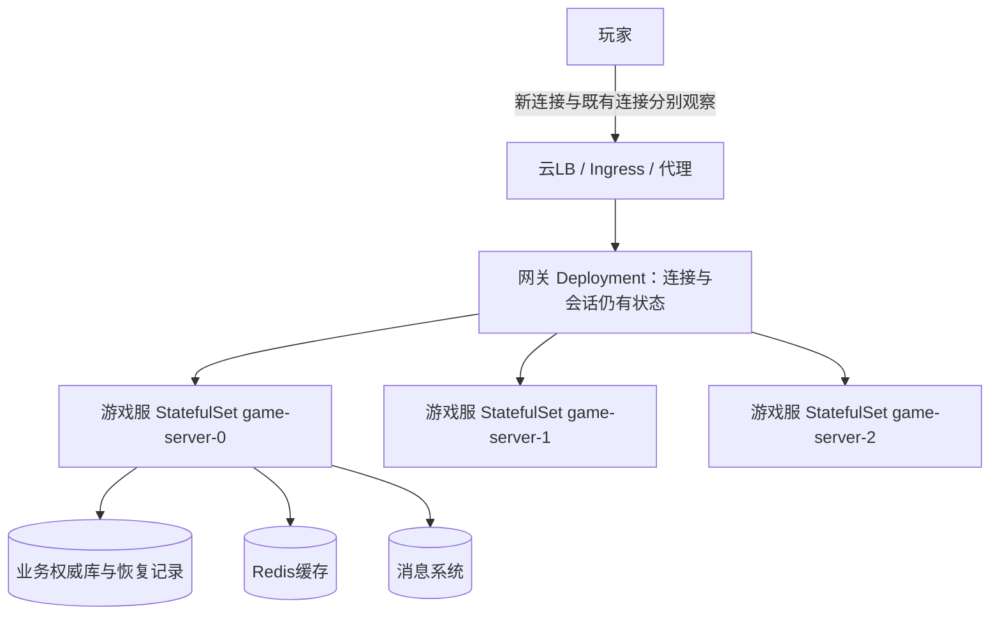
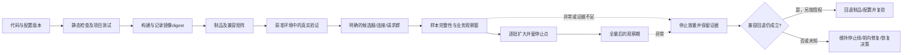
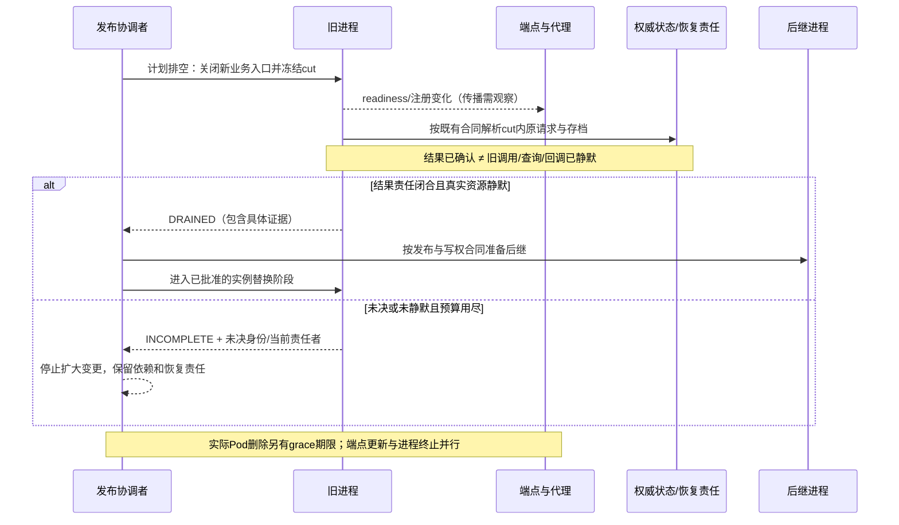
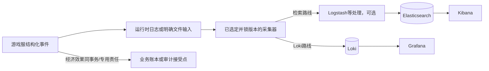
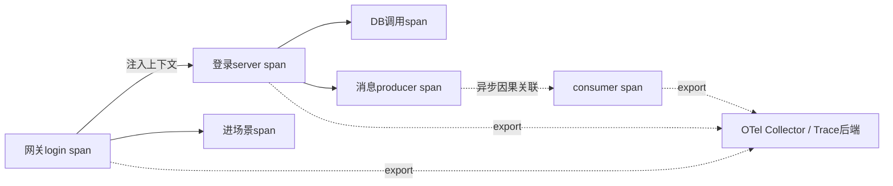
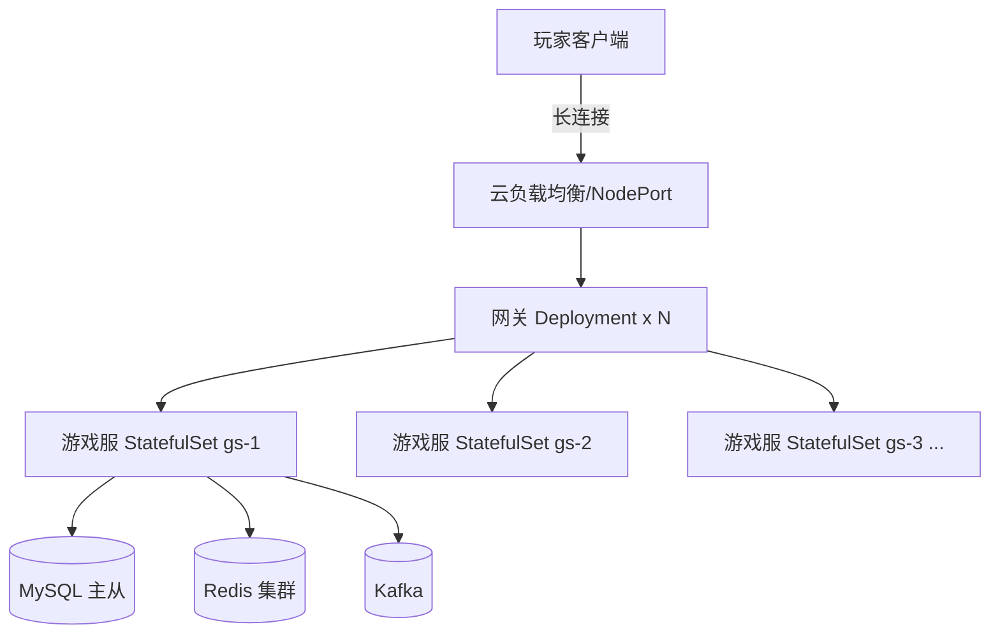
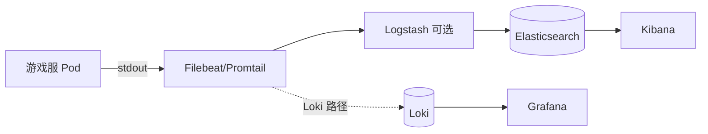
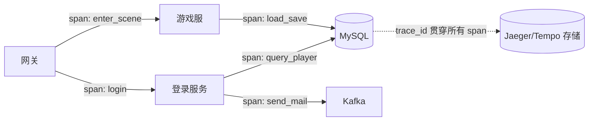
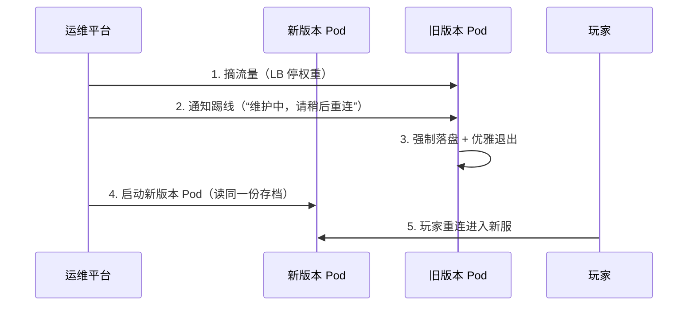

# 05 部署运维与监控

> 知识成熟度：L2。本文的主承诺是解释游戏服务的制品、编排、发布、排空、可观测性与容量如何接成可验收流程；没有用静态门禁代替真实部署证据，verified 仍为空。
> 知识基线：Kubernetes v1.34 版本文档及注明的 v1.34.0 源码；Prometheus v3.5.0 文档源；其余官网按 2026-10-08 实际选读页注明。它们不是本项目已部署版本，也不表示版本仍在支持期。真实清单还需锁定 patch、镜像 digest、CNI、代理/LB、驱动、采集器和配置。
> 最后更新：2026-10-08（静态核对发布、排空、指标与日志合同；具体来源边界和验证建议见第12节）。
> 本次所有 YAML、Dockerfile、PromQL、图和 D1–D12 都是静态教学 / PAPER_EXPECTED，没有部署、回滚、扩缩容、驱逐、重启、数据库访问、故障注入或压测结果。后面的历史原文保留既有代码与贡献，不是当前执行指令。

## 1. 从游戏运维的用途出发

游戏服务要同时面对玩家绑定房间/区服、TCP/WebSocket 长连接、客户端协议与服务器版本共存、活动/开合服峰值以及更新时的体验承诺。网关也可能保存连接与会话状态，不能因为选了 Deployment 就称为无状态；房间名稳定也不会把玩家和内存状态自动搬到新进程。

本文的目标仍是“容器化标准化、发布自动化、全链路可观测、容量可规划”，但每一步都要能回答：选中了哪些对象，接纳了哪些工作，哪个状态已经被接受，谁还在使用资源，失败后责任由谁接续。进程存活、端口可连、Pod Ready、发布命令返回、玩家业务成功和旧进程安全退出，是六种不同的事实。

| 责任对象 | 需要回答的问题 | 不能代替它的信号 |
| --- | --- | --- |
| 网关/登录 | 新连接和新登录如何选版本；旧连接如何退出/重连；令牌是否有效 | 只看副本数或端口 |
| 匹配/房间/游戏服 | 房间归属、入场暂停、会话迁移或可接受的断线窗口、存档水位 | StatefulSet 名字没变 |
| 数据与异步任务 | 已确认业务是否保留；未决请求、Outbox、存档恢复责任是否持续存在 | Pod 重建或队列长度为零 |
| 运营与配置 | 谁批准哪个配置版本，何时生效，哪些服已确认，如何停止放量 | 控制面显示“发布成功” |
| 运维与观测 | 本次对象/时间窗/有效样本是什么，失败是否被发现，下一步动作是谁负责 | 没有告警、看板全绿 |

## 2. 核心概念与边界

| 概念 | 用途 | 本文采用的边界 |
| --- | --- | --- |
| Containerization / Image Layer | 把应用、依赖、构建输入固化为制品 | 镜像一致不等于内核、CPU、配置、数据和外部依赖一致；并非每条 Dockerfile 指令都新增文件系统层 |
| Pod / Container Orchestration | 调度、重建、管理容器生命周期 | 不决定业务写权，也不保证任意终止都有足够排空时间 |
| Deployment | 管理通常可替换的副本与滚动更新 | 连接状态和本地缓存仍需业务合同 |
| StatefulSet | 稳定 ordinal、网络身份及适用的存储绑定 | 不自动提供房间迁移、数据备份或新旧写者隔离 |
| Service / Ingress | 服务入口与适用协议的路由 | 控制面端点、代理实际行为和已有连接需分别观察 |
| ConfigMap / Secret | 分别承载普通配置与密码、令牌等敏感配置的引用/分发需求 | 对象存在不证明应用已取得或生效，也不证明加密、最小访问权限与轮换已经落实 |
| HPA | 按指标调整支持 scale 子资源的工作负载 | 能作用于 StatefulSet 不等于游戏服已经具备安全缩容/搬服能力 |
| CI/CD | 构建、验证、发布制品与配置的流程 | 命令成功只是一个阶段，后续业务验收不能省略 |
| Canary Release | 在明确定义的小群体里验证候选版本 | 一个 Pod、一台服、一个玩家群和 5% 请求不是同一分母 |
| Structured Logging / Log Collection | 用结构化事件辅助查询、汇聚与排障 | 日志不是资产事务本身，也不是保证不丢的审计账本 |
| Metrics / Tracing | 聚合观察与带因果关联的调用诊断 | 缺少信号不证明没有故障；采样 Trace 不覆盖所有业务 |
| Config Center / Hot Update | 发布配置，或在约定安全点改变逻辑 | Watch 通知不表示全部实例完成校验、应用或生效 |
| Load Testing / Capacity Planning | 在代表性负载下确定满足目标的安全容量 | 经验系数与纸面计算不能冒充测得容量 |

## 3. 制品与本地环境：先保留可追溯输入

多阶段构建仍是有用的示例：构建阶段安装/使用编译工具，运行阶段只复制需要的产物。官方说明每个 FROM 开始一个构建阶段，COPY --from 选择产物；这里不由此推导“镜像越小一定越安全/性能越高”。[S10]

```dockerfile
# PAPER_EXPECTED：构建结构示意。参数没有默认镜像；未构建、未扫描、未运行。
ARG GO_BUILD_IMAGE
ARG RUNTIME_IMAGE
FROM ${GO_BUILD_IMAGE} AS builder
WORKDIR /src
COPY go.mod go.sum ./
RUN go mod download
COPY . .
RUN CGO_ENABLED=0 go build -ldflags="-s -w" -o /out/game-server ./cmd/server

FROM ${RUNTIME_IMAGE}
COPY --from=builder /out/game-server /app/game-server
COPY configs/ /app/configs/
EXPOSE 9000
ENTRYPOINT ["/app/game-server"]
```

项目清单需把两个镜像参数落实为评审过的版本与 digest，同时记录目标架构、构建器/Go 版本、依赖锁定、运行 UID/GID、文件权限、CA/时区数据以及 CGO=0 是否适用。上例没有证明这些条件，也没有提供安装命令。镜像 tag=commit SHA 便于追踪，但可变 tag 不能独自证明拉到相同字节；发布记录要保存实际 digest 与配置版本。静态默认配置可随镜像版本化，运行期配置则另有版本及兼容矩阵，不把“配置与代码分离”误写成所有配置永远不随制品发布。

进程统一记录带偏移的时间戳或 UTC；活动日历明确业务时区，例如 Asia/Shanghai。UTC 与 Asia/Shanghai 不是同一时区；时区设置也不校准主机时钟。存档、业务账本和恢复材料要进入相应耐久存储；stdout/stderr 便于采集，但采集缓冲、轮转、节点故障和后端不可用仍可能丢失日志。容器可替换不等于未持久状态可丢弃。

原 Compose 示例同时表达了 MySQL、Redis、Kafka 与游戏进程的依赖，继续用下表学习它的接线，完整原 YAML 保留在历史区。当前不把 root/root、全接口宿主端口映射或缺少 Kafka 初始化参数的节选当共享宿主的默认练习。

| 原接线 | 仍有用的教学点 | 当前验收前提 |
| --- | --- | --- |
| mysql:8.0 与初始化目录 | 初始化输入与数据库服务分开 | 标签/digest、数据卷、初始化是否只在空目录发生、最小账户和恢复合同逐项确认；原节选未配置完整耐久存储 |
| redis:7.2 | 缓存作为独立依赖 | 锁定实际配置及持久化用途；缓存和权威记录不能混同 |
| bitnami/kafka:4.0 | 消息系统是独立服务 | 镜像可用性、listener、角色与集群配置另核；不能由“最新稳定版”替代具体配置 |
| depends_on | 表达启动依赖 | 短写法不能证明依赖可服务；service_healthy 依赖实际 healthcheck，应用仍需有界重连 [S11] |
| 3306/6379/9092/9000 宿主映射 | 暴露服务与连接目标 | 练习若另获授权，须指定隔离环境、假数据和访问范围；本次不启动任何服务 |

数据库是否容器化取决于实际运维能力、持久卷、备份恢复、升级/回退和故障转移合同。托管方案也要验收这些条件，不能用产品标签替代恢复证据。

## 4. 编排与探针：端口、就绪和业务写权分开



这是拓扑示意，不要求所有游戏都采用 StatefulSet。需要稳定服编号/网络身份时它有价值；房间服务也可以用显式注册与调度管理，选择取决于资源和状态责任。Service 的负载均衡不能替代按房间所有者的业务路由；HPA 的缩容必须服从会话、排空、分片、注册与容量合同。

| 探针 | 在 v1.34 中的职责 | 适用于本示例的实现约束 |
| --- | --- | --- |
| startup | 给启动过程单独的失败预算；成功前不启动 readiness/liveness 探测 | 完成一次性加载与初始化，超预算可触发重启；不能靠它证明业务数据正确 |
| readiness | 失败使Pod的Ready条件为false，影响常规Service端点资格；失败本身不要求重启容器 | 应表达本实例的接纳门、初始化和必要依赖条件；tcpSocket 只证明 TCP 检查成功 |
| liveness | 持续失败时由 kubelet 按策略重启容器 | 检测进程自身无法恢复的失活；把共享 DB 的短暂故障直接当所有实例死亡，可能扩大事故 |

以上后列是项目设计建议，探针路径与实现并不是 Kubernetes 预置业务能力。[S2]

ConfigMap与Secret还承担原对象表中的配置接线职责：环境名、活动开关等非敏感项可由ConfigMap承载，数据库凭据等敏感项使用已选定的Secret引用。发布记录明确对象名及可公开的版本信息；进程通过项目选择的注入/读取机制取得必要项、校验schema和业务约束，再满足自己的就绪合同，不能只因两个对象已经创建便放量。配置更改何时进入运行进程，要由实际注入/重读机制与应用确认决定；未收到生效确认时保留旧有效版本或停止该批。记录与日志不输出Secret的值。这里恢复的是两种配置载体及其接入责任，没有宣称集群加密、访问隔离或凭据轮换已配置，也不新增任何权限/集群操作。

下面保留“3 个具名游戏服、资源请求/上限、读 Pod 名为服标识”的教学用途。仅是需要补实现的 YAML 接线，不能直接当生产清单；`/startupz`、`/readyz` 和 `/livez` 必须由真实应用提供并验证。

```yaml
# PAPER_EXPECTED：apps/v1 StatefulSet 节选；假定 ordinals.start=0。
apiVersion: apps/v1
kind: StatefulSet
metadata:
  name: game-server
spec:
  serviceName: game-server
  replicas: 3
  ordinals: { start: 0 }
  updateStrategy:
    type: RollingUpdate
    rollingUpdate: { partition: 2 }
  minReadySeconds: 10
  selector:
    matchLabels: { app: game-server }
  template:
    metadata:
      labels: { app: game-server }
    spec:
      terminationGracePeriodSeconds: 60
      containers:
        - name: server
          image: registry.invalid/game-server:REVIEWED_RELEASE
          ports:
            - { containerPort: 9000, name: game }
            - { containerPort: 9001, name: health }
          env:
            - name: SERVER_ID
              valueFrom:
                fieldRef: { fieldPath: metadata.name }
          startupProbe:
            httpGet: { path: /startupz, port: health }
            periodSeconds: 5
            failureThreshold: 24
          readinessProbe:
            httpGet: { path: /readyz, port: health }
            periodSeconds: 2
            failureThreshold: 2
          livenessProbe:
            httpGet: { path: /livez, port: health }
            periodSeconds: 10
            failureThreshold: 3
          resources:
            requests: { cpu: "4", memory: 8Gi }
            limits: { cpu: "8", memory: 16Gi }
```

原例 `metadata.name=game-server` 产生的是 game-server-0/1/2，不是注释中的 gs-0/1/2。相关 headless Service、命名空间、网络/访问控制、存储、LB、应用代码和镜像都不在这个节选中；示意值 60 秒、10 秒、探针预算与 4/8 CPU、8/16Gi 没有测量支持。启动探针的 24×5 秒只是配置级近似预算，不能承诺每个实例恰好在某时刻结束。

readiness变化不提供“既有TCP/HTTP2/WebSocket会话已关闭”或“请求已完成”的保证。对本节所讨论的、由Kubernetes管理且由Pod支撑的EndpointSlice端点，先区分对象再顺着条件看选择资格：[S2、S3]

| 观察对象/条件 | v1.34文档中的接线 | 不能据此推出 |
| --- | --- | --- |
| Pod的Ready | readiness失败会使Pod Ready=false；Ready还可能受其他已配置条件影响 | Pod内所有工作/回调结束，或已有连接被关闭 |
| EndpointSlice.serving | 对Pod-backed端点，对应Pod Ready，描述该端点当前是否可服务 | 它等同于terminating，或代替业务接受/持久结果 |
| EndpointSlice.terminating | Pod获得deletionTimestamp时设为true，容器此时可能仍在运行 | 进程已退出、请求已完成或存档已确认 |
| EndpointSlice.ready | 通常相当于serving且非terminating；Service启用publishNotReadyAddresses=true时该字段为true | 它与Pod Ready永远相同；开启上述选项便让应用本身就绪 |

因此，Pod仍Ready的终止端点可以是serving=true、terminating=true、endpoint ready=false；这和Pod已不Ready、serving=false不是同一状态。Service代理通常忽略terminating端点；文档允许的回退是：**全部可用端点都在terminating时，代理可能向其中仍同时满足serving=true且terminating=true的端点发送流量**。这不是让所有Pod Ready=false的端点重新接流，也不是对任意Ingress/LB实现的承诺。publishNotReadyAddresses是另一项独立例外，要按该Service实际配置单独核对。[S3]

完整接线是：业务探针/其他Pod就绪条件影响Pod Ready并映射为serving；删除状态另行影响terminating；这两者通常共同决定endpoint ready，publishNotReadyAddresses另有例外；实际代理再按这些条件与上述选择策略选端点，而非无条件只看一个ready。各层变化传播并非同步完成。直接Pod地址访问、客户端缓存和已有长连接另核，不能只凭Pod Ready=false或endpoint ready=false宣布绝对无流量。所有新业务仍经过应用接纳门；旧连接能否提交新动作、已接纳请求如何排空以及回调何时静默，按协议与应用分别验收。[S1、S3]

## 5. 灰度发布与回滚：先定义选中谁

### 5.1 对象比例和流量比例

| 选择单位 | 有限例子 | 能推导什么；不能推导什么 |
| --- | --- | --- |
| Pod ordinal | 上例 start=0、replicas=3、partition=2 | 模板更新选择 game-server-2；不能推导它承载 1/3 CCU 或 5% 请求 |
| 区服/房间群 | 运营指定一个测试服，禁止未指定服入选 | 得到一个业务群体；需排除跨服经济、共享队列等越界影响 |
| 新连接 | LB 对新增连接分配候选版本 | 已有长连接可能继续压在旧版本；请求比例与连接比例不同 |
| 请求/玩家 cohort | 应用按稳定选择规则进入候选 | 需核协议、会话保持、跨请求状态和重复尝试，不能只随机每个请求 |

v1.34 StatefulSet 默认 RollingUpdate 会依序处理需更新的 Pod；原 GitLab CI 的 `set image statefulset/game-server` 没有限定 partition/独立群体，作业名 deploy-canary 和 when:manual 都不会自动把它变成灰度。上例的 partition 只用于明确的 start=0 题设；非零起始 ordinal 需重核目标 patch 控制器，不能直接套这个绝对 ordinal 解释。[S4]

还有一个明确的失败分支：RollingUpdate配默认OrderedReady时，坏模板使新Pod始终不Running/Ready，官方文档说明仅恢复旧template可能仍不能推进；需要先恢复模板，再由获准操作者针对已尝试坏配置的受影响Pod进行删除/重建。这是控制器边界的静态说明，不是当前操作授权。先核准确对象、替代版本、业务写权和旧实例状态；文档标题“forced rollback”不要求强删或grace=0。强删可能在旧进程仍活着时出现同身份新实例，损害唯一性并造成脑裂/数据丢失风险。[S4、S20]

修改 template 被接受、控制器观察到了 revision、目标 Pod Ready、实际流量进入候选、业务观测窗通过，必须逐项留证。`rollout status` 及其超时只表达工具/控制器观察，不证明玩家成功、旧请求排空或数据库迁移可回退。没有完整指标与代表性流量，不能因“候选没有错误”继续放量。

### 5.2 保留 CI/CD 的阶段职责



这张图保留原流水线的构建、冒烟、灰度、分批与观察职责。自动化可以实现这些步骤，但本文不新增万能发布 runner，不给当前集群发任何命令。原 GitLab YAML 逐字保留供评审其缺失条件。

| 发布记录最小字段 | 目的 |
| --- | --- |
| release_id、代码 commit、制品 digest、配置/schema/协议版本 | 确定实际输入；tag、作业名和显示名称不单独充当证据 |
| 目标 namespace/工作负载/区服或 cohort、选择规则、排除项 | 精确限定变更对象及共享依赖影响 |
| 新增与既有连接、CCU、完成请求数、有效样本数 | 看清灰度真实覆盖；多个分母分别报告 |
| 控制器 revision、Pod Ready、应用业务接受、排空完成的各自观察 | 不把一个状态当整个发布成功 |
| 观察窗、最低流量/样本、错误/延迟/存档责任阈值、缺数停止条件 | 明确继续和停止规则；数值属于项目政策 |
| 回退对象、兼容前提、不可逆效果、责任人和原记录 | 失败时能选择合法下一步，不臆造回滚成功 |

Deployment 的 maxSurge、maxUnavailable 控制副本滚动预算，minReadySeconds 是可用判定的一部分；这些都不测量真实容量。v1.34 的 progressDeadlineSeconds 报告进度失败，本身不自动回滚。PDB 管特定自愿驱逐预算，不限制 Deployment/StatefulSet 控制器自身的滚动升级，不能靠 PDB 承诺发布期间必有指定业务容量。[S5、S6]

### 5.3 回滚必须仍有可用旧读写合同

回退旧镜像不撤销已经提交的发奖、支付、对局结算或新格式写入。“只加列”也可能因 NOT NULL、默认值、旧全量 JSON 写者抹掉新字段、事件枚举/单位变化而不兼容。客户端不兼容时，需要项目决定拒绝不支持版本、协议适配或维护窗口，不能自动推出只有强更这一条路线。

发布侧维护下列矩阵，迁移与原结果协议沿用既有主责，避免再复制实现：

| 组合 | 本次放量前必须知道 |
| --- | --- |
| 旧/新客户端 × 旧/新服务端 | 字段、错误码、语义、枚举、单位与重连协议是否都可接受 |
| 旧/新服务写者 × 新旧数据表示 | 旧写者会不会破坏新数据；回填期间谁仍可写 |
| 旧/新生产者 × 延迟/重放消费者 | 未知事件、原身份与结果保留是否仍可处理 |
| 代码 × 动态配置 × 采集器 | 配置 schema、开关默认、回退值和观测链路是否仍匹配 |
| 回退包 × 已经过 contract 的结构 | 旧读者和写者是否已失去支持；若是则暂停自动回退 |

数据结构、兼容写、条件回填与 contract 停止线见 [数据库选型 A9](../../07-网络与游戏服务端/持久化与分布式一致性/01-数据库选型与存储设计.md#a9-在线迁移从兼容写开始到不再需要旧结构结束)。不可逆恢复与 RPO/RTO 见 [故障恢复容灾与多活](07-故障恢复容灾与多活.md)。本篇只负责在发布节点消费这些证据，不重新定义它们。

## 6. 排空、终止与热更新：一次有限的关闭合同

### 6.1 先区分三种更新

配置热更改变已声明可动态生效的数据；Lua/脚本热更在约定安全点替换代码与相关状态；进程更新替换运行实例。配置“已送达”不等于“已生效”，脚本“已加载”不等于旧引用/旧协程都兼容，进程滚动更新也不保证玩家无感。C++/Go 的通常发布路线是替换进程，但不能因此声称所有编译型系统绝无其他热更机制。

战斗结算中的结构性变化不能只等一个整点就算安全。项目需给出安全点判据、跨版本状态转换、旧引用寿命、候选验证与失败时的恢复版本。低风险配置也可能改变奖励或资格，需与业务接受时所用配置版本绑定。无法满足兼容矩阵时采用明确维护窗口，并说明玩家断线/重连、公告及补偿规则；补偿是产品决定，不是 Kubernetes 行为。

### 6.2 计划排空与 Pod 终止是两条相接的时间线

本文讨论一个进程实例 O 的有限计划关闭，沿用既有主责的 close_cut、业务结果轴与真实资源静默，不重新实现存档器或写权交接：

1. 业务接纳门从 OPEN 进入 DRAINING，在与接纳/工作登记相同的同步合同内冻结已接纳边界。拒绝新的入房/修改；readiness、注册发现和 LB 变化只是配合，不能替代这个门。
2. 分别处理既有连接和已接纳请求。告知协议允许的结束/重连位置；等待中的玩家动作、后台保存和查询仍由原责任者持有。没有确认取消的工作仍算在途。
3. 核已接纳边界内的业务结果、存档水位、原 ID 与恢复待办。确认提交与实际回调静默分别记录；业务 UNKNOWN 不伪装失败或成功。具体接受点与交接见 [分布式与高可用 3.9](../../07-网络与游戏服务端/持久化与分布式一致性/03-分布式与高可用.md#39-房间存档把路由接受点与-owner-交接接成一条链)。
4. 只有对应工作及全部回调不再访问资源，才释放连接、快照与客户端对象。存档关闭的完整条件见 [数据库选型 A11](../../07-网络与游戏服务端/持久化与分布式一致性/01-数据库选型与存储设计.md#a11-异步存档接受确认与资源静默是不同事实)；Outbox 与异步履约责任见 [事务主篇第12节](../../07-网络与游戏服务端/持久化与分布式一致性/04-分布式事务与最终一致性.md#12-保留回收和停止线)。
5. 有限等待预算用尽，返回 INCOMPLETE，停止放量/进一步替换并保留具体未完成项。关闭调用返回不允许释放仍被访问的依赖；持久移交业务待办也不迁移活跃内存引用。

正常终止的 Kubernetes 时间线不能被上述理想步骤强行改写。对配置了 preStop 且 grace 非零的普通路径，grace 在 hook 前开始；hook 与收到停止信号后的退出共用预算。kubelet 本地终止与控制面端点变化并行，不能假设所有代理先确认撤流、然后才收到 TERM。镜像或受支持配置可能改变停止信号；本文的 SIGTERM 只指常见默认。grace 到期可发生强制终止，不能因为应用报告 INCOMPLETE 就假定宿主会无限保活。[S1、S7]



一个合理项目会在触发不可逆的实例终止前尽可能完成计划排空；这也不能避免崩溃、失联节点或强制终止。若真正进入 Pod 终止后还需超出 grace 才能解决业务，则本次不能承诺无损关闭。进程被杀会结束它的本地执行，却不撤销远端已接受操作；耐久材料不足时仍可能丢失已接纳但未持久状态。恢复需由存储/业务合同承担，不是多加一个 sleep 或延长 readiness 延迟就可证明。

### 6.3 时间与容量预算如何写

题设可设 grace=60s、preStop 最多花 5s、应用希望 40s 内结束、留 15s 余量。这只是 PAPER_EXPECTED 的规划，不能据“5+40+15=60”证明实际网络传播、落盘和回调均在预算内；preStop 超时的特殊小扩展不纳入正常安全预算。任何一段缺少真实上界时，报告未验证，选维护窗口、减少本批对象或完善恢复，不宣称无损。

PDB、滚动不可用预算、剩余可服务容量和排空资源占用分别记录。终止中的 Pod 仍占资源，不能把 replicas+maxSurge 当整个过程实际进程数或内存的硬上限。计划发布时还要考虑候选冷启动、旧连接滞留和并行恢复负载。[S5]

## 7. 指标与告警：用同一群体、窗口和分母解释结果

### 7.1 指标类型与原有游戏信号

Counter 在一个进程世代内累计，重启可重置；Gauge 是当前观察值；Histogram 累计分桶用于求窗口内分布；Summary 在客户端预计算指定分位数/窗口，其分位数不能直接跨实例平均成整体 P99。本文的 PromQL 采用 classic histogram，要求所有参与实例使用兼容桶边界；不将它直接套到 native histogram。[S8、S9]

USE 继续观察资源利用率、饱和度、错误；RED 继续观察请求速率、错误和耗时。原指标都保留用途，但先固定测点和含义：

| 指标 | 最少要说明的合同 |
| --- | --- |
| 按服/全区 CCU | 由哪个权威会话集合统计，重连是否双计；Gauge缺数与真实0分开 |
| 登录成功率、QPS、P99 | 入口、重试计数、分母、超时、排队时间、cohort和窗口一致 |
| 存档队列长度 | 区分待派发、实际在途、UNKNOWN、最老未决年龄与字节占用；队列0不等于已持久/已静默 |
| 慢查询与副本延迟 | 具体数据库/exporter版本、接收/应用水位及业务读合同；不能仅凭某秒数保证读到自己的写 |
| 缓存命中、Redis内存、大/热Key | 命中是否含负缓存/陈旧值、大小单位、热点窗口与回源量 |
| MQ lag、失败与重试 | topic/partition/consumer群、采样时间、重试放大量；lag0不等于业务履约完成 |
| 风控拦截与举报 | 分母、规则/配置版本、重复上报与漏报边界；指标不单独裁定玩家违规 |

### 7.2 一个明确的登录观测题设

以下是项目政策示例，数值不是测量或通用 SLO。由网关对每次进入本登录接口的尝试在返回结果或本地截止点记一次终态；success 表示该观察点已返回符合协议的成功，error 包括本地超时及选定失败。终态只计一次，迟到成功不能再为同次尝试增加第二次计数。客户端重试是另一观察尝试，业务幂等身份另管；此指标不证明后台业务是否提交。需另用外部探测覆盖到达网关前的不可用。

计数器 `game_login_requests_total` 按 environment、region、service、route、release_track、instance、outcome 分组，outcome 只允许 success/error；开始服务时两条 outcome 系列即建立为0，避免“没有错误系列”被误当完整零错误。release_track 只取 baseline/candidate 等有限值，不把 player_id、request_id、trace_id 或无限 release_id 当 metric label。发布日志另保存精确版本与这两类群体的映射。

本次观察窗内cohort与制品映射必须稳定；每次尝试在接纳时确定归属，结束时不按新配置重新贴标签。换下一候选版本时重新界定观测窗，避免candidate同名下混入上一候选的5分钟样本。还需核一个事件只由约定测点计数，双采集/重放不会把相同流量算两次。

```promql
# PAPER_EXPECTED；全部表达式尚未在Prometheus中求值。
# 每条实例计数器先rate，再按同一观察群体相加。
sum by (environment, region, service, route, release_track) (
  rate(game_login_requests_total{outcome="error"}[5m])
)
/
sum by (environment, region, service, route, release_track) (
  rate(game_login_requests_total[5m])
)

# classic histogram：同组、同时间窗，保留le后求整体P99，不平均各实例P99。
histogram_quantile(0.99,
  sum by (environment, region, service, route, release_track, le) (
    rate(game_login_duration_seconds_bucket[5m])
  )
)
```

`rate` 对输入计数器重置作调整，并对区间端点外推；先 sum 后 rate 会失去各实例的重置边界。以上分子与分母选择同一群体，结果标签可一一匹配。5m 是查询窗口，scrape_interval 是采集周期，evaluation_interval 是规则评估周期，`for` 是同一告警标签集合连续成立多久，四者不能互换。[S8、S12、S13]

延迟埋点须在同一观察点记录耗时，包括选定的排队与超时；若只记录成功请求，P99必须标为成功子集，不能用它替代整体体验。histogram_quantile是受桶边界与插值影响的分位数估计，不是逐请求样本的精确排序结果。Histogram没有观察值可能得到NaN；没有系列、样本不足、NaN、0个请求均不是“延迟为0/没有错误”。实例summary分位数不能加权或简单平均成整体分位数。[S8、S9]

### 7.3 从查询到告警的最小接线

```yaml
# PAPER_EXPECTED：Prometheus v3.5.0规则形状，未装载或评估。
# 所有阈值只是题设；部署前必须落实覆盖完整性、通知、runbook与负责人。
groups:
  - name: game-login-example
    interval: 30s
    rules:
      - record: game:login_total:rate5m
        expr: sum by (environment, region, service, route, release_track) (rate(game_login_requests_total[5m]))
      - record: game:login_error:rate5m
        expr: sum by (environment, region, service, route, release_track) (rate(game_login_requests_total{outcome="error"}[5m]))
      - alert: LoginErrorRatioExample
        expr: (game:login_error:rate5m / game:login_total:rate5m > 0.02) and (game:login_total:rate5m > 1)
        for: 2m
        labels: { severity: P1 }
        annotations:
          summary: "题设登录群体错误率超2%，且平均请求率大于1/s"
      - alert: LoginSeriesAbsentExample
        expr: absent_over_time(game_login_requests_total{environment="test", region="r1", service="gateway", route="login", release_track="candidate"}[5m])
        for: 1m
        labels: { severity: P1 }
        annotations:
          summary: "指定候选群体5分钟没有登录指标样本，先查观测链路"
```

第一条告警的样本门槛是 rate>1/s，不是严格“最近5分钟有整整300个请求”；rate 外推和边界取样不允许把它伪装为精确整数计数。分母为0时错误率无定义，本规则不触发不等于健康；低流量需要另定合成探测/最低有效样本策略。候选一部分实例丢指标时，聚合比率仍可能看起来正常。第二条只能发现整个固定群体在窗内无样本，不能发现部分实例或单条 outcome 丢失，也不能证明网关外的链路可用。

因此放量还需独立核“期望目标清单 vs 实际抓取/业务系列”：up=0 可发现仍被发现的目标抓取失败，目标从发现清单消失则需期望清单兜底；up=1也不证明业务指标存在或新鲜。先核覆盖，再判断比率。不要无条件 `or vector(0)` 填补缺数，也不把缺失分母补1来造出健康比率。标签变了会产生新的告警状态；`for:2m` 不是两分钟聚合窗口，通知发送还受 Alertmanager 路由/分组及其延迟影响。[S8、S12、S13]

原 `sum(game_online_players)<100 for:5m` 只表达绝对低于100并持续，不能从一个绝对值推出“骤降”；全区求和还会掩盖单服故障。若保留它，只命名为低于项目最低在线阈值，并结合开服计划与指标覆盖。`game_save_queue_len>100000` 要同时看年龄/字节/可排空速度；`mysql_slave_seconds_behind_master>30` 要核实际exporter语义、复制线程与空值/缺失路径。三个原值和原规则在历史区保留，不成为当前推荐阈值。

P0/P1/P2/P3 继续用于数据风险/大范围不可用、核心受损、可绕行劣化和趋势预警的分工；“立即”“15分钟”“当日”等响应时限由项目值班合同决定。通知包含对象、版本、起始时间、观察窗、样本/缺数、诊断链接和停止线。自动恢复只在动作、范围、权限和回退都已明确时触发，不能让一个P0标签直接授权全服重启。SLO/错误预算的完整主责见 [SLI-SLO与可观测性](06-SLI-SLO与可观测性.md)。

### 7.4 减少无效通知，再回看处置效果

告警治理的正常路线是：规则产生状态 → 按影响域合并重复通知 → 交给明确负责人及runbook → 记录实际处置与结果 → 复盘并修改规则/通知策略 → 检查后续是否减少噪声、是否漏掉真实故障。合并通知时保留每个原始告警的对象、标签、触发/恢复时间和证据；不同区服或不同候选版本不能因名称相似就被合成“已处理”。有证据表明共享根因时可关联同一事故，不能用猜测隐藏独立故障。

| 复盘发现 | 窄范围改进 | 后续要看的结果 |
| --- | --- | --- |
| 同一影响不断重复通知 | 调整合并键、通知节奏与负责人，保留原告警状态 | 通知量下降且首个有效提醒/升级仍及时 |
| 短暂抖动但无行动价值 | 结合真实基线复核阈值、for与恢复条件，区别采集失败和业务波动 | 无效通知减少，真实持续故障仍被发现 |
| 告警触发却无可执行处置 | 补对象、诊断入口、停止线与runbook责任人；不能只改成更低等级 | 值班者能完成相应处置并留下结果 |
| 本来就该提醒的故障被漏掉 | 补覆盖或修错误分母/缺数规则，再审合并和静音范围 | 原漏报情境有可解释提醒，未被其他告警吞掉 |

季度复盘是原文可采用的项目节奏，不是通用硬期限；重大事故后也可及时复核。若统计“无效告警率”，先固定统计对象，例如经复盘确认无行动价值的通知数/同一周期已复盘通知数，同时报告尚未复盘的覆盖缺口；通知数、告警实例数和事故数不能混作分母。静音应有明确对象、原因、负责人及到期点；它只改变通知策略，不表示业务恢复，也不能越过发布停止条件。本文不部署Alertmanager配置、不创建静音或发送通知，具体阈值与合并策略仍需项目验证。

## 8. 日志、采集与 Trace：保留诊断用途，明确交付边界

### 8.1 日志路线与生命周期

ELK 路线的全文索引/查询能力与 Loki 以标签组织日志的路线，仍是原文比较的核心。成本由日志量、标签、查询模式、保留和部署决定，不能仅凭产品名字断言成本低；业务排障、战斗回放、审计与资产账本应分别定义接纳与保留责任。



Promtail 官方页面在本次实际选读时明确：2026-03-02 起已 EOL，后续开发转向 Grafana Alloy；lambda-promtail 不在同一个弃用范围内。[S14] 原 Promtail 的 JSON提取、level标签和Pod发现思路仍有学习价值，原 YAML 保留历史身份；当前候选改用官方 Alloy 组件路线，但没有运行转换器、安装采集器或更改集群。

### 8.2 一个最窄的静态 Alloy 接线

只假定一个已明确提供的 UTF-8、每条 JSON 一行且以换行结束的文件 `/example/game.log`。这不是读取用户宿主文件的命令，也不暗中挂载 `/var/log`；Kubernetes stdout的CRI封装、Pod发现和RBAC是另一层，需真实环境另授范围。下列组件按 2026-10-08 官方当前页选读，页面显示 v1.20；无法成功读取的固定版 source.file/write 页面没有当成证据，故不把此候选声称为某个固定 patch 已验证配置。

```json
{"ts":"2026-10-08T00:00:00.000Z","level":"info","logger":"trade","player_id":10001,"server_id":3,"trace_id":"5b8aa5a2d2c872e8321cf37308d69df2","span_id":"051581bf3cb55c13","event":"buy_item","request_id":"example-q17","item_id":101,"count":5,"cost":150,"result":"ok"}
```

```alloy
// PAPER_EXPECTED：只展示文件→解析→发送的接线；未运行，URL为不可部署占位。
loki.source.file "game" {
  targets = [{__path__ = "/example/game.log", job = "game-server", environment = "test"}]
  tail_from_end = false
  forward_to = [loki.process.game.receiver]
}

loki.process "game" {
  stage.json {
    expressions = {level = "level"}
  }
  stage.labels {
    values = {level = "level"}
  }
  forward_to = [loki.write.example.receiver]
}

loki.write "example" {
  endpoint {
    url = "https://loki.invalid/loki/api/v1/push"
    max_backoff_retries = 3
  }
}
```

这保留完整日志正文，仅提取受应用枚举约束的 level 作标签；player_id、request_id 和 trace_id 留在正文用于按权限查询，避免产生无界标签集合。它没有配置 timestamp 阶段，因此 JSON 的 ts 保留为字段，不能假定后端索引时间已经取自 ts；采集时间与事件时间另核。这里没有凭空继承原Promtail positions，也没有把“发现Pod”当作“已读取正确日志文件”。[S15、S16]

source.file 的 positions 记录已读偏移，保存在组件的数据目录，依赖 Alloy storage.path；偏移不是后端接收确认。移除目标再加回、位置丢失/损坏、文件轮转/截断都要验收重复或漏采；tail_from_end=true 在无保存位置时可能跳过既有内容，不能为去重盲开。当前候选没有配置 WAL；有限发送重试仍可能用尽后丢弃，收到组件内数据也不等于审计耐久存储。[S15、S17]

迁移验收记录至少包括：相同的合成事件ID集合在输入、已读、处理、发送和后端查询五处的对应；解析失败、标签集合/基数、原时间字段；重启续读、目标移除、轮转和后端不可用时的重复/缺口；发送重试和丢弃指标；最终由哪个后端确认何种耐久性及保留范围。配置健康只说明配置有效，不证明远端已接收。无需把这些验收变成全平台框架，但缺任一项就不能宣布“日志迁移无损”。真实注入与运行另需授权，本次只有纸面预期。

ERROR优先完整留存、INFO按用途采样、DEBUG按环境控制，是项目策略；采样率应记录且不能据样本直接推总数。热7天、温30天、审计1年以上等旧数字是示例，不是普遍法律要求。按数据类别、业务审计需求、适用规定和访问权限审定期限；敏感字段在源头最小化，不把凭据写入日志。战斗回放另有体积、版本解码和证据完整要求；资产成功以业务权威记录为准。

### 8.3 Trace 用来关联一次工作，不用来授权业务



SDK/中间件在RPC、数据库调用和消息边界创建Span，注入/提取上下文，日志可携带trace_id/span_id辅助定位“登录慢在哪一段”。异步消息可能用Span链接关联，不要求一个玩家登录后所有未来操作永远复用同一个Trace。[S18、S19] 原 JSON 中的短 `abc123` 只是历史占位，当前例使用合规长度的示意值；没有生成或验证真实链路。

外部传入的trace上下文不赋予玩家、租户或房间权限，不能替代业务request_id、原结果和审计责任。采样、丢报或缺失埋点可能使链路不完整；Span结束或显示OK也不能证明远端事务、旧回调和资源全部结束。按策略处理不可信上下文和出域传播，不把敏感资料塞进baggage。

## 9. 配置热更、压测和容量仍要给出正常工作路径

### 9.1 配置从发布到生效

Apollo 的配置项/命名空间/灰度、Nacos 的配置与注册、etcd 的KV/Watch都是方案入口，不是本文已经部署的组件。无论选择哪个，最小业务合同应包含配置schema与版本、合法值校验、目标服/群体、发布者、拟生效时间、实例应用确认以及保留的已知可用版本。

正常路径是：候选校验 → 小群体下载并构造不可变配置 → 在该业务安全点原子切换引用 → 记录实际生效版本 → 比较业务和观测 → 放量。订阅中断后依版本重新取得完整状态，不能假设每次通知都只到一次且顺序无缺口。失败则保留旧有效配置、阻止进一步推广并报告具体对象。并发中的一次业务使用一个确定版本；更新掉落/价格时尤其不能半次读旧、半次读新。配置中心缓存可帮助短暂不可用，但过期许可和故障降级策略由项目明确。

### 9.2 压测工具和原代码片段的教学落点

wrk/ghz用于相应HTTP/gRPC接口负载，Locust用于脚本化流程，自研协议客户端覆盖TCP/WS长连接、房间消息和真实重连。不能把HTTP登录压测结果当作房间Tick、广播、存档或经济结算容量；负载发生器自身也可能先饱和。

原 wrk 片段的 `-c 200` 是200连接，注释“20并发”不一致；`-t 8` 是线程数，`-d 30s` 是持续时间，它没有给出任何实测吞吐。原Locust节选还缺HttpUser/task导入、uid来源、主机、账号生命周期、成功/失败判据和退出步骤，标题“登录→进场景→退出”与调用 battle_finish 也不等同。这些代码逐字保留在历史区，当前练习先落实以下脚本合同，不直接向共享网关发流量：

| 顺序 | 输入、成功判据与失败责任 |
| --- | --- |
| 预留测试主体 | 隔离环境、合成账号、唯一/复用规则、总并发和负载上限；不使用真实玩家凭据 |
| 登录 | 超时、HTTP/协议状态、JSON字段和token合法性分别判断；失败不继续进场景 |
| 进入场景 | 验证room/session状态与候选版本；记录排队和重试量 |
| 业务动作 | 使用正确的协议与幂等身份；失败/未知保留结果类别，不能只记录HTTP200 |
| 离场/退出 | 显式离场/断线清理与会话统计；battle_finish不是通用logout |
| 结束与报告 | 停止新负载、核实际在途结束、回收合成数据，报告有效样本与未完成项 |

只有另行授权具体隔离环境、流量目标与停止线后才运行；本次没有生成runner、伪造负载曲线或用小模型代替真实系统。

### 9.3 容量公式的可推导范围

基线 → 阶梯 → 满足目标的峰值 → 稳定性观察的顺序仍有价值。原 20% 冗余、0.7安全系数、30min–2h、3000CCU、1–10KB/玩家都是待项目验证的示例。短稳态观察没发现泄漏，不能证明不存在泄漏；“拐点QPS×0.7”也不一定满足业务延迟/错误目标。

```text
PAPER_EXPECTED：同质实例、负载可均匀分配，安全容量C已另行实测才可代入
正常容量：N = ceil(目标峰值请求率 / C)
容许损失f台仍能服务：(N - f) * C >= 目标峰值请求率
网络业务载荷Mbps ≈ CCU * (每玩家上行Kbps + 下行Kbps) / 1000
内存 ≈ 固定开销 + CCU * 每玩家内存 + 房间/地图共享状态 + 缓存/队列/在途缓冲
```

纯纸面取 C=700请求/s、目标1400请求/s：正常两台可容纳；若要求损失一台后仍有相同容量，至少三台。这里的700来自题设，不是本次测量。“乘1.5支持一台故障”不是任意规模、任意分片都成立；若一个房间只能放一台实例，整体总容量足够仍不能迁移该房间。跨可用区失效还须按失去的具体对象和共享依赖重算。

CCU 的英文是 Concurrent Users。CPU由每玩家/房间的计算、Tick、广播和存储等成本决定，不能用“每玩家内存”直接估CPU。网络公式不含协议/TLS重传与峰值同步开销；带宽上下行可能有不同瓶颈。登录风暴、活动同图、排行榜刷新、故障接管和重放都须分别建模，限流排队、预热和预扩容也要防止把压力转移给数据库。

## 10. D1–D12：有限 PAPER_EXPECTED，而非实验报告

所有题设在各自初态内独立，不把不同分支的好结果拼成一次实测成功。

| 编号 | 明确输入与事件 | 纸面预期与停止线 |
| --- | --- | --- |
| D1 端口已开 | TCP检查成功；业务仍在加载房间数据 | tcpSocket成功不证明可入房；业务readiness/接纳门仍不放行 |
| D2 正常金丝雀 | start=0，3副本旧A；partition2，模板改B；game-server-2业务就绪且有完整代表样本 | 只确认ordinal2候选；若兼容/指标/排空条件都通过，获准下一批可将partition降1再观察，最后降0；每步重新留证，不一次冒称5%流量 |
| D3 候选停止 | D2候选错误率超项目门槛，或缺样本/存档UNKNOWN | 保留partition2与证据、停止推广；既有其他副本不因此已回退；是否回退还需矩阵 |
| D4 坏Pod回退 | 默认OrderedReady，新模板使game-server-2永不Ready，现已恢复旧template | 仅恢复template可能仍卡住；按S4的已知控制器边界，另有受影响Pod重建步骤及风险前提，不在本文执行 |
| D5 既有连接 | O的应用门已DRAINING且Pod Ready=false，但一个既有WS仍发新动作 | 应用接纳门拒绝新动作；已接纳动作独立排空；端点变化不是连接或写权终止证明 |
| D6 grace不足 | grace60s；preStop用了5s；原保存到截止点仍UNKNOWN，旧查询仍可能访问 | INCOMPLETE并停放量；保留实际依赖到其结束；若最终被强杀只按耐久记录恢复，不能报告无损关闭 |
| D7 确认先到 | 已知原保存成功，较晚查询返回NOT_FOUND，回调尚未静默 | 按DB1/HA1合同不降级已知终态；仍不释放被回调访问的资源；本文不另造状态机 |
| D8 只加列仍不兼容 | 新版本写JSON字段，旧回退包全量写会丢未知字段 | 不能据SQL只加列准许回退；保持停止线并查A9兼容写合同 |
| D9 聚合与分母 | 同一5m完整群体A为9成功/1错误，B为99成功/1错误，按题设只手算事件比 | 整体2/110约1.82%，不是(10%+1%)/2=5.5%；这不是PromQL采样/外推的实测输出 |
| D10 重置与缺数 | 某实例计数器重启；另一候选实例缺样本；剩余实例零错误 | 每实例先rate再聚合；缺失覆盖未恢复前不放量；全缺数规则不能检测部分缺数 |
| D11 时间窗 | scrape15s、evaluate30s、查询5m、for2m；同标签条件从某次评估起一直成立 | 不早于该次后的持续2m满足评估条件才firing；确切通知时间另受评估相位/通知系统影响；不是“2m内错误平均” |
| D12 日志位置 | 已读取合成事件e1，发送尚无后端确认；采集器退出后positions仍在 | 偏移不证明e1可查询或审计持久；核发送/丢弃及接收责任，不能用读取数当交付数 |

## 11. 实践与FAQ

当前实践顺序：先锁版本与对象，再核业务兼容和剩余容量；明确候选群体与观测覆盖；逐批推广，任何未知或超阈值停止；计划排空先关入口再解析责任，终止期限不伪装完成；把指标、日志、Trace和业务账本作为不同证据；容量报告只用真实环境支持的结论。

**Q1：长连接有状态游戏服适合K8s吗？** 可以，但要分别实现会话路由、计划排空、重连、存档与写权；StatefulSet只覆盖一部分实例身份/编排行为。见第4、6节。

**Q2：HPA能用于游戏服吗？** 能控制支持scale子资源的StatefulSet；安全缩容和新房间准入仍需应用能力。没有排空/分片合同前，先用于已具备替换能力的服务，游戏服按服级计划扩容，不把“扩了Pod”当搬了玩家。

**Q3：ELK和Loki怎么选？** 根据检索模式、日志量、标签基数、保留、人员和成本验证选择；允许业务排障与审计采用不同路线。Promtail已EOL，当前Loki接线候选见8.2，不把旧配置直接升级为生产建议。

**Q4：trace_id能解决哪些问题？** 帮助把一次工作跨网关、登录、DB与消息边界关联；仍需真实埋点、传播和采样策略。它不证明资产效果，也不充当身份或幂等键。

**Q5：Lua热更的坑是什么？** 安全点、旧函数/表引用、协程状态、序列化格式与回退兼容。保留旧包只是必要材料，若状态已经不可逆变更仍不能盲回退；结构性变化选更明确的维护/迁移流程。

**Q6：单服3000CCU顶不住，怎么扩？** 先测出CPU/Tick、内存、带宽、DB/Redis或队列的真实瓶颈与满足目标的安全容量，再优化、降低单服目标、分服或改房间布局；3000只是原题设，不是推荐门槛。

**Q7：发布回滚时数据库已经变化怎么办？** 检查旧包读写、配置、事件、回填和contract阶段；只加列不是充分条件。无法证明兼容时停止自动回退，按已批准恢复/前向修复路线处理，见5.3。

**Q8：开服登录风暴怎么扛？** 依据代表性负载预扩容、排队限流、预热和分级服务，同时限制重试放大、回源和后端写入。老玩家优先属于产品政策；必须量测排队时间、拒绝量与最终成功，不能只看入口QPS下降。

## 12. 来源、验证边界与关联阅读

### 12.1 本次一手选读

来源支持产品局部合同，不证明项目已部署、已压测或已完成迁移。下列“选读”限定本次实际见到的段落；网页总行数不代表全文已审计。

| 编号 | 一手来源与版本 | 本次支持范围 |
| --- | --- | --- |
| S1 | [Kubernetes v1.34 Pod lifecycle](https://v1-34.docs.kubernetes.io/docs/concepts/workloads/pods/pod-lifecycle/#pod-termination-flow) | Pod termination flow与并行端点更新、grace；信号须保配置前提 |
| S2 | [v1.34探针配置](https://v1-34.docs.kubernetes.io/docs/tasks/configure-pod-container/configure-liveness-readiness-startup-probes/#configure-probes) | startup/readiness/liveness的失败与启动次序 |
| S3 | [v1.34 EndpointSlice conditions](https://v1-34.docs.kubernetes.io/docs/concepts/services-networking/endpoint-slices/#conditions) | ready/serving/terminating及publishNotReadyAddresses例外；未核本项目代理 |
| S4 | [v1.34 StatefulSet](https://v1-34.docs.kubernetes.io/docs/concepts/workloads/controllers/statefulset/#partitioned-rolling-updates) | partition、顺序、minReadySeconds、forced rollback；固定start=0例子 |
| S5 | [v1.34 Deployment](https://v1-34.docs.kubernetes.io/docs/concepts/workloads/controllers/deployment/#failed-deployment) | 进度失败、滚动字段与终止Pod资源；非自动回滚 |
| S6 | [v1.34 Disruptions](https://v1-34.docs.kubernetes.io/docs/concepts/workloads/pods/disruptions/#pod-disruption-budgets) | PDB与驱逐/滚动更新边界 |
| S7 | [v1.34 Container lifecycle hooks](https://v1-34.docs.kubernetes.io/docs/concepts/containers/container-lifecycle-hooks/#hook-handler-execution) | preStop、停止信号与总预算关系 |
| S8 | [Prometheus v3.5.0 functions](https://github.com/prometheus/prometheus/blob/v3.5.0/docs/querying/functions.md) | absent_over_time、rate、classic histogram_quantile；没有运行表达式 |
| S9 | [Prometheus histograms and summaries](https://prometheus.io/docs/practices/histograms/) | summary聚合限制、classic histogram窗口和桶；当前页选读，不扩写native路线 |
| S10 | [Docker multi-stage builds](https://docs.docker.com/build/building/multi-stage/) | FROM阶段与COPY --from；不证明所示镜像或应用可运行 |
| S11 | [Compose startup order](https://docs.docker.com/compose/how-tos/startup-order/) | running与ready、depends_on/health条件 |
| S12 | [Prometheus v3.5.0 alerting rules](https://github.com/prometheus/prometheus/blob/v3.5.0/docs/configuration/alerting_rules.md) | 活跃标签集、pending、for与firing |
| S13 | [v3.5.0 basics](https://github.com/prometheus/prometheus/blob/v3.5.0/docs/querying/basics.md)、[operators](https://github.com/prometheus/prometheus/blob/v3.5.0/docs/querying/operators.md) | staleness与向量匹配；不把缺数当0 |
| S14 | [Grafana Promtail lifecycle](https://grafana.com/docs/loki/latest/send-data/promtail/) | 本次当前页明确2026-03-02 EOL；不含lambda-promtail |
| S15 | [Alloy loki.source.file](https://grafana.com/docs/alloy/latest/reference/components/loki/loki.source.file/) | 文件输入、偏移、目标移除、positions与健康；当前页显示v1.20 |
| S16 | [Alloy loki.process](https://grafana.com/docs/alloy/v1.20/reference/components/loki/loki.process/) | JSON提取与标签stage；未验证解析器或真实日志 |
| S17 | [Alloy loki.write](https://grafana.com/docs/alloy/latest/reference/components/loki/loki.write/) | endpoint、有限重试、丢弃指标、可选WAL与健康；当前页显示v1.20 |
| S18 | [OTel Traces](https://opentelemetry.io/docs/concepts/signals/traces/) | span、上下文、exporter与异步links |
| S19 | [OTel Context propagation](https://opentelemetry.io/docs/concepts/context-propagation/) | 注入/提取、日志关联与不可信/出域上下文边界 |
| S20 | [v1.34 Force delete StatefulSet Pods](https://v1-34.docs.kubernetes.io/docs/tasks/run-application/force-delete-stateful-set-pod/) | 强删与旧实例仍存的身份/数据风险；本次未删除任何Pod |

### 12.2 验证建议与未运行边界

本次仅静态核对主篇身份、原文/代码/图/FAQ/导航保留、相对链接和提案字节。D1–D12未执行；未运行PromQL/Alloy解析器、业务模型、容器、集群、压测或正式全仓门禁。机械通过不得新增运行事件或提高成熟度。

后续获准验证应使用锁定版本的独立环境、合成数据、明确对象和停止条件，依次核：探针与真实接纳；三副本分区更新/停止/坏Pod恢复；既有长连接和请求排空；grace不足与持久恢复；指标重置/低流量/部分缺数；采集位置与接收缺口；代表性容量和故障余量。记录实际时间线、输入、原始响应、失败与未覆盖项，不把预期改名为结果。任何部署、删除、重启、故障、负载或安全设置动作都要先获得其具体范围授权。

### 12.3 关联阅读的现行职责

- [安全与反作弊](../../07-网络与游戏服务端/会话身份与在线服务/04-安全与反作弊.md)：身份、风控与审计责任
- [数据库选型与存储设计](../../07-网络与游戏服务端/持久化与分布式一致性/01-数据库选型与存储设计.md)：迁移、存档接受/确认/静默与恢复
- [缓存与排行榜系统](../../07-网络与游戏服务端/持久化与分布式一致性/02-缓存与排行榜系统.md)：缓存读写、封榜和发奖；本篇只观察其指标与发布兼容
- [分布式与高可用](../../07-网络与游戏服务端/持久化与分布式一致性/03-分布式与高可用.md)：发现/路由、真实接受点、写权交接与恢复
- [分布式事务与最终一致性](../../07-网络与游戏服务端/持久化与分布式一致性/04-分布式事务与最终一致性.md)：Outbox、履约、原结果和停止/回收责任
- [服务器架构模式](../../07-网络与游戏服务端/服务架构与消息通信/01-服务器架构模式.md)、[消息系统与事件驱动](../../07-网络与游戏服务端/服务架构与消息通信/04-消息系统与事件驱动.md)：替代原不再对应当前目录的架构文字入口
- [SLI-SLO与可观测性](06-SLI-SLO与可观测性.md)、[可观测性SLO与故障演练](02-可观测性SLO与故障演练.md)：SLO与演练主责；本篇不重写其全文
- [灰度发布回滚与事故复盘](../持续交付与发布治理/08-灰度发布回滚与事故复盘.md)：发布治理与复盘；本篇聚焦游戏服务实际部署接线
- 原官方导航入口继续可用：[Kubernetes HPA](https://kubernetes.io/docs/concepts/workloads/autoscaling/horizontal-pod-autoscale/)、[StatefulSet](https://kubernetes.io/docs/concepts/workloads/controllers/statefulset/)、[OTel Concepts](https://opentelemetry.io/docs/concepts/)。当前页不能替代上表固定范围


## 13. 历史原文保留区

以下完整保存本次核对的已发布基线原字节，包括原frontmatter、日期、15个围栏、5张图、8个FAQ与全部导航。基线为commit d563e8e317f117d415da6ce0e36236d520eb7eb7下同路径，24,872 bytes，SHA256 eb4c8d5ebc15ec102acf7f127c90fab0044a2fa10a45e3efcb6d62376b9684ad。它在本地可访问的754e12917e7262e5dee6be5b1a7052b2816b4e27中也相同；该处是浅历史边界，不是创作或首次修改证明。

历史区保存旧示例的语境与贡献，不作为当前可执行路线。尤其旧生产发布命令、共享宿主端口/口令、压测命令、Promtail配置、自动回滚与固定阈值均不得因保留而误作当前授权或当前合同；适用教学与纠正分别见第3–11节。逐字恢复只取两标记之间的UTF-8内容，不包括标记本身。

<details>
<summary>展开修订前全文（历史身份，非当前操作步骤）</summary>

<!-- DO1-HISTORICAL-BEFORE-BEGIN -->
---
type: BestPractice
title: "05 部署运维与监控"
status: stable
verified: []
maturity: L2
---
# 05 部署运维与监控

> 知识成熟度：L2（本轮审计修订时补标）。

> 知识基线：实时游戏服务端通用架构；示例中的语言、数据库、缓存、容器和云平台版本必须以项目部署清单为准。
> 适用范围：覆盖网关/登录/房间/游戏服/数据/运营的部署、发布、备份、监控与应急验收；不把示例拓扑当作固定产品架构。
> 事实边界：协议规范、组件行为和示例方案分开；容量数字只作示意/经验值，必须通过压测验证。
> 最后更新：2026-08-06（补齐规范来源、版本边界与工程验收入口）。
> 版本边界：以 2026-08-06 为核对日，不新增不确定的当前组件版本号；镜像、Kubernetes、数据库、Redis、采集器和云平台版本由项目部署清单锁定。
> 参考来源：[Kubernetes 官方文档](https://kubernetes.io/docs/)、[OpenTelemetry 官方文档](https://opentelemetry.io/docs/)、[PostgreSQL 官方文档](https://www.postgresql.org/docs/)、[Redis 官方文档](https://redis.io/docs/latest/)。

### P0 发布、恢复与可观测性验收

- Kubernetes 的调度、滚动发布和扩缩容不自动解决玩家会话迁移；网关/登录与无状态服务、房间/游戏服和数据服务要分别验收摘流量、排空、重连、版本共存和回滚。
- 可观测性结论是方案取舍：指标、日志、Trace、业务流水和审计各自承担不同责任；OpenTelemetry 提供跨服务信号与上下文传播入口，不替代告警规则、资产流水或合规留存。
- 备份恢复要以数据库/Redis 的实际持久化策略、RPO/RTO 和隔离恢复演练为证据；“Pod 重建成功”不等于玩家数据或业务状态已恢复。
- 版本兼容验收应覆盖旧客户端、新旧服务端混跑、数据库 expand/contract、配置回滚和采集器降级；所有组件版本以核对日与部署清单锁定，容量与告警阈值须有压测和故障注入记录。

> 代码写得好，更要"跑得稳、看得清、扩得动"。本文覆盖游戏服务端的容器化部署（Docker/K8s）、CI/CD、日志采集（ELK/Loki）、监控告警（指标/链路追踪）、配置中心、不停服热更新与压测容量规划。

## 1. 概述

游戏运维与普通互联网服务有显著差异：

1. **有状态**：玩家连接与场景数据绑定在某台服上，不能随意漂移；
2. **长连接**：TCP/WebSocket 长连接为主，LB 需要会话保持；
3. **版本强耦合**：客户端与服务端协议版本必须配套，灰度与回滚要联动；
4. **业务节奏特殊**：开服、合服、活动、版本更新是运维的高频操作；
5. **不停服诉求**：玩家在线时长敏感，热更新、热更配置是常态能力。

因此游戏运维的目标是：**容器化标准化 + 自动化发布 + 全链路可观测 + 容量可规划**。

## 2. 核心概念

| 概念 | 英文 | 说明 |
| --- | --- | --- |
| 容器化 | Containerization | 用容器打包应用与依赖，实现环境一致性 |
| 镜像分层 | Image Layer | Docker 镜像由只读层组成，复用缓存、加速构建 |
| 容器编排 | Container Orchestration | 自动化部署、伸缩、管理容器（Kubernetes） |
| Pod | Pod | K8s 最小调度单元，一个或多个容器共享网络与存储 |
| StatefulSet | StatefulSet | 有状态应用的 K8s 工作负载（稳定网络标识/存储） |
| 持续集成/持续部署 | CI/CD | 提交代码后自动构建、测试、发布 |
| 灰度发布 | Canary Release | 先小流量验证再全量，失败可快速回滚 |
| 日志采集 | Log Collection | 集中收集、清洗、检索各服务日志 |
| 结构化日志 | Structured Logging | 以 JSON 等结构输出日志，便于机器解析 |
| 指标 | Metrics | 可聚合的数值型监控数据（QPS、RT、CPU） |
| 链路追踪 | Distributed Tracing | 追踪一次请求跨服务的完整调用链 |
| 配置中心 | Config Center | 集中管理配置并支持动态下发 |
| 热更新 | Hot Update | 不重启进程更新配置/代码 |
| 压测 | Load Testing | 用模拟流量验证系统容量与稳定性 |
| 容量规划 | Capacity Planning | 根据业务模型预估资源规模 |

## 3. 原理详解

### 3.1 Docker 化

Docker 解决的核心问题：**环境一致性**——"在我机器上能跑"变成"在任何机器上都能跑"。

镜像分层：Dockerfile 每条指令生成一层（Layer），构建时命中缓存层则跳过；多阶段构建（Multi-Stage Build）把"编译环境"与"运行环境"分离，大幅缩小镜像体积。

游戏服容器化的注意点：

- **状态外置**：容器是"牲畜"不是"宠物"，存档/日志必须写外部存储（MySQL/Redis/对象存储），容器可随时销毁重建；
- **时区与时钟**：容器内 UTC 时区要显式设置（Asia/Shanghai），游戏活动时间计算依赖服务器时间；
- **网络**：长连接端口固定暴露（NodePort/LoadBalancer），不要依赖容器 IP（会变）；
- **日志**：输出到 stdout/stderr（由采集器收集），不要写容器内文件（容器销毁即丢）；
- **优雅停机**：进程捕获 SIGTERM 先踢玩家/落盘再退出（见 3.7）。

> 生产数据库不宜“一刀切”规定必须或禁止容器化：优先使用托管数据库或具备专用运维能力的部署；若容器化生产库，必须明确持久化存储、备份恢复、升级/回滚、故障转移与定期故障演练。

### 3.2 K8s 编排

核心对象：

| 对象 | 作用 | 游戏场景 |
| --- | --- | --- |
| Pod | 最小调度单元 | 一个游戏服进程一个 Pod |
| Deployment | 无状态应用滚动管理 | 网关、登录、匹配等无状态服务 |
| StatefulSet | 有状态应用：稳定标识 + 顺序启停 | 游戏服（按 server_id 命名：gs-1、gs-2） |
| Service | 稳定访问入口（ClusterIP/NodePort/LB） | 对内 RPC、对外长连接入口 |
| Ingress | L7 入口路由 | HTTP/WebSocket 网关 |
| HPA | 按指标自动扩缩 | 可作用于实现 scale 子资源的工作负载（包括 Deployment/StatefulSet）；游戏服是否适用取决于会话、排空、分片和指标 |
| ConfigMap/Secret | 配置与密钥 | 环境配置、DB 口令 |



**为什么游戏服用 StatefulSet 而不用 Deployment**：

- 玩家路由依赖稳定标识（`gs-1.game.svc`），Pod 重建后名字不变；
- 开服/合服是运维操作，顺序启停可控；
- HPA 并非不能用于游戏服：Kubernetes HPA 可针对实现 scale 子资源的工作负载（包括 StatefulSet）按指标调整副本；但玩家会话不会自动迁移，排空、会话转移/重连、分片/服编号、容量指标和注册流程决定是否适用。对本文这类"玩家绑定单服"的场景，通常先把 HPA 用在无状态网关/登录；游戏服需先实现这些业务能力，再评估 HPA 或按服编排。

### 3.3 CI/CD 流水线


关键实践：

- **版本化**：镜像 tag 用 commit SHA（`game-server:abc1234`），可追溯可回滚；
- **灰度**：先 1 台/5% 流量，观察错误率与延迟再放量；游戏灰度按"服"（先更 1 个测试服再全区）；
- **回滚**：回滚 = 重新部署上一个镜像 + 数据库向后兼容（**SQL 迁移必须兼容新旧代码**，只加列不加删改）；客户端与服务端协议不兼容时必须强更（强制更新）而非平滑灰度；
- **配置与代码分离**：配置走配置中心（3.6），不随镜像发布，紧急调整不触发发布流程。

### 3.4 日志采集（ELK / Loki）

两条主流技术栈：

| 维度 | ELK | Loki |
| --- | --- | --- |
| 组件 | Filebeat → Logstash → Elasticsearch → Kibana | Promtail → Loki → Grafana |
| 索引方式 | 全文倒排索引，检索能力强 | 仅索引标签，按内容流式扫描 |
| 成本 | 存储/内存开销大 | 存储成本低（与 Prometheus 同源） |
| 适合 | 复杂检索、聚合分析、审计 | 轻量排障、与指标联动 |



结构化日志示例（见 4.6）：JSON 输出 + 统一字段（ts/level/player_id/server_id/trace_id/msg），使日志可被字段级检索与聚合。

日志治理：

- **分级采样**：ERROR 全量；INFO 按需采样（如 10%）；DEBUG 仅测试环境；
- **审计日志独立通道**：充值、风控、实名等合规日志单独 topic/索引，保留期按法规（≥1 年）；
- **战斗回放**：对局关键帧日志单独存储（体积大），用于争议仲裁与反作弊取证；
- **保留策略**：热日志 7 天、温日志 30 天、审计 1 年以上，分级存储（本地盘/SSD/对象存储）。

### 3.5 监控告警（指标 / 链路追踪）

#### 3.5.1 指标（Metrics）

Prometheus 四类指标：

| 类型 | 语义 | 游戏示例 |
| --- | --- | --- |
| Counter（计数器） | 只增不减 | 请求总数、登录次数、错误数 |
| Gauge（仪表） | 可增可减的当前值 | 在线人数、落盘队列长度、CPU |
| Histogram（直方图） | 值分布统计 | 请求耗时分布（P50/P95/P99） |
| Summary（摘要） | 客户端聚合的分位数 | 同 Histogram，适合无法预知区间的场景 |

方法论：

- **USE（资源视角）**：利用率（Utilization）、饱和度（Saturation）、错误（Errors）——CPU 利用率、线程池队列、网络丢包；
- **RED（服务视角）**：速率（Rate）、错误（Errors）、耗时（Duration）——QPS、错误率、P99 延迟。

游戏关键指标清单：

- 在线人数（CCU）按服/全区 Gauge；
- 网关 QPS、登录成功率、登录耗时 P99；
- 落盘积压队列长度、慢查询数、主从延迟（见 01 篇）；
- 缓存命中率、Redis 内存、大 Key/热 Key 计数（见 02 篇）；
- MQ 积压（lag）、消费失败重试数（见 03 篇）；
- 风控拦截率、外挂举报量（见 04 篇）。

告警分级与治理：

- **P0**：全服不可用、数据丢失风险——立即电话/IM 通知 + 自动恢复动作；
- **P1**：功能受损（登录成功率下降）——15 分钟内响应；
- **P2**：性能劣化（P99 上涨）——当日处理；
- **P3**：容量/资源预警——排期处理。

告警疲劳治理：阈值 + 持续时间 + 聚合（相同告警合并），每季度复盘"无效告警率"。

#### 3.5.2 链路追踪（Tracing）

OpenTelemetry（OTel）是厂商中立的可观测性框架：Trace（一次请求的完整链路）→ Span（链路中的一段调用）→ 上下文传播（trace_id/span_id 透传）。概念与信号入口见 [OpenTelemetry Concepts](https://opentelemetry.io/docs/concepts/)。



游戏场景：定位"登录慢"是网关、登录服务、DB 还是 Redis；跨服战全链路耗时分析。SDK 注入点：RPC 客户端/服务端中间件、DB 驱动、消息生产消费。

### 3.6 配置中心（Config Center）

为什么需要：环境差异（测试/生产）、动态调参（活动开关、掉落概率）、灰度配置（按服/按玩家分段）。

主流方案：

| 方案 | 模型 | 特点 |
| --- | --- | --- |
| Apollo | 配置项 + 命名空间 + 灰度发布 | 成熟、发布审计、适合业务配置 |
| Nacos | 配置 + 注册中心一体 | 与微服务体系集成好 |
| etcd | KV + Watch | 简单可靠，适合程序级配置 |

热更新机制：客户端长轮询/订阅（Watch）配置变更 → 本地缓存更新 → 回调通知业务模块刷新。

游戏场景：活动开关（春节活动 0 点生效）、掉落概率表调整、维护公告、分线/开服列表、风控阈值（见 04 篇 4.6）。

### 3.7 不停服热更新

三类热更：

1. **配置热更**：配置中心下发即生效（数值、开关、文案），成本最低、最常用；
2. **脚本热更**（Lua/代码热更框架）：替换 Lua 表/函数，注意"热更帧"安全点（战斗结算中等状态机稳定点再替换）、版本兼容与回滚；
3. **进程滚动更新**：C++/Go 等编译型服务不能原地热更 → 采用"滚动发布（Rolling Update）+ 优雅停机"：



注意：滚动更新期间同服玩家短暂掉线，需公告与补偿；全服更新（版本不兼容）则走停机维护流程：维护公告 → 踢线 → 数据备份 → 更新 → 冒烟 → 开服。

### 3.8 压测与容量规划

压测工具选型：

| 工具 | 特点 | 适用 |
| --- | --- | --- |
| wrk / ghz | 高并发 HTTP/gRPC 压测，单机可达十万级 QPS | 接口级压测 |
| Locust | Python 脚本化、分布式施压 | 场景化压测 |
| 自研协议压测 | 直连游戏协议（TCP/WS）模拟玩家 | 游戏业务压测（登录、战斗、交易） |

压测流程：基线压测（单机容量）→ 阶梯加压（找拐点）→ 峰值验证（目标流量 + 20% 冗余）→ 稳定性压测（持续 30min~2h，观察内存泄漏/连接泄漏）→ 压测报告（容量结论 + 瓶颈清单）。

关键指标与容量公式：

```text
单实例容量 QPS = 压测拐点 QPS × 0.7（安全系数）
实例数 = 峰值 QPS ÷ 单实例容量 × 冗余系数（如 1.5，支持 1 台故障）
游戏带宽：单服带宽(Mbps) ≈ CCU × 每玩家上行+下行 Kbps ÷ 1000
内存/CPU 按"峰值 CCU × 单玩家内存"估算（如 1KB~10KB/玩家）
```

游戏容量模型：

- **CCU（Concurrent Concurrent Users，同时在线人数）**：游戏容量第一指标；
- 单服承载（如 3000 CCU）→ 服务器数量 = 预期峰值 CCU ÷ 单服承载；
- 压测必须包含"最坏场景"：全服玩家同时进入活动地图、排行榜刷新峰值、登录风暴（开服瞬间）。

## 4. 代码与配置示例

### 4.1 Dockerfile 多阶段构建（Go 游戏服）

```dockerfile
# 阶段1：编译
FROM golang:1.22 AS builder
WORKDIR /src
COPY go.mod go.sum ./
RUN go mod download
COPY . .
RUN CGO_ENABLED=0 go build -ldflags="-s -w" -o /out/game-server ./cmd/server

# 阶段2：运行镜像（仅含二进制与配置）
FROM alpine:3.20
RUN apk add --no-cache tzdata
ENV TZ=Asia/Shanghai
COPY --from=builder /out/game-server /app/game-server
COPY configs/ /app/configs/
EXPOSE 9000
ENTRYPOINT ["/app/game-server"]
```

### 4.2 docker-compose 本地环境（节选）

```yaml
services:
  mysql:
    image: mysql:8.0
    environment:
      MYSQL_ROOT_PASSWORD: root
      TZ: Asia/Shanghai
    volumes: ["./docker/mysql:/docker-entrypoint-initdb.d"]
    ports: ["3306:3306"]
  redis:
    image: redis:7.2
    ports: ["6379:6379"]
  kafka:
    image: bitnami/kafka:4.0   # 示例固定版本，生产部署以最新稳定版为准
    ports: ["9092:9092"]
  game-server:
    build: .
    depends_on: [mysql, redis, kafka]
    environment:
      DB_DSN: "root:root@tcp(mysql:3306)/game?charset=utf8mb4"
    ports: ["9000:9000"]
```

### 4.3 K8s StatefulSet（游戏服，YAML 节选）

```yaml
apiVersion: apps/v1
kind: StatefulSet
metadata:
  name: game-server
spec:
  serviceName: game-server
  replicas: 3
  selector:
    matchLabels: { app: game-server }
  template:
    metadata:
      labels: { app: game-server }
    spec:
      terminationGracePeriodSeconds: 30   # 优雅停机：踢线+落盘
      containers:
        - name: server
          image: registry.internal/game-server:abc1234
          ports: [{ containerPort: 9000, name: game }]
          env:
            - name: SERVER_ID
              valueFrom:
                fieldRef: { fieldPath: metadata.name }  # gs-0/gs-1/gs-2
          readinessProbe:
            tcpSocket: { port: 9000 }
            initialDelaySeconds: 10
          resources:
            requests: { cpu: "4", memory: 8Gi }
            limits: { cpu: "8", memory: 16Gi }
```

### 4.4 CI/CD 流水线（GitLab CI，节选）

```yaml
stages: [test, build, deploy]

test:
  stage: test
  script: [go test ./... -race -cover]

build:
  stage: build
  script:
    - docker build -t registry.internal/game-server:$CI_COMMIT_SHA .
    - docker push registry.internal/game-server:$CI_COMMIT_SHA

deploy-canary:
  stage: deploy
  script:
    - kubectl set image statefulset/game-server server=registry.internal/game-server:$CI_COMMIT_SHA --record
    - kubectl rollout status statefulset/game-server --timeout=180s
  environment: { name: production }
  when: manual   # 人工确认后灰度
```

### 4.5 Prometheus 告警规则（YAML）

```yaml
groups:
  - name: game-alerts
    rules:
      - alert: OnlinePlayerDrop
        expr: sum(game_online_players) < 100
        for: 5m
        labels: { severity: P0 }
        annotations: { summary: "在线人数骤降，疑似大面积故障" }
      - alert: SaveQueueBacklog
        expr: game_save_queue_len > 100000
        for: 2m
        labels: { severity: P1 }
        annotations: { summary: "存档落盘积压过高" }
      - alert: MySQLReplicationLag
        expr: mysql_slave_seconds_behind_master > 30
        for: 3m
        labels: { severity: P1 }
        annotations: { summary: "主从延迟超过 30 秒" }
```

### 4.6 结构化日志与采集（JSON + Promtail 节选）

```json
{"ts":"2026-08-04T12:00:01.123+08:00","level":"info","logger":"trade",
 "player_id":10001,"server_id":3,"trace_id":"abc123","event":"buy_item",
 "item_id":101,"count":5,"cost":150,"result":"ok"}
```

```yaml
# promtail.yaml
scrape_configs:
  - job_name: game-server
    kubernetes_sd_configs:
      - role: pod
    pipeline_stages:
      - json: { expressions: { level: level, player_id: player_id } }
      - labels: { level: level }
```

### 4.7 压测脚本（wrk / Locust 节选）

```bash
# wrk：登录接口 20 并发 30 秒
wrk -t 8 -c 200 -d 30s -s login.lua http://gateway/login
```

```python
# Locust：模拟玩家登录→进场景→退出
class PlayerUser(HttpUser):
    @task
    def play_flow(self):
        token = self.client.post("/login", json={"uid": self.uid()}).json()["token"]
        self.client.post("/enter_scene", headers={"X-Token": token})
        self.client.post("/battle_finish", headers={"X-Token": token})
```

## 5. 最佳实践

1. **容器化**：多阶段构建瘦镜像；状态全部外置；优雅停机（SIGTERM → 落盘 → 退出）；
2. **编排**：无状态服务 Deployment + HPA；游戏服根据会话、排空、分片与指标能力选择 StatefulSet + HPA 或按服编排；数据库/缓存优先使用托管服务或专用运维体系，若容器化生产库，必须明确持久化存储、备份恢复、升级/回滚、故障转移与定期故障演练；
3. **发布**：镜像 tag = commit SHA；小步灰度、自动回滚；SQL 变更向后兼容；
4. **日志**：结构化 JSON + 统一字段；分级采样；审计日志独立保留；
5. **监控**：指标（USE/RED）+ 告警分级（P0~P3）+ 链路追踪（OTel）三件套齐备；告警要复盘降噪；
6. **配置**：全部进配置中心，支持按服/按玩家灰度；配置变更可审计可回滚；
7. **热更**：优先配置热更；脚本热更设安全点；编译型服务滚动发布 + 公告补偿；
8. **容量**：容量模型按 CCU 推导；压测常态化（每次大版本上线前）；压测环境与生产隔离。

## 6. 常见问题 FAQ

**Q1：游戏服是长连接有状态服务，K8s 适合吗？**
A：适合，但要用对姿势：StatefulSet 保稳定标识、存档外置、LB 会话保持（按玩家哈希）、滚动更新时先摘流量再踢线。K8s 解决的是"标准化与自动化"，不是"有状态难题"——后者靠架构（状态外置）解决。

**Q2：HPA 能用于游戏服吗？**
A：可以，但不是“Pod 数变了玩家就一定连不上”这么绝对。Kubernetes HPA 能扩缩实现 scale 子资源的 StatefulSet；它不会替业务迁移玩家。若游戏服支持排空、会话转移/重连、分片/服编号、注册摘流量以及自定义容量指标，可评估 HPA；否则更稳妥的是无状态网关/登录使用 HPA，游戏服按“新开 gs-4”等服级编排扩容。

**Q3：ELK 和 Loki 怎么选？**
A：预算充足、需要复杂全文检索与聚合（安全审计、风控取证）选 ELK；轻量排障、与 Prometheus/Grafana 一体化、控制成本选 Loki。游戏建议：业务日志 Loki + 审计日志独立 ES。

**Q4：线上问题定位为什么要有 trace_id？**
A：没有 trace_id 时，一条玩家报错要翻网关、登录、游戏服、DB 多套日志手工关联；有 trace_id（登录时生成、贯穿所有调用与日志）可一键检索全链路，配合链路追踪系统看各环节耗时。

**Q5：不停服热更 Lua 有什么坑？**
A：①热更时机：战斗结算、副本进行中等状态机执行中替换逻辑会产生不一致——只允许在安全点（无玩家战斗的间隙/整点）热更；②热更后 Lua 表被旧引用持有导致内存泄漏；③热更不可回滚（旧的被覆盖）——保留版本快照与灰度开关。核心结论：热更只放"低风险逻辑"，结构性改动走滚动发布。

**Q6：压测发现单服 3000 CCU 就顶不住了，怎么扩容？**
A：先找瓶颈：CPU（逻辑重算）、内存（玩家数据缓存）、带宽（同步消息量）、DB/Redis（落盘与查询）。针对性优化后仍不足，再降单服承载、加服（分区）——分服是游戏水平扩展的主手段，压测结论直接决定单服承载与服务器采购数量。

**Q7：发布回滚时数据库结构已经变了怎么办？**
A：原则是"数据库变更向前兼容"：只新增（加列/加表）不修改删除，新旧代码都能跑；回滚时旧代码忽略新字段。若必须破坏性变更（删列），先发代码（不再使用该列）→ 观察 → 下个版本再删列。

**Q8：开服瞬间登录风暴怎么扛？**
A：预扩容（压测结论 × 1.5）+ 登录限流排队（登录队列 + "排队中"提示）+ 网关分级（老玩家优先）+ 缓存预热（活动配置、常用存档预加载）。压测必须包含"开服瞬间"场景。

## 7. 关联阅读

- 上一篇：[04-安全与反作弊](../../07-网络与游戏服务端/会话身份与在线服务/04-安全与反作弊.md)——审计日志与风控处置的留存要求决定日志架构；
- 数据库备份演练、慢查询监控：见 [01-数据库选型与存储设计](../../07-网络与游戏服务端/持久化与分布式一致性/01-数据库选型与存储设计.md)；
- 缓存命中率/内存监控：见 [02-缓存与排行榜系统](../../07-网络与游戏服务端/持久化与分布式一致性/02-缓存与排行榜系统.md)；
- MQ 积压监控、服务发现与容灾多活：见 [03-分布式与高可用](../../07-网络与游戏服务端/持久化与分布式一致性/03-分布式与高可用.md)；
- 上游基础：`../01-架构与网络/` 中的服务器架构模式与消息系统决定了部署拓扑与压测模型。
- 官方概念：[Kubernetes Horizontal Pod Autoscaling](https://kubernetes.io/docs/concepts/workloads/autoscaling/horizontal-pod-autoscale/)；[Kubernetes StatefulSet](https://kubernetes.io/docs/concepts/workloads/controllers/statefulset/)；[OpenTelemetry Concepts](https://opentelemetry.io/docs/concepts/)。
<!-- DO1-HISTORICAL-BEFORE-END -->

</details>
